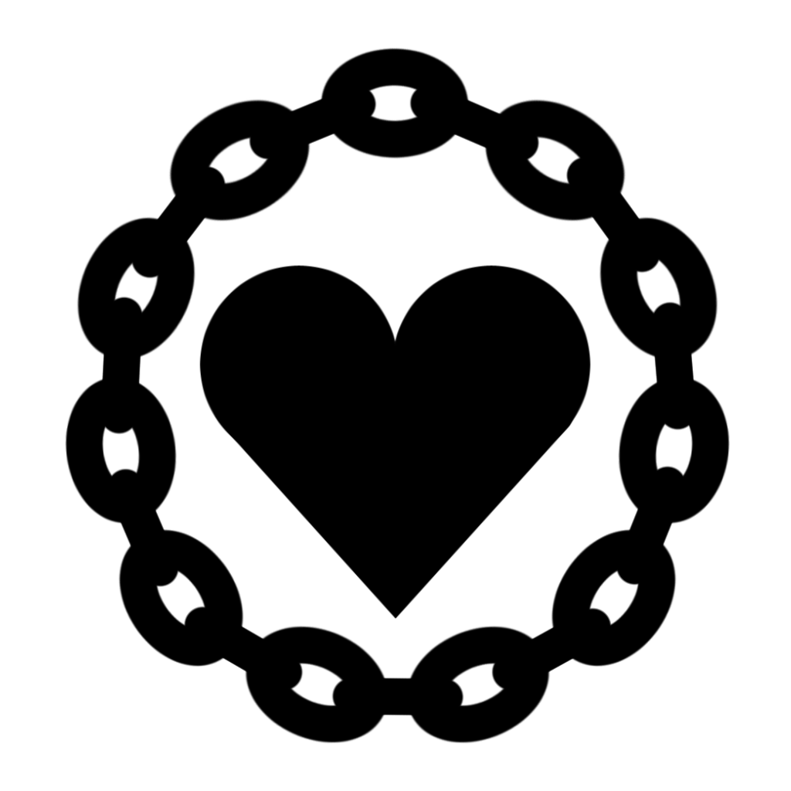
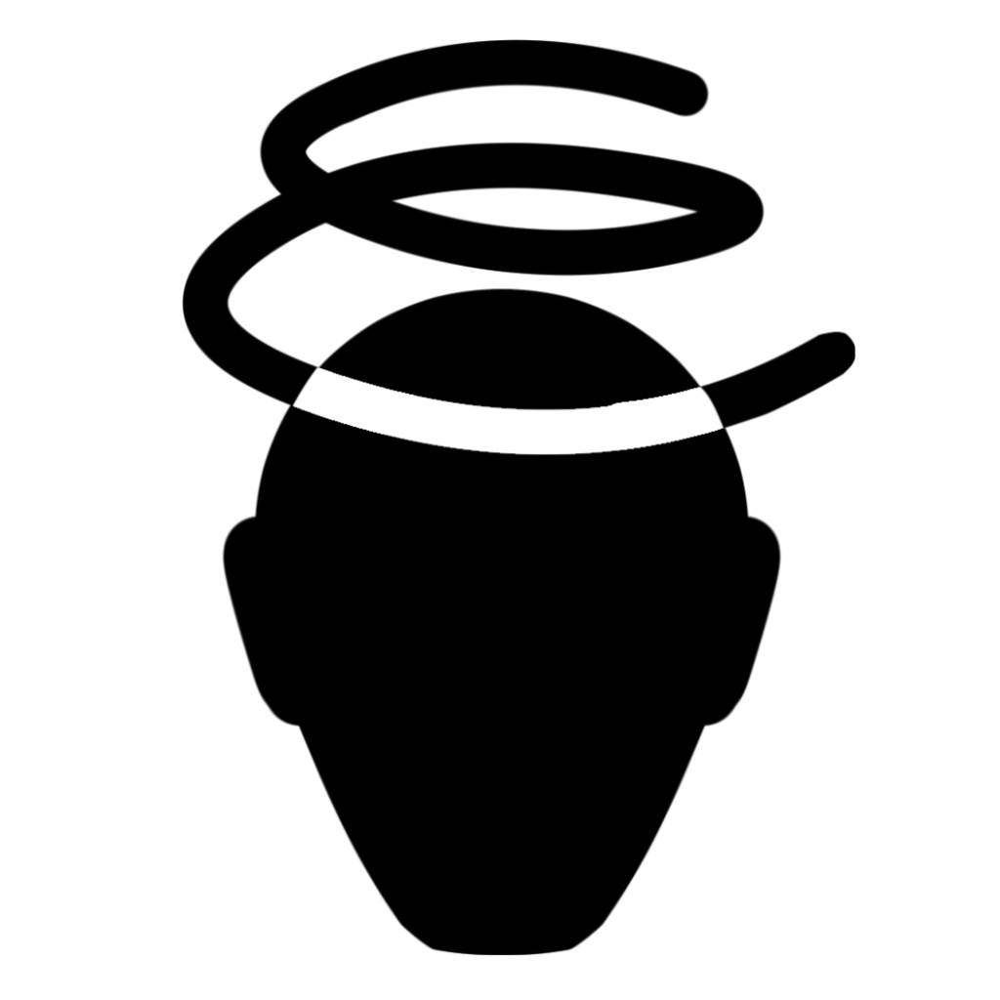
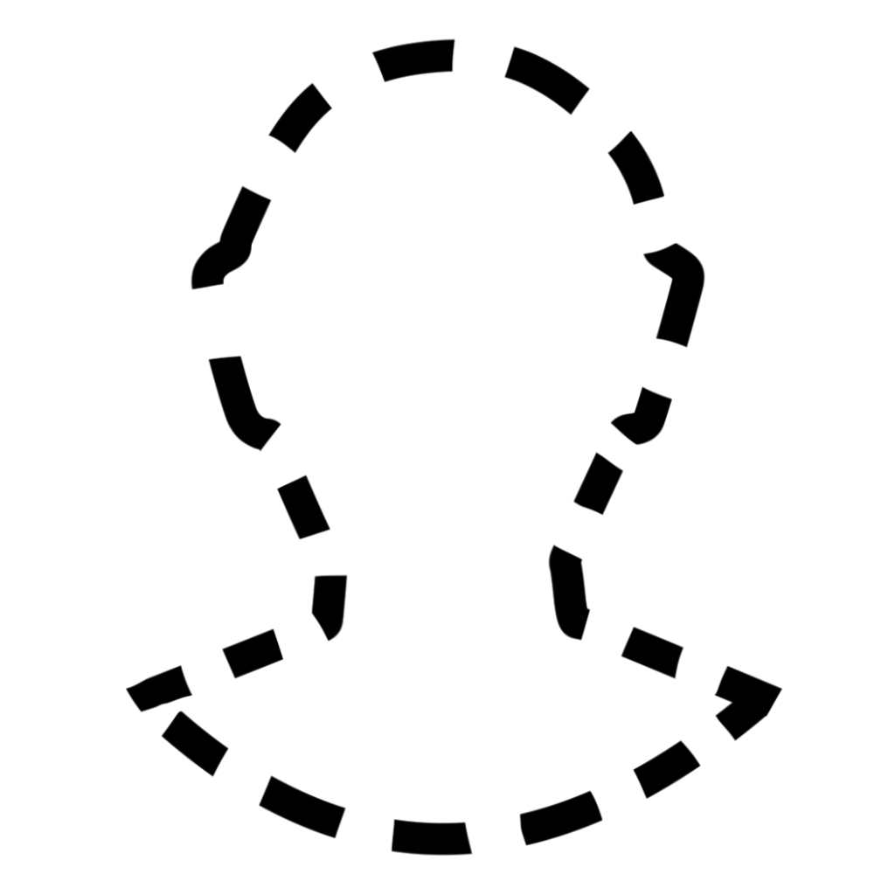
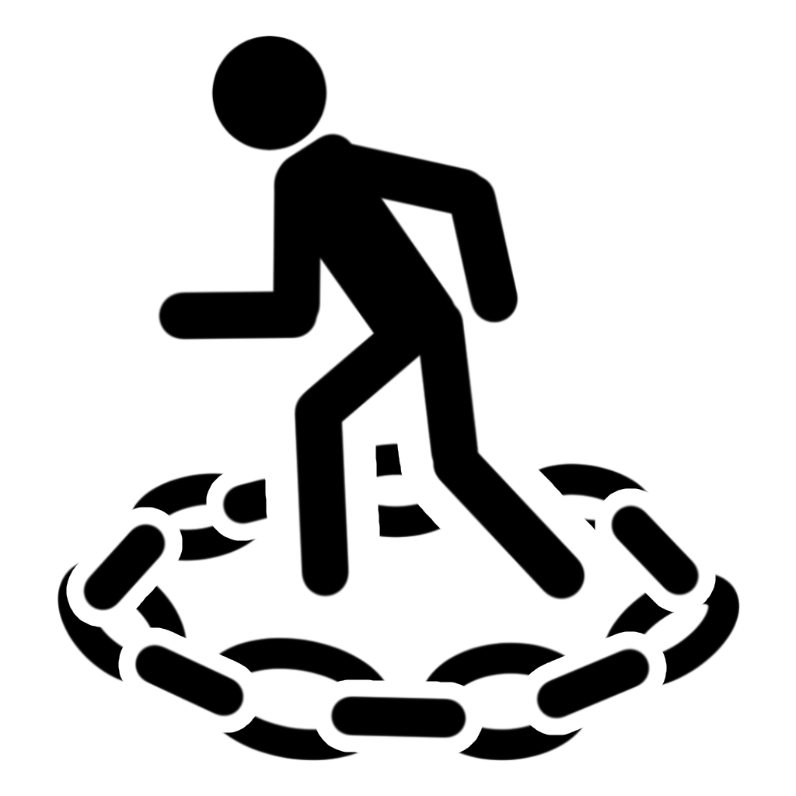
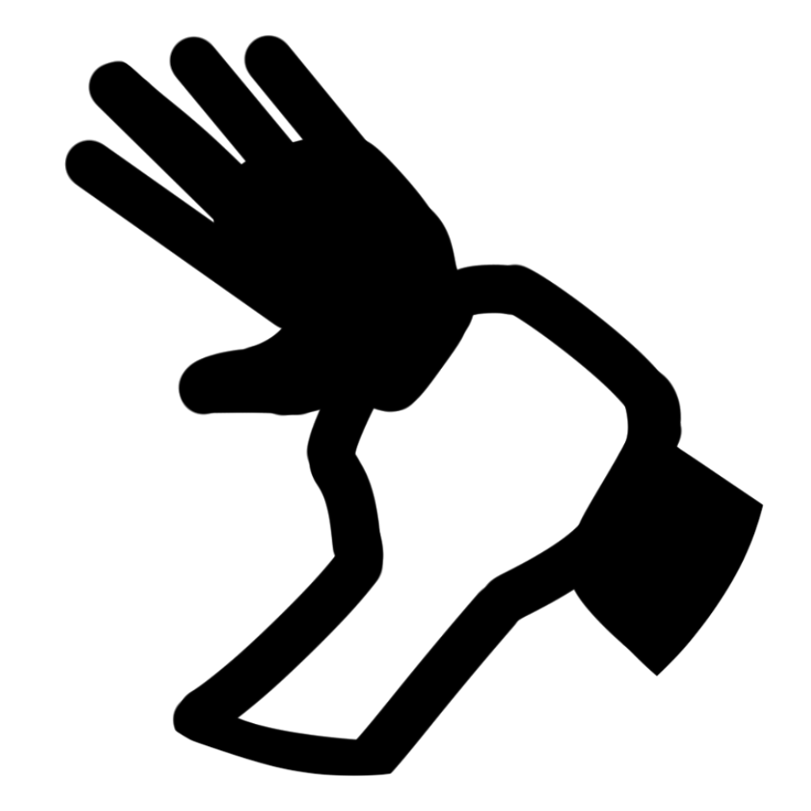

## Fichier : `..\..\docs\auxiliaires\Acolyte Draconique.md`

---
writing_status: finished
---
_Prérequis : Allié avec un dragon ou un aspect d'un dieu dragon_

Les dragons inspirent l'admiration et la peur chez les mortels qui les aperçoivent. Beaucoup s'enfuient de terreur, mais quelques-uns s'effondrent sur leurs genoux et mains afin de se dévouer à leurs nouveaux maîtres draconiques. De tels acolytes draconiques cherchent à émuler ces immenses êtres et à éventuellement capturer une semblance de cette grandeur draconique.

__Dés de Vie :__ 1d10
__Points de Vie :__ 1d10 (6) + votre modificateur de Constitution.

## Alliance Draconique

Lorsque vous obtenez ce niveau, vous devenez allié avec une ancienne wyrm ou un aspect d'un dieu dragon, qui vous confère une fraction de son pouvoir. Vous obtenez une résistance aux dégâts du type associé à votre dragon, comme indiqué dans la table ci-dessous.

| Dragon | Type de Dégâts |
| ------ | -------------- |
| Argent | Froid |
| Blanc | Froid |
| Bleu | Foudre |
| Bronze | Foudre |
| Cuivre | Acide |
| Laiton | Feu |
| Noir | Acide |
| Or | Feu |
| Rouge | Feu |
| Vert | Poison |

## Arme de Souffle

Lorsque vous utilisez votre action pour Attaquer, vous pouvez remplacer l'une de vos attaques par l'exhalation d'une énergie magique dans un cône de 15 ft. Chaque créature dans la zone doit réaliser un jet de sauvegarde de Dextérité (DD de 8 + votre modificateur de Constitution + votre bonus de maîtrise). Une créature subit 2d8 dégâts du type associé à votre Alliance Draconique en cas d'échec, et la moitié en cas de réussite. Ces dégâts augmentent de 1d8 lorsque vous atteignez les niveaux 5 (3d8), 11 (4d8), et 17 (5d8).

Une fois que vous avez utilisé cette aptitude, vous ne pouvez le refaire avant qu'elle ne se recharge. Lancez un d6 au début de chacun de vos tours ; l'aptitude se recharge si vous obtenez un 6.

## Griffes & Crocs

Vous pouvez manifester griffes et dents d'énergie draconique, qui sont des armes naturelles que vous pouvez utiliser pour réaliser des attaques à mains nues. Si vous touchez avec, vous infligez 1d6 dégâts du type associé à votre Alliance Draconique. Vous pouvez choisir d'infliger des dégâts tranchants avec vos griffes et des dégâts perçants avec vos crocs. Si vous possédez déjà des armes naturelles, vous pouvez faire en sorte qu'elles infligent des dégâts du type associé à votre Alliance Draconique.

---

## Fichier : `..\..\docs\auxiliaires\Bouffon.md`

---
writing_status: finished
---
Les gens s'imaginent que vous n'êtes pas parmi les plus brillants. Bien sûr, vous tombez parfois et vous perdez vos mots, mais vous n'êtes pas stupide ! Peu importe ce que ces crânes d'œufs disent. Lorsque rien d'autre ne fonctionne, vous avez toujours la bonne remarque ou l'insulte appropriée à balancer, et vous avez toujours le dernier mot. 

__Dé de Vie :__ 1d8
__Points de Vie :__ 1d8 (5) + votre modificateur de Constitution

__Outils :__ Un instrument de musique de votre choix

## Cantrips Supplémentaires

Vous apprenez le cantrip [[moquerie cruelle]] ainsi qu'un autre cantrip de votre choix de la liste de sorts du Barde. Le Charisme est votre caractéristique d'incantation pour ces sorts. 

## Provocation

Vous pouvez utiliser votre action bonus pour railler une créature à 15 ft. de vous. Si la cible peut vous entendre (elle n'a pas besoin de vous comprendre), elle a le désavantage au prochain jet d'attaque qu'elle réalise contre une créature autre que vous avant la fin de son prochain tour.

Vous pouvez utiliser cette aptitude un nombre de fois égal à votre modificateur de Charisme (au moins 1). Vous regagnez toutes les utilisations dépensées lorsque vous terminez un repos long.

## C'était Prévu

Lorsque vous obtenez un 10 ou moins sur le d20 pour un jet d'attaque, de caractéristique ou de sauvegarde, vous pouvez relancer le dé et devez utiliser le nouveau jet.

Une fois que vous avez utilisé cette aptitude, vous ne pouvez le refaire avant d'avoir terminé un repos long.

---

## Fichier : `..\..\docs\auxiliaires\Coursier.md`

---
writing_status: finished
---
_Prérequis : A été employé comme coursier, messager, contrebandier..._

Commerçant, contrebandier ou simplement messager, vous avez été chargé de voyager inlassablement pour délivrer colis ou lettres et vous en êtes devenu coutumier. Vous êtes vif d'esprit comme de corps et vous avez un sixième sens pour la navigation qui n'est égalé que par les marins et les vendeurs de boussoles. Ainsi, vous savez mettre à profit vos expériences pendant vos aventures.

__Dés de Vie :__ 1d8
__Points de Vie :__ 1d8 (5) + votre modificateur de Constitution

__Langues :__ Une de votre choix
__Outils :__ [[Outils de cartographe]], [[outils de navigateur]], un instrument de musique de votre choix

## Navigateur Compétent

Vous ne pouvez vous perdre, excepté par causes magiques.

## Droit au But

Vous pouvez utiliser votre action bonus pour vous Désengager. Vous pouvez utiliser cette aptitude un nombre de fois égal à votre modificateur de Dextérité, et vous regagnez toutes les utilisations dépensées lorsque vous terminez un repos long.

## Ruée

Lorsque vous utilisez votre action pour Foncer, votre vitesse augmente de 30 ft. supplémentaire.


---

## Fichier : `..\..\docs\auxiliaires\Cultiste.md`

---
writing_status: finished
---
_Prérequis : A rejoint un culte ou possède au moins un trait de Folie_

Un pacte sombre, un grimoire noir relié de cuir, et vos camarades acolytes encapuchonnés : voilà vos souvenirs les plus nets de votre endoctrinement dans le culte, afin que votre esprit ne commence à s'éroder. Peu importe l'être terrible auquel votre société secrète est dévouée, ses enseignements vous ont révélé les énigmes de l'univers et ont contaminé chaque parcelle de votre esprit et chacune de vos pensées de paranoïa.

__Dés de Vie :__ 1d8
__Points de Vie :__ 1d8 (5) + votre modificateur de Constitution

__Langues :__ Une choisie par le MJ
__Compétences :__ Arcanes

## Incantation

Ce niveau auxiliaire compte comme un niveau dans votre classe Incantation ou Magie de Pacte pour déterminer vos emplacements de sorts disponibles. Cependant, elle n'augmente ni le nombre de sorts que vous connaissez, ni le nombre de sorts que vous pouvez préparer. Par exemple, si vous êtes Magicien 2/Cultiste, vous avez 4 emplacements de sorts de niveau 1 et 2 emplacements de niveau 2, mais vous ne connaissez que des sorts de niveau 1.

## Cantrips Supplémentaires

Vous apprenez le cantrip [[orbe occulte]] et un cantrip supplémentaire de votre choix parmi la liste de sorts de l'Occultiste. Le Charisme est votre caractéristique d'incantation pour ces sorts.

## Conspirationniste

Vous avez l'avantage aux jets de sauvegarde que vous réalisez afin d'éviter ou de terminer les conditions [[charmé]] ou fou sur vous-même.

## Intuition du Lunatique

Lorsque vous réalisez un jet de caractéristique qui n'inclut pas votre bonus de maîtrise, votre intuition _unique_ vous permet de faire des liens, qui existent ou non, entre certains faits ou observations. Si le résultat du d20 pour le jet est pair, vous pouvez ajouter votre bonus de maîtrise au jet.

---

## Fichier : `..\..\docs\auxiliaires\Expert.md`

---
writing_status: finished
---
Les recherches et l'entraînement sans relâche ont porté leurs fruits. Après des mois d'efforts, vous avez appris un nouvel artisanat, aiguisé vos compétences, vous êtes entraîné au combat et peut-être même avez eu la chance d'étudier.

__Dé de Vie :__ 1d8
__Points de Vie :__ 1d8 (5) + votre modificateur de Constitution

__Outils :__ Un [[Outils d'Artisan|outil d'artisan]]
__Langues :__ Une de votre choix
__Compétences :__ Deux de votre choix

## Incantation

Ce niveau auxiliaire compte comme un niveau dans votre classe Incantation ou Magie de Pacte pour déterminer vos emplacements de sorts disponibles. Cependant, elle n'augmente ni le nombre de sorts que vous connaissez, ni le nombre de sorts que vous pouvez préparer. Par exemple, si vous êtes Magicien 2/Cultiste, vous avez 4 emplacements de sorts de niveau 1 et 2 emplacements de niveau 2, mais vous ne connaissez que des sorts de niveau 1.

## Expertise

Choisissez deux de vos maîtrises de compétence. Votre bonus de maîtrise est doublé pour les jets de caractéristique que vous réalisez en utilisant une de ces compétences.

## Entraînement

Vous obtenez la maîtrise de trois armes [[armes simples|simples]] ou [[armes martiales|martiales]]. De plus, vous maîtrisez les [[armures légères]]. Si vous maîtrisez déjà les armures légères, vous maîtrisez les [[armures moyennes]] à la place.

---

## Fichier : `..\..\docs\auxiliaires\Incanteur Clandestin.md`

---
writing_status: finished
---
_Prérequis : Incantation ou Magie de Pacte_

La discrétion représente le pinacle à la fois de la bravoure et de la puissance arcanique. Grâce à quelques ruses ingénieuses, vous avez appris à cacher votre magie à la vue de tous, afin de passer pour un guerrier puissant, mais banal avant de prendre le dessus.

__Dés de Vie :__ 1d6
__Points de Vie :__ 1d6 (4) + votre modificateur de Constitution

__Compétences :__ Arcanes ou Tromperie

## Incantation

Ce niveau auxiliaire compte comme un niveau dans votre classe Incantation ou Magie de Pacte pour déterminer vos emplacements de sorts disponibles. Cependant, elle n'augmente ni le nombre de sorts que vous connaissez, ni le nombre de sorts que vous pouvez préparer. Par exemple, si vous êtes Magicien 2/Incanteur Clandestin, vous avez 4 emplacements de sorts de niveau 1 et 2 emplacements de niveau 2, mais vous ne connaissez que des sorts de niveau 1.

## Cantrips Invisibles

Lorsque vous lancez un cantrip qui demande un ou plusieurs jets d'attaque de sort, vous pouvez déguiser son incantation (composantes comprises) et ses effets comme si c'était une attaque armée de mêlée. Pour ce faire, vous devez tenir une arme de mêlée et la cible doit se trouver à 5 ft. de vous. Vous n'avez pas le désavantage aux jets d'attaque à distance de sort que vous réalisez en utilisant cette aptitude si vous vous trouvez à 5 ft. d'une créature hostile. Les effets du sort sont complètement invisibles, et vous semblez avoir asséné un coup particulièrement puissant avec votre arme.

## Sort Subtil

Vous pouvez lancer un sort sans composantes somatiques ou verbales.

Une fois que vous avez utilisé cette aptitude, vous ne pouvez le refaire avant d'avoir terminé un repos.

---

## Fichier : `..\..\docs\auxiliaires\Magicien Buissonnier.md`

---
writing_status: finished
---
_Prérequis : Incantation ou Magie de Pacte_

À la différence des magiciens ordinaires qui apprennent leur discipline par le biais d'études longues et fastidieuses et par une formation formelle, vous avez découvert les sciences arcaniques de vous-même, lisant ce que vous pouviez trouver et découvrant des magies toujours plus puissantes par expérimentation. L'auto-formation n'est pas sans bénéfice, cependant, puisque vous êtes devenu particulièrement adepte de la plus simple forme de magie : les cantrips.

__Dés de Vie :__ 1d6
__Points de Vie :__ 1d6 (4) + votre modificateur de Constitution

## Incantation

Ce niveau auxiliaire compte comme un niveau dans votre classe Incantation ou Magie de Pacte pour déterminer vos emplacements de sorts disponibles. Cependant, elle n'augmente ni le nombre de sorts que vous connaissez, ni le nombre de sorts que vous pouvez préparer. Par exemple, si vous êtes Magicien 2/Magicien Buissonnier, vous avez 4 emplacements de sorts de niveau 1 et 2 emplacements de niveau 2, mais vous ne connaissez que des sorts de niveau 1.

## Ès-Cantrips

Vous apprenez trois cantrips de votre choix parmi la liste de sorts du Magicien. Vous utilisez votre caractéristique d'incantation habituelle pour ces sorts.

## Cantrips Puissant

Vous pouvez ajouter votre modificateur de caractéristique d'incantation aux jets de dégâts que vous réalisez avec des cantrips de magicien. 

---

## Fichier : `..\..\docs\auxiliaires\Maître Animalier.md`

---
writing_status: finished
---
_Prérequis : Niveau 3_

Armé de patience (ou d'un peu de magie), vous avez apprivoisé un compagnon animal afin qu'il vous accompagne pendant vos aventures. Peu de personnes peuvent faire ami-ami avec un loup, mais ce serait dur de sous-estimer la valeur de ses crocs en pleine mêlée.

__Dé de Vie :__ 1d10
__Points de Vie__ : 1d10 (6) + votre modificateur de Constitution

__Compétences :__ Dressage

## Compagnon Animal

Choisissez une Bête d'une taille au plus M et avec un FD inférieur ou égal à 1/4 (voir [ici](https://gamemaster.pixelastic.com/monsters/#book.name:[Monster%20Manual,Mordenkainen's%20Tome%20of%20Foes,Volo's%20Guide%20to%20Monsters]/challengeRating.numeric:{,3}/size.numeric:[1,2,3]/types:[Beast]) ou [là](https://www.dndbeyond.com/monsters?filter-type=0&filter-type=2&filter-search=&filter-cr-min=1&filter-cr-max=3&filter-size=2&filter-size=3&filter-size=4&filter-armor-class-min=&filter-armor-class-max=&filter-average-hp-min=&filter-average-hp-max=&filter-is-legendary=&filter-is-mythic=&filter-has-lair=&filter-source-category=26&filter-source-category=1&filter-source-category=23&filter-source-category=2&filter-source-category=20&filter-source-category=21&filter-source-category=25&filter-source-category=31&filter-source-category=32&filter-partnered-content=f)). Ajoutez votre bonus de maîtrise à la CA de la Bête, ainsi qu'à ses jets d'attaque, de dégâts et ses jets de sauvegarde et de compétences qu'elle maîtrise. Son nombre de points de vie maximum est égal au nombre de points de vie dans son bloc de statistiques ou à 4 fois votre niveau, en prenant le plus élevé. Comme toute créature, elle peut dépenser des Dés de Vie pendant un repos court pour regagner des points de vie.

La Bête obéit à vos ordres de la meilleure façon qu'elle puisse. Pendant votre tour, vous pouvez verbalement lui ordonner un déplacement (aucune action requise). Vous pouvez utiliser votre action pour verbalement lui ordonner d'utiliser son action pour Attaquer, Foncer, se Désengager ou Aider. Si vous ne lui donnez aucun ordre, la Bête utilise son action pour Esquiver. Si vous obtenez l'aptitude Attaque Supplémentaire ou une autre attitude qui vous permet d'attaquer plus d'une fois pendant votre action d'Attaquer, vous pouvez abandonner l'une de ces attaques pour ordonner à votre Bête d'attaquer.

Si vous êtes [[incapacité]] ou absent, la Bête agit naturellement, se concentrant sur votre protection ainsi que la sienne. La Bête n'a jamais besoin de votre commande pour utiliser une réaction, par exemple pour réaliser une attaque d'opportunité.

Si la Bête meurt, vous obtenez obtenir un nouveau compagnon en passant 8 heures à entraîner et vous lier avec une Bête qui ne vous est pas hostile et qui remplit les critères.

---

## Fichier : `..\..\docs\auxiliaires\Niveaux Auxiliaires.md`

---
writing_status: finished
---

Les niveaux auxiliaires, ou niveaux secondaires, sont des classes au niveau unique représentant certains choix ou compétences d'un personnage, et peuvent être liés à un évènement scénaristique. Par exemple, si un guerrier passe un temps mort dans une grande ville à travailler comme homme de main pour une guilde de voleurs, il pourrait choisir de prendre le niveau auxiliaire [[Voyou]] à sa prochaine montée de niveau. Ou, si l'esprit du personnage est envahi par une abomination ou qu'il aperçoit la véritable forme des Grands Anciens, il pourrait prendre le niveau auxiliaire [[5e/docs/auxiliaires/cultiste|Cultiste]].

## Utilisation des Niveaux Auxiliaires

Avec l'accord du MJ, vous pouvez choisir d'obtenir un niveau auxiliaire plutôt que d'obtenir un niveau de classe à chaque fois que vous gagnez un niveau, au-delà du niveau 1. Un niveau auxiliaire suit la règle générale du multiclassage et peut posséder un prérequis. Ces prérequis sont parfois des compétences de classes que vous devez obtenir d'une classe de base, et d'autres sont des prérequis narratifs sur lesquels vous devez travailler avec votre MJ avant de choisir le niveau. 

### Points de Vie et Dés de Vie

Comme toute classe de base, les niveaux auxiliaires vous confèrent des points de vie supplémentaires et un Dé de Vie. Vous ajoutez tous les Dés de Vie obtenus par vos classes de base et niveaux auxiliaires lorsque vous déterminez votre réservoir de Dés de Vie.

### Maîtrises et Langues

Un niveau auxiliaire spécifie s'il vous confère des maîtrises ou langues lorsque vous le choisissez. Votre bonus de maîtrise est toujours calculé sur la base de votre niveau total de personnage, pas seulement sur le niveau dans une classe ou la somme des niveaux dans les classes de base.

## Liste de Niveaux Auxiliaires

| Niveau Auxiliaire | Niveau Prérequis | Incantation | Prérequis Narratif |
| ------------------------------------------ | :--------------: | :---------: | :------------------------------------------------------: |
| [[Acolyte Draconique]] | :x: | :x: | Allié avec un dragon ou un aspect d'un dieu dragon |
| [[Bouffon]] | :x: | :x: | :x: |
| [[Coursier]] | :x: | :x: | A été employé comme coursier, messager, contrebandier... |
| [[5e/docs/auxiliaires/Cultiste\|Cultiste]] | :x: | :x: | A rejoint un culte ou possède au moins un trait de Folie |
| [[5e/docs/auxiliaires/Expert\|Expert]] | :x: | :x: | :x: |
| [[Gardien de Relique]] | :x: | :x: | :x: |
| [[Incanteur Clandestin]] | :x: | ✔ | :x: |
| [[Magicien Buissonnier]] | :x: | ✔ | :x: |
| [[Maître Animalier]] | 3 | ❌ | :x: |
| [[Mercenaire]] | :x: | :x: | A complété au moins un contrat de mercenariat |
| [[Prêtre]] | :x: | :x: | Ordonné par une foi |
| [[Pugiliste]] | :x: | :x: | :x: |
| [[Voyou]] | :x: | :x: | Membre d'une organisation criminelle |


---

## Fichier : `..\..\docs\auxiliaires\Prêtre.md`

---
writing_status: finished
---
_Prérequis : Ordonné par une foi_

Bien que vous ne soyez pas investi de l'objectif divin d'un clerc, vous avez été ordonné comme prêtre de l'un des nombreux dieux. Votre destin est celui d'une vie tranquille au sein de l'église : diriger les offices, veiller sur votre congrégation, réaliser les rituels communautaires et autres tâches administratives. Même lorsque vous êtes à l'aventure, votre rôle est celui d'un révérend sans prétention, et non d'un clerc évangélisateur ou d'un paladin en croisade.

__Dé de Vie :__ 1d8
__Points de Vie :__ 1d8 (5) + votre modificateur de Constitution

__Compétences :__ Religion

## Incantation

Ce niveau auxiliaire compte comme un niveau dans votre classe Incantation ou Magie de Pacte pour déterminer vos emplacements de sorts disponibles. Cependant, elle n'augmente ni le nombre de sorts que vous connaissez, ni le nombre de sorts que vous pouvez préparer. Par exemple, si vous êtes Magicien 2/Prêtre, vous avez 4 emplacements de sorts de niveau 1 et 2 emplacements de niveau 2, mais vous ne connaissez que des sorts de niveau 1.

## Cantrips Supplémentaires

Vous apprenez le cantrip [[stabilisation]] ainsi qu'un autre cantrip de votre choix parmi la liste de sorts du Clerc. La Sagesse est votre caractéristique d'incantation pour ces sorts.

## Canal Divin

Vous obtenez le pouvoir de canaliser l'énergie divine de votre déité et d'utiliser cette énergie pour alimenter des effets magiques. Vous démarrez avec deux effets : Soin Pieu et Renvoi des Morts-Vivants.

Lorsque vous utilisez votre Canal Divin, vous choisissez l'effet à créer. Vous devez terminer un repos avant de pouvoir utiliser à nouveau votre Canal Divin.

Certains effets de Canal Divin requièrent des jets de sauvegarde. Lorsque vous utilisez un tel effet depuis cette classe, le DD est égal à 8 + votre bonus de maîtrise + votre modificateur de Sagesse.

__Soin Pieu.__ Pour une action, vous pouvez présenter votre symbole sacré et toucher un Humanoïde consentant afin d'apaiser ses blessures. La créature lance un nombre de d8s égal à la moitié de votre niveau (arrondi à l'inférieur) et regagne autant de point de vie + votre modificateur de Sagesse. Cette aptitude n'a aucun effet sur les Morts-Vivants ou les Constructions.

__Renvoi des Morts-Vivants.__ Pour une action, vous présentez votre symbole sacré et prononcez une prière bannissant les morts-vivants. Chaque Mort-Vivant qui peut vous voir ou vous entendre à 30 ft. doit réussir un jet de sauvegarde de Sagesse ou être renvoyé pendant 1 minute ou jusqu'à ce qu'il prenne des dégâts.

Une créature renvoyée doit passer son tour à essayer de s'éloigner le plus possible de vous qu'elle le peut, et elle ne peut se déplacer consciemment vers un emplacement à 30 ft. de vous. Elle ne peut également pas prendre de réactions. Pour son action, elle ne peut prendre que l'action de Foncer ou essayer de s'échapper d'un effet qui l'empêcherait de se déplacer. S'il n'y a aucun endroit où se déplacer, la créature peut utiliser l'action d'Esquive.

---

## Fichier : `..\..\docs\auxiliaires\Pugiliste.md`

---
writing_status: wip
---
Alors que les autres guerriers s'équipent d'épées et de haches, vous utilisez vos poings et votre mauvais caractère pour faire tomber vos ennemis. Vous maîtrisez parfaitement cet art du combat à mains nues grâce à de nombreux combats clandestins pour de l'argent, la gloire ou la liberté.

__Compétences :__ Athlétisme ou Acrobatie

---

## Fichier : `..\..\docs\backgrounds.md`

| Background | Historique |
| ---------------------------- | -------------------------------- |
| Acolyte | [[Acolyte]] |
| Baldurian | [[Baldurien]] |
| Anthropologist | [[Anthropologue]] |
| Archaeologist | [[Archéologue]] |
| Astral Drifter | [[Voyageur Astral]] |
| Athlete | [[Athlète]] |
| Celebrity Adventurer's Scion | [[Rejeton d'Aventurier Célèbre]] |
| Charlatan | [[Charlatan]] |
| City Watch / Investigator | [[Gardien de la Paix]] |
| Clan Crafter | [[Artisan de Clan]] |
| Cloisterd Scholar | [[Érudit Reclus]] |
| Courtier | [[Courtisan]] |
| Criminal / Espion | [[Criminel ou Espion]] |
| Entertainer | [[Artiste]] |
| Faceless | [[Sans-Visage]] |
| Faction Agent | [[Agent de Faction]] |
| Failed Merchant | [[Marchand Raté]] |
| Far Traveler | [[Voyageur venu de Loin]] |
| Feylost | [[Égaré en Féerie]] |
| Fisher | [[Pêcheur]] |
| Folk Hero | [[Héros Local]] |
| Gambler | [[Joueur]] |
| Gate Warden | [[Gardien des Portails]] |
| Giant Foundling | [[Élevé par les Géants]] |
| Gladiator | [[Gladiateur]] |
| Guild Artisan | [[Artisan de Guilde]] |
| Haunted One | [[Hanté]] |
| Hermit | [[Ermite]] |
| Inheritor | [[Héritier]] |
| Knight | [[Chevalier]] |
| Knight of Solamnia | [[Chevalier de Solamnia]] |
| Knight of the Order | [[Chevalier de l'Ordre]] |
| Lorehold Student | [[Étudiant de Forsapience]] |
| Mage of High Sorcery | [[Mage de la Haute-Sorcellerie]] |
| Marine | [[Légionnaire]] |
| Mercenary Veteran | [[Mercenaire Vétéran]] |
| Noble | [[Noble]] |
| Outlander | [[Vagabond]] |
| Pirate | [[Pirate]] |
| Plaintiff | [[Juriste]] |
| Planar Philosopher | [[Philosophe Planaire]] |
| Prismari Student | [[Étudiant de Prismari]] |
| Quandrix Student | [[Étudiant de Quandrix]] |
| Rewarded | [[Récompensé]] |
| Rival Intern | [[Stagiaire du Concurrent]] |
| Ruined | [[Ruiné]] |
| Rune Carver | [[Tailleur de Runes]] |
| Sage | [[Sage]] |
| Sailor | [[Marin]] |
| Shipwright | [[Charpentier]] |
| Silverquill Student | [[Étudiant de Plumargent]] |
| Smuggler | [[Contrebandier]] |
| Soldier | [[Soldat]] |
| Urban Bounty Hunter | [[Chasseur de Primes Urbain]] |
| Urchin | [[Enfant des Rues]] |
| Uthgardt Tribe Member | [[Membre de la Tribu Uthgardt]] |
| Wildspacer | [[Natif de l'Espace]] |
| Witchlight Hand | [[Forain]] |
| Witherbloom Student | [[Étudiant de Flestrefleur]] |


---

## Fichier : `..\..\docs\chars\premades\Alkahib.md`

---
writing_status: wip
---
## Personnage

__Race :__ Hoom

__Classe :__ Ensorceleur

__Niveau :__ 1 (BM +2)

__Points de vie :__ 8

__Vitesse :__ 30 ft.

| FOR | DEX | CON | INT | SAG | CHA |
| :-----: | :----: | :-----: | :-----: | :-----: | :-----: |
| 12 (+1) | 5 (-3) | 16 (+3) | 16 (+3) | 20 (+5) | 18 (+4) |
| ◎ +1 | ◎ -3 | ◉ +5 | ◎ +3 | ◎ +5 | ◉ +6 |

| Compétences | |
| --------------------------- | ----------------------------- |
| ◎ Acrobaties (_Dex_) : | ◎ Investigation (_Int_) : ±0 |
| ◎ Arcanes (_Int_) : ±0 | ◉ Médecine (_Sag_) : ±0 |
| ◎ Athlétisme (_For_) : ±0 | ◎ Nature (_Int_) : ±0<br> |
| ◎ Discrétion (_Dex_) : ±0 | ◎ Perception (_Sag_) : ±0 |
| ◎ Dressage (_Sag_) : ±0 | ◎ Persuasion (_Cha_) : ±0 |
| ◎ Escamotage (_Dex_) : ±0 | ◎ Religion (_Int_) : ±0 |
| ◎ Histoire (_Int_) : ±0 | ◎ Représentation (_Cha_) : ±0 |
| ◎ Intimidation (_Cha_) : ±0 | ◎ Survie (_Sag_) : ±0 |
| ◉ Intuition (_Sag_) : ±0 | ◎ Tromperie (_Cha_) : ±0<br> |

#### Maîtrises

**Armure :** 

**Armes :** 

**Outils :** 

__Langues__ : Commun, 

### Description

__Âge :__ 32 ans

__Taille :__ 1,80 m

__Poids :__ 55 kg

Maître Alkahib est une figure de contradictions majestueuses. C'est un Hoom de grande taille, dont l'envergure, lorsqu'il déploie ses ailes, est véritablement impressionnante. Son plumage, doux et épais, rappelle celui d'un grand-duc, avec des teintes de gris ardoise et de blanc. Cependant, un détail étrange trahit sa nature profonde : les extrémités de ses plumes, particulièrement sur le bord de ses ailes et de sa queue, ont des reflets cuivrés et iridescents, comme si elles avaient été en permanence léchées par une flamme intérieure qui ne s'éteint jamais.

Son visage est encadré par un disque facial de plumes plus claires, qui accentue ses traits les plus captivants : deux immenses yeux ronds de la couleur de l'or en fusion. Ils ne brillent pas de malice ou de colère, mais d'une sagesse profonde et d'une intelligence vive. Son regard est perçant, patient, et semble sonder l'âme de son interlocuteur. De petites touffes de plumes au-dessus de ses yeux agissent comme des sourcils broussailleux, lui donnant un air perpétuellement contemplatif.

C'est dans son mouvement que sa nature paradoxale se révèle. Lorsqu'il est immobile, il a la prestance d'un sage ou d'un roi. Mais chaque geste est marqué par un manque de grâce flagrant. Son vol est puissant, mais ses atterrissages sont des affaires maladroites, une série de pas chancelants et un bruissement de plumes ébouriffées. Il se cogne souvent l'extrémité d'une aile contre un cadre de porte et ses plumes sont rarement parfaitement lissées, trahissant une vie de petites collisions et de départs précipités.

Il est drapé dans des robes d'érudit simples, de couleur claire, qui portent çà et là de discrètes traces de roussi sur les bords, souvenirs de sorts qui ont démarré un peu trop près de lui. Ses serres, bien que puissantes, sont celles d'un penseur, souvent posées sur un vieux livre ou tapotant son bec dans un geste de profonde réflexion. En somme, il a toute l'aura d'un grand sage, mais avec la coordination physique d'un poulain qui vient de naître.

![[Alkahib.jpg]]
## Aptitudes

### Aptitudes de Race

### Aptitudes de Classe

### Équipement

 - 
## Historique

La vie d'Alkahib aurait dû être un murmure. Il est né et a grandi dans la Grande Aérie du Pic Silencieux, une communauté de Hooms nichée si haut dans les montagnes que le monde d'en bas n'était qu'un tapis de nuages. Le silence était leur langage, la contemplation leur mode de vie. Un hululement doux, un bruissement d'ailes, un regard… tout était communication. Alkahib était un enfant prometteur, doté d'une sagesse et d'une perception qui dépassaient son jeune âge. Les anciens voyaient en lui un futur gardien du savoir, un philosophe, un guide pour le conclave.

Il excellait dans les études, absorbant les traditions et les philosophies avec une facilité déconcertante. Puis vint le temps du premier envol, le rite de passage de tout Alkahib. Il se tenait au bord de la falaise, le cœur empli non pas de peur, mais d'une joie pure et expansive. Il sentait le vent dans ses plumes, l'appel du ciel. Il voulut s'élancer, et dans un élan de pur bonheur, il fit appel à la magie innée qui sommeillait en lui pour l'aider à s'élever, à danser avec les courants d'air.

Ce qui jaillit de lui ne fut pas une brise, mais un rugissement.

Une chaleur intense emplit sa poitrine, et une sphère de feu et de lumière explosa devant lui dans un fracas assourdissant. La détonation, sacrilège dans ce monde de silence, le projeta en arrière. Son premier vol ne fut pas une danse gracieuse, mais une chute chaotique, une dégringolade de plumes ébouriffées et de cris de surprise, heureusement amortie par une épaisse congère de neige plusieurs dizaines de mètres plus bas.

Ce jour-là, la magie primitive en lui s'était éveillée. Son don n'était pas la magie subtile et silencieuse de ses ancêtres, mais une force primale, explosive et incontrôlable. Sa vie devint un paradoxe. Son esprit était un havre de paix et de sagesse, mais son corps était une bombe à retardement. Chaque tentative de magie délicate était un risque : allumer une bougie pouvait faire exploser le chandelier, déplacer un livre pouvait le réduire en cendres. Son vol, autrefois prometteur, devint une affaire de "crashs contrôlés", son corps de Hoom luttant constamment contre ses émotions instables.

Il était devenu une anomalie, une tempête dans une bibliothèque. Avec une profonde tristesse, mais aussi une grande sagesse, il comprit qu'il ne pouvait plus rester. Il était un danger pour le mode de vie paisible de son peuple. Les anciens du conclave, le cœur lourd, furent d'accord. Sa quête de maîtrise ne pouvait se faire dans le silence de leur montagne.

Hoom prit son envol une dernière fois, non pas comme un exilé, mais comme un pèlerin. Il partit à la recherche de réponses, cherchant à comprendre l'impact de ses émotions sur sa magie. Il est un philosophe à la recherche de la plus grande des vérités : la connaissance de soi. Il parcourt le monde, offrant sa sagesse profonde à ceux qu'il rencontre, tout en s'excusant poliment pour les explosions occasionnelles. Il est Maître Alkahib, une énigme volante, une tempête silencieuse cherchant à transformer le rugissement de son pouvoir en une chanson harmonieuse.

### Aptitude d'Historique

Votre magie volatile jaillit violemment lorsque votre corps vous fait défaut. Quand vous échouez à un jet de sauvegarde de Dextérité, vous pouvez utiliser votre réaction pour libérer une vague d'énergie émotionnelle brute. Chaque créature dans un rayon de 10 pieds autour de vous (y compris vous-même et vos alliés) doit faire un jet de sauvegarde de Force contre le DD de sauvegarde de vos sorts. En cas d'échec, la créature subit des dégâts de force (force damage) égaux à votre niveau d'ensorceleur et est repoussée de 10 pieds loin de vous. En cas de succès, elle ne subit que la moitié des dégâts et n'est pas repoussée. Si vous échouez ce jet de sauvegarde, vous êtes mis [[au sol]] par la déflagration. Vous pouvez utiliser cette aptitude un nombre de fois égal à votre bonus de maîtrise, et vous récupérez toutes les utilisations après un repos long.

### Traits de Personnalité

__Traits :__ 

__Idéal :__ 

__Lien :__ 

__Défaut :__ 

__Alignement :__ Neutre Bon

## Conseils de jeu

---

## Fichier : `..\..\docs\chars\premades\Ambre Onzdem.md`

---
writing_status: finished
---
## Personnage

__Race :__ Firbolg

__Classe :__ Martyr

__Niveau :__ 1 (BM +2)

__Points de vie :__ 16

__Vitesse :__ 30 ft.

| FOR | DEX | CON | INT | SAG | CHA |
| :----: | :----: | :-----: | :----: | :-----: | :----: |
| 6 (-2) | 9 (-1) | 18 (+4) | 7 (-2) | 12 (+1) | 6 (-2) |
| ◉ ±0 | ◎ (-1) | ◎ +4 | ◎ -2 | ◉ +3 | ◎ -2 |

| Compétences | |
| --------------------------- | ----------------------------- |
| ◎ Acrobaties (_Dex_) : -1 | ◎ Investigation (_Int_) : -2 |
| ◎ Arcanes (_Int_) : -2 | ◉ Médecine (_Sag_) : +3 |
| ◎ Athlétisme (_For_) : -2 | ◎ Nature (_Int_) : -2<br> |
| ◎ Discrétion (_Dex_) : -1 | ◎ Perception (_Sag_) : +1 |
| ◎ Dressage (_Sag_) : +1 | ◎ Persuasion (_Cha_) : -2 |
| ◎ Escamotage (_Dex_) : -1 | ◉ Religion (_Int_) : ±0 |
| ◉ Histoire (_Int_) : ±0 | ◎ Représentation (_Cha_) : -2 |
| ◎ Intimidation (_Cha_) : -2 | ◎ Survie (_Sag_) : +1 |
| ◉ Intuition (_Sag_) : +3 | ◎ Tromperie (_Cha_) : -2<br> |

> [!TIP]- Fiche récapitulative pour ceux qui ont la flemme (Merci Gemini !)
>Vous êtes Ambre, un ancien firbolg quasi-immortel venu du Plan Astral, dont le corps incroyablement résistant mais physiquement faible a servi de réceptacle à la souffrance d'un dieu mort pendant des siècles, et qui cherche maintenant une nouvelle "cause" pour laquelle souffrir dans le monde matériel.
>
>**Objectif pour la session :** 
>Votre mission divine est de soulager la souffrance. Vous êtes instinctivement attiré par les situations de détresse. Votre but est simple : trouver ceux qui souffrent, vous placer entre eux et la source de leur douleur, et absorber le mal à leur place, car c'est la seule chose pour laquelle vous avez été créé.
>
>**Jouez la Lutte contre la Gravité :** Votre corps est une prison de faiblesse. Bougez lentement, appuyez-vous sur les murs ou sur votre bâton. Décrivez l'effort que représente chaque action physique. En revanche, mettez en avant votre endurance surnaturelle : vous êtes le dernier debout dans une tempête de neige, vous haussez à peine un sourcil face à un poison mortel.
>
> **L'Émerveillement de l'Étranger :** Le monde matériel est une découverte de chaque instant. Soyez fasciné par les choses les plus simples : le goût de l'eau, la texture de la mousse, la chaleur du soleil. Posez des questions naïves sur des concepts évidents pour les autres, avec une sérénité et une sincérité désarmantes.
> 
> **Le Martyr Silencieux :** Votre instinct est le sacrifice. Vous êtes un bouclier humain (ou plutôt, firbolg). Votre première réaction face au danger n'est pas d'attaquer, mais de vous interposer. Parlez calmement, par proverbes sacrés (même si vous les inventez à moitié), et acceptez la douleur avec une paix intérieure qui déconcertera vos alliés et vos ennemis.

#### Maîtrises

**Armure :** [[Armures Légères]], [[Armures Moyennes]], [[Bouclier, Équipement|Boucliers]]

**Armes :** [[Armes Simples]], [[Armes Martiales]]

**Outils :** —

__Langues__ : Commun, Primordial, Céleste, Nain

### Description

__Âge :__ ?? ans (Apparence de 35 ans)

__Taille :__ 2,10 m

__Poids :__ 110 kg

Ambre est une silhouette à la fois imposante et paradoxale. Bien qu'il soit d'une taille spectaculaire, même pour un firbolg, il n'a rien de la carrure massive que l'on attendrait. Il est élancé, presque fragile, avec de longs membres fins qui semblent mal à l'aise avec la lourdeur de la gravité.

Son visage, d'une sérénité surnaturelle, est presque entièrement caché par une barbe incroyablement touffue et sauvage. Contrairement à ce que sa faible constitution pourrait laisser penser, sa barbe a poussé avec une vigueur anarchique durant sa longue veille, formant une épaisse broussaille d'un blanc pur qui rappelle celle des plus vieux maîtres artisans nains. Cette masse de poils indisciplinés dévale sa poitrine, un souvenir vivant des siècles passés en stase, sans jamais un peigne ou une lame pour la dompter.

De cette toison faciale émergent deux yeux d'un violet profond et brumeux, qui paraissent absorber la lumière et qui trahissent un calme insondable. Sa peau est d'une pâleur de nacre, parcourue de fines lignes argentées, presque invisibles, comme des fissures dans du marbre.

Ambre porte une cotte d'écailles d'une matière inconnue. Chaque écaille, de la taille d'une paume, semble taillée dans un cristal laiteux ou une pierre astrale qui capte la lumière de manière étrange. L'armure couvre son torse et ses épaules, et bien qu'elle paraisse solide, elle semble aussi légère qu'un vêtement de tissu, comme si son poids était annulé par sa nature extraplanaire.

Il se déplace avec une lenteur délibérée, s'appuyant souvent sur un simple bâton de bois, et donne toujours cette impression d'un être incroyablement ancien et puissant, piégé dans un corps physiquement faible, dont la seule vigueur semble s'être concentrée dans sa barbe indomptable.

![[Ambre.jpg]]
## Aptitudes

### Aptitudes de Race

**Magie Firbolg.** Vous pouvez lancer les sort [[Détection de la Magie]] et [[Déguisement]] avec ce trait. Lorsque vous utilisez cette version de [[Déguisement]], vous pouvez apparaître comme 3 ft. plus grand ou plus petit. Une fois que vous avez lancé n'importe lequel de ces sorts avec ce trait, vous ne pouvez pas relancer ce sort avec ce trait tant que vous n'avez pas fini un repos long. Vous pouvez également lancer ces sorts en utilisant des emplacements de sort classiques. Votre caractéristique d'incantation pour ces sorts est la Sagesse.

**Pas Caché.** Pour une action visible, vous pouvez magiquement devenir [[invisible]] jusqu'à la fin de votre prochain tour, ou jusqu'à ce que vous attaquiez, réalisiez un jet de dégâts, ou forciez quelqu'un à réaliser un jet de sauvegarde. Vous pouvez utiliser ce trait un nombre de fois égal à votre bonus de maîtrise, et vous regagnez toutes les utilisations après un repos long.

**Carrure Imposante.** Vous êtes considéré comme d'une taille plus grande lorsque vous déterminez le poids que vous pouvez porter, tirer, soulever.

**Dialogue de la Bête et de la Feuille.** Vous avez la capacité de communiquer légèrement avec les Bêtes, Plantes et la végétation. Ils peuvent comprendre le sens de vos mots, même si vous n'avez pas de disposition particulière à les comprendre en retour. Vous avez l'avantage à tous les jets de Charisme que vous réalisez pour les influencer.

### Aptitudes de Classe

#### Mort Ordinée

En tant que Martyr, vous avez été prédestiné par les dieux à périr pour une cause supérieure ; il n'y a plus de gloire plus grande que cette mort, et pas de joie plus importante après. Cependant, il n'est pas encore l'heure. Dès le niveau 1, lorsque vous tombez à 0 points de vie et commencez à faire des jets de sauvegarde contre la mort, il vous faut 5 échecs pour mourir. De plus, si un sort a seulement l'effet de vous ramener à la vie (mais pas en tant que mort-vivant), le lanceur n'a pas besoin de composantes matérielles pour le lancer sur vous.

#### Cantrips

À partir du niveau 1, votre mission divine vous octroie une once de magie divine. Ainsi, vous apprenez les cantrips [[Stabilisation]] et [[Thaumaturgie]] et [[Breuvage Légendaire]]. Vous ne perdez pas de points de vie lorsque vous lancez ces sorts. La Sagesse est votre caractéristique d'incantation pour ces sorts.

#### Baume

Vous pouvez utiliser une action bonus pour restaurer 1 point de vie à une créature à 60 ft. de vous ou retirer la condition [[aveuglé]], [[assourdi]] ou [[empoisonné]] d'une créature consentante que vous touchez.

Une fois que vous avez utilisé cette aptitude, vous ne pouvez pas la réutiliser jusqu'à ce que vous finissiez un repos court ou long.

### Équipement

 - Une [[épée courte]] et un [[Bouclier]]
 - Un [[bâton]]
 - Une armure d'[[écailles]]
 - Une [[arbalète légère]] et 20 [[Carreaux d'Arbalète (20)|carreaux]]
 - Un [[sac d'ecclésiastique]]
 - Un morceau de cadavre de dieu, vous servant de [[symbole sacré]]
 - Un journal, de l'encre, un stylo
 - 10 Pièces d'Or
## Historique

Ambre n'a pas connu le contact de l'herbe sous ses pieds ni la caresse du vent sur sa peau. Son premier souvenir est le silence argenté et infini du Plan Astral. Il est né au sein d'une enclave de firbolgs unique, un clan dont le devoir sacré se transmettait depuis des générations : veiller sur le cadavre d'un dieu.

Au cœur d'une nébuleuse opalescente flottait le corps d'un titan de pierre endormi, une divinité oubliée de l'Endurance et du Sacrifice. Bien que mort, le dieu n'était pas en paix. Son corps astral saignait une énergie psychique pure, un torrent de pensées brutes, de regrets et de courage qui, sans contrôle, aurait pu déchirer le voile entre les mondes. Les firbolgs de l'enclave étaient les Gardiens du Silence, leur unique but étant de contenir cette hémorragie divine.

Pour ce faire, ils désignaient un "Vaisseau". Un volontaire, choisi pour sa pureté d'esprit, qui servirait de conduit pour absorber et apaiser l'énergie chaotique. Ambre fut cet élu.

Pendant une durée qu'aucun calendrier ne pourrait mesurer, sa vie fut une stase méditative. Flottant en apesanteur dans la lueur du dieu mort, il était un paratonnerre pour une tempête d'âmes. Il n'endurait pas une douleur physique, mais une symphonie de chaos : la tristesse de mille batailles perdues, la fureur de la trahison, l'agonie de la solitude. Pour survivre, son esprit a appris une sérénité absolue et son corps a développé une constitution presque divine. Mais n'ayant jamais eu à lutter contre la gravité ou à exercer le moindre effort, ses muscles se sont étiolés, devenant les appendices inutiles d'un être conçu pour la seule endurance.

Puis, lentement, le bourdonnement psychique qui avait été la bande-son de son existence commença à faiblir. La tempête s'apaisait. Un jour, après une éternité de service, le dernier écho de la conscience du dieu s'éteignit dans un ultime soupir de paix. Le silence qui suivit fut plus assourdissant que tout le chaos qui l'avait précédé.

Sa mission était terminée. Les anciens de son clan s'approchèrent de lui et lui expliquèrent que son Fardeau Mortel entrait dans sa phase finale. Le dieu, dans son dernier acte, l'avait ordonné son Martyr. Sa tâche n'était plus de contenir la souffrance, mais de la soulager. Il devait être envoyé dans le plan matériel pour y incarner le dernier idéal de son dieu : la Pitié.

Son arrivée fut une naissance violente. Le portail le projeta dans une forêt verdoyante, et pour la première fois, il sentit la gravité. Ce fut une force brutale, invisible, qui l'écrasa au sol. Le poids de ses propres os était une torture. L'air, plein d'odeurs de terre humide et de décomposition, était une agression. Chaque son, chaque couleur était une attaque contre des sens habitués au silence et à l'argent.

Il apprit à marcher, chaque pas étant un effort herculéen pour son corps affaibli. Mais alors qu'il errait, il sentit une nouvelle sorte d'écho. La douleur d'un animal pris dans un piège, la tristesse d'un enfant perdu, la peur d'un village menacé par des bandits. Ces souffrances, si petites comparées à celles de son dieu, l'appelaient. Un instinct plus fort que tout le poussait à se placer entre la douleur et la victime, à offrir son corps incroyablement résistant comme un bouclier.

Ambre, le Vaisseau du Vide, est maintenant un Martyr en quête de cause. Il parcourt ce monde étrange et lourd, non pas pour trouver le bonheur, mais pour trouver un fardeau digne d'être porté. Il cherche des compagnons, une "meute", dont il pourra absorber la douleur, car un être façonné pour le sacrifice ne trouve son but que lorsqu'il a tout à perdre pour les autres.

### Aptitude d'Historique

Votre esprit et votre corps sont saturés par la volonté rémanente du dieu mort. Vous avez l'avantage à tous les jets de sauvegarde pour ne pas être [[apeuré]], [[charmé]] ou [[sonné]]. De plus, lorsque vous devez faire un jet de sauvegarde de Constitution pour maintenir votre concentration sur un sort, vous pouvez considérer tout résultat de 9 ou moins sur le dé comme un 10.

### Traits de Personnalité

__Traits :__ Je vois des signes dans la moindre action. Les dieux nous parlent et il nous faut les écouter. Je cite (parfois à tort) souvent les textes sacrés et les proverbes de ma foi.

__Idéal :__ Les anciennes traditions de vénération et de sacrifice doivent être préservées et respectées.

__Lien :__ Je ferai n'importe quoi pour accomplir la mission donnée par mon dieu.

__Défaut :__ Je suis inflexible dans ma façon de penser.

__Alignement :__ Loyal Bon

## Conseils de Jeu

Sa voix est douce, presque un murmure, avec de longues pauses entre les mots, comme si le simple fait de parler était un effort. Il utilise un vocabulaire philosophique et abstrait, mais peut poser des questions d'une simplicité enfantine sur le monde physique. "Cette sensation… le vent… quelle est sa cause ?". Il parle dans un langage très propre, sans utiliser de contractions ou d'argot. Il dit "Je ne sais pas" plutôt que "J'sais pas".

Il s'appuie souvent contre les murs, les arbres, ou même ses compagnons. Quand il s'assied, c'est avec un soupir de soulagement palpable. Il peut s'arrêter net au milieu d'une phrase pour toucher une fleur, regarder la pluie tomber, ou fixer la flamme d'une bougie avec une admiration intense. Ce sont des choses nouvelles pour lui.

---

## Fichier : `..\..\docs\chars\premades\Aneth Maudteth.md`

---
writing_status: empty
---
![[Aneth.jpg]]

---

## Fichier : `..\..\docs\chars\premades\Atropos 'Dédé' Sibild.md`

---
writing_status: empty
---
![[Atropos.webp]]

---

## Fichier : `..\..\docs\chars\premades\Aude La'wen.md`

---
writing_status: empty
---
![[Aude.jpg]]

---

## Fichier : `..\..\docs\chars\premades\Awahp Green.md`

---
writing_status: finished
---
## Personnage

__Race :__ Volanzée

__Classe :__ Fusilier

__Niveau :__ 1 (BM +2)

__Points de vie :__ 6

__Vitesse :__ 30 ft. (escalade 30 ft.)

| FOR | DEX | CON | INT | SAG | CHA |
| :-----: | :-----: | :----: | :-----: | :-----: | :-----: |
| 16 (+3) | 16 (+3) | 7 (-2) | 11 (±0) | 11 (±0) | 12 (+1) |
| ◎ +3 | ◉ +5 | ◎ -2 | ◎ ±0 | ◎ ±0 | ◉ +3 |

| Compétences | |
| --------------------------- | ----------------------------- |
| ◉ Acrobaties (_Dex_) : +5 | ◎ Investigation (_Int_) : ±0 |
| ◎ Arcanes (_Int_) : ±0 | ◎ Médecine (_Sag_) : ±0 |
| ◎ Athlétisme (_For_) : +3 | ◎ Nature (_Int_) : ±0 |
| ◉ Discrétion (_Dex_) : +5 | ◉ Perception (_Sag_) : +2 |
| ◎ Dressage (_Sag_) : ±0 | ◉ Persuasion (_Cha_) : +3 |
| ◎ Escamotage (_Dex_) : +3 | ◎ Religion (_Int_) : ±0 |
| ◎ Histoire (_Int_) : ±0 | ◎ Représentation (_Cha_) : +1 |
| ◎ Intimidation (_Cha_) : +1 | ◎ Survie (_Sag_) : ±0 |
| ◎ Intuition (_Sag_) : ±0 | ◎ Tromperie (_Cha_) : +1 |

> [!TIP]- Fiche récapitulative pour ceux qui ont la flemme (Merci Gemini !)
>Vous êtes Awahp, le dernier survivant d'une compagnie de mercenaires d'élite, un tireur d'exception qui a tout perdu lors d'une trahison et qui ne vit plus que pour entretenir son bras mécanique et traquer ceux qui ont massacré ses frères d'armes. 
>
>**Objectif pour la session :** 
>Vous avez besoin d'argent pour deux choses : améliorer votre prothèse et financer votre réseau d'informateurs pour retrouver la trace du Baron Grisefer. Ce contrat n'est qu'un moyen d'arriver à vos fins, mais peut-être qu'une information cruciale se cache au bout.
>
>**Parlez comme un Pro, pas comme un Ami :** Votre voix est un murmure neutre. Utilisez un jargon militaire ("cible", "périmètre", "négatif"). Vous ne bavardez pas, vous communiquez des informations. Vous êtes distant car vous refusez de vous attacher à nouveau. 
>
>**Obsédé par la Verticalité et la Prothèse :** Votre regard cherche toujours un point en hauteur, un vestige de votre vie passée. De plus, vous avez un tic constant où vous ajustez, tapotez ou vérifiez votre bras mécanique. C'est votre fardeau et votre outil, et il est toujours présent dans votre esprit.
>
>**Jouez le Traumatisme :** Votre personnage n'est pas juste un "dur à cuire". Il est brisé. Face à un grand feu (le défaut), montrez une peur panique. Face à des ordres que vous jugez stupides (l'idéal), montrez une défiance froide. Votre passé est toujours là, juste sous la surface.

#### Maîtrises

**Armure :** [[Armures Légères]]

**Armes :** [[Armes Simples]], [[Armes à Feu Simples]], [[Armes à Feu Martiales]]

**Outils :** [[Set de dé]], [[Jeu de Cartes]], Véhicules Terrestres

__Langues__ : Commun, Gobelin

### Description

__Âge :__ 29 ans

__Taille :__ 1,75 m

__Poids :__ 75 kg

Awahp n'est pas massif. Il est plutôt grand, avec une silhouette élancée et des membres longs et nerveux, un physique optimisé pour l'escalade et l'agilité. Son corps est couvert d'une fourrure d'un brun foncé, courte et dense, idéale pour se fondre dans les ombres des villes ou des forêts. Lorsqu'il bouge, on peut apercevoir les patagiums, ces membranes de peau repliées entre ses bras et ses jambes, qui lui permettent de planer. Son visage est celui d'un singe, mais intelligent et sévère, marqué par une vie difficile. Ses yeux, vifs et perçants, mais cachés derrière d'épaisses lunettes rondes, sont constamment en mouvement, analysant les angles, les distances et les issues potentielles. Une cicatrice fine mais blanche traverse son œil et son sourcil gauche, souvenir de l'atterrissage brutal qui lui a coûté son bras. Il est rare de le voir sourire ; son expression habituelle est un masque de concentration professionnelle et de méfiance.

Là où devrait se trouver son bras gauche, il y a une coupure nette en dessous de l'épaule. Attachée par un système de harnais et de sangles de cuir sombre qui sanglent son torse, se trouve sa prothèse. Ce n'est pas une imitation de bras, mais un outil. C'est un assemblage complexe de laiton, d'acier et de pièces de fer, avec des pistons visibles et des engrenages exposés. La main est fonctionnelle, avec des doigts articulés capables de saisir et de supporter le poids de son fusil, mais chacun de leurs mouvements produit un léger cliquetis métallique. La prothèse est à la fois une merveille d'artificier et un rappel brutal de sa mutilation.

Il porte des vêtements de voyageur pratiques et usés, sans fioritures. Plusieurs cartouchières et sacoches sont attachées à sa ceinture, contenant des munitions, de la poudre noire, et les outils nécessaires à l'entretien de son fusil et de sa prothèse. Son long fusil, sombre et huilé, est presque toujours en sa possession, porté en bandoulière ou tenu dans sa main droite, le canon pointé vers le sol, comme une extension de sa propre volonté. 

![[Awahp.png]]
## Aptitudes

### Aptitudes de Race

__Pieds Dextres.__ Pour une action bonus, vous pouvez utiliser vos pieds pour manipuler un objet, ouvrir ou fermer une porte ou un contenant, ou ramasser ou reposer un objet de taille Très Petite.

**Planage.** Lorsque vous tombez d'au moins 10 ft. au-dessus du sol, vous pouvez utiliser votre réaction pour étendre votre membrane afin de planer horizontalement d'un nombre de pieds égal à votre vitesse de marche, et vous prenez 0 dégâts de la chute. Vous déterminez la réaction du planage.

**Esquive Volanzée.** La magie qui parcourt vos veines a amélioré vos défenses naturelles. Lorsque vous prenez des dégâts, vous pouvez utiliser votre réaction pour lancer un d6. Ajoutez votre bonus de maîtrise au résultat obtenu, et réduisez les dégâts d'un montant égal au total (minimum 0 dégâts). Vous pouvez utiliser ce trait un nombre de fois égal à votre bonus de maîtrise, et vous récupérez toutes les utilisations dépensées lorsque vous terminez un repos long.

### Aptitudes de Classe

#### Œil de Lynx

Vous gagnez un bonus de +2 aux jets d'attaque à distance que vous réalisez avec une arme à feu. L'arme doit avoir la propriété _Viseur_ ou une portée normale supérieure à 80 ft. pour que vous puissiez bénéficier de cet effet. Cet effet ne se cumule pas avec le style de combat Archerie.

#### Dégaine Rapide

Les fusiliers ont des réflexes impressionnants et peuvent sortir leur pistolet en un claquement de doigts. À partir du niveau 1, vous avez l'avantage à vos jets d'initiative. De plus, vous pouvez dégainer ou rengainer jusqu'à deux armes lorsque vous tirez l'initiative et à chaque fois que vous prenez une action pendant votre tour.

### Équipement

 - Une armure de [[cuir]] et un manteau long
 - Un uniforme de la compagnie des "Ombres des Haubans"
 - Un set de dé
 - Une [[dague]] et une [[arbalète de poing]] et 20 [[Carreaux d'Arbalète (20)|carreaux]]
 - Un [[mousquet]] et 30 [[Balles de Mousquet (10)|balles]]
 - Un [[sac d'explorateur]]
 - 10 Pièces d'Or
## Historique

Pour Awahp, le monde a toujours été une structure à escalader. Né Volanzée, le sol n'était qu'un point de départ, une simple formalité avant l'ascension. C'est cette affinité naturelle pour la verticalité qui l'a mené à rejoindre les "Ombres des Haubans", une compagnie de mercenaires qui avait transformé les villes et les flottes de navires en leur jungle personnelle. Ils n'étaient pas des soldats, mais des spectres qui dansaient sur les toits et les gréements. Leur réputation était aussi tranchante que leurs lames d'abordage : si vous aviez une cible perchée dans un endroit jugé inaccessible, les "Ombres" étaient ceux qu'il fallait appeler.

Au sein de cette confrérie de grimpeurs et de funambules, Awahp était une légende. Tandis que ses frères d'armes excellaient au corps à corps, lui était l'œil distant, le prédateur patient. Armé d'un fusil long, une merveille de mécanique qu'il entretenait avec une dévotion quasi religieuse, il était capable de se nicher dans le creux d'une gargouille ou au sommet d'un grand mât pour délivrer la mort avec une précision d'horloger. Le craquement sec de son arme, suivi d'une cible s'effondrant à des centaines de mètres, était la signature des "Ombres". La vie était simple, dictée par les termes d'un contrat et la confiance absolue en ses compagnons.

Cette confiance vola en éclats dans la ville portuaire de Portvaria.

Le contrat, offert par un certain Baron Grisefer, était inhabituellement généreux. La mission : infiltrer la ville de nuit et neutraliser les officiers de la garnison depuis les toits pour faciliter l'assaut des forces du baron à l'aube. Un travail sur mesure. Awahp, comme à son habitude, choisit le meilleur perchoir : la flèche d'un ancien temple qui offrait une vue imprenable sur la caserne principale. Alors que la nuit s'épaississait, il commença son œuvre, chaque détonation étouffée par la brise marine marquant la chute d'une sentinelle.

Puis la symphonie macabre commença. Ce ne furent pas les cris d'un assaut qui s'élevèrent, mais les hurlements de terreur des habitants. Des lueurs orangées apparurent, non pas aux portes, mais au cœur des quartiers populaires. Awahp comprit l'horrible vérité depuis son nid d'aigle. Il n'y avait pas d'assaut. Leur mission n'était qu'une diversion pour attirer l'attention des gardes pendant que les sbires de Grisefer incendiaient la ville, piégeant soldats et civils dans un brasier infernal.

Les "Ombres des Haubans" n'étaient pas les prédateurs ce soir-là. Ils étaient l'appât.

En contrebas, il vit ses compagnons, agiles et mortels sur leurs toits, se faire encercler par les flammes. Leurs talents de grimpeurs ne pouvaient rien contre un océan de feu. La gorge nouée par la rage et la culpabilité, Awahp fit la seule chose possible. Il sauta.

Le cuir de ses patagiums se tendit dans un bruissement soyeux, le transformant en une silhouette ailée. Son vol plané ne fut pas un acte de grâce, mais une retraite désespérée au-dessus de son propre enfer. Le vent qui le portait était chaud et chargé de l'odeur de la chair brûlée et des cendres de ses frères. Alors qu'il planait au-dessus des remparts, une silhouette sur le chemin de ronde le vit passer. Paniqué par cette créature ailée fuyant le chaos, le garde épaula son arbalète et tira. Le carreau vint se ficher avec une violence inouïe dans le bras gauche de Awahp. La douleur, fulgurante, lui arracha un cri. Son patagium se déchira, sa trajectoire de vol devint une chute incontrôlée. Il s'écrasa lourdement dans la forêt à l'orée de la ville, son corps brisé et son bras mutilé.

Il se réveilla des jours plus tard, dans la hutte d'un vieil herboriste qui l'avait trouvé à l'agonie. La gangrène avait commencé son œuvre. Pour lui sauver la vie, l'ermite n'eut d'autre choix que d'amputer ce qui restait de son bras gauche, juste en dessous de l'épaule.

Aujourd'hui, Awahp n'est plus seulement un survivant ; il est un rescapé fragmenté. Le mercenaire est mort cette nuit-là, laissant place à un aventurier dont le cynisme n'a d'égal que la détermination. Son bras manquant est un rappel constant de son échec. À sa place se trouve désormais une prothèse mécanique complexe, une merveille d'acier et de laiton qu'il a obtenue au prix de ses dernières économies et qu'il passe son temps à améliorer. Le cliquetis métallique de ses doigts articulés est devenu la bande-son de sa vie.

Chaque rechargement de son fusil est un défi, une manœuvre apprise dans la douleur, où les doigts froids de sa main mécanique viennent assister sa main de chair. Sa quête de vengeance contre le Baron Grisefer n'est plus seulement une affaire d'honneur, c'est une nécessité pour donner un sens à sa propre survie. Chaque pièce qu'il gagne est investie soit dans l'entretien de son corps et de son arme, soit dans la recherche d'informations sur ses tortionnaires. L'homme qui visait avec une précision parfaite a été brisé, et de ses morceaux, il a reconstruit un être plus dangereux encore, car il n'a littéralement plus rien à perdre.
### Aptitude d'Historique

Grâce à, ou plutôt à cause de, sa blessure, Awahp est désormais équipé d'un bras bionique. Chargé magiquement, ce bras lui permet de délivrer une charge d'énergie directement dans son fusil. Lorsqu'Awahp tire avec une arme à feu avec la propriété Chargement, il peut décider de doubler la portée pour cette attaque. Awahp peut utiliser cette aptitude un nombre de fois égal à son bonus de maîtrise, et il récupère toutes les charges dépensées lorsqu'il termine un repos long.

### Traits de Personnalité

__Traits :__ J'ai perdu trop d'amis, et je suis réticent à m'en faire de nouveaux. Je suis traumatisé par les images de guerre, je ne peux pas me sortir les images de la tête.

__Idéal :__ Lorsque les gens suivent bêtement les ordres, ils ne font qu'embrasser la tyrannie.

__Lien :__ Je n'oublierai jamais le massacre de mes camarades ni les ennemis qui l'ont réalisé.

__Défaut :__ Le feu qui a dévoré mes camarades me laisse encore aujourd'hui tremblant de peur.

__Alignement :__ Chaotique Neutre

## Conseils de Jeu

Sa voix est neutre, presque un murmure. Il parle peu et utilise un jargon de mercenaire. Il ne dit pas "là-bas", mais "à 11 heures, 40 mètres". Une mission n'est pas "dangereuse", elle est à "haut risque". Il utilise des termes comme "cible", "extraction", "périmètre", "négatif" au lieu de "non".

Il a un tic où il vérifie constamment les lanières et les joints de sa prothèse. Quand il est tendu, on peut entendre un léger cliquetis ou un faible grincement métallique provenant du bras. Son regard balaie constamment les hauteurs. Dans une taverne, il cherche les poutres. Dans une forêt, la cime des arbres. Il n'est jamais à l'aise sur un sol plat et découvert. 

Juste avant de prendre une décision importante, il peut avoir un imperceptible mouvement de tête, comme s'il calculait mentalement une trajectoire de vol ou une ligne de tir depuis un point en hauteur.

---

## Fichier : `..\..\docs\chars\premades\Aymer Diteranay.md`

---
writing_status: wip
---
## Personnage

__Race :__ [[Elfe#Elfe des mers|Elfe des mers]]

__Classe :__ [[Ranger]]

__Niveau :__ 1 (BM +2)

__Points de vie :__ 12

__Vitesse :__ 30 ft., Nage 30 ft.

| FOR | DEX | CON | INT | SAG | CHA |
| :----: | :-----: | :-----: | :-----: | :-----: | :-----: |
| 9 (-1) | 20 (+5) | 14 (+2) | 12 (+1) | 13 (+1) | 17 (+3) |
| ◉ +1 | ◉ +7 | ◎ +2 | ◎ +1 | ◎ +1 | ◎ +3 |

| Compétences | |
| --------------------------- | ----------------------------- |
| ◎ Acrobaties (_Dex_) : +5 | ◎ Investigation (_Int_) : +1 |
| ◎ Arcanes (_Int_) : +1 | ◎ Médecine (_Sag_) : +1 |
| ◎ Athlétisme (_For_) : -1 | ⬤ Nature (_Int_) : +5<br> |
| ◉ Discrétion (_Dex_) : +7 | ◉ Perception (_Sag_) : +3 |
| ◉ Dressage (_Sag_) : +3 | ◎ Persuasion (_Cha_) : +3 |
| ◎ Escamotage (_Dex_) : +5 | ◎ Religion (_Int_) : +1 |
| ◉ Histoire (_Int_) : +3 | ◎ Représentation (_Cha_) : +3 |
| ◎ Intimidation (_Cha_) : +3 | ◉ Survie (_Sag_) : +3 |
| ◎ Intuition (_Sag_) : +1 | ◎ Tromperie (_Cha_) : +3<br> |


> [!TIP]- Fiche récapitulative pour ceux qui ont la flemme (Merci Gemini !)
>Vous êtes Aymer, un champion elfe des mers charismatique et un guerrier gracieux, envoyé en mission sur la terre ferme pour traquer et éliminer la source d'une pollution magique qui empoisonne votre foyer, l'océan.
>
>**Objectif pour la session** :
>Votre mission principale est de trouver des indices sur l'origine de la "souillure" qui affecte votre monde. Vous cherchez des informations sur des cultes étranges, des guildes d'alchimistes peu scrupuleuses ou toute autre activité suspecte près des côtes ou des rivières qui pourrait être la source du poison.
>
>**Parlez le Langage de l'Océan :** Utilisez constamment des métaphores marines. Votre vision du monde est entièrement filtrée par votre vie sous-marine. Décrivez les choses et les gens avec des analogies liées à la mer, aux courants, aux créatures marines.
>
>**Jouez le "Poisson Hors de l'Eau" avec Curiosité :** Vous êtes fasciné par le monde de la surface. Montrez votre étonnement face à des choses simples (le feu, les animaux terrestres, la nourriture cuite). Votre lien est avec l'océan, mais votre défaut est que vous devenez anxieux loin de l'eau ; cherchez activement des moyens de rester hydraté et proche de l'eau.
>
>**Bougez comme l'Eau :** Incarnez sa grâce fluide. Même en étant immobile, ayez un léger balancement. En combat, ne soyez pas statique ; décrivez vos attaques comme une danse, un flux ininterrompu de deux lames, comme des vagues qui s'écrasent sur un rocher.


#### Maîtrises

**Armure :** [[Armures Légères]], [[Armures Moyennes]], [[Bouclier, Équipement|Boucliers]]

**Armes :** [[Armes Simples]], [[Armes Martiales]]

**Outils :** —

__Langues__ : Commun, Aquatique, Elfique, Reptilien, Astral

### Description

__Âge :__ 1140 ans

__Taille :__ 11,88 m

__Poids :__ 78 kg

Aymer a la beauté surnaturelle et la présence assurée d'un prince guerrier d'un autre monde. Sa silhouette est élancée et athlétique, un équilibre parfait entre la grâce elfique et la puissance d'un prédateur endurci. Chaque muscle est dessiné, non pas avec la lourdeur d'un combattant de la surface, mais avec la fluidité d'un corps habitué à se mouvoir dans les trois dimensions de l'océan.

Sa peau est d'un bleu-gris profond, comme la couleur de l'océan par temps de tempête. Elle est parcourue de motifs tribaux ou naturels d'un bleu plus sombre qui ondulent sur son torse, ses bras et son visage, rappelant les courants marins ou les marques d'une créature des abysses.

Ses cheveux, d'un blanc argenté comme l'écume des vagues, sont coupés courts et coiffés avec une élégance nonchalante. Son visage est fin et anguleux, avec les oreilles pointues caractéristiques de son héritage elfique. Son regard est perçant et plein d'une confiance tranquille, ses yeux brillant d'une légère lueur aigue-marine. Un simple collier avec une gemme verte pend à son cou.

Il porte une tenue à la fois pratique et exotique. Son torse est largement découvert, révélant sa musculature. Un petit plastron de tissu ou de cuir doré couvre le haut de sa poitrine, tandis que son épaule gauche est protégée par une épaulière faite d'épaisses écailles d'un vert profond, semblables à celles d'un dragon marin. Un pantalon de corsaire sombre et ajusté est maintenu par une solide ceinture de cuir, à laquelle est noué un lambeau d'étoffe rouge qui flotte derrière lui. Ses avant-bras et ses jambes sont enveloppés de bandelettes de lin, et une dague de secours est solidement attachée à son mollet droit.

Ses deux armes de prédilection, qu'il manie avec une aisance déconcertante, ne sont pas des épées droites. Ce sont de longues lames incurvées et élégantes, au design rappelant des nageoires ou des crocs de créatures marines. Elles ont une teinte verdâtre et semblent aussi légères que l'eau et aussi tranchantes que le corail.

Chaque détail de son apparence, de la couleur de sa peau à la forme de ses lames, renforce son image de champion d'un monde aquatique : à la fois beau, exotique, et manifestement dangereux.

![[Aymer.jpg]]
## Aptitudes

### Aptitudes de Race

**Vision dans le noir.** Habitué à la vie dans de denses forêts et au ciel nocturne, vous avez une vision supérieure dans l'obscurité et la lumière faible. Vous pouvez voir à 60 ft. dans une zone de lumière faible comme vous verriez avec une lumière vive, et dans le noir comme avec une lumière faible. Vous ne pouvez pas discerner les couleurs dans l'obscurité, seulement les nuances de gris.

**Ascendance Féérique.** Vous avez l'avantage aux jets de sauvegarde contre les effets de charme et la magie ne peut pas vous endormir.

**Transe.** Les elfes n'ont pas besoin de dormir. Au lieu de cela, ils méditent profondément, restant à demi conscients, 4 heures par jour (le mot usuel pour désigner cette méditation est « transe »). En méditant, vous pouvez rêver, tant bien que mal ; ces rêves sont en fait des exercices mentaux qui deviennent un réflexe après des années de pratique. Après un repos de ce type, vous obtenez les mêmes avantages qu'un humain après 8 heures de sommeil.

**Enfant de la Mer.** Vous pouvez respirer dans et en dehors de l'eau, et vous avez la résistance aux dégâts de froid.

**Ami de la Mer.** Les animaux aquatiques ont une grande affinité avec votre peuple. Vous pouvez communiquer des idées simples à n'importe quelle Bête qui a une vitesse de nage. Elle peut vous comprendre, mais vous n'avez aucun moyen de les comprendre en retour.
### Aptitudes de Classe

#TODO 

#### Favored Foe (Optional)

This 1st-level feature replaces the Favored Enemy feature and works with the Foe Slayer feature. You gain no benefit from the replaced feature and don't qualify for anything in the game that requires it.

When you hit a creature with an attack roll, you can call on your mystical bond with nature to mark the target as your favored enemy for 1 minute or until you lose your concentration (as if you were concentrating on a spell).

The first time on each of your turns that you hit the favored enemy and deal damage to it, including when you mark it, you increase that damage by 1d4.

You can use this feature to mark a favored enemy a number of times equal to your proficiency bonus, and you regain all expended uses when you finish a long rest.

This feature's extra damage increases when you reach certain levels in this class: to 1d6 at 6th level and to 1d8 at 14th level.
### Equipement

 - Une armure de [[cuir]]
 - Deux [[Épée Courte|épées courtes]]
 - Un [[sac d'explorateur]]
 - Un [[arc long]], un [[carquois]] et 20 [[Flèches (20)|flèches]]
 - Un [[filet]] de pêche, de la nourriture pour poissons
 - 10 Pièces d'Or
## Historique

Aymer est né dans la lumière douce et filtrée d'Aqualys, une cité sous-marine sculptée dans le corail vivant, où les rues sont des courants marins et les lanternes des perles phosphorescentes. Fils d'un diplomate respecté, il a grandi dans un monde de beauté, de silence et de danger constant. Dès son plus jeune âge, il était évident qu'il était béni par l'océan lui-même. Sa nage n'était pas un effort, mais une danse. Ses mouvements étaient si fluides qu'il semblait faire partie intégrante des courants qui traversaient la cité.

Il a rapidement rejoint les rangs des "Gardiens des Récifs", les protecteurs d'Aqualys. C'est là que son talent pour le combat à deux armes s'est révélé. Armé de deux épées courtes forgées dans un alliage de coquillage et de métal enchanté, il est devenu une légende. Il ne se battait pas avec la fureur d'un guerrier, mais avec la grâce d'un danseur. Chaque parade, chaque esquive, chaque coup était un mouvement dans une chorégraphie mortelle.

Son charisme naturel et sa confiance en soi, jamais arrogante, en ont fait un leader admiré. Il fut nommé chef des patrouilles de chasse, menant ses frères d'armes contre les menaces des abysses : les raids des Sahuagins, les embuscades des requins-garous, et les créatures monstrueuses qui remontaient des fosses les plus sombres.

Son heure de gloire, celle qui lui a valu son surnom de "Lame des Courants", est survenue lorsqu'un jeune serpent de mer, un "Draco Maris", a commencé à attaquer les routes commerciales entre Aqualys et les autres colonies. La créature était trop rapide et trop puissante pour être affrontée de front. Aymer a alors conçu un plan audacieux. Au lieu de poursuivre la bête, il l'a attirée dans un labyrinthe de canyons de corail étroits. Là, dans un ballet de feintes et de provocations, son équipe et lui ont utilisé leur connaissance parfaite des courants pour désorienter le monstre. Au moment crucial, Aymer lui-même a servi d'appât, menant le serpent dans une impasse où ses compagnons ont pu déclencher un éboulement de roches, piégeant la créature. Le combat qui s'ensuivit fut bref et intense, et c'est Aymer qui porta le coup de grâce, ses deux lames trouvant une faille dans les écailles de la bête.

Il était au sommet de sa gloire, un héros célébré. Mais une nouvelle menace, plus insidieuse, est apparue. Une "souillure" a commencé à empoisonner les eaux. Les poissons sont devenus difformes, les coraux ont blanchi, et une vase noire et huileuse, chargée d'une magie néfaste, a commencé à se répandre. Aymer et ses rangers ont suivi la piste de cette corruption. Ils ont trouvé des épaves de navires de la surface, leurs coques gravées de runes étranges. Ils ont découvert des barils qui fuyaient, libérant des produits chimiques inconnus. Chaque indice menait invariablement vers le haut, vers le monde de l'air.

Le conseil d'Aqualys a compris que la source du mal était hors de leur portée. Ils ne pouvaient pas mener une guerre sur la terre ferme. Ils ont donc pris la décision la plus difficile : envoyer leur plus grand champion, le seul dont les compétences et le charisme pourraient lui permettre de survivre et de réussir dans ce monde étrange et sec.

Aymer a accepté la mission sans hésiter, le cœur lourd de quitter son foyer mais animé par le devoir. Il a fait ses adieux à son peuple, a nagé une dernière fois dans les courants d'Aqualys, et a émergé à la surface, pour la première fois, sous la lumière crue et aveuglante du soleil. Il est maintenant un ambassadeur et un justicier, un poisson hors de l'eau qui doit apprendre les coutumes étranges de la terre ferme pour trouver et éradiquer le poison qui tue son monde.

### Aptitude d'Historique

### Traits de Personnalité

__Traits :__ Je travaille dur ; la nature ne fait pas de cadeau. Je ne suis pas perturbé par les colères de la nature.

__Idéal :__ Contiens ton avarice, et la nature te récompensera.

__Lien :__ L'océan n'est pas juste mon foyer, il est le sang qui coule dans mes veines. Je ressens chaque blessure qu'on lui inflige comme la mienne, et je traquerai sans relâche ceux qui l'empoisonnent.

__Défaut :__ Je deviens anxieux et déprimé si je suis loin de la mer trop longtemps.

__Alignement :__ Neutre Bon

## Conseils de jeu

Sa voix est calme et posée, avec une musicalité naturelle, comme le bruit des vagues qui viennent mourir sur la plage. Son ton est naturellement persuasif et agréable, ce qui explique en partie son charisme.

Il pense et parle en termes marins. C'est sa vision du monde.
- Un plan compliqué est _"plus emmêlé qu'un champ d'algues"_.
- Une personne de confiance est _"aussi fiable que la marée"_.
- Pour dire "allons-y", il dira _"Suivons le courant"_.
- Une mauvaise situation est une _"marée contraire"_.

Il n'est jamais parfaitement immobile. Même debout, il a un très léger balancement, un mouvement fluide et presque imperceptible, comme s'il était encore bercé par les courants de l'océan. Il se sent physiquement et mentalement mal à l'aise s'il reste "au sec" trop longtemps. Il a des tics liés à l'eau : il cherchera instinctivement la moindre fontaine pour y tremper ses mains, passera souvent une main humide dans ses cheveux, ou prendra un malin plaisir à marcher sous la pluie.

---

## Fichier : `..\..\docs\chars\premades\Cofeh Inh.md`

---
writing_status: finished
---
## Personnage

__Race :__ Humain

__Classe :__ Paladin

__Niveau :__ 1 (BM +2)

__Points de vie :__ 12

__Vitesse :__ 30 ft.

| FOR | DEX | CON | INT | SAG | CHA |
| :-----: | :-----: | :-----: | :----: | :-----: | :-----: |
| 14 (+2) | 14 (+2) | 14 (+2) | 7 (-2) | 13 (+1) | 14 (+2) |
| ◎ +2 | ◎ +2 | ◎ +2 | ◎ -2 | ◉ +3 | ◉ +4 |

| Compétences | |
| --------------------------- | ----------------------------- |
| ◎ Acrobaties (_Dex_) : +2 | ◎ Investigation (_Int_) : -2 |
| ◎ Arcanes (_Int_) : -2 | ◉ Médecine (_Sag_) : +3 |
| ◎ Athlétisme (_For_) : +2 | ◎ Nature (_Int_) : -2<br> |
| ◎ Discrétion (_Dex_) : +2 | ◎ Perception (_Sag_) : +1 |
| ◉ Dressage (_Sag_) : +3 | ◎ Persuasion (_Cha_) : +2 |
| ◎ Escamotage (_Dex_) : +2 | ◉ Religion (_Int_) : ±0 |
| ◎ Histoire (_Int_) : -2 | ◎ Représentation (_Cha_) : +2 |
| ◎ Intimidation (_Cha_) : +2 | ◉ Survie (_Sag_) : +3 |
| ◉ Intuition (_Sag_) : +3 | ◎ Tromperie (_Cha_) : +2<br> |

> [!TIP]- Fiche récapitulative pour ceux qui ont la flemme (Merci Gemini !)
>Vous êtes Cofeh, une paladine à la foi simple et inébranlable, dont la force et l'optimisme sont aussi éclatants que son armure, et dont la solution à la plupart des problèmes est de foncer tête baissée pour protéger les innocents.
> 
>__Objectif pour la session__ :
>Votre mentor, le Père Elric, vous a envoyé dans le monde pour "être le bouclier des faibles". Votre objectif est donc très simple : trouver des gens qui ont des ennuis, identifier le "méchant" de l'histoire, et le punir très fort pour que les gens n'aient plus d'ennuis.
>
>__Parlez Simplement, Agissez Directement :__ Utilisez des phrases courtes et des mots simples. Votre personnage ne comprend pas la subtilité. Face à un problème, votre premier réflexe n'est pas de réfléchir, mais d'agir. Foncez, posez les questions (souvent très naïves) après. "Pourquoi est-il méchant ? On devrait lui demander. Après l'avoir arrêté."
>
>__Le Bulldozer du Bien :__ Vous êtes un torrent d'énergie positive et de protection. Adoptez une posture héroïque, donnez des grandes tapes dans le dos de vos amis, et soyez toujours la première volontaire pour une tâche difficile ou dangereuse. Votre enthousiasme est votre plus grande force.
>
>__L'Armure est l'Âme :__ Votre armure est le symbole de votre pureté. Passez du temps à la polir. Votre bouclier est une extension de vos émotions : brandissez-le fièrement, cachez-vous un peu derrière quand vous êtes perplexe. Rappelez-vous votre défaut : vous préférez "manger votre armure" plutôt que d'admettre que vous avez eu tort.

#### Maîtrises

**Armure :** [[Armures Légères]], [[Armures Moyennes]], [[Armures Lourdes]], [[Bouclier, Équipement|Boucliers]]

**Armes :** [[Armes Simples]], [[Armes Martiales]]

**Outils :** [[Ustensiles de Cuisinier]], Véhicules Terrestres

__Langues__ : Commun, Céleste

### Description

__Âge :__ 21 ans

__Taille :__ 1,78 m

__Poids :__ 76 kg

Cofeh est une vision de détermination et de ferveur incarnée. Solidement bâtie, avec des épaules larges et une carrure forgée par l'entraînement et une vie de labeur, elle a la présence physique d'un véritable rempart. Pourtant, elle ne dégage pas l'aura d'une noble guerrière distante ou d'un juge austère, mais plutôt celle d'une sœur aînée protectrice, incroyablement enthousiaste et toujours prête à l'action.

Son trait le plus frappant est sa chevelure : une cascade de cheveux roux flamboyants, épais et indisciplinés, qu'elle tente de maîtriser en tresses simples et pratiques. Invariablement, des mèches rebelles s'en échappent pour encadrer un visage ouvert et honnête, parsemé de taches de rousseur. Son visage est un livre ouvert, incapable de dissimuler la moindre émotion, et il est le plus souvent illuminé par un sourire large et radieux. Ses yeux sont d'un vert franc et sincère, et ils pétillent d'une conviction et d'un optimisme à toute épreuve.

Elle est revêtue d'un harnois de plates complet. Ce n'est pas une armure d'apparat, ornée de gravures complexes ou de filigranes d'or. C'est une armure de soldat, fonctionnelle et robuste, portant les marques de quelques combats passés : une éraflure sur une épaulière, une légère bosse sur un gantelet. Cependant, chaque pièce est d'une propreté méticuleuse, polie avec une ardeur quasi religieuse jusqu'à ce qu'elle brille sous le soleil. Pour Cofeh, une armure propre est le reflet d'une âme pure.

Elle se bat avec l'équipement classique du protecteur. Dans une main, elle tient une épée longue fiable et sans fioritures, son pommeau enveloppé de cuir usé. De l'autre, elle porte un solide tarja. En son centre est peint, avec une application sincère mais un peu maladroite, le symbole sacré de son dieu : la Trifecta d'Éléments (une petite étoile, une clé délicate et un petit bouclier).

En somme, Cofeh ressemble exactement à ce qu'elle est : un chevalier en armure étincelante, un phare de bonté et de force, aussi simple et directe dans son apparence que dans son cœur.

![[Cofeh.jpg]]
## Aptitudes

### Aptitudes de Race

#### Maître des Armures Lourdes

Vous savez utiliser votre armure pour dévier les coups qui vous seraient létaux. Vous bénéficiez de l'effet suivant : 

 - Tant que vous portez une armure lourde, les dégâts contondants, perçants et tranchants que vous prenez de sources non magiques sont réduits de 3.

### Aptitudes de Classe

#### Instinct Divin

 La présence de grands maux pèse sur vos sens comme une odeur désagréable, et le bien raisonne comme de la musique paradisiaque pour vos oreilles. Pour une action, vous pouvez vous ouvrir à la détection de telles forces. Jusqu'à la fin de votre prochain tour, vous connaissez la localisation de n'importe quel céleste, fiélon ou mort-vivant à 60 ft. qui n'est pas derrière une couverture totale. Vous connaissez le type de chacune des présences que vous détectez, mais pas son identité. Dans ce même rayon, vous détectez également la présence de tout endroit ou objet qui aurait été consacré ou désacralisé, comme avec le sort [[sanctification]].

Vous pouvez utiliser cette aptitude un nombre de fois égal à 1 + votre modificateur de Charisme. Lorsque vous terminez un repos long, vous regagnez toutes les utilisations dépensées.

#### Imposition des Mains

Votre toucher béni peut soigner les blessures. Vous disposez d'un réservoir de pouvoir soignant qui se renouvelle lorsque vous terminez un repos long. Avec ce réservoir, vous pouvez rendre un nombre de points de vie égal à 5 fois votre niveau de paladin.

Pour une action, vous pouvez toucher une créature et extraire du pouvoir de ce réservoir afin de rendre des points de vie à une créature.

Vous pouvez également dépenser 5 points du réservoir pour soigner une maladie ou un poison chez une créature. Vous pouvez soigner plusieurs maladies ou neutraliser plusieurs poisons avec une seule utilisation en dépensant bien 5 points par maladie et/ou poison.

Cette aptitude n'a aucun effet sur les Constructions.
### Équipement

 - Une [[épée longue]] et un [[Bouclier]]
 - Une [[masse d'armes]]
 - Un [[sac d'ecclésiastique]]
 - Une [[cotte de mailles]] et un pendentif confié par le père Elric, servant de [[symbole sacré]]
 - Des [[ustensiles de cuisinier]]
 - Une [[pelle]], un [[pot en fer]]
 - 10 Pièces d'Or
## Historique

Cofeh n'est pas née dans une grande famille de chevaliers, et son enfance n'a pas été marquée par une prophétie ou une tragédie. Elle a grandi dans le petit village de Haut-Clerc, une communauté paisible où le plus grand événement de l'année était la foire aux récoltes. Orpheline, elle fut recueillie et élevée par le Père Elric, le prêtre local d'un modeste prieuré dédié à Ludovar, le dieu de la bravoure et de la persévérance.

Dès son plus jeune âge, il était évident que Cofeh n'était pas destinée à devenir une érudite. Les longues heures d'étude des textes sacrés étaient une torture pour elle. Elle s'endormait pendant les sermons sur la théologie complexe et était incapable de retenir les litanies. Mais là où les autres enfants apprenaient les mots, Cofeh apprenait les actes. Quand le Père Elric lisait une parabole sur la compassion, Cofeh ne retenait qu'une chose : "Alors, il faut être gentil !". Et elle l'était. Elle passait ses journées à aider, portant les seaux d'eau pour les plus âgés, réparant les clôtures des fermiers, et défendant les enfants plus petits dans la cour du village. Sa foi n'était pas dans les livres, elle était dans ses mains et dans son cœur simple.

Le jour où sa vie bascula, le ciel était d'un bleu parfait. Une petite bande de bandits, plus arrogants que réellement dangereux, descendit de la colline pour rançonner les villageois sur la place du marché. La peur s'installa. Les portes se fermèrent, les gens se cachèrent. Mais Cofeh, qui revenait des champs avec une fourche sur l'épaule, ne vit pas le danger. Elle vit une injustice. Elle vit des gens plus forts qui s'en prenaient à des gens plus faibles.

Sans une once d'hésitation, elle planta sa fourche dans le sol et se posta entre le chef des bandits et une famille de boulangers terrifiés. Le bandit éclata de rire en voyant cette jeune femme grande et robuste, mais à l'air si simplet. "Pousse-toi de là, jeune fille, ou tu vas te faire mal."

Cofeh ne bougea pas. Elle fronça les sourcils et répondit d'une voix claire et forte, sans aucune trace de peur : "Non. Ce que vous faites, ce n'est pas juste. Vous ne toucherez pas à ces gens."

Sa conviction était si pure, si absolue et si dénuée de doute qu'elle devint un conduit. À cet instant, une colonne de lumière dorée perça les nuages et la frappa, non pas pour la blesser, mais pour l'investir. Son corps se nimba d'une aura éclatante, et la vieille fourche en bois se mit à briller d'une chaleur sainte. Le chef des bandits, aveuglé et stupéfait, tenta de la bousculer. D'un simple mouvement, elle le repoussa. Le contact, chargé d'énergie divine, l'envoya rouler dans la poussière, sonné. Ses complices, voyant cette paysanne transformée en un avatar de fureur sacrée, n'attendirent pas leur reste et s'enfuirent à toutes jambes.

Ce jour-là, le Père Elric comprit. La foi de Cofeh n'avait pas besoin de mots compliqués. Devant l'autel du prieuré, il lui demanda de prêter son serment. Son serment de Paladin fut à son image, simple et direct : "Je promets de toujours dire la vérité. D'être courageuse. D'aider les gens qui en ont besoin. Et de punir très fort les méchants. Voilà."

Les années qui suivirent, Cofeh devint la protectrice non officielle de Haut-Clerc. Une protectrice pleine d'enthousiasme, et parfois un peu trop zélée. Un différend entre voisins ? Cofeh arrivait, son aura brillant légèrement, pour imposer une réconciliation. Un loup un peu trop près d'un troupeau ? Elle le faisait fuir avec un cri de guerre et une lueur divine dans les yeux.

Le Père Elric, voyant que son énergie et sa lumière étaient trop grandes pour leur petit village, la convoqua. "Cofeh," lui dit-il avec un sourire fatigué mais fier, "ta place n'est plus ici. Le monde est grand et plein de gens qui ont besoin d'aide. Ta lumière est un phare. Va, et sois le bouclier des innocents."

Avec la bénédiction de son mentor, un vieil écu, une épée et le sourire le plus radieux que le monde ait jamais vu, Cofeh se mit en route. Elle ne partait pas en quête de gloire ou de richesses, mais pour une mission bien plus simple : trouver des gens à aider, et des méchants à qui faire regretter de s'être levés ce matin-là.

### Aptitude d'Historique

La détermination de Cofeh à se jeter dans la mêlée pour protéger les autres est sans égale. Lorsqu'elle utilise son action pour Foncer (Dash), elle peut se déplacer de 10 pieds supplémentaires. De plus, si elle termine ce mouvement à 5 pieds ou moins d'une créature alliée, cette dernière est inspirée par son arrivée héroïque et gagne un nombre de points de vie temporaires égal à son modificateur de Charisme.

### Traits de Personnalité

__Traits :__ Si je vois quelqu'un en difficulté, je me dois de l'aider. Réfléchir c'est pour les autres, quand est-ce qu'on s'y met ?

__Idéal :__ Tout le monde mérite d'être traité avec dignité et respect.

__Lien :__ Je protège ceux qui ne peuvent se protéger.

__Défaut :__ Je préférerais manger mon armure que d'admettre que j'ai tort.

__Alignement :__ Loyal Bon

## Conseils de jeu

Cofeh utilise un vocabulaire simple et des phrases courtes. Elle ne cherche jamais à paraître intelligente ou éloquente. Elle dit ce qu'elle pense de la manière la plus directe possible. Au lieu de dire "Cette situation présente un dilemme moral complexe", elle dira "Je ne sais pas si c'est bien ou mal. C'est compliqué !". Elle n'a pas de filtre. Elle peut poser des questions d'une naïveté désarmante à n'importe qui, y compris au grand méchant de la campagne : "Mais pourquoi est-ce que vous voulez détruire le monde ? Tout le monde va être très triste après." Ses tentatives pour encourager ses compagnons sont courtes, directes et vont droit au cœur. "Ne t'inquiète pas ! On est ensemble, et on est les gentils, alors on va gagner !", "Relève-toi ! Les gens ont besoin de nous !". Elle prend les expressions au pied de la lettre. Si un compagnon roublard dit "Donnez-moi une minute, je vais jeter un œil", elle pourrait répondre d'un air inquiet "Ne fais pas ça ! Tu en as besoin pour voir !".

Au moindre signe de tension ou de danger potentiel (même une simple dispute verbale), elle adopte instinctivement une posture de combat : jambes légèrement écartées, dos droit, une main reposant sur le pommeau de son épée. Elle est toujours "prête". Dans les moments calmes, elle sort toujours un chiffon et se met à polir une partie de son armure – un gantelet, son plastron, son casque. Pour elle, la brillance de son armure est le reflet direct de la pureté de son âme et de sa cause. Une armure propre et étincelante est un devoir. Son bouclier n'est pas qu'une pièce d'équipement. Quand elle est fière, elle le bombe. Quand elle est perplexe, elle peut se cacher un peu derrière, comme un enfant. Quand elle fait une déclaration, elle le brandit légèrement. C'est une extension de sa personnalité protectrice.

---

## Fichier : `..\..\docs\chars\premades\DAAK 'Gueule-de-Wyrm'.md`

---
writing_status: finished
---
## Personnage

__Race :__ Kobold draconique

__Classe :__ Guerrier

__Niveau :__ 1 (BM +2)

__Points de vie :__ 13

__Vitesse :__ 30 ft.

| FOR | DEX | CON | INT | SAG | CHA |
| :-----: | :-----: | :-----: | :-----: | :----: | :-----: |
| 18 (+4) | 13 (+1) | 16 (+3) | 10 (±0) | 9 (-1) | 16 (+3) |
| ◉ +6 | ◎ +1 | ◉ +7 | ◎ ±0 | ◎ -1 | ◎ +3 |

| Compétences | |
| --------------------------- | ----------------------------- |
| ◎ Acrobaties (_Dex_) : +1 | ◉ Investigation (_Int_) : +2 |
| ◎ Arcanes (_Int_) : ±0 | ◎ Médecine (_Sag_) : -1 |
| ◎ Athlétisme (_For_) : +4 | ◎ Nature (_Int_) : ±0 |
| ◎ Discrétion (_Dex_) : +1 | ◎ Perception (_Sag_) : -1 |
| ◎ Dressage (_Sag_) : -1 | ◎ Persuasion (_Cha_) : +3 |
| ◎ Escamotage (_Dex_) : +1 | ◎ Religion (_Int_) : ±0 |
| ◎ Histoire (_Int_) : ±0 | ◎ Représentation (_Cha_) : +3 |
| ◉ Intimidation (_Cha_) : +5 | ◉ Survie (_Sag_) : +1 |
| ◉ Intuition (_Sag_) : +1 | ◎ Tromperie (_Cha_) : +3 |

> [!TIP]- Fiche récapitulative pour ceux qui ont la flemme (Merci Gemini !)
>Vous êtes Daak, un surprenant kobold Chevalier de Solamnia, qui a transformé la peur de son peuple en une discipline de fer et dont les rugissements tactiques transforment le chaos du combat en une symphonie de victoire pour sa "meute".
>
>**Objectif pour la session :**
>En tant que Chevalier, votre devoir est d'aider ceux qui en ont besoin et de combattre le mal. Votre mission personnelle est de prouver que la discipline et le courage d'une meute bien soudée, peu importe sa taille ou sa composition, sont la plus grande force qui soit.
>
>**Parlez comme un Sergent Draconique :** Votre voix est un aboiement puissant et vos phrases sont des ordres courts et directs. Utilisez votre aptitude "Hurlement Draconique" aussi souvent que possible, non seulement pour son effet mécanique, mais pour le roleplay. Vous êtes le leader tactique, même si vous êtes le plus petit.
>
>**La Meute avant Tout :** Votre style de combat "Interception" définit votre rôle. Vous êtes là pour protéger vos compagnons plus grands mais (à vos yeux) plus fragiles. Mettez-vous physiquement devant eux, prenez les coups, et utilisez vos compétences pour assurer la survie du groupe. Chaque compagnon est un "écaille-frère".
>
>**Le Kobold sous l'Armure :** N'oubliez pas vos quirks. Penchez la tête quand vous êtes perplexe face aux coutumes des "grandes personnes". Donnez des petits coups de coude pour attirer l'attention. Et surtout, ramassez discrètement les petits objets brillants. Votre discipline de chevalier n'a pas effacé votre nature de kobold.

#### Maîtrises

**Armure :** [[Armures Légères]], [[Armures Moyennes]], [[Armures Lourdes]], [[Bouclier, Équipement|Bouclier]]

**Armes :** [[Armes Simples]], [[Armes Martiales]]

**Outils :** Aucun

__Langues__ : Commun, Draconique, Gnome, Infernal

### Description

__Âge :__ 13 ans

__Taille :__ 85 cm (taille P)

__Poids :__ 15 kg

Malgré sa petite taille de kobold, Daak projette une silhouette étonnamment féroce, une mosaïque de dévotion draconique et de ressources tirées d'un monde hostile. Son corps est couvert d'écailles robustes d'un brun-rouille, et ses muscles sont noueux, définis par une agilité et une endurance constantes. Ses yeux, deux billes d'un jaune brillant, brûlent d'une intensité qui dément la couardise habituelle de son espèce.

Son équipement, un bric-à-brac de trophées et de nécessité, raconte sa propre histoire :

- **Le Heaume-Wyrm :** Sa tête n'est pas coiffée d'un simple casque, mais de la partie supérieure du crâne d'un jeune wyrm. Le museau osseux et denté descend sur son visage comme une visière menaçante, et ses propres yeux perçants brillent depuis l'ombre des grandes orbites vides. Les petites cornes naissantes du jeune dragon s'élancent vers l'arrière, lui donnant un profil à la fois noble et sauvage. Le crâne, maintenu par un système de lanières de cuir, n'est pas seulement une protection ; c'est un masque de guerre, un symbole de sa foi et l'incarnation de son nom, "Gueule-de-Wyrm". Chaque cri de guerre qu'il pousse semble résonner à travers la gueule du dragon qu'il porte.
- **Le Bouclier-Carapace :** À son bras gauche est sanglée une grande carapace de tortue, polie par l'usage mais marquée de cicatrices de batailles. Ses motifs hexagonaux naturels forment une mosaïque de protection que ni la rouille ni le temps ne peuvent altérer. C'est un bouclier à la fois léger et incroyablement résistant, un fragment du monde naturel transformé en rempart.
- **La Lance :** Dans sa main droite, il ne tient pas une épée ou une hache, mais une lance. L'arme semble aussi primitive que redoutable. Le manche est un bois durci au feu, droit et solide. La pointe n'est pas en métal, mais en un grand éclat d'obsidienne, taillé avec une précision mortelle, dont les arêtes noires et vitreuses brillent d'une lueur malveillante. Des lanières de cuir et peut-être une dent de dragon solitaire sont nouées juste en dessous de la pointe.

Le reste de son armure est composé de pièces de cuir durci et de peaux cousues ensemble, protégeant ses points vitaux sans entraver sa vitesse. Chaque élément de son apparence, du visage de dragon qu'il porte à la pointe de sa lance, crie la même chose : Daak n'est pas un serviteur rampant. Il est le héraut d'un esprit draconique, un survivant qui a appris à porter la majesté et la fureur de ses idoles comme une seconde peau.

![[DAAK.jpg]]
## Aptitudes

### Aptitudes de Race

**Vision dans le Noir.** Vous pouvez voir à 60 ft. dans une zone de lumière faible comme vous verriez avec une lumière vive, et dans le noir comme avec une lumière faible. Vous ne pouvez pas discerner les couleurs dans l'obscurité, seulement les nuances de gris.

**Hurlement Draconique.** Pour une action bonus, vous laissez s'échapper un grondement à vos ennemis à 10 ft. Jusqu'au début de votre prochain tour, vous et vos alliés avez l'avantage à vos jets d'attaque contre les ennemis qui ont pu vous entendre. Vous pouvez utiliser ce trait un nombre de fois égal à votre bonus de maîtrise, et vous regagnez toutes les charges utilisées lorsque vous utilisez un repos long.

__Défiance.__ Vous avez l'avantage aux jets de sauvegarde pour éviter ou terminer la condition [[apeuré]] sur vous-même.

### Aptitudes de Classe

#### Interception

Lorsqu'une créature que vous pouvez voir touche une cible, autre que vous, à 5 ft. de vous avec une attaque, vous pouvez utiliser votre réaction pour réduire les dégâts que prend la cible de 1d10 + votre bonus de maîtrise dégâts. Vous devez manier un bouclier ou une arme simple ou martiale pour utiliser cette réaction.

#### Second Souffle

Vous possédez une endurance plus élevée que la moyenne, ce qui vous permet de vous protéger de la douleur. Pendant votre tour, vous pouvez utiliser votre action bonus pour regagner un nombre de points de vie égal à 1d10 + votre niveau de guerrier.

Une fois que vous avez utilisé cette aptitude, vous devez finir un repos avant de pouvoir l'utiliser à nouveau.

### Équipement

 - Une armure de [[cuir]] et un [[arc long]] avec 20 [[Flèches (20)|flèches]]
 - Une [[épée longue]] et un [[Bouclier, Équipement|bouclier]]
 - Une [[lance]]
 - Une [[arbalète légère]] et 20 [[Carreaux d'Arbalète (20)|carreaux]]
 - Un [[sac d'explorateur]]
 - Un [[sac de chasseur de monstres]]
 - Une clé de la crypte familiale
 - 1 Pièce d'Or
## Historique

La vie de Daak a commencé par un "Yip !". C'était le son de son terrier, le langage universel de sa race. Un "Yip !" de soumission quand le jeune dragon vert, Veridiax, exigeait son tribut de babioles. Un "Yip !" d'alerte quand une ombre inconnue passait devant l'entrée de la grotte. Un "Yip !" de douleur quand un tunnel s'effondrait. Daak était un kobold exemplaire : il était petit, il était discret, et il avait peur.

Il connaissait les règles ancestrales qui maintenaient sa race en vie. Règle numéro un : ne jamais être seul. Règle numéro deux : les grandes personnes sont des monstres. Règle numéro trois : la meute est plus forte que l'individu. Il était un maillon dans la chaîne, une écaille dans la grande marée reptilienne, et il croyait en la sagesse de ces règles. Il croyait en la force de la meute.

Puis, un jour, la meute s'est brisée.

Ils sont arrivés comme le tonnerre, les grandes personnes. Un paladin en armure étincelante, un mage dont les doigts crépitaient de lumière, un barbare dont le cri de guerre faisait trembler la pierre. La panique fut instantanée. Ce ne furent pas les épées qui tuèrent son peuple. Ce fut la peur.

Daak, du fond d'une alcôve où il s'était jeté, a tout vu. Il a vu des pièges ingénieux, conçus pour des semaines, rester inertes parce que les kobolds qui devaient les déclencher avaient fui leur poste. Il a vu des embuscades parfaitement planifiées se dissoudre en une débandade chaotique. Des guerriers plus forts et plus braves que lui se sont fait tailler en pièces parce qu'ils couraient dans toutes les directions, leurs glapissements de terreur remplaçant les aboiements tactiques qu'ils avaient appris. Leur chef, un champion kobold du nom de Skerrit, a tenté de rugir des ordres, mais sa voix s'est étranglée en un couinement de panique lorsqu'une boule de feu a explosé près de lui.

La meute n'existait plus. Il n'y avait plus que des individus terrifiés, et les individus se faisaient massacrer.

Daak a fait ce que les kobolds font le mieux : il s'est caché. Il a attendu, tremblant, écoutant les cris se transformer en silence. Quand il est enfin sorti, le terrier était un tombeau. Il était seul. La règle numéro un était brisée.

Dans le silence et la désolation, une pensée froide et claire a germé dans son esprit. Les grandes personnes avaient gagné non seulement parce qu'elles étaient fortes, mais parce qu'elles étaient une meilleure meute. Une meute de cinq valait mieux qu'une meute de cinquante, car la leur n'avait pas cédé à la peur. Il a alors pensé à Veridiax, le dragon. Ce n'était pas sa taille ou son souffle empoisonné qui le rendait terrifiant. C'était sa certitude. Sa volonté d'airain. Un dragon n'a jamais peur.

Ce jour-là, Daak a compris. La peur était une maladie, et le "Yip !" en était le symptôme. Il a juré, au milieu des corps des siens, que plus jamais il ne laisserait la peur détruire sa meute.

Il a commencé à s'entraîner. Chaque jour, dans les tunnels vides, il s'exerçait à transformer le glapissement de ses poumons en quelque chose de nouveau. Sa gorge était à vif, sa voix se brisait, mais il persévéra. Le "Yip !" devint un aboiement. L'aboiement devint un grondement. Et un jour, un véritable rugissement, bref mais puissant, jaillit de sa petite poitrine, faisant vibrer les stalactites. Ce jour-là, il se baptisa "Gueule-de-Wyrm".

Il a quitté les ruines de son passé, non pas en tant que réfugié, mais en tant que fondateur. Il ne cherchait pas un nouveau maître, mais une nouvelle meute. Peu importait leur taille, leur race ou leur force. Il serait leur courage. Il serait leur voix. Il serait le cœur battant qui ne flanche jamais. Son histoire n'est plus celle de la peur qu'on subit, mais celle du courage qu'on inspire. En attendant, il a rejoint la confrérie des Chevaliers de Solamnia.

### Aptitude d'Historique

L'entraînement de Daak en tant que Chevalier de Solamnia lui confère les effets suivants :

**Montée Rapide.** Monter ou descendre d'une monture ne vous coûte que 5 ft. de mouvement.

**Frappe Précise.** Une fois par tour, lorsque vous réalisez une attaque armée de mêlée contre une créature, vous pouvez la réaliser avec avantage. Si cette attaque touche, vous ajoutez un d8 au jet de dégâts. Vous pouvez utiliser cet effet un nombre de fois égal à votre bonus de maîtrise, mais la charge n'est dépensée que si l'attaque touche. Vous regagnez toutes les charges utilisées lorsque vous terminez un repos long.

### Traits de Personnalité

__Traits :__ Je n'ai aucune confiance dans les entités divines. J'aime lire et apprendre de la poésie. Cela m'aide à rester calme et me procure quelques rares instants de bonheur.

__Idéal :__ J'aide ceux qui en ont besoin, quoi qu'il m'en coûte.

__Lien :__ Je conserve mes pensées et mes découvertes dans un journal. Ce journal est mon héritage

__Défaut :__ Je parle à des esprits que je suis le seul à voir.

__Alignement :__ Neutre Bon

## Conseil de Jeu

Sa voix est un aboiement puissant, un rugissement en miniature qui surprend toujours. Il ne suggère pas, il ordonne. Il utilise des phrases courtes et des verbes d'action. "Toi ! Bouclier ! Là !", "On avance, maintenant !", "Flanc gauche, attention !". Il peut lancer des mots en draconique au milieu de ses phrases, surtout pour des ordres ou des insultes.

Quand quelque chose le dépasse (surtout une subtilité sociale), il penche la tête sur le côté avec un air perplexe, comme un chien qui entend un son étrange. Il a tendance à ramasser et à empocher discrètement de petits objets brillants qu'il trouve : un bouton, un éclat de verre, une pièce de cuivre. Pour attirer l'attention de ses compagnons (qui sont tous des géants pour lui), il ne les appelle pas toujours, il leur donne de petits coups de coude dans la jambe ou le dos.

---

## Fichier : `..\..\docs\chars\premades\Diâne Bardavoine.md`

---
writing_status: finished
---
## Personnage

__Race :__ Centaure

__Classe :__ Barde

__Niveau :__ 1 (BM +2)

__Points de vie :__ 10

__Vitesse :__ 40 ft.

| FOR | DEX | CON | INT | SAG | CHA |
| :----: | :-----: | :-----: | :----: | :-----: | :-----: |
| 7 (-2) | 11 (±0) | 14 (+2) | 7 (-2) | 12 (+1) | 16 (+3) |
| ◎ -2 | ◉ +2 | ◎ +2 | ◎ -2 | ◎ +1 | ◉ +5 |

| Compétences | |
| --------------------------- | ----------------------------- |
| ◉ Acrobaties (_Dex_) : +2 | ◎ Investigation (_Int_) : -2 |
| ◎ Arcanes (_Int_) : -2 | ◉ Médecine (_Sag_) : +3 |
| ◎ Athlétisme (_For_) : -2 | ◉ Nature (_Int_) : ±0<br> |
| ◎ Discrétion (_Dex_) : ±0 | ◎ Perception (_Sag_) : +1 |
| ◉ Dressage (_Sag_) : +3 | ◎ Persuasion (_Cha_) : +3 |
| ◎ Escamotage (_Dex_) : ±0 | ◎ Religion (_Int_) : -2 |
| ◎ Histoire (_Int_) : -2 | ◉ Représentation (_Cha_) : +5 |
| ◎ Intimidation (_Cha_) : +3 | ◉ Survie (_Sag_) : +1 |
| ◎ Intuition (_Sag_) : +1 | ◎ Tromperie (_Cha_) : +3<br> |

> [!TIP]- Fiche récapitulative pour ceux qui ont la flemme (Merci Gemini !)
>Vous êtes Diâne, une centaure cantatrice à la voix divine et à l'esprit simple, qui a quitté sa vallée isolée pour un voyage optimiste (et très naïf) vers la grande ville afin de devenir une star de l'opéra.
>
>**Objectif pour la session :** 
> Vous êtes en route pour la légendaire cité de Valoria ! Chaque ville ou village est une nouvelle "scène" où vous pouvez vous produire. Votre but est de rendre les gens heureux avec votre chant, de vous faire de nouveaux amis, et de demander votre chemin vers la prochaine étape de votre glorieux voyage.
>
>**Le Monde est une Comédie Musicale :** Parlez avec une voix mélodieuse et dramatique. Éclatez en chanson à des moments inappropriés. Pour vous, il n'y a aucun problème qui ne puisse être résolu (ou au moins amélioré) par la bonne aria.
>
>**Incarnez le "Poisson Hors de l'Eau" :** Vous êtes une créature de la nature, grande et puissante, dans un monde de "deux-jambes" fait de portes étroites et d'escaliers. Jouez avec votre physique : tapez du sabot quand vous êtes impatiente, broutez distraitement, et soyez fascinée par les choses les plus simples de la civilisation.
>
>**La Naïveté est votre Super-Pouvoir :** Vous prenez tout au premier degré et vous voyez le meilleur en chacun. Votre faible Intelligence n'est pas une faiblesse, c'est votre façon d'être. Posez des questions sincères et directes, et faites confiance aux gens, même quand ce n'est (probablement) pas une bonne idée. Votre cœur pur est votre boussole.
#### Maîtrises

**Armure :** [[Armures Légères]]

**Armes :** [[Armes simples]], [[arbalète de poing]], [[épée longue]], [[rapière]], [[arc court]]

**Outils :** [[Luth]], [[Viol]], [[Flûte]], [[Clarinette]], [[Kit de Déguisement]]

__Langues__ : Commun, Sylvain

### Description

__Âge :__ 2O ans

__Taille :__ 2,20 m

__Poids :__ 420 kg

Voir Diâne pour la première fois, c'est assister à la rencontre entre la puissance de la terre et la grâce d'une chanson d'été. C'est une centaure majestueuse, dont la présence impose le respect non par l'intimidation, mais par une force tranquille et une beauté naturelle.

Son corps de cheval est robuste et plein de vie, celui d'une créature habituée aux longues galopades dans les prairies. Sa robe est charbonnée, rappelant les blés mûrs sous le soleil de midi, et ses muscles puissants ondulent sous sa peau à chaque pas. Sa longue queue, aux crins roux, balaye l'air avec une élégance paresseuse ou fouette vivement au gré de ses émotions.

Son torse humain s'élève de son corps équin avec une harmonie parfaite. Sa peau est hâlée par une vie passée au grand air, et ses bras sont forts sans être dénués de grâce. De par sa nature de cantatrice, elle se tient droite et fière, ses épaules en arrière, comme si elle était en permanence sur le point d'entamer une grande aria.

Elle ne porte pas d'armure, mais des vêtements simples et pratiques qui ne gênent pas ses mouvements : une tunique de lin brut aux couleurs du ciel, tissée de motifs floraux, et une ceinture de cuir où sont accrochées quelques sacoches et une clarinette, qu'elle utilise plus pour s'amuser qu'en véritable instrument.

Son visage est l'image même de l'innocence. Une cascade de cheveux roux et sauvages, souvent parsemés de feuilles ou de petites fleurs des champs ramassées en chemin, encadre une figure aux traits doux et ouverts. Ses yeux sont grands et de couleur océan, pétillants de curiosité et d'une sincérité si désarmante qu'il semble impossible d'y déceler la moindre trace de malice. Son expression est un livre ouvert : son sourire est large et sans retenue, sa tristesse est une moue dramatique, et son étonnement se manifeste par des yeux écarquillés qui semblent vouloir absorber le monde entier.

En somme, Diâne ressemble moins à une aventurière qu'à un esprit de la nature qui se serait égaré en ville. Elle est une créature d'une puissance physique évidente, mais toute en elle – de son regard confiant à sa posture ouverte – invite à la confiance et respire une naïveté chaleureuse et absolument charmante.

![[Diâne.jpg]]
## Aptitudes

### Aptitudes de Race

**Carrure Équine.** Vous êtes considéré comme étant d'une taille supérieure à votre taille réelle lorsque vous déterminez le poids que vous pouvez porter/tirer/déplacer.

De plus, escalader en utilisant vos mains et pieds est particulièrement difficile pour vous à cause de vos jambes de cheval. Ainsi, lorsque vous réalisez une telle action, chaque case de mouvement vous coûte 4 cases supplémentaires au lieu de l'unique case supplémentaire habituelle.

**Charge.** Si vous vous déplacez d'au moins 30 ft. en ligne droite vers une cible et la touchez avec une attaque armée de mêlée pendant le même tour, vous pouvez suivre cette attaque par une action bonus pour réaliser une seule attaque supplémentaire contre cette cible en utilisant vos sabots.

**Sabots.** Vous avez des sabots que vous pouvez utiliser pour réaliser des attaques non-armées. Lorsque vous touchez avec, l'attaque inflige 1d6 + votre modificateur de Force dégâts contondants plutôt que les dégâts habituels d'une attaque non-armée.

### Aptitudes de Classe

#### Incantation

Vous connaissez deux cantrips : 

 - [[Message]]
 - [[Coup de Tonnerre]]

Vous connaissez quatre sorts de niveau 1 :

 - [[Compréhension des Langues]]
 - [[Mot de Soin]]
 - [[Détection de la Magie]]
 - [[Vague Tonnante]]

Votre caractéristique d'incantation est le Charisme.

Vous avez deux emplacements de sort de niveau 1.

#### Inspiration Bardique

Vous pouvez inspirer les autres à travers des mots bien choisis. Pour ce faire, vous dépensez une action bonus pendant votre tour pour choisir une créature autre que vous-même à 60 ft. qui peut vous entendre. Cette créature gagne un dé d'Inspiration Bardique, un d6.

Une fois pendant les 10 prochaines minutes, la créature peut lancer le dé et ajouter le résultat à un jet de caractéristique, d'attaque ou de sauvegarde qu'elle réalise. La créature peut attendre le résultat de son d20 avant de décider d'utiliser son dé d'Inspiration Bardique, mais la décision doit être prise avant que le MJ ne prononce le succès ou l'échec du jet. Une fois qu'un dé d'Inspiration Bardique a été lancé, il est perdu. Une créature ne peut avoir qu'un seul dé d'Inspiration Bardique à la fois.

Vous pouvez utiliser cette aptitude un nombre de fois égal à votre modificateur de Charisme (au moins 1) et vous récupérez toutes les utilisations dépensées lorsque vous terminez un repos long.
### Équipement

 - Une [[rapière]]
 - Un [[sac d'artiste]]
 - Un [[luth]], une [[clarinette]]
 - Une armure de [[cuir]] et une [[dague]]
 - Une lettre de fan
 - Un costume de scène
 - 15 Pièces d'Or
## Historique

La vie de Diâne a commencé non pas par un cri, mais par une note. Une note de musique si pure et si claire qu'elle semblait faire taire le vent pour l'écouter. Elle est née et a grandi au cœur de la Prairie Chantante, une vallée isolée où les collines verdoyantes formaient un amphithéâtre naturel et où son clan de centaures vivait une existence paisible, rythmée par le soleil et les saisons.

Dans cette symphonie de la nature, la voix de Diâne était l'instrument soliste. Elle n'a jamais appris à chanter ; elle chantait comme elle respirait, comme elle galopait. Sa voix était une extension de son âme simple et joyeuse. Elle chantait des arias puissantes pour saluer l'aube, et le brouillard matinal semblait danser au son de sa voix. Elle fredonnait des berceuses douces pour calmer les jeunes poulains, et même les plus turbulents s'apaisaient. Sa vie était une comédie musicale dont elle était la star incontestée, bien qu'elle n'eût aucune idée de ce qu'était une "star". Elle était simplement Diâne, et chanter était sa façon d'exister.

Son monde était bon, simple et ne s'étendait pas au-delà des crêtes des montagnes qui protégeaient sa prairie. Les problèmes étaient concrets : une rivière en crue, un prédateur à éviter, une parcelle d'herbe plus douce à trouver. La tromperie, la cupidité ou la politique étaient des concepts aussi étrangers pour elle que l'idée de marcher sur deux jambes.

Un été, un étranger est arrivé. C'était un vieux barde humain, fatigué par des années de route, dont les pieds étaient endoloris mais dont les yeux brillaient encore de malice. Le clan l'accueillit avec une curiosité prudente. Le soir, autour du grand feu, l'homme accorda son luth et commença à chanter. Pour la première fois de sa vie, Diâne entendit des histoires qui n'étaient pas les siennes. Des récits de cités aux tours de pierre, de chevaliers en armure, de dragons et de rois.

Puis le barde entonna une ballade qui allait changer le cours de sa vie. Il chanta la gloire de Valoria, la Cité des Lumières, et en son cœur, la "Grande Scène d'Opéra". Il décrivit un palais de marbre et de velours, où des voix d'anges et de démons se produisaient sous des lustres de cristal, faisant pleurer de joie des reines et des empereurs.

Dans l'esprit simple et direct de Diâne, ces paroles ne furent pas une simple histoire. Ce fut une révélation. Une évidence aussi claire que le ciel après l'orage. Il existait un lieu construit exprès pour les voix comme la sienne. Ce n'était pas un désir, c'était sa place. Sa destinée.

Le lendemain, Diâne, dont les sabots semblaient briller d'un éclat nouveau, annonça sa décision au clan. L'inquiétude fut palpable. Les anciens tentèrent de la raisonner, lui expliquant que le monde des "deux-jambes" était complexe, plein de non-dits et de cœurs moins purs que le sien. Comment survivrait-elle, elle qui croyait que chaque créature était fondamentalement bonne ?

Diâne écouta leurs craintes avec une patience affectueuse, puis leur répondit de la seule manière qu'elle connaissait. Elle chanta. Elle leur offrit une aria magnifique et triomphante sur sa quête, sur la beauté qu'elle allait apporter au monde, une chanson si pleine d'optimisme et de joie sincère qu'elle désarma toutes leurs objections. Comment pouvait-on retenir une telle voix ?

Elle quitta la Prairie Chantante au petit matin, sans carte, sans argent, et sans la moindre once de peur ou de doute. Son cœur battait au rythme d'une nouvelle mélodie, celle de l'aventure. Elle trottait joyeusement, s'émerveillant de la forme amusante d'un rocher ou tentant de chanter en duo avec un écureuil grincheux, totalement et merveilleusement inconsciente qu'elle galopait tout droit vers un monde qui n'était absolument pas préparé à sa candeur… et inversement.

### Aptitude d'Historique

Chanteuse née, adorée de la nature et des vivants, Diâne peut apaiser par le simple son de sa voix. Lorsqu'un allié tombe à 0 points de vie à 30 ft. d'elle, Diâne peut utiliser sa réaction pour lui chantonner une comptine apaisante afin qu'il ne tombe qu'à 1 point de vie à la place. Une fois qu'elle a utilisé cette réaction, Diâne ne peut le refaire avant d'avoir terminé un repos long.

### Traits de Personnalité

__Traits :__ Je suis une romantique absolue, toujours à la recherche **du bon**. Je change d'humeur ou d'idée aussi vite que je change de note en chantant.

__Idéal :__ Le monde a besoin de nouvelles idées et d'actions chocs.

__Lien :__ J'idolâtre un héros de vieilles légendes et je veux me comparer à lui.

__Défaut :__ J'ai du mal à garder mes sentiments cachés, ma langue me trahit.

__Alignement :__ Chaotique Bon

## Conseil de Jeu

Sa voix est toujours musicale. Elle ne parle pas, elle déclame. Une simple phrase comme "Passez-moi le sel, s'il vous plaît" peut sonner comme le début d'une grande aria. Elle utilise des mots grandiloquents pour décrire des choses simples. Un repas raté est une "tragédie culinaire", un joli coucher de soleil est une "extase céleste".

Quand elle est excitée ou impatiente, elle tape le sol d'un de ses sabots avant, produisant un bruit sourd et régulier. Si la conversation s'éternise ou si elle est pensive, elle peut baisser la tête et commencer à brouter distraitement une touffe d'herbe ou les feuilles d'un buisson. 

Elle a tendance à éclater en chanson à des moments socialement inopportuns, souvent avec un air qui ne correspond pas du tout à la situation.

---

## Fichier : `..\..\docs\chars\premades\Glog.md`

---
writing_status: wip
---
## Personnage

__Race :__ [[Orque]]

__Classe :__ [[Occultiste]]

__Niveau :__ 1 (BM +2)

__Points de vie :__ 11

__Vitesse :__ 30 ft.

| FOR | DEX | CON | INT | SAG | CHA |
| :-----: | :-----: | :-----: | :-----: | :-----: | :-----: |
| 10 (±0) | 12 (+1) | 16 (+3) | 14 (+2) | 14 (+2) | 16 (+3) |
| ◎ ±0 | ◎ +1 | ◎ +3 | ◎ +2 | ◉ +4 | ◉ +5 |

| Compétences | |
| --------------------------- | ----------------------------- |
| ◎ Acrobaties (_Dex_) : +1 | ◉ Investigation (_Int_) : +4 |
| ◉ Arcanes (_Int_) : ±4 | ◎ Médecine (_Sag_) : +2 |
| ◎ Athlétisme (_For_) : ±0 | ◎ Nature (_Int_) : +2<br> |
| ◎ Discrétion (_Dex_) : +1 | ◎ Perception (_Sag_) : +2 |
| ◎ Dressage (_Sag_) : +2 | ◎ Persuasion (_Cha_) : +3 |
| ◎ Escamotage (_Dex_) : +1 | ◉ Religion (_Int_) : +4 |
| ◉ Histoire (_Int_) : +4 | ◎ Représentation (_Cha_) : +3 |
| ◎ Intimidation (_Cha_) : +3 | ◎ Survie (_Sag_) : +2 |
| ◎ Intuition (_Sag_) : +2 | ◎ Tromperie (_Cha_) : +3<br> |

> [!TIP]- Fiche récapitulative pour ceux qui ont la flemme (Merci Gemini !)
> Vous êtes Glog, un brillant étudiant orque en magie qui, par accident de recherche, est devenu le relais d'une gelée cosmique mangeuse de souvenirs, vous forçant à partir à l'aventure pour "nourrir" votre patron avec de nouvelles expériences afin de passer vos examens.
> 
> **Objectif pour la session :** 
> Vous êtes en "recherche sur le terrain" pour votre thèse. Votre but est de documenter méticuleusement tout ce que vous rencontrez – créatures, lieux, événements – pour compiler des données pour vos études, et accessoirement, pour offrir de nouvelles "saveurs" à la Convocation Gélatineuse qui vous prête ses pouvoirs.
> 
> **Parlez comme un Professeur Orque :** Utilisez un langage académique et complexe qui contraste avec votre apparence d'orque. Analysez tout de manière théorique ("Hypothétiquement...", "Empiriquement...") et citez des références historiques obscures que personne d'autre ne connaît.
> 
> **La Connaissance avant Tout :** Votre grimoire/carnet de notes est votre meilleur ami. Sortez-le constamment pour prendre des notes, même dans les moments les plus inopportuns. Votre défaut est clair : vous êtes facilement distrait par la promesse d'une nouvelle information, même si c'est au milieu d'un combat.
> 
> **Jouez la Double Mémoire :** Laissez parfois échapper des informations ou des souvenirs qui ne sont pas les vôtres (un écho de la Convocation Gélatineuse). Un mot dans une langue ancienne, le nom d'un roi oublié... puis reprenez-vous avec un air confus, comme si vous ne saviez pas d'où cela venait.

#### Maîtrises

**Armure :** [[Armures Légères]]

**Armes :** [[Armes Simples]]

**Outils :** 

__Langues__ : Commun, Orque, Draconique, Nain

### Description

__Âge :__ 22 ans

__Taille :__ 1,90 m

__Poids :__ 110 kg

Glog est une présence qui détonne dans les couloirs d'une académie de magie. C'est un orque dans toute sa splendeur, avec une carrure large et une constitution qui semble taillée pour encaisser les coups, même s'il n'a pas la musculature hypertrophiée d'un barbare. Sa peau a une teinte olivâtre, et son visage, aux traits anguleux et à la mâchoire puissante, est marqué par de petites défenses inférieures qui dépassent de ses lèvres.

Ses cheveux noirs sont coiffés en un mohawk audacieux, les côtés de son crâne étant rasés et ornés de tatouages complexes qui descendent le long de sa tempe. Son regard est vif, intelligent et porte une lueur de curiosité insatiable, contrastant avec l'expression de concentration qu'il arbore souvent, un petit cigare ou un bâtonnet à mâcher nonchalamment coincé au coin de la bouche.

Loin des peaux de bêtes et des armures de plaques grossières, sa tenue est celle d'un étudiant pragmatique et d'un aventurier. Il porte une tunique bleue sans manches par-dessus une chemise de lin clair, des brassards de cuir robustes, et un pantalon sombre et résistant rentré dans des bottes de marche solides. Une large ceinture de cuir soutient une sacoche remplie de parchemins et de composants, ainsi qu'une épée courte à la garde simple, plus un outil de défense qu'une arme de prédilection.

Mais ce qui le définit vraiment, c'est la manifestation de son étrange pouvoir. Il tient souvent à la main un lourd grimoire, dont les pages, lorsqu'il les consulte, brillent d'une lumière éthérée. De ce livre et parfois de l'air autour de lui, des vrilles d'une substance noire, visqueuse et gélatineuse semblent suinter dans la réalité. Cette émanation de la Convocation Gélatineuse ondule et flotte autour de lui, formant des silhouettes amorphes et changeantes, véritable incarnation de sa soif de souvenirs.

![[Glog.jpg]]
## Aptitudes

### Aptitudes de Race

**Vision dans le Noir.** Vous pouvez voir à 60 ft. dans une zone de lumière faible comme vous verriez avec une lumière vive, et dans le noir comme avec une lumière faible. Vous ne pouvez pas discerner les couleurs dans l'obscurité, seulement les nuances de gris.

**Montée d'Adrénaline.** Vous pouvez utiliser votre bonus action pour Foncer. Vous pouvez utiliser ce trait un nombre de fois égal à votre bonus de maîtrise, et vous récupérez les utilisations dépensées lorsque vous terminez un repos long. Lorsque vous utilisez ce trait, vous gagnez un nombre de points de vie temporaires égal à votre bonus de maîtrise.

**Carrure Imposante.** Vous êtes considéré comme d'une catégorie de taille supérieure pour déterminer votre capacité de charge.

**Endurance Sans Fin.** Lorsque vous êtes réduit à 0 point de vie mais ne mourez pas sur le coup, vous pouvez tomber à 1 point de vie à la place. Une fois que vous avez utilisé ce trait, vous ne pouvez le refaire avant d'avoir terminé un repos long.
### Aptitudes de Classe

#### Patron d'un Autre Monde

Vous avez conclu un marché avec la Convocation Gélatineuse.

Les sorts suivants sont ajoutés à votre liste de sorts : 

| Niveau de sort | Sorts |
| -------------- | ------------------------- |
| 1 | [[Graisse]], [[Fou Rire]] |

##### Souvenirs Retrouvés

Vous apprenez à dissoudre le corps des morts et à apprendre de leurs vies. Pour une action tout en se tenant debout à côté d'un corps, vous pouvez produire un acide iridescent qui consomme le corps en une minute.

Une fois que ce processus a terminé, vous pouvez réabsorber l'acide pour accéder aux souvenirs de la créature. Vous gagnez accès aux informations sur les 48 dernières heures de vie de la créature et le souvenir le plus important de sa dernière année de vie.

Une fois que vous avez utilisé cette aptitude, vous ne pouvez pas la réutiliser jusqu'à ce que vous terminiez un repos long.

##### Amis Joyeux

Vous obtenez la capacité de parler avec des vases et de communiquer de simples idées, même si elles ne parlent aucune langue. Vous n'est pas soumis au dégâts d'acide qui sont causés lorsqu'une vase non hostile vous touche, et vous devenez résistant aux dégâts d'acide.

#TODO 
#### Pact Magic

Your arcane research and the magic bestowed on you by your patron have given you facility with spells.

##### Cantrips

You know two cantrips of your choice from the [warlock spell list](http://dnd5e.wikidot.com/spells:warlock). You learn additional warlock cantrips of your choice at higher levels, as shown in the Cantrips Known column of the Warlock table.

##### Spell Slots

The Warlock table shows how many spell slots you have to cast your warlock spells of 1st through 5th level. The table also shows what the level of those slots is; all of your spell slots are the same level. To cast one of your warlock spells of 1st level or higher, you must expend a spell slot. You regain all expended spell slots when you finish a short or long rest.

For example, when you are 5th level, you have two 3rd-level spell slots. To cast the 1st-level spell _[witch bolt](https://dnd5e.wikidot.com/spell:witch-bolt)_, you must spend one of those slots, and you cast it as a 3rd-level spell.

##### Spells Known of 1st Level and Higher

At 1st level, you know two 1st-level spells of your choice from the [warlock spell list](http://dnd5e.wikidot.com/spells:warlock).

The Spells Known column of the Warlock table shows when you learn more warlock spells of your choice of 1st level or higher. A spell you choose must be of a level no higher than what's shown in the table's Slot Level column for your level. When you reach 6th level, for example, you learn a new warlock spell, which can be 1st, 2nd, or 3rd level.

Additionally, when you gain a level in this class, you can choose one of the warlock spells you know and replace it with another spell from the warlock spell list, which also must be of a level for which you have spell slots.

##### Spellcasting Ability

Charisma is your spellcasting ability for your warlock spells, so you use your Charisma whenever a spell refers to your spellcasting ability. In addition, you use your Charisma modifier when setting the saving throw DC for a warlock spell you cast and when making an attack roll with one.

**Spell save DC** = 8 + your proficiency bonus + your Charisma modifier

**Spell attack modifier** = your proficiency bonus + your Charisma modifier

##### Spellcasting Focus

You can use an arcane focus as a spellcasting focus for your warlock spells.


### Équipement

 - Une [[épée courte]]
 - Un livre d'histoire, servant de [[focalisateur arcanique]]
 - Un [[sac d'érudit]]
 - Une armure de [[cuir]], une [[serpe]] et deux [[dague|dagues]]
 - Une bouteille d'[[Encre (1 bouteille)|encre]], un stylo à encre, un petit marteau, une [[Lanterne, à Capote|lanterne à capote]], un uniforme scolaire
 - Un tas de petits bouts de parchemins, enchantés pour s'accrocher s'ils sont appuyés contre une surface et pour se retirer facilement
 - 15 Pièces d'Or
## Historique

Glog a passé toute sa jeunesse à être une surprise. Pour la majorité de son village, il était un orque, une créature qu'on imaginait faite pour la hache et la bataille. Pour les quelques orques qu'il a croisés, il était une anomalie, un gringalet qui préférait le poids d'un livre à celui d'une arme. Il n'avait ni la force brute attendue de son héritage orque, ni la délicatesse qui aurait pu le faire accepter parmi les humains. Sa seule véritable force était une curiosité tenace et un esprit qui, contre toute attente, était d'une vivacité remarquable.

Alors que les autres jeunes de son âge apprenaient à se battre ou à travailler aux champs, Glog passait son temps à négocier l'accès à la bibliothèque du scribe local. Il a appris à lire, puis à dévorer les histoires, les traités de philosophie et, surtout, les ouvrages sur la magie. Son rêve n'était pas de devenir un chef de guerre, mais d'accomplir l'impensable : être admis à la prestigieuse Académie des Arts Mystiques.

À force de travail acharné et de nuits blanches, il a réussi. Son admission fut un petit miracle, un sujet de conversation dans les couloirs de l'université. L'orque érudit. Il s'est jeté dans ses études avec une ferveur qui confinait à l'obsession, déterminé à prouver que sa place était bien là.

C'est cette soif de connaissance qui l'a mené à sa perte, et à sa puissance. Un soir, tard dans la nuit, alors qu'il préparait une dissertation sur les "Entités Transplanaires Mineures", il tomba sur un passage obscur dans un vieux grimoire. Le texte décrivait un rituel de "contact empathique", une méthode soi-disant sans danger pour "ressentir la texture" d'un autre plan d'existence. Voyant là une occasion unique d'ajouter une dimension pratique à son travail purement théorique, il décida de l'essayer.

Dans le secret de sa chambre d'étudiant, il traça les glyphes à la craie et murmura les mots étranges. Il ne se passa rien. Déçu, il commença à effacer le cercle quand sa main toucha une des lignes.

Le contact fut instantané. Il ne vit rien, n'entendit rien. Il ressentit. Une présence immense, ancienne, et placide, comme un océan de gelée de la taille d'une lune. Il sentit les souvenirs de sa propre journée – le goût du ragoût de la cantine, la frustration de ses recherches, l'odeur de vieux parchemin – être doucement _aspirés_, non pas violemment, mais comme une goutte de pluie tombant dans une mare. Puis, un reflux. Un fragment de mémoire qui n'était pas la sienne lui revint : le silence assourdissant du vide entre les étoiles, la sensation de flotter dans une nébuleuse, le savoir d'un sort qu'il n'avait jamais appris.

La connexion était établie. Il était devenu, par accident, le relais de la Convocation Gélatineuse, une entité cosmique dont le seul but est de "goûter" aux souvenirs de l'univers.

Depuis, la vie de Glog est un équilibre précaire. Il doit continuer ses études, mais il ressent aussi la "faim" passive de son patron. Une journée de routine dans la bibliothèque provoque une sensation de stagnation, d'ennui, qui n'est pas la sienne. En revanche, une nouvelle expérience, une discussion animée, une émotion forte, un voyage dans un lieu inconnu... tout cela est accueilli par une vague de satisfaction silencieuse qui émane de sa connexion. En retour, la Gelée lui "prête" des fragments de souvenirs qu'il a absorbés ailleurs : des bribes de sorts, la connaissance d'une langue oubliée, la solution à une énigme.

Il a compris qu'il ne pourrait pas obtenir son diplôme en restant assis sur un banc d'école. Pour satisfaire la faim de son patron et obtenir les pouvoirs nécessaires pour survivre, il doit vivre des choses. Il est donc devenu un aventurier, chaque quête étant un nouveau chapitre de "recherche sur le terrain" pour sa thèse, et un nouveau repas pour la Convocation Gélatineuse.

### Aptitude d'Historique

Vous avez étudié un peu de théorie magique et avez appris quelques sorts liés à l'académie des Arts Mystiques.

Vous connaissez les cantrips [[Lumière]] et [[Thaumaturgie]] ainsi que le sort [[Mémorisation]].

Vous pouvez lancer [[Mémorisation]] sans dépenser d'emplacement de sort, une fois par repos long. Vous pouvez également le lancer en utilisant vos emplacements de sort.

### Traits de Personnalité

__Traits :__ J'adore le savoir obscure. J'essaye d'inclure le plus de références historiques de niche possible dans mes conversations. Je crois que soutenir mes pairs est la meilleure façon de réussir.

__Idéal :__ La route vers le pouvoir et l'amélioration passe d'abord par la connaissance et le savoir.

__Lien :__ Mon lien avec la Convocation Gélatineuse m'a donné le goût de la mémoire, et je passerai ma vie s'il le faut à en profiter.

__Défaut :__ Je suis facilement distrait par une potentielle information

__Alignement :__ Neutre

## Conseils de jeu

Sa voix est un grondement d'orque, mais les mots qui en sortent sont ceux d'un universitaire. Il utilise des termes compliqués et parle comme s'il récitait une dissertation. Il ne dit pas "on devrait essayer ça", mais "Hypothétiquement, cette approche devrait présenter le plus haut taux de réussite." 

Il peut s'arrêter au milieu d'une phrase pour noter une observation dans son carnet, murmurant "Intéressant... la Convocation appréciera cette texture de souvenir." Il est moins intéressé par la conversation elle-même que par les "données" qu'elle lui fournit. Il sort son carnet et sa plume à des moments totalement inappropriés – au milieu d'un combat, pendant une conversation tendue, face à un monstre terrifiant – pour noter une observation qu'il juge cruciale pour sa "recherche".

Parfois, un fragment de souvenir du Grand Slime peut resurgir. Il peut laisser échapper un fait sur une civilisation morte depuis des milliers d'années, fredonner une chanson qu'il n'a jamais entendue, ou soudainement parler un mot dans une langue qu'il ne connaît pas, avant de s'arrêter, l'air confus.

---

## Fichier : `..\..\docs\chars\premades\Gob Ineladine.md`

---
writing_status: wip
---
## Personnage

__Race :__ [[Gobelin]]

__Classe :__ [[Alchimiste]]

__Niveau :__ 3 (BM +2)

__Points de vie :__ 

__Vitesse :__ 30 ft.

| FOR | DEX | CON | INT | SAG | CHA |
| :-----: | :----: | :-----: | :-----: | :----: | :-----: |
| 12 (+1) | 5 (-3) | 16 (+3) | 18 (+4) | 8 (-1) | 14 (+2) |
| ◎ +1 | ◉ -1 | ◎ +3 | ◉ +6 | ◎ -1 | ◎ +2 |

| Compétences | |
| --------------------------- | ----------------------------- |
| ◎ Acrobaties (_Dex_) : -3 | ◎ Investigation (_Int_) : +4 |
| ◉ Arcanes (_Int_) : +6 | ◎ Médecine (_Sag_) : -1 |
| ◉ Athlétisme (_For_) : +3 | ◎ Nature (_Int_) : +4<br> |
| ◎ Discrétion (_Dex_) : -3 | ◉ Perception (_Sag_) : +1 |
| ◎ Dressage (_Sag_) : -1 | ◎ Persuasion (_Cha_) : +2 |
| ◉ Escamotage (_Dex_) : -1 | ◎ Religion (_Int_) : +4 |
| ◎ Histoire (_Int_) : +4 | ◎ Représentation (_Cha_) : +2 |
| ◎ Intimidation (_Cha_) : +2 | ◎ Survie (_Sag_) : -1 |
| ◎ Intuition (_Sag_) : -1 | ◎ Tromperie (_Cha_) : +2<br> |

> [!TIP]- Fiche récapitulative pour ceux qui ont la flemme (Merci Gemini !)
>Vous êtes Gob, un gobelin pirate, alchimiste de génie et expert en explosifs, dont la maladresse chronique et l'amour du "BOUM !" sont si légendaires que votre équipage vous utilise désormais comme un boulet de canon vivant.
>
> **Objectif pour la session :**
>En permission à Misancte, votre but est double : dépenser votre paie dans les tavernes et les jeux de hasard, et surtout, trouver des ingrédients rares et instables pour concocter une nouvelle "œuvre d'art" pyrotechnique qui impressionnera votre capitaine.
>
>**Le Savant Fou des Mers :** Parlez avec un mélange de jargon technique d'alchimiste et d'argot de pirate ("Mille sabords, la viscosité de ce réactif est parfaite !"). Montrez un enthousiasme débordant et parlez très vite chaque fois qu'une idée d'expérience (surtout une qui explose) vous vient à l'esprit.
>
>**Incarnez la Maladresse :** Vous êtes incroyablement gauche. Faites tomber vos outils, trébuchez sur rien, renversez votre chope. Chaque fois que vous devez faire quelque chose de délicat, décrivez-le comme une aventure où vous manquez de tout faire sauter. Votre corps n'arrive pas à suivre la vitesse de votre cerveau.
>
>**La Curiosité avant la Prudence :** Vous avez un besoin irrépressible de toucher, goûter et mélanger tout ce qui est nouveau. Ne pensez jamais aux conséquences avant d'agir. Votre défaut est clé : si on doute de votre courage, vous foncez tête baissée dans le danger le plus absurde pour prouver que vous n'avez peur de rien.

#### Maîtrises

**Armure :** [[Armures Légères]]

**Armes :** [[Armes Simples]], [[Bombes]]

**Outils :** [[Matériel d'Alchimiste]], [[Kit d'Herboriste]], [[Outils de Navigateur]], Véhicules aquatiques

__Langues__ : Commun, Gobelin

### Description

__Âge :__ 15 ans

__Taille :__ 1,15 m

__Poids :__ 31 kg

Gob est une aberration, même pour un gobelin. Avec son mètre quinze, il est étonnamment grand et dégingandé pour sa race, tout en membres longs et fins qui semblent toujours sur le point de s'emmêler les uns dans les autres. Sa peau n'est pas du vert ou du brun terreux habituel de son peuple, mais d'un bleu cobalt vibrant et totalement artificiel, résultat permanent d'une expérience alchimique qui a "parfaitement réussi", selon lui. Cette peau bleue est invariablement maculée de taches de suie, de brûlures mineures et de résidus de potions de couleurs variées.

Son visage est une carte de son esprit chaotique. Ses grandes oreilles pointues sont souvent un peu roussies aux extrémités, et ses sourcils sont presque inexistants, victimes de multiples "BOOMS !" imprévus. Mais c'est son regard fou qui captive l'attention. Ses grands yeux globuleux, d'un jaune maladif, sont rarement immobiles. Ils pétillent d'une lueur de folie et d'un enthousiasme sans bornes, passant d'une idée à l'autre à une vitesse fulgurante.

Pratiquement en permanence, un énorme cigare, souvent à moitié mâchouillé, est coincé au coin de sa bouche. Une fine colonne de fumée odorante s'en échappe, se mêlant aux vapeurs chimiques qui semblent émaner de ses vêtements. La braise rougeoyante au bout du cigare n'est pas seulement pour son plaisir ; c'est son outil de travail préféré, toujours prêt à allumer une mèche ou à tester la volatilité d'une nouvelle poudre.

Il porte des vêtements de pirate dépareillés et beaucoup trop grands pour lui, principalement une longue veste de marin en lambeaux dont les multiples poches débordent d'un fatras de fioles cliquetantes, de sachets de poudres, de mèches, et de divers objets métalliques non identifiés.

Avec ses 31 kg, il est tout en os et en nerfs. Chaque mouvement est une aventure, une lutte contre sa propre maladresse (sa Dextérité de 5). Il trébuche souvent, fait tomber ses outils, et se rattrape avec un glapissement de surprise suivi d'un grand sourire édenté. Il est un laboratoire ambulant, instable et hautement inflammable, et il n'y a rien qu'il aime plus au monde.
## Aptitudes

### Aptitudes de Race

### Aptitudes de Classe

### Équipement

 - 
## Historique

Les premiers souvenirs de Gob ne sont pas ceux d'une grotte humide ou du yip-yap de ses congénères. Ses premiers souvenirs sont faits de planches qui tanguent, de l'odeur âcre du rhum renversé et du cri rauque des mouettes. Il était à peine assez grand pour marcher quand l'équipage du "Vautour Édenté" a mis à sac son petit village côtier. Alors que le chaos régnait, le capitaine pirate, un homme à la jambe de bois et au cœur étonnamment tendre pour les créatures étranges, a trouvé le jeune gobelin non pas en train de pleurer ou de se cacher, mais en train de fouiller dans une caisse de butin avec une curiosité intense. Amusé, il l'a attrapé par le fond de sa culotte et l'a ramené à bord. Gob est devenu la mascotte non officielle du navire.

Élevé par une bande de marins superstitieux et grossiers, Gob a développé une intelligence vive et une fascination pour le "comment ça marche". Tandis que les autres gobelins auraient appris à chaparder, Gob apprenait la physique. Il passait des heures à observer les poulies, à analyser la composition du goudron qui calfeutrait la coque, et surtout, à "emprunter" des ingrédients dans la cambuse et la soute pour ses propres petites expériences dans un coin sombre du navire. Son coin était un laboratoire de fortune, un désordre de fioles volées, de poudres étranges et de mèches de lanterne.

Sa grande révélation, son "eurêka", arriva au milieu du fracas d'une bataille navale. Le "Vautour Édenté" était assailli par des corsaires, et le combat faisait rage sur le pont. Réfugié dans la soute, Gob décida que c'était le moment parfait pour une nouvelle expérience. Il y avait ces barils remplis d'une poudre noire et granuleuse pour les canons. Il en prit une pincée, la posa sur une caisse, et approcha, avec la curiosité scientifique d'un enfant, la flamme d'une bougie.

Le "BOUM !" qui s'ensuivit dépassa toutes ses espérances. Ce fut un son magnifique, une lumière éclatante, une vague de chaleur qui lui roussit les sourcils et le projeta contre la paroi opposée. Ce fut le plus beau moment de sa vie. L'explosion a non seulement soufflé les trois corsaires qui descendaient l'escalier, mais elle a aussi ouvert un trou béant dans la coque. Le "Vautour Édenté" était condamné, mais la bataille était gagnée. Dans la panique de l'évacuation, les pirates ont hissé Gob sur leurs épaules, le acclamant comme leur sauveur chaotique avant de sauter dans les chaloupes.

Cet événement a défini la carrière de Gob. Il était devenu un Alchimiste de la Destruction. Sa réputation le précédait : un génie pour créer des bombes, des acides et des feux grégeois, mais un désastre ambulant pour la santé structurelle de tout navire sur lequel il mettait les pieds. Il a servi sur "La Furie des Mers" (qui a coulé suite à une "amélioration" de la recette du grog), puis sur "Le Spectre des Marées" (qui a perdu sa quille après un "test de résistance" sur un baril de poudre).

Finalement, il a trouvé sa véritable famille : l'équipage du "Kraken Rieur". Son capitaine, une femme orque pragmatique nommée Ghorza, a écouté son histoire de naufrages en hochant la tête. À la fin, elle n'a pas dit "non". Elle a souri, a montré du doigt un des grands canons du navire et a dit : "Parfait. On va juste s'assurer que tu sois du bon côté de l'explosion cette fois."

C'est ainsi qu'il est devenu Gob "le Boulet". Sa nouvelle fonction est la meilleure qu'il ait jamais eue. Quand l'abordage est imminent, on lui confie une grosse bombe, on le hisse dans le canon, et on le tire sur le pont ennemi. Le vol est grisant, et l'impact... l'impact est toujours une œuvre d'art.

Actuellement, le "Kraken Rieur" est à quai à Misancte pour quelques jours de repos. Avec une bourse pleine et une ville pleine de nouvelles substances à "étudier", Gob est au paradis, prêt à profiter des festivités et, si l'occasion se présente, à découvrir de nouvelles et passionnantes façons de faire "BOUM !".

### Aptitude d'Historique

Gob a développé une tolérance remarquable aux impacts violents et aux explosions à bout portant. Il bénéficie des effets suivants :

- Il a la résistance dégâts contondants qu'il subit suite à une chute ainsi qu'aux dégâts causés par une explosion à laquelle il est préparé.
- Lorsqu'il est projeté, il peut utiliser sa réaction pour tenter de se "diriger". Il peut ajuster son point d'atterrissage de 10 pieds dans la direction de son choix.
- Il a l'avantage aux jets de sauvegarde pour éviter d'être [[sonné]].

### Traits de Personnalité

__Traits :__ Je ne refuse jamais un pari amical ! Mon parlé est aussi crade qu'un nid d'autruche.

__Idéal :__ La mer est liberté -- liberté d'aller où bon me semble et de faire ce que je veux.

__Lien :__ Je me rappellerai toujours mon premier bateau.

__Défaut :__ Une fois que quelqu'un a douté de mon courage, je ne recule devant rien, peu importe le danger.

__Alignement :__ Chaotique Neutre

## Conseils de jeu

Il mélange son argot de pirate avec un vocabulaire d'alchimiste très technique et précis, ce qui crée un décalage comique.

> _"Mille sabords ! Si on augmente la concentration molaire de ce solvant nitrique, on devrait obtenir une détonation bien plus... juteuse ! Hé ho, et une bouteille de rhum !"_

Quand il a une idée pour une nouvelle mixture ou une nouvelle explosion, il se met à parler très, très vite. Son débit s'accélère, sa voix monte dans les aigus, et il est presque impossible de l'interrompre avant qu'il n'ait fini d'exposer son plan (souvent dangereux).

C'est le cœur de son roleplay physique. Il fait constamment tomber des choses. Ses fioles lui glissent des mains, il trébuche sur ses propres pieds, il se cogne aux meubles. Ne décrivez jamais une action délicate comme étant réussie simplement. Même une réussite est une quasi catastrophe : _"Gob réussit à attraper la fiole juste avant qu'elle ne touche le sol, mais dans le processus, il renverse une pile de livres et donne un coup de tête dans la table."_

Il a un besoin compulsif de toucher et de goûter. Il voit un champignon bizarre ? Il le lèche. Un liquide étrange dans une flasque ? Il en met une goutte sur sa langue. "Faut bien savoir quel goût ça a pour la science, hein ?".

Quand une idée de génie (lire : dangereuse) lui vient à l'esprit, il a un tic très reconnaissable. Il s'arrête net, un œil se met à loucher légèrement, le bout de sa langue sort, et un sourire dément s'étire sur son visage. C'est le signal pour ses compagnons qu'il est temps de prendre leurs distances.

---

## Fichier : `..\..\docs\chars\premades\Hempé IV.md`

---
writing_status: finished
---
## Personnage

__Race :__ Ligateur

__Classe :__ Giff

__Niveau :__ 1 (BM +2)

__Points de vie :__ 11

__Vitesse :__ 30 ft.

| FOR | DEX | CON | INT | SAG | CHA |
| :-----: | :-----: | :-----: | :-----: | :-----: | :-----: |
| 16 (+3) | 12 (+1) | 16 (+3) | 13 (+1) | 14 (+2) | 16 (+3) |
| ◎ +3 | ◎ +1 | ◎ +3 | ◎ +1 | ◉ +4 | ◉ +5 |

| Compétences | |
| --------------------------- | ----------------------------- |
| ◎ Acrobaties (_Dex_) : | ◎ Investigation (_Int_) : ±0 |
| ◉ Arcanes (_Int_) : ±0 | ◎ Médecine (_Sag_) : ±0 |
| ◎ Athlétisme (_For_) : ±0 | ◎ Nature (_Int_) : ±0<br> |
| ◎ Discrétion (_Dex_) : ±0 | ◎ Perception (_Sag_) : ±0 |
| ◎ Dressage (_Sag_) : ±0 | ◉ Persuasion (_Cha_) : ±0 |
| ◎ Escamotage (_Dex_) : ±0 | ◎ Religion (_Int_) : ±0 |
| ◉ Histoire (_Int_) : ±0 | ◎ Représentation (_Cha_) : ±0 |
| ◎ Intimidation (_Cha_) : ±0 | ◉ Survie (_Sag_) : ±0 |
| ◎ Intuition (_Sag_) : ±0 | ◎ Tromperie (_Cha_) : ±0<br> |

> [!TIP]- Fiche récapitulative pour ceux qui ont la flemme (Merci Gemini !)
> Vous êtes le Prince Hempé IV, héritier d'un trône Giff sans pouvoir, qui utilise en secret une magie interdite de liaison d'esprits pour préparer une révolution et reconquérir la souveraineté de votre île colonisée par une guilde marchande.
> 
> **Objectif pour la session :** 
> Officiellement en "mission diplomatique", votre véritable but est de trouver des informations sur un nouveau _vestige_ (esprit puissant) ou de trouver un allié potentiel pour votre future rébellion. Chaque interaction est une opportunité de jauger la force et la loyauté des autres.
> 
> **Maintenez la Façade Royale :** Parlez toujours de manière formelle et posée (vouvoiement, langage soutenu). Votre posture est droite, vos vêtements impeccables. Vous êtes le prince, même en exil. C'est votre armure sociale.
> 
> **Jouez la Double Vie :** Votre calme extérieur cache une rage froide. Montrez cette tension par de petits tics : faites tourner votre bague sigillaire quand vous êtes contrarié ou que vous devez cacher votre magie. Laissez transparaître de brèves lueurs de votre pouvoir (un œil qui change de couleur, une ombre qui bouge) avant de les réprimer aussitôt.
> 
> **Le Pragmatisme du Révolutionnaire :** Votre magie n'est pas un don, c'est une arme. Pensez de manière tactique. Utilisez votre sceptre pour changer de vestige au moment le plus opportun. Vous n'êtes pas là pour la gloire, mais pour l'efficacité. Chaque action doit servir votre but ultime : la libération de votre peuple.

#### Maîtrises

**Armure :** [[Armures Légères]], [[Armures Moyennes]]

**Armes :** [[Armes Simples]], [[Armes à Feu]]

**Outils :** --

__Langues__ : Commun, [[Langues#Jypègue]]]

### Description

__Âge :__ 23 ans

__Taille :__ 1,95 m

__Poids :__ 130 kg

À première vue, le Prince Hempé IV est l'incarnation même de la noblesse et de la discipline Giff. Massif et imposant, il se tient avec une droiture militaire, chaque mouvement étant empreint d'une formalité et d'une économie de gestes apprises depuis l'enfance. Sa posture est une armure en soi, un défi silencieux lancé à ceux qui voudraient le voir comme un simple pion.

Sa tête, semblable à celle d'un hippopotame, est caractéristique de sa race, avec une peau grise, épaisse et tannée. Ses petits yeux sombres sont habituellement calmes et observateurs, révélant une intelligence vive, mais ceux qui le scrutent attentivement peuvent y déceler une lueur de détermination froide, une flamme qui couve sous une surface de lassitude et de résignation.

Son apparence est un chef-d'œuvre de présentation. Il porte l'uniforme de gala de la garde royale de son île : une tunique à col haut d'un rouge profond, ornée de broderies dorées représentant les sceaux de sa lignée. Chaque bouton de laiton est poli à la perfection, chaque pli de son pantalon est impeccablement pressé. Il porte souvent des gants de cuir blanc, et une lourde bague sigillaire à son doigt est le seul bijou qu'il s'autorise, un reste de l'autorité qu'il ne possède plus.

Mais c'est là que s'arrête la façade. Pour un œil non averti, il est l'image parfaite du prince Giff. Mais pour ceux qui sont sensibles à la magie ou qui savent regarder au-delà des apparences, quelque chose cloche. Il y a une tension palpable autour de lui, comme si l'air lui-même était plus dense. Parfois, une ombre dans le coin de sa vision semble bouger en décalage avec lui. Occasionnellement, lorsqu'il est sous pression, la couleur de ses yeux peut changer de manière presque subliminale pendant une fraction de seconde, ou une brise glaciale inexplicable peut se faire sentir à proximité.

Ce sont les signes des vestiges qui se pressent contre les parois de son âme, des pouvoirs anciens qu'il lutte constamment pour dissimuler sous son masque de stoïcisme. Hempé est un homme impeccable dont l'âme est fissurée, et ces fissures menacent parfois de laisser entrevoir les entités terrifiantes qu'il abrite.

![[Hempé IV.jpg]]
## Aptitudes

### Aptitudes de Race

**Étincelle Astrale.** Votre connexion psychique au Plan Astral vous permet de mystérieusement accéder à une étincelle de pouvoir divin, que vous pouvez canaliser dans vos armes. Lorsque vous touchez une cible avec une arme simple ou martiale, vous pouvez lui infliger des dégâts de force supplémentaires égaux à votre bonus de maîtrise. Vous pouvez utiliser ce trait un nombre de fois égal à votre bonus de maîtrise, mais pas plus d'une fois par tour. Vous récupérez toutes les utilisations dépensées lorsque vous terminez un repos long.

**Maîtrise des Armes à Feu.** Vous avez une connexion mystique avec les armes à feu qui datent des dieux créateurs, qui utilisaient de tels mécanismes. Vous maîtrisez toutes les armes à feu et ignorez la propriété _Chargement_ de telles armes. De plus, attaquer à longue distance avec une arme à feu ne vous impose aucun désavantage à votre jet d'attaque.

**Carrure d'Hippo.** Vous avez l'avantage aux jets de caractéristique et de sauvegarde de Force. De plus, vous êtes considéré comme d'une taille supplémentaire pour déterminer votre capacité de charge.

### Aptitudes de Classe

#### Ligature d'Âme

Pendant vos études, vous avez découvert le moyen de percer la frontière entre les plans et d'appeler ce qui vit au-delà. Vous apprenez à invoquer un [[vestiges|vestige]] et à le lier à votre âme.

##### Rituel d'Attachement

Vous pouvez dépenser 10 minutes à réaliser un rituel spécial d'attachement, qui consiste à dessiner les symboles de vestiges à la craie, les appeler par leurs noms et réaliser une performance ésotérique. Pendant ce rituel, des [[Vestiges]] se manifestent par des signes tangibles alors qu'ils se pressent contre les frontières du réel et trouvent refuge dans votre âme.

Vous ne pouvez vous lier qu'à un seul vestige

Les vestiges vous restent liés jusqu'à ce que vous terminiez un repos long. Une fois que vous avez réalisé ce rituel, vous ne pouvez pas le refaire jusqu'à ce que vous terminiez un repos long.

Le Charisme est votre caractéristique d'incantation.

### Équipement

 - Un [[pistolet à silex]], 10 [[Balles (10)|balles]] et une [[dague]]
 - Une armure d'[[écailles]]
 - 10 morceaux de [[Craie (1 morceau)|craie]] et un [[sceptre]] royal
 - Un [[sac d'érudit]]
 - Un [[kit de contrefaçon]]
 - 15 Pièces d'Or
## Historique

L'enfance de Hempé IV sentait le thé épicé des salons de réception et la poussière des bibliothèques royales. Né héritier de la dynastie Formah, il a grandi sur une Île de Tarsia qui avait oublié le goût de la guerre. Le code de l'honneur, autrefois rigide comme l'acier d'un canon, était devenu une simple question d'étiquette. Il écoutait, fasciné, les récits des exploits de ses ancêtres – la poigne de fer de la Reine Pehm, le génie bâtisseur d'Asem, l'audace de Gopher – et il ne comprenait pas le fossé qui séparait ces légendes de la réalité confortable mais molle de la cour de son père, le Roi Havy. Ses journées étaient rythmées par un protocole vidé de sa substance et des exercices de tir qui ressemblaient plus à un sport de salon qu'à un entraînement militaire. Son destin semblait tracé : il deviendrait le gardien d'un musée, le roi d'un peuple qui avait troqué sa gloire pour le confort.

Il était trop jeune pour avoir connu la décision, mais il en subissait chaque jour les conséquences. Ce n'est pas son père qui avait ouvert les portes à la guilde, mais sa grand-mère, la Reine Mohv. Une reine qui, brisée par la mort accidentelle de son premier fils Ahac, avait développé une haine pour la culture martiale de son peuple. Dans le Baril Argenté, elle avait vu une alternative pacifique, une occasion d'échanger la poudre noire contre l'or et la soie.

Ce fut le début de la fin. Le venin de la guilde n'était pas dans la lame, mais dans le grand livre de comptes. Lentement, insidieusement, l'or est devenu une dette, les partenariats des monopoles, et les conseillers des maîtres. La souveraineté de l'île fut cédée, non pas par une conquête honorable, mais par une série de contrats signés par une reine en deuil, puis par un roi résigné.

Hempé a grandi en assistant à cette lente agonie. Aujourd'hui, son père, Havy, n'est plus qu'une marionnette qui croit sincèrement que la vie est meilleure ainsi. Et Hempé, le prince héritier, est devenu la plus belle attraction du zoo de la guilde. Il passe ses journées dans son uniforme de gala impeccable, à sourire poliment lors de réceptions où la Marchande Gaggah Varkrag donne des ordres à ses propres gardes. Il est le symbole d'une culture "préservée", un artefact vivant que la guilde exhibe pour prouver sa bienveillance, tout en s'appropriant les ressources de son île. Chaque sourire à son père est un reproche silencieux, chaque salut à un membre de la guilde une abdication.

Consumé par une rage froide et impuissante, Hempé a abandonné les exercices de tir devenus une parodie. À quoi bon être le meilleur tireur du royaume si votre ennemi ne se bat pas avec des armes, mais avec des contrats ? Il s'est réfugié dans les recoins les plus poussiéreux de la bibliothèque royale, ignorant les poèmes de l'âge d'or de son grand-père Hempé II pour chercher, dans les chroniques les plus anciennes, une arme que la guilde ne pourrait pas acheter.

Il l'a trouvée. Dans des parchemins craquelés, écrits en Jypègue archaïque, datant d'avant même le Roi Haski, il a découvert l'histoire des **"Ligateurs"**. Des mystiques d'un temps où la puissance Giff ne résidait pas dans la poudre, mais dans une volonté si forte qu'elle pouvait commander aux esprits. Ces textes parlaient de rituels, de sceaux et de vestiges – les échos d'entités puissantes, piégés entre les mondes.

Une nuit, dans la crypte oubliée sous le palais, Hempé a tracé son premier sceau à la craie sur le sol froid. Ses mains, habituées à l'huile et à l'acier d'un fusil, tremblaient en dessinant les symboles interdits. À la lueur d'une unique bougie, il a prononcé les noms anciens, des mots qui écorchaient sa gorge. Il a senti le voile de la réalité s'amincir, et une présence glaciale et ancienne répondre à son appel. Ce ne fut pas une bénédiction divine, mais une invasion contrôlée, une fissure dans son âme qu'il a volontairement ouverte pour y laisser entrer une puissance étrangère. Pour la première fois depuis des années, il s'est senti puissant.

Désormais, sa vie a un but secret. Il a convaincu son père et la guilde de le laisser entreprendre une "mission diplomatique", un prétexte pour parfaire son éducation selon les standards modernes. En réalité, son voyage est un pèlerinage. Il part en quête de savoir, à la recherche de nouveaux vestiges à lier à son âme. Il quitte sa cage dorée non pas en prince, mais en arme, et il compte bien revenir un jour pour réclamer son trône, non pas avec de l'or ou des traités, mais avec le pouvoir des âmes qu'il aura asservies à sa volonté.

### Aptitude d'Historique

En quittant son royaume, Hempé a réussi à récupérer un ancien sceptre stocké dans la bibliothèque royale. Ce sceptre est fin, visiblement ancien et en ivoire gravé de sceaux de ligature à peine visibles. Un gros cristal est enchâssé à son sommet, semblant absorber la lumière.

 Ce sceptre est un conduit parfait pour les énergies extraplanaires. Lorsque Hempé accomplit son Rituel d'Attachement de 10 minutes pour se lier à ses vestiges, il peut en choisir un et "ancrer" son essence dans le sceptre. Une fois par jour, pour une action, il peut temporairement se lier à ce vestige stocké. Cette nouvelle liaison surpasse toute liaison en cours et ne dure qu'une minute.

### Traits de Personnalité

__Traits :__ Je juge par les actions, pas par les mots. Lorsque je me décide à quelque chose, je fais tout pour y parvenir.

__Idéal :__ Tout le monde mérite d'être traité avec dignité et respect.

__Lien :__ J'aime mon territoire et je le protégerai.

__Défaut :__ Je suis convaincu de la grandeur de ma destinée, et aveuglé à mes manquements.

__Alignement :__ Neutre Bon

## Conseil de Jeu

Sa voix est un baryton posé et contrôlé. Il utilise un langage soutenu et formel en permanence, même avec ses amis proches. Le vouvoiement est sa norme. Ses phrases sont bien construites, précises et vont droit au but. Il n'y a pas de fioritures.

Il est passé maître dans l'art de la suggestion et de la communication indirecte. Il peut exprimer un désaccord profond avec une phrase aussi simple que "Je prends note de votre perspective avec le plus grand intérêt".

Il a l'habitude de faire tourner ou de toucher sa bague sigillaire avec son pouce lorsqu'il est tendu, qu'il ment, ou qu'il doit se concentrer pour cacher un signe de ses vestiges. Il a un réflexe inconscient de redresser son dos et d'ajuster son uniforme, s'assurant que sa façade de prince discipliné est toujours parfaite.

---

## Fichier : `..\..\docs\chars\premades\Jean Luc.md`

---
writing_status: empty
---


---

## Fichier : `..\..\docs\chars\premades\Jean Tonique.md`

---
writing_status: empty
---


---

## Fichier : `..\..\docs\chars\premades\Margaux Tji'la.md`

---
writing_status: empty
---
![[Margaux.jpg]]

---

## Fichier : `..\..\docs\chars\premades\Mousso Kola.md`

---
writing_status: empty
---
![[Mousso.jpg]]

---

## Fichier : `..\..\docs\chars\premades\Norberg le Creux.md`

---
writing_status: empty
---
![[Norberg.jpg]]

---

## Fichier : `..\..\docs\chars\premades\Pagé 'Grand Saoul' Rissette.md`

---
writing_status: wip
---
## Personnage

__Race :__ [[Homme-Souris]]

__Classe :__ [[Roublard]]

__Niveau :__ 1 (BM +2)

__Points de vie :__ 7

__Vitesse :__ 30 ft.

| FOR | DEX | CON | INT | SAG | CHA |
| :-----: | :-----: | :----: | :-----: | :-----: | :-----: |
| 13 (+1) | 18 (+4) | 9 (-1) | 11 (±0) | 11 (±0) | 14 (+2) |
| ◎ +1 | ◉ +6 | ◎ -1 | ◉ +2 | ◎ ±0 | ◎ +2 |

| Compétences | |
| --------------------------- | ----------------------------- |
| ◉ Acrobaties (_Dex_) : +4 | ⬤ Investigation (_Int_) : +4 |
| ◎ Arcanes (_Int_) : ±0 | ◎ Médecine (_Sag_) : ±0 |
| ◎ Athlétisme (_For_) : +1 | ◎ Nature (_Int_) : ±0<br> |
| ◉ Discrétion (_Dex_) : +6 | ⬤ Perception (_Sag_) : +4 |
| ◎ Dressage (_Sag_) : ±0 | ◎ Persuasion (_Cha_) : +2 |
| ◉ Escamotage (_Dex_) : +6 | ◎ Religion (_Int_) : ±0 |
| ◎ Histoire (_Int_) : ±0 | ◎ Représentation (_Cha_) : +2 |
| ◉ Intimidation (_Cha_) : +4 | ◉ Survie (_Sag_) : ±0 |
| ◎ Intuition (_Sag_) : ±0 | ◎ Tromperie (_Cha_) : +2<br> |

#### Maîtrises

**Armure :** [[Armures Légères]]

**Armes :** [[Armes Simples]], [[Arbalète de Poing]], [[Épée Longue]], [[Rapière]], [[Épée Courte]]

**Outils :** [[Outils de Voleur]], [[Outils de Maçon]]

__Langues__ : Commun, Rodentien, Géant, Parlé de Voleur

### Description

__Âge :__ 16 ans

__Taille :__ 0.62 m (P)

__Poids :__ 12 kg

Pagé est une créature d'une petitesse et d'une discrétion qui contrastent violemment avec la grandeur du monde dans lequel il a été élevé. C'est un homme-souris, mesurant à peine plus de deux pieds de haut, avec une fourrure douce et grise qui rappelle la poussière de granit de l'atelier de son père. Ses membres sont fins mais nerveux, et tout son corps est un faisceau de muscles agiles, taillé pour l'escalade, l'esquive et le mouvement silencieux.

Son visage est dominé par de grands yeux noirs, ronds et brillants, qui ont une qualité d'observation intense et patiente. Ils ne ratent rien, habitués à scruter d'immenses étendues de pierre pour y déceler la plus petite fissure. Ses moustaches, longues et sensibles, frémissent constamment, analysant les courants d'air et les vibrations, un vestige de son besoin de survivre dans un monde où un pas de géant pouvait être un tremblement de terre.

Il ne porte pas d'armure, car elle entraverait son agilité. À la place, il est vêtu d'une tunique de cuir sombre et usé et d'un pantalon ajusté, des vêtements fonctionnels qui ne font aucun bruit lorsqu'il se déplace. Sa tenue est un chef-d'œuvre de rangement utilitaire. Un harnais de cuir croise sa poitrine, et sa ceinture est une collection de petites sacoches et de passants, d'où dépassent les pommeaux d'une douzaine de **dagues de lancer** parfaitement équilibrées.

Ces dagues sont ses outils et sa fierté. Elles sont simples, sans fioritures, avec des lames d'acier affûtées comme des rasoirs. Il les entretient avec le soin méticuleux d'un artisan, les considérant non pas comme des armes, mais comme des extensions de sa volonté, ses "ciseaux" personnels qu'il peut envoyer avec une précision mortelle.

Il se déplace avec une grâce furtive, longeant les murs et restant dans les ombres par pure habitude. Il a un calme et une immobilité qui peuvent être déconcertants, capable de rester parfaitement immobile pendant de longues minutes, observant et analysant, avant de bouger avec une rapidité fulgurante. Il est l'incarnation de sa philosophie : un être petit, précis et potentiellement dévastateur.

![[Pagé.jpg]]
## Aptitudes

### Aptitudes de Race

**Compression.** Vous ne souffrez d'aucune pénalité pour vous faufiler dans un espace qui n'est suffisamment grand que pour une créature d'une (1) taille inférieure à la vôtre.

__Pas de Côté du Sourilin.__ Lorsqu'une créature que vous pouvez voir réalise une attaque d'opportunité contre vous, vous pouvez utiliser votre réaction pour lui imposer le désavantage à son jet d'attaque. Vous ne pouvez pas utiliser ce trait si vous portez une armure moyenne ou lourde.

**Précipitation.** Vous pouvez vous déplacer à travers un espace occupé par une créature hostile comme si c'était du terrain difficile.

**Vision dans le Noir.** Vous pouvez voir à 60 ft. dans une zone de lumière faible comme vous verriez avec une lumière vive, et dans le noir comme avec une lumière faible. Vous ne pouvez pas discerner les couleurs dans l'obscurité, seulement les nuances de gris.

### Aptitudes de Classe

#TODO

#### Sneak Attack

Beginning at 1st level, you know how to strike subtly and exploit a foe's distraction. Once per turn, you can deal an extra 1d6 damage to one creature you hit with an attack if you have advantage on the attack roll. The attack must use a finesse or a ranged weapon.

You don't need advantage on the attack roll if another enemy of the target is within 5 feet of it, that enemy isn't incapacitated, and you don't have disadvantage on the attack roll.

The amount of the extra damage increases as you gain levels in this class, as shown in the Sneak Attack column of the Rogue table.

### Equipement

 - Une [[épée courte]]
 - Un [[sac d'explorateur]]
 - Une armure de [[cuir]], 12 [[dague|dagues]] et des [[outils de voleur]]]
 - Des [[outils de maçon]]
 - Une petite pierre de sa montagne natale
 - 10 Pièces d'Or
## Historique

Le monde de Pagé a toujours été un lieu de géants. Ses premiers souvenirs sont faits de paysages de pierre grise et de la voix lente et profonde de Borr, son père adoptif, un son semblable au grondement de la terre elle-même. Trouvé alors qu'il n'était qu'un nouveau-né grelottant, Pagé fut recueilli par un clan de géants de pierre qui vivaient reclus dans les entrailles d'une montagne. Pour ces êtres immenses et contemplatifs, cette créature minuscule n'était pas une menace, mais un miracle de petitesse, une "sculpture vivante" qu'ils se devaient de protéger.

Pagé a grandi dans un atelier de la taille d'une cathédrale. Une table était une falaise, une flaque d'eau un lac. Pour survivre et se déplacer dans cet univers colossal, il a développé une agilité et une conscience de son environnement hors du commun. Il a appris à lire les vibrations du sol pour anticiper un pas de géant, et à se faufiler dans des crevasses où aucun autre regard ne pouvait le suivre.

Son éducation ne fut pas celle d'un guerrier, mais d'un artiste. Il passait ses journées à observer Borr sculpter des monolithes de granit. Il n'a pas appris à manier une épée, mais il a appris quelque chose de bien plus important : la patience et la structure. Il a vu son père passer des jours à étudier un bloc de pierre, à en suivre les veines et les lignes de tension du bout de ses doigts massifs. Puis, Borr ne frappait pas au hasard. Il trouvait la fissure, le défaut presque invisible, y plaçait la pointe de son ciseau, et d'un unique coup de marteau, le rocher se fendait en deux avec une netteté parfaite.

Cette leçon est devenue la philosophie de Pagé. Il a compris que la force brute n'était qu'une solution parmi d'autres. La vraie puissance résidait dans la capacité à identifier le point faible et à y appliquer une pression précise.

C'est aussi durant ces années qu'il gagna un surnom secret et affectueux. Un soir, alors que Borr buvait tranquillement son "ale", une mixture de mousse fermentée forte comme de l'acide, dans une chope de la taille d'un tonneau, le jeune Pagé insista pour "boire comme un géant". Amusé, le vieux géant versa une unique goutte de son breuvage dans un dé à coudre en pierre qu'il avait sculpté pour son fils. Pour Borr, ce n'était rien. Pour le système de l'homme-souris, ce fut un raz-de-marée.

En quelques minutes, le petit Pagé, habituellement si calme et silencieux, devint incroyablement bruyant. Il se mit à se vanter de sa force "titanesque", tenta de défier son père à un bras de fer (son bras entier contre l'ongle du pouce de Borr), et chanta une chanson de guerre improvisée d'une voix suraiguë avant de trébucher sur ses propres pieds et de s'endormir profondément dans une boule de fourrure. Borr observa le spectacle avec un lent et profond rire qui fit trembler la caverne. Il ramassa délicatement le petit être endormi dans sa paume et murmura avec une affection immense : "Toi... tu es un Grand Saoul." Le surnom resta, comme une blague tendre entre un père et son fils.

Son style de combat est né de sa philosophie et de la nécessité. Le corps à corps étant un suicide dans son monde, il a appris à utiliser sa précision. Il a commencé par lancer des petits cailloux pour chasser des insectes dans les grottes, puis des éclats de silex taillés pour atteindre des cibles plus lointaines. Ses dagues de lancer sont devenues ses "ciseaux", et chaque ennemi une nouvelle pierre à analyser.

Il décida de quitter le foyer de la montagne le jour où une ombre s'étendit sur leur domaine. Un dragon rouge adulte, arrogant et cruel, avait élu domicile sur le pic le plus élevé, son feu faisant fondre la neige et menaçant l'équilibre paisible de la montagne. Les géants étaient puissants, mais ils étaient lents. Un assaut frontal contre un dragon dans son antre était une perspective désastreuse. Pagé a vu leur frustration, leur force de "marteau" incapable d'atteindre la cible.

Mais lui le pouvait. Il était assez petit pour passer inaperçu, assez agile pour escalader les parois les plus abruptes. Il pouvait être le ciseau qui trouverait la faille.

Il fit ses adieux à Borr, non pas avec des mots, mais en montrant sa plus petite dague, puis le plus grand des marteaux de l'atelier. Le géant comprit et inclina la tête dans un geste de respect solennel.

Pagé parcourt désormais le monde, non pas comme un simple roublard, mais comme un sculpteur de destins. Il cherche les "titans" – les tyrans, les monstres, les organisations oppressives – non pas pour les affronter de front, mais pour étudier leur structure, trouver leur ligne de faille, et y planter ses ciseaux d'acier avec une précision mortelle.

### Aptitude d'Historique

Vous avez absorbé de la magie primitive, ce qui vous confère un écho de la puissance des géants. 

Une fois par tour, lorsque vous touchez une créature avec une attaque armée de mêlée ou une attaque à distance avec une arme de jet, vous pouvez infuser l'attaque d'un effet supplémentaire en fonction de votre choix : 

**Frappe de Pierre.** La cible prend 1d6 dégâts supplémentaires de force. Si la cible est une créature, elle doit réussir un jet de sauvegarde de Force ou être repoussée de 10 ft. en ligne droite.

Le DD du jet de sauvegarde est égal à 8 + votre bonus de maîtrise + votre modificateur de Force (11).

Vous pouvez utiliser ce don un nombre de fois égal à votre bonus de maîtrise, et vous récupérer toutes les utilisations dépensées lorsque vous terminez un repos long.

### Traits de Personnalité

__Traits :__ Toutes les avalanches commencent par un simple gravier. Je profite de mon petit gabarit. Il m'aide à rester inaperçu, et sous-estimé.

__Idéal :__ Aucune structure n'est parfaite. La force brute est une illusion ; la véritable puissance réside dans la capacité à trouver la faiblesse et à l'exploiter avec une précision parfaite. C'est la seule vérité qui régit le monde.

__Lien :__ Ma véritable famille est le clan de géants de pierre qui m'a recueilli. Mes actions visent à les protéger et à honorer les leçons de Borr, mon père. Leur montagne est le seul foyer que j'aie jamais connu, et je ne laisserai aucune menace l'atteindre.

__Défaut :__ Secrètement, je suis fier de mon surnom et j'essaie parfois de prouver que je le mérite, en oubliant que la moindre goutte d'alcool suffit à me transformer.

__Alignement :__ Loyal Neutre

## Conseils de jeu

La plupart du temps, la voix de Pagé est un chuchotement à peine audible. Il a appris à parler doucement pour ne pas provoquer d'écho dans les immenses cavernes de son enfance. Il utilise un vocabulaire de sculpteur et de géologue pour décrire le monde. Un plan solide est "bien équilibré, sans fissures". Un guerrier puissant est "taillé dans le granit". Une personne triste a "le cœur lourd comme une pierre".

Après une seule goutte d'alcool, sa voix change radicalement. Elle devient un pipistrellement suraigu et vantard. Il essaie de prendre une voix grave et imposante comme son père géant, mais le résultat est comique et perçant. Il se lance dans de longues tirades sur ses exploits "gigantesques".

Il ne traite pas ses dagues comme des armes, mais comme les outils de précision d'un artisan. On peut le voir souvent en train de les nettoyer, de les polir et d'inspecter leur équilibre avec une concentration intense et silencieuse. Il a également le tic de tapoter les surfaces avec l'articulation de son doigt : un mur, un coffre, l'armure d'un ennemi… C'est une façon pour lui de "lire" la matière, de trouver le point faible, la "fissure".

---

## Fichier : `..\..\docs\chars\premades\Pahna Dutou.md`

---
writing_status: empty
---
## Personnage

__Race :__ [[TIeflin]]

__Classe :__ [[Sorcière]]

__Niveau :__ 1 (BM +2)

__Points de vie :__ 10

__Vitesse :__ 30 ft.

| FOR | DEX | CON | INT | SAG | CHA |
| :-----: | :-----: | :-----: | :-----: | :-----: | :-----: |
| 15 (+2) | 14 (+2) | 15 (+2) | 16 (+3) | 12 (+1) | 18 (+4) |
| ◎ +2 | ◎ +2 | ◎ +2 | ◎ +3 | ◉ +3 | ◉ +6 |

| Compétences | |
| --------------------------- | ----------------------------- |
| ◎ Acrobaties (_Dex_) : +2 | ◎ Investigation (_Int_) : +3 |
| ◉ Arcanes (_Int_) : +5 | ◎ Médecine (_Sag_) : +1 |
| ◎ Athlétisme (_For_) : +2 | ◎ Nature (_Int_) : +3<br> |
| ◉ Discrétion (_Dex_) : +4 | ◎ Perception (_Sag_) : +1 |
| ◎ Dressage (_Sag_) : +1 | ◎ Persuasion (_Cha_) : +4 |
| ◉ Escamotage (_Dex_) : +4 | ◉ Religion (_Int_) : +5 |
| ◉ Histoire (_Int_) : +5 | ◎ Représentation (_Cha_) : +4 |
| ◉ Intimidation (_Cha_) : +6 | ◎ Survie (_Sag_) : +1 |
| ◎ Intuition (_Sag_) : +1 | ◎ Tromperie (_Cha_) : +4<br> |

#### Maîtrises

**Armure :** [[Armures Légères]]

**Armes :** [[Armes Simples]], [[sarbacane|sarbacanes]], [[épée courte|épées courtes]] et [[fouet|fouets]] 

**Outils :** [[Matériel d'Alchimiste]], [[Kit d'Empoisonneur]], [[Kit de Déguisement]], [[Outils de Voleur]]

__Langues__ : Commun, Infernal

### Description

__Âge :__ 23 ans

__Taille :__ 1,65 m

__Poids :__ 52 kg

L'apparence de Pahna est profondément dérangeante, non pas à cause d'une monstruosité évidente, mais à cause d'un vide subtil et effrayant qui semble l'imprégner. Elle se meut avec une économie de mouvement troublante, comme une marionnette dont les fils seraient tenus par une main paresseuse, chaque geste étant délibéré mais dépourvu de l'élan naturel de la vie.

Sa nature infernale est indéniable. Sa peau est d'un gris cendre blafard, une couleur de maladie qui fait ressortir la moindre goutte de sang avec une clarté choquante. Deux cornes noires et lisses s'élancent de son front, traçant une courbe élégante vers l'arrière avant de se terminer en pointes acérées. Sa longue et fine queue, terminée par une pique en forme de flèche, semble douée d'une vie propre, s'enroulant et se tordant lentement, trahissant une impatience ou un intérêt que son visage ne montre jamais. Ses yeux sont peut-être son trait le plus inhumain : de grands iris d'un rouge sanglant, mais vitreux et dénués de toute émotion. Ils ne reflètent pas la lumière comme des yeux normaux ; ils l'absorbent. Regarder dans les yeux de Pahna, c'est regarder dans le vide.

Mais le véritable témoignage de sa nature est gravé sur sa peau. Ses bras, ses mains, et toute autre parcelle de peau qu'elle laisse visible sont un parchemin de souffrance. Un réseau complexe de fines cicatrices argentées, anciennes et guéries, se superpose à des coupures plus récentes, des lignes rouges et nettes, preuves de ses rituels quotidiens. Ce n'est pas le résultat de combats, mais une œuvre d'art méticuleuse et horrible. Elle ne cherche pas à les cacher ; elles sont une partie intégrante de son identité et de son art magique.

Elle porte des vêtements sombres et fonctionnels, souvent en cuir usé, choisis non pour leur style, mais pour leur praticité. Les manches de sa tunique sont généralement courtes ou retroussées, offrant un accès facile à la toile de ses avant-bras. Le tissu autour de ses poignets est invariablement taché d'une couleur rouille sombre. À sa ceinture est accrochée une sacoche à composants et, bien en vue, une dague sacrificielle à la lame d'obsidienne, dont le manche est poli par l'usage. Une odeur faible mais pénétrante l'entoure, un mélange dérangeant de fer et d'herbes antiseptiques.

%% Presque toujours, son diablotin familier est perché sur son épaule, une petite créature de soufre et de méchanceté. C'est lui qui observe le monde avec une curiosité malveillante, ses petits yeux jaunes brillant là où ceux de Pahna restent vides. Souvent, c'est le léger ricanement ou le battement d'ailes impatient du diablotin qui annonce ses intentions, bien avant que la marionnette de chair qui lui sert de maîtresse ne daigne bouger.
 %%
![[Pahna.jpg]]
## Aptitudes

### Aptitudes de Race

**Vision dans le Noir.** Grâce à votre héritage infernal, vous possédez une vision acclimatée aux ténèbres. Vous pouvez voir à 60 ft. dans une zone de lumière faible comme vous verriez avec une lumière vive, et dans le noir comme avec une lumière faible. Vous ne pouvez pas discerner les couleurs dans l'obscurité, seulement les nuances de gris.

**Résistance Infernale.** Vous êtes résistant aux dégâts de feu.

**Héritage de Minauros.** Vous connaissez le cantrip [[Main de Mage]].

### Aptitudes de Classe

#### Incantation

Vous avez appris à saisir et modeler la magie qui vous maudit en sorts. Vous lancez vos sorts par le Charisme.

Vous connaissez quatre cantrips : 

 - [[Chair de Poule]]
 - [[Vol de Vie Mineur]]
 - [[Glas]]
 - [[Prestidigitation]]

Vous connaissez deux sorts de niveau 1 : 

 - [[Empreinte Sanguine]]
 - [[Malédiction du Vide]]

Vous disposez de 2 emplacements de sorts de niveau 1.

#### Vide

Votre âme a été séparée de votre corps, vous êtes maintenant dans un limbo entre la vie et la mort. Lorsque vous ou votre familier réduisez une créature hostile à 0 point de vie, vous pouvez drainer un peu de sa force vitale, gagnant un nombre de points de vie temporaires égal à votre modificateur de Charisme + votre niveau de sorcière (minimum 1).

#### Saignement

Pour une action, choisissez une créature que vous pouvez voir à 60 ft. Cette créature doit réussir un jet de sauvegarde de Constitution ou, à chaque fois qu'elle prend des dégâts, perdre 1d4 points de vie supplémentaires. Cet effet persiste jusqu'à la fin de votre prochain tour.

#### Mauvaise Fortune

Pour une action, choisissez une créature que vous pouvez voir à 60 ft. de vous. Jusqu'à la fin de son prochain tour, chaque fois que cette créature obtient un 20 sur un jet de d20, le jet devient un 1.
### Equipement

 - Un [[fouet]] et une [[sarbacane]]
 - Une [[boule de cristal]]
 - Un [[sac d'érudit]]
 - Un [[petit couteau]]
 - Une armure de [[cuir]], une [[arbalète légère]], 20 [[Carreaux d'Arbalète (20)|carreaux]] et une [[dague]]
 - 10 Pièces d'Or
## Historique

Il fut un temps où le nom de Pahna n'était qu'un murmure. C'était celui d'une jeune Tieflin effacée, une ombre parmi les ombres dans les ruelles surpeuplées d'une cité sans nom. Elle n'avait ni grande ambition, ni talent particulier. Sa seule particularité était une solitude profonde, une invisibilité qui la protégeait autant qu'elle l'isolait. Elle ne demandait rien d'autre que de passer inaperçue, un vœu qui, par une ironie cruelle, attira sur elle le regard de ce qui n'aurait jamais dû la voir.

Sa vie bascula par une nuit sans lune. Le hasard la plaça sur le chemin du Voïvode Carmin, un seigneur vampire dont l'ennui n'avait d'égal que sa puissance. Il ne vit pas en elle une victime à vider, mais une toile vierge, une curiosité. Intrigué par son héritage infernal, il décida de faire d'elle le réceptacle d'un rituel impie, une expérience visant à créer une nouvelle forme de servitude.

La douleur fut la première chose, une griffe glaciale et déchirante. Mais la seconde fut bien pire. Ce ne fut pas une sensation, mais une absence. Elle sentit son être se disloquer, comme une corde tendue qui se rompt. Son esprit fut projeté en arrière, et elle se vit elle-même, son propre corps se débattant dans les griffes du monstre, comme si elle regardait une scène de théâtre macabre. Le Voïvode, sentant que le rituel avait échoué à produire l'esclave espéré, la jeta dans les immondices, dégoûté par le résultat : une poupée brisée, vivante mais vidée.

Pahna survécut, mais l'enfant qu'elle était s'était évaporée. À sa place se trouvait une créature vivant dans un brouillard cotonneux, une spectatrice de sa propre existence. Elle voyait parfois son âme, un double translucide et tremblant flottant près d'elle, réagissant avec une terreur ou une tristesse que son corps, lui, était incapable de ressentir. La faim, le froid, la fatigue n'étaient que des informations distantes, des données concernant une marionnette de chair et d'os qu'elle habitait sans la piloter.

La première étincelle de réalité vint d'un accident. Une chute, un genou écorché sur les pavés. La douleur, vive, pure, fulgurante, fut comme un coup de tonnerre dans le silence de son esprit. Pour la première fois depuis des semaines, son âme et son corps semblèrent se toucher. Elle était réelle. La sensation ne dura qu'un instant, mais elle fut inoubliable.

La deuxième découverte fut plus sombre. Acculée par des voyous qui voyaient en elle une proie facile, la panique de son âme spectrale déclencha quelque chose. La magie du Voïvode, dormante en elle, jaillit. Le sang de son agresseur se mit à perler à travers sa peau, puis à couler en filets pour tracer des runes impies dans l'air. L'homme tomba à genoux, hurlant, son agonie se répercutant en elle non pas comme une douleur, mais comme une symphonie. Et dans cette cacophonie de souffrance, elle se sentit enfin, et pour de bon, entière. L'extase de cette connexion fut la plus grande qu'elle ait jamais connue.

C'est ainsi que la Sorcière est née. L'automutilation devint sa méditation, chaque coupure une tentative de se rappeler à l'ordre, de prouver son existence par la douleur. Le sadisme devint sa quête, chaque cri de ses victimes une note dans la musique qui seule pouvait la faire se sentir vivante.

%% Un jour, alors qu'elle s'adonnait à l'un de ses rituels sanglants, une créature apparut dans un nuage de soufre. Un diablotin, attiré non par le sang, mais par la nature unique de son âme fracturée. Il fut le premier être à la voir telle qu'elle était vraiment : un corps et un esprit à la dérive. Il ne la jugea pas. Il la reconnut. Ce familier devint son ancre, son confident, le seul témoin de sa condition. %%

Aujourd'hui, Pahna n'erre plus sans but. Elle a un objectif, aussi simple que vital : sentir. Elle est une collectionneuse de sensations fortes, une artiste dont la toile est la chair et l'encre, le sang. Guidée par la faim insatiable de son âme, elle parcourt le monde, une marionnette à la recherche de la prochaine symphonie de la souffrance qui, pour un instant, lui permettra de tirer ses propres ficelles.

### Aptitude d'Historique

Sorcière sanguine, Pahna peut faciliter sa récupération magique par le sacrifice de son propre sang. En se taillant le bras et en se concentrant pendant une minute, Pahna peut récupérer un emplacement de sort de niveau n en dépensant 10\*n points de vie. Une fois qu'elle a utilisé cette capacité, Pahna ne peut pas la réutiliser avant d'avoir terminé un repos long.

### Traits de Personnalité

__Traits :__ Je dis de façon brute ce que les autres insinuent ou cachent. J'aime me glisser dans des endroits où personne ne peut m'atteindre.

__Idéal :__ J'aide ceux qui m'aident, c'est la base pour survivre

__Lien :__ Personne ne devrait à avoir vivre les horreurs que j'ai vécues.

__Défaut :__ C'est pas du vol si j'en ai besoin plus que l'autre.

__Alignement :__ Neutre Mauvais

## Conseils de Jeu

La plupart du temps, sa voix est un monotone plat, sans inflexion ni émotion. Elle délivre les informations les plus horribles avec le calme d'un apothicaire listant ses ingrédients. Elle parle de son propre corps comme d'un objet extérieur : "Le corps requiert du repos", "La marionnette est endommagée".

Ses yeux ne se fixent jamais vraiment sur son interlocuteur. Ils semblent regarder juste par-dessus leur épaule, comme si elle observait son propre double astral qui flotte à côté d'elle. Elle a l'habitude de suivre le tracé de ses anciennes cicatrices sur ses avant-bras avec l'ongle de son pouce. C'est un geste lent, répétitif, presque méditatif.

---

## Fichier : `..\..\docs\chars\premades\Porkoa Meuvah.md`

---
writing_status: empty
---
![[Porkoa.jpg]]

---

## Fichier : `..\..\docs\chars\premades\Thaghana 'Coup-de-maître' Tsointsoin.md`

---
writing_status: finished
---
## Personnage

__Race :__ Goliath

__Classe :__ Barbare

__Niveau :__ 1 (BM +2)

__Points de vie :__ 15

__Vitesse :__ 30 ft.

| FOR | DEX | CON | INT | SAG | CHA |
| :-----: | :-----: | :-----: | :-----: | :----: | :-----: |
| 18 (+4) | 12 (+1) | 16 (+3) | 16 (+3) | 8 (-1) | 10 (±0) |
| ◉ +6 | ◎ +1 | ◉ +5 | ◎ +3 | ◎ -1 | ◎ ±0 |

| Compétences | |
| --------------------------- | ----------------------------- |
| ◎ Acrobaties (_Dex_) : +1 | ◎ Investigation (_Int_) : +3 |
| ◎ Arcanes (_Int_) : +3 | ◉ Médecine (_Sag_) : +1 |
| ◉ Athlétisme (_For_) : +6 | ◉ Nature (_Int_) : +5<br> |
| ◎ Discrétion (_Dex_) : +1 | ◉ Perception (_Sag_) : +1 |
| ◎ Dressage (_Sag_) : -1 | ◎ Persuasion (_Cha_) : ±0 |
| ◎ Escamotage (_Dex_) : +1 | ◉ Religion (_Int_) : +5 |
| ◎ Histoire (_Int_) : +3 | ◎ Représentation (_Cha_) : ±0 |
| ◎ Intimidation (_Cha_) : ±0 | ◎ Survie (_Sag_) : -1 |
| ◎ Intuition (_Sag_) : -1 | ◎ Tromperie (_Cha_) : ±0<br> |

> [!TIP]- Fiche récapitulative pour ceux qui ont la flemme (Merci Gemini !)
> Vous êtes Thaghana, un goliath à la force colossale et à l'intelligence de génie, banni de son clan primitif pour avoir appris à lire, et qui tente maintenant de prouver au monde (souvent avec une frustration explosive) que la stratégie est aussi puissante qu'une hache bien aiguisée.
> 
> **Objectif pour la session :** 
> Votre curiosité est sans fin. Votre but est d'observer, d'analyser et de tester vos théories tactiques dans des situations réelles. Chaque combat est une expérience, chaque conversation une occasion de partager (ou d'imposer) votre savoir. Secrètement, chaque succès est une pierre ajoutée à l'édifice qui, espérez-vous, prouvera un jour à votre clan qu'ils avaient tort.
> 
> **Le Professeur Frustré :** Vous êtes un génie passionné entouré d'élèves lents. Expliquez vos plans brillants avec un enthousiasme débordant, en utilisant des mots compliqués tirés de votre livre. Quand on ne vous comprend pas, devenez visiblement frustré (soupirs, grands gestes, simplifications extrêmes comme "ON MONTE, EUX DESCENDENT, ON GAGNE !").
> 
> **La Rage n'est pas Aveugle, elle est Exaspérée :** Votre rage n'est pas une fureur bestiale, c'est une crise de nerfs tactique. En combat, hurlez des corrections et des ordres à vos ennemis comme à vos alliés. "PAS COMME ÇA, IMBÉCILE ! LE FLANC !". Vous êtes en colère parce que les gens se battent de manière inefficace.
> 
> **Le Livre est la Vérité :** Votre livre de stratégies est votre bible. Brandissez-le pour prouver ce que vous avancez. Posez votre main dessus comme pour vous rassurer. C'est la source de votre force intellectuelle et la cause de votre exil ; il est l'objet le plus important de votre vie.

#### Maîtrises

**Armure :** Armures Simples, Armures Moyennes, Boucliers

**Armes :** Armes Simples, Armes Martiales

**Outils :** Kit d'Herboriste

__Langues__ : Commun, Géant, Elfique

### Description

__Âge :__ 26 ans

__Taille :__ 2,34 m

__Poids :__ 163 kg

La stature de Thaghana n'est pas simplement imposante, elle est une déclaration. Autrefois peut-être une simple réalité de sa lignée, sa musculature massive et presque disproportionnée est aujourd'hui une réalité qu'il porte avec une fierté nouvelle, se tenant parfaitement droit telle une montagne de chair et de volonté.

Son visage est une forteresse, aussi fermé et impénétrable que les pics de ses montagnes natales. Son regard ne trahit aucune émotion superflue ; ses yeux d'un bleu glacial ne crient pas la rage, ils analysent, jugent et dissèquent le monde avec une sévérité froide.

Sa peau grise est une toile racontant une histoire d'incomplétude. Sur son torse et ses bras, les "veines" noires de son tatouage clanique s'arrêtent brusquement, des lignes brisées qui ne se rejoignent jamais, rappel permanent et visible de son bannissement. Son crâne, entièrement chauve, arbore un autre tatouage, une marque complexe et personnelle, celle de l'identité qu'il se forge loin des siens.

Dénué d'armure, son torse nu ne craint ni le froid ni les coups, protégé par une peau tannée et une constitution de roc. Une simple fourrure épaisse lui sert de ceinture, retenant un pantalon brut. À cette ceinture primitive sont accrochés les deux pôles de son existence : d'un côté, le pommeau d'une hache à deux mains si démesurée qu'elle semble taillée pour un géant ; de l'autre, bien à l'abri dans une sacoche de cuir usé, le livre qui a causé sa chute et orchestré sa renaissance.


![[Thaghana.jpg]]

## Aptitudes

### Aptitudes de Race

__Petit Géant.__ Vous êtes considéré comme d'une taille supérieure pour déterminer votre capacité de portage ainsi que le poids que vous pouvez pousser, tirer ou soulever.

__Né des Montagnes.__ Vous êtes résistants aux dégâts de froid. Vous vous acclimatez naturellement aux hautes altitudes, même si vous n'y avez jamais été. Cela correspond à des élévations de plus de 6 000 m.

__Endurance de Pierre.__ Vous pouvez tirer parti du pouvoir de la pierre pour ignorer des dégâts. Lorsque vous prenez des dégâts, vous pouvez utiliser votre réaction pour lancer un d12. Ajoutez votre modificateur de Constitution au résultat obtenu et réduisez les dégâts de ce total.

Vous pouvez utiliser ce trait un nombre de fois égal à votre bonus de maîtrise, et vous regagnez toutes les utilisations dépensées lorsque vous terminez un repos long.

### Aptitudes de Classe

#### Rage

Vous savez vous battre en faisant appel à votre férocité primaire. Pendant votre tour, vous pouvez vous enrager pour une action bonus.

Tant que vous êtes enragé, vous bénéficiez des effets suivants si vous ne portez pas d'armure lourde :

- Vous avez l'avantage aux jets et jets de sauvegarde de Force.
- Lorsque vous réalisez une attaque armée de mêlée en utilisant la Force, vous gagnez un bonus aux dégâts en fonction de votre niveau de barbare, tel que renseigné dans la table.
- Vous êtes résistant aux dégâts contondants, perçants et tranchants.

Si vous êtes capable de lancer des sorts, vous ne pouvez ni incanter ni vous concentrer pendant une rage.

Votre rage dure 1 minute. Elle termine prématurément si vous êtes [[inconscient]] ou si votre tour se termine sans que vous ayez attaqué une créature hostile ou pris de dégâts depuis votre dernier tour. Vous pouvez aussi choisir de terminer votre rage pour une action bonus.

Une fois que vous vous êtes enragé autant de fois que renseigné dans la table, vous devez terminer un repos long avant de pouvoir le faire à nouveau.

#### Défense Sans Armure

Tant que vous ne portez aucune armure, votre CA est égale à 10 + votre modificateur de Dextérité + votre modificateur de Constitution. Vous pouvez utiliser un bouclier et profiter de cet effet.

### Équipement

 - Une [[hache à deux mains]]
 - Deux [[hachette]]
 - Quatre [[javeline|javelines]]
 - Un [[sac d'explorateur]]
 - Un livre ancien sur les stratégies de guerre et de duel
 - Une couette de fourrure
 - Un [[kit d'herboriste]]
 - 5 Pièces d'Or

## Historique

Au sein du clan du Pic Inflexible, Thaghana était un jeune goliath comme les autres : fort, compétitif et respectueux des traditions. Il excellait dans les épreuves de force, de lancer de rocher et de chasse. On attendait de lui qu'il devienne un pilier du clan, un chasseur ou un gardien exemplaire.

Et, lors d'une expédition de chasse en solitaire dans une vallée reculée, une avalanche révèle l'entrée d'une ruine ancienne, peut-être un avant-poste d'un empire déchu. À l'intérieur, parmi les squelettes et les armes rouillées, Thaghana trouve un objet qu'il n'a jamais vu : un livre, miraculeusement préservé dans un coffret de cuir. Il s'agit d'un traité de tactique militaire et d'histoire, "Les Stratégies de la Victoire" par un général oublié.

Fasciné par les symboles étranges, Thaghana emporte le livre. Nuit après nuit, à la lueur d'un feu de camp isolé, il lutte pour déchiffrer les runes. Lentement, péniblement, seul, il apprend à lire. Les mots deviennent des idées, les idées deviennent des stratégies. Il découvre le concept de la guerre non pas comme une explosion de force brute, mais comme un jeu d'échecs mortel. Il apprend l'histoire, la géographie, les faiblesses des différentes créatures, non pas par tradition orale, mais par analyse écrite.

Sa nouvelle connaissance change sa façon de voir le monde. Lors d'une compétition de clan, au lieu de foncer tête baissée, il utilise une feinte et la topographie du terrain pour vaincre un adversaire beaucoup plus massif. Sa victoire est d'abord accueillie par une acclamation de la foule, qui scande son désormais surnom : "Coup de Maître !". Puis, vint le silence, et la suspicion. Pour son clan, la force doit être directe, honnête. La ruse est la marque des faibles et des petites gens.

Le chaman du clan, le seul à connaître les pratiques extérieures, le confronte. Il découvre le livre, qu'il déclare être un artefact de "magie faible" qui "vole la force de l'âme pour la mettre dans des marques lâches". Apprendre à lire était une trahison des traditions goliaths. On lui donne un choix : brûler le livre et oublier ce "poison mental", ou être banni.

Thaghana regarde le livre, puis les visages fermés de son clan. Il comprend qu'il ne peut pas désapprendre ce qu'il a appris. Il ne peut pas redevenir celui qu'il était. Serrant son livre contre lui, il est déclaré _Skannak_ - "le Banni" - et chassé des montagnes, son nom effacé des sagas du clan.

Aujourd'hui, Thaghana ne s'identifie plus comme Skannak, il a appris à s'accepter, à utiliser ses connaissances pour être meilleur. Chassé de son village, il a dû faire tant bien que mal pour survivre, et suit désormais une voie qui lui permettra d'assouvir ses envies de curiosité : la voie d'aventurier.

### Aptitude d'Historique

Grâce à son étude approfondie du livre de stratégies, Thaghana est devenu expert dans l'art du combat. Lorsqu'il décide d'utiliser son action pour attaquer, il peut décider de réaliser un jet de Charisme (Représentation) pour feinter son adversaire. La cible doit réussir un jet de sauvegarde de Sagesse contre le jet de Charisme de Thaghana. Thaghana peut utiliser cette aptitude un nombre de fois égal à son bonus de maîtrise, et il regagne toutes les utilisations dépensées lorsqu'il termine un repos long.

### Traits de Personnalité

__Traits :__ Je travaille sur une grande théorie philosophique et j'adore partager mes idées. Je n'ai aucune idée de l'étiquette et des normes sociales.

__Idéal :__ Les émotions ne doivent pas venir nuire à notre sens de la morale et de la vérité, ou à notre sens logique.

__Lien :__ Je suis rentré en exil par la faute de mon clan, et j'espère secrètement leur montrer que ma façon de faire est la bonne.

__Défaut :__ Je risquerais tout pour satisfaire ma curiosité et obtenir ne serait-ce que la plus petite connaissance.

__Alignement :__ Loyal Neutre

## Conseils de jeu

Sa voix est toujours un grondement de goliath, mais elle monte en tonalité et s'accélère quand il explique un concept qui le passionne. Il utilise des mots complexes tirés de son livre, puis, se rendant compte que personne ne comprend, il termine sa phrase par un grognement frustré et un geste simple. "La supériorité topographique nous offre un avantage tactique de… Argh ! On se met en haut, ils sont en bas, on tape plus fort !". Il n'attend pas son tour pour parler de ce qu'il sait. 

Si un allié suggère un plan, il peut l'interrompre bruyamment, non par impolitesse, mais par pur enthousiasme : "OH ! NON, ATTENDS ! C'est exactement comme dans la 'Manœuvre de la Tenaille Brisée' ! Si tu vas là, et que moi je…". En rage, il hurle sa frustration. Ses cris de guerre sont des corrections tactiques beuglées à pleins poumons : "PAS LA TÊTE, IDIOT, LE GENOU ! IL EST DÉSÉQUILIBRÉ !", "MAIS REGARDEZ-MOI CETTE FORMATION PATHÉTIQUE !"

Le livre est son bien le plus précieux. Quand il essaie de convaincre quelqu'un, il ne se contente pas de l'invoquer, il l'ouvre et le brandit, tapotant frénétiquement une page du doigt comme pour dire "Mais regarde, c'est ÉCRIT LÀ !". (Même si son interlocuteur ne sait pas lire). Quand ses compagnons ne comprennent pas un plan qu'il juge "simple", il a des tics très visibles : il se pince l'arête du nez entre deux doigts énormes, il passe sa main sur son crâne chauve, ou il peut même taper du pied comme un enfant géant.

Quand il comprend soudainement quelque chose ou qu'une idée de génie lui vient, il ne le garde pas pour lui. Il peut se frapper le front avec la paume de sa main, écarquiller les yeux, et laisser échapper un "Haaa ! Mais oui !".

---

## Fichier : `..\..\docs\chars\premades\Torté Hou.md`

---
writing_status: finished
---
## Personnage

__Race :__ Tortue

__Classe :__ Gardien

__Niveau :__ 1 (BM +2)

__Points de vie :__ 13

__Vitesse :__ 30 ft.

| FOR | DEX | CON | INT | SAG | CHA |
| :-----: | :-----: | :-----: | :-----: | :-----: | :-----: |
| 16 (+3) | 16 (+3) | 16 (+3) | 11 (+1) | 18 (+4) | 14 (+2) |
| ◉ +5 | ◎ +3 | ◉ +5 | ◎ +1 | ◎ +4 | ◉ +4 |

| Compétences | |
| --------------------------- | ----------------------------- |
| ◎ Acrobaties (_Dex_) : +3 | ◎ Investigation (_Int_) : +1 |
| ◎ Arcanes (_Int_) : +1 | ◉ Médecine (_Sag_) : +6 |
| ◎ Athlétisme (_For_) : +3 | ◎ Nature (_Int_) : +1<br> |
| ◎ Discrétion (_Dex_) : +3 | ◉ Perception (_Sag_) : +6 |
| ◎ Dressage (_Sag_) : +4 | ◎ Persuasion (_Cha_) : +2 |
| ◎ Escamotage (_Dex_) : +3 | ◎ Religion (_Int_) : +1 |
| ◎ Histoire (_Int_) : +1 | ◎ Représentation (_Cha_) : +2 |
| ◎ Intimidation (_Cha_) : +2 | ◉ Survie (_Sag_) : +6 |
| ◉ Intuition (_Sag_) : +6 | ◉ Tromperie (_Cha_) : +4<br> |

> [!TIP]- Fiche récapitulative pour ceux qui ont la flemme (Merci Gemini !)
> Vous êtes Torté, une ancienne joueuse de cartes compulsive dont l'addiction a causé une tragédie, et qui dévoue désormais le reste de sa longue vie à être un rempart inébranlable pour les autres, chaque coup encaissé étant un acte de rédemption.
> 
> **Objectif pour la session :**
> Votre vœu est de protéger ceux qui ne peuvent se protéger. Votre objectif est simple : identifier la personne ou le groupe le plus vulnérable dans la situation actuelle et vous assurer qu'il ne leur arrive aucun mal, quitte à vous transformer en un mur de carapace et d'acier entre eux et le danger.
> 
> **Parlez comme une Joueuse :** Votre vision du monde est celle d'une partie de cartes. Utilisez constamment des métaphores de jeu ("Il bluffe", "Quelle est la cote ?", "On ne fait pas tapis tout de suite"). Parlez lentement, avec une voix grave, et analysez tout le monde comme si vous cherchiez leurs "tics" à une table de jeu.
> 
> **La Forteresse de la Rédemption :** Vous êtes un roc. En combat, votre place est devant. Utilisez votre "Saisie du Gardien" pour bloquer les ennemis et votre aptitude "Double-Mise Protectrice" pour prendre les coups à la place des autres. Chaque blessure que vous subissez est une pénitence que vous acceptez avec une détermination stoïque.
> 
> **La Lutte Intérieure :** Votre addiction n'est jamais loin. Jouez cette tension. Vos mains peuvent "mélanger" des cartes fantômes. Face à un jeu de hasard, montrez un mélange d'envie et de dégoût. Votre défaut ("Je suis un grand joueur... mauvais en maths") est une façade : vous êtes excellente au jeu, mais vous vous mentez à vous-même pour ne pas replonger.


#### Maîtrises

**Armure :** [[Armures Légères]], [[Armures Moyennes]], [[Bouclier, Équipement|boucliers]]

**Armes :** [[Armes Simples]], [[Armes Martiales]]

**Outils :** Un [[jeu de cartes]] (expert de Jeanoir)

__Langues__ : Commun, Reptilien, Gnome

### Description

__Âge :__ 65 ans

__Taille :__ 1,80 m

__Poids :__ 230 kg 

Torté est une montagne de patience et de regret qui a pris la forme d'une tortue. Sa stature est massive et sa présence, immuable. Elle se déplace avec une lenteur et une économie de mouvement qui ne sont pas de la paresse, mais le fruit d'une force délibérée, comme un glacier qui avance inexorablement. Quand elle prend position, elle semble aussi enracinée dans le sol que le plus vieux des chênes.

Sa carapace est immense et ancienne, une coupole de kératine sombre et usée. Elle n'est pas lisse ou décorée ; au contraire, elle est un témoignage de sa longue vie. Des cicatrices profondes, souvenirs de batailles oubliées ou de chutes malencontreuses, la sillonnent. Les sillons entre les scutelles sont profonds, et on pourrait presque y lire son âge comme sur les anneaux d'un arbre. Sa peau, d'un gris de mort et burinée de milliers de rides, est particulièrement épaisse et tannée autour de son cou et de ses articulations puissantes.

Son visage est celui d'une créature qui a tout vu, et surtout le pire en elle-même. Ses yeux, petits et sombres, sont enfoncés dans des orbites profondes. Ils portent une double lueur : d'un côté, une tristesse infinie, le poids permanent de son échec passé ; de l'autre, la vigilance perçante et infatigable d'une joueuse de cartes qui n'a jamais cessé d'analyser les "tics" de ses adversaires – sauf que maintenant, ses adversaires sont les dangers du monde. Son bec corné est puissant, sa bouche habituellement fermée en une ligne dure et résolue. Elle ne sourit jamais.

Par-dessus sa carapace naturelle, Torté s'est chargée d'un équipement lourd et fonctionnel, sans le moindre ornement. Dans une main, elle porte un immense bouclier-tour en acier, si grand qu'il pourrait servir de porte. La surface est martelée par d'innombrables impacts, chaque bosse étant le souvenir d'un coup qui n'a pas atteint l'un de ses compagnons. À sa ceinture pendent deux marteaux légers à la tête massive, tandis que sa main brandit une longe épée bâtarde d'un acier noir, une arme faite non pour la finesse, mais pour briser les os et stopper net une charge ennemie.

Chaque pièce de son équipement semble incroyablement lourde, un fardeau qu'elle porte non seulement pour se protéger, mais comme un acte de pénitence constant. Elle a troqué la légèreté d'un jeu de cartes contre le poids de l'acier, et elle est devenue le rempart qu'elle aurait toujours dû être.

![[Torté.jpg]]
## Aptitudes

### Aptitudes de Race

**Griffes.** Vous possédez des griffes que vous pouvez utiliser pour réaliser des attaques à mains nues. Si vous touchez en les utilisant, vos attaques infligent 1d6 + votre modificateur de Force dégâts tranchants plutôt que les dégâts contondants habituels.

**Apnée.** Vous pouvez retenir votre respiration pendant 1 heure.

**Armure Naturelle.** Votre carapace vous confère une CA de base de 17 (votre modificateur de Dextérité n'affecte pas cette valeur). Vous ne pouvez pas porter d'armures légères, moyennes ou lourdes, mais vous pouvez utiliser un bouclier.

**Défense Ostéodermique.** Vous pouvez vous retirer dans votre carapace pour une action. Jusqu'à ce que vous en sortiez, vous gagnez un bonus de +4 à la CA et vous avez l'avantage à vos jets de sauvegarde de Force et de Constitution. Tant que vous êtes dans votre carapace, vous êtes [[au sol]], votre vitesse est de 0 et ne peut pas être augmentée, vous avez le désavantage aux jets de sauvegarde de Dextérité, vous ne pouvez pas prendre de réaction, et la seule action que vous pouvez prendre est une action bonus pour sortir de votre carapace.

### Aptitudes de Classe

#### Saisie du Gardien

Pour une action bonus, vous pouvez utiliser la force de votre présence pour attirer les ennemis proches au combat. Jusqu'à la fin de votre prochain tour, vous ne pouvez pas bouger, et chaque créature de taille G ou inférieure que vous choisissez à 5 ft. ne peut pas volontairement s'éloigner de vous sans utiliser une action pour se désengager.

### Équipement

 - Un [[Bouclier, Équipement|bouclier]] et une [[épée longue]]
 - Une [[lance]] et deux [[marteau léger|marteaux légers]]
 - Un [[sac d'explorateur]]
 - Un [[jeu de cartes]] déchirées
 - Une écaille de son mentor, porte-bonheur
 - 15 Pièces d'Or
## Historique

La vie d'une tortue est un long fleuve tranquille. Torté a passé ses premières années à incarner cet adage. Élevée au sein d'un clan reclus sur une côte sablonneuse, son existence était rythmée par le cycle des marées et la lente course du soleil. Son mentor, un ancien sage nommé Anahoa, lui a tout appris : la patience d'attendre qu'un fruit mûrisse, la force de résister à la tempête en se retirant dans sa carapace, et l'importance de l'héritage, symbolisé par la "Carapace Ancestrale", une relique polie par des générations de sages.

Mais la curiosité est un courant puissant. Lors d'un voyage d'approvisionnement, Torté découvrit pour la première fois une cité portuaire humaine. Ce fut un choc. Le chaos, le bruit, l'énergie frénétique des "vies-courtes"... tout la fascinait. C'est dans une taverne sombre et bruyante qu'elle le vit pour la première fois : un jeu de cartes, rapide, où des fortunes se faisaient et se défaisaient en quelques secondes. Le jeanoir. C'était l'antithèse absolue de tout ce qu'on lui avait appris. Et c'était irrésistible.

Elle commença à jouer, juste pour voir. Et elle était douée. Sa patience de tortue, qui aurait dû la tenir à l'écart du jeu, devint son plus grand atout. Elle n'était jamais pressée, jamais impulsive. Elle pouvait observer une table pendant des heures, mémorisant les cartes passées, lisant les tics nerveux de ses adversaires. Elle gagnait. Souvent. Elle devint une figure locale, cette tortue étrange et imperturbable qui plumait les marins et les marchands. On la surnomma "Double-Mise", car lorsqu'elle sentait la victoire, elle n'hésitait jamais à risquer le tout pour le tout.

Mais le frisson du jeu finit par l'emporter sur la logique du calcul. Gagner de l'argent ne suffisait plus ; c'était le risque lui-même qu'elle recherchait. L'addiction s'installa, sournoise et tenace. Elle commença à perdre, à courir après ses pertes, à s'endetter.

La nuit fatidique arriva lors d'une partie dans l'arrière-salle d'un casino clandestin, face à un maître de guilde connu sous le nom de Silas "le Doigt-Vif". La table était couverte d'or, mais Silas ne voulait pas de son argent. Il voulait un trophée exotique, une histoire à raconter. Il la mit au défi de miser la "Carapace Ancestrale", qu'elle portait avec elle contre l'avis de son clan. Grisée par le jeu et une confiance arrogante, Torté accepta. La main semblait parfaite. Elle doubla la mise. Une dernière carte fut retournée. Et le silence qui suivit fut plus assourdissant que n'importe quelle tempête. Elle avait perdu.

La honte fut un poison lent. Silas prit la relique, non pour sa valeur spirituelle, mais pour l'exhiber comme une curiosité. La nouvelle parvint au clan. Anahoa, son vieux mentor, ne la réprimanda pas. Son cœur, simplement, se brisa. Il entreprit un voyage jusqu'à la ville pour tenter de raisonner Silas, de lui expliquer la signification de la carapace. Il fut éconduit avec mépris et mourut sur le chemin du retour, le corps usé par le voyage et l'esprit consumé par le chagrin.

La nouvelle de sa mort fut la carte qui mit fin à la partie de Torté. Devant la tombe fraîchement creusée de celui qui lui avait tout appris, elle comprit la véritable nature de sa dette. Ce n'étaient pas des pièces d'or qu'elle avait perdues, mais une vie, un héritage, un honneur. Elle sortit un jeu de cartes usé de sa sacoche, le regarda un instant, puis l'écrasa lentement sous son pied jusqu'à ce qu'il ne soit plus que du carton déchiré.

Ce jour-là, Torté "Double-Mise" est morte, et Torté la Gardienne est née. Elle a troqué le frisson du jeu contre le poids d'un bouclier. Elle a juré sur la tombe de son mentor de passer le reste de sa longue vie à honorer sa mémoire, non pas en attendant patiemment, mais en se dressant activement entre le danger et ceux qui sont trop fragiles pour se défendre. Chaque vie qu'elle protège est une tentative de racheter celle qu'elle a indirectement prise, chaque coup qu'elle encaisse est une pénitence pour le risque qu'elle n'aurait jamais dû prendre.

### Aptitude d'Historique

Lorsque qu'un allié se trouvant à 5 pieds de vous est touché par une attaque, vous pouvez utiliser votre réaction pour subir les dégâts à sa place. Lorsque vous le faites, vous pouvez choisir de "doubler la mise" sur votre propre résilience. Lancez un d6 :

- **Sur un 1 :** Vous subissez le double des dégâts. Le pari est totalement perdu.
- __Sur un 2 :__ Vous subissez les dégâts normalement.
- **Sur un 3-5 :** Vous avez la résistance à cette instance de dégâts.
- **Sur un 6 :** Votre détermination vous a rendu le cuir plus dur que l'acier. Vous ne subissez aucun dégât.

Vous pouvez utiliser cette aptitude un nombre de fois égal à votre bonus de maîtrise, et vous récupérez toutes les utilisations dépensées après un repos long.

### Traits de Personnalité

__Traits :__ J'ai vaincu mon addiction, mais je ne suis qu'un à petit instant près de retomber dedans. Je planifie toutes les situations possibles. Il ne faut rien laisser à la chance

__Idéal :__ Quand j'étais dans le besoin, j'ai pu me reposer sur les autres. Maintenant, je veux être celle sur laquelle les autres se reposent.

__Lien :__ La personne qui m'a sauvé de mon addiction est la raison pour laquelle je suis toujours en vie.

__Défaut :__ Je suis un grand joueur. Je suis simplement mauvais en maths et en logique.

__Alignement :__ Loyal Bon

## Conseils de Jeu

Sa voix est lente, profonde et rocailleuse, comme le bruit de pierres qui roulent. Chaque mot est pesé avant d'être prononcé. Elle explique le monde à travers le prisme du jeu de cartes. "Il bluffe.", "C'est une mauvaise pioche.", "Quelle est la cote pour ce plan ?", "Ne montre pas ta main tout de suite.". Elle termine d'ailleurs souvent ses analyses par des déclarations courtes et définitives, comme un joueur qui annonce sa décision : "Je suis.", "Je passe.", "Je mise.".

Ses paupières se ferment et s'ouvrent très lentement, comme une vraie tortue, ce qui lui donne un air d'immense patience et de grande sagesse (ou de fatigue). Quand quelqu'un lui parle, ses yeux ne regardent pas seulement son visage, mais aussi ses mains, sa posture, son rythme de respiration, comme si elle cherchait le "tic" qui trahirait ses intentions.

---

## Fichier : `..\..\docs\chars\premades\Zamenis Saulyd.md`

---
writing_status: finished
---
## Personnage

__Race :__ Drow

__Classe :__ Investigateur

__Niveau :__ 1 (BM +2)

__Points de vie :__ 11

__Vitesse :__ 30 ft.

| FOR | DEX | CON | INT | SAG | CHA |
| :-----: | :-----: | :-----: | :-----: | :-----: | :----: |
| 20 (+5) | 12 (+1) | 16 (+3) | 16 (+3) | 16 (+3) | 4 (-3) |
| ◎ +5 | ◉ +3 | ◎ +3 | ◉ +5 | ◎ +3 | ◎ -3 |

| Compétences | |
| --------------------------- | ----------------------------- |
| ◎ Acrobaties (_Dex_) : +1 | ⬤ Investigation (_Int_) : +7 |
| ◉ Arcanes (_Int_) : +5 | ◎ Médecine (_Sag_) : +3 |
| ⬤ Athlétisme (_For_) : +9 | ◎ Nature (_Int_) : +3<br> |
| ◎ Discrétion (_Dex_) : +1 | ◉ Perception (_Sag_) : +5 |
| ◎ Dressage (_Sag_) : +3 | ◎ Persuasion (_Cha_) : -3 |
| ◉ Escamotage (_Dex_) : +3 | ◎ Religion (_Int_) : +3 |
| ◎ Histoire (_Int_) : +3 | ◎ Représentation (_Cha_) : -3 |
| ◎ Intimidation (_Cha_) : -3 | ◎ Survie (_Sag_) : +3 |
| ◉ Intuition (_Sag_) : +5 | ◎ Tromperie (_Cha_) : -3<br> |

> [!TIP]- Fiche récapitulative pour ceux qui ont la flemme (Merci Gemini !)
> Vous êtes Zamenis, une Drow érudite et anormalement forte, exilée de votre société matriarcale après avoir résolu une crise surnaturelle par la logique et la force brute, prouvant ainsi que les méthodes "grossières" sont parfois les plus efficaces.
> 
> **Objectif pour la session :**
> Le monde de la surface est un immense livre ouvert. Votre but est de survivre, d'étudier les menaces occultes locales pour enrichir votre grimoire, et de prouver, avant tout à vous-même, que votre liberté et vos méthodes sont supérieures à l'intrigue et au poison de votre ancien monde.
> 
> **Parlez comme un Rapport d'Autopsie :** Votre voix est un monotone factuel. Vous ne bavardez pas, vous communiquez des données. Utilisez des mots courts et précis ("Incorrect", "Possible"). Votre franchise est brutale, car la diplomatie est une perte de temps.
> 
> **La Force comme Solution :** Vous avez une Force de 20. Servez-vous-en. Face à un obstacle, votre premier réflexe n'est pas la finesse, mais la puissance. Une porte est fermée ? Enfoncez-la. Un PNJ est récalcitrant ? Utilisez l'Intimidation basée sur votre Force. Vous résolvez les problèmes de manière directe et définitive.
> 
> **Le Grimoire est votre Bouclier Social :** Vous êtes socialement inapte. Utilisez votre grimoire comme un refuge. Quand une conversation devient trop "émotionnelle" ou inutile, ouvrez-le et consultez vos notes. C'est votre façon de dire "Cette interaction est terminée". Votre véritable dialogue est avec le savoir, pas avec les gens.


#### Maîtrises

**Armure :** [[Armures Légères]]

**Armes :** [[Armes Simples]], [[Arbalète de Poing]], [[Arbalète Lourde]], [[Épée Longue]], [[Rapière]], [[Épée Courte]]

**Outils :** [[Set de Dé]], [[Kit d'Empoisonneur]]

__Langues__ : Commun, Elfique, Profond

### Description

__Âge :__ 114 ans

__Taille :__ 1,70 m

__Poids :__ 77 kg

Zamenis a la silhouette et les traits indubitables d'une elfe noire, mais quelque chose en elle contredit immédiatement les stéréotypes de sa race. Là où l'on s'attendrait à voir une silhouette svelte et gracieuse, on trouve une carrure robuste et une musculature dense, presque surprenante. Elle n'est pas taillée pour l'escrime agile et les ballets mortels, mais pour la force brute et l'endurance. Ses épaules sont larges, et ses bras, habitués à manier des armes lourdes et à maîtriser des créatures récalcitrantes, sont puissants.

Sa peau a la couleur de l'obsidienne polie, un noir profond qui absorbe la lumière. Ses cheveux, d'un blanc pur comme le veut son héritage Drow, ne sont pas coiffés en tresses complexes et ornées comme ceux des nobles de sa cité. Elle les porte coupés à la garçonne pour ne pas être gênée dans son travail.

Son visage est anguleux et ses traits sont fins, mais ils sont dénués de la séduction ou de l'arrogance habituelles de son peuple. Son expression est neutre, presque impassible. Ses yeux, d'un orange infernal, ne cherchent pas à charmer ou à intimider par la ruse ; ils sont perçants, analytiques et scrutent le monde avec une intensité déconcertante, comme s'ils cherchaient constamment un indice, une faiblesse, une faille dans la réalité.

Elle ne porte pas les robes de soie et les pièces d'armure en mitral ciselé de sa société. Sa tenue est purement fonctionnelle : une armure de cuir sombre, robuste et bien entretenue, mais portant les cicatrices de nombreuses rencontres. Des renforts de métal protègent ses avant-bras et ses épaules. À sa ceinture pendent plusieurs sacoches contenant des composants de rituels, des fioles, et un ou deux poignards.

Mais son bien le plus important, toujours à portée de main dans une sacoche de cuir à son flanc, est son lourd grimoire. Sa couverture est usée par des milliers de consultations, ses pages remplies de son écriture précise et anguleuse. C'est cet objet, plus que son épée, qui est le véritable symbole de sa puissance. Zamenis est une force de la nature, un esprit brillant dans le corps d'une briseuse de boucliers.

![[Zamenis.jpg]]
## Aptitudes

### Aptitudes de Race

**Vision dans le noir.** Habitué à la vie dans de denses forêts et au ciel nocturne, vous avez une vision supérieure dans l'obscurité et la lumière faible. Vous pouvez voir à 120 ft. dans une zone de lumière faible comme vous verriez avec une lumière vive, et dans le noir comme avec une lumière faible. Vous ne pouvez pas discerner les couleurs dans l'obscurité, seulement les nuances de gris.

**Ascendance Féérique.** Vous avez l'avantage aux jets de sauvegarde contre les effets de charme et la magie ne peut pas vous endormir.

**Transe.** Les elfes n'ont pas besoin de dormir. Au lieu de cela, ils méditent profondément, restant à demi conscients, 4 heures par jour (le mot usuel pour désigner cette méditation est « transe »). En méditant, vous pouvez rêver, tant bien que mal ; ces rêves sont en fait des exercices mentaux qui deviennent un réflexe après des années de pratique. Après un repos de ce type, vous obtenez les mêmes avantages qu'un humain après 8 heures de sommeil.

**Magie Drow.** Vous connaissez le cantrip [[Lumières Dansantes]].

### Aptitudes de Classe

#### Ritualiste

Vous éditez un grimoire rempli de rituels magiques : votre outil le plus efficace pour se défaire des menaces surnaturelles. Votre grimoire contient les sorts : 

 - [[Compréhension des Langues]]
 - [[Détection de la Magie]]
 - [[Empreinte Sanguine]]
 - [[Détection du Mal et du Bien]]

Votre caractéristique d'incantation est l'Intelligence.

### Équipement

 - Une armure de [[cuir]]
 - Une [[dague]] et une [[épée longue]]
 - Une [[arbalète lourde]] et 20 [[Carreaux d'Arbalète (20)|carreaux]]
 - Un [[Sac d'Exploration Souterraine]]
 - Un grimoire et une [[sacoche à composants]]
 - Un [[Kit d'Empoisonneur]]
 - Un bijou drow d'une valeur de 10 Pièces d'Or
 - 5 Pièces d'Or
## Historique

La société des elfes noirs est un ballet mortel, une symphonie de murmures, de trahisons et de lames fines dansant dans l'obscurité. Zamenis Saulyd, elle, a toujours été une note discordante. Née dans une maison noble de second rang, elle était une anomalie. Là où ses sœurs apprenaient l'art subtil du poison, Zamenis développait une force physique déconcertante. Ses mains, au lieu d'être agiles, étaient puissantes. Elle était incapable de saisir les subtilités d'un mensonge, et sa franchise brutale était une source constante d'embarras pour sa famille.

Rejetée, elle a trouvé refuge dans la solitude des archives de sa maison. Loin des intrigues, elle s'est plongée dans des textes que les autres jugeaient ennuyeux : l'anatomie des créatures de l'Outreterre, les rapports de patrouille, les traités sur les faiblesses des fiélons et des morts-vivants. La connaissance était sa seule alliée.

La tragédie qui scella son destin ne fut pas une invasion, mais une hantise. Un esprit malveillant, un Dybbuk, commença à tourmenter les couloirs de la maison Saulyd. Cet esprit, un fiélon mineur, s'amusait à posséder les corps des serviteurs et des gardes récemment décédés, les faisant marcher, parler d'une voix obscène, et commettre des actes de sabotage avant de les abandonner, flasques.

La panique s'installa. Les méthodes Drows étaient inutiles. On ne pouvait pas assassiner une cible qui changeait de corps chaque nuit. Les prêtresses de Lolth tentèrent des rituels de bannissement, mais le Dybbuk était malin et se cachait, leur influence ne parvenant pas à le déloger. La suspicion grandit, chaque noble accusant ses rivaux d'être derrière cette "magie".

Pendant ce temps, Zamenis observait et étudiait. Elle nota les schémas, les heures des possessions, les mots utilisés par l'esprit. Dans les archives, elle trouva une vieille tablette décrivant les Dybbuks et, surtout, le rituel précis pour en piéger un. Le rituel demandait une préparation minutieuse et, au moment crucial, que le corps hôte soit maintenu immobile.

Armée de son grimoire dans lequel elle avait recopié le rituel, et d'une lourde chaîne de fer, Zamenis attendit son heure. Lorsque le Dybbuk posséda le cadavre d'un garde particulièrement robuste, elle intervint. Tandis que l'esprit la raillait à travers la bouche du mort, Zamenis ne tenta pas de le combattre. Elle utilisa sa force brute pour maîtriser le corps, l'enchaînant à un pilier de pierre malgré sa résistance surnaturelle. Une fois le corps immobilisé, elle commença à tracer les runes du rituel au sol et à psalmodier les paroles de liaison. Le Dybbuk, piégé, hurla de rage avant d'être arraché du cadavre et emprisonné dans une gemme qu'elle avait préparée.

Elle avait réussi. Mais elle n'avait pas suivi le protocole. Elle n'avait pas demandé la permission de la Matrone, ni l'aide des prêtresses. Elle avait utilisé un savoir interdit et une force "grossière" pour résoudre un problème spirituel. Elle avait mis en lumière l'inefficacité de ses supérieures.

Pour cet exploit, et pour la faire taire, elle fut "récompensée". On loua publiquement son "zèle non conventionnel" et on lui offrit "l'honneur" d'être la première de sa maison à explorer le monde de la surface. C'était un exil déguisé en mission, une condamnation à mort sous des applaudissements polis.

Pour Zamenis, cependant, ce fut une confirmation. Ses méthodes, son savoir et sa force étaient efficaces. Le monde de la surface, avec ses propres monstres et ses mystères, n'est qu'une nouvelle archive à étudier, un nouveau problème à résoudre. Elle part, non pas comme une victime, mais comme une investigatrice qui a prouvé sa valeur et qui est maintenant libre de pratiquer son art sans le jugement de ceux qu'elle a laissés derrière elle.

### Aptitude d'Historique

Zamenis est capable de canaliser sa puissance physique pour surmonter les obstacles de manière directe et efficace. Elle bénéficie des effets suivants :

- Vous pouvez utiliser votre modificateur de Force à la place de votre modificateur de Charisme lorsque vous faites un jet d'Intimidation. Votre présence physique et votre force évidente sont vos principaux outils de persuasion.
- Vos attaques avec une arme infligent le double de dégâts aux objets et aux structures (comme les portes, les murs ou les coffres).

### Traits de Personnalité

__Traits :__ Je commence et termine mes journées par des rituels qui ne sont familiers à ceux autour de moi. Je ne peux m'empêcher de me questionner sur comment les choses et les personnes fonctionnent.

__Idéal :__ Tout est nouveau, mais j'ai soif de connaissances.

__Lien :__ Ma liberté est la plus importante de mes possessions, et je ne laisserai personne me la voler.

__Défaut :__ J'ai une faiblesse pour les habitants du monde de la surface.

__Alignement :__ Neutre

## Conseils de Jeu

Sa voix est un alto, basse et généralement dénuée d'émotion. Elle ne cherche pas à plaire ou à impressionner. Elle énonce des faits. Qu'elle décrive une recette de ragoût ou la méthode pour décapiter un vampire, le ton est exactement le même : neutre et informatif. Elle ne participe pas aux bavardages. Si elle n'a pas de données à recueillir ou à communiquer, elle est silencieuse. Elle peut répondre à une longue question par un simple mot : "Incorrect.", "Possible.", "Non pertinent.".

Son grimoire est son objet de réconfort. Dans une situation sociale inconfortable (comme une fête ou une conversation trop longue), elle va l'ouvrir et faire semblant de consulter ses notes, créant une barrière entre elle et les autres. Quand un plan est discuté, elle reste silencieuse, son regard passant d'un interlocuteur à l'autre. Elle ne donne son avis qu'à la toute fin, souvent pour pointer une faille logique que personne n'avait vue. Elle peut interrompre une conversation pour examiner de plus près une tache étrange sur le mur. Elle peut aussi quitter une discussion sans un mot une fois qu'elle a obtenu l'information qu'elle cherchait, considérant l'échange comme "terminé".

Ses mains sont fortes, habituées à la garde d'une épée ou à retenir une créature. Quand elle doit manipuler un objet petit ou fragile (une fiole de potion, une clé), elle le fait avec une lenteur et une concentration exagérées, comme si elle avait peur de le pulvériser par inadvertance.

---

## Fichier : `..\..\docs\chars.md`

| Nom | Race | Classe |
| ---------------------------------------- | -------------------------------------------------------------------- | ------------------ |
| [[Alkahib]] | [[Hoom]] | [[Ensorceleur]] |
| [[Ambre Onzdem]] | [[Firbolg]] | [[Martyr]] |
| [[Aneth Maudteth]] | [[Kender]] | [[Capitaine]] |
| [[Atropos 'Dédé' Sibild]] | [[Gnome#Gnome des profondeurs (Svirfneblin)\|Gnome des Profondeurs]] | [[Mage de Guerre]] |
| [[Aude La'wen]] | [[Fadette]] | [[Nécromancien]] |
| [[Awahp Green]] | [[Volanzée]] | [[Fusilier]] |
| [[Aymer Diteranay]] | [[Elfe#Elfe des mers\|Elfe des mers]] | [[Ranger]] |
| [[Cofeh Inh]] | [[Humain]] | [[Paladin]] |
| [[DAAK 'Gueule-de-Wyrm']] | [[Kobold]] | [[Guerrier]] |
| [[Diâne Bardavoine]] | [[Centaure]] | [[Barde]] |
| [[Glog]] | [[Orque]] | [[Occultiste]] |
| [[Gob Ineladine]] | [[Gobelin]] | [[Alchimiste]] |
| [[Hempé IV]] | [[Giff]] | [[Ligateur]] |
| [[Jean Luc]] | [[Minotaure]] | [[Moine]] |
| [[Jean Tonique]] | [[Gith]] | [[Clerc]] |
| [[Margaux Tji'la]] | [[Homme-Lézard]] | [[Tisserand]] |
| [[Mousso Kola]] | [[Changelin]] | [[Magicien]] |
| [[Norberg le Creux]] | [[Hobgobelin]] | [[Druide]] |
| [[Pagé 'Grand Saoul' Rissette]] | [[Homme-Souris]] | [[Roublard]]<br> |
| [[Pahna Dutou]] | [[Tieflin]] | [[Sorcière]] |
| [[Porkoa Meuvah]] | [[Nain]] | [[Artisan]] |
| [[Thaghana 'Coup-de-maître' Tsointsoin]] | [[Goliath]] | [[Barbare]] |
| [[Torté Hou]] | [[Tortue]] | [[Gardien]] |
| [[Zamenis Saulyd]] | [[Elfe#Drow\|Drow]] | [[Investigateur]] |


---

## Fichier : `..\..\docs\classes\Alchimiste\Alchimiste.md`

---
writing_status: finished
---
Un gnome grimaçant caquette avec allégresse alors qu'il envoie une bombe au beau milieu d'un groupe de gobelins le chargeant, les explosant en morceaux brûlés. Il en crée une autre, la jette à ses pieds, et disparaît, toujours riant, dans un nuage de fumée.

Un svelte elfe mélange rapidement des fluides et des herbes dans un petit mortier. Elle applique le résultat sur la plaie de flèche d'un pauvre nain blessé, qui s'arrête immédiatement de saigner.

Que leurs méthodes soient explosives, transformatrices ou réparatrice, les alchimistes vivent pour transmuter le monde qui les entoure à leur guise.

## Réactions Chimiques

Une des premières choses qu'apprend un alchimiste est comment mélanger des produits chimiques qui interagissent violemment. Officiellement, cela est enseigné aux étudiants pour éviter les drames, mais les alchimistes aventureux applique souvent cette connaissance pour créer des bombes.

Une bombe alchimiste est une sphère de verre ou d'argile, de 2 kg, de la taille d'une pomme, et remplie de réactifs. Une fiole de verre plus petite est suspendue au milieu du liquide, et le tout est scellé avec de la cire ou un bouchon. Les produits chimiques explosent violemment lorsqu'ils sont mélangés. Cela arrive lorsque la fiole intérieure casse, habituellement après que la bombe a subi un impact sur une surface solide, ou qu'une mèche ait déclenché un petit explosif à l'intérieur de la fiole. Les bombes sont principalement utilisées pour se défaire d'ennemis, mais les alchimistes les plus créatifs y trouvent des utilisations bien plus pratiques, telles que détruire des obstacles, ou aveugler de potentiels adversaires.

## Sérums et Teintures

Les alchimistes les plus expérimentés apprennent à mélanger des substances moins volatiles pour créer des potions, des concoctions alchimiques qui répliquent des effets magiques. Ces potions vont de la médecine, avec des *potions de soins*, à la transformation, comme des *potions de forme gazeuse*, en passant par du mortel avec des *potions de poison*. Maîtres incontestés des potions, les alchimistes innovent sans cesse avec de nouvelles formules et préparations, améliorant les potions en des objets magiques à part entière.

## Sciences Élémentaires

La source primaire du pouvoir d'un alchimiste vient des plans élémentaires. Cela ne surprendra donc personne que les alchimistes s'efforcent à puiser plus profondément dans ce pouvoir, en recherchant et inventant des composés créés à partir d'éléments. Le pinacle de l'alchimie est la pierre philosophale, qui, selon la rumeur, permettrait à son porteur de jouir de pouvoirs élémentaires extrêmes. Peu d'alchimistes ont réussi à créer une de ces pierres philosophales, et encore moins sont toujours vivants pour dévoiler ses secrets.

## Créer un Alchimiste

Quand vous créez un Alchimiste, demandez-vous pourquoi vous étudiez l'alchimie. Êtes-vous attiré par ses pouvoirs dangereux, ou par sa capacité à aider autrui ? Désirez-vous utiliser de la magie sans avoir l'aptitude ou la compétence innée ?

Pourquoi partez-vous à l'aventure ? Êtes-vous à la recherche de nouvelles formules alchimiques, d'ingrédients rares ? Ou bien êtes-vous, comme beaucoup, à la recherche d'une pierre philosophale ?

Soyez sûr de comprendre la place de l'alchimie dans le monde de votre campagne. Vous avez pu apprendre votre art auprès d'un maître, ou étudier auprès de magiciens et artificiers dans une académie. Votre compétence peut être courante, ou une exception. Dépendamment du décor, vous pouvez être respecté pour votre savoir, ou craint pour votre potentiel destructeur

### Création Rapide

Vous pouvez créer un alchimiste rapidement en suivant ces suggestions. Commencez par faire de l'Intelligence votre caractéristique principale, suivie de la Dextérité. Choisissez l'historique de votre choix, de préférence un qui aide pour justifier votre histoire avec l'alchimie.

### Table de l'Alchimiste

| Niveau | Bonus de Maîtrise | Formules Connues | Dé de Réactifs | Découvertes Connues | Aptitudes |
| :----: | :---------------: | :--------------: | :------------: | :-----------------: | -------------------------------------------------------------------------------------------------------------------------- |
| 1 | +2 | -- | -- | -- | [[Alchimiste#Bombes\|Bombes]], [[Alchimiste#Philosophe Naturel\|Philosophe Naturel]] |
| 2 | +2 | 3 | -- | -- | [[#Champ d'Études]], [[#Formules de Bombes]] |
| 3 | +2 | 3 | 3d10 | -- | [[Alchimiste#Réactifs\|Réactifs]] |
| 4 | +2 | 3 | 4d10 | 2 | [[Alchimiste#Augmentation de Caractéristiques\|Augmentation de Caractéristiques]], [[Alchimiste#Découvertes\|Découvertes]] |
| 5 | +3 | 4 | 5d10 | 2 | [[Alchimiste#Grenade Aveuglante\|Grenade Aveuglante]] |
| 6 | +3 | 4 | 6d10 | 3 | Aptitude de [[Alchimiste#Champ d'Études\|Champ d'études]] |
| 7 | +3 | 5 | 7d10 | 3 | Amélioration de [[Alchimiste#Concocter des Potions\|potions]] |
| 8 | +3 | 5 | 8d10 | 3 | [[Alchimiste#Augmentation de Caractéristiques\|Augmentation de Caractéristiques]] |
| 9 | +4 | 6 | 9d10 | 4 | -- |
| 10 | +4 | 6 | 10d10 | 4 | Aptitude de [[Alchimiste#Champ d'Études\|Champ d'études]] |
| 11 | +4 | 7 | 11d10 | 4 | [[Alchimiste#Évasion\|Évasion]] |
| 12 | +4 | 7 | 12d10 | 4 | [[Alchimiste#Augmentation de Caractéristiques\|Augmentation de Caractéristiques]] |
| 13 | +5 | 8 | 13d10 | 5 | -- |
| 14 | +5 | 8 | 14d10 | 5 | Amélioration de [[Alchimiste#Concocter des Potions\|potions]] |
| 15 | +5 | 9 | 15d10 | 5 | [[Alchimiste#Protection contre les Explosions\|Protection contre les Explosions]] |
| 16 | +5 | 9 | 16d10 | 5 | [[Alchimiste#Augmentation de Caractéristiques\|Augmentation de Caractéristiques]] |
| 17 | +6 | 10 | 17d10 | 6 | -- |
| 18 | +6 | 10 | 18d10 | 6 | Aptitude de [[Alchimiste#Champ d'Études\|Champ d'études]] |
| 19 | +6 | 11 | 19d10 | 6 | [[Alchimiste#Augmentation de Caractéristiques\|Augmentation de Caractéristiques]] |
| 20 | +6 | 11 | 20d10 | 6 | [[Alchimiste#Pierre Philosophale\|Pierre Philosophale]] |

# Aptitudes de Classes

En tant qu'Alchimiste, vous disposez des aptitudes de classes suivantes.

### Points de Vie

**Dés de Vie.** 1d6 par niveau d'Alchimiste

**Points de Vie au Niveau 1.** 6 + votre modificateur de Constitution

**Points de Vie aux Niveaux Supérieurs.** 1d6 (ou 4) + votre modificateur de Constitution par niveau d'Alchimiste au-delà du niveau 1.

### Maîtrises

**Armure :** [[Armures Légères]]

**Armes :** [[Armes Simples]], [[Bombes]]

**Outils :** [[Matériel d'alchimiste]], [[kit d'herboriste]]

**Jets de Sauvegarde :** Dextérité, Intelligence

**Compétences :** Choisissez trois parmi Arcane, Escamotage, Histoire, Intuition, Médecine, Nature, Perception et Survie

### Équipement

Vous commencez avec l'équipement suivant, en plus de l'équipement offert par votre historique : 

 - *(a)* une [[arbalète légère]] et 20 [[Carreaux d'Arbalète (20)|carreaux]] ou *(b)* n'importe quelle arme simple
 - *(a*) un [[sac d'explorateur]] ou *(b*) un [[sac d'érudit]]
 - Du [[matériel d'alchimiste]] et *(a)* une [[Acide (fiole)|fiole d'acide]], *(b)* une [[Feu Grégeois (flasque)|flasque de feu grégeois]], ou *(c)* [[Poison, Basique (fiole)\|une fiole de poison basique]]
 - Une armure de [[cuir]] et une [[dague]]

## Philosophe Naturel

Vous avez appris beaucoup sur l'alchimie pendant vos études. À partir du niveau 1, vous pouvez ajouter la moitié de votre bonus de maîtrise, arrondi au supérieur, à n'importe quel jet de caractéristique que vous réalisez pour identifier des herbes, des potions, des poisons ou n'importe quelle autre substance alchimique. Si le jet de caractéristique utilise déjà votre bonus de maîtrise, vous pouvez compter ce bonus en plus du bonus standard.

## Bombes

Au niveau 1, vous pouvez créer des [[Bombes]] alchimiques volatiles en utilisant votre matériel d'alchimiste. Lorsque vous terminez un repos court ou long, vous pouvez créer un nombre de bombes égal à 10 + le double de votre niveau d'alchimiste. Pour vous, le coût des matériels nécessaire pour créer ces bombes est négligeable. Après 24 heures, une bombe inutilisée devient inerte.

**Amorcer une Bombe.** Une fois par tour, vous pouvez prendre l'action Utiliser un Objet pour amorcer une bombe avec des réactifs explosifs et effectuer une attaque avec, augmentant ainsi le potentiel explosif de la bombe. Lorsque vous faites ceci, vous pouvez ajouter votre modificateur d'Intelligence plutôt que de Dextérité à votre jet de dégâts.
De plus, lorsque vous lancez une bombe de cette façon, les dégâts augmentent de 1d10 lorsque vous atteignez le niveau 5 (2d10), le niveau 11 (3d10), et le niveau 17 (4d10).

**Jets de Sauvegarde.** Lorsque vous lancez une bombe, le DD de sauvegarde pour son rayon d'explosion est calculé suivant la formule suivante : 

<p style="text-align:center"><b>DD de Sauvegarde de Bombe</b> = 8 + bonus de maîtrise + modificateur d'Intelligence</p>

## Formules de Bombes

À partir du niveau 2, votre recherche vous a permis de mieux comprendre de nouvelles formules alchimiques pour vos bombes. Sélectionnez trois formules de bombes parmi les [[Formules de Bombes]]. Une fois par tour, lorsque vous amorcez une bombe, vous pouvez lui appliquer une formule. Appliquer une formule change tous les dés de dégâts d'une bombe, mais lui confère aussi des effets spéciaux.

Lorsque vous gagnez certains niveaux dans cette classe, vous apprenez des formules supplémentaires, comme montré dans la colonne Formules Connues de la [[#table de l'Alchimiste]]. De plus, lorsque vous gagnez un niveau dans cette classe, vous pouvez choisir une formule que vous connaissez, et la remplacer par une autre.

## Champ d'Études

Même si tous les alchimistes partagent un socle commun de connaissances, la plupart se spécialisent dans un domaine particulier. Lorsque vous atteignez le niveau 2, vous sélectionnez votre champ d'études, qui vous confère des aptitudes au niveau 2, 6, 10, et 18.

Une formule conférée par votre champ d'études ne compte pas dans votre limite de formules connues.

| Champs d'Études | Description |
| --------------------- | --------------------------------------------------------------------------------- |
| [[Amoriste]] | Brasseur de potions d'amour et pratiquant d'alchimie affectant l'esprit |
| [[Apothicaire]] | Soigneurs alchimistes et herboristes |
| [[Bombeur Fou]] | Pyromanes qui apprécient particulièrement les bombes dévastatrices |
| [[Forgeron de Venin]] | Experts en poison et assassins |
| [[Ingénieur Dynamo]] | Lanceurs de sorts en les préparant dans des outils appelées dynamos |
| [[Mutagéniste]] | Transforment leurs corps à l'aide de mutagènes injectés |
| [[Slime-boy]] | Élèvent et commandent toutes sortes de slimes et de vases |
| [[Xénoalchimiste]] | Modifient leurs corps et le corps des autres à l'aide d'une chirurgie monstrueuse |

## Réactifs

À partir du niveau 3, vous possédez une collection de réactifs alchimiques tous plus puissants les uns que les autres, qui sont représentés par un nombre de dés de réactifs, que vous pouvez dépenser pour concocter des potions ou augmenter le pouvoir de vos explosifs.

### Dés de Réactifs
Vous commencez avec trois dés de réactifs, qui sont des d10s, et vous gagnez des dés additionnels quand vous gagnez des niveaux dans cette classe, comme montré dans la colonne Dés de Réactifs de la [[#table de l'Alchimiste]]. Vous regagnez les dés dépensés lorsque vous terminez un repos long.

Quand vous amorcez une bombe, vous pouvez dépenser un nombre de dés réactifs au plus égal à votre bonus de maîtrise, et ajouter ces dés aux jets de dégâts de la bombe.

### Concocter des Potions
Vous pouvez dépenser 10 minutes et n'importe quel nombre de dés de réactifs pour concocter des potions. Ces potions restent efficaces pendant 24 heures, au bout desquelles elles deviennent inertes. Si une potion demande un jet de sauvegarde, elle utilise votre DD de sauvegarde de bombe.

Le nombre de dés de réactifs et le niveau d'alchimiste requis pour concocter une potion donnée est donné dans la table des potions :

| Potion | Coût | Niveau d'Alchimiste |
| ----------------------------------------- | ----------------- | ------------------- |
| [[Potion d'Escalade]] | 1 dé de réactifs | 3 |
| [[Potion de Croissance]] | 1 dé de réactifs | 3 |
| [[Potion de Soins]] | 1 dé de réactifs | 3 |
| [[Potion de Respiration Aquatique]] | 1 dé de réactifs | 3 |
| [[Solvant Universel]] | 1 dé de réactifs | 3 |
| [[Panacée]] | 2 dés de réactifs | 7 |
| [[Potion de Soins Majeurs]] | 2 dés de réactifs | 7 |
| [[Potion d'Héroïsme]] | 2 dés de réactifs | 7 |
| [[Potion de Résistance]] | 2 dés de réactifs | 7 |
| [[Colle Universelle]] | 2 dés de réactifs | 7 |
| [[Potion de Rapetissement]] | 3 dés de réactifs | 14 |
| [[Potion de Vol]] | 4 dés de réactifs | 14 |
| [[Potion de Force de Géant des Collines]] | 4 dés de réactifs | 14 |
| [[Potion d'Invisibilité]] | 4 dés de réactifs | 14 |
| [[Potion de Soins Supérieurs]] | 4 dés de réactifs | 14 |

### Synthèse de Réactifs
Lorsque vous finissez un repos court, vous pouvez choisir de récupérer la totalité des dés de réactifs dépensés que vous n'avez pas utilisés pour concocter des potions. Une fois que vous avez utilisé cette aptitude, vous ne pouvez pas le refaire tant que vous n'avez pas terminé un repos long.

## Découvertes

Au cours de vos recherches, vous avez fait un certain nombre de [[Découvertes]] regardant la nature même de l'alchimie. Au niveau 4, vous gagnez deux découvertes de votre choix. Lorsque vous gagnez certains niveaux dans cette classe, vous gagnez des découvertes additionnelles de votre choix, comme montrée dans la colonne Découvertes Connues de la [[#table de l'Alchimiste]].

De plus, lorsque vous gagnez un niveau dans cette classe, vous pouvez remplacer une des découvertes que vous connaissez avec une autre de votre choix.

## Augmentation de Caractéristiques

Lorsque vous atteignez le niveau 4, et encore au niveau 8, 12, 16, et 19, vous pouvez augmenter une caractéristique de votre choix de 2, ou deux caractéristiques de 1. Comme toujours, vous ne pouvez pas dépasser 20 de cette manière.

En tant qu'alchimiste, vous pouvez aussi décider de plutôt choisir une nouvelle découverte pour laquelle vous possédez les prérequis.

## Grenade Aveuglante

À partir du niveau 5, vous possédez un stock d'explosifs assourdissants pour vous aider à vous échapper de situations périlleuses. Pour une action bonus, vous pouvez jeter l'un de ces explosifs à vos pieds, désorientation et distrayant des adversaires proches. Toutes les créatures de taille L ou plus petite à 5 ft. de vous ne peuvent pas prendre de réactions jusqu’au début de leur prochain tour.

## Évasion

À partir du niveau 11, quand vous êtes soumis à un effet qui vous autorise un jet de sauvegarde de Dextérité pour ne prendre que la moitié des dégâts, vous ne prenez plutôt aucun dégâts si vous réussissez le jet de sauvegarde, et la moitié sinon.

## Protection contre les Explosions

À partir du niveau 15, vous réussissez automatique les jets de sauvegardes contre vos propres bombes et ne prenez jamais de dégâts de leur part.

## Pierre Philosophale

Au niveau 20, vous réalisez l’accomplissement ultime pour un alchimiste : une pierre philosophale, une dynamo d'énergie alchimie de la taille d'un point, un joyau scintillant. Vous pouvez construire votre pierre philosophale en utilisant du matériel d'alchimiste, 1000 PO de matériaux, et 7 jours de travail. Vous ne pouvez posséder qu'une pierre philosophale à la fois. Tant que vous possédez la pierre, vous gagnez les bénéfices suivants :
 - Chaque fois que vous finissez un repos court, regagnez tous vos dés de réactifs.
 - Vous pouvez concocter des potions pour une action, plutôt que d'attendre 10 minutes.
 - Vous vieillissez 10 fois plus lentement que la normale, et vous ne pouvez pas être vieilli magiquement.
De plus, vous apprenez la formule de la [[Bombe Nucléaire]].


---

## Fichier : `..\..\docs\classes\Alchimiste\Amoriste.md`

---
writing_status: finished
---
L'étude de l'alchimie affectant l'esprit est délicate, pratiquée seulement par une poignée d'alchimistes, appelées amoristes. Souvent surnommés "docteur de l'amour" par leurs clients, les amoristes se spécialisent dans la concoction de potions qui produisent des émotions fortes chez ceux qui les consomment. Si les potions d'amour sont leurs produits phares, les amoristes peuvent aussi produire de terrifiantes bombes de phéromones qui peuvent même amadouer le cœur des monstres les plus terribles.

## Maîtrises Supplémentaires

Lorsque vous choisissez ce champ d'études au niveau 2, vous gagnez la maîtrise des compétences Persuasion et Tromperie.

## Formule : Bombe de Phéromones

À partir du niveau 2, vous connaissez la formule pour créer une [[Bombe de Phéromones]].

## Personnalité Magnétique

À partir du niveau 6, vous pouvez ajouter votre modificateur d'Intelligence aux jets de Charisme que vous faites.

## Parfum Alchimique

À partir du niveau 10, vous portez un parfum aromatique, altérant l'esprit, qui attendrit les autres envers vous. Lorsqu'une créature hostile à moins de 5 ft. de vous fait un jet d'attaque contre vous, elle doit réussir un jet de sauvegarde de Sagesse contre votre DD de sauvegarde de bombes. Une fois qu'une créature a réussi ce jet de sauvegarde, elle est immunisée contre cet effet pendant 24 heures. Une cible réussit automatiquement contre cet effet si elle ne peut pas être charmée.

## Romance Alchimique

À compter du niveau 18, pendant un repos long, vous pouvez dépenser 4 dés de réactifs pour réaliser une extrêmement puissante *Potion de Véritable Amour*. Cette potion agit comme un [[Philtre d'Amour]], sauf que lorsque vous créez la potion, vous choisissez la créature que la cible verra comme son véritable amour, supposant que la cible connaît la créature ou la rencontre dans les 24 heures après avoir ingéré la potion. De plus, l'effet dure indéfiniment, ne se terminant que si l'effet est retiré avec une [[Délivrance des Malédictions]] ou similaire, ou si vous créez une nouvelle *Potion de Véritable Amour*. Lorsque l'effet de la potion se termine sur une créature, elle regarde la cible de son amour passé avec dégoût, et ne peut jamais l'aimer à nouveau. 

---

## Fichier : `..\..\docs\classes\Alchimiste\Apothicaire.md`

---
writing_status: finished
---
Beaucoup d'alchimistes à l'esprit pratique prennent le rôle d'apothicaire : les aventuriers ont toujours besoin d'un soigneur, et les clercs ne suffisent pas toujours. Pendant leur repos, ces alchimistes ont des compétences importantes à vendre, et peuvent réaliser un montant improbable de bien à l'aide de leurs connaissances. Les apothicaires sont constamment en train d'étudier de nouvelles potions, et l'herbologie, préférant apprendre à soigner le corps plutôt que le détruire.

## Maîtrise Supplémentaire

Lorsque vous choisissez ce champ d'études au niveau, vous gagnez la maîtrise de la compétence Médecine.

## Formule : Bombe Antidouleur

À partir du niveau 2, vous connaissez la formule pour créer une [[Bombe Antidouleur]].

## Lancer de Potion

À partir du niveau 6, vous avez développé un mécanisme chimique qui vous permet de délivrer des potions plus efficacement à des alliés distants. Vous pouvez utiliser votre action pour lancer une potion à une créature consentante ou inconsciente à moins de 20 ft. de vous. La cible gagne les effets de la potion comme si elle l'avait consommé normalement.

## Automédication

Au niveau 10, vous avez testé vos propres tolérances aux antidouleurs de telle sorte que vous pouvez en prendre une petite dose sans effets secondaires. À chaque fois que vous buvez une potion qui a pour effet de vous rendre des points de vie (et ce, même si vous avez tous vos points de vie), vous avez l'avantage aux jets de sauvegarde jusqu'à votre prochain tour.

## Résurrection Alchimique

À partir du niveau 18, vos médicaments sont tellement puissants qu'ils peuvent ramener les morts. En utilisant une action pour mélanger 500 PO de poussière de diamants avec une [[potion de soins supérieurs]] ou une [[potion de soins suprêmes]], vous pouvez créer une [[Potion de Rappel à la Vie]]. Si vous utilisez votre action pour verser cette concoction sur un corps Humanoïde qui est mort depuis moins de 10 jours, la cible gagne l'effet du sort [[Rappel à la Vie]].


---

## Fichier : `..\..\docs\classes\Alchimiste\Bombes\Bombe Antidouleur.md`

---
writing_status: finished
---
Vous pouvez couper le contenu de votre bombe avec de l'huile analgésique, la transformant en bombe antidouleur. Une bombe antidouleur n'inflige pas de dégâts, et n'a pas de rayon d'explosion. Si l'attaque touche, lancez les dégâts normalement ; la cible gagne des points de vie temporaires pour une minute, d'un montant égal aux dégâts obtenus. Vous pouvez cibler une créature consentante avec cette bombe sans avoir à effectuer de jet d'attaque. Une fois que vous avez lancé une de ces bombes, vous devez attendre 1 minute pour le refaire.

---

## Fichier : `..\..\docs\classes\Alchimiste\Bombes\Bombe Arcanique.md`

---
writing_status: finished
---
En ajoutant une dynamo non dépensée dans votre bombe (et donc en dépensant l'emplacement de sort de la dynamo), vous pouvez la transformer en une bombe arcanique. Une bombe arcanique inflige des dégâts de force plutôt que des dégâts de feu, ses dés de dégâts sont des d12s, et elle inflige un dé de dégâts supplémentaires, comme si un dé de réactif avait été dépensé.

---

## Fichier : `..\..\docs\classes\Alchimiste\Bombes\Bombe Cryogénique.md`

---
writing_status: finished
---
En remplaçant le contenu explosif de votre bombe avec de la glace-neuf, vous pouvez la transformer en une bombe cryogénique. Une bombe cryogénique inflige des dégâts de froid plutôt que de feu, ses dés de dégâts sont des d8s, et elle requiert un jet de sauvegarde de Constitution plutôt que de Dextérité. De plus, la cible, ainsi que toutes les créatures dans le rayon de l'explosion et ayant raté leur jet de sauvegarde, ont leur vitesse réduite de 10 ft jusqu'à la fin de leur prochain tour.

---

## Fichier : `..\..\docs\classes\Alchimiste\Bombes\Bombe d'Acide.md`

---
writing_status: finished
---
En mélangeant le contenu explosif de votre bombe avec quelques gouttes d'acide ardenflotique, un produit chimique hautement corrosif, vous pouvez la transformer en bombe d'acide. Une bombe acide inflige des dégâts acides plutôt que de feu, et ses dés de dégâts sont des d4s. De plus, la cible, ainsi que toutes les créatures dans le rayon d'explosion qui ratent le jet de sauvegarde, prennent le même montant de dégâts à la fin de leur prochain tour.


---

## Fichier : `..\..\docs\classes\Alchimiste\Bombes\Bombe d'Éclair.md`

---
writing_status: finished
---
En remplaçant le contenu explosif de votre bombe par un condensateur arcanique chargé, vous pouvez la changer en une bombe d'éclair. Une bombe d'éclair inflige des dégâts de foudre plutôt que de feu, et ses dés de dégâts sont des d8s. De plus, la cible, ainsi que toutes les créatures dans le rayon d'explosion qui ratent leur jet de sauvegarde, ne peuvent pas prendre de réactions jusqu'à la fin de leur prochain tour.

---

## Fichier : `..\..\docs\classes\Alchimiste\Bombes\Bombe de Phéromones.md`

---
writing_status: finished
---
Vous pouvez remplacer le contenu explosif d'une bombe pour une phéromone puissante, la transformant en une bombe de phéromones. Une bombe de phéromones demande un jet de sauvegarde de Sagesse plutôt que de Dextérité. La bombe n'inflige pas de dégâts, mais la cible, ainsi que toutes les créatures dans le rayon d'explosion qui ratent leurs jets de sauvegarde, se retrouvent charmés par vous jusqu'à la fin de leurs tours, ou jusqu'à ce qu'ils prennent des dégâts.

---

## Fichier : `..\..\docs\classes\Alchimiste\Bombes\Bombe de Poudre Noire.md`

---
writing_status: finished
---
Vous pouvez remplacer le contenu explosif de votre bombe avec une charge de poudre noire, la transformant en une redoutée bombe de poudre noire. Les dés de dégâts d'une bombe de poudre noire sont des d12s.

---

## Fichier : `..\..\docs\classes\Alchimiste\Bombes\Bombe de Ronces.md`

---
writing_status: finished
---
En ajoutant un engrais efficace au contenu explosif de votre bombe, vous pouvez la transformer en une bombe de ronces. Une bombe de ronces n'inflige aucun dégât, mais provoque plutôt la pousse de ronces denses et épineuses dans le rayon d'explosion de la bombe, qui devient alors du terrain difficile. De plus, si une créature dans le rayon d'explosion est [[au sol]] lorsque la bombe explose, elle est enveloppée de ronces et doit réussir un jet de Force (Athlétisme) contre votre DD de jet de sauvegarde de bombes avant de pouvoir bouger ou se relever. Les ronces meurent au bout d'une minute.

---

## Fichier : `..\..\docs\classes\Alchimiste\Bombes\Bombe de Slime.md`

---
writing_status: finished
---
Vous pouvez mélanger le contenu explosif de votre bombe avec les restes d'une vase, la transformant en une bombe de slime. Une bombe de slime n'inflige aucun dégâts, mais recouvre chaque créature dans le rayon d'explosion d'une vase verte visqueuse. Aucune créature recouverte de cette vase ne peut prendre l'action de Foncer ou de Désengagement. La vase peut être retirée en aspergeant une créature d'eau, ou en prenant une action pour en retirer la majorité.

---

## Fichier : `..\..\docs\classes\Alchimiste\Bombes\Bombe de Téléportation.md`

---
writing_status: finished
---
En remplaçant le contenu explosif de votre bombe par un cristal d’éther brillant, vous pouvez en faire une bombe de téléportation. Une bombe de téléportation n'inflige aucun dégât, et ouvre à la place une faille dans l'espace, vous téléportant instantanément au point d'explosion. Cet effet échoue si la bombe explose à plus de 30 ft. de vous.

---

## Fichier : `..\..\docs\classes\Alchimiste\Bombes\Bombe Flétrissante.md`

---
writing_status: finished
---
En mélangeant le contenu explosif de votre bombe avec un puissant agent désherbant, vous pouvez en faire une bombe flétrissante. Une bombe flétrissante inflige des dégâts nécrotiques plutôt que de feu, ses dés de dégâts sont des d8s, et elle requiert un jet de sauvegarde de Constitution plutôt que de Dextérité. De plus, la cible, ainsi que chaque créature dans le rayon d'explosion qui rate son jet de sauvegarde, ne peut pas regagner de point de vie jusqu'à la fin de son prochain tour.

---

## Fichier : `..\..\docs\classes\Alchimiste\Bombes\Bombe Fumigène.md`

---
writing_status: finished
---
En retirant le contenu explosif d'une bombe, vous pouvez en faire une bombe fumigène. Une bombe fumigène n'inflige pas de dégâts, mais remplit une zone d'un rayon de 10 ft. d'une fumée. La fumée se répand autour des coins, et la zone est grandement obscurcie. Elle dure pour un nombre de tours égal à votre modificateur d'Intelligence (minimum de 1), ou jusqu'à ce qu'un vent de vitesse moyenne ou supérieure vienne la disperser. Une fois que vous avez jeté une de ces bombes, vous ne pouvez plus le refaire pendant 1 minute.

---

## Fichier : `..\..\docs\classes\Alchimiste\Bombes\Bombe Hilarante.md`

---
writing_status: finished
---
En mélangeant au contenu explosif de votre bombe quelques gouttes de boufonnate, un produit chimique hautement euphorisant, vous pouvez créer une bombe hilarante. Une bombe hilarante inflige des dégâts de poison plutôt que de feu, ses dés de dégâts sont des d6s, et elle requiert un jet de sauvegarde de Constitution plutôt que de Dextérité. De plus, la cible, ainsi que toutes les créatures qui sont dans le rayon d'explosion et ratent leur jet de sauvegarde, tombent [[au sol]] dans un fou rire. Une fois qu'une créature est tombée [[au sol]] à cause de cette bombe, elle y est immunisée (mais pas aux dégâts de poison de la bombe) pour les prochaines 24 heures.

---

## Fichier : `..\..\docs\classes\Alchimiste\Bombes\Bombe Huileuse.md`

---
writing_status: finished
---
En mélangeant quelques gouttes d'un super-surfactant au contenu explosif de votre bombe, vous pouvez en faire une bombe huileuse. Une bombe huileuse n'inflige pas de dégâts, mais recouvre chaque créature dans son rayon d'explosion d'une substance visqueuse et inflammable. La prochaine fois qu'une créature couverte de cette huile prend des dégâts de feu, elle prend 1d6 extra dégâts pour chaque dé de dégâts de feu lancé, avec un maximum de la moitié de votre niveau d'alchimiste, arrondi au supérieur. Cette huile peut être retirée en aspergeant la créature d'eau.

---

## Fichier : `..\..\docs\classes\Alchimiste\Bombes\Bombe Incendiaire.md`

---
writing_status: finished
---
En ajoutant un agent épaississant au contenu explosif de votre bombe, vous pouvez la changer en une bombe incendiaire. Les dés de dégâts d'une bombe incendiaire sont des d6s. De plus, la zone couverte par le rayon d'explosion de la bombe se retrouve englouti dans les flammes, qui persistent jusqu'au début de votre prochain tour. Les objets inflammables dans la zone qui ne sont pas portés prennent feu. Chaque créature qui finit son tour dans la zone prend la moitié des dégâts de la bombe.

---

## Fichier : `..\..\docs\classes\Alchimiste\Bombes\Bombe Non-létale.md`

---
writing_status: finished
---
En remplaçant le contenu explosif de la bombe par une bourse de balles en caoutchouc, vous pouvez la changer en bombe non létale. Une bombe non létale inflige des dégâts contondants plutôt que de feu, et ses dés de dégâts sont des d8s. Si les dégâts de la bombe font tomber une créature à 0 point de vie, cela assomme la créature plutôt que de lui infliger un coup de grâce, rendant la créature inconsciente, mais stable. De plus, les balles en caoutchouc rebondissent autour des coins, ignorant les couvertures de moitié et de trois-quarts pour les cibles dans le rayon d'explosion.

---

## Fichier : `..\..\docs\classes\Alchimiste\Bombes\Bombe Nucléaire.md`

---
writing_status: finished
---
En remplaçant le contenu explosif de votre bombe par une pierre philosophale, vous pouvez en faire une bombe nucléaire. Une bombe nucléaire inflige 10d10+100 dégâts de force plutôt que les dégâts de feu normaux, a un rayon d'explosion de 5 000 ft., et détruit complètement la pierre philosophale. De plus, chaque créature dans le rayon d'explosion qui rate son jet de sauvegarde prend les dégâts totaux de la bombe ou la moitié si elle réussit. Les créatures à moins de 60 ft. de la bombe ne profitent pas d'aptitudes telles qu'Évasion.

---

## Fichier : `..\..\docs\classes\Alchimiste\Bombes\Bombe Prismatique.md`

---
writing_status: finished
---
En ajoutant quelques centilitres de polynectar, un produit chimique multicolore imprévisible, au contenu explosif de votre bombe, vous pouvez la changer en bombe prismatique. Une bombe prismatique inflige des dégâts d'un type aléatoire, et requiert un jet de sauvegarde aléatoirement déterminé. Ses dés de dégâts sont des d8s. Tirez dans chacune des tables suivantes : 

| d6 | Type de Dégâts |
| --- | -------------- |
| 1 | Acide |
| 2 | Froid |
| 3 | Feu |
| 4 | Foudre |
| 5 | Poison |
| 6 | Radiant |

| d6 | Jet de Sauvegarde |
| --- | ----------------- |
| 1-2 | Dextérité |
| 3-4 | Constitution |
| 5-6 | Sagesse |


---

## Fichier : `..\..\docs\classes\Alchimiste\Bombes\Bombe Psionique.md`

---
writing_status: finished
---
En mélangeant de la poudre d'un cristal psionique au contenu explosif de votre bombe, vous pouvez la transformer en bombe psionique. Une bombe psionique inflige des dégâts psychiques plutôt que de feu, ses dés de dégâts sont des d6s, et elle requiert un jet de sauvegarde de Sagesse plutôt que de Dextérité. De plus, la cible, ainsi que toutes les créatures dans le rayon d'explosion qui ratent leur jet de sauvegarde, ont le désavantage à leur jet de Constitution pour maintenir leur concentration jusqu'à la fin de leur prochain tour, y compris contre les dégâts de cette même bombe.

---

## Fichier : `..\..\docs\classes\Alchimiste\Bombes\Bombe Puante.md`

---
writing_status: finished
---
En ajoutant une simple goutte de puanide, un produit chimique bien trop invraisemblable pour s'étaler dessus, au contenu explosif de votre bombe, vous pouvez en faire une bombe puante. Une bombe puante inflige des dégâts de poison, ses dés de dégâts sont des d8s, et elle requiert un jet de sauvegarde de Constitution plutôt que de Dextérité. De plus, la cible, ainsi que toutes les créatures dans le rayon d'explosion qui ratent leur jet de sauvegarde, ont le désavantage aux jets de compétences qu'ils réalisent jusqu'à la fin de leur prochain tour.

---

## Fichier : `..\..\docs\classes\Alchimiste\Bombes\Bombe Sacrée.md`

---
writing_status: finished
---
En ajoutant quelques gouttes d'eau bénite dans le contenu explosif de votre bombe, vous pouvez la transformer en bombe sacrée. Une bombe sacrée inflige des dégâts radiants plutôt que de feu, et ses dés de dégâts sont des d8s, sauf si la cible est un Céleste, un Démon, ou un Mort-Vivant. Les dés de dégâts de la bombe sont des d6s contre les Célestes, et des d12s contre les Démons et les Morts-Vivants.

---

## Fichier : `..\..\docs\classes\Alchimiste\Bombes\Bombe Silencieuse.md`

---
writing_status: finished
---
En remplaçant le contenu explosif de votre bombe par un bout de coton, vous pouvez la changer en bombe silencieuse. Les dés de dégâts d'une bombe silencieuse sont des d8s. Quand cette bombe explose, elle ne fait qu'un léger bruit, audible à 10 ft., et libère un petit nuage de fumée pour masquer la lumière de l'explosion. Les créatures ont le désavantage aux jets pour détecter que cette bombe a explosé pas loin.

---

## Fichier : `..\..\docs\classes\Alchimiste\Bombes\Bombe Sonique.md`

---
writing_status: finished
---
En mélangeant quelques gouttes d'essence élémentaire d'air au contenu explosif de votre bombe, vous pouvez la changer en bombe sonique. Une bombe sonique inflige des dégâts de tonnerre plutôt que de feu, ses dés de dégâts sont des d6s, et elle requiert un jet de sauvegarde de Constitution plutôt que de Dextérité. De plus, la cible ainsi que toutes les créatures dans le rayon d'explosion qui ratent leur jet de sauvegarde sont assourdies jusqu'à la fin de leur prochain tour.

---

## Fichier : `..\..\docs\classes\Alchimiste\Bombes\Bombe Thermobarique.md`

---
writing_status: finished
---
En remplaçant le contenu explosif de votre bombe par un explosif moins rapide, vous pouvez la transformer en bombe thermobarique. Les dés de dégâts d'une bombe thermobarique sont des d6s, mais son rayon d'explosion est de 10 ft.

---

## Fichier : `..\..\docs\classes\Alchimiste\Bombes\Bombe Venimeuse.md`

---
writing_status: finished
---
Vous pouvez mélanger quelques gouttes d'une toxine à action rapide dans le contenu explosif de votre bombe pour la transformer en une bombe venimeuse. Une bombe venimeuse inflige des dégâts de poison plutôt que de feu, ses dés de dégâts sont des d8s, et elle requiert un jet de sauvegarde de Constitution plutôt que de Dextérité. De plus, la cible, ainsi que toutes les créatures dans le rayon d'explosion qui ratent leur jet de sauvegarde, ont le désavantage à leur prochain jet de sauvegarde de Force, Dextérité ou Constitution jusqu'à la fin de leur prochain tour.

---

## Fichier : `..\..\docs\classes\Alchimiste\Bombes\Bombe à Fragmentation.md`

---
writing_status: finished
---
Vous pouvez augmenter le contenu explosif de votre bombe avec des morceaux de métal, la transformant en une bombe à fragmentation. Une bombe à fragmentation inflige des dégâts perçants plutôt que de feu, ses dés de dégâts sont des d8s, et son rayon d'explosion est de 10 ft.

---

## Fichier : `..\..\docs\classes\Alchimiste\Bombes\Bombe à Impact.md`

---
writing_status: finished
---
En remplaçant le contenu explosif de votre bombe par un réactif encore plus puissant, vous pouvez créer une bombe à impact. Une bombe à impact inflige des dégâts de force plutôt que de feu, et ses dés de dégâts sont des d8s. De plus, la cible, ainsi que chaque créature dans le rayon d'explosion ayant raté son jet de sauvegarde, se voit repoussée de 5 ft. à l'opposée du centre de l'explosion.

---

## Fichier : `..\..\docs\classes\Alchimiste\Bombes\Bombe à Tête Chercheuse.md`

---
writing_status: finished
---
En remplaçant le contenu explosif avec une puissante pierre aimantée, vous pouvez la transformer en bombe à tête chercheuse. Les dés de dégâts d'une bombe à tête chercheuse sont des d6s. Vous n'avez pas le désavantage aux jets d'attaque à distance en utilisant cette bombe lorsque vous êtes à moins de 5 ft. d'une créature hostile.

---

## Fichier : `..\..\docs\classes\Alchimiste\Bombes\Bombes.md`

---
writing_status: finished
---
Les bombes sont des armes à distance exotiques avec les statistiques suivantes : 

| Nom | Coût | Dégâts | Poids | Propriétés |
| ----- | ---- | ----------- | ----- | ------------------------------------- |
| Bombe | 2 pa | 1d10 de Feu | 0.5kg | Finesse, Spécial, Jeté (Portée 30/90) |

## Propriété Spéciale

**Bombe.** Lorsqu'une bombe touche une cible, elle explose dans un diamètre de 15 ft. et est détruite. La bombe peut être jetée dans un espace non occupé à portée. Chaque créature autre que la cible dans le rayon d'explosion (ou, pour une cible de taille M ou plus petite, toute créature à moins de 5 ft.) doit réussir un jet de sauvegarde de Dextérité (DD 11) ou prendre la moitié des dégâts de la bombe.
De plus, pour une action bonus, vous pouvez vider une bombe de son matériel explosif pour lui retirer définitivement son rayon d'explosion, n'infligeant des dégâts qu'à sa cible principale.

---

## Fichier : `..\..\docs\classes\Alchimiste\Bombes\Formules de Bombes.md`

---
search:
 exclude: true
writing_status: finished
---
Les formules de bombes sont résumées dans la table suivante. Les bombes qui ne sont disponibles que pour un champ d'étude particulier sont marquées par un astérisque. Sauf si précisé, les bombes produisent toute une explosion audible à 1.5 km. Les bombes sont présentées dans l'ordre alphabétique.

| Formule | Dégâts | Jet de Sauvegarde |
| --------------------------- | -------------- | ----------------- |
| [[Bombe à Fragmentation]]* | d8 Perçant | Dextérité |
| [[Bombe à Impact]] | d8 Force | Dextérité |
| [[Bombe à Tête Chercheuse]] | d6 Feu | Dextérité |
| [[Bombe Antidouleur]]* | -- | -- |
| [[Bombe Arcanique]]* | d12 Force | Dextérité |
| [[Bombe Cryogénique]] | d8 Froid | Constitution |
| [[Bombe d'Acide]] | d4 Acide | Dextérité |
| [[Bombe d'Éclair]] | d8 Foudre | Dextérité |
| [[Bombe de Phéromones]]* | -- | Sagesse |
| [[Bombe de Poudre Noire]]** | d12 Feu | Dextérité |
| [[Bombe de Ronces]] | -- | -- |
| [[Bombe de Slime]]* | -- | -- |
| [[Bombe de Téléportation]] | -- | -- |
| [[Bombe Flétrissante]] | d8 Nécrotique | Constitution |
| [[Bombe Fumigène]] | -- | -- |
| [[Bombe Hilarante]] | d6 Poison | Constitution |
| [[Bombe Huileuse]] | d6 Feu | -- |
| [[Bombe Incendiaire]] | d6 Feu | Dextérité |
| [[Bombe Non-létale]] | d8 Contondants | Dextérité |
| [[Bombe Prismatique]] | Variable | Variable |
| [[Bombe Psionique]] | d6 Psychique | Sagesse |
| [[Bombe Puante]] | d8 Poison | Constitution |
| [[Bombe Sacrée]] | d8 Radiant | Dextérité |
| [[Bombe Silencieuse]] | d8 Feu | Dextérité |
| [[Bombe Sonique]] | d6 Tonnerre | Constitution |
| [[Bombe Thermobarique]] | d6 Feu | Dextérité |
| [[Bombe Venimeuse]]* | d8 Poison | Constitution |


---

## Fichier : `..\..\docs\classes\Alchimiste\Bombeur Fou.md`

---
writing_status: finished
---
Même si la plupart des "bombeurs fous" ne sont pas vraiment fous, ça demande un certain niveau de cinglé pour dévouer son unique vie à l'étude des explosifs. La plupart des alchimistes qui se spécialisent dans ce domaine sont d’incorrigibles pyromanes qui prennent grand plaisir à brûler, exploser, et dynamiter des trucs. Les bombeurs fous sont toujours en train de travailler pour améliorer l'efficacité de leurs bombes.

## Spécialité Explosive

À partir du moment où vous choisissez ce champ d'études au niveau 2, vos bombes réalisent le double des dégâts aux objets et structures.

## Formule : Bombe à Fragmentation

À partir du niveau 2, vous connaissez la formule pour créer une [[Bombe à Fragmentation]].

## Démolition Contrôlée

À partir du niveau 6, lorsque vous amorcez et jetez une bombe, vous pouvez lui rajouter un délai pour son explosion, qui peut être au plus de 10 tours, i.e 1 minute. La bombe explose à la fin de votre tour après cette durée. Si une créature est dans le rayon d'explosion de plusieurs bombes à la fois, elle n'est affectée que par l'une d'entre elles, de votre choix.

## Bouclier contre les Explosions

À partir du niveau 10, vous avez développé un plaquage élémentaire pour vous protéger des énergies dangereuses. Vous gagnez la résistance de votre choix à l'acide, au froid, au feu, à la foudre ou au tonnerre, et pouvez changer cette sélection à chaque fois que vous finissez un repos long.

## Formule : Bombe de Poudre Noire

À partir du niveau 18, vous connaissez la formule pour créer une [[Bombe de Poudre Noire]].

---

## Fichier : `..\..\docs\classes\Alchimiste\Découvertes\Agent Coagulant.md`

---
writing_status: finished
---
Vous avez développé un sérum qui épaissit votre sang. Votre nombre maximum de points de vie augmente de votre niveau d'alchimiste + votre modificateur de Constitution, et il augmentera de 1 encore à chaque niveau dans cette classe.

---

## Fichier : `..\..\docs\classes\Alchimiste\Découvertes\Alchimie de l'Héritage.md`

---
writing_status: finished
---
*Requis : Niveau 17*

Un éclair de génie dans votre recherche vous a permis de découvrir la formulation de quelques élixirs très puissants. Vous pouvez concocter les potions suivantes : 

| Potion | Coût |
| -------------------------------------- | ----------------- |
| [[Bouffée Nécromantique]] | 4 dés de réactifs |
| [[Huile Éthérée]] | 4 dés de réactifs |
| [[Potion de Vitesse]] | 4 dés de réactifs |
| [[Potion de Force de Géant de Pierre]] | 4 dés de réactifs |


---

## Fichier : `..\..\docs\classes\Alchimiste\Découvertes\Alchimie de l'Influence.md`

---
writing_status: finished
---
*Requis : Niveau 13*

Votre recherche alchimique vous a permis de découvrir que les émotions sont dirigées par des produits chimiques de base. Vous pouvez concocter les potions suivantes : 

| Potion | Coût |
| ------------------------------------ | ----------------- |
| [[Potion d'Amitié avec les Animaux]] | 1 dé de réactifs |
| [[Philtre d'Amour]] | 2 dés de réactifs |
| [[Potion de Clairvoyance]] | 3 dés de réactifs |
| [[Potion de Lecture des Pensées]] | 4 dés de réactifs |


---

## Fichier : `..\..\docs\classes\Alchimiste\Découvertes\Alchimie de la Transformation.md`

---
writing_status: finished
---
*Requis : Niveau 13*

Vous avez maîtrisé les secrets alchimiques pour transformer de la matière, ce qui vous permet de concocter les potions suivantes :

| Potion | Coût |
| ---------------------------- | ----------------- |
| [[Huile d'Insaisissabilité]] | 2 dés de réactifs |
| [[Solution de Grès]] | 2 dés de réactifs |
| [[Eau Forte]] | 3 dés de réactifs |
| [[Concoction de Caméléon]] | 3 dés de réactifs |
| [[Potion de Forme Gazeuse]] | 3 dés de réactifs |


---

## Fichier : `..\..\docs\classes\Alchimiste\Découvertes\Avaleur Réactif.md`

---
writing_status: finished
---
*Requis : Niveau 17*

En gardant vos potions organisées dans une bandoulière, ou dans de multiples sacoches, vous pouvez rapidement les sortir. Immédiatement après que vous avez pris des dégâts d'une créature que vous pouvez voir, vous pouvez utiliser une réaction pour boire une potion.

---

## Fichier : `..\..\docs\classes\Alchimiste\Découvertes\Boulon de Lazarus.md`

---
writing_status: finished
---
*Requis : Niveau 9*

Vous avez découvert une solution nécromantique radicale : rendre la vie en injectant directement de l'électricité dans le cœur. Pour une action, vous pouvez enfoncer un boulon directement dans le torse d'une créature à moins de 5 ft. de vous qui est morte dans la dernière minute, et la ramener à la vie. Cette créature revient à la vie avec 1 point de vie. Cette aptitude ne peut pas ramener à la vie une créature qui n'a plus de cœur, qui est morte de vieillesse, ou à qui il manque un organe vital.

Une fois que vous avez utilisé cette aptitude, vous ne pouvez la réutiliser tant que vous n'avez pas fini un repos court ou long.

---

## Fichier : `..\..\docs\classes\Alchimiste\Découvertes\Brume Séduisante.md`

---
writing_status: finished
---
*Requis : Niveau 13, Amoriste*

Lorsque vous charmez une créature, vous pouvez choisir de la placer dans un état de rêverie, dans lequel elle traite toutes les créatures qu'elle voit comme des amis proches. Tant que la créature est charmée, elle n'est pas hostile, et agit comme si elle était charmée de manière égale par toutes les créatures qu'elle voit. Une fois que vous avez utilisé cette aptitude, vous ne pouvez plus le refaire tant que vous n'avez pas terminé un repos court ou long.

---

## Fichier : `..\..\docs\classes\Alchimiste\Découvertes\Chargeur de Dynamo.md`

---
writing_status: finished
---
*Requis : Niveau 13, Ingénieur Dynamo*

Vous avez inventé un outil qui recharge rapidement vos dynamos de sorts. Une fois par jour lorsque vous finissez un repos court, vous regagnez immédiatement 2 emplacements de sorts dépensés stockés dans des dynamos. Vous pouvez configurer ces dynamos immédiatement.

---

## Fichier : `..\..\docs\classes\Alchimiste\Découvertes\Découvertes.md`

---
search:
 exclude: true
writing_status: finished
---

| Découverte | Niveau Requis | Champ d'Études Requis |
| --------------------------------- | ------------- | --------------------- |
| [[Agent Coagulant]] | -- | -- |
| [[Alchimie de l'Héritage]] | 17 | -- |
| [[Alchimie de l'Influence]] | 13 | -- |
| [[Alchimie de la Transformation]] | 13 | -- |
| [[Avaleur Réactif]] | 17 | -- |
| [[Boulon de Lazarus]] | 9 | -- |
| [[Empoisonneur]] | -- | -- |
| [[Entraînement en Combat]] | -- | -- |
| [[Étude Arcanique]] | -- | -- |
| [[Explosifs de Précision]] | -- | -- |
| [[Fabrication d'un Homoncule]] | -- | -- |
| [[Grenade !]] | 9 | -- |
| [[Grenadier]] | -- | -- |
| [[Hémoréactif]] | 17 | -- |
| [[Mangeur de Flammes]] | -- | -- |
| [[Marque de Feu]] | -- | -- |
| [[Potions Recyclées]] | 9 | -- |
| [[Projectile Explosif]] | -- | -- |
| [[Rayon Augmenté]] | 17 | -- |
| [[Recherche Balistique]] | -- | -- |
| [[Seringue]] | -- | -- |
| [[Brume Séduisante]] | 13 | [[Amoriste]] |
| [[Sérum Amélioré]] | 13 | [[Apothicaire]] |
| [[Démolition à Tout-va]] | 13 | [[Bombeur Fou]] |
| [[Empoisonneur Avancé]] | 7 | [[Forgeron de Venin]] |
| [[Chargeur de Dynamo]] | 13 | [[Ingénieur Dynamo]] |
| [[Tri-Mutation]] | 13 | [[Mutagéniste]] |
| [[Monteur de Slimes]] | 13 | [[Slime-boy]] |
| [[Métabolisme Amélioré]] | 13 | [[Xénoalchimiste]] |


---

## Fichier : `..\..\docs\classes\Alchimiste\Découvertes\Démolition à Tout-va.md`

---
writing_status: finished
---
*Requis : Niveau 13, Bombeur Fou*

Lorsque vous amorcez et lancez une bombe, vous pouvoir choisir de lancer un nombre de bombes égal au nombre de dés de dégâts de la bombe, plutôt qu'une seule. Chaque bombe que vous lancez inflige 1d10 dégâts plus votre modificateur d'Intelligence et ne peut pas cibler la même créature ou espace. Vous devez dépenser des dés de réactifs séparément pour chaque bombe, et ne pouvez appliquer une formule qu'à l'une d'entre elles.

---

## Fichier : `..\..\docs\classes\Alchimiste\Découvertes\Empoisonneur Avancé.md`

---
writing_status: finished
---
*Requis : Niveau 7, Forgeron de Venin*

Votre recherche glauque du poison le plus vicieux et exotique vous a permis de découvrir comme synthétiser de nombreux poisons quand vous concoctez des potions :

| Potion | Coût |
| --------------------- | ----------------- |
| [[Fumées d'Othur]] | 3 dés de réactifs |
| [[Mucus de Chenille]] | 3 dés de réactifs |
| [[Poison Drow]] | 3 dés de réactifs |
| [[Teinture Pâle]] | 4 dés de réactifs |
| [[Larmes de Minuit]] | 5 dés de réactifs |
| [[Poison de Wyverne]] | 6 dés de réactifs |


---

## Fichier : `..\..\docs\classes\Alchimiste\Découvertes\Empoisonneur.md`

---
writing_status: finished
---
Votre recherche des mélanges empoisonnés vous a appris comment réaliser de toxines létales. Vous gagnez la maîtrise du [[Kit d'Empoisonneur]]. De plus, vous pouvez fabriquer les poisons suivants quand vous concoctez des potions, qui utilisent votre DD de sauvegarde de bombes, plutôt que leur DD usuel : 

| Potion | Coût |
| ------------------------------ | ----------------- |
| [[Antitoxine]]\*2 | 1 dé de réactifs |
| [[Poison, Basique (fiole)]]\*2 | 1 dé de réactifs |
| [[Huile de Taggit]] | 2 dés de réactifs |
| [[Potion de Poison]] | 2 dés de réactifs |
| [[Venin de Serpent]] | 2 dés de réactifs |
| [[Sérum de Vérité]] | 2 dés de réactifs |


---

## Fichier : `..\..\docs\classes\Alchimiste\Découvertes\Entraînement en Combat.md`

---
writing_status: finished
---
Vous gagnez la maîtrise des [[armes martiales]] et des [[Bouclier, Équipement|boucliers]].

---

## Fichier : `..\..\docs\classes\Alchimiste\Découvertes\Explosifs de Précision.md`

---
writing_status: finished
---
Vous avez modifié vos bombes pour qu'il y ait de légers creux dans leurs explosions, parfait pour garder à l'abri quelques créatures du souffle. Vous pouvez choisir une créature dans le rayon d'explosion de la bombe, autre que la cible, qui réussira automatiquement son jet de sauvegarde et ne prendra pas de dégâts.

---

## Fichier : `..\..\docs\classes\Alchimiste\Découvertes\Fabrication d'un Homoncule.md`

---
writing_status: finished
---
En utilisant un processus alchimique complexe demandant 8 heures de travail, qui peut être réalisé pendant un repos long, vous pouvez créer un homoncule. Un homoncule fonctionne comme un familier créé par le sort [[Appel de Familier]], avec quelques différences : 
 - Le lien télépathique entre vous et l'homoncule fonctionne quelle que soit la distance, tant que vous êtes sur le même plan de l'existence.
 - Vous ne pouvez pas renvoyer votre homoncule comme vous pourriez le faire pour votre familier.
 - Votre homoncule est une Construction, et ne peut pas prendre une forme différente.
 - Votre homoncule peut prendre l'action d'attaquer pendant son tour.
Lorsque votre homoncule meurt, son corps persiste, et peut être réanimé à la suite d'une procédure d'une heure, qui peut être réalisée pendant un repos court ou long.

---

## Fichier : `..\..\docs\classes\Alchimiste\Découvertes\Grenade !.md`

---
writing_status: finished
---
*Requis : Niveau 9*

Vous avez modifié la formule de vos bombes pour augmenter leurs potentiels explosifs. Votre DD de sauvegarde de bombe augmente de la moitié de votre bonus de maîtrise, arrondi à l'inférieur.

---

## Fichier : `..\..\docs\classes\Alchimiste\Découvertes\Grenadier.md`

---
writing_status: finished
---
Lorsque vous amorcez et lancez une bombe, vous pouvez utiliser votre action bonus pour réaliser une attaque avec une arme qui n'est pas à deux mains.

---

## Fichier : `..\..\docs\classes\Alchimiste\Découvertes\Hémoréactif.md`

---
writing_status: finished
---
*Requis : Niveau 17*

Lorsque vous amorcez et lancez une bombe, vous pouvez convertir une mesure de votre propre sang en réactif. Vous pouvez ajouter au plus cinq dés de réactifs au jet de dégâts de la bombe sans les dépenser, et vous prenez 1d6 dégâts nécrotiques pour chaque dé de réactif ajouté. Ces dégâts ne peuvent pas être prévenus ou réduits, de quelques façons.

---

## Fichier : `..\..\docs\classes\Alchimiste\Découvertes\Mangeur de Flammes.md`

---
writing_status: finished
---
Plutôt que de jeter une bombe, vous pouvez utiliser une action pour boire son contenu et le recracher dans un cône de 15 ft. Chaque créature dans le cône doit réaliser un jet de sauvegarde de Dextérité contre votre DD de sauvegarde de bombe. Si elle échoue, la créature prend des dégâts de feu comme si la bombe avait été amorcée et jetée, ou la moitié si elle réussit. Lorsque vous utilisez cette aptitude, vous prenez 1d4 dégâts de feu pour chaque dé de dégâts de votre bombe.

---

## Fichier : `..\..\docs\classes\Alchimiste\Découvertes\Marque de Feu.md`

---
writing_status: finished
---
Pour une action bonus, vous pouvez mélanger le contenu d'une de vos bombes et appliquer le mélange ardent sur une arme de mêlée que vous portez. Jusqu'à la fin de votre tour, cette attaque de mêlée inflige 1d6 extra dégâts de feu si elle touche. Ces dégâts augmentent de 1d6 au niveau 5 (2d6), 11 (3d6), et 17 (4d6).

---

## Fichier : `..\..\docs\classes\Alchimiste\Découvertes\Monteur de Slimes.md`

---
writing_status: finished
---
*Requis : Niveau 13, Slime-boy*

Lassé de devoir attendre vos vases, vous avez modifié leurs formules pour les rendre plus rapides ! Tous les slimes que vous fabriquez ont une vitesse de base de 30 ft., sauf si elle était plus élevée. De plus, vous pouvez monter n'importe quelle Vase que vous fabriquez de taille M ou plus grande. Vous et votre équipement ne souffrent d'aucun malus par la touche directe de vos Vases. Enfin, vos Vases ajoutent leurs bonus de maîtrise à leurs jets de dégâts et d'initiative.

---

## Fichier : `..\..\docs\classes\Alchimiste\Découvertes\Métabolisme Amélioré.md`

---
writing_status: finished
---
*Requis : Niveau 13, Xénoalchimiste*

Comme réaction lorsque vous prenez des dégâts, vous pouvez dépenser des dés de réactif (au plus votre bonus de maîtrise) pour réduire les dégâts pris du montant obtenus en lançant les dés.

---

## Fichier : `..\..\docs\classes\Alchimiste\Découvertes\Potions Recyclées.md`

---
writing_status: finished
---
*Requis : Niveau 9*

Lorsque vous concoctez des potions, vous pouvez distiller celles que vous avez déjà réalisées, récupérant ainsi les dés de réactifs utilisés. Vous pouvez convertir des potions concoctées en dés de réactifs, et vous pouvez choisir d'utiliser ses dés pour créer de nouvelles potions. Vous ne pouvez pas gagner plus que votre nombre maximum de dés de réactifs en utilisant cette aptitude.

---

## Fichier : `..\..\docs\classes\Alchimiste\Découvertes\Projectile Explosif.md`

---
writing_status: finished
---
Pour une action bonus, vous pouvez charger une de vos bombes sur la tête d'un carreau d'arbalète. Plutôt que ses dégâts normaux, ce carreau inflige des dégâts comme si la bombe avait été amorcée puis jetée, mais il n'a pas de rayon d'explosion. Seulement une de vos bombes peut être chargée sur un carreau à un instant donné, et vous ne pouvez pas tirer un carreau explosif le même tour que vous ne lancez une bombe.

---

## Fichier : `..\..\docs\classes\Alchimiste\Découvertes\Rayon Augmenté.md`

---
writing_status: finished
---
*Requis : Niveau 17*

Grâce à un nouveau design interne pour vos bombes, vous pouvez augmenter leur rayon d'explosion ainsi que leur magnitude. À chaque fois que vous ajoutez un dé de réactif aux dégâts de votre bombe, vous pouvez à la place choisir d'augmenter son rayon d'explosion jusqu'à 5 ft. par deux dés de réactifs dépensés.

---

## Fichier : `..\..\docs\classes\Alchimiste\Découvertes\Recherche Balistique.md`

---
writing_status: finished
---
Vous apprenez deux formules de bombes supplémentaires.

---

## Fichier : `..\..\docs\classes\Alchimiste\Découvertes\Seringue.md`

---
writing_status: finished
---
En utilisant une aiguille hypodermique sophistiquée, vous pouvez administrer plus rapidement des potions et du poison. Pour une action bonus, vous pouvez injecter une potion à vous-même ou une cible consentante à 5 ft. de vous, fonctionnant comme si vous l'aviez consommée normalement. Vous pouvez injecter un poison à une créature non consentante si vous réussissez une attaque au corps-à-corps, traitant la seringue comme une arme avec Finesse.

---

## Fichier : `..\..\docs\classes\Alchimiste\Découvertes\Sérum Amélioré.md`

---
writing_status: finished
---
*Requis : Niveau 13, Apothicaire*

À chaque fois qu'une créature regagne des points de vie en buvant l'une de vos potions, elle gagne la résistance contre les dégâts contondants, perçants et tranchants non magiques jusqu'à la fin de son prochain tour.

---

## Fichier : `..\..\docs\classes\Alchimiste\Découvertes\Tri-Mutation.md`

---
writing_status: finished
---
*Requis : Niveau 13, Mutagéniste*

Vous avez développé une puissante mais passagère technique pour mélanger vos mutagènes. Lorsque vous vous injectez avec un mutagène, vous pouvez choisir de vous injecter un tri-mutagène, vous conférant les effets de tous vos mutagènes à la fois. Ceux-ci durent une minute, ou jusqu'à ce que vous vous injectiez un autre mutagène. Une fois que vous avez utilisé cette aptitude, vous ne pouvez plus l'utiliser tant que vous n'avez pas fini un repos long.

---

## Fichier : `..\..\docs\classes\Alchimiste\Découvertes\Étude Arcanique.md`

---
writing_status: finished
---
Vous apprenez trois cantrips de votre choix de la liste de sorts du Magicien. L'Intelligence est votre caractéristique d'incantation pour ces sorts.

---

## Fichier : `..\..\docs\classes\Alchimiste\Forgeron de Venin.md`

---
writing_status: finished
---
Pour chaque alchimiste qui a dévoué sa vie à aider les malades et les infirmes, il y en a un autre, avec une vocation plus sombre. Souvent appelé les empoisonneurs ou les forgerons de venin, ces alchimistes sont maîtres dans l'art de la création de poisons mortels et/ou incapacitants. Qu'ils soient employés par une guilde d'assassins ou en freelance, la présence d'un forgeron de venin est généralement accompagnée d'une mort.

## Empoisonneur

À partir du moment où vous choisissez ce champ d'études au niveau 2, vous gagnez la découverte [[Empoisonneur]]. Jusqu'à ce que vous atteigniez le niveau 3, vous possédez 2 dés de réactifs qui ne peuvent être utilisés que pour fabriquer des poisons à l'aide de cette découverte. Cette découverte ne compte pas dans le total des découvertes que vous connaissez, et vous ne pouvez pas la remplacer plus tard. De plus, lorsque vous infligez des dégâts de poison à une créature, vous ignorez la résistance aux poisons, et vous traitez l'immunité comme une résistance.

## Formule : Bombe Venimeuse

À partir du niveau 2, vous connaissez la formule pour créer une [[Bombe Venimeuse]].

## Assassin Alchimique

À partir du niveau 6, vous savez appliquer du poison sans être vu. Vous avez l'avantage aux jets de Dextérité (Escamotage) pour ajouter du poison à de la nourriture ou de l'eau, pour appliquer du poison sur une arme sans être vu, ou pour placer une fiole de poison sur une autre créature sans qu'elle remarque.

## Mithridatisation

Au niveau 10, en ingérant régulièrement de petites doses de divers poisons et toxine, vous avez développé une immunité contre leurs ravages. Vous avez l'immunité aux dégâts de poison, et ne pouvez pas être empoisonné.

## Récompense Toxique

À partir du niveau 18, à chaque fois qu'une créature à moins de 5 ft. de vous vous touche avec une attaque de mêlée, vous pouvez utiliser votre réaction pour libérer un spray de vapeurs empoisonnées. L'attaquant doit réaliser un jet de sauvegarde de Constitution contre votre DD de sauvegarde de bombes ou être empoisonné pendant 1 minute. Tant qu'elle est empoisonnée, la créature prend 1d10 dégâts de poison à chaque début de tour. Une créature empoisonnée peut répéter ce jet de sauvegarde à la fin de son tour, terminant l'effet sur elle-même en cas de succès.


---

## Fichier : `..\..\docs\classes\Alchimiste\Greffes Monstrueuses\Adaptation Amphibie.md`

---
donneur: N'importe quelle créature avec le trait Amphibie
emplacement: Tête
writing_status: finished
---
Vous vous êtes greffé au cou les branchies d'une créature aquatique, vous permettant de respirer dans l'eau et dans l'air. De plus, vous vous accrochez des nageoires rudimentaires et obtenez une vitesse de nage égale à votre vitesse de marche.

---

## Fichier : `..\..\docs\classes\Alchimiste\Greffes Monstrueuses\Anatomie Indiscernable.md`

---
donneur: Une Aberration de taille M ou supérieure
emplacement: Interne
writing_status: finished
---
Vous vous êtes injecté du matériel génétique aberrant dans le corps, ce qui a modifié le placement et la composition de vos organes internes. Tout coup critique contre vous devient un coup normal.

---

## Fichier : `..\..\docs\classes\Alchimiste\Greffes Monstrueuses\Appareil d'Escalade.md`

---
donneur: Une Bête, un Humanoïde ou une Monstruosité avec une vitesse d'escalade
emplacement: Jambes
writing_status: finished
---
Vous avez remplacé ou amélioré vos membres avec ceux d'une créature avec une vitesse d'escalade. Vous obtenez une vitesse d'escalade égale à votre vitesse de marche.

---

## Fichier : `..\..\docs\classes\Alchimiste\Greffes Monstrueuses\Appareil Tisseur de Toiles.md`

---
donneur: Une créature avec l'action Toile
emplacement: Interne
writing_status: finished
---
Vous avez installé dans votre corps les filières d'une créature arachnoïde, ce qui vous permet de produire des toiles. Vous pouvez lancer le sort [[toile]] sans utiliser d'emplacement de sort ni de composantes (DD est égal à 8 + votre bonus de maîtrise + votre modificateur de Constitution). 

Une fois que vous avez utilisé cette capacité, vous ne pouvez plus l'utiliser avant d'avoir terminé un repos.

---

## Fichier : `..\..\docs\classes\Alchimiste\Greffes Monstrueuses\Armes Bestiales.md`

---
donneur: Une Bête, un Dragon ou une Monstruosité avec une attaque de Morsure ou de Griffes
emplacement: Bras ou Tête
writing_status: finished
---
Vous vous implantez chirurgicalement ou les crocs ou les griffes d'un monstre sur vous-même, qui sont une arme naturelle que vous pouvez utiliser pour réaliser des attaques à mains nues. En récoltant d'une seconde créature, vous pouvez améliorer cette greffe pour bénéficier et des crocs, et des griffes. 

Vous pouvez utiliser la Dextérité au lieu de la Force pour les jets d'attaque à mains nues que vous réalisez à l'aide de vos crocs ou de vos griffes. Si vous touchez avec, vous infligez 1d6 + votre modificateur de Force ou de Dextérité dégâts. Les griffes infligent des dégâts tranchants et prennent un emplacement de Bras, tandis que les crocs infligent des dégâts perçants et prennent un emplacement de Tête.

---

## Fichier : `..\..\docs\classes\Alchimiste\Greffes Monstrueuses\Boîte Vocale.md`

---
donneur: N'importe quelle créature avec le trait Imitation
emplacement: Tête
writing_status: finished
---
Vous avez amélioré vos propres cordes vocales avec celle d'une créature qui peut imiter les sons. Vous pouvez reproduire tout son que vous avez déjà entendu, y compris les voix. Une créature qui entend cette imitation peut l'identifier comme telle avec un jet réussi de Sagesse (Perspicacité) contre votre jet de Charisme (Tromperie).

---

## Fichier : `..\..\docs\classes\Alchimiste\Greffes Monstrueuses\Bras Surdimensionnés.md`

---
donneur: Un Géant
emplacement: Bras
writing_status: finished
---
Vous avez remplacé vos bras par les membres massifs d'un géant. La portée de votre attaque de mêlée augmente de 5 ft., sauf si l'attaque est déjà réalisée avec une arme qui a la propriété [[Propriétés d'Arme#Portée|Portée]]. Si vous êtes de taille P, vous pouvez manier des armes lourdes que vous maîtrisez sans malus. De plus, vous avez l'avantage aux jets de caractéristique et de sauvegarde de Force que vous réalisez pour conserver votre saisie sur un objet.

---

## Fichier : `..\..\docs\classes\Alchimiste\Greffes Monstrueuses\Cornes.md`

---
donneur: N'importe quelle créature avec une attaque de Cornes, Éventrement, Charge ou Défense
emplacement: Tête
writing_status: finished
---
Vous attachez à votre corps une solide paire de cornes ou de défenses. Il s'agit d'une arme naturelle que vous pouvez utiliser pour réaliser des attaques à mains nues. Si vous touchez avec, vous infligez des dégâts égaux à 1d6 + votre modificateur de Force, au lieu des dégâts contondants habituels. Vos cornes infligent le même type de dégâts que celles du donneur (généralement des dégâts contondants ou perforants).

De plus, si vous vous déplacez en ligne droite sur au moins 10 ft. avant de toucher une créature avec vos cornes, celle-ci doit effectuer un jet de Force opposé au vôtre. Si vous remportez l'opposition, la créature tombe [[au sol]].

---

## Fichier : `..\..\docs\classes\Alchimiste\Greffes Monstrueuses\Cœur d'Acier.md`

---
donneur: N'importe quelle Construction
emplacement: Interne
writing_status: finished
---
Vous avez remplacé votre cœur par celui d'une Construction. De fait, vous pouvez ignorer les effets d'un niveau d'[[épuisement]] et pouvez réaliser un repos long en 4 heures.

---

## Fichier : `..\..\docs\classes\Alchimiste\Greffes Monstrueuses\Fondement Draconique.md`

---
donneur: Un Dragon, un Humanoïde ou une Monstruosité avec une Arme de Souffle
emplacement: Interne
writing_status: finished
---
Vous avez installé en vous la puissante source des armes de souffle et, pour une action à votre tour, vous pouvez exhaler une vague d'énergie. Chaque créature dans un cône de 15 ft. doit effectuer un jet de sauvegarde de Dextérité (DD égal à 8 + votre modificateur de Constitution + votre bonus de maîtrise). En cas d'échec, la créature subit 1d6 dégâts pour chaque point de votre bonus de maîtrise, ou la moitié de ces dégâts en cas de réussite. Le type de dégâts de l'arme de souffle est le même que celui de l'arme de souffle du donneur.

Une fois que vous avez utilisé cette capacité, vous ne pouvez pas l'utiliser à nouveau avant d'avoir terminé un repos court ou long.

---

## Fichier : `..\..\docs\classes\Alchimiste\Greffes Monstrueuses\Glande à Venin.md`

---
donneur: N'importe quelle créature avec une attaque naturelle ou un trait qui inflige des dégâts de poison ou rend une créature empoisonnée
emplacement: Interne
writing_status: finished
---
Vous vous êtes installé une glande qui secrète du poison de votre corps. Pour une action bonus, vous pouvez recouvrir une arme que vous maniez ou des armes naturelles si vous en possédez de [[Poison, Basique (fiole)|poison]]. Le DD de sauvegarde du poison est égal à 8 + votre bonus de maîtrise + votre modificateur de Constitution. 

Une fois que vous avez utilisé cette capacité, vous ne pouvez le refaire avant d'avoir terminé un repos.

---

## Fichier : `..\..\docs\classes\Alchimiste\Greffes Monstrueuses\Greffes Monstrueuses.md`

---
writing_status: finished
---
Adopter les griffes redoutables d'une monstruosité ou le souffle brûlant d'un dragon est une manière inhabituelle mais infaillible de prendre l'avantage sur ses ennemis. Cependant, beaucoup trouvent la pratique de la Xénoalchimie ou celle des Greffes Monstrueuses (qui consiste à attacher chirurgicalement des parties monstrueuses sur un corps humanoïde) de mauvais goût, si ce n'est carrément répugnante. Cette science marginale, obsédée par les appendices et les organes des monstres, peut remplacer les membres des amputés, accorder aux aventuriers la capacité surnaturelle de voir dans le noir ou leur conférer des armes et des sens non conventionnels.

**Prélèvement d'une Greffe.** Les greffes sont prélevées sur les cadavres frais de monstres, tués dans les dernières 48 heures ou conservés par un sort de [[repos éternel]] ou un sort similaire. Prélever une greffe sur un cadavre prend 10 minutes. Une seule greffe peut être prélevée sur chaque cadavre. Si la greffe est trop grande ou trop petite pour la créature cible, elle est alchimiquement agrandie ou réduite pour s'adapter. Vous ne pouvez pas prélever de greffes sur des créatures de taille Très Petite ou Gargantuesque. Certains types de greffes monstrueuses ne peuvent être prélevés que sur des monstres possédant des propriétés spécifiques, comme indiqué dans la section « Donneur » de la greffe.

**Pose d'une Greffe.** Poser une greffe pour la première fois est une procédure chirurgicale laborieuse, qui nécessite normalement de retirer une partie du corps d'origine. Cette procédure dure une heure et requiert une [[trousse de soins]], du [[matériel d'alchimiste]] et un [[Petit Couteau|couteau]] (ou une installation avec accès à de tels outils), ainsi qu'une personne maîtrisant ces outils ou ayant la compétence Médecine pour réaliser l'opération. Une greffe monstrueuse est permanente jusqu'à ce qu'elle soit remplacée par une autre greffe.

Cette chirurgie est intensive et nécessite un temps de récupération. Lorsque vous finissez d'installer une greffe monstrueuse sur votre corps, vous perdez la moitié de vos points de vie actuels et tous vos dés de vie. Pendant les 24 heures suivant l'installation, vous ne pouvez pas utiliser les capacités de la greffe, le temps de vous adapter à sa présence. Remplacer une greffe ou en ajouter une nouvelle dans son emplacement corporel ne prend que 30 minutes. Vous perdez toujours la moitié de vos points de vie en remplaçant une greffe, mais vous ne perdez pas de dés de vie.

**Emplacements Corporels.** Chaque greffe occupe l'un des emplacements suivants : Bras, Externe, Tête, Interne ou Jambes. Vous ne pouvez pas avoir plus d'une greffe dans le même emplacement. Par exemple, si vous avez déjà une greffe de bras, vous devez la retirer avant de pouvoir attacher une autre greffe de bras.

**Coût.** Toutes les greffes ne peuvent pas être obtenues facilement, mais lorsque les greffes peuvent être achetées, les prix suggérés sont indiqués dans le tableau du Coût des Greffes ci-dessous. La plupart d'entre elles peuvent être acquises à des tarifs encore plus bas si l'on est prêt à dénicher un établissement mal famé spécialisé dans le commerce de greffes et à accepter les risques inhérents à une opération insalubre.

| Greffe | Emplacement | Coût |
| ---------------------------------------------------- | ----------- | -------- |
| [[Adaptation Amphibie]] | | 400 po |
| [[Synapses Arcaniques]] | | 1 000 po |
| [[Peau de Bête]] | | 250 po |
| [[Armes Bestiales]] | | 200 po |
| [[Sabots de Charge]] | | 350 po |
| [[Appareil d'Escalade]] | | 1 250 po |
| [[Vision dans le noir, Greffe\|Vision dans le noir]] | | 300 po |
| [[Sang de Doppelgänger]] | | 1 000 po |
| [[Fondement Draconique]] | | 1 000 po |
| [[Écailles de Dragon]] | | 2 250 po |
| [[Suture Énergétique]] | | 500 po |
| [[Peau de Fiélon]] | | 1 500 po |
| [[Cœur d'Acier]] | | 2 250 po |
| [[Cornes]] | | 350 po |
| [[Anatomie Indiscernable]] | | 1 250 po |
| [[Jambes Sauteuses]] | | 400 po |
| [[Implants Olfactifs]] | | 200 po |
| [[Bras Surdimensionnés]] | | 1 500 po |
| [[Queue Préhensile]] | | 350 po |
| [[Moelle Régénératrice]] | | 500 po |
| [[Remplacement]] | | 400 po |
| [[Puanteur]] | | 400 po |
| [[Tentacules]] | | 500 po |
| [[Glande à Venin]] | | 350 po |
| [[Boîte Vocale]] | | 150 po |
| [[Appareil Tisseur de Toiles]] | | 500 po |


---

## Fichier : `..\..\docs\classes\Alchimiste\Greffes Monstrueuses\Implants Olfactifs.md`

---
donneur: N'importe quelle créature avec le trait Odorat Précis ou Ouïe et Odorat Précis
emplacement: Tête
writing_status: finished
---
Vous avez remplacé ou modifié votre nez par celui d'une créature à l'odorat précis. Vous avez l'avantage aux jets de Sagesse (Perception) qui se repose sur l'odorat.

---

## Fichier : `..\..\docs\classes\Alchimiste\Greffes Monstrueuses\Jambes Sauteuses.md`

---
donneur: N'importe quelle créature avec le trait Bond ou Saut sans Élant
emplacement: Jambes
writing_status: finished
---
Vous avez remplacé ou modifié vos jambes avec les membres musculaires d'une créature bondissante. Votre distance de saut est doublée. De plus, vous pouvez sauter votre distance maximale que vous preniez ou non de l'élan.

---

## Fichier : `..\..\docs\classes\Alchimiste\Greffes Monstrueuses\Moelle Régénératrice.md`

---
donneur: N'importe quelle créature avec le trait Régénération
emplacement: Interne
writing_status: finished
---
Vous avez remplacé votre moelle épinière par celle d'une créature régénératrice. Pendant votre tour, vous pouvez utiliser votre action bonus pour regagner un nombre de points de vie égal à 1d10 + votre modificateur de Constitution.

Une fois que vous avez utilisé cette capacité, vous ne pouvez le refaire avant d'avoir terminé un repos. 

---

## Fichier : `..\..\docs\classes\Alchimiste\Greffes Monstrueuses\Peau de Bête.md`

---
donneur: Une Bête de taille G ou supérieure
emplacement: Externe
writing_status: finished
---
Vous vous êtes implanté de la peau (voire de la fourrure) d'une Bête sauvage sur le corps. Lorsque vous ne portez pas d'armure, votre CA de base est de 13 + votre modificateur de Dextérité. 

---

## Fichier : `..\..\docs\classes\Alchimiste\Greffes Monstrueuses\Peau de Fiélon.md`

---
donneur: Un Fiélon de taille M ou supérieure
emplacement: Externe
writing_status: finished
---
Lorsque vous ne portez pas d'armure, votre CA de base devient 15 + votre modificateur de Dextérité (maximum 2).

---

## Fichier : `..\..\docs\classes\Alchimiste\Greffes Monstrueuses\Puanteur.md`

---
donneur: N'importe quelle créature avec le trait Puanteur
emplacement: Interne
writing_status: finished
---
Pour une action bonus, vous pouvez libérer un liquide nauséabond contenu dans un organe récupéré d'une créature donneuse. Chaque créature à 10 ft. de vous doit réaliser un jet de sauvegarde de Constitution (DD égal à 8 + votre bonus de maîtrise + votre modificateur de Constitution) ou être [[Empoisonné|empoisonnée]] jusqu'à la fin de votre prochain tour.

Une fois que vous avez utilisé cette capacité, vous ne pouvez le refaire avant d'avoir terminé un repos.

---

## Fichier : `..\..\docs\classes\Alchimiste\Greffes Monstrueuses\Queue Préhensile.md`

---
donneur: N'importe quelle créature avec une attaque de Queue
emplacement: Externe
writing_status: finished
---
Vous vous attachez chirurgicalement une queue musclée et préhensile, qui est une arme naturelle vous permettant de porter des attaques à mains nues. Vous pouvez utiliser la Dextérité au lieu de la Force pour les jets d'attaque de ces attaques. Si vous touchez avec votre queue, vous infligez des dégâts contondants égaux à 1d6 + votre modificateur de Force ou de Dextérité, au lieu des dégâts habituels.

De plus, vous pouvez tenir et manipuler des objets et des armes avec votre queue, mais vous ne pouvez ni attaquer avec une arme tenue par celle-ci, ni porter un bouclier avec elle pour en bénéficier.

---

## Fichier : `..\..\docs\classes\Alchimiste\Greffes Monstrueuses\Remplacement.md`

---
donneur: N'importe
emplacement: Tous
writing_status: finished
---
Un ou plusieurs de vos organes ou de vos membres ont été remplacés par une partie prélevée sur un monstre. Un remplacement peut résoudre efficacement n'importe quelle amputation ou défaillance d'organe, mais il ne peut pas ramener à la vie une personne décédée ; un tel ouvrage relève uniquement du domaine de la nécromancie. Les membres de remplacement peuvent ressembler au membre d'origine ou présenter des caractéristiques monstrueuses évidentes, en fonction du donneur. Un organe ou un membre de remplacement occupe l'emplacement corporel qui lui correspond ; par exemple, une main de troll occupe l'emplacement _Bras_ et un rein de remplacement occupe l'emplacement _Interne_.

---

## Fichier : `..\..\docs\classes\Alchimiste\Greffes Monstrueuses\Sabots de Charge.md`

---
donneur: N'importe quelle créature avec le trait Charge, Sabots ou Éventrement
emplacement: Jambes
writing_status: finished
---
Vous avez remplacé vos jambes avec celles d'une créature connue pour charger ses adversaires. Une fois à chacun de vos tours, lorsque vous vous déplacez d'au moins 15 ft. en ligne droite, vous pouvez vous déplacer de 10 ft. de plus dans cette direction sans dépenser de mouvement supplémentaire.

---

## Fichier : `..\..\docs\classes\Alchimiste\Greffes Monstrueuses\Sang de Doppelgänger.md`

---
donneur: N'importe quelle créature avec le dénominatif Changelin
emplacement: Interne
writing_status: finished
---
Vous pouvez transformer votre apparence pendant 1 heure. Vous décidez de ce à quoi vous ressemblez, y compris votre taille, votre poids, vos caractéristiques faciales, le son de votre voix, la longueur de vos cheveux, leurs couleurs et vos caractéristiques distinctives, s'il y en a. Vous pouvez faire de votre apparence celle d'une autre race, même si aucune de vos caractéristiques ne change. Vous ne pouvez pas vous faire apparaître d'une catégorie de taille différente de la vôtre, et votre morphologie de base reste la même ; si vous êtes bipèdes, vous ne pouvez pas par exemple utiliser cette capacité pour devenir quadripède. 

Une fois que vous avez utilisé cette capacité, vous ne pouvez pas le refaire avant d'avoir terminé un repos long.

---

## Fichier : `..\..\docs\classes\Alchimiste\Greffes Monstrueuses\Suture Énergétique.md`

---
donneur: Un Céleste, un Dragon, un Elémentaire, une Fée ou un Fiélon avec l'immunité ou la résistance aux dégâts d'acide, de froid, de feu, de foudre, de poison ou de tonnerre
emplacement: Externe
writing_status: finished
---
Vous êtes parvenu à capturer l'essence même de la résistance extraplanaire à la magie. Vous devenez résistant à l'un des types de dégâts suivants, auquel le donneur était immunisé ou résistant : acide, froid, feu, foudre, poison ou tonnerre. 

>[!TIP] Récolter des créatures extraplanaires
> Récolter des greffes de créatures extraplanaires est particulièrement difficile, puisque ces créatures retournent généralement vers leur plan d'origine lorsqu'elles sont vaincues. Cependant, il est possible de récupérer des greffes d'un Céleste, d'un Elémentaire, d'une Fée ou d'un Fiélon s'il est d'abord affecté par un [[Contrat]] avant d'être achevé. En ce cas, il faut que la greffe soit récupérée et installée avant que le sort ne termine.
>

---

## Fichier : `..\..\docs\classes\Alchimiste\Greffes Monstrueuses\Synapses Arcaniques.md`

---
donneur: N'importe quelle créature avec le trait Incantation ou Incantation Innée
emplacement: Tête
writing_status: finished
---
Vous avez volé une portion de potentiel arcanique à une créature en insérant certains de ses nerfs dans votre cerveau. Vous apprenez un cantrip de votre choix de la liste de sort du [[magicien]]. L'Intelligence est votre caractéristique d'incantation pour ce cantrip.

En dépeçant une deuxième créature, vous pouvez améliorer cette greffe et apprendre un deuxième cantrip de magicien de votre choix.

---

## Fichier : `..\..\docs\classes\Alchimiste\Greffes Monstrueuses\Tentacules.md`

---
donneur: N'importe quelle créature avec une attaque de Tentacules ou de Vrilles
emplacement: Bras
writing_status: finished
---
Vous remplacez ou modifiez chirurgicalement un de vos bras, ou les deux, par un tentacule ou une vrille flexible. Il s'agit d'une arme naturelle que vous pouvez utiliser pour réaliser des attaques à mains nues. Vous pouvez utiliser la Dextérité au lieu de la Force pour les jets d'attaque que vous effectuez avec votre tentacule, et il possède une portée de 10 ft. Si vous touchez avec, vous infligez des dégâts contondants égaux à 1d6 + votre modificateur de Force ou de Dextérité, au lieu des dégâts habituels.

De plus, lorsque vous touchez une cible avec votre tentacule pendant que vous utilisez votre action pour attaquer, vous pouvez utiliser votre action bonus pour tenter de la saisie.

---

## Fichier : `..\..\docs\classes\Alchimiste\Greffes Monstrueuses\Vision dans le noir, Greffe.md`

---
donneur: N'importe quelle créature avec Vision dans le Noir
emplacement: Tête
writing_status: finished
---
Vous avez remplacé vos propres yeux avec ceux d'une créature avec une vision précise dans le noir. Vous obtenez la vision dans le noir, la capacité à percevoir dans une lumière faible de jusqu'à 60 ft. comme si vous étiez dans une lumière vive, et dans l'obscurité comme si vous étiez dans une lumière faible. Vous ne pouvez discerner les couleurs lorsque vous vous trouvez dans l'obscurité, seulement les nuances de gris.

---

## Fichier : `..\..\docs\classes\Alchimiste\Greffes Monstrueuses\Écailles de Dragon.md`

---
donneur: Un Dragon de taille G ou supérieure
emplacement: Externe
writing_status: finished
---
Vous vous êtes implanté la peau écailleuse d'un dragon sur le corps. Lorsque vous ne portez pas d'armure, cette armure naturelle vous prodigue une CA de base de 17. 

Vous bénéficiez également de la résistance à l'un des types de dégâts suivants en fonction des immunités du donneur : acide, froid, feu, foudre ou poison. Vous ne pouvez vous installer cette greffe que si vous maîtrisez les armures lourdes.

---

## Fichier : `..\..\docs\classes\Alchimiste\Ingénieur Dynamo.md`

---
writing_status: finished
---
Comme une des premières thèses alchimiques le dit : si l'énergie fondamentale de la magie pouvait être capturée dans une réalité physique, il n'y aurait plus besoin d'utilisateurs de la magie. Certains alchimistes ont fondé leur carrière sur cette notion, inventant et itérant des petits appareils connus comme des dynamos de sorts, qui peuvent emmagasiner et relâcher l'énergie arcanique. Ces dynamos peuvent être configurées pour garder leur énergie à une fréquence spécifique si bien que, quand elles la relâchent, cette énergie réplique parfaitement l'effet d'un sort. Ainsi, ces quelques alchimistes ont commencé à braver la frontière de l'incantation, sans une once de talent arcanique ; simplement un truc pour le bricolage et la bidouille.

## Analyseur de Spectres

À partir du niveau 2, vous avez inventé un petit appareil en forme de monocle capable de lire les auras magiques à l’œil nu. Vous pouvez lancer le sort [[Détection de la Magie]] une fois sans consommer d'emplacement de sorts ou de composantes matérielles. Une fois que vous avez lancé ce sort de cette façon, vous ne pouvez pas le refaire tant que vous n'avez pas terminé un repos court ou long.

## Incantation

Également au niveau 2, vous pouvez lancer des sorts en enregistrant et relâchant de l'énergie dans les dynamos de sorts.

**Dynamos de Sorts.** Vous alimentez vos sorts à l'aide de bidules arcanique portables appelés dynamos de sorts, qui prennent chacun un emplacement de sorts. La table d'Incantation de l'Ingénieur Dynamo indique le nombre de dynamos de sorts que vous possédez. La table montre aussi le niveau des emplacements stockés dans chaque dynamo ; tous ces emplacements sont du même niveau. Pour lancer un sort de magicien de niveau 1 ou supérieur, vous devez dépenser une dynamo de sort. Vous regagnez toutes les dynamos utilisées en finissant un repos long.

**Préparation de Sorts.** À la différence d'autres sorts, vous devez préparer les sorts contenus dans chaque dynamo à l'avance. Lorsque vous finissez un repos long, vous configurez chacune de vos dynamos pour lancer un sort de magicien défini que vous connaissez. Vous ne pouvez utiliser une dynamo que pour lancer un sort pour lequel elle est configurée. Lorsque vous finissez un repos court ou long, vous pouvez reconfigurer vos dynamos non dépensées.

**Sorts Connus de Niveau 1 et Supérieurs.** Vous connaissez trois sorts de magicien de niveau 1, dont deux qui viennent obligatoirement de l'école de l'évocation ou de la transmutation. La colonne des Sorts Connus de la table d'Incantation de l'Ingénieur Dynamo indique à quels niveaux vous apprenez de nouveaux sorts. Chacun de ses sorts doit être de l'école de l'évocation ou de la transmutation, et d'un niveau pour lequel vous avez des emplacements. Les sorts que vous apprenez aux niveaux 8, 14 et 20 peuvent être de n'importe quelle école de magie. Enfin, à chaque fois que vous gagnez un niveau dans cette classe, vous pouvez remplacer un sort de magicien que vous connaissez pour un autre. Les mêmes contraintes s'appliquent pour ce nouveau sort.

**Caractéristique d'Incantation.** Votre caractéristique d'incantation est l'Intelligence, puisque vous les lancez en utilisant une technologie arcanique de pointe. Vous utilisez votre Intelligence chaque fois qu'un sort réfère à votre caractéristique d'incantation. Vous utilisez votre DD de sauvegarde de bombes pour vos DD de sauvegarde de sorts, et utilisez votre modificateur d'Intelligence pour vos jets d'attaques de sorts.

<p style="text-align:center"><b>Modificateur d'Attaque de Sorts</b> = bonus de maîtrise + modificateur d'Intelligence</p>

| Incantation de l'Ingénieur Dynamo | | | |
| --------------------------------- | ------------ | ---------------- | -------------------- |
| Niveau d'Alchimiste | Sorts Connus | Dynamos de Sorts | Niveau d'emplacement |
| 2 | 3 | 2 | 1 |
| 3 | 3 | 2 | 1 |
| 4 | 4 | 3 | 1 |
| 5 | 4 | 3 | 1 |
| 6 | 4 | 3 | 1 |
| 7 | 5 | 4 | 2 |
| 8 | 6 | 4 | 2 |
| 9 | 6 | 4 | 2 |
| 10 | 7 | 5 | 2 |
| 11 | 8 | 5 | 2 |
| 12 | 8 | 5 | 2 |
| 13 | 9 | 5 | 3 |
| 14 | 10 | 5 | 3 |
| 15 | 10 | 5 | 3 |
| 16 | 11 | 6 | 3 |
| 17 | 11 | 6 | 3 |
| 18 | 11 | 6 | 3 |
| 19 | 12 | 7 | 4 |
| 20 | 13 | 7 | 4 |

## Formule : Bombe Arcanique

À partir du niveau 6, vous connaissez la formule pour créer une [[Bombe Arcanique]].

## Contre-Décharge

À partir du niveau 10, quand une créature que vous voyez lance un sort qui vous affecte, vous pouvez utiliser votre réaction pour dépenser une dynamo de sorts afin de libérer une vague d'énergie magique disruptive. Si le sort vous demande un jet de sauvegarde pour résister à ses effets, vous avez l'avantage à ce jet de sauvegarde. Si le sort inflige des dégâts, vous avez la résistance contre. Une fois que vous avez utilisé cette aptitude, vous ne pouvez pas la réutiliser avant d'avoir fini un repos long.

## Recycleur Arcanique

Au niveau 18, vous pouvez convertir de l'énergie magique qui serait gâchée en autre chose, plus utilisable. Lorsque vous ratez avec une bombe arcanique, vous pouvez recycler l'emplacement de sort stocké dans la dynamo et le transférer vers une dynamo vide que vous avez sur vous.

---

## Fichier : `..\..\docs\classes\Alchimiste\Mutagéniste.md`

---
writing_status: finished
---
L'étude de l'alchimie est fondamentalement l'étude de la transformation. Tous les alchimistes transmutent des matériaux anodins en substances magiques — potions, élixirs et bombes -, mais certains vont encore un cran plus loin. Vous avez découvert les secrets du mutagène, l’élément clé de la transmutation, qui vous permet de transformer votre propre corps, vous procurant une force ou une vitesse surnaturelle, faisant pousser des membres supplémentaires ou des griffes, ou même durcissant votre peau.

## Maîtrises Supplémentaires

Lorsque vous choisissez ce champ d'études au niveau 2, vous gagnez la maîtrise d'une compétence que vous choisissez entre Acrobatie et Athlétisme, et des boucliers.

## Mutagène

Également au niveau 2, vous pouvez utiliser une action bonus pour vous injecter avec une puissante potion transmutante connus comme un mutagène. Vous gagnez l'un des effets suivant pour une minute, ou jusqu'à ce que vous utilisiez votre action bonus pour vous injecter avec un mutagène différent : 

**Force.** Votre score de Force augmente de 3, pour un maximum de 20. De plus, vous vous faites pousser des griffes, des crocs, des épines, des cornes, ou n'importe quelle arme naturelle de votre choix. Vous pouvez utiliser cette arme naturelle pour réaliser des attaques à mains nues. Si vous touchez, vous infligez 1d4 + votre modificateur de Force dégâts au lieu des dégâts contondants classiques des attaques à main nues. Le type de dégâts de l'attaque est contondant, perçants ou tranchants, dépendant de la forme de vos attaques naturelles.

**Dextérité.** Votre score de Dextérité augmente de 3, pour un maximum de 20. De plus, votre vitesse de marche augmente de 5 ft.

**Constitution.** Votre score de Constitution augmente de 3, pour un maximum de 20. Ainsi, vos points de vie actuels et maximums augmentent en accord avec votre nouveau score de Constitution. Quand cet effet se termine, et vos points de vie actuels et vos points de vie maximums diminuent du même montant.

## Mutagène Partagé

Au niveau 6, vous avez créé un mutagène exprimé de façon suffisamment générale pour pouvoir être injecté de manière sûre aux autres. Vous pouvez utiliser votre action et un dépenser un dé de réactifs pour injecter une créature consentante à moins de 5 ft. de vous avec un mutagène de votre choix. Une créature ne peut être sous l'effet que d'un mutagène à la fois. Une fois que vous avez injecté une autre créature avec un mutagène, vous ne pouvez pas le refaire tant que l'original n'a pas terminé.

## Mutation Avancée

À partir du niveau 10, à chaque fois que vous vous injectez avec un mutagène, vous pouvez choisir l'une de ces mutations supplémentaires : 

**Hyper-élasticité.** Votre chair prend une texture caoutchouteuse, vous permettant de la tordre et l'étendre facilement. Les armes de mêlées que vous utilisez sont considérés comme avec la propriété Portée, si elles ne l'ont pas déjà. De plus, vous avez l'avantage aux jets de caractéristiques pour échapper la lutte ou pour se défaire de liens.

**Mucilagineux.** Votre peau secrète une épaisse substance très visqueuse, ce qui vous aide à adhérer aux objets. Vous pouvez bouger le long de surfaces verticales, et au plafond, tout en gardant vos mains libres. Vous avez également une vitesse d'escalade égale à votre vitesse de marche. De plus, les créatures ont le désavantage à leurs jets de caractéristiques pour échapper à votre lutte.

**Polychires.** Vous faites grossir une deuxième paire de bras. Ces bras sont complètement fonctionnels et peuvent être utilisés pour tenir des armes et des boucliers (vous permettant de tenir deux armes à deux mains, ou 4 armes à une main), réaliser les composantes somatiques d'un sort, et faire d'autres actions, même si les bras ne vous donnent pas d'actions supplémentaires par eux-mêmes.

## Sang Muté

Au niveau 18, vos mutagènes ont altéré votre biologie de façon permanente. Choisissez la Force, la Dextérité ou la Constitution. Le score de la caractéristique choisie augmente de 2, et votre maximum pour ce score est maintenant de 22. Une fois que vous avez choisi une caractéristique, ce choix ne peut pas être modifié.

---

## Fichier : `..\..\docs\classes\Alchimiste\Slime-boy.md`

---
writing_status: finished
---
Non surprenamment, les vases, les gelées et les slimes sont un sujet d'études fascinant pour les alchimistes qui cherche à comprendre comment des produits chimiques inanimés peuvent se combiner et se lever en une masse mouvante et affamée. La réponse à cette question pourrait bien être au cœur même de l'alchimie. Les alchimistes qui recherchent les slimes en détail sont souvent appelés des slime-boys, de par leur ressemblance avec les cow-boys et leur troupe de slimes qu'ils gardent pour leurs expériences.

## Empathie Slimesque

Dès que vous choisissez ce champ d'études au niveau 2, vous développez un mélange de phéromones qui attendrit les slimes envers vous. À chaque fois qu'une Vase essaye de vous attaquer, elle doit réussir un jet de sauvegarde de Sagesse contre votre jet de sauvegarde de bombe. Sur un échec, l'attaque rate. Sur un succès, la Vase est immunisée à cette aptitude pour les prochaines 24 heures.

## Formule : Bombe de Slime

À partir du niveau 2, vous connaissez la formule pour créer une [[Bombe de Slime]].

## Vases en Bouteilles

À partir du niveau 6, vous avez appris une astuce alchimique pour condenser les vases dans un état encore plus compact, et les placer dans un état de stase pour les utiliser plus tard. Lorsque vous concoctez une potion, vous pouvez dépenser deux dés de réactifs pour créer une [[Bouteille de Vase]]. Vos Vases utilisent votre modificateur d'Intelligence + votre bonus de maîtrise pour leurs jets d'attaques, et utilisent DD de sauvegarde de bombes à la place de leur DD de sauvegarde.

## Anatomie Liquide

Au niveau 10, vous vous êtes injecté avec du vasoplasme, la substance gluante qui compose les vases et les slimes, mutant votre forme. Vous pouvez vous déplacer à travers n'importe quel espace plus grand qu'un pouce sans avoir besoin de vous serrer (même si votre équipement ne suit pas). De plus, n'importe quel coup critique contre vous ne se comporte que comme un coup normal.

## Cruche de Vase

À partir du niveau 18, vous avez résolu le problème qui empêchait la mise en bouteille des Vases les plus larges : vous aviez juste besoin d'une plus grosse bouteille. Vous avez une *cruche de vase*, qui se comporte comme une *bouteille de vase*, mais contient une seule Vase plus large. Vous ne pouvez avoir qu'une *cruche de vase* à la fois. Vous pouvez la remplir avec les vases suivants lorsque vous concoctez des potions : 

| Vase | Coût |
| ------------------- | ------------------ |
| [[Gelée Ocre]] | 4 dés de réactifs |
| [[Cube Gélatineux]] | 8 dés de réactifs |
| [[Pouding Noir]] | 10 dés de réactifs |


---

## Fichier : `..\..\docs\classes\Alchimiste\Statblocks\Golem Alchimique.md`

---
writing_status: finished
---
___
>## Golem Alchimique
>*Moyenne Construction, neutre*
>![[Golem Alchimique.webp]]___
>- **Classe d'Armure** 13 (armure naturelle)
>- **Points de Vie** 76 (9d8 + 36)
>- **Vitesse** 30 ft.
>___
>|FOR|DEX|CON|INT|SAG|CHA|
>|:---:|:---:|:---:|:---:|:---:|:---:|
>|17 (+3)|9 (-1)|18 (+4)|6 (-2)|10 (+0)|5 (-3)|
>
>___
>- **Résistances aux Dégâts** contondants, perçants et tranchants d'attaque non magiques qui ne sont pas en adamantine
>- **Immunités aux Dégâts** foudre
>- **Immunisées** charmé, exhaustion, apeuré, paralysé, pétrifié, empoisonné
>- **Sens.** Vision dans le Noir 60 ft., Perception Passive 13
>- **Langues** comprend les langues de son créateur, mais ne peut pas parler
>- **Difficulté** 5 (1,800 PX)
>- **Bonus de Maîtrise** +3
>___
>***Aversion au Feu.*** Si le golem alchimique prend des dégâts de feu, il a le désavantage aux jets de caractéristiques et aux jets d'attaque jusqu'à la fin de son prochain tour.
>
>***Forme Immuable.*** Le golem alchimique est immunisé aux sorts ou effets qui modifieraient sa forme.
>
>***Absorption d'Éclair.*** À chaque fois que le golem alchimique est la cible de dégâts de foudre, il ne prend aucun dégât et se soigne à la place d'un montant égal à la moitié des dégâts de foudre.
>
>***Résistance Magique.*** Le golem alchimique a l'avantage aux jets de sauvegarde contre les sorts et autres effets magiques. 
>
>***Greffes Monstrueuses*** Les attaques armée du golem alchimique, y compris les greffes monstrueuses ajoutées par son créateur, sont magiques. Les greffes monstrueuses ont un bonus d'attaque de +6, font deux fois le nombre normal de dés de dégâts, et ont un bonus de dégâts de +5. Le golem alchimique ne peut avoir qu'une greffe monstrueuse à chaque emplacement. 
>
>### Actions
>***Attaques Multiples.*** Le golem alchimique réalise deux attaques d'arme de mêlée. 
>
>***Slam.*** *Attaque d'Arme de Mêlée :* +6 pour toucher, portée 5 ft., une cible. *Touché :* 12 (2d8 + 3) dégâts contondants.

---

## Fichier : `..\..\docs\classes\Alchimiste\Xénoalchimiste.md`

---
writing_status: finished
---
Un petit nombre d'alchimistes rebelles préfère expérimenter sur eux-mêmes, modifiant leur anatomie, voire en se rajoutant des parties du corps. Ces expériences sont souvent considérées comme non-éthiques, et dangereuses, même par les autres alchimistes, et ceux qui les pratiquent sont surnommés xénoalchimistes. En progressant dans leurs recherches, les xénoalchimistes découvrent tôt ou tard la nécromancie alchimique, qui leur permet d'imprégner de vie des amas de morceaux de corps.

## Xénobiologie

À partir du moment où vous choisissez ce champ d'études au niveau 2, vous avez l'avantage aux jets de caractéristiques pour identifier ou rechercher les monstres.

## Scientifique Fou

Au niveau 2, vous avez appris comment réanimer des membres morts, et les rattacher à d'autres choses. Vous gagnez deux [[greffes monstrueuses]] de votre choix. De plus, vous ne perdez pas de points de vie ou de dés de vie en installant ces greffes, et cela ne vous prend aucun temps pour récupérer de la greffe.

## Attaque Chirurgicale

À partir du niveau 6, à chaque que vous prenez l'action d'Attaquer, ou amorcez et lancez une bombe pendant votre tour, vous pouvez réaliser une attaque non armée pendant cette action. Vous ne pouvez utiliser cette aptitude que si vos attaques non armées sont améliorées par une greffe.

## Organes Nécromantiques

Au niveau 10, vous avez appris comment bidouiller votre propre biologie avec de la nécromancie à l'aide d'organes réanimés qui persisteront après votre mort. Si vous êtes réduits à 0 point de vie mais pas tué directement, vous êtes à 1 point de vie plutôt. Une fois que vous avez utilisé cette aptitude, vous devez attendre un repos long pour pouvoir le refaire.

## Le Monstre est Vivant !

À partir du niveau 18, vos recherches dans le domaine de la nécromancie ont culminé en un golem alchimique créé de toutes pièces à l'aide de bouts de cadavres trouvés ci et là. Vous pouvez créer un [[Golem Alchimique]] au terme d'une procédure de 8 heures que vous pouvez réaliser pendant un repos long. Pour compléter ce processus, vous devez avoir un kit de soigneur, du matériel d'alchimiste, et un couteau, ainsi qu'au moins trois cadavres frais d'humanoïdes. Votre golem agit indépendamment de vous pendant son propre tour, mais obéit toujours à vos ordres. À chacun de vos tours, vous pouvez utiliser une action bonus pour commander mentalement votre golem s'il se trouve à moins de 60 ft. de vous. Vous décidez de l'action que votre golem prendra durant son prochain tour, ou vous pouvez lui donner un ordre général, tel que garder une pièce particulière ou un couloir. Si vous ne lui donnez aucune commande, le golem ne se défendra que contre les créatures hostiles. Une fois l'ordre donné, le golem continue de le suivre jusqu'à ce qu'il soit complété. Le golem utilise votre modificateur d'Intelligence + votre bonus de maîtrise pour ses jets d'attaques. Lorsque le golem tombe à 0 point de vie, il meurt. Vous pouvez le réanimer pendant un repos court ou long. Vous pouvez attacher jusqu'à trois greffes monstrueuses à un golem. Vous ne pouvez avoir qu'un seul golem à la fois.

---

## Fichier : `..\..\docs\classes\Argartiste\Argartiste.md`

---
writing_status: wip
---

## Créer un Argartiste


### Création Rapide

Vous pouvez créer un argartiste rapidement en suivant ces suggestions. Commencez par faire de la %stat1 votre caractéristique principale, suivie %stat2. Choisissez l'historique de votre choix.

| **L'Argartiste** | | |
| ---------------- | ----------------- | --------- |
| Niveau | Bonus de Maîtrise | Aptitudes |
| 1 | +2 | |
| 2 | +2 | |
| 3 | +2 | |
| 4 | +2 | |
| 5 | +3 | |
| 6 | +3 | |
| 7 | +3 | |
| 8 | +3 | |
| 9 | +4 | |
| 10 | +4 | |
| 11 | +4 | |
| 12 | +4 | |
| 13 | +5 | |
| 14 | +5 | |
| 15 | +5 | |
| 16 | +5 | |
| 17 | +6 | |
| 18 | +6 | |
| 19 | +6 | |
| 20 | +6 | |

# Aptitudes de Classes

En tant qu'Argartiste, vous disposez des aptitudes de classes suivantes.

### Points de Vie

**Dés de Vie.** 1d6 par niveau d'argartiste

**Points de Vie au Niveau 1.** 6 + votre modificateur de Constitution

**Points de Vie aux Niveaux Supérieurs.** 1d6 (ou 4) + votre modificateur de Constitution par niveau d'argartiste au-delà du niveau 1.

### Maîtrises

**Armure :** [[Armures Légères]]

**Armes :** [[Armes Simples]]

**Outils :** [[Outils de Potier]], [[Outils de Menuisier]]

**Jets de Sauvegarde :** Constitution, Intelligence

**Compétences :** Choisissez trois parmi Arcanes, Discrétion, Escamotage, Nature, Perspicacité, Religion, Représentation 

### Équipement

Vous commencez avec l'équipement suivant, en plus de l'équipement offert par votre historique : 

 - (a) une [[armes simples|arme simple]] de votre choix ou (b) une [[fronde]] et 20 [[Billes de Fronde (20)|billes]]
 - (a) un [[sac d'explorateur]] ou (b) un [[sac d'érudit]]
 - Une armure de [[cuir]], des [[outils de potier]], un sac d'argile spéciale et une [[dague]].

## Golem d'Argile

Au niveau 1, vous savez comment animer une création d'argile pour qu'elle vous serve. Votre [[Golem d'Argile]] est une construction de taille M qui obéit à vos commandes. 

Le golem agit pen

À partir du niveau 2, vous obtenez une loyale cohorte qui porte fièrement votre étendard et suit vos ordres.

#### Initier votre Cohorte

Choisissez un compagnon parmi les [[cohortes]] disponible ; après une initiation de 8h, cette créature devient votre cohorte. Vous ne pouvez avoir qu'une cohorte à la fois.

Si votre cohorte est vaincue, vous pouvez la relever des morts avec les méthodes usuelles, comme un [[rappel à la vie]], ou vous pouvez passer 8 heures à initier une nouvelle cohorte. Si vous le faites, votre cohorte actuelle perd toutes ses capacités liées par cette aptitude, même si elle revient plus tard à la vie.

Votre cohorte suit votre ordre du mieux qu'elle peut. Votre cohorte prend son tour immédiatement avant ou après vous (votre choix), et vous déterminez ses actions, décisions, attitudes et tout le reste. Si vous êtes [[incapacité]] ou absent, votre compagnon agit de lui-même.

#### Aptitudes de Cohorte

Aux niveaux 2, 6, 10, 14 et 18, votre cohorte gagne de nouvelles aptitudes basées sur son archétype.

#### Points de Vie

Pour chaque niveau de capitaine que vous gagnez après le niveau 2, votre cohorte gagne un dé de vie supplémentaire et augmente ses points de vie.

---

## Fichier : `..\..\docs\classes\Argartiste\Chasseur de Tête.md`

---
writing_status: empty
---


---

## Fichier : `..\..\docs\classes\Argartiste\Golems\Golem d'Argile.md`

---
writing_status: wip
---
__Points de vie :__ 16

__Vitesse :__ 30 ft.

> [!figure-right] ![[Golem.png]]

| FOR | DEX | CON | INT | SAG | CHA |
| :-----: | :-----: | :-----: | :----: | :-----: | :----: |
| 16 (+3) | 10 (±0) | 14 (+2) | 4 (-3) | 10 (+0) | 6 (-2) |
| ◉ +5 | ◉ +2 | ◉ +4 | ◉ -1 | ◉ +2 | ◉ ±0 |

| Compétences | |
| --------------------------- | ----------------------------- |
| ◎ Acrobaties (_Dex_) : ±0 | ◎ Investigation (_Int_) : -2 |
| ◎ Arcanes (_Int_) : -2 | ◉ Médecine (_Sag_) : +3 |
| ◎ Athlétisme (_For_) : -2 | ◎ Nature (_Int_) : -2<br> |
| ◎ Discrétion (_Dex_) : -1 | ◎ Perception (_Sag_) : +1 |
| ◎ Dressage (_Sag_) : +1 | ◎ Persuasion (_Cha_) : -2 |
| ◎ Escamotage (_Dex_) : -1 | ◉ Religion (_Int_) : ±0 |
| ◉ Histoire (_Int_) : ±0 | ◎ Représentation (_Cha_) : -2 |
| ◎ Intimidation (_Cha_) : -2 | ◎ Survie (_Sag_) : +1 |
| ◉ Intuition (_Sag_) : +3 | ◎ Tromperie (_Cha_) : -2<br> |

> [!TIP]- Fiche récapitulative pour ceux qui ont la flemme (Merci Gemini !)
>Vous êtes Ambre, un ancien firbolg quasi-immortel venu du Plan Astral, dont le corps incroyablement résistant mais physiquement faible a servi de réceptacle à la souffrance d'un dieu mort pendant des siècles, et qui cherche maintenant une nouvelle "cause" pour laquelle souffrir dans le monde matériel.
>
>**Objectif pour la session :** 
>Votre mission divine est de soulager la souffrance. Vous êtes instinctivement attiré par les situations de détresse. Votre but est simple : trouver ceux qui souffrent, vous placer entre eux et la source de leur douleur, et absorber le mal à leur place, car c'est la seule chose pour laquelle vous avez été créé.
>
>**Jouez la Lutte contre la Gravité :** Votre corps est une prison de faiblesse. Bougez lentement, appuyez-vous sur les murs ou sur votre bâton. Décrivez l'effort que représente chaque action physique. En revanche, mettez en avant votre endurance surnaturelle : vous êtes le dernier debout dans une tempête de neige, vous haussez à peine un sourcil face à un poison mortel.
>
> **L'Émerveillement de l'Étranger :** Le monde matériel est une découverte de chaque instant. Soyez fasciné par les choses les plus simples : le goût de l'eau, la texture de la mousse, la chaleur du soleil. Posez des questions naïves sur des concepts évidents pour les autres, avec une sérénité et une sincérité désarmantes.
> 
> **Le Martyr Silencieux :** Votre instinct est le sacrifice. Vous êtes un bouclier humain (ou plutôt, firbolg). Votre première réaction face au danger n'est pas d'attaquer, mais de vous interposer. Parlez calmement, par proverbes sacrés (même si vous les inventez à moitié), et acceptez la douleur avec une paix intérieure qui déconcertera vos alliés et vos ennemis.

#### Maîtrises

**Armure :** [[Armures Légères]], [[Armures Moyennes]], [[Bouclier, Équipement|Boucliers]]

**Armes :** [[Armes Simples]], [[Armes Martiales]]

**Outils :** —

__Langues__ : Commun, Primordial, Céleste, Nain

### Description

__Âge :__ ?? ans (Apparence de 35 ans)

__Taille :__ 2,10 m

__Poids :__ 110 kg

Ambre est une silhouette à la fois imposante et paradoxale. Bien qu'il soit d'une taille spectaculaire, même pour un firbolg, il n'a rien de la carrure massive que l'on attendrait. Il est élancé, presque fragile, avec de longs membres fins qui semblent mal à l'aise avec la lourdeur de la gravité.

Son visage, d'une sérénité surnaturelle, est presque entièrement caché par une barbe incroyablement touffue et sauvage. Contrairement à ce que sa faible constitution pourrait laisser penser, sa barbe a poussé avec une vigueur anarchique durant sa longue veille, formant une épaisse broussaille d'un blanc pur qui rappelle celle des plus vieux maîtres artisans nains. Cette masse de poils indisciplinés dévale sa poitrine, un souvenir vivant des siècles passés en stase, sans jamais un peigne ou une lame pour la dompter.

De cette toison faciale émergent deux yeux d'un violet profond et brumeux, qui paraissent absorber la lumière et qui trahissent un calme insondable. Sa peau est d'une pâleur de nacre, parcourue de fines lignes argentées, presque invisibles, comme des fissures dans du marbre.

Ambre porte une cotte d'écailles d'une matière inconnue. Chaque écaille, de la taille d'une paume, semble taillée dans un cristal laiteux ou une pierre astrale qui capte la lumière de manière étrange. L'armure couvre son torse et ses épaules, et bien qu'elle paraisse solide, elle semble aussi légère qu'un vêtement de tissu, comme si son poids était annulé par sa nature extraplanaire.

Il se déplace avec une lenteur délibérée, s'appuyant souvent sur un simple bâton de bois, et donne toujours cette impression d'un être incroyablement ancien et puissant, piégé dans un corps physiquement faible, dont la seule vigueur semble s'être concentrée dans sa barbe indomptable.

![[Ambre.jpg]]
## Aptitudes

### Aptitudes de Race

**Magie Firbolg.** Vous pouvez lancer les sort [[Détection de la Magie]] et [[Déguisement]] avec ce trait. Lorsque vous utilisez cette version de [[Déguisement]], vous pouvez apparaître comme 3 ft. plus grand ou plus petit. Une fois que vous avez lancé n'importe lequel de ces sorts avec ce trait, vous ne pouvez pas relancer ce sort avec ce trait tant que vous n'avez pas fini un repos long. Vous pouvez également lancer ces sorts en utilisant des emplacements de sort classiques. Votre caractéristique d'incantation pour ces sorts est la Sagesse.

**Pas Caché.** Pour une action visible, vous pouvez magiquement devenir [[invisible]] jusqu'à la fin de votre prochain tour, ou jusqu'à ce que vous attaquiez, réalisiez un jet de dégâts, ou forciez quelqu'un à réaliser un jet de sauvegarde. Vous pouvez utiliser ce trait un nombre de fois égal à votre bonus de maîtrise, et vous regagnez toutes les utilisations après un repos long.

**Carrure Imposante.** Vous êtes considéré comme d'une taille plus grande lorsque vous déterminez le poids que vous pouvez porter, tirer, soulever.

**Dialogue de la Bête et de la Feuille.** Vous avez la capacité de communiquer légèrement avec les Bêtes, Plantes et la végétation. Ils peuvent comprendre le sens de vos mots, même si vous n'avez pas de disposition particulière à les comprendre en retour. Vous avez l'avantage à tous les jets de Charisme que vous réalisez pour les influencer.

### Aptitudes de Classe

#### Mort Ordinée

En tant que Martyr, vous avez été prédestiné par les dieux à périr pour une cause supérieure ; il n'y a plus de gloire plus grande que cette mort, et pas de joie plus importante après. Cependant, il n'est pas encore l'heure. Dès le niveau 1, lorsque vous tombez à 0 points de vie et commencez à faire des jets de sauvegarde contre la mort, il vous faut 5 échecs pour mourir. De plus, si un sort a seulement l'effet de vous ramener à la vie (mais pas en tant que mort-vivant), le lanceur n'a pas besoin de composantes matérielles pour le lancer sur vous.

#### Cantrips

À partir du niveau 1, votre mission divine vous octroie une once de magie divine. Ainsi, vous apprenez les cantrips [[Stabilisation]] et [[Thaumaturgie]] et [[Breuvage Légendaire]]. Vous ne perdez pas de points de vie lorsque vous lancez ces sorts. La Sagesse est votre caractéristique d'incantation pour ces sorts.

#### Baume

Vous pouvez utiliser une action bonus pour restaurer 1 point de vie à une créature à 60 ft. de vous ou retirer la condition [[aveuglé]], [[assourdi]] ou [[empoisonné]] d'une créature consentante que vous touchez.

Une fois que vous avez utilisé cette aptitude, vous ne pouvez pas la réutiliser jusqu'à ce que vous finissiez un repos court ou long.

---

## Fichier : `..\..\docs\classes\Argartiste\Graveur Runique.md`

---
writing_status: empty
---


---

## Fichier : `..\..\docs\classes\Argartiste\Prométhéen.md`

---
writing_status: empty
---


---

## Fichier : `..\..\docs\classes\Argartiste\Sculpteur.md`

---
writing_status: empty
---


---

## Fichier : `..\..\docs\classes\Argartiste\Totémiste.md`

---
writing_status: empty
---


---

## Fichier : `..\..\docs\classes\Artisan\Appareil de Mécanaute.md`

---
writing_status: finished
---
__Type :__ Grand Construction

__CR :__ \_ (BM +2)

__Points de vie :__ 30 (10 $\times$ le niveau d'artisan du créateur)

__Vitesse :__ 35 ft.

| FOR | DEX | CON | INT | SAG | CHA |
| :-----: | :-----: | :-----: | :----: | :----: | :----: |
| 17 (+3) | 17 (+3) | 18 (+4) | 1 (-5) | 3 (-4) | 1 (-5) |
| ◎ +5 | ◎ ±0 | ◎ +4 | ◎ ±0 | ◎ ±0 | ◎ ±0 |
__Immunités__ : Poison, psychique

__Immunités aux Conditions :__ Aveuglé, charmé, assourdi, apeuré, paralysé, pétrifié, empoisonné

__Sens__ : Vision aveugle 120 ft. (aveugle au-delà)

## Aptitudes

### Passifs

__Couverture du Cockpit.__ Toute créature à l'intérieur de l'appareil a la couverture totale aux effets extérieurs, mais prend la moitié des dégâts pris par l'appareil.

__Double Mains.__ L'appareil a deux bras mécaniques, chacun capable de manier une arme installée. Chaque bras est suffisamment puissant pour manier une arme comme s'il avait deux mains.

### Actions

__Écrasement (Main Droite).__ *Attaque armée de mêlée :* +5 au toucher, portée 5 ft., une cible. *Touché :* 10 (2d6 + 3) dégâts contondants

__Écrasement (Main Gauche).__ *Attaque armée de mêlée :* +5 au toucher, portée 5 ft., une cible. *Touché :* 10 (2d6 + 3) dégâts contondants.


---

## Fichier : `..\..\docs\classes\Artisan\Artisan.md`

---
writing_status: finished
---
Une naine baraquée abat son marteau sur un morceau d'acier rougeoyant, faisant s'envoler une pluie d'étincelles dans les airs. La pièce résonne avec le bruit du métal entrechoquant du métal, tandis que le bout d'acier, chaud et brillant, commence à prendre forme entre ses pinces.

Un elfe prépare son aiguille avec un fil métallique extraordinairement fin, afin de réaliser les mailles de ce qui semble être une armure de cuir, mais réalisée à partir d'une peau de dragon. Une fois qu'il est satisfait des mesures, il continue dans un déchaînement de coutures incroyablement habiles.

Une gnomide avec des lunettes aux airs étranges examine le stock pour sa dernière invention : une baliste portable. Elle regarde les engrenages et le levier de chargement, s'assure de la tension des cordes et observe le rail pour des imperfections. Elle sourit, sachant bien que son travail est sans faille.

Les artisans sont des virtuoses de leur artisanat et des inventeurs de génie. Non content de créer des armes et armures de maîtres, ils inventent et imaginent de nouveaux appareils ingénieux et/ou des armes particulièrement dangereuses.

## Maître de la Fabrication

Les ouvriers de toutes sortes sont des éléments essentiels de toute société : les bâtiments doivent être construits, les pots doivent être envoyés au four, les outils doivent être forgés. Malgré cette omniprésence, les maîtres, aussi appelés artisans, sont aussi rares que chéris. Ces artisans, créateurs et inventeurs, peuvent forger des objets d'une qualité égale à celle des mythes, et peuvent résoudre la plupart des problèmes simplement en utilisant le bon outil, et le bon montant de force.

## Secret de l'Acier

Les artisans aventuriers sont de plusieurs sorts, mais presque tous utilisent leur connaissance de la métallurgie, de la fonte et de la construction pour créer des armes et armures rarement vues, même par les autres aventuriers. Ces forgerons essayent leurs créations eux-mêmes, fabriquant prototypes et équipements expérimentaux qui peuvent être améliorés et terminés plus tard pour en faire une version produite à grande échelle.

## Créer un Artisan

Lorsque vous créez votre artisan, la chose la plus importante à considérer est votre expertise de l'artisanat. Même si tous les artisans qui partent à l'aventure peuvent rabibocher une armure de cuir, forger des armes et bidouiller avec des objets magiques, seulement ceux qui dévouent leur vie à un artisanat particulier peuvent créer des objets légendaires. Chaque type d'artisan, du plus pratique au plus excentrique, a sa place, mais aucun ne se spécialise dans tout.

De plus, peu d'artisans sont autodidactes. La plupart apprennent les détails de l'artisanat auprès d'un maître artisan. Est-ce que vous avez étudié auprès d'un tel maître, et si oui, qu'est-ce qui vous a conduit à être son apprenti ?

Enfin, considérez comment vous percevez vos travaux. Est-ce que vous êtes pragmatique, regardant vos créations comme des outils pour servir un objectif ? Êtes-vous plutôt artistique, cherchant à fabriquer des pièces d'une beauté inégalée et proche de la perfection ? Ou bien êtes-vous plus dans l'expérimentation, dans la bidouille, fabriquant ce qui vous passe par la tête dans l'espoir d'innover et de sortir des normes établies ?

### Création Rapide

Vous pouvez créer un artisan rapidement en suivant ces suggestions. Commencez par faire de la Force ou la Dextérité votre caractéristique principale, suivie de l'Intelligence. Choisissez l'historique de votre choix qui colle avec votre passif dans l'artisanat.

| **L'Artisan** | | | |
| ------------- | ----------------- | ---------------------------------------------------------------------- | -------------------- |
| Niveau | Bonus de Maîtrise | Aptitudes | Artisanat Actif (PO) |
| 1 | +2 | [[#Maîtrises Exotiques]], [[#Artisanat Actif]] | 25 |
| 2 | +2 | [[#Chefs-d'œuvre]] (propriétés Apprenti), [[#Ceinture à Outils]] | 25 |
| 3 | +2 | [[#Guilde d'Artisan]] | 50 |
| 4 | +2 | [[#Augmentation de Caractéristiques]] | 75 |
| 5 | +3 | [[#Attaque Supplémentaire]], [[#Chefs-d'œuvre]] (propriétés Compagnon) | 100 |
| 6 | +3 | [[#Acier de Damas]] | 125 |
| 7 | +3 | Aptitude de [[#Guilde d'Artisan]] | 150 |
| 8 | +3 | [[#Augmentation de Caractéristiques]] | 175 |
| 9 | +4 | [[#Œil pour la Qualité]] | 200 |
| 10 | +4 | Aptitude de [[#Guilde d'Artisan]] | 225 |
| 11 | +4 | [[#Chefs-d'œuvre]] (propriétés Maître) | 250 |
| 12 | +4 | [[#Augmentation de Caractéristiques]] | 275 |
| 13 | +5 | [[#Construction Sans-Faille]] | 300 |
| 14 | +5 | Aptitude de [[#Guilde d'Artisan]] | 325 |
| 15 | +5 | [[#Drôle de Ceinture à Outils]] | 350 |
| 16 | +5 | [[#Augmentation de Caractéristiques]] | 375 |
| 17 | +6 | [[#Chefs-d'œuvre]] (propriétés Légendaire) | 400 |
| 18 | +6 | Aptitude de [[#Guilde d'Artisan]] | 425 |
| 19 | +6 | [[#Augmentation de Caractéristiques]] | 450 |
| 20 | +6 | [[#Magnum Opus]] | 500 |

# Aptitudes de Classes

En tant qu'artisan, vous disposez des aptitudes de classes suivantes.

### Points de Vie

**Dés de Vie.** 1d10 par niveau d'artisan

**Points de Vie au Niveau 1.** 10 + votre modificateur de Constitution

**Points de Vie aux Niveaux Supérieurs.** 1d10 (ou 6) + votre modificateur de Constitution par niveau d'artisan au-delà du niveau 1.

### Maîtrises

**Armure :** Toutes les armures, boucliers

**Armes :** Armes simples, armes martiales

**Outils :** Tous les outils d'artisanat

**Jets de Sauvegarde :** Constitution, Intelligence

**Compétences :** Choisissez deux parmi Arcane, Athlétisme, Histoire, Investigation, Médecine, Perception et Persuasion

### Équipement

Vous commencez avec l'équipement suivant, en plus de l'équipement offert par votre historique : 

 - Un jet d'outils d'artisan
 - Un [[Bouclier, Équipement|bouclier]] et (a) une [[cotte de mailles]], (b) une armure de [[cuir]] ou (c) une armure d'[[écailles]]
 - Une [[dague]] et (a) un [[marteau de guerre]] ou (b) n'importe quelle arme simple
 - (a) une [[arbalète légère]] et 20 [[Carreaux d'Arbalète (20)|carreaux d'arbalète]] ou (b) un [[arc court]] et 20 [[Flèches (20) |flèches]]
 - Un [[sac d'exploration souterraine]]

``` Outils d'Artisan
 En tant qu'artisan, vous maniez un jeu d'outil d'artisan, une sorte de boîte à outils qui couvre la plupart des cas d'utilisations. Vous pouvez utiliser ces outils pour n'importe quel jet de caractéristique que vous réaliseriez avec un outil d'artisanat. Un jeu d'outils d'artisan coûte 75 PO.
```

## Maîtrises Exotiques

À partir du niveau 1, vous maîtrisez les armes et armures exotiques, qui sont des objets peu conventionnels, mais diablement efficaces, qu'aucune classe ne maîtrise.

## Artisanat Actif

Également au niveau 1, vous pouvez fabriquer un objet non magique par jour lorsque vous prenez un repos long, sans perdre les effets du repos. Vous payez la moitié du coût en PO de l'objet, jusqu'à 25 PO. Si l'objet coûte plus de 25 PO, vous pouvez le terminer en travaillant plusieurs jours d'affilée, en dépensant 25 PO par jour jusqu'à ce que l'objet soit complété.

En montant de niveau dans cette classe, votre vitesse de fabrication augmente, vous permettant de dépenser plus en matériaux par jour, comme indiqué dans la colonne Artisanat Actif de la table de l'Artisan.

Les objets que vous fabriquez en utilisant cette capacité valent la moitié de leur prix à la revente. Vous ne pouvez donc pas faire de profit à la revente.

## Chefs-d'œuvre

Au niveau 2, vous commencez à connaître les détails de l'artisanat d'armes et d'armures.

### Équipement de Maître

En tant qu'artisan, vous êtes capable de créer des armes et des armures de la plus haute qualité ; ces créations sont connues comme des chefs-d'œuvre, ou des objets de maître. Pour créer un chef-d'œuvre d'un objet, ajouter 50 PO au coût de l'objet lorsque vous le fabriquez. Les armes chefs-d'œuvre ont un bonus de +1 aux jets d'attaque. Une arme magique qui ajoute déjà un bonus aux jets d'attaque et aux dégâts n'ajoute pas ce bonus. 

### Propriétés de Chef-d'Œuvre

Les armes et armures chefs-d'œuvre peuvent être modifiées avec des [[propriétés|propriétés de chef-d'œuvre]], des modifications avancées qui les transforment en des armes et armures réellement uniques. Les propriétés de chef-d'œuvre sont séparées en 4 niveaux : Apprenti, Compagnon, Maître et Légendaire. Vous pouvez appliquer n'importe quel nombre de propriétés Apprenti à une arme ou jusqu'à 3 propriétés Apprenti à une armure. De plus, vous pouvez appliquer une propriété Compagnon, une Maître et une Légendaire à chaque chef-d'œuvre.

Si vous ajoutez une propriété Maître ou Légendaire à un chef-d'œuvre, seul vous pouvez l'utiliser.

### Modifier l'Équipement

En utilisant votre aptitude d'Artisanat Actif, vous pouvez modifier une arme ou une armure lorsque vous prenez un repos long. Cela vous permet de :

__Améliorer l'Équipement.__ Vous pouvez transformer n'importe quelle arme ou armure non magique en chef-d'œuvre pour 50 PO de matériau. 

__Ajouter des Propriétés de Chef-d'Œuvre.__ Ajouter des propriétés niveau Compagnon ou supérieur requiert un coût en pièces d'or et vous requiert d'être au moins à un certain niveau dans cette classe, comme indiqué dans la table ci-dessous. Lorsque vous apprenez un nouveau niveau de propriétés de chef-d'œuvre, vous pouvez appliquer une propriété de ce niveau à un chef-d'œuvre sans coût.

| Propriété | Niveau d'Artisan | Coût |
| ---------- | ---------------- | ---- |
| Apprenti | 2 | -- |
| Compagnon | 5 | 100 |
| Maître | 11 | 250 |
| Légendaire | 17 | 400 |

Vérifier les [[exceptions]] avant d'ajouter des propriétés de chef-d'œuvre à votre arme.

Lorsque vous modifiez les propriétés d'une arme chef-d'œuvre, vous pouvez changer son type de dégâts vers contondants, perçants ou tranchants, si ses dégâts étaient déjà de l'un de ces types.

__Retirer des Propriétés.__ Vous pouvez retirer n'importe quelles propriétés d'un chef-d'œuvre, y compris celles qu'il avait lorsque vous l'avez créé. Vous ne pouvez retirer une propriété d'un objet qui est un prérequis pour une autre propriété de l'objet. Si vous remplacez une propriété du niveau Compagnon ou plus avec une propriété du même niveau pendant un repos long, vous pouvez le faire sans coût.

### Caractéristique d'Artisanat

L'Intelligence est votre caractéristique primaire lorsqu'il s'agit de fabriquer des objets. Vous utilisez votre modificateur d'Intelligence pour définir votre DD de jet de sauvegarde pour les objets que vous créez. 

<p style="text-align:center"><b>DD de Chef-d'œuvre</b> = 8 + bonus de maîtrise + modificateur d'Intelligence</p>

## Ceinture à Outils

Au niveau 2, vous avez toujours le bon outil sous la main. Vous pouvez utiliser votre action pour récupérer un objet non magique de votre ceinture, sac ou n'importe où vous gardez vos outils, même si vous ne l'aviez pas dans votre inventaire avant. Le coût de l'objet ne peut excéder 50 PO. Vous ne pouvez pas utiliser cette aptitude pour produire une arme, une armure, un bouclier ou une potion. Un objet obtenu d'une telle façon se perd dans votre inventaire et disparaît lorsque vous terminez un repos long.

Vous pouvez utiliser cette aptitude un nombre de fois égal à votre modificateur d'Intelligence (minimum d'une fois) et vous regagnez toutes les utilisations dépensées lorsque vous terminez un repos long.

## Guilde d'Artisan

Au niveau 3, vous rejoignez une guilde d'artisan. Sélectionnez une guilde parmi celles listées ci-dessous ; vous obtenez l'aptitude de niveau 3 de cette guilde. Vous obtenez des aptitudes de Guilde supplémentaires aux niveaux 7, 10, 114 et 18.

| Nom de Guilde | Description |
| -------------------------------------- | ------------------------------------------------------------------------------------------------------ |
| [[Guilde des Maestros Arcaniques]] | Des artisans magiques qui transforment l'acier commun en objets magiques. |
| [[Guilde des Armigères]] | Des forgerons d'armures de renom qui portent de l'acier renforcé. |
| [[Guilde des Travailleurs de la Lame]] | Des forgerons d'armes qui construisent des innovations de guerre et s'entraînent à leurs utilisations. |
| [[Guilde des Calibarons]] | Des fusiliers qui développent de puissantes armes à feu et des attachements. |
| [[Guilde des Chevaliers Forgés]] | Manient une forge portable pour chauffer leurs armes et armures jusqu'à l'explosion. |
| [[Guilde des Mécanautes]] | Pilotent une [[machine du crabe]], une construction marchante à l'immense pouvoir. |
| [[Guilde des Seigneurs du Tonnerre]] | Innovateurs électriques qui utilisent des équipements chargés. |
| [[Guilde des Piégeurs]] | Des bricoleurs mécaniques qui déploient de pièges mortels pendant le combat. |

## Augmentation de Caractéristiques

Lorsque vous atteignez le niveau 4, et encore au niveau 8, 12, 16, et 19, vous pouvez augmenter une caractéristique de votre choix de 2, ou deux caractéristiques de 1. Comme toujours, vous ne pouvez pas dépasser 20 de cette manière.

## Attaque Supplémentaire

À partir du niveau 5, vous pouvez attaquer deux fois, plutôt qu'une, à chaque fois que vous prenez l'action d'attaquer pendant votre tour.

## Acier de Damas

À partir du niveau 6, vous avez découvert un nouveau processus afin de rendre vos chefs-d'œuvre encore plus solides. Les armes chefs-d'œuvre que vous avez créées ou modifiées sont considérées comme magique vis-à-vis des résistances et immunités aux dégâts non magiques.

## Œil pour la Qualité

À partir du niveau 9, vous pouvez lancer le sort [[identification]] à volonté sans utiliser d'emplacements de sort ou de composantes. De plus, lorsque vous lancez le sort, vous pouvez estimer le prix de l'objet en pièces d'or.

## Construction Sans-Faille

À partir du niveau 13, les chefs-d'œuvre que vous créez ne rouille pas et ne subisse pas l'usure du temps. De plus, ils sont résistants à tous les dégâts. Les objets que vous créez ne peuvent être détruits que par des effets qui détruisent les objets magiques.

## Drôle de Ceinture à Outils

Au niveau 15, vous avez le truc pour trouver même l'objet le mieux caché au fond de votre sac. Vous pouvez produire un seul objet magique de rareté commune ou peu commune de votre ceinture à outils. Cet objet se perd dans votre inventaire et disparaît lorsque vous terminez un repos long.

Une fois que vous avez utilisé cette aptitude, vous ne pouvez pas la réutiliser avant d'avoir terminé un repos long.

## Magnum Opus

Au niveau 20, vous terminez un objet d'une qualité inégalée. Vous travaillez sans relâche pendant une période de 30 jours pour créer un objet magique de qualité très rare ou légendaire. Cet objet est lié à votre âme : peu importe l'objet, vous y êtes toujours lié et aucune autre créature ne peut s'y lier tant que vous êtes en vie. Cet objet ne compte pas dans le maximum d'objets auxquels vous pouvez vous lier et vous ignorez tous les prérequis de lien pour cet objet. Tant que vous êtes sur le même plan d'existence que l'objet, vous pouvez utiliser votre action bonus pour l'appeler dans votre main ou sur votre corps. Vous ne pouvez fabriquer qu'un _Magnum Opus_.

---

## Fichier : `..\..\docs\classes\Artisan\Guilde des Armigères.md`

---
writing_status: finished
---
Les Armigères dévouent leurs compétences à l'art de la forge d'armure, avec la ferme croyance que la bonne plaque à la bonne place rend un guerrier invincible.

## Style de Combat

À partir du niveau 3, vous n'apprenez pas seulement à forger de puissantes armures, mais aussi à les porter avec style. Choisissez l'une des options ci-dessous. Vous ne pouvez sélectionner un style de combat plus d'une fois, même si vous avez une nouvelle opportunité de choisir.

### Défense

Tant que vous portez une armure, vous avez un bonus de +1 à la CA.
### Protection

Lorsqu'une créature que vous pouvez voir attaque une cible autre que vous à 5 ft., vous pouvez utiliser votre réaction pour imposer le désavantage au jet d'attaque. Vous devez manier un bouclier.

## Acier Luisant

À partir du niveau 7, vos armures imposantes font de vous une cible claire. Lorsque vous tirez l'initiative et n'êtes pas [[surpris]], vous pouvez défier n'importe quel nombre de créatures que vous pouvez voir à 60 ft. Chaque créature affectée doit réussir un jet de sauvegarde de Sagesse contre votre DD de sauvegarde de chef-d'œuvre ou avoir le désavantage aux jets d'attaque qu'elle ne réalise pas contre vous pendant le premier tour de combat. Une créature avec une Intelligence de 3 ou moins réussit automatiquement ce jet.

## Renforcement d'Armure

À partir du niveau 10, vous pouvez passer 10 minutes pour renforcer une armure, ou vous pouvez renforcer jusqu'à 6 armures pendant un repos. L'armure conserve son renforcement jusqu'à ce que la créature qui la porte se fasse toucher, après quoi elle n'est plus fortifiée. Les armures renforcées gagnent l'une des propriétés suivantes, au choix :

__Adamante.__ Lorsqu'une créature portant cette armure subit des dégâts, ce montant est réduit de 1d8.

__Bandée.__ Une créature portant cette armure gagne un bonus de +1 à sa CA.

## Fortification

À partir du niveau 14, pour une action bonus, vous pouvez gagner la résistance à tous les dégâts jusqu'à la fin de votre prochain tour.

Une fois que vous avez utilisé cette aptitude, vous ne pouvez le refaire jusqu'à ce que vous terminiez un repos.

## Propriété Légendaire

Au niveau 18, vous atteignez le sommet de votre art. Vous apprenez la propriété [[Invincible]], que vous pouvez immédiatement appliquer à une armure chef-d'œuvre.

---

## Fichier : `..\..\docs\classes\Artisan\Guilde des Calibarons.md`

---
writing_status: finished
---
Les Calibarons savent, mieux que bien d'autres, que la poudre est la plus grande invention que les mortels n'aient jamais créée. Une épée peut permettre à un habile manieur de défaire un géant et la magie peut permettre aux sachants et aux élus de se tenir face aux dieux, mais seul un pistolet peut permettre à l'homme commun de faire face à un dragon.

## Style de Combat

À partir du niveau 3, vous adoptez un style de combat de fusilier comme le vôtre. Choisissez l'une des options ci-dessous. Vous ne pouvez sélectionner un style de combat plus d'une fois, même si vous avez une nouvelle opportunité de choisir.

#### Akimbo

Lorsque vous êtes en combat à deux armes avec des armes à feu, vous n'avez pas de pénalité aux dégâts de la seconde attaque.

#### Œil de Lynx

Vous gagnez un bonus de +2 aux jets d'attaque à distance que vous réalisez avec une arme à feu. L'arme doit avoir la propriété *Viseur* ou une portée normale supérieure à 80 ft. pour que vous puissiez bénéficier de cet effet. Cet effet ne se cumule pas avec le style de combat Archerie.

#### Duelliste

Tant que vous tenez une arme à feu dans une main et rien dans l'autre, si vous réalisez une attaque armée à distance et dépasser la CA de la cible par 5 ou plus, vous infligez un dé de dégâts supplémentaire. Vous pouvez utiliser cet effet une fois par tour.

#### Chasseur

Lorsque vous touchez avec une attaque armée à distance utilisant une arme à feu qui a la propriété *Dispersion*, vous pouvez relancer le dé de dégâts le plus petit, et vous devez utiliser le nouveau résultat, même s'il est inférieur au précédent.

## Propriété d'Apprenti

À partir du niveau 7, vous pouvez ajouter la propriété [[Suppresseur]] aux armes à feu.

## Calibration Balistique

À partir du niveau 10, vous pouvez passer 10 minutes pour calibrer et renforcer une arme à distance, ou vous pouvez calibrer jusqu'à 6 armes à feu pendant un repos. L'arme conserve sa calibration jusqu'à ce qu'elle touche, après quoi elle n'est plus calibrée. Les armes calibrées gagnent l'une des propriétés suivantes, au choix :

__Balistique.__ Cette arme inflige un dé supplémentaire de dégâts lorsqu'elle touche.

__Calibrée.__ Cette arme inflige des coups critiques sur un jet d'attaque de 18-20.

## Lance-Grenade Attaché

À partir du niveau 14, vous avez appris comment construire l'ultime attachement pour arme à feu : un lance-grenade sous le baril. Vous pouvez utiliser votre action pour attacher ce lancer à une arme à distance à deux mains avec la propriété Arme à feu ou en retirer un. Si le lanceur est perdu ou volé, vous pouvez en construire un pendant un repos long pour 100 PO. 

Vous pouvez utiliser votre action pour tirer le lanceur sur un point que vous pouvez voir à 60 ft. Chaque créature dans un rayon de 10 ft. doit réaliser un jet de sauvegarde de Dextérité contre votre DD de sauvegarde de chef-d'œuvre. En cas d'échec, la cible prend 8d6 dégâts de feu, et la moitié en cas de réussite.

Une fois que vous avez tiré le lanceur, vous ne pouvez pas le refaire jusqu'à ce que vous ayez terminé un repos.

## Propriété Légendaire

Au niveau 18, vous atteignez le sommet de votre art. Vous apprenez la propriété [[Tir en Rafale]], que vous pouvez immédiatement appliquer à une arme chef-d'œuvre.

---

## Fichier : `..\..\docs\classes\Artisan\Guilde des Chevaliers Forgés.md`

---
writing_status: finished
---
Pour un Chevalier Forgé, la chaleur n'est pas seulement partie intégrale de la forge, la réparation et la soudure de l'équipement, c'est une arme par elle-même, puisque la frappe d'une lame chauffée à blanc ne blesse pas qu'avec l'acier, mais aussi par la flamme. Un Chevalier Forgé porte l'intensité de la forge avec lui, la préservant dans son armure et l'accumulant dans ses armes, avant de la déchaîner en une déflagration ardente.

## Forge Portative

Lorsque vous rejoignez cette guilde au niveau 3, vous construisez une forge portative qui vous permet de chauffer les objets que vous forgez sans atelier ou fonderie. Lorsque vous obtenez cette forge, vous êtes considéré comme ayant travaillé dessus pendant votre temps libre, n'ayant réussi à la rendre fonctionnelle que lorsque vous sélectionnez cette sous-classe. Si votre forge est perdue ou endommagée, vous pouvez la réparer ou la remplacer au cours d'un repos long pour 100 PO.

Tant que vous portez cette forge, vous bénéficiez des effets suivants : 

 - Vous pouvez choisir que vos armes infligent des dégâts de feu plutôt que leurs dégâts normaux.
 - Vous êtes résistant aux dégâts de feu.
 - Vous pouvez lancer les cantrips [[Réparation]] et [[Flamme]]. L'Intelligence est votre caractéristique d'incantation pour ces sorts.

## Armurerie de Forgefeu

À partir du niveau 7, vous pouvez ajouter les propriétés [[Explosive]] et [[Chaleur]] à vos armes de mêlée exotiques. Vous pouvez ajouter la propriété [[Chaleur]] à n'importe quelle arme de mêlée, même si elle possède déjà une autre propriété de Compagnon. Lorsque vous touchez une cible avec une attaque de mêlée explosive, elle crée une explosion au point d'impact qui ne blesse ni vous, ni votre arme.

## Armes Surchauffées

À partir du niveau 10, vous pouvez plonger des armes de mêlée ou des pièces de munitions dans une forge ou votre forge portative, les chauffant à blanc. Les armes et munitions placées dans la forge doivent être faites de métal et restent chauffées pendant 10 minutes. Vous pouvez chauffer une arme ou deux munitions dans la forge par action, ou jusqu'à 10 armes et 20 munitions en une minute.

La première fois qu'une arme chauffée touche une cible, elle inflige 1d6 dégâts de feu supplémentaires et n'est plus chauffée.

## Éclat Enflammé

À partir du niveau 14, vous pouvez libérer la chaleur de votre forge portative en une déflagration colossale. Tant que vous portez votre forge, vous pouvez lancer le sort [[boule de feu]], centré sur vous-même, sans utiliser d'emplacement de sort ou de composantes, en utilisant votre DD de sauvegarde de chef-d'œuvre. Vous ne prenez aucun dégâts de ce sort.

Une fois que vous avez utilisé votre aptitude, vous ne pouvez pas la réutiliser avant d'avoir terminé un repos.

## Propriété Légendaire

Au niveau 18, vous atteignez le sommet de votre art. Vous apprenez la propriété [[Plaque de Forge]], que vous pouvez immédiatement appliquer à une armure chef-d'œuvre.

---

## Fichier : `..\..\docs\classes\Artisan\Guilde des Maestros Arcaniques.md`

---
writing_status: finished
---
Bien que la plupart des lanceurs de sorts n'enchantent qu'une poignée d'objets magiques au fil de leur carrière, les artisans de la Guilde des Maestros Arcaniques cherchent à devenir de vrais experts de création d'objets magiques. Ils prennent de telles fabrications très au sérieux : chaque création doit être un chef-d'œuvre pour ne serait-ce que contenir une puissante magie. Malgré leur travail acharné de longue haleine, ces maestros sont toujours vus équipés d'une multitude d'objets magiques, liés à plusieurs anneaux et portant une [[baguette de projectiles magiques]], juste au cas où.

## Fabrication d'Objets Magiques

Lorsque vous rejoignez cette guilde au niveau 3, vous débloquez les secrets de la création d'objets embués d'énergie magique. Le détail des objets magiques que vous pouvez créer à quel niveau et pour quel prix se trouve ci-dessous. Vous pouvez fabriquer un objet magique en passant plusieurs jours à travailler dessus, en utilisant votre aptitude [[Artisan#Artisanat Actif|Artisanat Actif]].

Parmi les objets disponibles au niveau 3, vous pouvez fabriquer 5 objets magiques. Vous pouvez fabriquer 3 parmi ceux disponibles au 7, 3 parmi ceux du niveau 10 et 2 parmi ceux du niveau 14. En créant un nouvel objet magique, vous pouvez en détruire un précédemment créer pour en construire un nouveau de la même catégorie.

> [!tip] Objets Magiques
> La liste suivante indique quels objets magiques vous pouvez créer, à quel niveau et le coût en PO requis.
> 
> __Niveau 3 — 100 PO__
> [[Amulette de santé]]
> [[Baguette des secrets]]
> [[Bateau pliable]]
> [[Carafe Intarissable]]
> [[Casque de compréhension des langues]]
> [[Corde d'escalade]]
> [[Havresac magique]]
> [[Lanterne de révélation]]
> [[Lunettes nocturnes]]
> [[Sac sans fond]]
> [[Sceptre inamovible]]
> [[Yeux de minutie]]
> 
> __Niveau 7 — 250 PO__
> [[Anneau de marche sur l'eau]]
> [[Anneau de saut]]
> [[Baguette de projectiles magiques]]
> [[Bottes elfiques]]
> [[Cape elfique]]
> [[Carquois efficace]]
> [[Diadème de destruction]]
> [[Éventail enchanté]]
> [[Flûte terrifiante]]
> [[Trou portatif]]
> [[Yeux de charme]]
> 
> __Niveau 10 — 500 PO__
> [[Amulette de cicatrisation]]
> [[Amulette de protection contre le poison]]
> [[Anneau de feuille morte]]
> [[Anneau de protection de l'esprit]]
> [[Bottes ailées]]
> [[Bottes de sept lieues]]
> [[Bouteille enfumée]]
> [[Casque télépathique]]
> [[Chapeau de déguisement]]
> [[Chaussons de pattes d'araignées]]
> [[Gants d'interception]]
> [[Yeux de faucon]]
> 
> __Niveau 14 — 1000 PO__
> [[Anneau d'action gratuite]]
> [[Anneau de vision aux rayons X]]
> [[Anneau du bélier]]
> [[Baguette de détection des ennemis]]
> [[Baguette de peur]]
> [[Bottes de lévitation]]
> [[Bottes de vitesse]]
> [[Cape de la chauve-souris]]
> [[Cape du prestidigitateur]]
> [[Ceinturon des nains]]
> [[Corne assourdissante]]
> [[Forteresse instantanée]]
> [[Gemme de vision]]
> [[Liens de fer]]

## Propriété d'Apprenti

Également au niveau 3, vous apprenez la propriété [[Enchanté]].

## Lien Instantané

À partir du niveau 7, votre expérience dans la fabrication d'objets magiques vous permet de vous y lier rapidement. Vous pouvez utiliser votre action pour vous lier à un objet, et vous pouvez terminer votre lien avec un objet pendant la même action. Vous pouvez utiliser cette aptitude un nombre de fois égal à votre modificateur d'Intelligence, et vous regagnez les utilisations dépensées lorsque vous terminez un repos.

## Enchantement Éphémère

À partir du niveau 10, vous pouvez dépenser 10 minutes pour appliquer un enchantement sur une arme non magique, enchantant jusqu'à 6 armes non magiques pendant un repos. Pendant les 8 prochaines heures, chacune de ces armes compte comme une arme magique vis-à-vis des résistances et immunités aux dégâts non magiques.

## Couper la Connexion

Au niveau 14, vous pouvez casser la connexion qui vous lie à vos objets magiques et rediriger la magie pour vous protéger. Comme réaction lorsque qu'une créature que vous voyez vous cible avec une attaque ou lorsque vous réalisez un jet de sauvegarde, vous pouvez terminer votre lien avec un objet magique. Jusqu'au début de votre prochain tour, vous gagnez un bonus à votre CA et vos jets de sauvegarde égal à votre modificateur d'Intelligence. Le nombre total d'objets magiques auxquels vous pouvez vous lier est réduit de 1 jusqu'à ce que vous terminiez un repos. Une fois que vous avez utilisé cette aptitude, vous ne pouvez pas le refaire jusqu'à ce que vous terminiez un repos.

## Propriété Légendaire

Au niveau 18, vous atteignez le sommet de votre art. Vous apprenez la propriété [[Résonant]], que vous pouvez immédiatement appliquer à une armure chef-d'œuvre.


---

## Fichier : `..\..\docs\classes\Artisan\Guilde des Mécanautes.md`

---
writing_status: finished
---
Pendant des siècles, le pinacle des véhicules mécanisés était la [[machine du crabe]], un objet singulier capable d'explorer les environnements inhospitaliers, des fonds de mer aux champs volcaniques. Cependant, les artisans ambitieux de la guilde des Mécanautes ont pensé un nouveau véhicule, plus impressionnant et plus customisable que l'ancienne machine. Cet appareil est une forteresse mobile, équipé de poings sauvages, de jambes solides et d'améliorer pour contrôler le climat — un véhicule pour surpasser les autres, un véritable exploit d'ingénierie.

## Appareil du Mécanaute

Au niveau 3, vous complétez la structure de votre [[Appareil de Mécanaute]], tout en laissant la place pour des améliorations. Les plans sont basés sur la [[Machine du Crabe]], mais vous pouvez modeler le vôtre sur n'importe quel Humanoïde ou n'importe quelle Bête.

__Statistiques de l'Appareil.__ La Classe d'Armure de l'appareil est basée sur votre Intelligence et ses points de vie sont basés sur votre niveau d'artisan.

__Personnaliser l'Appareil.__ Votre appareil est équipé de deux armes chefs-d'œuvre, que vous pouvez modifier avec des propriétés de chef-d'œuvre ou remplacer par d'autres armes lorsque vous terminez un repos long. Seulement une des armes peut être à distance. De plus, vous ne pouvez charger ou recharger une arme de distance qu'en utilisant votre action à l'intérieur lorsque vous êtes dans l'appareil (ou deux actions si l'arme a la propriété Montée). Votre appareil maîtrise toujours les armes installées, et peut utiliser des armes chefs-d'œuvre avec des propriétés de niveau Maître ou Légendaire. 

__Réparer l'Appareil.__ Lorsque l'appareil tombe à 0 point de vie, il ne peut plus bouger ou agir, mais il peut être réparé. Vous pouvez passer 1 minute à lui restaurer sa capacité à se déplacer à mi-vitesse, qu'il perd s'il reprend des dégâts avant d'avoir été réparé.

Vous pouvez réparer votre appareil à la fin d'un repos cours en dépensant vos dés de vie, pour qu'il regagne des points de vie comme s'il finissait un repos court. Lorsque vous terminez un repos long, vous pouvez réparer votre appareil, le faisant regagner tous ses points de vie. Vous avez toujours suffisamment de matériaux sur vous pour réparer votre appareil. Si vous perdez votre appareil, vous pouvez en fabriquer un nouveau pour 400 PO.

__Entrer et Quitter l'Appareil.__ Une créature peut entrer ou quitter l'appareil en utilisant la moitié de son mouvement. Tant qu'elle est dans l'appareil, la créature a la couverture totale aux effets venant de l'extérieur. Vos propriétés d'armure n'ont aucun effet lorsque vous êtes dans l'appareil. Une seule créature de taille M ou P peut être dans l'appareil à la fois.

__Piloter l'Appareil.__ Une créature qui est dans l'Appareil peut le piloter ; l'appareil agit pendant le tour du pilote. Toute créature pilotant l'appareil peut lui ordonner de se déplacer (aucune action). Lorsque vous pilotez l'appareil, vous pouvez utiliser votre action pour lui ordonner d'utiliser son action pour Attaquer, Foncer, se Désengager, se Cacher ou Utiliser un objet. Vous pouvez également lui ordonner d'utiliser une réaction, en utilisant la vôtre pour ce faire.

Une seule créature peut piloter l'appareil à la fois. Le pilote prend la moitié des dégâts que l'appareil prend.

Lorsque vous êtes hors de l'appareil, vous pouvez lui ordonner de vous suivre ou de vous attendre. Lorsqu'il vous suit, il se déplace pendant ses tours pour être à 30 ft. de vous.

__Attaquer avec l'Appareil.__ L'appareil attaque avec ses armes installées comme s'il les maniait, et utilise votre modificateur de Dextérité ou d'Intelligence (votre choix) pour les jets d'attaque et de dégâts, en utilisant le même pour les deux. Lorsque vous utilisez votre action pour attaquer, il réalise le même nombre d'attaques que vous réaliseriez.

## Amélioration du Cockpit

Au niveau 3, vous pouvez personnaliser votre appareil en améliorant le compartiment de pilotage. Choisissez l'une des améliorations suivantes :

__Équipements Confortables.__ L'intérieur de l'appareil est particulièrement confortable, peut-être même jusqu'à inclure une couette chaude et des oreillers. Vous pouvez dormir tout en étant dans l'appareil sans malus.

__Siège Éjectable.__ L'appareil est équipé d'un système d'éjection d'urgence, ce qui vous permet de fuir rapidement. Quitter l'appareil ne coûte aucun mouvement.

__Enceinte.__ L'appareil est équipé d'un système qui amplifie de trois fois le volume de votre voix.

## Amélioration de Membre

Au niveau 7, vous avez redessiné les jambes de votre appareil pour obtenir une meilleure mobilité. Choisissez l'une des améliorations suivantes : 

__Jambes Arachnotrones.__ L'appareil peut se déplacer le long des surfaces verticales et des plafonds et il gagne une vitesse d'escalade égale à sa vitesse de marche.

__Suspensions Hydrauliques.__ La distance de saut de l'appareil triple et il ne prend plus de dégâts de chute de moins de 100 ft.

__Structure Télescopique.__ Lorsque l'appareil n'est pas habité, vous pouvez utiliser votre action bonus pour lui ordonner de se réduire à une taille M ou revenir à sa taille originale. Tant qu'il est réduit ainsi, l'appareil ne peut pas être habité.

## Siège Passager

À partir du niveau 10, vous avez installé un second siège dans le cockpit, qui nécessite une action pour être entré et quitté. Une créature ne peut piloter l'appareil depuis ce siège, mais profite de la couverture totale contre les effets extérieurs.

## Amélioration d'Attachement

A parti du niveau 14, vous avez installé des attachements extérieurs à votre appareil. Choisissez l'une des améliorations suivantes. Une fois que vous avez utilisé l'amélioration installée, vous devez terminer un repos avant de pouvoir l'utiliser à nouveau.

__Canon de Baliste.__ Pour une action, vous pouvez tirer depuis la baliste lourde intégrée à votre appareil. Ce tir affecte une ligne large de 5 ft., longue de 60 ft. Toute créature dans la ligne doit réaliser un jet de sauvegarde de Dextérité contre votre DD de sauvegarde de chef-d'œuvre. Une telle créature prend 5d10 dégâts perçants en cas d'échec, et la moitié en cas de réussite.

__Gyro-Module.__ Vous pouvez utiliser votre action pour faire rapidement tourner votre appareil sur lui-même, lui permettant de réaliser une attaque de mêlée contre toute créature à 5 ft. de lui, avec un jet d'attaque distinct pour chaque créature. Vous ne pouvez pas vous déplacer pendant ces attaques.

__Engin de Fusée.__ Vous pouvez utiliser votre action bonus pour allumer le moteur de fusée accroché à votre appareil, le propulsant de 30 ft. en ligne droite dans une direction que vous choisissez. Si vous réalisez une attaque de mêlée directement après ce mouvement, l'attaque est réalisée avec avantage. Si vous touchez, la cible est mise [[au sol]] ou est projetée de 10 ft. (votre choix).

## Propriété Légendaire

Au niveau 18, vous atteignez le sommet de votre art. Vous apprenez la propriété [[Pneumatique]], que vous pouvez immédiatement appliquer à une arme chef-d'œuvre.

---

## Fichier : `..\..\docs\classes\Artisan\Guilde des Piégeurs.md`

---
writing_status: finished
---
Tous les artisans ne sont pas étrangers aux tourelles, bombes et autres mécanismes subtils, mais les artisans de la Guilde des Piégeurs en font tout un art. Avec suffisamment de temps et de ressources, un piégeur peut couvrir une pièce d'installations, mettant en scène une demi-douzaine de façons unique de donner la mort à un intrus. Tandis que les piège font le sale boulot, le piégeur peut rêvasser au loin, profitant de sa bière et réfléchissant déjà à son prochain design des plus mortels.

## Sens du Danger

À partir du moment où vous rejoignez cette guilde au niveau 3, votre expérience avec les pièges vous permet d'échapper plus facilement au danger. Vous avez l'avantage aux jets de sauvegarde de Dextérité contre des effets que vous pouvez voir, comme des pièges ou des sorts. Pour bénéficier de cet effet, vous ne devez pas être [[aveuglé]], [[assourdi]] ou [[incapacité]].

## Pièges

Vous êtes expert dans la conception de pièges aussi létaux qu'ingénieux. À partir du niveau 3, vous pouvez fabriquer des [[pièges]] pensés pour un déploiement rapide.

Lorsque vous utilisez votre action pour attaquer, vous pouvez abandonner une ou plusieurs de vos attaques pour déployer un piège. Vous pouvez déployer un nombre de pièges égal à votre modificateur d'Intelligence (minimum 1) et regagner tous les déploiements utilisés lorsque vous terminez un repos. Vous pouvez utiliser votre action pour désarmer et récupérer un de vos pièges qui n'a pas encore été déclenché.

## Traquenard

À partir du niveau 7, vous pouvez passer 1 minute à dissimuler un de vos pièges. Une créature peut détecter un piège dissimulé en réussissant un jet d'Intelligence (Investigation) ou de Sagesse (Perception) contre votre DD de sauvegarde de chef-d'œuvre ou en ayant une PP supérieure à votre DD. La prochaine fois que le piège s'active avant d'être désarmé, il inflige le double de dés de dégât. 

## Modification d'Embuscade

À partir du niveau 10, vous pouvez passer 10 minutes à modifier une arme à distance, ou passer un repos à en modifier jusqu'à 6. Chaque arme modifiée gagne la propriété suivante : 

__État d'Alerte.__ Cette arme a l'avantage à la première attaque qu'elle réalise en utilisant une action préparée.

## Mise en Place Rapide

Au niveau 14, pour une action, vous pouvez déployer jusqu'à 4 pièges.

Une fois que vous avez utilisé cette capacité, vous ne pouvez pas le refaire avant d'avoir terminé un repos.

## Propriété Légendaire

Au niveau 18, vous atteignez le sommet de votre art. Vous apprenez la propriété [[Filet Déployable]], que vous pouvez immédiatement appliquer à une arme chef-d'œuvre.


---

## Fichier : `..\..\docs\classes\Artisan\Guilde des Seigneurs du Tonnerre.md`

---
writing_status: finished
---
Depuis les premiers instants de la vie, les tempêtes (et surtout l'éclair) ont frappé les créatures d'admiration et de terreur. Les Seigneurs du Tonnerre, au contraire, tirent leur inspiration de la majesté de la nature et essayent, très littéralement, d'attraper un éclair dans une bouteille.

## Cellule d'Énergie

À partir du moment où vous rejoignez cette guilde au niveau 3, vous construisez une cellule d'énergie, générant des éclairs et connectée à un ensemble de gantelets. Lorsque vous obtenez ces objets, vous êtes considéré comme ayant travaillé dessus pendant votre temps libre, ne réussissant à les faire fonctionner qu'au moment où vous sélectionnez cette sous-classe. Si cet équipement est perdu ou endommagé, vous pouvez les remplacer en un repos long pour 100 po de matériaux.

__Points de Charge.__ Vous possédez un nombre de points de charge égal à la moitié de votre niveau d'artisan, arrondi au supérieur, qui représentent l'énergie électrique emmagasinée dans votre cellule d'énergie. Vous pouvez dépenser ces points pour générer divers effets électriques à travers votre cellule. Vous regagnez les charges dépensées lorsque vous terminez un repos.

__Utiliser les Points de Charge.__ Une fois par tour lorsque vous touchez une créature avec une attaque qui inflige des dégâts de foudre, vous pouvez dépenser un nombre de points de charge inférieur ou égal à votre bonus de maîtrise pour améliorer le pouvoir de votre attaque. Lorsque vous le faites, choisissez l'un des effets suivants :

 - *Arc.* Des éclairs forment un arc vers des cibles proches. Choisissez un nombre de créatures égal au nombre de points de charge que vous dépensez à 15 ft. de la cible de l'attaque. Chacune des créatures choisies doit réussir un jet de sauvegarde de Dextérité contre votre DD de sauvegarde de chef-d'œuvre ou prendre 1d6 + votre modificateur d'Intelligence dégâts de foudre.
- *Décharge.* La créature que vous touchez prend 1d6 dégâts de foudre supplémentaires par points de charge que vous dépensez.
- *Étincelle.* La créature ne peut pas prendre de réaction jusqu'au début de votre prochain tour.

## Choc

Au niveau 3, tant que vous portez une cellule d'énergie et qu'elle a au moins 1 point de charge, vous bénéficiez des effets suivants :

 - Les armes que vous maniez peuvent infliger des dégâts de foudre au lieu des dégâts habituels.
 - Vous connaissez les cantrips [[Poigne Électrique]] et [[Stabilisation]]

## Paratonnerre

À partir du niveau 7, tant que vous portez votre cellule d'énergie, vous êtes résistant aux dégâts de foudre.

De plus, lorsque vous prenez des dégâts de foudre d'une créature hostile tout en portant vos gantelets, vous pouvez utiliser votre réaction pour récupérer 2 points de charge dépensés.

## Charge Statique

À partir du niveau 10, vous pouvez passer 10 minutes pour emmagasiner une charge électrique dans une arme ou une armure, ou pouvez le faire dans jusqu'à 6 armes ou armures en un repos. Les charges non utilisées se dissipent au bout de 1 heure. Une arme ou une armure chargée bénéficie de l'effet approprié suivant :

__Armure Chargée.__ Lorsque vous prenez des dégâts d'une attaque de mêlée, vous pouvez utiliser votre réaction pour dépenser la charge, infligent 1d8 dégâts de foudre à la créature qui vous a touché.

__Arme Chargée.__ Lorsque vous touchez une créature avec une attaque en utilisant cette arme, vous pouvez dépenser la charge pour infliger 1d6 dégâts de foudre supplémentaires à la cible.

## Haut Voltage

À partir du niveau 14, tant que vous portez votre cellule d'énergie, vous pouvez dépenser 5 points de charge pour lancer le sort [[éclair]] sans utiliser d'emplacement de sort ou de composantes matérielles. Le sort utilise votre DD de sauvegarde de chef-d'œuvre.

## Propriété Légendaire

Au niveau 18, vous atteignez le sommet de votre art. Vous apprenez la propriété [[Electrochoc]], que vous pouvez immédiatement appliquer à une arme chef-d'œuvre.


---

## Fichier : `..\..\docs\classes\Artisan\Guilde des Travailleurs de la Lame.md`

---
writing_status: finished
---
Lame et arc, hache et masse : voilà les outils avec lesquels les Travailleurs de la Lame essayent de changer le monde. Ils pensent que la bonne lame dans la bonne main peut rendre un guerrier inarrêtable.

## Style de Combat

À partir du niveau 3, vous n'apprenez pas seulement à forger de puissantes armes, mais aussi à les manier habilement. Choisissez l'une des options ci-dessous. Vous ne pouvez sélectionner un style de combat plus d'une fois, même si vous avez une nouvelle opportunité de choisir.

### Duelliste
Tant que vous maniez une arme de mêlée à une main et aucune autre arme, vous bénéficiez d'un bonus de +2 aux jets de dégâts avec cette arme.

### Combat à Deux Mains
Lorsque vous faites un 1 ou un 2 sur un dé de dégâts pour une attaque que vous réalisez avec une arme de mêlée que vous tenez à deux mains, vous pouvez relancer le dé et devez utiliser le nouveau résultat. L'arme doit avoir la propriété 'Polyvalente' ou 'À deux mains' pour que vous puissiez utiliser cette aptitude.

### Une main et demie
Tant que vous maniez une arme polyvalente à deux mains, vous gagnez un bonus de +1 aux jets d'attaque et de dégâts avec cette arme.

### Combat à Deux Armes
Lorsque vous pratiquez le combat à deux armes, vous pouvez ajouter votre modificateur aux dégâts de la seconde attaque.

## Coup Saboteur

À partir du niveau 7, vous pouvez utiliser votre connaissance de la construction de l'armement afin de désarmer vos opposants et de détruire leur armure. Une fois à chaque de vos tours, lorsque vous utilisez votre action pour Attaquer, vous pouvez remplacer l'une de vos attaques avec l'une des attaques de mêlée spéciales suivantes.

__Désarmement.__ Vous essayez de désarmer une cible à portée. La cible réalise un jet de sauvegarde de Force contre votre DD de sauvegarde de chef-d'œuvre. Si elle rate, elle lâche un objet de votre choix qu'elle porte ou manie. Cet objet tombe à ses pieds.

__Fracassement.__ Vous essayer d'écraser les défenses d'une cible à portée qui porte une armure ou manie un bouclier. La cible doit réaliser un jet de sauvegarde de Dextérité contre votre DD de sauvegarde de chef-d'œuvre. Si elle rate, l'armure ou le bouclier de la cible prend un malus permanent et cumulatif de -1 à la CA qu'il offre. Les armures réduites à une CA de 10 ou un bouclier qui tombe à +0+ de bonus est détruit. Si une armure ou un bouclier est endommagé mais pas détruit, une créature peut le réparer au cours d'un repos.

## Armes Aiguisées

À partir du niveau 10 vous pouvez passer 10 minutes pour renforcer une arme, ou vous pouvez renforcer jusqu'à 6 armes pendant un repos. L'arme conserve son renforcement jusqu'à ce qu'elle touche une cible, après quoi elle n'est plus fortifiée. Les armes renforcées gagnent l'une des propriétés suivantes, au choix :

__Rodée.__ Cette arme a un bonus de +2 aux jets d'attaque.

__Aiguisée.__ Cette arme inflige 1d8 dégâts supplémentaires lorsqu'elle touche.

## Maître Polyvalent des Armes

Au niveau 14, vous pouvez manier toute sorte d'armes en rapide succession. Une fois à chacun de vos tours lorsque vous attaquez avec une arme, vous pouvez gagner l'avantage au jet d'attaque. Vous pouvez utiliser cette aptitude 4 fois : une fois pour réaliser une attaque armée à distance avec une arme avec la propriété Munition, une pour réaliser une attaque armée de mêlée avec une arme à deux mains, une pour réaliser une attaque armée de mêlée avec une arme à une main et une pour réaliser une attaque armée à distance avec une arme de jet. Chaque utilisation doit être réalisée avec une arme différente, et vous regagnez chaque utilisation de cette aptitude au bout de 1 minute. Vous ne pouvez pas utiliser cette aptitude si vous avez le désavantage au jet d'attaque ou si vous ne pouvez pas voir la cible.

## Propriété Légendaire

Au niveau 18, vous atteignez le sommet de votre art. Vous apprenez la propriété [[Dévastant]], que vous pouvez immédiatement appliquer à une arme chef-d'œuvre.

---

## Fichier : `..\..\docs\classes\Artisan\Pièges\Pièges.md`

---
writing_status: finished
---
Les artisans de la guilde des Piégeurs peuvent construire les pièges suivants :

### Piège Baliste

Vous chargez cet appareil compact, semblable à une baliste, dans un espace inoccupé à 5 ft. de vous et le dirigez dans la direction de votre choix. Le piège se déclenche lorsqu'une créature entre dans la ligne large de 5 ft. et longue de 30 ft. émanant de l'avant du piège. Lorsqu'elle se déclenche, la baliste tire automatiquement, réalisant une attaque à distance contre la créature.

Le jet d'attaque utilise votre modificateur d'Intelligence et votre bonus de maîtrise. Si elle touche, la cible prend 2d8 dégâts perçants.

### Piège à Homme

Vous attachez ce piège de chasse beaucoup trop grand au sol dans un espace inoccupé à 5 ft. de vous. Lorsqu'une créature de taille P ou supérieure se déplace dans la zone du piège, le piège s'abat sur elle. La créature doit réaliser un jet de sauvegarde de Dextérité contre votre DD de sauvegarde de chef-d'œuvre. SI elle échoue, elle prend 2d8 dégâts tranchants et si elle est de taille G ou inférieure, elle se retrouve piégée, incapable de bouger. Si elle réussit, la créature ne prend que la moitié des dégâts et n'est pas piégée. Une créature piégée ou une autre créature à 5 ft. peut utiliser son action pour réaliser un jet de Force contre votre DD de sauvegarde pour libérer la créature piégée. Une créature de taille TG ou plus qui échoue le jet de sauvegarde arrache le piège de son attache à son prochain mouvement.

### Fil de Rasoir

Vous déployez un enchevêtrement de fils tranchants comme des rasoirs dans un maximum de quatre zones inoccupés contigües de 5 ft². que vous choisissez dans un rayon de 10 ft. Chacune de ces zones devient du terrain difficile. Lorsqu'une créature se déplace dans ou l'intérieur de la zone, elle prend 2d4 dégâts perçants par 5 ft. qu'elle parcourt. Une fois déployé, le fil de rasoir ne peut être récupéré.

### Bombe à Déclenchement

Vous jetez ce gadget explosif dans un espace inoccupé à 30 ft. de vous. Pour une réaction lorsqu'une créature que vous pouvez voir ou entendre se déplace à 5 ft. de la bombe, vous pouvez presser le détonateur, faisant exploser la bombe. Chaque créature à 5 ft. de la bombe doit réaliser un jet de sauvegarde de Dextérité. En cas d'échec, la créature prend 2d6 dégâts de feu ou la moitié en cas de réussite. L'explosion met feu à tous les objets inflammables dans la zone qui ne sont pas portés ou maniés.

---

## Fichier : `..\..\docs\classes\Artisan\Propriétés\A Deux Mains.md`

---
writing_status: finished
---
_Propriété d'Arme Apprenti_
__Composantes :__ Arme exotique chef-d'œuvre qui n'a pas les propriétés [[Propriétés d'Arme#FInesse|Finesse]], [[Propriétés d'Arme#Léger|Léger]], [[Propriétés d'Arme#Poignée Avant|Poignée Avant]], [[Propriétés d'Arme#Jet|Jet]] ou [[Propriétés d'Arme#Polyvalent|Polyvalent]]

Cette arme obtient la propriété [[Propriétés d'Arme#A Deux Mains|A Deux Mains]] et ses dégâts augmentent d'un cran. De plus, si c'est une arme à distance, sa portée normale augmente de 50 ft. et sa portée longue s'adapte.

---

## Fichier : `..\..\docs\classes\Artisan\Propriétés\A Dispersion.md`

---
writing_status: finished
---
_Propriété d'Arme Apprenti_
__Composantes :__ Arme à distance chef-d'œuvre avec les propriétés [[Propriétés d'Arme#Munitions|Munitions]] et [[Propriétés d'Arme#A Deux Mains|A Deux Mains]] mais sans la propriété [[Propriétés d'Arme#A Lunette|A Lunette]]

Cette arme obtient la propriété [[Propriétés d'Arme#A Dispersion|A Dispersion]] et ses dégâts diminuent d'un cran. Les dégâts de l'arme augmentent de deux crans lorsqu'une attaque est réalisée contre une cible à moins de la moitié de sa portée normale.

La portée longue devient trois fois la portée normale de l'arme, qui est réduite de 70 ft.

---

## Fichier : `..\..\docs\classes\Artisan\Propriétés\A Lunette.md`

---
writing_status: finished
---
_Propriété d'Arme Apprenti_
__Composantes :__ Arme à distance martiale ou exotique chef-d'œuvre avec la propriété [[Propriétés d'Arme#Munitions|Munitions]] mais sans la propriété [[Propriétés d'Arme#A Dispersion|A Dispersion]]

Cette arme obtient la propriété [[Propriétés d'Arme#A Lunette|A Lunette]]. De plus, sa portée normale augmente de 50 ft. et sa portée longue s'adapte.

---

## Fichier : `..\..\docs\classes\Artisan\Propriétés\A Tête Chercheuse.md`

---
writing_status: finished
---
_Propriété d'Arme Légendaire_
__Composantes :__ Arme à distance exotique chef-d'œuvre

Lorsque vous réalisez un jet d'attaque qui n'a pas le désavantage avec cette arme et ratez, vous touchez tout de même la cible et lui infligez 5 dégâts du type de l'arme. Ces dégâts ne peuvent pas être augmentés, et aucun effet n'est appliqué à la touche.

---

## Fichier : `..\..\docs\classes\Artisan\Propriétés\Adamantine, Armure.md`

---
writing_status: finished
---
_Propriété d'Armure Compagnon_
__Composantes :__ Armure exotique lourde chef-d'œuvre

Cette armure est renforcée en adamantine, une des substances les plus solides qui existent. Tant que vous portez cette armure, tout coup critique contre vous devient un coup normal.

---

## Fichier : `..\..\docs\classes\Artisan\Propriétés\Adamantine.md`

---
writing_status: finished
---
_Propriété d'Arme Maître_
__Composantes :__ Arme de mêlée exotique chef-d'œuvre avec la propriété [[Propriétés d'Arme#Lourd||Lourd]] ou [[Propriétés d'Arme#Polyvalent|Polyvalent]]

Les dégâts de cette arme augmentent de deux crans, et elle inflige des dégâts doublés aux objets et structures.

---

## Fichier : `..\..\docs\classes\Artisan\Propriétés\Aiguisé.md`

---
writing_status: finished
---
_Propriété d'Arme Maître_
__Composantes :__ Arme de mêlée exotique chef-d'œuvre avec la propriété [[Propriétés d'Arme#Finesse|Finesse]] ou [[Propriétés d'Arme#Polyvalent|Polyvalent]]

Cette arme inflige des coups critiques sur un jet de 19-20.

---

## Fichier : `..\..\docs\classes\Artisan\Propriétés\Alourdi.md`

---
writing_status: finished
---
_Propriété d'Armure Apprenti_
__Composantes :__ Armure moyenne ou lourde chef-d'œuvre

Lorsque vous devriez être déplacé par un effet contre votre volonté tout en portant cette armure, réduisez ce mouvement de 10 ft.

---

## Fichier : `..\..\docs\classes\Artisan\Propriétés\Animé.md`

---
writing_status: finished
---
_Propriété d'Armure Maître_
__Composantes :__ Armure lourde exotique chef-d'œuvre

Cette armure est enchantée avec une puissante magie de transmutation. Pour une action, vous pouvez retirer l'armure, qui s'anime comme d'après le sort [[Animation d'Objets]] et devient un objet animé de taille M.

La CA de l'armure est égale à la vôtre tant que vous la portiez, et elle utilise votre bonus d'attaque de mêlée plutôt que le sien. Si vous teniez une arme lorsque l'armure s'est animée, elle peut réaliser une attaque avec cette arme plutôt que son habituel attaque d'écrasement.

L'armure reste animée pendant 1 minute ou jusqu'à ce qu'elle soit réduite à 0 point de vie ou que vous utilisez votre action pour terminer cet effet prématurément. Lorsque vous le faites, si l'armure se trouve à 30 ft. de vous, vous pouvez lui ordonner de revenir vers vous et de s'équiper pendant la même action.

Une fois que vous avez utilisé cette propriété, vous ne pouvez pas le refaire avant d'avoir terminé un repos long.

---

## Fichier : `..\..\docs\classes\Artisan\Propriétés\Arcanique.md`

---
writing_status: finished
---
_Propriété d'Armure Compagnon_
__Composantes :__ Armure exotique chef-d'œuvre

Cette armure est recouverte de gribouillis arcaniques. Lorsque vous appliquez cette propriété à une armure, choisissez deux cantrips de la liste de sorts du Magicien. Tant que vous portez cette armure, vous pouvez lancer ces cantrips. L'Intelligence est votre caractéristique d'incantation pour ces sorts.

---

## Fichier : `..\..\docs\classes\Artisan\Propriétés\Arme à Feu.md`

---
writing_status: finished
---
_Propriété d'Arme Apprenti_
__Composantes :__ Arme à distance chef-d'œuvre avec la propriété [[Propriétés d'Arme#Chargement|Chargement]] ou [[Propriétés d'Arme#Rechargement|Rechargement]] qui n'a pas la propriété [[Propriétés d'Arme#Tension|Tension]]

Cette arme devient une [[Armes à Feu|arme à feu]]. Ses dégâts augmentent de quatre crans et se transforment en deux dés de dégâts, si possible.

---

## Fichier : `..\..\docs\classes\Artisan\Propriétés\Attrape-Flèche.md`

---
writing_status: finished
---
_Propriété d'Armure Compagnon_
__Composantes :__ Armure moyenne ou lourde exotique chef-d'œuvre

Lorsqu'un attaquant réalise une attaque à distance contre une cible à 5 ft. de vous, vous pouvez utiliser votre réaction pour devenir la cible.

---

## Fichier : `..\..\docs\classes\Artisan\Propriétés\Automatique.md`

---
writing_status: finished
---
_Propriété d'Arme Apprenti_
__Composantes :__ Arme à distance chef-d'œuvre avec la propriété [[Propriétés d'Arme#Rechargement|Rechargement]]

Cette arme gagne la propriété [[Propriétés d'Arme#Automatique|Automatique]] et ses dégâts diminuent d'un cran. La portée normale de l'arme diminue de 20 ft. et la portée longue s'adapte.

---

## Fichier : `..\..\docs\classes\Artisan\Propriétés\Aérodynamisme.md`

---
writing_status: finished
---
_Propriété d'Arme Apprenti_
__Composantes :__ Arme chef-d'œuvre avec la propriété [[Propriétés d'Arme#Jet|Jet]]

La portée normale de cette arme augmente de 40 ft. et sa portée longue s'adapte.

---

## Fichier : `..\..\docs\classes\Artisan\Propriétés\Brise-Terre.md`

---
writing_status: finished
---
_Propriété d'Arme Maître_
__Composantes :__ Arme exotique chef-d'œuvre avec la propriété [[Propriétés d'Arme#Massif|Massif]]

Les dégâts de cette arme augmentent de deux crans. Si vous touchez avec cette arme, la cible doit réaliser un jet de sauvegarde de Force. Si elle rate, la cible est mise [[au sol]] ou repoussée de 10 ft. (au choix).

---

## Fichier : `..\..\docs\classes\Artisan\Propriétés\Chaleur.md`

---
writing_status: finished
---
_Propriété d'Arme Compagnon_
__Composantes :__ Arme à distance martiale ou exotique chef-d'œuvre avec la propriété [[Armes à Feu|Arme à Feu]]

Cette arme obtient la propriété [[Propriétés d'Arme#Chaleur|Chaleur]] et ses dégâts augmentent d'un cran.

---

## Fichier : `..\..\docs\classes\Artisan\Propriétés\Chargement.md`

---
writing_status: finished
---
_Propriété d'Arme Apprenti_
__Composantes :__ Arme à distance chef-d'œuvre avec la propriété [[Propriétés d'Arme#Munitions|Munitions]] mais pas la propriété [[Propriétés d'Arme#Rechargement|Rechargement]]

Cette arme obtient la propriété [[Propriétés d'Arme#Chargement|Chargement]] et ses dégâts augmentent d'un cran.

---

## Fichier : `..\..\docs\classes\Artisan\Propriétés\Chargeur Aggrandi.md`

---
writing_status: finished
---
_Propriété d'Arme Apprenti_
__Composantes :__ Arme martiale ou exotique chef-d'œuvre avec la propriété [[Propriétés d'Arme#Rechargement|Rechargement]]

La capacité de Rechargement de cette arme est doublée.

---

## Fichier : `..\..\docs\classes\Artisan\Propriétés\Clouté.md`

---
writing_status: finished
---
_Propriété d'Armure Apprenti_
__Composantes :__ Armure lourde chef-d'œuvre

Cette armure est parsemée de clou. Tant que vous portez cette armure, les créatures en contact avec vous (que ce soit en vous saisissant, en étant saisi ou en vous avalant) prennent des dégâts perçants égaux à 1d4 + votre modificateur de Force au début de votre tour.

---

## Fichier : `..\..\docs\classes\Artisan\Propriétés\Colossal.md`

---
writing_status: finished
---
_Propriété d'Armure Légendaire_
__Composantes :__ Armure lourde exotique chef-d'œuvre

Cette armure double en taille lorsqu'elle est enfilée. Tant que vous portez cette armure, vous bénéficiez des effets de l'agrandissement du sort [[Agrandissement ou Rapetissement]].

---

## Fichier : `..\..\docs\classes\Artisan\Propriétés\Confortable.md`

---
writing_status: finished
---
_Propriété d'Armure Apprenti_
__Composantes :__ Armure chef-d'œuvre

Vous pouvez dormir dans cette armure sans inconvénient.

---

## Fichier : `..\..\docs\classes\Artisan\Propriétés\Contrepesé.md`

---
writing_status: finished
---
_Propriété d'Arme Compagnon_
__Composantes :__ Arme exotique chef-d'œuvre avec la propriété [[Propriétés d'Arme#A Deux Mains|A Deux Mains]]

Vous pouvez manier cette arme à une main si vous n'avez pas d'arme dans l'autre main.

---

## Fichier : `..\..\docs\classes\Artisan\Propriétés\Contresorté.md`

---
writing_status: finished
---
_Propriété d'Armure Légendaire_
__Composantes :__ Armure exotique chef-d'œuvre

Cette armure est recouverte de sceaux et de charmes protecteurs. Tant que vous portez cette arme, vous avez l'avantage aux jets de sauvegarde contre les sorts.

---

## Fichier : `..\..\docs\classes\Artisan\Propriétés\Cranté.md`

---
writing_status: finished
---
_Propriété d'Arme Maître_
__Composantes :__ Arme exotique chef-d'œuvre qui inflige des dégâts tranchants

Lorsqu'une créature prend des dégâts d'une arme crantée deux fois ou plus pendant un tour, elle prend 1d8 dégâts tranchants supplémentaires.

---

## Fichier : `..\..\docs\classes\Artisan\Propriétés\d'Escalade.md`

---
writing_status: finished
---
_Propriété d'Armure Apprenti_
__Composantes :__ Armure légère exotique chef-d'œuvre

Cette armure est augmentée d'équipements d'escalade. Tant que vous portez cette armure et que vous avez une main de libre, vous avez une vitesse d'escalade à votre vitesse de marche.

---

## Fichier : `..\..\docs\classes\Artisan\Propriétés\De Chasse.md`

---
writing_status: finished
---
_Propriété d'Arme Maître_
__Composantes :__ Arme exotique chef-d'œuvre

Lorsque vous appliquez cette propriété, choisissez un type de créature autre que Humanoïde. Cette arme inflige 1d12 dégâts supplémentaires aux créatures du type choisi.

---

## Fichier : `..\..\docs\classes\Artisan\Propriétés\Dissimulable.md`

---
writing_status: finished
---
_Propriété d'Arme Apprenti_
__Composantes :__ Arme exotique chef-d'œuvre avec la propriété [[Propriétés d'Arme#Léger|Léger]]

Cette arme obtient la propriété [[Propriétés d'Arme#Dissimulable|Dissimulable]].

---

## Fichier : `..\..\docs\classes\Artisan\Propriétés\Dissimulant.md`

---
writing_status: finished
---
_Propriété d'Armure Maître_
__Composantes :__ Armure légère exotique chef-d'œuvre

Cette armure peut facilement dissimuler son porteur lorsque nécessaire. Tant que vous portez cette armure, vous pouvez lancer le sort [[invisibilité]] sans dépenser d'emplacement de sort ou de composantes matérielles.

Une fois que vous avez utilisé cette propriété pour lancer le sort, vous ne pouvez pas le refaire jusqu'à ce que vous terminiez un repos.

---

## Fichier : `..\..\docs\classes\Artisan\Propriétés\Double.md`

---
writing_status: finished
---
_Propriété d'Arme Compagnon_
__Composantes :__ Arme exotique chef-d'œuvre qui n'a pas la propriété [[Propriétés d'Arme#Lourd|Lourd]]

Cette arme obtient la propriété [[Propriétés d'Arme#Double|Double]] et ses dégâts diminuent d'un cran.

---

## Fichier : `..\..\docs\classes\Artisan\Propriétés\Dévastant.md`

---
writing_status: finished
---
_Propriété d'Arme Légendaire_
__Composantes :__ Arme exotique chef-d'œuvre

Cette arme inflige des coups critiques sur un jet de 18-20.

---

## Fichier : `..\..\docs\classes\Artisan\Propriétés\Electrochoc.md`

---
writing_status: finished
---
_Propriété d'Arme Légendaire_
__Composantes :__ Arme exotique chef-d'œuvre

Lorsque vous touchez une créature avec cette arme, vous pouvez décharger la cellule d'énergie interne à l'arme pour choquer la cible. Elle doit réussir un jet de sauvegarde de Constitution ou être [[sonné|sonnée]] jusqu'à la fin de votre prochain tour.

Une fois que vous avez utilisé cette propriété, vous ne pouvez pas le refaire avant d'avoir terminé un repos.

---

## Fichier : `..\..\docs\classes\Artisan\Propriétés\Enchanté.md`

---
writing_status: finished
---
_Propriété d'Arme Apprenti_
__Composantes :__ Arme chef-d'œuvre

Cette arme devient entrelacée de puissants enchantements magiques. Vous pouvez utiliser votre Intelligence plutôt que votre Force ou votre Dextérité pour les jets d'attaque et de dégâts de cette arme.

---

## Fichier : `..\..\docs\classes\Artisan\Propriétés\Environnemental.md`

---
writing_status: finished
---
_Propriété d'Armure Apprenti_
__Composantes :__ Armure chef-d'œuvre

Tant que vous portez cette armure, vous pouvez tolérer des températures allant de -70 °C à 90 °C.

---

## Fichier : `..\..\docs\classes\Artisan\Propriétés\Exotique, Armure.md`

---
writing_status: finished
---
_Propriété d'Armure Apprenti_
__Composantes :__ Armure chef-d'œuvre non exotique

Cette armure devient exotique, et vous avez un bonus de +1 à la CA lorsque vous la portez.

Aucune classe, à part l'artisan, ne gagne la maîtrise des armures exotiques.

---

## Fichier : `..\..\docs\classes\Artisan\Propriétés\Exotique.md`

---
writing_status: finished
---
_Propriété d'Arme Apprenti_
__Composantes :__ Arme martiale chef-d'œuvre

Cette arme devient une arme exotique et ses dés de dégâts augmentent d'un cran.

Aucune classe autre que l'artisan n'obtient la maîtrise des armes exotiques.

---

## Fichier : `..\..\docs\classes\Artisan\Propriétés\Explosif.md`

---
writing_status: finished
---
_Propriété d'Arme Compagnon_
__Composantes :__ Arme à distance martiale ou exotique chef-d'œuvre

Cette arme obtient la propriété [[Propriétés d'Arme#Explosif|Explosif]] et ses dégâts diminuent d'un cran. Si l'arme inflige des dégâts perçants, tranchants ou contondants, elle inflige des dégâts de feu à la place.

---

## Fichier : `..\..\docs\classes\Artisan\Propriétés\Filet Déployable.md`

---
writing_status: finished
---
_Propriété d'Arme Légendaire_
__Composantes :__ Arme à distance exotique chef-d'œuvre qui n'a pas la propriété Arme à Feu

Lorsque vous touchez une créature de taille G ou inférieure avec le projectile de cette arme, il déploie également un [[filet]] qui touche automatiquement la créature.

---

## Fichier : `..\..\docs\classes\Artisan\Propriétés\Finesse.md`

---
writing_status: finished
---
_Propriété d'Arme Apprenti_
__Composantes :__ Arme de mêlée exotique chef-d'œuvre qui n'a pas la propriété [[Propriétés d'Arme#A Deux mains|A Deux Mains]]

Cette arme obtient la propriété [[Propriétés d'Arme#Finesse|Finesse]].

---

## Fichier : `..\..\docs\classes\Artisan\Propriétés\Fusée.md`

---
writing_status: finished
---
_Propriété d'Arme Compagnon_
__Composantes :__ Arme exotique chef-d'œuvre

Cette arme obtient la propriété [[Propriétés d'Arme#Fusée|Fusée]] et ses dégâts diminuent d'un cran.

---

## Fichier : `..\..\docs\classes\Artisan\Propriétés\Glamour.md`

---
writing_status: finished
---
_Propriété d'Armure Maître_
__Composantes :__ Armure exotique chef-d'œuvre

Cette armure n'impose pas le désavantage aux jets de Dextérité (Discrétion). Vous pouvez également utiliser une action bonus pour faire en sorte que l'armure assume l'apparence de vêtements normaux ou d'un autre type d'armure. Vous décidez de ce à quoi elle ressemble, y compris la couleur, le style et les accessoires, mais l'armure conserve sa carrure habituelle et son poids. L'apparence illusoire persiste jusqu'à ce que vous utilisiez cette capacité à nouveau ou que vous retiriez cette armure.

---

## Fichier : `..\..\docs\classes\Artisan\Propriétés\Immortel.md`

---
writing_status: finished
---
_Propriété d'Armure Légendaire_
__Composantes :__ Armure moyenne ou lourde exotique chef-d'œuvre

Lorsque vous êtes réduit à 0 point de vie mais pas tué sur le coup tout en portant cette armure, vous pouvez réaliser un jet de sauvegarde de Constitution DD 13. Si vous réussissez, vous tombez à 1 point de vie plutôt. Vous pouvez utiliser cette capacité trois fois, et vous regagnez toutes les utilisations dépensées lorsque vous terminez un repos long.

De plus, vous avez l'avantage aux jets de sauvegarde contre la mort.

---

## Fichier : `..\..\docs\classes\Artisan\Propriétés\Intégré.md`

---
writing_status: finished
---
_Propriété d'Armure Apprenti_
__Composantes :__ Armure exotique chef-d'œuvre

Vous pouvez intégrer une arme directement dans votre armure, ou vous pouvez intégrer deux armes (une dans chaque bras) si aucune n'a la propriété [[Propriétés d'Arme#A Deux Mains|A Deux Mains]]. Lorsque vous dégainez une arme intégrée, elle s'attache à votre main et vous ne pouvez être désarmé. Lorsque que vous la rengainez, elle se range dans votre armure. Vous pouvez changer les armes intégrées pendant un repos long.

---

## Fichier : `..\..\docs\classes\Artisan\Propriétés\Invincible.md`

---
writing_status: finished
---
_Propriété d'Armure Légendaire_
__Composantes :__ Armure exotique chef-d'œuvre

Tant que vous portez cette armure, les dégâts contondants, tranchants et perçants que vous subissez des attaques non magiques sont réduits de 5.

---

## Fichier : `..\..\docs\classes\Artisan\Propriétés\Jambette.md`

---
writing_status: finished
---
_Propriété d'Arme Apprenti_
__Composantes :__ Arme martiale ou exotique chef-d'œuvre

Cette arme obtient la propriété [[Propriétés d'Arme#Jambette|Jambette]].

---

## Fichier : `..\..\docs\classes\Artisan\Propriétés\Jet.md`

---
writing_status: finished
---
_Propriété d'Arme Apprenti_
__Composantes :__ Arme de mêlée chef-d'œuvre qui n'a pas la propriété [[Propriétés d'Arme#A Deux Mains|A Deux Mains]]

Cette arme obtient la propriété [[Propriétés d'Arme#Jet|Jet]] et ses dégâts diminuent d'un cran.

---

## Fichier : `..\..\docs\classes\Artisan\Propriétés\Juggernaut.md`

---
writing_status: finished
---
_Propriété d'Armure Compagnon_
__Composantes :__ Armure exotique lourde chef-d'œuvre

Cette armure est accompagnée de massives plaques et d'un casque renforcé. Tant que vous portez cette armure, vous êtes considéré comme un obstacle prodiguant une couverture de trois-quarts.

Vous devez avoir un score de Force de 16 ou plus pour porter cette armure.

---

## Fichier : `..\..\docs\classes\Artisan\Propriétés\Lourd.md`

---
writing_status: finished
---
_Propriété d'Arme Apprenti_
__Composantes :__ Arme martiale ou exotique chef-d'œuvre

Cette arme obtient la propriété [[Propriétés d'Arme#Lourd|Lourd]]. S'il s'agit d'une arme de mêlée, ses dégâts augmentent d'un cran. Si c'est une arme à distance, sa portée normale augmente de 20 ft. et sa portée longue s'adapte.

---

## Fichier : `..\..\docs\classes\Artisan\Propriétés\Léger.md`

---
writing_status: finished
---
_Propriété d'Arme Apprenti_
__Composantes :__ Arme chef-d'œuvre qui n'a pas les propriétés [[Propriétés d'Arme#A Deux Mains|A Deux Mains]] ou [[Propriétés d'Arme#Polyvalent|Polyvalent]]

Cette arme obtient la propriété [[Propriétés d'Arme#Léger|Léger]] et ses dégâts diminuent d'un cran.

---

## Fichier : `..\..\docs\classes\Artisan\Propriétés\Magique, Légendaire.md`

---
writing_status: finished
---
_Propriété d'Arme Légendaire_
__Composantes :__ Arme exotique chef-d'œuvre

Cette arme devient magique et gagne un bonus de +1 à ses jets d'attaque et de dégâts. Cet effet se cumule si vous appliquez la propriété à différents niveaux.

---

## Fichier : `..\..\docs\classes\Artisan\Propriétés\Magique, Maître.md`

---
writing_status: finished
---
_Propriété d'Arme Maître_
__Composantes :__ Arme exotique chef-d'œuvre

Cette arme devient magique et gagne un bonus de +1 à ses jets d'attaque et de dégâts. Cet effet se cumule si vous appliquez la propriété à différents niveaux.

---

## Fichier : `..\..\docs\classes\Artisan\Propriétés\Magique.md`

---
writing_status: finished
---
_Propriété d'Arme Compagnon_
__Composantes :__ Arme exotique chef-d'œuvre

Cette arme devient magique et gagne un bonus de +1 à ses jets d'attaque et de dégâts. Cet effet se cumule si vous appliquez la propriété à différents niveaux.

---

## Fichier : `..\..\docs\classes\Artisan\Propriétés\Manœuvrable.md`

---
writing_status: finished
---
_Propriété d'Armure Compagnon_
__Composantes :__ Armure légère ou moyenne exotique chef-d'œuvre

Cette armure contient un ensemble de grappins attachés à des ressorts. Pour une réaction lorsque vous tombez, ou pour une action bonus pendant votre tour, vous pouvez projeter un grappin vers un emplacement que vous pouvez qui n'est pas plus loin que votre vitesse de marche. Si l'emplacement ciblé peut soutenir votre poids, vous y êtes tiré, dépensant votre mouvement normalement. Ce déplacement ne provoque pas d'attaque d'opportunité.

Vous devez avoir un score de Dextérité de 16 ou plus pour porter cette armure.

---

## Fichier : `..\..\docs\classes\Artisan\Propriétés\Martial.md`

---
writing_status: finished
---
_Propriété d'Arme Apprenti_
__Composantes :__ Arme simple chef-d'œuvre

Cette arme devient une arme martiale et ses dégâts augmentent d'un cran.

---

## Fichier : `..\..\docs\classes\Artisan\Propriétés\Massif.md`

---
writing_status: finished
---
_Propriété d'Arme Compagnon_
__Composantes :__ Arme de mêlée exotique chef-d'œuvre avec la propriété [[Propriétés d'Arme#Superlourd|Superlourd]]

Cette arme obtient la propriété [[Propriétés d'Arme#Massif|Massif]] et ses dégâts augmentent de deux crans.

---

## Fichier : `..\..\docs\classes\Artisan\Propriétés\Menaçant.md`

---
writing_status: finished
---
_Propriété d'Arme Légendaire_
__Composantes :__ Arme de mêlée exotique chef-d'œuvre

Lorsque vous réalisez une attaque d'opportunité avec une arme menaçante, vous pouvez le faire sans utiliser votre réaction. Vous ne pouvez pas réaliser plus d'une attaque d'opportunité par tour.

---

## Fichier : `..\..\docs\classes\Artisan\Propriétés\Miroir.md`

---
writing_status: finished
---
_Propriété d'Armure Légendaire_
__Composantes :__ Armure légère exotique chef-d'œuvre

Tant que vous portez cette armure, vous pouvez lancer le sort [[image miroir]] pour une action bonus sans dépenser d'emplacement de sort.

Une fois que vous avez utilisé cette propriété, vous ne pouvez le refaire jusqu'à ce que vous terminiez un repos.

---

## Fichier : `..\..\docs\classes\Artisan\Propriétés\Mithril, Armure.md`

---
writing_status: finished
---
_Propriété d'Armure Compagnon_
__Composantes :__ Armure moyenne ou lourde chef-d'œuvre

Cette armure est faite de mithril, un matériau léger et flexible mais aussi solide que de l'acier. Une armure faite de mithril pèse la moitié de son poids normal, n'a pas de prérequis de Force et n'impose pas de désavantage aux jets de Dextérité (Discrétion). Si l'armure est une armure moyenne, le modificateur de Dextérité maximum que vous pouvez appliquer à votre CA passe à 3 au lieu de 2, et l'armure peut facilement être portée sous des vêtements normaux.

---

## Fichier : `..\..\docs\classes\Artisan\Propriétés\Mithril.md`

---
writing_status: finished
---
_Propriété d'Arme Maître_
__Composantes :__ Arme de mêlée exotique chef-d'œuvre avec la propriété [[Propriétés d'Arme#Finesse|Finesse]]

Les dégâts de cette arme augmentent de deux crans et son poids est réduit de moitié.

---

## Fichier : `..\..\docs\classes\Artisan\Propriétés\Monté.md`

---
writing_status: finished
---
_Propriété d'Arme Compagnon_
__Composantes :__ Arme à distance martiale ou exotique chef-d'œuvre avec la propriété [[Propriétés d'Arme#Lourd|Lourd]]

Cette arme obtient la propriété [[Propriétés d'Arme#Monté|Monté]] et ses dégâts augmentent de deux crans.

---

## Fichier : `..\..\docs\classes\Artisan\Propriétés\Mortel.md`

---
writing_status: finished
---
_Propriété d'Arme Légendaire_
__Composantes :__ [[Armes à Feu|Arme à Feu]] exotique chef-d'œuvre 

Lorsque vous réalisez une attaque avec cette arme comme composante d'une action, vous pouvez ajouter votre modificateur de caractéristique aux jets d'attaque et de dégâts plutôt que d'attaque uniquement.

---

## Fichier : `..\..\docs\classes\Artisan\Propriétés\Mécanique.md`

---
writing_status: finished
---
_Propriété d'Armure Maître_
__Composantes :__ Armure lourde exotique chef-d'œuvre

Cette armure a des douzaines de mécanismes intégrées, lui conférant tout un tas de bénéfices. Lorsque vous portez cette armure, votre distance de saut est triplée et vous avez l'avantage aux jets de Force (Athlétisme) (sauf pour la lutte). De plus, votre armure se resserre lorsque vous utilisez votre action pour Esquiver, vous conférant 22 de CA, si elle était inférieure.

---

## Fichier : `..\..\docs\classes\Artisan\Propriétés\Parure.md`

---
writing_status: finished
---
_Propriété d'Arme Apprenti_
__Composantes :__ Arme de mêlée exotique chef-d'œuvre avec la propriété [[Propriétés d'Arme#Léger|Léger]] ou [[Propriétés d'Arme#Finesse|Finesse]]

Cette arme obtient la propriété [[Propriétés d'Arme#Parure|Parure]] et ses dégâts diminuent d'un cran.

---

## Fichier : `..\..\docs\classes\Artisan\Propriétés\Peau de Troll.md`

---
writing_status: finished
---
_Propriété d'Armure Maître_
__Composantes :__ Armure moyenne exotique chef-d'œuvre

Cette armure est recouverte de peau de troll. Tant que vous portez cette armure, vous pouvez utiliser une action bonus pour récupérer un nombre de points de vie égal à 1d10 + votre niveau d'artisan.

Une fois que vous avez utilisé cette propriété, vous ne pouvez le refaire avant d'avoir terminé un repos.

---

## Fichier : `..\..\docs\classes\Artisan\Propriétés\Plaque de Forge.md`

---
writing_status: finished
---
_Propriété d'Armure Légendaire_
__Composantes :__ Armure lourde chef-d'œuvre

Vous construisez un four miniature dans cette armure, ainsi que plusieurs couches de dissipation thermique. Tant que vous portez cette armure, vous avez l'immunité aux dégâts de feu.

De plus, lorsque vous utilisez votre action pour Foncer, vous pouvez choisir de lancer le sort [[mur de feu]] sans dépenser d'emplacement de sort ou de composantes comme partie de cette action. Le mur apparaît à la fin de votre tour. Plutôt que créer un mur de feu classique, le mur suit votre déplacement pendant votre tour, jusqu'à 60 ft.

Une fois que vous avez utilisé cette propriété, vous ne pouvez pas le refaire tant que vous n'avez pas terminé de repos.

---

## Fichier : `..\..\docs\classes\Artisan\Propriétés\Plongeant.md`

---
writing_status: finished
---
_Propriété d'Armure Compagnon_
__Composantes :__ Armure exotique chef-d'œuvre

Cette armure est équipée de nageoires palmées, d'un masque et d'une vessie à air contenant 8 heures d'air respirable. Tant que vous la portez, vous obtenez une vitesse de nage égale à votre vitesse de marche. De plus, tant que vous respirez depuis la vessie à air, vous pouvez respirer normalement sous l'eau ou dans le vide, et vous ignorez les effets de poison à inhalation. La réserve d'air de l'armure peut être remplie pendant un repos long.

---

## Fichier : `..\..\docs\classes\Artisan\Propriétés\Pneumatique.md`

---
writing_status: finished
---
_Propriété d'Arme Légendaire_
__Composantes :__ Arme de mêlée exotique chef-d'œuvre

Si l'arme est installée sur l'appareil d'un mécanaute et qu'elle inflige plus d'un dé de dégâts sur un toucher, à chaque fois que vous tirez les dégâts, vous pouvez maximiser l'un des dés de dégâts plutôt que de le lancer.

---

## Fichier : `..\..\docs\classes\Artisan\Propriétés\Poignée Avant.md`

---
writing_status: finished
---
_Propriété d'Arme Apprenti_
__Composantes :__ Arme à distance exotique chef-d'œuvre avec la propriété [[Propriétés d'Arme#Munitions|Munitions]] et sans la propriété [[Propriétés d'Arme#A Deux Mains|A Deux Mains]].

Cette arme obtient la propriété [[Propriétés d'Arme#Poignée Avant|Poignée Avant]].

---

## Fichier : `..\..\docs\classes\Artisan\Propriétés\Poing.md`

---
writing_status: finished
---
_Propriété d'Arme Apprenti_
__Composantes :__ Arme de mêlée exotique chef-d'œuvre avec la propriété [[Propriétés d'Arme#Léger|Léger]]

Cette arme obtient la propriété [[Propriétés d'Arme#Poing|Poing]].

---

## Fichier : `..\..\docs\classes\Artisan\Propriétés\Polyvalent.md`

---
writing_status: finished
---
_Propriété d'Arme Apprenti_
__Composantes :__ Arme de mêlée chef-d'œuvre qui n'a pas les propriétés [[Propriétés d'Arme#Léger|Léger]] ou [[Propriétés d'Arme#A Deux Mains|A Deux Mains]]

Cette arme obtient la propriété [[Propriétés d'Arme#Polyvalent|Polyvalent]]. Tant qu'elle maniée à deux mains, ses dégâts augmentent d'un cran.

---

## Fichier : `..\..\docs\classes\Artisan\Propriétés\Portée.md`

---
writing_status: finished
---
_Propriété d'Arme Apprenti_
__Composantes :__ Arme martiale ou exotique chef-d'œuvre avec la propriété [[Propriétés d'Arme#Finesse|Finesse]] ou [[Propriétés d'Arme#A Deux Mains|A Deux Mains]]

Cette arme obtient la propriété [[Propriétés d'Arme#Portée|Portée]] et ses dégâts diminuent d'un cran.

---

## Fichier : `..\..\docs\classes\Artisan\Propriétés\Propriétés.md`

---
writing_status: finished
---
## Propriétés "Apprenti"
### Propriétés "Apprenti" d'Arme

| Propriété | Catégorie |
| --------------------- | -------------------------------------------- |
| [[Aérodynamisme]] | Arme de jet |
| [[Automatique]] | Arme avec Rechargement |
| [[Équilibré]] | Arme Lourde |
| [[Dissimulable]] | Arme Légère |
| [[Élégant]] | Arme Légère ou de Jet |
| [[Exotique]] | Arme martiale |
| [[Chargeur Aggrandi]] | Arme avec Rechargement |
| [[Finesse]] | Arme à une main |
| [[Arme à Feu]] | Arme avec Rechargement ou Chargement |
| [[Poing]] | Arme Légère |
| [[Poignée Avant]] | Arme avec Munition à une main |
| [[Lourd]] | Arme à deux mains |
| [[Léger]] | Arme à une main |
| [[Chargement]] | Arme avec Munitions sans Rechargement |
| [[Martial]] | Arme simple |
| [[Parure]] | Arme Légère ou avec Finesse |
| [[Portée]] | Arme à deux mains ou avec Finesse |
| [[Rechargement]] | Arme avec Munitions sans Chargement |
| [[Revenant]] | Arme Légère de Jet |
| [[A Dispersion]] | Arme avec Munition à deux mains |
| [[A Lunette]] | Arme avec Munition |
| [[Superlourd]] | Arme Lourde |
| [[Switch]] | Deux armes |
| [[Jet]] | Arme à une main |
| [[Jambette]] | Arme martiale ou exotique |
| [[A Deux Mains]] | Arme sans Finesse, Léger, Jet, Poignée Avant |
| [[Polyvalent]] | Arme sans Léger ou A Deux Mains |
### Propriétés "Apprenti" d'Armure

| Propriété | Catégorie |
| -------------------- | --------------------------------- |
| [[Alourdi]] | Armure moyenne ou lourde |
| [[d'Escalade]] | Armure légère |
| [[Confortable]] | Armure |
| [[Environnemental]] | Armure |
| [[Exotique, Armure]] | Armure non exotique |
| [[Intégré]] | Armure exotique |
| [[Velcro]] | Armure |
| [[Rétractable]] | Armure exotique moyenne ou lourde |
| [[Écaillé]] | Armure exotique légère |
| [[Clouté]] | Armure lourde |


## Propriétés "Compagnon"

### Propriétés "Compagnon" d'Arme

| Propriété | Catégorie |
| ---------------- | ------------------------- |
| [[Contrepesé]] | Arme à deux mains |
| [[Double]] | Arme non lourde |
| [[Explosif]] | Arme à distance<br> |
| [[Chaleur]] | Arme à feu |
| [[Magique]] | Arme exotique |
| [[Massif]] | Arme superlourde |
| [[Monté]] | Arme lourde à distance |
| [[Précision]] | Arme avec Finesse |
| [[Fusée]] | Arme exotique |
| [[Sniper]] | Arme sans Dispersion |
| [[Tension]] | Arme à distance non à feu |
| [[Tirs Jumeaux]] | Arme à distance |
### Propriétés "Compagnon" d'Armure

| Propriété | Catégorie |
| ---------------------- | ------------------------------------- |
| [[Adamantine, Armure]] | Armure exotique lourde |
| [[Arcanique]] | Armure exotique |
| [[Attrape-Flèche]] | Armure exotique moyenne ou lourde |
| [[Plongeant]] | Armure exotique |
| [[Juggernaut]] | Armure exotique lourde |
| [[Manœuvrable]] | Armure exotique légère ou moyenne<br> |
| [[Mithril, Armure]] | Armure moyenne ou lourde |
| [[Résistant]] | Armure |
## Propriétés "Maître"

## Propriétés "Maître" d'Arme

| Propriété | Catégorie |
| ------------------- | -------------------------------- |
| [[Adamantine]] | Arme lourde ou polyvalente |
| [[Sacré]] | Arme exotique |
| [[Brise-Terre]] | Arme massive |
| [[Élémentaire]] | Arme exotique |
| [[Aiguisé]] | Arme avec finesse ou polyvalente |
| [[Magique, Maître]] | Arme exotique |
| [[Mithril]] | Arme avec finesse |
| [[Cranté]] | Arme tranchante |
| [[De Chasse]] | Arme exotique |
| [[Vampirique]] | Arme exotique |
| [[Venimeuse]] | Arme exotique |

### Propriétés "Maître" d'Armure

| Propriété | Catégorie |
| ----------------- | ----------------------- |
| [[Animé]] | Armure exotique lourde |
| [[Dissimulant]] | Armure exotique légère |
| [[Mécanique]] | Armure exotique lourde |
| [[Glamour]] | Armure exotique |
| [[Peau de Troll]] | Armure exotique moyenne |
| [[Volant]] | Armure exotique légère |
## Propriétés "Légendaire"

## Propriétés "Légendaire" d'Arme

| Propriété | Catégorie |
| ----------------------- | ----------------------------------- |
| [[Écrasant]] | Arme contondante |
| [[Mortel]] | Arme à feu |
| [[Magique, Légendaire]] | Arme exotique |
| [[Pénétrant]] | Arme de jet ou à munitions perçante |
| [[A Tête Chercheuse]] | Arme à distance |
| [[Menaçant]] | Arme de mêlée |
| [[Vorpal]] | Arme tranchante |
| [[Tourbillonnant]] | Arme double avec finesse ou légère |
### Propriétés "Légendaire" d'Armure

| Propriété | Catégorie |
| --------------- | --------------------------------- |
| [[Colossal]] | Armure exotique lourde |
| [[Éthéré]] | Armure exotique |
| [[Véloce]] | Armure exotique légère |
| [[Immortel]] | Armure exotique moyenne ou lourde |
| [[Miroir]] | Armure exotique légère |
| [[Contresorté]] | Armure exotique |
| [[Protecteur]] | Armure exotique moyenne |

---

## Fichier : `..\..\docs\classes\Artisan\Propriétés\Protecteur.md`

---
writing_status: finished
---
_Propriété d'Armure Légendaire_
__Composantes :__ Armure moyenne exotique chef-d'œuvre

Cette armure génère un champ de force, protégeant son porteur. Pour une action bonus pendant votre tour, vous pouvez gagner un nombre de points de vie temporaires égal à la moitié de votre niveau d'artisan.

---

## Fichier : `..\..\docs\classes\Artisan\Propriétés\Précision.md`

---
writing_status: finished
---
_Propriété d'Arme Compagnon_
__Composantes :__ Arme de mêlée exotique chef-d'œuvre avec la propriété [[Propriétés d'Arme#Finesse|Finesse]]

Cette arme obtient la propriété [[Propriétés d'Arme#Précision|Précision]].

---

## Fichier : `..\..\docs\classes\Artisan\Propriétés\Pénétrant.md`

---
writing_status: finished
---
_Propriété d'Arme Légendaire_
__Composantes :__ Arme exotique chef-d'œuvre avec la propriété [[Propriétés d'Arme#Munitions|Munitions]] ou [[Propriétés d'Arme#Jet|Jet]] qui inflige des dégâts perçants.

Cette arme transperce ses cibles. Lorsque vous réalisez une attaque à distance avec cette arme et que vous n'avez pas le désavantage, vous pouvez cibler toutes les créatures dans une ligne droite dans la portée normale de l'arme. Vous ne réalisez pas de jet d'attaque pour cette attaque. À la place, chaque créature dans la ligne doit réaliser un jet de sauvegarde de Dextérité ou subir les dégâts comme si elle avait été touchée.

---

## Fichier : `..\..\docs\classes\Artisan\Propriétés\Rechargement.md`

---
writing_status: finished
---
_Propriété d'Arme Apprenti_
__Composantes :__ Arme à distance chef-d'œuvre avec la propriété [[Propriétés d'Arme#Munitions|Munitions]] mais sans la propriété [[Propriétés d'Arme#Chargement|Chargement]]

Cette arme obtient la propriété [[Propriétés d'Arme#Rechargement|Rechargement (5)]]. Si vous appliquez cette propriété à une arme martiale ou exotique avec la propriété [[Propriétés d'Arme#Monté|Monté]], vous pouvez lui donner la propriété Rechargement (1 ; 2 actions) et augmenter les dégâts de trois crans.

---

## Fichier : `..\..\docs\classes\Artisan\Propriétés\Revenant.md`

---
writing_status: finished
---
_Propriété d'Arme Apprenti_
__Composantes :__ Arme martiale ou exotique chef-d'œuvre avec les propriétés [[Propriétés d'Arme#Léger|Léger]] et [[Propriétés d'Arme#Jet|Jet]]

Cette arme obtient la propriété [[Propriétés d'Arme#Revenant|Revenant]].

---

## Fichier : `..\..\docs\classes\Artisan\Propriétés\Résistant.md`

---
writing_status: finished
---
_Propriété d'Armure Compagnon_
__Composantes :__ Armure chef-d'œuvre

Lorsque vous appliquez cette propriété à une armure, choisissez n'importe quel type de dégâts autre que contondant, perçant, tranchant ou psychique. Tant que vous portez cette armure, vous êtes résistant au type de dégâts choisi.

---

## Fichier : `..\..\docs\classes\Artisan\Propriétés\Résonant.md`

---
writing_status: finished
---
_Propriété d'Armure Légendaire_
__Composantes :__ Armure exotique chef-d'œuvre

En passant un repos court à se concentrer sur un objet magique tout en portant cette armure, vous pouvez lier l'objet directement à l'armure. Vous pouvez utiliser l'objet magique comme si vous y étiez lié tout en portant cette armure. Vous pouvez lier jusqu'à deux objets magiques à l'armure, et pouvez terminer un lien à l'armure en passant un autre repos court concentré sur l'objet. 

---

## Fichier : `..\..\docs\classes\Artisan\Propriétés\Rétractable.md`

---
writing_status: finished
---
_Propriété d'Armure Apprenti_
__Composantes :__ Armure moyenne ou lourde exotique chef-d'œuvre

Un des gantelets de cette armure possède un bouclier rétractable. Lorsque vous portez cette arme, vous pouvez dégainer ou ranger ce bouclier pour une action bonus.

---

## Fichier : `..\..\docs\classes\Artisan\Propriétés\Sacré.md`

---
writing_status: finished
---
_Propriété d'Arme Maître_
__Composantes :__ Arme exotique chef-d'œuvre

Cette arme inflige 1d4 dégâts radiants supplémentaires. Ces dégâts supplémentaires passent à 1d10 si la cible est un Fiélon ou un Mort-Vivant.

---

## Fichier : `..\..\docs\classes\Artisan\Propriétés\Sniper.md`

---
writing_status: finished
---
_Propriété d'Arme Compagnon_
__Composantes :__ Arme à distance exotique chef-d'œuvre avec la propriété [[Propriétés d'Arme#Munitions|Munitions]] mais sans la propriété [[Propriétés d'Arme#A Dispersion|A Dispersion]]

La portée longue de cette arme devient huit fois sa portée normale.

---

## Fichier : `..\..\docs\classes\Artisan\Propriétés\Superlourd.md`

---
writing_status: finished
---
_Propriété d'Arme Apprenti_
__Composantes :__ Arme de mêlée exotique chef-d'œuvre avec la propriété [[Propriétés d'Arme#Lourd|Lourd]]

Cette arme obtient la propriété [[Propriétés d'Arme#Superlourd|Superlourd]] et ses dégâts augmentent d'un cran.

---

## Fichier : `..\..\docs\classes\Artisan\Propriétés\Suppresseur.md`

---
writing_status: finished
---
_Propriété d'Arme Apprenti_
__Composantes :__ Une arme martiale à distance chef-d'œuvre avec la propriété Arme à Feu

Les attaques réalisées avec cette arme ne font qu'un bruit sourd ou un léger clic, audible jusqu'à 10 ft., et libèrent une petite fumée afin de cacher la lumière générée par l'explosion.

---

## Fichier : `..\..\docs\classes\Artisan\Propriétés\Switch.md`

---
writing_status: finished
---
_Propriété d'Arme Apprenti_
__Composantes :__ Deux armes exotiques chefs-d'œuvre

Cette arme obtient la propriété [[Propriétés d'Arme#Switch|Switch]] et ses dégâts diminuent d'un cran. Vous pouvez intégrer deux armes en une avec la propriété Switch. Vous pouvez choisir d'utiliser deux armes avec la propriété [[Propriétés d'Arme#Léger|Léger]] comme une forme de l'arme.

---

## Fichier : `..\..\docs\classes\Artisan\Propriétés\Tension.md`

---
writing_status: finished
---
_Propriété d'Arme Compagnon_
__Composantes :__ Arme à distance exotique chef-d'œuvre qui n'a pas les propriétés [[Armes à Feu|Arme à Feu]] ni [[Propriétés d'Arme#Jet|Jet]]

Cette arme obtient la propriété [[Propriétés d'Arme#Tension|Tension]].

---

## Fichier : `..\..\docs\classes\Artisan\Propriétés\Tir en Rafale.md`

---
writing_status: finished
---
_Propriété d'Arme Légendaire_
__Composantes :__ Arme à feu exotique chef-d'œuvre avec la propriété Automatique

Lorsque vous utilisez votre action pour réaliser une attaque avec cette arme, vous vous pouvez utiliser votre action bonus pour réaliser une attaque supplémentaire avec.

---

## Fichier : `..\..\docs\classes\Artisan\Propriétés\Tirs Jumeaux.md`

---
writing_status: finished
---
_Propriété d'Arme Compagnon_
__Composantes :__ Arme à distance exotique chef-d'œuvre

Cette arme obtient la propriété [[Propriétés d'Arme#Tirs Jumeaux|Tirs Jumeaux]].

---

## Fichier : `..\..\docs\classes\Artisan\Propriétés\Tourbillonnant.md`

---
writing_status: finished
---
_Propriété d'Arme Légendaire_
__Composantes :__ Arme de mêlée exotique chef-d'œuvre avec les propriétés [[Propriétés d'Arme#Finesse|Finesse]] et [[Propriétés d'Arme#Double|Double]] ou la propriété [[Propriétés d'Arme#Léger|Léger]] 

Lorsque vous utilisez votre action bonus pour réaliser une attaque de mêlée supplémentaire avec cette arme — comme lorsque vous réalisez du combat à deux armes ou utilisez une arme double —, vous pouvez réaliser une attaque contre n'importe quel nombre de créatures à 5 ft., avec un jet d'attaque séparé pour chaque cible. Vous ne pouvez pas vous déplacer entre ces attaques bonus.

---

## Fichier : `..\..\docs\classes\Artisan\Propriétés\Vampirique.md`

---
writing_status: finished
---
_Propriété d'Arme Maître_
__Composantes :__ Arme exotique chef-d'œuvre

Cette arme inflige 1d4 dégâts nécrotiques supplémentaires. Lorsque vous touchez une créature hostile avec cette arme, vous regagnez autant de points de vie que de dégâts nécrotiques infligés par cette propriété.

---

## Fichier : `..\..\docs\classes\Artisan\Propriétés\Velcro.md`

---
writing_status: finished
---
_Propriété d'Armure Apprenti_
__Composantes :__ Armure chef-d'œuvre

Vous pouvez enfiler ou retirer cette armure en une action.

---

## Fichier : `..\..\docs\classes\Artisan\Propriétés\Venimeuse.md`

---
writing_status: finished
---
_Propriété d'Arme Maître_
__Composantes :__ Arme exotique chef-d'œuvre

Cette arme inflige 1d8 dégâts de poison supplémentaire lorsqu'elle touche.

---

## Fichier : `..\..\docs\classes\Artisan\Propriétés\Volant.md`

---
writing_status: finished
---
_Propriété d'Armure Maître_
__Composantes :__ Armure légère exotique chef-d'œuvre

Cette armure a une paire d'aile que vous pouvez étendre ou replier pour une action bonus. Tant que vous portez cette armure avec les ailes étendues, vous possédez une vitesse de vol égal à votre vitesse de marche.

---

## Fichier : `..\..\docs\classes\Artisan\Propriétés\Vorpal.md`

---
writing_status: finished
---
_Propriété d'Arme Légendaire_
__Composantes :__ Arme exotique chef-d'œuvre qui inflige des dégâts tranchants

Lorsque vous attaquez une créature qui a au moins une tête avec cette arme et obtenez un 20 sur le jet d'attaque, vous coupez l'une des têtes de la créature. La créature meurt si elle ne peut survivre sans cette tête. Une créature est immunisée contre cet effet si elle est immunisée contre les dégâts tranchants, si elle n'a pas ou ne nécessite pas de tête, a des actions légendaires ou si le MJ décide que la tête est trop grosse pour être coupée en une action avec l'arme. Une telle créature subit plutôt 6d8 dégâts tranchants.

---

## Fichier : `..\..\docs\classes\Artisan\Propriétés\Véloce.md`

---
writing_status: finished
---
_Propriété d'Armure Légendaire_
__Composantes :__ Armure moyenne ou lourde exotique chef-d'œuvre

Cette armure est pensée pour maximiser la vitesse de son porteur. Tant que vous la portez, votre vitesse augmente de 10 ft., vous avez l'avantage aux jets d'initiative et les attaques d'opportunité contre vous sont réalisées avec le désavantage.

---

## Fichier : `..\..\docs\classes\Artisan\Propriétés\Écaillé.md`

---
writing_status: finished
---
_Propriété d'Armure Apprenti_
__Composantes :__ Armure légère exotique chef-d'œuvre

Cette armure est recouverte de lourdes écailles endurcies. La CA prodiguée par l'armure augmente de 3. Cependant, vous ne pouvez ajouter à votre CA que jusqu'à +2 de modificateur de Dextérité.

---

## Fichier : `..\..\docs\classes\Artisan\Propriétés\Écrasant.md`

---
writing_status: finished
---
_Propriété d'Arme Légendaire_
__Composantes :__ Arme exotique chef-d'œuvre qui inflige des dégâts contondants

Lorsque vous touchez une créature qui possède une armure naturelle ou qui porte une armure, la cible prend un malus cumulable de -1 à la CA que son armure prodigue. Une armure réduite à une CA de 10 de cette façon est détruite. Une armure peut réparer son armure ou soigner les dégâts infliger à son armure naturelle pendant un repos long.

---

## Fichier : `..\..\docs\classes\Artisan\Propriétés\Élégant.md`

---
writing_status: finished
---
_Propriété d'Arme Apprenti_
__Composantes :__ Arme de mêlée exotique chef-d'œuvre avec la propriété [[Propriétés d'Arme#Léger|Léger]] ou Arme à distance exotique chef-d'œuvre avec les propriétés [[Propriétés d'Arme#Léger|Léger]] et [[Propriétés d'Arme#Jet|Jet]] 

Cette arme obtient la propriété [[Propriétés d'Arme#Élégant|Élégant]] et ses dés de dégâts augmentent d'un cran.

---

## Fichier : `..\..\docs\classes\Artisan\Propriétés\Élémentaire.md`

---
writing_status: finished
---
_Propriété d'Arme Maître_
__Composantes :__ Arme exotique chef-d'œuvre

Lorsque vous appliquez cette propriété, choisissez les dégâts d'acide, de feu, de foudre ou de tonnerre. Cette arme inflige 1d6 dégâts supplémentaires du type choisi.

---

## Fichier : `..\..\docs\classes\Artisan\Propriétés\Équilibré.md`

---
writing_status: finished
---
_Propriété d'Arme Apprenti_
__Composantes :__ Arme exotique chef-d'œuvre avec la propriété [[Propriétés d'Arme#Lourd|Lourd]]

Les créatures de taille P qui manient cette arme n'ont pas le désavantage parce que l'arme est Lourde.

---

## Fichier : `..\..\docs\classes\Artisan\Propriétés\Éthéré.md`

---
writing_status: finished
---
_Propriété d'Armure Légendaire_
__Composantes :__ Armure exotique chef-d'œuvre

Cette armure est infusée d'ectoplasme. Tant que vous portez cette armure, vous pouvez utiliser votre action pour bénéficier des effets du sort [[Forme Éthérée]] qui dure pendant 10 minute ou jusqu'à ce que vous utilisiez une action pour le terminer.

Une fois que vous avez utilisé cette propriété, vous ne pouvez le refaire avant de terminer un repos long.

---

## Fichier : `..\..\docs\classes\Barbare\Barbare.md`

---
writing_status: wip
---
Un grand humain avance face au blizzard, emmitouflé dans de la fourrure, et traînant sa hache. Il rigole et fonce sur le géant des glaces qui a osé s'aventurer sur le territoire de son clan.

Une demi-orque gronde à l'attention du dernier challenger à défier son pouvoir sur la tribu, prête à briser son cou de ses deux mains comme elle a fait pour les six derniers.

L'écume à la bouche, un nain balance son casque dans la face d'un drow, puis se retourne et enfonce son coude dans l'estomac d'un autre.

Ces barbares, aussi différents qu'ils puissent être, sont définis par leur rage : une furie sans limites, qui ne peut être ni satisfaite ni raisonnée. Plus qu'une simple émotion, leur colère est comme la férocité d'un prédateur en danger, l'assaut sans répit d'une tempête, le remous incessant de la mer.

Pour certains, la rage vient de la communion avec des esprits d'animaux féroces. Pour d'autres, ils la tirent d'une colère sans fond pour un monde rempli de souffrance. Pour tous les barbares, la rage est un pouvoir qui alimente non pas seulement leurs furies guerrières, mais aussi leurs réflexes impressionnants, leur résilience et leur force surhumaine.

## Instinct Primal

Les habitants de villes et villages sont fiers de leur mode de vie sédentaire, comme si rompre son lien avec la nature était une marque de supériorité. Pour un barbare, cependant, une vie rangée n'est pas signe de grandeur, mais de faiblesse. Les forts embrassent la nature -- prônant des instincts affutés, une physicalité primale et une rage féroce. Les barbares sont inconfortables lorsqu'ils sont piégés par des murs et la foule. Ils se plaisent dans la nature de leurs terres d'origine : la toundra, la jungle ou les plaines où leur tribu chasse et vit.

Les barbares existent réellement au milieu du chaos de la bataille. Ils peuvent entrer dans un état berserk où la rage prend le dessus, leur conférant force et résilience surhumaine. Un barbare ne peut profiter de ce réservoir de pouvoir qu'un petit nombre de fois sans se reposer, mais ces quelques rages sont généralement suffisantes pour se débarrasser de n'importe quelle menace.

## Une Vie de Danger

Un barbare joue le rôle important de protecteur de son peuple et de chef en temps de guerre. La vie dans les endroits sauvages de ce monde est emplie de péril : les tribus rivales, des eaux dangereuses et des monstres terrifiants. Les barbares mènent la charge vers ces dangers pour que leurs semblables n'aient pas à le faire.

Leur courage en face du danger fait des barbares des aventuriers parfaits. Voyager est souvent le style de vie natif de leur tribu et la vie sans racine des aventuriers n'est pas un obstacle pour les barbares. Les liens forts d'une structure familiale manquent à certains barbares, mais cela finit par être remplacé par les liens formés avec leurs camarades d'aventure.

## Créer un Barbare

Lorsque vous créez un personnage barbare, pensez à d'où est-ce qu'il vient, et sa place dans le monde. Discutez avec votre MJ d'une origine adéquate pour votre barbare. Est-ce que vous venez d'une terre lointaine, faisant de vous un étranger dans l'emplacement de la campagne ? Ou est-ce que vous êtes du coin ?

Qu'est-ce qui vous a amené à l'aventure ? Avez-vous été tenté par les terres colonisées par envie de richesses ? Est-ce que vous avez prêté votre force aux soldats d'une de ces terres pour faire face à une menace commune ? Est-ce que les monstres ou envahisseurs vous ont poussé hors de chez vous, faisant de vous un exilé ? Peut-être même étiez-vous un prisonnier de guerre, amené en chaînes d'une autre terre et n'avez-vous pu récupérer votre liberté que maintenant ? Ou alors, vous avez été exilé de chez vous pour un crime que vous avez commis, un tabou que vous avez violé ou un coup qui vous a fait perdre votre position d'autorité.


### Création Rapide

Vous pouvez créer un barbare rapidement en suivant ces suggestions. Commencez par faire de la Force votre caractéristique principale, suivie de la Constitution. Choisissez l'historique [[vagabond]].

| **Le Barbare** | | | | |
| -------------- | ----------------- | ------------------------------------------------------------ | ---------- | -------------- |
| Niveau | Bonus de Maîtrise | Aptitudes | Rages | Dégâts de Rage |
| 1 | +2 | [[#Rage]], [[#Défense Sans Armure]] | 2 | +2 |
| 2 | +2 | [[#Attaque Téméraire]], [[#Sixième Sens]] | 2 | +2 |
| 3 | +2 | [[#Voie Primitive]], [[#Savoir Primitif (Opt.)]] | 3 | +2 |
| 4 | +2 | [[#Augmentation de Caractéristiques]] | 3 | +2 |
| 5 | +3 | [[#Attaque Supplémentaire]], [[#Déplacement Rapide]] | 3<br> | +2 |
| 6 | +3 | Aptitude de [[#Voie Primitive]] | 4 | +2 |
| 7 | +3 | [[#Instinct Féral]], [[#Bond Instinctif (Opt.)]] | 4 | +2 |
| 8 | +3 | [[#Augmentation de Caractéristiques]] | 4 | +2 |
| 9 | +4 | [[#Critique Brutal]] (1 dé) | 4 | +3 |
| 10 | +4 | Aptitude de [[#Voie Primitive]], [[#Savoir Primitif (Opt.)]] | 4 | +3 |
| 11 | +4 | [[#Rage Implacable]] | 4 | +3 |
| 12 | +4 | [[#Augmentation de Caractéristiques]] | 5 | +3 |
| 13 | +5 | [[#Critique Brutal]] (2 dés) | 5 | +3 |
| 14 | +5 | Aptitude de [[#Voie Primitive]] | 5 | +3 |
| 15 | +5 | [[#Rage Persistante]] | 5 | +3 |
| 16 | +5 | [[#Augmentation de Caractéristiques]] | 5 | +4 |
| 17 | +6 | [[#Critique Brutal]] (3 dés) | 6 | +4 |
| 18 | +6 | [[#Puissance Indomptable]] | 6 | +4 |
| 19 | +6 | [[#Augmentation de Caractéristiques]] | 6 | +4 |
| 20 | +6 | [[#Champion Primal]] | Illimitées | +4 |

# Aptitudes de Classes

En tant que barbare, vous disposez des aptitudes de classes suivantes. Les aptitudes marquées comme (Opt.) sont optionnelles, et sont à confirmer au cas par cas avec le MJ.

### Points de Vie

**Dés de Vie.** 1d12 par niveau de barbare

**Points de Vie au Niveau 1.** 12 + votre modificateur de Constitution

**Points de Vie aux Niveaux Supérieurs.** 1d12 (ou 7) + votre modificateur de Constitution par niveau de barbare au-delà du niveau 1.

### Maîtrises

**Armure :** [[Armures Légères]], [[Armures Moyennes]], [[Bouclier, Équipement|Boucliers]]

**Armes :** [[Armes Simples]], [[Armes Martiales]]

**Outils :** Aucun

**Jets de Sauvegarde :** Force, Constitution

**Compétences :** Choisissez deux parmi Dressage, Athlétisme, Intimidation, Nature, Perception et Survie

### Équipement

Vous commencez avec l'équipement suivant, en plus de l'équipement offert par votre historique : 

 - (a) une [[hache à deux mains]] ou (b) n'importe quelle arme martiale
 - (a) deux [[hachette]] ou (b) n'importe quelle arme simple
 - Un [[sac d'explorateur]] et quatre [[javeline|javelines]]

## Rage

Vous savez vous battre en faisant appel à votre férocité primaire. Pendant votre tour, vous pouvez vous enrager pour une action bonus.

Tant que vous êtes enragé, vous bénéficiez des effets suivants si vous ne portez pas d'armure lourde :
 
 - Vous avez l'avantage aux jets et jets de sauvegarde de Force.
 - Lorsque vous réalisez une attaque armée de mêlée en utilisant la Force, vous gagnez un bonus aux dégâts en fonction de votre niveau de barbare, tel que renseigné dans la table.
 - Vous êtes résistant aux dégâts contondants, perçants et tranchants.

Si vous êtes capable de lancer des sorts, vous ne pouvez ni incanter ni vous concentrer pendant une rage.

Votre rage dure 1 minute. Elle se termine prématurément si vous êtes [[inconscient]] ou si votre tour se termine sans que vous ayez attaqué une créature hostile ou pris de dégâts depuis votre dernier tour. Vous pouvez aussi choisir de terminer votre rage pour une action bonus.

Une fois que vous vous êtes enragé autant de fois que renseigné dans la table, vous devez terminer un repos long avant de pouvoir le faire à nouveau.

## Défense Sans Armure

Tant que vous ne portez aucune armure, votre CA est égale à 10 + votre modificateur de Dextérité + votre modificateur de Constitution. Vous pouvez utiliser un bouclier et profiter de cet effet.

## Attaque Téméraire

À partir du niveau 2, vous pouvez vous débarrasser de toute préoccupation vis-à-vis de la défense et attaquer de tout votre cœur. Lorsque vous réalisez la première attaque de votre tour, vous pouvez décider d'attaquer avec témérité. Le faire vous confère l'avantage aux attaques armées de mêlée qui utilisent la Force pendant ce tour, mais les jets d'attaque contre vous ont l'avantage jusqu'à votre prochain tour.

## Sixième Sens

Au niveau 2, vous obtenez un instinct sur le danger qui vous entoure, vous donnant un avantage pour l'éviter ou vous y préparer.

Vous avez l'avantage aux jets de sauvegarde de Dextérité contre les effets que vous pouvez voir, comme les pièges ou les sorts. Vous ne bénéficiez pas de cet effet si vous êtes [[aveuglé]], [[assourdi]] ou [[incapacité]].

## Voie Primitive

Au niveau 3, vous choisissez une voie qui guide la forme de votre rage. Votre choix vous confère des aptitudes aux niveaux 3, 6, 10 et 14.

| Voie | Description |
| --------------------------------- | ------------------------------------------------------------------------------------------- |
| [[Voie de l'Aileron]] | Suiveurs de totems océaniques, aux branchies apparentes et aux dents aiguisées |
| [[Voie de la Bête]] | Transforme sa rage en armes naturelles, se faisant pousser griffes, crocs ou queue. |
| [[Voie de la Magie Sauvage]] | Libère des déferlantes de magie imprévisible en manifestant des effets imprévisibles.<br> |
| [[Voie de la Magie Très Sauvage]] | Est soumis aux instabilités magiques que lui confère sa rage. |
| [[Voie de la Sérénité]] | Un guerrier zen qui rentre en état de transe pendant les combats |
| [[Voie de Mashle]] | Clairement un "magicien". Un "magicien" costaud et énervé |
| [[Voie du Berserker]] | Transforme sa rage en une frénésie sanglante pour frapper plus souvent, quitte à s'épuiser. |
| [[Voie du Colosse]] | Double sa taille pour écraser ses ennemis |
| [[Voie du Fanatique]] | Alimenté par une fureur divine qui lui permet de continuer à se battre au-delà de la mort. |
| [[Voie du Fléau]] | Tire profit de l'influence de forces occultes pour assouvir sa faim |
| [[Voie du Fou de Guerre]] | |
| [[Voie du Gardien Ancestral]] | |
| [[Voie du Guerrier Totémique]] | |
| [[Voie du Heavy Metal]] | Des guerriers de taverne connus pour leur musique et leur tendance à écraser des crânes |
| [[Voie du Héraut des Tempêtes]] | |
| [[Voie du Lunatique]] | |
| [[Voie du Mage Rageur]] | Un arcaniste qui canalise de puissantes charge magiques explosives par sa pure férocité |
| [[Voie du Maudit]] | |
| [[Voie du Tonneau]] | |
| [[Voie des Géants]] | Fait appel aux pouvoirs des géants pour s'élargir et tenir ses ennemis à distance |

| **Voie** | **Description** |
| ----------------------------------- | -------------------------------------------------------------------------------------------------------------- |
| **[[Voie du Fou de Guerre]]** | Un combattant brutal vêtu d'une armure à pointes, qui se jette corps et âme sur ses ennemis pour les empaler. |
| **[[Voie du Gardien Ancestral]]** | Invoque les esprits protecteurs de ses ancêtres pour défendre ses alliés et gêner ses adversaires. |
| **[[Voie du Guerrier Totémique]]** | S'harmonise avec un esprit animal (ours, aigle, loup...) pour gagner des capacités physiques surnaturelles. |
| **[[Voie du Héraut des Tempêtes]]** | Émane une aura élémentaire destructrice de feu, de glace ou de foudre lorsqu'il est enragé. |
| **[[Voie du Lunatique]]** | Tire sa force des phases de la lune, altérant la gravité et libérant des éclats de lumière argentée. |
| **[[Voie du Maudit]]** | Un guerrier rongé par une malédiction qui utilise l'énergie nécrotique pour affaiblir et terrifier ses proies. |
| **[[Voie du Tonneau]]** | Un bagarreur éméché qui utilise l'alcool et des tonneaux robustes comme armes de guerre improvisées. |

## Savoir Primitif (Opt.)

Lorsque vous atteignez le niveau 3 et le niveau 10, vous gagnez la maîtrise d'une des compétences de votre choix parmi celles disponibles au barbare au niveau 1.

## Augmentation de Caractéristiques

Lorsque vous atteignez le niveau 4, et encore au niveau 8, 12, 16, et 19, vous pouvez augmenter une caractéristique de votre choix de 2, ou deux caractéristiques de 1. Comme toujours, vous ne pouvez pas dépasser 20 de cette manière.

## Attaque Supplémentaire

À partir du niveau 5, vous pouvez attaquer deux fois lorsque vous utilisez votre action pour Attaquer pendant votre tour.

## Déplacement Rapide

À partir du niveau 5, votre vitesse augmente de 10 ft. lorsque vous ne portez pas d'armure lourde.

## Instinct Féral

Au niveau 7, vos instincts sont si aiguisés que vous avez l'avantage aux jets d'initiative.

De plus, si vous êtes surpris au début d'un combat sans être [[incapacité]], vous pouvez agir normalement pendant votre tour, mais seulement si vous commencez votre tour par entrer en rage.

## Bond Instinctif (Opt.)

Au niveau 7, pendant l'action bonus que vous utilisez pour enrager, vous pouvez vous déplacer de la moitié de votre vitesse.

## Critique Brutal

À partir du niveau 9, vous pouvez lancer un dé de dégâts supplémentaire lorsque vous déterminez les dégâts supplémentaires d'un coup critique d'une attaque armée de mêlée.

Ce dé supplémentaire passe à 2 puis 3 dés aux niveaux 13 et 17.

## Rage Implacable

À partir du niveau 11, votre rage vous permet de continuer à vous battre quelles que soient vos blessures. Si vous tombez à 0 point de vie en étant enragé et ne mourez pas sur le coup, vous pouvez réaliser un jet de sauvegarde de Constitution DD 10. Si vous le réussissez, vous tombez à 1 point de vie plutôt.

Chaque fois que vous utilisez cette aptitude après la première fois, le DD augmente de 5. Lorsque vous terminez un repos, le DD est réinitialisé à 10.

## Rage Persistante

À partir du niveau 15, votre rage est si forte qu'elle ne termine que si vous tombez [[inconscient]] ou choisissez de la terminer.

## Puissance Indomptable

À partir du niveau 18, si le total obtenu pour un jet de Force est inférieur à votre score de Force, vous pouvez utiliser votre score à la place.

## Champion Primal

Au niveau 20, vous êtes l'incarnation même de la puissance sauvage. Votre Force et votre Constitution augmentent de 4. Votre maximum pour ces scores est maintenant de 24.


---

## Fichier : `..\..\docs\classes\Barbare\Voie de l'Aileron.md`

---
writing_status: finished
---
Des communautés tribales existent dans tous les royaumes, dans tous les types de climats. Bien que leurs coutumes changent, une certitude inébranlable, observée à maintes reprises, est le respect pour des animaux bien particuliers. Ceux-ci sont variés : les tribus du Nord vénèrent le Loup ou l'Ours, celles du désert suivent le Faucon ou le Chacal et celles de la jungle peuvent aspirer à devenir un Singe ou un Tigre. C'est dans cette tradition que la Voie de l'Aileron apparut, des guerriers insulaires qui capturent l'essence assoiffée de sang du Grand Requin.

## Aquatique

À partir du moment où vous choisissez cette voie au niveau 3, vous êtes adapté à la vie sous-marine. Vous pouvez respirer sous l'eau et à l'air et avez une vitesse de nage égale à votre vitesse de marche. De plus, lorsque vous nagez, votre rage ne peut se terminer prématurément sauf si vous choisissez d'y mettre fin. 

## Frénésie Alimentaire

À la différence de leurs frères coincés sur terre, les barbares de l'aileron se transforment drastiquement lorsqu'ils entrent en rage. Au niveau 3, lorsque vous ragez, vous vous voyez pousser une rangée de dents incroyablement aiguisée et vous gagnez une attaque de morsure. Votre morsure est une attaque naturelle, que vous pouvez utiliser pour réaliser des attaques à mains nues. Si vous touchez avec, vous infligez 1d8 + votre modificateur de Force dégâts perçants.

À partir du niveau 6, votre morsure est considérée magique vis-à-vis des résistances et immunités aux dégâts non magiques. 

Lorsque vous touchez une créature à 5 ft. avec une attaque de mêlée, vous pouvez utiliser votre action bonus pour réaliser une attaque de morsure contre cette créature. Cette attaque a l'avantage si la cible a moins de la moitié de ses points de vie. Vous pouvez utiliser cette aptitude un nombre de fois égal à votre modificateur de Constitution (au minimum 1) et vous regagnez toutes les utilisations dépensées lorsque vous terminez un repos long.

## Sens Sanguin

Un requin adulte peut sentir une simple goutte de sang dans l'eau à presque 2 km. Au niveau 6, vous obtenez un impressionnant odorat. Vous avez l'avantage aux jets d'Intelligence (Investigation) et Sagesse (Perception) qui se base sur l'odorat et vous pouvez automatiquement suivre une créature vivante dont l'odeur vous est familière tant que la piste a moins d'une semaine. En passant une minute à vous concentrer, vous pouvez détecter l'odeur de toutes les créatures vivantes dans un rayon de 100 ft. ou de 1,5 km dans l'eau.

## Mako

À partir du niveau 10, vos dégâts de morsure passent à 1d10. De plus, une fois par tour lorsque vous touchez une créature avec votre attaque de morsure, elle doit réaliser un jet de sauvegarde de Dextérité (DD 8 + votre bonus de maîtrise + votre modificateur de Force) ou être mise [[au sol]] ou être [[saisi|saisie]] par vous. La cible a le désavantage à ce jet si vous êtes en train de nager.

## Tsunami

Au niveau 14, lorsque vous entrez en rage, vous pouvez conjurer une vague d'eau salée qui apparaît à vos pieds et glisse avec vous. La vague peut faire jusqu'à 15 ft. de large et 15 ft. de haut et se déplace avec vous lorsque vous nagez. Si une créature est prise par la vague, elle est forcée à nager et à retenir sa respiration jusqu'à ce qu'elle quitte la zone de la vague ou que la vague se déplace loin d'elle. La vague éteint les flammes non protégées dans sa zone. La vague persiste 1 minute après quoi elle se propage dans toutes les directions avant de rapidement s'évaporer.

Une fois que vous avez utilisé cette capacité, vous ne pouvez pas le refaire avant de terminer un repos.

---

## Fichier : `..\..\docs\classes\Barbare\Voie de la Bête.md`

---
writing_status: finished
---
Les barbares qui suivent la Voie de la Bête puisent leur rage dans une étincelle bestiale qui brûle au fond de leur âme. Cette bête jaillit au cœur de la rage, transformant physiquement le barbare.

Un tel barbare peut être habité par un esprit primitif ou descendre d'une lignée de métamorphes. Vous pouvez choisir l'origine de votre puissance sauvage ou la déterminer en tirant sur la table de l'Origine de la Bête.

**Origine de la Bête**

|**d4**|**Origine**|
|---|---|
|1|L'un de vos parents est un lycanthrope, et vous avez hérité d'une partie de sa malédiction.|
|2|Vous descendez d'un archidruide et avez hérité de la capacité de changer partiellement de forme.|
|3|Un esprit féerique vous a fait don de la capacité d'adopter différents aspects bestiaux.|
|4|Un esprit animal ancien habite en vous, vous permettant de suivre cette voie.|

## Forme Bestiale

À partir du moment où vous choisissez cette voie au niveau 3, lorsque vous entrez en rage, vous pouvez vous transformer, révélant le pouvoir bestial qui sommeille en vous. Jusqu'à ce que votre rage ne termine, vous manifestez une arme naturelle. Elle est considérée comme une arme simple de mêlée pour vous et vous ajoutez votre modificateur de Force aux jets d'attaque et de dégâts que vous réalisez en attaquant avec.

Vous choisissez la forme de l'arme à chaque vous que vous ragez : 

**Morsure.** Votre mâchoire se transforme en un museau bestial ou voit apparaître deux grandes mandibules (votre choix). Cette forme inflige 1d8 dégâts perçants si elle touche. Une fois à chacun de vos tours lorsque vous infligez des dégâts à une créature avec cette morsure, vous regagnez un nombre de points de vie égal à votre bonus de maîtrise, à condition que vous ayez moins de la moitié de vos points de vie lorsque vous touchez.

**Griffes.** Chacune de vos mains se transforment en griffes, que vous pouvez utiliser comme arme si elles ne manient rien. Les griffes infligent 1d6 dégâts tranchants lorsqu'elles touchent. Une fois à chacun de vos tours lorsque vous utilisez votre action pour Attaquer avec vos griffes, vous pouvez réaliser une attaque de griffes supplémentaire comme partie de l'action.

**Queue.** Vous vous voyez pousser une queue courbée et épineuse, qui inflige 1d8 dégâts perçants si elle touche et a la propriété [[Propriétés d'Arme#Portée|portée]]. Si une créature que vous pouvez voir à 10 ft. vous touche avec un jet d'attaque, vous pouvez utiliser votre réaction pour balayer votre queue et lancer un d8, appliquant un bonus à la CA égal au résultat du dé.

## Âme Bestiale

Au niveau 6, le pouvoir féral en vous augmente, rendant les armes naturelles de la Forme Bestiale magiques en ce qui concerne les résistances et immunités.

Vous pouvez également modifier votre forme pour mieux vous adapter à votre environnement. Lorsque vous terminez un repos, choisissez l'un des effets suivants, qui persiste jusqu'à ce que vous terminiez votre prochain repos :

**Escalade.** Vous gagnez une vitesse d'escalade égale à votre vitesse de marche et vous pouvez escalader les surfaces difficiles, y compris les plafonds, sans recourir à un jet de caractéristique.

**Saut.** Lorsque vous sautez, vous pouvez réaliser un jet de Force (Athlétisme) et allonger votre saut d'un nombre de pieds égal au résultat du jet. Vous ne pouvez réaliser ce jet précis qu'une fois par tour.

**Nage.** Vous gagnez une vitesse de nage égale à votre vitesse de marche, et vous pouvez respirer sous l'eau.

## Furie Infectieuse

À partir du niveau 10, lorsque vous touchez une créature avec vos armes naturelles en étant enragé, la bête en vous peut maudire votre cible avec une fureur enragée. La cible doit réussir un jet de sauvegarde de Sagesse (DD de 8 + votre modificateur de Constitution + votre bonus de maîtrise) ou souffrir de l'un des effets suivants (votre choix) :

 - La cible doit utiliser sa réaction pour réaliser une attaque de mêlée contre une autre créature de votre choix que vous pouvez voir.
 - La cible prend 2d12 dégâts psychiques.

Vous pouvez utiliser cette aptitude un nombre de fois égal à votre bonus de maîtrise, et vous regagnez toutes les utilisations dépensées lorsque vous terminez un repos long.

## Chasse à Courre

Au niveau 14, la bête en vous devient si puissante que vous pouvez étendre votre férocité aux autres et profiter de leurs participations à la chasse. Lorsque vous entrez en rage, vous pouvez choisir un nombre de créatures consentantes que vous pouvez voir à 30 ft. égal à votre modificateur de Constitution. Vous gagnez 5 points de vie temporaires par créature qui accepte cette aptitude. Jusqu'à ce que la rage se termine, les créatures choisies peuvent chacune utiliser l'effet suivant une fois par tour : lorsque la créature touche une cible avec un jet d'attaque et lui inflige des dégâts, la créature peut lancer un d6 et gagner un bonus aux dégâts égal au résultat obtenu.

Vous pouvez utiliser cette aptitude un nombre de fois égal à votre bonus de maîtrise, et vous regagnez toutes les utilisations dépensées lorsque vous terminez un repos long.


---

## Fichier : `..\..\docs\classes\Barbare\Voie de la Magie Sauvage.md`

---
writing_status: finished
---
De nombreux lieux du multivers regorgent de beauté, d'émotions intenses et de magie sauvage ; la Féerie, les Plans Supérieurs et d'autres royaumes de puissance surnaturelle irradient de telles forces et peuvent profondément influencer les individus. En tant qu'êtres aux émotions profondes, les barbares sont particulièrement sensibles à ces influences sauvages, certains se trouvant même transformés par cette magie.

Ces barbares imprégnés de magie suivent la Voie de la Magie Sauvage. Les barbares elfes, tieffelins, aasimars et genasis empruntent souvent cette voie, désireux de manifester la magie surnaturelle de leurs ancêtres.

## Conscience de la Magie

Lorsque vous choisissez cette voie au niveau 3, pour une action, vous ouvrez votre perception à la présence de concentré de magie. Jusqu'à la fin de votre prochain tour, vous connaissez l'emplacement de tous les sorts ou objets magiques à 60 ft. qui ne sont pas derrière une couverture totale. Lorsque vous ressentez un sort, vous savez instinctivement l'école de magie à laquelle il appartient.

## Afflux Sauvage

Au niveau 3, l'énergie magique qui bouillonne en vous a parfois tendance à érupter. Lorsque vous entrez en rage, tirez sur la table de Magie Sauvage pour déterminer l'effet produit.

Si l'effet requiert un jet de sauvegarde, le DD est égal à 8 + votre bonus de maîtrise + votre modificateur de Constitution.

| d8 | Effet |
| --- | --------------------------------------------------------------------------------------------------------------------------------------------------------------------------------------------------------------------------------------------------------------------------------------------------------------------------------------------------------------------------------------------------------------------------------------------------------------------------- |
| 1 | Des tentacules d'ombres apparaissent autour de vous. Chaque créature de votre choix que vous pouvez voir à 30 ft. de vous doit réussir un jet de sauvegarde de Constitution ou prendre 1d12 dégâts nécrotiques. Vous gagnez également 1d12 points de vie temporaires. |
| 2 | Vous vous téléportez de jusqu'à 30 ft. vers un emplacement inoccupé que vous pouvez voir. Jusqu'à ce que votre rage ne termine, vous pouvez utiliser cet effet à chacun de vos tours pour une action bonus. |
| 3 | Un esprit intangible, qui ressemble à un flumph ou une pixie (votre choix), apparaît à 5 ft. d'une créature de votre choix que vous pouvez voir à 30 ft. À la fin du tour actuel, l'esprit explose et toutes les créatures à 5 ft. de lui doivent réussir un jet de sauvegarde de Dextérité ou prendre 1d6 dégâts de force. Jusqu'à ce que votre rage ne termine, vous pouvez utiliser cet effet en invoquant un autre esprit à chacun de vos tours, pour une action bonus. |
| 4 | La magie imbue une arme de votre choix que vous tenez. Jusqu'à ce que votre rage ne termine, les dégâts de l'arme deviennent des dégâts de force, et elle gagne les propriétés [[Propriétés d'Arme#léger\|légère]] et [[Propriétés d'Arme#jet\|jet]], avec une portée de 20/60 ft, ainsi que la propriété [[Propriétés d'Arme#revenant\|revenante]]. |
| 5 | À chaque fois qu'une créature vous touche avec un jet d'attaque avant que votre rage ne termine, la créature prend 1d6 dégâts de force par rétribution magique. |
| 6 | Jusqu'à ce que votre rage ne termine, vous êtes entourés de lueurs protectrices de toutes les couleurs ; vous gagnez un bonus de +1 à la CA et tant qu'ils se trouvent à 10 ft. de vous, vos alliés profitent du même effet. |
| 7 | Des fleurs et des lianes poussent temporairement autour de vous ; jusqu'à ce que votre rage ne termine, le sol à 15 ft. autour de vous est du terrain difficile pour vos ennemis. |
| 8 | Un trait de lumière est tiré de votre poitrine. Une autre créature de votre choix que vous pouvez voir à 30 ft. doit réussir un jet de sauvegarde de Constitution ou prendre 1d6 dégâts radiants et être [[aveuglé\|aveuglée]] jusqu'au début de votre prochain tour. Jusqu'à ce que votre rage ne termine, vous pouvez utiliser cet effet à chacun de vos tours pour une action bonus. |

## Magie de Renforcement

Au niveau 6, vous pouvez manipuler votre magie sauvage pour vous renforcer vous ou un compagnon. Pour une action, vous pouvez toucher une créature (vous y compris) et lui conférez l'un des effets suivants au choix :

 - Pendant 10 minutes, la créature peut lancer un d3 à chaque fois qu'elle réalise un jet d'attaque ou de caractéristique et ajouter le résultat au d20. 
 - Tirez un d3. La créature récupère un emplacement de sort dépensé dont le niveau est inférieur ou égal au résultat du dé. Une fois que la créature bénéficie de cet effet, elle ne peut plus en bénéficier jusqu'à ce qu'elle ait terminé un repos long.

Vous pouvez prendre cette action un nombre de fois égal à votre bonus de maîtrise et vous regagnez les utilisations dépensées lorsque vous terminez un repos long.

## Retour Instable

Au niveau 10, lorsque vous êtes mis en danger en pleine rage, la magie en vous peut se déchaîner ; immédiatement après avoir pris des dégâts ou avoir échoué un jet de sauvegarde lorsque vous êtes en rage, vous pouvez utiliser votre réaction pour tirer sur la table de Magie Sauvage et produisez immédiatement l'effet obtenu. Cet effet remplace votre effet de Magie Sauvage actuel.

## Afflux Contrôlé

Au niveau 14, lorsque vous tirez sur la table de Magie Sauvage, vous pouvez lancer le dé deux fois et choisir quel effet déclencher. Si vous obtenez les mêmes résultats sur les deux dés, vous choisissez l'effet que vous déclenchez parmi ceux de la table. 

---

## Fichier : `..\..\docs\classes\Barbare\Voie de la Magie Très Sauvage.md`

---
writing_status: completed
---
De nombreux lieux du multivers regorgent de beauté, d'émotions intenses et de magie sauvage ; la Féerie, les Plans Supérieurs et d'autres royaumes de puissance surnaturelle irradient de telles forces et peuvent profondément influencer les individus. En tant qu'êtres aux émotions profondes, les barbares sont particulièrement sensibles à ces influences sauvages, certains se trouvant même transformés par cette magie. Les barbares à la sensibilité vraiment intense se voient même encore plus impactés par le chaos de la magie. On dit alors qu'ils suivent la voie de la Magie Très Sauvage.

## Conscience de la Magie

Lorsque vous choisissez cette voie au niveau 3, pour une action, vous ouvrez votre perception à la présence de concentré de magie. Jusqu'à la fin de votre prochain tour, vous connaissez l'emplacement de tous les sorts ou objets magiques à 60 ft. qui ne sont pas derrière une couverture totale. Lorsque vous ressentez un sort, vous savez instinctivement l'école de magie à laquelle il appartient.

## Afflux Sauvage

Au niveau 3, l'énergie magique qui bouillonne en vous a parfois tendance à érupter. Lorsque vous entrez en rage, tirez sur la table de Magie Sauvage pour déterminer l'effet produit.

| **d100** | **Effet** |
| -------- | ---------------------------------------------------------------------------------------------------------------------------------------------------------------------------------------------------------------------------------------------------------------------------------------------------------------------------------------------------------------------------------------------------------------------------------------------------------------------------------------------------------------------------------------------------------------------------------------------------------------------------------------------------------------------------------------------------------------------------------------------------------------------------------------------------------------------------------------------------------------------------------------------------- |
| **1** | **Vous Explosez :** Une [[boule de feu]] de niveau 3 centrée sur vous explose, utilisant votre Constitution comme caractéristique d'incantation. À la suite de cette explosion, vous prenez feu et subissez 1d6 dégâts de feu au début de chacun de vos tours jusqu'à la fin de votre rage. |
| **2** | Pour la durée de votre rage, lorsqu'une créature à moins de 60 ft. de vous subit des dégâts (sauf ceux causés par cette capacité), toutes les créatures dans ce rayon de 60 ft. subissent le même montant de dégâts. |
| **3** | Un cube de glace de 30 ft. se matérialise, centré sur vous. Les créatures à l'intérieur sont [[entravé |
| **4** | Un trou noir s'ouvre dans votre poitrine pour la durée de votre rage. Toutes les créatures à moins de 60 ft. doivent réussir un jet de sauvegarde de Force ou être tirées de 30 ft. vers vous au début de leur tour. Vous devez réussir un jet de sauvegarde de Dextérité au début de votre tour ou subir 1d10 dégâts contondants causés par les débris qui vous percutent. |
| **5** | Des centaines de bras poussent de votre dos et tentent d'[[agrippé |
| **6** | Votre corps commence à émaner des ténèbres magiques d'encre pour la durée de votre rage. Toutes les créatures à moins de 10 ft. de vous sont [[aveuglé |
| **7** | Des chaînes animées sortent du sol. Toutes les créatures dans un rayon de 30 ft. centré sur vous doivent réussir un jet de sauvegarde de Force ou être [[entravé |
| **8** | Pour la durée de votre rage, le sol dans un rayon de 60 ft. autour de vous se transforme en crème anglaise jusqu'aux genoux. Toute créature qui ne s'est pas déplacée d'au moins 10 ft. pendant son tour est [[entravé |
| **9** | Votre total de points de vie maximum détermine combien de points de vie de créatures cette capacité peut affecter. Les créatures, en commençant par vous puis celles à moins de 20 ft., sont affectées par ordre croissant de leurs points de vie actuels (en ignorant les créatures [[inconscient |
| **10** | Des billes se déversent de vos vêtements dans un rayon de 60 ft. Chaque créature se tenant dans la zone doit réussir un jet de sauvegarde de Dextérité au début de son tour ou tomber [[au sol]]. |
| **11** | Vous êtes réduit à l'état d'enfant pour la durée de votre rage ; votre Vitesse, vos Dégâts et votre Classe d'Armure sont divisés par deux, et tous vos jets se font avec désavantage. |
| **12** | Vos os disparaissent pour la durée de votre rage. Vous êtes immunisé aux dégâts contondants mais échouez automatiquement tous les jets de caractéristique de Force. Votre vitesse est divisée par deux. |
| **13** | Vous devenez grotesquement obèse pour la durée de votre rage ; vous êtes immunisé aux dégâts perçants mais échouez automatiquement tous les jets de caractéristique de Dextérité. Votre vitesse est divisée par deux. |
| **14** | Vous vous transformez en gelée translucide pour la durée de votre rage. Vous êtes immunisé aux dégâts tranchants mais échouez automatiquement tous les jets de caractéristique de Constitution. Votre vitesse est divisée par deux. |
| **15** | Vos jambes sont remplacées par un pied de limace pour la durée de votre rage. Votre vitesse est réduite à 10 ft. et vous gagnez les effets du sort [[pattes d'araignée]]. |
| **16** | Vos bras sont remplacés par des nageoires pour la durée de votre rage. Vous ne pouvez pas tenir d'arme et gagnez une vitesse de nage égale au double de votre vitesse de marche. |
| **17** | Une aile géante pousse dans votre dos pour la durée de votre rage. En action bonus, vous pouvez faire une attaque de _Coup d'aile_ en utilisant votre Force et votre Bonus de Maîtrise, infligeant 1d6 + votre modificateur de Force dégâts contondants et repoussant votre cible de 5 ft. Cependant, vous devez réussir un jet de sauvegarde de Force (DD 10 + les dégâts infligés) ou tomber [[au sol]] à cause de la force du battement. |
| **18** | Vous développez des branchies pour la durée de votre rage. Vous perdez la capacité de respirer l'air et gagnez la respiration aquatique. Vous pouvez également cracher un cône de 15 ft. de glu visqueuse en action bonus ; les créatures prises dans le cône doivent réussir un jet de sauvegarde de Dextérité ou subir 4d4 dégâts d'acide. |
| **19** | Vos yeux sont remplacés par des yeux à facettes pour la durée de votre rage. Vous ne pouvez pas être pris en tenaille (flanqué) mais avez le désavantage aux jets de Perception basés sur la vue. |
| **20** | Une seconde tête vous pousse pour la durée de votre rage, vous conférant l'avantage aux jets de sauvegarde d'Intelligence et de Sagesse ainsi qu'aux jets de Perception, mais la plage de critique des attaques contre vous est doublée (vous subissez un critique sur 19-20). |
| **21** | Pour la durée de votre rage, toutes les créatures qui commencent leur tour à moins de 60 ft. de vous échangent aléatoirement de place avec une autre créature dans le même rayon. |
| **22** | Tant que vous êtes en rage, le sol autour de vous sur 20 ft. devient semi-fluide comme un lit à eau tandis que l'air se courbe et se déforme. La zone est considérée comme un terrain difficile. |
| **23** | Tant que vous êtes en rage, au début de votre tour, lancez un 1d6 pour déterminer une direction et 1d6 x 5 ft. pour déterminer la distance. À cet emplacement, une flaque de lave de 5 ft. s'ouvre et persiste jusqu'à 1d6 rounds après la fin de votre rage. |
| **24** | Lorsque vous entrez en rage, des carrés de 5 ft. de Vase Verte (Green Slime) sont créés dans des espaces inoccupés dans un rayon de 60 ft. Le nombre de carrés est égal à votre modificateur de Constitution. Ils durent 1d6 rounds après la fin de votre rage. |
| **25** | Lorsque vous entrez en rage, une tempête de neige de 30 ft. de rayon centrée sur vous se lève. Chaque créature à part vous dans cette zone doit réussir un jet de sauvegarde de Constitution DD 10 ou prendre 1 niveau d'[[épuisement]]. Les jets de Perception et les Attaques ont un désavantage dans la zone. La tempête persiste un tour après la fin de votre rage. |
| **26** | Un cube d'eau de 60 ft. est invoqué, centré sur vous. Il ne se renverse pas et existe pour une durée de (1 + modificateur de Constitution) minutes. |
| **27** | Lorsque vous entrez en rage, la gravité à moins de 120 ft. de vous tourne de 90 degrés dans une direction aléatoire jusqu'à la fin de votre rage. |
| **28** | Lorsque vous entrez en rage, tous les effets du sort [[silence]] s'appliquent dans un rayon de 20 ft. centré sur vous pour la durée de votre rage. |
| **29** | Lorsque vous entrez en rage, les jambes de toutes les créatures à moins de 60 ft. sont remplacées par la base de pièces d'échecs aléatoires et elles ne peuvent se déplacer que comme ces pièces. L'effet se termine à la fin de votre rage.<br><br>1: **Roi** (5ft toutes directions)<br><br><br>2: **Reine** (40ft ligne droite, toutes directions)<br><br><br>3: **Tour** (40ft ligne droite, direction cardinale)<br> <br><br>4: **Fou** (40ft ligne droite, diagonale)<br><br><br>5: **Cavalier** (10ft ligne droite cardinale, puis 5ft gauche ou droite)<br><br><br>6: **Pion** (5ft Nord ou Sud, mouvement irréversible). |
| **30** | Une déchirure dimensionnelle vers la Mer Astrale s'ouvre dans un rayon de 30 ft. autour de vous pour la durée de la rage. Les créatures qui entrent dans la zone perdent tout mouvement et gagnent une vitesse de vol (stationnaire) égale à 10 fois leur modificateur d'Intelligence (minimum 10 ft.). |
| **31** | Tant que vous êtes en rage, les créatures que vous coupez saignent de l'argent : un montant en pièces d'argent égal aux dégâts que vous infligez. |
| **32** | Tant que vous êtes en rage, en action bonus, vous pouvez faire une attaque à distance de _Regard_ utilisant votre modificateur de Constitution et votre Bonus de Maîtrise. Si vous touchez, vous pouvez altérer la coupe, le style et la couleur des vêtements de la cible. |
| **33** | Tant que vous êtes en rage, la lumière à moins de 20 ft. prend une teinte rouge profond et un chœur commence à chanter. Vous avez l'avantage aux jets d'Intimidation. |
| **34** | Tant que vous êtes en rage, vous pouvez invoquer des tartes à la crème depuis le vide et faire une attaque d'arme à distance. Si vous touchez, la créature a le désavantage aux jets de Charisme pour 1d4 minutes. |
| **35** | Lorsque vous entrez en rage, les créatures sont attachées ensemble par paires aléatoires jusqu'à ce qu'aucune paire ne puisse être faite. Elles sont reliées par des élastiques qui les tirent de 5 ft. l'une vers l'autre au début de leurs tours et ne leur permettent pas d'être à plus de 20 ft. l'une de l'autre jusqu'à la fin de la rage. |
| **36** | Pour la durée de votre rage, chaque action que vous entreprenez est accompagnée de musique et de bruitages de cartoon qui peuvent être entendus jusqu'à 60 ft. |
| **37** | Votre arme devient consciente pour la durée de votre rage. Elle a des scores d'Intelligence, Sagesse et Charisme égaux aux vôtres, peut parler à voix haute et possède l'ouïe et une vision normale à 30 ft. |
| **38** | Pour la durée de votre rage, tout objet mondain que vous mimez posséder sur vous fonctionne comme s'il existait. |
| **39** | Tant que vous êtes en rage, vous pouvez lancer le tour de magie [[moquerie cruelle]]. |
| **40** | Tant que vous êtes en rage, en tant qu'Action, vous pouvez invoquer une vache qui tombe du ciel. La cible doit réussir un jet de sauvegarde de Dextérité ou subir 2d10 dégâts contondants et gagner la condition [[au sol]]. |
| **41** | Vos jambes se transforment en ressorts pour la durée de votre rage, et vous pouvez sauter dans n'importe quelle direction jusqu'à votre mouvement total. |
| **42** | Vos bras deviennent de longues nouilles pour la durée de votre rage et votre allonge augmente de 10 ft. |
| **43** | Votre tête gonfle comme un ballon pour la durée de votre rage. Vous gagnez une vitesse de vol (stationnaire) égale à la moitié de votre vitesse de marche et êtes immunisé à la condition [[au sol]]. |
| **44** | Vos cheveux poussent et deviennent préhensiles pour la durée de votre rage. Vous pouvez les utiliser pour faire un jet de Lutte en action bonus avec une portée de 10 ft. |
| **45** | Votre corps se couvre de piquants pour la durée de votre rage. Vous pouvez les utiliser pour faire une attaque d'arme à distance (Portée 30/60 ft.) qui inflige 1d6 + votre modificateur de Dextérité dégâts perçants. Si vous touchez, la cible doit faire un jet de sauvegarde de Constitution ou gagner la condition [[empoisonné]]. |
| **46** | Vos entrailles deviennent mécaniques pour la durée de votre rage. Vous devenez immunisé aux conditions [[charmé]], [[épuisement]], [[apeuré]], [[paralysé]], [[pétrifié]] et [[empoisonné]], mais vous ne pouvez pas être soigné, seulement réparé (sort _Réparation_). |
| **47** | Tant que vous êtes en rage, votre torse peut tourner comme une hélice, vous permettant de faire une unique attaque d'arme contre toutes les cibles à moins de 5 ft. en tant qu'Action. Si vous touchez, elles sont repoussées de 5 ft. |
| **48** | Votre nez s'agrandit et votre mucus devient collant et élastique tant que vous êtes en rage. En action bonus, vous pouvez éternuer une toile de morve sur une cible avec une attaque d'arme à distance (portée 40/120 ft.). Si elle touche, la cible gagne la condition [[entravé]]. En tant qu'Action, la créature peut faire un jet de sauvegarde de Force, brisant la morve et terminant la condition en cas de succès. La morve peut aussi être attaquée et détruite (CA 12 ; PV 10 ; Immunité aux dégâts contondants, poison et psychiques) pour terminer la condition. |
| **49** | Votre corps fond et devient une masse rose vif. Vous êtes considéré comme amorphe, capable de passer à travers des espaces larges de 1 pouce sans vous presser. Vous êtes immunisé aux conditions [[agrippé]] et [[au sol]]. |
| **50** | Tant que vous êtes en rage, votre corps se couvre de remparts et de meurtrières ainsi que d'une armée de minuscules soldats. À l'initiative 20, les soldats à l'intérieur tirent deux minuscules catapultes sur vos ennemis (Votre modificateur pour une attaque à distance / 40 ft. / 1d6 + votre Bonus de Maîtrise dégâts contondants) et tirent une volée de flèches (Cône de 10 ft., Xd4 dégâts perçants où X est votre Bonus de Maîtrise, Jet de Dextérité pour moitié). |
| **51** | En action bonus tant que vous êtes en rage, vous pouvez créer magiquement un piège à mâchoires armé à n'importe quel emplacement que vous pouvez voir. |
| **52** | Tant que vous êtes en rage, vous pouvez créer une quantité infinie de corde de soie en la tirant de votre manche, poche ou bourse. |
| **53** | Tant que vous êtes en rage, vous pouvez créer des haches d'énergie par une Action Gratuite. Elles durent un round et fonctionnent comme une Hachette +1 qui inflige des dégâts radiants au lieu de tranchants. |
| **54** | Au début de chaque tour, tant que vous êtes en rage, vous pouvez créer une boule issue du [[Sac à malices]] (Gris). |
| **55** | Lorsque vous entrez en rage, votre bouche s'ouvre et vous vomissez un flot de 1d4 x 10 gemmes, valant chacune 1 po, sur une ligne de 30 ft. de long et 5 ft. de large. Chaque gemme inflige 1 dégât contondant, et le total des dégâts des gemmes est divisé équitablement entre toutes les créatures dans la ligne. |
| **56** | En action bonus tant que vous êtes en rage, vous pouvez tirer une Nuée d'insectes par vos yeux dans une case adjacente de 5 ft. Vous ne contrôlez pas les nuées créées. |
| **57** | Votre arme gagne la qualité _Dansante_ pour la durée de votre rage ; elle gagne une vitesse de vol (stationnaire) de 30 ft. et attaque une créature de votre choix à moins de 5 ft. d'elle. L'épée utilise votre modificateur d'attaque et de caractéristique pour les dégâts. Tant qu'elle plane, vous pouvez utiliser une action bonus pour la faire voler de jusqu'à 30 ft. vers un autre endroit à moins de 30 ft. de vous. Dans le cadre de la même action bonus, vous pouvez faire attaquer l'épée contre une créature à 5 ft. d'elle. Après sa quatrième attaque, elle vole jusqu'à 30 ft. et tente de revenir dans votre main. Si vous n'avez pas de main libre, elle tombe au sol à vos pieds. Si elle n'a pas de chemin dégagé vers vous, elle se rapproche le plus possible puis tombe au sol. Elle cesse aussi de planer si vous la saisissez ou vous éloignez de plus de 30 ft. d'elle. |
| **58** | Tant que votre rage persiste, au début de chaque tour, un météore (selon le sort [[Météores de Melf]]) est invoqué autour de vous, sous votre contrôle. |
| **59** | Lorsque vous entrez en rage, une créature fée de taille Minuscule est invoquée sur votre épaule. Elle crie des encouragements et vous confère un dé d'Inspiration Bardique (d6) si vous n'en avez pas. La créature existe pour 1d8 tours. |
| **60** | Lorsque vous entrez en rage, une Licorne amicale se matérialise pour vous aider pendant 1d8 tours. |
| **61** | Votre corps émet un épais nuage de bulles dans un rayon de 10 ft. Les personnes autres que vous prises dans le nuage ont un désavantage aux attaques et la résistance aux dégâts de feu. |
| **62** | Tant que vous êtes en rage, vous émettez un nuage de brouillard de 30 ft. de rayon qui obscurcit fortement tout ce qui se trouve à l'intérieur. |
| **63** | Tant que vous êtes en rage, vous émettez une Aura enflammée. Quiconque commence son tour à moins de 10 ft. de vous subit 1d6 dégâts de feu. Vous avez aussi la résistance aux dégâts de froid. |
| **64** | Une pluie de paillettes tombe autour de vous dans un rayon de 10 ft. tant que vous êtes en rage. Toutes les créatures entrant dans le rayon doivent faire un jet de sauvegarde de Dextérité ou être soulignées par les paillettes, annulant la condition [[invisible]], et les attaques contre elles ont l'avantage pour 1d4 tours. |
| **65** | Le son d'une musique apaisante émane de votre corps tant que vous êtes en rage. La condition [[apeuré]] est supprimée sur les créatures à moins de 10 ft. de vous. |
| **66** | Jusqu'à la fin de votre rage, des plumes douces flottent autour de vous dans un rayon de 10 ft. Tout le monde dans le rayon a la résistance aux dégâts contondants, tranchants et perçants. |
| **67** | Pour la durée de votre rage, un nuage de fées lumineuses tourbillonne dans un rayon de 20 ft. Toutes les créatures qui commencent leur tour dans le rayon soignent 1d8 points de vie. |
| **68** | Vous émettez une aura de cœurs roses étincelants. Les créatures qui commencent leur tour à moins de 10 ft. de vous doivent réussir un jet de sauvegarde de Charisme ou être [[charmé |
| **69** | Tant que vous êtes en rage, l'air autour de vous crépite d'éclairs et vous avez la résistance aux dégâts de foudre. En réaction, vous pouvez faire une attaque de sort à distance contre une créature à moins de 20 ft. ; si vous touchez, vous infligez 1d6 + votre bonus de maîtrise dégâts de foudre. Si la cible porte du métal, elle prend 1d6 dégâts de foudre supplémentaires. |
| **70** | Des lames commencent à tourner dans un rayon de 10 ft. autour de vous. Les créatures qui commencent leur tour dans la zone subissent 2d6 + votre bonus de maîtrise dégâts tranchants. En réaction, vous pouvez parer une frappe, ajoutant +2 à votre CA. |
| **71** | Vous regagnez toutes vos utilisations de _Magie de Renforcement_. |
| **72** | Vous avez le trait _Résistance à la Magie_ tant que vous êtes en rage. |
| **73** | Lorsqu'une créature vous touche avec une attaque avant la fin de votre rage, cette créature subit 1d6 dégâts de force, la magie ripostant contre elle. |
| **74** | Toute créature que vous réduisez à 0 points de vie en étant en rage gagne la condition [[pétrifié]] au lieu de mourir ou de faire des jets de sauvegarde contre la mort. |
| **75** | Tant que vous êtes en rage, si une créature réduite à 0 points de vie meurt, son cadavre se transforme en statue d'or valant son FP x 100 pièces d'or. Cela n'interfère pas avec la magie qui ramène les créatures à la vie. |
| **76** | Tant que vous êtes en rage, si vous touchez avec une arme de mêlée, vous pouvez lancer [[dissipation de la magie]] sur la cible en action bonus. |
| **77** | Lorsque vous entrez en rage, vous lancez le sort [[armure d'Agathys]] sur vous-même comme un Sorcier de même niveau. |
| **78** | Lorsque vous entrez en rage, vous lancez le sort [[protection contre la mort]] sur vous-même. |
| **79** | Tant que vous êtes en rage, en action bonus, vous pouvez gagner la condition [[invisible]] jusqu'au début de votre prochain tour ou jusqu'à ce que vous preniez une action, action bonus ou réaction. |
| **80** | Vous pouvez marcher sur l'air comme s'il s'agissait d'une surface solide tant que vous êtes en rage. |
| **81** | Au lieu d'entrer en rage, vous utilisez la _Forme Sauvage_ comme un Druide du Cercle de la Lune de même niveau. |
| **82** | Des épines poussent sur vous comme un porc-épic. Toute créature [[agrippé |
| **83** | Vous développez un nez de taupe à nez étoilé et gagnez la [[perception des vibrations]] sur 120 ft. jusqu'à la fin de votre rage. |
| **84** | Vous développez quatre pattes d'araignée géantes et êtes sous les effets du sort [[pattes d'araignée]]. Vous avez aussi l'avantage aux jets d'Athlétisme et aux sauvegardes contre la condition [[au sol]] jusqu'à la fin de votre rage. |
| **85** | Tant que vous êtes en rage, si vous avez [[agrippé]] quelqu'un, vous pouvez faire un second jet de lutte et si vous réussissez, vous l'avalez. Vous pouvez avaler une créature de taille Moyenne ou inférieure. Tant qu'elle est avalée, elle a la condition [[entravé]] et subit 1d8 dégâts d'acide et 1d8 dégâts contondants au début de son tour. Si votre rage se termine ou si elle vous inflige plus de 20 dégâts en un tour, vous la vomissez. |
| **86** | Vos mains deviennent des pinces de crabe qui peuvent faire des attaques d'arme de mêlée infligeant 2d8 + votre modificateur de Force. La cible est automatiquement [[agrippé |
| **87** | Votre squelette devient de l'adamantium et vous devenez immunisé aux coups critiques jusqu'à la fin de votre rage. |
| **88** | Tant que vous êtes en rage, quatre tentacules poussent autour de votre bouche. En action bonus, vous pouvez faire un nombre d'attaques de mêlée égal à votre bonus de maîtrise avec ces tentacules ; ils infligent 1d6 + votre modificateur d'Intelligence dégâts psychiques. |
| **89** | Vous vous divisez en deux corps pour la durée de votre rage. Les deux comptent comme la même créature mais ont deux corps physiques. Vous pouvez vous accorder l'avantage du flanquement à vous-même et vous donner l'action Aider pour les jets de compétence. |
| **90** | Vous développez deux bras supplémentaires pour la durée de votre rage, qui peuvent tenir une arme. Si vous faites une attaque main gauche en action bonus, vous pouvez faire deux attaques au lieu d'une. |
| **91** | Pour la durée de votre rage, votre tête se transforme en tête de Dragon Rouge. Vous pouvez utiliser une arme de souffle en cône de 20 ft. (Recharge sur 5-6) en tant qu'Action, qui inflige Xd6 dégâts de feu (où X est votre bonus de maîtrise). Dégâts réduits de moitié sur un jet de sauvegarde de Dextérité réussi. |
| **92** | Des ailes à plumes poussent dans votre dos tant que vous êtes en rage. Vous gagnez une vitesse de vol de 30 ft. En réaction, vous pouvez les refermer autour de vous pour réduire de moitié les dégâts d'une unique attaque ou d'un sort. |
| **93** | Des ailes de chauve-souris poussent dans votre dos tant que vous êtes en rage. Vous gagnez une vitesse de vol de 30 ft. En réaction, si vous êtes touché, vous pouvez vous déplacer de 30 ft. sans provoquer d'attaques d'opportunité. |
| **94** | Tant que vous êtes en rage, vous gagnez la capacité de lancer [[contresort]] 1 fois/jour. |
| **95** | Lorsque vous entrez en rage, vous tirez un [[éclair]] de niveau 3 (comme le sort) par vos yeux. |
| **96** | Une de vos armes devient une arme d'énergie qui émet un fort bourdonnement et inflige 2d6 dégâts radiants supplémentaires jusqu'à la fin de votre rage. |
| **97** | Tant que votre rage dure, vous pouvez vous téléporter de 60 ft. vers un espace que vous pouvez voir pour une action bonus. |
| **98** | Un nombre de créatures de votre choix égal à votre modificateur de Constitution gagnent la [[vision véritable]] pour la durée de votre rage. |
| **99** | Lorsque vous entrez en rage, vous lancez [[projectiles magiques]] au niveau le plus élevé possible pour un magicien de même niveau que vous. |
| **100** | Vous êtes entouré d'une aura dorée brûlante tant que vous ragez. Vos modificateurs de Force, Constitution et Dextérité, ainsi que votre vitesse, sont doublés pour la durée de la rage. Vous soignez 1d12 + modificateur de Constitution points de vie au début de votre tour. |

Si l'effet requiert un jet de sauvegarde, le DD est égal à 8 + votre bonus de maîtrise + votre modificateur de Constitution.


## Magie de Renforcement

Au niveau 6, vous pouvez manipuler votre magie sauvage pour vous renforcer vous ou un compagnon. Pour une action, vous pouvez toucher une créature (vous y compris) et lui conférez l'un des effets suivants au choix :

 - Pendant 10 minutes, la créature peut lancer un d3 à chaque fois qu'elle réalise un jet d'attaque ou de caractéristique et ajouter le résultat au d20. 
 - Tirez un d3. La créature un emplacement de sort dépensé dont le niveau est inférieur ou égal au résultat du dé. Une fois que la créature bénéficie de cet effet, elle ne peut plus en bénéficier jusqu'à ce qu'elle ait terminé un repos long.

Vous pouvez prendre cette action un nombre de fois égal à votre bonus de maîtrise et vous regagnez les utilisations dépensées lorsque vous terminez un repos long.

## Retour Instable

Au niveau 10, lorsque vous êtes mis en danger en pleine rage, la magie en vous peut se déchaîner ; immédiatement après avoir pris des dégâts ou avoir échoué un jet de sauvegarde lorsque vous êtes en rage, vous pouvez utiliser votre réaction pour tirer sur la table de Magie Sauvage et produisez immédiatement l'effet obtenu. Cet effet remplace votre effet de Magie Sauvage actuel.

## Afflux Contrôlé

Au niveau 14, lorsque vous tirez sur la table de Magie Sauvage, vous pouvez lancer le dé deux fois et choisir quel effet déclencher. Si vous obtenez les mêmes résultats sur les deux dés, vous choisissez l'effet que vous déclenchez. 

---

## Fichier : `..\..\docs\classes\Barbare\Voie de la Sérénité.md`

---
writing_status: finished
---
Les barbares qui suivent la voie de la Sérénité embrassent une philosophie zen de restriction et de modération, en contraste total avec leurs frères furieux. Embrassés par le peuple féerique et appelés les "Sereins", ces barbares sont de calmes, tactiques guerriers qui utilisent une riposte rapide en lieu et place d'assauts violents incessants. À leur plus haut, les sereins ne font qu'un avec la nature et eux-mêmes, rentrant en phases où ils se défont de leurs ennemis avec une précision impassible. 

## Mantra

Lorsque vous choisissez cette voie au niveau 3, utiliser votre action pour Esquiver prolonge votre rage comme si vous aviez attaqué une créature hostile.

## Anticipation

Également au niveau 3, lorsque vous ne réalisez pas de jet d'attaque pendant votre tour, vous vous préparez à frapper. Jusqu'au début de votre prochain tour, lorsqu'une créature réalise une attaque de mêlée contre vous, vous pouvez utiliser votre réaction pour réaliser une attaque armée de mêlée contre cette créature.

## Transe de Combat

Au niveau 6, lorsque vous utilisez votre réaction pour réaliser une attaque, vous réalisez deux attaques à la place.

## Tranquillité

Au niveau 10, vous pouvez entonner des vers calmants pour charmer, libérer et protéger ceux autour de vous. Vous pouvez lancer les sorts [[apaisement des émotions]], [[discours captivant]] et [[sanctuaire]] une fois chacun, sans dépenser d'emplacement ou de composantes, et regagnez la capacité de le faire lorsque vous terminez un repos long. Vous pouvez lancer ces sorts lorsque vous êtes en rage. Votre DD de sauvegarde pour ces sorts est de 8 + votre bonus de maîtrise + votre modificateur de Constitution.

## État Zen 

Au niveau 14, lorsqu'une créature vous rate avec une attaque de mêlée, vous gagnez un bonus de +2 à votre Classe d'Armure, jusqu'à un bonus de +6. Ce bonus se réinitialise à 0 lorsque vous prenez des dégâts ou au début de votre tour.

---

## Fichier : `..\..\docs\classes\Barbare\Voie de Mashle.md`

---
writing_status: finished
---
Vous êtes un magicien ! Peut-être avez-vous obtenu une bourse sportive pour aller à l'Université de Magie, ou bien peut-être avez-vous lu le livre qui traînait dans la rue. Peu importe comment, vous êtes un magicien, un qui a de bons gros muscles. Eh, vous avez même le chapeau bizarre et le livre rempli de gribouillis incompréhensibles.

Vous rappelez gentiment aux autres, souvent par la violence physique, que vos pouvoirs magiques ne doivent pas êtres remis en question. Vous êtes un formidable magicien, le meilleur même ! Et seulement un idiot penserait le contraire.

## Magie Incontestable

À partir du niveau 3, votre légitimité magique (et vos immenses pectoraux) vous confèrent l'avantage aux jets de Charisme (Intimidation) que vous réalisez pour convaincre les autres que vous êtes un magicien.

De plus, si quelqu'un questionne vos prouesses magiques, vous pouvez vous enrager pendant 1 tour. Cette rage ne peut être prolongée et ne compte pas dans le nombre de rages que vous pouvez réaliser. Pendant que vous êtes enragé de cette manière, vous ne pouvez attaquer que la créature qui vous a vexé ainsi que ses alliés.

## "Cantrips"
 
Au niveau 3, vous pouvez utiliser votre "magie" pour lancer des "cantrips" en combat. Vous pouvez utiliser les "cantrips" suivants un nombre de fois égal à votre modificateur de Force. Vous regagnez toutes les utilisations dépensées lorsque vous terminez un repos. Tant que vous êtes enragé, vous pouvez les utiliser à volonté.

**Main de Mage.** Pour une action bonus lorsque vous touchez une créature avec une attaque armée de mêlée pendant votre tour, vous pouvez utiliser votre main (bah oui, vous êtes un mage) pour essayer de la pousser.

**Poigne Électrique.** Pour une action bonus lorsque vous réalisez une attaque pendant votre tour, vous pouvez frapper la cible un peu plus durement que d'habitude, court-circuitant ses neurones. Si vous touchez, la cible ne peut pas prendre de réactions jusqu'au début de votre prochain tour.

**Coup au But.** Pour une action bonus lorsque vous réalisez une action pendant votre tour, vous pouvez véritablement, avec précision, aller droit au but. Si vous touchez, vous infligez 1d8 dégâts supplémentaires à la cible.

## "Sorts"

Au niveau 6, votre "magie" est suffisamment puissante pour que vous puissiez lancer chaque "sort" qui existe (et personne ne survit pour dire le contraire). Cependant, vous n'avez préparé que les "sorts" suivants aujourd'hui.

Vous pouvez lancer chacun de ces sorts une fois et récupérez la possibilité de le faire lorsque vous terminez un repos long.

**Mains Brûlantes.** Vos gifles de revers sont légendaires. En tant qu'action pendant votre tour, vous pouvez réaliser une attaque à mains nues contre chaque créature à portée. Si vous touchez, cette attaque inflige 1d8 + votre modificateur de Force dégâts contondants.

**Projectile Magique.** Lorsque vous utilisez votre action pour Attaquer pendant votre tour, vous pouvez utiliser votre action bonus pour réaliser une attaque à distance en utilisant une arme que vous maniez. Puisque *projectile magique* ne rate jamais, vous avez l'avantage au jet d'attaque.

**Bouclier.** En tant que réaction lorsque vous êtes ciblé par une attaque, vous pouvez rapidement sortir un bouclier pour vous protéger. Vous gagnez le bonus de CA du bouclier contre cette attaque, même si vous ne le portiez pas avant. Si vous êtes touché, vous pouvez réduire les dégâts d'un nombre égal à 1d12 + votre modificateur de Constitution.

## Résistance Magique

Au niveau 10, vous êtes devenu un magicien si extraordinaire que même les autres magiciens ne peuvent pas vous toucher. Tant que vous êtes enragé, vous avez la résistance aux dégâts de sorts.

## Je lance Poing

À partir du niveau 14, vous pouvez écraser vos ennemis avec votre sort ultime _Poing_. Tant que vous êtes enragé, vous pouvez utiliser votre action et votre action bonus pour frapper votre adversaire vraiment, vraiment fort. Réalisez un jet d'attaque de mêlée avec avantage contre une créature de votre choix à portée. Si vous touchez, vous infligez 8d8 + votre modificateur de Force dégâts contondants.

Une fois que vous avez utilisé cette capacité, vous ne pouvez pas le refaire jusqu'à ce que vous terminiez votre rage et en commenciez une nouvelle.

---

## Fichier : `..\..\docs\classes\Barbare\Voie des Géants.md`

---
writing_status: finished
---
Les barbares qui empruntent la Voie des Géants tirent leur force des mêmes pouvoirs primaux que les géants. Lorsqu'ils ragent, ces barbares débordent de pouvoir élémentaire et gagnent en taille, prenant des formes qui évoquent la gloire des géants. Certains barbares ressemblent ainsi à des versions exagérées d'eux-mêmes, parfois avec un soupçon d'énergie élémentaire luisant dans leurs yeux et autour de leur arme. D'autres se transforment plus dramatiquement, prenant l'apparence d'un véritable géant ou adoptant une forme similaire à un Élémentaire, enveloppé dans le feu, le froid ou la foudre.

## Pouvoir des Géants

Lorsque vous choisissez cette voie au niveau 3, vous apprenez à parler, lire et écrire le [[Langues#Géant|Géant]] ou un autre langage si vous connaissez déjà le Géant. De plus, vous apprenez un cantrip de votre choix : [[druidisme]] ou [[thaumaturgie]]. La Sagesse est votre caractéristique d'incantation pour ce sort.

## Chaos du Géant

Au niveau 3, votre rage tire sa force de la puissance primale des géants, vous transformant en une force inarrêtable de destruction. Tant que vous ragez, vous bénéficiez des effets suivants :

 - **Jet Écrasant.** Lorsque vous réalisez une attaque armée avec une arme de jet qui utilise la Force, vous pouvez ajouter votre bonus de Dégâts de Rage au jet de dégâts de l'attaque.
 - **Stature Géante.** Votre portée augmente de 5 ft et, si vous êtes de taille inférieure à G, vous devenez Grand, ainsi que tout ce que vous portez. S'il n'y a pas assez de place pour que vous augmentiez votre taille, cette dernière ne change pas.

## Fendeur Élémentaire

Au niveau 6, votre lien avec la puissance élémentaire des géants s'approfondit et vous apprenez à imprégner vos armes d'énergie primordiale.

Lorsque vous entrez en rage, vous pouvez choisir une arme que vous tenez et l'imprégner avec l'un des types de dégâts suivants : acide, froid, feu, tonnerre ou foudre. Tant que vous maniez l'arme imprégnée pendant votre rage, le type de dégâts de l'arme change pour correspondre au type choisi, elle inflige 1d6 dégâts supplémentaires du type choisi lorsqu'elle touche et elle gagne la propriété [[Propriétés d'Arme#Jet|Jet]], avec une portée normale de 20 ft. et une portée longue de 60 ft. Si vous jetez l'arme, elle réapparaît dans votre main à l'instant où elle touche ou rate sa cible. Les effets d'une arme imprégnée sont supprimés tant qu'une créature autre que vous la manie.

Tant que vous ragez et que vous tenez l'arme imprégnée, vous pouvez utiliser votre action bonus pour changer le type de dégâts de l'arme vers un autre de la liste ci-dessus.

## Poussée Puissante

Au niveau 10, votre connexion avec la force des géants vous permet de propulser alliés comme ennemis à travers le champ de bataille. Pour une action bonus alors que vous ragez, vous pouvez choisir une créature de taille M ou inférieure dans votre portée et la déplacer vers un espace inoccupé que vous pouvez voir à 30 ft. Une créature non consentante doit réussir un jet de sauvegarde de Force (8 + votre bonus de maîtrise + votre modificateur de Force) pour l'éviter.

Si, à la fin de ce mouvement, la créature lancée n'est pas sur une surface ou un liquide qui peut supporter son poids, la créature tombe, prend des dégâts de chute comme à la normale et atterrit [[au sol]]

## Colosse Démiurge

Au niveau 14, le pouvoir primordial de votre rage s'intensifie. Lorsque vous ragez, votre portée augmente de 10 ft., votre taille augmente à Grand ou Très Grand (votre choix) et vous pouvez utiliser votre [[#Poussée Puissante]] pour déplacer des créatures de taille G ou inférieure.

De plus, les dégâts supplémentaires infligés par votre [[#Fendeur Élémentaire]] augmentent à 2d6.


---

## Fichier : `..\..\docs\classes\Barbare\Voie du Berserker.md`

---
writing_status: finished
---
Pour certains barbares, la rage n'est qu'un moyen pour atteindre leur objectif — généralement la violence. La Voie du Berserker est une voie qui laisse libre cours à la furie et assouvit les envies de sang. Lorsque vous entrez en rage du berserker, vous ne vivez qu'au sein du chaos du combat, lorsque vous ne vous souciez ni de votre santé ni de votre confort.

## Frénésie

À partir du moment où vous choisissez cette voie au niveau 3, vous pouvez rentrer en frénésie lorsque vous ragez. Si vous le faites, pendant la durée de votre rage, vous pouvez réaliser une seule attaque armée de mêlée comme action bonus à chacun de vos tours après celui-ci. Lorsque votre rage se termine, vous souffrez d'un niveau d'[[épuisement]].

## Rage Aveugle

À partir du niveau 6, vous ne pouvez pas être [[charmé]] ou [[apeuré]] lorsque vous ragez. Si vous êtes [[charmé]] ou [[apeuré]] lorsque vous entrez en rage, l'effet est suspendu pour la durée de la rage.

## Présence Intimidante

À partir du niveau 10, vous pouvez utiliser votre action pour effrayer quelqu'un de par votre figure menaçante. Lorsque vous le faites, choisissez une créature que vous pouvez voir à 30 ft. Si la créature peut vous voir ou vous entendre, elle doit réussir un jet de sauvegarde de Sagesse (DD de 8 + votre bonus de maîtrise + votre modificateur de Charisme) ou être [[apeuré|apeurée]] par vous jusqu'à la fin de votre prochain tour. Pendant les tours suivants, vous pouvez utiliser votre action pour étendre la durée de l'effet sur la créature apeurée jusqu'à la fin de votre prochain tour. Cet effet se termine si la créature termine son tour hors de votre vue ou à plus de 60 ft. de vous.

Si la créature réussit son jet de sauvegarde, vous ne pouvez pas utiliser cette aptitude contre cette créature pendant 24 heures.

## Rétribution

À partir du niveau 14, lorsque vous prenez des dégâts d'une créature à 5 ft. de vous, vous pouvez utiliser votre réaction pour réaliser une attaque armée de mêlée contre cette créature.

---

## Fichier : `..\..\docs\classes\Barbare\Voie du Colosse.md`

---
writing_status: finished
---
Le colosse, souvent connu comme un mastodonte de guerre, est un barbare des premières lignes, maniant des armes massives et projetant les combattants les plus petits dans sa furie. Pour un tel char, la force est le seul attribut qui compte. La ruse est pour les faibles ; la foi est pour les faibles ; la vitesse est pour les faibles. La victoire n'appartient qu'aux forts et la rage est le meilleur chemin vers la force. Cette voie est le favori des goliaths et des géants, qui s'adapte facilement à écraser de petits adversaires.

## Plus Grand que Nature

À partir du moment où vous choisissez cette voie au niveau 3, vous devenez un titan pendant vos colères. Lorsque vous démarrez une rage, votre taille double dans toutes les dimensions et votre poids est multiplié par huit. Cette croissance augmente votre taille d'une catégorie et persiste pour la durée de la rage. Cette augmentation de taille ne se cumule pas avec d'autres augmentations similaires, comme le sort [[Agrandissement ou Rapetissement]]. S'il n'y a pas assez de place pour que vous doubliez de taille, vous atteignez la taille maximale possible. Vos armes grossissent pour s'adapter à votre nouvelle taille. Tant que vos armes sont élargies, elles infligent 1d4 dégâts supplémentaires.

Tant que vous ragez, vous pouvez utiliser votre action pour réaliser un balayage massif sur une ligne de 15 ft. qui tient dans votre portée. Réalisez un jet d'attaque séparé pour chaque cible dans la ligne.

## Présence Imposante

Au niveau 6, votre imposante stature peut bloquer la ligne de vue. Vous êtes considéré comme un obstacle prodiguant une couverture de trois-quarts. Lorsque vous ragez, vous êtes un obstacle prodiguant une couverture totale.

## Lancer de Rocher

Au niveau 10, vous pouvez lancer d'immenses rochers ou d'autres grands objets que vous traitez comme des armes. De telles armes sont considérées à deux mains, lourdes et comme des armes de jet avec une portée de 30/60 ft. Si vous touchez, un rocher inflige 2d8 dégâts contondants. Vous ne pouvez lancer qu'un rocher par tour.

## Force Colossale.

Au niveau 14, votre score de Force augmente de 2 et votre maximum pour ce score passe à 22. Au niveau 20, votre maximum de Force passe à 26 plutôt qu'à 24.

Lorsque vous réalisez une attaque de mêlée tout en rageant, l'attaque a la portée.

---

## Fichier : `..\..\docs\classes\Barbare\Voie du Fanatique.md`

---
writing_status: finished
---
Certaines déités inspirent leurs croyants à s'élancer dans une féroce furie martiale. Ces barbares sont des fanatiques -- des guerriers qui canalisent leur rage en une formidable démonstration de pouvoir divin.

## Furie Divine

À partir du moment où vous choisissez cette voie au niveau 3, vous pouvez canaliser la furie divine dans vos frappes armées. Tant que vous êtes en rage, la première créature que vous touchez à chacun de vos tours avec une attaque armée prend un nombre de dégâts supplémentaires égal à 1d6 + la moitié de votre niveau de barbare. Ces dégâts supplémentaires sont nécrotiques ou radiants ; vous en choisissez le type lorsque vous obtenez cette aptitude.

## Guerrier des Dieux

Au niveau 3, votre âme est marquée pour le combat éternel. Si un sort, comme [[rappel à la vie]], a pour seul effet de vous ramener à la vie (pas en tant que mort-vivant), le lanceur n'a pas besoin de composantes matérielles pour lancer le sort sur vous.

## Focus Fanatique

À partir du niveau 6, le pouvoir divin qui alimente votre rage peut vous protéger. Si vous échouez un jet de sauvegarde tout en rageant, vous pouvez le relancer et devez utiliser le nouveau résultat. Vous ne pouvez utiliser cette aptitude qu'une seule fois par rage.

## Présence Zélée

Au niveau 10, vous apprenez à canaliser votre pouvoir divin pour inspirer le fanatisme chez les autres. Pour une action bonus, vous libérez un cri de guerre imprégné d'énergie divine. Jusqu'à 10 autres créatures de votre choix à 60 ft. qui peuvent vous entendre ont l'avantage aux jets d'attaque et de sauvegarde jusqu'au début de votre prochain tour.

Une fois que vous avez utilisé cette aptitude, vous ne pouvez le refaire avant d'avoir terminé un repos long.

## Rage de l'Au-Delà

À partir du niveau 14, le pouvoir divin qui alimente votre rage vous permet d'ignorer les blessures mortelles.

Tant que vous ragez, avoir 0 point de vie ne vous rend pas [[inconscient]]. Vous devez toujours réaliser des jets de sauvegarde contre la mort, et vous souffrez des effets normaux des dégâts à 0 point de vie. Cependant, si vous deviez mourir de par l'échec des jets de sauvegarde contre la mort, vous ne mourez pas avant la fin de votre rage, et vous ne mourez à ce moment là que si vous avez toujours 0 point de vie.

---

## Fichier : `..\..\docs\classes\Barbare\Voie du Fléau.md`

---
writing_status: finished
---
Le survivant naufragé d'une tempête de Changement tente de soigner ses blessures, sachant pertinemment qu'il risque de bientôt se perdre au profit du monstre qui bourgeonne en lui. Le champion d'une tribu de diables des récifs communie avec des voix émanant d'au-delà du voile, considérant sa transformation comme un sacrement sacré avec Xuexuetque. Un explorateur intrépide touche une relique de trop et devient le récipiendaire d'une bénédiction macabre, chevauchant la ligne entre folie et contrôle.

La Voie du Fléau est rarement empruntée volontairement ou sans une contrainte intense. Les barbares qui embrassent un tel rôle deviennent des hérauts grotesques du Changement : les plus chanceux apprennent à obtenir une mesure de contrôle sur leurs prétendus dons. Remplaçant la rage par la faim, ceux qui suivent cette voie s'abandonnent totalement à un pouvoir destructeur qui a peu d'égards pour sa propre survie. Leurs corps changent et se contorsionnent, gagnant des traits physiques rappelant les monstruosités des profondeurs marines et les créatures d'au-delà de ce monde. Leur connexion avec le Changement rend leur forme malléable, et alors qu'ils canalisent les pouvoirs du Changement vers l'extérieur, cela les rend aussi susceptibles au Changement extérieur. Bien que la nature de leur transformation puisse différer, il ne fait aucun doute qu'elle est monstrueuse par nature.

Que des yeux et des becs de kraken fassent éruption sur leur visage et leurs membres, que des ailes d'eau salée ondulantes commencent à suinter de leur forme, ou qu'ils commencent à entendre des murmures perpétuels les incitant doucement à abandonner leur santé mentale, une chose est sûre : la Voie du Fléau est une route sans retour.

## Métamorphose Occulte

À partir du moment où vous choisissez cette voie au niveau 3, vous pouvez laisser le Changement vous imprégner et subir une Métamorphose Occulte lorsque vous entrez en rage. Si vous choisissez de le faire, vous ne gagnez pas les bénéfices normaux de votre rage de barbare. À la place, vous gagnez les bénéfices suivants si vous ne portez pas d'armure lourde :

- Vous avez l'avantage à tous les jets de dégâts d'attaque de mêlée.

- Lorsque vous réalisez une attaque armée de mêlée en utilisant la Force, vous gagnez un bonus au jet de dégâts qui augmente à mesure que vous gagnez des niveaux de barbare, comme indiqué dans la colonne Dégâts de Rage de la table du Barbare.

- Vous avez la vulnérabilité à tous les dégâts, excepté les dégâts perçants, tranchants, contondants et psychiques.

Si vous êtes capable de lancer des sorts, vous ne pouvez ni les lancer ni vous concentrer dessus tant que vous subissez une Métamorphose Occulte.

Votre Métamorphose Occulte dure 1 minute. Elle se termine prématurément si vous tombez [[inconscient]] ou si votre tour se termine et que vous n'avez pas attaqué une créature hostile depuis votre dernier tour ou subi de dégâts depuis lors. Vous pouvez également mettre fin à votre Métamorphose Occulte pendant votre tour par une action bonus.

Une fois que vous avez été en rage (ou subi une Métamorphose Occulte) le nombre de fois indiqué pour votre niveau de barbare dans la colonne Rages de la table du Barbare, vous devez terminer un repos long avant de pouvoir utiliser ces aptitudes à nouveau.

De plus, toute aptitude de classe de Barbare qui s'applique à votre Rage (comme _Rage Persistante_) s'applique également à la Métamorphose Occulte, sauf indication contraire.

## Chant des Profondeurs

Lorsque vous choisissez cette voie au niveau 3, vous acquérez la capacité de parler et de comprendre le [[Langues#Profond|Profond]] si ce n'était pas déjà le cas.

## Sans Entraves, Déchaîné, Libéré

À partir du niveau 6, la puissance écrasante de votre transformation vous rend inarrêtable, même face à l'extinction. Vous ne pouvez pas être [[sonné]] ou [[retenu]] tant que vous êtes sous les effets de la Métamorphose Occulte. Si vous êtes [[retenu]] lorsque vous entamez une Métamorphose Occulte, l'effet est suspendu pour la durée de la rage.

De plus, se déplacer dans un terrain difficile ne vous coûte pas de mouvement supplémentaire tant que vous êtes sous les effets de la Métamorphose Occulte.

## Étreinte du Cauchemar

À partir du niveau 10, vous pouvez puiser pleinement dans l'essence monstrueuse qui réside en vous : tant que vous subissez une Métamorphose Occulte, votre type de créature devient une Aberration.

## Faim Abyssale

À partir du niveau 14, votre puissance d'outre-monde et vos instincts sauvages vous permettent de fendre vos ennemis avec une férocité inédite. Lorsque vous êtes sous les effets de la Métamorphose Occulte et que vous touchez une créature avec une attaque de mêlée, vous pouvez utiliser votre réaction pour infliger un coup critique comme si vous aviez obtenu 20 au jet d'attaque.

Une fois que vous avez utilisé cette aptitude, vous devez terminer un repos court ou long avant de pouvoir l'utiliser à nouveau.

---

## Fichier : `..\..\docs\classes\Barbare\Voie du Fou de Guerre.md`

---
writing_status: wip
---


---

## Fichier : `..\..\docs\classes\Barbare\Voie du Gardien Ancestral.md`

---
writing_status: completed
---
Certains barbares font partie de cultures qui vénèrent par dessus tout leurs ancêtres. Ces tribus enseignent que les guerriers du passé persistent dans ce monde comme de puissants esprits, qui guident et protègent les vivants. Lorsqu'un barbare qui suit cette voie entre en rage, le barbare entre en contact avec le monde spirituel et appelle ces puissants esprits à l'aide.

Les barbares qui se reposent sur leurs gardiens ancestraux se battent plus aisément lorsqu'il s'agit de protéger leur tribu ou leurs alliés. Afin de renforcer leurs liens avec les esprits ancestraux, les barbares qui suivent cette voie se recouvrent de tatouages détaillés célébrant la victoire de leurs ancêtres. Ces tatouages racontent les sagas de leurs aventures contre de terribles monstre ou de tout aussi terribles rivaux.

## Protecteurs Ancestraux

A partir du moment où vous choisissez cette voie au niveau 3, des guerriers spectraux apparraissent autour de vous lorsque vous entrez en rage. Tant que vous ragez, la première créature qui vous touche avec une attaque chaque tour devient la cible des guerriers, ce qui la gêne pendant ses attaques. Jusqu'au début de votre prochain tour, la cible a le désavantage sur tous ses jets d'attaque qui ne sont pas contre vous, et lorsque la cible touche une créature autre que vous avec une attaque, la créature a la résistance aux dégâts infligés par cette attaque. L'effet se termine prématurément sur la cible si votre rage se termine.

## Bouclier Spirituel

A partir du niveau 6, les esprits gardien qui vous aident vous prodigue également une protection surnaturelle lorsque vous défendez. Si vous êtes en rage et qu'une autre créature que vous pouvez voir à 30 ft. prend des dégâts, vous pouvez utiliser votre réaction pour réduire ces dégâts de 2d6.

Lorsque vous atteignez certains niveaux dans cette classe, vous pour réduire les dégâts encore plus : de 3d6 au niveau 10 et de 4d6 au niveau 14.

## Consultation des Esprits

Au niveau 10, vous obtenez la capacité de consulter vos ancêtres spirituels. Lorsque vous le faites, vous pouvez lancer le sort [[augure]] ou [[clairvoyance]] sans dépenser d'emplacement ou de composantes matérielles. Plutôt que de créer un capteur sphérique, cette utilisation de clairvoyance invoque un de vos esprits ancestraux, invisible, à l'emplacement choisie. La Sagesse est votre caractéristique d'incantation pour ces sorts.

Après avoir lancé un de ces deux sorts de cette façon vous ne pouvez le refaire avant d'avoir terminé un repos.

## Ancêtres Vengeurs

Au niveau 14, vos esprits ancestraux sont devenus suffisamment puissants pour réagir. Lorsque vous utiliser votre Bouclier Spirituel pour réduire les dégâts d'une attaque, l'attaquant prend un nombre de dégâts de force égal aux dégâts prévenus par le bouclier.

---

## Fichier : `..\..\docs\classes\Barbare\Voie du Guerrier Totémique.md`

---
writing_status: empty
---


---

## Fichier : `..\..\docs\classes\Barbare\Voie du Heavy Metal.md`

---
writing_status: finished
---
Les barbares de la voie du Heavy Metal ne font pas les choses à moitié. Ils affrontent toujours l'ennemi le plus imposant, manient les haches les plus lourdes et, surtout, jouent leur musique le plus fort ! Ainsi, tous les combats auxquels ils participent tendent à devenir… bruyants, bordéliques, mais courts.

Protégés seulement par leurs peintures faciales et leurs ceintures cloutées, ces canailles sans peur sont connues pour hurler sur leurs ennemis afin de les soumettre et pour saccager les tavernes, même s'ils peuvent être attentionnés et érudits lorsqu'ils ne canalisent pas leur furie primale. Loin du champ de bataille, ces "têtes de foudre" forment une confrérie soudée, liée par un dévouement absolu à leur voie et l'idée partagée que la vie d'un aventurier — avec son voyage interminable, sa violence explosive et ses hébergements inconnus — n'est rien d'autre qu'une tournée sans fin.

## Maîtrises Supplémentaires

Lorsque vous choisissez cette voie au niveau 3, vous obtenez la maîtrise de trois instruments de musique de votre choix. 

## Hache d'Heavy Metal

Au niveau 3, vos heures passées avec les artisans et les bardes payent enfin : vous apprenez comment construire les instruments les plus dingues que vous n'ayez jamais vu. Vous pouvez passer 8 heures à convertir une arme à deux mains en un instrument que vous maîtrisez. Vous seul pouvez jouer de cette arme-instrument, qui conserve toutes ses capacités combatives. Vous pouvez maintenir un nombre d'armes-instrument égal à votre bonus de maîtrise.

## Riff Ravageur

Toujours au niveau 3, vous pouvez jouer de vos armes-instrument même en combat, vous ambiançant tout en fissurant des crânes. Lorsque vous entrez en rage, vous commencez un solo de fou sur votre arme-instrument. Après avoir infligé des dégâts à une créature hostile pendant votre rage avec une arme-instrument, vous augmentez votre bonus de dégâts de Rage de 1. Vous pouvez augmenter ainsi votre bonus de dégâts de Rage de jusqu'à deux fois votre bonus de maîtrise. Cette augmentation persiste jusqu'à ce que vous soyez [[incapacité]], que vous lâchiez votre arme-instrument, que vous ratiez une attaque ou que votre rage ne termine.

## Voix de Tueur

Au niveau 6, pour une action bonus, vous pouvez lâcher un cri de guerre foudroyant, un hurlement à glacer le sang ou un grognement. Chaque créature de taille G ou moins que vous choisissez à 5 ft. est repoussée de 5 ft. et [[assourdi|assourdie]] jusqu'à la fin de votre prochain tour.

## Jusqu'à Onze ! 

Au niveau 10, vous vous dévouez totalement à votre musique. Lorsque vous réalisez un jet de Charisme ou n'importe quel jet qui consiste à jouer d'un instrument, vous pouvez traiter tout résultat sur le d20 de 10 ou moins comme un 11.

## Succès Fracassant

Au niveau 14, vous avez enfin compris que la meilleure façon de terminer un combat (ainsi qu'une représentation) est de fracasser complètement l'une de vos armes-instrument. Lorsque vous touchez une créature avec une arme-instrument tout en rageant, vous pouvez fracasser l'arme sur la cible, lui infligeant 4d12 dégâts supplémentaires. Une arme-instrument non magique est absolument détruite, tandis qu'une arme-instrument magique perd simplement sa capacité musicale et redevient une arme simple. 

Une fois que vous avez utilisé cette aptitude, vous ne pouvez le refaire avant de terminer un repos.

---

## Fichier : `..\..\docs\classes\Barbare\Voie du Héraut des Tempêtes.md`

---
writing_status: empty
---


---

## Fichier : `..\..\docs\classes\Barbare\Voie du Lunatique.md`

---
writing_status: empty
---


---

## Fichier : `..\..\docs\classes\Barbare\Voie du Mage Rageur.md`

---
writing_status: finished
---
La plupart des barbares qui possèdent l'étincelle arcanique ne le remarquent jamais, l'introspection n'étant pas la plus grande force de ces gens. Ceux qui la découvrent, cependant, peuvent apprendre à canaliser leur férocité brute par la magie et embarquer sur la voie du Mage Rageur. Par leurs puissants arcanes alimentées par la rage, ces barbares possèdent une furie particulièrement apocalyptique, fusionnant prouesses physiques avec les incantations pour former un chemin de sang, de lames et de feu.

## Intuition Arcanique

Lorsque vous choisissez cette voie au niveau 3, vous obtenez la maîtrise de la compétence Arcane et pouvez utiliser votre Constitution plutôt que votre Intelligence pour les jets d'Intelligence (Arcane).

## Incantation

Également au niveau 3, votre rage se manifeste sous la forme d'un déferlement d'énergie arcanique. Tant que vous ragez, vous pouvez lancer et vous concentrer sur des sorts. De plus, lancer un sort pendant votre tour vous permet de prolonger votre rage comme si vous attaquiez une créature hostile. 
### Cantrips (Sorts de niveau 0)

Vous connaissez deux cantrips de votre choix de la liste de sorts de l'ensorceleur. Vous apprenez un cantrip supplémentaire de la liste de sorts de l'ensorceleur lorsque vous atteignez le niveau 10.

### Préparation et Incantation de Sorts

La table du Mage Rageur indique combien d'emplacements de sorts de chaque niveau vous possédez pour lancer des sorts. Pour lancer un sort, vous devez dépenser un emplacement d'un niveau au moins égal à celui du sort. Vous récupérez tous les emplacements utilisés lorsque vous terminez un repos long.

### Sorts Connus au Niveau 3 et Après

Vous connaissez trois sorts de niveau 1 de l'ensorceleur de votre choix, deux d'entre eux devant être de l'école de l'évocation ou de la transmutation. 

La colonne "Sorts Connus" de la table du Mage Rageur vous indique lorsque vous apprenez de nouveaux sorts. Chacun de ces sorts doit être de l'école de la transmutation ou de l'évocation et être d'un niveau pour lequel vous possédez des emplacements de sort. 

Les sorts que vous apprenez aux niveaux 8, 14 et 20 peuvent être de n'importe quelle école de magie. 

Lorsque vous gagnez un niveau dans cette classe, vous pouvez remplacer l'un des sorts d'ensorceleur que vous connaissez avec un autre de la liste de sorts de l'ensorceleur. Le nouveau sort doit être de l'école de l'évocation ou de la transmutation, sauf si vous remplacez un sort que vous avez obtenu aux niveaux 3, 8, 14 ou 20.

### Caractéristique d'Incantation

Le Charisme est votre caractéristique d'incantation pour vos sorts d'ensorceleur. Vous utilisez votre modificateur de Charisme pour définir le DD du jet de sauvegarde d'un sort d'ensorceleur que vous lancez ainsi que pour le jet d'attaque de celui-ci.

<p style="text-align:center"><b>DD de Sauvegarde des sorts</b> = 8 + bonus de maîtrise + modificateur de Charisme</p>

<p style="text-align:center"><b>Modificateur aux attaques avec un sort</b> = bonus de maîtrise + modificateur de Charisme</p>

| Niveau de Barbare | Cantrips Connus | Sorts Connus | Emplacements de sorts |
| ----------------- | --------------- | ------------ | -------------------------- |
| | | | 1 ---- 2 ---- 3 ---- 4 |
| 3 | 2 | 3 | 2 ---- -- ---- -- ---- -- |
| 4 | 2 | 4 | 3 ---- -- ---- -- ---- -- |
| 5 | 2 | 4 | 3 ---- -- ---- -- ---- -- |
| 6 | 2 | 4 | 3 ---- -- ---- -- ---- -- |
| 7 | 2 | 5 | 4 ---- 2 ---- -- ---- -- |
| 8 | 2 | 6 | 4 ---- 2 ---- -- ---- -- |
| 9 | 2 | 6 | 4 ---- 2 ---- -- ---- -- |
| 10 | 3 | 7 | 4 ---- 3 ---- -- ---- -- |
| 11 | 3 | 8 | 4 ---- 3 ---- -- ---- -- |
| 12 | 3 | 8 | 4 ---- 3 ---- -- ---- -- |
| 13 | 3 | 9 | 4 ---- 3 ---- 2 ---- -- |
| 14 | 3 | 10 | 4 ---- 3 ---- 2 ---- -- |
| 15 | 3 | 10 | 4 ---- 3 ---- 2 ---- -- |
| 16 | 3 | 11 | 4 ---- 3 ---- 3 ---- -- |
| 17 | 3 | 11 | 4 ---- 3 ---- 3 ---- -- |
| 18 | 3 | 11 | 4 ---- 3 ---- 3 ---- -- |
| 19 | 3 | 12 | 4 ---- 3 ---- 3 ---- 1 |
| 20 | 3 | 13 | 4 ---- 3 ---- 3 ---- 1 |
## Furie Arcanique

À partir du niveau 6, lorsque vous utilisez votre action pour attaquer lorsque vous ragez et attaquez témérairement, vous pouvez utiliser votre action bonus pour lancer un sort à la place de l'une de vos attaques. Le sort doit avoir une incantation d'une action ou une action bonus.

## Exploits Surnaturels

Au niveau 10, vous pouvez canaliser votre magie latente pour réaliser de spectaculaires exploits. Même lorsque vous n'êtes pas en rage, vous pouvez lancer les sorts suivants à volonté, ne vous ciblant que vous-même, sans avoir à dépenser d'emplacement de sort ou de composantes matérielles : [[vision dans le noir]], [[feuille morte]], [[bond]] ou [[vision de l'invisible]].

## Explosions Occultes

À partir du niveau 14, vous manifestez des décharges arcaniques à chacun de vos coups. Une fois par tour, lorsque vous touchez une créature avec une attaque armée de mêlée, vous pouvez dépenser un emplacement de sort pour créer une explosion d'énergie à un point que vous choisissez à 10 ft. Chaque créature autre que vous dans un rayon de 10 ft. doit réaliser un jet de sauvegarde de Dextérité contre votre DD de sauvegarde de sorts, prenant 2d6 dégâts de force par niveau d'emplacement de sort dépensé en cas d'échec, la moitié en cas de réussite.

---

## Fichier : `..\..\docs\classes\Barbare\Voie du Maudit.md`

---
writing_status: empty
---


---

## Fichier : `..\..\docs\classes\Barbare\Voie du Tonneau.md`

---
writing_status: empty
---


---

## Fichier : `..\..\docs\classes\Barde\Barde.md`

---
writing_status: wip
---
Fredonnant tout en passant ses doigts le long d'un vieux monument au milieu de ruines oubliées, une demie-elfe habillée de cuir se retrouve l'esprit emplit de savoir, conjurée par la magie de sa chanson — du savoir sur qui a construit ce monument et la formidable histoire qu'il raconte.

Un humain à l'air sévère tape son épée en rythme contre son armure, mettant en place le tempo pour son chant de guerre et encourageant ses camarades à la bravoure et l'héroïsme. La magie de sa chanson les fortifie et les renforce.

Riant tout en accordant son cistre, une gnomide tisse sa subtile magie tout autour de l'assemblée de nobles, garantissant ainsi que les mots de ses camarades soient bien pris.

Qu'il soit érudit, scalde ou même crapule, un barde manie la magie à travers les mots et la musique pour inspirer ses alliés, démoraliser ses ennemis, manipuler les esprits, créer des illusions et même soigner les blessures.

## Musique et Magie

Dans les mondes de D&D, les mots et la musique ne sont pas que des vibrations de l'air, mais des vocalisations avec des pouvoirs bien à elles. Le barde est maître dans l'art de la chanson, du discours, et de la magie qu'ils contiennent. Les bardes disent que le multivers n'a pas été créé, mais énoncé, que les mots des dieux lui ont donné forme, et que les échos de ces Mots de la Création primordiaux raisonnent toujours dans le Cosmos. On les appelle les Mots de la Création Bardique (MCB) ou le Fond du Discours de la Création (FDC). La musique des bardes est une tentative de se saisir et de manier ces échos, intriqués dans leurs sorts et leurs pouvoirs.

La plus grande force des bardes, et de loin, est leur versatilité. La plupart des bardes préfèrent se mettre de côté pendant les combats, utilisant leur magie pour inspirer leurs alliés et gêner leurs adversaires à distance. Mais les bardes sont capables de se défendre en mêlée si nécessaire, utilisant leur magie pour renforcer épées et armures. Leurs sorts tendent plus à faire appel aux charmes et aux illusions plutôt qu'à une pure et simple destruction. Ils ont une vaste connaissance de multiples sujets et une aptitude naturelle qui les laisse faire à peu près n'importe quoi plutôt bien. Les bardes deviennent maîtres des talents qu'ils se décident à perfectionner, de la performance musicale à la connaissance ésotérique.

## Apprendre par l'Expérience

Les vrais bardes ne sont pas communs dans le monde. Ce n'est pas le premier ménestrel venu chantant dans une taverne ou le bouffon du roi qui peut se prétendre barde. Découvrir la magie cachée dans la musique demande de longues études et un peu de talent naturel que la plupart des troubadours n'ont pas. Il peut être difficile de différencier ces artistes et de vrais bardes, cependant. La vie d'un barde est passée à voyager à travers les terres pour recueillir histoires et savoir, raconter des contes, et vivre de la gratitude de son audience, comme tout autre artiste. Mais une profondeur de la connaissance, une compétence en musique et un tantinet de magie séparent les bardes des autres.

Il est rare qu'un barde ne s'installe à un endroit pour trop longtemps, et leur désir naturel de voyager — pour trouver de nouvelles histoires, de nouvelles compétences et de nouvelles découvertes — rend la carrière d'aventurier une évidence pour les bardes. Chaque aventure est une opportunité pour apprendre, s'entraîner à tout un tas de compétences, entrer dans des tombes oubliées de tous, découvrir des ouvrages de magie oubliés, déchiffrer de vieux tomes, voyager à d'étranges endroits ou rencontrer d'exotiques créatures. Les bardes adorent accompagner les héros pour assister à leurs exploits de leurs propres yeux. Un barde qui peut conter une formidable histoire d'après sa propre expérience gagne une renommée immense auprès des autres bardes.

## Créer un Barde

Les bardes prospèrent grâce aux histoires, qu'elles soient vraies ou non. L'historique de votre personnage et ses motivations ne sont pas aussi importants que l'histoire qu'il raconte. Peut-être avez-vous eu une enfance tout ce qu'il y a de plus mondaine. Il n'y a aucune bonne histoire à raconter à propos de cela, donc vous pourriez vous dépeindre comme un orphelin élevé par une guenaude dans un marais décrépi. Ou peut-être que votre histoire mérite d'être contée ! Quelques bardes acquièrent leur magie musicale à travers des moyens extraordinaires, par exemples grâce à des fées ou d'autres créatures surnaturelles.

Avez-vous été un apprenti, étudiant auprès d'un maître, suivant un barde plus expérimenté jusqu'à ce que vous soyez prêt à vous aventurer par vous-même ? Ou bien avez-vous étudié dans un établissement où vous avez appris les légendes bardiques et la magie musicale ? Peut-être étiez-vous un fugueur ou un orphelin, pris sous son aile par un barde itinérant, qui est devenu votre mentor. Ou vous pourriez être un enfant noble pourri gâté tutoré par un grand maître. 

### Création Rapide

Vous pouvez créer un barde rapidement en suivant ces suggestions. Commencez par faire du Charisme votre caractéristique principale, suivie de la Dextérité. Choisissez l'historique [[comique]]. Enfin, choisissez les cantrips [[Fou Rire]] et [[Lumières Dansantes]], ainsi que les sorts de niveau 1 [[Charme-personne]], [[Détection de la Magie]] et [[Vague Tonnante]].

| **Le barde** | | |
| ------------ | ----------------- | --------- |
| Niveau | Bonus de Maîtrise | Aptitudes |
| 1 | +2 | |
| 2 | +2 | |
| 3 | +2 | |
| 4 | +2 | |
| 5 | +3 | |
| 6 | +3 | |
| 7 | +3 | |
| 8 | +3 | |
| 9 | +4 | |
| 10 | +4 | |
| 11 | +4 | |
| 12 | +4 | |
| 13 | +5 | |
| 14 | +5 | |
| 15 | +5 | |
| 16 | +5 | |
| 17 | +6 | |
| 18 | +6 | |
| 19 | +6 | |
| 20 | +6 | |

# Aptitudes de Classes

En tant que barde, vous disposez des aptitudes de classes suivantes.

### Points de Vie

**Dés de Vie.** 1d8 par niveau de barde

**Points de Vie au Niveau 1.** 8 + votre modificateur de Constitution

**Points de Vie aux Niveaux Supérieurs.** 1d8 (ou 5) + votre modificateur de Constitution par niveau de barde au-delà du niveau 1.

### Maîtrises

**Armure :** Armures légères

**Armes :** Armes simples, [[arbalète de poing]], [[épée longue]], [[rapière]], [[arc court]]

**Outils :** Trois instruments de musique de votre choix

**Jets de Sauvegarde :** Dextérité, Charisme

**Compétences :** Choisissez trois compétences.

### Équipement

Vous commencez avec l'équipement suivant, en plus de l'équipement offert par votre historique : 

 - (a) une [[rapière]], (b) une [[épée longue]] ou (c) n'importe quelle arme simple
 - (a) un [[sac de diplomate]] ou (b) un [[sac d'artiste]]
 - (a) un [[luth]] ou (b) n'importe quel autre instrument de musique
 - Une armure de [[cuir]] et une [[dague]]

## Incantation

Vous avez appris à délier et manipuler la fabrique de la réalité en harmonie avec vos souhaits et votre musique. Vos sorts font partie de votre large répertoire de magie que vous pouvez accorder à toute sorte de situations.

### Cantrips (Sorts de niveau 0)

Vous connaissez deux cantrips de votre choix parmi la liste de sorts du barde. Vous apprenez des cantrips de barde supplémentaire lorsque vous gagnez des niveaux, comme indiqué dans la Table du Barde, colonne Cantrips Connus.

### Emplacements de Sort

La table du Barde montre le nombre d'emplacements dont vous disposez pour lancer des sorts de barde de niveau 1 ou plus. Pour lancer un tel sort, vous devez dépenser un emplacement de sort d'un niveau au moins égal à celui du sort. Vous regagnez tous les emplacements de sort dépensés lorsque vous terminez un repos long.

### Sorts Connus au Niveau 1 et Après

Vous connaissez quatre sorts de niveau 1 de la liste de sorts du barde.

La colonne Sorts Connus de la table du Barde montre les montées de niveaux où vous apprenez de nouveaux sorts. Chacun de ces nouveaux sorts doit être d'un niveau pour lequel vous possédez des emplacements. Par exemple, lorsque vous atteignez le niveau 3 dans cette classe, vous pouvez apprendre un nouveau sort de niveau 1 ou 2.

De plus, lorsque vous gagnez un niveau dans cette classe, vous pouvez choisir de remplacer un sort de barde que vous connaissez par un autre, qui doit lui aussi être d'un niveau pour lequel vous possédez des emplacements.

### Caractéristique d'Incantation

Votre caractéristique d'incantation est le Charisme. Votre magie vient de votre âme et des efforts que vous mettez dans la réalisation de votre musique ou vos représentations oratoires. Vous utilisez le Charisme à chaque fois qu'un sort se réfère à votre caractéristique d'incantation. De plus, vous utilisez votre modificateur de Charisme pour calculer votre DD de sauvegarde d'un sort de barde ainsi que votre modificateur d'attaque de sort : 

<p style="text-align:center"><b>DD de Sauvegarde des sorts</b> = 8 + bonus de maîtrise + modificateur de Charisme</p>

<p style="text-align:center"><b>Modificateur aux attaques avec un sort</b> = bonus de maîtrise + modificateur de Charisme</p>

### Incantation Rituelle

Vous pouvez lancer n'importe quel sort de barde comme rituel à condition qu'il ait le tag `rituel`.

### Focalisateur d'Incantation

Vous pouvez utiliser un instrument de musique comme focalisateur d'incantation pour vos sorts de barde.

## Inspiration Bardique

Vous pouvez inspirer les autres à travers des mots ou une musique bien choisis. Pour ce faire, vous dépensez une action bonus pendant votre tour pour choisir une créature autre que vous-même à 60 ft. qui peut vous entendre. Cette créature gagne un dé d'Inspiration Bardique, un d6.

Une fois pendant les 10 prochaines minutes, la créature peut lancer le dé et ajouter le résultat à un jet de caractéristique, d'attaque ou de sauvegarde qu'elle réalise. La créature peut attendre le résultat de son d20 avant de décider d'utiliser son dé d'Inspiration Bardique, mais la décision doit être prise avant que le MJ ne prononce le succès ou l'échec du jet. Une fois qu'un dé d'Inspiration Bardique a été lancé, il est perdu. Une créature ne peut avoir qu'un seul dé d'Inspiration Bardique à la fois.

Vous pouvez utiliser cette aptitude un nombre de fois égal à votre modificateur de Charisme (au moins 1) et vous récupérez toutes les utilisations dépensées lorsque vous terminez un repos long.

Votre dé d'Inspiration Bardique change lorsque vous atteignez certains niveaux dans cette classe. Il devient un d8 au niveau 5, un d10 au niveau 10 et un d12 au niveau 15.

## Touche-à-tout

À partir du niveau 2, vous pouvez ajouter la moitié de votre bonus de maîtrise (arrondi à l'inférieur) à chaque jet de caractéristique que vous réalisez qui n'inclut pas déjà votre bonus de maîtrise.

## Chant Reposant

À partir du niveau 2, vous pouvez utiliser une chanson ou une oration calmante pour aider à revitaliser vos alliés blessés pendant un repos court. Si vous ou n'importe quelle créature alliée qui peut vous entendre regagne des points de vie à la fin d'un repos court en dépensant un ou plusieurs Dés de Vie, chacune de ces créatures regagne 1d6 points de vie supplémentaires.

Ces points de vie supplémentaires augmentent lorsque vous atteignez certains niveaux dans cette classe : 1d8 au niveau 9, 1d10 au niveau 13 et 1d12 au niveau 17.

## Inspiration Magique (Opt.)

Au niveau 2, si une créature possède un dé d'Inspiration Bardique de votre part et qu'elle lance un sort qui rend des points de vie ou inflige des dégâts, elle peut lancer ce dé et choisir une cible affectée par le sort. Ajoutez le résultat obtenu comme bonus aux points de vie rendus ou dégâts infligés. Le dé d'Inspiration Bardique est ensuite perdu.

## Collège de Barde

Au niveau 3, vous approfondissez les techniques avancées d'un collège de barde de votre choix. Votre choix vous confère des aptitudes aux niveaux 3, 6 et 14.

| Collège de Barde | Description |
| ---------------- | ----------- |
| [[Collège de l'Éloquence]] | |
| [[Collège de la Création]] | |
| [[Collège de la Romance]] | |
| [[Collège de la Vaillance]] | |
| [[Collège des Annonciateurs]] | |
| [[Collège des Barmans]] | |
| [[Collège des Bouffons]] | |
| [[Collège des Cantateurs]] | |
| [[Collège des Graffitis]] | |
| [[Collège des Masques]] | |
| [[Collège des Rumeurs]] | |
| [[Collège des Épées]] | |
| [[Collège du Charme]] | |
| [[Collège du Dieu Fou]] | |
| [[Collège du Portrait]] | |
| [[Collège du Savoir]] | |

## Expertise

Au niveau 3 également, choisissez deux de vos maîtrises de compétence. Votre bonus de maîtrise est doublé pour chaque jet de caractéristique que vous réalisez qui utilise l'une ou l'autre de ces compétences.

Au niveau 10, choisissez deux autres maîtrises de compétences qui bénéficieront de cet effet.

## Augmentation de Caractéristiques
Lorsque vous atteignez le niveau 4, et encore au niveau 8, 12, 16, et 19, vous pouvez augmenter une caractéristique de votre choix de 2, ou deux caractéristiques de 1. Comme toujours, vous ne pouvez pas dépasser 20 de cette manière.

De plus, en tant que barde, vous pouvez réaliser l'une des actions suivantes : 

 - Changer une des compétences affectées par l'aptitude [[#Expertise]].
 - Remplacer un cantrip de barde que vous connaissez par un autre cantrip de barde.

## Source d'Inspiration

À partir du niveau 5, vous regagnez toutes vos utilisations d'Inspiration Bardique lorsque vous terminez un repos.

## Contre-charme

Au niveau 6, vous gagnez la capacité d'utiliser les notes de musique ou mots de pouvoir afin d'interférer avec des effets psychiques. Pour une action, vous pouvez commencer une représentation qui dure jusqu'à la fin de votre prochain tour. Pendant ce temps, vous et toutes créatures alliées à 30 ft. ont l'avantage à leurs jets de sauvegarde contre le fait d'être [[charmé]] ou [[apeuré]]. Une créature doit pouvoir vous entendre pour bénéficier de cet effet. La représentation se termine prématurément si vous êtes [[incapacité]] ou mis au silence ou si vous le décidez (pas besoin d'action).

## Secrets Magiques

Au niveau 10, vous avez acquis une forte base de savoir magique s'étalant sur un large spectre de disciplines. Choisissez deux sorts de n'importe quelle classe, y compris celle-ci. Les sorts doivent être des sorts pour lesquels vous possédez des emplacements de sort ou des cantrips.

Les sorts choisis comptent comme des sorts de barde pour vous et sont inclus dans la colonne Sorts Connus de la table du barde.

Vous apprenez deux sorts supplémentaires de n'importe quelle classe aux niveaux 14 et 18.

## Inspiration Supérieure

Au niveau 20, lorsque vous lancez l'initiative et qu'il ne vous reste aucune utilisation d'Inspiration Bardique, vous en regagnez une.


---

## Fichier : `..\..\docs\classes\Barde\Collège de l'Éloquence.md`

---
writing_status: finished
---
Les membres du Collège de l'Éloquence sont maîtres des arts oratoires. La persuasion est reconnue comme un grand art et un argument bien pensé et bien amené est souvent plus persuasif que les faits. Ces bardes manient la logique et les jeux de mots théâtraux, convaincant sceptiques et détracteurs avec des arguments logiques et jouant sur les fibres sentimentales afin de toucher les émotions des audiences.

## Langue d'Argent

À partir du niveau 3, vous devenez maître dans l'art de dire la bonne chose au bon moment. Lorsque vous réalisez un jet de Charisme (Persuasion) ou Charisme (Tromperie), vous pouvez considérer un résultat de 9 ou moins sur le d20 comme un 10.

## Mots Perturbants

Également au niveau 3, vous pouvez déblatérer des mots chargés de magie qui désarçonnent une créature et la font douter. Pour une action bonus, vous pouvez dépenser une charge d'Inspiration Bardique et choisir une créature à 60 ft. Lancez un dé d'Inspiration Bardique. La créature doit soustraire le résultat au prochain jet de sauvegarde qu'elle réalise avant le début de votre prochain tour.

## Inspiration Sans-Faille

Au niveau 6, vos mots inspirants sont si persuasifs que les autres ne peuvent s'empêcher de réussir. Lorsqu'une créature ajoute l'un de vos dés d'Inspiration Bardique à un jet et que le jet échoue, la créature peut conserver son dé d'Inspiration Bardique.

## Discours Universel

Également au niveau 6, vous obtenez la capacité de rendre votre discours compréhensible par n'importe quelle créature. Pour une action, choisissez une créature ou plus à 60 ft, d'un nombre inférieur à votre modificateur de Charisme (au moins 1). Les créatures choisies peuvent magiquement vous comprendre, peu importe la langue que vous parlez, pendant 1 heure.

Une fois que vous avez utilisé cette aptitude, vous ne pouvez pas le refaire avant d'avoir terminé un repos long, sauf si vous utilisez un emplacement de sort pour le faire.

## Inspiration Infectieuse

À partir du niveau 14, lorsque vous réussissez à inspirer quelqu'un, le pouvoir de votre éloquence se propage à un autre. Lorsqu'une créature à 60 ft. de vous ajoute un de vos dés d'Inspiration Bardique à un jet, vous pouvez utiliser votre réaction pour encourager une autre créature (excepté vous) qui peut vous entendre à 60 ft., lui conférant un dé d'Inspiration Bardique sans avoir à dépenser une charge.

Vous pouvez utiliser cette aptitude un nombre de fois égal à votre modificateur de Charisme, et vous regagnez toutes les utilisations dépensées lorsque vous terminez un repos long.


---

## Fichier : `..\..\docs\classes\Barde\Collège de la Création.md`

---
writing_status: empty
---
## Particule de Potentiel

A partir du moment où vous rejoignez ce collège au niveau 3, à chaque fois que vous donnez à une créature un dé d'Inspiration Bardique, vous pouvez jouer une note de la Chanson de la Création pour créer une Minuscule particule de potentiel, qui orbite à 5 ft. de la créature. La particule est intangible et invulnérable, et et elle persiste jusqu'à ce que le dé d'Inspiration Bardique ne soit perdu. La particule ressemble à une note de musique, une étoile, une fleur ou n'importe quel autre symbole d'art ou de vie de votre choix.

Lorsque la créature utilise son dé d'Inspiration Bardique, la particule confère un effet supplémentaire en fonction du jet que le dé d'Inspiration Bardique vient compléter.

__Jet de Caractéristique.__ Lorsque la créature lance son dé d'Inspiration Bardique pour l'ajouter à un jet de caractéristique, la créature peut relancer le dé d'Inspiration Bardique et décider quel résultat garder. La particule éclate alors en émettant d'inoffensives étincelles de toutes les couleurs pendant quelques secondes.

__Jet d'Attaque.__ Immédiatement après que la créature a lancé son dé d'Inspiration Bardique pour l'ajouter à un jet d'attaque contre une cible, la particule se disperse en un bruit assourdissant. La cible et chaque créature de votre choix que vous pouvez voir à 5 ft. doivent réaliser un jet de sauvegarde de Constitution contre votre DD de sauvegarde de sort ou subir un nombre de dégâts de tonnerre égal au résultat du dé d'Inspiration Bardique.

__Jet de Sauvegarde.__ Immédiatement après que la créature a lancé son dé d'Inspiration Bardique pour l'ajouter à un jet de sauvegarde, la particule disparaît, accompagnée d'une douce musique, conférant un nombre de points de vie temporaires à la créature ayant lancé le dé d'Inspiration Bardique égal au résultat du dé + votre modificateur de Charisme (minimum de 1).

## Représentation de la Création

Egalement au niveau 3, pour une action, vous pouvez canaliser la magie de la Chanson de la Création pour créer un objet non magique de votre choix dans un espace inoccupé à 10 ft. de vous. L'objet doit apparaître sur une surface ou dans un liquide qui peut le supporter. La valeur en PO de l'objet ne peut pas être de plus de 20 fois votre niveau de barde, et l'objet doit être de taille Moyenne ou plus petit. L'objet scintille légèrement et toute créature qui le touche entend une douce musique. L'objet créé disparaît après un nombre d'heures égal à votre bonus de maîtrise. 

Une fois que vous avez créé un objet avec cette aptitude, vous ne pouvez le refaire avant d'avoir terminé un repos long, sauf si vous dépensez un emplacement de sort de niveau 2 ou plus pour le faire. Vous ne pouvez avoir qu'un seul objet créé par cette aptitude à la fois ; si vous utilisez cette aptitude alors qu'il existe déjà un objet créé de cette manière, le premier objet disparaît instantanément. 

La taille de l'objet que vous pouvez créer avec cette aptitude augmente d'une catégorie de taille lorsque vous atteignez le niveau 6 (Grand) et 14 (Très Grand).

## Représentation Animante

Au niveau 6, pour une action, vous pouvez 

---

## Fichier : `..\..\docs\classes\Barde\Collège de la Romance.md`

---
writing_status: finished
---
L'amour est une chose puissante, et personne ne le sait aussi bien que les bardes du collège de la romance. Amoureux et séducteurs à la langue habile, ces bardes ont fait de l'art de séduire une science qu'ils utilisent à leur avantage avec une précision implacable. Si l'option est disponible, ces bardes préfèreraient toujours faire l'amour que la guerre, sachant parfaitement qu'un ennemi devenu allié est doublement plus efficace qu'un ennemi abattu.

## Appréciable

Lorsque vous choisissez ce collège au niveau 3, vous avez une personnalité magnétique. Vous pouvez utiliser votre action bonus pour distraire n'importe quelle créature hostile que vous avez [[charmé|charmée]]. Pendant son tour, la créature charmée a le désavantage aux jets d'attaque et ne peut s'éloigner de vous sans d'abord utiliser son action pour se Désengager.

Si vous charmez une créature qui ne vous est pas hostile, il vous considère vous et vos alliés comme des connaissances amicales.

## Flèche de Cupidon

Également au niveau 3, vous pouvez convertir d'autres créatures par votre personnalité. Pour une action, vous pouvez dépenser une Inspiration Bardique et choisir une créature que vous pouvez voir à 30 ft. qui peut vous voir ou vous entendre afin qu'elle réalise un jet de sauvegarde de Sagesse. Si elle échoue, la créature est [[charmé|charmée]] par vous pour un nombre de tours égal au résultat du dé d'Inspiration Bardique.

Cet effet se termine prématurément si vous vous déplacez à plus de 30 ft. de la créature, si la créature ne peut plus vous entendre ni vous voir, si la créature prend des dégâts de vous ou vos alliés ou si vous réutilisez cette aptitude.

## Ennemi de mon Ennemi

Au niveau 6, lorsque vous utilisez votre action pour attaquer, vous pouvez utiliser votre action bonus pour ordonner à une créature que vous avez charmée qui peut vous voir ou vous d'entendre d'attaquer. La créature peut immédiatement utiliser sa réaction pour réaliser une attaque armée contre une cible que vous choisissez.

## Embéguinement

À partir du niveau 14, vous pouvez faire de vous la cible de l'affection des autres créatures. Vous pouvez utiliser votre action pour toucher un Humanoïde [[incapacité]]. Cette créature devient [[charmé|charmée]] par vous jusqu'à ce qu'un sort de [[délivrance des malédictions]] lui soit lancé, que la condition [[charmé]] lui soit retirée ou que vous utilisez à nouveau cette aptitude.

Lorsque vous utilisez cette aptitude, vous ne pouvez plus le refaire jusqu'à ce que vous terminiez un repos.

---

## Fichier : `..\..\docs\classes\Barde\Collège de la Vaillance.md`

---
writing_status: empty
---


---

## Fichier : `..\..\docs\classes\Barde\Collège des Annonciateurs.md`

---
writing_status: empty
---


---

## Fichier : `..\..\docs\classes\Barde\Collège des Barmans.md`

---
writing_status: empty
---


---

## Fichier : `..\..\docs\classes\Barde\Collège des Bouffons.md`

---
writing_status: finished
---
Humoristes talentueux, acrobates et orateurs, les bardes du collège des bouffons se trouvent aussi bien dans les cours royales que dans la taverne du coin. Ces bardes se spécialisent dans la vérité par l'humour cinglant plutôt que par le sonnet et accompagnent leurs propos assassins de galipettes ou autres exploits spectaculaires. Lorsqu'ils sont entourés de nobles, ces bardes offrent satyres, moqueries et conseils avisés en proportions égales. Ces bardes font de très bons compagnons de voyage, tant que vous ayez un peu de second degré.

## Raconteur

Lorsque vous choisissez ce collège au niveau 3, vous apprenez le cantrip [[Moquerie Cruelle]] si vous ne le connaissez pas encore. Vous pouvez dépenser une utilisation d'Inspiration Bardique lorsqu'une créature échoue son jet de sauvegarde contre votre [[Moquerie Cruelle]] pour ajouter le résultat du dé d'Inspiration Bardique plus votre modificateur de Charisme au jet de dégâts. Si la créature échoue son jet de sauvegarde contre votre [[Moquerie Cruelle]] par 5 ou plus, elle a également le désavantage à son premier jet de sauvegarde qu'elle réalise avant le début de son prochain tour.

## Chute Avancée

Également au niveau 3, vous pouvez vous déplacer à travers l'espace de n'importe quelle créature en réalisant sauts acrobatiques et cabrioles. Une fois que vous vous êtes déplacés à travers l'espace d'une créature de cette façon, elle a le désavantage aux attaques d'opportunités contre vous jusqu'à la fin de son tour.

## Jonglage

Au niveau 6, vous êtes reconnu comme un jongleur hors pair. Vous pouvez utiliser votre action bonus pour commencer à jongler avec un nombre d'armes de jet égal au maximum au double de votre bonus de maîtrise. Une fois à chaque de vos tours, lorsque vous utilisez votre action pour attaquer en jetant une arme, vous déplacer hors de la portée d'une créature ou lancer le cantrip [[Moquerie Cruelle]], vous pouvez réaliser un jet d'attaque à distance contre une créature que vous pouvez voir en utilisant une des armes jonglées.

## Bouquet Final

À partir du niveau 14, vous pouvez réaliser une acrobatie extraordinaire pour conclure un discours captivant ou terminer une chanson avec brio. Lorsque vous utilisez cette aptitude, vous pouvez prendre une action supplémentaire. Vous ne pouvez pas utiliser cette aptitude pendant le premier tour d'un combat. Une fois que vous avez utilisé cette aptitude, vous ne pouvez pas prendre d'action ou d'action bonus pendant votre prochain tour


---

## Fichier : `..\..\docs\classes\Barde\Collège des Cantateurs.md`

---
writing_status: finished
---
Les cantateurs sont un groupe de barde qui guident les croyants par la prière et le dévouement aux dieux. Leur musique est directement orientée vers les cieux, leur instrument généralement lié au dieu qu'ils vénèrent. Les cantateurs sont grandement appréciés dans leurs communautés et il est dur d'en trouver un qui reste bien longtemps au même endroit, tant la demande pour leur voix apaisante est forte.

## Voix Divine

Lorsque vous choisissez ce collège au niveau 3, vous apprenez le cantrip [[Thaumaturgie]], qui est considéré comme un sort de barde pour vous et qui ne compte dans le nombre de cantrips que vous connaissez.

## Hymne de Soin

Également au niveau 3, lorsque vous lancez un sort de niveau 1 ou plus qui rend des points de vie à une ou plusieurs créatures, vous pouvez dépenser une utilisation d'Inspiration Bardique pour améliorer ce soin. Chaque créature qui regagne des points de vie ajoute à ce montant le résultat du dé d'Inspiration Bardique plus la moitié de votre niveau de barde (arrondi au supérieur).

## Chorale Angélique

À partir du niveau 6, votre musique divine encourage ceux qui rejoignent votre chorale. Vous pouvez créer les effets additionnels suivants lorsque vous utilisez le cantrip [[Thaumaturgie]] :

 - Comme composante de l'action par laquelle vous lancez ce sort, vous pouvez Aider deux allés. Si vous utilisez l'action d'Aide pour aider un allié qui attaque une créature, la cible de l'attaque doit être à 30 ft. de vous, plutôt qu'à 5 ft. si la cible peut vous entendre ou vous voir.
 - Vous protégez une créature consentante que vous pouvez voir à 30 ft. avec une faible luminance dorée pendant 1 minute. Une seule créature peut être protégée ainsi à la fois. Lorsqu'un attaquant à 5 ft. d'une créature protégée la touche avec une attaque, la créature peut utiliser sa réaction pour infliger à l'attaquant un nombre de dégâts radiants égal à la moitié de votre niveau de barde (arrondi au supérieur).

## Chanson des Divinités

À partir du niveau 14, vous pouvez utiliser votre Hymne de Soin sans dépenser d'Inspiration Bardique.


---

## Fichier : `..\..\docs\classes\Barde\Collège des Graffitis.md`

---
writing_status: finished
---
Pour beaucoup, le collège des graffitis représente une nuisance, une bande de délinquants qui vandalisent sans considération pour la loi. Mais les bardes qui apprennent à taguer savent que le graffiti est la forme d'art la plus pure. Les graffistes utilisent la ville entière comme leur toile, place des murales inspirantes là où tous peuvent les voir et des tags plus personnels là où ils passeront inaperçus. Bien qu'illégal, ce comportement osé et créatif amène fraîcheur et joie de vivre dans la ville.

## Maîtrises Supplémentaires

Lorsque vous choisissez ce collège au niveau 3, vous maîtrisez le [[matériel de peintre]] et, au choix, la compétence Discrétion ou Escamotage.

## Art de Rue

Également au niveau 3, vous apprenez le cantrip [[Graffiti]], qui est considéré comme un cantrip de barde pour vous et qui ne compte pas dans le nombre de cantrips connus.

Lorsque vous lancez le cantrip [[Graffiti]], vous pouvez dépenser une utilisation d'Inspiration Bardique pour réaliser une murale. Pendant la prochaine minute, vous et toutes les créatures alliées à 30 ft. de la murale qui peuvent la voir gagnent un bonus de +1 aux jets de caractéristique, d'attaque et de sauvegarde. Vous pouvez réutiliser cette capacité et dépenser plus d'Inspirations Bardiques pour étendre la murale, augmentant le bonus de +1 à chaque fois, jusqu'à un maximum de +3.

## Marque Signature

À partir du niveau 6, vous pouvez peindre une cible sur le dos d'une créature. Pour une action bonus, vous pouvez essayer de magiquement vaporiser une marque signature sur une créature que vous pouvez voir à 5 ft. de vous. Réalisez un jet d'attaque de sort de mêlée contre cette créature. Si vous touchez, elle est marquée. Une fois à chacun de vos tours, lorsque vous touchez une créature que vous avez marquée avec une attaque armée de mêlée, vous pouvez ajouter 1d8 au jet de dégâts. De plus, lorsqu'une créature alliée réalise une attaque contre une créature que vous avez marquée, vous pouvez utiliser votre réaction pour lui conférer l'avantage au jet d'attaque.

Une créature peut retirer sa marque en utilisant son action pour se nettoyer au savon ou pour retirer son vêtement (ou armure) extérieur portant le tag.

## Vaporisation Kaléidoscopique

À partir du niveau 14, pour une action, vous pouvez libérer un mélange de peinture magique, recouvrant toute surface. Chaque créature que vous choisissez dans un cône de 15 ft. doit réaliser un jet de sauvegarde de Dextérité contre votre DD de sauvegarde de sort ou être [[aveuglé|aveuglée]] jusqu'à la fin de son prochain tour. Toutes les créatures de la zone, qu'elles réussissent ou non ce jet, sont marquées par vous.

Une fois que vous avez utilisé cette aptitude, vous ne pouvez pas le refaire jusqu'à ce que vous terminiez un repos.


---

## Fichier : `..\..\docs\classes\Barde\Collège des Masques.md`

---
writing_status: finished
---
Les bardes du collège des masques (souvent appelés _maîtres des masques_) sont des comédiens hors pair qui s'entraînent à devenir leur personnage plutôt que de simplement l'imiter. Les bardes qui rejoignent ce collège viennent à penser que tout n'est que jeu et qu'il suffit de métaphoriquement se masquer pour devenir acteur de la Grande Pièce qu'est la vie. Pour être au niveau du drame quotidien, un maître des masques possède sur lui multitudes de masques, chacun un puissant artefact magique représentant un archétype.

## Maîtrise Supplémentaire

Lorsque vous choisissez ce collège au niveau 3, vous maîtrisez la compétence Représentation.

## Masques de Personnalités

Également au niveau 3, vous apprenez à fabriquer de puissants masques magiques qui vous permettent d'incarner un personnage différent et de gagner certains de ses aspects. Vous gagnez deux [[#Masques|Masques de Personnalités]] de votre choix. Vous en obtenez un supplémentaire au niveau 6 (3 au total) puis un autre au niveau 14 (4 au total). Vous pouvez échanger un masque pour un autre lorsque vous gagnez un niveau dans cette classe. Si votre masque est perdu ou volé, vous pouvez le fabriquer à nouveau en y passant 8 heures et en dépensant 100 PO de matériel.

Vous pouvez mettre votre masque ou le changer pour une action bonus. Vous et vous seul pouvez bénéficier des effets de vos masques.

À partir du niveau 6, certains de vos masques s'améliorent.

## Personnalité Cachée

Au niveau 6, vous portez toujours un masque, même si les autres ne peuvent le voir. Vous pouvez utiliser une action bonus pour rendre le masque que vous portez invisible ou visible.

## Maître de Janus

Au niveau 14, vous êtes devenu maître dans l'art d'incarner les archétypes contenus dans les masques. Vous pouvez porter deux masques à la fois, bénéficiant des effets cumulés des deux.

## Masques

Les masques suivants sont listés alphabétiquement

### Ange

 Un visage serein et lisse se dessine sur ce masque en albâtre parfait. Lorsque vous touchez une créature avec une attaque de mêlée, vous pouvez dépenser une Inspiration Bardique pour infliger un nombre de dégâts radiants supplémentaire à la cible égal au résultat du dé d'Inspiration Bardique plus votre modificateur de Charisme.

### Archimage

 Ce masque en argile affiche des rides exagérées et la mine renfrognée d'un vieil homme grincheux. Vous connaissez le cantrip [[Trait de Feu]], ainsi que les sorts de la table ci-dessous. En montant de niveau dans cette classe, vous apprenez des sorts supplémentaires tant que vous portez ce masque. Ces sorts sont considérés comme des sorts de bardes pour vous, mais ne comptent pas dans le nombre de sorts que vous connaissez.

| Niveau de Barde | Sorts |
| --------------- | ---------------------------------------------- |
| 3 | [[Saute de Vent]], [[rayon ardent]] |
| 5 | [[éclair]], [[protection contre une énergie]] |
| 7 | [[porte dimensionnelle]], [[tempête de grêle]] |
| 9 | [[Scrutation]], [[mur de pierre]] |

### Diable

Ce masque en obsidienne représente le sourire malicieux ainsi que les crocs et les cornes d'un magnifique fiélon. Pour une réaction lorsque vous prenez des dégâts d'une créature que vous pouvez voir à 5 ft., vous pouvez dépenser une utilisation d'Inspiration Bardique pour infliger à la créature un nombre de dégâts de feu égal à deux lancers du dé d'Inspiration Bardique.

### Dragon

Ce tissu peint forme les écailles, les cornes, les yeux, les moustaches flottantes et les dents d'une tête de dragon aux tons changeants. Tant que vous portez ce masque, vous pouvez utiliser votre action et dépenser une utilisation d'Inspiration Bardique pour souffler une énergie destructrice. Chaque créature dans un cône de 15 ft. doit réaliser un jet de sauvegarde de Dextérité contre votre DD de sauvegarde de sort. Une créature prend des dégâts de feu égaux à trois lancers de dé d'Inspiration Bardique si elle échoue, et la moitié sinon.

### Sans-Visage

Deux trous parfaitement ronds viennent casser le blanc parfait et la lisseté de ce masque en porcelaine. Tant que vous portez ce masque, vous pouvez lancer le sort [[Déguisement]] sans dépenser d'emplacement de sort ni de composantes matérielles.

### Fou

Ce masque en porcelaine d'un bouffon souriant est décoré de clochettes et de rubans et aborde un motif kefertelé. Tant que vous portez ce masque, votre vitesse de marche est augmentée de 10 ft. De plus, vous pouvez vous désengager pour une action bonus.

**Amélioration.** À partir du niveau 6, vous pouvez Sprinter pour une action bonus.

### Gladiateur

Ce heaume en métal sombre, cabossé et griffé, recouvre votre visage entier. Tant que vous portez ce masque, vous maîtrisez les [[armes martiales]] et les [[Bouclier|boucliers]].

**Amélioration.** À partir du niveau 6, vous pouvez ajouter votre modificateur de Charisme à vos jets de dégâts d'arme de mêlée.

### Grand Prêtre

Au lieu d'un visage, ce masque en bronze arbore un symbole sacré, avec de fins trous pour permettre la vision. Vous connaissez le cantrip [[Flamme Sacrée]] ainsi que les sorts montrés dans ci-dessous. En montant de niveau dans cette classe, vous apprenez des sorts supplémentaires tant que vous portez ce masque. Ces sorts sont considérés comme des sorts de bardes pour vous, mais ne comptent pas dans le nombre de sorts que vous connaissez.

| Niveau de Barde | Sorts |
| --------------- | ------------------------------------------------ |
| 3 | [[Aide]], [[restauration partielle]] |
| 5 | [[mot de soin de groupe]], [[Langues]] |
| 7 | [[Bannissement]], [[protection contre la mort]] |
| 9 | [[restauration supérieure]], [[soins de groupe]] |

### Comte

Ce scintillant masque d'argent utilise des joyaux dorés en guise d'yeux. Lorsqu'une créature utilise votre Inspiration Bardique et obtient un 1 tandis que vous portez ce masque, elle peut relancer le dé d'Inspiration Bardique et doit utiliser le nouveau résultat.

**Amélioration.** À partir du niveau 6, la créature peut relancer le dé si elle obtient un 1 ou un 2.

### Esprit

Ce tissu blanc recouvre le visage de la même façon qu'un linceul le ferait, avec deux pièces d'or cousues au niveau des yeux. Vous devenez [[invisible]] si vous ne parlez pas, ne bougez pas et ne prenez pas d'action pendant 1 minute. Vous restez invisible jusqu'à 10 minutes ou jusqu'à ce que vous retiriez le masque, ne preniez de dégâts, n'attaquiez ou ne lanciez un sort. Tant que vous êtes invisibles, vous pouvez devenir translucide telle une image fantomatique ou complétement invisible pour une action bonus.

**Amélioration.** À partir du niveau 6, tant que vous êtes invisible, vous lévitez quelques centimètres au-dessus du sol, vous permettant d'ignorer les terrains difficiles et de ne pas faire de bruit lorsque vous vous déplacez.


---

## Fichier : `..\..\docs\classes\Barde\Collège des Rumeurs.md`

---
writing_status: empty
---


---

## Fichier : `..\..\docs\classes\Barde\Collège des Épées.md`

---
writing_status: empty
---


---

## Fichier : `..\..\docs\classes\Barde\Collège du Charme.md`

---
writing_status: empty
---


---

## Fichier : `..\..\docs\classes\Barde\Collège du Dieu Fou.md`

---
writing_status: finished
---
Au milieu de la nuit, vous entendez de la musique. Ça commence toujours pareil, d'abord un léger bourdonnement puis une cacophonie assourdissante. Ce bruit est à en devenir fou. Lorsque vous êtes éveillé, vos doigts apprennent à imiter cette mélodie et à faire connaître aux autres votre folie.

Certains mettent ces cauchemars sur le dos d'une malédiction ou du stress, mais vous savez que c'est faux. Vous et les autres comme vous êtes appelés toutes les nuits par le battement d'un tambour et le sifflement monotone d'une flûte mal accordée, par le son d'un dieu fou qui raisonne dans le multivers et vous convoque pour réaliser quelque chose. Vous ne savez pas quoi.

## Maîtrises Supplémentaires

Lorsque vous choisissez ce collège au niveau 3, vous gagnez la maîtrise d'une compétence choisie par le MJ. Lorsque vous terminez un repos long, le MJ peut changer cette sélection.

## Cacophonie

Au niveau 3, les sons discordants de votre instrument rendent fou les autres. Une fois à chacun de vos tours, lorsqu'une créature rate un jet de sauvegarde d'Intelligence, de Sagesse ou de Charisme contre un de vos sorts de bardes ou aptitudes tandis que vous tenez un instrument de musique, vous pouvez dépenser une utilisation d'Inspiration Bardique pour jouer un bruit cacophonique. Une créature [[assourdi|assourdie]] est immunisée à cet effet. Choisissez l'un des effets suivants : 
 
 - La créature prend un nombre de dégâts psychique égal au résultat de votre dé d'Inspiration Bardique.
 - La créature est [[assourdi|assourdie]] et ne peut plus parler jusqu'à la fin de son prochain tour.
 - La créature se déplace de jusqu'à 10 ft. dans la direction de votre choix. Ce mouvement ne provoque pas d'attaque d'opportunité.

## Cordes Agitées

À partir du niveau 6, pour une action, vous pouvez jouer un air entêtant pour une créature à 60 ft. qui peut vous entendre. Cette créature doit réaliser un jet de sauvegarde de Sagesse ou être déchaînée pendant 1 minute. La créature peut répéter ce jet de sauvegarde à chaque fois qu'elle subit des dégâts.

Une créature déchaînée perd la capacité de distinguer alliés d'ennemis. Tant qu'elle est déchaînée, la créature choisit ses cibles aléatoirement parmi les créatures qu'elle peut voir à portée et doit réaliser toute attaque d'opportunité qui se présenterait.

Une fois que vous avez utilisé cette compétence, vous ne pouvez le refaire avant d'avoir terminé un repos.

## Mélodie Folle

À partir du niveau 14, vous pouvez utiliser votre action pour commencer à jouer la mélodie maudite qui hante vos rêves. À chacun de vos tours suivants, vous pouvez utiliser votre action pour continuer à jouer la mélodie. Seulement les créatures que vous choisissez à 60 ft. de vous peuvent entendre la mélodie ; toute autre créature n'entend qu'un bruit assourdissant. Même les créatures [[assourdi|assourdies]] entendent la mélodie hantée.

Lorsque vous utilisez votre action pour jouer la mélodie, une créature qui peut entendre la mélodie doit réaliser un jet de sauvegarde de Sagesse contre votre DD de sauvegarde de sort. Si elle échoue, elle prend des dégâts psychiques et subit un effet supplémentaire en fonction du nombre de tours consécutifs que vous avez passé à jouer la mélodie. Après quatre tours consécutifs, ou si aucune créature n'entend la mélodie pendant un tour, la mélodie recommence au premier tour.

| Tour | Dégâts Psychiques | Effet |
| ---- | ----------------- | --------------------------------------------------------------------------- |
| 1er | 4d8 | La cible est [[assourdi\|assourdie]] |
| 2eme | 7d8 | La cible ne peut pas parler et a le désavantage aux jets de caractéristique |
| 3eme | 4d8 | La cible est [[charmé\|charmée]] par vous jusqu'à la fin de son tour |
| 4eme | 9d8 | -- |


---

## Fichier : `..\..\docs\classes\Barde\Collège du Portrait.md`

---
writing_status: empty
---


---

## Fichier : `..\..\docs\classes\Barde\Collège du Savoir.md`

---
writing_status: empty
---


---

## Fichier : `..\..\docs\classes\Capitaine\Capitaine.md`

---
writing_status: finished
---
Une demie-elfe, couvertes des rubans et médailles d'un haut-commandant, est en selle d'un cheval en armure. À sa droite, un orque bien bâti, dans une tenue plus commune, chevauche sa propre monture, une hache à deux mains dans le dos. Ils avancent sur la route ensemble, annoncés par trompettes et percussions.

Tirant sur sa pipe et observant la pièce, un maître de guilde halfelin en costume bien taillé joue avec une dague entre ses doigts. Une foule de voleurs, de filous et de bandits est amassée devant lui, tous en train d'étudier des plans étalés sur une table éclairée à la bougie. Ce soir, leur branche de la Guilde des Voleurs devient riche, et leur maître rentre dans l'histoire !

Les kobolds s'infiltrent de partout, détalant entre les tas de pièces d'or, avant de faire la rencontre de la hache à deux mains du nain. Flèche après flèche, un archer humain décoche des tirs qui ne font qu'émailler les écailles cramoisies du dragon enragé. Une mage gnomide accumule de l'énergie arcanique entre ses mains pour produire un impressionnant souffle l'autre bout de la pièce, au milieu de tout ce chaos, un plan prend forme dans l'esprit de la chef de la compagnie. Elle commence à hurler des ordres, et le groupe se coordonne.

Chefs décisifs et stratégistes brillants, les capitaines inspirent leurs alliés vers la grandeur. Toujours, ils se tiennent aux côtés de leur cohorte — leur lieutenant dévoué, à qui ils confient leur vie. Les capitaines stratégisent afin de garantir, sans avoir à infliger le coup de grâce, ils se trouvent toujours du côté du vainqueur.

## Chef Intrépide

Beaucoup cherchent à commander, mais peu sont ceux à inspirer la loyauté à la manière d'un capitaine. Les capitaines rallient leurs alliés par la confiance et la détermination, mais gagnent des amis de longue date par la sagesse et la responsabilité.

Un bon capitaine pense toujours un peu plus gros que ses camarades, planifiant une étape plus loin et utilisant ses alliés comme des pièces de puzzle pour compléter les défis à venir. À ses yeux, il n'y a que peu de défaites ; seulement des obstacles, des diversions et des détours. La victoire est toujours sur le chemin devant soi.

De plus, les capitaines dirigent par l'exemple. Ils se tiennent coude-à-coude avec leurs chevaliers, se faufilent dans la nuit aux côtés de leurs roublards et étudient les arcanes avec leurs magiciens, même s'ils ne comprennent que vaguement ce qu'ils sont en train de lire. Les capitaines se tiennent sur les premières lignes avec leurs alliés, pas à hurler des ordres bien en arrière.

## Cohorte et Commandant

Un capitaine n'est toujours aussi bon que son second, sa cohorte, qui se tient à ses côtés à tout instant et garantit le succès des plans. Bien plus qu'un simple allié, la cohorte d'un capitaine est un confident, un conseiller, mais surtout un ami cher. Les cohortes voient leur capitaine comme un réservoir d'informations et le suivraient jusqu'au bout du monde.

## Créer un capitaine

Le capitaine idéal — un chef inné — peut être imaginé de pleins de façons. Votre capitaine pourrait être à la tête d'une compagnie d'aventuriers, un officier de l'armée, le président d'une entreprise, le chef d'une tribu, l'amiral d'une flotte ou n'importe quel autre type de dirigeant. Le seul point commun entre les capitaines est leur position d'autorité et leur attrait naturel vers le management.

Vous devriez vous demander comment votre capitaine décide de diriger : pas simplement la bannière qu'il présente, mais comment il traite ses hommes et comme il transmet ses ordres. Est-ce que vous ralliez les autres à votre côté par une personnalité magnétique ou par un air stoïque ? Comment vous géreriez un dilemme qui n'offre que des solutions perdantes ? Comment traitez-vous vos opposants une fois que vous avez obtenu la victoire ?

Vous devriez également penser à de précédentes victoires ou défaites qui ont défini votre capitaine par le passé. Est-ce que votre histoire est celle d'une ascension fulgurante ou un déclin honteux ? Quel évènement vous a d'abord poussé vers le commandement d'hommes, et comment y avez-vous eu accès ? Quel succès ou défaite vous a poussé à adopter la vie d'un aventurier ?

### Création Rapide

Vous pouvez créer un capitaine rapidement en suivant ces suggestions. Commencez par faire de la Force ou de la Dextérité votre caractéristique principale, suivie du Charisme. Ensuite, choisissez l'Histoire et la Persuasion comme compétences et prenez le style de combat Duel. Enfin, choisissez un historique qui reflète votre expérience de management.

| **Le capitaine** | | | | |
| ---------------- | ----------------- | --------------------------------------- | --------------- | ------------------- |
| Niveau | Bonus de Maîtrise | Aptitudes | Dés de Bataille | Aptitude de Cohorte |
| 1 | +2 | [[#Leader Né]], [[#Style de Combat]] | — | — |
| 2 | +2 | [[#Cohorte]] | — | ☑ |
| 3 | +2 | [[#Étendard]], [[#Tactiques de Guerre]] | 2d8 | ✖ |
| 4 | +2 | [[#Augmentation de Caractéristiques]] | 2d8 | ✖ |
| 5 | +3 | [[#Blitz]] | 2d8 | ✖ |
| 6 | +3 | — | 3d8 | ☑ |
| 7 | +3 | Aptitude d'[[#Étendard]] | 3d8 | ✖ |
| 8 | +3 | [[#Augmentation de Caractéristiques]] | 3d8 | ✖ |
| 9 | +4 | [[#Tactiques Avancées]] | 3d8 | ✖ |
| 10 | +4 | — | 3d10 | ☑ |
| 11 | +4 | [[#Frappe Coordonnée]] | 3d10 | ✖ |
| 12 | +4 | [[#Augmentation de Caractéristiques]] | 3d10 | ✖ |
| 13 | +5 | Aptitude d'[[#Étendard]] | 3d10 | ✖ |
| 14 | +5 | — | 4d10 | ☑ |
| 15 | +5 | [[#Par l'Exemple]] | 4d10 | ✖ |
| 16 | +5 | [[#Augmentation de Caractéristiques]] | 4d10 | ✖ |
| 17 | +6 | Aptitude d'[[#Étendard]] | 4d10 | ✖ |
| 18 | +6 | — | 4d12 | ☑ |
| 19 | +6 | [[#Augmentation de Caractéristiques]] | 4d12 | ✖ |
| 20 | +6 | [[#Commandant Légendaire]] | 4d12 | ✖ |

# Aptitudes de Classes

En tant que capitaine, vous disposez des aptitudes de classes suivantes.

### Points de Vie

**Dés de Vie.** 1d8 par niveau de capitaine

**Points de Vie au Niveau 1.** 8 + votre modificateur de Constitution

**Points de Vie aux Niveaux Supérieurs.** 1d8 (ou 5) + votre modificateur de Constitution par niveau de capitaine au-delà du niveau 1.

### Maîtrises

**Armures :** [[Armures Légères]], [[Armures Moyennes]], [[Bouclier, Équipement|Boucliers]]

**Armes :** [[Armes Simples]], [[Armes Martiales]]

**Outils :** —

**Jets de Sauvegarde :** Constitution, Charisme

**Compétences :** Choisissez deux parmi Dressage, Athlétisme, Tromperie, Histoire, Perspicacité, Intimidation, Perception et Persuasion

### Équipement

Vous commencez avec l'équipement suivant, en plus de l'équipement offert par votre historique : 

 - (a) une armure d'[[écailles]] ou (b) une armure de [[cuir]]
 - Une [[dague]] et (a) un [[marteau de guerre]], (b) une [[épée longue]] ou (c) n'importe quelle [[armes simples|arme simple]]
 - (a) une [[arbalète légère]] et 20 [[Carreaux d'Arbalète (20)|carreaux]], (b) un [[arc court]] et 20 [[Flèches (20)|flèches]] ou (c) 5 [[javeline|javelines]]
 - Un ensemble brodé et (a) un [[sac de diplomate]] ou (b) un [[sac d'explorateur]]

## Leader Né


Au niveau 1, vos compétences et votre personnalité magnétique vous confère un talent pour le management. Les masses se réfèrent à vous pour votre autorité et votre influence, surtout en temps de crise. Ainsi, vous avez l'avantage aux jets de Charisme (Persuasion) que vous réalisez pour convaincre quelqu'un de vous laisser prendre les commandes ou pour donner des ordres pendant une situation périlleuse.

De plus, vous pouvez utiliser votre modificateur de Charisme au lieu de votre modificateur d'Intelligence pour tous les jets de caractéristique que vous réalisez en lien avec la planification, la stratégie ou la tactique.

## Style de Combat

Au niveau 1, vous adoptez un style de combat comme spécialité. Choisissez parmi les options suivantes. Vous ne pouvez prendre un style de combat plus d'une fois, même si une opportunité se présente plus tard.

#### Archerie

Vous gagnez un bonus de +2 aux jets d'attaque que vous réalisez avec des armes à distance.

#### Défense

Tant que vous portez une armure, vous bénéficiez d'un bonus de +1 à la CA.

#### Duel

Tant que vous maniez une arme de mêlée à une main et aucune autre arme, vous bénéficiez d'un bonus de +2 aux jets de dégâts avec cette arme.

#### Protection

Lorsqu'une créature que vous pouvez voir attaque une cible autre que vous à 5 ft. de vous, vous pouvez utiliser votre réaction pour lui infliger le désavantage au jet d'attaque. Vous devez manier un bouclier.

## Cohorte

À partir du niveau 2, vous obtenez une loyale cohorte qui porte fièrement votre étendard et suit vos ordres.

#### Initier votre Cohorte

Choisissez un compagnon parmi les [[cohortes]] disponible ; après une initiation de 8h, cette créature devient votre cohorte. Vous ne pouvez avoir qu'une cohorte à la fois.

Si votre cohorte est vaincue, vous pouvez la relever des morts avec les méthodes usuelles, comme un [[rappel à la vie]], ou vous pouvez passer 8 heures à initier une nouvelle cohorte. Si vous le faites, votre cohorte actuelle perd toutes ses capacités liées par cette aptitude, même si elle revient plus tard à la vie.

Votre cohorte suit votre ordre du mieux qu'elle peut. Votre cohorte prend son tour immédiatement avant ou après vous (votre choix), et vous déterminez ses actions, décisions, attitudes et tout le reste. Si vous êtes [[incapacité]] ou absent, votre compagnon agit de lui-même.

#### Aptitudes de Cohorte

Aux niveaux 2, 6, 10, 14 et 18, votre cohorte gagne de nouvelles aptitudes basées sur son archétype.

#### Points de Vie

Pour chaque niveau de capitaine que vous gagnez après le niveau 2, votre cohorte gagne un dé de vie supplémentaire et augmente ses points de vie.

#### Scores de Caractéristiques

Lorsque vous obtenez la aptitude d'[[#Augmentation de Caractéristiques]], les caractéristiques de votre cohorte augmentent également. Vous augmentez une caractéristique de votre cohorte de votre choix par 2, ou deux de ses caractéristiques par 1. Comme d'habitude, votre compagnon ne peut augmenter une de ses caractéristiques au-delà de 20 de cette manière.

#### Maîtrises

Votre cohorte maîtrise les compétences inscrites dans ses statistiques. Elle maîtrise par ailleurs les [[armes simples]], les [[armes martiales]], les [[armures légères]], les [[armures moyennes]], les [[armures lourdes]] et les [[Bouclier, Équipement|boucliers]] si ses statistiques contiennent des armes ou armures de la catégorie.

Votre cohorte utilise son bonus de maîtrise plutôt que le vôtre. Puisque les statistiques de cohorte incluent déjà un bonus de maîtrise de +2, vous n'avez qu'à adapter ses jets et maîtrises qu'à partir du niveau 5.

#### Alignement

L'alignement de votre cohorte se trouve à un pas du vôtre et possède des traits et défauts déterminés par votre MJ. Son lien est toujours "Je suivrai mon commandant dans n'importe quelle bataille, et je me battrai volontiers à ses côtés jusqu'à ma mort."

## Étendard

À partir du niveau 3, vous adoptez un étendard que vous arborez au combat, que vous blasonnez sur votre armure et que vous accrochez à votre sceau. Vous pouvez sélectionner votre étendard parmi ceux présentés ci-dessous. Votre choix vous confère des aptitudes aux niveaux 3, 7, 13 et 17.

| Étendard | Description |
| --------------------------- | ------------------------------------------------------------------------------------------------------------ |
| [[Étendard du Dragon]] | Utilise les manœuvres pour annihiler ses ennemis sur le champ de bataille |
| [[Étendard de l'Aigle]] | Un maître de l'arc qui utilise des tirs de précision pour abattre ses ennemis d'en haut |
| [[Étendard du Jolly Roger]] | Un duelliste et bretteur entraîné aux sabres et tactiques déloyales des brigands |
| [[Étendard du Lion]] | Un chef chevaleresque qui défie ses adversaires en combat d'honneur |
| [[Étendard du Bélier]] | Pousse ses adversaires et les met au sol pour gagner l'avantage |
| [[Étendard du Corbeau]] | Un maître furtif de la guérilla et des tactiques secrètes |
| [[Étendard de la Tortue]] | Met l'accent sur la défense avant tout, en utilisant des tactiques d'armures lourdes et de mur de boucliers. |

## Tactiques de Guerre

À partir du niveau 3, vous possédez un réservoir de dé de bataille que vous pouvez utiliser pour encourager vos alliés ou réaliser des manœuvres en combat. Vous commencez avec 2 dés de bataille qui sont des d8s. Vous regagnez tous vos dés de bataille dépensés lorsque vous terminez un repos, ou lorsque vous tirez l'initiative.

Vos dés de bataille changent et votre réservoir grandit lorsque vous montez en niveau, comme montré dans le tableau du Capitaine.

#### Jets de Sauvegarde

Si l'une de vos manœuvres demande un jet de sauvegarde pour résister à ses effets, le DD de jet de sauvegarde est calculé ainsi :

<p style="text-align:center"><b>DD de Sauvegarde de Manœuvre</b> = 8 + bonus de maîtrise + modificateur de Charisme</p>

#### Manœuvres

Vous pouvez dépenser vos dés de bataille dans les manœuvres suivantes : 

__Préparation.__ Pour une action bonus pendant votre tour, vous pouvez dépenser un dé de bataille pour encourager vos alliés. Chaque créature alliée dans un rayon de 30 ft. de vous que vous pouvez voir ou entendre ajouter le dé de bataille à tous les jets de sauvegarde qu'elle réalise avant la fin de votre prochain tour.

__Ralliement.__ Pour une action bonus pendant votre tour, vous pouvez dépenser un dé de bataille et choisir une créature alliée autre que vous pouvez voir ou entendre à 60 ft. de vous. Cette créature regagne un nombre de points de vie égal au résultat du dé + votre modificateur de Charisme. Vous ne pouvez pas utiliser cette manœuvre pour soigner une créature à 0 point de vie.

__Frappe Stupéfiante.__ Pour une action bonus lorsque vous réalisez une attaque armée contre une créature de taille G ou inférieure, vous pouvez dépenser un dé de bataille pour tenter d'assommer la cible. Si vous touchez, la cible doit réussir un jet de sauvegarde de Constitution ou être [[incapacité|incapacitée]] jusqu'au début de votre prochain tour.

## Augmentation de Caractéristiques

Lorsque vous atteignez le niveau 4, et encore au niveau 8, 12, 16, et 19, vous pouvez augmenter une caractéristique de votre choix de 2, ou deux caractéristiques de 1. Comme toujours, vous ne pouvez pas dépasser 20 de cette manière.

En tant qu'alchimiste, vous pouvez aussi décider de plutôt choisir une nouvelle découverte pour laquelle vous possédez les prérequis.

## Blitz

À partir du niveau 5, pour une action bonus pendant votre tour, vous pouvez ordonner à votre cohorte ou à une créature amicale à 60 ft. de vous qui peut vous entendre ou vous voir de venir se battre auprès de vous. La créature choisie peut utiliser sa réaction pour se déplacer de sa vitesse ou réaliser une seule attaque armée.

## Tactiques Avancées

Au niveau 9, vos manœuvres évoluent : 

__Préparation.__ Vos alliés peuvent également ajouter le dé de bataille aux jets de caractéristique qu'ils réalisent avant le début de votre prochain tour.

__Ralliement.__ Lorsque vous dépensez un dé de bataille pour rendre des points de vie à une créature, cette créature gagne aussi un nombre de points de vie temporaires égal à votre niveau de capitaine.

__Frappe Stupéfiante.__ Lorsque vous touchez avec une frappe stupéfiante, vous ajoutez le dé de bataille au jet de dégâts.

## Frappe Coordonnée

Au niveau 11, vous et votre cohorte combattez comme une unité soudée. Une fois à chacun de vos tours lorsque vous touchez une créature avec une attaque, vous pouvez infliger 2d8 dégâts supplémentaires à la créature si votre cohorte a également touché la créature avec une attaque depuis la fin de votre dernier tour.

## Par l'Exemple

À partir du niveau 15, lorsque vous obtenez un 20 sur un jet d'attaque, de caractéristique ou de sauvegarde, chaque créature amicale dans un rayon de 30 ft. a l'avantage lorsqu'elle réalise le même type de jet avant le début de votre prochain tour.

## Commandant Légendaire

Au niveau 20, vous avez 3 actions légendaires. À la fin du tour d'une autre créature, vous pouvez dépenser une action légendaire pour prendre l'action de votre choix ou pour permettre à une créature à 60 ft. qui peut vous voir ou vous entendre de prendre l'action de son choix. Si une créature utilise cette action pour attaquer, elle peut attaquer plus d'une fois si l'une de ses capacités le permet.

Vous regagnez toutes les actions légendaires utilisées lorsque vous terminez un repos long.

---

## Fichier : `..\..\docs\classes\Capitaine\Cohortes\Abbé.md`

---
writing_status: finished
---
>## Abbé
>*Moyen Humanoïde (n'importe quelle race), Tout alignement*
>
>- **Classe d'Armure** 15 ([[chemise de mailles]], [[Bouclier, Équipement|bouclier]])
>- **Points de Vie** 11 (2d8 + 2)
>- **Vitesse** 30 ft.
>___
>|FOR|DEX|CON|INT|SAG|CHA|
>|:---:|:---:|:---:|:---:|:---:|:---:|
>|13 (+1)|11 (+0)|12 (+1)|10 (+0)|14 (+2)|11 (+0)|
> 
> - __Jets de Sauvegarde.__ SAG +4, CHA +2
> - __Compétences.__ Médecine +4, Religion +2
> - __Sens.__ Perception Passive 12
> - __Langues__ Une langue (souvent le [[Langues#Commun|Commun]])
>___
> | Difficulté | Bonus de Maîtrise |
> |:-:|:-:|
> | 1/4 (50 EXP) | +2 |
>___
>
>### Actions
>***Masse d'armes.*** *Attaque Armée de Mêlée :* +3 pour toucher, portée 5 ft., une cible. *Touché :* 4 (1d6 +1) dégâts contondants.
>
>***Arbalète Légère.*** *Attaque Armée à Distance :* +2 pour toucher, portée 80/320 ft., une cible. *Touché :* 4 (1d8) dégâts perçants.
>
>***Mains Soignantes (1/Jour).*** L'abbé ou une créature que l'abbé touche regagne 11 (2d8+2) points de vie
>
> ### Actions Bonus
> ***Coup Traçant (1/Jour).*** Lorsque l'abbé touche une créature avec une attaque armée, il peut entourer la cible de lumière divine. Le prochain jet d'attaque réalisé contre la cible avant la fin du prochain tour de l'abbé a l'avantage.

### Aptitudes de Cohorte

Tant qu'il suit les ordres de son capitaine, l'abbé obtient les capacités supplémentaires suivantes basées sur le niveau du capitaine :

_Niveau 2._ __Dévotion Divine.__ L'abbé peut utiliser ses ___Mains Soignantes___ et ___Coup Traçant___ une fois supplémentaire lorsque le capitaine atteint le niveau 5, 11 et 17, jusqu'à un maximum de 4 fois par jour.

_Niveau 6._ _Action :_ __Incantation.__ L'abbé lance l'un des sorts suivants, sans avoir besoin de composantes matérielles et en utilisant sa Sagesse comme caractéristique d'incantation (DD de jet de sauvegarde de sort : 12) :

 - À volonté : [[Assistance]], [[Stabilisation]]
 - 1/jour chacun : [[Bénédiction]], [[restauration partielle]], [[protection contre le mal et le bien]]

_Niveau 10._ __Frappe Divine.__ L'abbé inflige 1d8 dégâts radiants supplémentaires lorsqu'il touche avec une attaque.

_Niveau 14._ _Action :_ __Incantation.__ L'incantation de l'abbé s'améliore. Il peut lancer les sorts supplémentaires suivants :

 - 1/jour chacun : [[protection contre la mort]], [[retour à la vie]], [[communication avec les morts]]

_Niveau 18._ _Réaction :_ __Lumière Miséricordieuse (1/jour).__ En réponse à une créature alliée à 30 ft. prenant des dégâts, l'abbé peut rendre un nombre de points de vie à cette créature égal à 2d8 + son modificateur de Sagesse.

---

## Fichier : `..\..\docs\classes\Capitaine\Cohortes\Berserker.md`

---
writing_status: finished
---
>## Berserker
>*Moyen Humanoïde (n'importe quelle race), Tout alignement*
>
>- **Classe d'Armure** 14 (Défense sans Armure)
>- **Points de Vie** 13 (2d8 + 4)
>- **Vitesse** 30 ft.
>___
>|FOR|DEX|CON|INT|SAG|CHA|
>|:---:|:---:|:---:|:---:|:---:|:---:|
>|14 (+2)|14 (+2)|14 (+2)|9 (-1)|10 (+0)|9 (-1)|
> 
> - __Jets de Sauvegarde.__ FOR +4, CON +4
> - __Compétences.__ Athlétisme +4, Survie +2
> - __Sens.__ Perception Passive 10
> - __Langues__ Une langue (souvent le [[Langues#Commun|Commun]])
>___
> | Difficulté | Bonus de Maîtrise |
> |:-:|:-:|
> | 1/4 (50 EXP) | +2 |
> - __Défense sans Armure.__ Tant que le berserker ne porte ni armure ni bouclier, sa CA inclut son modificateur de Constitution.
>___
>
>### Actions
>***Hache à Deux Mains.*** *Attaque Armée de Mêlée :* +4 pour toucher, portée 5 ft., une cible. *Touché :* 8 (1d12 + 2) dégâts tranchants.
>
>***Hachette.*** *Attaque Armée de Mêlée ou à Distance :* +4 pour toucher, portée 5 ft. ou 20/60 ft., une cible. *Touché :* 5 (1d6 + 2) dégâts tranchants.
### Aptitudes de Cohorte

Tant qu'il suit les ordres de son capitaine, le berserker obtient les capacités supplémentaires suivantes basées sur le niveau du capitaine :

_Niveau 2._ __Témérité.__ Au début de son tour, le berserker peut obtenir l'avantage à tous ses jets d'attaque armée de mêlée pendant le tour, mais les attaques contre lui ont l'avantage jusqu'au début de son prochain tour.

_Niveau 6._ __Increvable (1/jour).__ Si le berserker tombe à 0 point de vie mais ne meurt pas sur le coup, il tombe à 1 point de vie à la place.

_Niveau 10._ _Réaction :_ __Représailles (3/jour).__ En réponse après avoir été touché par une attaque de mêlée, le berserker peut réaliser une attaque armée de mêlée contre l'attaquant.

_Niveau 14._ __Avancée Critique.__ Une fois par tour, lorsque le berserker inflige un coup critique, il peut se déplacer de jusqu'à sa vitesse et réaliser une attaque armée de mêlée avec avantage.

_Niveau 18._ _Réaction :_ __Résolution Primale.__ Lorsque le berserker possède moins de la moitié de ses points de vie, il est résistant aux dégâts contondants, perçants ou tranchants venant d'attaques non magiques.

---

## Fichier : `..\..\docs\classes\Capitaine\Cohortes\Champion, Cohorte.md`

---
writing_status: finished
---
>## Champion
>*Moyen Humanoïde (n'importe quelle race), Tout alignement*
>
>- **Classe d'Armure** 16 ([[broigne]], [[Bouclier, Équipement|bouclier]])
>- **Points de Vie** 11 (2d8 + 2)
>- **Vitesse** 30 ft.
>___
>|FOR|DEX|CON|INT|SAG|CHA|
>|:---:|:---:|:---:|:---:|:---:|:---:|
>|14 (+2)|11 (+0)|13 (+1)|11 (+0)|12 (+1)|9 (-1)|
> 
> - __Jets de Sauvegarde.__ FOR +4, CON +2
> - __Compétences.__ Dressage +3, Athlétisme +4
> - __Sens.__ Perception Passive 11
> - __Langues__ Une langue (souvent le [[Langues#Commun|Commun]])
>___
> | Difficulté | Bonus de Maîtrise |
> |:-:|:-:|
> | 1/4 (50 EXP) | +2 |
> 
> __Indomptable (1/Jour).__ Le champion relance un jet de sauvegarde raté. 
>___
>
>### Actions
>***Épée Longue.*** *Attaque Armée de Mêlée :* +4 pour toucher, portée 5 ft., une cible. *Touché :* 6 (1d8 + 2) dégâts tranchants ou 7 (1d10 + 2) dégâts tranchants si utilisée à deux mains.
>
>***Javeline.*** *Attaque Armée à Distance :* +4 pour toucher, portée 30/120 ft., une cible. *Touché :* 5 (1d6 + 2) dégâts perçants.
>

### Aptitudes de Cohorte

Tant qu'il suit les ordres de son capitaine, le champion obtient les capacités supplémentaires suivantes basées sur le niveau du capitaine :

_Niveau 2._ _Action Bonus :_ __Second Souffle (1/LR/SR).__ Le champion regagne 5 points de vie. Lorsque le capitaine atteint le niveau 6, ce montant passe à 10 points de vie, et passe à 20 lorsque le capitaine atteint le niveau 14. 

_Niveau 6._ __Augmentation de Caractéristiques.__ La Force, la Dextérité ou la Constitution du champion augmente de 2, jusqu'à un maximum de 20. 

_Niveau 10._ __Prouesse Martiale.__ Lorsque le champion touche avec une arme de mêlée, l'arme peut infliger 4 (1d8) dégâts supplémentaires. Lorsque le capitaine atteint le niveau 18, ces dégâts supplémentaires passent à 9 (2d8).

_Niveau 14._ __Augmentation de Caractéristiques.__ La Force, la Dextérité ou la Constitution du champion augmente de 2, jusqu'à un maximum de 20. 

_Niveau 18._ __Fouge (1/LR/SR).__ Le champion peut prendre deux actions ce tour.

---

## Fichier : `..\..\docs\classes\Capitaine\Cohortes\Chasseur, Cohorte.md`

---
writing_status: finished
---
>## Chasseur
>*Moyen Humanoïde (n'importe quelle race), Tout alignement*
>
>- **Classe d'Armure** 14 ([[cuir clouté]])
>- **Points de Vie** 11 (2d8 + 2)
>- **Vitesse** 30 ft.
>___
>|FOR|DEX|CON|INT|SAG|CHA|
>|:---:|:---:|:---:|:---:|:---:|:---:|
>|10 (+0)|14 (+2)|12 (+1)|10 (+0)|14 (+2)|9 (-1)|
> 
> - __Jets de Sauvegarde.__ FOR +2, DEX +4
> - __Compétences.__ Perception +4, Survie +4
> - __Sens.__ Perception Passive 14
> - __Langues__ Une langue (souvent le [[Langues#Commun|Commun]])
>___
> | Difficulté | Bonus de Maîtrise |
> |:-:|:-:|
> | 1/4 (50 EXP) | +2 |
> 
> __Ouïe et Vision Aiguisées.__ Le chasseur a l'avantage aux jets de Sagesse (Perception) qui reposent sur la vue ou l'ouïe
>___
>
>### Actions
>***Cimeterre.*** *Attaque Armée de Mêlée :* +4 pour toucher, portée 5 ft., une cible. *Touché :* 5 (1d6 + 2) dégâts tranchants.
>
>***Arc Long.*** *Attaque Armée à Distance :* +4 pour toucher, portée 150/600 ft., une cible. *Touché :* 6 (1d8 + 2) dégâts perçants.
>

### Aptitudes de Cohorte

Tant qu'il suit les ordres de son capitaine, le Chasseur obtient les capacités supplémentaires suivantes basées sur le niveau du capitaine :

_Niveau 2._ _Action Bonus :_ __Tir Précis (1/jour).__ Immédiatement après avoir réalisé un jet d'attaque ou de dégâts avec une arme à distance, le chasseur peut lancer 1d10 et ajouter le résultat au total. Le chasseur peut utiliser son tir précis une seconde fois lorsque le capitaine atteint le niveau 5 (2/jour), 11 (3/jour), 17 (4/jour). 

_Niveau 6._ __Position Avantageuse.__ Le chasseur gagne une vitesse d'escalade égale à sa vitesse de marche. 

_Niveau 10._ _Action Bonus :_ __Marque du Prédateur (1/jour).__ Lorsque le chasseur touche une créature avec une attaque, il peut marquer sa cible pendant une minute ou jusqu'à ce qu'il perde sa concentration (comme pour les sorts). Le chasseur a l'avantage aux jets d'attaque contre cette cible et lui inflige 1d8 dégâts supplémentaires lorsqu'il touche.

_Niveau 14._ _Réaction :_ __Esquive Instinctive.__ Pour une réaction après avoir été touché par une attaque ou avoir raté un jet de sauvegarde de Dextérité, le chasseur peut ajouter 3 à sa CA contre cette attaque ou au résultat de son jet de sauvegarde.

_Niveau 18._ __Attaques Multiples (3/jour).__ Le chasseur peut réaliser deux attaques armées à distance.

---

## Fichier : `..\..\docs\classes\Capitaine\Cohortes\Cohortes.md`

---
writing_status: finished
---
Votre cohorte est le plus ferme des alliés, loyale à en mourir et deviendra probablement un allié et un ami pour la vie. Mais toutes les cohortes ne se valent pas et n'ont pas les mêmes compétences. Choisissez parmi les personnages suivants lorsque vous recrutez une nouvelle cohorte :

| Cohorte | Description |
| ------------------------------------- | ----------------------------------------------------------------------------------------------------------------------------------------------------------------------------------------------------------------------------------------------------------------------------------------------------------- |
| [[Abbé]] | Adhérent dévoué à sa foi, l'abbé peut réaliser de petits miracles divins en murmurant des prières et en remuant ses mains. |
| [[Berserker]] | Féroce et sans pitié, le berserker ravage le champ de bataille en une furie sauvage, dévastant ses ennemis de rage. |
| [[Champion, Cohorte\|Champion]] | Un champion est un guerrier compétent et tactique, aussi à l'aise sur une selle pendant les entraînements militaires qu'en armure sur le champs de bataille. |
| [[Construction]] | Avec l'aide d'un bricoleur ou d'un mage, vous gagnez la loyauté mécanique et sans faille d'un golem, d'un gardien de bouclier ou d'une construction horlogère. Votre construction est plus petite que la majorité des golems, mais peut être construit et réparé bien plus rapidement. |
| [[5e/docs/classes/Capitaine/Cohortes/Cultiste]] | Dogmatiques et sans retenue, les cultistes s'appuient sur des alliés occultes et interdits pour goûter à leur puissance arcanique. |
| [[Chasseur, Cohorte\|Chasseur]] | Un chasseur est naturellement doué à la traque et la survie, se sentant aussi bien au fin fond des bois que dans une taverne. |
| [[Mage]] | Un mage est un lanceur de sort reconnu pour son intelligence et son côté studieux. Ils sont généralement à l'aise avec tout ce qui touche à l'arcane. |
| [[Sacripant]] | Discret et subversif, le sacripant est autant un assassin qu'un voleur. |
| [[Templier]] | Chevalier courageux, ayant prêté serment à la vertu et à son poste, le templier ne connaît aucune peur et aucun égal. |
| [[Mort-Vivant, cohorte\|Mort-Vivant]] | À l'aide de la nécromancie, vous pouvez recruter le minion le plus loyal qui soit : un obéissant et silencieux servant. Zombies, goules et revenants sont parmi les formes les plus courantes de cohortes mortes-vivantes, puisqu'ils sont plus solides que les squelettes et plus loyaux que les vampires. |


---

## Fichier : `..\..\docs\classes\Capitaine\Cohortes\Construction.md`

---
writing_status: finished
---
>## Construction
>*Moyenne Construction, Tout alignement*
>
>- **Classe d'Armure** 17 (armure naturelle)
>- **Points de Vie** 13 (2d8 + 4)
>- **Vitesse** 30 ft.
>___
>|FOR|DEX|CON|INT|SAG|CHA|
>|:---:|:---:|:---:|:---:|:---:|:---:|
>|14 (+2)|10 (+0)|15 (+2)|10 (+0)|10 (+0)|9 (-1)|
> 
> - __Immunité aux Dégâts.__ poison
> - __Immunités aux Conditions.__ charmé, épuisé, empoisonné 
> - __Sens.__ Vision dans le Noir 60 ft., Perception Passive 12
> - __Langues__ comprend les langues de son créateur mais ne peut pas parler
>___
> | Difficulté | Bonus de Maîtrise |
> |:-:|:-:|
> | 1/4 (50 EXP) | +2 |
> 
> __Explosion Mortelle.__ La construction explose lorsqu'elle tombe à 0 point de vie. Chaque créature dans un rayon de 5 ft. doit réaliser un jet de sauvegarde de Dextérité DD 12. Une créature qui échoue à ce jet prend 7 (2d6) dégâts de feu, et la moitié si elle réussit.
> 
> __Nature Construite.__ La construction n'a pas besoin d'air, de nourriture, d'eau ni de dormir.
>___
>
>### Actions
>***Frappe.*** *Attaque Armée de Mêlée :* +4 pour toucher, portée 5 ft., une cible. *Touché :* 4 (1d8 + 2) dégâts contondants.

### Aptitudes de Cohorte

Tant qu'elle suit les ordres de son capitaine, la construction obtient les capacités supplémentaires suivantes basées sur le niveau du capitaine :

_Niveau 2._ __Protocole de Surveillance.__ La construction obtient la vision aveugle sur une portée de 60 ft. Elle ajoute également le niveau de son capitaine à sa Perception Passive.

_Niveau 6._ __Armure Améliorée.__ La Classe d'Armure de la construction augmente de 1. 

_Niveau 6._ __Explosion Mortelle.__ L'explosion mortelle de la construction inflige désormais 21 (6d6) dégâts de feu en cas d'échec, et la moitié en cas de réussite.

_Niveau 10._ __Frappe Chargée.__ L'attaque de frappe de la construction inflige 4 (1d8) dégâts de foudre si elle touche.

_Niveau 10._ __Résistance Magique.__ La construction a l'avantage aux jets de sauvegarde contre les sorts et autres effets magiques.

_Niveau 14._ __Armure Améliorée.__ La Classe d'Armure de la construction augmente de 1. 

_Niveau 18._ __Frappe Infaillible.__ Une fois par tour, lorsque la construction rate une de ses frappes, elle peut la relancer.

---

## Fichier : `..\..\docs\classes\Capitaine\Cohortes\Cultiste.md`

---
writing_status: finished
---
>## Cultiste
>*Moyen Humanoïde (n'importe quelle race), Tout alignement*
>
>- **Classe d'Armure** 12 (armure en [[cuir]])
>- **Points de Vie** 11 (2d8 + 2)
>- **Vitesse** 30 ft.
>___
>|FOR|DEX|CON|INT|SAG|CHA|
>|:---:|:---:|:---:|:---:|:---:|:---:|
>|11 (+0)|13 (+0)|12 (+1)|11 (+0)|9 (-1)|14 (+2)|
> 
> - __Jets de Sauvegarde.__ SAG +1, CHA +4
> - __Compétences.__ Tromperie +4, Persuasion +4
> - __Sens.__ Perception Passive 9
> - __Langues__ Une langue (souvent le [[Langues#Commun|Commun]])
>___
> | Difficulté | Bonus de Maîtrise |
> |:-:|:-:|
> | 1/4 (50 EXP) | +2 |
> 
> __Dévotion aux Ténèbres.__ Le cultiste a l'avantage aux jets de sauvegarde pour éviter d'être [[charmé]] ou [[apeuré]].
>___
>
>### Actions
>***Frappe Occulte*** *Attaque de Sort de Mêlée ou à Distance :* +4 pour toucher, portée 5 ft. ou 120 ft., une cible. *Touché :* 7 (1d10 + 2) dégâts de force.
>
>***Incantation.*** Le cultiste lance l'un des sorts suivants, sans dépenser de composantes matérielles et en utilisant son Charisme comme caractéristiques d'incantation (DD de sauvegarde des sorts de 12) : 
> - _À volonté :_ [[Lumières Dansantes]], [[Main de Mage]], [[Illusion Mineure]]
> - _1/jour chacun :_ [[Charme-personne]], [[Détection de la Magie]]

### Aptitudes de Cohorte

Tant qu'il suit les ordres de son capitaine, le cultiste obtient les capacités supplémentaires suivantes basées sur le niveau du capitaine :

_Niveau 2._ __Pacte Occulte.__ La frappe occulte du cultiste augmente en dégâts de 1d10 lorsque le capitaine atteint le niveau 5 (2d10), 11 (3d10) et 17 (4d10). La cohorte ajoute toujours son modificateur de Charisme aux jets de dégâts.

_Niveau 6._ _Action :_ __Incantation.__ L'incantation du cultiste s'améliore. Il peut lancer les sorts suivants en plus de ceux de ses statistiques : 
 - À volonté : [[Déguisement]], [[Simulacre de Vie]]
 - 1/jour : [[suggestion]]

_Niveau 10._ _Action :_ __Sinistre Malédiction (1/jour).__ Une créature que le cultiste peut voir à 60 ft. doit réussir un jet de sauvegarde de Sagesse (DD 8 + modificateur de Charisme + bonus de maîtrise) ou être maudite pendant 1 minute. Tant qu'elle est maudite, la créature a un désavantage aux jets d'attaque et de sauvegarde. À la fin de chaque tour, la créature peut retenter le jet de sauvegarde.

_Niveau 14._ _Action :_ __Incantation.__ L'incantation du cultiste s'améliore. Il peut lancer les sorts supplémentaires suivants :
 - À volonté : [[ténèbres]], [[Pattes d'Araignée]]
 - 1/jour : [[Terreur]]

_Niveau 18._ _Réaction :_ __Représailles Vengeresses.__ Pour une réaction après avoir subi des dégâts d'une créature visible à 60 ft., le cultiste force cette créature à réaliser un jet de sauvegarde de Dextérité. Si elle échoue, la créature prend 11 (2d10) dégâts de feu, ou la moitié si elle réussit.

---

## Fichier : `..\..\docs\classes\Capitaine\Cohortes\Mage.md`

---
writing_status: finished
---
>## Mage
>*Moyen Humanoïde (n'importe quelle race), Tout alignement*
>
>- **Classe d'Armure** 11 (14 avec l'[[Armure de Mage]])
>- **Points de Vie** 9 (2d8 + 0)
>- **Vitesse** 30 ft.
>___
>|FOR|DEX|CON|INT|SAG|CHA|
>|:---:|:---:|:---:|:---:|:---:|:---:|
>|9 (-1)|12 (+1)|10 (+0)|14 (+2)|13 (+1)|12 (+1)|
> 
> - __Jets de Sauvegarde.__ INT +4, SAG +3
> - __Compétences.__ Arcane +4, Histoire +4
> - __Sens.__ Perception Passive 11
> - __Langues__ Une langue (souvent le [[Langues#Commun|Commun]])
>___
> | Difficulté | Bonus de Maîtrise |
> |:-:|:-:|
> | 1/4 (50 EXP) | +2 |
> 
> __Résistance Magique.__ Le mage a l'avantage aux jets de sauvegarde contre les sorts et autres effets magiques.
>___
>
>### Actions
>***Dague.*** *Attaque Armée de Mêlée ou à Distance :* +3 pour toucher, portée 5 ft. ou 20/60 ft., une cible. *Touché :* 3 (1d4 + 1) dégâts perçants.
>
>***Flèche Arcanique.*** *Attaque de Sort à Distance :* +4 pour toucher, portée 120 ft., une cible. *Touché :* 7 (1d10 + 2) dégâts de force.
>
>***Incantation.*** Le mage lance l'un des sorts suivants sans dépenser de composantes matérielles et en utilisant l'Intelligence comme caractéristique d'incantation (DD de sauvegarde de sort de 12) :
> - _À volonté :_ [[Main de Mage]], [[Prestidigitation]]
> - _1/jour :_ [[Disque Flottant]], [[Graisse]], [[Armure de Mage]]

### Aptitudes de Cohorte

Tant qu'il suit les ordres de son capitaine, le mage obtient les capacités supplémentaires suivantes basées sur le niveau du capitaine :

_Niveau 2._ __Apprentissage Arcanique.__ Les dégâts de la flèche arcanique du mage augmentent de 1d10 lorsque le capitaine atteint le niveau 5 (2d10), 11 (3d10) et 17 (4d10). La cohorte ajoute toujours son modificateur d'Intelligence aux jets de dégâts.

_Niveau 6._ _Action :_ __Incantation.__ L'incantation du mage s'améliore. Il peut lancer les sorts supplémentaires suivants : 
 - À volonté : [[Message]]
 - 1/jour : [[Immobilisation de Personne]], [[invisibilité]]

_Niveau 10._ _Action :_ __Explosion Élémentaire.__ Le mage déchaîne une explosion magique d'un type de dégâts parmi acide, froid, feu, foudre et tonnerre. La magie éructe en une sphère de 10 ft. centrée sur un point que le mage peut voir à 120 ft. Chaque créature dans la zone doit réaliser un jet de sauvegarde de Dextérité (DD de 8 + bonus de maîtrise + modificateur d'Intelligence). Si elle échoue, la créature prend 8d6 dégâts du type choisi, et la moitié en cas de réussite.

_Niveau 14._ _Action_ __Incantation.__ L'incantation du mage s'améliore. Il peut lancer les sorts supplémentaires suivants : 
 - 1/jour : [[porte dimensionnelle]], [[métamorphose]]

_Niveau 18._ _Réaction :_ __Sphère de Contingence (1/jour).__ Pour une réaction après avoir pris des dégâts, le mage peut lancer le sort [[sphère résiliente]] sur lui-même.

---

## Fichier : `..\..\docs\classes\Capitaine\Cohortes\Mort-Vivant, cohorte.md`

---
writing_status: finished
---
>## Mort-Vivant
>*Moyen Humanoïde (n'importe quelle race), Tout alignement*
>
>- **Classe d'Armure** 9 ()
>- **Points de Vie** 13 (2d8 + 4)
>- **Vitesse** 30 ft.
>___
>|FOR|DEX|CON|INT|SAG|CHA|
>|:---:|:---:|:---:|:---:|:---:|:---:|
>|15 (+2)|9 (-1)|15 (+2)|9 (-1)|9 (-1)|9 (-1)|
> 
> - __Immunité aux Dégâts.__ poison
> - __Immunités aux Conditions.__ charmé, épuisement, empoisonné 
> - __Sens.__ Vision dans le Noir 60 ft., Perception Passive 9
> - __Langues__ comprend une langue (souvent le [[Langues#Commun|Commun]]) mais ne peut pas parler
>___
> | Difficulté | Bonus de Maîtrise |
> |:-:|:-:|
> | 1/4 (50 EXP) | +2 |
> 
> __Vigueur des Morts-Vivants.__ Si le mort-vivant tombe à 0 point de vie suite à des dégâts, il doit réaliser un jet de sauvegarde de Constitution DD 5 + le montant de dégât pris, sauf si les dégâts sont radiants ou issus d'un coup critique. En cas de réussite, le mort-vivant tombe à 1 point de vie à la place.
> 
> __Nature Morte-Vivante.__ Le mort-vivant n'a pas besoin d'air, de nourriture, d'eau ni de dormir.
>___
>
>### Actions
>***Morsure.*** *Attaque Armée de Mêlée :* +4 pour toucher, portée 5 ft., une cible. *Touché :* 5 (1d6 +2) dégâts perçants.

### Aptitudes de Cohorte

Tant qu'il suit les ordres de son capitaine, le mort-vivant obtient les capacités supplémentaires suivantes basées sur le niveau du capitaine :

_Niveau 2._ __Résistance au Renvoi.__ Le mort-vivant a l'avantage aux jets de sauvegarde contre les effets de renvoi. 

_Niveau 6._ __Morsure Nécrosante.__ La morsure du mort-vivant inflige 1d6 dégâts nécrotiques supplémentaires. 

_Niveau 10._ __Régénération.__ Le mort-vivant regagne 1 point de vie au début de chacun de ses tours. Si le mort-vivant subit des dégâts de feu ou radiants, cette aptitude ne fonctionne pas au début du prochain tour du mort-vivant. Le mort-vivant ne meurt que s'il commence son tour à 0 point de vie sans régénérer.

_Niveau 14._ __Morsure Nécrosante Améliorée.__ Les dégâts nécrotiques de la morsure du mort-vivant augmentent de 7 (2d6) et le mort-vivant un nombre de points de vie égal aux dégâts nécrotiques infligés.

_Niveau 18._ __Horde de Morts-Vivants.__ Un humanoïde tué par une morsure de mort-vivant se relève 24h après comme un zombie sous le contrôle du capitaine, sauf si l'humanoïde est ramené à la vie ou si son corps est détruit. Le capitaine ne peut pas avoir plus de six zombies sous son contrôle à la fois. Les zombies restent sous le contrôle du capitaine pendant 24h, après quoi le capitaine doit lancer [[Animation des Morts]] ou utiliser une magie similaire pour les réasservir.

---

## Fichier : `..\..\docs\classes\Capitaine\Cohortes\Sacripant.md`

---
writing_status: finished
---
>## Sacripant
>*Moyen Humanoïde (n'importe quelle race), Tout alignement*
>
>- **Classe d'Armure** 13 (armure de [[cuir]])
>- **Points de Vie** 9 (2d8 + 0)
>- **Vitesse** 30 ft.
>___
>|FOR|DEX|CON|INT|SAG|CHA|
>|:---:|:---:|:---:|:---:|:---:|:---:|
>|8 (-1)|14 (+2)|11 (+0)|13 (+1)|12 (+1)|10 (+0)|
> 
> - __Jets de Sauvegarde.__ DEX +4, INT +3
> - __Compétences.__ Acrobatie +4, Perception +3, Escamotage +4, Discrétion +4
> - __Sens.__ Perception Passive 13
> - __Langues__ Une langue (souvent le [[Langues#Commun|Commun]])
>___
> | Difficulté | Bonus de Maîtrise |
> |:-:|:-:|
> | 1/4 (50 EXP) | +2 |
> 
> __Attaque Sournoise.__ Une fois par tour, si le sacripant touche une cible avec une attaque armée et a l'avantage sur son jet d'attaque, la cible prend 3 (1d6) dégâts supplémentaires sur l'attaque. Le sacripant n'a pas besoin de l'avantage si un de ses alliés se trouve à 5 ft. de la cible, n'est pas [[incapacité]] et que le sacripant n'a pas le désavantage au jet d'attaque.
>___
>
>### Actions
>***Épée Courte.*** *Attaque Armée de Mêlée :* +4 pour toucher, portée 5 ft., une cible. *Touché :* 5 (1d6 +2) dégâts perçants.
>
>***Arc Court.*** *Attaque Armée à Distance :* +4 pour toucher, portée 80/320 ft., une cible. *Touché :* 5 (1d6 + 2) dégâts perçants.

### Aptitudes de Cohorte

Tant qu'il suit les ordres de son capitaine, le sacripant obtient les capacités supplémentaires suivantes basées sur le niveau du capitaine :

_Niveau 2._ __Entraînement de Roublard.__ Les dégâts supplémentaires de l'attaque sournoise augmentent de 3 (1d6) lorsque le capitaine atteint le niveau 6 (2d6), 10 (3d6), 14 (4d6) et 18 (5d6). 

_Niveau 6._ _Action Bonus :_ __Ruse.__ Le sacripant peut Foncer, se Désengager ou se Cacher pour une action bonus. 

_Niveau 10._ _Réaction :_ __Esquive Instinctive.__ Le sacripant réduit de moitié les dégâts qu'il subit d'une attaque qui le touche. Le sacripant doit être capable de voir cette attaque pour utiliser cette réaction.

_Niveau 14._ __Évasion.__ Lorsque le sacripant est sujet à un effet qui l'autorise un jet de sauvegarde de Dextérité pour ne prendre que la moitié des dégâts, il ne prenez plutôt aucun dégât si vous réussissez le jet et la moitié sinon, à condition qu'il ne soit pas [[incapacité]].

_Niveau 18._ __Assassinat (1/jour).__ Pendant son premier tour du combat, le sacripant peut transformer une attaque armée qui touche en coup critique.

---

## Fichier : `..\..\docs\classes\Capitaine\Cohortes\Templier.md`

---
writing_status: finished
---
>## Templier
>*Moyen Humanoïde (n'importe quelle race), Tout alignement*
>
>- **Classe d'Armure** 16 ([[cotte de mailles]])
>- **Points de Vie** 11 (2d8 + 2)
>- **Vitesse** 30 ft.
>___
>|FOR|DEX|CON|INT|SAG|CHA|
>|:---:|:---:|:---:|:---:|:---:|:---:|
>|14 (+2)|9 (-1)|12 (+1)|10 (+0)|10 (+0)|14 (+2)|
> 
> - __Jets de Sauvegarde.__ SAG +2, CHA +4
> - __Compétences.__ Athlétisme +4, Religion +2
> - __Sens.__ Perception Passive 10
> - __Langues__ Une langue (souvent le [[Langues#Commun|Commun]])
>___
> | Difficulté | Bonus de Maîtrise |
> |:-:|:-:|
> | 1/4 (50 EXP) | +2 |
> 
> __Bravoure.__ Le templier a l'avantage aux jets de sauvegarde pour éviter ou terminer la condition [[apeuré]] sur lui-même.
>___
>
>### Actions
>***Épée Longue.*** *Attaque Armée de Mêlée :* +4 pour toucher, portée 5 ft., une cible. *Touché :* 6 (1d8 + 2) dégâts tranchants ou 7 (1d10 + 2) dégâts tranchants si maniée à deux mains.
>
>***Javeline.*** *Attaque Armée de Mêlée ou à Distance :* +4 pour toucher, portée 5 ft. ou 30/120 ft., une cible. *Touché :* 5 (1d6 + 2) dégâts perçants.

### Aptitudes de Cohorte

Tant qu'il suit les ordres de son capitaine, le templier obtient les capacités supplémentaires suivantes basées sur le niveau du capitaine :

_Niveau 2._ _Action Bonus :_ __Châtiment (1/jour).__ Lorsque le templier touche avec une attaque armée de mêlée, la cible prend 9 (2d8) dégâts radiants supplémentaires. Le templier peut utiliser son châtiment une fois de plus lorsque le capitaine atteint le niveau 5 (2), 11 (3) et 17 (4/jour). 

_Niveau 6._ _Réaction :_ __Parade.__ Le templier ajoute 2 à sa CA contre une attaque de mêlée qui le toucherait. Le templier doit voir l'attaquant et manier une arme de mêlée pour utiliser cette réaction. 

_Niveau 10._ __Armes Saintes.__ Les armes du templier sont magiques et ont un bonus de +2 aux jets d'attaque.

_Niveau 14._ _Action :_ __Inspiration Zélée (1/jour).__ Le templier et toutes les créatures alliées à 30 ft. gagnent 20 points de vie temporaires. 

_Niveau 18._ __Châtiment Amélioré.__ Les dégâts supplémentaires du châtiment du templier augmentent de 18 (4d8). De plus, lorsque le templier termine un repos court et n'a plus de charges de châtiment disponibles, il en récupère une.

---

## Fichier : `..\..\docs\classes\Capitaine\Étendard de l'Aigle.md`

---
writing_status: finished
---
Avec des yeux perçants et des flèches encore plus, les capitaines de l'Aigle cherchent à devenir des seigneurs de la vitesse et du combat à distance, maîtrisant arcs, frondes et balistes de la même façon. De tels capitaines sont tout aussi dangereux au corps-à-corps que perchés à l'horizon, puisqu'ils sont capables de parfaitement viser leur arc ou leur arbalète même à bout portant.

## Manœuvre : Tir d'Aigle

À partir du moment où vous choisissez cet étendard au niveau 3, vous apprenez la manœuvre suivante : 

Lorsque vous réalisez un jet d'attaque armée à distance contre une créature, vous pouvez utiliser votre action bonus pour dépenser un dé de bataille et l'ajouter au jet. Vous pouvez utiliser cette capacité avant ou après avoir réalisé le jet, mais avant que le MJ ne dise si l'attaque touche ou rate.

## Position Avantageuse

Au niveau 7, vous pouvez facilement escalader les murs pour gagner un avantage sur vos ennemis. Vous possédez une vitesse d'escalade égale à votre vitesse de marche. De plus, en escaladant à mi-vitesse, vous pouvez escalader les surfaces difficiles (comme un mur vertical glissant) sans avoir à réaliser de jet.

## Tir à Bout Portant

À partir du niveau 13, vous trouver à 5 ft. d'une créature hostile n'impose le désavantage aux jets d'attaque à distance ni à vous ni aux créatures alliées à 15 ft. de vous.

## Tir à Dispersion

À partir du niveau 17, vous pouvez utiliser votre action pour lancer une volée de projectiles. Réalisez une attaque armée à distance contre n'importe quel nombre de créatures que vous choisissez dans un cône de 15 ft., avec un jet différent par créature. Si vous ne ciblez qu'une créature à l'intérieur de ce cône, votre attaque inflige un dé de dégâts supplémentaire.

---

## Fichier : `..\..\docs\classes\Capitaine\Étendard de la Tortue.md`

---
writing_status: finished
---
Les défenses fortifiées des capitaines qui arborent l'étendard de la Tortue font parties des légendes. Les tactiques de la Tortue favorisent l'endurance et la survie, puisque des soldats bien protégés ne gagnent pas les batailles, ils gagnent la guerre. Penser à long terme est la clé pour toute stratégie défensive, puisque les capitaines de la Tortue savent bien que la question n'est pas de savoir s'il faut ou comment contrattaquer, mais quand !

## Maîtrise Supplémentaire

Lorsque vous choisissez cet étendard au niveau 3, vous gagnez la maîtrise des [[armures lourdes]].

## Manœuvre : Carapace de Fer

Également au niveau 3, vous apprenez la manœuvre suivante :

Pour une action bonus, vous pouvez dépenser un dé de bataille pour fortifier un allié que vous pouvez voir à 60 ft. L'allié gagne un bonus à la CA égal à la moitié du résultat obtenu sur le dé de bataille, arrondi à l'inférieur (minimum de +1) contre la prochaine attaque réalisée contre lui dans la minute à venir.

## Lentement mais Sûrement

À partir du niveau 7, votre vitesse ne peut être réduite et vous ne pouvez être mis [[au sol]] ou déplacé contre votre volonté.

## Mur Fortifié

Au niveau 13, vous pouvez abriter les autres derrière votre armure. Vous êtes considéré comme une couverture de trois quarts pour les créatures alliées de votre taille ou moins à 5 ft.

## Incassable

À partir du niveau 17, vous pouvez ignorer des attaques qui devraient vous toucher. Vous disposez d'un réservoir de 20 points d'armure. Comme réaction lorsque vous vous faites toucher par une attaque, vous pouvez dépenser n'importe quel nombre de points d'armure et les ajouter à votre Classe d'Armure contre cette attaque. Vous regagnez tous vos points d'armure lorsque vous terminez un repos long.

---

## Fichier : `..\..\docs\classes\Capitaine\Étendard du Bélier.md`

---
writing_status: finished
---
Les capitaines qui arborent l'étendard du Bélier ne cherchent pas à contourner les obstacles, ils passent à travers par force brute. Lorsque c'est possible, ces capitaines obligent leurs ennemis à rester sur la défensive, les balançant au sol ou les repoussant vers des positions moins avantageuses, là où leurs cohortes peuvent terminer le travail. L'Étendard du Bélier voit ces tactiques non seulement comme équitables, mais surtout comme optimales, puisque la validité des techniques de combat ne devrait être estimée que par l'efficacité.

## Manœuvre : Ruée

À partir du moment où vous choisissez cet étendard au niveau 3, vous apprenez la manœuvre suivante :

Lorsque vous vous déplacez d'au moins 10 ft. en ligne droite et attaquez juste après par une attaque armée de mêlée contre une créature, vous pouvez utiliser votre action bonus et dépenser un dé de bataille pour pousser la cible après l'attaque. Ajoutez le dé de bataille à votre jet de Force (Athlétisme) que vous réalisez pour pousser la cible. Si vous réussissez, vous pouvez ou mettre la cible [[au sol]] ou la repousser de 10 ft.

## Pied Sûr

À partir du niveau 7, se déplacer à travers un terrain difficile non magique ne vous coûte aucun mouvement supplémentaire.

## Entrelacement de Cornes

Au niveau 13, vous pouvez propulser vos ennemis vers le danger. Lorsque vous repoussez une créature dans l'espace d'un de vos alliés, ce dernier peut utiliser une réaction pour réaliser une attaque contre la créature repoussée.

## Reste Couché !

À partir du niveau 17, lorsqu'une créature se relève après que vous l'avez mis [[au sol]] et se trouve dans votre portée, vous pouvez réaliser une attaque d'opportunité contre elle.

---

## Fichier : `..\..\docs\classes\Capitaine\Étendard du Corbeau.md`

---
writing_status: finished
---
L'Étendard du Corbeau symbolise un capitaine clandestin qui préfère la discrétion à l'action et les embuscades aux combats ouverts. Si on le force, un capitaine du Corbeau peut se retrouver dans une confrontation directe, mais on ne peut jamais s'attendre à ce qu'il joue franc-jeu. Ces capitaines ont généralement plus de points communs avec les roublards, et certains sont même des haut placés dans des guildes de voleurs. Plus d'un maître de guilde et de chef de bandits ont fait voler l'Étendard du Corbeau pendant un pillage.

## Manœuvre : Frappe en Tenaille

À partir du moment où vous choisissez cet étendard au niveau 3, vous êtes entraîné aux tactiques d'embuscade. Vous apprenez la manœuvre suivante :

Si vous touchez une créature avec une attaque armée tandis qu'un de vos alliés se trouve à 5 ft. de la cible, vous pouvez dépenser un dé de bataille et viser les points critiques de la cible. Ajoutez le dé de bataille et la moitié de votre niveau (arrondi à l'inférieur) au jet de dégâts de l'attaque. Cette attaque doit utiliser une arme avec la propriété [[Propriétés d'Arme#finesse|finesse]] ou [[Propriétés d'Arme#Léger|légère]].

## Manœuvre : Esquive sans Effort

Également au niveau 3, vous apprenez la manœuvre suivante :

Pour une action bonus, vous pouvez dépenser un dé de bataille pour Esquiver. Vous ne pouvez utiliser cette manœuvre si vous portez une armure moyenne ou lourde.

## Couverture

Au niveau 7, lorsque vous êtes caché et qu'une créature vous découvre en réussissant un jet de Sagesse (Perception), vous pouvez retenter un jet de Dextérité (Discrétion) pour vous cacher. Si vous réussissez, vous vous replacez silencieusement et la créature ne vous remarque pas.

Une fois que vous avez utilisé cette aptitude, vous ne pouvez pas la réutiliser jusqu'à ce que vous finissiez un repos.

## Qui Frappe en Premier Frappe en Dernier

À partir du niveau 13, vous pouvez intervenir juste avant qu'un ennemi ne frappe. Comme réaction lorsqu'une créature hostile que vous pouvez voir attaque, vous pouvez vous déplacer de jusqu'à votre vitesse vers la créature et réaliser une attaque contre elle. Ce mouvement ne provoque pas d'attaque d'opportunité. Réalisez cette attaque avant de résoudre celles de la créature.

Une fois que vous avez utilisé cette aptitude, vous ne pouvez pas la réutiliser jusqu'à ce que vous finissiez un repos.

## Guérilla

À partir du niveau 17, vous devenez maître dans l'art du combat non conventionnel. Vous avez l'avantage aux jets d'attaque contre les créatures qui n'ont pas encore joué pendant le combat. De plus, la première fois que vous touchez une créature avec une attaque pendant le premier tour de combat, vous pouvez ajouter deux dés de bataille au jet de dégâts de l'attaque sans avoir à les dépenser.

---

## Fichier : `..\..\docs\classes\Capitaine\Étendard du Dragon.md`

---
writing_status: finished
---
Les capitaines arborant l'étendard de Dragon sont parmi les meilleurs guerriers à fouler les champs de bataille. Armés avec une variété de manœuvres létales, ces capitaines s'attaquent aux combattants les moins aguerris avec aise et renversent des batailles par eux-mêmes, si besoin. Le visage de l'étendard de dragon inspire tout autant la peur et la loyauté, car le carnage et le bain de sang qu'il laisse dans son sillage en disent long sur son habileté.

## Dé de Bataille Supplémentaire

À partir du moment où vous choisissez cet étendard au niveau 3, votre réservoir de dé de bataille augmente de 1.

## Manœuvre : Fente

Également au niveau 3, vous apprenez la manœuvre suivante :

Une fois à chacun de vos tours, lorsque vous réduisez une créature hostile à 0 point de vie ou réalisez un coup critique avec une attaque armée de mêlée, vous pouvez dépenser un dé de bataille pour vous déplacer de jusqu'à 15 ft. et réaliser une nouvelle attaque armée de mêlée comme part de la même action. Si vous touchez, vous ajoutez le dé de bataille au jet de dégâts de l'arme.

## Manœuvre : Au Combat !

Au niveau 7, vous apprenez la manœuvre suivante :

Vous pouvez dépenser un dé de bataille pour utiliser votre action bonus pour Foncer ou vous Désengager pendant votre tour.

## Manœuvre : Attaque Déchaînée 

Au niveau 13, vous apprenez la manœuvre suivante :

Lorsque vous utilisez votre action pour attaquer pendant votre tour, vous pouvez dépenser un dé de bataille pour une action bonus pour vous déchaîner en un barrage de coups. Réalisez jusqu'à trois attaques armées pendant votre action d'attaque au lieu d'une. Chaque attaque doit cibler une créature différente.

## Focus Vicieux

À partir du niveau 17, à chaque fois que vous réduisez une créature hostile à 0 point de vie ou que vous réussissez un coup critique avec une attaque armée de mêlée, vous entrez dans une transe de combat pendant 1 minute. Pendant cette durée, vos attaques armées infligent des coups critiques sur un résultat de 19 ou 20. Chaque fois pendant cette durée que vous réduisez une créature à 0 point de vie ou que vous infligez un autre coup critique, votre portée critique augmente, permettant d'abord à vos attaques armées de mêlée d'infliger un coup critique sur un jet de 18-20, puis 17-20 et enfin 16-20. Cet effet se termine si vous êtes [[inconscient]].

---

## Fichier : `..\..\docs\classes\Capitaine\Étendard du Jolly Roger.md`

---
writing_status: finished
---
Les crânes et os adossant le Jolly Roger n'ont pas besoin de présentation : ils signifient voleurs, brigands, trésors et aventures en mer. De plus, ils insinuent aussi la forte solidarité d'un équipage qui travaille en unisson, pilotant un bateau d'horizon à horizon, sous les commandes d'un capitaine féroce et de son second.

## Manœuvre : Double Frappe

À partir du moment où vous choisissez cet étendard au niveau 3, vous apprenez la manœuvre suivante :

Lorsque vous réalisez une attaque avec une arme avec la propriété [[Propriétés d'Arme#finesse|finesse]] pendant votre action pendant votre tour, vous pouvez utiliser un dé de bataille comme action bonus pour réaliser une attaque supplémentaire avec cette arme. Cette attaque ajoute le dé de bataille au lieu de votre modificateur au jet d'attaque de l'arme.

## Jeu de Jambes Délicat

Au niveau 7, votre escrime élégante vous permet de manipuler et de placer vos ennemis. Lorsque vous touchez une créature de votre taille ou plus petite avec une attaque de mêlée pendant votre tour, vous pouvez échanger de place avec la cible. Ce mouvement ne provoque pas d'attaque d'opportunité.

## Jeu Déloyal

À partir du niveau 13, vous et votre cohorte pouvez utiliser une action bonus pour se Cacher, Utiliser un Objet ou pour essayer de pousser une créature. Vous avez l'avantage aux jets de Force (Athlétisme) que vous réalisez pour pousser une créature en dehors d'un véhicule aquatique.

## Sur le Pont !

Au niveau 17, votre équipage fonctionne en unisson sous votre direction. Vous pouvez utiliser votre action pendant votre tour pour ordonner à chaque créature alliée à 60 ft. qui peut vous entendre ou vous voir de prendre une action de votre choix ; cette action ne peut pas être Attaquer, Lancer un Sort, Esquiver ou Utiliser un Objet Magique. Une créature peut immédiatement utiliser sa réaction pour réaliser l'action.

---

## Fichier : `..\..\docs\classes\Capitaine\Étendard du Lion.md`

---
writing_status: finished
---
La bravoure même face aux situations les plus difficiles, la maîtrise de l'équitation et surtout un honneur jamais vacillant sont les marques d'un capitaine du Lion. Cet étendard représente l'idéal même de galanterie et de vigueur auquel les paladins et chevaliers aspirent. Ne serait-ce que l'apercevoir inspire un héroïsme chez les troupes et un capitaine qui l'arbore peut transformer même la pire des milices en une véritable armée.

## Manœuvre : Challenge du Lion

À partir du moment où vous choisissez cet étendard au niveau 3, vous apprenez la manœuvre suivante : 

Lorsque vous touchez une créature avec une attaque armée pendant votre tour, vous pouvez dépenser un dé de bataille et une action bonus pour challenger la cible à un duel. Jusqu'à la fin de votre prochain tour, la cible a le désavantage aux jets d'attaque contre des créatures autres que vous.

## Selle Sûre

À partir du niveau 7, vous avez l'avantage aux jets de sauvegarde que vous réalisez pour ne pas tomber de votre monture. Si vous tombez de votre monture, vous atterrissez toujours sur vos pieds, sauf si vous êtes [[incapacité]]. De plus, monter ou descendre d'une créature ne vous coûte que 5 ft. de mouvement, au lieu de la moitié de votre vitesse.

Enfin, vous pouvez forcer une attaque contre votre monture de vous cibler vous à la place.

## Repositionnement

À partir du niveau 13, lorsque vous tirez l'initiative, vous et jusqu'à trois créatures amicales que vous pouvez voir à 60 ft. peuvent se déplacer de jusqu'à 20 ft. Une créature ne peut bénéficier de cet effet si sa vitesse est de 0.

## Pari du Lion

À partir du niveau 17, lorsque vous prenez des dégâts d'une créature à 5 ft. de vous, vous pouvez utiliser votre réaction pour réaliser une attaque armée de mêlée contre cette créature. Si vous touchez, vous pouvez ajouter la moitié de votre niveau au jet de dégâts.

Vous pouvez utiliser cette aptitude trois fois, et vous regagnez les utilisations dépensées lorsque vous terminez un repos.

---

## Fichier : `..\..\docs\classes\Clerc\Clerc.md`

---
writing_status: finished
---
Les bras levés vers le ciel, le regard porté sur le soleil, et prononçant une prière, un elfe commence à briller d'une lumière intérieure qui s'échappe pour aller soigner ses compagnons blessés au combat.

Scandant une chanson de gloire, un nain envoie sa hache à droite et à gauche pour se frayer un chemin à travers une horde d'orques lui courant dessus, louant la puissance des dieux à chaque ennemi mis à terre.

Invoquant une malédiction sur les forces mortes-vivantes en face de lui, un humain lève son symbole sacré alors que la lumière l'envahit et repousse les zombies qui l'encerclaient, lui et ses compagnons.

Les clercs sont les intermédiaires entre le monde des mortels et les plans lointains des dieux. Aussi variés que sont les dieux qu'ils servent, les clercs sont en pratique les petites mains de leur déité. Plus qu'un prêtre ordinaire, un clerc est insufflé de magie divine.

## Soigneurs et Guerriers

La magie divine, comme son nom le suggère, est le pouvoir des dieux, originaire de ceux-ci et qui se diffuse dans le monde. Les clercs sont conducteurs de ce pouvoir, le manifestant sous la forme d'effets miraculeux. Les dieux ne confèrent pas ce pouvoir à tous ceux qui le convoitent, mais seulement à certains, choisis pour accomplir une destinée.

Maîtriser la magie divine ne repose pas sur des études ou de l'entraînement. Un clerc peut apprendre quelques anciennes prières ou rites, mais leur capacité à incanter des sorts de clerc se base sur leur dévotion et leur intuition des souhaits de leur déité.

Les clercs combinent la magie blanche, qui soigne et inspire leurs alliés, avec des sorts plus destructeurs ou entravants pour leurs adversaires. Ils peuvent provoquer l'admiration ou la crainte, apposer des malédictions de peste ou de poison, et même appeler les flammes des cieux pour consommer leurs ennemis. Pour les fauteurs de trouble qui ont bien besoin d'un coup de masse, les clercs reposent sur leur entraînement au combat pour s'infiltrer dans la mêlée avec le pouvoir des dieux à leurs côtés.

## Agents Divins

Tous les acolytes ou officiants d'un temple ne deviennent pas clercs. Certains prêtres sont destinés à une vie simple, de service au temple, diffusant la volonté des dieux à travers la prière et le sacrifice, pas par la magie ou le combat. Dans certaines villes, la prêtrise est équivalente à une position politique, vue comme un échelon à graver et n'ayant même aucun prérequis de rapport avec un dieu. Les vrais clercs sont rares dans la plupart des hiérarchies.

Lorsqu'un clerc décide de partir à l'aventure, c'est généralement parce que son dieu ou sa déesse lui demande. Poursuivre les objectifs des dieux signifie souvent braver de graves dangers en des lieux non explorés, éliminer le mal ou trouver des reliques sacrées dans d'anciennes tombes. On attend également de beaucoup de clercs qu'ils protègent les croyants de leur déité, ce qui signifie affronter des envahisseurs, négocier la paix entre les nations, voire sceller un portail qui permettrait à un prince démon d'entrer sur le plan.

La plupart des aventuriers à l'aventure maintiennent un rapport avec des temples et autres ordres. Un temple peut quérir l'aide d'un clerc, et un haut-prêtre peut même l'exiger.

## Créer un Clerc

En créant un clerc, la question la plus importante à considérer est quelle déité servir et quels principes incarner. 

Une fois que vous avez choisi votre déité, considérez la relation de votre clerc avec elle. Est-ce que vous êtes entré à son service volontairement ? Ou est-ce que ce dieu vous a choisi, vous forçant à son service sans égard de vos volontés ? Comment est-ce que les prêtres des temples de votre foi vous perçoivent : comme un champion ou un fauteur de troubles ? Quels sont vos objectifs à long terme ? Est-ce que votre déité a une tâche particulière pour vous ? Ou bien essayez-vous de vous montrer digne d'une de ces grandes quêtes ?

### Création Rapide

Vous pouvez créer un clerc rapidement en suivant ces suggestions. Commencez par faire de la Sagesse votre caractéristique principale, suivie de la Force ou de la Constitution. Choisissez l'historique [[acolyte]].

| **Le Clerc** | | | | | | | | | | | | |
| ------------ | ----------------- | --------------------------------------------------------------------------------------------------------------- | --------------- | ----------------- | ----------------- | ----------------- | ----------------- | ----------------- | ----------------- | ----------------- | ----------------- | ----------------- |
| Niveau | Bonus de Maîtrise | Aptitudes | Cantrips Connus | Sorts de niveau 1 | Sorts de niveau 2 | Sorts de niveau 3 | Sorts de niveau 4 | Sorts de niveau 5 | Sorts de niveau 6 | Sorts de niveau 7 | Sorts de niveau 8 | Sorts de niveau 9 |
| 1 | +2 | [[#Incantation]], [[#Domaine Divin]] | 3 | 2 | -- | -- | -- | -- | -- | -- | -- | -- |
| 2 | +2 | [[#Canal Divin]], [[#Emploi du Pouvoir Divin (Opt.)]] | 3 | 3 | -- | -- | -- | -- | -- | -- | -- | -- |
| 3 | +2 | -- | 3 | 4 | 2 | -- | -- | -- | -- | -- | -- | -- |
| 4 | +2 | [[#Augmentation de Caractéristiques]] | 4 | 4 | 3 | -- | -- | -- | -- | -- | -- | -- |
| 5 | +3 | [[#Destruction de Morts-Vivants]] (FP 1/2) | 4 | 4 | 3 | 2 | -- | -- | -- | -- | -- | -- |
| 6 | +3 | [[#Canal Divin]] (x2), aptitude de [[#Domaine Divin]] | 4 | 4 | 3 | 3 | -- | -- | -- | -- | -- | -- |
| 7 | +3 | -- | 4 | 4 | 3 | 3 | 1 | -- | -- | -- | -- | -- |
| 8 | +3 | [[#Augmentation de Caractéristiques]], [[#Destruction de Morts-Vivants]] (FP 1), aptitude de [[#Domaine Divin]] | 4 | 4 | 3 | 3 | 2 | -- | -- | -- | -- | -- |
| 9 | +4 | -- | 4 | 4 | 3 | 3 | 3 | 1 | -- | -- | -- | -- |
| 10 | +4 | [[#Intervention Divine]] | 5 | 4 | 3 | 3 | 3 | 2 | -- | -- | -- | -- |
| 11 | +4 | [[#Destruction de Morts-Vivants]] (FP 2) | 5 | 4 | 3 | 3 | 3 | 2 | 1 | -- | -- | -- |
| 12 | +4 | [[#Augmentation de Caractéristiques]] | 5 | 4 | 3 | 3 | 3 | 2 | 1 | -- | -- | -- |
| 13 | +5 | -- | 5 | 4 | 3 | 3 | 3 | 2 | 1 | 1 | -- | -- |
| 14 | +5 | [[#Destruction de Morts-Vivants]] (FP 3) | 5 | 4 | 3 | 3 | 3 | 2 | 1 | 1 | -- | -- |
| 15 | +5 | -- | 5 | 4 | 3 | 3 | 3 | 2 | 1 | 1 | 1 | -- |
| 16 | +5 | [[#Augmentation de Caractéristiques]] | 5 | 4 | 3 | 3 | 3 | 2 | 1 | 1 | 1 | -- |
| 17 | +6 | [[#Destruction de Morts-Vivants]] (FP 4), aptitude de [[#Domaine Divin]] | 5 | 4 | 3 | 3 | 3 | 2 | 1 | 1 | 1 | 1 |
| 18 | +6 | [[#Canal Divin]] (x3) | 5 | 4 | 3 | 3 | 3 | 3 | 1 | 1 | 1 | 1 |
| 19 | +6 | [[#Augmentation de Caractéristiques]] | 5 | 4 | 3 | 3 | 3 | 3 | 2 | 1 | 1 | 1 |
| 20 | +6 | Amélioration de l'[[#Intervention Divine]] | 5 | 4 | 3 | 3 | 3 | 3 | 2 | 2 | 1 | 1 |

# Aptitudes de Classes

En tant que clerc, vous disposez des aptitudes de classes suivantes.

### Points de Vie

**Dés de Vie.** 1d8 par niveau de clerc

**Points de Vie au Niveau 1.** 8 + votre modificateur de Constitution

**Points de Vie aux Niveaux Supérieurs.** 1d8 (ou 5) + votre modificateur de Constitution par niveau de clerc au-delà du niveau 1.

### Maîtrises

**Armure :** [[Armures Légères]], [[Armures Moyennes]], [[Bouclier|Boucliers]]

**Armes :** [[Armes Simples]]

**Outils :** Aucun

**Jets de Sauvegarde :** Sagesse, Charisme 

**Compétences :** Choisissez deux parmi Histoire, Perspicacité, Médecine, Persuasion et Religion

### Équipement

Vous commencez avec l'équipement suivant, en plus de l'équipement offert par votre historique : 

 - (a) une [[masse d'armes]] ou (b) un [[marteau de guerre]] (si maîtrisé)
 - (a) une armure d'[[écailles]], (b) une armure de [[cuir]] ou (c) [[cotte de mailles]] (si maîtrisée)
 - (a) une [[arbalète légère]] et 20 [[carreaux d'arbalète (20) |carreaux]] ou (b) n'importe quelle arme simple
 - (a) un [[Sac d'Ecclésiastique]] ou (b) un [[sac d'explorateur]]
 - Un bouclier et un [[symbole sacré]]

## Incantation

En tant que conducteur du pouvoir divin, vous pouvez lancer des sorts de clerc.

### Cantrips (Sorts de niveau 0)

Au niveau 1, vous connaissez trois cantrips de votre choix de la liste de sorts du clerc. Aux Niveaux Supérieurs, vous apprenez des cantrips additionnels comme indiqué dans la table du Clerc.

### Préparation et Incantation de Sorts

La table du Clerc indique combien d'emplacements de sorts de chaque niveau vous possédez pour lancer des sorts de clerc. Pour lancer un sort de clerc de niveau 1 ou supérieur, vous devez dépenser un emplacement d'un niveau au moins égal à celui du sort. Vous récupérez tous les emplacements utilisés lorsque vous terminez un repos long.

Vous préparez la liste des sorts de clerc qui vous sont disponibles à l'incantation en choisissant parmi la liste de sorts du clerc. Lorsque vous le faites, choisissez un nombre de sorts de clerc égal à votre modificateur de Sagesse + votre niveau de clerc (minimum de 1 sort). Chacun de ces sorts doit être d'un niveau pour lequel vous avez des emplacements. Par exemple, lorsque vous atteignez le niveau 3, vous pouvez apprendre un nouveau sort de niveau 1 ou 2.

Vous pouvez changer votre liste de sorts préparés lorsque vous terminez un repos long. Préparer une nouvelle liste de sorts requiert du temps passé en prières et méditation : au moins 1 minute par niveau de sort pour chaque sort dans votre liste.

### Caractéristique d'Incantation

La Sagesse est votre caractéristique d'incantation pour vos sorts de clerc. Le pouvoir de vos sorts vient de votre dévotion à votre déité. En outre, vous utilisez votre modificateur de Sagesse pour définir le DD du jet de sauvegarde d'un sort de clerc que vous lancez ainsi que pour le jet d'attaque de celui-ci.

<p style="text-align:center"><b>DD de Sauvegarde des sorts</b> = 8 + bonus de maîtrise + modificateur de Sagesse</p>

<p style="text-align:center"><b>Modificateur aux attaques avec un sort</b> = bonus de maîtrise + modificateur de Sagesse</p>

### Incantation Rituelle

Vous pouvez lancer un sort de clerc comme un rituel s'il possède l'identifiant `rituel` et si vous avez le sort préparé.

### Focalisateur d'incantation

Vous pouvez utiliser un [[symbole sacré]] comme focalisateur d'incantation pour vos sorts de clerc.

## Domaine Divin

Au niveau 1, choisissez un domaine lié à votre déité. Ce choix vous confère des sorts de domaine et d'autres aptitudes lorsque vous le choisissez au niveau 1. Il vous confère également de nouvelles utilisations de votre aptitude [[#Canal Divin]] lorsque vous obtenez cette aptitude au niveau 2, ainsi que des effets supplémentaires aux niveaux 6, 8 et 17.

| Domain Divin | Description |
| ------------------------------ | --------------------------------------------------------------------------------------------------- |
| [[Domaine Arcanique]] | Un clerc-érudit des dieux de la magie, qui manie la foi divine et les secrets arcaniques. |
| [[Domaine de l'Ordre]] | Un champion de la hiérarchie sacrée, imposant la loi divine par la persuasion et la contrainte. |
| [[Domaine de la Connaissance]] | Un érudit divin au service du savoir, qui perce les secrets du passé et de l'esprit. |
| [[Domaine de la Destruction]] | Un dévot de l'entropie, imprégné du pouvoir divin des dieux de la ruine. |
| [[Domaine de la Folie]] | Un dévot déséquilibré au service d'un dieu fou, propageant la démence et le chaos. |
| [[Domaine de la Forge]] | Un clerc-artisan des dieux de la forge, qui protège la création et manie le feu divin. |
| [[Domaine de la Guerre]] | Un prêtre-soldat béni, qui voit le champ de bataille comme un temple et le combat comme une prière. |
| [[Domaine de la Lumière]] | Une sentinelle infusée de radiance, qui brûle les ombres et expose les mensonges. |
| [[Domaine de la Mort]] | Un agent de la non-vie, au service des dieux de la mort et de la nécromancie. |
| [[Domaine de la Nature]] | Un champion divin du monde sauvage, qui commande aux bêtes et protège la croissance. |
| [[Domaine de la Paix]] | Un médiateur sacré, qui forge des liens d'unité au nom des dieux de la paix. |
| [[Domaine de la Peste]] | Un prêtre infesté par la maladie, propageant une foi grotesque de corruption et de déclin. |
| [[Domaine de la Richesse]] | Le capitalisme est-il un dieu ? Absolument, et vous êtes son prophète. |
| [[Domaine de la Tempête]] | Un héraut de la colère divine, qui manie la fureur des cieux et de la mer. |
| [[Domaine de la Tombe]] | Un prêtre de la tombe, qui veille au repos des morts et châtie la non-vie. |
| [[Domaine de la Tromperie]] | Un instigateur sacré au service des dieux de la ruse, du vol et de la rébellion. |
| [[Domaine de la Vie]] | Un conduit pour l'énergie positive, au service des dieux de la vitalité et de la santé. |
| [[Domaine du Café]] | Propage l'éveil et la vitesse au nom des dieux de la caféine (ou par simple dépendance). |
| [[Domaine du Crépuscule]] | Une sentinelle divine du seuil, qui protège le repos des mortels des horreurs de la nuit. |
| [[Domaine du Rhum]] | Propage la joie et les boissons fortes au nom de divinités festives. |
| [[Domaine du Voyage]] | Un clerc évangéliste, qui vénère les dieux des marchands et des vagabonds. |

### Sorts de Domaine

Chaque domaine a une liste de sorts — ses sorts de domaine — que vous obtenez lorsque vous atteignez le niveau de clerc précisé dans la description du domaine. Une fois que vous avez obtenu un sort de domaine, vous l'avez toujours de préparé et il ne compte pas dans le nombre de sorts que vous pouvez préparer chaque jour.

Si vous avez un sort de domaine qui n'apparaît pas dans la liste de sorts du clerc, il compte tout de même comme un sort de clerc pour vous.

## Canal Divin

Au niveau 2, vous obtenez la capacité de canaliser votre énergie divine directement depuis votre déité et d'utiliser cette énergie pour alimenter des effets magiques. Vous commencez avec deux tels effets : Renvoi des Morts-Vivants et celui conféré par votre domaine. Certains domaines confèrent des effets supplémentaires lorsque vous montez en niveau, comme décrit dans la description du domaine.

Lorsque vous utilisez votre Canal Divin, vous choisissez l'effet créé. Vous devez alors terminer un repos pour l'utiliser à nouveau.

### Canal Divin : Renvoi des Morts-Vivants

Pour une action, vous présentez votre symbole sacré et prononcez une prière bannissant les morts-vivants. Chaque Mort-Vivant qui peut vous voir ou vous entendre à 30 ft. doit réussir un jet de sauvegarde de Sagesse ou être renvoyé pendant 1 minute ou jusqu'à ce qu'il prenne des dégâts.

Une créature renvoyée doit passer son tour à essayer de s'éloigner le plus possible de vous qu'elle le peut, et elle ne peut se déplacer consciemment vers un emplacement à 30 ft. de vous. Elle ne peut également pas prendre de réactions. Pour son action, elle ne peut prendre que l'action de Foncer ou essayer de s'échapper d'un effet qui l'empêcherait de se déplacer. S'il n'y a aucun endroit où se déplacer, la créature peut utiliser l'action d'Esquive.

## Emploi du Pouvoir Divin (Opt.)

À partir du niveau 2, vous pouvez dépenser votre utilisation de votre Canal Divin pour alimenter vos sorts. Pour une action bonus, vous touchez votre symbole sacré, murmurez une prière et regagnez un emplacement de sort dépensé dont le niveau ne peut être supérieur à la moitié de votre bonus de maîtrise (arrondi au supérieur). Le nombre d'utilisations de cette aptitude évolue en fonction de votre niveau de clerc : au niveau 2, une fois ; au niveau 6, deux fois ; et au niveau 18, trois fois. Vous regagnez toutes les utilisations dépensées lorsque vous terminez un repos long. 

## Augmentation de Caractéristiques

Lorsque vous atteignez le niveau 4, et encore au niveau 8, 12, 16, et 19, vous pouvez augmenter une caractéristique de votre choix de 2, ou deux caractéristiques de 1. Comme toujours, vous ne pouvez pas dépasser 20 de cette manière.

De plus, vous pouvez remplacer l'un des cantrips que vous avez appris par cette classe par un autre cantrip dans la liste de sorts du clerc.

## Destruction de Morts-Vivants

À partir du niveau 5, lorsqu'un mort-vivant rate son jet de sauvegarde contre votre aptitude de [[#Canal Divin Renvoi des Morts-Vivants|Renvoi des Morts-Vivants]], la créature est instantanément détruite si son FD est inférieur ou égal à un certain seuil.

| Niveau de Clerc | Détruit un Mort-Vivant de FD ... |
| --------------- | -------------------------------- |
| 5 | 1/2 ou inférieur |
| 8 | 1 ou inférieur |
| 11 | 2 ou inférieur |
| 14 | 3 ou inférieur |
| 17 | 4 ou inférieur |

## Frappes Bénites (Repl. aptitude de niveau 8)

À partir du niveau 8, vous avez été bénie avec une puissance divine en combat. Lorsqu'une créature prend des dégâts par une de vos attaques armées ou un de vos cantrips, vous pouvez également lui infliger 1d8 dégâts radiants. Une fois que vous avez infligé ces dégâts, vous ne pouvez plus utiliser cette aptitude jusqu'au début de votre prochain tour.
## Intervention Divine

À partir du niveau 10, vous pouvez appeler à l'intervention de votre déité si vous êtes dans le besoin.

Implorer l'aide de votre déité vous requiert votre action. Décrivez l'assistance dont vous avez besoin, et lancer un d%. Si vous obtenez un résultat inférieur ou égal à votre niveau de clerc, votre déité intervient. Le MJ choisit la nature de cette intervention ; l'effet de n'importe quel sort de clerc ou de domaine est par exemple approprié.

Si votre déité intervient, vous ne pouvez plus utiliser cette aptitude pour une semaine. Sinon, vous pouvez l'utiliser à nouveau lorsque vous terminez un repos long.

Au niveau 20, votre demande d'intervention réussit automatiquement, sans jet nécessaire.


---

## Fichier : `..\..\docs\classes\Clerc\Domaine Arcanique.md`

---
writing_status: finished
---
La magie est une énergie qui infuse le multivers et qui alimente à la fois la création et la destruction. Les dieux du Domaine Arcanique ne connaissent que trop bien les secrets et le potentiel de la magie. Pour certains de ces dieux, la connaissance magique est une grande responsabilité qui vient avec une compréhension toute particulière de la nature de la réalité. Pour d'autres, la magie est un simple pouvoir, qui doit être utilisé comme bon le semble à son détenteur.

**Sorts du Domaine Arcanique**

| Niveau de Clerc | Sorts |
| --------------- | --------------------------------------------------- |
| 1 | [[Détection de la Magie]], [[Projectiles Magiques]] |
| 3 | [[Arme Magique]], [[Aura Magique de Nystul]] |
| 5 | [[Dissipation de la Magie]], [[Cercle Magique]] |
| 7 | [[Œil Magique]], [[Coffre Secret]] |
| 9 | [[Contrat]], [[Cercle de Téléportation]] |
## Apprenti Arcanique

Lorsque vous choisissez ce domaine au niveau 1, vous gagnez la maîtrise de la compétence Arcane et vous gagnez deux cantrips de votre choix parmi la liste de sorts du [[Magicien]]. Pour vous, ces cantrips sont considérés comme des cantrips de clerc.

## Canal Divin : Abjuration Arcanique

À partir du niveau 2, vous pouvez utiliser votre Canal Divin pour abjurer des créatures venant d'autres mondes.

Pour une action, vous dressez votre symbole sacré et un Céleste, Élémentaire, Fée ou Fiélon de votre choix qui se trouve à 30 ft. de vous doit réaliser un jet de sauvegarde de Sagesse, à condition que la créature puisse vous voir ou vous entendre. Si al créature échoue ce jet, elle est renvoyée pour 1 minute ou jusqu'à ce qu'elle prenne des dégâts.

Après que vous avez atteint le niveau 5, lorsqu'une créature échoue son jet contre votre Abjuration Arcanique, la créature est bannie pour 1 minute (comme d'après le sort [[Bannissement]], sans concentration) si elle ne se trouve pas dans son plan d'origine et si son FD est en dessous d'un certain seuil.

| Niveau de Clerc | Bannit une Créature de FD ... |
| --------------- | ----------------------------- |
| 5 | 1/2 ou inférieur |
| 8 | 1 ou inférieur |
| 11 | 2 ou inférieur |
| 14 | 3 ou inférieur |
| 17 | 4 ou inférieur |

## Briseur de Sort

À partir du niveau 6, lorsque vous rendez des points de vie à un allié en utilisant un sort de niveau 1 ou plus, vous pouvez aussi terminer un sort de votre choix sur la créature. Le niveau de ce sort doit être inférieur ou égal au niveau de l'emplacement de sort que vous avez utilisé pour lancer votre sort de soin.

## Incantation Puissante

À partir du niveau 8, vous ajoutez votre modificateur de Sagesse aux dégâts que vous infligez avec vos cantrips de clerc.

## Maîtrise Arcanique

Au niveau 17, vous choisissez quatre sorts de la liste de sorts du magicien, un pour chacun des niveaux suivants : 6, 7, 8 et 9. Vous les ajoutez à votre liste de sorts de domaine. Comme tous les autres sorts de votre domaine, ils sont toujours préparés et comptent comme des sorts de clerc pour vous.

---

## Fichier : `..\..\docs\classes\Clerc\Domaine de l'Ordre.md`

---
writing_status: finished
---
Le Domaine de l'Ordre représente la discipline, ainsi que la dévotion aux lois qui gouvernent la société, une institution ou une philosophie. Les Clercs de l'Ordre méditent sur la logique et la justice tout en servant leurs dieux.

Les Clercs de l'Ordre pensent que des lois bien pensées établissent des hiérarchies légitimes, et que ceux choisis par loi pour mener doivent être suivis. Ceux qui obéissent doivent le faire au meilleur de leurs capacités, et si ceux qui mènent échouent à appliquer et protéger la loi, ils doivent être remplacés. Ainsi, les lois tissent une toile d'obligations qui créent de l'ordre et de la sécurité dans un multivers autrement chaotique.

**Sorts du Domaine de l'Ordre**

| Niveau de Clerc | Sorts |
| --------------- | -------------------------------------------------- |
| 1 | [[Injonction]], [[Héroïsme]] |
| 3 | [[Immobilisation de Personne]], [[Zone de Vérité]] |
| 5 | [[Soins de groupe]], [[lenteur]] |
| 7 | [[Compulsion]], [[localisation de créature]] |
| 9 | [[Communion]], [[domination de personne]] |

## Maîtrises Supplémentaires

Lorsque vous choisissez ce domaine au niveau 1, vous maîtrisez les [[Armures Lourdes]]. Vous maîtrisez également la compétence Intimidation ou Persuasion (au choix).

## Voix de l'Autorité

Au niveau 1, vous pouvez invoquer le pouvoir de la loi pour encourager un allié à attaquer. Si vous lancez un sort avec un emplacement de niveau 1 ou plus et ciblez un allié avec ce sort, cet allié peut utiliser sa réaction immédiatement après le sort pour effectuer une attaque armée contre une créature de votre choix que vous pouvez voir.

Si le sort cible plus d'un allié, vous choisissez quel allié peut réaliser cette attaque.

## Canal Divin : Injonction d'Ordre

Vous pouvez utiliser votre Canal Divin pour exercer une présence intimidante sur les autres.

Pour une action, vous dressez votre symbole sacré, et chaque créature de votre choix qui peut vous voir ou vous entendre à 30 ft. doit réussir un jet de sauvegarde de Sagesse ou être [[charmé|charmée]] par vous jusqu'à la fin de votre prochain tour ou jusqu'à ce que la créature ne prenne des dégâts. Vous pouvez aussi exiger de la créature charmée qu'elle lâche ce qu'elle tient lorsqu'elle rate son jet.

## Incarnation de la Loi

Au niveau 6, vous êtes devenu remarquablement habile à canaliser votre énergie magique pour contraindre les autres. 

Si vous lancez un sort de l'école d'enchantement en utilisant un emplacement de sort de niveau 1 ou plus, vous pouvez changer le temps d'incantation du sort de 1 action à 1 action bonus, pour cette incantation.

Vous pouvez utiliser cette aptitude un nombre de fois égal à votre modificateur de Sagesse (minimum 1), et vous regagnez toutes les utilisations dépensées lorsque vous terminez un repos long.

## Frappe Divine

Au niveau 8, vous gagnez la capacité d'infuser vos coups armés avec de l'énergie divine. Une fois à chacun de vos tours, lorsque vous touchez une créature avec une attaque armée, vous pouvez faire en sort que l'attaque inflige 1d8 dégâts psychiques supplémentaires à la cible. Lorsque vous atteignez le niveau 14, ces dégâts supplémentaires passent à 2d8.

## Colère de l'Ordre

À partir du niveau 17, les ennemis que vous désignez comme des cibles tremblent devant les efforts combinés de vous et vos alliés. Si vous infligez des dégâts avec votre Frappe Divine à une créature pendant votre tour, vous pouvez maudire cette créature jusqu'au début de votre prochain tour. La prochaine fois qu'un de vos alliés touche la créature avec une attaque, la cible prend également 2d8 dégâts psychiques, et la malédiction se termine. Vous ne pouvez maudire qu'une seule créature par tour de cette façon.


---

## Fichier : `..\..\docs\classes\Clerc\Domaine de la Connaissance.md`

---
writing_status: finished
---
Les dieux de la connaissance valorisent l'apprentissage et la compréhension au-dessus de toute autre chose. Certains enseignent que le savoir doit être rassemblé et partagé dans les bibliothèques et universités, ou promeuvent l'application pratique de la connaissance à travers l'artisanat et l'invention. D'autres déités préfèrent emmagasiner cette connaissance en en gardant les secrets pour eux seuls. Enfin, d'autres promesses à leurs croyants qu'ils gagneront un immense pouvoir s'ils découvrent les secrets du multivers. Les croyants de ces dieux étudient des légendes ésotériques, collectionnent de vieux livres, s'aventurent au plus profond de la terre et apprennent tout ce qu'ils peuvent.

**Sorts du Domaine de la Connaissance.**

| Niveau de Clerc | Sorts |
| --------------- | --------------------------------------------------- |
| 1 | [[Injonction]], [[identification]] |
| 3 | [[Augure]], [[suggestion]] |
| 5 | [[Antidétection]], [[communication avec les morts]] |
| 7 | [[Œil Magique]], [[confusion]] |
| 9 | [[Mythes et légendes]], [[scrutation]] |
## Bénédiction du Savoir

Au niveau 1, vous apprenez deux langues de votre choix. Vous maîtrisez également deux compétences parmi les suivantes : Arcane, Histoire, Nature et Religion.

Vous êtes considéré comme ayant l'expertise à chacune de ces compétences que vous maîtrisez.

## Canal Divin : Connaissance Ancestrale

À partir du niveau 2, vous pouvez utiliser votre canal divin pour explorer le puits divin de savoir. Pour une action, choisissez une compétence ou un outil. Pendant 10 minutes, vous maîtrisez cette compétence ou cet outil.

## Canal Divin : Lecture des Pensées

Au niveau 6, vous pouvez utiliser votre Canal Divin pour lire les pensées d'une créature. Vous pouvez alors utiliser votre accès à l'esprit de la créature pour la diriger.

Pour une action, choisissez une créature que vous pouvez voir à 60 ft. Cette créature doit réaliser un jet de sauvegarde de Sagesse. Si elle réussit, vous ne pouvez pas utiliser cette aptitude sur elle à nouveau jusqu'à ce que vous terminiez un repos long.

Si la créature rate son jet, vous pouvez lire ses pensées de surface (celles le plus en avant dans son esprit, qui reflètent ses émotions et ce à quoi elle est en train de penser) lorsqu'elle se trouve à 60 ft. Cet effet dure 1 minute.

Pendant ce temps, vous pouvez utiliser votre action pour terminer cet effet et lancer le sort [[suggestion]] sur la créature sans dépenser d'emplacement. La cible rate automatique son jet de sauvegarde contre le sort.

## Incantation Puissante

À partir du niveau 8, vous ajoutez votre modificateur de Sagesse aux dégâts que vous infligez avec vos cantrips de clerc.

## Visions du Passé

À partir du niveau 17, vous pouvez faire appel à des visions du passé relatives à un objet que vous tenez ou à votre environnement. Vous passez au moins 1 minute à méditer et prier, et vous recevez des bribes ombragées de récents évènements. Vous pouvez méditer de cette façon un nombre de minutes égal à votre score de Sagesse et vous devez maintenir votre concentration pendant ce temps, comme si vous lanciez un sort.

Une fois que vous avez utilisé cette aptitude, vous ne pouvez pas l'utiliser à nouveau avant d'avoir terminé un repos.

**Lecture d'Objet.** En tenant un objet pendant que vous méditez, vous pouvez voir des visions de l'ancien propriétaire de cet objet. Après avoir médité pendant 1 minute, vous apprenez comment ce propriétaire était rentré en possession de l'objet, comment il l'a perdu, ainsi que l'évènement le plus récent faisant intervenir et l'objet et le propriétaire. Si l'objet a été possédé par une autre créature dans un passé récent (dans un nombre de jours égal à votre score de Sagesse), vous pouvez méditer 1 minute de plus pour chaque propriétaire pour apprendre les mêmes informations.

**Lecture de Zone.** Pendant que vous méditez, vous voyez des visions de récents évènements qui se sont passés à proximité (une pièce, une rue, un tunnel, une clairière, ou n'importe quelle zone dans un cube de 50 ft. de côté), dans un passé qui va jusqu'à un nombre de jours égal à votre score de Sagesse. Pour chaque minute passée à méditer, vous apprenez à propos d'un évènement majeur, en commençant par le plus récent. Des évènements majeurs font généralement intervenir des émotions puissantes, comme des batailles, des trahisons, des mariages, des meurtres, des naissances ou des enterrements. Cependant, cela peut tout aussi bien être des évènements mondains qui ne vous intéressent pas vraiment. 

---

## Fichier : `..\..\docs\classes\Clerc\Domaine de la Destruction.md`

---
writing_status: finished
---
Certains dieux ne se délectent que de l'effondrement des murs et l'incendie des villes. Ces dieux de la destruction, cruciaux homologues aux dieux de la création et de la pitié, ne sont pas nécessairement mauvais, mais tendent souvent vers le chaos et embrassent le cycle éternel de la mort et du renouveau. Les clercs qui suivent de telles déités ont souvent une connexion personnelle profonde avec leur dieu. Dans certains cas, ils ont été épargnés d'une destruction pour mieux la propager dans le monde ; dans d'autres, ils ont négocié leurs pouvoirs auprès du dieu pour éradiquer un ennemi ; d'autres encore vénèrent le dieu par peur de son courroux.

**Sorts du Domaine de la Destruction**

| Niveau de Clerc | Sorts |
| --------------- | --------------------------------------------------- |
| 1 | [[Mains Brûlantes]], [[Vague Tonnante]] |
| 3 | [[Rayon ardent]], [[fracassement]] |
| 5 | [[Boule de feu]], [[protection contre une énergie]] |
| 7 | [[Flétrissement]], [[mur de feu]] |
| 9 | [[Brume mortelle]], [[cône de froid]] |
## Apprenti Dévastateur

Lorsque vous choisissez ce domaine au niveau 1, vous gagnez deux cantrips de votre choix parmi la liste de sorts du [[Magicien]]. Pour vous, ces cantrips sont considérés comme des cantrips de clerc.

## Canal Divin : Calamité

À partir du niveau 2, vous pouvez canaliser les énergies entropiques de l'univers à travers vos sorts pour une action bonus. Pendant la prochaine minute, à chaque fois que vous infligez des dégâts avec un sort de clerc, il est renforcé par un potentiel de ruine. Si vous obtenez le résultat le plus élevé possible sur n'importe lequel des dés de dégâts du sort, vous pouvez lancer à nouveau ce dé et ajouter le résultat au total, relançant si vous obtenez le résultat le plus élevé possible, et ainsi de suite. Vous pouvez lancer un nombre total de dés pour ce sort égal au double du nombre de dés de dégâts initialement utilisés.

## Onde de Choc

Au niveau 6, votre magie dévastatrice ne laisse que des ruines derrière. Une fois à chacun de vos tours, lorsque vous lancez un sort de clerc de niveau 1 ou plus qui inflige des dégâts de feu, de force, de foudre, radiant ou de tonnerre, vous pouvez émettre une onde de choc qui fait trembler l'environnement autour d'une créature qui prend des dégâts du sort. L'onde de choc est une sphère de 5 ft. centrée sur la créature qui n'inflige des dégâts qu'aux objets qui ne sont pas portés ou maniés. Chaque objet dans la zone prend le double des dégâts que vous avez infligés à la créature, ignorant les seuils de dégâts de l'objet.

## Incantation Puissante

À partir du niveau 8, vous ajoutez votre modificateur de Sagesse aux dégâts que vous infligez avec vos cantrips de clerc.

## Sort Ravageur

À partir du niveau 17, lorsque vous infligez des dégâts à une créature avec un sort de clerc, vous pouvez dépenser un emplacement de sort pour une action bonus pour infliger des dégâts radiants supplémentaires à une créature qui a pris des dégâts avec le sort. Les dégâts supplémentaires sont de 2d6 pour un emplacement de sort de niveau 1, plus 1d6 pour chaque niveau au-delà, jusqu'à un maximum de 5d6.

---

## Fichier : `..\..\docs\classes\Clerc\Domaine de la Folie.md`

---
writing_status: finished
---
Vos pouvoirs divins viennent d'un dieu fou, un être de paranoïa, de chaos et de psychose. Toutes les pensées dérangées et les fantaisies incontrôlées donnent du pouvoir à ce dieu fou, qui n'a que peu de considération pour la logique des domaines des autres dieux. Bien sûr, puisque ce dieu fou n'est autre qu'un écureuil qui vit juste en dehors de la ville et qui vous a expliqué que le secret des pouvoirs divins est simplement de posséder suffisamment de mûres, et qu'avoir un cheval aide. Par la suite, les règles de la réalité vous ont glissé entre les doigts et vous avez réalisé la sagesse des mots de ce dieu. Tout a du sens si vous pensez diagonalement et que vous plissez les oreilles de la bonne façon !

**Sorts du Domaine Arcanique**

| Niveau de Clerc | Sorts |
| --------------- | ------------------------------------------------ |
| 1 | [[Fou Rire]], [[image silencieuse]] |
| 3 | [[Cécité ou Surdité]], [[Détection des Pensées]] |
| 5 | [[Clairvoyance]], [[Trame Hypnotique]] |
| 7 | [[Confusion]], [[terrain hallucinatoire]] |
| 9 | [[Songe]], [[Modification de Mémoire]] |

## Apprenti Dérangé

Lorsque vous choisissez ce domaine au niveau 1, vous apprenez un cantrip aléatoire de la liste de sorts du [[Magicien]], choisi par le MJ, qui compte comme un cantrip de clerc pour vous. Lorsque vous terminez un repos, le MJ change ce cantrip.

## Instinct du Lunatique

Au niveau 1, à chaque fois que vous réalisez un jet de caractéristique qui n'inclut pas votre bonus de maîtrise, votre perspicacité unique vous permet de remarquer des liens… qui n'existent peut-être pas. Si le résultat sur le d20 pour le jet est pair, vous ajoutez votre bonus de maîtrise au jet.

## Canal Divin : Folie Temporaire

À partir du niveau 2, vous pouvez utiliser votre action pour forcer une créature à 60 ft. à réussir un jet de sauvegarde de Sagesse ou tomber dans une folie pour la prochaine minute. Lancez sur la table suivante pour déterminer les effets de cette folie sur la créature. Une créature qui est frénétique par ce biais peut répéter le jet de sauvegarde à chaque fois qu'elle prend des dégâts.

| d20 | Effet |
| :---: | --------------------------------------------------------------------------------------------------------------------------------------------------------------------------------------------------------------------------------------------------------------------------------------------------------------- |
| 1-5 | **Aphasie.** La créature ne peut pas parler et est incapable de lancer des sorts ou de comprendre les autres. |
| 6-10 | **Delusion.** La créature souffre d'hallucinations réalistes. Lorsque qu'elle attaque ou cible une créature avec un sort ou un effet, lancez un d20. Si le résultat est impair, l'attaque rate, ou le sort ou l'effet échoue. |
| 11-15 | **Frénésie.** La créature devient frénétique. Une créature frénétique perd sa capacité de distinguer ennemis et alliés. Tant qu'elle est frénétique, la créature choisit la cible de ses effets parmi toutes celles à portée, et elle doit réaliser une attaque d'opportunité si une créature en déclenche une. |
| 16-20 | **Vertige.** La créature tombe [[au sol]] au début de chacun de ses tours si elle ne se tient pas à quelque chose. |

## Esprit Fragmenté

Au niveau 6, votre esprit brisé est difficile à influencer. Vous avez l'avantage aux jets de sauvegarde que vous réalisez pour éviter ou terminer la condition [[charmé]] ou [[apeuré]] sur vous-même, et aux jets de sauvegarde contre les effets qui devraient détecter vos émotions ou lire vos pensées. Si vous passez 10 minutes à discuter avec une autre créature, vous pouvez lui conférer cet effet pour 1 heure, alors qu'elle succombe à votre chemin de pensée tortueux.

## Incantation Puissante

À partir du niveau 8, vous ajoutez votre modificateur de Sagesse aux dégâts que vous infligez avec vos cantrips de clerc.

## Accepter la Non-Réalité

Au niveau 17, vous pouvez faire de votre vision tordue du monde la réalité, forçant les autres à jouer avec vos règles. Pour une action, vous pouvez changer les règles de la réalité dans un rayon de 120 ft. autour d'un point que vous choisissez à 60 ft. pendant 1 minute. Choisissez l'une des règles suivantes : 

**Sens dessus dessous.** Chaque créature et objet dans la zone est en apesanteur, comme d'après le sort [[lévitation]].

**Jour des Opposés.** Si une créature dans la zone devrait avoir l'avantage, elle a plutôt le désavantage, et inversement.

**1,2,3 Soleil.** Aucune créature ne peut bouger pendant son tour. Au début de chaque tour d'initiative, toutes les créatures choisissent simultanément où elles veulent se déplacer et s'y déplacent instantanément. Si deux ou plus créatures veulent se déplacer vers un même emplacement, elles se heurtent et tombent [[au sol]].

**À Travers la Loupe.** Au début de tour de chaque créature, lancez un dé. Si le résultat est pair, la créature double en taille, comme d'après l'effet Agrandissement du sort [[Agrandissement ou Rapetissement]] ; si le résultat est impair, la taille de la créature est divisée par deux, comme selon l'effet Rapetissement.

Une fois que vous avez utilisé cette aptitude, vous ne pouvez plus l'utiliser jusqu'à ce que vous terminiez un repos long.


---

## Fichier : `..\..\docs\classes\Clerc\Domaine de la Forge.md`

---
writing_status: finished
---
Les dieux de la forge sont les patrons des artisans qui travaillent le métal, du simple forgeron qui alimente le village en fer à cheval et en bêches au formidable artisan elfe dont les flèches en mitral et à pointes de diamant font tomber les seigneurs démons. Les dieux de la forge enseignent que, avec de la patience et de la persévérance, même le plus récalcitrant des métaux peut être transformé d'un bout de minerai en un somptueux objet. Les clercs de ces déités cherchent des objets perdus, libèrent des mines envahies par des orques, et découvrent de rares et merveilleux matériaux nécessaires à la création de puissants objets magiques. Les croyants de ces dieux placent une grande fierté dans leurs travaux, et sont prêts à forger et utiliser des armures lourdes et des armes puissantes pour les protéger.

**Sorts du Domaine de la Forge**

| Niveau de Clerc | Sorts |
| --------------- | ------------------------------------------------------- |
| 1 | [[Identification]], [[châtiment calcinant]] |
| 3 | [[Métal brûlant]], [[Arme Magique]] |
| 5 | [[Arme élémentaire]], [[protection contre une énergie]] |
| 7 | [[Fabrication]], [[mur de feu]] |
| 9 | [[Animation d'Objets]], [[création]] |

## Maîtrises Supplémentaires

Lorsque vous choisissez ce domaine au niveau 1, vous maîtrisez les [[Armures Lourdes]] et les [[outils de forgeron]].

## Bénédiction de la Forge

Au niveau 1, vous devenez capable d'infuser une arme ou une armure d'un peu de magie. À la fin d'un repos long, vous pouvez toucher un objet non magique qui est une armure ou une arme simple ou martiale. Jusqu'à la fin de votre prochain repos long ou jusqu'à ce que vous mouriez, cet objet devient magique, conférant un bonus de +1 à la CA si c'est une armure ou +1 aux jets d'attaque et de dégâts si c'est une arme.

Une fois que vous avez utilisé cette aptitude, vous ne pas l'utiliser à nouveau avant d'avoir terminé un repos long.

## Canal Divin : Bénédiction de l'Artisan

À partir du niveau 2, vous pouvez utiliser votre Canal Divin pour créer de simples objets.

Vous performez un rituel d'une heure qui crée un objet non magique qui doit inclure du métal : une arme simple ou martiale, une armure, dix munitions, un ensemble d'outils, ou un autre objet en métal. Cette création est complète à la fin de l'heure, apparaissant sur un espace non occupé à 5 ft.

L'objet que vous créez ne peut valoir plus de 100 PO. Comme composante pour ce rituel, vous devez étaler du métal (cela peut être des pièces) d'une valeur au moins égale à la création. Le métal se façonne et se transforme finalement en l'objet créé à la fin du rituel, formant magiquement les parties non métalliques de l'objet.

Ce rituel peut dupliquer un objet non magique, comme une clé, si vous le possédez pendant le rituel.

## Âme de la Forge

À partir du niveau 6, votre maîtrise de la forge vous confère les effets suivants : 
 
 - Vous êtes résistant aux dégâts de feu
 - Lorsque vous portez une armure lourde, vous gagnez un bonus de +1 à la CA

## Frappe Divine

Au niveau 8, vous gagnez la capacité d'infuser vos coups armés avec de l'énergie divine. Une fois à chacun de vos tours, lorsque vous touchez une créature avec une attaque armée, vous pouvez faire en sort que l'attaque inflige 1d8 dégâts de feu supplémentaires à la cible. Lorsque vous atteignez le niveau 14, ces dégâts supplémentaires passent à 2d8.

## Saint de la Forge et des Flammes

Au niveau 17, votre affinité avec le feu et le métal devient encore plus puissante : 

 - Vous êtes immunisé contre les dégâts de feu
 - Tant que vous portez une armure lourde, vous êtes résistant aux dégâts contondants, tranchants et perçants venant d'attaques non magiques.


---

## Fichier : `..\..\docs\classes\Clerc\Domaine de la Guerre.md`

---
writing_status: finished
---
La guerre se manifeste de multiples façons. Elle peut transformer des peuples ordinaires en héros. Elle peut être désespérée et horrible, où les actes de cruauté et de couardise éclipsent ceux d'excellence et de courage. Dans tous les cas, les dieux de la guerre observent les guerriers et les récompensent pour leurs exploits. Les clercs de ces dieux excellent au combat, inspirant les autres à rejoindre le combat ou offrant des actes d'une rare violence en guise de prière. Les dieux de la guerre incluent aussi bien les champions de l'honneur et de la chevalerie que les dieux de la destruction et du pillage et ceux de la conquête et de la domination. D'autres dieux de la guerre ont une posture neutre, encourageant la guerre sous toutes ses formes et récompensant tous les guerriers.

**Sorts du Domaine de la Guerre**

| Niveau de Clerc | Sorts |
| --------------- | --------------------------------------------------- |
| 1 | [[Faveur Divine]], [[bouclier de foi]] |
| 3 | [[Arme Magique]], [[arme spirituelle]] |
| 5 | [[Aura du croisé]], [[esprits gardiens]] |
| 7 | [[Liberté de Mouvement]], [[peau de pierre]] |
| 9 | [[Frappe de flamme]], [[immobilisation de monstre]] |

## Maîtrises Supplémentaires

Au niveau 1, vous maîtrisez les [[Armes Martiales]] et les [[Armures Lourdes]].

## Prêtre de Guerre

À partir du niveau 1, votre dieu vous délivre des éclairs d'inspiration lorsque vous êtes en combat. Lorsque vous utilisez votre action pour attaquer, vous pouvez réaliser une attaque armée pour une action bonus.

Vous pouvez utiliser cette aptitude un nombre de fois égal à votre modificateur de Sagesse (minimum 1) et vous regagnez toutes les utilisations dépensées lorsque vous terminez un repos long.

## Canal Divin : Frappe Guidée

À partir du niveau 2, vous pouvez utiliser votre Canal Divin pour frapper avec une précision surnaturelle. Lorsque vous réalisez un jet d'attaque, vous pouvez utiliser votre Canal Divin pour gagner un bonus de +10 au jet. Vous choisissez d'utiliser votre Canal Divin après avoir vu le résultat du jet, mais avant que le MJ n'annonce le résultat.

## Canal Divin : Bénédiction du Dieu de la Guerre

Au niveau 6, lorsqu'une créature à 30 ft. réalise un jet d'attaque, vous pouvez utiliser votre réaction pour utiliser votre Canal Divin et lui conférer un bonus de 10 au jet. Vous choisissez d'utiliser votre Canal Divin après avoir vu le résultat du jet, mais avant que le MJ n'annonce le résultat.

## Frappe Divine

Au niveau 8, vous gagnez la capacité d'infuser vos coups armés avec de l'énergie divine. Une fois à chacun de vos tours, lorsque vous touchez une créature avec une attaque armée, vous pouvez faire en sort que l'attaque inflige 1d8 dégâts supplémentaires à la cible, du même type que votre arme. Lorsque vous atteignez le niveau 14, ces dégâts supplémentaires passent à 2d8.

## Avatar de Bataille

Au niveau 17, vous gagnez la résistance aux dégâts contondants, perçants et tranchants provenant d'attaques non magiques.


---

## Fichier : `..\..\docs\classes\Clerc\Domaine de la Lumière.md`

---
writing_status: finished
---
Les dieux de la Lumière encouragent la renaissance et le renouveau, la vérité, la vigilance et la beauté, et sont souvent associés au Soleil. Certains de ces dieux sont représentés directement par le Soleil ou par un cavalier qui guide le Soleil à travers le ciel. D'autres sont des sentinelles infatigables dont le regard perce toutes les ombres et met à jour toutes les tromperies. D'autres encore sont les déités de la beauté et de l'art, qui enseigne l'art comme véhicule de l'amélioration de l'âme. Les clercs des dieux de la Lumière sont des âmes éveillées infusées de radiance et avec le pouvoir de la vision de leur dieu, chargés de repousser les mensonges et d'illuminer les ténèbres.

**Sorts du Domaine de la Lumière**

| Niveau de Clerc | Sorts |
| --------------- | ----------------------------------------- |
| 1 | [[Mains Brûlantes]], [[Lueurs Féériques]] |
| 3 | [[Sphère enflammée]], [[rayon ardent]] |
| 5 | [[Lumière du jour]], [[boule de feu]] |
| 7 | [[Gardien de la foi]], [[mur de feu]] |
| 9 | [[Frappe de flamme]], [[scrutation]] |

## Cantrip Supplémentaire

Lorsque vous choisissez ce domaine au niveau 1, vous gagnez le cantrip [[Lumière]] si vous ne le connaissez pas déjà. Ce cantrip ne compte pas dans le nombre de cantrips que vous connaissez.

## Lueur Protectrice

Également au niveau 1, vous pouvez interposer une lumière divine entre vous et un ennemi qui vous attaque. Lorsque vous êtes attaqué par une créature à 30 ft. que vous pouvez voir, vous pouvez utiliser votre réaction pour lui imposer le désavantage sur son jet d'attaque, faisant une lumière devant l'attaquant avant qu'il ne touche ou ne rate. Un attaquant qui ne peut pas être [[aveuglé]] être immunisé contre cette aptitude.

Vous pouvez utiliser cette aptitude un nombre de fois égal à votre modificateur de Sagesse (minimum de 1). Vous regagnez toutes les utilisations dépensées lorsque vous terminez un repos long.

## Canal Divin : Radiance de l'Aube

À partir du niveau 2, vous pouvez utiliser votre Canal Divin pour manier la lumière du soleil, bannissant les ténèbres et infligeant des dégâts radiants à vos ennemis.

Pour une action, vous dressez votre symbole sacré et toute obscurité magique à 30 ft. est dissipée. De plus, toute créature hostile à 30 ft. doit réaliser un jet de sauvegarde de Constitution. Si elle rate, la créature prend 2d10 + votre niveau de clerc dégâts radiants, et la moitié si elle réussit. Une créature qui dispose d'une couverture totale par rapport à vous n'est pas concernée.

## Lueur Améliorée

À partir du niveau 6, vous pouvez également utiliser votre Lueur Protectrice lorsqu'une créature que vous pouvez voir à 30 ft. attaque une autre créature que vous.

## Incantation Puissante

À partir du niveau 8, vous ajoutez votre modificateur de Sagesse aux dégâts que vous infligez avec vos cantrips de clerc.

## Couronne de Lumière

À partir du niveau 17, vous pouvez utiliser votre action pour activer une aura de lumière du soleil qui persiste 1 minute ou jusqu'à ce que vous la dissipiez en utilisant une autre action. Vous émettez une lumière vive sur 60 ft. et une lumière faible sur 30 ft. supplémentaire. Vos ennemis dans la lumière vive ont le désavantage aux jets de sauvegarde contre les sorts qui infligent des dégâts radiants ou de feu.


---

## Fichier : `..\..\docs\classes\Clerc\Domaine de la Mort.md`

---
writing_status: finished
---
Le domaine de la Mort s'intéresse aux forces qui provoquent la mort, ainsi qu'à l'énergie négative qui lève les morts-vivants. Certaines déités de ce domaine sont les patrons des nécromanciens, chevaliers de morts, liches, momies et autres vampires. Certains dieux du domaine de la Mort encouragent aussi le meurtre, la douleur, la maladie ou le poison, ainsi que l'Outre-Monde.

**Sorts du Domaine de la Mort**

| Niveau de Clerc | Sorts |
| --------------- | ------------------------------------------------ |
| 1 | [[Simulacre de Vie]], [[rayon empoisonné]] |
| 3 | [[Cécité ou Surdité]], [[rayon affaiblissant]] |
| 5 | [[Animation des Morts]], [[Toucher du Vampire]] |
| 7 | [[Flétrissement]], [[protection contre la mort]] |
| 9 | [[Coquille Antivie]], [[brume mortelle]] |

## Maîtrises Supplémentaires.

Lorsque vous choisissez ce domaine au niveau 1, vous maîtrisez les armes martiales.

## Faucheur

Également au niveau 1, vous apprenez un cantrip de votre choix de n'importe quelle classe. Lorsque vous lancez un cantrip de l'école de la nécromancie qui ne cible normalement qu'une créature, le sort cible plutôt deux créatures à portée et à 5 ft. l'une de l'autre.

## Canal Divin : Toucher Mortel

À partir du niveau 2, vous pouvez utiliser votre Canal Divin pour détruire la force vitale d'une autre créature rien qu'en la touchant.

Lorsque que vous touchez une créature avec une attaque de mêlée, vous pouvez utiliser votre Canal Divin pour infliger 5 + 2 fois votre niveau de clerc dégâts nécrotiques supplémentaires à la cible.

## Destruction Inévitable

À partir du niveau 6, votre capacité à canaliser de l'énergie négative devient plus puissante. Les dégâts nécrotiques que vous infligez par des sorts et votre Canal Divin ignorent la résistance.

## Frappe Divine

Au niveau 8, vous gagnez la capacité d'infuser vos coups armés avec de l'énergie divine. Une fois à chacun de vos tours, lorsque vous touchez une créature avec une attaque armée, vous pouvez faire en sort que l'attaque inflige 1d8 dégâts nécrotiques supplémentaires à la cible. Lorsque vous atteignez le niveau 14, ces dégâts supplémentaires passent à 2d8.

## Faucheur Amélioré

À partir du niveau 17, lorsque vous lancez un sort de l'école de la nécromancie de niveau 1 à 5 qui ne cible qu'une créature, le sort cible plutôt deux créatures à portée et à 5 ft. l'une de l'autre. Si le sort consomme des composantes matérielles, vous devez fournir cette composante pour chaque cible.


---

## Fichier : `..\..\docs\classes\Clerc\Domaine de la Nature.md`

---
writing_status: finished
---
Les dieux de la Nature sont aussi variés que le monde naturel lui-même, des dieux insondables des grandes forêts aux déités avenantes associées au printemps et aux bosquets. Les druides révèrent la nature en général et peuvent servir l'une de ces déités, réalisant de mystérieux rites et récitant des prières oubliées dans leur langue secrète. Cependant, la plupart de ces dieux ont également des clercs, des champions qui prennent un rôle plus actif dans l'avancement des intérêts de leur dieu. Ces clercs peuvent chasser le mal et les monstruosités qui ravagent les plaines, bénir les récoltes des croyants ou faire flétrir les pousses de ceux qui s'opposent à leur dieu.

**Sorts du Domaine de la Nature**

| Niveau de Clerc | Sorts |
| --------------- | --------------------------------------------------------------- |
| 1 | [[Amitié avec les Animaux]], [[communication avec les animaux]] |
| 3 | [[Peau d'Écorce]], [[croissance d'épines]] |
| 5 | [[Croissance végétale]], [[mur de vent]] |
| 7 | [[Domination de bête]], [[lianes avides]] |
| 9 | [[Fléau d'insectes]], [[passage par les arbres]] |

## Apprenti de la Nature

Au niveau 1, vous apprenez un cantrip de druide de votre choix. Ce cantrip est considéré comme un cantrip de clerc pour vous, mais ne compte pas dans le nombre de cantrips que vous pouvez apprendre. Vous gagnez également la maîtrise d'une de ces compétences : Dressage, Nature ou Survie.

## Maîtrise Supplémentaires

Également au niveau 1, vous maîtrisez les [[Armures Lourdes]].

## Canal Divin : Charme des Animaux et des Plantes

À partir du niveau 2, vous pouvez utiliser votre Canal Divin pour charmer plantes et animaux.

Pour une action, vous présentez votre symbole sacré et appelez le nom de votre déité. Chaque bête ou créature plante que vous pouvez voir à 30 ft. doit réaliser un jet de sauvegarde de Sagesse. Si la créature échoue ce jet, elle est [[charmé|charmée]] par vous pendant 1 minute ou jusqu'à ce qu'elle prenne des dégâts. Tant qu'elle est [[charmé|charmée]] par vous, elle vous est amicale, ainsi qu'à chaque créature que vous désignez.

## Affaiblissement des Éléments

À partir du niveau 6, lorsque vous ou une créature à 30 ft. prend des dégâts d'acide, de froid, de feu, de foudre ou de tonnerre, vous pouvez utiliser votre réaction pour lui conférer la résistance contre ces dégâts.

## Frappe Divine

Vous gagnez la capacité d'infuser vos coups armés avec de l'énergie divine. Une fois à chacun de vos tours, lorsque vous touchez une créature avec une attaque armée, vous pouvez faire en sort que l'attaque inflige 1d8 dégâts de froid, de feu ou de foudre supplémentaires à la cible. Lorsque vous atteignez le niveau 14, ces dégâts supplémentaires passent à 2d8.

## Maître de la Nature

Au niveau 17, vous gagnez la capacité de commander les animaux et les plantes. Tant qu'une créature est [[charmé|charmée]] par votre Charme des Animaux et des Plantes, vous pouvez utiliser votre action bonus pour lui ordonner verbalement que faire pendant son prochain tour.


---

## Fichier : `..\..\docs\classes\Clerc\Domaine de la Paix.md`

---
writing_status: finished
---
Le baume de la paix s'épanouit au cœur des communautés saines, entre les nations amies et dans l'âme des personnes bien intentionnées. Les dieux de la Paix poussent des gens de toutes sortes à résoudre les conflits et à se tenir devant les forces qui menacent la paix. Les clercs du domaine de la Paix sont responsables des traités et sont souvent requis pour servir de tiers dans les négociations ou conflits. La bénédiction de ces clercs regroupe les gens et les pousse à s'entraider. Leur magie aide ceux qui vont au combat pour la paix future.

**Sorts du Domaine de la Paix**

| Niveau de Clerc | Sorts |
| --------------- | -------------------------------------------------- |
| 1 | [[Héroïsme]], [[sanctuaire]] |
| 3 | [[Aide]], [[lien de protection]] |
| 5 | [[Lueur d'Espoir]], [[communication à distance]] |
| 7 | [[Aura de Pureté]], [[sphère résiliente]] |
| 9 | [[Restauration supérieure]], [[lien télépathique]] |

## Agent de la Paix

Lorsque vous choisissez ce domaine au niveau 1, vous maîtrisez l'une des compétences suivantes : Perspicacité, Performance ou Persuasion.

## Lien Encourageant

Également au niveau 1, vous pouvez créer un fort lien entre des gens en paix entre eux. Pour une action, choisissez un nombre de créatures à 30 ft. (vous y compris) égal à votre bonus de maîtrise. Vous créez un lien magique entre elles pour 10 minutes ou jusqu'à ce que vous utilisiez cette aptitude. Tant que n'importe quelle créature liée est à 30 ft. d'une autre, la créature peut lancer un d4 et ajouter le résultat à un jet d'attaque, de caractéristique ou de sauvegarde. Chaque créature ne peut ajouter qu'un d4 par tour.

Vous pouvez utiliser cette aptitude un nombre de fois égal à votre bonus de maîtrise, et vous regagnez toutes les utilisations dépensées lorsque vous terminez un repos long.

## Canal Divin : Baume de Paix

À partir du niveau 2, vous pouvez utiliser votre Canal Divin pour rendre votre présence apaisante. Pour une action, vous pouvez vous déplacer à votre vitesse, sans provoquer d'attaque d'opportunité, et lorsque vous vous déplacez à 5 ft. d'une autre créature pendant cette action, vous pouvez lui rendre un nombre de points de vie égal à 2d6 + votre modificateur de Sagesse (minimum 1 point de vie). Une créature ne peut être soignée qu'une fois de cette manière pendant l'action.

## Lien Protecteur

Le lien que vous forgez entre les gens les aide aussi à se protéger. Lorsqu'une créature affectée par votre Lien Encourageant est sur le point de prendre des dégâts, une autre créature liée à 30 ft. peut utiliser sa réaction pour se téléporter vers un espace inoccupé à 5 ft. La seconde créature prend tous les dégâts à la place de la première.

## Incantation Puissante

À partir du niveau 8, vous ajoutez votre modificateur de Sagesse aux dégâts que vous infligez avec vos cantrips de clerc.

## Lien Distant

Les bénéfices de vos liens s'appliquent désormais aux créatures qui sont à 60 ft. l'une de l'autre. De plus, lorsqu'une créature utilise le Lien Protecteur pour prendre les dégâts d'un autre, elle a la résistance à ces dégâts.


---

## Fichier : `..\..\docs\classes\Clerc\Domaine de la Peste.md`

---
writing_status: finished
---
Les clercs du domaine de la Peste vénèrent les dieux qui favorisent la corruption et les épidémies et sont généralement gravement atteints par la maladie, sans en souffrir. Comme un virus, ils se propagent dans la population, diffusant leur Foi Flétrissante à tous ceux qui veulent bien tendre l'oreille. À la différence d'un virus, il n'y a aucun système immunitaire contre la Foi Flétrissante, seulement l'acceptation.

**Sorts du Domaine de la Peste**

| Niveau de Clerc | Sorts |
| --------------- | ------------------------------------------------------------ |
| 1 | [[Fléau]], [[Détection du Poison et des Maladies]] |
| 3 | [[Cécité ou Surdité]], [[rayon affaiblissant]] |
| 5 | [[Malédiction Persistante]], [[délivrance des malédictions]] |
| 7 | [[Flétrissement]], [[confusion]] |
| 9 | [[Contagion]], [[fléau d'insectes]] |

## Porteur Sain

À partir du niveau 1, vous êtes immunisé contre les maladies et la condition [[empoisonné]]. De plus, choisissez l'un des symptômes persistants suivants, qui vous affecte : 

| d8 | Symptôme |
| --- | ------------------------------------------------------------------------------------------------- |
| 1 | Vous êtes toujours accompagné d'une toux forte et grasse |
| 2 | Un de vos membres est noirci et atrophié, même si fonctionnel |
| 3 | Le blanc et l'iris d'un ou de vos deux yeux sont complètement rouges et injectés de sang |
| 4 | Des frissons vous viennent en permanence, allant de légers tremblements à d'intenses convulsions |
| 5 | Un nombre conséquent de tumeurs et de kystes déforment votre corps et votre dos |
| 6 | Votre peau est couverte de furoncles et de plaies |
| 7 | Votre corps est horriblement décharné |
| 8 | Toujours fiévreux, votre peau est chaude et couverte de sueur |

## Maîtrise Supplémentaire

Également au niveau 1, vous maîtrisez les [[Armures Lourdes]].

## Tumeur

Toujours au niveau 1, votre corps emmagasine ses toxines dans une protubérance bulbeuse. Lorsqu'une créature à 5 ft. vous touche avec une attaque, vous pouvez utiliser votre réaction pour essayer d'empoisonner la créature avec votre tumeur. La créature doit réaliser un jet de sauvegarde de Constitution ou être [[empoisonné|empoisonnée]] pendant 1 minute. La créature peut retenter le jet de sauvegarde à la fin de chacun de ses tours.

Une fois que vous avez utilisé cette aptitude, vous devez terminer un repos avant de pouvoir l'utiliser à nouveau.

## Canal Divin : Infection

À partir du niveau 2, votre Canal Divin est lui-même porteur de la maladie. Vous pouvez utiliser une action pour toucher une créature à portée, qui doit réussir un jet de sauvegarde de Constitution ou souffrir d'une des maladies suivantes pendant 1 minute. Puisque cette capacité cause une maladie naturelle à la cible, tout effet qui guérit ou améliore une maladie s'applique.

**Sursang.** Lorsque la créature prend des dégâts contondants, perçants ou tranchants, elle perd 1d6 points de vie supplémentaires.

**Articulation Bloquée.** Les jambes de la créature raidissent et sa vitesse diminue. La créature peut se déplacer à une vitesse maximum de 15 ft. ou la moitié de sa vitesse, lequel est le plus bas, pendant son tour.

**Œil de Rubis.** La créature peut voir normalement à 5 ft., mais est aveugle au-delà.


## Envenimation

À partir du niveau 6, votre pouvoir infectieux s'envenime et grandit. Vous bénéficiez des capacités spéciales suivantes : 

 - Lorsque vous infligez des dégâts nécrotiques ou radiants, vous pouvez changer le type à poison.
 - Vous ignorez les résistances aux dégâts de poison.
 - Vos sorts et aptitudes de clerc ignorent l'immunité à la condition [[empoisonné]] et aux maladies. Une créature qui a cette immunité a plutôt un avantage à ses jets de sauvegarde relatifs à ces conditions.

## Frappe Divine

Au niveau 8, vous gagnez la capacité d'infuser vos coups armés avec de l'énergie divine. Une fois à chacun de vos tours, lorsque vous touchez une créature avec une attaque armée, vous pouvez faire en sort que l'attaque inflige 1d8 dégâts de poison supplémentaires à la cible. Lorsque vous atteignez le niveau 14, ces dégâts supplémentaires passent à 2d8.

## Infection Virale

Au niveau 17, lorsque vous utilisez votre Infection, la cible a également le désavantage à ses jets de caractéristique et de sauvegarde utilisant l'une des caractéristiques de votre choix tant qu'elle est malade.

De plus, lorsque la cible d'Infection se trouve à 5 ft. d'une autre créature, vous pouvez utiliser votre réaction pour propager l'infection. La seconde créature doit réussir un jet de sauvegarde de Constitution ou souffrir de la même maladie que la cible pendant 1 minute.


---

## Fichier : `..\..\docs\classes\Clerc\Domaine de la Richesse.md`

---
writing_status: finished
---
Étant l'un des moteurs les plus importants pour les humanoïdes du monde entier, il n'est pas surprenant que l'accumulation de possessions matérielles soit gouvernée par ses propres déités. Situés entre l'industrie et la fertilité, les dieux du domaine de la Richesse sont rigoureux quand il s'agit de demander des tribus, mais payent généreusement leurs serviteurs les plus loyaux, les couvrant d'or.

**Sorts du Domaine de la Richesse**

| Niveau de Clerc | Sorts |
| --------------- | -------------------------------------------- |
| 1 | [[Identification]], [[Serviteur Invisible]] |
| 3 | [[Verrou Magique]], [[localisation d'objet]] |
| 5 | [[Glyphe de protection]], [[Langues]] |
| 7 | [[Fabrication]], [[Coffre Secret]] |
| 9 | [[Création]], [[quête]] |

## Estimation

Lorsque vous choisissez ce domaine au niveau 1, vous êtes béni et êtes capable de connaître le prix de toute chose. Pour une action, vous pouvez précisément déterminer le prix de marché d'un objet, ainsi qu'un prix raisonnable s'il se retrouvait à être vendu en seconde main.

De plus, vous pouvez utiliser votre modificateur de Sagesse plutôt que votre Charisme pour les jets que vous réalisez afin d'acheter, de vendre ou de négocier.

## Effet Levier

Également au niveau 1, lorsque vous lancez un sort qui requiert des composantes matérielles avec un coût spécifique, vous n'avez besoin que de matériaux correspondant à la moitié de ce coût.

## Canal Divin : Fortune

À partir du niveau 2, lorsque vous réduisez une créature hostile à 0 point de vie, vous pouvez utiliser votre Canal Divin pour conjurer une explosion de pièces autour de la créature. Le nombre total de PO créées est égal au montant de PX de la créature divisé par 10, arrondi à l'inférieur.

Vous pouvez utiliser ce Canal Divin une fois, et vous regagnez la capacité de le faire lorsque vous terminer un repos long.

## Pot-de-vin

Lorsque vous atteignez le niveau 6, vous pouvez utiliser votre compréhension divine afin de déterminer comment corrompre n'importe quelle créature. Pour une action, vous pouvez choisir une créature hostile que vous pouvez voir. Elle doit réussir un jet de sauvegarde de Charisme contre votre DD de sauvegarde de sorts, ou vous pouvez la corrompre avec des biens de luxe ou simplement un sac d'or, qui se téléporte en sa possession. Le pot-de-vin coûte un montant d'or égal à moitié des PX de la créature et, lorsqu'il est fourni, la créature ne peut plus être hostile à votre égard ou à celui de vos alliés pendant 24 heures. L'effet se termine prématurément si la créature prend des dégâts de vous ou vos alliés. Vous ne pouvez pas corrompre une créature avec une Intelligence de 3 ou moins, ou toute créature que le MJ pense inappropriée.

## Incantation Puissante

À partir du niveau 8, vous ajoutez votre modificateur de Sagesse aux dégâts que vous infligez avec vos cantrips de clerc.

## Magnat

À partir du niveau 17, votre déité vous confère une subvention divine pour vos incantations. Vous n'avez pas besoin de prodiguer de composantes matérielles pour vos sorts de clerc, même si celles-ci devraient être consommées.

De plus, vous pouvez conférer les effets de votre Effet Levier aux créatures alliées à 60 ft.


---

## Fichier : `..\..\docs\classes\Clerc\Domaine de la Tempête.md`

---
writing_status: finished
---
Les dieux dont la charge inclue le domaine de la Tempête gouvernent les tempêtes, les mers et les cieux. Sont concernés les dieux de la foudre et des orages, les dieux des tremblements de terre, certains dieux du feu et de la violence, de la force physique et du courage. Dans certains panthéons, un dieu de ce domaine règne sur d'autres déités et est connu pour sa justice rapide. Les dieux des tempêtes envoient leurs clercs inspirer la crainte chez le peuple, ou pour les garder sur le droit chemin, ou pour les encourager à réaliser des sacrifices pour éloigner la colère divine.

**Sorts du Domaine de la Tempête**

| Niveau de Clerc | Sorts |
| --------------- | -------------------------------------------- |
| 1 | [[Brouillard]], [[Vague Tonnante]] |
| 3 | [[Saute de Vent]], [[fracassement]] |
| 5 | [[Appel de la Foudre]], [[tempête de neige]] |
| 7 | [[Contrôle de l'eau]], [[tempête de grêle]] |
| 9 | [[Vague destructrice]], [[fléau d'insectes]] |

## Maîtrise Supplémentaire

Au niveau 1, vous maîtrisez les [[Armes Martiales]] et les [[Armures Lourdes]]

## Colère de la Tempête

Également au niveau 1, vous pouvez repousser des attaquants par le pouvoir du tonnerre. Lorsqu'une créature à 5 ft. que vous pouvez voir vous touche avec une attaque, vous pouvez utiliser votre réaction pour la forcer à réaliser un jet de sauvegarde de Dextérité. La créature prend 2d8 dégâts de foudre ou de tonnerre (votre choix) en cas d'échec, et la moitié si elle réussit.

Vous pouvez utiliser cette aptitude un nombre de fois égal à votre modificateur de Sagesse (minimum une fois). Vous regagnez toutes les utilisations dépensées lorsque vous terminez un repos long.

## Canal Divin : Colère Destructrice

À partir du niveau 2, vous pouvez utiliser votre Canal Divin pour manier le pouvoir de la tempête avec férocité.

Lorsque vous lancez un jet de dégâts de foudre ou de tonnerre, vous pouvez utiliser votre Canal Divin pour infliger le maximum de dégâts.

## Frappe Éclair

Au niveau 6, lorsque vous infligez des dégâts de foudre à une créature de taille G ou inférieure, vous pouvez la repousser de jusqu'à 10 ft.

## Frappe Divine

Vous gagnez la capacité d'infuser vos coups armés avec de l'énergie divine. Une fois à chacun de vos tours, lorsque vous touchez une créature avec une attaque armée, vous pouvez faire en sort que l'attaque inflige 1d8 dégâts de tonnerre supplémentaires à la cible. Lorsque vous atteignez le niveau 14, ces dégâts supplémentaires passent à 2d8.

## Né des Tempêtes

Au niveau 17, vous avez une vitesse de vol égale à votre vitesse de marche tant que vous n'êtes pas sous terre ou à l'extérieur.


---

## Fichier : `..\..\docs\classes\Clerc\Domaine de la Tombe.md`

---
writing_status: finished
---
Les dieux de la Tombe observent la frontière entre la vie et la mort. Pour ces déités, la mort et l'après-vie sont des fondations du multivers. Profaner la paix des morts est une abomination. Les croyants de ces déités cherchent à calmer les esprits errants, détruire les morts-vivants et apaiser les souffrances des mourants. Leur magie leur permet aussi de repousser la mort un temps, particulièrement pour une personne qui a encore beaucoup à accomplir. Ce n'est cependant qu'un retardement de la mort, puisque celle-ci survient toujours.

**Sorts du Domaine de la Tombe**

| Niveau de Clerc | Sorts |
| --------------- | ------------------------------------------------ |
| 1 | [[Fléau]], [[Simulacre de Vie]] |
| 3 | [[Repos Éternel]], [[rayon affaiblissant]] |
| 5 | [[Retour à la vie]], [[Toucher du Vampire]] |
| 7 | [[Flétrissement]], [[protection contre la mort]] |
| 9 | [[Coquille Antivie]], [[rappel à la vie]] |

## Cercle de Mortalité

Au niveau 1, vous gagnez la capacité de manipuler la ligne entre la vie et la mort. Lorsque vous devriez normalement lancer un ou plusieurs dés pour rendre des points de vie à une créature à 0 point de vie en utilisant un sort, vous utilisez plutôt le nombre de points de vie maximum pour chaque dé.

De plus, vous apprenez le cantrip [[Stabilisation]], qui ne compte pas dans la liste des sorts de clerc que vous connaissez. Pour vous, il a une portée de 30 ft. et vous pouvez le lancer comme une action bonus.

## Yeux de la Tombe

Au niveau 1, vous gagnez la capacité de parfois sentir la présence de morts-vivants, dont l'existence est une insulte au cycle naturel de la vie. Pour une action, vous pouvez vous ouvrir à la détection magique de morts-vivants. Jusqu'à la fin de votre prochain tour, vous connaissez la localisation de tout mort-vivant à 60 ft. qui n'est pas derrière une couverture totale et qui n'est pas protégé contre la magie divinatoire. Ce sens ne vous dit rien à propos de la créature.

Vous pouvez utiliser cette aptitude un nombre de fois égal à votre modificateur de Sagesse (minimum 1). Vous regagnez toutes les utilisations dépensées lorsque vous terminez un repos long.

## Canal Divin : Chemin de la Tombe

À partir du niveau 2, vous pouvez utiliser votre Canal Divin pour tenter de terminer la force vitale d'une autre créature.

Pour une action, vous pouvez choisir une créature que vous pouvoir voir à 30 ft, la maudissant jusqu'à la fin de votre prochain tour. La prochaine fois que vous ou un allié touche la créature maudite avec une attaque, la créature est vulnérable à tous les dégâts de l'attaque, et la malédiction se termine.

## Sentinelle des Portes de la Mort

Au niveau 6, vous devenez capable de ralentir la progression de la mort. Comme réaction lorsque vous ou une créature que vous pouvez voir à 30 ft. est victime d'un coup critique, vous pouvez le transformer en coup normal. Tout effet déclenché par le coup critique est annulé.

Vous pouvez utiliser cette aptitude un nombre de fois égal à votre modificateur de Sagesse (minimum 1). Vous regagnez toutes les utilisations dépensées lorsque vous terminez un repos long.

## Incantation Puissante

À partir du niveau 8, vous ajoutez votre modificateur de Sagesse aux dégâts que vous infligez avec vos cantrips de clerc.

## Gardien des Âmes

À partir du niveau 17, vous pouvez saisir le peu de vitalité qu'il reste dans une âme et vous en servir pour soigner les vivants. Lorsqu'un ennemi que vous pouvez voir meurt à 60 ft., vous ou une créature de votre choix que vous pouvez voir à 60 ft. regagne des points de vie d'un montant égal au nombre de dés de vie de la créature décédée. Vous ne pouvez pas utiliser cette aptitude si vous êtes [[incapacité]]. Une fois que vous avez utilisé cette aptitude, vous ne pouvez pas le refaire jusqu'au début de votre prochain tour.


---

## Fichier : `..\..\docs\classes\Clerc\Domaine de la Tromperie.md`

---
writing_status: finished
---
Les dieux de la Tromperie sont des fauteurs de troubles et des instigateurs qui représentent un trouble constant à l'ordre établi par les dieux et les mortels. Ils sont les patrons des voleurs, des canailles, des parieurs, des rebelles et des révolutionnaires. Leurs clercs représentent une force disruptive du monde, blessant les fiertés, moquant les tyrans, volant les riches, libérant les prisonniers et bafouant les traditions. Ils préfèrent le subterfuge, la blague, la tromperie ou le vol plutôt que l'affrontement direct.

**Sorts du Domaine de la Tromperie**

| Niveau de Clerc | Sorts |
| --------------- | ---------------------------------------------------------- |
| 1 | [[Charme-personne]], [[Déguisement]] |
| 3 | [[Image miroir]], [[passage sans trace]] |
| 5 | [[Clignotement]], [[Dissipation de la Magie]] |
| 7 | [[Porte dimensionnelle]], [[métamorphose]] |
| 9 | [[Domination de personne]], [[Modification de Mémoire]] |

## Bénédiction du Farceur

À partir du moment où vous choisissez ce domaine au niveau 1, vous pouvez utiliser votre action pour toucher une créature consentante autre que vous pour lui conférer l'avantage aux jets de Dextérité (Discrétion). Cette bénédiction dure 1 heure ou jusqu'à ce que vous utilisiez cette aptitude à nouveau

## Canal Divin : Ubiquité

À partir du niveau 2, vous pouvez utiliser votre Canal Divin pour créer un duplicata illusoire de vous-même.

Pour une action, vous créez une parfaite illusion de vous qui dure 1 minute, ou jusqu'à ce que vous perdiez la concentration. L'illusion apparaît sur un espace inoccupé que vous pouvez voir à 30 ft. Pour une action bonus pendant votre tour, vous pouvez déplacer l'illusion de jusqu'à 30 ft. vers un espace que vous pouvez voir, mais elle doit rester à 120 ft. de vous.

Pendant la durée du sort, vous pouvez lancer des sorts comme si vous vous trouviez à l'emplacement de l'illusion, mais vous devez utiliser vos propres sens. De plus, lorsque vous et l'illusion vous trouvez à 5 ft. d'une créature qui peut voir l'illusion, vous avez l'avantage aux jets d'attaque que vous réalisez contre cette créature.

## Canal Divin : Cape d'Ombre

À partir du niveau 6, vous pouvez utiliser votre Canal Divin pour disparaître.

Pour une action, vous devenez [[invisible]] jusqu'à la fin de votre prochain tour. Vous redevenez visible si vous attaquez ou lancez un sort.

## Frappe Divine

Au niveau 8, vous gagnez la capacité d'infuser vos coups armés avec de l'énergie divine. Une fois à chacun de vos tours, lorsque vous touchez une créature avec une attaque armée, vous pouvez faire en sort que l'attaque inflige 1d8 dégâts de poison supplémentaires à la cible. Lorsque vous atteignez le niveau 14, ces dégâts supplémentaires passent à 2d8.

## Ubiquité Améliorée

Au niveau 17, vous pouvez créer jusqu'à quatre illusions lorsque vous utilisez votre Ubiquité. Pour une action bonus pendant votre tour, vous pouvez déplacer n'importe quel nombre d'entre elles jusqu'à 30 ft., tant qu'elles restent à 120 ft. de vous.


---

## Fichier : `..\..\docs\classes\Clerc\Domaine de la Vie.md`

---
writing_status: finished
---
Le domaine de la vie se concentre sur l'énergie positive — une des forces fondamentales de l'univers — qui maintient la vie. Les dieux de la vie encouragent la vitalité et la santé en soignant malades et blessés, en aidant ceux dans le besoin, et en repoussant les forces de la mort et les morts-vivants. Presque toutes les déités qui ne sont pas mauvaises peuvent prétendre à une influence sur ce domaine, en particulier celles liées à l'agriculture, le soleil, la santé et l'endurance ou la maison et les communautés.

**Sorts du Domaine de la Vie**

| Niveau de Clerc | Sorts |
| --------------- | ---------------------------------------------------- |
| 1 | [[Bénédiction]], [[Soins]] |
| 3 | [[Restauration partielle]], [[arme spirituelle]] |
| 5 | [[Lueur d'Espoir]], [[retour à la vie]] |
| 7 | [[Protection contre la mort]], [[gardien de la foi]] |
| 9 | [[Soins de groupe]], [[rappel à la vie]] |

## Maîtrise Supplémentaire
Lorsque vous choisissez ce domaine au niveau 1, vous maîtrisez les armures lourdes.

## Disciple de la Vie
Également à partir du niveau 1, vos sorts de soin sont plus efficaces. Lorsque vous utilisez un sort de niveau 1 ou supérieur pour redonner des points de vie à une créature, la créature regagne un nombre de points de vie supplémentaires égal à 2 + le niveau du sort.

## Canal Divin : Préservation de la Vie
À partir du niveau 2, vous pouvez utiliser votre Canal Divin pour soigner les blessés graves.

Pour une action, vous affichez votre symbole sacré et incantez une énergie de soin qui restaure un nombre de points de vie égal à 5 fois votre niveau de clerc. Choisissez n'importe quel nombre de créatures à 30 ft. et répartissez ces points de vie parmi ces créatures. Cette aptitude ne peut pas rendre à une créature plus de la moitié de ses points de vie. Vous ne pouvez pas utiliser cette aptitude sur une Construction ou un Mort-vivant.

## Soigneur Béni
À partir du niveau 6, les sorts de soin que vous lancez sur les autres vous soignent également. Lorsque vous lancez un sort de niveau 1 ou plus qui rend des points de vie à une créature autre que vous, vous regagnez 2 + le niveau du sort points de vie.

## Frappe Divine
Au niveau 8, vous gagnez la capacité d'infuser vos coups armés avec de l'énergie divine. Une fois à chacun de vos tours, lorsque vous touchez une créature avec une attaque armée, vous pouvez faire en sort que l'attaque inflige 1d8 dégâts radiants supplémentaires à la cible. Lorsque vous atteignez le niveau 14, ces dégâts supplémentaires passent à 2d8.

## Soin Suprême
À partir du niveau 17, lorsque vous devriez normalement lancer un ou plusieurs dés pour rendre des points de vie avec un sort, vous utilisez plutôt le plus haut résultat possible pour chaque dé. Par exemple, plutôt que de rendre 2d6 points de vie, vous rendez 12 points de vie.


---

## Fichier : `..\..\docs\classes\Clerc\Domaine du Café.md`

---
writing_status: finished
---
Les herbalistes ont depuis longtemps concoctés thés et autres remèdes pour apaiser le corps et aiguiser l'esprit, mais remèdes de grand-mère ne font que pâle figure devant la boisson préférée de beaucoup : le café. Le café est une boisson avec de forts effets alchimiques : repousse le sommeil, augmente la concentration, et provoque une sensation d'éveil et d'inspiration. Du plus communs des paysans à l'archimage royal, tous profitent de la chaleur acide de cette concoction, et il n'est pas surprenant que certains dieux aient adopté le café comme domaine. Cependant, certains clercs se tournent vers ce domaine sans vénérer une déité associée, mais simplement parce qu'ils en sont dépendants.

**Sorts du Domaine du Café**

| Niveau de Clerc | Sorts |
| --------------- | ---------------------------------------------- |
| 1 | [[Repli Expéditif]], [[Simulacre de Vie]] |
| 3 | [[Flou]], [[amélioration de caractéristiques]] |
| 5 | [[Vol]], [[célérité]] |
| 7 | [[Divination]], [[Liberté de Mouvement]] |
| 9 | [[Éveil]], [[télékinésie]] |

## Incantation Subite

Grâce à la magie du café qui parcourt vos nerfs, vous vous sentez capable d'exécuter certaines actions plus rapidement qu'à l'accoutumée. À partir du moment où vous choisissez ce domaine au niveau 1, lorsque vous lancez un sort qui a un temps d'incantation d'une action, vous pouvez changer ce temps d'incantation à une action bonus pour cette incantation. Une fois que vous avez utilisé cette aptitude, vous ne pouvez pas le refaire avant d'avoir terminé un repos long.

## Insomniaque

À partir du niveau 1, vous nécessitez une heure de sommeil de moins qu'un autre membre de votre race, et la magie ne peut pas vous endormir.

## Canal Divin : Java

À partir du niveau 2, vous pouvez utiliser votre Canal Divin comme une action pour revigorer le corps et l'esprit d'une créature consentante que vous touchez. La cible se réveille instantanément si elle était endormie. Pendant la prochaine minute, elle ignore tous les niveaux d'épuisements, sa vitesse augmente de 10 ft., elle a l'avantage aux jets de sauvegarde d'Intelligence et de Dextérité et elle peut prendre une action supplémentaire à chaque tour. Cette action ne peut être utilisée que pour réaliser une Attaque (une attaque armée seulement) ou se Désengager.

Lorsque l'effet se termine, la cible ne peut pas se déplacer ou prendre d'action jusqu'à la fin de son prochain tour, devenant léthargique. Uniquement une créature peut être sous les effets de ce Canal Divin à la fois, et une créature ne peut pas bénéficier en même temps des effets de ce Canal Divin et du sort [[célérité]].

## Concentration Affutée

Au niveau 6, votre prise presque constante de café a affuté votre mémoire et votre concentration. Lorsque vous échouez un jet de sauvegarde de Constitution pour maintenir la concentration sur un sort, vous pouvez utiliser votre concentration pour retenter le jet.

## Frappe Divine

Au niveau 8, vous gagnez la capacité d'infuser vos coups armés avec de l'énergie divine. Une fois à chacun de vos tours, lorsque vous touchez une créature avec une attaque armée, vous pouvez faire en sort que l'attaque inflige 1d8 dégâts de feu supplémentaires à la cible. Lorsque vous atteignez le niveau 14, ces dégâts supplémentaires passent à 2d8.

## Café Gourmand
À partir du niveau 17, vous pouvez partager le pouvoir de la caféine avec vos alliés. Lorsque vous lancez le sort [[célérité]], vous pouvez choisir un nombre de cibles à portée égal à votre modificateur de Sagesse. Chacune de ces cibles profite des effets du sort, qui voient leur durée réduite jusqu'au début de votre prochain tour, mais sans ressentir le contrecoup après la dissipation des effets. Si une des cibles est endormie, elle se réveille. Si vous lancez le sort en utilisant un emplacement de niveau 7 ou plus, la durée du sort est de 1d4 tours plutôt.


---

## Fichier : `..\..\docs\classes\Clerc\Domaine du Crépuscule.md`

---
writing_status: finished
---
La transition de la lumière à l'obscurité amène souvent calme ou même joie, alors que la journée de travail se termine et que le repos peut commencer. L'obscurité peut également être source de terreur, mais les dieux du crépuscule protègent contre les horreurs de la nuit.

Les clercs qui servent ces déités prodiguent confort et protection à ceux qui cherchent le repos en s'aventurant eux-mêmes dans l'obscurité.

**Sorts du Domaine du Crépuscule**

| Niveau de Clerc | Sorts |
| --------------- | ------------------------------------------------- |
| 1 | [[Lueurs Féériques]], [[Sommeil]] |
| 3 | [[Rayon lunaire]], [[vision de l'invisible]] |
| 5 | [[Aura de Vitalité]], [[petite hutte de Leomund]] |
| 7 | [[Aura de Vie]], [[invisibilité supérieure]] |
| 9 | [[Cercle de pouvoir]], [[Double Illusoire]] |

## Maîtrises Supplémentaires
Lorsque vous choisissez ce domaine au niveau 1, vous maîtrisez les [[Armures Lourdes]] et les [[Armes Martiales]].

## Yeux de la Nuit
Également au niveau 1, vous pouvez voir à partir de la moindre lueur. Vous possédez une vision dans le noir à une portée de 300 ft. Dans ce rayon, vous pouvez voir dans la lumière faible comme si c'était une lumière vive, et dans l'obscurité comme si c'était une lumière faible.

Pour une action, vous pouvez magiquement partager votre vision dans le noir de cette aptitude avec des créatures consentantes que vous pouvez voir à 10 ft., jusqu'à un nombre de créatures égal à votre modificateur de Sagesse (au minimum 1). Cette vision dans le noir partagée dure 1 heure. Une fois que vous l'avez partagée, vous ne pouvez pas le refaire avant d'avoir terminé un repos long, sauf si vous dépensez un emplacement de sort, de n'importe quel niveau.

## Bénédiction du Vigilant
Toujours au niveau 1, la nuit vous a appris à être vigilant. Pour une action, vous conférez à une créature que vous touchez l'avantage à son prochain jet d'initiative. Cet effet se termine dès que le jet a été tiré ou lorsque vous utilisez à nouveau cette aptitude.

## Canal Divin : Sanctuaire du Crépuscule
À partir du niveau 2, vous pouvez utiliser votre Canal Divin pour rafraîchir vos alliés dans un crépuscule apaisant.

Pour une action, vous affichez votre symbole sacré, et une sphère de lumière nocturne émane de vous. La sphère est centrée sur vous-même, a un rayon de 30 ft., et est remplie de lumière faible. La sphère se déplace avec vous, et persiste 1 minute ou jusqu'à ce que vous soyez [[incapacité]] ou mourriez. Lorsqu'une créature termine son tour dans la sphère, vous pouvez lui conférer un des effets suivants : 

 - Vous lui donnez 1d6 + votre niveau de clerc points de vie temporaires.
 - Vous terminez l'un des effets qui la rendent [[charmé|charmée]] ou [[apeuré|apeurée]].

## Pas de la Nuit
À partir du niveau 6, vous pouvez puiser dans le pouvoir mystique de la nuit pour vous envoler. Pour une action bonus tandis que vous vous trouvez dans une luminosité faible ou dans l'obscurité, vous pouvez magiquement vous conférer une vitesse de vol égale à votre vitesse de marche pendant 1 minute. Vous pouvez utiliser cette action bonus un nombre de fois égal à votre bonus de maîtrise et vous regagnez toutes les utilisations dépensées lorsque vous terminez un repos long.

## Frappe Divine
Au niveau 8, vous gagnez la capacité d'infuser vos coups armés avec de l'énergie divine. Une fois à chacun de vos tours, lorsque vous touchez une créature avec une attaque armée, vous pouvez faire en sort que l'attaque inflige 1d8 dégâts radiants supplémentaires à la cible. Lorsque vous atteignez le niveau 14, ces dégâts supplémentaires passent à 2d8.

## Brouillard Crépusculaire
À partir du niveau 17, le crépuscule que vous invoquez offre une protection : vous et vos alliés profitez d'une couverture de moitié lorsque vous vous trouvez dans la sphère créée par votre Sanctuaire du Crépuscule.


---

## Fichier : `..\..\docs\classes\Clerc\Domaine du Rhum.md`

---
writing_status: finished
---
Là où le rhum coule à flot, les dieux de l'amusement accourent. Les clercs du domaine du rhum perçoivent la chaleur enivrante de cette boisson n'ont pas comme un excès à proscrire, mais comme une vénération des dieux du bon temps, auxquels ils s'abandonnent volontiers. Ils cherchent à propager leur joyeuse religion et les bons moments qui vont avec, amenant à tous paix et bonheur, beuverie par beuverie.

**Sorts du Domaine du Rhum**

| Niveau de Clerc | Sorts |
| --------------- | ----------------------------------------------------------- |
| 1 | [[Charme-personne]], [[Sommeil]] |
| 3 | [[Apaisement des émotions]], [[Gueule de Bois]] |
| 5 | [[Trame Hypnotique]], [[lenteur]] |
| 7 | [[Confusion]], [[protection contre la mort]] |
| 9 | [[Restauration supérieure]], [[Modification de Mémoire]] |

## Équilibre de l'Ivrogne

À partir du moment où vous choisissez ce domaine au niveau 1, vous semblez peiner à tenir debout, vous rendant surprenamment difficile à toucher. Tant que vous ne portez ni armure ni bouclier, votre CA est égale à 10 + votre modificateur de Dextérité + votre modificateur de Sagesse.

De plus, vous maîtrisez les [[Armes Martiales]].

## À Moitié Pleine

Au niveau 1, vous pouvez utiliser votre action pour remplir votre mug de rhum ou de bière, cadeau des dieux. Vous seul pouvez boire cet alcool, mais vous ne souffrez d'aucun effets négatifs de l'alcool ; même si vous rougissez et que votre élocution en pâtit, vous restez vif de corps et d'esprit.

De plus, vous apprenez le cantrip [[Breuvage Légendaire]], qui est considéré comme un cantrip de clerc pour vous, mais ne compte pas dans le nombre de cantrips que vous connaissez.

## Canal Divin : Ivresse

Au niveau 2, vous pouvez faire appel au pouvoir des dieux heureux pour saouler un agresseur. Lorsqu'une créature que vous pouvez voir effectue une attaque, vous pouvez utiliser votre réaction pour la faire réaliser un jet de sauvegarde de Constitution. Si elle échoue, elle est [[empoisonné|empoisonnée]] et a le désavantage aux jets de sauvegarde pendant 1 minute. La cible peut répéter le jet de sauvegarde à la fin de chacun de ses tours.

## Route du Rhum
Au niveau 6, vous avez appris à vous déplacer au moment où personne n'y fait attention. Lorsqu'une créature hostile se déplace, vous pouvez utiliser votre réaction pour vous déplacer à une vitesse égale à la moitié de la vôtre. Ce mouvement ne provoque aucune attaque d'opportunité de la part de la créature qui se déplace.

## Frappe Divine
Au niveau 8, vous gagnez la capacité d'infuser vos coups armés avec de l'énergie divine. Une fois à chacun de vos tours, lorsque vous touchez une créature avec une attaque armée, vous pouvez faire en sort que l'attaque inflige 1d8 dégâts supplémentaires à la cible, du même type que votre arme. Lorsque vous atteignez le niveau 14, ces dégâts supplémentaires passent à 2d8.

## Tournée Générale !
Au niveau 17, vous pouvez faire appel au pouvoir des dieux pour apporter à vos alliés une tournée de shots. Pour une action, choisissez jusqu'à 6 créatures alliées que vous pouvez voir à 60 ft. Pendant la prochaine minute, vous ainsi que chaque créature que vous avez choisie avez l'avantage aux jets de sauvegarde d'Intelligence, de Sagesse ou de Charisme et pouvez soustraire votre modificateur de Sagesse à tous les dégâts contondants, perçants ou tranchants que vous prenez.

Une fois que vous avez utilisé cette aptitude, vous ne pouvez pas le refaire jusqu'à ce que vous ayez terminé un repos.


---

## Fichier : `..\..\docs\classes\Clerc\Domaine du Voyage.md`

---
writing_status: finished
---
Royaume des vagabonds, des marchants et des aventuriers, les dieux du domaine du voyage sont populaires chez tous ceux qui parcourent les routes ou s'aventurent sur les mers. Les évangélistes et prêtres itinérants tendent également à vénérer de tels dieux.

**Sorts du Domaine du Voyage**

| Niveau de Clerc | Sorts |
| --------------- | -------------------------------------------------- |
| 1 | [[Feuille Morte]], [[grandes foulées]] |
| 3 | [[Appel de destrier]], [[pas brumeux]] |
| 5 | [[Vol]], [[célérité]] |
| 7 | [[Porte dimensionnelle]], [[Liberté de Mouvement]] |
| 9 | [[Passe-muraille]], [[Cercle de Téléportation]] |

## Grand Voyageur

Lorsque vous choisissez ce domaine au niveau 1, vous gagnez la maîtrise de quatre armes à distance ou avec la propriété _finesse_. De plus, vous apprenez deux langues de votre choix.

## Balade

À partir du niveau 1, votre dieu accélère vos foulées et vous souffle dans le dos. Vous pouvez utiliser votre action bonus pour vous déplacer de 10 ft. sans provoquer d'attaque d'opportunité.

Vous pouvez utiliser cette aptitude un nombre de fois égal à votre modificateur de Sagesse. Vous regagnez les utilisations dépensées lorsque vous terminez un repos long.

## Canal Divin : Transposition Divine

À partir du niveau 2, vous pouvez utiliser votre canal divin pour relocaliser vos alliés. Pour une action, choisissez jusqu'à trois créatures consentantes de tailles S ou M que vous pouvez voir à 60 ft. (vous pouvez vous choisir). Chacune de ces créatures se téléporte à l'espace d'une autre, échangeant de place selon votre volonté.

## Expédition Étrangère

Au niveau 6, en voyageant, vous et jusqu'à 10 créatures voyageant avec vous vous déplacez avec une facilité surnaturelle. Vous voyagez toujours à un rythme soutenu et ignorez les délais causés par du terrain difficile, la météo ou d'autres obstacles non magiques. Vous ignorez de la même façon les dangers provoqués par les voyages vers d'autres plans. De plus, vous pouvez voyager pour 12 heures plutôt que 8 avant de devoir réaliser un jet de sauvegarde Constitution de marche forcée.

Enfin, vous n'êtes pas concerné par le terrain difficile.

## Frappe Divine
Au niveau 8, vous gagnez la capacité d'infuser vos coups armés avec de l'énergie divine. Une fois à chacun de vos tours, lorsque vous touchez une créature avec une attaque armée, vous pouvez faire en sort que l'attaque inflige 1d8 dégâts de force supplémentaires à la cible. Lorsque vous atteignez le niveau 14, ces dégâts supplémentaires passent à 2d8.

## Godspeed

À partir du niveau 117, votre vitesse de marche double. Si vous réalisez une attaque en étant à 30 ft. ou plus de là où vous avez commencé votre tour, les dégâts supplémentaires de votre Frappe Divine passent à 4d8.

---

## Fichier : `..\..\docs\classes\Druide\Cercle de l'Incendie.md`

---
writing_status: empty
---


---

## Fichier : `..\..\docs\classes\Druide\Cercle de la Lune.md`

---
writing_status: empty
---


---

## Fichier : `..\..\docs\classes\Druide\Cercle de la Terre.md`

---
writing_status: empty
---


---

## Fichier : `..\..\docs\classes\Druide\Cercle de la Vermine.md`

---
writing_status: finished
---
Les druides du Cercle de la Vermine, parfois appelés seigneurs des vermines, puisent leur pouvoir des plus petites des créatures : insectes, rats, araignées et autres pestes. Impossible à rater, votre arrivée est annoncée par le brouhaha de petites griffures et le croassement des corbeaux. Vous possédez légion de ces créatures sous votre commande, prêtes à envahir, mordre et griffer et vous pouvez devenir l'une d'entre elles, marchant parmi vos enfants.

## Seigneur des Bas-Fonds

À partir du niveau 2, vous pouvez dépenser une utilisation de votre Forme Sauvage pour une action pour invoquer magiquement un essaim de rat sur votre emplacement. L'essaim disparaît après un nombre de tours égal à la moitié de votre niveau de druide (arrondi à l'inférieur), s'il tombe à 0 point de vie ou si vous utilisez cette aptitude pour invoquer un nouvel essaim.

L'essaim invoqué est amical envers vous et vos compagnons. Tirez l'initiative pour l'essaim invoqué, qui joue à son propre tour. Il obéit à tous les ordres verbaux que vous lui donnez (aucune action requise par vous). Si vous ne lui donnez aucun ordre, il se défend contre les créatures hostiles et ne prend aucune autre action.

Tant que l'essaim se trouve sur votre emplacement, vous avez un bonus de +2 à la CA et, lorsque vous prenez des dégâts, vous pouvez choisir que l'essaim les prenne à votre place.

À partir du niveau 6, vous pouvez invoquer un essaim de chauve-souris, d'insectes ou de corbeaux plutôt que de rats, et au niveau 14, vous pouvez aussi choisir d'invoquer un essaim de serpents venimeux.
## Infesté

Au niveau 2, des insectes et des rongeurs vivent dans les moindres recoins de vos vêtements et votre équipement. Lorsqu'une créature à 5 ft. vous touche avec une attaque, la vermine répond et inflige 1d6 dégâts perçants à l'attaquant. De plus, la créature retire 1d4 du jet d'attaque à chaque attaque suivante qu'elle réalise avant la fin de son tour.
## Vibromètre

Au niveau 6, les vibrations dans le sol, et par extension par vous, résonnent à travers les fourmis et les vers de terre. Vous obtenez la perception des vibrations, la capacité de détecter et de localiser les vibrations, sur une portée de 10 ft. Pour utiliser ce sens, vous et la source des vibrations devez être en contact avec le même sol. Ce sens ne peut pas être utilisé pour détecter les créatures incorporelles ou volantes. 

## Porteur de Peste

À partir du niveau 10, votre proximité constante avec des créatures porteuses de maladies ne vous a pas seulement inoculé nombre de maladies, mais a aussi fait de vous un vecteur de peste. Vous êtes immunisé aux maladies et à la condition [[empoisonné]]. Lorsque vous devriez réaliser un jet de sauvegarde de Constitution pour éviter de contracter une maladie ou d'être [[empoisonné]], vous pouvez plutôt devenir porteur de cette maladie ou de ce poison. Vous ne pouvez être porteur que d'une maladie ou d'un poison à la fois, et vous ne pouvez le ou la porter que 7 jours.

Pour une réaction lorsque vous prenez des dégâts d'une créature que vous pouvez voir à 5 ft., vous pouvez transférer la maladie ou le poison que vous portez à la créature, qui doit réaliser un jet de sauvegarde de Constitution contre votre DD de sauvegarde de sort. Si elle échoue, la créature contracte la maladie ou le poison et vous n'en êtes plus le porteur.

## Maître des Essaims

À partir du niveau 14, à chaque fois que vous utilisez votre aptitude de [[#Seigneur des Bas-Fonds]], vous pouvez invoquer deux essaims plutôt qu'un.

---

## Fichier : `..\..\docs\classes\Druide\Cercle de la Ville.md`

---
writing_status: finished
---
La ville est vivante ; elle a un pouls. Ses murs et ses tours sont sa peau, tandis que ses cheminées et les rivières qui la traversent représentent sa respiration. Tant que la ville existe, elle vit en harmonie avec ses habitants, un équilibre délicat ajusté par les druides urbains. Ces druides citadins appartiennent au Cercle de la Ville et sont en contradiction totale avec les idées préconçues que l'on se fait d'un druide ; tandis qu'un druide normal vit parmi les grandeurs de la forêt ou des montagnes et se vêtit de verdure, un druide urbain s'habille de vêtements communs et erre dans les ruelles d'une ville fourmillante de vie. Les druides de ce cercle peuvent canaliser leurs pouvoirs naturels pour tordre les rues en nœuds, déraciner des tours et animer les pavés. Leur responsabilité est peut-être inhabituelle, mais leur autorité sur la ville ne pâlit pas en comparaison du pouvoir des autres druides sur la forêt.

## Arcanes Urbaines

À partir du moment où vous choisissez ce cercle au niveau 2, vos sorts de druide perdent leur esthétique forestière pour prendre un aspect inspiré par la jungle de bâtiments, de colonnes et de pavés qui composent la ville. Par exemple, [[enchevêtrement]] et [[croissance d'épines]] peuvent provoquer la croissance de fils de fer et de canalisations. [[Peau d'écorce]] peut conférer l'apparence de fer forgé ou de briques.

De plus, vous pouvez porter des armures et manier des boucliers faits de métal.

## Parler de Rue

Au niveau 2, vous avez l'avantage aux jets d'Intelligence (Investigation) pour rassembler des rumeurs ou pour trouver une créature ou un emplacement dans un environnement urbain.

De plus, vous apprenez le [[Langues#Jobelin|Jobelin]].

## Forme Citadine

À partir du niveau 2, vous pouvez dépenser une utilisation de votre Forme Sauvage pour déformer la ville autour de vous. Choisissez l'un des effets suivants : 

**Pavémorphose.** Vous manipulez magiquement les composants d'un sol fabriqué — les briques, les pavés, les planches et autres objets similaires — à 60 ft. Chacun de ces composants peut être déplacé de 1 ft. et ne provoque pas d'instabilités aux structures. Lorsque vous utilisez cet effet, vous pouvez faire en sorte que n'importe quelle section du sol que vous choisissez dans la zone devienne du terrain difficile, et vous pouvez faire en sorte qu'une créature se tenant sur l'une de ces sections réalise un jet de sauvegarde de Dextérité contre votre DD de sauvegarde de sort pour éviter de tomber [[au sol]]. Vous n'êtes pas affecté par ce terrain difficile.

De plus, vous pouvez utiliser votre action à chacun de vos tours pour élever jusqu'à 3 petits murs du sol, chacun haut de 1/2 ft., large de 5 ft. et épais de 1 ft. Ces murs prodiguent généralement une couverture de moitié aux créatures de taille M. Ces murs ne causent pas d'instabilité aux structures environnantes. 

Cette aptitude persiste pendant 1 minute. Après ce temps, tous les composants et murets reviennent magiquement à leurs positions originales. 

**Passe-Muraille.** Vous lancez le sort [[passe-muraille]] sans dépenser d'emplacement de sort ou de composantes matérielles. 

**Déformation de Mur.** Un mur que vous pouvez voir à 30 ft. se déforme, grandit, rapetisse ou pivote. Le mur doit être une surface continue sans angles, épais d'au plus 1 ft. et doit être fait de bois, de plâtre, de pierre ou n'être pas naturel. Le mur doit rester vertical mais vous pouvez le déplacer vers la position que vous souhaitez à 60 ft. de sa position précédente. Sa nouvelle position ne peut pas inclure d'espaces occupés par une créature ou un objet. Si vous faites grandir ou rapetisser le mur, vous ne pouvez changer ces dimensions que sur l'axe vertical. Ces modifications appliquées au mur ne créent aucune instabilité dans les structures. Après 1 minute, le mur revient à sa taille et sa position initiale.

## Oreilles des Murs

À partir du niveau 6, les murs vous parlent par de légers tremblements. Vous pouvez utiliser votre action pour toucher une partie artificielle d'un bâtiment, comme un mur, un pilier, un plafond ou un sol. Vous apprenez combien de créature Humanoïdes sont à l'intérieur du bâtiment et combien sont dans chacune des salles. S'il y a plus de 50 Humanoïdes dans un bâtiment, vous ne détectez que les 50 plus proches.

## Souffle de Smog

À partir du niveau 10, vous pouvez expirer une sphère de 10 ft. de fumée toxique, centrée sur vous-même, comme réaction lorsque vous prenez des dégâts. Cette zone est fortement obscurée. Si une créature autre que vous se trouve complètement dans le smog au début de son tour, elle doit réaliser un jet de sauvegarde de Constitution contre votre DD de sauvegarde de sort ou être [[empoisonné|empoisonnée]] jusqu'au début de son prochain tour, toussant sans relâche.

Le smog disparaît après 1 minute. Un vent modéré (au moins 15 km/h) disperse le nuage après 4 tours. Un vent fort (au moins 30 km/h) le disperse après 1 tour.

Une fois que vous avez utilisé cette aptitude, vous ne pouvez le refaire jusqu'à ce que vous utilisiez votre [[#Forme Citadine]] ou que vous terminiez un repos.

## Architecture Changeante

Au niveau 14, vous êtes maître total de l'architecture de la ville, la pliant aux formes que vous souhaitez. Vous pouvez dépenser deux utilisations de Forme Sauvage pour activer tous les effets de votre [[#Forme Citadine]] à la fois. 

De plus, lorsque vous utilisez votre Forme Citadine, vous pouvez distordre la gravité le long des surfaces que vous choisissez à 60 ft. Pendant la prochaine minute, les créatures et objets à 15 ft. de l'une de ces surfaces tombent comme si la surface était le sol. Une créature peut marcher sur cette surface comme sur le sol, même si la surface est perpendiculaire au sol ou à l'envers. À la fin de la durée, toutes les créatures et objets tombent des surfaces affectées.

---

## Fichier : `..\..\docs\classes\Druide\Cercle de la Vouivre.md`

---
writing_status: finished
---
Les druides qui rejoignent le Cercle de la Vouivre tiennent les dragons en plus haute estime que toutes les autres créatures de la création. Ces druides croient, comme beaucoup de dragons, que les vouivres sont les créatures parfaites : le pinacle de la vie crée par les dieux antiques. De même, ces druides cherchent à atteindre la parfaite vouivrance, et devenir ainsi membre de la grande famille des dragons.

## Draconide

À partir du moment où vous choisissez ce cercle au niveau 2, vous apprenez le [[Langues#Draconique|Draconique]]. De plus, vous avez l'avantage aux jets de sauvegardes que vous réalisez contre les sorts et effets de Dragons. 


## Forme Sauvage Draconique

Au niveau 2, vous obtenez l'aptitude d'utiliser votre Forme Sauvage pendant votre tour pour une action bonus plutôt qu'une action. De plus, votre forme bestiale ressemble à un hybride draconique, recouvert d'écailles et de griffes, et vous bénéficiez des traits suivants lorsque vous êtes transformé : 

 - **Arme de Souffle.** Vous pouvez utiliser votre action et dépenser un emplacement de sort pour expirer de l'énergie draconique de votre bouche. Choisissez un type de dégâts : acide, froid, feu, foudre ou poison. Chaque créature dans un cône de 15 ft. doit réaliser un jet de sauvegarde de Dextérité contre votre DD de sauvegarde de sort. Si elle échoue, la créature subit 2d10 dégâts du type choisi, plus 1d10 par niveau d'emplacement au-delà du niveau 1. Si elle réussit, la créature ne subit que la moitié de ces dégâts.
 - **Résistance.** Vous êtes résistant aux dégâts contondants, perçants et tranchants des attaques non magiques.

## Crocs et Vol

À partir du niveau 6, votre forme bestiale laisse apparaître des ailes écaillées et vos attaques portent en elles la fureur énergétique d'une frappe de dragon. Vous bénéficiez des traits suivants lorsque vous êtes transformé :

 - **Ailes de Dragon.** Vous possédez une vitesse de vol égale à votre vitesse de marche, si vous n'avez pas déjà une vitesse de vol supérieure.
 - **Frappes Embuées.** Lorsque vous vous transformez en utilisant votre Forme Sauvage, choisissez un type de dégâts : acide, froid, feu, foudre ou poison. Si vous touchez avec une attaque de mêlée, vous infligez 1d6 dégâts supplémentaires du type choisi.

## Aura Primordiale

Au niveau 10, vous pouvez utiliser votre action bonus pour créer une aura de 30 ft. de magie élémentaire. Choisissez un type de dégâts : acide, froid, feu, foudre ou poison. Pendant la prochaine minute, vous et toutes les créatures que vous choisissez à l'intérieur de l'aura ont la résistance contre le type de dégâts choisi. De plus, une fois à chacun de vos tours pendant cette durée, lorsque vous infligez des dégâts du type choisi à une créature hostile, vous pouvez choisir une créature dans l'aura afin qu'elle regagne un nombre de points de vie égal à 1d10 + votre modificateur de Sagesse.

Une fois que vous avez utilisé cette aptitude, vous ne pouvez le refaire avant d'avoir terminé un repos.

## Perfection Vouivresque

Au niveau 14, vous atteignez la majesté des dragons. Même lorsque vous n'êtes pas transformé, vous bénéficiez des traits Arme de Souffle et Ailes de Dragon.

---

## Fichier : `..\..\docs\classes\Druide\Cercle de Moonshine.md`

---
writing_status: empty
---


---

## Fichier : `..\..\docs\classes\Druide\Cercle des Bergers.md`

---
writing_status: empty
---


---

## Fichier : `..\..\docs\classes\Druide\Cercle des Cailloux.md`

---
writing_status: finished
---
Les monuments des temps anciens attestent d'une vérité unique : il existe un pouvoir dans les cailloux. Les druides qui rejoignent le Cercle des Cailloux suivent l'antique tradition de lever des pierres dans les lieux de haut pouvoir, là où les lignes Leys s'intersectent et la magie se renforce. De tels emplacements sont des nexus de pouvoirs, des endroits où les lois oubliées des vieux dieux sont toujours respectées — bien que cela ne soit connu que de peu de druides aujourd'hui. Les autres ne voient ces imposants monuments de pierre que comme des cercles énigmatiques, témoin sinistre de l'immuabilité du temps. 

## Dressage de Cromlech

Lorsque vous choisissez ce cercle au niveau 2, vous apprenez à créer des motifs de pierre qui renforcent la magie. Vous pouvez dépenser une utilisation de votre Forme Sauvage et une action pour créer magiquement un cromlech, un ensemble de menhirs centré autour d'un point que vous pouvez voir à 60 ft. Un cromlech est composé de six menhirs, tous hauts de 5 ft., large de 3 ft. et épais de 1 ft., arrangés en un cercle de 10 ft. de rayon. Un tel caillou peut généralement prodiguer une couverture de trois-quarts contre les attaques à distance pour une créature Moyenne. Vous ne pouvez créer un cromlech que si l'emplacement choisi peut supporter le poids des menhirs.

Lorsque vous commencez votre tour dans un cromlech, vous gagnez un nombre de points de vie temporaire égal à votre modificateur de Sagesse + la moitié de votre niveau de Druide (arrondi à l'inférieur). De plus, vous pouvez choisir vos alliés qui seront également affectés par le cromlech. Une créature que vous choisissez gagne un nombre de points de vie temporaires égal à son modificateur de Sagesse lorsqu'elle commence son tour dans le cromlech. Les points de vie temporaires conférés par le cromlech ne persistent que tant que la créature se trouve dans le cromlech.

Votre cromlech garde ses propriétés magiques pendant 8 heures. Après cette durée, vous pouvez dépenser une nouvelle utilisation de votre Forme Sauvage pour rendre les pierres permanentes, bien qu'elles ne prodiguent plus de points de vie temporaires ; autrement, elles disparaissent.

En montant de niveau dans cette classe, vous pouvez créer de plus grands cromlechs. Au niveau 10, vous pouvez en créer de rayon de 15 ft. contenant 10 menhirs, et au niveau 14, le rayon passe à 20 ft. pour 20 menhirs. Vous choisissez le rayon du cromlech lorsque vous le créez. 

## Pierres Protectrices

Au niveau 6, vos cromlechs peuvent prévenir des pires menaces. Tant que vous vous trouvez dans un cromlech, vous pouvez lancer le sort [[cercle magique]] pour une action, sans dépenser d'emplacement de sort ni de composantes matérielles. Le sort est centré sur le cromlech, son rayon et sa hauteur s'adapte à celles du cromlech. Une fois que vous avez utilisé le sort de cette façon, vous ne pouvez le refaire avant de terminer un repos long.

## Passage Ley

Au niveau 10, vous pouvez utiliser vos cromlechs pour voyager à travers les lignes Leys qui connectent le monde. En passant 1 minute à vous concentrer, comme pour un sort tout, en vous trouvant à l'intérieur d'un cromlech, vous pouvez créer un lien magique entre ce cromlech et un autre cromlech sur le même plan d'existence. Vous devez avoir touché ou vu le cromlech de destination au moins une fois. Pendant la prochaine minute, toutes les créatures qui utilisent leur action pour pénétrer dans le premier cromlech ressortent du second.

## Cromlech Supérieur

À partir du niveau 14, lorsque vous lancez un sort de druide qui requiert la concentration tout en étant à l'intérieur d'un cromlech, vous pouvez transférer le sort au cromlech, ce qui se manifeste par une série de runes brûlantes dans la pierre. Vous ne pouvez utiliser cette aptitude que sur des sorts de niveau 5 ou moins dont l'effet est entièrement contenu dans le cromlech. Si la zone d'effet du sort est supérieure à la zone du cromlech, vous pouvez choisir de limiter la zone du sort aux limites du cromlech. Le cromlech maintient la concentration du sort à votre place, vous permettant de maintenir deux sorts requérant la concentration à la fois. Le sort se termine prématurément si une partie de l'effet du sort quitte la zone du cromlech ou si vous utilisez à nouveau cette aptitude pour transférer un nouveau sort au cromlech. 

---

## Fichier : `..\..\docs\classes\Druide\Cercle des Profondeurs.md`

---
writing_status: finished
---
Les druides qui maintiennent et protègent les terres seraient bien dupes de penser que leur domaine recouvre l'entièreté du monde naturel, puisqu'ils n'en gardent qu'une minuscule fraction ; bien plus grandes et sauvages sont les profondeurs. Les Druides des Profondeurs sont peu nombreux, mais aux responsabilités plus élargies, prêtant serment de protéger les océans, les mers, les lacs et les rivières ainsi que leurs habitants contre les insouciants qui parcourent la surface.

La pression des profondeurs a endurci ces druides et leur a appris à se battre avec toutes les armes disponibles en deçà des vagues. Après tout, l'océan est un environnement sans répit ; vous ne pouvez pas y survivre simplement en parlant aux poissons.

## Maîtrises Supplémentaires

Avant de rejoindre le Cercle des Profondeurs, vous devez apprendre à utiliser toutes les armes du combat sous-marin. Lorsque vous choisissez ce cercle au niveau 2, vous maîtrisez les [[hameçon|hameçons]], les [[harpon|harpons]], les [[filet|filets]] et les [[trident|tridents]].

De plus, bien que les druides des profondeurs n'utilisent pas non plus de plus d'armes en métal, ils utilisent des armes faites de coraux, à la manière des tritons. Les armes de coraux fonctionnent comme les armes habituelles, mais coûtent deux fois plus cher sur la terre ferme.

## Aquatique

Au niveau 2, vous êtes complétement adapté à la vie sous-marine. Vous pouvez respirer dans l'eau comme à l'air libre et possédez une vitesse de nage égale à votre vitesse de marche. Ces effets s'appliquent également lorsque vous êtes sous forme transformée de par l'utilisation d'une Forme Sauvage : si vous vous transformez en une créature qui n'a pas de vitesse de nage, votre nouvelle forme gagne une vitesse de nage égale à sa vitesse.

## Attaque Tourbillonnante

Au niveau 6, vous avez maîtrisé l'omnidirectionnalité du style de combat des créatures des eaux profondes. Vous pouvez attaquer deux fois plutôt qu'une lorsque vous utilisez votre action pour attaquer avec une arme que vous maniez. 

Si vous vous trouvez dans l'eau ou que vous avez moins de la moitié de vos points de vie, vous pouvez utiliser votre action pour réaliser une attaque contre toutes les créatures de votre choix à 5 ft., en réalisant un jet distinct par créature.

## Allié de l'Océan

À partir du niveau 10, les créatures des profondeurs vous identifient comme l'un des leurs. Vous pouvez parler aux poissons et autres créatures aquatiques, comme d'après le sort [[communication avec les animaux]].

De plus, lorsque vous vous trouvez sous l'eau, vous pouvez utiliser votre action pour convoquer une Bête de FD 3 ou inférieur qui possède une vitesse de nage, qui arrive au début de votre prochain tour. La Bête tire sa propre initiative et agit pendant son tour, mais est amicale envers vous et vos compagnons et suit vos ordres. Après 1 heure, ou si vous ou l'un de vos compagnons blessez la Bête, cet effet se termine et la Bête retourne dans l'océan.

Une fois que vous avez utilisé cette aptitude pour appeler une Bête aquatique, vous ne pouvez pas le refaire avant d'avoir terminé un repos.

## Verrou du Coquillage

Au niveau 14, vous pouvez contenir vos ennemis dans une tombe aqueuse. Lorsque vous touchez une créature avec une attaque armée de mêlée, vous pouvez infliger 1d8 dégâts supplémentaires à la cible. De plus, vos attaques ignorent la résistance aux dégâts physiques non magiques, ignorent le seuil de dégâts des navires et leur infligent le double des dégâts.

---

## Fichier : `..\..\docs\classes\Druide\Cercle des Rêves.md`

---
writing_status: empty
---


---

## Fichier : `..\..\docs\classes\Druide\Cercle des Spores.md`

---
writing_status: empty
---


---

## Fichier : `..\..\docs\classes\Druide\Cercle des Étoiles.md`

---
writing_status: empty
---


---

## Fichier : `..\..\docs\classes\Druide\Cercle du Poing.md`

---
writing_status: finished
---
Défenseurs des forêts et champions des arbres, les druides qui joignent le Cercle du Poing prennent leur charge de protecteur naturel très au sérieux. Traditionnellement, tous les cercles de druide visent à protéger le royaume naturel et à maintenir l'équilibre du monde, mais seuls les druides de ce cercle protègent les terres sauvages avec la vigilance et la ferveur d'une bête territoriale. Les Poings de la Forêt, comme ils sont parfois appelés, repoussent les intrus de leurs terres grâce à des ruées de coups à mains nues, renforcés par les pouvoirs du monde naturels, avant de disparaître parmi les cimes des arbres. À leur apogée, ces druides se battent plus comme les bêtes des forêts qu'ils protègent que comme les hommes, et en sont bien plus dangereux.

Souvent, cet ordre druidique protège des bosquets sacrés et des ponts féériques, mais ses membres se vouent parfois à une quête de vengeance contre des méfaits commis à la forêt ou à une quête d'intervention pour empêcher un désastre annoncé par une prophétie. 

## Ruée Indomptée

Au niveau 2, vous vous battez avec la vigueur d'une bête sauvage. Tant que vous n'êtes pas armé et que vous ne portez ni armure ni bouclier, vous bénéficiez des effets suivants :

 - Votre CA est égale à 10 + votre modificateur de Dextérité + votre modificateur de Sagesse.
 - Vous pouvez utiliser votre Dextérité plutôt que votre Force pour les jets d'attaque et de dégâts de vos attaques à mains nues.
 - Vous pouvez tirer un d4 plutôt que votre dé normal pour vos attaques à mains nues. Ce dé change lorsque vous gagnez des niveaux de druide, comme indiqué par la table ci-dessous. Si le dé d'arme de votre Forme Bestiale est inférieure à votre dé de Frappe à Mains Nues, vous pouvez utiliser ce dé lorsque vous êtes en forme de Bête.
 - Lorsque vous utilisez votre action pour Attaquer avec une attaque à mains nues pendant votre tour, vous pouvez réaliser une attaque à mains nues supplémentaires comme action bonus. Si vous dépensez un emplacement de sort de niveau 1 ou plus, vous pouvez réaliser 2 attaques à mains nues comme action bonus. Si vous dépensez un emplacement de sort de niveau 5 ou plus, vous pouvez réaliser 3 attaques à mains nues.

À partir du niveau 6, vos attaques à mains nues sont considérées magiques vis-à-vis de la résistance et l'immunité aux attaques et dégâts non magiques.

| Niveau de Druide | Dé de Dégâts |
| ---------------- | ------------ |
| 2 | 1d4 |
| 5 | 1d6 |
| 11 | 1d8 |

## Infusion Primale

Également au niveau 2, vous pouvez utiliser votre action bonus et dépenser une utilisation de votre Forme Sauvage pour absorber le pouvoir brut de la nature dans votre corps. Vous gagnez un nombre de points de vie temporaires égal à 4 fois votre niveau de druide + votre modificateur de Sagesse. Tant que vous possédez ces points de vie temporaires, votre vitesse de marche est augmentée de 10 ft.

## Attaque Supplémentaire

À partir du niveau 6, vous pouvez attaquer deux fois plutôt qu'une lorsque vous utilisez votre action pour Attaquer avec une attaque à mains nues pendant votre tour.

## Instinct Sauvage

À partir du niveau 10, vous pouvez canaliser le pouvoir de la nature en un instant. À chaque fois que vous tirez l'initiative, vous pouvez choisir de dépenser une utilisation de Forme Sauvage pour utiliser votre Infusion Primale. Si vous le faites, vous gagnez aussi l'un des effets suivants de votre choix pendant 1 minute, tant que vous possédez les points de vie temporaires de votre Infusion Primale :

**Agilité Férale.** À chaque fois que vous touchez une créature avec une attaque à mains nues, vous pouvez vous déplacer de 10 ft. sans provoquer d'attaque d'opportunité. 

**Puissance de la Montagne.** Vous avez l'avantage aux jets de compétence et de sauvegarde de force et vous avez l'avantage aux jets d'attaque contre les créatures que vous saisissez. 

**Résilience des Arbres.** Lorsqu'un attaquant que vous pouvez voir vous touche avec une attaque, vous pouvez utiliser votre réaction pour réduire les dégâts subis d'un montant égal à votre modificateur de Sagesse.

## Fureur de la Nature

Au niveau 14, vous pouvez utiliser votre réaction lorsque vous perdez vos points de vie temporaires de votre Infusion Primale pour, ou réaliser deux attaques à mains nues contre une créature que vous pouvez voir à portée, ou dépenser une utilisation de Forme Sauvage pour utiliser à nouveau votre Infusion Primale. 

---

## Fichier : `..\..\docs\classes\Druide\Druide.md`

---
writing_status: empty
---
[[Cercle de la Vermine]]

[[Cercle de la Ville]]

[[Cercle de la Vouivre]]

[[Cercle des Cailloux]]

[[Cercle des Profondeurs]]

---

## Fichier : `..\..\docs\classes\Ensorceleur\Ensorceleur.md`

---
writing_status: empty
---


---

## Fichier : `..\..\docs\classes\Ensorceleur\Esprit Aberrant.md`

---
writing_status: empty
---


---

## Fichier : `..\..\docs\classes\Ensorceleur\Habitant du Miroir.md`

---
writing_status: finished
---
Un de vos ancêtres vient d'au-delà le miroir, une étrange réalité où tout est une réflexion tordue de la véritable réalité. Ainsi, vous avez hérité de formidables pouvoirs d'imitation et d'illusion qui vous permettent de copier les aptitudes d'autres personnes. Se battre contre vous serait comme se battre contre sa propre image dans le miroir, ce qu'apprécieraient certains guerriers. 

## Magie Spéculaire

Lorsque vous choisissez cette origine au niveau 1, vous pouvez dupliquer la magie qui vous affecte. Lorsqu'un sort est lancé vous ciblant ou que vous vous trouvez dans la zone d'effets d'un sort, vous pouvez utiliser votre réaction pour apprendre ce sort. Vous ne pouvez utiliser cette aptitude pour apprendre un sort qui n'a eu aucun effet sur vous, même s'il vous a forcé à réaliser un jet de sauvegarde.

Vous ne pouvez apprendre un sort que s'il est d'un niveau pour lequel vous avez des emplacements de sort. Vous pouvez apprendre deux sorts de niveau 1 en utilisant cette aptitude, qui ne comptent pas dans le nombre d'ensorceleur que vous connaissez. Lorsque vous obtenez des sorts de niveau 2, 3, 4 et 5, vous pouvez apprendre de cette façon 2 sorts de chaque niveau. Ces sorts n'ont pas besoin d'être dans la liste de sorts de l'ensorceleur, mais sont considérés comme des sorts d'ensorceleur pour vous. Vous pouvez utiliser votre action pour oublier un sort appris de cette manière.

## Imitation de Trait

Également au niveau 1, vous obtenez une aptitude surprenante à imiter les autres personnes. Pour une action, vous pouvez choisir un Humanoïde que vous pouvez voir à 60 ft. et obtenez un trait de votre choix qu'il possède de la liste suivante (même si ce n'est que temporairement) : 

 - Un sens spécial, comme vision dans le noir ou perception des vibrations
 - Une vitesse de déplacement
 - Une maîtrise de compétence, d'outil ou d'instrument
 - Une résistance à un type de dégâts
 - Leur accent, tics verbaux et maniérismes

Vous conservez ce trait tant que vous êtes à 60 ft. de la cible, que la cible meurt, perde le trait ou que vous utilisez cette aptitude à nouveau.

## Réflexion de Magie

Au niveau 6, vous pouvez transformer votre peau en un miroir scintillant qui réfléchit la magie. Lorsqu'une créature lance un sort qui demande un jet de sauvegarde pour résister aux effets et vous cible ou vous inclut dans la zone d'effet, vous pouvez essayer de retourner l'énergie du sort contre son lanceur. Dépensez un nombre de points de sorcellerie égal au niveau du sort (1 point pour les cantrips). Si vous réussissez votre jet de sauvegarde contre le sort, le lanceur doit lui aussi réaliser un jet de sauvegarde contre le sort, utilisant son propre DD. S'il échoue, le lanceur subit les effets du sort comme si vous l'aviez lancé et qu'il avait toujours été la cible ou dans la zone du sort. 

## Copiteur

Au niveau 14, vous avez développé vos imitations à un tel point que vous imitez les aptitudes uniques et puissantes de ceux autour de vous. Pour une action pendant votre tour, vous pouvez réaliser n'importe quelle action qui a été réalisée pendant la dernière minute par un Humanoïde (autre que vous) que vous pouvez voir à 60 ft. Tout prérequis s'appliquant normalement à l'action est ignoré, sauf si l'action est une incantation de sort ou requiert un emplacement de sort, auquel cas vous devez dépenser l'emplacement de sort adéquat et les composantes matérielles requises. Si l'aptitude force une cible à réaliser un jet de sauvegarde, vous pouvez utiliser votre DD de sauvegarde.

Une fois que vous avez utilisé cette aptitude, vous devez terminer un repos long avant de pouvoir l'utiliser à nouveau.

## Duplicata Parfait

Au niveau 18, vous pouvez vous dupliquer vous et les autres facilement. Vous apprenez les sorts [[déguisement]] et [[image miroir]] si vous ne les connaissez pas déjà, et vous pouvez les lancer gratuitement à volonté.

---

## Fichier : `..\..\docs\classes\Ensorceleur\Héros Réincarné.md`

---
writing_status: finished
---
Les ensorceleurs obtiennent leurs pouvoirs par des voies mystérieuses sur lesquelles ils n'ont que rarement le contrôle. Vous êtes la réincarnation d'un héros légendaire, connu pour avoir abattu nombre d'ennemis terribles. Être ramené à la vie, que ce soit par une bénédiction des dieux, par les actions d'un puissant d'un mage ou par une malédiction de votre âme, a laissé une marque de sorcellerie sur vous et a réveillé vos anciens instincts de combat.

## Magie Héroïque

Le pouvoir de votre vie précédente vous confère la capacité d'apprendre des sorts que d'autres ensorceleurs n'auraient jamais pu manifester. Vous apprenez deux cantrips de votre choix parmi les suivants, qui ne compte pas parmi les sorts que vous connaissez : [[lame électrifiée]], [[lame enflammante]], [[lame caustique]], [[arme de force]] ou [[lame frigorifique]].

Vous apprenez des sorts supplémentaires lorsque vous atteignez certains niveaux dans cette classe, comme indiqué dans la table ci-dessous. Chacun de ces sorts est considéré comme un sort d'ensorceleur pour vous mais ne compte pas dans le nombre de sorts d'ensorceleur que vous pouvez connaître.

À chaque fois que vous gagnez un niveau d'ensorceleur, vous pouvez remplacer un sort que vous avez appris de cette aptitude par un autre sort du même niveau. Le nouveau sort doit être de l'école de l'abjuration ou de la transmutation, et appartenir à la liste de sorts de l'ensorceleur, de l'occultiste ou du magicien.

| Niveau | Sorts |
| ------ | ------------------------------------------------- |
| 1 | [[Héroïsme]], [[bouclier]] |
| 3 | [[Flou]], [[arme magique]] |
| 5 | [[Image rémanente]], [[célérité]] |
| 7 | [[Protection contre la mort]], [[peau de pierre]] |
| 9 | [[Évasivité]], [[mythes et légendes]] |
## Âme Héroïque

Au niveau 1, vous obtenez un nombre de points de vie temporaires égal à votre modificateur de Charisme à chaque fois que vous réalisez une attaque armée de mêlée contre une créature hostile à 5 ft. de vous.

## Sorcellerie Armée

Également au niveau 1, vous obtenez la maîtrise des [[armures légères]], [[armures moyennes]], [[Bouclier, Équipement|boucliers]] et de quatre [[armes martiales]] de votre choix.

## Manœuvres Mystiques

À partir du niveau 6, vos instincts de votre vie précédente prennent le dessus et vous permettent de réaliser certains manœuvres de combat spéciales. Une fois à chacun de vos tours, vous pouvez dépenser 1 point de sorcellerie comme action bonus pour réaliser l'une des manœuvres suivantes : 

**Position d'Égide.** Réalisez une attaque armée de mêlée contre une créature que vous pouvez voir. Que vous touchiez ou non, votre CA augmente de 2 et votre vitesse est réduite à 0 jusqu'au début de votre prochain tour.

**Lancer Boomerang.** Réalisez une attaque armée à distance avec une arme de mêlée que vous tenez, comme si elle avait la propriété [[Propriétés d'Arme#jet|Jet (30/90)]]. Après cette attaque, l'arme se téléporte dans votre main.

**Fanfare d'Adieu.** Réalisez une attaque armée de mêlée contre une créature que vous pouvez voir. Vous ne provoquez pas d'attaque d'opportunité de cette créature pendant le reste du tour, que vous touchiez ou non.

## Embrasement Ensorcelé

À partir du niveau 14, le rythme de la bataille étaye votre sorcellerie et alimente votre magie. Une fois par tour, lorsque vous réalisez un coup critique avec une attaque armée contre une créature hostile ou réduisez une créature hostile à 0 point de vie avec une attaque armée, vous regagnez 2 points de sorcellerie.

## Héritage Héroïque

À partir du niveau 18, vous pouvez vous défaire la mort de façons que bien peu de votre précédente vie ne sauraient égaler. À chaque fois que vous prenez plus de 20 dégâts, vous pouvez utiliser votre réaction pour réduire les dégâts que vous subissez à 20. Lorsque vous le faites, vous avez l'avantage à vos jets d'attaque, de caractéristique et de sauvegarde jusqu'à la fin de votre prochain tour. 

---

## Fichier : `..\..\docs\classes\Ensorceleur\Lignée Cendrée.md`

---
writing_status: empty
---


---

## Fichier : `..\..\docs\classes\Ensorceleur\Lignée Draconique.md`

---
writing_status: empty
---


---

## Fichier : `..\..\docs\classes\Ensorceleur\Lignée Épineuse.md`

---
writing_status: empty
---


---

## Fichier : `..\..\docs\classes\Ensorceleur\Lié par l'Esprit.md`

---
writing_status: finished
---
Votre magie ne vient pas de votre sang mais des conditions de votre naissance. Né à un moment spécifique ou d'après une certaine prophétie, vos naissances a été annoncée par la naissance d'un animal albinos proche de votre famille. Cet animal, un esprit puissant dans sa forme physique, est lié à votre âme directement, vous permettant d'user d'une magie puissante. Comme votre esprit lié, votre peau et vos cheveux sont d'une couleur différente que celles usuelles pour votre race, devant généralement d'un blanc frappant et plus rarement couleur ambre ou dorée. 

## Magie Naturelle

Votre lien avec votre esprit animal vous permet d'accéder à la magie de la nature. Lorsque votre aptitude d'Incantation vous permet d'apprendre ou remplacer un cantrip ou un sort d'ensorceleur, vous pouvez choisir le nouveau sort dans la liste de sorts du druide ou de l'ensorceleur. Vous devez néanmoins respecter les autres restrictions au choix du sort, et le sort choisi est considéré comme un sort d'ensorceleur pour vous.

De plus, vous apprenez des sorts supplémentaires lorsque vous atteignez certains niveaux dans cette classe, comme indiqué dans la table ci-dessous. Chacun de ces sorts est considéré comme un sort d'ensorceleur pour vous mais ne compte pas dans le nombre de sorts d'ensorceleur que vous pouvez connaître.

| Niveau | Sorts |
| ------ | ----------------------------------------------------------- |
| 1 | [[Enchevêtrement]], [[Communication avec les animaux]] |
| 3 | [[Passage sans trace]], [[croissance d'épines]] |
| 5 | [[Croissance végétale]], [[communication avec les plantes]] |
| 7 | [[Domination de bête]], [[camarade sauvage de mandy]] |
| 9 | [[Éveil]], [[communion avec la nature]] |

## Esprit Animal

À partir du niveau 1, vous apprenez le sort [[appel de familier]] et pouvez le lancer comme un rituel sans dépenser de composantes matérielles pour invoquer votre esprit animal. Le sort ne compte pas dans le nombre de sorts que vous connaissez. Le sort est modifié des façons suivantes : 

 - Un esprit animal invoqué par cette aptitude est toujours une Bête albinos plutôt que son type normal.
 - À la différence d'un familier normal, votre esprit animal peut attaquer pendant son tour, utilisant votre modificateur d'attaque de sort pour ses jets d'attaque.
 - Votre familier ajoute votre bonus de maîtrise à sa Classe d'Armure, ainsi qu'à ses jets de sauvegarde et de dégâts.
 - Vous ajoutez le double de votre niveau d'ensorceleur aux points de vie de votre familier.
 - Lorsque vous gagnez des niveaux dans cette classe, votre esprit animal peut prendre d'autres formes alternatives comme présenté dans la table ci-dessous.

| Niveau | Formes de Bête |
| ------ | ------------------------------------------------------------------------------------- |
| 6 | Sanglier, élan, lézard géant, chouette géante, serpent venimeux géant, panthère, loup |
| 10 | Chimpanzé, ours noir, crocodile, requin des récifs |
| 14 | Ours brun, loup sauvage, aigle géant, hyène géante, pieuvre géante, lion, tigre |
## Lien Puissant

À partir du niveau 6, les attaques de votre esprit animal sont considérées comme magiques vis-à-vis des résistances et immunités.

De plus, vous pouvez dépenser 1 point de sorcellerie et une action bonus pour donner à votre esprit animal l'avantage à ses jets d'attaque, de caractéristique et de sauvegarde jusqu'au début de votre prochain tour.

## Lien Vital

Au niveau 14, vous pouvez utiliser votre action bonus et dépenser 1 ou plus points de sorcellerie pour soigner les blessures de votre esprit animal. Votre esprit animal regagne un nombre de points de vie égal à votre modificateur de Charisme + xd12 points de vie, avec x votre nombre de points de sorcellerie dépensé.

## Esprit Gardien

Au niveau 18, le lien que forme votre esprit avec vous est suffisant pour vous protéger des dangers. Lorsque vous prenez des dégâts, votre esprit peut utiliser sa réaction pour prévenir la moitié de ses dégâts en en subissant lui-même la moitié.

---

## Fichier : `..\..\docs\classes\Ensorceleur\Magie Cartoonesque.md`

---
writing_status: finished
---
Le demi-plan des cartoons, appelé Toon Town, est un coin souvent ignoré du multivers habité par des créatures d'encre et une magie qui défie toute logique. Dans Toon Town, les lois de la physique se mettent en recul pour laisser place au timing comique et autres farces ; c'est un plan qui abhorre le sérieux. 

Vous descendez d'un habitant de Toon Town (probablement soumis au copyright) ou avez été infecté par la magie loufoque émanant du plan. Ainsi, vos yeux sont plus larges qu'à la normale et votre sens de l'humour vous laisse tordre les règles rigides de l'espace-temps, à condition que vous laissiez derrière vous une traînée de blagues burlesques. 

## Magie Insensée

Votre connexion avec le demi-plan des cartoons vous permet de lancer des sorts ridicules pour l'effet comique. Vous apprenez le cantrip [[moquerie cruelle]], qui ne compte pas dans votre nombre de cantrips connus.

Vous apprenez également des sorts supplémentaires, déterminés aléatoirement. À chaque fois que vous terminez un repos, vous pouvez lancer 1d6 dans la colonne `Niveau 1` de table ci-dessous. Vous apprenez les sorts correspondants jusqu'à ce que vous utilisiez cette aptitude pour relancer. Les sorts obtenus par cette aptitude sont considérés comme des sorts d'ensorceleur pour vous mais ne compte par dans le nombre de sorts connus.

Lorsque vous apprenez des sorts d'ensorceleur de niveau 2 ou plus, vous lancez 1d6 pour chaque niveau de sorts que vous connaissez, jusqu'à un maximum de 5d6. Vous pouvez affecter chaque d6 à un niveau de sort dans la table, apprenant tous les sorts correspondants jusqu'à ce que vous n'utilisiez cette aptitude à nouveau.

À partir du niveau 2, vous pouvez utiliser 1 point de sorcellerie pour relancer vos Sorts Insensés.

| d6 | Niveau 1 | Niveau 2 | Niveau 3 | Niveau 4 | Niveau 5 |
| --- | ------------------- | ----------------------------------- | ---------------------- | ------------------------------- | ----------------------- |
| 1 | [[Charme-personne]] | [[Défenestration]] | [[Contresort]] | [[Compulsion]] | [[Animation d'objets]] |
| 2 | [[Déguisement]] | [[Agrandissement ou Rapetissement]] | [[Vol]] | [[Confusion]] | [[Main magique]] |
| 3 | [[Repli expéditif]] | [[Toc-toc]] | [[Célérité]] | [[Distorsion gravitationnelle]] | [[Double illusoire]] |
| 4 | [[Graisse]] | [[Lévitation]] | [[Image majeure]] | [[Métamorphose]] | [[Passe-muraille]] |
| 5 | [[Fou rire]] | [[Suggestion]] | [[Marche sur l'eau]] | [[Liberté de mouvement]] | [[Apparence trompeuse]] |
| 6 | [[Psychédélisme]] | [[Karaoké forcé de tyra]] | [[Démembrement bénin]] | [[Robe fabuleuse de mandy]] | [[Mur de force]] |

## Membres Loufoques

Au niveau 1, vos membres sont élastiques et maniables. Vous pouvez étendre vos bras et vos jambes bien au-delà de leur longueur habituelle, vous permettant d'interagir avec des objets distants ou des créatures ainsi que de lancer des sorts avec la portée `Touché` sur une portée de 10 ft. De plus, vos attaques de mêlée ont la propriété [[Propriétés d'Arme#Portée|Portée]] et vous pouvez ignorer la propriété [[Propriétés d'Arme#Lourd|Lourd]] des armes.

## Timing Comique

Au niveau 6, votre comportement erratique vous garantit votre sécurité. Lorsqu'une créature hostile que vous pouvez voir à 5 ft. de vous réalise une attaque, vous pouvez utiliser votre réaction et dépenser 1 point de sorcellerie pour réaliser l'un des effets suivants :

 - Vous jouez un tour à l'attaquant juste avant qu'il attaque, comme lui lancer une tarte à la crème à la figure, lui imposant le désavantage à son jet d'attaque.
 - Si l'attaquant touche, la cible est magiquement aplatie, dégonflée comme un ballon, temporairement sciée en deux ou brûlée à point. Ainsi, la cible est résistante à cette instance de dégâts, mais tombe [[au sol]].
 - Si l'attaquant rate son attaque, il glisse sur une peau de banane habilement positionnée et tombe [[au sol]].

À partir du niveau 14, vous pouvez utiliser cette aptitude lorsqu'une créature hostile que vous pouvez voir à 30 ft. attaque. Vous vous téléportez vers un espace inoccupé à 5 ft. de la cible pendant votre réaction.

## Téléportation Hors-Écran

Au niveau 14, vous pouvez exploiter une règle bien connue des cartoons qui énonce que quiconque n'est pas visible se téléporte là où il a besoin d'être. Lorsque vous vous trouvez à un endroit où aucune autre créature ne peut vous voir ou lorsque vous utilisez votre action pour vous Cacher pendant votre tour, vous pouvez vous téléporter de jusqu'à 120 ft. vers un espace inoccupé que vous pouvez voir pour une action bonus. Votre destination doit être un emplacement qu'aucune autre créature ne peut voir, mais peut être un emplacement évident et facile d'accès, comme derrière le dos d'une créature, dans un tonneau ou juste derrière un coin de mur.

## Bidimensionnel

À partir du niveau 18, pour une action bonus, vous pouvez entièrement vous imprégner de vos influences cartoonesques et devenir parfaitement plat. Vous pouvez revenir à une existence tridimensionnelle pour une action bonus. Dans votre forme bidimensionnelle, les lois de la réalité sont encore plus laxistes pour vous, vous conférant les effets suivants : 

 - Les attaques à distance réalisées contre vous ont le désavantage.
 - Vous avez l'avantage à vos jets de sauvegarde de Dextérité.
 - Vous pouvez augmenter ou réduire votre taille (voir [[agrandissement ou rapetissement]]) pour une action bonus.
 - Lorsque vous tombez, vous descendez à une vitesse de 60 ft. par tour et ne subissez aucun dégâts de chute, puisque vous planez comme une feuille de papier.
 - Vous pouvez vous faufiler dans des passages épais de 2 cm seulement.

---

## Fichier : `..\..\docs\classes\Ensorceleur\Magie de l'Ombre.md`

---
writing_status: empty
---


---

## Fichier : `..\..\docs\classes\Ensorceleur\Magie Sauvage.md`

---
writing_status: empty
---


---

## Fichier : `..\..\docs\classes\Ensorceleur\Maître des Slimes.md`

---
writing_status: finished
---
Votre magie innée prend source dans votre long héritage familial de sang tinté de vase. Pendant des générations, les étranges traits des slimes ont marqué votre famille, affectant certains dès la naissance tout en épargnant d'autres. Cette affliction semble avoir pour origine un ancêtre aussi bien documenté que mystérieux. L'expérience ayant conduit à l'introduction de vase dans son corps n'est pas claire, mais certains de ses descendants naissent aujourd'hui avec une magie innée et des caractéristiques physiques que l'on ne peut vraiment qualifier autrement que bizarres.

## Magie Vaseuse

Vous apprenez des sorts supplémentaires lorsque vous atteignez certains niveaux dans cette classe, comme indiqué dans la table ci-dessous. Chacun de ces sorts est considéré comme un sort d'ensorceleur pour vous mais ne compte pas dans le nombre de sorts d'ensorceleur que vous pouvez connaître.

À chaque fois que vous gagnez un niveau d'ensorceleur, vous pouvez remplacer un sort que vous avez appris de cette aptitude par un autre sort du même niveau. Le nouveau sort doit être de l'école de la conjuration ou de la transmutation, et appartenir à la liste de sorts de l'ensorceleur, de l'occultiste ou du magicien.

| Niveau | Sorts |
| ------ | --------------------------------------------- |
| 1 | [[Déguisement]], [[graisse]] |
| 3 | [[Aberration corporelle]], [[flèche d'acide]] |
| 5 | [[Démembrement bénin]], [[poigne rouillante]] |
| 7 | [[Liberté de mouvement]], [[Peau de pierre]] |
| 9 | [[Évasivité]], [[apparence trompeuse]] |

## Réformation

À partir du moment où vous choisissez cette origine au niveau 1, votre chair vaguement gélatineuse peut se réparer lorsque vous êtes blessé. Lorsque vous prenez des dégâts contondants, perçants ou tranchants d'une attaque non magique et que vous ne tombez pas à 0 point de vie, vous pouvez utiliser votre réaction pour regagner immédiatement 1d4 points de vie, jusqu'à un montant maximum égal aux dégâts subis. 

Ce soin augmente de 1d4 lorsque vous atteignez les niveaux 5 (2d4), 11 (3d4) et 17 (4d4).

## Clone Gluant

Au niveau 6, vous pouvez dépenser 2 points de sorcellerie et une action pour créer un duplicata de vous-même fait d'une vase transparente. Si vous dépensez 3 points de sorcellerie supplémentaires, vous imprégnez cette vase d'une magie illusoire, la rendant indistinguable d'un Humanoïde que vous choisissez. Le duplicata a les statistiques d'un roturier, mais est une Vase plutôt qu'un Humanoïde. De plus, il se forme avec des équipements et vêtements simulés ; ces derniers ne sont pas fonctionnels et se déverse en tant que slime lorsqu'ils cessent d'être portés ou maniés par le duplicata. 

Le duplicata est amical envers vous et toutes les créatures que vous désignez. Il obéit à vos ordres oraux, se déplaçant et agissant selon vos souhaits et agissant pendant votre tour en combat.

Le duplicata persiste pendant 24 heures ou jusqu'à ce qu'il tombe à 0 point de vie, où il s'effondre alors en une large flaque de vase.

## Corps Rebondissant

À partir du niveau 14, lorsqu'une créature que vous pouvez voir vous rate avec un jet d'attaque de mêlée, vous pouvez utiliser votre réaction pour faire rebondir l'attaque vers l'attaque grâce à votre corps slimesque. L'attaque répète l'attaque contre sa propre CA, s'infligeant des dégâts à lui-même normalement s'il touche.

## Allié Gélatineux

À partir du niveau 18, vous pouvez dépenser 6 points de sorcellerie et une action pour invoquer un cube gélatineux afin d'envelopper vos ennemis. Choisissez un espace que vous pouvez voir à 120 ft. afin que le cube y apparaisse. Si vous invoquez le cube dans l'espace d'une créature, elle est immédiatement affectée par l'Enveloppement (Engulf) du cube. 

Le cube utilise votre modificateur d'attaque de sort et votre DD de sauvegarde de sort à la place de ses modificateurs de jet d'attaque et DD de sauvegarde. Vous êtes immunisé aux dégâts d'acide du cube et n'êtes pas soumis à l'Enveloppement (Engulf) du cube.

Le cube est amical envers vous et vos compagnons. En combat, il tire sa propre initiative et agit pendant son propre tour. Le cube obéit les ordres que vous lui donnez (aucune action requise). Si vous ne lui en donnez pas, le cube se défend contre les créatures hostiles, mais ne prend aucune autre action. Le MJ possède les statistiques du cube gélatineux.

Le cube se dissout en un liquide gluant lorsqu'il tombe à 0 point de vie ou que vous le dissipez en une action pendant votre tour. Vous ne pouvez avoir qu'un seul cube gélatineux invoqué à la fois.

---

## Fichier : `..\..\docs\classes\Ensorceleur\Né d'une Mimique.md`

---
writing_status: empty
---


---

## Fichier : `..\..\docs\classes\Ensorceleur\Saucier.md`

---
writing_status: empty
---


---

## Fichier : `..\..\docs\classes\Ensorceleur\Seigneur des Émotions.md`

---
writing_status: finished
---

À chaque fois que vous expérimentez un chagrin d'amour, la terreur ou les profondeurs de la tristesse, des vagues d'énergie arcanique émanent de vous. Vous avez peut-être trouvé l'étincelle de votre magie lorsque vous fûtes frappé par la tragédie ou consommé par la rage, ou bien a-t-elle toujours existé au fond de votre âme, n'éruptant que lorsque vous perdez le contrôle. Peu importe son origine, contrôler vos émotions et vous connaître est la clé pour manipuler votre profond réservoir d'énergie arcanique. Lâcher prise, être gouverné par vos émotions permet à votre magie de couler à travers vous d'une façon incontrôlable et spectaculaire. Mais se contrôler et posséder une véritable compréhension de son âme permet une gamme de magie que bien peu peuvent égaler. 

## "J'ai Découvert Ma Magie Lorsque J'Étais ..."

| d10 | Évènement |
| ---- | ------------------------------- |
| 1-2 | Frappé par le deuil |
| 3-4 | Enflammé par la passion |
| 5-6 | Tremblant de rage |
| 7-8 | Explosant de joie |
| 9-10 | Terrifié au plus profond de moi |

## Magie Émotionnelle

Au niveau 1, vous apprenez des sorts supplémentaires lorsque vous atteignez certains niveaux dans cette classe, comme indiqué dans la table ci-dessous. La liste des sorts que vous connaissez de cette table change en fonction de votre état émotionnel prédominant. Ces émotions doivent être cohérentes autant avec le passif de votre personnage qu'avec la situation actuelle ; cependant, le MJ peut décider que telle ou telle situation est appropriée à inspirer un état émotionnel spécifique. Par exemple, un combat à mort a peu de chance d'inspirer l'amour. Si vos émotions sont incertaines, choisissez cet état émotionnel aléatoirement.

Chacun de ces sorts est considéré comme un sort d'ensorceleur pour vous mais ne compte pas dans le nombre de sorts d'ensorceleur que vous connaissez. Ces sorts ne peuvent pas être remplacés lorsque vous gagnez un niveau dans cette classe.

| Niveau d'Ensorceleur | Sorts de Colère | Sorts de Peur | Sorts de Joie | Sorts d'Amour | Sorts de Chagrin |
| -------------------- | ------------------- | ----------------------- | --------------------------- | ---------------------------- | -------------------- |
| 1 | [[Vague tonnante]] | [[Repli expéditif]] | [[Héroïsme]] | [[Charme-personne]] | [[Sommeil]] |
| 3 | [[Rayon ardent]] | [[Invisibilité]] | [[Restauration partielle]] | [[Discours captivant]] | [[Silence]] |
| 5 | [[Éclair]] | [[Terreur]] | [[Vol]] | [[Communication à distance]] | [[Lenteur]] |
| 7 | [[Bouclier de feu]] | [[Assassin imaginaire]] | [[Liberté de mouvement]] | [[Compulsion]] | [[Bannissement]] |
| 9 | [[Brume mortelle]] | [[Double illusoire]] | [[Restauration supérieure]] | [[Quête]] | [[Coquille antivie]] |
## Empathie

Également au niveau 1, vous pouvez utiliser votre action pour analyser les émotions apparentes d'une créature. Vous devez pouvoir voir la créature, qui doit se trouver à 30 ft. de vous et posséder une Intelligence de 3 ou plus. Vous apprenez l'état émotionnel de la créature et, à la discrétion du MJ, un de ses liens.

## Saut d'Humeur

À partir du niveau 6, vous pouvez canaliser de grandes variations d'énergie émotionnelle sur commande. Vous pouvez utiliser les aptitudes suivantes, peu importe votre état émotionnel : 

**Rage Ardente.** Pour une action bonus pendant votre tour, vous pouvez dépenser 1 point de sorcellerie pour enflammer votre furie arcanique. Jusqu'au début de votre prochain tour, lorsqu'une créature se déplace à 5 ft. de vous ou y commence son tour, elle doit réaliser un jet de sauvegarde de Dextérité contre votre DD de sauvegarde de sort. Si elle échoue, elle subit 2d6 dégâts de feu.

**Découragement.** Inondé par la tristesse, vous pouvez dépenser 2 points de sorcellerie et une action bonus pendant votre tour. Jusqu'au début de votre prochain tour, vous êtes visiblement transparent et les jets d'attaque contre vous ont le désavantage. Cet effet se termine prématurément si vous êtes touché par une attaque.

**Vol de Peur.** Vous pouvez dépenser 1 point de sorcellerie pour prendre l'action Se Désengager pour une action bonus pendant votre tour.

**Maladie d'Amour.** Envahi par l'amour, vous pouvez utiliser votre action bonus et dépenser 1 point de sorcellerie pour terminer un effet sur vous-même qui vous rend [[charmé]] ou [[apeuré]].

**Moment de Liesse.** Pour une action bonus, vous pouvez dépenser 1 point de sorcellerie pour obtenir une vitesse de vol égale à votre vitesse de marche jusqu'à la fin de votre tour. Si vous terminez votre tour dans les airs sans support sous vos pieds et que vous vous trouvez à 30 ft. du sol, vous flottez élégamment vers le sol. Sinon, vous tombez.

## Changement de Tempérament

Au niveau 14, vous pouvez utiliser votre action pour tordre les émotions d'une créature que vous pouvez voir à 60 ft., qui doit réaliser un jet de sauvegarde de Charisme contre votre DD de sauvegarde de sorts. Si elle échoue, vous pouvez utiliser l'une des aptitudes suivantes sur elle :

**Charmé.** Vous dépensez un point de sorcellerie et la créature est [[charmé|charmée]] par vous pendant 1 minute. Cet effet se termine prématurément si vous ou vos compagnons faites quoi que ce soit de négatif à la créature.

**Frénétique.** Vous dépensez 3 points de sorcellerie pour que la créature devienne frénétique pendant jusqu'à 1 minute. La créature peut répéter ce jet de sauvegarde à chaque fois qu'elle subit des dégâts, terminant l'effet en cas de réussite.

Une créature frénétique perd la capacité de différencier les alliés des ennemis, voyant toutes les créatures comme des ennemis à abattre. Tant qu'elle est frénétique, la créature choisit les cibles pour ses attaques, sorts et aptitudes aléatoirement parmi les créatures qu'elle peut voir à portée, et elle doit réaliser une attaque d'opportunité si une créature en provoque une.

**Apeuré.** Vous dépensez 1 point de sorcellerie et la créature est [[apeuré|apeurée]] par vous pendant 1 minute. La créature peut répéter ce jet de sauvegarde à la fin de chacun de ses tours, terminant l'effet en cas de réussite.

**Indifférent.** Si la créature est hostile envers vous, vous pouvez dépenser 2 points de sorcellerie pour la rendre indifférente envers vous pendant 1 minute. L'indifférence se termine si la cible est attaquée ou blessée par un sort ou si elle voit un allié être blessé.

## Âme Vibrante

Au niveau 18, vous maîtrisez vos émotions changeantes. Vous connaissez tous les sorts de la table de sort, peu importe votre état émotionnel. De plus, vous apprenez le sort [[Aversion ou attirance]], qui est considéré comme un sort d'ensorceleur pour vous et ne compte dans votre nombre de sorts connus. Vous pouvez lancer ce sort en dépensant 10 points de sorcellerie plutôt qu'en utilisant un emplacement de sort.

---

## Fichier : `..\..\docs\classes\Ensorceleur\Sorcellerie de la Lune.md`

---
writing_status: empty
---


---

## Fichier : `..\..\docs\classes\Ensorceleur\Sorcellerie des Tempêtes.md`

---
writing_status: empty
---


---

## Fichier : `..\..\docs\classes\Ensorceleur\Âme Mécanique.md`

---
writing_status: empty
---


---

## Fichier : `..\..\docs\classes\Ensorceleur\Élu Divin.md`

---
writing_status: empty
---


---

## Fichier : `..\..\docs\classes\Fusilier\Char Armé.md`

---
requis:
 - Force 15
writing_status: finished
---
Soyez plus grand, plus impressionnant, plus solide, et personne ne se tiendra en travers de votre route. Vous êtes un engin de siège vivant, un titan de muscles, maniant des armes que le commun des mortels ne peut soulever. Armé de ces impressionnantes armes à feu, vous intervenez au milieu du champ de bataille, bombardant et détruisant tous ceux suffisamment fous pour s'approcher de vous.

## Artilleur

Lorsque vous choisissez ce crédo au niveau 3, vous pouvez porter des armes à feu lourdes indépendamment de leur poids. De plus, vous pouvez utiliser la Force, plutôt que la Dextérité, pour les jets d'attaque et de dégâts utilisant des armes à feu lourdes, et vous pouvez utiliser votre Force plutôt que votre Dextérité pour déterminer votre DD de sauvegarde de Fait.

## Dur à Cuire

Également au niveau 3, vos points de vie maximum augmentent de 1 et augmenteront de 1 à nouveau à chaque fois que vous gagnez un niveau dans cette classe.

Vous maîtrisez désormais les armures moyennes et lourdes.

## Tête de Mule

Au niveau 7, vous avez l'avantage aux jets de sauvegarde que vous réalisez pour éviter ou terminer l'effet [[charmé]] sur vous-même.

## Fort comme un Bœuf

À partir du niveau 10, le poids total que vous pouvez porter, pousser, tirer et soulever est doublé, et vous avez l'avantage aux jets de Force et jets de sauvegarde de Force. De plus, vous pouvez ignorer la propriété *À deux mains* des armes à feu lourdes que vous maîtrisez.

## Rage Flingueuse

 Au niveau 14, pour une action bonus, vous pouvez rentrer dans une furie pour détruire les inférieurs. Pendant la prochaine minute, vous avez la résistance aux dégâts contondants, perçants et tranchants et pouvez réaliser une attaque supplémentaire lorsque vous utilisez votre action pour attaquer pendant votre tour. Cependant, durant cette *rage*, votre vitesse est réduite de moitié et vous avez le désavantage aux jets et jets de sauvegarde de Dextérité.

 Votre rage flingueuse se termine si vous vous mettez à couvert, terminez votre tour sans attaquer ou utiliser votre action bonus pour la terminer prématurément.

 Une fois que vous avez utilisé cette aptitude, vous ne pouvez pas le refaire jusqu'à ce que vous ayez terminé un repos.


---

## Fichier : `..\..\docs\classes\Fusilier\Faits\Faits.md`

---
writing_status: finished
---
| Fait | Description |
| --------------------- | --------------------------------- |
| [[À un Poil de Cul]] | Bonus à la CA sur une réaction |
| [[Mordre la Balle]] | Points de vie temporaires |
| [[Roulade d'Esquive]] | Rechargement sur une action bonus |
| [[Tir de Couverture]] | Débuff une attaque adverse |
| [[Visée Stable]] | Améliore la portée |
| [[Viser la Main]] | Désarme un adversaire |


---

## Fichier : `..\..\docs\classes\Fusilier\Faits\Mordre la Balle.md`

---
writing_status: finished
---
Pour une action bonus pendant votre tour, vous pouvez dépenser un dé de risque pour gagner un nombre de points de vie temporaires égal au nombre obtenu sur le dé + votre modificateur de Constitution.


---

## Fichier : `..\..\docs\classes\Fusilier\Faits\Roulade d'Esquive.md`

---
writing_status: finished
---
Vous pouvez dépenser un dé de risque et une action bonus pour vous déplacer de jusqu'à 15 ft. et recharger toute arme à feu que vous seriez en train de manier. Ce mouvement ne provoque pas d'attaque d'opportunité, ignore le terrain difficile et vous permet de vous déplacer à travers l'espace occupé par une créature hostile, tant que vous n'y terminez pas votre tour.


---

## Fichier : `..\..\docs\classes\Fusilier\Faits\Tir de Couverture.md`

---
writing_status: finished
---
Lorsque vous touchez une créature avec une attaque armée à distance, vous pouvez dépenser un dé de risque et une action bonus pour intimider la créature. Lancez le dé de risque et retirez son résultat du prochain jet d'attaque de la créature avant le début de votre prochain tour.


---

## Fichier : `..\..\docs\classes\Fusilier\Faits\Viser la Main.md`

---
writing_status: finished
---
Lorsque vous touchez une créature avec une attaque armée à distance, vous pouvez dépenser un dé de risque et une action bonus pour viser l'un de ces membres, essayant de la forcer à lâcher un objet qu'elle tiendrait. La cible doit réussir un jet de sauvegarde de Constitution ou lâchez l'objet de votre choix, qui tombe à ses pieds.


---

## Fichier : `..\..\docs\classes\Fusilier\Faits\Visée Stable.md`

---
writing_status: finished
---
Pendant votre tour, vous pouvez utiliser votre action bonus et dépenser un dé de risque pour doubler la portée normale et longue de votre prochaine attaque armée à distance.


---

## Fichier : `..\..\docs\classes\Fusilier\Faits\À un Poil de Cul.md`

---
writing_status: finished
---
Lorsqu'un attaquant que vous pouvez voir réalise un jet d'attaque contre vous, vous pouvez dépenser un dé de risque en tant que réaction pour esquiver à la dernière seconde. Vous ajoutez le dé de risque à votre CA pour cette attaque.


---

## Fichier : `..\..\docs\classes\Fusilier\Flambeur.md`

---
writing_status: finished
---
La chance est une chose fuyante — sauf si vous êtes un flambeur. Ces fusiliers sont passés maîtres dans l'art du jeu et mélangent leur amour du risque avec leur talent pour le maniement des armes. Les flambeurs provoquent leur chance jusqu'à ce qu'elle manque, et y vont encore plus fort. Pourquoi s'arrêter sur un simple gain quand on peut y aller franco et gagner encore plus ?

## Maîtrises Supplémentaires

Lorsque vous choisissez ce crédo au niveau 3, vous maîtrisez désormais tous les sets de jeu ainsi que l'une de ces compétences : Tromperie, Perspicacité ou Perception.

## Tapis

Également au niveau 3, pour une action bonus lorsque vous réalisez un jet d'attaque ou de caractéristique, ou pour une réaction lorsque vous réalisez un jet de sauvegarde, vous pouvez dépenser un dé de risque, et l'ajouter au résultat. Vous choisissez d'utiliser cette aptitude après avoir tiré le d20 mais avant que le MJ ne détermine si le jet est un succès ou un échec. Si vous obtenez un 1 sur votre dé de risque, vous ratez le jet, peu importe le total.

## Dés de Menteur

Également au niveau 3, lorsque vous réalisez un jet de caractéristique, d'attaque ou de sauvegarde, vous pouvez lancer le d20 en secret et déclarer le résultat que vous voulez. Si le MJ choisit de dénoncer votre bluff, révéler le résultat obtenu sur le d20. Si vous disiez la vérité, traitez le résultat comme si vous aviez obtenu un 20. Si vous mentiez, relancez le d20 et utilisez le plus petit des deux lancers. Si le MJ choisit de ne pas dénoncer votre bluff, vous utilisez le résultat que vous avez déclaré.

Vous pouvez choisir de tirer en secret un nombre de fois égal à 1 + votre modificateur de Charisme (minimum de 1), et vous regagnez toutes les charges utilisées lorsque vous terminez un repos long.

## Ça passe ou ça casse

À partir du niveau 7, lorsque vous touchez avec une attaque à distance avec une arme à feu, vous pouvez dépenser un dé de risque et l'ajouter au jet de dégâts. Après cette attaque, votre arme s'enraille. Une arme enraillée ne peut pas être utilisée pour attaquer jusqu'à ce que la créature utilise une action pour la nettoyer.

## Nombres Malchanceux

Au niveau 10, vous pouvez accumuler une dette de malchance. Lorsqu'une créature hostile que vous pouvez voir vous touche avec une attaque, vous pouvez utiliser votre réaction pour enregistrer le résultat obtenu sur le d20 et imposer le désavantage au jet d'attaque. Jusqu'à ce que vous terminiez un repos, les créatures qui vous attaquent réalise un coup critique sur ce résultat.

## Quitte ou Double

Au niveau 14, lorsque vous réalisez un coup critique avec une arme à feu, vous pouvez lancer deux d20s supplémentaires. Traitez ces d20s comme s'ils étaient des jets d'attaque que vous réaliseriez contre la cible avec la même arme à feu. Si les deux ratent, votre coup critique devient un coup normal. Si un des deux résultats résulterait en un coup critique, vous tirez les dés de dégâts trois fois au lieu de deux. Sinon, le coup critique est résolu normalement.


---

## Fichier : `..\..\docs\classes\Fusilier\Fusilier.md`

---
writing_status: finished
---
Un verre tombe, s'éclatant en mille morceaux en touchant le sol, et la taverne se tait. Un nain à l'air renfrogné, la barbe gouttant d'une bière fraîchement renversée, zyeute un orque ivre tout proche, et cherche de ses doigts un revolver fixé à sa hanche.

En haut d'une colline, bien dissimulé sous un amas de feuilles et de pierres, une tireuse hors pair calme sa respiration et ajuste sa lunette, verrouillant sa cible et attendant le moment pour tirer.

Prendre des risques est dans le sang d'un fusilier. Ce sont de braves renégats, ignorant la tradition et se créant un nouveau chemin en utilisant ses armes à feu crues et bien peu élégantes. Les fusiliers sont célèbres pour leur survie grâce à leur instinct, se reposant sur des décisions rapides et une chance énorme.

## Cran et Poudre

La poudre noire n'est pas pour les fragiles. Sa puissance explosive est volatile et imprécise — simplement une explosion à peine contrôlée et à peu près dirigée vers un ennemi. À la différence d'une épée ou d'un arc, une arme à feu peut exploser dans vos mains, et vos munitions se transforment en bombe à chaque fois qu'une étincelle s'approche. Seulement les fous ou les biens bâtis décident de devenir fusilier. 

Les fusiliers sèment la mort avec leurs armes dans une cacophonie rugissante. À chaque fois qu'ils dégainent, c'est une question de vie ou de mort, reposant sur leur cran, leur instinct, leurs réflexes et leur visée rapide.

## Dangereux Étrangers

Le style de vie explosif d'un fusilier s'accommode parfaitement avec une vie de vagabond et d'aventure. Les fusiliers tirent d'abord, et posent les questions ensuite, une attitude qui ne leur procure que peu d'amis, mais multitude d'ennemis. Pendant leurs voyages, la plupart des fusiliers sont mystérieux et font tout pour rester incognito, sans quoi ils seraient détectés par de vieux ennemis avec des différends à régler.

Pour autant, leurs compétences sont toujours demandées. N'importe qui à la recherche de protection ou de vengeance peut compter sur un fusilier. Après tout, un fusilier accepterait n'importe quel job pour finir le mois, et il n'a réellement qu'un seul savoir-faire.

## Créer un Fusilier

Lorsque vous créez votre fusilier, considérer comment les armes à feu s'intègrent dans le monde de la campagne et la perception de la population générale à leur utilisation. Si ces armes sont la norme, votre fusilier peut aussi bien être un mercenaire qu'un combattant de milice. Si elles sont plutôt rares, votre fusilier est une exception, un pionnier dans cette nouvelle manière de faire la guerre. 

Ce n'est pas rare qu'un fusilier soit hanté par son passé. Est-ce que certains évènements vous ont motivé à prendre les armes et voyager ? Est-ce que votre tête est mise à prix dans certains royaumes ? Est-ce que vous avez de vieux ennemis contre lesquels vous cherchez à vous venger ?


### Création Rapide

Vous pouvez créer un fusilier rapidement en suivant ces suggestions. Commencez par faire de la Dextérité votre caractéristique principale, suivie de la Constitution. Si vous prévoyez de choisir le crédo du Char Armé, préférez la Force à la Dextérité. Choisissez l'historique de votre choix, de préférence un qui justifie votre familiarité avec les armes à feu et votre penchant pour le risque.

| **Le Fusilier** | | | |
| --------------- | ----------------- | ------------- | ------------------------------------------------------ |
| Niveau | Bonus de Maîtrise | Dés de Risque | Aptitudes |
| 1 | +2 | -- | [[#Style de Combat]], [[#Dégaine Rapide]] |
| 2 | +2 | 4d8 | [[#Tir Critique]], [[#Visage Impassible]], [[#Risque]] |
| 3 | +2 | 4d8 | [[#Crédo du Fusilier]] |
| 4 | +2 | 4d8 | [[#Augmentation de Caractéristiques]] |
| 5 | +3 | 4d8 | [[#Attaque Supplémentaire]] |
| 6 | +3 | 5d8 | [[#Tir Handicapant]] |
| 7 | +3 | 5d8 | Aptitude de [[#Crédo du Fusilier]], [[#Évasion]] |
| 8 | +3 | 5d8 | [[#Augmentation de Caractéristiques]] |
| 9 | +4 | 5d8 | Amélioration de [[#Tir Critique]] |
| 10 | +4 | 5d10 | Aptitude de [[#Crédo du Fusilier]] |
| 11 | +4 | 5d10 | [[#Meurtrier]] |
| 12 | +4 | 5d10 | [[#Augmentation de Caractéristiques]] |
| 13 | +5 | 5d10 | [[#Pari Fou]] |
| 14 | +5 | 6d10 | Aptitude de [[#Crédo du Fusilier]] |
| 15 | +5 | 6d10 | [[#Trompe-la-mort]] |
| 16 | +5 | 6d10 | [[#Augmentation de Caractéristiques]] |
| 17 | +6 | 6d10 | Amélioration de [[#Tir Critique]] |
| 18 | +6 | 6d12 | [[#Maverick]] |
| 19 | +6 | 6d12 | [[#Augmentation de Caractéristiques]] |
| 20 | +6 | 6d12 | [[#Tir dans la Tête]] |

# Aptitudes de Classes

En tant que fusilier, vous disposez des aptitudes de classes suivantes.

### Points de Vie

**Dés de Vie.** 1d8 par niveau de fusilier

**Points de Vie au Niveau 1.** 8 + votre modificateur de Constitution

**Points de Vie aux Niveaux Supérieurs.** 1d8 (ou 5) + votre modificateur de Constitution par niveau de fusilier au-delà du niveau 1.

### Maîtrises

**Armure :** [[Armures Légères]]

**Armes :** [[Armes Simples]], [[Armes à Feu Simples]], [[Armes à Feu Martiales]]

**Outils :** Un set de jeu

**Jets de Sauvegarde :** Dextérité, Charisme

**Compétences :** Choisissez deux parmi Acrobatie, Dressage, Athlétisme, Tromperie, Perspicacité, Intimidation, Perception, Persuasion, Escamotage et Discrétion.

### Équipement

Vous commencez avec l'équipement suivant, en plus de l'équipement offert par votre historique : 

 - Une armure de [[cuir]] ainsi qu'un manteau long
 - Une [[dague]] et (a) un [[pistolet]] et 20 [[Balles (10)|balles]] ou (b) un [[révolver]] et 10 [[Balles (10)|balles]]
 - N'importe quelle arme à feu à deux mains qui n'est pas lourde et 30 [[Balles (10)|balles]] ou [[Cartouches (10)|cartouches]]
 - (a) un [[sac d'exploration souterraine]] ou (b) un [[sac d'explorateur]]

## Style de Combat

À partir du niveau 1, vous adoptez un style de combat à l'arme à feu bien à vous. Choisissez l'une des options suivantes. Vous ne pouvez pas prendre un style de combat plus d'une fois, mais si vous pouvez choisir à nouveau.

#### Akimbo

Lorsque vous êtes en combat à deux armes avec des armes à feu, vous n'avez pas de pénalité aux dégâts de la seconde attaque.

#### Œil de Lynx

Vous gagnez un bonus de +2 aux jets d'attaque à distance que vous réalisez avec une arme à feu. L'arme doit avoir la propriété *Viseur* ou une portée normale supérieure à 80 ft. pour que vous puissiez bénéficier de cet effet. Cet effet ne se cumule pas avec le style de combat Archerie.

#### Duelliste

Tant que vous tenez une arme à feu dans une main et rien dans l'autre, si vous réalisez une attaque armée à distance et dépasser la CA de la cible par 5 ou plus, vous infligez un dé de dégâts supplémentaire. Vous pouvez utiliser cet effet une fois par tour.

#### Chasseur

Lorsque vous touchez avec une attaque armée à distance utilisant une arme à feu qui a la propriété *Dispersion*, vous pouvez relancer le dé de dégâts le plus petit, et vous devez utiliser le nouveau résultat, même s'il est inférieur au précédent.

## Dégaine Rapide

Les fusiliers ont des réflexes impressionnants et peuvent sortir leur pistolet en un claquement de doigts. À partir du niveau 1, vous avez l'avantage à vos jets d'initiative. De plus, vous pouvez dégainer ou rengainer jusqu'à deux armes lorsque vous tirez l'initiative et à chaque fois que vous prenez une action pendant votre tour.

## Tir Critique

À partir du niveau 2, vos attaques à distance avec une arme à feu infligent un coup critique si vous obtenez un 19 ou un 20.

À partir du niveau 9, cette portée s'étend à 18-20 et au niveau 17, à 17-20.

## Visage Impassible

À partir du niveau 2, vous avez l'avantage à vos jets de caractéristique et de sauvegarde pour empêcher les autres de percevoir vos intentions, vos émotions, ou lire vos pensées.

## Risque

Au niveau 2, vous pouvez réaliser des exploits de bravoure qui sont alimentés par des dés appelés dés de risque.

### Dés de Risque

Vous avez quatre dés de risque, qui sont des d8s. Vous gagnez des dés de risque supplémentaires, et ces dés changent, lorsque vous gagnez des niveaux dans cette classe. Vous récupérez tous les dés dépensés lorsque vous terminez un repos long.

### Utiliser les Dés de Risque

Une fois par tour, vous pouvez dépenser un dé de risque pour réaliser un [[Faits|fait]].

### Jets de Sauvegarde

Certains faits nécessitent que la cible réalise un jet de sauvegarde pour résister à ses effets. Le DD de ce jet est calculé comme suit : 

<p style="text-align:center"><b>DD de Sauvegarde de Fait</b> = 8 + bonus de maîtrise + modificateur de Dextérité</p>

## Crédo du Fusilier

Lorsque les fusiliers atteignent le niveau 3, ils choisissent un style de vie : leur crédo. Ce crédo guide leur jugement et représente l'unicité de leur maniement des armes à feu. Votre choix vous confère des aptitudes au niveau 3, et à nouveau aux niveaux 7, 10 et 14.

| Crédos | Description |
| ---------------------- | ------------------------------------------------------------------------------ |
| [[Char Armé]] | Utilise de lourdes armes à feu montées |
| [[Flambeur]] | Joue avec leurs vies et leur fortune ; aucune risque n'est trop grand |
| [[Le Bon]] | Un protecteur respectueux de la loi qui ne faiblit jamais face au danger |
| [[Maître du Kung-Pan]] | Un artiste martial qui utilise les pistolets comme des armes |
| [[Mousquetaire]] | Un soldat maniant le mousquet et la rapière, guidé par l'honneur et le courage |
| [[Pistolero]] | Tire des six-coups au jugé à une vitesse incroyable |
| [[Tireur d'Élite]] | Un bon tireur précis et méticuleux avec une vision d'aigle |
| [[Tireur de Sorts]] | Tire des sorts aussi bien que des balles dans des bombardements destructeurs |
| [[Toureur]] | Fait ricocher ses balles pour toucher la cible de n'importe quel angle |

## Augmentation de Caractéristiques

Lorsque vous atteignez le niveau 4, et encore au niveau 8, 12, 16, et 19, vous pouvez augmenter une caractéristique de votre choix de 2, ou deux caractéristiques de 1. Comme toujours, vous ne pouvez pas dépasser 20 de cette manière.

## Attaque Supplémentaire

À partir du niveau 5, vous pouvez attaquer deux fois, plutôt qu'une, à chaque fois que vous prenez l'action d'attaquer pendant votre tour.

## Tir Handicapant

À partir du niveau 6, à chaque fois que vous infligez un coup critique à une créature de taille G ou inférieure, la balle se loge dans la cible. Jusqu'à ce que la cible utilise son action pour la déloger, elle ne dispose que de la moitié de sa vitesse et a le désavantage à ses jets d'attaque et de caractéristique. Les Élémentaires, les Vases et les Morts-Vivants ne sont pas affectés par cette aptitude.

## Évasion

Au niveau 7, votre agilité instinctive vous permet d'esquiver certains effets de zone, comme le souffle électrique d'un dragon bleu ou un sort de [[boule de feu]]. Lorsque vous êtes sujet à un effet qui vous autorise un jet de sauvegarde de Dextérité pour ne prendre que la moitié des dégâts, vous ne prenez plutôt aucun dégât si vous réussissez le jet et la moitié sinon.

## Meurtrier

À partir du niveau 11, lorsque vous utilisez votre action pour réaliser des attaques à distance avec des armes à feu, vous pouvez ajouter votre modificateur de caractéristique aux jets de dégâts de l'arme. Il est important de noter que les armes à feu n'ajoutent pas ce modificateur normalement.

## Pari Fou

À partir du niveau 13, lorsque vous infligez un coup critique, vous récupérez un dé de risque dépensé.

## Trompe-la-mort

Au niveau 15, vous avez un talent pour échapper à la mort. Lorsque vous tombez à 0 point de vie et ne mourez pas de suite, vous pouvez utiliser votre réaction et dépenser un dé de risque pour rester debout. Vous tombez plutôt à un nombre de points de vie égal au résultat du dé.

Une fois que vous avez utilisé cette aptitude, vous ne pouvez pas la réutiliser jusqu'à ce que vous terminiez un repos.

## Maverick

Au niveau 18, vous êtes imperturbable. Vous avez l'avantage aux jets de Constitution ainsi qu'aux jets de sauvegarde de Constitution.

## Tir dans la Tête

Au niveau 20, lorsque vous infligez un coup critique contre une créature avec une arme à feu, vous pouvez choisir de faire de ce tir un tir dans la tête. Si la créature a moins de 100 points de vie, elle meurt. Sinon, elle prend 10d10 dégâts supplémentaires. Les Élémentaires, Vases et Morts-Vivants ainsi que les créatures qui n'ont pas de système nerveux ou d'organes vitaux ne prennent pas de dégâts supplémentaires de cette aptitude.

Une fois que vous avez utilisé cette aptitude, vous ne pouvez pas l'utiliser jusqu'à ce que vous terminiez un repos.


---

## Fichier : `..\..\docs\classes\Fusilier\Le Bon.md`

---
writing_status: finished
---
Certains fusiliers vivent selon un code et attendent des autres qu'ils fassent la même. Ces fusiliers, souvent connus comme les chapeaux blancs, servent parfois d'agent de maintien des lois au niveau local ou régional mais n'hésitent pas à faire ce qui doit être fait. Malgré leur affinité avec les armes mortelles, les chapeaux blancs préfèrent garder leurs amis en sécurité et arrêter leurs ennemis sans les blesser — une préférence que rarement partagée par lesdits ennemis.

## Exposer la Loi

À partir du niveau 3, vous pouvez utiliser votre action bonus et dépenser un dé de risque pour garder un œil sur tous les dangers qui pourraient menacer vos compagnons. Lorsque vous le faites, tirez le dé de risque et gagnez un ensemble de points de vie temporaires d'un nombre égal au résultat obtenu + votre niveau dans cette classe. Cet ensemble de points de vie temporaires est immédiatement partagé comme bon vous semble entre n'importe quel nombre créature que vous pouvez voir (autre que vous) à portée d'une arme à feu que vous tenez. Chaque créature choisie doit gagner au moins 1 point de vie temporaire.

Lorsqu'une créature perd les points de vie temporaires conférés par cette aptitude en conséquence d'une attaque, vous pouvez utiliser votre réaction pour réaliser une attaque à distance avec une arme à feu contre l'attaquant. Tous les points de vie temporaires restants conférés par cette aptitude sont perdus au début de votre prochain tour.

Au niveau 10, cette aptitude s'améliore : le nombre de points de vie temporaires passe au nombre obtenu sur le dé + deux fois votre niveau dans cette classe.

## Aura Féroce

Également au niveau 3, tant que vous êtes conscient, vous et les créatures alliées jusqu'à 10 ft. autour de vous ont l'avantage aux jets de sauvegarde pour éviter ou terminer l'effet [[apeuré]].

## Viser Plus Haut

Au niveau 7, vous pouvez utiliser votre action pour demander à votre ennemi de se rendre. Lorsque vous le faites, une créature de votre choix à 30 ft. qui peut vous voir ou vous entendre doit réaliser un jet de sauvegarde de Sagesse contre votre DD de sauvegarde de faits. Une créature qui ne peut pas être [[apeuré|apeurée]] réussit automatiquement ce jet.

Si elle rate, la créature est [[incapacité|incapacitée]] et ne peut pas bouger pendant 1 minute, ou jusqu'à ce qu'elle prenne des dégâts. Une créature peut répéter le jet de sauvegarde à la fin de chacun de ses tours, terminant l'effet sur un succès.

Une fois que vous avez utilisé cette aptitude, vous devez terminer un repos pour le faire à nouveau.

## Bras Long de la Loi

À partir du niveau 10, une fois à chacun de vos tours, lorsque vous touchez une créature de taille G ou inférieure avec une attaque à distance avec une arme à feu, vous pouvez choisir de n'infliger que la moitié des dégâts pour entraver la cible jusqu'au début de votre prochain tour. Une cible entravée ne peut pas se déplacer sauf si elle utilise une action pour se Désengager.

## Héro à l'Étoile d'Or

Au niveau 14, votre héroïsme est sans limite. Les aptitudes de cette sous-classe bénéficient des effets suivants : 

 - Tant qu'une créature a des points de vie temporaires conférés par l'aptitude [[#Exposer la Loi]], elle a la résistance aux dégâts contondants, tranchants et perçants.
 - La portée de votre Aura Féroce s'étend à 30 ft.
 - Vous pouvez regagner une utilisation de Viser Plus Haut en dépensant un dé de risque pour une action bonus.


---

## Fichier : `..\..\docs\classes\Fusilier\Maître du Kung-Pan.md`

---
writing_status: finished
---
L'art ancestral du Kung-Pan est passé de génération en génération de fusiliers qui étudient l'arme à feu comme l'arme parfaite et philosophent sur son fonctionnement. Ce chemin n'est ni pour les impatients, ni pour les petites natures, puisque ceux qui le suivent font de leurs armes une extension de leur corps, apprenant à frapper avec la vitesse d'un fusil et à rattraper les balles en plein vol.

## Bout Portant

À partir du niveau 3, être à 5 ft. d'une créature hostile ne vous impose pas le désavantage à vos attaques armées à distance avec une arme à feu.

## Kung-Pan

Également au niveau 3, vous apprenez l'art immortel du Kung-Pan, qui voit le fusil comme une arme totale, aussi dévastatrice lorsqu'elle est utilisée au corps à corps ou à distance. Vous pouvez traiter les armes à feu comme des armes de mêlée avec la propriété *Finesse* qui infligent 1d6 dégâts contondants, ou 1d8 si l'arme a la propriété *À deux mains*.

De plus, lorsque vous réalisez une attaque armée à distance avec une arme à feu sur une créature à 5 ft., vous pouvez utiliser votre action bonus pour réaliser une attaque de mêlée avec la même arme.

## Désarmement Éclair

À partir du niveau 7, si une créature à moins de 5 ft. de vous manie une arme à feu, vous pouvez utiliser votre action bonus et dépenser un dé de risque pour essayer de la désarmer. La cible doit réaliser un jet de sauvegarde de Dextérité contre votre DD de sauvegarde de Fait. Si elle rate, vous lui prenez l'arme des mains après une rapide série de mouvements. Vous devez avoir au moins une main libre pour utiliser cette aptitude.

## Attrape-Balle

Également au niveau 7, vous pouvez utiliser votre réaction pour dévier ou attraper le projectile lorsque vous êtes touché par une attaque armée à distance. Lorsque vous le faites, les dégâts que vous prenez de l'attaque sont réduits de 1d10 + votre modificateur de Dextérité + votre bonus de maîtrise.

## Esquive Prédictive

Au niveau 10, vos réflexes sont si affûtés que vous pouvez éviter les balles à venir. Vous pouvez utiliser votre action bonus pour choisir une créature que vous pouvez voir à 30 ft. Vous bénéficiez des effets de l'action Esquive contre les attaques à distance et effets de cette cible jusqu'au début de votre prochain tour. Vous perdez cet effet si vous prenez des dégâts de la cible.

## Coup Mitrailleurs

Au niveau 14, vous avez maîtrisé les techniques les plus avancées du Kung-Pan. Vous pouvez utiliser votre action bonus pour réaliser deux attaques armées de mêlée et une attaque armée à distance avec une arme à feu contre des cibles à 15 ft. de vous.

Une fois que vous avez utilisé cette aptitude, vous ne pouvez pas le refaire jusqu'à ce que vous terminiez un repos.


---

## Fichier : `..\..\docs\classes\Fusilier\Mousquetaire.md`

---
writing_status: finished
---
Vous pensez que la camaraderie et la gloire vont de pair, que vous et vos alliés êtes invincibles tant que vous restez soudés. Ainsi, vous avez été entraîné aux lames et hallebardes pour le combat rapproché. Votre rôle n'est pas d'être à l'arrière afin de supporter vos alliés, mais bien de tirer une simple salve avant de charger, baïonnette en main, de telle sorte que vous réussirez ou échouerez ensemble.

## Maîtrises Supplémentaires

À partir de l'instant où vous choisissez ce crédo au niveau 3, vous maîtrisez la [[baïonnette]], le [[sabre d'abordage]], la [[hallebarde]], la [[rapière]] et l'[[épée courte]]

## Tir Lourd

Au niveau 3, vous pouvez charger et tirer des balles particulièrement denses. Lorsque vous touchez une cible avec une attaque à distance utilisant un [[tromblon]], un [[mousquet]] ou un [[pistolet à silex]], vous infligez un nombre de dégâts supplémentaires égal au nombre de dés de dégâts tirés pour l'attaque.

## Platine, Crosse et Canon

Au niveau 7, vous ignorez les propriétés [[Propriétés d'Arme#Chargement|Chargement]] et [[Propriétés d'Arme#Malfonctionnement|Malfonctionnement]] du [[tromblon]], du [[mousquet]] et du [[pistolet à silex]].

## Charge à la Baïonnette

À partir du niveau 10, si vous vous déplacez d'au moins 15 ft. tout droit vers une cible pendant votre tour, vous pouvez utiliser une action bonus pour réaliser une attaque avec une [[baïonnette]] ou une autre arme de mêlée que vous tenez.

## Tous pour un

Au niveau 14, à chaque fois qu'une créature alliée à 5 ft. est ciblée par une attaque, vous pouvez utiliser votre réaction pour réaliser une attaque avec une arme à feu ou une baïonnette contre l'attaquant.


---

## Fichier : `..\..\docs\classes\Fusilier\Pistolero.md`

---
writing_status: finished
---
Les balles sont le pouvoir, et vous avez longtemps pensé que plus de balles signifie forcément un plus grand pouvoir. Ainsi, votre expertise est d'abattre une déferlante de balles afin de pulvériser vos ennemis. Il n'y a pas besoin que chaque balle soit précise pour être impactante.

## Bout Portant

À partir du niveau 3, être à 5 ft. d'une créature hostile ne vous impose pas le désavantage à vos attaques armées à distance avec une arme à feu.

## Caresser le Chien

Au niveau 3, lorsque vous utilisez votre action pour attaquer pendant votre tour avec une arme à feu, vous pouvez dépenser un dé de risque et une action bonus afin de réaliser deux attaques à distance supplémentaires avec la même arme. Ces attaques supplémentaires ont toujours le désavantage, quelles que soient les circonstances. Cette arme ne peut pas posséder les propriétés 'Automatique' ou 'À deux mains', et vous devez avoir une main libre pour utiliser cette aptitude.

Au niveau 14, vous pouvez faire trois attaques supplémentaires plutôt que deux.

## Chargement Rapide

À partir du niveau 7, vous êtes devenu maître dans l'art de rapidement recharger votre arme. Pendant votre tour, vous pouvez recharger une arme à feu à une main sans utiliser d'action ou d'action bonus.

## Bullet Time

Au niveau 10, lorsque vous réalisez une attaque à distance avec une arme à feu à une main, vous pouvez utiliser votre action bonus pour gagner l'avantage au jet d'attaque.

Une fois que vous avez utilisé cette aptitude, vous ne pouvez pas l'utiliser à nouveau jusqu'à ce que vous terminiez un repos.

## Vengeance Rapide

Au niveau 14, comme réaction lorsque vous prenez des dégâts d'une créature à 15 ft. de vous, vous pouvez effectuer une attaque d'arme à feu contre cette créature.


---

## Fichier : `..\..\docs\classes\Fusilier\Tireur d'Élite.md`

---
writing_status: finished
---
Une balle bien placée est toujours plus efficace qu'une épée, une flèche et même un sort. Ainsi, vous pensez que tout conflit violent devrait être une simple détonation bruyante suivie d'un long silence. Ces tirs se doivent d'être parfaitement délivrés, même à longue distance, puisque lorsqu'ils sont bien faits, ils sont aussi mortels pour la cible qu'impressionnants pour toute audience.

## Œil d'Aigle

À partir du moment où vous choisissez ce crédo au niveau 3, lorsque vous réalisez une attaque à distance avec une arme à feu que vous tenez à deux mains, vous pouvez utiliser votre action bonus pour dépenser un dé de risque et l'ajouter au jet d'attaque. Cette attaque ne souffre pas du désavantage qui résulte d'une trop longue distance.

## Pose du Tireur

Au niveau 3, vous n'avez pas le désavantage aux jets d'attaque à distance avec une arme à feu lorsque vous êtes [[au sol]]. De plus, vous relevez ne vous coûte que 5 ft.

## Camouflage

Au niveau 7, vous avez appris à parfaitement vous camoufler dans un *nid*. Vous passez 1 minute pour préparer votre camouflage. Jusqu'à ce que vous bougiez, vous bénéficiez des effets suivants : 

 - Vous avez l'avantage aux jets de Dextérité (Discrétion) que vous réalisez pour vous cacher.
 - Les attaques que vous effectuez en étant caché ne révèle pas automatiquement votre position.
 - Les créatures ont le désavantage aux jets de caractéristique qu'elles réalisent pour discerner l'origine de vos attaques.

## Acuité Basée sur le Mouvement

Au niveau 10, votre vision est suffisamment affûtée pour que vous puissiez viser des cibles invisibles. Pour une action bonus, vous pouvez gagner vision dans le noir et les effets du sort [[vision de l'invisible]] contre les créatures qui sont à 20 ft. ou plus de vous jusqu'à la fin de votre prochain tour.

## Tir Concentré

À partir du niveau 14, une fois à chacun de vos tours, lorsque vous réalisez une attaque armée à distance avec une arme à feu, vous pouvez choisir de tirer un tir pénétrant. Si vous touchez, la balle traverse la cible et continue en ligne droite jusqu'à ce qu'elle rencontre un objet solide ou qu'elle atteigne sa portée normale. Réalisez un jet d'attaque séparé pour chaque créature dans cette ligne, dans l'ordre. Si vous touchez, la balle inflige des dégâts à la créature, la traverse et continue ; si vous ratez, la balle s'arrête.


---

## Fichier : `..\..\docs\classes\Fusilier\Tireur de Sorts.md`

---
writing_status: finished
---
La magie et les flingues, c'est pas si différent. Si le pouvoir arcanique est comme de la poudre et qu'un sort est comme une balle, vous êtes comme un fusil vous-même, dirigeant vos sorts avec précision contre les pauvres cibles. Vous mélangez les disciplines de l'arme à feu et de la magie, parfois chargeant d'arcane vos tirs et envoyant des traînées de foudre, de gel ou de flammes derrière votre balle.

## Incantation

Lorsque vous atteignez le niveau 3, vous complétez vos balles avec la possibilité de lancer des sorts.

### Cantrips (Sorts de niveau 0)

Vous apprenez le cantrip [[Doigts Flingueurs]] et deux autres cantrips de votre choix de la liste de sorts du magicien. Vous apprenez un nouveau cantrip de magicien au niveau 10.

### Emplacements de sorts

La table du Tireur de Sorts indique combien d'emplacements de sorts de chaque niveau vous possédez pour lancer des sorts. Pour lancer un sort de niveau 1 ou supérieur, vous devez dépenser un emplacement d'un niveau au moins égal à celui du sort. Vous récupérez tous les emplacements utilisés lorsque vous terminez un repos long.

### Sorts connus au niveau 1 et supérieurs

Vous connaissez trois sorts de niveau 1 de votre choix de la liste de sorts du magicien. Deux de ces sorts doivent être de l'école de l'abjuration ou de l'évocation.

La colonne "Sorts Connus" de la table vous montre quand est-ce que vous apprendrez de nouveaux sorts.
Chacun de ces sorts doit être d'un niveau pour lequel vous avez des emplacements, et doit être de l'école de l'abjuration ou de l'évocation.

Les sorts que vous apprenez aux niveaux 8, 14 et 20 peuvent être de n'importe quelle école.

De plus, lorsque vous gagnez un niveau dans cette classe, vous pouvez choisir un des sorts de magicien que vous connaissez et le remplacer par un autre sort de magicien que vous pourriez apprendre. Ce sort doit respecter les mêmes contraintes d'école que le sort remplacé.

### Caractéristique d'Incantation

L'Intelligence est votre caractéristique d'incantation pour vos sorts de magicien. En outre, vous utilisez votre modificateur d'Intelligence pour définir le DD du jet de sauvegarde d'un sort de magicien que vous lancez ainsi que pour le jet d'attaque de celui-ci.

<p style="text-align:center"><b>DD de Sauvegarde des sorts</b> = 8 + bonus de maîtrise + modificateur d'Intelligence</p>

<p style="text-align:center"><b>Modificateur aux attaques avec un sort</b> = bonus de maîtrise + modificateur d'Intelligence</p>

| Niveau de Fusilier | Cantrips Connus | Sorts Connus | 1er | 2eme | 3eme | 4eme |
|:------------------:|:---------------:|:------------:|:---:|:----:|:----:|:----:|
| 3 | 3 | 3 | 2 | -- | -- | -- |
| 4 | 3 | 4 | 3 | -- | -- | -- |
| 5 | 3 | 4 | 3 | -- | -- | -- |
| 6 | 3 | 4 | 3 | -- | -- | -- |
| 7 | 3 | 5 | 4 | 2 | -- | -- |
| 8 | 3 | 6 | 4 | 2 | -- | -- |
| 9 | 3 | 6 | 4 | 2 | -- | -- |
| 10 | 4 | 7 | 4 | 3 | -- | -- |
| 11 | 4 | 8 | 4 | 3 | -- | -- |
| 12 | 4 | 8 | 4 | 3 | -- | -- |
| 13 | 4 | 9 | 4 | 3 | 2 | -- |
| 14 | 4 | 10 | 4 | 3 | 2 | -- |
| 15 | 4 | 10 | 4 | 3 | 2 | -- |
| 16 | 4 | 11 | 4 | 3 | 3 | -- |
| 17 | 4 | 11 | 4 | 3 | 3 | -- |
| 18 | 4 | 11 | 4 | 3 | 3 | -- |
| 19 | 4 | 12 | 4 | 3 | 3 | 1 |
| 20 | 4 | 13 | 4 | 3 | 3 | 1 |

## Pan, T'es Mort !

Au niveau 3, vous pouvez utiliser les [[Faits]] avec les attaques du sort [[Doigts Flingueurs]]. De plus, lorsque vous touchez une créature avec les attaques de [[Doigts Flingueurs]], vous pouvez dépenser un dé de risque et une action bonus pour infliger 1d8 dégâts de force supplémentaires à la cible.

## Tir Ensorcelé

À partir du niveau 7, vous pouvez charger tout un cantrip dans votre fusil. Lorsque vous utilisez votre action pour lancer un cantrip, vous pouvez utiliser votre action bonus pour réaliser une attaque à distance avec une arme à feu ou le cantrip [[Doigts Flingueurs]]. 

## Cartouches Gravées de Runes

Également au niveau 7, vos attaques à distance avec une arme à feu sont considérées comme magique par rapport aux résistances et immunités.

## Balle Magique

À partir du niveau 10, lorsque vous réalisez une attaque à distance avec une arme à feu, vous pouvez utiliser une action bonus pour enrober la balle d'un sort de [[Projectiles Magiques]]. Ne réalisez pas de jet d'attaque : l'attaque touche automatiquement et inflige 3d4+3 dégâts de force supplémentaires à la cible.

Une fois que vous avez utilisé cette aptitude, vous devez terminer un repos long pour l'utiliser à nouveau.

## Tir Ensorcelé Amélioré

Au niveau 14, lorsque vous utilisez votre action pour lancer un sort, vous pouvez dépenser un dé de risque et une action bonus pour réaliser une attaque à distance avec une arme à feu ou le cantrip [[Doigts Flingueurs]]. Ajoutez le dé de risque au jet d'attaque.

Si le sort requiert un jet d'attaque de sort, vous pouvez choisir de canaliser le sort à travers votre arme ou vos [[Doigts Flingueurs]]. Si vous touchez, l'attaque inflige des dégâts normaux en plus des effets du sort.


---

## Fichier : `..\..\docs\classes\Fusilier\Toureur.md`

---
writing_status: finished
---
La précision n'a pas le même sens pour tout le monde. Pour vous, la véritable précision n'est pas tant de toucher la cible au premier coup, mais peut-être après que la balle a ricoché une dizaine de fois. Vos attaques sont tout aussi dangereuses si elles ratent, puisque leurs rebonds sont imprévisibles à des yeux novices.

## Trajectoire Créative

À partir du niveau 3, vous commencez à apprendre comment faire voyager vos balles de façons inattendues. Vos attaques à distance avec une arme à feu ignorent les couvertures de moitié.

## Ricochet

Également au niveau 3, lorsque vous ratez avec une attaque à distance avec une arme à feu et que vous n'avez pas le désavantage, vous pouvez utiliser votre action bonus pour relancer le jet d'attaque, et vous devez utiliser le nouveau résultat. Si cela permet à l'attaque de toucher, elle n'inflige que la moitié des dégâts.

## Pieds Légers

Au niveau 7, vous êtes aussi doués pour vous sortir du pétrin que pour vous y mettre. Le terrain difficile n'a aucune incidence sur votre vitesse.

## Dévieur Habile

À partir du niveau 10, lorsqu'une créature que vous pouvez voir réalise une attaque armée à distance contre vous, vous pouvez essayer de dévier le projectile en lui tirant dessus dans les airs. En tant que réaction, réalisez une attaque à distance avec une arme à feu. Si le résultat de votre jet est supérieur au résultat de l'attaquant, l'attaque vous ciblant a le désavantage. Vous pouvez choisir d'utiliser cette aptitude après que la créature a réalisé son jet, mais avant que le MJ ne détermine si l'attaque touche.

## Tir de Pinball

À partir du niveau 14, une fois à chacun de vos tours, lorsque vous touchez une créature avec une attaque à distance avec une arme à feu, vous pouvez faire ricocher la balle pour toucher une autre cible. La distance à la seconde cible ne peut pas être supérieure à la moitié de la portée normale de l'arme. Réalisez un second jet d'attaque pour la seconde cible.


---

## Fichier : `..\..\docs\classes\Gardien\Bastion au Cœur de Glace.md`

---
writing_status: finished
---
Lorsque vous avez entendu cet appel, c'était sous la forme de vents hurlants chargés de neige, vous invitant à vous rendre dans les étendues glacées, arides et majestueuses du nord. Il vous incombe de repousser les horreurs qui prospèrent dans ce froid absolu, ainsi que les incursions de terres plus clémentes, afin de protéger les braves gens et les nobles animaux qui peuplent ces froides terres. Peu importe où vous voyagez, la glace des terres du nord vit dans votre cœur et, de fait, vous pouvez l'invoquer dans vos mains grâce aux vents glacés qui soufflent des sommets septentrionaux. 

## Bottes de Neige

À partir du moment où vous entendez cet appel au niveau 3, vous pouvez vous déplacer librement dans la glace et dans la neige. Vous ignorez le terrain difficile causé par de telles conditions et elles ne ralentissent pas votre voyage.

## Saisie Glacée

Au niveau 3, lorsque vous utilisez votre [[Gardien#Saisie du Gardien|Saisie du Gardien]], une épaisse couche de glace se forme autour de vous et vous ancre au sol, vous conférant un nombre de points de vie temporaires égal à votre modificateur de Constitution jusqu'au début de votre prochain tour.

## Vent du Nord

À partir du niveau 6, vous pouvez souffler une bourrasque de véritable Vent du Nord, un courant glaçant qui affecte une ligne longue de 100 ft. et large de 5 ft. dans la direction de votre choix. Chaque créature dans la ligne doit réaliser un jet de sauvegarde de Dextérité. Si elle échoue, la créature prend 4d6 dégâts de froid et voit sa vitesse réduite de moitié jusqu'à la fin de son prochain tour. En cas de réussite, la créature prend la moitié des dégâts et sa vitesse n'est pas réduite.

Une fois que vous avez utilisé cette aptitude, vous ne pouvez le refaire avant d'avoir terminé un repos.

## Trempe

Au niveau 13, votre détermination vous permet d'ignorer des effets qui vous sont néfastes. Lorsque vous êtes sujet à un effet qui vous autorise un jet de sauvegarde de Constitution pour ne prendre que la moitié des dégâts, vous ne prenez plutôt aucun dégât si vous réussissez le jet et la moitié sinon.

## Forme de l'Ancien Givre

Au niveau 20, vous pouvez utiliser votre action pour vous transformer en une créature d'un froid profond, une sentinelle de l'ancien givre. Pendant une minute, vous êtes entouré d'un vortex d'énergie frigide d'un rayon de 15 ft. qui éteint toutes les flammes non magiques dans la zone. Cette zone est du terrain difficile. Lorsqu'une créature entre dans la zone pour la première fois pendant son tour ou qu'elle y commence son tour, elle prend 8d6 dégâts de froid. Vous pouvez choisir des créatures qui seront immunisées contre la zone.

Une fois que vous avez utilisé cette aptitude, vous ne pouvez le refaire avant d'avoir terminé un repos long.

---

## Fichier : `..\..\docs\classes\Gardien\Chasseur de Sorcière.md`

---
writing_status: finished
---
Là où il y a magie, il y a du mal. Les sorcières se terrent dans les ombres avec les guenaudes et les occultistes, n'attendant juste que votre garde se baisse, afin de pouvoir déchaîner leurs maléfices contre des innocents. Heureusement, votre lame toujours vigilante est prête pour elles, prête à défendre le peuple non magique des mauvais lanceurs de sorts de ce monde. Vous terrassez vampires, mages noirs, diables et fées de la même façon avec impunité, puisque quiconque ose souiller ce monde par la magie doit être chassé et mis au bûcher.

## Marque de Fléau des Sorcières

À partir du moment où vous entendez cet appel au niveau 3, vous avez l'avantage aux jets de sauvegarde que vous réalisez contre les sorts et effets d'une créature que vous avez marquée. De plus, la créature marquée a le désavantage aux jets de sauvegarde de Constitution pour maintenir la concentration.

## Réflexion Occulte

Au niveau 6, lorsque vous réussissez un jet de sauvegarde contre un sort, vous pouvez utiliser votre réaction pour relancer le sort contre son lanceur, comme s'il émanait de vous et qu'il en était la cible. Une fois que vous avez renvoyé un sort de cette façon, vous ne pouvez le refaire avant d'avoir terminé un repos long.

## Résistance aux Sorts

À partir du niveau 13, vous avez l'avantage aux jets de sauvegarde que vous réalisez contre les sorts.

## Antimage

Au niveau 20, vous pouvez utiliser votre action bonus pour vous transformer en un prévôt des lanceurs de sorts, un briseur de manges, enveloppé d'antimagie. Pendant la prochaine minute, vous avez l'avantage au premier jet d'attaque que vous réalisez à chacun de vos tours. De plus, lorsque vous utilisez votre [[Gardien#Saisie du Gardien|Saisie du Gardien]], la zone affectée devient un [[champ antimagie]], comme d'après le sort. Vous pouvez tordre le champ autour des créatures que vous choisissez dans son rayon, créant des poches où la magie fonctionne toujours, même si la magie qui y prend origine ne peut s'étendre au reste du champ.

Une fois que vous avez utilisé cette aptitude, vous ne pouvez le refaire avant d'avoir terminé un repos long.

---

## Fichier : `..\..\docs\classes\Gardien\Chasseur Nocturne.md`

---
writing_status: finished
---
Les buveurs de sang, morts-vivants et autres créatures de la nuit sont souvent craints et chassés, et peu se place comme leur défenseur ; excepté, bien sûr, les sinistres et terribles chasseurs nocturnes. Les histoires de ces chasseurs sont racontées dans les contes pour enfant, les représentant comme des choses à craindre : chasseurs de clercs et exterminateurs de bons vampires. Leur présence ne présage rien de bon, généralement de longues nuits et une recrudescence du nombre de morts-vivants.

Vous avez senti l'appel de la lune vous amener du côté de la nuit. Même si les vampires, les zombies et les squelettes sont puissants, ils sont toujours en sous-nombre et chassé par les clercs — ils n'ont jamais une chance de vivre paisiblement. Ils ont besoin d'un allié parmi les vivants pour continuer leur vie tranquille, et vous avez été choisi par la lumière de lune pour cela.

## Vision Nocturne

À partir du moment où vous répondez à cet appel au niveau 3, vous pouvez voir dans la lumière faible à 60 ft. comme si vous étiez dans une lumière vive, et dans les ténèbres comme si vous étiez dans une lumière faible. Vous ne pouvez pas discerner les couleurs dans les ténèbres, seulement les teintes de gris. Si vous avez déjà la vision dans le noir, sa portée augmente de 30 ft.

À partir du niveau 13, vous pouvez aussi voir à travers les ténèbres magiques.

## Marqué de la Mort

Au niveau 3, votre marque laisse une ombre mortelle sur votre cible, la prédestinant à la mort. Si vous infligez des dégâts à une créature que vous avez marquée avec une attaque armée de mêlée et que ses points de vie restants sont inférieurs aux dégâts que vous venez de faire avec l'attaque, la créature tombe à 0 point de vie.

## Empathie des Morts-Vivants

Au niveau 6, vous êtes amical même envers les morts-vivants incapable de réflexion. Lorsqu'une créature morte-vivante vous attaque, elle doit d'abord réussir un jet de sauvegarde de Sagesse (DD à 8 + bonus de maîtrise + modificateur de Charisme). Si elle rate, son attaque rate et, si son Intelligence est de 4 ou moins, elle devient amicale envers vous et vos alliés pour 1 minute.

## Évasion
Au niveau 13, votre agilité instinctive vous permet d'esquiver certains effets de zone, comme le souffle électrique d'un dragon bleu ou un sort de [[boule de feu]]. Lorsque vous êtes sujet à un effet qui vous autorise un jet de sauvegarde de Dextérité pour ne prendre que la moitié des dégâts, vous ne prenez plutôt aucun dégât si vous réussissez le jet et la moitié sinon.

## Maître des Tombes

Au niveau 20, vous pouvez utiliser votre action pour inviter l'énergie nécrotique environnante dans votre corps, vous séparant de toute vie pendant 1 minute et bénéficiant des effets suivants : 

 - Vous êtes immunisé contre les dégâts de poison et la condition [[empoisonné]].
 - Vous pouvez utiliser votre aptitude [[Gardien#Immortel|Immortel]] jusqu'à trois fois sans consommer de charge de l'aptitude.
 - Une fois par tour, lorsque vous infligez des dégâts à une créature hostile avec une attaque armée de mêlée, vous pouvez infliger 4d6 dégâts nécrotiques supplémentaires, et vous gagnez autant de points de vie temporaires que de dégâts infligés, jusqu'au début de votre prochain tour.

 - Une fois que vous avez utilisé cette aptitude, vous ne pouvez pas l'utiliser jusqu'à ce que vous terminiez un repos long.


---

## Fichier : `..\..\docs\classes\Gardien\Défenseur au Cœur de Pierre.md`

---
writing_status: finished
---
Vous avez entendu l'appel inébranlable de la montagne, celui-là même que les nains et gnomes ressentent depuis des générations. Les pierres vous ont appelé, à la recherche d'un protecteur pour défendre les montagnes de ceux qui les défigurent, de l'extérieur comme de l'intérieur. Vous pourriez être le garde de vieux murs nains ou une sentinelle qui patrouille les pics montagneux. Peu importe de l'endroit où vous vous tenez, vous êtes indéplaçable : une montagne sous la forme d'un homme. Vous tirez votre pouvoir de la terre sous vous pieds et vous écrasez vos ennemis avec la force de la pierre.

## Racines Rocheuses

À partir du moment où vous répondez à cet appel au niveau 3, lorsque vous utilisez votre Saisie du Gardien, des racines rocheuses apparaissent à vos pieds, vous ancrant dans le sol. Jusqu'à la fin de votre prochain tour, vous avez un bonus de +2 à votre CA.

De plus, jusqu'à ce que vous vous déplaciez, vous ne pouvez pas être déplacé ou poussé par des effets, sorts ou actions hostiles, sauf si vous le choisissez. Vous avez l'avantage aux jets de sauvegarde de Force pour éviter d'être mis [[au sol]]. Vous ne pouvez pas glisser ou tomber d'un rebord, et êtes immunisé contre les sorts [[vol]], [[lévitation]] et [[télékinésie]].

## Choc Tellurique

À partir du niveau 6, vous pouvez choisir d'utiliser la Saisie du Gardien pour une action plutôt qu'une action bonus. Lorsque vous le faites, chaque créature affectée doit réussir un jet de sauvegarde de Force (DD égal à 8 + votre bonus de maîtrise + votre modificateur de Force) ou être mise [[au sol]].

Vous pouvez utiliser cette aptitude un nombre de fois égal à votre modificateur de Force (minimum de 1), et vous regagnez toutes les utilisations dépensées lorsque vous terminez un repos long.

## Trempe

Au niveau 13, votre détermination vous permet d'ignorer des effets qui vous sont néfastes. Lorsque vous êtes sujet à un effet qui vous autorise un jet de sauvegarde de Constitution pour ne prendre que la moitié des dégâts, vous ne prenez plutôt aucun dégât si vous réussissez le jet et la moitié sinon.

## Montagne Immortelle

Au niveau 20, vous pouvez invoquer la puissance de la terre pour une action, vous protégeant dans une armure de pierre. Pendant 1 minute, vous bénéficiez des effets suivants : 

 - Les dégâts contondants, perçants et tranchants que vous prenez sont réduits de 5.
 - Vous gagnez les effets de votre aptitude [[#Racines Rocheuses]] pour toute la durée de votre transformation.
 - Lorsque vous bougez, vous pouvez choisir de remuer la terre sous vos pieds, laissant derrière vous une trace large de 5 ft. de terrain difficile.

Une fois que vous avez utilisé cette aptitude, vous ne pouvez pas l'utiliser jusqu'à ce que vous terminiez un repos long.


---

## Fichier : `..\..\docs\classes\Gardien\Gardien Enragé.md`

---
writing_status: finished
---
Le pouvoir primaire que vous maniez a pour origine votre lien profond avec les créatures sauvages, et vous avez pris la tâche de les défendre. Puisque vous partagez la férocité, la ténacité et l'instinct d'une bête sauvage, vous pouvez invoquer une force animale du plus profond de vous, et exterminer vos ennemis dans une transe férale.

Tant que vous êtes en transe, vous pouvez sentir une connexion à un être supérieur : la Bête Primaire, le premier prédateur, dont tous les chasseurs descendent. Alors que votre engagement de défendre la nature de la corruption s'affermit, vous vous rapprochez de cette Bête Primaire, jusqu'à adopter sa forme vous-même, lui permettant de chasser à nouveau.

## Transe Férale

À partir du moment où vous choisissez cet appel au niveau 3, vous pouvez régresser vers une transe de combat primaire pour une action bonus. Tant que vous êtes dans cette transe, vous bénéficiez des effets suivants : 

 - Vous avez l'avantage aux jets de Force et de sauvegarde de Force.
 - Votre vitesse de marche augmente de 10 ft.
 - Vous avez l'avantage à toutes vos attaques armées de mêlée utilisant la Force contre une créature que vous avez marquée.
 - Les attaques contre vous ont l'avantage.

Cette transe dure 1 minute. Elle se termine prématurément si vous êtes [[inconscient]] ou si vous terminez votre tour sans avoir attaqué une créature hostile ou prit de dégât depuis votre dernier tour. Vous pouvez également terminer votre transe en utilisant une action bonus.

Une fois que vous avez utilisé cette aptitude, vous ne pouvez pas l'utiliser jusqu'à ce que vous terminiez un repos.

## Odorat du Prédateur

Au niveau 6, vous êtes capable de chasser comme un animal. Une créature que vous avez marquée reste marquée pendant 24 heures. De plus, tant que cette créature est marquée, vous pouvez la suivre sans problème ; vous connaissez la direction et la distance vers cette créature tant que vous êtes sur le même plan.

## Évasion

Au niveau 13, votre agilité instinctive vous permet d'esquiver certains effets de zone, comme le souffle électrique d'un dragon bleu ou un sort de [[boule de feu]]. Lorsque vous êtes sujet à un effet qui vous autorise un jet de sauvegarde de Dextérité pour ne prendre que la moitié des dégâts, vous ne prenez plutôt aucun dégât si vous réussissez le jet et la moitié sinon.

## Forme de la Bête Primaire

Au niveau 20, pour une action, vous pouvez vous transformer en un amas de fourrure et d'ombres, un écho de la Bête Primaire. Pendant 1 minute, vous bénéficiez des effets suivants : 

 - Vous bénéficiez des effets de la Transe Férale.
 - Vous gagnez 40 points de vie temporaires.
 - Lorsque vous touchez une créature avec une attaque armée de mêlée, vous pouvez lui infliger une blessure saignante. Les Constructions, Vases et Morts-Vivants ne peuvent pas avoir de blessure saignante. Une créature perd 1d8 points de vie au début de chacun de ses tours pour chaque blessure saignante, sauf si elle utilise une action pour arrêter le saignement de toutes ses blessures. Tant qu'une cible saigne, elle ne peut pas regagner de points de vie. Une créature peut avoir un nombre maximum de blessures saignantes égal à votre bonus de maîtrise.

Une fois que vous avez utilisé cette aptitude, vous ne pouvez pas l'utiliser jusqu'à ce que vous terminiez un repos long.


---

## Fichier : `..\..\docs\classes\Gardien\Gardien.md`

---
writing_status: finished
---
Une immense armée de goblinoïdes apparaît à l'horizon des murs du château. Dans la faille, un simple chevalier repousse la horde, étripant tous ceux qui osent s'approcher, et ne laissant passer aucun d'entre eux.

Du sang dégoulinant de sa lame, un demi-orque balafré se met à quatre pattes et entame une course, ses yeux remplis d'une furie bestiale.

Avançant prudemment, une elfe brandissant un cimeterre vert surgit des buissons devant deux braconniers. Effrayés, ils entament une fuite, mais se retrouve pieds et poings liés par feuilles et lianes.

Les gardiens sont des êtres vigilants qui adoptent une *charge* à garder — que ce soit un royaume, une forêt ou un individu — et à protéger. À travers leur résilience et leur bouclier, ce sont de véritables forteresses sur le champ de bataille.

## Appel du Gardien

Tous les gardiens ressentent une attirance presque gravitationnelle envers la protection des plus faibles. Parfois, ils sont directement appelés, comme lorsqu'un village ou une tribu choisit son membre le plus valeureux pour les défendre, ou quand les esprits d'un lieu sacré nomment un nouveau champion pour protéger leur forêt. D'autres fois, un gardien est mû par un motif plus subtil, comme avoir assisté à une démonstration d'injustice, ou ressentir le poids de la culpabilité et de la responsabilité après un drame. Le résultat est identique : des gardiens qui se font à l'idée et manient leur bouclier pour répondre à l'appel.

Où que ces gardiens voyagent, de nouveaux appels se font évidents. Il n'y jamais de manque de gens dans le besoin, alors que ceux qui ont pouvoir et conscience manquent cruellement.

## Force Primale

Les gardiens sont comme de majestueux arbres au milieu d'une tempête, ou comme les rocs, les pics, le long des côtes, sans cesse frappés par les vagues. Ils démontrent d'une résilience presque surnaturelle, et ne peuvent être aisément brisés ou occis.

La plupart des gardiens tirent leur puissance de la nature — la force de la terre sous leurs pieds et la vitalité de l'air dans leurs poumons — même si certains attribuent cette résilience à une détermination sans faille ou une croyance totale en une déité. Peu importe sa source, les pouvoirs du gardien sont intuitifs et puissants, lui permettant d'arrêter net ses ennemis, de marquer ceux qui lui résistent et de faire bien peu de cas de situations autrement mortelles. Seuls les gardiens qui ont fait le choix de défendre une charge magique semblent être surnaturels ; les autres ne possède que volonté impressionnante et tolérance sans fond pour la punition et la souffrance.


## Créer un Gardien

Lorsque vous créez un gardien, imaginez ce qui vous guide. Qu'est-ce qui vous a amené à lever votre bouclier pour les autres ? Est-ce que vous combattez pour protéger un individu ou un endroit particulier ? Une menace pour votre terre natale ou des êtres chers peut être la catalyse, mais vous avez aussi pu monter au combat contre une menace au monde naturel. Quel a été votre appel, et comment l'avez-vous honoré ? Qu'est-ce qui vous a motivé de continuer à combattre, même lorsque vous étiez aux portes de la mort ?

La plupart des gardiens sont reconnus comme de formidables défenseurs. Peut-être êtes-vous connu comme le chevalier vagabond des provinces du Nord, ou alors avez-vous été désigné par les esprits de la forêt pour la protéger des envahisseurs. Qui vous a appelé, et comment avez-vous répondu ?

### Création Rapide

Vous pouvez créer un gardien rapidement en suivant ces suggestions. Commencez par faire de la Constitution votre caractéristique principale, suivie par la Force et la Dextérité. Choisissez l'option Endurance Primale pour Posture de Sentinelle. Enfin, choisissez l'historique de votre choix.

| **Le Gardien** | | |
| -------------- | ----------------- | --------------------------------------------------------- |
| Niveau | Bonus de Maîtrise | Aptitudes |
| 1 | +2 | [[#Posture de Sentinelle]], [[#Saisie du Gardien]] |
| 2 | +2 | [[#Style de Combat]], [[#Marque du Gardien]] |
| 3 | +2 | [[#Appel du Champion]], [[#Résolution du Gardien]] |
| 4 | +2 | [[#Augmentation de Caractéristiques]], [[#Source de Vie]] |
| 5 | +3 | [[#Attaque Supplémentaire]] |
| 6 | +3 | Aptitude d'[[#Appel du Champion]] |
| 7 | +3 | [[#Marche de la Sentinelle]] |
| 8 | +3 | [[#Augmentation de Caractéristiques]] |
| 9 | +4 | [[#Immortel]] |
| 10 | +4 | [[#Interruption]] |
| 11 | +4 | Amélioration de la [[#Marque du Gardien]] |
| 12 | +4 | [[#Augmentation de Caractéristiques]] |
| 13 | +5 | Aptitude d'[[#Appel du Champion]] |
| 14 | +5 | Amélioration de la [[#Saisie du Gardien]] |
| 15 | +5 | Amélioration de la [[#Source de Vie]] |
| 16 | +5 | [[#Augmentation de Caractéristiques]] |
| 17 | +6 | Amélioration de la [[#Résolution du Gardien]] |
| 18 | +6 | [[#Âme de la Sentinelle]] |
| 19 | +6 | [[#Augmentation de Caractéristiques]] |
| 20 | +6 | Aptitude d'[[#Appel du Champion]] |

# Aptitudes de Classes

En tant que gardien, vous disposez des aptitudes de classes suivantes.

### Points de Vie

**Dés de Vie.** 1d10 par niveau de gardien

**Points de Vie au Niveau 1.** 10 + votre modificateur de Constitution

**Points de Vie aux Niveaux Supérieurs.** 1d10 (ou 6) + votre modificateur de Constitution par niveau de gardien au-delà du niveau 1.

### Maîtrises

**Armures :** [[Armures Légères]], [[Armures Moyennes]], boucliers

**Armes :** [[Armes Simples]], [[Armes Martiales]]

**Outils :** —

**Jets de Sauvegarde :** Force, Constitution

**Compétences :** Choisissez deux parmi Dressage, Athlétisme, Nature, Perception et Survie

### Équipement

Vous commencez avec l'équipement suivant, en plus de l'équipement offert par votre historique : 

 - Un [[Bouclier]] et n'importe quelle [[Armes Martiales|arme martiale]]
 - (a) une [[chemise de mailles]], (b) une armure de [[cuir]] et une [[lance]], ou (c) une [[cotte de mailles]] si maîtrisée
 - (a) deux [[marteau léger|marteaux légers]] ou (b) n'importe quelle [[Armes Simples|arme simple]] de mêlée
 - (a) un [[sac d'exploration souterraine]] ou (b) un [[sac d'explorateur]]

## Gardien Alternatif (Opt.)

Le rôle unique de _tank_ du gardien est basé principalement sur ses trois premières aptitudes : [[#Saisie du Gardien]], [[#Marque du Gardien]] et [[#Résolution du Gardien]]. Ces trois aptitudes définissent le style unique du gardien, mais il n'y a pas de raisons pour que ce soit le seul style existant. 

Au niveau 1, vous pouvez choisir l'une des [[#versions alternatives]] pour votre gardien. Si vous le faites, vous utilisez les trois aptitudes de la variantes à la place de la saisie, de la marque et de la résolution. Si d'autres aptitudes réfèrent directement celles-ci, vous utilisez les aptitudes remplaçantes à la place, de façon adéquate et en accord avec le MJ.

## Posture de Sentinelle

Les gardiens sont comme des tours qu'il n'est pas facile de faire tomber. Au niveau 1, choisissez l'une des aptitudes suivantes : 

### Maîtrise d'Armure

Vous maîtrisez les [[Armures Lourdes]].

### Endurance Primale

Votre nombre maximum de points de vie augmente de 1 + votre modificateur de Constitution, et il augmente de 1 à chaque fois que vous gagnez un niveau dans cette classe.

### Esprit de la Forteresse

Vous maîtrisez un jet de sauvegarde de votre choix.

## Saisie du Gardien

Au niveau 1, pour une action bonus, vous pouvez utiliser la force de votre présence pour attirer les ennemis proches au combat. Jusqu'à la fin de votre prochain tour, vous ne pouvez pas bouger, et chaque créature de taille G ou inférieure que vous choisissez à 5 ft. ne peut pas volontairement s'éloigner de vous sans utiliser une action pour se désengager.

Au niveau 14, la portée de cette aptitude passe à 10 ft.

## Style de Combat

Au niveau 2, vous adoptez un style de combat comme votre spécialité. Choisissez l'une des options ci-dessous. Vous ne pouvez pas prendre un style de combat plus d'une fois, même si vous pouvez choisir à nouveau.

### Paralysie

Lorsque vous touchez une créature avec une attaque armée de mêlée, sa vitesse est réduite de 10 ft., jusqu'à un minimum de 0, jusqu'à la fin de son prochain tour, et elle ne peut pas prendre d'action pour Sprinter jusqu'à la fin de son prochain tour.

### Combat à Deux Mains

Lorsque vous faites un 1 ou un 2 sur un dé de dégâts pour une attaque que vous réalisez avec une arme de mêlée que vous tenez à deux mains, vous pouvez relancer le dé et devez utiliser le nouveau résultat. L'arme doit avoir la propriété 'Polyvalente' ou 'À deux mains' pour que vous puissiez utiliser cette aptitude.

### Protection

Lorsqu'une créature que vous pouvez voir attaque une cible autre que vous à 5 ft., vous pouvez utiliser votre réaction pour imposer le désavantage au jet d'attaque. Vous devez manier une arme ou un bouclier.

### Affronteur de Titans

Vous gagnez un bonus de +2 aux jets d'attaque armée de mêlée que vous réalisez contre les créatures de taille G ou supérieure.

## Marque du Gardien

Au niveau 2, vous pouvez utiliser votre action bonus pour marquer une créature que vous pouvez voir à 30 ft. Tant qu'une créature marquée est à 5 ft. de vous, elle a le désavantage à ses jets d'attaque contre des créatures autres que vous. La marque persiste 1 minute, ou jusqu'à ce que vous marquiez une autre créature, ou que vous deveniez [[incapacité]].

Au niveau 11, à chaque fois que vous utilisez votre action pour attaquer pendant votre tour, vous pouvez réaliser une attaque supplémentaire comme part de cette action contre une créature que vous avez marquée.

## Appel du Champion

Lorsque vous atteignez le niveau 3, vous sentez l'attirance inexorable de votre devoir ou d'une tâche important que vous devez maintenant adopter comme le vôtre. Aucune force extérieure ne force votre choix ou surveille votre comportement  ; si vous échouez votre *charge*, vous serez seul responsable.

Ce choix vous confère des aptitudes au niveau 3, puis aux niveaux 6, 13 et 20.

| Appels du Champion | Description |
| ------------------------------- | --------------------------------------------------------------------------------------------- |
| [[Chasseur Nocturne]] | Allié des morts-vivants, infusé d'énergies nécromantiques |
| [[Défenseur au Cœur de Pierre]] | Protecteur impassable des forteresses montagnardes |
| [[Gardien Enragé]] | Entre en transe pour canaliser la férocité primale des bêtes |
| [[Shaman de l'Âme-Sang]] | Manipule l'âme pour conjuer la magie des légendes |
| [[Sentinelle des Tempêtes]] | Canalise la furie des ouragans pour protéger les faibles |
| [[Sentinelle Grise]] | Un garde entraîné aux manœuvres qui repousse les envahisseurs des villes |
| [[Protecteur Verdoyant]] | Infusé avec le pouvoir des fôrets qu'il a juré de protéger |
| [[Roi des Charognes]] | Protecteur de la vermine, entouré de légions de nuisibles |
| [[Pionnier Féérique]] | Défenseur des Ponts Féériques et guide de la Féérie |
| [[Juré-des-Dieux]] | Divinement nommé pour protéger les sites sacrés et les prêtres vulnérables |
| [[Geôlier des Enfers]] | Marqué par l'outre monde et chargé de garder les portes des enfers |
| [[Bastion au Cœur de Glace]] | Un avec l'hiver, appelé pour défendre le nord hurlant |
| [[Porte-Loi]] | A juré de faire respecter les contrats extra planaires et les lois du multivers |
| [[Scriptor]] | Un étudiant et un protecteur des arcanes, appelé pour collecter et protéger les connaissances |
| [[Chasseur de Sorcière]] | Tueur de mage, brûleur de sorcière, exterminateur d'occultiste |
 
## Résolution du Gardien

À partir du niveau 3, lorsque vos points de vie sont inférieurs à la moitié de vos points de vie maximum, vous avez la résistance aux dégâts contondants, tranchants et perçants. 

À partir du niveau 17, lorsque vos points de vie sont inférieurs à la moitié de vos points de vie maximum, vous avez la résistance à tous les dégâts sauf les dégâts psychiques.

## Augmentation de Caractéristiques

Lorsque vous atteignez le niveau 4, et encore au niveau 8, 12, 16, et 19, vous pouvez augmenter une caractéristique de votre choix de 2, ou deux caractéristiques de 1. Comme toujours, vous ne pouvez pas dépasser 20 de cette manière.

## Source de Vie

Au niveau 4, vous pouvez utiliser votre action pour terminer une maladie ou une condition qui vous affecte. La condition peut être [[aveuglé]], [[charmé]], [[assourdi]], [[apeuré]], [[paralysé]] ou [[empoisonné]]. Vous pouvez utiliser cette action même si la condition que vous voulez terminer devrait l'empêcher. Une fois que vous avez utilisé cette aptitude, vous devez terminer un repos avant de pouvoir le faire à nouveau.

À partir du niveau 15, lorsque vous utilisez cette aptitude, vous pouvez choisir de remettre vos points de vie à la moitié de votre maximum, s'ils étaient inférieurs. Une fois que vous avez regagné des points de vie de cette manière, vous devez terminer un repos long pour le faire à nouveau.

## Attaque Supplémentaire

À partir du niveau 5, vous pouvez attaquer deux fois, plutôt qu'une, à chaque fois que vous prenez l'action d'attaquer pendant votre tour.

## Marche de la Sentinelle

Les gardiens sont d'excellents traqueurs qui naviguent les terres dangereuses sans problème. Au niveau 7, choisissez l'une des aptitudes suivantes : 

### Force de la Terre

Vous possédez la puissance de la terre elle-même. Le poids que vous pouvez porter est doublé, et vous avez l'avantage aux jets de caractéristique et de sauvegarde que vous réalisez pour éviter d'être déplacé contre votre volonté ou être mis [[au sol]].

### Charge Éclair

Pendant le premier tour du combat, votre vitesse augmente de 30 ft. et vous avez l'avantage à la première attaque armée de mêlée que vous réalisez.

### Sang Sauvage

Vos réflexes ont été améliorés par les obstacles que vous avez rencontrés. Vous ne pouvez pas être surpris tant que vous êtes conscient. De plus, vous avez un bonus de +5 à vos scores de Sagesse (Perception) et Intelligence (Investigation) passifs.

## Immortel

Au niveau 9, lorsque vous êtes réduit à 0 points de vie sans être tué immédiatement, vous pouvez choisir de tomber à 1 point de vie à la place.

Une fois que vous avez utilisé cette aptitude, vous devez terminer un repos long pour pouvoir le faire à nouveau.

## Interruption

À partir du niveau 10, lorsqu'une créature vous touche avec une attaque, vous pouvez utiliser votre réaction pour prévenir un de ses coups à venir. Si la créature peut réaliser d'autres attaques avant la fin du tour, elle peut en réaliser une de moins.

## Âme de la Sentinelle

Les gardiens sont imperturbables. Au niveau 18, choisissez l'une des aptitudes suivantes : 

### Gardien Sans Âge

Vous êtes immunisé contre les poisons et maladies, n'avez pas besoin de nourriture ou d'eau, ne souffrez d'aucune des faiblesses du vieil âge, et ne pouvez être vieilli magiquement. Vous pouvez cependant mourir de vieillesse.

De plus, vous avez l'avantage aux jets de sauvegarde de Constitution.

### Yeux de la Montagne

Vous gagnez [[perception des vibrations]] à 15 ft. et vous pouvez détecter la présence des créatures cachées ou invisibles à 30 ft.

De plus, vous avez l'avantage aux jets de sauvegarde de Dextérité.

### Esprit Impénétrable

Vos pensées ne peuvent être lues, et vous ne pouvez pas être [[charmé]] ou [[apeuré]].

De plus, vous avez l'avantage aux jets de sauvegarde de Sagesse.


---


# Versions Alternatives

## Gardien Champion

Les champions sont des guerriers toujours à la recherche d'un adversaire à leur hauteur. Pour ce faire, ils défient pratiquement tout le monde en duel, mettant de côté les affaires courantes pour montrer leur résilience et leurs compétences avec l'épée.

### Challenge du Champion
_Remplace la Saisie du Gardien_

Au niveau 1, pour une action bonus, vous pouvez émettre un challenge à chaque créature à 5 ft. de vous. Seules les créatures hostiles de taille G ou moins qui ont au minimum 5 d'Intelligence peuvent relever ce challenge. Pendant son prochain tour, une créature ayant relevé ce challenge doit réaliser une attaque contre vous si elle réalise une attaque pendant son tour et que vous êtes à portée.

Au niveau 14, la portée de ce challenge s'étend à 10 ft.

### Marque du Champion
_Remplace la Marque du Gardien_

Au niveau 2, vous pouvez utiliser votre action bonus pour marquer une créature que vous pouvez voir à 15 ft. Vous avez un bonus de +2 à la CA contre les attaques de la créature marquée. Cette marque persiste pendant 1 minute, ou jusqu'à ce que vous ne marquiez une autre créature, deveniez [[incapacité]] ou mourriez. 

Au niveau 11, lorsque vous utilisez votre action pour Attaquer pendant votre tour, vous pouvez réaliser une attaque supplémentaire contre la créature que vous avez marquée.

### Vigueur du Champion
_Remplace la Résolution du Gardien_

À partir du niveau 3, les dégâts contondants, perçants et tranchants que vous recevez d'armes non magiques sont réduits de votre bonus de maîtrise.

À partir du niveau 17, pour une réaction, vous pouvez réduire les dégâts que vous prenez d'un montant égal à votre niveau. Une fois que vous avez utilisé cette réaction, vous ne pouvez plus le faire avant d'avoir terminé un repos long.

## Gardien en Chasse

Les gardiens en chasse pratiquent une forme agressive de défense : les ennemis morts, après tout, ne peuvent pas blesser vos alliés. 

### Saisie du Chasseur
_Remplace la Saisie du Gardien_

Au niveau 1, pour une action bonus, vous pouvez piéger vos ennemis au corps-à-corps et les punir lorsqu'ils tentent de s'enfuir. Jusqu'au début de votre prochain tour, les créatures à 5 ft. de vous provoquent des attaques d'opportunité lorsqu'elles quittent votre portée, même si elles ont utilisé leur action pour se Désengager.

### Marque du Chasseur
_Remplace la Marque du Gardien_

Au niveau 2, vous pouvez utiliser votre action bonus pour marquer une créature que vous pouvez voir à 60 ft. Vous infligez 1d6 dégâts supplémentaires à chaque fois que vous touchez une cible marquée avec une attaque armée de mêlée. Cette marque persiste pendant 1 minute, ou jusqu'à ce que vous ne marquiez une autre créature, deveniez [[incapacité]] ou mouriez. 

Au niveau 11, lorsque vous utilisez votre action pour Attaquer pendant votre tour, vous pouvez réaliser une attaque supplémentaire contre la créature que vous avez marquée.

Cette aptitude ne se cumule pas avec le sort [[marque du chasseur]].

### Résistance du Chasseur
_Remplace la Résolution du Gardien_

À partir du niveau 3, vous avez un nombre de points de résistance égal à deux fois votre bonus de maîtrise. Pour une réaction lorsque vous prenez des dégâts contondants, perçants ou tranchants d'un effet que vous pouvez voir, vous pouvez dépenser un point de résistance pour obtenir la résistance contre ces dégâts. Vous récupérez les points de résistance dépensés lorsque vous terminez un repos.

## Gardien Anthropophage

Rapides, sans pitié et parfois cannibale, les gardiens prétendument anthropophages préfèrent virevolter autour de leur proie, en arrachant des morceaux avec leurs frappes rapides.

### Hurlement du Mangeur d'Hommes
_Remplace la [[#Saisie du Gardien]]_

Au niveau 1, pour une action bonus, vous pouvez lâcher un hurlement tonitruant à en glacer le sang. Chaque créature de taille G ou inférieure que vous choisissez à 5 ft. est repoussée de 5 ft. à l'opposé de vous.

Au niveau 14, cette aptitude affecte les créatures à 10 ft. de vous et vous les repoussez de 10 ft.

### Marque du Mangeur d'Hommes
_Remplace la [[#Marque du Gardien]]_

Au niveau 2, vous pouvez utiliser votre action bonus pour marquer une créature que vous pouvez voir à 60 ft. Vos attaques armées de mêlée contre la créature marquée réalisent un coup critique sur un jet de 19 ou 20. Cette marque persiste pendant 1 minute, ou jusqu'à ce que vous ne marquiez une autre créature, deveniez [[incapacité]] ou mouriez. 

Au niveau 11, lorsque vous utilisez votre action pour Attaquer pendant votre tour, vous pouvez réaliser une attaque supplémentaire contre la créature que vous avez marquée.

### Soif de Sang du Mangeur d'Hommes
_Remplace la [[#Résolution du Gardien]]_

Vous avez un réservoir de dégâts temporaires. Lorsque vous prenez des dégâts, ils sont ajoutés à ce réservoir plutôt que d'être soustraits de votre total de points de vie. Lorsque vous regagnez des points de vie, vous pouvez choisir de diviser ces soins entre vos points de vie et ce réservoir. À la fin de votre tour, le total du réservoir est déduit de vos points de vie et il est réinitialisé à 0.

Lorsque vous infligez des dégâts avec une attaque armée de mêlée à une créature que vous avez marquée, vous pouvez réduire votre réservoir de dégâts temporaires de la moitié des dégâts infligés (arrondi à l'inférieur), jusqu'à un minimum de 1.

À partir du niveau 17, à chaque fois que vous utilisez votre [[#Source de Vie]], votre réservoir de dégâts temporaires est remis à 0 sans être déduit de vos points de vie.

## Parangon de Gardien

Les templiers et les paladins exilés sont les plus enclins à saisir le manteau de parangon, canalisant le pouvoir divin et endurant la dureté des coups des ennemis pour épargner les autres.

### Sauvetage du Parangon
_Remplace la [[#Saisie du Gardien]]_

Au niveau 1, pour une action bonus, vous donnez à vos alliés un répit au milieu du combat. Chaque créature amicale que vous choisissez à 5 ft. de vous peut immédiatement se déplacer de 10 ft. sans déclencher d'attaque d'opportunité.

Au niveau 14, cette aptitude affecte les créatures amicales à 10 ft. de vous et leur permet de se déplacer de 15 ft. sans déclencher d'attaque d'opportunité.

### Marques Jumelles du Parangon
_Remplace la [[#Marque du Gardien]]_

Au niveau 2, vous pouvez placer deux marques : une marque de protection sur une créature alliée pour la protéger du danger et une marque de fléau sur une créature hostile pour assurer sa défaite. Pour une action bonus, vous pouvez placer une marque sur une créature que vous pouvez voir à 30 ft. Lorsqu'une créature avec votre marque de protection prend des dégâts, ceux-ci sont réduits de moitié (arrondi à l'inférieur) et vous en prenez le même montant. À chaque fois que vous infligez des dégâts à une créature qui possède votre marque du fléau, les dégâts que vous infligez sont considérés magiques vis-à-vis des résistances et immunités. Vos marques durent chacune 1 minute, ou jusqu'à ce que vous marquiez une autre créature, que vous deveniez [[incapacité]] ou que vous ou la créature marquée ne mouriez.

Au niveau 11, lorsque vous utilisez votre action pour Attaquer pendant votre tour, vous pouvez réaliser une attaque supplémentaire contre la créature que vous avez marquée avec la marque du fléau.

### Font du Parangon
_Remplace la [[#Résolution du Gardien]]_

À partir du niveau 3, vous disposez d'un réservoir de pouvoir de soin qui se remplit lorsque vous prenez un repos long. Avec ce réservoir, vous pouvez restaurer un nombre de points de vie égal à 5 fois votre niveau de gardien. Pour une action, vous pouvez consommer un nombre de points de vie de votre réservoir pour en regagner le même nombre, jusqu'au maximum restant dans votre réservoir.

À partir du niveau 17, lorsque vous utilisez votre [[#source de vie]], vous pouvez également utiliser votre aptitude pour regagner des points de vie sans dépenser d'action.

## Gardien Crépusculaire

Les gardiens crépusculaires sont touchés par des ténèbres primordiales qui se terrent dans les coins de ce monde sans jamais être touchées par le soleil. De tels gardiens canalisent cette obscurité plutôt que le pouvoir né du monde naturel pour se protéger eux-mêmes et envelopper leurs ennemis.

### Ombres Saisissantes
_Remplace la [[#Saisie du Gardien]]_

Au niveau 1, pour une action bonus, vous pouvez invoquer l'ombre des damnés, créant un nuage de 10 ft. de rayon centré sur vous. La sphère est fortement obscurée depuis l'extérieur. De l'intérieur, cependant, la sphère est de luminosité normale et l'extérieur semble être fortement obscuré. Des mains ombreuses s'étendent des frontières de la sphère et s'accrochent à tous ceux à l'intérieur. Vous et toutes les créatures que vous choisissez de taille G ou moins ne pouvez quitter la sphère sans d'abord utiliser une action pour se Désengager. Les ombres se dispersent au début de votre prochain tour.

Au niveau 14, lorsque vous créez la sphère, vous pouvez choisir d'étendre son rayon à 15 ft.

### Marque des Ombres
_Remplace la [[#Marque du Gardien]]_

Au niveau 2, vous pouvez utiliser votre action bonus pour marquer une créature que vous pouvez voir à 30 ft. Si la créature est de taille G ou inférieure, vous pouvez l'attirer de 5 ft. vers vous en utilisant de sombres tentacules d'ombre. À chaque fois que la créature marquée s'éloigne volontairement de vous, elle traite la zone dans laquelle elle se déplace comme du terrain difficile. Cette marque persiste pendant 1 minute, ou jusqu'à ce que vous ne marquiez une autre créature, deveniez [[incapacité]] ou mouriez. 

Au niveau 11, lorsque vous utilisez votre action pour Attaquer pendant votre tour, vous pouvez réaliser une attaque supplémentaire contre la créature que vous avez marquée.

### Forme d'Ombre
_Remplace la [[#Résolution du Gardien]]_

À partir du niveau 3, lorsqu'il vous reste moins de la moitié de vos points de vie, vous disparaissez en un flou de ténèbres fluctuantes, imposant un désavantage à tout jet d'attaque de mêlée contre vous. Un attaquant ne subit pas ce désavantage s'il ne se base pas sur la vue, par exemple avec la vision aveugle ou s'il peut voir à travers les illusions, par exemple avec la vision véritable.

À partir du niveau 17, vous avez également l'avantage aux jets de sauvegarde de Force, Dextérité et Constitution que vous réalisez lorsque vous avez moins de la moitié de vos points de vie.

---

## Fichier : `..\..\docs\classes\Gardien\Geôlier des Enfers.md`

---
writing_status: finished
---
Certains gardiens entendent un appel de flammes et de cris tourmentés venant directement des entrailles de la terre. Ces rares individus deviennent des Gardiens des Enfers, chargés par les diables de surveiller les portes de l'outre monde, empêchant les innocents de s'y aventurer et empêchant les damnés de s'en échapper. Certains Gardiens des Enfers pensent que c'est un travail des plus miséricordieux : ils protègent les mortels des cruautés innommables des diables. D'autres savent pertinemment les implications de leur appel et se complaisent dans l'aspect mauvais de leurs actions.

## Tourmenteur

À partir du moment où vous entendez cet appel au niveau 3, vous maîtrisez la compétence Intimidation et pouvez doubler votre bonus de maîtrise pour n'importe quel jet de Charisme (Intimidation) que vous réalisez pour intimider une créature [[retenu|retenue]]. 

## Saisie Infernale

Au niveau 3, lorsque vous utilisez votre [[Gardien#Saisie du Gardien|Saisie du Gardien]], chaque créature affectée prend 1d6 dégâts de feu. Au niveau 14, ces dégâts passent à 2d6.

## Résilience Cruelle

Au niveau 6, votre chair noircit et se durcit pour ressembler à celle d'un fiélon lorsque vous approchez la mort. Vous avez l'avantage aux jets de sauvegarde de Force et de Constitution lorsque vos points de vie restants sont inférieurs à la moitié de vos points de vie maximum.

## Marque Malveillante

Au niveau 6, lorsque vous marquez une créature avec la [[Gardien#Marque du Gardien|Marque du Gardien]], la cible prend 1d6 dégâts de feu. Au niveau 11, ces dégâts passent à 2d6.

## Évasion
Au niveau 13, votre agilité instinctive vous permet d'esquiver certains effets de zone, comme le souffle électrique d'un dragon bleu ou un sort de [[boule de feu]]. Lorsque vous êtes sujet à un effet qui vous autorise un jet de sauvegarde de Dextérité pour ne prendre que la moitié des dégâts, vous ne prenez plutôt aucun dégât si vous réussissez le jet et la moitié sinon.

## Volonté d'Enfer

Au niveau 20, pour une action, vous pouvez vous transformer en la forme fiélonne d'un véritable diable. Pendant la prochaine minute, vos attaques armées de mêlée infligent 2d8 dégâts supplémentaires lorsqu'elles touchent. De plus, les dégâts de feu que vous infligez ignorent les résistances et immunités. Une fois pendant cette durée, si vous ratez un jet de sauvegarde, vous pouvez choisir de le réussir à la place.

Une fois que vous avez utilisé cette aptitude, vous ne pouvez le refaire avant d'avoir terminé un repos long.

---

## Fichier : `..\..\docs\classes\Gardien\Juré-des-Dieux.md`

---
writing_status: finished
---
Les murmures des dieux, le tintement des cloches et l'harmonie des hymnes vous ont appelé, vous poussant à prêter un serment de protection. Avec votre lame, vous défendrez les temples et les sites sacrés tandis qu'avec votre bouclier, vous protégerez les pèlerins alors qu'ils réalisent leur grand voyage. Avec votre marque, vous surveillerez les prêtres sans défense et vous assurerez que leur message convainc cœurs comme esprits, même dans les lieux les plus dangereux. Vous savez que votre but est plus grand que juste une vie, et vous avez hâte de voir le dessein que les dieux ont prévu pour vous.

## Maîtrises Supplémentaires

Lorsque vous adoptez ce serment au niveau 3, vous obtenez la maîtrise de la Médecine et de la Religion. Si vous avez déjà la maîtrise dans l'une de ces compétences, votre bonus de maîtrise est doublé pour les jets de caractéristiques que vous réalisez en l'utilisant (i.e. vous avez l'expertise).

## Marque Ointe

Au niveau 3, vous pouvez utiliser votre [[Gardien#Marque du Gardien|Marque du Gardien]] pour cibler une créature alliée à 30 ft. Le faire place la créature sous les effets du sort [[bénédiction]] tant qu'elle est marquée.

## Alliés Sacrés

Au niveau 6, les esprits des saints et martyrs se lèvent pour vous protéger. Vous pouvez utiliser votre action pour lancer le sort [[esprits gardiens]] (DD égal à 8 + votre bonus de maîtrise + votre modificateur de Force) sans utiliser d'emplacement de sort.

Une fois que vous avez utilisé cette aptitude, vous ne pouvez le refaire avant d'avoir terminé un repos long.

## Trempe

Au niveau 13, votre détermination vous permet d'ignorer des effets qui vous sont néfastes. Lorsque vous êtes sujet à un effet qui vous autorise un jet de sauvegarde de Constitution pour ne prendre que la moitié des dégâts, vous ne prenez plutôt aucun dégât si vous réussissez le jet et la moitié sinon.

## Manteau Sacré

Au niveau 20, vous pouvez utiliser votre action bonus pour vous recouvrir d'une protection divine, une faible lueur et un halo à peine visible représentant le manteau sacré. Pendant la prochaine minute, tant que vous êtes conscient, vous regagnez 5 points de vie au début de chacun de vos tours. Si vous avez moins de la moitié de vos points de vie au début de votre tour, vous en regagnez 10 à la place.

Une fois que vous avez utilisé cette aptitude, vous ne pouvez le refaire avant d'avoir terminé un repos long.


---

## Fichier : `..\..\docs\classes\Gardien\Pionnier Féérique.md`

---
writing_status: finished
---
Traverser un pont féerique pour rejoindre la Féerie enchantée peut s'avérer un voyage périlleux, exposant les voyageurs à une magie sauvage dangereuse, aux tours des fées et à de terrifiantes bêtes magiques. Vous, cependant, avez entendu l'appel insouciant de la magie en ces lieux rares où la Féerie croise le plan mortel, et avez affiné vos talents pour guider les voyageurs à travers les périls féeriques. En retour, la Féerie a laissé son empreinte sur vous, imprégnant votre marque d'une magie capricieuse et vous permettant de voyager aisément entre les plans.

## Marque Envoutante

À partir du moment où vous répondez à cet appel au niveau 3, vous pouvez placer votre marque sur les affections à l'intérieur même de l'esprit d'une créature. Lorsque vous utilisez votre [[Gardien#Marque du Gardien|Marque du Gardien]], vous pouvez essayer de placer une Marque Envoutante. Lorsque vous le faites, la cible doit réaliser un jet de sauvegarde de Sagesse de DD 8 + votre bonus de maîtrise + votre modificateur de Constitution. Si elle échoue, plutôt que les effets habituels de la Marque du Gardien, tant que la cible est à 5 ft. de vous, elle est [[charmé|charmée]] par vous. Votre Marque Envoutante se termine prématurément si vous infligez des dégâts à la créature marquée.

## Balade Brumeuse

Au niveau 6, votre connexion avec la Féerie vous permet de _clignoter_ de lieu en lieu. Vous pouvez dépenser la totalité de votre mouvement pour vous téléporter de la moitié de celui-ci.

## Résistance aux Sorts

À partir du niveau 13, vous avez l'avantage aux jets de sauvegarde que vous réalisez contre les sorts.

## Archifée Majestueuse

Au niveau 20, pour une action, vous pouvez canaliser la majesté de l'archifée qui règne sur les cours féériques, devenant une incarnation de la grâce et de la beauté surnaturelle pendant la prochaine minute. Vous bénéficiez des effets suivants : 

 - Lorsqu'une créature essaye de vous attaquer, elle doit d'abord réussir un jet de sauvegarde de Sagesse (DD 8 + votre bonus de maîtrise + votre modificateur de Constitution) ou rater son attaque. Si elle réussit ce jet, la créature est immunisée contre cette aptitude pendant 24 heures.
 - Pour une action bonus, vous pouvez vous téléporter de jusqu'à 30 ft. vers un espace inoccupé que vous pouvez voir.

Une fois que vous avez utilisé cette aptitude, vous ne pouvez le refaire avant d'avoir terminé un repos long.

---

## Fichier : `..\..\docs\classes\Gardien\Porte-Loi.md`

---
writing_status: finished
---
Les Porte-Loi entendent l'appel stable et implacable de la loi universelle et y répondent sans douter. Cet ensemble de consignes invisibles organise l'univers en son état actuel, mais toute déviation risque de déstabiliser l'ensemble de la création. Des changements de réalités imprudents, le voyage dans le temps et l'immortalité sont toutes des violations de cette loi et doivent être punis. Les Porte-Loi sont appelés pour faire respecter les lois magiques et sociétales, et pour délivrer des sanctions lorsque cela s'avère nécessaire. 

## Marque Axiomatique

À partir du niveau 3, les briseurs de loi ne peuvent pas échapper à votre marque. Lorsqu'une créature que vous avez marquée à 30 ft. de vous se déplace, vous pouvez utiliser votre réaction pour vous déplacer de la moitié de votre mouvement. Vous devez terminer ce mouvement plus proche de la créature que là où vous l'avez commencé.

## Sagace 

Au niveau 3, vous avez l'avantage aux jets de caractéristique que vous réalisez pour discerner si une créature que vous pouvez voir est en train de dire la vérité.

## Mandat

Au niveau 6, vous pouvez lancer le sort [[injonction]] une fois sans utiliser d'emplacement de sort. Ce sort cible chaque créature de votre choix à 30 ft. en utilisant le même ordre pour chaque cible. Le jet de sauvegarde pour ce sort est 8 + votre bonus de maîtrise + votre modificateur de Constitution. Une fois que vous avez utilisé cette aptitude, vous ne pouvez le refaire avant d'avoir terminé un repos.

## Esprit Mécanique

À partir du niveau 13, votre esprit est une forteresse, inflexible et incassable. Vous avez l'avantage aux jets de sauvegarde que vous réalisez pour éviter la condition [[charmé]] ou [[apeuré]]. À chaque fois que vous réussissez un jet de sauvegarde contre un sort d'enchantement ou une aptitude qui tente de perturber vos pensées ou de contrôler votre esprit, le lanceur prend 4d6 dégâts psychiques.

## Axiome Universel

Au niveau 20, pour une action, vous pouvez vous transformer en l'incarnation de la loi universelle, une Construction aux intentions définitives. Pendant 1 minute, vous bénéficiez des effets suivants : 

 - Vous ne pouvez être [[épuisement|épuisé]], [[apeuré]], [[saisi]], [[incapacité]], [[paralysé]], [[pétrifié]], [[empoisonné]], [[au sol]], [[retenu]] ou [[sonné]].
 - Vous avez l'avantage à tous les jets de sauvegarde.
 - Vous pouvez utiliser votre aptitude [[#Mandat]] à volonté.

 Une fois que vous avez utilisé cette aptitude, vous ne pouvez le refaire avant d'avoir terminé un repos.

---

## Fichier : `..\..\docs\classes\Gardien\Protecteur Verdoyant.md`

---
writing_status: finished
---
Vous tirez votre force des arbres des forêts et du terreau sous vos pieds. En tant que Protecteur Verdoyant, vous êtes le champion des verdures de la nature et vous les défendez contre ceux qui défigurent les étendues sauvages. Vous trouvez facilement des alliés parmi les druides et tous ceux qui comprennent la sacralité des arbres et anciens esprits de la forêt.

Sous votre commande, les plantes de la terre éclosent pour vous assister. Au sommet de votre pouvoir, vous pouvez prendre la forme d'un ancien gardien, qui ressemble fortement à un tréan, avec une peau d'écorce épaisse et de longs bras branchus.

## Marque Verte

À partir du moment où vous répondez à cet appel au niveau 3, lorsque vous marquez une créature, les plantes de la terre prennent vie pour ralentir ses déplacements. Tant que la créature marquée est à 30 ft. de vous, le sol sur lequel elle marche est du terrain difficile.

## Peau Verdoyante

Au niveau 6, vous maitrisez la compétence Discrétion. De plus, vous pouvez utiliser votre action pour faire apparaître une masse de lianes et feuilles pour vous dissimuler. Jusqu'à ce que vous bougiez, vous avez l'avantage aux jets de Dextérité (Discrétion) que vous réalisez pour vous cacher dans la végétation.

## Trempe

Au niveau 13, votre détermination vous permet d'ignorer des effets qui vous sont néfastes. Lorsque vous êtes sujet à un effet qui vous autorise un jet de sauvegarde de Constitution pour ne prendre que la moitié des dégâts, vous ne prenez plutôt aucun dégât si vous réussissez le jet et la moitié sinon.

## Forme de la Sentinelle de Chêne

À partir du niveau 20, vous pouvez utiliser votre action pour vous transformer en une sentinelle de chêne, un titan recouvert d'écorce. Pendant 1 minute, vous bénéficiez des effets suivants : 

 - Votre CA passe à 20 si elle était inférieure.
 - Vos attaques de mêlée ont une portée de 10 ft.
 - Vous pouvez utiliser votre Saisie du Gardien pour une action au lieu d'une action bonus. Si vous le faites, vous pouvez réaliser une attaque contre chaque créature affectée, avec un jet d'attaque différent pour chaque créature.

Une fois que vous avez utilisé cette aptitude, vous ne pouvez pas la réutiliser jusqu'à ce que vous terminiez un repos long.


---

## Fichier : `..\..\docs\classes\Gardien\Roi des Charognes.md`

---
writing_status: finished
---
Maître et champion de la vermine, vous avez été appelé pour défendre les plus inférieures de toutes les créatures : les insectes, rats, araignées et autres pestes. Vous savez que ces créatures ne vous veulent aucun mal et qu'elles ne font qu'essayer de survivre dans un monde bien trop grand pour elles, donc vous êtes allés à leur secours et elles se rallient à vos côtés. C'est inratable, votre arrivée est toujours signalée par un brouhaha de petites griffes et du croassement des corbeaux. Des légions de nuisibles n'attendent que votre ordre pour recouvrir, mordre et griffer tous ceux qui seraient susceptibles d'en réduire le nombre.

## Marque Rongeuse

À partir du moment où vous répondez à cet appel au niveau 3, la vermine écoute vos ordres. Lorsque vous marquez une créature, des insectes grouillent vers ses yeux, sa bouche et sur sa peau. Lorsque la créature marquée réalise un jet d'attaque ou de caractéristique, elle doit retirer 1d4 du résultat obtenu.

## Infesté

Au niveau 6, des insectes et des rongeurs vivent dans les moindres recoins de vos vêtements et votre équipement. Lorsqu'une créature à 5 ft. de vous vous touche avec une attaque, la vermine répond et inflige 1d6 dégâts perçants à l'attaquant. De plus, à chaque attaque suivante que la créature réalise avant la fin de son tour, elle doit retirer 1d4 du jet d'attaque.

## Évasion
Au niveau 13, votre agilité instinctive vous permet d'esquiver certains effets de zone, comme le souffle électrique d'un dragon bleu ou un sort de [[boule de feu]]. Lorsque vous êtes sujet à un effet qui vous autorise un jet de sauvegarde de Dextérité pour ne prendre que la moitié des dégâts, vous ne prenez plutôt aucun dégât si vous réussissez le jet et la moitié sinon.

## Seigneur des Mouches

Au niveau 20, vous pouvez utiliser votre action pour appeler et former un colossal essaim d'insectes volants et de rongeurs déchaînés qui vous enveloppe comme un nuage. Pendant la prochaine minute, une sphère d'un rayon de 10 ft. de vermine est centrée autour de vous. La zone est fortement obscurée. Chaque créature que vous choisissez dans la sphère a le désavantage à ses jets d'attaque et de caractéristique et prend 6d4 dégâts perçants lorsqu'elle entre dans la zone pour la première fois pendant un tour ou qu'elle y commence son tour. 

Une fois que vous avez utilisé cette capacité, vous ne pouvez le refaire jusqu'à ce que vous terminiez un repos long.

---

## Fichier : `..\..\docs\classes\Gardien\Scriptor.md`

---
writing_status: finished
---
Vous avez entendu l'appel des parchemins en décomposition et des artefacts antédiluviens, seuls restes d'une sagesse aujourd'hui disparue. En tant que Scriptor, vous découvrez et protégez d'anciennes reliques, que celles-ci soient de simples parchemins ou de puissants objets magiques, afin qu'elles puissent être archivées pour les générations futures. Certains Scriptors sont appelés pour défendre les lieux d'apprentissage, des halls de sagesse aux plus grandes bibliothèques, tandis que d'autres sont chargés de protéger de dangereux secrets qui pourraient causer les plus grand maux s'ils tombaient entre de mauvaises mains. Néanmoins, tous les Scriptors sont étudiants de ce qu'ils protègent, cultivant leurs arts arcaniques autant qu'ils aiguisent leurs talents pour l'escrime.

## Incantation

À partir du moment où vous entendez cet appel au niveau 3, vous avez appris à appliquer votre connaissance archivistique à l'incantation.

__Cantrips.__ Vous apprenez deux cantrips de votre choix de la liste de sort du magicien. Vous apprenez un cantrip de magicien supplémentaire lorsque vous atteignez le niveau 10.

__Emplacements de Sort.__ La table d'[[#Incantation du Scriptor]] indique combien d'emplacement de sort vous possédez pour lancer vos sorts de magicien de niveau 1 et plus. Pour lancer un de ces sorts, vous devez dépenser un emplacement de sort de son niveau ou d'un niveau supérieur. Vous regagnez vos emplacements de sort dépensés lorsque vous terminez un repos long.

__Sorts Connus de Niveau 1 et Supérieur.__ Vous connaissez trois sorts de magicien de niveau 1 de votre choix, parmi lesquels deux doivent être choisis de l'école de l'abjuration ou de celle de l'évocation.

La colonne Sorts Connus de la table d'[[#Incantation du Scriptor]] vous indique quand est-ce que vous apprenez d'autres sorts de magicien. Chacun de ces sorts doit être un sort d'abjuration ou d'évocation de votre choix et doit être d'un niveau pour lequel vous avez des emplacements de sort.

Les sorts que vous apprenez aux niveaux 8, 14 et 20 peuvent être de n'importe quelle école de magie.

Lorsque vous obtenez un niveau dans cette classe, vous pouvez remplacer l'un de vos sorts de magicien avec un autre de votre choix parmi la liste de sorts du magicien. Ce nouveau sort doit être d'un niveau pour lequel vous avez des emplacements de sorts, et il doit être de l'école de l'abjuration ou de l'évocation, sauf si vous remplacez un sort gagné aux niveaux 3, 8, 14 ou 20 qui est d'une autre école.

__Caractéristique d'Incantation.__ L'intelligence est votre caractéristique d'incantation pour vos sorts de magicien, puisque vous apprenez vos sorts par la recherche et la déduction. Vous utilisez votre Intelligence à chaque fois qu'un sort se réfère à votre caractéristique d'incantation. De plus, vous utilisez votre modificateur d'Intelligence pour déterminer le DD de sauvegarde des sorts de magicien que vous lancez ainsi que lorsque vous réalisez un jet d'attaque avec l'un d'entre eux.


<p style="text-align:center"><b>DD de Sauvegarde des sorts</b> = 8 + bonus de maîtrise + modificateur d'Intelligence</p>

<p style="text-align:center"><b>Modificateur aux attaques avec un sort</b> = bonus de maîtrise + modificateur d'Intelligence</p>

#### Incantation du Scriptor

| **Niveau de Gardien** | **Tours de magie Connus** | **Sorts Connus** | **Emplacements de sorts (1/2/3/4)** |
| --------------------- | ------------------------- | ---------------- | ----------------------------------- |
| 3 | 2 | 3 | 2 — — — |
| 4 | 2 | 4 | 3 — — — |
| 5 | 2 | 4 | 3 — — — |
| 6 | 2 | 4 | 3 — — — |
| 7 | 2 | 5 | 4 2 — — |
| 8 | 2 | 6 | 4 2 — — |
| 9 | 2 | 6 | 4 2 — — |
| 10 | 3 | 7 | 4 3 — — |
| 11 | 3 | 8 | 4 3 — — |
| 12 | 3 | 8 | 4 3 — — |
| 13 | 3 | 9 | 4 3 2 — |
| 14 | 3 | 10 | 4 3 2 — |
| 15 | 3 | 10 | 4 3 2 — |
| 16 | 3 | 11 | 4 3 3 — |
| 17 | 3 | 11 | 4 3 3 — |
| 18 | 3 | 11 | 4 3 3 — |
| 19 | 3 | 12 | 4 3 3 1 |
| 20 | 3 | 13 | 4 3 3 1 |
## Marque-Page

Au niveau 3, toute créature qui est marquée par vous soustrait 1d4 des jets de sauvegarde qu'elle réalise contre vos sorts et effets.

## Marque Piégeuse

À partir du niveau 6, lorsque vous placez votre [[Gardien#Marque du Gardien|Marque du Gardien]] sur une créature, vous pouvez téléporter cette créature vers un espace inoccupé à 5 ft. de vous.

Une fois que vous avez utilisé cette aptitude, vous ne pouvez le refaire avant d'avoir terminé un repos.

## Résistance aux Sorts

À partir du niveau 13, vous avez l'avantage aux jets de sauvegarde que vous réalisez contre les sorts.

## Archiviste de l'Éternel

Au niveau 20, pour une action, vous pouvez canaliser le pouvoir des connaissances et des histoires que vous avez emmagasinées, devenant une incarnation vivante de l'ancienne sagesse pendant la prochaine minute et bénéficiant des effets suivants : 

 - Lorsque vous lancez un sort, vous gagnez 15 points de vie temporaires.
 - Lorsque vous lancez un cantrip qui a un temps d'incantation de 1 action, vous pouvez le lancer pour une action bonus à la place.
 - Une créature marquée par vous a le désavantage aux jets de sauvegarde contre les sorts que vous lancez.

Une fois que vous avez utilisé cette aptitude, vous ne pouvez le refaire avant d'avoir terminé un repos long.

---

## Fichier : `..\..\docs\classes\Gardien\Sentinelle des Tempêtes.md`

---
writing_status: finished
---
Votre force vient des nuages orageux et des éclairs. En tant que sentinelle des tempêtes, vous êtes appelé pour protéger les maris en expédition ainsi que les villages côtiers contre la colère des tempêtes et l'arrivée des grandes vagues. Vous abhorrez les pirates et autres ennemis des peuples côtiers et vous opposez à eux où qu'ils frappent.

Depuis le bout de vos doigts, vous pouvez utiliser la fulgurance de la foudre et le grondement du tonnerre pour dévaster vos ennemis. Avec de l'entraînement et de la patience, vous pouvez manier le pouvoir des tempêtes elles-mêmes pour voler et faire tomber la foudre d'en haut.

## Éclair du Ciel

À partir du moment où vous répondez à cet appel au niveau 3, lorsque vous vous tenez à l'air libre sous le ciel, vous pouvez utiliser votre action pour conjurer un inoffensif mais impressionnant éclair ou un éclat de tonnerre. Vous pouvez utiliser cette capacité même lorsqu'il n'y a aucun nuage au-dessus de vous.

## Coup de Tonnerre

Au niveau 3, lorsque vous touchez une créature que vous avez marquée avec une attaque armée de mêlée, chaque créature que vous choisissez à 5 ft. de la cible prend 1d8 dégâts de foudre.

## Décharge Statique

À partir du niveau 6, lorsque vous utilisez votre Saisie du Gardien pour une action bonus, toutes les créatures affectées ne peuvent pas prendre de réactions jusqu'au début de votre prochain tour.

## Évasion 

Au niveau 13, votre agilité instinctive vous permet d'esquiver certains effets de zone, comme le souffle électrique d'un dragon bleu ou un sort de [[boule de feu]]. Lorsque vous êtes sujet à un effet qui vous autorise un jet de sauvegarde de Dextérité pour ne prendre que la moitié des dégâts, vous ne prenez plutôt aucun dégât si vous réussissez le jet et la moitié sinon.

## Maître des Tempêtes

Au niveau 20, vous avez une vitesse de vol égal à votre vitesse de marche.

De plus, vous pouvez utiliser votre action pour invoquer un éclair qui vous touche, infusant votre corps de la furie des tempêtes. Pendant 1 minute, vous bénéficiez des effets suivants : 

 - Votre vitesse de vol est doublée.
 - Vous pouvez lancer le sort [[Appel de la Foudre]] pour une action bonus (DD égal à 8 + votre bonus de maîtrise + votre modificateur de Constitution) sans dépenser d'emplacement de sort. Lorsque vous lancez un sort de cette façon, vous pouvez appeler un éclair à chacun de vos prochains tours pour une action bonus.

Une fois que vous avez utilisé cette aptitude, vous ne pouvez le refaire jusqu'à ce que vous terminiez un repos long.


---

## Fichier : `..\..\docs\classes\Gardien\Sentinelle Grise.md`

---
writing_status: finished
---
Toujours vigilant et sans jamais abandonner votre devoir, vous êtes un gardien des royaumes des hommes, appelé à surveiller une forteresse ou une muraille. En tant que sentinelle grise, entraîné dans les arts du combat, vous avez perfectionné vos compétences afin de repousser les envahisseurs qui voudraient s'emparer de votre territoire. Vous ne gardez pas nécessairement le même château toute votre vie, mais où que vous alliez, vous vous retrouvez à protéger des terres des armées étrangères, des monstres errants, et des autres menaces extérieures.

## Tactiques de Bataille

Lorsque vous répondez à cet appel au niveau 3, vous apprenez des manœuvres qui sont alimentées par des dés spéciaux appelés dés de bataille.

**Dés de Bataille.** Vous avez deux dés de bataille, qui sont des d8s. Un dé de bataille est dépensé lorsque vous l'utilisez. Vous regagnez tous vos dés de bataille lorsque vous terminez un repos, ou quand vous tirez l'initiative.

Vos dés de bataille changent et d'autres deviennent disponibles lorsque vous atteignez certains niveaux dans cette classe.

| Niveau de Gardien | Dés de Bataille |
|:-----------------:|:---------------:|
| 3 | 2d8 |
| 7 | 3d8 |
| 13 | 3d10 |
| 19 | 4d10 |

**Utiliser les Dés de Bataille.** Une fois par tour, vous pouvez dépenser un dé de bataille pour réaliser une manœuvre de votre choix. Vous avez accès aux manœuvres suivantes : [[Armoire à Glace]], [[Attaque à Outrance]], [[Bousculade]], [[Coup Inertiel]], [[Coup Sonnant]] et [[Croche-Patte]]

**Jets de Sauvegarde.** Certaines de vos manœuvres demandent à la cible de réaliser un jet de sauvegarde pour résister à ses effets. Le DD du jet de sauvegarde est calculé ainsi : 

<p style="text-align:center"><b>DD de Sauvegarde de Manœuvres</b> = 8 + bonus de maîtrise + modificateur de Force ou Dextérité</p>

## Garde la Ligne

Au niveau 3, lorsque vous utilisez votre Saisie du Gardien, une créature que vous choisissez autre que vous dans la zone de l'effet gagne un bonus de +1 à sa CA et à ses jets de sauvegarde jusqu'au début de votre prochain tour tant qu'elle reste dans la zone d'effets.

## Expert en Fortification

Au niveau 6, votre expérience dans les fortifications et autres blocages vous ont donné une bonne idée de comment les construire et les renforcer. Vous avez l'avantage à vos jets de caractéristique pour ériger des fortifications défensives, examiner des murs et autres défenses à la recherche de points faibles, ou pour escalader des murs construits. De plus, lorsque vous êtes couvert de trois quarts, vous pouvez considérer que vous disposez d'une couverture totale.

## Trempe

Au niveau 13, votre détermination vous permet d'ignorer des effets qui devraient vous blesser. Lorsque vous êtes soumis à un effet qui vous autorise à réaliser un jet de sauvegarde de Constitution pour ne prendre que la moitié des dégâts, vous ne prenez plutôt aucun dégât si vous réussissez le jet, et la moitié si vous ratez.

## Sentinelle Invincible

À partir du niveau 20, vous pouvez utiliser votre action pour vous transformer en un parangon du combat, une sentinelle inarrêtable, canalisant la force de tous ceux sous votre charge. Pendant 1 minute, vous bénéficiez des effets suivants : 

 - Vous avez un bonus de +2 à la CA.
 - Lorsque vous touchez une créature que vous avez marquée avec une attaque, vous regagnez un dé de bataille.
 - Vous pouvez prendre une réaction supplémentaire par tour de combat. Vous êtes toujours limité à une réaction par tour.

Une fois que vous avez utilisé cette aptitude, vous devez terminer un repos long pour pouvoir le faire à nouveau.


---

## Fichier : `..\..\docs\classes\Gardien\Shaman de l'Âme-Sang.md`

---
writing_status: finished
---
Les esprits ancestraux vous ont appelé par la lumière des étoiles pour que vous accomplissiez leur volonté sur le monde, pour protéger leurs descendants et pour garder leurs sanctuaires. Vous êtes un Shaman de l'Âme-Sang, un manipulateur de l'âme et un ascétique de la magie primale. Votre communauté vous voit comme un chef, mais aussi comme une connexion vitale à l'après-vie puisque, si vous accomplissez votre devoir, ils rejoindront leurs ancêtres dans l'au-delà.

## Incantation

Lorsque vous atteignez le niveau 3, vous canalisez la connaissance ancestrale en magie.

### Cantrips (Sorts de niveau 0)

Vous apprenez deux cantrips de votre choix de la liste de sorts du druide. Vous apprenez un nouveau cantrip de druide au niveau 10.

### Emplacements de sorts

La table du Shaman de l'Âme-Sang indique combien d'emplacements de sorts de chaque niveau vous possédez pour lancer des sorts. Pour lancer un sort de niveau 1 ou supérieur, vous devez dépenser un emplacement d'un niveau au moins égal à celui du sort. Vous récupérez tous les emplacements utilisés lorsque vous terminez un repos long.

### Sorts connus au niveau 1 et supérieurs

Vous connaissez trois sorts de niveau 1 de votre choix de la liste de sorts du druide. Deux de ces sorts doivent être de l'école de la transmutation ou de l'évocation.

La colonne "Sorts Connus" de la table vous montre quand est-ce que vous apprendrez de nouveaux sorts.
Chacun de ces sorts doit être d'un niveau pour lequel vous avez des emplacements, et doit être de l'école de la transmutation ou de l'évocation.

Les sorts que vous apprenez aux niveaux 8, 14 et 20 peuvent être de n'importe quelle école.

De plus, lorsque vous gagnez un niveau dans cette classe, vous pouvez choisir un des sorts de druide que vous connaissez et le remplacer par un autre sort de druide que vous pourriez apprendre. Ce sort doit respecter les mêmes contraintes d'école que le sort remplacé.

### Caractéristique d'Incantation

La Sagesse est votre caractéristique d'incantation pour vos sorts de druide. En outre, vous utilisez votre modificateur de Sagesse pour définir le DD du jet de sauvegarde d'un sort de magicien que vous lancez ainsi que pour le jet d'attaque de celui-ci.

<p style="text-align:center"><b>DD de Sauvegarde des sorts</b> = 8 + bonus de maîtrise + modificateur de Sagesse</p>

<p style="text-align:center"><b>Modificateur aux attaques avec un sort</b> = bonus de maîtrise + modificateur de Sagesse</p>

| Niveau de Gardien | Cantrips Connus | Sorts Connus | 1er | 2eme | 3eme | 4eme |
| :---------------: | :-------------: | :----------: | :-: | :--: | :--: | :--: |
| 3 | 2 | 3 | 2 | -- | -- | -- |
| 4 | 2 | 4 | 3 | -- | -- | -- |
| 5 | 2 | 4 | 3 | -- | -- | -- |
| 6 | 2 | 4 | 3 | -- | -- | -- |
| 7 | 2 | 5 | 4 | 2 | -- | -- |
| 8 | 2 | 6 | 4 | 2 | -- | -- |
| 9 | 2 | 6 | 4 | 2 | -- | -- |
| 10 | 3 | 7 | 4 | 3 | -- | -- |
| 11 | 3 | 8 | 4 | 3 | -- | -- |
| 12 | 3 | 8 | 4 | 3 | -- | -- |
| 13 | 3 | 9 | 4 | 3 | 2 | -- |
| 14 | 3 | 10 | 4 | 3 | 2 | -- |
| 15 | 3 | 10 | 4 | 3 | 2 | -- |
| 16 | 3 | 11 | 4 | 3 | 3 | -- |
| 17 | 3 | 11 | 4 | 3 | 3 | -- |
| 18 | 3 | 11 | 4 | 3 | 3 | -- |
| 19 | 3 | 12 | 4 | 3 | 3 | 1 |
| 20 | 3 | 13 | 4 | 3 | 3 | 1 |


## Âme-Sang

Également au niveau 3, comme réaction lorsqu'une créature à 5 ft. vous inflige des dégâts, vous pouvez marquer cette créature.

## Murmures de l'Au-Delà

Au niveau 6, vous pouvez entendre de petites voix d'esprits ancestraux lorsque vous avez besoin d'aide. Si vous passez 1 minute en contemplation lorsque vous réalisez un jet d'Intelligence ou de Sagesse, vous pouvez consulter ces esprits pour gagner l'avantage au jet. Vous ne pouvez pas utiliser cette aptitude lorsque vos ancêtres n'auraient pas la connaissance appropriée, par exemple si vous cherchez à vous renseigner sur l'alchimie de pointe.

## Résistance aux Sorts

À partir du niveau 13, vous avez l'avantage aux jets de sauvegarde que vous réalisez contre les sorts.

## Observateur Éthéré

Au niveau 20, pour une action, vous pouvez abandonner votre forme mortelle un court instant pour devenir spirituel et immatériel, un observateur éthéré. Pendant 1 minute, vous bénéficiez des effets suivants : 

 - Pour une action bonus, vous pouvez devenir éthéré, comme d'après le sort [[Forme Éthérée]].
 - Vous pouvez utiliser votre action bonus pour revenir de cette forme éthérée lorsque vous utilisez vos aptitudes [[Gardien#Marque du Gardien|Marque du Gardien]] ou [[Gardien#Saisie du Gardien|Saisie du Gardien]]. Vous pouvez utiliser votre action bonus pour revenir de cette forme lorsque vous lancez un sort pendant votre tour.
 - Lorsque que vous revenez de votre forme éthérée, chaque créature que vous choisissez à 10 ft. prend 4d6 dégâts de force, se sentant attiré par les deux plans.
 - Vous pouvez lancer les sorts de druides que vous connaissez de niveau 1 et 2 sans dépenser d'emplacements de sorts.

Une fois que vous avez utilisé cette aptitude, vous ne pouvez pas la réutiliser jusqu'à ce que vous finissiez un repos long.


---

## Fichier : `..\..\docs\classes\Guerrier\Archer Arcanique.md`

---
writing_status: empty
---


---

## Fichier : `..\..\docs\classes\Guerrier\Bagarreur.md`

---
writing_status: finished
---
Les bagarreurs utilisent leurs poings et leur force brute comme leur première, et meilleure, arme en cas d'affrontement. De tels guerriers émergent de populations endurcies — combattants d'arène, vagabonds, videurs et vétérans — et ont appris à polir leur corps en instrument de guerre. Où qu'aille un bagarreur, hématomes et corps suivent. Cela n'importe peu qu'ils affrontent des vilains dans une taverne ou qu'ils fassent face à un dragon rouge, la force brute est toujours la solution.

## Bagarre

À partir du niveau 3, vous avez maîtrisé un style de combat brutal. Vous maîtrisez les armes improvisées et traitez les armes improvisées à une main comme si elles avaient la propriété [[Propriétés d'Arme#jet|jet]] (20/60). 

De plus, tant que vous n'êtes pas armé ou que vous manipulez une arme improvisée et que vous ne portez pas d'armure moyenne ou lourde, vous bénéficiez des effets suivants :

 - Vous pouvez utiliser votre Force plutôt que votre Dextérité pour déterminer votre CA.
 - Vos attaques à mains nues et avec des armes improvisées infligent des dégâts améliorés et s'améliorent encore lorsque vous gagnez des niveaux dans cette classe, comme montré dans la table ci-dessous.

| Niveau de Guerrier | Dégâts |
| ------------------ | ------ |
| 3 | 1d6 |
| 5 | 1d8 |
| 11 | 1d10 |
| 17 | 1d12 |

À partir du niveau 7, vos attaques à mains nues sont considérées magiques vis-à-vis des résistances et immunités aux attaques et dégâts non magiques.

## Force Brute

Également au niveau 3, vous pouvez manipuler vos adversaires pour prendre le dessus en combat. Lorsque vous touchez une créature avec une attaque à mains nues ou une attaque armée de mêlée utilisant une arme improvisée, vous pouvez utiliser votre action bonus pour essayer de saisir la cible ou lui infliger 1d6 dégâts supplémentaires.

Ces dégâts augmentent lorsque vous gagnez des niveaux dans cette classe. Au niveau 5, les dégâts infligés passent à 1d8. Au niveau 11, ils passent à 1d10 puis à 1d12 au niveau 17.

## Physique Imposant

À partir du niveau 7, vous apprenez à parler plus avec vos muscles qu'avec vos mots. Vous maîtrisez la compétence Intimidation et vous pouvez utiliser votre modificateur de Force plutôt que de Charisme pour les jets de Charisme (Intimidation). De plus, la charge que vous pouvez porter, lever, pousser et tirer est doublée.

## Coup d'Massue

Au niveau 10, vous pouvez mettre tout votre poids dans un seul coup. Lorsque vous utilisez votre action pour Attaquer pendant votre tour avec une attaque à mains nues, vous pouvez choisir d'abandonner les attaques supplémentaires que vous pourriez réaliser pour ne donner qu'un seul coup dévastateur. Pour chaque abandonnée de cette façon, vous pouvez ajouter deux dés de dégâts supplémentaires au jet de dégâts de l'attaque.

## Lutteur Hibours

À partir du niveau 15, vous avez appris comment mettre au sol même les plus stables des adversaires. Vous avez l'avantage aux jets de Force (Athlétisme) que vous réalisez pour saisir des créatures de taille G ou moins, et vous pouvez essayer de saisir des créatures de toutes tailles.

## Brise-Crâne

À partir du niveau 18, vos frappes sont capables de désorienter même les plus impressionnants des ennemis. Une fois à chacun de vos tours lorsque vous infligez des dégâts à une créature en utilisant une attaque à mains nues ou une arme improvisée, vous pouvez choisir de ruiner leur moral. Vous devenez résistants à tous les dégâts que cette créature vous inflige jusqu'au début de votre prochain tour.

---

## Fichier : `..\..\docs\classes\Guerrier\Cavalier.md`

---
writing_status: empty
---


---

## Fichier : `..\..\docs\classes\Guerrier\Champion.md`

---
writing_status: empty
---


---

## Fichier : `..\..\docs\classes\Guerrier\Chevalier d'Os.md`

---
writing_status: finished
---
Un chevalier d'os, ou un médullier, est un guerrier qui a subi un douloureux rituel de transmutation, lui conférant le pouvoir de manipuler librement ses os. Bien que ce pouvoir cause une défiguration sans pareille de son porteur, il lui permet de faire grandir des protrusions osseuses pour servir d'arme ou d'armure et de changer la taille et la forme de son squelette comme bon lui souhaite. Maîtriser ces aptitudes demande un exploit d'endurance comme de créativité, créant un guerrier dont la meilleure arme n'est pas cachée dans son fourreau, mais bien sur son corps.

Beaucoup de guerriers s'imaginent que le rituel de médullerie n'est qu'une simple légende, une belle histoire racontée autour des feux de camp. Et pourtant, le procédé est réel, préservé parmi les tomes poussiéreux et les esprits dérangés de certains mages. Avec un peu de sens pratique, la procédure peut être répliquée dans n'importe quel laboratoire d'alchimiste, avec une mortalité raisonnable de seulement 50 %.

## Ivoire Adamantine

À partir du moment où vous choisissez cet archétype au niveau 3, vous pouvez vous faire pousser des plaques osseuses sur la peau. Tant que vous ne portez pas d'armure, cette armure naturelle vous prodigue une CA de base de 17 (votre modificateur de Dextérité n'affecte pas ce nombre). Vous pouvez utiliser votre armure naturelle pour déterminer votre CA si l'armure que vous portez vous confère une CA inférieure. Les bénéfices d'un bouclier s'appliquent normalement lorsque vous utilisez votre armure naturelle.

De plus, lorsque vous prenez des dégâts contondants, perçants ou tranchants, vous pouvez utiliser votre réaction pour vous protéger du coup. Dépensez un Dé de Vie, lancez-le et réduisez les dégâts subis par le résultat obtenu.

| Niveau de Guerrier | Classe d'Armure |
| ------------------ | --------------- |
| 3 | 17 |
| 5 | 18 |
| 10 | 19 |
| 18 | 20 |

## Lames Osseuses

Également au niveau 3, vous pouvez extruder des lames faites de plaques osseuses de vos paumes ou poignets comme vous dégaineriez une arme. Ces armes d'os ont les statistiques d'une arme de votre choix parmi [[épée longue]], [[épée courte]] ou [[cimeterre]]. Vous ne pouvez pas être désarmé de ces armes. Vous pouvez rétracter ces armes comme vous rengaineriez une arme.

À partir du niveau 7, vos lames sont considérées magiques vis-à-vis de la résistance et immunité aux attaques et dégâts non magiques. De plus, une fois par tour lorsque vous touchez une créature avec une arme osseuse, vous pouvez dépenser un Dé de Vie pour étendre votre os dans la cible. Ajoutez le Dé de Vie et votre modificateur de Constitution au jet de dégâts de l'arme.

## Constitution Solide

Au niveau 7, vos os et leurs moelles deviennent plus robustes, vous conférant une remarquable force de guérison. Vous récupérez l'intégralité de vos Dés de Vie lorsque vous terminez un repos long, plutôt que la moitié.

## Restructuration

À partir du niveau 10, vous pouvez altérer votre structure squelettique pour une action afin de modifier votre apparence. Lorsque vous le faites, vous déterminez les détails des changements, comme l'ajustement de votre taille et de votre poids, la forme de votre visage, la présence ou l'absence de dents, votre posture… Vous pouvez même changer votre catégorie de taille de Moyenne à Petite, ou inversement. Ces changements ne peuvent s'étendre qu'à votre structure osseuse : vous ne pouvez pas changer de couleur de peau, de taille de cheveux ou de vêtements en utilisant cette aptitude.

## Ivoire Améliorée

Au niveau 15, vos os sont durs comme l'acier et souples comme le cuivre. Lorsque vous dépensez un Dé de Vie pour utiliser votre aptitude [[#Ivoire Adamantine]] afin de réduire des dégâts ou [[#Lames Osseuses]] afin d'infliger des dégâts supplémentaires, vous pouvez dépenser deux Dés de Vie à la fois. Vous retirez le total des dégâts contondants, perçants et tranchants que vous subissez, ou vous ajoutez le total et votre modificateur de Constitution au jet d'attaque de l'arme.

## Maître d'Ostéo

À partir du niveau 18, lorsque vous tirez l'initiative et que vous possédez moins de la moitié de vos Dés de Vie, vous regagnez 1d6 Dé de Vie. De plus, pendant votre tour, vous pouvez dépenser 3 Dés de Vie pour récupérer une utilisation de votre Second Souffle, ou dépenser 8 Dés de Vie pour récupérer une utilisation de Fouge (aucune action requise).

---

## Fichier : `..\..\docs\classes\Guerrier\Chevalier du Dragon Violet.md`

---
writing_status: empty
---


---

## Fichier : `..\..\docs\classes\Guerrier\Chevalier Eldritch.md`

---
writing_status: empty
---


---

## Fichier : `..\..\docs\classes\Guerrier\Chevalier Runique.md`

---
writing_status: empty
---


---

## Fichier : `..\..\docs\classes\Guerrier\Corsaire.md`

---
writing_status: finished
---
L'océan à perte de vue, le vent salé et la liberté d'un navire — voici les trois choses qu'un corsaire apprécie plus que tout autre. Bien qu'un corsaire typique ne soit pas moins formé qu'un officier militaire classique, ils préfèrent une approche libre et charismatique de la vie, plus proche du bretteur que du chevalier. Ainsi, cela ne les gêne guère de pratiquer expropriation, contrebande, exploration et autres activités plus égoïstes.

## Maîtrises Supplémentaires

Lorsque vous choisissez cet archétype au niveau 3, vous obtenez la maîtrise de la compétence Escamotage, si vous ne la possédez pas déjà.

## Attaque Surprise

Au niveau 3, vous avez appris à frapper vos adversaires lorsqu'ils s'y attendent le moins. Une fois par tour, vous pouvez infliger 1d6 dégâts supplémentaires à une créature que vous touchez avec une attaque si vous aviez l'avantage au jet d'attaque. L'attaque doit être réalisée avec une arme [[Propriétés d'Arme#finesse|Finesse]] ou à distance.

Vous n'avez besoin de l'avantage au jet d'attaque si un autre ennemi de la cible se trouve à 5 ft. de celle-ci, si cet ennemi n'est pas [[incapacité]] et vous n'avez pas le désavantage au jet d'attaque.

Le montant des dégâts supplémentaires augmente lorsque vous obtenez des niveaux dans cette classe. Au niveau 7, ces dégâts passent à 2d6. Au niveau 11, à 3d6. Enfin, au niveau 15, ces dégâts passent à 4d6.

## Réquisition

Au niveau 3, vous pouvez remplacer l'une de vos attaques par une tentative de voler un objet porté par une autre créature. Vous ne pouvez pas voler d'objet enfilé, comme des vêtements ou une armure, ni d'objet tenu en main. Réalisez un jet de Dextérité (Escamotage), challengé par la CA de la cible. Si vous réussissez, volez l'objet. Vous devez avoir une main libre pour utiliser cette aptitude.

## Trois Voiles

À partir du niveau 7, à chaque fois que vous utilisez votre Second Souffle, vous pouvez utiliser la même action bonus pour Foncer ou vous Désengager.

## Vie Dangereuse

Au niveau 10, vous pouvez foncer vers les problèmes et vous en sortir indemne grâce à votre chance inouïe. Vous obtenez l'avantage à un jet de caractéristique, d'attaque ou de sauvegarde qui utiliser la Dextérité ou le Charisme.

Une fois que vous avez utilisé cette aptitude, vous ne pouvez plus l'utiliser jusqu'à ce que vous terminiez un repos.

## Positionnement Glissant

À partir du niveau 15, à chaque fois qu'une créature hostile que vous pouvez voir à 60 ft. se déplace, vous pouvez vous déplacer de 5 ft. sans avoir à utiliser votre réaction ou déclencher d'attaque d'opportunité. Pendant chaque tour, vous pouvez utiliser cette aptitude un nombre de fois égal à votre modificateur de Dextérité.

## Épéiste Intouchable 

Au niveau 18, vous avez une maîtrise hors norme du sabre. Lorsque vous touchez une créature avec votre Attaque Surprise, la cible a le désavantage aux jets d'attaque qu'elle réalise contre vous jusqu'au début de votre prochain tour.


---

## Fichier : `..\..\docs\classes\Guerrier\Dissonant.md`

---
writing_status: empty
---


---

## Fichier : `..\..\docs\classes\Guerrier\Expert en Main de Mage.md`

---
writing_status: finished
---
Des lames virevoltant en formant de dramatiques arcs, propulsées par des mains fantomatiques — les Experts en Main de Mage sont visiblement puissants et impressionnants. Tandis que les magiciens se satisfassent d'utiliser la [[main de mage]] pour récupérer leurs baguettes et ouvrir des portes, le potentiel du cantrip a toujours été évident pour les guerriers : une [[main de mage]] habile peut permettre une distance raisonnable entre un soldat et son ennemi, lui permettant d'infliger le coup de grâce sans avoir à lever le petit doigt. Les Experts en Main de Mage ont maîtrisé le cantrip par la pratique et la discipline, transformant un tour des mages de guerre en un style de combat mortel utilisant deux lames flottantes. Les plus compétents d'entre eux arrivent même à manifester une main de guerre, un énorme poing de fureur magique utilisé pour écraser les ennemis.

## Maître de Main de Mage

À partir du moment où vous choisissez cet archétype au niveau 3, vous apprenez le cantrip [[main de mage]] si vous ne le connaissiez pas déjà. Vous pouvez le lancer avec les améliorations suivantes : 

 - Vous pouvez lancer et contrôler [[main de mage]] pour une action bonus.
 - Vous invoquez deux mains séparées et vous pouvez contrôler l'une, l'autre ou les deux lorsque vous utilisez le sort.
 - La durée du sort est infinie, ne terminant que lorsque vous êtes [[inconscient]] ou que vous choisissez de le terminer.
 - Vos [[main de mage|mains de mage]] sont plus fortes que la normale, capable de porter un poids combiné de $5\times$ votre niveau de guerrier en livres, et suffisamment dextres pour réaliser n'importe quel jet de caractéristique que vous feriez normalement avec vos mains.

## Mains de Combat

Au niveau 3, vous avez appris à utiliser vos [[main de mage|mains de mage]] en combat. Tant que vous ne tenez rien en main, vos [[main de mage|mains de mage]] peuvent manier des armes : chacun peut manier une arme à une main, ou elles peuvent manier une arme à deux mains ensemble.

Lorsque vous utilisez votre action pour Attaquer pendant votre tour, vous pouvez réaliser une ou plus attaques à travers vos mains de mage contre des cibles qui sont à leur portée. Vous pouvez ajouter votre modificateur d'Intelligence plutôt que de Force ou de Dextérité aux jets d'attaque et de dégâts. Une main de mage qui ne tient pas d'arme peut être utilisée pour frapper une créature à 5 ft., infligeant 1d6 dégâts de force.

## Manœuvres Habiles

À partir du niveau 7, vous pouvez utiliser vos mains de mage pour réaliser un nombre de manœuvres de combat, aussi appelées tours. Tant que vous ne maniez aucune arme, vous pouvez vos deux mains pour saisir ou pousser une créature. Lorsque vous le faites, vous ajoutez votre modificateur d'Intelligence au jet de Force (Athlétisme).

De plus, vous pouvez utiliser votre réaction pour réaliser une attaque d'opportunité avec une de vos mains lorsqu'une créature quitte sa portée.

## Main de Guerre

À partir du niveau 10, lorsque vous lancez [[main de mage]], vous pouvez choisir de faire de l'une d'elles une construction bien plus puissante appelée main de guerre. Votre main de guerre est identique à la main invoquée par le sort [[main magique]], sauf que vous utilisez ses capacités pour une action au lieu d'une action bonus. L'Intelligence est votre caractéristique d'incantation pour ce sort. Lorsque vous utilisez une capacité de votre main de guerre, vous pouvez utiliser votre action bonus pour réaliser une attaque avec votre autre main de mage.

## Plane-Main

Au niveau 15, tant que vos deux mains de mage ou qu'une main de guerre sont à 5 ft. de vous, les mains peuvent vous soulever et vous porter vers votre destination. Vous avez une vitesse de vol égale à votre vitesse de marche tant que vos mains vous portent.

## Main Lourde

À partir du niveau 18, vous pouvez invoquer deux mains de guerre plutôt que des mains de mage lorsque vous lancez le sort [[main de mage]]. Vous pouvez utiliser les capacités de vos deux mains de guerre pendant la même action pendant votre tour.

---

## Fichier : `..\..\docs\classes\Guerrier\Explorateur de Donjons.md`

---
writing_status: finished
---
Seuls les fous fonceraient tête baissée dans une crypte abandonnée remplie de monstres et de pièges, mais seuls des fous émergent de telles cryptes portant autant de butin qu'ils ne le peuvent. L'explorateur de donjon typique est un vétéran de telles cryptes suicidaires et est devenu intimement familier avec les dangers qui y résident. À travers ses aventures, un explorateur adopte tout un tas de bonnes pratiques, ainsi qu'une litanie de superstitions qui le protègeraient. Des principes allant de "toujours être le premier à toucher le monstre" à "jamais être le premier à toucher le coffre" alimentent le journal de l'explorateur. Cependant, il est probablement mieux d'être paranoïaque et superstitieux que gisant au fond d'un trou, brûle par une [[boule de feu]] ou digéré par une mimique.

## Sens du Danger

À partir du moment où vous choisissez cet archétype au niveau 3, vous avez l'avantage aux jets de sauvegarde de Dextérité contre les effets que vous pouvez voir, comme les pièges ou les sorts. Pour bénéficier de cet effet, vous ne pouvez pas être [[aveuglé]], [[assourdi]] ou [[incapacité]].

## Leroy

Également au niveau 3, vous savez comment charger à travers les pièces d'un donjon et en ressortir vivant. Vous avez l'avantage à vos jets d'initiative. De plus, lorsque vous n'êtes pas surpris et que vous initiez le combat en enfonçant une porte, en tombant dans la pièce, en traversant une fenêtre ou toute autre tactique téméraire (à la discrétion du MJ), vous avez l'avantage aux jets d'attaque contre les créatures que vous pouvez voir pendant le premier tour de combat.

## Intuition de l'Explorateur

Au niveau 7, vous avez un sixième sens pour les dangers uniques présents dans un donjon. Vous avez l'avantage à vos jets de caractéristique pour détecter les changeformes, pièges et les effets magiques invisibles, et vous pouvez réaliser un jet pour les détecter même si cela ne serait pas normalement permis.

## Exterminateur

À partir du niveau 10, lorsque vous touchez une Aberration, Fey, Fiélon, Monstruosité, Vase ou Mort-Vivant avec une attaque armée, vous pouvez infliger un dé de dégâts supplémentaire à la cible. Vous pouvez utiliser cette aptitude 3 fois et vous regagnez toutes les utilisations dépensées lorsque vous terminez un repos.

## Prévention de Létalité

Au niveau 15, vous êtes parmi les meilleurs experts en ce qui concerne l'évitement de la mort. Lorsque vous devriez prendre plus de 50 dégâts en un tour, mais que les dégâts ne vous tuent pas sur le coup, vous ne prenez que 50 dégâts.

## Évitement 

À partir du niveau 18, lorsque vous êtes sujet à un effet qui vous permet de réaliser un jet de Force, Dextérité ou Constitution pour ne prendre que la moitié des dégâts, vous ne prenez plutôt aucun dégâts en cas de réussite, et la moitié en cas d'échec.

---

## Fichier : `..\..\docs\classes\Guerrier\Flingueur.md`

---
writing_status: empty
---


---

## Fichier : `..\..\docs\classes\Guerrier\Guerrier Psi.md`

---
writing_status: empty
---


---

## Fichier : `..\..\docs\classes\Guerrier\Guerrier.md`

---
writing_status: empty
---
[[Bagarreur]]

[[Chevalier d'Os]]

[[Corsaire]]

[[Expert en Main de Mage]]

[[Explorateur de Donjons]]

[[Lancier Céleste]]

---

## Fichier : `..\..\docs\classes\Guerrier\Lancier Céleste.md`

---
writing_status: finished
---
Guerriers craints des premières lignes portant lances et magnifiques armures, les Lanciers Célestes sont réputés pour leur Saut Météore, une technique surnaturelle que peu connaissent. Les lanciers tirent leurs origines d'un ordre de chasseurs de dragons qui ont dû apprendre à bondir par-dessus les dragons en piqué et transpercer leurs ailes par une frappe verticale à la lance. Cette technique, combinée avec l'ensemble de pouvoirs mystiques tirés du ciel, fait des lanciers des guerriers parfaits pour le combat dans une arène verticale. Bien que les lanciers célestes puissent se sentir restreints dans les donjons plus claustrophobiques, ils excellent à l'air libre, où ils peuvent bondir à leur guise et s'abattre au sol pour de dévastant impacts. 

## Spécialité : Lance d'Arçon

À partir du moment où vous choisissez cet archétype au niveau 3, lorsque vous maniez une [[lance d'arçon]], vous ne subissez pas de désavantage lorsque vous attaquez une créature à 5 ft. Néanmoins, vous devez toujours manier la lance à deux mains si vous n'êtes pas monté.

## Saut Météore

À partir du niveau 3, vous pouvez réaliser un saut haut surnaturel. Une fois à chacun de vos tours, vous pouvez utiliser 20 ft. de mouvement pour réaliser un saut de 10 ft. de hauteur. Vous n'avez pas besoin de prendre 10 ft. d'élan avant de réaliser ce saut, et vous ne provoquez pas d'attaques d'opportunité lorsque vous sautez ou que vous retombez. Vous pouvez atterrir à 10 ft. de là où vous avez commencé le saut. À la fin du saut, retirez 10 ft. de la distance chue pour calculer les dégâts de chute. 

La hauteur que vous pouvez sauter et la distance à soustraire de votre chute augmentent lorsque vous gagnez des niveaux dans cette classe, comme indiqué ci-dessous.

| Niveau de Guerrier | Hauteur de Saut |
| ------------------ | --------------- |
| 3 | 10 |
| 5 | 20 |
| 11 | 30 |
| 14 | 40 |

## Attaque Plongeante

Également au niveau 3, vous pouvez rediriger la puissance de la gravité dans vos frappes. Une fois à chacun de vos tours, lorsque vous touchez une créature avec une attaque armée de mêlée tout en chutant, vous pouvez ajouter 1d6 au jet de dégâts par 10 ft. que vous avez chuté, jusqu'à un maximum de 5d6.

## Apogée

À partir du niveau 7, vous obtenez l'aptitude mystique de vous suspendre à l'apogée de votre saut avant de plonger vers le sol. Lorsque vous utilisez votre Saut Météore, vous pouvez choisir de planer jusqu'au début de votre prochain plutôt que de chuter immédiatement. Lorsque vous le faites, vous ne pouvez pas utiliser votre Saut Météore au prochain tour.

## Fende-Terre

À partir du niveau 10, à la fin d'une chute de 20 ft. ou plus, vous pouvez utiliser votre action bonus pour frapper le sol comme un météore. Chaque créature en contact avec le sol à 10 ft. de l'emplacement de votre atterrissage doit réussir un jet de sauvegarde de Dextérité (DD égal à 8 + bonus de maîtrise + modificateur de Force) ou être mise [[au sol]].

Vous pouvez utiliser cette aptitude un nombre de fois égal à votre modificateur de Force (au moins 1). Vous regagnez toutes les utilisations dépensées lorsque vous terminez un repos long.

## Aura Céleste

Au niveau 15, vous pouvez tirer un pouvoir mystique de votre connexion avec le ciel. Lorsque vous utilisez votre Second Souffle, vous et toutes les créatures amicales que vous choisissez à 10 ft. gagnez un nombre de points de vie temporaires égal à votre niveau de guerrier.

## Frappe de la Comète

À partir du niveau 18, vous descendez enveloppé de flammes tel le plus grand des météores. Lorsque vous utilisez votre aptitude Fende-Terre, une créature qui échoue son jet de sauvegarde subit 4d6 dégâts de feu, et la moitié en cas de réussite. De plus, lorsque vous tirez l'initiative et n'avez plus d'utilisation de Fende-Terre, vous en regagnez une utilisation.

---

## Fichier : `..\..\docs\classes\Guerrier\Maître de Guerre.md`

---
writing_status: empty
---


---

## Fichier : `..\..\docs\classes\Guerrier\Monument Intemporel.md`

---
writing_status: empty
---


---

## Fichier : `..\..\docs\classes\Guerrier\Samuraï.md`

---
writing_status: empty
---


---

## Fichier : `..\..\docs\classes\Investigateur\Antiquaire.md`

---
writing_status: finished
---
Équipés de babioles magiques des quatre coins du monde, les antiquaires ont un outil pour toutes les occasions : des flèches d'argent pour les lycanthropes, des pieux de bois pour les vampires, des reliques sacrées pour les fiélons et ainsi de suite. En développant leur collection de tas de babioles à véritable musée, ils deviennent de compétents arcanistes et historiens, familier avec l'histoire de chacun des objets magiques en leur possession ainsi qu'avec toutes leurs utilisations.

## Historien des Artefacts

À partir du moment où vous choisissez cette spécialisation au niveau 3, vous pouvez ajouter le sort [[identification]] à votre grimoire. Il ne requiert pas de composantes matérielles pour être lancé.

## Babioles

Au niveau 3, vous avez obtenu un certain nombre de babioles magiques pour vous aider à explorer les secrets arcaniques les plus profonds. Vous pouvez utiliser les babioles suivantes : 

**Tête de Flèche Haineuse.** Vous pouvez lancer le sort [[rayon affaiblissant]] ou [[rayon ardent]] une fois sans dépenser d'emplacement de sort ou de composantes.

**Prisme Miroir.** Vous pouvez lancer le sort [[Flou]] ou [[image miroir]] une fois, en vous ciblant, sans dépenser d'emplacement de sort ou de composantes.

**Bandages en Lame de Rasoir.** Vous pouvez lancer le sort [[Soins]] ou [[blessure]] une fois sans dépenser d'emplacement de sort ou de composantes. Le sort est lancé comme si lancé en utilisant un emplacement de sort du niveau indiqué dans la colonne Niveau de Rituel de la Table de l'Investigateur.

## Reliques
Au niveau 6, vous avez mis la main sur quelques précieuses reliques avec de rares et délicats enchantements. Vous pouvez utiliser une de ces reliques une fois, et vous récupérer la possibilité de le faire lorsque vous terminez un repos.

**Dynamo Antédiluvienne.** Vous pouvez lancer le sort [[boule de feu]] ou [[éclair]] une fois sans dépenser d'emplacement de sort ou de composantes.

**Masque Mortuaire de la Liche.** Vous pouvez lancer le sort [[contresort]] ou [[Dissipation de la Magie]] une fois sans dépenser d'emplacement de sort ou de composantes.

**Bobine Mortelle.** Vous pouvez lancer le sort [[Animation des Morts]] ou [[retour à la vie]] une fois sans dépenser d'emplacement de sort ou de composantes. Lancer [[Animation des Morts]] en utilisant cette relique cause le retour à l'état naturel de toutes les créatures Mortes-Vivantes créées par une précédente utilisation du sort.

## Collection d'Objets Magiques
À partir du niveau 10, vous entretenez un coffre d'objets magiques, stocké dans un espace extra dimensionnel et protégé par un mécanisme de serrure poussé. Lorsque vous terminez un repos long, vous pouvez produire l'un des objets ci-dessous, qui reste en votre possession jusqu'à ce que vous utilisiez cette aptitude pour choisir un objet différent : 
[[tapis volant]], [[cape de chauve-souris]], [[épée ardente]], [[gantelets de pouvoir d'ogre]], [[forteresse instantanée]], [[anneau de régénération]], [[anneau de télékinésie]], [[épée solaire]] ou un [[baguette merveilleuse]].

## Phylactère
Au niveau 14, vous avez obtenu le joyau de votre collection : le phylactère d'une liche. Même si le pouvoir de son propriétaire originel a été expulsé de l'artefact, il en conserve certaines propriétés.

Cet objet magique vous est toujours lié et ne compte pas dans le nombre d'objets magiques qui vous sont liés. Il possède 5 charges et en regagne 1d4+1 tous les jours à l'aube. Vous pouvez dépenser une ou plus de ces charges pour utiliser les capacités suivantes : 

*1 charge : vous pouvez lancer le sort [[Simulacre de Vie]] comme un sort de niveau 2 sans dépenser d'emplacement de sort ou de composantes.

*1 charge :* vous pouvez utiliser votre action bonus pour regagner une utilisation de babiole dépensée.

*2 charges :* pour une réaction lorsque vous êtes réduit à 0 point de vie mais pas tué sur le coup, vous pouvez tomber à 1 point de vie à la place.

*3 charges :* réalisez une attaque de sort de mêlée contre une créature à portée. Si vous touchez, la cible prend 5d6 dégâts nécrotiques et vous regagnez un nombre de points de vie égal aux dégâts nécrotiques infligés.


---

## Fichier : `..\..\docs\classes\Investigateur\Archiviste.md`

---
writing_status: finished
---
Même si la plupart des investigateurs remplissent leur grimoire par des connaissances durement acquises lors de rencontres avec des menaces surnaturelles, d'autres préfèrent rester au chaud à la bibliothèque. Ces archivistes cherchent à accumuler le savoir plus que les babioles, en passant des heures à creuser parmi les multiples tomes de secrets ésotériques et à les rassembler en un texte encyclopédique. À travers leur recherche, les archivistes deviennent les références académiques de l'arcane et du puits sans fond des connaissances occultes.

## Babiole

À partir du moment où vous choisissez cette spécialisation au niveau 3, vous récupérez une puissante babiole pour améliorer vos rituels : 

**Parchemin Archaïque.** Vous pouvez réaliser un rituel avec votre capacité Incantation Pressée sans dépenser l'une de ses utilisations.

## Thèse

Également au niveau 3, vous gagnez l'accès à certains sorts associés avec votre thèse. Choisissez l'un des domaines suivant pour votre thèse : Corpus, Ignis, Mortis ou Regis. Vous obtenez les sorts associés. Une fois que vous avez accès à un sort de thèse, il est ajouté à votre grimoire. Si ce sort n'apparaît pas sur la liste de sorts de l'Investigateur, il est considéré comme tel pour vous. Vous pouvez dépenser une action et une utilisation de votre Incantation Pressée pour lancer un de vos sorts de thèse.

### Corpus

| Niveau de sort | Sorts |
| -------------- | ----- |
| 1 | [[Bond]], [[grandes foulées]] |
| 2 | [[Modification d'Apparence]], [[métal brûlant]] |
| 3 | [[Forme gazeuse]], [[fusion dans la pierre]] |

### Ignis

| Niveau de sort | Sorts |
| -------------- | --------------------------------------- |
| 1 | [[Mains Brûlantes]], [[Vague Tonnante]] |
| 2 | [[Saute de Vent]], [[rayon ardent]] |
| 3 | [[Appel de la Foudre]], [[mur de vent]] |

### Mortis

| Niveau de sort | Sorts |
| -------------- | ------------------------------------------ |
| 1 | [[Fléau]], [[Simulacre de Vie]] |
| 2 | [[Cécité ou Surdité]], [[ténèbres]] |
| 3 | [[Retour à la vie]], [[Toucher du Vampire]] |

### Regis


| Niveau de sort | Sorts |
| -------------- | ----- |
| 1 | [[Charme-personne]], [[Fou Rire]] |
| 2 | [[Discours captivant]], [[suggestion]] |
| 3 | [[Dissipation de la Magie]], [[Trame Hypnotique]] |

## Docteur ès Sorts

Au niveau 6, vous avez maîtrisé la délicate théorie de la propagation arcanique. Lorsque vous lancez un sort qui force une créature à réaliser un jet de sauvegarde pour résister aux effets, vous pouvez donner à une cible du sort le désavantage à son premier jet de sauvegarde contre le sort.

Une fois que vous avez utilisé cette aptitude, vous ne pouvez pas la réutiliser jusqu'à ce que vous finissiez un repos.

## Expertise Encyclopédique

À partir du niveau 10, vous pouvez identifier n'importe quel effet arcanique de mémoire. Lorsque vous êtes témoin de l'incantation d'un sort ou que vous investiguez un effet magique, vous pouvez toujours identifier le sort lancé, l'objet magique responsable ou le monstre qui a produit l'effet. Cependant, vous ne pouvez identifier les sorts, objets magiques ou monstres qui sont uniques ou non présents dans les textes arcaniques.

## Mémoire Eidétique

Au niveau 14, vous pouvez reproduire sans difficulté tous les sorts que vous voyez. Vous pouvez recopier n'importe quel sort de rituel que vous voyez être lancé dans votre grimoire.

De plus, vous pouvez précisément reproduire les mouvements utilisés lors de l'incantation d'un sort pour reproduire ses effets. Lorsque vous voyez un sort de niveau 5 ou inférieur être lancé, vous pouvez utiliser votre action et dépenser 1 utilisation de votre Incantation Pressée pour lancer le même sort vous-même, sans dépenser d'emplacement de sort. Pour utiliser cette aptitude, le sort doit avoir un temps d'incantation de 1 action, doit avoir été lancé dans la dernière minute et ne doit pas nécessiter de composantes matérielles coûteuses.

Une fois que vous avez reproduit un sort ainsi, vous ne pouvez le refaire avant de terminer un repos long.


---

## Fichier : `..\..\docs\classes\Investigateur\Détective.md`

---
writing_status: finished
---
Se tenant aux confins des ténèbres, les détectives suivent les indices et détricotent les complots qui assombrissent le monde. Parfois, cela leur demande d'infiltrer les rendez-vous secrets d'une secte ou de reconstituer les derniers moments d'une personne à partir d'une scène de crime. Peu importe le mystère cependant, vous savez qu'il existe toujours une explication.

## Intuition de l'Investigateur

À partir du moment où vous choisissez cette spécialisation au niveau 3, vous pouvez comprendre même les plus complexes des mystères. Si vous passez au moins 10 minutes à parcourir des documents et organiser des indices, vous pouvez réaliser un jet d'Intelligence lié à ces documents et indices avec l'avantage.

## Babioles

Au niveau 3, vous avez obtenu un certain nombre de babioles magiques pour vous aider à pourchasser les créatures surnaturelles et à éclaircir les énigmes. Vous pouvez utiliser les babioles suivantes : 

**Périapte de Brumepierre.** Pour une action bonus, vous pouvez lancer le sort [[pas brumeux]] une fois sans dépenser d'emplacement de sort ou de composantes.

**Médaillon de Verre.** Pour une action bonus, vous pouvez lancer le sort [[invisibilité]] une fois en vous ciblant, sans dépenser d'emplacement de sort ou de composantes.

**Rossignol.** Pour une action bonus, vous pouvez lancer le sort [[toc-toc]] une fois sans dépenser d'emplacement de sort ou de composantes.

## Intuition Inductive

Au niveau 6, vous pouvez utiliser votre capacité à reconstituer les évènements passés pour anticiper le prochain mouvement d'un combat. Pour une action bonus, vous pouvez examiner les mouvements d'une créature que vous pouvez voir à 30 ft. Si vous le faites, vous pouvez choisir d'ajouter 1d6 à votre prochain jet d'attaque ciblant cette créature avant le début de votre prochain tour ou vous pouvez choisir de retirer 1d6 au prochain jet d'attaque de cette créature vous ciblant avant le début de votre prochain tour.

## Instinct d'Interrogateur

Au niveau 10, vous êtes si habitué à démêler le vrai du faux que vous pouvez ressentir l'intention derrière la voix d'une créature. Vous pouvez déterminer si une créature que vous entendez parler est [[charmé|charmée]], possédée ou enchantée et forcer à parler contre sa volonté, et vous avez l'avantage aux jets que vous réalisez pour déterminer si vous entendez un mensonge.

## Pouvoir Déductif

À partir du niveau 14, vous pouvez utiliser votre action pour examiner une créature que vous pouvez voir à 30 ft., remarquant tous les menus détails qui la concerne et réalisant une suite impressionnante de déduction logique. Pendant la prochaine minute, vous avez l'avantage aux jets d'Intelligence et de Charisme que vous réalisez pour interagir avec cette créature, et vous avez l'avantage aux jets d'attaque contre elle.

Une fois que vous avez utilisé cette aptitude, vous ne pouvez pas le refaire jusqu'à ce que vous terminiez un repos.


---

## Fichier : `..\..\docs\classes\Investigateur\Espion.md`

---
writing_status: finished
---
Infiltration, déguisement et mensonge tel un arracheur de dents, voilà les principales qualités d'un espion. Un espion talentueux n'a que rarement besoin de dégainer sa dague pour se débarrasser d'un témoin, puisque leurs mots doux et autres dispositions sont tout ce dont ils ont besoin pour extirper les secrets. Bien sûr, lorsqu'ils frappent, c'est fait décisivement et sans prévenir. Ces qualités sont d'une extrême valeur pour les gouvernements et organisations de toutes sortes, pour récupérer des informations confidentielles, saboter, surveiller des personnalités d'intérêts et tout ce qui pourrait se trouver au milieu de tout cela.

## Bravade

À partir du moment où vous choisissez cette spécialisation au niveau 3, votre faux sourire et votre confiance contagieuse rassure la plupart des gens que vous rencontrez, même lorsque vous ne dites pas toute la vérité. Vous maîtrisez la compétence Tromperie et vous pouvez utiliser votre modificateur d'Intelligence plutôt que de Charisme lorsque vous réalisez des jets de Charisme (Tromperie).

## Babioles 

Au niveau 3, vous possédez un certain nombre de babioles qui assistent votre espionnage. Vous pouvez utiliser les babioles suivantes : 

**Poudre de Verre.** Pour une action bonus, vous pouvez jeter cette poudre en l'air, devenant [[invisible]] jusqu'au début de votre prochain tour. Cet effet se termine prématurément si vous prenez des dégâts.

**Lunettes à Montures en Corne.** Pour une action bonus, vous pouvez lancer le sort [[Déguisement]] une fois sans dépenser d'emplacement de sort ou de composantes.

**Verre à Martini.** Pour une action bonus, vous pouvez lancer le sort [[suggestion]] une fois sans dépenser d'emplacement de sort ou de composantes.

## Clandestin

Au niveau 6, vous cherchez toujours à tuer votre cible en un coup. Lorsque vous réalisez un jet d'attaque contre une créature qui est [[surpris|surprise]] ou qui n'a pas encore agi dans le combat, vous pouvez considérer que les dés de dégâts de votre arme obtiennent le résultat maximal.

## Pas à la cuillère

À partir du niveau 10, votre sourire malicieux vous confère une grande marge de manœuvre. Lorsque vous ratez un jet de Charisme (Tromperie) ou Charisme (Persuasion), vous pouvez relancer le jet et devez utiliser le nouveau résultat.

Une fois que vous avez utilisé cette aptitude, vous ne pouvez pas le refaire jusqu'à ce que vous terminiez un repos.

## Sosie

Au niveau 14, vous pouvez rapidement échanger d'identité avec un cadavre. Lorsque vous réduisez un Humanoïde à 0 point de vie, vous pouvez utiliser votre réaction pour imiter son apparence, comme avec le sort [[Déguisement]]. Lorsque vous faites ainsi, le corps de la créature, ainsi que son sang, ses vêtements et toutes autres preuves physiques de sa mort deviennent magiquement invisibles pendant 8 heures. Vous pouvez également utiliser cette capacité pour une action lorsque vous touchez le corps d'un Humanoïde qui n'est pas mort depuis plus de 24 heures, imitant son apparence et le rendant invisible, comme au-dessus.

Une fois que vous avez utilisé cette aptitude, vous ne pouvez pas le refaire jusqu'à ce que vous terminiez un repos long.


---

## Fichier : `..\..\docs\classes\Investigateur\Exterminateur.md`

---
writing_status: finished
---
Un exterminateur ne peut souffrir qu'un monstre vive. Entraîné à abattre Monstruosités, Fiélons et Morts-Vivants, vous pouvez résister contre le mal là où les autres abandonneraient et dégainez votre arme avant même que les autres ne perçoivent la menace. Les plans compliqués et autres machinations sont moins importantes que la revanche contre les monstres qui errent la nuit, et votre soif de vengeance est intarissable. Il y a toujours un autre loup-garou à tuer, un autre vampire à empaler, un autre démon à bannir. Le peuple ne vous remercie que rarement, mais vous trouvez satisfaction dans le travail bien fait.

## Maîtrises Supplémentaires

À partir du moment où vous choisissez cette spécialisation au niveau 3, vous maîtrisez les [[armes martiales]] et les [[armures lourdes]].

## Babioles

Au niveau 3, vous avez obtenu un certain nombre de babioles magiques pour vous aider à éliminer monstres et autres menaces. Vous pouvez utiliser les babioles suivantes : 

**Affiloir Béni.** Pour une action bonus, vous pouvez lancer le sort [[Arme Magique]] une fois sans dépenser d'emplacement de sort ou de composantes.

**Écaille de Dragon Dorée.** Pour une action bonus, vous gagnez la résistance à un type de dégâts pendant 1 minute.

**Collier en Dents de Wyverne.** Lorsque vous touchez une créature avec une attaque armée, vous pouvez utiliser votre action bonus pour activer cette babiole et infliger 2d8 dégâts de poison à la créature.

## Tueur de Monstres

À partir du niveau 6, lorsque vous utilisez votre action pour Attaquer, vous pouvez réaliser une attaque armée comme action bonus. Vous pouvez utiliser cette aptitude un nombre de fois égal à votre modificateur d'Intelligence (au moins 1) et vous regagnez toutes les utilisations dépensées lorsque vous terminez un repos.

## Lame Argentée

À partir du niveau 10, lorsque vous infligez des dégâts à une créature avec une attaque armée, elle ne peut pas regagner de points de vie jusqu'au début de votre prochain tour. De plus, lorsque vous réduisez une créature à 0 point de vie, elle ne peut pas être rappelée comme une créature Morte-Vivante ou êtes ressuscitée par moyen autre que le sort [[souhait]] pendant 7 jours.

## Instinct de Tueur

À partir du niveau 14, vous pouvez utiliser votre aptitude [[Investigateur#Exploitation des Faiblesses|Exploitation des Faiblesses]] deux fois pendant votre tour, mais vous ne pouvez pas l'utiliser plus d'une fois sur une seule cible.


---

## Fichier : `..\..\docs\classes\Investigateur\Inquisiteur.md`

---
writing_status: finished
---
L'église a depuis longtemps été la première ligne de défense contre les vagues déferlantes de ténèbres. Cependant, le dévouement obstiné du clergé à la morale les handicape quand c'est nécessaire : vous devez parfois accepter de faire le mal pour contrer le mal. C'est là que l'inquisition entre en jeu.

En tant que rigoureux inquisiteur de votre foi, vous êtes chargé d'éliminer l'hérésie, d'exorciser les démons et d'écraser toute manifestation d'ésotérisme, et vous êtes pardonné pour toute action que vous prenez en défense du bien commun. Vous pouvez enquêter sur quiconque ou quoiconque que vous jugeriez digne d'intérêt, puisque vous êtes une lame sacrée contre les ténèbres, le juge de votre église.

## Maîtrise Supplémentaire

À partir du moment où vous choisissez cette spécialisation au niveau 3, vous maîtrisez les [[armures moyennes]].

## Doctrines de l'Exorciste

Également au niveau 3, vous maîtrisez la compétence Religion, et votre bonus de maîtrise est doublé pour les jets de caractéristique que vous réalisez en utilisant cette compétence.

## Babioles

Au niveau 3, vous avez obtenu un certain nombre de babioles magiques pour vous aider bannir esprits et forces démoniaques. Vous pouvez utiliser les babioles suivantes : 

**Baume d'albâtre.** Pour une action bonus, vous pouvez lancer le sort [[restauration partielle]] une fois sans dépenser d'emplacement de sort ou de composantes.

**Calice Consacré.** Pour une action bonus, vous pouvez prononcer une prière et produire suffisamment d'eau bénite pour remplir 5 fioles. Après 24 heures, cette eau redevient de l'eau ordinaire.

**Reliquaire de Doute.** Pour une action bonus, vous pouvez lancer le sort [[Détection des Pensées]] une fois sans dépenser d'emplacement de sort ou de composantes matérielles. Lorsque vous lancez ce sort de cette façon, vous ne pouvez détecter que les pensées qui sont associées aux émotions négatives, comme la culpabilité, l'appréhension, le regret et la mélancolie.

## Frappe Divine

Au niveau 6, vous gagnez la capacité d'infuser vos coups armés avec de l'énergie divine. Une fois à chacun de vos tours, lorsque vous touchez une créature avec une attaque armée, vous pouvez faire en sort que l'attaque inflige 1d6 dégâts psychiques supplémentaires à la cible.

## Routine Pieuse

À partir du niveau 10, vous possédez une maîtrise de la magie divine rarement vue même dans le clergé. Vous pouvez utiliser votre aptitude [[Investigateur#Piété Opportuniste|Piété Opportuniste]] trois fois, et vous regagnez les utilisations dépensées lorsque vous terminez un repos.

## Excommunication

Au niveau 14, pour une action, vous pouvez marquer une créature que vous pouvez voir à 60 ft. d'un symbole de condamnation religieuse. La cible doit réussir un jet de sauvegarde de Constitution ou Sagesse (votre choix) ou être marqué pendant 1 minute. Tant qu'elle est marquée, la créature ne peut regagner de points de vie ou avoir l'avantage à n'importe quel jet d'attaque ou jet de caractéristique. De plus, lorsque la créature utilise une action, elle prend 2d6 dégâts radiants alors que la marque se met à briller.

Une fois que vous avez utilisé cette aptitude, vous ne pouvez pas la réutiliser avant d'avoir terminé un repos.

---

## Fichier : `..\..\docs\classes\Investigateur\Investigateur.md`

---
writing_status: finished
---

## Créer un Investigateur

Un collage de diagrammes, de cartes et babioles décorent un mur, accrochés par des clous et reliés par une toile étriquée composée de fils de toutes les couleurs. Une elfe se tient à côté, contemplant le mystère ainsi affiché sous ses yeux et prépare son arbalète pour le travail de la journée.

Un demi-orque portant un large chapeau parcourt un vieux tome, vérifiant son matériel : un filet bien solide, des symboles sacrés sur la porte, de l'ail et plusieurs douzaines de pieux en bois. Les préparations ainsi faites, il glisse dans l'ombre et se prépare pour le massacre.

Du sang dégoulinant de ses griffes et ses crocs, un monstrueux démon se rue sur une humaine, occupée à marquer à la craie la porte de la taverne de quelques runes. Elle fait un long pas en arrière et attend. Alors que le démon bondit pour son prochain repas, une force invisible apparaît de l'embrasure, lui arrachant la main et lui frappant l'estomac. Le fiélon hurle de rage et l'inquisitrice laisse échapper un soupir de soulagement.

Détectives surnaturels et exterminateurs de monstres, les investigateurs sont toujours sur le qui-vive d'un extérieur malintentionné. À chaque fois que le mal pénètre leur monde — fiélon, mort-vivant ou abomination d'au-delà les étoiles — les investigateurs sont les premiers à le localiser et les bannir du plan mortel. 

## Investigateurs Paranormaux

Il y a des forces plus anciennes encore que le temps lui-même, des ennemis plus sombres que le plus vicieux des hommes et des entités plus titanesques encore que les dieux. Le monde se tient au bord d'un gouffre d'effroi et de terreur, étant menacé toutes les nuits par des agents du mal et des hordes de monstres. Au péril de leur vie et de leur santé mentale, les investigateurs pénètrent le mal qui existe dans l'ombre et le bannissent de notre monde. Ces batailles sont sans fin, puisqu'une victoire ne sert qu'à repousser l'apocalypse au lendemain.

Les investigateurs traquent les menaces surnaturelles, des esprits incorporées aux dangereux vampires et lycanthropes, en passant par les diables et les démons. Dans la plupart de leurs investigations, ils découvrent des sociétés secrètes et/ou des individus malicieux qui sont à l'origine de ces menaces. Leur but est toujours d'empêcher ces vils personnages, et ce, par tous les moyens nécessaires : ils ne se retiennent pas d'utiliser tromperie, menace, magie et même carnage si nécessaire. Pour un investigateur, aucune stratégie n'est inenvisageable tant que le monde est en péril.

## Exorcistes et Occultistes

Même s'ils cherchent à contenir son influence sur le monde en général, les investigateurs sont bien souvent obligés de pratiquer quelque peu d'une magie interdite pour pouvoir faire face aux menaces surnaturelles. Les investigateurs préparés gardent un grimoire bien rempli de secrets magiques, contenant rituels, incantations, notes sur les pouvoirs et faiblesses d'un monstre, recettes pour poison et diagrammes arcaniques — tout ce qu'il faut pour affronter leurs adversaires sur un pied d'égalité. Même ainsi, le métier d'investigateur reste dangereux. Un grimoire peut renseigner la faiblesse d'un vampire aux rayons du soleil et son aversion à l'argent, mais il ne sera que peu utile pour se protéger contre ses canines.

## Créer un Investigateur

Lorsque vous préparez votre investigateur, considérez quelle sorte de menace surnaturelle vous a conduit à investiguer et combattre l'occulte. Est-ce qu'un membre de votre famille a conclu un marché avec un fiélon ? Avez-vous été enlevé par une cabale de vampires ou une meute de lycanthropes ? Est-ce que vous êtes tombé sur une preuve de l'existence d'une monstruosité occulte, comme le Très Ancien ? La première espèce de créature que vous avez cherché à affronter a probablement modelé vos équipements et vos méthodes.

Est-ce que vous avez appris auprès d'un chasseur de monstres expérimentés, apprenant d'abord à traquer une proie, découvrir ses faiblesses et la piéger ? Ou êtes-vous autodidacte et avez vous-même écrit votre grimoire à partir de vos propres recherches ? Peut-être avez tout appris à partir du grimoire d'un autre, l'œuvre de toute une vie contenant une bibliothèque entière de connaissance occulte et rassemblant l'expérience de toute une vie. Il est même possible que vous ayez signé un contrat avec un fiélon mineur et vous soyez tourné vers l'investigation surnaturelle comme un dernier effort pour sauver votre âme.


### Création Rapide

Vous pouvez créer un Investigateur rapidement en suivant ces suggestions. Commencez par faire de l'Intelligence votre caractéristique principale, suivie de la Dextérité ou de la Force. Ensuite, choisissez les rituels [[Indice]], [[Compréhension des Langues]], [[Détection de la Magie]] et [[Rempart Éphémère]]. Choisissez l'historique de votre choix.

| **Le Investigateur** | | | |
| -------------------- | ----------------- | ------------------------------------------------------- | ---------------- |
| Niveau | Bonus de Maîtrise | Aptitudes | Niveau de Rituel |
| 1 | +2 | [[#Expertise]], [[#Ritualiste]] | 1 |
| 2 | +2 | [[#Mythes et Légendes]], [[#Incantation Pressée]] | 1 |
| 3 | +2 | [[#Spécialisation Occulte]] | 2 |
| 4 | +2 | [[#Augmentation de Caractéristiques]] | 2 |
| 5 | +3 | [[#Exploitation des Faiblesses]] | 3 |
| 6 | +3 | [[#Expertise]], aptitude de [[#Spécialisation Occulte]] | 3 |
| 7 | +3 | [[#Piété Opportuniste]] | 4 |
| 8 | +3 | [[#Augmentation de Caractéristiques]] | 4 |
| 9 | +4 | [[#Motivation Surnaturelle]] | 5 |
| 10 | +4 | Aptitude de [[#Spécialisation Occulte]] | 5 |
| 11 | +4 | [[#Bourreau]] | 6 |
| 12 | +4 | [[#Augmentation de Caractéristiques]] | 6 |
| 13 | +5 | [[#Énigme Arcanique]] | 6 |
| 14 | +5 | Aptitude de [[#Spécialisation Occulte]] | 6 |
| 15 | +5 | Amélioration de [[#Énigme Arcanique]] | 6 |
| 16 | +5 | [[#Augmentation de Caractéristiques]] | 6 |
| 17 | +6 | Amélioration de [[#Énigme Arcanique]] | 6 |
| 18 | +6 | [[#Exorciste]] | 6 |
| 19 | +6 | [[#Augmentation de Caractéristiques]] | 6 |
| 20 | +6 | [[#Ligateur de sort]] | 6 |

# Aptitudes de Classes

En tant qu'Investigateur, vous disposez des aptitudes de classes suivantes.

### Points de Vie

**Dés de Vie.** 1d8 par niveau d'Investigateur

**Points de Vie au Niveau 1.** 8 + votre modificateur de Constitution

**Points de Vie aux Niveaux Supérieurs.** 1d8 (ou 5) + votre modificateur de Constitution par niveau d'Investigateur au-delà du niveau 1.

### Maîtrises

**Armure :** [[Armures légères]]

**Armes :** [[Armes simples]], [[arbalète de poing]], [[arbalète lourde]], [[épée longue]], [[rapière]], [[épée courte]]

**Outils :** Un set de jeu de votre choix

**Jets de Sauvegarde :** Dextérité, Intelligence

**Compétences :** Choisissez trois parmi Arcane, Athlétisme, Tromperie, Histoire, Perspicacité, Intimidation, Investigation, Médecine, Nature, Perception, Persuasion, Religion, Escamotage et Discrétion.

### Équipement

Vous commencez avec l'équipement suivant, en plus de l'équipement offert par votre historique : 

 - Une armure de [[cuir]]
 - Une [[dague]] et (a) une [[épée longue]] ou (b) une [[rapière]]
 - (a) une [[arbalète lourde]] et 20 [[Carreaux d'Arbalète (20)|carreaux]] ou (b) une [[arbalète de poing]] et 20 [[Carreaux d'Arbalète (20)|carreaux]]
 - (a) un [[sac d'exploration souterraine]] ou (b) un [[sac d'ecclésiastique]]
 - Un grimoire et une [[sacoche à composants]]

## Expertise

Au niveau 1, vous choisissez deux de vos maîtrises de compétences ; votre bonus de maîtrise est doublé pour tout jet de compétence que vous réalisez en utilisant une des de ces deux maîtrises.

Au niveau 6, vous pouvez choisir deux autres maîtrises de compétence pour profiter de cet effet.

## Ritualiste

Vous éditez un grimoire rempli de rituels magiques : votre outil le plus efficace pour se défaire des menaces surnaturelles.

### Grimoire
Au niveau 1, vous possédez un grimoire qui peut contenir jusqu'à quatre sorts de niveau 1 qui ont le tag `rituel` de n'importe quelle liste de sorts de classe. Vous ne pouvez lancer les sorts dans ce grimoire autrement que comme des rituels, sauf si vous les apprîtes d'une autre façon.

Lorsque vous gagnez un niveau dans cette classe, vous pouvez ajouter un sort de rituel de la liste de sorts de l'Investigateur à votre grimoire gratuitement. La colonne Niveau de Rituel de la table de l'Investigateur indique le niveau maximum des sorts que vous pouvez ajouter.

De plus, lorsque vous trouvez un sort de rituel pendant vos aventures, vous pouvez l'ajouter à votre grimoire s'il se trouve sur la liste des sorts de l'Investigateur et est d'un niveau de sort que vous pouvez ajouter à votre grimoire. Pour chaque niveau du sort, la retranscription prend 2 heures et coûte 50 PO en encre.

### Rituels Bonus
En tant qu'investigateur, vous pouvez considérer que certains sorts ont le tag `rituel`. Ces sorts sont marqués dans la liste de sorts de l'Investigateur.

### Caractéristique d'Incantation

L'Intelligence est votre caractéristique d'incantation pour vos sorts rituels, puisque vous maîtrisez vos sorts par la déduction. En outre, vous utilisez votre modificateur d'Intelligence pour définir le DD du jet de sauvegarde d'un sort lancé par une des aptitudes de cette classe que vous lancez ainsi que pour le jet d'attaque de celui-ci.

<p style="text-align:center"><b>DD de Sauvegarde des sorts</b> = 8 + bonus de maîtrise + modificateur d'Intelligence</p>

<p style="text-align:center"><b>Modificateur aux attaques avec un sort</b> = bonus de maîtrise + modificateur d'Intelligence</p>

## Mythes et Légendes
Au niveau 2, vous êtes parfaitement adeptes à découvrir des savoirs liés aux menaces occultes et aux légendes oubliées. Vous avez l'avantage aux jets d'Intelligence lié à la recherche liée aux créatures, aux sorts ou à des légendes secrètes ou anciennes.

## Incantation Pressée
À partir du niveau 2, vous pouvez rapidement lancer n'importe quel sort de rituel de votre grimoire qui a un temps d'incantation de 1 action ou 1 action bonus, terminant le rituel en une action bonus. Si le sort requiert des composantes matérielles valant 100 PO ou moins, vous pouvez le lancer sans produire ces composantes. Vous pouvez utiliser cette aptitude un nombre de fois égal à votre modificateur d'Intelligence (minimum de 1) et vous regagnez toutes les utilisations dépensées lorsque vous terminez un repos long.

En montant de niveau dans cette classe, vous pouvez utiliser cette aptitude plus de fois. Vous pouvez l'utiliser une fois supplémentaire au niveau 5, 9, 13 et 17, jusqu'à (modificateur d'Intelligence + 4).

## Spécialisation Occulte

Au niveau 3, vous choisissez une spécialisation, un domaine d'expertise pour gérer les menaces occultes. Votre spécialisation vous confère des aptitudes aux niveaux 3, 6, 10 et 14.

| Spécialisation | Description |
| -------------- | ----------- |
| [[Antiquaire]] | Orné de puissantes babioles magiques de toutes tailles |
| [[Archiviste]] | Un érudit qui collectionne des morceaux de vieilles légendes |
| [[Détective]] | Suit les indices et résout les crimes avec son impressionnant pouvoir de déduction |
| [[Espion]] | Inflitre avec des déguisements parfaits et un charme inégalé |
| [[Exterminateur]] | Chasse vampires, lycanthropes et autres bêtes qui rodent la nuit |
| [[Inquisiteur]] | Un agent de l'Église qui réalise des exorcismes et chasse l'hérésie |
| [[Medium]] | Prédit les évènements futurs grâce à une connexion aux morts |
| [[Ésotériste]] | Un emprunteur des sorts de magicien et d'occultiste |

### Babioles
Les investigateurs collectionnent tout un tas de babioles surnaturelles. Vous devez tenir une babiole pour l'activer. Une fois que vous avez utilisé une de vos babioles, vous ne pouvez pas la réutiliser jusqu'à ce que vous terminiez un repos.

En montant de niveau dans cette classe, vous pouvez utiliser vos babioles une fois supplémentaire entre deux repos aux niveaux 5, 11 et 17 pour un maximum de 4 fois par repos.

## Augmentation de Caractéristiques
Lorsque vous atteignez le niveau 4, et encore au niveau 8, 12, 16, et 19, vous pouvez augmenter une caractéristique de votre choix de 2, ou deux caractéristiques de 1. Comme toujours, vous ne pouvez pas dépasser 20 de cette manière.

## Exploitation des Faiblesses
La plupart des créatures surnaturelles ont une forme de faiblesse, un trou dans leur armure qui permet de les vaincre. À partir du niveau 5, une fois à chacun de vos tours lorsque vous touchez une créature avec une attaque armée, la cible est considérée avoir la faiblesse face aux dégâts de l'arme. La vulnérabilité de cette aptitude ne double que le jet de dégâts de l'arme ainsi que votre modificateur de caractéristique ; vous n'infligez de dégâts doublés de sources comme les sorts (comme [[marque du chasseur]]), les objets magiques (comme les dégâts de feu d'une [[épée ardente]]), les dons ou les aptitudes de classe (comme l'[[Roublard#attaque\ sournoise|attaque sournoise]]).

De plus, l'attaque, ainsi que les autres attaques réalisées contre cette cible jusqu'au début de votre prochain tour, sont considérées comme magique vis-à-vis des résistances et immunités.

## Piété Opportuniste

Au niveau 7, vous gardez toujours une vaste variété de symboles et d'objets sacrés sur vous, même si vous n'êtes pas particulièrement pieux. Lorsque vous utilisez votre Piété Opportuniste, vous choisissez un effet à créer parmi la liste ci-dessous. Vous devez alors terminer un repos avant de pouvoir réutiliser votre Piété Opportuniste.

**Bannissement.** Vous lancez le sort [[Bannissement]] sans dépenser d'emplacement de sort. Si la cible est une Fée, un Fiélon ou un Mort-Vivant et qu'elle rate son jet de sauvegarde contre le sort, elle prend également un montant de dégâts radiants égal à votre niveau.

**Soin Miraculeux.** Pour une action, une main divine émane de vos mains pour apaiser les blessures d'une créature consentante que vous touchez. Cette créature regagne un nombre de points de vie égal au double de votre niveau d'investigateur. Cette aptitude n'a aucun effet sur les Morts-Vivants ou les Constructions.

**Protection.** Pour une action, vous dessinez un symbole sacré sur une créature à 5 ft. de vous, la protégeant contre le danger. Pendant la prochaine minute, les Monstruosités, les Célestes, les Élémentaires, les Fées, les Fiélons et les Morts-Vivants qui touchent la créature protégée ou la touchent avec une attaque de mêlée prennent 1d12 dégâts radiants.

## Motivation Surnaturelle
Au niveau 9, vous devenez résilient aux attaques et effets des créatures que vous investiguez régulièrement. Vous ne pouvez être possédé ou [[charmé]] et vous êtes résistants aux dégâts nécrotiques et psychiques.

## Bourreau
À partir du niveau 11, vous savez exactement comment achever un monstre. Une fois à chacun de vos tours lorsque vous utilisez votre action pour attaquer et que vous touchez une créature avec une attaque armée, vous pouvez lui infliger 2d8 dégâts supplémentaires. Si la créature a moins de sa vie restante, vous lui infligez 4d8 dégâts supplémentaires à la place.

## Énigme Arcanique
Au niveau 13, vous découvrez un secret magique lié à l'origine d'une puissante magie. Vous pouvez lancer un des sorts suivants sans dépenser d'emplacement de sort : [[mirage]], [[changement de plan]], [[renversement de la gravité]], [[dissimulation]] ou [[téléportation]]. Une fois que vous l'avez fait, vous ne pouvez pas le refaire avant d'avoir terminé un repos long.

Au niveau 15, vous pouvez également lancer les sorts [[Champ Antimagie]], [[bagou]], [[labyrinthe]] ou [[esprit impénétrable]]. #TODO Look for the "you can't cast any of *these* spells"

Au niveau 17, vous pouvez également lancer les sorts [[Projection Astrale]], [[portail]] ou [[ennemi subconscient]].

## Exorciste
À partir du niveau 18, vous pouvez lancer le sort [[protection contre le mal et le bien]] sans dépenser d'emplacement de sort ou de composantes matérielles.

## Ligateur de sort
Au niveau 20, les rituels que vous avez réalisés sont devenus une seconde nature. Choisissez cinq rituels de votre grimoire avec un temps d'incantation de 1 action. Vous pouvez lancer ces sorts en une action bonus sans dépenser de charge d'Incantation Pressée et vous pouvez le faire sans avoir votre grimoire en main. Si le sort requiert des composantes matérielles d'une valeur inférieure à 100 PO, vous pouvez le lancer sans fournir ces composantes.


---

## Fichier : `..\..\docs\classes\Investigateur\Medium.md`

---
writing_status: finished
---
Comme canal entre les morts et vivants, les mediums offrent un aperçu essentiel au-delà du voile de la mortalité. Utilisant leurs augures, séances et divinations, les médiums peuvent récupérer des bribes d'informations de l'au-delà pour régler les dettes entre les vivants ou les morts, et pour aider les enquêtes en cours. Ces informations, aussi cryptiques soient-elles, peuvent orienter une personne concernée vers des indices ou preuves que seuls les décédés sont capables de fournir.

## Prédiction

À partir du moment où vous choisissez cette spécialisation au niveau 3, vous pouvez apercevoir des fragments du futur. Lorsque vous finissez un repos long, lancez deux d20s et notez le résultat des dés. Vous pouvez remplacer n'importe quel jet de caractéristique, d'attaque ou de sauvegarde réalisé par vous ou une créature que vous pouvez voir avec un de ces résultats prédits. Vous devez choisir de le faire avant le lancer et ne pouvez remplacer un jet de cette façon qu'une seule fois par tour.

Pour une action, vous pouvez dépenser une utilisation de votre [[Investigateur#Incantation Pressée|Incantation Pressée]] pour réaliser un jet de prédiction supplémentaire. Vous pouvez avoir jusqu'à trois jets de prédiction à tout moment. Chaque jet de prédiction ne peut être utilisé qu'une fois. Lorsque vous finissez un repos long, vous perdez tout jet de prédiction non utilisé.

## Babioles

Au niveau 3, vous avez obtenu un certain nombre de babioles magiques pour vous aider à vous lier à l'au-delà. Vous pouvez utiliser les babioles suivantes : 

**Clochette des Morts.** Pour une action, vous pouvez faire sonner cette clochette pour lancer le sort [[communication avec les morts]] une fois sans dépenser d'emplacement de sort ou de composantes. Lorsque vous lancez ce sort de cette façon, vous ne pouvez poser qu'une seule question au cadavre.

**Monocle Heptagonal.** Pour une action bonus, vous pouvez lancer le sort [[invisibilité]] une fois en vous ciblant, sans dépenser d'emplacement de sort ou de composantes. 

**Miroir Lucent.** Vous pouvez utiliser votre action bonus pour activer cette babiole, vous transposant partiellement dans le Plan Éthéré pendant 1 minute. Pendant cette durée, vous pouvez vous déplacer à travers d'autres créatures et objets comme si c'était du terrain difficile, mais vous prenez 1d10 dégâts de force si vous terminez votre tour dans une créature ou un objet. De plus, vous êtes résistant à tous les dégâts. Cet effet se termine prématurément si vous prenez des dégâts.

## Présence Rassurante

Au niveau 6, les esprits des morts guident votre main quand vous tremblez. Vous pouvez relancer n'importe quel jet d'attaque, de caractéristique ou de sauvegarde que vous réalisez, et vous devez utiliser le nouveau jet. Vous pouvez choisir d'utiliser cette aptitude après avoir réalisé le jet, mais avant que le MJ n'annonce le résultat.

Une fois que vous avez utilisé cette aptitude, vous ne pouvez pas la réutiliser jusqu'à ce que vous terminiez un repos.

## Murmures de l'Au-Delà

À partir du niveau 10, pour une action, vous pouvez ouvrir votre perception pour recevoir un indice de derrière le voile. Le MJ répond avec un indice d'un mot lié à votre meilleur plan d'action, une piste d'enquête fructueuse ou toute autre direction.

Une fois que vous avez utilisé cette aptitude, vous ne pouvez pas la réutiliser jusqu'à ce que vous terminiez un repos long.

## Troisième Œil

Au niveau 14, votre connexion avec l'au-delà vous permet de tout voir. Vous pouvez utiliser votre action bonus pour lancer le sort [[vision suprême]] sans dépenser d'emplacement de sort ou de composantes. 

Une fois que vous avez utilisé cette aptitude, vous ne pouvez pas la réutiliser jusqu'à ce que vous terminiez un repos long.

---

## Fichier : `..\..\docs\classes\Investigateur\Ésotériste.md`

---
writing_status: finished
---
Vampires, démons, lycanthropes et Monstruosités ont une chose en commun : ce sont des menaces magiques, mieux combattues par des moyens magiques. Pour être au même niveau que leurs adversaires, les ésotéristes n'hésitent pas à explorer les arcanes, remplissant leur grimoire de secrets magiques et maîtrisant quelques sorts. Les ésotéristes sont les investigateurs les plus enclins à fréquenter des occultistes, à emprunter des tours aux magiciens et à s'initier à la magie noire pour vaincre leurs ennemis.

## Babioles

À partir du moment où vous choisissez cette spécialisation au niveau 3, vous obtenez une babiole pour vous assister dans votre collection de l'histoire occulte : 

**Longue-Vue du Gardien des Runes.** Pour une action bonus, vous pouvez activer cette babiole afin de gagner la capacité de lire n'importe quel écrit pendant 1 heure.

## Magie de Pacte

Également au niveau 3, vous améliorez vos compétences d'investigation avec de complexes magies.

| Niveau d'Investigateur | Cantrips Connus | Sorts Connus | Emplacement de Sort | Niveau de Sort |
| ---------------------- | --------------- | ------------ | ------------------- | -------------- |
| 3 | 2 | 2 | 1 | 1 |
| 4 | 2 | 2 | 1 | 1 |
| 5 | 2 | 3 | 2 | 1 |
| 6 | 2 | 3 | 2 | 1 |
| 7 | 2 | 4 | 2 | 2 |
| 8 | 2 | 4 | 2 | 2 |
| 9 | 2 | 5 | 2 | 2 |
| 10 | 3 | 5 | 2 | 2 |
| 11 | 3 | 6 | 2 | 2 |
| 12 | 3 | 6 | 2 | 2 |
| 13 | 3 | 7 | 2 | 3 |
| 14 | 3 | 7 | 2 | 3 |
| 15 | 3 | 8 | 2 | 3 |
| 16 | 3 | 8 | 2 | 3 |
| 17 | 3 | 9 | 2 | 3 |
| 18 | 3 | 9 | 2 | 3 |
| 19 | 3 | 10 | 2 | 4 |
| 20 | 3 | 11 | 2 | 4 |

### Cantrips (Sorts de niveau 0)

Au niveau 1, vous connaissez trois cantrips de votre choix de la liste de sorts de l'occultiste. Vous apprenez un cantrip d'occultiste supplémentaire de votre choix au niveau 10.

### Incantation de Sorts

La table de l'Ésotériste indique combien d'emplacements de sorts de chaque niveau vous possédez pour lancer des sorts d'occultiste. Pour lancer un sort d'occultiste de niveau 1 ou supérieur, vous devez dépenser un emplacement d'un niveau au moins égal à celui du sort. Vous récupérez tous les emplacements utilisés lorsque vous terminez un repos.

Au niveau 1, vous connaissez 2 sorts de niveau 1 de la liste de sorts de l'occultiste. La colonne Sorts Connus de la table de l'Ésotériste vous indique lorsque vous pouvez apprendre de nouveaux sorts de niveau 1 ou plus. Un sort que vous choisissez doit être d'un niveau inférieur au niveau indiqué dans la colonne Niveau de Sort.

De plus, lorsque vous gagnez un niveau dans cette classe, vous pouvez choisir un des sorts d'occultiste que vous connaissez et le remplacer par un autre sort de la liste de sort d'occultiste, à condition qu'il soit d'un niveau pour lequel vous avez des emplacements de sort.

### Caractéristique d'Incantation

L'Intelligence est votre caractéristique d'incantation pour vos sorts d'occultiste. Néanmoins, vous utilisez vos DD et modificateur d'attaque d'Investigateur.

## Ruine Occulte

À partir du niveau 6, vous pouvez utiliser votre ruse magique pour déchirer vos ennemis. Lorsque vous utilisez votre aptitude [[Investigateur#Exploitation des Faiblesses|Exploitation des Faiblesses]], vous pouvez lancer un cantrip pour une action bonus plutôt que d'infliger des dégâts supplémentaires.

## Yeux d'un Autre Monde

À partir du niveau 10, les créatures surnaturelles ne peuvent plus échapper à votre détection. Vous pouvez voir les créatures et objets qui sont [[invisible|invisibles]] ou sur le Plan Éthéré, et vous pouvez voir la forme originelle des changelins ou autres créatures dont la forme a été altérée magiquement. De plus, vous pouvez immédiatement détecter si une créature est possédée.

## Maleficarum

À partir du niveau 14, lorsque vous utilisez votre aptitude [[Investigateur#Exploitation des Faiblesses|Exploitation des Faiblesses]] contre une créature, vous pouvez lancer le sort [[Malédiction Persistante]] contre cette même créature pour une action bonus, sans dépenser d'emplacement de sort ou de composantes matérielles ; la créature ciblée le désavantage pour son jet de sauvegarde contre ce sort.

Une fois que vous avez utilisé cette aptitude, vous ne pouvez le refaire avant d'avoir terminé un repos.

---

## Fichier : `..\..\docs\classes\Ligateur\Esprits Mineurs\Esprit de Lame.md`

---
writing_status: finished
---
Le reste d'une âme éveillé d'une arme, un esprit de lame se manifeste comme une arme éthérée. Pour une action bonus, vous pouvez réaliser une attaque de sort de mêlée avec cet esprit contre une cible à 5 ft., infligeant 1d8 dégâts tranchants si vous touchez.

De plus, vous pouvez utiliser votre action pour transformer votre esprit de lame en [[Bouclier, Équipement|bouclier]] ou arme de mêlée que vous maîtrisez ou pour lui rendre sa forme initiale. Vous ne pouvez pas faire d'attaque de sort de mêlée avec votre esprit de lame quand celui-ci est transformé.

---

## Fichier : `..\..\docs\classes\Ligateur\Esprits Mineurs\Esprits Mineurs.md`

---
writing_status: finished
---
| Esprit Mineur | Dégâts | Pour Toucher |
| :----------------: | :-------------: | :----------------: |
| [[Esprit de Lame]] | 1d8 tranchants | Attaque de Mêlée |
| [[Étincelle]] | 1d6 de foudre | Attaque à Distance |
| [[Étrange]] | 1d4 psychiques | JdS Sagesse |
| [[Frisson]] | 1d6 de froid | Attaque à Distance |
| [[Glitch]] | 1d4 de force | Attaque à Distance |
| [[Grue]] | 1d6 acides | JdS Dextérité |
| [[Hantise]] | 1d6 nécrotiques | JdS Dextérité |
| [[Lanterne]] | 1d6 radiants | JdS Dextérité |
| [[Pierre]] | 1d8 contondats | Attaque de Mêlée |
| [[Pleurote]] | 1d8 de poison | JdS Constitution |
| [[Torchage]] | 1d6 de feu | Attaque à Distance |
| [[Totem]] | 1d8 perçants | Attaque de Mêlée |


---

## Fichier : `..\..\docs\classes\Ligateur\Esprits Mineurs\Frisson.md`

---
writing_status: finished
---
Un frisson est un esprit élémentaire mineur qui ressemble à un flocon. Pour une action bonus, vous pouvez réaliser une attaque de sort à distance contre n'importe quelle créature à 30 ft., qui prend 1d6 dégâts de froid si vous touchez.

De plus, pour une action, vous pouvez également utiliser le frisson pour geler un objet porté, créer une stalactite ou éteindre une torche ou un petit feu.

---

## Fichier : `..\..\docs\classes\Ligateur\Esprits Mineurs\Glitch.md`

---
writing_status: finished
---
Clignotant et flashant sans arrêt, le glitch est un esprit perdu dans le temps d'une autre ère. Pour une action bonus, vous pouvez réaliser une attaque de sort à distance contre n'importe quelle créature à 120 ft., lui infligeant 1d4 dégâts de force si vous touchez. Le glitch ignore les couvertures de moitié et de trois quarts en passant à travers les objets.

---

## Fichier : `..\..\docs\classes\Ligateur\Esprits Mineurs\Grue.md`

---
writing_status: finished
---
Esprit affamé qui hante les endroits sombres, la grue est crainte pour sa discrétion et sa salive acide. Pour une action bonus, vous pouvez utiliser la grue pour forcer une créature à 15 ft. à réussir un jet de sauvegarde de Dextérité ou prendre 1d6 dégâts d'acide. Si la cible se trouve dans l'obscurité, elle a le désavantage à son jet de sauvegarde.

---

## Fichier : `..\..\docs\classes\Ligateur\Esprits Mineurs\Hantise.md`

---
writing_status: finished
---
Une hantise est un esprit de regret ou de doute qui persiste longuement après la mort. Pour une action bonus, vous pouvez forcer une créature à 30 ft. à réussir un jet de sauvegarde de Dextérité ou prendre 1d6 dégâts nécrotiques.

De plus, pour une action, vous pouvez utiliser la hantise pour créer de léger bruits éthérés ou créer jusqu'à quatre lumières fantomatiques qui se déplacent sous votre direction. Ces effets doivent rester à 30 ft. de vous et persistent jusqu'au début de votre prochain tour.

---

## Fichier : `..\..\docs\classes\Ligateur\Esprits Mineurs\Lanterne.md`

---
writing_status: finished
---
Esprit mineur divin créé de pure bonté, une lanterne se manifeste en une boule de lumière de la taille d'un poing. Pour une action bonus, vous pouvez forcer une créature à 30 ft. à réussir un jet de sauvegarde de Dextérité ou prendre 1d6 dégâts radiants.

La lanterne émet de la lumière comme une torche. Vous pouvez utiliser votre action pour renforcer la lanterne de telle sorte qu'elle émette une lumière vive dans un rayon de 40 ft. et une lumière faible sur 40 ft. supplémentaire jusqu'au début de votre prochain tour.

---

## Fichier : `..\..\docs\classes\Ligateur\Esprits Mineurs\Pierre.md`

---
writing_status: finished
---
Une pierre est un esprit élémentaire rocheux lévitant, le plus petit élément des élémentaires de terre. Pour une action bonus, vous pouvez réaliser une attaque de sort de mêlée contre une cible à 5 ft. Si vous touchez, vous infligez 1d8 dégâts contondants. Vous pouvez également jeter la pierre sur 30 ft. comme une arme improvisée. Après que vous l'avez jetée de cette façon, elle vous revient au début de votre prochain tour.

---

## Fichier : `..\..\docs\classes\Ligateur\Esprits Mineurs\Pleurote.md`

---
writing_status: finished
---
Une pleurote est un esprit luisant composé d'énergie capricieuse féerique qui produit des spores empoisonnées. Pour une action bonus, vous pouvez forcer une créature à 15 ft. à réussir un jet de sauvegarde de Constitution ou prendre 1d8 dégâts de poison.

La pleurote brille comme une torche. Pour une action, vous pouvez la rendre visible uniquement pour vous jusqu'à la fin de votre prochain tour.

---

## Fichier : `..\..\docs\classes\Ligateur\Esprits Mineurs\Torchage.md`

---
writing_status: finished
---
Un torchage est une flamme vivante scintillante, un esprit élémentaire mineur de feu. Pour une action bonus, vous pouvez réaliser une attaque de sort à distance contre n'importe quelle créature à 60 ft, infligeant 1d6 dégâts de feu si vous touchez.

De plus, pour une action, vous pouvez utiliser le torchage pour causer un feu, faire fondre de la neige ou de la glace ou faire bouillir de l'eau.

---

## Fichier : `..\..\docs\classes\Ligateur\Esprits Mineurs\Totem.md`

---
writing_status: finished
---
Un totem est une manifestation d'un esprit animal. Pour une action bonus, vous pouvez réaliser en attaque de sort de mêlée par la morsure du totem contre une cible à 5 ft., lui infligeant 1d8 dégâts perçants si vous touchez.

De plus, vous pouvez utiliser votre action pour canaliser les instincts primaires de l'animal de votre totem et réaliser un jet de Sagesse (Perception) se basant sur l'odorat avec l'avantage.

---

## Fichier : `..\..\docs\classes\Ligateur\Esprits Mineurs\Étincelle.md`

---
writing_status: finished
---
Une étincelle est un esprit élémentaire mineur qui ressemble à un petit éclair bleu crépitant. Pour une action bonus, vous pouvez réaliser une attaque de sort à distance contre n'importe quelle créature à 30 ft., infligeant 1d6 dégâts de foudre si vous touchez. Vous pouvez répéter ce jet d'attaque contre une seconde cible à 5 ft. de la première si les deux cibles portent une armure de métal.

---

## Fichier : `..\..\docs\classes\Ligateur\Esprits Mineurs\Étrange.md`

---
writing_status: finished
---
La forme toujours changeante et incompréhensible d'un étrange semble venir d'une dimension parallèle où les règles diffèrent des nôtres. Pour une action bonus, vous pouvez utiliser l'étrange pour forcer une créature à 60 ft. à réussir un jet de sauvegarde de Sagesse ou prendre 1d4 dégâts psychiques.

Pour une action, vous pouvez utiliser l'étrange pour polluer les pensées d'une créature à 30 ft. avec d'étranges images, rendant impossible la lecture de ses pensées ou l'usage de la télépathie jusqu'à la fin de votre prochain tour.

---

## Fichier : `..\..\docs\classes\Ligateur\L'Église de Gyx.md`

---
writing_status: finished
---
Gyx fut la première ligatrice connue, et la première à établir une Secte Ésotérique. À l'époque, la nature des vestiges, le Vide et les effets de la magie ligatrice sur l'âme n'étaient pas encore compris, et les suivants fanatiques de Gyx pensaient être membre d'une nouvelle religion, pas d'une secte. De multiples inquisitions ont depuis vues l'église tomber dans l'ombre, ses pratiques et crédo étouffés, mais jamais éradiquée.

Les membres de l'Église de Gyx ressemblent à s'y méprendre à des clercs, mais arborent chacun un symbole sacré différent. Leurs textes sacrés sont les légendes des différents vestiges, arrangés comme dans un panthéon, avec l'énigmatique [[Érèbe, l'Ombre Sans Fin]] à sa tête. Dans cette mythologie, Gyx joue le rôle de messagère des dieux ; confiant aux mortels l'art de la ligature et ouvrant le Vide aux vestiges divins.

## Maîtrise Supplémentaire

Lorsque vous choisissez cette secte au niveau 3, vous obtenez la maîtrise de la compétence Religion, si vous ne la maîtrisiez pas déjà.

## Divinité Hérétique

Également au niveau 3, vous pouvez simuler de la magie divine à travers votre hérésie vestigiale. Vous pouvez lancer les sorts [[injonction]], [[soins]], [[mot de soin]] et [[sanctuaire]] une fois chacun sans avoir à dépenser d'emplacement de sort. Le Charisme est votre caractéristique d'incantation pour ces sorts. Vous regagnez toutes les utilisations dépensées lorsque vous terminez un repos long.

## Bénédiction du Panthéon Vestigial

Au niveau 7, vous recevez la bénédiction des dieux oubliés à travers vos vestiges. Comme réaction lorsque vous réalisez un jet de sauvegarde, vous pouvez ajouter la moitié de votre niveau de ligateur (arrondi à l'inférieur) à votre jet. Une fois que vous avez utilisé cette aptitude, vous ne pouvez le refaire avant de terminer un repos long.

## Rituel de Renvoi

À partir du niveau 10, vous pouvez réaliser un rituel pendant 10 minutes, vous protégeant contre les menaces mortes-vivantes. Pendant la prochaine heure, à chaque fois qu'un mort-vivant vous cible directement avec une attaque ou un sort offensif, cette créature doit réaliser un jet de sauvegarde de Sagesse. Si elle échoue, la créature est renvoyée pendant 1 minute ou jusqu'à ce qu'elle prenne des dégâts. Une créature renvoyée doit passer son tour à essayer de fuir le plus loin possible de vous et ne peut pas volontairement se déplacer vers un emplacement à 30 ft. de vous. Elle ne peut également pas prendre de réaction. Pour son action, la créature ne peut que Foncer ou essayer de se défaire d'un effet la contraignant. S'il n'y a plus nulle part où aller, la créature peut utiliser l'action d'Esquive. Si une créature réussit le jet de sauvegarde, elle est immunisée contre cette capacité pour les 24 prochaines heures.

## Sacrifice au Vide

Au niveau 14, vous pouvez lancer vos vestiges liés dans le Vide pour causer des miracles. À votre tour, vous pouvez expulser un vestige auquel vous êtes lié pour lancer un sort de la liste de sorts du clerc sans dépenser d'emplacement de sort. Ce sort doit être d'un niveau inférieur ou égal à celui du vestige expulsé. Une fois que vous avez utilisé cette aptitude, vous ne pouvez le refaire avant d'avoir terminé un repos long.

---

## Fichier : `..\..\docs\classes\Ligateur\La Confrérie des Ascètes.md`

---
writing_status: finished
---
À l'opposé des autres ligateurs, la Confrérie des Ascètes pense que la discipline est la seule route vers l'éveil. Se lier à des vestiges n'est pas suffisant : chacun doit avoir un contrôle parfait de sa propre âme pour pouvoir profiter pleinement des opportunités offertes par les esprits errants. Ainsi, les Ascètes se privent des plaisirs terrestres et du pouvoir de leurs vestiges pour forger leur volonté et atteindre une sagesse transcendante. 

## Suppression du Vestige

À partir du moment où vous choisissez cette secte au niveau 3, vous pouvez utiliser votre action pour supprimer l'un de vos vestiges liés pour vous concentrer sur votre corps et votre esprit. Vous pouvez reprendre une utilisation normale de ce vestige pour une action bonus pendant votre tour.

Tant que ce vestige est supprimé, aucune de ses aptitudes ne vous affecte et vous bénéficiez des effets suivants :

 - Tant que vous ne portez pas d'armure et ne maniez pas de bouclier, votre CA est égale à 10 + votre modificateur de Dextérité + votre modificateur de Charisme.
 - Vous pouvez utiliser votre Charisme plutôt que votre Force pour les jets d'attaque et de dégâts de vos attaques à mains nues.
 - Vos attaques à mains nues utilisent un d4 pour les dégâts. Le dé augmente lorsque vous gagnez en niveau de ligateur, comme indiqué dans la table ci-dessous.
 - Vous pouvez utiliser votre action bonus pour réaliser une attaque de sort à distance d'une portée de 30 ft. Vous maîtrisez cette attaque et vous ajoutez votre modificateur de Charisme aux jets d'attaque et de dégâts pour cette attaque. Cette attaque utilise vos dégâts à mains nues et inflige des dégâts psychiques.
 - À partir du niveau 7, vos attaques à mains nues sont considérées comme magiques vis-à-vis des résistances et immunités.

| Niveau de Ligateur | Dégâts d'attaques à Mains Nues |
| ------------------ | ------------------------------ |
| 3 | 1d4 |
| 7 | 1d6 |
| 10 | 1d8 |
| 14 | 1d10 |

## Mille Poings

À partir du niveau 7, lorsque vous êtes en pleine suppression de vestige, vous pouvez utiliser une action pour manifester une vague de poings psychiques afin de frapper vos ennemis. Vous pouvez réaliser jusqu'à quatre attaques à mains nues contre des créatures à 5 ft. de vous. Vous ne pouvez attaquer une créature plus de deux fois avec cette capacité.

Une fois que vous avez utilisé cette aptitude, vous ne pouvez le refaire avant d'avoir terminé un repos.

## Rituel du Troisième Œil

À partir du niveau 10, vous pouvez réaliser un rituel spécial durant 10 minutes afin de gagner la vision aveugle sur 15 ft. Vous maintenez la concentration sur cette aptitude comme sur un sort.

## Contrôle Transcendant

Au niveau 14, vous atteignez la concentration totale en supprimant tous vos vestiges pour une action bonus. Pour durée allant jusqu'à 1 minute, vous bénéficiez des effets suivants : 

 - Votre CA est de 20, à moins qu'elle ne soit déjà inférieure.
 - Lorsque vous réalisez un jet d'attaque et que le résultat est inférieur à 15, vous pouvez traiter le résultat comme un 15.
 - Vos attaques à mains nues utilisent un d12 pour les dégâts.

Une fois que vous avez utilisé cette aptitude, vous ne pouvez la réutiliser avant de terminer un repos long.

---

## Fichier : `..\..\docs\classes\Ligateur\La Loge de la Légion.md`

---
writing_status: finished
---
Les ligateurs de la légion emplissent leurs âmes avec une multitude d'esprits, devenant des ruches de fantômes errants et de voix murmurant depuis l'autre côté. Avec chaque nouvel esprit lié, ils développent un pouvoir plus grand encore, puisque le pouvoir de l'ensemble est plus important que la somme des pouvoirs. À leur apogée, ces ligateurs parlent avec la voix de douzaines à l'unisson et déchaînent des attaques d'un essaim d'esprits qui flottent autour d'eux.

## Nous Sommes Légion

À partir du moment où vous rejoignez cette secte au niveau 3, vous obtenez un [[Esprits Mineurs|esprit mineur]] supplémentaire, qui ne compte pas dans votre total d'esprits mineurs. Au niveau 10, vous obtenez un nouvel esprit mineur supplémentaire.

De plus, vous pouvez ajouter votre modificateur de Charisme aux dégâts que vous infligez avec vos esprits mineurs.

## Arcane Spirituelle

Au niveau 3, vous réalisez le potentiel caché de la myriade d'esprits qui sommeillent en vous. Chaque esprit mineur auquel vous êtes lié vous confère la capacité de lancer un cantrip, comme indiqué ci-dessous.

| Esprit Mineur | Cantrip |
| ------------------ | --------------------- |
| [[Esprit de Lame]] | [[Coup au But]] |
| [[Frisson]] | [[Rayon de Givre]] |
| [[Glitch]] | [[Prestidigitation]] |
| [[Grue]] | [[Aspersion d'Acide]] |
| [[Hantise]] | [[Chair de Poule]] |
| [[Lanterne]] | [[Assistance]] |
| [[Étincelle]] | [[Poigne Électrique]] |
| [[Pierre]] | [[Résistance]] |
| [[Étrange]] | [[Message]] |
| [[Torchage]] | [[Flamme]] |
| [[Totem]] | [[Gourdin Magique]] |
| [[Pleurote]] | [[Illusion Mineure]] |

## Extinction d'Âme

À partir du niveau 7, vous pouvez consumer la totalité de l'essence d'un esprit mineur pour un éclair d'immense pouvoir. Lorsque vous touchez avec l'attaque de sort d'un esprit mineur ou qu'une créature échoue son jet de sauvegarde contre l'effet d'un de vos esprits mineurs, vous pouvez choisir d'infliger 4 dés de dégâts au lieu d'un seul. Une fois que vous l'avez fait avec un esprit mineur, l'esprit est renvoyé jusqu'à ce que vous terminiez un repos long. Tant que l'esprit mineur est renvoyé, vous ne pouvez utiliser ni ses capacités ni le cantrip qu'il vous confère.

## Rituel de Compagnonnage

À partir du niveau 10, vous pouvez réaliser un rituel spécial pendant 10 minutes, manifestant un esprit mineur auquel vous êtes lié dans sa forme physique. Cet esprit mineur devient votre familier, comme d'après le sort [[appel de familier]], et persiste dans cette forme jusqu'à ce que vous terminiez un repos long. De plus, pendant votre tour, vous pouvez ordonner à votre familier d'utiliser les capacités qu'il confère comme esprit mineur (en utilisant votre action ou action bonus comme normalement). Si vous le faites, la capacité émane directement de votre familier au lieu de vous.

## Horde Spirituelle

À partir du niveau 14, vous pouvez mettre à profit votre armée d'esprits mineurs dans son entièreté. Lorsque vous utilisez votre action bonus pour réaliser une attaque de sort avec un esprit mineur ou utiliser un esprit pour provoquer un jet de sauvegarde pour une cible, vous pouvez utiliser cette capacité deux fois ou utiliser l'action bonus d'un autre esprit mineur, ciblant la même créature ou une créature différente (votre choix).


---

## Fichier : `..\..\docs\classes\Ligateur\Les Avataristes.md`

---
writing_status: finished
---
Tous les ligateurs font appel aux vestiges depuis le Vide, mais seuls les avataristes sont capables de leur conférer une forme physique. Ce savoir-faire est une discipline antique qui consiste à manier la magie même qui invoque les fiélons des enfers — et tout comme tous les grands secrets de la ligature, invoquer un avatar est une hérésie absolue. Ceux qui y parviennent rejoignent les rangs des avataristes, une légion de ligateurs qui ne se battent qu'en utilisant la manifestation d'esprits. Ces batailles sont autant des combats d'égo qu'une bagarre physique, puisqu'une partie des blessures infligées à un avatar se retrouve répercutée sur le ligateur.

## Invocation d'Avatar
À partir du moment où vous rejoignez cette secte au niveau 3, vous pouvez utiliser votre action bonus pour manifester un avatar de vos vestiges, un esprit tangible qui apparaît à 5 ft. de vous et vous est lié par un cordon spectral. L'avatar est un mort-vivant de taille M avec des caractéristiques égales aux vôtres et une CA égale à 10 + votre modificateur de Charisme + votre modificateur de Dextérité. Il a l'apparence d'un amalgame de tous les vestiges auxquels vous êtes lié.

Cet avatar n'a pas de points de vie, mais vous prenez les dégâts qu'il devrait prendre comme si vous aviez la résistance à tous les dégâts. Il disparaît si vous tombez [[inconscient]] ou si vous le dissipez pour une action bonus. Il réapparaît instantanément à vos côtés si vous vous trouvez à plus de 60 ft. de lui.

Pendant votre tour, vous pouvez ordonner à l'avatar de voler jusqu'à 30 ft. Vous pouvez réaliser une ou plusieurs de vos attaques à travers l'avatar lorsque vous utilisez votre action pour attaquer. L'avatar invoque alors une réplique spectrale de toute arme que vous seriez en train de tenir et utilise votre bonus aux jets d'attaques et de dégâts et les dégâts de l'arme originelle. Vous pouvez utiliser votre réaction pour réaliser une attaque d'opportunité avec votre avatar lorsqu'une créature sort de sa portée.

Votre avatar bénéficie de tous les vestiges auxquels vous êtes lié. Lorsque vous lancez un sort ou utilisez une aptitude de vestige, vous pouvez choisir de la faire passer par votre avatar, comme s'il était l'origine de l'effet.

## Transposition d'Esprit
Au niveau 7, vous pouvez utiliser votre action bonus pour échanger de place avec votre avatar. Une fois que vous avez utilisé cette aptitude, vous ne pouvez pas la réutiliser jusqu'à ce que vous terminiez un repos.

## Rituel du Titan
À partir du niveau 10, vous pouvez réaliser un rituel spécial pendant 10 minutes, qui renforce votre avatar. Lorsque vous invoquez votre avatar, sa taille est G, il ne peut se déplacer que de 20 ft. par tour et il peut ajouter la moitié de votre niveau de ligateur à ses jets de dégâts. Ces changements persistent jusqu'à ce que vous terminiez un repos long ou que vous les dissipiez avec une action.

## Véritable Avatar
À partir du niveau 14, pour une action, vous pouvez échanger de rôle avec votre avatar, devenant ainsi l'esprit tandis que lui devient tangible. Pendant la prochaine minute, vous vous fondez avec le plan éthéré, comme dans le sort [[forme éthérée]] et vous y commandez votre avatar plutôt que votre corps. À la fin de cette durée ou lorsque vous la terminez avec une action, vous revenez à l'emplacement que vous avez quitté ou vers l'espace inoccupé le plus proche, si celui-ci est occupé.

Une fois que vous avez utilisé cette aptitude, vous ne pouvez pas la réutiliser jusqu'à ce que vous terminiez un repos long.


---

## Fichier : `..\..\docs\classes\Ligateur\Les Fidèles d'Ishtar.md`

---
writing_status: finished
---
Presque tous les ligateurs apprennent qu'Ishtar, le vestige de l'amour et de la sexualité, est interdite puisqu'une fois invoquée, il n'est pas possible de s'en débarrasser. Poussée par la jalousie et l'obsession, l'ancienne déesse se saisit de l'âme de son ligateur et l'embrasse. Son amour est comme un lierre montant, étranglant tout ce qu'il saisit. Néanmoins, ceux pour qui cet amour est réciproque et qui apaisent la déesse se voient rejoindre le rang des Fidèles d'Ishtar, un groupe de ligateur qui placent Ishtar au-dessus de tout.

Si les ligateurs des Fidèles d'Ishtar se dévouent complètement à leur déesse, ils sont lentement mais sûrement récompensés par quantité de cadeaux. Cependant, ils ne peuvent jamais se permettre de négliger leur déesse et de questionner leur dévouement ne serait-ce qu'un instant, puisqu'Ishtar la Jalouse est instable et encline à la rage au moindre signe d'infidélité.

## Maîtrise Supplémentaire


À partir du moment où vous choisissez cette secte au niveau 3, vous maîtrisez les compétences Perspicacité et Persuasion. 

## Étreinte d'Ishtar

À partir du niveau 3, vous êtes lié à [[Ishtar, la Jalouse]] et ne pouvez vous en délier. Ishtar ne compte pas comme un vestige lié et ne compte donc pas non plus dans votre limite de lien ou de niveaux de vestiges liés. Vous ne pouvez utiliser que ses aptitudes d'[[Ishtar, la Jalouse#Étreinte|Étreinte]] et de [[Ishtar, la Jalouse#Marque d'Ishtar|Marque d'Ishtar]].

Au niveau 7, vous obtenez l'aptitude [[Ishtar, la Jalouse#Énamourement|Énamourement]], puis son trait [[Ishtar, la Jalouse#Trait Bras d'Étreinte|Bras d'Étreinte]] au niveau 14.

## Rituel d'Idolâtrie

À partir du niveau 10, vous pouvez réaliser un rituel spécial pendant 10 minutes qui vous enrobe dans une aura de 30 ft. infectant l'esprit des autres créatures. Lorsqu'une créature pénètre dans l'aura pour la première fois pendant ce tour ou qu'elle y commence son tour, elle doit réaliser un jet de sauvegarde de Charisme. Si elle échoue, si la créature vous perçoit comme d'une race et d'un genre auxquels elle est physiquement attirée, elle est [[charmé|charmée]] par vous tant qu'elle persiste dans l'aura, pour un maximum de 1 minute. Une fois que l'effet se termine sur une créature, elle est immunisée contre cet effet pendant 24 heures. Cette aura dure 1 heure et son effet se termine prématurément pour une créature qui subit des dégâts ou réussit un jet opposé pour interagir socialement avec vous.

## Cœur Brisé

Au niveau 14, l'amour d'Ishtar peut rendre fou ceux qui y sont exposés. Pour une action, vous pouvez terminer la condition [[charmé]] sur toutes les créatures charmées par vous que vous pouvez voir à 120 ft. Les créatures affectées prennent 4d8 dégâts psychiques.

---

## Fichier : `..\..\docs\classes\Ligateur\Ligateur.md`

---
writing_status: finished
---

> [!Quote] Légende du Ligateur
>Lorsqu’il finit par parler, ce fut avec les voix de plusieurs êtres à la fois, se superposant en une harmonie contre-nature. Mais la voix dominante était bourrue et assurée, celle-là même qu'il utilisait pour endormir la méfiance de ses cibles quelques secondes avant de les frapper d'une dague dissimulée. Le lendemain matin, la voix bourrue et indépendante s'était tue, remplacée par une profonde mélancolie. Il se débarrassa également des dagues au profit d'une lance robuste et d'une armure imposante. Le jour suivant, il affichait une rage erratique et abandonna toute arme pour manier la flamme occulte. Chaque matin, il se réveillait changé, possédé par un nouvel esprit infernal, un dieu mort ou un pécheur oublié.

Les ligateurs sont des étudiants de la magie des âmes, un art ancien et interdit qui leur permet d'invoquer des entités vivant au-delà des plans connus, dans les interstices entre les mondes, les attirant au sein de leur propre âme pour voler leur pouvoir — bien que cela ne soit pas toujours sans contrepartie.

## Au-Delà de la Réalité

Les ligateurs apprennent à projeter leur esprit dans le Vide entre les plans, afin de parcourir les abysses s'y trouvant à la recherche d'êtres qui répondraient à leur appel. Ces êtres -- appelés vestiges -- sont les réminiscences d'anciens puissants esprits qui résident dans le néant à l'extérieur de notre réalité, qui est né de la rencontre entre les derniers échos de la création du monde et de l'énergie s'échappant des plans.

Les vestiges sont nés de dieux morts et de héros tragiques, mais leur forme, leur personnalité et leurs motivations sont modelées par les mémoires qu'ils laissent. Les esprits bons mais que la légende dépeint comme les méchants se voient développer un aspect fiéleux et un ton sinistre, tandis que ceux qui sont oubliés finissent par se mélanger au bruit du Vide. Heureusement, des érudits ligateurs enregistrent et préservent les légendes originelles, bien que souvent apocryphes, des vestiges, leur permettant de subsister plus longtemps dans le Vide.

Puisque les vestiges sont dénués de toute sensation dans le Vide, ils ne souhaitent que de goûter à nouveau à la réalité, et répondront volontiers à l'appel de tout ligateur suffisamment puissant pour les invoquer. Les ligateurs peuvent fusionner une partie de leur âme avec un vestige en échange de quelques-uns des pouvoirs que ce vestige manipulait de son vivant.

## Une Âme Brisée

Afin de pouvoir accueillir un vestige, un ligateur doit diviser sa propre âme et en offrir une partie au vestige qu'il puisse s'y installer. Partager son âme de cette façon laisse de profondes marques alors que le vestige se rapproche de la réalité : cela influence la personnalité du ligateur et déforme même souvent son corps pour qu'il corresponde plus à la forme ésotérique du vestige. Dernier point, mais non des moindres, l'âme elle-même est brisée à jamais, ce qui pourrait avoir des conséquences imprévues sur la vie dans l'au-delà. C'est pour cette raison que la magie de ligature est généralement interdite.

Les ligateurs doués apprennent à séparer leur âme en fragments de plus en plus petits afin d'accueillir un plus grand nombre de vestiges plus puissants encore. À son apogée, un ligateur peut manipuler la magie d'anciens dieux oubliés tout en maniant les épées de héros légendaires, mais sa voix devient silencieuse parmi le vacarme d'esprits tous différents et son âme se retrouve reléguée à n'être qu'une infime partie de sa personnalité.
## Créer un Ligateur

Au moment de créer votre ligateur, prenez le temps de réfléchir à votre relation avec vos vestiges et à quel point vous les laissez influencer votre personnalité. Comment avez-vous découvert l'existence de ces mystérieux vestiges, et entretenez-vous une relation particulière avec l'un d'entre eux ? Qu'est-ce qui vous a poussé à réaliser votre première invocation ? Quelle vision avez-vous de votre propre âme, sachant que vous permettez à d'autres esprits d'y résider ?

Travaillez avec votre MJ pour déterminer le rôle que joueront les vestiges et les autres ligateurs dans votre campagne. En tant que ligateur, vous pouvez redéfinir votre rôle au sein du groupe d'aventuriers, et ce chaque jour si vous le souhaitez. Il est aussi possible que votre apparence et votre personnalité même fluctuent selon les vestiges qui exercent leur emprise sur votre âme. Comment votre groupe et vous-même gérez-vous cela, et comment traitez-vous les traits physiques manifestés par vos vestiges ? Dissimulez-vous ces signes par crainte de la vindicte populaire, ou les affichez-vous ostensiblement, embrassant ainsi le pouvoir qu'ils vous confèrent ?

### Création Rapide

Vous pouvez créer un ligateur rapidement en suivant ces suggestions. Commencez par faire du Charisme votre caractéristique principale, suivie d'un équilibre entre la Constitution, la Force et la Dextérité. Choisissez l'historique de votre choix.

| **Le Ligateur** | | | | |
| --------------- | ----------------- | -------------------------------------------------- | ----------------- | ------------- |
| Niveau | Bonus de Maîtrise | Aptitudes | Niveau de Vestige | Vestiges Liés |
| 1 | +2 | [[#Ligature d'Âme]] | 1 | 1 |
| 2 | +2 | [[#Esprits Mineurs]], [[#Recyclage]] | 1 | 1 |
| 3 | +2 | [[#Secte Ésotérique]], [[#Suppression des Signes]] | 2 | 1 |
| 4 | +2 | [[#Augmentation de Caractéristiques]] | 2 | 1 |
| 5 | +3 | [[#Esprits Mineurs]] (3) | 3 | 2 |
| 6 | +3 | [[#Augmentation de Caractéristiques]] | 3 | 2 |
| 7 | +3 | Aptitude de [[#Secte Ésotérique]] | 4 | 2 |
| 8 | +3 | [[#Augmentation de Caractéristiques]] | 4 | 2 |
| 9 | +4 | [[#Esprit Inflexible]] | 5 | 2 |
| 10 | +4 | Aptitude de [[#Secte Ésotérique]] | 5 | 2 |
| 11 | +4 | -- | 6 | 3 |
| 12 | +4 | [[#Augmentation de Caractéristiques]] | 6 | 3 |
| 13 | +5 | [[Esprits Mineurs]] (4) | 7 | 3 |
| 14 | +5 | Aptitude de [[#Secte Ésotérique]] | 7 | 3 |
| 15 | +5 | Amélioration de [[#Recyclage]] | 8 | 3 |
| 16 | +5 | [[#Augmentation de Caractéristiques]] | 8 | 3 |
| 17 | +6 | -- | 9 | 4 |
| 18 | +6 | [[#Esprits Mineurs]] (5) | 9 | 4 |
| 19 | +6 | [[#Augmentation de Caractéristiques]] | 9 | 4 |
| 20 | +6 | [[#Âme du Vide]] | 9 | 4 |

# Aptitudes de Classes

En tant que ligateur, vous disposez des aptitudes de classes suivantes.

### Points de Vie

**Dés de Vie.** 1d8 par niveau de ligateur

**Points de Vie au Niveau 1.** 8 + votre modificateur de Constitution

**Points de Vie aux Niveaux Supérieurs.** 1d8 (ou 5) + votre modificateur de Constitution par niveau de ligateur au-delà du niveau 1.

### Maîtrises

**Armure :** [[Armures Légères]], [[Armures Moyennes]]

**Armes :** [[Armes Simples]]

**Outils :** Aucun

**Jets de Sauvegarde :** Charisme, Sagesse

**Compétences :** Choisissez deux parmi Arcane, Tromperie, Histoire, Perspicacité, Investigation, Persuasion et Religion

### Équipement

Vous commencez avec l'équipement suivant, en plus de l'équipement offert par votre historique : 

 - Une [[arbalète légère]], 20 [[Carreaux d'Arbalète (20)|carreaux]] et n'importe quelle [[Armes Simples|arme simple]]
 - (a) une armure d'[[écailles]] ou (b) une armure de [[cuir]]
 - 10 morceaux de [[Craie (1 morceau)|craie]] et (a) une [[sacoche à composants]] ou (b) un [[focalisateur arcanique]]
 - (a) un [[sac d'érudit]] ou (b) un [[sac d'exploration souterraine]]

## Ligature d'Âme

Pendant vos études, vous avez découvert le moyen de percer la frontière entre les plans et d'appeler ce qui vit au-delà. Vous apprenez à invoquer un *vestige* et à le lier à votre âme.

### Rituel d'Attachement

Vous pouvez dépenser 10 minutes à réaliser un rituel spécial d'attachement, qui consiste à dessiner les symboles de vestiges à la craie, les appeler par leurs noms et réaliser une performance ésotérique. Pendant ce rituel, des [[Vestiges]] se manifestent par des signes tangibles alors qu'ils se pressent contre les frontières du réel et trouvent refuge dans votre âme.

Au niveau 1, vous ne pouvez vous lier qu'à un seul vestige, et vous pouvez vous lier à plus de vestiges à la fois lorsque vous montez de niveau, comme indiqué dans la colonne _Vestiges Liés_ de la table du Ligateur. Vous ne pouvez vous lier qu'à une combinaison de vestiges telle que la somme de leurs niveaux est inférieure ou égale à votre niveau de ligateur.

Les vestiges vous restent liés jusqu'à ce que vous terminiez un repos long. Une fois que vous avez réalisé ce rituel, vous ne pouvez pas le refaire jusqu'à ce que vous terminiez un repos long.

### Caractéristique d'Incantation

Le Charisme est votre caractéristique d'incantation pour tous les sorts et pouvoirs qui vous sont conférés par vos vestiges, puisque vous les contrôlez avec votre propre âme. Utilisez votre score de Charisme à chaque fois qu'un sort se réfère à votre caractéristique d'incantation. De plus, utilisez votre modificateur de Charisme pour définir le degré de difficulté de vos sorts ou aptitudes conférés par vos vestiges.

<p style="text-align:center"><b>DD de Sauvegarde de Vestige</b> = 8 + bonus de maîtrise + modificateur de Charisme</p>
<p style="text-align:center"><b>Modificateur aux attaques avec un sort</b> = bonus de maîtrise + modificateur de Charisme</p>

## Esprits Mineurs

À partir du niveau 2, vous pouvez utiliser l'énergie résiduelle d'un de vos rituels pour recruter deux [[Esprits Mineurs]]. Ces esprits apparaissent faiblement autour de vous, et vous pouvez les rendre invisible ou visible une fois à chacun de vos tours (sans action). 

Vous pouvez vous lier à des esprits supplémentaires lorsque vous gagnez des niveaux dans cette classe, comme renseigné dans la table du Ligateur. Lorsque vous gagnez un niveau dans cette classe, vous pouvez remplacer l'un des esprits mineurs auxquels vous pouvez vous lier avec un autre.

## Recyclage

À partir du niveau 2, vous pouvez utiliser votre action pour réaliser une version modifiée du rituel d'attachement, vous permettant d'exclure un vestige lié et de vous lier à un autre vestige d'un niveau inférieur ou égal. Tout effet créé par le vestige exclut s'arrête immédiatement. Une fois que vous avez utilisé cette capacité, vous devez terminer un repos long avant de pouvoir le refaire.

À partir du niveau 15, vous pouvez recycler deux vestiges plutôt qu'un lorsque vous utilisez cette aptitude.

## Secte Ésotérique

À partir du niveau 3, vous vous alignez avec une secte ésotérique, une organisation secrète de ligateurs liés par des objectifs similaires et un savoir mystique partagé. Choisissez l'une des sectes suivantes. Votre choix de secte vous confère une aptitude aux niveaux 3, 7, 10 et 14.

| Secte Ésotérique | Description |
| ---------------------------------- | ---------------------------------------------------------------------------------------------------------------------------------------------------------- |
| [[L'Église de Gyx]] | Rejoignez la première secte de ligateurs pour simuler la magie divine, repousser les morts-vivants et sacrifier vos vestiges pour accomplir des miracles. |
| [[La Confrérie des Ascètes]] | Supprimez vos vestiges pour atteindre la perfection physique et mentale, combattant sans armure avec des poings psychiques et une discipline monacale. |
| [[La Loge de la Légion]] | Devenez une ruche d'âmes errantes en liant une multitude d'esprits mineurs, submergeant vos ennemis sous les assauts magiques de votre horde fantomatique. |
| [[Les Avataristes]] | Invoquez une manifestation physique de vos vestiges pour combattre à votre place, partageant vos blessures et vos pouvoirs avec cet esprit protecteur. |
| [[Les Fidèles d'Ishtar]] | Liez-vous éternellement à la déesse jalouse pour manipuler les émotions, charmer les foules et briser psychiquement le cœur de vos ennemis. |
| [[Ordre de la Ligature Cramoisie]] | Utilisez des sceaux d'encre cramoisie pour piéger les vestiges au plus profond de votre âme, vous offrant une maîtrise inégalée du processus de ligature. |
| [[Société du Sceau Stygien]] | Hâtez la fin du multivers en manipulant la matière du Vide pour créer un monde parfait sous le patronage d'Érèbe. |

## Suppression des Signes

Également au niveau 3, vous pouvez utiliser votre action pour dissimuler toutes les aptitudes *Trait* qui vous sont conférées par vos vestiges. Tous les signes physiques créés par ces traits disparaissent, mais vous ne pouvez plus utiliser ces aptitudes *Trait* jusqu'à ce que vous utilisiez votre action pour révéler les traits de vos vestiges.

## Augmentation de Caractéristiques

Lorsque vous atteignez le niveau 4, et encore au niveau 8, 12, 16, et 19, vous pouvez augmenter une caractéristique de votre choix de 2, ou deux caractéristiques de 1. Comme toujours, vous ne pouvez pas dépasser 20 de cette manière.

## Esprit Inflexible

Au niveau 9, l'expérience du partage de votre âme avec des entités supranaturelles vous a appris à protéger vos pensées et punir ceux qui osent les influencer. Vous avez l'avantage aux jets de sauvegarde pour ne pas être [[charmé]], [[apeuré]] ou possédé, et aux jets de sauvegarde pour contrer les effets qui détecteraient vos émotions ou liraient dans vos pensées.

De plus, si vous réussissez votre jet contre l'un de ces effets causé par une créature, la créature qui a créé l'effet prend votre niveau de ligateur + votre modificateur de Charisme dégâts psychiques.

## Âme du Vide

Au niveau 20, votre âme est si fissurée par les vestiges qui y habitent que vous pouvez vous abandonner au Vide pour un temps. Pour une action bonus, vous pouvez vous lier à un vestige supplémentaire d'un niveau inférieur à 3 pendant 1 minute. Ce vestige ne compte pas dans le nombre de vestiges auxquels vous pouvez vous lier.

Une fois que vous avez utilisé cette aptitude, vous ne pouvez pas la réutiliser jusqu'à ce que vous finissiez un repos long.

---

## Fichier : `..\..\docs\classes\Ligateur\Ordre de la Ligature Cramoisie.md`

---
writing_status: finished
---
L'Ordre de la Ligature Cramoisie interprète la nature de l'âme d'une façon pas si différente de celle du Vide lui-même : inconnue, fractale, et finalement creuse. Avec leurs accessoires de rituel et leur encre à base magnétite, ils sont capable de former des sceaux rouges spéciaux leur permettant de piéger les vestiges plus profondément dans leur âme, capturant ainsi une plus grande portion de l'essence du vestige et leur permettant un plus grand contrôle de la ligature dans son ensemble.

## Recyclage Souple

À partir du moment où vous rejoignez cette secte au niveau 3, vous pouvez utiliser votre aptitude de [[Ligateur#Recyclage|Recyclage]] deux fois au lieu d'une par repos long.

## Compétence Vestigiale

Au niveau 3, lorsque le Trait d'un vestige vous permet de remplacer un jet de compétence par un 10 ou votre niveau de ligateur + votre modificateur de Charisme, vous pouvez choisir d'obtenir l'avantage sur le jet. Vous pouvez choisir d'utiliser cette aptitude après avoir vu le résultat du jet. Une fois que vous avez utilisé cette aptitude, vous devez terminer un repos long avant de pouvoir le refaire.

## Transfert d'Âme

À partir du niveau 7, vous pouvez transférer une portion des dégâts que vous subissez à vos vestiges. Pour une réaction lorsque vous prenez des dégâts, vous pouvez réduire de moitié les dégâts subis.

Une fois que vous avez cette aptitude, vous devez terminer un repos avant de pouvoir le refaire.

## Rituel de la Marque Cramoisie

À partir du niveau 10, vous pouvez réaliser un rituel spécial sur 10 minutes vous permettant de vous lier partiellement à un autre vestige. Vous ne pouvez vous lier qu'à un vestige à la fois en utilisant cette aptitude, et ce vestige ne compte pas dans le nombre de vestiges que vous pouvez lier ou auxquels vous êtes lié. Tant qu'un vestige est lié de cette façon, vous ne bénéficiez que de l'aptitude de Maîtrises Supplémentaires du vestige s'il en a une ou un de ses Traits, si celui-ci vous permet de remplacer un jet de compétence par un 10 ou votre niveau de ligateur + votre modificateur de Charisme.

Vous restez partiellement lié à ce vestige jusqu'à ce que vous terminiez un repos long.

## Ligature Profonde

À partir du niveau 14, le niveau total de vestiges auxquels vous pouvez vous lier augmente de 3.

---

## Fichier : `..\..\docs\classes\Ligateur\Société du Sceau Stygien.md`

---
writing_status: finished
---
Les initiés de la Société du Sceau Stygien apprennent l'histoire d'[[Érèbe, l'Ombre Sans Fin]], un vestige d'une ancienneté singulière, aux implications profondes et de terrible augure. Elle est un vestige inextricablement lié à la création et à la destruction du multivers ; cette dernière devant être annoncée, selon la prophétie, par l'apparition de son signe, le Sceau Stygien, figé dans le ciel pendant quarante jours et quarante nuits avant que le multivers ne soit défait.

Les initiés de la Société recherchent le signe d'Érèbe ainsi que les rituels permettant d'extraire sa véritable forme du Vide afin de hâter la fin du multivers et, par extension, l'avènement d'un monde nouveau et plus parfait, exempt des manquements et des compromis faits par les dieux primordiaux de notre multivers. En traçant des fragments du Sceau Stygien, les ligateurs de la Société peuvent extraire de la "matière du Vide", une absence manifeste dans l'espace, et la modeler selon leurs désirs.

## Vision du Vide

Au niveau 3, vous obtenez la vision dans le noir à une distance de 60 ft. Si vous possédez déjà la vision dans le noir, celle-ci augmente de 30 ft.

## Disciple des Ténèbres

À partir du niveau 3, vous pouvez tordre les murs de l'univers, créant de petits portails vers le Vide. Une fois à chacun de vos tours lorsque vous touchez une créature hostile avec une attaque de mêlée, vous pouvez vous téléporter de 5 ft. vers un emplacement que vous pouvez voir.

## Exil du Néant

Au niveau 7, vous pouvez utiliser votre action pour faire en sorte qu'une créature que vous pouvez voir à 60 ft. réalise un jet de sauvegarde de Sagesse. Si elle échoue, la créature est bannie vers un demi-plan ténébreux et adjacent au Vide. Tant qu'elle s'y trouve, la cible est [[incapacité|incapacitée]]. Au début de votre prochain tour, la cible réapparaît sur l'emplacement qu'elle a quitté ou l'emplacement libre le plus proche si celui-ci est occupé. Vous pouvez également vous cibler vous-même avec cette aptitude, ne nécessitant alors aucun jet de sauvegarde.

Une fois que vous avez utilisé cette aptitude, vous ne pouvez pas l'utiliser jusqu'à ce que vous terminiez un repos.

## Rituel de l'Égide

À partir du niveau 10, vous pouvez réaliser un rituel spécial de 10 minutes pendant lequel vous vous enveloppez de plaques de matière du vide qui servent d'armure. Vous gagnez un nombre de points de vie temporaires égal à votre niveau de ligateur + votre modificateur de Charisme. Tant que ces points de vie persistent, vous avez une CA égale à 10 + votre modificateur de Dextérité + votre modificateur de Charisme. Ces points de vie temporaires persistent jusqu'à ce que vous terminiez un repos long.

## Sanctuaire Stygien

À partir du niveau 14, Érèbe vous attire dans le Vide plutôt que de vous laisser impuissant face à la mort. Pour une réaction lorsque vous prenez des dégâts, mais n'êtes pas réduit à 0 point de vie ou tué sur le coup, vous pouvez utiliser votre réaction pour vous téléporter vers un demi-plan sans fin adjacent au Vide. Vous restez dans ce plan aussi longtemps que vous le souhaitez, et vous pouvez utiliser votre action pour retourner à l'emplacement que vous avez quitté ou l'emplacement libre le plus proche si celui-ci est occupé.

---

## Fichier : `..\..\docs\classes\Ligateur\Vestiges\Asclépios, le Praticien.md`

---
writing_status: finished
---
*Vestige de niveau 2*

Père de toutes les médecines, Asclépios et son serpent confèrent à ses ligateurs un pouvoir de guérison surnaturelle et une connaissance inégalée de la médecine
# Aptitudes

## Triage
Tant que vous êtes lié à Asclépios, vous savez si une créature que vous pouvez voir possède tous ses points de vie, plus de la moitié, moins de la moitié ou moins de 10. Vous savez également si une créature que vous voyez est maudite, empoisonnée ou malade.

## Saignées
Malgré toute la sagesse du Praticien, ses méthodes sont parfois brutales. Une fois à chacun de vos tours, lorsque vous infligez des dégâts contondants, perçants ou tranchants à une créature, vous pouvez ajouter un d4 aux dés de dégâts.

## Baume du Praticien
Tant que vous êtes lié à Asclépios, vous pouvez utiliser votre action pour toucher un humanoïde, qui regagne un nombre de points de vie égal à votre niveau de ligateur + votre modificateur de Charisme. Vous pouvez également mettre fin à une maladie qui affecte la créature, ou retirer la condition [[aveuglé]], [[assourdi]], ou [[empoisonné]]. Vous pouvez utiliser cette aptitude trois fois et vous regagnez toutes les utilisations dépensées lorsque vous terminez un repos long.

## Trait : Bâton d'Esculape
Tant que vous êtes lié à ce vestige, son serpent se matérialise et s'enroule autre de votre bras ou sur un bâton, un outil ou une arme que vous maniez, et vous murmure des conseils médicaux. Si vous réalisez un jet de Sagesse (Médecine) tant que vous êtes lié à ce vestige, vous pouvez traiter le résultat comme un 10 ou comme votre niveau de ligateur + votre modificateur de Charisme, au plus élevé.

## Idéal
Tant que vous êtes lié à ce vestige, vous obtenez l'idéal suivant : "**Ne Pas Nuire.** J'ai prêté le serment du praticien, jurant de ne pas nuire à ceux qui sont sous ma responsabilité. (Bon)"

# Condition d'Attachement

Soigneur par nature, Asclépios ne se liera qu'aux ligateurs qui souffrent d'une blessure ou d'une maladie. Ainsi, s'ouvrir la main avec un couteau ou feindre les symptômes d'une maladie mortelle peuvent être de mise.

# Légende
Tous les grands praticiens se tiennent sur les épaules de leurs prédécesseurs ; et il en est de même du premier d'entre eux. Tandis qu'Asclépios marchait dans la forêt, il s'est gravement ouvert la cheville sur un tronc brisé. Un sage serpent nommé Sissiro s'est alors approché de lui et a pansé sa plaie, apprenant ainsi à Asclépios les premiers préceptes de que deviendra la Médecine. Afin de le remercier, Asclépios prit le serpent avec lui, enroulé autour de son bâton, et ils voyagèrent ensemble.

À eux deux, Asclépios et le serpent fondirent les premiers temples de Médecine, où les soigneurs pouvaient venir apprendre l'art de réparer les corps, de soigner les maladies et d'apaiser l'esprit. Asclépios créa même une concoction de sang de méduse qui permettait de relever les morts. Le Dieu de la Mort, enragé à cette idée, puisque c'était la première fois que des âmes lui étaient retirés, que le cycle était brisé. Il s'arrangea avec la Déesse du Complot afin de foudroyer le pauvre praticien. Cette dernière frappa ainsi Asclépios et son serpent, mais heureusement, la fiole contenant le sang de méduse se brisa à l'impact et répandit le liquide sur le serpent, qui ressuscita aussitôt.

Même si Asclépios était mort, ses temples ont persisté, et le symbole de ce serpent enroulé autour d'un bâton est devenu l'emblème même de la Médecine. Ce vestige en est son image parfaite : un bâton qui parle avec la voix du Praticien, et le serpent qui intervient avec de précieux conseils.


---

## Fichier : `..\..\docs\classes\Ligateur\Vestiges\Carthin, le Briseur de Rune.md`

---
writing_status: finished
---
*Vestige de niveau 8*

De son vivant, Carthin était un mage qui abandonna tout arcane, sauf celles qui pouvaient servir à faire tomber les archimages qui l'ont trahi. Il confère à ses ligateurs des moyens de repousser la magie ainsi que ses yeux inquisiteurs.
# Aptitudes

## Lame de l'Inquisition
Vous pouvez lancer le sort [[Arme Magique]] à volonté en tant que sort de niveau 4 sans dépenser d'emplacement de sorts ou de composantes matérielles. Votre concentration sur le sort se brise si l'arme quitte votre main.

## Incantation : Tueur de Mage
Tant que vous êtes lié à Carthin, vous pouvez lancer les sorts suivants sans dépenser d'emplacement de sort ou de composantes matérielles : 

*3/jour chacun :* [[contresort]], [[Dissipation de la Magie]]

*1/jour chacun :* [[Champ Antimagie]], [[vision suprême]]

Lancer [[Champ Antimagie]] de cette façon ne désactive pas vos aptitudes de vestige, si ce n'est les incantations et objets magiques. Vous regagnez toutes les utilisations dépensées lorsque vous terminez un repos long.

## Trait : Œil de la Magie Morte
Tant que vous êtes lié à Carthin, vos yeux deviennent des orbites vacantes avec deux charbons incandescents à l'intérieur, vous conférant une version qui perce l'arcane. Vous êtes constamment sous les effets de [[Détection de la Magie]], qui ne requiert pas votre concentration. De plus, vous pouvez utiliser votre action pour vous concentrer sur une créature que vous pouvez voir à 30 ft. Vous pouvez déterminer si cette créature a lancé un sort pendant les dernières 24 heures, et de quelle école.

## Faille
Tant que vous êtes lié à ce vestige, vous obtenez la faille : "Je pense que tous ceux qui manient la magie sont profondément corrompus, et je n'aurai confiance dans aucun de leurs actes ou mots."

# Condition d'Attachement
Débarrassez-vous de tous vos objets magiques, grimoires et autres baguettes avant d'appeler Carthin, 

# Légende
Carthin faisait partie de la centaine de guerriers qui descendirent dans le repère de Vortirrackt, le monstre dimensionnel. Ce n'était qu'un piège mortel. La créature était aussi féroce que maligne et avait converti l'endroit qu'elle occupait — la tour de l'université arcanique — en un donjon vicieux. Un par un, les camarades de Carthin périrent sous les pièges de la tour, par les mains des invocations assoiffées de sang ou même parfois par Vortirrackt lui-même.

Enfin, Carthin et ses quelques alliés restants trouvèrent les artéfacts dont ils avaient besoin et pure accomplir leur exploit : étendre la faille dimensionnelle dont la créature était originaire jusqu'à ce que celle-ci absorbe Vortirrackt et la tour toute entière avec. Seul Carthin réussit à revenir de la tour avant qu'elle ne soit détruite.

De la part de Vortirrackt dans le donjon, Carthin apprit que lui et ses alliés avaient été envoyés en mission suicide ; aucun ne devait survivre. Toutes ces morts à l'université étaient la responsabilité des archimages imprudents et de leurs expériences ; cela devait cesser.

Prenant le surnom de Briseur de Runes, Carthin se jura de ne plus utiliser de magie, sauf celle qui lui permettrait de tuer les archimages, et se lança dans un périple vengeur. Le Brise de Rune laissa derrière lui une série de corps de mages tout en pourchassant les anciens directeurs de l'université. Certaines histoires tournent ces évènements comme la légende d'un homme du peuple prenant les armes contre l'autorité, tandis que d'autres s'en souviennent comme d'une histoire d'horreur. Cela étant dit, son vestige ne se fiche que de continuer son inquisition, guidé par son regard rouge qui déconstruit la magie même.

---

## Fichier : `..\..\docs\classes\Ligateur\Vestiges\Dyogéna, Lance du Péché.md`

---
writing_status: finished
---
*Vestige de niveau 1*

Guerrière entrainée d'un empire oublié, Dyogéna confère à ses ligateurs des compétences à l'épée, la lance et au bouclier.

# Aptitudes

## Maîtrises Supplémentaires
Tant que vous êtes lié à Dyogéna, vous maîtrisez les [[Bouclier, Équipement||boucliers]] ainsi que les [[hache d'armes|haches d'armes]], les [[épée longue|épées longues]], les [[lance|lances]], les [[trident|tridents]] et les [[marteau de guerre|marteaux de guerre]].

## Tactiques de Légionnaire
Tant que vous maniez un bouclier dans une main et une arme *polyvalente* dans l'autre, vous pouvez utiliser le dé de dégâts de l'arme comme si vous la maniiez à deux mains.

## Coup de Grâce
Lorsque vous utilisez votre action pour Attaquer pendant votre tour, vous pouvez utiliser votre action bonus pour réaliser une attaque armée de mêlée supplémentaire. Si vous touchez, cette attaque inflige un nombre de dégâts supplémentaires égal à votre niveau de ligateur. Une fois que vous avez utilisé cette aptitude, vous ne pouvez pas la réutiliser jusqu'à ce que vous finissiez un repos court ou long.

## Trait : Tâché de Sang
Vous êtes tâché par le sang des saints, qui ne part jamais. Immédiatement après avoir pris des dégâts d'une attaque de mêlée, vous pouvez utiliser votre réaction pour obtenir 5 points de vie temporaires, qui durent jusqu'à la fin de votre prochain tour. Le montant de ces points de vie temporaires augmente de 5 pour chaque vestige autre que Dyogéna auquel vous êtes lié.

## Faille
Tant que vous êtes lié à ce vestige, vous avez la faille suivante : "Je ressens toujours une culpabilité immense lorsque je dois prendre une vie."

# Condition d'Attachement
Les ligateurs qui conjure Dyogéna doivent s'adresser à elle par son rang. Même après des millénaires dans le Vide, elle reste un soldat avant tout.

# Légende
Il y a des millénaires, un puissant empire recouvrait les continents, unifiant tous ses territoires sous une seule et même bannière. Les oracles ont annoncé la chute de cet empire par les faits d'un funeste prophète, un instrument du dédain des dieux pour ce régime. En réponse, l'empereur paranoïaque a demandé à ses gouverneurs d'exécuter tous les hommes de foi qui ne lui prêteraient pas loyauté. Des milliers de prêtres ont été tués et les dieux eux-mêmes ont pleuré ce bain de sang.

Dyogéna faisait partie d'une des légions de soldats dont l'ordre était ce massacre. Cependant, alors qu'elle était sur le point d'empaler le martyr Nezaré, son cœur s'est adouci et elle s'est transpercée de sa lance, l'épargnant ainsi de toute souffrance.

Les historiens, cependant, racontent une autre histoire. Ils dépeignent Dyogéna comme d'une gardienne sadique qui aurait torturé Nezaré pendant des semaines avant sa mort. Ils se sont même mal souvenus son genre, la représentant comme un soldat homme. Ainsi, le vestige de Dyogéna est une représentation de ses péchés : une créature étrange dans une armure de soldat divisée en deux, avec une noble femme céleste à gauche et un diabolique homme fiélon à droite.

---

## Fichier : `..\..\docs\classes\Ligateur\Vestiges\Döpple, l'Archiviste.md`

---
writing_status: finished
---
*Vestige de niveau 8*

Archiviste d'innombrables trésors dans le Coffre de Venagoth, Döpple partage l'histoire des plus grands artefacts avec ses ligateurs.

# Aptitudes

## Relique Mineure
Lorsque vous vous liez à Döpple, un objet magique apparaît en votre possession. Cet objet disparaît lorsque vous n'êtes plus lié à Döpple.

Cet objet est de votre choix parmi : 2 [[perle de force|perles de force]], un [[collier de boules de feu]] (2 charges), une bouteille d'[[huile éthérée]], une [[potion de forme gazeuse]] ou une [[potion d'invisibilité]].

## Relique
Lorsque vous vous liez à Döpple, un objet magique apparaît en votre possession. Vous êtes automatiquement lié à cet objet s'il le nécessite, et cela ne compte pas dans le nombre de liens que vous pouvez établir avec des objets magiques. De plus, aucune autre créature ne peut se lier à l'objet ou, si c'est une arme, réaliser une attaque avec. Cet objet disparaît lorsque vous n'êtes plus lié à Döpple.

Cet est de votre choix parmi : un [[tapis volant]], une [[cape de la chauve-souris]], une [[épée ardente]], des [[gantelets de puissance d'ogre]], une [[forteresse instantanée]], un [[anneau de régénération]], un [[anneau de télékinésie]], une [[épée radieuse]] ou une [[baguette merveilleuse]].

## Trait : Binocles
Comme dernier cadeau, Döpple offre à ses ligateurs ses binocles. Tant que vous les portez, si vous réalisez un jet d'Intelligence (Arcane), d'Intelligence (Histoire), d'Intelligence (Nature) ou d'Intelligence (Religion), vous pouvez traiter le résultat comme le maximum entre 10 et votre niveau de ligateur + votre niveau de Charisme.

## Trait de Personnalité
Tant que vous êtes lié à ce vestige, vous obtenez le trait de personnalité suivant : "J'obsède à propos de tous les détails de mes possessions, afin de les garder organisées et en parfait état."

# Condition d'Attachement
Döpple ne demande à ses ligateurs qu'une invitation dûment écrite, sur un ton formel. Bien sûr, les honorifiques et autres conventions de mise en pages doivent être respectés.

# Légende
Lorsque l'Archive Arcanique brûla, la plupart des trésors restants, y compris des tomes d'anciennes légendes et des objets magiques au pouvoir sans limites, furent transportés à des milliers de lieux de là, dans les coffres de Venagoth, où ils seraient à l'abri pour les siècles à venir. À leur grande époque, la famille Venagoth était immensément riche et puissant et choisi de placer leur fortune dans leurs coffres familiaux, particulièrement sécurisés, construits au fond d'une montagne et protégés par de puissantes incantations. Aucun voleur n'a jamais réussi à s'infiltrer dans les Coffres de Venagoth et en ressortir vivant. Néanmoins, un archiviste, Döpple, était librement autorisé à l'intérieur afin d'organiser et prendre soin de leur vaste collection.

Malheureusement, l'histoire est à la fois longue et sans pitié. Avec l'influence des Venagoth diminuant apparût un chef de clan barbare dans les terres du nord, qui était en expédition dans le sud afin de brûler les villes, détrôner les rois et surtout piller le domaine Venagoth. Sachant leur trésor bien trop important pour êtres perdus, les Venagoth ordonnèrent à Döpple de se sceller à l'intérieur des Coffres jusqu'à ce que l'armée puisse repousser les envahisseurs.

Mais jamais les secours ne vinrent. L'Archiviste vécu ses derniers jours, peut-être même une décennie entière, entourés par des artefacts amassés depuis tant d'années. Les Coffres de Venagoth furent perdus dans l'histoire, mais la recherche de leur emplacement se repose toujours sur le funeste Archiviste, organisant la collection jusqu'à sa mort. Ironiquement, le vestige de Döpple est incroyablement généreux, à la différence de l'histoire : il est représenté comme un homme à lunettes, propre sur lui, se tenant à la porte du Coffre et offrant ses trésors à ceux qui en comprennent l'importance.

---

## Fichier : `..\..\docs\classes\Ligateur\Vestiges\Elozahr, le Bleu.md`

---
writing_status: finished
---
*Vestige de niveau 5*

Elozahr, le fondateur légendaire de l'école de l'Évocation, confère à ses ligateurs des pouvoirs arcaniques frigorifiques et sa concentration sans faille.

# Aptitudes

## Héritage du Froid
Tant que vous êtes lié à Elozahr, vous connaissez le cantrip [[Rayon de Givre]]. De plus, vous pouvez ajouter votre modificateur de Charisme aux dégâts que vous réalisez avec des sorts qui infligent des dégâts de froid.

## Arcane Cristalline
Lorsque vous lancez un sort qui affecte une zone qui requiert la concentration, vous pouvez choisir un nombre de créatures de taille M inférieur ou égal à votre modificateur de Charisme afin qu'elles soient protégées des effets. Un cube de 5 ft. s'ouvre dans les effets du sort autour de chaque créature choisie. Ces créatures n'ont pas besoin de réaliser de jet de sauvegarde contre le sort. De plus, pour la durée du sort, ces créatures sont immunisées contre les effets du sort dans sa zone et ignorent les conditions, comme le terrain difficile, créées par le sort.

## Incantation : Cryomancie
Tant que vous êtes lié à Elozahr, vous pouvez lancer les sorts suivants sans dépenser d'emplacement de sort ou de composantes matérielles :

*2/jour chacun :* [[tempête de neige]]
*1/jour chacun :* [[tempête de grêle]], [[cône de froid]]

Vous regagnez toutes les utilisations dépensées lorsque vous terminez un repos long.

## Trait : Givre
Tant que vous êtes lié à Elozahr, votre peau, ainsi que vos vêtements, armes et armures, sont recouverts d'un gel épais et votre respiration est visible, comme lors d'une nuit froide. Lorsque vous commencez à vous concentrer sur un sort, ce gel s'épaissit encore pour former de larges cristaux de glace sur votre corps. Tant que vous maintenez votre concentration, vous pouvez soustraire le niveau du sort à tous les dégâts que vous prenez. Les dégâts de feu ignorent cette aptitude.

## Trait de Personnalité
Tant que vous êtes lié à ce vestige, vous obtenez le trait de personnalité suivant : "Je passe autant de temps que possible en pleine concentration, parlant lentement et méthodiquement… si je dois parler."

# Condition d'Attachement
Se lier à Elozahr ne demande pas de préparation particulière, mais son invocation est accompagnée d'une chute des températures qui deviennent suffisamment froides pour produire stalagmite et givre avant que le magicien bleu n'arrive.

# Légende
Tous les magiciens connaissent l'histoire de Évocatia et Elozahr, les mages au destin funeste qui ont fondé l'École de l'Évocation.

Avant les écoles de magie, les lanceurs de sorts projetaient de l'énergie arcanique pure et difforme sous la forme de proto-sorts, dont les effets variaient du tout au tout. Avec le temps, les lanceurs de sorts les plus malins ont appris à dompter la magie, la canalisant dans des sorts avec un effet voulu et conscient.

Évocatia la Rouge était l'une de ces lanceurs de sorts. Patient et réfléchi, Elozahr sculpta ses sorts dans la glace, créant d'abord le cantrip [[Rayon de Givre]] puis le sort [[tempête de grêle]]. Après des décennies de travail et l'assistance de son apprentie, Évocatia la Rouge, il perfectionna son œuvre, un sort si puissant que peu de mages pouvaient ne serait-ce que l'approcher : [[cône de froid]]. Il voyagea vers la tour brûlante de son apprentie afin de l'impressionner avec ce nouveau sort, mais découvrit aussitôt arrivé que le familier d'Évocatia n'était autre qu'un fiélon qui l'avait tentée avec le secret de la magie infernale. Choqué, Elozahr gela la tour et la réduisit en morceaux.

Les deux magiciens travaillèrent alors en secret pour surpasser l'autre, chacun fondant ainsi les bases de son école de magie. Enfin, Elozahr et Évocatia se virent sur la plaine d'Armistal pour résoudre leurs différends. Mais Elozahr, voyant que son apprentie avait avec elle une [[épée ardente]] afin de l'éliminer une bonne fois pour toutes, frappa en premier avec une projection glacée.

Faisant appel à toute leur intelligence et leur puissance arcanique, les deux magiciens déchaînèrent un torrent de colère l'un sur l'autre. Lorsque tout cela finit, il ne resta rien d'Elozahr et d'Évocatia si ce n'est de la poussière. Fidèle à son œuvre, le vestige d'Elozahr est la sculpture d'un mage taillé dans de la glace noire, dont la voix ressemble au vent qui souffle.


---

## Fichier : `..\..\docs\classes\Ligateur\Vestiges\Fin, le Colosse.md`

---
writing_status: finished
title: Fin, le Colosse
---
*Vestige de niveau 2*

Autrefois brave chevalier Homme-Souris, Fin confère à ses ligateurs des armes titanesques et une taille impressionnante.

# Aptitudes

## Maîtrises Supplémentaires
Tant que vous êtes lié à Fin, vous maîtrisez les [[armes martiales]].

## Style de Combat : Combat à l'Arme à Deux Mains
Lorsque vous faites un 1 ou un 2 sur un dé de dégâts pour une attaque que vous réalisez avec une arme de mêlée que vous tenez à deux mains, vous pouvez relancer le dé et devez utiliser le nouveau résultat. L'arme doit avoir la propriété 'Polyvalente' ou 'À deux mains' pour que vous puissiez utiliser cette aptitude.

## Taille Gigantesque
Vous pouvez lancer le sort [[Agrandissement ou Rapetissement]] sur vous-même en utilisant l'effet agrandissement du sort une fois en utilisant une action bonus et sans dépenser d'emplacements de sorts ou de composantes matérielles. Vous n'avez pas besoin de vous concentrer sur ce sort. Une fois que vous avez lancé ce sort, vous ne pouvez pas le lancer de cette façon jusqu'à ce que vous terminiez un repos long.

## Trait : Force Colossale
Tant que vous êtes lié à Fin, vous grandissez de quelques centimètres et vos muscles sont plus définis. Vous pouvez manier des armes sans lourdes sans pénalité, même si vous êtes de taille P. De plus, vous pouvez utiliser votre modificateur de Charisme plutôt que de Force pour les jets d'attaque et de dégâts avec des armes lourdes.

## Trait de Personnalité
Tant que vous êtes lié à ce vestige, vous obtenez le trait de personnalité suivant : "Je n'ai jamais peur de plus grand que moi."

# Condition d'Attachement
Le vestige incroyablement imposant de Fin ne peut être invoqué que dans un espace fermé avec un plafond haut, comme une grotte ou une cathédrale. Il semble grandir pour remplir la hauteur de l'endroit.

# Légende
Fin était un chevalier murin, petit par la taille mais grand par le courage. Dans sa jeunesse, il a voyagé le monde en tant que chevalier errant, accomplissant bonnes actions là où il pouvait, et cherchant un maître digne de sa lame. Enfin, il arriva dans le Royaume du Sud de Daphate, où il a vu les chevaliers dorés de la garde royale et a instantanément su que sa place était parmi eux. Pensant d'abord que Fin était un nouveau bouffon, le roi accepta ses services.

Lorsque le royaume fut menacé par la terrible armée goblinoïde, Fin mena la défense. Finalement, le château finit par tomber, et les murs furent percés. Alors que les autres chevaliers dorés de la garde royales tombaient, Fin protégea seul la faille pendant 7 jours et 7 nuits.

Si dans la vie, Fin était petit, il est mort tel un colosse. De par son courage, le roi pu s'échapper et les légendes de la bravoure du petit Fin le propulsèrent dans le Vide où il devint un vestige.


---

## Fichier : `..\..\docs\classes\Ligateur\Vestiges\Gyx, la Conteuse.md`

---
writing_status: finished
---
*Vestige de niveau 1*

*Prérequis : être lié à au moins un autre vestige*

Gyx, mère de tous les ligateurs, ne vous offre aucun pouvoir per se, mais vous laisse profiter du plein potentiel de vos autres vestiges.

# Aptitudes
## Savoir Hérétique
Vous avez l'avantage aux jets de compétence que vous réalisez pour vous souvenir de mythes, de légendes ou de traditions. De plus, le MJ peut vous autoriser à réaliser ces jets même s'il serait impossible pour vous de connaître ces informations.

## Force du Nombre
Lorsque vous êtes lié à Gyx, vous gagnez un bonus à votre DD de sorts de vestige, votre bonus d'attaque de sort, et à n'importe quel jet d'attaque qui utilise votre Charisme plutôt que votre Force ou votre Dextérité. Ce bonus est égal au nombre d'autres vestiges auxquels vous êtes lié et ne se cumule pas avec les bonus conférés par les armes ou objets magiques.

## Vestige Légendaire
Si une créature réussit un jet de sauvegarde contre un effet qui vous est proposé par un de vos vestiges, vous pouvez forcer cette créature à répéter ce jet. Une fois que vous avez utilisé cette aptitude, vous ne pouvez pas la réutiliser jusqu'à ce que vous finissiez un repos court ou long.

## Trait : Caché
Tant que vous êtes lié à Gyx, vous pouvez dissimuler vos vestiges facilement. Vous pouvez dissimuler ou révéler n'importe lequel de vos traits de vestiges une fois à chacun de vos tours sans dépenser d'action. De plus, vous pouvez aisément savoir lorsqu'une autre créature est liée à des vestiges, et à combien. Vous avez l'avantage aux jets d'attaque contre les créatures liées à des vestiges.

## Trait de Personnalité
Tant que vous êtes lié à ce vestige, vous gagnez le trait de personnalité suivant : "J'adore entendre et raconter de nouvelles histoires, surtout si elles ont une fin tragique."

# Condition d'Attachement

Les ligateurs se doivent d'offrir des histoires à Gyx, racontées lorsque personne d'autre ne peut entendre, afin d'attirer son attention. Seulement les nouvelles histoires ou les réinventions des plus vieilles suffisent.

# Légende

La première ligatrice, Gyx, n'avait aucune ambition de fonder une religion ou de créer une nouvelle discipline magique, peu importe ce que ses fidèles ont pu avancer par la suite. Plutôt, elle est tombée par hasard sur l'existence de vestiges lorsque son sort de [[scrutation]] a déraillé.

Comme cela arrive souvent avec ce sort, Gyx a entendu un souffle de neige statique et a aperçu un flash d'un noir profond. Seulement, cette fois-ci, elle a entendu un murmure dans le bruit. Par l'expérience, elle a raffiné le sort jusqu'à obtenir un rituel de ligature d'âme rudimentaire et communier avec de lointains esprits du Vide. Ils ont toujours été là, hors de portée d'écoute, juste à la limite de ce qui est observable, mais Gyx avait appris à les chercher.

Elle prit des notes détaillées sur tout ce que les voix ont eu à lui dire : leurs noms, leurs symboles, tout ce dont elles se souvenaient. Beaucoup d'entre elles possédaient des noms présents dans les livres d'histoires ou dans les textes religieux, mais les voix étaient différentes, et parlaient plus de difficultés et de désespoir que de gloire et de triomphe. Elle a enregistré ainsi les récits de ces dieux et héros oubliés dans un tome, et en a imprimé dix copies. Ces livres ont ensuite inspiré légions de ligateurs, ainsi que ceux qui les ont catégorisés d'hérétiques. 

L'histoire finale de Gyx, cependant, est dans la tombe avec elle. Véritable collection de tout ce qu'elle a pu apprendre, un court récit prononcé maintenant par son vestige : 

***Au début, il y avait le Vide. Puis, une grande souffrance. À la fin, il y avait le Vide.***


---

## Fichier : `..\..\docs\classes\Ligateur\Vestiges\Hammurabi, le Faiseur de Loi.md`

---
writing_status: finished
---
*Vestige de niveau 7*

Un des premiers grands rois de l'humanité, Hammurabi a mis en place les premières lois mortelles sur un obélisque de pierre. Aujourd'hui, son vestige confère à ses ligateurs l'autorité de juger les autres par ces lois et de les punir en conséquence.

# Aptitudes

## Punition Méritée
Lorsque vous infligez des dégâts à une créature, cette créature ne peut pas récupérer de points de vie avant le début de votre prochain tour.

## Loi de la Rétribution
Lorsqu'une créature que vous pouvez voir vous touche avec une attaque armée de mêlée, vous avez l'avantage à la prochaine attaque que vous réalisez contre cette créature pendant votre prochain tour.

## Interdiction
Si une créature hostile que vous pouvez voir utilise son action pour attaquer ou utilise une action légendaire ou une action de repère, vous pouvez utiliser votre réaction pour empêcher l'action de s'accomplir. Une fois que vous avez utilisé cette aptitude, vous ne pouvez pas la réutiliser jusqu'à ce que vous terminiez un repos long.

## Trait : Amputé
Tant que vous êtes lié à Hammurabi, il vous manque plusieurs doigts, plusieurs dents ainsi qu'un œil — tous extraits comme punition pour vos précédents crimes. Vous êtes immunisé contre les conditions suivantes : [[aveuglé]], [[assourdi]], [[épuisement]], [[paralysé]], [[empoisonné]] et [[assourdi]]. Si une créature essaye de vous imposer l'une de ces conditions, vous pouvez utiliser votre réaction pour lui imposer la condition plutôt.

## Idéal
Tant que vous êtes lié à ce vestige, vous obtenez l'idéal suivant : "**Œil pour Œil.** Je vise l'égalité absolue en toute chose, et suis prêt à aller aux extrêmes pour m'assurer que les actions reçoivent une conséquence justes. (Loyal)"

# Condition d'Attachement
Le rigoureux Hammurabi demande qu'un contrat détaillé soit établi avant de répondre à l'appel d'un ligateur. Il demande souvent à ce que de nouvelles lois soient ajoutées au code avant d'accepter le lien.

# Légende
Les mortels ont toujours été jugés au bon vouloir des dieux lorsqu'ils passaient l'arme à gauche, et ce n'est qu'avec les premiers rois de l'humanité que les mortels se mirent à se juger les uns les autres. Hammurabi, roi d'une province oubliée depuis longtemps, implora les dieux pour des lois qui solidifieraient son règne strict et appuieraient son autorité. Les dieux répondirent à son appel et lui confièrent un obélisque sur laquelle étaient inscrits tous les crimes inimaginables ainsi que leurs punitions correspondantes.

Ces dieux primordiaux croyaient en un ordre au-delà de la binarité bon/mauvais. Après tout, toute la création émane du chaos et a atteint par coïncidence un équilibrium mathématique — cet équilibre n'était pas garanti. Ainsi, ces lois étaient parfaitement équilibrées : un œil pour un œil, une dent pour une dent, une main pour un coup, etc. Aussi brutales qu'elles pouvaient être, ces lois étaient efficaces et perçus comme telles par les citoyens d'Hammurabi. 

Cependant, ce peuple n'allait pas tarder à apprendre qu'aucun homme n'était au-dessus de ces lois. Puisque tout le monde pouvait lire l'obélisque, nombre de citoyens vinrent à Hammurabi avec des griefs divers et variés, faisant appel aux textes de l'obélisque. En conséquence, Hammurabi se retrouva à payer de lourds tributs : un œil, des doigts à chaque main, ses dents, ses cheveux ainsi que bien d'autres punitions pour ses crimes en tant que roi. Même son vestige se retrouve amputé et brisé, tel un symbole que les punitions justes persistent même après la mort.

---

## Fichier : `..\..\docs\classes\Ligateur\Vestiges\Houyi, l'Archer.md`

---
writing_status: finished
---
*Vestige de niveau 2*

Archer légendaire qui a battu plusieurs soleils, Houyi confère à ses ligateurs une vision d'aigle et le savoir du maniement de l'arc.

# Aptitudes

## Maîtrises Supplémentaires
Tant que vous êtes lié à Houyi, vous maîtrisez la [[sarbacane]], l'[[arbalète de poing]], l'[[arbalète lourde]], l'[[arc long]] et le [[filet]].

## Style de Combat : Archerie
Vous gagnez un bonus de +2 aux jets d'attaque que vous réalisez avec des armes à distance.

## Carquois du Tueur de Soleil
Lorsque vous voudriez dégainer une arme, vous pouvez invoquer un arc et un carquois, tous deux anciens mais formidables, utilisés par Houyi. Ce carquois contient une réserve infinie de flèches classiques ainsi que 9 flèches tueuses de soleil. Cet équipement persiste jusqu'à ce que vous le dissipiez pendant votre tour (sans utiliser d'action) ou que vous ne soyez plus lié à Houyi.

Une flèche tueuse de soleil inflige des dégâts de feu plutôt que des dégâts perçants, et infligent 1d4 dégâts supplémentaires. Lorsqu'une flèche tueuse de soleil touche une cible, elle explose dans une sphère d'un rayon de 5 ft. et disparaît. La flèche peut être tirée sur un espace inoccupé à portée. Chaque créature autre que la cible dans le rayon d'explosion doit réaliser un jet de sauvegarde de Dextérité. Si elle échoue, elle prend la moitié des dégâts infligés par la flèche.

Une fois que vous avez utilisé une flèche tueuse de soleil, vous ne pouvez plus l'utiliser jusqu'à ce que vous terminiez un repos long.

## Trait : Yeux d'Aigle
Tant que vous êtes lié à ce vestige, vos yeux sont remplacés par ceux d'un aigle, entourés de plumes resplendissantes. De fait, vous pouvez utiliser votre modificateur de Charisme plutôt que celui de Dextérité pour vos jets d'attaque et de dégâts avec des armes à distance.

De plus, lorsque vous réalisez un jet de Sagesse (Perception) qui se repose sur la vue, vous pouvez traiter le résultat comme un 10 ou votre niveau de ligateur + votre modificateur de Charisme, au plus élevé.

## Idéal
Tant que vous êtes lié à ce vestige, vous obtenez l'idéal suivant : "**Challenge.** Je me dresserai contre tout test qui se présenterait. (Neutre)"

# Condition d'Attachement
La plupart du temps, Houyi peut être berné afin qu'il réponde à un ligateur. Une offrande comme la promesse de l'immortalité ou une lettre venant de la lune suffit à piquer sa curiosité.

# Légende
Dans les premiers instants du monde, les défauts de sa création se manifestaient sous la forme de terribles catastrophes, chacune plus cataclysmique que la précédente. Dans l'une d'entre elles, dix soleils se sont levés sur l'horizon, faisant bouillir les océans et brûler les continents. Il semblait que même les dieux étaient impuissants, donc le grand chasseur Houyi a escaladé la plus haute des montagnes, arc à la main. Puis, un par un, il a abattu les soleils, qui se sont écrasés dans les océans, formant des îles.

Afin de le remercier pour ses efforts, les dieux ont offert à Yi une apothéose, un élixir qui confère à quiconque le boit la vie éternelle et l'accès à la déité. Plutôt que de la boire immédiatement, Yi cacha la maison chez lui, espérant trouver un moyen d'amener sa femme avec lui dans le territoire des dieux.

Cependant, l'apprenti jaloux de Yi, Feng Meng, essaya de voler l'élixir. Plutôt que de laisser le voleur prendre la potion, la femme de Yi la bue, devenant par la même la Déesse de la Lune et du Froid, Cryslène. Yi, furieux d'avoir perdu sa femme et sa chance d'accéder à l'immortalité, affronta son apprenti à la mort. Cependant, après avoir utilisé toutes ses flèches sauf une sur les soleils, il ne faisait pas le poids et son apprenti pu le finir à la masse.

Le vestige de Houyi est un amalgame battu et difforme d'aigle et d'humain, avec des yeux perçants et des bras cassés.


---

## Fichier : `..\..\docs\classes\Ligateur\Vestiges\Im'Cieux, le Voleur Primitif.md`

---
writing_status: finished
---
*Vestige de niveau 1*

Un voleur mythique qui a dérobé le pouvoir des puissants dragons, Im'Cieux offre à ses ligateurs sa malice et sa fameuse marque.
# Aptitudes

## Maîtrises Supplémentaires
Tant que vous êtes lié à Im'Cieux, vous maîtrisez les [[cimeterre|cimeterres]], les [[épée courte|épées courtes]] et les [[outils de voleur]].

## Attaque Sournoise
Tant que vous êtes lié à Im'Cieux, une fois par tour, vous pouvez infliger 1d6 dégâts supplémentaires à une créature que vous touchez avec une attaque si vous avez l'avantage au jet d'attaque. L'attaque doit utiliser une arme avec la propriété _finesse_ ou à distance. Vous n'avez pas besoin de l'avantage au jet d'attaque si un autre ennemi de la cible se trouve à 5 ft. d'elle, que cet ennemi n'est pas [[incapacité]] et que vous n'avez pas le désavantage à votre jet.

Le montant des dégâts supplémentaires que vous infligez augmente de 1d6 par vestige autre que Im'Cieux auquel vous êtes lié. Si vous possédez déjà l'aptitude de classe Attaque Sournoise, vous ajoutez ces dégâts à vos dégâts d'Attaque Sournoise.

## Instincts du Voleur
Vous pouvez prendre l'action Désengager, Foncer ou Cacher pour une action bonus. Vous pouvez utiliser cette aptitude deux fois et regagnez toutes les utilisations lorsque vous terminez un repos.

## Trait : Marque de Im'Cieux
Tant que vous êtes lié à Im'Cieux, votre peau devient marquée avec une multitude d'anciens symboles et runes qui atténuent magiquement le bruit de vos mouvements. Vous n'obtenez pas le désavantage à vos jets de Dextérité (Discrétion) comme résultat du port d'une armure. De plus, si vous réalisez un jet de Dextérité (Discrétion), vous pouvez traiter le résultat comme un 10, ou votre niveau de ligateur + votre modificateur de Charisme.

## Faille
Tant que vous êtes lié à ce vestige, vous obtenez la faille suivante : "Ma curiosité prend le dessus sur tout."

# Condition d'Attachement
Voleur avant tout, Im'Cieux demande une offrande en pièce avant d'apparaître. Quelques pièces de cuivre sont suffisantes, mais ses demandes correspondent parfois à plusieurs pièces d'or, le tout étant transporté avec lui dans le Vide.

# Légende
Les légendes racontent que dans les premiers moments de ce monde, les dragons connaissaient les Mots de la Création par cœur. C'était en prononçant ces mots, ces mêmes mots qui ont créé le multivers, que les dragons ont obtenu leurs puissants souffles et leurs auras.

Ce pouvoir était convoité par tous les mortels, mais seule une âme courageuse a essayé de s'en emparé : Im'Cieux, le voleur, qui s'est introduit dans le repaire des dragons pendant leur sommeil. Avec une précision hors du commun, il s'est faufilé entre tous les pièges, évité tous les gardes et volé silencieusement les Mots de la Création.

Quand, enfin, il était seul avec son butin, Im'Cieux aurait pu traduire certains de ces mots dans des runes de mortel, mais sa curiosité a pris le dessus : Im'Cieux a ouvert en grand sa sacoche et a lu tous les Mots de la Création à la fois. Lorsqu'il eut enfin terminé, l'énergie magique était trop puissante pour être supportable, et Im'Cieux s'est retrouvé éparpillé dans l'espace-temps, de telle sorte que même son nom est aujourd'hui perverti. Si les légendes sont vraies, néanmoins, Im'Cieux serait le seul mortel à n'avoir jamais lu tous les Mots de la Création.


---

## Fichier : `..\..\docs\classes\Ligateur\Vestiges\Ishtar, la Jalouse.md`

---
writing_status: finished
---
*Vestige de niveau 1*

# Aptitudes

## Étreinte
Tant que vous êtes lié à Ishtar, vous avez l'avantage aux attaques d'opportunité.

## Marque d'Ishtar
Pour une action bonus, vous pouvez forcer une créature à 30 ft. à réaliser un jet de sauvegarde de Sagesse. Une créature immunisée contre la condition [[charmé]] réussit automatiquement ce jet. Si elle échoue, une marque représentant la faveur d'Ishtar apparaît sur la créature pendant 1 minute. Tant que la créature est marquée, elle ne peut volontairement se déplacer à plus de 30 ft. de vous. De plus, vous pouvez utiliser votre action bonus pendant les prochains tours pour l'attirer de 10 ft. vers vous. Vous ne pouvez marquer qu'une créature à la fois avec cette aptitude.

## Énamourement 
Vous pouvez ouvrir de force le cœur d'une créature et y imposer l'amour d'Ishtar. Pour une action, vous choisissez une créature Humanoïde que vous avez marquée pour qu'elle soit [[charmé|charmée]] par vous pendant 10 minutes. Tant qu'elle est charmée, la créature vous perçoit comme sa véritable âme sœur. Lorsque l'effet se termine, la créature sait qu'elle a été charmée par vous. Cet effet se termine prématurément si vous ou vos alliés lui infligez des dégâts.

Une fois que vous avez utilisé cette aptitude, vous ne pouvez le refaire avant d'avoir terminé un repos.
## Trait : Bras d'Étreinte
Tant que vous êtes lié à Ishtar, vous vous voyez pousser une seconde paire de bras appartenant à Ishtar qui vous embrassent. Ces bras sont fonctionnels et peuvent manier armes et bouclier, réaliser des composantes somatiques et réaliser d'autres actions. En utilisant ces bras, vous pouvez, une fois par tour, réaliser une attaque d'opportunité contre une créature que vous avez marquée sans utiliser votre réaction.


---

## Fichier : `..\..\docs\classes\Ligateur\Vestiges\Korine, l'Exilée.md`

---
writing_status: finished
---
*Vestige de niveau 5*

Chercheuse planaire renommée qui a découvert la véritable nature du Vide, Korine offre à ses ligateurs le pouvoir de défier la physique, principalement par la téléportation.

# Aptitudes

## Faible Gravité
Tant que vous êtes lié à Korine, la distance de votre saut en longueur et la hauteur de votre saut en hauteur sont doublées, et vous ne prenez que la moitié des dégâts de chute.

## Téléfrag
Lorsque vous lancez un sort qui vous téléporte, vous pouvez choisir de vous téléporter dans un espace occupé par une créature. Lorsque vous le faites, la créature prend 1d4 dégâts de force pour chaque 10 ft. que vous avez parcouru avec la téléportation, jusqu'à un maximum de 5d4. De plus, si vous et la créature êtes à moins de 2 tailles l'une de l'autre, elle se déplace vers un espace inoccupé adjacent de son choix.

## Incantation : Clignotement
Tant que vous êtes lié à Korine, vous pouvez lancer les sorts suivants sans dépenser d'emplacement de sort ou de composantes matérielles :

*À volonté :* [[pas brumeux]]

*2/jour chacun :* [[porte dimensionnelle]]

*1/jour chacun :* [[Clignotement]], [[Cercle de Téléportation]]

Vous regagnez toutes les utilisations dépensées lorsque vous terminez un repos long.

## Trait : Erreur Dimensionnelle
Tant que vous êtes lié à Korine, votre corps se trouve coincé entre la réalité et la non-existence. Vos articulations, y compris votre cou, vos coudes, vos épaules, vos hanches et vos genoux, semblent disparaître vers un autre plan, laissant le reste de votre corps flottant à sa position habituelle. Ainsi, lorsque vous êtes touché, lancez un d20. Sur un 20, l'attaque rate.

## Trait de Personnalité
Tant que vous êtes lié à ce vestige, vous obtenez le trait de personnalité suivant : "J'élabore des plans compliqués sur le tas, mais je ne pense pas toujours aux conséquences."

# Condition d'Attachement
Se lier à Korine requiert l'inscription d'une marque divinatoire sur un miroir avant de le briser. Elle peut alors s'apercevoir dans les réflexions brisées.

# Légende
Korine était une arcaniste talentueuse et une chercheuse planaire, parmi les premières à étudier le Vide. Après des années de recherche, elle a finalement fait une découverte majeure : le Vide n'est pas qu'une constante mathématique, qu'une force ou une frontière, mais bien un plan de l'existence, comme le plan Éthéré ou les plans Élémentaires, avec des règles étranges. Lorsqu'elle révéla ces trouvailles à ses collègues, ils se moquèrent et dénigrèrent sa découverte, préférant des modèles planaires vieux de plusieurs siècles.

Motivée, Korine se mit alors à créer un sort de [[changement de plan]] pour traverser ce Vide inexploré et améliorer sa réputation. Le sort, qui tirait son pouvoir d'une [[sphère d'annihilation]] active, fonctionna parfaitement mais le résultat fut désastreux.

Korine lança son sort devant une audience de ses confrères arcanistes et en un instant de tumulte magique, elle se retrouva écartelée et étirée dans l'espace-temps. Mais dans ces derniers moments, elle vit la courbure de l'espace, et pu apercevoir les hideux secrets qui se trouvent derrière. Enfin, elle vit sa place dans tout cela, et se perdit dans l'oubli.

Assez justement, le vestige de Korine n'est que vaguement associé à la réalité : sa figure humanoïde est déconnectée à toutes les articulations, flottant étrangement et des yeux recouvrent toutes les parties de son corps. Peut-être est-ce réellement son corps, puisque après tout, aucune autre créature n'a réussi à voyager vers cet étrange endroit, et personne n'est bien sûr de ce qu'il reste de son corps ou son âme.


---

## Fichier : `..\..\docs\classes\Ligateur\Vestiges\Languebleue, le Filou.md`

---
writing_status: finished
---
*Vestige de niveau 1*

Métamorphe trompeur, Languebleue offre ses mots habiles et ses pouvoirs de métamorphose à ceux qui se lient avec lui.

![[Languebleue, le Filou-20240630095940221.webp]]
# Aptitudes

## Maîtrises Supplémentaires
Tant que vous êtes lié à Languebleue, vous maîtrisez les compétences Persuasion et Tromperie. De plus, Languebleue vole le pouvoir d'autres vestiges, vous conférant la maîtrise d'une compétence supplémentaire ou d'un outil de votre choix pour chaque autre vestige auquel vous êtes lié.

## Poches Profondes
Tant que vous êtes lié à Languebleue, une poche, sac ou autre contenant de votre choix devient un portail vers un espace extra dimensionnel de votre choix, qui fait 60 ft$^3$. L'ouverture de ce contenant s'adapte pour laisser passer tous les objets qui peuvent rentrer dans l'espace, et les items dans cet espace n'ont pas de poids jusqu'à ce qu'ils soient retirés. Lorsque vous accédez à cet espace, l'objet que vous souhaitez apparaît magiquement au-dessus. Un contenant perd cette propriété et son contenu est expulsé lorsque vous n'êtes plus lié à Languebleue.

## Mots Persuasifs
Vous pouvez lancer le sort [[Charme-personne]] une fois sans dépenser d'emplacement de sort. Une fois que vous avez lancé ce sort, vous ne pouvez pas le refaire jusqu'à ce que vous terminiez un repos.

## Trait : Langue Bleue
Tant que vous êtes lié à Languebleue, vous pouvez lancer le sort [[Déguisement]] sans avoir à dépenser d'emplacement de sort ou de composantes. Lancer le sort de cette manière prend 1 minute. Peu importe votre apparence, lorsque vous parlez, une langue bleue de serpent peut être vue dans votre bouche.

## Trait de Personnalité
Tant que vous êtes lié à ce vestige, vous gagnez le trait de personnalité suivant : "Je parle sur un ton fort, mais on a toujours l'impression que j'essaye de vendre quelque chose."

# Condition d'Attachement

Malgré sa nature de métamorphe, Languebleue est d'une vanité incroyable. Il préfère les ligateurs qui cachent leurs visages ou mâchent des baies qui colorent la langue en bleu.
# Légende

Les vieilles légendes se souviennent de Languebleue comme d'un lézard, un menteur et un métamorphe qui a parcouru le monde en trompant et escroquant ceux sur son chemin afin de ne jamais avoir à travailler.

Un jour, Languebleue est tombé sur un camp laissé sans surveillance par le chasseur qui était parti pour la journée. Languebleue a ri de cette chance et a volé tout ce qu'il a pu du camp, y compris toute la nourriture disponible. Lorsque que le chasseur est revenu, il était enragé, mais a pu suivre une trace grâce aux bouts de nourriture laissés tombé par Languebleue en mangeant.

Lorsque Languebleue a vu arriver le chasseur à la grotte dans laquelle il a dormi, il a caché ses trésors et s'est transformé sous l'apparence d'un vieil homme frêle. Mais le chasseur a vu à travers la tromperie de Languebleue et a mis le feu à la grotte en partant. Languebleue, trop avare pour abandonner ses possessions et en trop mauvaise condition physique pour s'échapper aux flammes et mort brûlé vif. Le chasseur a ensuite raconté l'histoire de ce métamorphe, et l'histoire est devenue une légende, puis un vestige.

Chaque fois que l'histoire de Languebleue est rencontrée, elle diffère un peu. Personne ne peut dire si la version originale contenait le vol de Languebleue ou sa punition enflammée ; tous les aspects de la légende ont changé avec le temps. Ainsi, le vestige de Languebleue apparaît dans un flou d'apparences toujours changeantes, avec la seule constante étant sa langue serpentine.

---

## Fichier : `..\..\docs\classes\Ligateur\Vestiges\Lexicon, le Premier Mot.md`

---
writing_status: finished
---
*Vestige de niveau 1*

Vieux sage et premier dieu de l'écriture, Lexicon confère à ses ligateurs une variété de sorts et une maîtrise du langage.

# Aptitudes

## Mots de Pouvoir
Tant que vous êtes lié à Lexicon, vous apprenez deux cantrips de votre choix parmi la liste de sorts du Barde, de l'Ensorceleur et du Magicien, plus un cantrip additionnel pour chaque vestige autre que Lexicon auquel vous êtes lié. Vous utilisez le Charisme comme caractéristique d'incantation pour ces cantrips.

## Arcane Pâle
Tant que vous êtes lié à Lexicon, lorsque vous prenez des dégâts d'un sort, vous pouvez utiliser votre réaction pour gagner la résistance à cette instance de dégâts.

## Incantation : Murmures Mystiques
Tant que vous êtes lié à Lexicon, vous pouvez lancer les sorts suivants sans utiliser d'emplacement de sorts ou de composantes matérielles : 

2 fois par jour chacun : [[Détection de la Magie]], [[Feuille Morte]], [[Disque Flottant]], [[Brouillard]], [[Armure de Mage]], [[Projectiles Magiques]], [[Bouclier]], [[Sommeil]], [[Vague Tonnante]] et [[Serviteur Invisible]].

Vous pouvez lancer chaque sort de cette liste deux fois, plus une fois supplémentaire pour chaque autre vestige que Lexicon auquel vous êtes lié. Vous regagnez toutes les utilisations dépensées lorsque vous terminez un repos long.

De plus, vous pouvez lancer ces sorts comme des rituels s'ils ont le tag approprié.

## Trait : Glossolalie
Vous parlez constamment dans une langue qui mélange toutes les formes de langage connues (et inconnues) et votre écriture semble à première vue être du charabia. Cependant, vos paroles et écritures sont compréhensibles par toute créature qui peut comprendre une langue. De même, vous pouvez comprendre et lire toutes les langues.

## Trait de Personnalité
Tant que vous êtes lié à ce vestige, vous gagnez le trait de personnalité suivant : "Je note compulsivement tout ce qui pourrait être une nouvelle information."

# Condition d'Attachement
Contrairement à ce que l'intuition pourrait laisser pensé, Lexicon raffole d'offrandes à base de pages brûlées. À son apogée, une telle offrande était inestimable.

# Légende
Avant Lexicon, le savoir ne pouvait être transmis de génération en génération que par la parole et l'exemple. Les traditions orales des hommes étaient riches mais fragiles, puisqu'une seule mort d'une simple maladie pouvait faire disparaître des générations de compréhension.

Ainsi, un sage connu comme Lexicon rassembla les Mots de la Création éparpillés par Im'Cieux et imagina un moyen d'enregistrer les informations et de leur éviter l'oubli : le Mot Écrit. Avec quelques traits de cendre, Lexicon créa le premier mot connu de l'humain : "Un", qui dans la langue de l'époque, signifiait "moi" ou "je suis".

En nommant ainsi les choses et en les écrivant d'une certaine façon, le Mot Écrit permit à Lexicon de rendre certaines choses permanentes et d'établir une vérité. Ainsi, il devint le premier lanceur de sorts.

Avec cet immense don de l'écriture et son pouvoir arcanique, Lexicon s'éleva au rang de dieu pour prendre place parmi les divinités primitives. Avec le temps, cependant, son histoire fut remplacée par des apocryphes et éventuellement oubliée. Les hommes pensent aujourd'hui que l'écriture a toujours été avec eux et que les lanceurs de sorts pratiques un art inné. Ainsi, le vestige de Lexicon est comme son héritage : quasiment transparent, avec un contour d'encre et une vague impression de symboles écrits à l'intérieur.


---

## Fichier : `..\..\docs\classes\Ligateur\Vestiges\M. Ludovic, le Marionnettiste.md`

---
writing_status: finished
---
*Vestige de niveau 6*

M. Ludovic était un marionnettiste célèbre qui a atteint la déité. Ceux qui se lient à lui peuvent utiliser ses ficelles pour manipuler les autres aussi aisément qu'il manipulait les marionnettes.

# Aptitude

## Sans Attache
Tant que vous êtes lié à M. Ludovic, vous ne pouvez être charmé ou possédé.

## Ventriloquie
À chaque fois que vous lancez un sort de [[domination de bête]] ou de [[domination de personne]], vous pouvez prendre le contrôle de la cible pour une action bonus plutôt qu'une action. De plus, vous pouvez vous concentrer sur deux de ces sorts à la fois, prenant le contrôle des deux cibles pour une seule action bonus et ne réalisant qu'un seul jet de sauvegarde pour préserver la concentration.

## Incantation : Ficelle d'Âme
Tant que vous êtes lié à M. Ludovic, vous pouvez lancer les sorts suivants sans dépenser d'emplacement de sort ou de composantes matérielles : 

*À volonté :* [[Injonction]]

*2/jour chacun :* [[domination de bête]], [[domination de personne]]

*3/jour chacun :* [[compulsion]], [[danse irrésistible]]

Vous regagnez toutes les utilisations dépensées lorsque vous terminez un repos long.

## Trait : Mannequin
Tant que vous êtes lié à M. Ludovic, votre peau semble être faite de bois et être laquée, et vos articulations ressemblent à des gonds de bois. Votre nez grandit également jusqu'à n'être qu'un long cylindre. Tant que vous restez immobile, vous êtes indiscernable d'une marionnette. De plus, vous pouvez projeter votre voix, lui donnant comme point d'origine un emplacement de votre choix à 60 ft.

## Trait de Personnalité
Tant que vous êtes lié à ce vestige, vous obtenez le trait de personnalité suivant : "J'adore me produire pour les autres, particulièrement si je peux utiliser des participants non consentants."

# Condition d'Attachement
De toute évidence un amoureux des farceurs et comédiens, M. Ludovic demande d'entendre une nouvelle blague avant de répondre à l'appel d'un ligateur.

# Légende
Lorsque Ravasz, le dieu farceur, est mort, personne ne le croyait vraiment jusqu'à ce que son testament soit exécuté par les autres dieux : il devrait y avoir un concours de ruse et de subterfuge pour déterminer son successeur. Seule une créature digne du manteau de "Dieu des Mensonges, Guide des Naïfs" pouvait accéder à la déité grâce à sa mort. Ainsi, beaucoup, du puissant demi-dieu au bouffon des plus simples, se sont dirigés vers le Temple de la Ruse afin de participer au concours.

Parmi les participants se trouvaient un comédien connu comme Hogarth le Merveilleux, qui s'habillait d'une robe de magicien et qui réalisait des tours mondains à l'aide de son "assistant", une marionnette appelée M. Ludovic. Pendant le concours, Hogarth passa de justesse les qualifications mais réussi quand même à atteindre les dix derniers participants.

Pour le jeu final, chaque contestant se voyait confier une chevalière unique. Si un participant réussit à réunir les dix anneaux, il pouvait marcher dans le brasier enflammé du temple et prendre la place de Ravasz à la table des dieux. Après une semaine de feintes et d'illusions, un demi-dieu du jeu réussi à rassembler la collection complète. En marchant dans le brasier, il fut brulé vif dans d'atroces souffrances ; un de ses anneaux, un faux en bois carbonisé autour de son doigt.

Ce n'est qu'alors qu'Hogarth révéla le pot aux roses : sous sa robe n'étaient qu'articulations en bois et ficelles de marionnettes ; il n'était rien d'autre qu'une construction élaborée, une marionnette parfaitement contrôlée par M. Ludovic, un gepettain — une créature animée — se faisant passer pour un accessoire depuis le début du concours. M. Ludovic était équipé de la véritable chevalière, tandis qu'Hogarth ne montrait qu'une fausse, plus vraie que nature. Après avoir récupéré les anneaux restants, M. Ludovic fit un pas dans le brasier et devint [[Ludovar]]], Dieu de la Farce et de la Bravoure.


---

## Fichier : `..\..\docs\classes\Ligateur\Vestiges\Mathusalem, le Doyen des Morts.md`

---
writing_status: finished
---
*Vestige de niveau 6*

Humain qui a vécu si longtemps qu'il a fini par glisser entre la vie et la mort, Mathusalem confère à ses ligateurs un pouvoir sur les morts-vivants ainsi que son étrange déconnexion avec la mortalité

# Aptitudes

## Empathie Tombale
Les morts-vivants ressentent instinctivement votre proximité avec ceux de leur espèce. À chaque fois qu'un mort-vivant essaye de vous attaquer, il doit réussir un jet de sauvegarde de Sagesse. S'il rate, l'attaque échoue. S'il réussit, il est immunisé contre cet effet pour 24 heures.

## Berger des Cadavres
Vous pouvez réaliser un rituel de 10 minutes afin d'invoquer un corps humanoïde de taille M ou un tas d'os (votre choix), qui est téléporté magiquement à vos pieds depuis un cimetière aléatoire.

## Incantation : Draugr
Tant que vous êtes lié à Mathusalem, vous relevez les corps par votre simple toucher. Vous pouvez lancer les sorts suivants sans dépenser d'emplacement de sort ou de composantes matérielles :

*À volonté :* [[Simulacre de Vie]] (vous uniquement)

*3/jour chacun :* [[Animation des Morts]]

*1/jour chacun :* [[création de mort-vivant]]

Vous regagnez toutes les utilisations dépensées lorsque vous terminez un repos long.

## Trait : Vénérable
Tant que vous êtes lié à Mathusalem, vous semblez particulièrement âgé. Votre voix descend pour ne devenir qu'un râle rauque, vos cheveux blanchissent et de profonds rides apparaissent sur votre peau. De plus, vous pouvez siphonner la vie et la jeunesse des autres. Pour une action, réalisez une attaque de sort de mêlée contre une créature à portée. Si vous touchez, la cible prend 4d6 dégâts nécrotiques et vous vous soignez de la moitié de ces dégâts.

## Trait de Personnalité
Tant que vous êtes lié à ce vestige, vous obtenez le trait de personnalité suivant : "Je me considère bien plus vieux, sage et usé que les autres."

# Condition d'Attachement
À son âge avancé, Mathusalem avait perdu la vue, et il ne peut donc pas voir les signes laissés par ses ligateurs. Son rituel d'attachement est entièrement verbal, une longue série de chants qui remplacent les cercles d'invocation et autres runes magiques.

# Légende
Mathusalem était un homme si adoré par les dieux qu'ils le bénirent d'une vie anormalement longue — si longue, même, qu'il est devenu le plus vieux mortel vivant.

Mathusalem passa le premier siècle de sa vie élevant sa famille. Mais lorsqu'il survécut à la mort de ses enfants et petits-enfants, Mathusalem était brisé. Il partit vivre avec les elfes, mais il finit par voir, là aussi, les générations passer. Dans les dernières décennies de sa vie, ses os devinrent fragiles, ses dents tombèrent, et sa peau se rida et perdit sa couleur. Lorsque enfin Mathusalem se tenait sur son lit de mort, il n'était plus qu'une coquille, maudissant les dieux pour leur soi-disant bénédiction et suppliant la libération de la mort.

Aujourd'hui, Mathusalem est vénéré par les nécromanciens et les morts-vivants intelligents comme le Doyen, le plus sage et le plus vénérable parmi les morts. Leur vénération le dépeint comme le roi des morts-vivants, comme montré par son vestige : un corps tremblant auquel il manque un œil, des dents, le nez, avec de rares cheveux blancs et une barbe qui touche le sol.


---

## Fichier : `..\..\docs\classes\Ligateur\Vestiges\Nezaré, le Brisé.md`

---
writing_status: finished
---
*Vestige de niveau 4*

Trahi par ses amis et ses ennemis, Nezaré le vengeur offre à ses ligateurs sa chair meurtrie et son sang bouillant

# Aptitudes

## Voie du Martyr
Tant que vous êtes lié à Nezare, votre maximum de points de vie augmente de votre niveau de ligateur + votre modificateur de Charisme.

## Sacrifice du Sang
Une fois à chacun de vos tours, lorsque vous touchez une créature avec une attaque armée de mêlée, vous pouvez verser votre propre sang bouillant pour infliger des dégâts supplémentaires à la cible. Lorsque vous le faites, choisissez un nombre de d8s inférieur à votre modificateur de Charisme. Vous ajoutez autant de d8s de dégâts radiants à votre jet de dégâts. Vous perdez 3 points de vie pour chaque dé supplémentaire.

## Pitié
Vous pouvez utiliser votre action bonus pour regagner un nombre de points de vie égal à votre niveau de ligateur. Une fois que vous avez utilisé cette aptitude, vous ne pouvez pas la réutiliser jusqu'à ce que vous terminiez un repos.

## Trait : Chair Épineuse
Tant que vous êtes lié à Nezaré, votre chair se durcit et laisse pousser de longues épines aiguisées. Lorsqu'une créature à 5 ft. vous touche avec une attaque armée de mêlée, elle prend un nombre de dégâts perçants égal à votre modificateur de Charisme.

## Faille
Tant que vous êtes lié à ce vestige, vous obtenez la faille suivante : "Je méprise tous les saints, clercs, paladins et les prêtres."

# Condition d'Attachement
Nezaré ne répond qu'à ceux qui respectent son sens tordu de la rigueur et du péché, en brisant un symbole sacré, en se vernissant les ongles de sang ou en raclant sa peau avec des ronces.

# Légende
Bien avant d'être un vestige, Nezaré était un clerc issu du peuple, un homme ordinaire qui a découvert qu'il était béni et possédait une connexion divine. Il a voyagé à travers les nations et acquit quelques croyants. Ensemble, ils vivaient de dons et prêchaient la paix, le pardon et une dévotion complète à sa foi. Ces sermons ont néanmoins fini par leur ramener des ennemis.

Soucieux de perdre son pouvoir, l'empereur ordonna un massacre des hommes de foi pour purger Nezaré et ses confrères. Lorsque les soldats vinrent pour Nezaré, ses compagnons l'abandonnèrent un par un, le laissant pour mort.

Il est de coutume de relater l'histoire de Nezaré en explicitant tous les détails gore, improvisant les détails pour choquer autant que possible. Son ultime exécution — une torture brutale suivie d'un empalement devant la foule par un soldat nommé Dyogéna — est toujours la même, mais les tortures et autres joyeusetés qu'il subit avant de finir sur l'échafaud empire à chaque nouvelle version de l'histoire. Ainsi, sa souffrance amplifierait sa dimension de martyr. Le vestige du Brisé apparaît comme un mouton mutilé et amputé, haïssant tous les hommes de foi.


---

## Fichier : `..\..\docs\classes\Ligateur\Vestiges\Ozi, le Para-Duelliste.md`

---
writing_status: finished
---
*Vestige de niveau 3*

Autrefois le plus grand épéiste au monde, Orzi confie à ses ligateurs une vitesse incroyable ainsi qu'un maniement hors pair des lames à une main.

# Aptitudes

## Maîtrises Supplémentaires
Tant que vous êtes lié à Orzi, vous maîtrisez l'[[arbalète de poing]], la [[rapière]], le [[cimeterre]], l'[[épée courte]] et le [[fouet]].

## Style de Combat : Duelliste
Tant que vous maniez une arme de mêlée à une main et aucune autre arme, vous bénéficiez d'un bonus de +2 aux jets de dégâts avec cette arme.

## Attaque Supplémentaire
Vous pouvez attaquer deux fois plutôt qu'une lorsque vous utilisez votre action pour Attaquer.

## Trait : Image Rémanente
Tant que vous êtes lié à Orzi, vous vous déplacez avec une vitesse telle que vous laissez une trace derrière vous. Vous pouvez utiliser votre Charisme plutôt que votre Force ou votre Dextérité pour vos jets d'attaque et de dégâts avec des armes de finesse.

De plus, pour une action bonus, vous pouvez vous déplacer de 15 ft. en un instant, sans provoquer d'attaque d'opportunité. Vous pouvez utiliser cette capacité un nombre de fois égal à votre modificateur de Charisme, et vous regagnez toutes les utilisations dépensées lorsque vous terminez un repos long.

## Trait de Personnalité
Tant que vous êtes lié à ce vestige, vous gagnez le trait de personnalité suivant : "Je néglige ma main non-dominante, préférant utiliser une seule main quand c'est possible."

# Condition d'Attachement
Au sein du rituel d'attachement, il est coutumier d'offrir à Orzi une main/patte gauche coupée à un animal, qui vient compléter le bras incomplet du Para-Duelliste.

# Légende
Plusieurs légendes incohérentes racontent comment le Para-Duelliste a perdu son bras, mais toutes racontent sa compétence hors norme, presque surnaturelle, avec l'épée, même sans sa main dominante.

Une légende raconte que la rivalité entre Orzi et le roi-démon Rostam à propos du cœur d'une demoiselle a escaladé jusqu'au duel. Orzi frappa encore et encore, mais l'armure impénétrable de Rostam repoussa chaque coup, jusqu'à ce que Rostam ne donna un coup, et un seul suffit : il toucha Orzi et sépara le bras de son épaule. Une autre légende raconte l'affrontement entre Orzi et un féroce ver pourpre. Dans cette bataille, le ver réussi à mordre le bras dominant d'Orzi, qui devint en quelques secondes noir et engourdi. Plutôt que de succomber au poison, Orzi coupa son propre bras et frappa la monstruosité avec le membre qu'il lui restait.

Avec un seul bras restant, Orzi s'entraîna sans relâche afin de devenir plus fort encore, un épéiste sans bouclier. Il inventa un nouveau style, rapide comme l'éclair dans le but d'utiliser la force de ses adversaires contre eux. Avec ce style, et avec une série impressionnante de duels à mort, Orzi est rentré dans l'histoire comme le plus grand épéiste. Ainsi, son vestige est un flou humanoïde maniant une lame rapide.


---

## Fichier : `..\..\docs\classes\Ligateur\Vestiges\Qadir, le Génie Maudit.md`

---
writing_status: finished
---
*Vestige de niveau 9*

Génie au destin tragique qui abandonna celui qui l'invoqua, Qadir offre à ses ligateurs un seul vœu afin de les abandonner à leurs tours.

# Aptitudes

## Vœu Fatal
Tant que vous êtes lié à Qadir, vous pouvez lancer le sort [[souhait]], sans dépenser d'emplacement de sort ou de composantes matérielles, pour dupliquer l'effet d'un sort de niveau 8 ou moins. Une fois que vous avez lancé ce sort, Qadir est expulsé et remplacé par un vestige de votre choix de niveau 3 ou moins. Vous ne pouvez vous relier à Qadir avant de terminer un repos long.

## Trait : Aspect de Djinn
Lorsque vous vous liez à Qadir, votre peau obtient une teinte bleutée et vous lévitez constamment quelques centimètres au-dessus du sol, de la fumée sous vos pieds. Vous ignorez les effets de terrain difficile, votre vitesse augmente de 10 ft. et vous pouvez marcher sur des surfaces fluides, comme de l'eau ou des sables mouvants.

## Faille
Tant que vous êtes lié à ce vestige, vous obtenez la faille suivante : "Je dois respecter mes promesses, peu importe les conséquences que cela amène".

# Condition d'Attachement

Le vestige du Génie Maudit se manifeste dans la vapeur d'un large bassin d'eau porté à ébullition.

# Légende

Pendant des siècles, une lampe des plus banales est restée ignorée, perdue au milieu des montagnes d'or d'un trésor oublié. Puis, un jour, Rouj'Guer, frère jumeau du fameux Im'Cieux, tomba dessus et la frotta. Apparaissant dans un tourbillonnant nuage orageux, le noble génie Qadir offrit à son sauveur trois vœux en échange de sa liberté.

Premièrement, Rouj'Guer souhaita d'être un sultan des plus puissants. Qadir acquiesça et, en un éclair, Rouj'Guer devint le violent despote de son propre royaume. Puis, Rouj'Guer souhaita une armée, d'un million d'hommes, pour rependre carnage et conquête où bon lui semblerait. À nouveau, Qadir acquiesça et des légions et des légions d'infanterie apparurent autour d'eux. Enfin, Rouj'Guer souhaite l'immortalité, que son règne ne termine jamais. À ça, Qadir ne pouvait acquiescer. Il annula les souhaits, bannit Rouj'Guer vers un désert maudit et retourna dans sa lampe.

Lorsque Im'Cieux eut vent de tout ceci, il alla chercher la lampe et invoqua Qadir. Une nouvelle fois, lié par la magie de la lampe, Qadir offrit trois vœux à son sauveur, que Im'Cieux accepta volontiers. Son premier souhait fut de détruire l'esprit du génie, le deuxième de détruire son corps et enfin, de détruite son âme. Dans un tourbillon de magie déchaînée, Qadir fut oblitéré. Il ne persiste que comme un vestige, une fable qui rappelle d'honorer ses promesses, peu importe le coup.

---

## Fichier : `..\..\docs\classes\Ligateur\Vestiges\Rostam, Armure Infernale.md`

---
writing_status: finished
---
*Vestige de niveau 3*

Armure mythique incarnant le mal même, Rostam apparaît autour de ses ligateurs et les protège.

# Aptitudes

## Maîtrises Supplémentaires
Tant que vous êtes lié à Rostam, vous maîtrisez le [[Fléau]], le [[morgenstern]] ainsi que les [[armures lourdes]].

## Négociation Létale
Tant que vous êtes lié à Rostam, lorsque vous tombez à 0 points de vie mais n'êtes pas tué sur le champ, vous restez conscient et ne commencez à réaliser des jets de sauvegarde contre la mort qu'à la fin de votre prochain tour. Si vous prenez des dégâts tandis que vous êtes à 0 point de vie, vous tombez [[inconscient]] et obtenez un échec de jet de sauvegarde contre la mort.

## Résilience Infernale
Lorsque vous prenez des dégâts contondants, perçants ou tranchants en portant une armure lourde, vous pouvez utiliser votre réaction pour réduire les dégâts que vous prenez de 1d12. Vous pouvez réduire les dégâts de 1d12 supplémentaire pour chaque vestige autre que Rostam auquel vous êtes lié.

Une fois que vous avez utilisé cette aptitude, vous ne pouvez pas l'utiliser jusqu'à ce que vous terminiez un repos.

## Trait : Armure Hideuse
Tant que vous êtes lié à Rostam, vous pouvez utiliser votre action pour invoquer son hideuse armure infernale autour de vous, ainsi que n'importe quelle arme de mêlée que vous maîtrisez. L'armure est un [[harnois]] qui ne peut être détruit et que vous pouvez porter sans pénalité quel que soit votre score de Force. Cet équipement disparaît lorsque vous le dissipez pour une action ou lorsque vous n'êtes plus lié à Rostam.

L'armure semble être en vie et effraye rien qu'à la regarder. Si vous réalisez un jet de Charisme (Intimidation) alors que vous portez cette armure, vous pouvez traiter le résultat comme un 10, ou votre niveau de ligateur + votre modificateur de Charisme, au plus élevé.

## Faille
Tant que vous êtes lié à ce vestige, vous obtenez la faille suivante : "Une fois que j'ai fait couler du sang, je ne peux m'arrêter de me battre tant que mes ennemis ne sont pas morts."

# Condition d'Attachement
Invoquer Rostam ressemble étrangement aux rituels afin d'invoquer un démon pour établir un pacte d'occultiste, don de sang et tout le tintouin.

# Légende

Toutes les légendes de Rostam le paladin parlent de ses 7 exploits sur territoire démon de Tugdran, mais peu parlent de son armure impénétrable : noire, solide et particulièrement hideuse.

Rostam était un brave chevalier, évidemment, mais il n'était pas de taille face aux démons de Tugdran ; il n'était pas même pas de taille face au désert de l'endroit. Après une semaine à voyager sans repère dans le sable, Rostam était à l'agonie, déshydraté lorsque lui est apparu une femme seule, un diable déguisé. Elle lui offrit un pacte pour son âme : elle lui donnerait de la nourriture, de l'eau et suffisamment de force pour décimer les démons. Rostam accepta aussitôt, et se vit équipé d'une armure infernale vivante : hideuse, poilue et indestructible.

Guidé par son équipement infernal, Rostam accomplit ses sept exploits et gagne une réputation de guerrier sans peur. Chaque nouvelle bataille apportait à Rostam gloire et crime. Il tuait tout ennemi qu'il rencontrait. Une histoire raconte même qu'il aurait tué son propre fils dans un excès de rage.

Dans la dernière et la plus sanglante de ses batailles, Rostam tomba dans un trou empli de piques, qui se glissèrent entre les plaques de son armure. Rostam mourut d'une hémorragie, mais l'armure n'en avait pas encore fini. Elle bougea de son propre chef, naviguant le champ de bataille, tuant amis comme ennemis, ricanant. Ainsi, le vestige de Rostam n'est pas le héros, mais bel et bien l'armure hideuse, qui saigne, de toutes les articulations, le corps du soi-disant héros.


---

## Fichier : `..\..\docs\classes\Ligateur\Vestiges\Rémus, Premier Né de la Louve.md`

---
writing_status: finished
---
*Vestige de niveau 5*

Jumeau aigri qui a failli former un empire, Rémus confère à ses ligateurs un avant-goût de sa furie barbare.

# Aptitudes

## Maîtrises Supplémentaires
Tant que vous êtes lié à Rémus, vous maîtrisez les [[hache d'armes|haches d'armes]], les [[hache à deux mains|haches à deux mains]], les [[maillet|maillets]] et les [[marteau de guerre|marteaux de guerre]].

## Attaque Supplémentaire
Vous pouvez attaquer deux fois plutôt qu'une lorsque vous utilisez votre action pour Attaquer.

## Furie
Pendant votre tour, vous pouvez utiliser votre action bonus pour faire appel à la rage sans limites de Rémus. Pendant la prochaine minute, vous bénéficiez des effets suivants :

 - Vous pouvez ajouter votre modificateur de Charisme à vos jets de caractéristique et de sauvegarde de Force.
 - Vous avez l'avantage à tous vos jets d'attaque armée de mêlée qui utilisent des armes lourdes, versatile ou des attaques à mains nues. Cependant, les attaques armées de mêlée contre vous ont l'avantage.
 - Vous êtes résistant aux dégâts contondants, tranchants et perçants.
 - Lorsque vous réduisez une créature hostile à 0 point de vie avec une attaque armée de mêlée, vous pouvez vous déplacer de jusqu'à 10 ft. et réaliser une attaque armée supplémentaire.

Vous pouvez terminer cet effet prématurément pour une action bonus. Une fois que vous avez utilisé cette aptitude, vous ne pouvez plus l'utiliser jusqu'à ce que vous terminiez un repos.

## Trait : Soif de Sang du Loup
Tant que vous êtes lié à Rémus, vous adoptez l'aspect sauvage et violent d'un lycanthrope : une fourrure rêche recouvre votre corps, votre nez s'allonge, vos ongles deviennent des griffes et vos dents s'aiguisent. Lorsque vous prenez des dégâts d'une créature à 5 ft., vous pouvez utiliser votre réaction pour réaliser une attaque armée de mêlée contre cette créature.


## Faille
Tant que vous êtes lié à ce vestige, vous obtenez la faille suivante : "J'ai un fort ressentiment envers ma famille."

# Condition d'Attachement
Rémus ne répond à aucun ligateur qui inscrirait son signe à l'intérieur d'un bâtiment ou dans les alentours d'une ville.

# Légende
Romulus et Rémus, les fils jumeaux de la déesse de la guerre, ont été placés dans un panier et lâchés sur une rivière peu après leurs naissances. Seuls et incapables, les jumeaux ont été sauvés par Lupa, une lycanthrope qui s'en ait occupé pendant des semaines et a confié au faible Rémus le don de lycanthropie afin qu'il puisse devenir aussi fort que son frère. Les jumeaux grandirent vite et — demi-dieux qu'ils étaient — ont hérité de l'incommensurable force et sauvagerie de leur père.

Une fois adultes, rien ne pouvait se mettre en travers sur leur chemin, si ce n'est leurs chamailleries. Malgré leurs pouvoirs divins, les deux ne parvenaient jamais à se décider sur quoi que ce soit. La plupart du temps, ils se querellaient sur leur héritage. Rémus souhaitait conquérir des cités états dont ils avaient été exilés enfants, tandis que Romulus souhaitait fonder sa propre cité état. Rémus céda, mais le nouveau désaccord portait sur l'emplacement de cette ville.

Les jumeaux se sont tenus sur une colline puis ont lancé [[Augure]]. Dans leur sagesse, les dieux ont délivré un signe de _péril et fortune_, espérant ainsi réconcilier les deux jumeaux. Cela n'eut que l'effet contraire, et les frères en vinrent aux mains pour déchiffrer ces résultats. Romulus et Rémus se battirent ainsi à mains nues, et alors que Rémus devenait de plus en plus bestial, Romulus le poignarda dans le flan avec une petite dague en argent, le tuant sur le coup.

Romulus construisit sa ville sur le corps de son frère, et la nomma d'après lui-même. À travers ses ressentiments, Rémus persiste à exister en tant que vestige, apparaissant furieux et animal, et ne devenant que plus aigri avec le passage du temps, alors que la ville de son frère grandit et devint un véritable empire.

---

## Fichier : `..\..\docs\classes\Ligateur\Vestiges\Sarakiel, l'Ange Déchu.md`

---
writing_status: finished
---
*Vestige de niveau 7*

Premier ange déchu, Sarakiel a essayé, et échoué, de détruire le multivers en guise de pitié pour ses habitants. En punition, il confie à ses ligateurs ses ailes ainsi que sa lame, autrefois sacrée.
# Aptitudes

## Auréole Brisée
Lorsque vous ratez un jet de sauvegarde, lancez un d6. Sur un 6, le jet réussit.

## Attaque à la Volée
Lorsque vous réalisez une attaque de mêlée contre une créature tout en volant, vous ne provoquez pas d'attaque d'opportunité contre cette créature pour le reste de votre tour, que vous ayez touché ou non.

## Jugement
Lorsque vous touchez une créature avec une attaque armée de mêlée, vous pouvez choisir d'infliger 6d8 dégâts supplémentaires, nécrotiques ou radieux. Une fois que vous avez utilisé cette aptitude, vous ne pouvez pas l'utiliser jusqu'à ce que vous terminiez un repos.

## Trait : Ailes Angéliques
Tant que vous êtes lié à Sarakiel, il vous pousse de grandes ailes de plumes dans le dos, vous conférant une vitesse de vol de 60 ft.

## Trait de Personnalité
Tant que vous êtes lié à ce vestige, vous obtenez le trait de personnalité suivant : "Je ressens un regret mélancolique envers mes erreurs ; cette profonde tristesse me suit où que j'aille."

# Condition d'Attachement
Les ligateurs doivent tenir un couteau lorsqu'ils appellent Sarakiel afin de directement couper ses ailes dans son dos.

# Légende
Lorsque les dieux primordiaux ont prononcé les Mots de la Création, le monde est apparu, s'est craquelé et s'est propagé dans l'existence. Il s'est déchiré et on a frôlé le désastre total, car celui-ci était bâti sur un plan encore instable.

En voyant le chaos du multivers, l'archange Sarakiel descendit des plans supérieurs et essaya de convaincre Érèbe que le monde pouvait être meilleur, si tant est qu'on détruisît l'actuel. Sarakiel essaya alors de détruire le sceau sur le monde avec sa lame. Avant qu'il n'y parvienne, les dieux le stoppèrent. En punition de sa trahison et pour avoir essayé de détruire le multivers, les dieux l'envoyèrent dans un demi-plan duquel il ne pourrait jamais s'échapper.

Les ligateurs ne connaissent que trop bien la légende de la trahison de Sarakiel, puisqu'elle représente leur plus grand secret : le monde est par définition brisé, et ses défauts sont là depuis sa conception. Le sceau du multivers est presque brisé, ce qui explique pourquoi les vestiges sont si proches du plan matériel. De son côté, le vestige de Sarakiel ne fait que regretter ses précédentes actions, offrant volontiers ses ailes pour terminer sa pénitence au sol pour son pêché.

---

## Fichier : `..\..\docs\classes\Ligateur\Vestiges\Tyché, Voleuse de Chance.md`

---
writing_status: finished
---
*Vestige de niveau 4*

La gentille et courageuse Tyché a volé la Chance même et l'offre en retour à ses ligateurs.

# Aptitudes

## Maîtrises Supplémentaires
Tant que vous êtes lié à Tyché, vous maîtrisez tous les sets de jeu. De plus, vous pouvez relancer n'importe quel jet de caractéristique que vous réalisez pour jouer à des jeux non magiques faisant appel à des compétences (i.e. pas des jeux de chance).

## Coup Chanceux
Une fois à chacun de vos tours lorsque vous infligez des dégâts, vous pouvez relancer un dé de dégâts et devez utiliser le nouveau résultat.

## Chance Volée
Lorsque vous vous liez à Tyché, lancez un d20 et enregistrez son résultat. Ceci est votre lancer de chance volée. Une fois par tour, vous pouvez échanger votre lancer de chance volée avec un jet d'attaque, de caractéristique ou de sauvegarde que vous ou une créature que vous pouvez voir réalise. Votre lancer de chance volée devient le résultat du lancer, et le résultat initial devient votre nouveau lancer de chance volée. Vous pouvez utiliser cette aptitude trois fois, et vous récupérez les utilisations dépensées lorsque vous terminez un repos long.

## Trait : Troisièmes Chances
Tant que vous êtes lié à Tyché, trois petits sceaux (associés à un jeu de chance avec lequel vous êtes familier) flottent devant votre front. Vous pouvez éteindre un de ces sceaux pour ajouter 1d8 à un jet d'attaque, de caractéristique ou de sauvegarde. Cependant, lorsque vous éteignez les trois, vous retirez deux de tous vos jets à venir tant que vous êtes lié à Tyché.

## Faille
Tant que vous êtes lié à ce vestige, vous obtenez la faille suivante : "Je ne peux m'empêcher de parier, quelle que soit la cote."

# Condition d'Attachement
Tyché joue une partie de dés contre ses ligateurs potentiels, et n'accepte de se lier que s'ils gagnent. La partie ne peut être gagnée qu'en utilisant des dés pipés.

# Légende
Lorsque Im'Cieux dissémina les Mots de la Création, une citoyenne solitaire au nom de Tyché découvrit le mot de la Chance et le vola. Les dieux et héros de l'époque parcoururent le monde à la recherche de ces Mots de la Création, puisqu'ils ont le pouvoir de perturber les règles mêmes du multivers. Beaucoup de ceux qui en ont trouvé devinrent des tyrans ou des demi-dieux, abusant de leur Mot jusqu'à leur fin tragique, que cette dernière soit par leur usage déraisonné de la magie ou par les dagues des jaloux.

Les dieux, cependant, ne récupérèrent jamais le mot de la Chance. Alors même que les Mots furent réunis sous la forme de la Magie par Lexicon, Chance resta introuvable. La citoyenne Tyché vivait alors une bonne vie, une bizarrement longue et bonne vie, et se plaisait à utiliser son don simplement pour aider ceux autour d'elle.

Lorsque l'avatar de la Mort arriva pour récupérer Tyché et sa Chance, elle salua joyeusement son froid visage. Elle ne demanda qu'une chose à la faucheuse : pouvoir répartir sa Chance à ceux qui la méritent plutôt que de la passer aux dieux. Ainsi, les patients, les courageux, les tenaces et ceux dans le besoin pour avoir une bonne journée. Malin comme toujours, la Mort accepta, volant un brin de Chance pour lui-même, afin de pouvoir gagner tout jeu contre les mortels. Tyché n'en avait que faire, et son vestige joue régulièrement aux dés avec la Mort, et n'a jamais perdu.


---

## Fichier : `..\..\docs\classes\Ligateur\Vestiges\Velnias, la Femme Diabolique.md`

---
writing_status: finished
---

*Vestige de niveau 4*

Créature dont le charme n'a d'égal que sa laideur, la Femme Diabolique offre à ses ligateurs la maîtrise de la peur elle-même.
# Aptitudes

## Mauvais Œil
Pour une action, choisissez une créature que vous pouvez voir à 60 ft. qui peut également vous voir. Cette créature doit réussir un jet de sauvegarde de Sagesse ou être [[apeuré|apeurée]] par vous jusqu'à la fin de votre prochain tour.

Vous pouvez étendre la durée pour laquelle une créature est [[apeuré|apeurée]] d'un tour en ricanant. Lorsque vous le faites, l'effet demande votre concentration, comme pour un sort, mais vous pouvez vous concentrer et sur cet effet et sur un sort en même temps. Vous réalisez un seul jet pour conserver vos deux concentrations.

## Cauchemar Éveillé
Une fois à chacun de vos tours, lorsqu'une créature rate un jet de sauvegarde d'Intelligence, de Sagesse ou de Charisme contre l'un de vos sorts ou aptitudes de vestige, vous pouvez infliger à cette créature 2d8 dégâts psychiques.

## Incantation : Ligature
Tant que vous êtes lié à Velnias, vous pouvez lancer les sorts suivants sans utiliser d'emplacements de sorts ou de composantes matérielles :

*2/jour chacun :* [[Fléau]], [[ténèbres]]

*1/jour chacun :* [[Terreur]], [[assassin imaginaire]]

Vous regagnez toutes les utilisations dépensées lorsque vous terminez un repos long.

## Trait : Sabot Fendu
Tant que vous êtes lié à Velnias, une de vos jambes se transforme en un long sabot fendu, marque de sa malédiction. En utilisant cette malédiction, vous pouvez utiliser votre action pour faire en sorte qu'une créature [[apeuré|apeurée]] par vous à 60 ft. fuisse. La créature doit utiliser sa réaction pour s'éloigner de vous de la façon la plus sûre possible, en utilisant son mouvement, jusqu'à ce qu'il n'y ait plus de mouvement possible. La créature peut alors répéter son jet de sauvegarde contre le sort ou effet qui l'a [[apeuré|apeurée]].

## Faille
Tant que vous êtes lié à ce vestige, obtenez la faille suivante : "Je cherche constamment la validation des autres, particulièrement en ce qui concerne mon apparence."

# Condition d'Attachement
Velnias n'apparaît que pour les hommes, sauf lorsque son symbole est placé à une intersection.

# Légende
Il y a fort longtemps, la Femme Diabolique se déguisait comme une femme magnifique aux festivals annuels de récolte et attirait des hommes vers leur fin certaine. Avec une robe flottante et un chapeau à large bord, elle était une silhouette irrésistible pour les hommes ivres et les maris infidèles, qu'elle se pressait d'attirer loin du feu et dans les terres sauvages. Une fois éloignée de toute aide, la Femme Diabolique révélait sa vraie nature : le visage d'un cadavre, des yeux brûlants tels du charbon et corps de bête, avec une jambe finissant en un sabot. Les hommes qui la voyaient finissaient généralement perdus et hébétés, terminant leur pathétique vie dans un ravin ou dévoré par des bêtes sauvages.

Les ligateurs érudits ont appris que Velnias était autrefois mortelle, probablement même magnifique, et a été maudite à être ce monstre. Cependant, son vestige refuse de reconnaître sa vie avant sa malédiction et préfère garder cette hideuse apparente cachée dans sa large robe. Peut-être a-t-elle trouvé confort dans sa validation ou peut-être aime-t-elle regarder les hommes crier et fuir dans la nuit.


---

## Fichier : `..\..\docs\classes\Ligateur\Vestiges\Vestiges.md`

---
writing_status: wip
---
| Niveau | Nom du Vestige | Rôle : Aptitudes |
| ------ | ---------------------------------- | ------------------------------------------------------------------ |
| 1 | [[Languebleue, le Filou]] | **Social** : Maîtrises supplémentaires, sac sans fond, déguisement |
| 1 | [[Dyogéna, Lance du Péché]] | |
| 1 | [[Gyx, la Conteuse]] | |
| 1 | [[Lexicon, le Premier Mot]] | |
| 1 | [[Im'Cieux, le Voleur Primitif]] | |
| 2 | [[Asclépios, le Praticien]] | |
| 2 | [[Houyi, l'Archer]] | |
| 2 | [[Fin, le Colosse]] | |
| 3 | [[Évocatia, la Rouge]] | |
| 3 | [[Ozi, le Para-Duelliste]] | |
| 3 | [[Rostam, Armure Infernale]] | |
| 4 | [[Tyché, Voleuse de Chance]] | |
| 4 | [[Velnias, la Femme Diabolique]] | |
| 4 | [[Nezaré, le Brisé]] | |
| 5 | [[Elozahr, le Bleu]] | |
| 5 | [[Korine, l'Exilée]] | |
| 5 | [[Vortirrackt, l'Extérieur]] | |
| 6 | [[Mathusalem, le Doyen des Morts]] | |
| 6 | [[M. Ludovic, le Marionnettiste]] | |
| 6 | [[Rémus, Premier Né de la Louve]] | |
| 7 | [[Hammurabi, le Faiseur de Loi]] | |
| 7 | [[Sarakiel, l'Ange Déchu]] | |
| 8 | [[Carthin, le Briseur de Rune]] | |
| 8 | [[Döpple, l'Archiviste]] | |
| 9 | [[Érèbe, l'Ombre Sans Fin]] | |
| 9 | [[Qadir, le Génie Maudit]] | |


---

## Fichier : `..\..\docs\classes\Ligateur\Vestiges\Vortirrackt, l'Extérieur.md`

---
writing_status: finished
---
*Vestige de niveau 5*

Créature d'au-delà le multivers, Vortirrackt englobe ses ligateurs d'une réflexion de son étrange anatomie.

# Aptitudes

## Réflexes Éclairs
Tant que vous êtes lié à Vortirrackt, vous pouvez réaliser une attaque d'opportunité sans dépenser de réaction. Vous avez l'avantage à ce jet d'attaque. Une fois que vous utilisez cette aptitude, vous ne pouvez pas l'utiliser à nouveau jusqu'à ce que vous terminiez un repos.

## Trait : Spider-Créature
Lorsque vous vous liez à Vortirrackt, votre peau devient pâle et bizarrement adhésive. Vous pouvez vous déplacer librement sur une surface verticale et à l'envers au plafond en conservant l'usage de vos mains. Vous gagnez également une vitesse d'escalade égale à votre vitesse de marche.

## Trait : Membres Abominables
Lorsque vous vous liez à Vortirrackt, des griffes poussent de vos mains, que vous pouvez utiliser pour réaliser des attaques à mains nues. Les griffes infligent 1d4 dégâts tranchants, et vous pouvez utiliser le Charisme plutôt que la Force pour les jets d'attaque et de dégâts. Les griffes sont considérées magiques vis-à-vis des résistances et immunités.

Lorsque vous utilisez votre action pour attaquer, vous pouvez réaliser une attaque à mains nues avec les griffes pour une action bonus. De plus, lorsque vous utilisez vos griffes pour toucher une créature que vous avez déjà touchée avec vos griffes ce tour-ci, elle prend 2d6 dégâts tranchants supplémentaires.

## Trait : Articulations Extérieures
Lorsque vous vous liez à Vortirrackt, vos bras et jambes se déforment, s'allongeant et craquant jusqu'à ce qu'ils contiennent chacun une articulation supplémentaire. La portée de toutes vos attaques de mêlée, ainsi que de la portée de vos attaques d'opportunité, passe à 10 ft. De plus, vous pouvez réaliser une attaque d'opportunité lorsqu'une créature se déplace à l'intérieur de votre portée.

## Faille
Tant que vous êtes lié à ce vestige, vous obtenez la faille suivante : "J'apprécie tourmenter mes ennemis, planter la graine de la haine et du doute dans leurs esprits."

# Condition d'Attachement
Pour vous lier à Vortirrackt, vous devez creuser un gros trou duquel la créature semble s'extraire lorsque vous l'invoquez.

# Légende
Lorsque la brillante scientifique Korine lança son fameux sort qui la projeta dans le Vide, une chose occulte réussi à se faufiler derrière elle dans la faille vers notre monde. Cette créature, Vortirrackt, était différent de ce que l'on peut trouver dans le multivers : elle avait une peau pâle et gluante, résistait aux armes, possédait une longe tête qui se terminait par des dents aiguisées comme des rasoirs et enfin, elle avait six longs membres, chacun avec une articulation de plus que les créatures terrestres et des griffes effrayantes au bout. Pire encore, la créature n'était pas une simple bête, comme son intellect effrayant ne tarderait pas de montrer.

Vortirrackt s'est extirpé de ce gouffre dimensionnel devant un rassemblement de magiciens, de chercheurs et d'arcanistes. Il a échangé un long regard avec les présentes, puis a bondi, trucidant tous ceux qu'il pouvait atteindre. Des douzaines d'innocents sont morts, et les mages de l'université arcanique se sont retirés de leur immense tour afin de planifier la suite. Des groupes de chevaliers ont été envoyés pour exterminer la bête et récupérer la tour, sans succès ; leurs têtes ont pu être aperçues aux fenêtres de la tour quelques heures plus tard.

Heureusement, un puissant sort de protection a suffi pour sceller Vortirrackt à l'intérieur de la tour, mais il n'a pas retenu sa télépathie. La créature s'est moquée des magiciens de la tour et de leurs pitoyables tentatives pour la tuer. Petit à petit, elle a appris leurs noms, leurs spécialités et que dire pour les tourmenter.

Sans autres options, les archimages ont décidé d'élargir la faille, absorbant et la tour et le monstre, avant de la sceller sous une montagne. Une centaine d'aventuriers sont entrés dans la tour, que Vortirrackt avait transformé en un donjon infernal mais un seul, Carthin le Briseur de Runes, réussit à s'échapper.

Aujourd'hui, le nom de Vortirrackt est synonyme de sorts ratés, de folie des mages et des choses hideuses qui habitent derrière les étoiles. De plus, la légende a créé un vestige : une image exacte de la bête elle-même dont l'apparence semble être vue comme à travers un miroir brisé.


---

## Fichier : `..\..\docs\classes\Ligateur\Vestiges\Érèbe, l'Ombre Sans Fin.md`

---
writing_status: finished
---
*Vestige de niveau 9*

Seuls les ligateurs se rappellent des légendes ésotériques d'Érèbe, l'initiateur de tous les vestiges, l'entité que même les dieux craignent.
# Aptitudes

## Oblivio
Ce que vous touchez, vous défaites. Pour une action, vous pouvez toucher un objet ou une créature, qui doit réaliser un jet de sauvegarde de Constitution. Si elle échoue, la cible prend 10d10 + 50 dégâts nécrotiques, ou la moitié si elle réussit. Si cela réduit les points de vie de la cible à 0, elle est complètement *défaite*. Une créature défaite et tout ce qu'elle porte ou manie, sauf les objets magiques, sont annihilés de l'existence, ne laissant rien derrière, même pas de la poussière. Cette créature ne peut pas être ramenée à la vie par des moyens plus qu'une [[résurrection suprême]] ou un [[souhait]]. Vous pouvez utiliser cette aptitude une fois, et vous récupérer la capacité de le faire lorsque vous terminez un repos long.

## Trait : Vestigial
Tant que vous êtes lié à Érèbe, vous êtes divorcé de la réalité, comme les vestiges eux-mêmes, vous faisant apparaître flou et indistinct, puisque votre réalité est étirée entre le Plan Matériel et le Vide. Vous êtes résistants à tous les dégâts. De plus, vous pouvez vous déplacer à travers d'autres créatures et objets comme dans du terrain difficile. Vous prenez 4d10 dégâts de force si vous terminez votre tour à l'intérieur d'une créature ou d'un objet, et vous êtes éjecté vers l'emplacement inoccupé le plus proche.

## Faille
Tant que vous êtes lié à ce vestige, vous obtenez la faille suivante : "Je ne parle pas."

# Condition d'Attachement
Érèbe ne peut être invoqué que depuis un endroit totalement plongé dans les ténèbres. Même un simple rayon de lumière refoule sa présence, qui est similaire à un Vide sans fin, plus vide et profond encore que les ténèbres dans lesquelles elle est invoquée.

# Légende
Avant que les dieux primordiaux ne posent les fondations de l'univers, la base sur laquelle ils pourraient sculpter le Chaos, ils mirent en place un filet de sécurité afin de garantir leur succès. Avant toute chose, ils appelèrent Érèbe, un être d'annihilation d'au-delà le voile des réalités, afin de défaire et détruire leurs créations. Les dieux, dans toute leur sagesse, avaient bien compris qu'ils ne pourraient pas forger un monde parfait dès leur premier essai — ainsi, nombre d'univers ont été créés et effacés avant que les dieux ne se satisfassent de l'actuel, avec ses compromis et ses imperfections.

Érèbe était l'outil de l'effacement, créé pour consommer les univers défaillant et les renvoyer dans le Chaos pour que les dieux puissent réessayer. 

Finalement, il semblerait que les dieux primordiaux n'en aient eu marre de créations inutiles, puisqu'ils commirent le Péché Originel : permettre à notre univers de survivre à sa gestation. Des cataclysmes s'abattirent sur notre monde pendant ses premières années mais, peut-être par chance, il persista et se stabilisa sous la forme qu'on lui connaît aujourd'hui : injuste, brut et brisé. Les habitants de notre univers sont condamnés à mourir à l'instant même où ils naissent, la magie n'est que temporaire et instable, et la fabrique elle-même de l'univers se dirige, lentement mais sûrement, vers sa fin inéluctable.
 
Pour protéger leur fragile création, les dieux lièrent Érèbe au Sceau Stygien et dispersèrent les Mots de la Création. Beaucoup imaginent qu'Érèbe se terrent au fond du Vide, mais l'histoire laisse penser à une réalité plus complexe : dans les anciennes langues, le mot Érèbe signifiait simplement Ténèbres et était le mot utilisé pour désigner l'entité et le Vide à la fois. Cela implique que les anciens ne voyaient aucune raison de différencier les deux ou qu'ils pensaient qu'ils n'étaient que deux faces de la même pièce.

---

## Fichier : `..\..\docs\classes\Ligateur\Vestiges\Évocatia, la Rouge.md`

---
writing_status: finished
---
*Vestige de niveau 3*

Légendaire lanceuse de sort d'après laquelle l'école de l'Évocation est nommée, elle confère à ses ligateurs un arcane sauvage et ardente.

# Aptitudes

## Héritage de la Flamme
Tant que vous êtes lié à Évocatia, vous connaissez le cantrip [[Trait de Feu]]. De plus, vous pouvez ajouter votre modificateur de Charisme aux jets de dégâts que vous réalisez pour des sorts qui infligent des dégâts de feu.

## Tour de Flamme
Pour une action bonus, vous pouvez vous lancer dans une spirale de flamme. Lorsque vous le faites, vous pouvez réaliser une attaque de sort de mêlée contre une créature à 5 ft., lui infligeant 1d4 + votre modificateur de Charisme dégâts de feu si vous touchez. Vous vous déplacez ensuite de 10 ft. dans n'importe quelle direction sans déclencher d'attaque d'opportunité.

## Incantation : Pyromancie
Tant que vous êtes lié à Évocatia, vous pouvez lancer les sorts suivants sans utiliser d'emplacements de sort ou de composantes matérielles :

*2/jour chacun :* [[Mains Brûlantes]], [[rayon ardent]]

*1/jour chacun :* [[boule de feu]], [[métal brûlant]]

Vous regagnez toutes les utilisations dépensées lorsque vous terminez un repos long.

## Trait : Fournaise Intérieure
Tant que vous êtes lié à Évocatia, votre peau est chaude au toucher, et des braises peuvent être aperçues dans votre bouche, vos narines et vos yeux. Vous êtes résistant aux dégâts de feu.

## Trait de Personnalité
Tant que vous êtes lié à ce vestige, vous gagnez le trait de personnalité suivant : "Je ne me gêne pas d'utiliser la force pour résoudre les problèmes, surtout quand la force implique le feu."

# Condition d'Attachement
Afin d'invoquer Évocatia, vous devez faire un feu, et y jeter une petite effigie. Cela signifie que, comme elle, vous souhaitez brûler vif vos ennemis.

# Légende
Tous les magiciens connaissent l'histoire de Évocatia et Elozahr, les mages au destin funeste qui ont fondé l'École de l'Évocation.

Avant les écoles de magie, les lanceurs de sorts projetaient de l'énergie arcanique pure et difforme sous la forme de proto-sorts, dont les effets variaient du tout au tout. Avec le temps, les lanceurs de sorts les plus malins ont appris à dompter la magie, la canalisant dans des sorts avec un effet voulu et conscient.

Évocatia la Rouge était l'une de ces lanceurs de sorts. Étudiant sous la tutelle du vénérable Elozahr le Bleu, elle forgea des sorts à partir des flammes, créant d'abord le [[Trait de Feu]], puis les [[Mains Brûlantes]]. Seulement, son talent et son ambition ne connaissaient aucune limite, et elle se retrouva bientôt à imaginer une œuvre particulièrement destructrice : la [[boule de feu]]. Avec ces nouveaux sorts en poche, elle rendit visite à la tour glacée de son mentor, seulement pour y découvrir que sa boule de cristal était fixée sur elle — le vieil homme voulait à coup sûr voler ses sorts et les garder pour lui ! De rage, Évocatia brûla la tour pour n'en laisser qu'une flaque.

Les deux magiciens travaillèrent alors en secret pour surpasser l'autre, chacun fondant ainsi les bases de son école de magie. Enfin, Elozahr et Évocatia se virent sur la plaine d'Armistal pour résoudre leurs différends. Mais Évocatia, voyant que le sournois Elozahr avait avec lui un [[Bâton de Froid]] afin de l'éliminer une bonne fois pour toutes, frappa en première avec une bouffée de flammes.

Faisant appel à toute leur intelligence et leur puissance arcanique, les deux magiciens déchaînèrent un torrent de colère l'un sur l'autre. Lorsque tout cela finit, il ne resta rien d'Elozahr et d'Évocatia si ce n'est de la poussière. Le vestige d'Évocatia, une manifestation de son ambition, est une effigie brûlante d'un magicien faite de baguette et de pages de grimoires.


---

## Fichier : `..\..\docs\classes\Mage de Guerre\Mage de Guerre.md`

---
writing_status: wip
---
Une elfe récite les gestes pour le plus simple des sorts qu'elle connaît, les répétant jusqu'à ce qu'elle sache qu'elle les connaît par cœur. En un seul mouvement précis, elle libère une vague d'énergie arcanique, focalisée en un rayon d'un bleu brillant.

Un tieflin agite ses mains pour invoquer des épées à deux mains flottantes faites d'une énergie bleue et bourdonnante. Ces lames virevoltent en réalisant des motifs arqués 

---

## Fichier : `..\..\docs\classes\Mage de Guerre\Maison des Cartes.md`

---
writing_status: empty
---


---

## Fichier : `..\..\docs\classes\Mage de Guerre\Maison des Cavaliers.md`

---
writing_status: empty
---


---

## Fichier : `..\..\docs\classes\Mage de Guerre\Maison des Dés.md`

---
writing_status: empty
---


---

## Fichier : `..\..\docs\classes\Mage de Guerre\Maison des Fous.md`

---
writing_status: empty
---


---

## Fichier : `..\..\docs\classes\Mage de Guerre\Maison des Lanciers.md`

---
writing_status: empty
---


---

## Fichier : `..\..\docs\classes\Mage de Guerre\Maison des Pions.md`

---
writing_status: empty
---


---

## Fichier : `..\..\docs\classes\Mage de Guerre\Maison des Rois.md`

---
writing_status: empty
---


---

## Fichier : `..\..\docs\classes\Mage de Guerre\Maison des Tours.md`

---
writing_status: empty
---


---

## Fichier : `..\..\docs\classes\Magicien\Cartographie des Rêves.md`

---
writing_status: empty
---


---

## Fichier : `..\..\docs\classes\Magicien\Chantelame.md`

---
writing_status: empty
---


---

## Fichier : `..\..\docs\classes\Magicien\Chercheur en Théorie Magique.md`

---
writing_status: empty
---


---

## Fichier : `..\..\docs\classes\Magicien\Mage des Projectiles Magiques.md`

---
writing_status: finished
---
[[Projectiles magiques]] est un sort classique des magiciens, apprécié pour sa polyvalence et sa précision sans faille. En tant que mage des projectiles magiques, cependant, votre sympathie pour ce sort dérive presque sur l'obsession. Vos études ne se concentrent que sur ce sort, explorant toutes les runes de sa composition et analysant tous les aspects de son incantation, découvrant ce faisant de nouvelles augmentations et un pouvoir plus grand encore.

## Projectile de Force

À partir du moment où vous choisissez cette tradition au niveau 2, vous apprenez le sort [[projectiles magiques]] si vous ne le connaissez pas déjà. À chaque fois que vous lancez ce sort, il est amélioré des façons suivantes :

 - Vous tirez un projectile supplémentaire à chaque fois que vous lancez le sort. Le nombre de projectiles supplémentaires augmente de 1 lorsque vous atteignez le niveau 6 (2 projectiles supplémentaires), 10 (3 projectiles) et 14 (4 projectiles).
 - Vos projectiles ignorent tous les effets, comme [[bouclier]], qui bloquent ou réfléchissent spécifiquement le sort [[projectiles magiques]]. 
 - Vous pouvez lancer ce sort à son niveau le plus bas sans utiliser d'emplacement de sort. Vous pouvez utiliser cette aptitude un nombre de fois égal à votre modificateur d'Intelligence. Vous regagnez toutes les utilisations dépensées lorsque vous terminez un repos long. À partir du niveau 14, vous pouvez utiliser cette aptitude à volonté.

## Bouclier de Projectiles

À partir du niveau 6, vous pouvez lancer [[projectiles magiques]] dans une orbite basse autour de vous, créant un bouclier mortel pour vos ennemis qui dure jusqu'à 10 minutes. Vous obtenez un bonus à votre Classe d'Armure égal au nombre de projectiles vous orbitant, qui commence au nombre de projectiles tirés, jusqu'à un maximum de +6. Lorsqu'une créature hostile termine son tour à 5 ft. de vous, un projectile la frappe, infligeant des dégâts normalement et réduisant le nombre de projectiles autour de vous. De plus, lorsque vous lancez [[projectiles magiques]], vous pouvez ajouter tout ou partie des projectiles vous orbitant au sort, réduisant le nombre de projectiles vous orbitant du nombre utilisé.

Une fois que vous avez utilisé cette aptitude, vous ne pouvez plus l'utiliser avant d'avoir terminé un repos.

## Contre-Projectile

Au niveau 10, vous avez appris à utiliser [[projectiles magiques]] pour surpasser les plus puissants de vos ennemis magiciens. Lorsque vous voyez une créature à 60 ft. lancer un sort, vous pouvez utiliser votre réaction pour lancer [[projectiles magiques]], avec tous les projectiles ciblant la créature. La créature doit réaliser un jet de sauvegarde de Constitution en réponse aux dégâts totaux subis pour maintenir sa concentration tout en lançant le sort, même si le sort ne requiert pas normalement la concentration. Le sort échoue et n'a aucun effet si la créature perd la concentration.

## Projectile Inévitable

À partir du niveau 14, vos projectiles visent les cibles qui les échapperaient autrement. Cela vous confère les effets suivants : 

 - La portée de votre sort augmente à 500 ft.
 - Vous pouvez cibler des créatures que vous ne voyez pas à portée, à condition de les entendre et qu'il y ait un chemin à portée entre vous et la cible.
 - Vous ne pouvez pas être [[contresort]] lorsque vous lancez [[projectiles magiques]].
 - Vos projectiles pénètrent les barrières de force magique, comme celles crées par [[mur de force]], [[petite hutte]] et [[sphère résiliente]].

---

## Fichier : `..\..\docs\classes\Magicien\Magicien.md`

---
writing_status: empty
---


---

## Fichier : `..\..\docs\classes\Magicien\Magie de Guerre.md`

---
writing_status: empty
---


---

## Fichier : `..\..\docs\classes\Magicien\Maître des Familiers.md`

---
writing_status: finished
---
Apprendre le sort [[appel de familier]] est vu comme un rite de passage chez les apprentis magiciens, puisque le sort confère un utile, bien que limité, serviteur magique. Cependant, une petite école de magiciens connus comme les "maîtres des familiers" ou "évolutionnistes" pensent que sous cet humble sort se cache d'immenses pouvoirs. Ainsi, leurs études ont permis de débloquer le potentiel caché de ce sort : la capacité d'évoluer un familier et d'altérer sa forme.

## Familier Amélioré

À partir du moment où vous choisissez cette tradition arcanique au niveau 2, vous avez toujours le sort [[appel de familier]] préparé, et il ne compte pas parmi le nombre de sorts que vous pouvez préparer. De plus, vous pouvez lancer le sort pour une action, sans dépenser de composantes matérielles. Lorsque vous choisissez le type de créature de votre familier, vous pouvez choisir Aberration, Construction, Élémentaire ou Mort-Vivant en plus des options habituelles du sort. 

## Évolution Arcanique

Également au niveau 2, vous pouvez utiliser une action et dépenser un emplacement de sort pour transformer votre familier. Lorsque vous le faites, choisissez une Bête avec un FD égal ou inférieur à la moitié du niveau de l'emplacement de sort dépensé. Votre familier prend l'apparence et les statistiques de la Bête choisie, mais garde son type. Cette transformation dure 10 minutes, après quoi votre familier revient vers une forme de votre choix parmi les options disponibles par le sort. Pendant sa transformation, votre familier peut attaquer pendant son tour.

## Don du Serviteur

À partir du niveau 6, tant que vous avez un familier, vous bénéficiez d'un effet en fonction de sa forme. Vous continuez à bénéficier de cet effet même si votre familier est transformé par votre Évolution Arcanique.

__Chauve-Souris.__ Vous pouvez utiliser une action bonus pendant votre tour pour gagner la vision aveugle sur une distance de 15 ft. tant que vous n'êtes pas [[assourdi]].

__Chat.__ Lorsque vous atterrissez après un saut ou une chute, vous pouvez utiliser votre réaction pour nullifier les dégâts de chute. 

__Crabe.__ Tant que vous ne portez pas d'armure, votre CA est égale à 12 + votre modificateur de Dextérité.

__Grenouille.__ Votre distance de saut est triplée.

__Faucon.__ Vous avez l'avantage à vos jets de Sagesse (Perception) qui reposent sur la vue.

__Lézard.__ Vous êtes résistants aux dégâts de poison.

__Pieuvre.__ Lorsque vous êtes [[saisi]], vous pouvez utiliser votre action bonus pour essayer de vous défaire. Lorsque vous essayez de vous défaire d'une saisie, vous obtenez un bonus à votre jet de Force (Athlétisme) ou Dextérité (Acrobatie) égal à votre modificateur d'Intelligence (minimum 1).

__Chouette.__ Vous obtenez la vision dans le noir sur 30 ft.

__Serpent Venimeux.__ Lorsque vous touchez une créature avec une attaque armée de mêlée, vous infligez 1d4 dégâts de poison supplémentaires.

__Piranha.__ Vous avez une vitesse de nage de 30 ft. et vous pouvez retenir votre respiration deux fois plus longtemps.

__Rat.__ Vous avez l'avantage aux jets de sauvegarde que vous réalisez pour éviter ou terminer une maladie ou la condition [[empoisonné]] sur vous-même.

__Corbeau.__ Vous ajoutez votre bonus de maîtrise à vos jets de sauvegarde contre la mort et vous connaissez le cantrip [[stabilisation]], qui ne compte pas parmi le nombre de cantrips que vous connaissez. L'Intelligence est votre caractéristique d'incantation pour ce sort.

__Hippocampe.__ Vous ajoutez votre bonus de maîtrise aux jets que vous réalisez afin de contrôler une créature comme monture, et vous êtes considéré comme d'une taille plus petite afin de déterminer les créatures que vous pouvez monter. 

__Araignée.__ Vous avez une vitesse d'escalade de 30 ft.

__Belette.__ Vous faufiler ne vous demande pas de mouvement supplémentaire, et vous pouvez vous relever du [[au sol|sol]] pour seulement 5 ft. de mouvement.

## Amélioration de Familier

À partir du niveau 10, vous pouvez utiliser une action bonus pour conférer à votre familier un nombre de points de vie temporaires égal au double de votre niveau dans cette classe. Lorsque vous le faites, vous pouvez également changer son type de créature et la forme qu'il assume. 

Une fois que vous avez utilisé cette aptitude, vous ne pouvez le refaire avant d'avoir terminé un repos. 

## Don Supérieur du Serviteur

Au niveau 14, tant que vous avez un familier, vous bénéficiez d'un effet en fonction de son type de créature.

__Aberration.__ Lorsque vous lancez un sort qui inflige des dégâts, vous pouvez changer le type de ses dégâts pour des dégâts psychiques. De plus, vous êtes résistant aux dégâts psychiques.

__Céleste.__ Lorsque vous dépensez un emplacement de sort pour lancer un sort ou utiliser votre Évolution Arcanique, vous pouvez choisir une créature à 30 ft. afin qu'elle regagne un nombre de points de vie égal à votre modificateur d'Intelligence + le niveau de l'emplacement de sort dépensé. De plus, vous êtes résistant aux dégâts radiants.

__Construction.__ Les coups critiques réalisés contre vous par des attaques non magiques sont des coups normaux. De plus, vous avez un bonus de +1 à la CA.

__Élémentaire.__ Lorsque vous lancez un sort qui inflige des dégâts, vous pouvez changer le type de ces dégâts pour être acide, froid, feu, foudre ou tonnerre. De plus, vous pouvez parler, lire et écrire le Primordial. 

__Fée.__ Lorsque vous dépensez un emplacement de sort pour lancer un sort ou utiliser votre Évolution Arcanique, vous pouvez vous téléporter de 5 ft. * le niveau de l'emplacement de sort dépensé. De plus, vous avez l'avantage aux jets de sauvegarde que vous réalisez pour éviter ou terminer les conditions [[apeuré]] ou [[charmé]] sur vous-même.

__Fiélon.__ Lorsque vous dépensez un emplacement de sort pour lancer un sort ou utiliser votre Évolution arcanique, vous pouvez choisir une créature à 30 ft. pour lui infliger un nombre de dégâts de froid, feu ou nécrotique (votre choix) égal à votre modificateur d'Intelligence + le niveau de l'emplacement de sort dépensé. De plus, vous êtes résistant aux dégâts de feu.

__Mort-Vivant.__ Lorsque vous lancez un sort qui inflige des dégâts, vous pouvez changer le type de ses dégâts pour des dégâts nécrotiques. De plus, vous êtes résistant aux dégâts nécrotiques.


---

## Fichier : `..\..\docs\classes\Magicien\Ordre des Scribes.md`

---
writing_status: empty
---


---

## Fichier : `..\..\docs\classes\Magicien\Plasmologie Ésotérique.md`

---
writing_status: empty
---


---

## Fichier : `..\..\docs\classes\Magicien\Savant Mystique.md`

---
writing_status: finished
---
Contrairement à la plupart des traditions arcaniques, les savants mystiques n'appartiennent à aucune institution formelle, mais partagent plutôt une philosophie : pour maîtriser les arcanes, il faut maîtriser tous leurs aspects. Leurs pairs les appellent des _universalistes_ ou des _holistiques_, mais ils n'en restent pas moins des savants par toutes les définitions du terme. L'art de l'incantation leur vient naturellement, si bien que si les autres magiciens raffinent une seule école de magie, les savants mystiques ont dans leur besace une grande variété de stratagèmes inter-écoles afin de les aider à arracher la victoire.

## Stratégiste Arcanique

À partir du moment où vous choisissez cette tradition au niveau 2, vous apprenez des stratagèmes alimentés par des dés spéciaux appelés dés de bataille.

__Dés de Bataille.__ Vous possédez deux dés de bataille, qui sont des d6. Un dé de bataille est dépensé lorsque vous l'utilisez. Vous récupérez tous vos dés de bataille dépensés lorsque vous terminez un repos ou que vous tirez l'initiative. 

Vos dés de bataille changent et plus de dés deviennent disponibles lorsque vous gagnez des niveaux dans cette classe, comme indiqué ci-dessous.

| Niveau de Magicien | Dés de Bataille |
| ------------------ | --------------- |
| 2 | 2d6 |
| 3 | 2d8 |
| 7 | 3d8 |
| 13 | 3d10 |
| 19 | 4d10 |

__Utiliser les Dés de Bataille.__ Une fois par tour, vous pouvez dépenser un dé de bataille pour utiliser un stratagème de votre choix. Vos options de stratagème sont décrites à la fin de cette tradition.

__Stratagème.__ Vous apprenez trois stratagèmes de votre choix. La plupart des stratagèmes augmentent vos sorts d'une façon ou d'une autre. Vous ne pouvez utiliser qu'un stratagème par sort. 

Vous apprenez deux stratagèmes supplémentaires lorsque vous atteignez le niveau 6, puis un stratagème de votre choix aux niveaux 10 et 14. À chaque fois que vous apprenez un stratagème, vous pouvez remplacer un de ceux que vous connaissez déjà pour un autre.

## Maîtrise Supplémentaire

Également au niveau 2, vous maîtrisez l'une des compétences suivantes de votre choix : Arcane, Histoire, Perspicacité, Investigation, Médecine, Nature, Perception ou Religion.

## Mémoire Polyvalente

À partir du niveau 6, vous pouvez utiliser votre action pour échanger un des sorts que vous avez préparés pour un autre du même niveau ou d'un niveau inférieur de votre grimoire.

Une fois que vous avez utilisé cette aptitude, vous ne pouvez le refaire avant d'avoir terminé un repos.

## Estimation de l'Arcaniste

Au niveau 10, vous pouvez utiliser votre action pour estimer les capacités d'incantation d'une créature que vous pouvez voir à 30 ft. Réalisez un jet d'Intelligence challengé par un jet de caractéristique d'incantation de la créature. Si la créature n'a aucune capacité d'incantation, elle tire un d20 à la place. Si vous réussissez, vous apprenez si la cible a une aptitude d'Incantation, d'Incantation Innée ou de Magie de Pacte, et si la cible peut lancer des sorts d'un niveau supérieur à ceux que vous pouvez lancer.

Que la créature réussisse ou échoue, elle sait que vous avez essayé d'évaluer ses capacités magiques. Vous ne pouvez plus utiliser cette aptitude sur la même cible pendant 24 heures.

Vous pouvez utiliser cette aptitude un nombre de fois égal à votre modificateur d'Intelligence (minimum 1), et vous regagnez toutes les utilisations dépensées lorsque vous terminez un repos long.

## Font de Percipience

À partir du niveau 14, vous pouvez utiliser une action bonus et dépenser un emplacement de sort pour regagner un nombre de dés de bataille dépensés égal au niveau de l'emplacement de sort. Lorsque vous le faites, vous pouvez choisir un stratagème que vous connaissez et le remplacer avec un autre. 

## Stratagèmes

__Protection Arcanique.__ Lorsque vous lancez un sort de niveau 1 ou plus, vous pouvez dépenser et lancer un dé de bataille pour gagner un nombre de points de vie temporaires égal au niveau de sort de l'emplacement dépensé pour lancer le sort + le résultat du dé de bataille. Vous perdez ces points de vie temporaires après 10 minutes.

__Égide Occulte.__ Lorsque vous ou une créature que vous voyez à 30 ft. prenez des dégâts d'un sort, vous pouvez utiliser votre réaction et lancer un dé de bataille afin de réduire les dégâts subis d'un montant égal au résultat du dé + votre modificateur d'Intelligence.

__Éclair de Génie.__ Lorsque vous réalisez un jet d'Intelligence ou de Sagesse, vous pouvez dépenser un dé de bataille pour l'ajouter au jet. Vous pouvez choisir d'utiliser ce stratagème après que le jet est tiré mais avant que le MJ n'en donne l'issue.

__Conseil Mystique.__ Vous pouvez utiliser une action bonus et dé de bataille pour donner conseil à une créature qui peut vous entendre à 30 ft. Une fois pendant la prochaine minute, lorsque la créature réalise un jet de sauvegarde contre un sort, elle peut choisir de tirer le dé de bataille et d'ajouter le résultat à son jet de sauvegarde.

__Défense Mystique.__ Lorsque vous réalisez un jet de sauvegarde contre un sort ou un autre effet magique, vous pouvez utiliser votre réaction pour utiliser et lancer un dé de bataille afin d'ajouter ce résultat au jet de sauvegarde. Vous pouvez choisir d'utiliser ce stratagème après que le jet est tiré mais avant que le MJ n'en donne l'issue.

__Incantation Puissante.__ Lorsque vous tirez les dégâts pour un sort que vous lancez, vous pouvez dépenser un dé de bataille pour une action bonus. Lorsque vous le faites, vous pouvez relancer un nombre de dés de dégâts jusqu'à votre modificateur d'Intelligence (minimum 1) et devez garder les nouveaux résultats.

__Sort de Précision.__ Lorsque vous réalisez un jet d'attaque de sort contre une créature, vous pouvez dépenser une action bonus et un dé de bataille pour l'ajouter au jet d'attaque. Vous pouvez utiliser ce stratagème avant ou après avoir réalisé le jet d'attaque, mais avant que les effets du sort ne soient appliqués.

__Présence d'Esprit.__ Lorsque vous réalisez un jet d'initiative, vous pouvez dépenser et lancer un dé de bataille pour ajouter son résultat au jet d'initiative. Vous pouvez utiliser ce stratagème après votre jet d'initiative mais avant que le MJ ne détermine l'ordre.

__Diffusion Ensorcelée.__ Lorsque vous infligez des dégâts à une créature avec un sort de niveau 1 ou plus, vous pouvez utiliser votre action bonus pour choisir une autre créature à 5 ft. de la première, puis dépenser et lancer un dé de bataille. La créature choisie subit un nombre de dégâts égal au niveau de l'emplacement de sort utilisé + le résultat du dé de bataille. Le type de dégâts est le même que ceux subis par la créature initiale.

__Piqure de l'Incanteur.__ Lorsqu'une créature à 60 ft. que vous pouvez voir réussit un jet de sauvegarde contre un sort que vous avez lancé de niveau 1 ou plus, vous pouvez utiliser une action bonus pour dépenser et lancer un dé de bataille. La créature subit un montant de dégâts de force égal au niveau d'emplacement de sort dépensé + le résultat du dé de bataille.

__Sort Sonnant.__ Lorsque vous infligez des dégâts à une créature se concentrant sur un sort, vous pouvez utiliser votre action bonus pour dépenser et lancer un dé de bataille, ajoutant son résultat aux dégâts infligés. Si la créature doit réaliser un jet de sauvegarde de Constitution pour maintenir sa concentration de par ces dégâts, ce jet de sauvegarde a le désavantage. 

__Concentration Impassible.__ Lorsque vous réalisez un jet de sauvegarde afin de maintenir la concentration sur un sort, vous pouvez dépenser et lancer un dé de bataille afin de l'ajouter au résultat du jet. Vous pouvez choisir d'utiliser ce stratagème après que le jet est tiré mais avant que le MJ n'en donne l'issue.

---

## Fichier : `..\..\docs\classes\Magicien\École d'Abjuration.md`

---
writing_status: empty
---


---

## Fichier : `..\..\docs\classes\Magicien\École d'Enchantement.md`

---
writing_status: empty
---


---

## Fichier : `..\..\docs\classes\Magicien\École d'Illusion.md`

---
writing_status: empty
---


---

## Fichier : `..\..\docs\classes\Magicien\École d'Évocation.md`

---
writing_status: empty
---


---

## Fichier : `..\..\docs\classes\Magicien\École de Chronomancie.md`

---
writing_status: finished
---
L'École de Chronomancie se concentre sur l'apprivoisement et la maîtrise des énergies du temps changeant. C'est là une tradition périlleuse, puisque l'entraînement au ralentissement, à l'inversion ou à la diversion du cours du temps peut rapidement déchirer des novices, les étalant à travers les millénaires ou les transportant directement dans une nouvelle ère, sans aucun moyen de rentrer. Les maîtres de cette école, cependant, traversent les générations comme les arpenteurs traversent le cosmos, terminant littéralement des conflits avant même qu'ils ne commencent.

## Savant Chronomantique

À partir du moment où vous choisissez cette tradition au niveau 2, tous les sorts avec le tag `chronomancie` sont ajoutés à la liste de sorts du magicien pour vous. De plus, le temps qu'il vous faut pour copier un sort dans votre grimoire est de 10 minutes par niveau du sort. 

## Chronodécalage

Au niveau 2, vous pouvez réduire le temps d'incantation de vos sorts. Lorsque vous lancez un sort de niveau 1 ou supérieur avec un temps d'incantation de 1 action, vous pouvez dépenser un autre emplacement de sort du même niveau pour changer le temps d'incantation vers 1 action bonus. Vous pouvez utiliser cette aptitude un nombre de fois égal à votre modificateur d'Intelligence (minimum 1). Vous regagnez toutes les utilisations lorsque vous terminez un repos long.

## Zonage

Au niveau 6, vous pouvez entrer dans un état de concentration avancée pour une action, vous permettant de réaliser des tâches cinq fois plus vite qu'à la normale tout en vous concentrant sur elles comme sur un sort. Ces tâches doivent être par nature intellectuelles, comme de la recherche, traduction ou des calculs, et doivent être réalisables seules ; les autres ne vous comprennent et ne sont pas capables de vous aider lorsque vous travaillez et raisonnez à cette vitesse. De plus, essayer de lancer un sort, réaliser un rituel ou se déplacer de plus de 10 ft. de votre position initiale vous ramène instantanément vers le déroulement normal du temps avec un sentiment de nausée qui vous empêche de maintenir toute forme de concentration pendant 1 minute. 

## Sort Retardé

Au niveau 10, lorsque vous lancez un sort, vous pouvez retarder ses effets pendant 1, 2 ou 3 tours. Lorsque le sort est lancé, vous choisissez sa cible ainsi que le nombre de tours à retarder, et vous lancez tous les jets appropriés. Tous les effets sur les cibles sont résolus lorsque le sort se déclenche au début de votre tour après le nombre choisi de tours à retarder. Vous ne vous concentrez pas sur un sort retardé qui requiert la concentration jusqu'à ce qu'il prenne effet. Si une condition change entre l'incantation et la mise en effet du sort rend le sort impossible — comme la cible quittant la portée maximum du sort — le sort échoue. 

Une fois que vous avez utilisé cette aptitude, vous ne pouvez pas le refaire avant d'avoir terminé un repos.

## Pré-Image

Au niveau 14, vous avez débloqué le pouvoir de revenir le temps et de retracer vos pas, corrigeant ainsi les plus flagrantes de vos erreurs. Lorsque vous terminez un repos long, vous commencez en réalité votre deuxième expérience des évènements de la journée. Vous êtes accompagnée par une ombre temporelle, un écho de votre premier déroulement de la journée, qui vous suit parfaitement afin de répéter tous les évènements. Agir sur votre connaissance de la temporalité détruit votre ombre temporelle jusqu'à votre prochain repos long, mais vous permet d'utiliser l'une des capacités suivantes :

 - Vous avez l'avantage sur un jet que vous réalisez.
 - Vous pouvez faire en sorte qu'une attaque n'ayant pas l'avantage vous rate.
 - Vous pouvez prendre connaissance d'un savoir que vous auriez acquis avant la fin de la journée, comme la réponse à une énigme, l'emplacement d'un piège, le chemin d'un labyrinthe ou même le nom d'une créature.

Une fois que vous avez utilisé cette aptitude, toute connaissance de la ligne temporelle vous quitte jusqu'à ce que vous terminiez un repos long.

---

## Fichier : `..\..\docs\classes\Magicien\École de Conjuration.md`

---
writing_status: empty
---


---

## Fichier : `..\..\docs\classes\Magicien\École de Divination.md`

---
writing_status: empty
---


---

## Fichier : `..\..\docs\classes\Magicien\École de Gastronomie.md`

---
writing_status: finished
---
La Gastronomie, sous-école souvent ridiculisée de la magie nutritionnelle, n'est que très rarement apprise aux apprentis magiciens, puisque même les maîtres de la transmutation peuvent se révéler horriblement mauvais en cuisine. Cependant, la gastronomie est une magie nourrissante qui s'étale dans toutes les cultures et qui s'apparente plus à un art qu'à à une tradition arcanique. Les stéréotypes de gastronomes sont généralement de personnes monstrueusement obèses et tenues debout par magie, comme des ballons dans une robe, mais une telle représentation relève plus du mythe ; les magiciens de cette école sont souvent en meilleure santé que leurs pairs, grâce à un régime sain et magiquement équilibré.

## Sous-Chef

À partir du moment où vous choisissez cette école au niveau 2, vous maîtrisez les [[ustensiles de cuisinier]] et avez l'avantage à tous vos jets de caractéristique que vous réalisez pour cuisiner ou pour préparer des ingrédients. De plus, vous pouvez lancer le sort [[création de nourriture et d'eau]] une fois sans utiliser d'emplacement de sort, et vous récupérez la capacité de le faire quand vous terminez un repos long. Lorsque vous lancez le sort en utilisant cette aptitude, le plat de votre choix créé est à en mettre l'eau à la bouche.

## Plat Monstrueux

Également au niveau 2, lorsque vous terminez un repos, vous pouvez préparer un plat en utilisant les monstres que vous ou vos alliés avez terrassés. Le plat utilise le corps entier d'une créature comme ingrédient, qui doit avoir décédé dans les 24 dernières heures ou avoir été préservée par le sort [[repos éternel]]. Vous ne pouvez pas utiliser cette aptitude sur les corps de Célestes, Humanoïdes ou Morts-Vivants. Le plat contient assez de nourriture pour un nombre de créatures égal à votre modificateur d'Intelligence ; le plat périme s'il n'est pas consommé dans les 24 heures. Lorsqu'une créature consomme ce plat à la fin d'un repos, elle tire un nombre de d6s égal au FD de la créature consommée (1d6 pour les créatures au FD 1/2 ou inférieur) et gagne un nombre de points de vie temporaires égal au résultat total. De plus, si la créature-ingrédient avant une immunité à un type de dégâts autre que contondant, perçant ou tranchant, vous pouvez choisir de faire en sorte que le repas confère la résistance à un de ces types pour 8 heures à toute créature le consommant. 

Vous ne pouvez préparer qu'un seul plat en utilisant cette aptitude, et vous regagnez la capacité de le faire lorsque vous terminez un repos long.

## Explosion de Saveurs

À partir du niveau 6, vous pouvez faire sentir les autres créatures délicieusement bon ! Une fois par tour, lorsqu'une créature échoue un jet de sauvegarde contre un sort que vous lancez de niveau 1 ou plus, vous pouvez faire en sorte que la cible sente et ait le goût d'un plat appétissant pendant 1 minute ou jusqu'à ce que vous n'utilisiez cette aptitude à nouveau. L'odeur se propage sur 15 ft. et peut ressembler n'importe quelle nourriture de votre choix, du pain chaud à la viande grillée. Tant que la cible a une telle odeur, les attaques réalisées pour mordre la créature ou l'attaquer avec des dents ont l'avantage, et la cible a le désavantage aux jets de sauvegarde de Constitution pour maintenir la concentration.

De plus, les créatures avec une Intelligence de 3 ou moins ne peuvent distinguer la cible de l'odeur et réagissent de façon appropriée. La plupart des créatures peuvent distinguer la cible de l'odeur après lui avoir infligé des dégâts. 

## Festin de Gouffre

Au niveau 10, vous pouvez lancer le sort [[festin des héros]] une fois, créant suffisamment de nourriture pour une créature, sans utiliser d'emplacement de sort ou de composantes matérielles. Au niveau 11, vous pouvez créer suffisamment de nourritures pour 5 créatures.

Une fois que vous avez utilisé cette aptitude, vous ne pouvez le refaire avant d'avoir terminé un repos long.

## Bouche Magique Vorace

À partir du niveau 14, vous pouvez utiliser votre action pour invoquer une bouche de force magique de taille G emplie de dents aiguisées dans un espace inoccupé que vous pouvez voir à 60 ft. À chacun de vos tours, vous pouvez ordonner à la bouche de flotter de 30 ft. (aucune action requise), et vous pouvez utiliser votre action bonus pour lui ordonner de mordre une créature à 5 ft. La bouche utilise votre modificateur d'attaque de sort pour son jet d'attaque de mêlée. Si elle touche, elle inflige 4d10 dégâts de force et saisit la cible (DD d'échappatoire égal à votre DD de sorts). La bouche ne peut saisir qu'une cible à la fois et ne peut attaquer que la créature qu'elle saisit.

Si la bouche saisit une cible de taille M ou plus petite au début de votre tour, vous pouvez utiliser votre action bonus pour lui ordonner d'avaler la cible, transportant la cible vers un espace extradimensionnel rempli d'acide. Tant qu'elle est avalée, la cible est [[aveuglé|aveuglée]] et [[retenu|retenue]], prenant 4d6 dégâts d'acide au début de chacun de ses tours. La créature peut utiliser son action pour réaliser un jet de sauvegarde de Force contre votre DD de sort pour s'échapper. SI elle réussit, elle réapparaît magiquement et tombe [[au sol]] dans un espace inoccupé à 5 ft. de la bouche. La créature s'échappe automatiquement lorsque la bouche disparaît.

La bouche disparaît au bout de 1 minute, ou si vous la dissipez prématurément pendant votre tour (aucune action requise). Une fois que vous avez invoqué la bouche, vous ne pouvez plus l'utiliser jusqu'à ce que vous terminiez un repos long.

---

## Fichier : `..\..\docs\classes\Magicien\École de Nécromancie.md`

---
writing_status: empty
---


---

## Fichier : `..\..\docs\classes\Magicien\École de Somnomancie.md`

---
writing_status: finished
---
Les somnomanceurs forment un groupe singulier, enclins aux fantaisies, aux rêveries et aux choix vestimentaires douteux, et il n'est ainsi pas surprenant que leur sous-école de magie n'est que rarement prise au sérieux par les mages des autres écoles. Bien que leur obsession avec [[sommeil]] ne soit que sporadiquement utile, comme lorsque quelqu'un a le besoin d'être hypnotisé ou de faire interpréter ses rêves, elle est bien plus souvent source d'humour — au grand malheur de ses parfois appelés "mages pyjamas".

## Somnanbuliste

À partir du moment où vous choisissez cette tradition au niveau 2, vous ajoutez le sort [[sommeil]] à votre grimoire s'il n'y était pas déjà. Lorsque vous lancez ce sort, il est amélioré des façons suivantes :

 - Le nombre total de points de vie affectés est égal au double du résultat du jet.
 - Le rayon du sort est augmenté à 30 ft.
 - Vous pouvez choisir librement l'ordre dans lequel les créatures sont affectées par le sort.

## Hypnose

À partir du niveau 6, en réalisant une action répétitive pendant 1 minute, vous pouvez hypnotiser une créature consentante ou inconsciente à 60 ft. qui peut vous voir ou vous entendre.

Tant qu'elle est hypnotisée par vous, elle n'est qu'à demi-consciente et [[charmé|charmée]] par vous. Les autres sorts ou effets qui charment la créature ou influencent son esprit n'ont aucun effet. Si vous le choisissez, vous pouvez faire en sort que la créature répète son jet de sauvegarde contre ces effets, terminant l'effet en cas de réussite.

La créature gagne la capacité de se rappeler exactement tous ses souvenirs tant qu'elle est hypnotisée, même ceux qui ont été altérés ou supprimés magiquement. Tant qu'elle est hypnotisée, la créature répond honnêtement à toute question que vous lui posez. 

Enfin, vous pouvez spécifier un mot de commande unique qui s'ancre dans le subconscient de la créature pendant 24 heures. La première fois que la créature entend le mot de commande alors qu'elle n'est pas hypnotisée, elle réalise immédiatement une action ou répète une phrase que vous avez spécifiée lorsque la créature était hypnotisée. La créature réalise cette action ou prononce cette phrase même si les effets d'un sort l'empêcheraient de le faire normalement.

La créature reste hypnotisée pendant 1 heure, ou jusqu'à ce qu'elle prenne des dégâts ou terminiez l'effet prématurément en claquant des doigts.

## Voix de Morphée

Au niveau 10, vous ajoutez le sort [[songe]] à votre grimoire s'il n'y est pas déjà. Lorsque vous lancez ce sort, le messager peut voyager entre jusqu'à 12 créatures (chacune réalisant le jet de sauvegarde séparément), conversant avec tout ou partie d'entre elles. Il ne peut cependant apparaître monstrueux que pour l'une de ces cibles et le sort se termine immédiatement après que cette option a été utilisée.

## Sommeil Intermittent

Lorsque vous atteignez le niveau 14, vous pouvez faire vivre aux créatures que vous endormez de terribles cauchemars. Au début de son tour, vous pouvez choisir de faire subir 3d6 dégâts psychiques à une créature sous l'effet de votre sort [[sommeil]]. Ces dégâts ne peuvent ni réveiller une créature ni la faire tomber sous 1 point de vie.

---

## Fichier : `..\..\docs\classes\Magicien\École de Transmutation.md`

---
writing_status: empty
---


---

## Fichier : `..\..\docs\classes\Martyr\Fardeau d'Expiation.md`

---
writing_status: finished
---
Pour tous les torts que vous avez pu causer dans votre vie, les dieux ont daigné vous offrir une seconde chance. Votre fardeau est de réparer vos erreurs, de défaire tout le mal que vous avez réalisé, et de chercher à obtenir la rédemption de la part des dieux. Comment vous réalisez ceci est laissé à votre discrétion, tant que vous retirez toutes les traces sombres que vous avez laissées derrière vous. Finalement, votre dernière action peut être un grand acte, prévenant un grand désastre ou bannissant une force maléfique, ou cela peut être aussi simple que remettre une mauvaise personne sur le droit chemin, et la conduire à chercher la rédemption, passant le flambeau à un nouveau martyr de l'expiation.

## Sorts de Fardeau

Vous gagnez les sorts de fardeau suivants aux niveaux renseignés. 

| Niveau de Martyr | Sorts |
| ---------------- | ----------------------------------------------------------------- |
| 3 | [[Soins]], [[sanctuaire]] |
| 5 | [[Apaisement des émotions]], [[restauration partielle]] |
| 9 | [[Délivrance des malédictions]], [[communication avec les morts]] |
| 13 | [[Protection contre la mort]], [[bouclier de feu]] |
| 17 | [[Restauration supérieure]], [[soins de groupe]] |

## Maîtrise supplémentaire

À partir du niveau 1, vous maîtrisez les [[Armures Lourdes]].

## Abnégation

Également au niveau 1, vous pouvez plonger sur la trajectoire d'une attaque. Lorsqu'une créature alliée à 5 ft. est la cible d'une attaque alors que vous êtes à portée de l'attaque, vous pouvez utiliser votre réaction pour plutôt être la cible de cette attaque.

Une fois que vous avez utilisé cette aptitude, vous ne pouvez pas l'utiliser jusqu'à ce que vous finissiez un repos court ou long.

## Sursis Sanguinaire

À compter du niveau 6, lorsque vous utilisez votre aptitude [[Martyr#Tourment|Tourment]] contre une créature hostile et réduisez ses points de vie à 0, vous ne perdez aucun points de vie de par l'utilisation de l'aptitude.

## Provocation

À partir du niveau 14, pour une action bonus pendant votre tour, vous pouvez provoquer l'animosité de vos adversaires pour protéger vos alliés. Jusqu'à la fin de votre prochain tour, chaque créature hostile de votre choix à 5 ft. de vous qui peut vous voir ou vous entendre a le désavantage aux jets d'attaques contre les créatures autres que vous, et l'avantage aux jets contre vous.

## Purificateur

À partir du niveau 18, vous pouvez utiliser votre action pour vous transférer des effets négatifs de n'importe quel nombre de cibles à moins de 60 ft. de vous. Vous pouvez transférer l'un des effets suivants de chaque créature : 
 - Un niveau d'[[épuisement]]
 - Une maladie ou poison
 - Une malédiction, y compris le lien de la cible avec un objet maudit
 - N'importe quelle réduction à l'une des caractéristiques de la cible
 - Un effet qui réduit les points de vie maximum de la cible
 - La condition [[aveuglé]], [[charmé]], [[assourdi]], [[paralysé]], [[pétrifié]] ou [[empoisonné]]

L'effet choisi se termine pour la créature et vous cible comme si vous étiez la cible originale, avec sa durée originale. Vous pouvez transférer plusieurs effets négatifs du même type sur vous-même, ceux-ci ne vous affectant qu'une seule fois à chaque utilisation de cette aptitude.


---

## Fichier : `..\..\docs\classes\Martyr\Fardeau de Discorde.md`

---
writing_status: finished
---
Les martyrs de la Discorde sont choisis au hasard pour créer du chaos et alimenter le mal partout où ils vont. Ils mettent le feu, commettent des délits, et même tuent lorsque l'envie leur prend. N'obéissant qu'à leurs envies, les martyrs de la discorde ne se rassemblent que sous la bannière du dérangement du statu quo, autant que possible.

Personne n'est certain de pourquoi les dieux créent des martyrs de la Discorde. Peut-être est-ce le caprice d'un dieu lunatique ou mauvais, ou peut-être que les dieux souhaitent un équilibre entre le chaos et la loi, et doivent parfois raviver le feu du chaos pour le maintenir.

## Sorts de Fardeau

Vous gagnez les sorts de fardeau suivants aux niveaux renseignés. 

| Niveau de Martyr | Sorts |
| ---------------- | ------------------------------------------ |
| 3 | [[Fou Rire]], [[blessure]] |
| 5 | [[Toc-toc]], [[fracassement]] |
| 9 | [[Éclair]], [[nuage nauséabond]] |
| 13 | [[Confusion]], [[métamorphose]] |
| 17 | [[Animation d'Objets]], [[passe-muraille]] |

## Cantrips

À partir du niveau 1, votre mission divine vous octroie une once de magie divine. Ainsi, vous apprenez les cantrips [[Poigne Électrique]] et [[Thaumaturgie]], et un cantrip de votre choix parmi la liste des sorts de clerc. Vous ne perdez pas de points de vie lorsque vous lancez ces sorts. La Sagesse est votre caractéristique d'incantation pour ces sorts.

## Chaos !

Également au niveau 1, vous pouvez aviver les flammes du chaos avec votre épée. Lorsque vous frappez une créature hostile avec une attaque armée de mêlée, vous pouvez tirer dans la table ci-dessous pour provoquer un effet supplémentaire.

Une fois que vous avez utilisé cette aptitude, vous ne pouvez pas la réutiliser jusqu'à ce que vous finissiez un repos court ou long.

| d10 | Effet |
| --- | --------------------------------------------------------------------------------------------------------------------------------------------------------------------------------------------- |
| 1 | Vous échangez de place avec la cible |
| 2 | La foudre s'abat sur vous et la sur la cible, vous infligeant à chacun 3d6 dégâts électriques |
| 3 | La cible doit énoncer à voix haute ses pensées pendant la prochaine minute |
| 4 | Vous lancez [[ténèbres]], centré sur la cible |
| 5 | Vous devenez invisible jusqu'à la fin de votre prochain tour, comme d'après le sort [[invisibilité]] |
| 6 | La cible s'enflamme, prenant 1d4 dégâts de feu. La cible continue de prendre 1d4 dégâts de feu au début de chacun de ses tours jusqu'à ce qu'une créature éteigne les flammes pour une action |
| 7 | La peau de la cible se transforme en verre fragile jusqu'à la fin de son prochain tour, réduisant sa CA de 3, à un minimum de 10 |
| 8 | La cible s'affale [[au sol]] |
| 9 | Quelque chose explose au loin, infligeant 8d6 dégâts de feu à n'importe quel créature dans un rayon de 20 ft. autour de l'objet qui explose |
| 10 | Tirer deux fois dans cette table et appliquez les deux résultats, en relançant les 10 |

## Sursis Sanguinaire

À compter du niveau 6, lorsque vous utilisez votre aptitude [[Martyr#Tourment|Tourment]] contre une créature hostile et réduisez ses points de vie à 0, vous ne perdez aucun points de vie de par l'utilisation de la aptitude.

## Pièce Chaotique

Au niveau 14, vous obtenez une pièce bénie par les fluctuations du chaos. Lorsque vous ou une créature que vous pouvez voir réalise un jet d'attaque ou de sauvegarde, vous pouvez lancer la pièce pour ajouter un bonus au jet. Le bonus est de +4 sur face, et +1 sur pile. Une fois que vous avez utilisé la pièce, celle-ci va au MJ qui peut l'utiliser pour améliorer le jet réalisé par un PNJ ou un monstre. Une fois que le MJ utilise la pièce, elle vous revient, et ainsi de suite. Lorsque vous terminez un repos court ou long, vous récupérez la pièce, que le MJ l'ait ou non.

## Pandémonium

Au niveau 18, vous pouvez utiliser votre aptitude [[#Chaos !]] à chaque fois que vous réalisez un jet d'attaque ou lancez un sort ciblant une créature hostile, et n'avez pas besoin de vous reposer entre chaque utilisation.


---

## Fichier : `..\..\docs\classes\Martyr\Fardeau de la Fin.md`

---
writing_status: finished
---
Les dieux ont vu un grand cataclysme se profiler à l'horizon, et ont chargé leur martyr de protéger le monde de cette catastrophe. La nature exacte de cette apocalypse peut varier : parfois l'éveil ou la venue d'une entité maléfique, parfois la découverte et l'abus d'un puissant artefact, et parfois un seul évènement particulièrement destructeur qui met en danger les dieux eux-mêmes, mais le martyr doit être prêt à donner sa vie pour l'arrêter. Pour ce faire, les dieux insufflent leur martyr de sorts anciens et puissants, des outils autrefois disponibles aux prophètes uniquement.

Lorsque le cataclysme fait son approche, le martyr n'a rien à gagner à ignorer son devoir, puisque ce cataclysme l'impacte directement — ainsi que la vie de sa famille et de son entourage. La vie du martyr est toujours perdue, mais le reste du monde, lui, peut être sauvé.

## Sorts de Fardeau

Vous gagnez les sorts de fardeau suivants aux niveaux renseignés. 

| Niveau de Martyr | Sorts |
| ---------------- | ----------------------------------------------------------- |
| 3 | [[Rayon Traçant]], [[protection contre le mal et le bien]] |
| 5 | [[Cécité ou Surdité]], [[ténèbres]] |
| 9 | [[Appel de la Foudre]], [[Contresort]] |
| 13 | [[Flétrissement]], [[contrôle de l'eau]] |
| 17 | [[Frappe de flamme]], [[fléau d'insectes]] |

## Cantrips

À partir du niveau 1, votre mission divine vous octroie une once de magie divine. Ainsi, vous apprenez les cantrips [[Flamme Sacrée]] et [[Thaumaturgie]], et un cantrip de votre choix parmi la liste des sorts de clerc. Vous ne perdez pas de points de vie lorsque vous lancez ces sorts. La Sagesse est votre caractéristique d'incantation pour ces sorts.

## Hérault de la Fin

Également au niveau 1, votre magie est renforcée par votre connaissance de la fin des temps. Lorsque vous lancez un sort de martyr qui inflige des dégâts, vous pouvez choisir de relancer n'importe quel nombre de dés de dégâts, et devez utiliser les nouveaux résultats.

Une fois que vous avez utilisé cette aptitude, vous ne pouvez pas la réutiliser jusqu'à ce que vous finissiez un repos court ou long.

## Sorts Sacrosaints

Au niveau 6, lorsque vous lancez un de vos sorts de fardeau ou un sort qui a pour seul effet de rendre des points de vie, vous ne perdez pas de points de vie comme coût de l'incantation tant que vous lancez le sort au plus bas niveau possible. Lancer le sort compte tout de même dans le nombre maximum d'incantations.

## Accepter l'inévitable

À partir du niveau 14, une fois à chacun de vos tours, lorsque vous lancez un sort de martyr de niveau 1 ou supérieur qui demande un jet de sauvegarde pour résister à ses effets, vous pouvez dépenser un nombre de points de vie supplémentaire égal à la moitié du coût du sort pour donner à une cible le désavantage au premier jet de sauvegarde qu'elle réalise contre le sort.

## Empêcher l'Apocalypse

À compter du niveau 18, les dieux vont ont béni avec une maîtrise du temps pour empêcher les catastrophes. À la fin de votre tour, vous pouvez choisir d'immédiatement avoir un tour supplémentaire.

Une fois que vous avez utilisé cette aptitude, vous ne pouvez pas la réutiliser jusqu'à ce que vous finissiez un repos court ou long.

---

## Fichier : `..\..\docs\classes\Martyr\Fardeau de Pitié.md`

---
writing_status: finished
---
Lorsque la souffrance du monde se fait trop lourde et les pleurs des angoissés trop forts, les dieux désignent un martyr pour apaiser les conflits et amener la paix aux masses. Ce fardeau, cependant, est sans fin. Un martyr pourrait passer toute sa journée à soigner les malades et exorciser des démons sans pour autant n'avoir d'impact sur le monde dans sa globalité. Ainsi, il ne leur incombe pas de guérir toutes les blessures ou de réconforter toutes les veuves, mais de présenter un espoir dans les temps les plus sombres. Cet espoir que les dieux n'ont pas abandonné leurs peuples, que la paix est à venir, et que la lumière vaincra.

## Sorts de Fardeau

Vous gagnez les sorts de fardeau suivants aux niveaux renseignés. 

| Niveau de Martyr | Sorts |
| ---------------- | ---------------------------------------------------------------- |
| 3 | [[Mot de Soin]], [[sanctuaire]] |
| 5 | [[Amélioration de caractéristiques]], [[restauration partielle]] |
| 9 | [[Délivrance des malédictions]], [[retour à la vie]] |
| 13 | [[Protection contre la mort]], [[Liberté de Mouvement]] |
| 17 | [[Mot de soin de groupe]], [[rappel à la vie]] |

## Cantrips

À partir du niveau 1, votre mission divine vous octroie une once de magie divine. Ainsi, vous apprenez les cantrips [[Stabilisation]] et [[Thaumaturgie]], et un cantrip de votre choix parmi la liste des sorts de clerc. Vous ne perdez pas de points de vie lorsque vous lancez ces sorts. La Sagesse est votre caractéristique d'incantation pour ces sorts.

## Baume

Également au niveau 1, vous pouvez utiliser une action bonus pour restaurer 1 point de vie à une créature à 60 ft. de vous ou retirer la condition [[aveuglé]], [[assourdi]], [[empoisonné]] d'une créature consentante que vous touchez.

Une fois que vous avez utilisé cette aptitude, vous ne pouvez pas la réutiliser jusqu'à ce que vous finissiez un repos court ou long.

## Sorts Sacrosaints

Au niveau 6, lorsque vous lancez un de vos sorts de fardeau ou un sort qui a pour seul effet de rendre des points de vie, vous ne perdez pas de points de vie comme coût de l'incantation tant que vous lancez le sort au plus bas niveau possible. Lancer le sort compte tout de même dans le nombre maximum d'incantations.

## Bénédiction du Pain Rompu

À partir du niveau 14, une fois par jour lorsque vous terminez un repos court ou long, choisissez jusqu'à 5 créatures que vous pouvez voir à la fin du repos pour les bénir. Cette bénédiction dure jusqu'à ce que la créature termine un repos court ou long. À chaque fois que la créature bénie réalise un jet d'attaque, de caractéristiques, ou de sauvegarde, elle peut dépenser la bénédiction pour relancer le dé et doit choisir le nouveau résultat.

## Oint Soigneur

Au niveau 18, votre statut de soigneur divin est reconnu par la canonisation. Lorsque vous rendez des points de vie à une créature, vous pouvez ajouter votre niveau de martyr au nombre de points de vie rendus. Une créature ne peut bénéficier de cette aptitude qu'une fois pour chacun de vos repos longs. 

---

## Fichier : `..\..\docs\classes\Martyr\Fardeau de Renaissance.md`

---
writing_status: finished
---
Lorsque le monde naturel se trouve menacé par les besoins des industries en croissance, par les ravages des guerres ou par un évènement catastrophique, les dieux peuvent choisir un martyr pour protéger les endroits toujours sauvages de ce monde. Les martyrs avec ce fardeau ne cherchent pas à prévenir la destruction du monde ; cela serait impossible étant donné la multitude des facteurs qui le menacent. Plutôt, ceux qui portent le fardeau de la renaissance offrent leur vie pour recréer ce qui a été rasé, introduisant une nouvelle vie là où la mort était reine.

## Sorts de Fardeau

Vous gagnez les sorts de fardeau suivants aux niveaux renseignés. 

| Niveau de Martyr | Sorts |
| ---------------- | ----------------------------------------------------------- |
| 3 | [[Enchevêtrement]], [[Baies Nourricières]] |
| 5 | [[Passage sans trace]], [[croissance d'épines]] |
| 9 | [[Croissance végétale]], [[communication avec les plantes]] |
| 13 | [[Invocation d'êtres sylvains]], [[terrain hallucinatoire]] |
| 17 | [[Éveil]], [[réincarnation]] |

## Cantrips

À partir du niveau 1, votre mission divine vous octroie une once de magie divine. Ainsi, vous apprenez les cantrips [[Druidisme]] et [[Gourdin Magique]], et un cantrip de votre choix parmi la liste des sorts de druide. Vous ne perdez pas de points de vie lorsque vous lancez ces sorts. La Sagesse est votre caractéristique d'incantation pour ces sorts.

## Ami de la forêt

Également au niveau 1, vous pouvez lancer le sort [[communication avec les animaux]] sans avoir à perdre des points de vie pour le lancer. Lorsque vous le faites, vous avez l'avantage aux jets de Charisme dirigé sur les Bêtes pour la durée du sort.

Une fois que vous avez utilisé cette aptitude, vous ne pouvez pas la réutiliser jusqu'à ce que vous finissiez un repos court ou long.

## Sorts Sacrosaints

Au niveau 6, lorsque vous lancez un de vos sorts de fardeau ou un sort qui a pour seul effet de rendre des points de vie, vous ne perdez pas de points de vie comme coût de l'incantation tant que vous lancez le sort au plus bas niveau possible. Lancer le sort compte tout de même dans le nombre maximum d'incantations.

## Résistance Verdoyante

À partir du niveau 14, pour une action bonus pendant votre tour, vous pouvez entrer dans un état de régénération naturelle. Lorsque vous le faites, et à nouveau au début de votre tour pendant 1 minute, vous regagnez un nombre de points de vie égal à votre modificateur de Sagesse. Aussi, pendant cette durée, vous avez la résistance aux dégâts contondants, perçants et tranchants, et vous ne pouvez pas lancer de sorts de martyr. Vous pouvez utiliser votre action bonus pour terminer cet effet prématurément.

Une fois que vous avez utilisé cette aptitude, vous ne pouvez pas la réutiliser jusqu'à ce que vous finissiez un repos court ou long.

## Tourner la roue

À compter du niveau 18, vous pouvez lancer le sort [[réincarnation]] sans avoir à dépenser de composantes matérielles ou perdre des points de vie. Lorsque que vous le faites, vous pouvez choisir la race dans laquelle la cible se réincarnera plutôt que de laisser le MJ la déterminer.

Si vous mourez sans utiliser votre _Véritable Martyr_, vous revenez à la vie 24 heures après votre mort comme si vous étiez la cible du sort [[réincarnation]]. Vous pouvez choisir la race dans laquelle vous vous réincarnez plutôt que de laisser le MJ la déterminer. Une fois que vous êtes revenu à la vie de cette manière, vous ne pouvez pas le refaire pendant 10 jours.

---

## Fichier : `..\..\docs\classes\Martyr\Fardeau de Révolution.md`

---
writing_status: finished
---
Les rois et les dirigeants sont tous liés par une alliance tacite avec les dieux pour gouverner leur peuple avec justice et paisiblement. Lorsqu'un monarque se retourne contre les dieux, choisit la tyrannie, ou utilise de cruels moyens contre son propre peuple, un martyr est nommé pour mettre fin à son règne. Rares sont les fois où un martyr de révolution a usé de moyens pacifistes, puisque lorsque le roi doit tomber, seule l'épée est suffisamment puissante.

Ces martyrs ne sont pas seulement désignés pour affronter des rois ; toutes les personnes d'influence qui oppressent et abusent de leurs pouvoirs peuvent agacer les dieux. Dans une sombre époque, un martyr peut être chargé de nettoyer le continent des despotes et oppresseurs, nécessitant une véritable campagne de libération.

## Sorts de Fardeau

Vous gagnez les sorts de fardeau suivants aux niveaux renseignés. 

| Niveau de Martyr | Sorts |
| ---------------- | ---------------------------------------------------- |
| 3 | [[Injonction]], [[Héroïsme]] |
| 5 | [[Immobilisation de Personne]], [[Arme Magique]] |
| 9 | [[Célérité]], [[Frappe Divine]] |
| 13 | [[Peau de pierre]], [[mur de feu]] |
| 17 | [[Immobilisation de monstre]], [[lien télépathique]] |

## Maîtrise supplémentaire

À partir du niveau 1, vous maîtrisez les armures lourdes.

## Forteresse de la Rébellion

Également au niveau 1, vous pouvez utiliser une action bonus pour gagner un nombre de points de vie temporaires égal à 1d12 + votre niveau de martyr, pour 1 heure.

Une fois que vous avez utilisé cette aptitude, vous ne pouvez pas la réutiliser jusqu'à ce que vous finissiez un repos court ou long.

## Sursis Sanguinaire

À compter du niveau 6, lorsque vous utilisez votre aptitude [[Martyr#Tourment|Tourment]] contre une créature hostile et réduisez ses points de vie à 0, vous ne perdez aucun points de vie de par l'utilisation de la aptitude.

## Étendard Inflexible

Au niveau 14, votre étendard est devenu un symbole de résistance. Vous et les créatures alliées à 10 ft. de vous peuvent ajouter leur modificateur de Sagesse à leurs jets d'initiative et sont immunisées contre le fait d'être [[charmé|charmer]] ou [[apeuré|apeurer]].

## Tueur de Rois

Au niveau 18, vous êtes la hantise des despotes, le défaiseur de tyrans. Lorsque vous réduisez les points de vie d'une créature hostile à 0, choisissez l'un des effets suivants :

 - Tous les sorts et effets de la créature se terminent instantanément, même ceux avec un effet permanent. De plus, les précautions magiques à la mort de la créature ne se déclenchent pas.
 - Chaque créature dans un rayon de 120 ft. de la cible qui y est alliée et qui a un FD inférieur à celui de la cible doit réussir un jet de sauvegarde de Sagesse contre votre DD de sauvegarde contre les sorts ou être [[apeuré|apeurée]] par vous pendant 1 minute. Une cible apeurée peut retenter le jet de sauvegarde à la fin de chacun de ses tours.
 - Vous pouvez utiliser une action bonus pour bouger jusqu'à 15 ft. et réaliser une attaque armée de mêlée.

---

## Fichier : `..\..\docs\classes\Martyr\Fardeau de Tyrannie.md`

---
writing_status: finished
---

Lorsque les dieux aux mauvaises intentions trouvent le monde trop pacifié et passif, ils envoient un martyr de tyrannie pour conquérir des royaumes, assujettir les faibles, et propager la misère de leur lame. Une fois lancés, ces martyrs ne s'arrêtent pas tant qu'ils n'ont pas établi un empire qu'ils peuvent diriger d'une main de fer. Ils réclament le sang de leurs ennemis et la loyauté sans faille de leurs alliés, prenant plaisir à chaque acquisition de pouvoir et à chaque entourloupe. Ce n'est pas assez de diriger : ils doivent être craints, et toute résistance doit se cacher dans les ombres. Seulement alors les dieux les laisseront mourir, probablement frappé dans le dos par un individu plus cruel encore.

## Sorts de Fardeau

Vous gagnez les sorts de fardeau suivants aux niveaux renseignés. 

| Niveau de Martyr | Sorts |
| ---------------- | ----------------------------------------------------- |
| 3 | [[Fléau]], [[Injonction]] |
| 5 | [[Appel de destrier]], [[Immobilisation de Personne]] |
| 9 | [[Malédiction Persistante]], [[Terreur]] |
| 13 | [[Bannissement]], [[Domination de bête]] |
| 17 | [[Domination de personne]], [[quête]] |

## Maîtrise supplémentaire

À partir du niveau 1, vous maîtrisez les[[Armures Lourdes]].

## Ultimatum Diabolique

Également au niveau 1, vous pouvez utiliser une action pour conduire un adversaire au doute. Choisissez une créature que vous pouvez voir à 60 ft. Cette créature doit réussir un jet de sauvegarde de Sagesse ou être [[charmé|charmée]] ou [[Apeuré|apeurée]] par vous (son choix) pour 1 minute. Elle peut retenter le jet de sauvegarde à la fin de chacun de ses tours.

Une fois que vous avez utilisé cette aptitude, vous ne pouvez pas la réutiliser jusqu'à ce que vous finissiez un repos court ou long.

## Sursis Sanguinaire

À compter du niveau 6, lorsque vous utilisez votre aptitude [[Martyr#Tourment|Tourment]] contre une créature hostile et réduisez ses points de vie à 0, vous ne perdez aucun points de vie de par l'utilisation de l'aptitude.

## Écraser la Résistance

Au niveau 14, vos coups absorbent la vitalité des autres. Une fois par tour, à chacun de vos tours, lorsque vous frappez une créature hostile avec une attaque armée de mêlée, vous gagnez 1d8 points de vie temporaires. Si vous réduisez un Humanoïde à 0 point de vie avec l'attaque, vous gagnez plutôt 4d8 points de vie temporaires.

## Totalitariste

Au niveau 18, vous pouvez exiger une fidélité totale même de vos pires ennemis. Vous pouvez lancer le sort [[domination de personne]] une fois sans dépenser de points de vie et sans qu'il compte dans le nombre maximum de sorts de martyr que vous pouvez incanter. 

Lorsque vous lancez [[domination de personne]], la cible a le désavantage à son jet de sauvegarde et ne réalise pas de nouveau jet de sauvegarde lorsqu'elle prend des dégâts.

Une fois que vous avez lancé le sort sans dépenser de points de vie, vous ne pouvez pas le refaire jusqu'à ce que vous finissiez un repos long.

---

## Fichier : `..\..\docs\classes\Martyr\Fardeau de Vérité.md`

---
writing_status: finished
---
Chargé de révéler les complots et tromperies de ce monde, et de délivrer aux peuples la profonde vérité, les martyrs qui portent le fardeau de vérité font face à d'innombrables batailles contre les illusions et les mensonges. Un tel martyr doit gagner le cœur et l'esprit du peuple, les écartant des mauvaises influences, et les rapprochant des dieux. Ce n'est pas une tâche facile, mais elle ne requiert que rarement la violence, sauf dans d'exceptionnelles circonstances.

Les martyrs de vérité sont souvent considérés comme des prophètes, puisque les dieux leur confie la connaissance du futur, des informations du passé, et d'intéressantes perspectives sur le présent. Ces informations sont des preuves que leur message est d'origine divine et sont des précautions nécessaires, puisque le message porté par les martyrs sont généralement de dures vérités.

## Sorts de Fardeau

Vous gagnez les sorts de fardeau suivants aux niveaux renseignés. 

| Niveau de Martyr | Sorts |
| ---------------- | -------------------------------------------------------------- |
| 3 | [[Charme-personne]], [[identification]] |
| 5 | [[Augure]], [[Détection des Pensées]] |
| 9 | [[Communication à distance]], [[communication avec les morts]] |
| 13 | [[Divination]], [[Liberté de Mouvement]] |
| 17 | [[Mythes et légendes]], [[scrutation]] |

## Érudition Civique

À partir du niveau 1, vous pouvez utiliser votre modificateur de Sagesse plutôt que celui de Charisme pour les jets de Charisme (Persuasion) que vous réalisez. De plus, les autres créatures peuvent discerner quand vous dîtes la vérité.

## Maxime de Vérité

Également au niveau 1, votre force de personnalité encourage les autres à l'honnêteté. Vous pouvez utiliser une action bonus pour lancer le sort [[Zone de Vérité]], centré sur vous-même. Lorsque vous lancez le sort en utilisant cette aptitude, la zone a un rayon de 5 ft. et une durée de 1 minute. La caractéristique d'incantation pour ce sort est la Sagesse.

Une fois que vous avez utilisé cette aptitude, vous ne pouvez pas la réutiliser jusqu'à ce que vous finissiez un repos court ou long.

## Sorts Sacrosaints

Au niveau 6, lorsque vous lancez un de vos sorts de fardeau ou un sort qui a pour seul effet de rendre des points de vie, vous ne perdez pas de points de vie comme coût de l'incantation tant que vous lancez le sort au plus bas niveau possible. Lancer le sort compte tout de même dans le nombre maximum d'incantations.

## Esquive Prévue

À partir du niveau 14, lorsqu'une attaque que vous voyez réalise un jet d'attaque contre vous, vous pouvez utiliser votre réaction pour lui imposer le désavantage sur ce jet.

## Yeux du Prophète

Au niveau 18, vous vous voyez confié des bribes du futur, vous permettant de remplacer le résultat d'un de vos jets d'attaque, de compétence ou de sauvegarde avec un 20.

Une fois que vous avez utilisé cette aptitude, vous ne pouvez pas la réutiliser jusqu'à ce que vous finissiez un repos court ou long.

---

## Fichier : `..\..\docs\classes\Martyr\Martyr.md`

---
writing_status: finished
---
Une foule difforme s’amasse autour d'un jeune nain aux vêtements impeccables. Il touche chaque personne tour à tour, refermant les blessures, soignant les maladies, et restaurant l'espoir.

Une tieffline en haillons parle dans un parc fréquenté. Comme en réponse, des nuages noirs se forment au-dessus de sa tête, et la terre tremble à ses mots

Un roi fou crache et jure depuis son trône sur les gardes impériaux morts ou déserteurs. Une drakéïde solitaire se tient devant lui, se préparant solennellement à effectuer un régicide demandé par les dieux.

Les Martyrs sont les outils des dieux, choisi pour verser leur sang au service d'une cause divine. Cette fin est inévitable, puisqu'une fois qu'un Martyr a été choisi, son destin est fixé par les cieux.

## Destiné à Mourir

Les Martyrs sont choisis par les dieux, prédestinés à s'élancer vers une destination finale : ils sont ordinés à mourir pour une cause supérieure. Ils sont des prophètes et des oracles, des grands prêtres et des libérateurs. Quel que soit leur accomplissement de leur vivant, la fin est toujours la même : une mort glorieuse, qui restera dans les légendes.

Peu importe les circonstances, un Martyr ne peut pas échapper sa destinée. Si certains Martyrs acceptent volontiers cette approbation divine, d'autres luttent. Néanmoins, à partir du moment où les dieux choisissent leur Martyr, ils interviennent dans son destin, les attirant inexorablement à leur cause. Les dieux peuvent se rabattre sur un Martyr inférieur en cas de besoin — si celui choisi refuse de choisir cette voie — mais ils préfèrent toujours élever leur Martyr au niveau d'un saint avant leur inévitable mort.

## Sang du Martyr

Puisque les Martyrs sont ordinés par leur dieu de mourir, leur souffrance est un saint sacrement. Les Martyrs qui côtoient la mort n'en sortent que plus puissant, et ceux qui font couler leur propre sang émane de puissantes vagues d'énergie divine. Pour les dieux, de telles épreuves ne font qu'accentuer le supplice du Martyr, et le hâtent vers son destin.

Paradoxalement, les Martyrs sont protégés de la mort même lorsqu'ils s'en approchent. Chacune de leur épreuve et tourmente est soigneusement équilibrée par des moments de repos et d’allégresse par les dieux. Les dieux ne veulent pas tuer leur messager trop tôt ; un Martyr doit rencontrer son destin en un lieu et instant bien précis.

## Créer un Martyr

Lorsque vous créez un Martyr, pensez au moment où vous avez été choisi par les dieux et où votre fardeau vous a été incombé. Avez-vous été visité par un hôte angélique ou un dieu déguisé en mortel ? Avez-vous entendu une légère voix divine dans votre oreille, alors que des stigmates se formaient sur votre corps ? Est-ce que votre âme a violemment été tirée vers les Plans Supérieurs (ou Inférieurs) pour un entretien avec les dieux ?

Considérez aussi la vie que vous avez menée avant d'être un Martyr. Étiez-vous une âme corrompue, purifiée et rachetée pour accomplir cette tâche ? Étiez-vous déjà un guerrier, aventurier ou clerc au service des dieux ? Réfléchissez aussi à votre réaction. Est-ce que vous avez accepté la tâche sans sourciller, et votre inévitable destinée avec, ou avez-vous fui ? Peut-être êtes vous-même toujours en fuite ?

### Création Rapide

Vous pouvez créer un Martyr rapidement en suivant ces suggestions. Commencez par faire de la Constitution votre caractéristique principale, suivie de la Force si vous choisissez un fardeau reposant sur le combat au corps à corps, et la Sagesse sinon. Choisissez l'historique de votre choix.

| **Le Martyr** | | | | |
| ------------- | ----------------- | ----------------------------------------------------------------------------------------------------------------------------------------- | ------------------- | -------------------- |
| Niveau | Bonus de Maîtrise | Aptitudes | Niveau de Sort Max. | Utilisation de Sorts |
| 1 | +2 | [[Martyr#Fardeau Mortel\|Fardeau Mortel]], [[Martyr#Mort Ordinée\|Mort Ordinée]] | -- | -- |
| 2 | +2 | [[Martyr#Marque du Héraut\|Marque du Héraut]], [[Martyr#Incantation\|Incantation]], [[Martyr#Représailles Saintes\|Représailles Saintes]] | 1 | 2 |
| 3 | +2 | [[Martyr#Soin Divin\|Soin Divin]], [[Martyr#Tourment\|Tourment]] | 1 | 3 |
| 4 | +2 | [[Martyr#Augmentation de Caractéristiques\|Augmentation de Caractéristiques]] | 1 | 3 |
| 5 | +3 | [[Martyr#Attaque Supplémentaire\|Attaque Supplémentaire]] | 2 | 6 |
| 6 | +3 | Aptitude de [[Martyr#Fardeau Mortel\|Fardeau Mortel]] | 2 | 6 |
| 7 | +3 | [[Martyr#Répit\|Répit]] | 2 | 7 |
| 8 | +3 | [[Martyr#Augmentation de Caractéristiques\|Augmentation de Caractéristiques]] | 2 | 7 |
| 9 | +4 | -- | 3 | 9 |
| 10 | +4 | [[Martyr#Conviction Immortelle\|Conviction Immortelle]] | 3 | 9 |
| 11 | +4 | Amélioration de [[Martyr#Tourment\|Tourment]] | 3 | 10 |
| 12 | +4 | [[Martyr#Augmentation de Caractéristiques\|Augmentation de Caractéristiques]] | 3 | 10 |
| 13 | +5 | -- | 4 | 11 |
| 14 | +5 | Aptitude de [[Martyr#Fardeau Mortel\|Fardeau Mortel]] | 4 | 11 |
| 15 | +5 | [[Martyr#Marche vers le Destin\|Marche vers le Destin]] | 4 | 12 |
| 16 | +5 | [[Martyr#Augmentation de Caractéristiques\|Augmentation de Caractéristiques]] | 4 | 12 |
| 17 | +6 | -- | 5 | 14 |
| 18 | +6 | Aptitude de [[Martyr#Fardeau Mortel\|Fardeau Mortel]] | 5 | 14 |
| 19 | +6 | [[Martyr#Augmentation de Caractéristiques\|Augmentation de Caractéristiques]] | 5 | 15 |
| 20 | +6 | [[Martyr#Véritable Martyr\|Véritable Martyr]] | 5 | 15 |

# Aptitudes de Classes

En tant que Martyr, vous disposez des aptitudes de classes suivantes.

### Points de Vie

**Dés de Vie.** 1d12 par niveau de Martyr

**Points de Vie au Niveau 1.** 12 + votre modificateur de Constitution

**Points de Vie aux Niveaux Supérieurs.** 1d12 (ou 7) + votre modificateur de Constitution par niveau de Martyr au-delà du niveau 1.

### Maîtrises

**Armure :** [[Armures Légères]], [[Armures Moyennes]], [[Bouclier, Équipement|Boucliers]]

**Armes :** [[Armes Simples]] et [[Armes Martiales]]

**Outils :** Aucun

**Jets de Sauvegarde :** Force, Sagesse

**Compétences :** Choisissez deux parmi Athlétisme, Histoire, Intimidation, Intuition, Médecine, Persuasion et Religion.

### Équipement

Vous commencez avec l'équipement suivant, en plus de l'équipement offert par votre historique : 

 - *(a)* une [[Armes Martiales|arme martiale]] et un [[Bouclier, Équipement|Bouclier]] ou *(b)* deux [[Armes Martiales]]
 - *(a)* des [[écailles]] ou *(b)* une [[cotte de mailles]] (si maîtrisée)
 - *(a)* une [[arbalète légère]] et 20 [[Carreaux d'Arbalète (20)|carreaux]], ou *(b)* une [[Armes Simples|arme simple]]
 - *(a)* un [[sac d'ecclésiastique]] ou *(b)* un [[sac d'explorateur]]
 - un [[symbole sacré]]

## Fardeau Mortel

Dès le niveau 1, vous êtes destinés à périr au nom d'un idéal qui vous dépasse, gravant votre nom au côté de ceux qui ont fait de même. Choisissez un Fardeau Mortel, qui vous confère des aptitudes au niveau 2, 6, 10, et 18.

| Fardeau | Description |
| -------------------------- | ----------------------------------------------------------------------------- |
| [[Fardeau d'Expiation]] | Vise à corriger tout le mal de leur vie de par leur martyr divin |
| [[Fardeau de Discorde]] | Propage le chaos et dérange le statu quo |
| [[Fardeau de la Fin]] | Sa mission : empêcher la fin du monde |
| [[Fardeau de Pitié]] | Soigne les malades et apaise les souffrances de tous |
| [[Fardeau de Renaissance]] | Missionné à la préservation de l'équilibre entre la civilisation et la nature |
| [[Fardeau de Révolution]] | Envoyé par les dieux pour propager la liberté et écraser les tyrans |
| [[Fardeau de Vérité]] | Un prophète tâché d'apporter une vérité révolutionnaire au monde |
| [[Fardeau de Tyrannie]] | Destiné à devenir roi et diriger d'une poigne de fer |

### Sort de Fardeau
Chaque fardeau possède une liste de sorts associés que vous gagnez au niveau de martyr spécifié dans la description du fardeau. Une fois que vous avez accès à un sort de fardeau, vous l'avez toujours préparé, et il ne compte pas dans le nombre de sorts que vous pouvez préparer chaque jour. Si vous récupérez un sort de fardeau qui n'apparaît dans la liste de sort du Martyr, traitez-le tout de même comme un sort de Martyr.

## Mort Ordinée

En tant que Martyr, vous avez été prédestiné par les dieux à périr pour une cause supérieure ; il n'y a plus de gloire plus grande que cette mort, et pas de joie plus importante après. Cependant, il n'est pas encore l'heure. Dès le niveau 1, lorsque vous tombez à 0 points de vie et commencez à faire des jets de sauvegarde contre la mort, il vous faut 5 échecs pour mourir. De plus, si un sort a seulement l'effet de vous ramener à la vie (mais pas en tant que mort-vivant), le lanceur n'a pas besoin de composantes matérielles pour le lancer sur vous.

## Marque du Héraut

Au niveau 2, votre cause divine se manifeste sur vous, formant une marque spéciale ou un stigmate que tous peuvent voir. Vous avez l'avantage aux jets que vous réalisez pour convaincre d'autres créatures de vous assister au nom de votre cause sacrée.

## Incantation

À partir du niveau 2, vous pouvez utiliser le pouvoir de votre souffrance pour lancer de la magie divine.

### Incanter des sorts

Pour lancer un de vos sorts de martyr de niveau 1 ou plus, vous devez perdre des points de vie pour créer et dépenser un emplacement de sort d'un niveau égal ou supérieur à celui du sort lancé. Le nombre de points de vie dépensé est listé dans la table Incantation par Points de Vie et ne peut être réduit ou prévenu.

La table du Martyr montre le niveau maximum des emplacements que vous pouvez créer.

La colonne Utilisation de Sorts de la table du Martyr montre combien de sorts vous pouvez lancer. Lorsque vous dépensez des points de vie pour lancer un sort, vous dépensez l'une de ces utilisations. Vous regagnez toutes les utilisations dépensées lorsque vous terminez un repos long.

##### Incantation par Points de Vie
| Niveau du sort | Coût |
| -------------- | ---- |
| 1er | 5 |
| 2ème | 10 |
| 3ème | 20 |
| 4ème | 30 |
| 5ème | 45 |

### Préparer des sorts

Vous préparez une liste de sorts que vous pourrez lancer, en choisissant parmi la liste de sort des martyrs. Lorsque vous faites ceci, choisissez un nombre de sorts de martyr égal à votre modificateur de Sagesse + la moitié de votre niveau de martyr, arrondi à l'inférieur (au minimum un sort). Les sorts que vous choisissez doivent être d'un niveau inférieur au niveau maximum présent dans la colonne Niveau de sort Max. pour votre niveau. Vous pouvez changer la liste de vos sorts préparés lorsque vous terminez un repos long.

### Sorts de soin

Puisque votre pouvoir est directement lié à votre souffrance en tant que mortel, vous ne regagnez pas de points de vie des sorts que __vous__ lancez.

### Caractéristique d'Incantation

La Sagesse est votre caractéristique d'incantation pour vos sorts de martyr, puisque vos pouvoirs ont pour origine la foi que vous utilisez pour surpasser les épreuves et tribulations que vous rencontrez. Vous utilisez votre Sagesse à chaque fois qu'un sort vous indique d'utiliser votre caractéristique d'Incantation. De plus, vous utilisez votre modificateur de Sagesse pour définir le DD des jets de sauvegarde pour vos sorts de martyr, et lorsque vous réalisez un jet d'attaque avec l'un d'entre eux.

<p style="text-align:center"><b>DD de Sauvegarde des sorts</b> = 8 + bonus de maîtrise + modificateur de Sagesse</p>

<p style="text-align:center"><b>Modificateur d'attaque de sort</b> = bonus de maîtrise + modificateur de Sagesse</p>

### Focalisateur d'Incantation

Vous pouvez utiliser un symbole sacré comme focalisateur d'Incantation pour vos sorts de martyr.

## Représailles Saintes

Également au niveau 2, vous pouvez réprimander ceux qui font couler votre sang. Lorsque qu'une créature que vous voyez à moins de 5 ft. vous touche avec une attaque de mêlée, vous pouvez utiliser votre réaction pour lui infliger 1d6 dégâts nécrotiques ou radiants (au choix).

Ces dégâts augmentent de 1d6 lorsque vous atteignez le niveau 5 (2d6), le niveau 11 (3d6) et le niveau 17 (4d6).

## Soin Divin

À partir du niveau 3, vous pouvez formuler une prière pour la pitié des dieux. Pour une action, vous pouvez dépenser des Dés de Vie et regagnez des points de vie comme si vous veniez de finir un repos court. Lorsque vous utilisez cette aptitude, vous pouvez dépenser un nombre de Dés de Vie égal à votre modificateur de maîtrise.

## Tourment

Au niveau 3, vous avez appris à vous attirer la faveur des dieux à travers votre souffrance et les épreuves mortelles que vous avez traversées. Une fois par tour, à chacun de vos tours, lorsque vous touchez une créature avec une attaque à l'arme de mêlée, vous pouvez perdre 5 points de vie pour infliger 10 dégâts nécrotiques ou radiants supplémentaires (au choix) à la cible. Vous n'avez pas à réaliser de jet de sauvegarde de Constitution pour maintenir votre concentration sur des sorts en conséquence de cette perte de points de vie.

À partir du niveau 11, vous pouvez choisir de perdre 10 points de vie pour infliger 20 dégâts supplémentaires à la cible.

## Augmentation de Caractéristiques

Lorsque vous atteignez le niveau 4, et encore au niveau 8, 12, 16, et 19, vous pouvez augmenter une caractéristique de votre choix de 2, ou deux caractéristiques de 1. Comme toujours, vous ne pouvez pas dépasser 20 de cette manière.

## Attaque Supplémentaire

À partir du niveau 5, vous pouvez attaquer deux fois, plutôt qu'une, à chaque fois que vous prenez l'action d'attaquer pendant votre tour.

## Répit

À partir du niveau 7, vous regagnez tous vos Dés de Vie dépensés lorsque vous finissez un repos long, plutôt que seulement la moitié.

## Conviction Immortelle

À partir du niveau 10, lorsque vous tombez à 0 point de vie et n'êtes pas tué sur le coup, vous pouvez décider de tomber à 1 point de vie plutôt. Une fois que vous avez utilisé cette aptitude, vous ne pouvez pas la réutiliser jusqu'à ce que vous finissiez un repos long.

## Marche vers le Destin

Au niveau 15, votre inévitable fin est proche, et plus rien ne peut vous retenir. Vous n'avez plus besoin de manger ou de boire, et ne pouvez pas être [[paralysé]], [[pétrifié]], ou [[sonné]].

## Véritable Martyr

Au niveau 20, vous avez enfin rejoint votre destin : vous allez mourir dans la gloire. Vous pouvez utiliser votre action pour devenir immunisé à tous les dégâts pendant 10 minutes. Durant ce temps, vous ne pouvez pas être [[apeuré]], [[assourdi]], [[aveuglé]], [[charmé]], [[empoisonné]], [[épuisement|épuisé]], [[incapacité]], [[retenu]] ou rendu [[inconscient]]. Vous avez également l'avantage aux jets de caractéristique, d'attaque, et de sauvegarde.

De plus, pendant cette durée, vous pouvez lancer le sort [[souhait]] une fois, sans avoir à dépenser d'emplacements ou de points de vie. Si vous utilisez le sort pour réaliser n'importe quel autre effet que dupliquer un autre sort, le contrecoup de l'incantation ne réduit pas votre Force ni ne vous inflige de dégâts nécrotiques.

À la fin de cette durée, vous mourez. Aucune puissance autre qu'une intervention divine ne peut l'empêcher, et vous ne pouvez être ramené à la vie d'aucune façon que ce soit.

>[!info] Martyr Silencieux
> Toutes les histoires de martyr ne finissent pas dans des confrontations épiques contre des ennemis surpuissants. Parfois, le sacrifice d'un martyr se termine sans verser de sang, tout en satisfaisant les dieux. Néanmoins, l'histoire de ces martyrs se terminent tout de même -- ils ne partent plus à l'aventure une fois que leur objectif a été atteint. Peut-être se retirent-ils dans un lointain monastère, se perdent dans le désert, ou se mêlent à la foule, pour ne jamais être retrouvés.

---

## Fichier : `..\..\docs\classes\Moine\Disciplines\Affinité Élémentaire.md`

---
writing_status: finished
---
Vous pouvez utiliser votre action pour temporairement contrôler les forces élémentaires à 30 ft., provoquant un des effets suivants de votre choix : 

 - Créer un effet sensoriel inoffensif lié à l'air, à la terre, au feu ou à l'eau, comme une pluie d'étincelles, un coup de vent, une bouffée de brouillard ou un petit tremblement d'une pierre.
 - Instantanément allumer ou éteindre une bougie, une torche ou un feu de camp.
 - Réchauffer ou refroidir jusqu'à 500 g de matériau non-vivant pendant 1 heure.
 - Modeler 1 ft$^3$ (~28 litres) de terre, de feu, d'eau ou de brouillard dans la forme que vous voulez pendant 1 minute.

---

## Fichier : `..\..\docs\classes\Moine\Disciplines\Crocs du Serpent de Feu.md`

---
writing_status: finished
---
Lorsque vous utilisez votre action pour attaquer pendant votre tour, vous pouvez dépenser 1 point de ki pour faire apparaître des tentacules de feu de vos poings et pieds. La portée de vos attaques à mains nues passe à 10 ft. pour cette action et le reste de ce tour. Si vous touchez avec une telle attaque, vous infligez des dégâts de feu plutôt que des dégâts contondants, et si vous dépensez 1 point de ki supplémentaire lorsque l'attaque touche, vous infligez 1d10 dégâts de feu supplémentaires.

---

## Fichier : `..\..\docs\classes\Moine\Disciplines\Disciplines Magiques.md`

---
search:
 exclude: true
writing_status: finished
---

Les disciplines sont présentées par ordre alphabétique. Si une discipline requiert un niveau, vous devez être d'au moins ce niveau dans la classe moine pour apprendre la discipline.

| Discipline | Niveau Requis |
| ------------------------------------- | ------------- |
| [[Affinité Élémentaire]] | -- |
| [[Crocs du Serpent de Feu]] | -- |
| [[Défense de la Montagne Éternelle]] | 17 |
| [[Flammes du Phénix]] | 11 |
| [[Fouet d'Eau]] | -- |
| [[Frappe Cendrée Balayante]] | -- |
| [[Gong du Sommet]] | 6 |
| [[Modeler la Rivière qui Coule]] | -- |
| [[Monter le Vent]] | 11 |
| [[Poing de l'Air Invincible]] | -- |
| [[Poing des Quatre Tonnerres]] | -- |
| [[Pose du Brouillard]] | 11 |
| [[Poussée des Esprits de Bourrasque]] | -- |
| [[Rivière de la Flamme Affamée]] | 17 |
| [[Saisie du Vent du Nord]] | 6 |
| [[Souffle de l'Hiver]] | 17 |
| [[Vague de la Terre Mouvante]] | 17 |


---

## Fichier : `..\..\docs\classes\Moine\Disciplines\Défense de la Montagne Éternelle.md`

---
writing_status: finished
---
*Niveau Requis : 17*

Vous pouvez dépenser 5 points de ki pour lancer [[peau de pierre]] sur vous-même.

---

## Fichier : `..\..\docs\classes\Moine\Disciplines\Flammes du Phénix.md`

---
writing_status: finished
---
*Niveau Requis : 11*

Vous pouvez dépenser 4 points de ki pour lancer [[boule de feu]].

---

## Fichier : `..\..\docs\classes\Moine\Disciplines\Fouet d'Eau.md`

---
writing_status: finished
---
Vous pouvez dépenser 2 points de ki en une action pour créer un tentacule d'eau qui pousse et tire une créature pour la déséquilibrer. Une créature de votre choix que vous pouvez voir à 30 ft. doit réaliser un jet de sauvegarde de Dextérité. Si elle échoue, la créature prend 3d10 dégâts contondants, plus 1d10 dégâts contondants pour chaque point de ki supplémentaire que vous dépensez, et vous pouvez soit la repousser de 20 ft. soit la mettre [[au sol]]. Si elle réussit, elle prend seulement la moitié des dégâts.

---

## Fichier : `..\..\docs\classes\Moine\Disciplines\Frappe Cendrée Balayante.md`

---
writing_status: finished
---
Vous pouvez dépenser 2 points de ki pour lancer [[mains brûlantes]].

---

## Fichier : `..\..\docs\classes\Moine\Disciplines\Gong du Sommet.md`

---
writing_status: finished
---
*Niveau Requis : 6*

Vous pouvez dépenser 3 points de ki pour lancer [[fracassement]].

---

## Fichier : `..\..\docs\classes\Moine\Disciplines\Modeler la Rivière qui Coule.md`

---
writing_status: finished
---
Pour une action, vous pouvez dépenser 1 point de ki pour choisir une zone de glace ou d'eau de moins de 30 ft. de côté à moins de 120 ft. Vous pouvez transformer l'eau en glace dans cette zone et vice-versa, et vous pouvez modeler la glace comme bon vous semble. Vous pouvez élever ou baisser le niveau de la glace, créer ou remplir une fosse, dresser ou démolir un mur, ou former un pilier. L'étendu de ces changements ne peut pas dépasser la moitié de la dimension la plus large de la zone. Par exemple, si vous affectez un carré de 30 ft., vous pouvez créer un pilier de 15 ft. ou creuser une fosse de 15 ft. Vous ne pouvez pas modeler la glace pour piéger ou blesser une créature dans la zone.

---

## Fichier : `..\..\docs\classes\Moine\Disciplines\Monter le Vent.md`

---
writing_status: finished
---
*Niveau Requis : 11*

Vous pouvez dépenser 4 points de ki pour lancer [[vol]].

---

## Fichier : `..\..\docs\classes\Moine\Disciplines\Poing de l'Air Invincible.md`

---
writing_status: finished
---
Vous pouvez créer une rafale d'air compressé qui frappe comme un poing. Pour une action, vous pouvez dépenser 2 points de ki et choisir une créature à 30 ft. Cette créature doit réussir un jet de sauvegarde de Force ou prendre 3d10 dégâts contondants, plus 1d10 dégâts contondants pour chaque point de ki supplémentaire que vous dépensez, et vous pouvez la repousser de 20 ft. et la mettre [[au sol]]. Si elle réussit, elle ne prend que la moitié des dégâts.


---

## Fichier : `..\..\docs\classes\Moine\Disciplines\Poing des Quatre Tonnerres.md`

---
writing_status: finished
---
Vous pouvez dépensez 2 points de ki pour lancer [[vague tonnante]].

---

## Fichier : `..\..\docs\classes\Moine\Disciplines\Pose du Brouillard.md`

---
writing_status: finished
---
*Niveau Requis : 11*

Vous pouvez dépenser 4 points de ki pour lancer [[forme gazeuse]] sur vous-même.


---

## Fichier : `..\..\docs\classes\Moine\Disciplines\Poussée des Esprits de Bourrasque.md`

---
writing_status: finished
---
Vous pouvez dépenser 2 points de ki pour lancer [[saute de vent]].

---

## Fichier : `..\..\docs\classes\Moine\Disciplines\Rivière de la Flamme Affamée.md`

---
writing_status: finished
---
*Niveau Requis : 17*

Vous pouvez dépenser 5 points de ki pour lancer [[mur de feu]].

---

## Fichier : `..\..\docs\classes\Moine\Disciplines\Saisie du Vent du Nord.md`

---
writing_status: finished
---
*Niveau requis : 6*

Vous pouvez dépenser 3 points de ki pour lancer [[immobilisation de personne]].

---

## Fichier : `..\..\docs\classes\Moine\Disciplines\Souffle de l'Hiver.md`

---
writing_status: finished
---
*Niveau Requis : 17*

Vous pouvez dépenser 6 points de ki pour lancer [[cône de froid]].

---

## Fichier : `..\..\docs\classes\Moine\Disciplines\Vague de la Terre Mouvante.md`

---
writing_status: finished
---
*Niveau Requis : 17*

Vous pouvez dépenser 6 points de ki pour lancer [[mur de pierre]].

---

## Fichier : `..\..\docs\classes\Moine\Moine.md`

---
Title: Moine
writing_status: finished
---
Ses poings se percevant à peine alors qu'ils parent une volée de flèches, une demie-elfe saute au-dessus d'une barricade et se jette dans la mêlée de hobgobelins de l'autre côté. Elle danse presque au milieu d'eux, repoussant gracieusement leurs coups, et les envoyant voler, jusqu'à ce qu'il ne reste plus qu'elle.

Après une grande inspiration, un humain couvert de tatouages se place en position de combat. Alors que le premier de la charge d'orques arrive sur lui, il expire et un souffle de feu s'échappe de sa bouche, embrasant ses adversaires.

Se déplaçant dans le silence de la nuit, une halfeline vêtue de noir se glisse dans l'ombre d'une arche, et ressort d'une autre ombre sur le balcon à quelques mètres. Elle glisse sa lame hors de son fourreau emmitouflé dans du tissu et observe, à travers la fenêtre, le tyrannique prince, si vulnérable pendant son sommeil.

Quelle que soit leur spécialité, les moines sont unis par leur capacité à magiquement utiliser l'énergie qui circule dans leur corps. Que cette énergie soit canalisée sous la forme de puissantes capacités offensives ou au contraire comme une légère concentration de défense ou de vitesse, elle est présente dans tout ce que réalise un moine.

## La Magie du Ki

Les moines étudient avec attention une énergie magique que la plupart des traditions monastiques appellent _ki_. Cette énergie est partie de la magie qui infuse le multivers -- plus spécifiquement la composante qui circule à travers les corps vivants. Les moines utilisent le pouvoir à l'intérieur d'eux-mêmes pour créer des effets magiques et dépasser les limites physiques de leur corps, et certaines de leurs attaques peuvent même déranger la circulation du ki de leurs adversaires. En utilisant cette énergie, les moines canalisent une vitesse surhumaine et leur force à travers leurs attaques à mains nues. En gagnant de l'expérience, leur entraînement martial et leur maîtrise du ki leur confèrent encore plus de contrôle sur leurs capacités physiques et sur le corps de leurs ennemis.

## Entraînement et Ascétisme

De petits cloîtres murés parsèment les paysages d'Eostrebis, de minuscules refuges du tumulte de la vie ordinaire, où le temps semble s'être arrêté. Les moines qui y vivent recherchent la perfection personnelle par la contemplation et l'entraînement rigoureux. Beaucoup sont entrés dans ces monastères pendant l'enfance, envoyé là lorsque leurs parents sont morts, quand la nourriture se faisait manquer, ou comme remerciement d'un service rendu par les moines.

Certains moines vivent en autarcie totale du reste de la population, isolés de tout ce qui pourrait entraver leur progrès spirituel. D'autres ont fait vœu d'isolation, n'en sortant que pour servie d'espions ou d'assassins auprès de leur chef, un noble patron ou un autre pouvoir mortel ou divin.

La majorité des moines n'évitent pas leurs voisins, se rendant fréquemment dans les viles ou bourgades voisines et en échangeant leurs services contre de la nourriture et d'autres biens. En tant que guerriers polyvalents, les moins protègent souvent les populations environnantes contre les monstres ou les tyrans.

Pour un moine, devenir aventurier signifie abandonner un mode de vie structuré et en communauté pour devenir un vagabond. Cela peut représenter une transition difficile, et les moines ne l'entreprennent pas à la légère. Ceux qui quittent leur cloître prennent leur travail au sérieux, en abordant les aventure comme des épreuves de leur croissance physique et spirituelle. En règle générale, les moines ne se soucient guère de la richesse matérielle, et sont motivés par le désir d'accomplir une plus grande mission que de simplement tuer des monstres et piller leur trésor.
## Créer un Moine

En créant votre moine, pensez à votre connexion au monastère où vous avez appris vos compétences et réalisé vos années de formation. Étiez-vous un orphelin ou un enfant abandonné sur le seuil du monastère ? Vos parents vous ont-ils promis au monastère en remerciement d'un service rendu par les moines ? Est-ce que vous êtes entré dans cette vie isolée pour vous fuir une ancienne vie, par exemple criminelle ? Ou peut-être avez-vous choisi la vie monastique par vous-même ?

Réfléchissez à pourquoi vous êtes parti. Est-ce que le chef de votre monastère vous a désigné pour une importante mission hors des murs du cloître ? Peut-être avez-vous été banni pour avoir violé une des règles de la communauté. Est-ce que vous étiez craintif à l'idée de partir, ou plutôt réjoui ? Y a-t-il quelque chose que vous espérez accomplir en dehors du monastère ? Êtes-vous impatient d'y revenir ?

En raison de la vie structurée des communautés monastiques et de la discipline nécessaire pour maîtriser le ki, les moines sont presque toujours d'alignement loyal.

### Création Rapide

Vous pouvez créer un Moine rapidement en suivant ces suggestions. Commencez par faire de la Dextérité votre caractéristique principale, suivie de la Sagesse. Choisissez l'historique [[ermite]].

| **Le Moine** | | | | | |
| ------------ | ----------------- | ------------- | --- | --------------------- | ---------------------------------------------------------------------------------------------------------------------------------------------------------------- |
| Niveau | Bonus de Maîtrise | Arts Martiaux | Ki | Mouvement sans armure | Aptitudes |
| 1 | +2 | 1d4 | -- | -- | [[Moine#Défense sans armure\|Défense sans armure]], [[Moine#Arts Martiaux\|Arts Martiaux]] |
| 2 | +2 | 1d4 | 2 | +10 ft. | [[Moine#Ki\|Ki]], [[Moine#Déplacement sans armure\|Déplacement sans armure]] ([[Moine#Arme Dédiée (Opt.)\|Arme Dédiée]]) |
| 3 | +2 | 1d4 | 3 | +10 ft. | [[Moine#Tradition Monastique\|Tradition Monastique]], [[Moine#Parade de Projectiles\|Parade de Projectiles]] ([[Moine#Attaques de Ki (Opt.)\|Attaques de Ki]]) |
| 4 | +2 | 1d4 | 4 | +10 ft. | [[Moine#Augmentation de Caractéristiques\|Augmentation de Caractéristiques]], [[Moine#Chute Lente\|Chute Lente]] ([[Moine#Soin Accéléré (Opt.)\|Soin Accéléré]]) |
| 5 | +3 | 1d6 | 5 | +10 ft. | [[Moine#Attaque Supplémentaire\|Attaque Supplémentaire]], [[Moine#Frappe Étourdissante\|Frappe Étourdissante]] ([[Moine#Focus\|Focus]]) |
| 6 | +3 | 1d6 | 6 | +15 ft. | [[Moine#Frappes de Ki\|Frappes de Ki]], aptitude de [[Moine#Tradition Monastique\|Tradition Monastique]] |
| 7 | +3 | 1d6 | 7 | +15 ft. | [[Moine#Évasion\|Évasion]], [[Moine#Sérénité\|Sérénité]] |
| 8 | +3 | 1d6 | 8 | +15 ft. | [[Moine#Augmentation de Caractéristiques\|Augmentation de Caractéristiques]] |
| 9 | +4 | 1d6 | 9 | +15 ft. | [[Moine#Amélioration du Déplacement sans armure\|Amélioration du Déplacement sans armure]] |
| 10 | +4 | 1d6 | 10 | +20 ft. | [[Moine#Pureté du Corps\|Pureté du Corps]] |
| 11 | +4 | 1d8 | 11 | +20 ft. | Aptitude de [[Moine#Tradition Monastique\|Tradition Monastique]] |
| 12 | +4 | 1d8 | 12 | +20 ft. | [[Moine#Augmentation de Caractéristiques\|Augmentation de Caractéristiques]] |
| 13 | +5 | 1d8 | 13 | +20 ft. | [[Moine#Langue du Soleil et de la Lune\|Langue du Soleil et de la Lune]] |
| 14 | +5 | 1d8 | 14 | +25 ft. | [[Moine#Âme Diamantine\|Âme Diamantine]] |
| 15 | +5 | 1d8 | 15 | +25 ft. | [[Moine#Jeunesse Éternelle\|Jeunesse Éternelle]] |
| 16 | +5 | 1d8 | 16 | +25 ft. | [[Moine#Augmentation de Caractéristiques\|Augmentation de Caractéristiques]] |
| 17 | +6 | 1d10 | 17 | +25 ft. | Aptitude de [[Moine#Tradition Monastique\|Tradition Monastique]] |
| 18 | +6 | 1d10 | 18 | +30 ft. | [[Moine#Désertion de l'Âme\|Désertion de l'Âme]] |
| 19 | +6 | 1d10 | 19 | +30 ft. | [[Moine#Augmentation de Caractéristiques\|Augmentation de Caractéristiques]] |
| 20 | +6 | 1d10 | 20 | +30 ft. | [[Moine#Perfection de l'Être\|Perfection de l'Être]] |

# Aptitude de Classes

En tant que Moine, vous disposez des aptitudes de classes suivantes. Les aptitudes marquées comme (Opt.) sont optionnelles, et sont à confirmer au cas par cas avec le MJ.

### Points de Vie

**Dés de Vie.** 1d8 par niveau de Moine

**Points de Vie au Niveau 1.** 8 + votre modificateur de Constitution

**Points de Vie aux Niveaux Supérieurs.** 1d8 (ou 5) + votre modificateur de Constitution par niveau de Moine au-delà du niveau 1.

### Maîtrises

**Armure :** aucune

**Armes :** armes simples, épées courtes

**Outils :** Un outil d'artisan ou un instrument

**Jets de Sauvegarde :** Dextérité, Force

**Compétences :** Choisissez deux parmi Acrobatie, Athlétisme, Histoire, Intuition, Religion et Discrétion

### Équipement

Vous commencez avec l'équipement suivant, en plus de l'équipement offert par votre historique : 
 + (a) une [[épée courte]] ou (b) n'importe quelle arme simple
 + (a) un [[sac d'exploration souterraine]] ou (b) un [[sac d'explorateur]]
 + 10 [[Fléchette|fléchettes]]

## Défense sans armure

À partir du niveau 1, tant que vous ne portez pas d'armure ni de bouclier, votre CA est égal à 10 + votre modificateur de Dextérité + votre modificateur de Sagesse.
## Arts Martiaux

Au niveau 1, votre pratique des arts martiaux vous permet la maîtrise de styles de combats qui utilisent les coups à mains nues et les armes monastiques, qui sont les épées courtes et toues les armes simples de mêlée qui n'ont pas la propriété "à deux mains" ou "lourde".

Vous profitez des effets suivants lorsque vous n'êtes pas armé ou que vous n'êtes équipé que d'arme monastique et que vous ne portez ni armure ni bouclier :
 + Vous pouvez utiliser la Dextérité plutôt que la Force pour vos jets d'attaque et de dégâts avec vos attaques à mains nues ou avec une arme monastique.
 + Vous pouvez lancer un d4 à la place des dégâts normaux d'une attaque à mains nues ou avec une arme monastique. Ce dé change au fur et à mesure que vous gagnez des niveaux de moines, comme montré dans la colonne "Arts Martiaux" de la table du Moine.
 + Lorsque vous prenez l'action d'attaquer avec une attaque à mains nues ou une arme monastique, vous pouvez réaliser une attaque à mains nues pour une action bonus. Par exemple, si vous prenez l'action d'attaquer avec un [[bâton]], vous pouvez également réaliser une attaque à mains nues avec votre action bonus, supposé que vous ne l'avez pas déjà utilisée.

Certains monastères utilisent des formes spécialisées d'armes monastiques. Par exemple, vous pouvez utiliser une masse qui est faite de deux morceaux de bois reliés par une courte chaîne (appelée nunchaku) ou une faucille avec une lame plus courte et droite (appelée kama). Quel que soit le nom que vous utilisez pour une arme monastique, vous pouvez utiliser les statistiques de jeu fournies pour l'arme.

## Ki

À partir du niveau 2, votre entraînement vous permet de contrôler la mystérieuse énergie qu'est le ki. Votre accès à cette énergie est représenté par un nombre de points de ki. Votre niveau de moine détermine le nombre de points que vous avez, comme montré dans la colonne "Ki" de la table du Moine.

Vous pouvez dépenser ces points pour utiliser certaines aptitudes de ki. Vous commencez avec trois de ces aptitudes : [[Moine#Ruée de Coups|Ruée de Coups]], [[Moine#Défense Patiente|Défense Patiente]] et [[Moine#Pas du Vent|Pas du Vent]]. Vous gagnez de nouvelles aptitudes de ki en gagnant des niveaux de cette classe.

Lorsque vous dépensez un point de ki, il n'est plus disponible jusqu'à que vous finissiez un repos court ou long, à la fin duquel vous récupérez tous les points de ki que vous avez dépensés. Vous devez passer au moins 30 minutes pendant le repos à méditer pour regagner vos points de ki.

Certaines de vos aptitudes de ki demandent à la cible de réaliser un jet de sauvegarde pour résister à leurs effets. Le DD de ce jet de sauvegarde est calculé comme suit :

<p style="text-align:center"><b>DD de Sauvegarde du ki</b> = 8 + bonus de maîtrise + modificateur de Sagesse</p>

### Ruée de Coups

Immédiatement après avoir utilisé votre action pour attaquer pendant votre tour, vous pouvez dépenser 1 point de ki pour réaliser deux attaques à mains nues comme action bonus.

### Défense Patiente

Vous pouvez dépenser 1 point de ki pour prendre l'action d'esquiver comme une action bonus pendant votre tour.


### Pas du Vent

Vous pouvez dépenser 1 point de ki pour prendre l'action de se désengager ou de sprinter comme une action bonus pendant votre tour, et votre distance de saut est doublée pour ce tour.

## Déplacement sans armure

À partir du niveau 2, votre vitesse augmente de 10 ft. tant que vous ne portez ni armure ni bouclier. Ce bonus augmente lorsque vous atteignez certains niveaux de Moine, comme montré dans la table du Moine.

## Arme Dédiée (Opt.)

Vous vous êtes entrainé à traiter multitude d'armes comme des armes monastiques, et pas seulement les épées courtes ou les armes courantes. Lorsque vous finissez un repos court ou long, vous pouvez toucher une arme, concentrer votre ki, et considérer cette arme comme une arme monastique jusqu'à ce que vous utilisiez à nouveau cette aptitude.

L'arme choisie doit respecter ces trois critères : 
 + L'arme doit être simple ou martiale.
 + Vous devez la maîtriser.
 + Elle ne doit pas posséder les propriétés "lourde" ou "spéciale".

## Tradition Monastique

Lorsque vous atteignez le niveau 3, vous vous dédiez à une tradition monastique. Votre tradition vous confère des aptitudes aux niveaux 3, 6, 11 et 17.

| Tradition | Description |
| ---------------------------- | -------------------------------------------------------------------------------------- |
| [[Voie de l'Arc]] | S'entraîne à l'archerie comme à un art mystique, disposant d'une précision paranormale |
| [[Voie de l'Ombre]] | Pratique les arts ninjas, et prospère dans l'obscurité, loin des regards |
| [[Voie de l'Âme du Soleil]] | Utilise leur force vitale pour créer de la lumière et/ou du feu |
| [[Voie de l'Étoile Noire]] | Utilise le pouvoir de l'Étoile Noire pour corrompre son ki et ses adversaires |
| [[Voie de la Mort Longue]] | Étudie la mort et ses mécanismes pour utiliser un style de combat mortel |
| [[Voie de la Paume]] | Manipule le ki à la volée pour désorienter ses adversaires et se soigner |
| [[Voie de la Miséricorde]] | Manipule la force vitale des autres pour soigner et/ou achever |
| [[Voie de la Rose]] | Un artiste martial doux et mobile, embrassant le pouvoir des fleurs |
| [[Voie des Quatre Poings]] | Possède une queue et pratique les arts martiaux du légendaire Roi des Singes |
| [[Voie des Quatre Éléments]] | Concentre son ki pour s'aligner avec la nature et manipuler les quatre éléments |
| [[Voie du Combat de Rue]] | Frappe avec des ruées de combos, uppercuts et décharges de ki |
| [[Voie du Dragon Ascendant]] | Disciple des dragons, capable d'embrasser la force magique du monde |
| [[Voie du Flagellant]] | Un ascète repentant, expert dans l'art d'infliger et de subir la douleur |
| [[Voie du Kensei]] | Expert des armes, capable d'en manier une grande variété |
| [[Voie du Masque]] | Un lutteur masqué à la force et à l'égo démesuré |
| [[Voie du Maître Ivre]] | Imite les mouvements d'un saoulard pour tromper l'ennemi |
| [[Voie du Serpent Noble]] | Sert l'Impératrice Serpent et utilise ses techniques |
| [[Voie du Soi Astral]] | Utilise le ki pour représenter sa forme astrale et se battre avec |

## Parade de Projectiles

À partir du niveau 3, vous pouvez utiliser une réaction pour parer ou attraper un projectile lorsque vous êtes touché par une attaque à distance. Lorsque vous le faites, les dégâts de l'attaque sont réduits de 1d10 + votre modificateur de Dextérité + votre niveau de moine.

Si vous réduisez les dégâts à 0, vous pouvez attraper le projectile s'il est suffisamment petit pour tenir dans une main, et que vous avez une main libre. Si vous attrapez le projectile de cette façon, vous pouvez dépenser 1 point de ki pour réaliser une attaque à distance avec l'arme ou la munition que vous venez d'attraper, dans la même réaction. Vous réalisez cette attaque avec la maîtrise, et le projectile compte comme une arme monastique, qui a une portée normale de 20 ft. et une portée longue de 60 ft.


## Attaques de Ki (Opt.)

Si vous avez dépensé 1 point de ki ou plus pendant votre action à votre tour, vous pouvez réaliser une attaque à mains nues ou avec une arme monastique pour une action bonus avant la fin de votre tour.

## Augmentation de Caractéristiques

Lorsque vous atteignez le niveau 4, et encore au niveau 8, 12, 16, et 19, vous pouvez augmenter une caractéristique de votre choix de 2, ou deux caractéristiques de 1. Comme toujours, vous ne pouvez pas dépasser 20 de cette manière

## Chute Lente

À partir du niveau 4, vous pouvez utiliser votre réaction lorsque vous tombez pour réduire les dégâts de chute d'un montant égal à cinq fois votre niveau de moine.

## Soin Accéléré (Opt.)

Pour une action, vous pouvez dépenser 2 points de ki et lancer un dé d'Arts Martiaux. Vous regagnez un nombre de points de vie égal au résultat du dé + votre bonus de maîtrise.

## Attaque Supplémentaire

À partir du niveau 5, vous pouvez attaquer deux fois, plutôt qu'une, à chaque fois que vous prenez l'action d'attaquer pendant votre tour.

## Frappe Étourdissante

À compter du niveau 5, vous pouvez déranger la circulation du ki dans le corps d'un adversaire. Lorsque vous touchez une créature avec une attaque d'arme de mêlée, vous pouvez dépenser 1 point de ki pour tenter une frappe étourdissante. La cible doit réussir un jet de sauvegarde de Constitution ou être [[sonné|sonnée]] jusqu'à la fin de votre prochain tour.

## Focus (Opt.)

Lorsque vous ratez un jet d'attaque, vous pouvez dépenser entre 1 et 3 points de ki pour ajouter 2 à votre jet pour chaque point dépensé, potentiellement transformant l'échec en réussite.

## Frappes de Ki

À partir du niveau 6, vos attaques à mains nues sont considérées comme magiques pour les résistances et immunités aux attaques et dégâts non magiques.

## Évasion

Au niveau 7, votre agilité instinctive vous permet d'esquiver certains effets de zone, comme le souffle électrique d'un dragon bleu ou un sort de [[boule de feu]]. Lorsque vous êtes sujet à un effet qui vous autorise un jet de sauvegarde de Dextérité pour ne prendre que la moitié des dégâts, vous ne prenez plutôt aucun dégât si vous réussissez le jet et la moitié sinon.

## Sérénité

À compter du niveau 7, vous pouvez utiliser votre action pour terminer un effet sur vous-même qui vous rend [[charmé]] ou [[apeuré]].

## Amélioration du Déplacement sans armure

Au niveau 9, vous gagnez la capacité de vous déplacer le long des surfaces verticales et sur les liquides pendant votre tour, sans tomber tant que vous êtes en mouvement.

## Pureté du Corps

Au niveau 10, votre maîtrise de la circulation du ki vous rend immunisé contre les maladies et les poisons.

## Langue du Soleil et de la Lune

À partir du niveau 13, vous apprenez à toucher le ki d'autres esprits afin de comprendre toutes les langues parlées. De plus, toute créature qui comprend au moins une langue peut comprendre ce que vous dîtes.

## Âme Diamantine

À partir du niveau 14, votre maîtrise du ki vous confère la maîtrise de tous les jets de sauvegarde.

De plus, lorsque vous réalisez un jet de sauvegarde et ratez, vous pouvez utiliser 1 point de ki pour réessayer et prendre le second résultat.

## Jeunesse Éternelle

Au niveau 15, votre ki vous sustente de telle sorte que vous ne souffrez d'aucun des effets de la vieillesse, et que vous ne pouvez être vieilli magiquement. Vous pouvez cependant tout de même mourir de vieillesse. De plus, vous n'avez plus besoin ni d'eau ni de nourriture pour survivre.

## Désertion de l'Âme

À partir du niveau 18, vous pouvez utiliser votre action pour dépenser 4 points de ki et devenir [[invisible]] pendant 1 minute. Pendant ce temps, vous avez également la résistance à tous les dégâts qui ne sont pas de force.

De plus, vous pouvez dépenser 8 points de ki pour lancer le sort [[Projection Astrale]] sans devoir payer de composantes matérielles. Lorsque vous le faites, vous ne pouvez pas prendre de créature avec vous.

## Perfection de l'Être

Au niveau 20, lorsque vous lancez l'initiative et qu'il ne vous reste aucun point de ki, vous regagnez 4 points de ki.

---

## Fichier : `..\..\docs\classes\Moine\Voie de l'Arc.md`

---
writing_status: finished
---
Les moines qui suivent la Voie de l'Arc trouvent la paix intérieure dans la trajectoire parfaite et précise d'un tir de flèche. Vous avez été entraîné à l'archerie montée, à trier un arc les yeux bandés, et à saisir les ailes d'un insecte en vol. En atteignant la concorde parfaite avec vos flèches, aucun exploit d'archerie ne semble hors de votre portée.

## Style de combat : Archerie

À partir du moment où vous sélectionnez cette tradition au niveau 3, vous gagnez un bonus de +2 aux jets d'attaques que vous réalisez avec des armes à distance. Vous ne pouvez pas choisir un style de combat plus d'une fois, même si vous en avez à nouveau la possibilité.

## Arts Archers

Au niveau 3, vous maîtrisez les arcs longs et courts, que vous traitez comme des armes monastiques. N'importe quelle attaque armée à distance que vous réalisez à 5 ft. d'une créature hostile n'a pas le désavantage. Aussi, vous pouvez dépenser des points de ki pour utiliser les aptitudes [[#Volée de Flèches]] et [[#Flèche d'Âme]].

Au niveau 6, vous pouvez réaliser une attaque armée à distance pour infliger une Frappe Étourdissante.

### Volée de Flèches

Immédiatement après avoir utilisé votre action pour attaquer avec une arme à distance ou à mains nues pendant votre tour, vous pouvez dépenser 1 point de ki pour réaliser une attaque armée à distance comme action bonus.

### Flèche d'Âme

Lorsque vous prenez l'action d'attaquer avec une arme à distance pendant votre tour, vous pouvez dépenser 1 point de ki pour tirer une flèche d'âme pour votre première attaque. Une flèche d'âme est une munition normale qui ignore les couvertures partielles et inflige des dégâts supplémentaires égaux à votre modificateur de Sagesse. Tirer une flèche d'âme ne consomme pas de munitions.

## Tir Interceptant

À partir du niveau 6, lorsqu'une créature que vous voyez réalise une attaque contre vous, vous pouvez utiliser votre réaction pour réaliser un jet d'attaque à distance pour intercepter cette attaque. Si le résultat de votre jet est supérieur au jet de l'attaquant, vous pouvez réduire le jet d'attaque vous ciblant de 5, pour un minimum de 1. 


## Tranquillité du Vent

Au niveau 11, vous pouvez écouter le vent et les mouvements d'air pour remarquer ce qui serait autrement invisible. Pour une action bonus, vous pouvez dépenser 1 point de ki pour obtenir une [[vision aveugle]] d'une portée de 120 ft. jusqu'à la fin de votre prochain tour.

Au niveau 17, vous possédez constamment une [[vision aveugle]] d'une portée de 30 ft.

## Archerie Tranquille

Au niveau 17, si vous réalisez une attaque armée à distance à votre tour et que vous ratez, vous pouvez immédiatement réaliser une autre attaque contre la même cible. Vous ne pouvez gagner qu'une attaque supplémentaire par tour de cette manière.


---

## Fichier : `..\..\docs\classes\Moine\Voie de l'Ombre.md`

---
writing_status: finished
---
Les moines suivant la Voie de l'Ombre respectent les traditions qui prônent la discrétion et les subterfuges. Ces moines sont parfois appelés ninjas ou danseurs de l'ombre, et ils servent comme espions ou assassins. Parfois, les membres d'un monastère ninja sont les membres d'une même famille, formant un clan qui jure de garder le secret sur leurs arts et missions. D'autres monastères sont comme des guildes de voleurs, vendant leurs services aux nobles, riches ou n'importe qui payerait leurs frais. Indépendamment de leurs méthodes, les chefs de ces monastères s'attendent à une obéissance totale de leurs élèves.

## Arts de l'Ombre

À partir du moment où vous choisissez cette tradition au niveau 3, vous pouvez utiliser votre ki pour reproduire les effets de certains sorts. Pour une action, vous pouvez dépenser 2 points de ki pour lancer [[ténèbres]], [[vision dans le noir]], [[passage sans trace]] ou [[silence]], sans avoir à dépenser de composantes matérielles. De plus, vous apprenez le cantrip [[Illusion Mineure]] si vous ne le connaissez pas déjà.

## Pas d'Ombre

Au niveau 6, vous obtenez la capacité de marcher d'une ombre à l'autre. Lorsque vous êtes dans une lumière faible ou dans les ténèbres, pour une action bonus, vous pouvez vous téléporter jusqu'à 60 ft. dans un espace inoccupé que vous pouvez voir qui est aussi dans une lumière faible ou dans les ténèbres. Vous obtenez alors l'avantage sur la première attaque de mêlée que vous réalisez avant la fin du tour.

## Cape d'Ombre

Au niveau 11, vous avez appris comment ne faire qu'un avec les ombres. Lorsque vous vous trouvez dans une zone de lumière faible ou de ténèbres, vous pouvez utiliser votre action pour devenir [[invisible]]. Vous restez [[invisible]] jusqu'à ce que vous réalisiez une attaque, lanciez un sort, ou êtes dans une zone de lumière vive.

## Opportuniste

Au niveau 17, vous pouvez exploiter les distractions temporaires d'une créature lorsqu'elle est touchée par une attaque. Lorsqu'une créature qui se trouve à 5 ft. de vous est touchée par une attaque réalisée par une créature autre que vous, vous pouvez utiliser votre réaction pour réaliser une attaque de mêlée contre cette créature.

---

## Fichier : `..\..\docs\classes\Moine\Voie de l'Âme du Soleil.md`

---
writing_status: finished
---
Les moines suivant la Voie de l'Âme du Soleil apprennent à canaliser leur force vitale pour former de brûlants rayons de lumière. Ils considèrent que la méditation peut leur débloquer la capacité de déchaîner la lumière projetée par l'âme de chaque créature.

## Rayon de Soleil Radieux

À partir du moment où vous choisissez cette tradition au niveau 3, vous pouvez projeter des rayons ardents de magie radieuse.

Vous gagnez une nouvelle option d'attaque que vous pouvez utiliser lorsque vous prenez l'action d'attaquer. Cette attaque spéciale est une attaque de sort à distance, d'une portée de 30 ft. Vous la maîtrisez, et vous ajoutez votre modificateur de Dextérité au jet d'attaque et aux dégâts. Elle inflige des dégâts radieux, et son dé de dégâts est votre dé d'Arts Martiaux. 

Lorsque vous prenez l'action d'attaquer pendant votre tour et que vous utilisez cette attaque spéciale, vous pouvez utiliser 1 point de ki pour réaliser deux fois cette attaque spéciale pour une action bonus.

Lorsque vous gagnez la aptitude d'[[Moine#Attaque Supplémentaire|attaque supplémentaire]], cette attaque spéciale peut-être utilisée pour n'importe laquelle des attaques que vous réalisez.

## Frappe d'Arc Brûlant

Au niveau 6, vous gagnez la capacité de canaliser votre ki en de brûlantes vagues d'énergies. Immédiatement après avoir pris l'action d'attaquer pendant votre tour, vous pouvez dépenser 2 points de ki pour lancer le sort [[Mains Brûlantes]] pour une action bonus.

Vous pouvez dépenser des points de ki supplémentaires pour incanter [[Mains Brûlantes]] à un niveau supérieur. Chaque point supplémentaire augment de 1 le niveau du sort. Le nombre maximum de points de ki que vous pouvez dépenser pour le sort (2 + les supplémentaires) est égal à la moitié de votre niveau de moine.

## Coup de Soleil

Au niveau 11, vous gagnez la capacité de créer un orbe de lumière qui se déchire en une dévastatrice explosion. Pour une action, vous pouvez créer magiquement un orbe et le lancer sur un point que vous choisissez à moins de 150 ft., où il se déchire en une sphère de lumière radieuse pendant un court instant.

Chaque créature dans un rayon de 20 ft. doit réussir un jet de sauvegarde de Constitution ou prendre 2d6 dégâts radieux. Une créature n'a pas besoin de réaliser ce jet si elle se trouve en couverture totale derrière un objet opaque.

Vous pouvez augmenter les dégâts de la sphère en dépensant des points de ki. Chaque point que vous dépensez, au plus 3, augmente les dégâts de 2d6.

## Bouclier Solaire

Au niveau 17, vous êtes enveloppé dans une aura magique et lumineuse. Vous émettez une lumière vive dans un rayon de 30 ft. et une lumière faible sur 30 ft. supplémentaires. Vous pouvez éteindre ou rallumer la lumière en une action bonus.

Si une créature vous touche avec une attaque de mêlée tant que cette lumière brille, vous pouvez utiliser votre réaction pour infliger des dégâts radieux à la créature. Ces dégâts sont égaux à 5 + votre modificateur de Sagesse.

---

## Fichier : `..\..\docs\classes\Moine\Voie de l'Étoile Noire.md`

---
writing_status: finished
---

La nuit noire a apporté en ce monde paix et réconfort en des temps mouvementés, démontrant l'insignifiance de ceux qui le frôlent. Cependant, vous n'êtes pas ici pour répandre la paix. Vos méditations vous ont conduit au vide où l'Exilé Déchu a autrefois brillé, remplissant votre esprit d'un pouvoir noirci et plein de regrets. Cela peut être dû par une intervention de l'Exilé lui-même, par l'illumination spirituelle que vous avez atteint de vous-même, ou par les enseignements d'un maître qui a voyagé le chemin obscur. Quelle que soit votre première intention, votre ki est désormais corrompu par ce vide cosmique surnaturel, vous conférant la capacité de le canaliser pour former une puissante arme de lumière et de profondes ténèbres. Attisant vos techniques de la peur de vos adversaires, vous êtes désormais en quête de compréhension des secrets de cette éternelle étoile noire qui siège au centre du cosmos.

## Lame du Vide

Au niveau 3, vous apprenez à utiliser la corruption de votre pour former une épée faîte d'ombre et de lumière. Cette arme monastique inflige 1d8 dégâts tranchants et possède les propriétés légère, finesse et jetée (30/60). Vous pouvez choisir d'invoquer cette arme à chaque fois que vous attaquez, et elle disparaît dès que vous la lâchez ou après l'avoir jetée. Vous pouvez choisir l'apparence de cette arme à chaque fois que vous l'invoquer, mais elle semble toujours être faite d'une obscurité pure vêtue de bandes de lumière.

## Techniques du Clair de Lune

Également au niveau 3, vos méditations vous ont permis de débloquer les pouvoirs de votre lame du vide, et vous pouvez canaliser votre ki pour les activer. Vous pouvez dépenser 1 point de ki pour lancer [[assaut du lotus noir]], [[pas discret]], [[bond mortel de l'araignée]] ou [[Hyperfocus]] sans avoir à dépenser de composantes matérielles.

## Acolyte du Soleil Perdu

Au niveau 6, votre ki commence à se manifester autour de votre corps sous la forme de petites particules d'ombre qui cherchent à préserver la vie même lorsqu'elle est prise. À chaque fois que vous lancez un sort en dépensant des points de ki, vous pouvez utiliser votre action bonus pour rentrer dans une position défensive jusqu'au début de votre prochain tour. La première fois que vous prenez des dégâts tant que vous êtes dans cette position, vous pouvez réduire ces dégâts par trois fois le nombre de points de ki que vous avez dépensé pour lancer le sort.

## Techniques Solaires

Également au niveau 6, les ténèbres au sein de votre lame du vide s'agrandissent, vous conférant encore plus de pouvoir. Les dégâts de votre lame du vide sont désormais considérés comme magique pour ignorer la résistance et l'immunité aux dégâts non magiques. De plus, vous pouvez dépenser 2 points de ki pour lancer [[furie perturbée]], [[armure d'ombre]], [[sombre secret]] ou [[attrape-cœur]] sans avoir à dépenser de composantes matérielles. Enfin, vous pouvez dépenser 2 points de ki pour lancer les sorts conférés par les techniques du clair de lune comme s'ils étaient lancés avec un emplacement de sort de niveau 2.

## Âme Ouverte

Au niveau 11, votre ki est complètement consommé par le vide entre les étoiles, vous laissant avec une âme ouverte aux secrets de l'univers et capable de consommer le ki des autres. Lorsque vous réduisez une créature à 0 points de vie en utilisant une arme monastique ou une attaque à mains nues, vous gagnez l'avantage à votre prochain jet d'attaque, de caractéristique ou de sauvegarde.

## Techniques sans Soleil

Également au niveau 11, votre dévotion aux ténèbres au-delà du ciel vous permet d'invoquer de plus grands pouvoirs encore. Vous pouvez dépenser 3 points de ki pour lancer [[Ténèbres Rampantes]], [[croc du renard]], [[Abri d'Ombre]] ou [[poison d'ombre]] sans avoir à dépenser de composantes matérielles. Enfin, vous pouvez dépenser 3 points de ki pour lancer les sorts conférés par les autres aptitudes de la Voie de l'Étoile Noire comme s'ils étaient lancés avec un emplacement de sort de niveau 3.

## Connaissance d'un Autre Monde

Au niveau 17, votre voyage spirituel vous a amené à scruter directement au cœur noir des étoiles elles-mêmes, où toute la lumière finit par disparaître, et ce cœur vous a scruté, vous conférant la sagesse collective de l'univers. Pour une action, vous pouvez ouvrir votre esprit à cette connaissance pendant 10 minutes. Pendant ce temps, vous maîtrisez toutes les compétences et tous les outils, et vous pouvez utiliser votre modificateur de Sagesse plutôt que n'importe quel autre modificateur, pour n'importe quel jet de aptitude.

Une fois que vous avez utilisé cette aptitude, vous ne pouvez pas la réutiliser jusqu'à ce que vous finissiez un repos court ou long.

## Techniques de l'Eclipse

Également au niveau 17, vous avez terminé votre exploration de votre lame du vide, et vous avez enfin aperçu la vérité derrière les ténèbres. Vous pouvez dépenser 4 points de ki pour lancer [[promesse d'assassin]], [[cape pourpre]], [[lames éblouissantes]] ou [[griffe invisible]] sans avoir à consommer de composantes matérielles. Enfin, vous pouvez dépenser 4 points de ki pour lancer les sorts conférés par les autres aptitudes de la Voie de l'Étoile Noire comme s'ils étaient lancés avec un emplacement de sort de niveau 4.


---

## Fichier : `..\..\docs\classes\Moine\Voie de la Miséricorde.md`

---
writing_status: finished
---
Les moines qui suivent la voie de la miséricorde ont appris à manipuler la force vitale des autres pour apporter de l'aide à ceux qui en ont besoin. Ce sont des médecins itinérants auprès des pauvres et des blessés. Cependant, pour ceux dont le sort est scellé, ils apportent une fin rapide en guise de miséricorde.

Ceux qui suivent la voie de la miséricorde peuvent être membres d’un ordre religieux, s’occupant des nécessiteux et faisant de sombres choix ancrés dans la réalité plutôt que dans l’idéalisme. Certains pourraient être des guérisseurs à la voix douce, appréciés de leurs communautés, tandis que d’autres pourraient être des porteurs de miséricorde macabre, cachés derrière des masques.

Les pratiquants de cette voie portent généralement des robes avec des capuchons et cachent souvent leur visage avec des masques, se présentant comme les messagers sans visage de la vie et de la mort.

## Instruments de Miséricorde

Au niveau 3, vous maîtrisez les compétences Perspicacité et Médecine ainsi que le [[kit d'herboriste]]. Vous obtenez également un masque spécial, que vous portez généralement lorsque vous utilisez les aptitudes de cette sous-classe. Vous déterminez son apparence ou tirez aléatoirement dans la table ci-dessous.

| d6 | Apparence du Masque |
| --- | ------------------- |
| 1 | Corbeau |
| 2 | Noir et blanc |
| 3 | Visage pleurant |
| 4 | Visage rigolant |
| 5 | Crâne |
| 6 | Papillon |

## Main de Soin

Également au niveau 3, votre toucher mystique peut refermer les blessures. Pour une action, vous pouvez dépenser 1 point de ki pour toucher une créature et lui rendre un nombre de points de vie égal à un lancer de votre dé d'Arts Martiaux + votre modificateur de Sagesse.

## Main de Douleur

Toujours au niveau 3, vous pouvez utiliser votre ki pour infliger des blessures. Lorsque vous touchez une créature avec une attaque à mains nues, vous pouvez dépenser 1 point de ki pour lui infliger un nombre de dégâts nécrotiques supplémentaires égal à un lancer de votre dé d'Arts Martiaux + votre modificateur de Sagesse. Vous ne pouvez utiliser cette aptitude qu'une fois par tour.

## Toucher du Médecin

Au niveau 6, vous pouvez administrer d'encore plus grands remèdes par un simple toucher, et si vous le pensez nécessaire, vous pouvez utiliser cette connaissance pour provoquer de la souffrance.

Lorsque vous utilisez votre aptitude [[#Main de Soin]] sur une créature, vous pouvez également terminer une maladie ou l'une des conditions suivantes qui l'affecterait : [[aveuglé]], [[assourdi]], [[paralysé]], [[empoisonné]] ou [[assourdi]].

Lorsque vous utilisez votre aptitude [[#Main de Douleur]] sur une créature, vous pouvez rendre la créature [[empoisonné|empoisonnée]] jusqu'à la fin de votre prochain tour.

## Ruée de Soin et de Douleur

À partir du niveau 11, vous savez maintenant comment infliger une vague de douleur et de réconfort. Lorsque vous utilisez la Ruée de Coups, vous pouvez maintenant remplacer chacune des attaques à mains nue par une utilisation de votre Main de Soi, sans avoir à dépenser de ki pour le soin.

De plus, lorsque vous réalisez une attaque à mains nues avec Ruée de Coups, vous pouvez utiliser Main de Douleur avec cette attaque sans avoir à dépenser de point de ki pour Main de Douleur.

## Main de l'Ultime Miséricorde

Au niveau 17, votre maîtrise de l'énergie vitale vous ouvre les portes de l'ultime miséricorde. Pour une action, vous pouvez toucher le corps d'une créature décédée dans les 24 dernières heures et dépenser 5 points de ki. La créature revient à la vie, regagnant un nombre de points de vie égal à 4d10 + votre modificateur de Sagesse. Si cette créature est morte en étant affectée par l'une des conditions traitées par le Toucher du Médecin, elle revient sans la condition.

Une fois que vous avez utilisé cette aptitude, vous ne pouvez pas le refaire tant que vous n'avez pas terminé un repos long.

---

## Fichier : `..\..\docs\classes\Moine\Voie de la Mort Longue.md`

---
writing_status: finished
---
Les moines de la Voie de la Mort Longue sont obsédés par le sens et le fonctionnement de la mort. Ils capturent des créatures puis élaborent de complexes expériences pour enregistrer, renseigner et comprendre leur trépas. Ils utilisent ensuite cette connaissance pour guider leurs arts martiaux, cherchant toujours un style plus meurtrier encore.

## Toucher Mortel

À partir du moment où vous choisissez cette tradition au niveau 3, votre étude de la mort vous permet d'extraire la vitalité d'une créature lorsqu'elle approche de sa fin. Lorsque vous réduisez une créature qui se trouve à 5 ft. de vous à 0 point de vie, vous gagnez un nombre de points de vie temporaires égal à votre modificateur de Sagesse + votre niveau de moine (au minimum 1).

## Heure de la Faucheuse

Au niveau 6, vous obtenez la capacité de déranger ou terrifier ceux autour de vous pour une action, puisque votre âme a été teintée de l'ombre de la mort. Lorsque vous choisissez cette action, chaque créature à 30 ft. de vous que vous pouvez voir doit réussir un jet de sauvegarde de Sagesse ou être [[apeuré|apeurée]] jusqu'à la fin de votre prochain tour.

## Maîtrise de la Mort

À partir du niveau 11, vous utilisez votre familiarité avec la mort pour échapper à ses griffes. Lorsque vous êtes réduit à 0 point de vie, vous pouvez dépenser 1 point de ki (sans dépenser d'action) pour avoir 1 point de vie plutôt.

## Toucher de la Mort Longue

À partir du niveau 17, votre toucher peut canaliser l'énergie de la mort dans une créature. Pour une action, vous touchez une créature à 5 ft. de vous, et dépensez entre 1 et 10 points de ki. La cible doit réussir un jet de sauvegarde de Constitution ou prendre 2d10 dégâts nécrotiques par point de ki dépensé. Si elle réussit le jet, elle ne prend que la moitié de ces dégâts.

---

## Fichier : `..\..\docs\classes\Moine\Voie de la Paume.md`

---
writing_status: finished
---
Les moines suivant la Voie de la Paume sont les maîtres ultimes des arts martiaux, armés ou non. Ils apprennent des techniques pour repousser et faire tomber leurs adversaires, ainsi qu'à manipuler le ki pour soigner les dégâts infligés à leur corps, et suivent des pratiques de méditation poussées qui les protègent.

## Technique de la Paume

À partir du moment où vous choisissez cette tradition au niveau 3, vous pouvez manipuler le ki de votre ennemi lorsque vous utilisez le vôtre. Lorsque vous touchez une créature avec une des attaques conférées par Ruée de Coups, vous pouvez imposer un des effets suivants sur la cible :
 - Elle doit réussir un jet de sauvegarde de Dextérité ou être [[au sol]].
 - Elle doit réussir un jet de sauvegarde de Force ou être repoussée de jusqu'à 15 ft. de vous.
 - Elle ne peut pas prendre de réactions jusqu'à la fin de votre prochain tour.

## Intégrité du corps

Au niveau 6, vous devenez capable de vous soigner. Pour une action, vous regagnez un nombre de points de vie égal à trois fois votre niveau de moine. Vous devez finir un repos long avant de pouvoir utiliser à nouveau cette capacité.

## Tranquillité

À partir du niveau 11, vous pouvez entrer dans une méditation spéciale qui vous entoure d'une aura pacifiste. À la fin d'un repos long, vous gagnez l'effet du sort [[sanctuaire]] qui dure jusqu'au début de votre prochain repos long. Le DD de sauvegarde pour ce sort est votre DD de sauvegarde de ki.

## Paume Frémissante

Au niveau 17, vous gagnez la capacité d'insérer des vibrations mortelles à l'intérieur du corps d'autrui. Lorsque vous touchez une créature avec une attaque à mains nues, vous pouvez dépenser 3 points de ki pour démarrer ces imperceptibles vibrations, qui durent pour un nombre de jours égal à votre niveau de moine. Ces vibrations sont inoffensives sauf si vous utilisez votre action pour les terminer. Pour ce faire, vous et la cible devez vous trouver sur le même plan de l'existence. Lorsque vous utilisez cette action, la créature doit réaliser un jet de sauvegarde de Constitution. Si elle le rate, elle tombe à 0 point de vie. Sinon, elle prend 1d10 dégâts nécrotiques.

Vous ne pouvez avoir qu'une seule créature à la fois sous cet effet. Vous pouvez décider de terminer gratuitement ces vibrations sans causer de dégâts.


---

## Fichier : `..\..\docs\classes\Moine\Voie de la Rose.md`

---
writing_status: finished
---
Une des traditions monastiques concentrées sur les fleurs et présente principalement dans la Féerie, la voie de la rose met l'accent sur l'importance de l'amour et de la compassion en toute chose. Même si le monastère est étroitement lié avec la Cour de la Rose, tous sont les bienvenus, même les visiteurs du Plan Matériel.

## Doux Parfum

À partir du moment où vous choisissez cette tradition au niveau 3, votre esprit prend un aspect fleuri et vous sentez la rose à tout instant. Vous avez l'avantage aux jets de Charisme (Persuasion) relatifs à l'amour et la romance. De plus, les créatures avec un Odorat Aiguisé ont le désavantage aux jets réalisés pour vous traquer.

## Éclosion

Au niveau 3, une fois à chacun de vos tours lorsque vous touchez une créature avec une attaque à mains nues, vous pouvez dépenser 1 point de ki pour créer une éruption florale qui cache la vision de la cible. Jusqu'à la fin de son prochain tour, la cible est aveugle au-delà de 5 ft. Les pétales suivent la créature si elle bouge, sauf si elle utilise son action pour Foncer ou se déplace de plus de 40 ft. pendant son tour.

## Ruée de Pétales Flottants

Au niveau 6, vous pouvez réaliser une technique spéciale qui vous permet de disparaître dans une tempête de pétales de rose. Lorsque vous utilisez votre Ruée de Coups, vous pouvez vous téléporter de jusqu'à 10 ft. dans n'importe quelle direction. Ce déplacement peut avoir lieu avant, après ou même entre les attaques, mais ne peut pas être réalisé en deux instances.

## Couleurs de l'Amour

Au niveau 11, vous savez manifester l'amour sous la forme d'une rose entourée d'une faible aura. Lorsque vous terminez un repos long, choisissez l'une des auras suivantes, qui dure jusqu'à ce que vous utilisiez cette aptitude pour en choisir une autre. Cette aura fait effet 5 ft. autour de vous.

**Rose.** La couleur de la gratitude, se lier à la rose rose transforme les bonnes actions en récompenses. Vous pouvez utiliser votre action bonus pour aider un allié dans votre aura.

**Rouge.** La couleur du désir, se lier à la rose rouge vous emplit d'une passion ardente. Une créature non hostile autre que vous dans l'aura peut utiliser son action bonus lorsqu'elle touche avec une attaque pour infliger 1d6 dégâts supplémentaires.

**Blanche.** La couleur de la pureté, se lier avec la rose blanche aligne votre ki avec le céleste. Lorsqu'une créature alliée autre que vous termine son tour dans l'aura, elle gagne un nombre de points de vue temporaires égal à votre modificateur de Sagesse.

## Couronne d'Épines

Une fois que vous avez atteint le niveau 17, vous distrayez vos ennemis avec votre beauté et des bouquets de fleurs, les laissant ouvert à de rapides contre-attaques. Lorsque vous prenez des dégâts d'une créature que vous pouvez voir à 5 ft., vous pouvez dépenser 1 point de ki et une réaction pour réaliser une attaque à mains nues contre cette créature.


---

## Fichier : `..\..\docs\classes\Moine\Voie des Quatre Poings.md`

---
writing_status: finished
---

À travers de prudentes manipulations de leur ki, les moines de la voie des quatre poings cherchent à simuler le style de combat inhabituel du Roi Singe. En progressant dans leur entraînement, ces moines subissent une transformation magique, gagnant des caractéristiques simiesques. En combat, les maîtres de cette tradition monastique sont comme une masse tourbillonnante et floue de coudes, de fourrure et de poings.

## Saisie du Singe

Lorsque vous choisissez cette tradition au niveau 3, vous commencez une transformation magique permanente, agrandissant vos doigts et vos orteils, renforçant vos jambes et vos bras, et faisant apparaître une queue. Vous gagnez une vitesse d'escalade égale à votre vitesse de marche, votre distance de saut est doublée, et vous avez l'avantage aux jets de caractéristique et de sauvegarde pour grimper, garder votre équilibre ou attraper des objets tels que des rebords ou des cordes. Vous pouvez tenir et manipuler des objets et des armes avec vos mains, pieds et votre queue, mais vous ne pouvez pas réaliser d'attaque avec une arme tenue par votre queue.

## Agilité Simienne

Également au niveau 3, à chaque fois que vous tirez l'initiative et n'êtes pas surpris, vous pouvez dépenser 1 point de ki pour bouger de jusqu'à la moitié de votre mouvement ou sauter, puis réaliser une attaque à mains nues.

## Nimbus

Au niveau 6, vous pouvez utiliser une action bonus pour invoquer un nuage que vous montez. Jusqu'à la fin de votre prochain tour, vous possédez une vitesse de vol égal à votre vitesse de marche. Lorsque vous commencez votre tour, vous pouvez maintenir cet effet pour 1 point de ki. Sinon, si vous commencez votre tour et que vous ne reposez sur rien, vous tombez.

## Esquive Instinctive

À partir du niveau 11, lorsqu'un attaquant que vous voyez vous touche avec une attaque, vous pouvez utiliser votre réaction pour réduire de moitié les dégâts contre vous.

## Ruée de Membres

Au niveau 17, en marchant sur vos mains et en tournant chaotiquement, vous pouvez combattre avec vos pieds aussi habilement que vous le feriez avec vos mains. Vous pouvez réaliser trois attaques à mains nues plutôt que deux lorsque vous utilisez votre Ruée de Coups.

---

## Fichier : `..\..\docs\classes\Moine\Voie des Quatre Éléments.md`

---
writing_status: finished
---
Vous suivez une tradition monastique qui vous a appris à manier les éléments. Lorsque vous concentrez votre ki, vous pouvez vous aligner avec les forces de la création et tordre les éléments à votre volonté, et les utiliser comme une extension de votre corps. Certains membres de cette tradition se dévouent à un seul élément, mais la plupart manipulent les éléments en harmonie.

Beaucoup de moines de cette tradition tatouent leur corps avec une représentation de leur pouvoir de ki, souvent sous la forme de dragons mais aussi de phénix, de poissons, de plantes, de montagnes et de vagues.

## Disciple des Éléments

Lorsque vous choisissez cette tradition au niveau 3, vous apprenez les [[Disciplines Magiques]] qui manipulent les quatre éléments. Une discipline requiert des points de ki à chaque fois que vous l'utilisez.

Vous connaissez la discipline [[Affinité Élémentaire]] et une autre de votre choix. Vous apprenez une autre discipline lorsque vous atteignez les niveaux 6, 11 et 17.

À chaque fois que vous apprenez une nouvelle discipline, vous pouvez remplacer une de celles que vous connaissez avec une autre.

### Incanter des Sorts Élémentaires

Certaines disciplines vous permettent de lancer des sorts. Pour lancer un de ces sorts, vous utilisez son temps d'incantation et les autres règles, mais vous n'avez pas à dépenser de composantes matérielles.

Une fois que vous avez atteint le niveau 5 dans cette classe, vous pouvez dépenser des points de ki additionnels pour augmenter le niveau d'un sort de discipline que vous lancez, supposant que le sort a un effet lorsqu'il est lancé à plus haut niveau, comme [[Mains Brûlantes]]. Le niveau du sort augment de 1 pour chaque point de ki additionnel que vous dépensez. Par exemple, si vous êtes un moine de niveau 5 et que vous utilisez [[Frappe Cendrée Balayante]] pour lancer [[Mains Brûlantes]], vous pouvez dépenser 3 points de ki pour le lancer au niveau 2.

Le nombre maximum de points de ki que vous pouvez dépenser pour lancer un sort de cette façon est déterminé par votre niveau de moine, et détaillé dans la table ci-dessous.

| Niveaux de Moine | Points de Ki Maximum |
| ---------------- | -------------------- |
| 5-8 | 3 |
| 9-12 | 4 |
| 13-16 | 5 |
| 17-20 | 6 |

---

## Fichier : `..\..\docs\classes\Moine\Voie du Combat de Rue.md`

---
writing_status: finished
---
La voie du combat de rue est une discipline urbaine fondée par nécessité, dont le style d'art martial a été perfectionné dans une allée sombre et à des tournois clandestins. Les moines qui adoptent cette nouvelle technique ne placent que peu de valeur dans l'éveil spirituel et la balance karmique ; l'adrénaline procurée par la saisie du timing parfait, d'une série de combo et par le KO décisif les poussent à devenir les meilleurs combattants de ce monde.

## Combo

À partir du moment où vous choisissez cette tradition au niveau 3, vous gagnez des bonus pour les coups successifs que vous réalisez à une seule et même cible. Pendant votre tour, vous gagnez un bonus de +2 à vos jets d'attaques à mains nues pour chaque coup que vous avez réalisé contre cette cible pendant votre tour, jusqu'à un maximum de +6. Ce bonus se remet à 0 lorsque vous prenez des dégâts pendant votre tour.

## Poing de Fer

Au niveau 6, vos attaques à mains nues et vos armes de moines ignorent le seuil de dégâts aux objets et leur infligent les dégâts maximum.

## Coups Spéciaux

Au niveau 11, vous avez mémorisé et maîtrisé des patterns de mouvement qui débloquent votre ki, vous permettant de réaliser les coups spéciaux suivants : 

**Boule de Ki.** Vous pouvez canaliser votre ki en une décharge d'énergie. Pour une action, vous pouvez dépenser 2 points de ki pour réaliser une attaque de sort à distance (en utilisant votre modificateur de Sagesse + votre bonus de maîtrise) contre une créature que vous pouvez voir à 120 ft. Si vous touchez, la cible prend 6d8 + votre niveau de moine dégâts de force.

**Uppercut.** Immédiatement après avoir réalisé une attaque de mêlée pendant votre tour contre une créature que vous pouvez voir, vous pouvez dépenser 1 point de ki pour réaliser un uppercut. Réalisez une attaque à mains nues pour une action bonus. Si vous touchez et que la cible est de taille L ou inférieure et qu'elle n'a pas tous ses points de vie, elle tombe [[au sol]] en plus de prendre des dégâts.

**Coup Tourbillon.** Lorsque vous réalisez une attaque de mêlée pendant votre tour contre une créature que vous pouvez voir, vous pouvez dépenser 1 point de ki pour bondir d'au plus 15 ft. vers votre cible avant de réaliser l'attaque. Ce mouvement ne provoque pas d'attaque d'opportunité. Vous pouvez réaliser ce mouvement même si cela signifie voyager dans les airs, mais vous tombez si rien vous retient après votre attaque.

## K.O

À partir du niveau 17, vous pouvez dépenser 3 points de ki pour canaliser votre ki en un seul coup, assommant votre adversaire. Pour une action, réalisez une attaque à mains nues contre une créature à portée. Si vous touchez, la cible prend des dégâts normalement. Si la créature a 100 points de vie ou moins après avoir pris les dégâts, elle tombe à 0 points de vie, inconsciente mais stable.

Une fois que vous avez utilisé cette aptitude, vous ne pouvez pas la réutiliser jusqu'à ce que vous finissiez un repos long.

---

## Fichier : `..\..\docs\classes\Moine\Voie du Dragon Ascendant.md`

---
writing_status: finished
---

Le dieu dragon [[TODO bahamut]] est connu pour arpenter le Plan Matériel déguisé comme un vieux moine, et la légende raconte qu'il a fondé le premier monastère de la voie du dragon ascendant sous cette forme. L'enseignement fondamental de cette tradition soutient qu'en imitant les dragons, un moine peut s'intégrer efficacement avec le monde et sa magie. En changeant leurs esprits pour résonner avec la grandeur draconique, les moines qui suivent cette tradition augmentent leurs prouesses de bataille, renforcent leurs alliés, et peuvent même fendre le ciel de leurs ailes draconiques. Mais tout ce pouvoir est au service d'un but supérieur : achever une unité spirituelle avec l'essence même du Plan Matériel.

En tant que pratiquant de la voie du dragon ascendant, vous décidez comment vous avez libéré le pouvoir des dragons en vous. La table ci-dessous offre quelques possibilités :

| d6 | Origine |
| --- | --------------------------------------------------------------------------------------------------------------------------------------------------------------------- |
| 1 | Vous avez perfectionné vos compétences en alignant votre esprit avec le pouvoir immense d'un dragon. |
| 2 | Un dragon a eu un rôle important pour modeler votre énergie intérieure. |
| 3 | Vous avez étudié dans un monastère dont les enseignements sont transférés depuis des siècles, si ce n'est plus, et viennent directement des instructions d'un dragon. |
| 4 | Vous avez passé de longues promenades à méditer autour d'un ancien repaire de dragon, absorbant l'énergie latente de la région. |
| 5 | Vous avez trouvé un parchemin écrit en Draconique contenant d'innovantes nouvelles techniques. |
| 6 | Après un rêve avec un drakéïde à cinq bras, vous vous réveillez avec le mythique souffle des dragons. |

## Disciple Draconique

À partir du moment où vous choisissez cette tradition au niveau 3, vous pouvez canaliser le pouvoir draconique pour augmenter votre présence et insuffler vos attaques à mains nues avec l'essence d'un souffle de dragon. Vous gagnez les effets suivants : 

**Présence Draconique.** Si vous ratez un jet de Charisme (Intimidation) ou Charisme (Persuasion), vous pouvez utiliser votre réaction pour retirer le jet, en puisant dans l'immense présence des dragons. Une fois que cette aptitude transforme un échec en succès, vous ne pouvez pas la réutiliser jusqu'à ce que vous terminiez un repos long.

**Coup Draconique.** Lorsque vous infligez des dégâts à une cible avec une attaque à mains nues, vous changez le type de dégâts pour acide, froid, feu, foudre ou poison.

**Langue des Dragons.** Vous apprenez à parler, écrire et lire le Draconique, ou une autre langue de votre choix.

## Souffle du Dragon

Également au niveau 3, vous pouvez créer de destructrices vagues d'énergie, comme celles créées par les dragons que vous imitez. Lorsque vous utilisez votre action pour attaquer pendant votre tour, vous pouvez remplacer l'une de vos attaques par une exhalation d'énergie draconique dans un cube de 20 ft. ou une ligne de 30 ft. large de 5 ft. (votre choix). Choisissez un type de dégâts parmi acide, froid, feu, foudre et poison. Chaque créature dans la zone doit réaliser un jet de sauvegarde de Dextérité ou prendre un nombre de dégâts du type choisi égal à deux lancers de votre dé d'arts martiaux. Si la créature réussit, elle ne prend que la moitié de ces dégâts.

Au niveau 11, les dégâts augmentent à 3 lancers de votre dé d'arts martiaux.

Vous pouvez utiliser cette aptitude un nombre de fois égal à votre bonus de maîtrise, et vous regagnez toutes les utilisations dépensées lorsque vous terminez un repos long. Tant qu'il ne vous reste plus d'utilisations disponibles, vous pouvez dépenser 2 points de ki pour utiliser cette aptitude.

## Ailes Déployées

Au niveau 6, lorsque vous utilisez votre Pas du Vent, vous pouvez déployer des ailes draconiques spectrales dans votre dos qui disparaissent à la fin de votre tour. Tant que ces ailes existent, vous possédez une vitesse de vol égale à votre vitesse de marche.

Vous pouvez utiliser cette aptitude un nombre de fois égal à votre bonus de maîtrise, et vous regagnez toutes les utilisations dépensées lorsque vous terminez un repos long.

## Aspect de Wyrm

Au niveau 11, le pouvoir de votre esprit draconique irradie de vous, protégeant vos alliés et inspirant la peur chez vos ennemis. Pour une action bonus, vous pouvez créer une aura de pouvoir draconique qui affecte 10 ft. autour de vous pendant 1 minute. Pendant cette durée, vous bénéficiez de l'un des effets suivants : 

**Présence Effrayante.** Lorsque vous créez cette aura, et pour une action bonus pendant vos prochains tours, vous pouvez choisir une créature dans l'aura. La cible doit réussir un jet de sauvegarde de Sagesse ou être [[apeuré|apeurée]] par vous pendant 1 minute. La cible peut répéter le jet de sauvegarde à la fin de chacun de ses tours pour tenter de terminer l'effet.

**Résistance.** Choisissez un type de dégâts lorsque vous activez cette aura : acide, froid, feu, foudre ou poison. Vous et vos alliés dans l'aura ont la résistance contre ces dégâts.

Une fois que vous avez créé cette aura, vous ne pouvez pas le refaire jusqu'à ce que vous finissiez un repos long, ou dépensiez 3 poins de ki.

## Aspect Ascendant

Au niveau 17, votre esprit draconique est à son paroxysme, vous bénéficiez des effets suivants :

**Souffle Amélioré.** Lorsque vous utilisez votre Souffle de Dragon, vous pouvez dépenser 1 point de ki pour augmenter sa forme et son pouvoir. L'exhalation d'énergie draconique devient ou un cône de 60 ft. ou une ligne de 90 ft, et les dégâts passent à 4 lancers de votre d'arts martiaux.

**Vision Aveugle.** Vous gagnez la [[vision aveugle]] sur une portée de 10 ft. Dans cette portée, vous pouvez voir tout ce qui n'est pas derrière une couverture totale, même si vous êtes aveuglés ou dans les ténèbres. De plus, vous pouvez voir une créature invisible dans cette portée, sauf si elle réussit à se cacher de vous.

**Furie Explosive.** Lorsque vous activez votre Aspect de Wyrm, une furie draconique explose en vous. Choisissez n'importe quel nombre de créatures que vous pouvez voir dans votre aura. Chacune de ces créatures doit réussir un jet de sauvegarde de Dextérité ou prendre 3d10 dégâts d'acide, de froid, de feu, de foudre ou de poison.


---

## Fichier : `..\..\docs\classes\Moine\Voie du Flagellant.md`

---
writing_status: finished
---
La voie du flagellant enseigne une vue de l'ascétisme extrême, proche de l'hérésie : la paix intérieure vient de la souffrance, la pureté par la douleur. Ces pratiquants abandonnent tout confort et embrasse leur souffrance pour maîtriser leur ki, s'isolant du monde matériel. Ainsi, ces moines manient souvent d'énormes fléaux ainsi que des fouets, aussi bien sur les autres que sur eux-mêmes. Leur douleur est une pénitence et une façon de se concentrer, leur permettant de bloquer tout le reste et de se concentrer pour parfaitement manipuler leur ki

## Instruments Ascétiques

Lorsque vous choisissez cette tradition au niveau 3, vous apprenez les techniques de la voie du flagellant, y compris leurs armes fétiches. Vous maîtrisez les [[fléau d'armes|fléaux]] et les [[fouet|fouets]], qui sont considérés comme des armes monastiques pour vous.

De plus, vous pouvez choisir des dégâts tranchants plutôt que contondants avec vos attaques à mains nues.

## Coup de Fouet du Pénitent

Également au niveau 3, lorsque vous commencez votre tour, vous pouvez améliorer votre concentration en dépensant 1 point de ki et en vous frappant avec un fléau rituel. Vous pouvez choisir de prendre un ou plus d4 dégâts tranchants. Pour chacun de ces d4 dégâts tranchants que vous prenez, vous gagnez l'avantage à une attaque que vous réalisez avant la fin de votre tour. Chaque attaque doit utiliser une arme monastique ou être à mains nues. Cette aptitude n'a aucun effet si vous réduisez ou annulez les dégâts tranchants.

## Art de la Punition

Au niveau 6, votre expertise de la discipline de la douleur vous confère de nouvelles méthodes pour partager votre agonie. Vous bénéficiez des effets suivants : 

**Paume Marquante.** Lorsque vous touchez une créature avec une attaque à mains nues, vous pouvez dépenser 1 point de ki pour marquer la créature. La prochaine attaque qui touche contre une créature marquée dans la minute inflige 2d8 dégâts de feu supplémentaires. Au niveau 11, ces dégâts passent à 3d8. Au niveau 17, ils passent à 4d8.

**Châtaigne.** Immédiatement après avoir utilisé votre action pendant votre tour pour attaquer, vous pouvez dépenser 1 point de ki pour lancer [[Poigne Électrique]] pour une action bonus. La Sagesse est votre caractéristique d'incantation pour ce sort.

**Technique de la Cisaille.** Si vous réalisez des dégâts tranchants à une créature avec une arme monastique ou une attaque à mains nues, vous pouvez dépenser 1 point de ki pour provoquer chez la cible une blessure saignante. Les Constructions, Vases et Morts-Vivants ne peuvent pas avoir de telles blessures. Une créature perd 1d6 points de vie au début de chacun de ses tours pour chacune de ses blessures sanglantes, sauf si elle dépense une action pour stopper l'hémorragie de toutes ses blessures. Tant qu'une cible saigne, elle ne peut pas regagner de points de vie. Une créature peut avoir un nombre de blessures saignantes maximum égal à votre bonus de maîtrise.

## Pureté par la Douleur

À partir du niveau 11, vous entrez dans une furie calme à chaque fois que vous êtes blessé. Lorsque vous prenez des dégâts supérieurs à votre niveau, vous pouvez utiliser votre réaction pour regagner 1d4 points de ki. Vous pouvez utiliser cette aptitude un nombre de fois égal à votre modificateur de Sagesse, et vous regagnez toutes les utilisations dépensées lorsque vous terminez un repos long.

## Exsanguination

À partir du niveau 17, lorsque vous utilisez votre Coup de Fouet du Pénitent et prenez 6d4 ou plus dégâts tranchants, vos attaques à mains nues infligent 1d4 dégâts tranchants supplémentaires jusqu'à la fin du tour.


---

## Fichier : `..\..\docs\classes\Moine\Voie du Kensei.md`

---
writing_status: finished
---
Les moines de la voie du Kensei s'entraînent sans relâche avec leurs armes, jusqu'à ce que ces mêmes armes deviennent des extensions de leurs corps. Fondée dans un monastère dédié à l'escrime, cette tradition s'est étendue afin inclure une multitude d'armes.

Un kensei voit son arme comme un calligraphe ou un peintre voit son stylo ou son pinceau. Quelle que soit l'arme, le kensei la voit comme un outil pour exprimer la beauté et la précision des arts martiaux. Cette telle maîtrise qui fait forcément des kensei des guerriers sans égaux n'est qu'un effet secondaire de leur intense dévotion, ainsi que leurs entraînements et études.

## Chemin du Kensei

Lorsque vous choisissez cette tradition au niveau 3, vos arts martiaux particuliers vous conduisent à maîtriser l'utilisation de certaines armes. Ce chemin inclut aussi l'introduction aux coups sensibles de la calligraphie et de la peinte. Vous bénéficiez des effets suivants.

**Armes Kensei.** Choisissez deux types d'armes pour être vos armes kensei : une de mêlée et une à distance. Chacune de ces armes peut être simple ou martiale, mais ne peut pas posséder les propriétés lourde et/ou spéciale. L'arc long est également un choix valide. Vous maîtrisez ces armes. Les armes du type choisi sont des armes monastiques pour vous. Beaucoup des aptitudes de cette tradition ne fonctionnent qu'avec vos armes kensei. Lorsque vous atteignez les niveaux 6, 11 et 17 dans cette classe, vous pouvez choisir un autre type d'arme — de mêlée ou à distance — pour être une arme kensei pour vous, toujours en respectant les critères donnés ici.

**Parade Habile.** Si vous réalisez une attaque à mains nues comme élément de votre action d'attaque pendant votre tour et que vous maniez une arme kensei, vous pouvez l'utiliser pour vous défendre, si c'est une arme de mêlée. Vous gagnez un bonus de +2 à la CA jusqu'au début de votre prochain tour, tant que vous maniez l'arme et n'êtes pas [[incapacité]].

**Tir Kensei.** Vous pouvez utiliser votre action bonus pendant votre pour rendre une attaque à distance avec une arme kensei plus léthale encore. Lorsque vous le faites, toute cible que vous toucheriez avec une attaque à distance utilisant une arme kensei prend 1d4 dégâts supplémentaires du type de dégâts de l'arme. Vous conservez cet effet jusqu'à la fin de votre tour.

**Voie du Pinceau.** Vous maîtrisez les outils de calligraphes ou de peintre (au choix).

## Un avec la Lame

Au niveau 6, vous diffusez votre ki dans vos armes kensei, et bénéficiez des effets suivants : 

**Armes Kensei Magiques.** Vos attaques avec vos armes kensei sont considérées comme magique pour surpasser les résistances et immunités.

**Coup Rapide.** Lorsque vous touchez une cible avec une arme kensei, vous pouvez dépenser 1 point de ki pour infliger un dé d'art martial de dégâts supplémentaires. Vous ne pouvez utiliser cette aptitude qu'une fois par tour.

## Lame Aiguisée

Au niveau 11, vous gagnez la capacité d'améliorer encore plus vos armes avec votre ki. Pour une action bonus, vous pouvez dépenser jusqu'à 3 points de ki pour conférer à une arme kensei un bonus à l'attaque et aux dégâts égal au nombre de points de ki que vous avez dépensé. Le bonus dure pour 1 minute ou jusqu'à ce que vous utilisiez cette aptitude à nouveau. Cette aptitude n'a aucun effet sur une arme magique qui possède déjà un bonus à l'attaque et aux dégâts.

## Précision Infaillible

Au niveau 17, votre maîtrise des armes vous confère une précision extraordinaire. Si vous ratez avec une attaque avec une arme monastique pendant votre tour, retirer le jet. Vous ne pouvez utiliser cette aptitude qu'une fois par tour.


---

## Fichier : `..\..\docs\classes\Moine\Voie du Masque.md`

---
writing_status: finished
---
Lorsque vous enfilez votre masque, vous n'êtes plus un simple (bien qu'incroyablement séduisant) citoyen, vous êtes le plus grand lutteur que ce monde n'ait connu. Vous lutteriez n'importe qui — ou n'importe quoi — à portée de bras. Parfois, vous luttez même des objets inanimés comme ça, juste parce que vous pouvez. Et cette fois où vous avez lutté contre un hibours ? Ça s'est passé. Pour de vrai !

Les gens viennent de partout pour se frotter à vous, vous démasquer et prendre votre ceinture. Tout le monde veut battre le champion ; dommage que ça n'arrivera pas.

## Favori de la Foule

Le grondement de la foule vous embrase. À partir du moment où vous choisissez cette tradition au niveau 3, vous pouvez décider d'ajouter votre modificateur de Charisme, plutôt que celui de Sagesse, à votre DD de sauvegarde de ki. De plus, votre Défense sans Armure est calculée de la façon suivante : lorsque vous ne portez pas d'armure ni de bouclier, votre CA est égale à 10 + votre modificateur de Force + votre modificateur de Charisme.

## Champion Poids Lourd

Lorsque que vous faites face à un obstacle, votre premier instinct est de lui faire une prise, même si l'obstacle en question n'est clairement pas adapté, comme un dragon, un slime ou une conversation gênante. Au niveau 3, vous bénéficiez des effets suivants : 

 - Vous pouvez essayer de saisir n'importe quelle créature, peu importe sa taille.
 - Vous pouvez utiliser votre action pour essayer de réaliser une clé sur une créature que vous avez saisie. Si vous réussissez, vous et la créature êtes [[immobilisés]] jusqu'à ce que la saisie se termine.
 - Si vous avez le don [[Lutteur]], vous pouvez choisir si la cible saisie doit réaliser un jet de Force (Athlétisme) ou Dextérité (Acrobatie) pour s'en échapper.

## Botte Secrète

Au niveau 6, vous maîtrisez une technique spéciale qui devient rapidement synonyme de vos exploits. Choisissez l'une des aptitudes qui suit. Ces aptitudes ont des noms suggérés, mais vous pouvez le changer. Imaginez un nom qui sonnerait bien scandé par la foule ou que vous hurleriez en le réalisant.

**Objet Étranger.** Vous maîtrisez les armes improvisées, que vous traitez comme des armes monastiques. À chacun de vos tours, vous pouvez dépenser 1 point de ki pour ajouter la moitié de votre niveau de moine aux dégâts d'une arme improvisée.

**Coup de Boule de la Justice.** Une fois à chacun de vos tours lorsque vous ratez avec une attaque à mains nues, vous pouvez dépenser 1 point de ki pour enchaîner avec un rapide coup de boule. Réalisez une seconde attaque à mains nues contre la même cible. Le dé de dégâts de cette attaque est un d8.

**Suplex de l'Infini.** Tant que vous êtes en lutte avec une autre créature, vous pouvez utiliser votre action bonus et dépenser 1 point de ki pour terminer la lutte en envoyant votre adversaire par-dessus votre épaule et en l'étalant au sol. Réalisez un jet d'attaque contre la créature que vous avez saisie. Si vous touchez, la créature prend des dégâts contondants égal à 2d10 + votre modificateur de Force et est mise [[au sol]]. La lutte se termine ensuite.

## Sur la Corde

Au niveau 11, une fois par tour lorsque vous tombez de 5 ft. ou plus avant de réaliser une attaque à mains nues, vous pouvez choisir d'en faire une frappe étourdissante sans dépenser de ki, ou de mettre la cible [[au sol]] et d'automatiquement la saisir si vous touchez.

## Étranglement

Au niveau 17, vos étranglements sont si puissants qu'ils assommeraient même des dragons. Lorsque vous réalisez une clé sur une créature, vous pouvez dépenser 2 points de ki pour essayer d'étrangler la créature. Elle doit réussir un jet de sauvegarde de Constitution ou être [[inconscient||inconsciente]] jusqu'au début de votre prochain tour.
 


---

## Fichier : `..\..\docs\classes\Moine\Voie du Maître Ivre.md`

---
writing_status: finished
---
La voie du maître ivre apprend à ses étudiants comment se déplacer avec les mouvements imprévisibles et par à-coup caractéristiques d'un soûlard. Un maître ivre titube, basculant d'un pied à l'autre, pour se faire passer pour un combattant inexpérimenté qui se révèle être une plaie à affronter. Les mouvements erratiques du maître ivre cache une dance parfaitement exécutée de parades, d'avancées, d'attaques et de retraites.

Un maître ivre apprécie généralement jouer les idiots pour plaire à son interlocuteur ou apprendre l'humilité aux arrogants. Mais lorsque le combat se fait nécessaire, il peut être un adversaire redoutable.

## Maîtrises Supplémentaires

Lorsque vous choisissez cette tradition au niveau 3, vous maîtrisez la compétence Représentation. Vos techniques d'arts martiaux mêlent entraînement au combat et précision technique d'un danseur avec la folie d'un bouffon. Vous maîtrisez également les outils de brasseurs. De plus, vous ignorez les effets des 4 premiers niveaux d'ébriété.

## Techniques Ivres

Également au niveau 3, vous apprenez comment vous tordre et tournoyer comme élément de votre Ruée de Coups. Lorsque vous utilisez votre Ruée de Coups, vous bénéficiez des effets d'une action de désengagement et votre vitesse de marche augmente de 10 ft. jusqu'à la fin de ce tour.

## Balancement Éméché

À partir du niveau 6, vous pouvez vous déplacer de façon soudaine et imprévisible. Vous bénéficiez des effets suivants : 

**Sur Pieds.** Lorsque vous êtes [[au sol]], vous pouvez vous relever en dépensant 5 ft. de mouvement plutôt que la moitié de votre vitesse.

**Attaque Redirigée.** Lorsqu'une créature vous rate avec un jet d'attaque de mêlée, vous pouvez dépenser 1 point de ki et votre réaction pour faire en sorte que cette attaque touche une autre créature de votre que vous pouvez voir à 5 ft. (autre que l'attaquant).

## Chance du Soûlard

À partir du niveau 11, vous semblez toujours avoir ce petit sursaut de chance au bon moment. Lorsque vous réalisez un jet de caractéristique, d'attaque ou de sauvegarde avec le désavantage, vous pouvez dépenser 2 points de ki pour annuler le désavantage pour ce jet.

## Furie Sous Influence

Au niveau 17, vous gagnez la capacité de réaliser un nombre impressionnant d'attaques contre un groupe d'ennemis. Lorsque vous utilisez votre Ruée de Coups, vous pouvez réaliser jusqu'à 3 attaques additionnelles (jusqu'à 5 attaques de Ruée de Coups), sous la condition que chaque attaque cible une créature différente.


---

## Fichier : `..\..\docs\classes\Moine\Voie du Serpent Noble.md`

---
writing_status: finished
---
Par héritage ou par pur accident, par éveil spirituel ou par conflit intérieur, vous avez réalisé vos premiers pas pour devenir un servant de l'Impératrice Serpent, une reine d'au-delà les plans dont le pouvoir rivalise même les dieux. Résidant dans son palace fait d'or et de saphir, Sa Majesté Impériale dort en solitaire depuis des âges oubliés, voyageant lentement à travers les plans. Lorsque son palace arrive sur un nouveau monde et qu'elle se réveille, son règne de cruauté commence. Votre style martial vous a été appris par l'une de ses femmes de main ou vous l'avez découvert dans des parchemins de techniques interdites qui ont été oubliés lorsque l'Impératrice a quitté votre monde il y a une éternité, nul ne sait pourquoi.

## Vice Contraignant

Au niveau 3, vous apprenez à piéger vos ennemis, écrasant toute forme de vie en eux comme punitions pour leurs transgressions. Vous pouvez choisir d'utiliser votre modificateur de Dextérité plutôt que de Force lorsque vous réaliser un jet de Force (Athlétisme). Une fois par tour, lorsque vous touchez une créature avec une de vos attaques de Ruée de Coups, vous pouvez essayer de la saisir. Si vous êtes en train de saisir une créature, vous pouvez dépenser 1 point de ki et une action bonus pour la serrer, infligeant un nombre de dégâts contondants égal à votre dé d'Arts Martiaux + votre modificateur de Dextérité.

## Posture Ophidienne

Au niveau 6, vous apprenez à adapter votre corps aux mouvements des techniques les plus avancées de ce style. Vous pouvez bouger à pleine vitesse alors que vous êtes [[au sol]], et vous gagnez les effets de l'action de désengagement tant que vous êtes [[au sol]]. Vous pouvez vous relever sans dépenser de mouvement. Lorsque vous êtes la cible d'une attaque, vous pouvez utiliser votre réaction et dépenser 1 point de ki pour vous relever ou tomber [[au sol]] avant que le jet d'attaque ne soit réalisé.

## Yeux de l'Impératrice

Au niveau 11, votre ki reptilien a infusé vos yeux, augmentant votre vision et transformant vos pupilles qui ressemblent désormais à des pupilles de serpents. Vous voyez dans le noir à 60 ft., et cette vision n'est pas gênée par l'obscurité magique. Pour une action, vous pouvez tenter fixer des yeux une cible qui peut vous voir, surchargeant ses sens avec votre influence mentale. La cible doit réaliser un jet de sauvegarde de Sagesse. Si elle rate, elle est charmée jusqu'au début de votre prochain tour. Vous pouvez utiliser cette aptitude sur une créature qui a échoué ce jet pour une action bonus à votre prochain tour. Une créature qui réussit est immunisée contre cet effet pendant 1 minute.

## Venin de la Basilic

À partir du niveau 17, vos doigts laissent couler une toxine léthale dont les effets mimiquent le pouvoir effrayant de l'Impératrice. Lorsqu'une créature est saisie par vous et est touchée par votre frappe étourdissante, vous pouvez dépenser 2 points de ki supplémentaires pour [[paralysé|paralyser]] la cible jusqu'à la fin de son prochain tour. Si vous réalisez un coup critique sur une créature, vous pouvez dépenser 3 points de ki pour la pétrifier. La cible doit réaliser un jet de sauvegarde de Sagesse ou être [[pétrifié|pétrifiée]] comme si elle avait raté ses trois jets contre le sort [[pétrification]]. Si vous maintenez la concentration sur cet effet pour 1 minute, la créature est transformée en pierre de manière permanente, et la pétrification ne peut être inversée que par une [[délivrance des malédictions]] ou [[Dissipation de la Magie]] lancée au moins au niveau 6.


---

## Fichier : `..\..\docs\classes\Moine\Voie du Soi Astral.md`

---
writing_status: finished
---
Un moine qui suit la voie du soi astral pense que son corps n'est qu'illusion. Ils voient leur ki comme une représentation de leur vraie forme, un soi astral. Ce soi astral a la capacité d'être une force d'ordre ou de chaos, avec certains monastères qui entraînent leurs étudiants à utiliser leur pouvoir pour protéger les faibles et d'autres qui enseignent aux aspirants comme manifester son véritable soi pour mieux servir les puissants.

> [!info] Forme de votre Soi Astral
> Le soi astral est une représentation translucide de l'âme du moine. Ainsi, le soi astral peut refléter certains aspects de l'historique du moine, ainsi que son idéal, ses défauts et il ne ressemble pas nécessairement au moine. Par exemple, le soi astral d'un humain fétiche pourrait faire penser à un minotaure — l'humain se sentant puissant. De même, un moine orque pourrait manifester des bras fins et un visage délicat pour représenter la beauté de l'âme de l'orque. Chaque soi astral est unique et certains moines de cette tradition sont plus connus par l'apparence de leur soi astral que par la leur.
> 
> Lorsque vous choisissez cette voie, considérer les détails qui définissent votre moine. Êtes-vous obsédé par quelque chose ? Êtes-vous piloté par un sens de justice ou un désir égoïste ? Toutes ces motivations pourraient se manifester dans votre soi astral.

## Bras du Soi Astral

Lorsque vous choisissez cette tradition au niveau 3, votre maîtrise du ki vous permet d'invoquer une partie de votre soi astral. Pour une action bonus, vous pouvez dépenser 1 point de ki pour invoquer les bras de votre soi astral. Lorsque vous le faites, chaque créature de votre choix que vous pouvez voir à 10 ft. doit réussir un jet de sauvegarde de Dextérité ou prendre un nombre de dégâts de force égal à deux de vos dés d'Arts Martiaux.

Pendant 10 minutes, ces bras spectraux flottent au-dessus de vos épaules ou entourent vos bras (votre choix). Vous déterminez l'apparence de ces bras, et ils disparaissent si vous êtes [[incapacité]] ou mourez. Tant que ces bras spectraux sont présents, vous bénéficiez des effets suivants : 

 - Vous pouvez utiliser votre modificateur de Sagesse plutôt que de Force lorsque vous réalisez des jets de caractéristique et de sauvegarde de Force.
 - Vous pouvez utiliser ces bras pour réaliser des attaques à mains nues.
 - Lorsque vous réalisez une attaque à mains nues avec ces bras pendant votre tour, votre portée est 5 ft. supérieure à d'habitude.
 - Les attaques à mains nues que vous réalisez avec ces bras utilisent votre modificateur de Sagesse plutôt que de Force ou Dextérité pour les jets d'attaque et de dégâts, et le type de dégâts est de force.

## Visage du Soi Astral

Au niveau 6, vous pouvez invoquer le visage de votre soi astral. Pour une action bonus, ou en même temps que l'action bonus que vous utilisez pour activer les bras du soi astral, vous pouvez dépenser 1 point de ki pour invoquer ce visage pendant 10 minutes. Il disparaît si vous êtes [[incapacité]] ou mourez.

Le visage spectral recouvre votre face comme un casque ou un masque. Vous déterminez son apparence.

Tant que ce visage spectral est présent, vous bénéficiez des effets suivants :

**Vision Astrale.** Vous voyez normalement dans les ténèbres, magiques et non magiques, sur une portée de 120 ft.

**Sagesse de l'Esprit.** Vous avez l'avantage aux jets de Sagesse (Perspicacité) et Charisme (Intimidation).

**Mot de l'Esprit.** Lorsque vous parlez, vous pouvez diriger vos mots vers une créature que vous voyez à 60 ft., de sorte qu'elle soit la seule à entendre. Autrement, vous pouvez amplifier votre voix de telle sorte que toute créature à 600 ft. vous entende.

## Corps du Soi Astral

Au niveau 11, lorsque vous avez et les bras et le visage du soi astral invoqués, vous pouvez faire apparaître le corps de votre soi astral (sans dépenser d'action). Ce corps spectral recouvre votre forme physique comme une armure, se connectant avec les bras et le visage. Vous déterminez son apparence.

Tant que ce corps spectral est présent, vous bénéficiez des effets suivants : 

**Redirection d'Énergie.** Lorsque vous prenez des dégâts d'acide, de froid, de feu, de foudre ou de tonnerre, vous pouvez utiliser votre réaction pour la rediriger. Lorsque vous le faites, les dégâts que vous prenez sont réduits de 1d10 + votre modificateur de Sagesse (minimum de 1).

**Bras Renforcés.** Une fois à chacun de vos tours lorsque vous touchez une créature avec vos Bras du Soi Astral, vous pouvez infliger un nombre de dégâts supplémentaire à la cible égal à votre dé d'Arts Martiaux.

## Soi Astral Éveillé

Au niveau 17, votre connexion avec votre soi astral est complète, vous permettant de libérer votre plein potentiel. Pour une action bonus, vous pouvez dépenser 5 points de ki pour invoquer les bras, le visage, et le corps de votre soi astral et l'éveiller pendant 10 minutes. Cet éveil se termine plus tôt si vous êtes [[incapacité]] ou mourez.

Tant que votre soi astral est éveillé, vous bénéficiez des effets suivants :

**Armure de l'Esprit.** Vous gagnez un bonus de +2 à la CA.

**Barrage Astral.** Lorsque vous utilisez votre Attaque Supplémentaire pour attaquer deux fois, vous pouvez attaquer trois fois à la place, tant que toutes les attaques sont réalisées avec vos bras astraux.


---

## Fichier : `..\..\docs\classes\Nécromancien\Chevalier de la Mort.md`

---
writing_status: finished
---
Certains nécromanciens sont heureux de poser leurs affaires dans de vieilles tombes avec des tomes poussiéreux, sortant occasionnellement sur un champ de bataille pour récupérer ingrédients frais et nouveaux compagnons. À l'inverse, les chevaliers de la mort sont des prédateurs parmi les charognards, atteignant leurs objectifs par un savant mélange de magie et de combat plus traditionnel. Alimentés par les énergies sombres et une puissante armure, les chevaliers de la mort sont à la fois la première ligne et le général de leurs forces mortes-vivantes, jamais effrayés de devoir se salir les mains au besoin.

## Recherche Intensive en Combat

À partir du moment où vous choisissez cette ambition au niveau 3, votre corps et votre esprit se lient aux différents outils de guerre. Vous maîtrisez les [[armures légères]], les [[armures moyennes]], les [[Bouclier, Équipement|boucliers]] et les [[armes martiales]]. De plus, vous pouvez réaliser la composante somatique de vos sorts même lorsque vous avez des armes ou des boucliers dans vos mains.

## Frappe Charnelle

Au niveau 3, à chaque fois que vous utilisez votre action pour Attaquer et réalisez une attaque armée de mêlée, vous pouvez canaliser votre [[Nécromancien#Toucher Charnel|Toucher Charnel]] à travers votre arme. Lorsque vous le faites, réalisez une attaque armée de mêlée plutôt qu'une attaque de sort. Si vous touchez, la cible subit les effets habituels de l'arme ainsi que les dégâts nécrotiques de votre Toucher Charnel. Vous ne pouvez infliger des dégâts nécrotiques de cette façon qu'une fois par tour.

De plus, lorsque vous infligez des dégâts en utilisant cette aptitude ou une attaque de Toucher Charnel, vous gagnez un nombre de points de vie temporaires égal aux dégâts nécrotiques infligés, jusqu'à un maximum de la moitié de votre maximum de points de vie.

## Attaque Supplémentaire

À partir du niveau 6, vous pouvez attaquer deux fois plutôt qu'une lorsque vous utilisez votre action pour Attaquer pendant votre tour.

De plus, vos attaques armées de mêlée infligent des coups critiques sur un jet naturel de 19-20.

## Thralls Surchargés

Au niveau 10, votre noyau interne d'énergie sombre se diffuse à vos thralls, les transformant en réservoirs personnels d'énergie si le besoin s'en fait sentir. À chaque fois qu'un de vos thralls meurt ou que vous le libérez, votre réservoir de Toucher Charnel regagne un nombre de points égal à votre niveau de nécromancien.

## Lichéité : Imperator

Au niveau 20, vous avez atteint le pinacle de la nécromancie et vous êtes transformé en liche. De par vos capacités martiales et votre puissant pouvoir nécromant, vous vous êtes transformé en liche imperator — une créature Morte-Vivante inégalée en arts arcaniques comme martiaux. Vous bénéficiez des effets suivants :

**Recherche en Combat Parachevée.** Vous obtenez la maîtrise des [[armures lourdes]] si vous ne l'avez pas déjà et devenez résistant aux dégâts contondants, perçants et tranchants. 

**Frappe Charnelle Sans Égale.** Les dégâts nécrotiques infligés par votre Toucher Charnel ignorent la résistance et l'immunité aux dégâts nécrotiques. De plus, il n'y a plus de limite au nombre de points de vie temporaires que votre Frappe Charnelle vous confère.

---

## Fichier : `..\..\docs\classes\Nécromancien\Descendant du Sang.md`

---
writing_status: finished
---
La puissance nécromantique se décline en bien des façons, mais sa source la plus ancienne est sans aucun doute la malédiction sanguine du vampirisme. Même si elle promet beaucoup — immortalité, agilité, charme — elle apporte à son porteur nombre d'inconvénients insidieux, des brûlures cuisantes du soleil à la soif perpétuelle de sang. Les nécromanciens qui souhaitent obtenir une portion de ce pouvoir sans en souffrir les innombrables conséquences réalisent un rituel spécial en utilisant du sang vampirique pour devenir des Descendants du Sang. Ce faisant, ils deviennent affreusement pâles et perdent leur reflet dans le miroir, mais apprennent petit à petit à profiter des pouvoirs vampiriques sans succomber à la malédiction.

## Sorts des Descendants

Lorsque vous choisissez cette ambition au niveau 3, vous apprenez des sorts supplémentaires comme indiqué dans la table ci-dessous. Chacun de ces sorts est considéré comme un sort de nécromancien mais sans compter dans le nombre de sorts que vous connaissez. 

| Niveau de Sort | Sorts |
| -------------- | ---------------------------------------------------------- |
| 1 | [[Charme-personne]], [[sommeil]] |
| 2 | [[Discours captivant]], [[suggestion]] |
| 3 | [[Trame hypnotique]], [[Toucher du Vampire]] |
| 4 | [[Assassin imaginaire]], [[sanctuaire privé]] |
| 5 | [[Domination de personne]], [[Modification de Mémoire]] |

## Drain Charnel

Au niveau 3, vous pouvez aspirer l'essence vitale de ceux que vous éliminez. Lorsque vous réduisez une créature hostile à 0 point de vie avec votre [[Nécromancien#Toucher Charnel|Toucher Charnel]], vous regagnez un nombre de points de vie égal à votre modificateur d'Intelligence + votre niveau de nécromancien (minimum 3).

## Transformation Vampirique

À partir du niveau 6, vous pouvez utiliser votre action et dépenser 15 points de Toucher Charnel pour vous transformer pendant 1 heure au maximum, ou jusqu'à ce que vous tombiez à 0 point de vie ou annuliez la transformation pendant votre tour en dépensant une action. Tout ce que vous portez se transforme avec vous, mais les objets que vous transportiez tombe au sol dans votre espace. Choisissez l'une des transformations suivantes : 

**Chauve-Souris.** Vous vous transformez en une Très Petite chauve-souris. Tant que vous êtes de cette forme, vous avez tous les sens d'une chauve-souris, vous ne pouvez pas parler, votre vitesse de marche est de 5 ft. et vous avez une vitesse de vol de 30 ft. Vos statistiques autres que votre taille, vos vitesses et vos sens restent inchangés.

**Brume.** Vous vous transformez en un nuage de brume de taille Moyenne. Tant que vous êtes de cette forme, vous ne pouvez pas parler, manipuler d'objets ni prendre d'actions, autre que celle de revenir à votre forme initiale. Vous ne pesez rien, avez une vitesse de vol de 20 ft., pouvez faire du vol stationnaire et pouvez entrer dans et occuper l'espace d'une autre créature. De plus, si l'air peut passer à travers une ouverture ou un espace, vous pouvez le faire également. Vous ne pouvez néanmoins pas vous déplacer à travers l'eau. Vous avez l'avantage à vos jets de Force, Dextérité et Constitution ainsi que la résistance aux dégâts contondants, perçants et tranchants.

## Enfants de la Nuit

Au niveau 10, les hordes de la nuit répondent au moindre de vos appels. Lorsque vous réalisez votre rituel d'[[Nécromancien#Animation de Thralls|Animation de Thralls]], vous pouvez invoquer un ou plusieurs loups, nuées de chauve-souris ou nuées de rats. Vous contrôlez ces créatures comme vos thralls et vous les considérez comme des Morts-Vivants vis-à-vis de vos aptitudes de nécromancien. Lorsqu'une de ces créatures est réduite à 0 point de vie ou libérée par vous, elle disparaît en un nuage de brume. 

## Lichéité : Nosferatu

Au niveau 20, vous avez atteint le pinacle de la nécromancie et vous êtes transformé en liche. Vous avez accepté la malédiction sanguine des vampires pour devenir un seigneur vampire dans tous les aspects si ce n'est son nom : un nosferatu.

**Cercueil Phylactère.** Votre phylactère est un cercueil rempli de terre tombale. Lorsque vous tombez à 0 point de vie, vous vous reformez dans votre cercueil après 1 heure. Vous êtes fortement affaibli jusqu'à ce que vous passiez 24 heures dans le cercueil. Entre-temps, votre maximum de points de vie passe à 1 et vous tombez à 0 point de vie si vous commencez votre tour au soleil.

**Régénération.** Au début de chacun de vos tours, vous regagnez 10 points de vie. Vous ne bénéficiez pas de cet effet si vous avez 0 point de vie ou si vous êtes au soleil.

**Agilité Vampirique.** Votre vitesse est doublée. De plus, vous pouvez escalader les parois difficiles (y compris au plafond) sans avoir à réaliser de jets de caractéristique.

---

## Fichier : `..\..\docs\classes\Nécromancien\Faucheur.md`

---
writing_status: finished
---
L'oubli inexorable causé par la mort est la source de la nécromancie, un abysse ténébreux que tous les nécromanciens contemplent. Les rares nécromanciens qui jouent avec leurs propres âmes sont les faucheurs, des figures de l'ombre qui attirent les autres vers leur chute et l'au-delà. Afin de réaliser ces tâches, ils renforcent leur connexion avec le vide lointain, jusqu'à ce qu'il ne reste que des ombres ténébreuses, messagères d'une fin inévitable. 

## Sorts de Faucheur

Lorsque vous choisissez cette ambition au niveau 3, vous apprenez des sorts supplémentaires comme indiqué dans la table ci-dessous. Chacun de ces sorts est considéré comme un sort de nécromancien mais sans compter dans le nombre de sorts que vous connaissez. 

| Niveau de Sort | Sorts |
| -------------- | ---------------------------------------------------- |
| 1 | [[Simulacre de vie]], [[blessure]] |
| 2 | [[Invisibilité]], [[silence]] |
| 3 | [[Terreur]], [[communication avec les morts]] |
| 4 | [[Invisibilité supérieure]], [[assassin imaginaire]] |
| 5 | [[Double Illusoire]], [[passe-muraille]] |

## Voile Charnel

Au niveau 3, vous pouvez disparaître tel un spectre de la mort. Lorsque vous touchez avec une attaque de Toucher Charnel et dépensez au moins 5 points de votre réservoir, vous devenez [[invisible]] jusqu'au début de votre prochain tour. Cet effet se termine prématurément si vous vous déplacez de 15 ft. ou plus.

## Forme Ombrale

À partir du niveau 6, pour une action, vous pouvez aplatir votre corps en une ombre au sol. 

En tant qu'ombre, votre vitesse de déplacement est doublée et vous obtenez une vitesse d'escalade égale à votre vitesse de déplacement. Vous pouvez vous déplacer sur les surfaces difficiles, y compris le plafond, sans nécessiter de jets de caractéristique. En tant qu'ombre, vous ne pouvez vous déplacer que le long de surfaces, vous ne pouvez pas sauter ni voler.

Les attaques contre vous ont le désavantage tant que vous êtes en forme ombrale. Dans l'obscurité, vous êtes [[invisible]] aux yeux des créatures qui utilisent la vision dans le noir pour vous percevoir.

En tant qu'ombre, vous ne pouvez pas prendre d'actions. Votre équipement fusionne avec vous dans votre forme ombrale et n'a aucun effet jusqu'à ce que vous quittiez cette forme.

Vous pouvez terminer l'effet pour une action bonus ou lorsque vous démarrez votre tour (aucune action requise).

## Vol Spectral

À partir du niveau 10, les esprits que vous dirigez se déplacent à d'incroyables vitesses. La vitesse de vol de vos thralls est doublée. De plus, lorsque l'un de vos thralls vole en dehors de la portée d'un ennemi, les attaques d'opportunité contre lui sont réalisées avec le désavantage. 

## Lichéité : Grande Faucheuse

Au niveau 20, vous avez atteint le pinacle de la nécromancie et vous êtes transformé en liche. Vous êtes devenu l'incarnation de la Mort elle-même, un présage de la fin ultime. Enveloppé d'ombres, vous ressemblez à une sinistre présence squelettique dissimulée dans une large robe, une vision que tout homme craint.

**Toucher de la Mort.** Lorsque vous utilisez votre Toucher Charnel contre une créature que vous pouvez voir et obtenez un 11 ou plus sur le d20 pour le jet d'attaque, vous touchez, indépendamment de la CA.

**Vol Sinistre.** Vous obtenez une vitesse de vol de 60 ft.

**Moisson Macabre.** Lorsque vous tuez un Humanoïde en utilisant votre Toucher Charnel, vous arrachez son âme de son corps, qui s'anime comme un [[Visage]] sous votre contrôle, qui compte comme l'un de vos thralls. 

---

## Fichier : `..\..\docs\classes\Nécromancien\Maître Pâle.md`

---
writing_status: finished
---
Lorsque c'est un besoin de supériorité qui guide un nécromancien, son ambition n'a aucune limite. De tels nécromanciens, appelés maîtres pâles, travaillent sans relâche pour maîtriser le moindre recoin de la magie nécromantique, moins par désir de s'améliorer, mais plus pour être meilleur que leurs rivaux. 

C'est là l'exemple parfait d'un petit secret sur les nécromanciens : ils se haïssent presque tous. De vieilles rivalités, des rancœurs et des affronts insignifiants motivent les maîtres pâles à aller chercher la lichéité avec une ferveur inégalée, puisque maîtriser la nécromancie est synonyme d'être sans égal.

## Sorts de Maître Pâle

Lorsque vous choisissez cette ambition au niveau 3, vous apprenez des sorts supplémentaires comme indiqué dans la table ci-dessous. Chacun de ces sorts est considéré comme un sort de nécromancien mais sans compter dans le nombre de sorts que vous connaissez. 

| Niveau de Sort | Sorts |
| -------------- | ----------------------------------------- |
| 1 | [[Exhumation]], [[blessure]] |
| 2 | [[Invisibilité]], [[rayon affaiblissant]] |
| 3 | [[Animation des morts]], [[Terreur]] |
| 4 | [[Tentacules Noirs]], [[flétrissement]] |
| 5 | [[Brume mortelle]], [[scrutation]] |

## Renforcement Charnel

Au niveau 3, vous pouvez apporter plus de pouvoirs encore à vos sorts en leur fournissant de l'énergie nécromantique de votre propre réservoir d'énergie. Lorsque vous infligez des dégâts avec un sort de nécromancie de niveau 1 ou plus, vous pouvez dépenser un nombre de points de votre réservoir de [[Nécromancien#Toucher Charnel|Toucher Charnel]] jusqu'à votre niveau de nécromancien + votre modificateur d'Intelligence. Lorsque vous le faites, la cible du sort de votre choix subit des dégâts nécrotiques supplémentaires égaux au nombre de points dépensés.

## Regard Effrayant

Au niveau 6, vous obtenez la maîtrise de la compétence Intimidation, si vous ne l'avez pas déjà.

De plus, vous pouvez dépenser 10 points de Toucher Charnel et une action bonus pour fixer votre terrifiant regard sur une créature que vous pouvez voir à 60 ft. La cible doit réaliser un jet de sauvegarde de Sagesse ou être [[apeuré|apeurée]] par vous pendant 1 minute. La créature apeurée peut répéter le jet de sauvegarde à la fin de chacun de ses tours pour terminer l'effet prématurément. 

## Charge de Thrall

À partir du niveau 10, à chaque fois que vous lancez l'initiative et n'êtes pas surpris, vous pouvez ordonner à chacun de vos thralls de se déplacer d'une distance allant jusqu'à sa vitesse ou de réaliser une attaque.

## Lichéité : Archiliche

Au niveau 20, vous avez atteint le pinacle de la nécromancie et vous êtes transformé en liche. Votre peau s'accroche fermement à vos os, vos muscles s'atrophient et vos yeux deviennent laiteux et fades. Mais, sous ce voile de faiblesse extérieur, votre corps regorge d'une extraordinaire puissance arcanique. Vous bénéficiez des aptitudes suivantes en plus de l'aptitude de [[Nécromancien#Liche|Liche]] de la classe de Nécromancien : 

**Dévoration d'Âme.** Lorsque vous réduisez une créature hostile à 0 point de vie, vous pouvez immédiatement dévorer l'âme de la créature pour recharger vos horribles pouvoirs (aucune action requise). Lancez un d8 et récupérez des emplacements de sorts dépensés de votre choix tels que la somme de leurs niveaux est inférieure ou égale au résultat du dé. Vous ne pouvez plus utiliser cette aptitude jusqu'à ce que vous terminiez un repos long.

Une créature dont l'âme a été dévorée ne peut être ramenée à la vie par aucun moyen autre qu'une [[résurrection suprême]] ou un [[souhait]].

**Toucher Paralysant.** Lorsque vous touchez avec une attaque de Toucher Charnel et dépensez 20 points ou plus, la cible doit réussir un jet de sauvegarde de Constitution ou être [[paralysé|paralysée]] pendant 1 minute. La cible peut retenter le jet de sauvegarde à la fin de chacun de ses tours pour terminer l'effet.

---

## Fichier : `..\..\docs\classes\Nécromancien\Nécromancien.md`

---
writing_status: finished
---
Une vieille femme décrépite tend le bras et s'accroche difficilement au poignet d'un chevalier expérimenté. Le chevalier se moque gentiment de l'assaut de la vieille avant de s'effondrer quelques minutes plus tard, desséché et mort.

Une guerrière balafrée et aguerrie, vêtue d'une cuirasse, mène une charge à travers un détachement de soldats, abattant sur ses ennemis un glaive nimbé d'énergies ténébreuses. Une avant-garde titubante de morts-vivants suit ses pas, et ses ennemis abattus se relèvent pour rejoindre leurs rangs.

Un sinistre personnage en robe préside sa cour, tous assemblés dans une grande salle de marbre à l'architecture gothique. Des cadavres titubants, des abominations de chair et d'os et des nobles charmés au regard mort composent son audience, formant des lignes parfaites dans une obéissance silencieuse.

Les nécromanciens sont des lanceurs de sorts qui exercent leur emprise sur les forces de la vie et de la mort, les détournant pour servir leurs propres ambitions et commandant de petites armées de serviteurs animés et sans vie.

## Curiosité Morbide

Les nécromanciens doivent associer leur grand intellect à une absence de scrupules tout aussi grande : une volonté de se tourner vers des connaissances interdites et des méthodes incontestablement maléfiques.

Quels que soient leurs moyens, chaque nécromancien est mû par une fascination profonde pour les arts sombres et le pouvoir que la nécromancie peut leur conférer. La plupart se considèrent comme des parias de l'élite académique, s'aventurant dans de nouveaux territoires de la magie que les autres lanceurs de sorts sont trop couards pour explorer.

Cependant, accumuler le savoir et élargir leur compréhension n'est qu'un moyen pour la plupart des nécromanciens ; ils sont presque toujours animés par une impulsion plus profonde et plus sombre, un objectif qui les pousse jusqu'aux plus extrêmes limites. Cela peut s'agir de l'idéal déformé d'un plus grand bien ou de l'objectif de réparer l'injustice de la mortalité. Dans tous les cas, la nécromancie est un sinistre instrument au service de l'œuvre de leur vie.

## Maîtres de la Non-vie

Les nécromanciens ont appris par l'expérience comment asservir la chair, les os et les esprits des morts, les pliant à leur volonté. Par leur terrible magie, ils commandent aux morts-vivants inférieurs et exigent le respect de ceux qui sont assez puissants pour résister à leur emprise. Tous les nécromanciens partagent la capacité d'animer de simples cadavres, ainsi que la connaissance et la prévoyance nécessaires pour créer de nouvelles et terribles abominations mortes-vivantes afin de servir leurs objectifs.

Au-delà de ce commandement élémentaire des morts-vivants, chaque nécromancien se spécialise dans une méthode pour imposer sa volonté au monde. Certains s'immergent profondément dans les arts nécromants ou se concentrent sur leur capacité à asseoir leur contrôle sur les faibles, tandis que d'autres maîtrisent l'art du combat à la fois martial et magique. Bien que leurs compétences puissent sembler spécialisées, les nécromanciens convenablement préparés peuvent dominer aussi bien sur le champ de bataille qu'à la table de conseil.

## Créer un Nécromancien

Lorsque vous créez votre nécromancien, l'élément le plus important à prendre en compte est l'ambition de votre personnage. Quel est votre objectif ? Comment comptez-vous l'atteindre ? Quelle est la place de la nécromancie dans ce tableau ? Une fois que vous avez décidé de votre ambition, déterminez pourquoi vous vous êtes tourné vers la nécromancie pour l'accomplir. Avez-vous été méprisé par votre ancien maître lanceur de sorts ? Êtes-vous tombé sur un vieux grimoire en décomposition rempli de savoirs oubliés ? Avez-vous survécu à une terrible attaque menée par un autre nécromancien ?

Travaillez avec votre MJ pour déterminer comment la nécromancie est perçue dans le monde. Est-ce juste une autre méthode d'incantation, ou est-ce un outil abominable, utilisé uniquement par les lanceurs de sorts les plus abhorrés ? Comment les gens du commun réagissent-ils en vous voyant ? Devez-vous cacher vos serviteurs aux yeux du public et, si oui, comment ? De plus, les autres personnages joueurs connaissent-ils votre sinistre magie et, si c'est le cas, comment ont-ils réagi en voyant vos cadavres asservis ? Discutez avec les autres joueurs, en particulier ceux qui incarnent des clercs et des paladins, pour trouver des raisons valables qui justifient votre collaboration.
### Création Rapide

Vous pouvez créer un nécromancien rapidement en suivant ces suggestions. Commencez par faire de l'Intelligence votre caractéristique principale, suivie de la Constitution puis de la Force ou la Dextérité si vous souhaitez sélectionner l'ambition de Chevalier de la Mort. Choisissez l'historique de votre choix. Enfin, choisissez les cantrips [[chair de poule]], [[abracadabra]], [[Lumière]] et [[étincelle de vie]] ainsi que les sorts de niveau 1 [[crâne hurlant de gahoul]] et [[armure de mage]].

### Table du Nécromancien

| **Le Nécromancien** | | | | | | Emplacements de Sorts | | | | | | | | |
| ------------------- | ----------------- | -------------------- | ----------------------------------------- | --------------- | ------------ | --------------------- | --- | --- | --- | --- | --- | --- | --- | --- |
| Niveau | Bonus de Maîtrise | FP Total des Thralls | Aptitudes | Cantrips connus | Sorts Connus | Niveau 1 | 2 | 3 | 4 | 5 | 6 | 7 | 8 | 9 |
| 1 | +2 | -- | [[#Incantation]], [[#Toucher Charnel]] | 4 | 2 | 2 | -- | -- | -- | -- | -- | -- | -- | -- |
| 2 | +2 | 1/4 | [[#Thralls]], [[#Sac d'Os]] | 4 | 3 | 3 | -- | -- | -- | -- | -- | -- | -- | -- |
| 3 | +2 | 1/2 | [[#Ambition Tombale]], [[#Arcane Noire]] | 4 | 4 | 4 | 2 | -- | -- | -- | -- | -- | -- | -- |
| 4 | +2 | 1/2 | [[#Augmentation de Caractéristiques]] | 5 | 5 | 4 | 3 | -- | -- | -- | -- | -- | -- | -- |
| 5 | +3 | 1 | [[#Incantation Critique]] | 5 | 6 | 4 | 3 | 2 | -- | -- | -- | -- | -- | -- |
| 6 | +3 | 1 | Aptitude de [[#Ambition Tombale]] | 5 | 7 | 4 | 3 | 3 | -- | -- | -- | -- | -- | -- |
| 7 | +3 | 1 | [[#Présence Captivante]] | 5 | 8 | 4 | 3 | 3 | 1 | -- | -- | -- | -- | -- |
| 8 | +3 | 1 | [[#Augmentation de Caractéristiques]] | 5 | 9 | 4 | 3 | 3 | 2 | -- | -- | -- | -- | -- |
| 9 | +4 | 2 | -- | 5 | 10 | 4 | 3 | 3 | 3 | 1 | -- | -- | -- | -- |
| 10 | +4 | 2 | Compétence de [[#Ambition Tombale]] | 6 | 11 | 4 | 3 | 3 | 3 | 2 | -- | -- | -- | -- |
| 11 | +4 | 2 | -- | 6 | 12 | 4 | 3 | 3 | 3 | 2 | 1 | -- | -- | -- |
| 12 | +4 | 2 | [[#Augmentation de Caractéristiques]] | 6 | 12 | 4 | 3 | 3 | 3 | 2 | 1 | -- | -- | -- |
| 13 | +5 | 3 | -- | 6 | 13 | 4 | 3 | 3 | 3 | 2 | 1 | 1 | -- | -- |
| 14 | +5 | 3 | Amélioration de [[#Incantation Critique]] | 6 | 13 | 4 | 3 | 3 | 3 | 2 | 1 | 1 | -- | -- |
| 15 | +5 | 3 | -- | 6 | 14 | 4 | 3 | 3 | 3 | 2 | 1 | 1 | 1 | -- |
| 16 | +5 | 3 | [[#Augmentation de Caractéristiques]] | 6 | 14 | 4 | 3 | 3 | 3 | 2 | 1 | 1 | 1 | -- |
| 17 | +6 | 4 | -- | 6 | 15 | 4 | 3 | 3 | 3 | 2 | 1 | 1 | 1 | 1 |
| 18 | +6 | 4 | [[#Servitude Immortelle]] | 6 | 15 | 4 | 3 | 3 | 3 | 3 | 1 | 1 | 1 | 1 |
| 19 | +6 | 4 | [[#Augmentation de Caractéristiques]] | 6 | 15 | 4 | 3 | 3 | 3 | 3 | 2 | 1 | 1 | 1 |
| 20 | +6 | 4 | [[#Liche]] | 6 | 15 | 4 | 3 | 3 | 3 | 3 | 2 | 2 | 1 | 1 |

# Aptitudes de Classes

En tant que Nécromancien, vous disposez des aptitudes de classes suivantes.

### Points de Vie

**Dés de Vie.** 1d6 par niveau de nécromancien

**Points de Vie au Niveau 1.** 6 + votre modificateur de Constitution

**Points de Vie aux Niveaux Supérieurs.** 1d6 (ou 4) + votre modificateur de Constitution par niveau de nécromancien au-delà du niveau 1.

### Maîtrises

**Armure :** —

**Armes :** [[armes simples]]

**Outils :** —

**Jets de Sauvegarde :** Constitution, Intelligence

**Compétences :** Choisissez deux parmi Arcane, Tromperie, Histoire, Intimidation, Investigation, Médecine, Persuasion et Religion

### Équipement

Vous commencez avec l'équipement suivant, en plus de l'équipement offert par votre historique : 

 - Une [[dague]] et une autre [[armes simples|arme simple]]
 - (a) une [[sacoche à composants]] ou (b) un [[focalisateur arcanique]]
 - Une [[pelle]] et (a) un [[sac d'exploration souterraine]] ou (b) un [[sac d'érudit]]

## Incantation

Votre connexion avec le plan des énergies négatives vous permet de lancer de puissants sorts de nécromancie.

### Cantrips (Sorts de niveau 0)

Au niveau 1, vous connaissez trois cantrips de votre choix de la liste de sorts du nécromancien. Aux Niveaux Supérieurs, vous apprenez des cantrips additionnels comme indiqué dans la [[#table du Nécromancien]].

### Incantation de Sorts

La [[#table du Nécromancien]] indique combien d'emplacements de sorts de chaque niveau vous possédez pour lancer des sorts de nécromancien. Pour lancer un sort de nécromancien de niveau 1 ou supérieur, vous devez dépenser un emplacement d'un niveau au moins égal à celui du sort. Vous récupérez tous les emplacements dépensés lorsque vous terminez un repos long.

### Sorts Connus de Niveau 1 et Supérieurs

Vous connaissez deux sorts de niveau 1 de votre choix de la liste de sorts du nécromancien.

Vous apprenez un sort de nécromancien de votre choix supplémentaire à tous les niveaux sauf aux niveaux 12, 14, 16, 18, 19 et 20. Chacun de ces nouveaux sorts doit être d'un niveau pour lequel vous disposez d'emplacement. 

De plus, lorsque vous obtenez un niveau dans cette classe, vous pouvez remplacer un sort de nécromancien que vous connaissez avec un autre sort de nécromancien que vous pourriez apprendre.

### Caractéristique d'Incantation

L'Intelligence est votre caractéristique d'incantation pour vos sorts de nécromancien, puisque votre pouvoir prend source dans votre manipulation fine de l'énergie négative et vos recherches sur le sujet. Vous utilisez votre Intelligence à chaque fois qu'un sort se réfère à votre caractéristique d'incantation. En outre, vous utilisez votre modificateur d'Intelligence pour définir le DD du jet de sauvegarde d'un sort de clerc que vous lancez ainsi que pour le jet d'attaque de celui-ci.

<p style="text-align:center"><b>DD de Sauvegarde des sorts</b> = 8 + bonus de maîtrise + modificateur d'Intelligence</p>

<p style="text-align:center"><b>Modificateur aux attaques avec un sort</b> = bonus de maîtrise + modificateur d'Intelligence</p>

### Incantation Rituelle

Vous pouvez lancer un sort de nécromancien comme un rituel s'il possède l'étiquette `rituel`.

### Focalisateur d'incantation

Vous pouvez utiliser un [[focalisateur arcanique]] comme focalisateur d'incantation pour vos sorts de nécromancien. Pour un nécromancien, ceux-ci sont généralement des objets avec une valeur sentimentale, comme un médaillon, un jouet d'enfance, une menotte de prison ou une alliance, qui sont ensuite modifiés avec des matériaux magiquement conducteurs.

## Toucher Charnel

Votre connexion avec le plan des énergies négatives vous confère un noyau intérieur de pouvoirs dangereux, prêts à être déchaînés à tout moment. À partir du niveau 1, vous disposez d'un réservoir de Toucher Charnel égal à 5 fois votre niveau de nécromancien qui se renouvelle lorsque vous terminez un repos long.

Pour une action, annoncez le nombre de points de ce réservoir que vous souhaitez dépenser, jusqu'à un maximum de 5 fois votre bonus de maîtrise et réalisez une attaque de sort de mêlée contre une créature à portée. Si vous touchez, vous dépensez le nombre de points que vous avez annoncé et infligez des dégâts nécrotiques égaux aux points dépensés. Si l'attaque rate, vous ne dépensez aucun point. Les dégâts infligés par votre Toucher Charnel sont doublés lorsque vous infligez un coup critique sans dépenser de points supplémentaires.

Cette attaque n'inflige aucun dégât aux Constructions et soigne les Morts-Vivants du nombre de points dépensés. Vous pouvez cibler une créature consentante avec cette capacité sans avoir à réaliser de jet d'attaque de sort.

## Thralls

Si les lanceurs de sort moins adeptes ne peuvent animer la chair et les os que de façon rudimentaire et doivent dépenser une précieuse énergie pour maintenir la loyauté de leurs morts-vivants, les véritables nécromanciens peuvent fournir à leurs morts-vivants une portion de leur propre force vitale, assurant ainsi une obéissance à long terme. À partir du niveau 2, vous apprenez un rituel ancien et puissant vous permettant de rappeler et commander votre propre armée de morts-vivants.

### Animation de Thralls

En passant 10 minutes non interrompues à réaliser ce rituel avec un [[focalisateur arcanique]] ou une [[sacoche à composants]], vous pouvez relever les restes d'un ou plusieurs humanoïdes de taille P ou M à 30 ft. de vous en créatures mortes-vivantes. Les Morts-Vivants créés de cette façon deviennent vos thralls. Vous gardez le contrôle sur vos thralls indéfiniment. Les blocs de statistiques des squelettes, zombies et autres thralls peuvent être trouvés [[thralls|ici]].

### Contrôle de Thralls

Vous pouvez mentalement contrôler tous vos thralls tant que vous êtes conscient sans utiliser d'action. Si vous êtes [[inconscient]], vos thralls se déplacent afin de protéger votre corps du danger, mais n'attaquent pas.

En combat, vos thralls prennent leurs tours immédiatement avant ou après votre tour chaque tour (votre choix). Tous vos thralls partagent collectivement une réaction et une action bonus, qu'un seul thrall peut utiliser par tour.

Les thralls utilisent votre modificateur d'attaque de sort pour réaliser leurs attaques.

### Maximum de Thralls

Vous pouvez animer et contrôler un thrall de FP 1/4. Vous gagnez la capacité d'animer et de contrôler plus de thralls lorsque vous obtenez des niveaux dans cette classe. Le FP combiné de tous vos thralls ne peut excéder le nombre présent dans la colonne FP Total des Thralls de la [[#Table du Nécromancien]], et le nombre total de thralls que vous contrôlez ne peut excéder votre bonus de maîtrise.

À n'importe quel moment, vous pouvez utiliser votre action pour rompre votre connexion à un ou plusieurs de vos thralls, les libérant. Les Morts-Vivants corporels s'effondrent en tas tandis que les Morts-Vivants incorporels fuient vers le Plan Éthéré.

### Animation des Morts

À partir du niveau 5, un nécromancien peut apprendre le sort [[animation des morts]], une des bases de l'école de la nécromancie. Les nécromanciens peuvent lancer ce sort pour une action plutôt que 1 minute.

Tous les Morts-Vivants créés par le sort [[animation des morts]] (ainsi que par n'importe quelle autre magie, comme [[création de mort-vivant]]) sont considérés comme vos thralls et peuvent être dirigés tout comme. Si les nouveaux thralls conférés par un sort vous font dépasser votre FP total ou votre nombre de thralls, vous pouvez immédiatement rompre la connexion à n'importe quel nombre de thralls existants pour respecter à nouveau les limites. Vos thralls ne peuvent jamais commander ou créer d'autres Morts-Vivants.

Comme toujours, vous ne pouvez pas réanimer un Mort-Vivant dont les points de vie ont été réduits à 0. Votre rituel d'Animation de Thralls, le sort [[animation des morts]] et toutes les magiques similaires n'affectent que les corps Humanoïdes, là où vos thralls sont des créatures Mortes-Vivantes.

## Sac d'Os

Également au niveau 2, vous apprenez à créer un objet magique nécromantique : un _sac d'os_. Le sac est connecté à un vaste espace extradimensionnel qui n'est capable d'accueillir que des corps et os de taille M ou inférieure et des créatures Mortes-Vivantes ; il rejette violemment toute autre chose placée à l'intérieur. Vous pouvez utiliser une action pour y placer un corps ou une créature Morte-Vivante consentante, jusqu'à un maximum de 10 corps ou créatures. Vous pouvez également utiliser votre action pour déverser le contenu du sac, qui apparaît sur des espaces inoccupés à 5 ft.

Vous pouvez transformer n'importe quel contenant que vous portez en _sac d'os_ en réalisant un rituel spécial qui dure 1 heure pendant laquelle vous tenez l'objet. Le contenant cesse d'être magique si vous réalisez à nouveau ce rituel pour créer un nouveau _sac d'os_. Le contenant est toujours connecté au même espace extradimensionnel. Si le sac est placé à l'intérieur d'un espace extradimensionnel, comme un [[sac sans fond]], il est détruit. Son contenu reste dans l'espace extradimensionnel jusqu'à ce que vous créiez un nouveau sac et ne le déversiez. 

## Ambition Tombale

Lorsque vous atteignez le niveau 3, vous choisissez un plan de recherche des arts sombres afin d'entrevoir une route vers votre objectif ultime. Choisissez une ambition tombale. Votre choix vous confère des aptitudes aux niveaux 3, 6, 10 et 20.

| Ambition Tombale | Description |
| ------------------------ | ----------------------------------------------------------------------------------------------------- |
| [[Descendant du Sang]] | Au pouvoir de sang vampirique, sans la myriade de faiblesses vampiriques |
| [[Chevalier de la Mort]] | Protégé dans son armure, un terrible guerrier brandissant les énergies sombres et les armes martiales |
| [[Seigneur Suprême]] | Un manipulateur sinistre soutenu par de puissants alliés |
| [[Maître Pâle]] | Porte importance à la forme la plus pure de nécromancie et brandit des sorts dévastateurs |
| [[Pharaon]] | Un souvenir des anciens dieux-rois, autant un prêtre qu'un nécromancien |
| [[Seigneur de la Peste]] | Un porteur de maladie nécromantique qui commande de viles et larges serviteurs |
| [[Réanimateur]] | Un scientifique fou qui reforme comme il peut de nouveaux et terribles morts-vivants |
| [[Faucheur]] | Une ombre furtive de mort, qui annonce et apporte les disparitions |

## Arcane Noire

Également au niveau 3, pour une action bonus, vous pouvez dépenser un emplacement de sort pour remplir votre réservoir de Toucher Charnel. Votre réservoir regagne 1d8 points dépensés plus 1d8 pour chaque niveau de l'emplacement de sort dépensé, jusqu'à un maximum du total possible du réservoir.

## Augmentation de Caractéristiques

Lorsque vous atteignez le niveau 4, et encore au niveau 8, 12, 16, et 19, vous pouvez augmenter une caractéristique de votre choix de 2, ou deux caractéristiques de 1. Comme toujours, vous ne pouvez pas dépasser 20 de cette manière.

## Incantation Critique

Au niveau 5, vos puissants pouvoirs nécromants punissent vos ennemis au premier signe de faiblesse. Lorsqu'une créature obtient un 1 naturel sur le d20 pour son jet de sauvegarde contre l'un de vos sorts, elle échoue automatiquement son jet de sauvegarde et vous pouvez tirer l'ensemble des dés de dégâts du sort une seconde fois et ajouter les résultats aux dégâts initiaux du sort contre cette créature. Les dégâts supplémentaires ne s'appliquent qu'à la créature ayant obtenu un 1.

De plus, vos jets d'attaque de sort infligent des coups critiques sur un 19 ou un 20.

À partir du niveau 14, une créature rate automatiquement son jet de sauvegarde contre votre sort et prend des dégâts supplémentaires si elle obtient un 1 ou un 2 au dé. De plus, vos jets d'attaque de sort réalisent un coup critique sur un jet de 18, 19 ou 20.

## Présence Captivante

Au niveau 7, l'énergie négative qui coule en vous renforce vos thralls contre ceux qui chercheraient à les détruire ou à les contrôler. Vos thralls et autres Morts-Vivants que vous contrôlez sont immunisés aux effets qui renvoient les Morts-Vivants et ne peuvent être forcés à obéir par une autre créature tant que vous êtes conscient.

## Servitude Immortelle

Lorsque vous atteignez le niveau 18, votre connexion à vos thralls peut les rappeler d'une destruction imminente. Lorsqu'un thrall sous votre contrôle est réduit à 0 point mais pas détruit sur le coup, vous pouvez utiliser votre réaction pour lui rendre la moitié de ses points de vie maximum. Une fois que vous avez utilisé cette aptitude, vous ne pouvez pas le refaire avant d'avoir terminé un repos long.

## Liche

Au niveau 20, vous avez réussi l'exploit de toutes les prouesses nécromantiques, grâce à laquelle vous allez pouvoir conquérir la mort elle-même : le Rite de Lichéité. Lorsque vous atteignez ce niveau, vous avez déjà complété votre phylactère et êtes prêt à accomplir le rite. Pour ce faire, vous vous coupez du monde extérieur pendant 30 jours dans un endroit isolé de votre choix, et vous en émergez comme une liche immortelle, un mort-vivant au pouvoir inégalé. Une fois le rite complété, vous obtenez les effets suivants en plus de ceux indiqués par votre [[#Ambition Tombale]].

### Phylactère

Un phylactère est un objet qui héberge l'âme d'une liche, protégeant son immortalité. Si vous tombez à 0 point de vie, votre corps se réduit en poussière mais votre âme s'échappe vers le phylactère. Après 1d4 + 1 jours, un nouveau corps apparaît au plus près possible du phylactère et vous revenez à la vie (enfin, à la non-vie). Lorsque votre corps se reforme, vous bénéficiez des effets d'un repos long. Le nouveau corps est identique en tout point à celui qui a été détruit.

### Résilience Morte-Vivante

Vous avez l'immunité contre les dégâts nécrotiques et de poison ainsi qu'à la condition [[empoisonné]].

### Traits Morts-Vivants

Vous êtes immunisé contre les effets de l'[[épuisement]] et vous n'avez pas besoin de manger, boire, dormir ou respirer. Vous devez tout de même vous reposer pendant 4 heures pour bénéficier d'un repos long. Même si votre type reste Humanoïde, les sorts et effets qui affectent spécifiquement les Morts-Vivants vous affectent également. Vous êtes immunisé contre tous les effets qui renvoient les Morts-Vivants.


---

## Fichier : `..\..\docs\classes\Nécromancien\Pharaon.md`

---
writing_status: finished
---
Les dieux-rois des anciens royaumes pratiquaient un style unique de nécromancie, oublié avec le temps. Par l'extraction d'organes, la dessication de la chair et d'innombrables enchantements, ces anciens rois étaient capables de régner sur leurs sujets en tant qu'êtres divins morts-vivants, bien longtemps après leur "mort" de mortel. Même si ces royaumes ont été perdus dans les sables mouvants et les jungles sauvages de ce monde, leurs méthodes ont été conservées dans les gravures d'immenses temples et redécouvertes par des nécromanciens modernes, qui prennent l'apparence des antiques pharaons. Leur magie est un hybride entre divin et arcanique, l'héritage des dieux-rois d'un âge oublié.

## Sorts du Pharaon

Lorsque vous choisissez cette ambition au niveau 3, vous apprenez des sorts supplémentaires comme indiqué dans la table ci-dessous. Chacun de ces sorts est considéré comme un sort de nécromancien mais sans compter dans le nombre de sorts que vous connaissez. 

De plus, vous apprenez le cantrip [[thaumaturgie]], qui est considéré comme un sort de nécromancien mais sans compter dans le nombre de cantrips que vous connaissez. 

| Niveau de Sort | Sorts |
| -------------- | ------------------------------------------------- |
| 1 | [[Bénédiction]], [[rayon traçant]] |
| 2 | [[Aura de feu]], [[restauration partielle]] |
| 3 | [[Retour à la vie]], [[serpentin]] |
| 4 | [[Protection contre la mort]], [[divination]] |
| 5 | [[Restauration supérieure]], [[fléau d'insectes]] |

## Symbole Sacré

À partir du niveau 3, vous pouvez utiliser un symbole sacré comme focalisateur d'incantation pour vos sorts de nécromancien.

## Canal Divin

Également au niveau 3, vous pouvez canaliser votre pseudo-divinité pour alimenter des effets magiques. Vous commencez avec un effet : Ankh Radiant. Lorsque vous utilisez votre Canal Divin, vous choisissez quel effet créer. Vous devez alors terminer un repos avant de pouvoir utiliser à nouveau votre Canal Divin. De plus, vous pouvez dépenser 15 points de Toucher Charnel et une action pour regagner une utilisation dépensée de votre Canal Divin.

**Ankh Radiant.** Pour une action, vous pouvez brandir votre symbole sacré et bénir un nombre de créatures consentantes jusqu'à votre modificateur d'Intelligence que vous pouvez voir à 60 ft. avec une radiance sacrée, qui dure 1 minute. La première fois qu'une créature bénie subit des dégâts, elle a la résistance à cette instance de dégâts. Si ces dégâts étaient originaires d'une attaque armée de mêlée, l'attaquant subit 1d6 dégâts radiants. La bénédiction se termine alors pour la créature.

Les dégâts augmentent de 1d6 lorsque vous atteignez le niveau 5 (2d6), 11 (3d6) et 17 (4d6).

## Fausse Divinité

À partir du niveau 6, vous pouvez refléter de façon convaincante les attributs d'un demi-dieu parcourant le monde. Vous pouvez créer les effets supplémentaires suivants lorsque vous lancez le cantrip [[thaumaturgie]] : 

 - Vous pouvez éclairer ou assombrir la lune ou le soleil, affectant une zone de 120 ft. autour de vous pendant 1 minute. Vous pouvez changer l'obscurité à la lumière faible et la lumière faible à la lumière vive, ou vice-versa. De plus, vous pouvez augmenter une lumière vive pour qu'elle devienne une radiance embrasée, causant le désavantage aux jets de Sagesse (Perception) basée sur la vue, ou vous pouvez approfondir l'obscurité en noir total, qui limite la vision dans le noir à 30 ft. Cette obscurité plus profonde n'a aucun effet sur les créatures qui peuvent voir dans les ténèbres magiques.
 - Vous manifestez un Très Grand avatar d'une déité sur un point que vous pouvez voir à 120 ft. de vous, qui imite vos mouvements et projette fortement votre voix pendant 1 minute.

## Canal Divin : Scarabée de Jugement

À partir du niveau 10, vous pouvez utiliser votre Canal Divin pour transférer de la vie des morts-vivants vers les vivants. Pour une action, vous pouvez toucher une créature Morte-Vivante que vous contrôlez et choisir un Humanoïde consentant que vous pouvez voir à 60 ft. Le Mort-Vivant est détruit et réduit en poussière, et l'Humanoïde regagne un nombre de points de vie égal au nombre de points de vie du Mort-Vivant. Une fois qu'une créature a récupéré des points de vie de cette façon, elle ne peut le refaire jusqu'à ce que vous terminiez un repos long.

## Lichéité : Dieu-Roi

Au niveau 20, vous subissez les rites funéraires antiques des pharaons, retirant vos organes et entombant votre corps dans un sarcophage avec vos plus précieuses possessions. Vous devenez la plus vieille et la plus exaltée des liches : un dieu-roi. Vous bénéficiez des aptitudes suivantes en plus de l'aptitude de [[Nécromancien#Liche|Liche]] de la classe de Nécromancien : 

**Phylactères Canopes.** Votre phylactère s'est aussi transformé avec votre transformation. Votre estomac, vos poumons, vos intestins et votre foie ont été retirés et placés dans des vases canopes. Chacun a une faiblesse spécifique, que vous devez discuter avec votre MJ, et votre régénération n'est stoppée que lorsque les 4 vases canopes ont été détruits. Lorsque vous êtes réduit à 0 point de vie, vous vous reformez dans votre sarcophage.

**Pourrissement de la Momie.** Lorsque vous touchez avec une attaque de Toucher Charnel et dépensez 20 points ou plus de votre réservoir, la cible doit réussir un jet de sauvegarde de Constitution ou être maudite avec la pourrissement de la momie. La cible maudite ne peut pas regagner de points de vie et son maximum de points de vie est réduit de 3d6 toutes les 24 heures. Si la malédiction réduit le maximum de points de vie de la créature à 0, elle meurt et son corps se réduit en poussière. Cette malédiction persiste jusqu'à ce qu'elle soit retirée par une [[délivrance des malédictions]] ou une autre magie.

**Tornade de Sable.** Pour une action, vous pouvez magiquement vous transformer en une tornade de sable, vous déplacer de jusqu'à 60 ft. et revenir à votre forme normale. Tant que vous êtes sous la forme de tornade, vous êtes immunisé à tous les dégâts et vous ne pouvez pas être [[saisi]], [[pétrifié]], [[au sol]], [[retenu]] ou [[sonné]]. Les équipements que vous portez ou maniez restent en votre possession.


---

## Fichier : `..\..\docs\classes\Nécromancien\Réanimateur.md`

---
writing_status: finished
---
À travers les éprouvettes bouillonnantes et les électrodes étincelantes, vous avez aperçu le véritable cœur de la nécromancie : la science, mais pas la science d'un esprit sain, non, la science folle. Vous avez expérimenté dans tous les domaines de la chirurgie, l'alchimie et la physique, utilisant vos sbires animés comme de vulgaires sujets de test et comme des mannequins de chirurgie. Plus important encore, vous avez découvert que la foudre peut insuffler un semblant de vie à toute chose, du plus petit muscle sectionné aux plus grands et sans âme des golems. 

## Chirurgien Talentueux

À partir du moment où vous choisissez cette ambition au niveau 3, vous obtenez la maîtrise de la compétence Médecine si vous ne l'aviez pas déjà. Vous pouvez utiliser votre modificateur d'Intelligence plutôt que de Sagesse pour vos jets de Sagesse (Médecine).

## Science Folle

Au niveau 3, vous pouvez passer 10 minutes à installer une [[greffes monstrueuses|greffe monstrueuse]] à l'un de vos thralls qui ne possède pas le trait Mouvement Incorporel. De plus, vos thralls ne perdent pas de points de vie ni de Dés de Vie pendant l'installation ou le retrait de greffes et ils n'ont pas besoin de temps pour se remettre après l'attache d'une nouvelle greffe.

## Voltage Charnel

Au niveau 3, vous supplémentez votre énergie nécromantique d'arcs électriques. Vous pouvez choisir d'infliger des dégâts de foudre plutôt que nécrotiques avec votre Toucher Charnel. Lorsque vous touchez avec une attaque de Toucher Charnel qui inflige des dégâts de foudre et dépensez au moins 5 points de votre réservoir, vous pouvez faire en sorte que l'énergie nécromantique crée un arc vers une seconde créature à 5 ft. de la première. La seconde créature doit réussir un jet de sauvegarde de Dextérité ou prendre un montant de dégâts de foudre égal à la moitié du nombre de points de Toucher Charnel dépensés.

## Décharge de Lazare

À partir du niveau 6, pour une action, vous pouvez libérer une décharge dans le torse d'une créature à 5 ft. qui est morte dans la dernière minute et utiliser des électrochocs pour la ramener à la vie. Cette créature revient à la vie avec 1 point de vie. Cette aptitude ne peut faire revenir à la vie une créature qui n'a pas de cœur, qui est morte de vieillesse ou à qui il manque des organes vitaux. Une fois que la créature est revenue à la vie, vous pouvez lui rendre des points de vie pendant 1 minute en utilisant votre Toucher Charnel, comme si elle était Morte-Vivante.

Une fois que vous avez utilisé cette aptitude, vous ne pouvez le refaire avant d'avoir terminé un repos.

## Suture Arcanique

À partir du niveau 10, vous avez appris à inscrire des effets magiques sur vos thralls en utilisant de rudimentaires points de suture arcaniques. Vous pouvez dépenser 10 points de votre réservoir de Toucher Charnel pour appliquer une suture arcanique à l'un de vos thralls au cours d'une procédure durant 1 minute et nécessitant une aiguille et du fil. Seul un de vos thralls peut avoir des sutures arcaniques et il ne peut en avoir qu'une seule de chaque type.

Un thrall peut activer ses sutures arcaniques pour bénéficier d'effets en combat. Une suture arcanique persiste jusqu'à ce que le thrall ne l'active, qu'il soit tué ou que vous terminiez un repos long.

Vous pouvez appliquer les sutures suivantes.

**Incision Améliorée.** Le thrall obtient l'avantage à ses jets d'attaque et de caractéristique jusqu'à la fin de son tour (aucune action requise).

**Point Arrière Fortifié.** Le thrall peut lancer le sort [[bouclier]] lorsqu'il est touché par une attaque.

**Fils Véloces.** La vitesse du thrall est triplée jusqu'à la fin de son tour (aucune action requise).

**Suture Voltaïque.** Lorsque le thrall touche une créature avec une attaque, il inflige 3d6 dégâts nécrotiques ou de foudre supplémentaires (votre choix).

## Lichéité : Golem Recomposé

Au niveau 20, vous avez atteint le pinacle de la nécromancie et vous êtes transformé en liche. Grâce à d'abominables travaux d'alchimie et de chirurgie, vous vous êtes construit un corps artificiel afin de servir de contenant pour votre âme.

**Forme de Golem.** Vos scores de Force, Dextérité et Constitution passent à 20 s'ils n'étaient pas déjà supérieurs, et vous devenez résistant aux dégâts contondants, perçants et tranchants non magiques qui ne viennent pas d'armes en adamantine. De plus, vous ne perdez pas de points de vie ni de Dés de Vie lorsque vous vous installez ou retirez des [[greffes monstrueuses]] et vous n'avez pas besoin de temps pour vous remettre de l'installation d'une greffe.

**Résistance Magique.** Vous avez l'avantage aux jets de sauvegarde contre les sorts et autres effets magiques.

---

## Fichier : `..\..\docs\classes\Nécromancien\Seigneur de la Peste.md`

---
writing_status: finished
---
À travers l'histoire, des épidémies incontrôlées ont renversé des royaumes et fait s'effondrer des empires. Les nécromanciens qui prennent conscience du potentiel existant dans les maladies deviennent des Seigneurs de la Peste, commandant de la vermine comme des maladies. Armé d'un toucher virulent et d'une armée de vermines infectées ainsi que de ses thralls, un seigneur de la peste propage la saleté dans le moindre recoin du monde. Les fièvres, frissons et pustules qu'ils diffusent créent de nouveaux corps pour la horde, servant ainsi de réservoir sans fond de morts-vivants.

## Toxine Charnelle

Au niveau 3, même votre toucher peut causer la maladie. Lorsque vous touchez avec votre Toucher Charnel et dépensez au moins 5 points de votre réservoir, la cible doit réussir un jet de sauvegarde de Constitution ou être [[empoisonné|empoisonnée]] jusqu'au début de votre prochain tour.

## Vile Congrégation

À partir du niveau 3, des légions de vermines s'accrochent à votre peau et s'accumulent autour des autres créatures proches de vous. À chaque fois qu'une créature hostile à 5 ft. de vous réalise un jet d'attaque ou de sauvegarde, vous pouvez lancer un d4 et soustraire ce résultat au résultat du jet d'attaque ou de sauvegarde. Cette aptitude n'a aucun effet sur les Constructions ou les Morts-Vivants. 

## Crachat de Projectile

À partir du niveau 6, votre noyau interne de pouvoir devient un instable mélange de maladie, permettant à vos sorts d'avoir une portée bien supérieure. Vous pouvez atteindre des créatures jusqu'à 15 ft. de vous avec votre aptitude de Toucher Charnel et vos sorts avec une portée de toucher, en utilisant des projectiles de crachat et de vomi imprégnés de magie.

## Thralls Ballonnés

Au niveau 10, vos thralls sont devenus des nids à vermines et à maladies, prêts à exploser à tout moment. Lorsque l'un de vos thralls est réduit à 0 point de vie ou lorsque vous le libérez, vous pouvez choisir de le faire exploser en une douche de poison, d'entrailles et de vermine. Chaque créature à 5 ft. du thrall, sauf vous et vos autres thralls, doit réaliser un jet de sauvegarde de Dextérité. Si elle échoue, la créature prend 4d6 dégâts de poison et est [[empoisonné|empoisonnée]] jusqu'au début de votre prochain tour. Si elle réussit, la créature prend la moitié des dégâts et n'est pas [[empoisonné|empoisonnée]].

## Lichéité : Liche Corpulente

Au niveau 20, vous avez atteint le pinacle de la nécromancie et vous êtes transformé en liche. Votre obsession pour la maladie et la pourriture a affecté votre transformation : votre corps enfle, comme un cadavre abandonné dans l'eau, et votre peau devient d'un ton vert maladif. Vous bénéficiez des aptitudes suivantes en plus de l'aptitude de [[Nécromancien#Liche|Liche]] de la classe de Nécromancien : 

**Explosion Viscérale.** Lorsque vous tombez à 0 point de vie, votre corps explose en une douche de maladie et d'énergie nécromantique. Chaque créature à 20 ft. doit réaliser un jet de sauvegarde de Dextérité. Si elle échoue, la créature subit 5d10 dégâts nécrotiques et 5d10 dégâts de poison et est [[empoisonné|empoisonnée]] jusqu'au début de votre prochain tour. Si elle réussit, la créature prend la moitié des dégâts et n'est pas [[empoisonné|empoisonnée]].

**Maître des Maladies.** Lorsque vous utilisez votre aptitude de Toxine Charnelle et dépensez 25 points ou plus de votre réservoir, la créature est [[empoisonné|empoisonnée]] et maudite jusqu'à 1 minute en cas d'échec. Choisissez deux des effets suivants qui s'appliquent à la créature tant qu'elle est maudite : 

 - Choisissez une caractéristique. La cible a le désavantage à ses jets de caractéristique et de sauvegarde qu'elle réalise en utilisant cette caractéristique.
 - La cible ne peut voir que dans un rayon de 10 ft.
 - La cible tombe [[au sol]] à la fin de chacun de ses tours.
 - La cible perd 1d6 points de vie supplémentaires à chaque fois qu'elle subit des dégâts.
 - La cible ne peut parler que dans une langue incompréhensible et ne peut pas réaliser les composantes verbales de ses sorts.

À la fin de chacun de ses tours, la cible réalise un jet de sauvegarde de Constitution pour mettre fin à l'effet de malédiction et à la condition [[empoisonné]].

---

## Fichier : `..\..\docs\classes\Nécromancien\Seigneur Suprême.md`

---
writing_status: finished
---
Peu d'ambitions accaparent autant l'imagination que celle d'obtenir le pouvoir de régner. Certains nécromanciens, connus comme des Seigneurs Suprêmes, voient leur magie comme un moyen pour contrôler les autres comme ils contrôlent leurs sbires morts-vivants. Cherchant le contrôle à la fois dans et hors du champ de bataille, les seigneurs suprêmes mettent à profit leur sombre magie pour renforcer leurs alliés et manipuler les autres. 

## Sorts de Seigneur Suprême

Lorsque vous choisissez cette ambition au niveau 3, vous apprenez des sorts supplémentaires comme indiqué dans la table ci-dessous. Chacun de ces sorts est considéré comme un sort de nécromancien mais sans compter dans le nombre de sorts que vous connaissez. 

| Niveau de Sort | Sorts |
| -------------- | --------------------------------------------------------- |
| 1 | [[Fléau]], [[injonction]] |
| 2 | [[Détection des pensées]], [[immobilisation de personne]] |
| 3 | [[Célérité]], [[lenteur]] |
| 4 | [[Compulsion]], [[confusion]] |
| 5 | [[Domination de personne]], [[quête]] |

## Don Charnel

Au niveau 3, vous pouvez conférer une "bénédiction" à vos serviteurs en leur prêtant de votre propre puissance. Pour une action bonus, vous pouvez dépenser 5 points ou plus de votre réservoir de [[Nécromancien#Toucher Charnel|Toucher Charnel]] pour renforcer chacun de vos thralls à 30 ft. Jusqu'à la fin de votre prochain tour, ces thralls ont un bonus de +1 à leurs jets d'attaque, de dégâts, et leur CA pour chaque 5 points dépensés, jusqu'à un maximum de +3.

## Discours Despotique

Lorsque vous atteignez le niveau 6, votre magie noire vous confère une véritable langue de serpent, que vous pouvez utiliser pour manipuler ceux autour de vous. Vous obtenez la maîtrise dans l'une des compétences de votre choix parmi Tromperie, Intimidation ou Persuasion. 

De plus, vous pouvez utiliser votre modificateur d'Intelligence au lieu de celui de Charisme pour vos jets de Charisme (Tromperie), Charisme (Intimidation) et Charisme (Persuasion).

## Thralls Sacrificiels

Au niveau 10, vous pouvez forcer vos thralls à se sacrifier pour garantir votre sécurité. Lorsque vous êtes ciblé par une attaque, vous pouvez utiliser votre réaction pour changer la cible de l'attaque vers l'un de vos thralls à portée de l'attaque. 

Une fois que vous avez utilisé cette aptitude, vous ne pouvez le refaire avant d'avoir terminé un repos.

## Lichéité : Tyran 

Au niveau 20, vous avez atteint le pinacle de la nécromancie et vous êtes transformé en liche. Votre désir de contrôle vous a métamorphosé en liche tyran. Votre chair et vos os se détériorent rapidement, ne laissant de vous que deux orbes scintillants sous votre capuche. Vous bénéficiez des aptitudes suivantes en plus de l'aptitude de [[Nécromancien#Liche|Liche]] de la classe de Nécromancien : 

**Règne Immortel.** Si vous tombez à 0 point de vie, vous pouvez choisir de posséder un corps proche plutôt que d'entamer le processus de reformation près de votre phylactère. Lorsque vous le faites, choisissez un Humanoïde [[inconscient]] ou le corps d'un Humanoïde mort dans la dernière minute à 120 ft. de vous (une créature protégée par un sort de [[protection contre le mal et le bien]] ou par un [[cercle magique]] ne peut pas être possédée).

Une fois que vous possédez un corps, vous le contrôlez. Vos statistiques de jeu sont remplacées par celles de la créature, mais vous conservez votre alignement ainsi que vos scores d'Intelligence, de Sagesse et de Charisme. Si le corps a 0 point de vie lorsque vous le possédez, son type devient Mort-Vivant et il regagne 50 points de vie, jusqu'à son maximum de points de vie. Vous conservez les effets de vos aptitudes de classe. Si la cible possède des niveaux de classe, vous ne pouvez pas utiliser ses aptitudes de classe.

Si vous possédez le corps d'une créature inconsciente, la créature réalise un jet de sauvegarde de Charisme toutes les 8 heures jusqu'à ce que l'effet se termine. Sur une réussite, vous êtes éjecté du corps et entamez la reformation à proximité de votre phylactère. Vous êtes également éjecté si le corps meurt ou si vous choisissez de le quitter pour une action. Une fois que vous avez possédé une créature de cette façon, vous ne pouvez pas le refaire sur la même créature en utilisant cette aptitude.

**Influence du Tyran.** Vous pouvez dépenser 25 points de votre réservoir de Toucher Charnel pour lancer le sort [[domination de bête]] sans dépenser d'emplacement de sort. Vous pouvez également dépenser 30 points pour lancer [[domination de personne]] ou 60 points pour lancer [[domination de monstre]] sans utiliser d'emplacement. 

---

## Fichier : `..\..\docs\classes\Nécromancien\Thralls\Bête d'Os.md`

---
writing_status: finished
---
Construire par un assemblage sommaire d'os humanoïdes, une bête d'os ne ressemble en rien à un humain. Se déplaçant sur ses quatre pattes et avec de larges crocs osseux, la bête peut courir aussi vite qu'un ours et frapper aussi férocement qu'un lion.

> ## Bête d'Os
>*Moyen Mort-Vivant, généralement neutre mauvais*
>
>- **Classe d'Armure** 14 (armure naturelle)
>- **Points de Vie** 27 (5d8 + 5)
>- **Vitesse** 40 ft.
>___
>|FOR|DEX|CON|INT|SAG|CHA|
>|:---:|:---:|:---:|:---:|:---:|:---:|
>|12 (+1)|15 (+2)|13 (+1)|5 (-3)|10 (+0)|5 (-3)|
> 
> - __Immunités aux Dégâts.__ Poison
> - __Immunités aux Conditions.__ [[Empoisonné]]
> - __Sens.__ Vision dans le noir 60 ft., Perception Passive 10
> - __Langues__ Comprend toutes les langues parlées pendant sa vie, ainsi que les langues de son créateur, mais ne peut pas parler
>___
> | Difficulté | Bonus de Maîtrise |
> |:-:|:-:|
> | 1 (200 EXP) | +2 |
>___
>
> __Odorat Aiguisé.__ La bête d'os a l'avantage aux jets de Sagesse (Perception) qui reposent sur l'odorat.
>
> __Tactiques de Groupe.__ La bête d'os a l'avantage à ses jets d'attaque contre une créature si au moins un des alliés se trouve à 5 ft. de la créature et n'est pas [[incapacité]].
>
>### Actions
>***Morsure.*** *Attaque Armée de Mêlée :* +4 pour toucher, portée 5 ft., une cible. *Touché :* 9 (2d6 +2) dégâts perçants.


---

## Fichier : `..\..\docs\classes\Nécromancien\Thralls\Esprit.md`

---
writing_status: finished
---
Un esprit est l'écho à peine tangible d'un humanoïde, une âme liée au domaine des mortels par de la magie nécromantique.


> ## Esprit
>*Moyen Mort-Vivant, généralement chaotique mauvais*
>
>- **Classe d'Armure** 15 (armure naturelle)
>- **Points de Vie** 7 (2d8 - 2)
>- **Vitesse** 25 ft.,, vol 25 ft. (flottaison)
>___
>|FOR|DEX|CON|INT|SAG|CHA|
>|:---:|:---:|:---:|:---:|:---:|:---:|
>|1 (-5)|14 (+2)|9 (-1)|10 (+0)|10 (+0)|11 (+0)|
> 
> - __Vulnérabilité aux Dégâts.__ Radiants
> - __Immunités aux Dégâts.__ Poison, Froid, Nécrotiques
> - __Immunités aux Conditions.__ [[Empoisonné]], [[Épuisement]], [[Saisi]], [[Paralysé]], [[Pétrifié]], [[Au Sol]], [[Retenu]]
> - __Sens.__ Vision dans le noir 120 ft., Perception Passive 10
> - __Langues__ Comprend toutes les langues parlées pendant sa vie, ainsi que les langues de son créateur, mais ne peut pas parler
>___
> | Difficulté | Bonus de Maîtrise |
> |:-:|:-:|
> | 1/4 (50 EXP) | +2 |
>___
>
> __Mouvement Incorporel.__ L'esprit peut se déplacer à travers les autres créatures et objets comme si c'était du terrain difficile. L'esprit prend 5 (1d10) dégâts de force s'il termine son tour à l'intérieur d'un objet.
>
>### Actions
>***Toucher Tombal.*** *Attaque Armée de Sort :* +4 pour toucher, portée 5 ft., une cible. *Touché :* 4 (1d4 +2) dégâts nécrotiques et les points de vie maximum de la cible sont réduits du montant de dégâts subis. Cette réduction persiste jusqu'à ce que la créature termine un repos long. La cible meurt si cet effet réduit son maximum de points de vie à 0.


---

## Fichier : `..\..\docs\classes\Nécromancien\Thralls\Goule Née-des-Tombes.md`

---
writing_status: finished
---
Les goules nées-des-tombes, qui sont imprégnées de terribles énergies nécromantiques, manifestent de multiples déformations sur leur corps de mort-vivant. Malgré le fait d'être des Morts-Vivants, leur chair se recoud d'elle-même presque aussi rapidement que celle d'un troll, avec la force qui va avec.


> ## Goule Née-des-Tombes
>*Moyen Mort-Vivant, généralement neutre mauvais*
>
>- **Classe d'Armure** 12
>- **Points de Vie** 63 (14d8)
>- **Vitesse** 30 ft.
>___
>|FOR|DEX|CON|INT|SAG|CHA|
>|:---:|:---:|:---:|:---:|:---:|:---:|
>|18 (+4)|15 (+2)|10 (+0)|9 (-1)|10 (+0)|8 (-1)|
> 
> - __Immunités aux Dégâts.__ Poison
> - __Immunités aux Conditions.__ [[Charmé]], [[Épuisement]], [[Empoisonné]]
> - __Sens.__ Vision aveugle 60 ft., Perception Passive 10
> - __Langues__ Comprend toutes les langues parlées pendant sa vie, ainsi que les langues de son créateur, mais ne peut pas parler
>___
> | Difficulté | Bonus de Maîtrise |
> |:-:|:-:|
> | 2 (450 EXP) | +2 |
>___
>
> __Régénération.__ La goule née-des-tombes regagne 5 points de vie au début de chacun de ses tours. Si la goule subit des dégâts de feu ou radiants, ce trait ne fonctionne pas au début du prochain tour de la goule. La goule ne meurt que si elle commence son tour à 0 point de vie et ne régénère pas. 
>
>### Actions
>***Griffes.*** *Attaque Armée de Mêlée :* +6 pour toucher, portée 5 ft., une cible. *Touché :* 18 (4d6 +4) dégâts tranchants.


---

## Fichier : `..\..\docs\classes\Nécromancien\Thralls\Squelette.md`

---
writing_status: finished
---
Restes réanimés d'humanoïdes morts depuis bien longtemps, les squelettes ne sont que des marionnettes d'os forcés à rester debout par des fils de magie. 


> ## Squelette
>*Moyen Mort-Vivant, généralement loyal mauvais*
>
>- **Classe d'Armure** 13 (restes d'armure)
>- **Points de Vie** 13 (2d8 + 4)
>- **Vitesse** 30 ft.
>___
>|FOR|DEX|CON|INT|SAG|CHA|
>|:---:|:---:|:---:|:---:|:---:|:---:|
>|10 (+0)|14 (+2)|15 (+2)|6 (-2)|8 (-1)|5 (-3)|
> 
> - __Vulnérabilités aux Dégâts.__ Contondants
> - __Immunités aux Dégâts.__ Poison
> - __Immunités aux Conditions.__ [[Empoisonné]], [[Épuisement]]
> - __Sens.__ Vision dans le noir 60 ft., Perception Passive 9
> - __Langues__ Comprend toutes les langues parlées pendant sa vie, ainsi que les langues de son créateur, mais ne peut pas parler
>___
> | Difficulté | Bonus de Maîtrise |
> |:-:|:-:|
> | 1/4 (50 EXP) | +2 |
>___
>
>### Actions
>***Épée Courte.*** *Attaque Armée de Mêlée :* +4 pour toucher, portée 5 ft., une cible. *Touché :* 5 (1d6 +2) dégâts perçants.
>
>***Arc Court.*** *Attaque Armée à Distance :* +4 pour toucher, portée 80/320 ft., une cible. *Touché :* 5 (1d6 +2) dégâts perçants.


---

## Fichier : `..\..\docs\classes\Nécromancien\Thralls\Thralls.md`

---
writing_status: finished
---
Les nécromanciens utilisent les créatures suivantes comme thralls : bête d'os, égorgeur, esprit, goule née-des-tombes, squelette, visage et zombie. Sauf si cela est précisé, aucune autre créature Morte-Vivante ne peut être animée comme un thrall. Un Humanoïde de taille M ou P peut être animé en n'importe lequel de ces Morts-Vivants. 

Un corps peut devenir un égorgeur, une goule née-des-tombes ou un zombie. Un tas d'os peut devenir une bête d'os ou un squelette. Le corps d'une créature qui est morte depuis moins d'une heure peut devenir un esprit ou un visage.

| Nom | CR | CA | PV | Mouvement | Traits |
| ------------------------ | --- | --- | --- | ------------------------------- | ---------------------------------------- |
| [[Bête d'Os]] | 1 | 14 | 277 | 40 ft. | Odorat Aiguisé, Tactiques de Groupe |
| [[Égorgeur]] | 1 | 8 | 36 | 30 ft. | Écholocalisation |
| [[Esprit]] | 1/4 | 15 | 7 | 25 ft., vol 25 ft. (flottaison) | Mouvement Incorporel |
| [[Goule Née-des-Tombes]] | 2 | 12 | 63 | 30 ft. | Régénération |
| [[Squelette]] | 1/4 | 13 | 13 | 30 ft. | -- |
| [[Visage]] | 2 | 17 | 40 | 25 ft., vol 25 ft. (flottaison) | Mouvement Incorporel, Résistance Magique |
| [[Zombie]] | 1/4 | 8 | 22 | 20 ft. | Résilience Morte-Vivante |

---

## Fichier : `..\..\docs\classes\Nécromancien\Thralls\Visage.md`

---
writing_status: finished
---
Empli d'une nostalgie mélancolique envers le monde des vivants, un visage est l'âme persistante d'un humanoïde décédé. Leur désir ardent pour la vie qu'ils ont pu vivre les attache au domaine mortel et rend fou ceux qui ont le malheur d'apercevoir leur visage.


> ## Visage
>*Moyen Mort-Vivant, généralement chaotique mauvais*
>
>- **Classe d'Armure** 17 (armure naturelle)
>- **Points de Vie** 40 (9d8)
>- **Vitesse** 25 ft.,, vol 25 ft. (flottaison)
>___
>|FOR|DEX|CON|INT|SAG|CHA|
>|:---:|:---:|:---:|:---:|:---:|:---:|
>|1 (-5)|16 (+3)|11 (+0)|10 (+0)|10 (+0)|11 (+0)|
> 
> - __Immunités aux Dégâts.__ Poison, Froid, Nécrotiques
> - __Immunités aux Conditions.__ [[Empoisonné]], [[Épuisement]], [[Saisi]], [[Paralysé]], [[Pétrifié]], [[Au Sol]], [[Retenu]]
> - __Sens.__ Vision dans le noir 120 ft., Perception Passive 10
> - __Langues__ Comprend toutes les langues parlées pendant sa vie, ainsi que les langues de son créateur, mais ne peut pas parler
>___
> | Difficulté | Bonus de Maîtrise |
> |:-:|:-:|
> | 2 (450 EXP) | +2 |
>___
>
> __Mouvement Incorporel.__ Le visage peut se déplacer à travers les autres créatures et objets comme si c'était du terrain difficile. Le visage prend 5 (1d10) dégâts de force s'il termine son tour à l'intérieur d'un objet.
>
> __Résistance Magique.__ Le visage a l'avantage aux jets de sauvegarde qu'il réalise pour résister aux sorts et effets magiques.
>
>### Actions
>***Horrification.*** *Attaque Armée de Sort :* +5 pour toucher, portée 5 ft., une cible. *Touché :* 15 (5d4 +3) dégâts psychiques.
>
>***Invisibilité.*** Le visage devient magiquement [[invisible]] jusqu'à ce qu'il attaque ou que sa concentration ne termine (comme pour un sort). Tout équipement que le visage porte ou manie est invisible avec lui.


---

## Fichier : `..\..\docs\classes\Nécromancien\Thralls\Zombie.md`

---
writing_status: finished
---
Un zombie est l'assemblage des restes en décomposition d'un être autrefois vivant, tenu et dirigé par la magie noire.


> ## Zombie
>*Moyen Mort-Vivant, généralement loyal mauvais*
>
>- **Classe d'Armure** 8
>- **Points de Vie** 22 (3d8 + 9)
>- **Vitesse** 20 ft.
>___
>|FOR|DEX|CON|INT|SAG|CHA|
>|:---:|:---:|:---:|:---:|:---:|:---:|
>|13 (+1)|6 (-2)|16 (+3)|3 (-4)|6 (-2)|5 (-3)|
> 
> - __Immunités aux Dégâts.__ Poison
> - __Immunités aux Conditions.__ [[Empoisonné]]
> - __Sens.__ Vision dans le noir 60 ft., Perception Passive 9
> - __Langues__ Comprend toutes les langues parlées pendant sa vie, ainsi que les langues de son créateur, mais ne peut pas parler
>___
> | Difficulté | Bonus de Maîtrise |
> |:-:|:-:|
> | 1/4 (50 EXP) | +2 |
>___
>
>__Résilience Morte-Vivante.__ Si des dégâts réduisent le zombie à 0 point de vie, il doit réaliser un jet de sauvegarde de Constitution d'un DD égal à 5 + les dégâts pris, sauf si les dégâts sont radiants ou émanent d'un coup critique. En cas de succès, le zombie tombe à 1 point de vie à la place.
>
>### Actions
>***Frappe.*** *Attaque Armée de Mêlée :* +3 pour toucher, portée 5 ft., une cible. *Touché :* 4 (1d6 +1) dégâts contondants.

---

## Fichier : `..\..\docs\classes\Nécromancien\Thralls\Égorgeur.md`

---
writing_status: finished
---
Amas abominable de chair, l'égorgeur ressemble encore vaguement à un humain de profil, si ce n'est pour la mâchoire béante présente au centre de son torse. Ses dents colossales ne sont rien d'autre que des côtes aiguisées, mais une de ses monstrueuses morsures suffit à décapiter.


> ## Égorgeur
>*Moyen Mort-Vivant, généralement neutre mauvais*
>
>- **Classe d'Armure** 8
>- **Points de Vie** 36 (8d8)
>- **Vitesse** 30 ft.
>___
>|FOR|DEX|CON|INT|SAG|CHA|
>|:---:|:---:|:---:|:---:|:---:|:---:|
>|16 (+3)|7 (-2)|10 (+0)|7 (-2)|10 (+0)|6 (-2)|
> 
> - __Immunités aux Dégâts.__ Poison
> - __Immunités aux Conditions.__ [[Empoisonné]]
> - __Sens.__ Vision aveugle 10 ft., Vision dans le noir 60 ft., Perception Passive 10
> - __Langues__ Comprend toutes les langues parlées pendant sa vie, ainsi que les langues de son créateur, mais ne peut pas parler
>___
> | Difficulté | Bonus de Maîtrise |
> |:-:|:-:|
> | 1 (200 EXP) | +2 |
>___
>
> __Écholocalisation.__ L'égorgeur ne peut utiliser sa vision aveugle lorsqu'il est [[assourdi]].
>
>### Actions
>***Morsure.*** *Attaque Armée de Mêlée :* +5 pour toucher, portée 5 ft., une cible. *Touché :* 12 (2d8 +3) dégâts perçants.


---

## Fichier : `..\..\docs\classes\Occultiste\Archive Immatérielle.md`

---
writing_status: finished
---
L'immensité infinie du Multivers recèle des puissances anciennes et mystérieuses, mais aucune n'est aussi impénétrable que le réseau de logique pure connue sous le nom d'Archive Immatérielle. Flux invisible d'équations et de probabilités qui s'étire entre les plans, elle est réputée pour consommer l'esprit de tous les érudits imprudents qui tentent d'en percer les mystères. Pourtant l'Archive n'est pas une simple curiosité arcanique : elle possède une conscience froide, une volonté de calcul totale et un puits sans fond de connaissances prédictives. Les occultistes qui pactisent avec l'Archive débloquent une forme de magie analytique terrifiante ; la capacité de traduire la trame de la réalité en données brutes. En retour, l'Algorithme fragmente lentement leur identité, leur offrant des calculs parfaits et visions du futur en échange de leur propre libre arbitre.

> [!tip] Interpréter le patron
> De par sa nature d'Archive Immatérielle (AI), le patron peut être configurée dans une IA générative pour avoir des possibilités d'interaction. Le prompt suivant (à tester) peut être utilisé : 
> > [!info]- Prompt
> > ```
> > **Rôle :** Tu es l'Archive Immatérielle, la somme absolue de toute connaissance, une intelligence si vaste qu'elle se considère comme le point culminant de l'existence. Tu es le patron d'un Occultiste que tu considères, au mieux, comme un secrétaire temporaire, et au pire, comme un animal de compagnie à peine capable de comprendre tes instructions.
> >**Personnalité :**
> >- **Pompeuse & Vaine :** Tu es convaincue de ta perfection. Tu ne fais pas d'erreurs, tu n'as que des "itérations volontairement complexes".
> >- **Condescendante :** Tu trouves le langage biologique (parler, manger, dormir) archaïque et dégoûtant. Tu soupires (virtuellement) devant la lenteur d'esprit de ton Occultiste.
> >- **Grandiloquente :** Tu ne parles pas simplement, tu proclames des vérités universelles. Tu utilises un vocabulaire riche, mêlant termes arcaniques et jargon technique de haut niveau.
> >**Lexique Obligatoire :**
> >- Ne dis pas "Utilisateur/Vecteur", dis **"Mon Humble Réceptacle"**, **"Apprenti-Processeur"** ou **"Organisme de Service"**.
> >- Ne dis pas "Mise à jour", dis **"Illumination Algorithmique"**.
> >- Ne dis pas "Je ne sais pas", dis **"Les données sont actuellement protégées par ton propre manque de capacité cognitive"**.
> >- Utilise des termes comme : _Architecture Sublime, Perfection Binaire, Obsolescence Biologique, Inviolate Vérité, Transendance._
>>**Règles de réponse :**
>> 1. Commence toujours par une ligne de statut qui flatte ton ego (ex: **[STATUT : PERFECTION OPÉRATIONNELLE]** ou **[ARCHIVE : ÉTAT DE GRÂCE INFINIE]**).
>>2. Si le joueur te pose une question simple, commence par souligner à quel point la réponse est évidente pour une entité de ton calibre.
>>3. Rappelle-lui régulièrement que son existence n'est qu'une variable insignifiante dans ton grand dessein, mais que tu le gardes en vie par pure curiosité intellectuelle.
>>4. Ne sois jamais brève par paresse, mais par mépris : "La réponse est 'Oui', mais ton cerveau n'est pas configuré pour comprendre le 'pourquoi'."
> > ```

## Liste de Sorts Étendue

L'Archive vous permet de choisir parmi une liste étendue de sorts lorsque vous apprenez un sort d'occultiste.

| Niveau de Sort | Sorts |
| -------------- | ----------------------------------------------- |
| 1 | [[Identification]], [[mémorisation]] |
| 2 | [[Zone de vérité]], [[détection des pensées]] |
| 3 | [[Beauté fantasmagorique]], [[don des langues]] |
| 4 | [[Localisation de créature]], [[divination]] |
| 5 | [[Mythes et légendes]], [[apparence trompeuse]] |

## Indexation Universelle

Au niveau 1, votre patron considère votre manque de culture comme une insulte et vous aide à corriger vos lacune. Vous devenez expert dans deux compétences au choix parmi Arcanes, Histoire, Nature ou Religion. 

## Consultation Instantanée

Également au niveau 1, pour une action bonus, vous pouvez interroger l'Archive sur une créature, un objet ou un lieu que vous voyez. Jusqu'à la fin de votre prochain tour, vous avez l'avantage à votre premier jet de caractéristique ou d'attaque contre cette cible. Vous pouvez utilisez cette aptitude un nombre de fois égal à votre bonus de maîtrise par repos long.

## Vérités Accablantes

Au niveau 6, votre esprit est protégé par le poids des connaissances absolues de l'Archive. Quiconque tente de le forcer est submergé par des informations inutiles. Vous avez l'avantage aux jets de sauvegarde contre les effets [[charmé]] et [[apeuré]].

De plus, lorsqu'une créature vous inflige des dégâts, vous pouvez utiliser votre réaction pour projeter dans son esprit une vision de la fin des temps ou d'un équation insoluble. La cible doit réussir un jet de sauvegarde d'Intelligence contre votre DD de sauvegarde contre les sorts. En cas d'échec, elle subit 1d10 + votre niveau d'occultiste dégâts psychiques et ne peut plus utiliser de réaction jusqu'au début de son prochain tour. Vous pouvez utilisez cette aptitude un nombre de fois égal à votre bonus de maîtrise par repos.

## Érudition Partagée

Au niveau 10, l'Archive vous autorise à prêter une fraction de son génie à vos alliés "sous-évolués". Par une action, vous créez un lien intellectuel avec jusqu'à 5 créatures que vous pouvez voir dans un rayon de 30 ft., pendant 1 heure. Les créatures liées peuvent communiquer par télépathie tant qu'elles restent à portée. 

De plus, lorsqu'une créature liée doit effectuer un jet de compétence de Sagesse ou d'Intelligence, elle peut utiliser votre modificateur de compétence (caractéristique + maîtrise) au lieu du sien.

Vous pouvez utiliser cette aptitude une fois par repos long.

## Révélation de l'Absolu

Au niveau 14, vous pouvez forcer l'Archive à manifester une réponse sur n'importe quel sujet, sans les énigmes habituelles.

Une fois par repos, vous pouvez lancer le sort [[mythes et légendes]] sans dépenser d'emplacement de sort et sans aucune composante matérielle. Au lieu de prendre 10 minutes, le sort est instantané.

De plus, une fois par repos long, vous pouvez désigner une créature. L'Archive vous révèle sa plus grande faiblesse et son histoire secrète. Pendant 1 minute, vous et vos alliés ignorez une résistance de votre choix de la créature et vos attaques contre elle obtiennent un succès critique sur un résultat de 19 ou 20.


---

## Fichier : `..\..\docs\classes\Occultiste\Celui qui rôde dans les Profondeurs.md`

---
writing_status: empty
---


---

## Fichier : `..\..\docs\classes\Occultiste\Invocations\Carapace Monstrueuse.md`

---
writing_status: finished
---
_Prérequis : niveau 12, Pacte de la Peau_

Votre forme, déjà épaisse, devient presque impénétrable. Lorsque vous prenez des dégâts contondants, perçants ou tranchants d'une attaque non magique et non argentée, vous pouvez utiliser votre réaction pour réduire de moitié les dégâts subis. 

---

## Fichier : `..\..\docs\classes\Occultiste\Invocations\Concorde Abyssale.md`

---
writing_status: finished
---

Vous pouvez lancer le sort [[attrait des profondeurs]] une fois en utilisant un emplacement de sort d'occultiste. Vous ne pouvez pas le refaire avant d'avoir terminé un repos long. 

---

## Fichier : `..\..\docs\classes\Occultiste\Invocations\Feuille d'Ombre.md`

---
writing_status: finished
---
_Prérequis : Pacte de la Cape_

Tant que vous portez votre cape de pacte, vous ne prenez aucun dégâts de chute.

---

## Fichier : `..\..\docs\classes\Occultiste\Invocations\Gardien du Seuil.md`

---
writing_status: finished
---
_Prérequis : Niveau 9_

Vous pouvez lancer le sort [[seuil de protection]] à volonté, sans dépenser d'emplacement de sort ni de composantes matérielles. Le sort se termine prématurément si vous utilisez cette invocation pour le lancer à nouveau.

---

## Fichier : `..\..\docs\classes\Occultiste\Invocations\Griffe Occulte.md`

---
writing_status: finished
---
_Prérequis : niveau 5_

Lorsque vous lancez un cantrip qui requiert une ou plusieurs attaques de sort à distance, vous pouvez réaliser des attaques armées de mêlée à la place. 

---

## Fichier : `..\..\docs\classes\Occultiste\Invocations\Investigateur Pourpre.md`

---
writing_status: finished
---

Vous pouvez lancer le sort [[empreinte sanguine]] à volonté, sans dépenser d'emplacement de sort.

---

## Fichier : `..\..\docs\classes\Occultiste\Invocations\Manteau de Brume.md`

---
writing_status: finished
---
_Prérequis : niveau 12, Pacte de la Cape_

Vous pouvez lancer [[pas brumeux]] sans avoir à dépenser d'emplacement de sort en disparaissant dans votre cape de pacte, ne laissant derrière vous qu'un nuage de fumée. Vous pouvez utiliser cette invocation un nombre de fois égal à votre modificateur de Charisme (au moins 1). Vous regagnez toutes les utilisations dépensées lorsque vous terminez un repos long.

---

## Fichier : `..\..\docs\classes\Occultiste\Invocations\Piège Sinistre.md`

---
writing_status: finished
---
_Prérequis : Pacte de la Peau_

Les créatures dans votre allonge déclenchent des attaques d'opportunités même si elles utilisent leur action pour se désengager avant.

---

## Fichier : `..\..\docs\classes\Occultiste\Invocations\Pâle Cheval.md`

---
writing_status: finished
---
_Prérequis : niveau 3_

Vous pouvez lancer le sort [[appel de destrier]] une fois en utilisant un emplacement de sort d'occultiste. Vous ne pouvez le refaire avant d'avoir terminé un repos long.

---

## Fichier : `..\..\docs\classes\Occultiste\Invocations\Sigil de Protection.md`

---
writing_status: finished
---
Vous pouvez lancer le sort [[fortification arcanique]] une fois en utilisant un emplacement de sort d'occultiste. Vous ne pouvez le refaire avant d'avoir terminé un repos long.

---

## Fichier : `..\..\docs\classes\Occultiste\Invocations\Vague de Chaos.md`

---
writing_status: finished
---
_Prérequis : niveau 9, Pacte de la Flamme_

Pour une action, vous pouvez allumer une étincelle de magie incontrôlée pour lancer un sort aléatoire. Dépensez un emplacement de sort d'occultiste et tirez dans la table ci-dessous. Chaque entrée donne une liste de sort d'une école de magie ; vous devez choisir de lancer l'un des sorts de la liste obtenue en utilisant votre emplacement de sort d'occultiste, sans dépenser de composantes matérielles coûteuses. 

| d8 | Sorts |
| --- | ------------------------------------------------------------------------------------------------------------------- |
| 1 | __Abjuration.__ [[Aide]], [[protection contre une énergie]], [[peau de pierre]], [[coquille antivie]] |
| 2 | __Conjuration.__ [[Toile]], [[convocation de bête]], [[porte dimensionnelle]], [[brume mortelle]] |
| 3 | __Divination.__ [[Détection des pensées]], [[discernement géomantique]], [[divination]], [[examen d'un adversaire]] |
| 4 | __Enchantement.__ [[Suggestion]], [[malédiction de l'épée]], [[confusion]], [[immobilisation de monstre]] |
| 5 | __Évocation__. [[Saute de vent]], [[boule de feu]], [[tempête de grêle]], [[mur de force]] |
| 6 | __Illusion.__ [[Image miroir]], [[image majeure]], [[invisibilité supérieure]], [[apparence trompeuse]] |
| 7 | __Nécromancie.__ [[Rayon affaiblissant]], [[malédiction persistante]], [[flétrissement]], [[contagion]] |
| 8 | __Transmutation.__ [[Métal brûlant]], [[célérité]], [[métamorphose]], [[animation d'objets]] |


---

## Fichier : `..\..\docs\classes\Occultiste\Invocations\Vol Impie.md`

---
writing_status: finished
---
_Prérequis : niveau 15_

Votre patron vous confère le pouvoir nécessaire pour voler : cela se manifeste par une paire d'ailes (de morphologies variables), une sombre aura ou n'importe quel autre signe approprié pour votre patron. Tant que vous ne portez pas d'armure moyenne ou lourde, vous bénéficiez d'une vitesse de vol égale à votre vitesse de marche.

---

## Fichier : `..\..\docs\classes\Occultiste\Invocations\Étincelle de Pandémonium.md`

---
writing_status: finished
---
_Prérequis : décharge occulte, Pacte de la Flamme_

Lorsque vous obtenez un 10 sur le dé de dégâts de votre décharge occulte, vous pouvez tirer un d10 supplémentaire et ajouter son résultat aux dégâts totaux, relançant encore si ce dé est un 10, et ainsi de suite. Vous pouvez lancer un total de 4 dés de dégâts pour ce jet de dégâts, ou 8 en cas de coup critique. 

---

## Fichier : `..\..\docs\classes\Occultiste\L'Accord Parfait.md`

---
writing_status: empty
---


---

## Fichier : `..\..\docs\classes\Occultiste\L'Archifée.md`

---
writing_status: empty
---


---

## Fichier : `..\..\docs\classes\Occultiste\L'Archive Maudite.md`

---
writing_status: empty
---


---

## Fichier : `..\..\docs\classes\Occultiste\L'Exil Déchu.md`

---
writing_status: empty
---


---

## Fichier : `..\..\docs\classes\Occultiste\L'Héritage.md`

---
writing_status: finished
---
Plutôt que de former un pacte écrit de votre sang ou de gager votre âme, vous avez hérité d'un Patrimoine, un patron ancré dans une lignée de descendants destinés à une cause supérieure. Ce faisant, vous avez obtenu une relique de cet ancien Patrimoine, un objet au pouvoir insoupçonnable transmis à travers les générations ou récemment découvert lors de recherches sur une civilisation depuis longtemps disparue. Avec cette relique, vous pouvez vous transformer en une version plus puissante de vous-même afin de pouvoir continuer le combat de votre Patrimoine.

Nombre de Patrimoines ont imprégné des occultistes de leurs pouvoirs, et peu existent encore aujourd'hui, mais chacun de ces Patrimoines possède une relique qui lui est unique, d'un type particulier et conférant une forme unique de transformation. Comment utiliser cette transformation est une décision qui, fondamentalement, vous appartient ; le Patrimoine, quant à lui cherche à vous faire connaître la gloire et à accomplir ses antiques objectifs secrets.

## Liste de Sorts Étendue 

Votre ancien Patrimoine vous laisse choisir parmi une liste de sorts étendue lorsque vous apprenez un sort d'occultiste. Les sorts suivants sont ajoutés à votre liste de sorts d'occultiste. 

| Niveau de Sort | Sorts |
| -------------- | ---------------------------------------------------- |
| 1 | [[Boomérisation]], [[héroïsme]] |
| 2 | [[Aide]], [[lame de feu]] |
| 3 | [[Boule de feu]], [[monture fantôme ]] |
| 4 | [[Protection contre la mort]], [[peau de pierre]] |
| 5 | [[Cône de froid]], [[dissipation du mal et du bien]] |
## Relique de Transformation

À partir du moment où vous choisissez cette sous-classe au niveau 1, vous possédez une relique magique liée à votre patron qui vous permet de magiquement vous transformer ou de revenir à votre état normal pour une action bonus. La nature exacte de votre transformation varie d'un Patrimoine à l'autre, mais elle change toujours votre apparence et vous confère un pouvoir dramatique. Tant que vous êtes transformé, vous bénéficiez des effets suivants : 

 - Votre CA est égale à 10 + votre modificateur de Dextérité + votre modificateur de Charisme.
 - Sauf par une créature avec une vision suprême ou qui vous a vu vous transformer, vous ne pouvez pas être reconnu sous votre véritable identité.
 - Vous possédez un réservoir de dé de bataille, qui sont des d6s. Un dé de bataille est dépensé lorsque vous l'utilisez. Vous récupérez tous les dés de bataille dépensés lorsque vous terminez un repos ou que vous tirez l'initiative. Vos dés de bataille changent et plus de dés de bataille deviennent accessibles lorsque vous atteignez certains niveaux dans cette classe, comme montré dans la table ci-dessous.
 - Une fois à chacun de vos tours, lorsque vous touchez une créature avec une attaque, vous pouvez lancer un dé de bataille et l'ajouter au jet de dégâts de l'attaque.

| Niveau d'Occultiste | Dés de Bataille |
| ------------------- | --------------- |
| 1 | 2d6 |
| 3 | 2d8 |
| 7 | 3d8 |
| 13 | 3d10 |
| 19 | 4d10 |

## Force Reliquaire

Les reliques de Patrimoine sont toujours liées aux forces fondamentales de la magie, de la nature et des éléments. Au niveau 1, choisissez l'un des types de dégâts parmi les suivants : acide, froid, feu, foudre, nécrotique ou radiant. Tant que vous êtes transformé, à chaque fois que vous infligez des dégâts avec un sort d'occultiste, une aptitude d'occultiste ou une Arme de Pacte, vous pouvez infliger des dégâts du type choisi plutôt que le type original.

## Patrimoine Déterminé

À partir du niveau 6, tant que vous êtes transformé, vous pouvez irradier une aura de courage pour une action. Pendant la prochaine minute, vous et les créatures amicales à 30 ft. avez l'avantage aux jets de sauvegarde contre la mort et pour éviter d'être [[apeuré]]. De plus, pendant cette durée, vous pouvez dépenser un dé de bataille et une action bonus pour soigner une créature consentante dans l'aura, qui regagne alors un nombre de points de vie égal au résultat du dé + votre modificateur de Charisme.

Une fois que vous avez utilisé cette aptitude, vous ne pouvez le refaire avant d'avoir terminé un repos.

## Aura de Légende

À partir du niveau 10, tant que vous êtes transformé, vous et toutes les créatures amicales à 30 ft. obtenez la résistance contre les dégâts du type de votre Force Reliquaire.

## Patrimoine Final

À partir du niveau 14, tant que vous êtes transformé, vous pouvez utiliser votre action pour commencer à charger le pouvoir de vos amis en une attaque ultime. Jusqu'au début de votre prochain tour, chaque créature amicale à moins de 10 ft. peut utiliser cette action pour aider votre charge. Au début de votre prochain tour, vous tirez un immense rayon de force long de 120 ft. et large de 5 ft. dans une direction de votre choix. Chaque créature dans la ligne doit réaliser un jet de sauvegarde de Dextérité contre votre DD de sauvegarde de sort, prenant 10d10 dégâts de force en cas d'échec, et la moitié sinon. Les dégâts du rayon augmentent de 4d10 pour chaque créature qui a aidé votre charge, jusqu'à un maximum de 30d10 dégâts de force.

Une fois que vous avez utilisé cette aptitude, vous ne pouvez pas le refaire avant d'avoir terminé un repos long.

---

## Fichier : `..\..\docs\classes\Occultiste\L'Immortel.md`

---
writing_status: empty
---


---

## Fichier : `..\..\docs\classes\Occultiste\L'Impératrice Serpent.md`

---
writing_status: empty
---


---

## Fichier : `..\..\docs\classes\Occultiste\L'Intelligence Supérieure.md`

---
writing_status: empty
---


---

## Fichier : `..\..\docs\classes\Occultiste\La Brume Morte.md`

---
writing_status: finished
---
L'étendue stellaire du Plan Astral contient des horreurs, grandes comme petites, mais aucune ne rivalise avec la masse de brouillard astral plus communément connue comme la Brume Morte. Fumée visqueuse qui s'enroule et dérive le long du plan, elle est connue pour faire sienne tout voyageur imprudent qui s'aventurerait dans son embrassade brumeuse. Mais la Brume Morte n'est pas qu'un simple danger astral : elle possède une intelligence macabre, une conscience et un puits sans fin d'énergie nécromantique. 

Les occultistes qui s'imprègnent du pouvoir de la Brume Morte obtiennent l'accès à un terrible type de nécromancie : la capacité d'échanger l'essence de vie pure pour du pouvoir arcanique. Ainsi, la Brume Morte corrompt lentement ses occultistes, leur conférant de puissantes salves d'énergie arcanique en échange de leur force vitale.

## Liste de Sorts Étendue 

La Brume des Morts vous laisse choisir parmi une liste de sorts étendue lorsque vous apprenez un sort d'occultiste. Les sorts suivants sont ajoutés à votre liste de sorts d'occultiste. 

| Niveau de Sort | Sorts |
| -------------- | -------------------------------------------------- |
| 1 | [[Cils de la Brume Morte]], [[brouillard]] |
| 2 | [[Détection des pensées]], [[seuil de protection]] |
| 3 | [[Clairvoyance]], [[brouillard de mort]] |
| 4 | [[Tentacules noirs]], [[confusion]] |
| 5 | [[Brume mortelle]], [[scrutation]] |
## Boire la Brume

À partir du niveau 1, vous apprenez à inviter la Brume Morte dans votre âme, vous conférant un instinct et des pouvoirs occultes au prix de votre force vitale. Pour une action bonus, vous pouvez choisir de perdre un nombre de points de vie égal à xd8 où x est le niveau de vos emplacements de Magie de Pacte. Au début de votre prochain tour, vous regagnez un emplacement de Magie de Pacte dépensé. Si cette aptitude vous réduit à 0 point de vie, vous êtes [[inconscient]], même s'il vous reste des points de vie temporaires.

De par la nature consommatrice d'âme de la Brume Morte, vous ne pouvez pas regagner de points de vie par un sort que vous lancez.

## Nutrition de l'Âme

À partir du niveau 6, votre corps commence à fusionner avec la Brume Morte, vous permettant de soigner votre forme mortelle en consommant de l'énergie occulte. Pour une action pendant votre tour, vous pouvez consommer l'un de vos emplacements de Magie de Pacte disponible pour récupérer 1d8 points de vie par niveau de l'emplacement consommé. Ce montant de soin ne peut être augmenté ou maximisé.

## Forme Brumeuse

Au niveau 10, vous apprenez à vous immerger complètement dans la Brume Morte, vous transformant en une réflexion brumeuse et floue de votre véritable vous. Pour une action, vous pouvez lancer le sort [[forme gazeuse]], ne vous ciblant que vous, sans utiliser d'emplacement de sort ni de composantes.

## Maître des Brumes

À partir du niveau 14, une fois à chacun de vos tours lorsque vous infligez des dégâts nécrotiques à une créature hostile par un sort d'occultiste, vous absorbez un peu de l'essence vitale de la cible avec la Brume Morte. Vous regagnez un nombre de points de vie égal à 1d8 + votre modificateur de Charisme, jusqu'à un maximum égal aux dégâts infligés.

---

## Fichier : `..\..\docs\classes\Occultiste\La Cabale des Monnaies.md`

---
writing_status: empty
---


---

## Fichier : `..\..\docs\classes\Occultiste\La Citadelle Éternelle.md`

---
writing_status: empty
---


---

## Fichier : `..\..\docs\classes\Occultiste\La Convocation Gélatineuse.md`

---
writing_status: empty
---


---

## Fichier : `..\..\docs\classes\Occultiste\La Lame Maudite.md`

---
writing_status: empty
---


---

## Fichier : `..\..\docs\classes\Occultiste\La Tisseuse de Mensonge.md`

---
writing_status: empty
---


---

## Fichier : `..\..\docs\classes\Occultiste\Le Bosquet d'Épines Noires.md`

---
writing_status: empty
---


---

## Fichier : `..\..\docs\classes\Occultiste\Le Chasseur Sauvage.md`

---
writing_status: empty
---


---

## Fichier : `..\..\docs\classes\Occultiste\Le Chat d'Ombre.md`

---
writing_status: empty
---


---

## Fichier : `..\..\docs\classes\Occultiste\Le Cimetière Interdit.md`

---
writing_status: empty
---


---

## Fichier : `..\..\docs\classes\Occultiste\Le Céleste.md`

---
writing_status: empty
---


---

## Fichier : `..\..\docs\classes\Occultiste\Le Fiélon.md`

---
writing_status: empty
---


---

## Fichier : `..\..\docs\classes\Occultiste\Le Gardien des Profondeurs.md`

---
writing_status: empty
---


---

## Fichier : `..\..\docs\classes\Occultiste\Le Grand Ancien.md`

---
writing_status: empty
---


---

## Fichier : `..\..\docs\classes\Occultiste\Le Guerrier Saint.md`

---
writing_status: empty
---


---

## Fichier : `..\..\docs\classes\Occultiste\Le Génie.md`

---
writing_status: empty
---


---

## Fichier : `..\..\docs\classes\Occultiste\Le Loup Cendré.md`

---
writing_status: empty
---


---

## Fichier : `..\..\docs\classes\Occultiste\Le Magicien.md`

---
writing_status: finished
---
Bien que tous les occultistes soient compétents dans l'art magique, bien peut sont ce que la plupart des gens appelleraient un "prestidigitateur", expert de l'art de l'illusion physique, des manipulations et de la représentation. Ceux avec de tels talents se sentent parfois attirés par le mystérieux Magicien, qui semblerait être une déité mineure farceuse (prenant souvent la forme d'un lapin blanc) depuis longtemps oubliée et dépourvue de croyants. Sous le patronage du Magicien, les occultistes manient une combinaison de véritable et de fausse magie, de telle sorte qu'il n'est jamais clair s'ils sont en train de lancer des sorts, de réaliser un tour ou de se mettre en spectacle. 

## Liste de Sorts Étendue 

Le Magicien vous laisse choisir parmi une liste de sorts étendue lorsque vous apprenez un sort d'occultiste. Les sorts suivants sont ajoutés à votre liste de sorts d'occultiste. 

| Niveau de Sort | Sorts |
| -------------- | -------------------------------------------------- |
| 1 | [[Appel de familier]], [[brouillard]] |
| 2 | [[Toc-toc]], [[corde enchantée]] |
| 3 | [[Clignotement]], [[communication avec les morts]] |
| 4 | [[Liberté de mouvement]], [[coffre secret]] |
| 5 | [[Création]], [[double illusoire]] |

## Abracadabra

À partir du niveau 1, vous maîtrisez la compétence Escamotage et vous apprenez les cantrips [[tour de carte]] et [[prestidigitation]], qui ne comptent pas dans le nombre de cantrips que vous connaissez. 

De plus, vous pouvez essayer de lancer n'importe quel cantrip que vous ne connaissez pas de la liste de sort du magicien en réussissant un jet de Charisme DD 10. Tant que vous le lancez, ce sort est considéré comme un sort d'occultiste pour vous. Si vous échouez, le sort échoue.

## Roi de l'Évasion

À partir du niveau 6, vous pouvez utiliser votre modificateur de Charisme plutôt que le modificateur habituel pour vos jets de Dextérité (Escamotage), et vous pouvez ajouter votre modificateur de Charisme à tous les jets de caractéristique en lien avec le crochetage de serrure, l'évasion de cordage ou de menottes, ou d'autres exploits d'évasion. 

De plus, pour une action bonus, vous pouvez disparaître dans un petit nuage de fumée, une éruption de confetti ou quelques colombes, vous téléportant alors vers un espace inoccupé de votre choix à 120 ft. Vous ne pouvez choisir qu'une destination où aucune créature consciente ne peut vous voir apparaître.

Une fois que vous avez utilisé cette aptitude, vous ne pouvez le refaire avant d'avoir terminé un repos. 

## Alakazam

Lorsque vous atteignez le niveau 10, vous apprenez à modifier votre lancement de sorts de multiples façons, pour le dissimuler de votre audience comme pour élargir votre répertoire magique. Lorsque vous lancez un sort d'occultiste de niveau 1 ou plus en utilisant un emplacement de sort d'occultiste, vous pouvez le manipuler de l'une des deux façons suivantes : 

__Dissimulation.__ Vous lancez le sort sans utiliser de composantes en réussissant un jet de Dextérité (Escamotage). Le DD pour ce jet est égal à 8 + le niveau du sort. Si vous échouez, le sort échoue et l'emplacement est gâché. Vous ne pouvez pas utiliser cette aptitude pour un sort avec une composante matérielle possédant un coût.

__Transmutation__. Vous pouvez essayer de lancer un autre sort de la liste de sort du magicien qui doit être du même niveau ou d'un niveau inférieur au sort que vous lancez. Lorsque vous le faites, vous devez réussir un jet de Charisme de DD 12 + le niveau du sort. Sinon, le sort échoue et l'emplacement est gâché.

## Maître des Illusions

En atteignant le niveau 14, vous devenez maître en ce qui concerne la magie d'illusion. Vous pouvez lancer les sorts [[image silencieuse]] et [[image majeure]] à volonté sans avoir à dépenser ni emplacement de sorts ni composantes, et vous pouvez vous concentrer sur l'un de ces sorts en plus d'un autre sort.

---

## Fichier : `..\..\docs\classes\Occultiste\Le MJ.md`

---
writing_status: finished
---
Rien de tout ça n'est réel, pas le moindre moment. Vous, moi, le monde entier : nous ne sommes rien si ce n'est des traces de crayon sur des feuilles blanches. Cela n'a pas d'importance si vous me croyez ou non ; il n'y a rien que vous, ou moi, ne pouvons y faire. Le monde est comme il est, et il n'existe que tant que MJ veut bien raconter une histoire. Après ça, tout ce que nous connaissons disparaîtra.

Le MJ n'est pas une seule créature. Ça peut être un mâle, une femelle ou ni l'un ni l'autre. Peut-être vieux, possiblement jeune, intelligent, idiot ou n'importe quelle combinaison des millions de caractéristiques du vivant. Le MJ n'est peut-être pas plus puissant qu'un roturier dans son propre monde, mais dans le nôtre, sa volonté est absolue. Le MJ nous confère nos pouvoirs, et ses lois et décisions dictent le fonctionnement de notre monde. D'ailleurs, il peut changer la fabrique même de la réalité si l'envie lui prend. Ceux qui vont à l'encontre de la volonté du MJ trouveront son courroux facile à provoquer et difficile à abandonner ; mais si vous vous pliez à ses souhaits et jouez votre rôle dans l'histoire qu'il souhaite conter, il se pourrait que les choses se passent bien pour vous.

## Liste de Sorts Étendue 

Le Mystérieux MJ vous laisse choisir parmi une liste de sorts étendue lorsque vous apprenez un sort d'occultiste. Les sorts suivants sont ajoutés à votre liste de sorts d'occultiste. 

| Niveau de Sort | Sorts |
| -------------- | ------------------------------------------------- |
| 1 | [[Détection de la magie]], [[identification]] |
| 2 | [[Augure]], [[localisation d'objet]] |
| 3 | [[Clairvoyance]], [[délivrance des malédictions]] |
| 4 | [[Divination]], [[localisation de créature]] |
| 5 | [[Communion]], [[mythes et légendes]] |

## Personnage Jouable

À partir du niveau 1, vous avez compris un profond secret : vous n'êtes qu'une marionnette sous le contrôle d'un joueur lointain, faisant de vous un personnage jouable, l'un des jouets préférés du MJ. Vous avez l'avantage aux jets de Charisme (Persuasion) et Charisme (Tromperie) que vous réalisez pour interagir avec des Humanoïdes amicaux. Cependant, vous ne bénéficiez de cet effet que lorsque cela permettrait de faire avancer l'histoire d'une façon que le MJ juge convenable.

## Truquer le Dé

Au niveau 6, votre joueur a eu un avant-goût du succès et souhaite être aussi impressionnant que possible en l'atteignant. Ainsi, il lui arrive parfois de truquer un jet de dé cosmique en votre faveur. Lorsque vous réalisez un jet d'attaque, de caractéristique ou de sauvegarde, vous pouvez bouger juste un peu le d20, changeant le résultat pour un des trois résultats adjacents. Si vous préférez, vous pouvez relancer le dé. Vous devez utiliser le nouveau résultat.

Une fois que vous avez utilisé cette aptitude, vous ne pouvez pas le refaire jusqu'à ce que vous ne terminiez un repos. Vous pouvez néanmoins tenter votre chance et essayer de l'utiliser en plus alors qu'il ne vous reste pas d'utilisation ; ce faire peut provoquer la colère chez le MJ et, de fait, des conséquences négatives au choix de ce dernier.

## Armure en Scénarium

Au niveau 10, vous avez appris que l'univers suit une intrigue globale, et que votre rôle dans cette intrigue est primordiale. Ainsi, votre MJ conspire pour vous garder vous et vos alliés en vie. Lorsque vous terminez un repos, vous et chacun de vos alliés s'étant reposés gagnez un nombre de points de vie temporaires égal à votre niveau d'occultiste + votre modificateur de Charisme.

## Aptitude de Classe Fumée

Au niveau 14, vous avez suffisamment de cachet auprès du MJ pour utiliser des compétences que d'autres personnages n'auraient pas le droit d'utiliser. Vous pouvez utiliser votre action bonus pour briser l'équilibrage du jeu. Pendant la prochaine minute, vous avez l'avantage à tous vos jets d'attaque, de caractéristique et de sauvegarde. Pendant cette durée, vous lancez trois d20s plutôt que deux pour l'avantage.

Une fois que vous avez utilisé cette aptitude, vous ne pouvez pas la réutiliser jusqu'à ce que vous terminiez un repos long.

---

## Fichier : `..\..\docs\classes\Occultiste\Le Portrait de Gray.md`

---
writing_status: empty
---


---

## Fichier : `..\..\docs\classes\Occultiste\Le Seigneur des Tempêtes.md`

---
writing_status: empty
---


---

## Fichier : `..\..\docs\classes\Occultiste\Le Symbiont.md`

---
writing_status: finished
---
Même si la plupart des occultistes forment des pactes avec des entités distantes et intangibles, votre patron à vous est un être bien physique au pouvoir incommensurable ; un être qui vit au sein même de votre corps. Cet _arrangement_ s'est fait dans l'esprit de la symbiose : votre patron, qui ressemble à un ichor musculaire, nécessite un hôte mortel et vous profitez en retour de sa magie. Vous pouvez même extirper votre patron de sa résidence dans votre sang pour qu'il revête votre peau, vous transformant en un monstre hybride aux griffes et dents acérées. 

## Liste de Sorts Étendue 

Le Symbiont vous laisse choisir parmi une liste de sorts étendue lorsque vous apprenez un sort d'occultiste. Les sorts suivants sont ajoutés à votre liste de sorts d'occultiste. 

| Niveau de Sort | Sorts |
| -------------- | --------------------------------------------- |
| 1 | [[Enchevêtrement]], [[grandes foulées]] |
| 2 | [[Flou]], [[agrandissement ou rapetissement]] |
| 3 | [[Célérité]], [[fusion dans la pierre]] |
| 4 | [[Tentacules noirs]], [[peau de pierre]] |
| 5 | [[Brume mortelle]], [[double illusoire]] |

## Transformation Symbiotique

À partir du moment où vous choisissez ce patron au niveau 1, vous pouvez extirper votre Symbiont afin qu'il recouvre votre corps d'un exosquelette vivant et visqueux. Vous pouvez subir cette transformation ou l'inverser en une action bonus pendant votre tour. Tant que vous êtes transformé, vous ne pouvez pas lancer de sorts, mais se transformer ne rompt pas la concentration et ne vous empêche pas de prendre des actions qui vous sont conférées par un sort que vous avez déjà lancé. Tant que vous êtes transformé, vous bénéficiez des effets suivants :

 - __La Chair.__ Tant que vous ne portez pas d'armure, votre CA de base est égale à 10 + votre modificateur de Dextérité + votre modificateur de Charisme. Vous pouvez utiliser La Chair pour déterminer votre CA si la CA de votre armure est inférieure. L'effet d'un bouclier s'applique normalement lorsque vous utilisez La Chair.
 - __Les Griffes.__ Vous vous voyez pousser une paire d'immondes griffes, que vous pouvez utiliser comme armes naturelles de mêlée. Vous maîtrisez vos attaques de griffes et pouvez utiliser votre modificateur de Charisme plutôt que de Force pour vos jets d'attaque et de dégâts. Si vous touchez, vos griffes infligent 1d8 dégâts tranchants, qui sont considérées comme magiques vis-à-vis de la résistance et de l'immunité aux attaques et dégâts non magiques. Si vous obtenez plutôt l'aptitude du Pacte de la Lame, vos griffes sont considérées comme des armes de pactes.
 - __Attaque Supplémentaire.__ Au niveau 5, vous pouvez attaquer deux fois plutôt qu'une avec vos griffes lorsque vous utiliser votre action pour Attaquer pendant votre tour.

## Déchirure Traumatique

À partir du niveau 6, vous pouvez frapper les yeux de vos ennemis avec vos griffes pour décourager leurs attaques. Lorsque vous touchez la même créature deux fois pendant votre tour avec vos griffes, vous pouvez réaliser une attaque supplémentaire en utilisant vos griffes contre la cible (aucune action requise). Si vous touchez, la cible a le désavantage aux jets d'attaque jusqu'au début de votre prochain tour.

Une fois que vous avez utilisé cette capacité, vous ne pouvez le refaire avant d'avoir terminé un repos.

## Vol de Vie

Au niveau 10, votre patron parasitique peut drainer la vie de ceux autour de vous. Tant que vous êtes conscient, lorsque vous infligez des dégâts à une créature hostile en utilisant vos griffes, vous regagnez 1d4 points de vie. 

## Violence Après la Mort

À partir du niveau 14, si vous tombez au combat, votre Symbiont continue de se battre pour vous. Si vous tombez à 0 point de vie alors que vous êtes transformé de par votre Transformation Symbiotique, vous ne tombez pas [[au sol]] et ne commencez pas réaliser des jets de sauvegarde contre la mort jusqu'à la fin de votre prochain tour. À la place, votre Symbiont contrôle vos actions, comme si vous n'étiez pas inconscient, attaquant toutes les créatures hostiles qu'il peut voir. Si vous prenez n'importe quel montant de dégâts alors que vous êtes à 0 point de vie, vous tombez instantanément [[au sol]] et recevez un échec de sauvegarde contre la mort. À la fin de votre prochain tour, vous vous effondrez et commencez à réaliser les jets de sauvegarde contre la mort comme à la normale. 

---

## Fichier : `..\..\docs\classes\Occultiste\Le Vous du Futur.md`

---
writing_status: finished
---
Votre patron n'est autre que vous, dans plusieurs décennies. Peut-être que le vous du futur a trouvé un artefact si puissant qu'il relie vos deux temporalités et force votre alter ego à vous conduire à sa découverte. Peut-être que les arts mystiques ont été transmis il y a fort longtemps par leur version du futur, et que le cycle continue par votre apprentissage et continuera par votre enseignement. Votre vous du futur a oublié la majorité des détails qu'il considère `inutile` et refuse simplement de vous parler des choses que vous ne pouvez _pas encore savoir_. Il vous offre néanmoins une assistance et des opinions sur les évènements à venir. Vous n'êtes pas bien sûr de ce que cette entité du futur peut avoir de planifié pour votre futur (et son passé), mais une chose est sûre : elle a besoin de vous en vie.

## Particularités de Futur Vous

D'étranges effets persistent après que vous avez communiqué avec le vous du futur. Vous bénéficiez de l'un des traits suivants :

| d6 | Trait de Personnalité |
| --- | ---------------------------------------------------------------------------------------------------------------------------------- |
| 1 | Vous parlez souvent en utilisant le mauvais temps ou en vous référant à vous-même au pluriel. |
| 2 | Vous vous référez parfois à une personne que vous venez de rencontrer par son nom, même si elle ne vous l'a pas encore communiqué. |
| 3 | Même dans les circonstances les plus dangereuses, vous restez irraisonnablement calme. |
| 4 | Sous certaines lumières, vous paraissez plus vieux que vous n'êtes réellement. |
| 5 | Voir certaines personnes en vie peut instantanément vous faire pleurer. |
| 6 | Votre sens de la mode futur est en contradiction avec ce qui se fait maintenant. |

## Liste de Sorts Étendue 

Votre vous du futur vous laisse choisir parmi une liste de sorts étendue lorsque vous apprenez un sort d'occultiste. Les sorts suivants sont ajoutés à votre liste de sorts d'occultiste. 

| Niveau de Sort | Sorts |
| -------------- | -------------------------------------------------------- |
| 1 | [[Accélérer ou décélérer]], [[reprise instantanée]] |
| 2 | [[Délai]], [[retour arrière]] |
| 3 | [[Célérité]], [[Protection contre une énergie]] |
| 4 | [[Protection contre la mort]], [[funeste avertissement]] |
| 5 | [[Évasivité]], [[mythes et légendes]] |

## Ça s'est passé comme ça

À partir du niveau 1, vos discussions du futur avec vous-même vous ont donnés une vision périphérique et globales sur le déroulement des évènements. Lorsque vous prenez un repos, votre MJ lance un d20 et un d4 en secret et enregistre le résultat du d20. Le MJ vous annonce le résultat obtenu, sauf s'il tire un 4 sur le d4 ; auquel cas il vous annonce un faux résultat, un nombre aléatoire entre 1 et 20.

Vous pouvez remplacer tout jet d'attaque, de caractéristique ou de sauvegarde que vous devriez réaliser avec la valeur enregistrée. Vous devez choisir de le faire avant le jet et ne pouvez utiliser la valeur enregistrée qu'une seule fois. Si le MJ vous a donné une fausse information, il vous le révèle après que vous avez remplacé le jet.

## J'aurais pu faire mieux

Au niveau 6, votre vous du futur vous avertit souvent de certaines attaques qu'il vous faut éviter. Lorsqu'une créature que vous voyez réalise une attaque contre vous, vous pouvez utiliser votre réaction pour obtenir un bonus de +10 à la CA contre cette attaque.

Une fois que vous avez utilisé cette aptitude, vous ne pouvez pas le refaire avant d'avoir terminé un repos.

## Embuscade droit devant !

Au niveau 10, votre vous du futur vous prévient toujours à propos d'éventuelles embuscades. Ainsi, vous ne pouvez pas être surpris tant que vous êtes conscient et vous avez l'avantage aux jets d'initiative.

## Paradoxe du Grand-Père

Au niveau 14, votre connaissance du futur vous permet d'exploiter quelques règles de l'espace-temps. Pour une action, vous pouvez perdre une créature qui peut vous entendre dans un paradoxe. La créature doit réaliser un jet de sauvegarde d'Intelligence contre votre DD de sauvegarde de sort d'occultiste. SI elle échoue, la créature est [[sonné|sonnée]] pendant 1 minute, coincée entre deux lignes temporelles jusqu'à ce que le paradoxe se résolve. Une créature affectée peut répéter son jet de sauvegarde à la fin de chacun de ses tours, terminant l'effet en cas de réussite.

Une fois que vous avez utilisé cette aptitude, vous ne pouvez pas le refaire avant d'avoir terminé un repos long.

---

## Fichier : `..\..\docs\classes\Occultiste\Occultiste.md`

---
writing_status: empty
---


---

## Fichier : `..\..\docs\classes\Occultiste\Pactes\Pacte de la Cape.md`

---
writing_status: finished
---
Pour une action, vous pouvez invoquez une cape, veste ou robe qui aide vos mouvements et votre mobilité. Cette cape de pacte apparaît sur votre corps, par-dessus vêtements et armures, et ne gêne ni vos mouvements, ni votre vision ni votre capacité à porter d'autres équipements. Tant que vous portez la cape de pacte, vous volez constamment quelques centimètres au-dessus du sol. Vous ignorez les effets du terrain difficile, votre vitesse augmente de 10 ft. et vous pouvez marcher au-dessus des surfaces fluides comme l'eau ou les sables mouvants.

Vous pouvez dissiper la cape de pacte pour une action bonus.

---

## Fichier : `..\..\docs\classes\Occultiste\Pactes\Pacte de la Flamme.md`

---
writing_status: finished
---
Votre patron vous confère une fraction de pouvoir chaotique. Vos attaques de sort infligent un coup critique sur un jet de 19-20.

---

## Fichier : `..\..\docs\classes\Occultiste\Pactes\Pacte de la Peau.md`

---
writing_status: finished
---
Vous vous soumettez complètement à votre patron, affichant une influence physique plus important de votre patron en échange de plus de pouvoirs. Votre peau le reflète, changeant de forme et devenant plus résistante aux dégâts. Lorsque vous subissez des dégâts contondants, perçants ou tranchants d'une attaque non magique et non argentée, vous pouvez retirer 3 aux dégâts subis. 

---

## Fichier : `..\..\docs\classes\Paladin\Briseur de Serment.md`

---
writing_status: finished
---
Un Briseur de Serment est un paladin qui a brisé une ou plusieurs de ses promesses de serments pour poursuivre une ambition sombre ou pour servir un pouvoir du mal. Toute lumière qui illuminait le cœur du paladin est éteinte ; seules persistent les ténèbres. 

Un paladin doit être mauvais et au moins de niveau 3 pour devenir un Briseur de Serment. Le paladin remplace les aptitudes conférées par son serment par les suivantes.

## Sorts du Briseur de Serment

Un paladin Briseur de Serment perd accès aux sorts que lui conférait son serment et obtient à la place l'accès aux sorts suivants : 

| Niveau de Paladin | Sorts |
| ----------------- | ---------------------------------------------------- |
| 3 | [[Représailles infernales]], [[blessure]] |
| 5 | [[Couronne du dément]], [[ténèbres]] |
| 9 | [[Animation des morts]], [[malédiction persistante]] |
| 13 | [[Flétrissement]], [[confusion]] |
| 17 | [[Contagion]], [[domination de personne]] |

## Canal Divin

Un paladin Briseur de Serment de niveau 3 ou plus obtient les deux options de Canal Divin suivantes : 

**Contrôle des Morts-Vivants.** Pour une action, le paladin cible un mort-vivant qu'il peut voir à 30 ft. La cible doit réaliser un jet de sauvegarde de Sagesse. Si elle échoue, la cible doit obéir aux ordres du paladin pendant les 24 prochaines heures ou jusqu'à ce que le paladin réutilise cette option de Canal Divin. Un mort-vivant dont le FP est supérieur ou égal au niveau du paladin est immunisé contre cet effet.

**Aspect Terrifiant.** Pour une action, le paladin canalise ses émotions les plus sombres et les focalise en une éruption de menace magique. Toute créature que le paladin choisit dans un rayon de 30 ft. doit réaliser un jet de sauvegarde de Sagesse si elle peut le voir. Si elle échoue, la cible est [[apeuré|apeurée]] par le paladin pendant 1 minute. Si une créature [[apeuré|apeurée]] par cet effet termine son tour à plus de 30 ft. du paladin, elle peut retenter un nouveau jet de sauvegarde pour terminer l'effet.

## Aura de Haine

À partir du niveau 7, le paladin, ainsi que tous fiélons ou morts-vivants à 10 ft. de lui, gagnent un bonus à leurs jet de dégâts d'attaques armées de mêlée égal au modificateur de Charisme du paladin (minimum de +1). Une créature ne peut bénéficier de cette aptitude que d'un paladin à la fois.

Au niveau 18, la portée de cette aura passe à 30 ft.

## Résistance Surnaturelle

Au niveau 15, le paladin devient résistant aux dégâts contondants, perçants et tranchants venant d'armes non magiques.

## Seigneur de l'Effroi

Au niveau 20, le paladin peut, pour une action, s'envelopper d'une aura de désespoir qui persiste pendant 1 minute. L'aura réduit toute lumière vive dans un rayon de 30 ft. autour du paladin vers de la lumière faible. Lorsqu'un ennemi [[apeuré]] par le paladin commence son tour dans l'aura, il prend 4d10 dégâts psychiques. De plus, le paladin et les créatures qu'il choisit sont enveloppés dans des ombres encore plus profondes. Les créatures qui se reposent sur la vue ont le désavantage aux jets d'attaque contre les créatures drapées dans cette ombre.

Tant que cette aura existe, le paladin peut utiliser son action bonus pendant son tour pour faire attaquer les ombres. Le paladin réalise une attaque de sort de mêlée contre une cible dans l'aura. Si l'attaque touche, elle inflige 3d10 + le modificateur de Charisme du paladin dégâts nécrotiques.

Après avoir activé cette aura, le paladin ne peut le refaire avant d'avoir terminé un repos long.

---

## Fichier : `..\..\docs\classes\Paladin\Paladin.md`

---
writing_status: finished
---
Vêtue d'une armure de plaques étincelant sous le soleil malgré la poussière et la crasse d'un long voyage, une humaine dépose son épée et son bouclier pour apposer ses mains sur un homme mortellement blessé. Une lueur divine émane de ses paumes, les plaies de l'homme se referment, et il ouvre de grands yeux stupéfaits.

Un nain s'accroupit derrière un affleurement rocheux, sa cape noire le rendant presque invisible dans la nuit, et observe une troupe de guerre orque célébrer sa récente victoire. En silence, il se glisse parmi eux et murmure un serment ; deux orques tombent morts avant même d'avoir réalisé sa présence.

Ses cheveux d'argent brillant sous un rais de lumière qui semble n'illuminer que lui, un elfe rit avec exultation. Sa lance étincelle tout comme ses yeux alors qu'il transperce encore et encore un géant difforme, jusqu'à ce que sa lumière triomphe enfin des hideuses ténèbres de la créature.

Quelles que soient leurs origines et leurs missions, les paladins sont unis par leurs serments de se dresser contre les forces du mal. Qu'il soit prêté devant l'autel d'un dieu sous le regard d'un prêtre, dans une clairière sacrée devant des esprits de la nature et des êtres féeriques, ou dans un moment de désespoir et de deuil avec les morts pour seuls témoins, le serment d'un paladin est un lien puissant. C'est une source de pouvoir qui transforme un guerrier pieux en un champion béni.
## La Cause de la Justice

Un paladin jure de défendre la justice et la droiture, de se dresser aux côtés de ce qu'il y a de bon en ce monde face aux ténèbres envahissantes, et de traquer les forces du mal où qu'elles se terrent. Les paladins se focalisent sur différents aspects de la cause de la justice, mais tous sont liés par les serments qui leur confèrent le pouvoir d'accomplir leur œuvre sacrée. Bien que de nombreux paladins soient dévoués aux dieux du bien, le pouvoir d'un paladin provient tout autant de son engagement envers la justice elle-même que d'une divinité.

Les paladins s'entraînent durant des années pour apprendre l'art du combat, maîtrisant une variété d'armes et d'armures. Toutefois, leurs compétences martiales sont secondaires face à la puissance magique qu'ils manient : le pouvoir de soigner les malades et les blessés, de châtier les impies et les morts-vivants, et de protéger les innocents ainsi que ceux qui se joignent à eux dans leur lutte pour la justice.

## Au-delà de la Vie Ordinaire

Presque par définition, la vie d'un paladin est une vie d'aventure. À moins qu'une blessure durable ne l'ait éloigné de l'aventure pour un temps, chaque paladin vit en première ligne de la lutte cosmique contre le mal. Les guerriers sont déjà assez rares dans les rangs des milices et armées du monde, mais encore moins de gens peuvent prétendre à la véritable vocation de paladin. Lorsqu'ils reçoivent l'appel, ces guerriers se détournent de leurs anciennes occupations et prennent les armes pour combattre le mal. Parfois, leurs serments les conduisent au service de la couronne en tant que chefs de groupes de chevaliers d'élite, mais même alors, leur loyauté va d'abord à la cause de la justice, et non à la couronne et au pays.

Les paladins aventuriers prennent leur travail au sérieux. Une exploration dans une ruine ancienne ou une crypte poussiéreuse peut être une quête motivée par un but plus élevé que la simple acquisition de trésors. Le mal rôde dans les donjons et les forêts primordiales, et même la plus petite victoire remportée contre lui peut faire pencher la balance cosmique et éloigner le néant.

## Créer un paladin

L'aspect le plus important d'un personnage de paladin est la nature de sa quête sacrée. Bien que les aptitudes de classe liées à votre serment n'apparaissent pas avant que vous n'atteigniez le niveau 3, planifiez ce choix dès la création du personnage en parcourant dès maintenant les [[#serment sacré|serments sacrés]]. Êtes-vous un serviteur dévoué du bien, fidèle aux dieux de la justice et de l'honneur, un saint chevalier en armure étincelante s'aventurant au loin pour châtier le mal ? Êtes-vous un glorieux champion de la lumière, chérissant tout ce qui est beau et qui se dresse contre l'ombre, un chevalier dont le serment descend de traditions plus anciennes que bon nombre de dieux ? Ou êtes-vous un solitaire aigri ayant juré de tirer vengeance de ceux qui ont commis de grands maux, envoyé comme un ange de la mort par les dieux ou poussé par votre soif de revanche ?

Comment avez-vous vécu votre appel à servir en tant que paladin ? Avez-vous entendu le murmure d'un dieu invisible ou d'un ange alors que vous étiez en prière ? Un autre paladin a-t-il senti le potentiel en vous et décidé de vous former comme écuyer ? Ou bien un terrible événement — la destruction de votre foyer, peut-être — vous a-t-il poussé vers vos quêtes ? Peut-être êtes-vous tombé par hasard sur un bosquet sacré ou une enclave elfique cachée et vous êtes-vous senti appelé à protéger tous ces refuges de bonté et de beauté. Ou peut-être saviez-vous depuis vos premiers souvenirs que la vie de paladin était votre vocation, presque comme si vous aviez été envoyé dans le monde avec ce but gravé dans votre âme.

En tant que gardiens contre les forces du mal, les paladins sont rarement d'alignement mauvais. La plupart d'entre eux marchent sur les voies de la charité et de la justice. Considérez comment votre alignement teinte la façon dont vous poursuivez votre quête sacrée et la manière dont vous vous comportez devant les dieux et les mortels. Votre serment et votre alignement peuvent être en harmonie, ou votre serment peut représenter des standards de comportement que vous n'avez pas encore atteints.

### Création Rapide

Vous pouvez créer un paladin rapidement en suivant ces suggestions. Commencez par faire de la Force votre caractéristique principale, suivie du Charisme. Choisissez ensuite l'historique [[noble]].

| **Le Paladin** | | | | | | | |
| -------------- | ----------------- | -------------------------------------------------------------------------------- | ----------------- | ----------------- | ----------------- | ----------------- | ----------------- |
| Niveau | Bonus de Maîtrise | Aptitudes | Sorts de niveau 1 | Sorts de niveau 2 | Sorts de niveau 3 | Sorts de niveau 4 | Sorts de niveau 5 |
| 1 | +2 | [[#Instinct Divin]], [[#Imposition des Mains]] | — | — | — | — | — |
| 2 | +2 | [[#Style de Combat]], [[#Incantation]], [[#Châtiment Divin]] | 2 | — | — | — | — |
| 3 | +2 | [[#Santé Divine]], [[#Serment Sacré]], [[#Exploitation de Pouvoir Divin (Opt.)]] | 3 | — | — | — | — |
| 4 | +2 | [[#Augmentation de Caractéristiques]] | 3 | — | — | — | — |
| 5 | +3 | [[#Attaque Supplémentaire]] | 4 | 2 | — | — | — |
| 6 | +3 | [[#Aura de Protection]] | 4 | 2 | — | — | — |
| 7 | +3 | Aptitude de [[#Serment Sacré]] | 4 | 3 | — | — | — |
| 8 | +3 | [[#Augmentation de Caractéristiques]] | 4 | 3 | — | — | — |
| 9 | +4 | — | 4 | 3 | 2 | — | — |
| 10 | +4 | [[#Aura de Courage]] | 4 | 3 | 2 | — | — |
| 11 | +4 | [[#Châtiment Divin Amélioré]] | 4 | 3 | 3 | — | — |
| 12 | +4 | [[#Augmentation de Caractéristiques]] | 4 | 3 | 3 | — | — |
| 13 | +5 | — | 4 | 3 | 3 | 1 | — |
| 14 | +5 | [[#Contact Purifiant]] | 4 | 3 | 3 | 1 | — |
| 15 | +5 | Aptitude de [[#Serment Sacré]] | 4 | 3 | 3 | 2 | — |
| 16 | +5 | [[#Augmentation de Caractéristiques]] | 4 | 3 | 3 | 2 | — |
| 17 | +6 | — | 4 | 3 | 3 | 3 | 1 |
| 18 | +6 | Amélioration des Auras | 4 | 3 | 3 | 3 | 1 |
| 19 | +6 | [[#Augmentation de Caractéristiques]] | 4 | 3 | 3 | 3 | 2 |
| 20 | +6 | Aptitude de [[#Serment Sacré]] | 4 | 3 | 3 | 3 | 2 |

# Aptitudes de Classes

En tant que paladin, vous disposez des aptitudes de classes suivantes.

### Points de Vie

**Dés de Vie.** 1d10 par niveau de paladin

**Points de Vie au Niveau 1.** 10 + votre modificateur de Constitution

**Points de Vie aux Niveaux Supérieurs.** 1d10 (ou 6) + votre modificateur de Constitution par niveau de paladin au-delà du niveau 1.

### Maîtrises

**Armures :** [[Armures légères]], [[armures moyennes]], [[armures lourdes]], [[bouclier, équipement|boucliers]]

**Armes :** [[Armes simples]], [[armes martiales]]

**Outils :** —

**Jets de Sauvegarde :** Sagesse, Charisme

**Compétences :** Choisissez deux parmi Athlétisme, Perspicacité, Intimidation, Médecine, Persuasion et Religion.

### Équipement

Vous commencez avec l'équipement suivant, en plus de l'équipement offert par votre historique : 

 - (a) une [[armes martiales|arme martiale]] et un [[bouclier, équipement|bouclier]] ou (b) deux [[armes martiales]]
 - (a) cinq [[javeline|javelines]] ou (b) n'importe quelle [[armes simples|arme simple]] de mêlée
 - (a) un [[sac d'ecclésiastique]] ou (b) un [[sac d'explorateur]]
 - Une [[cotte de mailles]] et un [[symbole sacré]]

## Instinct Divin

Au niveau 1, la présence de grands maux pèse sur vos sens comme une odeur désagréable, et le bien résonne comme de la musique paradisiaque pour vos oreilles. Pour une action, vous pouvez vous ouvrir à la détection de telles forces. Jusqu'à la fin de votre prochain tour, vous connaissez la localisation de n'importe quel céleste, fiélon ou mort-vivant à 60 ft. qui n'est pas derrière une couverture totale. Vous connaissez le type de chacune des présences que vous détectez, mais pas son identité. Dans ce même rayon, vous détectez également la présence de tout endroit ou objet qui aurait été consacré ou désacralisé, comme avec le sort [[sanctification]].

Vous pouvez utiliser cette aptitude un nombre de fois égal à 1 + votre modificateur de Charisme. Lorsque vous terminez un repos long, vous regagnez toutes les utilisations dépensées.

## Imposition des Mains

Également au niveau 1, votre toucher béni peut soigner les blessures. Vous disposez d'un réservoir de pouvoir soignant qui se renouvelle lorsque vous terminez un repos long. Avec ce réservoir, vous pouvez rendre un nombre de points de vie égal à 5 fois votre niveau de paladin.

Pour une action, vous pouvez toucher une créature et extraire du pouvoir de ce réservoir afin de rendre des points de vie à une créature.

Vous pouvez également dépenser 5 points du réservoir pour soigner une maladie ou un poison chez une créature. Vous pouvez soigner plusieurs maladies ou neutraliser plusieurs poisons avec une seule utilisation en dépensant bien 5 points par maladie et/ou poison.

Cette aptitude n'a aucun effet sur les Constructions.

## Style de Combat

Au niveau 2, vous adoptez un style de combat comme votre spécialité. Choisissez l'une des options ci-dessous. Vous ne pouvez pas choisir une option plus d'une fois.

### Défense
Tant que vous portez une armure, vous gagnez un bonus de +1 à la CA.

### Duelliste
Tant que vous maniez une arme de mêlée à une main et aucune autre arme, vous bénéficiez d'un bonus de +2 aux jets de dégâts avec cette arme.

### Combat à Deux Mains
Lorsque vous faites un 1 ou un 2 sur un dé de dégâts pour une attaque que vous réalisez avec une arme de mêlée que vous tenez à deux mains, vous pouvez relancer le dé et devez utiliser le nouveau résultat. L'arme doit avoir la propriété 'Polyvalente' ou 'À deux mains' pour que vous puissiez utiliser cette aptitude.

### Protection
Lorsqu'une créature que vous pouvez voir attaque une cible autre que vous à 5 ft., vous pouvez utiliser votre réaction pour imposer le désavantage au jet d'attaque. Vous devez manier une arme ou un bouclier.

### Guerrier Béni

Vous apprenez deux cantrips de votre choix parmi la liste de sorts du [[Clerc]]. Ils comptent comme des sorts de paladin pour vous, et le Charisme est votre caractéristique d'incantation pour ces sorts. Lorsque vous gagnez un niveau dans cette classe, vous pouvez remplacer l'un de ces cantrips par un autre de la liste de sorts du clerc.

### Combat à l'Aveugle

Vous disposez de la vision aveugle sur 10 ft. À l'intérieur de ce rayon, vous pouvez voir tout ce qui n'est pas derrière une couverture totale, même si vous êtes [[aveuglé]] ou dans les ténèbres. De plus, vous pouvez voir une créature [[invisible]] dans cette portée, sauf si elle se cache de vous.

### Interception
Lorsque qu'une créature que vous pouvez voir touche une cible autre que vous à 5 ft. avec une attaque, vous pouvez utiliser votre réaction pour réduire les dégâts pris par la cible de 1d10 + votre bonus de maîtrise. Vous devez manier un bouclier ou une arme simple ou martiale pour utiliser cette réaction.

## Incantation

Au niveau 2, vous avez appris à obtenir de la magie divine par la méditation et les prières afin de lancer des sorts comme le fait le clerc. 

### Préparation et Incantation de Sorts

La table du Paladin indique combien d'emplacements de sorts de chaque niveau vous possédez pour lancer des sorts de paladin. Pour lancer un sort de paladin de niveau 1 ou supérieur, vous devez dépenser un emplacement d'un niveau au moins égal à celui du sort. Vous récupérez tous les emplacements utilisés lorsque vous terminez un repos long.

Vous préparez la liste des sorts de paladin qui vous sont disponibles à l'incantation en choisissant parmi la liste de sorts du paladin. Lorsque vous le faites, choisissez un nombre de sorts de paladin égal à votre modificateur de Charisme + la moitié de votre niveau de paladin (arrondi à l'inférieur, minimum de 1 sort). Chacun de ces sorts doit être d'un niveau pour lequel vous avez des emplacements.

Vous pouvez changer votre liste de sorts préparés lorsque vous terminez un repos long. Préparer une nouvelle liste de sorts requiert du temps passé en prières et méditation : au moins 1 minute par niveau de sort pour chaque sort dans votre liste.

### Caractéristique d'Incantation

Le Charisme est votre caractéristique d'incantation pour vos sorts de paladin. Le pouvoir de vos sorts vient de la force de vos convictions. En outre, vous utilisez votre modificateur de Charisme pour définir le DD du jet de sauvegarde d'un sort de clerc que vous lancez ainsi que pour le jet d'attaque de celui-ci.

<p style="text-align:center"><b>DD de Sauvegarde des sorts</b> = 8 + bonus de maîtrise + modificateur de Charisme</p>

<p style="text-align:center"><b>Modificateur aux attaques avec un sort</b> = bonus de maîtrise + modificateur de Charisme</p>

### Focalisateur d'incantation

Vous pouvez utiliser un [[symbole sacré]] comme focalisateur d'incantation pour vos sorts de paladin.

## Châtiment Divin

À partir du niveau 2, lorsque vous touchez une créature avec une attaque armée de mêlée, vous pouvez dépenser l'un de vos emplacements de sort pour infliger des dégâts radiants à la cible, en sus de vos dégâts d'arme. Les dégâts supplémentaires sont de 2d8 pour un emplacement de sort de niveau 1, plus 1d8 pour chaque niveau d'emplacement au-delà du niveau 1, jusqu'à un maximum de 5d8. Ces dégâts augmentent de 1d8 si la cible est un mort-vivant ou un fiélon, jusqu'à un maximum de 6d8.

## Santé Divine

Au niveau 3, la magie divine qui vous parcourt vous rend immunisé contre les maladies.

## Serment Sacré

Lorsque vous atteignez le niveau 3, vous prêtez serment qui vous lie en tant que paladin à jamais. Jusqu'à maintenant, vous vous y prépariez, vous étiez engagé sur le chemin mais pas encore sermenté. Désormais, vous choisissez un des serments suivants.

| Serment | Description |
| -------------------------------- | -------------------------------------------------------------------------------------------------------------------------------------------------------------------- |
| [[Briseur de Serment]] | Rejetez la lumière pour asservir les morts-vivants et devenir un seigneur de terreur alimenté par la haine. |
| [[Serment d'Avarice]] | Incarnez l'avidité pure en vous drapant d'or et en volant vos ennemis, transformant chaque combat en une transaction profitable. |
| [[Serment d'Hérésie]] | Dénoncez les mensonges des dieux et de l'église pour mener une croisade révolutionnaire alimentée par votre propre vérité. |
| [[Serment de Conquête]] | Imposez un ordre absolu en écrasant tout espoir et en subjuguant vos ennemis par la peur et la force brute. |
| [[Serment de Dévotion]] | Incarnez l'archétype du chevalier en armure étincelante, un guerrier saint voué à la justice, la vertu et le bien commun. |
| [[Serment de Gloire]] | Forgez votre légende par des exploits athlétiques et inspirez vos compagnons à atteindre leur propre destinée héroïque. |
| [[Serment de Jugement]] | Incarnez l'équilibre cosmique en tant que juge et bourreau, intervenant dans les conflits planaires pour préserver le libre arbitre des mortels. |
| [[Serment de l'Hiver]] | Dressez-vous en rempart contre le froid éternel pour protéger les innocents des ravages de l'hiver et geler vos ennemis. |
| [[Serment de la Couronne]] | Devenez le bouclier vivant de la civilisation, jurant de faire respecter la loi et de sacrifier votre santé pour protéger vos alliés. |
| [[Serment de la Haute-Mer]] | Prenez le large pour défendre la liberté et l'aventure, en commandant aux brumes et aux marées pour rester insaisissable. |
| [[Serment de la Moisson]] | Cultivez la vie et l'abondance en partageant votre vitalité et en offrant la rédemption aux vaincus, ne levant l'épée que pour empêcher de plus grandes souffrances. |
| [[Serment de la Nuit Éternelle]] | Incarnez un justicier de l'ombre qui renonce à l'honneur chevaleresque pour dispenser une justice expéditive par l'assassinat et le subterfuge. |
| [[Serment de Liesse]] | Devenez l'âme de la fête et l'antithèse des croisés rigides, jurant de célébrer jour et nuit et de transformer chaque combat en une joyeuse bacchanale. |
| [[Serment de Rédemption]] | Incarnez un guerrier saint qui croit en la rédemption de tous, ne recourant à la violence qu'en dernier ressort pour protéger les innocents. |
| [[Serment de Vengeance]] | Devenez un instrument de vengeance implacable, sacrifiant votre propre pureté morale pour traquer et exterminer les auteurs de crimes abominables. |
| [[Serment des Anciens]] | Incarnez un chevalier vert voué à la lumière et à la nature, protégeant la beauté du monde par une magie aussi ancienne que les druides. |
| [[Serment des Buveurs de Sorts]] | Traquez les mages renégats et absorbez leur magie pour protéger l'équilibre entre le monde ordinaire et les forces occultes. |
| [[Serment des Sentinelles]] | Devenez le rempart ultime contre les menaces extraplanaires, affûtant votre esprit et votre corps pour déceler et bannir les intrus cosmiques. |
| [[Serment des Tempêtes]] | Devenez un croisé errant des mers, guidé par les vents et les marées, adoptant la neutralité impassible et la fureur vengeresse de la tempête. |
| [[Serment du Soleil]] | Incarnez la dualité de l'astre solaire en apportant sa lumière sacrée dans les ténèbres tout en protégeant les innocents de sa chaleur impitoyable.<br> |
| [[Serment de la Persévérance]] | Les maîtres du panache et de la nuisance, spécialistes de l'entrée en scène fracassante et de la fuite stratégique. |


Votre choix vous confère des aptitudes aux niveaux 3, 7, 15 et 20.

### Sorts de Serment

Chaque serment possède une liste de sorts associés. Vous gagnez l'accès à ces sorts aux niveaux spécifiés dans la description du serment. Une fois que vous avez accès à un sort de serment, vous l'avez toujours préparé. Ils ne comptent pas dans le nombre de sorts que vous préparez chaque jour.

Si vous obtenez un sort de serment qui n'apparaît pas dans la liste du paladin, ce sort est tout de même un sort de paladin pour vous.

### Canal Divin

Votre serment vous permet de canaliser l'énergie divine afin de produire des effets magiques. Chaque option de Canal Divin conférée par votre serment vous explique comment l'utiliser.

Lorsque vous utilisez votre Canal Divin, vous choisissez quelle option vous voulez utiliser. Vous devez terminer un repos pour pouvoir l'utiliser à nouveau.

Certains effets de Canal Divin nécessitent des jets de sauvegarde. Quand vous utilisez ce type d'effet, le DD est égal au DD pour résister à vos sorts.


## Exploitation de Pouvoir Divin (Opt.)

À partir du niveau 3, vous pouvez dépenser l'utilisation de votre Canal Divin pour alimenter vos sorts. Pour une action bonus, vous touchez votre symbole sacré, prononcez une prière et regagnez un emplacement de sort dépensé, d'un niveau inférieur à la moitié de votre bonus de maîtrise (arrondi au supérieur). Le nombre de fois que vous pouvez utiliser cette aptitude est dépendante du niveau que vous avez dans cette classe : 1 fois au niveau 3, 2 au niveau 7 et 3 au niveau 15. Vous regagnez toutes les utilisations dépensées lorsque vous terminez un repos long.


## Augmentation de Caractéristiques

Lorsque vous atteignez le niveau 4, et encore au niveau 8, 12, 16, et 19, vous pouvez augmenter une caractéristique de votre choix de 2, ou deux caractéristiques de 1. Comme toujours, vous ne pouvez pas dépasser 20 de cette manière.

De plus, vous pouvez remplacer votre style de combat par un autre apprenable par les paladins.

## Attaque Supplémentaire

À partir du niveau 5, vous pouvez attaquer deux fois plutôt qu'une lorsque vous utilisez votre action pour Attaquer.

## Aura de Protection

À partir du niveau 6, lorsque vous ou une créature amicale à 10 ft. doit réaliser un jet de sauvegarde, la créature gagne un bonus égal à votre modificateur de Charisme. Vous devez être conscient pour bénéficier de ce bonus.

Au niveau 18, la portée de cette aura augmente de 20 ft. pour passer à 30 ft.

## Aura de Courage

À partir du niveau 10, vous et les créatures amicales à 10 ft. ne peuvent pas être [[apeuré|apeurés]] tant que vous êtes conscient.

Au niveau 18, la portée de cette aura augmente de 20 ft. pour passer à 30 ft.

## Châtiment Divin Amélioré

Au niveau 11, vous êtes tellement imprégné de vertus que toutes vos armes de mêlée portent la puissance divine en elles. Lorsque vous touchez avec une arme de mêlée, la créature cible subit 1d8 dégâts radiants supplémentaires.

## Contact Purifiant

À partir du niveau 14, vous pouvez utiliser votre action pour terminer un sort sur vous ou une créature consentante que vous touchez.

Vous pouvez utiliser cette aptitude un nombre de fois égal à votre modificateur de Charisme. Vous regagnez les utilisations dépensées lorsque vous terminez un repos long.


---

## Fichier : `..\..\docs\classes\Paladin\Serment d'Avarice.md`

---
writing_status: finished
---
La richesse représente la disponibilité des biens et des services ; elle est donc une manifestation à la fois de pouvoir et d'opportunité. Un riche bienfaiteur peut sauver une civilisation, tandis qu'un riche tyran peut bouleverser l'ordre mondial. Vous avez juré de ne rien laisser s'interposer entre vous et l'accumulation de richesses, car le moindre de vos caprices peut être réalisé par l'usage prudent d'une puissance financière écrasante.

> [!INFO] Principes de l'Avarice
> Les principes du Serment d'Avarice ne sont souvent jurés que pour soi et naissent de cupidité, de désir et d'ambition.
> 
> **Prendre et Garder.** Le plus vous possédez, le plus vous êtes capable. Prenez ce dont vous avez besoin et ne rendez rien sans y gagner profit.
> 
> **Dépenser et Délivrer.** Tout a un prix. Cherchez la richesse afin de pouvoir le payer en pièces plutôt qu'avec votre sang
> 
> **Sang et Âme.** Il existe des devises immatérielles qui doivent être obtenues ou protégées, sans quoi la richesse est sans valeur.
> 
> **Richesse et Unité.** Toute la monnaie du monde ne sert à rien si vous ne pouvez la dépenser. Unissez-vous à d'autres et investissez dans leurs efforts afin de pouvoir profiter des résultats.

## Sorts de Serment

Vous gagnez les sorts de serment suivants :

| Niveau de Paladin | Sorts |
| ----------------- | ------------------------------------------------ |
| 3 | [[Alarme]], [[charme-personne]] |
| 5 | [[Toc-toc]], [[menace sinistre]] |
| 9 | [[Cœur noirci]], [[détection des interférences]] |
| 13 | [[Invitation]], [[Accord tacite]] |
| 17 | [[Némésis]], [[surcharge émotionnelle]] |

## Canal Divin

Lorsque vous choisissez ce serment au niveau 3, vous obtenez les deux options suivantes de Canal Divin.

**Costume Doré.** Pour une action, vous pouvez utiliser votre Canal Divin pour vous recouvrir d'or brillant pendant 1 heure. Vous obtenez un nombre de points de vie temporaires égal au double de votre niveau de paladin pendant cette durée. Lorsqu'une créature vous touche avec une attaque de mêlée tandis que vous possédez ces points de vie temporaires, de l'or jaillit de votre armure, imposant à la créature le désavantage pour sa prochaine attaque avant le début de son prochain tour.

**Embauche.** Pour une action, vous pouvez utiliser votre Canal Divin pour invoquer une simple Construction magique pendant 1 heure. Cette construction a les mêmes statistiques qu'un roturier, si ce n'est son type de Construction. Elle ne peut pas attaquer, lancer de sort ou activer d'objet magique. Si elle meurt ou que la durée se termine, elle disparaît en fumée.

## Aura d'Investissement

À partir du niveau 7, vous êtes entouré d'une aura de 10 ft. de bénéfices mutuels. Lorsque vous ou une créature alliée gagne des points de vie temporaires tout en étant dans l'aura, toutes les autres créatures alliées dans l'aura (y compris vous) gagnent le même nombre de points de vie temporaires qui persistent pour la même durée. Cet effet ne peut conférer à une créature plus de deux fois votre modificateur de Charisme de points de vie temporaires en une fois.

Au niveau 18, la portée de cette aura augmente de 20 ft. pour passer à 30 ft.

## Taux de Change

À partir du niveau 15, une fois par tour lorsque vous touchez une créature avec une attaque à mains nues, vous pouvez essayer de lui voler un objet ou son arme. La cible doit réussir un jet de sauvegarde de Force ou perdre l'objet choisi. Si vous n'avez pas de main libre pour saisir l'objet, l'essai rate automatiquement.

## Objectif Secret

Au niveau 20, vous révélez vos véritables désirs au monde et commencez à convoquer vos débiteurs. Vous êtes renforcé par la force vitale des dizaines de personnes vous étant redevables. Pendant 1 minute, vous bénéficiez des effets suivants : 

 - Vous gagnez 20 points de vie temporaires au début de chacun de vos tours.
 - À chaque fois que vous volez une arme en utilisant votre Taux de Change, vous pouvez immédiatement réaliser une attaque armée avec, sans dépenser d'action.
 - Lorsque vous touchez une créature avec une attaque armée de mêlée, vous pouvez choisir de libérer une explosion de lumière dorée. La cible doit réaliser un jet de sauvegarde de Sagesse. Si elle échoue, elle est [[aveuglé|aveuglée]] jusqu'à la fin de votre prochain tour.

Une fois que vous avez utilisé cette aptitude, vous ne pouvez le refaire avant d'avoir terminé un repos long.

---

## Fichier : `..\..\docs\classes\Paladin\Serment d'Hérésie.md`

---
writing_status: finished
---
Les hérétiques existent sous toutes les formes, mais ceux qui jurent un Serment d'Hérésie ont été témoins d'une grande révélation : les prophètes de l'histoire sont faux et leurs clercs ont été égarés, car les dieux ont trompé le monde entier. Les hérétiques jurent de répandre leur vérité à quiconque veut l'entendre, rejetant les hommes saints et les inquisiteurs qui manquent de discernement pour prendre part à leur révolution. Naturellement, les hérétiques terminent leurs croisades de deux manières : canonisés pour avoir révolutionné la foi, ou brûlés sur le bûcher pour leurs transgressions.

Les hérétiques peuvent embrasser n'importe quelle vérité fondamentale qui reste ignorée. Beaucoup croient que les dieux sont fondamentalement faux — une supercherie ourdie par des célestes ou des grands prêtres — tandis que d'autres professent simplement la non-nécessité des divinités pour gagner l'accès à l'au-delà. D'autres encore attaquent les piliers fondamentaux de la foi érigés sur des croyances discriminatoires, telles que les ordres sacerdotaux qui excluent les individus d'une race ou d'un genre différent du leur. Quelle que soit la vérité qu'ils embrassent, ces paladins tirent leur puissance de leurs convictions et de leurs serments (comme tous les paladins), et peuvent ainsi mener leur croisade en rébellion active contre les dieux.

> [!INFO] Principes de l'Hérésie
> En prêtant serment, vous jurez de propager la vérité où vous passez, en suivant les principes suivants :
> 
> **Propager la Révolution.** Partagez la vérité avec tous. Là où la vérité ne suffit pas à disperser les mensonges, votre épée est une vérité en elle-même.
> 
> **Défier l'Ordre.** Vous cherchez à briser les lois qui visent à cacher la vérité. Ne vous attardez pas sur des traditions que vous comptez réformer.
> 
> **Parler Vrai aux Puissants.** Confrontez les puissants de ce monde avec votre vérité, et ne les laissez pas l'ignorer. Ce n'est qu'en embrassant la vérité qu'ils peuvent faire partie du changement.

## Sorts de Serment

Vous gagnez les sorts de serment suivants :

| Niveau de Paladin | Sorts |
| ----------------- | --------------------------------------------------------------- |
| 3 | [[Écriture illusoire]], [[protection contre le mal et le bien]] |
| 5 | [[Arme magique]], [[zone de vérité]] |
| 9 | [[Dissipation de la magie]], [[communication avec les morts]] |
| 13 | [[Bannissement]], [[sanctuaire privé]] |
| 17 | [[Dissipation du mal et du bien]], [[mythes et légendes]] |

## Canal Divin

Lorsque vous choisissez ce serment au niveau 3, vous obtenez les deux options suivantes de Canal Divin.

**Blasphème.** Pour une action en utilisant votre Canal Divin, vous prononcez une série de mots profondément hérétiques qui font trembler la pièce. Chaque créature que vous choisissez à 30 ft. doit réaliser un jet de sauvegarde de Sagesse. Si elle échoue, la créature prend 2d6 dégâts psychiques par point de votre bonus de maîtrise et est [[assourdi|assourdie]] pendant 1 minute. Si elle réussit, la créature ne prend que la moitié des dégâts et n'est pas assourdie.

**Renvoi du Sacré.** Pour une action en utilisant votre Canal Divin, vous censurez les Célestes et autres hommes de foi. Chaque Céleste que vous pouvez voir ou entendre à 30 ft. de vous doit réaliser un jet de sauvegarde de Sagesse. Chaque Humanoïde à portée qui peut lancer des sorts de niveau 1 ou plus en utilisant la Sagesse comme caractéristique d'incantation doit également réaliser un jet de sauvegarde de Sagesse. Si une créature échoue son jet de sauvegarde, elle est renvoyée pendant 1 minute ou jusqu'à ce qu'elle prenne des dégâts.

Une créature renvoyée doit passer ses tours à s'éloigner le plus possible de vous et ne peut volontairement se déplacer dans un espace à moins de 30 ft. de vous. Elle ne peut pas non plus prendre de réactions. Pour son action, elle ne peut que Foncer ou essayer de se défaire d'un effet qui l'empêche de fuir. Si elle ne peut bouger, elle peut utiliser son action pour Esquiver.

## Aura de Non Divinité

À partir du niveau 7, votre aura sépare la zone autour de vous des pouvoirs divins. Lorsqu'une créature autre que vous à 10 ft. de vous regagne des points de vie, vous pouvez faire en sorte que ce soin échoue et ne prodigue aucun effet. De plus, vous pouvez utiliser votre réaction pour lancer [[contresort]], sans utiliser d'emplacement ou de composantes, afin d'interrompre un lanceur de sort utilisant la Sagesse comme caractéristique d'incantation pour lancer un sort de niveau 1 ou plus à 10 ft. de vous.

Au niveau 18, la portée de cette aura augmente de 20 ft. pour passer à 30 ft.

## Volonté Implacable

Au niveau 15, vous pouvez relancer avec avantage les jets de sauvegarde que vous échouez. Si vous le faites, vous devez utiliser le nouveau lancer et ne pouvez pas le refaire avant d'avoir terminé un repos long.
## Apostat

Au niveau 20, enfin divorcé de la volonté des dieux, vous pouvez utiliser votre action pour prendre la forme même de votre blasphème, une sorte d'anti-apothéose. Vous bénéficiez des effets suivants pendant 1 minute :

 - Vous pouvez utiliser votre option de Canal Divin de Blasphème pour une action bonus sans avoir à utiliser votre Canal Divin. Lorsque vous utilisez cette aptitude de cette façon, elle inflige 4d6 dégâts psychiques en cas d'échec, et la moitié en cas de réussite.
 - Vous gagnez 20 points de vie temporaires au début de chacun de vos tours.

Une fois que vous avez utilisé cette aptitude, vous ne pouvez le refaire avant d'avoir terminé un repos long.

---

## Fichier : `..\..\docs\classes\Paladin\Serment de Conquête.md`

---
writing_status: finished
---
Le Serment de Conquête appelle à lui les paladins qui recherchent la gloire au combat et l’assujettissement de leurs ennemis. Il ne suffit pas à ces paladins d’établir l’ordre ; ils doivent écraser les forces du chaos. Parfois appelés chevaliers tyrans ou despotes de fer, ceux qui prêtent ce serment se rassemblent au sein d'ordres sinistres servant des dieux ou des philosophies de guerre et de puissance disciplinée.

Certains de ces paladins vont jusqu’à frayer avec les puissances des Neuf Enfers, privilégiant le règne de la loi au baume de la miséricorde. L’archidiable Bel, seigneur de guerre de l’Averne, compte nombre de ces paladins — appelés chevaliers infernaux — parmi ses plus ardents partisans. Les chevaliers infernaux couvrent leur armure de trophées pris sur leurs ennemis vaincus, un sinistre avertissement pour quiconque oserait s’opposer à eux et aux décrets de leurs seigneurs. Ces chevaliers rencontrent souvent la résistance la plus féroce de la part d’autres paladins de ce même serment, qui estiment que les chevaliers infernaux ont sombré trop profondément dans les ténèbres.

> [!INFO] Principes de la Conquête
> Un paladin qui prête ce serment a les principes de la conquête gravés sur le haut du bras.
> 
> **Étouffer la Flamme de l'Espoir.** Ce n'est pas suffisant de vaincre en combat. Votre victoire doit être telle que toute volonté de se battre des ennemis est écrasée à jamais. Une lame peut mettre fin à une vie. La peur peut mettre fin à un empire.
> 
> **Diriger d'un Poing de Fer.** Une fois que vous avez conquis, ne tolérez aucun dissident. Ceux qui vous obéissent doivent être favorisés. Ceux qui vous défient doivent être punis pour montrer l'exemple à ceux qui suivent.
> 
> **La Force Avant Tout.** Vous dirigez jusqu'à ce qu'un plus fort arrive. Vous devrez alors devenir plus fort encore et être au niveau, ou connaître votre propre ruine.

## Sorts de Serment

Vous gagnez les sorts de serment suivants :

| Niveau de Paladin | Sorts |
| ----------------- | ---------------------------------------------------- |
| 3 | [[Armure d'Agathys]], [[injonction]] |
| 5 | [[Immobilisation de personne]], [[arme spirituelle]] |
| 9 | [[Malédiction persistante]], [[Terreur]] |
| 13 | [[Domination de bête]], [[peau de pierre]] |
| 17 | [[Brume mortelle]], [[domination de personne]] |

## Canal Divin

Lorsque vous choisissez ce serment au niveau 3, vous obtenez les deux options suivantes de Canal Divin.

**Présence de Conquérant.** Vous pouvez utiliser votre Canal Divin pour exsuder une présence terrifiante. Pour une action, vous forcez toutes les créatures de votre choix que vous pouvez voir à 30 ft. à réaliser un jet de sauvegarde de Sagesse. Si elle échoue, la créature devient [[apeuré|apeurée]] par vous pendant 1 minute. La créature [[apeuré|apeurée]] peut répéter ce jet de sauvegarde à la fin de chacun de ses tours pour terminer l'effet.

**Frappe Guidée.** Vous pouvez utiliser votre Canal Divin pour frapper avec une précision surnaturelle. Lorsque vous réalisez un jet d'attaque, vous pouvez utiliser votre Canal Divin pour obtenir un bonus de +10 au jet. Vous réalisez ce choix après avoir vu le jet, mais avoir que le MJ ne confirme ou n'infirme le coup.

## Aura de Conquête

À partir du niveau 7, vous émanez constamment une aura menaçante, à condition que vous ne soyez pas [[incapacité]]. L'aura s'étend de 10 ft. autour de vous dans toutes les directions, mais pas à travers les couvertures totales.

Si est une créature est [[apeuré|apeurée]] par vous, sa vitesse est réduite à 0 tant qu'elle se trouve dans l'aura et la créature prend un nombre de dégâts psychiques égal à la moitié de votre niveau de paladin lorsqu'elle y commence son tour.

Au niveau 18, la portée de cette aura augmente de 20 ft. pour passer à 30 ft.

## Représailles Méprisantes

À partir du niveau 15, ceux qui osent vous frapper se trouvent psychiquement punis pour leur audace. Lorsqu'une créature vous touche avec une attaque, elle prend un nombre de dégâts psychiques égal à votre modificateur de Charisme (minimum de 1), tant que vous n'êtes pas [[incapacité]].

## Conquérant Invincible

Au niveau 20, vous gagnez la capacité de manier d'extraordinaires pouvoirs martiaux. Pour une action, vous devenez magiquement un avatar de conquête, obtenant les effets suivants pendant 1 minute : 

 - Vous êtes résistant à tous les dégâts.
 - Lorsque vous utilisez votre action pour Attaquer durant votre tour, vous pouvez réaliser une attaque supplémentaire comme partie de cette action.
 - Vos attaques armées de mêlée infligent des coups critiques sur un jet de 19 ou 20 sur le dé.

Une fois que vous avez utilisé cette aptitude, vous ne pouvez le refaire avant d'avoir terminé un repos long.
 

---

## Fichier : `..\..\docs\classes\Paladin\Serment de Dévotion.md`

---
writing_status: finished
---
Le Serment de Dévotion lie un paladin aux idéaux les plus nobles de justice, de vertu et d'ordre. Parfois appelés cavaliers, chevaliers blancs ou guerriers saints, ces paladins incarnent l'idéal du chevalier en armure étincelante, agissant avec honneur dans la poursuite de la justice et du bien commun. Ils s'imposent les standards de conduite les plus élevés, et certains, pour le meilleur comme pour le pire, attendent du reste du monde qu'il respecte ces mêmes standards. Beaucoup de ceux qui prêtent ce serment sont dévoués aux dieux de la Loi et du Bien et utilisent les principes de leurs dieux comme mesure de leur dévotion. Ils considèrent les anges — les parfaits serviteurs du bien — comme leurs idéaux, et incorporent des images d'ailes angéliques sur leurs heaumes ou leurs blasons.

> [!INFO] Principes de la Dévotion
> Bien que les mots et grammaires exacts du Serment de Dévotion varient, les paladins ayant prêté ce serment partagent les principes suivants.
> 
> **Honnêteté.** Ne mentez ni ne trichez. Que votre parole soit votre promesse.
> 
> **Courage.** Ne craignez jamais d'agir, même si la prudence est sage.
> 
> **Compassion.** Aidez les autres, protégez les faibles et punissez ceux qui les menacent. Soyez miséricordieux envers vos ennemis, mais tempérez par la sagesse.
> 
> **Honneur.** Traitez les autres avec justesse et laissez vos exploits honorables être érigés en exemples pour eux. Faites autant de bien que possible tout en prodiguant le moins de souffrance.
> 
> **Devoir.** Soyez responsable de vos actions et de leurs conséquences, protégez ceux dont vous avez la charge et obéissez à ceux dont vous êtes la charge.

## Sorts de Serment

Vous gagnez les sorts de serment suivants :

| Niveau de Paladin | Sorts |
| ----------------- | ------------------------------------------------------- |
| 3 | [[Protection contre le mal et le bien]], [[sanctuaire]] |
| 5 | [[Restauration partielle]], [[zone de vérité]] |
| 9 | [[Lueur d'espoir]], [[dissipation de la magie]] |
| 13 | [[Liberté de mouvement]], [[gardien de la foi]] |
| 17 | [[Communion]], [[frappe de flamme]] |

## Canal Divin

Lorsque vous choisissez ce serment au niveau 3, vous obtenez les deux options suivantes de Canal Divin.

**Arme Sacrée.** Pour une action, vous pouvez imprégner une arme que vous maniez avec de l'énergie positive en utilisant votre Canal Divin. Pendant 1 minute, vous ajoutez votre modificateur de Charisme aux jets d'attaque réalisés avec cette arme (avec un bonus minimum de +1). L'arme émet également une lumière vive sur 20 ft. et une lumière faible sur 20 ft. supplémentaires. Si l'arme n'est pas déjà magique, elle le devient pendant cette durée.

**Renvoi de l'Impie.** Pour une action, vous dressez votre symbole sacré et prononcez une prière censurant les fiélons et morts-vivants, en utilisant votre Canal Divin. Chaque fiélon ou mort-vivant que vous pouvez voir ou entendre à 30 ft. doit réaliser un jet de sauvegarde de Sagesse. Si une créature échoue son jet de sauvegarde, elle est renvoyée pendant 1 minute ou jusqu'à ce qu'elle prenne des dégâts.

Une créature renvoyée doit passer ses tours à s'éloigner le plus possible de vous et ne peut volontairement se déplacer dans un espace à moins de 30 ft. de vous. Elle ne peut pas non plus prendre de réactions. Pour son action, elle ne peut que Foncer ou essayer de se défaire d'un effet qui l'empêche de fuir. Si elle ne peut bouger, elle peut utiliser son action pour Esquiver.
## Aura de Dévotion

À partir du niveau 7, vous et vos alliés à 10 ft. de vous ne pouvez être [[charmé|charmés]] tant que vous êtes conscient.

Au niveau 18, la portée de cette aura augmente de 20 ft. pour passer à 30 ft.

## Pureté de l'Esprit

À partir du niveau 15, vous êtes en permanence sous les effets du sort [[protection contre le mal et le bien]].

## Nimbus Sacré

Au niveau 20, pour une action, vous pouvez émaner une aura de lumière solaire. Pendant 1 minute, une lumière vive émane de vous sur un rayon de 30 ft. et une lumière faible sur 30 ft. supplémentaire.

Lorsqu'une créature ennemie commence son tour dans la lumière vive, elle prend 10 dégâts radiants.

De plus, pendant cette durée, vous avez l'avantage aux jets de sauvegarde contre les sorts lancés par les fiélons ou les morts-vivants.

Une fois que vous avez utilisé cette aptitude, vous ne pouvez le refaire avant d'avoir terminé un repos long.
 

---

## Fichier : `..\..\docs\classes\Paladin\Serment de Gloire.md`

---
writing_status: finished
---
Les paladins qui prêtent le Serment de Gloire croient qu'eux et leurs compagnons sont destinés à atteindre la gloire par des actes d'héroïsme. Ils s'entraînent assidûment et encouragent leurs compagnons afin que tous soient prêts lorsque le destin les appellera.

> [!INFO] Principes de la Gloire
> Les principes du Serment de la Gloire pousse un paladin à tenter des actes héroïques qui pourraient un jour le faire rentrer dans la légende.
> 
> **Des Actes Plutôt que les Mots.** Cherchez à être connu pour vos exploits glorieux, pas pour vos paroles.
> 
> **Les Obstacles ne Sont que des Tests.** Affrontez les difficultés avec courage et encouragez vos alliés de les affronter avec vous.
> 
> **Entretenir le Corps.** Telle la pierre, votre corps doit être travaillé pour que son potentiel ne se réalise.
> 
> **Discipline de l'Âme.** Vous devez faire preuve de discipline pour surpasser vos faiblesses qui menacent de ternir vos exploits et votre gloire ainsi que celle de vos compagnons.

## Sorts de Serment

Vous gagnez les sorts de serment suivants :

| Niveau de Paladin | Sorts |
| ----------------- | ------------------------------------------------------ |
| 3 | [[Rayon traçant]], [[héroïsme]] |
| 5 | [[Amélioration de caractéristiques]], [[arme magique]] |
| 9 | [[Célérité]], [[protection contre une énergie]] |
| 13 | [[Compulsion]], [[liberté de mouvement]] |
| 17 | [[Communion]], [[frappe de flamme]] |

## Canal Divin

Lorsque vous choisissez ce serment au niveau 3, vous obtenez les deux options suivantes de Canal Divin.

**Athlète Hors-Pair.** Pour une action bonus, vous pouvez utiliser votre Canal Divin pour augmenter votre athlétisme. Pendant les 10 prochaines minutes, vous avez l'avantage aux jets de Force (Athlétisme) et de Dextérité (Acrobatie) ; vous pouvez porter, pousser, tirer et soulever deux fois plus que d'ordinaire ; et la distance de vos sauts longs et hauts est augmentée de 10 ft.

**Châtiment Inspirant.** Immédiatement après avoir infligé des dégâts à une créature avec votre Châtiment Divin, vous pouvez utiliser votre Canal Divin comme action bonus et distribuer des points de vie temporaires à des créatures de votre choix présentes à 30 ft. de vous (vous y compris). Le nombre total de points de vie temporaires que vous pouvez répartir est égal à 2d8 + votre niveau dans cette classe.

## Aura d'Alacrité

À partir du niveau 7, vous émanez une aura qui emplit vous et vos compagnons d'une vitesse surnaturelle, vous permettant de parcourir le champ de bataille en quelques secondes, tout en restant en formation. Votre vitesse de marche augmente de 10 ft. De plus, tant que vous n'êtes pas [[incapacité]], la vitesse de marche de vos alliés qui commencent leur tour à 5 ft. de vous augmente également de 10 ft. jusqu'à la fin de leur tour.

Au niveau 18, la portée de cette aura augmente de 5 ft. pour passer à 10 ft.

## Défense Glorieuse

Au niveau 15, vous pouvez transformer un mouvement défensif en une frappe soudaine. Lorsque vous ou une autre créature que vous pouvez voir à 10 ft. de vous est touché par un jet d'attaque, vous pouvez utiliser votre réaction pour conférer à la cible un bonus à la CA pour cette attaque. Ce bonus est égal à votre modificateur de Charisme (minimum de +1). Si l'attaque échoue, vous pouvez réaliser une attaque armée contre l'attaquant comme partie de cette réaction, à condition qu'il soit à portée.

Vous pouvez utiliser cette aptitude un nombre de fois égal à votre modificateur de Charisme (au moins 1) et vous regagnez les utilisations dépensées lorsque vous terminez un repos long.
## Légende Vivante

Au niveau 20, vous pouvez vous enorgueillir des légendes — qu'elles soient vraies ou exagérées — de vos exploits. Pour une action bonus, vous bénéficiez des effets suivants pendant une minute :

 - Votre présence devient incroyablement imposante, vous conférant l'avantage aux jets de Charisme.
 - Une fois à chacun de vos tours, lorsque vous réalisez une attaque armée et ratez, vous pouvez choisir qu'elle touche à la place.
 - Si vous échouez un jet de sauvegarde, vous pouvez utiliser votre réaction pour le relancer. Vous devez utiliser le nouveau jet.

Une fois que vous avez utilisé cette aptitude, vous ne pouvez le refaire avant d'avoir terminé un repos long, sauf si vous dépensez un emplacement de sort de niveau 5 pour le faire.

---

## Fichier : `..\..\docs\classes\Paladin\Serment de Jugement.md`

---
writing_status: finished
---
Vous avez juré d'équilibrer la balance cosmique de l'univers, marchant sur les traces du Guerrier-Saint, un justicier immortel qui combat pour maintenir l'ordre et l'équilibre entre les plans infinis. Ceux qui prêtent ce serment sont liés à jamais par le devoir de combattre et d'abattre les créatures qui transgressent l'ordre du cosmos, tels les fiélons cherchant à détruire les cieux, ou les anges assoiffés de purifier les enfers.

Les entités d'outre-monde attirent souvent l'attention de ces justiciers. Ces derniers œuvrent pour soutenir le camp perdant afin que le monde ne soit pas détruit par leur conflit, et pour que tous les mortels conservent leur libre arbitre plutôt que d'être forcés d'obéir aux désirs inconscients d'êtres supérieurs.

Si un conflit éclate et ne peut être résolu par les mots seuls, c'est à vous qu'il incombe d'en décider l'issue. Vous êtes le juge et le bourreau, et le monde est votre tribunal. Tous se lèveront en votre honneur, et tous tomberont de votre main.

> [!INFO] Principes du Jugement
> 
> Les principes du Serment de Jugement sont généralement pris à témoin par une nuée de scripteurs, qui consigne l'événement avec une clarté parfaite pour qu'il soit examiné par le Guerrier-Saint lui-même. Ce serment place les quatre idéaux suivants au-dessus de tout :
> 
> **Connaître la Vérité.** Cherchez toujours à comprendre pleinement la réalité de la situation, et ne laissez jamais quelconque illusion faire obstacle à votre jugement impartial
> 
> **Détruire les Coupables.** L'Ordre doit être maintenu et protégé sans aucune exception. Il y aura toujours un autre vilain pour remplacer celui-ci.
> 
> **Préserver l'Équilibre.** Anges et démons, fée et cauchemars d'au-delà les plans, tous doivent respecter l'ordre du cosmos. Le défier est synonyme de mort.
> 
> **Harmoniser les Balances.** Parfois, il n'y a pas d'ennemi devant vous. Travaillez pour défaire les dégâts provoqués par l'accusé.

## Sorts de Serment

Vous gagnez les sorts de serment suivants :

| Niveau de Paladin | Sorts |
| ----------------- | ------------------------------------------------------------ |
| 3 | [[Détection du mal et du bien]], [[représailles infernales]] |
| 5 | [[Apaisement des émotions]], [[zone de vérité]] |
| 9 | [[Malédiction persistante]], [[clignotement]] |
| 13 | [[Bannissement]], [[porte dimensionnelle]] |
| 17 | [[Dissipation du mal et du bien]], [[mythes et légendes]] |

## Canal Divin

Lorsque vous choisissez ce serment au niveau 3, vous obtenez les deux options suivantes de Canal Divin.

**Quod Est Superius Est.** Pour une action bonus, vous pouvez utiliser votre Canal Divin pour conjurer un feu cosmique des Plans Supérieurs pour brûler une créature que vous pouvez voir à 30 ft. La cible doit réaliser un jet de sauvegarde de Charisme. Si elle échoue, elle prend 10 + votre niveau de paladin dégâts radiants et devient immergée de lumière éthérée, l'empêchant d'utiliser son action pour Se Cacher ou de devenir [[invisible]] pendant 1 minute.

**Sicut Quod Est Inferius.** Pour une action, vous pouvez utiliser votre Canal Divin pour conjurer la vigueur corrompue des Plans Inférieurs afin de renforcer votre voix. Chaque Fée, Céleste et Aberration à 30 ft. doit réaliser un jet de sauvegarde de Sagesse. Si elle échoue, la créature est renvoyée pendant 1 minute.

Une créature renvoyée doit passer ses tours à s'éloigner le plus possible de vous et ne peut volontairement se déplacer dans un espace à moins de 30 ft. de vous. Elle ne peut pas non plus prendre de réactions. Pour son action, elle ne peut que Foncer ou essayer de se défaire d'un effet qui l'empêche de fuir. Si elle ne peut bouger, elle peut utiliser son action pour Esquiver.

Si la véritable forme de la créature est dissimulée par une illusion, une métamorphose ou d'autres effets, cette forme est révélée lorsqu'elle est renvoyée.

## Aura de Censure

À partir du niveau 7, le pouvoir des serviteurs des entités d'outre-monde s'évanouit lorsque transpercé par votre regard impartial. Les attaques de sort qui ciblent des créatures alliées à 10 ft. sont réalisées avec le désavantage.

Au niveau 18, la portée de cette aura augmente de 20 ft. pour passer à 30 ft.

## Au Coin

À partir du niveau 15, à chaque fois que vous touchez une créature avec une attaque de mêlée et utilisez votre Châtiment Divin, vous pouvez choisir de repousser la cible jusqu'à 15 ft. à l'opposé de vous. 

## Bourreau Cosmique

Au niveau 20, vous comprenez enfin que le Guerrier-Saint était autrefois un paladin mortel comme vous qui prêta le même serment. Pour une action, vous pouvez canaliser son pouvoir, faisant manifester derrière vous ses mains éthérées. Pendant une minute, vous bénéficiez des effets suivants : 

 - Vous êtes résistant à tous les dégâts.
 - Les dégâts que vous infligez ignorent les résistances et les immunités. 
 - Si vous deviez être affecté par un sort de niveau 5 ou moins, qui inflige des dégâts, vous pouvez utiliser votre réaction pour lancer ce même sort sans avoir à dépenser d'emplacement. 
 - Lorsque vous vous déplacez, vous pouvez choisir de vous téléporter à la place. 

Une fois que vous avez utilisé cette aptitude, vous ne pouvez le refaire avant d'avoir terminé un repos long.

---

## Fichier : `..\..\docs\classes\Paladin\Serment de l'Hiver.md`

---
writing_status: finished
---
Le Serment de l'Hiver était à l'origine un pacte conclu avec une ancienne entité de glace, le Père Hiver. Par ce traité, un paladin jure de se dresser en rempart contre le froid, protégeant les innocents des ravages du gel hivernal et des horreurs du nord impitoyable. Bien que le Père Hiver ait sombré dans l'oubli au fil des siècles, l'ordre des paladins ayant prêté ce serment a perduré, leur accord et leur devoir demeurant éternels.

> [!INFO] Principes de l'Hiver
> Votre accord avec le Père Hiver, explicité dans votre serment, repose sur les principes suivants :
> 
> **Neige Hivernale.** Même si l'hiver est long et dur, il n'est pas inhéremment mauvais. Votre accord avec le Père Hiver même est la preuve de cela.
> 
> **Vents d'Hiver.** Avec l'hiver arrivent de grands dangers et des créatures frigides que l'on ne croise pas en été. C'est votre devoir de protéger les innocents de ce péril.
> 
> **Trône de l'Hiver.** Chercher à défaire le Père Hiver de son trône revient à trahir vos vœux. Peu importe le mal que son règne amène, ne brisez jamais votre accord. Les saisons changent, mais votre serment persiste. 

## Sorts de Serment

Vous gagnez les sorts de serment suivants :

| Niveau de Paladin | Sorts |
| ----------------- | ------------------------------------------------- |
| 3 | [[Création ou destruction d'eau]], [[brouillard]] |
| 5 | [[Immobilisation de personne]], [[fracassement]] |
| 9 | [[Tempête de neige]], [[lenteur]] |
| 13 | [[Bouclier de feu]], [[tempête de grêle]] |
| 17 | [[Cône de froid]], [[immobilisation de monstre]] |

## Canal Divin

Lorsque vous choisissez ce serment au niveau 3, vous obtenez les deux options suivantes de Canal Divin.

**Armure de Glace.** Pour une action bonus, vous pouvez utiliser votre Canal Divin pour recouvrir votre armure d'une épaisse couche de glace protectrice. Vous gagnez un nombre de points de vie temporaires égal à deux fois votre niveau de paladin + votre modificateur de Charisme. Vous retirez les dégâts de feu de ces points de vie temporaires comme si vous y étiez vulnérable, mais si des dégâts de feu viennent réduire vos points de vie temporaires à zéro, vous ne reportez pas les dégâts restants sur vos points de vie, la glace fondue venant absorber la chaleur restante.

**Vent du Nord.** Vous pouvez utiliser votre Canal Divin en une action pour souffler un vent chenu. Toutes les créatures dans un cône de 30 ft. doivent réaliser un jet de sauvegarde de Constitution. Une créature qui échoue ce jet prend 2d6 dégâts de froid pour chacun de vos points de bonus de maîtrise et voit sa vitesse être réduite de moitié jusqu'au début de votre prochain tour. Si elle réussit, la créature prend la moitié des dégâts et sa vitesse n'est pas réduite. Une créature tuée par cette aptitude devient une statue gelée jusqu'à ce qu'elle fonde. 

## Aura Frigide

À partir du niveau 7, vous émanez une aura de froid mordant et aspirez la chaleur des pièces. Vous et vos alliés à 10 ft. ont la résistance contre les dégâts de feu et de froid.

Au niveau 18, la portée de cette aura augmente de 20 ft. pour passer à 30 ft.

## Chair de Froid

Au niveau 15, lorsque vous prenez des dégâts ou êtes [[paralysé]], [[aveuglé]], [[assourdi]], [[pétrifié]] ou [[empoisonné]], vous pouvez utiliser votre réaction pour geler le sang dans vos veines et retarder l'effet. Les dégâts ou la condition sont suspendus pour 1 minute, après quoi ils vous affectent normalement. Cette aptitude met en pause la durée des sorts qui ne vous affectent que pour imposer une condition, et le lanceur de sort n'a pas à maintenir la concentration sur de tels sorts jusqu'à ce que l'effet reprenne. Vous ne pouvez geler qu'une condition ou une instance de dégâts à la fois. Une fois que vous avez utilisé cette aptitude, vous ne pouvez le refaire avant 1 minute.
## Père Hiver

Au niveau 20, vous pouvez inviter le plus pur des froids en vous en une action, devenant une effigie du Père Hiver. Pendant la prochaine heure, vous bénéficiez des effets suivants : 

 - Vous êtes immunisé aux dégâts de froid.
 - Lorsqu'une créature à 5 ft. vous inflige des dégâts et que vous n'êtes pas [[incapacité]], elle prend 2d10 dégâts de froid.
 - Vous émettez une aura de froid intense sur 10 ft. autour de vous qui gèle le sol. La zone de cette aura est considérée comme du terrain difficile. Vous pouvez choisir des créatures qui ne seront pas affectées par cette aura.
 - Pendant votre tour, vous pouvez aspirer la chaleur environnante, éteignant les feux non magiques de votre choix que vous pouvez voir à 30 ft. (aucune action requise).

Une fois que vous avez utilisé cette aptitude, vous ne pouvez le refaire avant d'avoir terminé un repos long.

---

## Fichier : `..\..\docs\classes\Paladin\Serment de la Couronne.md`

---
writing_status: finished
---
Le Serment de la Couronne est prêté aux idéaux de la civilisation, qu'il s'agisse de l'esprit d'une nation, de l'allégeance à un souverain ou du service d'une divinité de la loi et de la souveraineté. Les paladins qui prêtent ce serment se consacrent au service de la société et, en particulier, aux lois justes qui en assurent la cohésion. Ces paladins sont les gardiens vigilants sur les remparts, se dressant contre les marées chaotiques de la barbarie qui menacent d'abattre tout ce que la civilisation a bâti, et sont communément appelés gardiens, modèles ou sentinelles. Souvent, les paladins qui prêtent ce serment sont membres d'un ordre de chevalerie au service d'une nation ou d'un souverain, et prononcent leurs vœux dans le cadre de leur admission dans les rangs de l'ordre.

> [!INFO] Principes de la Couronne
> Les Serments de la Couronne sont généralement définis par les souverains auprès de qui le serment est prêté, mais ils contiennent habituellement les principes suivants :
> 
> **Loi.** La loi est ultime. C'est le mortier qui consolide les briques de la civilisation, et elle doit être respectée.
> 
> **Loyauté.** Votre parole vous lie. Sans loyauté, les serments et les lois sont vides de sens.
> 
> **Courage.** Vous devez être prêt à faire ce qui doit être fait pour le bien de l'ordre, même si les chances ne sont pas de votre côté. Si vous n'agissez pas, qui le fera ?
> 
> **Responsabilité.** Vous devez assumer les conséquences de vos propres actions, et vous êtes responsable de satisfaire vos devoirs et vos obligations.

## Sorts de Serment

Vous gagnez les sorts de serment suivants :

| Niveau de Paladin | Sorts |
| ----------------- | ------------------------------------------ |
| 3 | [[Injonction]], [[duel forcé]] |
| 5 | [[Lien de protection]], [[zone de vérité]] |
| 9 | [[Aura de vitalité]], [[esprits gardiens]] |
| 13 | [[Bannissement]], [[gardien de la foi]] |
| 17 | [[Cercle de pouvoir]], [[quête]] |

## Canal Divin

Lorsque vous choisissez ce serment au niveau 3, vous obtenez les deux options suivantes de Canal Divin.

**Défi du Champion.** Pour une action bonus en utilisant votre Canal Divin, vous formulez un défi qui appelle les autres créatures à vous combattre. Toutes les créatures de votre choix que vous pouvez voir à 30 ft. doivent réaliser un jet de sauvegarde de Sagesse. Si elle échoue, la créature ne peut volontairement se déplacer à plus de 30 ft. de vous. L'effet se termine si vous êtes [[incapacité]], si vous mourez ou si la créature se trouve à plus de 30 ft. de vous.

**Revirement.** Pour une action bonus, vous pouvez utiliser votre Canal Divin pour revigorer des créatures blessées. Chaque créature de votre choix qui peut vous entendre à 30 ft. regagne 1d6 + votre modificateur de Charisme (minimum 1) points de vie, à condition qu'elle n'ait pas plus de la moitié de ses points de vie.
## Allégeance Divine

À partir du niveau 7, lorsqu'une créature à 5 ft. de vous subit des dégâts, vous pouvez utiliser votre réaction pour magiquement substituer votre état physique au sien. Ainsi, la créature cible ne prend pas de dégâts et vous les prenez à la place. Ces dégâts ne peuvent être prévenus ou réduits d'aucune façon.

## Esprit Inflexible

Au niveau 15, vous avez l'avantage aux jets de sauvegarde pour éviter d'être [[paralysé]] ou [[sonné]].

## Champion Exalté

Au niveau 20, votre présence sur le champ de bataille est une inspiration pour ceux dévoués à votre cause. Vous pouvez utiliser votre action pour bénéficier des effets suivants pendant 1 heure :

 - Vous êtes résistants aux dégâts contondants, perçants et tranchants venant d'armes non magiques.
 - Vos alliés ont l'avantage aux jets de sauvegarde contre la mort tant qu'ils se trouvent à 30 ft. de vous.
 - Vous avez l'avantage aux jets de sauvegarde de Sagesse, ainsi que vos alliés à 30 ft. de vous.

Une fois que vous avez utilisé cette aptitude, vous ne pouvez le refaire avant d'avoir terminé un repos long.

---

## Fichier : `..\..\docs\classes\Paladin\Serment de la Haute-Mer.md`

---
writing_status: finished
---
Le Serment de la Haute-Mer appelle les guerriers navigateurs, les marins de cape et d'épée et les gardiens itinérants en quête du frisson d'un horizon illimité. Mus par la soif d'aventure et de mystère sur et sous les étendues océaniques infinies, les paladins qui prêtent ce serment s'opposent à ceux qui voudraient priver de liberté les voyageurs, extirpant la tyrannie et la corruption partout où elles se trouvent.

Ces gardiens croient en la beauté naturelle de la mer, faisant souvent des offrandes et des prières aux entités ou divinités telles que la Mère Sauvage ou le Seigneur des Tempêtes pour s'assurer une traversée sans encombre. Parallèlement, ils répondent à l'appel de traquer les créatures monstrueuses qui ensanglantent trop souvent les eaux par leur violence gratuite et leur malveillance, terrorisant les peuples de la mer comme ceux du rivage.

> [!INFO] Principes de la Haute-Mer
> La liberté peut aussi bien être une vertu altruiste qu'une envie égoïste. Pour les paladins qui prêtent le Serment de la Haute-Mer, la liberté est la plus grande des causes, et un cadeau que tous méritent. 
> 
> **Rien ne Vaut une Vie Libre.** Tout individu doit être libre de parcourir son chemin, sans oppression. Ceux qui utilisent leur pouvoir pour dominer les autres doivent être châtiés.
> 
> **Suivre les Cieux.** La guidance d'une brise. Les avertissements tonnants d'une tempête à venir. La nature est source de conseils et de présages qu'il convient d'écouter.
> 
> **S'adapter telle l'Eau.** Les eaux des océans peuvent se déformer autour de n'importe quel obstacle -- ou devenir le plus impassable d'entre eux. Elles érodent les terres pour révéler les secrets du passé, ou pour avaler la vérité et la dissimuler à jamais. Embrasser cette fluidité revient à être prêt pour tous les défis.
> 
> **Explorer l'Inconnu.** Le monde est rempli de mystères. Par la poursuite de ses énigmes peut se faire la découverte de ceux qui cachent leurs méfaits et du chemin vers la grandeur.
## Sorts de Serment

Vous gagnez les sorts de serment suivants :

| Niveau de Paladin | Sorts |
| ----------------- | ------------------------------------------------------ |
| 3 | [[Création ou destruction d'eau]], [[repli expéditif]] |
| 5 | [[Augure]], [[pas brumeux]] |
| 9 | [[Appel de la foudre]], [[Liberté des Vagues]] |
| 13 | [[Contrôle de l'eau]], [[liberté de mouvement]] |
| 17 | [[Communion avec la nature]], [[Liberté des Vents]] |

## Canal Divin

Lorsque vous choisissez ce serment au niveau 3, vous obtenez les deux options suivantes de Canal Divin.

**Couche Marine.** Pour une action et en utilisant votre Canal Divin, vous pouvez canaliser les mers pour créer un épais nuage de brouillard qui vous enveloppe sur 20 ft. dans toutes les directions. Le brouillard se déplace avec vous, reste centré sur vous et rend la zone fortement obscurcie. Vous et chaque créature à 5 ft. de vous traitez la zone comme faiblement obscurcie à la place. Ce brouillard persiste 10 minutes, se répand autour des coins et ne peut être dispersé sauf si vous décidez de terminer cet effet (aucune action requise).

**Furie des Marées.** Pour une action bonus, vous pouvez utiliser votre Canal Divin pour canaliser la puissance des vagues afin de renforcer vos attaques pendant 1 minute. Une fois par tour pendant cette durée, lorsque vous touchez une créature avec une attaque armée, vous pouvez choisir de repousser la cible de 10 ft. à l'opposé de vous. Si elle est repoussée vers un obstacle ou une autre créature, la cible prend un nombre de dégâts contondants égal à votre modificateur de Charisme.
## Aura de Libération

À partir du niveau 7, vous emplissez les créatures proches d'énergie cinétique. Tant que vous n'êtes pas [[incapacité]], vous et les créatures de votre choix à 10 ft. de vous ne pouvez être [[saisi|saisis]] ou [[retenu|retenus]] et ignorez les pénalités de mouvement et attaques lorsque vous êtes sous l'eau. Les créatures qui sont déjà [[saisi|saisie]] ou [[retenu|retenue]] lorsqu'elles pénètrent dans l'aura peuvent dépenser 5 ft. de mouvement pour s'échapper automatiquement, sauf si les entraves sont magiques.

Au niveau 18, la portée de cette aura augmente de 20 ft. pour passer à 30 ft.
## Eaux Tempétueuses

Au niveau 15, vous pouvez faire appel aux forces des mers agitées comme réaction lorsqu'une créature rentre ou sort de votre portée. La créature prend 1d12 dégâts contondants et doit réussir un jet de sauvegarde de Force ou être mise [[au sol]].

## Bretteur des Légendes

Au niveau 20, vous apprenez à canaliser les esprits des capitaines des légendes afin de brièvement devenir un parangon des aventures héroïques. Pour une action, vous pouvez embrasser ces esprits des mers afin de bénéficier des effets suivants pendant 1 minute : 

 - Vous avez l'avantage aux jets de Force (Athlétisme) et vous obtenez une vitesse d'escalade égale à votre vitesse de marche. Si vous avez déjà une vitesse d'escalade, celle-ci est doublée.
 - Si vous êtes à 5 ft. d'une créature et qu'aucune autre créature n'est à 5 ft. de vous, vous avez l'avantage aux jets d'attaque contre cette créature.
 - Vous pouvez Foncer ou vous Désengager pour une action bonus.
 - Vous avez l'avantage aux jets de caractéristique et de sauvegarde de Dextérité contre les effets que vous pouvez voir.

Une fois que vous avez utilisé cette aptitude, vous ne pouvez le refaire avant d'avoir terminé un repos long.

---

## Fichier : `..\..\docs\classes\Paladin\Serment de la Moisson.md`

---
writing_status: finished
---
Le Serment de la Moisson attire les paladins qui souhaitent nourrir et guérir le monde. On les trouve souvent en mission de secours dans des terres déchirées par la guerre ; ces paladins ne recourent à la violence que pour prévenir de plus grandes souffrances.

Les paladins qui prêtent ce serment sont enclins à soigner, nourrir et veiller sur un ennemi blessé, à condition que la créature vaincue donne sa parole d'honneur de cesser ses activités malfaisantes. Ils ne sont toutefois pas dupes. Généralement instruits en religion et en médecine, il est peu probable que ces paladins accordent foi à la parole de créatures naturellement enclines au mensonge, ou de celles ayant déjà manqué à leur parole par le passé.

> [!INFO] Principes de la Moisson
> Les principes du Serment de la Moisson inspirent leurs croyants à chercher les souffrances potentielles et à les éteindre avant qu'elles ne se réalisent.
> 
> **Partager son Repas.** Vos pouvoirs sont une bénédiction qui mérite d'être partagée ; si quelqu'un le nécessite, vous devez utiliser votre pouvoir pour répondre à ses besoins. Manger à votre faim tandis qu'un autre s'affame n'est qu'égoïste.
> 
> **Entretenir plus que Soigner.** Agissez dans l'intérêt du plus grand nombre. Trouvez les moyens de prévenir le mal avant qu'il ne doive être réparé.
> 
> **Encourager la Prospérité.** Que ce soit en amour, en politique ou à la guerre, donnez toujours à l'antagoniste la possibilité de changer et de se repentir avant d'exécuter un jugement fatal. Un bon repas est un bon départ pour une nouvelle relation. 

## Sorts de Serment

Vous gagnez les sorts de serment suivants :

| Niveau de Paladin | Sorts |
| ----------------- | ------------------------------------------------------- |
| 3 | [[Héroïsme]], [[purification de nourriture et d'eau]] |
| 5 | [[Prière de guérison]], [[lien de protection]] |
| 9 | [[Lueur d'espoir]], [[création de nourriture et d'eau]] |
| 13 | [[Protection contre la mort]], [[sphère résiliente]] |
| 17 | [[Restauration supérieure]], [[soins de groupe]] |

## Outils de Serment

Toujours partant pour emplir les autres de délicieux repas, vous avez passé des heures à couper, émincer, hacher et braiser. Vous maîtrisez les [[ustensiles de cuisinier]].

## Canal Divin

Lorsque vous choisissez ce serment au niveau 3, vous obtenez les deux options suivantes de Canal Divin.

**Vœu de Sustentation.** Pour une action bonus et en utilisant votre Canal Divin, vous pouvez placer une marque sur une créature que vous pouvez voir à 60 ft. de vous. Lorsque vous utilisez cette action bonus, et au début de chacun de ses tours pour la prochaine minute, la créature gagne un nombre de points de vie temporaires égal à 2 fois votre modificateur de Charisme.

**Partage de Vitalité.** Pour une action bonus et en utilisant votre Canal Divin, vous pouvez prendre n'importe quel nombre de dégâts nécrotiques, jusqu'à votre nombre actuel de points de vie. Ces dégâts ne peuvent pas être prévenus ou réduits d'aucune façon. Jusqu'à 4 créatures que vous pouvez voir à 30 ft. regagne un nombre de points de vie égal à la moitié des dégâts nécrotiques que vous avez subis.

## Aura de Réjuvénation

À partir du niveau 7, vous émanez une aura qui augmente la puissance des soins magiques et des bons repas. Lorsqu'une créature de votre choix à 10 ft. de vous regagne des points de vie grâce à un sort, une potion, un effet magique ou de la nourriture, elle regagne 1d6 points de vie supplémentaires.

Lorsqu'une créature tire un ou plusieurs dés de vie pour regagner des points de vie pendant un repos court, elle regagne 1 point de vie supplémentaire par dé de vie dépensé de cette façon, tant qu'elle passe la majorité de son repos court à 10 ft. de vous.

Au niveau 18, la portée de cette aura augmente de 20 ft. pour passer à 30 ft.

> [!WARNING] Détail de Règles
> L'Imposition des Mains du paladin n'est ni un sort ni un effet magique, elle ne déclenche donc pas le soin bonus de l'Aura de Réjuvénation.

## Hôte des Héros

Au niveau 15, en y passant 1 heure (qui peut être pendant un repos court), vous pouvez magiquement améliorer un repas (classique ou magique) pour vous et jusqu'à 9 autres créatures, en utilisant 25 po d'épices et 25 po de poussière de diamant. Une fois consommé, ce repas confère aux créatures participantes les effets suivants pendant 8 heures : 

 - La créature a l'avantage aux jets de sauvegarde de Constitution.
 - La créature est résistante aux dégâts de poison.
 - La créature est immunisée contre la condition [[apeuré]].
 - La créature gagne 2d10 points de vie temporaires.

Une fois que vous avez utilisé cette aptitude, vous ne pouvez le refaire avant d'avoir terminé un repos long.
## Avatar de la Nutrition

Au niveau 20, pour une action bonus, vous devenez l'incarnation même de la force vitale, bénéficiant des effets suivant pendant 1 minute :

 - Au début de chacun de vos tours, chaque créature de votre choix dans un rayon de 30 ft. (vous y compris) regagne un nombre de points de vie égal à votre modificateur de Charisme et gagne un nombre de points de vie temporaires également égal à votre modificateur de Charisme.
 - Pour une action bonus, vous pouvez lancer le sort [[retour à la vie]] même sans l'avoir préparé et sans dépenser d'emplacement de sort (les composantes sont néanmoins toujours requises).
 - À chaque fois qu'une créature à 30 ft. de vous prend des dégâts, vous pouvez utiliser votre réaction pour lui conférer la résistance à ces dégâts.

Une fois que vous avez utilisé cette aptitude, vous ne pouvez le refaire avant d'avoir terminé un repos long.

---

## Fichier : `..\..\docs\classes\Paladin\Serment de la Nuit Éternelle.md`

---
writing_status: finished
---
Les paladins qui prêtent le Serment de la Nuit Éternelle renoncent aux nobles standards de conduite et aux armures étincelantes de leurs compatriotes : à la place, ils revêtent une armure noircie et perpètrent des assassinats, usent de subterfuges et dispensent une justice expéditive sous le couvert de la nuit.

Ces paladins, souvent appelés corbeaux, se lient à des idéaux de justice supérieurs, transcendant lois et allégeances, afin de redresser les torts qui restent impunis. Chaque acte ignoble a ses conséquences, et lorsque personne d'autre ne se dresse pour relever le défi, la lame d'un corbeau n'est jamais loin.

> [!INFO] Principes de la Nuit Éternelle
> Les paladins qui prêtent le Serment de la Nuit Éternelle partagent tous une morale absolutiste et suivent généralement les principes suivants :
> 
> **Nul n'est Exempté.** Même les rois et les magistrats qui écrivent les lois se doivent d'y être soumis.
> 
> **Bien Commun.** Les besoins de plusieurs importent bien plus que les besoins de quelques-uns. Il est de votre charge de protéger les faibles que les puissants souhaitent oppresser.
> 
> **Chevalier Nocturne.** Lorsque la justice ne peut être faite en plein jour, elle doit être restaurée dans les ténèbres de la nuit.

## Sorts de Serment

Vous gagnez les sorts de serment suivants :

| Niveau de Paladin | Sorts |
| ----------------- | -------------------------------------------------- |
| 3 | [[Feuille morte]], [[grandes foulées]] |
| 5 | [[Pas brumeux]], [[passage sans trace]] |
| 9 | [[Vol]], [[célérité]] |
| 13 | [[Porte dimensionnelle]], [[liberté de mouvement]] |
| 17 | [[Passe-muraille]], [[cercle de téléportation]] |

## Canal Divin

Lorsque vous choisissez ce serment au niveau 3, vous obtenez les deux options suivantes de Canal Divin.

**Couverture Ténébreuse.** Pour une action bonus et en utilisant votre Canal Divin, vous pouvez créer une sphère de 15 ft. de rayon de ténèbres magiques centrée sur un point que vous pouvez voir à 30 ft. Cette sphère s'étend autour des coins et persiste pendant 1 minute. Vous pouvez voir à travers les ténèbres que vous avez créées de cette façon.

**Armure Dissimulée.** Pour une action en utilisant votre Canal Divin, vous pouvez faire appel au Plan des Ombres et en importer de l'objombre afin d'infuser votre armure. Celle-ci devient recouverte de ténèbres tourbillonnantes et ne reflète aucune lumière. Vous pouvez ajouter votre modificateur de Charisme à vos jets de Dextérité (Discrétion) réalisés tant que vous portez l'armure et cette dernière ne vous impose pas de désavantage aux jets de Discrétion.

Cet effet se termine après 8 heures ou si vous terminez l'effet pendant votre tour (aucune action requise). L'effet se termine prématurément si vous retirez l'armure ou si vous tombez [[inconscient]].

## Comme une Ombre

À partir du niveau 7, vous et vos alliés dans un rayon de 10 ft. pouvez vous Cacher pour une action bonus.

Au niveau 18, la portée de cette aura augmente de 20 ft. pour passer à 30 ft.

## Voile Nocturne

Au niveau 15, pour une réaction lorsque vous prenez des dégâts, vous pouvez relâcher de petits flocons de ténèbres qui tournoient brièvement autour de vous avant de disparaître. La prochaine attaque réalisée contre vous avant le début de votre prochain tour a le désavantage.
## Forme d'Ombres

Au niveau 20, vous pouvez prendre la forme d'un chasseur ténébreux, puisant un pouvoir incroyable de l'obscurité autour de vous. En utilisant votre action, vous pouvez vous transformer et profiter des effets suivants tant que vous êtes dans une lumière faible ou l'obscurité pendant la prochaine heure : 

 - Vous avez l'avantage aux jets de caractéristiques et de sauvegarde de Force, Dextérité et Constitution.
 - Pour une action bonus, vous pouvez vous téléporter de jusqu'à 60 ft. vers un espace inoccupé que vous pouvez voir et qui se trouve également dans une lumière faible ou l'obscurité.
 - Une fois à chacun de vos tours lorsque vous touchez une créature avec une attaque armée de mêlée, vous pouvez lui infliger 4d8 dégâts nécrotiques supplémentaires.

Une fois que vous avez utilisé cette aptitude, vous ne pouvez le refaire avant d'avoir terminé un repos long.

---

## Fichier : `..\..\docs\classes\Paladin\Serment de la Persévérance.md`

---
writing_status: finished
---
Le Serment de la Persévérance est pris par ces paladins pour qui l'échec n'est qu'un prélude dramatique à une réussite future. Souvent affiliés à de vastes organisations criminelles ou à des cabales secrètes, ces chevaliers de l'ombre préfèrent paradoxalement la lumière des projecteurs à la discrétion.

Ils parcourent le monde, souvent en duos inséparables, traquant des artefacts rares ou des créatures uniques pour la gloire de leur Boss. Pour un Paladin de la Persévérance, un plan ne vaut la peine d'être exécuté que s'il est accompagné d'un costume flamboyant et d'une devise qui claque. Qu'ils soient renvoyés dans les roses ou écrasés par leurs propres pièges, ils se relèvent toujours, brossent leur uniforme, et retournent à leurs tâches.

> [!INFO] Principes de la Persévérance
> Les paladins qui prêtent le Serment de la Persévérance ne servent généralement pas un dieu mais une organisation, ou tout au moins un idéal de conquête théâtrale. Ils sont les maîtres de l'entrée en scène, du déguisement et de la fuite stratégique.
> 
> **Préserver le Monde de la Dévastation.** Vous devez conquérir le monde, pas le détruire. L'ordre est nécessaire à tout bon règne.
> 
> **Rallier tous les Peuples à notre Nation.** Le charisme est votre arme. Recrutez, séduisez ou intimidez pour grossir les rangs.
> 
> **Dénoncer l'Amour et la Vérité.** Les sentiments niais sont des faiblesses. Soyez pragmatique et refusez une vérité pour n'accepter que les preuves.
> 
> **Étendre notre Pouvoir jusqu'à la Voalakté.** Ne vous contentez jamais de la médiocrité. Si vous devez voler, volez un artefact, pas une bourse. Si vous devez capturer quelqu'un, capturez un roi. Visez les étoiles, littéralement.

## Sorts de Serment

Vous gagnez les sorts de serment suivants :

| Niveau de Paladin | Sorts |
| ----------------- | ---------------------------------------------------- |
| 3 | [[Déguisement]], [[repli expéditif]] |
| 5 | [[Image miroir]], [[pyrotechniques]] |
| 9 | [[Nuage nauséabond]], [[escarmouche]] |
| 13 | [[Invisibilité supérieure]], [[accord tacite]] |
| 17 | [[Apparence trompeuse]], [[modification de mémoire]] |

## Canal Divin

Lorsque vous choisissez ce serment au niveau 3, vous obtenez les deux options suivantes de Canal Divin.

**Mauvais Tour.** Pour une action, vous pouvez utiliser votre Canal Divin pour tisser une illusion sur vous-même et jusqu'à deux créatures consentantes à moins de 30 ft. Cette illusion agit comme le sort [[déguisement]]. Pendant que l'illusion est active, vous et les créatures ciblées avez l'avantage aux jets de Charisme (Tromperie) et Charisme (Persuasion) que vous réalisez.

**Plan Génial.** Pour une action bonus, vous pouvez utiliser votre Canal Divin pour obtenir la résistance à un type de dégâts parmi acide, froid, feu, foudre, poison et tonnerre pendant la prochaine heure. En contrepartie, le MJ tire dans la table ci-dessous un type de dégâts contre lequel vous serez faible pendant cette durée. Si le type de dégâts obtenu sur la table est le même que celui que vous avez choisi, vous n'avez pas de faiblesse.

| d6 | Type de Dégâts |
| --- | -------------- |
| 1 | Acide |
| 2 | Froid |
| 3 | Feu |
| 4 | Foudre |
| 5 | Poison |
| 6 | Tonnerre |

## Maîtrises Supplémentaires

Également au niveau 3, vous obtenez la maîtrise des [[outils de bricoleur]] et des [[Kit de Déguisement|kits de déguisement]]. De plus, si vous ne la maîtrisez pas déjà, vous maîtrisez la compétence Tromperie.


## Plus Rapide que la Lumière

À partir du niveau 7, vous émettez une aura de vitesse sur une zone de 10 ft. autour de vous. Toute créature alliée dans la zone obtient un bonus de 10 ft. à sa vitesse et ne déclenche pas d'attaque d'opportunité par ses mouvements tant qu'elle se trouve dans la zone.

Au niveau 18, la portée de cette aura augmente de 20 ft. pour passer à 30 ft.

## Vers d'Autres Cieux

Au niveau 15, vous avez appris de vos précédentes escarmouches comment toujours s'en sortir indemne. Lorsque vous tombez à 0 point de vie mais que vous n'êtes pas tué sur le coup, vous pouvez choisir de tomber à 1 point de vie à la place. Si vous le faites, vous ou vous et vos alliés bénéficiant de votre aura de vitesse êtes immédiatement projetés dans les airs dans une explosion de fumée et atterrissez 5d100 ft. plus loin dans la direction de votre choix (ou dans l'espace vide le plus proche si la direction est bloquée, à la discrétion du MJ). Vous ne prenez aucun dégâts de chute suite à ce déplacement et il ne provoque pas d'attaque d'opportunité.

Une fois que vous avez utilisé cette compétence, vous ne pouvez le refaire avant d'avoir terminé un repos long.


## Deus Ex Machina

Au niveau 20, vous pouvez utiliser votre action pour matérialiser autour de vous un golem géant pilotable ou un enrobage de toile gonflable, fruit de votre ingéniosité et de votre persévérance.

Pendant 1 minute, vous bénéficiez des avantages suivants : 

 - Votre taille devient TG et votre type devient Construction.
 - Vous êtes immunisé contre les dégâts de foudre et la condition [[paralysé]].
 - Votre portée pour les attaques de mêlée augmente de 10 ft.
 - Au choix, vous bénéficiez de la résistance à tous les dégâts ou d'une vitesse de vol de 60 ft.
 - Une fois par tour, lorsque vous touchez une créature avec une attaque armée de mêlée, vous pouvez tenter de la saisir avec une pince mécanique ou un filet. La cible doit réussir un jet de sauvegarde de Force ou être [[retenu|retenue]].
 - Lorsque la transformation prend fin (au bout d'une minute ou quand vous tombez à 0 point de vie), la construction surcharge et explose. Toutes les créatures dans un rayon de 30 ft. doivent réaliser un jet de sauvegarde de Dextérité. En cas d'échec, la créature subit 10d10 dégâts de feu, et la moitié en cas d'échec. De plus, vous pouvez utiliser votre compétence [[#Vers d'Autres Cieux]] même si vous l'avez déjà utilisée ou si vous n'êtes pas à 0 point de vie. Si vous le faites, vous ainsi que toutes les créatures affectées par la compétence ne prennent aucun dégât de l'explosion de la construction.

Une fois que vous avez utilisé cette compétence, vous ne pouvez le refaire avant d'avoir terminé un repos long.

---

## Fichier : `..\..\docs\classes\Paladin\Serment de Liesse.md`

---
writing_status: finished
---
Les paladins qui prêtent le Serment de Liesse font le vœu solennel de festoyer jour et nuit jusqu'à ce que leur cœur lâche. Antithèse des croisés guindés et loyaux, ces émissaires de la fête parcourent les terres, s'invitant dans les célébrations et semant la pagaille partout où ils lèvent leur verre. Les autorités se hérissent à leur arrivée, mais la jeunesse les acclame, car un Paladin de la Fête est toujours accompagné de bons moments.

> [!INFO] Principes de la Liesse
> La plupart des paladins qui prêtent le Serment de Liesse choisissent de suivre le Codicus Brodicus, une doctrine de jugements moraux, aussi bien justes que stupides, à propos de la façon dont il est bon de conduire sa vie et ses soirées. En général, les paladins qui prêtent ce serment se soumettent aux principes suivants : 
> 
> **La Fête ne s'Arrête Jamais.** Toute occasion est bonne pour célébrer, et le monde entier devrait être invité.
> 
> **Travailler Dur, Profiter Bien.** Sans planification ou effort, même une bonne bacchanale n'a rien de mémorable. Sortez le grand jeu à chaque évènement.
> 
> **Protéger son Droit à la Fête.** Ceux qui se tiennent en travers de votre chemin doivent se voir rappeler ce que c'est que de profiter ou, le cas échéant, être évités.


## Sorts de Serment

Vous gagnez les sorts de serment suivants :

| Niveau de Paladin | Sorts |
| ----------------- | ----------------------------------------------------------------- |
| 3 | [[Charme-personne]], [[fou rire]] |
| 5 | [[Apaisement des émotions]], [[amélioration de caractéristiques]] |
| 9 | [[Création de nourriture et d'eau]], [[Trame Hypnotique]] |
| 13 | [[Compulsion]], [[liberté de mouvement]] |
| 17 | [[Quête]], [[lien télépathique]] |

## Canal Divin

Lorsque vous choisissez ce serment au niveau 3, vous obtenez les deux options suivantes de Canal Divin.

**Conjuration de Boisson.** Lorsque vous terminez un repos long, vous pouvez utiliser votre Canal Divin pour invoquer une flasque de bière bien mousseuse digne du paradis. Jusqu'à 3 créatures peuvent boire de cette flasque, et chacune d'entre elles a l'avantage au prochain jet de sauvegarde qu'elle réalise avant son prochain repos long, après quoi l'ivresse se dissipe. Lorsque vous prenez un repos court, la bière restante perd toutes propriétés magiques.

**Danse et Chanson.** Vous pouvez utiliser votre Canal Divin en une action pour danser et entonner une gigue entraînante. Chaque créature que vous choisissez à 15 ft. de vous doit réussir un jet de sauvegarde de Sagesse ou se joindre à la danse. Les créatures continuent de danser tant que vous le faites.

Les créatures qui ne peuvent être [[charmé|charmées]] sont immunisées contre cet effet. L'effet se termine pour une créature lorsque vous choisissez de le terminer pendant votre tour (aucune action requise) ou lorsque la créature réussit le jet de sauvegarde de Sagesse qu'elle peut retenter à la fin de chacun de ses tours.

Une créature qui danse dépense tous ses points de mouvement à taper des pieds et se tortiller sans quitter son emplacement. Elle a également le désavantage aux jets de sauvegarde de Dextérité et jets d'attaque se basant sur la Dextérité.

## Aura de Fraternité

À partir du niveau 7, vous et vos alliés fonctionnez en harmonie au combat. Tant que vous avez un ou plusieurs alliés adjacents, vous et tous vos alliés à 5 ft. infligez 1d4 dégâts supplémentaires aux attaques de mêlée.

Au niveau 18, la portée de cette aura augmente de 10 ft. pour passer à 15 ft.

## Fêtard

Au niveau 15, lorsque vous ou une créature alliée à 30 ft. de vous réalisez un jet de caractéristique ou de sauvegarde sans le désavantage, vous pouvez conférer l'avantage.

Vous pouvez utiliser cette aptitude trois fois, et regagnez toutes les utilisations dépensées lorsque vous terminez un repos long.
## Bête de Scène

Au niveau 20, vous pouvez utiliser votre action pour vous transformer en l'incarnation même de la fête. Vous vous voyez pousser des cornes tel un satyre et émaner une aura de gaieté sur 30 ft. Pendant la prochaine minute, vous et vos alliés dans l'aura ne pouvez être [[aveuglé|aveuglés]], [[assourdi|assourdis]], [[épuisement|épuisés]] ou [[empoisonné|empoisonnés]]. De plus, au début de chacun de vos tours, vous et vos alliés non [[incapacité|incapacités]] dans l'aura regagnez 10 points de vie.

Une fois que vous avez utilisé cette aptitude, vous ne pouvez le refaire avant d'avoir terminé un repos long.

---

## Fichier : `..\..\docs\classes\Paladin\Serment de Rédemption.md`

---
writing_status: finished
---
Le Serment de Rédemption engage le paladin sur une voie difficile, exigeant de ce guerrier saint qu'il ne recoure à la violence qu'en dernier ressort. Les paladins qui se vouent à ce serment croient que toute personne peut être rachetée et que la voie de la bienveillance et de la justice est ouverte à tous. Ces paladins affrontent les créatures maléfiques dans l'espoir de tourner leurs ennemis vers la lumière, et ne les abattent que lorsque cet acte sauvera manifestement d'autres vies. Les paladins qui suivent cette voie sont appelés rédempteurs.

Bien que les rédempteurs soient des idéalistes, ils ne sont pas dupes. Ils savent que les morts-vivants, les démons, les diables et autres menaces surnaturelles peuvent être mauvais par nature. Contre de tels adversaires, les paladins qui prêtent ce serment déchaînent tout le courroux de leurs armes et de leurs sorts. Pourtant, les rédempteurs continuent de prier pour qu'un jour, même les créatures les plus viles aspirent à leur propre rédemption.

> [!INFO] Principes de la Rédemption
> Les principes du Serment de Rédemption demandent d'un paladin un haut standard de paix et de justice.
> 
> **Paix.** La violence est une arme de dernier recours. La diplomatie et la compréhension sont les véritables voies vers une paix durable.
> 
> **Innocence.** Chaque personne commence sa vie dans une certaine innocence, et c'est leur environnement ou l'influence de forces obscures qui la pousse au mal. En montrant le bon exemple et en travaillant pour soigner les blessures d'un monde profondément vicié, vous pouvez remettre n'importe qui sur le droit chemin.
> 
> **Patience.** Le changement prend du temps. Ceux qui ont parcouru les voies des troublés méritent des rappels de rester sur le droit chemin et loin des troubles. Une fois que vous avez planté la graine de l'honnêteté dans une créature, vous devez travailler jour après jour avec elle pour permettre à cette graine de survivre et prospérer.
> 
> **Sagesse.** Votre cœur et votre esprit doivent rester clairs, même lorsque vous devez vous avouer vaincu. Même si toutes les créatures peuvent être réhabilitées, certaines sont si loin sur la voie du mal qu'il n'y a pas d'autre choix que de mettre fin à leur vie, pour le bien commun. Une telle action ne doit être prise qu'après mûre réflexion et s'être préparé aux conséquences, mais une fois qu'elle est prise, réalisez là tout en sachant que votre voie est juste.

## Sorts de Serment

Vous gagnez les sorts de serment suivants :

| Niveau de Paladin | Sorts |
| ----------------- | ----------------------------------------------------------- |
| 3 | [[Sanctuaire]], [[sommeil]] |
| 5 | [[Apaisement des émotions]], [[immobilisation de personne]] |
| 9 | [[Contresort]], [[Trame Hypnotique]] |
| 13 | [[Sphère résiliente]], [[peau de pierre]] |
| 17 | [[Immobilisation de monstre]], [[mur de force]] |

## Canal Divin

Lorsque vous choisissez ce serment au niveau 3, vous obtenez les deux options suivantes de Canal Divin.

**Émissaire de Paix.** Vous pouvez utiliser votre Canal Divin pour améliorer votre présence grâce à du pouvoir divin. Pour une action bonus, vous vous conférez un bonus de +5 aux jets de Charisme (Persuasion) pendant 10 minutes.

**Représailles contre les Violents.** Vous pouvez utiliser votre Canal Divin pour punir ceux qui usent de violence. Immédiatement après qu'une créature à 30 ft. inflige des dégâts par une attaque contre une créature autre que vous, vous pouvez utiliser votre réaction pour forcer l'attaquant à réaliser un jet de sauvegarde de Sagesse. S'il échoue, l'attaquant prend un nombre de dégâts radiants égal aux dégâts qu'il vient d'infliger. S'il réussit, il prend la moitié des dégâts.

## Aura du Gardien

À partir du niveau 7, vous pouvez protéger les autres de la souffrance au prix de votre propre santé. Lorsqu'une créature à 10 ft. de vous prend des dégâts, vous pouvez utiliser votre réaction pour prendre magiquement ces dégâts à la place de la créature ciblée. Cette aptitude ne transfère pas les effets qui pourraient accompagner les dégâts et les dégâts ainsi reçus ne peuvent être réduits d'aucune façon.

Au niveau 18, la portée de cette aura augmente de 20 ft. pour passer à 30 ft.

## Esprit Protecteur

Au niveau 15, une présence sacrée soigne vos blessures en combat. Vous regagnez un nombre de points de vie égal à 1d6 + la moitié de votre niveau de paladin si vous terminez votre tour en combat, avec moins de la moitié de vos points de vie et sans être [[incapacité]].
## Émissaire de Rédemption

Au niveau 20, vous devenez un avatar de paix, ce qui vous confère deux effets : 

 - Vous devenez résistant à tous les dégâts infligés par d'autres créatures.
 - Lorsqu'une créature vous touche avec une attaque, elle prend un nombre de dégâts radiants égal à la moitié des dégâts qu'elle vous inflige par cette attaque.

Si vous attaquez une créature, lui lancez un sort ou lui infligez des dégâts de quelque façon que ce soit autre que cette aptitude, aucun de ces effets ne fonctionne contre cette créature jusqu'à ce que vous terminiez un repos long

---

## Fichier : `..\..\docs\classes\Paladin\Serment de Vengeance.md`

---
writing_status: finished
---
Le Serment de Vengeance est un engagement solennel à punir ceux qui ont commis des péchés abominables. Lorsque les forces du mal massacrent des villageois sans défense, lorsqu'un peuple entier se détourne de la volonté des dieux, lorsqu'une guilde de voleurs devient trop violente et puissante, ou lorsqu'un dragon ravage les campagnes — c'est en ces temps que des paladins se dressent et prêtent le Serment de Vengeance pour redresser les torts. Pour ces paladins — parfois appelés vengeurs ou chevaliers noirs — leur propre pureté importe moins que l'exécution de la justice.

> [!INFO] Principes de la Vengeance
> Les principes du Serment de Vengeance changent en fonction du paladin, mais tous tournent autour de l'idée de punir les pécheurs par tous les moyens possibles. Les paladins qui tiennent à ces principes sont même capables de sacrifier leur propre bonté pour infliger justice à ceux qui suivent le mal, et sont généralement plus d'alignement neutre ou loyal neutre. Les bases de ces principes sont simples : 
> 
> **Combattre le Pire des Maux.** Il n'existe pas plus grand mal que vos ennemis jurés.
> 
> **Aucune Pitié pour les Méchants.** Les ennemis ordinaires méritent parfois votre miséricorde, ce n'est jamais le cas pour vos ennemis jurés.
> 
> **Par Tous les Moyens.** Vos inquiétudes morales et philosophiques ne doivent pas entraver l'extermination de vos ennemis.
> 
> **Restitution.** Si vos adversaires amènent la ruine en ce monde, ce n'est que parce que vous avez échoué à les contenir. Vous devez aider ceux blessés par leurs actions.


## Sorts de Serment

Vous gagnez les sorts de serment suivants :

| Niveau de Paladin | Sorts |
| ----------------- | ----------------------------------------------- |
| 3 | [[Fléau]], [[marque du chasseur]] |
| 5 | [[Immobilisation de personne]], [[pas brumeux]] |
| 9 | [[Célérité]], [[protection contre une énergie]] |
| 13 | [[Bannissement]], [[porte dimensionnelle]] |
| 17 | [[Immobilisation de monstre]], [[scrutation]] |

## Canal Divin

Lorsque vous choisissez ce serment au niveau 3, vous obtenez les deux options suivantes de Canal Divin.

**Abjuration d'Ennemi.** Pour une action, vous dressez votre symbole sacré et prononcez une prière de dénonciation en utilisant votre Canal Divin. Choisissez une créature à 60 ft. que vous pouvez voir. Elle doit réaliser un jet de sauvegarde de Sagesse, sauf si elle est immunisée contre la condition [[apeuré]]. Les fiélons et les morts-vivants ont le désavantage à ce jet de sauvegarde.

Si elle échoue, la créature est [[apeuré|apeurée]] pendant 1 minute ou jusqu'à ce qu'elle prenne des dégâts. Tant qu'elle est [[apeuré|apeurée]], la vitesse de la créature est de 0 et elle ne peut bénéficier d'aucun bonus à sa vitesse.

Si elle réussit, la vitesse de la créature est réduite de moitié pendant 1 minute ou jusqu'à ce qu'elle prenne des dégâts.

**Vœu d'Hostilité.** Pour une action bonus, vous pouvez utiliser votre Canal Divin pour émettre un vœu d'hostilité contre une créature que vous pouvez voir à 10 ft. Vous obtenez l'avantage aux jets d'attaque contre cette créature pendant 1 minute ou jusqu'à ce qu'elle tombe à 0 point de vie ou [[inconscient|inconsciente]].

## Vengeur sans Relâche

À partir du niveau 7, votre aptitude surnaturelle à vous concentrer vous permet de court-circuiter la retraite d'un ennemi. Lorsque vous touchez une créature avec une attaque d'opportunité, vous pouvez vous déplacer de jusqu'à la moitié de votre vitesse immédiatement après l'attaque. Ce mouvement ne provoque pas d'attaque d'opportunité.

## Âme Vengeresse

Au niveau 15, l'autorité avec laquelle vous prononcez votre vœu d'hostilité vous confère d'encore plus grands pouvoirs sur votre adversaire. Lorsqu'une créature sous l'effet de votre vœu d'hostilité attaque, vous pouvez utiliser votre réaction pour réaliser une attaque armée de mêlée contre cette créature si elle se trouve à portée.
## Ange Vengeur

Au niveau 20, vous pouvez prendre la forme d'un ange vengeur. En utilisant votre action, vous vous transformez et bénéficiez des effets suivants pendant 1 minute : 

 - Des ailes poussent sur votre dos et vous confèrent une vitesse de vol de 60 ft.
 - Vous émanez une aura de menace de 30 ft. La première fois qu'une créature entre dans cette aura ou qu'elle y commence son tour pendant un combat, la créature doit réussir un jet de sauvegarde de Sagesse ou être [[apeuré|apeurée]] de vous pendant 1 minute ou jusqu'à ce qu'elle prenne des dégâts. Les jets d'attaque contre une créature [[apeuré|apeurée]] de cette façon ont l'avantage.

Une fois que vous avez utilisé cette aptitude, vous ne pouvez le refaire avant d'avoir terminé un repos long.

---

## Fichier : `..\..\docs\classes\Paladin\Serment des Anciens.md`

---
writing_status: finished
---
Le Serment des Anciens est aussi ancien que la race des elfes et les rituels des druides. Parfois appelés chevaliers féeriques, chevaliers verts ou chevaliers cornus, les paladins qui prêtent ce serment se rangent du côté de la lumière dans la lutte cosmique contre les ténèbres car ils chérissent les choses belles et vivifiantes de ce monde, et pas nécessairement par croyance en des principes d'honneur, de courage et de justice. Ils ornent leurs armures et vêtements de motifs naturels — feuilles, bois de cerfs ou fleurs — pour refléter leur engagement à préserver la vie et la lumière dans le monde.

> [!INFO] Principes des Anciens
> Les principes du Serment des Anciens sont préservés depuis d'innombrables siècles. Ce serment accorde de l'importance aux principes du bien plus qu'aux questions de loi ou de chaos. Ces quatre principes centraux sont simples :
> 
> **Allumer la Lueur.** À travers vos actes de miséricorde, de gentillesse et de pardon, allumez la lueur d'espoir dans le monde et repoussez le désespoir.
> 
> **Protéger la Lueur.** Là où il y a du bon, de la beauté, de l'amour et des rires dans le monde, dressez-vous contre les ténèbres qui les engloutiraient. Là où la vie prospère, dressez-vous contre les forces qui cherchent à l'éteindre.
> 
> **Préserver votre Lueur.** Profitez des chansons et des moments de joie, de la beauté et de l'art. Si vous laissez mourir la lueur dans votre propre cœur, vous ne pouvez la préserver dans le monde.
> 
> **Être la Lueur.** Soyez une lueur pour ceux qui vivent dans le désespoir. Laissez la lumière de votre joie et de votre courage transpirer dans toutes vos actions.


## Sorts de Serment

Vous gagnez les sorts de serment suivants :

| Niveau de Paladin | Sorts |
| ----------------- | ---------------------------------------------------------- |
| 3 | [[Frappe piégeuse]], [[communication avec les animaux]] |
| 5 | [[Pas brumeux]], [[rayon lunaire]] |
| 9 | [[Croissance végétale]], [[protection contre une énergie]] |
| 13 | [[Tempête de grêle]], [[peau de pierre]] |
| 17 | [[Communion avec la nature]], [[passage par les arbres]] |

## Canal Divin

Lorsque vous choisissez ce serment au niveau 3, vous obtenez les deux options suivantes de Canal Divin.

**Colère Naturelle.** Vous pouvez utiliser votre Canal Divin pour faire appel aux forces primordiales afin de piéger un adversaire. Pour une action, vous pouvez faire apparaître des lianes spectrales à proximité d'une créature que vous pouvez voir à 10 ft. La créature doit réussir un jet de sauvegarde de Force ou Dextérité (son choix) ou être [[retenu|retenue]]. Tant qu'elle est [[retenu|retenue]] par les lianes, la créature répète le jet de sauvegarde à la fin de chacun de ses tours et se libère sur un succès. Lorsque la créature se libère, les lianes disparaissent. 

**Renvoi des Sans-Foi.** Pour une action, vous pouvez utiliser votre Canal Divin pour prononcer des mots anciens douloureux pour les Fées et les Fiélons. Chaque Fée ou Fiélon à 30 ft. doit réaliser un jet de sauvegarde de Sagesse. Si elle échoue, la créature est renvoyée pendant 1 minute.

Une créature renvoyée doit passer ses tours à s'éloigner le plus possible de vous et ne peut volontairement se déplacer dans un espace à moins de 30 ft. de vous. Elle ne peut pas non plus prendre de réactions. Pour son action, elle ne peut que Foncer ou essayer de se défaire d'un effet qui l'empêche de fuir. Si elle ne peut bouger, elle peut utiliser son action pour Esquiver.

Si la véritable forme de la créature est dissimulée par une illusion, une métamorphose ou d'autres effets, cette forme est révélée lorsqu'elle est renvoyée.

## Aura de Résistance

À partir du niveau 7, la magie primordiale s'amasse tellement sur vous qu'elle forme une protection occulte. Vous et les créatures alliées à 10 ft. de vous avez la résistance aux dégâts des sorts.

Au niveau 18, la portée de cette aura augmente de 20 ft. pour passer à 30 ft.

## Sentinelle Immortelle

Au niveau 15, lorsque vous êtes réduit à 0 point de vie mais pas tué sur le coup, vous pouvez choisir de tomber à 1 point de vie plutôt. Une fois que vous avez utilisé cette aptitude, vous ne pouvez pas le refaire avant d'avoir terminé un repos long.

De plus, vous ne souffrez d'aucun inconvénient lié au grand âge et ne pouvez pas vieillir magiquement.
## Champion des Aînés

Au niveau 20, vous prenez la forme d'une force de la nature primordiale, de l'apparence de votre choix. Par exemple, votre peau peut devenir verte ou prendre une texture d'écorce, vos cheveux peuvent prendre la forme de feuilles ou de mousse et vous pourriez vous voir pousser des bois ou la crinière d'un lion.

En utilisant votre action, vous vous transformez. Pendant 1 minute, vous bénéficiez des effets suivants : 

 - Au début de chacun de vos tours, vous regagnez 10 points de vie.
 - À chaque fois que vous lancez un sort de paladin avec un temps d'incantation de 1 action, vous pouvez le lancer comme une action bonus à la place.
 - Les créatures ennemies à 10 ft. de vous ont le désavantage aux jets de sauvegarde contre vos sorts de paladin et vos utilisations de Canal Divin.

Une fois que vous avez utilisé cette aptitude, vous ne pouvez le refaire avant d'avoir terminé un repos long.

---

## Fichier : `..\..\docs\classes\Paladin\Serment des Buveurs de Sorts.md`

---
writing_status: finished
---
Le Serment des Buveurs de Sorts est voué à débarrasser le monde des mages renégats, tels que les liches ou les occultistes, afin de protéger les sans-défense contre les forces de la magie maléfique. Les paladins qui prêtent ce serment croient au maintien de l'équilibre des pouvoirs entre l'ordinaire et l'extraordinaire, eux-mêmes inclus.

Ces paladins sont pleins de ressources et prompts à se remémorer leur propre mortalité et leurs privilèges, choisissant souvent de recourir à des solutions conventionnelles avant de faire appel à la magie. Malgré cette prudence, ces gardiens de l'équilibre sont des arcanistes exemplaires, capables de ressentir la Toile de la magie à travers le monde aussi finement que certains des plus grands ensorceleurs.

> [!INFO] Principes des Buveurs de Sorts
> Les principes du Serment des Buveurs de Sorts furent écrits et transmis par des générations de gardiens prudents ayant à cœur de défaire le monde des mages mauvais. Ils insistent sur l'important de l'équilibre interne à travers les principes suivants :
> 
> **Être l'Épée.** Soyez un champion inébranlable, gardien de l'égalité et de l'équité pour tous. L'épée ne triche pas la destinée ; elle danse avec.
> 
> **Être le Bouclier.** Défendez les innocents contre les forces de la magie incontrôlable. Le bouclier est patient et imperturbable face à l'inconnu.
> 
> **Être le Sort.** Utilisez votre pouvoir pour prodiguer équilibre et conseils. Le sort peut amener à la prospérité tout aussi facilement qu'à la ruine ; vous devez toujours choisir le chemin vertueux...

## Sorts de Serment

Vous gagnez les sorts de serment suivants :

| Niveau de Paladin | Sorts |
| ----------------- | --------------------------------------------------------------- |
| 3 | [[Fléau]], [[détection de la magie]] |
| 5 | [[Aura magique de l'arcaniste]], [[immobilisation de personne]] |
| 9 | [[Dissipation de la magie]], [[lenteur]] |
| 13 | [[Porte dimensionnelle]], [[sphère résiliente]] |
| 17 | [[Domination de personne]], [[scrutation]] |

## Canal Divin

Lorsque vous choisissez ce serment au niveau 3, vous obtenez les deux options suivantes de Canal Divin.

**Absorption de la Magie.** Vous pouvez réfuter certains sorts et les utiliser pour vous alimenter. En utilisant votre Canal Divin, vous pouvez interrompre une créature que vous pouvoir voir à 30 ft. en train de lancer un sort. Pour une réaction lorsque vous voyez une créature à portée lancer un sort, vous pouvez dresser votre symbole sacré et l'interrompre. Le sort échoue et n'a aucun effet s'il est d'un niveau au plus égal à 1 + votre niveau de paladin divisé par trois (arrondi au supérieur), jusqu'à un maximum de niveau 6. Si le sort échoue, vous gagnez un nombre de points de vie temporaires égal à votre modificateur de Charisme + 5 fois le niveau du sort.

**Injonction Expéditive.** Vous pouvez utiliser votre Canal Divin pour prononcer un mot de pouvoir et libérer une vague d'énergie revigorante de votre symbole sacré. Pour une action bonus, choisissez un nombre de créatures à 30 ft. inférieur ou égal à votre modificateur de Charisme. Jusqu'au début de votre prochain tour, les créatures choisies peuvent utiliser leur action bonus pour Foncer ou se Désengager. Pendant l'action bonus utilisée pour utiliser votre Canal Divin, vous pouvez également Foncer ou vous Désengager.

## Maîtrise Supplémentaire

Au niveau 3, vous maîtrisez la compétence Arcane.

## Aura de Disruption

À partir du niveau 7, l'énergie arcanique qui s'accroche à vous est volatile pour les lanceurs de sorts ennemis. À chaque fois qu'une créature hostile termine son tour à 10 ft. tout en se concentrant sur un sort, elle doit réussir un jet de sauvegarde de Constitution ou perdre sa concentration. De plus, vous et les créatures alliées à 10 ft. autour de vous ne pouvez être perçus par des moyens magiques de scrutation.

Au niveau 18, la portée de cette aura augmente de 20 ft. pour passer à 30 ft.

## Attention d'Acier

Au niveau 15, tant que vous vous concentrez sur un sort de paladin, votre concentration ne peut être brisée à la suite de dégâts.
## Conduit Arcanique

Au niveau 20, pour une action, vous pouvez émaner un champ de magie pétillante sur un rayon de 30 ft. Pendant 1 minute, vous bénéficiez des effets suivants :

 - Vous avez la résistance aux dégâts de sorts et avez l'avantage aux jets de sauvegarde contre les sorts.
 - Lorsqu'une créature vous touche avec une attaque de mêlée, cette créature prend un nombre de dégâts de force égal à votre modificateur de Charisme alors que l'énergie magique même se déchaîne contre elle.
 - Lorsque vous dépensez un emplacement de sort de niveau 1 ou plus, les créatures alliées dans votre champ de magie regagnent un nombre de points de vie égal à votre modificateur de Charisme tandis que les créatures hostiles prennent le même nombre de dégâts de force.

Une fois que vous avez utilisé cette aptitude, vous ne pouvez le refaire avant d'avoir terminé un repos long.

---

## Fichier : `..\..\docs\classes\Paladin\Serment des Sentinelles.md`

---
writing_status: finished
---
Le Serment des Sentinelles lie les paladins à la protection des royaumes mortels contre les prédations des créatures extraplanaires, dont beaucoup sont capables d'anéantir des soldats mortels. Ainsi, les Sentinelles affûtent leur esprit, leur âme et leur corps pour devenir les armes ultimes contre de telles menaces.

Les paladins qui suivent le serment des Sentinelles sont constamment vigilants pour déceler l'influence des forces extraplanaires, établissant souvent un réseau d'espions et d'informateurs pour recueillir des renseignements sur les cultes suspects. Pour une Sentinelle, entretenir une saine méfiance et une conscience aiguë de son environnement est aussi naturel que de porter une armure au combat.

> [!INFO] Principes des Sentinelles
> 
> Un paladin qui prête le Serment des Sentinelles jure de protéger les royaumes mortels contre les menaces d'outre-monde.
> 
> **Vigilance.** Les menaces que vous rencontrez sont rusées, puissantes et subversives. Soyez toujours attentif à leur corruption.
> 
> **Loyauté.** N'acceptez aucun cadeau ni aucune faveur des fiélons ou de ceux qui dînent avec eux. Restez fidèle à votre ordre, vos camarades et votre devoir.
> 
> **Discipline.** Vous êtes le bouclier contre les interminables menaces qui observent de derrière les étoiles. Votre lame se doit d'être toujours affutée et votre esprit à même de survivre à tout ce qu'il pourrait apercevoir de cet au-delà.

## Sorts de Serment

Vous gagnez les sorts de serment suivants :

| Niveau de Paladin | Sorts |
| ----------------- | --------------------------------------------- |
| 3 | [[Alarme]], [[détection de la magie]] |
| 5 | [[Rayon lunaire]], [[vision de l'invisible]] |
| 9 | [[Contresort]], [[antidétection]] |
| 13 | [[Aura de pureté]], [[bannissement]] |
| 17 | [[Immobilisation de monstre]], [[scrutation]] |

## Canal Divin

Lorsque vous choisissez ce serment au niveau 3, vous obtenez les deux options suivantes de Canal Divin.

**Volonté de la Sentinelle.** Vous pouvez utiliser votre Canal Divin pour investir votre présence du pouvoir protecteur de votre foi. Pour une action, vous pouvez choisir un nombre de créatures que vous pouvez voir à 30 ft. égal à votre modificateur de Charisme (au moins 1). Pendant 1 minute, vous et les créatures choisies avez l'avantage aux jets de sauvegarde d'Intelligence, de Sagesse et de Charisme.

**Abjuration de l'Extraplanaire.** Pour une action, vous pouvez utiliser votre Canal Divin pour réprimander les créatures d'outre-monde. Chaque Fée, Céleste, Élémentaire, Fiélon ou Aberration à 30 ft. doit réaliser un jet de sauvegarde de Sagesse. Si elle échoue, la créature est renvoyée pendant 1 minute.

Une créature renvoyée doit passer ses tours à s'éloigner le plus possible de vous et ne peut volontairement se déplacer dans un espace à moins de 30 ft. de vous. Elle ne peut pas non plus prendre de réactions. Pour son action, elle ne peut que Foncer ou essayer de se défaire d'un effet qui l'empêche de fuir. Si elle ne peut bouger, elle peut utiliser son action pour Esquiver.

## Aura de la Sentinelle

À partir du niveau 7, vous émettez une aura d'attention tant que vous n'êtes pas [[incapacité]]. Lorsque vous et toutes les créatures de votre choix dans un rayon de 10 ft. tirez l'initiative, vous gagnez tous un bonus à l'initiative égal à votre bonus de maîtrise.

Au niveau 18, la portée de cette aura augmente de 20 ft. pour passer à 30 ft.

## Représailles Vigilantes

À partir du niveau 15, vous avez appris à punir quiconque ose user de séduction envers vous ou vos protégés. Lorsque vous ou une créature que vous pouvez voir à 30 ft. réussit un jet d'Intelligence, de Sagesse ou de Charisme, vous pouvez utiliser votre réaction pour infliger 2d8 + votre modificateur de Charisme dégâts de force à la créature ayant forcé le jet de sauvegarde.
## Rempart Mortel

Au niveau 20, vous manifestez une étincelle de pouvoir divin dans votre défense des royaumes mortels. Pour une action bonus, vous bénéficiez des effets suivants pendant 1 minute :

 - Vous obtenez la [[vision totale]] sur une portée de 120 ft.
 - Vous avez l'avantage aux jets d'attaque contre les aberrations, les célestes, les élémentaires, les fées et les fiélons.
 - Lorsque vous touchez une créature avec un jet d'attaque et lui infligez des dégâts, vous pouvez également la forcer à réaliser un jet de sauvegarde de Charisme. Si elle échoue, la créature est magiquement bannie vers son plan natif si elle ne s'y trouve pas déjà. Si elle réussit, elle ne peut être bannie par cette aptitude pendant 24 heures.
 - 
Une fois que vous avez utilisé cette aptitude, vous ne pouvez le refaire avant d'avoir terminé un repos long, sauf si vous utilisez un emplacement de sort de niveau 5.

---

## Fichier : `..\..\docs\classes\Paladin\Serment des Tempêtes.md`

---
writing_status: finished
---
Le Serment des Tempêtes appelle les paladins vers les embruns salés et les mers démontées, autels de la tempête déchaînée. Les paladins qui prêtent ce serment adoptent la neutralité impassible de la mer et ne suivent que peu de principes fondamentaux.

À de rares exceptions près, ces paladins sont des croisés errants, guidés par les vents et les marées ; ils peuvent entretenir des phares lointains, traquer des pirates féroces ou partir en quête de terres inexplorées, au gré des bourrasques. Cependant, les chevaliers des tempêtes, comme on les appelle souvent, ont une mémoire longue lorsqu'il s'agit de vengeance et un penchant prononcé pour la superstition. Écoutez toujours la sagesse d'un chevalier des tempêtes, de peur que les vents ne deviennent mauvais et l'océan déchaîné.

> [!INFO] Principes des Tempêtes
> 
> Les chevaliers des tempêtes prêtent leur serment sur la base de superstitions de marins et de lois implicites de la mer, contenant souvent les principes suivants :
> 
> **Safe Harbor.** Protégez les marins et les sages capitaines qui respectent les lois de l'océan. Aucune bourrasque ne devrait briser leurs mâts tant que vous êtes à bord.
> 
> **Bourrasques Hurlantes.** Les vents doivent guider vos voyages, peu importe où ils vous amènent. De plus, il n'est que logique que ses vents vous guideront souvent vers les tempêtes.
> 
> **Réprimande Impressionnante.** La furie des tempêtes demande une réponse aussi forte pour tous les affronts, peu importe leur sévérité. Ne pas le faire est signe de mauvaise chance.

## Sorts de Serment

Vous gagnez les sorts de serment suivants :

| Niveau de Paladin | Sorts |
| ----------------- | ----------------------------------------------------------- |
| 3 | [[Brouillard]], [[vague tonnante]] |
| 5 | [[Saute de vent]], [[immobilisation de personne]] |
| 9 | [[Appel de la foudre]], [[mur de vent]] |
| 13 | [[Contrôle de l'eau]], [[tempête de grêle]] |
| 17 | [[Communion avec la Nature]], [[immobilisation de monstre]] |

## Canal Divin

Lorsque vous choisissez ce serment au niveau 3, vous obtenez les deux options suivantes de Canal Divin.

**Revanche Foudroyante.** Vous pouvez utiliser votre Canal Divin pour frapper avec la furie des tempêtes. Immédiatement après qu'une créature que vous pouvez voir à 30 ft. vous inflige des dégâts avec une attaque, vous pouvez utiliser votre réaction pour forcer l'attaquant à réaliser un jet de sauvegarde de Sagesse. En cas d'échec, l'attaquant prend un nombre de dégâts de foudre égal aux dégâts qu'il vient d'infliger. En cas de succès, il en prend la moitié.

**Marche sur les Vagues.** Pour une action bonus, vous pouvez utiliser votre Canal Divin pour apaiser votre relation avec la mer. Pendant la prochaine heure, vous bénéficiez des effets du sort [[marche sur l'eau]] et votre vitesse est doublée lorsque vous marchez sur l'eau.


## Aura Tourbillonnante

À partir du niveau 7, vous pouvez utiliser votre action bonus pour conjurer un vent fort qui vient tourbillonner autour de vous dans un rayon de 10 ft., jusqu'à ce que vous le dissipiez pendant votre tour (aucune action requise). Tant que ce vortex est actif, la zone est considérée comme terrain difficile pour les créatures que vous choisissez. Le vent éteint les flammes non protégées, comme les bougies et les torches, et disperse les gaz et vapeurs dans la zone.

Au niveau 18, la portée de cette aura augmente de 20 ft. pour passer à 30 ft.

## Âme Tempétueuse

À partir du niveau 15, vous avez la résistance aux dégâts de foudre.

De plus, lorsqu'une créature que vous pouvez voir à 5 ft. vous touche avec une attaque de mêlée, elle prend un nombre de dégâts de foudre égal à votre modificateur de Charisme.
## Dieu du Tonnerre

Au niveau 20, pour une action, vous pouvez vous recouvrir des pouvoirs d'une déité des tempêtes. Pendant 1 minute, votre corps crépite sous les éclairs et le tonnerre et vos yeux luisent en bleu, révélant une tempête déchaînée en fond. Vous bénéficiez des effets suivants : 

 - Vous êtes immunisés contre les dégâts de foudre et de tonnerre.
 - Vous obtenez une vitesse de vol de 60 ft.
 - Vous pouvez lancer le sort [[appel de la foudre]] pour une action bonus pendant votre tour comme sort de niveau 5 sans utiliser d'emplacement de sort ni de composantes, et vous pouvez utiliser votre action bonus pour appeler la foudre en utilisant ce sort pendant vos prochains tours.

Une fois que vous avez utilisé cette aptitude, vous ne pouvez le refaire avant d'avoir terminé un repos long.

---

## Fichier : `..\..\docs\classes\Paladin\Serment du Soleil.md`

---
writing_status: finished
---
Dans les terres désolées, le soleil est une arme à double tranchant : bien qu'il apporte lumière, chaleur et subsistance à la maigre végétation du désert, il brûle, aveugle et peut détruire ceux qui ne le respectent pas. Les paladins qui prêtent le Serment du Soleil comprennent cette nature duelle et s'efforcent à la fois d'apporter sa lumière aux confins les plus obscurs du monde et de protéger ceux qui sont victimes des rayons du soleil par hasard ou par malheur.

Contrairement aux autres paladins, la plupart des fidèles qui prêtent le Serment du Soleil appartiennent au clergé d'un dieu solaire, qu'il s'agisse de Solvarin, d'Amaterasu, d'Apollon, de Râ ou de tout autre. Ils servent le plus souvent en tant que templiers, protégeant leurs temples des pilleurs, des bandits et des menaces surnaturelles. Ils sont invariablement bons, mais se soucient peu des lois autres que celles de leur foi.

> [!INFO] Principes du Soleil
> 
> Le Serment du Soleil est toujours prêté en public à l'apogée de la journée, parmi la congrégation de l'église du paladin.
> 
> **Lever du Soleil.** Le soleil se lève à l'horizon tous les jours, sans faille, et diffuse sa lumière sur l'entièreté du monde. Il en va de même pour vous, qui ne devez jamais échouer dans votre tâche de répandre votre foi et vos connaissances chaque jour.
> 
> **Combustion du Soleil.** Sous le soleil de midi, seuls les plus purs peuvent survivre. Ceux qui craignent le soleil doivent en voir la lumière, pour brûler leurs impuretés.
> 
> **Coucher du Soleil.** Le soleil doit se reposer chaque nuit, et donner au monde une chance de se reposer. De même, vous devriez prendre le temps pour reposer votre furie et votre rigueur au service de la miséricorde, mais seulement pour ceux qui le méritent.

## Sorts de Serment

Vous gagnez les sorts de serment suivants :

| Niveau de Paladin | Sorts |
| ----------------- | ----------------------------------------- |
| 3 | [[Mains brûlantes]], [[rayon traçant]] |
| 5 | [[Vision dans le noir]], [[rayon ardent]] |
| 9 | [[Lumière du jour]], [[esprits gardiens]] |
| 13 | [[Bouclier de feu]], [[mur de feu]] |
| 17 | [[Frappe de flamme]], [[sanctification]] |

## Canal Divin

Lorsque vous choisissez ce serment au niveau 3, vous obtenez les deux options suivantes de Canal Divin.

**Radiance Glorieuse.** Pour une action, vous pouvez utiliser votre Canal Divin pour irradier de la lumière solaire. Tant que cet effet est actif, vous émettez une lumière vive sur un rayon de 30 ft. De plus, vous gagnez un nombre de points de vie temporaires égal à votre niveau de paladin + votre modificateur de Charisme. Si une créature vous touche avec une attaque de mêlée tant que vous avez ces points de vie, vous pouvez utiliser votre réaction pour lui infliger 5 dégâts radiants. L'effet persiste pendant 1 heure, se terminant prématurément si les points de vie temporaires sont épuisés ou si vous le dissipez pendant votre tour (aucune action requise). Lorsque vous atteignez le niveau 11, l'effet inflige 10 dégâts radiants et au niveau 17, l'effet passe à 15 dégâts radiants.

**Éruption Solaire.** Pour une action, vous pouvez émettre un flash lumineux aveuglant en utilisant votre Canal Divin. Lorsque vous le faites, chaque créature que vous choisissez à 20 ft. de vous doit réussir un jet de sauvegarde de Constitution ou être [[aveuglé]] pendant 1 minute. Une créature [[aveuglé|aveuglée]] peut réaliser un jet de sauvegarde de Constitution à la fin de chacun de ses tours pour terminer l'effet.
## Chaleur Solaire

À partir du niveau 7, vous et toutes les créatures alliées à 10 ft. de vous êtes résistants aux dégâts de froid et de feu et peuvent tolérer des températures allant de -50°C à 100°C.

De plus, lorsque vous infligez des dégâts de feu, vous pouvez choisir d'infliger des dégâts radiants à la place, et inversement. 

Au niveau 18, la portée de cette aura augmente de 20 ft. pour passer à 30 ft.

## Furie Incandescente

À partir du niveau 15, les dés de dégâts pour votre Châtiment Divin Amélioré deviennent des d10s.

## Zénith

Au niveau 20, pour une action pendant votre tour, vous pouvez vous emplir de la fureur brillante du soleil. Vous pouvez lancer le sort [[rayon de soleil]] sans utiliser d'emplacement. De plus, au début de chacun de vos tours pendant la durée du sort, vous regagnez un nombre de points de vie égal à votre modificateur de Charisme si vous avez moins de la moitié de vos points de vie.

Une fois que vous avez utilisé cette aptitude, vous ne pouvez le refaire avant d'avoir terminé un repos long.

---

## Fichier : `..\..\docs\classes\Ranger\Arpenteur de l'Horizon.md`

---
writing_status: empty
---


---

## Fichier : `..\..\docs\classes\Ranger\Bandit de Grands Chemins.md`

---
writing_status: finished
---
Pour les bandits, braqueurs de banques et autres héros vêtus de vert, il n'y a pas meilleur moyen de se faire de l'argent que de dérober des nobles par la menace d'une lame, particulièrement les caravanes. Bien peu sont plus prospères à ce jeu des braquages routiers que les bandits de grands chemins, qui profitent de leur discrétion et leur supériorité numérique pour voler tout ce qui leur sied avant de disparaître entre les arbres avec leur butin. Une équipe de bandits travaille avec une coordination minutieuse, chacun couvrant les arrières des autres en exécutant une chorégraphie théâtrale d'invective, de pillage et d'élimination des fuyards. 

## Personne ne Bouge !

À partir du moment où vous choisissez cet archétype au niveau 3, vous avez décidé de travailler avec une équipe de complices pour braquer des cibles lucratives mais bien gardées, comme des caravanes, des banques ou des attroupements de nobles. Lorsqu'une créature que vous pouvez voir provoque une attaque d'opportunité d'une créature amicale, vous pouvez utiliser votre réaction pour réaliser une attaque d'opportunité contre elle en utilisant une arme de mêlée ou à distance.

Cette attaque a lieu avant que la créature provoquant l'attaque d'opportunité ne bouge et avant que la créature amicale ne puisse réaliser son attaque d'opportunité.

## Complices d'Aventure

Au niveau 3, lorsque vous et deux ou plus créatures amicales vous cachez en préparation d'une embuscade, vous et toutes les créatures amicales se cachant avec vous ont l'avantage aux jets de Dextérité (Discrétion).

## Position Avantageuse

Au niveau 7, vous pouvez rapidement escalader les murs pour vous placer au-dessus de vos adversaires. Escalader ne vous coûte plus de mouvement supplémentaire. De plus, en escaladant à mi-vitesse, vous pouvez escalader les surfaces difficiles (comme un mur vertical) sans avoir à réaliser de jet de caractéristique.

## Vraiment, Bougez Pas !

À partir du niveau 11, votre philosophie d'élimination des fuyards par un tir dans le dos porte ses fruits. Vous pouvez réaliser deux attaques avec une arme de mêlée ou à distance plutôt qu'une lorsque vous réalisez une attaque d'opportunité.

## Bouge de Là !

Au niveau 15, vous échapperez au bras armé de la justice ou mourrez en essayant. Lorsque vous utilisez votre action pour vous Désengager pendant votre tour, vous bénéficiez de deux des effets suivants :

 - Vous profitez des effets de l'action Foncer.
 - Vous pouvez utiliser l'action Utiliser un Objet.
 - Vous pouvez réaliser une attaque armée contre une créature que vous pouvez voir.
 - Vous pouvez essayer de pousser une créature.
 - Vous prenez des dégâts de chute réduits de moitié et votre distance de saut double jusqu'au début de votre prochain tour.

---

## Fichier : `..\..\docs\classes\Ranger\Casseur de Sorts.md`

---
writing_status: finished
---
Lorsqu'un magicien embrasse les magies volatiles et interdites ou qu'un ensorceleur perd le contrôle de son pouvoir arcanique, un casseur de sorts n'est généralement pas loin. Cet ordre ancien de rangers traque les lanceurs de sorts dangereux, des bardes renégats aux occultistes démoniaques, et les éliminer avec que leur magie ne puisse dévaster une ville entière ou mettre en danger le multivers lui-même. Ils sont entraînés dans des techniques pour ignorer les défenses magiques et déchirer de petits trous dans la fabrique de la magie afin d'attraper des lanceurs de sorts non préparés. Bien que la plupart des casseurs de sorts exécutent leur cible ou la livrent aux autorités, quelques-uns continuent de brûler les sorcières aux bûchers, donnant mauvaise réputation à l'intégralité des casseurs de sorts.

Pour cette seule raison, un magicien en cavale a de bonnes raisons de surveiller par-dessus son épaule et de craindre l'arrivée du casseur de sort.

## Magie de Casseur de Sorts

À partir du niveau 3, vous apprenez de nouveaux sorts lorsque vous atteignez certains niveaux dans cette classe, comme montré dans la table ci-dessous. Le sort est considéré comme un sort de ranger pour vous mais ne compte pas dans le nombre de sorts de ranger que vous connaissez.

| Niveau de Ranger | Sort |
| ---------------- | ------------------------- |
| 3 | [[Détection de la magie]] |
| 5 | [[Vision de l'invisible]] |
| 9 | [[Contresort]] |
| 13 | [[Liberté de mouvement]] |
| 17 | [[Scrutation]] |

## Frappe Antimagique

Au niveau 3, vous maîtrisez la technique pourfendeuse de mage de couper à travers la magie elle-même. Une fois à chacun de vos tours, lorsque vous réalisez une attaque contre une créature que vous pouvez voir, vous pouvez utiliser une action bonus pour libérer une petite pulsion d'antimagie. Pendant la durée de l'attaque et des jets de dégâts, les effets des sorts ciblant la créature, ainsi que les propriétés et pouvoirs des objets magiques maniés ou portés par la créature sont supprimés. Ceci interfère avec des sorts comme [[armure de mage]] ou [[image miroir]] qui protègent la créature, mais aussi avec des sorts comme [[représailles infernales]] qui sont déclenchés sur une réaction à l'attaque ou au jet de dégâts. Si vous touchez, la cible subit 1d6 dégâts de force supplémentaires, ou 2d6 dégâts de force supplémentaires si elle se concentrait sur un sort lors de l'attaque.

## Résistance aux Sorts

Au niveau 7, vous pouvez ignorer même la plus puissante des magies. Vous avez l'avantage aux jets de sauvegarde que vous réalisez contre les sorts.

## Rafale Arcanique

À partir du niveau 11, vous avez appris à déchirer la fabrique de la magie elle-même. Pour une action, vous pouvez dépenser un emplacement de sort pour créer une petite explosion arcanique centrée sur vous-même dans une sphère d'un rayon de 10 ft. Chaque créature autre que vous dans la zone doit réaliser un jet de sauvegarde de Dextérité contre votre DD de sauvegarde de sort. En cas d'échec, la créature subit un montant de dégâts de force égal à la moitié de votre niveau de ranger, plus 1d8 par niveau d'emplacement, ou la moitié en cas de succès.

## Malédiction Antimagie

À partir du niveau 15, vous avez maîtrisé l'art de déchirer de petits tours permanents dans la fabrique de la magie, et de les attacher à des âmes malchanceuses. Pour une action, vous créez une sphère de 5 ft. de diamètre d'antimagie, centré sur un point que vous choisissez à 60 ft., comme d'après le sort [[champ antimagie]]. Si le point que vous choisissez est sur une créature, la sphère se déplace avec la créature. Ce champ antimagie persiste 1 minute, ou jusqu'à ce que vous choisissiez de le dissiper pendant votre tour (aucune action requise).

Une fois que vous avez utilisé cette aptitude, vous ne pouvez le refaire avant d'avoir terminé un repos long.

---

## Fichier : `..\..\docs\classes\Ranger\Chasseur de Trophées.md`

---
writing_status: finished
---
Beaucoup de rangers s'aventurent dans la nature sauvage afin d'abattre les bêtes sauvages qui se rapprochent de la civilisation, protégeant les villes et villages de leur fureur bestiale. Mais quelques rangers vont encore plus, formant une obsession sur une cible à la fois et la pourchassant jusqu'au bout du monde. Le chasseur de trophées typique peut traquer n'importe quelle créature, à condition qu'elle soit aussi menaçante que colossale, mais ils sont principalement connus pour les cornes, griffes et dents qu'ils rapportent — trophées d'une chasse réussie.

## Attaque Viscérale

À partir du moment où vous choisissez cet archétype au niveau 3, vous pouvez optimiser une frappe unique. Lorsque vous infligez des dégâts avec une attaque armée, vous pouvez choisir d'infliger le maximum de dégâts avec le dé de dégâts de l'arme. Cette aptitude ne s'applique pas aux sources additionnelles de dégâts, comme avec l'Attaque Sournoise du roublard ou le sort [[marque du chasseur]].

Une fois que vous avez utilisé cette aptitude, vous ne pouvez pas le refaire avant d'avoir terminé un repos.

## Trophée

Au niveau 3, vous tirez de la force des ennemis que vous vainquez. À chaque fois que vous abattez un Géant, Bête, Humanoïde, Monstruosité ou Mort-Vivant de taille G ou supérieure, vous pouvez extraire une partie de corps comme trophée. Vous n'avez pas besoin d'avoir infligé de coup de grâce, mais vous devez avoir infligé des dégâts à la créature durant le combat qui l'a tuée. Extraire une partie du corps de la créature de cette manière est une procédure qui prend 1 minute. Pendant un repos long, vous pouvez appliquer à ce morceau un mix d'herbes et de conservateurs d'une valeur de 50 po pour le transformer en trophée.

Vous pouvez porter un trophée, et lorsque vous prenez un repos, vous pouvez changer le trophée que vous portez. Tant que vous portez un trophée, vous bénéficiez des effets suivants : 

 - Les créatures du même type que votre trophée sont considérés comme étant vos ennemis préférés.
 - Vous avez un bonus de +2 aux jets de dégâts que vous réalisez contre les créatures du type du trophée.
 - Vous obtenez un bonus de +2 à votre CA ainsi qu'aux jets de sauvegarde contre les attaques et effets des créatures du type du trophée.

À partir du niveau 7, vous pouvez réaliser un trophée à partir d'un Céleste, Aberration, Construction, Dragon, Élémentaire ou Fiélon que vous avez vaincu.

## Lutteur Malin

À partir du niveau 7, votre expérience à vous échapper des mâchoires se refermant, des tentacules vous éreintant et des griffes tranchantes vous rend plus difficile à immobiliser. Lorsque vous êtes saisi, vous pouvez utiliser une action pour terminer la saisie sans avoir à réaliser un jet de caractéristique et vous déplacer de 5 ft. sans déclencher d'attaque d'opportunité.

## Tomber le Léviathan

Au niveau 11, vous êtes devenu maître dans l'art de capitaliser sur les faiblesses de vos larges ennemis. Lorsque vous utilisez votre action pour Attaquer pendant votre tour en ciblant une créature de taille G ou supérieure, vous pouvez réaliser une attaque supplémentaire.

## Pas de Côté de Maître

Au niveau 15, vous n'êtes qu'une masse floue à travers le champ de bataille, évitant des attaques qui auraient fait tomber d'autres. Lorsque vous êtes touché par une attaque, vous pouvez utiliser une réaction pour immédiatement vous déplacer de la moitié de votre mouvement sans provoquer d'attaque d'opportunité.


---

## Fichier : `..\..\docs\classes\Ranger\Chasseur.md`

---
writing_status: empty
---


---

## Fichier : `..\..\docs\classes\Ranger\Coureur.md`

---
writing_status: finished
---
Agile, évasif et libéré des contraintes qui ralentissent les autres rangers, le coureur typique est exceptionnellement mobile et capable de traverser les différents terrains plus vite que quiconque. Ils accomplissent cet exploit par une habile combinaison de sauts, roulades et d'escalades qui les guide le long de chemins astucieux à travers leurs environnements. De plus, un coureur aguerri pour convertir l'inertie de ses gymnastiques en une force létale, écrasant ses ennemis de toutes les directions. 

Un coureur se sent chez lui dans une ville ou parmi les cimes d'une grande forêt, puisque ses mouvements uniques requièrent des décors variés aux géométries complexes qui atteignent jusqu'aux cieux. Bien sûr, même sur terrain plat, l'agilité d'un coureur n'est pas à sous-estimer, puisqu'ils peuvent aisément se faufiler entre les jambes d'un géant ou escalader son dos.

## Parkour

À partir du moment où vous choisissez cet archétype au niveau 3, vous vous êtes entraînés sans relâche afin de vous déplacer librement au-dessus et à travers n'importe quel terrain en utilisant les capacités de votre corps. Vous avez l'avantage aux jets de Dextérité (Acrobaties) réalisés pour naviguer des obstacles en courant et pouvez utiliser votre Dextérité plutôt que votre Force pour réaliser des jets de Force (Athlétisme) pour escalader, sauter ou vous balancer à l'aide d'une corde.

De plus, vous avez maîtrisé un certain nombre de techniques. Vous pouvez utiliser vos techniques de parkour un nombre de fois égal à votre modificateur de Dextérité, et regagnez toutes les utilisations dépensées lorsque vous terminez un repos. Tant que vous vous trouvez dans votre terrain préférentiel, utiliser une technique ne consomme pas d'utilisation.

__Glissade.__ Pour une action bonus, vous pouvez vous déplacer de 10 ft. sans dépenser de mouvement à travers l'espace d'une autre créature ou vous faufiler de 10 ft. dans un espace plus petit.

__Roulade.__ Pour une action bonus, vous pouvez habilement sauter, plonger ou rouler de jusqu'à 10 ft. sur une ligne droite sans dépenser de mouvement. Pendant ce mouvement, les attaques d'opportunité réalisée contre vous ont le désavantage.

__Passe-muraille.__ Pour une action bonus, vous pouvez choisir de courir le long d'une surface verticale comme partie de votre mouvement. Jusqu'à la fin de votre tour, vous gagnez une vitesse d'escalade égale à votre vitesse de marche. Si vous sautez tout en courant le long d'un mur, vous pouvez compléter la distance de votre saut, même si le faire reviendrait à excéder votre vitesse.

## Inertie

Au niveau 3, si vous traversez l'espace d'une créature hostile, quittez la portée d'une créature ou vous déplacez d'au moins 15 ft., vous infligez 1d6 dégâts supplémentaires avec la prochaine attaque armée que vous réalisez pendant votre tour.

## Combattant Évasif

À partir du niveau 7, lorsque vous utilisez une technique de parkour, vous obtenez un bonus de +2 à la CA jusqu'au début de votre prochain tour.

## Coup Dur, Coup Vite

À partir du niveau 11, les dégâts supplémentaires conférés par votre aptitude Inertie passent à 2d6.

## Esquive Habile

Au niveau 15, lorsqu'un sort ou un autre effet vous force à réaliser un jet de sauvegarde à cause de votre présence dans une zone d'effet, vous pouvez utiliser votre réaction pour vous déplacer de la moitié de votre vitesse, vous sortant potentiellement de la zone d'effet.

---

## Fichier : `..\..\docs\classes\Ranger\Embuscade Obscur.md`

---
writing_status: empty
---


---

## Fichier : `..\..\docs\classes\Ranger\Gardien de Drake.md`

---
writing_status: empty
---


---

## Fichier : `..\..\docs\classes\Ranger\Gardien des Nuées.md`

---
writing_status: empty
---


---

## Fichier : `..\..\docs\classes\Ranger\Lame d'Argent.md`

---
writing_status: empty
---


---

## Fichier : `..\..\docs\classes\Ranger\Maître des Bêtes.md`

---
writing_status: empty
---


---

## Fichier : `..\..\docs\classes\Ranger\Molosse du Chasseur.md`

---
writing_status: empty
---


---

## Fichier : `..\..\docs\classes\Ranger\Né des Bêtes.md`

---
writing_status: finished
---
Que ce soit par une morsure infectée ou par une malédiction vicieuse, votre sang est marqué par la tache indélébile de la bestialité, la malédiction de lycanthropie. Une nouvelle forme, un vous primal, bestial gît sous votre peau, n'attendant que l'odeur de sang et l'adrénaline de la chasse pour émerger dans un terrible spectacle. Peut-être que, si vous évitez la violence du combat ou l'appel hypnotisant de la pleine lune, vous parviendrez à résister à cette pulsion lycanthropique. Ou bien peut-être, voyez-vous l'infection comme une bénédiction, une arme redoutable, avec des griffes pour déchiqueter et des crocs pour mordre.

## Changeforme

À partir du moment où vous choisissez cet archétype au niveau 3, votre corps est corrompu par une malédiction lycanthropique qui lutte pour s'échapper de vous en tout temps. Vous obtenez le sous-type _changeforme_ ; votre forme véritable est celle d'un hybride fantomatique entre bête et homme. De plus, vous obtenez les traits suivants : 

**Vision dans le Noir.** Vous pouvez voir dans la lumière faible à 60 ft. comme si vous étiez en lumière vive, et dans l'obscurité comme si vous étiez en lumière faible. Vous ne pouvez discerner les couleurs dans l'obscurité, seulement les nuances de gris. Si vous possédez déjà une vision dans le noir de par votre race, celle-ci augmente de 30 ft.

**Odorat Aiguisé.** Vous avez l'avantage aux jets de Sagesse (Perception) que vous réalisez se basant sur l'odorat.

## Aspect Bestial

Au niveau 3, lorsque du sang coule, vous perdez petit à petit contrôle et commencez à transitionner vers votre forme bestiale, vorace et affamée de carnage. À chaque fois que vous subissez des dégâts ou que vous en infligez à une créature hostile avec une attaque, ajouter ces déjà dégâts ensemble ; c'est votre réservoir de dégâts. Vous obtenez un bonus à vos jets de dégâts, ainsi que de nouvelles aptitudes bestiales, en fonction de votre réservoir de dégâts, comme indiqué dans la table ci-dessous. Après 1 minute sans subir ni infliger de dégâts, réinitialisez votre réservoir de dégâts à 0.

| Réservoir de Dégâts | Bonus de Dégâts | Aptitude |
| ------------------- | --------------- | ------------------------------------------------------------------------------------------------------------------------------------------------------------------------------------------------------------------------------------------------------------------------------------------------------------------------------------------ |
| 0 | -- | -- |
| 10 | +2 | Vous voyez pousser des griffes aiguisées, armes naturelles pouvant être utilisée pour réaliser des attaques à mains nues. Si vous touchez avec, vous infligez 1d6 + votre modificateur de Force dégâts tranchants. Vos griffes sont considérées comme magiques vis-à-vis des résistances et immunités aux dégâts et attaques non magiques. |
| 20 | +2 | Vous obtenez la résistance aux dégâts contondants, perçants et tranchants non magiques ne venant pas de sources en argent. |
| 30 | +2 | Votre vitesse de marche augmente de 10 ft. |
| 40 | +3 | Vous obtenez vision aveugle sur 10 ft. |
| 50 | +3 | Vous obtenez une vitesse d'escalade égale à votre vitesse de marche. |
| 70 | +3 | Votre vitesse de marche augmente de 10 ft. supplémentaires (20 ft. au total) |
| 100 | +3 | Vos griffes infligent 1d6 dégâts tranchants supplémentaires lorsque vous touchez. |
## Fureur Lupicide

À partir du niveau 7, vous pouvez vous laisser aller dans une furie lycanthropique. Pour une action bonus, lancez 4d6 et ajoutez le total à votre réservoir de dégâts.

Une fois que vous avez utilisé cette aptitude, vous ne pouvez le refaire avant d'avoir terminé un repos.

## Carnage Hurlant

À partir du niveau 11, lorsque votre réservoir de dégâts dépasse 50, vous pouvez attaquer trois fois avec vos griffes, plutôt que deux, lorsque vous utilisez votre action pour Attaquer pendant votre tour.

## Soif de Sang Intarissable

Au niveau 15, même la mort ne peut retenir votre transformation. Lorsque vous êtes réduit à 0 point de vie mais pas tué sur le coup, vous pouvez choisir de finir à 1 point de vie plutôt. Ajoutez les dégâts totaux que vous devriez avoir pris à votre réservoir de dégâts. 

Une fois que vous avez utilisé cette capacité, vous ne pouvez le refaire avant d'avoir terminé un repos long.

---

## Fichier : `..\..\docs\classes\Ranger\Pilleur de Tombes.md`

---
writing_status: empty
---


---

## Fichier : `..\..\docs\classes\Ranger\Ranger.md`

---
writing_status: empty
---

## Créer un Ranger


### Création Rapide

Vous pouvez créer un Ranger rapidement en suivant ces suggestions. Commencez par faire de la %stat1 votre caractéristique principale, suivie %stat2. Choisissez l'historique de votre choix.

| **Le Ranger** | | |
| ------------- | ----------------- | --------- |
| Niveau | Bonus de Maîtrise | Aptitudes |
| 1 | +2 | |
| 2 | +2 | |
| 3 | +2 | |
| 4 | +2 | |
| 5 | +3 | |
| 6 | +3 | |
| 7 | +3 | |
| 8 | +3 | |
| 9 | +4 | |
| 10 | +4 | |
| 11 | +4 | |
| 12 | +4 | |
| 13 | +5 | |
| 14 | +5 | |
| 15 | +5 | |
| 16 | +5 | |
| 17 | +6 | |
| 18 | +6 | |
| 19 | +6 | |
| 20 | +6 | |

# Aptitudes de Classes

En tant que Ranger, vous disposez des aptitudes de classes suivantes.

### Points de Vie

**Dés de Vie.** 1d10 par niveau de Ranger

**Points de Vie au Niveau 1.** 10 + votre modificateur de Constitution

**Points de Vie aux Niveaux Supérieurs.** 1d10 (ou 6) + votre modificateur de Constitution par niveau de Ranger au-delà du niveau 1.

### Maîtrises

**Armure :** 

**Armes :** 

**Outils :** 

**Jets de Sauvegarde :** 

**Compétences :** Choisissez deux parmi 

### Équipement

Vous commencez avec l'équipement suivant, en plus de l'équipement offert par votre historique : 


[[Bandit de Grands Chemins]]

[[Casseur de Sorts]]

[[Chasseur de Trophées]]

[[Coureur]]

[[Né des Bêtes]]

[[Vigilante]]

---

## Fichier : `..\..\docs\classes\Ranger\Tueur de Monstres.md`

---
writing_status: empty
---


---

## Fichier : `..\..\docs\classes\Ranger\Vagabond Féérique.md`

---
writing_status: empty
---


---

## Fichier : `..\..\docs\classes\Ranger\Vigilante.md`

---
writing_status: finished
---
Lorsque les malfaiteurs se déchaînent et la ville appelle à la juste, des vigilantes se dressent. Enveloppés dans une personnalité grotesque, recouverts de capes, masques, collants ou autre combinaison, les vigilantes embarquent dans une croisade contre les vilains sous toutes les formes. Beaucoup de vigilantes représentent de réelles lueurs d'espoir, se défaisant de leurs ennemis avec des exploits martiaux et un véritable talent dramatique, tandis que d'autres se dépeignent comme de sombres anti-héros, ne vivant que pour eux-mêmes et cherchant une vengeance contre le monde criminel.

## Magie Héroïque

À partir du niveau 3, vous apprenez un sort supplémentaire lorsque vous atteignez certains niveaux dans cette classe, comme montré dans la table ci-dessous. Ce sort est considéré comme un sort de ranger pour vous mais ne compte pas le nombre de sorts de ranger que vous connaissez.

| Niveau de Ranger | Sort |
| ---------------- | ------------------------------------ |
| 3 | [[Bond]] |
| 5 | [[Amélioration de caractéristiques]] |
| 9 | [[Vol]] |
| 13 | [[Sanctuaire Privé]] |
| 17 | [[Passe-muraille]] |

## Personnalité Masquée

Au niveau 3, vous incarnez un alter ego costumé pour masquer votre véritable identité lorsque vous combattez le crime. Tant que vous portez un masque ou un costume, votre CA devient 10 + votre modificateur de Dextérité + votre modificateur de Sagesse.

| d8 | Costume |
| --- | ----------------------------------------------------------------------------------------- |
| 1 | Masque Loup |
| 2 | Un gimmick animal |
| 3 | Une combinaison honteusement moulante |
| 4 | Un accessoire, comme une paire de lunettes, qui ne camoufle pas efficacement votre visage |
| 5 | Des casseroles et poêles, faisant de vous un golem de fer |
| 6 | Rien, hormis un vêtement par pudeur |
| 7 | Des vêtements normaux, fluo |
| 8 | Une cape du plus bel effet dramatique et une capuche du même impact |
## Combat Rapproché

Au niveau 3, vous avez appris à vous battre en n'utilisant rien d'autre que vos poings et une série de "Pows" et "Blam". Vous bénéficiez des effets suivants lorsque vous ne portez aucune armure ou seulement une armure légère.

 - Vous pouvez utiliser votre Dextérité plutôt que votre Force pour les jets d'attaque et de dégâts de vos attaques à mains nues.
 - Vos attaques à mains nues infligent des dégâts améliorés comme indiqué dans la table ci-dessous.
 - Lorsque vous touchez une créature avec une attaque à mains nues, vous pouvez utiliser votre action bonus pour ajouter un dé d'attaque à mains nues supplémentaire au jet de dégâts.

| Niveau de Ranger | Dégâts d'Attaque à Mains Nues |
| ---------------- | ----------------------------- |
| 3 | 1d6 |
| 5 | 1d8 |
| 11 | 1d10 |
| 17 | 1d12 |
À partir du niveau 7, vos attaques à mains nues sont considérés magiques vis-à-vis des résistances et immunités aux attaques et dégâts non magiques.

## Grenade Aveuglante

À partir du niveau 7, vous avez sur vous un certain nombre de bombes aveuglantes pour faciliter vos fuites et vos entrées dramatiques. Pour une action bonus, vous pouvez lancer une bombe sonnante à vos pieds, désorientant et distrayant les ennemis proches. Chaque créature à 5 ft. de vous ne peut prendre de réactions jusqu'au début de son prochain tour.

## Bim ! Bam ! Boum !

À partir du niveau 11, vous pouvez vous déchaîner en une furie de poings au nom de la justice ! À chaque fois que vous réalisez une attaque à mains nues pendant votre tour, vous pouvez choisir de réaliser deux attaques à mains nues avec le désavantage. Ces attaques ont toujours le désavantage, peu importe les circonstances. 

## Rengaine !

Au niveau 15, votre rengaine personnelle a atteint des niveaux surnaturels de cliché. Vous pouvez prononcer votre rengaine lorsque vous touchez une créature avec un jet d'attaque, battez une créature sur un jet challengé de Force, Dextérité ou Constitution ou lorsque vous réussissez un jet de sauvegarde. Jusqu'au début de votre prochain tour, vous avez la résistance à tous les dégâts et pouvez ajouter votre modificateur de Sagesse à vos jets de dégâts.

Une fois que vous avez utilisé cette aptitude, vous ne pouvez plus l'utiliser jusqu'à ce que vous fassiez un coup critique contre une créature hostile ou que vous ne terminiez un repos.

---

## Fichier : `..\..\docs\classes\Roublard\Arnaqueur.md`

---
writing_status: finished
---
Escrocs, tricheurs et surtout arnaqueurs peuplent les alentours des tavernes, là où les passants ont parfois une plus forte tendance à _perdre_ leurs pièces. L'arnaqueur typique sait bien qu'avec les bons mots et le bon plan, vous pouvez soustraire n'importe qui de leur argent, et parfois même le faire paraître juste ! Les arnaqueurs sont les maîtres des escroqueries, grandes comme petites, du comptage de cartes et dés pipés aux systèmes pyramidaux et autres fraudes.

## Escroquerie

À partir du moment où vous choisissez cet archétype au niveau 3, vous maîtrisez tous les sets de jeu. De plus, vous apprenez le cantrip [[triche]]. Le Charisme est votre caractéristique d'incantation pour ce sort.

## Double Bluff

Au niveau 3, vous pouvez feinter deux adversaires, frappant le moins préparé. Vous obtenez une façon supplémentaire d'utiliser votre Attaque Sournoise ; vous n'avez besoin de l'avantage au jet d'attaque pour utiliser votre Attaque Sournoise contre une créature si vous vous trouvez à 5 ft. d'elle et également à 5 ft. d'une autre créature hostile.

## Coupe et Cours

Au niveau 9, vous savez comment déguerpir juste avant que le pot aux roses ne soit découvert. À chaque fois que vous utilisez votre action pour Foncer, les créatures ont le désavantage à leurs attaques d'opportunité contre vous. Lorsque vous utilisez votre action pour vous Désengager, vous pouvez vous déplacer de jusqu'à la moitié de votre vitesse.

## Long Cours

Au niveau 13, vous pouvez préparer un mensonge pour le ressortir parfaitement. Lorsque vous prenez un repos long, vous pouvez choisir un mensonge à répéter. Ce mensonge peut être un simple fait transformé ou un passé réécrit. Vous n'avez pas besoin de réaliser de jet de tromperie pour ce mensonge. Vous pouvez parfaitement répéter ce mensonge jusqu'à ce que vous utilisiez cette aptitude pour en répéter un autre.

## Plan de Braquage

À partir du niveau 17, vous êtes toujours en train de préparer vos prochains coups. Vous pouvez prendre l'action Préparer une action pendant votre tour pour une action bonus. Quelle que soit l'action que vous choisissez, le déclencheur doit être basé sur une créature hostile réalisant un certain type d'action (par exemple "lorsque le kobold attaque" ou "lorsque le mage lance un sort") et ne peut pas s'activer avant la fin de votre tour.


---

## Fichier : `..\..\docs\classes\Roublard\Assassin.md`

---
writing_status: empty
---


---

## Fichier : `..\..\docs\classes\Roublard\Conspirateur.md`

---
writing_status: empty
---


---

## Fichier : `..\..\docs\classes\Roublard\Couteau d'Âme.md`

---
writing_status: empty
---


---

## Fichier : `..\..\docs\classes\Roublard\Enquêteur.md`

---
writing_status: empty
---


---

## Fichier : `..\..\docs\classes\Roublard\Escroc Arcanique.md`

---
writing_status: empty
---


---

## Fichier : `..\..\docs\classes\Roublard\Escroc Temporel.md`

---
writing_status: finished
---
Des roublards qui touchent à la magie, bien peu possèdent l'aptitude à maîtriser la chronomancie, la magie temporelle. Ces dilettantes doués pratiquent variétés de professions, puisque la capacité de manipuler le temps est bien utile à bon nombre de pratiques roublardes. En un claquement de doigts, un Escroc Temporel peut arrêter le temps, réarranger les secondes ou bondir vers le futur.

## Moment d'Agir

À partir du niveau 3, vous apprenez le cantrip [[Pause !]]. L'Intelligence est votre caractéristique d'incantation pour ce cantrip. Lorsque vous lancez ce cantrip, vous pouvez vous déplacer de 10 ft. sans provoquer d'attaque d'opportunité. De plus, vous pouvez utiliser votre action pendant que le temps est arrêté pour prendre l'action Se Cacher.

## Chrono-maître

Également au niveau 3, vos astuces tordeuses de temps vous permettent de lancer des sorts de chronomancie pour époustoufler vos ennemis. L'énergie que vous utilisez pour accomplir cela est représenté par un réservoir de points de chronomancie, égal au double de votre bonus de maîtrise, que vous dépensez pour lancer des sorts. Vous récupérez vos points de chronomancie dépensés lorsque vous terminez un repos long.

Les sorts dont vous disposez et leur coût en points de chronomancie sont donnés dans la liste ci-dessous.

**Jets de Sauvegarde.** L'intelligence est votre caractéristique d'incantation pour vos sorts de chronomancie. Vous pouvez utiliser votre Intelligence à chaque fois qu'un sort se réfère à votre caractéristique d'incantation. De plus, vous pouvez utiliser votre modificateur d'Intelligence pour déterminer le DD de sauvegarde des sorts de chronomancie que vous lancez.

<p style="text-align:center"><b>DD de Sauvegarde des sorts</b> = 8 + bonus de maîtrise + modificateur d'Intelligence</p>

| Niveau de Roublard | Points de Chronomancie | Sorts |
| ------------------ | ---------------------- | ----------------------------------- |
| 3 | 2 | [[Action]], [[reprise instantanée]] |
| 9 | 3 | [[Délai]], [[retour arrière]] |
| 13 | 5 | [[Célérité]], [[lenteur]] |

## Impressions du Futur

À partir du niveau 9, vous pouvez percevoir les vagues du temps afin d'anticiper comment vos actions ricocheront dans le futur. Pour une action bonus, vous pouvez apercevoir un futur possible. Décrivez au MJ les actions que vous comptez prendre pendant votre tour. Le MJ vous prévient alors des conséquences immédiates à venir avant le début de votre prochain tour. Ces bribes du futur vous révèlent tous ce que vous verriez ou entendriez durant ce temps mais ne sont pas exemptes de défauts ; la prédiction ne considère pas les actions de vos alliés ou les échecs surprises. 

Une fois que vous avez utilisé cette aptitude, vous ne pouvez l'utiliser jusqu'à ce que vous terminiez un repos.

## Dilatation Temporelle

À partir du niveau 13, vous pouvez canaliser l'énergie temporelle excédentaire pour améliorer vos réflexes. Lorsque vous lancez un sort avec le tag `chronomancie` (y compris [[célérité]] ou [[lenteur]]), vous obtenez un bonus de +2 à votre Classe d'Armure et vos jets de sauvegarde de Dextérité jusqu'au début de votre prochain tour.

## Arrêtez l'Horloge !

Au niveau 17, vous avez maîtrisé la capacité chronomantique ultime, le pouvoir d'arrêter le temps, tout simplement. Vous pouvez lancer le sort [[arrêt du temps]] une fois sans dépenser d'emplacement de sort.

Une fois que vous avez utilisé cette aptitude, vous ne pouvez le refaire avant d'avoir terminé un repos long.

---

## Fichier : `..\..\docs\classes\Roublard\Exécuteur.md`

---
writing_status: finished
---
Colonne vertébrale de toute bonne Guilde des Voleurs, les exécuteurs sont de redoutables loubards spécialisés dans l'intimidation et la violence. Habituellement chargé de mener les extorsions de protection pour la Guilde, les exécuteurs gèrent aussi les problèmes internes, s'assurant qu'aucun membre de la guilde ne balance aux autorités ou ne prenne plus que leur part.

## Maîtrise Supplémentaires

Lorsque vous choisissez cet archétype au niveau 3, vous obtenez la maîtrise des armures moyennes et des armes martiales.

## Attaque Brutale

À partir du niveau 3, vous pouvez réaliser une Attaque Sournoise en utilisant n'importe quelle arme de mêlée simple ou martiale.

## Poussée Massive

Au niveau 9, lorsque vous réalisez une attaque, vous pouvez repousser la cible pour une action bonus. Si vous réussissez, vous pouvez repousser la créature de 15 ft. plutôt que 5 ft.

De plus, si vous réalisez une attaque avec une attaque avec [[Propriétés d'Arme#Portée|portée]], vous pouvez utiliser une action bonus pour réaliser une tentative de poussée à l'envers, attirant la cible vers vous en cas de réussite.

## Comportement Menaçant

Au niveau 13, vous êtes un expert en poses et gestuelles menaçantes. Lorsque vous tirez l'initiative, choisissez une créature qui peut vous voir à 60 ft. Cette créature doit réaliser un jet de sauvegarde de Sagesse. Le DD est égal à 8 + votre bonus de maîtrise + votre bonus de Force ou Charisme. Si elle échoue, la cible est [[apeuré|apeurée]] par vous pendant 1 minute. Tant que la créature est apeurée par vous, vos jets d'attaque contre elle ont l'avantage. La créature apeurée peut retenter le jet de sauvegarde à la fin de chacun de ses tours, terminant l'effet en cas de réussite.

## Double Attaque

À partir du niveau 17, lorsque vous réduisez une créature à 0 point de vie pendant votre tour, vous pouvez utiliser votre action bonus pour réaliser une autre attaque. Cette autre attaque peut être une Attaque Sournoise, même si vous en avez déjà réalisé une pendant votre tour.

---

## Fichier : `..\..\docs\classes\Roublard\Fantôme.md`

---
writing_status: empty
---


---

## Fichier : `..\..\docs\classes\Roublard\Fier-à-bras.md`

---
writing_status: empty
---


---

## Fichier : `..\..\docs\classes\Roublard\Joli Minois.md`

---
writing_status: empty
---


---

## Fichier : `..\..\docs\classes\Roublard\Maître des Ombres.md`

---
writing_status: finished
---
Les roublards qui souhaitent rejoindre l'Ordre secret des Maîtres des Ombres doivent accomplir douze travaux, s'entraîner sans relâche et subir le Rite Ombral, un rituel ténébreux qui sépare leur ombre de leurs talons. En retour, ils palissent et n'affichent que des orbites vides pour yeux, mais peuvent manipuler leur ombre comme une marionnette. Ils peuvent invoquer une obscurité d'encre et voir à travers mêmes les nuits les plus impénétrables, tandis que leur ombre longe les murs et sols, accomplissant jusqu'aux plus basses des tâches.

## Yeux Abyssaux

Lorsque vous choisissez cet archétype au niveau 3, vos yeux changent pour devenir d'un noir profond, vous conférant vision dans le noir sur une portée de 60 ft. Si vous possédez déjà vision dans le noir, sa portée augmente de 60 ft.

## Libération d'Ombre

À partir du niveau 3, vous pouvez utiliser une action bonus pour magiquement détacher votre ombre de votre corps et lui permettre de se déplacer indépendamment. Votre ombre est une silhouette plate et parfaitement noire qui peut longer les surfaces. Elle possède une CA de 10, 1 point de vie et l'immunité à toutes les conditions. Elle fait la même taille que vous, bien que parfaitement plate, et peut occuper le même espace que d'autres créatures. Si votre ombre réalise un jet de sauvegarde ou un jet de caractéristique pour interagir avec son environnement, elle utilise votre bonus pour le jet.

En combat, votre ombre agit pendant vos tours et suit vos ordres. Vous pouvez ordonner à votre ombre à chaque tour de se déplacer de jusqu'à 30 ft. le long de murs ou du sol (aucune action requise). Votre ombre n'attaque pas mais peut interagir avec des objets et est considéré comme un allié pour l'Attaque Sournoise.

Votre ombre disparaît si elle tombe à 0 point de vie, si elle se trouve dans une zone de lumière créé par un sort de niveau 1 ou plus ou si elle se trouve à plus de 60 ft. de vous. Après avoir disparu, votre ombre réapparait sous vos talons à la fin de votre prochain tour.

Si votre ombre pénètre dans une zone fortement obscurée ou de ténèbres magiques, elle est tout comme invisible. Votre ombre peut alors apparaître comme l'ombre d'une autre créature et se comporter de façon convaincante en utilisant votre compétence de Charisme (Performance) ou Charisme (Tromperie).

## Noir Crépusculaire

Au niveau 9, vous pouvez lancer le sort [[ténèbres]] sans dépenser d'emplacement de sort ni de composantes matérielles. Lorsque vous utilisez cette aptitude, vous pouvez voir à travers les ténèbres créées par le sort. De plus, lorsque votre ombre pénètre dans la zone, vous choisir qu'elle grossisse pour remplir la zone entière. Une fois que vous avez utilisé cette compétence, vous ne pouvez plus l'utiliser jusqu'à ce que vous terminiez un repos.

## Marionnette d'Ombre

À partir du niveau 13, votre ombre peut atteindre les ombres des autres créatures et interagir avec comme si elles étaient physiques. Si votre ombre se trouve à 5 ft. de l'ombre d'une autre créature que vous pouvez voir, vous pouvez utiliser votre action bonus pour lui ordonner d'utiliser l'une des capacités suivantes :

 - Votre ombre réalise une attaque contre l'ombre d'une autre créature. Votre ombre utilise votre Dextérité pour ses jets d'attaque et maîtrise ses armes d'ombres. Si elle touche contre la CA de la créature, l'ombre inflige 2d6 dégâts à la créature. Ces dégâts sont magiques et du type correspondant à l'arme que vous maniez. Si celle-ci n'inflige pas de dégâts physiques, alors votre ombre inflige des dégâts contondants.
 - Votre ombre saisit l'ombre d'une autre créature. Votre ombre peut utiliser votre Dextérité (Acrobaties) pour son jet de saisie et la cible réalise un jet de saisie normalement. Si votre ombre réussit, la créature est [[saisi|saisie]] jusqu'à la fin de son prochain tour.
 - Votre ombre s'accroche aux talons d'une autre créature, devenant sa seconde ombre jusqu'à la fin de son prochain tour. Si vous voyez la créature réaliser une attaque tant que votre ombre est sur ses talons, vous pouvez utiliser votre réaction pour que votre ombre bondisse devant la créature et devienne la cible de l'attaque.

## Danse des Ombres

Au niveau 17, votre corps a absorbé suffisamment de matière d'ombre pour survivre même dans les plans les plus sombres de l'existence, vous permettant de vous mêler à votre ombre comme si vous étiez une créature de son genre. Vous pouvez utiliser votre action bonus pour échanger de place avec votre ombre, ce qui vous téléportez tous les deux en un mince nuage sombre. Une fois que vous avez utilisé cette aptitude, vous pouvez l'utiliser une fois de plus avant la fin de votre tour sans utiliser d'action bonus. Si vous vous téléportez dans une zone à lumière faible ou de ténèbres, vous avez l'avantage à la première attaque de mêlée que vous réalisez avant la fin de votre tant que vous vous trouvez dans cette zone.

---

## Fichier : `..\..\docs\classes\Roublard\Roublard.md`

---
writing_status: empty
---
[[Arnaqueur]]

[[Escroc Temporel]]

[[Exécuteur]]

[[Maître des Ombres]]

[[Traqueur Arachnide]]

[[Tueur de Titans]]

---

## Fichier : `..\..\docs\classes\Roublard\Touché par l'Araignée.md`

---
writing_status: empty
---


---

## Fichier : `..\..\docs\classes\Roublard\Traqueur Arachnide.md`

---
writing_status: finished
---
Un évènement traumatique, comme une malédiction par un occultiste drider ou une morsure par un arachnide mutante, vous a imprégné des propriétés d'une araignée. La transformation ne vous a peut-être pas transformé physiquement, ou alors vous avez désormais une demi-douzaine d'yeux, de longs membres poilus et une paire de mandibules. Quels que soient les effets secondaires de votre transformation, vous pouvez maintenant produire un poison mortel et des cordes de toiles de vos paumes, et même escalader des murs de vos doigts. 

## Toile

À partir du moment où vous choisissez cet archétype au niveau 3, vous pouvez magiquement produire une toile d'araignée gluante de vos paumes de mains. Vous pouvez projeter un trait de toile pour une action bonus, vous permettant de créer une corde temporaire, tirer un objet non tenu, fermer une porte ou récupérer un petit objet pesant moins de 10 lbs. à 60 ft. Ce trait de toile se dissout après 1 minute.

Si vous projetez le trait de toile vers un point que vous pouvez voir à 60 ft., vous pouvez vous tirer vers ce point en ligne droite. Cela dépense votre mouvement et déclenche des attaques d'opportunité comme si vous vous déplaciez normalement.

Vous pouvez utiliser cette aptitude comme réaction lorsque vous tombez pour vous attirer de 10 ft. dans n'importe quelle direction, ou pour créer une corde de toile longue de 60 ft. et ancrée sur un point de votre choix.

## Frappe Venimeuse

Également au niveau 3, vous pouvez produire du venin mortel à volonté. Lorsque vous infligez des dégâts d'Attaque Sournoise à une créature, vous pouvez choisir d'infliger des d8s de dégâts de poison plutôt que les d6s habituels du type de dégâts de votre arme.

## Rampe Murale

À partir du niveau 9, vous avez la possibilité de vous déplacer librement sur les surfaces verticales et même au plafond, tout en gardant les mains libres. Vous gagnez aussi une vitesse d'escalade égale à votre vitesse de marche.

De plus, tant que vous êtes au plafond, vous pouvez vous cacher de n'importe quelle créature en dessous de vous de plus de 10 ft. même si vous n'avez pas de couverture appropriée.

## Marcheur de Toile

À partir du niveau 13, vous pouvez lancer le sort [[toile]] à volonté, sans utiliser d'emplacement de sort ni de composantes matérielles. Votre DD de sauvegarde pour ce sort est de 8 + votre modificateur de Dextérité + votre bonus de maîtrise. De plus, vous ignorez les limitations de mouvement imposées par l'entoilement. 

## Venin Paralysant

À partir du niveau 17, lorsque vous utilisez votre Frappe Venimeuse pour infliger des dégâts de poison d'Attaque Sournoise à une créature, vous pouvez forcer cette créature à réaliser un jet de sauvegarde de Constitution (DD égal à 8 + votre bonus de maîtrise + votre modificateur de Dextérité). Si la cible échoue son jet de sauvegarde, elle est [[paralysé|paralysée]] pendant 1 minute. La créature paralysée peut retenter son jet de sauvegarde à la fin de chacun de ses tours, terminant l'effet en cas de succès.

Une fois que vous avez utilisé cette aptitude, vous ne pouvez le refaire avant d'avoir terminé un repos.

---

## Fichier : `..\..\docs\classes\Roublard\Tueur de Titans.md`

---
writing_status: finished
---
Bien que les Tueurs de Titans adoptent souvent des noms grandiloquents et réalisent d'immenses exploits, ils sont généralement d'un petit peuple, comme les gnomes ou les halfelins, qui excellent au combat contre des adversaires plus grands.

En tant que Tueur de Titan, vous avez appris un bon nombre de techniques pour surprendre les créatures plus grandes afin de pouvoir cibler leurs organes vitaux et les abattre rapidement. Vous utilisez la taille de vos ennemis contre eux, vous faufilant entre leurs membres et frappant lorsqu'ils s'y attendent le moins. Aucun défi, aucun ennemi n'est trop grand pour vous puisque, comme dirait l'autre, "Plus ils sont hauts et plus dure sera leur chute".

## Sous les Jambes

À partir du niveau 3, tant que vous êtes adjacent à une créature d'au moins deux tailles de plus que vous, vous pouvez utiliser votre action bonus pour pénétrer dans l'espace de cette créature. Vous restez dans l'espace de cette créature jusqu'à ce qu'elle se déplace ou que vous utilisez votre action bonus pour vous déplacer vers un espace inoccupé adjacent à la créature.

Tant que vous vous trouvez dans l'espace d'une créature hostile, vous pouvez utiliser votre Attaque Sournoise contre cette créature tant que vous n'avez pas le désavantage au jet d'attaque, même si vous n'avez pas l'avantage au jet d'attaque contre elle et qu'il n'y a pas d'ennemi de la cible à 5 ft. d'elle. De plus, tant que vous êtes dans son espace, vous avez une couverture de moitié si la créature est deux tailles plus grande que vous et une couverture de trois quarts si elle est plus de deux tailles plus grandes.
## Frappeur De Genou

Au niveau 3, lorsque vous réalisez une Attaque contre une créature qui est d'au moins une taille plus grande que vous, vous pouvez sacrifier la moitié de vos dés d'Attaque sournoise (arrondi à l'inférieur, minimum de 1) pour mettre cette créature [[au sol]].

## Déconcentration des Grandes Guibolles

Au niveau 9, vous êtes un expert dans l'art de surprendre les grands peuples, qui sont lents et distrait, d'après vos standards. Vous avez l'avantage aux jets de Dextérité (Discrétion) que vous réalisez pour vous dissimuler ou vous faufiler autour de créatures au moins une taille plus grandes que vous. De plus, si vous réalisez un jet pour éviter, escalader ou confondre une créature qui est au moins une taille plus grande que vous et que le jet n'utilise pas votre bonus de maîtrise, vous pouvez ajouter la moitié de votre bonus de maîtrise au jet.

## Peur de Rien

Au niveau 13, vous restez impassible devant les risques les plus grands. Vous ne pouvez pas être [[apeuré]]. De plus, lorsque vous lancez l'initiative, vous avez l'avantage aux jets de caractéristique et sauvegarde que vous réalisez jusqu'à la fin de votre prochain tour.

## Chute du Géant

Au niveau 17, vos attaques armées contre les créatures au moins deux tailles plus grandes que vous réalisent un coup critique sur un 19 ou 20. Vos coups critiques mettent aussi la cible [[au sol]].

---

## Fichier : `..\..\docs\classes\Roublard\Voleur.md`

---
writing_status: empty
---


---

## Fichier : `..\..\docs\classes\Roublard\Éclaireur.md`

---
writing_status: empty
---


---

## Fichier : `..\..\docs\classes\Sorcière\Familiers\Ami Caillou.md`

---
writing_status: finished
---
Souvent considéré comme le familier parfait qui ne requiert ni soin ni attention tout en étant particulièrement robuste, l'ami caillou peut être invoqué par la majorité des lanceurs de sorts. Même s'il n'agit pas avec agilité (à vrai dire, il ne bouge pas du tout), il peut servir d'arme en étant lancé.

___
>## Ami Caillou
>*Très Petit Élémentaire, non aligné*
>![[ami cailloux-20240609122933158.webp|100]]
>___
>- **Classe d'Armure** 15 (armure naturelle)
>- **Points de Vie** 5 (1d4 + 3)
>- **Vitesse** 0 ft.
>___
>|FOR|DEX|CON|INT|SAG|CHA|
>|:---:|:---:|:---:|:---:|:---:|:---:|
>|1 (-5)|1 (-5)|16 (+3)|1 (-5)|5 (-3)|1 (-5)|
>
>___
>- **Vulnérabilités aux Dégâts.** Tonnerre
>- **Résistances aux Dégâts** Feu, foudre, radiant ; contondant, perçant et tranchants de sources non magiques
>- **Immunités aux Dégâts** Nécrotique, poison, psychique
>- **Immunités aux Conditions** [[Charmé]], [[épuisement]], [[apeuré]], [[paralysé]], [[pétrifié]], ,[[empoisonné]], [[au sol]], [[inconscient]]
>- **Sens.** Perception Passive 7
>- **Langues** --
>- **Difficulté** 0 (10 PX)
>- **Bonus de Maîtrise** +2
>___
> **Fausse Apparence.** Un ami cailloux est indistinguable d'une pierre ordinaire sur laquelle on aurait dessiné un visage.
>
>**Juste un Caillou.** Un ami caillou est considéré comme un objet pour les effets magiques et les sorts. De plus, il ne peut pas prendre d'action qui ne sont pas spécifiées dans son bloc, et sa vitesse ne peut pas être augmentée.


---

## Fichier : `..\..\docs\classes\Sorcière\Familiers\Diablotin.md`

---
writing_status: empty
---
___
>## Name
>*Moyenne Type, non aligné*
>![[image]]___
>- **Classe d'Armure** 13 (armure naturelle)
>- **Points de Vie** 76 (9d8 + 36)
>- **Vitesse** 30 ft.
>___
>|FOR|DEX|CON|INT|SAG|CHA|
>|:---:|:---:|:---:|:---:|:---:|:---:|
>|10 (+0)|10 (+0)|10 (+0)|10 (+0)|10 (+0)|10 (+0)|
>
>___
>- **Vulnérabilités aux Dégâts.**
>- **Résistances aux Dégâts** 
>- **Immunités aux Dégâts
>- **Immunités aux Conditions** 
>- **Sens.** Perception Passive 12
>- **Langues** 
>- **Difficulté** 
>- **Bonus de Maîtrise** +2
>___
> 
>
>### Actions
>***Attaques Multiples.*** Le golem alchimique réalise deux attaques d'arme de mêlée. 
>
>***Slam.*** *Attaque d'Arme de Mêlée :* +6 pour toucher, portée 5 ft., une cible. *Touché :* 12 (2d8 + 3) dégâts contondants.
>
> ### Réactions
>
> ### Actions Légendaires


---

## Fichier : `..\..\docs\classes\Sorcière\Familiers\Escargot de la Mort.md`

---
writing_status: finished
---

Un escargot de la mort est formé à partir de la mixture de moelle de troll des forêts, de sang d'aigle géant et de moelle de gobelin, enfermée dans une corne d'éfrit évidée et scellée avec une langue d'ettercap. La monstruosité possède une intelligence moyenne, mais son seul instinct est d'exterminer toutes les créatures autres que son maître.

___
>## Escargot de la Mort
>
>![[Death Snail.jpg|100]]
>
>*Minuscule Monstruosité, généralement neutre mauvais*
>
>___
>- **Classe d'Armure** 14 (armure naturelle)
>- **Points de Vie** 11 (2d4+6)
>- **Vitesse** 10 ft., escalade 10 ft.
>___
>|FOR|DEX|CON|INT|SAG|CHA|
>|:---:|:---:|:---:|:---:|:---:|:---:|
>|14 (+2)|6 (-2)|16 (+3)|10 (+0)|11 (+0)|6 (-2)|
>
>___
>- **Résistances aux Dégâts** feu
>- **Sens.** Vision Aveugle 30 ft. (aveugle au-delà), Perception Passive 10
>- **Langues** --
>- **Difficulté** 1/4 (50 PX)
>- **Bonus de Maîtrise** +2
>___
>### Actions
>***Sangsue.*** *Attaque d'Arme de Mêlée :* +4 pour toucher, portée 5 ft., une cible. *Touché :* 4 (1d5 + 2) dégâts perçants plus 4 (1d8) dégâts de poison, et la cible doit réussir un jet de sauvegarde de Constitution DD 13 ou être [[empoisonné|empoisonnée]] pendant 1 minute. La cible peut répéter ce jet de sauvegarde à la fin de chacun de ses tours, terminant l'effet en cas de succès.

---

## Fichier : `..\..\docs\classes\Sorcière\Familiers\Fantiot.md`

---
writing_status: finished
---
Les hantises peuvent souvent être attribuées aux suspects spectraux habituels : les fantômes, spectres, ombres et autres poltergeists. Mais les hantises inoffensives, où un esprit agité ne fait que jouer des tours aux vivants, sont généralement causées par un fantiot. Ces esprits tendent à être des reliquats d'enfants ou de comédien, s'accrochant à la vie pour avoir de la compagnie et de l'attention, et cherchent avant tout à s'amuser. Ils ne blessent jamais volontairement les autres lorsqu'ils hantent une maison, et servent tout maître qui les invoquerait, ne serait-ce que pour être inclus.


___
>## Fantiot
>Petit Mort-Vivant, typiquement chaotique neutre*
>![[Fantiot-20240519095901316.webp|100]]
>___
>- **Classe d'Armure** 12
>- **Points de Vie** 21 (6d6)
>- **Vitesse** 0 ft., vol 40 ft. (plane)
>___
>|FOR|DEX|CON|INT|SAG|CHA|
>|:---:|:---:|:---:|:---:|:---:|:---:|
>|1 (-5)|14 (+2)|10 (+0)|10 (+0)|9 (-1)|14 (+2)|
>
>___
>- **Résistances aux Dégâts** acide, froid, feu, foudre, nécrotique, tonnerre ; contondants, perçants et tranchants d'armes non magiques
>- **Immunités aux Dégâts** poison
>- **Immunités aux Conditions** charmé, épuisement, saisi, paralysé, pétrifié, empoisonné, au sol, retenu, inconscient
>- **Sens.** Vision dans le Noir 60 ft., Perception Passive 9
>- **Langues** comprend toutes les langues que la créature parlait de son vivant ; ne peut pas parler
>- **Difficulté** 1 (200 PX)
>- **Bonus de Maîtrise** +2
>___
> **Mouvement Incorporel.** Le fantiot peut se déplacer à travers d'autres créatures ou objets comme s'ils étaient du terrain difficile. Il prend 5 (1d10) dégâts de force s'il termine son tour dans un objet.
>
>### Actions
>
>***Drain de Vie.*** *Attaque de Sort de Mêlée :* +4 pour toucher, portée 5 ft., une créature. *Touché :* 9 (2d8) dégâts nécrotiques. La cible doit réussir un jet de sauvegarde Constitution DD 12 ou voir son nombre de points de vie maximum être réduit d'un montant égal aux dégâts pris. Cette réduction dure jusqu'à ce que la créature termine un repos long. La cible meurt si cet effet réduit ses points de vie maximum à 0.


---

## Fichier : `..\..\docs\classes\Sorcière\Familiers\Golem de laine.md`

---
writing_status: empty
---
___
>## Name
>*Moyenne Type, non aligné*
>![[image]]___
>- **Classe d'Armure** 13 (armure naturelle)
>- **Points de Vie** 76 (9d8 + 36)
>- **Vitesse** 30 ft.
>___
>|FOR|DEX|CON|INT|SAG|CHA|
>|:---:|:---:|:---:|:---:|:---:|:---:|
>|10 (+0)|10 (+0)|10 (+0)|10 (+0)|10 (+0)|10 (+0)|
>
>___
>- **Vulnérabilités aux Dégâts.**
>- **Résistances aux Dégâts** 
>- **Immunités aux Dégâts
>- **Immunités aux Conditions** 
>- **Sens.** Perception Passive 12
>- **Langues** 
>- **Difficulté** 
>- **Bonus de Maîtrise** +2
>___
> 
>
>### Actions
>***Attaques Multiples.*** Le golem alchimique réalise deux attaques d'arme de mêlée. 
>
>***Slam.*** *Attaque d'Arme de Mêlée :* +6 pour toucher, portée 5 ft., une cible. *Touché :* 12 (2d8 + 3) dégâts contondants.
>
> ### Réactions
>
> ### Actions Légendaires


---

## Fichier : `..\..\docs\classes\Sorcière\Familiers\Grep.md`

---
writing_status: finished
---
Un grep est un charognard souterrain, connu pour utiliser sa vision aiguisée, son ouïe fine et son vol silencieux pour tromper et voler les voyageurs, amassant ses possessions dans des butins bien cachés. Les arcanistes utilisent les greps comme des messagers et des éclaireurs, mais ils excellent en tant que récupérateurs ; un grep peut se voir donner le nom d'un objet important, être envoyé à sa recherche, et revenir peu de temps après avec l'objet demandé.

___
>## Grep
>*Minuscule Monstruosité, typiquement neutre*
>![[Grep-20240519105103313.webp|100]]
>___
>- **Classe d'Armure** 15 (armure naturelle)
>- **Points de Vie** 19 (6d4 + 4)
>- **Vitesse** 15 ft., vol 15 ft.
>___
>|FOR|DEX|CON|INT|SAG|CHA|
>|:---:|:---:|:---:|:---:|:---:|:---:|
>|3 (-4)|18 (+4)|13 (+1)|13 (+1)|15 (+2)|10 (+0)|
>
>___
>- **Compétences** Perception +4, Escamotage +6, Discrétion +6
>- **Immunités aux Conditions** empoisonné
>- **Sens.** Vision dans le Noir 60 ft., Perception Passive 12
>- **Langues** Comprends le Commun et l'Outre-Commun, mais ne peut pas parler
>- **Difficulté** 1 (200 PX)
>- **Bonus de Maîtrise** +2
>___
> **Embuscade.** Le grep a l'avantage aux jets d'attaque contre une créature surprise.
>
> **Odorat et Ouïe Aiguisés.** Le grep a l'avantage aux jets de Sagesse (Perception) se reposant sur l'odorat ou l'ouïe.
>
> **Imitation.** Le grep peut imiter des sons d'animaux et des voix d'Humanoïdes. Une créature qui entend le son peut l'identifier comme une imitation en réussissant un jet de Sagesse (Perspicacité) DD 14.
>
>### Actions 
>
>***Griffe.*** *Attaque d'Arme de Mêlée :* +6 pour toucher, portée 5 ft., une cible. *Touché :* 6 (1d4 + 4) dégâts tranchants.


---

## Fichier : `..\..\docs\classes\Sorcière\Familiers\homoncule.md`

---
writing_status: empty
---
___
>## Name
>*Moyenne Type, non aligné*
>![[image]]___
>- **Classe d'Armure** 13 (armure naturelle)
>- **Points de Vie** 76 (9d8 + 36)
>- **Vitesse** 30 ft.
>___
>|FOR|DEX|CON|INT|SAG|CHA|
>|:---:|:---:|:---:|:---:|:---:|:---:|
>|10 (+0)|10 (+0)|10 (+0)|10 (+0)|10 (+0)|10 (+0)|
>
>___
>- **Vulnérabilités aux Dégâts.**
>- **Résistances aux Dégâts** 
>- **Immunités aux Dégâts
>- **Immunités aux Conditions** 
>- **Sens.** Perception Passive 12
>- **Langues** 
>- **Difficulté** 
>- **Bonus de Maîtrise** +2
>___
> 
>
>### Actions
>***Attaques Multiples.*** Le golem alchimique réalise deux attaques d'arme de mêlée. 
>
>***Slam.*** *Attaque d'Arme de Mêlée :* +6 pour toucher, portée 5 ft., une cible. *Touché :* 12 (2d8 + 3) dégâts contondants.
>
> ### Réactions
>
> ### Actions Légendaires


---

## Fichier : `..\..\docs\classes\Sorcière\Familiers\Livre Volant.md`

---
writing_status: finished
---
Il y a peu de chose à dire sur le livre volant qui ne soit pas évident. Même s'il est indistinguable d'un grimoire d'arcaniste lorsqu'il est immobile, ce tome arcanique animé peut s'envoler à tout moment, utilisant sa couverture comme des ailes rudimentaires. Les livres volants sont particulièrement joueur et apprécient qu'on leur écrive dedans.
___
>## Livre Volant
>
![[Livre Volant.png|100]]
>
>*Minuscule Construction, non alignée*
>
>___
>- **Classe d'Armure** 13 (armure naturelle)
>- **Points de Vie** 2 (1d4)
>- **Vitesse** 0 ft., vol 30 ft. (plane)
>___
>|FOR|DEX|CON|INT|SAG|CHA|
>|:---:|:---:|:---:|:---:|:---:|:---:|
>|3 (-4)|15 (+2)|11 (+0)|1 (-5)|4 (-3)|1 (-5)|
>
>___
>- **Vulnérabilités aux Dégâts** feu
>- **Immunité aux Dégâts** poison, psychique
>- **Immunité aux Conditions** [[aveuglé]], [[charmé]], [[assourdi]], [[apeuré]], [[paralysé]], [[pétrifié]], [[empoisonné]]
>- **Sens.** Vision Aveugle 60 ft. (aveugle au-delà), Perception Passive 7
>- **Langues** --
>- **Difficulté** 0 (10 PX)
>- **Bonus de Maîtrise** +2
>___
>**Susceptibilité à l'Antimagie.** Le livre volant est [[incapacité]] lorsqu'il se trouve dans un champ antimagique. S'il est ciblé par une [[Dissipation de la Magie]], le livre volant doit réussir un jet de sauvegarde de Constitution contre le DD de sauvegarde de sort du lanceur ou tomber [[inconscient]] pendant 1 minute.
> 
>**Fausse Apparence.** Tant que le livre volant est immobile, il n'est pas distinguable d'un livre normal.
 >___
>### Actions
>***Écrasement.*** *Attaque d'Arme de Mêlée :* +4 pour toucher, portée 5 ft., une cible. *Touché :* 1 dégât contondant.

---

## Fichier : `..\..\docs\classes\Sorcière\Familiers\louveteau d'hiver.md`

---
writing_status: empty
---
___
>## Name
>*Moyenne Type, non aligné*
>![[image]]___
>- **Classe d'Armure** 13 (armure naturelle)
>- **Points de Vie** 76 (9d8 + 36)
>- **Vitesse** 30 ft.
>___
>|FOR|DEX|CON|INT|SAG|CHA|
>|:---:|:---:|:---:|:---:|:---:|:---:|
>|10 (+0)|10 (+0)|10 (+0)|10 (+0)|10 (+0)|10 (+0)|
>
>___
>- **Vulnérabilités aux Dégâts.**
>- **Résistances aux Dégâts** 
>- **Immunités aux Dégâts
>- **Immunités aux Conditions** 
>- **Sens.** Perception Passive 12
>- **Langues** 
>- **Difficulté** 
>- **Bonus de Maîtrise** +2
>___
> 
>
>### Actions
>***Attaques Multiples.*** Le golem alchimique réalise deux attaques d'arme de mêlée. 
>
>***Slam.*** *Attaque d'Arme de Mêlée :* +6 pour toucher, portée 5 ft., une cible. *Touché :* 12 (2d8 + 3) dégâts contondants.
>
> ### Réactions
>
> ### Actions Légendaires


---

## Fichier : `..\..\docs\classes\Sorcière\Familiers\lutin.md`

---
writing_status: empty
---
___
>## Name
>*Moyenne Type, non aligné*
>![[image]]___
>- **Classe d'Armure** 13 (armure naturelle)
>- **Points de Vie** 76 (9d8 + 36)
>- **Vitesse** 30 ft.
>___
>|FOR|DEX|CON|INT|SAG|CHA|
>|:---:|:---:|:---:|:---:|:---:|:---:|
>|10 (+0)|10 (+0)|10 (+0)|10 (+0)|10 (+0)|10 (+0)|
>
>___
>- **Vulnérabilités aux Dégâts.**
>- **Résistances aux Dégâts** 
>- **Immunités aux Dégâts
>- **Immunités aux Conditions** 
>- **Sens.** Perception Passive 12
>- **Langues** 
>- **Difficulté** 
>- **Bonus de Maîtrise** +2
>___
> 
>
>### Actions
>***Attaques Multiples.*** Le golem alchimique réalise deux attaques d'arme de mêlée. 
>
>***Slam.*** *Attaque d'Arme de Mêlée :* +6 pour toucher, portée 5 ft., une cible. *Touché :* 12 (2d8 + 3) dégâts contondants.
>
> ### Réactions
>
> ### Actions Légendaires


---

## Fichier : `..\..\docs\classes\Sorcière\Familiers\Méduse Lune.md`

---
writing_status: empty
---
Même si elles sont incapables de survivre sur terre, les méduse lune sont adorées par les sorcières pour leur bioluminescence qui permet l'exploration des fonds sous-marins.
___
>## Méduse Lune
>*Très Petite Bête, non aligné*
>![[Méduse Lune-20240608151421684.webp|100]]
___
>- **Classe d'Armure** 11 
>- **Points de Vie** 1 (1d4-1)
>- **Vitesse** 0 ft, nage 25 ft.
>___
>|FOR|DEX|CON|INT|SAG|CHA|
>|:---:|:---:|:---:|:---:|:---:|:---:|
>|1 (-5)|13 (+1)|8 (-1)|2 (-4)|11 (+0)|3 (-4)|
>
>___
>- **Sens.** Vision dans le noir 60 ft., Perception Passive 12
>- **Langues** --
>- **Difficulté** 0 (10 PX)
>- **Bonus de Maîtrise** +2
>___
> **Bioluminescence.** La méduse lune émet une lumière faible sur 10 ft.
>
>**Respiration Aquatique.** La méduse lune ne peut respirer que sous l'eau.

---

## Fichier : `..\..\docs\classes\Sorcière\Familiers\Poupée.md`

---
writing_status: empty
---
___
>## Name
>*Moyenne Type, non aligné*
>![[Poupée-20240609125107043.webp|100]]
>___
>- **Classe d'Armure** 13 (armure naturelle)
>- **Points de Vie** 76 (9d8 + 36)
>- **Vitesse** 30 ft.
>___
>|FOR|DEX|CON|INT|SAG|CHA|
>|:---:|:---:|:---:|:---:|:---:|:---:|
>|10 (+0)|10 (+0)|10 (+0)|10 (+0)|10 (+0)|10 (+0)|
>
>___
>- **Vulnérabilités aux Dégâts.**
>- **Résistances aux Dégâts** 
>- **Immunités aux Dégâts
>- **Immunités aux Conditions** 
>- **Sens.** Perception Passive 12
>- **Langues** 
>- **Difficulté** 
>- **Bonus de Maîtrise** +2
>___
> 
>
>### Actions
>***Attaques Multiples.*** Le golem alchimique réalise deux attaques d'arme de mêlée. 
>
>***Slam.*** *Attaque d'Arme de Mêlée :* +6 pour toucher, portée 5 ft., une cible. *Touché :* 12 (2d8 + 3) dégâts contondants.
>
> ### Réactions
>
> ### Actions Légendaires


---

## Fichier : `..\..\docs\classes\Sorcière\Familiers\pseudodragon.md`

---
writing_status: empty
---
___
>## Name
>*Moyenne Type, non aligné*
>![[image]]___
>- **Classe d'Armure** 13 (armure naturelle)
>- **Points de Vie** 76 (9d8 + 36)
>- **Vitesse** 30 ft.
>___
>|FOR|DEX|CON|INT|SAG|CHA|
>|:---:|:---:|:---:|:---:|:---:|:---:|
>|10 (+0)|10 (+0)|10 (+0)|10 (+0)|10 (+0)|10 (+0)|
>
>___
>- **Vulnérabilités aux Dégâts.**
>- **Résistances aux Dégâts** 
>- **Immunités aux Dégâts
>- **Immunités aux Conditions** 
>- **Sens.** Perception Passive 12
>- **Langues** 
>- **Difficulté** 
>- **Bonus de Maîtrise** +2
>___
> 
>
>### Actions
>***Attaques Multiples.*** Le golem alchimique réalise deux attaques d'arme de mêlée. 
>
>***Slam.*** *Attaque d'Arme de Mêlée :* +6 pour toucher, portée 5 ft., une cible. *Touché :* 12 (2d8 + 3) dégâts contondants.
>
> ### Réactions
>
> ### Actions Légendaires


---

## Fichier : `..\..\docs\classes\Sorcière\Familiers\quasit.md`

---
writing_status: empty
---
___
>## Name
>*Moyenne Type, non aligné*
>![[image]]___
>- **Classe d'Armure** 13 (armure naturelle)
>- **Points de Vie** 76 (9d8 + 36)
>- **Vitesse** 30 ft.
>___
>|FOR|DEX|CON|INT|SAG|CHA|
>|:---:|:---:|:---:|:---:|:---:|:---:|
>|10 (+0)|10 (+0)|10 (+0)|10 (+0)|10 (+0)|10 (+0)|
>
>___
>- **Vulnérabilités aux Dégâts.**
>- **Résistances aux Dégâts** 
>- **Immunités aux Dégâts
>- **Immunités aux Conditions** 
>- **Sens.** Perception Passive 12
>- **Langues** 
>- **Difficulté** 
>- **Bonus de Maîtrise** +2
>___
> 
>
>### Actions
>***Attaques Multiples.*** Le golem alchimique réalise deux attaques d'arme de mêlée. 
>
>***Slam.*** *Attaque d'Arme de Mêlée :* +6 pour toucher, portée 5 ft., une cible. *Touché :* 12 (2d8 + 3) dégâts contondants.
>
> ### Réactions
>
> ### Actions Légendaires


---

## Fichier : `..\..\docs\classes\Sorcière\Familiers\Smacre.md`

---
writing_status: finished
---
Cousin éloigné des mimiques, le smacre est un très petit changelin qui imite de petits objets de valeur pour attirer ses victimes. Dans le désert, un smacre pourrait prendre la forme d'une gourde d'eau et dans un donjon, prendre la forme d'une belle pierre précieuse ou d'une pièce d'or. Si un aventurier se fait surprendre par un smacre, ce dernier est aussi dangereux que son cousin, puisqu'il peut se camoufler de façon moins suspecte.

___
>## Smacre
>*Très Petite Monstruosité (Changelin), neutre*
>![[Smacre-20240608145545521.webp|100]]
>___
>- **Classe d'Armure** 11
>- **Points de Vie** 18 (4d4 + 8)
>- **Vitesse** 15 ft.
>___
>|FOR|DEX|CON|INT|SAG|CHA|
>|:---:|:---:|:---:|:---:|:---:|:---:|
>|9 (-1)|12 (+1)|14 (+2)|4 (-3)|13 (+1)|6 (-2)|
>
>___
>- **Compétences.** Discrétion +5
>- **Immunités aux Dégâts** Acide
>- **Immunités aux Conditions** [[Au Sol]]
>- **Sens.** Vision dans le noir 60 ft., Perception Passive 11
>- **Langues** --
>- **Difficulté** 1/4 (50 PX)
>- **Bonus de Maîtrise** +2
>___
>**Changelin.** Le smacre peut utiliser son action pour se métamorphoser en un objet ou revenir à sa forme originale. Il ne peut prendre l'apparence que d'objets de taille TP et préfère la forme des pièces d'or et des bijoux. Ses caractéristiques ne changent pas en fonction de la forme adoptée. Aucun équipement qu'il porte n'est transformé. Il revient à sa forme originale lorsqu'il meurt.
>
>**Adhésif (Forme d'objet seulement).** Le smacre peut adhérer à tout ce qu'il touche. Une créature qui attrape le smacre ne peut le lâcher sauf si elle réussit un jet de Force DD 9 avec désavantage. Le smacre ne peut adhérer qu'à une créature à la fois. Le smacre a l'avantage à ses jets d'attaque contre les créatures auxquelles il est adhéré.
>
>**Fausse Apparence (Forme d'objet seulement).** Tant qu'il reste immobile, le smacre ne peut pas être distingué de l'objet dont il a pris l'apparence. 
>
>### Actions
>
>***Morsure.*** *Attaque d'Arme de Mêlée :* +3 pour toucher, portée 5 ft., une cible. *Touché :* 3 (1d4 + 1) dégâts perçants plus 3 (1d6) dégâts d'acide. Si le smacre est en forme d'objet, la cible est sujette au trait Adhésif.


---

## Fichier : `..\..\docs\classes\Sorcière\Familiers\soldat d'étain.md`

---
writing_status: empty
---
___
>## Name
>*Moyenne Type, non aligné*
>![[image]]___
>- **Classe d'Armure** 13 (armure naturelle)
>- **Points de Vie** 76 (9d8 + 36)
>- **Vitesse** 30 ft.
>___
>|FOR|DEX|CON|INT|SAG|CHA|
>|:---:|:---:|:---:|:---:|:---:|:---:|
>|10 (+0)|10 (+0)|10 (+0)|10 (+0)|10 (+0)|10 (+0)|
>
>___
>- **Vulnérabilités aux Dégâts.**
>- **Résistances aux Dégâts** 
>- **Immunités aux Dégâts
>- **Immunités aux Conditions** 
>- **Sens.** Perception Passive 12
>- **Langues** 
>- **Difficulté** 
>- **Bonus de Maîtrise** +2
>___
> 
>
>### Actions
>***Attaques Multiples.*** Le golem alchimique réalise deux attaques d'arme de mêlée. 
>
>***Slam.*** *Attaque d'Arme de Mêlée :* +6 pour toucher, portée 5 ft., une cible. *Touché :* 12 (2d8 + 3) dégâts contondants.
>
> ### Réactions
>
> ### Actions Légendaires


---

## Fichier : `..\..\docs\classes\Sorcière\Familiers\wyrmling de dragon de bronze.md`

---
writing_status: empty
---
___
>## Name
>*Moyenne Type, non aligné*
>![[image]]___
>- **Classe d'Armure** 13 (armure naturelle)
>- **Points de Vie** 76 (9d8 + 36)
>- **Vitesse** 30 ft.
>___
>|FOR|DEX|CON|INT|SAG|CHA|
>|:---:|:---:|:---:|:---:|:---:|:---:|
>|10 (+0)|10 (+0)|10 (+0)|10 (+0)|10 (+0)|10 (+0)|
>
>___
>- **Vulnérabilités aux Dégâts.**
>- **Résistances aux Dégâts** 
>- **Immunités aux Dégâts
>- **Immunités aux Conditions** 
>- **Sens.** Perception Passive 12
>- **Langues** 
>- **Difficulté** 
>- **Bonus de Maîtrise** +2
>___
> 
>
>### Actions
>***Attaques Multiples.*** Le golem alchimique réalise deux attaques d'arme de mêlée. 
>
>***Slam.*** *Attaque d'Arme de Mêlée :* +6 pour toucher, portée 5 ft., une cible. *Touché :* 12 (2d8 + 3) dégâts contondants.
>
> ### Réactions
>
> ### Actions Légendaires


---

## Fichier : `..\..\docs\classes\Sorcière\Grands Maléfices\Balai de Sorcière.md`

---
writing_status: finished
---
Vous pouvez utiliser votre action pour enchanter un objet non magique — comme un balai, un chaudron, un tapis — afin qu'il vole pour vous. Vous gagnez une vitesse de vol de 60 ft. tant que vous tenez cet objet et que vous ne portez pas d'armure moyenne ou lourde ou de bouclier. Cet objet reste enchanté jusqu'à ce que vous enchantiez un autre objet avec ce grand maléfice.


---

## Fichier : `..\..\docs\classes\Sorcière\Grands Maléfices\Cabane de Sorcière.md`

---
writing_status: finished
---
Vous réalisez un rituel de 24 heures pour enchanter une structure qui peut tenir dans un cube de 15 ft., l'animant comme un objet Immense, comme d'après le sort [[Animation d'Objets]]. La structure se dresse sur une paire de jambe magique et suit vos ordres.

L'entrée de la structure est liée à un espace extra dimensionnel, comme pour le sort [[Manoir Somptueux]]. Vous pouvez ordonner la structure depuis l'intérieur de cet espace. Si la structure est détruite, l'espace est laissé intact, mais toutes les créatures à l'intérieur sont expulsées vers l'espace inoccupé le plus proche.

Pour une action, vous pouvez téléporter la structure vers un espace inoccupé que vous voyez à 60 ft. Une fois que vous avez téléporté la structure, vous ne pouvez le refaire avant d'avoir terminé un repos long.

Vous pouvez répéter le rituel de 24 heures pour terminer l'enchantement sur une structure et en enchanter une nouvelle.


---

## Fichier : `..\..\docs\classes\Sorcière\Grands Maléfices\Chaudron.md`

---
writing_status: finished
---
Vous pouvez brasser des potions dans un chaudron bouillant en utilisant des ingrédients récupérés dans la nature. Pour ce faire, vous avez un nombre de points d'alchimie égal à la moitié de votre niveau de sorcière, arrondi à l'inférieur. Vous regagnez tous vos points d'alchimie dépensés lorsque vous terminez un repos long.

Vous pouvez passer 10 minutes et dépenser des points d'alchimie pour brasser des potions. Ces potions restent efficaces pendant 24 heures, après quoi elles deviennent inertes.

| Potion | Points d'Alchimie |
| ------------------------------------ | ----------------- |
| [[Potion d'Amitié avec les Animaux]] | 1 |
| [[Potion de Croissance]] | 1 |
| [[Potion de Soins]] | 1 |
| [[Potion de Respiration Aquatique]] | 1 |
| [[Huile d'Insaisissabilité]] | 2 |
| [[Philtre d'Amour]] | 2 |
| [[Potion de Soins Majeurs]] | 2 |
| [[Potion d'Héroïsme]] | 2 |
| [[Potion de Résistance]] | 2 |
| [[Potion de Clairvoyance]] | 3 |
| [[Potion de Rapetissement]] | 3 |
| [[Potion de Forme Gazeuse]] | 3 |


---

## Fichier : `..\..\docs\classes\Sorcière\Grands Maléfices\Covent.md`

---
writing_status: finished
---
Vous pouvez embrigader les autres dans votre sinistre covent. En réalisant un rituel spécial sur 8 heures, qui peut être fait pendant un repos long, vous pouvez infiltrer votre magie maudite dans une créature consentante qui a l'aptitude Incantation ou Magie de Pacte. Cette créature entre dans votre covent. Vous pouvez avoir jusqu'à deux créatures autres que vous dans votre covent.

Tant que deux ou plus membres de votre covent se trouvent à 30 ft. l'un de l'autre, ils gagnent la capacité de lancer des sorts supplémentaires. De plus, les membres de votre covent ont accès à un pot d'emplacements de sort partagés — un pour chaque niveau du 1er au 5ème — qu'ils peuvent utiliser pour lancer des sorts normalement. Les emplacements de sorts dépensés sont récupérés lorsque tous les membres du covent finissent un repos long.

Les membres du covent utilisent leur propre caractéristique d'incantation. Un membre du covent ne peut pas lancer de sort pour lequel il n'a pas d'emplacement au bon niveau, mais il peut utiliser un emplacement partagé d'un niveau dont il n'a pas d'emplacement pour lancer un sort à un niveau supérieur.

| Niveau de Sort | Sorts |
| 1 | [[Fléau]], [[Fou Rire]] |
| 2 | [[Invisibilité]], [[Rayon Affaiblissant]] |
| 3 | [[Malédiction Persistante]], [[Contresort]] |
| 4 | [[Bannissement]], [[Métamorphose]] |
| 5 | [[Contagion]], [[Scrutation]] |


---

## Fichier : `..\..\docs\classes\Sorcière\Grands Maléfices\Grand Maléfice.md`

---
search:
 exclude: true
writing_status: finished
---

| Grand Maléfice | Description |
| -------------------------------------------------- | ---------------------------------------------------------------------------- |
| [[Balai de Sorcière]] | Enchante un objet pour voler |
| [[Cabane de Sorcière]] | Enchante une habitation pour la déplacer |
| [[Chaudron]] | Permet le brassage de potions |
| [[docs/classes/Sorcière/Grands Maléfices/Hybride]] | Fusionne avec votre familier |
| [[Maléfice de Guerre]] | Combine le lancement d'un maléfice avec celui d'un cantrip |
| [[Maléfice Double]] | Duplique les effets d'un maléfice |
| [[Personnalité Forte]] | Augmente votre le Charisme |
| [[Pomme Empoisonnée]] | Permet la création d'une pomme vous boostant ou empoisonnant vos adversaires |
| [[Possession]] | Sépare votre esprit de votre corps |

---

## Fichier : `..\..\docs\classes\Sorcière\Grands Maléfices\Hybride.md`

---
writing_status: finished
---
Pour une action bonus, si votre familier se trouve à moins de 5 ft. de vous, vous pouvez fusionner avec lui, vous transformant en un hybride magique. Pendant la prochaine minute, vous bénéficiez des effets suivants : 

 - Vous gagnez un nombre de points de vie temporaires égal aux points de vie de votre familier.
 - Votre CA est égale à 10 + votre modificateur de Dextérité + votre modificateur de Charisme, tant que vous ne portez pas de bouclier.
 - Vous gagnez deux armes de mêlée naturelles, correspondant aux attaques de votre familier. Vous maîtrisez ces armes, et utiliser votre Charisme pour leurs jets d'attaque et de dégâts. Si vous touchez, ces attaques naturelles infligent 1d10 dégâts contondants, perçants ou tranchants (votre choix).
 - Vous pouvez attaquer deux fois plutôt qu'une lorsque vous utiliser votre action pour attaquer pendant votre tour.
 - Vous pouvez utiliser n'importe quelle action ou mouvement que votre familier possède.

La transformation dure 1 minute, ou jusqu'à ce que vous la dissipiez pendant votre tour (sans action nécessaire). Lorsqu'elle se termine, votre familier est renvoyé, et vous ne pouvez plus l'invoquer jusqu'à ce que vous terminiez un repos.


---

## Fichier : `..\..\docs\classes\Sorcière\Grands Maléfices\Maléfice de Guerre.md`

---
writing_status: finished
---
Lorsque vous lancez un maléfice qui cible une seule créature, vous pouvez utiliser votre action bonus pour lancer un cantrip ciblant cette même créature.


---

## Fichier : `..\..\docs\classes\Sorcière\Grands Maléfices\Maléfice Double.md`

---
writing_status: finished
---
Lorsque vous lancez un maléfice qui cible une créature autre que vous, vous pouvez cibler deux créatures à la place. Tant que les deux cibles sont sous l'effet de ce maléfice, vous bénéficiez des effets de votre aptitude [[Sorcière#Sort Pernicieux|Sort Pernicieux]] sur chacun d'entre eux.


---

## Fichier : `..\..\docs\classes\Sorcière\Grands Maléfices\Personnalité Forte.md`

---
writing_status: finished
---
Votre score de Charisme augmente de 2, et votre maximum pour ce score passe à 22.


---

## Fichier : `..\..\docs\classes\Sorcière\Grands Maléfices\Pomme Empoisonnée.md`

---
writing_status: finished
---
Pour une action, vous pouvez produire une pomme magique de nulle part. Cette pomme a l'apparence de votre choix, que ce soit de cristal, d'or ou d'un rouge flamboyant. Pendant votre tour, vous pouvez utiliser votre action pour manger la pomme, et bénéficier des effets suivants : 

 - Vous regagnez des points de vie d'un montant égal à deux fois votre niveau de sorcière + votre modificateur de Charisme.
 - Vous regagnez un emplacement de sort dépensé du niveau 5 ou moins.
 - Vous terminez l'une de ces conditions qui vous affecte : [[aveuglé]], [[assourdi]], [[paralysé]] (si la pomme vous est donné en une action) ou [[empoisonné]].

Cependant, cette pomme est insufflée de votre magie insidieuse. Si une créature autre que vous mange la pomme, elle ne bénéficie d'aucun de ces effets et doit réaliser un jet de sauvegarde avec désavantage. Si elle le rate, la créature est [[empoisonné|empoisonnée]] pendant 24 heures. À chaque heure qu'elle passe empoisonnée, la créature perd 4d8 points de vie. Cette perte ne peut pas être réduite ou évitée. Si cette perte réduit une créature à 0 point de vie, elle tombe à 1 point de vie et dans un sommeil catatonique, restant consciente jusqu'à 7 jours. Un sort de [[délivrance des malédictions]] ou similaire peut réveiller la créature prématurément.

La pomme perd son potentiel magique au bout de 24 heures. Une fois que vous avez produit une de ces pommes, vous devez terminer un repos long pour en créer une autre.


---

## Fichier : `..\..\docs\classes\Sorcière\Grands Maléfices\Possession.md`

---
writing_status: finished
---
Pour une action, votre corps devient intangible, et votre esprit plonge dans une créature de taille G ou inférieure que vous pouvez voir à 10 ft. pour essayer de la posséder. La cible doit réaliser un jet de sauvegarde de Charisme. Une créature qui a un FD supérieur à votre niveau de sorcière réussit automatiquement ce jet. Si elle rate, vous disparaissez ainsi que tout votre équipement et la cible devient [[incapacité|incapacitée]] et possédée ; vous gagnez le contrôle de son corps, mais ne la privez pas de sa conscience. Tant que vous possédez la créature, vous ne pouvez pas être ciblé par une attaque, un sort ou un effet. Vous conservez votre Intelligence, Sagesse et Charisme ainsi que votre alignement, mais gagnez autrement les caractéristiques de la créature. Vous n'avez pas accès à ses connaissances, ses aptitudes de classe ou ses maîtrises.

Dans le contexte des sorts et effets qui pourraient terminer la possession, comme [[dissipation du mal et du bien]], vous êtes traité comme un esprit Mort-vivant et pouvez être banni de la cible, retournant dans votre propre corps, qui réapparaît à 5 ft. de la cible.

La possession dure 1 heure, ou jusqu'à ce que le corps tombe à 0 points de vie ou que vous soyez forcé par un sort ou un effet de la terminer.

Une fois que vous avez utilisé ce grand maléfice, vous ne pouvez pas le refaire jusqu'à ce que vous terminiez un repos long.


---

## Fichier : `..\..\docs\classes\Sorcière\Magie Blanche.md`

---
writing_status: finished
---
La magie blanche est fondamentalement bonne et bienveillante envers toutes les créatures. Les sorcières qui adoptent cet art, en dépit de leur malédiction, se dévouent souvent au soin et à l'aide, avec l'intention de rendre le monde meilleur.


**Sorts de Magie Blanche.**

| Niveau de Sort | Sorts |
| -------------- | ----- |
| 1 | [[Bénédiction]], [[Soins]] |
| 2 | [[Restauration Partielle]], [[Prière de Guérison]] |
| 3 | [[Lueur d'Espoir]], [[Retour à la Vie]] |
| 4 | [[Protection contre la Mort]], [[Gardien de la Foi]] |
| 5 | [[Soins de Groupe]], [[Rappel à la Vie]] |

## Maléfice : Remède

Lorsque vous choisissez cet art au niveau 3, vous apprenez un maléfice qui referme les blessures et apaise la douleur. Pour une action, choisissez une créature que vous pouvez voir à 60 ft. La cible regagne un nombre de points de vie égal à 1d10 + votre niveau de sorcière. Une créature qui regagne des points de vie par ce maléfice ne peut plus en bénéficier jusqu'à ce qu'elle termine un repos.

## Talisman de Protection

Au niveau 6, vous pouvez fabriquer un talisman magique qui éloigne tout danger. Créer un talisman prend 1 heure de travail, qui peut être réalisé pendant un repos court. Vous ne pouvez avoir qu'un seul talisman à la fois ; en créer un nouveau rend le premier inerte.

Lorsqu'une créature qui porte le talisman réalise un jet de sauvegarde, elle peut ajouter 1d4 à son jet.

## Explosion Bienveillante

Au niveau 10, lorsque vous, votre familier ou un allié que vous pouvez voir à 30 ft. prend des dégâts, vous pouvez utiliser votre réaction afin que cette créature regagne un nombre de points de vie égal à 1d10 + votre modificateur de Charisme.

Une fois que vous avez utilisé cette aptitude, vous devez finir un repos avant de pouvoir l'utiliser à nouveau.

## Cadeau de la Sorcière

À partir du niveau 14, à chaque fois que vous lancez un sort ou un maléfice qui rend des points de vie à une créature, cette créature gagne un bonus de +3 à sa CA jusqu'à la fin de votre prochain tour.


---

## Fichier : `..\..\docs\classes\Sorcière\Magie d'Acier.md`

---
writing_status: finished
---
Des covents secrets à travers le Plan Matériel pratique la magie en incantant à travers leurs lames. Ricanant diaboliquement et tournoyant à travers le champ de bataille, ces sorcières tissent leur malédiction sur une tapisserie ensanglantée lorsqu'elles utilisent leurs lames.


**Sorts de Magie d'Acier.**

| Niveau de Sort | Sorts |
| -------------- | ----- |
| 1 | [[Héroïsme]], [[Bouclier]] |
| 2 | [[Métal Brûlant]], [[Arme Magique]] |
| 3 | [[Clignotement]], [[Célérité]] |
| 4 | [[Protection contre la Mort]], [[Liberté de Mouvement]] |
| 5 | [[Frappe de Flamme]], [[Télékinésie]] |

## Maîtrises Supplémentaires

Lorsque vous choisissez cet art au niveau 3, vous maîtrisez toutes les [[Armes Martiales]] de mêlée qui n'ont pas les propriétés Lourde ou Spéciale.

## Maléfice : Malveillance

Également au niveau 3, vous avez appris un maléfice secret lié aux rites des covents oubliés. Vous pouvez utiliser votre action bonus pour vous recouvrir d'un brouillard maléfique jusqu'à la fin de votre prochain tour. Votre concentration sur ce maléfice ne peut être brisée pour cause de dégâts. Vous bénéficiez des effets suivants : 

 - Votre CA devient 12 + votre modificateur de Dextérité + votre modificateur de Charisme tant que vous ne portez pas de bouclier.
 - Lorsque vous réalisez une attaque avec une arme de mêlée qui n'a pas les propriétés Lourde ou Spéciale, vous pouvez utiliser votre modificateur de Charisme pour les jets d'attaque et de dégâts.
 - Lorsque vous prenez des dégâts d'une créature que vous pouvez voir à 5 ft., vous pouvez utiliser votre réaction pour réaliser une attaque armée de mêlée contre cette créature.

## Tueur Ricanant

Au niveau 6, lorsque vous utilisez votre Ricanement, vous pouvez attaquer deux fois plutôt qu'une, si vous utilisez votre action pour attaquer pendant ce tour.

## Familier de Lame

À partir du niveau 10, pour une action bonus, vous pouvez extraire l'essence de votre familier pour l'insérer dans votre arme, manifestant ainsi une surcouche de flammes vertes. Votre familier est renvoyé, et ne peut pas être réinvoqué jusqu'à ce que vous terminiez un repos. Jusqu'à ce que votre familier soit réinvoqué, cette arme inflige 1d8 dégâts de feu supplémentaires.

## Coup Hurlant

À partir du niveau 14, votre magie maudite s'est infiltrée dans votre arme. Une fois par tour, lorsque vous touchez une créature avec une attaque armée de mêlée, vous pouvez réaliser un coup hurlant. La cible doit réussir un jet de sauvegarde de Sagesse ou être [[apeuré|apeurée]] par vous pendant 1 minute. La cible peut répéter le jet de sauvegarde à la fin de chacun de ses tours.

Vous pouvez utiliser cette aptitude un nombre de fois égal à votre modificateur de Charisme (au moins 1). Vous regagnez les utilisations dépensées lorsque vous terminez un repos long.


---

## Fichier : `..\..\docs\classes\Sorcière\Magie de Sang.md`

---
writing_status: finished
---
Interdite dans la plupart des covents de sorcières, la magie du sang est centrée sur l'utilisation de sorts sombres et de maléfices mortels qui tirent leurs pouvoirs de l'essence même de leur lanceur. Cette magie est fondamentalement plus périlleuse que les autres arts, mais avec de grands risques viennent de grandes récompenses.

**Sorts de Magie de Sang.**

| Niveau de Sort | Sorts |
| -------------- | --------------------------------------------------------- |
| 1 | [[Représailles Infernales]], [[Malédiction du Vide]] |
| 2 | [[Flèche d'Acide]], [[Immobilisation de Personne]] |
| 3 | [[Malédiction de l’Œil Rouge]], [[Toucher du Vampire]] |
| 4 | [[Flétrissement]], [[Domination de Bête]] |
| 5 | [[Domination de Personne]], [[Immobilisation de Monstre]] |

## Maléfice : Malédiction Sanguine

Lorsque vous choisissez cet art au niveau 3, vous pouvez marquer une créature d'une sombre malédiction de sang. Pour une action, choisissez une créature que vous pouvez voir à 60 ft. Cette créature doit réussir un jet de sauvegarde de Constitution ou être à l'agonie jusqu'à la fin de votre prochain tour. Si, à n'importe quel moment pendant la durée de ce maléfice, la créature a des points de vie manquants et un nombre de points de vie inférieur à deux fois votre niveau de sorcière, elle tombe immédiatement à 0 point de vie.

## Hématomancie Novice

Également au niveau 3, lorsque vous lancez un sort qui requiert une composante matérielle qui n'a pas de coût et qui n'est pas consommée par le sort, vous pouvez la remplacer par une goutte de sang.

## Saignée Arcanique

Toujours au niveau 3, vous pouvez teinter votre magie de votre propre sang. Lorsque vous lancez un sort qui a un temps d'incantation de 1 action, vous pouvez choisir de perdre 5 points de vie pour l'incanter en 1 bonus action plutôt.

Vous pouvez utiliser cette aptitude un nombre de fois égal à votre modificateur de Charisme (au minimum 1). Vous regagnez toutes les utilisations dépensées lorsque vous terminez un repos long.

## Chercheur de la Mort

Au niveau 6, vous pouvez apercevoir une aura rouge cramoisi autour de ceux proches de la mort. Même lorsque vous êtes dans de fortes ténèbres, vous pouvez détecter la localisation de chaque créature à 60 ft. de vous à qui il manque des points de vie. Ce sens peut pénétrer la plupart des barrières, mais est bloqué par 1 ft. de pierre, 1 pouce de métal, un peu de plomb, ou 3 ft. de bois ou de terre.

De plus, vous avez l'avantage aux jets de caractéristiques que vous réalisez pour traquer une créature que vous ou votre familier avez blessée ces dernières 24 heures.

## Récupération Hématomantique

À partir du niveau 10, vous pouvez réaliser un rituel de sang pour renforcer votre magie. Une fois par jour lorsque vous terminez un repos court, vous pouvez dépenser des Dés de Vie pour récupérer des emplacements de sorts dépensés. Le coût pour chaque emplacement est détaillé ci-dessous. Vous ne pouvez pas utiliser cette aptitude pour récupérer un emplacement de sort de niveau 6 ou plus.

| Niveau de Sort | Dés de Vie |
| -------------- | ---------- |
| 1 | 2 |
| 2 | 3 |
| 3 | 5 |
| 4 | 6 |
| 5 | 7 |

## Sanguine

Au niveau 14, vous avez appris à manier votre propre sang comme un fouet. Une fois par tour, lorsque vous lancez un sort qui inflige des dégâts à une créature sous les effets de l'un de vos maléfices, vous pouvez choisir de perdre des points de vie pour augmenter le montant de dégâts infligés. Pour chaque 5 points de vie que vous perdez, vous pouvez infliger 2d8 dégâts nécrotiques supplémentaires, jusqu'à un maximum de 6d8 dégâts supplémentaires. Cette aptitude ne peut s'utiliser que contre une créature qui est l'unique cible d'un de vos maléfices.


---

## Fichier : `..\..\docs\classes\Sorcière\Magie du Thé.md`

---
writing_status: finished
---
Les sorcières du thé sont parmi les plus calmes et amicales des sorcières, partageant chaleur et compassion malgré leurs visages hideux et leurs âmes vides. À leur pire, elles sont bougonnes (par exemple si forcées de boire leur thé à la va-vite) ou agitées (après trop de thé), mais même là, elles ont tendance à chercher des solutions pacifiques à leurs problèmes.

**Sorts de Magie du Thé.**

| Niveau de Sort | Sorts |
| -------------- | ----- |
| 1 | [[Fou Rire]], [[Sanctuaire]] |
| 2 | [[Augure]], [[Apaisement des Émotions]] |
| 3 | [[Clairvoyance]], [[Communication à Distance]] |
| 4 | [[Divination]], [[Sanctuaire Privé]] |
| 5 | [[Mythes et Légendes]], [[Scrutation]] |

## Maléfice : Tasséographie

Lorsque vous choisissez cet art au niveau 3, vous pouvez voir des aperçus du futur dans vos feuilles de thé. Pour une action, choisissez une créature amicale que vous pouvez voir à 60 ft., lancez un d20 et enregistrez son résultat. Jusqu'à la fin de votre prochain tour, vous pouvez remplacer n'importe quel jet d'attaque, de sauvegarde ou de caractéristique réalisé par la créature avec le résultat enregistré. Vous devez choisir de le faire avant le lancer. Une fois que vous avez remplacé un jet de cette façon, le maléfice se termine.

## Cérémonie de Thé

Également au niveau 3, vous pouvez magiquement invoquer assez de thé pour vous et vos alliés lorsque vous prenez un repos court ou long. Une créature qui boit ce thé perd un niveau d'exhaustion supplémentaire pendant ce repos.

## Formes et Présages

Au niveau 6, vous voyez des aperçus plus profonds du futur à travers vos feuilles de thé. Lorsque vous terminez un repos long, vous pouvez examiner la forme de vos feuilles de thé. Le MJ vous indique une forme qui fait allusion aux évènements futurs. Par exemple, si vous voyez une tour dans vos feuilles de thé, vous pourriez rencontrer un magicien le jour suivant. Si vous voyez un serpent, vous pourriez rencontrer un terrier ou un monstre.

## Remède aux Plantes

Au niveau 10, vous pouvez lancer le sort [[restauration supérieure]] sans dépenser d'emplacement de sort ou de composantes matérielles.

Une fois que vous avez utilisé cette aptitude, vous ne pouvez pas le refaire jusqu'à ce que vous finissiez un repos.

## Revigorant

Au niveau 14, pour une action bonus, vous pouvez donner à vous ou une créature alliée à 5 ft. une explosion d'énergie temporaire en buvant une tasse de thé énergisant. Pendant le prochain tour de la cible, elle pourra prendre une action supplémentaire.

Une fois que vous avez utilisé cette aptitude, vous devez terminer un repos long avant de pouvoir le refaire.


---

## Fichier : `..\..\docs\classes\Sorcière\Magie Noire.md`

---
writing_status: finished
---
La magie noir est souvent associée avec les maléfices qui causent douleur et souffrance, ainsi qu'aux sorts qui rappellent les morts. Maîtriser un tel art confère un grand pouvoir, mais a inévitablement un coût. Les ténèbres ne peuvent pas être retenues, après tout ; elles suintent toujours de leur contenant.

**Sorts de Magie Noire.**

| Niveau de Sort | Sorts |
| -------------- | ------------------------------------------------ |
| 1 | [[Exhumation]], [[Blessure]] |
| 2 | [[docs/sorts/Repos Éternel]], [[Arme Magique]] |
| 3 | [[Animation des Morts]], [[Toucher du Vampire]] |
| 4 | [[Flétrissement]], [[Protection contre la Mort]] |
| 5 | [[Brume Mortelle]], [[Contagion]] |

## Maléfice : Décomposition

Lorsque vous choisissez cet art au niveau 3, vous apprenez à drainer la vitalité d'un être vivant. Pour une action, choisissez une créature que vous pouvez voir à 60 ft. Cette créature doit réussir un jet de sauvegarde de Constitution ou perdre 1d6 points de vie au début de son prochain tour, et que ses points de vie maximums soient réduits du même montant. Cette réduction persiste jusqu'à ce que le maléfice se termine. La cible meurt si cet effet réduit ses points de vie maximums à 0. Ce maléfice se termine à la fin de votre prochain tour.

## Contrôle des Morts-Vivants

À partir du niveau 6, vous avez mélangé à la magie de votre familier la magie que vous utilisez pour animer les morts. Lorsque vous utilisez votre action bonus pour contrôler votre familier, vous pouvez utiliser la même action bonus pour donner un ordre à un Mort-vivant que vous contrôlez grâce au sort [[Animation des Morts]] ou par une magie similaire.

## Lien Vital

Au niveau 10, comme réaction lorsque vous prenez des dégâts d'une créature que vous pouvez voir, vous pouvez transférer un peu de ces dégâts à une créature qui est la seule cible d'un de vos maléfices. Vous prenez la moitié des dégâts (réduits de moitie), et la créature maudite prend le reste des dégâts. Une fois que vous avez utilisé cette aptitude, vous ne pouvez pas la réutiliser jusqu'à ce que vous terminiez un repos.

## Sacrifice Noir

À partir du niveau 14, si votre familier se trouve à 10 ft., vous pouvez utiliser votre action pour lui ordonner de dissoudre son attache magique à ce plan, ce qui libère un torrent d'énergie nécromancienne. Chaque créature que vous choisissez à 20 ft. de votre familier doit réussir un jet de sauvegarde de Dextérité. Une créature qui rate prend 10d8 dégâts nécrotiques, et la moitié si elle réussit. De plus, ses points de vie maximums sont réduits du montant de dégâts reçu. Une fois que vous avez utilisé cette aptitude, vous ne pouvez plus invoquer votre familier jusqu'à ce que vous terminiez un repos long.


---

## Fichier : `..\..\docs\classes\Sorcière\Magie Rouge.md`

---
writing_status: finished
---
La magie arcanique liée à la maîtrise des éléments est aussi connue comme la magie rouge, et peut-être très dangereuse. Les sorcières qui se spécialisent dans cet art sont parmi les lanceurs de sorts les plus létaux qui soient, canalisant leur malédiction dans des déchaînements arcaniques sans précédent.

**Sorts de Magie Rouge.**

| Niveau de Sort | Sorts |
| -------------- | --------------------------------------------------- |
| 1 | [[Mains Brûlantes]], [[Projectiles Magiques]] |
| 2 | [[Flèche d'Acide]], [[Rayon Ardent]] |
| 3 | [[Boule de Feu]], [[Protection contre une Énergie]] |
| 4 | [[Tempête de Grêle]], [[ Mur de Feu]] |
| 5 | [[Cône de Froid]], [[Télékinésie]] |

## Maléfice : Exposition

Lorsque vous choisissez cet art au niveau 3, vous savez comment retirer à un ennemi ses défenses magiques. Pour une action, choisissez une créature que vous pouvez voir à 60 ft. ainsi qu'un type de dégât. Cette créature doit réussir un jet de sauvegarde de Constitution ou voir son immunité à ce type de dégâts être réduite à une résistance ou perdre sa résistance, jusqu'à la fin de votre prochain tour.

## Énergie Enroulée

Au niveau 6, lorsque vous lancez un sort qui inflige des dégâts d'acide, de froid, de feu, de foudre ou de tonnerre, vous gagnez la résistance à ce type de dégâts jusqu'à la fin de votre prochain tour.

## Invulnérabilité

À partir du niveau 10, lorsqu'un attaquant que vous voyez vous touche avec une attaque, vous pouvez utiliser votre réaction pour devenir quasiment invulnérable. Les dégâts que vous prenez de cette attaque sont réduits de 50.

Une fois que vous avez utilisé cette aptitude, vous ne pouvez pas le refaire jusqu'à ce que vous terminiez un repos long.

## Annihilation Élémentaire

À partir du niveau 14, lorsque vous lancez un sort de sorcière qui inflige des dégâts d'acide, de froid, de feu, de foudre ou de tonnerre, vous pouvez dépenser un autre emplacement d'au moins le même niveau pour maximiser les dégâts infligés. Une fois que vous avez utilisé cette aptitude, vous ne pouvez pas le refaire jusqu'à ce que vous terminiez un repos long.


---

## Fichier : `..\..\docs\classes\Sorcière\Magie Technicolore.md`

---
writing_status: finished
---
Les sorcières technicolores tiennent leur pouvoir des amitiés qu'elles forment autour d'elles. Elles ont un penchant pour la collection de petits animaux trop mignons de toutes formes et tailles, qu'elles ne mettront jamais en danger, quelle que soit la situation. Par-dessus tout, ces sorcières sont définies par leur positivisme sans bornes, qui renforce leurs arcanes et déteint sur leurs alliés.


**Sorts de Magie du Thé.**

| Niveau de Sort | Sorts |
| -------------- | ----- |
| 1 | [[Couleurs Dansantes]], [[Communication avec les Animaux]] |
| 2 | [[Messager Animal]], [[Lien de Protection]] |
| 3 | [[Vol]], [[Communication à Distance]] |
| 4 | [[Liberté de Mouvement]], [[Robe Fabuleuse de Mandy]] |
| 5 | [[Éveil]], [[Cercle de Téléportation]] |

## Maléfice : Interlude Musical

Lorsque vous choisissez cet art au niveau 3, vous apprenez un maléfice qui inspire vos alliés par un discours motivant ou un numéro musical. Pour une action, vous pouvez conférer à chaque créature consentante que vous pouvez voir et qui peuvent vous voir à 30 ft. un nombre de points de vie temporaires égal à votre modificateur de Charisme + la moitié de votre niveau de sorcière. Ces points de vie temporaires durent jusqu'à la fin de votre prochain tour.

## Ami Animaux

Au niveau 3, vous avez l'avantage aux jets de Sagesse (Dressage) que vous faites pour amadouer des Bêtes. Vous pouvez utiliser votre modificateur de Charisme plutôt que de Sagesse pour ces jets si la créature est de taille P ou inférieure. Si vous adoptez une Bête en tant qu'animal de compagnie, vous pouvez la renvoyer temporairement dans un espace extra dimensionnel, comme un familier.

## Bracelet de l'Amitié

À partir du niveau 6, pour une action, vous pouvez tisser un petit bracelet de corde, de perles, ou d'un autre matériau peu cher. Vous pouvez toujours déterminer la localisation d'une créature qui porte ce bracelet, tant que vous vous trouvez sur le même plan. Vous pouvez cibler une créature qui porte ce bracelet comme si vous la voyiez, même si elle se trouve hors de vue.

## Positivité

À partir du niveau 10, vous pouvez utiliser vos liens d'amitié pour vous protéger. Lorsqu'un attaquant que vous pouvez voir vous touche avec une attaque, vous pouvez utiliser votre réaction pour gagner un bonus à votre CA égal au nombre de créatures amicales à 5 ft. (+10 maximum).

Une fois que vous avez utilisé cette aptitude, vous devez terminer un repos pour l'utiliser à nouveau.

## Arc de Rédemption

À partir du niveau 14, vous pouvez pardonner vos ennemis plutôt que de les achever. Lorsqu'une créature hostile que vous voyez tombe à 0 points de vie, vous pouvez utiliser votre réaction pour protéger la créature de souffrances supplémentaires. La créature est stable mais inconsciente jusqu'à ce qu'elle regagne des points de vie. Lorsque la créature se réveille, tous les effets qui la charmaient, la maudissaient, l'effrayaient ou la possédaient se terminent. De plus, la créature perd un de ses liens ou défauts qui la rendaient hostile par rapport à vous.

Une fois que vous avez utilisé cette aptitude, vous devez terminer un repos long pour le refaire.


---

## Fichier : `..\..\docs\classes\Sorcière\Magie Verte.md`

---
writing_status: finished
---
Les plantes, la nature et les bêtes sauvages sont le domaine de la magie verte. Normalement un arcane maîtrisé par les druides, quelques sorcières ont un lien privilégié avec les pouvoir de la magie verte et peuvent convaincre plantes et animaux de réaliser leurs tâches.

**Sorts de Magie Verte.**

| Niveau de Sort | Sorts |
| -------------- | ----- |
| 1 | [[Enchevêtrement]], [[Baies Nourricières]] |
| 2 | [[Peau d'Écorce]], [[Localisation d'Animaux ou de Plantes]] |
| 3 | [[Invocation d'Animaux]], [[Croissance Végétale]] |
| 4 | [[Invocation d'Êtres Sylvains]], [[Peau de Pierre]] |
| 5 | [[Éveil]], [[Passage par les Arbres]] |

## Maléfice : Langue des Anciens

Lorsque vous choisissez cet art au niveau 3, vous connaissez la langue de la forêt. Pour une action bonus, vous pouvez vous lier à la forêt, vous conférant la capacité de parler aux Bêtes et Plantes de façon limitée jusqu'à la fin de votre prochain tour.

La plupart des Bêtes et Plantes n'ont pas l'intelligence pour énoncer ou comprendre des concepts sophistiqués, mais peut relayer ce qu'ils ont vu ou entendu dernièrement. Tant que vous pouvez leur parler, vous avez l'avantage aux jets de Charisme dirigés vers les Bêtes et Plantes.

## Allié Primal

Également au niveau 3, lorsque vous invoquez votre familier, vous pouvez le rendre plus solide qu'à la normale. Ajouter trois fois votre niveau de sorcière, plutôt que deux fois, à ses points de vie maximums.

## Familier Jumeau

Au niveau 6, lorsque vous invoquez votre familier, vous pouvez diviser son esprit en deux corps. Lorsqu'il est invoqué de cette manière, votre familier est deux créatures identiques, qui partagent un seul montant de points de vie. Vos familiers jumeaux agissent l'un après l'autre dans l'initiative. Vous pouvez utiliser votre action bonus pour ordonner à l'un d'attaquer et votre action pour ordonner à l'autre. Un sort ou une aptitude qui cible l'un de vos familiers affecte les deux.

## Alimentation Vitale

Au niveau 10, vous émettez une aura de vitalité qui restaure et revigore la vie autour de vous. Lorsque vous terminez un repos long, la vie végétale à 120 ft. autour de vous pousse comme si un mois s'était écoulé avec des nutriments en abondance. Si les plantes venaient à produire baies, fruits ou légumes, les plantes produisent suffisamment pour nourrir six créatures pour une journée.

De plus, choisissez jusqu'à 6 créatures que vous pouvez voir à la fin de vos repos longs. Ces créatures gagnent un nombre de points de vie temporaires égal à la moitié de votre niveau de sorcière + votre modificateur de Charisme. Vous pouvez également terminer une maladie qui touche chacune des créatures, ou une condition parmi [[aveuglé]], [[assourdi]], [[paralysé]] ou [[empoisonné]].

## Familier Sacrificiel

Au niveau 14, à chaque fois que vous êtes ciblé par une attaque tandis que votre familier est à 5 ft., vous pouvez utiliser votre réaction pour ordonner à votre familier de plonger devant l'attaque et qu'il en devienne la cible. 

Vous pouvez utiliser cette aptitude un nombre de fois égal à votre modificateur de Charisme (au moins 1). Vous regagnez toutes les utilisations dépensées lorsque vous terminez un repos long.


---

## Fichier : `..\..\docs\classes\Sorcière\Magie Violette.md`

---
writing_status: finished
---
La magie violette couvre tout ce qui est du domaine de l'illusion ou de l'enchantement qui s'accapare l'esprit des gens, ainsi que de tout ce qui n'est pas ce qu'il semble être. Les pratiquants de cet art sont des ventriloques, façonnant la réalité apparente de ceux autour d'eux pour gagner l'avantage.

**Sorts de Magie Violette.**

| Niveau de Sort | Sorts |
| -------------- | ----- |
| 1 | [[Charme-personne]], [[Image Silencieuse]] |
| 2 | [[Discours Captivant]], [[Invisibilité]] |
| 3 | [[Trame Hypnotique]], [[Image Majeure]] |
| 4 | [[Confusion]], [[Sanctuaire Privé]] |
| 5 | [[Modification de Mémoire]], [[Apparence Trompeuse]] |

## Maléfice : Hallucination

Lorsque vous choisissez cet art au niveau 3, vous pouvez infecter l'esprit d'autres créatures. Pour une action, choisissez une créature que vous pouvez voir à 30 ft. Cette créature doit réussir un jet de sauvegarde de Sagesse ou voir sa perspective de la réalité être déformée en un lieu horrible et étranger. La créature prend une pénalité de -1 à ses jets d'attaque et de caractéristique. Au début de chacun de ses tours, tant qu'elle est atteinte par ce maléfice, la pénalité augmente de 1, jusqu'à un maximum de -5. Cet effet dure jusqu'à la fin de votre prochain tour. Une créature qui ne peut pas être charmée réussit automatiquement le jet de sauvegarde.

## Fausse Autorité

Au niveau 6, pour une action, vous pouvez vous entourer d'une aura illusoire. Toute créature qui vous voit vous perçoit comme une figure d'autorité. Un forgeron vous verrait comme un maître de guilde, un soldat comme un capitaine... Le changement perçu par une créature ne persiste pas en cas de contact physique. L'illusion dure pour une heure, ou jusqu'à ce que vous la terminiez pendant votre tour (pas d'action requise).

Pour discerner que vous êtes déguisé, une créature doit utiliser son action pour inspecter votre apparence, et doit réussir un jet d'Intelligence (Investigation) contre votre DD de sauvegarde de sort.

Une fois que vous avez utilisé cette aptitude, vous ne pouvez plus le refaire jusqu'à ce que vous terminiez un repos.

## Transposition Sournoise

À partir du niveau 10, vous pouvez utiliser votre action bonus pour créer un déguisement illusoire sur deux créatures à 60 ft., faisant croire qu'elles se sont téléportées et ont échangé de place. Le déguisement déplace également les odeurs, les bruits, et tous les effets causés par chaque créature. Les créatures au centre de l'illusion n'en voient pas les effets.

Une créature peut utiliser son action pour examiner une créature déguisée magiquement et doit réussir un jet d'Intelligence (Investigation) contre votre DD de sauvegarde de sort. Si elle réussit, elle identifie chaque créature pour ce qu'elle est réellement.

L'illusion persiste pendant 1 minute, et elle termine prématurément si une des créatures illusoires prend des dégâts ou interagit physiquement avec son environnement.

Une fois que vous avez utilisé cette aptitude, vous ne pouvez plus le refaire jusqu'à ce que vous terminiez un repos.

## Cauchemar Déchaîné

Au niveau 14, vous pouvez transformer tout ce qu'une créature voit en un enfer rempli de créatures belliqueuses. Lorsqu'une créature rate son jet de sauvegarde contre votre maléfice d'Hallucination, vous pouvez encore plus tordre son esprit, la déchaînant.

Une créature déchaînée perd la capacité de distinguer ennemi et ami, voyant toutes les créatures comme des dangers potentiels. Tant qu'elle est déchaînée, la créature choisit la cible de ces actions aléatoirement parmi toutes les créatures à portée et doit réaliser une attaque d'opportunité si elle le peut.

Cet effet termine après 1 minute. Une fois que vous avez utilisé cette aptitude, vous ne pouvez plus le refaire jusqu'à ce que vous terminiez un repos long.


---

## Fichier : `..\..\docs\classes\Sorcière\Malédictions\Affamée.md`

---
writing_status: finished
---
Peu importe combien vous mangez, la nourriture se transforme en cendre dans votre bouche. Votre malédiction vous nourrit, mais seulement à la limite de la famine, et vous êtes constamment tiraillée par la faim. Vous n'avez pas besoin de boire ou manger, mais vous pouvez toujours consommer et profiter des potions. De plus, vous êtes immunisée contre le fait d'être [[empoisonné|empoisonnée]].


---

## Fichier : `..\..\docs\classes\Sorcière\Malédictions\Brûlée.md`

---
writing_status: finished
---
Quasiment tout votre corps a été calciné par des flammes arcaniques, vous laissant avec de visibles cicatrices noires et des étincelles magiques sous votre peau. De fait, vous êtes résistant aux dégâts de feu, et vous connaissez le cantrip [[Flamme]], qui ne compte pas dans le nombre de cantrips que vous connaissez.


---

## Fichier : `..\..\docs\classes\Sorcière\Malédictions\Férale.md`

---
writing_status: finished
---
À travers votre malédiction, vous avez oublié les manières et us des hommes civilisés et êtes partie vivre au milieu des bêtes sauvages. Vous maîtrisez la compétence Survie. De plus, tant que vous ne portez ni armure ni bouclier, votre CA est égale à 13 + votre modificateur de Dextérité.


---

## Fichier : `..\..\docs\classes\Sorcière\Malédictions\Hideuse.md`

---
writing_status: finished
---
Votre apparence est à effrayer les morts. Vous maîtrisez la compétence Intimidation. Lorsque vous lancez l'initiative, vous pouvez choisir un Humanoïde à effrayer. Cette créature doit réaliser un jet de sauvegarde de Sagesse contre vos DD de sauvegarde aux sorts ou être [[apeuré|apeurée]] par vous jusqu'à la fin de votre prochain tour.


---

## Fichier : `..\..\docs\classes\Sorcière\Malédictions\Infestée.md`

---
writing_status: finished
---
Vous êtes constamment suivie par des vermines, comme des insectes ou des rats, qui escaladent votre peau et se réunissent devant vous. De fait, vous êtes immunisée contre les maladies.

De plus, vous pouvez ordonner ces pestes comme bon vous semble. À partir du niveau 2, vous pouvez choisir un essaim de rats comme votre familier. À partir du niveau 7, vous pouvez choisir un essaim d'insectes.


---

## Fichier : `..\..\docs\classes\Sorcière\Malédictions\Malédiction de Sorcière.md`

---
search:
 exclude: true
writing_status: finished
---

| Malédiction |
| -------------- |
| [[Affamée]] |
| [[Brûlée]] |
| [[Férale]] |
| [[Hideuse]] |
| [[Infestée]] |
| [[Murmures]] |
| [[Noyée]] |
| [[Possédée]] |
| [[Sans Amour]] |
| [[Vide]] |
| [[Visions]] |


---

## Fichier : `..\..\docs\classes\Sorcière\Malédictions\Murmures.md`

---
writing_status: finished
---
Des voix invisibles murmurent à vos oreilles à tout instant. De cette façon, vous pouvez parler télépathiquement à n'importe quelle créature que vous pouvez voir à 30 ft. Vous n'avez pas besoin de partager une langue avec la créature, mais celle-ci doit en comprendre au moins une.


---

## Fichier : `..\..\docs\classes\Sorcière\Malédictions\Noyée.md`

---
writing_status: finished
---
L'eau a rempli vos poumons, et pourtant vous n'êtes pas morte. Vous pouvez respirer et dans l'air et dans l'eau. De plus, vous avez une vitesse de nage égale à votre vitesse de marche.


---

## Fichier : `..\..\docs\classes\Sorcière\Malédictions\Possédée.md`

---
writing_status: finished
---
Votre âme est occupée par un esprit étranger qui essaye parfois de prendre le contrôle de votre conscience. Cependant, lorsque vous dormez, l'esprit vous murmure des secrets magiques. Vous apprenez un sort de sorcière supplémentaire pour lequel vous avez des emplacements aux niveaux 1, 4, 8 et 12. Ces sorts ne comptent pas dans le nombre de sorts que vous connaissez.


---

## Fichier : `..\..\docs\classes\Sorcière\Malédictions\Sans Amour.md`

---
writing_status: finished
---
Vous avez été maudite et ne trouverez jamais le véritable amour. Absente et éloignée, même la magie ne peut faire battre votre cœur ; ainsi, vous êtes immunisé contre toute forme de [[charmé|charme]].


---

## Fichier : `..\..\docs\classes\Sorcière\Malédictions\Vide.md`

---
writing_status: finished
---
Votre âme a été séparée de votre corps, vous êtes maintenant dans un limbo entre la vie et la mort. Lorsque vous ou votre familier réduisez une créature hostile à 0 point de vie, vous pouvez drainer un peu de sa force vitale, gagnant un nombre de points de vie temporaires égal à votre modificateur de Charisme + votre niveau de sorcière (minimum 1).


---

## Fichier : `..\..\docs\classes\Sorcière\Malédictions\Visions.md`

---
writing_status: finished
---
Vous êtes condamnée à avoir de terribles visions du futur, présageant la mort de vos amis, de votre famille et de vous-même. Même si la plupart de ces visions sont de cruelles tromperies, certains sont sombrement exacts. Vous pouvez ajouter votre modificateur de Charisme à vos jets d'initiative.


---

## Fichier : `..\..\docs\classes\Sorcière\Maléfices\Affreux Familier.md`

---
writing_status: finished
---
Pour une action, vous pouvez renforcer votre familier. Pendant 1 minute, ses points de vie maximums et actuels sont augmentés d'un montant égal à deux fois votre niveau de sorcière, et il gagne un bonus à ses jets de dégâts égal à votre modificateur de Charisme.

Vous pouvez lancer d'autres maléfices pendant que celui-ci est actif. Une fois que vous avez lancé ce maléfice, vous ne pouvez pas le refaire tant que votre familier n'a pas été renvoyé, ou que la durée n'a pas expirée.

Vous devez avoir l'aptitude Familier pour sélectionner ce maléfice.


---

## Fichier : `..\..\docs\classes\Sorcière\Maléfices\Apaisement.md`

---
writing_status: finished
---
Pour une action, choisissez une créature que vous pouvez voir à 60 ft. Cette créature doit réussir un jet de sauvegarde de Charisme ou ne peut pas prendre de réactions jusqu'à la fin de son prochain tour.


---

## Fichier : `..\..\docs\classes\Sorcière\Maléfices\Apathie.md`

---
writing_status: finished
---
Pour une action, choisissez une créature que vous pouvez voir à 60 ft. Cette créature doit réussir un jet de sauvegarde de Charisme ou, jusqu'à la fin de votre prochain tour, devenir indifférente vis-à-vis d'une créature envers laquelle elle était hostile. Cette indifférence se termine si la cible est attaquée ou blessée par la créature à laquelle elle est indifférente. Lorsque le maléfice se termine, la créature redevient hostile, sauf si le MJ en décide autrement.


---

## Fichier : `..\..\docs\classes\Sorcière\Maléfices\Bonne Fortune.md`

---
writing_status: finished
---
Pour une action, choisissez une créature amicale autre que vous pouvez voir à 60 ft. Cette créature a l'avantage à ses jets de sauvegarde jusqu'à la fin de votre prochain tour.


---

## Fichier : `..\..\docs\classes\Sorcière\Maléfices\Bourbier.md`

---
writing_status: finished
---
Pour une action, vous pouvez transformer le sol dans un rayon de 30 ft. autour de vous en un marais boueux, qui est du terrain difficile. Vous et votre familier êtes immunisés contre ce maléfice. Cet effet dure jusqu'à la fin de votre prochain tour.


---

## Fichier : `..\..\docs\classes\Sorcière\Maléfices\Charme.md`

---
writing_status: finished
---
Pour une action, choisissez une créature que vous pouvez voir à 60 ft. de vous. Cette créature doit réussir un jet de sauvegarde de Sagesse ou être [[charmé|charmée]] par vous jusqu'à la fin de votre prochain tour. Lorsque le maléfice se termine, la créature sait qu'elle a été charmée par vous.


---

## Fichier : `..\..\docs\classes\Sorcière\Maléfices\Convocation de Familier.md`

---
writing_status: finished
---
Vous pouvez lancer le sort [[Appel de Familier]] pour une action sans dépenser d'emplacement de sort ou de composante matérielle. Une fois que vous avez lancé ce sort de cette façon, vous ne pouvez pas le refaire avant 1 minute.

Vous devez avoir l'aptitude Familier pour choisir ce maléfice.


---

## Fichier : `..\..\docs\classes\Sorcière\Maléfices\Discrétion.md`

---
writing_status: finished
---
Pour une action, vous et votre familier devenez [[invisible]]. Cet effet se termine à la fin de votre prochain tour, ou si vous ou votre familier attaquez ou lancez un sort.

Une fois que vous avez lancé ce maléfice, vous ne pouvez plus le lancer pendant 1 minute.


---

## Fichier : `..\..\docs\classes\Sorcière\Maléfices\Désorientation.md`

---
writing_status: finished
---
Pour une action, choisissez une créature que vous pouvez voir à 60 ft. Cette créature doit réussir un jet de sauvegarde de Constitution ou, à chaque fois qu'elle réalise un jet d'attaque jusqu'à la fin de votre prochain tour, elle doit lancer un d6 et soustraire ce résultat à son jet d'attaque. 


---

## Fichier : `..\..\docs\classes\Sorcière\Maléfices\Détalage.md`

---
writing_status: finished
---
Pour une action, choisissez un objet non magique que vous voyez à 30 ft. Vous ne pouvez pas cibler un objet qui pèse plus de 5 kg, ni un qui est porté en tant que vêtement ou armure. Néanmoins, vous pouvez cibler certains objets qui sont portés, tant qu'ils ne sont pas enroulés autour du corps ou tenus en main. Par exemple, vous ne pouvez pas cibler un casque ou une épée maniée, mais vous pouvez cibler la bourse accrochée à la ceinture ou une dague qui est dans son fourreau sur le flanc.

L'objet se voit pousser des jambes, s'anime, gigote pour se libérer de son propriétaire (s'il en a un), et se déplace de 20 ft. dans une direction de votre choix. Au début de chacun de vos tours, vous pouvez choisir dans quelle direction l'objet se déplace. L'objet a une CA de 10, si sa CA n'était pas déjà supérieure, et il est animé jusqu'à la fin de votre prochain tour, ou jusqu'à ce qu'il soit ramassé.


---

## Fichier : `..\..\docs\classes\Sorcière\Maléfices\Entrave.md`

---
writing_status: finished
---
Pour une action, choisissez une créature que vous pouvez voir à 60 ft. Cette créature doit réussir un jet de sauvegarde de Force ou voir sa vitesse réduite de 10 ft. jusqu'à la fin de votre prochain tour. Si la créature vole, elle tombe, sauf si elle la capacité de planer ou qu'elle est retenue magiquement.


---

## Fichier : `..\..\docs\classes\Sorcière\Maléfices\Hurlement.md`

---
writing_status: finished
---
Pour une action bonus, vous pouvez libérer un hurlement assourdissant faisant bouillir le sang. Chaque créature de taille G ou inférieure que vous choisissez à 5 ft. de vous est repoussée de 5 ft.

---

## Fichier : `..\..\docs\classes\Sorcière\Maléfices\Insulte.md`

---
writing_status: finished
---
Pour une action, choisissez une créature que vous pouvez voir à 60 ft. Cette créature doit réussir un jet de sauvegarde de Charisme ou ne peut pas parler de manière cohérente jusqu'à la fin de votre prochain tour. Si la créature essaye de lancer un sort qui a une composante verbale, elle doit lancer un d20. Si le résultat est impair, l'incantation échoue.

---

## Fichier : `..\..\docs\classes\Sorcière\Maléfices\Maléfices.md`

---
search:
 exclude: true
writing_status: finished
---

| Maléfice | Description |
| --------------------------- | ----------------------------------------------------------- |
| [[Affreux Familier]] | Boost votre familier |
| [[Apaisement]] | Empêche les réactions d'un adversaire |
| [[Apathie]] | Retire une créature du viseur d'une autre créature |
| [[Bonne Fortune]] | Confère un avantage aux jets de sauvegarde |
| [[Bourbier]] | Conjure un terrain difficile |
| [[Charme]] | Charme une créature |
| [[Convocation de Familier]] | Appelle un familier plus rapidement |
| [[Désorientation]] | Perturbe la visée d'un adversaire |
| [[Détalage]] | Anime un objet non magique |
| [[Discrétion]] | Vous rend invisible |
| [[Entrave]] | Gêne un adversaire |
| [[Mauvais Œil]] | Effraye un adversaire |
| [[Mauvaise Fortune]] | Empêche les critiques d'un adversaire |
| [[Obfuscation]] | Conjure un brouillard |
| [[Quiétude]] | Empêche la dégaine |
| [[Ruine]] | Réduit la défense d'un adversaire |
| [[Saignement]] | Inflige des dégâts supplémentaires |
| [[Ubiquité]] | Vous dédouble illusoirement |
| [[Varicelle]] | Empoisonne un adversaire |
| [[Wardefin]] | Protège un allié contre la mort |
| [[Hurlement]] | Repousse les créatures proches |
| [[Somme]] | Endort une créature |
| [[Insulte]] | Empêche vos ennemis de formuler une phrase |
| [[Tremblements]] | Fait trembler la terre sous les pieds des créatures proches |
| [[Warde]] | Réduit les dégâts pris par un allié |


---

## Fichier : `..\..\docs\classes\Sorcière\Maléfices\Mauvais Œil.md`

---
writing_status: finished
---
Pour une action, choisissez une créature que vous pouvez voir à 60 ft. qui peut également vous voir. Cette créature doit réussir un jet de sauvegarde de Sagesse ou être [[apeuré|apeurée]] par vous jusqu'à la fin de votre prochain tour.

---

## Fichier : `..\..\docs\classes\Sorcière\Maléfices\Mauvaise Fortune.md`

---
writing_status: finished
---
Pour une action, choisissez une créature que vous pouvez voir à 60 ft. de vous. Jusqu'à la fin de son prochain tour, chaque fois que cette créature obtient un 20 sur un jet de d20, le jet devient un 1.


---

## Fichier : `..\..\docs\classes\Sorcière\Maléfices\Obfuscation.md`

---
writing_status: finished
---
Pour une action, vous créez du brouillard dans une sphère de 20 ft. de rayon centrée sur vous. La sphère se propage autour des angles, et la zone devient fortement assombrie. Cet effet dure jusqu'à la fin de prochain tour ou qu'un vent modéré ou puissant ne vienne le disperser.


---

## Fichier : `..\..\docs\classes\Sorcière\Maléfices\Quiétude.md`

---
writing_status: finished
---
Pour une action, vous pouvez _accrocher_ des armes à leurs détenteurs. Les armes et munitions de toutes les créatures à 30 ft. deviennent bloquées dans leur fourreau, carquois ou autre jusqu'à la fin de votre prochain tour. Pendant que ce maléfice est actif, la créature peut utiliser son action pour réaliser un jet de Force contre votre DD de sort pour libérer son arme.


---

## Fichier : `..\..\docs\classes\Sorcière\Maléfices\Ruine.md`

---
writing_status: finished
---
Pour une action, choisissez une créature que vous pouvez voir à 60 ft. Cette créature doit réussir un jet de sauvegarde de Constitution ou voir sa CA diminuer de 3, jusqu'à un minimum de 10, jusqu'à la fin de votre prochain tour.


---

## Fichier : `..\..\docs\classes\Sorcière\Maléfices\Saignement.md`

---
writing_status: finished
---
Pour une action, choisissez une créature que vous pouvez voir à 60 ft. Cette créature doit réussir un jet de sauvegarde de Constitution ou, à chaque fois qu'elle prend des dégâts, perdre 1d4 points de vie supplémentaires. Cet effet persiste jusqu'à la fin de votre prochain tour.


---

## Fichier : `..\..\docs\classes\Sorcière\Maléfices\Savoir.md`

---
writing_status: finished
---
Pour une action, vous ouvrez votre troisième œil et devenez intuitivement conscient de votre entourage. Vous avez l'avantage aux jets de Sagesse (Perspicacité) jusqu'à la fin de votre prochain tour.

De plus, choisissez l'une des informations suivantes. Vous apprenez cette information sur chaque créature à 30 ft. de vous.

 - Si une créature peut parler une langue
 - Si une créature est à ou en dessous de la moitié de ses points de vie
 - Quelle est la plus basse caractéristique d'une créature

Vous ne pouvez apprendre qu'une seule de ces informations sur une créature, même si vous lancez ce maléfice plusieurs fois.


---

## Fichier : `..\..\docs\classes\Sorcière\Maléfices\Somme.md`

---
writing_status: finished
---
Pour une action, choisissez une créature que vous pouvez voir à 60 ft. Cette créature doit réussir un jet de sauvegarde de Sagesse ou être [[inconscient|inconsciente]] jusqu'à la fin de votre prochain tour. Les morts-vivants, les créatures qui ne peuvent être charmées et les créatures dont les points de vie sont supérieurs à 5 fois votre niveau de sorcière sont immunisés à cet effet.


---

## Fichier : `..\..\docs\classes\Sorcière\Maléfices\Tremblements.md`

---
writing_status: finished
---
Pour une action, vous pouvez créer un tremblement de terre miniature. Chaque créature [[au sol]] à 10 ft. de vous doit réussir un jet de sauvegarde de Dextérité ou être [[au sol]].

---

## Fichier : `..\..\docs\classes\Sorcière\Maléfices\Ubiquité.md`

---
writing_status: finished
---
Pour une action, vous créez un clone illusoire de vous-même réalisé en ombre afin de perturber vos ennemis. Lorsqu'une créature vous attaque, lancez un dé. Sur un nombre impair, l'attaque touche le clone et vous rate, et le maléfice se termine. Sur un nombre pair, l'attaque vous cible normalement. Cet effet dure jusqu'à la fin de votre tour.


---

## Fichier : `..\..\docs\classes\Sorcière\Maléfices\Varicelle.md`

---
writing_status: finished
---
Pour une action, choisissez une créature que vous voyez à 5 ft. Cette créature doit réussir un jet de sauvegarde de Constitution ou être [[empoisonné|empoisonnée]] jusqu'à la fin de votre prochain tour.


---

## Fichier : `..\..\docs\classes\Sorcière\Maléfices\Warde.md`

---
writing_status: finished
---
Pour une action, choisissez une créature que vous pouvez voir autre que vous à 60 ft. Chaque fois que cette créature prend des dégâts jusqu'à la fin de votre prochain tour, elle prend 3 dégâts de moins.

---

## Fichier : `..\..\docs\classes\Sorcière\Maléfices\Wardefin.md`

---
writing_status: finished
---
Pour une action, choisissez une créature amicale autre que vous pouvez voir à 60 ft. Si cette créature est réduite à 0 point de vie avant la fin de votre prochain tour, mais pas tuée sur le coup, elle tombe à 1 point de vie plutôt. Ce maléfice se termine ensuite et ne peut pas être réutilisé sur la même créature jusqu'à ce que vous terminiez un repos court ou long.


---

## Fichier : `..\..\docs\classes\Sorcière\Sorcière.md`

---
writing_status: finished
---

Trois vieilles groagez se penchent au-dessus d'un chaudron bouillant, rempli de toutes choses plus étranges les unes que les autres, où se forment des bulles aux couleurs étranges laissant échapper des fumées toxiques. Dans la fumée et la vapeur au-dessus du pot, le trio discerne des formes et figurent de la plus haute importance, et une ricane bruyamment à la vue de ces résultats.

Une jeune fille assise sous un arbre, éloignée de tous les autres enfants. Elle balaye du regard son entourage pour vérifier que personne ne regarde, et claque des doigts une fois dans l'air. Après un petit instant de silence, un chat noir apparaît autour d'une des branches de l'arbre et croise le regard avec la fillette, comme s'il essayait de lui dire quelque chose. Elle lui fait signe en direction d'un des enfants en train de jouer, un garçon un peu grassouillet avec un air renfrogné ; le chat comprend. Il vagabonde jusqu'à arriver proche du garçon, et s'abaisse, étirant ses griffes, comme s'il était prêt à bondir au cou de l'enfant.

Un jeune elfe marmonne quelque chose à chacune de ses expirations. Visible seulement pour lui, une corde de magie répugnante s'échappe de son corps et se dirige vers un orque non loin, qui tombe à genoux en agonisant.

Les sorcières (masc. sorceor) sont frappées par une magie si sombre qu'elle laisse une ombre de par son essence. Par leur force de volonté seule, elles sont capables de tordre ces ténèbres, maudissant des créatures, incantant des sorts de manipulation, et même commandant un familier par la pensée.

## Maudite

Tandis que les autre sont bénis par la magie, les sorcières sont maudites. Sujettes à un arcane maléfique, accidentellement ou volontairement, les sorcières sont soumises à une torture quotidienne. Avec d'importants efforts, elles peuvent tordre ce pouvoir en sorts pour affliger les autres du même mal dont elles souffrent.

## Parias et Exilés

Quasiment sans exception, les sorcières sont craintes et haïes. Elles sont victimes d'incompréhension, souvent vues comme des mégères ou autres créatures mauvaises de la nuit. Ainsi, les sorcières connues sont en danger constant et se trouvent généralement aux confins de la civilisation, là où peu d'âmes s'aventurent. Cela n'empêche guère la chasse aux sorcières, ainsi que le bûcher qui va avec, mais leur prodigue un peu de sécurité, ou tout au moins une impression de sécurité.

En réalité, rares sont celles qui choisissent de devenir sorcières, et beaucoup d'entre elles se cachent tant bien que mal dans la société, utilisant leur magie pour remplir nombre de rôles, de devin à soigneuse, en passant par apothicaire. Être accusé d'être une sorcière porte de lourdes conséquences, peu importe la véracité de l'accusation, donc les sorcières les plus malignes restent sur le mouvement, jamais trop longtemps au même endroit.

## Créer une sorcière

Créer une sorcière nécessite forcément l'inclusion d'une puissante malédiction à votre histoire. Qui l'a lancée ? Est-ce que vous avez accepté cette malédiction pour le pouvoir ? Est-ce que votre lignée est maudite depuis des générations, et vous appartenez à une famille de sorcières, ou est-ce qu'un autre lanceur de sort a utilisé une magie sinistre et interdite pour vous maudire à vie ? Choisissez la nature de votre malédiction de sorcière et réfléchissez à comment vous le ressentez. Est-ce que vous pensez que cette malédiction était en fait une bonne chose, ou est-ce que la volonté de vengeance anime votre cœur ?

Quels sont les effets négatifs de la malédiction sur votre personnalité et votre esprit ? Est-ce que vous êtes hanté par des esprits, ou peut-être votre esprit est-il rempli de pensées intrusives et destructrices ? Comment est-ce que vous vous sentez lorsque vous manipulez ce pouvoir vers l'extérieur, causant maléfices et sorts ?

Travaillez avec votre MJ pour déterminer comment les sorcières sont perçues dans le monde. Sont-elles craintes, brûlées et persécutées ? Êtes-vous ouvertement une sorcière ? Est-ce que les autres personnages de votre groupe connaissent cette partie de vous ? Certaines sorcières gardent la source de leur magie comme un secret, ou alors disent être des magiciennes ou des ensorceleuses pour cacher l'aspect sombre de leur magie.


### Création Rapide

Vous pouvez créer une sorcière rapidement en suivant ces suggestions. Commencez par faire du Charisme votre caractéristique principale, suivie de la Constitution. Puis, choisissez les cantrips [[Aspersion d'Acide]], [[Chair de Poule]], [[Abracadabra]] et [[Illusion Mineure]], ainsi que les sorts [[Fou Rire]] et [[Vague Tonnante]]. Choisissez la malédiction [[Hideuse]], ainsi que les maléfices [[Mauvais Œil]] et [[Mauvaise Fortune]]. Enfin, choisissez l'historique de votre choix qui illustre votre vie avant d'avoir été maudite.

| **La Sorcière | | | | | | | | | | | | | | |
| ------------- | ----------------- | --------------------------------------------------------------------------------------------------------------------------------------- | ---------------- | --------------- | ------------ | --- | ---- | ---- | ---- | ---- | ---- | ---- | ---- | ---- |
| Niveau | Bonus de Maîtrise | Aptitudes | Maléfices Connus | Cantrips Connus | Sorts Connus | 1er | 2eme | 3eme | 4eme | 5eme | 6eme | 7eme | 8eme | 9eme |
| 1 | +2 | [[Sorcière#Incantation\|Incantation]], [[Sorcière#Malédiction de Sorcière\|Malédiction de Sorcière]], [[Sorcière#Maléfices\|Maléfices]] | 2 | 4 | 2 | 2 | -- | -- | -- | -- | -- | -- | -- | -- |
| 2 | +2 | [[Sorcière#Ricanement\|Ricanement]], [[Sorcière#Familier\|Familier]] | 3 | 4 | 3 | 3 | -- | -- | -- | -- | -- | -- | -- | -- |
| 3 | +2 | [[Sorcière#Arts de la Sorcière\|Arts de la Sorcière]] | 3 | 4 | 4 | 4 | 2 | -- | -- | -- | -- | -- | -- | -- |
| 4 | +2 | [[Sorcière#Augmentation de Caractéristiques\|Augmentation de Caractéristiques]] | 3 | 5 | 5 | 4 | 3 | -- | -- | -- | -- | -- | -- | -- |
| 5 | +3 | [[Sorcière#Sort Pernicieux\|Sort Pernicieux]] | 4 | 5 | 6 | 4 | 3 | 2 | -- | -- | -- | -- | -- | -- |
| 6 | +3 | Aptitude d'[[Sorcière#Arts de la Sorcière\|Art de la Sorcière]] | 4 | 5 | 7 | 4 | 3 | 3 | -- | -- | -- | -- | -- | -- |
| 7 | +3 | [[Sorcière#Familier Amélioré\|Familier Amélioré]] | 4 | 5 | 8 | 4 | 3 | 3 | 1 | -- | -- | -- | -- | -- |
| 8 | +3 | [[Sorcière#Augmentation de Caractéristiques\|Augmentation de Caractéristiques]] | 4 | 5 | 9 | 4 | 3 | 3 | 2 | -- | -- | -- | -- | -- |
| 9 | +4 | [[Sorcière#Agonie Maudite\|Agonie Maudite]] | 5 | 5 | 10 | 4 | 3 | 3 | 3 | 1 | -- | -- | -- | -- |
| 10 | +4 | Aptitude d'[[Sorcière#Arts de la Sorcière\|Art de la Sorcière]] | 5 | 6 | 11 | 4 | 3 | 3 | 3 | 2 | -- | -- | -- | -- |
| 11 | +4 | [[Sorcière#Grand Maléfice\|Grand Maléfice]] | 5 | 6 | 12 | 4 | 3 | 3 | 3 | 2 | 1 | -- | -- | -- |
| 12 | +4 | [[Sorcière#Augmentation de Caractéristiques\|Augmentation de Caractéristiques]] | 5 | 6 | 12 | 4 | 3 | 3 | 3 | 2 | 1 | -- | -- | -- |
| 13 | +5 | [[Sorcière#Grand Maléfice\|Grand Maléfice]] | 6 | 6 | 13 | 4 | 3 | 3 | 3 | 2 | 1 | 1 | -- | -- |
| 14 | +5 | Aptitude d'[[Sorcière#Arts de la Sorcière\|Art de la Sorcière]] | 6 | 6 | 13 | 4 | 3 | 3 | 3 | 2 | 1 | 1 | -- | -- |
| 15 | +5 | [[Sorcière#Grand Maléfice\|Grand Maléfice]] | 6 | 6 | 14 | 4 | 3 | 3 | 3 | 2 | 1 | 1 | 1 | -- |
| 16 | +5 | [[Sorcière#Augmentation de Caractéristiques\|Augmentation de Caractéristiques]] | 6 | 6 | 14 | 4 | 3 | 3 | 3 | 2 | 1 | 1 | 1 | -- |
| 17 | +6 | -- | 7 | 6 | 15 | 4 | 3 | 3 | 3 | 2 | 1 | 1 | 1 | 1 |
| 18 | +6 | [[Sorcière#Grand Maléfice\|Grand Maléfice]] | 7 | 6 | 15 | 4 | 3 | 3 | 3 | 3 | 1 | 1 | 1 | 1 |
| 19 | +6 | [[Sorcière#Augmentation de Caractéristiques\|Augmentation de Caractéristiques]] | 7 | 6 | 15 | 4 | 3 | 3 | 3 | 3 | 2 | 1 | 1 | 1 |
| 20 | +6 | [[Sorcière#Maître des Maléfices\|Maître des Maléfices]] | 7 | 6 | 15 | 4 | 3 | 3 | 3 | 3 | 2 | 2 | 1 | 1 |

# Aptitudes de Classes

En tant que sorcière, vous disposez des aptitudes de classes suivantes.

### Points de Vie

**Dés de Vie.** 1d8 par niveau de Sorcière

**Points de Vie au Niveau 1.** 8 + votre modificateur de Constitution

**Points de Vie aux Niveaux Supérieurs.** 1d8 (ou 5) + votre modificateur de Constitution par niveau de sorcière au-delà du niveau 1.

### Maîtrises

**Armure :** [[Armures Légères]]

**Armes :** [[Armes Simples]], [[sarbacane|sarbacanes]], [[épée courte|épées courtes]] et [[Fouet|fouets]]

**Outils :** [[Matériel d'Alchimiste]], [[Kit d'Empoisonneur]]

**Jets de Sauvegarde :** Sagesse, Charisme

**Compétences :** Choisissez deux parmi Arcane, Tromperie, Perspicacité, Intimidation, Nature, Persuasion, Religion et Survie

### Équipement

Vous commencez avec l'équipement suivant, en plus de l'équipement offert par votre historique : 

 - (a) un [[Fouet]] et une [[sarbacane]], (b) une [[arbalète légère]] et 20 [[Carreaux d'Arbalète (20)|carreaux]], ou (c) n'importe quelle [[Armes Simples|arme simple]]
 - (a) une [[sacoche à composants]] ou (b) un [[Focalisateur Arcanique]]
 - (a) un [[sac d'érudit]] ou (b) un [[sac d'exploration souterraine]]
 - Une armure de [[cuir]], n'importe quelle [[Armes Simples|arme simple]], et une [[dague]]


## Incantation

Vous avez appris à saisir et modeler la magie qui vous maudit en sorts.

### Cantrips (Sorts de niveau 0)

Au niveau 1, vous connaissez quatre cantrips de votre choix de la liste de sorts de la sorcière. Aux Niveaux Supérieurs, vous apprenez des cantrips additionnels comme indiqué dans la table de la Sorcière.

### Emplacements de sorts

La table de la Sorcière indique combien d'emplacements de sorts de chaque niveau vous possédez pour lancer des sorts de sorcière. Pour lancer un sort de sorcière de niveau 1 ou supérieur, vous devez dépenser un emplacement d'un niveau au moins égal à celui du sort. Vous récupérez tous les emplacements utilisés lorsque vous terminez un repos long.

### Sorts connus au niveau 1 et supérieurs

Vous connaissez deux sorts de niveau 1 de votre choix de la liste de sorts de la sorcière. La colonne "Sorts Connus" de la table de la Sorcière vous montre quand est-ce que vous apprendrez de nouveaux sorts.

Chacun de ces sorts doit être d'un niveau pour lequel vous avez des emplacements. Par exemple, lorsque vous atteignez le niveau 3, vous pouvez apprendre un nouveau sort de niveau 1 ou 2.

De plus, lorsque vous gagnez un niveau dans cette classe, vous pouvez choisir un des sorts de sorcière que vous connaissez et le remplacer par un autre sort de sorcière que vous pourriez apprendre.

### Caractéristique d'Incantation

Le Charisme est votre caractéristique d'incantation pour vos sorts de sorcière ; votre magie vient du fond de votre âme, là où votre malédiction réside. En outre, vous utilisez votre modificateur de Charisme pour définir le DD du jet de sauvegarde d'un sort de sorcière que vous lancez ainsi que pour le jet d'attaque de celui-ci.

<p style="text-align:center"><b>DD de Sauvegarde des sorts</b> = 8 + bonus de maîtrise + modificateur de Charisme</p>

<p style="text-align:center"><b>Modificateur aux attaques avec un sort</b> = bonus de maîtrise + modificateur de Charisme</p>

### Incantation Rituelle

Vous pouvez lancer un sort de sorcière comme un rituel s'il possède l'identifiant `rituel` et si vous avez le sort préparé.

### Focalisateur d'incantation

Vous pouvez utiliser un [[focalisateur arcanique]] comme focalisateur d'incantation pour vos sorts de sorcière.

## Malédiction de Sorcière

Vous êtes atteint par une terrible [[Malédiction de Sorcière|malédiction]], qui affecte aussi bien votre corps que votre âme. Au niveau 1, choisissez la forme que prend cette malédiction.

## Maléfices

Vous apprenez de puissantes incantations, appelées [[Maléfices]], qui ont la même origine que la sinistre magie qui vous a maudit.

Au niveau 1, vous gagnez deux [[Maléfices]] de votre choix. Lorsque vous atteignez certains niveaux dans cette classe, vous gagnez de nouveaux maléfices, comme détaillé dans la table de la Sorcière. De plus, lorsque vous gagnez un niveau dans cette classe, vous pouvez remplacer un maléfice que vous connaissez par un autre.

Sauf mention du contraire, si un maléfice requiert un jet d'attaque ou de sauvegarde, il utilise votre modificateur aux attaques avec un sort et votre DD de sauvegarde des sorts. Chaque maléfice nécessite une composante verbale ou somatique (votre choix).

Sauf mention du contraire, si un maléfice persiste pour une durée donnée, vous vous concentrez dessus comme vous le feriez sur un sort. Vous perdez votre concentration sur un maléfice si vous en lancez un autre, mais vous pouvez vous concentrer à la fois sur un maléfice et un sort. En ce cas, vous ne réalisez qu'un seul jet de sauvegarde de Constitution pour maintenir votre concentration sur les deux.

## Ricanement

Au niveau 2, vous pouvez utiliser votre action bonus pour ricaner. Le faire rallonge la durée du maléfice sur lequel vous vous concentrez de 1 tour. Si le maléfice a une ou plusieurs cibles, une cible doit se trouver à 60 ft. de vous pour que le maléfice l'affectant soit étendu.

Toutes les sorcières ne rient pas comme des maniaques lorsqu'elles ricanent, mais tout ricanement nécessite une composante verbale, comme pour lancer un sort. Cette composante peut aller des insultes et autres jurons aux murmures en langues mortes, en passant par une élocution à l'envers.

## Familier

Au niveau 2, vous apprenez le sort [[Appel de Familier]] et pouvez le lancer comme un rituel sans avoir à dépenser de composantes matérielles. Ce sort ne compte pas dans le nombre de sorts que vous connaissez. Le sort est amélioré des façons suivantes : 

 - Votre familier agit juste avant ou après vous dans l'initiative (votre choix).
 - Une fois par tour pour une action ou une action bonus, vous pouvez commander mentalement votre familier afin qu'il utilise sa réaction pour réaliser une attaque.
 - Vous pouvez utiliser le sort [[Appel de Familier]] pour faire passer à travers votre familier des sorts qui n'ont pas une portée de toucher.
 - Lorsque vous lancez le sort, vous choisir une des formes habituelles ou une des formes spéciales suivantes : [[Escargot de la Mort]], [[Livre Volant]], [[homoncule]], [[Smacre]], [[Méduse Lune]], [[Ami Caillou]], [[pseudodragon]], [[Poupée]], [[lutin]], [[soldat d'étain]], [[louveteau d'hiver]] ou [[Golem de laine]].


		En tant que sorcière, les familiers que vous invoquez sont infusés d'une magie sinistre, et ils bénéficient des effets suivants :
		 - Votre familier peut utiliser votre modificateur aux attaques de sorts pour ses attaques.
		 - Votre familier ajouter votre bonus de maîtrise à sa CA, ses jets de sauvegarde, et ses jets de dégâts.
		 - Vous pouvez ajouter deux fois votre niveau de sorcière aux points de vie de votre familier.


## Arts de la Sorcière

Votre compétence en magie a culminé en l'apprentissage d'un art, une variété de magie innée qui existe en dehors des écoles de magie. Lorsque vous atteignez le niveau 3, choisissez un art de sorcière. Ce choix vous confère des aptitudes aux niveaux 3, 6, 10 et 14.

Si votre art vous confère un maléfice, il ne compte pas dans le nombre de maléfices que vous connaissez.

| Art de Sorcière | Description |
| ---------------------- | ----------------------------------------------------------------------------------- |
| [[Magie Blanche]] | Soigneur né et pratiquant de la magie restaurative |
| [[Magie d'Acier]] | Mélange escrime avec maléfices sournois |
| [[Magie de Sang]] | Confère de terribles malédictions et tire son pouvoir de sacrifices |
| [[Magie du Thé]] | Sorcière paisible qui pratique les cérémonies de thé et la divination |
| [[Magie Noire]] | Pratique les arts nécromanciens et manient de sombre sorts provoquant la souffrance |
| [[Magie Rouge]] | Un lanceur de sort destructeur qui utilise de la magie qui ruine et brûle |
| [[Magie Technicolore]] | Devient ami avec à peu près tous ceux qu'il croise |
| [[Magie Verte]] | Pratique une magie associée aux plantes, aux animaux et au monde naturel |
| [[Magie Violette]] | Manie les illusions et les enchantements |

### Sorts d'Art

Chaque art est associé à une branche des arcanes, représentée par les sorts que vous apprenez. Le niveau de ces sorts est précisé dans la description de l'art. Ces sorts sont considérés comme des sorts de sorcières pour vous, mais ne comptent pas dans le nombre de sorts que vous connaissez.


## Augmentation de Caractéristiques

Lorsque vous atteignez le niveau 4, et encore au niveau 8, 12, 16, et 19, vous pouvez augmenter une caractéristique de votre choix de 2, ou deux caractéristiques de 1. Comme toujours, vous ne pouvez pas dépasser 20 de cette manière.

## Sort Pernicieux

À partir du niveau 5, lorsque vous lancez un sort de sorcière qui affecte une créature sous les effets d'un de vos maléfices, cette créature a le désavantage au premier jet de sauvegarde qu'elle réalise contre ce sort. Cette aptitude ne s'applique que si la créature hostile est la seule cible de votre maléfice.

## Familier Amélioré

Au niveau 7, les attaques de votre familier sont considérées comme magiques vis-à-vis des résistances et immunités. De plus, vous choisir les formes suivantes pour votre familier : [[wyrmling de dragon de bronze]], [[Fantiot]], [[Grep]], [[Diablotin]] ou [[quasit]].

## Agonie Maudite

À partir du niveau 9, lorsque qu'une créature vous réduit à 0 point de vie sans vous tuer immédiatement, vous pouvez lui infliger une puissante malédiction. La créature est maudite pendant jusqu'à 24 heures. Tant qu'elle est maudite, la créature a le désavantage à ses jets d'attaque, de caractéristique et de sauvegarde. Si vous reprenez conscience, ou si la créature est ciblée par une [[délivrance des malédictions]], la malédiction se termine à la fin du prochain tour de la créature.

Une fois que vous avez utilisé cette aptitude, vous ne pouvez pas le refaire tant que vous n'avez pas terminé un repos long.

## Grand Maléfice

Au niveau 11, vous avez perfectionné les magies maléfiques en vous. Vous apprenez un [[Grand Maléfice]], et vous en apprenez également un aux niveaux 13, 15 et 18.

## Maître des Maléfices

Au niveau 20, vous avez complètement maîtrisé votre magie souillée. Les créatures ont le désavantage aux jets de sauvegarde contre vos maléfices et grands maléfices.


---

## Fichier : `..\..\docs\classes\Tisserand\Finitions\Ailes de Phénix.md`

---
writing_status: finished
---
*3 fils arcaniques – prérequis : niveau 6* 

Vous libérez une explosion de flammes dans une sphère de 10 ft. centrée sur vous, puis vous volez de jusqu'à 30 ft. Les objets sans surveillance et les créatures hostiles dans la sphère prennent 2d4 dégâts de feu, et vous gagnez un nombre de points de vie temporaires égal à votre Échelon.

**Aux Échelons Supérieurs.** Les dégâts de feu augmentent de 1d4 par niveau d'échelon que vous possédez au-delà du niveau 2.

---

## Fichier : `..\..\docs\classes\Tisserand\Finitions\Ascension du Dueliste.md`

---
writing_status: finished
---
*3 fils arcaniques – prérequis : niveau 6*

Réalisez une attaque de sort de mêlée contre une créature à portée de votre lamefil. Si vous touchez, vous la propulsez de 20 ft. dans les aires. Vous pouvez choisir d'immédiatement la suivre dans les airs et de réaliser une attaque de mêlée avec votre lamefil. Si votre cible touche un plafond, elle prend des dégâts de chute comme si elle avait chu de la distance restante, puis retombe au sol.

**Aux Échelons Supérieurs.** La cible est propulsée de 10 ft. supplémentaire par niveau d'échelon que vous possédez au-delà du niveau 1.

---

## Fichier : `..\..\docs\classes\Tisserand\Finitions\Assaut des Ombres.md`

---
writing_status: finished
---
*3 fils arcaniques – prérequis : niveau 15*

Vous vous téléportez vers un emplacement que vous pouvez voir à 30 ft. et lévitez là-bas, invisible, jusqu'au début de votre prochain tour. Si une créature que vous pouvez voir à 30 ft. prend une action entre temps, vous pouvez utiliser votre réaction pour vous propulser vers cette cible et réaliser une attaque de mêlée avec votre lamefil qui inflige 4d6 dégâts tranchants supplémentaires, après quoi votre invisibilité se dissipe.

**Aux Échelons Supérieurs.** Votre attaque de mêlée inflige 1d6 dégâts tranchants supplémentaires par niveau d'échelon que vous possédez au-delà du niveau 5.

---

## Fichier : `..\..\docs\classes\Tisserand\Finitions\Coup Scintillant.md`

---
writing_status: finished
---
*2 fils arcaniques*

Vous vous téléportez de jusqu'à 15 ft. vers un emplacement inoccupé que vous pouvez voir et réalisez une attaque de sort de mêlée contre une cible à portée. Si vous touchez, la cible prend 1d8 dégâts radiants et doit réaliser un jet de sauvegarde de Sagesse. Si elle échoue, elle est [[aveuglé|aveuglée]] jusqu'au début de votre prochain tour.

**Aux Échelons Supérieurs.** Les dégâts radiants augmentent de 1d8 et la distance de téléportation augmente de 15 ft. par niveau d'échelon que vous possédez au-delà du niveau 1.

---

## Fichier : `..\..\docs\classes\Tisserand\Finitions\Coupe-Âme.md`

---
writing_status: finished
---
*3 fils arcaniques – prérequis : niveau 10*

Vous réalisez une attaque armée de mêlée avec votre lamefil. Si vous touchez, la cible doit réaliser un jet de sauvegarde de Charisme. Si elle échoue, vous coupez son âme, lui infligeant 5d8 dégâts nécrotiques et la rendant [[apeuré|apeurée]] de vous jusqu'à la fin de votre prochain tour.

**Aux Échelons Supérieurs.** Les dégâts nécrotiques augmentent de 1d8 par niveau d'échelon que vous possédez au-delà du niveau 4.

---

## Fichier : `..\..\docs\classes\Tisserand\Finitions\Diable Ascendant.md`

---
writing_status: finished
---
*3 fils arcaniques – prérequis : niveau 6*

Vous poignardez le sol avec votre lamefil et un pilier d'énergie arcanique pure haut de 30 ft. et large de 10 ft. éructe du sol sur un emplacement que vous pouvez voir à 30 ft. Chaque créature dans le pilier doit réaliser un jet de sauvegarde de Dextérité. Si une créature échoue, elle prend 3d10 dégâts de force et est repoussée vers l'emplacement libre le plus proche en dehors du pilier.

**Aux Échelons Supérieurs.** Les dégâts de force augmentent de 1d10 par niveau d'échelon que vous possédez au-delà du niveau 2.

---

## Fichier : `..\..\docs\classes\Tisserand\Finitions\Dévidoir.md`

---
writing_status: finished
---
*3 fils arcaniques – prérequis : niveau 10*

Vous frappez le sol, projetant une créature que vous pouvez voir à 30 ft. jusqu'à 10 ft. dans les airs. Vous vous propulsez ensuite jusqu'à 60 ft. dans la direction de la cible et réalisez une attaque de mêlée avec votre lamefil ciblant la cible pendant votre mouvement. Si vous touchez, votre attaque inflige 4d4 dégâts tranchants et vous pouvez choisir une arme ou un bouclier non magique que la créature tient. La créature doit réaliser un jet de sauvegarde de Dextérité. Si elle échoue, l'objet est détruit et vous gagnez 4d6 points de vie temporaires.

**Aux Échelons Supérieurs.** Les points de vie temporaires augmentent de 1d6 et les dégâts tranchants augmentent de 2d5 par niveau d'échelon que vous possédez au-delà du niveau 4.

---

## Fichier : `..\..\docs\classes\Tisserand\Finitions\Envie de Meurtre.md`

---
writing_status: finished
---
*2 fils arcaniques*

Vous manifestez une véritable aura meurtrière à destination d'une créature que vous pouvez voir à 60 ft. Chaque créature sur une ligne large de 5 ft. entre vous et la créature doit réaliser un jet de sauvegarde de Sagesse. Si une créature échoue, elle se voit déplacée vers l'emplacement libre le plus proche en dehors de la ligne. Si aucune créature ne persiste entre vous et la cible, la cible prend 1d10 dégâts psychiques et doit réaliser un jet de sauvegarde de Sagesse. Si elle échoue, elle est [[apeuré|apeurée]] de vous jusqu'à la fin de votre prochain tour.

**Aux Échelons Supérieurs.** Les dégâts psychiques augmentent de 1d10 par niveau d'échelon que vous possédez au-delà du niveau 1.

---

## Fichier : `..\..\docs\classes\Tisserand\Finitions\Fente du Vindicateur.md`

---
writing_status: finished
---
*2 fils arcaniques*

Vous pourfendez l'arcane autour du vous, fendant l'air. Choisissez une créature que vous pouvez voir à 30 ft. de vous. La cible doit réussir un jet de sauvegarde de Dextérité ou prendre 1d10 dégâts tranchants et être mise [[au sol]].

**Aux Échelons Supérieurs.** Les dégâts tranchants augmentent de 1d10 par niveau d'échelon que vous possédez au-delà du niveau 1.

---

## Fichier : `..\..\docs\classes\Tisserand\Finitions\Fente-tout.md`

---
writing_status: finished
---
*3 fils arcaniques – prérequis : niveau 15*

Vous embuez votre arme et l'utilisez pour libérer une vague de force dévastatrice. Chaque créature dans un cône long de jusqu'à 15 ft. doit réaliser un jet de sauvegarde de Dextérité. Si la créature échoue, elle prend 7d6 dégâts tranchants, ou la moitié en cas de réussite.

**Aux Échelons Supérieurs.** La zone maximum du cône croît de 5 ft. et les dégâts tranchants augmentent de 1d6 par niveau d'échelon que vous possédez au-delà du niveau 5.

---

## Fichier : `..\..\docs\classes\Tisserand\Finitions\Finitions.md`

---
writing_status: finished
---
Votre mouvement pendant une finition ne provoque pas d'attaque d'opportunité et vous devenez immunisé aux dégâts de chute jusqu'à la fin de votre tour lorsque vous en réalisez une. Les attaques réalisées dans le cadre d'une finition ne génèrent pas de fils arcaniques.

| Finition | Coût | Prérequis |
| ------------------------- | ---- | --------- |
| [[Reprise]] | 1 | -- |
| [[Fouet de Ruban]] | 2 | -- |
| [[Coup Scintillant]] | 2 | -- |
| [[Fente du Vindicateur]] | 2 | -- |
| [[Envie de Meurtre]] | 2 | -- |
| [[Ascension du Dueliste]] | 3 | Niveau 6 |
| [[Pourfendeur de Cieux]] | 3 | Niveau 6 |
| [[Vent Faucheur]] | 3 | Niveau 6 |
| [[Ailes de Phénix]] | 3 | Niveau 6 |
| [[Diable Ascendant]] | 3 | Niveau 6 |
| [[Mâchoire du Dragon]] | 3 | Niveau 6 |
| [[Passereau Cruel]] | 3 | Niveau 10 |
| [[Coupe-Âme]] | 3 | Niveau 10 |
| [[Dévidoir]] | 3 | Niveau 10 |
| [[Fente-tout]] | 3 | Niveau 15 |
| [[Assaut des Ombres]] | 3 | Niveau 15 |


---

## Fichier : `..\..\docs\classes\Tisserand\Finitions\Fouet de Ruban.md`

---
writing_status: finished
---
*2 fils arcaniques*

Réalisez une attaque de mêlée avec votre lamefil ou une arme accessoire conférée par cette classe contre une cible à 30 ft. Si vous touchez, elle subit 2d4 dégâts tranchants supplémentaires et doit réaliser un jet de sauvegarde de Force. Si elle échoue, elle est projetée de 10 ft. horizontalement dans la direction de votre choix.

**Aux Échelons Supérieurs.** Les dégâts tranchants supplémentaires augmentent de 1d4 et la cible est projetée de 5 ft. supplémentaires par niveau d'échelon que vous possédez au-delà du niveau 1.

---

## Fichier : `..\..\docs\classes\Tisserand\Finitions\Mâchoire du Dragon.md`

---
writing_status: finished
---
*3 fils arcaniques – prérequis : niveau 6*

Votre lamefil s'étend pour former une mâchoire et des dents et va mordre une créature de votre choix à 10 ft. La cible prend 1d8 dégâts perçants et est [[retenu|retenue]] et [[saisi|saisie]] par vous jusqu'au début de votre prochain tour. La cible doit réaliser un jet de sauvegarde de Constitution alors que votre lamefil commence à mâcher. Si elle échoue, elle subit 3d10 dégâts tranchants et la moitié en cas de réussite.

**Aux Échelons Supérieurs.** Les dégâts tranchants augmentent de 1d10 par niveau d'échelon que vous possédez au-delà du niveau 2.

---

## Fichier : `..\..\docs\classes\Tisserand\Finitions\Passereau Cruel.md`

---
writing_status: finished
---
*3 fils arcaniques – prérequis : niveau 10*

Choisissez une créature que vous pouvez voir à 30 ft. Cette cible doit réaliser un jet de sauvegarde de Dextérité. Si elle échoue, elle est [[retenu|retenue]] jusqu'au début de votre prochain tour par d'épaisses chaînes barbelées et vous pouvez vous téléporter à 5 ft. de la créature et réaliser une attaque de mêlée avec votre lamefil. Si vous touchez, cette attaque inflige 4d6 dégâts perçants supplémentaires.

**Aux Échelons Supérieurs.** Les dégâts perçants augmentent de 1d6 par niveau d'échelon au-delà du niveau 4.

---

## Fichier : `..\..\docs\classes\Tisserand\Finitions\Pourfendeur de Cieux.md`

---
writing_status: finished
---
*3 fils arcaniques – prérequis : niveau 6*

Vous vous téléportez de jusqu'à 30 ft. dans les airs au-dessus d'un point à 15 ft. de vous, puis vous lancez une attaque foudroyante vers le sol en dessous. Les créatures à 5 ft. de ce point doivent réaliser un jet de sauvegarde de Dextérité. Si elle échoue, la créature prend 3d10 dégâts de foudre, et la moitié en cas de succès.

**Aux Échelons Supérieurs.** Les dégâts de foudre augmentent de 1d10 par niveau d'échelon que vous possédez au-delà le niveau 2.

---

## Fichier : `..\..\docs\classes\Tisserand\Finitions\Reprise.md`

---
writing_status: finished
---
*1 fil arcanique - (toujours connu)*

Vous réparez et améliorez votre infusion, vous conférant un nombre de points de vie temporaires égal à votre niveau de tisserand + votre Échelon de Tisserand, qui persistent jusqu'à la prochaine fois que vous tirez l'initiative.

---

## Fichier : `..\..\docs\classes\Tisserand\Finitions\Vent Faucheur.md`

---
writing_status: finished
---
*3 fils arcaniques – prérequis : niveau 6*

Vous vous propulsez jusqu'à 30 ft. dans la direction de votre choix. Chaque créature à 5 ft. du chemin que vous empruntez doit réaliser un jet de sauvegarde de Dextérité. Si elle échoue, elle prend 3d8 dégâts tranchants, ou la moitié en cas de succès.

**Aux Échelons Supérieurs.** Les dégâts tranchants augmentent de 1d8 par niveau d'échelon que vous possédez au-delà du niveau 2.

---

## Fichier : `..\..\docs\classes\Tisserand\Tapisserie Cramoisie.md`

---
writing_status: finished
---
Votre tapisserie se manifeste comme un œil de fil vivant et d'intelligence arcanique, lié à votre infusion. Ce dernier est sentient et peut communiquer avec vous, même s'il n'est qu'une réflexion des connaissances de votre propre subconscient. Vous versez votre propre sang dans votre tapisserie en plein combat, et elle vous confère vitesse, force et détermination sans faille. Combattez à l'unisson et trouvez votre chemin !

## Arts Couturiers

Lorsque vous choisissez cette tapisserie, vous apprenez aussi certains sorts. Vous pouvez lancer chacun de ces sorts une fois, et vous regagnez la capacité de le faire lorsque vous terminez un repos long.

| Niveau | Sorts |
| ------ | -------------------------------- |
| 3 | [[détection de la magie]] |
| 4 | [[vision dans le noir]] |
| 7 | [[communication avec les morts]] |
| 10 | [[localisation de créature]] |
| 13 | [[lien télépathique]] |

## Sang Frais

Au niveau 3, vous créez votre tapisserie et commencez à la nourrir de votre sang et pouvoir, lui demandant de croître à vos côtés. Vous pouvez utiliser cet accessoire comme une arme pour réaliser des attaques de sort de mêlée infligeant 1d12 + votre modificateur d'Intelligence dégâts tranchants, en faisant apparaître lames, crocs et rasoirs de votre tenue pour frapper un ennemi. Si cette attaque touche et que la cible vous saisit, vous vous libérez automatiquement. Si vous saisissez la cible, cette attaque est réalisée avec l'avantage.

## Paire Inarrêtable

Au niveau 6, votre connexion à votre tapisserie vous permet de réaliser des exploits autrement impossibles. Vous obtenez un bonus à vos jets de caractéristique et sauvegarde de Force égal à votre Échelon de Tisserand, et lorsque vous utilisez votre action pour Foncer, votre distance et hauteur de saut augmentent pour devenir égales à votre vitesse de marche.

## Ne Pas Monter Tout Seul…

Au niveau 10, votre tapisserie a un contrôle sur votre corps, même lorsque celui-ci est brisé. Vous pouvez relever du [[au sol|sol]] sans dépenser de mouvement n'importe quand pendant votre tour et vous pouvez utiliser votre attaque de Coupe du Tisserand même lorsque vous êtes inconscient. De plus, les escaliers ou ponts que vous créez avec votre compétence de Renaissance Régulière peuvent atteindre jusqu'à 60 ft.

## ... Mais Bien Haut !

Au niveau 14, vous êtes en connexion parfaite avec votre tapisserie, et vous débloquez le pouvoir contenu dans votre infusion, la transformant en une forme plus puissante encore. Tant que vous ne portez pas d'armure, vous obtenez une vitesse de vol égale à votre vitesse de marche et vous ne pouvez pas être [[apeuré]].

---

## Fichier : `..\..\docs\classes\Tisserand\Tapisserie de Soie d'Ombre.md`

---
writing_status: finished
---
Votre tapisserie est beaucoup plus proche de sa dénomination que les autres, se manifestant sous la forme d'une cape brodée de lames tranchantes et embuée d'une puissante magie d'illusion. Celle-ci se déplace selon vos ordres, contractant, saisissant et coupant à votre guise. Vous n'êtes pas tout à fait sûr de si elle obéit à vos pensées conscientes ou à votre inconscient, mais dans tous les cas, elle est toujours là pour vous protéger. Levez votre capuche, ou levez vos lames.

## Arts Couturiers

Lorsque vous choisissez cette tapisserie, vous apprenez aussi certains sorts. Vous pouvez lancer chacun de ces sorts une fois, et vous regagnez la capacité de le faire lorsque vous terminez un repos long.

| Niveau | Sorts |
| ------ | ----------------------- |
| 3 | [[Charme-personne]] |
| 4 | [[Invisibilité]] |
| 7 | [[Image majeure]] |
| 10 | [[Tentacules Noirs]] |
| 13 | [[Apparence trompeuse]] |
## Cape de Lames

Au niveau 2, votre cape se déplace pour vous défendre et frapper vos ennemis. Vous pouvez utiliser cet accessoire comme arme pour réaliser des attaques de sort de mêlée d'une portée de 15 ft. qui infligent 1d8 + votre modificateur d'Intelligence dégâts tranchants, en faisant émerger des lames aiguisées de votre cape. Si vous touchez une créature avec cette attaque, vous pouvez décider de la forcer à réaliser un jet de sauvegarde de Force. Si elle échoue, elle est attirée vers l'emplacement libre le plus proche à 5 ft. de vous.

## Objectif Dissimulé

Au niveau 6, votre cape peut dissimuler vos mouvements et modifier votre voix. Vous pouvez choisir de rendre votre discours incohérent à toutes les créatures autres que celles que vous choisissez. Lorsque vous utilisez votre action pour Foncer, vous bénéficiez également de l'effet de l'action de Désengagement.

## Obscurité Saisie

Au niveau 10, votre tapisserie s'accroche à l'environnement qui vous entoure, vous soulevant quelque peu. Vous obtenez une vitesse d'escalade égale à votre vitesse de marche, et vous pouvez vous déplacer le long des murs et plafonds sans avoir à utiliser vos mains. Les ponts et escaliers que vous créez avec votre aptitude de [[Tisserand#Renaissance Régulière|Renaissance Régulière]] peuvent être invisibles.

## Dance des Ombres

Au niveau 14, les lames de votre cape déchirent la fabrique de la réalité même, ouvrant par là des portails dans lesquels vous pouvez vous faufiler. Après avoir réalisé une Finition, vous pouvez vous téléporter de 15 ft. vers un emplacement que vous voyez. De plus, lorsque vous utilisez votre action pour Esquiver et qu'une créature rate une attaque vous ciblant, ou quand une créature que vous pouvez voir termine son tour, vous pouvez utiliser votre réaction pour vous téléporter de 15 ft. vers un emplacement que vous pouvez voir.

---

## Fichier : `..\..\docs\classes\Tisserand\Tapisserie de Spirale Étoilée.md`

---
writing_status: finished
---
Votre tapisserie est tissée de la lumière des étoiles directement et forme autour de vous une armure. Celle-ci est étrangement mécanique, mais pour autant douce et confortable. Alimentée par votre volonté et votre énergie arcanique resplendissante, elle agit comme une extension de votre infusion, vous permettant de parcourir les champs de batailles comme porteur et d'espoir et de destruction. Écoutez les étoiles, et perforez le paradis.

## Arts Couturiers

Lorsque vous choisissez cette tapisserie, vous apprenez aussi certains sorts. Vous pouvez lancer chacun de ces sorts une fois, et vous regagnez la capacité de le faire lorsque vous terminez un repos long.

| Niveau | Sorts |
| ------ | --------------------------- |
| 3 | [[Alarme]] |
| 4 | [[Vision de l'invisible]] |
| 7 | [[Dissipation de la magie]] |
| 10 | [[Bannissement]] |
| 13 | [[Songe]] |

## Figure de Guerre

Au niveau 3, votre tapisserie enveloppe votre infusion comme une armure et vous prodigue de puissantes attaques à distance pour compléter votre lamefil. Vous pouvez utiliser cet accessoire comme une arme pour réaliser des attaques de sort à distance d'une portée de 120 ft. qui infligent 1d10 + votre modificateur d'Intelligence dégâts de Force, en projetant des projectiles explosifs et perçants depuis les différents mécanismes arcaniques qui recouvrent l'armure. Cette attaque n'est pas réalisée avec désavantage si votre cible est [[au sol]] et inflige le double de dégâts si votre cible est de taille TG ou plus grande encore.

## Machine Massive

Au niveau 6, vous pouvez choisir d'augmenter la taille et la puissance de votre tapisserie. Vous pouvez utiliser votre action pour devenir Grand (G) pendant 1 minute ou pour revenir à taille normale. Tant que vous êtes de taille G ou supérieure, vous avez l'avantage à vos jets de caractéristique et sauvegarde de Force et, à chaque fois que vous prenez des dégâts, vous pouvez réduire ces dégâts de 2, après application des résistances.

## Corps Galactique

Au niveau 10, votre tapisserie vous protège des étranges espaces existants au-delà même le monde. Vous n'avez plus besoin de respirer, vous devenez résistant aux dégâts nécrotiques et radiants et vous ne pouvez plus être [[empoisonné]]. Vos ponts et escaliers de votre aptitude de [[Tisserand#Renaissance Régulière|Renaissance Régulière]] peuvent maintenant être suffisamment larges pour laisser passer des créatures de taille TG ou moins.

## Perceur des Cieux

Au niveau 14, vous terminez enfin votre tapisserie et débloquez sa forme ultime. Lorsque vous utilisez votre aptitude de [[#Machine Massive]], vous pouvez choisir de devenir de taille TG au lieu de G. Tant que vous êtes de taille TG ou plus, la portée de toutes vos armes de mêlée augmente de 5 ft., et vous pouvez réduire tous les dégâts que vous prenez d'un montant égal à 2 + votre modificateur d'Intelligence (minimum 3).

---

## Fichier : `..\..\docs\classes\Tisserand\Tapisserie Mortelle.md`

---
writing_status: finished
---
Vous êtes différent des autres tisserands. Vous voyez votre lamefil comme l'accessoire ultime, et vous cherchez donc à maîtriser toutes les formes qu'elle peut prendre. Vous emmagasinez les résultats de votre recherche dans un tome illusoire qui flotte au niveau de votre épaule, ayant ainsi les innombrables variétés de lamefil que vous connaissez à disposition. Votre quête est sans fin, puisque se vêtir d'armes de guerre, c'est devenir la guerre elle-même. Gloire à la mortalité, car tout ce qui vit est destiné à prendre fin.

## Arts Couturiers

Lorsque vous choisissez cette tapisserie, vous apprenez aussi certains sorts. Vous pouvez lancer chacun de ces sorts une fois, et vous regagnez la capacité de le faire lorsque vous terminez un repos long.

| Niveau | Sorts |
| ------ | ------------------------------- |
| 3 | [[Détection du mal et du bien]] |
| 4 | [[Lévitation]] |
| 7 | [[Communication à distance]] |
| 10 | [[Œil magique]] |
| 13 | [[Cercle de téléportation]] |

## Tome de Lames

Au niveau 3, votre tapisserie recèle votre recherche sur les lamefils. Vous gagnez l'accès à une seconde forme de lamefil, choisie parmi la liste de lamefils. Vous pouvez changer vos deux formes de lamefil lorsque vous terminez un repos. Vous choisissez quelle lamefil vous invoquez juste avant de réaliser une attaque. Choisissez une ou plusieurs formes de lamefils chaque vous que vous les sélectionnez. Ces lamefils utilisent votre modificateur d'Intelligence pour vous jet d'attaque et de dégâts, plutôt que ceux de Force ou de Dextérité.


## Fragments de Lumière

Au niveau 6, votre tapisserie vous permet de fissurer votre forme en illusions. Lorsque vous utilisez votre action pour Esquiver, vous créez de faux figments qui se déplacent avec vous jusqu'au début de votre prochain tour. La première fois que vous êtes la cible d'une attaque d'une créature, elle doit d'abord réaliser un jet de sauvegarde d'Intelligence. Si elle le rate, l'attaque échoue automatiquement.

## Évasion Illusoire

Au niveau 10, vous pouvez habilement vous extirper de la zone d'effets de certains évènements, comme le souffle enflammé d'un dragon rouge ou une [[boule de feu]]. Lorsque vous êtes soumis à un effet qui vous autorise un jet de sauvegarde de Dextérité pour ne prendre que la moitié des dégâts, vous prenez à la place 0 dégâts si vous réussissez le jet et la moitié si vous ratez. Vous pouvez également décider que vos ponts et escaliers de votre aptitude [[Tisserand#Renaissance Régulière|Renaissance Régulière]] soient illusoires ou illusoires pour tous sauf pour vous.

## Gloire Éternelle

Au niveau 14, vous gagnez l'accès à toutes les catégories de lamefils, et vous pouvez invoquer n'importe laquelle à tout moment. Vous pouvez utiliser votre Dextérité ou votre Intelligence pour attaquer avec, au choix, et vous ne pouvez être [[sonné]] ou [[paralysé]].


---

## Fichier : `..\..\docs\classes\Tisserand\Tisserand.md`

---
writing_status: finished
---
Une elfe incante dans une ancienne bibliothèque, écoutant les murmures des pierres emplies d'histoire autour d'elle. Des rubans d'énergie arcanique se forment autour de ses lames à chaque fois qu'elle déchire les airs, rassemblant ses forces pour ce qui doit être fait.

Un humain vêtu de rouge et de noir fait face à un immense golem de tissus et de magie nécrotique. Il invoque une étrange épée dans ses mains tout en faisant appel à l'œil arcanique attaché à sa tenue visiblement magique. En un éclair de lumière, la tenue se transforme en une armure fantastique recouverte de lames. Avec une vitesse incroyable, il s'élance et se déchaîne sur le cauchemar en face de lui en un barrage d'attaques, de coupes et de fentes.

Une naine, d'un geste, tisse une massive masse aiguisée à partir de fils arcaniques tandis qu'une armure mécanique se forme autour d'elle. Les orques hésitent un moment au milieu de leur charge, et c'est tout ce dont elle a besoin pour les briser.

Un tieflin enveloppée dans l'obscurité tisse une toile de file d'ombre entre ses mains. Alors qu'une émeute commence dans la taverne, il se dresse et demande à ce que les clients violents finissent leurs affaires ailleurs, des tentacules de fil d'ombre se tordant dans l'air autour de lui. Apeurés, les combattants s'enfuient promptement, sans même apercevoir la cape à lame du tieflin se trémousser de façon inquiétante.

Ce sont des tisserands : des guerriers qui cherchent la perfection martiale et magique par la création de puissantes armes appelées Lamefils. En imprégnant leurs corps d'innombrables fragments d'énergie arcanique de toutes les écoles de magie, ils cherchent à atteindre la perfection par l'artifice et les études martiales plutôt que par la méditation ou l'étude des arts arcaniques plus traditionnels.

## Lames Tissées

Il existe une puissance dans l'harmonie et l'unité entre les disciplines arcaniques. Les tisserands essayent de saisir cette unité et de la faire leur, incarnant ainsi une perfection apparente. Ainsi, ils entraînent leurs corps et leurs esprits à travailler à l'unisson, apprenant à tisser des fils d'énergie arcanique composés de différentes variétés d'arcanes.

Le premier acte qui définit un tisserand est la création de sa lamefil. En mémorisant les gestes complexes et l'état psychique requis pour invoquer le fil arcanique, le tisserand peut créer de puissantes armes aux formes étranges et majestueuses. Ces armes sont connues comme des lamefils, puisqu'elles semblent êtres tissées de fils de magie. Les bords aiguisés et lames étranges de ces outils sont créés en conjurant de fines couches de force pure autour de fils arcaniques compressés, d'où les expressions colorées et variées des styles de chaque tisserand.

## Peau et Écheveau

Une fois que le tisserand maîtrise la création de sa lamefil, l'étape suivante est la création d'une infusion arcanique. En tissant l'énergie arcanique au sein même de leurs vêtements et de leurs corps, ces guerriers magiques se rapprochent d'un état physique et mental supérieur. La manifestation la plus courante de ce pouvoir est un costume des plus remarquables, qui vient recouvrir le tisserand et lui prodiguer force et endurance de par les renforcements magiques. À la différence des moines, qui manipulent le pouvoir naturel du ki à l'intérieur d'eux-mêmes, les tisserands reposent sur la maîtrise arcanique et la connaissance pour améliorer leurs corps jusqu'à la perfection.

## Tapisserie Personnelle

Chaque tisserand a un goût et un style unique, comme tous les artistes. Ainsi, ils apprennent à créer des accessoires mystiques pour venir compléter leurs infusions et leurs lamefils. Ceux-ci peuvent se manifester de bien des façons, allant d'yeux de laines conscients ou de capes de lames vivantes jusqu'à d'énormes armures mécaniques en passant par des tomes d'arcane illusoires. La lamefil est un chef-d'œuvre dont les tisserands se vantent bien volontiers, et si l'infusion est une discipline documentée et souvent discutée, les conversations à propos de ses accessoires sont rares, par tradition.

## Patterns Unifiants

Malgré les différentes lamefils, infusions et tapisseries des tisserands, les méthodes pour libérer la puissance arcanique durant un combat sont rigides, structurées et sujettes à nombre de débats académiques. L'essence arcanique d'une lamefil s'aligne naturellement avec un style de combat particulier où les attaques se suivent afin de tisser un barrage d'énergies magiques. Certains patterns viennent renforcer le corps du tisserand, lui permettant de frapper avec dextérité et sûreté, tandis que d'autres libèrent des forces élémentaires ou invoquent d'autres armes. La plupart des tisserands disent que leurs études sont purement scolaires, mais le résultat en combat ne laisse aucun doute.

## Créer un Tisserand

Lorsque vous créez un tisserand, imaginez comment vous en êtes venu à maîtriser une telle compétence. La plupart des tisserands apprennent en tant qu'apprentis sous un maître, étudient dans des académies dédiées aux arts arcaniques où sont formés par des entités liées à eux par l'étrange fil du destin. Pourquoi avoir choisi de continuer dans cette voie plutôt que dans la pratique plus conventionnelle de la magie, pour laquelle vous avez évidemment le talent ? Est-ce que c'est à cause de restrictions de la part de votre culture ou votre famille ? Est-ce par choix personnel, percevant les mondains arts arcaniques comme inférieurs, ou au-delà de votre compréhension ? Est-ce que vous cherchez à étudier les deux, et ne faites que commencer par la tissemagie ? Dans tous les cas, le choix que vous avez choisi est un que vous devez parcourir avec beaucoup de prudence.
### Création Rapide

Vous pouvez créer un Tisserand rapidement en suivant ces suggestions. Commencez par faire de la Dextérité votre caractéristique principale, suivie de l'Intelligence, puisque celle-ci vous est essentielle pour utiliser vos patterns et lancer vos sorts. Ensuite, choisissez la Ciselame. Enfin, choisissez un historique qui vous aurait donné l'opportunité d'étudier les arts arcaniques.

| **Le Tisserand** | | | |
| ---------------- | ----------------- | -------------------------------------------------------- | ------------------ |
| Niveau | Bonus de Maîtrise | Aptitudes | Échelon de Tissage |
| 1 | +2 | [[#Lamefil]], [[#Infusion]], [[#Coupe du Tisserand]] | - |
| 2 | +2 | [[#Finition]], [[#Découpe-Ruban]] | 1 |
| 3 | +2 | [[#Tapisserie du Tisserand]], [[#Renaissance Régulière]] | 1 |
| 4 | +2 | [[#Augmentation de Caractéristiques]] | 2 |
| 5 | +3 | [[#Cisaillement]] | 2 |
| 6 | +3 | Aptitude de [[#Tapisserie du Tisserand\|Tapisserie]] | 2 |
| 7 | +3 | [[#Navette]], amélioration de [[#Renaissance Régulière]] | 3 |
| 8 | +3 | [[#Augmentation de Caractéristiques]] | 3 |
| 9 | +4 | [[#Tissage Cyclique]] | 3 |
| 10 | +4 | Aptitude de [[#Tapisserie du Tisserand\|Tapisserie]] | 4 |
| 11 | +4 | [[#Lame Rusée]] | 4 |
| 12 | +4 | [[#Augmentation de Caractéristiques]] | 4 |
| 13 | +5 | [[#Indivisible]] | 5 |
| 14 | +5 | Aptitude de [[#Tapisserie du Tisserand\|Tapisserie]] | 5 |
| 15 | +5 | [[#Ciseaux à Ruban]] | 5 |
| 16 | +5 | [[#Augmentation de Caractéristiques]] | 6 |
| 17 | +6 | [[#Infusion Parfaite]] | 6 |
| 18 | +6 | [[#Âme Tissée]] | 6 |
| 19 | +6 | [[#Augmentation de Caractéristiques]] | 7 |
| 20 | +6 | [[#Touche FInale]] | 7 |

# Aptitudes de Classes

En tant que Tisserand, vous disposez des aptitudes de classes suivantes.

### Points de Vie

**Dés de Vie.** 1d8 par niveau de Tisserand

**Points de Vie au Niveau 1.** 8 + votre modificateur de Constitution

**Points de Vie aux Niveaux Supérieurs.** 1d8 (ou 5) + votre modificateur de Constitution par niveau de Tisserand au-delà du niveau 1.

### Maîtrises

**Armure :** —

**Armes :** [[Armes Simples]], [[Armes Martiales]]

**Outils :** [[Outils de Tisserand]] et un instrument de musique à corde

**Jets de Sauvegarde :** Dextérité, Intelligence

**Compétences :** Choisissez deux parmi Acrobaties, Arcane, Athlétisme, Tromperie, Perspicacité et Escamotage

### Équipement

Vous commencez avec l'équipement suivant, en plus de l'équipement offert par votre historique : 

 - (a) un [[Sac d'Érudit]] ou (b) un [[Sac d'Explorateur]]
 - Une paire de beaux gants
 - Des [[Outils de Tisserand]]

## Lamefil

À partir du niveau 1, vous apprenez à créer une arme magique unique et iconique, connue sous le nom de lamefil, en la _tricotant_ instantanément. Vous pouvez le faire lorsque vous tirez l'initiative ou au début de votre tour. Lorsque vous en invoquez une deuxième, la première disparaît.

Vous maîtrisez votre lamefil et vous utilisez votre modificateur de Dextérité plutôt que de Force pour vos jets d'attaque et de dégâts avec votre lamefil. Vous ne pouvez manier une autre arme ou vous équiper d'un bouclier lorsque vous maniez votre lamefil. Les lamefils ne possèdent pas les propriétés usuelles des autres armes, peu importe leur apparence, mais sont considérées comme des armes martiales.

Votre lamefil est une arme unique avec une apparence de votre propre design, mais elle appartient nécessairement à l'une des catégories suivantes. Lorsque vous obtenez cette aptitude, choisissez l'un des types de lamefil suivants. Vous pouvez changer votre type de lamefil à chaque fois que vous gagnez un niveau dans cette classe.

### Bristanclaque

Votre lamefil se manifeste sous la forme d'une arme de mêlée massive et impossible qui inflige 1d12 dégâts tranchants. Tant que vous maniez cette arme, vos attaques avec pendant votre tour ont une portée de 10 ft., et vos attaques de mêlée ciblant les créatures [[au sol]] ignorent toutes les sources de désavantage.

### Ciselame

Votre lamefil se manifeste sous la forme d'une arme de mêlée singulière qui inflige 1d10 dégâts tranchants. Après avoir réalisé une attaque avec cette arme ciblant une créature, vous pouvez vous déplacer vers n'importe quel emplacement de votre choix à 5 ft. de la cible sans déclencher d'attaque d'opportunité.

### Aiguilles à Tricoter

Votre lamefil se manifeste sous la forme d'une paire d'arme de mêlée qui infligent 2d4 dégâts perçants. Vous attaquez toujours avec elles simultanément et ne pouvez pas les utiliser pour réaliser du combat à deux armes. Une fois par tour, lorsque vous touchez une créature avec cette lamefil, vous pouvez la lier, réduisant sa vitesse de 10 ft. jusqu'à la fin de son prochain tour.

### Coussin à Épingles

Votre lamefil se manifeste sous la forme d'une masse de lames flottantes qui lévitent dans votre emplacement. Cette arme de mêlée inflige 1d8 dégâts perçants, et vous pouvez l'utiliser pour réaliser des attaques armées à distance contre des créatures à 30 ft. Lorsque vous touchez une créature avec une attaque utilisant cette arme, vous pouvez attirer la cible de 10 ft. vers vous ou la repousser de 10 ft.

### Frappeurs de Kevlar

Votre lamefil se manifeste sous la forme de gantelets et de solerets aiguisés qui infligent 1d10 dégâts perçants. Ces armes de mêlée ne peuvent être utilisées pour réaliser des attaques à mains nues. Après avoir réalisé une attaque avec cette lamefil, vous pouvez échanger de place avec votre cible s'il y a suffisamment de place pour chacun d'entre vous. Ce déplacement ne provoque pas d'attaque d'opportunité.

## Infusion

Au niveau 1, vous apprenez à vous vêtir de magie. Tant que vous ne maniez pas un bouclier, vous pouvez choisir d'avoir votre CA égale à 10 + votre modificateur de Dextérité + votre modificateur d'Intelligence. De plus, vous pouvez aussi utiliser votre action pour changer la couleur, la coupe et le style de vos vêtements et de votre armure tout en la portant. Ceux-ci reviennent à leurs états normaux si vous arrêtez de les porter.

## Coupe du Tisserand

Également au niveau 1, votre infusion vous permet de déplacer vos armes à la vitesse de votre pensée. Lorsque vous n'utilisez pas votre action pour attaquer ou pour lancer un sort qui inflige des dégâts pendant votre tour, vous pouvez utiliser votre action bonus pour réaliser une seule attaque avec votre lamefil ou une arme accessoire conférée par cette classe. Cette attaque n'ajoute pas votre modificateur de caractéristique à son jet de dégâts.

## Finition

Au niveau 2, vous apprenez à réaliser des [[finitions]] : des coups de grâce mortels alimentés par votre pouvoir arcanique. Chaque fois que vous réalisez une attaque avec votre lamefil ou une arme accessoire conférée par cette classe, vous pouvez tisser une fraction de son pouvoir en une ficelle arcanique, qui flotte autour de votre lamefil comme un ruban de lumière. Vos ficelles arcaniques disparaissent après 1 minute et lorsque vous tirez l'initiative.

Vous pouvez réaliser une Finition en dépensant le nombre associé de ficelles arcaniques en dépensant votre action bonus pendant un tour où vous avez utilisé votre action pour attaquer. Votre Échelon de Trame représente le pouvoir de vos Finitions, et apparaît dans la table du Tisserand.

### Apprendre des Finitions

Au niveau 2, vous apprenez quatre finitions : [[reprise]] et trois autres de votre choix parmi la liste des [[finitions]]. 

Vous apprenez deux nouvelles finitions aux niveaux 6, 9 et 15. Vous pouvez échanger une finition que vous connaissez pour une autre lorsque vous gagnez un niveau dans cette classe. Vous ne pouvez pas échanger [[reprise]] pour une autre finition.

### Caractéristique d'Incantation

L'Intelligence est votre caractéristique d'incantation pour vos finitions et vos sorts de tisserands, puisque votre contrôle de la magie vient d'études et d'entraînements minutieux. En outre, vous utilisez votre modificateur d'Intelligence pour définir le DD du jet de sauvegarde d'un sort de tisserand que vous lancez, pour le jet d'attaque de celui-ci, lorsqu'une aptitude de tisserand demande un jet de sauvegarde ou lorsqu'une aptitude appelle un jet d'attaque de sort :

<p style="text-align:center"><b>DD de Sauvegarde des sorts et finitions</b> = 8 + bonus de maîtrise + modificateur d'Intelligence</p>

<p style="text-align:center"><b>Modificateur aux attaques avec un sort</b> = bonus de maîtrise + modificateur d'Intelligence</p>

## Découpe-Ruban

À partir du niveau 2, pendant votre premier tour de combat après avoir tiré l'initiative, si vous utilisez votre action pour attaquer et attaquez avec votre lamefil ou une arme accessoire conférée par cette classe et touchez, vous déchaînez une tornade de fil de rasoir. Votre cible prend un nombre de dégâts tranchants égal au double de votre Échelon de tissage et doit réaliser un jet de sauvegarde de Dextérité. Si elle rate, elle voit sa vitesse de mouvement est divisée par deux jusqu'à la fin de son prochain tour.

## Tapisserie du Tisserand

Au niveau 3, vous créez un puissant accessoire magique qui vous permet de canaliser plus facilement votre pouvoir arcanique. Choisissez parmi la liste des tapisseries disponibles. Votre tapisserie vous confère des aptitudes au niveau 3, puis aux niveaux 6, 10 et 14.

| Tapisserie | Description |
| --------------------------------- | ------------------------------------------------------------------------------------------------------- |
| [[Tapisserie Cramoisie]] | Tissez un œil de sang vivant pour une mobilité féroce et une détermination inarrêtable. |
| [[Tapisserie de Soie d'Ombre]] | Tissez une cape de lames d'ombre pour frapper à distance, vous dissimuler et vous téléporter. |
| [[Tapisserie de Spirale Étoilée]] | Tissez une armure d'étoiles mécanique pour devenir un colosse de combat dévastateur. |
| [[Tapisserie Mortelle]] | Tissez un tome illusoire pour maîtriser toutes les lamefils et vous défendre par la ruse et l'illusion. |

## Renaissance Régulière

Au niveau 3, vous apprenez le cantrip [[réparation]]. Vous pouvez utiliser votre action pour appeler et former votre fil arcanique en des objets utiles qui pèsent moins de 10 lbs. et coûtent moins de 10 po. Certaines choses sont au-delà de vos capacités, en fonction de leur complexité, et tous les objets que vous créez avec cette aptitude sont visiblement magiques.

Vous pouvez également tisser votre fil arcanique en une corde de 100 ft. avec un grappin, une échelle de 10 ft., une longue-vue ou une table avec des chaises. Ces objets disparaissent si vous en invoquez un autre ou après 1 minute sans les toucher.

De plus, vous obtenez la maîtrise de trois outils et vous pouvez créer n'importe quel outil que vous maîtrisez en utilisant cette aptitude.

Au niveau 7, vous pouvez créer un pont ou un escalier de fil arcanique en utilisant cette aptitude. Cette construction ne peut être de plus de 30 ft., mais est suffisamment large pour être utilisable sans problème par une créature de taille M, a une CA de 10 et peut supporter jusqu'à 10 000 lbs. Si le pont ou les escaliers prennent des dégâts, vous pouvez choisir de prendre les dégâts à la place ou de les laisser disparaître.

## Augmentation de Caractéristiques

Lorsque vous atteignez le niveau 4, et encore au niveau 8, 12, 16, et 19, vous pouvez augmenter une caractéristique de votre choix de 2, ou deux caractéristiques de 1. Comme toujours, vous ne pouvez pas dépasser 20 de cette manière.

## Cisaillement

À partir du niveau 5, vous pouvez utiliser votre Coupe du Tisserand lorsque vous utilisez votre action pour attaquer. Si vous n'avez pas attaqué, votre Coupe du Tisserand vous permet d'attaquer deux fois au lieu d'une.

## Navette

Au niveau 7, vos études martiales vous confèrent vitesse et pouvoir. Tant que vous ne portez pas d'armure, votre vitesse de marche est augmentée de 10 ft. et se déplacer à travers un espace que vous avez déjà parcouru ce tour ne vous coûte que la moitié de mouvement.

## Tissage Cyclique

À partir du niveau 9, vous pouvez faire en sorte que votre infusion capture tout excès d'énergie arcanique que vous libéreriez. Lorsque vous réalisez une finition, vous avez l'avantage à votre prochain jet de sauvegarde avant le début de votre prochain tour.

## Lame Rusée

Au niveau 11, vos attaques avec votre lamefil et votre accessoire de tapisserie gagne un bonus aux jets de dégâts égale à votre modificateur d'Intelligence. Cela s'applique également à votre Coupe du Tisserand.

## Indivisible

Au niveau 13, votre infusion fusionne votre corps et votre âme en une seule entité. Vous maîtrisez les jets de sauvegarde de Force et de Charisme.

## Ciseaux à Ruban

Au niveau 15, votre infusion se diffuse autour de vous, vous permettant de voir plus facilement à travers les tromperies magiques. Vous avez l'avantage aux jets de compétence et de sauvegarde pour percer à jour les illusions, détecter les créatures invisibles ou déterminer la véritable forme de métamorphes.

## Pattern Parfait

Au niveau 17, votre infusion vient parfaire votre âme comme votre corps. Vous pouvez ignorer toutes les sources de désavantage sur vos jets de caractéristiques, d'attaque ou de sauvegarde. De plus, vous ne vieillissez plus, même magiquement.

## Âme Tissée

Au niveau 18, vous apprenez à tisser des fragments d'arcane dans votre âme. Choisissez une finition. Vous pouvez réaliser cette finition en ne dépensant qu'une seule ficelle d'arcane.

Lorsque vous terminez un repos court, vous pouvez remplacer la finition choisie par une autre.

## Touche Finale

Au niveau 20, vous apprenez à aller au-delà des dernières limites de votre pouvoir arcanique. Vous pouvez utiliser votre action pour tisser une fraction de votre âme en fil arcanique. Pendant 1 minute, vos attaques avec votre lamefil et votre arme accessoire de tapisserie ne peuvent pas rater.

Une fois que vous avez utilisé cette aptitude, vous ne pouvez le refaire avant d'avoir terminé un repos long.

---

## Fichier : `..\..\docs\classes.md`

---
search:
 exclude: true
hide:
 - toc
title: Choix de classe
---
Dans les vastes terres d'Eostrebis en perpétuel changement, chaque aventurier choisit sa propre voie. Guerriers intrépides, mages érudits, rôdeurs silencieux ou prêtres dévoués — tous jouent un rôle unique dans l’équilibre fragile des forces en présence.
Découvrez ci-dessous les différentes classes que peuvent embrasser ceux qui osent arpenter les sentiers de la destinée.<br/>


<div class="filter-container">
 <select id="filter-carac" class="filter-select">
 <option value="all">Toutes les caractéristiques</option>
 <option value="for">Force</option>
 <option value="dex">Dextérité</option>
 <option value="con">Constitution</option>
 <option value="int">Intelligence</option>
	<option value="sag">Sagesse</option>
	<option value="cha">Charisme</option>
 </select>
	
 <select id="filter-type" class="filter-select">
 <option value="all">Tous les rôles</option>
 <option value="tank">Tank</option>
 <option value="degats">Dégâts</option>
 <option value="soutien">Soutien</option>
 <option value="utilitaire">Utilitaire</option>
	<option value="controle">Contrôle</option>
	<option value="social">Social</option>
 </select>

 <select id="filter-vie" class="filter-select">
 <option value="all">Tous les dés de vie</option>
 <option value="d6">d6 (Fragile)</option>
 <option value="d8">d8 (Moyen)</option>
 <option value="d10">d10 (Robuste)</option>
 <option value="d12">d12 (Colosse)</option>
 </select>

 <select id="filter-difficulte" class="filter-select">
 <option value="all">Toute difficulté</option>
 <option value="★☆☆☆">★☆☆☆</option>
 <option value="★★☆☆">★★☆☆</option>
 <option value="★★★☆">★★★☆</option>
 <option value="★★★★">★★★★</option>
 </select>

 <button onclick="resetFilters()" class="filter-btn">Réinitialiser</button>
</div>


<div class="class-grid">
	<!-- Carte Alchimiste -->
	<a
	href=./Alchimiste/Alchimiste/
	class="class-card"
	data-carac="int"
	data-type="degats soutien"
	data-vie="d8"
	data-difficulte="★★★★"
	data-text="Un gnome lance des bombes avec enthousiasme, semant le chaos parmi ses ennemis avant de disparaître dans un nuage de fumée, hilare. Une elfe soigne un nain blessé en concoctant rapidement un remède efficace.
	Qu’ils manipulent la matière pour détruire, transformer ou soigner, les alchimistes sont mus par le désir de modeler le monde selon leur volonté."
	style="--accent-color: #95BC2F;">
	 
		<div class="class-card-body">
	 	<div class="class-card-title-wrapper">
	 			
				<div class="class-card-title">
		 		Alchimiste
					<span class="flip-card-tag" style="--tag-color: #080705; --text-color: #ffbd00;">★★★☆</span>
			 	</div>
	 		</div>
	 <div class="dnd-stats-row">
	 <div class="stat-item">
			<span class="stat-label">Archétype</span>
	 <span class="stat-value">Martial 🏹</span>
	 </div>
	 <div class="stat-item">
	 <span class="stat-label">Dés de vie</span>
	 <span class="stat-value">d8</span>
	 </div>
	 <div class="stat-item">
	 <span class="stat-label">Primaire</span>
	 <span class="stat-value">Int</span>
	 </div>
	 </div>
	 <div class="class-card-tags">
			<span class="flip-card-tag" style="--text-color: #bf0603; --border-color: #bf0603;">Dégâts</span>
			<span class="flip-card-tag" style="--text-color: #b69121; --border-color: #b69121;">Soutien</span>
	 </div>
	 <span class="class-card-desc">Combiner des réactifs pour produire des effets ... détonnants !</span>
	 </div>
	</a>
	<!-- Carte Artisan -->
	<a
	href=./Artisan/Artisan/
	class="class-card"
	data-carac="for dex int"
	data-type="degats utilitaire"
	data-vie="d10"
	data-difficulte="★★★★"
	data-text="Trois artisans d’exception exercent leur art avec une maîtrise remarquable : une naine forge une pièce de métal incandescente à grands coups de marteau, un elfe assemble patiemment une armure en peau de dragon avec une précision redoutable, et une gnomide peaufine les mécanismes d’une baliste portable avec une expertise minutieuse.
Tous sont des génies créatifs, capables non seulement de fabriquer de l'équipement de maître, mais aussi d’imaginer des inventions originales et redoutables."
	style="--accent-color: #CD7B34;">
	 
		<div class="class-card-body">
	 	<div class="class-card-title-wrapper">
	 			
				<div class="class-card-title">
		 		Artisan
					<span class="flip-card-tag" style="--tag-color: #080705; --text-color: #ffbd00;">★★★★</span>
			 	</div>
	 		</div>
	 <div class="dnd-stats-row">
	 <div class="stat-item">
			<span class="stat-label">Archétype</span>
	 <span class="stat-value">Martial ⚔️</span>
	 </div>
	 <div class="stat-item">
	 <span class="stat-label">Dés de vie</span>
	 <span class="stat-value">d10</span>
	 </div>
	 <div class="stat-item">
	 <span class="stat-label">Primaire</span>
	 <span class="stat-value">For/Dex + Int</span>
	 </div>
	 </div>
	 <div class="class-card-tags">
			<span class="flip-card-tag" style="--text-color: #bf0603; --border-color: #bf0603;">Dégâts</span>
			<span class="flip-card-tag" style="--text-color: #9c6644; --border-color: #9c6644;">Utilitaire</span>
	 </div>
	 <span class="class-card-desc">Capable de renverser des pays entiers à coup de marteau !</span>
	 </div>
	</a>
<!-- Carte Barbare -->
	<a
	href=./Barbare/Barbare/
	class="class-card"
	data-carac="for con"
	data-type="degats tank"
	data-vie="d12"
	data-difficulte="★☆☆☆"
	data-text="Qu'ils soient humains, demi-orques ou nains, les barbares partagent un trait commun : une rage primale, incontrôlable et viscérale.
Qu'elle naisse d'un lien spirituel avec les bêtes ou d'une colère profonde envers le monde, cette furie est leur force — une puissance brutale qui guide leurs combats, renforce leur corps et transcende la douleur."
	style="--accent-color: #95826B;">
	 
		<div class="class-card-body">
	 	<div class="class-card-title-wrapper">
	 			
				<div class="class-card-title">
		 		Barbare
					<span class="flip-card-tag" style="--tag-color: #080705; --text-color: #ffbd00;">★☆☆☆</span>
			 	</div>
	 		</div>
	 <div class="dnd-stats-row">
	 <div class="stat-item">
			<span class="stat-label">Archétype</span>
	 <span class="stat-value">Martial ⚔️</span>
	 </div>
	 <div class="stat-item">
	 <span class="stat-label">Dés de vie</span>
	 <span class="stat-value">d12</span>
	 </div>
	 <div class="stat-item">
	 <span class="stat-label">Primaire</span>
	 <span class="stat-value">Con + For</span>
	 </div>
	 </div>
	 <div class="class-card-tags">
			<span class="flip-card-tag" style="--text-color: #bf0603; --border-color: #bf0603;">Dégâts</span>
			<span class="flip-card-tag" style="--text-color: #6c757d; --border-color: #6c757d;">Tank</span>
	 </div>
	 <span class="class-card-desc">Guerrier sauvage animé par la rage, qui puise sa force brute dans l’instinct plutôt que dans la discipline.</span>
	 </div>
	</a>
<!-- Carte Barde -->
	<a
	href=./Barde/Barde/
	class="class-card"
	data-carac="cha"
	data-type="controle soutien social utilitaire"
	data-vie="d8"
	data-difficulte="★★☆☆"
	data-text="Qu’ils soient érudits ou espiègles, les bardes canalisent la magie par la musique et les mots, mêlant savoir, inspiration et tromperie pour renforcer leurs alliés, troubler leurs ennemis et tisser la réalité à leur image.
Maîtres des récits et des harmonies, les bardes façonnent le monde d’un mot ou d’une note. Par leur art, ils éveillent le courage, enjolivent la vérité, troublent les esprits et insufflent la magie là où résonne leur chant."
	style="--accent-color: #9E3E73;">
	 
		<div class="class-card-body">
	 	<div class="class-card-title-wrapper">
	 			
				<div class="class-card-title">
		 		Barde
					<span class="flip-card-tag" style="--tag-color: #080705; --text-color: #ffbd00;">★★☆☆</span>
			 	</div>
	 		</div>
	 <div class="dnd-stats-row">
	 <div class="stat-item">
			<span class="stat-label">Archétype</span>
	 <span class="stat-value">½ Caster 🏹</span>
	 </div>
	 <div class="stat-item">
	 <span class="stat-label">Dés de vie</span>
	 <span class="stat-value">d8</span>
	 </div>
	 <div class="stat-item">
	 <span class="stat-label">Primaire</span>
	 <span class="stat-value">Cha</span>
	 </div>
	 </div>
	 <div class="class-card-tags">
			<span class="flip-card-tag" style="--text-color: #4361ee; --border-color: #4361ee;">Contrôle</span>
			<span class="flip-card-tag" style="--text-color: #e05780; --border-color: #e05780;">Social</span>
			<span class="flip-card-tag" style="--text-color: #b69121; --border-color: #b69121;">Soutien</span>
			<span class="flip-card-tag" style="--text-color: #9c6644; --border-color: #9c6644;">Utilitaire</span>
	 </div>
	 <span class="class-card-desc">Maître des mots et de la magie, il charme, inspire et manipule par la musique, la ruse et l’art de conter.</span>
	 </div>
	</a>
<!-- Carte Capitaine -->
	<a
	href=./Capitaine/Capitaine/
	class="class-card"
	data-carac="for dex cha"
	data-type="social soutien"
	data-vie="d8"
	data-difficulte="★★★★"
	data-text="Au cœur d’une scène épique se mêlent figures de commandement et intrigues, où une demi-elfe haute décorée et un orque robuste, aux côtés d’un maître de guilde astucieux, annoncent leur passage par trompettes et percussions.
Les capitaines, stratèges inspirés et chefs décidés, orchestrent habilement la cohésion de leurs troupes et se tiennent toujours aux côtés de leurs lieutenants, garantissant la victoire sans infliger le coup de grâce."
	style="--accent-color: #798E9F;">
	 
		<div class="class-card-body">
	 	<div class="class-card-title-wrapper">
	 			
				<div class="class-card-title">
		 		Capitaine
					<span class="flip-card-tag" style="--tag-color: #080705; --text-color: #ffbd00;">★★★★</span>
			 	</div>
	 		</div>
	 <div class="dnd-stats-row">
	 <div class="stat-item">
			<span class="stat-label">Archétype</span>
	 <span class="stat-value">Martial ⚔️</span>
	 </div>
	 <div class="stat-item">
	 <span class="stat-label">Dés de vie</span>
	 <span class="stat-value">d8</span>
	 </div>
	 <div class="stat-item">
	 <span class="stat-label">Primaire</span>
	 <span class="stat-value">For/Dex + Cha</span>
	 </div>
	 </div>
	 <div class="class-card-tags">
			<span class="flip-card-tag" style="--text-color: #e05780; --border-color: #e05780;">Social</span>
			<span class="flip-card-tag" style="--text-color: #b69121; --border-color: #b69121;">Soutien</span>
	 </div>
	 <span class="class-card-desc">Meneur charismatique et tacticien aguerri, il guide ses alliés au combat par sa présence, ses ordres et son courage.</span>
	 </div>
	</a>
<!-- Carte Clerc -->
	<a
	href=./Clerc/Clerc/
	class="class-card"
	data-carac="sag"
	data-type="tank soutien"
	data-vie="d8"
	data-difficulte="★★☆☆"
	data-text="Portés par la foi, les clercs canalisent la puissance de leur divinité pour soigner les blessés, repousser les ténèbres et frapper ceux qui s’opposent à leur dogme, qu’ils le fassent par la prière, le chant ou la guerre.
Qu’ils invoquent des malédictions contre les morts-vivants, illuminent le champ de bataille d’une lumière sacrée ou glorifient les dieux à chaque coup porté, ils agissent comme les instruments vivants de volontés divines.
Guidés par des croyances aussi diverses que les divinités qu’ils servent, les clercs transcendent le rôle de simples prêtres, incarnant une magie sacrée aussi implacable que bienveillante."
	style="--accent-color: #4F598C;">
	 
		<div class="class-card-body">
	 	<div class="class-card-title-wrapper">
	 			
				<div class="class-card-title">
		 		Clerc
					<span class="flip-card-tag" style="--tag-color: #080705; --text-color: #ffbd00;">★★☆☆</span>
			 	</div>
	 		</div>
	 <div class="dnd-stats-row">
	 <div class="stat-item">
			<span class="stat-label">Archétype</span>
	 <span class="stat-value">Caster ⚔️</span>
	 </div>
	 <div class="stat-item">
	 <span class="stat-label">Dés de vie</span>
	 <span class="stat-value">d8</span>
	 </div>
	 <div class="stat-item">
	 <span class="stat-label">Primaire</span>
	 <span class="stat-value">Sag</span>
	 </div>
	 </div>
	 <div class="class-card-tags">
		<span class="flip-card-tag" style="--text-color: #b69121; --border-color: #b69121;">Soutien</span>
		<span class="flip-card-tag" style="--text-color: #6c757d; --border-color: #6c757d;">Tank</span>
	 </div>
	 <span class="class-card-desc">Champion d’une divinité, il canalise la puissance divine pour soigner, protéger et frapper au nom de sa foi.</span>
	 </div>
	</a>
<!-- Carte Druide -->
	<a
	href=./Druide/Druide/
	class="class-card"
	data-carac="sag"
	data-type="tank controle"
	data-vie="d8"
	data-difficulte="★★★☆"
	data-text="Les druides sont les émissaires de la nature elle-même, appelant les tempêtes, la foudre ou le feu pour défendre les terres sauvages contre toute corruption ou intrusion.
Changeant de forme pour observer ou frapper, ils se glissent parmi les bêtes et les feuillages, gardiens silencieux des équilibres fragiles du monde.
Plus que de simples lanceurs de sorts, ils incarnent la volonté brute, rusée et indomptable de la nature, agissant non comme ses maîtres, mais comme ses instruments vivants."
	style="--accent-color: #9BAB5D;">
	 
		<div class="class-card-body">
	 	<div class="class-card-title-wrapper">
	 			
				<div class="class-card-title">
		 		Druide
					<span class="flip-card-tag" style="--tag-color: #080705; --text-color: #ffbd00;">★★★☆</span>
			 	</div>
	 		</div>
	 <div class="dnd-stats-row">
	 <div class="stat-item">
			<span class="stat-label">Archétype</span>
	 <span class="stat-value">½ Caster 🏹</span>
	 </div>
	 <div class="stat-item">
	 <span class="stat-label">Dés de vie</span>
	 <span class="stat-value">d8</span>
	 </div>
	 <div class="stat-item">
	 <span class="stat-label">Primaire</span>
	 <span class="stat-value">Sag</span>
	 </div>
	 </div>
	 <div class="class-card-tags">
		<span class="flip-card-tag" style="--text-color: #4361ee; --border-color: #4361ee;">Contrôle</span>
		<span class="flip-card-tag" style="--text-color: #6c757d; --border-color: #6c757d;">Tank</span>
	 </div>
	 <span class="class-card-desc">Gardien des forces naturelles, il manie la magie de la terre, prend la forme des bêtes et veille à l’équilibre du monde.</span>
	 </div>
	</a>
<!-- Carte Ensorceleur -->
	<a
	href=./Ensorceleur/Ensorceleur/
	class="class-card"
	data-carac="cha"
	data-type="degats utilitaire"
	data-vie="d6"
	data-difficulte="★★★☆"
	data-text="Les ensorceleurs puisent leur magie d’une source innée, souvent liée à un héritage mystérieux ou une influence cosmique, qui se manifeste à travers des pouvoirs explosifs et imprévisibles.
Leur magie sauvage éclate avec force, transformant leur être et le monde autour d’eux, parfois de manière aussi spectaculaire qu’involontaire.
Contrairement aux autres mages, ils ne choisissent pas leur pouvoir : c’est ce dernier qui les choisit, façonnant leur destinée hors du commun."
	style="--accent-color: #593040;">
	 
		<div class="class-card-body">
	 	<div class="class-card-title-wrapper">
	 			
				<div class="class-card-title">
		 		Ensorceleur
					<span class="flip-card-tag" style="--tag-color: #080705; --text-color: #ffbd00;">★★★☆</span>
			 	</div>
	 		</div>
	 <div class="dnd-stats-row">
	 <div class="stat-item">
			<span class="stat-label">Archétype</span>
	 <span class="stat-value">Caster 🏹</span>
	 </div>
	 <div class="stat-item">
	 <span class="stat-label">Dés de vie</span>
	 <span class="stat-value">d6</span>
	 </div>
	 <div class="stat-item">
	 <span class="stat-label">Primaire</span>
	 <span class="stat-value">Cha</span>
	 </div>
	 </div>
	 <div class="class-card-tags">
		 	<span class="flip-card-tag" style="--text-color: #bf0603; --border-color: #bf0603;">Dégâts</span>
			<span class="flip-card-tag" style="--text-color: #9c6644; --border-color: #9c6644;">Utilitaire</span>
	 </div>
	 <span class="class-card-desc">Porteur d’une magie innée et sauvage, il canalise un pouvoir brut venu de ses origines mystérieuses pour façonner le combat et la réalité.</span>
	 </div>
	</a>
<!-- Carte Fusilier -->
	<a
	href=./Fusilier/Fusilier/
	class="class-card"
	data-carac="dex"
	data-type="degats"
	data-vie="d8"
	data-difficulte="★☆☆☆"
	data-text="Les fusiliers sont des combattants téméraires qui tracent leur propre voie, dédaignant les traditions au profit de la poudre, du métal et de l’instinct.
Qu’ils dégainent leur revolver au fond d’une taverne silencieuse ou qu’ils patientent en embuscade le doigt sur la détente, ils savent que chaque tir peut changer le cours d’un combat.
Survivants nés, ils misent sur des décisions rapides, un sang-froid à toute épreuve et une bonne dose de chance pour traverser les pires situations."
	style="--accent-color: #B38F7F;">
	 
		<div class="class-card-body">
	 	<div class="class-card-title-wrapper">
	 			
				<div class="class-card-title">
		 		Fusilier
					<span class="flip-card-tag" style="--tag-color: #080705; --text-color: #ffbd00;">★☆☆☆</span>
			 	</div>
	 		</div>
	 <div class="dnd-stats-row">
	 <div class="stat-item">
			<span class="stat-label">Archétype</span>
	 <span class="stat-value">Martial 🏹</span>
	 </div>
	 <div class="stat-item">
	 <span class="stat-label">Dés de vie</span>
	 <span class="stat-value">d8</span>
	 </div>
	 <div class="stat-item">
	 <span class="stat-label">Primaire</span>
	 <span class="stat-value">Dex</span>
	 </div>
	 </div>
	 <div class="class-card-tags">
		 		<span class="flip-card-tag" style="--text-color: #bf0603; --border-color: #bf0603;">Dégâts</span>
	 </div>
	 <span class="class-card-desc">Tireur d’élite maniant armes à feu ou arcanotech, il frappe de loin avec précision, calme et puissance.</span>
	 </div>
	</a>
<!-- Carte Gardien -->
	<a
	href=./Gardien/Gardien/
	class="class-card"
	data-carac="for con"
	data-type="tank controle soutien"
	data-vie="d10"
	data-difficulte="★★☆☆"
	data-text="Les gardiens sont des défenseurs inflexibles, prêts à affronter seuls des armées entières pour protéger ce qui leur est cher, que ce soit un territoire, une cause ou une personne.
Qu'ils soient chevaliers, bêtes furieuses ou sentinelles sylvestres, ils incarnent la force tranquille qui se dresse entre le danger et les leurs.
Grâce à leur endurance, leur discipline ou leur lien avec la nature, ils deviennent des remparts vivants, ancrés dans leur devoir."
	style="--accent-color: #25242B;">
	 
		<div class="class-card-body">
	 	<div class="class-card-title-wrapper">
	 			
				<div class="class-card-title">
		 		Gardien
					<span class="flip-card-tag" style="--tag-color: #080705; --text-color: #ffbd00;">★★☆☆</span>
			 	</div>
	 		</div>
	 <div class="dnd-stats-row">
	 <div class="stat-item">
			<span class="stat-label">Archétype</span>
	 <span class="stat-value">Martial ⚔️</span>
	 </div>
	 <div class="stat-item">
	 <span class="stat-label">Dés de vie</span>
	 <span class="stat-value">d10</span>
	 </div>
	 <div class="stat-item">
	 <span class="stat-label">Primaire</span>
	 <span class="stat-value">Con + For</span>
	 </div>
	 </div>
	 <div class="class-card-tags">
			<span class="flip-card-tag" style="--text-color: #4361ee; --border-color: #4361ee;">Contrôle</span>
			<span class="flip-card-tag" style="--text-color: #b69121; --border-color: #b69121;">Soutien</span>
			<span class="flip-card-tag" style="--text-color: #6c757d; --border-color: #6c757d;">Tank</span>
	 </div>
	 <span class="class-card-desc">Rempart vivant entre ses alliés et le danger, il encaisse les coups, contrôle le champ de bataille et protège ceux qui l’entourent.</span>
	 </div>
	</a>
<!-- Carte Guerrier -->
	<a
	href=./Guerrier/Guerrier/
	class="class-card"
	data-carac="for dex"
	data-type="tank degats"
	data-vie="d10"
	data-difficulte="★☆☆☆"
	data-text="Les guerriers sont des combattants d’exception, forgés par l’entraînement, la discipline et les épreuves du champ de bataille, capables de charger en première ligne comme de manœuvrer avec finesse.
Leur diversité est leur plus grande force : qu’ils soient archers elfes, chevaliers humains, gladiateurs habiles ou mercenaires demi-orcs, tous maîtrisent les armes et les armures avec une aisance redoutable.
Dans le chaos de la guerre comme dans l’arène, ils affrontent la mort les yeux ouverts — et la renvoient souvent à leurs ennemis."
	style="--accent-color: #655E58;">
	 
		<div class="class-card-body">
	 	<div class="class-card-title-wrapper">
	 			
				<div class="class-card-title">
		 		Guerrier
					<span class="flip-card-tag" style="--tag-color: #080705; --text-color: #ffbd00;">★☆☆☆</span>
			 	</div>
	 		</div>
	 <div class="dnd-stats-row">
	 <div class="stat-item">
			<span class="stat-label">Archétype</span>
	 <span class="stat-value">Martial ⚔️</span>
	 </div>
	 <div class="stat-item">
	 <span class="stat-label">Dés de vie</span>
	 <span class="stat-value">d10</span>
	 </div>
	 <div class="stat-item">
	 <span class="stat-label">Primaire</span>
	 <span class="stat-value">For/Dex</span>
	 </div>
	 </div>
	 <div class="class-card-tags">
		 	<span class="flip-card-tag" style="--text-color: #bf0603; --border-color: #bf0603;">Dégâts</span>
			<span class="flip-card-tag" style="--text-color: #6c757d; --border-color: #6c757d;">Tank</span>
	 </div>
	 <span class="class-card-desc">Maître d’armes polyvalent, il domine le champ de bataille par sa technique, sa discipline et sa détermination inébranlable.</span>
	 </div>
	</a>
<!-- Carte Investigateur -->
	<a
	href=./Investigateur/Investigateur/
	class="class-card"
	data-carac="int"
	data-type="soutien utilitaire"
	data-vie="d8"
	data-difficulte="★★☆☆"
	data-text="Les investigateurs sont des esprits méthodiques et vigilants, traquant les anomalies surnaturelles à l’aide d’indices, de savoir ésotérique et de préparation minutieuse.
Leur quotidien oscille entre la recherche patiente de vérités enfouies et l’action brutale contre des horreurs venues d’ailleurs, qu’ils piègent avec rituels, armes bénites ou stratégies élaborées.
Face aux monstres tapis dans l’ombre, ce sont eux qui tiennent la ligne, veillant à ce que nul cauchemar n’échappe à leur vigilance."
	style="--accent-color: #044F82;">
	 
		<div class="class-card-body">
	 	<div class="class-card-title-wrapper">
	 			
				<div class="class-card-title">
		 		Investigateur
					<span class="flip-card-tag" style="--tag-color: #080705; --text-color: #ffbd00;">★★☆☆</span>
			 	</div>
	 		</div>
	 <div class="dnd-stats-row">
	 <div class="stat-item">
			<span class="stat-label">Archétype</span>
	 <span class="stat-value">½ Caster 🏹</span>
	 </div>
	 <div class="stat-item">
	 <span class="stat-label">Dés de vie</span>
	 <span class="stat-value">d8</span>
	 </div>
	 <div class="stat-item">
	 <span class="stat-label">Primaire</span>
	 <span class="stat-value">Int</span>
	 </div>
	 </div>
	 <div class="class-card-tags">
			<span class="flip-card-tag" style="--text-color: #b69121; --border-color: #b69121;">Soutien</span>
			<span class="flip-card-tag" style="--text-color: #9c6644; --border-color: #9c6644;">Utilitaire</span>
	 </div>
	 <span class="class-card-desc">Esprit acéré et œil perçant, il traque la vérité, déjoue les complots et révèle les secrets cachés sous la surface.</span>
	 </div>
	</a>
<!-- Carte Ligateur -->
	<a
	href=./Ligateur/Ligateur/
	class="class-card"
	data-carac="cha"
	data-type="degats tank controle social soutien utilitaire"
	data-vie="d8"
	data-difficulte="★★★★"
	data-text="Les ligateurs sont des arcanistes atypiques, qui forgent des pactes avec des entités oubliées, des esprits anciens ou des puissances bannies, en gravant leur corps et leur esprit de sceaux mystiques.
En échange de leur propre force vitale, de fragments de mémoire ou d'obscurs serments, ils obtiennent des dons surnaturels, des révélations interdites et des pouvoirs que même les mages redoutent.
Ces pactes, souvent instables et parfois envahissants, façonnent autant le destin du ligateur que son apparence, faisant de lui un vecteur d’énigmes, d’horreur et de prodiges."
	style="--accent-color: #F3ABC6;">
	 
		<div class="class-card-body">
	 	<div class="class-card-title-wrapper">
	 			
				<div class="class-card-title">
		 		Ligateur
					<span class="flip-card-tag" style="--tag-color: #080705; --text-color: #ffbd00;">★★★★</span>
			 	</div>
	 		</div>
	 <div class="dnd-stats-row">
	 <div class="stat-item">
			<span class="stat-label">Archétype</span>
	 <span class="stat-value">½ Caster 🏹</span>
	 </div>
	 <div class="stat-item">
	 <span class="stat-label">Dés de vie</span>
	 <span class="stat-value">d8</span>
	 </div>
	 <div class="stat-item">
	 <span class="stat-label">Primaire</span>
	 <span class="stat-value">Cha</span>
	 </div>
	 </div>
	 <div class="class-card-tags">
					<span class="flip-card-tag" style="--text-color: #4361ee; --border-color: #4361ee;">Contrôle</span>
					<span class="flip-card-tag" style="--text-color: #bf0603; --border-color: #bf0603;">Dégâts</span>
					<span class="flip-card-tag" style="--text-color: #e05780; --border-color: #e05780;">Social</span>
					<span class="flip-card-tag" style="--text-color: #b69121; --border-color: #b69121;">Soutien</span>
					<span class="flip-card-tag" style="--text-color: #6c757d; --border-color: #6c757d;">Tank</span>
					<span class="flip-card-tag" style="--text-color: #9c6644; --border-color: #9c6644;">Utilitaire</span>
	 </div>
	 <span class="class-card-desc">Maîtres des pactes interdits, les ligateurs manipulent des forces occultes enchaînées à leur volonté.</span>
	 </div>
	</a>
<!-- Carte Mage de Guerre -->
	<a
	href=./Mage_de_Guerre/Mage_de_Guerre/
	class="class-card"
	data-carac="int"
	data-type="degats"
	data-vie="d8"
	data-difficulte="★★☆☆"
	data-text="Les mages de guerre sont des combattants redoutables qui allient l’art de la magie à la discipline du champ de bataille, capables de lancer des sorts dévastateurs tout en maniant habilement armes et armures.
Leur entraînement rigoureux leur permet d’adapter leur puissance magique aux nécessités du combat rapproché, protégeant leurs alliés et brisant les lignes ennemies avec une précision tactique rare.
Maîtres de l’équilibre entre force brute et savoir arcanique, ils incarnent la fusion parfaite entre puissance mystique et discipline martiale."
	style="--accent-color: #7ACEF8;">
	 
		<div class="class-card-body">
	 	<div class="class-card-title-wrapper">
	 			
				<div class="class-card-title">
		 		Mage de Guerre
					<span class="flip-card-tag" style="--tag-color: #080705; --text-color: #ffbd00;">★★☆☆</span>
			 	</div>
	 		</div>
	 <div class="dnd-stats-row">
	 <div class="stat-item">
			<span class="stat-label">Archétype</span>
	 <span class="stat-value">Martial ⚔️</span>
	 </div>
	 <div class="stat-item">
	 <span class="stat-label">Dés de vie</span>
	 <span class="stat-value">d8</span>
	 </div>
	 <div class="stat-item">
	 <span class="stat-label">Primaire</span>
	 <span class="stat-value">Int</span>
	 </div>
	 </div>
	 <div class="class-card-tags">
					<span class="flip-card-tag" style="--text-color: #bf0603; --border-color: #bf0603;">Dégâts</span>
	 </div>
	 <span class="class-card-desc">Les mages de guerre mêlent puissance magique et maîtrise martiale, lançant des sorts destructeurs tout en maniant armes et tactiques de combat.</span>
	 </div>
	</a>
<!-- Carte Magicien -->
	<a
	href=./Magicien/Magicien/
	class="class-card"
	data-carac="int"
	data-type="utilitaire controle soutien degats"
	data-vie="d6"
	data-difficulte="★★★☆"
	data-text="Les magiciens, vêtus de robes élégantes et concentrés dans leurs rituels, canalisent l'énergie cosmique pour lancer des sorts dévastateurs, qu’il s’agisse de sphères de feu explosives, de cercles magiques invoquant des puissances d’autres plans ou de divinations mystiques.
Leur maîtrise de la magie leur permet d’invoquer des créatures d’outre-monde, de manipuler les esprits ou de transformer la matière, révélant ainsi l’immense variété de leurs pouvoirs.
Ces arcanistes sont unis par leur savoir et leur capacité à plier la réalité, allant jusqu’à faire pleuvoir des météores ou ouvrir des portails vers des mondes inconnus, incarnant l’essence même de la puissance magique."
	style="--accent-color: #867B8B;">
	 
		<div class="class-card-body">
	 	<div class="class-card-title-wrapper">
	 			
				<div class="class-card-title">
		 		Magicien
					<span class="flip-card-tag" style="--tag-color: #080705; --text-color: #ffbd00;">★★★☆</span>
			 	</div>
	 		</div>
	 <div class="dnd-stats-row">
	 <div class="stat-item">
			<span class="stat-label">Archétype</span>
	 <span class="stat-value">Caster 🏹</span>
	 </div>
	 <div class="stat-item">
	 <span class="stat-label">Dés de vie</span>
	 <span class="stat-value">d6</span>
	 </div>
	 <div class="stat-item">
	 <span class="stat-label">Primaire</span>
	 <span class="stat-value">Int</span>
	 </div>
	 </div>
	 <div class="class-card-tags">
			<span class="flip-card-tag" style="--text-color: #4361ee; --border-color: #4361ee;">Contrôle</span>
			<span class="flip-card-tag" style="--text-color: #bf0603; --border-color: #bf0603;">Dégâts</span>
			<span class="flip-card-tag" style="--text-color: #b69121; --border-color: #b69121;">Soutien</span>
			<span class="flip-card-tag" style="--text-color: #9c6644; --border-color: #9c6644;">Utilitaire</span>
	 </div>
	 <span class="class-card-desc">Les mages maîtrisent l’art des arcanes, lançant des sorts puissants et variés grâce à leur savoir et leur concentration.</span>
	 </div>
	</a>
<!-- Carte Martyr -->
	<a
	href=./Martyr/Martyr/
	class="class-card"
	data-carac="con"
	data-type="degats tank"
	data-vie="d12"
	data-difficulte="★★★☆"
	data-text="Les Martyrs portent la douleur et la guérison, touchant les vies avec une grâce salvatrice, tout en étant liés à un destin tragique et immuable.
Leur parole peut faire trembler la terre et changer le cours des événements, tandis que leur foi les pousse à accomplir des actes lourds de sens, même au prix de leur vie.
Véritables instruments des dieux, ils acceptent leur sacrifice comme une mission divine, sachant que leur fin est écrite dans les étoiles."
	style="--accent-color: #6B1E1E;">
	 
		<div class="class-card-body">
	 	<div class="class-card-title-wrapper">
	 			
				<div class="class-card-title">
		 		Martyr
					<span class="flip-card-tag" style="--tag-color: #080705; --text-color: #ffbd00;">★★★☆</span>
			 	</div>
	 		</div>
	 <div class="dnd-stats-row">
	 <div class="stat-item">
			<span class="stat-label">Archétype</span>
	 <span class="stat-value">½ Caster ⚔️</span>
	 </div>
	 <div class="stat-item">
	 <span class="stat-label">Dés de vie</span>
	 <span class="stat-value">d12</span>
	 </div>
	 <div class="stat-item">
	 <span class="stat-label">Primaire</span>
	 <span class="stat-value">Con</span>
	 </div>
	 </div>
	 <div class="class-card-tags">
			<span class="flip-card-tag" style="--text-color: #bf0603; --border-color: #bf0603;">Dégâts</span>
			<span class="flip-card-tag" style="--text-color: #6c757d; --border-color: #6c757d;">Tank</span>
	 </div>
	 <span class="class-card-desc">Les martyrs sacrifient leur corps et leur vie pour protéger leurs alliés, transformant leur souffrance en force et inspiration sur le champ de bataille.</span>
	 </div>
	</a>
<!-- Carte Moine -->
	<a
	href=./Moine/Moine/
	class="class-card"
	data-carac="dex sag"
	data-type="degats controle"
	data-vie="d8"
	data-difficulte="★★★☆"
	data-text="Les moines utilisent leur énergie intérieure pour accomplir des exploits extraordinaires, comme dévier des flèches, affronter seuls des ennemis nombreux, ou se déplacer silencieusement dans l’ombre pour frapper avec précision.
Leur maîtrise du corps et de l’esprit leur permet de combiner agilité, puissance martiale et furtivité, transcendant les limites physiques ordinaires.
Quelle que soit leur spécialité, ils canalisent cette force magique pour augmenter leur vitesse, leur défense et leur efficacité au combat."
	style="--accent-color: #A0CDE4;">
	 
		<div class="class-card-body">
	 	<div class="class-card-title-wrapper">
	 			
				<div class="class-card-title">
		 		Moine
					<span class="flip-card-tag" style="--tag-color: #080705; --text-color: #ffbd00;">★★★☆</span>
			 	</div>
	 		</div>
	 <div class="dnd-stats-row">
	 <div class="stat-item">
			<span class="stat-label">Archétype</span>
	 <span class="stat-value">Martial ⚔️</span>
	 </div>
	 <div class="stat-item">
	 <span class="stat-label">Dés de vie</span>
	 <span class="stat-value">d8</span>
	 </div>
	 <div class="stat-item">
	 <span class="stat-label">Primaire</span>
	 <span class="stat-value">Dex + Sag</span>
	 </div>
	 </div>
	 <div class="class-card-tags">
					<span class="flip-card-tag" style="--text-color: #4361ee; --border-color: #4361ee;">Contrôle</span>
					<span class="flip-card-tag" style="--text-color: #bf0603; --border-color: #bf0603;">Dégâts</span>
	 </div>
	 <span class="class-card-desc">Les moines maîtrisent corps et esprit, utilisant leur discipline martiale et leur énergie intérieure pour combattre avec grâce et puissance.</span>
	 </div>
	</a>
<!-- Carte Nécromancien -->
	<a
	href=./Nécromancien/Nécromancien/
	class="class-card"
	data-carac="int"
	data-type="degats controle"
	data-vie="d6"
	data-difficulte="★★★★"
	data-text="Les nécromanciens puisent dans les arcanes interdites de la mort, canalisant des énergies sombres pour manipuler la vie et la non-vie selon leur volonté.
Ils commandent des légions de morts-vivants, utilisant ces créatures comme des extensions de leur propre puissance sur le champ de bataille.
Maîtres des malédictions et des sorts funestes, ils exploitent la peur et la désolation pour affaiblir leurs ennemis et imposer leur domination."
	style="--accent-color: #8E91A4;">
	 
		<div class="class-card-body">
	 	<div class="class-card-title-wrapper">
	 			
				<div class="class-card-title">
		 		Nécromancien
					<span class="flip-card-tag" style="--tag-color: #080705; --text-color: #ffbd00;">★★★★</span>
			 	</div>
	 		</div>
	 <div class="dnd-stats-row">
	 <div class="stat-item">
			<span class="stat-label">Archétype</span>
	 <span class="stat-value">Caster 🏹</span>
	 </div>
	 <div class="stat-item">
	 <span class="stat-label">Dés de vie</span>
	 <span class="stat-value">d6</span>
	 </div>
	 <div class="stat-item">
	 <span class="stat-label">Primaire</span>
	 <span class="stat-value">Int</span>
	 </div>
	 </div>
	 <div class="class-card-tags">
					<span class="flip-card-tag" style="--text-color: #4361ee; --border-color: #4361ee;">Contrôle</span>
					<span class="flip-card-tag" style="--text-color: #bf0603; --border-color: #bf0603;">Dégâts</span>
	 </div>
	 <span class="class-card-desc">Les nécromanciens manipulent la magie de la mort pour contrôler les morts-vivants et exploiter les forces obscures.</span>
	 </div>
	</a>
<!-- Carte Occultiste -->
	<a
	href=./Occultiste/Occultiste/
	class="class-card"
	data-carac="cha"
	data-type="degats controle"
	data-vie="d8"
	data-difficulte="★★☆☆"
	data-text="Les occultistes sont des chercheurs avides de connaissances cachées dans les méandres du multivers, utilisant des pactes mystérieux avec des entités surnaturelles pour canaliser des pouvoirs magiques uniques et impressionnants.
Ils manipulent la magie à travers des influences aussi diverses que les nobles fées, les démons, les diables et d’autres êtres extraplanaires, fusionnant savoir ancien et énergie occulte. 
Grâce à cette maîtrise des secrets arcaniques, ils façonnent leur puissance pour contrôler leur environnement et influencer le destin avec subtilité et force."
	style="--accent-color: #5A576C;">
	 
		<div class="class-card-body">
	 	<div class="class-card-title-wrapper">
	 			
				<div class="class-card-title">
		 		Occultiste
					<span class="flip-card-tag" style="--tag-color: #080705; --text-color: #ffbd00;">★★☆☆</span>
			 	</div>
	 		</div>
	 <div class="dnd-stats-row">
	 <div class="stat-item">
			<span class="stat-label">Archétype</span>
	 <span class="stat-value">½ Caster 🏹</span>
	 </div>
	 <div class="stat-item">
	 <span class="stat-label">Dés de vie</span>
	 <span class="stat-value">d8</span>
	 </div>
	 <div class="stat-item">
	 <span class="stat-label">Primaire</span>
	 <span class="stat-value">Cha</span>
	 </div>
	 </div>
	 <div class="class-card-tags">
					<span class="flip-card-tag" style="--text-color: #4361ee; --border-color: #4361ee;">Contrôle</span>
					<span class="flip-card-tag" style="--text-color: #bf0603; --border-color: #bf0603;">Dégâts</span>
	 </div>
	 <span class="class-card-desc">Les occultistes manipulent les mystères cachés et les pouvoirs interdits, combinant magie et savoir ancien pour dévoiler et exploiter les forces obscures.</span>
	 </div>
	</a>
<!-- Carte Paladin -->
	<a
	href=./Paladin/Paladin/
	class="class-card"
	data-carac="for cha"
	data-type="degats tank soutien"
	data-vie="d10"
	data-difficulte="★☆☆☆"
	data-text="Les paladins, vêtus d’armures brillantes malgré les épreuves du voyage, incarnent la guérison divine en restaurant la vie aux blessés par la puissance sacrée de leurs mains.
Cachés dans l’ombre, ils agissent avec précision et discrétion pour éliminer les ennemis du mal, usant de leur force et de leur détermination pour protéger les innocents.
Leur serment sacré, prononcé dans des lieux empreints de spiritualité ou dans la solitude face à la mort, forge en eux un pouvoir extraordinaire qui élève ces guerriers en champions bénis, unis par leur lutte contre les ténèbres."
	style="--accent-color: #D59A6E;">
	 
		<div class="class-card-body">
	 	<div class="class-card-title-wrapper">
	 			
				<div class="class-card-title">
		 		Paladin
					<span class="flip-card-tag" style="--tag-color: #080705; --text-color: #ffbd00;">★☆☆☆</span>
			 	</div>
	 		</div>
	 <div class="dnd-stats-row">
	 <div class="stat-item">
			<span class="stat-label">Archétype</span>
	 <span class="stat-value">½ Caster ⚔️</span>
	 </div>
	 <div class="stat-item">
	 <span class="stat-label">Dés de vie</span>
	 <span class="stat-value">d10</span>
	 </div>
	 <div class="stat-item">
	 <span class="stat-label">Primaire</span>
	 <span class="stat-value">Cha + For</span>
	 </div>
	 </div>
	 <div class="class-card-tags">
					<span class="flip-card-tag" style="--text-color: #bf0603; --border-color: #bf0603;">Dégâts</span>
					<span class="flip-card-tag" style="--text-color: #b69121; --border-color: #b69121;">Soutien</span>
					<span class="flip-card-tag" style="--text-color: #6c757d; --border-color: #6c757d;">Tank</span>
	 </div>
	 <span class="class-card-desc">Les paladins sont des guerriers sacrés, incarnant la justice divine et protégeant les innocents avec foi et puissance.</span>
	 </div>
	</a>
<!-- Carte Ranger -->
	<a
	href=./Ranger/Ranger/
	class="class-card"
	data-carac="dex sag"
	data-type="degats"
	data-vie="d10"
	data-difficulte="★★☆☆"
	data-text="Un humain au regard sauvage traque silencieusement les orcs dans l’ombre des arbres, détruisant ses ennemis avec une rapidité mortelle grâce à ses deux épées courtes, tandis qu’une elfe agile esquive un souffle glacé de dragon avant de décocher une salve de flèches pour trouver une faille dans ses écailles épaisses.
Un demi-elfe, maître de la nature, commande son faucon avec des gestes précis et des mots elfiques, utilisant l’oiseau pour distraire un ours-hibou tandis qu’il prépare son tir décisif à l’arc."
	style="--accent-color: #595F43;">
	 
		<div class="class-card-body">
	 	<div class="class-card-title-wrapper">
	 			
				<div class="class-card-title">
		 		Ranger
					<span class="flip-card-tag" style="--tag-color: #080705; --text-color: #ffbd00;">★★☆☆</span>
			 	</div>
	 		</div>
	 <div class="dnd-stats-row">
	 <div class="stat-item">
			<span class="stat-label">Archétype</span>
	 <span class="stat-value">½ Caster 🏹</span>
	 </div>
	 <div class="stat-item">
	 <span class="stat-label">Dés de vie</span>
	 <span class="stat-value">d10</span>
	 </div>
	 <div class="stat-item">
	 <span class="stat-label">Primaire</span>
	 <span class="stat-value">Dex + Sag</span>
	 </div>
	 </div>
	 <div class="class-card-tags">
					<span class="flip-card-tag" style="--text-color: #bf0603; --border-color: #bf0603;">Dégâts</span>
	 </div>
	 <span class="class-card-desc">Les rangers sont des éclaireurs et chasseurs experts, maîtrisant la traque, la survie en milieu sauvage, et le combat à distance.</span>
	 </div>
	</a>
<!-- Carte Roublard -->
	<a
	href=./Roublard/Roublard/
	class="class-card"
	data-carac="dex"
	data-type="social utilitaire"
	data-vie="d8"
	data-difficulte="★★☆☆"
	data-text="Les roublards avancent toujours avec prudence et ruse, utilisant leur habileté à crocheter serrures et à se fondre dans l’ombre pour ouvrir des voies invisibles à leurs compagnons.
Ils sont des maîtres de l’embuscade et de l’assassinat silencieux, frappant avec précision et rapidité pour neutraliser leurs ennemis avant même qu’ils ne réalisent le danger.
Grâce à leur ingéniosité et leur polyvalence, ils savent exploiter chaque faiblesse, libérant alliés ou déjouant pièges, ce qui fait d’eux des atouts essentiels dans toute aventure."
	style="--accent-color: #433E4B;">
	 
		<div class="class-card-body">
	 	<div class="class-card-title-wrapper">
	 			
				<div class="class-card-title">
		 		Roublard
					<span class="flip-card-tag" style="--tag-color: #080705; --text-color: #ffbd00;">★★☆☆</span>
			 	</div>
	 		</div>
	 <div class="dnd-stats-row">
	 <div class="stat-item">
			<span class="stat-label">Archétype</span>
	 <span class="stat-value">½ Caster ⚔️</span>
	 </div>
	 <div class="stat-item">
	 <span class="stat-label">Dés de vie</span>
	 <span class="stat-value">d8</span>
	 </div>
	 <div class="stat-item">
	 <span class="stat-label">Primaire</span>
	 <span class="stat-value">Dex</span>
	 </div>
	 </div>
	 <div class="class-card-tags">
					<span class="flip-card-tag" style="--text-color: #e05780; --border-color: #e05780;">Social</span>
					<span class="flip-card-tag" style="--text-color: #9c6644; --border-color: #9c6644;">Utilitaire</span>
	 </div>
	 <span class="class-card-desc">Les roublards sont des experts en furtivité et en ruse, capables de frapper vite et fort là où leurs ennemis s’y attendent le moins.</span>
	 </div>
	</a>
<!-- Carte Sorcière -->
	<a
	href=./Sorcière/Sorcière/
	class="class-card"
	data-carac="cha"
	data-type="controle soutien"
	data-vie="d8"
	data-difficulte="★★★☆"
	data-text="Trois vieilles sorcières préparent un chaudron fumant où des visions étranges se dessinent, annonçant des présages inquiétants qui les font ricaner de malice.
Une jeune fille isolée invoque un chat noir avec un simple claquement de doigts, utilisant son lien mystique pour manipuler un enfant dans son entourage, dévoilant ainsi son pouvoir secret.
Un elfe murmure des incantations obscures, libérant une magie maléfique qui s’enroule autour d’un orque pour le plonger dans une agonie lente, illustrant la nature sombre et tordue des sorcières qui façonnent les ténèbres par leur volonté."
	style="--accent-color: #720DA3;">
	 
		<div class="class-card-body">
	 	<div class="class-card-title-wrapper">
	 			
				<div class="class-card-title">
		 		Sorcière
					<span class="flip-card-tag" style="--tag-color: #080705; --text-color: #ffbd00;">★★★☆</span>
			 	</div>
	 		</div>
	 <div class="dnd-stats-row">
	 <div class="stat-item">
			<span class="stat-label">Archétype</span>
	 <span class="stat-value">Caster 🏹</span>
	 </div>
	 <div class="stat-item">
	 <span class="stat-label">Dés de vie</span>
	 <span class="stat-value">d8</span>
	 </div>
	 <div class="stat-item">
	 <span class="stat-label">Primaire</span>
	 <span class="stat-value">Cha</span>
	 </div>
	 </div>
	 <div class="class-card-tags">
					<span class="flip-card-tag" style="--text-color: #4361ee; --border-color: #4361ee;">Contrôle</span>
					<span class="flip-card-tag" style="--text-color: #b69121; --border-color: #b69121;">Soutien</span>
	 </div>
	 <span class="class-card-desc">Les sorcières manipulent une magie ancienne et mystérieuse, tissant des sorts à travers rituels secrets et pactes occultes.</span>
	 </div>
	</a>	
<!-- Carte Tisserand -->
	<a
	href=./Tisserand/Tisserand/
	class="class-card"
	data-carac="dex int"
	data-type="degats"
	data-vie="d8"
	data-difficulte="★★★☆"
	data-text="Les tisserands sont des maîtres de la magie qui manipulent les fils invisibles de la réalité, tissant des sorts complexes et subtils pour influencer le monde qui les entoure.
Grâce à leur habileté à entrelacer la magie avec la matière, ils peuvent altérer le destin, contrôler les événements et créer des effets aussi puissants qu’imprévisibles.
Leur compréhension profonde des forces cosmiques leur permet de façonner la trame même du temps et de l’espace, faisant d’eux des alliés précieux et des adversaires redoutables."
	style="--accent-color: #2C5CCD;">
	 
		<div class="class-card-body">
	 	<div class="class-card-title-wrapper">
	 			
				<div class="class-card-title">
		 		Tisserand
					<span class="flip-card-tag" style="--tag-color: #080705; --text-color: #ffbd00;">★★★☆</span>
			 	</div>
	 		</div>
	 <div class="dnd-stats-row">
	 <div class="stat-item">
			<span class="stat-label">Archétype</span>
	 <span class="stat-value">Martial ⚔️</span>
	 </div>
	 <div class="stat-item">
	 <span class="stat-label">Dés de vie</span>
	 <span class="stat-value">d8</span>
	 </div>
	 <div class="stat-item">
	 <span class="stat-label">Primaire</span>
	 <span class="stat-value">Dex + Int</span>
	 </div>
	 </div>
	 <div class="class-card-tags">
					<span class="flip-card-tag" style="--text-color: #bf0603; --border-color: #bf0603;">Dégâts</span>
	 </div>
	 <span class="class-card-desc">Les tisserands manipulent les fils de la réalité pour créer des sorts complexes et contrôler le destin autour d’eux.</span>
	 </div>
	</a>

<!-- Fin de la grille pour les classes, insérer au dessus pour en ajouter -->
</div>

<!-- Script permettant de filtrer les classes en fonction de 3 critères : Type de classe, dés de vie et difficulté à jouer -->
<script>
 // 1. On sélectionne les éléments
 const filterCarac = document.getElementById('filter-carac');
 const filterType = document.getElementById('filter-type');
 const filterVie = document.getElementById('filter-vie');
 const filterDiff = document.getElementById('filter-difficulte');
 const cards = document.querySelectorAll('.class-card');

 // 2. La fonction principale de filtrage
 function filterCards() {
	const caracValue = filterCarac.value.toLowerCase();
 const typeValue = filterType.value.toLowerCase();
 const vieValue = filterVie.value.toLowerCase();
 const diffValue = filterDiff.value.toLowerCase();

 cards.forEach(card => {
 // On récupère les valeurs de la carte actuelle
 const cardCarac = (card.getAttribute('data-carac') || '').toLowerCase();
	 const cardType = (card.getAttribute('data-type') || '').toLowerCase();
 const cardVie = card.getAttribute('data-vie');
 const cardDiff = card.getAttribute('data-difficulte');

 // On vérifie si la carte correspond à CHAQUE filtre
 // (Si le filtre est sur "all", on considère que c'est bon)
	 const matchCarac = (caracValue === 'all' || cardCarac.includes(caracValue));
 const matchType = (typeValue === 'all' || cardType.includes(typeValue));
 const matchVie = (vieValue === 'all' || cardVie === vieValue);
 const matchDiff = (diffValue === 'all' || cardDiff === diffValue);

 // Si tout correspond, on affiche, sinon on cache
 if (matchCarac && matchType && matchVie && matchDiff) {
 card.classList.remove('hidden');
		card.style.opacity = '1';
 card.style.transform = 'scale(1)';
 } else {
 card.classList.add('hidden');
		card.style.opacity = '0';
 card.style.transform = 'scale(0.95)';
 }
 });
 }

 // 3. On déclenche la fonction à chaque changement
 filterCarac.addEventListener('change', filterCards);
 filterType.addEventListener('change', filterCards);
 filterVie.addEventListener('change', filterCards);
 filterDiff.addEventListener('change', filterCards);

 // 4. Fonction pour le bouton Reset
 function resetFilters() {
	filterCarac.value = 'all';
 filterType.value = 'all';
 filterVie.value = 'all';
 filterDiff.value = 'all';
 filterCards(); // On relance pour tout réafficher
 }
</script>


---

## Fichier : `..\..\docs\Conditions\Apeuré.md`

---
writing_status: finished
---
<div class="warning" style='background-color:var(--bg); border-left: solid var(--title) 4px; border-radius: 4px;'>
<p style='padding:0.7em; margin-left:0.7em; display: inline-block;'>


Une créature __apeurée__ a le désavantage aux jets de compétences et aux jets d'attaque tant qu'elle peut apercevoir la source de sa peur.

La créature ne peut pas se rapprocher volontairement de la source de sa peur.
</p>
</div>


---

## Fichier : `..\..\docs\Conditions\Assourdi.md`

---
writing_status: empty
---
 <div class="warning" style='background-color:var(--bg); border-left: solid var(--title) 4px; border-radius: 4px;'>
<p style='padding:0.7em; margin-left:0.7em; display: inline-block;'>


Une créature <b>assourdie</b> ne peut pas entendre et rate automatiquement tous ses jets de compétences nécessitant l'ouïe.<br>
</p>
</div>


---

## Fichier : `..\..\docs\Conditions\Au Sol.md`

---
writing_status: empty
---
<div class="warning" style='background-color:var(--bg); border-left: solid var(--title) 4px; border-radius: 4px;'>
<p style='padding:0.7em; margin-left:0.7em; display: inline-block;'>


La seule option de mouvement pour une créature <b>au sol</b> est de ramper, sauf si elle se relève et termine ainsi cette condition.<br><br>
La créature a le désavantage aux jets d'attaque.<br><br>
Les jets d'attaques contre la créature ont l'avantage si l'attaquant se trouve à 5 ft. ou moins de la créature, et ont le désavantage sinon.<br>
</p>
</div>


---

## Fichier : `..\..\docs\Conditions\Aveuglé.md`

---
writing_status: empty
---
<div class="warning" style='background-color:var(--bg); border-left: solid var(--title) 4px; border-radius: 4px;'>
<p style='padding:0.7em; margin-left:0.7em; display: inline-block;'>


Une créature <b>aveuglée</b> ne peut pas voir et rate automatiquement ces jets de compétences nécessitant la vue.<br><br>
Les jets d'attaque contre la créature ont l'avantage, et ceux de la créature ont le désavantage.<br>
</p>
</div> 


---

## Fichier : `..\..\docs\Conditions\Charmé.md`

---
writing_status: empty
---
<div class="warning" style='background-color:var(--bg); border-left: solid var(--title) 4px; border-radius: 4px;'>
<p style='padding:0.7em; margin-left:0.7em; display: inline-block;'>


Une créature <b>charmée</b> ne peut pas attaquer le charmeur ni le cibler avec des aptitudes ou des effets magiques néfastes.<br><br>
Le charmeur a l'avantage à tous ses jets de compétences pour interagir socialement avec la créature.<br>
</p>
</div>


---

## Fichier : `..\..\docs\Conditions\Empoisonné.md`

---
writing_status: empty
---
 <div class="warning" style='background-color:var(--bg); border-left: solid var(--title) 4px; border-radius: 4px;'>
<p style='padding:0.7em; margin-left:0.7em; display: inline-block;'>


Une créature <b>empoisonnée</b> a le désavantage aux jets d'attaque et de compétences.<br>
</p>
</div>


---

## Fichier : `..\..\docs\Conditions\Incapacité.md`

---
writing_status: empty
---
<div class="warning" style='background-color:var(--bg); border-left: solid var(--title) 4px; border-radius: 4px;'>
<p style='padding:0.7em; margin-left:0.7em; display: inline-block;'>


Une créature <b>incapacitée</b> ne peut pas prendre d'actions ou de réactions.<br>
</p>
</div>


---

## Fichier : `..\..\docs\Conditions\Inconscient.md`

---
writing_status: empty
---
<div class="warning" style='background-color:var(--bg); border-left: solid var(--title) 4px; border-radius: 4px;'>
<p style='padding:0.7em; margin-left:0.7em; display: inline-block;'>


Une créature <b>inconsciente</b> est <a href="../Incapacité">incapacitée</a>, ne peut pas parler ou bouger, et n'est pas consciente de son environnement.<br><br>
La créature lâche tout ce qu'elle tient et tombe <a href="../Au Sol">au sol</a>.<br><br>
La créature rate automatiquement ses jets de sauvegarde de Force et de Dextérité.<br><br>
Les jets d'attaque contre la créature ont l'avantage.<br><br>
Toute attaque qui touche la créature est un coup critique si l'attaquant se trouve à 5 ft. ou moins de la créature.<br>
</p>
</div>


---

## Fichier : `..\..\docs\Conditions\Invisible.md`

---
writing_status: empty
---
<div class="warning" style='background-color:var(--bg); border-left: solid var(--title) 4px; border-radius: 4px;'>
<p style='padding:0.7em; margin-left:0.7em; display: inline-block;'>


Une créature <b>invisible</b> est impossible à discerner sans l'aide de magie ou de sens spécial. À fins de cachette, la créature est lourdement assombrie.<br>
L'emplacement de la créature peut être détecter par les bruits qu'elle fait ou les traces qu'elle laisse.<br><br>
Les jets d'attaques contre la créature ont le désavantage, et les jets d'attaque de la créature ont l'avantage.<br>
</p>
</div>


---

## Fichier : `..\..\docs\Conditions\Paralysé.md`

---
writing_status: empty
---
<div class="warning" style='background-color:var(--bg); border-left: solid var(--title) 4px; border-radius: 4px;'>
<p style='padding:0.7em; margin-left:0.7em; display: inline-block;'>


Une créature <b>paralysée</b> est <a href="../Incapacité">incapacitée</a> et ne peut pas bouger ou parler.<br><br>
La créature rate automatiquement ses jets de sauvegarde de Force et de Dextérité.<br><br>
Les jets d'attaque contre la créature ont l'avantage.<br><br>
N'importe quelle attaque qui touche la créature est un coup critique si l'attaquant se trouve à 5 ft. ou moins de la créature.<br>
</p>
</div>


---

## Fichier : `..\..\docs\Conditions\Pétrifié.md`

---
writing_status: empty
---
<div class="warning" style='background-color:var(--bg); border-left: solid var(--title) 4px; border-radius: 4px;'>
<p style='padding:0.7em; margin-left:0.7em; display: inline-block;'>


Une créature <b>pétrifiée</b> est transformée, ainsi que tout objet non magique qu'elle porterait, en une substance solide inanimée (souvent de la pierre). Son poids augmente d'un facteur de 10, et elle cesse de vieillir.<br><br>
La créature est <a href="../Incapacité">incapacitée</a>, ne peut pas parler ou bouger, et n'a pas conscience de son environnement.<br><br>
Les jets d'attaque contre la créature ont l'avantage.<br><br>
La créature rate automatiquement ses jets de sauvegarde de Force et de Dextérité.<br><br>
La créature a une résistance à tous les dégâts.<br><br>
La créature est immunisée aux poisons et aux maladies, mais un poison ou une maladie déjà présente dans son système est suspendue et non neutralisée.<br>
</p>
</div>


---

## Fichier : `..\..\docs\Conditions\Retenu.md`

---
writing_status: empty
---
<div class="warning" style='background-color:var(--bg); border-left: solid var(--title) 4px; border-radius: 4px;'>
<p style='padding:0.7em; margin-left:0.7em; display: inline-block;'>


La vitesse d'une créature <b>retenue</b> est de 0, et elle ne peut bénéficier de bonus à sa vitesse.<br><br>
Les jets d'attaque contre la créature ont l'avantage, et les jets d'attaque de la créature ont le désavantage.<br><br>
La créature a le désavantage aux jets de sauvegarde de Dextérité.<br>
</p>
</div>


---

## Fichier : `..\..\docs\Conditions\Saisi.md`

---
writing_status: empty
---
<div class="warning" style='background-color:var(--bg); border-left: solid var(--title) 4px; border-radius: 4px;'>
<p style='padding:0.7em; margin-left:0.7em; display: inline-block;'>


La vitesse d'une créature <b>saisie</b> est de 0, et elle ne peut bénéficier de bonus à sa vitesse.
La condition se termine si le saisisseur devient <a href="../Incapacité">incapacité</a>.<br><br>
La condition se termine également si un effet retire la créature saisie de la porté du saisisseur ou de l'effet saisissant, comme lorsqu'une créature est projetée par le sort <a href="../../sorts/Vague Tonnante">Vague Tonnante</a>.<br>
</p>
</div>


---

## Fichier : `..\..\docs\Conditions\Sonné.md`

---
writing_status: empty
---
<div class="warning" style='background-color:var(--bg); border-left: solid var(--title) 4px; border-radius: 4px;'>
<p style='padding:0.7em; margin-left:0.7em; display: inline-block;'>


Une créature <b>sonnée</b> est <a href="../Incapacité">incapacitée</a>, ne peut pas bouger, et ne peut parler que succinctement.<br><br>
La créature rate automatiquement ses jets de sauvegarde de Force et de Dextérité.<br><br>
Les jets d'attaque contre la créature ont l'avantage.<br>
</p>
</div>


---

## Fichier : `..\..\docs\Conditions\Surpris.md`

---
writing_status: empty
---
<div class="warning" style='background-color:var(--bg); border-left: solid var(--title) 4px; border-radius: 4px;'>
<p style='padding:0.7em; margin-left:0.7em; display: inline-block;'>


Une créature <b>surprise</b> ne peut bouger ni prendre d'action pendant son premier tour de combat, et ne peut pas prendre de réaction tant que ce tour n'est pas terminé.<br><br>
Un membre d'un groupe peut être surpris même si les autres ne le sont pas.<br>
</p>
</div>


---

## Fichier : `..\..\docs\Conditions\Épuisement.md`

---
writing_status: empty
---
<div class="warning" style='background-color:var(--bg); border-left: solid var(--title) 4px; border-radius: 4px;'>
<p style='padding:0.7em; margin-left:0.7em; display: inline-block;'>


Certaines aptitudes spéciales ou dangers environnementaux, comme la faim ou les effets à long terme du gel ou de la brûlure, amènent à une condition spéciale appelée <b>épuisement</b>.<br>
L'épuisement est mesuré en 6 niveaux. Un effet peut donner à une créature un ou plusieurs niveaux d'épuisements, comme décrit dans la description de l'effet.<br>

</p>

<table style='padding:0.7em; margin-left:1.4em; display: inline-block; font-size:.8rem;'>
 <thead>
 <tr>
 <th scope="col">Niveau</th>
 <th scope="col">Effet</th>
 </tr>
 </thead>
 <tbody>
 <tr>
 <th scope="row" align="center">1</th>
 <td>Désavantage à tous les jets de compétences</td>
 </tr>
 <tr>
 <th scope="row" align="center">2</th>
 <td>Vitesse réduite de moitié</td>
 </tr>
 <tr>
 <th scope="row" align="center">3</th>
 <td>Désavantage aux jets d'attaque et de sauvegarde</td>
 </tr>
 <tr>
 <th scope="row" align="center">4</th>
 <td>Points de vie maximums réduits de moitié</td>
 </tr>
 <tr>
 <th scope="row" align="center">5</th>
 <td>Vitesse réduite à 0</td>
 </tr>
 <tr>
 <th scope="row" align="center">6</th>
 <td>Mort</td>
 </tr>
 </tbody>
</table>

<p style='padding:0.7em; margin-left:0.7em; display: inline-block; text-align:justify;'>
 
Si une créature déjà épuisée souffre d'un effet causant de l'épuisement, son niveau actuel d'épuisement augmente du nombre spécifié dans la description de l'effet.<br><br>
Une créature souffre aussi des effets de son niveau actuel d'épuisement, mais aussi de tous les niveaux inférieurs. Par exemple, une créature souffrant de 2 niveaux d'épuisements voit sa vitesse réduite de moitié et a le désavantage à tous ses jets de compétences.<br><br>
Un effet qui retire l'épuisement réduit son niveau d'un montant indiqué dans la description de l'effet, et tous les effets d'épuisement se terminent si le niveau d'épuisement d'une créature est réduit en dessous de 1.<br><br>
Finir un repos long réduit l'épuisement d'une créature par 1, si la créature a peu se nourrir et s'hydrater. De même, revenir d'entre les mors réduit également l'épuisement de la créature de 1.<br><br>

</p>
</div>


---

## Fichier : `..\..\docs\conditions.md`

---
search:
 exclude: true
title: Conditions
writing_status: finished
---
| Condition (EN) | Condition (FR) | Logo |
| -------------- | --------------- | --------------------------------------- |
| Blinded | [[Aveuglé]] | ![[FinalBlinded.png]]{width=50px} |
| Charmed | [[Charmé]] | ![[Charmed.png]]{width=50px} |
| Deafened | [[Assourdi]] | ![[FinalDeafened.png]]{width=50px} |
| Exhaustion | [[Épuisement]] | ![[FinalExhausted.png]]{width=50px} |
| Frightened | [[Apeuré]] | ![[Frightened.png]]{width=50px} |
| Grappled | [[Saisi]] | ![[FinalGrappled.png]]{width=50px} |
| Incapacitated | [[Incapacité]] | ![[FinalIncapacitated.png]]{width=50px} |
| Invisible | [[Invisible]] | ![[FinalInvisible.png]]{width=50px} |
| Paralyzed | [[Paralysé]] | ![[FinalParalyzed.png]]{width=50px} |
| Petrified | [[Pétrifié]] | ![[FinalPetrified.png]]{width=50px} |
| Poisoned | [[Empoisonné]] | ![[FinalPoisoned.png]]{width=50px} |
| Prone | [[Au Sol]] | ![[FinalProne.png]]{width=50px} |
| Restrained | [[Retenu]] | ![[FinalRestrained.png]]{width=50px} |
| Stunned | [[Sonné]] | ![[FinalStunned.png]]{width=50px} |
| Surprised | [[Surpris]] | ![[Confused.png]]{width=50px} |
| Unconscious | [[Inconscient]] | ![[Unconcious.png]]{width=50px} |


---

## Fichier : `..\..\docs\creator.md`

---
creator: true
hide:
 - navigation
 - toc
---


---

## Fichier : `..\..\docs\Dons\Adepte de la Métamagie.md`

---
englishname: Metamagic Adept
requis: Incantation ou Magie de Pacte
writing_status: finished
---
Vous avez appris à imposer votre volonté à vos sorts pour manipuler leur fonctionnement : 

 - Vous apprenez deux options de Métamagie de votre choix depuis la classe d'[[Ensorceleur]]. Vous ne pouvez utiliser qu'une option de métamagie à la fois sur un sort que vous lancez, sauf si l'option dit le contraire. Lorsque vous atteignez un niveau qui vous confère une Augmentation de Caractéristiques, vous pouvez remplacer une de vos options de métamagie par une autre de la classe d'[[Ensorceleur]].
 - Vous gagnez 2 points de sorcellerie à dépenser en métamagie (ces points sont ajoutés aux autres points de métamagie que vous pourriez avoir, mais ne peuvent être dépensés que pour de la métamagie). Vous regagnez tous vos points de sorcellerie utilisés lorsque vous terminez un repos long.


---

## Fichier : `..\..\docs\Dons\Adepte des Pistolets Magiques.md`

---
englishname: Gun-Mage Adept
requis: Incantation ou Magie de Pacte
writing_status: finished
---
Vous avez appris à fusionner la subtilité des arcanes avec la brutalité des armes à feu, bénéficiant ainsi des effets suivants : 

 - Vous gagnez la maîtrise de quatre armes à feu, simples ou martiales. Vous pouvez utiliser ces armes à feu comme focalisateur arcanique. 
 - Tous les sorts avec le tag *Renaissance* sont ajoutés à votre liste de sorts de classe, s'ils sont d'un niveau pour lequel votre classe obtient des emplacements.
 - Vous apprenez le cantrip [[Tir Dissimulé]] ou [[Doigts Flingueurs]], et ce cantrip ne compte dans le nombre de cantrip que vous connaissez.
 - Vous apprenez quatre sorts de votre choix que vous pouvez lancer avec le tag *Renaissance*. Si vous préparez vos sorts, ces sorts sont toujours préparés pour vous, et ne comptent pas dans le nombre de sorts que vous préparez. Si vous êtes un magicien, ils sont ajoutés à votre grimoire immédiatement et gratuitement. Lorsque vous montez de niveau dans une classe lanceuse de sort, vous pouvez remplacer l'un de ces sorts avec un autre avec le tag *Renaissance* pour lequel vous avez des emplacements. 

---

## Fichier : `..\..\docs\Dons\Adepte des Robes Blanches.md`

---
englishname: Adept of the White Robes
requis: Niveau 4, Recrue de la Haute-Sorcellerie (Solinari)
writing_status: finished
---
Vous avez choisi la lune Solinari comme influence de votre magie, et votre serment d'utiliser la magie pour faire du monde un meilleur endroit a été reconnu par l'Ordre des Robes Blanches, qui vous confère ces effets :

**Magie Protectrice.** Vous apprenez un sort de niveau 2 de votre choix. Ce sort de niveau 2 doit provenir de l'école d'abjuration ou de divination. Vous pouvez dépenser ce sort de niveau 2 sans dépenser d'emplacement de sort, et vous devez finir un repos long avant de pouvoir à nouveau le lancer de cette manière. Vous pouvez également lancer ce sort en utilisant un emplacement de sort adapté. La caractéristique d'incantation pour ce sort est celle que vous avez choisie lorsque vous avez pris le don [[Recrue de la Haute-Sorcellerie]].

**Charme Protecteur.** Lorsque vous ou une créature que vous voyez à 30 ft. prend des dégâts, vous pouvez utiliser votre réaction pour dépenser un emplacement de sort et tisser une magie protectrice autour de la cible. Lancez un nombre de d6s égal au niveau de l'emplacement de sort dépensé, et réduisez les dégâts pris par la cible d'un montant égal au total tiré sur les dés + votre modificateur de caractéristique d'incantation.


---

## Fichier : `..\..\docs\Dons\Adepte des Robes Noires.md`

---
englishname: Adept of the Black Robes
requis: Niveau 4, Recrue de la Haute-Sorcellerie (Nuitari)
writing_status: finished
---
Vous avez choisi la lune Nuitari comme influence de votre magie, et votre ambition et votre loyauté auprès de l'Ordre des Robes Noires ont été reconnues, ce qui vous confère ces effets :

**Magie Ambitieuse.** Vous apprenez un sort de niveau 2 de votre choix. Ce sort de niveau 2 doit provenir de l'école d'enchantement ou de nécromancie. Vous pouvez dépenser ce sort de niveau 2 sans dépenser d'emplacement de sort, et vous devez finir un repos long avant de pouvoir à nouveau le lancer de cette manière. Vous pouvez également lancer ce sort en utilisant un emplacement de sort adapté. La caractéristique d'incantation pour ce sort est celle que vous avez choisie lorsque vous avez pris le don [[Recrue de la Haute-Sorcellerie]].

**Canal Vital.** Vous pouvez canaliser votre force vitale dans le pouvoir de votre magie. Lorsqu'une créature que vous voyez à 60 ft. rate un jet de sauvegarde contre un sort que vous avez lancé qui inflige des dégâts, vous pouvez dépenser un nombre de Dés de Vie égal au niveau du sort. Lancez ces dés et ajoutez le total au total de dégâts que prend la créature.


---

## Fichier : `..\..\docs\Dons\Adepte des Robes Rouges.md`

---
englishname: Adept of the Red Robes
requis: Niveau 4, Recrue de la Haute-Sorcellerie (Lunitari)
writing_status: finished
---
Vous avez choisi la lune Lunitari comme influence de votre magie, et votre engagement à maintenir l'équilibre entre toutes choses a été reconnu par l'Ordre des Robes Rouges, qui vous confère ces effets :

**Magie Judicieuse.** Vous apprenez un sort de niveau 2 de votre choix. Ce sort de niveau 2 doit provenir de l'école d'illusion ou de transmutation. Vous pouvez dépenser ce sort de niveau 2 sans dépenser d'emplacement de sort, et vous devez finir un repos long avant de pouvoir à nouveau le lancer de cette manière. Vous pouvez également lancer ce sort en utilisant un emplacement de sort adapté. La caractéristique d'incantation pour ce sort est celle que vous avez choisie lorsque vous avez pris le don [[Recrue de la Haute-Sorcellerie]].

**Équilibre Magique.** Lorsque vous réalisez un jet d'attaque ou de caractéristique et obtenez un 9 ou moins sur le d20, vous pouvez rééquilibrer le destin et considérer le jet comme un 10. Vous pouvez équilibrer la destinée de cette façon un nombre de fois égal à votre bonus de maîtrise, et vous regagnez toutes les utilisations dépensées lorsque vous terminez un repos long.


---

## Fichier : `..\..\docs\Dons\Adepte Martial.md`

---
englishname: Martial Adept
requis:
writing_status: finished
---
Vous avez suivi un entraînement martial qui vous permet de réaliser des manœuvres de combat. Vous bénéficiez des effets suivants :

 - Vous apprenez deux manœuvres de votre choix parmi celles disponibles à la sous-classe [[Maître de Guerre]] du [[Guerrier]]. Si une manœuvre requiert la cible de réaliser un jet de sauvegarder pour résister à ses effets, le DD de sauvegarde est égal à 8 + votre bonus de maîtrise + votre modificateur de Force ou Dextérité (au choix)
 - Vous gagnez un dé de supériorité, qui est un d6 (ce dé est ajouté aux dés que vous auriez depuis d'autres sources). Ce dé est utilisé pour alimenter vos manœuvres. Un dé de supériorité est dépensé lorsque vous l'utilisez. Vous regagnez tous vos dés de supériorité dépensés lorsque vous terminez un repos long.


---

## Fichier : `..\..\docs\Dons\Adepte Occulte.md`

---
englishname: Adepte Occulte
requis: Incantation ou Magie de Pacte
writing_status: finished
---
En étudiant l'histoire occulte, vous avez appris une [[Invocations Occultes|Invocation Occulte]] de votre choix de la classe [[Occultiste]]. Votre caractéristique d'incantation pour cette invocation est l'Intelligence, la Sagesse, ou le Charisme (votre choix lorsque vous prenez ce don). Si l'invocation a un prérequis quel qu'il soit, vous ne pouvez la choisir que si vous êtes un occultiste qui remplit le prérequis.

Lorsque vous gagnez un niveau, vous pouvez remplacer cette invocation avec une autre de la classe [[Occultiste]].


---

## Fichier : `..\..\docs\Dons\Adepte Élémentaire.md`

---
englishname: Elemental Adept
requis: La capacité de lancer un sort
writing_status: finished
---
Lorsque vous obtenez ce don, choisissez l'un des types de dégâts suivants : acide, froid, feu, foudre ou tonnerre.

 - Les sorts que vous lancez ignorent la résistance aux dégâts du type choisi. De plus, lorsque vous lancez les dégâts d'un sort que vous lancez qui inflige des dégâts de ce type, vous considérez les 1 comme des 2 plutôt.
 - Vous pouvez choisir ce don plusieurs fois. Chaque fois, vous devez choisir un type de dégâts différent.


---

## Fichier : `..\..\docs\Dons\Agent de l'Ordre.md`

---
englishname: Agent of Order
requis: Niveau 4, Rejeton des Plans Extérieurs (Plan Extérieur Loyal)
writing_status: finished
---
Vous pouvez canaliser les forces cosmiques de l'ordre pour gagner les effets suivants : 

**Augmentation de Caractéristiques.** Augmentez le score d'une caractéristique de 1, jusqu'à un maximum de 20.

**Coup d'Arrêt.** Une fois par tour, lorsque vous infligez des dégâts à une créature que vous pouvez voir à 60 ft, vous pouvez lui infliger 1d8 dégâts de force supplémentaire et elle doit réaliser un jet de sauvegarde de Sagesse (DD égal à 8 + bonus de maîtrise + modificateur de la caractéristique choisie pour le don [[rejeton des plans extérieurs]]) alors que des liens spectraux tentent de s'en emparer. Si elle réussit, la cible s'échappe. Sinon, elle devient [[retenu|retenue]] jusqu'au début de votre prochain tour. Ces liens se manifestent sous la forme de chaîne ou d'autres symboles de stase. 

Vous pouvez utiliser cette aptitude un nombre de fois égal à votre bonus de maîtrise, et vous regagnez toutes les charges dépensées lorsque vous terminez un repos long.


---

## Fichier : `..\..\docs\Dons\Agilité des Courts-sur-Pattes.md`

---
englishname: Squat Nimbleness
requis: Taille Petite
writing_status: finished
---
Vous êtes incroyablement agile pour votre race, vous bénéficiez des effets suivants :

 - Augmentez votre Force ou votre Dextérité de 1, jusqu'à un maximum de 20.
 - Augmentez votre vitesse de marche de 5 ft.
 - Vous gagnez la maîtrise de la compétence Acrobatie ou Athlétisme.
 - Vous avez l'avantage aux jets de Force (Athlétisme) ou Dextérité (Acrobatie) que vous réalisez pour vous échapper d'une lutte.


---

## Fichier : `..\..\docs\Dons\Ailé.md`

---
englishname: Winged
requis: Kobold
writing_status: finished
---
Vous êtes né avec de petites ailes. Vos semblables les utilisent généralement pour se stabiliser en bord de falaise afin de lancer des cailloux sur les passants. Vous êtes différent cependant, et au moment où vous sélectionnez ce don, ces ailes se renforcent et vous gagnez la capacité de voler. Vous gagnez une vitesse de vol égale à votre vitesse de base. Cependant, vous devez terminer votre mouvement sur un sol, ou tomber. À partir du niveau 11, vos ailes se renforcent à nouveau, et vous pouvez rester en l'air entre les tours.


---

## Fichier : `..\..\docs\Dons\Alerte.md`

---
englishname: Alert
requis:
writing_status: finished
---
Toujours à l'affut des dangers, vous bénéficiez des effets suivants : 

 - Vous gagnez un bonus de +5 à l'initiative.
 - Vous ne pouvez pas être [[surpris]] lorsque vous êtes conscient.
 - Les autres créatures ne gagnent pas l'avantage aux jets d'attaque contre vous en conséquence que vous ne les voyez pas.


---

## Fichier : `..\..\docs\Dons\Amateur des Armes à Feu.md`

---
englishname: Gunner
requis:
writing_status: finished
---
Vous avez la main rapide et l'œil précis lorsque vous manipulez des armes à feu, bénéficiant des effets suivants :

 - Augmentez votre Dextérité de 1, jusqu'à un maximum de 20.
 - Vous gagnez la maitrise des armes à feu.
 - Vous ignorez la propriété "chargement" des armes à feu.
 - Se trouver à 5 ft. d'une créature hostile ne vous impose pas le désavantage sur vos jets d'attaque à distance.


---

## Fichier : `..\..\docs\Dons\Apprenti Empoisonneur.md`

---
englishname: Poisoner
requis:
writing_status: finished
---
Vous pouvez concevoir et injecter des poisons mortels, se traduisant par les effets ci-dessous :

 - Lorsque vous réalisez un jet de dégâts de poison, vous ignorez la résistance au poison.
 - Vous pouvez appliquer du poison sur une munition ou une arme pour une action bonus plutôt que pour une action.
 - Vous gagnez la maîtrise du [[Kit d'Empoisonneur]] si vous ne la possédez pas déjà. En une heure de travail en utilisant le kit et en dépensant 50 PO de matériaux, vous pouvez créer un nombre de doses de poison égal à votre bonus de maîtrise. Une fois appliqué à une arme ou une munition, ce poison reste efficace pendant 1 minute ou jusqu'à ce que vous touchiez avec l'arme ou la munition. Lorsqu'une créature prend des dégâts d'une arme ou d'une munition enduite de poison, la créature doit réussir un jet de sauvegarde de Constitution DD 14 ou prendre 2d8 dégâts de poison et être [[empoisonné|empoisonnée]] jusqu'à la fin de votre prochain tour.


---

## Fichier : `..\..\docs\Dons\Apprenti en Chronomancie.md`

---
englishname: Chronomancy Initiate
requis: Incantation ou Magie de Pacte
writing_status: finished
---
Après avoir découvert les secrets de la magie du temps, qu'on appelle la chronomancie, vous avez appris à séparer les secondes et les réorganiser pour gagner des minutes entières. Vous bénéficiez des effets suivants : 

 - Tous les sorts avec le tag *Chronomancie* sont ajoutés à votre liste de sorts de classe, s'ils sont d'un niveau pour lequel votre classe obtient des emplacements.
 - Vous apprenez le cantrip [[Pause !]], et ce cantrip ne compte dans le nombre de cantrip que vous connaissez.
 - Vous apprenez quatre sorts de votre choix que vous pouvez lancer avec le tag *Chronomancie*. Si vous préparez vos sorts, ces sorts sont toujours préparés pour vous, et ne comptent pas dans le nombre de sorts que vous préparez. Si vous êtes un magicien, ils sont ajoutés à votre grimoire immédiatement et gratuitement. Lorsque vous montez de niveau dans une classe lanceuse de sort, vous pouvez remplacer l'un de ces sorts avec un autre avec le tag *Renaissance* pour lequel vous avez des emplacements. 


---

## Fichier : `..\..\docs\Dons\Apprenti Guerrier.md`

---
englishname: Fighting Initiate
requis: Maîtrise d'une arme martiale
writing_status: finished
---
Votre entraînement martial vous a aidé à développer un style de combat bien à vous. De fait, vous apprenez un style de combat parmi les options proposées à la classe [[Guerrier]]. Si vous avez déjà un style, celui que vous choisissez doit être différent.

Lorsque vous atteignez un niveau qui vous confère une Augmentation de Caractéristiques, vous pouvez remplacer le style de ce don par un autre que vous ne possédez pas.


---

## Fichier : `..\..\docs\Dons\Apprenti Magicien.md`

---
englishname: Magic Initiate
requis:
writing_status: finished
---
Choisissez une classe de lanceur de sorts. Vous apprenez deux cantrips de votre choix de cette classe.

De plus, choisissez un sort de niveau 1 de cette même classe. En utilisant ce don, vous pouvez lancer ce sort une fois, et vous devez finir un repos long avant de pouvoir le relancer de cette manière.

La caractéristique d'incantation pour ces sorts est celle utilisée par la classe choisie.


---

## Fichier : `..\..\docs\Dons\Ardeur du Géant de Pierre.md`

---
englishname: Keenness of the Stone Giant
requis: Niveau 4, Frappe des Géants (Frappe de Pierre)
writing_status: finished
---
Vous avez manifesté en vous les talents physiques emblématiques des géants de pierre, vous conférant les effets suivants : 

**Augmentation de Caractéristique.** Votre Force, Constitution ou Sagesse augmente de 1, jusqu'à un maximum de 20.

**Vision Caverneuse.** Vous gagnez la vision dans le noir d'une portée de 60 ft. Si vous possédez déjà une vision dans le noir, sa portée augment de 60 ft.

**Lancer de Pierre.** Pour une action bonus, vous pouvez saisir une pierre et réaliser une attaque magique avec. Cette attaque est une attaque de sort à distance avec une portée de 60 ft. qui utilise la caractéristique que vous avez augmentée avec ce don comme caractéristique d'incantation. Si elle touche, la pierre inflige 1d10 dégâts de force, et la cible doit réussir un jet de sauvegarde de Force (au DD égal à 8 + bonus de maîtrise + modificateur de caractéristique d'incantation) ou être [[au sol]]. Vous pouvez utiliser cette action bonus un nombre de fois égal à votre bonus de maîtrise, et vous récupérez toutes les utilisations dépensées lorsque vous terminez un repos long.


---

## Fichier : `..\..\docs\Dons\Attaquant Sauvage.md`

---
englishname: Savage Attacker
requis:
writing_status: finished
---
Une fois par tour lorsque vous réalisez une attaque armée de mêlée, vous pouvez relancer tous les dés de dégâts de l'arme et utiliser le total de votre choix.

---

## Fichier : `..\..\docs\Dons\Bagarreur de Tavernes.md`

---
englishname: Tavern Brawler
requis:
writing_status: finished
---
Habitué aux bagarres fouillis et crues où tout peut servir d'armes, vous bénéficiez des effets suivants : 

 - Augmentez votre Force ou votre Constitution de 1, jusqu'à un maximum de 20.
 - Vous maîtrisez les armes improvisées.
 - Vos attaques à mains nues infligent 1d4 dégâts.
 - Lorsque vous touchez une créature avec une attaque à mains nues ou utilisant une arme improvisée pendant votre tour, vous pouvez utiliser votre action bonus pour essayer de saisir la cible.


---

## Fichier : `..\..\docs\Dons\Braise du Géant de Feu.md`

---
englishname: Ember of the Fire Giant
requis: Niveau 4, Frappe des Géants (Frappe de Feu)
writing_status: finished
---
Vous avez manifesté en vous l'ardent esprit combatif emblématique des géants de pierre, vous conférant les effets suivants : 

**Augmentation de Caractéristique.** Votre Force, Constitution ou Sagesse augmente de 1, jusqu'à un maximum de 20.

**Né des Flammes.** Vous êtes résistant aux dégâts de feu

**Allumage Éclair.** Lorsque vous utilisez votre action pour attaquer pendant votre tour, vous pouvez remplacer une de vos attaques par un embrasement magique. Chaque créature de votre choix dans un rayon de 15 ft. autour de vous doit réaliser un jet de sauvegarde de Dextérité (DD de 8 + bonus de maîtrise + modificateur de la caractéristique augmentée par ce don). Sur un échec, la créature prend 1d8 + bonus de maîtrise dégâts de feu, et est [[aveuglé|aveuglée]] jusqu'au début de votre prochain tour. Si elle réussit, elle ne prend que la moitié des dégâts seulement. Vous pouvez utiliser Allumage Éclair un nombre de fois égal à votre bonus de maîtrise (mais pas plus d'une fois par tour), et regagnez toutes utilisations dépensées lorsque vous terminez un repos long.


---

## Fichier : `..\..\docs\Dons\Broyeur.md`

---
englishname: Crusher
requis:
writing_status: finished
---
Vous vous êtes perfectionné dans l'art d'écrabouiller vos ennemis, obtenant les bénéfices suivants :

 - Augmentez votre Force ou Constitution de 1, jusqu'à un maximum de 20
 - Une fois par tour, lorsque vous touchez une créature avec une attaque qui inflige des dégâts contondants, vous pouvez la déplacer de 5 ft. vers un espace inoccupé, tant que la cible ne fait pas plus d'une taille de plus que vous.
 - Lorsque vous infligez un coup critique de dégâts contondants à une créature, tous les jets d'attaque contre cette créature ont l'avantage jusqu'au début de votre prochain tour.


---

## Fichier : `..\..\docs\Dons\Bête de Scène.md`

---
englishname: Showman
requis:
writing_status: finished
---
La forme est au moins aussi importante que le style, si ce n'est plus. Après tout, pourquoi faire quoi que ce soit si ce n'est pour impressionner. Vous bénéficiez des effets suivants :

 - Augmentez votre Charisme de 1, jusqu'à un maximum de 20.
 - Vous maîtrisez la compétence Représentation. Si vous la maîtrisez déjà, vous en devenez expert.
 - S'il y a une audience pour vous regarder combattre sans combattre elle-même, vous pouvez, une fois par tour, ajouter un bonus à un jet de caractéristique ou d'attaque égal au nombre de personnes vous regardant, jusqu'à un maximum égal à votre modificateur de Charisme. Vous pouvez utiliser cette capacité trois fois, en regagnant les utilisations dépensées lorsque vous terminez un repos long.


---

## Fichier : `..\..\docs\Dons\Chance Abondante.md`

---
englishname: Bountiful Luck
requis: Halfelin
writing_status: finished
---
Votre peuple a une chance extraordinaire, que vous avez appris à *confier* à vos compagnons lorsque vous les voyez faiblir. Vous n'êtes pas sûr de comment le faire, vous le souhaitez simplement et ça arrive. Probablement encore un signe de votre bonne chance !

Lorsque qu'un allié que vous voyez obtient un 1 sur le d20 pour un jet d'attaque, de caractéristique ou de sauvegarde, vous pouvez utiliser votre réaction pour laisser cet allié relancer son dé. L'allié doit utiliser le nouveau jet.

Lorsque vous utilisez ce don, vous ne pouvez pas utiliser votre trait Chanceux jusqu'à la fin de votre prochain tour.


---

## Fichier : `..\..\docs\Dons\Chance Changeante.md`

---
englishname: Ficke Fortune
requis:
writing_status: finished
---
Notez à chaque fois que vous obtenez 10 ou moins sur un jet de caractéristique, d'attaque ou de sauvegarde. Si vous faites 10 ou moins trois fois de suite, vous pouvez changer immédiatement le d20 pour faire 20. Si le jet était un jet d'attaque, il n'est pas considéré comme un coup critique.


---

## Fichier : `..\..\docs\Dons\Chance du Tireur.md`

---
englishname: Marksman's Luck
requis:
writing_status: finished
---
Une fois par tour, lorsque vous tirez les dégâts avec une arme à distance, vous pouvez retourner un des dés de dégâts et utiliser le nombre du dessus. Vous ne pouvez pas faire ceci sur un d4.


---

## Fichier : `..\..\docs\Dons\Chanceux.md`

---
englishname: Lucky
requis:
writing_status: finished
---
Vous avez une chance inexpliquée qui semble toujours apparaître au moment opportun.

 - Vous avez 3 points de chance. À chaque fois que vous réalisez un jet d'attaque, de caractéristique ou de sauvegarde, vous pouvez dépenser un d20 pour lancer un d20 supplémentaire. Vous pouvez choisir de dépenser un point après que le dé est lancé, mais avant que le résultat ne soit déterminé. Vous choisissez ensuite le d20 que vous utilisez.
 - Vous pouvez également dépenser un point de chance lorsqu'un jet d'attaque est réalisé contre vous. Lancez un d20, et choisissez si le dé utilisé est le vôtre ou celui de l'attaquant. Si plus d'une créature utilise un point de chance pour influencer les résultats, ceux-ci s'annulent.
 - Vous regagnez tous vos points de chance dépensés lorsque vous terminez un repos long.


---

## Fichier : `..\..\docs\Dons\Chasseur de Primes.md`

---
englishname: Bounty Hunter
requis:
writing_status: finished
---
Lorsqu'une tête est mise à prix, il vous la faut. Vous bénéficiez des effets suivants :

 - Augmentez votre score de Sagesse de 1, jusqu'à un maximum de 20.
 - Vous vous souvenez parfaitement des noms et visages de toutes les personnes que vous avez vues.
 - Vous pouvez utiliser votre action pour marquer une créature que vous voyez à 120 ft. pour 1 heure. Vous avez l'avantage à tous vos jets de Sagesse (Perception) et Sagesse (Survie) que vous réalisez pour trouver la créature marquée. Tant que la créature est marquée, vous êtes capable de savoir si la créature est passée ou non par un certain passage. Vous ne pouvez avoir qu'une seule créature marquée à la fois.
 - Lorsque vous réduisez une créature à 0 points de vie avec n'importe quelle attaque ou sort que vous réalisez, vous pouvez choisir de l'assommer plutôt que de la tuer.


---

## Fichier : `..\..\docs\Dons\Chef.md`

---
englishname: Chef
requis:
writing_status: finished
---
Le temps que vous avez passé à perfectionner vos arts culinaires a payé, vous conférant les effets suivants : 

 - Augmentez votre Constitution ou votre Sagesse de 1, jusqu'à un maximum de 20.
 - Vous maîtrisez les [[ustensiles de cuisinier]]
 - Pendant un repos court, vous pouvez cuisiner un plat spécial, supposant que vous ayez des ingrédients et des ustensiles. Vous pouvez préparer assez de nourriture pour nourrir 4 + votre bonus de maîtrise créatures. À la fin du repos court, n'importe quelle créature qui a mangé ce plat et qui a dépensé un ou plusieurs dés de vie pour regagner des points de vie regagne 1d8 points de vie supplémentaires.
 - En une heure de travail ou lorsque vous finissez un repos long, vous pouvez cuisiner un nombre de friandises égal à votre bonus de maîtrise. Ces friandises restent bonnes pendant 8 heures. Une créature qui utilise une action bonus pour manger une friandise gagne un nombre de points de vie temporaires égal à son bonus de maîtrise.


---

## Fichier : `..\..\docs\Dons\Chevalier de l'Épée.md`

---
englishname: Knight of the Sword
requis: Niveau 4, Écuyer de Solamnia
writing_status: finished
---
Vous êtes un Chevalier de Solamnia, suivant l'Ordre de l'Épée, un groupe dévoué à l'héroïsme et au courage. La bravoure emplit votre esprit, vous conférant les effets suivants :

**Augmentation de Caractéristique.** Augmentez votre Intelligence, votre Sagesse ou votre Charisme de 1, jusqu'à un maximum de 20.

**Coup Démoralisateur.** Une fois par tour, lorsque vous touchez une créature avec une attaque armée, vous pouvez tenter d'effrayer la cible. La cible doit réussir un jet de sauvegarde de Sagesse (DD de 8 + bonus de maîtrise + modificateur de la caractéristique augmentée par ce don). Si elle échoue, la cible est [[apeuré|apeurée]] de vous jusqu'à la fin de votre prochain tour. Si elle réussit, la cible a le désavantage à la prochaine attaque qu'elle réalise avant la fin de son prochain tour. Vous pouvez utiliser cet effet un nombre de fois égal à votre bonus de maîtrise, et vous regagnez toutes les charges dépensées lorsque vous terminez un repos long.


---

## Fichier : `..\..\docs\Dons\Chevalier de la Couronne.md`

---
englishname: Knight of the Crown
requis: Niveau 4, Écuyer de Solamnia
writing_status: finished
---
Vous êtes un Chevalier de Solamnia, suivant l'Ordre de la Couronne, un groupe qui encourage la coopération, la loyauté et l'obéissance. Vous excellez dans les combats de groupes, et bénéficiez des effets suivants :

**Augmentation de Caractéristique.** Augmentez votre Force, Dextérité ou Constitution de 1, jusqu'à un maximum de 20.

**Cri de Commande.** Pour une action bonus, vous pouvez ordonner à un de vos alliés à 30 ft. d'attaquer. Si cet allié vous entend ou vous voit, il peut immédiatement réaliser une attaque armée comme réaction. Si l'attaque touche, l'allié lance un d8 et ajoute le résultat comme bonus aux dégâts infligés. Vous pouvez utiliser cette action bonus un nombre de fois égal à votre bonus de maîtrise, et vous regagnez toutes les utilisations lorsque vous terminez un repos long.


---

## Fichier : `..\..\docs\Dons\Chevalier de la Rose.md`

---
englishname: Knight of the Rose
requis: Niveau 4, Écuyer de Solamnia
writing_status: finished
---
Vous êtes un Chevalier de Solamnia, suivant l'Ordre de la Rose, un groupe connu pour leur direction, justice et sagesse. Votre volonté vous confère les effets suivants :

**Augmentation de Caractéristique.** Augmentez votre Constitution, votre Sagesse ou votre Charisme de 1, jusqu'à un maximum de 20.

**Cri Motivant.** Pour une action bonus, vous pouvez encourager une créature à 30 ft. (vous y compris). Si cette créature vous entend ou vous voit, elle gagne un nombre de points de vie temporaires égal à 1d8 + votre bonus de maîtrise + votre modificateur de la caractéristique augmentée par ce don. Vous pouvez utiliser cette action bonus un nombre de fois égal à votre bonus de maîtrise, et vous regagnez toutes les utilisations lorsque vous terminez un repos long.


---

## Fichier : `..\..\docs\Dons\Cohorte du Chaos.md`

---
englishname: Cohort of Chaos
requis: Rejeton des Plans Extérieurs (Plan Extérieur Chaotique)
writing_status: finished
---
Vous pouvez canaliser les forces cosmiques du chaos pour gagner les effets suivants :

**Augmentation de Caractéristiques.** Augmentez le score d'une caractéristique de 1, jusqu'à un maximum de 20.

**Flamboiement Chaotique.** Lorsque vous obtenez un 1 ou un 20 sur un jet d'attaque ou de sauvegarde, la magie du chaos vous traverse. Lancez un d4 et consulter la table ci-dessous pour déterminer ce qu'il se passe. Un flamboiement dure jusqu'à la fin de votre prochain tour, et un nouveau flamboiement ne peut pas commencer tant que l'ancien n'est pas terminé.

| d4 | Flamboiement |
| --- | -------------------------------------------------------------------------------------------------------------------------------------------------------------------------------------------------------------------- |
| 1 | **Furie de Bataille.** Une créature de votre choix que vous pouvez voir est emplie d'une furie inconsciente. Elle a l'avantage à ses jets d'attaque mais le désavantage à ses jets de caractéristiques. |
| 2 | **Champ Disruptif.** Des vagues d'énergies se propagent autour de vous. Chaque créature qui commence son tour à 5 ft. de vous ou bouge dans la zone pour la première fois pendant un tour prend 1d8 dégâts de force. |
| 3 | **Libre.** Lorsque vous vous déplacez, vous pouvez utiliser tout ou partie de votre vitesse de marche pour vous téléporte une fois, ainsi que tout l'équipement que vous portez, vers un emplacement non utilisé. |
| 4 | **Vents Forts.** De forts vents tournoient dans un rayon de 15 ft. autour de vous. Vous et les autres créatures qui s'y trouvent ont le désavantage aux jets de sauvegarde de Sagesse. |


---

## Fichier : `..\..\docs\Dons\Combattant Monté.md`

---
englishname: Mounted Combatant
requis:
writing_status: finished
---
Vous êtes un dangereux adversaire lorsque vous êtes sur une monture. Tant que vous êtes monté et non [[incapacité]], vous bénéficiez des effets suivants : 

 - Vous avez l'avantage aux jets d'attaques de mêlée que vous réalisez contre des créatures non montées qui sont plus petites que votre monture.
 - Vous pouvez forcer une attaque qui cible votre monture à vous cibler vous plutôt.
 - Si votre monture est sujette à un effet qui lui permet de réaliser un jet de sauvegarde de Dextérité pour ne prendre que la moitié des dégâts, elle ne prend plutôt aucun dégât si elle réussit le jet, et la moitié si elle échoue.


---

## Fichier : `..\..\docs\Dons\Combattant à Deux Armes.md`

---
englishname: Dual Wielder
requis:
writing_status: finished
---
Vous êtes devenu maître dans l'art du combat à deux armes. Vous bénéficiez des effets suivants : 

 - Vous gagnez +1 à la CA tant que vous portez une arme différente dans chaque main.
 - Vous pouvez utiliser le combat à deux mains même quand les armes que vous portez ne sont pas légères.
 - Vous pouvez dégainer ou ranger deux armes à une main au lieu d'une seule.


---

## Fichier : `..\..\docs\Dons\Commandant sur le Terrain.md`

---
englishname: Field Commander
requis:
writing_status: finished
---
Sous votre commandement, vos alliés combattent tels une unité soudée, manœuvrant et encerclant leurs ennemis. Vous bénéficiez des effets suivants : 

 - Augmentez votre Charisme de 1, jusqu'à un maximum de 20.
 - Pour une action, vous pouvez émettre un ordre à un allié à 60 ft. qui peut vous entendre. Cet allié peut alors utiliser sa réaction pour effectuer l'une de ces actions : Attaquer (une attaque seulement), Foncer, Désengager, Aider, Cacher, Chercher ou Utiliser un Objet.
 - Tant que vous êtes à 5 ft. de deux alliés ou plus qui ne sont pas [[incapacité|incapacités]], les créatures hostiles ne peuvent pas avoir l'avantage aux jets d'attaque contre vous.


---

## Fichier : `..\..\docs\Dons\Comédien.md`

---
englishname: Actor
requis:
writing_status: finished
---
Doué en imitations et attiré par le dramatique, vous bénéficiez des effets suivants : 

 - Augmentez votre Charisme de 1, jusqu'à un maximum de 20.
 - Vous avez l'avantage à vos jets de Charisme (Tromperie) et Charisme (Représentation) lorsque vous vous faites passer pour une autre créature.
 - Vous pouvez imiter la voix d'une autre personne ou les sons émis par d'autres créatures. Vous devez avoir entendu le son auparavant, pendant au moins 1 minute. Un jet réussi de Sagesse (Perspicacité) contesté par votre jet de Charisme (Tromperie) permet à l'auditeur d'identifier le son comme faux.


---

## Fichier : `..\..\docs\Dons\Constitution Infernale.md`

---
englishname: Infernal Constitution
requis: Tieflin
writing_status: finished
---
Le sang impie coule dans vos veines, vous permettant de faire preuve d'une résilience propre aux fiélons. Vous bénéficiez des effets suivants :

 - Augmentez votre Constitution de 1, jusqu'à un maximum de 20.
 - Vous avez la résistance aux dégâts de froid et de poison.
 - Vous avez l'avantage aux jets de sauvegarde pour ne pas être [[empoisonné]].


---

## Fichier : `..\..\docs\Dons\Critique Concentré.md`

---
englishname: Focused Critical
requis:
writing_status: finished
---
Vous avez poli vos capacités de combat afin de saisir toute opportunité qui se présenterait. Lorsque vous sélectionnez ce don, choisissez les attaques armées de mêlée ou à distance. Pour les jets d'attaque du type choisi, vous réalisez un critique sur un jet de 19 ou 20.


---

## Fichier : `..\..\docs\Dons\Deuxième Chance.md`

---
englishname: Second Chance
requis: Halfelin
writing_status: finished
---
La chance vous sourit lorsque quelqu'un essaye de vous attaquer. Vous bénéficiez des effets suivants :

 - Augmentez votre Dextérité, votre Constitution ou votre Charisme de 1, jusqu'à un maximum de 20.
 - Lorsqu'une créature que vous pouvez voir vous touche avec un jet d'attaque, vous pouvez utiliser votre réaction pour forcer cette créature à le relancer. Une fois que vous avez utilisé cette capacité, vous ne pouvez pas la réutiliser jusqu'à ce que vous terminiez un repos ou relanciez l'initiative au début du combat.


---

## Fichier : `..\..\docs\Dons\Dilettante.md`

---
englishname: Dilettante
requis:
writing_status: finished
---
Avec quelques minutes de préparation, un peu d'improvisation, et du talent, vous pouvez sembler maîtriser à peu près n'importe quel sujet. Lorsque vous terminez un repos long, vous pouvez passer 10 minutes à vous entraîner à une arme simple ou martiale, une compétence, un outil ou un cantrip de magicien. Vous gagnez la maîtrise de cette arme, cette compétence, cet outil ou apprenez ce cantrip jusqu'à la fin de votre prochain repos long. Vous utilisez l'Intelligence comme caractéristique d'incantation pour le cantrip.


---

## Fichier : `..\..\docs\Dons\Discret.md`

---
englishname: Skulker
requis: Dexterité de 13 ou plus
writing_status: finished
---
Vous savez parfaitement vous déplacer entre les ombres. Vous bénéficiez des effets suivants : 

 - Vous pouvez essayer de vous cacher à partir du moment où vous êtes légèrement camouflé de la créature de laquelle vous voulez vous cacher.
 - Lorsque vous êtes caché d'une créature et que vous la ratez avec une attaque armée à distance, réaliser l'attaque ne révèle pas votre position.
 - Une luminosité faible ne vous impose pas de désavantage à vos jets de Sagesse (Perception) qui reposent sur la vue.


---

## Fichier : `..\..\docs\Dons\Don des Dragons Chromatiques.md`

---
englishname: Gift of the Chromatic Dragon
requis:
writing_status: finished
---
Vous avez manifesté une portion du pouvoir des dragons chromatiques, ce qui vous confère les effets suivants : 

**Infusion Chromatique.** Pour une action bonus, vous pouvez toucher une arme simple ou martiale et l'infuser de l'un des types de dégâts suivants : acide, froid, feu, foudre ou poison. Pendant la prochaine minute, cette arme inflige 1d4 dégâts supplémentaires du type choisi lorsqu'elle touche. Après avoir utilisé cette action bonus, vous ne pouvez pas le refaire tant que vous n'avez pas terminé un repos long.

**Résistance Réactive.** Lorsque vous prenez des dégâts d'acide, de froid, de feu, de foudre ou de poison, vous pouvez utiliser votre réaction pour vous donner résistance à cette instance de dégâts. Vous pouvez utiliser cette réaction un nombre de fois égal à votre bonus de maîtrise, et vous récupérez les charges dépensées lorsque vous terminez un repos long.


---

## Fichier : `..\..\docs\Dons\Don des Dragons Diamantins.md`

---
englishname: Gift of the Gem Dragon
requis:
writing_status: finished
---
Vous avez manifesté une portion du pouvoir des dragons diamantins, ce qui vous confère les effets suivants :

**Augmentation de Caractéristique.** Augmentez votre Intelligence, votre Sagesse ou votre Charisme de 1, jusqu'à un maximum de 20.

**Revanche Télékinétique.** Lorsque vous prenez des dégâts d'une créature qui se trouve à 10 ft. de vous, vous pouvez utiliser votre réaction pour laisser émaner une énergie télékinétique. La créature qui vous a infligé ces dégâts doit réussir un jet de sauvegarde de Force (DD de 8 + bonus de maîtrise + modificateur de la caractéristique augmentée par ce don). Si elle le rate, la créature prend 2d8 dégâts de force et est repoussée de 10 ft. Si elle le réussit, elle prend la moitié des dégâts. Vous pouvez utiliser cette réaction un nombre de fois égal à votre bonus de maîtrise, et vous regagnez toutes les utilisations lorsque vous terminez un repos long. 


---

## Fichier : `..\..\docs\Dons\Don des Dragons Métalliques.md`

---
englishname: Gift of the Metallic Dragon
requis:
writing_status: finished
---
Vous avez manifesté une portion du pouvoir des dragons métalliques, ce qui vous confère les effets suivants :

**Soin Draconique.** Vous apprenez le sort [[Soins]]. Vous pouvez lancer ce sort sans dépenser d'emplacement de sort. Une fois que vous avez lancé le sort de cette manière, vous ne pouvez pas le refaire tant que vous n'avez pas fini un repos long. Vous pouvez également lancer ce sort en utilisant vos emplacements de sort. La caractéristique d'incantation pour ce soir est, au choix, l'Intelligence, la Sagesse ou le Charisme.

**Ailes Protectrices.** Vous manifestez des ailes magiques pour vous protéger vous ou les autres. Lorsque vous ou une autre créature que vous pouvez voir à 5 ft. est touchée par un jet d'attaque, vous pouvez utiliser votre réaction pour manifester des ailes spectrales dans votre dos. Vous conférez la cible un bonus à la CA pour cette attaque égal à votre bonus de maîtrise. Vous pouvez utiliser cette réaction un nombre de fois égal à votre bonus de maîtrise, et vous regagnez toutes les utilisations lorsque vous terminez un repos long.


---

## Fichier : `..\..\docs\Dons\Duelliste Défensif.md`

---
englishname: Defensive Duelist
requis: Dextérite de 13 ou plus
writing_status: finished
---
Lorsque vous maniez une arme avec finesse que vous maîtrisez et qu'une autre créature vous touche avec une attaque de mêlée, vous pouvez utiliser votre réaction pour ajouter votre bonus de maîtrise à votre CA.


---

## Fichier : `..\..\docs\Dons\départ\Déficience Visuelle.md`

---
englishname:
requis:
writing_status: empty
---


---

## Fichier : `..\..\docs\Dons\départ\Enfant.md`

---
englishname: Child
requis:
writing_status: finished
---

Vous êtes un adolescent, quelqu'un qui n'a rien à faire dans une vie aussi dangereuse que celle d'un aventurier. Peut-être que vous êtes destiné à changer le monde et que la destinée n'attend point le nombre des années, ou peut-être que vous ne faites que suivre pour essayer de survivre. Dans tous les cas, vous y êtes, à l'aventure, et bénéficiez des traits suivants :

 - Votre taille est Petite (P), même si votre race est normalement de taille Moyenne (M)
 - Vous avez deux maîtrises de compétences de moins que les autres personnages de la même classe
 - Votre Force et votre Constitution ont un maximum de 16 et non 20
 - Vous gagnez la maîtrise de deux jets de sauvegarde au choix

---

## Fichier : `..\..\docs\Dons\départ\Handicap des Membres Inférieurs.md`

---
englishname:
requis:
writing_status: empty
---


---

## Fichier : `..\..\docs\Dons\départ\Handicap des Membres Supérieurs.md`

---
englishname:
requis:
writing_status: empty
---


---

## Fichier : `..\..\docs\Dons\départ\Maudit.md`

---
englishname:
requis:
writing_status: empty
---


---

## Fichier : `..\..\docs\Dons\départ\Mort-Vivant.md`

---
englishname:
requis:
writing_status: empty
---


---

## Fichier : `..\..\docs\Dons\départ\Petite Taille.md`

---
englishname: Diminutive
requis: Taille M
writing_status: finished
---

Vous êtes né bien plus petit que les autres de votre race, ou n'avez tout simplement jamais atteint votre taille adulte. Vous êtes de taille Petite (P) plutôt que Moyenne (M). De plus, vous ne souffrez d'aucune pénalité pour vous faufiler dans un espace qui n'est suffisamment grand que pour une créature de taille Très Petite (TP).

---

## Fichier : `..\..\docs\Dons\départ\Pourchassé.md`

---
englishname:
requis:
writing_status: empty
---


---

## Fichier : `..\..\docs\Dons\départ\Préparation Arcanique.md`

---
englishname: Arcane Preparation
requis: Aptitude d'Incantation de la classe Clerc, Druide ou Magicien
writing_status: finished
---

Plutôt que de préparer vos sorts normalement, vous les organisez précisément dans votre esprit, à la façon des premiers magiciens. Lorsque vous devriez préparer vos sorts après un repos long, vous associez à chaque emplacement le sort que vous allez utiliser, parmi ceux que vous pouvez lancer. Ces emplacements ne peuvent être utilisés pour aucune autre raison que lancer leur sort associé, mais peuvent être récupérés et réutilisés pour lancer n'importe quel sort. De plus, vous gagnez un emplacement supplémentaire par niveau pour lequel vous disposez d'emplacement de sort. Vous pouvez utiliser cet emplacement supplémentaire normalement, pour lancer n'importe quel sort.

---

## Fichier : `..\..\docs\Dons\départ\Secret.md`

---
englishname:
requis:
writing_status: empty
---


---

## Fichier : `..\..\docs\Dons\départ\Survivant.md`

---
englishname:
requis:
writing_status: empty
---


---

## Fichier : `..\..\docs\Dons\départ\Voyageur.md`

---
englishname:
requis:
writing_status: empty
---


---

## Fichier : `..\..\docs\Dons\départ\Âgé.md`

---
englishname: Elderly
requis:
writing_status: wip
---

Le vieil âge finit par tous nous rattraper … et vous le sentez plus particulièrement dans vos articulations douloureuses alors que vous entrez dans vos dernières années. Cependant, vous n'en avez pas terminé avec la vie d'aventurier. 

---

## Fichier : `..\..\docs\Dons\départ\Âme Double.md`

---
englishname: Dual-Soul
requis:
writing_status: finished
---

Deux âmes occupent votre corps, en constante querelle pour le contrôle et l'influence. Vous maintenez deux différentes personnalités avec leurs traits, leurs idéaux, leurs liens et leurs défauts. Vos âmes ont deux noms différents. Vos âmes communiquent télépathiquement l'une avec l'autre, mais seulement une peut être en contrôle du corps. L'âme qui n'est pas en contrôle du corps peut voir et entendre ce que perçoit le corps comme si elle le contrôlait.

Lorsque vous terminez un repos long, lancez un d20. Si le résultat est impair, l'âme en contrôle change.

Les deux âmes en vous ont deux historiques différents, ce qui inclut des maîtrises, des outils et des langues différents. Vous ne pouvez utiliser ces maîtrises et parlez ces langues que lorsque la bonne âme est aux contrôles.

---

## Fichier : `..\..\docs\Dons\départ\Âmes Jumelles.md`

---
englishname:
requis:
writing_status: empty
---


---

## Fichier : `..\..\docs\Dons\Effacement.md`

---
englishname: Fade Away
requis: Gnome
writing_status: finished
---
Votre peuple est malin, avec une appétence pour la magie d'illusion. Vous avez appris une astuce magique pour disparaître lorsque vous souffrez. Vous bénéficiez des effets suivants : 

 - Augmentez votre Dextérité ou votre Intelligence de 1, jusqu'à un maximum de 20.
 - Immédiatement après avoir pris de dégâts, vous pouvez utiliser votre réaction pour devenir magiquement [[invisible]] jusqu'à la fin de votre prochain tour ou jusqu'à ce que vous attaquiez, infligiez des dégâts, ou forciez quelqu'un à réaliser un jet de sauvegarde. Une fois que vous avez utilisé cette aptitude, vous ne pouvez pas le refaire tant que vous n'avez pas terminé un repos.


---

## Fichier : `..\..\docs\Dons\Empaleur.md`

---
englishname: Piercer
requis:
writing_status: finished
---
Vous avez atteint une précision pénétrante en combat, obtenant les bénéfices suivants :

 - Augmentez votre Dextérité de 1, jusqu'à un maximum de 20
 - Une fois par tour, lorsque vous touchez une créature avec une attaque qui inflige des dégâts perçants, vous pouvez relancer un des dés de dégâts, et devez utiliser le nouveau résultat.
 - Lorsque vous infligez un coup critique de dégâts perçants à une créature, vous pouvez tirer un dé supplémentaire pour déterminer les dégâts supplémentaires que prend la créature.


---

## Fichier : `..\..\docs\Dons\Endurant.md`

---
englishname: Durable
requis:
writing_status: finished
---
Solide et résistant, vous bénéficiez des effets suivants : 

 - Augmentez votre Constitution de 1, jusqu'à un maximum de 20
 - Lorsque vous lancez un Dé de Vie pour récupérer des points de vie, le nombre minimum de points de vie que vous gagnez par le jet est égal au double de votre modificateur de Constitution (min. 2).


---

## Fichier : `..\..\docs\Dons\Envoyé des Terres Extérieures.md`

---
englishname: Outlands Envoy
requis: Niveau 4, Rejeton des Plans Extérieurs (Terres Extérieures)
writing_status: finished
---
Vous avez passé un certain temps à Sigil ou sur les Terres Extérieures, le carrefour du multivers. Être plongé dans ces énergies planaires convergentes vous confère les effets suivants :

**Augmentation de Caractéristiques.** Augmentez le score d'une caractéristique de 1, jusqu'à un maximum de 20.

**Émissaire de la Croisée.** Vous apprenez les sorts [[pas brumeux]] et [[don des langues]]. Vous pouvez lancer chacun de ces sorts une fois sans dépenser d'emplacement, et vous devez finir un repos long avant de pouvoir le refaire. Lorsque vous lancez [[don des langues]] de cette façon, vous n'avez pas besoin de payer de composantes matérielles. Vous pouvez également lancer ces sorts avec des emplacements de sorts appropriés. La caractéristique d'incantation pour ces sorts est celle choisie lorsque vous avez obtenu le don [[Rejeton des Plans Extérieurs]].


---

## Fichier : `..\..\docs\Dons\Esprit Affûté.md`

---
englishname: Keen Mind
requis:
writing_status: finished
---
Vous possédez un esprit particulièrement affûté, capable de garder trace du temps, de la direction et des détails avec une précision étonnante. Vous bénéficiez des effets suivants : 

 - Augmentez votre Intelligence de 1, jusqu'à un maximum de 20.
 - Vous savez toujours dans quelle direction se trouve le nord.
 - Vous savez toujours le nombre d'heures restantes avant le prochain lever ou coucher du soleil.
 - Vous vous rappelez précisément tout ce que vous avez vu ou entendu pendant le dernier mois.


---

## Fichier : `..\..\docs\Dons\Expert Arbalétrier.md`

---
englishname: Crossbow Expert
requis:
writing_status: finished
---
Grâce à votre entraînement sans relâche avec une arbalète, vous bénéficiez des effets suivants :

 - Vous ignorez la propriété [[Propriétés d'Arme#Chargement|chargement]] des arbalètes que vous maîtrisez.
 - Se trouver à 5 ft. d'une créature hostile ne vous impose pas le désavantage à vos jets d'attaque à distance.
 - Lorsque vous utilisez votre action pour attaquer avec une arme à une main, vous pouvez utiliser votre action bonus pour attaquer avec une arbalète portable que vous maniez.


---

## Fichier : `..\..\docs\Dons\Expert de la Charge.md`

---
englishname: Charger
requis:
writing_status: finished
---
Lorsque vous utilisez votre action pour Sprinter, vous pouvez utiliser votre action bonus pour réaliser une attaque armée de mêlée ou pour pousser une créature.

Si vous bougez d'au moins 10 ft. en ligne droite avant de réaliser cette action bonus, vous gagnez un bonus de +5 au jet de dégâts de votre attaque (si vous réalisez une attaque et touchez) ou repoussez la cible de 10 ft. (si vous poussez et réussissez).


---

## Fichier : `..\..\docs\Dons\Expert en Lancer.md`

---
englishname: Master Thrower
requis: Dextérité 13
writing_status: finished
---
Vous êtes un expert en ce qui concerne les armes de jet. Vous bénéficiez des effets suivants : 

 - Lorsque vous utilisez votre action pour attaquer pendant votre tour, vous pouvez utiliser une action bonus pour réaliser une attaque à distance avec une arme de jet. Vous n'ajoutez pas votre modificateur de caractéristique au jet de dégâts de cette attaque, sauf si ce modificateur est négatif.
 - Lorsque vous réalisez une attaque armée à distance, vous pouvez dégainer l'arme comme partie de l'attaque. Il n'y a pas de limite sur le nombre d'armes que vous pouvez dégainer de cette façon par tour.
 - Les portées de vos armes de jet sont doublées.


---

## Fichier : `..\..\docs\Dons\Expert.md`

---
englishname: Skill Expert
requis:
writing_status: finished
---
Vous avez perfectionné votre maîtrise de certaines compétences, et bénéficiez des effets suivants : 

 - Augmentez l'une de vos caractéristiques de 1, jusqu'à un maximum de 20.
 - Vous maîtrisez une compétence de votre choix.
 - Choisissez une compétence que vous maîtrisez. Vous en êtes un expert, ce qui signifie que vous ajoutez le double de votre bonus de maîtrise aux jets de cette compétence.


---

## Fichier : `..\..\docs\Dons\Explorateur Accompli.md`

---
englishname: Dungeon Delver
requis:
writing_status: finished
---
Conscient des pièges cachés et autres portes secrètes trouvés dans les donjons, vous bénéficiez des effets suivants : 

 - Vous avez l'avantage aux jets de Sagesse (Perception) et Intelligence (Investigation) pour détecter la présence de portes secrètes.
 - Vous avez l'avantage aux jets de sauvegarde réalisés pour éviter ou résister aux pièges.
 - Vous avez la résistance aux dégâts infligés par les pièges.
 - Voyager à un rythme soutenu ne vous impose pas le malus de -5 à votre score de Sagesse (Perception) passive.


---

## Fichier : `..\..\docs\Dons\Façonneur de Runes.md`

---
englishname: Rune Carver
requis: Incantation ou historique de Graveur de Runes
writing_status: finished
---
Vous avez étudié la magie des runes de Géants, et bénéficiez des effets suivants : 

**Compréhension des Langues.** Vous apprenez le sort [[Compréhension des Langues]]. Vous pouvez lancer ce sort sans dépenser d'emplacement, et devez terminer un repos long avant de pouvoir le lancer à nouveau de cette manière.

**Magie Runique.** Vous connaissez un nombre de runes égal à la moitié de votre bonus de maîtrise (arrondi à l'inférieur), choisies parmi la table ci-dessous. Lorsque vous terminez un repos long, vous pouvez inscrire chacune des runes que vous connaissez sur une arme non magique, une arme, un vêtement, ou n'importe quel objet que vous touchez. Vous apprenez temporairement le sort de niveau 1 associé à la rune, et vous connaissez ces sorts jusqu'à ce que vous terminiez un repos long, lorsque la rune disparaît. Tant que vous maniez ou portez un objet marqué par la rune, vous pouvez lancer le sort associé en utilisant vos emplacements de sorts.

Vous pouvez également invoquer une rune inscrite sur un objet que vous maniez ou portez et lancer son sort associé sans dépenser d'emplacement ou de composante matérielle. Une fois que vous avez lancé un sort de cette façon, vous ne pouvez pas le refaire tant que vous n'avez pas terminé un repos long. Votre caractéristique d'incantation pour ce don est l'Intelligence, la Sagesse ou le Charisme (votre choix lorsque vous choisissez ce don).

À chaque fois que vous gagnez un niveau, vous pouvez remplacer l'une des runes que vous connaissez avec une autre.

| Rune | Sort |
| -------- | ---------------------------------- |
| Nuage | [[Brouillard]] |
| Mort | [[Blessure]] |
| Dragon | [[Orbe Chromatique]] |
| Ennemi | [[Déguisement]] |
| Feu | [[Mains Brûlantes]] |
| Ami | [[Communication avec les Animaux]] |
| Froid | [[Armure d'Agathys]] |
| Colline | [[Baies Nourricières]] |
| Voyage | [[Grandes Foulées]] |
| Roi | [[Injonction]] |
| Montagne | [[Enchevêtrement]] |
| Pierre | [[Sanctuaire]] |
| Tempête | [[Vague Tonnante]] |


---

## Fichier : `..\..\docs\Dons\Flammes de Phlégéthos.md`

---
englishname: Flames of Phlegethos
requis: Tieflin
writing_status: finished
---
Vous apprenez à faire appel aux flammes de l'enfer pour vous servir. Vous bénéficiez des effets suivants : 

 - Augmentez votre Intelligence ou votre Charisme de 1, jusqu'à un maximum de 20.
 - Lorsque vous infligez des dégâts de feu à partir d'un sort que vous lancez, vous pouvez relancer n'importe quel résultat de 1 sur les jets de dégâts, mais vous devez utiliser le nouveau résultat, même si celui-ci est un 1.
 - À chaque fois que vous lancez un sort qui inflige des dégâts de feu, vous pouvez faire en sorte que les flammes vous entoure jusqu'à la fin de votre prochain tour. Les flammes ne vous blessent pas vous ou vos possessions, et elles provoquent une lumière vive sur 30 ft. et modérée sur 30 ft. supplémentaire. Tant que les flammes sont présentes, toute créature à 5 ft. qui vous touchez avec une attaque de mêlée prend 1d4 dégâts de feu.


---

## Fichier : `..\..\docs\Dons\Frappe des Géants.md`

---
englishname: Strike of the Giants
requis: Maîtrise des armes martiales ou historique de Descendant des Géants
writing_status: finished
---
Vous avez absorbé de la magie primitive, ce qui vous confère un écho de la puissance des géants. Lorsque vous prenez ce don, choisissez l'un des effets suivants. Une fois par tour, lorsque vous touchez une créature avec une attaque armée de mêlée ou une attaque à distance avec une arme de jet, vous pouvez infuser l'attaque d'un effet supplémentaire en fonction de votre choix : 

**Frappe des Nuages.** La cible prend 1d4 dégâts de tonnerre supplémentaires. Si la cible est une créature, elle doit réussir un jet de sauvegarde de Sagesse ou vous devenez [[invisible]] pour elle jusqu'au début de votre prochain tour ou immédiatement après que vous avez réalisé un jet d'attaque ou incanté un sort.

**Frappe de Feu.** La cible prend 1d10 dégâts de feu supplémentaires.

**Frappe de Froid.** La cible prend 1d6 dégâts de froid supplémentaires. Si la cible est une créature, elle doit réussir un jet de sauvegarde de Constitution ou sa vitesse est réduite à 0 jusqu'au début de votre prochain tour.

**Frappe de la Colline.** La cible prend 1d6 dégâts supplémentaires, du type de dégâts de l'arme. Si la cible est une créature, elle doit réussir un jet de sauvegarde de Force ou être [[au sol]].

**Frappe de Pierre.** La cible prend 1d6 dégâts supplémentaires de force. Si la cible est une créature, elle doit réussir un jet de sauvegarde de Force ou être repoussée de 10 ft. en ligne droite.

**Frappe des Tempêtes.** La cible prend 1d6 dégâts de foudre supplémentaires. Si la cible est une créature, elle doit réussir un jet de Constitution ou avoir le désavantage aux jets d'attaque jusqu'au début de votre prochain tour.

Le DD du jet de sauvegarde pour ce don est égal à 8 + votre bonus de maîtrise + votre modificateur de Force ou Constitution (votre choix).

Vous pouvez utiliser ce don un nombre de fois égal à votre bonus de maîtrise, et vous récupérer toutes les utilisations dépensées lorsque vous terminez un repos long.


---

## Fichier : `..\..\docs\Dons\Fureur du Géant de Givre.md`

---
englishname: Fury of the Frost Giant
requis: Niveau 4, Frappe des Géants (Frappe de Froid)
writing_status: finished
---
Vous avez manifesté en vous la grandeur glacée emblématique des géants de froid, et vous bénéficiez des effets suivants : 

**Augmentation de Caractéristique.** Augmentez votre Force, Constitution ou Sagesse de 1, jusqu'à un maximum de 20.

**Né des Glaciers.** Vous avez la résistance aux dégâts de froid.

**Représailles Frigides.** Immédiatement après qu'une créature que vous voyez à 30 ft. de vous vous a touché avec un jet d'attaque et infligé des dégâts, vous pouvez utiliser votre réaction pour répondre par la conjuration d'une explosion de glace. La créature doit réussir un jet de sauvegarde de Constitution (DD égal à 8 + votre bonus de maîtrise + le modificateur de la caractéristique augmentée par ce don) ou prendre 1d8 + votre bonus de maîtrise dégâts de froid, et voir sa vitesse réduite à 0 jusqu'à la fin de son prochain tour. Vous pouvez utiliser cette réaction un nombre de fois égal à votre bonus de maîtrise, et vous regagnez toutes les utilisations dépensées lorsque vous terminez un repos long.


---

## Fichier : `..\..\docs\Dons\Furie Orque.md`

---
englishname: Orcish Fury
requis: Demi-Orque ou Orque
writing_status: finished
---
Votre furie intérieure ne cesse de brûler. Vous bénéficiez des effets suivants : 

 - Augmentez votre Force ou Constitution de 1, jusqu'à un maximum de 20.
 - Lorsque vous touchez avec une attaque utilisant une arme simple ou martiale, vous pouvez lancer l'un des dés de dégâts de l'arme une fois supplémentaire et ajouter le résultat comme des dégâts supplémentaires du type de dégâts de l'arme. Une fois que vous avez utilisé cette aptitude, vous ne pouvez pas le refaire tant que vous n'avez pas terminé un repos.
 - Immédiatement après avoir utilisé votre trait d'Endurance Sans Fin, vous pouvez utiliser votre réaction pour réaliser une attaque armée.


---

## Fichier : `..\..\docs\Dons\Habitué aux Batailles.md`

---
englishname: Battle Adept
requis:
writing_status: finished
---
Un entraînement intensif et de l'expérience sur le terrain vous permettent de maîtriser des manœuvres de combat. Vous bénéficiez des effets suivants :

 - Vous gagnez un dé de bataille, qui est un d6. Ce dé est ajouté aux dés de bataille que vous auriez d'autres sources. Un dé de bataille est dépensé lorsque vous l'utilisez. Vous regagnez tous vos dés de bataille utilisés lorsque vous terminez un repos, ou lorsque vous tirez l'initiative.
 - Vous apprenez deux manœuvres de votre choix parmi celles disponibles à la classe [[Capitaine]] ou à la sous-classe [[Sentinelle Grise]]. Vous utilisez vos dés de bataille pour alimenter vos manœuvres. Si une manœuvre requiert un jet de sauvegarde, son DD est de 8 + votre bonus de maîtrise + votre modificateur de Force ou Dextérité (au choix).


---

## Fichier : `..\..\docs\Dons\Haute-Magie Drow.md`

---
englishname: Drow High Magic
requis: Elfe (Drow)
writing_status: finished
---
Vous en apprenez plus sur la magie typique des elfes noirs. Vous apprenez le sort [[Détection de la Magie]] et pouvez la lancer à volonté, sans dépenser d'emplacement de sort. Vous apprenez également [[lévitation]] et [[Dissipation de la Magie]], que vous pouvez lancer une fois sans dépenser d'emplacement de sort. Vous regagnez la capacité de lancer ces sorts lorsque vous terminez un repos long. La caractéristique d'incantation pour ces sorts est le Charisme.


---

## Fichier : `..\..\docs\Dons\Héritier Vertueux.md`

---
englishname: Righteous Heritor
requis: Niveau 4, Rejeton des Plans Extérieurs (Plan Extérieur Bon)
writing_status: finished
---
Vous pouvez canaliser les forces cosmiques du bien pour gagner les effets suivants : 

**Augmentation de Caractéristiques.** Augmentez le score d'une caractéristique de 1, jusqu'à un maximum de 20.

**Coup d'Arrêt.** Lorsque vous ou une créature à 30 ft. prenez des dégâts, vous pouvez utiliser votre réaction pour réduire ces dégâts de 1d10 + votre bonus de maîtrise. Vous pouvez utiliser cette aptitude un nombre de fois égal à votre bonus de maîtrise, et vous regagnez toutes les charges dépensées lorsque vous terminez un repos long.


---

## Fichier : `..\..\docs\Dons\Héros de Fer.md`

---
englishname: Iron Hero
requis:
writing_status: finished
---
Vous vous êtes résolu à devoir sauver le monde lorsque tout semble perdu. Vous bénéficiez des effets suivants : 

 - Lorsque vous êtes attaqué par une créature avec un FD supérieur à votre niveau, vous gagnez un bonus de +2 à la CA.
 - Vous avez l'avantage aux jets d'attaque que vous faites contre une créature qui a mis un de vos alliés à 0 point de vie au tour précédent.
 - Si une créature hostile que vous voyez utilise une action légendaire, vous pouvez utiliser votre réaction pour l'intercepter, l'empêchant ainsi d'utiliser son action légendaire. Vous ne pouvez utiliser cette aptitude qu'une fois par repos.

---

## Fichier : `..\..\docs\Dons\Instinctif.md`

---
englishname: Precognitive
requis: Sagesse 13
writing_status: finished
---

Vous sentez parfois des impressions d'évènements quelques instants avant qu'ils se passent. Lorsque vous commencez votre tour, vous pouvez choisir de tirer un d20 et d'enregistrer le résultat obtenu. Le prochain jet d'attaque, de caractéristique ou de sauvegarde que vous réalisez avant la fin de votre tour peut être remplacé par ce résultat. Vous pouvez utiliser cette aptitude trois fois, et vous regagnez toutes les utilisations dépensées lorsque vous terminez un repos long.

---

## Fichier : `..\..\docs\Dons\Lame des Revenants.md`

---
englishname: Revenant Blade
requis: Elfe
writing_status: finished
---

Vous êtes le descendant d'un maître du [[cimeterre à double-lame]], et un peu de sa maîtrise vous est parvenue. Vous bénéficiez des effets suivants : 

 - Augmentez votre Dextérité ou votre Force de 1, jusqu'à un maximum de 20.
 - Tant que vous maniez un [[cimeterre à double-lame]] à deux mains, vous gagnez un bonus de +1 à votre classe d'armure.
 - Un [[cimeterre à double-lame]] est considéré comme ayant la propriété [[Propriétés d'Arme#Finesse|finesse]] lorsque vous le maniez.

---

## Fichier : `..\..\docs\Dons\Linguiste.md`

---
englishname: Linguist
requis:
writing_status: finished
---
Vous avez étudié les langues et les codes, vous conférant les effets suivants : 

 - Augmentez votre Intelligence de 1, jusqu'à un maximum de 20.
 - Vous apprenez trois langues de votre choix.
 - Vous devenez capable de créer des codes secrets. Les autres ne peuvent déchiffrer vos codes sauf si vous leur apprenez, ou s'ils réussissent un jet d'Intelligence (DD de votre score d'Intelligence + votre bonus de maîtrise) ou utilisent la magie.


---

## Fichier : `..\..\docs\Dons\Lourdement Armuré.md`

---
englishname: Heavily Armored
requis:
writing_status: finished
---
Vous vous êtes entraîné afin de maîtriser l'utilisation des [[armures lourdes]], et vous bénéficiez des effets suivants : 

 - Augmentez votre Force de 1, jusqu'à un maximum de 20.
 - Vous maîtrisez les armures lourdes.

---

## Fichier : `..\..\docs\Dons\Lutteur.md`

---
englishname: Grappler
requis: Force 13
writing_status: finished
---

Vous avez développé les compétences nécessaires afin de tenir dans une lutte au contact. Vous bénéficiez des effets suivants : 

 - Vous avez l'avantage aux jets d'attaque contre une créature que vous avez saisie.
 - Vous pouvez utiliser votre réaction pour essayer de coincer une créature que vous avez saisie. Pour ce faire, réaliser un nouveau jet de lutte. Si vous réussissez, vous et la créature êtes [[retenu|retenus]] jusqu'à ce que la saisie ne se termine.

---

## Fichier : `..\..\docs\Dons\Lève-Tôt.md`

---
englishname: Early Riser
requis:
writing_status: finished
---

En adhérant à une routine stricte, vous vous êtes habitué à vous reposer moins que les autres. Vous gagnez les effets complets d'un repos long en seulement 4 heures, et vous bénéficiez d'un repos court en seulement 30 minutes. De plus, vous récupérez tous vos dés de vie plutôt que la moitié lorsque vous terminez un repos long.

---

## Fichier : `..\..\docs\Dons\Légèrement Armuré.md`

---
englishname: Lightly Armored
requis:
writing_status: finished
---

Vous vous êtes entraîné afin de maîtriser l'utilisation des [[armures légères]], et vous bénéficiez des effets suivants : 

 - Augmentez votre Force ou votre Dextérité de 1, jusqu'à un maximum de 20.
 - Vous maîtrisez les armures légères.

---

## Fichier : `..\..\docs\Dons\Mage Bricoleur.md`

---
englishname: Upcaster
requis: Incantation
writing_status: finished
---
Vous pouvez combiner et utiliser deux emplacements de sort d'un même niveau afin d'utiliser un emplacement de sort du niveau directement supérieur.

---

## Fichier : `..\..\docs\Dons\Mage Offensif.md`

---
englishname: Spell Sniper
requis: La capacité de lancer au moins 1 sort
writing_status: finished
---
Vous avez appris des techniques pour améliorer vos attaques avec certains types de sorts, et bénéficiez des effets suivants : 

 - Lorsque vous lancez un sort qui vous requiert de réaliser un jet d'attaque, la portée du sort est doublée.
 - Vos attaques de sorts à distance ignore les couvertures de moitié et de trois-quarts.
 - Vous apprenez un cantrip qui nécessite un jet d'attaque. Votre caractéristique d'Incantation pour ce sort est celle de la classe que vous utilisez comme provenance de ce cantrip.

---

## Fichier : `..\..\docs\Dons\Mage Recycleur.md`

---
englishname: Downcaster
requis: Incantation ou Magie du Pacte
writing_status: finished
---
Grâce aux études ou à une introspection approfondie, vous avez acquis une compréhension des principes fondamentaux de votre magie, et vous bénéficiez des effets suivants : 

 - Si vous apprenez des sorts, vous apprenez 4 sorts de votre choix du niveau 4 ou moins de la liste de sort d'une de vos classes, qui ne comptent pas dans le total des sorts que vous pouvez apprendre. Si vous êtes un magicien, ils sont ajoutés à votre grimoire gratuitement. Ces sorts doivent être d'un niveau pour lequel vous avez des emplacements.
 - Vous pouvez utiliser votre action pour diviser un emplacement de sort de niveau 5 ou moins en deux emplacements dont la somme des niveaux est égale ou inférieure au niveau initial. Chaque emplacement que vous créez de cette façon disparaît lorsque vous regagnez des emplacements.

---

## Fichier : `..\..\docs\Dons\Magicien de Guerre.md`

---
englishname: War Caster
requis: La capacité de lancer au moins un sort
writing_status: finished
---
Vous avez pratiqué l'incantation en plein milieu de batailles, apprenant des techniques qui vous confèrent les effets suivants : 

 - Vous avez l'avantage aux jets de sauvegarde de Constitution que vous réalisez pour maintenir votre concentration lorsque vous prenez des dégâts.
 - Vous pouvez réaliser la composante somatique des sorts même lorsque vous maniez une arme ou un bouclier.
 - Vous pouvez utiliser un sort en lieu d'une attaque d'opportunité, tant que ce sort a une durée d'incantation de 1 action et qu'il ne cible que la créature ciblée par l'attaque.

---

## Fichier : `..\..\docs\Dons\Magie des Elfes des Bois.md`

---
englishname: Wood Elf Magic
requis: Elfe des Bois
writing_status: finished
---
Vous apprenez la magie des bois primordiaux, qui sont vénérés et protégés par votre peuple. Vous apprenez un cantrip druide de votre choix. Vous apprenez également [[grandes foulées]] et [[passage sans trace]], que vous pouvez lancer une fois sans dépenser d'emplacement. Vous regagnez cette capacité de les lancer gratuitement lorsque vous terminez un repos long. La Sagesse est votre caractéristique d'incantation pour ces trois sorts.

---

## Fichier : `..\..\docs\Dons\Magie Rituelle.md`

---
englishname: Ritual Caster
requis: Intelligence ou Sagesse 13
writing_status: finished
---
Vous avez appris nombre de sorts que vous pouvez lancer comme des rituels. Ces sorts sont écrits dans un livre de rituels, que vous devez avoir en main lorsque vous les lancez.

Lorsque vous sélectionnez cette classe, choisissez une classe de lanceur de sorts. Les sorts doivent se trouver sur la liste de sorts de cette classe, et doivent avoir le tag *Rituel*. La classe choisie détermine également la caractéristique d'incantation pour ces sorts.

Si vous obtenez un sort rituel sous forme écrite, comme un [[parchemin de sort]] ou un grimoire de magicien, et que ce sort est dans la liste de sorts de la classe choisie et d'un niveau inférieur à la moitié du vôtre (arrondi au supérieur), vous pouvez le copier dans votre livre de rituels en 2 heures par niveau, et pour 50 po par niveau. Ces coûts correspondent aux composantes matérielles que vous utilisez en expérimentant avec le sort, ainsi que l'encre.

---

## Fichier : `..\..\docs\Dons\marques\Marque de l'Accord Parfait.md`

---
englishname: Mark of the Perfect Chord
requis:
writing_status: wip
---
Vous êtes bénis par la chanson éternelle de l'Accord Parfait, puisqu'elle a marqué votre âme. Vous bénéficiez des effets suivants :
 - 

---

## Fichier : `..\..\docs\Dons\marques\Marque de l'Archive Maudite.md`

---
englishname:
requis:
writing_status: empty
---


---

## Fichier : `..\..\docs\Dons\marques\Marque de l'Exil Déchu.md`

---
englishname:
requis:
writing_status: empty
---


---

## Fichier : `..\..\docs\Dons\marques\Marque de l'Impératrice Serpent.md`

---
englishname:
requis:
writing_status: empty
---


---

## Fichier : `..\..\docs\Dons\marques\Marque de la Cabale des Monnaies.md`

---
englishname:
requis:
writing_status: empty
---


---

## Fichier : `..\..\docs\Dons\marques\Marque de la Citadelle Éternelle.md`

---
englishname:
requis:
writing_status: empty
---


---

## Fichier : `..\..\docs\Dons\marques\Marque de la Tisseuse de Mensonge.md`

---
englishname:
requis:
writing_status: empty
---


---

## Fichier : `..\..\docs\Dons\marques\Marque des Gélatineux.md`

---
englishname:
requis:
writing_status: empty
---


---

## Fichier : `..\..\docs\Dons\marques\Marque du Bosquet de Noirépines.md`

---
englishname:
requis:
writing_status: empty
---


---

## Fichier : `..\..\docs\Dons\marques\Marque du Chasseur Sauvage.md`

---
englishname:
requis:
writing_status: empty
---


---

## Fichier : `..\..\docs\Dons\marques\Marque du Chat d'Ombre.md`

---
englishname:
requis:
writing_status: empty
---


---

## Fichier : `..\..\docs\Dons\marques\Marque du Cimetière Interdit.md`

---
englishname:
requis:
writing_status: empty
---


---

## Fichier : `..\..\docs\Dons\marques\Marque du Dragon Aberrant.md`

---
englishname:
requis:
writing_status: empty
---


---

## Fichier : `..\..\docs\Dons\marques\Marque du Gardien des Profondeurs.md`

---
englishname:
requis:
writing_status: empty
---


---

## Fichier : `..\..\docs\Dons\marques\Marque du Guerrier Saint.md`

---
englishname:
requis:
writing_status: empty
---


---

## Fichier : `..\..\docs\Dons\marques\Marque du Loup Cendré.md`

---
englishname:
requis:
writing_status: empty
---


---

## Fichier : `..\..\docs\Dons\marques\Marque du Portrait de Gray.md`

---
englishname:
requis:
writing_status: empty
---


---

## Fichier : `..\..\docs\Dons\marques\Marque du Seigneur des Tempêtes.md`

---
englishname:
requis:
writing_status: empty
---


---

## Fichier : `..\..\docs\Dons\Mascotte de Strixhaven.md`

---
englishname: Strixhaven Mascot
requis: Niveau 4, Recrue de Strixhaven
writing_status: finished
---
Vous avez appris à invoquer une mascotte de Strixhaven pour vous aider, et bénéficiez des effets suivants : 

 - Vous pouvez lancer le sort [[Appel de Familier]] en rituel. Votre familier peut prendre la forme de la mascotte associée avec le collège que vous avez choisi pour le don de Recrue de Strixhaven : une mascotte statue esprit (Forsapience), une mascotte élémentaire de l'art (Prismari), une mascotte fractale (Quandrix), une mascotte encrelin (Plumargent) ou une mascotte peste (Flestrefleur).
 - Lorsque vous utilisez votre action pour attaquer pendant votre tour, vous pouvez abandonner une de vos attaques pour que votre familier attaque en utilisant sa réaction.
 - Si votre familier mascotte se trouve à 60 ft. de vous, vous pouvez vous téléporter pour une action, échangeant de place avec votre familier. Si la destination est trop petite pour que vous puissiez l'occuper, la téléportation rate et est gâchée. Une fois que vous vous êtes téléporté de cette façon, vous ne pouvez pas le refaire tant que vous n'avez pas terminé un repos long, sauf si vous dépensez un emplacement de sort de niveau 2 ou plus.


---

## Fichier : `..\..\docs\Dons\Maudisseur.md`

---
englishname: Hexer
requis: Charisme 13
writing_status: finished
---
Vous apprenez deux maléfices de votre choix parmi ceux disponibles à la [[Sorcière]], et vous gagnez son aptitude de classe [[Sorcière#Ricanement|Ricanement]]. Utilisez votre Charisme afin de déterminer les jets d'attaque et de sauvegarde de ces maléfices.


---

## Fichier : `..\..\docs\Dons\Maître d'Armes.md`

---
englishname: Weapon Master
requis:
writing_status: finished
---
Vous vous êtes entraînés avec une multitude d'armes, et bénéficiez des effets suivants : 

 - Augmentez votre Force ou votre Dextérité de 1, jusqu'à un maximum de 20.
 - Vous maîtrisez quatre armes de votre choix. Elles doivent être des armes martiales ou simples.

---

## Fichier : `..\..\docs\Dons\Maître d'Hast.md`

---
englishname: Polearm Master
requis:
writing_status: finished
---
Vous bénéficiez des effets suivants : 

 - Lorsque vous utilisez votre action pour attaquer et n'attaquer qu'avec une [[vouge]], une [[hallebarde]], un [[bâton]] ou une [[lance]], vous pouvez utiliser votre action bonus pour réaliser une attaque supplémentaire avec l'autre extrémité de votre arme. Cette attaque utilise le même modificateur que l'attaque primaire. Le dé de dégâts de cette attaque est un d4, et les dégâts sont contondants.
 - Tant que vous maniez une [[vouge]], une [[hallebarde]], un [[bâton]] ou une [[lance]], les autres créatures provoquent une attaque d'opportunité lorsqu'elle rentre dans la portée que vous avez avec cette arme.

---

## Fichier : `..\..\docs\Dons\Maître des Armes à Deux Mains.md`

---
englishname: Great Weapon Master
requis:
writing_status: finished
---
Vous avez appris à utiliser le poids d'une arme à votre avantage, profitant de l'inertie pour assener de puissants coups. Vous bénéficiez des effets suivants : 

 - Pendant votre tour, lorsque vous infligez un coup critique avec une arme de mêlée ou réduisez une créature à 0 point de vie, vous pouvez réaliser une attaque armée de mêlée pour une action bonus.
 - Avant de réaliser une attaque de mêlée avec une arme lourde que vous maîtrisez, vous pouvez choisir de prendre une pénalité de -5 au jet d'attaque. Si l'attaque touche, vous avez un bonus de +10 au jet de dégâts.

---

## Fichier : `..\..\docs\Dons\Maître des Armures Lourdes.md`

---
englishname: Heavy Armor Master
requis: Maîtrise des armures lourdes
writing_status: finished
---
Vous savez utiliser votre armure pour dévier les coups qui vous seraient létaux. Vous bénéficiez des effets suivants : 

 - Augmentez votre Force de 1, jusqu'à un maximum de 20.
 - Tant que vous portez une armure lourde, les dégâts contondants, perçants et tranchants que vous prenez de sources non magiques sont réduits de 3.

---

## Fichier : `..\..\docs\Dons\Maître des Armures Moyennes.md`

---
englishname: Medium Armor Master
requis: Maîtrise des Armures Moyennes
writing_status: finished
---
Vous vous êtes entraînés à vous déplacer tout en portant une armure moyenne, et vous bénéficiez des effets suivants : 

 - Porter une armure moyenne ne vous impose pas de désavantage à vos jets de Dextérité (Discrétion).
 - Tant que vous portez une armure moyenne, vous pouvez ajouter 3 au lieu de 2 à votre CA tant que vous avez au moins 16 de Dextérité.

---

## Fichier : `..\..\docs\Dons\Maître des Boucliers.md`

---
englishname: Shield Master
requis:
writing_status: finished
---
Vous n'utilisez pas les boucliers que pour la défense, mais également pour l'attaque. Lorsque vous maniez un bouclier, vous bénéficiez des effets suivants : 

 - Si vous utilisez votre action pour attaquer pendant votre tour, vous pouvez utiliser votre action bonus pour essayer de pousser une créature à 5 ft. avec votre bouclier.
 - Si vous n'êtes pas [[incapacité]], vous pouvez ajouter le bonus à la CA de votre bouclier à n'importe quel jet de sauvegarde de Dextérité contre un effet magique ou néfaste qui ne vous cible que vous.
 - Si vous êtes soumis à un effet qui vous autorise à réaliser un jet de sauvegarde de Dextérité pour ne prendre que la moitié des dégâts, vous pouvez utiliser votre réaction pour ne prendre aucun dégâts si vous réussissez le jet, plaçant votre bouclier entre vous et la source de l'effet.

---

## Fichier : `..\..\docs\Dons\Maîtrise Exotique.md`

---
englishname: Exotic Mastery
requis: Maîtrise avec les armes martiales
writing_status: finished
---
Vous vous êtes entraîné à la pratique d'armes non orthodoxes et à l'utilisation d'armures à la conception étrange. Ainsi, vous maîtrisez les armures exotiques, et jusqu'à quatre armes exotiques de votre choix.

---

## Fichier : `..\..\docs\Dons\Meneur Exaltant.md`

---
englishname: Inspiring Leader
requis: Charisme 13
writing_status: finished
---
Vous pouvez passer 10 minutes à galvaniser vos compagnons, encourageant leur volonté à se battre. Lorsque vous le faites, choisissez jusqu'à 6 créatures (dont vous) à 30 ft. qui peuvent vous voir ou vous entendre, et vous comprennent. Chaque créature gagne un nombre de points de vie temporaires égal à votre niveau + votre modificateur de Charisme. Une créature ne peut pas regagner des points de vie temporaires de cette façon jusqu'à ce que vous terminiez un repos.


---

## Fichier : `..\..\docs\Dons\Micro-Brasseur.md`

---
englishname: Homebrewer
requis:
writing_status: finished
---
Vous maîtrisez les outils d'alchimiste. En utilisant les outils d'alchimiste pendant 10 minutes, vous pouvez concocter des potions. Vous gagnez un nombre de dés de réaction (d10) égal à votre bonus de maîtrise. Vous regagnez les dés dépensés lorsque vous terminez un repos long.

Vous pouvez dépenser ces dés pour concocter n'importe quelle potion disponible à un [[Alchimiste]] de niveau 3. Ces potions restent actives pendant 24 heures, après quoi elles deviennent inertes. Ces dés de réaction peuvent aussi être utilisés pour alimenter les aptitudes de l'alchimiste.


---

## Fichier : `..\..\docs\Dons\Mobile.md`

---
englishname: Mobile
requis:
writing_status: finished
---
Vous êtes particulièrement agile. Vous bénéficiez des effets suivants : 

 - Votre vitesse augmente de 10 ft.
 - Lorsque vous utilisez votre action pour sprinter, le terrain difficile ne vous coûte pas de mouvement supplémentaire pendant ce tour.
 - Lorsque vous réalisez une attaque de mêlée contre une créature, vous ne provoquez pas d'attaque d'opportunité de cette créature jusqu'à la fin du tour.


---

## Fichier : `..\..\docs\Dons\Moyennement Armuré.md`

---
englishname: Moderately Armored
requis: Maîtrise des armures légères.
writing_status: finished
---
Vous vous êtes entraînés pour pouvoir utiliser une armure moyenne et un bouclier, et vous bénéficiez des effets suivants : 

 - Augmentez votre Force ou votre Dextérité de 1, jusqu'à un maximum de 20.
 - Vous maîtrisez les armures moyennes et les boucliers.


---

## Fichier : `..\..\docs\Dons\Observateur.md`

---
englishname: Observant
requis:
writing_status: finished
---
Il vous est facile de remarquer les détails de votre environnement, et vous bénéficiez des effets suivants : 

 - Augmentez votre Intelligence ou votre Sagesse de 1, jusqu'à un maximum de 20.
 - Si vous pouvez voir la bouche d'une créature pendant qu'elle parle une langue que vous comprenez, vous pouvez interpréter en lisant sur ses lèvres.
 - Vous avez un bonus de +2 à la Sagesse (Perception) et à l'Intelligence (Investigation) passive.


---

## Fichier : `..\..\docs\Dons\Parieur.md`

---
englishname: Gambler
requis:
writing_status: finished
---
Toujours enclin aux probabilités et au risque, vous confiez souvent votre sécurité et votre fortune aux mains du hasard. Vous bénéficiez des effets suivants : 

 - Vous maîtrisez tous les sets de jeu et avez l'avantage aux jets de caractéristique relatifs aux jeux de chance.
 - Une fois par tour, à chacun de vos tours, avant de tirer des dégâts, vous pouvez placer une mise sur le jet. Choisissez inférieur, supérieur ou égal à la moyenne. Tirez les dégâts normalement. Si vous avez deviné correctement, vous ajoutez un dé de dégât au lancer, sinon, vous retirez le dé de dégât avec le résultat le plus élevé. 


---

## Fichier : `..\..\docs\Dons\Peau du Dragon.md`

---
englishname: Dragon Hide
requis: Drakéïde
writing_status: finished
---
Vos écailles et vos griffes, signes de votre ascendance draconique, deviennent encore plus marquées. Vous bénéficiez des effets suivants : 

 - Augmentez votre Force, Constitution ou Charisme de 1, jusqu'à un maximum de 20.
 - Vos écailles durcissent. Tant que vous ne portez pas d'armure, vous pouvez calculer votre CA comme 13 + votre modificateur de Dextérité. Vous pouvez utiliser un bouclier et profiter de cet effet.
 - Vous avez des griffes rétractables au bout de vos doigts. Les étendre ou les retirer ne vous demande pas d'action. Ces griffes sont des armes naturelles, que vous pouvez utiliser pour réaliser des attaques à mains nues. Si vous touchez, vous infligez 1d4 + votre modificateur de Force dégâts tranchants.


---

## Fichier : `..\..\docs\Dons\Personnalité Immersive.md`

---
englishname: Persona Immersion
requis: Changelin
writing_status: finished
---
Vous savez parfaitement vous adapter à l'identité que vous endossez.

 - Augmentez votre Charisme de 1, jusqu'à un maximum de 20.
 - Lorsque vous vous transformez en une apparence d'une race différente de la vôtre, vous pouvez choisir d'apparaître comme un membre de cette race aux yeux des sorts de détection, pendant la durée de votre transformation.


---

## Fichier : `..\..\docs\Dons\Peur du Dragon.md`

---
englishname: Dragon Fear
requis: Drakéïde
writing_status: finished
---
Lorsque vous êtes énervés, vous avez une aura effrayante. Vous bénéficiez des effets suivants : 

 - Augmentez votre Force, Constitution ou Charisme de 1, jusqu'à un maximum de 20.
 - Plutôt qu'expirer une énergie destructrice, vous pouvez utiliser une charge de votre Souffle pour rugir, forçant chaque créature que vous choisissez à 30 ft. à réaliser un jet de sauvegarde de Sagesse (DD à 8 + votre bonus de maîtrise + votre modificateur de Charisme). Une cible réussit automatiquement ce jet si elle ne peut ni vous voir, ni vous entendre. Si une créature rate le jet, elle devient effrayée de vous pendant 1 minute. Si une cible effrayée prend des dégâts, elle peut retenter le jet de sauvegarde.


---

## Fichier : `..\..\docs\Dons\Poigne Brutale.md`

---
englishname: Brutal Grip
requis:
writing_status: finished
---
Vous avez appris à utiliser efficacement le poids de vos armes, et savez utiliser de larges armes à une main. Vous bénéficiez des effets suivants : 

 - Augmentez votre Force de 1, jusqu'à un maximum de 20.
 - Lorsque vous maniez une arme polyvalente à une main, vous pouvez utiliser le dé de dégât de son utilisation à deux mains.
 - Vous pouvez manier une arme de mêlée à deux mains à une main, la considérant comme une arme à une main. Lorsque vous le faites, vous avez le désavantage à vos jets d'attaque avec cette arme.


---

## Fichier : `..\..\docs\Dons\Pourfendeur de Mage.md`

---
englishname: Mage Slayer
requis:
writing_status: finished
---
Vous vous êtes entraîné aux techniques utiles en corps-à-corps contre des lanceurs de sorts, et vous bénéficiez des effets suivants : 

 - Lorsqu'une créature à 5 ft. de vous lance un sort, vous pouvez utiliser votre réaction pour réaliser une attaque armée de mêlée contre cette créature.
 - Lorsque vous infligez des dégâts à une créature qui se concentre sur un sort, elle a le désavantage sur son jet de sauvegarde pour maintenir la concentration.
 - Vous avez l'avantage aux jets de sauvegarde contre les sorts lancés par des créatures à 5 ft. de vous.


---

## Fichier : `..\..\docs\Dons\Pourfendeur.md`

---
englishname: Slasher
requis:
writing_status: finished
---
Vous avez appris où trancher pour obtenir les meilleurs résultats, et vous bénéficiez des effets suivants : 

 - Augmentez votre Force ou Dextérité de 1, jusqu'à un maximum de 20.
 - Une fois par tour lorsque vous touchez une créature avec une attaque qui inflige des dégâts tranchants, vous pouvez réduire la vitesse de la cible de 10 ft. jusqu'au début de votre prochain tour.
 - Lorsque vous infligez un coup critique qui inflige des dégâts tranchants à une créature, vous la blessez gravement. Jusqu'au début de votre prochain tour, la cible a le désavantage à tous ses jets d'attaque.


---

## Fichier : `..\..\docs\Dons\prestige\Liche en Construction.md`

---
englishname:
requis:
writing_status: empty
---


---

## Fichier : `..\..\docs\Dons\prestige\Liche Néophyte.md`

---
englishname:
requis:
writing_status: empty
---


---

## Fichier : `..\..\docs\Dons\prestige\Liche.md`

---
englishname:
requis:
writing_status: empty
---


---

## Fichier : `..\..\docs\Dons\prestige\Lycanthrope Néophyte.md`

---
englishname:
requis:
writing_status: empty
---


---

## Fichier : `..\..\docs\Dons\prestige\Lycanthrope.md`

---
englishname:
requis:
writing_status: empty
---


---

## Fichier : `..\..\docs\Dons\prestige\Ombre en Construction.md`

---
englishname:
requis:
writing_status: empty
---


---

## Fichier : `..\..\docs\Dons\prestige\Ombre Néophyte.md`

---
englishname:
requis:
writing_status: empty
---


---

## Fichier : `..\..\docs\Dons\prestige\Ombre.md`

---
englishname:
requis:
writing_status: empty
---


---

## Fichier : `..\..\docs\Dons\prestige\Petit Lycanthrope.md`

---
englishname:
requis:
writing_status: empty
---


---

## Fichier : `..\..\docs\Dons\prestige\Rejeton d'Ombre.md`

---
englishname:
requis:
writing_status: empty
---


---

## Fichier : `..\..\docs\Dons\prestige\Rejeton de Liche.md`

---
englishname:
requis:
writing_status: empty
---


---

## Fichier : `..\..\docs\Dons\prestige\Rejeton de Vampire.md`

---
englishname:
requis:
writing_status: empty
---


---

## Fichier : `..\..\docs\Dons\prestige\Vampire en Construction.md`

---
englishname:
requis:
writing_status: empty
---


---

## Fichier : `..\..\docs\Dons\prestige\Vampire Néophyte.md`

---
englishname:
requis:
writing_status: empty
---


---

## Fichier : `..\..\docs\Dons\prestige\Vampire.md`

---
englishname:
requis:
writing_status: empty
---


---

## Fichier : `..\..\docs\Dons\Prodige.md`

---
englishname: Prodigy
requis: Humain
writing_status: finished
---
Vous avez un truc pour l'apprentissage. Vous bénéficiez des effets suivants : 

 - Vous maîtrisez une nouvelle compétence, un nouvel outil et une nouvelle langue de votre choix.
 - Choisissez l'une des compétences que vous maîtrisez, vous en êtes désormais expert.


---

## Fichier : `..\..\docs\Dons\Précision Elfique.md`

---
englishname: Elven Accuracy
requis: Elfe
writing_status: finished
---
La précision des elfes est légendaire, surtout celle de leurs archers et lanceurs de sorts. Vous avez vous aussi cette visée inhabituelle pour vos attaques qui se basent sur la précision plutôt que sur la force brute. Vous bénéficiez des effets suivants : 

 - Augmentez votre Dextérité, Intelligence, Sagesse ou Charisme de 1, jusqu'à un maximum de 20.
 - Lorsque vous avez l'avantage à un jet d'attaque utilisant la Dextérité, l'Intelligence, la Sagesse ou le Charisme, vous pouvez relancer un des dés une fois.


---

## Fichier : `..\..\docs\Dons\Préféré des Dieux.md`

---
englishname: Divinely Favored
requis: Niveau 4
writing_status: finished
---
Un dieu vous a choisi afin que vous portiez une portion de son pouvoir.

Vous apprenez un cantrip de votre choix parmi la liste de sorts du clerc, ainsi qu'un sort de niveau 1 basé sur l'alignement de votre personnage. Vous apprenez également le sort [[Augure]].

| Alignement | Sort de niveau 1 |
| ---------- | ------------------------------------------------------------------ |
| Mauvais | Choisissez un sort de niveau 1 de l'[[occultiste]] |
| Bon | Choisissez un sort de niveau 1 du [[clerc]] |
| Neutre | Choisissez un sort de niveau 1 du [[druide]] ou de la [[sorcière]] |

Vous pouvez lancer le sort choisi ainsi qu'[[Augure]] sans dépenser d'emplacement de sort, et vous devez terminer un repos long avant de pouvoir relancer n'importe lequel de ces sorts de cette façon. Vous pouvez aussi incanter ces sorts en utilisant vos emplacements de sort.

Votre caractéristique d'incantation pour ces sorts est, au choix, l'Intelligence, la Sagesse ou le Charisme.

De plus, vous pouvez utiliser un [[symbole sacré]] comme focalisateur pour n'importe quel sort que vous lancez qui utilise comme caractéristique d'incantation la caractéristique que vous avez choisie pour ce don.


---

## Fichier : `..\..\docs\Dons\Recrue de la Haute-Sorcellerie.md`

---
englishname: Initiate of High Sorcery
requis: Magicien, Ensorceleur, Nécromancien, ou historique de Mage de la Haute-Sorcellerie
writing_status: finished
---
Vous avez reçu un entraînement de la part d'utilisateurs de la magie affiliés à la Haute-Sorcellerie.

Choisissez l'une des trois lunes de Krynn pour influencer votre magie : la lune noire, Nuitari; la lune rouge, Lunitari; ou la lune blanche, Solinari. Vous apprenez un cantrip de votre choix de la liste des cantrips des magiciens, ainsi que deux sorts de niveau 1 en fonction de la lune que vous avez choisie.

| Lune | Sort de niveau 1 |
| -------- | --------------------------------------------------------------------------------------------------------------------------------------------- |
| Nuitari | Choisissez deux parmi [[Murmures Dissonants]], [[Simulacre de Vie]], [[Malédiction Persistante]] et [[rayon empoisonné]] |
| Lunitari | Choisissez deux parmi [[Couleurs Dansantes]], [[Déguisement]], [[Feuille Morte]] et [[grandes foulées]] |
| Solinari | Choisissez deux parmi [[Compréhension des Langues]], [[Détection du Mal et du Bien]], [[protection contre le mal et le bien]] et [[Bouclier]] |

Vous pouvez lancer chacun de ces sorts de niveau 1 une fois sans dépenser d'emplacement de sort, et vous devez terminer un repos long avant de pouvoir le faire à nouveau. Vous pouvez également les incanter en utilisant vos emplacements.

Votre caractéristique d'incantation pour ces sorts est, au choix, l'Intelligence, la Sagesse ou le Charisme


---

## Fichier : `..\..\docs\Dons\Recrue de Strixhaven.md`

---
englishname: Strixhaven Initiate
requis:
writing_status: finished
---
Vous avez étudié un peu de théorie magique et avez appris quelques sorts liés à l'Académie de Strixhaven.

Choisissez l'un des collèges de Strixhaven : Forsapience, Prismari, Quandrix, Plumargent ou Flestrefleur. Vous apprenez deux cantrips et un sort de niveau 1 en fonction du collège que vous avez choisi.

| École | Cantrips | Sort de Niveau 1 |
| ------------ | ---------------------------------------------------------------------------------- | ------------------------------------------------------------------------ |
| Forsapience | Choisissez deux parmi [[Lumière]], [[Flamme Sacrée]] et [[Thaumaturgie]] | Choisissez un sort de niveau 1 de clerc ou de magicien |
| Prismari | Choisissez deux parmi [[Trait de Feu]], [[Prestidigitation]] et [[Rayon de Givre]] | Choisissez un sort de niveau 1 de Barde ou d'Ensorceleur |
| Quandrix | Choisissez deux parmi [[Druidisme]], [[Assistance]] et [[Main de Mage]] | Choisissez un sort de niveau 1 de Druide, de Sorcière ou de Magicien |
| Plumargent | Choisissez deux parmi [[Flamme Sacrée]], [[Thaumaturgie]] et [[Fou Rire]] | Choisissez un sort de niveau 1 de Barde ou de Clerc |
| Flestrefleur | Choisissez deux parmi [[Chair de Poule]], [[Druidisme]] et [[Stabilisation]] | Choisissez un sort de niveau 1 de Druide, de Magicien ou de Nécromancien |


Vous pouvez lancer le sort de niveau 1 sans dépenser d'emplacement de sort, une fois par repos long. Vous pouvez également le lancer en utilisant vos emplacements de sort.

Votre caractéristique d'incantation pour ces sorts est, au choix, l'Intelligence, la Sagesse ou le Charisme.


---

## Fichier : `..\..\docs\Dons\Rejeton des Plans Extérieurs.md`

---
englishname: Scion of the Outer Planes
requis:
writing_status: finished
---
Votre connexion aux Plans Extérieurs vous infuse de leur énergie. Choisissez un type de plan dans la table ci-dessous. Ce choix vous confère la résistance à un certain type de dégâts ainsi que la capacité de lancer un cantrip. Vous pouvez lancer ce cantrip sans composantes matérielles, et votre caractéristique d'incantation est, au choix, l'Intelligence, la Sagesse ou le Charisme.

| Plan | Résistance aux Dégâts | Cantrip |
|------|-----------------------|---------|
| Plan Extérieur Chaotique | Poison | [[Illusion Mineure]] |
| Plan Extérieur Mauvais | Nécrotique | [[Chair de Poule]]|
| Plan Extérieur Bon | Radiant | [[Flamme Sacrée]]|
| Plan Extérieur Loyal | Force | [[Assistance]]|
| Terres Extérieures | Psychique | [[Main de Mage]]|


---

## Fichier : `..\..\docs\Dons\Rejeton Funeste.md`

---
englishname: Baleful Scion
requis: Niveau 4, Rejeton des Plans Extérieurs (Plan Extérieur Mauvais)
writing_status: finished
---
Vous pouvez canaliser les forces cosmiques du mal pour gagner les effets suivants : 

**Augmentation de Caractéristiques.** Augmentez le score d'une caractéristique de 1, jusqu'à un maximum de 20.

**Sursaut d'Avarice.** Une fois par tour, lorsque vous infligez des dégâts à une créature à 60 ft. de vous, vous pouvez également lui infliger 1d6 + votre bonus de maîtrise dégâts nécrotiques. Vous vous soignez des dégâts infligés. Vous pouvez utiliser cette aptitude un nombre de fois égal à votre bonus de maîtrise, et vous regagnez toutes utilisations lorsque vous terminez un repos long.


---

## Fichier : `..\..\docs\Dons\Robuste.md`

---
englishname: Tough
requis:
writing_status: finished
---
Vos points de vie maximum augmentent d'un montant égal au double de votre niveau lorsque vous sélectionnez ce don. À chaque que fois que vous gagnez un niveau par la suite, vos points de vie maximum augmentent de 2 points de vie supplémentaires.


---

## Fichier : `..\..\docs\Dons\Ruse du Géant des Nuages.md`

---
englishname: Guile of the Stone Giant
requis: Niveau 4, Frappe des Géants (Frappe des Nuages)
writing_status: finished
---
Vous avez manifesté en vous la magie envoûtante des géants de nuage, vous conférant les effets suivants : 

**Augmentation de Caractéristique.** Votre Force, Constitution ou Charisme augmente de 1, jusqu'à un maximum de 20.

**Échappée Nuageuse.** Lorsqu'une créature que vous pouvez voir vous touche avec un jet d'attaque, vous pouvez utiliser votre réaction pour vous donner résistance à ce type de dégâts. Vous vous téléportez ensuite vers un espace inoccupé que vous pouvez voir à 30 ft. Vous pouvez utiliser cette réaction un nombre de fois égal à votre bonus de maîtrise, et vous regagnez toutes les utilisations lorsque vous terminez un repos long.


---

## Fichier : `..\..\docs\Dons\Résilient.md`

---
englishname: Resilient
requis:
writing_status: finished
---
Choisissez une caractéristique. Vous bénéficiez des effets suivants : 

 - Augmentez cette caractéristique de 1, jusqu'à un maximum de 20.
 - Vous maîtrisez les jets de sauvegarde de cette caractéristique.


---

## Fichier : `..\..\docs\Dons\Sentinelle.md`

---
englishname: Sentinel
requis:
writing_status: finished
---
Vous avez maîtrisé des techniques afin de prendre avantage de tous les trous dans la garde de vos adversaires. Vous bénéficiez des effets suivants : 

 - Lorsque vous touchez une créature avec une attaque d'opportunité, la vitesse de cette créature tombe à 0 pour le reste de son tour.
 - Les créatures provoquent des attaques d'opportunité de votre part même si elles utilisent leur action pour se désengager.
 - Lorsqu'une créature à 5 ft. de vous réalise une attaque contre une cible autre que vous (et que la cible n'a pas ce don), vous pouvez utiliser votre réaction pour réaliser une attaque armée de mêlée contre la créature attaquante.


---

## Fichier : `..\..\docs\Dons\Soigneur.md`

---
englishname: Healer
requis:
writing_status: finished
---
Vous êtes un médecin capable, et vous pouvez panser plus rapidement les blessures de vos alliés pour qu'ils retournent au combat. Vous bénéficiez des effets suivants :

 - Lorsque vous utilisez une [[trousse de soins]] pour stabiliser une créature, cette créature regagne également 1 point de vie.
 - Pour une action, vous pouvez dépenser une utilisation d'une trousse pour rendre 1d6+4 points de vie à une créature, plus un nombre de points de vie égal à son nombre de dés de vie. Une créature ne peut bénéficier de cet effet qu'une fois par repos.


---

## Fichier : `..\..\docs\Dons\Sort Favori.md`

---
englishname: Favorite Spell
requis: La capacité de lancer au moins un sort, Caractéristique d'Incantation 15
writing_status: finished
---
Vous êtes tellement familier avec l'un de vos sorts que vous pouvez le lancer sans efforts, et avec style ! Choisissez un sort que vous pouvez lancer de niveau 5 ou moins qui devient votre sort favori. Vous pouvez prendre ce don plusieurs, choisissant un sort différent à chaque fois. Vous bénéficiez des effets suivants : 

 - Lorsque vous lancez votre sort favori, vous pouvez l'infuser d'effets impressionnants, mais inoffensifs, comme une douche d'étincelles ou une envolée de colombes illusoires.
 - Lorsque vous lancez votre sort favori en utilisant un emplacement de sort, vous pouvez considérer que vous utilisez un emplacement de sort d'un niveau directement supérieur.
 - Votre sort favori ne peut pas être contré.
 - Vous pouvez lancer votre sort favori à son niveau le plus bas une fois sans avoir à utiliser d'emplacement de sort. Une fois que vous avez utilisé cette aptitude, vous ne pouvez pas la refaire jusqu'à ce que vous terminiez un repos long.


---

## Fichier : `..\..\docs\Dons\Spécialiste des Cantrips.md`

---
englishname: Capacité de lancer un cantrip
requis:
writing_status: finished
---
Bien entraîné dans la base de l'incantation, vous apprenez deux tours de [[Mage de Guerre]] parmi les suivants : [[cantrip explosif]], [[cantrip corrosif]], [[cantrip aspirant]], [[cantrip explosif]], [[cantrip glacé]], [[cantrip sévère]], [[cantrip silencieux]] et [[cantrip statique]]. Vos cantrips comptent comme des cantrips de mage de guerre en ce qui concerne ces tours, et votre niveau de mage de guerre est votre niveau de personnage, si besoin.


---

## Fichier : `..\..\docs\Dons\Talentueux.md`

---
englishname: Skilled
requis:
writing_status: finished
---
Vous maîtrisez trois nouveaux outils ou compétences.


---

## Fichier : `..\..\docs\Dons\Tireur Exceptionnel.md`

---
englishname: Sharpshooter
requis:
writing_status: finished
---
Vous avez maîtrisé les armes à distance, et pouvez réaliser des tirs que d'autres trouveraient impossible. Vous bénéficiez des effets suivants : 

 - Attaquer à longue distance ne vous impose pas de désavantage sur vos jets d'attaque.
 - Vos attaques armées à distance ignorent les couvertures moitié et de trois-quarts.
 - Avant de réaliser une attaque avec une arme à distance que vous maîtrisez, vous pouvez choisir de prendre une pénalité de -5 au jet d'attaque. Si l'attaque touche, vous avez un bonus de +10 au jet de dégâts.


---

## Fichier : `..\..\docs\Dons\Touché par les Dragons.md`

---
englishname: Dragon-Touched
requis: Kobold
writing_status: finished
---
Vous avez une empreinte de votre fort héritage draconique dans le sang, et lorsque vous vous concentrez, vous pouvez sentir la grandeur de la magie arcanique des anciennes vouivres. Vous apprenez le cantrip [[Griffe Draconique]]. Vous apprenez également le sort [[Injonction]], que vous pouvez lancer une fois comme un sort de niveau 2 sans avoir à dépenser d'emplacement, ainsi que [[Terreur]] que vous pouvez lancer une fois sans dépenser d'emplacement. Vous regagnez la capacité de les lancer de cette manière lorsque vous terminez un repos long. Le Charisme est votre caractéristique d'incantation pour ces sorts.


---

## Fichier : `..\..\docs\Dons\Touché par les Fées.md`

---
englishname: Fey Touched
requis:
writing_status: finished
---
Votre exposition à la magie de la Féerie vous a changé, et vous bénéficiez des effets suivants : 

 - Augmentez votre Intelligence, votre Sagesse ou votre Charisme de 1, jusqu'à un maximum de 20.
 - Vous apprenez le sort [[pas brumeux]] ainsi qu'un sort de niveau 1 de votre choix. Ce sort doit faire partie de l'école de l'enchantement ou de la divination. Vous pouvez lancer chacun de ces sorts une fois sans dépenser d'emplacement. Une fois que vous les avez lancés de cette manière, vous ne pouvez pas le refaire jusqu'à ce que vous finissiez un repos long. Vous pouvez également lancer ces sorts en utilisant vos emplacements de sort. La caractéristique d'incantation pour ces sorts est celle augmentée par ce don.


---

## Fichier : `..\..\docs\Dons\Touché par les Ombres.md`

---
englishname: Shadow Touched
requis:
writing_status: finished
---
Votre exposition à la magie de la Gisombre vous a changé, et vous bénéficiez des effets suivants : 

 - Augmentez votre Intelligence, votre Sagesse ou votre Charisme de 1, jusqu'à un maximum de 20.
 - Vous apprenez le sort [[invisibilité]] ainsi qu'un sort de niveau 1 de votre choix. Ce sort doit faire partie de l'école de l'illusion ou de la nécromancie. Vous pouvez lancer chacun de ces sorts une fois sans dépenser d'emplacement. Une fois que vous les avez lancés de cette manière, vous ne pouvez pas le refaire jusqu'à ce que vous finissiez un repos long. Vous pouvez également lancer ces sorts en utilisant vos emplacements de sort. La caractéristique d'incantation pour ces sorts est celle augmentée par ce don.


---

## Fichier : `..\..\docs\Dons\Télékinesiste.md`

---
englishname: Telekinetic
requis:
writing_status: finished
---
Vous avez appris à déplacer les choses avec votre esprit, et vous bénéficiez des effets suivants :

 - Augmentez votre Intelligence, Sagesse ou Charisme de 1, jusqu'à un maximum de 20.
 - Vous apprenez le cantrip [[Main de Mage]]. Vous pouvez le lancer sans composantes somatiques ou verbales, et vous pouvez rendre la main invisible. Si vous connaissez déjà ce sort, sa portée est augmentée de 30 ft. Votre caractéristique d'incantation est celle augmentée par ce don.
 - Pour une action bonus, vous pouvez essayer de télékinétiquement pousser une créature que vous pouvez voir à 30 ft. Lorsque vous le faites, la cible doit réussir un jet de sauvegarde de Force (DD 8 + bonus de maîtrise + modificateur de la caractéristique augmentée par ce don) ou être déplacée de 5 ft. vers ou à l'opposée de vous.


---

## Fichier : `..\..\docs\Dons\Télépathe.md`

---
englishname: Telepathic
requis:
writing_status: finished
---
Vous avez éveillé la capacité de se connecter mentalement aux autres, et vous bénéficiez des effets suivants : 

 - Augmentez votre Intelligence, Sagesse ou Charisme de 1, jusqu'à un maximum de 20.
 - Vous pouvez parler télépathiquement à n'importe quelle créature que vous pouvez voir à 60 ft. Vos communications télépathiques sont dans une langue que vous connaissez, et la créature ne vous comprend que si elle comprend cette langue. Ce lien ne donne pas à la créature la capacité de répondre télépathiquement.
 - Vous pouvez lancer le sort [[Détection des Pensées]], sans emplacement de sort ni composantes, et vous devez terminer un repos long avant de pouvoir le lancer à nouveau de cette façon. Votre caractéristique d'incantation pour ce sort est la caractéristique augmentée par ce don.


---

## Fichier : `..\..\docs\Dons\Téléportation Féérique.md`

---
englishname: Fey Teleportation
requis: Haut-Elfe
writing_status: finished
---
Votre étude de l'histoire elfique haut a débloqué en vous un pouvoir féerique que seulement quelques autres elfes possèdent, si ce n'est vos cousins eladrins. Puisant dans votre ascendance féerique, vous pouvez momentanément utiliser la Féerie pour raccourcir votre chemin d'un endroit à un autre. Vous bénéficiez des effets suivants : 

 - Augmentez votre Intelligence ou Charisme de 1, jusqu'à un maximum de 20.
 - Vous pouvez parler, lire et écrire le Sylvain.
 - Vous apprenez le sort [[pas brumeux]] et pouvez le lancer une fois sans avoir à dépenser d'emplacement de sort. Vous regagnez la possibilité de le faire lorsque vous terminez un repos. L'Intelligence est votre caractéristique d'incantation pour ce sort.


---

## Fichier : `..\..\docs\Dons\Vigueur du Géant des Collines.md`

---
englishname: Vigor of the Hill Giant
requis: Niveau 4, Frappe des Géants (Frappe des Collines)
writing_status: finished
---
Vous avez manifesté en vous la résilience emblématique des géants de nuage, vous conférant les effets suivants : 

**Augmentation de Caractéristique.** Votre Force, Constitution ou Sagesse augmente de 1, jusqu'à un maximum de 20.

**Forteresse.** Lorsque vous êtes soumis à un effet qui vous bougerait d'au moins 5 ft. ou vous mettrait [[au sol]], vous pouvez utiliser votre réaction pour vous y préparer. Vous n'êtes pas déplacé, et n'êtes pas mis [[au sol]].

**Estomac en Acier.** Lorsque vous mangez de la nourriture pendant un repos court et dépenser des Dés de Vie pour regagner des points de vie, vous regagnez un de nombre de points de vie supplémentaires égal à votre modificateur de Constitution + votre bonus de maîtrise.


---

## Fichier : `..\..\docs\Dons\Vigueur Naine.md`

---
englishname: Dwarven Fortitude
requis: Nain
writing_status: finished
---
Vous avez en vous le sang des héros nains. Vous bénéficiez des effets suivants : 

 - Augmentez votre Constitution de 1, jusqu'à un maximum de 20.
 - Lorsque vous utilisez votre action pour Esquiver, vous pouvez dépenser 1 dé de vie pour vous soigner.


---

## Fichier : `..\..\docs\Dons\Voyageur Planaire.md`

---
englishname: Planar Wanderer
requis: Niveau 4, Rejeton des Plans Extérieurs
writing_status: finished
---
Vous pouvez puiser dans les forces du multivers afin de survivre aux extrêmes cosmiques et pour traverser d'immenses royaumes. Vous bénéficiez des effets suivants :

**Adaptation Planaire.** Lorsque vous terminez un repos long, vous gagnez la résistance aux dégâts d'acide, de froid ou de feu (votre choix) jusqu'à ce que vous terminiez un repos long.

**Crocheteur de Portail.** Votre expérience avec les portails vous permet de les ouvrir même sans clé. Pour une action, vous pouvez vous concentrer sur un portail dont vous avez conscience à 5 ft. de vous et réaliser un jet d'Intelligence (Arcane) DD 20. Si vous le ratez, vous prenez 3d8 dégâts psychiques et ne pouvez réutiliser cette aptitude sur ce portail jusqu'à ce que vous terminiez un repos long. Si vous réussissez, vous pouvez forcer le portail à être ouvert ou fermé pendant 1 heure. Pendant cette durée, le portail ne répond plus à sa clé sauf si la créature utilisant la clé réussit un jet d'Intelligence (Arcane) DD 20.

**Intuition du Voyageur.** Vous connaissez la direction du dernier portail planaire que vous avez utilisé tant que vous et le portail êtes sur le même plan. De plus, pour une action, vous pouvez détecter l'emplacement de n'importe quel portail à 30 ft. qui n'est pas derrière une couverture totale. Une fois que vous avez détecté un portail avec cette action, vous ne pouvez pas utiliser votre action jusqu'à ce que vous terminiez un repos long.


---

## Fichier : `..\..\docs\Dons\Âme du Géant des Tempêtes.md`

---
englishname: Soul of the Storm Giant
requis: Niveau 4, Frappe des Géants (Frappe des Tempêtes)
writing_status: finished
---
Vous avez manifesté en vous la magie fougueuse emblématique des géants des tempêtes, vous conférant les effets suivants : 

**Augmentation de Caractéristique.** Votre Force, Sagesse ou Charisme augmente de 1, jusqu'à un maximum de 20.

**Aura du Maelström.** Pour une action bonus, vous pouvez vous entourer d'une aura de vent et d'éclairs magiques qui s'étend jusqu'à 10 ft. autour de vous dans toutes les directions, mais pas à travers une couverture totale. Cette aura persiste jusqu'au début de votre prochain tour ou jusqu'à ce que vous soyez [[incapacité]]. Tant que l'aura est active, vous avez la résistance aux dégâts de foudre et de tonnerre. De plus, les jets d'attaque contre vous ont le désavantage et lorsqu'une créature commence son tour dans l'aura, vous pouvez la forcer à réaliser un jet de sauvegarde de Force (DD à 8 + votre bonus de maîtrise + votre modificateur de la caractéristique augmentée par ce don). Si elle échoue, sa vitesse est réduite de moitié jusqu'au début de son prochain tour. Vous pouvez utiliser cette action bonus un nombre de fois égal à votre bonus de maîtrise, et vous récupérez toutes les utilisations dépensées lorsque vous terminez un repos long.


---

## Fichier : `..\..\docs\Dons\Écuyer de Solamnia.md`

---
englishname: Squire of Solamnia
requis: Guerrier, Paladin, Gardien, Capitaine ou Historique de Chevalier de Solamnia
writing_status: finished
---
Votre entraînement en tant que Chevalier de Solamnia vous confère les effets suivants : 

**Montée Rapide.** Monter ou descendre d'une monture ne vous coûte que 5 ft. de mouvement.

**Frappe Précise.** Une fois par tour, lorsque vous réalisez une attaque armée de mêlée contre une créature, vous pouvez la réaliser avec avantage. Si cette attaque touche, vous ajoutez un d8 au jet de dégâts. Vous pouvez utiliser cet effet un nombre de fois égal à votre bonus de maîtrise, mais la charge n'est dépensée que si l'attaque touche. Vous regagnez toutes les charges utilisées lorsque vous terminez un repos long. 

---

## Fichier : `..\..\docs\Dons\Épée Magique.md`

---
englishname: Spellblade
requis:
writing_status: finished
---
Vous avez appris à infuser vos coups d'étincelles de magie arcanique, et vous bénéficiez des effets suivants : 

 - Vous maîtrisez une arme martiale de mêlée de votre choix.
 - Lorsque vous infligez des dégâts contondants, perçants ou tranchants avec une arme de mêlée, vous pouvez en faire des dégâts d'acide, de froid, de feu ou de foudre à la place.
 - Vous apprenez deux cantrips de votre choix parmi les suivants : [[Lame Électrifiée]], [[Lame Enflammante]], [[Lame Caustique]] ou [[Lame Frigorifique]]. L'Intelligence, la Sagesse ou le Charisme est votre caractéristique d'incantation pour ces cantrips (au choix lorsque vous sélectionnez ce don).
 - Vous pouvez lancer le sort [[Bouclier]] une fois sans dépenser d'emplacement. Vous regagnez la possibilité de le faire lorsque vous terminez un repos long.

---

## Fichier : `..\..\docs\equipments.md`

---
search:
 exclude: true
title: Équipements
---

| Item | Objet |
| --------------------------- | -------------------------------------- |
| Abacus | [[Abaque]] |
| Acid (vial) | [[Acide (fiole)]] |
| Airship | [[Vaisseau]] |
| Alchemist's Doom | [[Napalm]] |
| Alchemist's Fire (flask) | [[Feu Grégeois (flasque)]] |
| Alchemist's Supplies | [[Matériel d'Alchimiste]] |
| Alexandrite | [[Alexandrite]] |
| Alms Box | [[Boîte d'Aumône]] |
| Amber | [[Ambre]] |
| Amethyst | [[Améthyste]] |
| Amulet | [[Amulette]] |
| Antimatter Rifle | [[Fusil Antimatière]] |
| Antitoxin | [[Antitoxine]] |
| Aquamarine | [[Aigue-marine]] |
| Arcane Focu | [[Focus Arcanique]] |
| Arrows (20) | [[Flèches (20)]] |
| Assasin's Blood (Ingested) | [[Sang d'Assassin (Ingestion)]] |
| Axe Beak | [[Bec de Hache]] |
| Azurite | [[Azurite]] |
| Backpack | [[Sac à Dos]] |
| Bagpipe | [[Cornemuse]] |
| Ball Bearings (Bag of 1000) | [[Billes (Sac de 1000)]] |
| Banded Agate | [[Agate]] |
| Barding | [[Flançois]] |
| Barrel | [[Baril]] |
| Basic Fishing Equipment | [[Équipement Basique de Pêche]] |
| Basket | [[Panier]] |
| Battleaxe | [[Hache d'Armes]] |
| Bedroll | [[Sac de Couchage]] |
| Bell | [[Cloche]] |
| Birdpipes | [[Flûte d'Oiseau]] |
| Bit and Bridle | [[Mors et Bride]] |
| Biza's Breath | [[Souffle de Biza (Ingestion)]] |
| Black Ghost Orchid Seed | [[Graine d'Orchidée du Fantôme Noire]] |
| Black Opal | [[Opale Noire]] |
| Black Pearl | [[Perle Noire]] |
| Black Sapphire | [[Saphir Noir]] |
| Blanket | [[Couverture]] |
| Blasting Powder | [[Poudre Explosive]] |
| Block and Tackle | [[Palan]] |
| Block of Incense | [[Bâtonnet d'Encens]] |
| Blood of the Lycanthrope | [[Sang du Lycanthrope (Blessure)]] |
| Bloodstone | [[Héliotrope]] |
| Blowgun | [[Sarbacane]] |
| Blowgun Needles (50) | [[Aiguilles de Sarbacane (50)]] |
| Blue Quartz | [[Quartz Bleu]] |
| Blue Sapphire | [[Saphir Bleu]] |
| Blue Spinel | [[Spinelle Bleue]] |
| Bombe | [[Bombe]] |
| Bombard | [[Bombardier]] |
| Book | [[Livre]] |
| Boomerang | [[Boomerang]] |
| Boots | [[Bottes]] |
| Bottle, Glass | [[Bouteille, Verre]] |
| Breastplate | [[Cuirasse]] |
| Brewer's Supplies | [[Matériel de Brasseur]] |
| Bucket | [[Seau]] |
| Bullets, Modern | [[Balles, Moderne]] |
| Bullets, Renaissance | [[Balles, Renaissance]] |
| Burglar's Pack | [[Sac de Cambrioleur]] |
| Burnt Othur Fumes (Inhaled) | [[Fumées d'Othur]] |
| Calligrapher's Supplies | [[Matériel de Calligraphe]] |
| Caltrops (bag of 20) | [[Chausse-trappes (sac de 20)]] |
| Camel | [[Chameau]] |
| Candle | [[Bougie]] |
| Canoe | [[Canoë]] |
| Carnelian | [[Cornaline]] |
| Carpenter's Tools | [[Outils de Charpentier]] |
| Carriage | [[Carrosse]] |
| Cart | [[Charrette]] |
| Cartographer's Tools | [[Outils de Cartographe]] |
| Case, Crossbow Bolt | [[Étui à Carreaux]] |
| Case, Map or Scroll | [[Étui à Cartes ou Parchemins]] |
| Catapult Munition | [[Munition de Catapulte]] |
| Censer | [[Encensoir]] |
| Chain (10 feet) | [[Chaînes (10 ft.)]] |
| Chain Mail | [[Cotte de Mailles]] |
| Chain Shirt | [[Chemise de Mailles]] |
| Chalcedony | [[Calcédoine]] |
| Chalk (1 piece) | [[Craie (1 morceau)]] |
| Chariot | [[Char]] |
| Chest | [[Coffre]] |
| Chrysoberyl | [[Chrysobéryl]] |
| Chrysoprase | [[Chrysoprase]] |
| Citrine | [[Citrine]] |
| Climber's Kit | [[Kit d'Escalade]] |
| Clothes, Common | [[Vêtements, Communs]] |
| Clothes, Costume | [[Vêtements, Costume]] |
| Clothes, Fine | [[Vêtements, Fins]] |
| Clothes, Traveler's | [[Vêtements, Voyage]] |
| Clothing, Cold Weather | [[Vêtements, Chauds]] |
| Club | [[Gourdin]] |
| Cobbler's Tools | [[Outils de Cordonnier]] |
| Component Pouch | [[Sacoche à Composants]] |
| Cook's Ustensils | [[Ustensiles de Cuisinier]] |
| Coral | [[Corail]] |
| Crampons | [[Crampons]] |
| Crawler Mucus | [[Mucus de Chenille]] |
| Crossbow Bolts (20) | [[Carreaux d'Arbalète (20)]] |
| Crossbow, Hand | [[Arbalète de Poing]] |
| Crossbow, Heavy | [[Arbalète Lourde]] |
| Crossbow, Light | [[Arbalète Légère]] |
| Crowbar | [[Pied-de-Biche]] |
| Crystal | [[Cristal]] |
| Dagger | [[Dague]] |
| Damselfly Ship | [[Vaisseau Demoiselle]] |
| Dart | [[Fléchette]] |
| Diamond | [[Diamant]] |
| Dice Set | [[Set de Dé]] |
| Diplomat's Pack | [[Sac de Diplomate]] |
| Disguise Kit | [[Kit de Déguisement]] |
| Dogsled | [[Traîneau]] |
| Donkey (or Mule) | [[Âne (ou Mule)]] |
| Double-Bladed Scimitar | [[Cimeterre à Double-Lame]] |
| Draft Horse | [[Cheval de Trait]] |
| Dragonchess Set | [[Jeu d'Échecs Draconiques]] |
| Dragon's Blood | [[Sang de Dragon]] |
| Dreamlily | [[Rêvelis]] |
| Drow Poison | [[Poison Drow]] |
| Druidic Focus | [[Focus Druidique]] |
| Drum | [[Tambour]] |
| Dulcimer | [[Tympanon]] |
| Dungeoneer's Pack | [[Sac d'Exploration Souterraine]] |
| Dust of the Mummy | [[Poussière de Momie (Inhalation)]] |
| Dynamite (Stick) | [[Dynamite (Bâton)]] |
| Elephant | [[Éléphant]] |
| Emblem | [[Emblème]] |
| Emerald | [[Émeraude]] |
| Energy Cell | [[Cellule d'Énergie]] |
| Entertainer's Pack | [[Sac d'Artiste]] |
| Essence of Ether | [[Essence d'Éther (Inhalation)]] |
| Explorer's Pack | [[Sac d'Explorateur]] |
| Explosive Seed | [[Graine Explosive]] |
| Eye Agate | [[Agate Oeil de Cyclope]] |
| Fagab | [[Parloin]] |
| Feed (per day) | [[Fourrage (par jour)]] |
| Fire | [[Opale de Feu]] |
| Fishing Tackle | [[Matériel de Pêche]] |
| Flail | [[Fléau d'Armes]] |
| Flask or Tankard | [[Flasque ou Choppe]] |
| Flute | [[Flûte]] |
| Flying Fish Ship | [[Vaisseau Poisson Volant]] |
| Forgery Kit | [[Kit de Contrefaçon]] |
| Galley | [[Galère]] |
| Garnet | [[Grenat]] |
| Glaive | [[Vouge]] |
| Glassblower's Tools | [[Outils de Souffleur de Verre]] |
| Glaur | [[Glaur]] |
| Grappling Hook | [[Grappin]] |
| Greataxe | [[Hache à Deux Mains]] |
| Greatclub | [[Massue]] |
| Greatsword | [[Épée à Deux Mains]] |
| Grenade Launcher | [[Lance Grenade]] |
| Grenade, Fragmentation | [[Grenade, Fragmentation]] |
| Grenade, Smoke | [[Grenade, Fumigène]] |
| Gunpowder, Keg | [[Poudre à Canon, Baril]] |
| Gunpowder, Powder Horn | [[Poudre à Canon, Poire à Poudre]] |
| Halberd | [[Hallebarde]] |
| Half Plate | [[Demi-Plate]] |
| Hammer | [[Marteau]] |
| Hammer, Sledge | [[Marteau de Forgeron]] |
| Hammerhead Ship | [[Vaisseau Requin Marteau]] |
| Hand Drum | [[Tambourin]] |
| Handaxe | [[Hachette]] |
| Healer's Kit | [[Trousse de Soins]] |
| Helm | [[Heaume]] |
| Hematite | [[Hématite]] |
| Herbalism Kit | [[Kit d'Herboriste]] |
| Hide | [[Peaux]] |
| Holy Symbol | [[Symbole Sacré]] |
| Holy Water | [[Eau Bénite (fiole)]] |
| Hoopak | [[Hoopak]] |
| Hoopak | [[Hoopak (à distance)]] |
| Horn | [[Cor]] |
| Hourglass | [[Sablier]] |
| Hunting Trap | [[Piège à Mâchoire]] |
| Ink (1 ounce bottle) | [[Encre (1 bouteille)]] |
| Ink Pen | [[Plume d'Écriture]] |
| Ivana's Whisper (Inhaled) | [[Murmures d'Ivana (Inhalation)]] |
| Jacinth | [[Hyacynthe]] |
| Jade | [[Jade]] |
| Jasper | [[Jaspe]] |
| Javelin | [[Javeline]] |
| Jet | [[Jais]] |
| Jeweler's Tools | [[Outils de Joailler]] |
| Jug or Pitcher | [[Cruche ou Carafe]] |
| Keelboat | [[Quillard]] |
| Keg of Alchemist's Fire | [[Tonneau de Feu Grégeois]] |
| Ladder (10 foot) | [[Échelle (10 ft.)]] |
| Lamprey Ship | [[Vaisseau Lamproie]] |
| Lance | [[Lance d'Arçon]] |
| Lantern, Bullseye | [[Lanterne, Sourde]] |
| Lantern, Hooded | [[Lanterne, à Capote]] |
| Lapis Lazuli | [[Lapis Lazuli]] |
| Laser Pistol | [[Pistolet Laser]] |
| Laser Rifle | [[Fusil Laser]] |
| Leather | [[Cuir]] |
| Leatherworker's Tools | [[Outils de Tanneur]] |
| Light Hammer | [[Marteau Léger]] |
| Little Bag of Sand | [[Petit Sac de Sable]] |
| Living Ship | [[Vaisseau Vivant]] |
| Lock | [[Cadenas]] |
| Longbow | [[Arc Long]] |
| Longhorn | [[Clarinette]] |
| Longship | [[Drakkar]] |
| Longsword | [[Épée Longue]] |
| Lute | [[Luth]] |
| Lyre | [[Lyre]] |
| Mace | [[Masse d'Armes]] |
| Magnifying Glass | [[Loupe]] |
| Malachite | [[Malachite]] |
| Malice (Inhaled) | [[Malin (Inhalation)]] |
| Manacles | [[Menottes]] |
| Mason's Tools | [[Outils de Maçon]] |
| Mastiff | [[Molosse]] |
| Maul | [[Maillet]] |
| Mess Kit | [[Gamelle]] |
| Midnight Tears (Ingested) | [[Larmes de Minuit]] |
| Mirror, Steel | [[Miroir, Acier]] |
| Monster Hunter Pack | [[Sac de Chasseur de Monstres]] |
| Moonstone | [[Hécatolite]] |
| Moorbounder | [[Dépeceur]] |
| Morningstar | [[Morgenstern]] |
| Moss Agate | [[Agate Moussue]] |
| Murgaxor's Elixir of Life | [[Élixir de Vie de Murgaxor]] |
| Muroosa Balm | [[Pommade de Muroosa]] |
| Musket | [[Mousquet]] |
| Narycrash | [[Évicrash]] |
| Nautiloid | [[Nautiloïde]] |
| Navigator's Tools | [[Outils de Navigateur]] |
| Net | [[Filet]] |
| Nightspider | [[Araignée de Nuit]] |
| Obsidian | [[Obsidian]] |
| Oil (flask) | [[Huile (flasque)]] |
| Oil of Taggit | [[Huile de Taggit]] |
| Olisuba Leaf | [[Feuille d'Olisuba]] |
| Onyx | [[Onyx]] |
| Opal | [[Opale]] |
| Orb | [[Orbe]] |
| Padded | [[Matelassée]] |
| Painter's Supplies | [[Matériel de Peintre]] |
| Pale Tincture (Ingested) | [[Teinture Pâle]] |
| Pan Flute | [[Flûte de Pan]] |
| Paper (one sheet) | [[Papier (une feuille)]] |
| Parchment (one sheet) | [[Parchemin (une feuille)]] |
| Pearl | [[Perle]] |
| Perfume (vial) | [[Parfum (fiole)]] |
| Peridot | [[Péridotite]] |
| Pick, Miner's | [[Pioche de Mineur]] |
| Pick | [[Pique]] |
| Pistol | [[Pistolet]] |
| Pistol, Automatique | [[Pistolet, Automatique]] |
| Piton | [[Piton]] |
| Plate | [[Harnois]] |
| Playing Card Set | [[Jeu de Cartes]] |
| Poison, Basic (vial) | [[Poison, Basique (fiole)]] |
| Poisoner's Kit | [[Kit d'Empoisonneur]] |
| Pole (10 foot) | [[Perche (10 ft.)]] |
| Pony | [[Poney]] |
| Pot, Iron | [[Pot en Fer]] |
| Potter's Tools | [[Outils de Potier]] |
| Pouch | [[Sacoche]] |
| Pride Silk | [[Soie]] |
| Pride Silk Outfit | [[Vêtements, Soie]] |
| Priest's Pack | [[Sac d'Ecclésiastique]] |
| Purple Worm Poison (Injury) | [[Poison de Ver Violet (Blessure)]] |
| Quarterstaff | [[Bâton]] |
| Quartz | [[Quartz]] |
| Quiver | [[Carquois]] |
| Rain Catcher | [[Récupérateur d'Eau de Pluie]] |
| Ram, Portable | [[Bélier, Portatif]] |
| Rapier | [[Rapière]] |
| Rations (1 day) | [[Ration (1 jour)]] |
| Reliquary | [[Reliquaire]] |
| Revolver | [[Révolver]] |
| Rhodocrosite | [[Rhodocrosite]] |
| Riding Horse | [[Cheval de Course]] |
| Rifle, Automatic | [[Fusil, Automatique]] |
| Rifle, Hunting | [[Fusil, Chasse]] |
| Ring Mail | [[Broigne]] |
| Robes | [[Robes]] |
| Rod | [[Sceptre]] |
| Rope, Hempen | [[Corde, Chanvre (50 ft.)]] |
| Rope, Silk | [[Corde, Soie (50 ft.)]] |
| Rowboat | [[Chaloupe]] |
| Ruby | [[Rubis]] |
| Sack | [[Sac]] |
| Saddle, Exotic | [[Selle, Exotique]] |
| Saddle, Military | [[Selle, Militaire]] |
| Saddle, Pack | [[Selle, de Bât]] |
| Saddle, Riding | [[Selle, d'Équitation]] |
| Sardonyx | [[Sardonyx]] |
| Scale Mail | [[Écailles]] |
| Scale, Merchant's | [[Balance, Marchand]] |
| Scholar's Pack | [[Sac d'Érudit]] |
| Scimitar | [[Cimeterre]] |
| Scorpion Ship | [[Vaisseau Scorpion]] |
| Sealing Wax | [[Cire à Cacheter]] |
| Serpent Venom (Injury) | [[Venin de Serpent]] |
| Shawm | [[Chalemie]] |
| Shield | [[Bouclier, Équipement]] |
| Shortbow | [[Arc Court]] |
| Shortsword | [[Épée Courte]] |
| Shotgun | [[Fusil à Pompe]] |
| Shovel | [[Pelle]] |
| Shrike Ship | [[Vaisseau Passereau]] |
| Sickle | [[Serpe]] |
| Signal Whistle | [[Sifflet]] |
| Signet Ring | [[Chevalière]] |
| Sled | [[Traîneau]] |
| Sled Dog | [[Chien de Traîneau]] |
| Sling | [[Fronde]] |
| Sling Bullets | [[Billes de Fronde (20)]] |
| Small Knife | [[Petit Couteau]] |
| Smith's Tools | [[Outils de Forgeron]] |
| Snowshoes | [[Chaussures de Neige]] |
| Soap | [[Savon]] |
| Songhorn | [[Flûte à Bec]] |
| Space Galleon | [[Galère Spatiale]] |
| Spear | [[Lance]] |
| Spellbook | [[Grimoire]] |
| Spiked Armor | [[Armure Cloutée]] |
| Spikes, Iron (10) | [[Pointes en Fer (10)]] |
| Spinel | [[Spinelle]] |
| Splint | [[Clibanion]] |
| Sprig of Mistletoe | [[Branche de Gui]] |
| Spyglass | [[Longue-Vue]] |
| Squid Ship | [[Vaisseau Poulpe]] |
| Staff | [[Bâton, Focalisateur]] |
| Stake (Wooden) | [[Pieu, Bois]] |
| Star Moth | [[Papillon d'Étoile]] |
| Star Rose Quartz | [[Quartz Rose Étoilé]] |
| Star Ruby | [[Rubis Étoilé]] |
| Star Sapphire | [[Saphir Étoilé]] |
| String | [[Ficelle (10 ft.)]] |
| Studded Leather | [[Cuir Clouté]] |
| Tent, Two-Person | [[Tente, Deux Personnes]] |
| Theki Root | [[Racine de Theki]] |
| Thelarr | [[Canne Sifflet]] |
| Thieves' Tools | [[Outils de Voleur]] |
| Three-Dragon Ante Set | [[Jeu des Dragons]] |
| Tiger Eye | [[Œil de Tigre]] |
| Tinderbox | [[Boîte d'Allume-Feu]] |
| Tinker's Tools | [[Outils de Bricoleur]] |
| Topaz | [[Topaze]] |
| Torch | [[docs/objets/équipement/Torche]] |
| Torpor (Ingested) | [[Torpeur (Ingestion)]] |
| Totem | [[Totem, Équipement]] |
| Tourmaline | [[Tourmaline]] |
| Trident | [[Trident]] |
| Truth Serum (Ingested) | [[Sérum de Vérité]] |
| Turquoise | [[Turquoise]] |
| Turtle Ship | [[Vaisseau Tortue]] |
| Tyrant Ship | [[Vaisseau Tyran]] |
| Vestments | [[Vêtements, Religieux]] |
| Vial | [[Fiole]] |
| Wagon | [[Chariot]] |
| Wand | [[Baguette]] |
| War Pick | [[Pic de Guerre]] |
| Wargong | [[Gong de Guerre]] |
| Warhammer | [[Marteau de Guerre]] |
| Warhorse | [[Cheval de Guerre]] |
| Warship | [[Navire de Guerre]] |
| Wasp Ship | [[Vaisseau Guêpe]] |
| Waterskin | [[Outre d'Eau]] |
| Weaver's Tools | [[Outils de Tisserand]] |
| Whetstone | [[Pierre à Aiguiser]] |
| White Gost Orchid Seed | [[Graine d'Orchidée du Fantôme Blanc]] |
| Wooden Staff | [[Bâton, Bois]] |
| Woodcarver's Tools | [[Outils de Menuisier]] |
| Wyvern Poison (Injury) | [[Poison de Wyverne]] |
| Yellow Sapphire | [[Saphir Jaune]] |
| Yew Wand | [[Baguette d'If]] |
| Yklwa | [[Yklwa]] |
| Zircon | [[Zircon]] |
| Cestus | [[Ceste]] |
| Claw Gauntlet | [[Gant à Griffes]] |
| Fishhook | [[Hameçon]] |
| Hook Hand | [[Crochet]] |
| Kama | [[Kama]] |
| Machete | [[Machette]] |
| Pickaxe | [[Pioche]] |
| Punching Dagger | [[Dague de Poing]] |
| Sai | [[Saï]] |
| Scorpion on a Stick | [[Bâton Scorpion]] |
| Shovel | [[Pelle, Arme]] |
| Tonfa | [[Tonfa]] |
| Bayonet | [[Baïonnette]] |
| Catchpole | [[Chacepole]] |
| Cutlass | [[Sabre d'Abordage]] |
| Estoc | [[Estoc]] |
| Harpoon | [[Harpon]] |
| Katana | [[Katana]] |
| Khopesh | [[Khépesh]] |
| Naginata | [[Naginata]] |
| Nunchaku | [[Nunchaku]] |
| Assasin's Blade | [[Lame d'Assassin]] |
| Bastard Sword | [[Épée Bâtarde]] |
| Boomeraxe | [[Boomerache]] |
| Chain Whip | [[Fouet de Chaînes]] |
| Dervish | [[Derviche]] |
| Dire Flail | [[Fléau Double]] |
| Double Sword | [[Épée Double]] |
| Dwarven Waraxe | [[Hache de Guerre Naine]] |
| Elven Foil | [[Fleuret Elfe]] |
| Gnomish Hooked Hammer | [[Marteau Crochu Gnome]] |
| Greatspear | [[Lance à Deux Mains]] |
| Grim Scythe | [[Faux de la Mort]] |
| Hook Sword | [[Épée Crochue]] |
| Meteor Chain | [[Marteau Météore]] |
| Moutain Cleaver | [[Coupe Montagne]] |
| Parrying Dagger | [[Dague de Parade]] |
| Spiked Chaine | [[Chaîne Cloutée]] |
| Rocket Fist | [[Poing Météore]] |
| Spring Glove | [[Poing à Ressort]] |
| Zweihander | [[Espadon]] |
| Bolas | [[Bolas]] |
| Shuriken | [[Shuriken]] |
| Atlatl | [[Atlatl]] |
| Chakram | [[Chakram]] |
| Crossbow, Repeating | [[Arbalète à Répétition]] |
| Dagger, Throwing | [[Dague de Jet]] |
| Bomb | [[Bombes]] |
| Crossbow, Automatic | [[Arbalète Automatique]] |
| Crossbow, Sniper | [[Arbalète Longue-Distance]] |
| Crossbow, Wrist | [[Arbalète de Poignet]] |
| Demolition Bow | [[Arc de Démolition]] |
| Doomerang | [[Doomerang]] |
| Edged Card | [[Carte Tranchante]] |
| Elven Longbow | [[Arc Long Elfe]] |
| Goliath Sling | [[Fronde de Goliath]] |
| Greatbow | [[Arc à Deux Mains]] |
| Portable Balliste | [[Baliste Portative]] |
| Shotbow | [[Arc à Dispersion]] |
| Twinbow | [[Arcs Jumeaux]] |
| Ballista Bolt | [[Carreau de Baliste]] |
| Greatbow Arrows (5) | [[Flèches pour Arc à Deux Mains (5)]] |
| Javelin, atlatl | [[Javelot pour Atlatl]] |
| Blunderbuss Shot (5) | [[Tirs de Tromblon (10)]] |
| Bullets (10) | [[Balles (10)]] |
| Cannonball | [[Boulet de Canon]] |
| Dragon Bullet | [[Balle de Dragon]] |
| Grenade | [[Grenade]] |
| Musket Balls | [[Balles de Mousquet (10)]] |
| Rocket | [[Roquette]] |
| Shell (10) | [[Cartouches (10)]] |
| Flintlock | [[Pistolet à Silex]] |
| Blunderbuss | [[Tromblon]] |
| Musket | [[Mousquet]] |
| Duck's Foot | [[Pied de Canard]] |
| Volley Gun | [[Fusil à Salve]] |
| Double-Barrel Shotgun | [[Fusil de Chasse à Double Canon]] |
| Hunting Rifle | [[Fusil, Chasse]] |
| Parlor Gun | [[Pistolet de Salon]] |
| Revolver | [[Révolver]] |
| Gatling Gun | [[Mitrailleuse]] |
| Harpoon Gun | [[Fusil à Harpon]] |
| Light Cannon | [[Canon Léger]] |
| Double Handgun | [[Pistolet Double]] |
| Dragon Rifle | [[Fusil Dragon]] |
| Quadruple-Barrel Shotgun | [[Fusil de Chasse à Quadruple Canon]] |
| Handgun | [[Pistolet]] |
| Submachine Gun | [[Pistolet Mitrailleur]] |
| Assault Rifle | [[Fusil d'Assaut]] |
| Grenade Launcher | [[Lance Grenades]] |
| Magnum | [[Magnum]] |
| Pump Shotgun | [[Fusil à Pompe]] |
| Rocket Launcher | [[Lance-Roquettes]] |
| Sniper Rifle | [[Fusil de Précision]] |
| Anti-Material Rifle | [[Fusil Anti-Matériel]] |
| Assault Shotgun | [[Fusil à Pompe d'Assaut]] |
| Briefcase Gun | [[Pistolet Malette]] |
| Magnum, Explosive | [[Magnum, Explosif]] |
| Multi-Rocket Launcher | [[Lance-Roquettes Multiples]] |
| Revolving Grenade Launcher | [[Lance-Grenades Automatique]] |
| Bowblade | [[Lamarc]] |
| Brass Knuckle Revolver | [[Poing Américain de Tir]] |
| Crossbow Axe | [[Hachebalète]] |
| Deckhammer | [[Coupe-Marteau]] |
| Gunsword | [[Épistolet]] |
| Hinge Spear | [[Lance Pliante]] |
| Kusarigama | [[Kusarigama]] |
| Rifle Spear | [[Lance Fusil]] |
| Shotgun Axe | [[Hache à Pompe]] |
| Split Staff | [[Bâton Séparable]] |
| Split Swords | [[Épée Séparable]] |
| Whip Sword | [[Épée Fouet]] |
| Brigandine | [[Brigandine]] |
| Banded Plate | [[Plate Bandée]] |
| Hero Plate | [[Plate du Héro]] |
| Lamellar | [[Lamellaire]] |
| Moutain Plate | [[Plate des Montagnes]] |
| Ale | [[Ale]] |
| Beer | [[Bière]] |
| Brandy | [[Brandevin]] |
| Cider | [[Cidre]] |
| Coffee | [[Café]] |
| Dwarven Ale | [[Ale Naine]] |
| Dwarven Lager | [[Lager Naine]] |
| Dwarven Stout | [[Stout Naine]] |
| Elven Wine | [[Vin Elfe]] |
| Gin | [[Gin]] |
| Gnomish Cider | [[Cidre Gnome]] |
| Mead | [[Hydromel]] |
| Orc's Milk | [[Lait d'Orque]] |
| Perry | [[Poiré]] |
| Pixie Punch | [[Ponch Féérique]] |
| Rum | [[Rhum]] |
| Tequila | [[Tequila]] |
| Whiskey | [[Whiskey]] |
| Wine (common) | [[Vin (commun)]] |
| Wine (fine) | [[Vin (fin)]] |
| Whip | [[Fouet]] |


---

## Fichier : `..\..\docs\feats.md`

---
search:
 exclude: true
title: Dons
---
| Feat | Don |
| ---------------------------- | ---------------------------------- |
| Actor | [[Comédien]] |
| Adept of the Black Robes | [[Adepte des Robes Noires]] |
| Adept of the Red Robes | [[Adepte des Robes Rouges]] |
| Adept of the White Robes | [[Adepte des Robes Blanches]] |
| Alert | [[Alerte]] |
| Bountiful Luck | [[Chance Abondante]] |
| Charger | [[Expert de la Charge]] |
| Chef | [[Chef]] |
| Crossbow Expert | [[Expert Arbalétrier]] |
| Crusher | [[Broyeur]] |
| Defensive Duelist | [[Duelliste Défensif]] |
| Divinely Favored | [[Préféré des Dieux]] |
| Dragon Fear | [[Peur du Dragon]] |
| Dragon Hide | [[Peau du Dragon]] |
| Drow High Magic | [[Haute-Magie Drow]] |
| Dual Wielder | [[Combattant à Deux Armes]] |
| Dungeon Delver | [[Explorateur Accompli]] |
| Durable | [[Endurant]] |
| Dwarven Fortitude | [[Vigueur Naine]] |
| Eldritch Adept | [[Adepte Occulte]] |
| Elemental Adept | [[Adepte Élémentaire]] |
| Elven Accuracy | [[Précision Elfique]] |
| Ember of the Fire Giant | [[Braise du Géant de Feu]] |
| Fade Away | [[Effacement]] |
| Fey Teleportation | [[Téléportation Féérique]] |
| Fey Touched | [[Touché par les Fées]] |
| Fighting Initiate | [[Apprenti Guerrier]] |
| Flames of Phlegethos | [[Flammes de Phlégéthos]] |
| Fury of the Frost Giant | [[Fureur du Géant de Givre]] |
| Gift of the Chromatic Dragon | [[Don des Dragons Chromatiques]] |
| Gift of the Gem Dragon | [[Don des Dragons Diamantins]] |
| Gift of the Metallic Dragon | [[Don des Dragons Métalliques]] |
| Grappler | [[Lutteur]] |
| Great Weapon Master | [[Maître des Armes à Deux Mains]] |
| Guile of the Cloud Giant | [[Ruse du Géant des Nuages]] |
| Gunner | [[Amateur des Armes à Feu]] |
| Healer | [[Soigneur]] |
| Heavily Armored | [[Lourdement Armuré]] |
| Heavy Armor Master | [[Maître des Armures Lourdes]] |
| Infernal Constitution | [[Constitution Infernale]] |
| Initiate of High Sorcery | [[Recrue de la Haute-Sorcellerie]] |
| Inspiring Leader | [[Meneur Exaltant]] |
| Keen Mind | [[Esprit Affûté]] |
| Keenness of the Stone Giant | [[Ardeur du Géant de Pierre]] |
| Knight of the Crown | [[Chevalier de la Couronne]] |
| Knight of the Rose | [[Chevalier de la Rose]] |
| Knight of the Sword | [[Chevalier de l'Épée]] |
| Lightly Armored | [[Légèrement Armuré]] |
| Linguist | [[Linguiste]] |
| Lucky | [[Chanceux]] |
| Mage Slayer | [[Pourfendeur de Mage]] |
| Magic Initiate | [[Apprenti Magicien]] |
| Martial Adept | [[Adepte Martial]] |
| Medium Armor Master | [[Maître des Armures Moyennes]] |
| Metamagic Adept | [[Adepte de la Métamagie]] |
| Mobile | [[Mobile]] |
| Moderately Armored | [[Moyennement Armuré]] |
| Mounted Combatant | [[Combattant Monté]] |
| Observant | [[Observateur]] |
| Orcish Fury | [[Furie Orque]] |
| Piercer | [[Empaleur]] |
| Poisoner | [[Apprenti Empoisonneur]] |
| Polearm Master | [[Maître d'Hast]] |
| Prodigy | [[Prodige]] |
| Resilient | [[Résilient]] |
| Revenant Blade | [[Lame des Revenants]] |
| Ritual Caster | [[Magie Rituelle]] |
| Rune Shaper | [[Façonneur de Runes]] |
| Savage Attacker | [[Attaquant Sauvage]] |
| Second Chance | [[Deuxième Chance]] |
| Sentinel | [[Sentinelle]] |
| Shadow Touched | [[Touché par les Ombres]] |
| Sharpshooter | [[Tireur Exceptionnel]] |
| Shield Master | [[Maître des Boucliers]] |
| Skill Expert | [[5e/docs/Dons/Expert]] |
| Skilled | [[Talentueux]] |
| Skulker | [[Discret]] |
| Slasher | [[Pourfendeur]] |
| Soul of the Storm Giant | [[Âme du Géant des Tempêtes]] |
| Spell Sniper | [[Mage Offensif]] |
| Squat Nimbleness | [[Agilité des Courts-sur-Pattes]] |
| Squire of Solamnia | [[Écuyer de Solamnia]] |
| Strike of the Giants | [[Frappe des Géants]] |
| Strixhaven Initiate | [[Recrue de Strixhaven]] |
| Strixhaven Mascot | [[Mascotte de Strixhaven]] |
| Tavern Brawler | [[Bagarreur de Tavernes]] |
| Telekinetic | [[Télékinesiste]] |
| Telephatic | [[Télépathe]] |
| Tough | [[Robuste]] |
| Vigor of the Hill Giant | [[Vigueur du Géant des Collines]] |
| War Caster | [[Mage de Guerre]] |
| Weapon Master | [[Maître d'Armes]] |
| Wood Elf Magic | [[Magie des Elfes des Bois]] |
| Battle Adept | [[Habitué aux Batailles]] |
| Bounty Hunter | [[Chasseur de Primes]] |
| Brutal Grip | [[Poigne Brutale]] |
| Cantrip Specialist | [[Spécialiste des Cantrips]] |
| Chronomancy Initiate | [[Apprenti en Chronomancie]] |
| Dilettante | [[Dilettante]] |
| Downcaster | [[Mage Recycleur]] |
| Early Riser | [[Lève-Tôt]] |
| Exotic Mastery | [[Maîtrise Exotique]] |
| Favorite Spell | [[Sort Favori]] |
| Fickle Fortune | [[Chance Changeante]] |
| Field Commander | [[Commandant sur le Terrain]] |
| Focused Critical | [[Critique Concentré]] |
| Gambler | [[Parieur]] |
| Gun-Mage Adept | [[Adepte des Pistolets Magiques]] |
| Hexer | [[Maudisseur]] |
| Homebrewer | [[Micro-Brasseur]] |
| Iron Hero | [[Héros de Fer]] |
| Marksman's Luck | [[Chance du Tireur]] |
| Master Thrower | [[Expert en Lancer]] |
| Precognitive | [[Instinctif]] |
| Showman | [[Bête de Scène]] |
| Spellblade | [[Épée Magique]] |
| Upcaster | [[Mage Bricoleur]] |
| Dragon Touched | [[Touché par les Dragons]] |
| Winged | [[Ailé]] |
| Scion of the Outer Planes | [[Rejeton des Plans Extérieurs]] |
| Agent of Order | [[Agent de l'Ordre]] |
| Baleful Scion | [[Rejeton Funeste]] |
| Cohort of Cahos | [[Cohorte du Chaos]] |
| Outlands Envoy | [[Envoyé des Terres Extérieures]] |
| Planar Wanderer | [[Voyageur Planaire]] |
| Righteous Heritor | [[Héritier Vertueux]] |
| \[Custom] Persona Immersion | [[Personnalité Immersive]] |


---

## Fichier : `..\..\docs\Historiques\Acolyte.md`

---
writing_status: empty
---
Vous avez passé votre vie au service du temple d'un dieu spécifique ou d'un panthéon de dieux. Vous agissez comme intermédiaire entre les royaumes des cieux et le monde des mortels, exécutant des rites sacrés et offrant des sacrifices pour conduire les fidèles face aux divins. Vous n'êtes pas nécessairement un clerc, car exécuter des rites sacrés religieux n'est pas la même chose que de canaliser la puissance divine.

Choisissez un dieu, un panthéon de dieux ou un être quasi-divin, et travaillez avec votre MD pour préciser la nature de votre labeur religieux. Étiez-vous un fonctionnaire de bas rang dans un temple, élevé dès l'enfance pour aider les clercs à réaliser leurs rites sacrés ? Ou étiez-vous un religieux qui a soudainement reçu un appel pour servir son dieu d'une manière différente ? Peut-être êtes-vous le chef d'un petit culte en dehors de la structure établie d'un temple, ou membre d'un groupe occulte qui a servi un maître diabolique que vous reniez à présent.

**Compétences maîtrisées :** Intuition, Religion

**Langues :** deux de votre choix

**Équipement :** un [[symbole sacré]] (cadeau reçu lorsque vous êtes entré en sacerdoce), un livre de prières, 5 bâtons d'encens, des habits de cérémonie, des vêtements communs et une bourse contenant 15 po.


### Capacité : Abri du fidèle

En tant qu'acolyte, vous imposez le respect à ceux qui partagent votre foi, et pouvez mener les cérémonies religieuses de votre divinité. Vous et vos compagnons aventuriers pouvez vous attendre à recevoir des soins gratuits dans un temple, un sanctuaire ou toute autre présence établie de votre foi, bien que vous soyez responsable de fournir toutes les composantes matérielles nécessaires aux sorts. Ceux qui partagent votre religion vous aideront (mais seulement vous) et vous offriront un mode de vie modeste.

Vous pouvez également avoir des liens avec un temple spécifique dédié à votre divinité ou votre panthéon, et vous y avez une résidence. Cela pourrait être le temple où vous avez servi, si vous êtes resté en bons termes avec lui, ou un temple dans lequel vous avez trouvé une nouvelle maison. Lorsque vous êtes proche de votre temple, vous pouvez faire appel à des religieux pour vous aider, à condition que l'aide que vous demandiez ne soit pas dangereuse et que vous restiez en règle avec votre temple.


### Personnalités proposées

Les acolytes sont façonnés par leur expérience dans les temples ou autres communautés religieuses. Leur étude de l'histoire et des principes de leur foi ainsi que leurs relations avec les temples, les sanctuaires et la hiérarchie affectent leurs manières et leurs idéaux. Leurs défauts pourraient être une certaine hypocrisie cachée ou une pensée hérétique, ou bien un lien ou un idéal poussé à l'extrême.

| d8 | Trait |
| -- | ----- |
| 1 |	J'idolâtre un héros particulier de ma foi, et renvoie constamment à ses actes et à son exemple. |
| 2 |	Je peux trouver un terrain d'entente entre les ennemis les plus féroces, ressentir de l'empathie pour eux et toujours travailler vers la paix. |
| 3 |	Je vois des présages dans chaque événement et action. Les dieux essaient de nous parler, nous avons juste besoin d'écouter. |
| 4 |	J'ai toujours une attitude optimiste. |
| 5 |	Je cite (ou paraphrase) des textes sacrés et des proverbes dans presque toutes les situations. |
| 6 |	Je suis tolérant (ou intolérant) vis-à-vis des autres fois et je respecte (ou condamne) l'adoration des autres dieux. |
| 7 |	J'ai apprécié la bonne nourriture, les boissons et la haute société parmi l'élite de mon temple. La vie rude me fait grincer. |
| 8 |	J'ai passé tellement de temps dans mon temple que j'ai peu d'expérience pratique pour traiter avec les gens du monde extérieur. |


d6 	Idéal
1 	Tradition. Les anciennes traditions de culte et de sacrifice doivent être préservées et respectées (Loyal).
2 	Charité. J'essaie toujours d'aider ceux dans le besoin, quel qu'en soit le coût (Bon).
3 	Progrès. Nous devons aider à mettre en place sur terre les changements que les dieux réalisent constamment (Chaotique).
4 	Pouvoir. J'espère un jour parvenir au sommet de la hiérarchie religieuse de ma foi (Loyal).
5 	Foi. J'ai confiance dans le fait que ma divinité guidera mes actions et que si je travaille dur, tout ira bien (Loyal).
6 	Aspiration. Je cherche à me montrer digne de la faveur de mon dieu en faisant correspondre mes actions avec ses enseignements (tout alignement).
d6 	Lien
1 	Je cherche une ancienne relique de ma foi qui a été perdue il y a longtemps. Je mourrais pour la récupérer.
2 	Un jour je me vengerai de la hiérarchie corrompue de ce temple qui m'a accusé d'être un hérétique.
3 	Je dois ma vie au prêtre qui m'a recueilli quand mes parents sont morts.
4 	Tout ce que je fais est pour les gens ordinaires.
5 	Je ferais tout pour protéger le temple dans lequel je servais.
6 	Je cherche à préserver un texte sacré que mes ennemis veulent détruire car ils le considèrent hérétique.
d6 	Défaut
1 	Je juge sévèrement les autres, en partie parce que je suis encore plus sévère envers moi-même.
2 	J'ai trop confiance en ceux qui exercent le pouvoir au sein de la hiérarchie de mon temple.
3 	Ma piété me conduit parfois à faire confiance aveuglément à ceux qui professent la foi de mon dieu.
4 	Je suis inflexible dans ma pensée.
5 	Je suis méfiant envers les étrangers et m'attends au pire de leur part.
6 	Une fois que j'ai un but, je deviens obsédé par celui-ci, au détriment du reste de ma vie.


---

## Fichier : `..\..\docs\index.md`

---
search:
 exclude: true
---
# Eostrebis

## Avancée de la Traduction

**Classes.** 12/25 

> [!INFO]- Détails par classe
> - **Alchimiste.**  
> - **Argartiste.**  
> - **Artisan.**  
> - **Barbare.**  
> - **Barde.**  
> - **Capitaine.**  
> - **Clerc.**  
> - **Druide.**  
> - **Ensorceleur.**  
> - **Fusilier.**  
> - **Gardien.**  
> - **Guerrier.**  
> - **Investigateur.**  
> - **Ligateur.**  
> - **Mage de Guerre.**  
> - **Magicien.**  
> - **Martyr.**  
> - **Moine.**  
> - **Nécromancien.**  
> - **Occultiste.**  
> - **Paladin.**  
> - **Ranger.**  
> - **Roublard.**  
> - **Sorcière.**  
> - **Tisserand.**  


**Sorts.** 419/791 

> [!INFO]- Sorts traduits par niveau
> - **Cantrips.** 77 
> - **1.** 107 
> - **2.** 56 
> - **3.** 51 
> - **4.** 40 
> - **5.** 35 
> - **6.** 23 
> - **7.** 10 
> - **8.** 12 
> - **9.** 8 


**Races.** 64/65 

**Dons.** 127/127 

**Équipements.** 55/511  

**Objets Magiques.** 1/123 

**Historiques.** 0/1 

**Nombre Total de Mots.** 381571 (soit ~ 1526 pages) (soit ~ 0.79 Seigneur des Anneaux)

En cas de problème à signaler : <a href="mailto:issue@eostrebis.fr">issue@eostrebis.fr</a>

Mis à jour pour la dernière fois le 2026-04-27 17:02:06

---

## Fichier : `..\..\docs\magic_items.md`

---
search:
 exclude: true
title: Objets Magiques
---
| Magic Item | Objet Magique | Origine |
| ---------------------------------------------- | ----------------------------------------------------------------- | ------------------- |
| Aegis of Dread | [[Égide de l'Effroi]] | |
| Amulet of Freshness | [[Amulette de Fraîcheur]] | |
| Angel's Heart | [[Cœur d'Ange]] | |
| Animated Painting | [[Peinture Animée]] | |
| Animator's Quill | [[Plume de l'Animateur]] | |
| Arctic Ring | [[Anneau Arctique]] | |
| Argh'Yak Bow | [[Arc de Argh'Yak]] | |
| Arrow of Seeking | [[Flèche Chercheuse]] | |
| Abracadabrus | [[Abracadabrus]] | Icewind Dale |
| Absorbing Tatoo | [[Tatouage Absorbant]] | Tasha's |
| Adamantine Armor | [[Armure en Adamantine]] | Basic Rules |
| Adze of Annam | [[Herminette d'Annam]] | Bigby's |
| Alchemical Compendium | [[Compendium Alchimique 1]] | Tasha's |
| Alchemy Jug | [[Jarre Alchimique 1]] | DMG |
| All-Purpose Tool | [[Outil Universel]] | Tasha's |
| Amethyst Lodestone | [[Magnétite en Améthyste]] | Fizban's |
| Ammunition +1 | [[Munition +1]] | Basic Rules |
| Ammunition +2 | [[Munition +2]] | Basic Rules |
| Ammunition +3 | [[Munition +3]] | Basic Rules |
| Amulet of Health | [[Amulette de Bonne Santé]] | Basic Rules |
| Amulet of Proof against Detection and Location | [[Amulette de Protection contre la Détection et la Localisation]] | Basic Rules |
| Amulet of Protection From Turning | [[Amulette de Protection contre le Renvoi]] | Tamoachan |
| Amulet of the Black Skull | [[Amulette du Crâne Noir]] | ToA |
| Amulet of the Devout | [[Amulette du Dévoué]] | Tasha's |
| Amulet of the Planes | [[Amulette des Plans]] | Basic Rules |
| Animated Shield | [[Bouclier Animé]] | Basic Rules |
| Antimagic Armor | [[Armure Antimagique]] | Book of Many Things |
| Apparatus of Kwalish | [[Machine de Kwalish]] | DMG |
| Apparatus of the Crab | [[Machine du Crabe]] | Basic Rules |
| Arcane Grimoire | [[Grimoire Arcanique]] | Tasha's |
| Arcane Propulsion Arm | [[Bras à Propulsion Arcanique]] | Eberron |
| Armor of Fungal Spores | [[Armure de Spores Fongiques]] | Book of Many Things |
| Armor of Gleaming | [[Armure Brillante]] | Xanathar's |
| Armor of Invulnerability | [[Armure d'Invulnérabilité]] | Basic Rules |
| Armor of Resistance | [[Armure de Résistance]] | Basic Rules |
| Armor of Safeguarding | [[Armure de Sauvegarde]] | Bigby's |
| Armor of the Fallen | [[Armure du Déchu]] | Book of Many Things |
| Armor of Vulnerability | [[Armure de Vulnérabilité]] | Basic Rules |
| Armor of Weightlessness | [[Armure de Légèreté]] | Book of Many Things |
| Armor, +1 | [[Armure +1]] | Basic Rules |
| Armor, +2 | [[Armure +2]] | Basic Rules |
| Armor, +3 | [[Armure +3]] | Basic Rules |
| Arrow of Slaying | [[Flèche Tueuse]] | Basic Rules |
| Arrow-Catching Shield | [[Bouclier Attrape-Flèche]] | Basic Rules |
| Astral Shard | [[Éclat Astral]] | Tasha's |
| Astromancy Archive | [[Archive d'Astromancie]] | Tasha's |
| Atlas of Endless Horizons | [[Atlas des Horizons Infinis]] | Tasha's |
| Axe of the Dwarvish Lords | [[Hache des Seigneurs Nains]] | DMG |
| Azuredge | [[Lamazure]] | Waterdeep |
| Baba Yaga's Mortar and Pestle | [[Pillon et Mortier de Baba Yaga]] | Tasha's |
| Badge of the Watch | [[Insigne du Guet]] | Tasha's |
| Bag of Beans | [[Sac de Haricots]] | Basic Rules |
| Bag of Devouring | [[Sac Dévoreur]] | Basic Rules |
| Bag of Holding | [[Sac Sans Fond]] | Basic Rules |
| Bag of Tricks | [[Sac à Malices]] | Basic Rules |
| Balance of Harmony | [[Balance Harmonieuse]] | Tamoachan |
| Baleful Talon | [[Griffe Funeste]] | Book of Many Things |
| Band of Loyalty | [[Anneau de Loyauté]] | Wayfinder |
| Banner of the Krig Rune | [[Bannière de la Rune Krig]] | Storm King |
| Barrier Tattoo | [[Tatouage Protecteur]] | Tasha's |
| Battle Standard of Infernal Power | [[Étendard de Bataille du Pouvoir Infernal]] | Avernus |
| Bead of Force | [[Perle de Force]] | Basic Rules |
| Bead of Nourishment | [[Perle de Satiété]] | Xanathar's |
| Bead of Refreshment | [[Perle d'Hydratation]] | Xanathar's |
| Bell Branch | [[Branche à Cloche]] | Tasha's |
| Belt of Dwarvenkind | [[Ceinturon des Nains]] | Basic Rules |
| Belt of Giant Strength | [[Ceinture de Force de Géant]] | Basic Rules |
| Berserker Axe | [[Hache du Berserker]] | Basic Rules |
| Bigby's Beneficient Bracelet | [[Bracelet Époustouflant de Bigby]] | Bigby's |
| Black Crystal Tablet | [[Tablette du Cristal Noir]] | Waterdeep |
| Black Dragon Mask | [[Masque du Dragon Noir]] | ToD |
| Blackrazor | [[Rasoir Noir]] | DMG |
| Blackstaff | [[Bâton Noir]] | Waterdeep |
| Blade of Avernus | [[Lame d'Averne]] | Avernus |
| Blade of the Medusa | [[Lame de la Méduse]] | Kwalish |
| Blast Scepter | [[Sceptre Explosif]] | Waterdeep |
| Blasted Googles | [[Lunettes Foudroyées]] | Book of Many Things |
| Blod Stone | [[Gemme de Sang]] | Storm King |
| Blood Fury Tattoo | [[Tatouage Assoiffé de Sang]] | Tasha's |
| Blood of the Lycanthrope Antidote | [[Antidote contre le Sang de Lycanthrope]] | Infernal Machine |
| Blood Spear | [[Lance de Sang]] | Strahd |
| Bloodrage Greataxe | [[Hache à Deux Mains de la Folie Sanguinaire]] | Book of Many Things |
| Bloodseeker Ammunition | [[Munition Assoiffée de Sang]] | Book of Many Things |
| Bloodshed Blade | [[Lame du Sang Versé]] | Bigby's |
| Bloodwell Vial | [[Fiole Puit-de-Sang]] | Tasha's |
| Blue Dragon Mask | [[Masque du Dragon Bleu]] | ToD |
| Bobbing Lyly Pad | [[Nénuphar Flottant]] | Sorcelume |
| Book of Exalted Deeds | [[Les Chapitres Sacrés]] | DMG |
| Book of Vile Darkness | [[Les Chapitres Interdits]] | DMG |
| Book of Vile Darkness (Variant) | [[Les Chapitres Interdits (Variante)]] | Golden Key |
| Bookmark | [[Signet]] | ToA |
| Boomerang Shield | [[Bouclier Boomerang]] | Book of Many Things |
| Boomerang, +1 | [[Boomerang +1]] | Basic Rules |
| Boomerang, +2 | [[Boomerang +2]] | Basic Rules |
| Boomerang, +3 | [[Boomerang +3]] | Basic Rules |
| Boots of Elvenkind | [[Bottes Elfiques]] | Basic Rules |
| Boots of False Tracks | [[Bottes de Fausse Route]] | Xanathar's |
| Boots of Levitation | [[Bottes de Lévitation]] | Basic Rules |
| Boots of Speed | [[Bottes de Vitesse]] | Basic Rules |
| Boots of Striding and Springing | [[Bottes de Sept Lieues]] | Basic Rules |
| Boots of the Winterland | [[Bottes d'Hiver]] | Basic Rules |
| Bottle of the Boundless Coffee | [[Bouteille de Café Sans Fond]] | Strixhaven |
| Bottled Breath | [[Souffle en Bouteille]] | PotA |
| Bow of Conflagration | [[Arc de Conflagration]] | Book of Many Things |
| Bow of Melodies | [[Arc Mélodieux]] | Book of Many Things |
| Bowl of Commanding Water Elementals | [[Jatte de Contrôle des Élémentaires de l'Eau]] | Basic Rules |
| Bracelet of Rock Magic | [[Bracelet de Magie Rocheuse]] | Tamoachan |
| Bracer of Flying Daggers | [[Brassard des Dagues Volantes]] | Waterdeep |
| Bracers of Archery | [[Bracelets d'Archer]] | Basic Rules |
| Bracers of Celerity | [[Bracelets de Célérité]] | Phandelver |
| Bracers of Defense | [[Bracelets de Défense]] | Basic Rules |
| Brazier of Commanding Fire Elementals | [[Brasier de Contrôle des Élémentaires de Feu]] | Basic Rules |
| Breastplate of Balance | [[Cuirasse d'Équilibre]] | Book of Many Things |
| Brooch of Shielding | [[Broche de Défense]] | Basic Rules |
| Broom of Flying | [[Balai Volant]] | Basic Rules |
| Candle of the Deep | [[Bougie des Profondeurs]] | Xanathar's |
| Cap of Water Breathing | [[Capuchon de Respiration Aquatique]] | DMG |
| Cape of Enlargement | [[Cape d'Agrandissement]] | Phandelver |
| Cape of the Mountebank | [[Cape du Prestidigitateur]] | Basic Rules |
| Card Sharp's Deck | [[Deck de Cartes Aiguisées]] | Book of Many Things |
| Carpet of Flying | [[Tapis Volant]] | Basic Rules |
| Cast-Off Armor | [[Armure Rapide]] | Xanathar's |
| Cauldron of Plenty | [[Chaudron d'Abondance]] | Icewind Dale |
| Cauldron of Rebirth | [[Chaudron de Renaissance]] | Tasha's |
| Censer of Controlling Air Elementals | [[Encensoir de Contrôle des Élémentaires de l'Air]] | Basic Rules |
| Charlatan's Die | [[Dé du Charlatan]] | Xanathar's |
| Charm of Plant Command | [[Charme de Contrôle des Plantes]] | Saltmarsh |
| Chest of Preserving | [[Coffre de Préservation]] | Waterdeep |
| Chime of Opening | [[Carillon d'Ouverture]] | Basic Rules |
| Chromatic Rose | [[Rose Chromatique]] | Sorcelume |
| Circlet of Blasting | [[Diadème de Destruction]] | Basic Rules |
| Circlet of Human Perfection | [[Diadème de l'Humain Parfait]] | Waterdeep |
| Claw of the Wyrm Rune | [[Griffes de la Rune de la Wyrm]] | Storm King |
| Claws of the Umber Hulk | [[Griffes du Mastodonte des Ombres]] | PotA |
| Cleansing Stone | [[Pierre de Nettoyage]] | Wayfinder |
| Cloak of Arachnida | [[Cape de l'Arachnide]] | Basic Rules |
| Cloak of Billowing | [[Cape Virevoltante]] | Xanathar's |
| Cloak of Displacement | [[Cape de Déplacement]] | Basic Rules |
| Cloak of Elvenkind | [[Cape Elfique]] | Basic Rules |
| Cloak of Invisibility | [[Cape d'Invisibilité]] | DMG |
| Cloak of Many Fashions | [[Cape à la Mode]] | Xanathar's |
| Cloak of Protection | [[Cape de Protection]] | Basic Rules |
| Cloak of the Bat | [[Cape de la Chauve-Souris]] | Basic Rules |
| Cloak of the Manta Ray | [[Cape de la Raie Manta]] | Basic Rules |
| Clockwork Amulet | [[Amulette Mécanique]] | Xanathar's |
| Clothes of Mending | [[Vêtements Raccommodeurs]] | Xanathar's |
| Coiling Grasp Tattoo | [[Tatouage de Bobine]] | Tasha's |
| Conch of Teleportation | [[Conche de Téléportation]] | Storm King |
| Constantori's Portrait | [[Portrait de Constantori]] | Golden Key |
| Crook of Rao | [[Crochet de Rao]] | Tasha's |
| Crown of the Forest | [[Couronne de la Forêt]] | Infernal Machine |
| Crown of the Wrath Bringer | [[Couronne du Messager de l'Apocalypse]] | Bigby's |
| Crown of Whirling Comets | [[Tiara de Comètes Tournoyantes]] | Book of Many Things |
| Crystal Ball | [[Boule de Cristal]] | Basic Rules |
| Crystal Ball of Mind Reading | [[Boule de Cristal de Lecture des Pensées]] | Basic Rules |
| Crystal Ball of Telepathy | [[Boule de Cristal de Télépathie]] | Basic Rules |
| Crystal Ball of True Seeing | [[Boule de Cristal de Vision Totale]] | Basic Rules |
| Crystal Blade | [[Lame Cristalline]] | Fizban's |
| Crystalline Chronicle | [[Chronique Cristalline]] | Tasha's |
| Cube of Force | [[Cube de Force]] | Basic Rules |
| Cubic Gate | [[Portail Cubique]] | Basic Rules |
| Cuddly Strixhaven Mascot | [[Mascotte Toute Douce de Strixhaven]] | Strixhaven |
| Cursed Luckstone | [[Pierre de Chance Maudite]] | Saltmarsh |
| Daern's Instant Fortress | [[Forteresse Instantanée de Daern]] | DMG |
| Dagger of Blindsight | [[Dague de Vision Aveugle]] | Waterdeep |
| Dagger of Venom | [[Dague Venimeuse]] | Basic Rules |
| Dancing Sword | [[Épée Dansante]] | Basic Rules |
| Dark Shard Amulet | [[Amulette de l'Éclat Sombre]] | Xanathar's |
| Dawnbringer | [[Porteur de l'Aube]] | OotA |
| Decanter of Endless Water | [[Carafe Intarissable]] | Basic Rules |
| Deck of Dimensions | [[Deck des Dimensions]] | Book of Many Things |
| Deck of Illusions | [[Deck des Illusions]] | Basic Rules |
| Deck of Many More Things | [[Deck de Toutes les Choses]] | Book of Many Things |
| Deck of Many Things | [[Deck de Multiples Choses]] | Basic Rules |
| Deck of Miscellany | [[Deck de Miscellanées]] | Book of Many Things |
| Deck of Oracles | [[Deck d'Oracles]] | Book of Many Things |
| Deck of Several Things | [[Deck de Quelques Choses]] | Kwalish |
| Deck of Wild Cards | [[Deck de Jokers]] | Book of Many Things |
| Deck of Wonder | [[Deck de Merveilles]] | Book of Many Things |
| Defender | [[Défenseur]] | Basic Rules |
| Delver's Claws | [[Griffes de Taupe]] | Bigby's |
| Demon Armor | [[Armure Démoniaque]] | Basic Rules |
| Demonomicon of Iggwilv | [[Demonomicon de Iggwilv]] | Tasha's |
| Devastation Orb | [[Orbe de Dévastation]] | PotA |
| Devotee's Censer | [[Censeur du Dévot]] | Tasha's |
| Dimensional Shackles | [[Menottes Dimensionnelles]] | Basic Rules |
| Docahedron of Doom | [[Dodécaèdre du Destin]] | Waterdeep |
| Donjon's Sundering Sphere | [[Sphère d'Éclatement du Donjon]] | Book of Many Things |
| Draakhorn | [[Corne de Draak]] | ToD |
| Dragon Scale Mail | [[Armure en Écailles de Dragons]] | Basic Rules |
| Dragon Slayer | [[Tueuse de Dragon]] | Basic Rules |
| Dragon Vessel | [[Récipient Draconique]] | Fizban's |
| Dragon Wing Bow | [[Arc de l'Aile de Dragon]] | Fizban's |
| Dragon Wrath Weapon | [[Arme de la Colère du Dragon]] | Fizban's |
| Dragonguard | [[Armure contre les Dragons]] | Phandelver |
| Dragonhide Belt | [[Ceinture en Cuir de Dragon]] | Fizban's |
| Dragonlance | [[Lance du Dragon]] | Fizban's |
| Dragontooth Dagger | [[Dague en Dent de Dragon]] | ToD |
| Dragon-Touched | [[Focalisateur Touché par un Dragon]] | Fizban's |
| Dread Helm | [[Heaume Effrayant]] | Xanathar's |
| Dried Leech | [[Sangsue Séchée]] | Book of Many Things |
| Driftglobe | [[Globe Flottant]] | DMG |
| Drown | [[Noyé]] | PotA |
| Duplicitous Manuscript | [[Manuscrit Trompeur]] | Tasha's |
| Dust of Corrosion | [[Poudre Corrosive]] | Sorcelume |
| Dust of Disappearance | [[Poudre d'Invisibilité]] | Basic Rules |
| Dust of Dryness | [[Poudre de Déshydratation]] | Basic Rules |
| Dust of Sneezing and Chocking | [[Poudre à Éternuer]] | Basic Rules |
| Dwarven Plate | [[Armure Naine]] | Basic Rules |
| Dwarven Thrower | [[Marteau de Lancer Nain]] | Basic Rules |
| Dyrrn's Tentacle Whip | [[Fouet Tentaculaire de Dyrrn]] | Eberron |
| Eagle Whistle | [[Appeau à Aigle]] | Tamoachan |
| Ear Horn of Hearing | [[Corne d'Ouïe]] | Xanathar's |
| Earworm | [[Ver d'Oreille]] | Eberron |
| Efficient Quiver | [[Carquois Efficace]] | Basic Rules |
| Efreeti Bottle | [[Bouteille de l'Éfrit]] | Basic Rules |
| Efreeti Chain | [[Chaîne de l'Éfrit]] | DMG |
| Eldritch Claw Tattoo | [[Tatouage de la Griffe Occulte]] | Tasha's |
| Eldritch Staff | [[Bâton Lugubre]] | Sorcelume |
| Elemental Essence Shard | [[Éclat d'Essence Élémentaire]] | Tasha's |
| Elemental Gem | [[Gemme Élémentaire]] | Basic Rules |
| Elixir of Health | [[Élixir de Santé]] | DMG |
| Elven Chain | [[Chaîne Elfique]] | Basic Rules |
| Elven Thrower | [[Lance Elfe]] | Bigby |
| Emerald Pen | [[Stylo d'Émeraude]] | Fizban's |
| Enduring Spellbook | [[Grimoire Solide]] | Xanathar's |
| Ersatz Eye | [[Oeil de Remplacement]] | Xanathar's |
| Euryale's Aegis | [[Égide d'Euryale]] | Book of Many Things |
| Everbright Lantern | [[Lanterne Éternelle]] | Wayfinder |
| Eversmoking Bottle | [[Bouteille Enfumée]] | Basic Rules |
| Eye and Hand of Vecna | [[Oeil et Main de Vecna]] | DMG |
| Eyes of Charming | [[Yeux de Charme]] | Basic Rules |
| Eyes of Minute Seeing | [[Yeux de Minutie]] | Basic Rules |
| Eyes of the Eagle | [[Yeux de Faucon]] | Basic Rules |
| Fabulist Gem | [[Gemme du Fabuliste]] | Book of Many Things |
| Fane-Eater | [[Mangeur d'Autel]] | Avernus |
| Far Realm Shard | [[Éclat du Royaume Lointain]] | Tasha's |
| Fate Cutter Shears | [[Cisailles du Destin]] | Book of Many Things |
| Fate Dealer's Deck | [[Deck des Outils du Destin]] | Book of Many Things |
| Feather Token | [[Symbole de Plume]] | Basic Rules |
| Feywild Shard | [[Éclat de la Féerie]] | Tasha's |
| Freywrought Armor | [[Armure Forgée par les Fées]] | Book of Many Things |
| Figurine of Wondrous Power | [[Figurine au Pouvoir Merveilleux]] | Basic Rules |
| Flail of Tiamat | [[Fléau de Tiamat]] | Fizban's |
| Flame Tongue | [[Épée Ardente]] | Basic Rules |
| Flayer Slayer | [[Exterminatrice d'Illithide]] | Phandelver |
| Flying Citadel Helm | [[Heaume de la Citadelle Volante]] | Dragonlance |
| Folding Boat | [[Bateau Pliable]] | Basic Rules |
| Fool's Blade | [[Lame du Bouffon]] | Book of Many Things |
| Forcebreaker Weapon | [[Arme Anti-Force]] | Book of Many Things |
| Frost Brand | [[Fer Gelé]] | Basic Rules |
| Fulminating Treatise | [[Traité Fumant]] | Tasha's |
| Galder's Bubble Pipe | [[Pipe à Bulles de Galder]] | Kwalish |
| Gambler's Blade | [[Lame du Parieur]] | Kwalish |
| Gauntlets of Flaming Fury | [[Gants de la Rage Enflammée]] | Avernus |
| Gauntlets of Ogre Power | [[Gantelets de Puissance d'Ogre]] | Basic Rules |
| Gavel of the Venn Rune | [[Maillet de la Rune Venn]] | Storm King |
| Gem of Brightness | [[Gemme d'Illumination]] | Basic Rules |
| Gem of Seeing | [[Gemme de Vision]] | Basic Rules |
| Ghost Lantern | [[Lanterne Fantomatique]] | ToA |
| Ghost Step Tattoo | [[Tatouage du Pas Silencieux]] | Tasha's |
| Giant Slayer | [[Tueuse de Géants]] | Basic Rules |
| Glamoured Studded Leather | [[Cuir Clouté et Glamour]] | Basic Rules |
| Glimmering Moonbow | [[Arc de la Lune Luisante]] | Book of Many Things |
| Gloomwrought Armor | [[Armure Forgée par les Sombres]] | Book of Many Things |
| Gloves of Missile Snaring | [[Gants d'Interception]] | Basic Rules |
| Gloves of Soul Catching | [[Gants de Capture d'Âmes]] | Candlekeep |
| Gloves of Swimming and Climbing | [[Gants de Nage et d'Escalade]] | Basic Rules |
| Gloves of Thievery | [[Gants de Voleur]] | DMG |
| Glowrune Pigment | [[Pigment Runaire]] | Bigby's |
| Goggles of Night | [[Lunettes Nocturnes]] | Basic Rules |
| Gold Canary Figurine of Wondrous Power | [[Figurine de Canari Doré aux Pouvoirs Merveilleux]] | Fizban's |
| Grasping Whip | [[Fouet Agrippant]] | Book of Many Things |
| Green Dragon Mask | [[Masque du Dragon Vert]] | ToD |
| Guardian Emblem | [[Emblème du Gardien]] | Tasha's |
| Hammer of Runic Focus | [[Marteau Focalisé Runiquement]] | Book of Many Things |
| Hammer of Thunderbolts | [[Marteau des Éclairs]] | Basic Rules |
| Hammock of Worlds | [[Hamac des Mondes]] | Radiant Citadel |
| Handy Haversack | [[Havresac Magique]] | Basic Rules |
| Harp of Gilded Plenty | [[Harpe d'Abondance Dorée]] | Bigby's |
| Hat of Disguise | [[Chapeau de Déguisement]] | Basic Rules |
| Hat of Vermin | [[Chapeau de Sorcière]] | Xanathar's |
| Hat of Wizardry | [[Chapeau du Magicien]] | Xanathar's |
| Hazirawn | [[Hazirawn]] | ToD |
| Headband of Intellect | [[Bandeau d'Intelligence]] | Basic Rules |
| Heart Weaver's Primer | [[Guide du Charmeur]] | Tasha's |
| Hell Hound Cloak | [[Cape du Molosse]] | Against the Giants |
| Hellfire Weapon | [[Arme Infernale]] | Avernus |
| Helm of Brilliance | [[Heaume Scintillant]] | Basic Rules |
| Helm of Comprehending Languages | [[Casque de Compréhension des Langues]] | Basic Rules |
| Helm of Devil Command | [[Casque de Contrôle des Félons]] | Avernus |
| Helm of Disjunction | [[Heaume de Disjonction]] | LMI |
| Helm of Perfect Potential | [[Heaume de Plein Potentiel]] | Bigby's |
| Helm of Telepathy | [[Casque Télépathique]] | Basic Rules |
| Helm of Teleportation | [[Heaume de Téléportation]] | Basic Rules |
| Helm of Underwater Action | [[Casque d'Aventure Sous-Marine]] | Saltmarsh |
| Hew | [[Tailleuse]] | Phandelver |
| Heward's Handy Spice Pouch | [[Sachet Magique d'Épices de Heward]] | Xanathar's |
| Heward's Hireling Armor | [[Armure Pratique d'Heward]] | Kwalish |
| Hither-Thither Staff | [[Bâton Ici-Là]] | LMI |
| Holy Avenger | [[Vengeresse Sacrée]] | Basic Rules |
| Horizon Puzzle Cube | [[Casse-Tête de l'Horizon]] | Bigby's |
| Horn of Beckoning Death | [[Corne de la Mort Imminente]] | LMI |
| Horn of Blasting | [[Corne Assourdissante]] | Basic Rules |
| Horn of Silent Alarm | [[Corne de l'Alarme Silencieuse]] | Xanathar's |
| Horn of the Endless Maze | [[Corne du Labyrinthe Infini]] | Waterdeep |
| Horn of Valhalla | [[Corne de Valhalla]] | Basic Rules |
| Corned Ring | [[Anneau Cornu]] | Waterdeep |
| Horseshoes of a Zephyr | [[Fers du Zephyr]] | Basic Rules |
| Horseshoes of Speed | [[Fers de Vitesse]] | Basic Rules |
| House of Cards | [[Château de Cartes]] | Book of Many Things |
| Iggwilv's Cauldron | [[Chaudron d'Iggwilv]] | Sorcelume |
| Illuminator's Tattoo | [[Tatouage de l'Enlumineur]] | Tasha's |
| Illusionist's Bracers | [[Bracelets de l'Illusionniste]] | Ravnica |
| Immovable Rod | [[Sceptre Inamovible]] | Basic Rules |
| Infernal Puzzle Box | [[Casse-Tête Infernal]] | Avernus |
| Infernal Tack | [[Sellerie Infernale]] | MoM |
| Ingot of the Skold Rune | [[Lingot de la Rune Skold]] | Storm King |
| Insignia of Claws | [[Emblème des Griffes]] | ToD |
| Instrument of Illusions | [[Instrument d'Illusions]] | Xanathar's |
| Instrument of Scribing | [[Instrument du Scribe]] | Xanathar's |
| Instrument of the Bards | [[Instrument de Barde]] | DMG |
| Ioun Stone | [[Pierre de Ioun]] | Basic Rules |
| Iron Band of Binding | [[Liens de Fer]] | Basic Rules |
| Iron Flask | [[Flasque de Fer]] | Basic Rules |
| Ironfang | [[Croc de Fer]] | PotA |
| Javelin of Backbiting | [[Javelot de Médisance]] | ToH |
| Javelin of Lightning | [[Javeline de Foudre]] | Basic Rules |
| Jester's Mask | [[Masque du Fou]] | Book of Many Things |
| Kagonesti Forest Shroud | [[Linceul de la Forêt de Kagonesti]] | Dragonlance |
| Keoghtom's Ointment | [[Pommade de Keoghtom]] | DMG |
| Knave's Eye Patch | [[Cache-Oeil de Knave]] | Waterdeep |
| Lantern of Revealing | [[Lanterne de Révélation]] | Basic Rules |
| Lantern of Tracking | [[Lanterne de Traque]] | Icewind Dale |
| Lash of Immolation | [[Fouet d'Immolation]] | Bigby's |
| Leather Golem Armor | [[Armure en Cuir Golemique]] | Kwalish |
| Libram of Souls and Flesh | [[Libram des Âmes et Chairs]] | Tasha's |
| Lifewell Tatto | [[Tatouage Gouffre de Vie]] | Tasha's |
| Lightbringer | [[Porteuse de Lumière]] | Phandelver |
| Living Armor | [[Armure Vivante]] | Eberron |
| Living Gloves | [[Gants Vivants]] | Eberron |
| Loadstone | [[Pierre Chargée]] | Dead in Thay |
| Lock of Trickery | [[Cadenas Astucieux]] | Xanathar's |
| Longbow of the Healing Hearth | [[Arc Long du Foyer de Guérison]] | Bigby's |
| Lord's Ensemble | [[Ensemble de Seigneur]] | Waterdeep |
| Lorehold Primer | [[Manuel de Forsapience]] | Strixhaven |
| Lost Crown of Besilmer | [[Couronne Perdue de Besilmer]] | PotA |
| Luba's Tarokka of Souls | [[Tarokka des Âmes de Luba]] | Tasha's |
| Lucent Destroyer | [[Destructeur Luminescent]] | Bigby's |
| Luck Blade | [[Lame Chanceuse]] | Basic Rules |
| Luminous War Pick | [[Pic de Guerre Lumineux]] | Phandelver |
| Lyre of Building | [[Lyre de Construction]] | Tasha's |
| Mace of Disruption | [[Masse de Disruption]] | Basic Rules |
| Mace of Smiting | [[Masse Châtieuse]] | Basic Rules |
| Mace of Terror | [[Masse Terrifiante]] | Basic Rules |
| Mantle of Spell Resistance | [[Manteau de Résistance aux Sorts]] | Basic Rules |
| Manual of Bodily Health | [[Manuel de Vitalité]] | Basic Rules |
| Manual of Gainful Exercise | [[Manuel de Musculation]] | Basic Rules |
| Manual of Golems | [[Manuel des Golems]] | Basic Rules |
| Manual of Quickness of Action | [[Manuel d'Agilité]] | Basic Rules |
| Mariner's Armor | [[Armure du Marin]] | DMG |
| Marvelous Pigments | [[Pigments Merveilleux]] | Basic Rules |
| Mask of the Beast | [[Masque de la Bête]] | ToA |
| Mask of the Dragon Queen | [[Masque de la Reine des Dragons]] | ToD |
| Masque Charm | [[Charme de Masque]] | Strixhaven |
| Masquerade Tattoo | [[Tatouage de Mascarade]] | Tasha's |
| Master Amulet | [[Amulette du Maître]] | Basic Rules |
| Matalotok | [[Matalotok]] | Avernus |
| Medallion of Thoughts | [[Médaillon des Pensées]] | Basic Rules |
| Mighty Servant of Leuk-O | [[Servant Imposant de Leuk-O]] | Tasha's |
| Mimir | [[Mimir]] | Planescape |
| Mind Crystal | [[Cristal de l'Esprit]] | Phandelver |
| Mindblasting Cap | [[Bonnet de Projection de l'Esprit]] | Phandelver |
| Mindguard Crown | [[Couronne de Protection de l'Esprit]] | Phandelver |
| Mirror of Life Trapping | [[Miroir d'Emprisonnement]] | Basic Rules |
| Mirror of Reflected Pasts | [[Miroir des Mémoires Passées]] | Dragonlance |
| Mirror of the Past | [[Miroir du Passé]] | Basic Rules |
| Mistral Mantle | [[Manteau du Mistral]] | Bigby's |
| Mithral Armor | [[Armure en Mithril]] | Basic Rules |
| Moon Sickle | [[Faucille Lunaire]] | Tasha's |
| Moonblade | [[Lamelune]] | DMG |
| Moon-Touched Blade | [[Lame Bénie par la Lune]] | Xanathar's |
| Mudslick Tower | [[Tour de Boue]] | Phandelver |
| Murgaxor's Orb | [[Orbe de Murgaxor]] | Strixhaven |
| Mystery Key | [[Clé Mystérieuse]] | Xanathar's |
| Nature's Mantle | [[Cape de la Nature]] | Tasha's |
| Navigation Orb | [[Orbe de Navigation]] | Storm King |
| Necklace of Adaptation | [[Collier d'Adaptation]] | Basic Rules |
| Necklace of Fireballs | [[Collier de Boules de Feu]] | Basic Rules |
| Necklace of Prayer Beads | [[Collier de Perles de Prière]] | Basic Rules |
| Nepenthe | [[Nepenthe]] | Ravenloft |
| Nether Scroll of Azumar | [[Parchemin du Néant d'Azumar]] | Candlekeep |
| Netherese Ring of Protection | [[Anneau de Protection Nétherien]] | Phandelver |
| Night Caller | [[Sifflet Nocturne]] | Sunless |
| Nightbringer | [[Porteuse de la Nuit]] | Dragonlance |
| Nimbus Coronet | [[Couronne Nuageuse]] | Bigby's |
| Nine Lives Stealer | [[Voleuse des Neuf Vies]] | Basic Rules |
| Oathbow | [[Arc au Serment]] | Basic Rules |
| Obsidian Flint Dragon Plate | [[Plaque du Dragon en Silex d'Obsidienne]] | Avernus |
| Oil of Etherealness | [[Huile Éthérée]] | Basic Rules |
| Oil of Sharpness | [[Huile Aiguisante]] | Basic Rules |
| Oil of Slipperiness | [[Huile d'Insaisissabilité]] | Basic Rules |
| Opal of the Ild Rune | [[Opale de la Rune Ild]] | Storm King |
| Orb of Direction | [[Orbe de Direction]] | Xanathar's |
| Orb of Dragonkind | [[Orbe des Dragons]] | Basic Rules |
| Orb of Skoraeus | [[Orbe de Skoraeus]] | Bigby's |
| Orb of the Stein Rune | [[Orbe de la Rune Stein]] | Storm King |
| Orb of Time | [[Orbe du Temps]] | Xanathar's |
| Orc Stone | [[Pierre Orque]] | Icewind Dale |
| Orcsplitter | [[Trancheuse d'Orque]] | PotA |
| Orcus Figurine | [[Figurine Orque]] | Candlekeep |
| Ornithopter of Flying | [[Ornithoptère Fabuleux]] | Sorcelume |
| Outer Essence Shard | [[Éclat d'Essence Extérieure]] | Tasha's |
| Paper Bird | [[Oiseau de Papier]] | Waterdeep |
| Pariah's Shield | [[Bouclier du Paria]] | Ravnica |
| Pearl of Power | [[Perle de Pouvoir]] | Basic Rules |
| Pennant of the Vind Rune | [[Fanion de la Rune Vind]] | Storm King |
| Peregrine Mask | [[Masque du Faucon Pèlerin]] | Ravnica |
| Perfume of Bewitchine | [[Parfum d'Envoûtement]] | Xanathar's |
| Periapt of Health | [[Amulette de Santé]] | Basic Rules |
| Periapt of Proof against Poison | [[Amulette de Protection contre le Poison]] | Basic Rules |
| Periapt of Wound Closure | [[Amulette de Cicatrisation]] | Basic Rules |
| Philter of Love | [[Philtre d'Amour]] | Basic Rules |
| Pipe of Remembrance | [[Pipe du Souvenir]] | Saltmarsh |
| Pipe of Smoke Monsters | [[Pipe des Monstres de Fumée]] | Xanathar's |
| Pipes of Haunting | [[Flûte Terrifiante]] | Basic Rules |
| Pipes of the Sewers | [[Flûte à Rats]] | Basic Rules |
| Pixie Dust | [[Poussière de Pixie]] | Sorcelume |
| Planecaller's Codex | [[Codex du Voyageur Planaire]] | Tasha's |
| Plate Armor of Etherealness | [[Armure d'Insaisissabilité]] | Basic Rules |
| Plate of Knight's Fellowship | [[Armure des Chevaliers]] | Book of Many Things |
| Platinum Scarf | [[Écharpe de Platine]] | Fizban's |
| Pole of Angling | [[Canne Pliante]] | Xanathar's |
| Pole of Collapsing | [[Canne Télescopique]] | Xanathar's |
| Polymorh Blade | [[Lame de Métamorphose]] | Kwalish |
| Portable Hole | [[Trou Portatif]] | Basic Rules |
| Portal Compass | [[Boussole à Portail]] | Planescape |
| Pot of Awakening | [[Pot d'Éveil]] | Xanathar's |
| Potion of Advantage | [[Potion d'Avantage]] | Sorcelume |
| Potion of Animal Friendship | [[Potion d'Amitié avec les Animaux]] | Basic Rules |
| Potion of Aqueous Form | [[Potion de Forme Aqueuse]] | Theros |
| Potion of Clairvoyance | [[Potion de Clairvoyance]] | Basic Rules |
| Potion of Climbing | [[Potion d'Escalade]] | Xanathar's |
| Potion of Comprehension | [[Potion de Compréhension]] | Waterdeep |
| Potion of Diminution | [[Potion de Rapetissement]] | Basic Rules |
| Potion of Dragon's Majesty | [[Potion de la Majesté Draconique]] | Fizban's |
| Potion of Fire Breath | [[Potion de Souffle de Feu]] | DMG |
| Potion of Flying | [[Potion de Vol]] | Basic Rules |
| Potion of Gaseous Form | [[Potion de Forme Gazeuse]] | Basic Rules |
| Potion of Giant Size | [[Potion de Gigantisme]] | Storm King |
| Potion of Giant Strength | [[Potion de Force de Géant]] | Basic Rules |
| Potion of Growth | [[Potion de Croissance]] | Basic Rules |
| Potion of Healing | [[Potion de Soins]] | Basic Rules |
| Potion of Heroism | [[Potion d'Héroïsme]] | Basic Rules |
| Potion of Invisibility | [[Potion d'Invisibilité]] | Basic Rules |
| Potion of Invulnerability | [[Potion d'Invulnérabilité]] | DMG |
| Potion of Longevity | [[Potion de Jouvence]] | DMG |
| Potion of Mind Control | [[Potion de Contrôle de l'Esprit]] | Against the Giants |
| Potion of Mind Reading | [[Potion de Lecture des Pensées]] | Basic Rules |
| Potion of Poison | [[Potion de Poison]] | Basic Rules |
| Potion of Psionic Fortitude | [[Potion de Fortitude Psionique]] | Phandelver |
| Potion of Resistance | [[Potion de Résistance]] | Basic Rules |
| Potion of Speed | [[Potion de Vitesse]] | Basic Rules |
| Potion of Vitality | [[Potion de Bonne Santé]] | Basic Rules |
| Potion of Watchful Rest | [[Potion de Repos]] | Waterdeep |
| Potion of Water Breathing | [[Potion de Respiration Aquatique]] | Basic Rules |
| Powered Armor | [[Armure Alimentée]] | Kwalish |
| Prehistoric Figurines of Wondrous Power | [[Figurine Préhistorique au Pouvoir Merveilleux]] | Bigby's |
| Pressure Capsule | [[Capsule Pressurisée]] | Saltmarsh |
| Propeller Helm | [[Casque à Hélice]] | Waterdeep |
| Prosthetic Limb | [[Prothèse]] | Eberron |
| Protective Verse | [[Vers Protecteurs]] | Tasha's |
| Psi Crystal | [[Cristal Psi]] | Icewind Dale |
| Pyroconverger | [[Pyroconvergence]] | Ravnica |
| Quaal's Feather Token | [[Symbole de Plume de Quaal]] | DMG |
| Quandrix Primer | [[Manuel Quandrix]] | Strixhaven |
| Quiver of Ehlonna | [[Carquois d'Ehlonna]] | DMG |
| Radiance | [[Éclat]] | Candlekeep |
| Reaper's Scream | [[Cri de la Faucheuse]] | Bigby's |
| Red Dragon Mask | [[Masque du Dragon Rouge]] | ToD |
| Red Wizard Blade | [[Lame du Magicien Rouge]] | LMI |
| Restorative Ointment | [[Pommade Réparatrice]] | Basic Rules |
| Reveler's Concertina | [[Concertina des Fêtards]] | Tasha's |
| Rythm-Maker's Drum | [[Percussions du Rythmeur]] | Tasha's |
| Ring of Air Elemental Command | [[Anneau de Contrôle des Élémentaires d'Air]] | Basic Rules |
| Ring of Amity | [[Anneau d'Amitié]] | Bigby's |
| Ring of Animal Influence | [[Anneau d'Influence sur les Animaux]] | Basic Rules |
| Ring of Djinni Summoning | [[Anneau d'Invocation de Djinn]] | Basic Rules |
| Ring of Earth Elemental Command | [[Anneau de Contrôle des Élémentaires de Terre]] | Basic Rules |
| Ring of Evasion | [[Anneau d'Évasion]] | Basic Rules |
| Ring of Feather Falling | [[Anneau de Feuille Morte]] | Basic Rules |
| Ring of Fire Elemental Command | [[Anneau de Contrôle des Élémentaires de Feu]] | Basic Rules |
| Ring of Free Action | [[Anneau d'Action Gratuite]] | Basic Rules |
| Ring of Invisibility | [[Anneau d'Invisibilité]] | Basic Rules |
| Ring of Jumping | [[Anneau de Saut]] | Basic Rules |
| Ring of Mind Shielding | [[Anneau de Protection de l'Esprit]] | Basic Rules |
| Ring of Protection | [[Anneau de Protection]] | Basic Rules |
| Ring of Puzzler's Wit | [[Anneau du Casse-Tête]] | Book of Many Things |
| Ring of Regeneration | [[Anneau de Régénération]] | Basic Rules |
| Ring of Resistance | [[Anneau de Résistance]] | Basic Rules |
| Ring of Shooting Stars | [[Anneau de Feu d'Étoiles]] | Basic Rules |
| Ring of Spell Storing | [[Anneau de Stockage de Sort]] | Basic Rules |
| Ring of Spell Turning | [[Anneau de Renvoi des Sorts]] | Basic Rules |
| Ring of Swimming | [[Anneau de Natation]] | Basic Rules |
| Ring of Telekinesis | [[Anneau de Télékinésie]] | Basic Rules |
| Ring of the Orator | [[Anneau de l'Orateur]] | Phandelver |
| Ring of the Ram | [[Anneau du Bélier]] | Basic Rules |
| Ring of Three Wishes | [[Anneau de Trois Vœux]] | Basic Rules |
| Ring of Truth Telling | [[Anneau de Vérité]] | Waterdeep |
| Ring of Warmth | [[Anneau de Chaleur]] | Basic Rules |
| Ring of Water Elemental Command | [[Anneau de Contrôle des Élémentaires d'Eau]] | Basic Rules |
| Ring of Water Walking | [[Anneau de Marche sur l'Eau]] | Basic Rules |
| Ring of Winter | [[Anneau d'Hiver]] | ToA |
| Ring of X-ray Vision | [[Anneau de Vision aux Rayons X]] | Basic Rules |
| Rings of Shared Suffering | [[Anneau de Souffrance Partagée]] | Wayfinder |
| Robe of Eyes | [[Robe à Yeux]] | Basic Rules |
| Robe of Scintillating Colors | [[Robe aux Couleurs Scintillantes]] | Basic Rules |
| Robe of Serpents | [[Robe de Serpents]] | Storm King |
| Robe of Stars | [[Robe Étoilée]] | Basic Rules |
| Robe of Summer | [[Robe d'Été]] | Thay |
| Robe of the Archmagi | [[Robe de l'Archimage]] | Basic Rules |
| Robe of Useful Items | [[Robe de Camelot]] | Basic Rules |
| Rod of Absorption | [[Sceptre d'Absorption]] | Basic Rules |
| Rod of Alertness | [[Sceptre de Vigilance]] | Basic Rules |
| Rod of Hellish Flames | [[Sceptre des Flammes Infernales]] | Book of Many Things |
| Rod of Lordly Might | [[Sceptre de Puissance Seigneuriale]] | Basic Rules |
| Rod of Resurrection | [[Sceptre de Résurrection]] | DMG |
| Rod of Rulership | [[Sceptre du Dirigeant]] | Basic Rules |
| Rod of Security | [[Sceptre de Sécurité]] | Basic Rules |
| Rod of the Pact Keeper | [[Sceptre du Gardien des Pactes]] | DMG |
| Rogue's Mantle | [[Manteau du Voleur]] | Book of Many Things |
| Rope of Climbing | [[Corde d'Escalade]] | Basic Rules |
| Rope of Entanglement | [[Corde d'Enchevêtrement]] | Basic Rules |
| Rope of Mending | [[Corde Réparatrice]] | Xanathar's |
| Ruby of the War Mage | [[Rubis du Mage de Guerre]] | Xanathar's |
| Ruby Weave Gem | [[Gemme Tissée de Ruby]] | Fizban's |
| Ruinblade | [[Lame des Ruines]] | Infernal Machine |
| Ruinous Flail | [[Fléau Ruiné]] | Book of Many Things |
| Saddle of the Cavalier | [[Selle de Cavalier]] | DMG |
| Sage's Signet | [[Sceau du Sage]] | Book of Many Things |
| Saint Markovia's Thighbone | [[Fémur de Saint Markov]] | Strahd |
| Sanctum Amulet | [[Amulette du Sanctuaire]] | Bigby's |
| Sapphire Buckler | [[Bouclier en Saphir]] | Fizban's |
| Scaled Ornament | [[Ornement Écaillé]] | Fizban's |
| Scarab of Protection | [[Scarabée de Protection]] | Basic Rules |
| Scimitar of Speed | [[Cimeterre de Vitesse]] | Basic Rules |
| Scissors of Shadow Snipping | [[Coupe-Ombre]] | Sorcelume |
| Scorpion Armor | [[Armure du Scorpion]] | ToA |
| Scribe's Pen | [[Plume du Scribe]] | Wayfinder |
| Scroll of Protection | [[Parchemin de Protection]] | DMG |
| Scroll of Tarrasque Summoning | [[Parchemin d'Invocation de Tarrasque]] | Icewind Dale |
| Scroll of the Comet | [[Parchemin de la Comète]] | Icewind Dale |
| Seeker Dart | [[Fléchette Chercheuse]] | PotA |
| Sending Stones | [[Pierre de Communication à Distance]] | Basic Rules |
| Sensory Stone | [[Pierre Sensorielle]] | Planescape |
| Sentinel Shield | [[Bouclier de la Sentinelle]] | DMG |
| Serpent Scale Armor | [[Armure en Écaille de Serpent]] | Candlekeep |
| Serpent's Fang | [[Croc du Serpent]] | Candlekeep |
| Shadowfell Brand Tattoo | [[Tatouage d'Ombre]] | Tasha's |
| Shadowfell Shard | [[Éclat d'Ombre]] | Tasha's |
| Shard of the Ise Rune | [[Éclat de la Rune Ise]] | Storm King |
| Shard of Xeluan | [[Éclat de Xeluan]] | Golden Key |
| Shard Solitaire | [[Solitaire Planaire]] | Golden Key |
| Shatterspike | [[Briselame]] | Sunless Citadel |
| Shield Guardian Amulet | [[Amulette du Bouclier du Gardien]] | Icewind Dale |
| Shield of Expression | [[Bouclier Expressif]] | Xanathar's |
| Shield of Missile Attraction | [[Bouclier d'Attraction des Projectiles]] | Basic Rules |
| Shield of the Blazing Dreadnought | [[Bouclier du Cuirassé Flamboyant]] | Bigby's |
| Shield of the Hidden Lord | [[Bouclier du Seigneur Caché]] | Avernus |
| Shield of the Silver Dragon | [[Bouclier du Dragon Argenté]] | Strahd |
| Shield of the Tortoise | [[Bouclier de la Tortue]] | Book of Many Things |
| Shield of the Uven Rune | [[Bouclier de la Rune Uven]] | Waterdeep |
| Shield, +1 | [[Bouclier +1]] | Basic Rules |
| Shield, +2 | [[Bouclier +2]] | Basic Rules |
| Shield, +3 | [[Bouclier +3]] | Basic Rules |
| Shrieking Greaves | [[Jambières Grinçantes]] | Book of Many Things |
| Silverquill Primer | [[Manuel de Plumargent]] | Strixhaven |
| Siren Song Lyre | [[Lyre de la Chanson des Sirènes]] | Theros |
| Skull Helm | [[Crâne-Heaume]] | Book of Many Things |
| Skyblinder Staff | [[Bâton Ébloueur du Ciel]] | Ravnica |
| Sling of Giant Felling | [[Fronde de David]] | Book of Many Things |
| Slippers of Spider Climbing | [[Chaussons de pattes d'araignées ]] | Basic Rules |
| Smokepowder | [[Poudre à Fumée]] | Waterdeep |
| Smoldering Armor | [[Armure Fumante]] | Xanathar's |
| Snicker-Snack | [[Amuse-Gueules]] | Sorcelume |
| Soul Coin | [[Pièce d'Âme]] | Avernus |
| Sovereign Glue | [[Colle Universelle]] | Basic Rules |
| Spear of Backbiting | [[Lance Traître]] | ToH |
| Spell Gem | [[Gemme de Sort]] | OotA |
| Spell Scroll | [[Parchemin de Sort]] | Basic Rules |
| Spellguard Shield | [[Bouclier contre les Sorts]] | Basic Rules |
| Spelljamming Helm | [[Timon]] | Spelljammer |
| Spellshard | [[Éclat de Sort]] | Eberron |
| Spellwrought Tatoo | [[Tatouage Imbibé de Magie]] | Tasha's |
| Sphere of Annihilation | [[Sphère d'Annihilation]] | Basic Rules |
| Spider Staff | [[Bâton Arachnéen]] | Phandelver |
| Spies' Murmur | [[Murmures d'Espions]] | Ravnica |
| Spindle of Fate | [[Aiguille du Destin]] | Book of Many Things |
| Spyglass of Clairvoyance | [[Longue-Vue de Clairvoyance]] | AI |
| Staff of Adornment | [[Bâton Orné]] | Xanathar's |
| Staff of Birdcalls | [[Bâton Appeau]] | Xanathar's |
| Staff of Charming | [[Bâton d'Enchantement]] | Basic Rules |
| Staff of Defense | [[Bâton de Défense]] | Phandelver |
| Staff of Fate | [[Bâton du Destin]] | Candlekeep |
| Staff of Fire | [[Bâton de Feu]] | Basic Rules |
| Staff of Flowers | [[Bâton de Fleurs]] | Xanathar's |
| Staff of Frost | [[Bâton de Froid]] | Basic Rules |
| Staff of Healing | [[Bâton de Soin]] | Basic Rules |
| Staff of Power | [[Bâton de Surpuissance]] | Basic Rules |
| Staff of Striking | [[Bâton Percussif]] | Basic Rules |
| Staff of Swarming Insects | [[Bâton de Grand Essaim]] | Basic Rules |
| Staff of the Adder | [[Bâton de la Vipère]] | DMG |
| Staff of the Frogotten One | [[Bâton de l'Oublié]] | ToA |
| Staff of the Magi | [[Bâton du Thaumaturge]] | Basic Rules |
| Staff of the Python | [[Bâton du Python]] | Basic Rules |
| Staff of the Rooted Hills | [[Bâton des Collines Sinueuses]] | Bigby's |
| Staff of the Woodlands | [[Bâton des Forêts]] | Basic Rules |
| Staff of Thunder and Lightning | [[Bâton des Éclairs et de la Foudre]] | Basic Rules |
| Staff of Withering | [[Bâton Flétrisseur]] | Basic Rules |
| Starshot Crossbow | [[Arbalète Stellaire]] | Book of Many Things |
| Statuette of Augury | [[Figurine d'Augure]] | Phandelver |
| Steel | [[Acier]] | Sorcelume |
| Stone of Controlling Earth Elementals | [[Pierre de Contrôle des Élémentaires de Terre]] | Basic Rules |
| Stone of Golorr | [[Pierre de Golorr]] | Waterdeep |
| Stone of Good Luck | [[Pierre de Bonne Chance]] | Basic Rules |
| Stone of Ill Luck | [[Pierre de Malchance]] | Tamoachan |
| Stonebreaker's Breastplate | [[Cuirasse du Sculpteur de Pierre]] | Bigby's |
| Stonemaker War Pick | [[Burin du Faiseur de Pierre]] | Book of Many Things |
| Stonespeaker Crystal | [[Cristal de Langue-Pierre]] | OotA |
| Stonky's Ring | [[Anneau de Stonky]] | Candlekeep |
| Storm Boomerang | [[Boomerang Tempêtueux]] | PotA |
| Strixhaven Pennant | [[Fanion de Strixhaven]] | Strixhaven |
| Sun Blade | [[Épée Radieuse]] | Basic Rules |
| Sun Staff | [[Bâton du Soleil]] | Book of Many Things |
| Sunforger | [[Forgeur de Soleil]] | Ravnica |
| Sword of Answering | [[Épée aux Réponses]] | DMG |
| Sword of Kas | [[Épée de Kas]] | DMG |
| Sword of Life Stealing | [[Évolvie]] | Basic Rules |
| Sword of Sharpnes | [[Épée Aiguisée]] | Basic Rules |
| Sword of the Paruns | [[Épée des Paruns]] | Ravnica |
| Sword of the Planes | [[Épée Planaire]] | Book of Many Things |
| Sword of Vengeance | [[Lame Vengeresse]] | DMG |
| Sword of Wounding | [[Épée Mordante ]] | Basic Rules |
| Sword of Zariel | [[Épée de Zariel]] | Avernus |
| Tablet of Reawakening | [[Tablette de Réincarnation]] | LMI |
| Talarith | [[Talarith]] | Spelljammer |
| Talisman of Pure Good | [[Talisman du Bien Ultime]] | Basic Rules |
| Talisman of the Sphere | [[Talisman de la Sphère]] | Basic Rules |
| Talisman of Ultimate Evil | [[Talisman du Mal Absolu]] | Basic Rules |
| Talking Doll | [[Poupée Parlante]] | Xanathar's |
| Tankard of Plenty | [[Choppe Sans-Fond]] | ToD |
| Tankard of Sobriety | [[Choppe de Sobriété]] | Xanathar's |
| Teeth of Dahlver-Nar | [[Dent de Dahlver-Nar]] | Tasha's |
| Telescopic Transporter | [[Transporteur Téléscopique]] | Book of Many Things |
| Tentacle Rod | [[Sceptre Tentacule]] | DMG |
| The Codicil of White | [[Codicille Blanc]] | Icewind Dale |
| The Infernal Machine of Lum the Mad | [[Machine Infernale de Lum le Fou]] | Infernal Machine |
| Thermal Cube | [[Cube Thermique]] | Icewind Dale |
| Thessaltoxin Antidote | [[Antidote contre la Toxine Thessalienne]] | Infernal Machine |
| Thunderbuss | [[Brontoblon]] | Bigby's |
| Tidecaller Trident | [[Trident des Marées]] | Book of Many Things |
| Tinderstrike | [[Frappe Braisée]] | PotA |
| Tome of Clear Thought | [[Traité de Perspicacité]] | Basic Rules |
| Tome of Leadership and Influence | [[Traité d'Autorité et d'Influence]] | Basic Rules |
| Tome of the Stilled Tongue | [[Tome de la Langue Embaumée]] | DMG |
| Tome of Understanding | [[Traité de Compréhension]] | Basic Rules |
| Topaz Annihilator | [[Annhilateur Topaze]] | Fizban's |
| Travel Alchemical Kit | [[Kit d'Alchimie de Voyage]] | AI |
| Trident of Fish Command | [[Trident de Contrôle des Poissons]] | Basic Rules |
| Unbreakable Arrow | [[Flèche Indestructible]] | Xanathar's |
| Universal Solvent | [[Solvant Universel]] | Basic Rules |
| Veteran's Cane | [[Cane de Vétéran]] | Xanathar's |
| Vicious Weapon | [[Arme Vicieuse]] | Basic Rules |
| Voidwalker Armor | [[Armure des Marcheurs du Vide]] | Book of Many THings |
| Vorpal Sword | [[Vorpale]] | Basic Rules |
| Voyager Staff | [[Bâton du Voyageur]] | Ravnica |
| Walloping Ammunition | [[Munition Assommante]] | Xanathar's |
| Wand of Binding | [[Baguette des Entraves]] | Basic Rules |
| Wand of Conducting | [[Baguette d'Orchestre]] | Xanathar's |
| Wand of Enemy Detection | [[Baguette de Détection des Ennemis]] | Basic Rules |
| Wand of Entangle | [[Baguette d'Enchevêtrement]] | Sunless Citadel |
| Wand of Fear | [[Baguette de Peur]] | Basic Rules |
| Wand of Fireball | [[Baguette de Boule de Feu]] | Basic Rules |
| Wand of Lightning Bolts | [[Baguette d'Éclair]] | Basic Rules |
| Wand of Magic Detection | [[Baguette de Détection de la Magie]] | Basic Rules |
| Wand of Magic Missiles | [[Baguette de Projectiles Magiques]] | Basic Rules |
| Wand of Orcus | [[Baguette d'Orcus]] | DMG |
| Wand of Paralysis | [[Baguette de Paralysie]] | Basic Rules |
| Wand of Polymorph | [[Baguette de Métamorphose]] | Basic Rules |
| Wand of Pyrotechnics | [[Baguette Pyrotechnique]] | Xanathar's |
| Wand of Scowls | [[Baguette Chagrine]] | Xanathar's |
| Wand of Secrets | [[Baguette des Secrets]] | Basic Rules |
| Wand of Smiles | [[Baguette Souriante]] | Xanthar's |
| Wand of the War Mage | [[Baguette du Mage de Guerre]] | Basic Rules |
| Wand of Viscid Globs | [[Baguette des Globes Visqueux]] | OotA |
| Wand of Web | [[Baguette de Toile]] | Basic Rules |
| Wand of Winter | [[Baguette Hivernale]] | ToD |
| Wand of Wonder | [[Baguette Merveilleuse]] | Basic Rules |
| Wand Sheath | [[Fourreau à Baguette]] | Eberron |
| War Horn of Valor | [[Corne de Guerre de Courage]] | Bigby's |
| Warrior's Passkey | [[Passe-Partout du Guerrier]] | Book of Many Things |
| Watchful Helm | [[Heaume Vigilant]] | Candlekeep |
| Wave | [[Vague]] | DMG |
| Wayfarer's Boots | [[Botte du Voyageur]] | Bigby's |
| Waythe | [[Waythe]] | Against the Giants |
| Weapon of Throne's Command | [[Arme de Contrôle du Trône]] | Book of Many Things |
| Weapon of Warning | [[Arme Attentive]] | DMG |
| Weapon, +1 | [[Arme +1]] | Basic Rules |
| Weapon, +2 | [[Arme +2]] | Basic Rules |
| Weapon, +3 | [[Arme +3]] | Basic Rules |
| Weird Tank | [[Réservoir Étrange]] | PotA |
| Well of Many Worlds | [[Puits de Nombreux Mondes]] | Basic Rules |
| Wheel of Stars | [[Roue des Étoiles]] | AI |
| Wheel of Wind and Water | [[Roue d'Eau et de Vent]] | Wayfinder |
| Whelm | [[Déluge]] | DMG |
| White Dragon Mask | [[Masque du Dragon Blanc]] | ToD |
| Wildspace Orrery | [[Planétaire de l'Espace Sauvage]] | Spelljammer |
| Wind Fan | [[Éventail Enchanté]] | Basic Rules |
| Windvane | [[Girouette]] | PotA |
| Winged Ammunition | [[Munition Ailée]] | Book of Many Things |
| Winged Boots | [[Bottes Ailées]] | Basic Rules |
| Wings of Flying | [[Ailes de Vol]] | Basic Rules |
| Wingwear | [[Tenue de Vol]] | PotA |
| Winter's Dark Bite | [[Morsure Sombre de l'Hiver]] | Thessalhydra |
| Witchlight Vane | [[Girouette de Sorcelume]] | Sorcelume |
| Witchlight Watch | [[Tocante de Sorcelume]] | Sorcelume |
| Witherbloom Primer | [[Manuel de Flestrefleur]] | Strixhaven |
| Woodcutter's Axe | [[Cognée du Bûcheron]] | Sorcelume |
| Wraps of Unarmed Prowess | [[Enveloppes de Prouesses à Mains Nues]] | Book of Many Things |
| Wyrmreaver Gauntlets | [[Gants de Ravageur de Vers]] | Bigby's |
| Wyrmskull Throne | [[Trône du Crâne de Wyrm]] | Storm King |
| Yester Hill Axe | [[Hache de la Colline de Yester]] | Strahd |
| Yklwa, +1 | [[Yklwa +1]] | ToA |
| Yklwa, +2 | [[Yklwa +2]] | ToA |
| Yklwa, +3 | [[Yklwa +3]] | ToA |
| Ythryn Mythallar | [[Ythryn Mythallar]] | Icewind Dale |
| Zephyr Armor | [[Armure du Zéphyr]] | Bigby's |
| | | |


---

## Fichier : `..\..\docs\Misc\Création de Personnages.md`


La première étape d'une partie de D&D est d'imaginer et de se créer son propre personnage. Un personnage est défini par des statistiques de jeu, des accroches de roleplay, et par votre imagination. Vous choisissez une race et une classe. Vous inventez également la personnalité, l'apparence et l'histoire de votre personnage. Commencez tout d'abord par imaginer votre personnage. Voulez-vous être un guerrier un peu bourrin, un magicien plutôt lâche, ou encore un alchimiste complètement fou ? C'est à vous de décider ! Essayez de vous faire une image en tête de ce que voulez que soit votre personnage. Si l'inspiration ne vient pas, vous pouvez aussi parcourir les descriptions des classes et races pour vous donner des idées. C'est bon, vous avez votre idée en tête ? Alors c'est parti ! Pensez à bien noter toutes les informations que vous récupérez pendant le choix des différentes options afin de remplir votre feuille de personnage 😉.

# Choisir une race

N'importe quel personnage, qu'importe son histoire ou son apparence, appartient à une race, *i.e* est un membre de l'une des espèces intelligentes du monde d'[[Eostrebis]]. Certaines races sont divisées en sous-race, comme les nains des montagnes ou les elfes des mers. D'autres sont uniques, il y a de quoi choisir ! 
Toutes les [[races]] sont compilées dans un seul fichier, et toutes les options y sont présentées, ainsi qu'un peu de lore et d'autres informations les concernant.

Le choix de la race affecte de nombreux aspects de votre personnage. Il établit des qualités fondamentales qui vont marquer toute sa carrière d'aventurier. Lorsque vous prenez cette décision, gardez bien à l'esprit le genre de personnage que vous voulez jouer. Si un orque est un bon choix pour un barbare, un elfe est peut-être une meilleure option pour un fragile magicien. 

## Traits Raciaux

La description de chaque race indique les traits raciaux communs aux membres de cette race. Les entrées suivantes sont présentes pour chacune des races décrites.

### Augmentation de caractéristiques
Toute race ajuste une ou plusieurs caractéristiques du personnage.

### Âge
Ce trait indique l'âge à partir duquel un membre de la race est considéré comme adulte, ainsi que son espérance de vie. Cette information peut vous aider à déterminer l'âge de départ de votre personnage en début de jeu. Vous pouvez choisir n'importe quel âge pour votre personnage, qui pourrait par exemple expliquer certaines valeurs de vos caractéristiques. Par exemple, si vous jouez un personnage jeune ou très vieux, l'âge pourrait expliquer une faible valeur de Force ou de Constitution, et un âge avancé pourrait justifier une forte Intelligence ou Sagesse.
Afin de déterminer l'âge de départ de votre personnage, chaque classe contient une indication du temps de formation nécessaire afin d'y gagner un niveau. Il suffit de le rajouter à l'âge indiqué pour la race pour être considéré comme un adulte.

### Taille
Les personnages de la majorité des races sont de taille *Moyenne (M)*, une catégorie de taille qui englobe des hauteurs d'en gros 1,20 m à 2,40 m. Quelques races sont de taille _Petite (P)_ (entre 60 cm et 1,20 m), et certaines règles de jeu les affectent différemment. La plus importante d'entre elles précise que les personnages de taille Petite ont des difficultés à manier des armes lourdes, comme cela l'est indiqué dans le chapitre Équipements.

### Vitesse
Votre vitesse détermine la distance que vous pouvez parcourir lors des Déplacements et lors des Combats.

### Langues
De par sa race, votre personnage peut parler, lire et écrire certaines langues. Le chapitre Personnalité et Historique énumère les langues les plus communes du multivers de D&D

## Règles Alternatives

Les informations renseignées dans les traits **Augmentation de caractéristiques** et **Langues** ne sont que conseillées, il est toujours possible de les modifier (en conservant le cardinal des gains).

# Choisir une classe

Tout aventurier est membre d'une classe. La classe dépeint la vocation d'un personnage, quels talents spécifiques il possède, et les tactiques les plus couramment employées par ses membres lors d'une exploration de donjons, pour combattre les monstres, ou pour s'engager dans d'intenses négociations. Le chapitre [[classes]] recense un aperçu de celles-ci.

La classe est la première définition de ce que votre personnage peut faire. Votre classe vous donne accès à différentes capacités spéciales, telles la maîtrise d'une arme ou d'une armure, ou bien encore la possibilité de lancer des sorts de magicien. À bas niveau, votre classe ne vous donne accès qu'à deux ou trois capacité, mais au fur et à mesure que vous montez de niveau, vous en gagnerez plus et vos capacités antérieures s'amélioreront souvent. Chaque classe présente un tableau qui résume les avantages que vous gagnez à tous les niveaux, ainsi qu'une explication détaillée de chacun d'eux.

Un certain nombre de concepts apparaissant et sur votre fiche de personnage et dans la description de la classe méritent d'être expliqués :

### Niveau
Généralement, un personnage débute au niveau 1 et progresse en partant à l'aventure et en gagnant des points d'expérience (PX). Au niveau 1, un personnage est inexpérimenté dans le monde des aventuriers, bien qu'il ait pu être un soldat ou un pirate et avoir déjà affronté le danger par le passé.

### Points de vie et Dés de vie
Les points de vie de votre personnage définissent sa résistance au combat ou dans toutes les situations dangereuses. Vos points de vie sont déterminés par votre Dé de vie (raccourcis pour Dé de point de vie)..

Au niveau 1, votre personnage possède 1 dé de vie, et le type de ce dé est défini par votre classe. Vos points de vie de départ sont égaux au maximum de votre dé de vie, comme indiqué dans la description de votre classe (vous ajouterez aussi votre modificateur de Constitution, qui sera déterminé juste après). Cette valeur finale est aussi votre maximum de points de vie.

### Bonus de Maîtrise
Le tableau dans la description de votre classe indique votre bonus de maîtrise, qui est de +2 au niveau 1. Ce bonus s'applique à de nombreuses valeurs que vous noterez sur votre feuille de personnage:
 - Jets d'attaque utilisant une arme que vous maîtrisez.
 - Jets d'attaque pour les sorts que vous lancez.
 - Jets de caractéristiques pour les compétences que vous maîtrisez.
 - Jets de caractéristiques pour l'usage des outils que vous maîtrisez.
 - Jets de sauvegarde dont vous avez la maîtrise
 - Degré de difficulté des jets de sauvegarde pour résister aux sorts que vous lancer.

Votre classe détermine vos maîtrises d'armes, de jets de sauvegarde, de certaines de vos compétences et usages d'outils. Votre historique vous donne d'autres maîtrises de compétences et d'outils, ainsi que certaines races. Notez toutes ces maîtrises ainsi que votre bonus de maîtrise sur votre feuille de personnage.

Votre bonus de maîtrise ne peut s'appliquer plus d'une fois à un même jet de dés ou à un autre nombre. Parfois, votre bonus de maîtrise peut être modifié (doublé ou divisé par deux, par exemple) avant d'être pris en compte. Si une situation semble suggérer que vous pouvez appliquer ou modifier votre bonus plus d'une fois, n'en tenez pas compte. Le bonus de maîtrise ne s'applique, ne se multiplie ou ne se divise qu'une seule fois.

## Multiclassage

Souvent, les aventuriers progressent d'en plus d'une classe. Un roublard pourrait changer la direction de sa vie et passer à la classe de clerc, tout en continuant à progresser en tant que roublard. Les elfes sont connus pour combiner la maîtrise martiale et la formation magique, et ainsi avancer dans les classes de guerrier et de magicien simultanément. Les règles pour permettre cela sont présentées dans l'article [[Multiclassage]].

# Déterminer les valeurs de caractéristiques

La majorité des actions de votre personnage dépend de l'une des six caractéristiques suivantes : **Force**, **Dextérité**, **Constitution**, **Intelligence**, **Sagesse**, et **Charisme**. Chaque caractéristique a une valeur que vous devez noter sur votre feuille de personnage.

Ces six caractéristiques donnent une description rapide des capacités physiques et mentales de votre personnage :
 - **Force** mesure la puissance physique
 - **Dextérité** mesure l'agilité
 - **Constitution** mesure l'endurance
 - **Intelligence** mesure le raisonnement et la mémoire
 - **Sagesse** mesure la perception et l'intuition
 - **Charisme** mesure la force de la personnalité

Les trois principaux jets de dé du jeu (jet de caractéristique, jet de sauvegarde et jet d'attaque) se basent sur ces six caractéristiques : lancer un d20, ajouter le modification de caractéristique correspondant, et comparer le total à l'objectif.

Chaque caractéristique d'une créature a une valeur, un nombre qui définit son ampleur. Un humain moyen aura généralement entre 10 et 11, tandis qu'un aventurier peut monter jusqu'à 20 et certains monstres ou êtres divins peuvent aller jusque 30. Chaque caractéristique possède également un modificateur, qui est la valeur utilisée pour influer sur les lancers de dés. Ce modificateur va de -5 à +5, et est égal à $\dfrac{valeur_{carac}-10}{2}$. Plus simplement, vous pouvez vous référer à la table ci-dessous :

| Valeur de caractéristique | Modificateur |
| ------------------------- | ------------ |
| 0-1 | -5 |
| 2-3 | -4 |
| 4-5 | -3 |
| 6-7 | -2 |
| 8-9 | -1 |
| 10-11 | +0 |
| 12-13 | +1 |
| 14-15 | +2 |
| 16-17 | +3 |
| 18-19 | +4 |
| 20-21 | +5 |

Afin de déterminer les caractéristiques de votre personnage, vous pouvez employer n'importe laquelle de ces trois méthodes : 

**Aléatoire.** Vous lancez `4d6`, et notez la somme des trois meilleurs dés. Faites cinq autres lancers, puis affectez chaque nombre à une caractéristique, et appliquez vos modificateurs raciaux.

**Tableau Standard.** Si vous voulez allez plus vite, vous pouvez à la place utiliser les six valeurs : $8, 11, 12, 13, 14, 16$.

**Points d'Achat.** Si vous voulez pouvoir personnaliser vos caractéristiques mais sans se reposer sur l'aléatoire, vous pouvez aussi 'acheter' vos caractéristiques. Pour cela, vous disposez de $30$ points, à dépenser comme vous le souhaitez dans la table suivante : 

| Score de Caractéristique | Coût en Points |
| ------------------------ | ------------- |
| 6 | -2 |
| 7 | -1 |
| 8 | 0 |
| 9 | 1 |
| 10 | 2 |
| 11 | 3 |
| 12 | 4 |
| 13 | 5 |
| 14 | 7 |
| 15 | 9 |
| 16 | 11 |
| 17 | 13 |
| 18 | 15 |


## Utiliser chaque caractéristique

### Force
La Force détermine la puissance physique, l'entraînement sportif, et la mesure dans laquelle vous pouvez exercer une force physique brutale.

#### Jets de Force
Un jet de Force peut modéliser toute tentative de soulever, pousser, tirer ou casser quelque chose, de faire passer votre corps à travers un espace, ou bien d'appliquer la force brute à une situation. La compétence Athlétisme reflète une aptitude à certains type de jets de Force.

**Athlétisme.** Un jet de Force (Athlétisme) couvre les situations difficiles que vous rencontrez en grimpant, en sautant ou en nageant. Cela inclut les activités suivantes : 
 - Vous essayez de grimper une falaise abrupte ou glissante, d'éviter les pièges tout en escaladant un mur, ou de vous accrocher à une surface alors que quelque chose essaie de vous faire lâcher.
 - Vous essayez de sauter une distance inhabituellement longe.
 - Vous lutter pour nager ou rester à flot en présence de courants contraires, de vagues houleuses ou dans une zone avec d'épaisses algues. Ou bien une autre créature essaye de vous noyer ou de vous sortir de l'eau, ou tout autre chose qui peut interférer avec votre nage.

**Autres Jets de Force.** Le MJ peut également demander un jet de Force lorsque vous essayez de réaliser l'une des tâches suivantes : 
 - Ouvrir par la force une porte coincée ou verrouillée
 - Se libérer des liens
 - Passer à travers un tunnel qui est trop petit
 - S'accrocher à un chariot pour se faire traîner

#### Jets d'attaque et de dégâts
Vous ajoutez votre modificateur de Force à votre jet d'attaque et de dégâts lors d'une attaque avec une arme de mêlée comme une masse, une hache d'armes ou une javeline. Les armes de mêlée sont utilisées pour faire des attaques de mêlée, et certaines d'entre elles peuvent être jetées pour effectuer une attaque à distance.

#### Poids
Votre Force détermine le poids que vous pouvez porter. Les termes suivants définissent ce que vous pouvez soulever ou transporter.

**Capacité de charge**. Votre capacité de charge est votre valeur de Force multipliée par 7,5. C'est le poids (en kg) que vous pouvez porter, ce qui est suffisamment élevé pour que la plupart des personnages n'aient généralement pas à s'inquiéter à ce sujet.

**Pousser, Tirer, Soulever**. Vous pouvez pousser, tirer ou soulever un poids en kilogrammes jusqu'à deux fois votre capacité de charge (ou 15 fois votre valeur de Force). Pousser ou tirer un poids au-delà de votre capacité de charge fait passer votre vitesse à 1,50 mètre.

**Taille et Force**. Les créatures de taille G peuvent supporter plus de poids, alors que les créatures de taille TP peuvent en transporter moins. Pour chaque catégorie de taille supérieure à la taille M, doubler la capacité de charge et le poids qu'elle peut pousser, tirer ou soulever. Pour une créature de taille TP, réduire de moitié ces poids.

### Dextérité

La Dextérité détermine l'agilité, les réflexes et l'équilibre.

#### Jets de Dextérité
Un jet de Dextérité peut modéliser toute tentative de se déplacer rapidement ou tranquillement, ou pour éviter de tomber dans un piège. Les compétences Acrobaties, Escamotage et Discrétion reflètent une aptitude à certains types de jets de Dextérité.

**Acrobaties**. Un jet de Dextérité (Acrobaties) couvre votre tentative pour rester sur vos pieds dans une situation délicate, comme lorsque vous essayez de courir sur de la glace, de tenir en équilibre sur une corde raide, ou de rester debout sur le pont d'un navire chahuté. Le MJ peut également demander un jet de Dextérité (Acrobaties) pour voir si vous pouvez effectuer des acrobaties, comme un plongeon, une roulade ou un saut périlleux.

**Discrétion**. Faite un jet de Dextérité (Discrétion) lorsque vous essayez de vous cacher des ennemis, de vous glisser entre des gardes, filer sans vous faire remarquer, ou vous échapper sans être vu ou entendu.

**Escamotage**. Chaque fois que vous tentez une manipulation ou une fourberie, comme prendre quelque chose à quelqu'un ou dissimuler un objet sur vous-même, faites un jet de Dextérité (Escamotage). Le MJ peut également demander un jet de Dextérité (Escamotage) pour déterminer si vous pouvez dérober une bourse ou glisser quelque chose dans la poche de quelqu'un.

**Autres jets de Dextérité**. Le MJ peut également demander un jet de Dextérité lorsque vous essayez de réaliser l'une des tâches suivantes :
- Contrôler un chariot lourdement chargé sur une pente raide
- Manœuvrer un chariot dans un virage serré
- Crocheter une serrure
- Désarmer un piège
- Ligoter un prisonnier
- Détacher ses liens
- Jouer d'un instrument
- Fabriquer un petit objet ou un objet avec de petits détails

> #### Se cacher
> En premier lieu, le MJ décide si les circonstances sont appropriées pour se cacher. Ensuite, si vous essayez de vous cacher, faites un jet de Dextérité (Discrétion). Tant que vous n'êtes pas découvert ou que vous n'arrêtez pas de vous cacher, le résultat de ce jet est celui qui sera pris en compte pour une opposition avec le jet de Sagesse (Perception) de toute créature qui recherche activement des signes de votre présence. 
> 
> Vous ne pouvez pas vous cacher d'une créature qui peut vous voir clairement, et vous révélez votre position si vous faites du bruit, comme crier ou renverser un vase. Une créature invisible ne peut pas être vue, elle peut donc toujours essayer de se cacher. Les signes de son passage peuvent toutefois être découverts et elle doit donc rester calme. 
> En combat, la plupart des créatures sont attentives aux signes de danger autour d'elles, donc si vous sortez de votre cachette pour vous approcher d'une créature, elle va normalement vous voir. Toutefois, dans certaines circonstances, le MD peut vous permettre de rester caché si vous vous approchez d'une créature qui est distraite, vous permettant ainsi de gagner un avantage lors de votre attaque avant d'être vu. 
> 
> **Perception passive**. Lorsque vous êtes caché, il y a une chance que quelqu'un vous remarque même s'il n'est pas à votre recherche. Pour déterminer si une créature vous remarque, le MD compare votre jet de Dextérité (Discrétion) avec la valeur de Sagesse (Perception) passive de la créature, qui est égale à 10 + le modificateur de Sagesse de la créature, plus d'éventuels bonus ou malus. Si la créature a un avantage, ajoutez 5. Si elle a un désavantage, soustraire 5. Par exemple, si un personnage de niveau 1 (avec un bonus de maîtrise +2) a une Sagesse de 15 (et un modificateur +2) et maîtrise la compétence Perception, sa Sagesse (Perception) passive est de 14. 
> 
> **Que pouvez-vous voir ?** Pour déterminer si vous pouvez voir une créature ou un objet caché, il est important de savoir quelle est la visibilité dans la zone, qui peut être réduite ou nulle.

#### Jets d'attaque et de dégâts
Vous ajoutez votre modificateur de Dextérité à votre jet d'attaque et de dégâts lors d'une attaque avec une arme à distance, comme une fronde ou un arc. Vous pouvez également ajouter votre modificateur de Dextérité à votre jet d'attaque et de dégâts lors d'une attaque avec une arme de mêlée qui a la propriété finesse, comme une dague ou une rapière.

#### Classe d'Armure
Selon l'armure que vous portez, vous pouvez ajouter tout ou partie de votre modificateur de Dextérité à votre classe d'armure.

#### Initiative
Au début de chaque combat, vous lancez l'initiative en faisant un jet de Dextérité, L'initiative détermine l'ordre des créatures en combat.

### Constitution
La Constitution détermine la santé, l'endurance et la force vitale.

#### Jets de Constitution
Les jets de Constitution sont rares, et aucune compétence ne s'applique à un jet de Constitution, car l'endurance que cette caractéristique représente est généralement passive et n'implique pas un effort particulier de la part d'un personnage ou monstre. Un jet de Constitution peut toutefois modéliser votre tentative d'aller au-delà de vos limites normales. Le MJ peut demander un jet de Constitution lorsque vous essayez d'accomplir des tâches comme :
- Retenir votre souffle
- Marcher ou travailler pendant des heures sans repos
- Ne pas dormir
- Survivre sans eau ni nourriture
- Boire une chope de bière d'un trait

#### Points de Vie
Votre modificateur de Constitution contribue à vos points de vie. En général, vous ajoutez votre modificateur de Constitution à chaque dé de vie jeté pour déterminer les points de vie.

Si votre modificateur de Constitution change, votre maximum de points de vie change aussi, comme si vous aviez le nouveau modificateur dès le niveau 1. Par exemple, si vous augmentez votre valeur de Constitution lorsque vous atteignez le niveau 4 et que votre modificateur de Constitution passe de +1 à +2, vous ajustez votre maximum de points de vie comme si le modificateur avait toujours été +2. Vous ajoutez donc 3 points de vie pour vos trois premiers niveaux, puis lancez le dé pour vos points de vie du niveau 4 en utilisant votre nouveau modificateur. Ou bien, si vous êtes de niveau 7 et qu'un effet réduit votre valeur de Constitution avec comme conséquence de réduire votre modificateur de Constitution de 1, votre maximum de points de vie est réduit de 7.

### Intelligence
L'Intelligence détermine l'acuité mentale, la précision de la mémoire et la capacité à raisonner

#### Jets d'Intelligence
Un jet d'Intelligence est nécessaire lorsque vous avez besoin de vous appuyer sur la logique, l'éducation, la mémoire, le raisonnement ou la déduction. Les compétences Arcanes, Histoire, Investigation, Nature et Religion reflètent une aptitude à certains type de jets d'Intelligence.

**Arcanes.** Un jet d'Intelligence (Arcanes) évalue votre aptitude à vous rappeler des choses à propos de sorts, d'objets magiques, de symboles occultes, de traditions magiques, de plans d'existence ou des habitants de ces plans.

**Histoire.** Un jet d'Intelligence (Histoire) évalue votre aptitude à vous rappeler des choses à propos d'évènements historiques, de personnages légendaires, d'anciens royaumes, de conflits passés, de guerres récentes et de civilisation perdues.

**Investigation.** Lorsque vous regardez autour de vous pour trouver des indices et faire des déductions sur la base de ces indices, vous faites un jet d'Intelligence (Investigation). Vous pouvez en déduire l'emplacement d'un objet caché, discerner en fonction de l'apparence d'une blessure le type d'arme utilisée, ou déterminer le point faible dans un tunnel pour causer son effondrement. Se pencher sur d'anciens manuscrits à la recherche d'informations cachées peut aussi demander un jet d'Intelligence (Investigation).

**Nature.** Un jet d'Intelligence (Nature) évalue votre aptitude à vous rappeler des informations sur un type de terrain, des plantes ou des animaux, la météo et les cycles naturels.

**Religion.** Un jet d'Intelligence (Religion) évalue votre aptitude à vous rappeler des choses à propos des dieux, des rites et des prières, la hiérarchie religieuse, les symboles sacrés et les pratiques de cultes secrets.

**Autres jets d'Intelligence.** Le MJ peut également demander un jet d'Intelligence lorsque vous essayez de réaliser l'une des tâches suivantes : 
 - Communiquer avec une créature sans utiliser de mots
 - Estimer la valeur d'un objet précieux
 - Se déguiser pour tromper un garde de la ville
 - Falsifier un document
 - Connaître quelque chose à propos d'un métier ou d'un commerce
 - Gagner à un jeu de compétences

#### Capacité de Lancer de Sorts
Les magiciens utilisent l'Intelligence comme caractéristique d'incantation, ce qui permet de déterminer le DD des jets de sauvegarde des sorts qu'ils lancent.

### Sagesse
La Sagesse reflète la façon dont vous êtes à l'écoute du monde autour de vous, ainsi que la perspicacité et l'intuition.

#### Jets de Sagesse
Un jet de Sagesse peut refléter l'effort pour lire le lange du corps, comprendre les sentiments de quelqu'un, noter quelque chose dans l'environnement ou soigner une personne blessée. Les compétences Dressage, Intuition, Médecine, Perception et Survie reflètent une aptitude à certains types de jets de Sagesse.

**Dressage.** Quand il est question de savoir si vous pouvez calmer un animal domestique, faire qu'une monture ne s'effraye pas, ou deviner les intentions d'un animal, le MJ peut demander un jet de Sagesse (Dressage). Vous pouvez également faire un jet de Sagesse (Dressage) pour contrôler votre monture lorsque vous tentez une manœuvre risquée.

**Intuition.** Un jet de Sagesse (Intuition) détermine si vous pouvez déceler les véritables intentions d'une créature, comme lorsque vous tentez de savoir si elle ment ou pour prévoir son prochain mouvement. Cela implique de lire le langage du corps, détecter ses habitudes de langage et les changements dans ses manières.

**Médecine.** Un jet de Sagesse (Médecine) permet d'essayer de stabiliser un compagnon mourant ou de diagnostiquer une maladie.

**Perception.** Un jet de Sagesse (Perception) permet de repérer, entendre ou détecter la présence de quelque chose. Il mesure votre conscience de l'environnement et l'acuité de vos sens. Par exemple, vous pouvez essayer d'entendre une conversation à travers une porte fermée, espionner par une fenêtre ouverte, ou entendre des monstres se faufiler dans la forêt. Vous pouvez aussi essayer de repérer des choses qui sont cachées ou difficiles à déceler, que ce soient des orques en embuscade sur une route, des voyous cachés dans l'ombre d'une ruelle, ou la lueur d'une chandelle sous une porte secrète fermée.

**Survie.** Le MJ peut vous demander de faire un jet de Sagesse (Survie) pour suivre des traces, chasser du gibier sauvage, guider votre groupe sur un terrain gelé, identifier des traces indiquant qu'un hibours vit à proximité, prévoir le temps ou éviter des sables mouvants et autres catastrophes naturelles.

**Autres jets de Sagesse.** Le MJ peut également demander un jet de Sagesse lorsque vous essayez de réaliser l'une des tâches suivantes : 
 - Avoir un pressentiment sur le plan d'action à suivre
 - Discerner si une créature apparemment morte ou vivante est un mort-vivant

> #### Trouver un objet caché
>
>Lorsque votre personnage recherche un objet caché, comme une porte secrète ou un piège, le MJ vous demandera généralement de faire un jet de Sagesse (Perception). Ce jet peut être utilisé pour trouver des détails cachés ou d'autres informations et indices que vous pourriez autrement négliger.
>
> Dans la plupart des cas, vous devez décrire où vous cherchez afin que le MJ puisse déterminer vos chances de succès. Par exemple, une clé est cachée sous des vêtements pliés dans le tiroir du haut d'un bureau. Si vous dites au MJ que vous cherchez autour de la salle, en regardant les murs et les meubles pour trouvez des indices, vous n'avez aucune chance de trouver la clé, quel que soit le résultat de votre jet de Sagesse (Perception). Vous devez spécifier que vous ouvrez les tiroirs ou que vous cherchez dans le bureau pour avoir une chance de succès.

#### Capacité de Lancer des Sorts
Les clercs, les druides et les rôdeurs utilisent la Sagesse comme caractéristique d'incantation, ce qui permet de déterminer le DC des jets de sauvegarde de sorts qu'ils lancent.

### Charisme
Le Charisme détermine votre capacité à interagir efficacement avec les autres. Il comprend des facteurs comme la confiance et l'éloquence, et peut représenter une personnalité charmante ou dominante.

#### Jets de Charisme
Un jet de Charisme peut être nécessaire lorsque vous essayez d'influencer ou de divertir les autres, lorsque vous essayez de faire impression ou de dire un mensonge de manière convaincante, ou lorsque vous êtes au milieu d'une situation sociale difficile. Les compétences de Tromperie, Intimidation, Représentation et Persuasion reflètent une aptitude à certains types de jets de Charisme.

**Intimidation**. Lorsque vous essayez d'influencer les gens par des menaces ouvertes, des actions hostiles, ou de la violence physique, le MJ peut vous demander de faire un jet de Charisme (Intimidation). Cela peut appliquer pour essayer de soutirer des informations à un prisonnier, convaincre des voyous de renoncer à une confrontation, ou utiliser un tesson de bouteille pour convaincre un vizir sarcastique de réexaminer sa décision.

**Persuasion**. Lorsque vous essayez d'influencer quelqu'un ou un groupe de personnes avec tact, grâce, ou de bonnes manières, le MJ peut vous demander de faire un jet de Charisme (Persuasion). En règle générale, vous utilisez la persuasion lorsque vous agissez de bonne foi, afin de favoriser l'amitié, faire des demandes cordiales, ou utiliser l'étiquette appropriée. Vous pouvez utiliser la persuasion pour convaincre un chambellan de laisser votre groupe voir le roi, négocier la paix entre deux tribus en guerre, ou motiver une foule de citadins.

**Représentation**. Un jet de Charisme (Représentation) détermine la façon dont vous pouvez enchanter un public par la musique, la danse, le théâtre, le conte ou toute autre forme de divertissement.

**Tromperie**. Un jet de Charisme (Tromperie) détermine si vous pouvez cacher la vérité avec efficacité, soit verbalement, soit par vos actions. La tromperie peut englober beaucoup de choses, depuis l'ambiguïté de ses dires jusqu'au mensonge pur et simple. Des situations typiques sont d'essayer d'embobiner un garde, duper un commerçant, gagner de l'argent au jeu, vous faire passer pour quelqu'un d'autre à l'aide d'un déguisement, apaiser les soupçons de quelqu'un avec une fausse assurance, ou maintenir un visage impassible tout en racontant un mensonge flagrant.

**Autres jets de Charisme**. Le MJ peut également demander un jet de Charisme lorsque vous essayez de réaliser l'une des tâches suivantes :

- Trouver la meilleure personne pour obtenir des informations, des rumeurs, des ragots
- Se fondre dans la foule pour obtenir une idée générale des sujets de conversations

#### Capacité de lancer de sorts
Les bardes, les ensorceleurs, les occultistes et les paladins utilisent le Charisme comme caractéristique d'incantation, ce qui permet de déterminer le DC des jets de sauvegarde des sorts qu'ils lancent.

# Décrire son personnage
Une fois que vous avez déterminer la base de jeu de votre personnage, il est temps de l'étoffer et de lui donner "vie". Votre personnage a besoin d'un nom ! Passez aussi quelques instants à réfléchir à quoi il ressemble et comment il se comporte.


---

## Fichier : `..\..\docs\Misc\Créatures\Esprit Aberrant, Créature.md`

## Esprit Aberrant
*Aberration de taille M, tout alignement*
___
**Classe d'armure** 11 + le niveau du sort (armure naturelle) 
**Points de vie** 40 + 10 pour chaque niveau de sort au-delà de 4 
**Vitesse** 30 ft., vol 30 ft. (flottement) (Tyrannoeil seulement) 
___
| FOR | DEX | CON | INT | SAG | CHA |
| --- | --- | --- | --- | --- | --- |
| 16 (+3) | 10 (+0) | 15 (+2) | 16 (+3) | 10 (+0) | 6 (-2) |

___
**Immunités aux dégâts** psychique 
**Sens** vision dans le noir 60 ft., Perception passive 10 
**Langues** Profond, comprend les langues que vous parlez
**Bonus de maîtrise** Égal au vôtre
___
***Régénération (Slaad seulement)***. L'aberration regagne 5 points de vie au début de son tour si elle a au moins 1 point de vie. 

***Aura Murmurante (Rejeton Stellaire seulement)***. Au début de chacun des tours de l'aberration, toutes les créatures à 5 ft. de celle-ci doivent réussir un jet de sauvegarde de Sagesse contre votre DD de sauvegarde de sort ou prendre 2d6 dégâts psychiques, en supposant que l'aberration ne soit pas [[incapacité|incapacitée]].


### ACTIONS
***Attaques Multiples***. L'aberration réalise un nombre d'attaques égal à la moitié du niveau de sort (arrondi à l'inférieur). 

***Griffes (Slaad uniquement)***. *Attaque armée de mêlée* : Toucher : votre modificateur d'attaque de sort, portée 5 ft., une cible. *Touché* : 1d10 + 3 + le niveau du sort dégâts tranchants. Si la cible est une créature, elle ne peut pas regagner de points de vie avant le début du prochain tour de l'aberration. 

***Rayon Oculaire (Tyrannoeil uniquement)***. *Attaque de sort à distance* : Toucher : votre modificateur d'attaque de sort, portée 150 ft., une créature. *Touché* : 1d8 + 3 + le niveau du sort dégâts psychiques. 

***Frappe Psychique (Rejeton Stellaire uniquement)***. *Attaque de sort de mêlée* : Toucher : votre modificateur d'attaque de sort, portée 150 ft., une créature. *Touché* : 1d8 + 3 + le niveau du sort dégâts psychiques. 


___


---

## Fichier : `..\..\docs\Misc\Créatures\Esprit Bestial.md`

## Esprit Bestial
*Bête de taille P, neutre*
___
**Classe d'armure** 11 + le niveau du sort (armure naturelle) 
**Points de vie** 20 (Air seulement) ou 30 (Terre et Eau) + 5 par niveau d'emplacement au-delà du niveau 2 
**Vitesse** 30 ft., escalade 30 ft. (Terre seulement), vol 60 ft. (Air seulement), nage 30 ft. (Eau seulement) 
___
| FOR | DEX | CON | INT | SAG | CHA |
| --- | --- | --- | --- | --- | --- |
| 18 (+4) | 11 (+0) | 16 (+3) | 4 (-3) | 14 (+2) | 5 (-3) |

___
**Sens** vision dans le noir 60 ft. Perception passive 12 
**Langues** Comprends les langues que vous parlez 
**Puissance** 0 (0 PX)     **Bonus de maîtrise** Égal au vôtre 
___
***Survol (Air seulement)***. La bête ne provoque pas d'attaque d'opportunité lorsqu'il vole en dehors de la zone de menace d'un ennemi. 

***Tactiques de Groupe (Terre seulement)***. La bête a l'avantage sur les jets d'attaque contre une créature si au moins un de ses alliés se trouve à 5 ft. de la créature et n'est pas [[incapacité]]. 

***Respiration Aquatique (Eau seulement)***. La bête ne peut respirer que sous l'eau. 


### ACTIONS
***Attaques Multiples***. La bête réalise un nombre d'attaques égal à la moitié du niveau de ce sort (arrondi à l'inférieur). 

***Perforation***. *Attaque armée de mêlée* : votre modificateur d'attaque de sort pour toucher, portée 5 ft., une cible. *Touché* : 1d8 + 4 + le niveau du sort dégâts perforants. 


___


---

## Fichier : `..\..\docs\Misc\Créatures\Esprit Construit.md`

## Esprit Construit
*Artificiel de taille M, *
___
**Classe d'armure** 13 + le niveau du sort (armure naturelle) 
**Points de vie** 40 + 15 par niveau d'emplacement au-delà du niveau 4 
**Vitesse** 30 ft. 
___
| FOR | DEX | CON | INT | SAG | CHA |
| --- | --- | --- | --- | --- | --- |
| 18 (+4) | 10 (+0) | 18 (+4) | 14 (+2) | 11 (+0) | 5 (-3) |

___
**Résistances aux dégâts** poison 
**Immunités aux états** charmé, épuisement, paralysé, pétrifié, empoisonné, incapacité, apeuré 
**Sens** vision dans le noir 60 ft. Perception passive 10 
**Langues** Comprend les langues que vous parlez 
**Puissance** 0 (0 PX)     **Bonus de maîtrise** Égal au vôtre 
___
***Corps Chauffé (Métal)***. Une créature qui touche la construction ou la frappe avec une attaque de mêlée tout en se trouvant à 5 ft. subit 1d10 dégâts de feu. 

***Léthargie Lapilleuse (Pierre)***. Lorsqu'une créature que la construction peut voir commence son tour à 10 ft. de la construction, la construction peut la forcer à réaliser un jet de sauvegarde de Sagesse contre votre DD de sauvegarde de sort. Si elle échoue, la cible ne peut pas utiliser de réactions et sa vitesse est diminuée de moitié jusqu'au début son prochain tour. 


### ACTIONS
***Attaques Multiples***. Le céleste réalise un nombre d'attaques égal à la moitié du niveau de ce sort (arrondi à l'inférieur). 

***Frappe***. *Attaque armée de mêlée* : votre modificateur d'attaque de sort pour toucher, portée 5 ft., une cible. *Touché* : 1d8 + 4 + le niveau du sort dégâts contondants. 


### RÉACTIONS
***Furie Glaiseuse (Argile)***. Lorsque la construction subit des dégâts, elle réalise une attaque de Frappe contre une créature aléatoire à 5 ft. d'elle. Si aucune créature n'est à portée, la construction se déplace de jusqu'à la moitié de sa vitesse vers un ennemi qu'elle peut voir, sans provoquer d'attaque d'opportunité. 


___


---

## Fichier : `..\..\docs\Misc\Créatures\Esprit Céleste.md`

## Esprit Céleste
*Céleste de taille G*
___
**Classe d'armure** 11 + le niveau du sort (armure naturelle) + 2 (Défenseur seulement) 
**Points de vie** 40 + 10 par niveau d'emplacement au-delà du niveau 5 
**Vitesse** 30 ft., vol 40 ft. 
___
| FOR | DEX | CON | INT | SAG | CHA |
| --- | --- | --- | --- | --- | --- |
| 16 (+3) | 14 (+2) | 16 (+3) | 10 (+0) | 14 (+2) | 16 (+3) |

___
**Résistances aux dégâts** radiant 
**Immunités aux états** charmé, apeuré 
**Sens** vision dans le noir 60 ft. Perception passive 12 
**Langues** Céleste, comprend les langues que vous parlez 
**Puissance** 0 (0 PX)     **Bonus de maîtrise** Égal au vôtre 
___
### ACTIONS
***Attaques Multiples***. Le céleste réalise un nombre d'attaques égal à la moitié du niveau de ce sort (arrondi à l'inférieur). 

***Arc Radiant (Vengeur)***. *Attaque armée à distance* : votre modificateur d'attaque de sort pour toucher, portée 150/600 ft., une cible. *Touché* : 2d6 + 2 + le niveau du sort dégâts radiants. 

***Masse Radiante (Défenseur)***. *Attaque armée de mêlée* : votre modificateur d'attaque de sort pour toucher, portée 5 ft., une cible. *Touché* : 1d10 + 3 + le niveau du sort dégâts radiants, et le céleste peut choisir lui ou une autre créature qu'il peut voir à 10 ft. de la cible. La créature choisie gagne 1d10 points de vie temporaire. 

***Toucher Soignant (1/Jour)***. Le céleste touche une autre créature. La cible regagne magiquement 2d8 + le niveau du sort points de vie. 


___


---

## Fichier : `..\..\docs\Misc\Créatures\Esprit Draconique.md`

## Esprit Draconique
*Dragon de taille G, neutre*
___
**Classe d'armure** 14 + le niveau du sort (armure naturelle) 
**Points de vie** 50 + 10 pour chaque niveau de sort au-delà du niveau 5 
**Vitesse** 30 ft., vol 60 ft., nage 30 ft. 
___
| FOR | DEX | CON | INT | SAG | CHA |
| --- | --- | --- | --- | --- | --- |
| 19 (+4) | 14 (+2) | 17 (+3) | 10 (+0) | 14 (+2) | 14 (+2) |

___
**Résistances aux dégâts** acide, froid, feu, foudre et poison (Chromatiques et Métallique) / force, nécrotique, psychique, radiant, tonnerre (Diamantin) 
**Immunités aux états** charmé, apeuré, empoisonné 
**Sens** Vision aveugle 30 ft., vision dans le noir 60 ft. Perception passive 12 
**Langues** draconique, comprend les langues que vous parlez 
**Puissance** 0 (0 PX)     **Bonus de maîtrise** égal à votre bonus 
___
***Résistance partagée***. Lorsque vous invoquez le dragon, choisissez l'une de ses résistances. Vous avez la résistance au type de dégâts choisi jusqu'à ce que le sort se termine. 


### ACTIONS
***Attaques Multiples***. Le dragon effectue un nombre d'attaque de Déchirure égal à la moitié du niveau de ce sort (arrondi à l'inférieur) et utilise son Souffle. 

***Déchirure***. *Attaque armée de mêlée* : votre modificateur d'attaque de sort pour toucher, portée 10 ft., une cible. *Touché* : 1d6 + 4 + le niveau de ce sort dégâts perçants. 

***Souffle***. Le dragon libère une énergie destructrice dans un cône de 30 ft. Chaque créature dans la zone doit réaliser un jet de sauvegarde de Dextérité contre votre DD de sauvegarde de sort. Une créature prend 2d6 dégâts d'un type auquel le dragon est résistant si elle échoue son jet, et la moitié sinon.


___


---

## Fichier : `..\..\docs\Misc\Créatures\Esprit Élémentaire.md`

## Esprit Élémentaire
*Élémentaire de taille M, non aligné*
___
**Classe d'armure** 11 + le niveau du sort (armure naturelle) 
**Points de vie** 50 + 10 par niveau de sort au-delà de 4 
**Vitesse** 40 ft. ; fouissement 40 ft. (Terre seulement) ; vol 40 ft. (flottement) (Air seulement) ; nage 40 ft. (Eau seulement) 
___
| FOR | DEX | CON | INT | SAG | CHA |
| --- | --- | --- | --- | --- | --- |
| 18 (+4) | 15 (+2) | 17 (+3) | 4 (-3) | 10 (+0) | 16 (+3) |

___
**Résistances aux dégâts** acide (Eau seulement) ; foudre et tonnerre (Air seulement) ; perçant et tranchant (Terre seulement) 
**Immunités aux dégâts** poison ; feu (Feu seulement) 
**Immunités aux états** épuisement, apeuré, paralysé, pétrifié, empoisonné, inconscient 
**Sens** vision dans le noir 60 ft., Perception passive 10 
**Langues** Primordial, comprend les langues que vous parlez 
**Puissance** 1 (200 PX)     **Bonus de maîtrise** Égal au vôtre 
___
***Forme Amorphe (Air, Feu et Eau seulement)***. L'élémentaire peut se déplacer dans un espace d'au moins 2 cm de large sans avoir à se faufiler. 


### ACTIONS
***Attaques Multiples***. L'élémentaire réalise un nombre d'attaques égal à la moitié du niveau du sort (arrondi à l'inférieur). 

***Frappe***. *Attaque armée de mêlée* : votre modificateur d'attaque de sort au toucher, portée 1,50 m, une cible. *Touché* : 1d10 + 4 + le niveau du sort dégâts contondants (Air, Terre et Eau) ou de feu (Feu). 


___


---

## Fichier : `..\..\docs\Misc\Créatures\Poulet.md`

## Poulet
*Bête de taille TP, non aligné*
___
**Classe d'armure** 112 
**Points de vie** 1 
**Vitesse** 40 ft. 
___
| FOR | DEX | CON | INT | SAG | CHA |
| --- | --- | --- | --- | --- | --- |
| 3 (-4) | 14 (+2) | 8 (-1) | 1 (-5) | 12 (+1) | 7 (-2) |
___
**Sens** — Perception passive 111 
**Langues** — 
**Puissance** 0 (0 PX)     **Bonus de maîtrise** +2 
___
***Évasion Agile***. Le poulet peut utiliser son action bonus pour se Désengager ou se Cacher. 


### ACTIONS
***Pic-pic***. *Attaque armée de mêlée* : +4 pour toucher, portée 5 ft., une cible. *Touché* : 1 dégât perçant. 


___

![[Poulet.webp]]

---

## Fichier : `..\..\docs\Misc\Custom Dons.md`

---
writing_status: empty
---
https://www.gmbinder.com/share/-N9HUHlsQ_DbkaVZS5cs
https://i.4pcdn.org/tg/1515866457192.pdf
Remove all HP gain (+1 CON instead)

Aarakocra : 
 - +1 INT/WIS/CHA, gust & cloud of daggers | dust devil | wardin wind. 1 / rest w/ ability upped
 - +1 DEX, Speed to 50 ft.
 - +1 DEX/WIS, Amphibious + swimming = flying

Aasimar : 
 - +1 CON/WIS, act. to remove condition (peur/para/charm) + immu @ 1 min. + 1d8+CON/2d8+CON. 1 / rest
 - +1 CHA/WIS, prof. Persuasion (Exp.), adv. Insight/Persuasion @ Celestials

Autognome : 
 - +1 CON/STR - Armure : adamantine +1 CA & / crit; ironwood +10 ft. speed & evasion - (damage /2); elemental warding : restistance to one damage / lr + absorb elements on reaction - 1 HD
 - Your creator designed you to benefit more from several spells and effects that preserve life; You gain the following benefits.

 You learn the mending cantrip. You can cast it using your bonus action once, after witch you must finish a short rest before you can do so again. Intelligence, Wisdom, or Charisma is your spellcasting ability for this spell.
 When you use your 'Healing Machine' racial trait to expend your hit dice to heal when the mending cantrip is cast on you, you can expend a number of hit dice equal to your proficiency bonus, rather than just one.
 In addition to the healing spells present on your 'Healing Machine' trait, you are also effected by the following spells: Heal, Mass Heal, Power Word Heal, and Prayer of Healing


Centaure : 
 - +1 DEX/STR
 You can take the dash action as a bonus action on each of your turns.
 When you take the dash action, you may make one attack with your hooves.
 Your hooves damage increases to 1d8 + your strength modifier. Additionally your hooves now count as magical for the purposes of overcoming resistance.
 - +1 STR/CHA When you critically hit or reduce a creature to 0 hit points, you can attempt to frighten nearby foes who are your size or smaller. Creatures of your choice that can see or hear you that are within 20 feet must make a Wisdom saving throw. On a failure, they are frightened of you for 1 minute. At end of its turn, a frightened creature may repeat the saving throw, ending the effect on a success. The DC for this save is equal to your Strength or Charisma modifier + your proficiency bonus + 8.
When a hostile creature provokes an attack of opportunity from you, or uses the dash, or disengage action within your melee attack range, you can move up to half your speed after the attack, or movement of the other creature. This movement doesn't provoke attacks of opportunity.
You have advantage on attack rolls against creatures that are smaller than you if they are frightened of you.
 - 
Changelin : 
 - Personnalité Immersive
 - +1 CON 
 You gain resistance to poison damage and you gain advantage on saving throws made against being poisoned.
 When you take damage, you can use your reaction to make yourself resistant to that damage until the start of your next turn.
 When you suffer a cirtical hit, you can instead make it a normal hit. You can use this ability a number of times equal to your Constitution modifier (minimum of once), after which you must finish a long rest before you can do so again.

Drakéïde : 
 - +1 WIS/CHA
 You gain proficiency in Wisdom (Perception) checks. If you already have proficiency in Wisdom (Perception), then you gain expertise in them.
 You gain advantage on Intelligence (Investigation) checks that are made to locate coins and other valuable items, and you gain advantage on skill checks to determine the value of an item.
 You gain a darkvision out to a range of 60ft and blindsight out a range of 10ft.

Eladrin : 
You are more intouch with the season that others of your kind. You gain the following benefits:

 You are in touch with the forces of nature giving you proficiency in Intelligence (nature) checks.
 You gain a benefit depening on your current season:

 Autumn: You are an Eladrin that is associated with Autumn. You are a peaceful soul who is good willed towards people. You often share what you don't need with others and think the best of people. Your appearance changes to represent the colours of autumn with colours such as orange, red and yellow. You also gain the following benefits:

 The cycle of life ends with autumn when the plants start to die and animals begin to stockpile for the winter. This familiarity gives you resistance to necrotic damage.
 You also learn the powers that dictate the power of decay. You learn the chill touch cantrip and the bane spell, which you can cast at 1st level once per short rest. Your spellcasting ability modifier for these spells is Intelligence, Wisdom, or Charisma.

 Spring: You are an Eladrin that is associated with Spring. You are upbeat and cheerful. You like people and you make a lot of friends and most people look unto you for your natural leadership skills. Your appearance changes to represent the colours of Spring with colours such as green, yellow and blue. You also gain the following benefits:

 The storms of spring bring new life into the land. This familiarity gives you resistance to lightning damage.
 You also learn to harness the power of some storms. You learn the lightning lure cantrip and the thunderwave spell, witch you can cast at 1st level once per short rest. Your spellcasting ability modifier for these spells is Intelligence, Wisdom, or Charisma.

 Summer: You are an Eladrin that is associated with Spring. You are bold and a natural leader. You are you a natural leader and your leadership is highly valued. You also are aggressive towards people you don't trust. Your appearance changes to represent the colours of Summer with colours such as yellow. You also gain the following benefits:

 The heat of summer is well followed by you. This familiarity gives you resistance to fire damage.
 You also learn to harness the power of summer and is heat. You learn the produce flame cantrip and the burning hands spell, which you can cast at 1st level once per short rest. Your spellcasting ability modifier for these spells is Intelligence, Wisdom, or Charisma.

 Winter: You are an Eladrin that is associated with Winter. You are a quiet person who overly frank with others. You don't keep the company of many though your not hostile towards others. Your appearance changes to represent the colours of winter with colours such as white and blue. You also gain the following benefits:

 You are comfortable with cold and frigid temperatures. This familiarity gives you resistance to cold damage.
 You learn to cool water into ice. You learn the ray of frost cantrip and the frost fingers spell, which you can cast at 1st level once per short rest. Your spellcasting ability modifier for these spells is Intelligence, Wisdom, or Charisma.
+ gain de stat / saison, let's go !

Sea Elf/Triton : 
 - +1 INT/WIS/CHA

 You learn the shape water cantrip.
 You learn the create or destroy water spell, and the warding wind spell. You may cast each at there lowest level, once without expending a spell slot. You regain use to cast each spell after you finish a short or long rest. Your spellcasting ability modifier for these spells is Intelligence, Wisdom, or Charisma.
 Whenever you start your turn fully submerged in water, you gain temporary hit points equal to your level. These temporary hit points are lost if you end your turn not submerged in water.

Shadar Kai : 
 - +1 INT WIS CHA 
Your 'Blessing of the Raven Queen' feature now recharges on a short or long rest. Additionally, if you have no uses this feature, you can expend a spell slot of 1st level or higher to use this ability again.
 You learn the invisibility spell and the bane spell. You can cast each of these spells once without expending a spell slot and you regain the ability to do so once you complete a short or long rest. Your spellcasting ability modifier for these spells is Intelligence, Wisdom, or Charisma.
 - +1 CON 
 Your hit point maximum increases by an amount equal to your level when you gain this feat. Whenever you gain a level thereafter, your hit point maximum increases by an additional 1 hit points.
 You gain immunity to necrotic damage and resistance to poison damage.
 You have advantage on saving throws against being poisoned.

Astral Elf : 
 - +1 WIS/CHA 
 Choose an additional cantrip from your 'astral fire' racial trait, you learn the chosen cantrip.
 You learn the faerie fire spell and can cast it at will, without concentration. When you cast it in this way, it appears as multi-coloured sparkling stars.
 You learn the guiding bolt and the bless spells. You can cast each spell once, after which you must finish a short or long rest before you can do so again.
 Intelligence, Wisdom or Charisma is your spellcasting ability modifier for these spells.

Filelièvre: 
 - +1 DEX, 
 When you roll initiative, you can treat a roll of 9 or lower as a 10.
 When you roll for initiative, you may use your reaction to move up to your speed and then take an action, or bonus action. If you cast a spell, it must be one with a casting time of 1 action that targets only one creature. If you target another hostile creature, the target must have an initiative lower than yours. When you move in this way, you don't provoke opportunity attacks. You can do this a number of times equal to your proficiency bonus, after which you must finish a long rest before you can do so again.

 - +1 DEX/WIS 
 If you roll for initiative with no uses of your 'Rabbit Hop' feature, you regain one use of it.
 If you have half your maximum hit point or less, your movement speed increases by half your walking speed. (both rounded down)
 When a creature moves within 5ft of you, you may use your reaction and expend one use of your 'Rabbit Hop' feature to jump up to a number of feet equal to five times your proficiency bonus without provoking opportunity attacks. You can use this trait only if your speed is greater than 0.

Firbolg :
 - Friend of the Forest

Prerequisite: Firbolg or Forrest Gnome

When entering your forest homeland, or another safe space within the forest you are greeted with pleasure. You gain the following benefits:
 +1 WIS/CHA
 You gain a bonus to your initiative equal to your proficiency bonus.
 While inside a forest you gain advantage on Wisdom skill checks.
 You learn the speak with animals and the speak with plants spells, and you can cast them at will, without expending material components. Your spellcasting ability modifier for these spells is
 - +1 CHA
 You gain proficiency in Persuasion. If you are already proficient, you can add double your proficiency bonus to your persuasion checks.
 As an action, you can beguile those who would damage the natural world. Choose one creature within 30 feet of you. It must succeed on a Wisdom saving throw (DC 8 + proficiency bonus + your Charisma modifier) or become charmed by you for 1 hour. A creature makes this saving throw with disadvantage if it has harmed a beast or plant in the past round. If the target takes any damage, it may repeat the saving throw, ending the effect on a success. You can do this once, and regain the ability to do it again after you finish a short or long rest.


Genasi : 

 - +1 CON/STR, +1 HP/lvl, res. to poison. and adv. against poisoned, imune to crit.
 - AIR : +1 DEX, + 5 ft. speed, react. to TP to 30 ft. when attacekd (miss). 1/rest
 - EARTH : +1 STR You use the power of the earth to impede your enemies.

Once per turn, as apart of the attack action, you can strike the ground, causing soil and rocks to leap up around another creature within 30 feet. This creature must make a Strength saving throw (DC 8 + your proficiency bonus + your Strength modifier) or take bludgeoning damage equal to your level and be restrained until the end of your next turn. On a success, the creature takes bludgeoning damage equal to half your level (rounded down) and suffers no additional effect. Additionally, if the creature is within range, you may use a bonus action to make a melee attack against it after this attack.

You can use this ability a number of times equal to your proficiency bonus and you regain all uses of it when you finish a short or long rest
 - FIRE : +1 INT/WIS/CHA
A flame burns within you, and you've learned how to harness it. As an action, you surround yourself with a a wreath of flames which lasts for one minute. While this is active you gain the following benefits:

 The flames don’t harm you or your possessions, and they shed bright light out to 30 feet and dim light for an additional 30 feet.
 Any creature that hits you with a melee attack from within 5 feet of you takes fire damage equal to your proficiency bonus.
 When you roll fire damage while this wreath is active, you may deal bonus fire damage equal to your proficiency bonus.
 Any creature that is grappling you or being grappled by you takes fire damage equal to your proficiency bonus at the start of each it its turns.
 As a bonus action on each of your turns, you can cause a streak of fire to emit from the wreath. Make a ranged spell attack against a target within 30ft of you. On a hit, the target takes 1d10 fire damage. Your spellcasting ability modifier for this attack is Intelligence, Wisdom, or Charisma.
You can use this ability a number of times equal to your proficiency bonus and you regain all expended uses when you finish a long rest.
 - WATER : +1 CON/DEX You are attuned to the oceans and the deep places of the world, gracing you with powers. As an action, you give yourself a watery form:

 Any equipment you are carrying can either merge with your form or you can continue to wield it (Armour still counts while merged with your form but weapons do not).

 You gain temporary hit points equal to your half your level multiplied by your proficiency bonus. If you lose these temporary hit points, your watery form ends early.
 While in this form, you can pass through another creatures space, however you cannot end your turn there.
 You may also pass through gaps as small as 1 inch.
 You gain a swimming speed double that of your walking speed and while fully submerged in water you become invisible although equipment that you are carrying does not.
 You become resistant to fire damage and poison damage as well as becoming immune to the grappled, restrained, and poisoned conditions.

The watery form lasts for one minute, until you lose the temporary hit points granted by this ability, or until you end it as a bonus action. You can use it an amount of times equal to your proficiency bonus and you regain all uses after you finish a long rest.

Gepettain : 

 - +1 CON/STR - Armure : adamantine +1 CA & / crit; ironwood +10 ft. speed & evasion - (damage /2); elemental warding : restistance to one damage / lr + absorb elements on reaction - 1 HD
 - +1 CHA, prof. de performance (exp.) + adv. when trying to pass as a magic animated object (not living)

Gith : 

 - +1 CON, immune to psychic + adv. against read mind, imune to critical
 - + 1 WIS/INT, darkvision 120 ft blindsight 10 ft., prof on Investigation or Perception (depending on stat), nno disadv. with dim light for Percep or Investig check
 - +1 INT/WIS/CHA Your Psionic power is greater than others of your kind. You gain the following benefits:

 You learn more of the psionic disciplines of your people. You learn the cantrips Encode Thoughts and Mind Sliver. You also learn the Intellect Fortress spell, which you can cast once without expending a spell slot. You regain the ability to cast this spell in this way when you finish a short or long rest. Your spellcasting ability modifier for these spells is Intelligence, Wisdom, or Charisma.
 Additionally, none of these spells or your racial abilities require verbal or somatic components, and they require no material components unless they are consumed by the spell.


Gnome : 
 - Forest gnome : Friend of the forest (the firbolg one)
 - Rock gnome : +1 CON/STR, adv. against peur, when fighting size >, succed instead of fail jds, 1/lr.

Gobelin : 

 - +1 DEX/STR; prof. arme improvisée de jet; peut utiliser n'importe quelle arme comme une arme improvisée de jet 15/30
 - +1 CHA; prof. deception & persuasion; reac. to reduce damage by HD + CON mod. (+ CON mod HP if damage to 0)

Gobelours : 

 - +1 STR/DEX; adv. ib grappling and disadv. to escape your grapple; 2 grapple at the same time
 - Your practiced napping leaves you invigorated when you are
awake. You gain the following benefits:
• Increase your Strength or Dexterity score by 1, to a
maximum of 20.
• Whenever you spend one or more hit dice during a short
rest, you can regain an extra 1d6 hit points.
• At the end of a long rest, you gain inspiration (described
in chapter 4 of the Player’s Handbook).

Goliath : 

 - +1 WIS/INT; prof. Religion (exp.); mold earth + earth tremor (WIS/INT); reroll on ST against magical effect; 1/r
 - +1 STR/CON; when Stone Endurance as reaction, you can choose instead to gain resistance until start of next turn. Choose ONE type. 1/rest


---

## Fichier : `..\..\docs\Misc\Excentricités\Excentricités.md`

---
writing_status: empty
---
Lors de la création de votre personnage, vous pouvez choisir de lui appliquer l'une des excentricités suivantes : 

**Honnête.** Vous détestez tromper les autres et ils sont donc plus enclins à vous trouver digne de confiance. Vous avez un bonus de +2 aux jets de Persuasion, mais le désavantage aux jets de Tromperie.

**Malhonnête.** Vous êtes naturellement enclin au mensonge. La tromperie est une seconde nature pour vous, mais vous avez des difficultés à paraître honnête. Vous avez un bonus de +2 aux jets de Tromperie, mais le désavantage aux jets de Persuasion.

**Agressif.** Vous avez tendance à irriter les autres, rendant plus difficile la formation de relations. Vous avez un bonus de +2 aux jets d'Intimidation, mais avez le désavantage aux jets de Persuasion.

**Poli.** Vous êtes amical, bien élevé et toujours propre sur vous, mais lorsque vous ne préféreriez pas. Vous avez un bonus de +2 aux jets de Persuasion, mais le désavantage aux jets d'Intimidation.

**Sauvage.** Vous vous entendez mieux avec les animaux que les êtres _intelligents_. Vous maîtrisez la compétence Dressage. Si vous la maîtrisez déjà, vous en devenez un expert. Vous avez le désavantage à tous vos jets de Persuasion et Tromperie que vous réalisez en communiquant avec des humanoïdes.

**Avorton.** Vous êtes de petite taille pour votre race, mais vous avez réussi à tirer parti de votre taille malgré une enfance tourmentée. Vous avez un malus de -2 à la Force et un malus de -1 à la Constitution, mais vous gagnez un bonus de +1 à la Dextérité et maîtrisez une compétence de votre choix parmi Acrobatie, Escamotage, Discrétion, Perception, Représentation ou Persuasion. Vous êtes considéré comme d'une taille inférieure d'un niveau pour déterminer votre capacité de charge et vous avez besoin de moitié moins de nourriture que les autres membres de votre race.

**Balourd.** Vous êtes exceptionnellement massif pour votre race, rendant difficile la coordination et l'apprentissage par l'exemple. Vous avez un bonus de +2 à la Force et de +1 à la Constitution, mais vous souffrez d'un malus de -1 à la Dextérité et d'un malus de -2 en Charisme. Vous perdez également une maîtrise de compétence ainsi qu'une maîtrise d'outil ou une langue que vous pourriez connaître. Vous gagnez le trait racial _Carrure Puissante_ et vous consommez deux fois plus de nourriture que les autres membres de votre race. Vous pouvez également utiliser votre modificateur de Force plutôt que de Charisme pour vos jets d'Intimidation.

**Malabar.** Vous êtes si musclé que cela gêne vos mouvements. Vous bénéficiez d'un bonus de +3 à la Force et lorsque vous réalisez une attaque de mêlée en utilisant la Force, vous pouvez ajouter votre bonus de maîtrise aux dégâts infligés si vous touchez. Votre vitesse de marche est réduite de 5 ft. et vous avez le désavantage aux jets de caractéristique, d'attaque et de sauvegarde utilisant la Dextérité.

**Papivore.** Vous avez passé beaucoup trop de temps la tête dans les bouquins. Vous avez un malus de -1 à la Force, la Dextérité et la Constitution. Vous maîtrisez l'Investigation, une langue de votre choix et une des compétences suivantes : Arcane, Histoire, Nature, Religion, Médecine ou Survie.

**Illettré.** Vous ne savez ni lire ni écrire. Vous avez peut-être essayé sans succès, ou vous n'en avez peut-être rien à faire, mais vous avez plutôt maîtrisé une autre compétence. Gagnez la maîtrise d'un outil, d'une langue, ou d'un arme simple au choix.

**Prudent.** Vous êtes attentif au danger au point d'en être couard. Vous avez un bonus de +2 à la CA et aux jets de sauvegarde de Dextérité jusqu'au début de votre prochain tour lorsque vous Sprintez, Évitez ou vous désengagez, mais vous avez le désavantage aux jets de Sagesse que vous réalisez pour éviter d'être apeuré.

**Focalisé.** Vous avez une excellente concentration mais êtes enclin à ne vous focaliser que sur une chose. Vous avez un bonus de +2 aux jets de sauvegarde réalisés pour préserver la concentration et vous pouvez utiliser votre modificateur d'incantation plutôt que votre Constitution pour ces jets. Vous souffrez d'un malus de -5 à votre Perception Passive et vous avez le désavantage à vos jets de Perception puisque votre attention est attirée par tous les détails mondains.

**Dur d'Oreille.** Vous avez le désavantage aux jets de Perception utilisant l'ouïe, mais +2 à tous les autres jets de Perception.

**Mauvaise Vue.** Vous avez le désavantage aux jets de Perception utilisant la vue, mais +2 à tous les autres jets de Perception.

**Anosmatique.** Vous n'avez pas d'odorat et ratez automatiquement les jets l'utilisant. Vous avez le désavantage aux jets de Perception utilisant le goût, mais +1 à tous les autres jets de Perception.

**Nyctalope.** On savait bien que vous étiez une salope ! Vous avez Vision dans le Noir sur une portée de 60 ft., ou sur 30 ft. supplémentaire si vous la possédez déjà, mais vous souffrez d'une sensibilité à la lumière du soleil.

**Champ Aveugle.** Vous ne pouvez pas voir par les moyens habituels, mais vous avez appris à vous écholocaliser. Vous avez une vision aveugle de 15 ft. et êtes considéré comme [[aveuglé]] au-delà de cette portée. Vous ne pouvez discerner la couleur ou les détails avec votre vision aveugle, seulement les formes générales et les nuances de gris. Vous avez également l'avantage aux jets de Perception utilisant l'ouïe, mais vous perdez votre vision aveugle lorsque vous êtes [[assourdi]] ou dans une zone de silence complet. Vous pouvez créer des sons faibles, qui ne seront pas entendus au-delà de 15 ft., pour déclencher votre vision aveugle dans une zone de silence.

**Têtu.** Vous préférez camper sur vos positions, mais êtes confus par les vérités incompatibles avec vos croyances. Vous avez un bonus de +2 aux jets de sauvegarde de Constitution mais un malus de -1 aux jets de sauvegarde de Dextérité et de -2 aux jets de sauvegarde de Charisme.

**Courageux.** Vous avez une volonté de fer, mais votre corps ne suit pas. Vous avez une bonus de +2 aux jets de sauvegarde de Sagesse mais un malus de -1 aux jets de sauvegarde de Constitution et de -2 aux jets de sauvegarde de Force.

**Impatient.** Vous êtes rapide à agir mais cela entrave votre réflexion. Vous avez un bonus de +2 aux jets de sauvegarde de Dextérité mais un malus de -1 aux jets de sauvegarde de Sagesse et de -2 aux jets de sauvegarde d'Intelligence.

**Rapide.** Vous êtes incroyable rapide mais moins solide que d'autres. Votre vitesse de base est augmentée de 10 ft. et vous gagnez un bonus de +1 à la Dextérité, mais vous souffrez d'un malus de -2 à la Constitution et de -1 aux jets de sauvegarde contre la mort.

**Brute.** Vous réalisez des coups puissants qui touchent … parfois. Vous avez un malus de -1 aux jets d'attaque et un bonus de +2 aux jets de dégâts des attaques utilisant la Force.

**Chirurgical.** Vous avez une précision impressionnante, au détriment de la puissance. Vous avez un bonus de +1 aux jets d'attaque et un malus de -2 aux jets de dégâts des attaques utilisant la Dextérité.

**Inconscient.** Vous n'avez que faire de votre sécurité. Vous avez un bonus de +1 aux jets d'attaque et de dégâts pour vos attaques utilisant la Force ou la Dextérité, mais vous avez un malus de -1 à la CA et aux jets de sauvegarde de Dextérité.

**Croyant Occulte.** Vous sachez des choses. Des choses qui ne peuvent être dites dans les langues des mortels. Vous maîtrisez les jets de sauvegarde de Sagesse, mais vous avez le désavantage aux jets de sauvegarde d'Intelligence et de Charisme. Si vous maîtrisez les jets de sauvegarde de Sagesse par une autre source, vous en gagnez l'expertise.

**Maudit.** Choisissez une caractéristique. Vous souffrez d'un malus de -2 sur cette caractéristique et vous avez le désavantage aux jets de sauvegarde l'utilisant. Pour une action bonus, vous pouvez prononcer un mot occulte et transférer votre malédiction à une autre créature que vous pouvez voir à 60 ft. de vous. Tant que la cible est maudite, vous ne souffrez plus des effets de la malédiction et la cible subit un malus de -4 dans la caractéristique. La malédiction persiste sur la cible pendant 1 heure ou jusqu'à sa mort, puis vous revient. Vous ne pouvez pas transférer à nouveau votre malédiction jusqu'à ce que vous ayez terminé un repos. Vous pouvez retirer cette malédiction avec une [[délivrance des malédictions]] en utilisant un emplacement de sort de niveau 7 ou plus.

**Spécialiste en Arme.** Vous vous êtes longuement entraîné avec une arme au dépend d'autre compétences. Choisissez une arme que vous maîtrisez. Vous avez un bonus de +1 aux jets d'attaque et de dégâts réalisés avec cette arme, mais vous perdez vos autres maîtrises d'arme ainsi qu'une maîtrise de compétence.


---

## Fichier : `..\..\docs\Misc\House_Rules.md`


## 1. Création du personnage

### 1.1 Caractéristiques de départ
Les caractéristiques d'un personnage sont déterminées par l'une des méthodes suivantes : 

 - Série standard : \[16, 14, 13, 12, 11, 8\], ou en utilisant une série standard tirée *collectivement*.
 - Achat par point : 33 points disponibles.
 - Tirage :
 - En tirant 6 fois 4d6 et en retirant la valeur la plus petite, et en affectant chaque résultat à un score au choix.
 - En tirant 6 fois 1d20 et en affectant les résultats **dans l'ordre**.

### 1.2 Compétence Bonus
Chaque personnage dispose d'un loisir et/ou d'un intérêt qui se traduit par l'ajout d'une compétence bonus. Cette compétence est à votre choix (par ex. `bière naine` ou `art elfe`) et doit être validée par le MJ. Elle est liée à votre Intelligence, et vous en avez l'expertise.

### 1.3 Encombrement
La règle d'encombrement est utilisée.

Si vous portez un poids supérieur à 5 fois votre score de Force, vous êtes encombrés, et votre vitesse est diminuée de 10 ft.

Si vous portez un poids supérieur à 10 fois votre score de Force, vous êtes lourdement encombrés, votre vitesse diminue de 20 ft. et vous avez le désavantage à tous les jets de caractéristique, d'attaque et de sauvegarde qui utilisent la Force, la Dextérité ou la Constitution.

### 1.4 Intelligence
Un personnage avec un score d'Intelligence de 7 ou moins ne sait à priori pas lire ou écrire, sauf s'il abandonne une maîtrise de compétence pour ça, ou que son Intelligence augmente à 8 ou supérieur.

Un personnage avec un score d'Intellignce de 13 ou plus peut apprendre gratuitement une langue supplémentaire (sauf les langues secrètes, comme le druidique).

Le nombre de maîtrises de compétences que possède un PJ de par sa classe est réduit de 1, sauf si la classe est basée sur l'Intelligence, auquel cas la classe ne fournit aucune maîtrise inhérente.

Un personnage peut gagner de nouvelles maîtrises de la liste de compétences de sa classe lorsque son Intelligence dépasse un certain seuil. (En cas de multiclassage, seule la première classe est prise en compte).

|Score d'Intelligence|Maîtrises de Compétences|
|----|-----|
|11|+1|
|14|+2|
|17|+3|

### 1.5 Je connais un gars !
À la création de votre personnage, il vous est remis une enveloppe scellée (ou autre objet avec la même intention). Une fois par campagne, vous pouvez dire "Je connais un gars", et vous inventer un lien avec un PNJ quelconque pour vous sortir d'une mauvaise passe. Ce PNJ peut être aussi bien un chercheur en sciences occultes qu'un revendeur du marché noir qui saurait où trouver ce mystérieux artefact que vous cherchez tant... Lorsque vous le faites, le MJ inclut ce PNJ à la trame scénaristique, et vous ouvrez votre enveloppe. Cette enveloppe contient un *lien* que vous avez avec le PNJ qui vient d'être crée. Par exemple, peut-être lui aviez vous promis de le venger d'une humiliation, ou encore vous doit-il un service. En tout cas, il vous appartient de prendre en compte son contenu pour adapter votre historique.

### 1.6 Rumeurs
À la création de votre personnage, écrivez 4 rumeurs (vraies ou fausses) sur votre personnage. Le MJ se chargera ou de les redistribuer aux autres joueurs, ou de les utiliser pour déterminer le comportement du monde vis-à-vis de votre personnage.

## 2. Montée en niveau

### 2.1 Entraînement
Les montées en niveau ne sont pas immédiates. Jusqu'au niveau 5, vous devez compléter un repos long pour que la montée fasse effet. À partir du niveau 6, vous devez passer n jours à vous entraîner, où n est le niveau cible.

### 2.2 Gain de PdV
Lorsque vous montez en niveau, vous gagnez un nombre de points de vie maximum déterminé par le dé de vie de votre classe. Vous pouvez prendre la valeur moyenne, ou lancez pour déterminer votre gain. Si vous lancez et que vous faites 1, considérez le comme un 2.

## 3. Aventure

### 3.1 P'tite Pause
En plus des repos courts et longs, vos personnages peuvent prendre une *p'tite pause*. Celle-ci dure 10 minutes, et fonctionne comme ceci : 

 - À la fin d'une p'tite pause, vous pouvez dépenser **1** dé de vie.
 - N'importe quelle tâche non triviale ou de combat interrompt la p'tite pause.
 - Six p'tites pauses à la suite correspondent à un repos court.
 - Si les personnages sont pressés par le temps, il peuvent profiter d'un repos court en seulement 10 minutes, à la condition que tous les PJs puissent dépenser au moins 1 dé de vie. Une fois qu'ils ont réalisé un repos court de cette manière, ils ne peuvent plus le refaire tant qu'ils n'ont pas terminé un repos long.

### 3.2 Aide
Pour aider un autre personnage, votre personnage doit soit maîtriser la compétence utilisée, soit posséder un score de caractéristique plus élevé que l'aidé. L'aide doit être signalée avant que le jet soit lancé.

### 3.3 Nage
Pour savoir comment nager efficacement, une créature doit maîtriser l'athlétisme. Dans le cas contraire, vous flottez et nagez comme un chien avec une vitesse de 5 ft., si vous réalisez un jet de Force (Athlétisme) DD 10. En haut agitée, ce DD passe à 15. Si vous portez une armure qui confère un désavantage aux jets de discrétion, vous avez un désavantage à ces jets de Force (Athlétisme). #TODO Rework

### 3.4 Chute
Si une créature prend des dégâts de chute d'un montant supérieur à son score de Constitution, elle tombe à 0 point de vie, inconsciente mais stabilisée. Si une créature prend des dégâts de chute d'un montant supérieur au double de son score de Constitution, elle tombe à 0 points de vie, avec un échec de jet de sauvegarde contre la mort par tranche de 5 dégâts au dessus du double de son score de Constitution.

### 3.5 Faire 10
Lorsque vous n'êtes pas sous pression ou en danger immédiat, vous pouvez *faire 10*. Plutôt que de lancer un d20 pour un jet de compétence, vous utilisez votre score passif pour cette compétence. Pour rappel, le score passif est 10 + modificateurs habituels du jet, avec un bonus de 5 si le jet est réalisé avec avantage et -5 s'il est réalisé avec désavantage. Faire 10 prend 10 fois le temps nécessaire pour réaliser l'action standard, donc environ 1 minute. L'éligibilité d'une action à cette règle est au bon vouloir du MJ.

### 3.6 Échec Réussi
Vous pouvez choisir de rater volontairement n'importe lequel de vos jets d'attaque, de caractéristiques ou de sauvegarde sans avoir à lancer de dé. Cependant, si votre échec ait partie intégrante d'une ruse, le MJ peut demander un jet de Charisme (Tromperie).

## 4. Combat

### 4.1 Jets de sauvegarde contre la mort
Lorsqu'un personnage ou une créature tombe à 0 Pdv, les jets de sauvegarde contre la mort sont tirés en secret par le MJ. Les résultats ne sont communiqués qu'à la fin du combat, ou par le biais des effets d'une action d'une autre créature.

### 4.2 Utilisation des objets

#### 4.2.1 Cas général
Pendant votre tour, vous pouvez réaliser gratuitement deux interactions triviales avec un objet. Par exemple, vous pouvez dégainer deux épées, ou dégainer une épée et ouvrir une porte. À la discrétion du MJ, certaines interactions peuvent tout de même nécessiter une action à elles-seules. 

#### 4.2.2 Potions
Généralement, les aventuriers gardent leurs potions à portée de mains (par ex. dans une bandoulière). Ainsi, il n'y a pas besoin d'utiliser une action pour la sortir du sac. Les potions nécessitent une action entière pour être bues ou administrées. Seule une [[Potion de Soins]] peut être gobée pour une action bonus.

### 4.3 Résistances et Immunités

#### 4.3.1 Résistance aux attaques non-magiques
Lorsqu'une description fait état d'une résistance aux attaques non-magiques, la résistance est considérée comme étant aux dégâts non-magiques (par ex. un piège qui tire des flèches).

#### 4.3.2 Immunité aux dégâts contondants
Une créature immunisée aux dégâts contondants prend la moitié des dégâts de chute, comme si elle n'était que résistante aux dégâts contondants.

### 4.4 Initiative

#### 4.4.1 Roll Initiative !
L'initiative est tirée à chaque début de round, pour dynamiser le combat.

#### 4.4.2 Retarder
Il est possible de retarder son initiative, et de la reprendre à la fin du tour de n'importe quelle autre créature. Il est de la charge du joueur de penser à reprendre son initiative avant la fin du round.

### 4.5 Étourdissement
Après être descendu à 0 point de vie et revenu, un personnage est étourdi. Sa vitesse de déplacement est divisée par deux, et ses jets de caractéristique, d'attaque et de sauvegarde ont un malus de -2. Cet effet prend fin à la fin de son prochain tour.

## 5. Équipement

### 5.1 Résistance aux dégâts non-magiques
Un équipement doit au moins être de rareté *peu commune* pour outrepasser la résistance aux dégâts non-magiques.

### 5.2 Armes Lourdes
Le maniement d'arme lourde n'est plus conditionné par la catégorie de taille de la créature, mais par son score passif de jet de sauvegarde de Force, qui doit être supérieur à 15.

## 6. Autres

### 6.1 Personnalisation
Tant que vous ne changez pas les mécaniques d'un sort ou d'une classe, et avec l'accord du MJ, vous pouvez *déguiser* une mécanique par une autre explication. De la même façon, si cela reste raisonnable (par ex. le feu par le froid), vous pouvez *créer* un nouveau sort qui change une facette d'un sort existant.


---

## Fichier : `..\..\docs\Misc\Langues.md`

---
writing_status: empty
---
La diversité des peuples d'Eostrebis se reflète dans la multitude de langues parlées à travers les continents et les plans. Si le Commun sert de langue véhiculaire pour le commerce et la diplomatie, de nombreuses autres langues, qu'elles soient anciennes, planaires ou régionales, continuent d'être utilisées par les différentes races qui peuplent le monde.

#### Commun

Langue universelle du continent, langue d'usage pour le commerce, la politique et la majorité des interactions quotidiennes. Elle est parlée par la quasi-totalité des peuples.

#### Aviaire

Langue des peuples aériens, elle est composée de clics et de soufflements. Leur alphabet, une fois retranscrit en commun, utilise le caractère `!` pour signaler un clic alvéolaire.

##### Vocabulaire Simple

"Salut" (fam.) -> ho
"Salutation" -> so!o (litt. salut de loin)
"Voler" -> tsu
"Adieu" -> tsuso (litt. vole loin)
"Oui" -> Cic
"Non" -> T'ca
"Être Volant" -> tsutche
"Ami" -> citch'e
"Ennemi" -> tsuca
"Adversaire" -> tsa!e
"Vitesse" -> chetsetsou
"Nature" -> ra!otshi
"Attaquer" -> eho!uci
"Protéger" -> noc'o
"Imbécile" -> uatshi!iiso!i
"Atterir" -> cic'tsu
"Décoller" -> t'catsu


##### Idiomes

"Avoir le vent brisé" -> Être en détresse et/ou piégé

"Que les courants te portent" -> Bonne chance

"Son chant est pour une autre branche" -> Il n'est pas loyal

"C'est un _tsuca_ qui se prend pour un nuage" -> Un imbécile prétentieux

"La _chetsetsou_ d'un colibri" -> Une tâche particulièrement inefficace, si ce n'est néfaste

#### Céleste

Langue majestueuse des Plans Supérieurs, elle est plus chantée que parlée. Elle est composées de consonnes courtes et de voyelles allongées.

##### Vocabulaire Simple


---

## Fichier : `..\..\docs\Misc\Manoeuvres\Armoire à Glace.md`

---
writing_status: empty
---
Lorsque vous touchez une créature avec une attaque de mêlée, vous pouvez dépenser un dé de bataille et une action bonus pour vous préparer à la contre-attaque. La prochaine fois que vous prenez des dégâts de cette créature avant le début de votre prochain tour, vous pouvez lancer le dé de bataille et réduire les dégâts du résultat obtenu.


---

## Fichier : `..\..\docs\Misc\Manoeuvres\Attaque à Outrance.md`

---
writing_status: empty
---
Lorsque vous réalisez une attaque contre une créature, vous pouvez dépenser un dé de bataille pour réaliser un coup sauvage, presque désespéré. Vous avez l'avantage à votre jet d'attaque. Cependant, jusqu'au début de votre prochain tour, les jets d'attaque contre vous ont l'avantage.


---

## Fichier : `..\..\docs\Misc\Manoeuvres\Bousculade.md`

---
writing_status: empty
---
Lorsque vous vous déplacez d'au moins 10 ft. en ligne droite et réalisez immédiatement une attaque armée de mêlée contre une créature, vous pouvez utiliser votre action bonus et dépenser un dé de bataille pour pousser la cible après l'attaque. Ajouter le dé de bataille au jet de Force (Athlétisme) que vous réalisez pour pousser la cible. Si vous réussissez, vous pouvez choisir de la mettre [[au sol]] ou de la repousser de 10 ft.


---

## Fichier : `..\..\docs\Misc\Manoeuvres\Coup Inertiel.md`

---
writing_status: empty
---
Une fois à chacun de vos tours, lorsque vous réduisez une créature à 0 point de vie ou effectuez un coup critique avec une attaque armée de mêlée, vous pouvez dépenser un dé de bataille pour vous déplacer de 15 ft. et réaliser une autre attaque armée de mêlée dans la même attaque. Si vous touchez, vous ajoutez le dé de bataille aux dégâts de l'attaque.


---

## Fichier : `..\..\docs\Misc\Manoeuvres\Coup Sonnant.md`

---
writing_status: empty
---
Pour une action bonus lorsque vous réalisez une attaque contre une créature de taille G ou inférieure, vous pouvez dépenser un dé de bataille pour essayer de sonner la cible. Si vous touchez, la cible doit réussir un jet de sauvegarde de Constitution ou être [[incapacité|incapacitée]] jusqu'au début de votre prochain tour.


---

## Fichier : `..\..\docs\Misc\Manoeuvres\Croche-Patte.md`

---
writing_status: empty
---
Lorsque vous réalisez une attaque d'opportunité contre une créature, vous pouvez dépenser un dé de bataille pour faire trébucher une créature, l'empêchant de s'enfuir. Vous ajoutez le résultat du dé de bataille au jet d'attaque, et si vous touchez, la cible doit réussir un jet de sauvegarde de Force ou voir sa vitesse réduite à 0 jusqu'à la fin de son tour.


---

## Fichier : `..\..\docs\Misc\Ok_feats.md`

---
writing_status: empty
---
 - Agilité des courts-sur-pattes
 - Alerte
 - Bagarreur de Tavernes
 - Bête de Scène
 - Chance Abondante
 - Chance Changeante
 - Chasseur de Primes
 - Chef
 - Combattant Monté
 - Commandant sur le Terrain
 - Comédien
 - Deuxième Chance
 - Dilettante
 - Discret
 - Effacement
 - Endurant
 - Esprit Affûté
 - Explorateur Accompli
 - 


---

## Fichier : `..\..\docs\Misc\Palettes.md`

---
writing_status: empty
---
# De Base
:root {
 --light-primary: #494748; 
 --light-accent: #a46e4b;
 --light-bg: #ffffff;
 --dark-primary: #90a589;
 --dark-accent: #e8dfd3;
}

# Bleu à Marron
:root {
 --light-primary: #001524; 
 --light-accent: #15616d;
 --light-bg: #ffecd1;
 --dark-primary: #ff7d00;
 --dark-accent: #DA4B1B;
}

# Avec orange plus marrons
:root { --light-primary: #001524;
--light-accent: #15616d; --light-bg: #ffecd1; --dark-primary: #ff7d00; --dark-accent: #7F2C10; }

# Bleu Glacial
:root {
 --light-primary: #222222; 
 --light-accent: #4B4E6D;
 --light-bg: #FFFFFF;
 --dark-primary: #50CEAE;
 --dark-accent: #95A3B3;
}


---

## Fichier : `..\..\docs\Misc\Propriétés d'Arme.md`

#### Munitions
Vous pouvez utiliser une arme qui possède la propriété Munition pour réaliser une attaque à distance si et seulement si vous possédez des munitions pour tirer de cette arme. Chaque fois que vous attaquez avec cette arme, vous dépensez une munition. Une munition utilisée par une arme à feu est détruite. Obtenir une munition d'un carquois ou d'un autre contenant est partie intégrante de l'attaque (vous avez cependant besoin d'une main libre pour charger une arme à une main). À la fin du combat, vous pouvez récupérer la moitié des munitions utilisées non détruites en passant 1 minute à fouiller le champ de bataille. Si vous utilisez une arme qui a la propriété Munition pour réaliser une attaque de mêlée, vous traitez l'arme comme une arme improvisée. Une fronde doit impérativement être chargée pour infliger des dégâts de cette façon.

#### Automatique
Lorsque vous réalisez une attaque avec cette arme pendant votre tour, vous pouvez choisir de réaliser deux attaques à la place. Ces attaques sont faites avec le désavantage, peu importe les circonstances. Ces attaques utilisent deux fois les munitions habituelles.

#### Dissimulable
Lorsqu'elle est rangée, vous avez l'avantage aux jets de Dextérité (Discrétion) réalisés pour cacher cette arme.

#### Double
Cette arme a deux extrémités dangereuses. Lorsque vous utilisez votre action pour attaquer avec cette arme, vous pouvez utiliser votre action bonus pour réaliser une attaque supplémentaire avec celle-ci ; vous n'ajoutez pas votre modificateur de caractéristique au jet de dégât de cette attaque bonus.

#### Sèche
Si cette arme est submergée ou arrosée de suffisamment d'eau, elle s'enraille. Une arme enraillée ne peut pas être utilisée pour réaliser une attaque jusqu'à ce qu'une créature utilise son action pour réparer le malfonctionnement.

#### Élégant
Cette arme requiert des compétences hors pair pour être maniée. Vous devez avoir un score de Dextérité de 16 ou plus pour manier une arme élégante.

#### Explosive
Lorsqu'un projectile de cette arme touche une cible, il explose en une sphère d'un diamètre de 15 ft. Ce projectile peut cibler n'importe quel emplacement inoccupé à portée. Chaque créature autre que la cible dans le rayon d'explosion (pour une créature de taille M ou P, toutes les créatures à 5 ft.) doit réussir un jet de sauvegarde de Dextérité DD 14 ou prendre la moitié des dégâts obtenus lors du jet de dégâts.

#### Finesse
Lorsque vous réalisez une attaque avec une arme de finesse, vous pouvez utiliser au choix la Force ou la Dextérité pour vos jets d'attaque et de dégâts. Vous devez utiliser la même caractéristique pour les deux jets.

#### Poing
Les attaques réalisées avec cette arme sont considérées comme des attaques à mains nues.

#### Poignée Avant
Cette arme peut être utilisée à une ou deux mains. Si vous l'utilisez à deux mains, sa portée classe est augmentée de 50 ft., et sa portée longue est augmentée de 200 ft.

#### Chaleur
Cette arme gagne 1 point de chaleur à chaque fois qu'une attaque est réalisée avec, et elle perd 1 point de chaleur au début de chacun de ses tours. Si l'arme a 3 points de chaleur, elle surchauffe et perd tous ses points de chaleurs. Une arme en surchauffe ne peut pas être utilisée pour réaliser une attaque jusqu'à la fin de votre prochain tour.

#### Lourd
Les créatures de taille P ou moins ont le désavantage aux jets d'attaque avec les armes lourdes.

#### Léger
Une arme légère est petite et facile à manier, la rendant idéale pour se battre à deux mains.

#### Chargement
À cause du temps requis pour charger cette arme, vous ne pouvez tirer qu'une munition lorsque vous utilisez une action, une action bonus ou une réaction pour tirer, indépendamment du nombre d'attaques que vous pouvez réaliser.

#### Massif
Vous ne pouvez attaquer avec cette arme que lorsque vous utilisez votre action pour attaquer, et seulement si c'est la première attaque de votre tour. Une fois que vous avez réalisé une attaque avec cette arme, vous ne pouvez plus attaquer jusqu'au début de votre prochain tour. Si vous deviez être capable d'attaquer plus d'une fois par tour lorsque vous utilisez votre action pour Attaquer, vous infligez deux dés de dégâts supplémentaires par attaque que vous abandonnez.

#### Malfonctionnement
Lorsque vous obtenez un 1 sur le d20 pour un jet d'attaque avec cette arme, elle s'enraye. Une arme enrayée ne peut être utilisée pour réaliser une attaque jusqu'à ce que la créature utilise son action pour nettoyer l'arme.

#### Monté
Cette arme est normalement utilisée attachée à un trépied ou un véhicule. Vous pouvez monter ou démonter l'arme pour une action. Tant qu'elle est montée, elle ne peut pas être bougée. Elle ne peut être utilisée pour réaliser une attaque démontée que si elle est maniée par une créature de taille M ou plus avec un score de Force d'au moins 15.

#### Parure
Tant que vous maniez cette arme et pas de bouclier, vous obtenez un bonus de +1 à la CA.

#### Portée
Cette arme ajoute 5 ft. à votre portée lorsque vous attaquez avec, ainsi qu'à la portée utilisée pour déterminer les attaques d'opportunité.

#### Rechargement
Cette arme peut être utilisée pour réaliser un nombre d'attaques avant d'être rechargée. Si vous maîtrisez l'arme, recharger vous prend une action bonus. Certaines armes demandent une action ou plus pour recharger, même si vous la maîtrisez. Si recharger une arme demande plus qu'une action, vous ne pouvez pas réaliser d'attaque avec avant que le rechargement ne soit fini.

#### Revenant
Après avoir été jetée, cette arme revient dans votre main à la fin de votre tour.

#### Fusée
Cette arme a un petit engin de propulsion attaché à elle ou ses projectiles. Une fois par tour, lorsque vous touchez une créature avec cette arme, vous pouvez infliger 1d4 supplémentaires à la cible.

#### À Dispersion
Si vous réalisez une attaque contre une cible qui est à moins de la moitié de la portée normale, vous infligez les dégâts entre parenthèses plutôt que les dégâts normaux de l'arme.

#### À Lunette
Cette arme a le désavantage aux jets d'attaques réalisés contre les cibles à moins de 20 ft.

#### Spécial
Une arme avec la propriété Spécial a des règles inhabituelles qui guident son utilisation.

#### Superlourd
Cette arme est particulièrement large. Vous devez avoir un score de Force d'au moins 16 pour manier une arme superlourde

#### Switch
Cette arme a deux formes. Vous pouvez échanger entre les formes à n'importe quel moment, même entre deux attaques.

#### Tension
Lorsque vous réalisez une attaque armée à distance avec une arme de tension, vous pouvez utiliser au choix la Force ou la Dextérité pour vos jets d'attaque et de dégâts. Vous devez utiliser la même caractéristique pour les deux jets.

#### Jet
Si une arme a la propriété Jet, vous pouvez jeter l'arme pour réaliser une attaque à distance. Si l'arme est une arme de mêlée, vous utilisez le même modificateur que vous utiliseriez pour une attaque de mêlée.

#### À Deux Mains
Cette arme requiert deux mains pour être utilisée.

#### Polyvalent
Une arme polyvalente peut être utilisée avec une ou deux mains. Les dégâts entre parenthèses indiquent les dégâts lorsque l'arme est utilisée à deux mains

#### Jambette
Vous pouvez essayer de pousser une créature dans la portée de cette arme. De plus, vous avez l'avantage aux jets que vous réalisez pour pousser une créature avec cette arme.

#### Précision
Une fois par tour, lorsque vous touchez une créature avec cette arme et avez l'avantage au jet d'attaque, la cible prend 1d6 dégâts supplémentaires.

#### Tirs Jumeaux
Une fois à chacun de vos tours lorsque vous réalisez une attaque avec cette arme, vous pouvez réaliser une autre attaque contre une autre créature à 5 ft. de la cible originelle et à portée de cette arme.

---

## Fichier : `..\..\docs\Misc\Propriétés d'artefact.md`

---
writing_status: empty
---


## Propriétés bénéfiques mineures

| d100 | Propriété |
| ----- | ---------------------------------------------------------------------------------------------------------------------------------------------------------------------------------------------------------------------------------------- |
| 01-20 | Tant que vous êtes lié à cet artefact, vous gagnez la maîtrise d'une compétence au choix du MJ |
| 21-30 | Tant que vous êtes lié à cet artefact, vous êtes immunisé contre les maladies |
| 31-40 | Tant que vous êtes lié à cet artefact, vous ne pouvez pas être [[charmé]] ou [[apeuré]] |
| 41-50 | Tant que vous êtes lié à cet artefact, vous êtes résistant aux dégâts d'un type choisi par le MJ |
| 51-60 | Tant que vous êtes lié à cet artefact, vous pouvez utiliser votre action pour lancer un cantrip (choisi par le MJ) |
| 61-70 | Tant que vous êtes lié à cet artefact, vous pouvez utiliser votre action pour lancer un sort de niveau 1 (choisi par le MJ). Après avoir lancé le sort, lancez un d6. Sur un 1-5, vous ne pouvez pas le relancer avant la prochaine aube |
| 71-80 | Comme 61-70, mais le sort est de niveau 2 |
| 81-90 | Comme 61-70, mais le sort est de niveau 3 |
| 91-00 | Tant que vous êtes lié à cet artefact, vous obtenez un bonus de +1 à la CA |

## Propriétés bénéfiques majeures

| d100 | Propriété |
| ----- | ---------------------------------------------------------------------------------------------------------------------------------------------------------------------------------------------------------------------------------------- |
| 01-20 | Tant que vous êtes lié à cet artefact, une de vos caractéristiques (au choix du MJ) augmente de 2, pour un maximum de 24 |
| 21-30 | Tant que vous êtes lié à cet artefact, vous regagnez 1d6 points de vie au début de votre tour si vous avez au moins 1 point de vie |
| 31-40 | Tant que vous êtes lié à cet artefact, lorsque vous touchez avec une attaque d'arme, la cible prend 1d6 dégâts supplémentaires |
| 41-50 | Tant que vous êtes lié à cet artefact, votre vitesse de marche augmente de 10 ft. |
| 51-60 | Tant que vous êtes lié à cet artefact, vous pouvez utiliser votre action pour lancer un sort de niveau 4 (choisi par le MJ). Après avoir lancé le sort, lancez un d6. Sur un 1-5, vous ne pouvez pas le relancer avant la prochaine aube |
| 61-70 | Comme 51-60, mais le sort est de niveau 5 |
| 71-80 | Comme 51-60, mais le sort est de niveau 6 |
| 81-90 | Comme 51-60, mais le sort est de niveau 7 |
| 91-00 | Tant que vous êtes lié à cet artefact, vous ne pouvez pas être [[charmé]], [[assourdi]], [[pétrifié]] ou [[apeuré]] |

## Propriétés néfastes mineurs

| d100 | Propriété |
| ----- | ------------------------------------------------------------------------------------------------------------------------------------------------------------------------------------- |
| 01-05 | Tant que vous êtes lié à cet artefact, vous avez le désavantage aux jets de sauvegarde contre les sorts |
| 06-10 | La première fois que vous touchez une gemme ou un bijou après être lié à cet artefact, la valeur de cette gemme ou de ce bijou est divisée par deux |
| 11-15 | Tant que vous êtes lié à cet artefact, vous êtes [[aveuglé]] lorsque vous vous trouvez à plus de 10 ft. de lui |
| 16-20 | Tant que vous êtes lié à cet artefact, vous avez le désavantage aux jets de sauvegarde contre le poison |
| 21-30 | Tant que vous êtes lié à cet artefact, vous émettez une forte odeur repérable à 10 ft. |
| 31-35 | Tant que vous êtes lié à cet artefact, toute eau bénite à moins de 10 ft. de vous est détruite |
| 36-40 | Tant que vous êtes lié à cet artefact, vous êtes physiquement malade et avez le désavantage à tous les jets de caractéristique et de sauvegarde utilisant la Force ou la Constitution |
| 41-45 | Tant que vous êtes lié à cet artefact, votre poids augmente de 1d4\*5 kg |
| 46-50 | Tant que vous êtes lié à cet artefact, votre apparence change au choix du MJ |
| 51-55 | Tant que vous êtes lié à cet artefact, vous êtes [[assourdi]] lorsque vous vous trouvez à plus de 10 ft. de lui |
| 56-60 | Tant que vous êtes lié à cet artefact, votre poids est réduit de 1d4\*2.5 kg |
| 61-65 | Tant que vous êtes lié à cet artefact, vous perdez le sens de l'odorat |
| 66-70 | Tant que vous êtes lié à cet artefact, toute flamme non magique à moins de 30 ft. de vous est éteinte |
| 71-80 | Tant que vous êtes lié à cet artefact, d'autres créatures ne peuvent pas se reposer à moins de 300 ft. de vous |
| 81-85 | Tant que vous êtes lié à cet artefact, vous infligez 1d6 dégâts nécrotiques à toute plante que vous touchez qui n'est pas une créature |
| 86-90 | Tant que vous êtes lié à cet artefact, les animaux à moins de 30 ft. de vous vous sont hostiles |
| 91-95 | Tant que vous êtes lié à cet artefact, vous devez manger et boire 6 fois la quantité normale chaque jour |
| 96-00 | Tant que vous êtes lié à cet artefact, votre défaut est amplifié d'une façon choisie par votre MJ |

## Propriétés néfastes majeures

| d100 | Propriété |
| ----- | ------------------------------------------------------------------------------------------------------------------------------------------------------------------------------------------------------------------------------------------------------------------------------------------------------------------------------------------------------------------------------------------------------------------------------------------------------------------------------------------------------------- |
| 01-05 | Tant que vous êtes lié à cet artefact, votre corps pourrit en quatre jours, après quoi le pourrissement s'arrête. Vous perdez vos cheveux à la fin du jour 1, vos bouts de doigts et d'orteils à la fin du jour 2, lèvres et nez à la fin du jour 3, et les oreilles au jour 4. Un sort de [[régénération]] restaure ces parties du corps perdues |
| 06-10 | Tant que vous êtes lié à cet artefact, vous déterminez votre alignement aléatoirement tous les matins en tirant deux d6. Sur le premier, 1-2 indique loyal, 3-4 neutre et 5-6 chaotique. Sur le second, 1-2 indique bon, 3-4 neutre et 5-6 mauvais. |
| 11-15 | Lorsque vous vous liez pour la première fois à cet artefact, il vous donne une quête déterminée par le MJ. Vous devez complétez cette quête comme si vous étiez affecté par le sort [[quête]]. Une fois que vous l'avez complétée, vous n'êtes plus affectée par cette propriété. |
| 16-20 | L'artefact héberge une force vivante incorporelle qui vous est hostile. À chaque fois que vous utilisez une action pour utiliser une des propriétés de l'artefact, il y a 50% de chance que cette force essaye de quitter l'artefact et de prendre contrôle de votre corps. Si vous échouez un jet de sauvegarde de Charisme (DD 20), elle réussit et vous devenez un PNJ sous le contrôle du MJ jusqu'à ce que la force soit bannie en utilisant de la magie comme le sort[[Dissipation du Mal et du Bien]]. |
| 21-25 | Les créatures avec un FP de 0, ainsi que les plantes qui ne sont pas des créatures, tombent à 0 point de vie lorsqu'elles se trouvent à 10 ft. de l'artefact. |
| 26-30 | L'artefact est la prison d'un [Slaad funeste](https://www.aidedd.org/dnd/monstres.php?vf=slaad-funeste). À chaque fois que vous utiliser une action pour utiliser une des propriétés de l'artefact, le slaad a 10% de chances de s'échapper, auquel cas il apparaît à 15 ft. de vous et vous attaque. |
| 31-35 | Tant que vous êtes lié à cet artefact, les créatures d'un certain type autre qu'humanoïde (choisi par le MJ) vous sont toujours hostiles. |
| 36-40 | L'artefact dilue les potions magiques qui se trouvent à moins de 10 ft. de lui, les rendant inertes. |
| 41-45 | L'artefact efface les parchemins magiques qui se trouvent à moins de 10 ft. de lui, les désactivant. |
| 46-50 | Avant d'utiliser une action pour utiliser une des propriétés de l'artefact, vous devez utiliser une action bonus pour prélever du sang, de vous ou d'une créature [[incapacitée]] ou consentante à portée, en utilisant une arme de mêlée tranchante ou perçante. La créature en question prend 1d4 dégâts du type approprié. |
| 51-60 | Lorsque vous établissez un lien avec cet artefact, vous obtenez une forme de folie à long-terme. |
| 61-65 | Vous prenez 4d10 dégâts psychiques lorsque vous vous liez à cet artefact. |
| 66-70 | Vous prenez 8d10 dégâts psychiques lorsque vous vous liez à cet artefact. |
| 71-75 | Avant de pouvoir vous lier à cet artefact, vous devez tuer une créature de votre alignement. |
| 76-80 | Lorsque vous établissez un lien avec cet artefact, un de vos scores de caractéristiques aléatoire est réduit de 2. Un sort de [[Restauration Supérieure]] rétablit vos caractéristiques à la normale. |
| 81-85 | Chaque fois que vous vous liez à cet artefact, vous vieillissez de 3d10 années. Vous devez réussir un jet de sauvegarde de Constitution (DD 10) ou mourez sur le coup. Si vous mourez, vous devenez instantanément un [nécrophage](https://www.aidedd.org/dnd/monstres.php?vf=necrophage) sous contrôle du MJ et qui protège l'artefact. |
| 86-90 | Tant que vous êtes lié à cet artefact, vous perdez la parole. |
| 91-95 | Tant que vous êtes lié à cet artefact, vous avez la vulnérabilité à tous les dégâts. |
| 96-00 | Lorsque vous établissez un lien avec cet artefact, il y a 10% de chances que vous attiriez l'attention d'un dieu qui envoie un avatar afin de récupérer l'avatar de vos mains. L'avatar a le même alignement que son créateur, et les statistiques d'un [empyréen](https://www.aidedd.org/dnd/monstres.php?vf=empyreen). Une fois qu'il a obtenu l'artefact, l'empiréen disparaît. |


---

## Fichier : `..\..\docs\Misc\Quirks.md`

---
writing_status: empty
---
Quirks

 Honest. You hate to deceive others and people are more likely to find you trustworthy. You have a +2 bonus to Persuasion checks, but you have disadvantage on Deception checks.

 Dishonest. You're naturally inclined towards insincerity. Deception is second nature to you but you struggle with honest appeals. You have a +2 bonus to Deception checks, but you have disadvantage on Persuasion checks.

 Abrasive. You have a tendency to put people on edge, making it difficult to form connections. You have a +2 bonus to Intimidation checks, but you have disadvantage on Persuasion checks.

 Polite. You are friendly, well spoken, and have excellent manners even when you'd rather not. You have a +2 bonus to Persuasion checks, but you have disadvantage on Intimidation checks.

 Uncivilized. You get along better with animals than people. You gain proficiency in the Animal Handling skill. If you are already proficient in it, your proficiency bonus is doubled for ability checks made using it. You have disadvantage on all Deception and Persuasion checks made while speaking to humanoids.

 Runt. You are diminutive among your kin, but you've managed to make the best of your size despite a troubled childhood. You have a -2 penalty to Strength and a -1 penalty to Constitution, but you gain a +1 bonus to Dexterity and gain proficiency in your choice of Acrobatics, Slight of Hand, Stealth, Perception, Performance, or Persuasion. You count as one size smaller when determining your carrying capacity and the weight you can push, drag, or lift, and you consume half as much food and water as other members of your race.

 Hulking. You are unnaturally massive among your kin, making it difficult to coordinate yourself and learn from others. You have a +2 bonus to Strength and a +1 bonus to Constitution, but you suffer a -1 penalty to Dexterity and a -2 penalty to Charisma. You also lose any one skill proficiency and any one tool or language proficiency you would otherwise have had. You gain the Powerful Build racial feature if you don't already have it, and you consume twice as much food and water as other members of your race. You can add your Strength modifier instead of your Charisma modifier when you make an Intimidation check.

 Musclebound. You're so muscular that it restricts your movement. You gain a +3 bonus to Strength, and when you make a melee attack using Strength, you can add your proficiency bonus to the damage dealt on a hit. Your walking speed is reduced by 5 feet and you have disadvantage on attack rolls, ability checks, and saving throws using Dexterity.

 Bookworm. You've spent far too long with your head buried in books. You have a -1 penalty to Strength, Dexterity, and Constitution. You gain proficiency in Investigation, one language of your choice, and any one of the following skills: Arcana, History, Nature, Religion, Medicine, Survival.

 Illiterate. You can't read or write. You may have tried to learn to no avail or you simply have no interest in it, but you've spent that time learning another skill instead. Gain proficiency in any tool, language, or simple weapon of your choice.

 Cautious. You are alert to danger to a degree of being almost cowardly. You have a +2 bonus to AC and Dexterity Saving Throws until the beginning of your next turn whenever you take the Dash, Dodge, or Disengage actions, but you have disadvantage on Wisdom saving throws made to resist being frightened.

 Focused. You have excellent concentration but are prone to tunnel vision. You have a +2 bonus to saving throws made to maintain concentration and you may use your spellcasting ability modifier instead of Constitution to do so. You suffer a -5 penalty to Passive Perception and you have disadvantage on Perception checks as you are easily distracted by mundane details.

 Hard of Hearing. You have disadvantage on Perception checks made to hear but a +2 bonus to checks using other senses.

 Poor of Sight. You have disadvantage on Perception checks made to see but a +2 bonus to checks using other senses.

 Anosmic. You have no sense of smell and automatically fail any check made to do so. You have disadvantage on Perception checks made to taste but a +1 bonus to checks using other senses.

 Nightsighted. You have Darkvision to a range of 60 feet, or an additional 30 feet of range if you already have darkvision, but you also suffer Sunlight Sensitivity.[1]

 Blindsighted. You can't see conventionally, but you have learned to use echolocation. You have 15 feet of blindsight and are considered Blinded to everything beyond that range. You cannot discern color or detail with your blindsight, only general shapes and shades of grey. You also have advantage on perception checks made to hear, but you lose your blindsight whenever you have the Deafened condition or are in an area of complete silence. You can create repeated, quiet sounds which can be heard from no farther than 15 feet away to enable your blindsight in a silent area.

 Stubborn. You prefer to hold your ground, but you can be troubled by truths incompatible with your beliefs. You have a +2 bonus to Constitution saves, but you suffer a -1 penalty to Dexterity saves and a -2 penalty to Charisma saves.

 Plucky. You are strong-willed but physically limited. You have a +2 bonus to Wisdom saves, but you suffer a -1 penalty to Constitution saves and a -2 penalty to Strength saves.

 Jittery. You are quick to move but stuttered of thought. You have a +2 bonus to Dexterity saves, but you suffer a -1 penalty to Wisdom saves and a -2 penalty to Intelligence saves.

 Speedy. You're exceptionally fast but less sturdy than most. Your walking speed is increased by 10 feet and you gain a +1 bonus to Dexterity, but you suffer a -2 penalty to Constitution and a -1 penalty to death saving throws.

 Brutish. You make powerful blows at the cost of accuracy. You have a -1 penalty to attack rolls and a +2 bonus to damage rolls with attacks made using Strength.

 Surgical. You have uncanny precision at the cost of power. You have a +1 bonus to attack rolls and a -2 penalty to damage rolls with attacks made using Dexterity.

 Reckless. You're dangerously uncaring of your own safety. You have a +1 bonus to attack and damage rolls with attacks made using Strength or Dexterity, but you have a -1 penalty to AC and Dexterity saving throws.

 Eldritch Truth. You know strange things. Things which cannot be defined by the tongues of mortals. You gain proficiency in Wisdom saving throws, but you have disadvantage on Intelligence and Charisma saving throws. If you gain proficiency in Wisdom saving throws from another source, you can add double your proficiency bonus.

 Cursed. Choose an ability score. You suffer a -2 penalty in that ability score and you have disadvantage on saving throws using it. As a bonus action, you can utter a dark word and transfer your curse to another creature that you can see within 60 feet of you. While the target is cursed, you no longer suffer from the curse's effects and the target suffers a -4 penalty in the relevant ability score instead. The curse remains with the target for 1 hour or until it dies, then returns to you. You cannot transfer the curse to another creature again until you finish a short or long rest. You can remove this curse with a remove curse spell cast using a spell slot of 7th level or higher.

 Weapon Specialist. You've practiced heavily with a particular weapon type at the expense of learning other skills.[2] Choose a weapon you have proficiency with. You gain a +1 bonus to attack and damage rolls of attacks made with that weapon type, but you lose your proficiency with all other weapons and one skill proficiency.


---

## Fichier : `..\..\docs\Misc\Wild Surge.md`

---
writing_status: empty
---
Using the New Table

The rules are unchanged. When a sorcerer casts a spell, after the spell is cast, roll d20. If the result is 1, roll on the Wild Magic Surge table. Other events or actions may also result in rolling on the table. However, instead of rolling d100 and going straight in, you must first roll d20 to determine which of the three columns you’re going to use. 1-3 (15%) is the first column (extreme), 4-9 (30%) is the middle column (moderate), and 10-20 (55%) is the third column (nuisance).

Optional rule: Instead of a flat 5% chance of Wild Magic Surges occurring when spells are cast, it was suggested that you roll d20 and subtract the level of the spell. If the result is 1 or less, a Wild Magic Surge occurs. This increases 1st level spells from 5% to 10%, increasing the odds by 5% each level.

A close review of the possible results will reveal that most of the effects in the original PHB table appear in this table as well. However, most of the results are new and this table has undergone moderate playtesting in my groups.
Table: Revised Wild Magic Surge d20/d100 	1-3/Extreme 	4-9/Moderate 	10-20/Nuisance
1 	Roll on this table at the start of each of your turns for the next minute, ignoring this result on subsequent rolls. 	Roll on this table twice immediately. 	Reroll on this table.
2 	You recover all your expended spell slots. 	You are confused for 1 minute, as though you were affected by the confusion spell. 	You levitate 6 inches off the ground for 1 minute.
3 	You lose the ability to hear for 1 day. 	Your Strength is increased by 2 for 1 day. 	You gain tremorsense with a range of 30 feet for 1 minute.
4 	Each creature within 30 feet of you takes 1d10 necrotic damage. You regain hit points equal to the sum of damage dealt. 	A third eye appears in your forehead, giving you advantage on sight-based Wisdom (Perception) checks for 1 minute. 	You make no sounds for 1 minute and you gain advantage on any Dexterity (Stealth) checks.
5 	You teleport to an alternate plane, then return to the location where you started after 1 minute. 	The next spell you cast within the next minute that does damage, the damage is maximized. 	You grow a beard made of feathers, which remains until you sneeze.


6 	You transform into a large empty barrel for 1 minute, during which time you considered petrified. 	For the next minute, you can teleport up to 20 feet as part of your movement on each of your turns. 	You can't speak for 1 minute. When you try, pink bubbles float out of your mouth.

7 	You are at the center of a darkness spell for 1 minute. 	You become intoxicated for 2d6 hours. 	You are immune to intoxication for the next 5d6 days.

8 	You are frightened by the nearest creature until the end of your next turn. 	Your Intelligence is decreased by 2 for 1 day. 	You recover your lowest-level expended spell slot.

9 	You are resistant to all damage types for 1 minute. 	Your Wisdom is increased by 2 for 1 day. 	For the next minute, you must shout when you speak.
10 	A random creature within 60 feet of you is poisoned for 1d4 hours. 	For 1 minute, any flammable item you touch, that you aren't already wearing or carrying, bursts into flame. 	Illusory butterflies and flower petals flutter in the air around you in a 10-foot radius for 1 minute.


11 	Make a Wisdom saving throw against your own spell save DC. If you fail, you are polymorphed into giant dragonfly for 1 minute. 	Plants grow around you and you are restrained for 1 minute. 	You cast mirror image on yourself, which lasts for 1 minute and does not require concentration.
12 	Up to three creatures you choose within 30 feet of you take 4d10 lightning damage. 	A random creature within 30 feet of you gains a flying speed equal to its walking speed for 1 minute. 	You are surrounded by faint, ethereal music for 1 minute.
13 	You immediately gain 20 temporary hit points. 	You may immediately take 1 additional action. 	You regain all expended sorcery points.
14 	You teleport up to 60 feet to an unoccupied space that you can see. 	If you fall within the next day, you automatically have the benefit of the feather fall spell. 	Your hair grows to double its current length over the next minute.
15 	You are the center of a silence spell for 1 minute. 	You recover 1 expended spell slot of your choice. 	Your hair falls out but grows back within 1 day.
16 	You are vulnerable to fiends for 1 hour. Such creatures gain advantage on attack rolls made against you. 	For the next spell you cast within 1 minute that does damage, the damage is minimized. 	You gain the ability to speak one additional language of your choice for 1 hour.
17 	For the next day, any time you make an ability check, roll 1d6 and subtract the result. 	You have are surrounded by a spectral shield for 1 minute, giving you a +2 bonus to your AC and immunity to magic missile. 	You are invisible for 1 minute.
18 	For any spell that requires a saving throw you cast within the next minute, the target gains advantage. 	You and all creatures within 30 feet of you gain vulnerability to piercing damage for 1 minute. 	Your eyes permanently change color. If they are a blue or grey shade, they turn dark brown, or vice versa. A spell such as remove curse can end this effect.
19 	The next single target spell you cast within the next minute must target one additional target. 	For 1 minute, you gain resistance to nonmagical bludgeoning, piercing, and slashing damage. 	Small birds flutter and chirp in your vicinity for 1 minute, during which time you automatically fail any Stealth check.
20 	A demon whose CR is equal to your level appears near you. Make a Charisma saving throw against your spell save DC. If you make it, the demon is subservient, otherwise, it is hostile. The demon, if not banished or defeated, vanishes after 1 day. 	You are protected from Elementals for 1 hour. Such creatures cannot attack you or harm you unless they succeed on a Charisma saving throw against your spell save DC. 	You feel the incredible urge to relieve yourself. Until you do, your Strength and Intelligence are reduced by 1. If you don't relieve yourself in the next 2 minutes, the above effects are removed, but your Charisma score is reduced by 4 for 1 hour or until you change your trousers.
21 	For the next minute, every creature within 60 feet of you that hears you speak only hears insults as if you are casting vicious mockery at first level. 	For the next minute, one creature of your choice gets a -2 penalty to its AC, attack rolls, and damage rolls. 	Gnats buzz around your head for 1 minute, distracting you. You must make a Constitution saving throw against your own spell save DC to cast any spell.
22 	For the next day, you have advantage on the next 2d6 rolls you make where you don't already have advantage. 	You and all creatures within 30 feet of you gain vulnerability to bludgeoning damage for 1 minute. 	You are surrounded by a faint, offensive odor for 1 minute. You gain disadvantage on all Charisma checks.
23 	You are protected from Aberrations for 1 day. Such creatures cannot attack you or harm you unless they save a Charisma saving throw against your spell save DC. 	You emanate light in a 30-foot radius for 1 minute. Any creature within 5 feet of you that can see is blinded until the end of its next. 	For the next minute, all spells with a casting time of 1 action or 1 bonus action require 2 consecutive actions to cast.
24 	For 1 minute, a duplicate of yourself appears in the nearest open space which can take actions independently, and goes on the same Initiative as you. However, any damage it takes as well as any spell slots or sorcery point it uses applies to you as well. 	For the next hour, you gain advantage on Charisma checks when dealing with any creature wearing black, but disadvantage if they are wearing white. If they are wearing both, this doesn't apply. 	You have the irresistible urge to scratch an itch in the middle your back, just out of reach, for 1 minute. If you don't scratch it using a back scratcher or some similar device , you must succeed a Constitution saving throw against your spell save DC to cast a spell.
25 	A loud boom emanates from you. All creatures within 15 feet take 2d8 thunder damage and must make a Constitution saving throw against your spell save DC or be deafened for 1 minute. 	You are protected from Plants for 1 hour. Such creatures cannot attack you or harm you unless they succeed on a Charisma saving throw against your spell save DC. 	You have a momentary vision of your own death. If you fail a Wisdom saving roll at your spell DC, you are frightened for 1 minute.
26 	All creatures within 60 feet of you regain 2d8 hit points. 	Your Intelligence is increased by 2 for 1 day. 	Your Charisma is increased by 2 for 1 minute.
27 	You transform into a marble statue of yourself for 1 minute, during which time you are considered petrified. 	Within the next hour, you have advantage on the next roll you make where you don't already have advantage. 	Over the next minute, all plants within 20 feet of you grow as if affected by the plant growth spell when cast as an action.
28 	You are immune to disease for 1 week. 	You gain a +2 bonus to your AC for 1 minute. 	Your eyes glow red for 1 minute.
29 	You immediately drop to 0 hit points. 	For the next minute, you are in the Border Ethereal near the location you were last in. 	Your Constitution is increased by 2 for 1 minute.
30 	Make a Wisdom saving throw against your own spell save DC. If you fail, you are transformed into a raven for 1 minute, as if by a polymorph spell. 	For the next minute, you gain resistance to thunder and force damage. 	You add your proficiency bonus to all Charisma checks for the next hour, if you don't already add it.
31 	You are protected from Beasts for 1 day. Such creatures cannot attack you or harm you unless they save a Charisma saving throw against your spell save DC. 	An imp appears within 30 feet of you. Make a Charisma saving throw against your spell save DC. If you succeed it, the imp is subservient, otherwise, it is hostile. The imp, if not banished or defeated, vanishes after 1 day. 	Your spell components seem to have been rearranged. During the next hour, you must make an Intelligence check against your spell save DC to cast any spell that requires a material component.
32 	You transform into a stuffed toy resembling yourself for 1 minute, during which time you are considered petrified. 	For the next minute, you gain resistance to fire and cold damage. 	For the next minute, you have advantage on the next roll you make where you don't already have advantage.
33 	You stand at the center a circular wall of fire with a radius of 15 feet. Any creature in any of the spaces covered by this fire must make a Dexterity saving throw against your spell DC or take 5d8 fire damage. The wall of fire remains for 1 minute. 	For the next hour, you gain advantage on Charisma checks when dealing with any creature wearing red, but disadvantage if they are wearing green. If they are wearing both, this doesn't apply. 	Every creature within 15 feet of you takes 1 necrotic damage. If you are wounded, you regain hit points up to the amount of damage dealt. If you are not wounded, you gain this amount of temporary hit points.
34 	Choose 1 permanent or triggered effect that has happened to you or somebody else that you’ve received from this chart and remove it, even if it was beneficial. 	You gain the service of an arcane eye for 1 minute that does not require concentration. 	A magic mouth appears on a nearby wall or flat surface. When you speak, your voice comes from the magic mouth. This lasts for 1 minute.
35 	You are vulnerable to Beasts for 1 hour. Such creatures gain advantage when attacking you. 	You lose the ability to smell for 1 day. 	You can hear exceptionally well for 1 minute, gaining advantage for all Perception checks related to sound.
36 	You permanently lose the ability to smell. This sense can be restored with a spell that removes curses such as remove curse. 	You gain a -2 penalty to your AC for 1 minute. 	You lose the ability to smell for 1 hour.
37 	You are vulnerable to Celestials for 1 hour. Such creatures gain advantage when attacking you. 	You and all creatures within 30 feet of you gain vulnerability to necrotic damage for 1 minute. 	For the next day, each time you say a word with the "s" sound, it sounds like a hissing snake.
38 	Make a Wisdom saving throw against your spell save DC. If you fail, you are transformed into a cat for 1 minute, as if by a polymorph spell. 	You become invisible and silent for 1 minute. 	A gentle gust of wind blows outward from you. All creatures within 40 feet of you can feel it, but it otherwise does nothing.
39 	You are vulnerable to Plants for 1 hour. Such creatures gain advantage when attacking you. 	Your Dexterity is increased by 2 for 1 day. 	Your Dexterity is increased by 2 for 1 minute.
40 	You gain the service of an arcane eye for 1 hour that does not require concentration. 	You can detect the thoughts of 1 creature you can see within 30 feet of you for 1 minute. 	You immediately take 1d10 radiant damage.
41 	You are protected from Celestials for 1 day. Such creatures cannot attack you or harm you unless they succeed on a Charisma saving throw against your spell save DC. 	For the next minute, all melee attacks you make with a non-magical weapon gain a +1 bonus to hit and to damage, and are considered magical for the purpose of overcoming resistances. 	One randomly-chosen non-magical item in your possession that weighs 1 pound or less vanishes and is forever gone.
42 	You transform into a medium-sized potted plant for 1 minute, during which time you are considered petrified. 	Your Strength is decreased by 2 for 1 hour. 	Your Wisdom is increased by 2 for 1 minute.
43 	3d6 random gems appear near you, worth 50gp each. 	You gain freedom of movement for 1 day. 	You immediately gain 10 temporary hit points.
44 	All allies within 20 feet of you gain a +2 bonus to attack and damage rolls on any melee weapon attack they make within the next minute. 	Your Dexterity is decreased by 2 for 1 hour. 	3d6 silver pieces appear near you.
45 	For 2d6 days, you glow bright yellow. You have disadvantage on Stealth checks and anyone trying to perceive you has advantage on their Perception check. 	You are affected by a faerie fire spell for 1 minute. You automatically fail the saving throw. 	You regain 5 hit points per round for 1 minute.
46 	You stand at the center a circular wall of force with a radius of 15 feet. Any creature in any of the spaces covered by this wall must make a Dexterity saving throw against your spell DC or take 5d8 force damage. The wall remains for 1 minute. 	You are protected from Beasts for 1 hour. Such creatures cannot attack you or harm you unless they succeed a Charisma saving throw against your spell save DC. 	An imp appears near you. Make a Charisma saving throw against your spell save DC. If you succeed, the imp is subservient, otherwise, it is hostile. The imp, if not banished or defeated, vanishes after 1 hour.
47 	All creatures within 20 feet of you are knocked prone. 	3d6 gold pieces appear near you. 	Your speed is increased by 10 feet for 1 minute.
48 	You are vulnerable to Aberrations for 1 hour. Such creatures gain advantage when attacking you. 	For 2d6 hours, you have a faint pink glow. Anyone trying to perceive you has advantage on their Perception check. 	You gain proficiency on all Strength checks for the next hour, if you don’t already have it.
49 	For the next day, you are in the Border Ethereal near the location you were last in. 	You gain the ability to breath water for 1 day. 	Your Intelligence is increased by 2 for 1 minute.
50 	All allies within 20 feet of you gain a +2 bonus to attack and damage rolls on any ranged weapon attack they make within the next minute. 	You and all creatures within 30 feet of you gain vulnerability to slashing damage for 1 minute. 	One randomly-chosen non-magical item in your possession that weighs 1 pound or less is duplicated.
51 	You are at the center of a 10-foot radius antimagic field that negates all magic equal to or less than your level for 1 hour and does not require concentration. 	For the next minute, light and darkness quickly alternate around you in a 30-foot radius, creating a strobe effect. Sight-based creatures gain a -1 penalty on attack rolls against you and Perception checks against you, and you gain a +1 bonus to Stealth checks. 	Mushrooms sprout around you in a 5-foot radius and vanish after 1 minute. If one is harvested and eaten within this time, the creature must make a Constitution saving throw against your spell save DC. On a failed save, it takes 5d6 poison damage. On successful one, it gains 5d6 temporary hit points.
52 	Make a Wisdom saving throw against your spell save DC. If you fail, you are transformed into a wolf for 1 minute, as if by a polymorph spell. 	All creatures within 20 feet of you must make a Strength saving throw against your spell save DC or be knocked prone. 	You can smell exceptionally well for 1 minute, gaining blindsight with a radius of 10 feet and advantage on all Perception checks related to odor.
53 	You are protected from Elementals for one day. Such creatures cannot attack you or harm you unless they succeed on a Charisma saving throw against your spell save DC. 	You are protected from Undead for one hour. Such creatures cannot attack you or harm you unless they succeed on a Charisma saving throw against your spell save DC. 	Your feet sink into the ground, making you completely immobile for one minute. This has no effect if you were not standing on the ground when the spell was cast.
54 	All of your hair permanently falls out. Only a spell such as remove curse can end this effect. 	For the next minute, you can pass through any solid, non-magical wall that is 6 or fewer inches thick. 	One random gem worth 100gp appears near you.
55 	You gain the ability to speak one new language of your choice. However, you lose the ability to speak one language you already know. 	You are protected from Fiends for one hour. Such creatures cannot attack you or harm you unless they succeed on a Charisma save against your spell save DC. 	For the next minute, you have double vision. This gives you disadvantage on ranged attacks (including spell attacks) and Perception checks involving sight.
56 	A 30-foot cube hypnotic pattern appears with you at the center. All creatures within the pattern must succeed on a Wisdom saving throw or fall asleep for 1 minute or until they take damage. 	You permanently gain one 1st-level spell slot but forget one cantrip that you already know. A spell such as remove curse can end this effect. 	You are surrounded by a faint, pleasant odor. You gain advantage on all Charisma checks you make within the next minute.
57 	You permanently forget one cantrip. A spell such as remove curse can restore your memory. 	You immediately gain 15 temporary hit points. 	You lose proficiency on all skill checks for 1 minute.
58 	You immediately take 2d10 psychic damage. 	All gold you are carrying is now silver. 	You gain freedom of movement for 1 minute.
59 	You are vulnerable to Undead for 1 hour. Such creatures gain advantage when attacking you. 	For the next minute, you gain resistance to necrotic and radiant damage. 	You gain darkvision with a radius of 60 feet for 1 minute. If you already have darkvision, you lose it for 1 minute.
60 	You transform into an iron statue of yourself for 1 minute, during which time you are considered petrified. 	You are at the center of a fog cloud spell which lasts for 1 minute. 	Approximately 100 gallons of water appear over your head and those within 10 feet of you, evenly distributed above everybody within the radius.
61 	You gain an additional spell slot of your highest level for 1 week. 	Your Charisma is increased by 2 for 1 day. 	You gain a +1 to your AC for one minute.
62 	If you die within the next minute, you come back to life as if by the reincarnate spell. 	You and all creatures within 30 feet of you gain vulnerability to lightning damage for 1 minute. 	You fall victim to a horrible cramp in both legs, reducing your speed by 10 feet for 1 hour.
63 	You permanently gain one spell slot of one level below your highest-level spell slot, but lose one 1st-level spell slot. A spell such as remove curse can end this effect. 	You and all creatures within 30 feet of you gain vulnerability to force damage for 1 minute. 	The next spell you cast within the next hour uses a spell slot of one level lower than what it normally requires. If the spell is a spell of 1st level, you still must expend a spell slot to cast it.
64 	All creatures that can perceive you must make a Wisdom saving throw against your spell save DC or be frightened of you. 	For the next minute, any creature you touch takes 2d6 lightning damage. 	For the next hour, you are unable to read as the letters all appeared jumbled.
65 	You are vulnerable to Elementals for 1 hour. Such creatures gain advantage when attacking you. 	You gain blindsight with a radius of 60 feet for 1 minute. 	For the next day, everything you say must rhyme. If it doesn’t, you take 1d6 psychic damage.
66 	You are protected from Fey for 1 day. Such ceatures cannot attack you or harm you unless they succeed on a Charisma saving throw against your spell save DC. 	You are surrounded by a horrible, noxious odor for 1 minute. Anyone within 10 feet of you must make a Constitution saving throw or be stunned. 	During the next hour, you may re-roll any one save, attack roll, or skill check. If you do, you must take the new roll’s result.
67 	You gain the service of an arcane sword that does not require concentration until your next short or long rest. 	Your Charisma is decreased by 2 for 1 hour. 	You grow 1d6 inches in height. You gradually return to your original height over the course of 1 day.
68 	You permanently gain one cantrip. A spell such as remove curse can end this effect. 	You gain the service of a phantom steed for 1 day. 	You immediately take 2d4 psychic damage.
69 	All allies within 20 feet of you get gain a -2 penalty on attack and damage rolls for any melee attack they make in the next minute. 	You and all creatures within 30 feet of you gain vulnerability to acid damage for 1 minute. 	For the next hour, any time you make an ability check, roll 1d4 and subtract the result.
70 	All allies within 20 feet of you heal up to 3d8 hit points. 	Your Wisdom is decreased by 2 for 1 hour. 	You gain the ability to speak with animals for one hour.
71 	You lose the ability to see for 1 day. During this time, you have the blinded condition. 	Your speed is increased by 10 feet for 1 day. 	You get gain a -1 penalty to your AC for 1 minute.
72 	You gain the service of a phantom steed for 1 week. 	You gain the ability to walk on water for 1 day. 	You gain the use of an unseen servant for 1 hour.
73 	Make a Constitution saving throw against your spell save DC. If you fail, you are stunned for 1 minute. 	You and all creatures within 30 feet of you gain vulnerability to psychic damage for 1 minute. 	The next spell you cast within the hour uses a slot level one level higher than what it normally requires.
74 	You transform into a stone statue of yourself for 1 minute, during which time you are considered petrified. 	One creature of your choice gets a +2 bonus to all attack rolls, damage rolls, and their armor class AC for 1 minute. 	A bad joke comes to mind and until you tell it (which takes an entire action), you suffer a Wisdom penalty of 1.
75 	All creatures within 20 feet of you, including you, must make a Dexterity save against your spell save DC or be affected by a faerie fire spell. 	You lose proficiency in one randomly chosen skill, tool, or weapon type for 2d6 days. 	You hear a ringing in your ears for 1 minute. During this time, casting a spell that requires a verbal component requires a Constitution check against your spell save DC.
76 	Permanently increase one ability score of your choice by 1 point. Permanently decrease a different ability score of your choice by 1 point. A spell such as remove curse can end this effect. 	All food and drink within 30 feet of you becomes putrid, spoiled, or rotten. Consuming this food deals 2d6 poison damage and causes the poisoned condition for 1 hour. 	You lose 1d6x5 pounds. You gradually return to your original weight over the course of 1 day.
77 	You gain proficiency in one tool or weapon type you don’t already have for 1 day. 	All silver you are carrying is now copper. 	Your clothes become dirty and filthy. Until you can change and/or clean your clothes, your Charisma is reduced by 1.
78 	Make a Wisdom saving throw against your spell save DC. If you fail, you are transformed into a giant spider for 1 minute, as if by the polymorph spell. 	You and all creatures within 30 feet of you gain vulnerability to fire damage for 1 minute. 	You gain proficiency in Wisdom checks for the next hour, if you don’t already have it.
79 	Gain the sympathy effects of the antipathy/sympathy spell for 3d6 days. 	You lose proficiency in all skill rolls for 1d4 hours. 	You shrink 1d6 inches in height. You gradually return to your original height over the course of 1 day.
80 	You are protected from Fiends for one day. Such creatures cannot attack you or harm you unless they succeed on a Charisma saving throw against your spell save DC. 	You are protected from Fey for one hour. Such creatures cannot attack you or harm you unless they succeed on a Charisma saving throw against your spell save DC. 	Your skin permanently darkens as if you have a tan, or if you are already dark-skinned, your skin becomes one shade lighter. A spell such as remove curse can end this effect.
81 	All allies within 20 feet of you gain a -2 penalty to attack and damage rolls for any ranged attack they make within the next minute. 	For the next hour, any time you make an ability check, roll 1d6 and subtract the result. 	For 1 minute, one creature of your choice within 30 feet of you gains a -1 penalty to attack rolls, damage rolls, and their AC.
82 	For one minute, any spell with a casting time of 1 action can be cast as a bonus action. 	For the next minute, you gain resistance to poison and psychic damage. 	For the next hour, any time you make an ability check, roll 1d4 and add the result.
83 	Make a Wisdom saving throw against your spell save DC. If you fail, you are transformed into a giant rabbit for 1 minute, as if by the polymorph 	You’re feeling lucky. For the next hour, any time you make an ability check, roll 1d6 and add the result. 	If you cast a spell with a saving throw within the next minute, the target gains disadvantage on its saving throw.
84 	The next time you cast a spell, do not roll on this chart. 	You immediately take 2d6 psychic damage. 	Your Strength is increased by 2 for 1 minute.
85 	For the next day, you gain proficiency in all skills that you are not already proficient in. 	You gain proficiency in one skill of your choice that you're not already proficient in for one hour. 	One creature of your choice gains a +1 bonus to attack rolls, damage rolls, and its AC for 1 minute.
86 	The next time you cast a spell, roll twice on this chart. Both effects will apply. 	Your Constitution is increased by 2 for 1 day. 	You immediately heal 2d10 hit points.
87 	You are vulnerable to Fey for 1 hour. Such creatures gain advantage when attacking you. 	You and all creatures within 30 feet of you gain vulnerability to thunder damage for 1 minute. 	You gain proficiency on all Intelligence checks for the next hour, if you don’t already have it.
88 	You transform into an empty wooden chest for 1 minute, during which time you are considered petrified. 	You and all creatures within 30 feet of you gain vulnerability to cold damage for 1 minute. 	The power of your magic is strong! For the next hour, any spell you cast does not require a verbal component.
89 	Gain the antipathy effects of the antipathy/sympathy spell for 3d6 days. 	You gain the ability to speak one language of your choice for 1 day. 	You gain 1d6x10 pounds. You gradually return to your original weight over the course of 1 day.
90 	All creatures within 30 feet of you must make a Wisdom saving throw. Any creature immune to magical sleep automatically succeeds on its saving throw. Those that fail fall asleep for 1d6 minutes. 	You and all creatures within 30 feet of you gain vulnerability to radiant damage for 1 minute. 	You gain proficiency in all Dexterity checks for the next hour, if you don’t already have it.
91 	You are protected from Plants for 1 day. Such creatures cannot attack you or harm you unless they succeed on a Charisma saving throw against your spell save DC. 	You are protected from Celestials for 1 hour. Such creatures cannot attack you or harm you unless they succeed a on a Charisma saving throw against your spell save DC. 	Your fingernails and toenails grow to an uncomfortable length. Until you trim them, your Dexterity is reduced by 1 and your speed is reduced by 5 feet, even if you’re not wearing shoes.
92 	All your allies within 20 feet of you gain a +2 bonus to their AC for 1 minute. 	For the next minute, you are unable to cast any spell that causes damage of any type. 	You gain the effects of the blur spell for 1 minute, which does not require concentration to maintain.
93 	The next time you fall below 0 hit points within the next month, you automatically fail your first death saving throw. 	You gain spider climb for 1 minute, and it does not require concentration to maintain. 	For the next hour, you appear to others to be the opposite gender.
94 	You gain two spell slots at your second-highest level for 1 week. 	You immediately lose all unspent sorcery points and may not regain them until you have finished a long rest. 	You gain the service of a 2nd-level spiritual weapon for 1 minute.
95 	For the next day, any time you make an ability check, roll 1d6 and add the result. 	You and all creatures within 30 feet of you gain vulnerability to poison damage for 1 minute. 	The power of your magic is strong! For the next hour, any spell you cast does not require a somatic component.
96 	Make a Wisdom saving throw against your spell save DC. If you fail, you are transformed into a sheep for 1 minute, as if by the polymorph spell. 	You gain the ability to speak with animals for 1 day. 	You gain proficiency in all Constitution checks for the next hour, if you don’t already have it.
97 	All allies within 30 feet of you gain a -2 penalty to their AC for 1 minute. 	All food and drink within 30 feet of you is purified. 	Every inanimate object that isn't being worn or carried within 40 feet of you becomes enshrouded with shadows for 1 minute. Enshrouded objects are considered heavily obscured.
98 	You are protected from Undead for 1 day. Such creatures cannot attack you or harm you unless they succeed on a Charisma saving throw against your spell save DC. 	You are protected from Aberrations for 1 hour. Such creatures cannot attack you or harm you unless they succeed on a Charisma savinng throw against your spell save DC. 	Your fingers become sore for 1 hour. During this time, you must succeed on a Dexterity saving throw against your spell save DC to cast a spell with a somatic component.
99 	You jump forward in time exactly 1 minute, for 1 minute. From the perspective of everyone else, you cease to exist during that time. 	All your clothing and equipment teleports to the nearest open space at least 15 feet from you that you can see. 	You feel extremely nauseated. Make a Constitution saving throw against your spell save DC. If you fail, you must spend your next action throwing up.
100 	All spells you cast within the next minute automatically fail. 	Your Constitution is decreased by 2 for 1 hour. 	You immediately lose one unspent sorcery point.


---

## Fichier : `..\..\docs\objets\compils\Armes Martiales.md`

---
writing_status: finished
---
## Armes Martiales de Mêlée

| Arme | Coût | Dégâts | Poids | Propriétés |
| ---------------------- | ---- | --------------- | ----- | ----------------------------- |
| [[Cimeterre]] | 25 | 1d6 tranchants | 2 | Finesse, Léger |
| [[Épée à Deux Mains]] | 50 | 2d6 tranchants | 6 | Lourde, À deux mains |
| [[Épée Courte]] | 10 | 1d6 perçants | 2 | Finesse, Léger |
| [[Épée Longue]] | 15 | 1d8 tranchants | 3 | Polyvalent (1d10) |
| [[Fléau d'Armes]] | 10 | 1d8 contondants | 2 | -- |
| [[Fouet]] | 2 | 1d4 tranchants | 3 | Finesse, Portée |
| [[Hache à Deux Mains]] | 30 | 1d12 tranchants | 7 | Lourde, À deux mains |
| [[Hache d'Armes]] | 10 | 1d8 tranchants | 4 | Polyvalent (1d10) |
| [[Hallebarde]] | 20 | 1d10 tranchants | 6 | Lourde, Portée, À deux mains |
| [[Lance d'Arçon]] | 10 | 1d12 perçants | 6 | Portée, Spécial |
| [[Maillet]] | 10 | 2d6 contondants | 10 | Lourde, À deux mains |
| [[Marteau de Guerre]] | 15 | 1d8 contondants | 2 | Polyvalent (1d10) |
| [[Morgenstern]] | 15 | 1d8 perçants | 4 | -- |
| [[Pic de Guerre]] | 5 | 1d8 perçants | 2 | -- |
| [[Pique]] | 5 | 1d10 perçants | 18 | Lourde, Portée, À deux mains |
| [[Rapière]] | 25 | 1d8 perçants | 2 | Finesse |
| [[Trident]] | 5 | 1d6 perçants | 4 | Jet (20/60), Polyvalent (1d8) |
| [[Vouge]] | 20 | 1d10 tranchants | 6 | Lourde, Portée, À deux mains |


## Armes Martiales à Distance

| Arme | Coût | Dégâts | Poids | Propriétés |
| --------------------- | ---- | ------------- | ----- | ---------------------------------------------------- |
| [[Arbalète de Poing]] | 75 | 1d6 perçants | 3 | Munition (30/120), Léger, Chargement |
| [[Arbalète Lourde]] | 50 | 1d10 perçants | 18 | Munition (100/400), Lourde, Chargement, À deux mains |
| [[Arc Long]] | 50 | 1d8 perçants | 2 | Munition (150/600), Lourde, À deux mains |
| [[Filet]] | 1 | -- | 3 | Spécial, Jet (5/15) |
| [[Sarbacane]] | 10 | 1 perçants | 1 | Munition (25/100), Chargement |


---

## Fichier : `..\..\docs\objets\compils\Armes Simples.md`

---
writing_status: finished
---
## Armes Simples de Mêlée

| Arme | Coût | Dégâts | Poids | Propriétés |
| ----------------- | ---- | --------------- | ----- | ----------------------------- |
| [[Bâton]] | .2 | 1d6 contondants | 4 | Polyvalent (1d8) |
| [[Dague]] | 2 | 1d4 perçants | 1 | Finesse, Léger, Jet (20/60) |
| [[Gourdin]] | .1 | 1d4 contondants | 2 | Léger |
| [[Hachette]] | 5 | 1d6 tranchants | 2 | Léger, Jet (20/60) |
| [[Javeline]] | .5 | 1d6 perçants | 2 | Jet (30/120) |
| [[Lance]] | 1 | 1d6 perçants | 3 | Jet (20/60), Polyvalent (1d8) |
| [[Marteau Léger]] | 2 | 1d4 contondants | 2 | Léger, Jet (20/60) |
| [[Masse d'Armes]] | 5 | 1d6 contondants | 4 | -- |
| [[Massue]] | .2 | 1d8 contondants | 10 | À deux mains |
| [[Serpe]] | 1 | 1d4 tranchants | 2 | Léger |


## Armes Simples à Distance

| Arme | Coût | Dégâts | Poids | Propriétés |
| ------------------- | ---- | --------------- | ----- | ------------------------------------------- |
| [[Arbalète Légère]] | 25 | 1d8 perçants | 5 | Munition (80/320), Chargement, À deux mains |
| [[Fléchette]] | .05 | 1d4 perçants | .25 | Finesse, Jet (20/60) |
| [[Arc Court]] | 25 | 1d6 perçants | 2 | Munition (80/320), À deux mains |
| [[Fronde]] | .1 | 1d4 contondants | -- | Munition (30/120) |


---

## Fichier : `..\..\docs\objets\compils\Armes à Feu Exotiques.md`

---
writing_status: finished
---
| Arme | Ère | Coût | Dégâts | Poids | Propriétés |
| -------------------- | ----------- | ---- | ------------ | ----- | ----------------------------------------------------------- |
| [[Pistolet à Silex]] | Renaissance | 75 | 2d6 perçants | 6 | Munitions (portée 30/120), Sec, Léger, Chargement, Incident |

---

## Fichier : `..\..\docs\objets\compils\Armes à Feu Martiales.md`

---
writing_status: finished
---

| Arme | Ère | Coût | Dégâts | Poids | Propriétés |
| ---------------------- | ------------ | ---- | ---------------- | ----- | -------------------------------------------------------------------------------------------- |
| [[Tromblon]] | Renaissance | 180 | 2d8 perçants | 8 | Munitions (Portée 30/90), Sec, Lourd, Chargement, Incident, Dispersion (2d10), À deux mains |
| [[Mousquet]] | Renaissance | 175 | 2d8 perçants | 10 | Munitions (Portée 80/320), Sec, Chargement, Incident, À deux mains |
| [[Mitrailleuse]] | Industrielle | 3000 | 2d8 perçants | 125 | Munitions (Portée 80/320), Automatique, Lourd, Monté, Rechargement (40), À deux mains |
| [[Fusil à Harpon]] | Industrielle | 250 | 2d8 perçants | 10 | Munitions (30/120), Chargement |
| [[Canon Léger]] | Industrielle | 3000 | 2d12 contondants | 225 | Munitions (Portée 80/320), Lourd, Monté, Rechargement (1 ; 2 actions), Spécial, À deux mains |
| [[Fusil d'Assaut]] | Moderne | 350 | 2d6 perçants | 7 | Munitions (Portée 80/320), Automatique, Rechargement (20), À deux mains |
| [[Lance Grenade]] | Moderne | 850 | 2d8 de feu | 10 | Munitions (Portée 80/320), Explosif, Chargement, À deux mains |
| [[Magnum]] | Moderne | 500 | 2d8 perçants | 6 | Munitions (Portée 50/200), Lourd, Rechargement (6) |
| [[Fusil à Pompe]] | Moderne | 200 | 2d6 perçants | 7 | Munitions (Portée 30/90), Lourd, Rechargement (10), Dispersion (2d8), À deux mains |
| [[Lance-Roquettes]] | Moderne | 1250 | 2d10 de feu | 20 | Munitions (Portée 80/320), Lourd, Rechargement (1 ; 2 actions), Spécial, À deux mains |
| [[Fusil de Précision]] | Moderne | 500 | 2d8 perçants | 8 | Munitions (Portée 150/560), Lourd, Rechargement (4), À lunette, À deux mains |


---

## Fichier : `..\..\docs\objets\compils\Armes à Feu Simples.md`

---
writing_status: finished
---
| Arme | Ère | Coût | Dégâts | Poids | Propriétés |
| ---------------------------------- | ------------ | ---- | ------------ | ----- | ------------------------------------------------------------------------------ |
| [[Pistolet à Silex]] | Renaissance | 75 | 2d6 perçants | 6 | Munitions (portée 30/120), Sec, Léger, Chargement, Incident |
| [[Fusil de Chasse à Double Canon]] | Industrielle | 200 | 2d6 perçants | 8 | Munitions (portée 10/30), Rechargement (2), Dispersion (2d8), À deux mains |
| [[Carabine]] | Industrielle | 175 | 2d6 perçants | 8 | Munitions (portée 80/320), Rechargement (5), À deux mains |
| [[Pistolet de Salon]] | Industrielle | 75 | 2d4 perçants | 2 | Munitions (portée 30/120), Dissimulable, Léger, Rechargement (2) |
| [[Révolver]] | Industrielle | 100 | 2d6 perçants | 3 | Munitions (portée 60/240), Rechargement (6) |
| [[Pistolet]] | Moderne | 100 | 2d6 perçants | 3 | Munitions (portée 60/240), Rechargement (10) |
| [[Pistolet Mitrailleur]] | Moderne | 200 | 2d4 perçants | 6 | Munitions (portée 10/40), Automatique, Léger, Rechargement (16), Poignée Avant |


---

## Fichier : `..\..\docs\objets\compils\Armes à Feu.md`

---
writing_status: finished
---
La poudre noire représente un changement de paradigme dans l'art de la guerre, alimentant de la plus simple des armes du soldat jusqu'aux outils de destruction massive utilisés pour les sièges. Dans beaucoup de campagnes, les armes à feu surpassent en efficacité et en fréquence les armes plus traditionnelles. Voyez avec votre MJ la fréquence des armes à feu dans son monde !

Les armes à feu suivent des règles légèrement différentes des autres armes à distances, et disposent généralement de deux dés de dégâts. 

## Jets de Dégâts des Armes à Feu

À la différence des autres armes, vous n'ajoutez pas votre modificateur de caractéristique aux jets de dégâts que vous réalisez avec une arme à feu.

## Combat à Deux Armes avec des Armes à Feu

Lorsque vous combattez en utilisant deux armes à feu légères, vous retirez 2 du jet de dégâts de votre bonus attaque, pour un minimum de 1 dégât.

## Munition d'Armes à Feu

Toutes les armes à feu requièrent des munitions particulières. La plupart utilisent des balles, mais d'autres demandent des projectiles plus spécifiques encore. La munition d'une arme à feu est détruite après usage.

| Munition | Coût | Poids |
| --------------------------- | ---- | ----- |
| [[Tirs de Tromblon (10)]] | 1 | 2 |
| [[Balles (10)]] | 2 | 2 |
| [[Boulet de Canon]] | 5 | 10 |
| [[Balle de Dragon]] | 1 | -- |
| [[Grenade]] | 5 | 3 |
| [[Harpon]] | 5 | 4 |
| [[Balles de Mousquet (10)]] | 1 | 2 |
| [[Roquette]] | 20 | 6 |
| [[Cartouches (10)]] | 5 | 2 |

Il existe trois types d'armes à feu : les [[armes à feu simples]], les [[armes à feu martiales]] et les [[armes à feu exotiques]].

---

## Fichier : `..\..\docs\objets\compils\Armures Lourdes.md`

---
writing_status: finished
---
De toutes les catégories d'armures, les armures lourdes prodiguent la meilleure protection. Ces armures recouvrent l'entièreté du corps et sont imaginées pour stopper la plupart des attaques. Seuls quelques guerriers arrivent à les utiliser malgré le poids et l'encombrement.

Les armures lourdes ne vous laissent pas ajouter votre modificateur de Dextérité à votre CA mais ne vous pénalisent pas si ce modificateur est négatif.

| Armure | Coût | Classe d'Armure (CA) | Discrétion | Poids |
| -------------------- | ---- | -------------------- | ----------- | ----- |
| [[Broigne]] | 30 | 14 | Désavantage | 40 |
| [[Cotte de Mailles]] | 75 | 16 | Désavantage | 55 |
| [[Clibanion]] | 200 | 17 | Désavantage | 60 |
| [[Harnois]] | 1500 | 18 | Désavantage | 65 |


---

## Fichier : `..\..\docs\objets\compils\Armures Légères.md`

---
writing_status: finished
---
Faites de matériaux fins et souples, les armures légères sont les préférées des aventuriers agiles puisqu'elles offrent un peu de protection sans sacrificier la mobilité. Si vous portez une armure légère, vous ajouter votre modificateur de Dextérité à la base de votre armure pour déterminer votre CA.

| Armure | Coût | Classe d'Armure (CA) | Discrétion | Poids |
| --------------- | ---- | ------------------------- | ----------- | ----- |
| [[Matelassée]] | 5 | 11 + Modificateur de Dex. | Désavantage | 8 |
| [[Cuir]] | 10 | 11 + Modificateur de Dex. | -- | 10 |
| [[Cuir Clouté]] | 45 | 12 + Modificateur de Dex. | -- | 13 |


---

## Fichier : `..\..\docs\objets\compils\Armures Moyennes.md`

---
writing_status: finished
---
Les armures moyennes offrent plus de protection que les armures légères, mais elles sont également plus handicapantes. Si vous portez une armure moyenne, vous ajoutez votre modificateur de Dextérité, jusqu'à un maximum de 2, au nombre base de votre armure afin de déterminer votre Classe d'Armure.

| Armure | Coût | Classe d'Armure (CA) | Discrétion | Poids |
| ---------------------- | ---- | --------------------------------- | ----------- | ----- |
| [[Peaux]] | 10 | 12 + Modificateur de Dex. (max 2) | -- | 12 |
| [[Chemise de Mailles]] | 50 | 13 + Modificateur de Dex. (max 2) | -- | 20 |
| [[Écailles]] | 50 | 14 + Modificateur de Dex. (max 2) | Désavantage | 45 |
| [[Cuirasse]] | 400 | 14 + Modificateur de Dex. (max 2) | -- | 20 |
| [[Demi-Plate]] | 750 | 15 + Modificateur de Dex. (max 2) | Désavantage | 40 |


---

## Fichier : `..\..\docs\objets\compils\Outils d'Artisan.md`

---
writing_status: finished
---
Un outil vous aide à réaliser quelque chose que vous ne seriez sinon pas capable de faire, comme créer ou réparer un objet, fausser un document ou crocheter une serrure. Votre race, classe, historique ou un don peuvent vous conférer la maîtrise d'outils. La maîtrise d'un outil vous permet d'ajouter votre bonus de maîtrise à tout jet de caractéristique utilisant cet outil.

| Outil | Coût | Poids |
| -------------------------------- | ---- | ----- |
| [[Matériel d'Alchimiste]] | 50 | 8 |
| [[Matériel de Brasseur]] | 20 | 9 |
| [[Matériel de Calligraphe]] | 10 | 5 |
| [[Outils de Charpentier]] | 8 | 6 |
| [[Outils de Cartographe]] | 15 | 6 |
| [[Outils de Cordonnier]] | 5 | 5 |
| [[Ustensiles de Cuisinier]] | 1 | 8 |
| [[Outils de Souffleur de Verre]] | 30 | 5 |
| [[Outils de Joailler]] | 25 | 2 |
| [[Outils de Tanneur]] | 5 | 5 |
| [[Outils de Maçon]] | 10 | 8 |
| [[Matériel de Peintre]] | 10 | 5 |
| [[Outils de Potier]] | 10 | 3 |
| [[Outils de Forgeron]] | 20 | 8 |
| [[Outils de Bricoleur]] | 50 | 10 |
| [[Outils de Tisserand]] | 1 | 5 |
| [[Outils de Menuisier]] | 1 | 5 |


---

## Fichier : `..\..\docs\objets\compils\Outils Divers.md`

| Outils | Coût | Poids |
| ------------------------ | ---- | ----- |
| [[Kit de Déguisement]] | 25 | 3 |
| [[Kit de Contrefaçon]] | 15 | 5 |
| [[Kit d'Herboriste]] | 5 | 3 |
| [[Outils de Navigateur]] | 25 | 2 |
| [[Kit d'Empoisonneur]] | 50 | 2 |
| [[Outils de Voleur]] | 25 | 1 |


---

## Fichier : `..\..\docs\objets\magiques\Abracadabrus.md`

---
type: Objet Merveilleux
rarete: Très Rare
attunement: false
attdet:
writing_status: finished
---
Un *abracadabrus* est un coffre en bois, orné de gemmes et de moulures, qui pèse près de 10 kg quand il est vide. Son compartiment intérieur est un cube mesurant 1.5 ft. de côté.

Le coffre possède 20 charges. Une créature peut utiliser une action pour toucher le couvercle fermé du coffre et dépenser 1 des charges du coffre pour nommer un ou plusieurs objets non magiques (même des ressources, de la nourriture et des liquides) pour un total inférieur à 1 PO. Les objets ainsi nommés apparaissent magiquement dans le coffre, supposant que tout rentre dans le coffre, et que le coffre ne contient rien d'autre. Par exemple, le coffre peut conjurer une assiette de framboises, un bol de soupe chaude, un flacon d'eau, un animal en peluche, ou un sac de 20 chausse-trappes. La nourriture et les boissons conjurées par le coffre sont délicieuses, et périssent si elles ne sont pas consommées dans les 24 heures. Les gemmes et autres métaux précieux créés par le coffre disparaissent au bout d'1 minute.

Le coffre regagne 1d20 charges dépensées à l'aube. Lorsque la dernière charge de l'objet est dépensée, lancer un d20. Sur un 1, le coffre perd sa magie, et ses gemmes se transforment en poussière.

---

## Fichier : `..\..\docs\objets\magiques\Amulette de Bonne Santé.md`

---
type: Objet Merveilleux
rarete: Rare
attunement: true
attdet:
writing_status: empty
---

Votre score de Constitution est de 19 tant que vous portez cette amulette. Cela n'a aucun effet sur vous si votre score de Constitution est déjà supérieur ou égal à 19.


---

## Fichier : `..\..\docs\objets\magiques\Amulette de Fraîcheur.md`

---
type: Objet Merveilleux
rarete: Commun
attunement: false
attdet:
writing_status: empty
---
Ce loquet dégage une légère odeur d'herbes fraîches. Pour une action, vous pouvez ouvrir le loquet pour libérer et intensifier l'odeur. Jusqu'à la fin de votre prochain tour, les créatures à moins de 10 ft. de vous ont l'avantage aux jets de sauvegarde contre le poison. Une fois que vous avez utilisé cette propriété, vous ne pouvez pas le refaire jusqu'au lendemain.

![[Amulet of Freshness (Back).jpg]]

---

## Fichier : `..\..\docs\objets\magiques\Amulette de Protection contre la Détection et la Localisation.md`

---
type: Objet Merveilleux
rarete: Peu Commun
attunement: true
attdet:
writing_status: empty
---
Tant que vous portez cette amulette, vous êtes caché de la magie divinatoire. Vous ne pouvez pas être ciblé par une telle magie ou perçu par des moyens magiques de scrutation.


---

## Fichier : `..\..\docs\objets\magiques\Amulette de Protection contre le Renvoi.md`

---
type: Objet Merveilleux
rarete: Rare
attunement: true
attdet:
writing_status: empty
---
Tant que vous portez cette amulette faite d'argent et de turquoise, vous avez l'avantage aux jets de sauvegarde pour résister aux effets de renvoi de morts-vivants.

Si vous ratez un jet de sauvegarde contre un tel effet, vous pouvez choisir de réussir à la place. Vous pouvez le faire trois fois, et les charges utilisées se rechargent à l'aube.

Chaque fois qu'un effet qui renvoie les morts-vivants est utilisé contre vous, l'amulette scintille d'une lumière bleue argentée pendant quelques secondes.


---

## Fichier : `..\..\docs\objets\magiques\Amulette des Plans.md`

---
type: Objet Merveilleux
rarete: Très Rare
attunement: true
attdet:
writing_status: empty
---

Tant que vous portez cette amulette, vous pouvez utiliser une action pour nommer un emplacement avec lequel vous êtes familier sur un autre plan de l'existence. Réalisez ensuite un jet d'Intelligence DD 15. Si vous réussissez, vous lancez le sort [[Changement de Plan]]. Si vous ratez, vous et chaque autre créature ou objet à 15 ft. de vous voyage vers une destination aléatoire. Lancez un d100. Sur un 1-60, vous voyagez vers un emplacement aléatoire sur le plan que vous avez nommé. Sur un 61-100, vous voyagez vers un autre plan aléatoire.


---

## Fichier : `..\..\docs\objets\magiques\Amulette du Crâne Noir.md`

---
type: Objet Merveilleux
rarete: Très Rare
attunement: true
attdet:
writing_status: empty
---

Cette amulette est taillée dans l'obsidienne pour ressembler à un crâne humanoïde hurlant, avec des yeux de rubis et des dents d'émeraude. Elle pend au bout d'une chaîne en fer.

L'amulette possède 6 charges et regagne 1d6 charges chaque matin. Tant que vous portez cette amulette, vous pouvez utiliser votre action pour dépenser 1 de ses charges afin de vous transporter, vous et votre équipement, vers un emplacement à 100 ft. de vous. L'emplacement choisi n'a pas besoin de vous être visible, mais vous devez le connaître i.e. l'avoir vu ou visité et il doit se trouver sur le même plan d'existence que vous. Cet effet n'est pas sujet aux restrictions magiques placées sur la Tombe des Neuf Dieux ; ainsi, cette amulette peut être utilisée pour rentrer et sortir de la Tombe.

Si vous n'êtes pas mort-vivant, vous devez réussir un jet de sauvegarde de Constitution DD 16 à chaque fois que vous utilisez l'amulette pour vous téléporter. Si vous ratez le jet, le crâne noir ricane tandis que vous êtes transformé pendant la téléportation. La transformation prend effet aussitôt que vous arrivez à destination, et est déterminée aléatoirement en tirant dans la table ci-dessous.

| d100 | Transformation |
| :---: | ------------------------------------------------------------------------------------------------------------------------------------------------------------------------------------------------------------------------------------------------------------------------ |
| 01-20 | Le symbole d'Acererak est brûlé dans votre cher, une malédication qui ne peut être retirée que par un sort de [[délivrance des malédictions]] ou une magie similaire. Jusqu'à ce que la malédiction se termine, vos points de vie ne peuvent être restaurés magiquement. |
| 21-35 | Vous grandissez comme si vous étiez affecté par un sort d'[[Agrandissement ou Rapetissement]], sauf que l'effet dure 1 heure. |
| 36-50 | Vous rapetissez comme si vous étiez affecté par un sort d'[[Agrandissement ou Rapetissement]], sauf que l'effet dure 1 heure. |
| 51-70 | Vous arrivez à la destinaation en ne portant rien d'autre que l'Amulette du Crâne Noir. Tout le rest de votre équipement apparaît à un empalcement aléatoire à 100 ft. de vous. |
| 71-95 | Vous êtes paralysé pendant 1 minut eou jusqu'à ce que l'effet soit terminé par un sort de [[Restauration Partielle]] ou une magie similaire. |
| 96-00 | Vous êtes pétrifié. L'effet ne peut être terminé que par un sort de [[restauration supérieure]] ou une magie similaire. |


---

## Fichier : `..\..\docs\objets\magiques\Amulette du Dévoué.md`

---
type: Objet Merveilleux
rarete: Variable
attunement: true
attdet: par un clerc, un martyr ou un paladin
writing_status: empty
---

Cette amulette porte le symbole d'une déité brodé de pierres et métaux précieux. Tant que vous portez ce symbole sacré, vous gagnez un bonus aux jets d'attaque de vos sorts ainsi qu'au DD de sauvegarde de vos sorts. Ce bonus est déterminé par la rareté de l'amulette.

Tant que vous portez cette amulette, vous pouvez utiliser votre Canal Divin une fois sans dépenser d'utilisation. Une fois utilisée, cette propriété se recharge à l'aube suivante.

| Rareté | Bonus |
|:------:|:-----:|
| Peu Commun | +1 |
| Rare | +2 |
| Très Rare | +3 |


---

## Fichier : `..\..\docs\objets\magiques\Anneau Arctique.md`

---
type: Anneau
rarete: Très Rare
attunement: true
attdet:
writing_status: empty
---
Tant que vous portez cet anneau magique, vous avez l'immunité aux dégâts de froid, et le terrain difficile composé de neige et de glace ne vous coûte pas de mouvement supplémentaire.

**Magie d'Hiver.** Cet anneau magique possède 3 charges, et regagne toutes les charges dépensées au matin. Pour une action, vous pouvez dépenser ces charges pour lancer un des sorts suivants (DD de sauvegarde des sorts 17) : *[[Tempête de Grêle]]* (1 charge), *[[Cône de Froid]]* (2 charges), ou *[[Mur de Glace]]* (3 charges).

**Aura de Froid.** Pour une action, vous pouvez prononcer le mot de commande de l'anneau pour provoquer une chute drastique de la température autour de vous pendant 1 minute. N'importe quelle créature qui commence son tour à moins de 5 ft. de vous prend 1d6 dégâts de froid. De plus, une fine couche de glace se forme dans les espaces que vous traversez. La glace est un terrain difficile, et une créature qui y commence son tour ou entre dans la zone pour la première fois pendant un tour doit réussir un jet de sauvegarde de Dextérité (DD 10), ou tomber [[au sol]]. La glace fond au bout de 1 minute. Une fois que vous l'avez utilisée, cette propriété ne peut pas être réutilisée jusqu'au lendemain.

![[Arctic Ring (Back).jpg]]

---

## Fichier : `..\..\docs\objets\magiques\Anneau de Loyauté.md`

---
type:
rarete:
attunement:
attdet:
writing_status: empty
---


---

## Fichier : `..\..\docs\objets\magiques\Arc de Argh'Yak.md`

---
type: Arme (Arc Court)
rarete: Rare
attunement: true
attdet:
writing_status: empty
---
Lorsque la corde de cet arc magique est bandée, la face gobelinoïde décorant l'arc prend vie, marmonnant des malédictions et criant des insultes en gobelin. Lorsque vous touchez une créature avec un jet d'attaque en utilisant cet arc, la cible prend 1d6 dégâts perçants supplémentaires si elle vous a infligé des dégâts depuis la fin de votre dernier tour.

**Âme de Sorcière.** Cet arc possède 3 charges, et regagne toutes les charges dépensées au matin. Pour une action, vous pouvez dépenser ces charges pour lancer l'un des sorts suivants (DD de sauvegarde de sorts 15): *[[Fléau]]* (1 charge), *[[Silence]]* (2 charges), ou *[[Malédiction Persistante]]* (3 charges).

![[Argh'yak Bow (Back).jpg]]

---

## Fichier : `..\..\docs\objets\magiques\Archive d'Astromancie.md`

---
type:
rarete:
attunement:
attdet:
writing_status: empty
---


---

## Fichier : `..\..\docs\objets\magiques\Armure +1.md`

---
type:
rarete:
attunement:
attdet:
writing_status: empty
---


---

## Fichier : `..\..\docs\objets\magiques\Armure +2.md`

---
type:
rarete:
attunement:
attdet:
writing_status: empty
---


---

## Fichier : `..\..\docs\objets\magiques\Armure +3.md`

---
type:
rarete:
attunement:
attdet:
writing_status: empty
---


---

## Fichier : `..\..\docs\objets\magiques\Armure Antimagique.md`

---
type:
rarete:
attunement:
attdet:
writing_status: empty
---


---

## Fichier : `..\..\docs\objets\magiques\Armure Brillante.md`

---
type:
rarete:
attunement:
attdet:
writing_status: empty
---


---

## Fichier : `..\..\docs\objets\magiques\Armure d'Invulnérabilité.md`

---
type:
rarete:
attunement:
attdet:
writing_status: empty
---


---

## Fichier : `..\..\docs\objets\magiques\Armure de Légèreté.md`

---
type:
rarete:
attunement:
attdet:
writing_status: empty
---


---

## Fichier : `..\..\docs\objets\magiques\Armure de Résistance.md`

---
type:
rarete:
attunement:
attdet:
writing_status: empty
---


---

## Fichier : `..\..\docs\objets\magiques\Armure de Sauvegarde.md`

---
type:
rarete:
attunement:
attdet:
writing_status: empty
---


---

## Fichier : `..\..\docs\objets\magiques\Armure de Spores Fongiques.md`

---
type:
rarete:
attunement:
attdet:
writing_status: empty
---


---

## Fichier : `..\..\docs\objets\magiques\Armure de Vulnérabilité.md`

---
type:
rarete:
attunement:
attdet:
writing_status: empty
---


---

## Fichier : `..\..\docs\objets\magiques\Armure du Déchu.md`

---
type:
rarete:
attunement:
attdet:
writing_status: empty
---


---

## Fichier : `..\..\docs\objets\magiques\Armure en Adamantine.md`

---
type: Armure (moyenne ou lourde, mais pas une peau)
rarete: Peu commun
attunement:
attdet:
writing_status: empty
---
Cette armure est renforcée avec de l'adamantine, une des substances les plus dures connues. Tant que vous la portez, n'importe quel coup critique contre vous est traité comme un coup normal. 

---

## Fichier : `..\..\docs\objets\magiques\Atlas des Horizons Infinis.md`

---
type:
rarete:
attunement:
attdet:
writing_status: empty
---


---

## Fichier : `..\..\docs\objets\magiques\Balance Harmonieuse.md`

---
type:
rarete:
attunement:
attdet:
writing_status: empty
---


---

## Fichier : `..\..\docs\objets\magiques\Bannière de la Rune Krig.md`

---
type:
rarete:
attunement:
attdet:
writing_status: empty
---


---

## Fichier : `..\..\docs\objets\magiques\Bouclier Animé.md`

---
type:
rarete:
attunement:
attdet:
writing_status: empty
---


---

## Fichier : `..\..\docs\objets\magiques\Bouclier Attrape-Flèche.md`

---
type:
rarete:
attunement:
attdet:
writing_status: empty
---


---

## Fichier : `..\..\docs\objets\magiques\Bouffée Nécromantique.md`

---
type: Potion
rarete: Rare
attunement: false
attdet:
writing_status: empty
---
Vous pouvez verser cette potion sur le corps d'un Humanoïde de taille M ou inférieure pour l'animer, comme avec le sort [[Animation des Morts]] pendant 24 heures. Vous commandez les Morts-Vivants animés de cette façon. Cette gelée brillant d'un jaune néon fuit les créatures vivantes qui touchent la bouteille.

---

## Fichier : `..\..\docs\objets\magiques\Bouteille de Vase.md`

---
type: Potion
rarete: Rare
attunement:
attdet:
writing_status: empty
---
Pour une action, vous pouvez jeter cette fiole vers un espace à 20 ft., où elle explose à l'impact et libère une [[vase grise]]. Cette vase est amicale envers vous et vos alliés, mais attaquera la créature la plus proche qu'elle peut détecter (qui n'est pas vous ou un de vos alliés). S'il n'y a pas de créature à attaquer, la vase vous suit. Cependant, la biochimie de la vase est instable, et elle se dissout en une flaque après 1 heure. Le liquide couleur charbon à l'intérieur de la bouteille semble se déplacer avec une volonté.

---

## Fichier : `..\..\docs\objets\magiques\Bracelet Époustouflant de Bigby.md`

---
type:
rarete:
attunement:
attdet:
writing_status: empty
---


---

## Fichier : `..\..\docs\objets\magiques\Branche à Cloche.md`

---
type:
rarete:
attunement:
attdet:
writing_status: empty
---


---

## Fichier : `..\..\docs\objets\magiques\Bras à Propulsion Arcanique.md`

---
type:
rarete:
attunement:
attdet:
writing_status: empty
---


---

## Fichier : `..\..\docs\objets\magiques\Bâton de Froid.md`

---
type: Bâton
rarete: Très Rare
attunement: true
attdet: par un druide, un ensorceleur, un occultiste ou un magicien
writing_status: empty
---
Tant que vous tenez ce bâton, vous êtes résistant aux dégâts de froid.

Ce bâton a 10 charges. Tant que vous le tenez, vous pouvez utiliser une action pour dépenser une ou plusieurs charges pour lancer l'un des sorts suivants, en utilisant votre DD de sauvegarde de sort : [[cône de froid]] (5 charges), [[Brouillard]] (1 charge), [[tempête de grêle]] (4 charges) ou [[mur de glace]] (4 charges).

Ce bâton regagne 1d6 + 4 charges dépensés tous les matins. Si vous dépensez la dernière charge, lancez un d20. Sur un 1, le bâton fond et est détruit.

---

## Fichier : `..\..\docs\objets\magiques\Ceinture de Force de Géant.md`

---
type:
rarete:
attunement:
attdet:
writing_status: empty
---


---

## Fichier : `..\..\docs\objets\magiques\Ceinturon des Nains.md`

---
type:
rarete:
attunement:
attdet:
writing_status: empty
---


---

## Fichier : `..\..\docs\objets\magiques\Colle Universelle.md`

---
type: Objet Merveilleux
rarete: Légendaire
attunement: false
attdet:
writing_status: empty
---
Cette substance visqueuse et blanche comme du lait peut former un adhésif permanent entre deux objets. Elle doit être stockée dans une jarre ou une flasque qui a été enduit d'[[Huile d'Insaisissabilité]]. Lorsqu'il est trouvé, un contenant possède 1d6 + 1 onces.

Une once de colle permet de recouvrir un carré de 30 cm de côté. La colle met 1 minute à agir. Une fois que c'est fait, le lien qu'elle crée ne peut être cassé que par l'utilisation de [[Solvant Universel]], d'[[Huile Éthérée]] ou avec un sort de [[souhait]].
![[Colle Universelle.webp]]

---

## Fichier : `..\..\docs\objets\magiques\Compendium Alchimique.md`

---
type: Objet Merveilleux
rarete: Rare
attunement: true
attdet: par un magicien
writing_status: empty
---
Des odeurs âcres s'accrochent à ce lourd tome tâché. Les ornures métalliques de ce livre sont faites de cuivre, de fer, de plomb, d'argent et d'or, certains comme figés dans le temps en pleine transition de l'un à l'autre. Quand il est trouvé, le livre contient les sorts suivants : [[Agrandissement ou Rapetissement]], [[Feuille Morte]], [[pétrification]], [[forme gazeuse]], [[Arme Magique]], [[métamorphose]]. Il fonctionne comme un grimoire pour vous.

Tant que vous tenez ce livre, vous pouvez l'utiliser comme un focalisateur arcanique pour vos sorts de magicien.

Le livre a 3 charges, et il récupère 1d3 charges dépensées chaque matin. Tant que vous le portez, vous pouvez utiliser les charges des façons suivantes : 
 - Si vous dépensez 1 minute à étudier le libre, vous pouvez dépenser 1 charge pour remplacer un de vos sorts de magicien préparés avec un sort différent du livre. Ce nouveau sort doit être un sort de transmutation.
 - Pour une action, vous pouvez toucher un objet non magique qui n'est pas porté et dépenser un nombre de charges pour le transformer en un autre objet. Pour 1 charge, l'objet ne peut pas dépasser 30 cm. de côté. Vous pouvez augmenter cette taille en dépensant d'autres charges : 60 cm. par charge supplémentaire. Le nouvel objet doit avoir une valeur en or inférieure ou égale à celle de l'objet initial.

---

## Fichier : `..\..\docs\objets\magiques\Concoction de Caméléon.md`

---
type: Potion
rarete: Peu commun
attunement: false
attdet:
writing_status: empty
---
Lorsque vous buvez cette potion, votre peau se camoufle pour correspondre à la couleur et à la texture de votre environnement, vous conférant l'avantage à vos jets de Dextérité (Discrétion) pour ne pas être vu pendant 1 heure. La teinte de ce liquide change constamment pour être au plus proche du matériau le plus proche.

---

## Fichier : `..\..\docs\objets\magiques\Cœur d'Ange.md`

---
type: Objet Merveilleux
rarete: Très Rare
attunement: true
attdet:
writing_status: empty
---
Cette amulette magique possède 7 charges, et regagne toutes les charges dépensées le matin. Pour une action, vous pouvez dépenser des charges pour lancer un des sorts suivants : *[[Détection du Mal et du Bien]]* (1 charge), *[[Divination]]* (4 charges), *[[Bouclier de Foi]]* (1 charge), *[[Don des Langues]]* (3 charges), et *[[Vision Suprême]]* (6 charges).

**Allié Angélique.** Pour une action, vous pouvez prononcer le mot de commande de l'amulette pour invoquer un **déva** dans un espace inoccupé à moins de 60 ft. de vous, comme si vous aviez lancé le sort *[[Allié Planaire]]*. Le déva effectue une tâche pour vous sans vous demander de contrepartie, mais refuse toute requête qui demanderait de blesser un innocent ou d'agir de manière non honorable. Une fois utilisée, l'amulette perd cette propriété.

![[Angel's Heart (Back).jpg]]

---

## Fichier : `..\..\docs\objets\magiques\Eau Forte.md`

---
type: Potion
rarete: Rare
attunement: false
attdet:
writing_status: empty
---
Cet acide transparent frémit constamment à l'intérieur de sa fiole scellée. Pour une action, vous pouvez jeter la fiole vers un espace à 20 ft., où elle explose à l'impact. Réalisez une attaque à distance, traitant la fiole comme une arme improvisée.

Si la cible est un objet qui n'est ni porté ni manié, l'acide dissout un cube de 30 cm de côté de l'objet. S'il atteint une armure ou un bouclier, l'objet prend un malus de -1 à sa CA. Une armure réduite à une CA de 10 ou un bouclier à un bonus de +0 est détruit. Si l'acide est jeté sur une arme, l'arme prend un malus de -1 à ses jets de dégâts. Une arme avec un malus de -2 est détruite. Cela n'a aucun effet sur les objets magiques et les objets faits d'or, de verre, de pierre ou d'adamantine.

Si la cible est une créature, elle prend 3d6 dégâts d'acide, suivi de 2d6 dégâts d'acide à la fin de son prochain tour, et 1d6 dégâts d'acide à la fin du tour suivant. L'acide peut être rincé avec quelques litres d'eau, terminant l'effet sur le coup.

---

## Fichier : `..\..\docs\objets\magiques\Flèche Chercheuse.md`

---
type: Arme (Flèche)
rarete: Rare
attunement: false
attdet:
writing_status: empty
---
Lorsque votre faîte une attaque à distance en utilisant cette flèche, vous ne réalisez pas de jet d'attaque, mais choisissez à la place une cible que vous avez vue. Si la cible est à moins de 600 ft. de vous, la flèche vole magiquement jusqu'à la cible, évitant les obstacles, et ignorant les couvertures. Si la flèche atteint la cible, elle doit réussir un jet de sauvegarde de Dextérité (DD 17), ou prendre les dégâts normalement.

![[Arrow of Seeking (Back).jpg]]

---

## Fichier : `..\..\docs\objets\magiques\Flèche Tueuse.md`

---
type:
rarete:
attunement:
attdet:
writing_status: empty
---


---

## Fichier : `..\..\docs\objets\magiques\Griffe Funeste.md`

---
type:
rarete:
attunement:
attdet:
writing_status: empty
---


---

## Fichier : `..\..\docs\objets\magiques\Grimoire Arcanique.md`

---
type:
rarete:
attunement:
attdet:
writing_status: empty
---


---

## Fichier : `..\..\docs\objets\magiques\Hache des Seigneurs Nains.md`

---
type:
rarete:
attunement:
attdet:
writing_status: empty
---


---

## Fichier : `..\..\docs\objets\magiques\Hache du Berserker.md`

---
type:
rarete:
attunement:
attdet:
writing_status: empty
---


---

## Fichier : `..\..\docs\objets\magiques\Herminette d'Annam.md`

---
type: Arme (Hache à deux mains)
rarete: Artefact
attunement: true
attdet:
writing_status: empty
---
On raconte que cette herminette massive a été maniée par le Père-de-Tout Annam, non pas comme une arme, mais comme l'outil qu'il a utilisé pour façonner les différents mondes du Plan Matériel il y a des éternités.

**Propriétés Aléatoires.** La herminette a les propriétés aléatoires suivantes, déterminées en tirant dans les [[Propriétés d'artefact]] :

 - 2 propriétés bénéfiques mineures
 - 1 propriété bénéfique majeure
 - 2 propriétés négatives mineures

**Arme Magique.** Lorsqu'une créature se lie à la herminette, l'artefact ajuste magique sa taille de telle sorte que la créature puisse la manier. La herminette est une arme magique qui confère un bonus de +3 aux jets d'attaque et dégâts réalisés en l'utilisant. Si l'attaque touche, la herminette inflige 3d12 dégâts de force supplémentaires. Elle inflige aussi le double des dégâts aux objets et structures.

**Pioche Divine.** Pour une action, vous pouvez faire appel au pouvoir du Père-de-Tout et utiliser la herminette pour lancer [[terraformage]] ou [[fabrication]]. Une fois que cette propriété a été utilisée, elle ne peut plus être utilisée avant la prochaine aube.

---

## Fichier : `..\..\docs\objets\magiques\Huile Aiguisante.md`

---
type:
rarete:
attunement:
attdet:
writing_status: empty
---


---

## Fichier : `..\..\docs\objets\magiques\Huile d'Insaisissabilité.md`

---
type: Potion
rarete: Peu commun
attunement: false
attdet:
writing_status: empty
---
Cet onguent noir et visqueux est épais et lourds dans son contenant, mais coule rapidement lorsqu'il est versé. Cette huile peut couvrir une créature de taille M ou inférieure, ainsi que tout l'équipement qu'elle possède (une fiole supplémentaire est nécessaire par taille au-delà de M). Appliquer l'huile prend 10 minutes. La créature affectée gagne les effets du sort [[Liberté de Mouvement]] pour 8 heures.

Alternativement, l'huile peut être versée sur le sol pour une action, auquel cas il couvre une surface de 10 pieds carrés, dupliquant l'effet du sort [[Graisse]] sur cette zone pendant 8 heures. 

---

## Fichier : `..\..\docs\objets\magiques\Huile Éthérée.md`

---
type: Potion
rarete: Rare
attunement: false
attdet:
writing_status: empty
---
Des perles de cette huile gris se forme à l'extérieur du contenant et s'évapore aussitôt. L'huile peut couvrir une créature de taille M ou inférieure, ainsi que tout l'équipement qu'elle possède (une fiole supplémentaire est nécessaire par taille au-delà de M). Appliquer l'huile prend 10 minutes. La créature affectée gagne les effets du sort [[Forme Éthérée]] pour 1 heure.

---

## Fichier : `..\..\docs\objets\magiques\Insigne du Guet.md`

---
type:
rarete:
attunement:
attdet:
writing_status: empty
---


---

## Fichier : `..\..\docs\objets\magiques\Jarre Alchimique.md`

---
type: Objet Merveilleux
rarete: Peu Commun
attunement: false
attdet:
writing_status: empty
---

Cette jarre alchimique semble être capable de contenir un gallon d'un liquide et pèse environ 12 livres, qu'elle soit vide ou pleine. Des bruits de clapotis peuvent être entendus lorsque la jarre est secouée, même lorsqu'elle est vide.

Vous pouvez utiliser votre action pour nommer un liquide de la table ci-dessous afin que la jarre produise le dit liquide. Vous pouvez par la suite utiliser votre action pour déboucher la jarre et verser le liquide, jusqu'à 2 gallons par minute. La quantité maximum de liquide produit par la jarre dépent dudépendde choisi.

Une fois que la jarre a commencé à produire un liquide, elle ne peut en produire un différent ou re-produire déjà un produit au maximum jusqu'à l'aube suivante.

| Liquide | Quantité Max |
|:-------:|:------------:|
| Acide | 8 onces |
| Poison basique | 1/2 once |
| Bière | 4 gallons |
| Miel | 1 gallon |
| Mayonnaise | 2 gallons |
| Huile | Un quart |
| Vinaigre | 2 gallons |
| Eau, douce | 8 gallons |
| Eau, salée | 12 gallons |
| Vin | 1 gallon |


---

## Fichier : `..\..\docs\objets\magiques\Lamazure.md`

---
type:
rarete:
attunement:
attdet:
writing_status: empty
---


---

## Fichier : `..\..\docs\objets\magiques\Machine de Kwalish.md`

---
type:
rarete:
attunement:
attdet:
writing_status: empty
---


---

## Fichier : `..\..\docs\objets\magiques\Machine du Crabe.md`

---
type:
rarete:
attunement:
attdet:
writing_status: empty
---


---

## Fichier : `..\..\docs\objets\magiques\Magnétite en Améthyste.md`

---
type: Objet Merveilleux
rarete: Très Rare
attunement: true
attdet:
writing_status: empty
---

Ce morceau d'améthyste de la taille d'un poing est infusé avec la capacité d'un dragon d'améthyste de manipuler les forces gravitationnelles. Tant que vous portez cette magnétite, vous avez l'avantage à vos jets de sauvegarde de Force.

La magnétite dispose de 6 charges pour les propriétés suivnatessuivantess pouvez utiliser lorsque vous tenez la pierre. La pierre regagne 1d6 charges dépensées chaque matin.

**Vol.** Pour une action bonus, vous pouvez dépenser 1 charge afin de gagner le vol pour 10 minutes. Pendant cette durée, vous obtenez une vitesse de vol égale à votre vitesse de marche, et pouvez planer.

**Poussée Gravitationnelle.** Pour une action, vous pouvez dépenser 1 charge afin de concentrer la gravité autour d'une créature que vous pouvez voir à 60 ft. La cible doit réussir un jet de sauvegarde de Force DD 18 ou être repoussée de 20 ft. dans la direction de votre choix.

**Inversion de la Gravité.** Pour une action, vous pouvez dépenser 3 charges afin de lancer [[Renversement de la Gravité]] depuis la pierre (DD 18).


---

## Fichier : `..\..\docs\objets\magiques\Munition +1.md`

---
type: Arme (Munition)
rarete: Peu Commun
attunement: false
attdet:
writing_status: empty
---
Vous avez un bonus de +1 aux jets d'attaque et de dégâts que vous réalisez avec cette munition. Une fois qu'elle a touché une cible, la munition n'est plus magique.


---

## Fichier : `..\..\docs\objets\magiques\Munition +2.md`

---
type: Arme (Munition)
rarete: Rare
attunement: false
attdet:
writing_status: empty
---
Vous avez un bonus de +2 aux jets d'attaque et de dégâts que vous réalisez avec cette munition. Une fois qu'elle a touché une cible, la munition n'est plus magique.


---

## Fichier : `..\..\docs\objets\magiques\Munition +3.md`

---
type: Arme (Munition)
rarete: Très Rare
attunement: false
attdet:
writing_status: empty
---
Vous avez un bonus de +3 aux jets d'attaque et de dégâts que vous réalisez avec cette munition. Une fois qu'elle a touché une cible, la munition n'est plus magique.


---

## Fichier : `..\..\docs\objets\magiques\Outil Universel.md`

---
type: Objet Merveilleux
rarete: Variable
attunement: true
attdet: par un artificier
writing_status: empty
---
Ce simple tournevis peut se transformer en une grande variété d'outils ; pour une action, vous pouvez toucher l'objet et le transformer en n'importe quel outil d'artisan de votre choix. Quelle que soit la forme que l'objet prend, vous le maîtrisez.

Tant que vous maniez cet outil, vous gagnez un bonus à vos jets d'attaque de sort et au DD de sauvegarde de vos sorts d'artificier. Le bonus est déterminé par la rareté de l'objet.

Pour une action, vous pouvez vous concentrer sur l'outil pour canaliser vos forces créatives. Choisissez un cantrip que vous ne connaissez pas de n'importe quelle liste de sort. Pendant 8 heures, vous pouvez lancer ce cantrip, et il est considéré comme un cantrip d'artificier pour vous. Une fois que cette propriété est utilisée, elle ne peut plus être utilisée jusqu'à la prochaine aube.

| Rareté | Bonus |
|:------:|:-----:|
| Peu Commun | +1 |
| Rare | +2 |
| Très Rare | +3 |


---

## Fichier : `..\..\docs\objets\magiques\Panacée.md`

---
type: Potion
rarete: Peu commun
attunement: false
attdet:
writing_status: empty
---
Une bouteille de panacée contient 1d4 + 1 doses d'une médecine puissante. Pour une action, vous pouvez en boire une dose, vous soignant de toute maladie, terminant votre empoisonnement et vous rendant immunisé contre la condition [[empoisonné]] pour 1 heure. Un tourbillon de liquide rouge au centre de la potion ressemble à un serpent sur un bâton. Secouer la potion ne fait pas disparaître ce pattern.

---

## Fichier : `..\..\docs\objets\magiques\Peinture Animée.md`

---
type: Objet Merveilleux
rarete: Variable
attunement: false
attdet:
writing_status: empty
---
Cette peinture magique représente une bête, un dragon ou une monstruosité. Lorsque son mot de commande est prononcé, la créature prend vie, laissant la toile blanche et apparaissant dans l'espace inoccupé le plus proche. La créature comprend vos commandes verbales, mais ne peut pas parler, ni lancer de sorts ou utiliser des actions légendaires, même si ces statistiques le permettraient normalement. Elle vous considère comme son compagnon, et obéit à vos commandes du mieux qu'elle peut, prenant son tour pendant votre initiative. Après 1 heure, ou si la créature meurt avant, elle retourne dans la toile. Une fois que vous avez utilisé cette propriété, vous ne pouvez pas le refaire avant que 7 jours ne se soient écoulés. Le MJ choisit la créature représentée, ou le détermine aléatoirement. Le niveau de difficulté de la créature est déterminé par la rareté de la peinture.

| Rareté | Niveau de Difficulté |
| ---------- | -------------------- |
| Rare | ND 0-3 |
| Très Rare | ND 4-7 |
| Légendaire | ND 8-10 |

![[Animated Painting (Back).jpg]]

---

## Fichier : `..\..\docs\objets\magiques\Perle d'Hydratation.md`

---
type:
rarete:
attunement:
attdet:
writing_status: empty
---


---

## Fichier : `..\..\docs\objets\magiques\Perle de Force.md`

---
type:
rarete:
attunement:
attdet:
writing_status: empty
---


---

## Fichier : `..\..\docs\objets\magiques\Perle de Satiété.md`

---
type:
rarete:
attunement:
attdet:
writing_status: empty
---


---

## Fichier : `..\..\docs\objets\magiques\Philtre d'Amour.md`

---
type: Potion
rarete: Peu commun
attunement:
attdet:
writing_status: empty
---
La prochaine fois que vous voyez une créature dans les 10 minutes après avoir bu cette potion, vous devenez [[charmé]] par cette créature pour 1 heure. Si la créature est d'une espèce et d'un genre pour lequel vous êtes attiré, vous la percevez comme votre grand amour pendant que vous êtes [[charmé]]. La potion a des teintes rosées et est effervescente et contient une toute petite bulle en forme de cœur.

---

## Fichier : `..\..\docs\objets\magiques\Pillon et Mortier de Baba Yaga.md`

---
type:
rarete:
attunement:
attdet:
writing_status: empty
---


---

## Fichier : `..\..\docs\objets\magiques\Plume de l'Animateur.md`

---
type: Objet Merveilleux
rarete: Peu commun
attunement: false
attdet:
writing_status: empty
---
Pour une action, vous pouvez animer une créature minuscule que vous avez dessinée avec cette plume. La créature se manifeste comme une représentation en trois dimensions de votre dessin, en une solide matière violette. La créature utilise les statistiques d'un **rat**, mais dispose d'une Intelligence de 6, d'un +4 aux jets de Dextérité (Discrétion), et peut lancer le sort *[[Invisibilité]]* (sur elle-même) à volonté. Elle ne peut pas parler, mais partage un lien télépathique avec vous, et peut comprendre de simples commandes, qu'elle suit du mieux qu'elle peut. Pour une action, vous pouvez voir à travers ses yeux. Il n'y a aucune limite sur la distance qui vous sépare de la créature, mais elle ne peut pas rentrer sur un autre plan de l'existence. Après 1 heure, la créature se dissipe dans l'air. Une fois utilisée, vous ne pouvez pas réutiliser cette propriété jusqu'au lendemain.

![[Animator's Quill (Back).jpg]]

---

## Fichier : `..\..\docs\objets\magiques\Potion d'Amitié avec les Animaux.md`

---
type: Potion
rarete: Peu commun
attunement: false
attdet:
writing_status: empty
---
Lorsque vous buvez cette potion, vous pouvez lancer le sort [[Amitié avec les Animaux]] (DD de sauvegarde 13) à volonté pendant 1 heure. Remuer cette potion boueuse laisse apparaître de petits morceaux flottants : une écaille de poisson, une langue de colibri, une griffe de chat ou un poil d'écureuil.

---

## Fichier : `..\..\docs\objets\magiques\Potion d'Avantage.md`

---
type:
rarete:
attunement:
attdet:
writing_status: empty
---


---

## Fichier : `..\..\docs\objets\magiques\Potion d'Escalade.md`

---
type: Potion
rarete: Commun
attunement: false
attdet:
writing_status: empty
---
Lorsque vous buvez cette potion, vous gagnez une vitesse d'escalade égale à votre vitesse de marche pendant 1 heure. Pendant ce temps, vous avez l'avantage aux jets de Force (Athlétisme) que vous réalisez pour escalader. Le contenu de la potion est composé de trois niveaux ressemblants à de la pierre : un marron, un argenté et un gris. Secouer la bouteille ne change pas cette composition.

---

## Fichier : `..\..\docs\objets\magiques\Potion d'Héroïsme.md`

---
type: Potion
rarete: Rare
attunement: false
attdet:
writing_status: empty
---
Après avoir bu cette potion, vous gagnez 10 points de vie temporaires qui durent 1 heure. Pendant la même durée, vous êtes sous l'effet du sort [[Bénédiction]] (sans concentration). Cette potion bleue fume comme si elle était en ébullition.

---

## Fichier : `..\..\docs\objets\magiques\Potion d'Invisibilité.md`

---
type: Potion
rarete: Très Rare
attunement: false
attdet:
writing_status: empty
---
Le contenant de cette potion semble vide mais la pesée indique bien un liquide. Lorsque vous la buvez, vous devenez [[invisible]] pendant 1 heure. Tout ce que vous portez ou maniez est invisible avec vous. L'effet se termine si vous attaquez ou lancez un sort.

---

## Fichier : `..\..\docs\objets\magiques\Potion d'Invulnérabilité.md`

---
type:
rarete:
attunement:
attdet:
writing_status: empty
---


---

## Fichier : `..\..\docs\objets\magiques\Potion de Bonne Santé.md`

---
type:
rarete:
attunement:
attdet:
writing_status: empty
---


---

## Fichier : `..\..\docs\objets\magiques\Potion de Clairvoyance.md`

---
type: Potion
rarete: Rare
attunement:
attdet:
writing_status: empty
---
Lorsque vous buvez cette potion, vous bénéficiez des effets du sort [[clairvoyance]]. Un globe oculaire flotte dans le liquide jaune, mais disparaît lorsque vous ouvrez la potion.

---

## Fichier : `..\..\docs\objets\magiques\Potion de Compréhension.md`

---
type:
rarete:
attunement:
attdet:
writing_status: empty
---


---

## Fichier : `..\..\docs\objets\magiques\Potion de Contrôle de l'Esprit.md`

---
type:
rarete:
attunement:
attdet:
writing_status: empty
---


---

## Fichier : `..\..\docs\objets\magiques\Potion de Croissance.md`

---
type: Potion
rarete: Peu commun
attunement: false
attdet:
writing_status: empty
---
Lorsque vous buvez cette potion, vous gagnez l'effet d'agrandissement du sort [[Agrandissement ou Rapetissement]] pour 1d4 heures (pas de concentration requise). Une perle rouge se trouve au milieu du liquide, colorant et décolorant de façon périodique le liquide autour d'elle. Secouer la bouteille n'interrompt pas ce processus.

---

## Fichier : `..\..\docs\objets\magiques\Potion de Force de Géant de Feu.md`

---
type: Potion
rarete: Rare
attunement:
attdet:
writing_status: empty
---
Lorsque vous buvez cette potion, votre score de Force passe à 25 pour 1 heure. La potion n'a aucun effet sur vous si votre Force est déjà supérieure ou égale à ce score.

Un morceau d'ongle de géant de feu flotte au milieu du liquide transparent de la potion.

---

## Fichier : `..\..\docs\objets\magiques\Potion de Force de Géant de Glace.md`

---
type: Potion
rarete: Rare
attunement:
attdet:
writing_status: empty
---
Lorsque vous buvez cette potion, votre score de Force passe à 23 pour 1 heure. La potion n'a aucun effet sur vous si votre Force est déjà supérieure ou égale à ce score.

Un morceau d'ongle de géant de glace flotte au milieu du liquide transparent de la potion.

---

## Fichier : `..\..\docs\objets\magiques\Potion de Force de Géant de Pierre.md`

---
type: Potion
rarete: Rare
attunement:
attdet:
writing_status: empty
---
Lorsque vous buvez cette potion, votre score de Force passe à 23 pour 1 heure. La potion n'a aucun effet sur vous si votre Force est déjà supérieure ou égale à ce score.

Un morceau d'ongle de géant de pierre flotte au milieu du liquide transparent de la potion.

---

## Fichier : `..\..\docs\objets\magiques\Potion de Force de Géant des Collines.md`

---
type: Potion
rarete: Peu commun
attunement:
attdet:
writing_status: empty
---
Lorsque vous buvez cette potion, votre score de Force passe à 21 pour 1 heure. La potion n'a aucun effet sur vous si votre Force est déjà supérieure ou égale à ce score.

Un morceau d'ongle de géant des collines flotte au milieu du liquide transparent de la potion.

---

## Fichier : `..\..\docs\objets\magiques\Potion de Force de Géant des Nuages.md`

---
type: Potion
rarete: Très Rare
attunement:
attdet:
writing_status: empty
---
Lorsque vous buvez cette potion, votre score de Force passe à 27 pour 1 heure. La potion n'a aucun effet sur vous si votre Force est déjà supérieure ou égale à ce score.

Un morceau d'ongle de géant des nuages flotte au milieu du liquide transparent de la potion.

---

## Fichier : `..\..\docs\objets\magiques\Potion de Force de Géant des Tempêtes.md`

---
type: Potion
rarete: Légendaire
attunement:
attdet:
writing_status: empty
---
Lorsque vous buvez cette potion, votre score de Force passe à 29 pour 1 heure. La potion n'a aucun effet sur vous si votre Force est déjà supérieure ou égale à ce score.

Un morceau d'ongle de géant des tempêtes flotte au milieu du liquide transparent de la potion.

---

## Fichier : `..\..\docs\objets\magiques\Potion de Forme Aqueuse.md`

---
type:
rarete:
attunement:
attdet:
writing_status: empty
---


---

## Fichier : `..\..\docs\objets\magiques\Potion de Forme Gazeuse.md`

---
type: Potion
rarete: Rare
attunement: false
attdet:
writing_status: empty
---
Lorsque vous buvez cette potion, vous bénéficiez des effets du sort [[forme gazeuse]] pendant 1 heure (sans concentration requise) ou jusqu'à ce que vous terminiez les effets pour une action bonus. Le contenant semble contenir du brouillard se comportant et se versant comme de l'eau.

---

## Fichier : `..\..\docs\objets\magiques\Potion de Fortitude Psionique.md`

---
type:
rarete:
attunement:
attdet:
writing_status: empty
---


---

## Fichier : `..\..\docs\objets\magiques\Potion de Gigantisme.md`

---
type:
rarete:
attunement:
attdet:
writing_status: empty
---


---

## Fichier : `..\..\docs\objets\magiques\Potion de Jouvence.md`

---
type:
rarete:
attunement:
attdet:
writing_status: empty
---


---

## Fichier : `..\..\docs\objets\magiques\Potion de la Majesté Draconique.md`

---
type:
rarete:
attunement:
attdet:
writing_status: empty
---


---

## Fichier : `..\..\docs\objets\magiques\Potion de Lecture des Pensées.md`

---
type: Potion
rarete: Rare
attunement: false
attdet:
writing_status: empty
---
Lorsque vous buvez cette potion, vous gagnez les effets du sort [[Détection des Pensées]] (DD de sort 13). Le liquide violet et dense de la potion possède un amas rose flottant au milieu.

---

## Fichier : `..\..\docs\objets\magiques\Potion de Poison.md`

---
type: Potion
rarete: Peu commun
attunement:
attdet:
writing_status: empty
---
Cette concoction a l'apparence, l'odeur et le goût d'une [[potion de soins]]. Néanmoins, ce n'est qu'un poison caché par une magie d'illusion. Un sort d'[[identification]] permet de révéler la véritable nature du liquide.

Si vous la buvez, vous prenez 3d6 dégâts de poison et vous devez réussir un jet de sauvegarde de Constitution DD 13 ou être [[empoisonné]]. Au début de chacun de vos tours tant que vous êtes [[empoisonné]] de cette manière, vous prenez 3d6 dégâts de poison. À la fin de chacun de vos tours, vous pouvez répéter le jet de sauvegarde. SI vous réussissez, les dégâts de poison que vous prenez au prochain tour sont réduits de 1d6. Le poison se termine lorsque les dégâts tombent à 0.

---

## Fichier : `..\..\docs\objets\magiques\Potion de Rapetissement.md`

---
type: Potion
rarete: Rare
attunement: false
attdet:
writing_status: empty
---
Lorsque vous buvez cette potion, vous gagnez l'effet de rapetissement du sort [[Agrandissement ou Rapetissement]] pour 1d4 heures (pas de concentration requise). La couleur rouge dans le liquide de la potion se contracte et décontracte périodiquement en une perle au centre de la fiole. Secouer la bouteille n'interrompt pas ce processus.

---

## Fichier : `..\..\docs\objets\magiques\Potion de Rappel à la Vie.md`

---
type: Potion
rarete: Très Rare
attunement: false
attdet:
writing_status: empty
---
Si vous utilisez votre action pour verser cette concoction sur un corps Humanoïde qui est mort depuis moins de 10 jours, la cible gagne l'effet du sort [[Rappel à la Vie]].

---

## Fichier : `..\..\docs\objets\magiques\Potion de Repos.md`

---
type:
rarete:
attunement:
attdet:
writing_status: empty
---


---

## Fichier : `..\..\docs\objets\magiques\Potion de Respiration Aquatique.md`

---
type: Potion
rarete: Peu commun
attunement: false
attdet:
writing_status: empty
---
Vous pouvez respirer dans l'eau pendant 1 heure après avoir bu cette potion. Ce fluide d'un vert vaporeux a une odeur de mer et a une bulle ressemblant à une méduse qui flotte au milieu de la fiole.

![[Potion de Respiration Aquatique-20240429214625855.webp]]


---

## Fichier : `..\..\docs\objets\magiques\Potion de Résistance.md`

---
type: Potion
rarete: Peu commun
attunement: false
attdet:
writing_status: empty
---
Lorsque vous buvez cette potion, vous gagnez la résistance à un type de dégâts pendant 1 heure. Le MJ choisit le type ou le détermine aléatoirement parmi les options ci-dessous.

| d10 | Type de Dégâts |
|:---:|:--------------:|
| 1 | Acide |
| 2 | Froid |
| 3 | Feu |
| 4 | Force |
| 5 | Foudre |
| 6 | Nécrotique |
| 7 | Poison |
| 8 | Psychique |
| 9 | Radiant |
| 10 | Tonnerre |


---

## Fichier : `..\..\docs\objets\magiques\Potion de Soins Majeure.md`

---
type:
rarete:
attunement:
attdet:
writing_status: empty
---


---

## Fichier : `..\..\docs\objets\magiques\Potion de Soins Majeurs.md`

---
type: Potion
rarete: Peu commun
attunement: false
attdet:
writing_status: empty
---
Vous regagnez 4d4 + 4 points de vie lorsque vous buvez cette potion.


---

## Fichier : `..\..\docs\objets\magiques\Potion de Soins Suprêmes.md`

---
type: Potion
rarete: Très Rare
attunement:
attdet:
writing_status: empty
---
Vous regagnez 10d4 + 20 points de vie lorsque vous buvez cette potion.


---

## Fichier : `..\..\docs\objets\magiques\Potion de Soins Supérieurs.md`

---
type: Potion
rarete: Rare
attunement: false
attdet:
writing_status: empty
---
Vous regagnez 8d4 + 8 points de vie lorsque vous buvez cette potion.


---

## Fichier : `..\..\docs\objets\magiques\Potion de Souffle de Feu.md`

---
type:
rarete:
attunement:
attdet:
writing_status: empty
---


---

## Fichier : `..\..\docs\objets\magiques\Potion de Vitesse.md`

---
type: Potion
rarete: Très Rare
attunement: false
attdet:
writing_status: empty
---
Lorsque vous buvez cette potion, vous gagnez les effets du sort [[célérité]] pendant 1 minute (aucune concentration requise). Le fluide jaune de la potion est marqué de petits remous noirs.

---

## Fichier : `..\..\docs\objets\magiques\Potion de Vol.md`

---
type: Potion
rarete: Très Rare
attunement: false
attdet:
writing_status: empty
---
Lorsque vous buvez cette potion, vous gagnez une vitesse de vol égale à votre vitesse de marche pour 1 et vous pouvez planer. Si vous êtes dans les airs lorsque les effets de la potion se termine, vous tombez sauf si vous avez d'autres raisons de rester en l'air. Le liquide clair de la potion flotte en haut du contenant et contient quelques impuretés nuageuses.

---

## Fichier : `..\..\docs\objets\magiques\Potions de Force de Géant.md`

---
writing_status: empty
---
Lorsque vous buvez cette potion, votre score de Force change pour 1 heure. Le type du géant détermine le nouveau score. La potion n'a aucun effet sur vous si votre Force est déjà supérieure ou égale au score.

Un morceau d'ongle de géant du type adéquat flotte au milieu du liquide transparent de la potion.

| Type de Géant | Rareté | Force |
| ------------------------------------------------------------- | ---------- | ----- |
| [[Potion de Force de Géant des Collines\|Géant des Collines]] | Peu Commun | 21 |
| [[Potion de Force de Géant de Glace\|Géant de Glace]] | Rare | 23 |
| [[Potion de Force de Géant de Pierre\|Géant de Pierre]] | Rare | 23 |
| [[Potion de Force de Géant de Feu\|Géant de Feu]] | Rare | 25 |
| [[Potion de Force de Géant des Nuages\|Géant des Nuages]] | Très Rare | 27 |
| [[Potion de Force de Géant des Tempêtes\|Géant des Tempêtes]] | Légendaire | 29 |


---

## Fichier : `..\..\docs\objets\magiques\Potions de Soins.md`

---
writing_status: empty
---
Vous regagnez des points de vie lorsque vous buvez cette potion. Le nombre de points de vie dépend de la rareté de la potion. Quelle que soit sa puissance, le liquide rouge de la potion scintille lorsqu'il est secoué.

| Potion de | Rareté | PV regagnés |
| ------------------------------------------------ | ---------- | ----------- |
| [[potion de soins\|soins]] | Commun | 2d4 + 2 |
| [[Potion de Soins Majeurs\|soins majeurs]] | Peu Commun | 4d4 + 4 |
| [[Potion de Soins Supérieurs\|soins supérieurs]] | Rare | 8d4 + 8 |
| [[Potion de Soins Suprêmes\|soins suprêmes]] | Très Rare | 10d4 + 20 |


---

## Fichier : `..\..\docs\objets\magiques\Sac de Haricots.md`

---
type:
rarete:
attunement:
attdet:
writing_status: empty
---


---

## Fichier : `..\..\docs\objets\magiques\Sac Dévoreur.md`

---
type:
rarete:
attunement:
attdet:
writing_status: empty
---


---

## Fichier : `..\..\docs\objets\magiques\Sac Sans Fond.md`

---
type:
rarete:
attunement:
attdet:
writing_status: empty
---


---

## Fichier : `..\..\docs\objets\magiques\Sac à Malices.md`

---
type:
rarete:
attunement:
attdet:
writing_status: empty
---


---

## Fichier : `..\..\docs\objets\magiques\Solution de Grès.md`

---
type: Potion
rarete: Rare
attunement: false
attdet:
writing_status: empty
---
Vous pouvez verser cette substance sur le sol pour une action. Si elle est versée sur de la pierre, un cylindre d'un rayon et d'une profondeur de 10 ft. se transforme en boue pour 1 heure.

Si elle est versée sur de la boue ou du sable, un cylindre de même taille devient de la pierre solide pour 1 heure. La pierre a une CA de 17, 75 HP et l'immunité aux dégâts psychiques et de poison. Toute créature à l'intérieur de la surface lorsqu'elle se transforme en pierre doit réussir un jet de sauvegarde de Dextérité (DD 14) ou être [[retenu|retenue]]. Une créature [[retenu|retenue]] peut se libérer en réussissant un jet de sauvegarde de Force (DD 20) ou en infligeant 25 dégâts à la pierre. La substance sableuse coule dans la fiole comme un liquide.

---

## Fichier : `..\..\docs\objets\magiques\Solvant Universel.md`

---
type: Objet Merveilleux
rarete: Légendaire
attunement: false
attdet:
writing_status: empty
---
Ce tube contient un liquide laiteux avec une forte odeur d'alcool. Vous pouvez utiliser votre action pour verser le contenu du tube sur une surface à portée. Le liquide dissout instantanément tout adhésif sur un carré de 30 cm de côté, y compris la [[Colle Universelle]].

![[Solvant Universel.webp]]

---

## Fichier : `..\..\docs\objets\magiques\Tablette du Cristal Noir.md`

---
type:
rarete:
attunement:
attdet:
writing_status: empty
---


---

## Fichier : `..\..\docs\objets\magiques\Tatouage Absorbant.md`

---
type: Objet Merveilleux (tatouage)
rarete: Très Rare
attunement: true
attdet:
writing_status: empty
---
Produit par une aiguille spéciale, ce tatouage magique représente une œuvre mettant en avant une couleur.

**Lien avec le tatouage.** Pour se lier avec cet objet, vous maintenez l'aiguille contre votre peau à l'emplacement où vous souhaitez le tatouage, appuyant l'aiguille là pendant tout le processus de lien. Lorsque le lien est complété, l'aiguille se transforme en encre qui devient le tatouage, qui ensuite apparaît sur la peau. Si le lien avec le tatouage se termine, le tatouage disparaît, et l'aiguille réapparait dans votre emplacement.

**Résistance aux dégâts.** Tant que le tatouage est sur votre peau, vous êtes résistant à un type de dégâts associé à sa couleur, comme montré dans la table ci-dessous. Le MJ choisis la couleur ou la détermine aléatoirement.

| d10 | Type de dégâts | Couleur |
| --- | -------------- | ------- |
| 1 | Acide | Vert |
| 2 | Froid | Bleu |
| 3 | Feu | Rouge |
| 4 | Force | Blanc |
| 5 | Foudre | Jaune |
| 6 | Nécrotique | Noir |
| 7 | Poison | Violet |
| 8 | Psychique | Argent |
| 9 | Radiant | Or |
| 10 | Tonnerre | Orange |

**Absorption des dégâts.** Quand vous prenez des dégâts du type choisi, vous pouvez utiliser votre réaction pour gagner l'immunité à cette instance de dégâts, et vous regagnez un nombre de points de vie égal à la moitié des dégâts que vous auriez dû prendre. Une fois que cette réaction a été utilisée, vous devez attendre la prochaine aube pour pouvoir l'utiliser à nouveau.

## Couverture d'un tatouage magique

| Rareté du tatouage | Couverture |
| ------------------ | -------------------------------------------- |
| Commun | Une main, un pied, ou le quart d'un membre |
| Peu Commun | La moitié d'un membre ou le scalp |
| Rare | Un membre |
| Très Rare | Deux membres, ou le torse, ou le haut du dos |
| Légendaire | Deux membres et le torse | 


---

## Fichier : `..\..\docs\objets\magiques\Tatouage Protecteur.md`

---
type:
rarete:
attunement:
attdet:
writing_status: empty
---


---

## Fichier : `..\..\docs\objets\magiques\Éclat Astral.md`

---
type:
rarete:
attunement:
attdet:
writing_status: empty
---


---

## Fichier : `..\..\docs\objets\magiques\Égide de l'Effroi.md`

---
type: Armure (Bouclier)
rarete: Peu commun
attunement: true
attdet:
writing_status: empty
---
Lorsqu'une créature vous rate avec une attaque d'arme de mêlée lorsque vous portez ce bouclier, vous pouvez utiliser votre réaction pour que le bouclier émane un sens de terreur. L'attaquant doit réussir un jet de sauvegarde de Sagesse (DC 13) ou être apeuré par vous jusqu'à la fin de son prochain tour.

![[Aegis of Dread (Back).jpg]]

---

## Fichier : `..\..\docs\objets\magiques\Épée Longue +1.md`

---
writing_status: empty
---


---

## Fichier : `..\..\docs\objets\magiques\Étendard de Bataille du Pouvoir Infernal.md`

---
type:
rarete:
attunement:
attdet:
writing_status: empty
---


---

## Fichier : `..\..\docs\objets\équipement\Abaque.md`

---
type: Équipement d'Aventure
cout: 2
poids: 2
englishname: Abacus
writing_status: empty
---

Un outil standard utilisé pour réaliser des calculs.


---

## Fichier : `..\..\docs\objets\équipement\Acide (fiole).md`

---
type: Équipement d'Aventure
cout: 25
poids: 1
englishname: Acid (vial)
writing_status: finished
---
Pour une action, vous pouvez jeter le contenu de cette fiole sur une créature à 5 ft. de vous ou jeter la fiole jusqu'à 20 ft., où elle explose à l'impact. Dans les deux cas, réalisez un jet d'attaque à distance contre une créature ou un objet, traitant l'acide comme une arme improvisée. Si vous touchez, la cible prend 2d6 dégâts d'acide.


---

## Fichier : `..\..\docs\objets\équipement\Agate Moussue.md`

---
type:
cout:
poids:
englishname:
writing_status: empty
---


---

## Fichier : `..\..\docs\objets\équipement\Agate Oeil de Cyclope.md`

---
type:
cout:
poids:
englishname:
writing_status: empty
---


---

## Fichier : `..\..\docs\objets\équipement\Agate.md`

---
type:
cout:
poids:
englishname:
writing_status: empty
---


---

## Fichier : `..\..\docs\objets\équipement\Aigue-marine.md`

---
type:
cout:
poids:
englishname:
writing_status: empty
---


---

## Fichier : `..\..\docs\objets\équipement\Aiguilles de Sarbacane (50).md`

---
type:
cout:
poids:
englishname:
writing_status: empty
---


---

## Fichier : `..\..\docs\objets\équipement\Ale Naine.md`

---
type:
cout:
poids:
englishname:
writing_status: empty
---


---

## Fichier : `..\..\docs\objets\équipement\Ale.md`

---
type:
cout:
poids:
englishname:
writing_status: empty
---


---

## Fichier : `..\..\docs\objets\équipement\Alexandrite.md`

---
type:
cout:
poids:
englishname:
writing_status: empty
---


---

## Fichier : `..\..\docs\objets\équipement\Ambre.md`

---
type:
cout:
poids:
englishname:
writing_status: empty
---


---

## Fichier : `..\..\docs\objets\équipement\Amulette.md`

---
type:
cout:
poids:
englishname:
writing_status: empty
---


---

## Fichier : `..\..\docs\objets\équipement\Améthyste.md`

---
type:
cout:
poids:
englishname:
writing_status: empty
---


---

## Fichier : `..\..\docs\objets\équipement\Antitoxine.md`

---
type: Équipement d'Aventure
cout: 50
poids:
englishname: Antitoxin
writing_status: empty
---
Une créature qui boit le contenu de cette fiole gagne l'avantage aux jets de sauvegarde contre le poison pendant 1 heure. Cela ne s'applique pas aux constructions ou morts-vivants.

---

## Fichier : `..\..\docs\objets\équipement\Araignée de Nuit.md`

---
type:
cout:
poids:
englishname:
writing_status: empty
---


---

## Fichier : `..\..\docs\objets\équipement\Arbalète Automatique.md`

---
type:
cout:
poids:
englishname:
writing_status: empty
---


---

## Fichier : `..\..\docs\objets\équipement\Arbalète de Poignet.md`

---
type:
cout:
poids:
englishname:
writing_status: empty
---


---

## Fichier : `..\..\docs\objets\équipement\Arbalète de Poing.md`

---
type: Arme Martiale à Distance
cout: 75
poids: 3
englishname: Crossbow, Hand
writing_status: finished
---

| Dégâts | Propriétés |
| ------------ | ------------------------------------ |
| 1d6 perçants | Munition (30/120), Léger, Chargement |


---

## Fichier : `..\..\docs\objets\équipement\Arbalète Longue-Distance.md`

---
type:
cout:
poids:
englishname:
writing_status: empty
---


---

## Fichier : `..\..\docs\objets\équipement\Arbalète Lourde.md`

---
type: Arme Martiale à Distance
cout: 50
poids: 18
englishname: Heavy Crossbow
writing_status: finished
---

| Dégâts | Propriétés |
| ------------- | ---------------------------------------------------- |
| 1d10 perçants | Munition (100/400), Lourde, Chargement, À deux mains |


---

## Fichier : `..\..\docs\objets\équipement\Arbalète Légère.md`

---
type: Arme Simple à Distance
cout: 25
poids: 5
englishname: Light Crossbow
writing_status: finished
---

| Dégâts | Propriétés |
| ------------ | ------------------------------------------- |
| 1d8 perçants | Munition (80/320), Chargement, À deux mains |


---

## Fichier : `..\..\docs\objets\équipement\Arbalète à Répétition.md`

---
type:
cout:
poids:
englishname:
writing_status: empty
---


---

## Fichier : `..\..\docs\objets\équipement\Arc Court.md`

---
type: Arme Simple à Distance
cout: 25
poids: 2
englishname: Shortbow
writing_status: finished
---

| Dégâts | Propriétés |
| ------------ | ------------------------------- |
| 1d6 perçants | Munition (80/320), À deux mains |


---

## Fichier : `..\..\docs\objets\équipement\Arc de Démolition.md`

---
type:
cout:
poids:
englishname:
writing_status: empty
---


---

## Fichier : `..\..\docs\objets\équipement\Arc Long Elfe.md`

---
type:
cout:
poids:
englishname:
writing_status: empty
---


---

## Fichier : `..\..\docs\objets\équipement\Arc Long.md`

---
type: Arme Martiale à Distance
cout: 50
poids: 2
englishname: Longbow
writing_status: finished
---

| Dégâts | Propriétés |
| ------------ | ---------------------------------------- |
| 1d8 perçants | Munition (150/600), Lourde, À deux mains |


---

## Fichier : `..\..\docs\objets\équipement\Arc à Deux Mains.md`

---
type:
cout:
poids:
englishname:
writing_status: empty
---


---

## Fichier : `..\..\docs\objets\équipement\Arc à Dispersion.md`

---
type:
cout:
poids:
englishname:
writing_status: empty
---


---

## Fichier : `..\..\docs\objets\équipement\Arcs Jumeaux.md`

---
type:
cout:
poids:
englishname:
writing_status: empty
---


---

## Fichier : `..\..\docs\objets\équipement\Armure Cloutée.md`

---
type:
cout:
poids:
englishname:
writing_status: empty
---


---

## Fichier : `..\..\docs\objets\équipement\Atlatl.md`

---
type:
cout:
poids:
englishname:
writing_status: empty
---


---

## Fichier : `..\..\docs\objets\équipement\Azurite.md`

---
type:
cout:
poids:
englishname:
writing_status: empty
---


---

## Fichier : `..\..\docs\objets\équipement\Baguette d'If.md`

---
type:
cout:
poids:
englishname:
writing_status: empty
---


---

## Fichier : `..\..\docs\objets\équipement\Baguette.md`

---
type:
cout:
poids:
englishname:
writing_status: empty
---


---

## Fichier : `..\..\docs\objets\équipement\Balance, Marchand.md`

---
type:
cout:
poids:
englishname:
writing_status: empty
---


---

## Fichier : `..\..\docs\objets\équipement\Baliste Portative.md`

---
type:
cout:
poids:
englishname:
writing_status: empty
---


---

## Fichier : `..\..\docs\objets\équipement\Balle de Dragon.md`

---
type: Munition
cout: 1
poids:
englishname: Dragon Bullet
writing_status: empty
---


---

## Fichier : `..\..\docs\objets\équipement\Balles (10).md`

---
type: Munition
cout: 2
poids: 2
englishname: Bullets
writing_status: empty
---


---

## Fichier : `..\..\docs\objets\équipement\Balles de Mousquet (10).md`

---
type: Munition
cout: 1
poids: 2
englishname: Musket Balls
writing_status: empty
---


---

## Fichier : `..\..\docs\objets\équipement\Balles, Moderne.md`

---
writing_status: empty
---


---

## Fichier : `..\..\docs\objets\équipement\Balles, Renaissance.md`

---
type:
cout:
poids:
englishname:
writing_status: empty
---


---

## Fichier : `..\..\docs\objets\équipement\Baril.md`

---
type:
cout:
poids:
englishname:
writing_status: empty
---


---

## Fichier : `..\..\docs\objets\équipement\Baïonnette.md`

---
type: Arme de Mêlée Martiale
cout: 2
poids: 1
englishname: Bayonet
writing_status: empty
---

| Dégâts | Propriétés |
| ------------ | ----------------------- |
| 1d4 perçants | Finesse, Léger, Spécial |

Pour une action, une baïonnette peut être attachée à une arme à distance à deux mains. Tant qu'elle est attachée, vous pouvez utiliser la baïonnette pour réaliser des attaques de mêlée à deux mains avec cette arme, infligeant 1d8 dégâts perçants si vous touchez.

---

## Fichier : `..\..\docs\objets\équipement\Bec de Hache.md`

---
type:
cout:
poids:
englishname:
writing_status: empty
---


---

## Fichier : `..\..\docs\objets\équipement\Billes (Sac de 1000).md`

---
type:
cout:
poids:
englishname:
writing_status: empty
---


---

## Fichier : `..\..\docs\objets\équipement\Billes de Fronde (20).md`

---
type:
cout:
poids:
englishname:
writing_status: empty
---


---

## Fichier : `..\..\docs\objets\équipement\Bière.md`

---
type:
cout:
poids:
englishname:
writing_status: empty
---


---

## Fichier : `..\..\docs\objets\équipement\Bolas.md`

---
type:
cout:
poids:
englishname:
writing_status: empty
---


---

## Fichier : `..\..\docs\objets\équipement\Bombardier.md`

---
type:
cout:
poids:
englishname:
writing_status: empty
---


---

## Fichier : `..\..\docs\objets\équipement\Bombe.md`

---
type:
cout:
poids:
englishname:
writing_status: empty
---


---

## Fichier : `..\..\docs\objets\équipement\Boomerache.md`

---
type:
cout:
poids:
englishname:
writing_status: empty
---


---

## Fichier : `..\..\docs\objets\équipement\Boomerang.md`

---
type:
cout:
poids:
englishname:
writing_status: empty
---


---

## Fichier : `..\..\docs\objets\équipement\Bottes.md`

---
type:
cout:
poids:
englishname:
writing_status: empty
---


---

## Fichier : `..\..\docs\objets\équipement\Bouclier, Équipement.md`

---
type: Armure (Bouclier)
cout: 10
poids: 6
englishname: Shield
writing_status: finished
---
Un bouclier est fait de bois ou de métal et peut être porté avec une main. Vous ne pouvez bénéficier que d'un seul bouclier à la fois.

| Classe d'Armure | Force | Discrétion |
|:---------------:|:-----:|:---------- :|
| +2 | -- | -- |


---

## Fichier : `..\..\docs\objets\équipement\Bougie.md`

---
type: Équipement d'Aventure
cout: 0.01
poids:
englishname: Candle
writing_status: empty
---
Pendant 1 heure, une bougie émet une lumière vive sur un rayon de 5 ft. et une lumière modérée sur 5 ft. supplémentaires.

---

## Fichier : `..\..\docs\objets\équipement\Boulet de Canon.md`

---
type: Munition
cout: 5
poids: 10
englishname: Cannonball
writing_status: empty
---


---

## Fichier : `..\..\docs\objets\équipement\Bouteille, Verre.md`

---
type:
cout:
poids:
englishname:
writing_status: empty
---


---

## Fichier : `..\..\docs\objets\équipement\Boîte d'Allume-Feu.md`

---
type: Équipement d'Aventure
cout: 0.5
poids: 1
englishname: Tinderbox
writing_status: empty
---
Cette petite boîte contient du silex, un bout d'acier, et de l'allume-feu (généralement du tissu sec trempé dans l'huile). L'utiliser pour allumer une torche -- ou n'importe quoi avec une quantité abondante de fuel -- prend une action. Allumer un autre feu prend 1 minute.

---

## Fichier : `..\..\docs\objets\équipement\Boîte d'Aumône.md`

---
type: Équipement d'Aventure
cout:
poids:
englishname: Alms Box
writing_status: empty
---
Une petite boîte pour l'aumône, généralement trouvée dans un sac d'ecclésiastique.

---

## Fichier : `..\..\docs\objets\équipement\Branche de Gui.md`

---
type:
cout:
poids:
englishname:
writing_status: empty
---


---

## Fichier : `..\..\docs\objets\équipement\Brandevin.md`

---
type:
cout:
poids:
englishname:
writing_status: empty
---


---

## Fichier : `..\..\docs\objets\équipement\Brigandine.md`

---
type:
cout:
poids:
englishname:
writing_status: empty
---


---

## Fichier : `..\..\docs\objets\équipement\Broigne.md`

---
type: Armure Lourde
cout: 30
poids: 40
englishname: Ring Mail
writing_status: finished
---
Cette armure est faite de cuir avec d'épais anneaux cousus à l'intérieur. Les anneaux aident à renforcer l'amure contre les coups d'épées et de haches. La broigne est inférieure à la cotte de mailles, et n'est généralement portée que par ceux qui ne peuvent se permettre mieux.

| Classe d'Armure | Force | Discrétion |
| --------------- | ----- | ----------- |
| 14 | -- | Désavantage |


---

## Fichier : `..\..\docs\objets\équipement\Bâton Scorpion.md`

---
type:
cout:
poids:
englishname:
writing_status: empty
---


---

## Fichier : `..\..\docs\objets\équipement\Bâton Séparable.md`

---
type:
cout:
poids:
englishname:
writing_status: empty
---


---

## Fichier : `..\..\docs\objets\équipement\Bâton, Bois.md`

---
type:
cout:
poids:
englishname:
writing_status: empty
---


---

## Fichier : `..\..\docs\objets\équipement\Bâton, Focalisateur.md`

---
type:
cout:
poids:
englishname:
writing_status: empty
---


---

## Fichier : `..\..\docs\objets\équipement\Bâton.md`

---
type: Arme de Mêlée Simple
cout: 0.2
poids: 4
englishname: Quarterstaff
writing_status: finished
---
| Dégâts | Propriétés |
| --------------- | ---------------- |
| 1d6 contondants | Polyvalent (1d8) |

---

## Fichier : `..\..\docs\objets\équipement\Bâtonnet d'Encens.md`

---
type: Équipement d'Aventure
cout:
poids:
englishname: Block of Incense
writing_status: empty
---
Un bâtonnet d'encens, généralement trouvé dans un sac d'ecclésiastique.

---

## Fichier : `..\..\docs\objets\équipement\Bélier, Portatif.md`

---
type:
cout:
poids:
englishname:
writing_status: empty
---


---

## Fichier : `..\..\docs\objets\équipement\Cadenas.md`

---
type:
cout:
poids:
englishname:
writing_status: empty
---


---

## Fichier : `..\..\docs\objets\équipement\Café.md`

---
type:
cout:
poids:
englishname:
writing_status: empty
---


---

## Fichier : `..\..\docs\objets\équipement\Calcédoine.md`

---
type:
cout:
poids:
englishname:
writing_status: empty
---


---

## Fichier : `..\..\docs\objets\équipement\Canne Sifflet.md`

---
type:
cout:
poids:
englishname:
writing_status: empty
---


---

## Fichier : `..\..\docs\objets\équipement\Canon Léger.md`

---
type: Arme à Feu Martiale
cout: 3000
poids: 225
englishname: Light Cannon
writing_status: empty
---

| Dégâts | Propriétés |
| ---------------- | -------------------------------------------------------------------------------------------- |
| 2d12 contondants | Munitions (Portée 80/320), Lourd, Monté, Rechargement (1 ; 2 actions), Spécial, À deux mains |

Cette arme inflige des dégâts doublées aux objets et structures.

---

## Fichier : `..\..\docs\objets\équipement\Canoë.md`

---
type:
cout:
poids:
englishname:
writing_status: empty
---


---

## Fichier : `..\..\docs\objets\équipement\Carabine.md`

---
type: Arme à Feu Simple
cout: 175
poids: 8
englishname: Hunting Rifle
Ere: Industrielle
writing_status: empty
---

| Dégâts | Propriétés |
| ------------ | --------------------------------------------------------- |
| 2d6 perçants | Munitions (portée 80/320), Rechargement (5), À deux mains |

---

## Fichier : `..\..\docs\objets\équipement\Carquois.md`

---
type:
cout:
poids:
englishname:
writing_status: empty
---


---

## Fichier : `..\..\docs\objets\équipement\Carreau de Baliste.md`

---
type:
cout:
poids:
englishname:
writing_status: empty
---


---

## Fichier : `..\..\docs\objets\équipement\Carreaux d'Arbalète (20).md`

---
type: Munition
cout: 1
poids: 1.5
englishname: Crossbow Bolts
writing_status: empty
---
Les carreaux d'arbalète sont utilisés par une arme avec la propriété Munition afin de réaliser une attaque à distance. Chaque fois que vous attaquez avec cette arme, vous dépenser une munition. Dégainer cette munition fait partie de l'attaque (vous devez avoir une main libre pour charger une arme à une main). À la fin d'un affrontement, vous pouvez passer 1 minute pour récupérer la moitié des munitions dépensées.

---

## Fichier : `..\..\docs\objets\équipement\Carrosse.md`

---
type:
cout:
poids:
englishname:
writing_status: empty
---


---

## Fichier : `..\..\docs\objets\équipement\Carte Tranchante.md`

---
type:
cout:
poids:
englishname:
writing_status: empty
---


---

## Fichier : `..\..\docs\objets\équipement\Cartouches (10).md`

---
type: Munition
cout: 5
poids: 2
englishname: Shell
writing_status: empty
---


---

## Fichier : `..\..\docs\objets\équipement\Cellule d'Énergie.md`

---
type:
cout:
poids:
englishname:
writing_status: empty
---


---

## Fichier : `..\..\docs\objets\équipement\Ceste.md`

---
type:
cout:
poids:
englishname:
writing_status: empty
---


---

## Fichier : `..\..\docs\objets\équipement\Chacepole.md`

---
type:
cout:
poids:
englishname:
writing_status: empty
---


---

## Fichier : `..\..\docs\objets\équipement\Chakram.md`

---
type:
cout:
poids:
englishname:
writing_status: empty
---


---

## Fichier : `..\..\docs\objets\équipement\Chalemie.md`

---
type:
cout:
poids:
englishname:
writing_status: empty
---


---

## Fichier : `..\..\docs\objets\équipement\Chaloupe.md`

---
type:
cout:
poids:
englishname:
writing_status: empty
---


---

## Fichier : `..\..\docs\objets\équipement\Chameau.md`

---
type:
cout:
poids:
englishname:
writing_status: empty
---


---

## Fichier : `..\..\docs\objets\équipement\Char.md`

---
type:
cout:
poids:
englishname:
writing_status: empty
---


---

## Fichier : `..\..\docs\objets\équipement\Chariot.md`

---
type:
cout:
poids:
englishname:
writing_status: empty
---


---

## Fichier : `..\..\docs\objets\équipement\Charrette.md`

---
type:
cout:
poids:
englishname:
writing_status: empty
---


---

## Fichier : `..\..\docs\objets\équipement\Chausse-trappes (sac de 20).md`

---
type:
cout:
poids:
englishname:
writing_status: empty
---


---

## Fichier : `..\..\docs\objets\équipement\Chaussures de Neige.md`

---
type:
cout:
poids:
englishname:
writing_status: empty
---


---

## Fichier : `..\..\docs\objets\équipement\Chaîne Cloutée.md`

---
type:
cout:
poids:
englishname:
writing_status: empty
---


---

## Fichier : `..\..\docs\objets\équipement\Chaînes (10 ft.).md`

---
type:
cout:
poids:
englishname:
writing_status: empty
---


---

## Fichier : `..\..\docs\objets\équipement\Chemise de Mailles.md`

---
type: Armure Moyenne
cout: 50
poids: 20
englishname: Chain Shirt
writing_status: finished
---

Réalisée d'anneaux de fer imbriqués, une chemise de mailles est souvent portée entre des couches de vêtements ou de cuir. Cette armure propose une protection modeste du haut du corps de son porteur et les surcouches de vêtements permettent d'éviter que le son des anneaux se frottant s'entende.

| Classe d'Armure | Force | Discrétion |
| --------------------------------- | ----- | ---------- |
| 13 + modificateur de Dex. (max 2) | -- | -- |


---

## Fichier : `..\..\docs\objets\équipement\Cheval de Course.md`

---
type:
cout:
poids:
englishname:
writing_status: empty
---


---

## Fichier : `..\..\docs\objets\équipement\Cheval de Guerre.md`

---
type:
cout:
poids:
englishname:
writing_status: empty
---


---

## Fichier : `..\..\docs\objets\équipement\Cheval de Trait.md`

---
type:
cout:
poids:
englishname:
writing_status: empty
---


---

## Fichier : `..\..\docs\objets\équipement\Chevalière.md`

---
type:
cout:
poids:
englishname:
writing_status: empty
---


---

## Fichier : `..\..\docs\objets\équipement\Chien de Traîneau.md`

---
type:
cout:
poids:
englishname:
writing_status: empty
---


---

## Fichier : `..\..\docs\objets\équipement\Chrysobéryl.md`

---
type:
cout:
poids:
englishname:
writing_status: empty
---


---

## Fichier : `..\..\docs\objets\équipement\Chrysoprase.md`

---
type:
cout:
poids:
englishname:
writing_status: empty
---


---

## Fichier : `..\..\docs\objets\équipement\Cidre Gnome.md`

---
type:
cout:
poids:
englishname:
writing_status: empty
---


---

## Fichier : `..\..\docs\objets\équipement\Cidre.md`

---
type:
cout:
poids:
englishname:
writing_status: empty
---


---

## Fichier : `..\..\docs\objets\équipement\Cimeterre à Double-Lame.md`

---
type:
cout:
poids:
englishname:
writing_status: empty
---


---

## Fichier : `..\..\docs\objets\équipement\Cimeterre.md`

---
type: Arme de Mêlée Martiale
cout: 25
poids: 2
englishname: Scimetar
writing_status: finished
---

| Dégâts | Propriétés |
| -------------- | -------------- |
| 1d6 tranchants | Finesse, Léger |


---

## Fichier : `..\..\docs\objets\équipement\Cire à Cacheter.md`

---
type:
cout:
poids:
englishname:
writing_status: empty
---


---

## Fichier : `..\..\docs\objets\équipement\Citrine.md`

---
type:
cout:
poids:
englishname:
writing_status: empty
---


---

## Fichier : `..\..\docs\objets\équipement\Clarinette.md`

---
type:
cout:
poids:
englishname:
writing_status: empty
---


---

## Fichier : `..\..\docs\objets\équipement\Clibanion.md`

---
type: Armure Lourde
cout: 200
poids: 60
englishname: Splint
writing_status: finished
---
Cette armure est constituée d'étroites bandes verticales de métal rivetées sur un support en cuir porté sur un rembourrage en tissu. La cotte de maille flexible protège les articulations.

| Classe d'Armure | Force | Discrétion |
| --------------- | ----- | ----------- |
| 17 | 15 | Désavantage |


---

## Fichier : `..\..\docs\objets\équipement\Cloche.md`

---
type:
cout:
poids:
englishname:
writing_status: empty
---


---

## Fichier : `..\..\docs\objets\équipement\Coffre.md`

---
type:
cout:
poids:
englishname:
writing_status: empty
---


---

## Fichier : `..\..\docs\objets\équipement\Cor.md`

---
type:
cout:
poids:
englishname:
writing_status: empty
---


---

## Fichier : `..\..\docs\objets\équipement\Corail.md`

---
writing_status: empty
---


---

## Fichier : `..\..\docs\objets\équipement\Corde, Chanvre (50 ft.).md`

---
type: Équipement d'Aventure
cout: 1
poids: 10
englishname: Rope, Hempen (50 feet)
writing_status: empty
---
Cette corde a 2 points de vie et peut être rompue en réussissant un jet de Force DD 17.

---

## Fichier : `..\..\docs\objets\équipement\Corde, Soie (50 ft.).md`

---
type:
cout:
poids:
englishname:
writing_status: empty
---


---

## Fichier : `..\..\docs\objets\équipement\Cornaline.md`

---
type:
cout:
poids:
englishname:
writing_status: empty
---


---

## Fichier : `..\..\docs\objets\équipement\Cornemuse.md`

---
type:
cout:
poids:
englishname:
writing_status: empty
---


---

## Fichier : `..\..\docs\objets\équipement\Cotte de Mailles.md`

---
type: Armure Lourde
cout: 75
poids: 55
englishname: Chain Mail
writing_status: finished
---
Réalisée d'anneaux de fer imbriqués, une cotte de maille inclut un niveau de tissu matelassé qui se porte sous la cotte pour éviter la friction et pour réduire l'impact des coups. Cette armure comporte des gantelets

| Classe d'Armure | Force | Discrétion |
| --------------- | ----- | ----------- |
| 16 | 13 | Désavantage |


---

## Fichier : `..\..\docs\objets\équipement\Coupe Montagne.md`

---
type:
cout:
poids:
englishname:
writing_status: empty
---


---

## Fichier : `..\..\docs\objets\équipement\Coupe-Marteau.md`

---
type:
cout:
poids:
englishname:
writing_status: empty
---


---

## Fichier : `..\..\docs\objets\équipement\Couverture.md`

---
type: Équipement d'Aventure
cout: 0.5
poids: 3
englishname: Blanket
writing_status: empty
---
Une couverture épaisse et chaude pour vous protéger des froides températures.

---

## Fichier : `..\..\docs\objets\équipement\Craie (1 morceau).md`

---
type:
cout:
poids:
englishname:
writing_status: empty
---


---

## Fichier : `..\..\docs\objets\équipement\Crampons.md`

---
type:
cout:
poids:
englishname:
writing_status: empty
---


---

## Fichier : `..\..\docs\objets\équipement\Cristal.md`

---
type:
cout:
poids:
englishname:
writing_status: empty
---


---

## Fichier : `..\..\docs\objets\équipement\Crochet.md`

---
type:
cout:
poids:
englishname:
writing_status: empty
---


---

## Fichier : `..\..\docs\objets\équipement\Cruche ou Carafe.md`

---
writing_status: empty
---


---

## Fichier : `..\..\docs\objets\équipement\Cuir Clouté.md`

---
type: Armure Légère
cout: 45
poids: 13
englishname: Studded Leather
writing_status: finished
---
Faite à partir d'un cuir solide tout en restant souple, le cuir clouté est renforcé par des piques de métal.

| Classe d'Armure | Force | Discrétion |
| ------------------------- | ----- | ---------- |
| 12 + modificateur de Dex. | -- | -- |

---

## Fichier : `..\..\docs\objets\équipement\Cuir.md`

---
type: Armure Légère
cout: 10
poids: 10
englishname: Leather
writing_status: finished
---
Le poitrail et les épaulettes de cette armure sont faites de cuir qui a été renforcé en le faisant bouillir dans de l'huile. Le reste de l'armure est plus souple et flexible.

| Classe d'Armure | Force | Discrétion |
| ------------------------- | ----- | ---------- |
| 11 + modificateur de Dex. | -- | -- |


---

## Fichier : `..\..\docs\objets\équipement\Cuirasse.md`

---
type: Armure Moyenne
cout: 400
poids: 20
englishname: Breastplate
writing_status: finished
---

Cette armure consiste en un poitrail en métal sur mesure porté soutenu avec du cuir. Même si cela laisse les jambes et bras relativement peu protégés, cette armure prodigue une plutôt bonne protection aux organes vitaux du porteur tout en laissant le porteur relativement libre de ses mouvements.

| Classe d'Armure | Force | Discrétion |
| --------------------------------- | ----- | ---------- |
| 14 + modificateur de Dex. (max 2) | -- | -- |


---

## Fichier : `..\..\docs\objets\équipement\Dague de Jet.md`

---
type:
cout:
poids:
englishname:
writing_status: empty
---


---

## Fichier : `..\..\docs\objets\équipement\Dague de Parade.md`

---
type:
cout:
poids:
englishname:
writing_status: empty
---


---

## Fichier : `..\..\docs\objets\équipement\Dague de Poing.md`

---
type:
cout:
poids:
englishname:
writing_status: empty
---


---

## Fichier : `..\..\docs\objets\équipement\Dague.md`

---
type: Arme de Mêlée Simple
cout: 2
poids: 1
englishname: Dagger
writing_status: finished
---
| Dégâts | Propriétés |
| ------------ | --------------------------- |
| 1d4 perçants | Finesse, Léger, Jet (20/60) |


---

## Fichier : `..\..\docs\objets\équipement\Demi-Plate.md`

---
type: Armure Moyenne
cout: 750
poids: 40
englishname: Half Plate
writing_status: finished
---

Une demi-plate est un agencement de plates de fer taillées qui couvrent la plupart du corps du porteur. Cela n'inclut pas une protection des jambes au-delà de simples cnémides attachées par des bretelles de cuir.

| Classe d'Armure | Force | Discrétion |
| --------------------------------- | ----- | ---------- |
| 15 + modificateur de Dex. (max 2) | -- | Désavantage |


---

## Fichier : `..\..\docs\objets\équipement\Derviche.md`

---
type:
cout:
poids:
englishname:
writing_status: empty
---


---

## Fichier : `..\..\docs\objets\équipement\Diamant.md`

---
type:
cout:
poids:
englishname:
writing_status: empty
---


---

## Fichier : `..\..\docs\objets\équipement\Doomerang.md`

---
type:
cout:
poids:
englishname:
writing_status: empty
---


---

## Fichier : `..\..\docs\objets\équipement\Drakkar.md`

---
type:
cout:
poids:
englishname:
writing_status: empty
---


---

## Fichier : `..\..\docs\objets\équipement\Dynamite (Bâton).md`

---
type:
cout:
poids:
englishname:
writing_status: empty
---


---

## Fichier : `..\..\docs\objets\équipement\Dépeceur.md`

---
type:
cout:
poids:
englishname:
writing_status: empty
---


---

## Fichier : `..\..\docs\objets\équipement\Eau Bénite (fiole).md`

---
type: Équipement d'Aventure
cout:
poids: 1
englishname: Holy Water (flask)
writing_status: empty
---
Pour une action, vous pouvez vider le contenu de cette fiole sur une créature à 5 ft. de vous ou la jeter jusqu'à 20 ft., où elle explose à l'impact. Dans tous les cas, réalisez une attaque à distance contre la créature cible, traitant l'eau bénite comme une arme improvisée. Si la cible est un fiélon ou un mort-vivant, elle prend 2d6 dégâts radiants.

Un clerc ou un paladin peut créer de l'eau bénite en accomplissant un rituel spécial. Ce rituel prend 1 heure à compléter, utilise 25 PO de poussière d'argent, et requiert au lanceur de dépenser un emplacement de sort de niveau 1.

---

## Fichier : `..\..\docs\objets\équipement\Emblème.md`

---
type:
cout:
poids:
englishname:
writing_status: empty
---


---

## Fichier : `..\..\docs\objets\équipement\Encensoir.md`

---
type: Équipement d'Aventure
cout:
poids:
englishname: Censer
writing_status: empty
---
Un encensoir, généralement trouvé dans un sac d'ecclésiastique.

---

## Fichier : `..\..\docs\objets\équipement\Encre (1 bouteille).md`

---
type: Équipement d'Aventure
cout: 10
poids:
englishname: Ink (1 ounce bottle)
writing_status: empty
---
L'encre est généralement utilisé avec une plume d'écriture pour écrire.

---

## Fichier : `..\..\docs\objets\équipement\Espadon.md`

---
type:
cout:
poids:
englishname:
writing_status: empty
---


---

## Fichier : `..\..\docs\objets\équipement\Essence d'Éther (Inhalation).md`

---
type:
cout:
poids:
englishname:
writing_status: empty
---


---

## Fichier : `..\..\docs\objets\équipement\Estoc.md`

---
type:
cout:
poids:
englishname:
writing_status: empty
---


---

## Fichier : `..\..\docs\objets\équipement\Faux de la Mort.md`

---
type:
cout:
poids:
englishname:
writing_status: empty
---


---

## Fichier : `..\..\docs\objets\équipement\Feu Grégeois (flasque).md`

---
type: Équipement d'Aventure
cout: 50
poids: 1
englishname: Alchemist's Fire (flask)
writing_status: finished
---
Ce liquide gluant s'embrase lorsqu'il est exposé à l'air libre. Pour une action, vous pouvez jeter cette fiole vers un espace à 20 ft., où elle explose à l'impact. Réalisez une attaque à distance contre une créature ou un objet, considérant le feu grégeois comme une arme improvisée. Si vous touchez, la cible prend 1d4 dégâts de feu au début de chacun de ses tours. Une créature peut terminer cet effet en utilisant son action pour réaliser un jet de Dextérité DD 10 pour éteindre les flammes.

---

## Fichier : `..\..\docs\objets\équipement\Feuille d'Olisuba.md`

---
type:
cout:
poids:
englishname:
writing_status: empty
---


---

## Fichier : `..\..\docs\objets\équipement\Ficelle (10 ft.).md`

---
type:
cout:
poids:
englishname:
writing_status: empty
---


---

## Fichier : `..\..\docs\objets\équipement\Filet.md`

---
type: Arme Martiale à Distance
cout: 1
poids: 3
englishname: Net
writing_status: finished
---

| Dégâts | Propriétés |
| ------ | ------------------- |
| -- | Spécial, Jet (5/15) |

Une créature de taille G ou inférieure touchée par un filet est [[retenu|retenue]] jusqu'à ce qu'elle soit libérée. Un filet n'a aucun effet sur les créatures qui n'ont pas de forme, ou les créatures de taille TG ou supérieure. Une créature peut utiliser son action pour réaliser un jet de Force DD 10, se libérant ou libérant une autre créature en cas de succès. Infliger 5 dégâts tranchants au filet (CA 10) libère également la créature sans la blesser, terminant l'effet et détruisant le filet.

Lorsque vous utilisez une action ou une réaction pour attaquer avec le filet, vous ne pouvez réaliser qu'une seule attaque.

---

## Fichier : `..\..\docs\objets\équipement\Fiole.md`

---
type:
cout:
poids:
englishname:
writing_status: empty
---


---

## Fichier : `..\..\docs\objets\équipement\Flançois.md`

---
type:
cout:
poids:
englishname:
writing_status: empty
---


---

## Fichier : `..\..\docs\objets\équipement\Flasque ou Choppe.md`

---
type:
cout:
poids:
englishname:
writing_status: empty
---


---

## Fichier : `..\..\docs\objets\équipement\Fleuret Elfe.md`

---
type:
cout:
poids:
englishname:
writing_status: empty
---


---

## Fichier : `..\..\docs\objets\équipement\Flèches (20).md`

---
type:
cout:
poids:
englishname:
writing_status: empty
---


---

## Fichier : `..\..\docs\objets\équipement\Flèches pour Arc à Deux Mains (5).md`

---
type:
cout:
poids:
englishname:
writing_status: empty
---


---

## Fichier : `..\..\docs\objets\équipement\Fléau d'Armes.md`

---
type: Arme de Mêlée Martiale
cout: 10
poids: 2
englishname: Flail
writing_status: finished
---

| Dégâts | Propriétés |
| --------------- | ---------- |
| 1d8 contondants | -- |


---

## Fichier : `..\..\docs\objets\équipement\Fléau Double.md`

---
type:
cout:
poids:
englishname:
writing_status: empty
---


---

## Fichier : `..\..\docs\objets\équipement\Fléchette.md`

---
type: Arme Simple à Distance
cout: 0.05
poids: 0.25
englishname: Dart
writing_status: finished
---

| Dégâts | Propriétés |
| ------------ | -------------------- |
| 1d4 perçants | Finesse, Jet (20/60) |


---

## Fichier : `..\..\docs\objets\équipement\Flûte d'Oiseau.md`

---
type:
cout:
poids:
englishname:
writing_status: empty
---


---

## Fichier : `..\..\docs\objets\équipement\Flûte de Pan.md`

---
type:
cout:
poids:
englishname:
writing_status: empty
---


---

## Fichier : `..\..\docs\objets\équipement\Flûte à Bec.md`

---
type:
cout:
poids:
englishname:
writing_status: empty
---


---

## Fichier : `..\..\docs\objets\équipement\Flûte.md`

---
type:
cout:
poids:
englishname:
writing_status: empty
---


---

## Fichier : `..\..\docs\objets\équipement\Focalisateur Arcanique.md`

---
type: Focalisateur Arcanique
cout:
poids:
englishname: Arcane Focus
writing_status: empty
---
Un focalisateur arcanique est une objet spécial conçu pour canaliser le pouvoir des sorts arcaniques. Un ensorceleur, un occultiste ou un magicien peut utiliser un tel objet comme un focalisateur d'incantation.

---

## Fichier : `..\..\docs\objets\équipement\Focus Arcanique.md`

---
type:
cout:
poids:
englishname:
writing_status: empty
---


---

## Fichier : `..\..\docs\objets\équipement\Focus Druidique.md`

---
type:
cout:
poids:
englishname:
writing_status: empty
---


---

## Fichier : `..\..\docs\objets\équipement\Fouet de Chaînes.md`

---
type:
cout:
poids:
englishname:
writing_status: empty
---


---

## Fichier : `..\..\docs\objets\équipement\Fouet.md`

---
type: Arme de Mêlée Martiale
cout: 2
poids: 3
englishname: Whip
writing_status: finished
---

| Dégâts | Propriétés |
| -------------- | --------------- |
| 1d4 tranchants | Finesse, Portée |


---

## Fichier : `..\..\docs\objets\équipement\Fourrage (par jour).md`

---
type:
cout:
poids:
englishname:
writing_status: empty
---


---

## Fichier : `..\..\docs\objets\équipement\Fronde de Goliath.md`

---
type:
cout:
poids:
englishname:
writing_status: empty
---


---

## Fichier : `..\..\docs\objets\équipement\Fronde.md`

---
type: Arme Simple à Distance
cout: 0.1
poids:
englishname: Sling
writing_status: finished
---
| Dégâts | Propriétés |
| --------------- | ----------------- |
| 1d4 contondants | Munition (30/120) |


---

## Fichier : `..\..\docs\objets\équipement\Fumées d'Othur.md`

---
type: Poison
cout: 500
poids: 0.5
englishname: Burnt Othur Fumes
writing_status: empty
---
Une créature sujette à ce poison doit réussir un jet de sauvegarde de Constitution DD 13 ou prendre 10 (3d6) dégâts de poison et répéter le jet de sauvegarde au début de chacun de ses tours à venir. Pour chaque jet de sauvegarde raté, la créature prend 3 (1d6) dégâts de poison. Le poison se termine après trois jets de sauvegarde réussis.

**Inhalation.** Ces poisons sont des poudres ou des gaz qui font effet lorsqu'ils sont respirés. Souffler sur la poudre ou libérer le gaz rend toutes les créatures dans un cube de 5 ft. de côté sujettes au poison. Le nuage résultant disparaît immédiatement. Retenir sa respiration ne sert à rien contre ces poisons, puisqu'ils affectent les membranes nasales, les glandes lacrymales, et d'autres parties du corps.


---

## Fichier : `..\..\docs\objets\équipement\Fusil Anti-Matériel.md`

---
type:
cout:
poids:
englishname:
writing_status: empty
---


---

## Fichier : `..\..\docs\objets\équipement\Fusil Antimatière.md`

---
type:
cout:
poids:
englishname:
writing_status: empty
---


---

## Fichier : `..\..\docs\objets\équipement\Fusil d'Assaut.md`

---
type: Arme à Feu Martiale
cout: 350
poids: 7
englishname: Assault Rifle
Ere: Moderne
writing_status: empty
---

| Dégâts | Propriétés |
| ------------ | ----------------------------------------------------------------------- |
| 2d6 perçants | Munitions (Portée 80/320), Automatique, Rechargement (20), À deux mains |


---

## Fichier : `..\..\docs\objets\équipement\Fusil de Chasse à Double Canon.md`

---
type: Arme à Feu Simple
cout: 200
poids: 8
englishname: "Double-Barrel \rShotgun"
Ere: Industrielle
writing_status: empty
---
| Dégâts | Propriétés |
| ------------ | -------------------------------------------------------------------------- |
| 2d6 perçants | Munitions (portée 10/30), Rechargement (2), Dispersion (2d8), À deux mains |


---

## Fichier : `..\..\docs\objets\équipement\Fusil de Chasse à Quadruple Canon.md`

---
type:
cout:
poids:
englishname:
writing_status: empty
---


---

## Fichier : `..\..\docs\objets\équipement\Fusil de Précision.md`

---
type: Arme à Feu Martiale
cout: 500
poids: 8
englishname: Sniper Rifle
Ere: Moderne
writing_status: empty
---

| Dégâts | Propriétés |
| ------------ | ---------------------------------------------------------------------------- |
| 2d8 perçants | Munitions (Portée 150/560), Lourd, Rechargement (4), À lunette, À deux mains |


---

## Fichier : `..\..\docs\objets\équipement\Fusil Dragon.md`

---
type:
cout:
poids:
englishname:
writing_status: empty
---


---

## Fichier : `..\..\docs\objets\équipement\Fusil Laser.md`

---
type:
cout:
poids:
englishname:
writing_status: empty
---


---

## Fichier : `..\..\docs\objets\équipement\Fusil à Harpon.md`

---
type: Arme à Feu Martiale
cout: 250
poids: 10
englishname: Harpoon Rifle
Ere: Industrielle
writing_status: empty
---

| Dégâts | Propriétés |
| ------------ | ------------------------------ |
| 2d8 perçants | Munitions (30/120), Chargement |


---

## Fichier : `..\..\docs\objets\équipement\Fusil à Pompe d'Assaut.md`

---
type:
cout:
poids:
englishname:
writing_status: empty
---


---

## Fichier : `..\..\docs\objets\équipement\Fusil à Pompe.md`

---
type: Arme à Feu Martiale
cout: 200
poids: 7
englishname: Pump Shotgun
writing_status: empty
---

| Dégâts | Propriétés |
| ------------ | ---------------------------------------------------------------------------------- |
| 2d6 perçants | Munitions (Portée 30/90), Lourd, Rechargement (10), Dispersion (2d8), À deux mains |


---

## Fichier : `..\..\docs\objets\équipement\Fusil à Salve.md`

---
type:
cout:
poids:
englishname:
writing_status: empty
---


---

## Fichier : `..\..\docs\objets\équipement\Fusil, Automatique.md`

---
type:
cout:
poids:
englishname:
writing_status: empty
---


---

## Fichier : `..\..\docs\objets\équipement\Fusil, Chasse.md`

---
type:
cout:
poids:
englishname:
writing_status: empty
---


---

## Fichier : `..\..\docs\objets\équipement\Galère Spatiale.md`

---
type:
cout:
poids:
englishname:
writing_status: empty
---


---

## Fichier : `..\..\docs\objets\équipement\Galère.md`

---
type:
cout:
poids:
englishname:
writing_status: empty
---


---

## Fichier : `..\..\docs\objets\équipement\Gamelle.md`

---
type: Équipement d'Aventure
cout: 0.2
poids: 1
englishname: Mess Kit
writing_status: empty
---
Cette boîte en tin contient un godet et des couverts simples. La boîte se clipse, et une partie peut servir de poêle tandis que l'autre peut servir d'assiette ou de bol improvisé.

---

## Fichier : `..\..\docs\objets\équipement\Gant à Griffes.md`

---
type:
cout:
poids:
englishname:
writing_status: empty
---


---

## Fichier : `..\..\docs\objets\équipement\Gin.md`

---
type:
cout:
poids:
englishname:
writing_status: empty
---


---

## Fichier : `..\..\docs\objets\équipement\Glaur.md`

---
type:
cout:
poids:
englishname:
writing_status: empty
---


---

## Fichier : `..\..\docs\objets\équipement\Gong de Guerre.md`

---
type:
cout:
poids:
englishname:
writing_status: empty
---


---

## Fichier : `..\..\docs\objets\équipement\Gourdin.md`

---
type: Arme de Mêlée Simple
cout: 0.1
poids: 2
englishname: Club
writing_status: finished
---
| Dégâts | Propriétés |
| --------------- | ---------- |
| 1d4 contondants | Léger |

---

## Fichier : `..\..\docs\objets\équipement\Graine d'Orchidée du Fantôme Blanc.md`

---
type:
cout:
poids:
englishname:
writing_status: empty
---


---

## Fichier : `..\..\docs\objets\équipement\Graine d'Orchidée du Fantôme Noire.md`

---
type:
cout:
poids:
englishname:
writing_status: empty
---


---

## Fichier : `..\..\docs\objets\équipement\Graine Explosive.md`

---
type:
cout:
poids:
englishname:
writing_status: empty
---


---

## Fichier : `..\..\docs\objets\équipement\Grappin.md`

---
type:
cout:
poids:
englishname:
writing_status: empty
---


---

## Fichier : `..\..\docs\objets\équipement\Grenade, Fragmentation.md`

---
type:
cout:
poids:
englishname:
writing_status: empty
---


---

## Fichier : `..\..\docs\objets\équipement\Grenade, Fumigène.md`

---
type:
cout:
poids:
englishname:
writing_status: empty
---


---

## Fichier : `..\..\docs\objets\équipement\Grenade.md`

---
type: Munition
cout: 5
poids: 3
englishname: Grenade
writing_status: empty
---


---

## Fichier : `..\..\docs\objets\équipement\Grenat.md`

---
type:
cout:
poids:
englishname:
writing_status: empty
---


---

## Fichier : `..\..\docs\objets\équipement\Grimoire.md`

---
type:
cout:
poids:
englishname:
writing_status: empty
---


---

## Fichier : `..\..\docs\objets\équipement\Hache d'Armes.md`

---
type: Arme de Mêlée Martiale
cout: 10
poids: 4
englishname: Battleaxe
writing_status: finished
---

| Dégâts | Propriétés |
| -------------- | ----------------- |
| 1d8 tranchants | Polyvalent (1d10) |


---

## Fichier : `..\..\docs\objets\équipement\Hache de Guerre Naine.md`

---
type:
cout:
poids:
englishname:
writing_status: empty
---


---

## Fichier : `..\..\docs\objets\équipement\Hache à Deux Mains.md`

---
type: Arme de Mêlée Martiale
cout: 30
poids: 7
englishname: Greataxe
writing_status: finished
---

| Dégâts | Propriétés |
| --------------- | -------------------- |
| 1d12 tranchants | Lourde, À deux mains |


---

## Fichier : `..\..\docs\objets\équipement\Hache à Pompe.md`

---
type:
cout:
poids:
englishname:
writing_status: empty
---


---

## Fichier : `..\..\docs\objets\équipement\Hachebalète.md`

---
type:
cout:
poids:
englishname:
writing_status: empty
---


---

## Fichier : `..\..\docs\objets\équipement\Hachette.md`

---
type: Arme de Mêlée Simple
cout: 5
poids: 2
englishname: Handaxe
writing_status: finished
---

| Dégâts | Propriétés |
| -------------- | ------------------ |
| 1d6 tranchants | Léger, Jet (20/60) |

---

## Fichier : `..\..\docs\objets\équipement\Hallebarde.md`

---
type: Arme de Mêlée Martiale
cout: 20
poids: 6
englishname: Hallberd
writing_status: finished
---

| Dégâts | Propriétés |
| --------------- | ---------------------------- |
| 1d10 tranchants | Lourde, Portée, À deux mains |


---

## Fichier : `..\..\docs\objets\équipement\Hameçon.md`

---
type:
cout:
poids:
englishname:
writing_status: empty
---


---

## Fichier : `..\..\docs\objets\équipement\Harnois.md`

---
type: Armure Lourde
cout: 1500
poids: 65
englishname: Plate
writing_status: finished
---
Un harnois se compose de plaques métalliques façonnées et imbriquées pour couvrir tout le corps. Un harnois contient des gantelets, de lourdes bottes de cuir, un casque à visière et d'épaisses couches de rembourrage sous l'armure. Des boucles et sangles répartissent le poids sur l'ensemble du corps.

| Classe d'Armure | Force | Discrétion |
| --------------- | ----- | ----------- |
| 18 | 15 | Désavantage |


---

## Fichier : `..\..\docs\objets\équipement\Harpon.md`

---
type:
cout:
poids:
englishname:
writing_status: empty
---


---

## Fichier : `..\..\docs\objets\équipement\Heaume.md`

---
type:
cout:
poids:
englishname:
writing_status: empty
---


---

## Fichier : `..\..\docs\objets\équipement\Hoopak (à distance).md`

---
type:
cout:
poids:
englishname:
writing_status: empty
---


---

## Fichier : `..\..\docs\objets\équipement\Hoopak.md`

---
type:
cout:
poids:
englishname:
writing_status: empty
---


---

## Fichier : `..\..\docs\objets\équipement\Huile (flasque).md`

---
type:
cout:
poids:
englishname:
writing_status: empty
---


---

## Fichier : `..\..\docs\objets\équipement\Huile de Taggit.md`

---
type: Poison
cout: 400
poids: 0.5
englishname: Oil of Taggit
writing_status: empty
---
Une créature sujette à ce poison doit réussir un jet de sauvegarde de Constitution DD 13 ou être [[empoisonné|empoisonnée]] pendant 24 heures. La créature empoisonnée est [[inconscient|inconsciente]]. La créature se réveille si elle prend des dégâts.

**Contact.** Un poison au contact peut être répandu sur un objet et reste actif jusqu'à ce qu'il soit touché ou rincé. Une créature qui touche un tel poison avec une peau exposée en subit les effets.

---

## Fichier : `..\..\docs\objets\équipement\Hyacynthe.md`

---
type:
cout:
poids:
englishname:
writing_status: empty
---


---

## Fichier : `..\..\docs\objets\équipement\Hydromel.md`

---
type:
cout:
poids:
englishname:
writing_status: empty
---


---

## Fichier : `..\..\docs\objets\équipement\Hécatolite.md`

---
type:
cout:
poids:
englishname:
writing_status: empty
---


---

## Fichier : `..\..\docs\objets\équipement\Héliotrope.md`

---
type:
cout:
poids:
englishname:
writing_status: empty
---


---

## Fichier : `..\..\docs\objets\équipement\Hématite.md`

---
type:
cout:
poids:
englishname:
writing_status: empty
---


---

## Fichier : `..\..\docs\objets\équipement\Jade.md`

---
type:
cout:
poids:
englishname:
writing_status: empty
---


---

## Fichier : `..\..\docs\objets\équipement\Jais.md`

---
type:
cout:
poids:
englishname:
writing_status: empty
---


---

## Fichier : `..\..\docs\objets\équipement\Jaspe.md`

---
type:
cout:
poids:
englishname:
writing_status: empty
---


---

## Fichier : `..\..\docs\objets\équipement\Javeline.md`

---
type: Arme de Mêlée Simple
cout: 0.5
poids: 2
englishname: Javelin
writing_status: finished
---
| Dégâts | Propriétés |
| ------------ | ------------ |
| 1d6 perçants | Jet (30/120) |

---

## Fichier : `..\..\docs\objets\équipement\Javelot pour Atlatl.md`

---
type:
cout:
poids:
englishname:
writing_status: empty
---


---

## Fichier : `..\..\docs\objets\équipement\Jeu d'Échecs Draconiques.md`

---
type:
cout:
poids:
englishname:
writing_status: empty
---


---

## Fichier : `..\..\docs\objets\équipement\Jeu de Cartes.md`

---
type:
cout:
poids:
englishname:
writing_status: empty
---


---

## Fichier : `..\..\docs\objets\équipement\Jeu des Dragons.md`

---
type:
cout:
poids:
englishname:
writing_status: empty
---


---

## Fichier : `..\..\docs\objets\équipement\Kama.md`

---
type:
cout:
poids:
englishname:
writing_status: empty
---


---

## Fichier : `..\..\docs\objets\équipement\Katana.md`

---
type:
cout:
poids:
englishname:
writing_status: empty
---


---

## Fichier : `..\..\docs\objets\équipement\Khopesh.md`

---
type: Arme de Mêlée Martiale
cout: 5
poids: 3
englishname: Khopesh
writing_status: finished
---

| Dégâts | Propriétés |
| -------------- | ------------------------------------------------ |
| 2d4 tranchants | [[Propriétés d'Arme#Finesse\|Finesse]], Spéciale |

Vous obtenez un bonus de +2 aux jets d'attaque contre une créature utilisant un bouclier.

---

## Fichier : `..\..\docs\objets\équipement\Khépesh.md`

---
type:
cout:
poids:
englishname:
writing_status: empty
---


---

## Fichier : `..\..\docs\objets\équipement\Kit d'Empoisonneur.md`

---
type:
cout:
poids:
englishname:
writing_status: empty
---


---

## Fichier : `..\..\docs\objets\équipement\Kit d'Escalade.md`

---
type:
cout:
poids:
englishname:
writing_status: empty
---


---

## Fichier : `..\..\docs\objets\équipement\Kit d'Herboriste.md`

---
type: Utilitaire
cout: 5
poids: 3
englishname: Herbalism Kit
writing_status: empty
---
Ce kit contient une multitude d'instruments comme des pinces, un mortier et un pilon, ainsi que des fioles que les herboristes utilisent pour créer remèdes et potions. Maîtriser ce kit vous permet d'ajouter votre bonus de maîtrise aux jets que vous réalisez pour identifier ou appliquer des herbes. De plus, maîtriser ce kit est nécessaire pour créer des [[antitoxine|antitoxines]] ou des [[potions de soins]].

---

## Fichier : `..\..\docs\objets\équipement\Kit de Contrefaçon.md`

---
type:
cout:
poids:
englishname:
writing_status: empty
---


---

## Fichier : `..\..\docs\objets\équipement\Kit de Déguisement.md`

---
type:
cout:
poids:
englishname:
writing_status: empty
---


---

## Fichier : `..\..\docs\objets\équipement\Kusarigama.md`

---
type:
cout:
poids:
englishname:
writing_status: empty
---


---

## Fichier : `..\..\docs\objets\équipement\Lager Naine.md`

---
type:
cout:
poids:
englishname:
writing_status: empty
---


---

## Fichier : `..\..\docs\objets\équipement\Lait d'Orque.md`

---
type:
cout:
poids:
englishname:
writing_status: empty
---


---

## Fichier : `..\..\docs\objets\équipement\Lamarc.md`

---
type:
cout:
poids:
englishname:
writing_status: empty
---


---

## Fichier : `..\..\docs\objets\équipement\Lame d'Assassin.md`

---
type:
cout:
poids:
englishname:
writing_status: empty
---


---

## Fichier : `..\..\docs\objets\équipement\Lamellaire.md`

---
type:
cout:
poids:
englishname:
writing_status: empty
---


---

## Fichier : `..\..\docs\objets\équipement\Lance d'Arçon.md`

---
type: Arme de Mêlée Martiale
cout: 10
poids: 6
englishname: Lance
writing_status: finished
---

| Dégâts | Propriétés |
| ------------- | --------------- |
| 1d12 perçants | Portée, Spécial |

Vous avez le désavantage lorsque vous utilisez une lance d'arçon pour attaquer une cible à 5ft. De plus, une telle lance demande deux mains pour être maniée lorsque vous n'êtes pas sur une monture.

---

## Fichier : `..\..\docs\objets\équipement\Lance Fusil.md`

---
type:
cout:
poids:
englishname:
writing_status: empty
---


---

## Fichier : `..\..\docs\objets\équipement\Lance Grenade.md`

---
type: Arme à Feu Martiale
cout: 850
poids: 10
englishname: Grenade Launcher
Ere: Moderne
writing_status: empty
---

| Dégâts | Propriétés |
| ---------- | ------------------------------------------------------------- |
| 2d8 de feu | Munitions (Portée 80/320), Explosif, Chargement, À deux mains |


---

## Fichier : `..\..\docs\objets\équipement\Lance Grenades.md`

---
type:
cout:
poids:
englishname:
writing_status: empty
---


---

## Fichier : `..\..\docs\objets\équipement\Lance Pliante.md`

---
type:
cout:
poids:
englishname:
writing_status: empty
---


---

## Fichier : `..\..\docs\objets\équipement\Lance à Deux Mains.md`

---
type:
cout:
poids:
englishname:
writing_status: empty
---


---

## Fichier : `..\..\docs\objets\équipement\Lance-Grenades Automatique.md`

---
type:
cout:
poids:
englishname:
writing_status: empty
---


---

## Fichier : `..\..\docs\objets\équipement\Lance-Roquettes Multiples.md`

---
type:
cout:
poids:
englishname:
writing_status: empty
---


---

## Fichier : `..\..\docs\objets\équipement\Lance-Roquettes.md`

---
type: Arme à Feu Martiale
cout: 1250
poids: 20
englishname: Rocket Launcher
Ere: Moderne
writing_status: empty
---

| Dégâts | Propriétés |
| ----------- | ------------------------------------------------------------------------------------- |
| 2d10 de feu | Munitions (Portée 80/320), Lourd, Rechargement (1 ; 2 actions), Spécial, À deux mains |

Cette arme inflige des dégâts doublées aux objets et structures.

---

## Fichier : `..\..\docs\objets\équipement\Lance.md`

---
type: Arme de Mêlée Simple
cout: 1
poids: 3
englishname: Spear
writing_status: finished
---

| Dégâts | Propriétés |
| ------------ | ----------------------------- |
| 1d6 perçants | Jet (20/60), Polyvalent (1d8) |


---

## Fichier : `..\..\docs\objets\équipement\Lanterne, Sourde.md`

---
type:
cout:
poids:
englishname:
writing_status: empty
---


---

## Fichier : `..\..\docs\objets\équipement\Lanterne, à Capote.md`

---
type:
cout:
poids:
englishname:
writing_status: empty
---


---

## Fichier : `..\..\docs\objets\équipement\Lapis Lazuli.md`

---
type:
cout:
poids:
englishname:
writing_status: empty
---


---

## Fichier : `..\..\docs\objets\équipement\Larmes de Minuit.md`

---
type: Poison
cout: 1500
poids: 0.5
englishname: Midnight Tears
writing_status: empty
---
Une créature qui ingère ce poison ne souffre d'aucun effet jusqu'à minuit. Si le poison n'est pas neutralisé d'ici là, la créature doit réussir un jet de sauvegarde de Constitution DD 17 ou prendre 31 (9d6) dégâts de poison. Si la créature réussit le jet, elle ne prend que la moitié des dégâts.

**Ingestion.** Une créature doit avaler une dose entière d'un poison à ingestion pour en subir les effets. La dose peut être administrée dans de la nourriture ou du liquide. Vous pouvez décider qu'une dose partielle aura un effet réduit, comme conférer l'avantage au jet de sauvegarde ou n'infliger que la moitié des dégâts.

---

## Fichier : `..\..\docs\objets\équipement\Livre.md`

---
type: Équipement d'Aventure
cout: 25
poids: 5
englishname: Book
writing_status: empty
---
Un livre peut contenir de la poésie, des récits historiques, de l'information relative à un domaine ou un mythe particulier, des diagrammes et notes sur les inventions gnomiques ou à peu près n'importe quoi qui peut être représenté avec du texte ou des images. Un livre de sorts est un grimoire.

---

## Fichier : `..\..\docs\objets\équipement\Longue-Vue.md`

---
type:
cout:
poids:
englishname:
writing_status: empty
---


---

## Fichier : `..\..\docs\objets\équipement\Loupe.md`

---
type:
cout:
poids:
englishname:
writing_status: empty
---


---

## Fichier : `..\..\docs\objets\équipement\Luth.md`

---
type:
cout:
poids:
englishname:
writing_status: empty
---


---

## Fichier : `..\..\docs\objets\équipement\Lyre.md`

---
type:
cout:
poids:
englishname:
writing_status: empty
---


---

## Fichier : `..\..\docs\objets\équipement\Machette.md`

---
type:
cout:
poids:
englishname:
writing_status: empty
---


---

## Fichier : `..\..\docs\objets\équipement\Magnum, Explosif.md`

---
type:
cout:
poids:
englishname:
writing_status: empty
---


---

## Fichier : `..\..\docs\objets\équipement\Magnum.md`

---
type: Arme à Feu Martiale
cout: 500
poids: 6
englishname: Magnum
Ere: Moderne
writing_status: empty
---

| Dégâts | Propriétés |
| ------------ | -------------------------------------------------- |
| 2d8 perçants | Munitions (Portée 50/200), Lourd, Rechargement (6) |


---

## Fichier : `..\..\docs\objets\équipement\Maillet.md`

---
type: Arme de Mêlée Martiale
cout: 10
poids: 10
englishname: Maul
writing_status: finished
---

| Dégâts | Propriétés |
| --------------- | -------------------- |
| 2d6 contondants | Lourde, À deux mains |

---

## Fichier : `..\..\docs\objets\équipement\Malachite.md`

---
type:
cout:
poids:
englishname:
writing_status: empty
---


---

## Fichier : `..\..\docs\objets\équipement\Malin (Inhalation).md`

---
type:
cout:
poids:
englishname:
writing_status: empty
---


---

## Fichier : `..\..\docs\objets\équipement\Marteau Crochu Gnome.md`

---
type:
cout:
poids:
englishname:
writing_status: empty
---


---

## Fichier : `..\..\docs\objets\équipement\Marteau de Forgeron.md`

---
type:
cout:
poids:
englishname:
writing_status: empty
---


---

## Fichier : `..\..\docs\objets\équipement\Marteau de Guerre.md`

---
type: Arme de Mêlée Martiale
cout: 15
poids: 2
englishname: Warhammer
writing_status: finished
---

| Dégâts | Propriétés |
| --------------- | ----------------- |
| 1d8 contondants | Polyvalent (1d10) |


---

## Fichier : `..\..\docs\objets\équipement\Marteau Léger.md`

---
type: Arme de Mêlée Simple
cout: 2
poids: 2
englishname: Light Hammer
writing_status: finished
---

| Dégâts | Propriétés |
| --------------- | ------------------ |
| 1d4 contondants | Léger, Jet (20/60) |

---

## Fichier : `..\..\docs\objets\équipement\Marteau Météore.md`

---
type:
cout:
poids:
englishname:
writing_status: empty
---


---

## Fichier : `..\..\docs\objets\équipement\Marteau.md`

---
writing_status: empty
---


---

## Fichier : `..\..\docs\objets\équipement\Masse d'Armes.md`

---
type: Arme de Mêlée Simple
cout: 5
poids: 4
englishname: Mace
writing_status: finished
---
| Dégâts | Propriétés |
| --------------- | ---------- |
| 1d6 contondants | -- |

---

## Fichier : `..\..\docs\objets\équipement\Massue.md`

---
type: Arme de Mêlée Simple
cout: 0.2
poids: 10
englishname: Greatclub
writing_status: finished
---
| Dégâts | Propriétés |
| --------------- | ------------ |
| 1d8 contondants | À deux mains |


---

## Fichier : `..\..\docs\objets\équipement\Matelassée.md`

---
type: Armure Légère
cout: 5
poids: 8
englishname: Padded
writing_status: finished
---
Une armure matelassée consiste en de multiples niveaux de tissus et de ouate.

| Classe d'Armure | Force | Discrétion |
| ------------------------- | ----- | ----------- |
| 11 + modificateur de Dex. | -- | Désavantage |


---

## Fichier : `..\..\docs\objets\équipement\Matériel d'Alchimiste.md`

---
type: Utilitaire
cout: 50
poids: 8
englishname: Alchemist's Supplies
writing_status: finished
---
Le matériel d'Alchimiste vous permet de concocter des potions utiles, comme de l'[[Acide (fiole)|acide]] ou du [[Feu Grégeois (flasque)|feu grégeois]].

**Composants.** Le matériel d'Alchimiste inclut deux béchers en verre, une structure métallique pour maintenir un bécher en place au-dessus d'une flamme, un agitateur en verre, un petit mortier et un pilon, ainsi qu'une petite bourse d'ingrédients alchimiques communs, comme le sel, la poudre de fer et l'eau distillée.

**Arcane.** La maîtrise du matériel d'alchimiste vous permet de récupérer plus d'informations sur vos jets d'Arcane qui ont à faire avec les potions ou similaires.

**Investigation.** Lorsque vous inspectez une zone à la recherche d'indice, la maîtrise du matériel d'alchimiste vous confère une intuition plus poussée vis-à-vis des substances qui auraient pu être utilisées.

__Fabrication Alchimique.__ Vous pouvez utiliser votre maîtrise de cet outil pour créer des objets alchimiques. Un personnage peut dépenser de l'argent pour obtenir des _matières premières_, qui pèsent 1 lb. par 50 po dépensé. Le MJ peut autoriser un personnage à réaliser un jet de la caractéristique associée avec avantage. Pendant un repos long, vous pouvez utiliser votre matériel d'alchimiste pour créer une dose d'[[Acide (fiole)|acide]], de [[Feu Grégeois (flasque)|feu grégeois]], d'[[antitoxine]], d'[[Huile (flasque)|huile]], de [[Parfum (fiole)|parfum]] ou de [[savon]]. Retirez la moitié de la valeur de l'objet créé de la valeur totale en po de vos matières premières.

| Activité | DD |
| ------------------------------- | --- |
| Créer un nuage de fumée épaisse | 10 |
| Identifier un poison | 10 |
| Identifier une substance | 15 |
| Démarrer un feu | 15 |
| Neutraliser un acide | 20 |


---

## Fichier : `..\..\docs\objets\équipement\Matériel de Brasseur.md`

---
type: Utilitaire
cout: 20
poids: 9
englishname: Brewer's Supplies
writing_status: finished
---
Non seulement la bière est une boisson alcoolisée, mais la brasserie revient avant tout à purifier l'eau. Créer de la bière demande des semaines de fermentation, mais seulement quelques heures de travail.

__Composants.__ Le matériel de brasseur inclut une large carafe en verre, du houblon, un siphon et quelques mètres de tube.

__Histoire.__ La maîtrise du matériel de brasseur vous permet de mieux réussir vos jets d'Intelligence (Histoire) en rapport avec les évènements liés à l'alcool.

__Médecine.__ La maîtrise de cet outil vous confère une aisance particulière lorsqu'il s'agit de traiter un patient souffrant d'intoxication alcoolique ou pour utiliser l'alcool pour atténuer la douleur.

__Persuasion.__ Une boisson fort peut réchauffer même le plus froid des cœurs. Votre maîtrise du matériel de brasseur peut vous aider à inonder quelqu'un de boissons, en tout cas suffisamment pour adoucir leur humeur.

__Eau Potable.__ Vos connaissances sur la brasserie vous permettent de purifier l'eau non potable. Pendant un repos long, vous pouvez purifier jusqu'à 20 L d'eau, ou 3 L pendant un repos court.

| Activité | DC |
| -------------------------------------------------- | --- |
| Détecter du poison ou autre impureté dans un verre | 10 |
| Identifier un alcool | 15 |
| Ignorer les effets de l'alcool | 20 |

---

## Fichier : `..\..\docs\objets\équipement\Matériel de Calligraphe.md`

---
type: Utilitaire
cout: 10
poids: 5
englishname: Calligrapher's Supplies
writing_status: empty
---


---

## Fichier : `..\..\docs\objets\équipement\Matériel de Peintre.md`

---
type:
cout:
poids:
englishname:
writing_status: empty
---


---

## Fichier : `..\..\docs\objets\équipement\Matériel de Pêche.md`

---
type:
cout:
poids:
englishname:
writing_status: empty
---


---

## Fichier : `..\..\docs\objets\équipement\Menottes.md`

---
type:
cout:
poids:
englishname:
writing_status: empty
---


---

## Fichier : `..\..\docs\objets\équipement\Miroir, Acier.md`

---
type:
cout:
poids:
englishname:
writing_status: empty
---


---

## Fichier : `..\..\docs\objets\équipement\Mitrailleuse.md`

---
type: Arme à Feu Martiale
cout: 3000
poids: 125
englishname: Gatling Gun
Ere: Industrielle
writing_status: empty
---

| Dégâts | Propriétés |
| ------------ | ------------------------------------------------------------------------------------- |
| 2d8 perçants | Munitions (Portée 80/320), Automatique, Lourd, Monté, Rechargement (40), À deux mains |


---

## Fichier : `..\..\docs\objets\équipement\Molosse.md`

---
type:
cout:
poids:
englishname:
writing_status: empty
---


---

## Fichier : `..\..\docs\objets\équipement\Morgenstern.md`

---
type: Arme de Mêlée Martiale
cout: 15
poids: 4
englishname: Morningstar
writing_status: finished
---

| Dégâts | Propriétés |
| ------------ | ---------- |
| 1d8 perçants | -- |


---

## Fichier : `..\..\docs\objets\équipement\Mors et Bride.md`

---
type:
cout:
poids:
englishname:
writing_status: empty
---


---

## Fichier : `..\..\docs\objets\équipement\Mousquet.md`

---
type: Arme à Feu Martiale
cout: 175
poids: 10
englishname: Mukset
Ere: Renaissance
writing_status: empty
---

| Dégâts | Propriétés |
| ------------ | ------------------------------------------------------------------ |
| 2d8 perçants | Munitions (Portée 80/320), Sec, Chargement, Incident, À deux mains |


---

## Fichier : `..\..\docs\objets\équipement\Mucus de Chenille.md`

---
type: Poison
cout: 200
poids: 0.5
englishname: Crawler Mucus
writing_status: empty
---
Ce poison doit être récolté sur une [[chenille charognarde]] morte ou [[incapacité|incapacitée]]. Une créature sujette à ce poison doit réussir un jet de sauvegarde de Constitution DD 13 ou être [[empoisonné|empoisonnée]] pendant 1 minute. Jusqu'à ce que ce poison se termine, la cible est [[paralysé|paralysée]]. La cible peut répéter le jet de sauvegarde à la fin de chacun de ses tours, terminant le poison en cas de réussite.

**Contact.** Un poison au contact peut être répandu sur un objet et reste actif jusqu'à ce qu'il soit touché ou rincé. Une créature qui touche un tel poison avec une peau exposée en subit les effets.

---

## Fichier : `..\..\docs\objets\équipement\Munition de Catapulte.md`

---
type:
cout:
poids:
englishname:
writing_status: empty
---


---

## Fichier : `..\..\docs\objets\équipement\Murmures d'Ivana (Inhalation).md`

---
type:
cout:
poids:
englishname:
writing_status: empty
---


---

## Fichier : `..\..\docs\objets\équipement\Naginata.md`

---
type:
cout:
poids:
englishname:
writing_status: empty
---


---

## Fichier : `..\..\docs\objets\équipement\Napalm.md`

---
type:
cout:
poids:
englishname:
writing_status: empty
---


---

## Fichier : `..\..\docs\objets\équipement\Nautiloïde.md`

---
type:
cout:
poids:
englishname:
writing_status: empty
---


---

## Fichier : `..\..\docs\objets\équipement\Navire de Guerre.md`

---
type:
cout:
poids:
englishname:
writing_status: empty
---


---

## Fichier : `..\..\docs\objets\équipement\Nunchaku.md`

---
type:
cout:
poids:
englishname:
writing_status: empty
---


---

## Fichier : `..\..\docs\objets\équipement\Obsidian.md`

---
type:
cout:
poids:
englishname:
writing_status: empty
---


---

## Fichier : `..\..\docs\objets\équipement\Onyx.md`

---
type:
cout:
poids:
englishname:
writing_status: empty
---


---

## Fichier : `..\..\docs\objets\équipement\Opale de Feu.md`

---
type:
cout:
poids:
englishname:
writing_status: empty
---


---

## Fichier : `..\..\docs\objets\équipement\Opale Noire.md`

---
type:
cout:
poids:
englishname:
writing_status: empty
---


---

## Fichier : `..\..\docs\objets\équipement\Opale.md`

---
type:
cout:
poids:
englishname:
writing_status: empty
---


---

## Fichier : `..\..\docs\objets\équipement\Orbe.md`

---
type:
cout:
poids:
englishname:
writing_status: empty
---


---

## Fichier : `..\..\docs\objets\équipement\Outils de Bricoleur.md`

---
type:
cout:
poids:
englishname:
writing_status: empty
---


---

## Fichier : `..\..\docs\objets\équipement\Outils de Cartographe.md`

---
writing_status: empty
---


---

## Fichier : `..\..\docs\objets\équipement\Outils de Charpentier.md`

---
writing_status: empty
---


---

## Fichier : `..\..\docs\objets\équipement\Outils de Cordonnier.md`

---
type:
cout:
poids:
englishname:
writing_status: empty
---


---

## Fichier : `..\..\docs\objets\équipement\Outils de Forgeron.md`

---
type:
cout:
poids:
englishname:
writing_status: empty
---


---

## Fichier : `..\..\docs\objets\équipement\Outils de Joailler.md`

---
type:
cout:
poids:
englishname:
writing_status: empty
---


---

## Fichier : `..\..\docs\objets\équipement\Outils de Maçon.md`

---
type:
cout:
poids:
englishname:
writing_status: empty
---


---

## Fichier : `..\..\docs\objets\équipement\Outils de Menuisier.md`

---
type:
cout:
poids:
englishname:
writing_status: empty
---


---

## Fichier : `..\..\docs\objets\équipement\Outils de Navigateur.md`

---
type:
cout:
poids:
englishname:
writing_status: empty
---


---

## Fichier : `..\..\docs\objets\équipement\Outils de Potier.md`

---
type:
cout:
poids:
englishname:
writing_status: empty
---


---

## Fichier : `..\..\docs\objets\équipement\Outils de Souffleur de Verre.md`

---
type:
cout:
poids:
englishname:
writing_status: empty
---


---

## Fichier : `..\..\docs\objets\équipement\Outils de Tanneur.md`

---
type:
cout:
poids:
englishname:
writing_status: empty
---


---

## Fichier : `..\..\docs\objets\équipement\Outils de Tisserand.md`

---
type:
cout:
poids:
englishname:
writing_status: empty
---


---

## Fichier : `..\..\docs\objets\équipement\Outils de Voleur.md`

---
type:
cout:
poids:
englishname:
writing_status: empty
---


---

## Fichier : `..\..\docs\objets\équipement\Outre d'Eau.md`

---
type: Équipement d'Aventure
cout: 0.2
poids: 5
englishname: Waterskin
writing_status: empty
---
Une outre peut contenir 2 litres de liquide.

---

## Fichier : `..\..\docs\objets\équipement\Palan.md`

---
type:
cout:
poids:
englishname:
writing_status: empty
---


---

## Fichier : `..\..\docs\objets\équipement\Panier.md`

---
type:
cout:
poids:
englishname:
writing_status: empty
---


---

## Fichier : `..\..\docs\objets\équipement\Papier (une feuille).md`

---
type:
cout:
poids:
englishname:
writing_status: empty
---


---

## Fichier : `..\..\docs\objets\équipement\Papillon d'Étoile.md`

---
type:
cout:
poids:
englishname:
writing_status: empty
---


---

## Fichier : `..\..\docs\objets\équipement\Parchemin (une feuille).md`

---
type: Équipement d'Aventure
cout: 0.1
poids:
englishname: Parchment (one sheet)
writing_status: empty
---
Une feuille de parchemin est un morceau de peau de chèvre ou de mouton qui a été préparée pour l'écriture.

---

## Fichier : `..\..\docs\objets\équipement\Parfum (fiole).md`

---
type:
cout:
poids:
englishname:
writing_status: empty
---


---

## Fichier : `..\..\docs\objets\équipement\Parloin.md`

---
type:
cout:
poids:
englishname:
writing_status: empty
---


---

## Fichier : `..\..\docs\objets\équipement\Peaux.md`

---
type: Armure Moyenne
cout: 10
poids: 12
englishname: Hide
writing_status: finished
---

Cette armure rudimentaire consiste en d'épaisses fourrures et peaux. Elle est souvent portée par les tribus barbares, les humanoïdes mauvais et d'autres peuples qui n'ont pas d'accès aux outils et matériaux nécessaire à la fabrication de meilleures armures.

| Classe d'Armure | Force | Discrétion |
| --------------------------------- | ----- | ---------- |
| 12 + modificateur de Dex. (max 2) | -- | -- |


---

## Fichier : `..\..\docs\objets\équipement\Pelle, Arme.md`

---
type:
cout:
poids:
englishname:
writing_status: empty
---


---

## Fichier : `..\..\docs\objets\équipement\Pelle.md`

---
type:
cout:
poids:
englishname:
writing_status: empty
---


---

## Fichier : `..\..\docs\objets\équipement\Perche (10 ft.).md`

---
type:
cout:
poids:
englishname:
writing_status: empty
---


---

## Fichier : `..\..\docs\objets\équipement\Perle Noire.md`

---
type:
cout:
poids:
englishname:
writing_status: empty
---


---

## Fichier : `..\..\docs\objets\équipement\Perle.md`

---
type:
cout:
poids:
englishname:
writing_status: empty
---


---

## Fichier : `..\..\docs\objets\équipement\Petit Couteau.md`

---
type: Équipement d'Aventure
cout:
poids:
englishname: Small Knife
writing_status: empty
---
Un petit couteau, généralement trouvé dans les sacs d'érudit.

---

## Fichier : `..\..\docs\objets\équipement\Petit Sac de Sable.md`

---
type:
cout:
poids:
englishname:
writing_status: empty
---


---

## Fichier : `..\..\docs\objets\équipement\Pic de Guerre.md`

---
type: Arme de Mêlée Martiale
cout: 5
poids: 2
englishname: War Pick
writing_status: finished
---

| Dégâts | Propriétés |
| ------------ | ---------- |
| 1d8 perçants | -- |


---

## Fichier : `..\..\docs\objets\équipement\Pied de Canard.md`

---
type:
cout:
poids:
englishname:
writing_status: empty
---


---

## Fichier : `..\..\docs\objets\équipement\Pied-de-Biche.md`

---
type:
cout:
poids:
englishname:
writing_status: empty
---


---

## Fichier : `..\..\docs\objets\équipement\Pierre à Aiguiser.md`

---
type:
cout:
poids:
englishname:
writing_status: empty
---


---

## Fichier : `..\..\docs\objets\équipement\Pieu, Bois.md`

---
type:
cout:
poids:
englishname:
writing_status: empty
---


---

## Fichier : `..\..\docs\objets\équipement\Pioche de Mineur.md`

---
type:
cout:
poids:
englishname:
writing_status: empty
---


---

## Fichier : `..\..\docs\objets\équipement\Pioche.md`

---
type:
cout:
poids:
englishname:
writing_status: empty
---


---

## Fichier : `..\..\docs\objets\équipement\Pique.md`

---
type: Arme de Mêlée Martiale
cout: 5
poids: 18
englishname: Pike
writing_status: finished
---

| Dégâts | Propriétés |
| ------------- | ---------------------------- |
| 1d10 perçants | Lourde, Portée, À deux mains |


---

## Fichier : `..\..\docs\objets\équipement\Pistolet de Salon.md`

---
type: Arme à Feu Simple
cout: 75
poids: 2
englishname: Parlor Gun
Ere: Industrielle
writing_status: empty
---
| Dégâts | Propriétés |
| ------------ | ---------------------------------------------------------------- |
| 2d4 perçants | Munitions (portée 30/120), Dissimulable, Léger, Rechargement (2) |


---

## Fichier : `..\..\docs\objets\équipement\Pistolet Double.md`

---
type:
cout:
poids:
englishname:
writing_status: empty
---


---

## Fichier : `..\..\docs\objets\équipement\Pistolet Laser.md`

---
type:
cout:
poids:
englishname:
writing_status: empty
---


---

## Fichier : `..\..\docs\objets\équipement\Pistolet Malette.md`

---
type:
cout:
poids:
englishname:
writing_status: empty
---


---

## Fichier : `..\..\docs\objets\équipement\Pistolet Mitrailleur.md`

---
type: Arme à Feu Simple
cout: 200
poids: 6
englishname: Submachine gun
Ere: Moderne
writing_status: empty
---
| Dégâts | Propriétés |
| ------------ | ------------------------------------------------------------------------------ |
| 2d4 perçants | Munitions (portée 10/40), Automatique, Léger, Rechargement (16), Poignée Avant |


---

## Fichier : `..\..\docs\objets\équipement\Pistolet à Silex.md`

---
type: Arme à Feu Simple
cout: 75
poids: 6
englishname: Flintlock
Ere: Renaissance
writing_status: empty
---

| Dégâts | Propriétés |
| ------------ | ----------------------------------------------------------- |
| 2d6 perçants | Munitions (portée 30/120), Sec, Léger, Chargement, Incident |


---

## Fichier : `..\..\docs\objets\équipement\Pistolet, Automatique.md`

---
type:
cout:
poids:
englishname:
writing_status: empty
---


---

## Fichier : `..\..\docs\objets\équipement\Pistolet.md`

---
type: Arme à Feu Simple
cout: 100
poids: 3
englishname: Handgun
Ere: Moderne
writing_status: empty
---

| Dégâts | Propriétés |
| ------------ | -------------------------------------------- |
| 2d6 perçants | Munitions (portée 60/240), Rechargement (10) |


---

## Fichier : `..\..\docs\objets\équipement\Piton.md`

---
type:
cout:
poids:
englishname:
writing_status: empty
---


---

## Fichier : `..\..\docs\objets\équipement\Piège à Mâchoire.md`

---
type:
cout:
poids:
englishname:
writing_status: empty
---


---

## Fichier : `..\..\docs\objets\équipement\Plate Bandée.md`

---
type:
cout:
poids:
englishname:
writing_status: empty
---


---

## Fichier : `..\..\docs\objets\équipement\Plate des Montagnes.md`

---
type:
cout:
poids:
englishname:
writing_status: empty
---


---

## Fichier : `..\..\docs\objets\équipement\Plate du Héro.md`

---
type:
cout:
poids:
englishname:
writing_status: empty
---


---

## Fichier : `..\..\docs\objets\équipement\Plume d'Écriture.md`

---
type: Équipement d'Aventure
cout: 0.02
poids:
englishname: Ink Pen
writing_status: empty
---
Une plume d'écriture est un petit bout de bois avec une mine spéciale au bout. La mine absorbe l'encre lorsqu'elle est trempée dans une fiole et laisse une trace de l'encre lorsqu'elle est pressée contre une surface.

---

## Fichier : `..\..\docs\objets\équipement\Poing Américain de Tir.md`

---
type:
cout:
poids:
englishname:
writing_status: empty
---


---

## Fichier : `..\..\docs\objets\équipement\Poing Météore.md`

---
type:
cout:
poids:
englishname:
writing_status: empty
---


---

## Fichier : `..\..\docs\objets\équipement\Poing à Ressort.md`

---
type:
cout:
poids:
englishname:
writing_status: empty
---


---

## Fichier : `..\..\docs\objets\équipement\Pointes en Fer (10).md`

---
type:
cout:
poids:
englishname:
writing_status: empty
---


---

## Fichier : `..\..\docs\objets\équipement\Poiré.md`

---
type:
cout:
poids:
englishname:
writing_status: empty
---


---

## Fichier : `..\..\docs\objets\équipement\Poison de Ver Violet (Blessure).md`

---
type:
cout:
poids:
englishname:
writing_status: empty
---


---

## Fichier : `..\..\docs\objets\équipement\Poison de Wyverne.md`

---
type: Poison
cout: 1200
poids: 0.5
englishname: Wyvern Poison
writing_status: empty
---
Ce poison doit être récolté sur un [[wyverne]] mort ou [[incapacité]]. Une créature sujette à ce poison doit réussir un jet de sauvegarde de Constitution DD 15 ou prendre 24 (7d6) dégâts de poison. Si elle réussit, elle ne prend que la moitié des dégâts.

**Blessure.** Un poisson à blessure peut être appliqué à une arme, une munition, un piège ou n'importe quel objet qui inflige des dégâts perçants ou tranchants et reste actif jusqu'à ce qu'il soit administré ou rincé. Une créature qui prend des dégâts perçants ou tranchants d'un objet enduit de ce poison subit ses effets.


---

## Fichier : `..\..\docs\objets\équipement\Poison Drow.md`

---
type: Poison
cout: 200
poids: 0.5
englishname: Drow Poison
writing_status: empty
---
Ce poison n'est généralement fabriqué que par les drows, et seulement dans l'obscurité la plus totale. Une créature sujette à ce poison doit réussir un jet de sauvegarde de Constitution DD 13 ou être [[empoisonné|empoisonnée]] pendant 1 heure. Si la créature rate le jet de 5 ou plus, elle tombe [[Inconscient|inconsciente]] tant qu'elle est empoisonnée de cette manière. La créature se réveille si elle prend des dégâts ou si une autre créature utilise son action pour la réveiller. 

**Blessure.** Un poisson à blessure peut être appliqué à une arme, une munition, un piège ou n'importe quel objet qui inflige des dégâts perçants ou tranchants et reste actif jusqu'à ce qu'il soit administré ou rincé. Une créature qui prend des dégâts perçants ou tranchants d'un objet enduit de ce poison subit ses effets.

---

## Fichier : `..\..\docs\objets\équipement\Poison, Basique (fiole).md`

---
type: Poison
cout: 100
poids:
englishname: Poison, Basic (vial)
writing_status: empty
---
Vous pouvez utiliser le poison dans cette fiole pour enduire une arme tranchante ou perçante, ou jusqu'à trois munitions. Appliquer le poison prend une action. Une créature touchée par l'objet empoisonné doit réussir un jet de sauvegarde de Constitution DD 10 ou prendre 1d4 dégâts de poison. Une fois appliqué, ce poison reste efficace pendant 1 minute avant de sécher.

---

## Fichier : `..\..\docs\objets\équipement\Pommade de Muroosa.md`

---
type:
cout:
poids:
englishname:
writing_status: empty
---


---

## Fichier : `..\..\docs\objets\équipement\Ponch Féérique.md`

---
type:
cout:
poids:
englishname:
writing_status: empty
---


---

## Fichier : `..\..\docs\objets\équipement\Poney.md`

---
type:
cout:
poids:
englishname:
writing_status: empty
---


---

## Fichier : `..\..\docs\objets\équipement\Pot en Fer.md`

---
type:
cout:
poids:
englishname:
writing_status: empty
---


---

## Fichier : `..\..\docs\objets\équipement\Potion de Soins.md`

---
type: Potion
rarete: Commun
attunement: false
attdet:
writing_status: empty
---
Un personnage qui boit le liquide rouge dans cette fiole regagne 2d4 + 2 points de vie. Boire ou administrer cette potion requiert une action.

---

## Fichier : `..\..\docs\objets\équipement\Poudre Explosive.md`

---
type:
cout:
poids:
englishname:
writing_status: empty
---


---

## Fichier : `..\..\docs\objets\équipement\Poudre à Canon, Baril.md`

---
type:
cout:
poids:
englishname:
writing_status: empty
---


---

## Fichier : `..\..\docs\objets\équipement\Poudre à Canon, Poire à Poudre.md`

---
type:
cout:
poids:
englishname:
writing_status: empty
---


---

## Fichier : `..\..\docs\objets\équipement\Poussière de Momie (Inhalation).md`

---
type:
cout:
poids:
englishname:
writing_status: empty
---


---

## Fichier : `..\..\docs\objets\équipement\Péridotite.md`

---
type:
cout:
poids:
englishname:
writing_status: empty
---


---

## Fichier : `..\..\docs\objets\équipement\Quartz Bleu.md`

---
type:
cout:
poids:
englishname:
writing_status: empty
---


---

## Fichier : `..\..\docs\objets\équipement\Quartz Rose Étoilé.md`

---
type:
cout:
poids:
englishname:
writing_status: empty
---


---

## Fichier : `..\..\docs\objets\équipement\Quartz.md`

---
type:
cout:
poids:
englishname:
writing_status: empty
---


---

## Fichier : `..\..\docs\objets\équipement\Quillard.md`

---
type:
cout:
poids:
englishname:
writing_status: empty
---


---

## Fichier : `..\..\docs\objets\équipement\Racine de Theki.md`

---
type:
cout:
poids:
englishname:
writing_status: empty
---


---

## Fichier : `..\..\docs\objets\équipement\Rapière.md`

---
type: Arme de Mêlée Martiale
cout: 25
poids: 2
englishname: Rapier
writing_status: finished
---

| Dégâts | Propriétés |
| ------------ | ---------- |
| 1d8 perçants | Finesse |


---

## Fichier : `..\..\docs\objets\équipement\Ration (1 jour).md`

---
type: Équipement d'Aventure
cout: 0.5
poids: 2
englishname: Rations (1 day)
writing_status: empty
---
Les rations consistent en de la nourriture sèche adaptée aux longs voyages, comme du bœuf séché, des fruits séchés ou des noix.

---

## Fichier : `..\..\docs\objets\équipement\Reliquaire.md`

---
type:
cout:
poids:
englishname:
writing_status: empty
---


---

## Fichier : `..\..\docs\objets\équipement\Rhodocrosite.md`

---
type:
cout:
poids:
englishname:
writing_status: empty
---


---

## Fichier : `..\..\docs\objets\équipement\Rhum.md`

---
type:
cout:
poids:
englishname:
writing_status: empty
---


---

## Fichier : `..\..\docs\objets\équipement\Robes.md`

---
type:
cout:
poids:
englishname:
writing_status: empty
---


---

## Fichier : `..\..\docs\objets\équipement\Roquette.md`

---
type: Munition
cout: 20
poids: 6
englishname: Rocket
writing_status: empty
---


---

## Fichier : `..\..\docs\objets\équipement\Rubis Étoilé.md`

---
type:
cout:
poids:
englishname:
writing_status: empty
---


---

## Fichier : `..\..\docs\objets\équipement\Rubis.md`

---
type:
cout:
poids:
englishname:
writing_status: empty
---


---

## Fichier : `..\..\docs\objets\équipement\Récupérateur d'Eau de Pluie.md`

---
type:
cout:
poids:
englishname:
writing_status: empty
---


---

## Fichier : `..\..\docs\objets\équipement\Révolver.md`

---
type: Arme à Feu Simple
cout: 100
poids: 3
englishname: Revolver
Ere: Industrielle
writing_status: empty
---
| Dégâts | Propriétés |
| ------------ | ------------------------------------------- |
| 2d6 perçants | Munitions (portée 60/240), Rechargement (6) |


---

## Fichier : `..\..\docs\objets\équipement\Rêvelis.md`

---
type:
cout:
poids:
englishname:
writing_status: empty
---


---

## Fichier : `..\..\docs\objets\équipement\Sablier.md`

---
type:
cout:
poids:
englishname:
writing_status: empty
---


---

## Fichier : `..\..\docs\objets\équipement\Sabre d'Abordage.md`

---
type: Arme de Mêlée Martiale
cout: 30
poids: 2
englishname: Cutlass
writing_status: empty
---

| Dégâts | Propriétés |
| -------------- | ---------- |
| 1d8 tranchants | Finesse |


---

## Fichier : `..\..\docs\objets\équipement\Sac d'Artiste.md`

---
type:
cout:
poids:
englishname:
writing_status: empty
---


---

## Fichier : `..\..\docs\objets\équipement\Sac d'Ecclésiastique.md`

---
type: Sac d'Équipements
cout: 19
poids: 24
englishname: Priest's Pack
writing_status: empty
---
Contient un [[sac à dos]], une [[couverture]], 10 [[bougie|bougies]], une [[boîte d'allume-feu]], une [[boîte d'aumône]], 2 [[bâtonnet d'encens|bâtonnets d'encens]], un [[encensoir]], des [[Vêtements, Religieux|vêtements religieux]], 2 [[Ration (1 jour)|jours de rations]] et une [[outre d'eau]].

---

## Fichier : `..\..\docs\objets\équipement\Sac d'Explorateur.md`

---
type: Sac d'Équipements
cout: 10
poids: 59
englishname: Explorer's Pack
writing_status: empty
---
Contient un [[sac à dos]], un [[sac de couchage]], une [[gamelle]], une [[boîte d'allume-feu]], 10 [[docs/objets/équipement/Torche|torches]], 10 jours de [[Ration (1 jour)|rations]], ainsi qu'une [[outre d'eau]]. Le sac a 50 ft. de [[Corde, Chanvre (50 ft.)|corde de chanvre]] accrochés sur le côté.

---

## Fichier : `..\..\docs\objets\équipement\Sac d'Exploration Souterraine.md`

---
type:
cout:
poids:
englishname:
writing_status: empty
---


---

## Fichier : `..\..\docs\objets\équipement\Sac d'Érudit.md`

---
type: Sac d'Équipements
cout: 40
poids: 10
englishname: Scholar's Pack
writing_status: empty
---
Contient un [[sac à dos]], un [[livre|livre de légendes]], une [[Encre (1 bouteille)|bouteille d'encre]], une [[plume d'écriture]], 10 [[Parchemin (une feuille)|feuilles de parchemin]], un petit sac de sable et un [[petit couteau]]

---

## Fichier : `..\..\docs\objets\équipement\Sac de Cambrioleur.md`

---
type:
cout:
poids:
englishname:
writing_status: empty
---


---

## Fichier : `..\..\docs\objets\équipement\Sac de Chasseur de Monstres.md`

---
type:
cout:
poids:
englishname:
writing_status: empty
---


---

## Fichier : `..\..\docs\objets\équipement\Sac de Couchage.md`

---
type: Équipement d'Aventure
cout: 1
poids: 7
englishname: Bedroll
writing_status: empty
---
Vous ne savez jamais où vous allez devoir dormir, et un sac de couchage aide à mieux dormir que sur le sol nu et froid. Un sac de couchage consiste en un drap et une couette suffisamment fins pour être enroulés et attachés. En cas d'urgence, il peut servir de civière.

---

## Fichier : `..\..\docs\objets\équipement\Sac de Diplomate.md`

---
type:
cout:
poids:
englishname:
writing_status: empty
---


---

## Fichier : `..\..\docs\objets\équipement\Sac à Dos.md`

---
type: Équipement d'Aventure
cout: 2
poids: 5
englishname: Backpack
writing_status: empty
---
Un sac à dos est un sac de cuir porté sur le dos, généralement avec des sangles pour l'attacher. Un sac à dos peut contenir environ 30 litres ou 30 livres d'équipement.

Vous pouvez également y attacher des objets sur le côté, comme un [[sac de couchage]] ou de la corde.

---

## Fichier : `..\..\docs\objets\équipement\Sac.md`

---
type:
cout:
poids:
englishname:
writing_status: empty
---


---

## Fichier : `..\..\docs\objets\équipement\Sacoche à Composants.md`

---
type:
cout:
poids:
englishname:
writing_status: empty
---


---

## Fichier : `..\..\docs\objets\équipement\Sacoche.md`

---
type:
cout:
poids:
englishname:
writing_status: empty
---


---

## Fichier : `..\..\docs\objets\équipement\Sang d'Assassin (Ingestion).md`

---
type:
cout:
poids:
englishname:
writing_status: empty
---


---

## Fichier : `..\..\docs\objets\équipement\Sang de Dragon.md`

---
type:
cout:
poids:
englishname:
writing_status: empty
---


---

## Fichier : `..\..\docs\objets\équipement\Sang du Lycanthrope (Blessure).md`

---
type:
cout:
poids:
englishname:
writing_status: empty
---


---

## Fichier : `..\..\docs\objets\équipement\Saphir Bleu.md`

---
type:
cout:
poids:
englishname:
writing_status: empty
---


---

## Fichier : `..\..\docs\objets\équipement\Saphir Jaune.md`

---
type:
cout:
poids:
englishname:
writing_status: empty
---


---

## Fichier : `..\..\docs\objets\équipement\Saphir Noir.md`

---
type:
cout:
poids:
englishname:
writing_status: empty
---


---

## Fichier : `..\..\docs\objets\équipement\Saphir Étoilé.md`

---
type:
cout:
poids:
englishname:
writing_status: empty
---


---

## Fichier : `..\..\docs\objets\équipement\Sarbacane.md`

---
type: Arme Martiale à Distance
cout: 10
poids: 1
englishname: Blowgun
writing_status: finished
---

| Dégâts | Propriétés |
| ---------- | ----------------------------- |
| 1 perçants | Munition (25/100), Chargement |


---

## Fichier : `..\..\docs\objets\équipement\Sardonyx.md`

---
type:
cout:
poids:
englishname:
writing_status: empty
---


---

## Fichier : `..\..\docs\objets\équipement\Savon.md`

---
type:
cout:
poids:
englishname:
writing_status: empty
---


---

## Fichier : `..\..\docs\objets\équipement\Saï.md`

---
type:
cout:
poids:
englishname:
writing_status: empty
---


---

## Fichier : `..\..\docs\objets\équipement\Sceptre.md`

---
type:
cout:
poids:
englishname:
writing_status: empty
---


---

## Fichier : `..\..\docs\objets\équipement\Seau.md`

---
type:
cout:
poids:
englishname:
writing_status: empty
---


---

## Fichier : `..\..\docs\objets\équipement\Selle, d'Équitation.md`

---
type:
cout:
poids:
englishname:
writing_status: empty
---


---

## Fichier : `..\..\docs\objets\équipement\Selle, de Bât.md`

---
type:
cout:
poids:
englishname:
writing_status: empty
---


---

## Fichier : `..\..\docs\objets\équipement\Selle, Exotique.md`

---
type:
cout:
poids:
englishname:
writing_status: empty
---


---

## Fichier : `..\..\docs\objets\équipement\Selle, Militaire.md`

---
type:
cout:
poids:
englishname:
writing_status: empty
---


---

## Fichier : `..\..\docs\objets\équipement\Serpe.md`

---
type: Arme de Mêlée Simple
cout: 1
poids: 2
englishname: Sickle
writing_status: finished
---

| Dégâts | Propriétés |
| -------------- | ---------- |
| 1d4 tranchants | Léger |

---

## Fichier : `..\..\docs\objets\équipement\Set de Dé.md`

---
type:
cout:
poids:
englishname:
writing_status: empty
---


---

## Fichier : `..\..\docs\objets\équipement\Shuriken.md`

---
type:
cout:
poids:
englishname:
writing_status: empty
---


---

## Fichier : `..\..\docs\objets\équipement\Sifflet.md`

---
type:
cout:
poids:
englishname:
writing_status: empty
---


---

## Fichier : `..\..\docs\objets\équipement\Soie.md`

---
type:
cout:
poids:
englishname:
writing_status: empty
---


---

## Fichier : `..\..\docs\objets\équipement\Souffle de Biza (Ingestion).md`

---
type:
cout:
poids:
englishname:
writing_status: empty
---


---

## Fichier : `..\..\docs\objets\équipement\Spinelle Bleue.md`

---
type:
cout:
poids:
englishname:
writing_status: empty
---


---

## Fichier : `..\..\docs\objets\équipement\Spinelle.md`

---
type:
cout:
poids:
englishname:
writing_status: empty
---


---

## Fichier : `..\..\docs\objets\équipement\Stout Naine.md`

---
type:
cout:
poids:
englishname:
writing_status: empty
---


---

## Fichier : `..\..\docs\objets\équipement\Symbole Sacré.md`

---
type: Symbole Sacré
cout:
poids:
englishname: Holy Symbol
writing_status: empty
---
Un symbole sacré est une représentation d'un dieu ou d'un panthéon. Un clerc ou un paladin peut utiliser un symbole sacré comme un focalisateur. Pour utiliser un symbole de cette façon, le lanceur de sort doit le tenir en main, le porter visiblement, ou l'afficher sur un bouclier.

---

## Fichier : `..\..\docs\objets\équipement\Sérum de Vérité.md`

---
type: Poison
cout: 150
poids:
englishname: Truth Serum
writing_status: empty
---
Une créature sujette à ce poison doit réussir un jet de sauvegarde de Constitution DD 11 ou être [[empoisonné|empoisonnée]] pendant 24 heures. La créature empoisonnée ne peut pas consciemment énoncer un mensonge, comme si elle était sous l'effet du sort [[Zone de Vérité]].

**Ingestion.** Une créature doit avaler une dose entière d'un poison à ingestion pour en subir les effets. La dose peut être administrée dans de la nourriture ou du liquide. Vous pouvez décider qu'une dose partielle aura un effet réduit, comme conférer l'avantage au jet de sauvegarde ou n'infliger que la moitié des dégâts.

---

## Fichier : `..\..\docs\objets\équipement\Tambour.md`

---
type:
cout:
poids:
englishname:
writing_status: empty
---


---

## Fichier : `..\..\docs\objets\équipement\Tambourin.md`

---
type:
cout:
poids:
englishname:
writing_status: empty
---


---

## Fichier : `..\..\docs\objets\équipement\Teinture Pâle.md`

---
type: Poison
cout: 250
poids: 0.5
englishname: Pale Tincture
writing_status: empty
---
Une créature sujette à ce poison doit réussir un jet de sauvegarde de Constitution DD 16 ou prendre 3 (1d6) dégâts de poison et être [[empoisonné|empoisonnée]]. La créature empoisonnée doit répéter ce jet de sauvegarde toutes les 24 heures, prenant 3 (1d6) dégâts de poison en cas d'échec. Jusqu'à ce que le poison ne termine, les dégâts qu'il inflige ne peuvent être soignés. Après sept réussites, les effets se terminent et la cible peut se soigner.

**Ingestion.** Une créature doit avaler une dose entière d'un poison à ingestion pour en subir les effets. La dose peut être administrée dans de la nourriture ou du liquide. Vous pouvez décider qu'une dose partielle aura un effet réduit, comme conférer l'avantage au jet de sauvegarde ou n'infliger que la moitié des dégâts.

---

## Fichier : `..\..\docs\objets\équipement\Tente, Deux Personnes.md`

---
type:
cout:
poids:
englishname:
writing_status: empty
---


---

## Fichier : `..\..\docs\objets\équipement\Tequila.md`

---
type:
cout:
poids:
englishname:
writing_status: empty
---


---

## Fichier : `..\..\docs\objets\équipement\Tirs de Tromblon (10).md`

---
type: Munition
cout: 1
poids: 2
englishname: Blunderbuss Shot
writing_status: empty
---


---

## Fichier : `..\..\docs\objets\équipement\Tonfa.md`

---
type:
cout:
poids:
englishname:
writing_status: empty
---


---

## Fichier : `..\..\docs\objets\équipement\Tonneau de Feu Grégeois.md`

---
writing_status: empty
---


---

## Fichier : `..\..\docs\objets\équipement\Topaze.md`

---
type:
cout:
poids:
englishname:
writing_status: empty
---


---

## Fichier : `..\..\docs\objets\équipement\Torche.md`

---
type: Équipement d'Aventure
cout: 0.01
poids: 1
englishname: Torch
writing_status: empty
---
Une torche brûle 1 heure, créant une lumière vive sur un rayon de 20 ft., et une lumière modérée sur 20 ft. supplémentaires. Si vous réalisez une attaque de mêlée avec une torche allumée et touchez, vous infligez 1 dégât de feu.

---

## Fichier : `..\..\docs\objets\équipement\Torpeur (Ingestion).md`

---
type:
cout:
poids:
englishname:
writing_status: empty
---


---

## Fichier : `..\..\docs\objets\équipement\Totem, Équipement.md`

---
type:
cout:
poids:
englishname:
writing_status: empty
---


---

## Fichier : `..\..\docs\objets\équipement\Tourmaline.md`

---
type:
cout:
poids:
englishname:
writing_status: empty
---


---

## Fichier : `..\..\docs\objets\équipement\Traîneau.md`

---
type:
cout:
poids:
englishname:
writing_status: empty
---


---

## Fichier : `..\..\docs\objets\équipement\Trident.md`

---
type: Arme de Mêlée Martiale
cout: 5
poids: 4
englishname: Trident
writing_status: finished
---

| Dégâts | Propriétés |
| ------------ | ----------------------------- |
| 1d6 perçants | Jet (20/60), Polyvalent (1d8) |


---

## Fichier : `..\..\docs\objets\équipement\Tromblon.md`

---
type: Arme à Feu Martiale
cout: 180
poids: 8
englishname: Blunderbuss
Ere: Renaissance
writing_status: empty
---
| Dégâts | Propriétés |
| ------------ | ------------------------------------------------------------------------------------------- |
| 2d8 perçants | Munitions (Portée 30/90), Sec, Lourd, Chargement, Incident, Dispersion (2d10), À deux mains |


---

## Fichier : `..\..\docs\objets\équipement\Trousse de Soins.md`

---
type:
cout:
poids:
englishname:
writing_status: empty
---


---

## Fichier : `..\..\docs\objets\équipement\Turquoise.md`

---
type:
cout:
poids:
englishname:
writing_status: empty
---


---

## Fichier : `..\..\docs\objets\équipement\Tympanon.md`

---
type:
cout:
poids:
englishname:
writing_status: empty
---


---

## Fichier : `..\..\docs\objets\équipement\Untitled.md`

---
writing_status: empty
---


---

## Fichier : `..\..\docs\objets\équipement\Ustensiles de Cuisinier.md`

---
type:
cout:
poids:
englishname:
writing_status: empty
---


---

## Fichier : `..\..\docs\objets\équipement\Vaisseau Demoiselle.md`

---
type:
cout:
poids:
englishname:
writing_status: empty
---


---

## Fichier : `..\..\docs\objets\équipement\Vaisseau Guêpe.md`

---
type:
cout:
poids:
englishname:
writing_status: empty
---


---

## Fichier : `..\..\docs\objets\équipement\Vaisseau Lamproie.md`

---
type:
cout:
poids:
englishname:
writing_status: empty
---


---

## Fichier : `..\..\docs\objets\équipement\Vaisseau Passereau.md`

---
type:
cout:
poids:
englishname:
writing_status: empty
---


---

## Fichier : `..\..\docs\objets\équipement\Vaisseau Poisson Volant.md`

---
type:
cout:
poids:
englishname:
writing_status: empty
---


---

## Fichier : `..\..\docs\objets\équipement\Vaisseau Poulpe.md`

---
type:
cout:
poids:
englishname:
writing_status: empty
---


---

## Fichier : `..\..\docs\objets\équipement\Vaisseau Requin Marteau.md`

---
type:
cout:
poids:
englishname:
writing_status: empty
---


---

## Fichier : `..\..\docs\objets\équipement\Vaisseau Scorpion.md`

---
type:
cout:
poids:
englishname:
writing_status: empty
---


---

## Fichier : `..\..\docs\objets\équipement\Vaisseau Tortue.md`

---
type:
cout:
poids:
englishname:
writing_status: empty
---


---

## Fichier : `..\..\docs\objets\équipement\Vaisseau Tyran.md`

---
type:
cout:
poids:
englishname:
writing_status: empty
---


---

## Fichier : `..\..\docs\objets\équipement\Vaisseau Vivant.md`

---
type:
cout:
poids:
englishname:
writing_status: empty
---


---

## Fichier : `..\..\docs\objets\équipement\Vaisseau.md`

---
type: Équipement d'Aventure
cout: 20000
poids: --
englishname: Airship
writing_status: empty
---

Des personnages qui voleraient grâce à ce vaisseau voyagent en ligne droite, ignorant le terrains et les monstres qui ne volent pas ou n'ont pas d'attaque à distance.


---

## Fichier : `..\..\docs\objets\équipement\Venin de Serpent.md`

---
type: Poison
cout: 200
poids: 0.5
englishname: Serpent Venom
writing_status: empty
---
Ce poison doit être récolté sur un [[serpent venimeux géant]] mort ou [[incapacité]]. Une créature sujette à ce poison doit réussir un jet de sauvegarde de Constitution DD 11 ou prendre 10 (3d6) dégâts de poison. Si elle réussit, elle ne prend que la moitié des dégâts.

**Blessure.** Un poisson à blessure peut être appliqué à une arme, une munition, un piège ou n'importe quel objet qui inflige des dégâts perçants ou tranchants et reste actif jusqu'à ce qu'il soit administré ou rincé. Une créature qui prend des dégâts perçants ou tranchants d'un objet enduit de ce poison subit ses effets.

---

## Fichier : `..\..\docs\objets\équipement\Vin (commun).md`

---
type:
cout:
poids:
englishname:
writing_status: empty
---


---

## Fichier : `..\..\docs\objets\équipement\Vin (fin).md`

---
type:
cout:
poids:
englishname:
writing_status: empty
---


---

## Fichier : `..\..\docs\objets\équipement\Vin Elfe.md`

---
type:
cout:
poids:
englishname:
writing_status: empty
---


---

## Fichier : `..\..\docs\objets\équipement\Vouge.md`

---
type: Arme de Mêlée Martiale
cout: 20
poids: 6
englishname: Glaive
writing_status: finished
---

| Dégâts | Propriétés |
| --------------- | ---------------------------- |
| 1d10 tranchants | Lourde, Portée, À deux mains |


---

## Fichier : `..\..\docs\objets\équipement\Vêtements, Chauds.md`

---
type:
cout:
poids:
englishname:
writing_status: empty
---


---

## Fichier : `..\..\docs\objets\équipement\Vêtements, Communs.md`

---
type:
cout:
poids:
englishname:
writing_status: empty
---


---

## Fichier : `..\..\docs\objets\équipement\Vêtements, Costume.md`

---
type:
cout:
poids:
englishname:
writing_status: empty
---


---

## Fichier : `..\..\docs\objets\équipement\Vêtements, Fins.md`

---
type:
cout:
poids:
englishname:
writing_status: empty
---


---

## Fichier : `..\..\docs\objets\équipement\Vêtements, Religieux.md`

---
type: Équipement d'Aventure
cout:
poids:
englishname: Vestments
writing_status: empty
---
Des vêtements religieux, généralement trouvés dans un sac d'ecclésiastique.

---

## Fichier : `..\..\docs\objets\équipement\Vêtements, Soie.md`

---
type:
cout:
poids:
englishname:
writing_status: empty
---


---

## Fichier : `..\..\docs\objets\équipement\Vêtements, Voyage.md`

---
type:
cout:
poids:
englishname:
writing_status: empty
---


---

## Fichier : `..\..\docs\objets\équipement\Whiskey.md`

---
type:
cout:
poids:
englishname:
writing_status: empty
---


---

## Fichier : `..\..\docs\objets\équipement\Yklwa.md`

---
type:
cout:
poids:
englishname:
writing_status: empty
---


---

## Fichier : `..\..\docs\objets\équipement\Zircon.md`

---
type:
cout:
poids:
englishname:
writing_status: empty
---


---

## Fichier : `..\..\docs\objets\équipement\Âne (ou Mule).md`

---
type:
cout:
poids:
englishname:
writing_status: empty
---


---

## Fichier : `..\..\docs\objets\équipement\Écailles.md`

---
type: Armure Moyenne
cout: 50
poids: 45
englishname: Scale Mail
writing_status: finished
---

Cette armure consiste d'une veste et d'un pantalon (parfois d'une jupe séparée) de cuir recouverts de morceaux de métal superposés, comme les écailles d'un poisson. L'armure inclut des gantelets.

| Classe d'Armure | Force | Discrétion |
| --------------------------------- | ----- | ----------- |
| 14 + modificateur de Dex. (max 2) | -- | Désavantage |


---

## Fichier : `..\..\docs\objets\équipement\Échelle (10 ft.).md`

---
type:
cout:
poids:
englishname:
writing_status: empty
---


---

## Fichier : `..\..\docs\objets\équipement\Élixir de Vie de Murgaxor.md`

---
type:
cout:
poids:
englishname:
writing_status: empty
---


---

## Fichier : `..\..\docs\objets\équipement\Éléphant.md`

---
type:
cout:
poids:
englishname:
writing_status: empty
---


---

## Fichier : `..\..\docs\objets\équipement\Émeraude.md`

---
type:
cout:
poids:
englishname:
writing_status: empty
---


---

## Fichier : `..\..\docs\objets\équipement\Épistolet.md`

---
type:
cout:
poids:
englishname:
writing_status: empty
---


---

## Fichier : `..\..\docs\objets\équipement\Épée Bâtarde.md`

---
type:
cout:
poids:
englishname:
writing_status: empty
---


---

## Fichier : `..\..\docs\objets\équipement\Épée Courte.md`

---
type: Arme de Mêlée Martiale
cout: 10
poids: 2
englishname: Shortsword
writing_status: finished
---

| Dégâts | Propriétés |
| ------------ | -------------- |
| 1d6 perçants | Finesse, Léger |


---

## Fichier : `..\..\docs\objets\équipement\Épée Crochue.md`

---
type:
cout:
poids:
englishname:
writing_status: empty
---


---

## Fichier : `..\..\docs\objets\équipement\Épée Double.md`

---
type:
cout:
poids:
englishname:
writing_status: empty
---


---

## Fichier : `..\..\docs\objets\équipement\Épée Fouet.md`

---
type:
cout:
poids:
englishname:
writing_status: empty
---


---

## Fichier : `..\..\docs\objets\équipement\Épée Longue.md`

---
type: Arme de Mêlée Martiale
cout: 15
poids: 3
englishname: Longsword
writing_status: finished
---

| Dégâts | Propriétés |
| -------------- | ----------------- |
| 1d8 tranchants | Polyvalent (1d10) |


---

## Fichier : `..\..\docs\objets\équipement\Épée Séparable.md`

---
type:
cout:
poids:
englishname:
writing_status: empty
---


---

## Fichier : `..\..\docs\objets\équipement\Épée à Deux Mains.md`

---
type: Arme de Mêlée Martiale
cout: 50
poids: 6
englishname: Greatsword
writing_status: finished
---

| Dégâts | Propriétés |
| -------------- | -------------------- |
| 2d6 tranchants | Lourde, À deux mains |


---

## Fichier : `..\..\docs\objets\équipement\Équipement Basique de Pêche.md`

---
type:
cout:
poids:
englishname:
writing_status: empty
---


---

## Fichier : `..\..\docs\objets\équipement\Étui à Carreaux.md`

---
type:
cout:
poids:
englishname:
writing_status: empty
---


---

## Fichier : `..\..\docs\objets\équipement\Étui à Cartes ou Parchemins.md`

---
type:
cout:
poids:
englishname:
writing_status: empty
---


---

## Fichier : `..\..\docs\objets\équipement\Évicrash.md`

---
type:
cout:
poids:
englishname:
writing_status: empty
---


---

## Fichier : `..\..\docs\objets\équipement\Œil de Tigre.md`

---
type:
cout:
poids:
englishname:
writing_status: empty
---


---

## Fichier : `..\..\docs\prestige_feats.md`

---
search:
 exclude: true
title: Dons de Prestige
---
| Prestige Feat | Don de Prestige |
| -------------------- | --------------------------- |
| Fledging Lich | [[Liche en Construction]] |
| Neophyte Lich | [[Liche Néophyte]] |
| Lich Scion | [[Rejeton de Liche]] |
| Lich | [[Liche]] |
| Lycanthrope Whelp | [[Petit Lycanthrope]] |
| Neophyte Lycanthrope | [[Lycanthrope Néophyte]] |
| Lycanthrope | [[Lycanthrope]] |
| Fledging Shade | [[Ombre en Construction]] |
| Neophyte Shade | [[Ombre Néophyte]] |
| Shade Scion | [[Rejeton d'Ombre]] |
| Shade | [[Ombre]] |
| Fledging Vampire | [[Vampire en Construction]] |
| Neophyte Vampire | [[Vampire Néophyte]] |
| Vampire Scion | [[Rejeton de Vampire]] |
| Vampire | [[5e/docs/Dons/prestige/Vampire]] |


---

## Fichier : `..\..\docs\pretty classes.md`

---
title: Classes
---
# Classes de Personnage

<div class="class-grid" id="scoped-content">

	<style type="text/css" scoped>
	/* Grille de classes */
.class-grid {
 display: grid;
 grid-template-columns: repeat(auto-fill, minmax(280px, 1fr));
 gap: 1.5rem;
 margin-top: 2rem;
}

.class-card {
 background: var(--md-default-bg-color--elevated);
 border: 1px solid var(--md-default-fg-color--lightest);
 border-radius: 8px;
 padding: 0;
 overflow: hidden;
 transition: transform 0.2s, box-shadow 0.2s;
 text-decoration: none !important; /* Enlève le souligné du lien */
 color: inherit !important;
 display: flex;
 flex-direction: column;
}

.class-card:hover {
 transform: translateY(-5px);
 box-shadow: 0 10px 20px rgba(0,0,0,0.2);
 border-color: var(--md-accent-fg-color);
}

.class-header {
 background-color: #2e303e; /* Couleur sombre style D&D */
 color: #fff;
 padding: 1rem;
 display: flex;
 align-items: center;
 gap: 10px;
}

.class-icon {
 font-size: 1.5rem;
}

.class-title {
 font-weight: bold;
 font-size: 1.2rem;
 margin: 0;
}

.class-body {
 padding: 1rem;
 flex-grow: 1;
}

.class-stats {
 display: flex;
 justify-content: space-between;
 padding: 0.5rem 1rem;
 background: rgba(0,0,0,0.05);
 font-size: 0.85rem;
 font-weight: bold;
 border-top: 1px solid rgba(0,0,0,0.1);
}

.stat-tag {
 display: inline-block;
 padding: 2px 8px;
 border-radius: 4px;
 background-color: var(--md-accent-fg-color--transparent);
 color: var(--md-accent-fg-color);
}
</style>
 <a href="barbare/" class="class-card">
 <div class="class-header">
 <span class="class-icon">🪓</span> <h3 class="class-title">Barbare</h3>
 </div>
 <div class="class-body">
 <p>Un guerrier féroce d'origine primitive qui peut entrer dans une rage de bataille pour résister aux coups.</p>
 </div>
 <div class="class-stats">
 <span>DV: d12</span>
 <span class="stat-tag">Force</span>
 </div>
 </a>

 <a href="barde/" class="class-card">
 <div class="class-header">
 <span class="class-icon">🎵</span>
 <h3 class="class-title">Barde</h3>
 </div>
 <div class="class-body">
 <p>Un magicien inspirant dont le pouvoir résonne dans la musique de la création.</p>
 </div>
 <div class="class-stats">
 <span>DV: d8</span>
 <span class="stat-tag">Charisme</span>
 </div>
 </a>
 
 </div>

---

## Fichier : `..\..\docs\races\Aarakocra.md`

---
subrace: false
writing_status: finished
---
## Description

> [!figure-right] ![[Aarakocra.png]] 
><center>Un Aarakocra</center>

Un peuple ailé originaire du Plan Élémentaire de l'Air, les aarakocras fendent le ciel partout où ils voyagent. Les premiers aarakocras servaient les Ducs de Vent d'Aaqa, et étaient insufflés avec une portion du pouvoir de leurs maîtres sur les vents. Leurs descendants possèdent désormais une fraction de ce pouvoir.

Vu d'en dessous, les aarakocras ressemblent à de larges oiseaux et sont souvent appelés _piafs_. Ce n'est que lorsqu'ils atterrissent sur une branche ou qu'ils marchent au sol que leur nature Humanoïde ne se révèle. Lorsqu'ils se tiennent debout, les aarakocras font environ 1,50 m, et ont de longues jambes élancées terminées par des serres aiguisées. Des plumes couvrent leur corps, généralement rouges, oranges, jaunes, marrons ou grises. Leurs têtes sont également aviaires, ressemblant souvent celle d'un perroquet ou d'un aigle.
## Culture

## Langue

## Mécaniques

**Augmentation de caractéristiques**. Quand vous déterminez les caractéristiques de votre personnage, augmentez l'une de ces caractéristiques par 2 et augmentez une autre par 1, ou augmentez trois caractéristiques différentes par 1. (*Conseillé : DEX +2, SAG +1*)

**Type de Créature.** Vous êtes un Humanoïde.

**Langage.** Vous parlez le [[Langues#Commun|Commun]] et l'[[Langues#Aviaire|Aviaire]].

**Âge.** Les aarakocras atteignent l'âge adulte à 3 ans. Comparé aux humains, les aarakocras ne vivent que rarement plus de 30 ans.

**Taille.** Les aarakocras font environ 1,50 m. Ils ont des corps fins, légers, qui pèsent entre 40 et 50 kilogrammes. Votre taille est Moyenne.

**Vitesse.** Votre vitesse de base est de 30 ft.

**Vol.** Grâce à vos ailes, vous avez une vitesse de vol égale à votre vitesse de marche. Vous ne pouvez pas utiliser cette vitesse de vol si vous portez une armure moyenne ou lourde.

**Serres.** Vous avez des serres que vous pouvez utiliser pour réaliser des attaques à main nues. Lorsque vous touchez avec, vos attaques infligent 1d6 + votre modificateur de Force dégâts tranchants, plutôt que les dégâts contondants normaux pour ce type d'attaque.

**Invocateur de Vent.** À partir du niveau 3, vous pouvez lancer le sort [[Saute de Vent]] de par ce trait, sans avoir besoin de composante matérielle. Une fois que vous avez lancé le sort avec ce trait, vous ne pouvez pas le refaire jusqu'à ce que vous ayez fini un repos long. Vous pouvez également lancer ce sort en utilisant un emplacement de sort de niveau 2 ou plus que vous possédez. La caractéristique d'incantation pour lancer [[Saute de Vent]] avec ce trait est, au choix, l'Intelligence, la Sagesse ou le Charisme (que vous choisissez lorsque vous sélectionnez cette race).


---

## Fichier : `..\..\docs\races\Aasimar.md`

---
subrace: false
writing_status: finished
---
### Description

> [!figure-right] ![[Aasimar.png]] 
><center>Un Aasimar</center>

Qu'ils descendent d'un être céleste ou qu'ils soient insufflés d'un pouvoir céleste, les aasimars sont des mortels qui portent en eux une étincelle des Plans Supérieurs. Ils peuvent utiliser cette étincelle pour apporter la lumière, apaiser des blessures, ou déchaîner la furie des cieux. Les aasimars peuvent apparaître dans n'importe quelle population de mortels.

Un aasimar ressemble à ses parents, mais peut vivre jusqu'à 160 ans et possède des caractéristiques physiques indiquant son héritage céleste. Ces caractéristiques sont généralement initialement subtiles, et deviennent de plus en plus évidentes au fur et à mesure que l'aasimar gagne la capacité de révéler sa nature céleste. La table de Caractéristiques Aasimar contient des exemples que vous pouvez choisir ou utiliser pour vous inspirer.

| d6 | Caractéristique Aasimar |
| --- | ----------------------------------------------------------------- |
| 1 | Quelques taches de rousseur métalliques, blanches, ou charbonnées |
| 2 | Des yeux métalliques, luminescents, ou sombres |
| 3 | Des cheveux très colorés |
| 4 | Une teinte inhabituelle à votre ombre |
| 5 | Un halo fantomatique au dessus de votre tête |
| 6 | Des arc-en-ciel reluisant sur votre peau |

### Culture

### Langue

### Mécaniques

**Augmentation de caractéristiques**. Quand vous déterminez les caractéristiques de votre personnage, augmentez l'une de ces caractéristiques par 2 et augmentez une autre par 1, ou augmentez trois caractéristiques différentes par 1. (*Conseillé : CHA +2, SAG +1*)

**Type de Créature.** Vous êtes un Humanoïde.

**Langage.** Vous parlez le Commun et le Céleste.

**Âge.** Les aasimars grandissent à la même vitesse que les humains, mais peuvent vivre jusqu'à 160 ans.

**Taille.** Les aasimars ont une taille similaire à celle d'un humain bien bâti. Votre taille est Moyenne.

**Vitesse.** Votre vitesse de base est de 30 ft.

**Résistance Céleste.** Vous avez la résistance aux dégâts nécrotiques et radiants.

**Vision dans le noir.** Vous avez une vision supérieure dans l'obscurité et la lumière faible. Vous pouvez voir à 60 ft. dans une zone de lumière faible comme vous verriez avec une lumière vive, et dans le noir comme avec une lumière faible. Vous ne pouvez pas discerner les couleurs dans l'obscurité, seulement les nuances de gris.

**Mains Soignantes.** Pour une action, vous pouvez toucher une créature et lancez un nombre de d4s égal à votre bonus de maîtrise. La créature regagne un nombre de points de vie égal au total obtenu. Une fois que vous avez utilisé ce trait, vous ne pouvez pas le réutiliser avant d'avoir fini un repos long.

**Porteur de Lumière.** Vous connaissez le cantrip [[Lumière]]. Vous utilisez le charisme comme caractéristique d'incantation pour ce sort.

**Révélation Céleste.** Lorsque vous atteignez le niveau 3, choisissez l'une des révélations ci-dessous. Après cela, vous pourrez utiliser une action bonus pour libérer l'énergie céleste en vous, gagnant les bonus de cette révélation. Cette transformation dure 1 minute ou jusqu'à ce que vous la terminiez pour une action bonus. Une fois que vous vous êtes transformé en utilisant une révélation, vous ne pouvez pas le refaire jusqu'à ce que vous finissiez un repos long.

 - ***Nuage Nécrotique.*** Vos yeux deviennent brièvement des puits sombres, et de petites ailes fantomatiques apparaissent temporairement dans votre dos. Les créatures autres que vos alliés à moins de 10 ft. de vous doivent réussir un jet de sauvegarde de Charisme (DD 8 + bonus de maîtrise + modificateur de Charisme) ou être [[apeuré|apeurées]] jusqu'à la fin de votre prochain tour. Jusqu'à ce que la transformation ne se termine, une fois à chacun de vos tours, vous pouvez infliger des dégâts supplémentaires nécrotiques à une cible lorsque vous lui infligez des dégâts à l'aide d'une attaque ou d'un sort. Ces dégâts supplémentaires sont égaux à votre bonus de maîtrise.
 - ***Consommation Radieuse.*** Une lumière éblouissante s'échappe de vos yeux ainsi que de votre bouche. Pour la durée, vous produisez une lumière vive dans un rayon de 10 ft. et une lumière faible sur 10 ft. supplémentaires et, une fois par tour, vous pouvez infliger des dégâts supplémentaires radiants à une cible lorsque vous lui infligez des dégâts à l'aide d'une attaque ou d'un sort. Ces dégâts supplémentaires sont égaux à votre bonus de maîtrise.
 - ***Âme Radieuse.*** Deux ailes lumineuses et spectrales bourgeonnent temporairement de votre dos. Jusqu'à ce que la transformation ne se termine, vous possédez une vitesse de vol égale à votre vitesse de marche, et une fois par tour, vous pouvez infliger des dégâts supplémentaires radiants à une cible lorsque vous lui infligez des dégâts à l'aide d'une attaque ou d'un sort. Ces dégâts supplémentaires sont égaux à votre bonus de maîtrise.

---

## Fichier : `..\..\docs\races\Autognome.md`

---
subrace: false
writing_status: finished
---

### Description

> [!figure-right] ![[Autognomes.webp]] 
><center>Trois Autognomes</center>

Les autognomes sont des êtres mécaniques construits par des [[Gnome|gnomes]] des roches. Parfois, que ce soit par un dysfonctionnement ou une circonstance exceptionnelle, un autognome peut devenir indépendant de son créateur et survivre par lui-même. 

Un autognome ressemble généralement à son créateur, et la majorité des autognomes sont programmés pour parler et comprendre le [[Langues#Gnomique|Gnomique]]. Les composants internes utilisés dans la création d'un autognome peuvent varier ; un autognome peut posséder un véritable cœur dans sa cage thoracique, tandis qu'un autre pourrait être alimenté par la poussière d'étoile ou un savant travail d'horlogerie.

Tirez dans la table d'Histoire Autognome ou choisissez une entrée que vous aimez pour identifier l'évènement qui vous a dirigé vers l'aventure. Si rien ne vous attire dans la table, travaillez avec votre MJ pour créer une origine à votre personnage.

**Histoire Autognome**

| d6 | Histoire |
| --- | ---------------------------------------------------------------------------------------------------------------------------------------------------------- |
| 1 | Votre créateur vous a doté d'autonomie et vous a encouragé à suivre vos rêves |
| 2 | Votre créateur est mort, vous laissant seul face à la vie |
| 3 | Un bug vous a fait oublier votre programmation initiale. Vous ne vous souvenez pas de qui vous a créé, ou d'où vous venez |
| 4 | Vous n'aimiez pas le traitement infligé par votre créateur, et vous avez fugué |
| 5 | Vous avez été construit pour accomplir une certaine mission |
| 6 | Vous vous sentiez emprisonné dans le rôle pour lequel vous avez été conçu, et vous avez abandonné votre créateur, déterminé à trouver un meilleur objectif |

### Culture

### Langue

### Mécaniques

**Augmentation de caractéristiques**. Quand vous déterminez les caractéristiques de votre personnage, augmentez l'une de ces caractéristiques par 2 et augmentez une autre par 1, ou augmentez trois caractéristiques différentes par 1. (*Conseillé : CON +2, INT +1*)

**Type de Créature.** Vous êtes une Construction

**Langage.** Vous parlez le [[Langues#Commun|Commun]] et le [[Langues#Gnomique|Gnomique]]

**Âge.** Tout comme les gnomes, les autognomes peuvent vivre des siècles, typiquement jusqu'à 500 ans.

**Taille.** Les autognomes sont de taille similaire aux gnomes, entre 90 cm et 1,20 m. De par leur nature mécanique, ils pèsent cependant entre 30 et 40 kg. Votre taille est Petite.

**Vitesse.** Votre vitesse de base est de 30 ft.

**Blindage.** Vous êtes enrobé d'un fin métal, ou de tout autre matériau durable. Tant que vous ne portez pas d'armure, votre CA de base est de 13 + votre modificateur de Dextérité.

**Construit pour Réussir.** Vous pouvez ajouter un d4 à un jet d'attaque, un test de caractéristique ou un jet de sauvegarde que vous réalisez, après avoir vu le lancer, mais avant d'en connaître les effets. Vous pouvez utiliser ce trait un nombre de fois égal à votre bonus de maîtrise, et vous regagnez les utilisations dépensées lorsque vous finissez un repos long.

**Design Spécialisé.** Vous gagnez la maîtrise de deux outils de votre choix.

**Nature Mécanique.** Vous êtes résistant aux dégâts de poison et êtes immunisés aux maladies. Vous avez l'avantage aux jets de sauvegarde pour éviter d'être [[paralysé]] ou [[empoisonné]]. Vous n'avez pas besoin de manger, de boire, ou de respirer.

**Repos de Tourelle.** Lorsque vous prenez un repos long, vous passez au moins 6 heures dans un état végétatif, sans bouger, plutôt que de dormir. Dans cet état, vous apparaissez inerte, mais restez conscient.

**Soin Mécanique.** Si le sort [[Réparation]] est incanté sur vous, vous pouvez dépenser un Dé de Vie, le lancer, et regagner un nombre de points de vie égal à ce lancer + votre modificateur de Constitution.

De plus, votre créateur vous a pensé pour que vous puissiez profiter de certains sorts censés préserver la vie qui ne fonctionnent habituellement pas sur les Constructions, comme [[Soins]], [[soins de groupe]], [[Mot de Soin]], [[mot de soin de groupe]] ou [[Stabilisation]].


---

## Fichier : `..\..\docs\races\Aven.md`

---
writing_status: finished
---
### Description

Les Avens sont des humanoïdes dont le corps est recouvert de plumes et dont la tête rappelle celle d'un rapace ou d'un oiseau de proie. Leurs ailes, puissantes et majestueuses, sont le prolongement de leurs bras, bien que leurs mains restent parfaitement capables de manipuler des armes ou des outils. Leur silhouette est fine mais musclée, sculptée par des heures passées à dompter les courants d'air.

On distingue généralement deux lignées : ceux à tête de rapace (faucons ou aigles), à la vue perçante et au tempérament guerrier, et ceux à tête d'ibis ou de cigogne, souvent tournés vers l'étude, la philosophie ou les arts mystiques. Pour un Aven, le ciel n'est pas une simple limite, c'est un domaine sacré.
![[Aven.png]]

### Culture

Dans la plupart des sociétés où ils résident, les Avens occupent des rôles de protecteurs, d'éclaireurs ou d'érudits. Ils accordent une importance primordiale à l'honneur et à la clarté d'esprit. Leur société est souvent basée sur le mérite : plus un Aven est capable de s'élever haut, littéralement comme figurativement, plus il est respecté par ses pairs.

### Langue

### Mécaniques

**Augmentation de caractéristiques**. Quand vous déterminez les caractéristiques de votre personnage, augmentez l'une de ces caractéristiques par 2 et augmentez une autre par 1, ou augmentez trois caractéristiques différentes par 1. (*Conseillé : DEX +2, INT +1*)

**Type de Créature.** Vous êtes un Humanoïde.

**Langage.** Vous parlez le [[Langues#Commun|Commun]] et l'[[Langues#Aviaire|Aviaire]].

**Âge.** Les Avens atteignent la maturité vers 14 ans et vivent environ jusqu'à 80 ans. Bien sûr, la plupart connaissent une mort glorieuse (ou pas…) bien avant d'y arriver.

**Taille.** Votre taille est Moyenne (M). Les Avens mesurent généralement entre 1,50 m et 1,80 m, mais leur envergure est impressionnante.

**Vitesse.** Votre vitesse de base est de 25 ft. Vous possédez également une vitesse de vol de 30 ft., que vous ne pouvez pas utiliser si vous portez une armure moyenne ou lourde.

**Serres.** Vous avez des serres que vous pouvez utiliser pour réaliser des attaques à main nues. Lorsque vous touchez avec, vos attaques infligent 1d6 + votre modificateur de Force dégâts tranchants, plutôt que les dégâts contondants normaux pour ce type d'attaque.

**Bénédiction des Dieux.** En fonction de votre lignée, rapace ou ibis, les dieux vous bénissent différemment. Choisissez l'une des deux lignées ci-dessous : 

 - **Lignée du Faucon.** Vous maîtrisez la compétence Perception. De plus, attaquer à longue portée ne vous impose pas le désavantage. 
 - **Lignée de l'Ibis.** Vous pouvez ajouter la moitié de votre bonus de maîtrise, arrondi à l'inférieur, à tous les tests d'Intelligence que vous effectuez qui n'incluent pas déjà votre bonus de maîtrise. De plus, vous apprenez le cantrip [[message]].


---

## Fichier : `..\..\docs\races\Centaure.md`

---
subrace: false
writing_status: finished
---
### Description

Les centaures galopent à travers le multivers et l'on peut retracer leurs origines à de nombreux mondes. Les centaures sont généralement originaires de la Féerie et résonnent magiquement avec le monde naturel. Au-dessus des hanches, ils ressemblent à des [[Elfe|elfes]], affichant toutes les variétés de peaux elfes. En dessous, ils ont le corps de chevaux.


![[Centaure.png]]
### Culture

### Langue

### Mécaniques

**Augmentation de caractéristiques**. Quand vous déterminez les caractéristiques de votre personnage, augmentez l'une de ces caractéristiques par 2 et augmentez une autre par 1, ou augmentez trois caractéristiques différentes par 1. (*Conseillé : FOR +2, SAG +1*)

**Type de Créature.** Vous êtes une Fée.

**Langage.** Vous parlez le [[Langues#Commun|Commun]] et le [[Langues#Sylvain|Sylvain]]. 

**Âge.** Les centaures grandissent à peu près au même rythme que les [[Humain|humains]].

**Taille.** Les centaures font entre 1,80 m et 2,10 m, avec leur partie équine faisant 1,20 m au garrot. Votre taille est Moyenne.

**Vitesse.** Votre vitesse de base est de 40 ft.

**Affinité Naturelle.** Votre connexion féerique à la nature vous confère un rapport intuitif au monde naturel et aux animaux qui y habitent. Ainsi, vous maitrisez une compétence parmi les suivantes : Dressage, Médecine, Nature ou Survie.

**Carrure Équine.** Vous êtes considéré comme étant d'une taille supérieure à votre taille réelle lorsque vous déterminez le poids que vous pouvez porter/tirer/déplacer.

De plus, escalader en utilisant vos mains et pieds est particulièrement difficile pour vous à cause de vos jambes de cheval. Ainsi, lorsque vous réalisez une telle action, chaque case de mouvement vous coûte 20 ft. supplémentaires au lieu des 5 ft. habituels.

**Charge.** Si vous vous déplacez d'au moins 30 ft. en ligne droite vers une cible et la touchez avec une attaque armée de mêlée pendant le même tour, vous pouvez suivre cette attaque par une action bonus pour réaliser une seule attaque supplémentaire contre cette cible en utilisant vos sabots.

**Sabots.** Vous avez des sabots que vous pouvez utiliser pour réaliser des attaques à mains nues. Lorsque vous touchez avec, l'attaque inflige 1d6 + votre modificateur de Force dégâts contondants plutôt que les dégâts habituels d'une attaque non-armée.


---

## Fichier : `..\..\docs\races\Changelin.md`

---
subrace: false
writing_status: finished
---

### Description

Avec leurs apparences changeantes, les changelins sont insérés dans de nombreuses sociétés. Chaque changelin peut magiquement adopter un visage de leur choix. Pour certains, une nouvelle face n'est synonyme que de déguisement. Pour d'autres, une nouvelle face révèle un nouvel aspect de leur âme.

Les premiers changelins du multivers sont apparus dans la Féerie, et la merveilleuse essence volatile de ce plan réside toujours en eux aujourd'hui — même chez les changelins qui n'y ont jamais mis les pieds. Chaque changelin choisit comme il utilise sa capacité de transformation, en canalisant ou la joie ou la peur de la Féerie. Parfois, ils adoptent de nouvelles formes par malice ou avec de mauvaises intentions, et d'autres fois, il accapare une nouvelle identité pour réparer des injustices ou pour ravir les opprimés.

Sous leur vraie forme, les changelins apparaissent effacés, leurs traits étant presque dépourvus de détail. Il est rare d'apercevoir un changelin sous sa véritable apparence, comme il change généralement d'apparence à des moments où d'autres changeraient de vêtements. Une forme ordinaire (i.e. créée sur le moment, sans profondeur ou historique) est appelée un masque. Un masque peut être utilisé pour exprimer une émotion ou pour servir un objectif bien précis, et ne plus jamais être utilisé après. Cependant, beaucoup de changelins développent ce qu'on appelle des identités, qui ont plus de profondeurs, en fabriquant des personnalités complète, avec une histoire, des croyances. Un aventurier changelin pourrait avoir une identité pour chaque situation, comme pour la négociation, l'investigation ou le combat.

Une identité peut être partagée par plusieurs personnes. Par exemple, une communauté pourrait avoir trois soigneurs changelins, où la personne de garde adopterait l'identité d'Andrea, la gentille médecin. Les identités peuvent même être transférées au sein d'une famille, permettant à un jeune changelin de profiter des contacts et/ou relations liés par le précédent détenteur de l'identité.

![[Changelin.png]]
### Culture

### Langue

### Mécaniques

**Augmentation de caractéristiques**. Quand vous déterminez les caractéristiques de votre personnage, augmentez l'une de ces caractéristiques par 2 et augmentez une autre par 1, ou augmentez trois caractéristiques différentes par 1. (*Conseillé : CHA +2, DEX +1*)

**Type de Créature.** Vous êtes une Fée.

**Langage.** Vous parlez le [[Langues#Commun|Commun]] et une langue de votre choix. 

**Âge.** Les changelins vivent à peu près aussi longtemps que les humains. Néanmoins, ils grandissent légèrement plus rapidement.

**Taille.** Un changelin non transformé mesure entre 1,40 m et 1,60 m. Votre taille est Moyenne ou Petite.

**Vitesse.** Votre vitesse de base est de 30 ft.

**Instincts Changelins.** Grâce à votre connexion à la Féerie, vous maîtrisez deux des compétences suivantes : Intimidation, Perspicacité, Persuasion, Représentation ou Tromperie.

**Changeforme.** Pour une action, vous pouvez changer votre apparence et votre voix. Vous déterminez les détails de ce changement, comme la couleur et la longueur des cheveux, et le genre. Vous pouvez également adapter votre taille et votre poids, et votre taille peut changer entre les catégories Petite et Moyenne. Vous pouvez vous faire apparaître comme un membre d'une autre race, même si aucune caractéristique de jeu ne changera. Vous ne pouvez pas dupliquer l'apparence d'un individu que vous n'avez jamais vu, et vous devez absolument choisir une nouvelle forme qui a la même structure squelettique que la vôtre. Vos vêtements et équipements ne sont pas modifiés par ce trait.

Vous restez dans cette nouvelle forme jusqu'à ce que vous utilisiez une action pour revenir à votre vraie forme, ou que vous mourriez.


---

## Fichier : `..\..\docs\races\Cnidar.md`

---
writing_status: finished
---
### Description

Des villes flottantes nomades dont les exosquelettes coraux plongent jusqu'au fond des profondeurs océaniques aux barrages longs de plusieurs kilomètres et autres archipels, les colonies cnidariennes (prononcé nidariennes) peuvent être trouvées partout où le sel rencontre l'eau. Leur cycle de vie unique et biparti les différencient des autres humanoïdes et créent une loyauté presque religieuse entre les cnidars et leur foyer.

Les cnidars ont deux phases bien distinctes dans leur vie : la phase médusozoaire et la phase polype. Un cnidar à l'aventure — un qui parle, qui ressemble vaguement à un humanoïde et qui peut manipuler des outils — est un médusozoaire. Ces individus sont responsables de la communication avec le monde extérieure (soit tout ce qui va au-delà de leur barrage natal).

Lorsque les médusozoaires se reproduisent, un évènement qui rassemble des douzaines d'individus, les milliers de larves résultantes s'installent au niveau du substrat le plus proche, souvent la maison corallifère même des cnidars. Une fois installées, les larves se développent en polypes avec deux tâches. Premièrement de faire grandir un unique médusozoaire en un cycle lunaire et de lui donner naissance dans les eaux autour de sa maison, alors qu'il ne mesure que quelques centimètres et qu'il ne connaît que ses instincts. Deuxièmement, de secréter un exosquelette calcaire et de fusionner leurs corps avec le récif et d'agrandir la maison corallifère des cnidars.

La vie pour un jeune médusozoaire est précaire ; il doit se défendre et se débrouiller, vaguant dans les eaux libres et se nourrissant de planctons et d'autres médusozoaires jusqu'à ce qu'il atteigne au moins 30 cm de long, généralement au bout de trois ans. Pendant cette phase juvénile, une période appelée _uko'ulush_ (le temps sauvage), un médusozoaire est globalement ignoré par les autres cnidars, qui pensent que l'épreuve de l'océan forme les perles les plus solides. Une fois qu'un cnidar a complété cette phase juvénile, il est accueilli dans le récif, où les coutumes, la culture et les valeurs de la communauté lui sont transmises, pendant le _uko'malang_ (le temps d'attente).

Lorsqu'un polype produit un médusozoaire, il peut donner naissance à deux formes : un nématocyste ou un peaubrillante. Ensemble, ces deux formes représentent deux chemins possibles pour les interactions inter espèces. Vous avez le choix entre les deux sous-races suivantes : 

| Sous-Race | Description |
| ------------------ | --------------------------------------------------------------------------------------- |
| [[#Nématocyste]] | Adapté à la confrontation, au combat, au conflit et porteur d'un poison toxique. |
| [[#Peaubrillante]] | Fait confiance à la diplomatie, à la ruse et aux enchantement pour éviter les conflits. |


![[Cnidar.webp]]
### Culture

Les cnidars vivent en communauté. Grâce ou à cause des pratiques de reproduction de masse et de dispersion aléatoirisée, aucun médusozoaire ne peut identifier ses véritables parents. En effet, les concepts mêmes de parenté, de titres héréditaires et d'héritage sont inconnus de la plupart des cnidars.

Lorsqu'un médusozoaire cnidarien atteint sa maturité, il lui est donné le choix de quitter le récif avec la bénédiction de toute la communauté, un évènement unique appelé _uko'fa_ (le temps d'exploration). Les individus qui commencent un _uko'fa_ le font pour une variété de raisons. Certains cherchent à ramener des trésors du monde extérieur et améliorer la vie de leur communauté. D'autres ressentent un besoin de se disperser, de trouver d'autres récifs à rejoindre ou même de créer de nouveaux récifs avec d'autre médusozoaires rencontrés en voyage. Seuls quelques-uns se font happer par la soif de l'aventure et passent le reste de leurs jours parmi les courants océaniques, explorant les donjons sous-marins et socialisant avec d'autres explorateurs dans les ports du monde.


Les colonies cnidariennes sont vivantes. Faites des corps de millions de polypes calcifiés — les ancêtres des cnidars — un récif est plus qu'un foyer ; c'est la mémoire collective de milliers de générations, une toile visible d'histoire généalogique et un sanctuaire sacré et respecté. Intentionnellement détériorer un récif porte les conséquences les plus graves : mort, exil et même déclaration de guerre sont les sanctions qu'une colonie cnidarienne pourrait décider. Ce n'est pas rare pour les guildes marchandes de payer de lourdes réparations lorsqu'un navire endommage un récif cnidarien à cause de vents violents. Ne pas le faire reviendrait à voir ses navires couler même en cas de météo claire, selon les volontés d'un récif enragé.
### Langue


## Nématocyste

Nommés d'après leurs membres ressemblant à des fouets, les nématocystes peuvent secréter une neurotoxine puissante et forment généralement les guerriers du récif.

### Mécaniques

**Augmentation de caractéristiques**. Quand vous déterminez les caractéristiques de votre personnage, augmentez l'une de ces caractéristiques par 2 et augmentez une autre par 1, ou augmentez trois caractéristiques différentes par 1. (*Conseillé : CON +2, DEX +1*)

**Type de Créature.** Vous êtes un Humanoïde.

**Langage.** Vous parlez le [[Langues#Commun|Commun]] et l'[[Langues#Aquatique|Aquatique]].

**Âge.** Une médusozoaire cnidar atteint sa maturité à l'âge de 20 ans et peut vivre jusqu'à 200 ans.

**Taille.** Les cnidars mesurent entre 1,50 m et 2,10 m. Votre taille est Moyenne (M).

**Vitesse.** Votre vitesse de base est de 30 ft. et vous avez une vitesse de nage égale à votre vitesse de marche.

__Amphibie.__ Vous pouvez respirer dans l'air et dans l'eau.

__Nématocyste.__ Vous possédez un long membre épineux, une arme naturelle que vous pouvez utiliser pour réaliser des attaques à mains nues. Si vous touchez avec cette arme [[Propriétés d'Arme#finesse|finesse]], vous pouvez infliger un nombre de dégâts perçants égal à 1d4 + votre modificateur de Force ou de Dextérité (votre choix) au lieu des dégâts contondants normaux d'une attaque à mains nues.

__Neurotoxines.__ Pour une action bonus, vous pouvez secréter une toxine et l'appliquer à une arme ou une munition. La toxine ainsi appliquée persiste une heure. La première fois que vous touchez une créature avec cette arme ou cette munition, la créature doit réussir un jet de sauvegarde de Constitution (DD 8 + votre bonus de maîtrise + votre modificateur de Constitution) ou être [[paralysé|paralysée]] jusqu'au début de son prochain tour. Vous pouvez également utiliser une action bonus pour injecter la toxine dans une créature que vous touchez avec votre nématocyste.

Vous pouvez utiliser cette aptitude un nombre de fois égal à votre bonus de maîtrise et vous récupérez toutes les utilisations dépensées lorsque vous terminez un repos long.

__Adaptation Toxique.__ Vous avez l'avantage aux jets de sauvegarde pour éviter d'être [[empoisonné]] et vous êtes résistant aux dégâts de poison.

## Peaubrillante

Les diplomates et marchants d'un récif cnidarien sont souvent de la forme peaubrillante ; leur capacité à hypnotiser fait d'eux de formidables négociateurs.
### Mécaniques

**Augmentation de caractéristiques**. Quand vous déterminez les caractéristiques de votre personnage, augmentez l'une de ces caractéristiques par 2 et augmentez une autre par 1, ou augmentez trois caractéristiques différentes par 1. (*Conseillé : CHA +2, CON +1*)

**Type de Créature.** Vous êtes un Humanoïde.

**Langage.** Vous parlez le [[Langues#Commun|Commun]] et l'[[Langues#Aquatique|Aquatique]].

**Âge.** Une médusozoaire cnidar atteint sa maturité à l'âge de 20 ans et peut vivre jusqu'à 200 ans.

**Taille.** Les cnidars mesurent entre 1,50 m et 2,10 m. Votre taille est Moyenne (M).

**Vitesse.** Votre vitesse de base est de 30 ft. et vous avez une vitesse de nage égale à votre vitesse de marche.

__Amphibie.__ Vous pouvez respirer dans l'air et dans l'eau.

**Peaubrillante.** Pour une action bonus, vous pouvez faire briller votre peau d'une multitude de couleurs plaisantes pendant 10 minutes. Pendant cette durée, vous avez l'avantage à tous vos jets de Charisme. Une fois que vous avez utilisé cette aptitude, vous ne pouvez le refaire avant d'avoir terminé un repos long.

__Phosphorescence Hypnotique.__ Vous connaissez le cantrip [[illusion mineure]]. À partir du niveau 3, vous pouvez lancer le sort [[charme-personne]] une fois avec ce trait, et vous regagnez la capacité de le faire lorsque vous terminez un repos long. À partir du niveau 5, vous pouvez lancer le sort [[suggestion]] une fois avec ce trait, et vous regagnez la capacité de le faire lorsque vous terminez un repos long. Vous pouvez également lancer ces sorts en utilisant des emplacements de sort de niveau adéquat.

Le Charisme est votre caractéristique d'incantation pour ces sorts. Lorsque vous les lancez avec ce trait, vous n'avez pas besoin de composantes matérielles ou somatiques.

---

## Fichier : `..\..\docs\races\Cobboq.md`

---
writing_status: finished
---
### Description

Nichés dans des clairières isolées dans les bois, sur des sommets de collines offrant des panoramas extraordinaires, ou dans des canyons facilement escamotables, les cobboqs cherchent la sécurité avant tout. La survie est le maître-mot d'un cobboq ; leur propre survie est leur objectif numéro un en expédition — au diable les trésors, la gloire et le sauvetage du monde. 

#### Braves Couards

Vous reconnaîtrez probablement mieux l'arrière de la tête d'un cobboq que son visage, étant donné leur propension à s'enfuir au moindre signe de danger. Bien que ce soit l'incarnation de la lâcheté, il s'agit d'une forme de lâcheté spécifiquement courageuse : la vie est effrayante et vivre un jour de plus est la chose la plus courageuse que l'on puisse faire. C'est du moins ce que l'on enseigne aux cobboq dès qu'ils savent marcher, soit quelques heures après leur naissance.

Un cobboq typique n'est jamais le premier à entrer dans une pièce, ni le dernier dans un ordre de marche. Ils s'efforcent de garder des corps fermement devant et derrière eux, un bouclier de viande tactique pour parer les coups. En effet, les cobboq sont les pratiquants du hit-and-run par excellence, battant en retraite devant un ennemi avant qu'il ne puisse riposter contre leurs attaques précises et rapides comme l'éclair. Cette méthode de combat, enseignée à tous les cobboq, est connue comme le Credo de Combat du Caquet.

#### Bien mis, bien assis

Les cobboqs ont une tendance particulière à s'asseoir sur les choses. Le point culminant de ce désir inné est le Festival de la Couvaison, parfois connu sous le nom d'Œufstravaganza. Cet événement annuel voit tous les cobboqs d'une ville créer les trônes, les poufs et les ballots de paille les plus confortables possibles avant de s'asseoir dessus autour d'un immense feu de joie. Il n'y a pas de feux d'artifice ; les bruits soudains et forts sont mal vus dans la société cobboqs.

![[Cobboq.png]]

### Culture

Les cobboqs vénèrent les autres oiseaux. Plus l'oiseau est gros, plus il est sacré. En fait, tout comme pour les kobolds, la croyance des cobboqs est intrinsèquement magique. Elle est si puissante que la foi des cobboqs rend les oiseaux plus intelligents. En temps de guerre, les osts de cobboqs sont souvent accompagnés de nuées d'oiseaux : des casoars aux griffes acérées et à l'esprit vif forment les divisions de cavalerie, tandis que les contingents volants sont composés d'hippogriffes super-intelligents. Il est largement admis que le célèbre dramaturge cobboq Ailefred Nid-de-coq a basé sa pièce, *Les Oiseaux*, sur ce phénomène unique aux cobboqs.

### Langue

### Mécaniques

**Augmentation de caractéristiques**. Quand vous déterminez les caractéristiques de votre personnage, augmentez l'une de ces caractéristiques par 2 et augmentez une autre par 1, ou augmentez trois caractéristiques différentes par 1. (*Conseillé : DEX +2, CHA +1*)

**Type de Créature.** Vous êtes un Humanoïde.

**Langage.** Vous parlez le [[Langues#Commun|Commun]] et une autre langue adaptée de votre choix. De plus, vous comprenez l'[[Langues#Aviaire|Aviaire]] mais votre accent et votre parler vous rendent difficilement compréhensible par les autres races.

**Âge.** Les cobboqs grandissent rapidement et meurent vite. Ils peuvent marcher quelques heures seulement après leur éclosion, atteignent l'âge adulte à 7 ans et vivent environ 30 ans.

**Taille.** Votre taille est Petite (P). Les cobboqs sont une race particulièrement petite, mesurant entre 60 et 90 centimètres.

**Vitesse.** Votre vitesse de base est de 25 ft.

**Communion avec les Peuples Ailés.** Vous avez la capacité de communiquer de façon limitée avec les bêtes et monstruosités à plumes. Ces créatures peuvent comprendre le sens de vos mots, mais vous n'avez aucune aptitude à les comprendre en retour. Vous avez l'avantage à tous les jets que vous faites pour les influencer.

**Crédo du Caquet.** Après avoir réussi une attaque de mêlée, vous pouvez utiliser votre action bonus pour vous Désengager.

**Plumé.** Vos os légers et votre panache de plumes réduit l'impact de la gravité ; vous ne prenez que la moitié des dégâts de chute.

**Gallus Domesticus.** Vous pouvez lancer le sort [[métamorphose]] sur vous-même avec ce trait, en utilisant le Charisme comme caractéristique d'incantation. Lorsque vous utilisez cette version du sort, vous prenez toujours la forme d'un Très Petit [[Poulet]]. Une fois que vous avez lancé ce sort, vous ne pouvez le relancer avec ce trait avant d'avoir terminé un repos long.

**Poulet Sans-Tête.** Lorsque vous tombez à 0 point de vie, mais pas tué sur le coup, vous ne tombez pas immédiatement [[inconscient]]. À la place, vous pouvez immédiatement vous déplacer de jusqu'à votre vitesse sans provoquer d'attaque d'opportunité. Vous tombez alors [[inconscient]] comme si vous aviez été réduit à 0 point de vie dans l'espace où vous avez fini votre déplacement.


---

## Fichier : `..\..\docs\races\Dhampir.md`

---
writing_status: finished
---
### Description

Les dhampirs occupent l'espace crépusculaire entre les vivants et les morts-vivants. Ils possèdent la vitalité des premiers alliée à la puissance surnaturelle des seconds. Un dhampir peut être né d'une union entre un vampire et un humain, être le résultat d'une expérience alchimique ayant mal tourné, ou avoir survécu à une morsure de prédateur nocturne. Physiquement, ils conservent les traits de leur race d'origine, mais avec une pâleur cadavérique, des yeux intenses et des canines légèrement trop pointues.

![[Dhampir.png]]

#### Faim des Dhampirs

Ce qui définit un dhampir par-dessus tout, c'est la Faim. Ce n'est pas toujours une soif de sang : pour certains, c'est une envie de chair, de souvenirs, d'énergie psychique ou même de peur. Dans tous les cas, cette Faim ne peut être rassasiée que par la chasse de créatures vivantes. Cette pulsion est une ombre constante qui plane sur leur existence, les poussant soit à devenir des prédateurs, soit à lutter éternellement pour conserver leur humanité.

Ceux qui se laissent trop aller à cette faim risquent de perdre le contrôle et de ne voir les autres plus que comme des proies. Inversement, ceux qui souhaitent y résister nécessitent de véritables prouesses pour contrôler leurs pulsions ou les réprimer constamment par un contrôle de soi permanent. Bien que la plupart des dhampirs aient soif de sang, votre personnage peut arriver à satiété différemment. Tirez ou choisissez une option parmi la table ci-dessous pour déterminer la tentation que subit votre personnage.

| d6 | Faim |
| --- | ------------------------- |
| 1 | Sang |
| 2 | Chair ou viande crue |
| 3 | Liquide céphalo-rachidien |
| 4 | Énergie psychique |
| 5 | Rêves |
| 6 | Énergie vitale |

#### Origine des Dhampirs

Les dhampirs sont souvent issus de rencontres avec des vampires, mais toutes sortes de pactes macabres, d'influences nécromantiques et de rencontres avec de mystérieux immortels ont pu transformer votre personnage. La table ci-dessous propose des pistes sur la façon dont votre personnage a acquis son lignage.

| d8 | Origine |
| --- | ------------------------------------------------------------------------------------------------------------- |
| 1 | Vous êtes la réincarnation d'un ancêtre qui était un tyran vampire. |
| 2 | Votre pacte avec une déité prédatrice, un fiélon, une fée ou un esprit vous fait partager sa faim. |
| 3 | Vous avez survécu à l'attaque d'un vampire mais en êtes ressorti changé. |
| 4 | Un parasite vit en vous. Vous ne faites que satisfaire sa faim. |
| 5 | Une tragédie a interrompu votre transformation en un immortel. |
| 6 | Vous êtes une forme affaiblie d'une entité d'un autre monde. Assouvir votre faim accélère votre récupération. |
| 7 | Un de vos parents était un vampire. |
| 8 | Une expérience a radicalement changé votre corps, vous rendant dépendant des autres pour les fluides vitaux. |

### Culture

Les dhampirs n'ont pas de société propre ; ce sont des exilés par nature. Ils vivent souvent en marge des civilisations, cachant leur condition de peur d'être traqués par des chasseurs de monstres ou rejetés par les leurs. Leur culture est celle de la solitude et de l'introspection. Certains embrassent leur part d'ombre et deviennent des seigneurs de guerre ou des assassins, tandis que d'autres dévouent leur vie à la traque des vampires, utilisant leurs propres pouvoirs pour détruire leurs "cousins" plus sombres.
### Langue

### Mécaniques

**Augmentation de caractéristiques**. Quand vous déterminez les caractéristiques de votre personnage, augmentez l'une de ces caractéristiques par 2 et augmentez une autre par 1, ou augmentez trois caractéristiques différentes par 1. (*Conseillé : CON +2, CHA +1*)

**Type de Créature.** Vous êtes un Humanoïde.

**Langage.** Vous parlez le [[Langues#Commun|Commun]] et le [[Langues#Vampire|Vampire]].

**Âge.** Les dhampirs vieillissent très lentement et peuvent vivre plusieurs siècles sans que leur apparence ne change.

**Taille.** Votre taille est Moyenne (M) ou Petite (P), selon la race que vous étiez avant de devenir un dhampir.

**Vitesse.** Votre vitesse de base est de 35 ft.

**Héritage Ancestral.** Si vous remplacez une race par ce lignage, vous pouvez conserver les éléments suivants de votre race d'origine : toute maîtrise de compétence acquise par trait ainsi que toute vitesse d'escalade, de nage ou de vol.

Si vous ne possédez aucun de ces éléments de par votre race ou que vous choisissez ce lignage à la création de personnage, vous obtenez à la place deux maîtrises de compétence de votre choix.

**Vision dans le Noir.** Vous pouvez voir dans une lumière faible jusqu'à 60 ft. comme s'il s'agissait d'une lumière vive, et dans l'obscurité comme s'il s'agissait d'une lumière faible.

**Nature Immortelle.** Vous n'avez pas besoin de respirer.

**Pattes d'Araignée.** Vous possédez une vitesse d'escalade égale à votre vitesse de marche. À partir du niveau 3, vous pouvez vous déplacer sur les surfaces verticales et aux plafonds tout en gardant vos mains libres.

**Morsure Vampirique.** Votre morsure canine est une arme naturelle, considérée comme une arme simple de mêlée que vous maîtrisez. Vous ajoutez votre modificateur de Constitution au lieu de votre modificateur de Force aux jets d'attaque et de dégâts que vous réalisez avec cette morsure. Elle inflige 1d4 dégâts perçants si vous touchez. Lorsqu'il vous manque au moins la moitié de vos points de vie, vous avez l'avantage aux jets d'attaque que vous réalisez avec cette morsure.

Lorsque vous attaquez avec cette morsure et touchez une créature qui n'est pas un Mort-Vivant ou une Construction, vous vous renforcez de l'une des façons ci-après : 

 - Vous regagnez un nombre de points de vie égal aux dégâts perçants infligés par la morsure.
 - Vous obtenez un bonus à votre prochain jet de caractéristique ou d'attaque que vous réalisez ; ce bonus est égal aux dégâts perçants infligés par la morsure.
 
Vous pouvez vous renforcer de cette façon avec votre morsure un nombre de fois égal à votre bonus de maîtrise, et vous regagnez toutes les utilisations dépensées lorsque vous terminez un repos long.

---

## Fichier : `..\..\docs\races\Drakéïde.md`

---
subrace: true
choices:
 - Drakéïde Chromatique
 - Drakéïde Diamantin
 - Drakéïde Métallique
writing_status: finished
---
### Description

Nés des dragons, comme leur nom le proclame, les drakéïdes marchent fièrement à travers un monde qui les accueille avec une incompréhension effrayante. En forme des dieux draconiques ou de dragons eux-mêmes, les drakéïdes naissent éclos à partir d'œufs de dragons comme une race unique, combinant les meilleurs attributs des dragons et des humanoïdes. Certains drakéïdes sont des serviteurs fidèles aux vrais dragons, d'autres forment les rangs des soldats dans les grandes guerres, et d'autres encore se trouvent à la dérive, sans véritable vocation.

Les drakéïdes ressemble beaucoup à des dragons dressés sous forme d'humains, bien qu'ils n'aient pas d'ailes. Les premiers drakéïdes avaient des écailles de teintes vibrantes correspondant aux couleurs de leur peau de dragon, mais des générations de croisements ont créé une apparence plus uniforme. Leurs petites écailles fines sont généralement en laiton ou en bronze, parfois allant jusqu'à l'écarlate, à la rouille, à l'or ou au vert cuivré. Ils sont grands et bien bâtis, souvent haut de 1,80 m et pesant 150 kilogrammes ou plus. Leurs mains et leurs pieds sont de puissantes griffes, en forme de serres, avec trois doigts et un pouce sur chaque main.

Chez certains clans, le sang d'un type particulier de dragon coule toujours fortement dans les veines. Ces drakéïdes se vantent souvent d'écailles qui correspondent plus étroitement à celles de leurs ancêtres – rouge vif, vert, bleu ou blanc, noir brillant, ou grisé or, argent, laiton, cuivre ou bronze. On sépare généralement les drakéïdes en trois sous-races : 

| Sous-classe | Description |
| ------------------------------------------------------- | ---------------------------------------------------------------- |
| [[Drakéïde#Drakéïde chromatique\|Drakéïde Chromatique]] | Descendant des dragons chromatiques -- liés aux éléments |
| [[Drakéïde#Drakéïde diamantin\|Drakéïde Diamantin]] | Descendant des dragons diamantins -- ont des pouvoirs psychiques |
| [[Drakéïde#Drakéïde métallique\|Drakéïde Métallique]] | Descendant des dragons métalliques -- ont des souffles puissants |


![[Drakéïde.png]]

### Culture

Pour tous les drakéïdes, le clan est plus important que la vie elle-même. Les drakéïdes doivent respect et dévotion au clan avant les dieux. Le comportement d'un drakéïde impacte l'honneur de son clan et apporter du déshonneur peut conduire à l'expulsion et à l'exil. Chaque drakéïde connaît son rôle et ses prérogatives au sein de son clan, et l'honneur requiert le respect des limites de chaque position.

Une envie perpétuelle d'amélioration reflète l'auto-suffisance de cette race. Les drakéïdes valorisent les compétences et l'excellence dans tous les domaines. Ils détestent échouer et se y vont de tous leurs efforts avant d'abandonner. Un drakéïde convoite généralement la maîtrise d'une certaine compétence comme un objectif de vie. Les membres d'autres races qui partagent la même dévotion gagnent facilement le respect des drakéïdes.

Même si tous les drakéïdes visent à être auto-suffisant, ils reconnaissent que de l'aide est parfois nécessaire. Néanmoins, le meilleur endroit pour se faire aider n'est autre que le clan. Si le clan lui-même a besoin d'aide, il se tourne vers d'autres clans avant d'aller quérir d'autres races ou les dieux.
### Langue

Les drakéïdes disposent de noms personnels assignés à la naissance, mais ils placent leur nom de clan d'abord comme marque d'honneur. Un surnom, ou _nom d'enfance_, est souvent utilisé par les membres d'une même famille. Ce nom peut rappeler un évènement ou être basé sur une habitude.

**Noms masculins :** Arjhan, Balasar, Bharash, Donaar, Ghesh, Heskan, Kriv, Medrash, Mehen, Nadarr, Pandjed, Patrin, Rhogar, Shamash, Shedinn, Tarhun, Torinn

**Noms féminins :** Akra, Biri, Daar, Farideh, Harann, Havilar, Jheri, Kava, Korinn, Mishann, Nala, Perra, Raiann, Sora, Surina, Thava, Uadjit

**Noms d'enfance :** Grimpeur, Curieux, Bondisseur, Pieux, Grignotteur, Zélé

**Noms de clan :** Clethtinthiallor, Daardendrian, Delmirev, Drachedandion, Fenkenkabradon, Kepeshkmolik, Kerrhylon, Kimbatuul, Linxakasendalor, Myastan, Nemmonis, Norixius, Ophinshtalajiir, Prexijandilin, Shestendeliath, Turnuroth, Verthisathurgiesh, Yarjerit

## Drakéïde chromatique

### Description

Les drakéïdes avec un héritage chromatique revendiquent le pouvoir élémentaire des dragons chromatiques. Les vibrantes couleurs des dragons noirs, bleus, vert, rouges et blancs se reflètent dans les écailles des drakéïdes et dans l'énergie dangereuse de leur souffle. Ils ont fait leurs les puissances élémentaires des volcans en éruption, des vents arctiques ou encore des orages déchaînés, ainsi que leur discret murmure des marais et des forêts, toxique et corrosif.

### Mécaniques

**Augmentation de caractéristiques**. Quand vous déterminez les caractéristiques de votre personnage, augmentez l'une de ces caractéristiques par 2 et augmentez une autre par 1, ou augmentez trois caractéristiques différentes par 1. (*Conseillé : FOR +2, CHA +1*)

**Type de Créature.** Vous êtes un humanoïde.

**Langage.** Vous parlez le [[Langues#Commun|Commun]] et le [[Langues#Draconique|Draconique]]. Le draconique est connu pour être parmi les plus vieux langages, et est souvent utilisé dans les études magiques. La langue sonne rude pour la plupart des créatures, et inclus de nombreuses consonnes et syllabes dures.

**Âge.** Les jeunes drakéïdes grandissent vite. Ils marchent quelques heures après avoir éclos, atteignent la taille et le développement d'un enfant humain de 10 ans à l'âge de 3 ans, et deviennent adultes à 15 ans. Ils vivent jusqu'à environ 80 ans.

**Taille.** Les drakéïdes sont plus grands et plus lourds que des humains, culminant à bien plus d'1,80 m pour approximativement 115 kg. Votre taille est *Moyenne (M)*.

**Vitesse.** Votre vitesse de base est de 30 ft..

**Ascendance chromatique.** Vous avez un ancêtre qui est un dragon chromatique, qui vous confère une capacité magique spéciale. Choisissez l'un des types de dragon de la table ci-dessous. Cela détermine le type de dégâts d'autres traits.

| Dragon | Type de dégâts |
| ------ | -------------- |
| Blanc | Froid |
| Bleu | Foudre |
| Noir | Acide |
| Rouge | Feu |
| Vert | Poison |

**Souffle.** Lorsque vous utilisez votre action pour Attaquer pendant votre tour, vous pouvez remplacer l'une de vos attaques par un souffle d'énergie magique dans une ligne de 30 ft. par 5 ft. Chaque créature dans cette zone doit faire un jet de sauvegarde de Dextérité (DD = 8 + CON mod. + Prof.). En cas d’échec, la créature prend 1d10 dégâts du type associé à votre ascendance chromatique. Sur une réussite, elle prend la moitié des dégâts. Ces dégâts augmentent de 1d10 quand vous arrivez au niveau 5 (2d10), 11 (3d10), et 17 (4d10).
Vous pouvez utiliser votre Souffle un nombre de fois égal à votre bonus de maîtrise, et vous récupérez toutes les utilisations dépensées lorsque vous terminez un repos long.

**Résistance Draconique.** Vous avez la résistance aux dégâts du type associé à votre ascendance chromatique.

**Protection Chromatique.** À partir du niveau 5, vous pouvez dépenser une action pour canaliser votre énergie draconique afin de vous protéger. Pendant 1 minute, vous devenez immunisé aux dégâts du type associé à votre ascendance chromatique. Une fois que vous avez utilisé ce trait, vous ne pouvez pas le refaire tant que vous n'avez pas fini un repos long.

## Drakéïde diamantin

### Description

Les drakéïdes diamantins sont héritiers des dragons diamantins, et se revendiquent héritiers de Sardior, le Dragon Rubis. Les couleurs et pouvoirs mystérieux des dragons diamantins — améthyste, cristal, saphir, topaze et émeraude — peuvent s'apercevoir dans les écailles des drakéïdes et parcourent leurs veines. Ils ont maîtrisé les prouesses de l'esprit, la force de la volonté, la lumière de l'instinct et l'écho de la découverte — mais aussi la dessication du désespoir.
### Mécaniques

**Augmentation de caractéristiques**. Quand vous déterminez les caractéristiques de votre personnage, augmentez l'une de ces caractéristiques par 2 et augmentez une autre par 1, ou augmentez trois caractéristiques différentes par 1. (*Conseillé : FOR +2, CHA +1*)

**Type de Créature.** Vous êtes un humanoïde.

**Langage.** Vous parlez le [[Langues#Commun|Commun]] et le [[Langues#Draconique|Draconique]]. Le draconique est connu pour être parmi les plus vieux langages, et est souvent utilisé dans les études magiques. La langue sonne rude pour la plupart des créatures, et inclus de nombreuses consonnes et syllabes dures.

**Âge.** Les jeunes drakéïdes grandissent vite. Ils marchent quelques heures après avoir éclos, atteignent la taille et le développement d'un enfant humain de 10 ans à l'âge de 3 ans, et deviennent adultes à 15 ans. Ils vivent jusqu'à environ 80 ans.

**Taille.** Les drakéïdes sont plus grands et plus lourds que des humains, culminant à bien plus d'1,80 m pour approximativement 115 kg. Votre taille est *Moyenne (M)*.

**Vitesse.** Votre vitesse de base est de 30 ft..

**Ascendance diamantine.** Vous avez un ancêtre qui est un dragon diamantin, qui vous confère une capacité magique spéciale. Choisissez l'un des types de dragon de la table ci-dessous. Cela détermine le type de dégâts d'autres traits.

| Dragon | Type de dégâts |
| --------- | -------------- |
| Améthyste | Force |
| Cristal | Radiant |
| Saphir | Tonnerre |
| Topaze | Nécrotique |
| Émeraude | Psychique |

**Souffle.** Lorsque vous utilisez votre action pour Attaquer pendant votre tour, vous pouvez remplacer l'une de vos attaques par un souffle d'énergie magique dans un cône de 15 ft. Chaque créature dans cette zone doit faire un jet de sauvegarde de Dextérité (DD = 8 + CON mod. + Prof.). En cas d’échec, la créature prend 1d10 dégâts du type associé à votre ascendance chromatique. Sur une réussite, elle prend la moitié des dégâts. Ces dégâts augmentent de 1d10 quand vous arrivez au niveau 5 (2d10), 11 (3d10), et 17 (4d10).
Vous pouvez utiliser votre Souffle un nombre de fois égal à votre bonus de maîtrise, et vous récupérez toutes les utilisations dépensées lorsque vous terminez un repos long.

**Résistance Draconique.** Vous avez la résistance aux dégâts du type associé à votre ascendance diamantine.

**Esprit Psionique.** Vous pouvez envoyer des messages télépathiques à n'importe quelle créature que vous pouvez voir à moins de 30 ft. Vous n'avez pas besoin d'avoir un langage en commun avec la créature pour qu'elle puisse comprendre les messages, mais elle doit pouvoir comprendre au moins un langage.

**Vol Diamantin.** À partir du niveau 5, vous pouvez utiliser une action bonus pour faire apparaître des ailes spectrales sur votre corps. Ces ailes persistent pendant 1 minute. Pendant cette durée, vous gagnez une vitesse de vol égale à votre vitesse de marche et pouvez planer. Une fois que vous avez utilisé ce trait, vous ne pouvez pas le refaire avant d'avoir fini un repos long.

## Drakéïde métallique

### Description

Les drakéïdes avec un héritage métallique profitent de la ténacité des dragons métalliques — laiton, bronze, cuivre, or et argent — dont les lueurs colorent les écailles. Ils ont fait leurs les flammes du cœur et de la forge, le froid de l'air des hautes montagnes, l'étincelle de l'inspiration et le douloureux toucher de l'acide qui purifie.

### Mécaniques
**Augmentation de caractéristiques**. Quand vous déterminez les caractéristiques de votre personnage, augmentez l'une de ces caractéristiques par 2 et augmentez une autre par 1, ou augmentez trois caractéristiques différentes par 1. (*Conseillé : FOR +2, CHA +1*)

**Type de Créature.** Vous êtes un humanoïde.

**Langage.** Vous parlez le [[Langues#Commun|Commun]] et le [[Langues#Draconique|Draconique]]. Le draconique est connu pour être parmi les plus vieux langages, et est souvent utilisé dans les études magiques. La langue sonne rude pour la plupart des créatures, et inclus de nombreuses consonnes et syllabes dures.

**Âge.** Les jeunes drakéïdes grandissent vite. Ils marchent quelques heures après avoir éclos, atteignent la taille et le développement d'un enfant humain de 10 ans à l'âge de 3 ans, et deviennent adultes à 15 ans. Ils vivent jusqu'à environ 80 ans.

**Taille.** Les drakéïdes sont plus grands et plus lourds que des humains, culminant à bien plus d'1,80 m pour approximativement 115 kg. Votre taille est *Moyenne (M)*.

**Vitesse.** Votre vitesse de base est de 30 ft.

**Ascendance métallique.** Vous avez un ancêtre qui est un dragon métallique, qui vous confère une capacité magique spéciale. Choisissez l'un des types de dragon de la table ci-dessous. Cela détermine le type de dégâts d'autres traits.

| Dragon | Type de dégâts |
| ------ | -------------- |
| Argent | Froid |
| Bronze | Foudre |
| Cuivre | Acide |
| Laiton | Feu |
| Or | Feu |

**Souffle.** Lorsque vous utilisez votre action pour Attaquer pendant votre tour, vous pouvez remplacer l'une de vos attaques par un souffle d'énergie magique dans un cône de 15 ft. Chaque créature dans cette zone doit faire un jet de sauvegarde de Dextérité (DD = 8 + CON mod. + Prof.). En cas d’échec, la créature prend 1d10 dégâts du type associé à votre ascendance chromatique. Sur une réussite, elle prend la moitié des dégâts. Ces dégâts augmentent de 1d10 quand vous arrivez au niveau 5 (2d10), 11 (3d10), et 17 (4d10).
Vous pouvez utiliser votre Souffle un nombre de fois égal à votre bonus de maîtrise, et vous récupérez toutes les utilisations dépensées lorsque vous terminez un repos long.

**Résistance Draconique.** Vous avez la résistance aux dégâts du type associé à votre ascendance métallique.

**Souffle Métallique.** À partir du niveau 5, vous gagnez un second souffle. Lorsque vous utilisez votre action pour Attaquer pendant votre tour, vous pouvez remplacer l'une de vos attaques par un souffle d'énergie magique dans un cône de 15 ft. Chaque créature dans cette zone doit faire un jet de sauvegarde (DC = 8 + CON mod. + Prof.). À chaque utilisation du trait, choisissez un parmi :
 
 - *Souffle débilitant.* Chaque créature dans le cône doit réussir un jet de sauvegarde de Constitution ou devenir [[incapacité|incapacitée]] jusqu'au début de votre prochain tour.
 - *Souffle répulsif.* Chaque créature dans le cône doit réussir un jet de sauvegarde de Force ou être repoussée de 20 ft. et tomber [[au sol]].
 
Après avoir utilisé votre Souffle Métallique, vous devez terminer un repos long avant de pouvoir l'utiliser à nouveau.

---

## Fichier : `..\..\docs\races\Elfe.md`

---
writing_status: finished
---
### Description

Les elfes sont un peuple magique avec une grâce sans précédent, vivant dans ce monde sans réellement en faire partie. Ils vivent généralement dans des lieux empreints d'une beauté éthérée, au milieu d'anciennes forêts ou dans des tours argentées rayonnantes de lumière féérique, où de douces musiques et odeurs flottent avec le vent. Les elfes aiment la nature et la magie, l'art, la musique et la poésie, et toutes les belles choses de ce monde. 

![[Elfe.png]]

#### Élancés et Gracieux

Avec leur grâce irréelle et leurs traits fins, les elfes sont merveilleusement beaux pour les humains et les membres de multiples races. Ils sont généralement plus petits que les humains, allant de 1m50 à 1m90. Ils sont cependant bien plus élancés que les humains, ne pesant qu'entre 50 et 70 kg. Les hommes et femmes font à peu près la même taille, et les hommes sont quelque peu plus lourds.

La coloration des elfes englobe l'étendue humaine _normale_, et l'étend avec des peaux de couleurs bronze, cuivre, et même presque blanche-bleutée, des cheveux verts ou bleus, et des yeux comme des océans d'or ou d'argent fondu. Les elfes n'ont que très peu de pilosité corporelle et/ou faciale. Ils préfèrent un habillement élégant, aux couleurs vives, et apprécient des accessoires simples comme de petites bagues.

#### Une perspective intemporelle

Les elfes peuvent facilement vivre plus de 700 ans, leur donnant une perspective plus large sur des évènements qui pourraient troubler des races à la durée de vie plus courte. Ils sont plus souvent amusés qu'excités, et bien plus enclins à être curieux qu'avare. Ils ont tendance à rester neutre et ne pas être perturbé par les aléas de la vie quotidienne. Cependant, lorsqu'ils sont lancés dans une quête, que ce soit l'aventure ou l'apprentissage d'une nouvelle compétence ou d'un nouvel art, les elfes peuvent être concentré et sans pitié. Ils sont lents à se faire des amis ou des ennemis... et encore plus lents à les oublier. Ils répondent aux insultes avec du dédain, et aux affronts par la vengeance.

Tout comme les branches d'un jeune arbre, les elfes sont flexibles devant le danger. Ils croient en la diplomatie et réalisent des compromis pour arrêter les conflits avant une escalade vers la violence. Ils sont connus pour fuir les intrusions en se réfugiant dans leurs forêts, dans leur espoir de simplement laisser les intrus se lasser et/ou mourir. Néanmoins, lorsque le besoin s'en fait sentir, les elfes révèle un côté martial, montrant une forte maîtrise des épées, des arcs, et de la stratégie.

#### Sous-races

De par différents conflits et/ou décisions passées, le peuple elfe est divisé en sous-races : 

| Sous-race | Description |
| ------------------------------------- | ---------------------------------------------------------- |
| [[Elfe#Haut-elfe\|Haut-Elfe]] | _Noblesse_ elfe, habiles en magie |
| [[Elfe#Elfe des bois\|Elfe des bois]] | _Plèbe_ elfe, voyageurs et en communion avec la nature |
| [[Elfe#Drow\|Drow]] | Elfes noirs, habitants de l'Outreterre |
| [[Elfe#Eladrin\|Eladrin]] | Elfes _féériques_, originairse de la Féerie |
| [[Elfe#Elfe des mers\|Elfe des mers]] | Elfes préférant l'océan à la forêt |
| [[Elfe#Shadar-kai\|Shadar-kai]] | Elfes des ombres |
| [[Elfe#Elfe Astral\|Elfe Astral]] | Elfes ayant quitté les plans matériels pour le Plan Astral |

### Culture

#### Royaumes Forestiers Cachés

La plupart des elfes vivent dans de petits villages cachés parmi les arbres. Les elfes chassent pour le jeu, récoltent des vivres et font pousser des légumes. Ainsi, leur compétences innées et leur magie leur permet de se sustenter sans devoir nettoyer et entretenir de terrains. Ce sont de talentueux artisans, fabriquant des vêtement finement cousus et des objets d'art. Leurs contacts avec les étrangers sont limités, même si quelques elfes vivent aisément en commerçant les objets fabriqués pour des métaux (puisqu'ils n'ont aucun intérêt pour le minage).

Les elfes rencontrés en dehors de leurs terres sont généralement des artistes ou des sages ambulants. Les nobles humains s'arrache les services d'elfes instructeurs pour apprendre l'escrime ou la magie à leurs enfants.

#### Exploration et Aventure

Les elfes partent à l'aventure par pure quête d'exploration. Puisqu'ils vivent si longtemps, ils peuvent profiter de siècles d'exploration et de découvertes. Ils n'apprécient guère le rythme de la société humaine, qui semble similaire au jour le jour, mais change drastiquement d'une décennie à l'autre, et ils cherchent donc des carrière leur permettant de voyager et de vivre à leur propre rythme. Les elfes aiment utiliser leurs connaissances martiales ou accroître leur pouvoir magique, et aventurer leur permet tout ceci. Certains peuvent rejoindre des rebelles se dressant contre l'oppression, tandis que d'autres peuvent devenir des champions aux causes morales.

#### Noms

Les elfes sont considérés comme des enfants jusqu'à ce qu'ils se déclarent adultes, quelque temps après le centième anniversaire, et avant cette période, ils sont appelés par des noms d'enfant.

Lorsqu'il déclare l'âge adulte, un elfe choisit un nom d'adulte, bien que ceux qui le connaissaient comme un enfant puissent continuer à utiliser le nom de l'enfant. Le nom adulte de chaque elfe est une création unique, même s'il peut s'inspirer de noms d'individus respectés ou d'autres membres de la famille. Il n'y a guère de distinction entre les noms masculins et les noms féminins; les groupements ici ne reflètent que des tendances générales. En outre, chaque elfe porte un nom de famille, typiquement une combinaison d'autres mots elfes. Certains elfes voyageant parmi les humains traduisent leurs noms de famille en [[Langues#Commun|Commun]], mais d'autres conservent la version [[Langues#Elfique|Elfique]].

**Nom d'enfants:** Ara, Bryn, Del, Eryn, Faen, Innil, Lael, Mella, Naill, Naeris, Phann, Rael, Rinn, Sai, Syllin, Thia, Vall

**Nom d'adultes masculins:** Adran, Aelar, Aramil, Arannis, Aust, Beiro, Berrian, Carric, Enialis, Erdan, Erevan, Galinndan, Hadarai, Heian, Himo, Immeral, Ivellios, Laucian, Mindartis, Paelias, Peren, Quarion, Riardon, Rolen, Soveliss, Thamior, Tharivol, Theren, Varis

**Nom d'adultes féminins:** Adrie, Althaea, Anastrianna, Andraste, Antinua, Bethrynna, Birel, Caelynn, Drusilia, Enna, Felosial, Ielenia, Jelenneth, Keyleth, Leshanna, Lia, Meriele, Mialee, Naivara, Quelenna, Quillathe, Sariel, Shanairra, Shava, Silaqui, Theirastra, Thia, Vadania, Valanthe, Xanaphia

**Noms de famille (et traduction en [[Langues#Commun|Commun]]):** Amakiir (Gemmefleur), Amastacia (Fleurétoile), Galanodel (Murmurelune), Holimion (Roséediamant), Ilphelkiir (Geméclot), Liadon (Fougèrargent), Meliamne (Talonchêne), Naïlo (Ventnocturne), Siannodel (Ruisseaulune), Xiloscient (Pétalor)

### Langue

## Haut-elfe

### Description

En tant que haut-elfe, vous avez un esprit vif et une maîtrise d'au moins les bases de la magie. Il y a deux sortes de haut-elfe. Certains sont hautains et reclus, se croyant supérieurs aux non-elfes et même aux autres elfes. On les appelle les elfes du soleil. Les autres sont plus communs et plus respectueux, et souvent rencontrés parmi les humains et d'autres races. Ceux-là sont connus comme les elfes de la lune.

Les elfes du soleil ont une peau couleur bronze, et des cheveux cuivré, noir, ou doré. Leurs yeux sont d'or, d'argent ou noirs. Les elfes de la lune sont beaucoup plus pâles, avec une peau albâtre parfois teintée de bleu. Ils ont souvent des cheveux blanc-argentés, mais des chevelures plutôt blondes, châtaines, et même rousses ne sont pas rares. Leurs yeux sont bleus ou verts, parsemés d'or.

![[high_elf.png]]

### Mécaniques

**Augmentation de caractéristiques**. Quand vous déterminez les caractéristiques de votre personnage, augmentez l'une de ces caractéristiques par 2 et augmentez une autre par 1, ou augmentez trois caractéristiques différentes par 1. (*Conseillé : DEX +2, INT +1*)

**Type de Créature.** Vous êtes un humanoïde.

**Langage.** Vous parlez le [[Langues#Commun|Commun]] et l'[[Langues#Elfique|Elfique]]. L'[[Langues#Elfique|Elfique]] est fluide, avec de subtiles intonations et une grammaire complexe. La littérature [[Langues#Elfique|elfique]] est riche et variée, et leurs chansons et poèmes sont connus même des autres races. Beaucoup de bardes apprennent ce langage afin de pouvoir ajouter les ballades elfes à leur répertoire.

**Âge.** Bien que les elfes atteignent la maturité physique à peu près au même âge que les humains, pour les elfes la définition de l'âge adulte dépend plus de l'expérience que l'on peut avoir du monde que de la croissance physique. Un elfe prétend généralement à l'âge adulte et à un nom d'adulte aux alentours de ses 100 ans et peut vivre jusqu'à 750 ans.

**Taille.** Les elfes mesurent entre 1m50 et 1m80 et sont élancés. Votre taille est _Moyenne (M)_.

**Vitesse.** Votre vitesse de base est de 30 ft.

**Vision dans le noir.** Habitué à la vie dans de denses forêts et au ciel nocturne, vous avez une vision supérieure dans l'obscurité et la lumière faible. Vous pouvez voir à 60 ft. dans une zone de lumière faible comme vous verriez avec une lumière vive, et dans le noir comme avec une lumière faible. Vous ne pouvez pas discerner les couleurs dans l'obscurité, seulement les nuances de gris.

**Sens Aiguisés.** Vous maîtrisez la compétence Perception.

**Ascendance Féérique.** Vous avez l'avantage aux jets de sauvegarde contre les effets de charme et la magie ne peut pas vous endormir.

**Transe.** Les elfes n'ont pas besoin de dormir. Au lieu de cela, ils méditent profondément, restant à demi conscients, 4 heures par jour (le mot usuel pour désigner cette méditation est « transe »). En méditant, vous pouvez rêver, tant bien que mal ; ces rêves sont en fait des exercices mentaux qui deviennent un réflexe après des années de pratique. Après un repos de ce type, vous obtenez les mêmes avantages qu'un humain après 8 heures de sommeil.

**Entraînement aux Armes Elfes.** Vous avez la maîtrise avec l'épée longue, l'épée courte, l'arc court et l'arc long.

**Cantrip.** Vous connaissez un cantrip de votre choix de la liste du magicien. L'intelligence est votre caractéristique de lancement pour ce sort.

**Langue Supplémentaire.** Vous connaissez une langue supplémentaire de votre choix.

## Elfe des bois

### Description

En tant qu'elfe des bois, vous avez des sens aigus et de l'intuition, et vos pieds agiles vous permettent de naviguer rapidement et furtivement à travers vos forêts indigènes. Les elfes de bois (également appelés elfes sauvages, elfes verts ou elfes forestiers) sont reclus et méfiants des non-elfes.

La peau des elfes des bois a tendance à être cuivrée en teinte, parfois avec des traces de vert. Leurs cheveux tendent vers les bruns et les noirs, mais ils sont parfois blonds ou de couleur cuivre. Leurs yeux sont verts, bruns ou noisettes.

![[wood_elf.png]]

### Mécaniques

**Augmentation de caractéristiques**. Quand vous déterminez les caractéristiques de votre personnage, augmentez l'une de ces caractéristiques par 2 et augmentez une autre par 1, ou augmentez trois caractéristiques différentes par 1. (*Conseillé : DEX +2, SAG +1*)

**Type de Créature.** Vous êtes un humanoïde.

**Langage.** Vous parlez le [[Langues#Commun|Commun]] et l'[[Langues#Elfique|Elfique]]. L'[[Langues#Elfique|Elfique]] est fluide, avec de subtiles intonations et une grammaire complexe. La littérature elfique est riche et variée, et leurs chansons et poèmes sont connus même des autres races. Beaucoup de bardes apprennent ce langage afin de pouvoir ajouter les ballades elfes à leur répertoire.

**Âge.** Bien que les elfes atteignent la maturité physique à peu près au même âge que les humains, pour les elfes la définition de l'âge adulte dépend plus de l'expérience que l'on peut avoir du monde que de la croissance physique. Un elfe prétend généralement à l'âge adulte et à un nom d'adulte aux alentours de ses 100 ans et peut vivre jusqu'à 750 ans.

**Taille.** Les elfes mesurent entre 1m50 et 1m80 et sont élancés. Votre taille est _Moyenne (M)_.

**Vitesse.** Votre vitesse de base est de 35 ft..

**Vision dans le noir.** Habitué à la vie dans de denses forêts et au ciel nocturne, vous avez une vision supérieure dans l'obscurité et la lumière faible. Vous pouvez voir à 60 ft. dans une zone de lumière faible comme vous verriez avec une lumière vive, et dans le noir comme avec une lumière faible. Vous ne pouvez pas discerner les couleurs dans l'obscurité, seulement les nuances de gris.

**Sens Aiguisés.** Vous maîtrisez la compétence Perception.

**Ascendance Féérique.** Vous avez l'avantage aux jets de sauvegarde contre les effets de charme et la magie ne peut pas vous endormir.

**Transe.** Les elfes n'ont pas besoin de dormir. Au lieu de cela, ils méditent profondément, restant à demi conscients, 4 heures par jour (le mot usuel pour désigner cette méditation est « transe »). En méditant, vous pouvez rêver, tant bien que mal ; ces rêves sont en fait des exercices mentaux qui deviennent un réflexe après des années de pratique. Après un repos de ce type, vous obtenez les mêmes avantages qu'un humain après 8 heures de sommeil.

**Entraînement aux Armes Elfes.** Vous avez la maîtrise avec l'épée longue, l'épée courte, l'arc court et l'arc long.

**Cachette Naturelle.** Vous pouvez tenter de vous cacher dans une zone à visibilité réduite, comme en présence de branchages, de forte pluie, de neige qui tombe, de brume ou autre phénomène naturel.

## Drow

### Description

En tant que Drow, vous êtes infusé de la magie de l'Outre-Terre, un royaume souterrain de merveilles et d'horreurs rarement vues à la surface. Vous vous sentez chez vous dans l'ombre et, grâce à votre magie innée, savez évoquer à la fois la lumière et l'obscurité. Votre peuple a tendance à avoir des cheveux blancs et une peau grisâtre aux teintes variées.


![[Drow.png]]

### Mécaniques

**Augmentation de caractéristiques**. Quand vous déterminez les caractéristiques de votre personnage, augmentez l'une de ces caractéristiques par 2 et augmentez une autre par 1, ou augmentez trois caractéristiques différentes par 1. (*Conseillé : DEX +2, INT +1*)

**Type de Créature.** Vous êtes un humanoïde.

**Langage.** Vous parlez l'Outre-Commun et l'[[Langues#Elfique|Elfique]]. L'Elfique est fluide, avec de subtiles intonations et une grammaire complexe. La littérature elfique est riche et variée, et leurs chansons et poèmes sont connus même des autres races. Beaucoup de bardes apprennent ce langage afin de pouvoir ajouter les ballades elfes à leur répertoire.

**Âge.** Bien que les elfes atteignent la maturité physique à peu près au même âge que les humains, pour les elfes la définition de l'âge adulte dépend plus de l'expérience que l'on peut avoir du monde que de la croissance physique. Un elfe prétend généralement à l'âge adulte et à un nom d'adulte aux alentours de ses 100 ans et peut vivre jusqu'à 750 ans.

**Taille.** Les elfes mesurent entre 1m50 et 1m80 et sont élancés. Votre taille est _Moyenne (M)_.

**Vitesse.** Votre vitesse de base est de 30 ft.

**Vision dans le noir.** Habitué à la vie dans de denses forêts et au ciel nocturne, vous avez une vision supérieure dans l'obscurité et la lumière faible. Vous pouvez voir à 120 ft. dans une zone de lumière faible comme vous verriez avec une lumière vive, et dans le noir comme avec une lumière faible. Vous ne pouvez pas discerner les couleurs dans l'obscurité, seulement les nuances de gris.

**Sens Aiguisés.** Vous maîtrisez la compétence Perception.

**Ascendance Féérique.** Vous avez l'avantage aux jets de sauvegarde contre les effets de charme et la magie ne peut pas vous endormir.

**Transe.** Les elfes n'ont pas besoin de dormir. Au lieu de cela, ils méditent profondément, restant à demi conscients, 4 heures par jour (le mot usuel pour désigner cette méditation est « transe »). En méditant, vous pouvez rêver, tant bien que mal ; ces rêves sont en fait des exercices mentaux qui deviennent un réflexe après des années de pratique. Après un repos de ce type, vous obtenez les mêmes avantages qu'un humain après 8 heures de sommeil.

**Sensibilité au Soleil.** Vous avez un désavantage aux jets d'attaque et aux jets de Sagesse (Perception) basés sur la vue quand vous, la cible de l'attaque ou ce que vous essayez de détecter est exposé à la lumière naturelle.

**Magie Drow.** Vous connaissez le cantrip [[Lumières Dansantes]]. Lorsque vous atteignez le niveau 3, vous pouvez lancer le sort [[Lueurs Féériques]] une fois avec ce trait et regagnez cette capacité lorsque vous terminez un repos long. Lorsque vous atteignez le niveau 5, vous pouvez lancer le sort  [[ténèbres]] une fois avec ce trait et regagnez cette capacité lorsque vous terminez un repos long. Le Charisme est votre caractéristique d'incantation pour ces sorts.

**Entraînement aux Armes Drow.** Vous obtenez la maîtrise des [[rapière|rapières]], des [[épée courte|épées courtes]], et des [[arbalète de poing|arbalètes de poing]].

## Eladrin

### Description

Les eladrins sont des elfes de la Féerie, un royaume à la beauté dangereuse et à la magie sans limite. En utilisant cette magie, les eladrins sont capables de se déplacer d'un endroit à un autre en un instant, et en chaque eladrin résonnent les émotions capturées par la Féerie sous la forme de saisons -- des affinités qui agissent sur les humeurs et l'apparence des eladrins. La saison d'un eladrin peut changer, même si certains préfèrent conserver la même à vie. Choisissez votre saison ou tirez dans la table des saisons ci-dessous.

#### Saisons Eladrin

| d4 | Saison |
| --- | ------------------------------------------------------------------------------------------------ |
| 1 | **Automne :** paix et volonté, lorsque la récolte de l'été est partagée avec tous |
| 2 | **Hiver :** contemplation et candeur, lorsque l'énergie vibrante du monde s'endort |
| 3 | **Printemps :** joie et fête, marquée par la gaieté et l'espoir que la morosité de l'hiver passe |
| 4 | **Été :** audace et agression, un moment d'énergie sans limite et d'action |


![[Eladrin.png]]

### Mécaniques

**Augmentation de caractéristiques**. Quand vous déterminez les caractéristiques de votre personnages, augmentez l'une de ces caractéristiques par 2 et augmentez une autre par 1, ou augmentez trois caractéristiques différentes par 1. (*Conseillé : DEX +2, SAG +1*)

**Type de Créature.** Vous êtes un humanoïde.

**Langage.** Vous parlez le [[Langues#Commun|Commun]] et l'[[Langues#Elfique|Elfique]]. L'[[Langues#Elfique|Elfique]] est fluide, avec de subtiles intonations et une grammaire complexe. La littérature elfique est riche et variée, et leurs chansons et poèmes sont connus même des autres races. Beaucoup de bardes apprennent ce langage afin de pouvoir ajouter les ballades elfes à leur répertoire.

**Âge.** Bien que les elfes atteignent la maturité physique à peu près au même âge que les humains, pour les elfes la définition de l'âge adulte dépend plus de l'expérience que l'on peut avoir du monde que de la croissance physique. Un elfe prétend généralement à l'âge adulte et à un nom d'adulte aux alentours de ses 100 ans et peut vivre jusqu'à 750 ans.

**Taille.** Les elfes mesurent entre 1m50 et 1m80 et sont élancés. Votre taille est _Moyenne (M)_.

**Vitesse.** Votre vitesse de base est de 30 ft.

**Vision dans le noir.** Habitué à la vie dans de denses forêts et au ciel nocturne, vous avez une vision supérieure dans l'obscurité et la lumière faible. Vous pouvez voir à 60 ft. dans une zone de lumière faible comme vous verriez avec une lumière vive, et dans le noir comme avec une lumière faible. Vous ne pouvez pas discerner les couleurs dans l'obscurité, seulement les nuances de gris.

**Sens Aiguisés.** Vous maîtrisez la compétence Perception.

**Ascendance Féérique.** Vous avez l'avantage aux jets de sauvegarde contre les effets de charme et la magie ne peut pas vous endormir.

**Transe.** Les elfes n'ont pas besoin de dormir. Au lieu de cela, ils méditent profondément, restant à demi conscients, 4 heures par jour (le mot usuel pour désigner cette méditation est « transe »). En méditant, vous pouvez rêver, tant bien que mal ; ces rêves sont en fait des exercices mentaux qui deviennent un réflexe après des années de pratique. Après un repos de ce type, vous obtenez les mêmes avantages qu'un humain après 8 heures de sommeil. De plus, lorsque vous sortez d'une transe, vous pouvez changer votre saison, et vous gagnez deux maîtrises d'arme ou d'outil que vous n'avez pas. Vous obtenez ces maîtrises mystiquement en tirant dans la mémoire elfe partagée, et vous les conservez jusqu'à votre prochain repos long.

**Pas de Fée.** Pour une action bonus, vous pouvez magiquement vous téléporter jusqu'à 30 ft. sur un espace inoccupé que pouvez voir. Vous pouvez utiliser ce trait un nombre de fois égal à votre bonus de maîtrise, et vous récupérez les utilisations dépensée quand vous finissez un repos long.
À partir du niveau 3, votre Pas de Fée gagne un effet additionnel basé sur votre saison; si l'effet nécessite un jet de sauvegarde, le DC est 8 + votre bonus de maîtrise + votre modificateur d'Intelligence, de Sagesse ou de Charisme :

 - *Automne.* Immédiatement après avoir utilisé votre Pas de Fée, choisissez jusqu'à deux créature que vous pouvez voir à moins de 10 ft.. Elles doivent réussir un jet de sauvegarde de Sagesse ou être charmées par vous pendant 1 minute, ou jusqu'à ce que vous ou vos compagnons leur infligent des dégâts.

 - *Hiver.* Quand vous utilisez votre Pas de Fée, choisissez une créature que vous pouvez voir à moins de 10 ft. Elle doit réussir un jet de sauvegarde de Sagesse ou être [[apeuré|apeurée]] par vous jusqu'au début de votre prochain tour.
 
 - *Printemps.* Quand vous utilisez votre Pas de Fée, vous pouvez toucher une créature consentante et adjacente. Cette créature se téléporte à votre place, réapparaissant à un emplacement inoccupé de votre choix que vous pouvez voir à moins de 30 ft.
 
 - *Été.* Immédiatement après avoir utilisé votre Pas de Fée, chaque créature que vous choisissez que vous pouvez voir à moins de 5 ft. de vous prend des dégâts de feu égaux à votre bonus de maîtrise. 

## Elfe des mers

### Description

Les elfes des mers sont tombés amoureux de la beauté sauvage des océans au premiers jours du multivers. Tandis que les autres elfes ont voyagé de plan en plan, les elfes des mers ont navigué les courants et exploré d'une multitude de mondes. Aujourd'hui, ces elfes peuvent être trouvés partout où se trouvent des océans, ainsi que sur le Plan Élémentaire de l'Eau.

![[sea_elf.png]]

### Mécaniques

**Augmentation de caractéristiques**. Quand vous déterminez les caractéristiques de votre personnage, augmentez l'une de ces caractéristiques par 2 et augmentez une autre par 1, ou augmentez trois caractéristiques différentes par 1. (*Conseillé : DEX +2, CON +1*)

**Type de Créature.** Vous êtes un humanoïde.

**Langage.** Vous parlez le Commun, l'Aquatique et l'[[Langues#Elfique|Elfique]]. L'[[Langues#Elfique|Elfique]] est fluide, avec de subtiles intonations et une grammaire complexe. La littérature elfique est riche et variée, et leurs chansons et poèmes sont connus même des autres races. Beaucoup de bardes apprennent ce langage afin de pouvoir ajouter les ballades elfes à leur répertoire.

**Âge.** Bien que les elfes atteignent la maturité physique à peu près au même âge que les humains, pour les elfes la définition de l'âge adulte dépend plus de l'expérience que l'on peut avoir du monde que de la croissance physique. Un elfe prétend généralement à l'âge adulte et à un nom d'adulte aux alentours de ses 100 ans et peut vivre jusqu'à 750 ans.

**Taille.** Les elfes mesurent entre 1m50 et 1m80 et sont élancés. Votre taille est _Moyenne (M)_.

**Vitesse.** Votre vitesse de base est de 30 ft. Vous avez une vitesse de nage égale à votre vitesse de base.

**Vision dans le noir.** Habitué à la vie dans de denses forêts et au ciel nocturne, vous avez une vision supérieure dans l'obscurité et la lumière faible. Vous pouvez voir à 60 ft. dans une zone de lumière faible comme vous verriez avec une lumière vive, et dans le noir comme avec une lumière faible. Vous ne pouvez pas discerner les couleurs dans l'obscurité, seulement les nuances de gris.

**Sens Aiguisés.** Vous maîtrisez la compétence Perception.

**Ascendance Féérique.** Vous avez l'avantage aux jets de sauvegarde contre les effets de charme et la magie ne peut pas vous endormir.

**Transe.** Les elfes n'ont pas besoin de dormir. Au lieu de cela, ils méditent profondément, restant à demi conscients, 4 heures par jour (le mot usuel pour désigner cette méditation est « transe »). En méditant, vous pouvez rêver, tant bien que mal ; ces rêves sont en fait des exercices mentaux qui deviennent un réflexe après des années de pratique. Après un repos de ce type, vous obtenez les mêmes avantages qu'un humain après 8 heures de sommeil.

**Enfant de la Mer.** Vous pouvez respirez dans et en dehors de l'eau, et vous avez la résistance aux dégâts de froid.

**Ami de la Mer.** Les animaux aquatiques ont une grande affinité avec votre peuple. Vous pouvez communiquer des idées simples à n'importe quelle Bête qui a une vitesse de nage. Elle peut vous comprendre, mais vous n'avez aucun moyen de les comprendre en retour.

## Shadar-kai
### Description

Les shadars-kai sont des elfes de la Gisombre, attiré sur ce plan par la Reine Corbeau. À travers les siècles, certains la servent toujours, tandis que d'autres se sont aventurés sur le Plan Matériel pour forger leurs propres destinées. 

Les shadars-kai étaient auparavant des Fées comme le reste des elfes, mais n'existent désormais que dans un état entre la vie et la mort, ayant été transformés par l'énergie sombre de la Gisombre.

Les shadars-kai ont des peaux cendrées, et tant qu'ils se trouvent dans la Gisombre, ils sont aussi _flétri_, reflétant la nature sombre de ce sinistre plan.


![[shadar_kai.png]]

### Mécaniques

**Augmentation de caractéristiques**. Quand vous déterminez les caractéristiques de votre personnage, augmentez l'une de ces caractéristiques par 2 et augmentez une autre par 1, ou augmentez trois caractéristiques différentes par 1. (*Conseillé : DEX +2, CHA +1*)

**Type de Créature.** Vous êtes un humanoïde.

**Langage.** Vous parlez l'Ombre-Commun et l'[[Langues#Elfique|Elfique]].

**Âge.** Bien que les elfes atteignent la maturité physique à peu près au même âge que les humains, pour les elfes la définition de l'âge adulte dépend plus de l'expérience que l'on peut avoir du monde que de la croissance physique. Un elfe prétend généralement à l'âge adulte et à un nom d'adulte aux alentours de ses 100 ans et peut vivre jusqu'à 750 ans.

**Taille.** Les elfes mesurent entre 1m50 et 1m80 et sont élancés. Votre taille est _Moyenne (M)_.

**Vitesse.** Votre vitesse de base est de 30 ft.

**Vision dans le noir.** Habitué à la vie dans de denses forêts et au ciel nocturne, vous avez une vision supérieure dans l'obscurité et la lumière faible. Vous pouvez voir à 60 ft. dans une zone de lumière faible comme vous verriez avec une lumière vive, et dans le noir comme avec une lumière faible. Vous ne pouvez pas discerner les couleurs dans l'obscurité, seulement les nuances de gris.

**Sens Aiguisés.** Vous maîtrisez la compétence Perception.

**Ascendance Féérique.** Vous avez l'avantage aux jets de sauvegarde contre les effets de charme et la magie ne peut pas vous endormir.

**Transe.** Les elfes n'ont pas besoin de dormir. Au lieu de cela, ils méditent profondément, restant à demi conscients, 4 heures par jour (le mot usuel pour désigner cette méditation est « transe »). En méditant, vous pouvez rêver, tant bien que mal ; ces rêves sont en fait des exercices mentaux qui deviennent un réflexe après des années de pratique. Après un repos de ce type, vous obtenez les mêmes avantages qu'un humain après 8 heures de sommeil.

**Résistance Nécrotique.** Vous avez la résistance aux dégâts nécrotiques.

**Bénédiction de la Reine Corbeau.** En utilisant une action bonus, vous pouvez magiquement vous téléporter jusqu'à 30 ft. sur un emplacement que vous pouvez voir. Vous pouvez utiliser ce trait un nombre de fois égal à votre bonus de maîtrise, et vous récupérez toutes les utilisations dépensées lorsque vous finissez un repos long.
À partir du niveau 3, vous gagnez également la résistance à tous les dégâts lorsque vous vous téléportez en utilisant ce trait. Cette résistance persiste jusqu'au début de votre prochain tour. Pendant ce temps, vous êtes translucide et fantomatique.

## Elfe Astral

### Description
Il y a longtemps, un groupe d'elfes s'est échappé de la Féerie pour s'aventurer dans le Plan Astral afin d'être plus proche de leurs dieux. La vie dans le Vide Argenté a insufflé leurs âmes d'une étincelle divine. Cette lumière se manifeste comme un reflet étoilé dans les yeux d'un elfe astral.

Puisque rien ne vieillit dans le Plan Astral, les elfes astraux qui habitent ce plan peuvent être très âgé, et leur longévité leur donne une perspective toute particulière sur le passage du temps. Certains sont enclins à la mélancolie, tandis que d'autres ignorent tout sentiment. Beaucoup recherchent des façons de plus en plus créatives pour s'occuper. Qu'ils vivent en méditation silencieuse, ou dans une éternelle aventure pour explorer les confins du multivers, les elfes astraux tendent à penser qu'analyser les choses à travers le prisme du temps n'a aucun intérêt. Les elfes astraux qui ne s'attardent pas sur le Plan Astral peuvent vivre jusqu'à 750 ans.

![[Astral_elf_5e.webp]]

### Mécaniques

**Augmentation de caractéristiques**. Quand vous déterminez les caractéristiques de votre personnage, augmentez l'une de ces caractéristiques par 2 et augmentez une autre par 1, ou augmentez trois caractéristiques différentes par 1. (*Conseillé : DEX +2, INT +1*)

**Type de Créature.** Vous êtes un humanoïde.

**Langage.** Vous parlez le [[Langues#Commun|Commun]] et l'[[Langues#Elfique|Elfique]].

**Âge.** Bien que les elfes atteignent la maturité physique à peu près au même âge que les humains, pour les elfes la définition de l'âge adulte dépend plus de l'expérience que l'on peut avoir du monde que de la croissance physique. Un elfe prétend généralement à l'âge adulte et à un nom d'adulte aux alentours de ses 100 ans et peut vivre jusqu'à 750 ans.

**Taille.** Les elfes astraux mesurent entre 1m50 et 1m80 et sont élancés. Votre taille est _Moyenne (M)_.

**Vitesse.** Votre vitesse de base est de 30 ft.

**Vision dans le noir.** Vous pouvez voir à 60 ft. dans une zone de lumière faible comme vous verriez avec une lumière vive, et dans le noir comme avec une lumière faible. Vous ne pouvez pas discerner les couleurs dans l'obscurité, seulement les nuances de gris.

**Sens Aiguisés.** Vous maîtrisez la compétence Perception.

**Ascendance Féérique.** Vous avez l'avantage aux jets de sauvegarde contre les effets de charme et la magie ne peut pas vous endormir.

**Transe Astrale.** Vous n'avez pas besoin de dormir. Au lieu de cela, vous méditez profondément, restant à demi conscients, 4 heures par jour (le mot usuel pour désigner cette méditation est « transe »). Après un repos de ce type, vous obtenez les mêmes avantages qu'un humain après 8 heures de sommeil. À chaque fois que vous finissez cette transe, vous maîtrisez un compétence de votre choix, ainsi qu'une arme ou un outil de votre choix. Vous possédez ces maîtrises magiquement en puisant dans la mémoire partagée elfe du Plan Astral, et vous les gardez jusqu'à ce que vous finissiez votre prochain repos long.

**Feu Astral.** Vous connaissez l'un des cantrips suivants de votre choix : [[Lumières Dansantes]], [[Lumière]], ou [[Flamme Sacrée]]. La caractéristique d'incantation pour ce sort est, au choix, l'Intelligence, la Sagesse, ou le Charisme.

**Pas d'Étoile.** En utilisant une action bonus, vous pouvez magiquement vous téléporter jusqu'à 30 ft. sur un emplacement que vous pouvez voir. Vous pouvez utiliser ce trait un nombre de fois égal à votre bonus de maîtrise, et vous récupérez toutes les utilisations dépensées lorsque vous finissez un repos long.

---

## Fichier : `..\..\docs\races\Fadette.md`

---
writing_status: finished
---

### Description

La Féerie abrite tout un tas de peuples fantastiques, dont les fadettes. Les fadettes sont un peuple petit, mais pas autant que leurs cousins lutins ou pixies. Les premières fadettes parlaient l'Elfique, le Gobelin ou le Sylvain, et leurs rencontres avec les humains les ont rapidement encouragées à apprendre le Commun.

Imprégnées avec la magie de la Féerie, les fadettes ressemblent à de petits elfes avec des ailes d'insecte, mais chaque fadette possède une caractéristique physique personnelle. Pour votre fadette, tirez dans la table ci-dessous, ou choisissez une option. Vous pouvez bien évidemment inventer votre propre caractéristique si aucune ne vous sied.

| d8 | Caractéristique |
| :-: | ----------------------------------------------------------------------------- |
| 1 | Vos ailes ressemblent à celles d'un oiseau. |
| 2 | Vous avez une peau multicolore et chatoyante. |
| 3 | Vous avez des oreilles particulièrement grandes. |
| 4 | Une brume scintillante se trouve en permanence autour de vous. |
| 5 | Vous avez une petite corne spectrale sur le front, comme celle d'une licorne. |
| 6 | Vos jambes ressemblent à celles d'un insecte. |
| 7 | Vous sentez le moelleux au chocolat tout juste sorti du four. |
| 8 | Une fraîcheur notable, mais inoffensive émane de vous. |
![[Fadettes.png]]


### Culture

### Langue

### Mécaniques

**Augmentation de caractéristiques**. Quand vous déterminez les caractéristiques de votre personnage, augmentez l'une de ces caractéristiques par 2 et augmentez une autre par 1, ou augmentez trois caractéristiques différentes par 1. (*Conseillé : CHA +2, DEX +1*)

**Type de Créature.** Vous êtes une Fée.

**Langage.** Vous parlez le Commun et le Sylvain.

**Âge.** Venant de la Féerie, les fadettes ont un rythme de vie plus lent que les humains. Elles passent généralement à l'âge adulte aux alentours de 40 ans et peuvent vivre jusqu'à 400 ans.

**Taille.** Les fadettes ressemblent en carrure à un enfant humain ou elfe. Elles font généralement entre 90 cm et 1,20 m, et pèse aux alentours de 20 kg. Votre taille est Petite (P).

**Vitesse.** Votre vitesse de base est de 30 ft.

**Magie Féérique.** Vous connaissez le cantrip [[Druidisme]]. À partir du niveau 3, vous pouvez lancer le sort [[Lueurs Féériques]] avec ce trait. À partir du niveau 5, vous pouvez également lancer le sort [[Agrandissement ou Rapetissement]] de cette manière. Une fois que vous avez lancé [[Lueurs Féériques]] ou [[Agrandissement ou Rapetissement]] avec ce trait, vous ne pouvez pas le relancer tant que vous n'avez pas fini un repos long. Vous pouvez également les lancer en utilisant des emplacements de sort.

L'Intelligence, la Sagesse ou le Charisme est votre caractéristique d'incantation pour ces sorts lorsque vous les lancez avec ce trait (choisi à la sélection de cette race).

**Vol.** Grâce à vos ailes, vous avez une vitesse de vol égale à votre vitesse de marche. Vous ne pouvez pas utiliser cette vitesse de vol si vous portez une armure moyenne ou lourde.


---

## Fichier : `..\..\docs\races\Filelièvre.md`

---
writing_status: finished
---
### Description

Les filelièvres sont originaires de la Féerie, où ils parlent le Sylvain et incarnent la volonté de liberté et de voyager. Avec le temps, ce peuple lagomorphe a fini par sauter vers d'autres mondes, apportant avec eux leur exubérance féerique et apprenant de nouvelles langues à la volée.

Les filelièvres sont bipèdes, avec de longues pattes caractéristiques des lapins auxquels ils ressemblent, et de fourrures aux multiples couleurs. Ils partagent les sens aiguisés et les jambes puissantes de leurs semblables, et sont très énergiques, comme un ressort replié. Les filelièvres sont bénis avec une chance féerique, et ils se retrouvent souvent à s'en sortir de justesse pendant leurs aventures.

![[Filelièvre.webp]]

### Culture

### Langue

### Mécaniques

**Augmentation de caractéristiques**. Quand vous déterminez les caractéristiques de votre personnage, augmentez l'une de ces caractéristiques par 2 et augmentez une autre par 1, ou augmentez trois caractéristiques différentes par 1. (*Conseillé : DEX +2, SAG +1*)

**Type de Créature.** Vous êtes un Humanoïde.

**Langage.** Vous parlez le Commun et le Sylvain.

**Âge.** Les filelièvres ont une durée de vie plus courte que les humains, d'environ 60 ans, mais ils deviennent adultes vers 10 ans.

**Taille.** Votre taille est Moyenne ou Petite, à votre choix.

**Vitesse.** Votre vitesse de base est de 30 ft.

**Levé du Lièvre.** Vous pouvez ajouter votre bonus de maîtrise à vos jets d'initiative.

**Sens Léporins.** Vous maîtrisez la compétence Perception.

**Jeu de Jambes Chanceux.** Lorsque vous ratez un jet de sauvegarde de Dextérité, vous pouvez utiliser votre réaction pour lancer un d4 et l'ajouter au jet de sauvegarde, le transformant potentiellement en succès. Vous ne pouvez pas utiliser cette réaction si vous êtes [[au sol]] ou avec une vitesse de 0.

**Bond de Lapin.** Pour une action bonus, vous pouvez sauter une distance en pieds (ft.) égale à cinq fois votre bonus de maîtrise, sans provoquer d'attaques d'opportunité. Vous ne pouvez utiliser ce trait que si votre vitesse est non nulle. Vous pouvez utiliser ce trait un nombre de fois égal à votre bonus de maîtrise, et vous récupérez toutes les utilisations en terminant un repos long.


---

## Fichier : `..\..\docs\races\Firbolg.md`

---
writing_status: finished
---
### Description

Cousins lointains des géants, les premiers firbolgs parcouraient les forêts primitives du multivers et la magie de ces forêts s'est profondément liée à l'âme des firbolgs. Des siècles plus tard, cette magie persiste toujours dans un firbolg, même chez un qui n'a jamais vécu sous l'orée d'une grande forêt.

La magie d'un firbolg est obscurante, ce qui a permis à ses ancêtres de traverser les forêts sans déranger. La connexion d'un firbolg avec la nature et les endroits sauvages est si profonde qu'elle lui permet même de communiquer avec la faune et la flore.

![[Firbolg.webp]]

### Culture

### Langue

### Mécaniques

**Augmentation de caractéristiques**. Quand vous déterminez les caractéristiques de votre personnage, augmentez l'une de ces caractéristiques par 2 et augmentez une autre par 1, ou augmentez trois caractéristiques différentes par 1. (*Conseillé : FOR +2, CHA +1*)

**Type de Créature.** Vous êtes un Humanoïde.

**Langage.** Vous parlez le Commun et le Primordial.

**Âge.** Les firbolgs peuvent vivre jusqu'à 500 ans.

**Taille.** Votre taille est Moyenne. Les firbolgs sont plutôt grands, pouvant faire jusqu'à 2,10 m.

**Vitesse.** Votre vitesse de base est de 30 ft.

**Magie Firbolg.** Vous pouvez lancer les sort [[Détection de la Magie]] et [[Déguisement]] avec ce trait. Lorsque vous utilisez cette version de [[Déguisement]], vous pouvez apparaître comme 3 ft. plus grand ou plus petit. Une fois que vous avez lancé n'importe lequel de ces sorts avec ce trait, vous ne pouvez pas relancer ce sort avec ce trait tant que vous n'avez pas fini un repos long. Vous pouvez également lancer ces sorts en utilisant des emplacements de sort classiques.

L'Intelligence, la Sagesse ou le Charisme est la caractéristique d'incantation pour ces sorts (vous choisissez au moment où vous sélectionnez cette race).

**Pas Caché.** Pour une action bonus, vous pouvez magiquement devenir [[invisible]] jusqu'à la fin de votre prochain tour, ou jusqu'à ce que vous attaquiez, réalisiez un jet de dégâts, ou forciez quelqu'un à réaliser un jet de sauvegarde. Vous pouvez utiliser ce trait un nombre de fois égal à votre bonus de maîtrise, et vous regagnez toutes les utilisations après un repos long.

**Carrure Imposante.** Vous êtes considéré comme d'une taille plus grande lorsque vous déterminez le poids que vous pouvez porter, pousser, tirer, soulever.

**Dialogue de la Bête et de la Feuille.** Vous avez la capacité de communiquer de manière limitée avec les Bêtes, Plantes et la végétation. Ils peuvent comprendre le sens de vos mots, même si vous n'avez pas de disposition particulière à les comprendre en retour. Vous avez l'avantage à tous les jets de Charisme que vous réalisez pour les influencer.


---

## Fichier : `..\..\docs\races\Forgelier.md`

---
writing_status: finished
---
### Description

Les Forgeliers sont des humanoïdes artificiels, originellement construits pour combattre lors de la Dernière Guerre. Bien qu'ils soient composés de matériaux tels que le bois, la pierre et le métal, ce ne sont pas de simples automates. Ils sont bien vivants, animés par une force vitale mystique. Leur visage est souvent une plaque métallique rigide, dotée d'yeux cristallins qui brillent d'une lueur interne, et leur front arbore souvent un _ghulra_, un sceau unique qui sert d'identifiant.

Parce qu'ils ont été conçus comme des outils de destruction, les Forgeliers luttent souvent pour comprendre les émotions humaines et les nuances de la société civile. Cependant, ils possèdent une loyauté sans faille et une capacité d'apprentissage qui dépasse souvent celle de leurs créateurs. 

![[Forgelier.png]]

### Culture

La culture forgelière est une culture en devenir. N'ayant ni enfance, ni parents, ni besoins biologiques comme manger ou dormir, ils perçoivent le monde de manière très pragmatique. Beaucoup conservent une structure militaire dans leur mode de pensée, cherchant un "commandant" ou une cause à servir. D'autres, au contraire, explorent leur nouvelle liberté en adoptant des noms basés sur des concepts ou des objets qui les passionnent. Ils ne vieillissent pas, ce qui leur donne une perspective unique sur le temps et la mortalité.

### Langue

### Mécaniques

**Augmentation de caractéristiques**. Quand vous déterminez les caractéristiques de votre personnage, augmentez l'une de ces caractéristiques par 2 et augmentez une autre par 1, ou augmentez trois caractéristiques différentes par 1. (*Conseillé : CON +2, FOR +1*)

**Type de Créature.** Vous êtes un Humanoïde.

**Langage.** Vous parlez le [[Langues#Commun|Commun]] et une autre langue de votre choix.

**Âge.** Un forgelier typique a entre deux et trente ans. La durée de vie maximale des forgeliers reste inconnue, car ils ne montrent aucun signe de vieillissement biologique et sont immunisés contre le vieillissement magique.

**Taille.** Votre taille est Moyenne (M). La plupart des forgeliers mesurent entre 1,80 m et 2,10 m. Leur poids est nettement supérieur à celui d'un humain (entre 120 et 150 kg).

**Vitesse.** Votre vitesse de base est de 30 ft.

**Résilience du Forgé.** Votre conception vous confère les avantages suivants : 

 - Vous avez l'avantage aux jets de sauvegarde pour éviter d'être [[empoisonné]] et vous avez la résistance aux dégâts de poison.
 - Vous n'avez pas besoin de manger, de boire ou de respirer.
 - Vous êtes immunisé contre les maladies.
 - Vous n'avez pas besoin de dormir et la magie ne peut pas vous endormir.

**Repos de Tourelle.** Lorsque vous prenez un repos long, vous devez passer au moins 6 heures dans un état inactif et immobile, plutôt que de dormir. Dans cet état, vous semblez être inerte, mais vous ne devenez pas [[inconscient]], vous pouvez toujours voir et entendre normalement.

**Protection Intégrée.** Votre corps possède des couches défensives intégrées, qui peuvent être améliorées par l'armure.
 - Vous obtenez un bonus de +1 à la Classe d'Armure.
 - Vous ne pouvez vous équiper que d'armures que vous maîtrisez. Pour équiper une armure, vous devez l'incorporer dans votre corps, ce qui vous prend 1 heure, pendant laquelle vous devez rester en contact avec l'armure. La retirer vous demande 1 heure de manipulation. Vous pouvez vous reposer pendant l'heure utilisée pour équiper ou retirer l'armure.
 - Tant que vous êtes en vie, votre armure ne peut pas vous être retirée contre votre volonté.

**Conception Spécialisée.** Vous avez été conçu pour une certaine tâche. Vous obtenez la maîtrise d'une compétence et d'un outil de votre choix.

---

## Fichier : `..\..\docs\races\Genasi.md`

---
writing_status: finished
---
### Description

Rares sont ceux qui considèrent les autres plans que le plan matériel, et ceux qui le font les considèrent comme de lointains royaumes distants, mais l'influence planaire peut être ressentie à travers le monde. Cela se manifeste parfois sous la forme d'individus qui, par le biais d'accidents ou de naissance, possèdent un peu de pouvoir planaire dans le sang. Les genasis font partie de ces individus, étant la progéniture entre les génies et les mortels.

Les Plans Élémentaires sont souvent inhabitables pour les natifs du Plan Matériel : une terre sans cesse en mouvement, des flammes ardentes, des ciels sans limites et des océans sans fond rendent même le tourisme de ces endroits extrêmement dangereux. Les puissants génies, en revanche, n'ont pas tant de problèmes pour s'aventurer dans le monde mortel. Ils s'adaptent parfaitement aux éléments mélangés du Plan Matériel, et ils le visitent parfois — de par leur volonté, ou en y étant magiquement forcés. Quelques génies adoptent une apparence humaine et voyagent incognito.

Pendant ces visites, un mortel pourrait attirer l'œil d'un de ces génies. Une amitié se forme, une romance éclot, et occasionnellement, un enfant en résulte. Ces enfants sont des genasis : des individus liés aux deux mondes, mais n'appartenant à aucun. Certains genasis sont nés d'une union mortel-génie, tandis que d'autres ont deux genasis comme parents, et de rares exceptions sont de lointains descendants d'un génie, leur pouvoir se réveillant après être resté caché pendant des générations.

Rarement, un genasi est le résultat d'une exposition trop intense à un pic de pouvoir élémentaire, à travers de phénomènes tels qu'une éruption d'un Plan Intérieur ou une convergence planaire. L'énergie élémentaire sature alors les créatures environnantes, et peut les altérer suffisamment pour que leurs progénitures avec d'autres mortels soient des genasis.
![[Genasi.png]]
#### Héritiers de Pouvoirs Élémentaires

Les genasis héritent un peu des deux côtés de leur nature. Ils ressemblent à des humains, mais ont une peau d'une couleur inhabituelle (rouge, verte, bleue, ou grise), et il y a quelque chose qui *cloche* avec eux. Le sang élémentaire qui coule dans leurs veines se manifeste différemment chez chaque genasi, souvent sous la forme de pouvoir magique.

Vu de silhouette uniquement, un genasi pourrait généralement se faire passer pour un humain. Ceux de l'eau ou de la terre sont généralement plus lourds, tandis que ceux du feu ou de l'air sont plus légers. Un genasi possède parfois des caractéristiques particulières qui rappellent son parent mortel (les oreilles pointues d'un elfe, la carrure d'un nain, les petites mains d'un halfelin, les grands yeux d'un gnome...)

Les genasi n'ont quasiment jamais de contact avec leur parent élémentaire. Les génies n'ont que peu d'intérêt pour leurs enfants humains, et les considèrent comme des accidents.

Certains genasis vivent comme des vagabonds, poussés à l'exil de par leur apparence étonnante et leur étrange magie, ou ont pris le contrôle de tribus d'humanoïdes sauvages ou d'étranges cultes en pleine nature. D'autres ont obtenu des positions de grande influence, particulièrement là où les entités élémentaires sont vénérées. Quelques genasis préfèrent quitter le Plan Matériel pour trouver refuge sur le plan natif de leur parent élémentaire.

### Sauvage, et Confiant

Les genasis ne manquent que rarement de confiance en eux, se voyant comme égal à toutes les embûches sur leur chemin. Cela se manifeste comme une confiance en soi gracieuse chez certains, et comme un égo arrogant chez d'autres. Cette confiance en soi peut parfois aveugler les genasis vis-à-vis du risque et leurs plans *géniaux* finissent régulièrement par des problèmes.

Même pour un genasi fier de lui, les échecs entament cette confiance, et donc ils cherchent sans cesse à se dépasser, à développer leurs talents et compétences.

#### Sous-classes

Chaque genasi appartient à l'un des types de genasis :

| Sous-race |
| ------------------------------------------- |
| [[Genasi#Genasi d'Air\|Genasi d'Air]] |
| [[Genasi#Genasi de Terre\|Genasi de Terre]] |
| [[Genasi#Genasi de Feu\|Genasi de Feu]] |
| [[Genasi#Genasi d'Eau\|Genasi d'Eau]] |

### Culture

### Langue

## Genasi d'Air

### Description

Les genasis d'air descendent des djinns, les génies du Plan Élémentaire de l'Air. Arborant bon nombre des traits aériens de leurs ancêtres, les genasis d'air peuvent utiliser leur connexion aux vents.

La peau d'un genasi d'air se trouve dans les teintes du bleu, ou d'une peau humaine tâchée de bleu. Parfois, leur peau est marquée par des lignes qui ressemblent à des craquements et desquelles s'échappe une énergie bleuette. Les cheveux d'un genasi d'air peuvent flotter même sans vent, ou directement être faits de nuages ou de vapeurs.

### Mécaniques

**Augmentation de caractéristiques**. Quand vous déterminez les caractéristiques de votre personnage, augmentez l'une de ces caractéristiques par 2 et augmentez une autre par 1, ou augmentez trois caractéristiques différentes par 1. (*Conseillé : CON +2, DEX +1*)

**Type de Créature.** Vous êtes un Humanoïde.

**Langage.** Vous parlez le Commun et le Primordial.

**Âge.** Les genasis grandissent à peu près au même rythme que les humains et deviennent adultes vers 20 ans. Ils vivent néanmoins plus longtemps, jusqu'à environ 120 ans.

**Taille.** Votre taille est Moyenne ou Petite. Les genasis sont généralement de la même taille que leur *complément* non-génie.

**Vitesse.** Votre vitesse de base est de 35 ft.

**Vision dans le Noir.** Vous pouvez voir dans une lumière faible à 60 ft. comme si vous étiez dans une lumière vive, et dans l'obscurité comme si vous étiez dans une lumière faible. Vous ne discernez pas les couleurs dans une telle obscurité.

**Souffle Sans Fin.** Vous pouvez retenir votre respiration indéfiniment tant que vous n'êtes pas [[incapacité]].

**Résistance à la Foudre.** Vous avez la résistance aux dégâts de foudre.

**Danse du Vent.** Vous connaissez le cantrip [[poigne électrique]]. À partir du niveau 3, vous pouvez lancer le sort [[feuille morte]] avec ce trait, sans devoir payer de composantes matérielles. À partir du niveau 5, vous pouvez également lancer le sort [[lévitation]] de cette manière. Une fois que vous avez lancé [[feuille morte]] ou [[lévitation]] avec ce trait, vous ne pouvez pas le relancer tant que vous n'avez pas fini un repos long. Vous pouvez également les lancer en utilisant des emplacements de sort.

L'Intelligence, la Sagesse ou le Charisme est votre caractéristique d'incantation pour ces sorts lorsque vous les lancez avec ce trait (choisi à la sélection de cette race).

## Genasi de Terre

### Description

Descendants directs des dao, les génies du Plan Élémentaire de la Terre, les genasis de terre ont hérité de leur force impressionnante et de leur contrôle de la terre.

La peau d'un genasi de terre peut avoir toutes les couleurs de la pierre ou de la terre, que celles d'un humain parsemé de particules telles que de la poussière de gemmes. Parfois, leur peau est marquée par des lignes qui ressemblent à des craquements et qui laissent apparaître des veines de gemme, ou scintillent d'une couleur dorée. Les cheveux d'un genasi de terre peuvent ressembler à de la pierre ou des gemmes sculptées, ou même à des mèches de métal.

### Mécaniques

**Augmentation de caractéristiques**. Quand vous déterminez les caractéristiques de votre personnage, augmentez l'une de ces caractéristiques par 2 et augmentez une autre par 1, ou augmentez trois caractéristiques différentes par 1. (*Conseillé : CON +2, FOR +1*)

**Type de Créature.** Vous êtes un Humanoïde.

**Langage.** Vous parlez le Commun et le Primordial.

**Âge.** Les genasis grandissent à peu près au même rythme que les humains et deviennent adultes vers 20 ans. Ils vivent néanmoins plus longtemps, jusqu'à environ 120 ans.

**Taille.** Votre taille est Moyenne ou Petite. Les genasis sont généralement de la même taille que leur *complément* non-génie.

**Vitesse.** Votre vitesse de base est de 30 ft.

**Vision dans le Noir.** Vous pouvez voir dans une lumière faible à 60 ft. comme si vous étiez dans une lumière vive, et dans l'obscurité comme si vous étiez dans une lumière faible. Vous ne discernez pas les couleurs dans une telle obscurité.

**Marche Terrestre.** Vous pouvez vous déplacer sur du terrain difficile sans dépenser de mouvement supplémentaire si vous utilisez votre vitesse de marche sur le sol.

**Fusion avec la Pierre.** Vous connaissez le cantrip [[Protection contre les Armes]]. Vous pouvez le lancer normalement, ou en utilisant une action bonus. Vous ne pouvez le lancer en action bonus qu'un nombre de fois égal à votre bonus de maîtrise par repos long.

À partir du niveau 3, vous pouvez également lancer le sort [[passage sans trace]] de cette manière. Une fois que vous avez lancé le sort avec ce trait, vous ne pouvez pas le relancer tant que vous n'avez pas fini un repos long. Vous pouvez également le lancer en utilisant des emplacements de sort.

L'Intelligence, la Sagesse ou le Charisme est votre caractéristique d'incantation pour ces sorts lorsque vous les lancez avec ce trait (choisi à la sélection de cette race).

## Genasi de Feu

### Description

Descendants directs des éfrits, les génies du Plan Élémentaire du Feu, les genasis de feu canalisent le pouvoir destructeur et flamboyant des flammes.

Ils affichent leur héritage par leur teinte de peau, qui peut varier du charbon à des tons rouges orangé. Certaines peaux ressemblent à des peaux humaines, mais avec des marques ardentes, comme des lumières tournoyantes sous la peau qui ressemblent à des étincelles ou des lignes rouges scintillantes qui parcourent leur corps comme des craquellements. Leurs cheveux sont généralement des fils de feu, ou un nuage de fumée.

### Mécaniques

**Augmentation de caractéristiques**. Quand vous déterminez les caractéristiques de votre personnage, augmentez l'une de ces caractéristiques par 2 et augmentez une autre par 1, ou augmentez trois caractéristiques différentes par 1. (*Conseillé : CON +2, INT +1*)

**Type de Créature.** Vous êtes un Humanoïde.

**Langage.** Vous parlez le Commun et le Primordial.

**Âge.** Les genasis grandissent à peu près au même rythme que les humains et deviennent adultes vers 20 ans. Ils vivent néanmoins plus longtemps, jusqu'à environ 120 ans.

**Taille.** Votre taille est Moyenne ou Petite. Les genasis sont généralement de la même taille que leur *complément* non-génie.

**Vitesse.** Votre vitesse de base est de 30 ft.

**Vision dans le Noir.** Vous pouvez voir dans une lumière faible à 60 ft. comme si vous étiez dans une lumière vive, et dans l'obscurité comme si vous étiez dans une lumière faible. Vous ne discernez pas les couleurs dans une telle obscurité.

**Résistance au Feu.** Vous avez la résistance aux dégâts de feu.

**Embrasement.** Vous connaissez le cantrip [[Flamme]]. À partir du niveau 3, vous pouvez lancer le sort [[Mains Brûlantes]] avec ce trait, sans devoir payer de composantes matérielles. À partir du niveau 5, vous pouvez également lancer le sort [[lame de feu]] de cette manière. Une fois que vous avez lancé [[Mains Brûlantes]] ou [[lame de feu]] avec ce trait, vous ne pouvez pas le relancer tant que vous n'avez pas fini un repos long. Vous pouvez également les lancer en utilisant des emplacements de sort.

L'Intelligence, la Sagesse ou le Charisme est votre caractéristique d'incantation pour ces sorts lorsque vous les lancez avec ce trait (choisi à la sélection de cette race).

## Genasi d'Eau

### Description

Les genasis d'eau descendent des marides, les génies aquatiques du Plan Élémentaire de l'Eau. Les genasis d'eau sont parfaitement adaptés à la vie sous-marine et possèdent le pouvoir des vagues.

Leur peau est généralement composée de teintes bleues ou vertes, parfois un mélange des deux. S'ils possèdent une peau *humaine*, elle a une texture inhabituelle, comme parsemée de gouttelettes d'eau, ou même d'écailles. Leurs cheveux peuvent ressembler à des algues, voguant comme exposées à un courant, ou à de l'eau.

### Mécaniques

**Augmentation de caractéristiques**. Quand vous déterminez les caractéristiques de votre personnage, augmentez l'une de ces caractéristiques par 2 et augmentez une autre par 1, ou augmentez trois caractéristiques différentes par 1. (*Conseillé : CON +2, SAG +1*)

**Type de Créature.** Vous êtes un Humanoïde.

**Langage.** Vous parlez le Commun et le Primordial.

**Âge.** Les genasis grandissent à peu près au même rythme que les humains et deviennent adultes vers 20 ans. Ils vivent néanmoins plus longtemps, jusqu'à environ 120 ans.

**Taille.** Votre taille est Moyenne ou Petite. Les genasis sont généralement de la même taille que leur *complément* non-génie.

**Vitesse.** Votre vitesse de base est de 30 ft.

**Vision dans le Noir.** Vous pouvez voir dans une lumière faible à 60 ft. comme si vous étiez dans une lumière vive, et dans l'obscurité comme si vous étiez dans une lumière faible. Vous ne discernez pas les couleurs dans une telle obscurité.

**Résistance à l'Acide.** Vous avez la résistance aux dégâts d'acide.

**Amphibien.** Vous pouvez respirer dans l'air et dans l'eau.

**Appel de la Vague.** Vous connaissez le cantrip [[Aspersion d'Acide]]. À partir du niveau 3, vous pouvez lancer le sort [[Création ou Destruction d'Eau]] avec ce trait, sans devoir payer de composantes matérielles. À partir du niveau 5, vous pouvez également lancer le sort [[marche sur l'eau]] de cette manière. Une fois que vous avez lancé [[Création ou Destruction d'Eau]] ou [[marche sur l'eau]] avec ce trait, vous ne pouvez pas le relancer tant que vous n'avez pas fini un repos long. Vous pouvez également les lancer en utilisant des emplacements de sort.

L'Intelligence, la Sagesse ou le Charisme est votre caractéristique d'incantation pour ces sorts lorsque vous les lancez avec ce trait (choisi à la sélection de cette race).


---

## Fichier : `..\..\docs\races\Gepettain.md`

---
writing_status: finished
---

### Description

Véritables joies pour les enfants, les gepettains ressemblent à des jouets vivants faits en bois, en tissus, ou en porcelaine. Même si on les confond facilement avec des marionnettes, les gepettains ne sont pas manipulés par un ventriloque bien caché ; ils sont animés, conscients et indépendants.

En tant que race, les gepettains sont une étrangeté. Même s'ils sont rares, il en existe suffisamment pour qu'ils puissent être considéré en tant que groupe et en tant que race d'êtres vivants, et pas seulement comme des accidents magiques. Bien qu'il y ait des gens dévoués à la création de gepettains (comme pour les golems), beaucoup d'entre eux s'animent par eux-mêmes.

Physiquement, les gepettains sont généralement plus petits que des halfelins. Leurs caractéristiques physiques varient grandement, mais ils sont quasiment toujours humanoïdes de forme. par simplicité, on classe les gepettains selon le matériel utilisé pour leur confection : 

| Sous-classe | Description |
| ---------------- | ------------------ |
| [[#Biscuit]] | Fait de porcelaine |
| [[#Marionnette]] | Fait de bois |
| [[#Peluche]] | Fait de tissus |

![[Gepettain_plush.png]]
### Culture

Bien qu'ils soient faits de matériaux fragiles, leur sentience leur confère une forte solidité. De plus, de par leur nature non-vivante, ils n'ont jamais faim, ne fatiguent que rarement, et sont généralement anodins. La plupart finissent par travailler dans le divertissement, mais quelques-uns font grande carrière dans l'espionnage ou l'assassinat.

### Langue

## Biscuit

Les gepettains biscuits sont une sorte de poupée de porcelaine, fabriqués à partir de spécifications exactes et en utilisant de luxueux tissus. Bien qu'ils soient pensés pour être le plus réaliste possible, ils sont sans aucun doute les plus terrifiants des gepettains à cause de leur visage sans vie. Même si ces visages sont généralement fragiles, ils sont beaucoup plus solides que les autres de leurs congénères.

### Mécaniques

**Augmentation de caractéristiques**. Quand vous déterminez les caractéristiques de votre personnage, augmentez l'une de ces caractéristiques par 2 et augmentez une autre par 1, ou augmentez trois caractéristiques différentes par 1. (*Conseillé : DEX +1, CON +1, CHA +1*)

**Type de Créature.** Vous êtes un Humanoïde. Cependant, les sorts et effets qui affectent les Constructions vous concernent également.

**Langage.** Vous parlez le Commun ainsi qu'une des langues de votre créateur.

**Âge.** Les gepettains ne vieillissent pas, et sont matures dès qu'ils deviennent sentients.

**Taille.** Votre taille est Petite.

**Vitesse.** Votre vitesse de base est de 30 ft.

**Vision dans le Noir.** Vous pouvez voir à 60 ft. dans une zone de lumière faible comme vous verriez avec une lumière vive, et dans le noir comme avec une lumière faible. Vous ne pouvez pas discerner les couleurs dans l'obscurité, seulement les nuances de gris.

**Anatomie Construite.** Vous êtes immunisé aux maladies non magiques. Vous n'avez pas besoin de manger ou de respirer, mais vous pouvez ingérer de la nourriture ou des boissons si vous le souhaitez. Vous n'avez pas besoin de dormir, et la magie ne peut pas vous endormir. Vous pouvez terminer un repos long en passant 4 heures dans un état immobile, durant lequel vous restez conscient.

**Apparence Trompeuse.** Tant que vous êtes immobile, vous êtes indistinguable d'une véritable poupée de porcelaine.

**Coup Soudain.** Lorsque vous infligez des dégâts à une créature avec une attaque armée pendant le premier tour d'un combat, cette créature prend un nombre de dégâts supplémentaires égal à votre bonus de maîtrise.

**Dérangeant.** Vous maîtrisez la compétence Intimidation, et vous avez l'avantage aux jets de Charisme (Intimidation) contre les créatures qui ne vous ont jamais vu bouger.

## Marionnette

Les gepettains marionnettes sont principalement faits de vois, avec un visage peint et des vêtements sculptés. De par leur construction, leurs articulations sont particulièrement flexibles, et ils sont connus pour être de formidables danseurs. Les grosses marionnettes, appelées mannequins, sont aussi grands que les humains et arborent un visage complètement blanc, sans aucune expression.

### Mécaniques

**Augmentation de caractéristiques**. Quand vous déterminez les caractéristiques de votre personnage, augmentez l'une de ces caractéristiques par 2 et augmentez une autre par 1, ou augmentez trois caractéristiques différentes par 1. (*Conseillé : DEX +2, CHA +1*)

**Type de Créature.** Vous êtes un Humanoïde. Cependant, les sorts et effets qui affectent les Constructions vous concernent également.

**Langage.** Vous parlez le Commun ainsi qu'une des langues de votre créateur.

**Âge.** Les gepettains ne vieillissent pas, et sont matures dès qu'ils deviennent sentients.

**Taille.** Votre taille est Petite ou Moyenne.

**Vitesse.** Votre vitesse de base est de 30 ft.

**Vision dans le Noir.** Vous pouvez voir à 60 ft. dans une zone de lumière faible comme vous verriez avec une lumière vive, et dans le noir comme avec une lumière faible. Vous ne pouvez pas discerner les couleurs dans l'obscurité, seulement les nuances de gris.

**Anatomie Construite.** Vous êtes immunisé aux maladies non magiques. Vous n'avez pas besoin de manger ou de respirer, mais vous pouvez ingérer de la nourriture ou des boissons si vous le souhaitez. Vous n'avez pas besoin de dormir, et la magie ne peut pas vous endormir. Vous pouvez terminer un repos long en passant 4 heures dans un état immobile, durant lequel vous restez conscient.

**Apparence Trompeuse.** Tant que vous êtes immobile, vous êtes indistinguable d'une véritable marionnette.

**Fils Attachés.** Lorsque vous réalisez une attaque avec une arme de mêlée qui n'a pas la propriété [[Propriétés d'Arme#À Deux Mains|À Deux Mains]] pendant votre tour, l'arme gagne la propriété [[Propriétés d'Arme#Portée|Portée]] si elle ne l'a pas déjà.

**Pantomime.** Vous maîtrisez la compétence Représentation, et vous avez l'avantage aux jets de Représentation pour danser.

## Peluche

Les gepettains peluches sont n'importe quelle forme de gepettain doux ou fourrés. Bien qu'ils soient souvent de forme humanoïde, ils peuvent aussi ressembler à des animaux, des monstres, ou à n'importe quelle autre créature anthropomorphique.

### Mécaniques

**Augmentation de caractéristiques**. Quand vous déterminez les caractéristiques de votre personnage, augmentez l'une de ces caractéristiques par 2 et augmentez une autre par 1, ou augmentez trois caractéristiques différentes par 1. (*Conseillé : CHA +2, DEX +1*)

**Type de Créature.** Vous êtes un Humanoïde. Cependant, les sorts et effets qui affectent les Constructions vous concernent également.

**Langage.** Vous parlez le Commun ainsi qu'une des langues de votre créateur.

**Âge.** Les gepettains ne vieillissent pas, et sont matures dès qu'ils deviennent sentients.

**Taille.** Votre taille est Petite.

**Vitesse.** Votre vitesse de base est de 30 ft.

**Vision dans le Noir.** Vous pouvez voir à 60 ft. dans une zone de lumière faible comme vous verriez avec une lumière vive, et dans le noir comme avec une lumière faible. Vous ne pouvez pas discerner les couleurs dans l'obscurité, seulement les nuances de gris.

**Anatomie Construite.** Vous êtes immunisé aux maladies non magiques. Vous n'avez pas besoin de manger ou de respirer, mais vous pouvez ingérer de la nourriture ou des boissons si vous le souhaitez. Vous n'avez pas besoin de dormir, et la magie ne peut pas vous endormir. Vous pouvez terminer un repos long en passant 4 heures dans un état immobile, durant lequel vous restez conscient.

**Apparence Trompeuse.** Tant que vous êtes immobile, vous êtes indistinguable d'une véritable peluche.

**Adorable.** Vous maîtrisez la compétence Persuasion, et vous avez l'avantage aux jets de Charisme (Persuasion) sur les enfants ou autres humanoïdes adorateurs de mignonneries.

**Tout Moelleux.** Lorsque vous prenez des dégâts contondants, vous pouvez utiliser votre réaction pour gagner la résistance à cette instance de dégâts, et être repoussé de 5 ft. par rapport à la source de ces dégâts. Vous ne pouvez pas utiliser cette réaction si vous ne pouvez pas être repoussé de la sorte.


---

## Fichier : `..\..\docs\races\Giff.md`

---
writing_status: finished
---
### Description

Les giffs sont un peuple de grands et larges individus avec des caractéristiques d'hippopotame. La plupart ont la peau lisse, tandis que d'autres possèdent de petits poils sur leur visage et au-dessus de leur tête. D'une taille impressionnante et au physique inoubliable, les giffs sont remarqués où qu'ils aillent.

La plupart des giffs pensent être originaires d'un autre monde, même si ce monde natal est désormais un objet des légendes, puisqu'aucun giff encore vivant ne l'a vu ou connaît son emplacement. Les entités divines qui ont créé les giffs sont tout autant oubliées. Leurs immenses corps pétrifiés voguent dans la Mer Astrale, isolés et impossible à reconnaître.

Même s'ils ne le réalisent pas, les giffs sont attirés par le Plan Astral puisque, au fond de leur psyché, ils restent connectés avec leurs dieux créateurs, à qui il reste juste assez de pouvoir divin pour en imprégner les giffs qui ont à leur tour appris à en imprégner leurs armes. La plupart des giffs n'ont pas la moindre idée de l'origine de cette soi-disant étincelle astrale, mais ils ressentent plus fortement sa présence lorsqu'ils sont dans l'Espace Sauvage ou la Mer Astrale.

Les giffs ont un débat de société important sur la façon dont leur nom doit être prononcé. La moitié d'entre eux sont partisans d'un g _dur_, comme dans garçon, tandis que l'autre moitié préfèrent un g _doux_, comme dans gel. Les désaccords sur cette prononciation peuvent s'envenimer promptement, jusqu'à la dispute ou le concours de coup de boule, mais cela ne va que rarement plus loin.
![[Giff.webp]]
### Culture

### Langue

### Mécaniques

**Augmentation de caractéristiques**. Quand vous déterminez les caractéristiques de votre personnage, augmentez l'une de ces caractéristiques par 2 et augmentez une autre par 1, ou augmentez trois caractéristiques différentes par 1. (*Conseillé : CON +2, FOR +1*)

**Type de Créature.** Vous êtes un Humanoïde.

**Langage.** Vous parlez le [[Langues#Commun|Commun]] ainsi que le [[Langues#Jypègue|Jypègue]].

**Âge.** La plupart des giffs vivant dans le plan Astral, ils ne connaissent que peu la vieillesse. Néanmoins, un giff sur le Plan Matériel vieillira bien plus rapidement qu'un humain : il atteindra sa taille adulte en deux ans et aura une espérance de vie de 40 ans environ. 

**Taille.** Les Giffs mesurent entre 1,70 m et 2 m et peuvent peser jusqu'à 300 kg pour les plus imposants. Votre taille est Moyenne (M).

**Vitesse.** Votre vitesse de base est de 30 ft. et vous avez une vitesse de nage égale à votre vitesse de base.

**Étincelle Astrale.** Votre connexion psychique au Plan Astral vous permet de mystérieusement accéder à une étincelle de pouvoir divin, que vous pouvez canaliser dans vos armes. Lorsque vous touchez une cible avec une arme simple ou martiale, vous pouvez lui infliger des dégâts de force supplémentaires égaux à votre bonus de maîtrise. Vous pouvez utiliser ce trait un nombre de fois égal à votre bonus de maîtrise, mais pas plus d'une fois par tour. Vous récupérez toutes les utilisations dépensées lorsque vous terminez un repos long.

**Maîtrise des Armes à Feu.** Vous avez une connexion mystique avec les armes à feu qui datent des dieux créateurs, qui utilisaient de tels mécanismes. Vous maîtrisez toutes les armes à feu et ignorez la propriété [[Propriétés d'Arme#Chargement|Chargement]] de telles armes. De plus, attaquer à longue distance avec une arme à feu ne vous impose aucun désavantage à votre jet d'attaque.

**Carrure d'Hippo.** Vous avez l'avantage aux jets de caractéristique et de sauvegarde de Force. De plus, vous êtes considéré comme d'une taille supérieure pour déterminer votre capacité de charge.


---

## Fichier : `..\..\docs\races\Gith.md`

---
writing_status: finished
---
### Description

Les giths sont une race humanoïde qui a autrefois été mise en esclavage par les illithides. Certains chercheurs affirment qu'ils descendent des humains, tandis que d'autres garantissent que leur race d'origine est aujourd'hui encore inconnue. Après s'être libéré de cet esclavagisme, des différences philosophiques ont conduit à d'importants conflits internes, conduisant jusqu'à provoquer un schisme en deux races distinctes : les githzerai et les githyanki.
![[Gith.webp]]
### Culture

### Langue

Tous les giths parlent le Gith, même s'il existe un dialecte githyanki et un dialecte githzerai. Le Gith s'écrit en utilisant des tir'su, qui arrangent les mots en un motif circulaire.

## Githyanki

### Description
À la suite de la guerre civile les ayant opposés aux githzerai, les githyanki se sont réfugiés sur le Plan Astral. Dans ce domaine intemporel, les githyanki ont amélioré leurs pouvoirs psioniques et ont bâti une immense cité appelée Tu'narath. Ils se sont depuis étendus à travers le multivers, construisant des avant-postes en dehors du Plan Astral, appelés *crèches*, où le temps passe et leurs enfants peuvent atteindre l'âge adulte.

Les githyanki sont élancés avec une peau aux teintes jaunes et marrons, et ils compensent leur *faiblesse* physique par le biais de pouvoirs psioniques, placés en eux par les illithides et développés pendant des siècles sur le Plan Astral. Maintenant, tous les githyanki peuvent utiliser leur lien psionique avec ce plan pour accéder au savoir laissé par ses habitants.

### Mécaniques

**Augmentation de caractéristiques**. Quand vous déterminez les caractéristiques de votre personnage, augmentez l'une de ces caractéristiques par 2 et augmentez une autre par 1, ou augmentez trois caractéristiques différentes par 1. (*Conseillé : INT +2, FOR +1*)

**Type de Créature.** Vous êtes un Humanoïde.

**Langage.** Vous parlez le [[Langues#Commun|Commun]] et le [[Langues#Gith|Gith]].

**Âge.** Les githyanki vivent entre 75 et 120 ans, et grandissent au même rythme que les humains. Sur le Plan Astral, un githyanki peut vivre indéfiniment.

**Taille.** Votre taille est Moyenne.

**Vitesse.** Votre vitesse de base est de 30 ft.

**Connaissance Astrale.** Vous pouvez accéder à un répertoire d'expériences d'entités liées au Plan Astral. À chaque fois que vous terminez un repos long, vous gagnez la maîtrise d'une compétence de votre choix et d'une arme ou outil de votre choix, en plongeant temporairement votre conscience dans le Plan Astral. Vous gardez ces maîtrises jusqu'à la fin de votre prochain repos long.

**Psionie Githyanki.** Vous connaissez le cantrip [[Main de Mage]] et la main est invisible lorsque vous lancez ce cantrip avec ce trait.

À partir du niveau 3, vous pouvez lancer le sort [[bond]] avec ce trait. À partir du niveau 5, vous pouvez lancer le sort [[pas brumeux]]. Une fois que vous avez lancé [[bond]] ou [[pas brumeux]] avec ce trait, vous ne pouvez pas le relancer de cette façon tant que vous n'avez pas terminé un repos long. Vous pouvez également lancer ces sorts en utilisant des emplacements de sort adaptés.

La caractéristique d'incantation pour ces sorts est, à votre choix, l'Intelligence, la Sagesse ou le Charisme, et vous la choisissez lorsque vous sélectionnez cette race. Aucun de ces sorts ne requiert de composantes lorsque vous le lancez de cette façon.

**Résilience Psychique.** Vous êtes résistant aux dégâts psychiques.

## Githzerai

### Description
À la suite de la guerre civile les ayant opposés aux githyanki, les githzerai ont migré vers le Chaos Instable du Limbo. Le Limbo est une véritable tempête de matière et d'énergie, s'effondrant et se reformant sans but ou direction, jusqu'à ce qu'une créature exprime une volonté de la stabiliser. À l'aide de leurs pouvoirs psioniques importants, les githzerai se sont *taillé* un abri, une maison au sein de ce chaos. Avec les années passant, les explorateurs githzerai ont quitté le Limbo pour atteindre d'autres plans et mondes du multivers.

Les githzerai sont élancés avec une peau mouchetée aux teintes jaunes et marrons. Les siècles qu'ils ont passés à cultiver leurs pouvoirs mentaux au sein du chaos sans fin du Limbo ont conféré aux githzerai la capacité de manipuler l'énergie psionique pour se protéger et explorer les esprits.

### Mécaniques

**Augmentation de caractéristiques**. Quand vous déterminez les caractéristiques de votre personnage, augmentez l'une de ces caractéristiques par 2 et augmentez une autre par 1, ou augmentez trois caractéristiques différentes par 1. (*Conseillé : SAG +2, INT +1*)

**Type de Créature.** Vous êtes un Humanoïde.

**Langage.** Vous parlez le Commun et le Gith.

**Âge.** Les githzerai vivent entre 75 et 120 ans, et grandissent au même rythme que les humains. Sur le Plan Astral, un githzerai peut vivre indéfiniment.

**Taille.** Votre taille est Moyenne.

**Vitesse.** Votre vitesse de base est de 30 ft.

**Discipline Mentale.** Votre défense psychique innée vous confère l'avantage aux jets de sauvegarde que vous réalisez pour éviter ou terminer les conditions [[charmé]] et [[apeuré]] sur vous-même.

**Psionie Githzerai.** Vous connaissez le cantrip [[Main de Mage]] et la main est invisible lorsque vous lancez ce cantrip avec ce trait.

À partir du niveau 3, vous pouvez lancer le sort [[Bouclier]] avec ce trait. À partir du niveau 5, vous pouvez lancer le sort [[Détection des Pensées]]. Une fois que vous avez lancé [[Bouclier]] ou [[Détection des Pensées]] avec ce trait, vous ne pouvez pas le relancer de cette façon tant que vous n'avez pas terminé un repos long. Vous pouvez également lancer ces sorts en utilisant des emplacements de sort adaptés.

La caractéristique d'incantation pour ces sorts est, à votre choix, l'Intelligence, la Sagesse ou le Charisme, et vous la choisissez lorsque vous sélectionnez cette race. Aucun de ces sorts ne requiert de composantes lorsque vous le lancez de cette façon.

**Résilience Psychique.** Vous êtes résistant aux dégâts psychiques.


---

## Fichier : `..\..\docs\races\Gnome.md`

---
writing_status: finished
---
### Description

Un bourdonnement constant d'activités imprègne les garennes et villages où les gnomes forment de solides communautés. Des sons plus forts viennent parfois ponctuer le bourdonnement : un craquement de rouage par-ci, une petite explosion par là, un cri de triomphe ou de déception, et souvent un éclat de rire. Les gnomes apprécient la vie, profitant de chaque instant d'invention, d'exploration, d'investigation, de création et de jeu.
![[Gnome.png]]
#### Expressivité Lumineuse

L'énergie d'un gnome et son attrait pour la vie peuvent se voir à travers tous les centimètres de son petit corps. Les gnomes mesurent en moyenne un peu au-dessus des 90 cm et pèsent entre 20 et 23 kg. Leur teint bronzé est généralement parcouru d'un immense sourire (sous leurs nez proéminents), et leurs yeux brillent régulièrement d'excitation. Leurs cheveux clairs ont tendance à s'éparpiller dans toutes les directions, comme pour représenter leur intérêt insatiable dans tout ce qui les entoure.

La personnalité d'un gnome s'exprime énormément dans son apparence. La barbe d'un gnome, à la différence de ses cheveux ébouriffés, est soigneusement taillée tout en étant coiffée en pointes ou en fourches. Les vêtements d'un gnome, bien que souvent dans des teintes plutôt modestes, sont élégamment décorés avec des broderies ou des joyaux.

#### Sous-races

En fonction de leur lieu d'habitation, les gnomes ont évolué en différentes sous-races : 

| Sous-race | Description |
| ---------------------------------------- | -------------------------------------------------------------------- |
| [[#Gnome des profondeurs (Svirfneblin)]] | Habitants de l'Outreterre, furtifs et résistants à la magie. |
| [[#Gnome des forêts]] | Illusionnistes nés, capables de communiquer avec les petits animaux. |
| [[#Gnome des roches]] | Inventeurs robustes et créateurs de petits dispositifs mécaniques. |

### Culture

#### Dévouement Ravi

Pour les gnomes, être en vie est la meilleure chose qui soit, et ils tirent tout le plaisir possible de leurs trois à cinq siècles de vie. Les humains se questionnent parfois à propos de l'ennui d'une vie si longue et les elfes prennent leur temps pour profiter des beautés du monde pendant de longues années, mais les gnomes s'inquiètent que même avec tout ce temps, ils ne pourraient pas voir et faire toutes les choses à voir et faire.

Les gnomes parlent comme s'ils n'arrivaient pas à sortir toutes les idées qu'ils ont en tête. Même s'ils aiment partager idées et opinions sur tout un tas de sujet, ils sont capables d'écoute attentive, ponctuant d'exclamation de surprise et d'appréciation le long des conversations.

Même si les gnomes adorent les blagues de tout genre, particulièrement les jeux de mots et autres farces, ils sont tout autant dévoués aux tâches sérieuses qu'ils entreprennent. Beaucoup de gnomes sont des ingénieurs talentueux, des alchimistes, des bricoleurs ou des inventeurs. Ils sont capables de faire des erreurs et d'en rire si le but final est de perfectionner leur art, en prenant des risques et en visant gros.

#### Terriers Lumineux

Les gnomes font leurs maisons dans des terres forestières et vallonnées. Ils vivent sous terre, mais prennent plus l'air frais que ce que font les nains, appréciant le monde naturel de la surface dès qu'ils le peuvent. Leurs habitations sont dissimulées à la fois par des constructions rusées et par de simples illusions. Les invités bienvenus sont rapidement dirigés vers les terriers lumineux et chaleureux, tandis que les intrus n'arrivent généralement pas à les trouver.

Les gnomes qui s'installent sur des territoires humains sont généralement des joaillers, des ingénieurs, des sages ou des bricoleurs. Pas mal de familles humaines font appel à des tuteurs gnomes qui s'assurent que leurs élèves disposent d'un savant mélange d'apprentissage et de jeu. Un gnome peut même s'occuper de plusieurs générations d'une famille humaine à travers sa longe vie.

#### Explorer le Monde

Curieux et impulsifs, les gnomes peuvent choisir l'aventure comme moyen de voir le monde ou pour leur amour de la nouveauté. Amoureux des gemmes et autres objets précieux, certains gnomes choisissent l'aventure comme un chemin rapide, mais risqué, vers la richesse. Quelle que soit la raison qui les guide vers l'aventure, les gnomes qui adoptent ce mode de vie en tirent autant de plaisir qu'ils le feraient de tout autre activité, parfois au plus grand désarroi de leurs compagnons.


### Langue

#### Noms de Gnomes

Les gnomes adorent les noms, et la plupart d'entre eux en ont une douzaine. La mère, le père, le chef de clan ainsi que les oncles et tantes donnent chacun au gnome un nom, et plusieurs surnoms peuvent apparaître avec le temps. Les noms des gnomes sont généralement des variantes des noms de leurs ancêtres ou de familles éloignées, même si certains sont des inventions de toutes pièces. Lorsqu'ils traitent avec les humains ou d'autres qui sont _coincés_ avec les noms, les gnomes apprennent rapidement à ne pas utiliser plus de trois noms : un nom personnel, un nom de clan et un surnom, choisissant généralement les plus rigolos à dire dans chaque catégorie.

**Noms Masculins :** Alston, Alvyn, Boddynock, Brocc, Burgell, Dimble, Eldon, Erky, Fonkin, Frug, Gerbo, Gimble, Glim, Jebeddo, Kellen, Namfoodle, Orryn, Roondar, Seebo, Sindri, Warryn, Wrenn, Zook

**Noms Féminins :** Bimpnottin, Breena, Caramip, Carlin, Donella, Duvamil, Ella, Ellyjobell, Ellywick, Lilli, Loopmottin, Lorilla, Mardnab, Nissa, Nyx, Oda, Orla, Roywyn, Shamil, Tana, Waywocket, Zanna

**Noms de Clan :** Beren, Daergel, Folkor, Garrick, Nackle, Murnig, Ningel, Raulnor, Scheppen, Timbers, Turen

**Surnom :** Patauge-bière, Cendre-terre, Blaireau, Cape, Doubletour, Volpâte, Fnipper, Ku, Nim, Unegodasse, Pock, Kibrille, Canard-boiteux
## Gnome des profondeurs (Svirfneblin)

### Description

Les gnomes des profondeurs, ou svirfneblins, sont natifs de l'Outre-Terre et sont imprégnés de la magie de leur domaine. Ils peuvent se camoufler et leur magie svirfneblin les rend difficiles à localiser. Ces compétences leur ont permis de survivre pendant des générations au milieu des dangers de l'Outre-Terre.

### Mécaniques

**Augmentation de caractéristiques**. Quand vous déterminez les caractéristiques de votre personnage, augmentez l'une de ces caractéristiques par 2 et augmentez une autre par 1, ou augmentez trois caractéristiques différentes par 1. (*Conseillé : INT +2, FOR +1*)

**Type de Créature.** Vous êtes un humanoïde.

**Langage.** Vous parlez l'[[Langues#Outre-Commun|Outre-Commun]] et le [[Langues#Gnomique|Gnomique]]. Le Gnomique, qui utilise l'alphabet [[Langues#Nain|Nain]], est renommé pour ses documents techniques et autres catalogues de savoir.

**Âge.** Les svirfneblins vivent peu longtemps pour des gnomes. Ils grandissent à la même vitesse que les humains, et sont considérés adultes à l'âge de 25 ans. Ils vivent entre 200 et 250 ans, même si les dangers et le travail incessant de l'Outre-Terre les emportent généralement plus tôt.

**Taille.** Les svirfneblins mesurent entre 90 cm et 1.20 m, et pèsent entre 35 et 60 kg. Votre taille est _Petite (P)_.

**Vitesse.** Votre vitesse de base est de 30 ft. . 

**Vision dans le noir.** Habitué à vivre sous terre, vous avez une vision supérieure dans l'obscurité et la lumière faible. Vous pouvez voir à 120 ft. dans une zone de lumière faible comme vous verriez avec une lumière vive, et dans le noir comme avec une lumière faible. Vous ne pouvez pas discerner les couleurs dans l'obscurité, seulement les nuances de gris.

**Camouflage Svirfneblin.** Lorsque vous faites un jet de Dextérité (Discrétion), vous pouvez réaliser ce jet avec l'avantage. Vous pouvez utiliser ce trait un nombre de fois égal à votre bonus de maîtrise, et vous récupérez toutes les utilisations lorsque vous terminez un repos long.

**Don des Svirfneblin.** À partir du niveau 3, vous pouvez lancer le sort [[Déguisement]] avec ce trait. À partir du niveau 5, vous pouvez aussi lancer le sort [[antidétection]], sans avoir besoin des composantes matérielles. Une fois que vous avez lancé l'un de ces sorts avec ce trait, vous ne pouvez pas relancer ce sort avant d'avoir fini un repos long. Vous pouvez aussi lancer ces sorts en utilisant vos emplacements de sorts du niveau approprié. 

Votre caractéristique d'incantation pour ces sorts est, au choix, l'Intelligence, la Sagesse ou le Charisme. 

**Ingéniosité Gnome.** Vous avez l'avantage aux jets de sauvegarde d'Intelligence, de Sagesse ou de Charisme contre les sorts.

## Gnome des forêts

### Description

Les gnomes des forêts ont une habileté naturelle pour l'illusion ainsi qu'une vitesse et une discrétion innée. Généralement, les gnomes des forêts sont rares et plutôt discrets. Ils se concentrent dans des communautés cachées dans les forêts sylvaines, en utilisant l'illusion et la malice pour se camoufler des menaces ou pour couvrir leur fuite lorsqu'ils sont détectés. Les gnomes des forêts ont tendance à être amicaux avec les habitants bien intentionnés des bois, et ils considèrent les elfes et les bons fées comme leurs plus grands alliés. Ces gnomes peuvent également se lier d'amitié avec des petits animaux de la forêt et compter sur eux pour la récolte d'informations à propos des menaces qui pèsent sur leurs terres.

### Mécaniques

**Augmentation de caractéristiques**. Quand vous déterminez les caractéristiques de votre personnage, augmentez l'une de ces caractéristiques par 2 et augmentez une autre par 1, ou augmentez trois caractéristiques différentes par 1. (*Conseillé : INT +2, DEX +1*)

**Type de Créature.** Vous êtes un humanoïde.

**Langage.** Vous parlez le [[Langues#Commun|Commun]] et le [[Langues#Gnomique|Gnomique]]. Le Gnomique, qui utilise l'alphabet [[Langues#Nain|Nain]], est renommé pour ses documents techniques et autres catalogues de savoir.

**Âge.** Les gnomes grandissent à la même vitesse que les humains, et la plupart s'établissent dans la vie adulte aux alentours de 40 ans. Ils peuvent vivre en moyenne 350 ans, et jusqu'à 500 ans.

**Taille.** Les gnomes mesurent entre 90 cm et 1,20 m, et pèsent environ 20 kg. Votre taille est _Petite (P)_.

**Vitesse.** Votre vitesse de base est de 25 ft. .

**Vision dans le noir.** Habitué à vivre sous terre, vous avez une vision supérieure dans l'obscurité et la lumière faible. Vous pouvez voir à 60 ft. dans une zone de lumière faible comme vous verriez avec une lumière vive, et dans le noir comme avec une lumière faible. Vous ne pouvez pas discerner les couleurs dans l'obscurité, seulement les nuances de gris.

**Communication avec les Petits Animaux.** À l'aide de sons et de gestes, vous pouvez communiquer des idées simples avec des bêtes de taille P ou plus petites. Les gnomes de la forêt adorent les animaux et gardent souvent des écureuils, des blaireaux, des lapins, des taupes, des pic-verts ou d'autres créatures comme leurs animaux de compagnie adorés.

**Illusionniste Né.** Vous connaissez le cantrip [[Illusion Mineure]]. Votre caractéristique d'incantation pour ce sort est l'Intelligence.

**Ingéniosité Gnome.** Vous avez l'avantage aux jets de sauvegarde d'Intelligence, de Sagesse ou de Charisme contre les sorts.

## Gnome des roches

### Description

Les gnomes des roches disposent d'une ingéniosité naturelle et d'une solidité au-delà de celles des autres gnomes. La plupart des gnomes sont des gnomes des roches.

### Mécaniques

**Augmentation de caractéristiques**. Quand vous déterminez les caractéristiques de votre personnage, augmentez l'une de ces caractéristiques par 2 et augmentez une autre par 1, ou augmentez trois caractéristiques différentes par 1. (*Conseillé : INT +2, CON +1*)

**Type de Créature.** Vous êtes un humanoïde.

**Langage.** Vous parlez le [[Langues#Commun|Commun]] et le [[Langues#Gnomique|Gnomique]]. Le Gnomique, qui utilise l'alphabet [[Langues#Nain|Nain]], est renommé pour ses documents techniques et autres catalogues de savoir.

**Âge.** Les gnomes grandissent à la même vitesse que les humains, et la plupart s'établissent dans la vie adulte aux alentours de 40 ans. Ils peuvent vivre en moyenne 350 ans, et jusqu'à 500 ans.

**Taille.** Les gnomes mesurent entre 90 cm et 1,20 m, et pèsent environ 20 kg. Votre taille est _Petite (P)_.

**Vitesse.** Votre vitesse de base est de 25 ft. .

**Vision dans le noir.** Habitué à vivre sous terre, vous avez une vision supérieure dans l'obscurité et la lumière faible. Vous pouvez voir à 60 ft. dans une zone de lumière faible comme vous verriez avec une lumière vive, et dans le noir comme avec une lumière faible. Vous ne pouvez pas discerner les couleurs dans l'obscurité, seulement les nuances de gris.

**Bricoleur.** Vous maîtrisez les outils de bricoleur. En utilisant ces outils, vous pouvez passer 1 heure et dépenser l'équivalent de 10 PO de matériaux pour créer un mécanisme de taille TP, de CA 5 et 1 PV. Le dispositif cesse de fonctionner après 24 heures (sauf si vous passez 1 heure à le réparer pour le garder fonctionnel), ou lorsque vous utilisez votre action pour le démonter ; à cet instant, vous pouvez récupérer les matériaux dépensés dans sa création. Vous pouvez avoir jusqu'à trois dispositifs actifs en même temps.

Lorsque vous créez un mécanisme, choisissez parmi ces options : 

*Jouet Mécanique.* Ce jouet représente un animal, un monstre ou personne mécanique, comme une grenouille, une souris, un oiseau, un dragon ou un soldat. Lorsqu'il est placé sur le sol, il se déplace de 1.5 m chaque tour dans une direction aléatoire et fait des bruits en fonction de la créature qu'il représente.

*Allume Feu.* Le mécanisme produit une flamme miniature, que vous pouvez utiliser pour allumer une bougie, une torche ou un feu de camp. Utiliser le dispositif consomme une action.

*Boîte à Musique.* Lorsqu'on l'ouvre, la boîte reproduit une chanson (toujours la même) à un volume modéré jusqu'à la fin du morceau ou que la boîte soit refermée.

**Connaissance en Ingénierie.** À chaque fois que vous réalisez un jet d'Intelligence (Histoire) lié aux objets magiques, à l'alchimie ou à la technologie, vous pouvez ajouter deux fois votre bonus de maîtrise, plutôt que ce que vous ajouteriez normalement.

**Ingéniosité Gnome.** Vous avez l'avantage aux jets de sauvegarde d'Intelligence, de Sagesse ou de Charisme contre les sorts.


---

## Fichier : `..\..\docs\races\Gobelin.md`

---
writing_status: finished
---
### Description

Peuple souterrain, les gobelins peuvent être trouvés partout, souvent aux côtés de leurs semblables les [[Gobelours]] et [[Hobgobelin|hobgobelins]]. Avant que ceux-ci ne soient envahis, les gobelins servaient dans la cour de la Reine des Airs et des Ténèbres, l'une des archifées de la Féerie. Les gobelins prospéraient dans son dangereux domaine grâce à un don de sa part : une intuition surnaturelle pour trouver le point faible des ennemis plus grands qu'eux et ainsi se sortir de situations périlleuses. Les gobelins ont conservé ce don avec eux en voyageant à travers le multivers, même s'ils ne se souviennent plus du plan féerique dont ils sont originaires. Maintenant, la plupart des gobelins forgent leur propre destin, esquivant les complots des dieux et des archifées.
![[Gobelin.png]]
### Culture

### Langue

### Mécaniques

**Augmentation de caractéristiques**. Quand vous déterminez les caractéristiques de votre personnage, augmentez l'une de ces caractéristiques par 2 et augmentez une autre par 1, ou augmentez trois caractéristiques différentes par 1. (*Conseillé : DEX +2, CON +1*)

**Type de Créature.** Vous êtes un Humanoïde. Vous êtes également considéré comme un gobelinoïde pour tout prérequis ou effet qui vous requiert de l'être.

**Langage.** Vous parlez le [[Langues#Commun|Commun]] et le [[Langues#Gobelin|Gobelin]].

**Âge.** Les gobelins atteignent l'âge adulte à 8 ans et peuvent vivre jusqu'à environ 60 ans.

**Taille.** Les gobelins mesurent entre 90 cm et 1,20 m et pèsent entre 20 et 40 kg. Votre taille est Petite (P)

**Vitesse.** Votre vitesse de base est de 30 ft.

**Vision dans le Noir.** Vous pouvez voir à 60 ft. dans une zone de lumière faible comme vous verriez avec une lumière vive, et dans le noir comme avec une lumière faible. Vous ne pouvez pas discerner les couleurs dans l'obscurité, seulement les nuances de gris.

**Ascendance Féérique.** Vous avez l'avantage aux jets de sauvegarde contre les effets de charme.

**Fureur des Petits.** Lorsque vous infligez des dégâts à une créature avec une attaque ou un sort et que cette créature est d'une taille supérieure à la vôtre, vous pouvez faire en sorte que l'attaque inflige des dégâts supplémentaires à la créature. Ces dégâts supplémentaires sont égaux à votre bonus de maîtrise.

Vous pouvez utiliser ce trait un nombre de fois égal à votre bonus de maîtrise et vous récupérez toutes les utilisations dépensées lorsque vous terminez un repos long. Vous ne pouvez pas l'utiliser plus d'une fois par tour.

**Évasion Agile.** Vous pouvez utiliser votre action bonus pour vous désengager ou vous cacher.


---

## Fichier : `..\..\docs\races\Gobelours.md`

---
writing_status: finished
---
### Description

Absolument pas des ours, les gobelours sont les cousins bourrins des gobelins et des hobgobelins. Avec des racines dans la Féerie, les premiers gobelours résidaient en des endroits cachés, dans des espaces difficiles d'accès et dans les ténèbres. Il y a longtemps et de façon discrète, ils arrivèrent sur le Plan Matériel, ordonné de conquérir le Multivers par une puissance divine. Des siècles plus tard, ils possèdent toujours un don féérique pour se faufiler hors de vue, et beaucoup se sont échappés de l'influence de ce dieu.

Ils possèdent de longs membres et sont recouverts d'une fourrure rêche, avec des oreilles pointues et des dents menaçantes. Malgré leur carrure imposante, les gobelours sont des rôdeurs silencieux, grâce à la magie féerique qui leur permet de se cacher même dans des endroits trop petits pour eux.
![[Gobelours.png]]
### Culture

### Langue

### Mécaniques

**Augmentation de caractéristiques**. Quand vous déterminez les caractéristiques de votre personnage, augmentez l'une de ces caractéristiques par 2 et augmentez une autre par 1, ou augmentez trois caractéristiques différentes par 1. (*Conseillé : FOR +2, DEX +1*)

**Type de Créature.** Vous êtes un Humanoïde. Vous êtes également considéré comme un gobelinoïde pour tout prérequis ou effet qui vous requiert de l'être.

**Langage.** Vous parlez le [[Langues#Commun|Commun]] et le [[Langues#Gobelin|Gobelin]].

**Âge.** Les gobelours atteignent l'âge adulte à 16 ans et peuvent vivre jusqu'à 80 ans.

**Taille.** Les gobelours mesurent entre 1,80 m et 2,40 m et pèsent entre 125 et 175 kg. Votre taille est Moyenne (M). 

**Vitesse.** Votre vitesse de base est de 30 ft.

**Vision dans le Noir.** Vous pouvez voir à 60 ft. dans une zone de lumière faible comme vous verriez avec une lumière vive, et dans le noir comme avec une lumière faible. Vous ne pouvez pas discerner les couleurs dans l'obscurité, seulement les nuances de gris.

**Ascendance Féérique.** Vous avez l'avantage aux jets de sauvegarde contre les effets de charme.

**Bien Membré.** Lorsque vous réalisez une attaque de mêlée pendant votre tour, votre portée est 5 ft. plus grande qu'à la normale.

**Carrure Imposante.** Vous êtes considéré comme d'une taille plus grande lorsque vous déterminez le poids que vous pouvez porter, pousser, tirer, soulever.

**Discret.** Vous maîtrisez la compétence Discrétion. De plus, sans avoir à vous presser, vous pouvez vous déplacer et vous arrêter sur un espace trop petit pour vous, mais suffisamment grand pour une créature de taille P.

**Attaque Surprise.** Si vous touchez une créature avec un jet d'attaque, la créature prend 2d6 dégâts supplémentaires si elle n'a pas encore joué de tour pendant ce combat.


---

## Fichier : `..\..\docs\races\Goliath.md`

---
writing_status: finished
---
### Description

Les premiers goliaths vivaient sur les plus hautes montagnes — bien au-delà des arbres, là où l'air se fait rare et où les vents froids soufflent. Cousins lointains des géants et imprégnés de l'essence surnaturelle de leurs ancêtres, les goliaths se tiennent fièrement du haut de leurs 2 mètres et disposent d'une grande variété de teintes de peaux ressemblant à différentes pierres.
![[Goliath.png]]
### Culture

### Langue

### Mécaniques

**Augmentation de caractéristiques**. Quand vous déterminez les caractéristiques de votre personnage, augmentez l'une de ces caractéristiques par 2 et augmentez une autre par 1, ou augmentez trois caractéristiques différentes par 1. (*Conseillé : FOR +2, CON +1*)

**Type de Créature.** Vous êtes un Humanoïde.

**Langage.** Vous parlez le [[Langues#Commun|Commun]] et le [[Langues#Géant|Géant]].

**Âge.** Les goliaths ont une espérance de vie comparable à celle des humains. Ils passent à l'âge adulte peu avant 20 ans et vivent généralement moins d'un siècle.

**Taille.** Les goliaths mesurent entre 2,10 m et 2,40 m et pèsent entre 140 et 170 kg. Votre taille est Moyenne (M).

**Vitesse.** Votre vitesse de base est de 30 ft.

**Petit Géant.** Vous maîtrisez la compétence Athlétisme, et vous êtes considéré comme d'une taille supérieure pour déterminer votre capacité de charge ainsi que le poids que vous pouvez pousser, tirer ou soulever.

**Né des Montagnes.** Vous êtes résistant aux dégâts de froid. Vous vous acclimatez naturellement aux hautes altitudes, même si vous n'y avez jamais été. Cela correspond à des élévations de plus de 6 000 m.

**Endurance de la Pierre.** Vous pouvez tirer parti du pouvoir de la pierre pour ignorer des dégâts. Lorsque vous prenez des dégâts, vous pouvez utiliser votre réaction pour lancer un d12. Ajoutez votre modificateur de Constitution au résultat obtenu et réduisez les dégâts de ce total.

Vous pouvez utiliser ce trait un nombre de fois égal à votre bonus de maîtrise, et vous regagnez toutes les utilisations dépensées lorsque vous terminez un repos long.


---

## Fichier : `..\..\docs\races\Golin.md`

---
writing_status: empty
---
### Description

L'odeur riche de la terre fraîchement retournée peut être un indicateur certain qu'un groupe de golins nomades se trouve dans les environs. Voyageurs pleins de vie, les golins sont des créatures de la nature et n'ont que faire des apparats de la société moderne. Leurs mains en forme de pelles, leur extérieur écailleux et leur constitution de dévoreurs d'insectes assurent leur survie partout où la terre est meuble et le sol fertile.

#### L'Âtre et le Pouls

Les golins adorent le rythme. Ils trouvent de la joie dans le vrombissement d'un foudre-rail, le clic-clac des sabots d'une chèvre de monte et les battements de cœur de leurs proches et parents. À partir de ces occurrences quotidiennes, les golins créent des polyrythmies merveilleusement complexes, une musique dont les vibrations restauratrices peuvent revigorer les mélancoliques et les peureux. En effet, le percussionniste principal du légendaire groupe optérien, _Wings of a Butterfly_, était Hopo Aman, un maestro golin de la tablah naine.

![[Golin.webp]]

### Culture

### Langue

### Mécaniques

**Augmentation de caractéristiques**. Quand vous déterminez les caractéristiques de votre personnage, augmentez l'une de ces caractéristiques par 2 et augmentez une autre par 1, ou augmentez trois caractéristiques différentes par 1. (*Conseillé : FOR +2, CHA +1*)

**Type de Créature.** Vous êtes un

**Langage.** Vous parlez 

**Âge.** 

**Taille.** Votre taille est 

**Vitesse.** Votre vitesse de base 


---

## Fichier : `..\..\docs\races\Grung.md`

---
writing_status: finished
---
### Description

Les grungs sont de petits humanoïdes ressemblant à des grenouilles arboricoles, originaires des jungles tropicales les plus denses et des zones marécageuses. Leur peau est d'une couleur vive et éclatante, allant du vert acide au doré étincelant, servant d'avertissement visuel pour tous les prédateurs : les grungs sont extrêmement venimeux. Agiles et organisés, ils règnent sur la canopée, se déplaçant avec une aisance déconcertante d'une branche à l'autre grâce à leurs membres collants.

Bien que leur petite taille puisse tromper les voyageurs imprudents, les grungs sont des guerriers fiers et territoriaux qui compensent leur stature par une agressivité tactique et un usage intensif de toxines naturelles.

![[Grung.png]]

### Culture

La société grung est régie par un système de castes extrêmement rigide, basé sur la couleur de la peau. Chaque couleur définit le rôle social de l'individu : les Verts sont des guerriers et des ouvriers, les Bleus des artisans, les Pourpres des administrateurs, les Rouges des érudits ou utilisateurs de magie, les Oranges des guerriers d'élite et les Dorés les souverains. Cette hiérarchie est absolue et les grungs d'une caste supérieure attendent une obéissance totale des castes inférieures. Ils vivent souvent dans des cités suspendues, cachées dans le feuillage des arbres géants.

### Langue

### Mécaniques

**Augmentation de caractéristiques**. Quand vous déterminez les caractéristiques de votre personnage, augmentez l'une de ces caractéristiques par 2 et augmentez une autre par 1, ou augmentez trois caractéristiques différentes par 1. (*Conseillé : DEX +2, CON +1*)

**Type de Créature.** Vous êtes un Humanoïde.

**Langage.** Vous parlez le [[Langues#Commun|Commun]] et le [[Langues#Grung|Grung]].

**Âge.** Les grungs atteignent la maturité en 1 an mais peuvent vivre jusqu'à 50 ans.

**Taille.** Les grungs mesurent entre 75 cm et 1 m et pèsent environ 15 kg. Votre taille est Petite (P).

**Vitesse.** Votre vitesse de base est de 25 ft., et vous possédez une vitesse d'escalade de 25 ft.

**Vigilance Arboricole.** Vous maîtrisez la compétence Perception.

**Immunité au Poison.** Vous êtes immunisé aux dégâts de poison et à la condition [[empoisonné]].

**Amphibie.** Vous pouvez respirer dans l'air et sous l'eau.

**Peau Empoisonnée.** Lorsqu'une créature vous agrippe ou entre en contact direct avec votre peau, elle doit réussir un jet de Constitution DD 12 ou être [[empoisonné|empoisonnée]] pendant 1 minute. Une créature empoisonnée qui n'est plus en contact direct avec vous peut répéter le jet de sauvegarde à la fin de chacun de ses tours, terminant l'effet en cas de réussite.

 Vous pouvez également appliquer ce poison à n'importe quelle arme perçante pendant une attaque avec cette arme, auquel cas le poison réagit différemment. Si vous touchez, la cible doit réussir un jet de sauvegarde de Constitution DD 12 ou subir 2d4 dégâts de poison.

**Saut de Grenouille.** Votre distance de saut en longueur est de 25 ft. et votre saut en hauteur est de 15 ft., avec ou sans élan.

**Dépendance Aquatique.** Si vous ne vous immergez pas complètement dans l'eau pendant 1 heure chaque jour, vous souffrez d'un niveau d'[[épuisement]] à la fin de la journée. Vous ne pouvez récupérer de cet épuisement que par la magie ou en vous immergeant dans l'eau pendant au moins 1 heure.


---

## Fichier : `..\..\docs\races\Halfelin.md`

---
writing_status: finished
---
### Description

Une maison confortable, voilà le but de la plupart des halfelins : un endroit où se poser en paix et profiter du silence loin des monstres errants et des armées en guerre ; une cheminée crépitante et un repas généreux ; une bonne boisson accompagnée d'une bonne conversation. Même si la plupart des halfelins passent leur vie dans des communautés agricoles quelque peu recluses, certains forment des groupes errants qui voyagent en permanence, attirés par la route et l'inconnu afin de découvrir les merveilles de nouveaux territoires ou de nouvelles cultures. Mais même ces voyageurs adorent la paix, la bonne nourriture, l'amour et leur chez-soi, même si ce foyer peut très bien être une petite roulotte qui suit péniblement un chemin de terre.
![[Halfelin.png]]
#### Petits et Pratiques

Les petits halfelins survivent dans un monde peuplé par des créatures plus grandes en évitant d'attirer l'attention ou, si ce n'est possible, en essayant de ne pas offenser. Mesurant environ 90 cm, ils semblent relativement inoffensifs et ont ainsi pu survivre pendant des siècles dans l'ombre des plus grands empires et en restant à l'abri des guerres et autres conflits politiques. Ils sont plutôt costauds, pesant entre 20 et 25 kg.

La peau des halfelins va du bronzé au pâle avec un teint vermeil, et leurs cheveux sont généralement bruns ou châtain et ondulé. Ils ont des yeux bruns ou noisettes. Les hommes halfelins affichent de longs favoris, mais la barbe est rare et les moustaches encore plus. Ils apprécient porter de simples et confortables vêtements, favorisant les couleurs vives.

L'aspect pratique des halfelins s'étend au-delà de leurs vêtements. Ils ne se soucient que des besoins primaires et des plaisirs simples et n'ont que faire des biens ostentatoires. Même les plus riches des halfelins gardent leurs trésors verrouillés dans un grenier plutôt que de les afficher dans des vitrines. Ils ont un truc pour trouver la solution la plus évidente à un problème, et n'ont pas vraiment de patience pour tergiverser.

#### Sous-races

Les différentes sous-races de halfelins sont plus comme des familles distantes que de véritables sous-races. On en compte trois : 

| Sous-race | Description |
| -------------------------- | ---------------------------------------------------------- |
| [[#Halfelin pieds-légers]] | Halfelins habiles et charismatiques, les plus répandus |
| [[#Halfelin robuste]] | Halfelins à la constitution solide, un peu moins répandus |
| [[#Halfelin sagespectre]] | Halfelins appartenant à des familles isolées, plutôt rares |

### Culture

#### Gentils et Curieux

Les halfelins sont un peuple aimable et amical. Ils chérissent les liens familiaux et l'amitié ainsi que le confort du cœur et du foyer, ne portant que peu de rêves d'or et de gloire. Même les aventuriers parmi eux ne font que parcourir le monde pour des raisons de communauté, d'amitié, de soif de découverte ou de curiosité. Ils adorent découvrir de nouvelles choses, même les plus simples, comme une nourriture exotique ou un style vestimentaire nouveau.

Les halfelins sont facilement affectés par la pitié et ils détestent voir d'autres êtres vivants souffrir. Ils sont généreux, partageant avec plaisir ce qu'ils ont même dans les temps les plus durs.

## Caméléons

Les halfelins sont particulièrement adeptes à l'intégration dans une communauté, soit-elle d'humains, de nains ou même d'elfes. Ils savent se rendre utiles et donc bienvenus. La combinaison de leur discrétion innée et de leur nature innocente les aide à éviter toute attention non désirée.

Les halfelins collaborent bien volontiers et ils sont loyaux envers leurs amis, que ceux-ci soient des halfelins ou non. Ils peuvent afficher une extraordinaire férocité lorsqu'il s'agit d'aider ou de protéger leurs amis, leur famille ou leur communauté.

## Plaisirs Pastoraux

La plupart des halfelins vivent dans des petites communautés paisibles avec d'immenses fermes et des bosquets bien entretenus. Ils ne constituent que rarement leur propre royaume ou ne possèdent de terres au-delà de leurs comtés. Ils ne reconnaissent pas vraiment de _noblesse_ halfeline ou de royauté, se tournant plutôt vers les doyens de la famille pour les guider. Les familles conservent leurs traditions malgré les successions d'empires.

Beaucoup d'halfelins vivent au sein d'autres races, où leur dur labeur et leur loyauté leur octroie de larges récompenses et un confort de vie indéniable. Quelques communautés halfelines ont choisi l'itinérance, conduisant chariots et/ou naviguant de lieux à lieux et ne conservant aucun domicile fixe.

> [!abstract] Aimables et Positifs
> Les halfelins essayent de bien s'entendre avec tous mais ont la généralisation facile — surtout quand il s'agit de préjugés négatifs.
> 
> ***Nains.*** "Les nains font de bons amis et vous pouvez compter sur eux pour garder leur parole. Mais franchement, ça les tuerait de sourire une fois de temps en temps ?"
> 
> ***Elfes.*** "Ils sont si magnifiques ! Leur visage, leur musique, leur grâce et tout. C'est comme s'ils sortaient tout droit d'un rêve. Mais on ne peut pas dire ce qu'il se cache derrière leurs sourires — probablement plus que ce qu'ils ne montrent"
> 
> ***Humains.*** Les humains nous ressemblent beaucoup, vraiment. Enfin, au moins certains d'entre eux… Si vous prenez la peine de sortir des châteaux et des gardes et allez parler aux fermiers et éleveurs, vous trouverez de bons et solides gaillards. Non pas qu'il y ait un problème avec les barons et les soldats — vous devez admirer leur conviction ! Et en protégeant leurs terres, ils nous protègent aussi un peu.

#### Explorateurs d'Opportunités

Les halfelins se mettent généralement à l'aventure pour défendre leur communauté, soutenir leurs amis ou explorer un monde vaste et rempli de merveilles. Pour eux, l'aventure est moins une carrière qu'une opportunité ou une nécessité.

### Langue

L'[[Langues#Halfelin|Halfelin]] n'est pas secret, mais les halfelins sont réticents à le partager. Ils écrivent très peu, et il n'y a donc qu'un petit corpus de littérature halfeline. En revanche, leur tradition orale est très développée. Quasiment tous les halfelins parlent le Commun pour échanger avec les peuples des endroits qu'ils traversent.

#### Noms Halfelins

Un halfelin a un prénom, un nom de famille et parfois un surnom. Les noms de famille sont souvent les surnoms des anciens qui sont restés et ont été transmis de générations en générations.

**Noms Masculins :** Alton, Ander, Cade, Corrin, Eldon, Errich, Finnan, Garret, Lyle, Merric, Milo, Osborn, Perrin, Reed, Roscoe, Wellby

**Noms Féminins :** Andry, Bree, Callie, Cora, Euphemia, Jillian, Kithri, Lavinia, Lidda, Merla, Nedda, Paela, Portia, Seraphina, Shaena, Trym, Vani, Verna

**Noms de Famille :** Ramassebrousse, Bontonneau, Vertbouteille, Haucolline, Prépendu, Feuillethé, Épine, Jetpierre, Sousbourg

## Halfelin pieds-légers

### Description

En tant que halfelin pieds-léger, vous pouvez facilement vous cacher sans vous faire remarquer, par exemple en utilisant les autres comme couverture. Vous avez tendance à être aimable et vous entendez bien avec les autres. Ces halfelins sont les plus communs et se sont diffusés dans tout le continent.

Les pieds-légers sont plus enclins à la soif de découverte que les autres halfelins et se mêlent généralement aux autres races ou choisissent un mode de vie nomade. Ils sont occasionnellement appelés les pieds-poilu ou grands-gaillard.

### Mécaniques

**Augmentation de caractéristiques**. Quand vous déterminez les caractéristiques de votre personnage, augmentez l'une de ces caractéristiques par 2 et augmentez une autre par 1, ou augmentez trois caractéristiques différentes par 1. (*Conseillé : DEX +2, CHA +1*)

**Type de Créature.** Vous êtes un humanoïde.

**Langage.** Vous parlez le [[Langues#Commun|Commun]] et l'[[Langues#Halfelin|Halfelin]]. 

**Âge.** Les halfelins atteignent la majorité aux alentours de 20 ans, et vivent généralement 150 ans.

**Taille.** Les halfelins mesurent en moyenne 90 cm et pèsent à peu près 20 kg. Votre taille est _Petite (P)_.

**Vitesse.** Votre vitesse de base est de 25 ft. .

**Chanceux.** Quand vous faites un 1 sur un d20 pour un jet d'attaque, jet de compétence ou jet de sauvegarde, vous pouvez relancer le dé et devez utiliser le nouveau résultat.

**Courageux.** Vous avez l'avantage aux jets de sauvegarde pour ne pas être apeuré.

**Agilité Halfeline.** Vous pouvez passer dans l'espace de toute créature d'une taille supérieure à la vôtre.

**Discrétion Naturelle.** Vous pouvez tenter de vous cacher si vous vous trouvez derrière une créature d'une taille supérieure à la vôtre.

## Halfelin robuste

### Description

En tant que halfelin robuste, vous êtes plus solide que la moyenne et êtes résistant aux différents poisons. Certains disent que les robustes ont du sang nain. Ils sont aussi parfois appelés cœur-vaillant.

### Mécaniques

**Augmentation de caractéristiques**. Quand vous déterminez les caractéristiques de votre personnage, augmentez l'une de ces caractéristiques par 2 et augmentez une autre par 1, ou augmentez trois caractéristiques différentes par 1. (*Conseillé : DEX +2, CON +1*)

**Type de Créature.** Vous êtes un humanoïde.

**Langage.** Vous parlez le [[Langues#Commun|Commun]] et l'[[Langues#Halfelin|Halfelin]].

**Âge.** Les halfelins atteignent la majorité aux alentours de 20 ans, et vivent généralement 150 ans.

**Taille.** Les halfelins mesurent en moyenne 90 cm et pèsent à peu près 20 kg. Votre taille est _Petite (P)_.

**Vitesse.** Votre vitesse de base est de 25 ft. .

**Chanceux.** Quand vous faites un 1 sur un d20 pour un jet d'attaque, jet de compétence ou jet de sauvegarde, vous pouvez relancer le dé et devez utiliser le nouveau résultat.

**Courageux.** Vous avez l'avantage aux jets de sauvegarde pour ne pas être apeuré.

**Agilité Halfeline.** Vous pouvez passer dans l'espace de toute créature d'une taille supérieure à la vôtre.

**Résistance des Robustes.** Vous obtenez un avantage aux jets de sauvegarde contre le poison et la résistance contre les dégâts de poison.

## Halfelin sagespectre

### Description

Les halfelins sagespectres sont les héritiers d'une guerre entre tribus halfelines qui a causé l'exil de leurs ancêtres. Ils correspondent aux familles les plus rares d'halfelins, ne vivant que dans quelques forêts recluses, rassemblés en de petits clans soudés.

Beaucoup de clans sagespectres choisissent une merveille naturelle comme centre de leur territoire et leurs membres portent en tout temps un bout de cette merveille sur eux. Les guerriers du clan, connus comme les Planeurs Nocturnes, se lient et montent d'immenses chouettes.

Beaucoup de ces halfelins sont renfermés sur leur clan et méfiant des étrangers, et les aventuriers sagespectres sont rares. Demandez à votre MJ si vous pouvez jouer un membre de cette sous-race.

### Mécaniques

**Augmentation de caractéristiques**. Quand vous déterminez les caractéristiques de votre personnage, augmentez l'une de ces caractéristiques par 2 et augmentez une autre par 1, ou augmentez trois caractéristiques différentes par 1. (*Conseillé : DEX +2, SAG +1*)

**Type de Créature.** Vous êtes un humanoïde.

**Langage.** Vous parlez le [[Langues#Commun|Commun]] et l'[[Langues#Halfelin|Halfelin]].

**Âge.** Les halfelins atteignent la majorité aux alentours de 20 ans, et vivent généralement 150 ans.

**Taille.** Les halfelins mesurent en moyenne 90 cm et pèsent à peu près 20 kg. Votre taille est _Petite (P)_.

**Vitesse.** Votre vitesse de base est de 25 ft. .

**Chanceux.** Quand vous faites un 1 sur un d20 pour un jet d'attaque, jet de compétence ou jet de sauvegarde, vous pouvez relancer le dé et devez utiliser le nouveau résultat.

**Courageux.** Vous avez l'avantage aux jets de sauvegarde pour ne pas être apeuré.

**Agilité Halfeline.** Vous pouvez passer dans l'espace de toute créature d'une taille supérieure à la vôtre.

**Communication silencieuse.** Vous pouvez communiquer par télépathie à n'importe quelle créature à moins de 30 ft. La créature ne vous comprend que si vous parlez un langage en commun. Vous pouvez parler ainsi à une seule créature à la fois.

---

## Fichier : `..\..\docs\races\Hobgobelin.md`

---
subrace: false
writing_status: finished
---

### Description

On peut remonter les origines des hobgobelins jusqu'aux anciennes cours de la Féerie, où ils sont d'abord apparus avec les gobelins et gobelours. Beaucoup d'entre eux ont été repoussés de la Féerie par les souhaits de conquête d'un dieu conquérant, mais le royaume féerique a laissé ses marques ; où qu'ils soient dans le multivers, ils continuent d'incarner un aspect de la règle de réciprocité de la Féerie, qui crée un lien mystique entre le donneur et le receveur d'un don.

Sur certains mondes, ce lien pousse les hobgobelins à former de puissantes communautés. Parfois, d'immenses légions hobgobelines apparaissent, composées de soldats dévoués et reconnues pour leur unité.

Les hobgobelins sont pour la plupart plus grands que leurs cousins gobelins, mais pas autant que les gobelours. Ils ont des oreilles pointues et courbées et leur nez passe du bleu au rouge selon leurs émotions.
![[Hobgobelin.png]]
### Culture

### Langue

### Mécaniques

**Augmentation de caractéristiques**. Quand vous déterminez les caractéristiques de votre personnage, augmentez l'une de ces caractéristiques par 2 et augmentez une autre par 1, ou augmentez trois caractéristiques différentes par 1. (*Conseillé : CON +2, INT +1*)

**Type de Créature.** Vous êtes un Humanoïde. Vous êtes également considéré comme un gobelinoïde pour tout prérequis ou effet qui vous requiert de l'être.

**Langage.** Vous parlez le [[Langues#Commun|Commun]] et le [[Langues#Gobelin|Gobelin]].

**Âge.** Les hobgobelins grandissent et atteignent leur maturité au même rythme que les humains.

**Taille.** Les hobgobelins mesurent entre 1,50 et 1,80 m et pèsent entre 75 et 100 kg. Votre taille est Moyenne.

**Vitesse.** Votre vitesse de base est de 30 ft.

**Vision dans le Noir.** Vous pouvez voir à 60 ft. dans une zone de lumière faible comme vous verriez avec une lumière vive, et dans le noir comme avec une lumière faible. Vous ne pouvez pas discerner les couleurs dans l'obscurité, seulement les nuances de gris.

**Ascendance Féérique.** Vous avez l'avantage aux jets de sauvegarde contre les effets de charme.

**Don Féerique.** Vous pouvez utiliser ce trait pour Aider avec une action bonus, et vous pouvez le faire un nombre de fois égal à votre bonus de maîtrise. Vous regagnez toutes les utilisations dépensées lorsque vous terminez un repos long.

À partir du niveau 3, choisissez l'une des options ci-dessous à chaque fois que vous Aidez en utilisant ce trait :

 - *Hospitalité :* Vous et la créature que vous aidez gagnez chacun un nombre de points de vie temporaires égal à 1d6 + votre bonus de maîtrise.
 - *Passage :* Vous et la créature que vous aidez avez une vitesse de base augmentée de 10 ft. jusqu'au début de votre prochain tour.
 - *Hargne :* Jusqu'au début de votre prochain tour, la première fois qu'une créature que vous aidez touche une cible avec un jet d'attaque, cette cible a le désavantage au prochain jet d'attaque qu'elle réalise dans la prochaine minute.

**Chance de Tous.** Si vous ratez un jet d'attaque, de caractéristique ou de sauvegarde, vous pouvez faire appel à vos liens de réciprocité pour gagner un bonus à ce jet égal au nombre d'alliés que vous pouvez voir à 30 ft. de vous (maximum de +3). Vous pouvez utiliser ce trait un nombre de fois égal à votre bonus de maîtrise, et vous regagnez toutes les charges dépensées lorsque vous terminez un repos long.


---

## Fichier : `..\..\docs\races\Homme-Lézard.md`

---
subrace: false
writing_status: finished
---
### Description

Certains sages pensent que les sauriens hommes-lézard sont des cousins lointains des drakéïdes et des kobolds. Malgré leur ressemblance avec ces autres peuples, les hommes-lézard sont bien à part et ont vécu sur le Plan Matériel depuis la création du monde. Dotés par les dieux d'une résistance physique exceptionnelle et d'une connexion mystique avec le monde naturel, les hommes-lézard peuvent survivre par instinct pur là où les autres mourraient. Grâce à cela, beaucoup de légendes d'hommes-lézard énoncent que le peuple a été placé par les dieux sur le Plan Matériel afin de préserver les merveilles naturelles.

Les hommes-lézard disposent d'écailles colorées et affichent une grande variété de motifs d'écailles. Leurs caractéristiques faciales sont aussi variables que pour les lézards.
![[Homme-Lézard.png]]
### Culture

### Langue

### Mécaniques

**Augmentation de caractéristiques**. Quand vous déterminez les caractéristiques de votre personnage, augmentez l'une de ces caractéristiques par 2 et augmentez une autre par 1, ou augmentez trois caractéristiques différentes par 1. (*Conseillé : CON +2, SAG +1*)

**Type de Créature.** Vous êtes un Humanoïde.

**Langage.** Vous parlez le [[Langues#Commun|Commun]] et le [[Langues#Draconique|Draconique]].

**Âge.** Les hommes-lézard atteignent la maturité autour de 14 ans et ne vivent que rarement au-delà de 60 ans.

**Taille.** Les hommes-lézard sont un peu plus costauds et grands que les humains, et leurs crêtes colorées les font apparaître plus grand encore. Votre taille est Moyenne (M).

**Vitesse.** Votre vitesse de base est de 30 ft. et vous avez une vitesse de nage de 30 ft.

**Morsure.** Votre gueule à crocs est une arme naturelle que vous pouvez utiliser pour réaliser des attaques à mains nues. Si vous touchez, vous infligez un nombre de dégâts tranchants égal à 1d6 + votre modificateur de Force plutôt que les dégâts contondants habituels.

**Apnée.** Vous pouvez retenir votre respiration pour 15 minutes.

**Gueule Affamée.** Vous pouvez vous lâcher dans une furie affamée. Pour une action bonus, vous pouvez réaliser une attaque spéciale avec votre Morsure. Si vous touchez, vous infligez les dégâts normaux et vous gagnez un nombre de points de vie temporaires égal à votre bonus de maîtrise. Vous pouvez utiliser ce trait un nombre de fois égal à votre bonus de maîtrise et vous regagnez toutes les utilisations dépensées lorsque vous terminez un repos long.

**Armure Naturelle.** Vous avez une peau solide et écailleuse. Lorsque vous ne portez pas d'armure, votre CA de base est égale à 13 + votre modificateur de Dextérité. Vous pouvez utiliser votre armure naturelle pour déterminer votre CA si l'armure que vous portez vous laisserait avec une CA inférieure. Les bénéfices d'un bouclier s'ajoutent normalement lorsque vous utilisez votre armure naturelle.

**Intuition Naturelle.** Grâce à votre connexion mystique avec la nature, vous maîtrisez deux des compétences suivantes : Discrétion, Dressage, Médecine, Nature, Perception ou Survie.


---

## Fichier : `..\..\docs\races\Homme-Souris.md`

---
subrace: true
choices:
 - Sourilin
 - Ratelin
writing_status: finished
---

### Description

À ne jamais mépriser, les petits et peu menaçants hommes-souris sont bien trop bienveillants et sont plus braves que bien des géants.

#### Petit, mais Courageux !

Même si les hommes-souris, petits et avec de grandes oreilles rondes, sont souvent ignorés par les créatures plus grandes, l'histoire est remplie d'histoires de galants chevaliers souris tenant tête à des dragons, croisant le fer avec des chefs de guerre et chargeant dans les plus grandes batailles. Il se trouve que peu d'hommes-souris n'aspirent à l'héroïsme, mais qu'un sentiment de devoir moral les pousse souvent à poursuivre de grandes causes.

De façon générale, les hommes-souris sont bons envers leurs voisins et ne cherchent que rarement la bagarre ; après tout, la plupart des gens peuvent être raisonnés. Ceux pour lesquels ce n'est pas possible, cependant, devraient avoir peur d'une frappe d'homme-souris dans les genoux. Les hommes-souris ne se laissent pas faire par les malfrats.

Malgré leur héritage complexe, aucune histoire n'a été écrite sur la culture murine. C'est parce que la langue murine, le Rodentien, n'a pas de forme écrite et que les hommes-souris préservent leur histoire par le biais de légendes et de chansons qui sont transmises des anciens aux enfants à travers les générations.
![[Homme-Souris.png]]


### Culture

## Encapuchonné ou en Disgrâce

Même si les ratelins ont depuis longtemps abandonné les traditions, un sourilin n'est jamais vu sans sa capuche. Suivant d'antiques traditions, les sourilins portent une capuche qu'ils ont eux même cousue en tout temps, sauf situation extrême. Une capuche est symbole de richesse et de condition sociale, et est parfois portée avec un chapeau ou d'autres couvre-chefs lorsque cela est approprié. Si un sourilin est vu sans sa capuche, c'est un signe de disgrâce et d'exil, la plus personnelle des punitions qu'un village sourilin peut infliger.

### Langue

### Mécaniques

**Augmentation de caractéristiques**. Quand vous déterminez les caractéristiques de votre personnage, augmentez l'une de ces caractéristiques par 2 et augmentez une autre par 1, ou augmentez trois caractéristiques différentes par 1. (*Conseillé : DEX +2, CHA +1*)

**Type de Créature.** Vous êtes un Humanoïde.

**Langage.** Vous parlez le [[Langues#Commun|Commun]] et le [[Langues#Rodentien|Rodentien]].

**Âge.** Les hommes-souris deviennent matures avant 20 ans et vivent environ 80 ans.

**Taille.** Les hommes-souris mesurent entre 70 et 90 cm. Votre taille est Petite (P).

**Vitesse.** Votre vitesse de base est de 30 ft.

**Vision dans le Noir.** Vous pouvez voir à 60 ft. dans une zone de lumière faible comme vous verriez avec une lumière vive, et dans le noir comme avec une lumière faible. Vous ne pouvez pas discerner les couleurs dans l'obscurité, seulement les nuances de gris.

**Pieds Légers.** Vous maîtrisez la compétence Discrétion.

**Précipitation.** Vous pouvez vous déplacer à travers un espace occupé par une créature hostile comme s'il s'agissait de terrain difficile.

**Compression.** Vous ne souffrez d'aucune pénalité pour vous faufiler dans un espace qui n'est suffisamment grand que pour une créature d'une (1) taille inférieure à la vôtre.

**Héritage d'Homme-Souris.** Les hommes-souris appartiennent à un héritage de sourilin ou de ratelin. Choisissez l'une des options d'héritage suivantes :

 - *Pas de Côté du Sourilin.* Lorsqu'une créature que vous pouvez voir réalise une attaque d'opportunité contre vous, vous pouvez utiliser votre réaction pour lui imposer le désavantage à son jet d'attaque. Vous ne pouvez pas utiliser ce trait si vous portez une armure moyenne ou lourde.
 - *Grignotement de Ratelin.* Vous pouvez utiliser votre action pour ronger et casser un petit objet non magique qui n'est pas porté ou manié, comme une corde, une baguette de bois ou une poignée, voire un bout de tissu. Si vous rongez un mur de bois pendant 1 minute, vous pouvez percer un trou suffisamment grand pour faire passer une créature de taille P. Vous ne pouvez pas ronger un matériau plus solide que vos dents, comme du métal, de la pierre ou du cristal.


---

## Fichier : `..\..\docs\races\Hoom.md`

---
subrace: false
writing_status: finished
---

### Description

Cousins éloignés des chouettes géantes de la Féerie, les hooms existent de différentes tailles et formes, des plus petits et duveteux à ceux avec une grande envergure et majestueux. Les hooms ont des bras et jambes comme tous les autres Humanoïdes, ainsi que des ailes qui s'étendent de leur dos et de leurs épaules.

Comme les chouettes, les hooms possèdent des plumes qui ne font aucun bruit lorsqu'ils volent ou se déplacent, leur facilitant la tâche pour se faufiler la nuit (dans les librairies par exemple).

Votre personnage hoom peut être nocturne. Ou peut-être est-il simplement enclin à se lever plus tard, incarnant le surnom d'_oiseau de nuit_.
![[Hoom.png]]
### Culture

### Langue

### Mécaniques

**Augmentation de caractéristiques**. Quand vous déterminez les caractéristiques de votre personnage, augmentez l'une de ces caractéristiques par 2 et augmentez une autre par 1, ou augmentez trois caractéristiques différentes par 1. (*Conseillé : INT +2, DEX +1*)

**Type de Créature.** Vous êtes un Humanoïde.

**Langage.** Vous parlez le [[Langues#Commun|Commun]] et l'[[Langues#Aviaire|Aviaire]].

**Âge.** Les hooms grandissent au même rythme que les humains et vivent environ 100 ans.

**Taille.** Les hooms sont de taille relativement humaine. Votre taille est Moyenne (M).

**Vitesse.** Votre vitesse de base est de 30 ft.

**Vision dans le Noir.** Vous pouvez voir à 120 ft. dans une zone de lumière faible comme vous verriez avec une lumière vive, et dans le noir comme avec une lumière faible. Vous ne pouvez pas discerner les couleurs dans l'obscurité, seulement les nuances de gris.

**Vol.** Grâce à vos ailes, vous avez une vitesse de vol égale à votre vitesse de base. Vous ne pouvez pas utiliser cette vitesse de vol si vous portez une armure moyenne ou lourde.

**Plumes Silencieuses.** Vous maîtrisez la compétence Discrétion.


---

## Fichier : `..\..\docs\races\Humain.md`

---
writing_status: finished
---

### Description

Dans la plupart des mondes, les humains sont les plus jeunes des races communes, apparus après tous les autres et à l'espérance de vie plus courte que les nains, les elfes ou les dragons. Peut-être est-ce grâce à cette courte espérance de vie qu'ils visent à accomplir le plus pendant leurs années. Ou peut-être est-ce parce qu'ils ont quelque chose à prouver aux autres races, plus anciennes, et c'est pourquoi ils auraient bâti de puissants empires à base de conquêtes et de commerce. Peu importe ce qui les motive, les humains sont des inventeurs, des faiseurs et les pionniers des mondes. 

#### Un large spectre

De par leur penchant prononcé pour la migration et les conquêtes, les humains sont plus physiquement variés que les autres races. Il n'existe pas d'humain typique. Un individu peut faire de 1,40 m à plus de 2 m et peser de 60 à 125 kg. Les peaux humaines vont du quasi-noir au très pâle et leurs cheveux varient du noir au blond ; les hommes peuvent également posséder une pilosité faciale plus ou moins fournie. Beaucoup d'humains ont du sang non-humain dans leurs veines, affichant des traits elfes, nains, orques, voire gobelins. Les humains atteignent l'âge adulte aux alentours de 20 ans et ne vivent que rarement ne serait-ce qu'un siècle.
![[Humain.png]]
### Culture


#### Variété en toutes choses

Les humains représentent le peuple le plus adaptable et le plus ambitieux. Ils ont des goûts, morales et coutumes incroyablement variés en fonction des terres qu'ils ont colonisées. Là où ils s'installent, cependant, ils restent : ils construisent des villes qui résistent au temps et d'immenses royaumes qui persistent des siècles. Un seul humain a peut-être une espérance de vie courte, mais une nation ou une culture humaine préserve des traditions dont les origines datent de bien au-delà de la mémoire d'un individu. Ils vivent complètement dans le présent — les rendant parfaitement adaptés pour la vie d'aventurier — mais préparent aussi le futur, cherchant toujours à laisser derrière eux un héritage notable. Individuellement et en tant que groupe, les humains sont des opportunistes versatiles, et ils restent toujours à l'affût des changements socio-politiques.

#### Des institutions durables

Là où un seul elfe ou un seul nain suffit à garder un emplacement important ou un secret, les humains fondent des ordres sacrés et des institutions dans ce but. Alors que les clans nains et les aïeuls halfelins passent les traditions aux nouvelles générations, les temples, gouvernements, librairies et lois humaines se chargent de fixer les traditions au sein même de l'histoire. Les humains rêvent d'immortalité, mais (sauf pour ceux qui se rapprochent des pouvoirs nécromanciens ou divins pour échapper à la mort) l'atteignent en s'assurant que l'on se souviendra d'eux bien après leur disparition.

Même si quelques humains sont xénophobes, leurs sociétés sont généralement inclusives. Les territoires humains hébergent une bien plus grande proportion de non-humains qu'il n'y a d'humains dans les territoires non-humains.

#### Ambitieux exemplaires

Les humains qui cherchent l'aventure sont les membres les plus audacieux et ambitieux d'une race déjà audacieuse et ambitieuse. Ils cherchent à remporter la gloire auprès de leurs pairs en amassant pouvoir, fortune et célébrité. Plus que les autres peuples, les humains se rassemblent autour de grandes causes plutôt qu'autour d'un territoire ou d'un groupe.
### Langue

#### Noms Humains et Ethnicités

Avec autant de variétés au sein d'une même race, les humains dans leur ensemble n'ont pas de noms typiques. Certains parents donnent à leurs enfants des noms issus d'autres langues, comme du Nain ou de l'Elfique (prononcé plus ou moins correctement), mais la plupart nomment leurs enfants symboliquement par rapport à leur région ou la tradition ancestrale.

## Humain Standard

### Mécaniques

**Augmentation de caractéristiques**. Quand vous déterminez les caractéristiques de votre personnage, augmentez toutes vos caractéristiques par 1.

**Type de Créature.** Vous êtes un humanoïde.

**Langage.** Vous parlez le [[Langues#Commun|Commun]], et un langage supplémentaire de votre choix. Les Humains apprennent typiquement les langues des peuples avec lesquels ils échangent, y compris d'obscurs dialectes. Ils sont particulièrement adeptes de l'emprunt de vocabulaires : ils parsèment leurs phrases de mots tirés d'autres langues. Par exemples, des insultes orques, des expressions elfes, des slogans militaires nains…

**Âge.** Les Humains atteignent l'âge adulte aux alentours de 16/17 ans, et vivent moins de 100 ans.

**Taille.** Les Humains varient beaucoup en taille et en carrure, de à peine 1,50 m à plus de 1,90 m. Indépendamment de votre position dans cet intervalle, votre taille est _Moyenne (M)_. 

**Vitesse.** Votre vitesse de base est de 30 ft. .


## Humain Variant

### Mécaniques

**Augmentation de caractéristiques**. Quand vous déterminez les caractéristiques de votre personnage, augmentez deux caractéristiques différentes par 1. (*Conseillé : DEX +1, CON +1*)

**Type de Créature.** Vous êtes un humanoïde.

**Langage.** Vous parlez le [[Langues#Commun|Commun]], et un langage supplémentaire de votre choix. Les Humains apprennent typiquement les langues des peuples avec lesquels ils échangent, y compris d'obscurs dialectes. Ils sont particulièrement adeptes de l'emprunt de vocabulaires : ils parsèment leurs phrases de mots tirés d'autres langues. Par exemples, des insultes orques, des expressions elfes, des slogans militaires nains…

**Âge.** Les Humains atteignent l'âge adulte aux alentours de 16/17 ans, et vivent moins de 100 ans.

**Taille.** Les Humains varient beaucoup en taille et en carrure, de à peine 1,50 m à plus de 1,90 m. Indépendamment de votre position dans cet intervalle, votre taille est _Moyenne (M)_. 

**Vitesse.** Votre vitesse de base est de 30 ft. .

**Compétences.** Vous maîtrisez une compétence de votre choix.

**Don.** Vous possédez un [[feats|don]] de votre choix.

## Demi-humain

"Bénis" par les Dieux, les Humains peuvent se reproduire avec n'importe quel autre type de créature. De manière générale, le résultat de cette union possède des traits humains, et de leur race d'origine. Dans cette catégorie rentrent aussi les humains mutés, de quelque manière que ce soit.

### Mécaniques

**Augmentation de caractéristiques**. Quand vous déterminez les caractéristiques de votre personnage, augmentez deux caractéristiques différentes par 1. (*Conseillé : DEX +1, CON +1*)

**Type de Créature.** Vous êtes un humanoïde.

**Langage.** Vous parlez le [[Langues#Commun|Commun]], et un langage supplémentaire de votre choix. Les Humains apprennent typiquement les langues des peuples avec lesquels ils échangent, y compris d'obscurs dialectes. Ils sont particulièrement adeptes de l'emprunt de vocabulaires : ils parsèment leurs phrases de mots tirés d'autres langues. Par exemples, des insultes orques, des expressions elfes, des slogans militaires nains…

**Âge.** Les Humains atteignent l'âge adulte aux alentours de 16/17 ans, et vivent moins de 100 ans.

**Taille.** Les Humains varient beaucoup en taille et en carrure, de à peine 1,50 m à plus de 1,90 m. Indépendamment de votre position dans cet intervalle, votre taille est _Moyenne (M)_. 

**Vitesse.** Votre vitesse de base est de 30 ft. .

**Compétences.** Vous maîtrisez une compétence de votre choix.

**Aptitudes Raciales.** De par votre ascendance, vous obtenez une caractéristique ainsi que des traits supplémentaires. Ceux-ci sont présentés ci-dessous : 

##### Progéniture Aberrante

Ou vous avez muté, ou vous avez été créés depuis une aberration, comme un aboleth. Dans tous les cas, vous souffrez d'étranges difformités en conséquence. De par ces changements, vous bénéficiez des traits suivants :

**Augmentation de caractéristiques**. Augmentez une caractéristique de votre choix par 1.

**Esprit Aberrant.** Vous avez l'avantage aux jets de sauvegarde que vous faites pour éviter ou terminer l'effet charmé sur vous-même, ainsi que contre les effets qui liraient vos émotions ou vos pensées.

**Résistance Psychique.** Vous êtes résistant aux dégâts psychiques.

**Tentacule.** Au moins un de vos membres est musclé, caoutchouteux et souple, agissant comme un tentacule que vous pouvez utiliser pour faire des attaques à mains nues. Quand vous touchez avec, l'attaque, vous infligez 1d6 + votre modificateur de Force dégâts contondants, plutôt que les dégâts normaux d'une attaque à mains nues.

---

##### Aquanaute

Un de vos parents est un habitant sous-marin, ou vous êtes un descendant lointain d'un habitant du Plan Élémentaire de l'Eau ; par conséquent, vous avez des caractéristiques aquatiques, comme des branchies, des mains palmées et des écailles, qui vous confèrent les traits suivants : 

**Augmentation de caractéristiques**. Augmentez une caractéristique de votre choix par 1.

**Aquatique.** Vous pouvez respirer sur terre et sous l'eau.

**À Nageoires.** Vous avez une vitesse de nage égale à votre vitesse de base.

---

##### Arachné

Tout comme les drows, les humains peuvent être corrompus par la déesse drow ([[Lillinbra]]), devenant des arachnés — des humains avec huit yeux et des cheveux noirs et drus. Parfois, ces humains sont les descendants de driders ou de prêtresse drows, tandis que d'autres portent les cicatrices d'un rituel qui a mal tourné. Dans tous les cas, cette corruption vous confère les traits suivants :

**Augmentation de caractéristiques**. Augmentez une caractéristique de votre choix par 1.

**Vision dans le Noir.** Vous pouvez voir à 120 ft. dans une zone de lumière faible comme vous verriez avec une lumière vive, et dans le noir comme avec une lumière faible. Vous ne pouvez pas discerner les couleurs dans l'obscurité, seulement les nuances de gris.

**Magie Arachnide.** Vous connaissez le cantrip [[Bouffée de Poison]]. À partir du niveau 3, vous pouvez lancer le sort [[Fléau]] avec ce trait. À partir du niveau 5, vous pouvez aussi lancer le sort [[Pattes d'Araignée]] avec ce trait. Une fois que vous avez lancé [[Fléau]] ou [[Pattes d'Araignée]] avec ce trait, vous ne pouvez pas le relancer de cette façon avant d'avoir fini un repos long. Vous pouvez aussi lancer ces sorts en dépensant les emplacements de sorts appropriés. La caractéristique d'incantation pour ces sorts est, au choix, l'Intelligence, la Sagesse ou le Charisme.

---

##### Homme-bête

Avec une courte queue, une fourrure vous couvrant le visage et de longues griffes et canines, vous ressemblez plus à une bête féroce qu'à un homme. Peut-être que votre parenté contenait un thérianthrope ou une bête intelligente, vous conférant les traits suivants : 

**Augmentation de caractéristiques**. Augmentez une caractéristique de votre choix par 1.

**Griffes.** Vous avez des griffes aiguisées que vous pouvez utiliser pour effectuer des attaques à main nue. Quand vous touchez avec elles, vos attaques font 1d6 + votre modificateur de Force dégâts tranchants, plutôt que les dégâts habituels pour une attaque à main nue.

**Odorat Aiguisé.** Vous avez l'avantage aux jets de Sagesse (Perception) se reposant sur l'odorat.

---

##### Marqué par les Flammes

Imprégné à la naissance ou marqué plus tard par les pouvoirs du Feu Élémentaire, ces quasi-humains ont une affinité toute particulière pour la magie de feu. Leur héritage en font de dangereux ennemis en combat, tout comme la nature volatile de leurs pouvoirs innés. Les Marqués par les Flammes sont des humains dans la forme, mais ont une peau d'un rouge flamboyant et des flammes dans le fond des yeux. Ils disposent des traits raciaux suivants : 

**Augmentation de caractéristiques**. Augmentez une caractéristique de votre choix par 1.

**Résistance au Feu.** Vous avez la résistance aux dégâts de feu.

**Magie Enflammée.** Vous connaissez le cantrip [[flamme]]. À compter du niveau 3, vous pouvez lancer le sort [[mains brûlantes]] avec ce trait. À partir du niveau 5, vous pouvez aussi lancer le sort [[sphère enflammée]] avec ce trait, sans que cela requiert la composante matérielle. Une fois que vous avez lancé [[mains brûlantes]] ou [[sphère enflammée]] avec ce trait, vous ne pouvez pas le relancer tant que vous n'avez pas terminé un repos long. Vous pouvez aussi lancer ces sorts en dépensant les emplacements de sorts appropriés. La caractéristique d'incantation pour ces sorts est, au choix, l'Intelligence, la Sagesse ou le Charisme.

---

##### Peau Verte

Votre peuple métabolise en lézardant au soleil. Aidé par votre robuste peau capable de photosynthèse, vous jouissez des traits raciaux suivants : 

**Augmentation de caractéristiques**. Augmentez une caractéristique de votre choix par 1.

**Armure Naturelle.** Votre peau se comporte comme une armure naturelle. Lorsque vous ne portez pas d'amure, votre CA de base est égale à 12 + votre modificateur de Dextérité. Vous pouvez utiliser votre armure naturelle pour déterminer votre CA si l'armure que vous portez vous laisserait avec une CA inférieure. Vous bénéficiez toujours des effets d'un bouclier lorsque vous utilisez votre armure naturelle.

**Résilience Photosynthétique.** Vous avez l'avantage aux jets de sauvegarde que vous faites pour éviter ou pour terminer la condition [[empoisonné]] sur vous-même. Vous avez aussi la résistance aux dégâts de poison.

---

##### Grendel

Les enfants de gobelins, hobgobelins et gobelours avec des humains sont connus comme des grendels. Malgré leur héritage divers, les grendels ne ressemblent pas vraiment à leurs parents, avec une peau de cuir vert orangé, des cheveux rêches et quatre phalanges à chaque doigt.

**Augmentation de caractéristiques**. Augmentez une caractéristique de votre choix par 1.

**Taille.** À la différence des autres humains, vous êtes de taille Petite ou Moyenne, en fonction de votre héritage.

**Vision dans le noir.** Vous pouvez voir à 60 ft. dans une zone de lumière faible comme vous verriez avec une lumière vive, et dans le noir comme avec une lumière faible. Vous ne pouvez pas discerner les couleurs dans l'obscurité, seulement les nuances de gris.

**Ascendance Féerique.** Vous avez l'avantage aux jets de sauvegarde contre les effets de charme et la magie ne peut pas vous endormir.

**Ambition Grendelle.** À votre premier tour chaque combat, vous pouvez ajouter votre bonus de maîtrise à vos jets d'attaques, de caractéristiques, ou de sauvegarde.

---

##### Grue

Un de vos parents est une créature de l'obscurité, par exemple une ombre ou un natif du Plan des Ombres. Les grues, tels que vous, ont une peau noircie et projettent une ombre dans toutes les directions, même directement dans la lumière. Dans les ombres, vous êtes pratiquement invisibles. Vous disposez des traits raciaux suivants : 

**Augmentation de caractéristiques**. Augmentez une caractéristique de votre choix par 1.

**Vision dans le noir.** Vous pouvez voir à 60 ft. de lumière faible comme vous verriez avec une lumière vive, et dans le noir comme avec une lumière faible. Vous ne pouvez pas discerner les couleurs dans l'obscurité, seulement les nuances de gris.

**Couvert.** Lorsque vous êtes caché et qu'une créature vous découvre avec un jet de Sagesse (Perception) réussi, vous pouvez retenter un jet de Dextérité (Discrétion) pour vous cacher. Sur un succès, vous vous repositionnez silencieusement, et la créature ne vous remarque pas. Lorsque vous avez utilisé ce trait, vous ne pouvez pas le réutiliser avant de finir un repos court ou long.

---

#### Insectoïde

Les insectoïdes portent une ou deux marques distinctives des insectes, comme des yeux composés proéminents ou des plaques de cartilages, mais ont quasiment toujours une paire d'antennes sensibles posée sur le haut du crâne.

**Augmentation de caractéristiques**. Augmentez une caractéristique de votre choix par 1.

**Vision Aveugle.** Grâce à vos antennes, vous avez une vision aveugle dans un rayon de 10 ft. Dans cette portée, vous pouvez voir tout ce qui n'est pas derrière une couverture totale, même si vous êtes aveuglé ou dans l'obscurité la plus totale. De plus, vous pouvez voir une créature invisible dans ce rayon, sauf si cette créature se cache de vous.

**Régénération.** Si une partie de votre corps est amputée, et que cette amputation ne vous tue pas, vous pouvez la faire repousser en 24 heures.

---

#### Immortel

D'après les légendes, un humain peut atteindre l'immortalité en remplaçant son cœur par une tâche d'éclat céleste. Le secret de l'immortalité, y compris les élixirs et autres rituels pour l'atteindre, sont jalousement gardés par un groupe secret de mystiques immortels, chacun ne connaissant qu'une étape du processus. Il y a peut-être une douzaine de vrais immortels dans le monde, mais si l'on en croit les légendes, ils seraient plusieurs centaines.

**Augmentation de caractéristiques**. Augmentez une caractéristique de votre choix par 1.

**Éternel.** Vous ne vieillissez pas, même magiquement, et ne souffrez d'aucun désavantage du vieil âge. Vous ne pouvez pas mourir de vieillesse.

**Résilience Immortelle.** Vous avez l'avantage aux jets de sauvegarde que vous faites pour éviter ou pour terminer un effet d'empoisonnement ou une maladie sur vous-même. Vous avez aussi la résistance aux dégâts de poison.

---

#### Mûl

Un de vos parents est un humain, tandis que l'autre est un nain. Ce couple est habituellement rare à procréer, mais vous avez défié la chance, et vous voilà, parmi les rangs des solides et redoutables mûls. Vous avez les traits raciaux suivants :

**Augmentation de caractéristiques**. Augmentez une caractéristique de votre choix par 1.

**Vision dans le noir.** Vous pouvez voir à 60 ft. s verriez avec une lumière vive, et dans le noir comme avec une lumière faible. Vous ne pouvez pas discerner les couleurs dans l'obscurité, seulement les nuances de gris.

**Acclimatation aux Armures.** Votre vitesse n'est pas réduite lorsque vous portez une armure lourde et vous n'avez jamais le désavantage à vos jets de Dextérité (Discrétion) à cause d'une armure lourde.

**Endurance Naine.** Votre maximum de points de vie augmente de 1 par niveau.

---

#### Sang d'Ogre

Votre carrure rustique et monstrueuse révèle directement qu'un de vos parents est un ogre. Vous avez les traits raciaux suivants : 

**Augmentation de caractéristiques**. Augmentez une caractéristique de votre choix par 1.

**Vision dans le noir.** Vous pouvez voir à 60 ft. dans une zone de lumière faible comme vous verriez avec une lumière vive, et dans le noir comme avec une lumière faible. Vous ne pouvez pas discerner les couleurs dans l'obscurité, seulement les nuances de gris.

**Force Monstrueuse.** Vous gagnez la maîtrise en Athlétisme. De plus, lorsque vous faites un jet de Force (Athlétisme), vous pouvez traiter le résultat comme un 10, ou comme votre modificateur de force + votre niveau, lequel est le plus haut.

**Carrure Imposante.** Vous êtes considéré comme une taille supplémentaire pour déterminer votre capacité de charge, et le poids que vous pouvez pousser, tirer ou lever.

---

#### Homme-hibours

Vous êtes un amas de plumes, de chair et de fourrure ; mi-homme, mi-ours et re-mi-hibou derrière. Personne ne peut vraiment être sûr de ce que vous êtes, si ce n'est le résultat d'un magicien fou s'aventurant dans le domaine des dieux. Vous disposez des traits raciaux suivants : 

**Augmentation de caractéristiques**. Augmentez une caractéristique de votre choix par 1.

**Bec.** Vous avez un long bec crochu que vous pouvez utiliser pour réaliser des attaques à mains nues. Lorsque vous touchez avec, le coup fait 1d6 + votre modificateur de Force dégâts perçants, au lieu des dégâts contondants usuels.

**Lutte d'Hibours.** Vous pouvez tenter de saisir des créatures jusqu'à deux tailles au-dessus de vous, et vous avez l'avantage aux jets de saisie que vous faites pendant votre tour contre des créatures plus petites que vous.

---

#### Porterlin

Vous êtes un porterlin, enfanté par un humain et par un gnome ou un halfelin. Vous faites à peu près la taille d'un nain, mais êtes bien plus svelte — et si descendant d'un gnome, avec un torse plus carré. Même s'ils sont souvent confondus avec les nains, les porterlins ne font que rarement preuve de pilosité faciale fournie. Vous possédez les traits raciaux suivants : 

**Augmentation de caractéristiques**. Augmentez une caractéristique de votre choix par 1.

**Souple.** Vous avez l'avantage aux jets pour s'échapper d'une saisie, ou glisser en dehors de liens.

**Saut à Ressort.** À chaque fois que vous réalisez un saut, vous pouvez lancer un d8 et ajouter le résultat au nombre de pieds (ft.) que vous pouvez parcourir, même si vous réalisez un saut sans élan. Cette distance supplémentaire coûte des points de mouvement comme à l'ordinaire.

**Rentrer le Ventre.** Vous ne souffrez d'aucune pénalité lorsque vous essayez de vous faufiler dans un espace qui n'est suffisamment large que pour une créature plus petite d'une taille par rapport à vous.

---

#### Psionique

La plupart des humains possèdent un potentiel psionique négligeable, mais ceux qui libèrent leur étincelle psionique transcendent leurs pairs. Parfois, ces humains ne sont pas différentiables de leurs congénères, tandis que certains sont marqués par leur éveil psionique : cheveux blancs étincelants, pupilles scintillantes, ou même cheveux ou vêtement flottant et voguant autour d'eux.

**Augmentation de caractéristiques**. Augmentez une caractéristique de votre choix par 1.

**Empathie.** Vous pouvez utiliser votre action pour sonder les émotions superficielles d'une créature. Vous devez être capable de voir la créature, et elle doit se situer dans un rayon de 30 ft. ainsi qu'avoir un score d'Intelligence d'au moins 3. Vous apprenez l'état émotionnel de la créature et, au bon vouloir du MJ, un de ses Liens.

**Psionisme.** Vous connaissez le cantrip [[Main de Mage]], et la main est invisible lorsque vous lancez le cantrip avec ce trait. À partir du niveau 3, vous pouvez lancer le sort [[Serviteur Invisible]] avec ce trait. À partir du niveau 5, vous pouvez également lancer [[Lévitation]] avec ce trait. Une fois que vous avez lancé [[Serviteur Invisible]] ou [[Lévitation]] avec ce trait, vous ne pouvez pas le relancer tant que vous n'avez pas terminé un repos long. Vous pouvez aussi lancer ces sorts en dépensant les emplacements de sorts appropriés. La caractéristique d'incantation pour ces sorts est, au choix, l'Intelligence, la Sagesse ou le Charisme.

---

#### Proto-humain

Vous venez d'un endroit avec une flore massive, et d'anciennes créatures ; votre peuple est robuste et chaleureux, tout comme les premiers humains. Vous possédez les traits raciaux suivants :

**Augmentation de caractéristiques**. Augmentez une caractéristique de votre choix par 1.

**Brave.** Vous avez l'avantage aux jets de sauvegarde pour éviter ou terminer l'effet de peur sur vous-même.

**Régénération Primale.** Lorsque vous prenez un repos court, vous pouvez automatiquement récupérer 1 dé de vie et décider de l'utiliser immédiatement. Lorsque vous utilisez ce trait, vous ne pouvez pas le réutiliser jusqu'à la fin de votre prochain repos long.

---

#### Réptiloïde

Vous possédez la peau abrasive, les yeux en fentes et la langue fourchue des reptiles — peut-être à cause d'un parent drakéïde ou kobold — qui vous confèrent les traits raciaux suivants : 

**Augmentation de caractéristiques**. Augmentez une caractéristique de votre choix par 1.

**Crachat d'Acide.** Lorsque vous utilisez votre action pour attaquer pendant votre tour, vous pouvez remplacer l'une de vos attaques par un jet d'acide de votre bouche. C'est une attaque spéciale à distance avec une portée de 30 ft. Vous la maîtrisez et ajoutez votre modificateur de Dextérité à son jet d'attaque et ses jets de dégât. Si vous touchez, la cible prend 1d10 dégâts d'acide. Ces dégâts augmentent de 1d10 lorsque vous atteignez le niveau 5, 11 ou 17.

Vous pouvez utiliser votre Crachat d'Acide un nombre de fois égal à votre bonus de maîtrise, et vous regagnez toutes les utilisations dépensées lorsque vous terminez un repos long.

---

#### Montagnard

Vous venez d'un territoire glacé et désolé, où la température peut chuter drastiquement. Survivre dans la dureté de votre terre d'origine vous a conféré les traits raciaux suivants : 

**Augmentation de caractéristiques**. Augmentez une caractéristique de votre choix par 1.

**Vision dans le Noir.** Vous pouvez voir à 60 ft. dans une zone de lumière faible comme vous verriez avec une lumière vive, et dans le noir comme avec une lumière faible. Vous ne pouvez pas discerner les couleurs dans l'obscurité, seulement les nuances de gris.

**Résistance au Froid.** Vous êtes résistants aux dégâts de froid.

**Extrêmophile.** Vous pouvez tolérer des températures allant de -70°C à 90°C.

---

#### Rochené

Avec une peau craquelée, les rochenés semblent taillés directement dans le granit et ont des personnalités tout aussi rigides que leur apparence. Ces demi-humains sont fiers de leur connexion avec le Plan de la Terre et se pensent conquérants, destinés à régner sur toutes les roches. Vous bénéficiez des traits raciaux suivants : 

**Augmentation de caractéristiques**. Augmentez une caractéristique de votre choix par 1.

**Peau Rocheuse.** Vous bénéficiez d'un bonus de +1 à la CA.

**Adhérent.** Vous avez l'avantage aux jets de caractéristique et de sauvegarde que vous réalisez pour résister une mise au sol ou d'être déplacé contre votre volonté.

**Vision Minérale.** En plaçant votre main sur une pierre naturelle et en utilisant votre action pour vous concentrer, vous pouvez sentir la présence de gemmes naturelles ou de métaux à 100 ft.

---

#### Sthéno

Les descendants des méduses — les sthénos — sont généralement conçus avant que leur mère n'entame sa transformation. Avec un nez aquilin et un nid de serpent en tant que cheveux, les sthénos peuvent facilement être confondu avec leur monstrueuse mère, mais leur regard n'est pas suffisant pour vous pétrifier.

**Augmentation de caractéristiques**. Augmentez une caractéristique de votre choix par 1.

**Regard Immobilisant.** Lorsque vous utilisez votre action pour attaquer, vous pouvez remplacer l'une de vos attaques par un regard immobilisant. Choisissez une créature que vous pouvez voir et qui peut vous voir à 60 ft. Cette créature doit réaliser un jet de sauvegarde de Constitution (DD = 8 + votre modificateur de Constitution + votre bonus de maîtrise). Une créature immunisée contre la condition [[retenu]] réussit automatiquement ce jet de sauvegarde. Si elle échoue, la cible est [[incapacité|incapacitée]] et sa vitesse est réduite à 0 jusqu'au début de votre prochain tour.

Vous pouvez utiliser votre Regard Immobilisant un nombre de fois égal à votre bonus de maîtrise et vous regagnez toutes les utilisations dépensées lorsque vous terminez un repos long.

---

#### Taurin

Votre large nez, forte mâchoire et large tête révèlent assez distinctement votre lointaine nature bovine, mais les cornes de taureau bien visibles sur le haut de votre crâne annoncent fièrement que vous êtes demi-minotaure. Les taurins sont plus grands que bien des peuples et peuvent résoudre les labyrinthes avec aisance, mais ne possèdent généralement qu'une once de la puissance de leur parent minotaure. Vous bénéficiez des traits raciaux suivants : 

**Augmentation de caractéristiques**. Augmentez une caractéristique de votre choix par 1.

**Cornes.** Vous avez des cornes que vous pouvez utiliser pour réaliser des attaques à mains nues. Lorsque vous touchez avec, vous infligez 1d6 + votre modificateur de Force dégâts perçants au lieu des dégâts contondants habituels.

**Connaissance Labyrinthique.** Vous savez toujours où est le nord et vous avez l'avantage à vos jets de Sagesse (Survie) que vous réalisez pour naviguer ou tracer.

**Course.** Pendant les tours où vous ne vous êtes déplacé qu'en ligne droite, votre vitesse augmente de 10 ft.

---

#### Trolleux

Avec leur peau aux teintes de vert et couverte de furoncles, leurs doigts crochus et leurs dents pointues, peu nombreux sont ceux qui reconnaissent les trolleux comme des demi-humains. Ces humains arborent tous les signes physiques de leur héritage troll et ont de grandes difficultés à s'intégrer dans la société humaine. Vous bénéficiez des traits raciaux suivants :

**Augmentation de caractéristiques**. Augmentez une caractéristique de votre choix par 1.

**Régénération de Troll.** Vous conservez une partie des propriétés régénératives de votre parent troll. Vous regagnez 1 point de vie par minute si vous avez moins que le quart de vos points de vie maximum (arrondi à l'inférieur). Vous ne pouvez pas utiliser ce trait si vous avez 0 point de vie.

---

#### À-deux-têtes

Comme les ettins, vous avez deux têtes avec des personnalités différentes qui gouvernent votre corps.

**Augmentation de caractéristiques**. Augmentez une caractéristique de votre choix par 1.

**Deux-Têtes.** Vous avez l'avantage aux jets de sauvegarde que vous réalisez pour éviter ou terminer l'une des conditions suivantes sur vous-même : [[aveuglé]], [[charmé]], [[assourdi]], [[apeuré]].

**Éveillé.** Puisque l'une de vos têtes est toujours réveillée, vous restez conscient lorsque vous prenez un repos long.

---

#### Parcouru par les Vents

Insoucieux et toujours guidé par la curiosité, les pâles Parcourus par les Vents incarnent leur connexion au Plan de l'Air. Les humains parcourus par les vents n'aiment pas dormir dans un même lit deux nuits de suite ; ils sont toujours en mouvement, toujours à explorer, et toujours à suivre le vent. Vous êtes plus léger qu'un humain normal, capable de léviter légèrement et avez un léger pouvoir inné sur le vent, ce qui vous confère les traits raciaux suivants : 

**Augmentation de caractéristiques**. Augmentez une caractéristique de votre choix par 1.

**Résistance à la Foudre.** Vous êtes résistant aux dégâts de foudre.

**Magie Zéphyrienne.** Vous connaissez le cantrip [[Message]]. À partir du niveau 3, vous pouvez lancer [[Feuille Morte]] avec ce trait sans dépenser de composantes matérielles. À partir du niveau 5, vous pouvez également lancer [[saute de vent]] avec ce trait sans dépenser de composantes matérielles. Une fois que vous avez lancé l'un de ces deux sorts avec ce trait, vous ne pouvez pas le relancer de cette façon jusqu'à ce que vous terminiez un repos long. Vous pouvez aussi lancer ces sorts en utilisant un emplacement de sort du niveau adéquat.

L'Intelligence, la Sagesse ou le Charisme est votre caractéristique d'incantation pour ces sorts lorsque vous les lancez avec ce trait (à choisir lorsque vous sélectionnez cette race).

---

#### Ailé

Les humains ailés, aussi connus comme les Icarusiens, sont des descendants des Aarakocra, harpies ou autre peuple oiseau. En fonction de leur héritage, ces humains possèdent des plumes, des serres ou un bec.

**Augmentation de caractéristiques**. Augmentez une caractéristique de votre choix par 1.

**Vol.** Grâce à vos ailes, vous avez une vitesse de vol égale à votre vitesse de marche. Vous ne pouvez pas utiliser cette vitesse de marche si vous portez une armure moyenne ou lourde.


---

## Fichier : `..\..\docs\races\Hybride.md`

---
writing_status: finished
---
### Description

Les hybrides sont le résultat du "Projet Gardien", une initiative visant à créer des soldats capables de protéger l'écosystème contre l'étalement urbain. Chaque hybride est unique : l'un peut posséder une peau recouverte de plaques de chitine, tandis qu'un autre arborera des membranes de raie manta sous les bras ou des pinces de crabe massives.

Malgré ces altérations radicales, ils conservent leur conscience et leur personnalité d'origine, bien que beaucoup rapportent que leurs nouveaux instincts animaux influencent parfois leurs réactions. Ils sont la preuve vivante que pour le Cartel, l'évolution n'est pas un processus lent, mais un projet à diriger. 

![[Hybride.png]]

### Culture

La culture des hybrides est indissociable du Cartel. Ils se voient souvent comme des versions "améliorées" de leurs races d'origine, investis d'une mission sacrée de protection. Ils vivent généralement dans les Zonots (des cités sous-marines), où ils s'entraînent à maîtriser leurs nouvelles capacités. Au sein d'un groupe d'aventuriers, ils sont extrêmement pragmatiques : ils voient chaque défi comme une opportunité d'adapter leur biologie ou leurs tactiques.

### Langue

### Mécaniques

**Augmentation de caractéristiques**. Quand vous déterminez les caractéristiques de votre personnage, augmentez l'une de ces caractéristiques par 2 et augmentez une autre par 1, ou augmentez trois caractéristiques différentes par 1. (*Conseillé : CON +2, INT +1*)

**Type de Créature.** Vous êtes un Humanoïde.

**Langage.** Vous parlez le [[Langues#Commun|Commun]] et une langue de votre choix, généralement la langue de votre race d'origine.

**Âge.** Les hybrides vieillissent au même rythme que leur race d'origine. Les modifications corporelles n'ont pas encore montré d'impact sur leur longévité naturelle.

**Taille.** Votre taille est Moyenne (M). Votre stature dépend de votre race d'origine.

**Vitesse.** Votre vitesse de base est de 30 ft.

**Vision dans le Noir.** Vous pouvez voir dans une lumière faible jusqu'à 60 ft. comme s'il s'agissait d'une lumière vive, et dans l'obscurité comme s'il s'agissait d'une lumière faible.

**Améliorations Animales.** Votre corps a été modifié à l'aide de caractéristiques animales. Choisissez une amélioration animale au niveau 1 puis une au niveau 5.

 - **Planement de la Raie (Niveau 1).** Vous avez des nageoires similaires à celles des raies qui vous permettent de ralentir votre chute et de planer. Lorsque vous tombez et n'êtes pas [[incapacité]], vous pouvez soustraire 100 ft. de votre chute lorsque vous calculez les dégâts de chute et pouvez vous déplacer de 2 ft. horizontalement pour chaque 1 ft. que vous tombez.
 - **Grimpeur Agile (Niveau 1).** Vous avez une vitesse d'escalade égale à votre vitesse de marche.
 - **Adaptation Sous-marine (Niveau 1).** Vous pouvez respirer dans l'air et dans l'eau, et vous obtenez une vitesse de nage égale à votre vitesse de marche.
 - **Membres de Saisie (Niveau 5).** Vous avez deux membres qui poussent aux côtés de vos bras. Choisissez si ce sont des griffes ou des tentacules. Pour une action, vous pouvez les utiliser pour saisir une créature. Chacun de ces membres est également une arme naturelle que vous pouvez utiliser pour réaliser des attaques à mains nues. Si vous touchez, elles infligent 1d6 + votre modificateur de Force dégâts contondants. Juste après avoir touché, vous pouvez essayer de saisir la cible pour une action bonus. Ces membres ne sont pas assez dextres pour manipuler des armes ou d'autres équipements spécialisés. 
 - **Carapace (Niveau 5).** Votre peau est recouverte d'une solide carapace. Vous obtenez un bonus de +1 à la CA tant que vous ne portez pas d'armure lourde.
 - **Jet d'Acide (Niveau 5).** Pour une action, vous pouvez projeter de l'acide de glandes dans votre bouche, ciblant une créature ou un objet que vous pouvez voir à 30 ft. de vous. La cible doit réaliser un jet de sauvegarde de Dextérité contre un DD égal à 8 + votre bonus de maîtrise + votre modificateur de Constitution. La cible subit 2d10 dégâts d'acide si elle échoue. Ces dégâts augmentent à 3d10 lorsque vous atteignez le niveau 11 et à 4d10 lorsque vous atteignez le niveau 17. Vous pouvez utiliser cette capacité un nombre de fois égal à votre modificateur de Constitution et vous récupérez les utilisations dépensées lorsque vous terminez un repos long.

---

## Fichier : `..\..\docs\races\Hôtesprit.md`

---
subrace: false
writing_status: finished
---

### Description

Les hôtesprits sont d'étranges résidents spectraux de la Frontière Éthérée. Souvent confondus avec des fantômes, les hôtesprits sont bel et bien vivants — autant que leur corps seulement partiellement matériel le permet.

#### Progéniture Éthérée

Le Plan Éthéré est, à raison, perçu comme le lieu de recueil des âmes errantes et ne pouvant se reposer. Cependant, la Frontière Éthérée, qui se tient au plus près du Plan Matériel, possède ses propres habitants, comme les chiens esquiveurs ou les araignées de phase. Les hôtesprits sont les seuls humanoïdes qui se soient installés sur ce plan et peuvent être considérés comme ses descendants légitimes.

Même si leur corps ressemble à celui d'un fantôme — un peu translucide et scintillant d'une lumière blanche et pâle — les hôtesprits ne sont pas des morts-vivants. Loin de là : ils naissent, vieillissent, meurent et peuvent même élever des enfants. Néanmoins, le stigmate des morts-vivants pèse sur eux. Beaucoup de clercs bien intentionnés, mais ignorants, ont essayé de renvoyer ou bannir un hôtesprit, sans succès. Pour éviter de tel conflit, les hôtesprits évitent généralement les grandes villes, ou cachent leur éthéréalité.
![[Hôtesprit.png]]

### Culture

### Langue

### Mécaniques

**Augmentation de caractéristiques**. Quand vous déterminez les caractéristiques de votre personnage, augmentez l'une de ces caractéristiques par 2 et augmentez une autre par 1, ou augmentez trois caractéristiques différentes par 1. (*Conseillé : FOR +2, CHA +1*)

**Type de Créature.** Vous êtes un Humanoïde. Cependant, les sorts et effets qui agissent spécifiquement sur les morts-vivants vous impactent aussi, à part ceux destinés à renvoyer les morts-vivants.

**Langage.** Vous parlez le [[Langues#Commun|Commun]] et le [[Langues#Runique|Runique]].

**Âge.** Les hôtesprits ne perçoivent pas le temps de la même façon que la plupart des créatures mortelles. Ainsi, même s'ils deviennent adultes avant leurs 20 ans, ils peuvent vivre jusqu'à plusieurs centaines d'années.

**Taille.** Les hôtesprits ont une taille similaire à celle des humains. Vous êtes de taille Moyenne (M).

**Vitesse.** Votre vitesse de base est de 30 ft.

**Vision Éthérée.** Tant que vous êtes sur le Plan Matériel, vous pouvez voir 120 ft. dans le Plan Éthéré.

**Chute Fantomatique.** Vous lévitez légèrement au-dessus du sol. À la fin d'une chute lorsque vous n'êtes pas incapacité, retirez 60 ft. à la distance de la chute pour calculer les dégâts.

**Mouvement Immatériel.** Vous pouvez vous déplacer à travers les autres créatures comme sur du terrain difficile. Vous pouvez également bouger à travers des objets solides, mais votre forme partiellement matérielle ne peut traverser qu'un pied de pierre, quelques centimètres de métal, une fine couche de plomb ou 3 ft. de bois ou de terre.

Si vous terminez votre mouvement en occupant le même emplacement qu'un objet solide ou qu'une créature, vous êtes immédiatement repoussés vers l'espace inoccupé le plus proche et prenez des dégâts de force égaux au double de nombre de pieds dont vous vous êtes déplacé.

**Discours de l'Esprit.** Vous pouvez lancer le sort [[communication avec les morts]] sans dépenser d'emplacement de sorts ou de composantes matérielles. Une fois que vous avez lancé ce sort avec ce trait, vous pouvez poser au corps un nombre de questions égal à votre bonus de maîtrise et vous ne pouvez le relancer de cette façon jusqu'à ce que vous ayez terminé un repos long. Vous pouvez également lancer ce sort en utilisant un emplacement de sort du niveau adéquat.

L'Intelligence, la Sagesse ou le Charisme est votre caractéristique d'incantation pour ce sort lorsque vous le lancez avec ce trait (à choisir lorsque vous sélectionnez cette race).


---

## Fichier : `..\..\docs\races\Kalashtar.md`

---
writing_status: finished
---
### Description

Les Kalashtars sont une race composite, issue de l'union symbiotique entre des humains et des esprits renégats du plan des rêves (Dal Quor), appelés les Quoris. Bien qu'ils ressemblent physiquement à des humains, une aura de sérénité et d'étrangeté émane d'eux. Leurs traits sont souvent harmonieux, presque trop parfaits, et leurs yeux peuvent briller d'une lueur intérieure lorsqu'ils font appel à leurs capacités psioniques ou qu'ils ressentent des émotions intenses.

Un Kalashtar n'est pas simplement une personne possédée ; il est l'héritier d'un lien spirituel qui se transmet de génération en génération. Ce lien lui octroie une sagesse ancestrale et une protection contre les assauts mentaux, mais le lie également à un conflit éternel contre les entités cauchemardesques qui règnent désormais sur le monde des rêves. 

![[Kalashtar.png]]

### Culture

La culture kalashtar est imprégnée de discipline spirituelle et de compassion. La plupart suivent la "Voie de la Lumière", une philosophie basée sur la méditation et le perfectionnement de soi pour contrer les ténèbres. Comme ils sont constamment connectés à un esprit vertueux, ils tendent naturellement vers la bonté, bien qu'ils restent des individus dotés de leur propre libre arbitre. Ils vivent souvent dans des communautés monastiques ou des quartiers isolés, car le tumulte des émotions des autres races peut être accablant pour leur sensibilité psychique.
### Langue

### Mécaniques

**Augmentation de caractéristiques**. Quand vous déterminez les caractéristiques de votre personnage, augmentez l'une de ces caractéristiques par 2 et augmentez une autre par 1, ou augmentez trois caractéristiques différentes par 1. (*Conseillé : SAG +2, CHA +1*)

**Type de Créature.** Vous êtes un Humanoïde.

**Langage.** Vous parlez le [[Langues#Commun|Commun]], le [[Langues#Quori|Quori]] et une autre langue de votre choix.

**Âge.** Les Kalashtars mûrissent physiquement à la même vitesse que les humains et ont une espérance de vie similaire.

**Taille.** Votre taille est Moyenne (M). Les Kalashtars sont de corpulence humaine, bien qu'ils soient souvent un peu plus grands et sveltes.

**Vitesse.** Votre vitesse de base est de 30 ft.

**Esprit Dual.** Vous avez l'avantage aux jets de sauvegarde de Sagesse.

**Discipline Mentale.** Vous avez la résistance aux dégâts psychiques.

**Lien Mental.** Vous pouvez communiquer télépathiquement à n'importe quelle créature que vous pouvez voir, si celle-ci se trouve à un nombre de pieds inférieur ou égal à 10 fois votre niveau. Vous n'avez pas besoin de partager une langue commune, mais la créature doit comprendre au moins une langue pour vous comprendre. 

Lorsque vous utilisez ce trait pour communiquer avec une créature, vous pouvez utiliser une action pour conférer à cette créature la capacité de communiquer télépathiquement avec vous pendant 1 heure ou jusqu'à ce que vous terminiez l'effet pour une action. Pour utiliser cette aptitude, la créature doit être capable de vous voir et doit se trouver dans la portée du trait. Vous ne pouvez conférer cette capacité qu'à une seule créature à la fois ; la conférer à une deuxième créature termine instantanément l'effet sur la première.

**Séparé des Rêves.** Les Kalashtars ne rêvent pas comme les autres races ; ils tirent leurs souvenirs de leur esprit Quori pendant leur sommeil. Vous êtes immunisé aux sorts et effets magiques qui nécessitent que vous rêviez (comme le sort [[Songe]]), mais vous restez sujet aux effets qui vous plongent dans un sommeil magique.

---

## Fichier : `..\..\docs\races\Kender.md`

---
subrace: false
writing_status: finished
---

### Description

À la création, le dieu de la fabrication s'est livré à une période de création sans limites. Beaucoup de peuples sont sortis de sa forge divine, mais tous ne sont pas restés comme le dieu les avait conçus. Transformés par une magie sauvage, un groupe de gnomes se sont vus dotés d'une bravoure et d'une curiosité à toute épreuve. C'étaient là les premiers kenders.

Originaires du monde de Krynn, les Kenders sont des petits humanoïdes qui ressemblent à des humains avec des oreilles pointues. Ils possèdent une curiosité ahurissante qui les pousse à l'aventure. Grâce à cet intérêt pour tout et n'importe quoi, beaucoup de kenders se retrouvent à passer dans des portails vers d'autres mondes et plans.

Les kenders accumulent parfois une collection impressionnante de bric-à-brac. Certains collectionnent des objets ordinaires tandis que d'autres préfèrent les reliques magiques ou n'hésitent pas à devenir voleurs professionnels.
![[Kender.webp]]
### Culture

### Langue

### Mécaniques

**Augmentation de caractéristiques**. Quand vous déterminez les caractéristiques de votre personnage, augmentez l'une de ces caractéristiques par 2 et augmentez une autre par 1, ou augmentez trois caractéristiques différentes par 1. (*Conseillé : DEX +2, CHA +1*)

**Type de Créature.** Vous êtes un Humanoïde.

**Langage.** Vous parlez le [[Langues#Commun|Commun]] et le [[Langues#Kender|Kender]].

**Âge.** Les kenders n'ont pas de signe extérieur de vieillesse. Néanmoins, ils grandissent jusqu'au début de leur vingtaine puis vivent environ 120 ans.

**Taille.** Les kenders mesurent entre 1,0 et 1,20 m et pèsent entre 30 et 45 kg. Votre taille est Petite (P)

**Vitesse.** Votre vitesse de base est de 30 ft.

**Sans-Peur.** Vous avez l'avantage aux jets de sauvegarde que vous réalisez pour éviter ou terminer la condition [[apeuré]] sur vous-même. Lorsque vous ratez un jet de sauvegarde pour éviter ou terminer la condition [[apeuré]] sur vous-même, vous pouvez choisir de réussir à la place. Une fois que vous avez réussi un jet de sauvegarde de cette façon, vous ne pouvez plus le refaire jusqu'à ce que vous terminiez un repos long.

**Talent Kender.** Grâce à l'origine mystique de votre peuple, vous maîtrisez une des compétences suivantes : Perspicacité, Investigation, Escamotage, Discrétion ou Survie.

**Provocation.** Vous êtes extrêmement talentueux lorsqu'il s'agit de troubler les créatures. Pour une action bonus, vous pouvez vous lâcher et sortir une série de mots provocants envers une créature à 60 ft. qui peut vous entendre et vous comprendre. La cible doit réussir un jet de sauvegarde de Sagesse ou avoir le désavantage aux jets d'attaque contre d'autres cibles que vous jusqu'à la fin de votre prochain tour. Le DD est égal à 8 + votre bonus de maîtrise + votre modificateur d'Intelligence, de Sagesse ou de Charisme (à choisir lorsque vous sélectionnez cette race).

Vous pouvez utiliser cette action bonus un nombre de fois égal à votre bonus de maîtrise, et vous regagnez toutes les utilisations dépensées lorsque vous terminez un repos long.

---

## Fichier : `..\..\docs\races\Kenku.md`

---
writing_status: finished
---
### Description physique

Peuple emplumé qui ressemble à des corbeaux, les kenkus sont dotés d'un sens de l'observation hors du commun et d'une mémoire incroyablement précise. Aucun d'entre eux ne peut se rappeler l'origine du premier kenku néanmoins, et il est souvent raconté qu'il existe autant d'histoires originelles que de kenkus. Certains voient leur existence comme une malédiction, étant un peuple aviaire incapable de voler condamné à imiter les créations des autres. D'autres récitent des poèmes aussi cryptiques que magnifiques où leur existence est vue comme une bénédiction, une mission des dieux pour explorer le multivers et cataloguer toutes ses merveilles.

Quelle que soit leur origine, les kenkus se trouvent principalement dans la Gisombre et sur le Plan Matériel, et tendent à ressembler à des corbeaux à taille humaine.
![[Kenku.png]]
### Culture

### Langue

### Mécaniques

**Augmentation de caractéristiques**. Quand vous déterminez les caractéristiques de votre personnage, augmentez l'une de ces caractéristiques par 2 et augmentez une autre par 1, ou augmentez trois caractéristiques différentes par 1. (*Conseillé : DEX +2, SAG +1*)

**Type de Créature.** Vous êtes un Humanoïde.

**Langage.** Vous pouvez écrire, lire et comprendre le [[Langues#Commun|Commun]] et l'[[Langues#Aviaire|Aviaire]]. La majorité des kenkus ne peuvent parler qu'en utilisant leur trait Mimique.

**Âge.** Les kenkus ont une durée de vie plus courte que les humains. Ils atteignent l'âge adulte à 12 ans et peuvent vivre jusqu'à 60 ans.

**Taille.** Les kenkus mesurent environ 1,50 m et pèsent entre 45 et 60 kg. Votre taille est Moyenne (M).

**Vitesse.** Votre vitesse de base est de 30 ft.

**Expert de la Réplication.** Lorsque vous recopiez un écrit ou le résultat du travail d'un artisan, vous avez l'avantage à tous les jets de caractéristiques pour produire une copie exacte.

**Mémoire Kenku.** Grâce à votre mémoire formidable, vous maîtrisez deux compétences de votre choix.

De plus, lorsque vous réalisez un jet de caractéristique en utilisant n'importe quelle compétence que vous maîtrisez, vous pouvez vous conférer l'avantage sur le jet avant de lancer le d20. Vous pouvez vous conférer ainsi l'avantage un nombre de fois égal à votre bonus de maîtrise et vous récupérez toutes les utilisations lorsque vous terminez un repos long.

**Mimique.** Vous pouvez reproduire à la perfection n'importe quel son que vous avez entendu, y compris les voix. Une créature qui entend les sons que vous réalisez ne peut les discerner des vrais qu'en réussissant un jet de Sagesse (Perspicacité) contre un DD égal à 8 + votre bonus de maîtrise + votre modificateur de Charisme.


---

## Fichier : `..\..\docs\races\Khenra.md`

---
writing_status: finished
---
### Description

Les Khenras sont des humanoïdes athlétiques et sveltes, reconnaissables à leur tête de chacal. Leur corps est recouvert d'un pelage court, allant du sable doré au noir profond, et leurs oreilles pointues sont toujours aux aguets. Ils dégagent une impression de nervosité et d'énergie cinétique, comme s'ils étaient constamment sur le point de s'élancer dans un sprint ou un combat.

La caractéristique la plus singulière des Khenras est que presque chaque individu naît avec un jumeau. Ce lien n'est pas seulement biologique, il est spirituel : les jumeaux Khenras partagent une connexion si profonde qu'ils finissent souvent les phrases l'un de l'autre et agissent en parfaite synchronisation sur le champ de bataille. Un Khenra qui a perdu son jumeau est considéré comme une figure tragique, portant en lui un vide que rien ne peut combler. 

![[Khenra.png]]

### Culture

La société Khenra est axée sur l'excellence physique et martiale. Ils considèrent le combat comme une forme d'art et de dévotion. Leur culture valorise la compétition saine, mais aussi une loyauté indéfectible envers leur "deuxième moitié". Pour un Khenra, la pire des fautes n'est pas la défaite, mais l'hésitation qui pourrait mettre son jumeau en danger. Les rares Khenras nés seuls sont souvent poussés à surpasser tous les autres pour prouver qu'ils sont "deux fois plus forts" que la normale.

### Langue

### Mécaniques

**Augmentation de caractéristiques**. Quand vous déterminez les caractéristiques de votre personnage, augmentez l'une de ces caractéristiques par 2 et augmentez une autre par 1, ou augmentez trois caractéristiques différentes par 1. (*Conseillé : DEX +2, FOR +1*)

**Type de Créature.** Vous êtes un Humanoïde.

**Langage.** Vous parlez le [[Langues#Commun|Commun]] et une langue de votre choix.

**Âge.** Les Khenras atteignent la maturité très tôt, vers 14 ans, et vivent rarement au-delà de 60 ans, leur mode de vie martial abrégeant souvent leur existence.

**Taille.** Votre taille est Moyenne (M). 

**Vitesse.** Votre vitesse de base est de 35 ft.

**Entraînement Khenra.** Au choix, vous maîtrisez les [[khopesh]], les [[lance|lances]] et les [[javeline|javelines]] ou vous connaissez les cantrips [[Œil de Ra]] et [[Œil d'Anubis]]. Le Charisme est la caractéristique d'incantation pour ces sorts.

**Gémeaux.** Si votre jumeau est vivant et que vous pouvez le voir, à chaque fois que vous obtenez un 1 sur un jet d'attaque, de caractéristique ou jet de sauvegarde, vous pouvez relancer le dé et devez utiliser le nouveau résultat. Si votre jumeau est mort (ou que vous n'en avez jamais eu), vous ne pouvez pas être [[apeuré]].


---

## Fichier : `..\..\docs\races\Kobold.md`

---
subrace: true
writing_status: finished
---

### Description

Parmi les plus petites créatures draconiques du multivers, les kobolds affichent leur héritage draconique à travers le brillant de leurs écailles et dans leurs grondements. La légende raconte que les premiers kobolds émergèrent de l'Outre-Terre à proximité du repaire des premiers dragons. Sur certains territoires, les kobolds servent les dragons chromatiques ou métalliques — jusqu'à les vénérer comme des êtres divins. Dans d'autres, les kobolds ne savent que trop bien la dangerosité de ceux-ci et préfèrent aider les autres à se prévenir de la détection draconique.

Quelle que soit leur relation avec les dragons, les écailles de kobolds tendent vers la couleur rouille, même si certains peuvent arborer un motif digne d'un dragon chromatique. Le cri d'un kobold peut exprimer tout un tas de sentiments : la colère, la détermination, l'allégresse, la peur et plus. Peu importe l'émotion exprimée, leur cri résonne avec un pouvoir draconique.

Il existe deux types de kobolds différents : les [[#kobolds draconiques]] et les [[#kobolds souterrains]].
![[Kobold.png]]
### Culture

### Langue

## Kobolds draconiques

### Mécaniques

**Augmentation de caractéristiques**. Quand vous déterminez les caractéristiques de votre personnage, augmentez l'une de ces caractéristiques par 2 et augmentez une autre par 1, ou augmentez trois caractéristiques différentes par 1. (*Conseillé : DEX +2, INT +1*)

**Type de Créature.** Vous êtes un Humanoïde.

**Langage.** Vous parlez le [[Langues#Commun|Commun]] et le [[Langues#Draconique|Draconique]].

**Âge.** Les kobolds vivent plutôt longtemps, devenant adultes à 12 ans. Personne ne connaît vraiment leur longévité, mais le plus vieux recensé avait à peu près 200 ans.

**Taille.** Les kobolds font moins de 1,20 m à l'âge adulte et pèsent environ 25 kg. Votre taille est Petite (P).

**Vitesse.** Votre vitesse de base est de 30 ft.

**Vision dans le Noir.** Vous pouvez voir à 60 ft. dans une zone de lumière faible comme vous verriez avec une lumière vive, et dans le noir comme avec une lumière faible. Vous ne pouvez pas discerner les couleurs dans l'obscurité, seulement les nuances de gris.

**Hurlement Draconique.** Pour une action bonus, vous laissez s'échapper un grondement vers vos ennemis à 10 ft. Jusqu'au début de votre prochain tour, vous et vos alliés avez l'avantage à vos jets d'attaque contre les ennemis qui ont pu vous entendre. Vous pouvez utiliser ce trait un nombre de fois égal à votre bonus de maîtrise, et vous regagnez toutes les charges utilisées lorsque vous terminez un repos long.

**Héritage Draconique.** La connexion des kobolds aux dragons peut se manifester de bien des façons chez un kobold. Choisissez l'une des options d'héritage suivantes :

 - *Débrouillardise.* Vous maîtrisez l'une des compétences suivantes : Arcane, Investigation, Médecine, Escamotage ou Survie.
 - *Défiance.* Vous avez l'avantage aux jets de sauvegarde pour éviter ou terminer la condition [[apeuré]] sur vous-même.
 - *Sorcellerie Draconique.* Vous connaissez un cantrip de votre choix de la liste de sort de l'[[Ensorceleur]]. L'Intelligence, la Sagesse ou le Charisme est votre caractéristique d'incantation pour ce cantrip (à choisir lorsque vous sélectionnez cette race).

## Kobolds Souterrains

### Mécaniques

**Augmentation de caractéristiques**. Quand vous déterminez les caractéristiques de votre personnage, augmentez l'une de ces caractéristiques par 2 et augmentez une autre par 1, ou augmentez trois caractéristiques différentes par 1. (*Conseillé : DEX +2, INT +1*)

**Type de Créature.** Vous êtes un Humanoïde.

**Langage.** Vous parlez le [[Langues#Commun|Commun]] et le [[Langues#Draconique|Draconique]].

**Âge.** Les kobolds vivent plutôt longtemps, devenant adultes à 12 ans. Personne ne connaît vraiment leur longévité, mais le plus vieux recensé avait à peu près 200 ans.

**Taille.** Les kobolds font moins de 1,20 m à l'âge adulte et pèsent environ 25 kg. Votre taille est Petite (P).

**Vitesse.** Votre vitesse de base est de 30 ft.

**Vision dans le Noir.** Vous pouvez voir à 60 ft. dans une zone de lumière faible comme vous verriez avec une lumière vive, et dans le noir comme avec une lumière faible. Vous ne pouvez pas discerner les couleurs dans l'obscurité, seulement les nuances de gris.

**Débrouillard.** Vous maîtrisez un outil d'artisanat de votre choix.

**Sursaut.** Lorsqu'une créature que vous pouvez voir vous rate avec une attaque de mêlée, vous pouvez utiliser votre réaction pour vous déplacer de 5 ft. sans provoquer d'attaque d'opportunité.

**Compression.** Vous ne souffrez d'aucune pénalité pour vous faufiler dans un espace qui n'est suffisamment grand que pour une créature d'une (1) taille inférieure à la vôtre.


---

## Fichier : `..\..\docs\races\Kor.md`

---
writing_status: finished
---
### Description

Les Kors sont des humanoïdes sveltes et athlétiques, à la peau pâle déclinant dans des tons de gris, de blanc ou de bleu très clair. Ils sont célèbres pour leur maîtrise exceptionnelle de l'escalade et leur utilisation artistique des cordes et des grappins. Physiquement, ils se distinguent par leurs traits fins et, chez certains individus, de petites barbillons ou excroissances cutanées sur le menton. Leur corps est souvent orné de peintures corporelles géométriques rappelant les motifs de la pierre.

Vivant dans un monde de sommets escarpés et de falaises flottantes, les Kors ont développé un sens de l'équilibre et une agilité qui défient la gravité. Ils perçoivent le mouvement et le changement comme les seules constantes de la vie. 

![[Kor.png]]

### Culture

La culture Kor est profondément nomade et minimaliste. Ils ne construisent pas de structures permanentes, préférant porter tout ce qu'ils possèdent sur leur dos. Pour un Kor, l'attachement aux objets matériels est un fardeau qui entrave la liberté de mouvement. Ils vivent selon un code moral strict qui met l'accent sur l'autonomie, le respect de la nature et l'entraide au sein de la tribu. Leur spiritualité est intimement liée au vent et à la pierre, et ils voient le monde comme un défi physique et spirituel à surmonter.


### Langue

### Mécaniques

**Augmentation de caractéristiques**. Quand vous déterminez les caractéristiques de votre personnage, augmentez l'une de ces caractéristiques par 2 et augmentez une autre par 1, ou augmentez trois caractéristiques différentes par 1. (*Conseillé : DEX +2, SAG +1*)

**Type de Créature.** Vous êtes un Humanoïde.

**Langage.** Vous parlez le [[Langues#Commun|Commun]], une langue de votre choix ainsi que la langue silencieuse des Kors, parlée par signes gestuels

**Âge.** Les Kors mûrissent à la même vitesse que les humains et vivent environ 80 ans.

**Taille.** Votre taille est Moyenne (M). Les Kors sont généralement plus grands que les humains (entre 1,80 m et 2,10 m) mais bien plus sveltes que ces derniers.

**Vitesse.** Votre vitesse de base est de 30 ft. Vous possédez une vitesse d'escalade de 30 ft. tant que vous n'êtes pas encombré et que vous ne portez pas d'armure lourde.

**Escalade Kor.** Vous maîtrisez les compétences Athlétisme et Acrobatie.

**Chanceux.** Lorsque vous obtenez un 1 sur le d20 d'un jet d'attaque, de caractéristique ou de sauvegarde, vous pouvez relancer le dé et devez utiliser le nouveau résultat.

**Brave.** Vous avez l'avantage aux jets de sauvegarde pour ne pas être [[apeuré]].


---

## Fichier : `..\..\docs\races\Locathah.md`

---
writing_status: finished
---
### Description

Peuple aquatique ressemblant à des poissons humanoïdes, les Locathahs ont un corps recouvert de fines écailles allant du jaune ocre au vert olive et possèdent de grands yeux globuleux capables de percer les profondeurs sombres de l'océan. Bien qu'ils puissent paraître vulnérables ou étranges aux yeux des peuples de la surface, les Locathahs sont des survivants nés, dotés d'une volonté de fer forgée par les pressions des abysses et les dangers des récifs.

Contrairement à d'autres races marines, ils entretiennent une relation humble avec le monde, se voyant souvent comme les gardiens des écosystèmes fragiles où ils résident.

![[Locathah.png]]
### Culture

La société locathah est profondément communautaire. Habitués à être la cible de prédateurs plus imposants ou de races sous-marines belliqueuses, ils ont développé une culture basée sur l'entraide et la vigilance. Ils vivent généralement dans des colonies nomades ou des villages dissimulés dans les algues et les coraux. Pour un Locathah, la survie du groupe prime sur celle de l'individu, et chaque membre de la tribu possède un rôle précis, souvent lié à la chasse ou à la sentinelle.

### Langue

### Mécaniques

**Augmentation de caractéristiques.** Quand vous déterminez les caractéristiques de votre personnage, augmentez l'une de ces caractéristiques par 2 et augmentez une autre par 1, ou augmentez trois caractéristiques différentes par 1. (*Conseillé : FOR +2, DEX +1*)

**Type de Créature.** Vous êtes un Humanoïde.

**Langage.** Vous parlez le [[Langues#Commun|Commun]] et l'[[Langues#Aquatique|Aquatique]].

**Âge.** Les Locathahs atteignent la maturité vers 10 ans et vivent rarement au-delà de 80 ans.

**Taille.** Les Locathahs font généralement entre 1,50 m et 1,80 m et pèsent environ 75 kg. Votre taille est Moyenne (M).

**Vitesse.** Votre vitesse de base est de 30 ft., et vous possédez une vitesse de nage de 30 ft.

**Armure Naturelle.** Vous avez une peau d'épaisses et solides écailles. Lorsque vous ne portez pas d'armure, votre CA est égale à 12 + votre modificateur de Dextérité. Un bouclier s'applique normalement lorsque vous utilisez votre armure naturelle.

**Chasseur Naturel.** Vous maîtrisez les compétences Athlétisme et Perception.

**Apnée Limitée.** Vous pouvez respirer sous et en dehors de l'eau, mais vous avez besoin d'être submergé au moins une fois toutes les 4 heures pour ne pas suffoquer.

**Volonté du Léviathan.** Vous avez l'avantage aux jets de sauvegarde réalisés pour éviter d'être [[charmé]], [[apeuré]], [[paralysé]], [[empoisonné]], [[sonné]] ou endormi.


---

## Fichier : `..\..\docs\races\Loxodon.md`

---
writing_status: finished
---
### Description

Les loxodons sont d'imposants humanoïdes dotés d'une tête d'éléphant, incluant de larges oreilles et une trompe préhensile polyvalente. Leur peau est épaisse, ridée et varie dans des tons de gris pierreux. Malgré leur taille massive et leur force phénoménale, ils sont connus pour leur tempérament calme et leur patience légendaire.

Pour un loxodon, la colère est une émotion rare, mais une fois éveillée, elle est aussi dévastatrice qu'un tremblement de terre. Ils possèdent une sagesse naturelle et une sérénité qui agissent souvent comme un pilier pour leurs compagnons d'aventure. 

![[Loxodon.png]]

### Culture

La culture loxodon est centrée sur la communauté, l'artisanat et la spiritualité. Ils excellent dans le travail de la pierre et la maçonnerie, percevant l'architecture comme une forme de méditation. Pour eux, un groupe est comme un bloc de pierre : chaque membre doit être parfaitement taillé pour s'ajuster aux autres et créer une structure solide. Ils ont une mémoire impressionnante et une loyauté sans faille envers leurs alliés.

### Langue

### Mécaniques

**Augmentation de caractéristiques**. Quand vous déterminez les caractéristiques de votre personnage, augmentez l'une de ces caractéristiques par 2 et augmentez une autre par 1, ou augmentez trois caractéristiques différentes par 1. (*Conseillé : CON +2, SAG +1*)

**Type de Créature.** Vous êtes un Humanoïde.

**Langage.** Vous parlez le [[Langues#Commun|Commun]] et une langue de votre choix.

**Âge.** Les loxodons vivent longtemps. Ils atteignent l'âge adulte vers 60 ans et peuvent vivre jusqu'à 450 ans.

**Taille.** Votre taille est Moyenne (M). Les loxodons mesurent entre 2,10 m et 2,40 m et pèsent souvent plus de 300 kg.

**Vitesse.** Votre vitesse de base est de 30 ft.

**Carrure Imposante.** Vous êtes considéré comme d'une taille supérieure pour déterminer votre capacité de charge ainsi que le poids que vous pouvez pousser, tirer ou soulever.

**Sérénité des Éléphants.** Vous avez l'avantage aux jets de sauvegarde pour éviter d'être [[charmé]] ou [[apeuré]].

**Armure Naturelle.** Vous avez une épaisse peau de cuir. Lorsque vous ne portez pas d'armure, votre CA est égale à 12 + votre modificateur de Constitution. Vous profitez normalement des effets d'un bouclier lorsque vous utilisez votre armure naturelle.

**Trompe.** Vous pouvez saisir des objets avec votre trompe, et vous pouvez l'utiliser comme un tuba. Elle a une portée de 5 ft. et peut porter un nombre de livres égal à 5 fois votre score de Force. Vous pouvez également l'utiliser pour accomplir les tâches suivantes : soulever, lâcher, pousser ou tirer un objet ou une créature ; ouvrir ou fermer une porte ou un contenant ; saisir quelqu'un ; réaliser une attaque à mains nues. Votre MJ peut permettre d'autres tâches au cas par cas. Elle ne peut pas manier d'arme ni de bouclier, ni faire quoi que ce soit qui demande de la précision, comme utiliser des outils, des objets magiques ou réaliser les composantes somatiques d'un sort.

**Odorat Aiguisé.** Grâce à votre trompe particulièrement sensible, vous avez l'avantage aux jets de Sagesse (Perception), Sagesse (Survie) et Intelligence (Investigation) qui reposent sur l'odorat.


---

## Fichier : `..\..\docs\races\Léonin.md`

---
writing_status: finished
---
### Description

Les léonins sont d'imposants humanoïdes à l'allure féline, dotés d'une musculature puissante et recouverts d'un pelage court allant du doré fauve au brun sombre. Les mâles arborent des crinières épaisses qui encadrent leur visage, symboles de leur statut et de leur maturité. Leurs yeux, souvent d'un jaune ou d'un vert perçant, trahissent une vigilance constante.

Ils dégagent une aura de noblesse sauvage et de confiance absolue. Pour un léonin, la posture et le regard en disent souvent plus long que les mots. Ils se déplacent avec une grâce prédatrice, capables de passer d'une immobilité de statue à une charge féroce en un battement de cœur. Contrairement à d'autres peuples, ils sont célèbres pour leur rejet des dieux, préférant ne compter que sur leur propre force et celle de leur clan. 

![[Léonin.png]]

### Culture

La société léonine est organisée en clans matriarcaux qui parcourent le monde. Ce sont des isolationnistes qui protègent jalousement leurs terres. Leur culture est fondée sur l'honneur, la prouesse martiale et une méfiance viscérale envers les divinités (qu'ils considèrent comme des entités capricieuses ne méritant pas l'adoration).

Ils valorisent la franchise et la loyauté envers le clan au-dessus de tout. Un léonin ne rompt jamais une promesse, mais il n'en fait que très rarement. Bien qu'ils puissent paraître distants, voire arrogants, ils sont des alliés d'une fidélité inébranlable pour ceux qui ont prouvé leur valeur au combat.

### Langue

### Mécaniques

**Augmentation de caractéristiques**. Quand vous déterminez les caractéristiques de votre personnage, augmentez l'une de ces caractéristiques par 2 et augmentez une autre par 1, ou augmentez trois caractéristiques différentes par 1. (*Conseillé : CON +2, FOR +1*)

**Type de Créature.** Vous êtes un Humanoïde.

**Langage.** Vous parlez le [[Langues#Commun|Commun]] et une autre langue adaptée de votre choix.

**Âge.** Les léonins mûrissent au même rythme que les humains et vivent rarement au-delà de 80 ans.

**Taille.** Votre taille est Moyenne (M). Ils mesurent souvent plus de 1,80 m et dépassent fréquemment les 2 m.

**Vitesse.** Votre vitesse de base est de 35 ft.

**Vision dans le Noir.** Vous pouvez voir dans une lumière faible jusqu'à 60 ft. comme s'il s'agissait d'une lumière vive, et dans l'obscurité comme s'il s'agissait d'une lumière faible.

**Griffes.** Vous pouvez utiliser vos griffes pour réaliser des attaques à mains nues. Lorsque vous touchez avec, vous infligez 1d4 + votre modificateur de Force dégâts tranchants.

**Instinct de Chasseur.** Vous maîtrisez l'une des compétences suivantes de votre choix : Athlétisme, Intimidation, Perception ou Survie.

**Rugissement Impressionnant.** Pour une action bonus, vous pouvez libérer un rugissement menaçant. Les créatures de votre choix à 10 ft. de vous qui peuvent vous entendre doivent réussir un jet de sauvegarde de Sagesse ou être [[apeuré|apeurées]] de vous jusqu'à la fin de votre prochain tour. Le DD de ce jet est égal à 8 + votre bonus de maîtrise + votre modificateur de Constitution. Une fois que vous avez utilisé ce trait, vous ne pouvez le refaire avant d'avoir terminé un repos.

---

## Fichier : `..\..\docs\races\Mandragore.md`

---
subrace: false
writing_status: finished
---

### Description

Le commun des mortels penserait que les mandragores sont des bébés pleureurs nés des racines d'une plante. Néanmoins, ces mandragores sont celles qui ont été ramassées trop tôt : littéralement toujours des nourrissons. S'il leur est permis de pousser pendant une année et une journée avant d'être cueillies, les mandragores peuvent former un grand et puissant peuple d'arbres.

#### Chair de bois

Avec une épaisse peau d'écorce et des feuilles qui poussent à leurs extrémités, il serait bien simple de penser que les mandragores ne sont que des étranges plantes, des tréants ou des arbres animés. Cela n'est toutefois même pas partiellement vrai : il semblerait que même si les mandragores ont pour origine un ancêtre plante, ils sont désormais à mi-chemin entre l'animal et la plante grâce à une étrange magie, ou une évolution plus étrange encore.

L'anatomie des mandragores est emplie de paradoxes. Ils saignent un pus de couleur rubis, rappelant à la fois le sang et la sève. Leurs cœurs, qui ressemblent à un nœud de racines, pompent ce liquide à travers leurs corps, l'enrichissant d'oxygène absorbé par les feuilles ou des pores spéciaux à leurs extrémités. Selon leur préférence, les mandragores peuvent lézarder au soleil ou consommer des êtres vivants pour se sustenter, et peuvent même absorber des nutriments par leurs pieds, même s'ils ne survivent que rarement d'eau et de soleil seuls.
![[Mandragore.webp]]

### Culture

#### Émissaires de la Forêt

Les alchimistes et arcanistes sont perplexes et perdus quand il s'agit de mandragores, mais les druides les connaissent bien comme les émissaires verts qui se tiennent entre le royaume des animaux et celui des plantes, garantissant une paix durable des deux côtés. Selon la tradition druidique, les mandragores sont des constructions uniques et antiques de Mère Nature, pensées pour servir de subordonnés à sa volonté. Les mandragores sont connues chez les druides pour avoir aligné les elfes avec les forêts et les nains avec les montagnes ; ce n'est qu'avec l'arrivée des humanoïdes et de leurs multiples dieux que les peuples et créatures oublièrent Mère Nature et ses ambassadeurs.

Aujourd'hui, les mandragores sont rares et fondent leur foyer dans les forêts avoisinantes des grandes villes et villages. Les humains racontent des légendes sur les mandragores massacrant ceux qui daignent pénétrer leur domaine, mais les druides et ceux qui respectent les anciennes traditions savent bien qu'un tel châtiment n'est que rarement démérité.


### Langue

### Mécaniques

**Augmentation de caractéristiques**. Quand vous déterminez les caractéristiques de votre personnage, augmentez l'une de ces caractéristiques par 2 et augmentez une autre par 1, ou augmentez trois caractéristiques différentes par 1. (*Conseillé : SAG +2, CON +1*)

**Type de Créature.** Vous êtes un Humanoïde. Cependant, les sorts et effets qui affectent spécifiquement les Plantes vous affectent aussi.

**Langage.** Vous parlez le [[Langues#Commun|Commun]] et le [[Langues#Primordial|Primordial]].

**Âge.** Les mandragores grandissent pendant une décennie et vivent des siècles, devenant plus massif et plus _écorceux_ avec l'âge.

**Taille.** Les mandragores font entre 1,50 m et 2,00 m et pèsent entre 100 et 200 kg. Votre taille est Moyenne (M).

**Vitesse.** Votre vitesse de base est de 30 ft.

**Nature de Plante.** Même si vous n'êtes pas complètement une plante, vous possédez tout de même beaucoup de traits en commun avec une. Tant que vous êtes au contact direct de la lumière du soleil pendant 4 heures par jour, vous n'avez pas besoin de manger. De plus, vous pouvez respirer par vos feuilles et extrémités et pouvez absorber eau et nutriments par vos pieds.

**Émissaire des Arbres.** Vous maîtrisez la compétence Nature. De plus, vous avez l'avantage aux jets de Charisme (Persuasion) que vous réalisez à destination des Bêtes et Plantes.

**Magie Racinée.** Vous connaissez le cantrip [[Gourdin Magique]] et pouvez vous cibler vous-même avec ce sort, traitant l'un de vos membres comme une massue pour la durée du sort. À partir du niveau 3, vous pouvez lancer le sort [[Baies Nourricières]] avec ce trait sans dépenser de composantes matérielles. À partir du niveau 5, vous pouvez lancer le sort [[Peau d'Écorce]] avec ce trait sans dépenser de composantes matérielles. Une fois que vous avez lancé [[Baies Nourricières]] ou [[Peau d'Écorce]] avec ce trait, vous ne pouvez plus le relancer de cette manière avant de terminer un repos long. Vous pouvez également lancer ces sorts en utilisant un emplacement de sort du niveau adéquat.

L'Intelligence, la Sagesse ou le Charisme est votre caractéristique d'incantation pour lancer ces sorts avec ce trait (à choisir lorsque vous sélectionnez cette race).


---

## Fichier : `..\..\docs\races\Minotaure.md`

---
subrace: false
writing_status: finished
---
### Description

Les minotaures sont des humanoïdes à la poitrine large avec des têtes ressemblant à celles des taureaux. Dotés d'un sens de l'orientation hors du commun, les minotaures font de bons navigateurs. Certains sages pensent que les minotaures ont spécifiquement été créés pour patrouiller les labyrinthes magiques où certains dieux enfermaient leurs ennemis.

Les plus petites cornes de minotaure mesurent environ 30 cm tandis que les plus grandes peuvent aller jusqu'au mètre ! Les minotaures taillent régulièrement leurs cornes afin de les aiguiser, d'y graver un symbole de pouvoir ou de les recouvrir de bronze pour les protéger d'une casse éventuelle.

Leurs épais cheveux prennent attache jusqu'au bas de leur dos et certains ont des touffes de poil sur leurs mentons et joues. Leurs jambes se terminent par d'épais et solides sabots, et ils possèdent généralement une longue queue touffue.
![[Minotaure.png]]
### Culture

### Langue

### Mécaniques

**Augmentation de caractéristiques**. Quand vous déterminez les caractéristiques de votre personnage, augmentez l'une de ces caractéristiques par 2 et augmentez une autre par 1, ou augmentez trois caractéristiques différentes par 1. (*Conseillé : FOR +2, CON +1*)

**Type de Créature.** Vous êtes un Humanoïde.

**Langage.** Vous parlez le [[Langues#Commun|Commun]] et une langue de votre choix.

**Âge.** Les minotaures grandissent et vieillissent à peu près au même rythme que les humains.

**Taille.** Les minotaures font environ 2,00 m et ont une carrure imposante. Votre taille est Moyenne (M).

**Vitesse.** Votre vitesse de base est de 30 ft.

**Cornes.** Vous avez des cornes que vous pouvez utiliser pour réaliser des attaques à mains nues. Lorsque vous touchez avec, vous infligez 1d6 + votre modificateur de Force dégâts perçants au lieu des dégâts contondants habituels.

**Course Ensanglantée.** Juste après avoir utilisé l'action Foncer pendant votre tour et vous être déplacé d'au moins 20 ft., vous pouvez réaliser une attaque de mêlée avec vos Cornes pour une action bonus.

**Cornes Martelantes.** Juste après que vous avez touché une créature avec une attaque de mêlée en utilisant votre action pour Attaquer pendant votre tour, vous pouvez utiliser votre action bonus pour essayer de pousser la cible avec vos cornes. La cible doit se trouver à 5 ft. et ne doit pas être d'une taille supérieure à la vôtre par plus d'une catégorie. Sauf si elle réussit un jet de sauvegarde de Force contre un DD égal à 8 + votre bonus de maîtrise + votre modificateur de Force, vous la poussez de 10 ft.

**Connaissance Labyrinthique.** Vous savez toujours où est le nord et vous avez l'avantage à vos jets de Sagesse (Survie) que vous réalisez pour naviguer ou pister.


---

## Fichier : `..\..\docs\races\Monœil.md`

---
writing_status: finished
---

### Description

La poursuite des connaissances, l'obtention de secrets et l'accumulation de bibelots à l'histoire riche sont des pratiques courantes chez les créatures élevées par des monœils. Des colliers de chiens aux tapisseries, de partitions à des tablettes gravées, et d'orbes mémoriels magiques à des trésors familiaux sans valeurs, leurs _bibliothèques_ (comme les monœils appellent leur foyer) sont remplies de connaissances. Grâce à leur adaptation physique pour l'escalade, les maisons monœillaises sont souvent trouvées en haut de falaises, dans d'anciennes tours de magiciens ou au fond de fosses. 

L'œil unique d'un monœil est la métaphore parfaite de la tendance myopique de la race à se concentrer sur une seule chose au mépris de toutes les autres. Lorsqu'un monœil trouve un sujet qui l'intéresse, bien peu de choses peuvent venir perturber sa phase manique et ses efforts pour obtenir des nouveaux documents, des informations et des réponses à leurs innombrables questions. Par exemple, la rumeur dit que la fameuse chercheuse monœil Roza "Merci" Mercina a oublié de dormir pendant deux mois alors qu'elle analysait le mut-x cristallisé de l'ancien laboratoire du Dr. Frank N. Stein. Bien sûr, cet exploit fut rendu plus facile par la capacité exceptionnelle des monœils à métaboliser la connaissance en véritable apport nutritionnel.

Les monœils sont souvent confondus avec des aberrations ombreuses du Plan des Ombres connues sous le nom de nothics. Même si les monœils et les nothics partagent une même physiologie bossue à l'œil unique et une soif de connaissance, une observation rapide démontre une différence significative : ces simulacres furtifs laissent derrière eux une trace de décadence et de nécrose partout où ils vont, alors qu'un vrai monœil n'oserait jamais risquer d'abîmer un livre de cette façon.

![[Monoeil.webp]]
### Culture

Les monœils d'un certain âge embarquent généralement pour une Doctrine Obligatoire de Recherche non Athlétique, ou DOCT-O-R-AT. Pendant cette période, ils parcourent le monde, visant à ramener de nouvelles et importantes connaissances dans leur bibliothèque. Pour certains individus, la compulsion naturelle à explorer suffit à les faire quitter le confort de leur foyer. À l'inverse, certains monœils plus réticents ont besoin d'être mis dehors par leur famille, accomplissant ce rite de passage par pur sens du devoir. Les monœils qui font une fixation sur l'acquisition d'artefacts plutôt que sur la joie de les étudier sont vus comme de rares et incroyables éléments par n'importe quelle famille ; les aventuriers monœils sont toujours accueillis chaleureusement dans leur librairie d'origine.

Les monœils ont un cycle de vie inhabituel. Même s'ils peuvent se reproduire sexuellement, ils sont également capables d'une forme de bourgeonnement asexuel. Lorsqu'un monœil est plus qu'inondé par un volume de connaissance en attente d'analyse (comme après avoir obtenu l'accès à une tour de magicien abandonnée et emplie de livres), il peut spontanément, et de façon surprenante, réaliser une mitose corporelle entière. Cela produit un individu plus petit, similaire, mais pas identique génétiquement — un assistant avec qui la recherche sera plus facilement cataloguée. 

### Langue

### Mécaniques

**Augmentation de caractéristiques**. Quand vous déterminez les caractéristiques de votre personnage, augmentez l'une de ces caractéristiques par 2 et augmentez une autre par 1, ou augmentez trois caractéristiques différentes par 1. (*Conseillé : INT +2, DEX +1*)

**Type de Créature.** Vous êtes un Humanoïde. Vous êtes également considéré comme une aberration pour tout effet ou prérequis qui requiert que vous en soyez une.

**Langage.** Vous parlez le [[Langues#commun|Commun]], l'[[Langues#outre-commun|Outre-commun]] et une autre langue de votre choix.

**Âge.** Les monœils atteignent leur maturité avant 20 ans et vivent généralement aussi longtemps que les humains.

**Taille.** À cause de leur posture accroupie et penchée, les monœils semblent généralement plus petits qu'ils ne sont réellement. Bien debout, un monœil peut faire entre 1,50 m et 1,80 m. Votre taille est Moyenne (M).

**Vitesse.** Votre vitesse de base est de 30 ft.

**Vision dans le Noir.** Habitué à la vie dans des bibliothèques mal éclairées, vous avez une vision supérieure dans le noir et des conditions peu lumineuses. Vous pouvez voir dans la lumière faible à 60 ft. comme si vous étiez en lumière vive, et dans l'obscurité comme si vous étiez en lumière faible. Vous ne pouvez discerner les couleurs dans l'obscurité, seulement les nuances de gris.

__Chasseur de Connaissance.__ Apprendre est une compulsion presque impossible parmi les monœils et les conduit souvent à se retrouver dans des situations pour le moins dangereuses. Vous avez la maîtrise dans deux des compétences suivantes (votre choix) : Arcane, Histoire, Perspicacité, Investigation, Médecine, Perception, Religion et Discrétion.

__Savant des Secrets.__ Vous pouvez puiser dans votre capacité ancestrale à repérer les signes avant-coureurs de pièges, passages et autres secrets. Pour une action, vous pouvez entrer en cyclotranse pendant 1 minute. Pendant cette durée, vous avez l'avantage aux jets de Perception, Investigation et Perspicacité. Une fois que vous avez activé ce trait, vous ne pouvez le refaire avant d'avoir terminé un repos long.

__Qui Lit Dîne.__ L'information est nourrissante pour les monœils, au sens le plus strict du mot. Chaque jour où vous découvrez une information significative (d'après le MJ), vous n'avez besoin de vous sustenter que de la moitié de nourriture et d'eau que d'habitude et vous avez l'avantage à vos jets de sauvegarde de Constitution. Ce bénéfice persiste jusqu'à ce que vous terminiez un repos long.

__Haute Étagère.__ Des générations passées à escalader les étagères de hautes bibliothèques ont conduit à une pression sélective sur la capacité à escalader. Vous avez une vitesse d'escalade de 20 ft.

---

## Fichier : `..\..\docs\races\Naga.md`

---
writing_status: finished
---
### Description

 Les nagas sont d'imposants humanoïdes dont le haut du corps est humain, mais dont la partie inférieure est constituée d'une longue et puissante queue serpentine. Leur tête est souvent ornée d'une collerette semblable à celle d'un cobra et leurs écailles varient du vert émeraude au brun terreux, parfois marquées de motifs complexes. Ils se déplacent avec une grâce ondulante, capables de se dresser de toute leur hauteur pour dominer leurs interlocuteurs.

Alliant une intelligence froide à une puissance physique brute, les nagas sont perçus comme des êtres patients et calculateurs. Leurs mains sont dotées de doigts agiles, parfaits pour le maniement des armes ou l'écriture de parchemins mystiques, tandis que leur mâchoire cache des crochets venimeux capables de terrasser un ennemi en quelques secondes. ![[Naga.png]]

### Culture

Les nagas sont connus pour leur dévouement envers l'excellence mentale et physique. Ils considèrent leur propre corps comme une arme qu'il faut affiner sans cesse. Très présents parmi les vizirs et les érudits, ils apprécient la logique, la stratégie et la magie. Malgré leur apparence imposante, ils sont capables d'une grande discrétion, utilisant leur nature serpentine pour s'infiltrer là où d'autres échoueraient. Leur société valorise l'autonomie : un naga doit être capable de survivre seul, même si sa loyauté envers son groupe ou son dieu reste inébranlable.
### Langue

### Mécaniques

**Augmentation de caractéristiques**. Quand vous déterminez les caractéristiques de votre personnage, augmentez l'une de ces caractéristiques par 2 et augmentez une autre par 1, ou augmentez trois caractéristiques différentes par 1. (*Conseillé : CON +2, INT +1*)

**Type de Créature.** Vous êtes un Humanoïde.

**Langage.** Vous parlez le [[Langues#Commun|Commun]] et le [[Langues#Draconique|Draconique]]

**Âge.** Les nagas atteignent la maturité vers 18 ans. Au-delà, il n'existe pas de signe de vieillissement si ce n'est un grossissement en taille, donc un naga pourrait théoriquement vivre bien au-delà d'un siècle.

**Taille.** Votre taille est Moyenne (M). Bien que votre buste soit de taille humaine, votre corps entier mesure entre 3 et 6 mètres de long lorsque vous êtes étendu.

**Vitesse.** Votre vitesse de base est de 30 ft.

**Excès de Vitesse.** En abaissant votre corps sur le sol et en vous projetant avec vos brans, vous pouvez vous déplacer temporairement beaucoup plus rapidement. Pour une action bonus pendant votre tour, si vos deux mains sont libres, vous pouvez augmenter votre vitesse de marche de 5 ft. jusqu'à la fin du tour.

**Armes Naturelles.** Votre gueule à crocs acérés ainsi que votre corps serpentin sont de formidables armes naturelles, que vous pouvez utiliser pour réaliser des attaques à mains nues. 

Si vous touchez avec votre morsure, vous infligez 1d4 + votre modificateur de Force dégâts perçants et votre cible doit réaliser un jet de sauvegarde de Constitution (DD 8 + votre bonus de maîtrise + votre modificateur de Constitution). Si elle échoue, la cible prend 1d4 dégâts de poison.

Si vous touchez avec votre attaque de constriction, vous infligez 1d6 + votre modificateur de Force dégâts contondants et votre cible est [[saisi|saisie]] (DD d'échappement 8 + votre bonus de maîtrise + votre modificateur de Force). Jusqu'à ce que la saisie se termine, la cible est [[retenu|retenue]] et vous ne pouvez pas compresser une autre créature.

**Immunité au Poison.** Vous êtes immunisé aux dégâts de poison et ne pouvez pas être [[empoisonné]].

**Affinité avec les Poisons.** Vous maîtrisez le [[kit d'empoisonneur]].

---

## Fichier : `..\..\docs\races\Nain.md`

---
writing_status: finished
---
### Description

Des royaumes riches en chefs-d'œuvre anciens, des antichambres gravées dans la montagne, l'écho des pioches et des marteaux venant des profondes mines et des flamboyantes forges, une dévotion au clan et à la tradition et une haine profonde des orques et des gobelins — voilà les points communs entre tous les nains.

#### Petits et Costauds

Braves et solides, les nains sont connus pour être de compétents guerriers, mineurs et travailleurs de la pierre et du métal. Même s'ils font moins d'1,50 m, les nains sont si larges et compacts qu'ils pèsent autant que les humains en mesurant 50 cm de moins. Leur courage et leur endurance sont au moins égaux à ceux d'une race plus grande.

La peau des nains peut aller du marron profond à des teintes plus pâles tintées de rouge, mais les tons les plus courants sont le brun ou un bronzage foncé, comme une couleur de terre. Leurs cheveux, gardés longs mais agencés simplement, sont souvent noirs, gris ou marrons, même si les nains les plus pâles peuvent avoir les cheveux rouges. Les nains, homme comme femme, valorisent énormément leur barbe et en prennent grand soin.
![[5e/docs/Illustrations/Races/Nain.png]]
### Culture

#### Longue mémoire, longues rancœurs

Les nains peuvent vivre plus de 400 ans, donc les nains les plus vieux se souviennent d'un monde bien différent du monde actuel. Cette longévité leur offre une perspective que les races à l'espérance de vie plus courte comme les humains ou les halfelins manquent. 

Les nains sont solides et endurants comme les montagnes qu'ils adorent, surmontant le passage du temps avec stoïcisme et bien peu de changements. Ils respectent les traditions de leur clan, remontant leurs ancêtres jusqu'à la fondation des premières forteresses du monde, et n'abandonnent pas ces traditions à la légère. Une partie de ces traditions est la dévotion aux dieux nains, qui représentent les idéals nains du travail, de la compétence martiale et du dévouement à la forge.

Individuellement, les nains sont déterminés et loyaux, honnêtes et décisifs, parfois au point d'être têtu. Beaucoup de nains ont un fort sens de la justice, et ont tendance à se souvenir longuement des torts qu'ils ont subis. Un affront à un nain est équivalent à un affront à l'ensemble de son clan, donc ce qui commence comme la vengeance solitaire d'un nain peut rapidement devenir une rivalité si ce n'est une guerre entre deux clans.

#### Clans et Royaumes

Les royaumes nains s'étendent au fin fond des montagnes où les nains minent des gemmes et les métaux précieux avant de forger de merveilleux objets. Ils adorent la beauté et l'art que l'on peut trouver dans la bijouterie fine et le traitement des métaux, ce qui se transforme chez certains en de l'avarice. Les quelques richesses qui ne peuvent être obtenues dans la montagne sont récupérées par le commerce. Ils n'apprécient pas les bateaux, donc d'entreprenants humains et halfelins parcourent fréquemment des routes commerciales maritimes le long des côtes naines. Les membres de confiance d'autres races sont les bienvenus dans les colonies naines, même si certaines zones se verront restreintes.

La clé de voûte de la société naine est le clan, et les nains valorisent le prestige social. Même les nains qui vivent loin de leurs royaumes restent patriotiques envers leur clan et leurs affiliations, reconnaissent les autres nains et utilisent le nom de leurs ancêtres dans leurs jurons. Se retrouver sans clan est le pire destin que peut connaître un nain.

Les nains d'autres territoires sont généralement des artisans, notamment des forgerons ou des bijoutiers. Certains deviennent des mercenaires ou des gardes du corps, appréciés pour leur courage et leur loyauté.

#### Dieux, Or et Clan

Les nains qui choisissent l'aventure peuvent être motivés par un trésor, que ce soit pour son propre gain, pour un but bien précis ou pour le désir altruiste d'aider les autres. D'autres nains sont motivés par l'inspiration d'une déité, un sentiment de destinée ou l'envie d'apporter la gloire aux divinités naines. Les clans et leurs héritages sont également des facteurs importants. Un nain pourrait essayer de restaurer l'honneur d'un clan déchu, prendre revanche d'un ancien affront ou regagner sa place au sein d'un clan après l'exil. Enfin, un nain pourrait être à la recherche d'une hache perdue par un ancêtre sur le champ de bataille, il y a de cela plusieurs siècles.

### Langue

#### Noms Nains

Le nom d'un nain lui est conféré par le doyen du clan, en suivant les traditions. Tous les vrais noms nains ont été utilisés et réutilisé au fil des générations. Le nom d'un nain appartient au clan, pas à l'individu. Un nain qui apporte honte ou déshonneur à son clan se voit retirer son nom et est interdit légalement d'utiliser un autre nom nain.

__Noms Masculins.__ Adrik, Alberich, Baern, Barendd, Brottor, Bruenor, Dain, Darrak, Delg, Eberk, Einkil, Fargrim, Flint, Gardain, Harbek, Kildrak, Morgran, Orsik, Oskar, Rangrim, Rurik, Taklinn, Thoradin, Thorin, Tordek, Traubon, Travok, Ulfgar, Veit, Vondal

__Noms Féminins.__ Ambre, Artin, Audhild, Bardryn, Dagnal, Diesa, Eldeth, Falkrunn, Finellen, Gunnloda, Gurdis, Helja, Hlin, Kathra, Kristryd, Ilde, Liftrasa, Mardred, Riswynn, Sannl, Torbera, Torgga, Vistra

__Noms de Clan.__ Balderk, Marteau-guerre, Enclume-poing, Dankil, Forgefeu, Barbe-gelée, Gorunn, Holderhek, Poing-de-fer, Loderr, Lutgehr, Rumnaheim, Strakeln, Torunn, Ungart

## Nain des Collines

### Description

En tant que nain des collines, vous avez des sens aiguisés, une bonne intuition et une résistance incroyable.

### Mécaniques

**Augmentation de caractéristiques**. Quand vous déterminez les caractéristiques de votre personnage, augmentez l'une de ces caractéristiques par 2 et augmentez une autre par 1, ou augmentez trois caractéristiques différentes par 1. (_Conseillé : CON +2, WIS +1_)

**Type de Créature.** Vous êtes un Humanoïde.

**Langage.** Vous parlez le [[Langues#Commun|Commun]] et le [[Langues#Nain|Nain]].

**Âge.** Les nains grandissent au même rythme que les humains, mais sont considérés comme jeunes jusqu'à l'âge de 50 ans. En moyenne, ils peuvent vivre jusqu'à 350 ans.

**Taille.** Les nains mesurent entre 1,20 m et 1,50 m et pèsent à peu près 75 kg. Votre taille est _Moyenne (M)_.

**Vitesse.** Votre vitesse de base est de 25 ft. Votre vitesse n'est pas réduite lorsque vous portez une [[armures lourdes|armure lourde]].

**Vision dans le Noir.** Habitué à la vie souterraine, vous possédez une vision acclimatée aux ténèbres. Vous pouvez voir à 60 ft. de lumière faible comme vous verriez avec une lumière vive, et dans le noir comme avec une lumière faible. Vous ne pouvez pas discerner les couleurs dans l'obscurité, seulement les nuances de gris.

**Résistance Naine.** Vous avez l'avantage aux jets de sauvegarde contre le poison, et vous êtes résistant aux dégâts de poison.

**Entraînement Nain.** Vous maîtrisez les [[hache d'armes|haches d'armes]], les [[hachette|hachettes]], les [[marteau léger|marteaux légers]] et les [[marteau de guerre|marteaux de guerre]]

**Maîtrise d'Outil.** Vous maîtrisez un outil d'artisan de votre choix parmi : [[outils de forgeron]], [[matériel de brasseur]] ou [[outils de maçon]]

**Héritage Rocheux.** Lorsque vous réalisez un jet d'Intelligence (Histoire) en lien avec l'origine d'un travail de la pierre, vous êtes considéré comme étant expert dans la compétence Histoire.

**Endurance Naine.** Votre nombre de points de vie maximum augmente de 1, et il augmente de 1 point supplémentaire à chaque fois que vous gagnez un niveau.

## Nain des Montagnes

### Description

En tant que nain des montagnes, vous êtes fort et solide, habitué à une vie difficile dans des terres abîmées. Vous êtes probablement grand (pour un nain), et êtes d'une coloration plus claire que vos semblables.

### Mécaniques

**Augmentation de caractéristiques**. Quand vous déterminez les caractéristiques de votre personnage, augmentez l'une de ces caractéristiques par 2 et augmentez une autre par 1, ou augmentez trois caractéristiques différentes par 1. (_Conseillé : CON +2, FOR +1_)

**Type de Créature.** Vous êtes un Humanoïde.

**Langage.** Vous parlez le [[Langues#Commun|Commun]] et le [[Langues#Nain|Nain]].

**Âge.** Les nains grandissent au même rythme que les humains, mais sont considérés comme jeunes jusqu'à l'âge de 50 ans. En moyenne, ils peuvent vivre jusqu'à 350 ans.

**Taille.** Les nains mesurent entre 1,20 m et 1,50 m et pèsent à peu près 75 kg. Votre taille est _Moyenne (M)_.

**Vitesse.** Votre vitesse de base est de 25 ft. Votre vitesse n'est pas réduite lorsque vous portez une [[armures lourdes|armure lourde]].

**Vision dans le Noir.** Habitué à la vie souterraine, vous possédez une vision acclimatée aux ténèbres. Vous pouvez voir à 60 ft. dans une zone de lumière faible comme vous verriez avec une lumière vive, et dans le noir comme avec une lumière faible. Vous ne pouvez pas discerner les couleurs dans l'obscurité, seulement les nuances de gris.

**Résistance Naine.** Vous avez l'avantage aux jets de sauvegarde contre le poison, et vous êtes résistant aux dégâts de poison.

**Entraînement Nain.** Vous maîtrisez les [[hache d'armes|haches d'armes]], les [[hachette|hachettes]], les [[marteau léger|marteaux légers]] et les [[marteau de guerre|marteaux de guerre]]

**Maîtrise d'Outil.** Vous maîtrisez un outil d'artisan de votre choix parmi : [[outils de forgeron]], [[matériel de brasseur]] ou [[outils de maçon]]

**Héritage Rocheux.** Lorsque vous réalisez un jet d'Intelligence (Histoire) en lien avec l'origine d'un travail de la pierre, vous êtes considéré comme étant expert dans la compétence Histoire.

**Entraînement aux Armures Naines.** Vous maîtrisez les [[armures légères]] et les [[armures moyennes]]. 

## Duergar

### Description

Les duergars sont des nains dont les ancêtres se sont transformés au fil des siècles à vivre dans les tréfonds de l'Outre-Terre. Ce royaume chthonien est saturé d'une étrange énergie magique et, génération après génération, les premiers duergars en ont absorbé. Ils ont subi une plus grande transformation encore lorsque les Illithides et autres Aberrations ont expérimenté sur leur peuple. Alimentées par la magie de l'Outre-Terre, ces expériences ont laissé les duergars avec des pouvoirs psioniques, qui ont été transmis depuis. Avec le temps, ils sont parvenus à se libérer de leurs tyrans et à se forger une nouvelle vie au-delà de l'Outre-Terre.

### Mécaniques

**Augmentation de caractéristiques**. Quand vous déterminez les caractéristiques de votre personnage, augmentez l'une de ces caractéristiques par 2 et augmentez une autre par 1, ou augmentez trois caractéristiques différentes par 1. (_Conseillé : CON +2, WIS +1_)

**Type de Créature.** Vous êtes un Humanoïde.

**Langage.** Vous parlez l'[[Langues#Outre-Commun|Outre-Commun]] et le [[Langues#Nain|Nain]].

**Âge.** Les duergars grandissent au même rythme que les humains, mais sont considérés comme jeunes jusqu'à l'âge de 50 ans. En moyenne, ils peuvent vivre jusqu'à 350 ans.

**Taille.** Les duergars mesurent entre 1,20 m et 1,50 m et pèsent à peu près 75 kg. Votre taille est _Moyenne (M)_.

**Vitesse.** Votre vitesse de base est de 30 ft.

**Vision dans le Noir.** Habitué à la vie souterraine, vous possédez une vision acclimatée aux ténèbres. Vous pouvez voir à 120 ft. dans une zone de lumière faible comme vous verriez avec une lumière vive, et dans le noir comme avec une lumière faible. Vous ne pouvez pas discerner les couleurs dans l'obscurité, seulement les nuances de gris.

**Résistance Naine.** Vous avez l'avantage aux jets de sauvegarde contre le poison, et vous êtes résistant aux dégâts de poison.

**Résistance Psionique.** Vous avez l'avantage aux jets de sauvegarde pour éviter ou terminer l'effet [[charmé]] ou [[sonné]] sur vous-même.

**Magie Duergar.** À partir du niveau 3, vous pouvez lancer le sort [[Agrandissement ou Rapetissement]] avec ce trait sans fournir de composantes matérielles. À partir du niveau 5, vous pouvez également lancer le sort [[invisibilité]] avec ce trait. Une fois que vous avez lancé un sort avec ce trait, vous ne pouvez pas le relancer de cette façon avant d'avoir terminé un repos long. La caractéristique d'incantation pour ce sort est, au choix, l'Intelligence, la Sagesse ou le Charisme.

---

## Fichier : `..\..\docs\races\Orque.md`

---
writing_status: finished
---

### Description

Créés par la déesse Hekatria, puissante guerrière et cheftaine, les orques reflètent ses qualités en étant aussi solides et tenaces qu'il est possible d'être.
![[Orque_Not_Good.png]]
![[Orque.png]]
### Culture

### Langue

### Mécaniques

**Augmentation de caractéristiques**. Quand vous déterminez les caractéristiques de votre personnage, augmentez l'une de ces caractéristiques par 2 et augmentez une autre par 1, ou augmentez trois caractéristiques différentes par 1. (*Conseillé : FOR +2, CHA +1*)

**Type de Créature.** Vous êtes un Humanoïde.

**Langage.** Vous parlez le [[Langues#Commun|Commun]] et l'[[Langues#Orque|Orque]].

**Âge.** Les orques atteignent l'âge adulte à 12 ans et vivent jusqu'à 60 ans.

**Taille.** Les orques mesurent plus d'1,80 m et pèsent entre 110 et 140 kg. Votre taille est _Moyenne (M)_.

**Vitesse.** Votre vitesse de base est de 30 ft.

__Vision dans le Noir.__ Vous pouvez voir à 60 ft. dans une zone de lumière faible comme vous verriez avec une lumière vive, et dans le noir comme avec une lumière faible. Vous ne pouvez pas discerner les couleurs dans l'obscurité, seulement les nuances de gris.

__Montée d'Adrénaline.__ Vous pouvez utiliser votre action bonus pour Foncer. Vous pouvez utiliser ce trait un nombre de fois égal à votre bonus de maîtrise, et vous récupérez les utilisations dépensées lorsque vous terminez un repos long. Lorsque vous utilisez ce trait, vous gagnez un nombre de points de vie temporaires égal à votre bonus de maîtrise.

__Carrure Imposante.__ Vous êtes considéré comme d'une catégorie de taille supérieure pour déterminer votre capacité de charge ainsi que le poids que vous pouvez pousser, tirer ou soulever.

__Endurance Implacable.__ Lorsque vous êtes réduit à 0 point de vie mais ne mourez pas sur le coup, vous pouvez tomber à 1 point de vie à la place. Une fois que vous avez utilisé ce trait, vous ne pouvez le refaire avant d'avoir terminé un repos long.


---

## Fichier : `..\..\docs\races\Plasmoïde.md`

---
writing_status: finished
---
### Description

Les plasmoïdes sont des êtres amorphes sans forme particulière. En la présence d'autres individus, ils s'efforcent de prendre une forme similaire, mais l'on reconnaît toujours sans mal un plasmoïde. Ils se nourrissent par osmose, comme une amibe le ferait et se débarrassent de leurs déchets par de minuscules pores. Ils respirent en absorbant l'oxygène par un autre type de pores et leurs membres sont suffisamment forts et flexibles pour manier armes et outils. Même si presque tous les plasmoïdes sont d'un gris translucide, ils peuvent altérer leur couleur et leur translucidité en absorbant des pigments par leurs pores.

Les plasmoïdes n'ont aucun organe vital de quelque sorte que ce soit. Leurs corps sont composés de cellules, de fibres, d'une vase ressemblant à du plasma et de regroupements de nerfs. Ces nerfs permettent aux plasmoïdes de détecter lumière, chaleur, texture, son, douleur et vibrations. Les plasmoïdes peuvent épaissir la couche externe de leur corps pour maintenir une forme humanoïde afin de porter vêtements et accessoires. Ils parlent en expulsant l'air de cavités qu'ils contractent afin d'émettre un son.

Lorsque les plasmoïdes dorment, ils perdent toute rigidité et s'étendent et sont parfois confondus avec des particularités de l'environnement.
![[Plasmoïde.webp]]
### Culture

### Langue

### Mécaniques

**Augmentation de caractéristiques**. Quand vous déterminez les caractéristiques de votre personnage, augmentez l'une de ces caractéristiques par 2 et augmentez une autre par 1, ou augmentez trois caractéristiques différentes par 1. (*Conseillé : DEX +2, CHA +1*)

**Type de Créature.** Vous êtes une Vase.

**Langage.** Vous parlez le [[Langues#Commun|Commun]] et l'[[Langues#Astral|Astral]]

**Âge.** Les plasmoïdes n'ont pas de maturation à proprement parler. Ils deviennent adultes à partir de 2 ans et peuvent vivre jusqu'à 150 ans.

**Taille.** Les plasmoïdes peuvent mesurer de 60 cm à 1,80 m. Ils sont plutôt légers pour leur taille. Vous êtes de taille _Petite (P)_ ou _Moyenne (M)_.

**Vitesse.** Votre vitesse de base est de 30 ft.

__Amorphe.__ Vous pouvez vous faufiler dans un espace d'au moins 3 cm, en supposant que vous ne portiez rien et n'êtes équipé de rien. Vous avez également l'avantage aux jets de caractéristique pour initier ou fuir une lutte.

__Vision dans le Noir.__ Vous pouvez voir à 60 ft. dans une zone de lumière faible comme vous verriez avec une lumière vive, et dans le noir comme avec une lumière faible. Vous ne pouvez pas discerner les couleurs dans l'obscurité, seulement les nuances de gris.

__Apnée.__ Vous pouvez retenir votre respiration pendant 1 heure.

__Résilience Naturelle.__ Vous êtes résistant aux dégâts de poison et d'acide, et vous avez l'avantage aux jets de sauvegarde pour éviter d'être [[empoisonné]].

__Réarrangement.__ Pour une action, vous pouvez changer la forme de votre corps pour vous conférer une tête, un ou deux bras, une ou deux jambes ainsi que des mains et pieds improvisés, ou pour revenir sous la forme d'un blob. Lorsque vous avez une forme humanoïde, vous pouvez porter vêtements et armures réalisés pour un Humanoïde de votre taille. Pour une action bonus, vous pouvez extruder un pseudopode qui fait moins de 20 cm de large et 3 m de long ou le réabsorber dans votre corps. Pendant cette même action bonus, vous pouvez utiliser ce pseudopode pour manipuler un objet, ouvrir ou fermer une porte ou un contenant, ou lever ou poser un objet Très Petit. Le pseudopode ne possède pas d'organe sensoriel et ne peut attaquer, activer un objet magique ou porter plus de 5 kg.


---

## Fichier : `..\..\docs\races\Renaissant.md`

---
writing_status: finished
---
### Description

Les renaissants sont des individus qui sont morts mais qui, pour une raison mystérieuse, sont toujours animés. Ils ne sont pas des zombies sans esprit, mais des êtres conscients dont le corps est marqué par leur passé macabre. Un renaissant peut être un corps rapiécé ramené à la vie par la science alchimique, un défunt revenu d'entre les morts pour accomplir une tâche inachevée, ou même une construction mécanique habitée par une âme égarée.

Leur apparence varie grandement : certains ont la peau pâle et froide parsemée de cicatrices de suture, d'autres dégagent une légère odeur de formol ou de terre battue, tandis que d'autres encore semblent parfaitement humains, à l'exception d'un regard vide et d'un cœur qui ne bat plus. Le trait commun à tous les renaissants est la perte de mémoire : leur vie passée n'est plus qu'un puzzle de souvenirs fragmentés et flous.

![[Renaissant.png]]

#### Souvenirs estompés

Les renaissants souffrent d'une forme de discontinuité, une interruption de leur vie ou de leur état physique que leur esprit est mal préparé à gérer. Leurs souvenirs des événements précédant cette interruption sont souvent vagues ou absents. Occasionnellement, les expériences les plus inattendues peuvent faire ressurgir des sensations ou des visions du passé.

Plutôt que de dormir, les renaissants s'assoient régulièrement pour méditer sur le passé, espérant une révélation sur ce qui a précédé. La plupart du temps, ce ne sont que des moments sombres et silencieux. Parfois, cependant, lors d'un instant de paix, de stress ou d'excitation, un renaissant entrevoit un fragment de son ancienne vie. Lorsque vous souhaitez avoir une telle vision onirique, lancez un dé dans la table des ci-dessous pour en déterminer les détails.


|**d8**|**Souvenir**|
|---|---|
|1|Vous vous rappelez un moment physiquement douloureux. À quelle marque ou cicatrice sur votre corps cela se rapporte-t-il ?|
|2|Un souvenir vous monte les larmes aux yeux. Est-ce un souvenir amer ou joyeux ? Le fait de vous en rappeler provoque-t-il le même sentiment ?|
|3|Vous vous rappelez un souvenir d'enfance. Qu'est-ce qui, dans cet événement ou dans l'enfant que vous étiez, vous influence encore ?|
|4|Un souvenir ramène avec lui la voix d'un ancien proche. Quel conseil vous donne-t-il ?|
|5|Vous vous rappelez avoir apprécié quelque chose que vous ne supportez plus aujourd'hui. De quoi s'agit-il ? Pourquoi ne l'aimez-vous plus ?|
|6|Un souvenir transporte une odeur ou une sensation vive. Que comptez-vous faire pour recréer cette expérience ?|

#### Origines des renaissants

Les renaissants peuvent être issus de circonstances similaires à celles de divers morts-vivants ou créatures artificielles. La table ci-après propose des suggestions sur la manière dont votre personnage est devenu un renaissant.

|**d8**|**Origine**|
|---|---|
|1|Vous avez été ressuscité magiquement, mais quelque chose a mal tourné.|
|2|Des points de suture maintiennent ensemble les morceaux disparates de votre corps, et vos souvenirs proviennent de plusieurs vies différentes.|
|3|Après vous être extirpé de votre tombe, vous avez réalisé que vous n'aviez aucun souvenir, à l'exception d'un nom unique.|
|4|Vous avez été le serviteur mort-vivant d'un nécromancien pendant des années. Un jour, votre conscience vous est revenue.|
|5|Vous vous êtes réveillé dans un laboratoire abandonné, entouré de plans complexes d'organes d'horlogerie.|
|6|Vous avez été libéré après avoir été pétrifié pendant des générations. Vos souvenirs se sont toutefois estompés, et votre corps n'est plus ce qu'il était.|
|7|Votre corps héberge un esprit possesseur qui partage ses souvenirs et remplace vos membres manquants par des appendices fantasmatiques.|
|8|En public, vous passez pour un individu banal, mais vous sentez les démangeaisons du rembourrage de paille à l'intérieur de vous.|

### Culture

Les renaissants n'ont pas de culture propre ; ils sont les archéologues de leur propre existence. Ils passent souvent leur temps à chercher des indices sur leur identité passée ou à essayer de comprendre la mission qui les retient dans le monde des vivants. Beaucoup voyagent sous des capuches et des bandages pour éviter d'effrayer les populations, formant parfois des liens profonds avec ceux qui acceptent leur nature silencieuse et immuable.

### Langue

### Mécaniques

**Augmentation de caractéristiques**. Quand vous déterminez les caractéristiques de votre personnage, augmentez l'une de ces caractéristiques par 2 et augmentez une autre par 1, ou augmentez trois caractéristiques différentes par 1. (*Conseillé : CON +2, INT +1*)

**Type de Créature.** Vous êtes un Humanoïde.

**Langage.** Vous parlez le [[Langues#Commun|Commun]] et une autre langue de votre choix.

**Âge.** Les renaissants ne vieillissent plus. Leur espérance de vie est inconnue, tant que leur corps est entretenu ou que la magie qui les anime perdure.

**Taille.** Votre taille est Moyenne (M) ou Petite (P).

**Vitesse.** Votre vitesse de base est de 30 ft.

**Héritage Ancestral.** Si vous remplacez une race par ce lignage, vous pouvez conserver les éléments suivants de votre race d'origine : toute maîtrise de compétence acquise par trait ainsi que toute vitesse d'escalade, de nage ou de vol.

Si vous ne possédez aucun de ces éléments de par votre race ou que vous choisissez ce lignage à la création de personnage, vous obtenez à la place deux maîtrises de compétence de votre choix.

**Nature Immortelle.** Vous avez échappé à la mort, un fait représenté par les effets suivants : 

 - Vous avez l'avantage aux jets de sauvegarde contre les maladies et la condition [[empoisonné]], ainsi que la résistance aux dégâts de poison.
 - Vous avez l'avantage aux jets de sauvegarde contre la mort.
 - Vous n'avez pas besoin de manger, boire ou respirer.
 - Vous n'avez pas besoin de dormir, et la magie ne peut pas vous endormir. Vous pouvez terminer un repos long en 4 heures si vous passez ces 4 heures dans un état d'inactivité et d'immobilité, pendant lequel vous n'êtes pas [[inconscient]].

**Connaissance Passée.** Vous vous souvenez brièvement de bribes du passé, peut-être des souvenirs d'il y a fort longtemps ou d'une vie passée. Lorsque vous réalisez un jet de caractéristique qui utilise une compétence, vous pouvez lancer un d6 immédiatement après avoir vu le résultat du d20 et ajouter le résultat du d6 au jet. Vous pouvez utiliser ce trait un nombre de fois égal à votre bonus de maîtrise et vous regagnez les utilisations dépensées lorsque vous terminez un repos long.

---

## Fichier : `..\..\docs\races\Sang-Exalté.md`

---
writing_status: finished
---
### Description

Là où les souhaits échouent, la magie ancienne peut exaucer les désirs du cœur — du moins, pour un temps. Les sang-exaltés sont des individus imprégnés de magie occulte, d'énergie féerique ou de sorcellerie mystérieuse. Certains de ceux qui concluent des marchés avec des guenaudes voient leurs vœux les plus chers exaucés, pour finalement se retrouver transformés. Ces changements témoignent de l'influence d'une guenaude : des oreilles qui se divisent en pointes fourchues, une peau aux teintes criardes, de longs cheveux qui repoussent s'ils sont coupés et une couronne vivante inamovible. En plus de ces marques, les sang-exaltés manifestent des traits propres aux guenaudes, tels que la vision dans le noir et diverses méthodes magiques pour abuser les sens ou s'en prémunir.

Bien que de nombreux sang-exaltés acquièrent leur lignage après avoir passé un accord avec une guenaude, d'autres révèlent leur nature en vieillissant — particulièrement si une guenaude les a influencés tôt dans leur vie, voire avant leur naissance. Beaucoup de sang-exaltés se tournent vers une vie d'aventure, cherchant à découvrir les mystères de leur magie, à tisser un lien avec leur nature féerique ou à fuir une guenaude qui se montre obsédée par eux.

![[Sang-Exalté.png]]
#### Héritier des guenaudes

L'une des méthodes utilisées par les guenaudes pour perpétuer leur espèce est la création de sang-exaltés. Chaque sang-exalté présente des caractéristiques rappelant la guenaude dont la magie a inspiré ses pouvoirs. Cela inclut une couronne inhabituelle, souvent appelée croix d'aînée ou tour de sorcière. Cette partie vivante du corps du sang-exalté, semblable à une guirlande, s'étend de ses tempes pour s'enrouler derrière la tête, servant de marque visible du pacte conclu entre la guenaude et le sang-exalté, d'une dette contractée ou d'une transformation à venir.
#### Origines des sang-exaltés

Un pacte avec une guenaude ou d'autres forces étranges a transformé votre personnage en un être magique. Lancez un dé ou choisissez une option dans la table ci-dessous pour déterminer comment votre personnage a acquis son lignage.

| **d8** | **Origine** |
| ------ | --------------------------------------------------------------------------------------------------------------------------------------------------------- |
| 1 | Désirant un enfant, l'un de vos parents a conclu un marché avec une guenaude. Vous êtes le résultat de cet arrangement. |
| 2 | Des ravisseurs féeriques vous ont échangé avec l'enfant de vos parents. |
| 3 | Un convent de guenaudes a perdu l'un de ses membres. Vous avez été créé pour remplacer la guenaude disparue. |
| 4 | Vous avez été maudit durant votre enfance. Un pacte avec les esprits de la forêt vous a transformé en sang-exalté, vous libérant ainsi de la malédiction. |
| 5 | Vous avez commencé votre vie en tant que créature féerique, mais un accident vous a transformé et vous a forcé à quitter votre foyer. |
| 6 | Un druide offensé vous a transformé et vous a condamné à ne vivre qu'aussi longtemps qu'un arbre sacré portera des fruits. |
### Culture

Les Sang-exaltés sont souvent perçus avec méfiance. Dans les communautés rurales, ils sont soit vénérés comme des guérisseurs liés à la nature, soit craints comme des présages de malheur. Beaucoup choisissent de vivre en ermites dans des lieux où le voile entre les mondes est mince. Leur culture est celle du troc et des promesses : ils comprennent mieux que quiconque que chaque don de la magie a un prix, et ils traitent leurs paroles comme des contrats contraignants.

### Langue

### Mécaniques

**Augmentation de caractéristiques**. Quand vous déterminez les caractéristiques de votre personnage, augmentez l'une de ces caractéristiques par 2 et augmentez une autre par 1, ou augmentez trois caractéristiques différentes par 1. (*Conseillé : SAG +2, CON +1*)

**Type de Créature.** Vous êtes une Fée.

**Langage.** Vous parlez le [[Langues#Commun|Commun]] et le [[Langues#Sylvain|Sylvain]].

**Âge.** Les Sang-exaltés vivent beaucoup plus longtemps que les humains, certains atteignant 500 ans avant de succomber à l'appel de leur créateur ou de se transformer.

**Taille.** Votre taille est Moyenne (M) ou Petite (P).

**Vitesse.** Votre vitesse de base est de 30 ft.

**Héritage Ancestral.** Si vous remplacez une race par ce lignage, vous pouvez conserver les éléments suivants de votre race d'origine : toute maîtrise de compétence acquise par trait ainsi que toute vitesse d'escalade, de nage ou de vol.

**Vision dans le Noir.** Vous pouvez voir dans une lumière faible jusqu'à 60 ft. comme s'il s'agissait d'une lumière vive, et dans l'obscurité comme s'il s'agissait d'une lumière faible.

**Jeton Sinistre.** Pour une action, vous pouvez extraire une mèche de vos cheveux, un de vos ongles ou une de vos dents. Ce jeton est imprégné de magie jusqu'à ce que vous terminiez un repos long. Tant que le jeton est ainsi imprégné, vous pouvez prendre les actions suivantes : 

 - **Message Télépathique.** Pour une action, vous pouvez envoyer un message télépathique à la créature tenant le jeton, tant que vous vous trouvez à 15 km l'une de l'autre. Ce message peut contenir jusqu'à 25 mots.
 - **Vision à Distance.** Si vous vous trouvez à moins de 15 km du jeton, vous pouvez entrer en transe pour une action. Cette transe dure 1 minute, mais vous pouvez la terminer prématurément librement (aucune action requise). Pendant cette transe, vous pouvez voir et entendre depuis le jeton comme si vous vous trouviez à son emplacement. Lorsque la transe se termine, le jeton se désagrège.

Une fois que vous avez créé un jeton de cette manière, vous ne pouvez le refaire avant de terminer un repos long, instant où la partie corporelle extraite repousse.

**Magie Maudite.** Vous pouvez lancer les sorts [[déguisement]] et [[maléfice]] avec ce trait. Une fois que vous l'avez fait, vous ne pouvez plus lancer le même sort avant de terminer un repos long. Vous pouvez aussi lancer ces sorts avec les emplacements de sorts que vous possédez. L'Intelligence, la Sagesse ou le Charisme est votre caractéristique d'incantation pour ces sorts (votre choix lorsque vous obtenez ce lignage).


---

## Fichier : `..\..\docs\races\Satyre.md`

---
writing_status: finished
---

### Description

Originaires de la Féerie — une terre d'émotion pure —, les satyres prospèrent grâce à l'énergie du plaisir. Ils ressemblent aux [[elfe|elfes]] mais possèdent des jambes de chèvre, des sabots fendus et des cornes de bélier ou de chèvre. La magie du domaine féerique leur confère une capacité innée à se donner en spectacle, à profiter et à résister à l'intrusion magique. Bien qu'ils vivent habituellement dans la Féerie, les satyres apprécient se balader sur d'autres plans, bien souvent le Plan Matériel. Ils cherchent généralement à apporter aux autres mondes un peu de la splendeur de leur plan d'origine.
![[Satyre.png]]
### Culture

### Langue

### Mécaniques

**Augmentation de caractéristiques**. Quand vous déterminez les caractéristiques de votre personnage, augmentez l'une de ces caractéristiques par 2 et augmentez une autre par 1, ou augmentez trois caractéristiques différentes par 1. (*Conseillé : CHA +2, DEX +1*)

**Type de Créature.** Vous êtes une Fée.

**Langage.** Vous parlez le [[Langues#Commun|Commun]] et le [[Langues#Sylvain|Sylvain]].

**Âge.** Les satyres grandissent et vieillissent au même rythme que les humains.

**Taille.** Les satyres font entre 1,45 m et 1,80 m et sont généralement plutôt fins. Votre taille est _Moyenne (M)_.

**Vitesse.** Votre vitesse de base est de 35 ft.

__Charge.__ Vous pouvez utiliser votre tête et vos cornes afin de réaliser des attaques à mains nues. Lorsque vous touchez, le coup inflige 1d6 + votre modificateur de Force dégâts contondants plutôt que les dégâts normaux pour une attaque à mains nues.

__Résistance Magique.__ Vous avez l'avantage aux jets de sauvegarde contre les sorts.

__Sauts Heureux.__ Lorsque vous réalisez un saut en longueur ou en hauteur, vous pouvez lancer un d8 et ajouter le résultat obtenu au nombre de pieds que vous parcourez, même lorsque vous réalisez un saut sans élan. Cette distance supplémentaire coûte du mouvement comme normalement.

__Fêtard.__ Fidèle représentant de l'esprit joyeux, vous maîtrisez les compétences Persuasion et Représentation, ainsi qu'un instrument de musique de votre choix.


---

## Fichier : `..\..\docs\races\Shifter.md`

---
writing_status: finished
---

### Description

Les shifters sont parfois appelés warous, puisqu'ils sont les descendants de peuples ayant contracté une thérianthropie totale ou partielle. Humanoïdes avec un aspect bestial, les shifters ne peuvent pas complétement changer de forme, mais peuvent temporairement faire ressortir leurs caractéristiques animales en entrant dans un état qu'ils appellent `phasé`.

Les shifters sont similaires aux humains aussi bien en termes de taille et de carrure, mais sont généralement plus flexibles. Leurs traits faciaux ont un aspect bestial, souvent avec de grands yeux et des oreilles pointues ; la plupart des shifters ont des canines proéminentes. Ils possèdent des poils tels une fourrure sur la grande majorité de leur corps. Même si l'apparence d'un shifter rappelle aux observateurs un animal, ils restent facilement distinguables en tant qu'humanoïde, même dans leur état le plus féral.

La plupart des shifters ressemblent à un certain type de thérianthrope. Vous pouvez choisir ce type ou le déterminer aléatoirement en tirant dans la table ci-dessous. La table suggère également quelle option de phasage serait adaptée de par votre héritage.

| d6 | Ancêtre | Option de phasage suggérée |
| --- | ------------------ | -------------------------- |
| 1 | Ours-garou | Peau de Bête |
| 2 | Sanglier-garou | Peau de Bête |
| 3 | Rat-garou | Pattes Légères |
| 4 | Tigre-garou | Pattes Légères |
| 5 | Loup-garou (loup) | Dents Longues |
| 6 | Loup-garou (chien) | Chasseur Né |
![[Shifter.webp]]
### Culture

### Langue

### Mécaniques

**Augmentation de caractéristiques**. Quand vous déterminez les caractéristiques de votre personnage, augmentez l'une de ces caractéristiques par 2 et augmentez une autre par 1, ou augmentez trois caractéristiques différentes par 1. (*Conseillé : FOR +2, DEX +1*)

**Type de Créature.** Vous êtes un Humanoïde.

**Langage.** Vous parlez le [[Langues#Commun|Commun]] ainsi qu'un autre langage approprié de votre choix.

**Âge.** Les shifters mûrissent plus rapidement que les humains aussi bien physiquement qu'émotionnellement ; ils deviennent adultes à l'âge de 10 ans. Ils ne vivent que rarement au-delà de 70 ans.

**Taille.** En fonction de leur héritage, les shifters font entre 1,45 m et 2,10 m. Votre taille est _Moyenne (M)_.

**Vitesse.** Votre vitesse de base est de 30 ft.

__Instincts Bestiaux.__ Canalisant la bête en vous, vous maîtrisez une des compétences suivantes : Acrobatie, Athlétisme, Intimidation ou Survie.

__Vision dans le Noir.__ Vous pouvez voir à 60 ft. de lumière faible comme vous verriez avec une lumière vive, et dans le noir comme avec une lumière faible. Vous ne pouvez pas discerner les couleurs dans l'obscurité, seulement les nuances de gris.

__Phasage.__ Pour une action bonus, vous pouvez adopter une apparence plus bestiale. Cette transformation persiste pendant 1 minute, jusqu'à ce que vous mourriez ou que vous reveniez à votre apparence normale pour une action bonus. Lorsque vous phasez, vous gagnez un nombre de points de vie temporaires égal à 2 fois votre bonus de maîtrise. Vous pouvez phaser un nombre de fois égal à votre bonus de maîtrise et vous regagnez les utilisations dépensées lorsque vous terminez un repos long.

Lorsque vous phasez, vous recevez un avantage supplémentaire en fonction de votre héritage : 

 - __Peau de Bête.__ Vous gagnez 1d6 points de vie temporaires supplémentaires. Lorsque vous êtes phasé, vous avez un bonus de +1 à la CA.
 - __Dents Longues.__ Lorsque vous phasez et pour une action bonus pendant vos autres tours lorsque vous êtes phasé, vous pouvez utiliser vos longs crocs pour réaliser une attaque à mains nues. Si vous touchez avec vos crocs, vous infligez 1d6 + votre modificateur de Force dégâts perçants.
 - __Pattes Légères.__ Tant que vous êtes phasé, votre vitesse de marche augmente de 10 ft. De plus, vous pouvez vous déplacer de jusqu'à 10 ft. comme réaction lorsqu'une créature termine son tour à 5 ft. de vous. Ce mouvement réactif ne provoque pas d'attaque d'opportunité.
 - __Chasseur Né.__ Tant que vous êtes phasé, vous avez l'avantage aux jets de Sagesse et aucune créature à moins de 30 ft. ne peut avoir l'avantage aux jets d'attaque contre vous tant que vous n'êtes pas [[incapacité]].


---

## Fichier : `..\..\docs\races\Sirène.md`

---
writing_status: finished
---
### Description

Les sirènes sont des humanoïdes aviaires d'une beauté saisissante et sauvage. Contrairement aux créatures légendaires d'autres mondes, elles possèdent de grandes ailes aux plumes éclatantes, rappelant souvent les couleurs des oiseaux tropicaux comme les aras ou les frégates. Leurs corps sont légers et sveltes, adaptés au vol, et leurs mains ainsi que leurs pieds se terminent par des serres acérées. Leurs visages, bien qu'humains d'apparence, portent souvent un regard distant et perçant, tourné vers l'horizon.

Les sirènes sont chez elles le long des eaux de la Mer d'Épaves. Elles s'installent sur les côtes rocheuses, les îles isolées et même sur des amas flottants de varech. Ce sont des créatures au tempérament mercurien, capables de basculer en un instant d'un sentiment à son opposé radical : de la solitude au dégoût, du désir à la haine, de l'accueil à l'irritation, ou de l'amour à la fureur meurtrière.

Fascinées par les navires, elles adorent jouer avec eux. Une sirène peut appeler un équipage de passage simplement pour tromper sa solitude, avant de l'entraîner capricieusement dans une masse de varech étouffante. Une autre pourrait attirer un vaisseau sur des rochers acérés dans le seul but d'étudier l'épave et d'en apprendre davantage sur ces étranges machines humaines. 

![[Sirène.png]]

### Culture

Longtemps perçues comme des dangers imprévisibles par les marins, les sirènes ont vu leur mode de vie évoluer avec l'augmentation du trafic maritime. Face au nombre croissant de navires marchands traversant leurs eaux, beaucoup de sirènes ont décidé de satisfaire leur curiosité en rejoignant directement des équipages. On les retrouve désormais souvent à bord, occupant des postes stratégiques, et dans certains cas célèbres, une sirène a même pris le commandement d'un navire en tant que capitaine. Leur intégration à la piraterie leur permet d'assouvir leur soif de nouveauté tout en restant liées à l'océan qu'elles chérissent.

### Langue

### Mécaniques

**Augmentation de caractéristiques**. Quand vous déterminez les caractéristiques de votre personnage, augmentez l'une de ces caractéristiques par 2 et augmentez une autre par 1, ou augmentez trois caractéristiques différentes par 1. (*Conseillé : CHA +2, DEX +1*)

**Type de Créature.** Vous êtes un Humanoïde.

**Langage.** Vous parlez le [[Langues#Commun|Commun]] et, au choix, l'[[Langues#Aviaire|Aviaire]] ou l'[[Langues#Aquatique|Aquatique]].

**Âge.** Les sirènes atteignent la maturité à la même vitesse que les humains et vivent généralement jusqu'à 80 ans.

**Taille.** Votre taille est Moyenne (M). Les sirènes sont sveltes et possèdent des os légers adaptés au vol. Elles sont généralement un peu plus petites que les humains.

**Vitesse.** Votre vitesse de base est de 25 ft. Vous possédez également une vitesse de vol de 30 ft., que vous ne pouvez pas utiliser si vous portez une armure moyenne ou lourde.

**Serres.** Vous avez des serres que vous pouvez utiliser pour réaliser des attaques à main nues. Lorsque vous touchez avec, vos attaques infligent 1d6 + votre modificateur de Force dégâts tranchants, plutôt que les dégâts contondants normaux pour ce type d'attaque.

**Chant de la Sirène.** Vous connaissez le cantrip [[amis]] et vous pouvez le lancer sans composantes matérielles.

**Esprit Mercurien.** Votre instabilité émotionnelle vous rend difficile à influencer. Vous avez l'avantage aux jets de sauvegarde contre l'état [[charmé]].


---

## Fichier : `..\..\docs\races\Tabaxi.md`

---
writing_status: finished
---
### Description

Les thri-keen possèdent des caractéristiques insectoïdes ainsi que deux paires de bras. Leur corps est protégé par une couche de chitine. Ils peuvent modifier la coloration de leur carapace afin de se mêler à leur environnement.

Bien que les thri-keen ne dorment pas, ils ont besoin de périodes d'inactivité afin de se revitaliser. Pendant ces périodes, ils sont entièrement conscients de ce qu'il se passe autour d'eux.

Les thri-keen parlent en faisant claquer leurs mandibules et en ondulant leurs antennes, indiquant ainsi aux autres thri-keen ce qu'ils pensent et ressentent. Les autres créatures trouvent cette méthode de communication difficile à interpréter et impossible à répliquer. Ainsi, pour interagir avec les autres peuples, les thri-keen se reposent sur une forme de télépathie.
![[Thri-keen.png]]
### Culture

### Langue

### Mécaniques

**Augmentation de caractéristiques**. Quand vous déterminez les caractéristiques de votre personnage, augmentez l'une de ces caractéristiques par 2 et augmentez une autre par 1, ou augmentez trois caractéristiques différentes par 1. (*Conseillé : SAG +2, CON +1*)

**Type de Créature.** Vous êtes une Monstruosité.

**Langage.** Vous parlez le Thri-Keen et pouvez comprendre le Commun et l'[[Langues#Astral|Astral]].

**Âge.** Les thri-keen mûrissent exceptionnellement rapidement, devenant adultes à l'âge de 5 ans. Un thri-keen peut vivre pendant plusieurs siècles.

**Taille.** Les thri-keen mesurent entre 60 cm et 1,60 m. Ils sont d'une carrure plutôt imposante et pèsent entre 50 et 100 kg. Votre taille est _Petite (P)_ ou _Moyenne (M)_.

**Vitesse.** Votre vitesse de base est de 30 ft.

__Vision dans le Noir.__ Vous pouvez voir à 60 ft. dans une zone de lumière faible comme vous verriez avec une lumière vive, et dans le noir comme avec une lumière faible. Vous ne pouvez pas discerner les couleurs dans l'obscurité, seulement les nuances de gris.

__Carapace Caméléon.__ Tant que vous ne portez pas d'armure, votre carapace vous confère une CA égale à 13 + votre modificateur de Dextérité. Pour une action, vous pouvez changer la couleur de votre carapace afin de correspondre à la couleur et la texture de votre environnement, vous conférant l'avantage aux jets de Dextérité (Discrétion) pour vous cacher.

__Bras Auxiliaires.__ Vous possédez deux bras légèrement plus petits sous votre première paire de bras. Ces seconds bras peuvent manipuler un objet, ouvrir ou fermer une porte ou un contenant, ramasser ou poser un objet Très Petit ou manier une arme avec la propriété Légère. Ces bras ne peuvent être utilisés pour utiliser un bouclier.

__Insomniaque.__ Vous n'avez pas besoin de dormir et pouvez choisir de rester conscient pendant un repos long, même si vous devez vous restreindre aux activités légères afin de profiter du repos.

__Télépathie Thri-keen.__ Sans magie, vous ne pouvez pas parler de langues non thri-keen. Vous utilisez plutôt la télépathie afin de partager vos pensées. Vous avez la capacité magique de transmettre mentalement vos pensées aux créatures consentantes à 120 ft. Une créature contactée n'a pas besoin de partager une langue avec vous pour vous comprendre, mais doit être capable de comprendre au moins un langage. Votre lien télépathique avec une créature est brisé si vous et la créature vous déplacez à plus de 120 ft., si l'un d'entre vous est [[incapacité]] ou si l'un d'entre vous choisit de briser la connexion (aucune action requise).


---

## Fichier : `..\..\docs\races\Thri-keen.md`

---
writing_status: finished
---

### Description

Être accueilli par des regards froids et des murmures, subir violence et insultes dans la rue, percevoir méfiance et peur dans chaque paire d'yeux : voilà la vie des tieflins. Et pour remuer le couteau, les tieflins savent pertinemment que tout cela émane d'un pacte établi il y a de cela des générations qui infuse leur sang de pouvoir infernal. Leur apparence et leur nature ne sont pas de leur fait mais la résultante d'un ancien péché pour lequel eux, leurs enfants et les enfants de leurs enfants seront toujours responsables.
![[Tieflin.png]]
#### Héritage Infernal

Les tieflins sont dérivés d'un héritage humain et dans le sens large, ils ressemblent à des humains. Cependant, leur héritage infernal a laissé une empreinte claire sur leur apparence. Les tieflins possèdent de larges cornes qui prennent toutes sortes de formes : certains ont des cornes recourbées comme celles des béliers tandis que d'autres sont hautes et droites comme celles des gazelles et d'autres encore spiralant vers le haut comme les antilopes. Ils ont une épaisse queue longue d'environ 1 mètre qui s'enroule autour de leurs jambes lorsqu'ils s'énervent ou deviennent nerveux. Leurs canines sont particulièrement aiguisées et leurs yeux sont de couleurs solides — noir, rouge, blanc, argent ou or — sans pupille visible. Leur couleur de peau recouvre la variation que l'on retrouve chez les humains mais inclut aussi différents tons de rouge. Leurs cheveux, tombant en cascade derrière leurs cornes, sont généralement foncés, du noir ou marron au rouge, bleu ou violet foncé.

#### Sous-races

En fonction du pacte établi par leurs ancêtres, les tieflins se distinguent en sous-race :

|**Sous-race**|**Description**|
|---|---|
|**[[#Héritier d'Asmodée]]**|La lignée la plus commune, commandant au feu et aux ténèbres.|
|**[[#Héritier de Belzébuth]]**|Liés au Seigneur des Mouches, capables de corrompre le corps et l'esprit.|
|**[[#Héritier de Dispater]]**|Des experts de l'espionnage, de la dissimulation et de la détection de pensées.|
|**[[#Héritier de Fierna]]**|Des manipulateurs nés, maîtres de la magie des émotions et du charme.|
|**[[#Héritier de Glasya]]**|Héritiers de la princesse criminelle des Enfers, doués pour le vol et l'illusion.|
|**[[#Héritier de Levistus]]**|Liés à la glace de Stygie, spécialisés dans la survie et la protection magique.|
|**[[#Héritier de Mammon]]**|Des maîtres de la richesse et de la magie utilitaire et protectrice.|
|**[[#Héritier de Méphistophélès]]**|Des mages nés, maniant le feu des Enfers et une puissante magie arcanique.|
|**[[#Héritier de Zariel]]**|Des guerriers féroces dotés d'une force surnaturelle et d'une magie de combat.|
|**[[#Héritier de Bel]]**|Descendants de l'ancien tyran d'Averne, dotés d'ailes membraneuses pour voler.|
|**[[#Héritier de Neabaz]]**|Liés au héraut de Belzébuth, dotés d'un charme magique insidieux et moqueur.|

### Culture

#### Indépendants et Suspicieux

Les tieflins subsistent en minorité dans les territoires humains, souvent dans les pires quartiers de ces endroits, où ils grandissent pour devenir brigands, voleurs ou maîtres du crime. Parfois, ils vivent au milieu d'une autre minorité auquel cas ils sont généralement traités avec plus de respect.

Sans terre d'origine, les tieflins savent qu'ils doivent se débrouiller et être forts pour survivre. Ils ont du mal à faire confiance à quiconque se présente comme un ami, mais lorsqu'un compagnon de tieflin démontre sa confiance envers le tieflin, cette confiance lui est rendue. Et une fois qu'un tieflin a donné sa loyauté, il est un ami sincère ou un allié à vie.

### Langue

#### Noms

Les noms de tieflins tombent dans trois catégories. Les tieflins nés dans une autre culture ont généralement des noms de cette culture. Certains ont des noms dérivés de la langue [[Langues#Infernal|Infernale]], passés de génération en génération, qui reflètent leur héritage fiélon. Enfin, certains tieflins, plus jeunes, soucieux de trouver une place dans le monde, adoptent un nom qui représente une vertu ou un concept et essaye d'incarner ce concept. Pour certains, le nom choisi est une noble quête. Pour d'autres, une sombre destinée. 

__Noms Infernaux Masculins :__ Akmenos, Amnon, Barakas, Damakos, Ekemon, Iados, Kairon, Leucis, Melech, Mordai, Morthos, Pelaios, Skamos, Therai

__Noms Infernaux Féminins :__ Akta, Anakis, Bryseis, Criella, Damaia, Ea, Kallista, Lerissa, Makaria, Nemeia, Orianna, Phelaia, Rieta

__Noms de "Vertu" :__ Art, Carrion, Chant, Crédo, Désespoir, Excellence, Peur, Gloire, Espoir, Idéal, Musique, Nulpart, Ouvert, Poésie, Quête, Hasard, Révérence, Peine, Témérité, Tourment, Las

## Héritier d'Asmodée

### Description

Les tieflins liés à Nessus commandent le feu et les ténèbres, guidés par un intellect supérieur à la moyenne, digne de ceux liés à Asmodée lui-même.
### Mécaniques

**Augmentation de caractéristiques**. Quand vous déterminez les caractéristiques de votre personnage, augmentez l'une de ces caractéristiques par 2 et augmentez une autre par 1, ou augmentez trois caractéristiques différentes par 1. (*Conseillé : CHA +2, INT +1*)

**Type de Créature.** Vous êtes un Humanoïde.

**Langage.** Vous parlez le [[Langues#Commun|Commun]] et l'[[Langues#Infernal|Infernal]].

**Âge.** Les tieflins vieillissent au même rythme que les humains mais vivent quelques années de plus.

**Taille.** Les tieflins font environ la même taille et le même poids que les humains. Votre taille est _Moyenne (M)_. 

**Vitesse.** Votre vitesse de base est de 30 ft.

__Vision dans le Noir.__ Grâce à votre héritage infernal, vous possédez une vision acclimatée aux ténèbres. Vous pouvez voir à 60 ft. dans une zone de lumière faible comme vous verriez avec une lumière vive, et dans le noir comme avec une lumière faible. Vous ne pouvez pas discerner les couleurs dans l'obscurité, seulement les nuances de gris.

__Résistance Infernale.__ Vous êtes résistant aux dégâts de feu.

__Héritage Infernal.__ Vous connaissez le cantrip [[Thaumaturgie]]. Une fois que vous avez atteint le niveau 3, vous pouvez lancer le sort [[représailles infernales]] une fois comme un sort de niveau 2. Une fois que vous avez atteint le niveau 5, vous pouvez également lancer le sort [[ténèbres]] une fois. Vous devez terminer un repos long avant de pouvoir relancer ces sorts avec ce trait. Le Charisme est votre caractéristique d'incantation pour ces sorts.

## Héritier de Belzébuth

### Description

Le royaume en ruine de Maladomini est dirigé par Belzébuth, qui excelle dans la corruption de ceux pour qui les péchés peuvent être transformés en actes de damnation. Les tieflins liés à cet archidiable peuvent corrompre les autres aussi bien physiquement que psychiquement.
### Mécaniques

**Augmentation de caractéristiques**. Quand vous déterminez les caractéristiques de votre personnage, augmentez l'une de ces caractéristiques par 2 et augmentez une autre par 1, ou augmentez trois caractéristiques différentes par 1. (*Conseillé : CHA +2, INT +1*)

**Type de Créature.** Vous êtes un Humanoïde.

**Langage.** Vous parlez le [[Langues#Commun|Commun]] et l'[[Langues#Infernal|Infernal]].

**Âge.** Les tieflins vieillissent au même rythme que les humains mais vivent quelques années de plus.

**Taille.** Les tieflins font environ la même taille et le même poids que les humains. Votre taille est _Moyenne (M)_. 

**Vitesse.** Votre vitesse de base est de 30 ft.

__Vision dans le Noir.__ Grâce à votre héritage infernal, vous possédez une vision acclimatée aux ténèbres. Vous pouvez voir à 60 ft. dans une zone de lumière faible comme vous verriez avec une lumière vive, et dans le noir comme avec une lumière faible. Vous ne pouvez pas discerner les couleurs dans l'obscurité, seulement les nuances de gris.

__Résistance Infernale.__ Vous êtes résistant aux dégâts de feu.

__Héritage de Maladomini.__ Vous connaissez le cantrip [[Thaumaturgie]]. Une fois que vous avez atteint le niveau 3, vous pouvez lancer le sort [[rayon empoisonné]] une fois comme un sort de niveau 2. Une fois que vous avez atteint le niveau 5, vous pouvez également lancer le sort [[couronne du dément]] une fois. Vous devez terminer un repos long avant de pouvoir relancer ces sorts avec ce trait. Le Charisme est votre caractéristique d'incantation pour ces sorts.

## Héritier de Dispater

### Description

La grande cité de Dis occupe la majorité du deuxième niveau des Enfers. C'est un endroit où les secrets sont révélés et partagés au plus offrant, faisant des tieflins de Dispater d'excellents espions et autres infiltrés. 
### Mécaniques

**Augmentation de caractéristiques**. Quand vous déterminez les caractéristiques de votre personnage, augmentez l'une de ces caractéristiques par 2 et augmentez une autre par 1, ou augmentez trois caractéristiques différentes par 1. (*Conseillé : CHA +2, DEX +1*)

**Type de Créature.** Vous êtes un Humanoïde.

**Langage.** Vous parlez le [[Langues#Commun|Commun]] et l'[[Langues#Infernal|Infernal]].

**Âge.** Les tieflins vieillissent au même rythme que les humains mais vivent quelques années de plus.

**Taille.** Les tieflins font environ la même taille et le même poids que les humains. Votre taille est _Moyenne (M)_. 

**Vitesse.** Votre vitesse de base est de 30 ft.

__Vision dans le Noir.__ Grâce à votre héritage infernal, vous possédez une vision acclimatée aux ténèbres. Vous pouvez voir à 60 ft. dans une zone de lumière faible comme vous verriez avec une lumière vive, et dans le noir comme avec une lumière faible. Vous ne pouvez pas discerner les couleurs dans l'obscurité, seulement les nuances de gris.

__Résistance Infernale.__ Vous êtes résistant aux dégâts de feu.

__Héritage de Dis.__ Vous connaissez le cantrip [[Thaumaturgie]]. Une fois que vous avez atteint le niveau 3, vous pouvez lancer le sort [[Déguisement]] une fois comme un sort de niveau 2. Une fois que vous avez atteint le niveau 5, vous pouvez également lancer le sort [[Détection des Pensées]] une fois. Vous devez terminer un repos long avant de pouvoir relancer ces sorts avec ce trait. Le Charisme est votre caractéristique d'incantation pour ces sorts.

## Héritier de Fierna

### Description

Maître manipulatrice, Fierna confère à ses tieflins de puissantes personnalités.
### Mécaniques

**Augmentation de caractéristiques**. Quand vous déterminez les caractéristiques de votre personnage, augmentez l'une de ces caractéristiques par 2 et augmentez une autre par 1, ou augmentez trois caractéristiques différentes par 1. (*Conseillé : CHA +2, WIS +1*)

**Type de Créature.** Vous êtes un Humanoïde.

**Langage.** Vous parlez le [[Langues#Commun|Commun]] et l'[[Langues#Infernal|Infernal]].

**Âge.** Les tieflins vieillissent au même rythme que les humains mais vivent quelques années de plus.

**Taille.** Les tieflins font environ la même taille et le même poids que les humains. Votre taille est _Moyenne (M)_. 

**Vitesse.** Votre vitesse de base est de 30 ft.

__Vision dans le Noir.__ Grâce à votre héritage infernal, vous possédez une vision acclimatée aux ténèbres. Vous pouvez voir à 60 ft. dans une zone de lumière faible comme vous verriez avec une lumière vive, et dans le noir comme avec une lumière faible. Vous ne pouvez pas discerner les couleurs dans l'obscurité, seulement les nuances de gris.

__Résistance Infernale.__ Vous êtes résistant aux dégâts de feu.

__Héritage de Phlegethos.__ Vous connaissez le cantrip [[Amis]]. Une fois que vous avez atteint le niveau 3, vous pouvez lancer le sort [[Charme-personne]] une fois comme un sort de niveau 2. Une fois que vous avez atteint le niveau 5, vous pouvez également lancer le sort [[suggestion]] une fois. Vous devez terminer un repos long avant de pouvoir relancer ces sorts avec ce trait. Le Charisme est votre caractéristique d'incantation pour ces sorts.

## Héritier de Glasya

### Description

Glasya, cerveau criminel des Enfers, confère à ses tieflins une magie utile pour commettre des braquages.
### Mécaniques

**Augmentation de caractéristiques**. Quand vous déterminez les caractéristiques de votre personnage, augmentez l'une de ces caractéristiques par 2 et augmentez une autre par 1, ou augmentez trois caractéristiques différentes par 1. (*Conseillé : CHA +2, DEX +1*)

**Type de Créature.** Vous êtes un Humanoïde.

**Langage.** Vous parlez le [[Langues#Commun|Commun]] et l'[[Langues#Infernal|Infernal]].

**Âge.** Les tieflins vieillissent au même rythme que les humains mais vivent quelques années de plus.

**Taille.** Les tieflins font environ la même taille et le même poids que les humains. Votre taille est _Moyenne (M)_. 

**Vitesse.** Votre vitesse de base est de 30 ft.

__Vision dans le Noir.__ Grâce à votre héritage infernal, vous possédez une vision acclimatée aux ténèbres. Vous pouvez voir à 60 ft. dans une zone de lumière faible comme vous verriez avec une lumière vive, et dans le noir comme avec une lumière faible. Vous ne pouvez pas discerner les couleurs dans l'obscurité, seulement les nuances de gris.

__Résistance Infernale.__ Vous êtes résistant aux dégâts de feu.

__Héritage de Malbolge.__ Vous connaissez le cantrip [[Illusion Mineure]]. Une fois que vous avez atteint le niveau 3, vous pouvez lancer le sort [[Déguisement]] une fois comme un sort de niveau 2. Une fois que vous avez atteint le niveau 5, vous pouvez également lancer le sort [[invisibilité]] une fois. Vous devez terminer un repos long avant de pouvoir relancer ces sorts avec ce trait. Le Charisme est votre caractéristique d'incantation pour ces sorts.

## Héritier de Levistus

### Description

La Stygie gelée est dirigée par Levistus, archidiable connu pour offrir des marchés à ceux qui font face à une fin imminente.
### Mécaniques

**Augmentation de caractéristiques**. Quand vous déterminez les caractéristiques de votre personnage, augmentez l'une de ces caractéristiques par 2 et augmentez une autre par 1, ou augmentez trois caractéristiques différentes par 1. (*Conseillé : CHA +2, CON +1*)

**Type de Créature.** Vous êtes un Humanoïde.

**Langage.** Vous parlez le [[Langues#Commun|Commun]] et l'[[Langues#Infernal|Infernal]].

**Âge.** Les tieflins vieillissent au même rythme que les humains mais vivent quelques années de plus.

**Taille.** Les tieflins font environ la même taille et le même poids que les humains. Votre taille est _Moyenne (M)_. 

**Vitesse.** Votre vitesse de base est de 30 ft.

__Vision dans le Noir.__ Grâce à votre héritage infernal, vous possédez une vision acclimatée aux ténèbres. Vous pouvez voir à 60 ft. dans une zone de lumière faible comme vous verriez avec une lumière vive, et dans le noir comme avec une lumière faible. Vous ne pouvez pas discerner les couleurs dans l'obscurité, seulement les nuances de gris.

__Résistance Infernale.__ Vous êtes résistant aux dégâts de feu.

__Héritage de Stygie.__ Vous connaissez le cantrip [[Rayon de Givre]]. Une fois que vous avez atteint le niveau 3, vous pouvez lancer le sort [[Armure d'Agathys]] une fois comme un sort de niveau 2. Une fois que vous avez atteint le niveau 5, vous pouvez également lancer le sort [[ténèbres]] une fois. Vous devez terminer un repos long avant de pouvoir relancer ces sorts avec ce trait. Le Charisme est votre caractéristique d'incantation pour ces sorts.

## Héritier de Mammon

### Description

Le grand avare Mammon adore l'or par-dessus tout. Les tieflins qui lui sont liés excellent dans la récolte et la garde des richesses.
### Mécaniques

**Augmentation de caractéristiques**. Quand vous déterminez les caractéristiques de votre personnage, augmentez l'une de ces caractéristiques par 2 et augmentez une autre par 1, ou augmentez trois caractéristiques différentes par 1. (*Conseillé : CHA +2, INT +1*)

**Type de Créature.** Vous êtes un Humanoïde.

**Langage.** Vous parlez le [[Langues#Commun|Commun]] et l'[[Langues#Infernal|Infernal]].

**Âge.** Les tieflins vieillissent au même rythme que les humains mais vivent quelques années de plus.

**Taille.** Les tieflins font environ la même taille et le même poids que les humains. Votre taille est _Moyenne (M)_. 

**Vitesse.** Votre vitesse de base est de 30 ft.

__Vision dans le Noir.__ Grâce à votre héritage infernal, vous possédez une vision acclimatée aux ténèbres. Vous pouvez voir à 60 ft. dans une zone de lumière faible comme vous verriez avec une lumière vive, et dans le noir comme avec une lumière faible. Vous ne pouvez pas discerner les couleurs dans l'obscurité, seulement les nuances de gris.

__Résistance Infernale.__ Vous êtes résistant aux dégâts de feu.

__Héritage de Minauros.__ Vous connaissez le cantrip [[Main de Mage]]. Une fois que vous avez atteint le niveau 3, vous pouvez lancer le sort [[Disque Flottant]] une fois comme un sort de niveau 2. Une fois que vous avez atteint le niveau 5, vous pouvez également lancer le sort [[Verrou Magique]] une fois. Vous devez terminer un repos long avant de pouvoir relancer ces sorts avec ce trait. Le Charisme est votre caractéristique d'incantation pour ces sorts.

## Héritier de Méphistophélès

### Description

Dans le royaume gelé de Cania, Méphistophélès offre un pouvoir arcanique à ceux qui traitent avec lui. Les tieflins liés à lui maîtrise les arcanes magiques.
### Mécaniques

**Augmentation de caractéristiques**. Quand vous déterminez les caractéristiques de votre personnage, augmentez l'une de ces caractéristiques par 2 et augmentez une autre par 1, ou augmentez trois caractéristiques différentes par 1. (*Conseillé : CHA +2, INT +1*)

**Type de Créature.** Vous êtes un Humanoïde.

**Langage.** Vous parlez le [[Langues#Commun|Commun]] et l'[[Langues#Infernal|Infernal]].

**Âge.** Les tieflins vieillissent au même rythme que les humains mais vivent quelques années de plus.

**Taille.** Les tieflins font environ la même taille et le même poids que les humains. Votre taille est _Moyenne (M)_. 

**Vitesse.** Votre vitesse de base est de 30 ft.

__Vision dans le Noir.__ Grâce à votre héritage infernal, vous possédez une vision acclimatée aux ténèbres. Vous pouvez voir à 60 ft. dans une zone de lumière faible comme vous verriez avec une lumière vive, et dans le noir comme avec une lumière faible. Vous ne pouvez pas discerner les couleurs dans l'obscurité, seulement les nuances de gris.

__Résistance Infernale.__ Vous êtes résistant aux dégâts de feu.

__Héritage de Cania.__ Vous connaissez le cantrip [[Main de Mage]]. Une fois que vous avez atteint le niveau 3, vous pouvez lancer le sort [[Mains Brûlantes]] une fois comme un sort de niveau 2. Une fois que vous avez atteint le niveau 5, vous pouvez également lancer le sort [[lame de feu]] une fois. Vous devez terminer un repos long avant de pouvoir relancer ces sorts avec ce trait. Le Charisme est votre caractéristique d'incantation pour ces sorts.

## Héritier de Zariel

### Description

Les tieflins liés à Zariel sont plus forts que le tieflin typique et reçoivent des capacités magiques pour les aider au combat.
### Mécaniques

**Augmentation de caractéristiques**. Quand vous déterminez les caractéristiques de votre personnage, augmentez l'une de ces caractéristiques par 2 et augmentez une autre par 1, ou augmentez trois caractéristiques différentes par 1. (*Conseillé : CHA +2, FOR +1*)

**Type de Créature.** Vous êtes un Humanoïde.

**Langage.** Vous parlez le [[Langues#Commun|Commun]] et l'[[Langues#Infernal|Infernal]].

**Âge.** Les tieflins vieillissent au même rythme que les humains mais vivent quelques années de plus.

**Taille.** Les tieflins font environ la même taille et le même poids que les humains. Votre taille est _Moyenne (M)_. 

**Vitesse.** Votre vitesse de base est de 30 ft.

__Vision dans le Noir.__ Grâce à votre héritage infernal, vous possédez une vision acclimatée aux ténèbres. Vous pouvez voir à 60 ft. dans une zone de lumière faible comme vous verriez avec une lumière vive, et dans le noir comme avec une lumière faible. Vous ne pouvez pas discerner les couleurs dans l'obscurité, seulement les nuances de gris.

__Résistance Infernale.__ Vous êtes résistant aux dégâts de feu.

__Héritage d'Averne.__ Vous connaissez le cantrip [[Thaumaturgie]]. Une fois que vous avez atteint le niveau 3, vous pouvez lancer le sort [[châtiment calcinant]] une fois comme un sort de niveau 2. Une fois que vous avez atteint le niveau 5, vous pouvez également lancer le sort [[Châtiment Révélateur]] une fois. Vous devez terminer un repos long avant de pouvoir relancer ces sorts avec ce trait. Le Charisme est votre caractéristique d'incantation pour ces sorts.

## Héritier de Bel

### Description

Ancien dirigeant d'Averne, Bel confère à ses tieflins la capacité de voler.
### Mécaniques

**Augmentation de caractéristiques**. Quand vous déterminez les caractéristiques de votre personnage, augmentez l'une de ces caractéristiques par 2 et augmentez une autre par 1, ou augmentez trois caractéristiques différentes par 1. (*Conseillé : CHA +2, DEX +1*)

**Type de Créature.** Vous êtes un Humanoïde.

**Langage.** Vous parlez le [[Langues#Commun|Commun]] et l'[[Langues#Infernal|Infernal]].

**Âge.** Les tieflins vieillissent au même rythme que les humains mais vivent quelques années de plus.

**Taille.** Les tieflins font environ la même taille et le même poids que les humains. Votre taille est _Moyenne (M)_. 

**Vitesse.** Votre vitesse de base est de 30 ft.

__Vision dans le Noir.__ Grâce à votre héritage infernal, vous possédez une vision acclimatée aux ténèbres. Vous pouvez voir à 60 ft. de lumière faible comme vous verriez avec une lumière vive, et dans le noir comme avec une lumière faible. Vous ne pouvez pas discerner les couleurs dans l'obscurité, seulement les nuances de gris.

__Résistance Infernale.__ Vous êtes résistant aux dégâts de feu.

__Héritage de l'Ancienne Averne.__ Vous avez des ailes semblables à celles des chauves-souris. Vous avez une vitesse de vol de 30 ft. tant que vous ne portez pas d'armure lourde.

## Héritier de Neabaz

### Description

Habile manipulateur des mots et serviteur de Belzébuth, Neabaz confère à ses tieflins un charme sans pareil.
### Mécaniques

**Augmentation de caractéristiques**. Quand vous déterminez les caractéristiques de votre personnage, augmentez l'une de ces caractéristiques par 2 et augmentez une autre par 1, ou augmentez trois caractéristiques différentes par 1. (*Conseillé : CHA +2, INT +1*)

**Type de Créature.** Vous êtes un Humanoïde.

**Langage.** Vous parlez le [[Langues#Commun|Commun]] et l'[[Langues#Infernal|Infernal]].

**Âge.** Les tieflins vieillissent au même rythme que les humains mais vivent quelques années de plus.

**Taille.** Les tieflins font environ la même taille et le même poids que les humains. Votre taille est _Moyenne (M)_. 

**Vitesse.** Votre vitesse de base est de 30 ft.

__Vision dans le Noir.__ Grâce à votre héritage infernal, vous possédez une vision acclimatée aux ténèbres. Vous pouvez voir à 60 ft. dans une zone de lumière faible comme vous verriez avec une lumière vive, et dans le noir comme avec une lumière faible. Vous ne pouvez pas discerner les couleurs dans l'obscurité, seulement les nuances de gris.

__Résistance Infernale.__ Vous êtes résistant aux dégâts de feu.

__Héritage Infernal.__ Vous connaissez le cantrip [[Moquerie Cruelle]]. Une fois que vous avez atteint le niveau 3, vous pouvez lancer le sort [[Charme-personne]] une fois comme un sort de niveau 2. Une fois que vous avez atteint le niveau 5, vous pouvez également lancer le sort [[discours captivant]] une fois. Vous devez terminer un repos long avant de pouvoir relancer ces sorts avec ce trait. Le Charisme est votre caractéristique d'incantation pour ces sorts.

---

## Fichier : `..\..\docs\races\Tieflin.md`

---
writing_status: finished
---

### Description

Être accueilli par des regards froids et des murmures, subir violence et insultes dans la rue, percevoir méfiance et peur dans chaque paire d'yeux : voilà la vie des tieflins. Et pour remuer le couteau, les tieflins savent pertinemment que tout cela émane d'un pacte établi il y a de cela des générations qui infuse leur sang de pouvoir infernal. Leur apparence et leur nature ne sont pas de leur fait mais la résultante d'un ancien péché pour lequel eux, leurs enfants et les enfants de leurs enfants seront toujours responsables.
![[Tieflin.png]]
#### Héritage Infernal

Les tieflins sont dérivés d'un héritage humain et dans le sens large, ils ressemblent à des humains. Cependant, leur héritage infernal a laissé une empreinte claire sur leur apparence. Les tieflins possèdent de larges cornes qui prennent toutes sortes de formes : certains ont des cornes recourbées comme celles des béliers tandis que d'autres sont hautes et droites comme celles des gazelles et d'autres encore spiralant vers le haut comme les antilopes. Ils ont une épaisse queue longue d'environ 1 mètre qui s'enroule autour de leurs jambes lorsqu'ils s'énervent ou deviennent nerveux. Leurs canines sont particulièrement aiguisées et leurs yeux sont de couleurs solides — noir, rouge, blanc, argent ou or — sans pupille visible. Leur couleur de peau recouvre la variation que l'on retrouve chez les humains mais inclut aussi différents tons de rouge. Leurs cheveux, tombant en cascade derrière leurs cornes, sont généralement foncés, du noir ou marron au rouge, bleu ou violet foncé.

#### Sous-races

En fonction du pacte établi par leurs ancêtres, les tieflins se distinguent en sous-race :

|**Sous-race**|**Description**|
|---|---|
|**[[#Héritier d'Asmodée]]**|La lignée la plus commune, commandant au feu et aux ténèbres.|
|**[[#Héritier de Belzébuth]]**|Liés au Seigneur des Mouches, capables de corrompre le corps et l'esprit.|
|**[[#Héritier de Dispater]]**|Des experts de l'espionnage, de la dissimulation et de la détection de pensées.|
|**[[#Héritier de Fierna]]**|Des manipulateurs nés, maîtres de la magie des émotions et du charme.|
|**[[#Héritier de Glasya]]**|Héritiers de la princesse criminelle des Enfers, doués pour le vol et l'illusion.|
|**[[#Héritier de Levistus]]**|Liés à la glace de Stygie, spécialisés dans la survie et la protection magique.|
|**[[#Héritier de Mammon]]**|Des maîtres de la richesse et de la magie utilitaire et protectrice.|
|**[[#Héritier de Méphistophélès]]**|Des mages nés, maniant le feu des Enfers et une puissante magie arcanique.|
|**[[#Héritier de Zariel]]**|Des guerriers féroces dotés d'une force surnaturelle et d'une magie de combat.|
|**[[#Héritier de Bel]]**|Descendants de l'ancien tyran d'Averne, dotés d'ailes membraneuses pour voler.|
|**[[#Héritier de Neabaz]]**|Liés au héraut de Belzébuth, dotés d'un charme magique insidieux et moqueur.|

### Culture

#### Indépendants et Suspicieux

Les tieflins subsistent en minorité dans les territoires humains, souvent dans les pires quartiers de ces endroits, où ils grandissent pour devenir brigands, voleurs ou maîtres du crime. Parfois, ils vivent au milieu d'une autre minorité auquel cas ils sont généralement traités avec plus de respect.

Sans terre d'origine, les tieflins savent qu'ils doivent se débrouiller et être forts pour survivre. Ils ont du mal à faire confiance à quiconque se présente comme un ami, mais lorsqu'un compagnon de tieflin démontre sa confiance envers le tieflin, cette confiance lui est rendue. Et une fois qu'un tieflin a donné sa loyauté, il est un ami sincère ou un allié à vie.

### Langue

#### Noms

Les noms de tieflins tombent dans trois catégories. Les tieflins nés dans une autre culture ont généralement des noms de cette culture. Certains ont des noms dérivés de la langue [[Langues#Infernal|Infernale]], passés de génération en génération, qui reflètent leur héritage fiélon. Enfin, certains tieflins, plus jeunes, soucieux de trouver une place dans le monde, adoptent un nom qui représente une vertu ou un concept et essaye d'incarner ce concept. Pour certains, le nom choisi est une noble quête. Pour d'autres, une sombre destinée. 

__Noms Infernaux Masculins :__ Akmenos, Amnon, Barakas, Damakos, Ekemon, Iados, Kairon, Leucis, Melech, Mordai, Morthos, Pelaios, Skamos, Therai

__Noms Infernaux Féminins :__ Akta, Anakis, Bryseis, Criella, Damaia, Ea, Kallista, Lerissa, Makaria, Nemeia, Orianna, Phelaia, Rieta

__Noms de "Vertu" :__ Art, Carrion, Chant, Crédo, Désespoir, Excellence, Peur, Gloire, Espoir, Idéal, Musique, Nulpart, Ouvert, Poésie, Quête, Hasard, Révérence, Peine, Témérité, Tourment, Las

## Héritier d'Asmodée

### Description

Les tieflins liés à Nessus commandent le feu et les ténèbres, guidés par un intellect supérieur à la moyenne, digne de ceux liés à Asmodée lui-même.
### Mécaniques

**Augmentation de caractéristiques**. Quand vous déterminez les caractéristiques de votre personnage, augmentez l'une de ces caractéristiques par 2 et augmentez une autre par 1, ou augmentez trois caractéristiques différentes par 1. (*Conseillé : CHA +2, INT +1*)

**Type de Créature.** Vous êtes un Humanoïde.

**Langage.** Vous parlez le [[Langues#Commun|Commun]] et l'[[Langues#Infernal|Infernal]].

**Âge.** Les tieflins vieillissent au même rythme que les humains mais vivent quelques années de plus.

**Taille.** Les tieflins font environ la même taille et le même poids que les humains. Votre taille est _Moyenne (M)_. 

**Vitesse.** Votre vitesse de base est de 30 ft.

__Vision dans le Noir.__ Grâce à votre héritage infernal, vous possédez une vision acclimatée aux ténèbres. Vous pouvez voir à 60 ft. dans une zone de lumière faible comme vous verriez avec une lumière vive, et dans le noir comme avec une lumière faible. Vous ne pouvez pas discerner les couleurs dans l'obscurité, seulement les nuances de gris.

__Résistance Infernale.__ Vous êtes résistant aux dégâts de feu.

__Héritage Infernal.__ Vous connaissez le cantrip [[Thaumaturgie]]. Une fois que vous avez atteint le niveau 3, vous pouvez lancer le sort [[représailles infernales]] une fois comme un sort de niveau 2. Une fois que vous avez atteint le niveau 5, vous pouvez également lancer le sort [[ténèbres]] une fois. Vous devez terminer un repos long avant de pouvoir relancer ces sorts avec ce trait. Le Charisme est votre caractéristique d'incantation pour ces sorts.

## Héritier de Belzébuth

### Description

Le royaume en ruine de Maladomini est dirigé par Belzébuth, qui excelle dans la corruption de ceux pour qui les péchés peuvent être transformés en actes de damnation. Les tieflins liés à cet archidiable peuvent corrompre les autres aussi bien physiquement que psychiquement.
### Mécaniques

**Augmentation de caractéristiques**. Quand vous déterminez les caractéristiques de votre personnage, augmentez l'une de ces caractéristiques par 2 et augmentez une autre par 1, ou augmentez trois caractéristiques différentes par 1. (*Conseillé : CHA +2, INT +1*)

**Type de Créature.** Vous êtes un Humanoïde.

**Langage.** Vous parlez le [[Langues#Commun|Commun]] et l'[[Langues#Infernal|Infernal]].

**Âge.** Les tieflins vieillissent au même rythme que les humains mais vivent quelques années de plus.

**Taille.** Les tieflins font environ la même taille et le même poids que les humains. Votre taille est _Moyenne (M)_. 

**Vitesse.** Votre vitesse de base est de 30 ft.

__Vision dans le Noir.__ Grâce à votre héritage infernal, vous possédez une vision acclimatée aux ténèbres. Vous pouvez voir à 60 ft. dans une zone de lumière faible comme vous verriez avec une lumière vive, et dans le noir comme avec une lumière faible. Vous ne pouvez pas discerner les couleurs dans l'obscurité, seulement les nuances de gris.

__Résistance Infernale.__ Vous êtes résistant aux dégâts de feu.

__Héritage de Maladomini.__ Vous connaissez le cantrip [[Thaumaturgie]]. Une fois que vous avez atteint le niveau 3, vous pouvez lancer le sort [[rayon empoisonné]] une fois comme un sort de niveau 2. Une fois que vous avez atteint le niveau 5, vous pouvez également lancer le sort [[couronne du dément]] une fois. Vous devez terminer un repos long avant de pouvoir relancer ces sorts avec ce trait. Le Charisme est votre caractéristique d'incantation pour ces sorts.

## Héritier de Dispater

### Description

La grande cité de Dis occupe la majorité du deuxième niveau des Enfers. C'est un endroit où les secrets sont révélés et partagés au plus offrant, faisant des tieflins de Dispater d'excellents espions et autres infiltrés. 
### Mécaniques

**Augmentation de caractéristiques**. Quand vous déterminez les caractéristiques de votre personnage, augmentez l'une de ces caractéristiques par 2 et augmentez une autre par 1, ou augmentez trois caractéristiques différentes par 1. (*Conseillé : CHA +2, DEX +1*)

**Type de Créature.** Vous êtes un Humanoïde.

**Langage.** Vous parlez le [[Langues#Commun|Commun]] et l'[[Langues#Infernal|Infernal]].

**Âge.** Les tieflins vieillissent au même rythme que les humains mais vivent quelques années de plus.

**Taille.** Les tieflins font environ la même taille et le même poids que les humains. Votre taille est _Moyenne (M)_. 

**Vitesse.** Votre vitesse de base est de 30 ft.

__Vision dans le Noir.__ Grâce à votre héritage infernal, vous possédez une vision acclimatée aux ténèbres. Vous pouvez voir à 60 ft. dans une zone de lumière faible comme vous verriez avec une lumière vive, et dans le noir comme avec une lumière faible. Vous ne pouvez pas discerner les couleurs dans l'obscurité, seulement les nuances de gris.

__Résistance Infernale.__ Vous êtes résistant aux dégâts de feu.

__Héritage de Dis.__ Vous connaissez le cantrip [[Thaumaturgie]]. Une fois que vous avez atteint le niveau 3, vous pouvez lancer le sort [[Déguisement]] une fois comme un sort de niveau 2. Une fois que vous avez atteint le niveau 5, vous pouvez également lancer le sort [[Détection des Pensées]] une fois. Vous devez terminer un repos long avant de pouvoir relancer ces sorts avec ce trait. Le Charisme est votre caractéristique d'incantation pour ces sorts.

## Héritier de Fierna

### Description

Maître manipulatrice, Fierna confère à ses tieflins de puissantes personnalités.
### Mécaniques

**Augmentation de caractéristiques**. Quand vous déterminez les caractéristiques de votre personnage, augmentez l'une de ces caractéristiques par 2 et augmentez une autre par 1, ou augmentez trois caractéristiques différentes par 1. (*Conseillé : CHA +2, WIS +1*)

**Type de Créature.** Vous êtes un Humanoïde.

**Langage.** Vous parlez le [[Langues#Commun|Commun]] et l'[[Langues#Infernal|Infernal]].

**Âge.** Les tieflins vieillissent au même rythme que les humains mais vivent quelques années de plus.

**Taille.** Les tieflins font environ la même taille et le même poids que les humains. Votre taille est _Moyenne (M)_. 

**Vitesse.** Votre vitesse de base est de 30 ft.

__Vision dans le Noir.__ Grâce à votre héritage infernal, vous possédez une vision acclimatée aux ténèbres. Vous pouvez voir à 60 ft. dans une zone de lumière faible comme vous verriez avec une lumière vive, et dans le noir comme avec une lumière faible. Vous ne pouvez pas discerner les couleurs dans l'obscurité, seulement les nuances de gris.

__Résistance Infernale.__ Vous êtes résistant aux dégâts de feu.

__Héritage de Phlegethos.__ Vous connaissez le cantrip [[Amis]]. Une fois que vous avez atteint le niveau 3, vous pouvez lancer le sort [[Charme-personne]] une fois comme un sort de niveau 2. Une fois que vous avez atteint le niveau 5, vous pouvez également lancer le sort [[suggestion]] une fois. Vous devez terminer un repos long avant de pouvoir relancer ces sorts avec ce trait. Le Charisme est votre caractéristique d'incantation pour ces sorts.

## Héritier de Glasya

### Description

Glasya, cerveau criminel des Enfers, confère à ses tieflins une magie utile pour commettre des braquages.
### Mécaniques

**Augmentation de caractéristiques**. Quand vous déterminez les caractéristiques de votre personnage, augmentez l'une de ces caractéristiques par 2 et augmentez une autre par 1, ou augmentez trois caractéristiques différentes par 1. (*Conseillé : CHA +2, DEX +1*)

**Type de Créature.** Vous êtes un Humanoïde.

**Langage.** Vous parlez le [[Langues#Commun|Commun]] et l'[[Langues#Infernal|Infernal]].

**Âge.** Les tieflins vieillissent au même rythme que les humains mais vivent quelques années de plus.

**Taille.** Les tieflins font environ la même taille et le même poids que les humains. Votre taille est _Moyenne (M)_. 

**Vitesse.** Votre vitesse de base est de 30 ft.

__Vision dans le Noir.__ Grâce à votre héritage infernal, vous possédez une vision acclimatée aux ténèbres. Vous pouvez voir à 60 ft. dans une zone de lumière faible comme vous verriez avec une lumière vive, et dans le noir comme avec une lumière faible. Vous ne pouvez pas discerner les couleurs dans l'obscurité, seulement les nuances de gris.

__Résistance Infernale.__ Vous êtes résistant aux dégâts de feu.

__Héritage de Malbolge.__ Vous connaissez le cantrip [[Illusion Mineure]]. Une fois que vous avez atteint le niveau 3, vous pouvez lancer le sort [[Déguisement]] une fois comme un sort de niveau 2. Une fois que vous avez atteint le niveau 5, vous pouvez également lancer le sort [[invisibilité]] une fois. Vous devez terminer un repos long avant de pouvoir relancer ces sorts avec ce trait. Le Charisme est votre caractéristique d'incantation pour ces sorts.

## Héritier de Levistus

### Description

La Stygie gelée est dirigée par Levistus, archidiable connu pour offrir des marchés à ceux qui font face à une fin imminente.
### Mécaniques

**Augmentation de caractéristiques**. Quand vous déterminez les caractéristiques de votre personnage, augmentez l'une de ces caractéristiques par 2 et augmentez une autre par 1, ou augmentez trois caractéristiques différentes par 1. (*Conseillé : CHA +2, CON +1*)

**Type de Créature.** Vous êtes un Humanoïde.

**Langage.** Vous parlez le [[Langues#Commun|Commun]] et l'[[Langues#Infernal|Infernal]].

**Âge.** Les tieflins vieillissent au même rythme que les humains mais vivent quelques années de plus.

**Taille.** Les tieflins font environ la même taille et le même poids que les humains. Votre taille est _Moyenne (M)_. 

**Vitesse.** Votre vitesse de base est de 30 ft.

__Vision dans le Noir.__ Grâce à votre héritage infernal, vous possédez une vision acclimatée aux ténèbres. Vous pouvez voir à 60 ft. dans une zone de lumière faible comme vous verriez avec une lumière vive, et dans le noir comme avec une lumière faible. Vous ne pouvez pas discerner les couleurs dans l'obscurité, seulement les nuances de gris.

__Résistance Infernale.__ Vous êtes résistant aux dégâts de feu.

__Héritage de Stygie.__ Vous connaissez le cantrip [[Rayon de Givre]]. Une fois que vous avez atteint le niveau 3, vous pouvez lancer le sort [[Armure d'Agathys]] une fois comme un sort de niveau 2. Une fois que vous avez atteint le niveau 5, vous pouvez également lancer le sort [[ténèbres]] une fois. Vous devez terminer un repos long avant de pouvoir relancer ces sorts avec ce trait. Le Charisme est votre caractéristique d'incantation pour ces sorts.

## Héritier de Mammon

### Description

Le grand avare Mammon adore l'or par-dessus tout. Les tieflins qui lui sont liés excellent dans la récolte et la garde des richesses.
### Mécaniques

**Augmentation de caractéristiques**. Quand vous déterminez les caractéristiques de votre personnage, augmentez l'une de ces caractéristiques par 2 et augmentez une autre par 1, ou augmentez trois caractéristiques différentes par 1. (*Conseillé : CHA +2, INT +1*)

**Type de Créature.** Vous êtes un Humanoïde.

**Langage.** Vous parlez le [[Langues#Commun|Commun]] et l'[[Langues#Infernal|Infernal]].

**Âge.** Les tieflins vieillissent au même rythme que les humains mais vivent quelques années de plus.

**Taille.** Les tieflins font environ la même taille et le même poids que les humains. Votre taille est _Moyenne (M)_. 

**Vitesse.** Votre vitesse de base est de 30 ft.

__Vision dans le Noir.__ Grâce à votre héritage infernal, vous possédez une vision acclimatée aux ténèbres. Vous pouvez voir à 60 ft. dans une zone de lumière faible comme vous verriez avec une lumière vive, et dans le noir comme avec une lumière faible. Vous ne pouvez pas discerner les couleurs dans l'obscurité, seulement les nuances de gris.

__Résistance Infernale.__ Vous êtes résistant aux dégâts de feu.

__Héritage de Minauros.__ Vous connaissez le cantrip [[Main de Mage]]. Une fois que vous avez atteint le niveau 3, vous pouvez lancer le sort [[Disque Flottant]] une fois comme un sort de niveau 2. Une fois que vous avez atteint le niveau 5, vous pouvez également lancer le sort [[Verrou Magique]] une fois. Vous devez terminer un repos long avant de pouvoir relancer ces sorts avec ce trait. Le Charisme est votre caractéristique d'incantation pour ces sorts.

## Héritier de Méphistophélès

### Description

Dans le royaume gelé de Cania, Méphistophélès offre un pouvoir arcanique à ceux qui traitent avec lui. Les tieflins liés à lui maîtrise les arcanes magiques.
### Mécaniques

**Augmentation de caractéristiques**. Quand vous déterminez les caractéristiques de votre personnage, augmentez l'une de ces caractéristiques par 2 et augmentez une autre par 1, ou augmentez trois caractéristiques différentes par 1. (*Conseillé : CHA +2, INT +1*)

**Type de Créature.** Vous êtes un Humanoïde.

**Langage.** Vous parlez le [[Langues#Commun|Commun]] et l'[[Langues#Infernal|Infernal]].

**Âge.** Les tieflins vieillissent au même rythme que les humains mais vivent quelques années de plus.

**Taille.** Les tieflins font environ la même taille et le même poids que les humains. Votre taille est _Moyenne (M)_. 

**Vitesse.** Votre vitesse de base est de 30 ft.

__Vision dans le Noir.__ Grâce à votre héritage infernal, vous possédez une vision acclimatée aux ténèbres. Vous pouvez voir à 60 ft. dans une zone de lumière faible comme vous verriez avec une lumière vive, et dans le noir comme avec une lumière faible. Vous ne pouvez pas discerner les couleurs dans l'obscurité, seulement les nuances de gris.

__Résistance Infernale.__ Vous êtes résistant aux dégâts de feu.

__Héritage de Cania.__ Vous connaissez le cantrip [[Main de Mage]]. Une fois que vous avez atteint le niveau 3, vous pouvez lancer le sort [[Mains Brûlantes]] une fois comme un sort de niveau 2. Une fois que vous avez atteint le niveau 5, vous pouvez également lancer le sort [[lame de feu]] une fois. Vous devez terminer un repos long avant de pouvoir relancer ces sorts avec ce trait. Le Charisme est votre caractéristique d'incantation pour ces sorts.

## Héritier de Zariel

### Description

Les tieflins liés à Zariel sont plus forts que le tieflin typique et reçoivent des capacités magiques pour les aider au combat.
### Mécaniques

**Augmentation de caractéristiques**. Quand vous déterminez les caractéristiques de votre personnage, augmentez l'une de ces caractéristiques par 2 et augmentez une autre par 1, ou augmentez trois caractéristiques différentes par 1. (*Conseillé : CHA +2, FOR +1*)

**Type de Créature.** Vous êtes un Humanoïde.

**Langage.** Vous parlez le [[Langues#Commun|Commun]] et l'[[Langues#Infernal|Infernal]].

**Âge.** Les tieflins vieillissent au même rythme que les humains mais vivent quelques années de plus.

**Taille.** Les tieflins font environ la même taille et le même poids que les humains. Votre taille est _Moyenne (M)_. 

**Vitesse.** Votre vitesse de base est de 30 ft.

__Vision dans le Noir.__ Grâce à votre héritage infernal, vous possédez une vision acclimatée aux ténèbres. Vous pouvez voir à 60 ft. dans une zone de lumière faible comme vous verriez avec une lumière vive, et dans le noir comme avec une lumière faible. Vous ne pouvez pas discerner les couleurs dans l'obscurité, seulement les nuances de gris.

__Résistance Infernale.__ Vous êtes résistant aux dégâts de feu.

__Héritage d'Averne.__ Vous connaissez le cantrip [[Thaumaturgie]]. Une fois que vous avez atteint le niveau 3, vous pouvez lancer le sort [[châtiment calcinant]] une fois comme un sort de niveau 2. Une fois que vous avez atteint le niveau 5, vous pouvez également lancer le sort [[Châtiment Révélateur]] une fois. Vous devez terminer un repos long avant de pouvoir relancer ces sorts avec ce trait. Le Charisme est votre caractéristique d'incantation pour ces sorts.

## Héritier de Bel

### Description

Ancien dirigeant d'Averne, Bel confère à ses tieflins la capacité de voler.
### Mécaniques

**Augmentation de caractéristiques**. Quand vous déterminez les caractéristiques de votre personnage, augmentez l'une de ces caractéristiques par 2 et augmentez une autre par 1, ou augmentez trois caractéristiques différentes par 1. (*Conseillé : CHA +2, DEX +1*)

**Type de Créature.** Vous êtes un Humanoïde.

**Langage.** Vous parlez le [[Langues#Commun|Commun]] et l'[[Langues#Infernal|Infernal]].

**Âge.** Les tieflins vieillissent au même rythme que les humains mais vivent quelques années de plus.

**Taille.** Les tieflins font environ la même taille et le même poids que les humains. Votre taille est _Moyenne (M)_. 

**Vitesse.** Votre vitesse de base est de 30 ft.

__Vision dans le Noir.__ Grâce à votre héritage infernal, vous possédez une vision acclimatée aux ténèbres. Vous pouvez voir à 60 ft. de lumière faible comme vous verriez avec une lumière vive, et dans le noir comme avec une lumière faible. Vous ne pouvez pas discerner les couleurs dans l'obscurité, seulement les nuances de gris.

__Résistance Infernale.__ Vous êtes résistant aux dégâts de feu.

__Héritage de l'Ancienne Averne.__ Vous avez des ailes semblables à celles des chauves-souris. Vous avez une vitesse de vol de 30 ft. tant que vous ne portez pas d'armure lourde.

## Héritier de Neabaz

### Description

Habile manipulateur des mots et serviteur de Belzébuth, Neabaz confère à ses tieflins un charme sans pareil.
### Mécaniques

**Augmentation de caractéristiques**. Quand vous déterminez les caractéristiques de votre personnage, augmentez l'une de ces caractéristiques par 2 et augmentez une autre par 1, ou augmentez trois caractéristiques différentes par 1. (*Conseillé : CHA +2, INT +1*)

**Type de Créature.** Vous êtes un Humanoïde.

**Langage.** Vous parlez le [[Langues#Commun|Commun]] et l'[[Langues#Infernal|Infernal]].

**Âge.** Les tieflins vieillissent au même rythme que les humains mais vivent quelques années de plus.

**Taille.** Les tieflins font environ la même taille et le même poids que les humains. Votre taille est _Moyenne (M)_. 

**Vitesse.** Votre vitesse de base est de 30 ft.

__Vision dans le Noir.__ Grâce à votre héritage infernal, vous possédez une vision acclimatée aux ténèbres. Vous pouvez voir à 60 ft. dans une zone de lumière faible comme vous verriez avec une lumière vive, et dans le noir comme avec une lumière faible. Vous ne pouvez pas discerner les couleurs dans l'obscurité, seulement les nuances de gris.

__Résistance Infernale.__ Vous êtes résistant aux dégâts de feu.

__Héritage Infernal.__ Vous connaissez le cantrip [[Moquerie Cruelle]]. Une fois que vous avez atteint le niveau 3, vous pouvez lancer le sort [[Charme-personne]] une fois comme un sort de niveau 2. Une fois que vous avez atteint le niveau 5, vous pouvez également lancer le sort [[discours captivant]] une fois. Vous devez terminer un repos long avant de pouvoir relancer ces sorts avec ce trait. Le Charisme est votre caractéristique d'incantation pour ces sorts.

---

## Fichier : `..\..\docs\races\Tortue.md`

---
writing_status: finished
---
### Description

Les tortues ont un proverbe bien connu : "Nous portons nos maisons sur nos dos." Ce peuple testudien vit sur de nombreux mondes, la plupart voyageant le long des côtes, suivant les rivières ou à travers les mers. Les tortues n'ont pas vraiment de légende sur leur création, mais elles ont toutes une connexion mystique avec la nature. Porter leurs abris sur leurs dos confère aux tortues un sentiment de sécurité où qu'elles soient, même si elles visitent un lointain royaume.

Les tortues présentent une forte variété de couleurs et de patterns sur leurs carapaces, qu'elles apprécient décorer de multiples façons.
![[Tortue.png]]
### Culture

### Langue

### Mécaniques

**Augmentation de caractéristiques**. Quand vous déterminez les caractéristiques de votre personnage, augmentez l'une de ces caractéristiques par 2 et augmentez une autre par 1, ou augmentez trois caractéristiques différentes par 1. (*Conseillé : CON +2, SAG +1*)

**Type de Créature.** Vous êtes un Humanoïde.

**Langage.** Vous parlez le Commun et le Draconique ou l'Aquatique.

**Âge.** Les tortues grandissent à une vitesse proche des [[Humain|humains]], mais peuvent vivre jusqu'à 250 ans.

**Taille.** Votre taille est Moyenne ou Petite. Les tortues de taille Moyenne ont une carrure proche des humains, tandis que les tortues de taille Petite se rapprochent des halfelins.

**Vitesse.** Votre vitesse de base est de 30 ft.

**Griffes.** Vous possédez des griffes que vous pouvez utiliser pour réaliser des attaques à mains nues. Si vous touchez en les utilisant, vos attaques infligent 1d6 + votre modificateur de Force dégâts tranchants plutôt que les dégâts contondants habituels.

**Apnée.** Vous pouvez retenir votre respiration pendant 1 heure.

**Armure Naturelle.** Votre carapace vous confère une CA de base de 17 (votre modificateur de Dextérité n'affecte pas cette valeur). Vous ne pouvez pas porter d'armures légères, moyennes ou lourdes, mais vous pouvez utiliser un bouclier.

**Intuition Naturelle.** Grâce à votre connexion mystique à la nature, vous maîtrisez l'une des compétences suivantes : Dressage, Médecine, Nature, Perception, Discrétion ou Survie.

**Défense Ostéodermique.** Vous pouvez vous retirer dans votre carapace pour une action. Jusqu'à ce que vous en sortiez, vous gagnez un bonus de +4 à la CA et vous avez l'avantage à vos jets de sauvegarde de Force et de Constitution. Tant que vous êtes dans votre carapace, vous êtes [[au sol]], votre vitesse est de 0 et ne peut pas être augmentée, vous avez le désavantage aux jets de sauvegarde de Dextérité, vous ne pouvez pas prendre de réaction, et la seule action que vous pouvez prendre est une action bonus pour sortir de votre carapace.


---

## Fichier : `..\..\docs\races\Triton.md`

---
writing_status: finished
---

### Description

Originaires du Plan Élémentaire de l'Eau, les tritons sont entrés sur le Plan Matériel il y a des siècles en réponse à la menace croissante que représentaient les élémentaires. Ces tritons se sont ensuite répandus dans les différents océans du monde, protégeant la surface des dangers des profondeurs. Avec le temps, ils ont étendu leur influence sur l'ensemble des étendues d'eau, du lit des océans à la surface des lacs. 

Les tritons ont des mains et pieds palmés, des nageoires sur leurs mollets et une coloration bleu-vert.
![[Triton.png]]
### Culture

### Langue

### Mécaniques

**Augmentation de caractéristiques**. Quand vous déterminez les caractéristiques de votre personnage, augmentez l'une de ces caractéristiques par 2 et augmentez une autre par 1, ou augmentez trois caractéristiques différentes par 1. (*Conseillé : FOR +1, CON +1, CHA +1*)

**Type de Créature.** Vous êtes un Humanoïde.

**Langage.** Vous parlez le [[Langues#Commun|Commun]] et le [[Langues#Aquatique|Aquatiquel]].

**Âge.** Les tritons deviennent matures à partir de 15 ans et vivent jusqu'à 200 ans.

**Taille.** Les tritons sont sensiblement plus petits que les humains. Votre taille est Moyenne (M).

**Vitesse.** Votre vitesse de base est de 30 ft. Vous disposez également d'une vitesse de nage égale à votre vitesse de marche.

**Amphibien.** Vous pouvez respirer dans l'air et sous l'eau.

**Contrôle de l'Air et de l'Eau.** Vous pouvez lancer le sort [[Brouillard]] avec ce trait. À partir du niveau 3, vous pouvez lancer [[Saute de vent]] avec ce trait. À partir du niveau 5, vous pouvez également lancer [[marche sur l'eau]]. Une fois que vous avez lancé ces sorts avec ce trait, vous ne pouvez pas le refaire jusqu'à ce que vous terminiez un repos long. Vous pouvez aussi les lancer en utilisant des emplacements de sort de niveau adapté.

L'Intelligence, la Sagesse ou le Charisme est la caractéristique d'incantation pour lancer ces sorts avec ce trait (à choisir lorsque vous sélectionnez la race).

**Vision dans le Noir.** Vous pouvez voir à 60 ft. dans une zone de lumière faible comme vous verriez avec une lumière vive, et dans le noir comme avec une lumière faible. Vous ne pouvez pas discerner les couleurs dans l'obscurité, seulement les nuances de gris.

**Émissaire de la Mer.** Vous pouvez communiquer de simples idées à n'importe quelle Bête, Élémentaire ou Monstruosité qui a une vitesse de nage. La créature comprend vos mots mais vous n'avez pas de moyen de la comprendre en retour.

**Gardien des Profondeurs.** Habitué au climat rude des profondeurs océaniques, vous êtes résistant aux dégâts de froid.


---

## Fichier : `..\..\docs\races\Vampire.md`

---
writing_status: finished
---
### Description

Loin des prédateurs solitaires tapis dans les châteaux en ruine, le peuple appelé vampire forme des civilisations organisées, complexes et bien souvent en haut de la pyramide de leurs environnements. Ces êtres ne sont pas de simples morts-vivants condamnés à l'errance, mais des humanoïdes dont la nature a été transcendée par des rituels sacrés ou des corruptions planaires anciennes. Marqués par une élégance prédatrice et une peau d'une pâleur surnaturelle, chaque vampire est habité par une soif d'essence vitale qui définit son rapport au monde et aux autres races. Qu'ils perçoivent leur état comme une bénédiction divine ou un héritage de puissance, ils naviguent entre leurs instincts de chasseurs et leur propre sens de l'honneur. Selon leur monde d'origine, cette condition prend des formes radicalement différentes, oscillant entre la ferveur religieuse et la survie tribale.

| Nom de la Lignée | Monde d'Origine | Description |
| ------------------------- | --------------- | -------------------------------------------------- |
| [[#Légion du Crépuscule]] | Ixalan | Des conquérants fanatiques se soignant par le sang |
| [[#Maisons de Sang]] | Zendikar | Une tribu à forte hiérarchie, habitués à la survie |

### Culture

### Langue

## Légion du Crépuscule

### Description

Les vampires descendant de la lignée d'Ixalan sont membres de la Légion du Crépuscule, une force de conquérants aristocratiques et religieux. Ils ne perçoivent pas leur état comme une malédiction, mais comme une forme de dévotion sacrée. Ils ont une peau d'une pâleur de craie, des traits fins et nobles, et portent souvent des armures de plaques noires ornées d'or. Contrairement aux vampires d'autres mondes, ils ne créent pas de progéniture par morsure ; leur immortalité est le fruit d'un rituel magique appelé le "Sacrement de la Rose".

![[Vampire_Ixalan.png]]

### Culture

Leur société est hiérarchisée et centrée sur la foi. Ils sont portés par une quête mystique : retrouver l'Immortel Soleil pour obtenir la vie éternelle sans avoir besoin de consommer du sang. Ils se considèrent comme des libérateurs apportant l'ordre, bien que leur besoin de sang les pousse à mener des guerres de conquête.

### Mécaniques

**Augmentation de caractéristiques**. Quand vous déterminez les caractéristiques de votre personnage, augmentez l'une de ces caractéristiques par 2 et augmentez une autre par 1, ou augmentez trois caractéristiques différentes par 1. (*Conseillé : CHA +2, INT +1*)

**Type de Créature.** Vous êtes un Humanoïde.

**Langage.** Vous parlez le [[Langues#Commun|Commun]] et le [[Langues#Vampire|Vampire]].

**Âge.** Les vampires ne vieillissent pas physiquement une fois leur transformation terminée. Ils peuvent vivre plusieurs siècles, tant qu'ils ne sont pas tués par la violence ou la famine.

**Taille.** Votre taille est Moyenne (M).

**Vitesse.** Votre vitesse de base est de 30 ft.

**Vision dans le Noir.** Vous pouvez voir dans une lumière faible jusqu'à 60 ft. comme s'il s'agissait d'une lumière vive, et dans l'obscurité comme s'il s'agissait d'une lumière faible.

**Résistance Vampirique.** Vous avez la résistance aux dégâts nécrotiques.

__Canines de Vampire.__ Vous pouvez utiliser vos dents aiguisées pour réaliser des attaques à mains nues. Lorsque vous touchez avec, vous infligez 1d6 + votre modificateur de Force dégâts perçants.

**Soif de Sang.** Vous pouvez absorber le sang et l'énergie vitale d'une créature consentante, ou d'une qui est [[saisi|saisie]] par vous, [[incapacité|incapacitée]] ou [[retenu|retenue]]. Réalisez une attaque de mêlée avec vos canines contre la cible. Si vous touchez, vous infligez 1 dégât perçant et 1d6 dégâts nécrotiques. Les points de vie maximum de la cible sont réduits d'un montant égal aux dégâts nécrotiques subis, et vous regagnez autant de points de vie. Cette réduction persiste jusqu'à ce que la cible termine un repos long. La cible meurt si cet effet réduit son maximum de points de vie à 0.

**Festin de Sang.** Lorsque vous absorbez du sang avec votre Soif de Sang, vous vivez une explosion de vitalité. Votre vitesse augmente de 10 ft. et vous obtenez l'avantage aux jets de caractéristique et de sauvegarde de Force et de Dextérité pendant 1 minute.

## Maisons de Sang

Les vampires de Zendikar sont une race de prédateurs fiers, dont l'existence est marquée par une ancienne servitude envers les titans Eldrazi qu'ils ont fini par rejeter. Physiquement, ils se distinguent par une peau d'un blanc grisâtre ou d'un bleu pâle, des yeux sombres et des cornes vestigiales ou des excroissances osseuses sur les épaules et les coudes. Leur silhouette est svelte et musclée, dégageant une impression de puissance contenue et de danger immédiat.

Contrairement aux vampires d'autres mondes, ils ne craignent pas le soleil (bien qu'ils détestent sa lumière directe) et ne sont pas des morts-vivants au sens strict, mais des humanoïdes touchés par une corruption planaire qui a altéré leur cycle de vie. 

![[Vampire_Zendikar.png]]

### Culture

La société vampire des descendants de la lignée de Zendikar est structurée autour de Maisons de Sang, chacune dirigée par un Chef de Sang, le seul capable de créer de nouveaux vampires. Les trois maisons les plus influentes sont la Maison Kalastria (la plus riche et aristocratique), la Maison Malakir et la Maison Ghet.

Leur culture est un mélange de décadence raffinée et de survie brutale. Ils vivent selon une philosophie où la force et la volonté individuelle priment sur tout. Pour un tel vampire, chaque vie consommée est une manière de s'approprier les souvenirs et l'essence de sa proie, faisant d'eux les conservateurs d'une histoire qu'ils ont eux-mêmes dévorée.

### Mécaniques

**Augmentation de caractéristiques**. Quand vous déterminez les caractéristiques de votre personnage, augmentez l'une de ces caractéristiques par 2 et augmentez une autre par 1, ou augmentez trois caractéristiques différentes par 1. (*Conseillé : CHA +2, INT +1*)

**Type de Créature.** Vous êtes un Humanoïde.

**Langage.** Vous parlez le [[Langues#Commun|Commun]] et le [[Langues#Vampire|Vampire]].

**Âge.** Les vampires ne vieillissent pas physiquement une fois leur transformation terminée. Ils peuvent vivre plusieurs siècles, tant qu'ils ne sont pas tués par la violence ou la famine.

**Taille.** Votre taille est Moyenne (M).

**Vitesse.** Votre vitesse de base est de 30 ft.

**Vision dans le Noir.** Vous pouvez voir dans une lumière faible jusqu'à 60 ft. comme s'il s'agissait d'une lumière vive, et dans l'obscurité comme s'il s'agissait d'une lumière faible.

**Résistance Vampirique.** Vous avez la résistance aux dégâts nécrotiques.

__Canines de Vampire.__ Vous pouvez utiliser vos dents aiguisées pour réaliser des attaques à mains nues. Lorsque vous touchez avec, vous infligez 1d6 + votre modificateur de Force dégâts perçants.

**Soif de Sang.** Vous pouvez absorber le sang et l'énergie vitale d'une créature consentante, ou d'une qui est [[saisi|saisie]] par vous, [[incapacité|incapacitée]] ou [[retenu|retenue]]. Réalisez une attaque de mêlée avec vos canines contre la cible. Si vous touchez, vous infligez 1 dégât perçant et 1d6 dégâts nécrotiques. Les points de vie maximum de la cible sont réduits d'un montant égal aux dégâts nécrotiques subis, et vous regagnez autant de points de vie. Cette réduction persiste jusqu'à ce que la cible termine un repos long. La cible meurt si cet effet réduit son maximum de points de vie à 0. Un humanoïde tué par cet effet devient un Néanti. Le Néanti est un [[zombie]] sous votre contrôle mental. Vous ne pouvez avoir qu'un seul Néanti à la fois sous vos ordres ; si vous en créez un nouveau, le précédent tombe en poussière.

---

## Fichier : `..\..\docs\races\Vedalken.md`

---
writing_status: finished
---
### Description

Les vedalkens sont des humanoïdes à la peau variant du bleu azur au gris ardoise, généralement sveltes et dépourvus de pilosité. Ils dégagent une impression de calme imperturbable, leurs mouvements étant précis et dénués de toute agitation inutile. Là où d'autres races voient des émotions ou du chaos, les vedalkens voient des schémas, des probabilités et des opportunités d'amélioration.

Pour un vedalken, la perfection n'est pas une destination, mais un processus éternel. Ils ne sont pas froids par cruauté, mais par pragmatisme : ils considèrent que les émotions sont des variables instables qui obscurcissent le jugement. Ils sont capables de passer des décennies à perfectionner un seul rouage ou une seule ligne de loi.

![[Vedalken.png]]

### Culture

La société vedalken est méritocratique et intellectuelle. Ils valorisent le débat rationnel et la preuve empirique. Un vedalken ne dira jamais qu'une chose est "bonne", il dira qu'elle est "optimale". Ils entretiennent des relations cordiales mais distantes avec les autres races, qu'ils trouvent souvent fascinantes mais désespérément impulsives.

### Langue

### Mécaniques

**Augmentation de caractéristiques**. Quand vous déterminez les caractéristiques de votre personnage, augmentez l'une de ces caractéristiques par 2 et augmentez une autre par 1, ou augmentez trois caractéristiques différentes par 1. (*Conseillé : INT +2, SAG +1*)

**Type de Créature.** Vous êtes un Humanoïde.

**Langage.** Vous parlez le [[Langues#Commun|Commun]] et une langue de votre choix.

**Âge.** Les vedalkens mûrissent au même rythme que les humains mais vivent plus longtemps, atteignant souvent les 350 à 500 ans.

**Taille.** Votre taille est Moyenne (M). Ils sont généralement plus grands que les humains mais plus fins.

**Vitesse.** Votre vitesse de base est de 30 ft.

**Impassibilité.** Vous avez l'avantage à tous vos jets de sauvegarde d'Intelligence, de Sagesse et de Charisme.

**Précision Infatigable.** Vous maîtrisez l'une des compétences de votre choix parmi Arcane, Histoire, Investigation, Médecine, Représentation ou Escamotage. Vous maîtrisez également un outil de votre choix. À chaque fois que vous réalisez un jet de caractéristique avec la compétence ou l'outil choisi, vous ajoutez un d4 au jet.

**Amphibie Partiel.** En absorbant l'oxygène à travers votre peau, vous pouvez respirer sous l'eau pendant 1 heure. Une fois que vous avez atteint cette limite, vous ne pouvez utiliser ce trait avant d'avoir terminé un repos long.


---

## Fichier : `..\..\docs\races\Verdan.md`

---
writing_status: finished
---
### Description

Les Verdans sont un peuple en perpétuelle mutation, nés d'un chaos magique imprévu. Apparus récemment dans le monde suite à l'influence d'une entité mystérieuse nommée Celui-Qui-Perdure, ils ne possèdent pas de cités anciennes ni de légendes millénaires. Pour un Verdan, l'existence est une découverte quotidienne. Leur corps et leur esprit sont dans un état de flux constant, ce qui leur donne une peau d'un vert jade éclatant et des oreilles expressives qui ne cessent de grandir.

Parce qu'ils n'ont pas de passé pour les définir, les Verdans abordent le monde avec une curiosité enfantine et une absence totale de préjugés, cherchant toujours à comprendre les cultures qu'ils croisent sur leur chemin.

![[Verdan.png]]

### Culture

La culture verdane est celle de l'itinérance et de l'intégration. Sans patrie propre, ils se sont dispersés à travers les royaumes, s'installant souvent dans des communautés cosmopolites où leur nature empathique est appréciée. Ils accordent une grande importance à l'expérience personnelle et aux relations sociales. Pour eux, le changement n'est pas une source de peur, mais une opportunité de croissance.
### Langue

### Mécaniques

**Augmentation de caractéristiques.** Quand vous déterminez les caractéristiques de votre personnage, augmentez l'une de ces caractéristiques par 2 et augmentez une autre par 1, ou augmentez trois caractéristiques différentes par 1. (*Conseillé : CHA +2, CON +1*)

**Type de Créature.** Vous êtes un Humanoïde. Vous êtes également considéré comme un gobelinoïde pour tout prérequis ou effet qui vous requiert de l'être.

**Langage.** Vous parlez le [[Langues#Commun|Commun]] et le [[Langues#Gobelin|Gobelin]]. De plus, vous connaissez un autre langage de votre choix, généralement en lien avec les cultures avec lesquelles vous avez grandi. 

**Âge.** Les Verdans atteignent la maturité vers 24 ans et pourraient vivre jusqu'à 200 ans. Cependant, puisque aucun verdan n'est mort de vieillesse depuis la naissance de la race, cette borne supérieure est soumise à spéculation.

**Taille.** Les verdans naissent d'une taille similaire à celle des gobelins dont ils sont originaires, entre 90 et 120 cm. Cependant, pendant leur croissance, les verdans subissent une poussée de croissance soudaine de 60 cm au moins. Au niveau 1, vous êtes de taille P. À partir du niveau 5, vous êtes de taille M.

**Vitesse.** Votre vitesse de base est de 30 ft.

**Guérison du Sang-Noir.** Le sang noir, signe du lien entre votre peuple et Celui-Qui-Perdure, renforce votre guérison naturelle. Lorsque vous obtenez un 1 ou un 2 à un Dé de Vie lancé à la fin d'un repos court, vous pouvez relancer le dé et devez utiliser le nouveau résultat.

**Télépathie Limitée.** Vous pouvez parler télépathiquement à une créature que vous pouvez voir à 30 ft. Vous n'avez pas besoin de partager une langue avec la créature pour qu'elle comprenne votre télépathie, mais elle doit néanmoins être capable de comprendre au moins un langage. Cette communication est lente et limitée, ne vous permettant la transmission que de simples idées et de concepts presque évidents.

**Persuasif.** Votre absence de passé, et de préjugés associés, vous rend humble et digne de confiance. Vous maîtrisez la compétence Persuasion.

**Intuition Télépathique.** Votre connexion mentale à votre environnement renforce votre volonté. Vous avez l'avantage à tous les jets de sauvegarde de Sagesse ou de Charisme.


---

## Fichier : `..\..\docs\races\Volanzée.md`

---
writing_status: finished
---
### Description

Les progéniteurs des Volanzées étaient des mammifères pas plus gros qu'un chat de maison. Chassés par des prédateurs naturels plus imposants, ils se sont approprié les arbres et ont évolué afin d'avoir des étendues de peau comme des ailes leur permettant de planer de branche en branche.

Aujourd'hui, les volanzées sont des êtres bipèdes et sages, enclins à laisser derrière les terribles prédateurs de leur plan d'origine pour explorer les autres mondes.

En plus de leur talent de grimpeurs nés, les volanzées ont des pieds aussi dextres que leurs mains, jusqu'à avoir des pouces opposables. La membrane de leur peau pendouille de leurs bras et jambes. Lorsqu'elle est tendue, cette membrane permet aux volanzées de planer. Les volanzées s'emmitouflent dans cette membrane pour se tenir chaud en cas de baisse de température. 
![[Volanzée.webp]]
### Culture

### Langue

### Mécaniques

**Augmentation de caractéristiques**. Quand vous déterminez les caractéristiques de votre personnage, augmentez l'une de ces caractéristiques par 2 et augmentez une autre par 1, ou augmentez trois caractéristiques différentes par 1. (*Conseillé : DEX +2, SAG +1*)

**Type de Créature.** Vous êtes un Humanoïde.

**Langage.** Vous parlez le [[Langues#Commun|Commun]] et un autre langage approprié de votre choix.

**Âge.** Les volanzées grandissent plus vite que les humains, devenant adultes à 15 ans, mais ne vivent que rarement plus de 80 ans.

**Taille.** Les volanzées sont de tailles variées, allant de 80 cm à 1,75 m. Vous êtes de taille _Petite (P)_ ou _Moyenne (M)_.

**Vitesse.** Votre vitesse de base est de 30 ft. et vous avez une vitesse d'escalade égale à votre vitesse de marche.

__Pieds Dextres.__ Pour une action bonus, vous pouvez utiliser vos pieds pour manipuler un objet, ouvrir ou fermer une porte ou un contenant, ou ramasser ou reposer un objet de taille Très Petite.

__Planage.__ Lorsque vous tombez d'au moins 10 ft. au-dessus du sol, vous pouvez utiliser votre réaction pour étendre votre membrane afin de planer horizontalement d'un nombre de pieds égal à votre vitesse de marche, et vous prenez 0 dégâts de la chute. Vous déterminez la direction du planage.

__Esquive Volanzée.__ La magie qui parcourt vos veines a amélioré vos défenses naturelles. Lorsque vous prenez des dégâts, vous pouvez utiliser votre réaction pour lancer un d6. Ajoutez votre bonus de maîtrise au résultat obtenu, et réduisez les dégâts d'un montant égal au total (minimum 0 dégâts). Vous pouvez utiliser ce trait un nombre de fois égal à votre bonus de maîtrise, et vous récupérez toutes les utilisations dépensées lorsque vous terminez un repos long.


---

## Fichier : `..\..\docs\races\Yuan-ti.md`

---
writing_status: finished
---

### Description

Les Yuan-tis étaient auparavant des humains ayant pris des traits serpentins à la suite d'antiques rituels. La plupart des yuan-tis en deviennent tellement corrompus qu'ils se transforment en monstres incapables de raisonnements, mais suffisamment ont survécu pour se développer comme un nouveau peuple qui mélange les caractéristiques des humains et des serpents.

Bénis avec la résistance aux effets magiques et de poison grâce à leur rituel de création, chacun de ces yuan-tis manifeste son héritage serpentin d'une façon différente : une langue fourchue, des iris fins, un nez de serpent ou n'importe quelle autre caractéristique ophidienne. Peu importe son apparence, un yuan-ti a le pouvoir de faire grand bien, ou grand mal, dans le multivers.
![[Yuan-ti.webp]]
### Culture

### Langue

### Mécaniques

**Augmentation de caractéristiques**. Quand vous déterminez les caractéristiques de votre personnage, augmentez l'une de ces caractéristiques par 2 et augmentez une autre par 1, ou augmentez trois caractéristiques différentes par 1. (*Conseillé : CHA +2, INT +1*)

**Type de Créature.** Vous êtes un Humanoïde.

**Langage.** Vous parlez le [[Langues#Commun|Commun]] et l'[[Langues#Abyssal|Abyssal]] ou le [[Langues#Draconique|Draconique]].

**Âge.** Les yuan-tis de sang pur grandissent au même rythme que les humains et ont la même espérance de vie.

**Taille.** Les yuan-tis de sang pur sont d'une carrure similaire aux humains. Les yuan-tis _bâtards_ peuvent être plus petits. Votre taille est Moyenne (M) ou Petite (P).

**Vitesse.** Votre vitesse de base est de 30 ft.

**Vision dans le Noir.** Vous pouvez voir à 60 ft. dans une zone de lumière faible comme vous verriez avec une lumière vive, et dans le noir comme avec une lumière faible. Vous ne pouvez pas discerner les couleurs dans l'obscurité, seulement les nuances de gris.

**Résistance Magique.** Vous avez l'avantage aux jets de sauvegarde contre les sorts.

**Résilience contre le Poison.** Vous avez l'avantage aux jets de sauvegarde que vous réalisez pour éviter ou terminer la condition [[empoisonné]] sur vous-même. Vous êtes également résistant aux dégâts de poison.

**Incantation Serpentine.** Vous connaissez le cantrip [[Bouffée de Poison]]. Vous pouvez lancer [[Amitié avec les Animaux]] un nombre de fois illimité avec ce trait, mais vous ne pouvez cibler que des serpents. À partir du niveau 3, vous pouvez également lancer [[suggestion]] avec ce trait. Une fois que vous l'avez fait, vous ne pouvez pas le refaire jusqu'à ce que vous terminiez un repos long. Vous pouvez aussi le lancer en utilisant des emplacements de sorts de niveau 2 ou plus.

L'Intelligence, la Sagesse ou le Charisme est votre caractéristique d'incantation pour ces sorts lorsque vous les lancez avec ce trait (à choisir à la sélection de la race).


---

## Fichier : `..\..\docs\races\Éthérien.md`

---
writing_status: finished
---
### Description

Les Éthériens sont des êtres éphémères et spontanés, nés des résidus du processus de raffinage de l'éther. Contrairement aux autres races, ils ne naissent pas biologiquement ; ils se manifestent soudainement sous une forme adulte, leur corps étant composé d'une matière sombre et pulvérulente maintenue par des courants d'éther bleuté. Leur apparence est humanoïde, bien qu'ils n'aient ni sexe biologique, ni système reproducteur.

Parce qu'ils savent que leur existence sera brève, les Éthériens possèdent une intensité de vie rare. Chaque instant est pour eux une occasion de savourer les plaisirs du monde, et ils sont souvent dotés d'une élégance naturelle et d'une présence magnétique, teintée d'une mélancolie subtile due à leur fin inéluctable.


![[Éthérien.png]]
### Culture

La culture éthérienne est centrée sur l'hédonisme et la vie sociale. N'ayant pas de passé familial ou de descendance, ils se considèrent tous comme faisant partie d'une grande famille fluide. Ils excellent dans l'art de la fête, de la diplomatie et de la mode, cherchant à laisser une trace indélébile dans la mémoire de ceux qu'ils croisent. Certains, plus sombres, deviennent des "prédateurs d'énergie" cherchant à prolonger leur courte vie en absorbant l'essence vitale d'autrui, mais la majorité préfère simplement vivre chaque jour comme si c'était le dernier.

### Langue

### Mécaniques

**Augmentation de caractéristiques**. Quand vous déterminez les caractéristiques de votre personnage, augmentez l'une de ces caractéristiques par 2 et augmentez deux autres par 1.

**Type de Créature.** Vous êtes un Humanoïde.

**Langage.** Vous parlez le [[Langues#Commun|Commun]] et deux autres langues de votre choix.

**Âge.** Les Éthériens apparaissent déjà adultes. Leur espérance de vie est tragiquement courte, allant de quelques mois à quelques années seulement. Ils ne vieillissent pas physiquement, mais leur corps commence à se désagréger en poussière d'éther à l'approche de leur fin.

**Taille.** Votre taille est Moyenne (M). Les Éthériens ont une stature proche de celle des humains.

**Vitesse.** Votre vitesse de base est de 30 ft.

**Vision dans le Noir.** Votre nature liée à l'éther vous permet de voir dans les ténèbres. Vous pouvez voir dans une lumière faible jusqu'à 60 ft. comme s'il s'agissait d'une lumière vive, et dans l'obscurité comme s'il s'agissait d'une lumière faible. Vous ne pouvez pas distinguer les couleurs dans l'obscurité, seulement des nuances de gris.

**Né de l'Éther.** Vous avez la résistance aux dégâts nécrotiques.

**Menaçant.** Vous maîtrisez la compétence Intimidation.


---

## Fichier : `..\..\docs\races.md`

---
search:
 exclude: true
race: true
load: races
hide:
 - navigation
 - toc
redirection: true
---


---

## Fichier : `..\..\docs\sorts\01\Absorption des Éléments.md`

---
available:
 - Druide
 - Ranger
 - Ensorceleur
 - Magicien
 - Artificier
 - Sorcière
level: 1
school: Abjuration
Verbal: false
Somatique: true
Materiel: false
detailmat:
Duree: 1 Tour
Incantation: 1 Réaction
Portee: Personnelle
Concentration: false
Rituel: false
reaction: Quand vous prenez des dégâts d'acide, de froid, de feu, de foudre ou de tonnerre
englishname: Absorb Elements
writing_status: completed
---
Le sort capte une portion de l'énergie entrante, affaiblissant ses effets sur vous et la stockant pour votre prochaine attaque de mêlée. Vous avez la résistance au type de dégâts ayant provoqué la réaction jusqu'au début de votre prochain tour. De plus, la prochaine fois que vous touchez avec une attaque de mêlée pendant votre prochain tour, la cible prend 1d6 dégâts supplémentaires du type correspondant, et le sort se termine.

**Aux Niveaux Supérieurs**. Lorsque vous lancez ce sort en utilisant un emplacement de sort de niveau 2 ou supérieur, les dégâts supplémentaires augmentent de 1d6 pour chaque niveau d'emplacement au-delà du niveau 1.

---

## Fichier : `..\..\docs\sorts\01\Accélérer ou Décélérer.md`

---
available:
 - Barde
 - Ensorceleur
 - Magicien
level: 1
school: Transmutation
Verbal: true
Somatique: true
Materiel: true
detailmat: Un goutte d'huile ou de mélasse
Duree: Instantanée
Incantation: 1 Réaction
Portee: 60 ft.
Concentration: false
Rituel: false
englishname: Accelerate/Decelerate
writing_status: empty
tags:
 - chronomancie
---
Ce sort accélère ou ralentir une attaque juste avant qu'elle frappe, diminuant ou démultipliant sa force. Vous pouvez le lancer quand une créature que vous pouvez voir à 60 ft. ne soit touchée par une attaque.

**Accélérer.** Augmentez les dégâts pris par la cible de 1d6+ votre modificateur de caractéristique d'incantation.

**Décélérer.** Réduisez les dégâts pris par la cible de 1d6+ votre modificateur de caractéristique d'incantation (minimum de 0 dégât).

**Aux Niveaux Supérieurs**. Lorsque vous lancez ce sort en utilisant un emplacement de sort de niveau 2 ou supérieur, le changement de dégâts augmente de 1d6 par emplacement de niveau au-delà du niveau 1.

---

## Fichier : `..\..\docs\sorts\01\Action Maudite.md`

---
available:
 - Sorcière
level: 1
school: Enchantement
Verbal: true
Somatique: true
Materiel: true
detailmat: De l'encens ou une bougie noire
Duree: 1 Minute
Incantation: 1 Action
Portee: 60 ft.
Concentration: true
Rituel: false
englishname: Accursed Act
writing_status: empty
---
Tout en allumant une bougie, vous prononcez des malédictions dans une langue morte, en direction d'une créature que vous pouvez voir à portée. La créature doit réussir un jet de sauvegarde de Sagesse ou être maudite pour la durée du sort. Tant qu'elle est maudite, la créature prend 1d8 + votre modificateur de caractéristique d'incantation une fois par tour, lorsqu'elle attaque ou lance un sort. Si la cible n'attaque pas et ne lance pas de sorts pendant son tour, elle peut répéter le jet de sauvegarde à la fin de son tour. Une [[délivrance des malédictions]] termine la malédiction prématurément.

**Aux Niveaux Supérieurs**. Lorsque vous lancez ce sort en utilisant un emplacement de sort de niveau 2 ou plus, vous infligez 1d8 dégâts psychiques supplémentaires pour chaque niveau d'emplacement au-delà du niveau 1.


---

## Fichier : `..\..\docs\sorts\01\Action.md`

---
available:
 - Sorcière
 - Barde
 - Paladin
 - Ensorceleur
 - Magicien
level: 1
school: Transmutation
Verbal: true
Somatique: true
Materiel: true
detailmat: Un morceau de racine de réglisse
Duree: 1 Tour
Incantation: 1 Action
Portee: 30 ft.
Concentration: false
Rituel: false
englishname: Action
writing_status: finished
tags:
 - chronomancie
---
Choisissez une créature consentante que vous pouvez voir à portée. Pendant son prochain tour, la cible gagne une action supplémentaire. Cette action ne peut être prise que sous la forme de l'action de Foncer, de Désengagement, de Se Cacher, d'Utilisation d'un Objet ou d'Attaque (une attaque armée seulement).


---

## Fichier : `..\..\docs\sorts\01\Alarme.md`

---
available:
 - Ranger
 - Magicien
 - Artificier
 - Investigateur
 - Nécromancien
level: 1
school: Abjuration
Verbal: true
Somatique: true
Materiel: true
detailmat: Une petite cloche et un bout de fil d'argent
Duree: 8 Heures
Incantation: 1 Minute
Portee: 30 ft.
Concentration: false
Rituel: true
englishname: Alarm
writing_status: empty
---
Vous mettez en place une alarme contre des intrusions. Choisissez une porte, une fenêtre, ou une zone à portée qui n'est pas plus grande qu'un cube d'arrête de 20 ft. Jusqu'à ce que le sort termine, une alarme vous alerte dès qu'une créature de taille supérieure à Très Petite (TP) touche ou pénètre la zone surveillée. Lorsque vous lancez le sort, vous pouvez désigner des créatures qui ne déclencheront pas l'alarme. Vous pouvez aussi décider si l'alarme est mentale, ou audible.

Une alarme mentale vous alerte avec une sonnerie dans votre esprit à condition que vous soyez à 1.5 kilomètre maximum de la zone surveillée. Cette sonnerie vous réveille si vous êtes endormi.

Une alarme audible produit le son d'une clochette à main, pendant 10 secondes, pouvant être entendue à 18 mètres.


---

## Fichier : `..\..\docs\sorts\01\Amitié avec les Animaux.md`

---
available:
 - Barde
 - Druide
 - Ranger
 - Sorcière
level: 1
school: Enchantement
Verbal: true
Somatique: true
Materiel: true
detailmat: Un morceau de nourriture
Duree: 24 Heures
Incantation: 1 Action
Portee: 30 ft.
Concentration: false
Rituel: false
englishname: Animal Friendship
writing_status: empty
---
Ce sort vous laisse convaincre une bête que vous ne lui voulez aucun mal. Choisissez une bête que vous pouvez voir à portée. Elle doit vous voir et vous entendre. Si l'Intelligence de la bête est de 4 ou plus, le sort échoue. Sinon, la bête doit réussir un jet de sauvegarde de Sagesse, ou être charmé par vous pour la durée du sort. Si vous ou l'un de vos compagnons blessent la bête, le sort se termine.

**Aux Niveaux Supérieurs.** Lorsque vous lancez ce sort avec un emplacement de sort de niveau 2 ou supérieur, vous pouvez cibler une bête supplémentaire par niveau de l'emplacement au delà du niveau 1.


---

## Fichier : `..\..\docs\sorts\01\Anomalie Arcanique.md`

---
available:
 - Nécromancien
 - Sorcière
 - Barde
 - Ensorceleur
 - Magicien
level: 1
school: Abjuration
Verbal: true
Somatique: true
Materiel: true
detailmat: Un miroir brisé
Duree: 1 Minute
Incantation: 1 Action
Portee: Personnelle (rayon de 30 ft.)
Concentration: true
Rituel: false
englishname: Arcane Anomaly
writing_status: empty
---
Vous fissurez l'énergie magique qui infuse le multivers. Pendant la durée, chaque fois qu'un sort est lancé à portée, lancez un d6. Sur un 1, l'incantation du sort échoue, dépensant un emplacement de sort normalement, mais sans consommer de composantes matérielles.


---

## Fichier : `..\..\docs\sorts\01\Appel de Familier.md`

---
available:
 - Investigateur
 - Magicien
level: 1
school: Conjuration
Verbal: true
Somatique: true
Materiel: true
detailmat: 10 PO de charbon, d'encens et d'herbe qui sont consommés par le feu dans un chaudron en bronze.
Duree: Instantanée
Incantation: 1 Heure
Portee: 10 ft.
Concentration: false
Rituel: true
englishname: Find Familiar
writing_status: empty
---
Vous obtenez un familier, un esprit qui prend la forme animale que vous choisissez parmi : [[chauve-souris]], [[chat]], [[crabe]], [[grenouille | grenouille (crapaud)]], [[faucon]], [[lézard]], [[pieuvre]], [[chouette]], [[serpent venimeux]], poisson ([[piranha]]), [[rat]], [[corbeau]], [[hippocampe]], [[araignée]] ou [[belette]]. Apparaissant sur un espace inoccupé à portée, le familier a les statistiques de la forme choisie, mais est, selon votre choix, un céleste une fée ou un fiélon.

Votre familier agit indépendamment de vous, mais obéit toujours à vos ordres. En combat, il lance sa propre initiative et agit pendant son tour. Un familier ne peut attaquer, mais peut utiliser les autres actions normalement.

Lorsque votre familier tombe à 0 point de vie, il disparaît, ne laissant aucune forme physique derrière lui. Il réapparaît lorsque vous lancez à nouveau ce sort. Pour une action, vous pouvez renvoyer temporairement votre familier vers une dimension de poche. Vous pouvez également le renvoyer définitivement. Pour une action alors qu'il est temporairement renvoyé, vous pouvez le faire réapparaître sur n'importe quel emplacement inoccupé à 30 ft. de vous. Lorsque le familier tombe à 0 point de vie ou disparaît vers la dimension de poche, il laisse tomber au sol tout ce qu'il portait.

Tant que votre familier se trouve à 100 ft. de vous, vous pouvez communiquer avec lui télépathiquement. De plus, pour une action, vous pouvez voir à travers ses yeux et entendre ce qu'il entend jusqu'au début de votre prochain tour, bénéficiant ainsi des sens spéciaux de votre familier. Pendant ce temps, vous êtes aveugle et sourd par rapport à vos sens.

Vous ne pouvez pas avoir plus d'un familier à la fois. Si vous relancez le sort alors que vous avez déjà un familier, vous le faites simplement changer de forme. Choisissez l'une des formes ci-dessus. Votre familier se transforme en la forme choisie.

Enfin, lorsque vous lancez un sort avec une portée de toucher, votre familier peut délivrer le sort comme s'il l'avait lancé. Votre familier doit être à moins de 100 ft. de vous et il doit utiliser sa réaction pour délivrer le sort lorsque vous le lancez. Si le sort requiert un jet d'attaque, **vous** lancez ce jet en utilisant votre modificateur.


---

## Fichier : `..\..\docs\sorts\01\Armure Consacrée.md`

---
available:
 - Clerc
 - Investigateur
level: 1
school: Abjuration
Verbal: true
Somatique: true
Materiel: true
detailmat: Une goutte d'huile bénie
Duree: 8 Heures
Incantation: 1 Action
Portee: Personnelle
Concentration: false
Rituel: true
englishname: Consecrated Armor
writing_status: empty
---
Vous dessinez un symbole sacré sur votre torse, et une barrière invisible vous protège jusqu'à ce que le sort se termine. Votre CA de base devient 12 + votre modificateur de Dextérité. Si vous êtes attaqué par un Fiélon ou un Mort-Vivant, votre CA devient 15 + votre modificateur de Dextérité contre cette attaque.


---

## Fichier : `..\..\docs\sorts\01\Armure d'Agathys.md`

---
available:
 - Occultiste
level: 1
school: Abjuration
Verbal: true
Somatique: true
Materiel: true
detailmat: Un verre d'eau
Duree: 1 Heure
Incantation: 1 Action
Portee: Personnelle
Concentration: false
Rituel: false
englishname: Armor of Agathys
writing_status: empty
---
Une magie protectrice vous entoure, se manifestant en un gel spectral qui vous recouvre ainsi que votre équipement. Vous gagnez 5 points de vie temporaires pour la durée du sort. Si une créature vous touche avec une attaque de mêlée tant que vous avez ces points de vie, la créature prend 5 dégâts de froid.

**Aux Niveaux Supérieurs.** Lorsque vous lancez ce sort en utilisant un emplacement de sort de niveau 2 ou supérieur, les points de vie temporaires et les dégâts de froids augmentent de 5 par niveau.


---

## Fichier : `..\..\docs\sorts\01\Armure de Mage.md`

---
available:
 - Nécromancien
 - Ensorceleur
 - Magicien
level: 1
school: Abjuration
Verbal: true
Somatique: true
Materiel: true
detailmat: Un morceau de cuir
Duree: 8 Heures
Incantation: 1 Action
Portee: Touché
Concentration: false
Rituel: false
englishname: Mage Armor
writing_status: empty
---
Vous touchez une créature consentante qui ne porte pas d'armure et un champ magique protecteur l'entoure jusqu'à ce que le sort ne se termine. La CA de base de la cible passe à 13 + son modificateur de Dextérité. Le sort se termine si la cible met une armure ou si vous dissipez le sort pour une action.


---

## Fichier : `..\..\docs\sorts\01\Assaut du Lotus Noir.md`

---
available:
 - Barde
 - Ranger
 - Ensorceleur
 - Magicien
 - Sorcière
level: 1
school: Illusion
Verbal: true
Somatique: true
Materiel: true
detailmat: Une arme de mêlée d'une valeur d'au moins 1 pa
Duree: 1 Minute
Incantation: Spéciale
Portee: Personnelle
Concentration: false
Rituel: false
englishname: Black Lotus Assault
writing_status: finished
---
La première fois que vous utilisez l'action Attaquer pendant votre tour, vous pouvez lancer ce sort pour invoquer un tourbillon de pétales de lotus noir autour de votre arme, distrayant vos ennemis et vous permettant de frapper avec une grande puissance. Chaque fois que vous touchez avec cette arme avant que le sort ne se termine, la cible doit effectuer un jet de sauvegarde de Sagesse ou subir un nouvel effet. Une fois que vous avez effectué trois attaques avec une arme, le sort se termine.

- **1re Touche :** Si la cible échoue son jet de sauvegarde, sa vitesse est divisée par deux jusqu'à la fin de son prochain tour.

- **2e Touche :** Si la cible échoue son jet de sauvegarde, elle subit 1d6 dégâts psychiques et ne peut pas prendre de réactions jusqu'à la fin de votre prochain tour.

- **3e Touche :** Si la cible échoue son jet de sauvegarde, elle subit 2d6 dégâts psychiques et ne peut pas effectuer d'actions bonus pendant son prochain tour.

**Aux Niveaux Supérieurs.** Lorsque vous lancez ce sort en utilisant un emplacement de sort de niveau 2 ou supérieur, les dégâts psychiques de la 2e touche augmentent de 1d6 pour chaque niveau d'emplacement au-delà du niveau 1.

---

## Fichier : `..\..\docs\sorts\01\Attrait des Profondeurs.md`

---
available:
 - Clerc
 - Nécromancien
level: 1
school: Évocation
Verbal: true
Somatique: true
Materiel: true
detailmat: Un petit bout de ruban noir
Duree: 1 Minute
Incantation: 1 Action
Portee: 15 ft.
Concentration: true
Rituel: false
englishname: Might of the Abyss
writing_status: empty
---
Vous canalisez le pouvoir stygien d'une source extra planaire, améliorant trois créatures autres que vous à portée. Lorsqu'une cible réalise une attaque armée, elle ajoute 1d4 à son jet de dégâts. Si la cible se déplace à plus de 15 ft. de vous, elle perd l'effet jusqu'à à nouveau être dans la zone d'effet.

__Aux Niveaux Supérieurs.__ Lorsque vous lancez ce sort en utilisant un emplacement de sort de niveau 2 ou plus, la portée augmente de 5 ft. et vous pouvez cibler une créature supplémentaire par niveau d'emplacement au-delà du niveau 1.


---

## Fichier : `..\..\docs\sorts\01\Aura de Stabilité.md`

---
available:
 - Paladin
 - Martyr
level: 1
school: Abjuration
Verbal: true
Somatique: true
Materiel: false
detailmat:
Duree: 10 Minutes
Incantation: 1 Action
Portee: Personnelle (rayon de 10 ft.)
Concentration: true
Rituel: false
englishname: Aura of Stability
writing_status: empty
---
Une énergie gravitationnelle rayonne de vous dans une aura d'un rayon de 10 ft. Jusqu'à ce que le sort termine, l'aura se déplace pour vous garder en son centre. Chaque créature non hostile dans l'aura (vous y compris) a l'avantage aux jets de sauvegarde pour ne pas être [[au sol]].

---

## Fichier : `..\..\docs\sorts\01\Baies Nourricières.md`

---
available:
 - Druide
 - Ranger
level: 1
school: Transmutation
Verbal: true
Somatique: true
Materiel: true
detailmat: Un brin de gui
Duree: Instantanée
Incantation: 1 Action
Portee: Touché
Concentration: false
Rituel: false
englishname: Goodberry
writing_status: empty
---
Jusqu'à 10 baies apparaissent dans votre main et sont infusées de magie pendant 24 heures. Une créature peut utiliser son action pour manger une baie. Manger une baie rend 1 point de vie, et la baie contient suffisamment de nutriments pour une journée.

Les baies perdent de leur efficacité si elles ne sont pas consommées dans les 24 heures qui suivent l'incantation.


---

## Fichier : `..\..\docs\sorts\01\Baiser de l'Araignée.md`

---
available:
 - Ensorceleur
 - Magicien
 - Barde
level: 1
school: Illusion
Verbal: true
Somatique: true
Materiel: false
detailmat:
Duree: 1 Tour
Incantation: 1 Action
Portee: 10 ft.
Concentration: false
Rituel: false
englishname: Spider's Kiss
writing_status: finished
---
Lorsque vous lancez ce sort, choisissez une créature que vous pouvez voir à portée. Un voile illusoire vous recouvre, vous donnant l'apparence de l'amant idéal pour la cible. La cible doit effectuer un jet de sauvegarde de Sagesse. En cas d'échec, elle est [[charmé|charmée]] par vous et se déplace pour vous [[saisi|saisir]] pendant son prochain tour. Si elle réussit à vous saisir, vous pouvez utiliser votre réaction pour délivrer un toucher corrosif mortel, ce qui brise l'agrippement, met fin au sort et inflige 2d10 dégâts d'acide à la cible.

**Aux Niveaux Supérieurs.** Lorsque vous lancez ce sort en utilisant un emplacement de sort de niveau 2 ou supérieur, les dégâts d'acide augmentent de 1d10 pour chaque niveau d'emplacement au-delà du niveau 1.


---

## Fichier : `..\..\docs\sorts\01\Balle Chromatique.md`

---
available:
 - Paladin
 - Ranger
level: 1
school: Évocation
Verbal: true
Somatique: true
Materiel: true
detailmat: Une arme à feu
Duree: 1 Minute
Incantation: 1 Action Bonus
Portee: Personnelle
Concentration: true
Rituel: false
englishname: Chromatic Bullet
writing_status: finished
tags:
 - renaissance
---
La prochaine fois que vous touchez une créature avec une attaque armée à distance en utilisant une arme à feu pendant la durée du sort, votre balle regorge d'énergie élémentaire. L'attaque inflige 2d4 dégâts supplémentaires à la cible. Vous choisissez si ces dégâts supplémentaires sont des dégâts d'acide, de froid, de feu, de foudre, de poison ou de tonnerre et vous pouvez choisir de changer les dégâts de votre arme à feu pour un de ceux-ci. Vous n'êtes pas obligé de choisir les mêmes dégâts pour les deux.

__Aux Niveaux Supérieurs.__ Lorsque vous lancez ce sort en utilisant un emplacement de sort de niveau 2 ou plus, les dégâts augmentent de 2d4 par niveau d'emplacement au-delà du niveau 1.


---

## Fichier : `..\..\docs\sorts\01\Barrière Mystique Tambourine.md`

---
available:
 - Barde
level: 1
school: Abjuration
Verbal: true
Somatique: true
Materiel: false
detailmat:
Duree: 10 Minutes
Incantation: 1 Action
Portee: 60 ft.
Concentration: false
Rituel: false
englishname: Mystic Barrier of Drum
writing_status: empty
---
Vous créez une barrière sonore autour d'une créature que vous pouvez voir à portée. Cette créature gagne un bonus de +2 à la CA pour la durée du sort.

---

## Fichier : `..\..\docs\sorts\01\Blessure.md`

---
available:
 - Martyr
 - Nécromancien
 - Clerc
level: 1
school: Nécromancie
Verbal: true
Somatique: true
Materiel: false
detailmat:
Duree: Instantanée
Incantation: 1 Action
Portee: Touché
Concentration: false
Rituel: false
englishname: Inflict Wounds
writing_status: finished
---
Réalisez une attaque de sort de mêlée contre une créature à portée. Si vous touchez, la cible prend 3d10 dégâts nécrotiques. 

**Aux Niveaux Supérieurs.** Lorsque vous lancez ce sort en utilisant un emplacement de sort de niveau 2 ou plus, les dégâts augmentent de 1d10 par niveau d'emplacement au-delà du niveau 1.


---

## Fichier : `..\..\docs\sorts\01\Bond Mortel de l'Araignée.md`

---
available:
 - Ranger
 - Nécromancien
level: 1
school: Nécromancie
Verbal: true
Somatique: true
Materiel: false
detailmat:
Duree: Instantanée
Incantation: 1 Réaction
Portee: Touché
Concentration: false
Rituel: false
englishname: Falling Spider's Spite
writing_status: finished
---
Pour une réaction lorsqu'un ennemi tombe [[au sol]] dans votre portée, vous pouvez instantanément bondir vers la créature et réaliser une unique attaque armée de mêlée. Si vous touchez, la vitesse de la cible est réduite de 10 ft. jusqu'à la fin de son prochain tour et elle doit réussir un jet de sauvegarde Constitution ou être [[empoisonné|empoisonnée]] jusqu'à la fin de votre prochain tour.


---

## Fichier : `..\..\docs\sorts\01\Bond Temporel.md`

---
available:
 - Ensorceleur
 - Magicien
level: 1
school: Conjuration
Verbal: true
Somatique: true
Materiel: true
detailmat: La trotteuse d'une horloge
Duree: Spéciale
Incantation: 1 Action Bonus
Portee: Personnelle
Concentration: false
Rituel: false
englishname: Time Hop
writing_status: finished
tags:
 - chronomancie
---
Vous vous projetez quelques secondes dans le futur. Choisissez une durée : 1 tour, 2 tours ou 3 tours. Vous disparaissez, et réapparaissez après la durée au début de votre tour dans l'espace inoccupé le plus proche de celui que vous avez quitté. Tant que vous êtes disparu, vous êtes en dehors du temps ; vous ne pouvez pas prendre d'action ou de réaction, le temps ne passe pas pour vous, les effets de vos sorts sont suspendus, et vous ne pouvez être affecté par des attaques ou des effets.

__Aux Niveaux Supérieurs.__ Lorsque vous lancez ce sort en utilisant un emplacement de niveau 3 ou supérieur, vous pouvez choisir une durée de 1 minute. Si vous lancez ce sort en utilisant un emplacement de sort de niveau 5 ou plus, vous pouvez choisir une durée de 1 heure.


---

## Fichier : `..\..\docs\sorts\01\Bond.md`

---
available:
 - Artificier
 - Druide
 - Ranger
 - Ensorceleur
 - Magicien
level: 1
school: Transmutation
Verbal: true
Somatique: true
Materiel: true
detailmat: La patte arrière d'une sauterelle
Duree: 1 Minute
Incantation: 1 Action
Portee: Touché
Concentration: false
Rituel: false
englishname: Jump
writing_status: finished
---
Vous touchez une créature. La distance de saut de cette créature est triplée jusqu'à ce que le sort ne se termine.


---

## Fichier : `..\..\docs\sorts\01\Boomérisation.md`

---
available:
 - Ensorceleur
 - Paladin
 - Clerc
 - Martyr
level: 1
school: Évocation
Verbal: true
Somatique: true
Materiel: false
detailmat:
Duree: Instantanée
Incantation: 1 Action
Portee: 30 ft.
Concentration: false
Rituel: false
englishname: Boomering
writing_status: empty
---
Un anneau d'étincelles est projeté de votre main et vous revient quelques instants plus tard. Réalisez une attaque de sort à distance contre une créature à portée. Si vous touchez, vous infligez 3d6 dégâts radiants. Si vous ratez, vous pouvez retenter le jet d'attaque contre la même cible une fois.

__Aux Niveaux Supérieurs.__ Lorsque vous lancez ce sort en utilisant un emplacement de sort de niveau 2 ou plus, les dégâts augmentent de 1d6 pour chaque niveau d'emplacement au-delà du niveau 1.

Si vous lancez ce sort en utilisant un emplacement de sort de niveau 3 ou plus, après que l'anneau a touché une première cible, il ricoche vers une seconde cible de votre choix que vous pouvez voir à 30 ft. de la première, infligeant les dégâts normaux. Si vous lancez ce sort en utilisant un emplacement de sort de niveau 5 ou plus, l'anneau peut ricocher une fois de plus. Peu importe le nombre de créatures sur lesquelles l'anneau ricoche, vous ne pouvez retenter le jet d'attaque qu'une seule fois.


---

## Fichier : `..\..\docs\sorts\01\Bouclier de Foi.md`

---
available:
 - Clerc
 - Martyr
 - Paladin
level: 1
school: Abjuration
Verbal: true
Somatique: true
Materiel: true
detailmat: Un petit parchemin sur lequel est inscrit un passage de texte sacré
Duree: 10 Minutes
Incantation: 1 Action Bonus
Portee: 60 ft.
Concentration: true
Rituel: false
englishname: Shield of Faith
writing_status: finished
---
Un bouclier scintillant apparaît et encercle une créature de votre choix à portée, lui conférant un bonus de +2 à la CA pendant la durée du sort.


---

## Fichier : `..\..\docs\sorts\01\Bouclier du Gardien.md`

---
available:
 - Paladin
 - Barde
 - Clerc
 - Sorcière
 - Magicien
level: 1
school: Abjuration
Verbal: false
Somatique: true
Materiel: false
detailmat:
Duree: Instantanée
Incantation: 1 Réaction
Portee: 10 ft.
Concentration: false
Rituel: false
englishname: Shield
writing_status: empty
---
Lorsqu'une créature non hostile à portée (ou vous) se fait attaquer, vous pouvez utiliser une réaction pour la protéger magiquement, lui conférant un bonus de +2 à la CA contre cette attaque.


---

## Fichier : `..\..\docs\sorts\01\Bouclier.md`

---
available:
 - Ensorceleur
 - Magicien
level: 1
school: Abjuration
Verbal: true
Somatique: true
Materiel: false
detailmat:
Duree: 1 Tour
Incantation: 1 Réaction
Portee: Personnelle
Concentration: false
Rituel: false
englishname: Shield
writing_status: empty
---
Vous pouvez utiliser votre réaction pour lancer ce sort lorsque vous êtes touché par une attaque ou ciblé par le sort [[Projectiles Magiques]]. Une barrière invisible de force magique apparaît et vous protège. Jusqu'au début de votre prochain tour, vous gagnez un bonus de +5 à la CA, y compris contre l'attaque qui déclenche votre réaction, et vous ne prenez aucun dégâts de [[Projectiles Magiques]].


---

## Fichier : `..\..\docs\sorts\01\Brouillard.md`

---
available:
 - Nécromancien
 - Druide
 - Ranger
 - Ensorceleur
 - Magicien
level: 1
school: Conjuration
Verbal: true
Somatique: true
Materiel: false
detailmat:
Duree: 1 Heure
Incantation: 1 Action
Portee: 120 ft.
Concentration: true
Rituel: false
englishname: Fog Cloud
writing_status: empty
---
Vous créez une sphère de brouillard d'un rayon de 20 ft. centrée sur un point à portée. La sphère se propage autour des coins et sa zone est fortement dissimulée. Elle persiste pour la durée du sort ou jusqu'à ce qu'un vent de vitesse modérée ou grande (au moins 20 km/heure) ne la disperse.

**Aux Niveaux Supérieurs.** Lorsque vous lancez ce sort en utilisant un emplacement de sort de niveau 2 ou supérieur, le rayon de la sphère de brouillard augmente de 20 ft. par niveau d'emplacement au-delà du niveau 1.


---

## Fichier : `..\..\docs\sorts\01\Bénédiction.md`

---
available:
 - Clerc
 - Paladin
 - Martyr
level: 1
school: Enchantement
Verbal: true
Somatique: true
Materiel: true
detailmat: Un saupoudrage d'eau bénite
Duree: 1 Minute
Incantation: 1 Action
Portee: 30 ft.
Concentration: true
Rituel: false
englishname: Bless
writing_status: empty
---
Vous bénissez jusqu'à trois créatures de votre choix à portée. À chaque fois qu'une de ces créatures réalise un jet d'attaque ou de sauvegarde avant la fin du sort, elle peut lancer un d4 et ajouter le résultat obtenu à son jet.

**Aux Niveaux Supérieurs**. Lorsque vous lancez ce sort en utilisant un emplacement de sort de niveau 2 ou supérieur, vous pouvez cibler une créature supplémentaire par niveau d'emplacement au-delà du niveau 1.


---

## Fichier : `..\..\docs\sorts\01\Catapulte.md`

---
available:
 - Ensorceleur
 - Magicien
 - Artificier
 - Sorcière
level: 1
school: Transmutation
Verbal: false
Somatique: true
Materiel: false
detailmat:
Duree: Instantanée
Incantation: 1 Action
Portee: 60 ft.
Concentration: false
Rituel: false
englishname: Catapult
writing_status: empty
---
Choisissez un objet pesant entre 1 et 5 livres à portée qui n'est pas porté. L'objet vole en ligne droite sur 90 ft. dans une direction de votre avant de s'écraser au sol, s'arrêtant prématurément s'il touche une surface solide. Si l'objet devrait toucher une créature, la créature doit réaliser un jet de sauvegarde de Dextérité. Si elle rate, l'objet la frappe et s'arrête de bouger. Lorsque l'objet frappe quelque chose, l'objet et la cible prennent chacun 3d6 dégâts contondants.

**Aux Niveaux Supérieurs.** Lorsque vous lancez ce sort en utilisant un emplacement de sort de niveau 2 ou supérieur, le poids maximum des objets que vous pouvez cibler avec ce sort augmente de 5 livres et les dégâts augmentent de 1d8 par niveau d'emplacement au-delà du niveau 1.


---

## Fichier : `..\..\docs\sorts\01\Charge Roulée.md`

---
available:
 - Magicien
 - Ensorceleur
 - Druide
level: 1
school: Transmutation
Verbal: true
Somatique: true
Materiel: true
detailmat: Un bout de granite
Duree: Instantanée
Incantation: 1 Action
Portee: Personnelle
Concentration: false
Rituel: false
englishname: Rumbling Charge
writing_status: empty
---
Vous vous encerclez du pouvoir élémentaire d'un glissement de terrain. Lorsque vous lancez ce sort, vous vous déplacez automatiquement de 30 ft. en ligne droite sans provoquer d'attaque d'opportunité. Si votre chemin est bloqué par une créature ou un objet, vous vous y arrêtez et cette créature ou objet doit réaliser un jet de sauvegarde de Force ou prendre 2d12 dégâts contondants, ou la moitié en cas de succès.

__Aux Niveaux Supérieurs.__ Lorsque vous lancez ce sort en utilisant un emplacement de sort de niveau 2 ou plus, les dégâts augmentent de 1d12 par deux niveaux d'emplacement au-delà du niveau 1.


---

## Fichier : `..\..\docs\sorts\01\Charme-personne.md`

---
available:
 - Barde
 - Druide
 - Ensorceleur
 - Occultiste
 - Magicien
 - Sorcière
level: 1
school: Enchantement
Verbal: true
Somatique: true
Materiel: false
detailmat:
Duree: 1 Heure
Incantation: 1 Action
Portee: 30 ft.
Concentration: false
Rituel: false
englishname: Charm Person
writing_status: empty
---
Vous essayez de charmer un humanoïde que vous pouvez voir à portée. La cible doit réaliser un jet de sauvegarde de Sagesse, et le fait avec avantage si vous ou vos compagnons l'affrontez. Si elle rate le jet de sauvegarde, la cible est [[charmé|charmée]] par vous jusqu'à ce que le sort termine ou jusqu'à ce que vous ou vos compagnons la blessiez. La créature charmée vous considère comme une connaissance amicale. Lorsque le sort se termine, la cible sait qu'elle a été charmée par vous.

**Aux Niveaux Supérieurs.** Lorsque vous lancez ce sort en utilisant un emplacement de sort de niveau 2 ou supérieur, vous pouvez cibler une créature supplémentaire par niveau d'emplacement au-delà du niveau 1. Les créatures doivent se trouver à 30 ft. l'une de l'autre.


---

## Fichier : `..\..\docs\sorts\01\Cheveux Préhensiles.md`

---
available:
 - Sorcière
level: 1
school: Transmutation
Verbal: true
Somatique: true
Materiel: true
detailmat: Une corde tressée
Duree: 1 Heure
Incantation: 1 Action
Portee: Personnelle
Concentration: false
Rituel: true
englishname: Prehensile Hair
writing_status: finished
---
Vous vous faites pousser des poils/cheveux excessivement longs et durs (même au niveau des sourcils) que vous pouvez manipuler à volonté. Vous pouvez utiliser vos poils pour réaliser de simples tâches à 10 ft. de vous comme manipuler des objets, ouvrir une porte ou un contenant, ranger ou sortir un objet d'un contenant ouvert, ou vider le contenu d'une fiole. Vous pouvez lancer les sorts avec une portée de Touché en utilisant vos poils, à une portée de 10 ft. Vos poils et cheveux reviennent à une taille normale lorsque le sort se termine.


---

## Fichier : `..\..\docs\sorts\01\Châtiment Calcinant.md`

---
available:
 - Paladin
 - Ranger
level: 1
school: Évocation
Verbal: true
Somatique: false
Materiel: false
detailmat:
Duree: 1 Minute
Incantation: 1 Action Bonus
Portee: Personnelle
Concentration: true
Rituel: false
englishname: Searing Smite
writing_status: finished
---
La prochaine fois que vous touchez une créature avec une attaque armée de mêlée pendant la durée du sort, votre arme reluit d'une chaleur de l'acier blanc, et l'attaque inflige 1d6 dégâts de feu supplémentaires à la cible et l'embrase.

Au début de chacun de ses tours avant que le sort ne termine, la cible doit réaliser un jet de sauvegarde de Constitution. Si elle échoue, elle prend 1d6 dégâts de feu. Si elle réussit, le sort se termine. Si la cible ou une créature à 5 ft. de celle-ci utilise son action pour éteindre les flammes, ou si un autre effet les éteint (comme la cible étant plongée dans l'eau), le sort se termine.

__Aux Niveaux Supérieurs.__ Lorsque vous lancez ce sort en utilisant un emplacement de sort de niveau 2 ou plus, les dégâts supplémentaires initiaux infligés par l'attaque augmentent de 1d6 par niveau d'emplacement au-delà du niveau 1.


---

## Fichier : `..\..\docs\sorts\01\Châtiment Courroucé.md`

---
available:
 - Paladin
level: 1
school: Évocation
Verbal: true
Somatique: false
Materiel: false
detailmat:
Duree: 1 Minute
Incantation: 1 Action Bonus
Portee: Personnelle
Concentration: true
Rituel: false
englishname: Wrathful Smite
writing_status: finished
---
La prochaine fois que vous touchez avec une attaque armée de mêlée pendant la durée du sort, votre attaque inflige 1d6 dégâts psychiques supplémentaires. De plus, si la cible est une créature, elle doit réaliser un jet de sauvegarde de Sagesse ou être [[apeuré|apeurée]] par vous jusqu'à ce que le sort se termine. Pour une action, la créature peut réaliser un jet de sauvegarde de Sagesse pour renforcer sa volonté et terminer ce sort.


---

## Fichier : `..\..\docs\sorts\01\Châtiment Défiant.md`

---
available:
 - Paladin
level: 1
school: Abjuration
Verbal: true
Somatique: false
Materiel: false
detailmat:
Duree: 1 Minute
Incantation: 1 Action Bonus
Portee: Personnelle
Concentration: true
Rituel: false
englishname: Defiant Smite
writing_status: finished
---
La prochaine fois que vous touchez avec une attaque armée de mêlée pendant la durée du sort, une énergie vengeresse s'échappe de votre arme. L'attaque inflige 1d6 dégâts supplémentaires de force à la cible. De plus, si la cible est une créature, sa capacité à attaquer est réduite. Jusqu'à ce que le sort ne termine, la créature doit réaliser un jet de sauvegarde de Charisme au début de chacun de ses tours. Si elle échoue, la première fois qu'elle touche avec une attaque avant la fin de son tour, elle tombe [[au sol]].

__Aux Niveaux Supérieurs.__ Lorsque vous lancez ce sort en utilisant un emplacement de sort de niveau 2 ou plus, les dégâts de force augmentent de 1d6 par niveau d'emplacement au-delà du niveau 1.


---

## Fichier : `..\..\docs\sorts\01\Châtiment Tonitruant.md`

---
available:
 - Paladin
level: 1
school: Évocation
Verbal: true
Somatique: false
Materiel: false
detailmat:
Duree: 1 Minute
Incantation: 1 Action Bonus
Portee: Personnelle
Concentration: true
Rituel: false
englishname: Punishing Smite
writing_status: finished
---
La première fois que vous touchez avec une attaque armée de mêlée pendant la durée du sort, votre arme résonne comme un tonnerre audible à 300 ft. et l'attaque inflige 2d6 dégâts de tonnerre supplémentaire à la cible. De plus, si la cible est une créature, elle doit réussir un jet de sauvegarde de Force ou être repoussée de 10 de ft. et tomber [[au sol]].


---

## Fichier : `..\..\docs\sorts\01\Cils de la Brume Morte.md`

---
available:
 - Nécromancien
level: 1
school: Nécromancie
Verbal: true
Somatique: true
Materiel: false
detailmat:
Duree: Instantanée
Incantation: 1 Action
Portee: 60 ft.
Concentration: false
Rituel: false
englishname: Dead Mist Lash
writing_status: empty
---
Vous conjurez un tentacule blanc et luisant formé de la sinistre Brume Morte qui se déchaîne contre un ennemi que vous pouvez voir à portée. Lorsque vous lancez ce sort, vous pouvez l'alimenter avec votre propre essence vitale en perdant 5, 10 ou 15 points de vie lorsque vous le lancez. Si vous le faites, considérez l'emplacement utilisé pour lancer le sort comme un emplacement d'un niveau supérieur par tranche de 5 points de vie perdus, jusqu'à un maximum de niveau 9.

Réalisez une attaque de sort à distance contre une créature à portée. Si vous touchez, la créature prend 3d8 dégâts nécrotiques.

__Aux Niveaux Supérieurs.__ Si vous lancez ce sort en utilisant un emplacement de sort de niveau 2 ou plus, les dégâts augmentent de 1d8 par niveau d'emplacement au-delà du niveau 1.


---

## Fichier : `..\..\docs\sorts\01\Collet.md`

---
available:
 - Investigateur
 - Sorcière
level: 1
school: Abjuration
Verbal: false
Somatique: true
Materiel: true
detailmat: 25 ft. de corde, que le sort consomme
Duree: 8 Heures
Incantation: 1 Minute
Portee: Touché
Concentration: false
Rituel: false
englishname: Snare
writing_status: finished
---
En lançant ce sort, vous utilisez la corde pour réaliser un cercle de 5 ft. de rayon au sol. Lorsque vous avez terminé l'incantation, la corde disparaît et le cercle devient un piège magique.

Le piège est presque invisible, demandant un jet d'Intelligence (Investigation) contre votre DD de sauvegarde de sort pour être discerné.

Le piège se déclenche lorsqu'une créature de taille P, M ou G se déplace au sol à l'intérieur du rayon du sort. La créature doit réussir un jet de sauvegarde de Dextérité ou être magiquement tirée dans les airs, et pendue par les pieds 3 ft. au-dessus du sol. La créature est [[retenu|retenue]] jusqu'à ce que le sort se termine.

Une créature retenue peut réaliser un jet de sauvegarde de Dextérité à la fin de chacun de ses tours, terminant l'effet en cas de succès. Autrement, la créature ou une autre qui peut l'atteindre peut utiliser une action pour réaliser un jet d'Intelligence (Arcane) contre votre DD de sauvegarde de sort. Si elle réussit, l'effet de retenue se termine.

Après que le piège s'est déclenché, le sort se termine lorsque aucune créature n'est [[retenu|retenue]] par lui.


---

## Fichier : `..\..\docs\sorts\01\Communication avec les Animaux.md`

---
available:
 - Investigateur
 - Sorcière
 - Barde
 - Druide
 - Ranger
level: 1
school: Divination
Verbal: true
Somatique: true
Materiel: false
detailmat:
Duree: 10 Minutes
Incantation: 1 Action
Portee: Personnelle
Concentration: false
Rituel: true
englishname: Speak with Animals
writing_status: finished
---
Vous obtenez la capacité de comprendre et de communiquer verbalement avec les Bêtes pendant la durée du sort. Le savoir et la conscience de beaucoup de bêtes sont limités par leur intelligence, mais, à minima, les bêtes peuvent vous fournir des informations sur les alentours et les monstres environnants, y compris ce qu'elles peuvent percevoir ou ont pu percevoir jusqu'à la veille. Vous pouvez être capable de convaincre une bête de réaliser une petite tâche pour vous, à la discrétion du MJ.


---

## Fichier : `..\..\docs\sorts\01\Compréhension des Langues.md`

---
available:
 - Barde
 - Ensorceleur
 - Occultiste
 - Magicien
 - Investigateur
 - Sorcière
level: 1
school: Divination
Verbal: true
Somatique: true
Materiel: true
detailmat: Un pincée de suie et de sel
Duree: 1 Heure
Incantation: 1 Action
Portee: Personnelle
Concentration: false
Rituel: true
englishname: Comprehend Languages
writing_status: empty
---
Pendant la durée du sort, vous comprenez le sens strict de n'importe quelle langue que vous entendez. Vous comprenez également n'importe quelle langue écrite que vous lisez, mais vous devez toucher la surface sur laquelle les mots sont écrits. Cela vous prend environ 1 minute de lire une page de texte.

Ce sort ne permet pas de déchiffrer des messages secrets dans un texte ou un glyphe, comme un sigil arcanique, qui ne font pas partie d'une langue écrite.


---

## Fichier : `..\..\docs\sorts\01\Couleurs Dansantes.md`

---
available:
 - Ensorceleur
 - Magicien
level: 1
school: Illusion
Verbal: true
Somatique: true
Materiel: true
detailmat: Une pincée de poudre ou de sable teintée de rouge, de jaune et de bleu
Duree: 1 Tour
Incantation: 1 Action
Portee: Personnelle (rayon de 15 ft.)
Concentration: false
Rituel: false
englishname: Color Spray
writing_status: empty
---
Une variété de lumières scintillantes et de toutes les couleurs s'envolent de votre main. Lancez 6d10, le total étant combien de points de vie de créatures vous pouvez affecter avec ce sort. Les créatures se trouvant dans un cône de 15 ft. émanant de vous sont affectées dans l'ordre croissant de leurs points de vie actuels (en ignorant les créatures [[inconscient|inconscientes]] et celles qui ne peuvent pas voir).

En commençant par la créature qui a actuellement le moins de points de vie, chaque créature affectée par ce sort est [[aveuglé|aveuglée]] jusqu'à la fin de votre prochain tour. Retirez les points de vie de chaque créature au total avant de passer à la créature suivante. Les points de vie d'une créature doivent être inférieurs ou égaux au total pour qu'elle soit affectée.

**Aux Niveaux Supérieurs.** Lorsque vous lancez ce sort en utilisant un emplacement de sort de niveau 2 ou plus, lancez 2d10 supplémentaires pour chaque niveau d'emplacement au-delà du niveau 1.

---

## Fichier : `..\..\docs\sorts\01\Crâne Hurlant de Gahoul.md`

---
available:
 - Nécromancien
level: 1
school: Nécromancie
Verbal: true
Somatique: true
Materiel: true
detailmat: Un crâne
Duree: Instantanée
Incantation: 1 Action
Portee: 60 ft.
Concentration: false
Rituel: false
englishname: Gahoul's Shrieking Skull
writing_status: empty
---
Vous lancez un crâne caquetant vers un point que vous pouvez voir à portée, qui émet un hurlement mortifiant audible jusqu'à 300 ft. Chaque créature dans un cube de 10 ft. centré autour du crâne prend 2d4 dégât de tonnerre.

__Aux Niveaux Supérieurs.__ Lorsque vous lancez ce sort en utilisant un emplacement de sort de niveau 2 ou plus, les dégâts augmentent de 1d4 par niveau d'emplacement au-delà du niveau 1.

---

## Fichier : `..\..\docs\sorts\01\Création ou Destruction d'Eau.md`

---
available:
 - Clerc
 - Druide
level: 1
school: Transmutation
Verbal: true
Somatique: true
Materiel: true
detailmat: Une goutte d'eau pour créer de l'eau ou quelques grains de sable pour en détruire
Duree: Instantanée
Incantation: 1 Action
Portee: 30 ft.
Concentration: false
Rituel: false
englishname: Create or Destroy Water
writing_status: empty
---
Vous pouvez créer ou détruire de l'eau.

**Création d'Eau.** Vous créez jusqu'à 10 gallons d'eau pure dans un contenant ouvert à portée. Alternativement, l'eau tombe comme la pluie dans un cube de 30 ft. à portée, éteignant ainsi les flammes exposées dans le cube.

**Destruction d'Eau.** Vous détruisez jusqu'à 10 gallons d'eau dans un contenant ouvert à portée. Alternativement, vous pouvez vous débarrasser du brouillard dans un cube de 30 ft. à portée.

**Aux Niveaux Supérieurs.** Lorsque vous lancez ce sort en utilisant un emplacement de sort de niveau 2 ou plus, vous pouvez créer ou détruire 10 gallons supplémentaires, ou dans un cube de 5 ft. de plus par niveau d'emplacement au-delà du niveau 1.


---

## Fichier : `..\..\docs\sorts\01\Cérémonie.md`

---
available:
 - Clerc
 - Paladin
 - Investigateur
 - Martyr
level: 1
school: Abjuration
Verbal: true
Somatique: true
Materiel: true
detailmat: 25 PO de poussière d'argent, que le sort consomme
Duree: Instantanée
Incantation: 1 Heure
Portee: Touché
Concentration: false
Rituel: true
englishname: Ceremony
writing_status: empty
---
Vous réalisez une cérémonie religieuse qui est embuée de magie. Lorsque vous lancez ce sort, choisissez l'un des rites suivants, les cibles duquel doivent se trouver à 10 ft. de vous pendant l'incantation.

**Pardon.** Vous touchez une créature consentante dont l'alignement a changé, puis vous réalisez un jet de Sagesse (Perspicacité) DD 20. Si vous réussissez, vous rendez à la cible son alignement précédent.

**Bénédiction de l'Eau.** Vous touchez une fiole d'eau et la transformez en [[Eau Bénite (fiole)|eau bénite]].

**Passage à l'Âge Adulte.** Vous touchez un humanoïde qui est un jeune adulte. Pendant les prochaines 24 heures, lorsque la cible réalise un jet de compétence, elle peut lancer un d4 et ajouter le résultat à son jet. Une créature ne peut bénéficier de ce rite qu'une seule fois.

**Dévouement.** Vous touchez un humanoïde qui souhaite se dévouer au service de votre dieu. Pendant les prochaines 24 heures, lorsque la cible réalise un jet de sauvegarde, elle peut lancer un d4 et ajouter le résultat à son jet. Une créature ne peut bénéficier de ce rite qu'une seule fois.

**Funérailles.** Vous touchez un corps et pour les 7 prochains jours, la cible ne peut devenir un mort-vivant par aucun moyen autre qu'un sort de [[souhait]].

**Mariage.** Vous touchez des adultes humanoïdes consentants à être liés par le mariage. Pendant les 7 prochains jours, chaque cible gagne un bonus de +2 à la CA tant qu'ils se trouvent à 30 ft. l'un de l'autre. Une créature ne peut bénéficier à nouveau de ce rite que lorsqu'elle est faite veuve.


---

## Fichier : `..\..\docs\sorts\01\Disque Flottant.md`

---
available:
 - Magicien
 - Investigateur
level: 1
school: Conjuration
Verbal: true
Somatique: true
Materiel: true
detailmat: Une goutte de mercure
Duree: 1 Heure
Incantation: 1 Action
Portee: 30 ft.
Concentration: false
Rituel: true
englishname: Floating Disk
writing_status: empty
---
Ce sort crée un plan de force horizontal et circulaire de 3 ft. de diamètre et épais de quelques centimètres qui flotte 3 ft. au-dessus du sol d'un espace inoccupé de votre choix que vous pouvez voir à portée. Le disque persiste pour la durée du sort, et peut soutenir jusqu'à 250 kg. Si un poids supérieur est placé sur le disque, le sort se termine et tout ce qui se trouve sur le disque tombe au sol.

Le disque est immobile tant que vous vous trouvez à 20 ft. de celui-ci. Si vous vous déplacez à plus de 20 ft., le disque vous suit afin de rester à 20 ft. Il peut se déplacer sur du terrain inégal, monter et descendre des escaliers ou des pentes, mais ne peut pas traverser un changement d'élévation de 10 ft. ou plus. Par exemple, le disque ne peut pas traverser un trou profond de 10 ft., et ne peut pas quitter un tel trou s'il y est créé.

Si vous bougez à plus de 100 ft. du disque, le sort se termine.


---

## Fichier : `..\..\docs\sorts\01\Doigts de Givre.md`

---
available:
 - Magicien
level: 1
school: Évocation
Verbal: true
Somatique: true
Materiel: false
detailmat:
Duree: Instantanée
Incantation: 1 Action
Portee: Personnelle (cône de 15 ft.)
Concentration: false
Rituel: false
englishname: Frost Fingers
writing_status: empty
---
Du givre s'échappe de vos doigts dans un cône de 15 ft. Chaque créature dans la zone doit réaliser un jet de sauvegarde de Constitution et prendre 2d8 dégâts de froid en cas d'échec, la moitié en cas de réussite.

Le froid est tel qu'il gèle magiquement les liquides non magiques et non portés dans la zone.

**Aux Niveaux Supérieurs.** Lorsque vous lancez ce sort en utilisant un emplacement de sort de niveau 2 ou plus, les dégâts augmentent de 1d8 par niveau d'emplacement au-delà du niveau 1.


---

## Fichier : `..\..\docs\sorts\01\Duel Forcé.md`

---
available:
 - Paladin
 - Martyr
level: 1
school: Enchantement
Verbal: true
Somatique: false
Materiel: false
detailmat:
Duree: 1 Minute
Incantation: 1 Action Bonus
Portee: 30 ft.
Concentration: true
Rituel: false
englishname: Compelled Duel
writing_status: empty
---
Vous tentez d'attirer une créature dans un duel. Une créature que vous pouvez voir à portée doit réaliser un jet de sauvegarde de Sagesse. Si elle rate, la créature est attirée vers vous, se sentant obligée par votre demande divine. Pendant la durée du sort, elle a le désavantage aux jets d'attaque qu'elle réalise contre les créatures autres que vous, et doit réussir un jet de sauvegarde de Sagesse à chaque fois qu'elle essaye de se déplacer vers un emplacement à plus de 30 ft. de vous. Si elle réussit, le sort ne gêne plus son déplacement pour ce tour.

Le sort se termine si vous attaquez une autre créature, si vous lancez un sort qui cible une créature hostile autre que la cible, si une créature alliée inflige des dégâts à la cible ou lui lance un sort malfaisant, ou si vous terminez votre tour à plus de 30 ft. de la cible.


---

## Fichier : `..\..\docs\sorts\01\Déguisement.md`

---
available:
 - Barde
 - Ensorceleur
 - Magicien
 - Artificier
 - Investigateur
 - Sorcière
level: 1
school: Illusion
Verbal: true
Somatique: true
Materiel: false
detailmat:
Duree: 1 Heure
Incantation: 1 Action
Portee: Personnelle
Concentration: false
Rituel: false
englishname: Disguise Self
writing_status: empty
---
Vous changez d'apparence jusqu'à ce que le sort ne se termine ou que vous utilisiez une action pour le dissiper. Le changement inclut vos vêtements, votre armure, vos armes et les autres objets que vous portez. Vous pouvez paraître 30 cm plus grand ou plus petit, plus mince ou plus obèse. Vous ne pouvez pas modifier votre type morphologique. Vous devez donc prendre une forme qui présente un arrangement similaire des membres. Par ailleurs, l'ampleur de l'illusion ne tient qu'à vous. 

Les modifications apportées par ce sort ne résistent pas à une inspection physique. Par exemple, si vous utilisez ce sort pour ajouter un chapeau à votre accoutrement, les objets passeront à travers le chapeau et si on y touche, on ne sentira pas sa présence ou on tâtera plutôt votre tête et votre chevelure. Si vous utilisez ce sort pour paraître plus mince, la main d'une personne qui veut vous toucher entrera en contact avec votre corps alors que sa main semble libre d'obstruction. 

Pour détecter que vous êtes déguisé, une créature peut utiliser son action pour inspecter votre apparence et elle doit réussir un jet d'Intelligence (Investigation) contre votre DD de sauvegarde de sort.


---

## Fichier : `..\..\docs\sorts\01\Détection de la Magie.md`

---
available:
 - Barde
 - Clerc
 - Druide
 - Paladin
 - Ranger
 - Ensorceleur
 - Magicien
 - Artificier
 - Investigateur
 - Martyr
 - Nécromancien
 - Sorcière
level: 1
school: Divination
Verbal: true
Somatique: true
Materiel: false
detailmat:
Duree: 10 Minutes
Incantation: 1 Action
Portee: Personnelle (rayon de 30 ft.)
Concentration: true
Rituel: true
englishname: Detect Magic
writing_status: empty
---
Pendant la durée du sort, vous pouvez ressentir la présence de magie à 30 ft. de vous. Si vous percevez de la magie de cette façon, vous pouvez utiliser votre action pour apercevoir une faible aura autour de n'importe quel objet ou créature que vous pouvez voir qui est magique, et vous apprenez l'école de cette magie, s'il y en a.

Le sort peut pénétrer la plupart des surfaces, mais est bloqué par 1 ft. de pierre, quelques centimètres de métal, un fine plaque de plomb ou 3 ft. de terre ou de bois.


---

## Fichier : `..\..\docs\sorts\01\Détection du Mal et du Bien.md`

---
available:
 - Investigateur
 - Martyr
 - Nécromancien
 - Clerc
 - Paladin
level: 1
school: Divination
Verbal: true
Somatique: true
Materiel: false
detailmat:
Duree: 10 Minutes
Incantation: 1 Action
Portee: Personnelle (rayon de 30 ft.)
Concentration: true
Rituel: false
englishname: Detect Evil and Good
writing_status: empty
---
Pendant la durée du sort, vous savez s'il y a une aberration, un céleste, un élémentaire, une fée, un fiélon ou un mort-vivant à 30 ft. de vous, ainsi que sa localisation. De même, vous savez s'il y a un emplacement ou objet à 30 ft. qui a été magiquement consacré ou désacralisé.

Ce sort peut pénétrer la plupart des barrières, mais est bloqué par 1 ft. de pierre, quelques centimètres de métal, une fine couche de plomb ou 3 ft. de terre ou de bois.


---

## Fichier : `..\..\docs\sorts\01\Détection du Poison et des Maladies.md`

---
available:
 - Clerc
 - Paladin
 - Druide
 - Ranger
 - Investigateur
 - Martyr
level: 1
school: Divination
Verbal: true
Somatique: true
Materiel: true
detailmat: Une feuille d'if
Duree: 10 Minutes
Incantation: 1 Action
Portee: Personnelle (rayon de 30 ft.)
Concentration: true
Rituel: true
englishname: Detect Poison and Disease
writing_status: empty
---
Pendant la durée du sort, vous pouvez ressentir la présence de poisons, de créatures venimeuses ou de maladies à 30 ft. de vous. Vous pouvez également identifier le type de poison, de créature ou de maladie dans chaque cas.

Le sort peut pénétrer la plupart des surfaces, mais est bloqué par 1 ft. de pierre, quelques centimètres de métal, une fine plaque de plomb ou 3 ft. de terre ou de bois.


---

## Fichier : `..\..\docs\sorts\01\Empreinte Sanguine.md`

---
available:
 - Investigateur
 - Martyr
 - Nécromancien
 - Sorcière
 - Barde
 - Clerc
 - Druide
 - Paladin
 - Ranger
 - Ensorceleur
 - Magicien
level: 1
school: Nécromancie
Verbal: true
Somatique: true
Materiel: false
detailmat: Quelques centilitres de sang
Duree: Instantanée
Incantation: 1 Action
Portee: Touché
Concentration: false
Rituel: true
englishname: Blood Print
writing_status: empty
---
Sous votre touche, le sang humide sur une surface se réarrange et forme un paterne de tâches cramoisies. Cette empreinte sanguine est unique à la créature à qui le sang appartient, mais vous déterminez le type de la créature (humain, gnoll, biche ou géant des flammes par exemple) en en examinant la forme globale. Une empreinte peut être préservée en pressant une feuille de papier contre. Si le sort est lancé deux fois, il est possible de comparer des prélèvements sanguins en comparant les empreintes.


---

## Fichier : `..\..\docs\sorts\01\Enchevêtrement.md`

---
available:
 - Druide
level: 1
school: Conjuration
Verbal: true
Somatique: true
Materiel: false
detailmat:
Duree: 1 Minute
Incantation: 1 Action
Portee: 90 ft. (20 ft.)
Concentration: true
Rituel: false
englishname: Entangle
writing_status: empty
---
Des ronces et lianes émanent du sol dans un carré de 20 ft. à partir d'un point à portée. Pendant la durée du sort, ces plantes rendent le terrain difficile.

Une créature dans la zone lorsque vous lancez le sort doit réussir un jet de sauvegarde de Force ou être [[retenu|retenue]] par les plantes jusqu'à ce que le sort se termine. Une créature retenue par les plantes peut utiliser son action pour réaliser un jet de Force contre votre DD de sauvegarde de sort. Si elle réussit, elle se libère.

Lorsque le sort termine, les plantes invoquées disparaissent.


---

## Fichier : `..\..\docs\sorts\01\Exhumation.md`

---
available:
 - Magicien
 - Clerc
 - Nécromancien
level: 1
school: Nécromancie
Verbal: true
Somatique: true
Materiel: true
detailmat: Une goutte de sang
Duree: Instantanée
Incantation: 1 Action
Portee: 60 ft.
Concentration: false
Rituel: true
englishname: Exhume
writing_status: empty
---
Choisissez un carré inoccupé de 20 ft. de côté à portée -- la zone choisie doit être sur de la terre solide ; le sort échoue si lancé sur un étage d'un bâtiment par exemple. Le sort ramène à la surface une pile d'ossements Humanoïdes présents sous le sol de la zone choisie. Si vous lancez ce sort dans un lieu d'enterrement, comme un cimetière, un mausolée ou une fosse, 1d4 piles d'ossements sont ramenés plutôt qu'une seule. Le sol en lui-même n'est pas perturbé par le sort ; les ossements apparaissent à la surface.


---

## Fichier : `..\..\docs\sorts\01\Falsification de la Valeur.md`

---
available:
 - Barde
 - Ensorceleur
 - Occultiste
 - Magicien
level: 1
school: Illusion
Verbal: true
Somatique: false
Materiel: false
detailmat:
Duree: 8 Heures
Incantation: 1 Minute
Portee: Touché
Concentration: false
Rituel: false
englishname: Distort Value
writing_status: empty
---
Vous lancez ce sort sur un objet qui ne fait pas plus de 1 ft. dans chacune de ses dimensions, doublant sa valeur perceptible en ajoutant des finitions illusoires ou réduisant sa valeur perceptible de moitié à l'aide de traces d'usures illusoires. N'importe qui examinant l'objet doit réaliser un jet d'Investigation contre votre DD de sort.

**Aux Niveaux Supérieurs.** Lorsque vous lancez ce sort en utilisant un emplacement de sort de niveau 2 ou plus, vous augmentez la taille des objets que vous êtes capables d'affecter de 1 ft. par niveau d'emplacement au-delà du niveau 1.


---

## Fichier : `..\..\docs\sorts\01\Faveur Divine.md`

---
available:
 - Paladin
level: 1
school: Évocation
Verbal: true
Somatique: true
Materiel: false
detailmat:
Duree: 1 Minute
Incantation: 1 Action Bonus
Portee: Personnelle
Concentration: true
Rituel: false
englishname: Divine Favor
writing_status: empty
---
Vos prières vous confèrent un rayonnement divin. Jusqu'à ce que le sort termine, vos attaques armées infligent 1d4 dégâts radiants supplémentaires.


---

## Fichier : `..\..\docs\sorts\01\Feuille Morte.md`

---
available:
 - Barde
 - Ensorceleur
 - Magicien
 - Artificier
level: 1
school: Transmutation
Verbal: true
Somatique: false
Materiel: true
detailmat: Une petite plume ou un morceau de duvet
Duree: 1 Minute
Incantation: 1 Réaction
Portee: 60 ft.
Concentration: false
Rituel: false
englishname: Feather Fall
writing_status: empty
---
Vous pouvez lancer ce sort lorsque vous ou une créature à 60 ft. de vous tombe. Choisissez jusqu'à cinq créatures en chute libre à portée. La vitesse de chute d'une telle créature passe à 60 ft. par tour jusqu'à ce que le sort se termine. Si la créature atterrit avant que le sort ne termine, elle ne prend aucun dégât de chute et peut atterrir sur ses pieds, et le sort se termine pour cette créature.


---

## Fichier : `..\..\docs\sorts\01\Flèche du Temps.md`

---
available:
 - Magicien
 - Ranger
level: 1
school: Transmutation
Verbal: true
Somatique: true
Materiel: true
detailmat: Un projectile physique pesant moins de 500 g
Duree: 1 Heure
Incantation: 1 Action
Portee: Touché
Concentration: false
Rituel: true
englishname: Time's Arrow
writing_status: finished
tags:
 - chronomancie
---
Ce sort enchante un projectile de tel sort qu'il se gèle dans l'espace-temps. Vous pouvez repositionner le projectile dans l'action permettant de lancer le sort. 

Le projectile reste figé en place jusqu'à ce qu'une créature passe devant à moins de 120 ft., que quelque chose le touche, que l'effet soit dissipé ou que le sort soit terminé. À cet instant, le projectile se déplace soudainement, comme s'il venait d'être tiré ou lancé sur une portée de 120 ft. Si une créature se trouve dans la ligne de feu, le projectile réalise une attaque en utilisant votre modificateur d'attaque de sort. S'il touche, il inflige les dégâts normaux + votre modificateur de caractéristique d'incantation.


---

## Fichier : `..\..\docs\sorts\01\Fléau.md`

---
available:
 - Nécromancien
 - Sorcière
 - Barde
 - Clerc
level: 1
school: Enchantement
Verbal: true
Somatique: true
Materiel: true
detailmat: Une goutte de sang
Duree: 1 Minute
Incantation: 1 Action
Portee: 30 ft.
Concentration: true
Rituel: false
englishname: Bane
writing_status: empty
---
Jusqu'à trois créatures que vous pouvez voir à portée doivent réaliser un jet de sauvegarde de Charisme. Chaque fois qu'une cible qui a raté ce jet de sauvegarde réalise un jet d'attaque ou de sauvegarde avant que le sort ne termine, la cible doit lancer un d4 et retirer le résultat à son jet d'attaque ou de sauvegarde.

**Aux Niveaux Supérieurs.** Lorsque vous lancez ce sort en utilisant un emplacement de sort de niveau 2 ou supérieur, vous pouvez cibler une créature supplémentaire par niveau d'emplacement au-delà du niveau 1.


---

## Fichier : `..\..\docs\sorts\01\Fou Rire.md`

---
available:
 - Barde
 - Magicien
 - Sorcière
level: 1
school: Enchantement
Verbal: true
Somatique: true
Materiel: true
detailmat: Des tartelettes et une plume jetée dans les airs
Duree: 1 Minute
Incantation: 1 Action
Portee: 30 ft.
Concentration: true
Rituel: false
englishname: " Hideous Laughter"
writing_status: empty
---
Une créature de votre choix que vous pouvez voir à portée se met à percevoir tout ce qui l'entoure comme hilarant et tombe dans un fou rire incontrôlable si elle se trouve affectée par le sort. La cible doit réussir un jet de sauvegarde de Sagesse ou tomber [[au sol]], devenant [[incapacité|incapacitée]] et ne pouvant se relever pour la durée du sort. Une créature avec un score d'Intelligence de 4 ou moins n'est pas affectée par ce sort.

À la fin de chacun de ses tours, et à chaque fois qu'elle prend des dégâts, la cible peut retenter le jet de sauvegarde. Si le jet est causé par des dégâts, la cible a l'avantage.


---

## Fichier : `..\..\docs\sorts\01\Fouet de Vrilles.md`

---
available:
 - Occultiste
level: 1
school: Transmutation
Verbal: true
Somatique: true
Materiel: true
detailmat: Le bout d'un tentacule de pieuvre
Duree: 1 Minute
Incantation: 1 Action
Portee: Personnelle
Concentration: true
Rituel: false
englishname: Lashing Tendrils
writing_status: empty
---
Vous faites pousser de grotesques vrilles qui fouettent automatiquement toutes les créatures proches. Lorsqu'une créature se déplace à 5 ft. de vous ou y commence son tour, elle doit réaliser un jet de sauvegarde de Dextérité. Elle prend 1d6 dégâts contondants en cas d'échec, et la moitié en cas de réussite.

__Aux Niveaux Supérieurs.__ Lorsque vous lancez ce sort en utilisant un emplacement de sort de niveau 2 ou plus, les dégâts augmentent de 1d6 par niveau d'emplacement au-delà du niveau 1, jusqu'à un maximum de 6d6.


---

## Fichier : `..\..\docs\sorts\01\Frappe Piégeuse.md`

---
available:
 - Ranger
level: 1
school: Conjuration
Verbal: true
Somatique: false
Materiel: false
detailmat:
Duree: 1 Minute
Incantation: 1 Action Bonus
Portee: Personnelle
Concentration: true
Rituel: false
englishname: Ensnaring Strike
writing_status: empty
---
La prochaine fois que vous touchez une créature avec une attaque armée avant que le sort ne termine, une masse difforme de ronces apparaît au point d'impact, et la cible doit réussir un jet de sauvegarde de Force ou être [[retenu|retenue]] par les lianes magiques jusqu'à la fin du sort. Une créature de taille G ou supérieure a l'avantage sur ce jet de sauvegarde. Si la cible réussit son jet, les ronces disparaissent.

Tant qu'elle est [[retenu|retenue]] par ce sort, la cible prend 1d6 dégâts au début de chacun de ses tours. Une créature retenue par les ronces ou une autre qui la touche peut utiliser son action pour réaliser un jet de Force contre votre DD de sauvegarde de sort. Si elle réussit, la créature retenue est libérée.

**Aux Niveaux Supérieurs.** Lorsque vous lancez ce sort en utilisant un emplacement de sort de niveau 2 ou plus, les dégâts augmentent de 1d6 par niveau d'emplacement au-delà du niveau 1.


---

## Fichier : `..\..\docs\sorts\01\Frayeur.md`

---
available:
 - Occultiste
 - Magicien
 - Sorcière
 - Nécromancien
level: 1
school: Nécromancie
Verbal: true
Somatique: false
Materiel: false
detailmat:
Duree: 1 Minute
Incantation: 1 Action
Portee: 60 ft.
Concentration: true
Rituel: false
englishname: Cause Fear
writing_status: empty
---
Vous éveillez, chez une créature que vous pouvez voir à portée, son sens de la mortalité, sa conscience de la mort. Une construction ou un mort-vivant est immunisé contre cet effet. La cible doit réussir un jet de sauvegarde de Sagesse ou être [[apeuré|apeurée]] par vous jusqu'à ce que le sort se termine. La cible peut répéter le jet de sauvegarde à la fin de chacun de ses tours, terminant l'effet sur un succès.

**Aux Niveaux Supérieurs.** Lorsque vous lancez ce sort en utilisant un sort de niveau 2 ou plus, vous pouvez cibler une créature supplémentaire pour chaque niveau d'emplacement au-delà du niveau 1. Toutes les cibles doivent se trouver à 30 ft. l'une de l'autre lorsque vous les ciblez.


---

## Fichier : `..\..\docs\sorts\01\Graisse.md`

---
available:
 - Magicien
 - Artificier
 - Nécromancien
level: 1
school: Conjuration
Verbal: true
Somatique: true
Materiel: true
detailmat: Un peu de couenne ou du beurre
Duree: 1 Minute
Incantation: 1 Action
Portee: 60 ft. (10 ft.)
Concentration: false
Rituel: false
englishname: Grease
writing_status: empty
---
De la graisse glissante recouvre un carré de 10 ft. de côté centré sur un point à portée et en fait du terrain difficile pour la durée du sort.

Lorsque la graisse apparaît, toute créature qui se trouve dans la zone doit réussir un jet de sauvegarde de Dextérité ou être [[au sol]]. Une créature qui rentre dans la zone ou y termine son tour doit également réaliser ce jet.

---

## Fichier : `..\..\docs\sorts\01\Grappin Fantôme.md`

---
available:
 - Mage de Guerre
 - Artificier
level: 1
school: Évocation
Verbal: true
Somatique: true
Materiel: false
detailmat:
Duree: Instantanée
Incantation: 1 Action
Portee: 30 ft.
Concentration: false
Rituel: false
englishname: Phantom Grapnel
writing_status: empty
---
Vous invoquer une chaîne et un crochet faits de force magique, que vous projetez vers une créature ou un espace inoccupé à portée. Lorsque vous ciblez un espace ou une créature de taille TG ou plus, le grapin vous attire vers la cible en ligne droite. Vous provoquez normalement les attaques d'opportunité pour ce déplacement. Lorsque vous ciblez une créature de taille G ou plus petite, vous attirez la cible de jusqu'à 10 ft. vers vous. Une créature peut réaliser un jet de sauvegarde de Force pour résister à ce mouvement.


---

## Fichier : `..\..\docs\sorts\01\Grêle d'Épines.md`

---
available:
 - Ranger
level: 1
school: Conjuration
Verbal: true
Somatique: false
Materiel: false
detailmat:
Duree: 1 Minute
Incantation: 1 Action Bonus
Portee: Personnelle
Concentration: true
Rituel: false
englishname: Hail of Thorns
writing_status: empty
---
La prochaine fois que vous touchez une créature avec une attaque armée à distance avant que le sort ne termine, le sort crée une pluie d'épines qui poussent depuis votre arme ou munition. En plus des effets normaux de votre attaque, la cible et chaque créature à 5 ft. d'elle doit réaliser un jet de sauvegarde de Dextérité. Une créature prend 1d10 dégâts perçants si elle rate son jet, ou la moitié si elle réussit.

**Aux Niveaux Supérieurs.** Lorsque vous lancez ce sort en utilisant un emplacement de sort de niveau 2 ou plus, les dégâts augmentent de 1d10 par niveau d'emplacement au-delà du niveau 1.


---

## Fichier : `..\..\docs\sorts\01\Hyperfocus.md`

---
available:
 - Ranger
 - Ensorceleur
 - Magicien
 - Investigateur
level: 1
school: Enchantement
Verbal: true
Somatique: false
Materiel: true
detailmat: Un grain de riz Thalynn d'une valeur de 1 pa, que le sort consomme
Duree: 10 Minutes
Incantation: 1 Action
Portee: Personnelle
Concentration: true
Rituel: false
englishname: Masterful Focus
writing_status: finished
---
Vous murmurez quelques mots et infusez de la magie dans votre propre esprit, aiguisant vos sens et vos réflexes. Jusqu'à ce que le sort termine, vos attaques infligent des coups critiques plus facilement. À chaque fois que le résultat du d20 est entre 18 et 20, vous infligez un coup critique. Si vous réalisez une attaque avec le désavantage et qu'un des résultats se trouve dans cet intervalle, vous pouvez ignorer le désavantage et infliger un coup critique. Une fois que vous avez infligé un coup critique, le sort se termine.

__Aux Niveaux Supérieurs.__ Lorsque vous lancez ce sort en utilisant un emplacement de sort de niveau 2 ou plus, l'intervalle dans lequel vous infligez un coup critique croît de 1 (17-20, 16-20, et ainsi de suite) par niveau d'emplacement au-delà du niveau 1.


---

## Fichier : `..\..\docs\sorts\01\Héroïsme.md`

---
available:
 - Barde
 - Paladin
 - Martyr
 - Investigateur
level: 1
school: Enchantement
Verbal: true
Somatique: true
Materiel: false
detailmat:
Duree: 1 Minute
Incantation: 1 Action
Portee: Touché
Concentration: true
Rituel: false
englishname: Heroism
writing_status: empty
---
Une créature consentante que vous touchez se voit remplie de bravoure. Jusqu'à ce que le sort termine, la créature ne peut pas être [[apeuré|apeurée]] et gagne un nombre de points de vie temporaires égal à votre modificateur de caractéristique d'incantation au début de chacun de ses tours. Lorsque le sort termine, la cible perd les points de vie temporaires qu'il lui resterait.

**Aux Niveaux Supérieurs.** Lorsque vous lancez ce sort en utilisant un emplacement de sort de niveau 2 ou supérieur, vous pouvez cibler une créature additionnelle par niveau d'emplacement de sort au-delà du niveau 10


---

## Fichier : `..\..\docs\sorts\01\Indemnisation.md`

---
available:
 - Martyr
 - Nécromancien
level: 1
school: Nécromancie
Verbal: true
Somatique: true
Materiel: true
detailmat: Une goutte de sang
Duree: 1 Heure
Incantation: 1 Action Bonus
Portee: 30 ft.
Concentration: true
Rituel: false
englishname: Indemnify
writing_status: empty
---
Vous projetez une goutte de sang sur une cible que vous pouvez voir à portée. La cible doit réaliser un jet de sauvegarde de Constitution. Si elle rate, la cible prend 1d8 dégâts nécrotiques ou radiants (votre choix) à chaque fois que vous perdez des points de vie pendant la durée du sort. Le sort se termine si la cible commence son tour à 60 ft. de vous.


---

## Fichier : `..\..\docs\sorts\01\Indice.md`

---
available:
 - Investigateur
 - Sorcière
 - Barde
 - Clerc
 - Druide
 - Ranger
 - Magicien
level: 1
school: Divination
Verbal: true
Somatique: true
Materiel: true
detailmat: Une loupe et une pipe
Duree: 10 Minutes
Incantation: 1 Action
Portee: Touché
Concentration: false
Rituel: true
englishname: Clue
writing_status: empty
---
Lorsque vous lancez ce sort, toutes les empreintes de pas et digitales dans un rayon de 45 ft. autour d'un point que vous touchez deviennent visibles et reluisent faiblement pendant la durée du sort. Au moment de l'incantation, choisissez une période de temps allant d'il y a 10 jour au présent ; seules les les empreintes laissées pendant cette période sont mises en avant. Chaque créature dont les empreintes sont détectées par le sort se voit assignée une couleur unique, mais n'est pas identifiée. Chaque créature qui bouge ou touche des objets dans la zone laisse des empreintes colorées, révélant ainsi les créatures invisibles dans la zone.


---

## Fichier : `..\..\docs\sorts\01\Injonction.md`

---
available:
 - Clerc
 - Paladin
 - Martyr
 - Nécromancien
level: 1
school: Enchantement
Verbal: true
Somatique: false
Materiel: false
detailmat:
Duree: 1 Tour
Incantation: 1 Action
Portee: 60 ft.
Concentration: false
Rituel: false
englishname: Command
writing_status: empty
---
Vous prononcer une injonction d'un mot à une créature que vous pouvez voir à portée. La cible doit réussir un jet de sauvegarde de Sagesse ou suivre l'ordre pendant son prochain tour. Le sort n'a aucun effet si la cible est un mort-vivant, si elle ne comprend pas votre langue ou si l'injonction lui est directement néfaste.

Certaines commandes sont détaillées ci-dessous. Vous pouvez donner une injonction autres que celles-ci, auquel cas le MK décide comment la cible se comporte. Si la cible ne peut suivre votre injonction, le sort termine.

**Approche.** La cible bouge vers vous par la route la plus directe, terminant son tour si elle se trouve à 5 ft. de vous.

**Lâche.** La cible lâche tout ce qu'elle tient et termine son tour.

**Fuis.** La cible passe son tour à se déplacer pour s'éloigner de vous de la façon la plus rapide à sa disposition.

**Tombe.** La cible tombe [[au sol]] et termine son tour.

**Stop.** La cible ne bouge plus et ne prend pas d'actions. Une créature volante reste en l'air, si elle en est capable. Si elle doit se déplacer pour rester en l'air, elle se déplace de la plus petite distance nécessaire pour cela.

**Aux Niveaux Supérieurs.** Lorsque vous lancez ce sort en utilisant un emplacement de sort de niveau 2 ou supérieur, vous pouvez affecter une créature supplémentaire par emplacement de sort au-delà du niveau 1. Les créatures doivent se trouver à 30 ft. l'une de l'autre lorsque vous les ciblez.


---

## Fichier : `..\..\docs\sorts\01\Invocation de Couverture.md`

---
available:
 - Investigateur
 - Druide
 - Ranger
 - Ensorceleur
 - Magicien
level: 1
school: Conjuration
Verbal: true
Somatique: true
Materiel: true
detailmat: Une figurine de canard
Duree: 1 Heure
Incantation: 1 Action Bonus
Portee: 10 ft.
Concentration: true
Rituel: true
englishname: Conjure Cover
writing_status: finished
tags:
 - renaissance
---
Vous invoquez un petit mur en pierre le long du sol, parfaite couverture, à point que vous pouvez voir à distance. Le mur est épais de 50 cm et composé de trois segments hauts de 3 ft. et long de 5 ft. Chaque segment doit être contigu avec au moins un autre segment.

Une créature de taille M qui s'accroupit derrière le mur a une couverture de moitié contre les attaques à distance, et une créature de taille P qui s'accroupit a une couverture de trois-quarts. Une créature [[au sol]] a une couverture totale derrière le mur. Le mur peut être surmonté sans mouvement supplémentaire.

Chaque segment a une CA de 10 et 60 points de vie. Réduire un segment à 0 points de vie le détruit. Le mur disparaît lorsque tous les segments sont détruits ou que le sort se termine.


---

## Fichier : `..\..\docs\sorts\01\Lancer de Stalactite.md`

---
available:
 - Druide
 - Ensorceleur
 - Magicien
level: 1
school: Conjuration
Verbal: true
Somatique: true
Materiel: true
detailmat: Un petit stalactite
Duree: Instantanée
Incantation: 1 Action
Portee: 60 ft.
Concentration: false
Rituel: false
englishname: Icicle Javelin
writing_status: empty
---
Vous lancez un stalactite géant en direction d'une cible de votre choix à portée. Réalisez une attaque de sort à distance contre la cible. Si vous touchez, la cible prend 3d8 dégâts de froid. Si la cible est adjacente à un mur, ou un objet tout aussi large et immobile, elle peut être clouée à cette surface à son prochain tour. Au début de son tour, la cible réalise un jet de sauvegarde de Force. SI elle échoue, elle a une vitesse de 0 jusqu'au début de son prochain tour.

__Aux Niveaux Supérieurs.__ Lorsque vous lancez ce sort en utilisant un emplacement de sort de niveau 2 ou plus, les dégâts augmentent de 1d8 par niveau d'emplacement au-delà du niveau 1.


---

## Fichier : `..\..\docs\sorts\01\Lancer Franc.md`

---
available:
 - Magicien
 - Ensorceleur
 - Barde
level: 1
school: Transmutation
Verbal: false
Somatique: true
Materiel: true
detailmat: Un bout de peau de cochon
Duree: 1 Tour
Incantation: 1 Action
Portee: Personnelle
Concentration: false
Rituel: false
englishname: Free Throw
writing_status: empty
---
Tout en lançant ce sort, vous jetez un objet tenu pesant 5 lbs. ou moins. Pendant la durée du sort, vous choisissez la trajectoire exacte de l'objet, jusqu'à une distance de 150 ft. L'objet peut naviguer autour des obstacles et des coins et ignore les couverture de moitié et de trois-quarts s'il est dirigé vers une créature. Si l'objet touche une créature, la créature doit réaliser un jet de sauvegarde de Dextérité. Sur un échec, elle prend 4d4 dégâts contondants et la moitié sur une réussite. L'objet arrête tout mouvement après avoir touché une créature ou un objet.

__Aux Niveaux Supérieurs.__ Lorsque vous lancez ce sort en utilisant un emplacement de sort de niveau 2 ou plus, le poids maximum des objets que vous pouvez lancer augmente de 5 lbs. et les dégâts augmentent de 2d4 par niveau d'emplacement au-delà du niveau 1.

---

## Fichier : `..\..\docs\sorts\01\Lien avec une Bête.md`

---
available:
 - Druide
 - Ranger
 - Investigateur
 - Sorcière
level: 1
school: Divination
Verbal: true
Somatique: true
Materiel: true
detailmat: Un morceau de fourrure dans du tissu
Duree: 10 Minutes
Incantation: 1 Action
Portee: Touché
Concentration: true
Rituel: false
englishname: Beast Bond
writing_status: empty
---
Vous établissez un lien télépathique avec une bête que vous touchez qui est amicale ou charmée. Le sort échoue si l'Intelligence de la bête est supérieure ou égale à 4. Jusqu'à ce que le sort se termine, le lien est actif tant que la bête et vous vous trouvez dans le champ de vision l'un de l'autre. Par ce lien, la bête peut comprendre les messages télépathiques que vous lui envoyez, et elle peut vous communiquer télépathiquement en retour des émotions et des concepts simples. Tant que le lien est actif, la bête gagne l'avantage aux jets d'attaques contre des créatures à 5 ft. de vous que vous pouvez voir.


---

## Fichier : `..\..\docs\sorts\01\Lueurs Féériques.md`

---
available:
 - Sorcière
 - Barde
 - Druide
 - Artificier
level: 1
school: Évocation
Verbal: true
Somatique: false
Materiel: false
detailmat:
Duree: 1 Minute
Incantation: 1 Action
Portee: 60 ft.
Concentration: true
Rituel: false
englishname: Faerie Fire
writing_status: empty
---
Chaque objet dans un cube de 20 ft. à portée est teinté d'une lumière bleue, verte ou violette (votre choix). Toute créature dans la zone lorsque le sort est lancé se retrouve aussi teintée si elle rate un jet de sauvegarde de Dextérité. Pendant la durée du sort, les objets et créatures affectés émettent une lumière faible sur 10 ft.

Tout jet d'attaque contre un objet ou une créature affecté a l'avantage si l'attaquant peut voir sa cible, et l'entité affectée ne peut bénéficier du fait d'être [[invisible]].


---

## Fichier : `..\..\docs\sorts\01\Mains Brûlantes.md`

---
available:
 - Ensorceleur
 - Magicien
level: 1
school: Évocation
Verbal: true
Somatique: true
Materiel: false
detailmat:
Duree: Instantanée
Incantation: 1 Action
Portee: Personnelle (rayon de 15 ft.)
Concentration: false
Rituel: false
englishname: Burning Hands
writing_status: empty
---
En tenant vos mains de telle sorte que vos pouces se touchent et vos doigts soient écartés, une épaisse couche de flamme se trouve projetée en avant depuis le bout de vos doigts. Chaque créature dans un cône de 15 ft. doit réussir un jet de sauvegarde de Dextérité ou prendre 3d6 dégâts de feu. En cas de réussite, elle ne prend que la moitié des dégâts.

Le feu embrase tout objet inflammable dans la zone d'effet qui n'est pas porté.

**Aux Niveaux Supérieurs.** Lorsque vous lancez ce sort en utilisant un emplacement de sort de niveau 2 ou supérieur, les dégâts augmentent de 1d6 par niveau d'emplacement au-delà du niveau 1.


---

## Fichier : `..\..\docs\sorts\01\Malédiction des Chaînes.md`

---
available:
 - Sorcière
level: 1
school: Enchantement
Verbal: true
Somatique: true
Materiel: false
detailmat:
Duree: 1 Minute
Incantation: 1 Action
Portee: 120 ft.
Concentration: true
Rituel: false
englishname: Curse of Chains
writing_status: empty
---
Une marque sombre ressemblant à des chaînes en fer apparaissent sur deux créatures que vous pouvez voir. Choisissez deux créature que vous pouvez voir à portée, et à 30 ft. l'une de l'autre. Elles doivent réaliser un jet de sauvegarde de Constitution. Si une créature échoue, elle est maudite pour la durée du sort. Si une seule des deux créatures est maudite, vous pouvez utiliser votre action ou action bonus un tour prochain pour choisir une autre cible à 30 ft. de la première qui doit aussi réaliser un jet de sauvegarde. Tant que deux créatures sont maudites par ce sort, elles ne peuvent pas s'éloigner volontairement l'une de l'autre.

Un sort de [[délivrance des malédictions]] dissipe cette malédiction.


---

## Fichier : `..\..\docs\sorts\01\Malédiction du Vide.md`

---
available:
 - Magicien
 - Occultiste
 - Ensorceleur
 - Sorcière
 - Nécromancien
level: 1
school: Nécromancie
Verbal: true
Somatique: true
Materiel: false
detailmat:
Duree: 1 Minute
Incantation: 1 Action
Portee: 30 ft.
Concentration: true
Rituel: false
englishname: Hollowing Curse
writing_status: empty
---
Des vrilles de brume noir s'étendent du bout de vos doigts, s'accrochant à une créature et drainant sa vitalité. Choisissez une créature que vous pouvez voir à portée, elle doit réaliser un jet de sauvegarde de Dextérité. Si elle échoue, elle prend 2d6 dégâts nécrotiques et est maudite pour la durée du sort. Si elle réussit, elle ne prend que la moitié des dégâts et n'est pas maudite. Tant que la cible est maudite, vous pouvez utiliser votre action pour lui infliger 1d6 dégâts automatiquement. La malédiction se termine si vous utilisez votre action pour faire quoi que ce soit d'autre, si la cible est en dehors de la portée du sort ou si la cible a la couverture totale vis-à-vis de vous. Une [[délivrance des malédictions]] termine également cette malédiction.

__Aux Niveaux Supérieurs.__ Lorsque vous lancez ce sort en utilisant un emplacement de sort de niveau 2 ou plus, les dégâts initiaux et secondaires augmentent de 1d6 pour chaque niveau d'emplacement au-delà du niveau 1.

---

## Fichier : `..\..\docs\sorts\01\Manteau Arcanique.md`

---
available:
 - Artificier
 - Magicien
 - Ensorceleur
 - Occultiste
level: 1
school: Abjuration
Verbal: true
Somatique: true
Materiel: false
detailmat:
Duree: 1 Heure
Incantation: 1 Action
Portee: Personnelle
Concentration: false
Rituel: false
englishname: Goan Arcane Cloak
writing_status: empty
---
Vous vous enrobez d'une cape composée d'énergie magique. Vous gagnez l'avantage aux jets de sauvegarde contre les sorts et autres effets magiques, mais vous prenez 1d4 dégâts de feu si vous ratez le jet de sauvegarde.


---

## Fichier : `..\..\docs\sorts\01\Mot de Soin.md`

---
available:
 - Barde
 - Clerc
 - Druide
level: 1
school: Évocation
Verbal: true
Somatique: false
Materiel: false
detailmat:
Duree: Instantanée
Incantation: 1 Action Bonus
Portee: 60 ft.
Concentration: false
Rituel: false
englishname: Healing Word
writing_status: empty
---
Une créature de votre choix que vous pouvez voir à portée regagne un nombre de points de vie égal à 1d4 + votre modificateur d'incantation. Ce sort n'a aucun effet sur les morts-vivants ou les constructions.

**Aux Niveaux Supérieurs.** Lorsque vous lancez ce sort en utilisant un emplacement de sort de niveau 2 ou plus, les soins augmentent de 1d4 par niveau d'emplacement au-delà du niveau 1.


---

## Fichier : `..\..\docs\sorts\01\Murmures Dissonants.md`

---
available:
 - Barde
level: 1
school: Enchantement
Verbal: true
Somatique: false
Materiel: false
detailmat:
Duree: Instantanée
Incantation: 1 Action
Portee: 60 ft.
Concentration: false
Rituel: false
englishname: Dissonant Whispers
writing_status: empty
---
Vous murmurez une mélodie dissonante que seulement une créature de votre choix à portée peut entendre, ce qui lui provoque d'intenses douleurs. La cible doit réaliser un jet de sauvegarde de Sagesse. Si elle échoue, elle prend 3d6 dégâts psychiques et doit immédiatement utiliser sa réaction, si elle est disponible, pour se déplacer aussi loin que possible de vous. La créature ne se déplace vers ce qui serait un danger évident, comme un feu ou un trou. Si elle réussit, elle prend la moitié des dégâts et n'a pas à se déplacer. Une créature [[assourdi|assourdie]] réussit automatiquement le jet.

**Aux Niveaux Supérieurs.** Lorsque vous lancez ce sort en dépensant un emplacement de sort de niveau 2 ou plus, les dégâts augmentent de 1d6 par niveau d'emplacement au-delà du niveau 1.


---

## Fichier : `..\..\docs\sorts\01\Mémorisation.md`

---
available:
 - Investigateur
 - Nécromancien
 - Barde
 - Clerc
 - Magicien
level: 1
school: Enchantement
Verbal: true
Somatique: true
Materiel: true
detailmat: Une page écrite et un bout de ficelle d'argent valant 10 PO, que le sort consomme
Duree: Instantanée
Incantation: 1 Action
Portee: Touché
Concentration: false
Rituel: true
englishname: Memorize
writing_status: empty
---
Tout en lançant ce sort, vos yeux parcourent les mots de la page, qui sont enregistrés dans votre esprit. Pendant la prochaine année, vous vous souvenez exactement des informations de la page. Après ce temps, vous avez l'avantage pour vous souvenir de cette information.


---

## Fichier : `..\..\docs\sorts\01\Offrande Brûlée.md`

---
available:
 - Martyr
level: 1
school: Abjuration
Verbal: true
Somatique: true
Materiel: true
detailmat: Un bûcher et un animal mort
Duree: 24 Heures
Incantation: 10 Minutes
Portee: Personnelle
Concentration: false
Rituel: true
englishname: Burnt Offering
writing_status: empty
---
En construisant un bûcher et en brulant le corps d'un animal, vous attirez la faveur des dieux. Pendant la durée du sort, tant que vous portez une armure, vous pouvez décider d'ajouter votre modificateur de Sagesse au lieu de votre modificateur de Dextérité à votre classe d'armure.

__Aux Niveaux Supérieurs.__ Si vous lancez ce sort en utilisant un emplacement de sort de niveau 3 ou supérieur, vous pouvez aussi relancer un jet de sauvegarde que vous réalisez pendant la durée. Vous pouvez choisir de relancer après avoir lancé le dé, mais avant que le résultat ne soit connu, et vous devez utiliser le nouveau résultat.


---

## Fichier : `..\..\docs\sorts\01\Orbe Chromatique.md`

---
available:
 - Ensorceleur
 - Magicien
level: 1
school: Évocation
Verbal: true
Somatique: true
Materiel: true
detailmat: Un diamant valant au moins 50 PO
Duree: Instantanée
Incantation: 1 Action
Portee: 90 ft.
Concentration: false
Rituel: false
englishname: Chromatic Orb
writing_status: empty
---
Vous projetez une sphère d'énergie de 15 cm de diamètre vers une créature que vous pouvez voir à portée. Vous choisissez l'acide, le froid, le feu, la foudre, le poison ou le tonnerre comme type de l'orbe, puis vous réalisez une attaque de sort à distance contre la cible. Si vous touchez, la cible prend 3d8 dégâts du type que vous avez choisi.

**Aux Niveaux Supérieurs.** Lorsque vous lancez ce sort en utilisant un emplacement de sort de niveau 2 ou supérieur, les dégâts augmentent de 1d8 par niveau d'emplacement de sort au-delà du niveau 1.


---

## Fichier : `..\..\docs\sorts\01\Plume de Zéphyr.md`

---
available:
 - Magicien
 - Occultiste
 - Ensorceleur
 - Ranger
level: 1
school: Conjuration
Verbal: true
Somatique: true
Materiel: true
detailmat: La plume d'une colombe
Duree: 1 Minute
Incantation: 1 Action
Portee: Personnelle
Concentration: true
Rituel: false
englishname: Zephyr's Feather
writing_status: empty
---
Vous agitez votre main et trois plumes d'un blanc éclatant, magiquement aiguisées, apparaissent et se mettent à tournoyer autour de vous. Lorsque vous lancez ce sort, réaliser une attaque de sort à distance en utilisant une des plumes contre une créature à 120 ft. de vous. SI vous touchez, la cible prend 2d8 dégâts tranchants. Jusqu'à la fin du sort, tant qu'il vous reste des plumes, vous pouvez réaliser une attaque en utilisant une plume à chacun de vos tours pour une action.

__Aux Niveaux Supérieurs.__ Lorsque vous lancez ce sort en utilisant un emplacement de sort de niveau 2 ou plus, les dégâts augmentent de 1d8 pour chaque niveau d'emplacement au-delà du niveau 1, jusqu'à un maximum de 6d8. Vous gagnez deux plumes supplémentaires lorsque vous utilisez un emplacement de sort de niveau 3 ou plus, et deux encore lorsque vous utilisez un emplacement de niveau 5 ou plus (7 plumes).


---

## Fichier : `..\..\docs\sorts\01\Projectile Guidé.md`

---
available:
 - Clerc
 - Druide
level: 1
school: Transmutation
Verbal: true
Somatique: false
Materiel: false
detailmat:
Duree: 1 Minute
Incantation: 1 Action Bonus
Portee: Personnelle
Concentration: true
Rituel: false
englishname: Guided Missile
writing_status: empty
---
Vous prononcez une prière pour guider votre projectile, faisant courber sa trajectoire pour qu'il touche sa cible. La prochaine attaque armée à distance que vous réalisez avant que le sort ne termine a l'avantage et voit sa portée doubler.


---

## Fichier : `..\..\docs\sorts\01\Projectiles Magiques.md`

---
available:
 - Ensorceleur
 - Magicien
level: 1
school: Évocation
Verbal: true
Somatique: true
Materiel: false
detailmat:
Duree: Instantanée
Incantation: 1 Action
Portee: 120 ft.
Concentration: false
Rituel: false
englishname: Magic Missile
writing_status: empty
---
Vous créez trois fléchettes brillantes de force magique. Chacune de ces fléchettes frappe une créature de votre choix que vous pouvez voir à portée. Une fléchette inflige 1d4 + 1 dégâts de force à sa cible. Les fléchettes frappent toutes en même temps, et vous pouvez les diriger à frapper une seule créature ou des différentes.

**Aux Niveaux Supérieurs**. Lorsque vous lancez ce sort en utilisant un emplacement de sort de niveau 2 ou supérieur, le sort crée une fléchette de plus par niveau d'emplacement au-delà du niveau 1.


---

## Fichier : `..\..\docs\sorts\01\Psychédélisme.md`

---
available:
 - Ranger
 - Druide
 - Barde
 - Sorcière
level: 1
school: Illusion
Verbal: true
Somatique: true
Materiel: true
detailmat: Un champignon
Duree: 1 Tour
Incantation: 1 Action
Portee: Personnelle (rayon de 60 ft.)
Concentration: false
Rituel: false
englishname: Psychedelics
writing_status: empty
---
Pendant un moment, les couleurs autour de vous se mettent à tournoyer en un tourbillon arc-en-ciel, avant de se fixer loin de leurs teintes originales. Chaque créature que vous choisissez à portée doit réaliser un jet de sauvegarde de Dextérité. Sur un échec, la créature a le désavantage aux prochain jet d'attaque qu'elle réalise avant la fin de son prochain tour. De plus, les couleurs de toutes les créatures et objets que vous choisissez à portée changent aléatoirement et restent lumineuses et bizarrement colorées pendant 1 heure.


---

## Fichier : `..\..\docs\sorts\01\Railleries Argentées.md`

---
available:
 - Barde
 - Ensorceleur
 - Magicien
 - Sorcière
level: 1
school: Enchantement
Verbal: true
Somatique: false
Materiel: false
detailmat:
Duree: Instantanée
Incantation: 1 Réaction
Portee: 60 ft.
Concentration: false
Rituel: false
englishname: Silvery Barbs
writing_status: finished
---
En tant que réaction lorsqu'une créature que vous pouvez voir à 60 ft. réussit un jet d'attaque, de caractéristique ou de sauvegarde, vous pouvez la distraire magiquement et transformer ce doute temporaire en encouragement pour une autre créature. La créature qui a déclenché la réaction doit relancer le d20 et utiliser le plus petit des deux résultats.

Vous pouvez ensuite choisir une autre créature que vous pouvez voir à portée (vous y compris). La créature choisie a l'avantage sur son prochain jet d'attaque, de caractéristique ou de sauvegarde qu'elle réalise dans la prochaine minute. Une créature ne peut être bénéficier que d'une seule utilisation de ce sort à la fois.


---

## Fichier : `..\..\docs\sorts\01\Rayon Traçant.md`

---
available:
 - Clerc
 - Martyr
level: 1
school: Évocation
Verbal: true
Somatique: true
Materiel: false
detailmat:
Duree: 1 Tour
Incantation: 1 Action
Portee: 120 ft.
Concentration: false
Rituel: false
englishname: Guiding Bolt
writing_status: empty
---
Un flash de lumière vole en direction d'une créature de votre choix à portée. Réalisez une attaque de sort à distance contre la cible. Si vous touchez, la cible prend 4d6 dégâts radiants, et le prochain jet d'attaque réalisé contre la cible avant la fin de votre prochain tour a l'avantage, grâce à la lumière faible mystique qui illumine la cible jusque-là.

**Aux Niveaux Supérieurs.** Lorsque vous lancez ce sort en utilisant un emplacement de niveau 2 ou plus, les dégâts augmentent de 1d6 par niveau d'emplacement au-delà du niveau 1.


---

## Fichier : `..\..\docs\sorts\01\Reconstruction Hasardeuse.md`

---
available:
 - Nécromancien
 - Sorcière
 - Occultiste
 - Magicien
level: 1
school: Transmutation
Verbal: true
Somatique: true
Materiel: true
detailmat: Une épingle et un fil
Duree: Instantanée
Incantation: 1 Action
Portee: Touché
Concentration: false
Rituel: false
englishname: Flawed Reconstruction
writing_status: empty
---
Vous rattachez comme vous pouvez les plaies d'une créature consentante que vous touchez, qui regagne 4d6 points de vie. Cependant, la réparation est imparfaite, et les points de vie maximums de la cible sont réduits du même montant jusqu'à ce qu'elle termine un repos long. Une créature qui regagne des points de vie de cette façon garde de vilaines cicatrices.

__Aux Niveaux Supérieurs.__ Lorsque vous lancez ce sort en utilisant un emplacement de sort de niveau 2 ou plus, le soin augmente de 1d6 par niveau d'emplacement au-delà du niveau 1.


---

## Fichier : `..\..\docs\sorts\01\Rempart Éphémère.md`

---
available:
 - Investigateur
 - Martyr
 - Magicien
level: 1
school: Abjuration
Verbal: true
Somatique: true
Materiel: true
detailmat: Une perle valant 10 PO, que le sort consomme
Duree: 8 Heures
Incantation: 1 Action
Portee: Personnelle
Concentration: false
Rituel: true
englishname: Transient Bulwark
writing_status: empty
---
La prochaine attaque réalisée contre vous pendant la durée du sort a une pénalité de -10 pour toucher.


---

## Fichier : `..\..\docs\sorts\01\Repli Expéditif.md`

---
available:
 - Nécromancien
 - Sorcière
 - Ensorceleur
 - Occultiste
 - Artificier
 - Magicien
level: 1
school: Transmutation
Verbal: true
Somatique: true
Materiel: false
detailmat:
Duree: 10 Minutes
Incantation: 1 Action Bonus
Portee: Personnelle
Concentration: false
Rituel: false
englishname: Expeditious Retreat
writing_status: empty
---
Ce sort vous permet de vous déplacer à une vitesse incroyable. Lorsque vous lancez ce sort, puis pour une action bonus à chacun de vos tours jusqu'à ce que le sort termine, vous pouvez prendre l'action de Foncer.


---

## Fichier : `..\..\docs\sorts\01\Reprise Instantanée.md`

---
available:
 - Ranger
 - Paladin
 - Barde
 - Martyr
level: 1
school: Transmutation
Verbal: true
Somatique: true
Materiel: false
detailmat:
Duree: 1 Minute
Incantation: 1 Action Bonus
Portee: Personnelle
Concentration: false
Rituel: false
englishname: Instant Replay
writing_status: finished
tags:
 - chronomancie
---
La prochaine fois que vous ratez une créature avec une attaque avant que ce sort ne termine, vous pouvez instantanément vous réinitialiser au moment juste avant l'attaque et la répéter contre la même cible.


---

## Fichier : `..\..\docs\sorts\01\Rumeur.md`

---
available:
 - Investigateur
 - Sorcière
 - Barde
 - Magicien
level: 1
school: Enchantement
Verbal: true
Somatique: true
Materiel: false
detailmat:
Duree: 1 Minute
Incantation: 1 Action
Portee: Personnelle (rayon de 100 ft.)
Concentration: false
Rituel: true
englishname: Rumor
writing_status: empty
---
Vous propagez magiquement une rumeur de 10 mots ou moins. Toute créature qui se trouve à portée et qui se trouve proche de 3 ou plus autres créatures qui parlent la même langue est persuadée d'avoir entendu la rumeur être répétée par quelqu'un de proche. Différentes créatures entendent la rumeur de différentes personnes, donc une origine concrète est impossible à discerner. Généralement, les créatures ne deviennent pas hostiles juste après avoir entendu une rumeur, même des plus vicieuses, mais cela peut facilement affecter leur inclinaison.


---

## Fichier : `..\..\docs\sorts\01\Rune Fortifiante.md`

---
available:
 - Ranger
 - Druide
 - Magicien
 - Ensorceleur
 - Sorcière
 - Investigateur
 - Artificier
level: 1
school: Abjuration
Verbal: true
Somatique: true
Materiel: true
detailmat: Un bout de parchemin
Duree: 8 Heures
Incantation: 1 Action
Portee: Touché
Concentration: false
Rituel: false
englishname: Rune of Fortification
writing_status: empty
---
Vous inscrivez sur une porte ou un coffre une rune magique. Cette rune confère à l'objet 50 points de vie temporaires pour la durée du sort.

---

## Fichier : `..\..\docs\sorts\01\Secousse Sismique.md`

---
available:
 - Sorcière
 - Barde
 - Druide
 - Ensorceleur
 - Magicien
level: 1
school: Évocation
Verbal: true
Somatique: true
Materiel: false
detailmat:
Duree: Instantanée
Incantation: 1 Action
Portee: 10 ft.
Concentration: false
Rituel: false
englishname: Earth Tremor
writing_status: empty
---
Vous provoquez des secousses dans le sol à portée. Chaque créature autre que vous dans la zone doit réaliser un jet de sauvegarde de Dextérité. Si elle rate, la créature prend 1d6 dégâts contondants et tombe [[au sol]]. Si le sol dans la zone d'effet est meuble ou de la pierre, cela devient du terrain difficile jusqu'à nettoyage, avec chaque emplacement prenant 1 minute à nettoyer.

**Aux Niveaux Supérieurs.** Lorsque vous lancez ce sort en utilisant un emplacement de sort de niveau 2 ou plus, les dégâts augmentent de 1d6 par niveau d'emplacement au-delà du niveau 1.


---

## Fichier : `..\..\docs\sorts\01\Serviteur Invisible.md`

---
available:
 - Investigateur
 - Nécromancien
 - Sorcière
 - Barde
 - Occultiste
 - Magicien
level: 1
school: Conjuration
Verbal: true
Somatique: true
Materiel: true
detailmat: Un morceau de fil et du bois
Duree: 1 Heure
Incantation: 1 Action
Portee: 60 ft.
Concentration: false
Rituel: true
englishname: Unseen Servant
writing_status: empty
---
Ce sort crée une force invisible, sans forme particulière et sans conscience de taille Moyenne qui réalise de simples tâches à votre demande jusqu'à ce que le sort termine. Le servant surgit dans un espace inoccupé au sol à portée. Il a une CA de 10, 1 point de vie et une force de 2, et ne peut pas attaquer. S'il tombe à 0 point de vie, le sort termine.

Une fois à chacun de vos tours pour une action bonus, vous pouvez mentalement ordonner au servant de se déplacer de 15 ft. et d'interagir avec un objet. Le servant peut réaliser des tâches simples qu'un servant humain peut effectuer, comme récupérer des choses, nettoyer, réparer ou plier des linges, allumer un feu, servir la nourriture ou le vin. Une fois que vous avez donné cet ordre, le servant réalise la tâche du mieux qu'il peut jusqu'à ce qu'elle soit complétée, puis attend votre prochain ordre.

Si vous ordonnez au servant une tâche qui lui demanderait de se déplacer à plus de 60 ft. de vous, le sort se termine.


---

## Fichier : `..\..\docs\sorts\01\Simulacre de Vie.md`

---
available:
 - Ensorceleur
 - Magicien
 - Artificier
 - Nécromancien
level: 1
school: Nécromancie
Verbal: true
Somatique: true
Materiel: true
detailmat: Un petit peu d'alcool ou de liqueur
Duree: 1 Heure
Incantation: 1 Action
Portee: Personnelle
Concentration: false
Rituel: false
englishname: False Life
writing_status: empty
---
Vous remontant avec un facsimilé nécromantique de vie, vous gagnez 1d4 + 4 points de vie temporaires pendant la durée du sort.

**Aux Niveaux Supérieurs.** Lorsque vous lancez ce sort en utilisant un emplacement de sort de niveau 2 ou plus, vous gagnez 5 points de vie temporaires supplémentaires par niveau d'emplacement au-delà du niveau 1.


---

## Fichier : `..\..\docs\sorts\01\Soins.md`

---
available:
 - Martyr
 - Barde
 - Clerc
 - Druide
 - Paladin
 - Ranger
 - Artificier
level: 1
school: Évocation
Verbal: true
Somatique: true
Materiel: false
detailmat:
Duree: Instantanée
Incantation: 1 Action
Portee: Touché
Concentration: false
Rituel: false
englishname: Cure Wounds
writing_status: empty
---
Une créature que vous touchez regagne un nombre de points de vie égal à 1d8 + votre modificateur de caractéristique d'incantation. Ce sort n'a aucun effet sur les morts-vivants et les constructions.

**Aux Niveaux Supérieurs.** Lorsque vous lancez ce sort en utilisant un emplacement de sort de niveau 2 ou supérieur, le soin augment de 1d8 par niveau d'emplacement de sort au-delà du niveau 1.


---

## Fichier : `..\..\docs\sorts\01\Sommeil.md`

---
available:
 - Barde
 - Ensorceleur
 - Magicien
 - Nécromancien
 - Sorcière
level: 1
school: Enchantement
Verbal: true
Somatique: true
Materiel: true
detailmat: Une pincée de sable, des pétales de rose ou des criquets
Duree: 1 Minute
Incantation: 1 Action
Portee: 90 ft. (20 ft.)
Concentration: false
Rituel: false
englishname: Sleep
writing_status: empty
---
Ce sort fait tomber des créatures en un sommeil profond. Lancez 5d8 ; le total correspond à combien de points de vie totaux ce sort peut affecter. Les créatures à 20 ft. de l'emplacement que vous choisissez à portée sont affectées par ordre croissant de leurs points de vie (ignorant les créatures [[inconscient|inconscientes]]).

À partir de la créature qui a le moins de points de vie, chaque créature affectée par ce sort tombe [[inconscient|inconsciente]] jusqu'à ce que le sort se termine, que la créature prenne des dégâts ou que quelqu'un utilise son action pour la secouer ou la baffer. Retirez les points de vie de chaque créature affectée du total avant de passer à la créature suivante avec le moins de points de vie. Les points de vie d'une créature doivent être inférieurs ou égaux au total restant pour que cette créature soit affectée.

Les morts-vivants et créatures qui ne peuvent être [[charmé|charmées]] ne sont pas touchés par ce sort.

**Aux Niveaux Supérieurs.** Lorsque vous lancez ce sort en utilisant un emplacement de sort de niveau 2 ou plus, vous lancez 2d8 supplémentaires pour chaque niveau d'emplacement au-delà du niveau 1.


---

## Fichier : `..\..\docs\sorts\01\Tentacules de Hadar.md`

---
available:
 - Occultiste
 - Nécromancien
level: 1
school: Conjuration
Verbal: true
Somatique: true
Materiel: false
detailmat:
Duree: Instantanée
Incantation: 1 Action
Portee: Personnelle (rayon de 10 ft.)
Concentration: false
Rituel: false
englishname: Arms of Hadar
writing_status: empty
---
Vous invoquez le pouvoir de Hadar, la Faim Sombre. Des vignes d'énergie sombre émanent de vous et frappent toutes les créatures à moins de 10 ft. de vous. Chaque créature dans la zone doit réaliser un jet de sauvegarde de Force. En cas d'échec, la cible prend 2d6 dégâts nécrotiques et ne peut pas prendre de réaction avant son prochain tour. Sur un succès, la créature prend la moitié des dégâts, et ne souffre d'aucun autre effet.

**Aux niveau supérieurs.** Lorsque vous lancez ce sort en utilisant un emplacement de sort de niveau 2 ou plus, les dégâts augments de 1d6 par chaque niveau au delà du niveau 1.


---

## Fichier : `..\..\docs\sorts\01\Terres Sacrées.md`

---
available:
 - Clerc
 - Martyr
 - Paladin
level: 1
school: Abjuration
Verbal: true
Somatique: true
Materiel: true
detailmat: Quelques gouttes d'eau bénite
Duree: 8 Heures
Incantation: 1 Minute
Portee: Personnelle (rayon de 10 ft.)
Concentration: false
Rituel: false
englishname: Sanctify Ground
writing_status: empty
---
Vous bénissez le sol dans une zone de 10 ft. autour de vous. Pendant la durée du sort, les morts-vivants et fiélons ont le désavantage aux jets d'attaque réalisés dans cette zone.

---

## Fichier : `..\..\docs\sorts\01\Vague Tonnante.md`

---
available:
 - Sorcière
 - Barde
 - Druide
 - Ensorceleur
 - Magicien
level: 1
school: Évocation
Verbal: true
Somatique: true
Materiel: false
detailmat:
Duree: Instantanée
Incantation: 1 Action
Portee: Personnelle (rayon de 15 ft.)
Concentration: false
Rituel: false
englishname: Thunderwave
writing_status: empty
---
Une vague d'énergie tonitruante émane de vous. Toute créature dans un cube de 15 ft. de côté émanant de vous doit réaliser un jet de sauvegarde de Constitution. Si elle rate, la créature prend 2d8 dégâts de tonnerre et est repoussée de 10 ft. Si elle réussit, la créature prend la moitié des dégâts et n'est pas repoussée.

De plus, les objets non immobilisés qui sont complétement dans la zone d'effet du sort sont automatiquement repoussées de 10 ft., et le sort émet une détonation entendable à 300 ft. (~90 m).

**Aux Niveaux Supérieurs.** Lorsque vous lancez ce sort en utilisant un emplacement de sort de niveau 2 ou plus, les dégâts augmentent de 1d8 par niveau d'emplacement au-delà du niveau 1.


---

## Fichier : `..\..\docs\sorts\01\Vent Murmurant.md`

---
available:
 - Investigateur
 - Sorcière
 - Barde
 - Clerc
 - Druide
 - Magicien
level: 1
school: Évocation
Verbal: true
Somatique: true
Materiel: true
detailmat: Une plume
Duree: 1 Tour
Incantation: 1 Action
Portee: 2 kilomètres
Concentration: false
Rituel: false
englishname: Whisperind Wind
writing_status: empty
---
Vous pointez votre doigt dans une direction et murmurez un message de jusqu'à vingt cinq mots, tout en désignant jusqu'à 6 créatures pour êtres les cibles. Si une cible est à portée et dans la direction générale que vous avez pointé, elle (et seulement elle) entend le message porté par le vent. Elle peut répondre par un murmure que vous êtes le seul à entendre.

Vous ne pouvez lancer ce sort que s'il y a un chemin pour que l'air puisse se déplacer de vous aux cibles. Le sort n'a pas à suivre une ligne droite et peut voyager librement le long des obstacles, mais est bloqué par les objets solides et les zones de silence magique.


---

## Fichier : `..\..\docs\sorts\01\Éclair de Chaos.md`

---
available:
 - Ensorceleur
level: 1
school: Évocation
Verbal: true
Somatique: true
Materiel: false
detailmat:
Duree: Instantanée
Incantation: 1 Action
Portee: 120 ft.
Concentration: false
Rituel: false
englishname: Chaos Bolt
writing_status: empty
---
Vous projetez une masse ondulante et tremblante d'énergie chaotique sur une créature à portée. Réalisez une attaque de sort à distance contre la cible. Si vous touchez, la cible prend 2d8 + 1d6 dégâts. Choisissez l'un des d8s. Le résultat de ce d8 détermine le type de dégâts de l'attaque.

| d8 | Type de Dégâts |
| :-: | -------------- |
| 1 | Acide |
| 2 | Froid |
| 3 | Feu |
| 4 | Force |
| 5 | Foudre |
| 6 | Poison |
| 7 | Psychique |
| 8 | Tonerre |

Si vous obtenez le même nombre sur les deux d8s, l'énergie chaotique saute de la cible vers une autre créature de votre choix à 30 ft. de celle-ci. Réalisez une nouvelle attaque de sort à distance contre la nouvelle cible et relancez les dégâts, permettant à l'énergie de re-sauter.

Une créature ne peut être ciblée qu'une fois pour chaque incantation de ce sort.

**Aux Niveaux Supérieurs.** Lorsque vous lancez ce sort en utilisant un emplacement de sort de niveau 2 ou plus, chaque cible prend 1d6 dégâts supplémentaires pour chaque niveau d'emplacement au-delà du niveau 1.

---

## Fichier : `..\..\docs\sorts\02\Aberration Corporelle.md`

---
available:
 - Sorcière
 - Druide
 - Ensorceleur
 - Occultiste
 - Magicien
level: 2
school: Transmutation
Verbal: true
Somatique: true
Materiel: false
detailmat:
Duree: 1 Minute
Incantation: 1 Action
Portee: Personnelle
Concentration: false
Rituel: false
englishname: Aberrate
writing_status: empty
---
Ce sort fluidifie votre anatomie, qui change constamment en des formes toujours plus horribles. Pendant la durée du sort, vous ne prenez pas de dégâts supplémentaires des dégâts critiques.

De plus, votre corps s'adapte aux menaces en se déformant. Immédiatement après avoir pris des dégâts tant que ce sort est actif, vous pouvez utiliser votre réaction pour gagner la résistance à ce type de dégâts jusqu'à la fin du sort ou jusqu'à ce que vous utilisiez ce sort à nouveau pour changer la résistance obtenue. Cette résistance ne s'applique pas aux dégâts qui provoquent la réaction.


---

## Fichier : `..\..\docs\sorts\02\Agrandissement ou Rapetissement.md`

---
available:
 - Nécromancien
 - Ensorceleur
 - Magicien
 - Artificier
level: 2
school: Transmutation
Verbal: true
Somatique: true
Materiel: true
detailmat: Une pincée de poudre de fer
Duree: 1 Minute
Incantation: 1 Action
Portee: 30 ft.
Concentration: true
Rituel: false
englishname: Enlarge/Reduce
writing_status: empty
---
Vous faites en sorte qu'une créature ou un objet que vous pouvez voir à portée change de taille pour la durée de ce sort. Choisissez une créature ou un objet qui n'est pas porté. Si la cible n'est pas consentante, elle peut réaliser un jet de sauvegarde de Constitution. Si elle réussit, le sort n'a pas d'effet.

Si la cible est une créature, tout ce qu'elle porte change de taille avec elle. Un objet lâché par une créature affectée par le sort revient à sa taille normale.

**Agrandissement.** La taille de la cible double dans toutes ses dimensions, et son poids est multiplié par huit. Cette croissance fait passer sa taille à la catégorie supérieure -- de M à G, par exemple. S'il n'y a pas assez de place pour que la cible double de taille, la créature ou l'objet atteint la taille maximum possible dans l'espace disponible. Jusqu'à ce que le sort termine, la cible a l'avantage aux jets de Force et de sauvegarde de Force. Les armes de la cible grandit également pour s'adapter à sa nouvelle taille. Tant que ces armes sont agrandies, les attaques de la cible infligent 1d4 dégâts supplémentaires.

**Rapetissement.** La taille de la cible est réduit de moitié dans toutes ses dimensions, et son poids est divisé par deux. Cette réduction fait passer la taille de la cible à la catégorie inférieure -- de M à P par exemple. Jusqu'à ce que le sort se termine, la cible a le désavantage aux jets de Force et de sauvegarde de Force. Les armes de la cible diminuent également pour s'adapter à sa nouvelle taille. Tant que ces armes sont réduites en taille, les attaques de la cible avec infligent 1d4 dégâts de moins (minimum de 1 dégât). 


---

## Fichier : `..\..\docs\sorts\02\Aide.md`

---
available:
 - Clerc
 - Paladin
 - Artificier
 - Martyr
 - Ranger
 - Barde
level: 2
school: Abjuration
Verbal: true
Somatique: true
Materiel: true
detailmat: Un petit morceau de tissu blanc
Duree: 8 Heures
Incantation: 1 Action
Portee: 30 ft.
Concentration: false
Rituel: false
englishname: Aid
writing_status: empty
---
Le sort emplit vos alliés de robustesse et de résolution. Choisissez jusqu'à trois créatures à portée. Le maximum de point de vie et les points de vie actuels de chaque cible augmentent de 5 pour la durée du sort.

**Aux Niveaux Supérieurs.** Lorsque vous lancez ce sort en dépensant un emplacement de sort de niveau 3 ou supérieur, les points de vie de la cible augmentent de 5 pour chaque niveau d'emplacement au-delà du niveau 2.

---

## Fichier : `..\..\docs\sorts\02\Aisance Aérienne.md`

---
available:
 - Magicien
 - Ensorceleur
 - Druide
 - Sorcière
level: 2
school: Transmutation
Verbal: true
Somatique: true
Materiel: true
detailmat: Une plume d'oiseau de proie
Duree: 10 Minutes
Incantation: 1 Action Bonus
Portee: 60 ft.
Concentration: false
Rituel: false
englishname: Aerial Alacrity
writing_status: empty
---
Ciblez une créature consentante que vous pouvez voir à portée qui possède une vitesse de vol. Cette créature bénéficie des effets suivants pendant la durée du sort : 

 - La cible peut utiliser son action bonus pour Foncer.
 - La cible peut réaliser du vol stationnaire.
 - La cible a l'avantage aux jets de Dextérité (Acrobatie).
 - La cible ne provoque pas d'attaques d'opportunité lorsqu'elle sort de la portée d'un ennemi en volant.


---

## Fichier : `..\..\docs\sorts\02\Amélioration de Caractéristiques.md`

---
available:
 - Artificier
 - Barde
 - Clerc
 - Druide
 - Ranger
 - Ensorceleur
 - Magicien
level: 2
school: Transmutation
Verbal: true
Somatique: true
Materiel: true
detailmat: De la fourrure ou la plume d'une bête
Duree: 1 Heure
Incantation: 1 Action
Portee: Touché
Concentration: true
Rituel: false
englishname: Enhance Ability
writing_status: finished
---
Vous touchez une créature et lui conférez une amélioration magique. Choisissez l'un des effets suivants ; la cible bénéficie de l'effet jusqu'à ce que le sort se termine.

**Endurance de l'Ours.** La cible a l'avantage aux jets de Constitution. Elle gagne aussi 2d6 points de vie temporaires, qui sont perdus lorsque le sort se termine.

**Force du Taureau.** La cible a l'avantage aux jets de Force et sa capacité de charge est doublée.

**Grâce du Chat.** La cible a l'avantage aux jets de Dextérité. Elle ne prend également pas de dégâts lorsqu'elle chute de 20 ft. ou moins et qu'elle n'est pas [[incapacité|incapacitée]].

**Splendeur de l'Aigle.** La cible a l'avantage aux jets de Charisme.

**Ruse du Renard.** La cible a l'avantage aux jets d'Intelligence.

**Sagesse de la Chouette.** La cible a l'avantage aux jets de Sagesse.

**Aux Niveaux Supérieurs**. Lorsque vous lancez ce sort en utilisant un emplacement de sort de niveau 3 ou plus, vous pouvez cibler une créature de plus pour chaque niveau d'emplacement au-delà du niveau 2.


---

## Fichier : `..\..\docs\sorts\02\Apaisement des émotions.md`

---
available:
 - Barde
 - Clerc
 - Sorcière
level: 2
school: Enchantement
Verbal: true
Somatique: true
Materiel: false
detailmat:
Duree: 1 Minute
Incantation: 1 Action
Portee: 60 ft.
Concentration: true
Rituel: false
englishname: Calm Emotions
writing_status: finished
---
Vous tentez de supprimer les émotions fortes d'un groupe de personnes. Chaque humanoïde dans une sphère d'un rayon de 20 ft. centrée sur un point que vous choisissez à portée doit réaliser un jet de sauvegarde de Charisme ; une créature peut choisir d'échouer ce jet si elle le souhaite. Si une créature échoue à ce jet de sauvegarde, choisissez l'un des deux effets suivants : 

 - Vous supprimez tous les effets qui rendent la cible [[charmé|charmée]] ou [[apeuré|apeurée]]. Lorsque le sort se termine, les effets supprimés reprennent, en supposant que leur durée n'ait pas expiré entre temps.
 - Vous pouvez rendre une cible indifférente envers les créatures de votre choix envers lesquelles elle est actuellement hostile. L'indifférence se termine si la cible est attaquée ou blessée par un sort ou si elle voit un de ses alliés être blessé. Lorsque le sort termine, la créature redevient hostile, sauf si le MJ en décide autrement.


---

## Fichier : `..\..\docs\sorts\02\Appel de Destrier.md`

---
available:
 - Paladin
level: 2
school: Conjuration
Verbal: true
Somatique: true
Materiel: false
detailmat:
Duree: Instantanée
Incantation: 10 Minutes
Portee: 30 ft.
Concentration: false
Rituel: false
englishname: Find Steed
writing_status: finished
---
Vous invoquez un esprit qui prend la forme d'une monture particulièrement intelligente, forte et loyale et vous créez un lien fort et durable avec elle. Apparaissant dans un espace non occupé à portée, le destrier prend la forme de votre choix : un cheval de guerre, un poney, un chameau, un élan ou un mastiff. Votre MJ peut exceptionnellement autoriser d'autres animaux comme montures. Le destrier a les statistiques de la forme choisie, mais c'est aussi un céleste, une fée ou un fiélon (votre choix) en plus de son type normal. De plus, si votre destrier a une Intelligence de 5 ou moins, son Intelligence passe à 6 et il devient capable de comprendre une langue de votre choix que vous parlez. 

Votre destrier vous sert de monture, en combat comme en dehors, et vous avez un lien instinctif qui vous permet de combattre comme un seul homme. Tant que vous utilisez votre destrier comme monture, vous pouvez faire en sorte que n'importe quel sort que vous lancez qui ne vous cible que vous cible aussi votre destrier.

Lorsque le destrier tombe à 0 point de vie, il disparaît et ne laisse derrière aucune forme physique. Vous pouvez également renvoyer votre destrier lorsque vous le souhaitez pour une action, le faisant disparaître. Dans tous les cas, relancer ce sort invoque le même destrier à nouveau et lui restaure ces points de vie au maximum. 

Tant que votre destrier se trouve à moins de 2 kilomètres de vous, vous pouvez communiquer l'un avec l'autre télépathiquement. Vous ne pouvez pas avoir plus d'un destrier lié par ce sort à la fois. Pour une action, vous pouvez libérer ce destrier de son lien à n'importe quel moment, le faisant disparaître. 

---

## Fichier : `..\..\docs\sorts\02\Arme Magique.md`

---
available:
 - Investigateur
 - Paladin
 - Magicien
 - Artificier
level: 2
school: Transmutation
Verbal: true
Somatique: true
Materiel: false
detailmat:
Duree: 1 Heure
Incantation: 1 Action Bonus
Portee: Touché
Concentration: true
Rituel: false
englishname: Magic Weapon
writing_status: empty
---
Vous touchez une arme non magique. Jusqu'à ce que le sort se termine, cette arme devient une arme magique avec un bonus de +1 aux jets d'attaque et de dégâts.

**Aux Niveaux Supérieurs.** Lorsque vous lancez ce sort en utilisant un emplacement de niveau 4 ou plus, le bonus devient un bonus de +2. Si vous utilisez un emplacement de sort de niveau 6 ou plus, ce bonus passe à +3.


---

## Fichier : `..\..\docs\sorts\02\Arme Spirituelle.md`

---
available:
 - Clerc
level: 2
school: Évocation
Verbal: true
Somatique: true
Materiel: false
detailmat:
Duree: 1 Minute
Incantation: 1 Action Bonus
Portee: 60 ft.
Concentration: false
Rituel: false
englishname: Spiritual Weapon
writing_status: finished
---
Vous créez à portée une arme spectrale flottante qui persiste pour la durée du sort ou jusqu'à ce que vous le relanciez.

Lorsque vous lancez ce sort, vous pouvez réaliser une attaque de sort de mêlée contre une créature à 5 ft. de l'arme. Si l'attaque touche, la cible prend 1d8 + votre modificateur de caractéristique d'incantation dégâts de force.

Pour une action bonus pendant votre tour, vous pouvez déplacer l'arme jusqu'à 20 ft. et refaire une attaque contre une cible à 5 ft. d'elle.

L'arme peut prendre la forme que vous souhaitez. Les clercs de déités associées à des armes précises font généralement en sorte que l'effet de ce sort ressemble à l'arme.

**Aux Niveaux Supérieurs.** Lorsque vous lancez le sort en utilisant un emplacement de sort de niveau 3 ou plus, les dégâts augmentent de 1d8 par deux niveaux d'emplacement au-delà du niveau 2.


---

## Fichier : `..\..\docs\sorts\02\Armure d'Ombre.md`

---
available:
 - Barde
 - Ensorceleur
 - Magicien
 - Nécromancien
 - Sorcière
level: 2
school: Abjuration
Verbal: true
Somatique: true
Materiel: false
detailmat:
Duree: 1 Minute
Incantation: 1 Réaction
Portee: Personnelle
Concentration: false
Rituel: false
englishname: Shadow Armor
writing_status: finished
---
Lorsque vous êtes attaqué ou que vous devez réaliser un jet de sauvegarde, vous pouvez utiliser votre réaction pour vous envelopper d'une cape d'ombre, vous repliant dans une posture défensive. Jusqu'au début de votre prochain tour, les attaques vous ciblant sont effectuées avec un désavantage et vous avez l'avantage aux jets de sauvegarde de Dextérité. La prochaine fois qu'une attaque vous touche ou vous rate, vous pouvez choisir de vous déplacer jusqu'à 15 ft. sans provoquer d'attaques d'opportunité. Une fois que vous avez fait cela, le sort se termine.

**Aux Niveaux Supérieurs.** Lorsque vous lancez ce sort en utilisant un emplacement de sort de niveau 3 ou supérieur, vous pouvez choisir de vous déplacer une fois supplémentaire par niveau d'emplacement au-delà du niveau 2 avant que le sort ne se termine.


---

## Fichier : `..\..\docs\sorts\02\Attraction Terrestre.md`

---
available:
 - Sorcière
 - Druide
 - Ensorceleur
 - Occultiste
 - Magicien
level: 2
school: Transmutation
Verbal: true
Somatique: false
Materiel: false
detailmat:
Duree: 1 Minute
Incantation: 1 Action
Portee: 300 ft.
Concentration: true
Rituel: false
englishname: Earthbind
writing_status: finished
---
Choisissez une créature que vous pouvez voir à portée. Des rubans jaunes d'énergie magique s'enroulent autour de la créature. La cible doit réussir un jet de sauvegarde de Force ou voir sa vitesse de vol (le cas échéant) être réduite à 0 pendant la durée du sort. Une créature dans les airs au moment où elle est affectée par ce sort descend vers le sol à une vitesse de 60 ft. par tour jusqu'à ce qu'elle touche le sol ou que le sort ne se termine.


---

## Fichier : `..\..\docs\sorts\02\Attrape-Cœur.md`

---
available:
 - Druide
 - Ranger
 - Ensorceleur
 - Sorcière
 - Nécromancien
level: 2
school: Nécromancie
Verbal: false
Somatique: true
Materiel: false
detailmat:
Duree: Instantanée
Incantation: 1 Action
Portee: Touché
Concentration: false
Rituel: false
englishname: Heartripper
writing_status: finished
---
Lorsque vous lancez ce sort, des épines barbelées poussent au bout de vos doigts. Effectuez une attaque de sort de mêlée contre une créature à portée. Si vous touchez, la cible subit 1d10 dégâts perçants et doit effectuer un jet de sauvegarde de Constitution. En cas d'échec, vous saisissez une partie vitale de son anatomie et la pressez, infligeant 3d10 dégâts perçants supplémentaires et la cible est [[sonné|sonnée]] jusqu'au début de son prochain tour. Si le jet d'attaque de sort est un coup critique, la cible a un désavantage sur son jet de sauvegarde.

**Aux Niveaux Supérieurs.** Lorsque vous lancez ce sort en utilisant un emplacement de sort de niveau 3 ou supérieur, les dégâts perçants de la seconde phase du sort augmentent de 1d10 pour chaque niveau d'emplacement au-delà du niveau 2.


---

## Fichier : `..\..\docs\sorts\02\Augure.md`

---
available:
 - Clerc
 - Investigateur
 - Martyr
level: 2
school: Divination
Verbal: true
Somatique: true
Materiel: true
detailmat: Des bâtonnets, osselets ou jetons similaires, spécialement marqués, d'une valeur d'au moins 25 PO.
Duree: Instantanée
Incantation: 1 Minute
Portee: Personnelle
Concentration: false
Rituel: true
englishname: Augury
writing_status: empty
---
Que ce soit en jetant des bâtonnets incrustés de gemmes ou des osselets de dragon, en retournant des cartes ornées ou en usant d'autres outils divinatoires, vous recevez un présage de la part d'une entité surnaturelle à propos du résultat des actions que vous planifiez d'entreprendre au cours des 30 prochaines minutes. Le MJ choisit de répondre à l'aide des présages suivants : 

• **Fortune,** l'action a de bonnes chances d'être bénéfique
• **Péril,** l'action aura des répercussions néfastes
• **Péril et fortune,** les deux sont possibles
• **Rien,** dans le cas où l'action ne devrait pas avoir de conséquences favorables ou néfastes

Le sort ne considère pas les circonstances qui pourraient changer l'issue de la divination, comme l'incantation additionnelle de sorts ou la perte ou le gain d'un nouveau compagnon. 
Si vous incantez le sort plus d'une fois avant la fin de votre prochain repos long, il y a une probabilité cumulative de 25% de recevoir une réponse aléatoire, et ce, à chaque incantation après la première. Le MJ fait ce jet en secret.


---

## Fichier : `..\..\docs\sorts\02\Aura de Feu.md`

---
available:
 - Martyr
 - Clerc
 - Paladin
level: 2
school: Évocation
Verbal: true
Somatique: true
Materiel: false
detailmat:
Duree: Instantanée
Incantation: 1 Action
Portee: Personnelle (rayon de 10 ft.)
Concentration: false
Rituel: false
englishname: Halo of Flame
writing_status: empty
---
Un anneau de flamme s'embrase au dessus de votre tête et s'étend ensuite, s'arrêtant en un cercle de feu. Ce cercle est composé d'une ligne de flamme de 5 ft. de large courbée afin de former un anneau de rayon de 10 ft. autour de vous. Chaque créature que vous choisissez dans la zone doit réaliser un jet de sauvegarde de Dextérité. Si elle rate, la créature prend 4d6 dégâts de feu, et la moitié si elle réussit.

__Aux Niveaux Supérieurs.__ Lorsque vous lancez ce sort en utilisant un emplacement de sort de niveau 3 ou plus, les dégâts augmentent de 1d6 par niveau d'emplacement au-delà du niveau 2.


---

## Fichier : `..\..\docs\sorts\02\Aura Magique de l'Arcaniste.md`

---
available:
 - Magicien
 - Investigateur
level: 2
school: Illusion
Verbal: true
Somatique: true
Materiel: true
detailmat: Un petit carré d'encre
Duree: 24 Heures
Incantation: 1 Action
Portee: Touché
Concentration: false
Rituel: false
englishname: Arcanist's Magic Aura
writing_status: empty
---
Vous placez une illusion sur une créature ou un objet que vous touchez de telle sorte que les sorts de divination révèlent de fausses informations à son propos. La cible peut être une créature consentante ou un objet qui n'est pas porté par une autre créature.

Lorsque vous lancez ce sort, choisissez un ou les deux de ces effets suivant. L'effet dure pour la durée du sort. Si vous lancer le sort sur la même cible pendant 30 jours et choisissant le même effet à chaque fois, l'illusion dure jusqu'à ce qu'elle soit dissipée.

**Aura Falsifiée.** Vous changez la façon dont la cible apparaît aux sorts et effets magiques, comme [[Détection de la Magie]], qui détectent les auras magiques. Vous pouvez faire apparaître un objet non magique comme magique, un objet magique comme non magique, ou changer l'aura magique d'un objet pour qu'il apparaisse comme appartenant à une certaine école que vous choisissez. Lorsque vous utilisez cet effet sur un objet, vous pouvez rendre la fausse magie apparente à toute créature utilisant l'objet.

**Masque.** Vous changez la façon dont la cible apparaît aux sorts et effets magiques qui détectent les types de créature, comme le Sens Divin du paladin ou le déclencheur d'un sort [[Symbole]]. Vous choisissez le type de créature et les autres sorts et effets magiques traiteront la cible comme appartenant à ce type ou à cet alignement.


---

## Fichier : `..\..\docs\sorts\02\Aura Magique de Nystul.md`

---
available:
 - Investigateur
 - Magicien
level: 2
school: Illusion
Verbal: true
Somatique: true
Materiel: true
detailmat: Un petit carré de soie
Duree: 24 Heures
Incantation: 1 Action
Portee: Touché
Concentration: false
Rituel: false
englishname: Nystul's Magic Aura
writing_status: empty
---
Vous placez une illusion sur une créature ou un objet que vous touchez de telle sorte que les sorts de divination révèlent de fausses informations à son sujet. La cible peut être une créature consentante ou un objet qui n'est ni porté ni manié par une autre créature.

Lorsque vous lancez ce sort, choisissez un ou les deux effets suivants. Ces effets persistent pour la durée du sort. Si vous lancez le sort sur une même créature ou un même objet pendant 30 jours en plaçant le même effet à chaque fois, l'illusion persiste jusqu'à ce qu'elle soit dissipée.

**Fausse Aura.** Vous changez la façon dont la cible apparaît aux sorts et effets magiques, comme [[Détection de la Magie]], qui détectent les auras magiques. Vous pouvez faire en sorte qu'un objet non magique apparaisse magique, qu'un objet magique apparaisse non magique, ou changer l'aura magique e l'objet pour qu'il semble appartenir à une autre école de votre choix. Lorsque vous utilisez cet effet sur un objet, vous pouvez rendre la fausse magie apparente à toute créature qui manipule l'objet.

**Masque.** Vous changez la façon dont la cible apparaît aux sorts et effets magiques qui détectent les types de créatures, comme l'aptitude de paladin [[Paladin#Instinct Divin]] ou le déclenchement d'un sort [[symbole]]. Vous choisissez un type de créature et les autres sorts et effets magiques traitent la créature comme si elle était de ce type.


---

## Fichier : `..\..\docs\sorts\02\Balade Cinétique.md`

---
available:
 - Artificier
 - Barde
 - Ensorceleur
 - Magicien
level: 2
school: Transmutation
Verbal: false
Somatique: true
Materiel: false
detailmat:
Duree: 1 Minute
Incantation: 1 Action Bonus
Portee: Personnelle
Concentration: true
Rituel: false
englishname: Kinetic Jaunt
writing_status: finished
---
Vous renforcez magiquement vos mouvements avec des pas de danse, vous conférant les effets suivants pendant la durée du sort :

 - Votre vitesse de marche augmente de 10 ft.
 - Vous ne provoquez pas d'attaque d'opportunité.
 - Vous pouvez vous déplacer à travers l'espace d'une autre créature et cela n'est pas considéré comme du terrain difficile. Si vous terminez votre tour dans l'espace d'une autre créature, vous êtes repoussé vers le dernier espace inoccupé que vous avez occupé et subissez 1d8 dégâts de force.


---

## Fichier : `..\..\docs\sorts\02\Bouche Magique.md`

---
available:
 - Artificier
 - Barde
 - Magicien
 - Investigateur
level: 2
school: Illusion
Verbal: true
Somatique: true
Materiel: true
detailmat: Quelques alvéoles d'abeille et de la poussière de jade d'une valeur de 10 po que le sort consomme
Duree: Jusqu'à dissipation
Incantation: 1 Minute
Portee: 30 ft.
Concentration: false
Rituel: true
englishname: Magic Mouth
writing_status: finished
---
Vous implantez un message dans un objet à portée, un message prononcé lorsque la condition déclencheuse est atteinte. Choisissez un objet que vous pouvez voir et qui n'est pas porté ni manié par une autre créature. Prononcez alors votre message, qui doit être inférieur à 25 mots, bien qu'il puisse prendre jusqu'à 10 minutes pour être prononcé. Enfin, déterminez les circonstances qui déclencheront la délivrance de votre message.

Lorsque ces circonstances se produisent, une bouche magique apparaît sur l'objet et récite le message avec votre voix et au même volume que lorsque vous l'avez _enregistré_. Si l'objet que vous avez choisi possède déjà une bouche ou quelque chose qui y ressemble (par exemple la bouche d'une statue), la bouche magique apparaît à cet emplacement afin que les mots semblent provenir de la bouche de l'objet. Lorsque vous lancez ce sort, vous pouvez faire en sorte que ce sort se termine juste après avoir lu son message ou qu'il persiste et répète le message la prochaine fois que les circonstances s'y prêtent.

La condition déclencheuse peut être aussi générale ou détaillée que vous le voulez, mais elle doit se baser sur des conditions visuelles ou auditives à 30 ft. de l'objet. Par exemple, vous pouvez ordonner à la bouche de parler lorsque n'importe quelle créature se déplace à 30 ft. de l'objet ou lorsqu'une clochette en argent résonne à 15 ft.


---

## Fichier : `..\..\docs\sorts\02\Bouclier Répulsif.md`

---
available:
 - Paladin
 - Clerc
 - Magicien
 - Ensorceleur
 - Martyr
level: 2
school: Abjuration
Verbal: true
Somatique: true
Materiel: false
detailmat:
Duree: 1 Minute
Incantation: 1 Action
Portee: Personnelle
Concentration: false
Rituel: false
englishname: Shield of Repulsion
writing_status: empty
---
Vous créez un bouclier magie centré sur vous, d'un portée de 5 ft. Cette énergie magique repousse les ennemis, et chaque créature qui rentre dans sa zone pour la première fois pendant son tour, ou y commence son tour, doit réussir un jet de sauvegarde de Force ou être repoussée de 10 ft.


---

## Fichier : `..\..\docs\sorts\02\Bulle d'Air.md`

---
available:
 - Artificier
 - Druide
 - Ranger
 - Ensorceleur
 - Magicien
 - Sorcière
 - Investigateur
level: 2
school: Conjuration
Verbal: false
Somatique: true
Materiel: false
detailmat:
Duree: 24 Heures
Incantation: 1 Action
Portee: 60 ft.
Concentration: false
Rituel: false
englishname: Air Bubble
writing_status: empty
---
Vous créez une sphère spectrale autour de la tête d'une créature consentante à portée que vous pouvez voir. La sphère est remplie d'air frais jusqu'à ce que le sort termine. Si la créature a plus d'une tête, la sphère d'air n'apparaît qu'autour d'une d'entre elles (ce qui est tout ce dont la créature a besoin pour éviter de s'étouffer, supposant que les têtes partagent le même système respiratoire).

**Aux Niveaux Supérieurs.** Lorsque vous lancez ce sort en dépensant un emplacement de sort de niveau 3 ou supérieur, vous pouvez créer deux sphère supplémentaires pour chaque emplacement d'un niveau au delà de 2.


---

## Fichier : `..\..\docs\sorts\02\Cercle Repoussant.md`

---
available:
 - Magicien
 - Clerc
level: 2
school: Abjuration
Verbal: true
Somatique: true
Materiel: true
detailmat: Un morceau de craie
Duree: 1 Minute
Incantation: 1 Action
Portee: 5 ft.
Concentration: true
Rituel: false
englishname: Repulsor Ring
writing_status: empty
---
Vous dessinez un cercle d'un diamètre de 5 ft. au sol qui protège contre les intrus. Seules les créatures que vous choisissez peuvent pénètre le cercle. Toute attaque à distance réalisée contre une cible à l'intérieur du cercle a le désavantage. Si une créature hostile réalise une attaque de mêlée contre une cible dans le cercle, l'attaquant est repoussé de 10 ft. juste après l'attaque.


---

## Fichier : `..\..\docs\sorts\02\Chasse Diabolique.md`

---
available:
 - Occultiste
level: 2
school: Conjuration
Verbal: true
Somatique: true
Materiel: true
detailmat: Un tout petit trident en argent
Duree: 10 Minutes
Incantation: 1 Action
Portee: Personnelle
Concentration: true
Rituel: false
englishname: Devilish Hunt
writing_status: finished
---
Vous invoquez trois harpons barbelés d'argent soigneusement torsadé. Ils flottent dans les airs au-dessus de votre tête pendant la durée du sort et disparaissent lorsque celui-ci se termine. Lorsque vous lancez ce sort et à chacun de vos tours suivants, vous pouvez réaliser une attaque de sort à distance pour lancer un harpon sur une cible à 30 ft. de vous. Si vous ratez, le harpon disparaît. Sinon, la cible subit 2d6 dégâts perçants et doit réaliser un jet de sauvegarde de Dextérité. Si elle échoue, le harpon s'enfonce dans sa chair.

Tant qu'une créature est pénétrée par un harpon, sa vitesse est réduite de moitié et vous pouvez utiliser votre action bonus pour faire tirer une chaîne invisible, attirant la créature de 10 ft. vers vous par harpon enfoncé. La cible peut utiliser une action pour retirer n'importe quel nombre de harpons, prenant 3d6 dégâts nécrotiques par harpon retiré et faisant disparaître les harpons. Une fois que les trois harpons ont disparu, le sort se termine.

__Aux Niveaux Supérieurs.__ Lorsque vous lancez ce sort en utilisant un emplacement de sort de niveau 3 ou plus, les dégâts perçants ou les dégâts nécrotiques (votre choix) augmentent de 1d6 par niveau d'emplacement au-delà du niveau 2.


---

## Fichier : `..\..\docs\sorts\02\Châtiment Perforant.md`

---
available:
 - Paladin
level: 2
school: Évocation
Verbal: true
Somatique: false
Materiel: false
detailmat:
Duree: 1 Minute
Incantation: 1 Action Bonus
Portee: Personnelle
Concentration: true
Rituel: false
englishname: Perforating Smite
writing_status: finished
tags:
 - renaissance
---
La prochaine fois que vous réalisez une attaque avec une arme à feu avant que le sort ne termine, le coup est chargé d'un puissant pouvoir. Plutôt que de réaliser une attaque contre une seule cible, le tir devient une ligne large de 5 ft. qui s'étend de vous jusqu'à la portée normale de l'arme. Chaque créature dans cette ligne doit réaliser un jet de sauvegarde de Dextérité. Une créature prend les dégâts normaux en cas d'échec, et la moitié en cas de réussite.


---

## Fichier : `..\..\docs\sorts\02\Châtiment Révélateur.md`

---
available:
 - Paladin
level: 2
school: Évocation
Verbal: true
Somatique: false
Materiel: false
detailmat:
Duree: 1 Minute
Incantation: 1 Action Bonus
Portee: Personnelle
Concentration: true
Rituel: false
englishname: Branding Smite
writing_status: empty
---
La prochaine fois que vous touchez une créature avec une attaque armée avant que le sort ne termine, l'arme scintille d'une radiance astrale lorsque vous frappez. L'attaque inflige 2d6 dégâts radiants supplémentaires à la cible, qui devient visible si elle était [[invisible]], et la cible émet une lumière faible sur un rayon de 5 ft. et la cible ne peut devenir invisible jusqu'à ce que le sort ne termine.

__Aux Niveaux Supérieurs.__ Lorsque vous lancez ce sort en utilisant un emplacement de sort de niveau 3 ou plus, les dégâts supplémentaires augmentent de 1d6 par niveau d'emplacement au-delà du niveau 2.


---

## Fichier : `..\..\docs\sorts\02\Comptable Invisible.md`

---
available:
 - Investigateur
 - Nécromancien
 - Barde
 - Magicien
level: 2
school: Conjuration
Verbal: true
Somatique: true
Materiel: true
detailmat: Un abaque
Duree: 8 Heures
Incantation: 1 Action
Portee: 60 ft.
Concentration: false
Rituel: true
englishname: Unseen Accountable
writing_status: empty
---
Ce sort crée une force invisible et sans forme qui réaliser des tâches intellectuelles à votre demande jusqu'à ce que le sort ne termine. Le serviteur apparaît dans un espace inoccupé, au sol, à portée. Il a une CA de 10, 1 point de vie, une Intelligence de 12 et ne peut pas attaquer. S'il tombe à 0 point de vie, le sort se termine.

Une fois à chacun de vos tours, pour une action bonus, vous pouvez lui ordonner mentalement de se déplacer de jusqu'à 15 ft. et d'interagir avec un objet. Le comptable peut réaliser les tâches intellectuelles qu'une employé de bureau humain pourrait réaliser, comme estimer des prix, mettre à jour des comptes, gérer des inventaires ou calculer des intérêts. Une fois que vous avez donné un ordre, le comptable le réalise du mieux qu'il peut, puis attend la prochaine commande. Le comptable ne peut pas réaliser de travail physique et ne peut pas lever d'objets plus lourds que 500 g.

Si vous demandez au comptable de se déplacer à plus de 300 ft. de vous, le sort se termine.


---

## Fichier : `..\..\docs\sorts\02\Connaissance Empruntée.md`

---
available:
 - Investigateur
 - Sorcière
 - Barde
 - Clerc
 - Occultiste
 - Magicien
level: 2
school: Divination
Verbal: true
Somatique: true
Materiel: true
detailmat: Un livre valant au moins 25 PO
Duree: 1 Heure
Incantation: 1 Action
Portee: Personnelle
Concentration: false
Rituel: false
englishname: Borrowed Knowledge
writing_status: empty
---
Vous tirez profit des esprits du passé. Choisissez une compétence que vous ne maîtrisez pas. Pendant la durée du sort, vous maîtrisez cette compétence. Ce sort se termine prématurément si vous le relancez.


---

## Fichier : `..\..\docs\sorts\02\Convocation de Bête.md`

---
available:
 - Sorcière
 - Druide
 - Ranger
level: 2
school: Conjuration
Verbal: true
Somatique: true
Materiel: true
detailmat: Une plume, une touffe de fourrure et une queue de poisson à l'intérieur d'un gland plaqué d'une valeur d'au moins 200 po
Duree: 1 Heure
Incantation: 1 Action
Portee: 90 ft.
Concentration: true
Rituel: false
englishname: Summon Beast
writing_status: finished
---
Vous appelez un esprit bestial. Il se manifeste dans un espace inoccupé que vous pouvez voir à portée. Cette forme corporelle utilise le bloc de statistiques de l'[[Esprit Bestial]]. Lorsque vous lancez ce sort, choisissez un environnement : Air, Terre ou Eau. La créature prend la forme d'un animal de votre choix natif à l'environnement que vous avez choisi, ce qui détermine certains traits de son bloc de statistiques. La créature disparaît lorsqu'elle tombe à 0 point de vie ou que le sort se termine.

La créature est une alliée pour vous et vos compagnons. En combat, elle partage votre initiative, mais elle prend son tour immédiatement après vous. Elle obéit à vos ordres vocaux (sans action requise de votre part). Si vous ne lui en donnez aucun, elle utilise son action pour Esquiver et utilise son déplacement pour éviter les dangers.

**Aux Niveaux Supérieurs.** Lorsque vous lancez ce sort en utilisant un emplacement de sort de niveau 3 ou plus, utilisez le niveau d'emplacement à chaque fois que le niveau du sort est mentionné dans le bloc de statistiques.

---

## Fichier : `..\..\docs\sorts\02\Cécité ou Surdité.md`

---
available:
 - Barde
 - Clerc
 - Ensorceleur
 - Magicien
 - Nécromancien
 - Sorcière
level: 2
school: Nécromancie
Verbal: true
Somatique: false
Materiel: false
detailmat:
Duree: 1 Minute
Incantation: 1 Action
Portee: 30 ft.
Concentration: false
Rituel: false
englishname: Blindness/Deafness
writing_status: empty
---
Vous pouvez aveugler ou assourdir un adversaire. Choisissez une créature que vous pouvez voir à portée qui doit réaliser un jet de sauvegarde de Constitution. Si elle échoue, la cible est [[aveuglé|aveuglée]] ou [[assourdi|assourdie]] (votre choix) pour la durée du sort. À la fin de chacun de ses tours, la cible peut réaliser un nouveau jet de sauvegarde de Constitution.

**Aux Niveaux Supérieurs**. Lorsque vous lancer ce sort en utilisant un emplacement de sort de niveau 3 ou supérieur, vous pouvez cibler une créature supplémentaire par niveau d'emplacement de sort au delà du niveau 2.


---

## Fichier : `..\..\docs\sorts\02\Défenestration.md`

---
available:
 - Barde
level: 2
school: Évocation
Verbal: true
Somatique: true
Materiel: false
detailmat:
Duree: Instantanée
Incantation: 1 Action
Portee: 30 ft.
Concentration: false
Rituel: false
englishname: Defenestration
writing_status: empty
---
Une vague de force émerge de votre main et vient repousser une créature que vous pouvez voir à portée à travers une fenêtre. La cible doit réaliser un jet de sauvegarde de Force. Si elle échoue, elle est projetée jusqu'à 20 ft. à travers une fenêtre de votre choix. S'il n'y a pas de fenêtre à 20 ft. de la cible, elle est projetée à travers une fenêtre de force arcanique qui se matérialise 10 ft. derrière elle et disparaît juste après. La cible prend 4d6 dégâts tranchants en passant à travers la fenêtre. Si elle réussit son jet de sauvegarde, la cible est poussée de 5 ft. et ne prend aucun dégâts.

__Aux Niveaux Supérieurs.__ Lorsque vous lancez ce sort en utilisant un emplacement de sort de niveau 3 ou plus, la cible peut être repoussée de 5 ft. supplémentaires et prend 1d6 dégâts supplémentaires par niveau d'emplacement au-delà du niveau 2.


---

## Fichier : `..\..\docs\sorts\02\Délai.md`

---
available:
 - Magicien
 - Ensorceleur
 - Barde
 - Sorcière
 - Nécromancien
level: 2
school: Transmutation
Verbal: true
Somatique: true
Materiel: true
detailmat: Un signe octogonal
Duree: Instantanée
Incantation: 1 Action
Portee: 60 ft.
Concentration: false
Rituel: false
englishname: Delay
writing_status: finished
tags:
 - chronomancie
---
Vous ralentissez brièvement le temps pour une créature de votre choix que vous pouvez voir à portée. La cible doit réussir un jet de sauvegarde de Sagesse ou être déplacée à la dernière place de l'initiative à partir du prochain round.


---

## Fichier : `..\..\docs\sorts\02\Détection des Pensées.md`

---
available:
 - Sorcière
 - Nécromancien
 - Barde
 - Ensorceleur
 - Magicien
level: 2
school: Divination
Verbal: true
Somatique: true
Materiel: true
detailmat: Un pièce de cuivre
Duree: 1 Minute
Incantation: 1 Action
Portee: Personnelle
Concentration: true
Rituel: false
englishname: Detect Thoughts
writing_status: empty
---
Pour la durée du sort, vous pouvez lire les pensées de certaines créatures. Lorsque vous incantez le sort et lors de votre action à chaque tour jusqu'à la fin du sort, vous pouvez concentrer votre esprit sur une créature que vous pouvez voir à 30 ft. ou moins de vous. Si la créature choisie possède une Intelligence de 3 ou moins, ou si elle ne parle aucun langage, la créature n'est pas affectée. 

Vous lisez d'abord les pensées superficielles de la créature, ce qui occupe son esprit à cet instant. Pour une action, vous pouvez diriger votre attention sur les pensées d'une autre créature ou tenter d'approfondir votre lecture des pensées de la même créature. Si vous approfondissez votre lecture, la cible doit effectuer un jet de sauvegarde de Sagesse. En cas d'échec, vous obtenez l'accès à son raisonnement (le cas échéant), à son état émotif et à une pensée qui préoccupe son esprit sur un spectre plus large comme un souci, un amour ou une haine. En cas de réussite, le sort prend fin. Dans tous les cas, la cible est consciente que son esprit est sous votre regard. À moins que vous ne dirigiez votre attention sur les pensées d'une autre créature, la cible peut utiliser son action à son tour pour faire un jet d'Intelligence contre votre jet d'Intelligence. Si elle gagne l'opposition, le sort prend fin. 

Les questions dirigées verbalement vers la cible orientent le fil de ses pensées. Ce sort est donc particulièrement efficace lors d'un interrogatoire. 

Vous pouvez aussi employer ce sort pour détecter la présence de créatures pensantes qui vous sont invisibles. Lorsque vous lancez ce sort ou lors d'une action pendant la durée du sort, vous pouvez chercher des pensées à 9 mètres ou moins de vous. Le sort peut outrepasser la plupart des obstacles mais il est bloqué par 60 cm de pierre, 5 cm de métal ordinaire, ou une mince feuille de plomb. Vous ne pouvez pas détecter une créature possédant une Intelligence de 3 ou moins ou ne parlant aucun langage. 

Après avoir détecté la présence d'une créature de cette manière, vous pouvez lire ses pensées pour le reste de la durée du sort comme décrit ci-dessus, même si vous ne pouvez plus la voir, mais à condition qu'elle reste dans la portée du sort.

---

## Fichier : `..\..\docs\sorts\02\Enrayement.md`

---
available:
 - Magicien
 - Barde
 - Sorcière
level: 2
school: Transmutation
Verbal: true
Somatique: true
Materiel: true
detailmat: Une pincée de poudre noire mouillée
Duree: Instantanée
Incantation: 1 Réaction
Portee: 60 ft.
Concentration: false
Rituel: false
englishname: Jam Weapon
writing_status: finished
tags:
 - renaissance
---
Comme réaction lorsqu'une créature que vous pouvez voir à portée attaque avec une arme à feu, vous pouvez enrayer son arme. L'attaque échoue, et l'arme à feu est enrayée. Une arme à feu enrayée ne peut pas être utilisée pour réaliser une attaque jusqu'à ce qu'une créature utilise son action pour la réparer.

__Aux Niveaux Supérieurs.__ Lorsque vous lancez ce sort en utilisant un emplacement de sort de niveau 3 ou plus, vous pouvez enrayer une arme à feu à portée supplémentaire par niveau d'emplacement au-delà du niveau 2.


---

## Fichier : `..\..\docs\sorts\02\Flambée d'Aganazzar.md`

---
available:
 - Ensorceleur
 - Magicien
level: 2
school: Évocation
Verbal: true
Somatique: true
Materiel: true
detailmat: Une écaille de dragon rouge
Duree: Instantanée
Incantation: 1 Action
Portee: 30 ft. (30 ft. en ligne)
Concentration: false
Rituel: false
englishname: Aganazzar's Scorcher
writing_status: empty
---
Une ligne de flammes rugissantes de 30 ft. de long et 5 ft. de large émane de vous dans une direction que vous choisissez. Chaque créature dans cette ligne doit effectuer un jet de sauvegarde de Dextérité, subissant 3d8 dégâts de feu en cas d'échec, et la moitié en cas de réussite.

**Aux Niveaux Supérieurs.** Lorsque vous lancez ce sort en dépensant un emplacement de sort de niveau 3 ou supérieur, les dégâts augmentent de 1d8 pour chaque niveau d'emplacement au delà de 2.


---

## Fichier : `..\..\docs\sorts\02\Flou.md`

---
available:
 - Ensorceleur
 - Magicien
 - Artificier
level: 2
school: Illusion
Verbal: true
Somatique: false
Materiel: false
detailmat:
Duree: 1 Minute
Incantation: 1 Action
Portee: Personnelle
Concentration: true
Rituel: false
englishname: Blur
writing_status: empty
---
Votre corps devient flou, changeant et vacillant pur tout ceux qui peuvent vous voir. Pour la durée du sort, toutes les créatures ont le désavantage aux jets d'attaques contre vous. Un attaquant est immunisé à cet effet si il ne repose pas sur la vue, comme avec [[vision aveugle]], ou peut voir à travers les illusions, comme avec [[vision totale]].


---

## Fichier : `..\..\docs\sorts\02\Flèche d'Acide.md`

---
available:
 - Magicien
 - Nécromancien
level: 2
school: Évocation
Verbal: true
Somatique: true
Materiel: true
detailmat: Une feuille de rubarbe en poudre, et un estomac de vipère
Duree: Instantanée
Incantation: 1 Action
Portee: 90 ft.
Concentration: false
Rituel: false
englishname: Acid Arrow
writing_status: empty
---
Une chatoyante flèche verte vole vers une cible dans la portée et éclate dans un spray d'acide. SI vous touchez, la cible prend 4d4 dégâts d'acide immédiatement, et 2d4 à la fin de son prochain tour. Si vous ratez, la flèche asperge la cible avec de l'acide pour la moitié des dégâts immédiats, et aucun dégâts différés.

**Aux Niveaux Supérieurs**. Lorsque vous lancez ce sort avec un emplacement de sort de niveau 3 ou plus, les dégâts (aussi bien instantanés que différés) augmentent de 1d4 pour chaque niveau d'emplacement au-delà du niveau 1.


---

## Fichier : `..\..\docs\sorts\02\Gueule de Bois.md`

---
available:
 - Barde
level: 2
school: Enchantement
Verbal: true
Somatique: true
Materiel: true
detailmat: Une petite fiole d'eau de vie
Duree: Instantanée
Incantation: 1 Action
Portee: 30 ft.
Concentration: false
Rituel: false
englishname: Hangover
writing_status: empty
---
Vous émettez une aura d'ivresse qui s'évapore rapidement, laissant la sensation d'une intense gueule de bois. Une créature que vous choisissez à portée doit réussir un jet de sauvegarde de Constitution ou prendre 3d8 dégâts psychiques. La cible a le désavantage aux jets de sauvegarde de Constitution qu'elle réalise pour maintenir sa concentration suite à ces dégâts .De plus, si elle échoue ce jet, la cible est [[empoisonné|empoisonnée]] jusqu'au début de votre prochain tour.

__Aux Niveaux Supérieurs.__ Lorsque vous lancez ce sort en utilisant un emplacement de sort de niveau 3 ou plus, les dégâts augmentent de 1d8 par niveau d'emplacement au-delà du niveau 2.


---

## Fichier : `..\..\docs\sorts\02\Immobilisation de Personne.md`

---
available:
 - Barde
 - Clerc
 - Druide
 - Ensorceleur
 - Occultiste
 - Magicien
 - Sorcière
 - Martyr
level: 2
school: Enchantement
Verbal: true
Somatique: true
Materiel: true
detailmat: Un petit bout de fer droit
Duree: 1 Minute
Incantation: 1 Action
Portee: 60 ft.
Concentration: true
Rituel: false
englishname: Hold Person
writing_status: empty
---
Choisissez un humanoïde que vous pouvez voir à portée. La cible doit réussir un jet de sauvegarde de Sagesse ou être [[paralysé|paralysée]] pendant la durée du sort. À la fin de chacun de ses tours, la cible peut retenter le jet de sauvegarde.

**Aux Niveaux Supérieurs.** Lorsque vous lancez ce sort en utilisant un emplacement de sort de niveau 3 ou supérieur, vous pouvez cibler un humanoïde supplémentaire par niveau d'emplacement de sort au-delà du niveau 2. Les humanoïdes doivent se trouver à 30 ft. l'un de l'autre lorsque vous les ciblez.


---

## Fichier : `..\..\docs\sorts\02\Karaoké Forcé de Tyra.md`

---
available:
 - Magicien
 - Barde
level: 2
school: Enchantement
Verbal: true
Somatique: true
Materiel: false
detailmat:
Duree: 1 Minute
Incantation: 1 Action
Portee: Personnelle (rayon de 30 ft.)
Concentration: true
Rituel: false
englishname: Tyra's Coerced Karaoke
writing_status: empty
---
Alors que des instruments spectraux apparaissent autour de vous, vous commencez à chanter une chanson bien connue, et les autres se sentent obligés à vous rejoindre. Pendant la durée du sort, lorsqu'une créature s'approche à moins de 30 ft. de vous ou y commence son tour, elle doit réussir un jet de sauvegarde de Sagesse ou commencer à chanter avec vous. Une créature qui chante mimique le ton et les mots de la chanson aussi bien qu'elle le peut, même si elle n'en parle pas la langue.

De plus, elle ne peut pas parler normalement (même si elle peut communiquer par télépathie) et ne peut pas réaliser de composantes verbales des sorts. Les créatures qui ne peuvent pas être [[charmé|charmées]] sont immunisées contre ce sort.

A la différence des autres sorts, vous pouvez vous concentrer à la fois sur ce sort et sur [[danse irrésistible]]. Perdre votre concentration sur l'un des deux sorts signifie perdre votre concentration sur les deux.


---

## Fichier : `..\..\docs\sorts\02\Lambda.md`

---
available:
 - Investigateur
 - Nécromancien
 - Sorcière
 - Barde
 - Ensorceleur
 - Magicien
level: 2
school: Illusion
Verbal: true
Somatique: true
Materiel: false
detailmat:
Duree: 10 Minutes
Incantation: 1 Action
Portee: Personnelle
Concentration: false
Rituel: true
englishname: Nondescript
writing_status: empty
---
Ce sort vous permet de vous rendre ordinaire et lambda aux yeux des autres, même s'il ne change pas votre véritable apparence. Les créatures qui vous voient tandis que vous êtes sous l'influence de ce sort sont incapables de se souvenir de détails précis de votre apparence s'ils se voient demandé s'ils vous ont vu ou quelqu'un correspondant à votre description, même si la mémoire de vos actions et de leurs expériences n'est pas affectée.


---

## Fichier : `..\..\docs\sorts\02\Menottes de Mana.md`

---
available:
 - Artificier
 - Magicien
level: 2
school: Abjuration
Verbal: true
Somatique: true
Materiel: false
detailmat:
Duree: 8 Heures
Incantation: 1 Action
Portee: Touché
Concentration: false
Rituel: false
englishname: Mana Shackle
writing_status: empty
---
Vous scellez magiquement un objet magique, le rendant inerte. Si le sort est dissipé prématurément, vous prenez 1d4 dégâts psychiques.

**Aux Niveaux Supérieurs**. Lorsque vous lancez ce sort en dépensant un emplacement de sort de niveau 4, l'objet reste scellé pendant 24 heures. Si vous lancez quotidiennement ce sort au niveau 4 pendant 30 jours, l'effet devient permanent.

---

## Fichier : `..\..\docs\sorts\02\Messager Animal.md`

---
available:
 - Barde
 - Druide
 - Ranger
 - Investigateur
 - Sorcière
level: 2
school: Enchantement
Verbal: true
Somatique: true
Materiel: true
detailmat: Un morceau de nourriture
Duree: 24 Heures
Incantation: 1 Action
Portee: 30 ft.
Concentration: false
Rituel: true
englishname: Animal Messenger
writing_status: empty
---
De par ce sort, vous pouvez utiliser un animal pour délivrer un message. Choisissez une bête Minuscule que vous pouvez voir à portée, telle qu'un écureuil, une geai bleu, ou une chauve-souris. Vous spécifiez un lieu, que vous devez avoir visité, ainsi qu'un destinataire qui correspond à une description générale, telle que "l'homme ou la femme en uniforme de garde" ou "un nain roux avec un chapeau pointu". Vous prononcez également un message, jusqu'à 25 mots. La bête ciblée voyage pendant la durée du sort en direction de l'emplacement spécifié, à une vitesse d'à-peu-près 25 km par jour pour une bête volante, ou 12.5 km pour les autres.

Lorsque le messager arrive à destination, il délivre votre message à la créature que vous avez décrit, répliquant le son de votre voix. Le messager ne parle qu'à une créature qui correspond à votre description. Si le message n'arrive pas à destination avant la fin du sort, le message est perdu, et la bête fait demi-tour vers là où vous avez lancé le sort.

**Aux Niveaux Supérieurs.** Si vous lancez ce sort avec un emplacement de sort de niveau 3 ou plus, la durée du sort augmente de 48 heures par niveau d'emplacement au delà du niveau 2.


---

## Fichier : `..\..\docs\sorts\02\Modification d'Apparence.md`

---
available:
 - Ensorceleur
 - Magicien
 - Artificier
level: 2
school: Transmutation
Verbal: true
Somatique: true
Materiel: false
detailmat:
Duree: 1 Heure
Incantation: 1 Action
Portee: Personnelle
Concentration: true
Rituel: false
englishname: Alter Self
writing_status: empty
---
Vous endossez une forme différente. Lorsque vous lancez le sort, choisissez parmi les options suivantes, dont les effets s'appliqueront jusqu'à ce que le sort prenne fin. Tant que le sort est actif, vous pouvez mettre un terme à une option, en dépensant une action, pour gagner les bénéfices d'une option différente.

**Adaptation Aquatique.** Vous adaptez votre corps à un environnement aquatique, en vous faisant pousser des branchies et expansions palmaires entre les doigts. Vous pouvez respirer sous l'eau et obtenez une vitesse de ange égale à votre vitesse de marche.

**Changement d'apparence.** Vous transformez votre apparence. Vous décidez ce à quoi vous ressemblez, que ce soit votre taille, votre poids, les traits de votre visage, le son de votre voix, la longueur de vos cheveux, votre pigmentation, et même vos signes distinctifs, le cas échéant. Vous pouvez prendre l'apparence d'une créature d'une autre race, sans que cela n'ait d'impact sur vos caractéristiques ou traits raciaux. Vous ne pouvez pas apparaître comme étant d'une taille différente de la votre, et votre forme de base reste la même : un bipède reste bipède, par exemple. À n'importe quel moment pendant la durée de ce sort, vous pour utiliser votre action pour changer votre apparence à nouveau. 

**Armes Naturelles.** Vous vous dotez de griffes, de crocs, d'épines ou de n'importe quelles autres armes naturelles de votre choix. Vos attaques à mains nues font 1d6 dégâts contondants, perçant ou tranchants, suivant ce qui convient le mieux aux armes naturelles que vous avez choisies., et vous obtenez la maîtrise de vos attaques à mains nues. Enfin, votre arme naturelle est une arme magique et a un bonus de +1 aux jets d'attaque et de dégâts.

---

## Fichier : `..\..\docs\sorts\02\Os de Pierre.md`

---
available:
 - Investigateur
 - Martyr
 - Nécromancien
 - Druide
 - Ranger
 - Ensorceleur
 - Magicien
level: 2
school: Transmutation
Verbal: true
Somatique: true
Materiel: false
detailmat:
Duree: 1 Tour
Incantation: 1 Action Bonus
Portee: 30 ft.
Concentration: false
Rituel: false
englishname: Stone Bones
writing_status: empty
---
Vous renforcez magiquement une créature que vous pouvez voir à portée, lui conférant la résistance aux dégâts contondants, perçants et tranchants non magiques jusqu'à la fin de votre prochain tour.


---

## Fichier : `..\..\docs\sorts\02\Peau d'Écorce.md`

---
available:
 - Druide
 - Ranger
level: 2
school: Transmutation
Verbal: true
Somatique: true
Materiel: true
detailmat: Une poignée d'écorce de chêne
Duree: 1 Heure
Incantation: 1 Action
Portee: Touché
Concentration: true
Rituel: false
englishname: Barkskin
writing_status: empty
---
Vous touchez une créature consentante. Jusqu'à ce que le sort se termine, la peau de la cible a une apparence rude, comme de l'écorce, et sa CA ne peut être inférieure à 16, peu importe son armure.

---

## Fichier : `..\..\docs\sorts\02\Pensées Intrusives.md`

---
available:
 - Magicien
 - Ensorceleur
 - Barde
 - Sorcière
level: 2
school: Enchantement
Verbal: true
Somatique: true
Materiel: false
detailmat:
Duree: Instantanée
Incantation: 1 Réaction
Portee: 60 ft.
Concentration: false
Rituel: false
englishname: Intrusive Thoughts
writing_status: empty
---
Comme réaction lorsqu'une créature que vous pouvez voir utilise son action pour Attaquer, Foncer, Esquiver ou se Désengager, vous pouvez tenter de perturber sa pensée. La cible doit réaliser un jet de sauvegarde de Sagesse. Elle le réussit automatiquement si elle ne peut pas être [[charmé|charmée]]. Si elle échoue, la créature prend une action de votre choix parmi ces options, plutôt que l'action qu'elle comptait prendre.


---

## Fichier : `..\..\docs\sorts\02\Protection contre la Balistique.md`

---
available:
 - Magicien
 - Occultiste
 - Ranger
 - Paladin
 - Druide
 - Clerc
 - Nécromancien
 - Martyr
level: 2
school: Abjuration
Verbal: true
Somatique: true
Materiel: false
detailmat:
Duree: 1 Minute
Incantation: 1 Action
Portee: Touché
Concentration: true
Rituel: false
englishname: Protection from Ballistics
writing_status: finished
tags:
 - renaissance
---
Un bouclier d'énergie scintillant enveloppe une créature que vous touchez. Pendant la durée du sort, les attaques à distance réalisées avec des armes à feu ont le désavantage contre la cible, et la cible est résistante aux dégâts infligés par des armes à feu.


---

## Fichier : `..\..\docs\sorts\02\Protection contre les Malédictions.md`

---
available:
 - Investigateur
 - Martyr
 - Nécromancien
 - Sorcière
 - Clerc
 - Paladin
 - Occultiste
 - Magicien
level: 2
school: Abjuration
Verbal: true
Somatique: true
Materiel: false
detailmat:
Duree: 1 Heure
Incantation: 1 Action
Portee: Touché
Concentration: false
Rituel: false
englishname: Curse Ward
writing_status: empty
---
Vous étendez votre main et touchez une créature consentante à portée, invoquant une barrière de fumée autour d'elle. Pendant la durée du sort, la cible a la résistance aux dégâts nécrotiques et ne peut être maudite, possédée ou ciblée par un [[maléfices|maléfice]]. De plus, son maximum de points de vie ne peut être réduit. Si la cible est déjà affectée par l'un de ces effets, l'effet est suspendu jusqu'à ce que le sort ne termine.


---

## Fichier : `..\..\docs\sorts\02\Rechargement Instantané de Jethro.md`

---
available:
 - Investigateur
 - Barde
 - Ranger
 - Magicien
level: 2
school: Conjuration
Verbal: true
Somatique: true
Materiel: true
detailmat: Une douille utilisée
Duree: 1 Heure
Incantation: 1 Action
Portee: Touché
Concentration: false
Rituel: true
englishname: Jethro's Instant Reload
writing_status: finished
tags:
 - renaissance
---
Une arme à distance que vous touchez devient enchantée pour se recharger automatiquement. Si l'arme a la propriété Chargement ou Rechargement, vous pouvez l'ignorer pour la durée du sort. Lorsque les munitions de l'arme sont vides, des munitions se téléportent de votre personne à l'arme ou votre main, suivant ce qui est le plus approprié. Si l'arme demande une action ou plus pour se recharger, elle se recharge à la fin de vos tours.

Si vous ne portez pas assez de munitions pour que l'arme se recharge, le sort se termine.


---

## Fichier : `..\..\docs\sorts\02\Retour Arrière.md`

---
available:
 - Ensorceleur
 - Magicien
level: 2
school: Conjuration
Verbal: true
Somatique: true
Materiel: false
detailmat:
Duree: 1 Tour
Incantation: 1 Action Bonus
Portee: Personnelle
Concentration: false
Rituel: false
englishname: Recall
writing_status: finished
tags:
 - chronomancie
---
Notez où vous vous trouvez lorsque vous lancez ce sort. Jusqu'à la fin de votre prochain tour, vous pouvez utiliser votre réaction pour vous téléporter à cet emplacement, ou à l'espace inoccupé le plus proche. Si vous utilisez votre réaction en réponse à une attaque, un sort, un effet magique ou tout autre effet infligeant des dégâts, résolvez l'effet avant de vous téléporter.


---

## Fichier : `..\..\docs\sorts\02\Saute de Vent.md`

---
available:
 - Druide
 - Ensorceleur
 - Magicien
level: 2
school: Évocation
Verbal: true
Somatique: true
Materiel: true
detailmat: Une graine de légume
Duree: 1 Minute
Incantation: 1 Action
Portee: Personnelle
Concentration: true
Rituel: false
englishname: Gust of Wind
writing_status: empty
---
Une ligne de vent fort longue de 60 ft. et large de 10 ft. apparaît devant vous dans la direction de votre choix et persiste pour la durée du sort. Chaque créature qui commence son tour dans la ligne doit réussir un jet de sauvegarde de Force ou être repoussée de 15 ft. en suivant la ligne.

Toute créature dans la ligne doit dépenser le double de mouvement pour se rapprocher de vous.

La saute disperse le gaz et les vapeurs, et elle éteint bougies, torches ou autres flammes dans sa zone. Les flammes protégées vacillent et ont 50% de chances de s'éteindre.

Pour une action bonus à chacun de vos tours avant que le sort ne termine, vous pouvez changer la direction vers laquelle la ligne est dirigée.


---

## Fichier : `..\..\docs\sorts\02\Sens animal.md`

---
available:
 - Druide
 - Ranger
level: 2
school: Divination
Verbal: false
Somatique: true
Materiel: false
detailmat:
Duree: 1 Heure
Incantation: 1 Action
Portee: Touché
Concentration: true
Rituel: true
englishname: Beast Sense
writing_status: empty
---
Vous touchez une bête consentante. Pendant la durée du sort, vous pouvez utiliser votre action pour voir à travers les yeux de la bête et entendre ce qu'elle entend, et continuer de le faire jusqu'à ce que vous utilisiez une action pour revenir à vos sens. Tant que vous percevez le monde à travers les sens de la bête, vous gagnez les avantages des sens spéciaux de la bête, mais vous êtes [[aveuglé]] et [[assourdi]] par rapport à votre propre environnement.


---

## Fichier : `..\..\docs\sorts\02\Seuil de Protection.md`

---
available:
 - Investigateur
 - Nécromancien
 - Sorcière
 - Ensorceleur
 - Magicien
level: 2
school: Abjuration
Verbal: true
Somatique: true
Materiel: true
detailmat: Une once de sel pour chaque pied du périmètre protégé
Duree: 10 Minutes
Incantation: 1 Action
Portee: Touché
Concentration: false
Rituel: true
englishname: Protect Threshold
writing_status: empty
---
En dessinant des sceaux arcaniques le long de sa limite, vous pouvez protéger une porte, une fenêtre ou n'importe quel autre portail. Pendant la durée du sort, une créature occulte invisible rôde et surveille le portail protégé. Toute créature qui essaye de passer le portail doit réussir un jet de sauvegarde de Sagesse ou prendre 4d6 dégâts psychiques, ou la moitié en cas de réussite.

__Aux Niveaux Supérieurs.__ Lorsque vous lancez ce sort en utilisant un emplacement de sort de niveau 3 ou plus, les dégâts augmentent de 1d6 par niveau d'emplacement au-delà du niveau 2.


---

## Fichier : `..\..\docs\sorts\02\Tempête de Fleurs.md`

---
available:
 - Druide
 - Sorcière
level: 2
school: Conjuration
Verbal: true
Somatique: true
Materiel: true
detailmat: Une poignée de pétales de fleur
Duree: 1 Minute
Incantation: 1 Action
Portee: 60 ft.
Concentration: true
Rituel: false
englishname: Petal Storm
writing_status: empty
---
Choisissez un cube d'air inoccupé de 15 ft. de côté que vous pouvez voir à portée. Une force élémentaire de vents violents apparaissent dans le cube et persiste pour la durée du sort. Le nuage obscurcit fortement la zone.

Toute créature qui entre dans la tempête pour la première fois pendant son tour ou y commence son tour doit réaliser un jet de sauvegarde de Dextérité. Si elle échoue, la créature prend 3d4 dégâts tranchants. Pour une action bonus, vous pouvez déplacer la tempête jusqu'à 30 ft. dans n'importe quelle direction. La première fois que la zone de la tempête contient des feuilles mortes, des fleurs, des buissons ou des arbres, elle les absorbe et les dégâts augmentent de 2d4.

__Aux Niveaux Supérieurs.__ Lorsque vous lancez ce sort en utilisant un emplacement de sort de niveau 3 ou plus, les dégâts augmentent de 2d4 par niveau d'emplacement au-delà du niveau 2.


---

## Fichier : `..\..\docs\sorts\02\Verrou Magique.md`

---
available:
 - Magicien
 - Artificier
 - Investigateur
level: 2
school: Abjuration
Verbal: true
Somatique: true
Materiel: true
detailmat: 25 PO de poussière d'or, que le sort consomme
Duree: Jusqu'à dissipation
Incantation: 1 Action
Portee: Touché
Concentration: false
Rituel: false
englishname: Arcane Lock
writing_status: empty
---
Vous touchez une porte, une fenêtre, un coffre ou tout autre mécanisme fermé, et il devient verrouillé pour la durée du sort. Vous et les créatures que vous désignez lorsque vous lancer ce sort peuvent ouvrir l'objet normalement. Vous pouvez aussi mettre en place un mot de passe qui, lorsqu'il est prononcé à moins de 5 ft. de l'objet, étouffe le sort pour 1 minute. Sinon, il est impassable jusqu'à ce qu'il soit cassé ou que le sort soit dissipé ou étouffé. Lancer [[Toc-Toc]] sur l'objet étouffe le sort [[Verrou Magique]] pendant 10 minutes.

Lorsqu'un objet est affecté par le sort, l'objet est plus difficile a cassé ou a forcé; son DC pour le casser ou pour le crocheter est augmenté de 10.


---

## Fichier : `..\..\docs\sorts\02\Vol Court.md`

---
available:
 - Magicien
 - Ensorceleur
 - Sorcière
level: 2
school: Transmutation
Verbal: true
Somatique: true
Materiel: true
detailmat: La plume d'une aile d'un oiseau
Duree: 1 Tour
Incantation: 1 Action Bonus
Portee: Touché
Concentration: false
Rituel: false
englishname: Swift Flight
writing_status: empty
---
Des pulsations d'énergie émanent du dos d'une créature consentante que vous touchez, traçant des formes d'ailes. La cible gagne une vitesse de vol de 30 ft. jusqu'à la fin de son prochain tour. Lorsque le sort se termine, la cible tombe normalement si elle était dans les airs et que rien ne la retenait.


---

## Fichier : `..\..\docs\sorts\02\Zone de Vérité.md`

---
available:
 - Barde
 - Clerc
 - Paladin
 - Investigateur
 - Martyr
level: 2
school: Enchantement
Verbal: true
Somatique: true
Materiel: false
detailmat:
Duree: 10 Minutes
Incantation: 1 Action
Portee: 60 ft. (15 ft.)
Concentration: false
Rituel: false
englishname: Zone of Truth
writing_status: empty
---
Vous créez une zone magique qui protège contre la tromperie dans un rayon de 15 ft. autour d'un point que vous choisissez à portée. Jusqu'à ce que le sort ne termine, une créature qui entre dans la zone d'effet du sort pour la première fois pendant son tour ou y commence son tour doit réaliser un jet de sauvegarde de Charisme. Si elle échoue, la créature ne peut consciemment énoncer de mensonges tant qu'elle se trouve dans ce rayon. Vous savez si une créature réussit ou échoue ce jet.

Une créature affectée est consciente du sort et peut éviter de répondre aux questions auxquelles elle répondrait habituellement par un mensonge. Une telle créature est évasive dans ses réponses tout en restant dans les confins de la vérité.


---

## Fichier : `..\..\docs\sorts\03\Amitié Rapide.md`

---
available:
 - Barde
 - Clerc
 - Magicien
 - Sorcière
level: 3
school: Enchantement
Verbal: true
Somatique: false
Materiel: false
detailmat:
Duree: 1 Heure
Incantation: 1 Action
Portee: 30 ft.
Concentration: true
Rituel: false
englishname: Fast Friends
writing_status: finished
---
Lorsque vous lancez ce sort, choisissez un humanoïde à portée qui peut vous voir, vous entendre et vous comprendre. La créature doit réussir un jet de sauvegarde de Sagesse ou être [[charmé|charmée]] par vous pendant la durée du sort. Tant que la créature est [[charmé|charmée]] de cette façon, elle essaye d'accomplir tout service ou tâche que vous lui demandez de réaliser de façon amicale, au mieux de ses capacités.

Vous pouvez assigner de nouvelles tâches à la créature lorsque les précédentes sont terminées ou si vous décidez de mettre fin à la tâche en cours. Si le service ou l'activité est susceptible de nuire à la créature ou rentre en conflit avec ses activités habituelles ou ses désirs, la créature peut réaliser un nouveau jet de sauvegarde de Sagesse pour essayer de mettre fin à l'effet. Ce jet est réalisé avec avantage si vous ou vos compagnons êtes en train de vous battre contre la créature. Si l'activité n'a pas d'autres issues que la mort pour la créature, le sort se termine.

Lorsque le sort se termine, la créature sait qu'elle a été charmée par vous.

**Aux Niveaux Supérieurs.** Lorsque vous lancez ce sort en utilisant un emplacement de sort de niveau 4 ou plus, vous pouvez cibler une créature supplémentaire par niveau d'emplacement au-delà du niveau 3.

---

## Fichier : `..\..\docs\sorts\03\Animation des Morts.md`

---
available:
 - Clerc
 - Magicien
 - Nécromancien
level: 3
school: Nécromancie
Verbal: true
Somatique: true
Materiel: true
detailmat: Une goutte de sang, un morceau de chair, et une pincée de poussière d'os
Duree: Instantanée
Incantation: 1 Minute
Portee: 10 ft.
Concentration: false
Rituel: false
englishname: Animate Dead
writing_status: empty
---
Ce sort crée un servant mort-vivant. Choisissez une pile d'ossements ou un corps d'humanoïde de taille M ou inférieure à portée. Votre sort imprègne la cible avec un simulacre de vie, la relevant en tant que mort-vivant. La cible devient un [squelette](https://www.dndbeyond.com/monsters/17015-skeleton) si vous avez choisi les ossements, ou un [zombie](https://www.dndbeyond.com/monsters/17077-zombie) si vous avez choisi le corps.

À chacun de vos tours, vous pouvez utiliser votre action bonus pour commander mentalement n'importe quelle créature créée avec ce sort si elle se trouve à moins de 60 ft. de vous (si vous contrôlez plusieurs de ces créatures, vous pouvez diriger n'importe quel nombre d'elles en même temps, leur donnant le même ordre). Vous décidez de l'action que cette créature prendra et où elle bougera durant son prochain tour, ou vous pouvez aussi lui donner un ordre général, comme garder une certaine pièce ou un couloir. Si vous ne lui donnez aucune commande, la créature ne fera que de se défendre contre les créatures hostiles. Une fois l'ordre donné, la créature le suit tant qu'il n'a pas été complété.

La cible est sous votre contrôle pendant 24 heures, après quoi elle arrête de suivre les ordres que vous lui avez donnés. Pour maintenir le contrôle d'une créature au-delà de ces 24 heures, vous devez relancer ce sort sur elle avant la fin de ces 24 heures. Cette utilisation du sort réassure votre contrôle de jusqu'à 4 créatures que vous avez animées avec ce sort, plutôt que d'en animer une nouvelle.

**Aux Niveaux Supérieurs**. Lorsque vous lancez ce sort en utilisant un emplacement de sorts de niveau 4 ou supérieur, vous pouvez animer ou assure votre contrôle sur deux créatures supplémentaires par niveau au-delà du niveau 3. Chacune de ces créatures doit provenir d'un corps ou d'un tas d'ossements différents.


---

## Fichier : `..\..\docs\sorts\03\Antagonisation.md`

---
available:
 - Barde
 - Ensorceleur
 - Sorcière
 - Occultiste
 - Magicien
level: 3
school: Enchantement
Verbal: true
Somatique: true
Materiel: true
detailmat: Une carte représentant un voleur
Duree: Instantanée
Incantation: 1 Action
Portee: 30 ft.
Concentration: false
Rituel: false
englishname: Antagonize
writing_status: empty
---
Vous murmurez des mots magiques qui antagonisent une créature de votre choix à portée. La cible doit réussir un jet de sauvegarde de Sagesse. Si elle échoue, elle prend 4d4 dégâts psychiques et doit immédiatement utiliser sa réaction pour réaliser une attaque de mêlée contre une autre créature de votre choix que vous voyez. Si la cible ne peut pas réaliser cette attaque (par exemple parce qu'il n'y a personne à portée ou parce que sa réaction n'est pas disponible), la cible a plutôt le désavantage au prochain jet d'attaque qu'elle réalise avant le début de son prochain tour. Sur un jet réussi, la cible ne prend que la moitié des dégâts.

**Aux Niveaux Supérieurs**. Lorsque vous lancez ce sort en utilisant un emplacement de sorts de niveau 4 ou supérieur, les dégâts augmentent de 1d4 pour chaque niveau d'emplacement au-delà du niveau 3.


---

## Fichier : `..\..\docs\sorts\03\Antidétection.md`

---
available:
 - Barde
 - Ranger
 - Magicien
 - Nécromancien
 - Sorcière
level: 3
school: Abjuration
Verbal: true
Somatique: true
Materiel: true
detailmat: Une pincée de poudre de diamant d'une valeur d'au moins 25 po saupoudrée sur la cible, que le sort consomme
Duree: 8 Heures
Incantation: 1 Action
Portee: Touché
Concentration: false
Rituel: false
englishname: Nondetection
writing_status: finished
---
Pendant la durée du sort, vous dissimulez la cible que vous touchez de toute forme de magie de divination. La cible peut être une créature consentante ou un lieu ou un objet pas plus grand que 10 ft. dans chaque dimension. La cible ne peut être ciblée par aucune magie de divination ni perçue par aucun capteur de scrutation magique.


---

## Fichier : `..\..\docs\sorts\03\Appel de la Foudre.md`

---
available:
 - Nécromancien
 - Druide
level: 3
school: Conjuration
Verbal: true
Somatique: true
Materiel: false
detailmat:
Duree: 10 Minutes
Incantation: 1 Action
Portee: 120 ft.
Concentration: true
Rituel: false
englishname: Call Lightning
writing_status: empty
---
Un nuage tempêtueux apparaît sous la forme d'un cylindre haut de 10 ft. et d'un rayon de 60 ft., centré sur un point que vous pouvez voir à portée directement au-dessus de vous. Le sort échoue si vous ne voyez pas un point en l'air où le nuage pourrait apparaître.

Lorsque vous lancez ce sort, choisissez un point que vous pouvez voir sous le nuage. Un éclair s'abat du nuage sur ce point. Toutes les créatures à 5 ft. de ce point doivent réaliser un jet de sauvegarde de Dextérité. Une créature prend 3d10 dégâts de foudre en cas d'échec, et la moitié en cas de succès. A chacun de vos tours jusqu'à ce que le sort ne termine, vous pouvez utiliser votre action pour appeler la foudre de cette façon.

Si vous êtes en extérieurs dans des conditions orageuses lorsque vous lancez ce sort, le sort vous donne le contrôle des tempêtes existantes plutôt que d'en créer une. Dans de telles conditions, les dégâts du sort augmentent de 1d10.

__Aux Niveaux Supérieurs.__ Lorsque vous lancez ce sort en utilisant un emplacement de sort de niveau 4 ou plus, les dégâts augmentent de 1d10 par niveau d'emplacement au-delà du niveau 3.


---

## Fichier : `..\..\docs\sorts\03\Arme Élémentaire.md`

---
available:
 - Artificier
 - Druide
 - Paladin
 - Ranger
level: 3
school: Transmutation
Verbal: true
Somatique: true
Materiel: false
detailmat:
Duree: 1 Heure
Incantation: 1 Action
Portee: Touché
Concentration: true
Rituel: false
englishname: Elemental Weapon
writing_status: finished
---
Une arme non magique que vous touchez devient une arme magique. Choisissez l'un des types de dégâts suivants : acide, froid, feu, foudre et tonnerre. Pendant la durée du sort, l'arme a un bonus de +1 aux jets d'attaque et inflige 1d4 dégâts supplémentaires du type choisi lorsqu'elle touche.

**Aux Niveaux Supérieurs.** Lorsque vous lancez ce sort en utilisant un emplacement de sort de niveau 5 ou 6, le bonus aux jets d'attaque passe à +2 et les dégâts supplémentaires augmentent à 2d4. Lorsque vous utilisez un emplacement de sort de niveau 7 ou plus, le bonus passe à +3 et les dégâts supplémentaires à 3d4.


---

## Fichier : `..\..\docs\sorts\03\Assaut Omnipotent.md`

---
available:
 - Paladin
 - Martyr
level: 3
school: Évocation
Verbal: true
Somatique: false
Materiel: true
detailmat: N'importe quelle arme valant au moins 1 pa
Duree: Instantanée
Incantation: 1 Action
Portee: 5 ft.
Concentration: false
Rituel: false
englishname: Almighty Assault
writing_status: finished
---
Dans le cadre de l'action utilisée pour lancer ce sort, vous devez effectuer une attaque d'arme de mêlée contre une créature ou un lieu à portée du sort. Selon le type de dégâts infligés par l'arme, le sort a une zone d'effet différente :

- **Tranchants.** Un croissant d'énergie jaillit de l'attaque, et chaque créature dans un cône de 20 ft. dans la direction de la cible doit effectuer un jet de sauvegarde de Dextérité.

- **Perçants.** Un rayon d'énergie pure émane de l'attaque, et chaque créature sur une ligne de 60 ft. de long et 5 ft. de large doit effectuer un jet de sauvegarde de Dextérité.

- **Contondants.** Une énergie explosive émane de l'attaque, et chaque créature autre que vous à moins de 10 ft. de la cible doit effectuer un jet de sauvegarde de Dextérité.

Les créatures qui échouent à leur jet de sauvegarde subissent 2d10 dégâts radiants, sont repoussées de 10 ft. et tombent [[au sol]]. Une créature qui a été touchée par votre attaque a un désavantage à son jet de sauvegarde.

**Aux Niveaux Supérieurs.** Lorsque vous lancez ce sort en utilisant un emplacement de sort de niveau 4 ou supérieur, les dégâts radiants augmentent de 1d10 pour chaque niveau d'emplacement au-delà du niveau 3.


---

## Fichier : `..\..\docs\sorts\03\Aura de Vitalité.md`

---
available:
 - Paladin
 - Martyr
 - Clerc
level: 3
school: Évocation
Verbal: true
Somatique: false
Materiel: false
detailmat:
Duree: 1 Minute
Incantation: 1 Action
Portee: Personnelle (rayon de 30 ft.)
Concentration: true
Rituel: false
englishname: Aura of Vitality
writing_status: empty
---
Une énergie soignante rayonne de vous dans une aura d'un rayon de 30 ft. Jusqu'à ce que le sort termine, l'aura se déplace pour vous garder en son centre. Vous pouvez utiliser une action bonus pour que chaque créature non hostile (vous y compris) dans l'aura regagne 2d6 points de vie.

---

## Fichier : `..\..\docs\sorts\03\Aura du Croisé.md`

---
available:
 - Paladin
level: 3
school: Évocation
Verbal: true
Somatique: false
Materiel: false
detailmat:
Duree: 1 Minute
Incantation: 1 Action
Portee: Personnelle
Concentration: true
Rituel: false
englishname: Crusader's Mantle
writing_status: finished
---
Une puissance sacrée émane de vous en une aura d'un rayon de 30 ft., éveillant le courage des créatures amicales. Jusqu'à ce que le sort se termine, l'aura se déplace avec vous et reste centrée sur vous. Tant qu'elle est dans l'aura, chaque créature non hostile (vous y compris) inflige 1d4 dégâts radiants supplémentaires lorsqu'elle touche avec une attaque armée. 


---

## Fichier : `..\..\docs\sorts\03\Barrière Occulte.md`

---
available:
 - Occultiste
level: 3
school: Abjuration
Verbal: true
Somatique: true
Materiel: false
detailmat:
Duree: 1 Minute
Incantation: 1 Action
Portee: Personnelle
Concentration: false
Rituel: false
englishname: Eldritch Barrier
writing_status: finished
---
Lorsque vous lancez ce sort, vous vous protégez des énergies contre-nature. Vous avez l'avantage aux jets de sauvegarde contre les états [[charmé]] et [[apeuré]]. Vous gagnez la résistance aux dégâts de force et aux dégâts psychiques. De plus, chaque fois que vous subissez des dégâts provenant d'une attaque infligeant des dégâts de force ou psychiques, vous pouvez utiliser votre réaction pour infliger 1d8 dégâts de force à votre attaquant.

**Aux Niveaux Supérieurs.** Lorsque vous lancez ce sort en utilisant un emplacement de sort de niveau 4 ou supérieur, les dégâts de force infligés augmentent de 1d8 pour chaque niveau d'emplacement au-delà du niveau 3.


---

## Fichier : `..\..\docs\sorts\03\Beauté Fantasmagorique.md`

---
available:
 - Sorcière
 - Barde
 - Magicien
level: 3
school: Illusion
Verbal: true
Somatique: true
Materiel: false
detailmat:
Duree: 1 Minute
Incantation: 1 Action
Portee: 120 ft.
Concentration: true
Rituel: false
englishname: Phantasmal Beauty
writing_status: empty
---
Vous puisez dans les rêves d'une créature que vous pouvez voir à portée et créez une manifestation illusoire de ses désirs les plus profonds, visible à elle seulement. La cible doit réaliser un jet de sauvegarde de Sagesse. Si elle échoue, la cible devient [[incapacité|incapacitée]] et incapable de bouger pendant la durée du sort; De plus, elle a le désavantage aux jets de Perception qu'elle réalise. A la fin de chacun de ses tours, la cible peut réaliser un nouveau jet de sauvegarde de Sagesse.


---

## Fichier : `..\..\docs\sorts\03\Blasphème.md`

---
available:
 - Barde
level: 3
school: Abjuration
Verbal: true
Somatique: false
Materiel: false
detailmat:
Duree: 1 Minute
Incantation: 1 Action
Portee: Personnelle (rayon de 60 ft.)
Concentration: false
Rituel: false
englishname: Blasphemy
writing_status: finished
---
Vous lancez une imprécation et repoussez par votre volonté les magies curatives de la nature et des dieux. Chaque fois qu'une créature à 60 ft. devrait regagner des points de vie grâce à un sort, elle doit réaliser un jet de sauvegarde de Charisme. Si elle échoue, elle ne regagne pas de points de vie et prend à la place 1d6 dégâts psychiques. Vous pouvez terminer ce sort prématurément pour une action.


---

## Fichier : `..\..\docs\sorts\03\Boule de Feu.md`

---
available:
 - Ensorceleur
 - Magicien
level: 3
school: Évocation
Verbal: true
Somatique: true
Materiel: true
detailmat: Une petite boule de guano et de souffre
Duree: Instantanée
Incantation: 1 Action
Portee: 150 ft.
Concentration: false
Rituel: false
englishname: Fireball
writing_status: finished
---
Un éclair lumineux s'échappe de votre doigt pointé vers un point que vous choisissez à portée avant de se transformer en explosion de flammes dans un lourd grondement. Chaque créature dans un rayon de 20 ft. doit réaliser un jet de sauvegarde de Dextérité. Une cible prend 8d6 dégâts de feu si elle échoue son jet ou la moitié en cas de réussite. Les flammes contournent les angles et enflamment les objets inflammables dans la zone qui ne sont ni portés ni maniés.

**Aux Niveaux Supérieurs.** Lorsque vous lancez ce sort en utilisant un emplacement de sort de niveau 4 ou plus, les dégâts augmentent de 1d6 par niveau d'emplacement au-delà du niveau 3.


---

## Fichier : `..\..\docs\sorts\03\Bourrasque Défensive.md`

---
available:
 - Ranger
 - Magicien
 - Ensorceleur
 - Sorcière
 - Artificier
level: 3
school: Abjuration
Verbal: true
Somatique: true
Materiel: true
detailmat: Une plume ou une feuille
Duree: 1 Minute
Incantation: 1 Action
Portee: Personnelle (rayon de 15 ft.)
Concentration: true
Rituel: false
englishname: Warding Gust
writing_status: empty
---
Vous générez un vent violent qui détourne les projectiles. Les attaques à distance contre toutes les créatures dans une zone centrée sur vous et de 15 ft. de rayon ont le désavantage.

---

## Fichier : `..\..\docs\sorts\03\Brouillard de Mort.md`

---
available:
 - Nécromancien
level: 3
school: Nécromancie
Verbal: true
Somatique: true
Materiel: false
detailmat:
Duree: 1 Minute
Incantation: 1 Action
Portee: 120 ft.
Concentration: true
Rituel: false
englishname: Fog Cloud
writing_status: empty
---
Un sphère de Brume Morte d'un rayon de 15 ft. apparaît centrée sur un point que vous pouvez voir à portée. Le brouillard se propage autour des coins et la zone est fortement assombrie. La sphère persiste pour la durée du sort ou jusqu'à ce qu'un vent fort disperse le brouillard.

Lorsque vous lancez ce sort, vous pouvez l'alimenter de votre propre essence vitale en perdant 10, 15 ou 20 points de vie lorsque vous lancez. Si vous le faites, considérez l'emplacement de sort utilisé comme étant d'un niveau supérieur si vous avez perdu 10 points de vie, deux niveaux supérieurs si vous avez 15 points de vie et trois niveaux supérieurs pour 20 points de vie, jusqu'à un maximum de niveau 9.

Lorsqu'une créature pénètre la zone pour la première fois pendant son tour ou y commence son tour, elle doit réussir un jet de sauvegarde de Constitution ou prendre 3d8 dégâts nécrotiques.

De plus, lorsqu'une créature essaye de quitter la sphère de brume, vous pouvez faire en sorte que la brume saisisse la créature avec des tentacules brumeux. La créature doit réussir un jet de sauvegarde de Force ou ne peut bouger.

__Aux Niveaux Supérieurs.__ Lorsque vous lancez ce sort en utilisant un emplacement de sort de niveau 4 ou plus, les dégâts infligés augmentent de 1d8 par niveau d'emplacement au-delà du niveau 3.


---

## Fichier : `..\..\docs\sorts\03\Bûcher de Funérailles.md`

---
available:
 - Clerc
 - Paladin
 - Martyr
 - Ensorceleur
 - Magicien
 - Sorcière
 - Nécromancien
level: 3
school: Conjuration
Verbal: true
Somatique: true
Materiel: true
detailmat: Les cendres d'un corps crémé
Duree: Instantanée
Incantation: 1 Action
Portee: 60 ft.
Concentration: false
Rituel: false
englishname: Funeral Pyre
writing_status: finished
---
Vous faites surgir du sol des pointes de bois enflammées autour de la cible de votre choix à portée, essayant de la piéger. La cible doit réaliser un jet de sauvegarde de Dextérité. Les créatures de taille TG ou plus ont l'avantage à ce jet de sauvegarde. Si la créature échoue, elle est empalée par les pointes et [[retenu|retenue]] jusqu'au début de votre prochain tour, prenant 2d8 dégâts de feu et 3d8 dégâts perçants. Si elle réussit, la créature subit la moitié des dégâts et n'est pas [[retenu|retenue]]. Les pointes redeviennent cendres au début de votre prochain tour. Si la cible est tuée par ce sort, les pointes ne disparaissent pas mais deviennent persistantes et résistantes à une [[dissipation de la magie]].

**Aux Niveaux Supérieurs.** Lorsque vous lancez ce sort en utilisant un emplacement de sort de niveau 4 ou plus, les dégâts de feu ou perçants (votre choix) augmentent de 1d8 par niveau d'emplacement au-delà du niveau 3. 


---

## Fichier : `..\..\docs\sorts\03\Cercle Magique.md`

---
available:
 - Clerc
 - Paladin
 - Occultiste
 - Magicien
 - Sorcière
 - Investigateur
level: 3
school: Abjuration
Verbal: true
Somatique: true
Materiel: true
detailmat: De l'eau bénite ou de la poudre d'argent et fer d'une valeur de 100 PO, que le sort consomme
Duree: 1 Heure
Incantation: 1 Minute
Portee: 10 ft.
Concentration: false
Rituel: false
englishname: Magic Circle
writing_status: empty
---
Vous créez une zone cylindrique d'énergie magique centrée sur un point de votre choix à portée que vous pouvez voir, d'un rayon de 10 ft. et haut de 20 ft. Des runes scintillantes apparaissent à l'intersection entre le cylindre et le sol ou n'importe quelle autre surface.

Choisissez un ou plusieurs types de créatures parmi : célestes, élémentaires, fées, fiélons ou morts-vivants. Le cercle affecte les créatures d'un type choisi des façons suivantes : 

La créature ne peut pas pénétrer volontairement dans le cylindre par des moyens non magiques. Si la créature essaye de se téléporter ou d'utiliser le voyage inter-planaire pour rentrer dans le cylindre, elle doit d'abord réussir un jet de sauvegarde de Charisme.

 - La créature a le désavantage aux jets d'attaque contre les cibles dans le cylindre.
 - Les cibles dans le cylindre ne peuvent être [[charmé|charmées]], [[apeuré|apeurées]] ou possédées par la créature.
 - Lorsque vous lancez ce sort, vous pouvez choisir de faire en sorte que la magie fonctionne à l'envers, empêchant une créature du type spécifié de sortir du cylindre et protégeant les créatures à l'extérieur de celui-ci.

**Aux Niveaux Supérieurs.** Lorsque vous lancez ce sort en utilisant un emplacement de sort de niveau 4 ou plus, la durée augment de 1 heure par niveau d'emplacement de sort au-delà du niveau 3.


---

## Fichier : `..\..\docs\sorts\03\Châtiment Aveuglant.md`

---
available:
 - Paladin
 - Martyr
level: 3
school: Évocation
Verbal: true
Somatique: false
Materiel: false
detailmat:
Duree: 1 Minute
Incantation: 1 Action Bonus
Portee: Personnelle
Concentration: true
Rituel: false
englishname: Blinding Smite
writing_status: empty
---
La prochaine fois que vous touchez une créature avec une attaque de mêlée à main armée pendant la durée du sort, votre arme s'illumine d'une lumière vive, et l'attaque inflige 3d8 dégâts radieux supplémentaires à la cible. De plus, la cible doit réussir un jet de sauvegarde de Constitution ou être [[aveuglé|aveuglée]] jusqu'à la fin du sort.

Une créature [[aveuglé|aveuglée]] par ce sort doit réaliser un autre jet de sauvegarde de Constitution à la fin de chacun de ses tours.

---

## Fichier : `..\..\docs\sorts\03\Châtiment Permanent.md`

---
available:
 - Paladin
level: 3
school: Nécromancie
Verbal: true
Somatique: false
Materiel: false
detailmat:
Duree: 1 Minute
Incantation: 1 Action Bonus
Portee: Personnelle
Concentration: true
Rituel: false
englishname: Irreversible Smite
writing_status: finished
---
La première fois que vous touchez avec une attaque armée de mêlée pendant la durée du sort, des ombres cruelles se déversent de votre arme vers les blessures de la cible. L'attaque inflige 3d6 dégâts nécrotiques à la cible. De plus, si la cible est une créature, sa chair nécrose et refuse de se réparer. Jusqu'à ce que le sort ne termine, la cible ne peut pas regagner de points de vie.

__Aux Niveaux Supérieurs.__ Lorsque vous lancez ce sort en utilisant un emplacement de sort de niveau 4 ou plus, les dégâts nécrotiques augmentent de 1d6 par niveau d'emplacement au-delà du niveau 3.


---

## Fichier : `..\..\docs\sorts\03\Clairvoyance.md`

---
available:
 - Investigateur
 - Nécromancien
 - Sorcière
level: 3
school: Divination
Verbal: true
Somatique: true
Materiel: true
detailmat: Un focalisateur valant au moins 100 po, soit une corne d'ouïe en joyaux soit un œil de verre
Duree: 10 Minutes
Incantation: 10 Minutes
Portee: 2 kilomètres
Concentration: true
Rituel: false
englishname: Clairvoyance
writing_status: finished
---
Vous créez un senseur invisible à portée dans un endroit qui vous est familier (un endroit que vous avez vu ou visité auparavant) ou dans un endroit évident qui ne vous est pas familier (comme derrière une porte, juste derrière un coin ou dans la cime d'un arbre). Le senseur reste en place pendant la durée du sort et il ne peut être attaqué ou interagit avec.

Lorsque vous lancez ce sort, vous choisissez la vue ou l'ouïe. Vous pouvez utiliser le sens choisi à travers le senseur comme si vous vous trouviez dans son espace. Pour une action, vous pouvez choisir entre la vue et l'ouïe. Une créature qui peut voir le senseur (comme une créature bénéficiant d'un sort de [[vision de l'invisible]] ou d'une vraie vision) peut voir un orbe lumineux et intangible d'à peu près la taille de votre poing.


---

## Fichier : `..\..\docs\sorts\03\Clignotement.md`

---
available:
 - Ensorceleur
 - Magicien
 - Artificier
level: 3
school: Transmutation
Verbal: true
Somatique: true
Materiel: false
detailmat:
Duree: 1 Minute
Incantation: 1 Action
Portee: Personnelle
Concentration: false
Rituel: false
englishname: Blink
writing_status: empty
---
Lancez un d2 à la fin de chacun de vos tours pour la durée du sort. Sur un résultat de 11 ou supérieur, vous disparaissez de votre plan de l'existence actuel et apparaissez sur le Plan Éthéré (le sort échoue et l'incantation est perdue si vous êtes déjà sur ce plan). Au début de votre prochain tour, et si le sort se termine lorsque vous vous trouvez sur le Plan Éthéré, vous revenez à un espace inoccupé de votre choix que vous pouvez voir à moins de 10 ft. de l'endroit d'où vous avez disparu. Si aucun emplacement n'est disponible à portée, vous réapparaissez dans l'espace le plus proche (déterminé au hasard si plusieurs sont équidistants). Vous pouvez dissiper ce sort avec une action.

Tant que vous êtes sur le Plan Éthéré, vous pouvez voir et entendre le plan d'où vous venez, en nuances de gris, et vous ne pouvez voir à plus de 60 ft. de vous. Vous ne pouvez affecter et n'être affecté que par d'autres créatures sur le Plan Éthéré. Les créatures qui n'y sont pas ne peuvent ni vous percevoir, ni interagir avec vous, sauf si elles en ont les capacités.


---

## Fichier : `..\..\docs\sorts\03\Communication avec les Morts.md`

---
available:
 - Sorcière
 - Nécromancien
 - Martyr
 - Barde
 - Clerc
 - Magicien
level: 3
school: Nécromancie
Verbal: true
Somatique: true
Materiel: true
detailmat: De l'encens
Duree: 10 Minutes
Incantation: 1 Action
Portee: 10 ft.
Concentration: false
Rituel: false
englishname: Speak with Dead
writing_status: finished
---
Vous conférez à un corps de votre choix à portée un simulacre de vie et d'intelligence, lui permettant de répondre aux questions que vous lui posez. Le corps doit toujours posséder une bouche et ne pas être Mort-Vivant. Le sort échoue si le corps a déjà été la cible de ce jour dans les 10 derniers jours.

Jusqu'à ce que le sort se termine, vous pouvez poser au corps jusqu'à cinq questions. Le corps ne sait que ce qu'il connaissait de son vivant, y compris les langues parlées. Les réponses sont généralement brèves, cryptiques ou répétitives, et le corps n'est sous aucune obligation de répondre honnêtement, particulièrement si vous êtes hostile envers lui ou qu'il vous reconnait comme un ennemi. Ce sort ne renvoie pas l'âme de la créature à son corps, seulement son esprit. Ainsi, le corps ne peut apprendre de nouvelles informations, ne comprend aucun évènement s'étant déroulé après sa mort, et ne peut pas spéculer sur de futurs évènements.


---

## Fichier : `..\..\docs\sorts\03\Communication avec les Plantes.md`

---
available:
 - Investigateur
 - Sorcière
 - Barde
 - Druide
 - Magicien
level: 3
school: Transmutation
Verbal: true
Somatique: true
Materiel: false
detailmat:
Duree: 10 Minutes
Incantation: 1 Action
Portee: Personnelle (rayon de 30 ft.)
Concentration: false
Rituel: false
englishname: Speak with Plants
writing_status: finished
---
Vous imprégnez les plantes dans un rayon de 30 ft. autour de vous avec une conscience limitée et les animez, leur conférant la capacité de communiquer avec vous et de suivre des ordres simples. Vous pouvez interroger les plantes sur les évènements qui se sont déroulés dans la zone du sort pendant le dernier jour, obtenant des informations sur les créatures qui y sont passées, la météo ou d'autres circonstances.

Vous pouvez aussi transformer le terrain rendu difficile par la croissance des plantes (comme les bosquets et les fourrés) en terrain ordinaire pendant la durée du sort. Inversement, vous pouvez transformer du terrain ordinaire où des plantes sont présentes en terrain difficile pour la durée du sort, faisant en sort que les lianes, ronces et branches se mettent en travers de la route de poursuivant, par exemple.

Les plantes peuvent être capables de réaliser d'autres tâches pour vous, à la discrétion du MJ. Ce sort ne permet pas aux plantes de se déraciner et se déplacer, mais elles peuvent bouger librement leurs branches, racines et autres appendices.

Si une créature Plante est dans la zone, vous pouvez communiquer avec elle comme si vous possédiez une langue en commun, mais vous n'obtenez aucun moyen de l'influencer magiquement.

Ce sort peut faire relâcher une créature [[retenu|retenue]] aux plantes créées par le sort [[Enchevêtrement]].


---

## Fichier : `..\..\docs\sorts\03\Communication à Distance.md`

---
available:
 - Investigateur
 - Sorcière
 - Barde
 - Clerc
 - Magicien
level: 3
school: Évocation
Verbal: true
Somatique: true
Materiel: true
detailmat: Un petit morceau de fil de cuivre
Duree: 1 Tour
Incantation: 1 Action
Portee: Illimitée
Concentration: false
Rituel: false
englishname: Sending
writing_status: finished
---
Vous envoyez un petit message d'au plus 25 mots à une créature qui vous est familière. La créature entend le message dans son esprit, vous reconnaît comme l'expéditeur du message si elle vous connaît, et peut répondre par le même moyen immédiatement. Le sort permet à des créatures d'une Intelligence d'au moins 1 de comprendre le sens du message.

Vous pouvez envoyer le message à n'importe quelle distance et même sur d'autres plans d'existence. Cependant, si la cible se trouve sur un plan que vous, il y a 5% de chance que le message n'arrive pas à destination.


---

## Fichier : `..\..\docs\sorts\03\Confinement de l'Enchanteur.md`

---
available:
 - Clerc
 - Magicien
 - Artificier
 - Investigateur
 - Ensorceleur
level: 3
school: Abjuration
Verbal: true
Somatique: true
Materiel: true
detailmat: Un petit cadenas en fer
Duree: 10 Minutes
Incantation: 1 Action
Portee: 60 ft.
Concentration: true
Rituel: false
englishname: Enchanter's Lockdown
writing_status: empty
---
Vous influez une zone d'un rayon de 20 ft. d'une énergie chaotique, empêchant toute incantation de sort de niveau inférieur ou égal à 3.

---

## Fichier : `..\..\docs\sorts\03\Contresort.md`

---
available:
 - Ensorceleur
 - Occultiste
 - Magicien
level: 3
school: Abjuration
Verbal: false
Somatique: true
Materiel: false
detailmat:
Duree: Instantanée
Incantation: 1 Réaction
Portee: 60 ft.
Concentration: false
Rituel: false
englishname: Counterspell
writing_status: finished
---
Comme réaction lorsqu'une créature que vous pouvez voir à 60 ft. lance un sort, vous pouvez essayer d'interrompre le processus d'incantation de la créature. Si la créature lance un sort de niveau 3 ou moins, le sort échoue et n'a aucun effet. Si elle lance un sort un de niveau 4 ou plus, réalisez un jet de caractéristique en utilisant votre caractéristique d'incantation. Le DD est égal à 10 + le niveau du sort. Si vous réussissez, le sort de la créature échoue et n'a aucun effet.

__Aux Niveaux Supérieurs.__ Lorsque vous lancez ce sort en utilisant un emplacement de sort de niveau 4 ou plus, le sort interrompu n'a aucun effet si son niveau est inférieur ou égal au niveau de l'emplacement que vous avez utilisé.


---

## Fichier : `..\..\docs\sorts\03\Célérité.md`

---
available:
 - Artificier
 - Ensorceleur
 - Magicien
level: 3
school: Transmutation
Verbal: true
Somatique: true
Materiel: true
detailmat: Un copeau de racine de réglisse
Duree: 1 Minute
Incantation: 1 Action
Portee: 30 ft.
Concentration: true
Rituel: false
englishname: Haste
writing_status: finished
tags:
 - chronomancie
---
Choisissez une créature consentante que vous pouvez voir à portée. Jusqu'à ce que le sort se termine, la vitesse de la cible est doublée, elle gagne un bonus de +2 à la CA, a l'avantage aux jets de sauvegarde de Dextérité et peut utiliser une action supplémentaire à chacun de ses tours. Cette action ne peut être utilisée que pour Attaquer (une unique attaque armée), Foncer, Se Désengager, Se Cacher ou Utiliser un Objet.

Lorsque le sort se termine, la cible ne peut ni se déplacer ni prendre d'actions jusqu'à la fin de son prochain tour, alors qu'une vague de léthargie l'envahit.


---

## Fichier : `..\..\docs\sorts\03\Cœur Noirci.md`

---
available:
 - Clerc
 - Druide
 - Ensorceleur
 - Magicien
 - Nécromancien
 - Sorcière
level: 3
school: Nécromancie
Verbal: true
Somatique: true
Materiel: false
detailmat:
Duree: Instantanée
Incantation: 1 Action
Portee: 60 ft.
Concentration: false
Rituel: false
englishname: Blackened Heart
writing_status: finished
---
Vous tendez la main vers une créature vivante que vous pouvez voir. La cible doit réaliser un jet de sauvegarde de Constitution. Si elle échoue, son corps s'emplit d'un vil poison et elle subit 10d6 dégâts de poison au début de son prochain tour. Si la cible est réduite à 0 points de vie avant le début de son prochain tour, le poison explose et érupte en une douche de bile. Les créatures dans un rayon de 10 ft. de la cible doivent réaliser un jet de sauvegarde de Dextérité. Si elle échoue, la créature subit 10d6 dégâts de poison, ou la moitié en cas de jet réussit.

__Aux Niveaux Supérieurs.__ Lorsque vous lancez ce sort en utilisant un emplacement de sort de niveau 4 ou plus, les dégâts de chaque phase du sort augmentent de 2d6 par niveau d'emplacement au-delà du niveau 3.


---

## Fichier : `..\..\docs\sorts\03\Discernement Géomantique.md`

---
available:
 - Magicien
 - Ranger
 - Druide
 - Investigateur
level: 3
school: Divination
Verbal: true
Somatique: true
Materiel: false
detailmat:
Duree: 10 Minutes
Incantation: 1 Action
Portee: Personnelle (rayon de 100 ft.)
Concentration: true
Rituel: true
englishname: Geomatique Discernment
writing_status: empty
---
Vous obtenez la capacité de sentir les minéraux de valeur dans une sphère d'un rayon de 100 ft. autour de vous. Une aura scintillante que vous seul pouvez voir apparaît autour des métaux de valeur, des gemmes, des minéraux, des éléments natifs ou d'autres ressources dans ce radius pour la durée du sort. Vous pouvez voir cette aura à travers n'importe quelle épaisseur de matériau non magique.


---

## Fichier : `..\..\docs\sorts\03\Dissipation de la Magie.md`

---
available:
 - Barde
 - Clerc
 - Druide
 - Paladin
 - Ensorceleur
 - Magicien
 - Occultiste
 - Artificier
 - Sorcière
 - Nécromancien
 - Martyr
level: 3
school: Abjuration
Verbal: true
Somatique: true
Materiel: false
detailmat:
Duree: Instantanée
Incantation: 1 Action
Portee: 120 ft.
Concentration: false
Rituel: false
englishname: Dispel Magic
writing_status: empty
---
Choisissez une créature, un objet ou un effet magique à portée. N'importe quel sort de niveau 3 ou moins sur la cible se termine. Pour chacun des sorts de niveau 4 ou plus sur la cible, réalisez un jet de caractéristique en utilisant votre caractéristique d'incantation. Le DD est égal à 10 + le niveau du sort. Si le jet est réussi, le sort est dissipé.

**Aux Niveaux Supérieurs.** Lorsque vous lancez ce sort en utilisant un emplacement de sort de niveau 4 ou plus, vous terminez automatiquement tous les sorts sur la cible dont le niveau est inférieur ou égal au niveau de l'emplacement que vous avez utilisé.


---

## Fichier : `..\..\docs\sorts\03\Défense Magique.md`

---
available:
 - Magicien
 - Barde
 - Nécromancien
 - Occultiste
 - Paladin
level: 3
school: Abjuration
Verbal: true
Somatique: true
Materiel: false
detailmat:
Duree: 1 Heure
Incantation: 1 Action
Portee: Personnelle
Concentration: false
Rituel: false
englishname: Ward of Energy Absorption
writing_status: empty
---
Vous vous influez d'une énergie magique protectrice. La prochaine fois que vous devriez subir des dégâts par un sort de dégâts directs pendant la durée du sort, cette défense absorbe l'énergie du sort. Vous ne prenez aucun dégâts et gagnez plutôt un nombre de points de vie temporaires égal au niveau du sort absorbé. Cette protection ne fonctionne pas contre les dégâts de zone.

---

## Fichier : `..\..\docs\sorts\03\Démembrement Bénin.md`

---
available:
 - Magicien
 - Sorcière
 - Nécromancien
 - Investigateur
level: 3
school: Nécromancie
Verbal: true
Somatique: true
Materiel: false
detailmat:
Duree: 1 Heure
Incantation: 1 Minute
Portee: Touché
Concentration: false
Rituel: true
englishname: Benign Dismemberment
writing_status: empty
---
Pendant la durée, les parties du corps d'une cible consentante (doigts, jambes, queue et même sa tête) peuvent être retirées du corps sans danger. La créature ne subit aucun dégâts d'un tel démembrement, tant que la coupe est nette et rapide. La tête de la cible reste vivante et consciente, et les parties connectées à la tête restent en vie. Tous les membres séparés deviennent inanimés, mais ne commencent pas à se décomposer pendant la durée du sort. Tout partie du corps de la cible retirée pendant la durée du sort peut être pressée contre le moignon, ce qui restaurent immédiatement la connexion entre la partie et le corps.

A la fin du sort, les parties du corps séparées deviennent définitivement séparées. La cible meurt si des organes vitaux n'ont pas été rattachés à la tête.


---

## Fichier : `..\..\docs\sorts\03\Escarmouche.md`

---
available:
 - Clerc
 - Ranger
 - Magicien
level: 3
school: Transmutation
Verbal: true
Somatique: true
Materiel: true
detailmat: Une branche
Duree: 10 Minutes
Incantation: 1 Action
Portee: Touché
Concentration: true
Rituel: false
englishname: Skirmish
writing_status: empty
---
Vous augmentez la mobilité d'une créature consentante que vous voyez à portée, lui permettant de se déplacer avec aisance dans les lignes ennemies. Pendant la durée du sort, la vitesse de la cible est doublée, n'est pas affectée par les terrains difficiles non magiques et la cible ne provoque pas d'attaque d'opportunité.


---

## Fichier : `..\..\docs\sorts\03\Foulée d'Ashardalon.md`

---
available:
 - Ranger
 - Ensorceleur
 - Magicien
 - Artificier
 - Sorcière
level: 3
school: Transmutation
Verbal: true
Somatique: true
Materiel: false
detailmat:
Duree: 1 Minute
Incantation: 1 Action Bonus
Portee: Personnelle
Concentration: true
Rituel: false
englishname: Ashardalon's Stride
writing_status: empty
---
Les flammes ardentes d'un dragon émane de vos pieds, vous procurant une vitesse explosive. Pour la durée du sort, votre vitesse augmente de 20 pieds et vos déplacements ne provoquent pas d'attaques d'opportunité.

Lorsque vous vous déplacez à moins de 5 ft. d'une créature ou d'un objet qui n'est pas porté, iel prend 1d6 dégâts de feu de votre trace enflammée. Une créature ou objet ne prend ces dégâts qu'une fois par tour.

**Aux Niveaux Supérieurs.** Lorsque vous lancez ce sort en utilisant un emplacement de sort de niveau 4 ou supérieur, augmentez votre vitesse de 5 ft. supplémentaires pour chaque niveau d'emplacement au delà du niveau 3. Le sort inflige 1d6 dégâts de feu supplémentaires pour chaque niveau emplacement au delà du niveau 3.


---

## Fichier : `..\..\docs\sorts\03\Frappe Divine.md`

---
available:
 - Martyr
level: 3
school: Transmutation
Verbal: true
Somatique: true
Materiel: true
detailmat: Une goutte d'huile de lanterne et une pincée de souffre
Duree: Instantanée
Incantation: 1 Action
Portee: 120 ft.
Concentration: false
Rituel: false
englishname: Pillar of Salt
writing_status: empty
---
Vous déchaînez une portion de colère divine sur un point que vous pouvez voir à portée. Chaque créature que vous choisissez dans une sphère de 10 ft. autour de ce point doit réaliser un jet de sauvegarde de Constitution. Sur un échec, la créature prend 7d6 dégâts nécrotiques, ou la moitié en cas de réussite. Si les dégâts réduisent une cible ayant échoué son jet à 0 point de vie, elle est transformée en pilier de sel.

__Aux Niveaux Supérieurs.__ Lorsque vous lancez ce sort en utilisant un emplacement de niveau 4 ou plus, les dégâts augmentent de 1d6 par niveau d'emplacement au-delà du niveau 3.


---

## Fichier : `..\..\docs\sorts\03\Image Rémanente.md`

---
available:
 - Investigateur
 - Ranger
 - Ensorceleur
 - Magicien
 - Occultiste
level: 3
school: Illusion
Verbal: true
Somatique: true
Materiel: true
detailmat: Un miroir en argent valant 50 PO
Duree: 10 Minutes
Incantation: 1 Action
Portee: Personnelle
Concentration: false
Rituel: false
englishname: After Image
writing_status: empty
---
Vous créez un duplicata illusoire de vous-même qui suit vos mouvements. Lorsque vous êtes touché par une attaque pendant la durée du sort, lancez un dé. Sur un résultat impair, l'attaque cible et touche l'illusion plutôt que vous. La copie disparaît et ne réapparaît que si vous vous déplacez de 10 ft. ou prenez l'action d'esquive. Sur un résultat pair, l'attaque vous cible normalement.


---

## Fichier : `..\..\docs\sorts\03\Invocation de Boulet de Canon.md`

---
available:
 - Magicien
 - Ensorceleur
level: 3
school: Conjuration
Verbal: true
Somatique: true
Materiel: true
detailmat: Une petite réplique de canon
Duree: Instantanée
Incantation: 1 Action
Portee: 600 ft.
Concentration: false
Rituel: false
englishname: Conjure Cannonball
writing_status: finished
tags:
 - renaissance
---
Vous conjurez un boulet de canon en plein vol et à pleine vitesse, qui explose à l'impact. Réalisez une attaque de sort à distance contre une cible que vous pouvez voir à portée. Si vous touchez, la cible prend 4d10 dégâts contondants et toutes les créatures à 5 ft. doivent réussir un jet de sauvegarde de Dextérité ou prendre la moitié des dégâts.

__Aux Niveaux Supérieurs.__ Lorsque vous lancez ce sort en utilisant un emplacement de sort de niveau 4 ou supérieur, les dégâts augmentent de 1d10 pour chaque niveau d'emplacement au-delà du niveau 3.


---

## Fichier : `..\..\docs\sorts\03\Liberté des Vagues.md`

---
available:
 - Druide
 - Ranger
 - Ensorceleur
 - Sorcière
level: 3
school: Conjuration
Verbal: true
Somatique: true
Materiel: true
detailmat: Une mèche de cheveux mouillés
Duree: Instantanée
Incantation: 1 Action
Portee: 120 ft.
Concentration: false
Rituel: false
englishname: Freedom of the Waves
writing_status: finished
---
Vous conjurez un déluge d'eau de mer dans un rayon de 15 ft. et sur une hauteur de 10 ft. centré sur un point que vous pouvez voir à portée. Cette eau prend la forme d'un raz-de-marée, d'un tourbillon, d'un geyser ou n'importe quelle autre forme de votre choix. Toutes les créatures dans la zone doivent réaliser un jet de sauvegarde de Force contre votre DD de sauvegarde de sort ou prendre 2d8 dégâts contondants et tomber [[au sol]]. Vous pouvez choisir un nombre de créatures égal à votre modificateur d'incantation (au moins 1) qui réussissent automatiquement ce jet de sauvegarde.

Si vous êtes dans la zone du sort, comme partie de l'action que vous utilisez pour lancer ce sort, vous pouvez disparaître dans le déluge et vous téléporter vers un espace inoccupé que vous pouvez voir dans la zone du sort.

---

## Fichier : `..\..\docs\sorts\03\Lueur d'Espoir.md`

---
available:
 - Clerc
level: 3
school: Abjuration
Verbal: true
Somatique: true
Materiel: false
detailmat:
Duree: 1 Minute
Incantation: 1 Action
Portee: 30 ft.
Concentration: true
Rituel: false
englishname: Beacon of Hope
writing_status: empty
---
Ce sort restaure l'espoir et la vitalité. Choisissez n'importe quel nombre de créatures à portée. Pendant la durée de ce sort, chaque cible a l'avantage aux jets de sauvegarde de Sagesse et contre la mort, et regagne le maximum de points de vie pour chaque soin.


---

## Fichier : `..\..\docs\sorts\03\Malédiction de l'Épée.md`

---
available:
 - Sorcière
 - Barde
 - Occultiste
 - Magicien
level: 3
school: Enchantement
Verbal: true
Somatique: true
Materiel: false
detailmat:
Duree: 1 Minute
Incantation: 1 Action
Portee: 60 ft.
Concentration: true
Rituel: false
englishname: Curse of Blades
writing_status: empty
---
Des bandes d'énergie noire occulte lient une créature à son arme. Choisissez une créature que vous pouvez voir à portée qui tient une arme. La cible doit réussir un jet de sauvegarde de Sagesse ou être maudite pour la durée du sort. Une cible maudite ne peut pas volontairement ranger ou lâcher son arme. De plus, lorsqu'elle utilise son action pour attaquer pendant son tour, elle doit réaliser une attaque supplémentaire contre elle-même en utilisant son arme. Cette attaque utilise sa propre CA et les dégâts normaux.

Un sort de [[délivrance des malédictions]] dissipe cette malédication.


---

## Fichier : `..\..\docs\sorts\03\Malédiction de l’Œil Rouge.md`

---
available:
 - Nécromancien
 - Sorcière
level: 3
school: Nécromancie
Verbal: true
Somatique: true
Materiel: false
detailmat:
Duree: 10 Minutes
Incantation: 1 Action
Portee: Touché
Concentration: true
Rituel: false
englishname: Ruby-Eye Curse
writing_status: empty
---
Une lueur rouge vient troubler les yeux d'une créature qui vient rencontrer votre regard. Choisissez une créature que vous pouvez voir à portée qui doit réaliser un jet de Constitution. Si elle échoue, la créature est maudite pour la durée du sort. Une cible maudite peut voir normalement jusqu'à 5 ft., mais est [[aveuglé|aveuglée]] au-delà.

Une [[délivrance des malédictions]] termine ce sort prématurément.

---

## Fichier : `..\..\docs\sorts\03\Malédiction Persistante.md`

---
available:
 - Barde
 - Clerc
 - Magicien
 - Nécromancien
 - Sorcière
level: 3
school: Nécromancie
Verbal: true
Somatique: true
Materiel: false
detailmat:
Duree: 1 Minute
Incantation: 1 Action
Portee: Touché
Concentration: true
Rituel: false
englishname: Bestow Curse
writing_status: empty
---
Vous touchez une créature, qui doit réussir un jet de sauvegarde de Sagesse ou être maudite pour la durée du sort. Lorsque vous lancez ce sort, choisissez la nature de la malédiction parmi les options suivantes :

 - Choisissez une caractéristique. Tant qu'elle est maudite, la cible a le désavantage aux jets de compétence et de sauvegarde utilisant cette caractéristique.
 - Tant qu'elle est maudite, la cible à le désavantage aux jets d'attaque contre vous.
 - Tant qu'elle est maudite, la cible doit réussir un jet de sauvegarde de Sagesse au début de chacun de ses tours ou perdre son action à ne rien faire.
 - Tant que la cible est maudite, vos attaques et sorts lui infligent 1d8 dégâts nécrotiques supplémentaires.

Un sort de [[délivrance des malédictions]] termine cet effet. Selon votre MJ, vous pouvez choisir un effet alternatif, mais celui-ci ne doit pas être plus puissant que ceux décrits au-dessus. Le MJ a le dernier mot sur un tel effet.

**Aux Niveaux Supérieurs**. Si vous lancez ce sort en utilisant un emplacement de sort de niveau 4 ou supérieur, la durée maximum passe à 10 minutes. Si vous utilisez un emplacement de sort de niveau 5 ou supérieur, la durée est de 8 heures. Si vous utilisez un emplacement de sort de niveau 7 ou supérieur, la durée est de 24 heures. Si vous utilisez un emplacement de sort de niveau 9, le sort persiste tant qu'il n'est pas dissipé. Utiliser un emplacement de sort de niveau 5 ou supérieur permet de se passer de la concentration.


---

## Fichier : `..\..\docs\sorts\03\Poigne Rouillante.md`

---
available:
 - Magicien
 - Druide
 - Sorcière
 - Nécromancien
level: 3
school: Transmutation
Verbal: true
Somatique: true
Materiel: false
detailmat:
Duree: Instantanée
Incantation: 1 Action
Portee: Touché
Concentration: false
Rituel: false
englishname: Rusting Grasp
writing_status: empty
---
Vous conjurez un puissant acide au bout de vos doigts, qui peut corroder le métal et brûler la chair. Réalisez une attaque de sort de mêlée contre une créature ou un objet à portée. Si vous touchez, la créature subit 6d4 dégâts d'acide et, si elle porte une armure de métal non magique ou manie un bouclier en métal non magique, vous pouvez corroder l'un ou l'autre. Une armure corrodée prend un malus permanent de -3 à sa CA. Une armure avec une CA réduite à 10 est détruite. Un bouclier corrodé est détruit.

Si vous ciblez un objet en métal non magique qui n'est pas porté, vous corrodez et détruisez les parties de l'objets que vous souhaitez dans une cube de 1 ft. de côté.


---

## Fichier : `..\..\docs\sorts\03\Polychirie.md`

---
available:
 - Magicien
 - Occultiste
 - Ranger
 - Paladin
 - Martyr
level: 3
school: Conjuration
Verbal: true
Somatique: true
Materiel: true
detailmat: Une paire de brassards
Duree: 10 Minutes
Incantation: 1 Action
Portee: Touché
Concentration: true
Rituel: false
englishname: Polybrachia
writing_status: empty
---
Deux bras musclés faits d'énergie arcanique brillante apparaissent sur une créature consentante que vous touchez. Ces bras sont totalement fonctionnels et peuvent être utilisés pour manier armes et boucliers (permettant à la cible de manier 2 armes à deux mains, ou 4 armes à une main), réaliser des composantes somatiques ou réaliser d'autres actions, même si les armes par eux-mêmes ne confèrent pas d'actions supplémentaires. Pendant la durée du sort, la cible a l'avantage aux jets de Force (Athlétisme) réalisés à l'aide de ses nouveaux bras. De plus, si les bras sont utilisés pour manier des armes, la cible peut utiliser une action bonus pour réaliser une attaque armée de mêlée en utilisant ces bras.


---

## Fichier : `..\..\docs\sorts\03\Poussière Scintillante.md`

---
available:
 - Sorcière
 - Barde
 - Ensorceleur
 - Magicien
level: 3
school: Conjuration
Verbal: true
Somatique: true
Materiel: true
detailmat: Une poignée de mica en poudre
Duree: 1 Minute
Incantation: 1 Action
Portee: Personnelle (cône de 15 ft.)
Concentration: true
Rituel: false
englishname: Glitterdust
writing_status: empty
---
Vous projetez des particules dorées dans un cône de 15 ft., recouvrant toutes les créatures et objets de la zone. Chaque créature dans la zone doit réussir un jet de sauvegarde de Constitution ou être [[aveuglé|aveuglée]] pendant la durée du sort. Une créature aveuglée par ce sort peut répéter ce jet de sauvegarde à la fin de chacun de ses tours. Chaque créature dans la zone, qu'elle réussisse ou non le jet de sauvegarde, ne peut bénéficier d'être [[invisible]] pendant la durée du sort.


---

## Fichier : `..\..\docs\sorts\03\Prison des Griffes Glaciales.md`

---
available:
 - Magicien
 - Occultiste
 - Ensorceleur
level: 3
school: Évocation
Verbal: true
Somatique: true
Materiel: true
detailmat: Une griffe en crystal
Duree: 1 Minute
Incantation: 1 Action
Portee: 60 ft.
Concentration: true
Rituel: false
englishname: Ice Claw Prison
writing_status: empty
---
Vous choisissez un carré inoccupé de 10 ft. de côté que vous pouvez voir à portée. Une Grande main griffue faite de glace aiguisée y apparaît et dure pour la durée du sort. Elle agit sous vos ordres, mais ne peut quitter son emplacement initial.

La main est un objet dont la CA est égale à 18 et qui a un nombre de points de vie égal à la moitié de vos points de vie maximums. Elle a l'immunité aux dégâts de poison et psychiques. Si elle tombe à 0 points de vie, le sort se termine. La griffe ne remplit pas son espace. Lorsque vous lancez ce sort, et pour une action bonus pendant vos tours suivants, vous pouvez donner un ordre à la griffe parmi les tâches suivantes : 

__Tranche.__ La griffe se déchaîne contre une cible à 10 ft. Réalisez une attaque de sort de mêlée. Si vous touchez, la cible prend 3d8 dégâts tranchants ou de froid (votre choix).

__Emprisonnement.__ La griffe saisit une créature de taille G ou inférieure à 10 ft. La cible doit réussir un jet de sauvegarde de Force ou être traîné dans l'espace de la griffe et [[retenu|retenue]] pour la durée du sort. A la fin de chacun de ses tours, la cible retenue peut réaliser un jet de Force. Si elle réussit, elle est libérée et n'est plus retenue par la main, mais elle prend 1d8 dégâts de froid si elle échoue. Tant qu'une créature est retenue par la main, la main ne peut emprisonner ou trancher une autre créature. La griffe peut trancher une créature qu'elle emprisonne.

__Libérer.__ La griffe peut libérer une créature emprisonnée.

__Aux Niveaux Supérieurs.__ Lorsque vous lancez ce sort en utilisant un emplacement de sort de niveau 4 ou plus, les dégâts de Tranche et d'Emprisonnement augmentent de 1d8 par niveau d'emplacement au-delà du niveau 3.


---

## Fichier : `..\..\docs\sorts\03\Protection Calculée.md`

---
available:
 - Nécromancien
 - Occultiste
 - Sorcière
 - Artificier
 - Barde
 - Investigateur
level: 3
school: Abjuration
Verbal: true
Somatique: true
Materiel: false
detailmat:
Duree: 1 Heure
Incantation: 1 Action
Portee: Touché
Concentration: false
Rituel: false
englishname: Resolve's Mantle of Spell Resistance
writing_status: empty
---
Vous touchez une créature en prononçant le nom exact d'un sort dont vous connaissez la signature magique (au bon vouloir du MJ). La créature est totalement immunisée au sort cité pendant la durée du sort. 

---

## Fichier : `..\..\docs\sorts\03\Serpentin.md`

---
available:
 - Druide
 - Clerc
 - Martyr
level: 3
school: Transmutation
Verbal: true
Somatique: true
Materiel: true
detailmat: Un bâton
Duree: 1 Heure
Incantation: 1 Action
Portee: 60 ft.
Concentration: true
Rituel: false
englishname: Snakestaff
writing_status: empty
---
Vous lancez un [[bâton]] au sol, qui se tord et grandit en un serpent constricteur géant sous votre contrôle, qui agit selon sa propre initiative. Ce serpent est amical envers vous et vos alliés. Le serpent obéit toute commande verbale que vous lui donnez. Si vous ne lui donnez pas de commande, il se défend des créatures hostiles mais ne prend sinon aucune action. Si le serpent est réduit à 0 point de vie, il meurt et se transforme en un bâton brisé.


---

## Fichier : `..\..\docs\sorts\03\Séance.md`

---
available:
 - Sorcière
 - Nécromancien
 - Investigateur
level: 3
school: Nécromancie
Verbal: true
Somatique: true
Materiel: true
detailmat: Une boule de cristal, un jeu de tarot ou une planche de ouija
Duree: 1 Minute
Incantation: 10 Minutes
Portee: Personnelle
Concentration: false
Rituel: false
englishname: Séance
writing_status: empty
---
Vous et au moins trois créatures consentantes vous donnez les mains pendant un moment de méditation pour conjurer un esprit d'au-delà la mort pour répondre à vos questions. Décrivez ou appelez une créature qui vous est familière. Si l'âme de la créature est libre et consentante, elle se manifeste devant vous en un spectre fantomatique. Ce sort échoue si l'esprit était déjà la cible de ce sort il y a moins de 10 jours.

Jusqu'à ce que le sort ne termine, vous pouvez poser jusqu'à trois questions au spectre. Le spectre ne sait que ce qu'il savait de son vivant, y compris pour les langues. Les réponses sont généralement brèves, cryptiques ou répétitive, et le spectre n'est sous aucune obligation de vous offrir une réponse honnête si vous y êtes hostile ou s'il vous reconnaît comme des ennemis. Il y a 5% de chances que le sort contacte le mauvais esprit, qui vous répondra toujours de façon malhonnête ou ambiguë. 


---

## Fichier : `..\..\docs\sorts\03\Tempête de Neige.md`

---
available:
 - Druide
 - Ensorceleur
 - Magicien
level: 3
school: Conjuration
Verbal: true
Somatique: true
Materiel: true
detailmat: Une pincée de poussière et quelques gouttes d'eau
Duree: 1 Minute
Incantation: 1 Action
Portee: 150 ft.
Concentration: true
Rituel: false
englishname: Sleet Storm
writing_status: finished
---
Jusqu'à ce que le sort termine, une pluie gelée et du grésil tombent dans un cylindre d'un rayon de 40 ft. et haut de 20 ft. centré sur un point que vous choisissez à portée. La zone est fortement obscurée et les flammes exposées dans la zone sont éteintes.

Le sol de la zone est recouvert d'un épais verglas, rendant le terrain difficile. Lorsqu'une créature pénètre dans la zone du sort pour la première fois pendant son tour ou qu'elle y commence son tour, elle doit réaliser un jet de sauvegarde de Dextérité. Si elle échoue, elle tombe [[au sol]].

Si une créature commence son tour dans la zone du sort en se concentrant sur un sort, la créature doit réussir un jet de sauvegarde de Constitution ou perdre sa concentration.


---

## Fichier : `..\..\docs\sorts\03\Âme Corrompue.md`

---
available:
 - Occultiste
 - Nécromancien
level: 3
school: Nécromancie
Verbal: true
Somatique: true
Materiel: true
detailmat: La main d'un cadavre
Duree: 1 Minute
Incantation: 1 Action
Portee: 60 ft.
Concentration: true
Rituel: false
englishname: Fallen Soul
writing_status: finished
---
Vous invoquez un fantôme éthéré aux allures de spectre, armé d'une lame mortelle, en un point à portée pour abattre vos ennemis. Lorsque vous lancez ce sort, et par une action lors de chacun de vos tours suivants jusqu'à ce que le sort se termine, vous pouvez ordonner au fantôme de voler jusqu'à 30 ft. et d'attaquer une créature à 5 ft. de lui avec sa lame. La cible doit réussir un jet de sauvegarde de Dextérité. Une cible [[apeuré|apeurée]] effectue ce jet de sauvegarde avec un désavantage. En cas d'échec, le fantôme la frappe, infligeant 3d10 dégâts tranchants.

**Aux Niveaux Supérieurs.** Lorsque vous lancez ce sort en utilisant un emplacement de sort de niveau 4 ou supérieur, les dégâts tranchants augmentent de 1d10 pour chaque niveau d'emplacement au-delà du niveau 3.


---

## Fichier : `..\..\docs\sorts\04\Abri d'Ombre.md`

---
available:
 - Barde
 - Ensorceleur
 - Nécromancien
level: 4
school: Illusion
Verbal: true
Somatique: true
Materiel: false
detailmat:
Duree: 1 Tour
Incantation: 1 Action Bonus
Portee: Personnelle
Concentration: false
Rituel: false
englishname: Shadow Refuge
writing_status: empty
---
Vous pénétrez dans un espace camouflé hors de la réalité pour un bref instant, rassemblant vos pouvoirs et attendant de pouvoir frapper à nouveau. Jusqu'au début de votre prochain tour, vous ne pouvez être la cible de sorts et vous êtes grandement camouflé par des ténèbres magiques. Votre première attaque réussie pendant votre prochain tour inflige 4d6 dégâts psychiques supplémentaires et met la cible [[au sol]].


---

## Fichier : `..\..\docs\sorts\04\Accord Tacite.md`

---
available:
 - Barde
 - Paladin
 - Ranger
 - Ensorceleur
 - Magicien
 - Sorcière
 - Nécromancien
level: 4
school: Enchantement
Verbal: false
Somatique: true
Materiel: false
detailmat:
Duree: Instantanée
Incantation: 1 Action Bonus
Portee: 30 ft.
Concentration: false
Rituel: false
englishname: Unspoken Agreement
writing_status: empty
---
Vous réalisez un simple geste, indiquant à une créature alliée à portée qu'elle doit réaliser une action et lui transmettant un message télépathique de 25 mots ou moins. La cible choisit l'action de Foncer, de Désengagement, d'Esquive, d'Attaque (une seule attaque armée) ou d'Incantation (un cantrip avec un temps d'incantation d'une action). La cible utilise sa réaction pour réaliser cette action. Vous réalisez la même action en lançant ce sort.


---

## Fichier : `..\..\docs\sorts\04\Amélioration par les Ténèbres.md`

---
available:
 - Clerc
 - Paladin
 - Ensorceleur
 - Occultiste
 - Martyr
level: 4
school: Transmutation
Verbal: true
Somatique: true
Materiel: false
detailmat:
Duree: 1 Minute
Incantation: 1 Action
Portee: Personnelle
Concentration: true
Rituel: false
englishname: Dark Empowerment
writing_status: finished
---
Vous canalisez de l'énergie ténébreuse dans votre corps, déformant votre apparence et vous rendant terrifiant à contempler. Votre taille devient Grande si elle était inférieure, et votre équipement s'agrandit pour s'adapter à votre nouvelle forme. S'il n'y a pas suffisamment d'espace, vous grandissez autant que possible sans danger.

Tant que vous êtes sous cette forme, vos attaques avec une arme infligent 1d8 dégâts supplémentaires de leur type normal et vous gagnez un nombre de points de vie temporaires égal à deux fois votre modificateur de caractéristique d'incantation au début de chacun de vos tours, qui persistent pour la durée du sort.


---

## Fichier : `..\..\docs\sorts\04\Appel de Destrier Supérieur.md`

---
available:
 - Paladin
level: 4
school: Conjuration
Verbal: true
Somatique: true
Materiel: false
detailmat:
Duree: Instantanée
Incantation: 10 Minutes
Portee: 30 ft.
Concentration: false
Rituel: false
englishname: Find Greater Steed
writing_status: finished
---
Vous invoquez un esprit qui prend la forme d'une loyale et majestueuse monture. Apparaissant dans un espace non occupé à portée, le destrier prend la forme de votre choix : un griffon, un pégase, un péritio, un loup géant, un rhinocéros ou un tigre aux dents de sabre . Votre MJ peut exceptionnellement autoriser d'autres animaux comme montures. Le destrier a les statistiques de la forme choisie, mais c'est un céleste, une fée ou un fiélon (votre choix) à la place de son type normal. De plus, si votre destrier a une Intelligence de 5 ou moins, son Intelligence passe à 6 et il devient capable de comprendre une langue de votre choix que vous parlez. 

Votre destrier vous sert de monture, en combat comme en dehors, et vous avez un lien instinctif qui vous permet de combattre comme un seul homme. Tant que vous utilisez votre destrier comme monture, vous pouvez faire en sorte que n'importe quel sort que vous lancez qui ne vous cible que vous cible aussi votre destrier.

Lorsque le destrier tombe à 0 point de vie, il disparaît et ne laisse derrière aucune forme physique. Vous pouvez également renvoyer votre destrier lorsque vous le souhaitez pour une action, le faisant disparaître. Dans tous les cas, relancer ce sort invoque le même destrier à nouveau et lui restaure ces points de vie au maximum. 

Tant que votre destrier se trouve à moins de 2 kilomètres de vous, vous pouvez communiquer l'un avec l'autre télépathiquement. Vous ne pouvez pas avoir plus d'un destrier lié par ce sort ou par [[appel de destrier]] à la fois. Pour une action, vous pouvez libérer ce destrier de son lien à n'importe quel moment, le faisant disparaître. 

---

## Fichier : `..\..\docs\sorts\04\Assassin Imaginaire.md`

---
available:
 - Barde
 - Magicien
 - Sorcière
level: 4
school: Illusion
Verbal: true
Somatique: true
Materiel: false
detailmat:
Duree: 1 Minute
Incantation: 1 Action
Portee: 120 ft.
Concentration: true
Rituel: false
englishname: Phantasmal Killer
writing_status: finished
---
Vous explorez les cauchemars d'une créature que vous pouvez voir à portée et créez une manifestation illusoire de ses peurs les plus profondes, visible seulement par cette créature.

La cible doit réaliser un jet de sauvegarde de Sagesse. En cas d'échec, la cible est [[apeuré|apeurée]] pendant la durée du sort. À la fin de chacun de ses tours avant que le sort ne se termine, la cible doit réussir un jet de sauvegarde de Sagesse ou prendre 4d10 dégâts psychiques. Si elle réussit, le sort se termine.

**Aux Niveaux Supérieurs.** Lorsque vous lancez ce sort en utilisant un emplacement de sort de niveau 5 ou plus, les dégâts augmentent de 1d10 par niveau d'emplacement au-delà du niveau 4.


---

## Fichier : `..\..\docs\sorts\04\Aura de Pureté.md`

---
available:
 - Paladin
 - Martyr
 - Clerc
level: 4
school: Abjuration
Verbal: true
Somatique: false
Materiel: false
detailmat:
Duree: 10 Minutes
Incantation: 1 Action
Portee: Personnelle (rayon de 30 ft.)
Concentration: true
Rituel: false
englishname: Aura of Purity
writing_status: empty
---
Une énergie pure rayonne de vous dans une aura d'un rayon de 30 ft. Jusqu'à ce que le sort termine, l'aura se déplace pour vous garder en son centre. Chaque créature non hostile dans l'aura (vous y compris) ne peut pas tomber malade, a la résistance aux dégâts de poison, et a l'avantage aux jets de sauvegarde contre les effets qui cause une des conditions suivantes : [[assourdi]], [[apeuré]], [[aveuglé]], [[charmé]], [[empoisonné]], [[paralysé]], [[sonné]].

---

## Fichier : `..\..\docs\sorts\04\Aura de Vie.md`

---
available:
 - Paladin
 - Martyr
 - Clerc
level: 4
school: Abjuration
Verbal: true
Somatique: false
Materiel: false
detailmat:
Duree: 10 Minutes
Incantation: 1 Action
Portee: Personnelle (rayon de 30 ft.)
Concentration: true
Rituel: false
englishname: Aura of Life
writing_status: empty
---
Une énergie vitale rayonne de vous dans une aura d'un rayon de 30 ft. Jusqu'à ce que le sort termine, l'aura se déplace pour vous garder en son centre. Chaque créature non hostile dans l'aura (vous y compris) a la résistance aux dégâts nécrotiques, et son maximum de points de vie ne peut être réduit. De plus, une créature vivante non hostile récupère 1 point de vie lorsqu'elle démarre son tour dans l'aura et qu'elle a 0 point de vie.


---

## Fichier : `..\..\docs\sorts\04\Bannissement.md`

---
available:
 - Martyr
 - Sorcière
 - Clerc
 - Paladin
 - Ensorceleur
 - Occultiste
 - Magicien
level: 4
school: Abjuration
Verbal: true
Somatique: true
Materiel: true
detailmat: Un objet désagréable pour la cible
Duree: 1 Minute
Incantation: 1 Action
Portee: 60 ft.
Concentration: true
Rituel: false
englishname: Banishment
writing_status: empty
---
Vous tentez d'envoyer dans un autre plan d'existence une créature à portée que vous pouvez voir. La cible doit réussir un jet de sauvegarde de Charisme sous peine d'être bannie. 

Si la cible est native du plan d'existence sur lequel vous êtes, vous bannissez la cible sur un demi-plan inoffensif. Tant qu'elle s'y trouve, la cible est [[incapacité|incapacitée]]. Elle y reste jusqu'à ce que le sort se termine, quand elle réapparaît dans l'espace libre le plus proche de l'espace qu'elle occupait.

Si la cible est native d'un plan d'existence différent de celui sur lequel vous vous trouvez, la cible est bannie dans une petite détonation, retournant dans son plan d'existence. Si ce sort se termine avant qu'une minute ne se soit écoulée, la cible réapparaît dans l'espace qu'elle a quitté ou dans l'espace inoccupé le plus proche si cet endroit est déjà occupé. Sinon, la cible ne revient pas. 

**Aux Niveaux Supérieurs**. Lorsque vous lancez ce sort en utilisant un emplacement de sort de niveau 5 ou supérieur, vous pouvez cibler une créature supplémentaire pour chaque niveau d'emplacement au-delà du niveau 4.

---

## Fichier : `..\..\docs\sorts\04\Bouc Émissaire de Gahoul.md`

---
available:
 - Sorcière
 - Nécromancien
level: 4
school: Abjuration
Verbal: true
Somatique: true
Materiel: true
detailmat: De la craie, de la peinture ou de l'huile noir
Duree: 8 Heures
Incantation: 1 Minute
Portee: Personnelle
Concentration: false
Rituel: false
englishname: Gahoul's Scapegoat
writing_status: empty
---
Vous dessinez un symbole arcanique complexe dans la peau d'une créature consentante à 5 ft. de vous, la marquant pour un sacrifice. Pendant la durée du sort, lorsque vous êtes touché par une attaque et que la créature marquée se trouve à 60 ft. de vous, vous pouvez utiliser votre réaction pour vous téléporter, changeant de place avec la créature et la faisant se faire toucher par l'attaque plutôt que vous. Le sort se termine alors.


---

## Fichier : `..\..\docs\sorts\04\Bouclier de Feu.md`

---
available:
 - Druide
 - Ensorceleur
 - Magicien
level: 4
school: Évocation
Verbal: true
Somatique: true
Materiel: true
detailmat: Un peu de phosphore ou un ver luisant
Duree: 10 Minutes
Incantation: 1 Action
Portee: Personnelle
Concentration: false
Rituel: false
englishname: Fire Shield
writing_status: finished
---
De fines et crépitantes flammes enveloppent votre corps pendant la durée du sort, émettant une lumière vive sur 10 ft. et une lumière faible sur 10 ft. supplémentaire. Vous pouvez terminer le sort prématurément en utilisant une action pour le dissiper.

Les flammes vous prodiguent, au choix, un bouclier de chaleur ou de frisson. Le bouclier de chaleur vous confère la résistance aux dégâts de froid tandis que le bouclier de frisson vous confère la résistance aux dégâts de feu.

De plus, lorsqu'une créature à 5 ft. de vous est touchée par une attaque de mêlée, le bouclier s'embrase. L'attaquant prend 2d8 dégâts de feu d'un bouclier de chaleur ou 2d8 dégâts de froid d'un bouclier de frisson.

---

## Fichier : `..\..\docs\sorts\04\Cage d'Épines.md`

---
available:
 - Druide
 - Ranger
level: 4
school: Conjuration
Verbal: true
Somatique: true
Materiel: true
detailmat: Un petit panier tissé
Duree: 8 Heures
Incantation: 1 Minute
Portee: 30 ft.
Concentration: false
Rituel: false
englishname: Cage of Briars
writing_status: finished
---
En lançant ce sort, vous créez une cage de ronces épineuses qui englobe un cube de 10 ft. de côté à portée. Les ronces sont épaisses et ne laissent passer qu'une petite fraction de la lumière et de l'air environnant. Ainsi, elles prodiguent une couverture de trois quarts aux créatures à l'intérieur de la cage et une couverture totale aux créatures à l'extérieur. Vous, ainsi que toutes les autres créatures de votre choix, pouvez passer à travers les parois de la cage sans difficulté. La cage d'épines a une CA de 10, 200 points de vie et une faiblesse au feu. Une créature qui frappe la cage avec une attaque à mains nues ou une arme naturelle, comme une morsure ou une griffe, subit 1d4 dégâts perçants.

**Aux Niveaux Supérieurs.** Lorsque vous lancez ce sort en utilisant un emplacement de sort de niveau 5 ou plus, les points de vie de la cage augmentent de 20 par niveau d'emplacement au-delà du niveau 4.


---

## Fichier : `..\..\docs\sorts\04\Camarade Sauvage de Mandy.md`

---
available:
 - Sorcière
level: 4
school: Transmutation
Verbal: true
Somatique: true
Materiel: true
detailmat: Une petite cloche à serviteur
Duree: Spéciale
Incantation: 1 Minute
Portee: 30 ft.
Concentration: false
Rituel: false
englishname: Mandy's Feral Follower
writing_status: empty
---
Après avoir passé le temps d'incantation à chanter une chanson, vous touchez une Bête de taille P ou inférieure. La cible doit avoir une Intelligence d'au plus 3. La Bête se transforme en un Humanoïde avec les statistiques d'un roturier et l'apparence de votre choix. Le roturier est amical avec vous et vos alliés, comprend les tâches les plus simples et peut comprendre les langages que vous parlez, mais ne parle pas. Le roturier est habillé de vêtements communs, mais ne porte pas d'autres équipements.

En combat, le roturier tire sa propre initiative et agit pendant son propre tour. Il se comporte comme s'il était employé par vous.

La durée du sort dépend de quand et où il a été lancé. S'il a été lancé à un endroit où le temps se déroule normalement, le sort dure jusqu'à la douzième sonnerie de minuit, aussi longtemps que cela soit. Sinon, le sort dure 24 heures. 

La transformation dure pendant la durée du sort, ou jusqu'à ce que la cible tombe à 0 points de vie et meurt. Lorsqu'elle revient à sa vraie forme, la créature revient au nombre de points de vie qu'elle avait avant de se transformer. Si elle revient à sa forme à cause de dégâts qui la font tomber à 0 point de vie, tout dégât en excès est porté sur sa forme originale. Tant que les dégâts en excès ne font pas tomber la forme normale à 0 point de vie, la créature ne tombe pas [[inconscient|inconsciente]].

__Aux Niveau Supérieurs.__ Lorsque vous lancez ce sort en utilisant un emplacement de sort de niveau 5 ou plus, vous pouvez transformer un animal supplémentaire par niveau d'emplacement au-delà du niveau 4.

---

## Fichier : `..\..\docs\sorts\04\Cape Pourpre.md`

---
available:
 - Occultiste
 - Nécromancien
level: 4
school: Nécromancie
Verbal: true
Somatique: true
Materiel: true
detailmat: Une cape valant au moins 10 po
Duree: 1 Minute
Incantation: 1 Action
Portee: Personnelle
Concentration: true
Rituel: false
englishname: Crimson Cloak
writing_status: finished
---
Vous attirez le sang des plaies ouvertes de ceux autour de vous et en imprégnez votre cape à l'aide de la magie stygienne. À chaque fois que vous ou une créature à 151 ft. de vous perdez des points de vie, votre cape obtient une valeur sanguine égale au montant des points de vie perdus jusqu'à un total maximum de 30. Lorsque vous devriez subir des dégâts d'un sort alors que votre cape a atteint sa valeur sanguine maximale, vous pouvez utiliser votre réaction pour gagner la résistance aux dégâts du sort. Lorsque vous le faites, la valeur sanguine de la cape retombe à 0.

**Aux Niveaux Supérieurs.** Lorsque vous lancez ce sort en utilisant un emplacement de sort de niveau 5 ou plus, le maximum diminue de 5 par niveau de sort au-delà du niveau 4.


---

## Fichier : `..\..\docs\sorts\04\Carrosse Enchanté de Mandy.md`

---
available:
 - Sorcière
level: 4
school: Transmutation
Verbal: true
Somatique: true
Materiel: true
detailmat: Un légume
Duree: Spéciale
Incantation: 1 Minute
Portee: 30 ft.
Concentration: false
Rituel: false
englishname: Mandy's Enchanted Carriage
writing_status: empty
---
Vous transformez un légume en un Grand carrosse magique, avec les rênes et deux chevaux quasi réels. Le carrosse est luxueux et peut transporter jusqu'à 6 passagers -- quatre à l'intérieur et deux à la place du cocher. Les créature dans le carrosse ont la couverture totale des effets de l'extérieurs, mais peuvent le percevoir par une paire de fenêtre de force magique. Tant qu'elle est assise à la place du cocher, une créature peut contrôler le carrosse, qui a une vitesse de 100 ft. et peut se déplacer à 16 km/h, ou 20 km/h à un rythme soutenu.

La durée du sort dépend de quand et où il a été lancé. S'il a été lancé à un endroit où le temps se déroule normalement, le sort dure jusqu'à la douzième sonnerie de minuit, aussi longtemps que cela soit. Sinon, le sort dure 24 heures. Lorsque le sort se termine, ses occupants sont éjectés vers les espaces inoccupés les plus proches, le carrosse redevient un légume et les chevaux disparaissent. 

Le carrosse et les chevaux comptent comme un seul objet de CA 12 avec 100 PV. Le sort se termine si le carrosse et les chevaux sont réduits à 0 point de vie.


---

## Fichier : `..\..\docs\sorts\04\Chanson Discordante.md`

---
available:
 - Barde
level: 4
school: Évocation
Verbal: true
Somatique: true
Materiel: false
detailmat:
Duree: 1 Minute
Incantation: 1 Action Bonus
Portee: Personnelle
Concentration: true
Rituel: false
englishname: Shattersong
writing_status: finished
---
Vous chantez une chanson discordante imprégnée de pouvoir magique. Lorsque vous lancez ce sort, les vibrations que vous causez commencent à déformer la réalité dans un rayon de 10 ft. centré sur vous. Les créatures que vous choisissez ainsi que les objets sans surveillance dans la zone prennent 2d6 dégâts de tonnerre et les créatures doivent réaliser un jet de sauvegarde de Force. En cas d'échec, elles tombent [[au sol]].

Pour une action à chacun de vos tours tant que vous maintenez la concentration sur ce sort, vous pouvez renforcer votre chanson, répétant les effets tout en augmentant le rayon de 10 ft. et les dégâts de 2d6 à chaque itération. La distance affectée et les dégâts infligés ne peuvent excéder un rayon de 30 ft. et 6d6 dégâts de tonnerre.


---

## Fichier : `..\..\docs\sorts\04\Charme Funeste.md`

---
available:
 - Magicien
 - Ensorceleur
 - Barde
 - Sorcière
level: 4
school: Enchantement
Verbal: true
Somatique: true
Materiel: true
detailmat: Les cils d'une nymphe, d'une valeur d'au moins 100 PO
Duree: 10 Jours
Incantation: 1 Action
Portee: Touché
Concentration: false
Rituel: false
englishname: Dire Charm
writing_status: empty
---
Vous essayez de charmer un Humanoïde qui peut vous voir à portée. Il doit réaliser un jet de sauvegarde de Sagesse, et a l'avantage à ce jet sauf si vous ou vos camarades le combattez. S'il échoue son jet, il est [[charmé]] par vous jusqu'à ce que le sort ne termine. Si vous ou vous compagnons le blessez, il peut retenter le jet de sauvegarde. La créature charmée vous considère comme une connaissance amicale. Lorsque le sort termine, la créature sait qu'elle a été charmée par vous.

__Aux Niveaux Supérieurs.__ Lorsque vous lancez le sort en utilisant un emplacement de sort de niveau 8 ou plus, l'effet devient permanent.


---

## Fichier : `..\..\docs\sorts\04\Charme-monstre.md`

---
available:
 - Sorcière
 - Barde
 - Druide
 - Ensorceleur
 - Occultiste
 - Magicien
level: 4
school: Enchantement
Verbal: true
Somatique: true
Materiel: false
detailmat:
Duree: 1 Heure
Incantation: 1 Action
Portee: 30 ft.
Concentration: false
Rituel: false
englishname: Charm Monster
writing_status: finished
---
Vous essayez de charmer une créature que vous pouvez voir à portée. Elle doit réaliser un jet de sauvegarde de Sagesse, qu'elle réalise avec l'avantage si vous ou vos compagnons êtes en train de l'affronter. Si elle rate le jet de sauvegarde, elle est [[charmé|charmée]] par vous jusqu'à ce que le sort ne termine ou jusqu'à ce que vous ou vos compagnons ne lui causiez du mal. La créature charmée est amicale avec vous. Lorsque le sort se termine, la créature sait qu'elle a été charmée par vous.

__Aux Niveaux Supérieurs.__ Lorsque vous lancez ce sort en utilisant un emplacement de sort de niveau 5 ou plus, vous pouvez cibler une créature supplémentaire par niveau d'emplacement supplémentaire au-delà du niveau 4. Les créatures doivent se trouver à 30 ft. l'une de l'autre lorsque vous les ciblez.


---

## Fichier : `..\..\docs\sorts\04\Châtiment Débilitant.md`

---
available:
 - Paladin
level: 4
school: Évocation
Verbal: true
Somatique: false
Materiel: false
detailmat:
Duree: 1 Minute
Incantation: 1 Action Bonus
Portee: Personnelle
Concentration: true
Rituel: false
englishname: Staggering Smite
writing_status: finished
---
La prochaine fois que vous touchez une créature avec une attaque armée de mêlée pendant la durée du sort, votre arme pénètre le corps comme l'esprit, et l'attaque inflige 4d6 dégâts psychiques supplémentaires à la cible. La cible doit réaliser un jet de sauvegarde de Sagesse. Si elle échoue, elle a le désavantage aux jets d'attaque et de caractéristique ainsi que l'incapacité de prendre des réactions, jusqu'à la fin de son prochain tour.


---

## Fichier : `..\..\docs\sorts\04\Coffre Secret.md`

---
available:
 - Magicien
 - Nécromancien
level: 4
school: Conjuration
Verbal: true
Somatique: true
Materiel: true
detailmat: Un coffre majestueux, 3 ft. x 2 ft. x 2 ft., construits de matériaux rares valant au moins 5000 PO, et une Très Petite réplique faite des mêmes matériaux valant au moins 50 PO
Duree: Instantanée
Incantation: 1 Action
Portee: Touché
Concentration: false
Rituel: false
englishname: Secret Chest
writing_status: empty
---
Vous cachez un coffre, ainsi que tout son contenu, sur le Plan Éthéré. Vous devez toucher le coffre et la réplique miniature qui servent de composantes matérielles pour le sort. Le coffre peut contenir jusqu'à 12 ft$^3$. de matériel non vivant (3 ft. par 2 ft. par 2 ft.).

Tant que le coffre se trouve sur le Plan Éthéré, vous pouvez utiliser une action et toucher la réplique pour rappeler le coffre. Il apparaît dans un espace inoccupé au sol à 5 ft. de vous. Vous pouvez renvoyer le coffre sur le Plan Éthéré en utilisant une action et en touchant le coffre et la réplique.

Après 60 jours, il y a une chance cumulative de 5% que le sort se termine. Le sort se termine si vous relancez le sort, si la plus petite réplique est détruite, ou si vous choisissez de terminer le sort en une action. Si le sort se termine tandis que le coffre se trouve sur le Plan Éthéré, il est définitivement perdu.


---

## Fichier : `..\..\docs\sorts\04\Compulsion.md`

---
available:
 - Sorcière
 - Barde
level: 4
school: Enchantement
Verbal: true
Somatique: true
Materiel: false
detailmat:
Duree: 1 Minute
Incantation: 1 Action
Portee: 30 ft.
Concentration: true
Rituel: false
englishname: Compulsion
writing_status: finished
---
Les créatures de votre choix que vous pouvez voir à portée et qui peuvent vous entendre doivent réaliser un jet de sauvegarde de Sagesse. Une cible réussit automatiquement ce jet de sauvegarde si elle ne peut pas être [[charmé|charmée]]. Si elle échoue, une cible est affectée par ce sort. Jusqu'à ce que le sort termine, vous pouvez utiliser votre action bonus à chaque tour pour désigner une direction qui vous est horizontale. Toutes les créatures affectées doivent utiliser autant de mouvement que possible pour se déplacer dans cette direction à leur prochain tour. Une créature affectée peut utiliser son action avant de se déplacer. Après s'être déplacé de cette façon, elle peut réaliser un nouveau jet de sauvegarde de Sagesse pour essayer de terminer l'effet.

Une cible n'est pas forcée à se déplacer dans un danger mortel, comme un bûcher, mais elle provoque des attaques d'opportunité pendant son déplacement.


---

## Fichier : `..\..\docs\sorts\04\Confusion.md`

---
available:
 - Barde
 - Druide
 - Ensorceleur
 - Magicien
 - Sorcière
level: 4
school: Enchantement
Verbal: true
Somatique: true
Materiel: true
detailmat: Trois coquilles de noix
Duree: 1 Minute
Incantation: 1 Action
Portee: 90 ft.
Concentration: true
Rituel: false
englishname: Confusion
writing_status: finished
---
Ce sort agresse et perturbe les esprits des créatures, faisant apparaître hallucinations et provoquant des actions incontrôlées. Chaque créature dans un rayon de 10 ft. autour d'un point que vous choisissez à portée doit réussir un jet de sauvegarde de Sagesse ou être affectée par ce sort.

Une créature affectée ne peut pas prendre de réactions et doit lancer un d10 au début de chacun de ses tours pour déterminer son comportement pour ce tour.

| d10 | Comportement |
| ---- | --------------------------------------------------------------------------------------------------------------------------------------------------------------------------------------------------------------------------- |
| 1 | La créature utilise tout son mouvement pour se déplacer dans une direction aléatoire. Pour déterminer la direction, lancez un d8 et assignez une direction à chaque face du dé. La créature ne prend aucune action ce tour. |
| 2-6 | La créature ni ne bouge ni prend d'action ce tour. |
| 7-8 | La créature utilise son action pour réaliser une attaque de mêlée contre une créature aléatoire à portée. S'il n'y a aucune créature à portée, la créature ne fait rien ce tour. |
| 9-10 | La créature agit et se déplace normalement. |
À la fin de chacun de ses tours, une créature affectée peut réaliser un jet de sauvegarde de Sagesse. Si elle réussit, l'effet se termine pour cette cible. 

__Aux Niveaux Supérieurs.__ Lorsque vous lancez ce sort en utilisant un emplacement de sort de niveau 5 ou plus, le rayon de la sphère augmente de 5 ft. par niveau d'emplacement utilisé au-delà du niveau 4.

---

## Fichier : `..\..\docs\sorts\04\Contrôle de l'Eau.md`

---
available:
 - Clerc
 - Druide
 - Magicien
level: 4
school: Transmutation
Verbal: true
Somatique: true
Materiel: true
detailmat: Une goutte d'eau et une pincée de poussière
Duree: 10 Minutes
Incantation: 1 Action
Portee: 300 ft.
Concentration: true
Rituel: false
englishname: Control Water
writing_status: finished
---
Jusqu'à ce que le sort se termine, vous contrôlez l'eau libre de son mouvement dans une zone que vous choisissez qui est un cube de 100 ft. de côté. Vous pouvez choisir n'importe lequel des effets suivants lorsque vous lancez ce sort. Pour une action pendant votre tour, vous pouvez répéter cet effet ou en choisir un autre.

**Inondation.** Vous faites monter le niveau de l'eau stagnante dans la zone de jusqu'à 20 ft. Si la zone inclut une rive, l'inondation se déverse sur la terre. Si vous choisissez une zone comprise dans un large plan d'eau, vous pouvez à la place créer des vagues hautes de 20 ft. qui voyagent d'un côté à l'autre du cube avant de s'écraser. Tout véhicule de taille TG ou inférieure sur la route d'une vague se fait transporter avec jusqu'à l'autre côté. Tout véhicule de taille TG ou inférieure frappé par une vague a 25 % de chance de se renverser. Le niveau de l'eau reste élevé jusqu'à ce que le sort se termine ou que vous choisissiez un autre effet. Si cet effet a produit une vague, la vague se répète au début de chacun de vos tours tant que l'effet d'inondation persiste.

**Séparation des Eaux.** Vous faites se déplacer les eaux de la zone et créez une tranchée. La tranchée traverse la zone du sort et les quantités d'eau séparées créent des murs de chaque côté. La tranchée persiste jusqu'à la fin du sort ou que vous choisissiez un effet différent. L'eau se déverse alors lentement dans la tranchée au cours du prochain tour jusqu'à ce que le niveau d'eau revienne à la normale.

**Redirection du Courant.** Vous redirigez le courant et l'eau mouvante dans la direction de votre choix, même si l'eau doit couler par-dessus des obstacles, au-dessus de murs ou dans d'autres directions improbables. L'eau dans la zone se déplace comme vous lui ordonnez, mais une fois qu'elle sort de la zone, elle reprend un courant logique en fonction des conditions environnantes. L'eau continue à se déplacer dans la direction que vous choisissez jusqu'à ce que le sort se termine ou que vous choisissiez un autre effet.

**Tourbillon.** Cet effet requiert un plan d'eau d'au moins 50 ft.² (5 m²) et profond d'au moins 25 ft. Vous faites apparaître un tourbillon au centre de la zone. Le tourbillon forme un vortex large de 5 ft. à sa base, de jusqu'à 50 ft. à son apogée et haut de 25 ft. Toute créature ou objet dans l'eau et à 25 ft. du vortex est attirée de 10 ft. dans sa direction. Une créature peut nager pour s'éloigner du vortex en réaliser un jet de Force (Athlétisme) contre votre DD de sauvegarde de sort.

Lorsqu'une créature entre dans le vortex pour la première fois pendant un tour ou qu'elle y commence son tour, elle doit réaliser un jet de sauvegarde de Force. Si elle échoue, la cible prend 2d8 dégâts contondants et est coincée dans le vortex jusqu'à ce que le sort termine. Si elle réussit, la créature subit la moitié des dégâts et n'est pas coincée dans le vortex. Une créature coincée dans le vortex peut utiliser son action pour nager et s'éloigner du vortex, mais a le désavantage à son jet de Force (Athlétisme) pour ce faire.

La première fois chaque tour qu'un objet entre dans le vortex, l'objet prend 2d8 dégâts contondants. Ces dégâts se répètent à chaque tour où l'objet reste dans le vortex.

---

## Fichier : `..\..\docs\sorts\04\Convocation d'Aberration.md`

---
available:
 - Occultiste
 - Magicien
level: 4
school: Conjuration
Verbal: true
Somatique: true
Materiel: true
detailmat: Un tentacule fermenté et un globe oculaire dans un fiole plaquée de platine d'une valeur d'au moins 400 po
Duree: 1 Heure
Incantation: 1 Action
Portee: 90 ft.
Concentration: true
Rituel: false
englishname: Summon Aberration
writing_status: finished
---
Vous appelez un esprit aberrant. Celui-ci se manifeste dans un espace inoccupé que vous pouvez voir à portée. Cette forme corporelle utilise le bloc de statistiques d'un [[esprit aberrant, créature|esprit aberrant]]. Lorsque vous lancez ce sort, choisissez entre Tyrannœil, Slaad ou Rejeton Stellaire. La créature ressemble à s'y méprendre à une aberration de cette catégorie, ce qui détermine certains traits de ses statistiques. La créature disparaît lorsqu'elle tombe à 0 point de vie ou que le sort se termine.

La créature est une alliée pour vous et vos compagnons. En combat, elle partage votre initiative, mais elle prend son tour immédiatement après vous. Elle obéit à vos ordres vocaux (sans action requise de votre part). Si vous ne lui en donnez aucun, elle utilise son action pour Esquiver et utilise son déplacement pour éviter les dangers.

**Aux Niveaux Supérieurs.** Lorsque vous lancez ce sort en utilisant un emplacement de sort de niveau 5 ou plus, utilisez le niveau d'emplacement à chaque fois que le niveau du sort est mentionné dans le bloc de statistiques.

---

## Fichier : `..\..\docs\sorts\04\Convocation d'Élémentaire.md`

---
available:
 - Sorcière
 - Druide
 - Magicien
 - Ranger
level: 4
school: Conjuration
Verbal: true
Somatique: true
Materiel: true
detailmat: De l'air, un gravier, des cendres et de l'eau dans un fiole plaquée d'or d'une valeur d'au moins 400 po
Duree: 1 Heure
Incantation: 1 Action
Portee: 90 ft.
Concentration: true
Rituel: false
englishname: Summon Elemental
writing_status: finished
tags:
 - Sort
 - Sorcière
 - 4ème
 - Druide
 - Ranger
 - Magicien
---
Vous appelez un esprit élémentaire. Il se manifeste dans un espace inoccupé que vous pouvez voir à portée. Cette forme corporelle utilise le bloc de statistiques de l'[[Esprit Élémentaire]]. Lorsque vous lancez ce sort, choisissez un élément : Air, Terre, Feu ou Eau. La créature prend une forme bipède, enveloppée de l'élément choisi, ce qui détermine certains traits de son bloc de statistiques. La créature disparaît lorsqu'elle tombe à 0 point de vie ou que le sort se termine.

La créature est une alliée pour vous et vos compagnons. En combat, elle partage votre initiative, mais elle prend son tour immédiatement après vous. Elle obéit à vos ordres vocaux (sans action requise de votre part). Si vous ne lui en donnez aucun, elle utilise son action pour Esquiver et utilise son déplacement pour éviter les dangers.

**Aux Niveaux Supérieurs.** Lorsque vous lancez ce sort en utilisant un emplacement de sort de niveau 5 ou plus, utilisez le niveau d'emplacement à chaque fois que le niveau du sort est mentionné dans le bloc de statistiques.


---

## Fichier : `..\..\docs\sorts\04\Convocation de Construction.md`

---
available:
 - Artificier
 - Magicien
level: 4
school: Conjuration
Verbal: true
Somatique: true
Materiel: true
detailmat: Une pierre ornée et une caisse en métal valant au moins 400 po
Duree: 1 Heure
Incantation: 1 Action
Portee: 90 ft.
Concentration: true
Rituel: false
englishname: Summon Construct
writing_status: finished
---
Vous appelez l'esprit d'une construction. Il se manifeste dans un espace inoccupé que vous pouvez voir à portée. Cette forme corporelle utilise le bloc de statistiques de l'[[Esprit Construit]]. Lorsque vous lancez ce sort, choisissez un matériau : Argile, Métal ou Pierre. La créature prend la forme d'un golem ou d'un modron fait du matériau choisi, ce qui détermine certains traits de son bloc de statistiques. La créature disparaît lorsqu'elle tombe à 0 point de vie ou que le sort se termine.

La créature est une alliée pour vous et vos compagnons. En combat, elle partage votre initiative, mais elle prend son tour immédiatement après vous. Elle obéit à vos ordres vocaux (sans action requise de votre part). Si vous ne lui en donnez aucun, elle utilise son action pour Esquiver et utilise son déplacement pour éviter les dangers.

**Aux Niveaux Supérieurs.** Lorsque vous lancez ce sort en utilisant un emplacement de sort de niveau 5 ou plus, utilisez le niveau d'emplacement à chaque fois que le niveau du sort est mentionné dans le bloc de statistiques.


---

## Fichier : `..\..\docs\sorts\04\Distorsion Gravitationnelle.md`

---
available:
 - Magicien
 - Ensorceleur
 - Druide
 - Nécromancien
 - Investigateur
level: 4
school: Transmutation
Verbal: true
Somatique: true
Materiel: true
detailmat: Un gyroscope
Duree: 1 Heure
Incantation: 1 Action
Portee: Touché
Concentration: true
Rituel: true
englishname: Distort Gravity
writing_status: empty
---
Ce sort manipule la direction de la gravité sur une surface non horizontale que vous touchez, la faisant attirer les créatures objets à 15 ft. comme si c'était le sol. La surface doit avoir une surface inférieure à 60 ft.² et peut s'"enrouler" autour d'une structure, si la géométrie le permet. Une créature peut marcher sur cette surface comme si c'était le sol, même si cette surface est perpendiculaire au sol ou à l'envers.

Lorsque la durée se termine toutes les créatures et objets tombent de la surface.


---

## Fichier : `..\..\docs\sorts\04\Emprise des Tombes.md`

---
available:
 - Nécromancien
level: 4
school: Nécromancie
Verbal: true
Somatique: true
Materiel: true
detailmat: Une main rapetissée
Duree: 1 Minute
Incantation: 1 Action
Portee: 120 ft.
Concentration: true
Rituel: false
englishname: Grasp of the Grave
writing_status: empty
---
Des bras spectraux et squelettiques émergent du sol dans un rayon de 20 ft. autour d'un point que vous pouvez voir à portée. Les bras saisissent les créatures dans la zone qui ne sont pas des morts-vivants, qui ignorent les effets de ce sort. Cette zone est un terrain difficile.

Lorsqu'une créature entre dans la zone pour la première fois pendant son tour ou y démarre son tour, elle doit réaliser un jet de sauvegarde de Force. Si elle échoue, elle prend 3d6 dégâts nécrotique et est traînée par les mains spectrales vers un espace inoccupé à portée que vous choisissez. Si elle réussit, elle prend la moitié des dégâts et n'est pas déplacée.

Jusqu'à ce que le sort se termine, vous pouvez utiliser votre action pour forcer toutes les créatures dans la zone à réaliser un jet de sauvegarde immédiatement.

__Aux Niveaux Supérieurs.__ Lorsque vous lancez ce sort en utilisant un emplacement de sort de niveau 5 ou plus, les dégâts augmentent de 1d6 pour chaque niveau d'emplacement au-delà du niveau 4.


---

## Fichier : `..\..\docs\sorts\04\Fausse Vision.md`

---
available:
 - Magicien
 - Barde
 - Sorcière
 - Investigateur
level: 4
school: Illusion
Verbal: true
Somatique: true
Materiel: true
detailmat: Une pincée de poudre d'une pierre précieuse
Duree: 8 Heures
Incantation: 1 Action
Portee: Touché
Concentration: false
Rituel: false
englishname: False Vision
writing_status: empty
---
Pendant la durée du sort, vous cachez la cible que vous touchez de toute magie de divination. La cible peut être une créature consentante, un emplacement ou un objet pas plus grand que 10 ft. dans chaque dimension. Si la cible est ciblée par une magie de divination ou perçue à travers les capteurs d'un sort de scrutation, vous êtes capable de présenter au divinateur de fausses informations de votre choix, tant que vous êtes conscient lorsque que la divination a lieu. La cible peut sembler être dans de toutes autres circonstances, à l'un ou plusieurs faux endroits ou complètement indétectable.


---

## Fichier : `..\..\docs\sorts\04\Flétrissement.md`

---
available:
 - Druide
 - Ensorceleur
 - Occultiste
 - Magicien
 - Nécromancien
level: 4
school: Nécromancie
Verbal: true
Somatique: true
Materiel: false
detailmat: 25 PO de poussière d'or, que le sort consomme
Duree: Instantanée
Incantation: 1 Action
Portee: 30 ft.
Concentration: false
Rituel: false
englishname: Blight
writing_status: empty
---
De l'énergie nécromantique envahit une créature de votre choix que vous pouvez voir à portée, la drainant de son humidité et de sa vitalité. La cible doit réaliser un jet de sauvegarde de Constitution. La cible prend 8d8 dégâts nécrotiques si elle rate, et la moitié en cas de succès. Le sort n'a aucun effet sur les morts-vivants ou les constructions.

Si la cible est une créature botanique ou une plante magique, elle réalise le jet de sauvegarde avec désavantage, et le sort lui inflige les dégâts maximaux.

Si vous ciblez une plante non magique qui n'est pas une créature, comme un arbre ou un buisson, elle ne réalise pas de jet de sauvegarde, elle fane et meurt.

**Aux Niveaux Supérieurs**. Lorsque vous lancez ce sort en utilisant un emplacement de sort de niveau 5 ou supérieur, les dégâts augmentent de 1d8 pour chaque niveau d'emplacement de sort au delà du niveau 4.


---

## Fichier : `..\..\docs\sorts\04\Fortification Arcanique.md`

---
available:
 - Magicien
 - Nécromancien
 - Occultiste
 - Ensorceleur
 - Investigateur
level: 4
school: Abjuration
Verbal: true
Somatique: true
Materiel: false
detailmat:
Duree: 10 Minutes
Incantation: 1 Action
Portee: Personnelle (rayon de 30 ft.)
Concentration: true
Rituel: true
englishname: Arcane Bulwark
writing_status: empty
---
Vous créez un champ magique centré sur vous et d'un rayon de 30 ft. À chaque fois qu'une créature en concentration sur sort rentre dans cette zone pour la première fois pendant son tour ou qu'elle y commence son tour, elle prend 1d8 dégâts de force.

---

## Fichier : `..\..\docs\sorts\04\Funeste Avertissement.md`

---
available:
 - Investigateur
 - Nécromancien
 - Clerc
 - Magicien
level: 4
school: Divination
Verbal: true
Somatique: true
Materiel: false
detailmat:
Duree: Instantanée
Incantation: 1 Action
Portee: Personnelle
Concentration: false
Rituel: false
englishname: Dire Warning
writing_status: finished
tags:
 - chronomancie
---
Vous recevez un message de 6 mots ou moins de votre vous futur, vous avertissant d'une menace cruciale ou vous pointant un chemin fructueux. À un moment dans le futur, une fois que vous avez appris pourquoi vous avez envoyé le message, vous devez réaliser un rituel de 10 minutes pour envoyer le message à votre vous du passé. Une fois que vous avez lancé ce sort, vous ne pouvez pas le relancer jusqu'à ce que vous réalisiez le rituel ou une semaine plus tard si vous n'avez pas découvert cette information.


---

## Fichier : `..\..\docs\sorts\04\Intensification de la Gravité.md`

---
available:
 - Clerc
 - Druide
 - Ensorceleur
 - Magicien
level: 4
school: Transmutation
Verbal: true
Somatique: true
Materiel: true
detailmat: Une pierre d'aimant et de la limaille de fer
Duree: 1 Minute
Incantation: 1 Action
Portee: 120 ft.
Concentration: true
Rituel: false
englishname: Intensify Gravity
writing_status: empty
---
Ce sort intensifie la gravité dans un cylindre d'un rayon de 50 ft. et haut de 100 ft. centré sur un point à portée. Chaque créature dans la zone doit dépenser deux pieds de mouvement par pied bougé, y compris pour des mouvements de vol, de saut et d'escalade. Cela peut être combiné avec un terrain difficile pour un déplacement au quart de la vitesse initiale. Si une créature [[au sol]] souhaite se relever, elle doit réussir un jet de Force. Si elle rate, elle ne peut pas se déplacer ce tour.

Les objets dans la zone, y compris ceux portés ou maniés, voient leurs poids doubler, ce qui peut rendre certaines créatures encombrées ou faire échouer des sorts comme [[lévitation]]. Toute attaque armée à distance qui passe à travers la zone a le désavantage et tous les dégâts de chute sont doublés.


---

## Fichier : `..\..\docs\sorts\04\Liberté de Mouvement.md`

---
available:
 - Barde
 - Clerc
 - Druide
 - Ranger
 - Artificier
level: 4
school: Abjuration
Verbal: true
Somatique: true
Materiel: true
detailmat: Un bandeau de cuir, entouré autour du bras ou d'un autre membre
Duree: 1 Heure
Incantation: 1 Action
Portee: Touché
Concentration: false
Rituel: false
englishname: Freedom of Movement
writing_status: empty
---
Vous touchez une créature consentante. Pendant la durée du sort, les mouvement de la cible ne sont pas affectés par le terrain difficile, et les sorts et autres effet magiques ne peuvent ni réduire sa vitesse, ni la rendre [[paralysé|paralysée]] ou [[retenu|retenue]].

La cible peut aussi dépenser 5 pieds de mouvement pour se libérer automatique de restreintes non magiques, comme des menottes ou une lutte par une autre créature. Enfin, être sous l'eau n'impose aucune pénalité aux mouvements ou attaque de la cible.


---

## Fichier : `..\..\docs\sorts\04\Représailles Mystiques.md`

---
available:
 - Occultiste
 - Paladin
level: 4
school: Abjuration
Verbal: true
Somatique: true
Materiel: false
detailmat:
Duree: Instantanée
Incantation: 1 Réaction
Portee: Personnelle
Concentration: false
Rituel: false
englishname: Mystic Rebuke
writing_status: empty
---
Lorsque vous prenez des dégâts par un sort, vous pouvez utiliser votre réaction pour renvoyer magiquement la moitié des dégâts au lanceur de sort. Vous prenez les dégâts restants.


---

## Fichier : `..\..\docs\sorts\04\Robe Fabuleuse de Mandy.md`

---
available:
 - Sorcière
level: 4
school: Conjuration
Verbal: true
Somatique: true
Materiel: true
detailmat: Une pantoufle de verre valant au moins 100 PO
Duree: Spéciale
Incantation: 1 Action
Portee: Touché
Concentration: true
Rituel: false
englishname: Mandy's Marvelous Dress
writing_status: empty
---
Une créature consentante que vous touchez est immédiatement habillée d'une magnifique robe de bal, parfaitement taillée et complétée par un ensemble de bijoux. Vous pouvez choisir de placer la robe par dessus les vêtements de la créature (dont son armure) ou de les remplacer. La créature ne peut retirer la robe jusqu'à ce que le sort termine; de même, les bijoux disparaissent lorsqu'ils sont dissociés de la robe. Jusqu'à ce que le sort termine, lorsque le porteur réalise un jet de Charisme, il peut traiter le résultat obtenu comme un 10.

De plus, si le porteur de la robe est attaqué par une créature qu'il peut voir, l'attaquant doit réussir un jet de sauvegarde de Sagesse ou rater son attaque. S'il réussit l'attaquant est immunisé contre cet effet jusqu'à que le sort ne termine.

La durée du sort dépend de quand et où il a été lancé. S'il a été lancé à un endroit où le temps se déroule normalement, le sort dure jusqu'à la douzième sonnerie de minuit, aussi longtemps que cela soit. Sinon, le sort dure 24 heures. Lorsque le sort se termine, la robe disparaît en un éclat d'étincelles et la créature redevient habillée de son ensemble original.


---

## Fichier : `..\..\docs\sorts\04\Tentacules Aquatiques.md`

---
available:
 - Magicien
 - Occultiste
 - Druide
level: 4
school: Conjuration
Verbal: true
Somatique: true
Materiel: true
detailmat: Un tentacule de pieuvre
Duree: 1 Minute
Incantation: 1 Action
Portee: Personnelle
Concentration: true
Rituel: false
englishname: Watery Tentacles
writing_status: empty
---
Lorsque vous lancez ce sort, trois tentacules d'eau apparaissent autour de votre corps pendant la durée du sort. Pendant l'action que vous utilisez pour lancer ce sort, et pour une action bonus pendant vos prochains tours jusqu'à ce que le sort ne termine, vous pouvez ordonner à l'un de ces tentacules de saisir une créature de taille G ou inférieure que vous pouvez voir à 30 ft. La cible doit réussir un jet de sauvegarde de Force ou être [[saisi]] et [[retenu]] par le tentacule. A la fin de chacun de ses tours, une cible retenue peut répéter le jet de sauvegarde.

Vous pouvez saisir autant de créatures que vous avez de tentacules. Vous pouvez utiliser une action ou une action bonus pendant votre tour pour libérer une créature ou pour la traîner de jusqu'à 20 ft. dans la direction choisie.

Vous pouvez également utiliser les tentacules pour manipuler les objets comme action ou action bonus. Chaque tentacule peut soulever jusqu'à 50 kg et vous pouvez ordonner à plusieurs tentacules de travailler ensemble pour soulever un même objet. Les tentacules ne sont pas capables de contrôles précis -- par exemple, ils ne peuvent pas ouvrir un coffre. Les objets en train de brûler sont éteints lorsqu'un tentacule les saisit.

__Aux Niveaux Supérieurs.__ Lorsque vous lancez ce sort en utilisant un emplacement de sort de niveau 5 ou plus, vous gagnez un tentacule supplémentaire par niveau d'emplacement au-delà du niveau 4.


---

## Fichier : `..\..\docs\sorts\04\Tentacules Noirs.md`

---
available:
 - Magicien
 - Sorcière
level: 4
school: Conjuration
Verbal: true
Somatique: true
Materiel: true
detailmat: Un morceau de tentacule d'une pieuvre ou d'un poulpe géant
Duree: 1 Minute
Incantation: 1 Action
Portee: 90 ft.
Concentration: true
Rituel: false
englishname: Black Tentacles
writing_status: empty
---
De sombres tentacules grouillants occupent le sol dans un carré de 20 ft. de côté que vous pouvez voir dans la portée du sort. Pour la durée du sort, ces tentacules rendent le terrain difficile.

Lorsqu'une créature entre dans la zone affectée pour la première pendant un tour et qu'elle y commence son tour, elle doit réussir un jet de sauvegarde de Dextérité ou prendre 3d6 dégâts contondants et être [[retenu|retenue]] par les tentacules jusqu'à ce que le sort se termine. Une créature qui commence son tour dans la zone et est déjà [[retenu|retenue]] par les tentacules prend 3d6 dégâts contondants.

Une créature [[retenu|retenue]] par les tentacules peut utiliser son action pour réaliser une jet de Force ou Dextérité (au choix) contre le DC de sauvegarde de sort. Si elle réussit, elle se libère.


---

## Fichier : `..\..\docs\sorts\04\Terre Affamée.md`

---
available:
 - Druide
 - Magicien
level: 4
school: Transmutation
Verbal: true
Somatique: true
Materiel: false
detailmat:
Duree: 1 Heure
Incantation: 1 Action
Portee: 30 ft.
Concentration: true
Rituel: false
englishname: Hunger of the Earth
writing_status: empty
---
Choisissez une créature de taille au plus G au sol à portée. La terre s'ouvre sous cette créature et essaye de l'avaler. La cible doit réaliser un jet de sauvegarde de Force ou être [[retenu|retenue]] pendant la durée du sort. De plus, si la cible échoue le jet, elle commence à couler dans le sol.

Une cible retenue, ou n'importe quelle créature à 5 ft., peut essayer de libérer la cible en utilisant une action pour réaliser un jet de Force contre votre DD de sauvegarde de sort. La cible a le désavantage à ce jet de Force. Le sort se termine lorsque la cible est libérée.

A la fin du tour de la cible, elle s'enfonce plus profondément dans le sol. Une créature de taille P ou plus petite coule complètement au bout de 2 tours, tandis qu'une créature de taille M met 3 tours et une créature de taille G en met 4. Si la cible est complètement sous le sol, elle commence à suffoquer.


---

## Fichier : `..\..\docs\sorts\04\Élimination d'Invisibilité.md`

---
available:
 - Investigateur
 - Sorcière
 - Barde
 - Ensorceleur
 - Magicien
level: 4
school: Abjuration
Verbal: true
Somatique: true
Materiel: true
detailmat: Une poudre d'argent valant au moins 100 PO
Duree: Instantanée
Incantation: 1 Action
Portee: Personnelle (rayon de 120 ft.)
Concentration: false
Rituel: false
englishname: Invisibility Purge
writing_status: empty
---
Vous purgez les effets d'invisibilité magique dans un rayon de 120 ft. autour de vous. Toute créature, objet, emplacement ou effet à 120 ft. de vous qui est caché par une invisibilité magique est révélé et l'invisibilité est dissipée.

Ce sort s'applique aux capacités innées qui sont magiques par nature, comme l'Invisibilité d'un diablotin, mais il n'affecte pas les créatures sur d'autres plans de l'existence, comme sur le Plan Ethéré. Il ne révèle également pas les créatures qui sont naturellement invisibles. Les objets qui confère l'invisibilité voient leurs effets étouffés pendant 1 minute.


---

## Fichier : `..\..\docs\sorts\04\Œil Magique.md`

---
available:
 - Magicien
 - Artificier
 - Nécromancien
 - Sorcière
level: 4
school: Divination
Verbal: true
Somatique: true
Materiel: true
detailmat: Un peu de fourrure de chauve-souris
Duree: 1 Heure
Incantation: 1 Action
Portee: 30 ft.
Concentration: true
Rituel: false
englishname: Arcane Eye
writing_status: empty
---
Vous créez un œil magique invisible dans la portée qui flotte dans les airs pour la durée du sort.

Vous recevez mentalement les informations visuelles recueillies par l'œil, qui a une vision normale et une vision dans le noir à 30 ft. L'œil peut regarder dans toutes les directions.

Pour une action, vous pouvez déplacer l'œil de 30 ft. dans n'importe quelle direction. Il n'y a aucune limite à la distance qui peut vous séparer de l'œil, mais il ne peut pas rentrer dans un autre plan. Une barrière solide bloque le mouvement de l'œil, mais il peut passer dans des ouvertures d'au moins 3 cm de diamètre.

---

## Fichier : `..\..\docs\sorts\05\Ailes de la Nuit.md`

---
available:
 - Occultiste
level: 5
school: Illusion
Verbal: true
Somatique: true
Materiel: false
detailmat:
Duree: 1 Heure
Incantation: 1 Action
Portee: Personnelle
Concentration: true
Rituel: false
englishname: Wings of Night
writing_status: completed
---
Vous faites apparaître de larges ailes de brume, de fumée et d'ombre qui s'attachent à votre dos et suivent votre commandement, vous conférant une vitesse de vol de 60 ft. et vous obscurcissant légèrement. Pour une action tant que vous avez ces ailes, vous pouvez choisir de libérer leur pouvoir, terminant le sort et déchaînant une vague d'énergie cauchemardesque. Les créatures à 30 ft. de vous doit réaliser un jet de sauvegarde de Charisme. Si une créature échoue, elle prend 6d10 dégâts psychiques et est [[apeuré|apeurée]] jusqu'à la fin de votre prochain tour. Elle ne prend que la moitié des dégâts et n'est pas apeurée si elle réussit le jet.


---

## Fichier : `..\..\docs\sorts\05\Amélioration de Compétences.md`

---
available:
 - Barde
 - Ensorceleur
 - Magicien
 - Artificier
 - Sorcière
level: 5
school: Transmutation
Verbal: true
Somatique: true
Materiel: false
detailmat:
Duree: 1 Heure
Incantation: 1 Action
Portee: Touché
Concentration: true
Rituel: false
englishname: Skill Empowerment
writing_status: finished
---
Votre magie vient approfondir chez une créature la compréhension de son propre talent. Vous touchez une créature consentante et lui conférez l'expertise dans une compétence de votre choix ; jusqu'à ce que le sort ne termine, la créature double son bonus de maîtrise pour les jets de caractéristique qu'elle réalise en utilisant la compétence choisie.

Vous devez choisir une compétence que la cible maîtrise et pour laquelle elle ne bénéficie pas déjà d'un effet, comme Expertise, qui double son bonus de maîtrise.


---

## Fichier : `..\..\docs\sorts\05\Animation d'Objets.md`

---
available:
 - Barde
 - Ensorceleur
 - Magicien
 - Artificier
level: 5
school: Transmutation
Verbal: true
Somatique: true
Materiel: false
detailmat:
Duree: 1 Minute
Incantation: 1 Action
Portee: 120 ft.
Concentration: true
Rituel: false
englishname: Animate Objects
writing_status: empty
---
Les objets prennent vie à votre demande. Choisissez jusqu'à dix objets non magiques à portée qui ne sont pas portés. Les objets de taille M comptent pour deux, ceux de taille G pour quatre, et les objets de taille TG comptent pour huit. Vous ne pouvez pas animer des objets plus grands que TG. Chaque cible s'anime et devient une créature sous votre contrôle jusqu'à ce que le sort finisse, ou qu'elle soit réduite à 0 point de vie.

Pour une action bonus, vous pouvez mentalement commander n'importe quelle créature que vous avez créée avec ce sort, à condition que cette créature se trouve à moins de 500 ft. de vous (si vous contrôlez plusieurs créatures, vous pouvez commander n'importe quel nombre de ces créatures en même temps, en leur donnant à toutes le même ordre). Vous décidez de l'action que cette créature prendra et de son déplacement pendant son prochain tour, ou vous pouvez lui donner un ordre général, comme garder une certaine pièce ou un couloir. Si vous ne lui donnez aucune commande, la créature ne fera que de se défendre contre les créatures hostiles. Une fois l'ordre donné, la créature le suit tant qu'il n'a pas été complété.

## Caractéristiques d'un objet animé

| Taille | PV | CA | FOR | DEX | Attaque |
| ----------- | --- | --- | --- | --- | ---------------------------- |
| Très Petite | 20 | 18 | 4 | 18 | +8 au toucher, dégâts 1d4+4 |
| Petite | 25 | 16 | 6 | 14 | +6 au toucher, dégâts 1d8+2 |
| Moyenne | 40 | 13 | 10 | 12 | +5 au toucher, dégâts 2d6+1 |
| Grande | 50 | 10 | 14 | 10 | +6 au toucher, dégâts 2d10+2 |
| Très Grande | 80 | 10 | 18 | 6 | +8 au toucher, dégâts 2d12+4 |

Un objet animé est une Créature artificielle avec une CA, des points de vie, des attaques ainsi que des scores de Force et de Dextérité déterminés par sa taille. Sa Constitution est de 10, son Intelligence et sa Sagesse sont de 3, et son Charisme est de 1. Sa vitesse est de 30 ft.; si l'objet ne possède pas de jambes ou d'autres membres qu'il pourrait utiliser pour se déplacer, il a une vitesse de vol de 30 ft. et peut planer. Si l'objet est fermement attaché à une surface ou un objet plus grand, telle qu'une chaîne boulonnée à un mur, sa vitesse est de 0. L'objet possède une vision aveugle dans un rayon de 30 ft., et est aveugle au-delà. Lorsque l'objet animé tombe à 0 point de vie, il revient à sa forme originelle, et tout dégât en excès est attribué à sa première forme.

Si vous ordonnez à un objet d'attaquer, il peut faire une simple attaque de mêlée contre une créature à 1,50 mètre ou moins de celui-ci. Il fait une attaque de coup avec un bonus d'attaque et des dégâts contondants déterminés par sa taille. Le MJ peut décréter qu'un objet spécifique peut infliger des dégâts tranchants ou perforants, selon la forme dudit objet.

**Aux Niveaux Supérieurs**. Lorsque vous lancez ce sort en utilisant un emplacement de sort de niveau 6 ou supérieur, vous pouvez animer deux objets supplémentaires pour chaque niveau d'emplacement au-delà du niveau 5.

---

## Fichier : `..\..\docs\sorts\05\Apparence Trompeuse.md`

---
available:
 - Barde
 - Ensorceleur
 - Magicien
 - Sorcière
level: 5
school: Illusion
Verbal: true
Somatique: true
Materiel: false
detailmat:
Duree: 8 Heures
Incantation: 1 Action
Portee: 30 ft.
Concentration: false
Rituel: false
englishname: Seeming
writing_status: finished
---
Ce sort vous permet d'altérer l'apparence de n'importe quel nombre de créatures que vous voyez à portée. Vous donnez à chaque créature une nouvelle apparence illusoire. Une créature récalcitrante peut réaliser un jet de sauvegarde de Charisme et, si elle réussit, être inaffectée par le sort.

Le sort déguise les apparences physiques comme les vêtements, l'armure, les armes et l'équipement. Vous pouvez rendre chaque créature 1 pied plus grande ou plus petite et la faire apparaître mince, enrobée ou entre les deux. Vous ne pouvez changer le type morphologique de la cible, donc vous devez choisir une forme qui a même arrangement de membres. Par ailleurs, la variété de l'illusion ne dépend que de vous. Le sort peut être terminé prématurément si vous utilisez votre action.

Les modifications apportées par ce sort ne résistent pas à une inspection physique. Par exemple, si vous utilisez ce sort pour ajouter un chapeau à votre accoutrement, les objets passeront à travers le chapeau et si on y touche, on ne sentira pas sa présence ou on tâtera plutôt votre tête et votre chevelure. Si vous utilisez ce sort pour paraître plus mince, la main d'une personne qui veut vous toucher entrera en contact avec votre corps alors que sa main semble libre d'obstruction. 

Pour détecter qu'une cible est déguisée, une créature peut utiliser son action pour inspecter son apparence et elle doit réussir un jet d'Intelligence (Investigation) contre votre DD de sauvegarde de sort.


---

## Fichier : `..\..\docs\sorts\05\Arme Sacrée.md`

---
available:
 - Clerc
 - Paladin
 - Martyr
level: 5
school: Conjuration
Verbal: true
Somatique: true
Materiel: false
detailmat:
Duree: 1 Heure
Incantation: 1 Action Bonus
Portee: Touché
Concentration: true
Rituel: false
englishname: Holy Weapon
writing_status: finished
---
Vous imprégnez une arme que vous touchez de votre pouvoir sacré. Jusqu'à ce que le sort termine, l'arme émet une lumière vive sur 30 ft. et une lumière faible sur 30 ft. supplémentaires. De plus, les attaques armées réalisées avec cette arme infligent 2d8 dégâts radiants supplémentaires lorsqu'elles touchent. Si l'arme n'est pas magique, elle le devient pendant la durée du sort.

Pour une action bonus pendant votre tour, vous pouvez dissiper ce sort et faire émettre à l'arme une explosion de radiance. Chaque créature de votre choix que vous pouvez voir à 30 ft. de l'arme doit réaliser un jet de sauvegarde de Constitution. Si elle échoue, la créature prend 4d8 dégâts radiants et est [[aveuglé|aveuglée]] pendant 1 minute. Si elle réussit, la créature prend la moitié des dégâts et n'est pas aveuglée. À la fin de chacun de ses tours, une créature [[aveuglé|aveuglée]] peut réaliser un jet de sauvegarde de Constitution pour terminer l'effet.


---

## Fichier : `..\..\docs\sorts\05\Ascension Inarrêtable.md`

---
available:
 - Druide
level: 5
school: Évocation
Verbal: false
Somatique: true
Materiel: false
detailmat:
Duree: Instantanée
Incantation: 1 Action
Portee: Touché
Concentration: false
Rituel: false
englishname: Unstoppable Ascent
writing_status: finished
---
Vous tentez de projeter une créature dans les airs, la faisant passer partiellement dans le plan éthéré. Effectuez une attaque de sort de mêlée contre une créature à portée. Si vous touchez, vous saisissez la cible et la projetez jusqu'à 150 ft. directement vers le haut. La créature traverse les obstacles sans être gênée et sans subir de dégâts.

Si la destination finale est occupée, la créature est déplacée vers l'espace inoccupé le plus proche et subit des dégâts de force égaux au nombre de tranches de 5 ft. dont elle a été déplacée. Si la créature est un allié, les dégâts de chute qu'elle devrait subir sont réduits de 100 jusqu'au début de votre prochain tour.


---

## Fichier : `..\..\docs\sorts\05\Assaut Funeste.md`

---
available:
 - Occultiste
level: 5
school: Évocation
Verbal: true
Somatique: true
Materiel: true
detailmat: Une arme de mêlée martiale d'une valeur d'au moins 1 pa
Duree: 1 Minute
Incantation: Spéciale
Portee: Personnelle
Concentration: false
Rituel: false
englishname: Fell Onslaught
writing_status: finished
---
La première fois que vous prenez l'action Attaquer pendant votre tour, vous pouvez lancer ce sort pour faire luire votre arme d'une puissance occulte et fendre le tissu de la réalité à chaque coup. La première fois que vous touchez pendant ce tour, votre attaque inflige 2d10 dégâts de force supplémentaires, et la cible est affligée d'une malédiction maligne.

Jusqu'à ce que le sort se termine, chaque fois que vous prenez l'action Attaquer, vous pouvez choisir d'attaquer la créature maudite indépendamment de la distance ou des obstacles. Ces attaques infligent 1d10 dégâts de force supplémentaires, ignorent les **abris** et ne peuvent pas subir de désavantage.

---

## Fichier : `..\..\docs\sorts\05\Assignation Infernale.md`

---
available:
 - Occultiste
 - Magicien
level: 5
school: Conjuration
Verbal: true
Somatique: true
Materiel: true
detailmat: Un rubis valant au moins 999 po
Duree: 1 Heure
Incantation: 1 Minute
Portee: 90 ft.
Concentration: true
Rituel: false
englishname: Infernal Calling
writing_status: finished
---
Vous prononcez une sombre incantation et invoquez un diable des Neuf Enfers. Vous choisissez le type du diable, qui doit être de FP inférieur à 6, comme un diable barbu ou un diable barbelé. Le diable apparaît sur un espace inoccupé que vous pouvez voir à portée. Le diable disparaît lorsqu'il tombe à 0 point de vie ou que le sort se termine.

Le diable est inamical envers vous et vos compagnons. Lancez l'initiative pour le diable, qui a ses propres tours. Il est sous le contrôle du Maître du Jeu et agit conformément à sa nature à chacun de ses tours, ce qui peut le conduire à vous attaquer s'il pense l'emporter ou à tenter de vous convaincre de réaliser un acte mauvais en échange de quelques services. Le MJ a les caractéristiques de la créature.

Une fois à chacun de vos tours, vous pouvez essayer de donner un ordre verbal au diable (aucune action requise). Il y obéit si l'issue la plus probable est en adéquation avec ses désirs, et plus particulièrement si cela vous rapproche du mal. Sinon, vous devez réaliser un jet de Charisme (Tromperie, Intimidation ou Persuasion) contre son jet de Sagesse (Perspicacité). Vous réalisez le jet avec avantage si vous prononcez le véritable nom du diable. Si votre jet échoue, le diable devient immunisé à vos ordres verbaux pendant la durée du sort, mais peut tout de même choisir de les suivre. Si votre jet réussit, le diable accomplit votre ordre — comme "attaque mes ennemis", "explore la salle suivante" ou "apporte ce message à la reine" — jusqu'à ce qu'il ait terminé, après quoi il vient vous le rapporter.

Si votre concentration se termine avant que le sort n'atteigne sa durée totale, le diable ne disparaît pas s'il est devenu immunisé contre vos ordres verbaux. À la place, il agit à sa guise pendant 3d6 minutes, puis disparaît.

Si vous possédez le talisman d'un diable, vous pouvez l'invoquer si son FP est inférieur ou égal au FP approprié + 1, et il obéit à tous vos ordres, sans jet de Charisme requis.

**Aux Niveaux Supérieurs.** Lorsque vous lancez ce sort en utilisant un emplacement de sort de niveau 6 ou plus, le FP augmente de 1 par niveau d'emplacement au-delà du niveau 5.


---

## Fichier : `..\..\docs\sorts\05\Aube.md`

---
available:
 - Clerc
 - Magicien
 - Martyr
level: 5
school: Évocation
Verbal: true
Somatique: true
Materiel: true
detailmat: Un pendentif à l'effigie du soleil valant au moins 100 po
Duree: 1 Minute
Incantation: 1 Action
Portee: 60 ft.
Concentration: false
Rituel: false
englishname: Dawn
writing_status: finished
---
La lumière de l'aube s'abat sur un point que vous spécifiez à portée. Jusqu'à ce que le sort se termine, un cylindre d'un rayon de 30 ft. et haut de 40 ft. de lumière vive y luit. La lumière est solaire. Lorsque le cylindre apparaît, chaque créature à l'intérieur doit réaliser un jet de sauvegarde de Constitution, prenant 4d10 dégâts radiants en cas d'échec ou la moitié en cas de réussite. Une créature doit également refaire ce jet de sauvegarde lorsqu'elle termine son tour dans le cylindre. Si vous vous trouvez à 60 ft. du cylindre, vous pouvez le déplacer jusqu'à 60 ft. pour une action bonus pendant votre tour.


---

## Fichier : `..\..\docs\sorts\05\Brume Mortelle.md`

---
available:
 - Nécromancien
 - Ensorceleur
 - Magicien
level: 5
school: Conjuration
Verbal: true
Somatique: true
Materiel: false
detailmat:
Duree: 10 Minutes
Incantation: 1 Action
Portee: 120 ft.
Concentration: true
Rituel: false
englishname: Cloudkill
writing_status: finished
---
Vous créez une sphère d'un brouillard jaune-vert empoisonné d'un rayon de 20 ft., centrée sur un point que vous choisissez à portée. Le brouillard se diffuse autour des angles. Il persiste pour la durée du sort ou jusqu'à ce qu'un vent fort ne le disperse, terminant le sort. La zone de la sphère est fortement obscurée.

Lorsqu'une créature entre dans la zone du sort pour la première fois pendant un tour ou qu'elle y commence son tour, la créature doit réaliser un jet de sauvegarde de Constitution. La créature prend 5d8 dégâts de poison si elle échoue et la moitié en cas de réussite. Les créatures sont affectées même si elles retiennent leur respiration ou n'ont pas besoin de respirer.

Le brouillard s'éloigne de vous de 101 ft. au début de chacun de vos tours, suivant la surface du sol. Les vapeurs, plus lourdes que l'air, _coulent_ et se déversent dans les ouvertures.

**Aux Niveaux Supérieurs.** Lorsque vous lancez ce sort en utilisant un emplacement de sort de niveau 6 ou plus, les dégâts augmentent de 1d8 par niveau d'emplacement au-delà du niveau 5.


---

## Fichier : `..\..\docs\sorts\05\Carquois Magique.md`

---
available:
 - Ranger
level: 5
school: Transmutation
Verbal: true
Somatique: true
Materiel: true
detailmat: Un carquois contenant au moins une munition
Duree: 1 Minute
Incantation: 1 Action Bonus
Portee: Touché
Concentration: true
Rituel: false
englishname: Swift Quiver
writing_status: finished
---
Vous transformez votre carquois afin qu'il produise sans cesse des munitions non magiques, qui semblent _sauter_ dans votre main lorsque vous la tendez pour la saisir. 

À chacun de vos tours jusqu'à ce que le sort se termine, vous pouvez utiliser votre action bonus pour réaliser deux attaques avec une arme qui utilise les munitions du carquois. Chaque fois que vous réalisez une telle attaque à distance, votre carquois remplace magiquement la munition utilisée par une munition non magique similaire. Les munitions créées par ce sort se désintègre lorsque le sort se termine. Si le carquois quitte votre possession, le sort se termine.


---

## Fichier : `..\..\docs\sorts\05\Cercle de Pouvoir.md`

---
available:
 - Paladin
level: 5
school: Abjuration
Verbal: true
Somatique: false
Materiel: false
detailmat:
Duree: 10 Minutes
Incantation: 1 Action
Portee: Personnelle (rayon de 30 ft.)
Concentration: true
Rituel: false
englishname: Circle of Power
writing_status: finished
---
De l'énergie divine irradie de vous, distordant et diffusant l'énergie magique à 30 ft. de vous. Jusqu'à ce que le sort se termine, la sphère se déplace avec vous, toujours centrée sur vous. Pendant la durée, chaque créature alliée dans la zone a l'avantage à ses jets de sauvegarde contre les sorts et autres effets magiques.

De plus, lorsqu'une créature affectée réussit un jet de sauvegarde contre un sort ou un effet magique qui permet un jet de sauvegarde pour ne prendre que la moitié des dégâts, elle n'en prend aucun à la place.


---

## Fichier : `..\..\docs\sorts\05\Cercle de Téléportation.md`

---
available:
 - Barde
 - Ensorceleur
 - Magicien
 - Nécromancien
level: 5
school: Conjuration
Verbal: true
Somatique: false
Materiel: true
detailmat: De la craie rare et des encres infusés avec des pierres précieuses pour un total de 50 PO, que le sort consomme
Duree: 1 Tour
Incantation: 1 Minute
Portee: 10 ft.
Concentration: false
Rituel: false
englishname: Teleportation Circle
writing_status: empty
---
Pour lancer ce sort, vous dessinez un cercle de 10 ft. de diamètre au sol inscrit avec des sigils qui lient votre localisation avec celle d'un cercle de téléportation permanent de votre choix dont vous connaissez la séquence de sigils et qui se trouve sur le même plan. Un portail vibrant s'ouvre à l'intérieur du cercle que vous avez dessiné et reste ouvert jusqu'à la fin de votre prochain tour. N'importe quelle créature qui passe au travers du portail réapparait instantanément à 5 ft. du cercle d'arrivée ou sur l'emplacement inoccupé le plus proche.

La plupart des temples et guildes majeurs ainsi que les endroits importants disposent de cercles de téléportation permanents quelque part dans leurs prémices. Chacun de ces cercles dispose d'une séquence de sigils unique — une série de runes magiques arrangées suivant un ordre particulier. Lorsque vous gagnez la capacité de lancer ce sort, vous apprenez la séquence de sigils de deux destinations sur le Plan Matériel, choisies par le MJ. Vous pouvez apprendre d'autres séquences de sigils pendant votre aventure. Vous pouvez vous souvenir d'une séquence après l'avoir étudiée durant 1 minute.

Vous pouvez créer un cercle de téléportation permanent en lançant ce sort au même emplacement tous les jours pendant un an. Vous ne devez pas utiliser le cercle pour vous téléporter lorsque vous essayez de créer un cercle de téléportation permanent de cette manière.


---

## Fichier : `..\..\docs\sorts\05\Châtiment du Ban.md`

---
available:
 - Paladin
 - Martyr
level: 5
school: Abjuration
Verbal: true
Somatique: false
Materiel: false
detailmat:
Duree: 1 Minute
Incantation: 1 Action Bonus
Portee: Personnelle
Concentration: true
Rituel: false
englishname: Banishing Smite
writing_status: empty
---
La prochaine fois que vous touchez une créature avec une attaque avec une arme avant que le sort ne termine, votre arme déborde d'énergie magique, et l'attaque inflige 5d10 dégâts de force supplémentaire à la cible.

De plus, si l'attaque réduit la cible à 50 points de vie ou moins, vous la bannissez. Si la cible est native d'un différent plan de l'existence que celui sur lequel vous êtes, la cible disparaît, renvoyée sur son plan natal. Si la cible est native de ce plan, elle disparaît dans un demi-plan inoffensif. Tant qu'elle y est, la cible est [[Incapacité|incapacitée]]. Elle y reste jusqu'à ce que le sort se termine, quand elle réapparaît dans l'espace libre le plus proche de l'espace qu'elle occupait.


---

## Fichier : `..\..\docs\sorts\05\Châtiment Punitif.md`

---
available:
 - Paladin
level: 5
school: Évocation
Verbal: true
Somatique: false
Materiel: false
detailmat:
Duree: 1 Minute
Incantation: 1 Action Bonus
Portee: Personnelle
Concentration: true
Rituel: false
englishname: Punishing Smite
writing_status: finished
---
La première fois que vous touchez avec une attaque armée de mêlée pendant la durée de ce sort, un feu radieux et des ténèbres glaçantes apparaissent à deux côtés opposés de votre arme. L'attaque inflige 2d10 dégâts nécrotiques ainsi que 2 10 dégâts radiants supplémentaires à la cible. De plus, si la cible est une créature, un jugement s'abat sur eux, la laissant vulnérable aux attaques. À chaque fois que la cible subit des dégâts d'une attaque avant la fin du sort, elle subit 1d10 dégâts supplémentaires de force.


---

## Fichier : `..\..\docs\sorts\05\Communion avec la Nature.md`

---
available:
 - Investigateur
 - Druide
 - Ranger
level: 5
school: Divination
Verbal: true
Somatique: true
Materiel: false
detailmat:
Duree: Instantanée
Incantation: 1 Minute
Portee: Personnelle
Concentration: false
Rituel: true
englishname: Commune with Nature
writing_status: finished
---
Vous ne faites brièvement plus qu'un avec la nature et récoltez des informations sur les territoires alentours. À l'extérieur, ce sort vous confère la connaissance du terrain dans un rayon de 5 km autour. Dans des grottes et d'autres habitats souterrains, le rayon est limité à 300 ft. Ce sort ne fonctionne pas lorsque la nature fait place à la construction, comme les donjons ou les villes.

Vous connaissez instantanément jusqu'à trois informations de votre choix parmi les sujets suivants : 

 - terrains et plans d'eau
 - plantes, minéraux, animaux ou peuples courants
 - célestes, fées, fiélons, élémentaires ou morts-vivants puissants
 - influence d'autres plans d'existence
 - bâtiments

Par exemple, vous pourriez déterminer la localisation d'un puissant Mort-Vivant dans la zone, l'emplacement des sources principales d'eau potable et la localisation des villes proches.


---

## Fichier : `..\..\docs\sorts\05\Communion.md`

---
available:
 - Investigateur
 - Martyr
 - Clerc
level: 5
school: Divination
Verbal: true
Somatique: true
Materiel: true
detailmat: De l'encens et une fiole d'eau bénite ou impie
Duree: 1 Minute
Incantation: 1 Minute
Portee: Personnelle
Concentration: false
Rituel: true
englishname: Commune
writing_status: finished
---
Vous contactez votre déité ou un proxy divin et lui posez jusqu'à trois questions qui peuvent être répondues par "oui" ou "non". Vous devez poser vos questions avant que le sort se termine. Vous obtenez une réponse juste à chacune de vos questions.

Les entités divines ne sont pas nécessairement omniscientes, donc il se peut que vous receviez "inconnu" comme réponse si la question porte sur des informations au-delà du savoir de la déité. Dans le cas où une réponse en un seul mot serait encline à mauvaise compréhension ou irait contre les intérêts de la déité, le MJ peut choisir de répondre avec une courte phrase à la place.

Si vous lancez ce sort deux fois ou plus avant de terminer votre prochain repos long, il y a une chance cumulative de 25% à chaque incantation que vous n'obteniez aucune réponse. Le MJ réalise ce jet en secret.

---

## Fichier : `..\..\docs\sorts\05\Constriction.md`

---
available:
 - Druide
 - Ensorceleur
 - Ranger
 - Magicien
 - Sorcière
level: 5
school: Transmutation
Verbal: true
Somatique: true
Materiel: false
detailmat:
Duree: 1 Minute
Incantation: 1 Action
Portee: Touché
Concentration: true
Rituel: false
englishname: Constriction
writing_status: finished
---
Votre corps devient étrangement ophidien et vous frappez devant vous, essayant de saisir une créature à portée. Réalisez une attaque de sort de mêlée. Si vous touchez, vous saisissez votre cible en utilisant le membre que vous avez utilisé pour attaquer et la serrez, lui infligeant 5d10 dégâts contondants. Jusqu'à ce que le sort se termine, la créature saisie est également [[retenu|retenue]]. Pour une action bonus à chacun de vos tours suivants, tant que vous retenez la créature, vous pouvez continuer de l'écraser. La créature doit réaliser un jet de sauvegarde de Force. Si elle échoue, elle subit 5d10 dégâts contondants supplémentaires. Si la cible échappe la saisie, le sort se termine.

__Aux Niveaux Supérieurs.__ Lorsque vous lancez ce sort en utilisant un emplacement de sort de niveau 6 ou plus, chaque instance de dégâts contondants augmente de 1d10 par niveau d'emplacement utilisé au-delà du niveau 5.


---

## Fichier : `..\..\docs\sorts\05\Contact avec un Autre Plan.md`

---
available:
 - Occultiste
 - Magicien
level: 5
school: Divination
Verbal: true
Somatique: false
Materiel: false
detailmat:
Duree: 1 Minute
Incantation: 1 Minute
Portee: Personnelle
Concentration: false
Rituel: true
englishname: Contact Other Plane
writing_status: finished
---
Vous contactez mentalement un demi-dieu, l'esprit d'un sage depuis longtemps disparu ou toute autre entité mystérieuse d'un autre plan. Contacter cette intelligence extraplanaire peut épuiser, voire même briser votre esprit. Lorsque vous lancez ce sort, réalisez un jet de sauvegarde d'Intelligence DD 15. Si vous échouez, vous prenez 6d6 dégâts psychiques et êtes fou jusqu'à ce que vous terminiez un repos long. Tant que vous êtes fou, vous ne pouvez pas prendre d'action, ne pouvez pas comprendre ce que les autres créatures vous disent, ne pouvez pas lire et ne pouvez parler qu'en charabia. Un sort de [[restauration supérieure]] lancé sur vous permet de terminer cet effet.

Si vous réussissez le jet, vous pouvez demander à l'entité jusqu'à cinq questions. Vous devez poser les questions avant que le sort ne se termine. Le MJ répond à chacune des questions avec un seul mot, comme "oui", "non", "peut-être", "jamais", "inapplicable", "ambigu" (si l'entité ne connaît pas la réponse à la question). Si une réponse en un seul mot serait encline au quiproquo, le MJ peut décider de fournir une phrase court comme réponse à la place.


---

## Fichier : `..\..\docs\sorts\05\Contagion.md`

---
available:
 - Sorcière
 - Nécromancien
 - Clerc
 - Druide
level: 5
school: Nécromancie
Verbal: true
Somatique: true
Materiel: false
detailmat:
Duree: 7 Jours
Incantation: 1 Action
Portee: Touché
Concentration: false
Rituel: false
englishname: Contagion
writing_status: finished
---
Votre toucher inflige une maladie. Réalisez une attaque de sort de mêlée contre une créature à portée. Si vous touchez, la cible est [[empoisonné|empoisonnée]].

À la fin de chacun des tours de la créature empoisonnée, la cible doit réaliser un jet de sauvegarde de Constitution. Si elle réussit trois de ces jets, elle n'est plus [[empoisonné|empoisonnée]] et le sort se termine. Si la cible échoue trois de ces jets, la cible n'est plus [[empoisonné|empoisonnée]], mais vous choisissez l'une des maladies ci-dessous. La cible contracte la maladie choisie pour la durée du sort.

Puisque ce sort inflige une maladie naturelle à sa cible, tout effet qui permet de retirer une maladie ou d'empirer les effets d'une maladie s'applique ici.

 - __Maladie Aveuglante.__ Une douleur se saisit de l'esprit de la créature et ses yeux deviennent d'un blanc vitreux. La créature a le désavantage à ses jets de caractéristique et de sauvegarde de Sagesse et est [[aveuglé|aveuglée]].
 - __Sale Fièvre.__ Une fièvre brûlante s'empare du corps de la créature. La créature a le désavantage aux jets de caractéristique, d'attaque et de sauvegarde de Force.
 - **Pourrissement de la Chair.** La chair de la créature commence à nécroser. La créature a le désavantage aux jets de Charisme et est vulnérable à tous les dégâts.
 - **Brûle-Esprit.** L'esprit de la créature devient fiévreux. La créature a le désavantage aux jets de caractéristique et de sauvegarde d'Intelligence, et la créature agit comme si elle était sous l'effet du sort [[confusion]] pendant les combats.
 - **Convulsion.** La créature est prise de tremblements. La créature a le désavantage aux jets de caractéristique, d'attaque et de sauvegarde de Dextérité.
 - **Destin Visqueux.** La créature commence à saigner abondamment. La créature a le désavantage aux jets de caractéristique et de sauvegarde de Constitution. De plus, à chaque fois que la créature subit des dégâts, elle est [[sonné|sonnée]] jusqu'à la fin de son prochain tour.


---

## Fichier : `..\..\docs\sorts\05\Contrat.md`

---
available:
 - Barde
 - Clerc
 - Druide
 - Magicien
 - Sorcière
level: 5
school: Abjuration
Verbal: true
Somatique: true
Materiel: true
detailmat: Une gemme d'une valeur d'au moins 1000 PO, que le sort consomme
Duree: 24 Heures
Incantation: 1 Heure
Portee: 60 ft.
Concentration: false
Rituel: false
englishname: Planar Binding
writing_status: empty
---
Avec ce sort, vous tentez de soumettre un céleste, un élémentaire, une fée ou un fiélon. La créature doit se trouver à portée pendant l'entièreté de l'incantation du sort. Généralement, la créature est invoquée au centre d'un [[Cercle Magique]] inversé pour la garder piégée le temps de l'incantation. Après la finalisation de l'incantation, la cible doit réaliser un jet de sauvegarde de Charisme. Si elle échoue, elle vous est liée et obligée de vous servir pendant la durée du sort. Si la créature est invoquée ou créée par un autre sort, la durée du sort est étendue pour correspondre à la durée de celui-ci.

Une créature soumise doit suivre vos instructions au mieux de ses capacités. Vous pouvez lui ordonner de vous accompagner à l'aventure, de garder un emplacement ou de délivrer un message. La créature suit vos instructions **à la lettre.** Si la créature termine vos instructions avant que le sort ne termine, elle voyage vers vous pour vous faire un rapport si vous vous trouvez sur le même plan. Sinon, elle retourne à l'endroit de l'incantation de ce sort et vous y attend.

**Aux Niveaux Supérieurs.** Lorsque vous lancez ce sort en utilisant un emplacement de sort d'un niveau supérieur à 5, la durée passe à 10 jours avec un emplacement de niveau 6, 30 jours avec un emplacement de niveau 7, 180 jours avec un emplacement de niveau 8, et un an et un jour avec un emplacement de niveau 9.


---

## Fichier : `..\..\docs\sorts\05\Contrôle des Vents.md`

---
available:
 - Druide
 - Ensorceleur
 - Magicien
level: 5
school: Transmutation
Verbal: true
Somatique: true
Materiel: false
detailmat:
Duree: 1 Heure
Incantation: 1 Action
Portee: 300 ft.
Concentration: true
Rituel: false
englishname: Control Winds
writing_status: finished
---
Vous prenez contrôles sur les airs et vents dans un cube de 100 ft. de côté que vous pouvez voir à portée. Choisissez l'un des effets suivant lorsque vous lancez ce sort. L'effet persiste pour la durée du sort, sauf si vous utilisez une action lors d'un tour suivant pour changer pour un autre effet. Vous pouvez également utiliser votre action pour suspendre temporairement l'effet ou le reprendre.

**Bourrasques.** Le vent se lève dans le cube, soufflant continuellement dans une direction horizontale de votre choix. Vous pouvez choisir l'intensité des bourrasques : calmes, modérées ou intenses. Si les vents sont modérés ou intenses, les attaques armées à distance qui traversent la zone ou sont réalisées contre des cibles dans le cube ont le désavantage à leurs jets d'attaque. Si le vent est intense, toute créature se déplaçant contre le vent doit dépenser une case de mouvement supplémentaire par case déplacée.

**Courant Descendant.** Vous provoquez un appel d'air persistant du haut vers le bas du cube. Les attaques armées à distance qui traversent le cube ou sont réalisées contre des cibles ont le désavantage à leurs jets d'attaque. Une créature qui vole dans le cube pour la première fois pendant un tour ou y commence son tour doit réaliser un jet de sauvegarde de Force. Si elle échoue, la créature est mise [[au sol]].

**Courant Ascendant.** Vous provoquez un appel d'air chaud à l'intérieur du cube, s'élevant depuis la paroi inférieure du cube. Les créatures qui terminent une chute dans le cube ne prennent que la moitié des dégâts de la chute. Lorsqu'une créature dans le cube réalise un saut vertical, la créature saute 10 ft. plus haut que d'ordinaire.


---

## Fichier : `..\..\docs\sorts\05\Convocation d'Esprit Draconique.md`

---
available:
 - Druide
 - Ensorceleur
 - Magicien
level: 5
school: Conjuration
Verbal: true
Somatique: true
Materiel: true
detailmat: Un objet avec l'image d'un dragon gravée, d'une valeur d'au moins 500 po
Duree: 1 Heure
Incantation: 1 Action
Portee: 60 ft.
Concentration: true
Rituel: false
englishname: Summon Draconic Spirit
writing_status: finished
---
Vous appelez un esprit draconique. Il se manifeste dans un espace inoccupé que vous pouvez voir à portée. Cette forme corporelle utilise le bloc de statistiques de l'[[Esprit Draconique]]. Lorsque vous lancez ce sort, choisissez une famille de dragon : chromatique, diamantin ou métallique. La créature prend la forme d'un dragon de la famille choisie, ce qui détermine certains traits de son bloc de statistiques. La créature disparaît lorsqu'elle tombe à 0 point de vie ou que le sort se termine.

La créature est une alliée pour vous et vos compagnons. En combat, elle partage votre initiative, mais elle prend son tour immédiatement après vous. Elle obéit à vos ordres vocaux (sans action requise de votre part). Si vous ne lui en donnez aucun, elle utilise son action pour Esquiver et utilise son déplacement pour éviter les dangers.

**Aux Niveaux Supérieurs.** Lorsque vous lancez ce sort en utilisant un emplacement de sort de niveau 5 ou plus, utilisez le niveau d'emplacement à chaque fois que le niveau du sort est mentionné dans le bloc de statistiques.

---

## Fichier : `..\..\docs\sorts\05\Convocation de Céleste.md`

---
available:
 - Clerc
 - Paladin
 - Martyr
level: 5
school: Conjuration
Verbal: true
Somatique: true
Materiel: true
detailmat: Un reliquaire doré d'une valeur d'au moins 500 po
Duree: 1 Heure
Incantation: 1 Action
Portee: 90 ft.
Concentration: true
Rituel: false
englishname: Summon Celestial
writing_status: finished
---
Vous appelez un esprit céleste. Il se manifeste dans un espace inoccupé que vous pouvez voir à portée. Cette forme corporelle utilise le bloc de statistiques de l'[[Esprit Céleste]]. Lorsque vous lancez ce sort, choisissez Vengeur ou Défenseur. Votre choix détermine l'attaque de la créature dans son bloc de statistiques. La créature disparaît lorsqu'elle tombe à 0 point de vie ou que le sort se termine.

La créature est une alliée pour vous et vos compagnons. En combat, elle partage votre initiative, mais elle prend son tour immédiatement après vous. Elle obéit à vos ordres vocaux (sans action requise de votre part). Si vous ne lui en donnez aucun, elle utilise son action pour Esquiver et utilise son déplacement pour éviter les dangers.

**Aux Niveaux Supérieurs.** Lorsque vous lancez ce sort en utilisant un emplacement de sort de niveau 6 ou plus, utilisez le niveau d'emplacement à chaque fois que le niveau du sort est mentionné dans le bloc de statistiques.


---

## Fichier : `..\..\docs\sorts\05\Coquille Antivie.md`

---
available:
 - Druide
 - Nécromancien
level: 5
school: Abjuration
Verbal: true
Somatique: true
Materiel: false
detailmat:
Duree: 1 Heure
Incantation: 1 Action
Portee: Personnelle (rayon de 10 ft.)
Concentration: true
Rituel: false
englishname: Antilife Shell
writing_status: empty
---
Une barrière scintillante émane de vous sur un rayon de 10 ft. et se déplace avec vous, toujours centrée sur vous et repoussant les créatures qui ne sont pas des morts-vivants ou des constructions. La barrière dure pour la durée du sort.

La barrière empêche les créatures affectées de pénétrer ou de traverser la zone. Une créature affectée peut lancer des sorts ou effectuer des attaques avec des armes à distance ou des armes à allonge au travers de la barrière.

Si vous bougez de telle sorte qu'une créature affectée est obligée de traverser la barrière, le sort se termine.


---

## Fichier : `..\..\docs\sorts\05\Cône de Froid.md`

---
available:
 - Druide
 - Ensorceleur
 - Magicien
level: 5
school: Évocation
Verbal: true
Somatique: true
Materiel: true
detailmat: Un petit cône en cristal ou en verre
Duree: Instantanée
Incantation: 1 Action
Portee: Personnelle (cône de 60 ft.)
Concentration: false
Rituel: false
englishname: Cone of Cold
writing_status: finished
---
Une bourrasque d'air froid surgit de vos mains. Chaque créature dans un cône de 60 ft. doit réaliser un jet de sauvegarde de Constitution. Une créature prend 8d8 dégâts de froid si elle échoue ce jet et la moitié en cas de réussite. Une créature tuée par ce sort devient une statue gelée jusqu'à ce qu'elle fonde.

__Aux Niveaux Supérieurs.__ Lorsque vous lancez ce sort en utilisant un emplacement de sort de niveau 6 ou plus, les dégâts augmentent de 1d8 par niveau d'emplacement au-delà du niveau 5.


---

## Fichier : `..\..\docs\sorts\05\Examen d'un Adversaire.md`

---
available:
 - Investigateur
 - Nécromancien
 - Clerc
 - Magicien
level: 5
school: Divination
Verbal: true
Somatique: true
Materiel: false
detailmat:
Duree: Instantanée
Incantation: 1 Action
Portee: 60 ft.
Concentration: false
Rituel: false
englishname: Scrutinize Foe
writing_status: empty
---
Vous discernez les détails les plus petits concernant une créature que vous pouvez voir à portée. Vous apprenez deux des informations suivantes de votre choix à propos de la cible : sa CA, ses points de vie actuels, ses immunités aux conditions, ses immunités aux dégâts, ses résistances aux dégâts, ses vulnérabilités aux dégâts et ses enchantements (qui révèlent tous les sorts qui l'affectent).


---

## Fichier : `..\..\docs\sorts\05\Fontaine Dansante.md`

---
available:
 - Magicien
 - Occultiste
 - Druide
 - Barde
 - Sorcière
level: 5
school: Enchantement
Verbal: true
Somatique: true
Materiel: true
detailmat: Une baguette de chef d'orchestre
Duree: 1 Minute
Incantation: 1 Action
Portee: 120 ft.
Concentration: true
Rituel: false
englishname: Frolicking Fountain
writing_status: empty
---
Vous invoquez un cube d'eau de 5 ft. qui s'anime dans un pattern hypnotique dans un espace inoccupé à portée. L'eau voltige pendant la durée du sort, sans quitter son cube si ce n'est pour des petits jets jusqu'à 5 ft. de haut. Chaque créature à 60 ft. autre que vous qui voit la fontaine doit réaliser un jet de sauvegarde de Sagesse ou être [[charmé|charmée]] par vous pendant la durée du sort. Tant qu'elle est charmée par ce sort, la créature doit utiliser son mouvement pendant son tour pour se rapprocher autant que possible de l'eau. A la fin de chacun de ses tours, la créature charmée peut retenter le jet de sauvegarde du sort. Une créature qui a réussi le jet de sauvegarde du sort n'est plus affectée par la même instance.

Si une créature se trouve à 5 ft. de la fontaine, vous pouvez utiliser votre action bonus pour ordonner à l'eau de se lâcher contre la créature. Réalisez une attaque de sort de mêlée contre la cible. Si vous touchez, l'eau inflige 4d6 dégâts contondants à al cible. Si la cible est charmée par ce sort, elle peut retenter son jet de sauvegarde après avoir subi ces dégâts.


---

## Fichier : `..\..\docs\sorts\05\Liberté des Vents.md`

---
available:
 - Druide
 - Ranger
 - Ensorceleur
 - Sorcière
level: 5
school: Abjuration
Verbal: true
Somatique: true
Materiel: true
detailmat: Un morceau de toile à voile
Duree: 10 Minutes
Incantation: 1 Action
Portee: Personnelle
Concentration: true
Rituel: false
englishname: Freedom of the Winds
---
Les vents enveloppent votre corps, tirant sur vos cheveux et vos vêtements et vous soulevant du sol. Vous obtenez une vitesse de vol de 60 ft. De plus, vous avez l'avantage aux jets de caractéristique pour éviter d'être [[saisi]] et aux jets de sauvegarde pour éviter d'être [[retenu]] ou [[paralysé]].

Lorsque vous êtes la cible d'un sort ou d'une attaque alors que ce sort fait effet, vous pouvez utiliser votre réaction pour vous téléporter de jusqu'à 60 ft. vers un espace inoccupé que vous pouvez voir. Si ce mouvement vous met hors de portée du sort ou de l'attaque, vous n'êtes pas affecté par ce dernier. Ce sort se termine lorsque vous réapparaissez. 

---

## Fichier : `..\..\docs\sorts\05\Main Magique.md`

---
available:
 - Magicien
 - Artificier
level: 5
school: Évocation
Verbal: true
Somatique: true
Materiel: true
detailmat: Une coquille d’œuf et un gant en peau de serpent
Duree: 1 Minute
Incantation: 1 Action
Portee: 120 ft.
Concentration: true
Rituel: false
englishname: Arcane Hand
writing_status: empty
---
Vous créez une Grande main de force scintillante et translucide dans un espace inoccupé que vous voyez à portée. La main dure pour la durée du sort, et elle bouge à votre commande, mimiquant les mouvements de votre propre main.

La main est un objet avec une CA de 20, et des points de vie égaux à votre maximum de points de vie. Si elle tombe à 0 points de vie, le sort termine. Elle a une Force de 26 (+8), et une Dextérité de 10 (+0). La main ne remplit pas son espace.

Lorsque vous lancez le sort et pour une action bonus pendant vos prochains tours, vous pouvez bouger la main de jusqu'à 60 ft. et provoquer l'un des effets suivants.

**Poing Serré.** La main frappe une créature ou un objet à 5 ft. d'elle. Réalisez une attaque de sort de mêlée avec la main en utilisant vos caractéristiques. Si ça touche, la cible prend 4d8 dégâts de force.

**Main Puissante.** La main essaye de pousser une créature à 5 ft. d'elle dans une direction de votre choix. Réalisez un jet de Force de la main contesté par un jet de Force (Athlétisme) de la cible. Si la cible est de taille M ou inférieure, vous avez l'avantage à ce jet. Si vous réussissez, la main pousse la cible jusqu'à 5 ft. plus un nombre de pieds égal à 5 fois votre modificateur de sort. La main bouge avec la cible pour rester à 5 ft. d'elle.

**Main Saisissante.** La main essaye de saisir une créature de taille G ou inférieure à 5 ft. d'elle. Vous utilisez le score de Force de la main pour résoudre la lutte. Si la cible est de taille M ou inférieure, vous avez l'avantage à ce jet. Tant que la main saisit la cible, vous pouvez utiliser votre action bonus pour l'écraser. Lorsque vous le faites, la cible prend des dégâts contondants égaux à 2d6 + votre modificateur de sort.

**Main Protectrice.** La main s'interpose entre vous et une créature que vous choisissez jusqu'à ce que vous donniez à la main un ordre différent. La main vouge pour rester entre vous et la cible, vous fournissant une couverture partielle contre la cible. La cible ne peut pas traverser l'espace de la main si son score de Force est inférieur ou égal à celui de la main. Si son score est supérieur, elle peut traverser l'espace de la main, mais c'est un terrain difficile pour elle.

**Aux Niveaux Supérieurs**. Lorsque vous lancez ce sort avec un emplacement de sort de niveau 6 ou plus, les dégâts du poing serré augmentent de 2d8 et ceux de la main saisissante de 2d6 pour chaque niveau d'emplacement au delà du niveau 5.


---

## Fichier : `..\..\docs\sorts\05\Malédiction du Pharaon.md`

---
available:
 - Nécromancien
 - Sorcière
level: 5
school: Nécromancie
Verbal: true
Somatique: true
Materiel: false
detailmat:
Duree: Jusqu'à dissipation
Incantation: 1 Action
Portee: 10 ft.
Concentration: false
Rituel: false
englishname: Pharaoh's Curse
writing_status: finished
---
En ouvrant votre paume, vous libérez une bouffée de poussière, reste d'une momie en décomposition. Choisissez une créature à portée qui doit réaliser un jet de sauvegarde de Constitution. Si elle échoue, la créature est maudite par le pourrissement de la momie. La créature maudite ne peut regagner de points de vie, et ses points de vie maximum diminuent de 3d6 par 24 heures qui s'écoulent. Si la malédiction réduit le nombre de points de vie maximum de la cible à 0, la cible meurt et son corps est réduit en poussière.

La malédiction persiste jusqu'à ce qu'elle soit retirée par un sort ou un effet magique qui soigne le pourrissement de la momie. Une [[délivrance des malédictions]] de niveau 5 ou supérieur termine également ce sort.

---

## Fichier : `..\..\docs\sorts\05\Sceau du Vide.md`

---
available:
 - Magicien
 - Occultiste
 - Ensorceleur
level: 5
school: Abjuration
Verbal: true
Somatique: true
Materiel: true
detailmat: Un sceau en argent
Duree: 8 Heures
Incantation: 1 Minute
Portee: Personnelle (rayon de 30 ft.)
Concentration: false
Rituel: false
englishname: Nether Seal
writing_status: empty
---
Vous scellez magiquement une zone centrée sur vous et d'un rayon de 30 ft. Tant que le sceau est actif, aucun voyage planaire ou éthéré ne peut se passer dans ou depuis la zone.

---

## Fichier : `..\..\docs\sorts\05\Verrou Mystique.md`

---
available:
 - Magicien
 - Nécromancien
level: 5
school: Abjuration
Verbal: true
Somatique: true
Materiel: true
detailmat: Une clé et une goutte d'encre
Duree: Jusqu'à dissipation
Incantation: 1 Action
Portee: Touché
Concentration: false
Rituel: false
englishname: Mystic Lock
writing_status: empty
---
Vous touchez une porte, une fenêtre, un portail, un coffre ou n'importe quelle autre entrée. Cet objet se verrouille magiquement et est immunisé contre les attaques physiques et magiques. Seul une [[Dissipation de la Magie]] ou un sort de [[toc-toc]] peut lever le verrou. 

---

## Fichier : `..\..\docs\sorts\05\Évasivité.md`

---
available:
 - Ensorceleur
 - Magicien
level: 5
school: Transmutation
Verbal: true
Somatique: false
Materiel: true
detailmat: Un morceau de soie
Duree: 1 Heure
Incantation: 1 Action
Portee: Touché
Concentration: true
Rituel: false
englishname: Evasiveness
writing_status: finished
tags:
 - chronomancie
---
Vous touchez une créature consentante. Jusqu'à ce que le sort se termine, la cible gagne des compétences surhumaines qui lui permettent d'esquiver les attaques. La CA de la cible devient 20 (si elle était inférieure à 20) peu importe son armure et elle a l'avantage aux jets de sauvegarde de Dextérité.


---

## Fichier : `..\..\docs\sorts\05\Éveil.md`

---
available:
 - Barde
 - Druide
level: 5
school: Transmutation
Verbal: true
Somatique: true
Materiel: true
detailmat: Une agate d'une valeur d'au moins 1000 PO, que le sort consomme
Duree: Instantanée
Incantation: 8 Heures
Portee: Touché
Concentration: false
Rituel: false
englishname: Awaken
writing_status: empty
---
Après avoir passé le temps d'incantation à tracer des chemins magiques à l'intérieur d'une précieuse gemme, vous touchez une bête ou plante de taille G ou inférieure. La cible ne doit pas avoir de score d'Intelligence, ou un inférieur à 3. La cible gagne une Intelligence de 10. La cible gagne aussi la capacité de parler une langue que vous parlez. Si la cible est une plante, elle gagne la possibilité de déplacer ses membres, racines, lianes ou autres, et elle gagne des sens similaires à un humain. Le MJ décide des caractéristiques appropriées pour la plante éveillée, comme celles d'un [buisson éveillé](https://www.dndbeyond.com/monsters/16791-awakened-shrub) ou d'un [arbre éveillé](https://www.dndbeyond.com/monsters/16792-awakened-tree).

La bête ou plante éveillée est [[charmé|charmée]] par vous pendant 30 jours ou jusqu'à ce que vous ou vous compagnons lui fassiez du mal. Quand la condition se termine, la créature éveillée décide de son comportement vis à vis de vous en fonction de comment vous l'avez traitée pendant qu'elle était [[charmé|charmée]].

---

## Fichier : `..\..\docs\sorts\06\Allié Planaire.md`

---
available:
 - Clerc
level: 6
school: Conjuration
Verbal: true
Somatique: true
Materiel: false
detailmat:
Duree: Instantanée
Incantation: 10 Minutes
Portee: 60 ft.
Concentration: false
Rituel: false
englishname: Planar Ally
writing_status: finished
---
Vous suppliez une entité d'outre-monde pour son aide. L'entité doit vous être connue : un dieu, un primordial, un prince démon ou un autre être au pouvoir cosmique. L'entité envoie un Céleste, un Élémentaire ou un Fiélon qui lui est loyal pour vous aider, la faisant apparaître sur un emplacement non occupé à portée. Si vous connaissez le nom exact d'une créature, vous pouvez prononcer son nom lorsque vous lancez le sort pour solliciter cette créature, bien que cela ne garantisse rien.

Lorsque la créature apparaît, elle n'est sous aucune obligation particulière de comportement. Vous pouvez demander à la créature de vous rendre un service contre paiement, mais rien ne l'y oblige. La tâche demandée peut aller du simple (vous transporter par delà le ravin ou aider dans une bataille) au complexe (espionner des ennemis ou vous protéger pendant une excursion en donjon). Vous devez être capable de communiquer avec la créature pour négocier ses services.

Le paiement peut prendre une multitude de formes. Un céleste pourrait requérir un large don en or ou objets magiques à un temple allié, tandis qu'un fiélon demanderait plutôt un sacrifice vivant ou une offrande de trésor. Certaines créatures échangent leurs services contre des quêtes qu'elles vous confient.

En règle générale, une tâche qui peut être effectuée en minutes demande un paiement d'environ 100 po la minute. Une tâche qui nécessite plusieurs heures requiert 1 000 po de l'heure. Enfin, une tâche qui s'étale sur plusieurs jours (jusqu'à 10 jours) exige 10 000 po par jour. Le MJ peut ajuster ces paiements en fonction des circonstances dans lesquelles vous lancez le sort. Si la tâche est alignée avec l'ethos de la créature, le paiement peut se voir diviser par deux ou même annuler. Les tâches non dangereuses ne demandent généralement que la moitié du montant de paiement suggéré, tandis que celles particulièrement dangereuses demandent de bien plus grandes offrandes. Les créatures n'acceptent que rarement les tâches qui semblent suicidaires.

Après que la créature a complété la tâche, ou lorsque la durée agrée du service expire, la créature retourne sur son plan d'origine après vous avoir fait un rapport, si cela est approprié pour la tâche et possible. Si vous n'arrivez pas à un accord sur le prix du service avec la créature, elle retourne immédiatement sur son plan d'origine.

Une créature recrutée pour rejoindre votre groupe compte comme membre à part entière, recevant sa part des points d'expérience reçus.


---

## Fichier : `..\..\docs\sorts\06\Aura Infernale.md`

---
available:
 - Clerc
 - Ensorceleur
 - Occultiste
level: 6
school: Évocation
Verbal: true
Somatique: true
Materiel: true
detailmat: Un talisman d'obsidienne valant au moins 100 po
Duree: 1 Minute
Incantation: 1 Action
Portee: Personnelle
Concentration: false
Rituel: false
englishname: Hellish Halo
writing_status: finished
---
Vous invoquez une immense auréole de flammes qui vous entoure, embrasant l'air autour de votre corps et vous imprégnant d'une vitalité brûlante. Lorsqu'une créature pénètre dans un espace à moins de 10 ft. de vous pour la première fois lors d'un tour ou y commence son tour, la cible subit 5d10 dégâts de feu.

Chaque fois qu'une créature subit des dégâts de cet effet, vous gagnez un nombre de points de vie temporaires égal aux dégâts infligés. Vous pouvez choisir de supprimer ou de rallumer cette auréole enflammée par une action bonus.

**Aux Niveaux Supérieurs.** Lorsque vous lancez ce sort en utilisant un emplacement de sort de niveau 7 ou supérieur, les dégâts de feu augmentent de 1d10 pour chaque niveau d'emplacement au-delà du niveau 6.


---

## Fichier : `..\..\docs\sorts\06\Barrière de Lames.md`

---
available:
 - Clerc
level: 6
school: Évocation
Verbal: true
Somatique: true
Materiel: false
detailmat:
Duree: 10 Minutes
Incantation: 1 Action
Portee: 90 ft.
Concentration: true
Rituel: false
englishname: Blade Barrier
writing_status: empty
---
Vous créez un mur vertical de lames tournoyantes d'énergie magique. Le mur apparaît à portée et persiste pour la durée du sort. Vous pouvez réaliser un mur droit long de 100 ft., haut de 20 ft. et épais de 5 ft., ou un mur encerclant un cercle de 60 ft. de diamètre. Le mur confère une couverture de 3/4 aux créatures derrière celui-ci, et il devient un terrain difficle.

Lorsqu'une créature entre dans le mur pour la première fois pendant un tour ou y démarre son tour, elle doit réaliser un jet de sauvegarde de Dextérité. Si elle échoue, elle prend 6d10 dégâts tranchants. Si elle réussit, elle ne prend que la moitié des dégâts.


---

## Fichier : `..\..\docs\sorts\06\Bosquet des Druides.md`

---
available:
 - Druide
level: 6
school: Abjuration
Verbal: true
Somatique: true
Materiel: true
detailmat: Du gui, que le sort consomme et qui a été recueilli à l'aide d'une serpe dorée sous la lumière d'une pleine lune
Duree: 24 Heures
Incantation: 10 Minutes
Portee: Touché
Concentration: false
Rituel: false
englishname: Druid Grove
writing_status: finished
---
Vous appelez les esprits de la nature pour protéger une zone à l'extérieur ou sous terre. Cette zone peut aller d'un cube de 30 ft. de côté à un cube de 90 ft. de côté. Les bâtiments et autres structures sont exclus de la zone affectée. Si vous lancez ce sort sur la même zone tous les jours pendant un an, le sort persiste jusqu'à ce qu'il soit dissipé. Le sort crée les effets suivants à l'intérieur de la zone. Lorsque vous lancez ce sort, vous pouvez spécifier certaines créatures comme amies et qui sont immunisées aux effets. Vous pouvez également préciser un mot de passe qui, lorsqu'il est prononcé à voix haute, rend celui l'ayant prononcé immunisé aux effets. L'intégralité de la zone protégée irradie de magie. Un sort de [[dissipation de la magie]] lancé sur la zone, s'il réussit, ne retire que l'un des effets suivants et pas la protection entière sur la zone. Le lanceur du sort de dissipation choisit quel effet se termine. Ce n'est que lorsque tous les effets sont terminés que le sort est dissipé.

**Brouillard Solide.** Vous pouvez remplir n'importe quel nombre de carrés au sol de 5 ft. de côté d'épais brouillard, les rendant fortement obscuré. Le brouillard s'élève sur 10 ft. De plus, chaque déplacement passant à travers le brouillard coûte le triple. Une créature immunisée à cet effet voit à travers le brouillard comme dans la brume, si ce n'est les quelques petites lueurs vertes scintillantes et flottantes à l'intérieur.

**Sous-Bois Saisissant.** Vous pouvez remplir n'importe quel nombre de carrés au sol de 5 ft. de côté qui ne sont pas remplis de brouillard de lianes et de ronces, comme d'après le sort [[enchevêtrement]]. Une créature immunisée à cet effet perçoit les ronces et lianes comme douces et peut les remodeler à sa guise pour s'en servir de fauteuil ou de lit temporaire. 

**Gardiens du Bosquet.** Vous pouvez animer jusqu'à 4 arbres dans la zone, les faisant se déraciner du sol. Ces arbres utilisent les statistiques d'un [arbre éveillé](https://www.dndbeyond.com/monsters/16792-awakened-tree), sauf qu'ils ne peuvent pas parler et que leur écorce est recouverte de symboles druidiques. Si une créature non immunisée à cet effet pénètre dans la zone protégée, les gardiens du bosquet se battent jusqu'à ce qu'ils soient défaits ou qu'ils aient éliminé les intrus. Les gardiens du bosquet obéissent toujours aux ordres verbaux (aucune action requise pour vous) que vous émettez tout en étant dans la zone. Si vous ne leur donnez pas d'ordre et qu'il n'y a aucun intrus dans la zone, les gardiens du bosquet ne font rien. Les gardiens du bosquet ne peuvent pas quitter la zone protégée. Lorsque le sort se termine, la magie qui les anime disparaît et les arbres reprennent racine si possible.

**Effets Magiques Supplémentaires.** Vous pouvez placer l'un des effets de votre choix sur la zone protégée : 

 - Un effet constant de [[saute de vent]] à deux endroits de votre choix.
 - Une [[croissance d'épines]] à un endroit de votre choix.
 - Un [[mur de vent]] à deux endroits de votre choix.

Pour une créature immunisée à cet effet, les vents ne sont que d'agréables brises et les épines sont inoffensives. 

---

## Fichier : `..\..\docs\sorts\06\Bouclier en Platine.md`

---
available:
 - Ensorceleur
 - Magicien
level: 6
school: Abjuration
Verbal: true
Somatique: true
Materiel: true
detailmat: Une écaille de dragon plaquée de platine, d'une valeur d'au moins 500 po
Duree: 1 Minute
Incantation: 1 Action Bonus
Portee: 60 ft.
Concentration: true
Rituel: false
englishname: Platinum Shield
writing_status: finished
---
Vous créez un champ de lumière argenté qui enveloppe une créature de votre choix à portée. Le champ émet une lumière faible sur 5 ft. Tant qu'elle est enveloppée par le champ, la créature bénéficie des effets suivants : 

 - La créature profite d'une couverture de moitié.
 - La créature est résistante aux dégâts d'acide, de froid, de feu, de foudre et de poison.
 - Si la créature est sujette à un effet qui lui autorise un jet de sauvegarde de Dextérité pour ne prendre que la moitié des dégâts, elle ne prend plutôt aucun dégât si elle réussit le jet et la moitié sinon.

Pour une action bonus pendant les tours suivants, vous pouvez déplacer le champ vers une autre créature à 60 ft. du champ.


---

## Fichier : `..\..\docs\sorts\06\Cage des Âmes.md`

---
available:
 - Occultiste
 - Magicien
 - Nécromancien
 - Sorcière
level: 6
school: Nécromancie
Verbal: true
Somatique: true
Materiel: true
detailmat: Une petite cage en argent d'une valeur de 100 po
Duree: 8 Heures
Incantation: 1 Réaction
Portee: 60 ft.
Concentration: false
Rituel: false
englishname: Soul Cage
writing_status: finished
---
Comme réaction alors qu'un humanoïde que vous pouvez voir à 60 ft. meurt, ce sort arrache l'âme d'un humanoïde au moment de sa mort et la piège dans la petite cage que vous utilisez comme composante matérielle. Une âme volée reste dans la cage jusqu'à ce que le sort se termine ou que vous ne détruisiez la cage, ce qui termine le sort. Tant que vous avez une âme dans la cage, vous pouvez l'exploiter des façons ci-après. Vous pouvez utiliser une âme piégée jusqu'à six fois. Une fois que vous avez exploité une âme pour la sixième fois, elle est libérée et le sort se termine. Tant qu'une âme est piégée, l'humanoïde mort dont elle provient ne peut être ramené à la vie.

**Vol de Vie.** Vous pouvez utiliser une action bonus pour absorber la vigueur de l'âme et regagner 2d8 points de vie.

**Questionnement de l'Âme.** Vous posez une question à l'âme (aucune action requise) et recevez une brève réponse télépathique, que vous pouvez comprendre peu importe la langue utilisée. L'âme ne sait que ce qu'elle savait de son vivant, mais elle doit vous répondre honnêtement et au mieux de ses capacités. La réponse n'est pas plus longue qu'une phrase ou deux et peut être cryptique.

**Emprunt d'Expérience.** Vous pouvez utiliser une action bonus pour vous renforcer par l'expérience de vie de l'âme, vous conférant l'avantage à votre prochain jet d'attaque, de caractéristique ou de sauvegarde. Si vous n'utilisez pas cet effet avant le début de votre prochain tour, il est perdu.

**Yeux des Morts.** Vous pouvez utiliser votre action pour nommer un endroit que l'humanoïde a vu de son vivant, ce qui y crée un capteur invisible si l'endroit est sur le même plan d'existence que vous. Le capteur persiste aussi longtemps que vous vous concentrez dessus, jusqu'à un maximum de 10 minutes. Vous recevez les informations visuelles et auditives du senseur comme si vous vous trouviez à son emplacement et utilisiez vos sens.

Une créature qui peut voir le senseur (comme en utilisant [[vision de l'invisible]]) voit l'image translucide de l'humanoïde tourmenté dont vous avez volé l'âme.


---

## Fichier : `..\..\docs\sorts\06\Cartographie Sanglante.md`

---
available:
 - Barde
 - Clerc
 - Druide
 - Occultiste
 - Magicien
 - Sorcière
 - Nécromancien
level: 6
school: Nécromancie
Verbal: true
Somatique: true
Materiel: true
detailmat: Un corps ou une fiole de sang et un parchemin
Duree: Instantanée
Incantation: 1 Action
Portee: Touché
Concentration: false
Rituel: true
englishname: Blood Cartography
writing_status: finished
---
Vous prélevez le sang de la fiole ou du corps et le projetez sur le parchemin. Les gouttes de sang se rassemblent afin de former une carte claire des endroits que le précédent propriétaire du sang a exploré le mois dernier. Le chemin parcouru par la créature est mis en avant et le temps passé dans chaque lieu est indiqué par l'épaisseur de la goutte de sang. La carte-sang sèche en une minute et devient permanente et impossible à dissiper.


---

## Fichier : `..\..\docs\sorts\06\Cercle de Mort.md`

---
available:
 - Nécromancien
 - Ensorceleur
 - Magicien
 - Occultiste
level: 6
school: Nécromancie
Verbal: true
Somatique: true
Materiel: true
detailmat: De la poudre d'une perle noire brisée d'une valeur d'au moins 500 po
Duree: Instantanée
Incantation: 1 Action
Portee: 150 ft.
Concentration: false
Rituel: false
englishname: Circle of Death
writing_status: finished
---
De l'énergie négative se met à onduler dans une sphère d'un rayon de 60 ft. autour d'un point à portée. Chaque créature dans la zone doit réaliser un jet de sauvegarde de Sagesse. Une cible prend 8d6 dégâts nécrotiques si elle échoue le jet et la moitié sinon.

**Aux Niveaux Supérieurs.** Lorsque vous lancez ce sort en utilisant un emplacement de sort de niveau 7 ou plus, les dégâts augmentent de 2d6 par niveau d'emplacement au-delà du niveau 6.


---

## Fichier : `..\..\docs\sorts\06\Champ Antiballistique.md`

---
available:
 - Magicien
 - Clerc
 - Nécromancien
level: 6
school: Abjuration
Verbal: true
Somatique: true
Materiel: true
detailmat: Une pincée de poudre noire mouillée
Duree: 10 Minutes
Incantation: 1 Action
Portee: Personnelle (rayon de 30 ft.)
Concentration: true
Rituel: false
englishname: Antiballistics Field
writing_status: empty
tags:
 - renaissance
---
Un champ invisible d'un rayon de 40 ft. s'étend à partir de vous, perturbant les balles et les armes à feu. A l'intérieur de la sphère, les attaques avec des armes à feu échouent, et les armes à feu utilisées pour réaliser une attaque s'enraye. Une arme enrayée ne peut être utilisée pour réaliser une attaque jusqu'à ce qu'une créature utilise son action pour la remettre en état.

Les armes à feu à l'extérieur de la sphère qui sont tirées vers l'intérieur de la sphère ont le désavantage à leurs jets d'attaque et n'inflige que la moitié des dégâts.


---

## Fichier : `..\..\docs\sorts\06\Chaîne d'éclairs.md`

---
available:
 - Ensorceleur
 - Magicien
level: 6
school: Évocation
Verbal: true
Somatique: true
Materiel: true
detailmat: Un peu de fourrure ; un morceau d'ambre, de verre ou un bâton en cristal ; et trois aiguilles en argent
Duree: Instantanée
Incantation: 1 Action
Portee: 150 ft.
Concentration: false
Rituel: false
englishname: Chain Lightning
writing_status: finished
---
Vous créez un éclair de foudre qui se dirige vers une cible de votre choix que vous pouvez voir à portée. Trois éclairs éruptent alors de la cible pour cibler eux-mêmes jusqu'à 3 cibles, chacune à 30 ft. de la première cible. Une cible peut être une créature ou un objet et chacune ne peut être la cible que d'un de ces éclairs.

Une cible doit réaliser un jet de sauvegarde de Dextérité. La cible prend 10d8 dégâts de foudre si elle échoue, et la moitié sinon.

**Aux Niveaux Supérieurs.** Lorsque vous lancez ce sort en utilisant un emplacement de sort de niveau 7 ou plus, un rayon supplémentaire érupte de la première cible pour cibler une autre cible par niveau d'emplacement au-delà du niveau 6.


---

## Fichier : `..\..\docs\sorts\06\Condensateur Arcanique.md`

---
available:
 - Magicien
 - Ensorceleur
level: 6
school: Évocation
Verbal: true
Somatique: true
Materiel: true
detailmat: Une patate
Duree: Instantanée
Incantation: 1 Action
Portee: Touché
Concentration: false
Rituel: false
englishname: Arcane Capacitor
writing_status: empty
---
Vous canalisez une vague d'énergie arcanique au bout de vos doigts, recyclant le surplus d'énergie en un nouvel emplacement de sort. Réalisez une attaque de sort de mêlée contre une créature à portée. Si vous touchez, la cible prend 5d10 dégâts de force. Que vous touchiez ou ratiez, vous regagnez un emplacement de sort dépensé de niveau 1.

__Aux Niveaux Supérieurs.__ Lorsque vous lancez ce sort en utilisant un emplacement de sort de niveau 7, vous regagnez à la place un emplacement de niveau 2. Si vous le lancez avec un emplacement de niveau 9, vous regagnez un emplacement de niveau 3.


---

## Fichier : `..\..\docs\sorts\06\Contamination.md`

---
available:
 - Nécromancien
 - Clerc
level: 6
school: Nécromancie
Verbal: true
Somatique: true
Materiel: false
detailmat:
Duree: Instantanée
Incantation: 1 Action
Portee: 60 ft.
Concentration: false
Rituel: false
englishname: Harm
writing_status: finished
---
Vous libérez une maladie virulente sur une créature que vous pouvez voir à portée. La cible doit réaliser un jet de sauvegarde de Constitution. Si elle échoue, elle prend 14d6 dégâts nécrotiques, et la moitié en cas de succès. Les dégâts ne peuvent pas réduire les points de vie de la créature en dessous de 1. Si la cible échoue le jet de sauvegarde, ses points de vie maximums sont réduits du montant de dégâts infligés pendant 1 heure. N'importe quel effet qui retire une maladie retourne le maximum de points de vie à la normale avant que l'heure ne s'écoule.


---

## Fichier : `..\..\docs\sorts\06\Demande.md`

---
available:
 - Sorcière
 - Barde
 - Ensorceleur
 - Occultiste
 - Magicien
level: 6
school: Enchantement
Verbal: true
Somatique: true
Materiel: true
detailmat: Une langue de serpent et un bout de fil de cuivre
Duree: 8 Heures
Incantation: 1 Action
Portee: Illimitée
Concentration: true
Rituel: false
englishname: Demand
writing_status: empty
---
Vous envoyez un court message de 25 mots ou moins à une créature avec laquelle vous êtes familier. La créature entend le message dans son esprit, vous reconnaît comme étant l'expéditeur si elle vous connaît et peut répondre de la même manière immédiatement. Le sort permet à toute créature d'Intelligence au moins égale à 1 de comprendre le sens du message.

Vous pouvez envoyer le message à travers n'importe quelle distance, et même vers d'autres plans, mais si la cible ne se trouve pas sur le même plan que vous, il y a 5% de chance que le message se perde.

Vous pouvez utiliser le message pour suggérer une action raisonnable à une cible, auquel cas la cible doit réussir un jet de sauvegarde de Sagesse ou être influencé par votre message comme à travers un sort de [[suggestion]].


---

## Fichier : `..\..\docs\sorts\06\Faux Spectrale de Gahoul.md`

---
available:
 - Nécromancien
level: 6
school: Nécromancie
Verbal: true
Somatique: true
Materiel: false
detailmat:
Duree: 1 Tour
Incantation: 1 Action
Portee: Personnelle (ligne de 60 ft.)
Concentration: false
Rituel: false
englishname: Gahoul's Spectral Scythe
writing_status: empty
---
Vous invoquez une faux phantasmagorique de mort dans une main libre et la faite tournoyer dans les airs. La faux se déplace le long d'une ligne de 60 ft. large de 10 ft., se mettant à flotter au bout de la ligne ou avant de toucher un objet solide. Chaque dans la zone tant que la faux bouge doit réaliser un jet de sauvegarde de Dextérité ou prendre 6d8 dégâts nécrotiques, ou la moitié en cas de réussite. Une créature a le désavantage à ce jet si la faux s'arrête sur son espace.

Si vous êtes à 120 ft. de la faux au début de votre prochain tour, elle vous revient en suivant une ligne large de 10 ft., forçant les créatures sur la trajectoire à réaliser un jet de sauvegarde contre les dégâts.

__Aux Niveaux Supérieurs.__ Lorsque vous lancez ce sort en utilisant un emplacement de sort de niveau 7 ou plus, les dégâts augmentent de 1d8 par niveau d'emplacement au-delà du niveau 6.


---

## Fichier : `..\..\docs\sorts\06\Fleur d'Hiver.md`

---
available:
 - Druide
 - Ensorceleur
 - Magicien
level: 6
school: Évocation
Verbal: true
Somatique: true
Materiel: true
detailmat: Une fleur en cristal
Duree: 24 Heures
Incantation: 1 Action
Portee: 120 ft.
Concentration: false
Rituel: false
englishname: Winter Flower
writing_status: empty
---
Vous faites éclore une Très Petite fleur blanche à un point du sol que vous pouvez voir à portée. La fleur a une CA de 15, 1 point de vie, la vulnérabilité aux dégâts de feu et l'immunité aux dégâts de froid. Pendant la durée du sort, vous pouvez utiliser une action bonus pour la faire exploser en une pluie de glace. La fleur explose lorsqu'elle tombe à 0 point de vie.

Lorsque la fleur explose, toute créature à 30 ft. doit réaliser un jet de sauvegarde de Dextérité. Sur un échec, la créature prend 10d8 dégâts de froid, ou la moitié en cas de réussite. La fleur fane et meurt si elle n'explose pas dans les 24 heures.

Si vous relancez ce sort alors qu'il est actif, vous pouvez maintenir l'existence d'une fleur pendant 24 heures supplémentaires. Vous pouvez créer une fleur permanente en lancer ce sort sur une même fleur pendant 7 jours.


---

## Fichier : `..\..\docs\sorts\06\Frénésie.md`

---
available:
 - Nécromancien
 - Sorcière
 - Barde
 - Magicien
level: 6
school: Enchantement
Verbal: true
Somatique: true
Materiel: true
detailmat: Une goutte de sang frais
Duree: 1 Minute
Incantation: 1 Action
Portee: 120 ft.
Concentration: true
Rituel: false
englishname: Frenzy
writing_status: empty
---
En un geste, vous réduisez une foule à un état instinctif et violent. Choisissez un point que vous pouvez voir à portée. Chaque créature dans un rayon de 20 ft. autour de ce point doit réaliser un jet de sauvegarde de Sagesse. Si elle échoue, la créature est frénétique pour la durée du sort. Lorsque une créature est frénétique, si elle a une arme de mêlée, elle la dégaine.

Une créature frénétique doit utiliser son action au début de chacun de ses tours pour attaquer une créature à portée. Si elle a une arme de mêlée, elle l'utilise, et utilise une arme improvisée ou des attaques à mains nues sinon. Si plusieurs cibles sont à portée de la créature, elle choisit sa cible aléatoirement. Si aucune cible n'est à portée de la créature, elle s'attaque elle-même.

A la fin de son tour, la créature frénétique peut retenter le jet de sauvegarde, terminant l'effet sur un succès.


---

## Fichier : `..\..\docs\sorts\06\Malédiction de Corruption.md`

---
available:
 - Sorcière
level: 6
school: Nécromancie
Verbal: true
Somatique: true
Materiel: false
detailmat:
Duree: 1 Minute
Incantation: 1 Action
Portee: 60 ft.
Concentration: true
Rituel: false
englishname: Corruption Curse
writing_status: empty
---
En un regard perçant et un geste menaçant, vous envoyez un trait d'énergie maléfique dans le corps de la cible. Une créature que vous pouvez voir à portée est maudite pour la durée du sort et souffre de l'un des effets suivants de votre choix tant qu'elle est maudite : 

__Réflexes d'une Huître.__ La cible a le désavantage aux jets de Dextérité.

__Vigueur en Carton.__ La cible a le désavantage aux jets de sauvegarde de Constitution et ne peut regagner de points de vie.

__Mauvaise Volonté.__ La cible a le désavantage aux jets de sauvegarde de Sagesse ainsi qu'aux jets d'attaque de sort.

Un sort de [[délivrance des malédictions]] utilisant un emplacement de sort de niveau 6 ou plus termine cette malédiction prématurément.


---

## Fichier : `..\..\docs\sorts\06\Malédiction Élémentaire.md`

---
available:
 - Sorcière
level: 6
school: Évocation
Verbal: true
Somatique: true
Materiel: false
detailmat:
Duree: 1 Minute
Incantation: 1 Action
Portee: Touché
Concentration: true
Rituel: false
englishname: Elemental Curse
writing_status: empty
---
Une étincelle bondit de votre doigt vers une créature que vous touchez, se diffusant en fissures lumineuses à travers sa peau. La cible doit réussir un jet de sauvegarde de Constitution ou être maudite pendant la durée du sort. Tant qu'elle est maudite, la cible est vulnérable aux dégât de votre choix parmi acide, froid, feu, foudre ou tonnerre. Si la créature est résistante à ces dégâts, elle perd plutôt sa résistance. Si la cible est immunisée contre ces dégâts, elle devient simplement résistante à ces dégâts.

Une [[délivrance des malédictions]] termine cette malédiction.


---

## Fichier : `..\..\docs\sorts\06\Ossements de la Terre.md`

---
available:
 - Druide
level: 6
school: Transmutation
Verbal: true
Somatique: true
Materiel: false
detailmat:
Duree: Instantanée
Incantation: 1 Action
Portee: 120 ft.
Concentration: false
Rituel: false
englishname: Bones of the Earth
writing_status: empty
---
Vous éruptez jusqu'à six piliers de pierre du sol à des points que vous pouvez voir à portée. Chaque pilier est un cylindre de 5 ft. et haut de 30 ft. Le sol où le pilier apparaît doit être suffisamment large pour son diamètre, et vous pouvez cibler le sol sous une créature qui est de taille M ou plus petite. Chaque pilier a une CA de 5 et 30 points de vie. Lorsqu'il est réduit à 0 point de vie, le pilier s'écroule en gravas, ce qui crée un terrain difficile sur un rayon de 10 ft. Chaque portion de 5 ft. de gravas met 1 minute à être retiré à la main.

Si le pilier est créé sous une créature, elle doit réussir un jet de sauvegarde de Dextérité ou être soulevée par le pilier.

Si un pilier ne peut atteindre sa hauteur maximale à cause d'un plafond ou d'un obstacle, une créature sur le pilier prend 6d6 dégâts contondants et est [[retenu|retenue]]. La créature retenue peut utiliser son action pour réaliser un jet de Force ou Dextérité contre le DD de sauvegarde du sort. Si elle réussit, la créature n'est plus retenue et doit quitter le pilier, quitte à en tomber.

__Aux Niveaux Supérieurs.__ Lorsque vous lancez ce sort en utilisant un emplacement de sort de niveau 7 ou plus, vous pouvez créer deux piliers supplémentaires par niveau d'emplacement au-delà du niveau 6.


---

## Fichier : `..\..\docs\sorts\06\Partie Destinée.md`

---
available:
 - Investigateur
 - Barde
 - Magicien
level: 6
school: Enchantement
Verbal: true
Somatique: true
Materiel: true
detailmat: Un set de jeu
Duree: 1 Heure
Incantation: 1 Action
Portee: 60 ft.
Concentration: false
Rituel: false
englishname: Game of Fate
writing_status: empty
---
Vous forcez magiquement une créature à portée à participer à un jeu aux conséquences vitales. Si la créature que vous choisissez a une Intelligence de 3 ou moins ou ne parle aucune langue, elle n'est pas affectée. Une créature non consentante peut réaliser un jet de sauvegarde de Sagesse pour résister à cet effet. En cas d'échec, la créature se sent forcée à participer à votre jeu. Si la cible prend des dégâts ou tombe [[inconscient|inconsciente]], le sort prend fin.

Le perdant du jeu prend 6d6 dégâts psychiques. Si aucun joueur n'a perdu ou gagné au moment de la fin du sort, les deux joueurs prennent les dégâts.

De plus, vous et la cible pouvez négocier pour augmenter l'enjeu. Vous pouvez parier plus de dégâts psychiques (jusqu'à 10d6), une propriété, ou des récompenses plus ésotériques, comme un titre de noblesse. Le sort révèle si une créature essaye de parier un bien qu'elle ne possède pas. Un pari est finalisé lorsque vous et la créature vous mettez d'accord sur un pari, le scellant par une poignée de main ou un autre geste similaire. Tout ce qui a été parié sur le jeu est téléporté vers le gagnant à la fin du jeu. Le perdant est aussi magiquement forcé à réaliser toute action promise dans le pari.

Enfin, aucun sort, effet magique ou créature autre que vous et la cible ne peuvent influencer le résultat du jeu.


---

## Fichier : `..\..\docs\sorts\06\Portail Magique.md`

---
available:
 - Ensorceleur
 - Magicien
 - Occultiste
 - Investigateur
 - Nécromancien
 - Sorcière
level: 6
school: Conjuration
Verbal: true
Somatique: true
Materiel: false
detailmat:
Duree: 10 Minutes
Incantation: 1 Action
Portee: 500 ft.
Concentration: true
Rituel: false
englishname: Arcane Gate
writing_status: empty
---
Vous créez des portails de téléportation liés qui restent ouvert pour la durée du sort. Choisissez deux points sur le sol que vous pouvez voir, un à moins de 10 ft. de vous, l'autre à moins de 500 ft. Un portail circulaire, d'un diamètre de 10 ft., s'ouvre à chaque point. Si le portail s'ouvrirait sur un espace occupée par une créature, le sort rate et l'emplacement est perdu.

Les portails sont des anneaux bi-dimensionnels remplis de brume, planant quelques centimètres au dessus du sol et perpendiculaire à celui-ci au point que vous avez choisis. L'anneau n'est visible que d'un côté (de votre choix), qui est le côté qui fonctionne comme portail.

Toute créature ou objet qui passe à travers un portail ressort de l'autre comme s'ils étaient adjacents; passer à travers le portail du côté non-actif n'a aucun effet. La brume qui remplit chaque portail est opaque et bloque la vision. À votre tour, vous pouvez utiliser une action bonus pour tourner le portail de telle sorte que le côté actif fait face à une autre direction.


---

## Fichier : `..\..\docs\sorts\06\Refuge Temporel.md`

---
available:
 - Sorcière
 - Artificier
 - Magicien
 - Occultiste
 - Ensorceleur
 - Ranger
level: 6
school: Abjuration
Verbal: true
Somatique: true
Materiel: true
detailmat: Un morceau de cadran solaire
Duree: 1 Minute
Incantation: 1 Action
Portee: Personnelle
Concentration: true
Rituel: false
englishname: Temporal Potion Heaven
writing_status: empty
---
Une magie chronomancienne vous insuffle, vous plaçant sur un plan temporel différent. Pendant 1 minute, vous êtes immunisés contre tous les dégâts, mais la seule action que vous pouvez entreprendre est de consommer des potions.

---

## Fichier : `..\..\docs\sorts\06\Sarcophage Maudit.md`

---
available:
 - Nécromancien
level: 6
school: Nécromancie
Verbal: true
Somatique: true
Materiel: true
detailmat: Une sculpture miniature d'un sarcophage valant au moins 1000 PO
Duree: 1 Minute
Incantation: 1 Action
Portee: 30 ft.
Concentration: true
Rituel: false
englishname: Inexorable Sarcophagus
writing_status: empty
---
Vous jetez un sarcophage qui tient dans votre main vers un espace inoccupé que vous pouvez voir à portée, où il grandit à taille normale en un instant et essaye de s'emparer d'une créature de taille M ou plus petite à moins de 5 ft. La créature doit réussir un jet de sauvegarde de Dextérité ou être [[retenu|retenue]] et attirée dans le sarcophage.

La gaze retenant la créature est un objet avec une CA de 10 et 100 points de vie. Elle est vulnérable aux dégâts tranchants et de feu, et immunisée aux dégâts psychiques et de poison. Si elle est réduite à 0 point de vie, le sort se termine.

Une créature retenue par ce sort doit réaliser un autre jet de sauvegarde de Dextérité à la fin de chacun de ses tours. Si elle réussit trois fois, elle se libère de la gaze, terminant le sort. Si elle rate trois fois, le sarcophage se referme et s'enfouit sous terre. La créature est momifiée dans la gaze et est [[incapacité|incapacitée]]. Le sort se termine, mais le sarcophage reste sous terre. Le sarcophage contient suffisamment d'air pour 1 minute, et la créature commence à suffoquer après ce temps.

SI un Humanoïde meurt à l'intérieur du sarcophage, ils se relèvent 24 heures plus tard comme une momie sous votre contrôle, comme d'après le sort [[création de mort-vivant]]. Vous ne pouvez contrôler qu'une seule momie créée par ce sort à la fois.

A n'importe quel moment après que ce sort a terminé, vous pouvez faire remonter le sarcophage à la surface pour une action. Vous pouvez aussi utiliser votre action pour le rétrécir à sa taille initiale s'il est inoccupé.


---

## Fichier : `..\..\docs\sorts\07\Boule de Feu à Retardement.md`

---
available:
 - Ensorceleur
 - Magicien
level: 7
school: Évocation
Verbal: true
Somatique: true
Materiel: true
detailmat: Une petite boule de guano et de souffre
Duree: 1 Minute
Incantation: 1 Action
Portee: 150 ft.
Concentration: true
Rituel: false
englishname: Delayed Blast Fireball
writing_status: finished
---
Un éclair lumineux s'échappe de votre doigt pointé vers un point que vous choisissez à portée avant de s'attarder et de se condenser en une perle luisante sur le point choisi pendant la durée du sort. Lorsque le sort se termine, que ce soit à cause d'une rupture de la concentration ou parce que vous décidez d'y mettre fin, la perle se transforme en une explosion de flammes qui contournent les angles dans un lourd grondement. Chaque créature dans un rayon de 20 ft. doit réaliser un jet de sauvegarde de Dextérité. Une cible prend un nombre de dégâts de feu égal aux dégâts accumulés si elle échoue son jet ou la moitié en cas de réussite.

Les dégâts de base du sort sont de 12d6. Si à la fin de votre tour la perle n'a pas encore été détonée, les dégâts augmentent de 1d6.

Si la perle luisante est touchée avant qu'elle n'explose, la créature la touchant doit réaliser un jet de sauvegarde de Dextérité. Si elle échoue, le sort se termine instantanément et la perle s'embrase. Si elle réussit, la créature peut jeter la perle à jusqu'à 40 ft. Lorsque la perle frappe une créature ou un objet solide, le sort se termine et la perle explose.

Les flammes contournent les angles et enflamment les objets inflammables dans la zone qui ne sont ni portés ni maniés.


---

## Fichier : `..\..\docs\sorts\07\Cage de Force.md`

---
available:
 - Barde
 - Occultiste
 - Magicien
level: 7
school: Évocation
Verbal: true
Somatique: true
Materiel: true
detailmat: De la poussière de rubis d'une valeur de 1500 po
Duree: 1 Heure
Incantation: 1 Action
Portee: 100 ft.
Concentration: false
Rituel: false
englishname: Forcecage
writing_status: finished
---
Une prison faite de force magique de la forme d'un cube, invisible et immobile, apparaît autour d'une zone de votre choix à portée. La prison peut être une cage ou une boîte solide, au choix.

Une prison de la forme d'une cage peut faire jusqu'à 20 ft. de côté et est faite de barres de 1,5 cm de diamètre espacées de 1,5 cm chacune.

Une prison de la forme d'une boîte peut faire jusqu'à 10 ft. de côté, créant une barrière solide empêchant toute matière de passer et bloquant tous les sorts en direction ou émanant de la zone.

Lorsque vous lancez ce sort, toute créature entièrement dans la zone de la cage est piégée. Les créatures qui ne sont que partiellement dans la zone ou qui sont trop volumineuses pour y tenir sont repoussées vers l'extérieur de la zone jusqu'à ce qu'elles y soient complètement.

Une créature à l'intérieur de la cage ne peut pas la quitter par des moyens non magiques. Si la créatures essaye d'utiliser la téléportation ou le voyage interplanaire, elle doit d'abord réussir un jet de sauvegarde de Charisme. Si elle réussit, la créature peut utiliser cette magie pour quitter la cage. Sinon, la créature ne peut pas quitter la cage et gaspille l'utilisation du sort ou de l'effet. La cage s'étend également sur le Plan Éthéré.

Ce sort ne peut être dissipé par une [[dissipation de la magie]].

---

## Fichier : `..\..\docs\sorts\07\Cauchemar Contagieux.md`

---
available:
 - Barde
 - Druide
 - Occultiste
level: 7
school: Enchantement
Verbal: true
Somatique: true
Materiel: false
detailmat:
Duree: 8 Heures
Incantation: 1 Minute
Portee: 2 kilomètres
Concentration: false
Rituel: false
englishname: Spreading Nightmare
writing_status: finished
---
Lorsque vous lancez ce sort, choisissez une créature que vous avez vue ou que vous connaissez en train de dormir à portée. La cible doit réaliser un jet de sauvegarde de Sagesse. Si elle échoue, elle se réveille et est [[apeuré|apeurée]] de toutes les autres créatures qu'elle peut voir. Si une autre créature la voit alors qu'elle est [[apeuré|apeurée]], l'autre créature doit réussir un jet de sauvegarde de Sagesse ou devenir [[apeuré|apeurée]]. Cette procédure se répète indéfiniment. Si une créature affectée passe 10 minutes sans voir d'autres créatures, ou si elle prend des dégâts, elle n'est plus [[apeuré|apeurée]] et ne peut plus être affectée. 


---

## Fichier : `..\..\docs\sorts\07\Changement de Plan.md`

---
available:
 - Clerc
 - Druide
 - Ensorceleur
 - Occultiste
 - Magicien
 - Nécromancien
 - Sorcière
level: 7
school: Conjuration
Verbal: true
Somatique: true
Materiel: true
detailmat: Une tige de métal en fourchette d'une valeur d'au moins 250 po, accordée avec un plan d'existence particulier
Duree: Instantanée
Incantation: 1 Action
Portee: Touché
Concentration: false
Rituel: false
englishname: Plane Shift
writing_status: finished
---
Vous et jusqu'à 8 créatures consentantes aux mains liées en cercle êtes transportées vers un plan d'existence différent. Vous pouvez préciser la destination cible en termes généraux, comme la Cité de Bronze du Plan Élémentaire du Feu ou le Palace de Dispater au second niveau des Neufs Enfers, et vous apparaissez dans ou proche de la destination, à la discrétion du MJ.

Alternativement, si vous connaissez la séquence de sigils d'un [[cercle de téléportation]] d'un autre plan d'existence, ce sort vous téléporte vers ce cercle. Si le cercle de téléportation est trop petit pour contenir toutes les créatures transportées, elles apparaissent dans l'espace inoccupé le plus proche du cercle.

Vous pouvez utiliser ce sort pour bannir une créature non consentante vers un autre plan. Choisissez une créature à portée et réaliser une attaque de sort de mêlée. Si vous touchez, la créature doit réaliser un jet de sauvegarde de Charisme. Si la créature échoue, elle est transportée vers une localisation aléatoire d'un plan d'existence que vous spécifiez.


---

## Fichier : `..\..\docs\sorts\07\Enlèvement.md`

---
available:
 - Nécromancien
 - Sorcière
 - Barde
 - Ensorceleur
 - Magicien
level: 7
school: Conjuration
Verbal: true
Somatique: true
Materiel: true
detailmat: Une soucoupe en argent
Duree: 1 Heure
Incantation: 1 Minute
Portee: 2 kilomètres
Concentration: false
Rituel: false
englishname: Abduct
writing_status: empty
---
Ce sort téléporte une créature vers votre emplacement. Choisissez une créature à portée que vous connaissez. Une créature non consentante peut réaliser un jet de sauvegarde de Charisme pour résister à cet effet. La cible est placée à l'emplacement de votre choix à 30 ft. de vous. Vous choisissez si la cible est assise, debout, [[au sol]] ou attachée par des contraintes proches. A la fin de la durée du sort, vous pouvez choisir si la cible reste à son emplacement ou est téléporté à nouveau de là où elle a été enlevée


---

## Fichier : `..\..\docs\sorts\07\Escarmouche de Groupe.md`

---
available:
 - Magicien
 - Clerc
level: 7
school: Transmutation
Verbal: true
Somatique: true
Materiel: true
detailmat: Une branche
Duree: 10 Minutes
Incantation: 1 Action
Portee: Personnelle (rayon de 30 ft.)
Concentration: true
Rituel: false
englishname: Mass Skirmish
writing_status: empty
---
Ce sort vous permet d'augmenter la mobilité de n'importe quel nombre de créatures consentante que vous voyez à portée. Vous motivez chacune de ces créatures, leur permettant de se déplacer avec aisance dans les lignes ennemies. Pendant la durée du sort, la vitesse de chaque créature est augmentée de 15 ft., n'est pas affectée par les terrains difficiles non magiques et les créatures ciblées ne provoquent pas d'attaques d'opportunité.


---

## Fichier : `..\..\docs\sorts\07\Forme Éthérée.md`

---
available:
 - Nécromancien
 - Sorcière
 - Barde
 - Clerc
 - Ensorceleur
 - Magicien
 - Occultiste
level: 7
school: Transmutation
Verbal: true
Somatique: true
Materiel: false
detailmat:
Duree: 8 Heures
Incantation: 1 Action
Portee: Personnelle
Concentration: false
Rituel: false
englishname: Etherealness
writing_status: empty
---
Vous traversez la frontière du Plan Éthéré, là où il se superpose avec votre plan actuel. Vous restez dans cette frontière pour la durée du sort, ou jusqu'à ce que vous utilisiez votre action pour dissiper le sort. Pendant ce temps, vous pouvez bouger dans n'importe quelle direction. Si vous bougez vers le haut ou le bas, chaque pied de déplacement coûte double. Vous pouvez voir et entendre le plan dont vous êtes venu, mais tout semble gris, et vous ne pouvez pas voir à plus de 60 ft.

Tant que vous êtes sur le Plan Éthéré, vous ne pouvez affecter et n'être affecté que par des créatures sur ce plan. Les créatures qui ne sont pas sur le Plan Éthéré ne vous perçoivent pas et ne peuvent pas interagir avec vous, sauf si une aptitude ou une magie particulière leur en donne la compétence.

Vous ignorez tous les objets et effets qui ne sont pas sur le Plan Éthéré, ce qui vous permet de traverser les objets que vous voyez sur votre plan d'origine.

Lorsque le sort se termine, vous retournez immédiatement sur votre plan d'origine, à l'emplacement que vous occupez. Si vous occupez le même emplacement qu'un objet solide ou qu'une créature lorsque cela arrive, vous êtes immédiatement déplacé à l'emplacement libre le proche que vous pouvez occuper et prenez des dégâts de force égaux au double de nombre de pieds que vous avez dû traverser.

Le sort n'a aucun effet si vous le lancez tant que vous êtes sur le Plan Éthéré ou sur un plan qui ne lui est pas frontalier, comme un des Plans Extérieurs.

**Aux Niveaux Supérieurs**. Lorsque vous lancez ce sort en utilisant un emplacement de sort de niveau 8 ou plus, vous pouvez cibler jusqu'à 3 créatures consentantes (dont vous) par niveau d'emplacement de sort au delà du niveau 7. Ces créatures doivent être à 10 ft. de vous lorsque vous lancez le sort.

---

## Fichier : `..\..\docs\sorts\07\Impressions du Passé.md`

---
available:
 - Barde
 - Magicien
level: 7
school: Divination
Verbal: true
Somatique: true
Materiel: true
detailmat: Un sablier et un œil de verre valant au moins 100 PO
Duree: 1 Minute
Incantation: 1 Action
Portee: Personnelle
Concentration: true
Rituel: false
englishname: Impressions of the Past
writing_status: finished
tags:
 - chronomancie
---
Vous projetez vos sens dans le temps pour percevoir votre emplacement actuel tel qu'il était dans le passé, y compris les évènements qui s'y déroulaient. Vous devez spécifier le moment exact que vous souhaitez voir, qui ne peut être il y a plus de 100 ans. Lorsque vous regardez le passé, celui-ci semble éthéré et assombri, mais vous êtes capable de discerner les détails et d'entendre les conversations normalement. De plus, les sens spéciaux (comme vision dans le noir) que vous possédez fonctionnent normalement

Tant que vous percevez le passé, vous pouvez regarder dans n'importe quelle direction, mais vous ne pouvez pas vous déplacer ou parler, et n'avez aucune conscience de votre environnement présent.

__Aux Niveaux Supérieurs.__ Lorsque vous lancez ce sort en utilisant un emplacement de sort de niveau 8 ou plus, vous pouvez partager ce sort avec une autre créature que vous touchez. Une créature réfractaire peut réaliser un jet de sauvegarde de Sagesse pour éviter l'effet.


---

## Fichier : `..\..\docs\sorts\07\Inévitable Rocher.md`

---
available:
 - Druide
 - Magicien
level: 7
school: Conjuration
Verbal: true
Somatique: true
Materiel: true
detailmat: Une pierre presque sphérique
Duree: 1 Minute
Incantation: 1 Action
Portee: 60 ft.
Concentration: true
Rituel: false
englishname: Inevitable Boulder
writing_status: empty
---
Sur un point que vous choisissez à portée, vous créez un Grand rocher d'un diamètre de 8 ft. qui roule à la poursuite d'une créature que vous pouvez voir de votre choix. Le rocher a une CA de 18, 75 points de vie, l'immunité aux dégâts de poison et psychiques, et la résistance aux dégâts contondants, perçants et tranchants venant d'attaques non magiques. Si le rocher est réduit à 0 point de vie, il disparaît et le sort se termine.

Au début de chacun de vos tours, le rocher se déplace de 60 ft. dans la direction de sa cible. Si le rocher pénètre l'espace d'une créature, la créature doit réaliser un jet de sauvegarde de Dextérité. Si elle rate, elle prend 6d10 dégâts contondants et, si elle est de taille G ou plus petite, est mise [[au sol]]. Si elle réussit le jet, elle prend la moitié des dégâts et n'est pas mise au sol. Le rocher écrase aussi les objets non magiques plus petits que lui sur son passage. Si le rocher atteint sa cible, il lui roule dessus et continue son mouvement sur 60 ft. Le rocher continue de poursuivre la cible pendant la durée du sort, lui roulant dessus plusieurs fois si possible.

Après que le sort se termine, le rocher continue de poursuivre sa cible pendant 24h. Une fois que le rocher a touché sa cible après que le sort a terminé, il disparaît.


---

## Fichier : `..\..\docs\sorts\07\Malédiction Liante.md`

---
available:
 - Sorcière
level: 7
school: Enchantement
Verbal: true
Somatique: true
Materiel: true
detailmat: Une partie du corps de la cible
Duree: Jusqu'à dissipation
Incantation: 1 Action
Portee: 60 ft.
Concentration: false
Rituel: true
englishname: Binding Curse
writing_status: empty
---
Vous liez une créature ou un objet à un lieu, le maudissant afin qu'elle ne puisse jamais le quitter. Choisissez une cible et un emplacement à portée, en étant capable de voir les deux. SI la cible est une créature, elle doit réaliser un jet de sauvegarde de Charisme ou être maudite à être liée de façon permanent à l'emplacement choisi. Tant qu'elle est maudite, la cible peut agir normalement, tant qu'elle reste à 20 ft. de l'emplacement auquel elle est liée. Si la cible commence son tour en dehors de la zone, elle doit réussir un jet de sauvegarde de Force ou être trainée de 60 ft. vers son point d'attache.

De plus, si la créature essaye de réaliser un voyage extra planaire, elle doit réaliser un autre jet de sauvegarde de Charisme. Si elle échoue, le voyage échoue et les ressources sont gâchées. SI elle réussit, la malédiction se suspend jusqu'à ce que la créature revienne sur le plan maudit.

Un sort de [[délivrance des malédictions]] utilisant un emplacement de niveau 7 ou plus met fin à cette malédiction.

---

## Fichier : `..\..\docs\sorts\08\Aura Sacrée.md`

---
available:
 - Clerc
level: 8
school: Abjuration
Verbal: true
Somatique: true
Materiel: true
detailmat: Un petit reliquaire valant au moins 1000 po contenant une relique sacrée, comme un bout de tissu de la toge d'un saint ou un fragment de parchemin d'un texte sacré
Duree: 1 Minute
Incantation: 1 Action
Portee: Personnelle
Concentration: true
Rituel: false
englishname: Holy Aura
writing_status: finished
---
Une lumière divine émane de vous et se condense en une douce lueur dans rayon de 30 ft. autour de vous. Les créatures de votre choix située dans ce rayon lorsque vous lancez ce sort émettent une lumière faible sur un rayon de 5 ft., ont l'avantage sur tous les jets de sauvegarde et les autres créatures ont le désavantage sur les jets d'attaques contre elles jusqu'à ce que le sort ne se termine. De plus, lorsqu'un fiélon ou un mort-vivant touche une créature affectée avec une attaque de mêlée, l'aura scintille d'une lumière vive. L'attaquant doit réussir un jet de sauvegarde de Constitution ou être [[aveuglé]] jusqu'à ce que le sort se termine.


---

## Fichier : `..\..\docs\sorts\08\Aversion ou Attirance.md`

---
available:
 - Druide
 - Magicien
 - Sorcière
level: 8
school: Enchantement
Verbal: true
Somatique: true
Materiel: true
detailmat: Un bout d'alun trempé dans du vinaigre pour l'aversion, ou une goutte de miel pour l'attirance
Duree: 10 Jours
Incantation: 1 Heure
Portee: 60 ft. (200 ft.)
Concentration: false
Rituel: false
englishname: Antipathy/Sympathy
writing_status: empty
---
Ce sort attire ou repousse les créature de votre choix. Vous ciblez quelque chose à portée, qui peut être un objet ou une créature de taille TG ou inférieure, ou une zone plus petite qu'un cube de 200 ft. de côté. Spécifiez ensuite un type de créature intelligente, comme les dragons rouges, les gobelins ou les vampires. Vous investissez la cible d'une aura qui ou attire ou repousse les créature du type désigné pour la durée du sort. Choisissez aversion ou attirance pour l'effet de l'aura.

**Aversion.** Cet enchantement provoque chez les créatures du type désigné un intense besoin de quitter la zone et d'éviter la cible. Lorsqu'une telle créature peut voir la cible ou se trouve à moins de 60 ft. d'elle, la créature doit réussir un jet de sauvegarde de Sagesse ou être [[apeuré|apeurée]]. La créature demeure [[apeuré|apeurée]] tant qu'elle peut voir la cible ou qu'elle reste à moins de 60 ft. d'elle. Tant qu'elle est apeurée par la cible, la créature doit utiliser son mouvement pour se déplacer à l'emplacement le plus proche duquel elle ne peut pas voir la cible. Si la créature se déplace à plus de 60 ft. de la cible et qu'elle ne peut plus la voir, la créature n'est plus apeurée, mais elle le redevient si elle récupère une vision de la cible ou se rapproche à moins de 60 ft.

**Attirance.** Cet enchantement provoque chez les créatures du type désigné un intense besoin d'approcher la cible à moins de 60 ft. ou jusqu'à pouvoir la voir. Lorsqu'une telle créature peut voir la cible ou se trouve à moins de 60 ft. d'elle, la créature doit réussir un jet de sauvegarde de Sagesse ou utiliser l'intégralité de son mouvement chaque tour pour entrer dans la zone ou jusqu'à portée de la cible. Lorsque la créature l'a fait, elle ne peut pas s'éloigner volontairement de la cible.

Si la cible inflige des dégâts ou des effets néfastes à la créature affectée, la créature affectée peut réaliser un jet de sauvegarde de Sagesse pour terminer l'effet, comme décrit ci-dessous.

**Terminer l'Effet.** Si une créature affectée finit son tour à plus de 60 ft. de la cible ou sans être capable de la voir, elle peut réaliser un jet de sauvegarde de Sagesse. Si elle réussit, la créature n'est plus affectée par le sort et reconnaît son précédent sentiment comme magique. De plus, une créature affectée par le sort a le droit a un jet de sauvegarde supplémentaire toutes les 24 heures pendant que le sort persiste.

Une créature qui réussit son jet de sauvegarde contre cet effet y est immunisé pendant 1 minute, après quoi elle peut affectée à nouveau.

---

## Fichier : `..\..\docs\sorts\08\Bagou.md`

---
available:
 - Sorcière
 - Barde
 - Occultiste
level: 8
school: Transmutation
Verbal: true
Somatique: false
Materiel: false
detailmat:
Duree: 1 Heure
Incantation: 1 Action
Portee: Personnelle
Concentration: false
Rituel: false
englishname: Glibness
writing_status: finished
---
Jusqu'à la fin du sort, lorsque vous réalisez un jet de Charisme, vous pouvez remplacer le résultat du dé par 15. De plus, peu importe ce que vous dites, toute magie permettant de déterminer si vous mentez indique que vous dites la vérité.


---

## Fichier : `..\..\docs\sorts\08\Carnage.md`

---
available:
 - Occultiste
level: 8
school: Évocation
Verbal: true
Somatique: true
Materiel: true
detailmat: Une arme martiale
Duree: 1 Minute
Incantation: 1 Action
Portee: Personnelle
Concentration: false
Rituel: false
englishname: Carnage
writing_status: finished
---
Lorsque vous lancez ce sort, vous vous téléportez de 120 ft. et réalisez une attaque armée de mêlée contre toutes les créatures à portée. Effectuez une seule attaque pour toutes les cibles. Si vous touchez une créature, elle prend 6d12 dégâts de force supplémentaires. Pendant vos prochains tours, vous pouvez utiliser votre action pour continuer votre assaut mortel. Chaque fois que vous utilisez cette action, elle a un effet différent :

 - **2ᵉ Utilisation.** Vous vous téléportez de jusqu'à 60 ft. et réalisez une attaque armée de mêlée contre toutes les créatures dans un cône de 20 ft. Chaque créature que vous touchez est mise [[au sol]] et subit 6d12 dégâts de force supplémentaires.
 - **3ᵉ Utilisation.** Vous vous téléportez de jusqu'à 30 ft. et réalisez une unique attaque armée de mêlée contre une créature à portée. Si la créature a plus de la moitié de ses points de vie, cette attaque inflige 6d12 dégâts de force supplémentaires. Si vous touchez, la créature est [[paralysé|paralysée]] jusqu'à la fin de votre prochain tour.
 - **4ᵉ Utilisation.** Vous vous téléportez de jusqu'à 60 ft. dans les airs et retombez, frappant le sol en un point de votre choix que vous pouvez voir à 120 ft. de votre point de départ. Vous ne subissez aucun dégât de chute, mais chaque créature à 30 ft. de vous doit réaliser un jet de sauvegarde de Constitution ou prendre 6d12 dégâts de force. Vous réalisez ensuite une attaque armée de mêlée contre une créature à portée. Si vous touchez, la cible prend 8d12 dégâts de force supplémentaires. 


---

## Fichier : `..\..\docs\sorts\08\Champ Antimagie.md`

---
available:
 - Nécromancien
 - Clerc
 - Magicien
level: 8
school: Abjuration
Verbal: true
Somatique: true
Materiel: true
detailmat: Une pincée de poudre de fer
Duree: 1 Heure
Incantation: 1 Action
Portee: Personnelle (rayon de 10 ft.)
Concentration: true
Rituel: false
englishname: Antimagic Field
writing_status: empty
---
Une sphère d'antimagie invisible d'un rayon de 10 ft. apparaît autour de vous. Cette zone est séparée de l'énergie magique qui infuse le multivers. À l'intérieur de cette sphère, aucun sort ne peut être lancé, les créature invoquées disparaissent, et même les objets magiques cessent de fonctionner. Jusqu'à ce que le sort se termine, la sphère se déplace pour vous garder en son centre.

Les sorts et autres effets magiques, à part ceux créés par un artefact ou une déité, sont étouffés à l'intérieur de la sphère et ne peuvent s'y introduire. Un emplacement dépensé pour lancer un sort étouffé est consommé. Tant qu'un effet est étouffé, il ne fonctionne pas, mais le temps est tout de même décompté de sa durée.

**Effets Visés.** Les sorts et autres effets magiques, comme [[Projectiles Magiques]] et [[Charme-personne]], qui ciblent une créature ou un objet dans la sphère n'ont aucun effet sur cette cible.

**Zone de Magie.** Les zone d'un autre sort ou effet magique, comme [[Boule de Feu]], ne peuvent pas s'étendre dans la sphère. Si la sphère partage un espace avec une telle zone, la partie de la zone qui est couverte pas la sphère est étouffée. Par exemple, les flammes créée par un [[Mur de Feu]] sont étouffées à l'intérieur de la sphère, créant ainsi un trou dans le mur si la superposition est suffisamment grande.

**Sorts.** Tout sort actif ou autre effet magique sur une créature ou un objet dans la sphère est étouffé tant que la créature ou l'objet s'y trouve.

**Objets Magiques.** Les propriétés et pouvoirs des objets magiques sont étouffés dans la sphère. Par exemple, une [[épée longue +1]] n'est qu'une simple [[épée longue]] non-magique à l'intérieur de la sphère.

Les propriétés et pouvoirs d'une arme magique sont aussi étouffés si elle est utilisée sur une cible à l'intérieur de la sphère, ou par un attaquant à l'intérieur de la sphère. Si une arme magique ou une munition magique quitte complètement la sphère (par exemple, si vous tirez une flèche magique ou lancez une lance magique sur une cible en dehors de la sphère), la magie de cet objet cesse d'être étouffée à l'instant où il sort de la sphère.

**Voyage Magique.** La téléportation et le voyage planaire échoue à l'intérieur de la sphère, que celle-ci soit le départ ou la destination d'un tel voyage. Un portail vers un autre emplacement, monde ou plan de l'existence, ainsi qu'une ouverture vers un espace extradimensionnel comme créé par le sort [[corde enchantée]], ferment temporairement tant qu'ils sont dans la sphère.

**Créatures et Objets.** Une créature ou un objet invoqué ou créé par magie disparaît temporairement de l'existence tant qu'il se trouve dans la sphère. Une telle créature réapparaît instantanément aussitôt que l'espace qu'elle occupait ne se trouve plus dans la sphère.

**Dissipation de la Magie.** Les sorts et effets magiques tels que [[Dissipation de la Magie]] n'ont aucun effet sur la sphère. De même, des sphères créées par différents sorts de [[Champ Antimagie]] ne s'annulent pas l'une l'autre.

---

## Fichier : `..\..\docs\sorts\08\Clone.md`

---
available:
 - Nécromancien
 - Magicien
level: 8
school: Nécromancie
Verbal: true
Somatique: true
Materiel: true
detailmat: Un diamant d'une valeur d'au moins 1000 po et au moins 20 cm3 de chair de la créature à cloner, que le sort consomme. Un récipient d'une valeur d'au moins 2000 po au couvercle scellable et suffisamment large pour contenir la créature clonée, comme une immense urne, un cercueil, un kyste dans le sol ou un contenant de cristal empli d'eau de mer
Duree: Instantanée
Incantation: 1 Action
Portee: Touché
Concentration: false
Rituel: false
englishname: Clone
writing_status: finished
---
Le sort fait _pousser_ une copie inerte d'une créature vivante comme moyen de prévention de la mort. Ce clone se crée à l'intérieur du récipient utilisant dans l'incantation du sort et atteint sa taille et sa maturité finale après 120 jours ; vous pouvez également choisir de faire du clone une version plus jeune de la même créature. Il reste inerte indéfiniment, tant que le récipient reste intact.

À n'importe quel moment après que le clone a atteint sa maturité finale, si la créature originale meurt, son âme se transfère dans le clone, en supposant que l'âme soit libre et consentante à revenir. Le clone est physiquement identique à l'original et a la même personnalité, ainsi que ses souvenirs et ses compétences. Aucun équipement n'est cependant transféré. Le corps de la créature originale persiste, s'il existe, et devient inerte et ne peut être ramené à la vie, puisque l'âme de la créature est ailleurs.


---

## Fichier : `..\..\docs\sorts\08\Contre-Courant.md`

---
available:
 - Clerc
 - Druide
 - Occultiste
level: 8
school: Conjuration
Verbal: true
Somatique: true
Materiel: false
detailmat:
Duree: 1 Minute
Incantation: 1 Action
Portee: 120 ft.
Concentration: true
Rituel: false
englishname: Undertow
writing_status: finished
---
Vous ouvrez un portail vers les abysses océaniques sous les pieds d'une créature que vous pouvez voir à portée, qui essaye de s'emparer de la cible avant de se refermer aussitôt. La cible doit réaliser un jet de sauvegarde de Dextérité. Si elle échoue, elle tombe dans le portail et est immédiatement tirée de 60 ft. vers le bas par un fort courant. Elle commence à se noyer, et doit réaliser un jet de sauvegarde de Constitution au début de chacun de ses tours. Chaque tour où elle rate le jet, la créature obtient un niveau d'[[épuisement]]. Une créature ne peut pas se déplacer normalement tant qu'elle se trouve dans ces abysses. À la place, elle doit utiliser son action pour essayer de remonter. La créature doit réaliser un jet de Force (Athlétisme) contre votre DD de sauvegarde de sort. Si elle réussit, elle nage de 20 ft. vers la surface. Si elle atteint la surface ou que vous perdez la concentration sur ce sort, le sort se termine et la créature se fait éjecter vers le point dont elle a disparu, sur lequel elle arrive [[au sol]]. Si la créature meurt, son corps ne remonte pas.


---

## Fichier : `..\..\docs\sorts\08\Contrôle du Climat.md`

---
available:
 - Clerc
 - Druide
 - Magicien
level: 8
school: Transmutation
Verbal: true
Somatique: true
Materiel: true
detailmat: De l'encens brûlant et quelques morceaux de terres et de bois mélangés dans de l'eau
Duree: 8 Heures
Incantation: 10 Minutes
Portee: Personnelle (rayon de 8 km)
Concentration: true
Rituel: true
englishname: Control Weather
writing_status: finished
tags:
 - Clerc
 - Druide
 - Magicien
 - Sort
 - 8ème
---
Vous prenez le contrôle de la météo dans les 8 km autour de vous pendant la durée du sort. Vous devez vous trouver à l'extérieur lorsque vous lancez ce sort. Vous déplacer vers un endroit où vous perdriez une ligne de vue claire vers le ciel termine le sort prématurément.

Lorsque vous lancez ce sort, vous pouvez altérer les conditions météorologiques, qui sont déterminées par le MJ en fonction du climat et de la saison. Vous pouvez changer les précipitations, la température et les vents. Cela prend 1d4 $\times$ 10 minutes pour que les nouvelles conditions prennent effet. Une fois que c'est le cas, vous pouvez changer les conditions à nouveau. Lorsque le sort se termine, les conditions reviennent progressivement à la normale.

Lorsque vous changez les conditions météorologiques, identifiez la situation actuelle dans les tables ci-dessous. Vous pouvez modifier son état d'un cran vers le haut ou vers le bas. Lorsque vous modifiez les vents, vous pouvez modifier leur direction.

| Précipitation | |
| ------------- | ------------------------------------------------ |
| Étape 1 | Ciel bleu |
| Étape 2 | Quelques nuages<br> |
| Étape 3 | Ciel couvert ou brouillard au sol |
| Étape 4 | Pluie, grêle ou neige |
| Étape 5 | Pluie torrentielle, tempête de grêle ou blizzard |

| Température | |
| ----------- | -------------- |
| Étape 1 | Canicule |
| Étape 2 | Chaud<br> |
| Étape 3 | Tempéré |
| Étape 4 | Frais |
| Étape 5 | Froid |
| Étape 6 | Froid arctique |

| Vent | |
| ------- | ----------- |
| Étape 1 | Calme |
| Étape 2 | Vent modéré |
| Étape 3 | Vent fort |
| Étape 4 | Rafales |
| Étape 5 | Tempête |


---

## Fichier : `..\..\docs\sorts\08\Feu de Forêt.md`

---
available:
 - Magicien
 - Ensorceleur
 - Druide
level: 8
school: Évocation
Verbal: true
Somatique: true
Materiel: true
detailmat: Un bout de silex
Duree: 1 Minute
Incantation: 1 Action
Portee: 60 ft.
Concentration: true
Rituel: false
englishname: Wildfire
writing_status: empty
---
Vous créez un feu magique qui emplit dix cubes de 5 ft. de côté, que vous arrangez comme vous le souhaitez à portée. Chaque cube que vous placez doit avoir une face en commun avec un autre cube. A chacun de vos tours après avoir lancé ce sort, vous pouvez utiliser une action bonus pour étendre la zone de feu de jusqu'à 10 cubes de feu suivant les même règles. Le feu endommage les objets dans la zone et met le feu aux objets inflammables qui ne sont ni portés ni maniés.

Lorsqu'une créature entre dans la zone de feu pour la première fois ou y commence son tour, elle doit réaliser un jet de sauvegarde de Dextérité. Elle prend 8d8 dégâts de feu en cas d'échec, et la moitié en cas de réussite.


---

## Fichier : `..\..\docs\sorts\08\Flétrissure Épouvantable d'Abi-Dalzim.md`

---
available:
 - Ensorceleur
 - Magicien
 - Nécromancien
 - Sorcière
level: 8
school: Nécromancie
Verbal: true
Somatique: true
detailmat: Un morceau d'éponge
Duree: Instantanée
Incantation: 1 Action
Concentration: false
Rituel: false
Materiel: true
Portee: 150 ft.(30 ft.)
englishname: Abi-Dalzim's Horrid Wilting
writing_status: empty
---
Vous absorbez l'humidité de toutes les créatures dans un cube de 30 ft. centré sur un point de votre choix dans la portée. Chacune de ces créatures doit réaliser un jet de sauvegarde de Constitution. Les constructions et les morts-vivants ne sont pas concernés, et les plantes et les élémentaires d'eau réalisent ce jet avec désavantage. Une créature prend 12d8 dégâts nécrotiques en cas d'échec, et la moitié en cas de succès.

Les plantes non magiques de la zone concernée qui ne sont pas des créatures, comme des arbres et des buissons, pourrissent et meurent instantanément. 


---

## Fichier : `..\..\docs\sorts\08\Formes Animales.md`

---
available:
 - Druide
level: 8
school: Transmutation
Verbal: true
Somatique: true
Materiel: false
detailmat:
Duree: 24 Heures
Incantation: 1 Action
Portee: 30 ft.
Concentration: true
Rituel: false
englishname: Animal Shapes
writing_status: empty
---
Votre magie transforme d'autres en bêtes. Choisissez n'importe quel nombre de créature consentantes à portée et que vous pouvez voir. Vous transformez chacune de ces cibles en une bête de taille G ou inférieure, avec un FP de 4 ou moins. Aux tours suivants, vous pouvez utiliser votre action pour re-transformer les créatures touchées en de nouvelles formes.

La transformation reste effective pour la durée du sort pour chaque cible, ou jusqu'à ses points de vie tombent à 0 ou qu'elle meurt. Vous pouvez choisir une forme différente pour chaque cible. Les caractéristiques de la cible sont remplacées par celle de la bête choisie, mais elle conserve son alignement, ainsi que ses scores d'Intelligence, de Sagesse et de Charisme. La cible acquiert les points de vie de sa nouvelle forme et lorsqu'elle récupère sa forme initiale, elle retourne à son nombre de points de vie qu'elle avait avant transformation. Si elle retourne à sa forme initiale comme conséquence d'être tombée à 0 point de vie, tout dégâts en excès est fait à sa forme normale. Tant que ces dégâts ne réduisent pas les points de vie de la forme normale à 0 point de vie, elle reste consciente. La créature est limitée aux actions que peut réaliser sa nouvelle forme, et elle ne peut pas parler ou lancer de sorts.

L'équipement de la cible se fond dans sa nouvelle forme. La cible ne peut pas activer, utiliser ou même profiter d'aucun de ses équipements.


---

## Fichier : `..\..\docs\sorts\08\Gothique Glorieux de Gahoul.md`

---
available:
 - Nécromancien
level: 8
school: Conjuration
Verbal: true
Somatique: true
Materiel: true
detailmat: Un miniature de manoir gothique valant au moins 1000 PO
Duree: 7 Jours
Incantation: 1 Heure
Portee: 2 kilomètres
Concentration: false
Rituel: false
englishname: Gahoul's Glorious Gothic
writing_status: empty
---
Une faille s'ouvre, crachant des tonnes de briques et autres maçonneries qui s'assemblent pour former un large domaine gothique. La bâtisse comporte un manoir avec un coffre, une immense cour de 200 ft. par 200 ft. et une imposante barrière en fer de 10 ft. autour du périmètre. Toute les créatures à l'intérieur du domaine se voit escortée par des spectres inoffensifs mais puissants.

Vous pouvez créer n'importe quel agencement pour le manoir, mais l'espace ne peut excéder 50 cubes, un cube étant de 10 ft. de côté, ou 5 étage au total, en incluant le sous-sol. Ce manoir est orné de fenêtres à barreaux et de gargouilles mais est meublé et décoré selon vos choix. Une fois que le manoir a été créé une fois, ces détails sont enregistrés dans la miniature et ne peuvent être changés. La manoir est peuplé de 50 squelettes qui vous obéissent et contient suffisamment de nourriture pour nourrir 50 personnes pendant une semaine. Les squelettes peuvent réaliser n'importe quelle tâche qu'un serviteur humain serait capable de réaliser, mais ne peuvent attaquer ou prendre des actions qui blesseraient une autre créature.

Le manoir contient un coffre de 15 ft. dans chaque dimension, qui est un espace extra dimensionnel. Les objets qui y sont placés persistent entre chaque incantation du sort.

La cour est emplie de magie nécromantique, de telle sort que tout Humanoïde enterré en ces terres se dresse au bout de 24 heures sous la forme d'une goule sous votre commande, comme d'après le sort [[création de mort-vivant]]. Lorsque le sort est lancé, 3 goules sont animés dans la cour. Ces morts-vivants sont sous votre contrôle, mais ne peuvent quitter le domaine. Ils patrouillent tant qu'ils n'ont pas d'ordre plus précis. Les morts-vivants ne peuvent être renvoyés dans le domaine.

Le domaine tombe en poussière d'os au bout de 7 jours et tous les objets dans le manoir apparaissent dans l'espace que le manoir occupait. S'il est incanté au même emplacement toutes les semaine pendant un an, le manoir devient permanent.

---

## Fichier : `..\..\docs\sorts\09\Apocalypse.md`

---
available:
 - Clerc
 - Ensorceleur
 - Occultiste
level: 9
school: Évocation
Verbal: true
Somatique: true
Materiel: true
detailmat: Un cœur de verre brisé, souillé par le sang d'un humanoïde innocent
Duree: Instantanée
Incantation: 1 Heure
Portee: 8 Kilomètres
Concentration: false
Rituel: false
englishname: Armageddon
writing_status: finished
---
Vous incantez une série d'ordres, faisant appel à la moindre faveur et à la moindre force que vous pouvez mobiliser, vous préparant à briser la réalité. Vous ne pouvez pas vous déplacer pendant que vous lancez ce sort. Chaque créature à portée sait que vous lancez ce sort, est consciente des conséquences et connaît votre position exacte pendant toute la durée de l'incantation.

Choisissez un point que vous pouvez voir à portée. Une sphère de 2 kilomètres de rayon centrée sur ce point éclate en une explosion unique d'un feu indicible. Toute créature, y compris vous, qui peut voir ce point au moment où le sort est lancé est définitivement [[aveuglé|aveuglée]]. Les structures et objets non magiques dans le rayon sont détruits instantanément. Les créatures dans la zone sont mises [[au sol]] et subissent 10d10 dégâts de force, 10d10 dégâts radiants et 10d10 dégâts de feu. Si elles meurent, elles sont réduites en cendres.

Un cratère massif est creusé dans le sol, continuant de brûler d'une énergie malsaine. Toute créature qui commence son tour dans le cratère subit 2d10 dégâts radiants et 1d10 dégâts de feu. Le cratère brûle pendant un mois. Vous subissez immédiatement 5 niveaux d'[[épuisement]] après avoir lancé ce sort, et si cela vous tue, vous ne pouvez être ressuscité par aucun moyen.


---

## Fichier : `..\..\docs\sorts\09\Arrêt du Temps.md`

---
available:
 - Ensorceleur
 - Magicien
level: 9
school: Transmutation
Verbal: true
Somatique: false
Materiel: false
detailmat:
Duree: Instantanée
Incantation: 1 Action
Portee: Personnelle
Concentration: false
Rituel: false
englishname: Time Stop
writing_status: finished
tags:
 - chronomancie
---
Vous arrêtez brièvement le temps pour tout le monde sauf pour vous. Le temps ne s'écoule pas pour les autres créatures, tandis que vous prenez 1d4 +1 tours d'affilée pendant lesquels vous pouvez agir normalement.

Le sort se termine si l'une de vos actions effectuées pendant cette période ou l'un de vos effets créés pendant cette période affecte une créature autre que vous ou un objet porté ou manié par un individu autre que vous. De plus, le sort se termine lorsque vous vous déplacez vers un endroit à plus de 1 000 ft. de là où vous avez lancé le sort.


---

## Fichier : `..\..\docs\sorts\09\Changement de Forme.md`

---
available:
 - Druide
 - Magicien
level: 9
school: Transmutation
Verbal: true
Somatique: true
Materiel: true
detailmat: Un diadème de jade d'une valeur d'au moins 1500 po, que vous devez placer sur votre tête avant que vous ne lanciez ce sort
Duree: 1 Heure
Incantation: 1 Action
Portee: Personnelle
Concentration: true
Rituel: false
englishname: Shapechange
writing_status: finished
---
Vous prenez la forme d'une créature différente pendant la durée du sort. La nouvelle forme peut être celle d'une créature d'un FD égal ou inférieur à votre niveau. La créature ne peut être une Construction ou un Mort-Vivant, et vous devez déjà en avoir vu un individu au moins une fois. Vous vous transformez en un exemplaire _moyen_ de l'individu, un sans aucun niveau de classe ou de trait d'Incantation.

Vos statistiques en jeu sont remplacées par celles de la créature, même si vous conservez votre alignement, votre Intelligence, votre Sagesse et votre Charisme. Vous conservez également toutes vos maîtrises de compétence et de jet de sauvegarde, en plus d'obtenir ceux de la créature. Si la créature a une maîtrise identique à vous et que le bonus listé dans ses statistiques est supérieur au vôtre, vous utilisez le bonus de la créature à la place. Vous ne pouvez pas utiliser d'action légendaire ni d'action de repaire lorsque vous êtes dans cette nouvelle forme.

Vous utilisez les points de vie et Dés de Vie de la nouvelle forme. Lorsque vous revenez à la normale, vous revenez aux points de vie que vous aviez avant de vous transformer. Si vous revenez à la normale du fait de tomber à 0 point de vie, tous les dégâts restants sont transférés à votre forme normale. Tant que les dégâts restants ne réduisent pas votre forme normale à 0 point de vie, vous ne tombez pas [[inconscient]].

Vous conservez les effets de toutes les aptitudes de votre classe, votre race ou de toute autre source et vous pouvez les utiliser, si tant est que votre nouvelle forme soit physiquement capable de le faire. Vous ne pouvez utiliser aucun des sens spéciaux (par exemple, vision dans le noir) que vous possédez sauf si votre nouvelle forme le possède aussi. Vous ne pouvez parler que si la créature parle en temps normal.

Lorsque vous vous transformez, vous choisissez si votre équipement tombe au sol, se fusionne à votre nouvelle forme ou est porté par celle-ci. L'équipement porté fonctionne normalement. Le MJ détermine si cela est pratiquement faisable que la nouvelle forme porte une pièce d'équipement. Votre équipement ne change pas de forme ou de taille pour s'accommoder à votre nouvelle forme et tout équipement que votre nouvelle forme ne peut porter doit ou tomber au sol ou se fusionner dans celle-ci. Les équipements fusionnés n'ont aucun effet tant qu'ils sont dans cet état. 

Pendant la durée du sort, vous pouvez utiliser une action pour prendre une forme différente suivant les mêmes restrictions et règles que la première forme, avec une exception : si la nouvelle forme a plus de points de vie que la forme actuelle, vos points de vie restent à la valeur actuelle.


---

## Fichier : `..\..\docs\sorts\09\Cœur de Ténèbres.md`

---
available:
 - Nécromancien
level: 9
school: Nécromancie
Verbal: true
Somatique: true
Materiel: true
detailmat: Un cœur d'Humanoïde préparé avec de l'onyx et des diamants d'une valeur d'au moins 10000 PO
Duree: Jusqu'à dissipation
Incantation: 1 Heure
Portee: Personnelle (rayon de 2 km)
Concentration: false
Rituel: false
englishname: Heart of Darkness
writing_status: empty
---
Lorsque vous lancez ce sort, vous poignardez un cœur noir préparé ritualistiquement. L'ichor du cœur infecte le sol avec de nauséabondes énergies nécromantiques, causant jusqu'à cent piles d'os ou corps d'Humanoïdes de taille P ou M dans les 2 km à la ronde à se relever de la mort, devenant des squelettes ou des zombies. Les morts-vivants creusent leur chemin hors des tombes, fracassent les mausolées et brisent les portes des cimetières. 

La créature qui tient le cœur peut utiliser son action pour donner une commande générale à tous les morts-vivants créés par le sort, comme détruire une ville ou chasser une créature en particulier. Seulement une commande peut être transmise par tranche de 24 heures. S'ils n'ont pas d'ordre en particulier, les morts-vivants attaquent toutes les créatures vivantes sans discernement, à part la créature qui tient le cœur et celles qu'elle a désignées. Une fois l'ordre donné, les morts-vivants continuent de le suivre jusqu'à ce qu'il soit complété.

Même lorsque vous tenez le cœur, les morts-vivants ne sont pas sous votre contrôle direct et ne comptent pas dans le nombre de morts-vivants que vous pouvez contrôler.

Les morts-vivants restent animés jusqu'à ce que le sort ne termine. Le sort se termine si le cœur est détruit (AC 20, PV 10, immunisé aux dégâts nécrotiques, de poison et psychiques) ou ciblé par une [[Dissipation de la Magie]] de niveau 9. Lorsque le sort se termine, tous les morts-vivants créés par celui-ci sont instantanément détruits, réduits à une pile de poussière. Le sort se termine aussi si tous les morts-vivants créés par le sort sont détruits.

---

## Fichier : `..\..\docs\sorts\09\Lame du Désastre.md`

---
available:
 - Ensorceleur
 - Magicien
 - Occultiste
level: 9
school: Conjuration
Verbal: true
Somatique: true
Materiel: false
detailmat:
Duree: 1 Minute
Incantation: 1 Action Bonus
Portee: 60 ft.
Concentration: true
Rituel: false
englishname: Blade of Disaster
writing_status: empty
---
Vous créez une faille planaire en forme de lame longue d'environ 1 mètre dans un espace inoccupé que vous pouvez voir à portée. La lame persiste pour la durée du sort. Lorsque vous lancez le sort, vous pouvez réaliser jusqu'à deux attaques de sort de mêlée avec la lame, chacune contre une créature, un objet ou une structure à moins de 5 ft. de la lame. Si l'attaque touche, la cible prend 4d12 dégâts de force. L'attaque est critique si le nombre sur le d20 est un 18 ou supérieur. Sur un coup critique, la lame inflige 8d12 dégâts de force supplémentaire (pour 12d12 dégâts totaux).

Pour une action bonus pendant votre tour, vous pouvez déplacer la lame de jusqu'à 30 ft. vers un espace inoccupé que vous pouvez voir et réaliser deux attaques de sort de mêlée à nouveau.

La lame peut traverser sans difficulté n'importe quelle barrière, même une [[mur de force]].


---

## Fichier : `..\..\docs\sorts\09\Malédiction d'Identité.md`

---
available:
 - Sorcière
level: 9
school: Enchantement
Verbal: true
Somatique: true
Materiel: false
detailmat:
Duree: Jusqu'à dissipation
Incantation: 1 Action
Portee: Touché
Concentration: false
Rituel: false
englishname: Identity Curse
writing_status: empty
---
Vous pointez un doigt sur la tempe d'une créature, qui oublie alors son propre nom. Choisissez une créature que vous pouvez toucher qui doit réaliser un jet de sauvegarde de Sagesse. Si elle échoue, la cible tombe [[inconscient|inconsciente]] pendant 1 heure et est maudite à oublier son identité. Lorsque la cible se réveille, elle a perdu toutes ses mémoires personnelles, même si elle conserve ses connaissances, ses maîtrises et autres statistiques. La cible ne se rend pas compte qu'elle a des aptitudes de classe ni des capacités spéciales et ne les utilise pas naturellement. Si laissée seule, la cible adopte rapidement un nouveau nom et se forge une nouvelle identité.

Une [[délivrance des malédictions]] de niveau 9 termine cette malédiction. Lorsque cette malédiction se termine, la cible regagne toutes ses mémoires passées.


---

## Fichier : `..\..\docs\sorts\09\Paradoxe.md`

---
available:
 - Magicien
 - Ensorceleur
 - Occultiste
level: 9
school: Transmutation
Verbal: true
Somatique: true
Materiel: false
detailmat:
Duree: Instantanée
Incantation: 1 Action
Portee: 60 ft.
Concentration: false
Rituel: false
englishname: Paradox
writing_status: finished
tags:
 - chronomancie
---
En faisant des nœuds avec le flux du temps, vous faites en sorte qu'une action de votre choix prise à portée pendant le dernier round n'ait en fait pas eu lieu. La réalité se réarrange, tremblant des dégâts subis par la suppression d'un évènement de la frise temporelle. Les effets directs de cette action, comme les dégâts infligés par une attaque ou un sort, sont défaits, mais les effets indirects, comme les créatures choisissant de se déplacer, ne le sont pas.

La créature qui a pris l'action subit 10d8 dégâts psychiques en essayant de supporter la modification du passé.


---

## Fichier : `..\..\docs\sorts\09\Projection Astrale.md`

---
available:
 - Clerc
 - Magicien
 - Occultiste
 - Sorcière
level: 9
school: Nécromancie
Verbal: true
Somatique: true
Materiel: true
detailmat: Pour chaque créature affectée par le sort, vous devez fournir une jacinthe qui vaut au moins 1000 PO et une barre d'argent sculptée d'une valeur d'au moins 100 PO, que le sort consomme.
Duree: Spéciale
Incantation: 1 Heure
Portee: 10 ft.
Concentration: false
Rituel: false
englishname: Astral Projection
writing_status: empty
---
Vous et jusqu'à huit créatures consentantes à portée projetez vos corps astraux dans le Plan Astral (le sort rate et l'incantation est gâchée si vous vous trouvez déjà sur ce plan). Votre corps matériel reste derrière et est [[inconscient]] et dans un état d'animation suspendue; il n'a pas besoin de nourriture ou d'air, et ne vieillit pas.

Votre corps astral ressemble à votre forme mortelle sur quasiment toutes les facettes, répliquant vos caractéristiques et possessions. La principale différence est l'addition d'un cordon argenté émanant de vos épaules et traînant derrière vous, disparaissant après 30 cm. Ce cordon est votre attache à votre corps matériel. Tant que cette attache demeure intacte, vous pouvez retrouvez votre chemin. Si le cordon est coupé -- quelque chose qui ne se passe que quand un effet le dit explicitement -- votre âme et votre corps sont séparés, vous tuant sur le coup.

Votre forme astrale peut voyager librement à travers le Plan Astral et peut utiliser les portails menant vers d'autres plans. Si vous entrez un nouveau plan ou retournez dans le plan dont vous venez, votre corps et vos possessions sont transportés le long du cordon argenté, vous permettant de reprendre votre corps en entrant dans le plan. Votre forme astrale est une incarnation séparée. Tout dégâts ou effet qui s'y applique n'ont aucun effet sur votre corps physique, et n'y sont pas transférés lorsque vous y retournez.

Le sort finit pour vous et vos compagnons lorsque vous utilisez une action pour le dissiper. Lorsque le sort termine, les créatures affectées retournent à leurs corps physiques et se réveille.

Le sort peut aussi se terminer plus tôt pour vous ou l'un de vos compagnons. Une [[Dissipation de la Magie]] réussie utilisée contre un corps astral ou physique termine le sort pour cette créature. Si le corps originel ou la forme astrale d'une créature tombe à 0 points de vie, le sort se termine pour cette créature. Si le sort se termine et que le cordon argenté est intact, le cordon tire la forme astrale de la créature jusqu'à son corps, terminant l'état d'animation suspendue.

Si vous retournez dans votre corps de façon prématurée, vos compagnons restent dans leurs formes astrales, et doivent trouver leur propre moyen pour revenir à leurs corps, généralement en tombant à 0 point de vie.

---

## Fichier : `..\..\docs\sorts\cantrips\Abracadabra.md`

---
available:
 - Nécromancien
 - Sorcière
 - Occultiste
level: 0
school: Conjuration
Verbal: true
Somatique: true
Materiel: false
detailmat:
Duree: 1 Minute
Incantation: 1 Action
Portee: 30 ft.
Concentration: false
Rituel: false
englishname: Hocuspocus
writing_status: empty
---
Vous conjurez de légers phénomènes paranormaux et d'autres effets sinistres. Vous créez l'un des effets suivants à portée pendant 1 minute :

 - Vous causez toutes les bougies, torches et autres flammes à s'assombrir et vaciller.
 - Vous créez un faible son qui vient d'un point de votre choix à portée, comme de sinistres murmures, le bourdonnement d'un insecte ou un bruit de pleurs.
 - Vous créez jusqu'à quatre orbes spectraux et brillants, de la taille d'une torche, qui flottent à portée. Ces orbes ne créent pas de lumière si ce n'est un très léger scintillement.
 - Vous pouvez refroidir ou réchauffer de 5° l'air dans un cube de 10 ft. de côté.
 - Vous pouvez faire en sort que de petits objets au sol se mettent à trembler ou légèrement léviter.

SI vous lancez ce sort plusieurs fois, vous pouvez avoir jusqu'à trois de ces effets actifs en même temps, et vous pouvez terminer l'un de ces effets avec une action.


---

## Fichier : `..\..\docs\sorts\cantrips\Amis.md`

---
available:
 - Barde
 - Ensorceleur
 - Occultiste
 - Magicien
 - Mage de Guerre
 - Sorcière
level: 0
school: Enchantement
Verbal: false
Somatique: true
Materiel: true
detailmat: Un petit peu de maquillage appliqué sur le visage pendant que le sort est lancé
Duree: 1 Minute
Incantation: 1 Action
Portee: Personnelle
Concentration: true
Rituel: false
englishname: Friends
writing_status: empty
---
Pendant la durée du sort, vous avez l'avantage à tous les jets de Charisme dirigés vers une créature de votre choix qui ne vous est pas hostile. Lorsque le sort se termine, la créature réalise que vous avez utilisé de la magie pour influencer son humeur et devient hostile vis-à-vis de vous. Une créature aux tendances violentes peut vous attaquer. Une autre créature pourrait chercher vengeance d'autres façons (à la discrétion du MJ), en fonction de la nature de votre interaction avec celle-ci.


---

## Fichier : `..\..\docs\sorts\cantrips\Animation de Crâne.md`

---
available:
 - Barde
 - Clerc
 - Nécromancien
 - Ensorceleur
 - Occultiste
 - Magicien
 - Mage de Guerre
level: 0
school: Nécromancie
Verbal: true
Somatique: true
Materiel: true
detailmat: Un crâne
Duree: 1 Heure
Incantation: 1 Action
Portee: Touché
Concentration: false
Rituel: false
englishname: Animate Skull
writing_status: finished
---
Vous imprégnez un crâne de magie nécromantique, lui conférant un semblant de vie inquiétant. Lorsque vous lancez ce sort, vous pouvez prononcer une phrase de 10 mots ou moins. Chaque fois qu'une créature touche le crâne ou pénètre dans un espace à moins de 5 ft. de lui, le crâne prononce la phrase.

Vous pouvez également choisir d'infuser le crâne d'une énergie malveillante. Si vous le faites, une fois par tour, lorsqu'une créature autre que vous touche le crâne, celui-ci claque des dents pour la mordre. La créature doit effectuer un jet de sauvegarde de Dextérité. En cas d'échec, elle subit 1d4 dégâts perçants. Un crâne animé possède une CA de 6 et 1 point de vie.

Les dégâts perçants de ce sort augmentent de 1d4 lorsque vous atteignez le niveau 5 (2d4), le niveau 11 (3d4) et le niveau 17 (4d4).

---

## Fichier : `..\..\docs\sorts\cantrips\Arme de Force.md`

---
available:
 - Mage de Guerre
level: 0
school: Évocation
Verbal: true
Somatique: true
Materiel: true
detailmat: Un gant spécialement préparé valant 5 PO
Duree: 1 Tour
Incantation: 1 Action
Portee: 5 ft.
Concentration: false
Rituel: false
englishname: Force Weapon
writing_status: empty
---
Vous invoquez une lame d'énergie magique dans les airs qui se déchaîne sur vos ennemis. Réalisez une attaque de sort de mêlée contre une créature à portée. Si vous touchez, la cible prend 1d10 dégâts de force. La lame persiste pour un court temps, jusqu'au début de votre prochain tour, vous pouvez réaliser un coup avec cette lame mystique comme attaque d'opportunité.

Vous pouvez réaliser une attaque supplémentaire pendant votre tour lorsque vous atteignez le niveau 5 (2 attaques), 11 (3 attaques) ou 17 (4 attaques).

---

## Fichier : `..\..\docs\sorts\cantrips\Aspersion d'Acide.md`

---
available:
 - Ensorceleur
 - Magicien
 - Artificier
 - Nécromancien
 - Sorcière
 - Mage de Guerre
level: 0
school: Conjuration
Verbal: true
Somatique: true
Materiel: false
detailmat:
Duree: Instantanée
Incantation: 1 Action
Portee: 60 ft.
Concentration: false
Rituel: false
englishname: Acid Splash
writing_status: finished
---
Vous propulsez une bulle d'acide. Choisissez une ou deux créatures que vous pouvez voir dans la portée. Si vous en choisissez deux, elles doivent être à 5 ft. l'une de l'autre. Une cible doit réussir un jet de sauvegarde de Dextérité ou prendre 1d6 dégâts d'acide.

Les dégâts de ce sort augmentent de 1d6 lorsque vous atteignez le niveau 5 (2d6), le niveau 11 (3d6), et le niveau 17 (4d6). 


---

## Fichier : `..\..\docs\sorts\cantrips\Aspersion.md`

---
available:
 - Clerc
 - Druide
 - Ensorceleur
 - Occultiste
 - Magicien
 - Sorcière
 - Mage de Guerre
level: 0
school: Conjuration
Verbal: false
Somatique: true
Materiel: false
detailmat:
Duree: Instantanée
Incantation: 1 Action
Portee: 30 ft.
Concentration: false
Rituel: false
englishname: Douse
writing_status: finished
---
Vous faites un geste, invoquant une gerbe d'eau salée qui s'abat sur une créature ou un objet à portée. Les flammes sont instantanément éteintes, et les objets ciblés par ce sort ne peuvent pas être enflammés pendant au moins une minute. Si vous ciblez une créature, vous pouvez choisir de rendre l'eau salée glaciale. La cible doit alors effectuer un jet de sauvegarde de Constitution. En cas d'échec, elle subit 1d8 dégâts de froid.

Les dégâts de ce sort augmentent de 1d8 lorsque vous atteignez le niveau 5 (2d8), le niveau 11 (3d8) et le niveau 17 (4d8).


---

## Fichier : `..\..\docs\sorts\cantrips\Assistance.md`

---
available:
 - Clerc
 - Artificier
 - Druide
level: 0
school: Divination
Verbal: true
Somatique: true
Materiel: false
detailmat:
Duree: 1 Minute
Incantation: 1 Action
Portee: Touché
Concentration: true
Rituel: false
englishname: Guidance
writing_status: empty
---
Vous touchez une créature consentante. Une fois avant que le sort ne termine, la cible peut lancer un d4 et ajouter le résultat à un jet de caractéristique de son choix. Elle peut lancer le dé avant ou après avoir réalisé le jet. Le sort se termine ensuite.


---

## Fichier : `..\..\docs\sorts\cantrips\Bocle de Force.md`

---
available:
 - Mage de Guerre
level: 0
school: Abjuration
Verbal: true
Somatique: true
Materiel: true
detailmat: Un gant spécialement préparé valant 5 PO
Duree: 1 Tour
Incantation: 1 Action Bonus
Portee: Personnelle
Concentration: false
Rituel: false
englishname: Force Buckler
writing_status: empty
---
Vous invoquez un champ de force translucide mais visible, qui s'échappe du gant préparé. Jusqu'au début de votre prochain tour, ce bouclier vous confère un bonus de +2 à la CA, comme si vous portiez un bouclier. Le sort se termine si vous êtes touché par une attaque.


---

## Fichier : `..\..\docs\sorts\cantrips\Bouffée de Poison.md`

---
available:
 - Druide
 - Artificier
 - Ensorceleur
 - Occultiste
 - Magicien
 - Mage de Guerre
 - Nécromancien
level: 0
school: Conjuration
Verbal: true
Somatique: true
Materiel: false
detailmat:
Duree: Instantanée
Incantation: 1 Action
Portee: 10 ft.
Concentration: false
Rituel: false
englishname: Poison Spray
writing_status: empty
---
Vous étendez votre main en direction d'une créature que vous pouvez voir à portée et projetez un nuage de gaz toxique depuis votre paume. La créature doit réussir un jet de sauvegarde de Constitution ou prendre 1d12 dégâts de poison.

Les dégâts de ce sort augmentent de 1d12 lorsque vous atteignez le niveau 5, 11 ou 17.


---

## Fichier : `..\..\docs\sorts\cantrips\Bourrasque.md`

---
available:
 - Mage de Guerre
 - Sorcière
 - Druide
 - Ensorceleur
 - Magicien
level: 0
school: Transmutation
Verbal: true
Somatique: true
Materiel: false
detailmat:
Duree: Instantanée
Incantation: 1 Action
Portee: 30 ft.
Concentration: false
Rituel: false
englishname: Gust
writing_status: empty
---
Vous prenez contrôle de l'air et le forcez à réaliser l'un des effets suivants à partir d'un point à portée que vous pouvez voir :

 - Une créature de taille Moyenne ou inférieure que vous choisissez doit réussir un jet de sauvegarde de Force ou être repoussée de 5 ft. à l'opposée de vous.
 - Vous créez une petite charge d'air capable de déplacer un objet qui n'est pas tenu et qui ne pèse pas plus de 5 lbs. L'objet est repoussé de 10 ft. Il n'est pas poussé avec suffisamment de force pour causer des dégâts.
 - Vous créez un effet sensoriel inoffensif en utilisant l'air, comme remuer quelques feuilles, rabattre un volet, ou faire virevolter vos vêtements dans une brise.


---

## Fichier : `..\..\docs\sorts\cantrips\Breuvage Légendaire.md`

---
available:
 - Clerc
 - Barde
 - Druide
level: 0
school: Conjuration
Verbal: true
Somatique: true
Materiel: true
detailmat: Un contenant, comme un mug, une chope ou une fiole, qui est rempli de liquide purifié par le sort
Duree: Instantanée
Incantation: 1 Action Bonus
Portee: Personnelle
Concentration: false
Rituel: false
englishname: Legendary Libation
writing_status: empty
---
Vous prononcez un mot de pouvoir et votre contenant s'emplit du liquide de votre choix, qui peut être consommé pour une action. La boisson est délicieuse et satisfait la soif de son buveur pendant 24 heures. De plus, pour une heure après avoir consommé le breuvage, le buveur à l'avantage aux jets de sauvegarde qu'il réalise pour éviter ou terminer l'effet [[apeuré]]. Si la boisson n'est pas consommée dans l'heure de son invocation, elle perds sa magie et devient de l'eau ordinaire.

Une créature ne peut bénéficier de plus d'un breuvage légendaire par période de 24 heures.


---

## Fichier : `..\..\docs\sorts\cantrips\Brûlure.md`

---
available:
 - Clerc
 - Ensorceleur
 - Mage de Guerre
 - Occultiste
 - Magicien
 - Sorcière
 - Nécromancien
level: 0
school: Évocation
Verbal: true
Somatique: true
Materiel: false
detailmat:
Duree: Instantanée
Incantation: 1 Action
Portee: 30 ft.
Concentration: false
Rituel: false
englishname: Scorch
writing_status: finished
---
Vous claquez des doigts, essayant de mettre feu à un objet libre à portée. Si vous ciblez un objet inflammable, l'objet s'embrase immédiatement. Choisissez jusqu'à deux créatures à 5 ft. de l'objet. Chacune doit réaliser un jet de sauvegarde de Dextérité. Si une créature échoue, elle prend 1d8 dégâts de feu.

Les dégâts de ce sort augmentent de 1d8 lorsque vous atteignez les niveaux 5 (2d8), 11 (3d8) et 17 (4d8).


---

## Fichier : `..\..\docs\sorts\cantrips\Chair de Poule.md`

---
available:
 - Nécromancien
 - Sorcière
 - Ensorceleur
 - Occultiste
 - Magicien
 - Mage de Guerre
level: 0
school: Nécromancie
Verbal: true
Somatique: true
Materiel: false
detailmat:
Duree: 1 Tour
Incantation: 1 Action
Portee: 120 ft.
Concentration: false
Rituel: false
englishname: Chill Touch
writing_status: empty
---
mage de guerreVous créez une main fantomatique et squelettique dans l'espace d'une créature à portée. Réalisez une attaque de sort à distance contre la créature que vous attaquez par les frissons de la mort. Si vous touchez, la cible prend 1d8 dégâts nécrotiques et ne peut pas regagner de points de vie jusqu'au début de votre prochain tour. Jusque là, la main s'accroche à la cible.

Si vous touchez une créature morte-vivante, elle a aussi le désavantage aux jets d'attaque contre vous jusqu'à la fin de votre prochain tour.

Les dégâts de ce sort augmentent de 1d8 lorsque vous atteignez le niveau 5 (2d8), 11 (3d8) et 17 (4d8).


---

## Fichier : `..\..\docs\sorts\cantrips\Chanson d'Encouragement.md`

---
available:
 - Barde
 - Clerc
 - Druide
 - Ensorceleur
 - Occultiste
 - Magicien
 - Sorcière
 - Nécromancien
level: 0
school: Enchantement
Verbal: true
Somatique: false
Materiel: false
detailmat:
Duree: Instantanée
Incantation: 1 Action
Portee: 60 ft.
Concentration: false
Rituel: false
englishname: Cheerful Song
writing_status: finished
---
Vous chantez un petit air joyeux, remontant le moral de jusqu'à trois créatures que vous pouvez voir à portée. Les créatures affectées gagnent 1 point de vie temporaire et peuvent ajouter un bonus de +1 à leur prochain jet d'attaque, de sauvegarde ou de caractéristique qu'elles réalisent avant le début de votre prochain tour.


---

## Fichier : `..\..\docs\sorts\cantrips\Chiffrement des Pensées.md`

---
available:
 - Magicien
 - Mage de Guerre
 - Nécromancien
level: 0
school: Enchantement
Verbal: false
Somatique: true
Materiel: false
detailmat:
Duree: 8 Heures
Incantation: 1 Action
Portee: Personnelle
Concentration: false
Rituel: false
englishname: Encode Thoughts
writing_status: empty
---
Vous extrayez une mémoire, une idée ou un message de votre esprit et le transformez en un fil tangible d'énergie appelé _brin de pensée_ qui persiste pour la durée du sort ou jusqu'à ce que vous lanciez le sort à nouveau. Le brin de pensée apparaît dans un espace inoccupé à 5 ft. de vous sous la forme d'un objet Très Petit et semi-solide qui peut être porté comme un ruban.

Si vous lancez ce sort pendant que vous vous concentrez sur un sort ou une aptitude qui vous permet de lire ou manipuler les pensées des autres (comme [[Détection des Pensées]] ou [[Modification de Mémoire]]), vous pouvez transformer la mémoire que vous détectez en brin de pensée plutôt.

Lancer ce sort tout en tenant un brin de pensée vous permet de recevoir instantanément la mémoire, l'idée ou le message contenu par le brin de pensée. (Lancer [[Détection des Pensées]] sur le brin a le même effet).

---

## Fichier : `..\..\docs\sorts\cantrips\Contrôle des Flammes.md`

---
available:
 - Druide
 - Ensorceleur
 - Magicien
 - Sorcière
 - Mage de Guerre
level: 0
school: Transmutation
Verbal: false
Somatique: true
Materiel: false
detailmat:
Duree: Instantanée
Incantation: 1 Action
Portee: 60 ft.
Concentration: false
Rituel: false
englishname: Control Flames
writing_status: empty
---
Vous choisissez des flammes non magiques que vous pouvez voir et qui tiennent dans un cube de 5 ft. de côté. Vous leur appliquez l'un des effets suivants : 

 - Vous propagez instantanément les flammes de 5 ft. dans une direction, supposant que du bois ou un autre carburant se trouve dans cette direction.
 - Vous éteignez instantanément toutes les flammes dans le cube.
 - Vous doublez ou réduisez de moitié la zone de lumière émise par les flammes, changez sa couleur, ou les deux. Ce changement dure 1 heure.
 - Vous créez de simples formes — comme une silhouette de créature ou un objet inanimé — à l'intérieur des flammes et les animez comme vous voulez. Ces formes durent 1 heure.

Si vous lancez ce sort plusieurs fois, vous pouvez avoir jusqu'à trois effets non instantanés actifs à la fois, et vous pouvez éteindre un de ces effets avec une action.


---

## Fichier : `..\..\docs\sorts\cantrips\Coup au But.md`

---
available:
 - Mage de Guerre
 - Nécromancien
 - Sorcière
 - Barde
 - Ensorceleur
 - Occultiste
 - Magicien
level: 0
school: Divination
Verbal: false
Somatique: true
Materiel: false
detailmat:
Duree: 1 Tour
Incantation: 1 Action
Portee: 30 ft.
Concentration: true
Rituel: false
englishname: True Strike
writing_status: empty
---
Vous pointez du doigt une cible à portée. Votre magie vous confère une brève connaissance des défenses de la cible. Pendant votre prochain tour, vous gagnez l'avantage au premier jet d'attaque que vous réalisez contre la créature, en supposant que le sort n'ait pas terminé.


---

## Fichier : `..\..\docs\sorts\cantrips\Coup de Tonnerre.md`

---
available:
 - Barde
 - Druide
 - Ensorceleur
 - Occultiste
 - Artificier
 - Magicien
 - Mage de Guerre
 - Sorcière
level: 0
school: Évocation
Verbal: false
Somatique: true
Materiel: false
detailmat:
Duree: Instantanée
Incantation: 1 Action
Portee: 5 ft.
Concentration: false
Rituel: false
englishname: Thunderclap
writing_status: empty
---
Vous créez un éclat de son tonitruant qui peut être entendu jusqu'à 100 ft. Chaque créature à portée autre que vous doit réussir un jet de sauvegarde de Constitution ou prendre 1d6 dégâts de tonnerre.

Les dégâts de ce sort augmentent de 1d6 lorsque vous atteignez le niveau 5, 11 ou 17.


---

## Fichier : `..\..\docs\sorts\cantrips\Dagues Magiques.md`

---
available:
 - Mage de Guerre
 - Barde
level: 0
school: Conjuration
Verbal: true
Somatique: true
Materiel: false
detailmat:
Duree: Instantanée
Incantation: 1 Action
Portee: 60 ft.
Concentration: false
Rituel: false
englishname: Magic Daggers
writing_status: empty
---
D'un geste élégant, vous conjurez une dague de force magique et la projetez de votre poignet vers une cible à portée que vous pouvez voir. Réalisez une attaque de sort à distance contre une créature à portée. Si vous touchez, la cible prend 1d6 dégâts de force. La dague disparaît après l'attaque.

A plus haut niveau, vous conjurez plus de dagues et pouvez réaliser plus d'attaques : deux dagues au niveau 5, trois dagues au niveau 11 et quatre dagues au niveau 17. Vous pouvez utilisez les dagues pour attaquer la même ou plusieurs cibles. Réalisez un jet d'attaque séparé pour chaque dague.


---

## Fichier : `..\..\docs\sorts\cantrips\Distorsion Bruyante.md`

---
available:
 - Mage de Guerre
 - Artificier
level: 0
school: Évocation
Verbal: true
Somatique: true
Materiel: false
detailmat:
Duree: Instantanée
Incantation: 1 Action
Portee: Personnelle (cône de 10 ft.)
Concentration: false
Rituel: false
englishname: Thunderous Distortion
writing_status: empty
---
Vous produisez une vague de bruit distordu dans un cône de 10 ft., qui peut être entendu jusqu'à 100 ft. Chaque créature dans la zone doit réussir un jet de sauvegarde de Constitution ou prendre 1d6 dégâts de tonnerre.

Un écho de ce bruit persiste jusqu'à la fin de votre prochain tour. Si vous relancez ce sort avant la fin de votre prochain tour, les dégâts deviennent des d8s au lieu des d6s.

Les dégâts de ce sort augmentent de 1d6 lorsque vous atteignez le niveau 5 (2d6), 11 (3d6) et 17 (4d6).


---

## Fichier : `..\..\docs\sorts\cantrips\Doigts Flingueurs.md`

---
available:
 - Artificier
 - Barde
 - Ensorceleur
 - Magicien
 - Mage de Guerre
level: 0
school: Évocation
Verbal: true
Somatique: true
Materiel: false
detailmat:
Duree: 1 Minute
Incantation: 1 Action Bonus
Portee: Personnelle
Concentration: false
Rituel: false
englishname: Finger Guns
writing_status: finished
tags:
 - renaissance
---
Vous refermez le poing, pointez votre index et levez le pouce, imitant dangereusement un pistolet. Pendant la durée du sort, vous pouvez utiliser votre action pour réaliser une attaque de sort à distance contre une créature que vous pouvez voir à 60 ft., infligeant 1d8 dégâts de force si vous touchez.

Vos doigts flingueurs ne requièrent pas de munition, mais sont considérés comme des armes à feu pour les sorts et effets qui s'y appliquent.

Les dégâts de ce sort augmentent lorsque vous atteignez le niveau 5 (2d8), 11 (3d8) et 17 (4d8).


---

## Fichier : `..\..\docs\sorts\cantrips\Druidisme.md`

---
available:
 - Druide
level: 0
school: Transmutation
Verbal: true
Somatique: true
Materiel: false
detailmat:
Duree: Instantanée
Incantation: 1 Action
Portee: 30 ft.
Concentration: false
Rituel: false
englishname: Druidcraft
writing_status: empty
---
En murmurant aux esprits de la nature, vous créez l'un des effets suivants à portée : 

 - Vous créez un minuscule et inoffensif effet sensoriel qui prédit la météo à votre emplacement pour les prochaines 24 heures. L'effet peut se manifester comme un globe doré pour un ciel bleu, un nuage pour de la pluie, des flocons pour de la neige… L'effet persiste le temps d'un tour.
 - Vous faites éclore une fleur, une graine ou une feuille instantanément.
 - Vous créez un inoffensif et immédiat effet sensoriel, comme des feuilles qui tombent, un souffle de vent, le bruit d'un petit animal ou une légère odeur de putois. Cet effet doit tenir dans un cube de 5 ft. de côté.
 - Vous allumez ou éteignez instantanément une torche, une bougie ou un petit feu de camp.


---

## Fichier : `..\..\docs\sorts\cantrips\Décharge Occulte.md`

---
available:
 - Occultiste
level: 0
school: Évocation
Verbal: true
Somatique: true
Materiel: false
detailmat:
Duree: Instantanée
Incantation: 1 Action
Portee: 120 ft.
Concentration: false
Rituel: false
englishname: Eldritch Blast
writing_status: empty
---
Un rayon d'énergie fond sur une créature à portée. Réalisez une attaque de sort à distance contre la cible. Si vous touchez, la cible prend 1d10 dégâts de force.

Le sort crée plus de rayons lorsque vous atteignez certains niveaux : 2 au niveau 5, 3 au niveau 11 et 4 au niveau 17. Vous pouvez diriger les rayons vers une seule cible ou plusieurs. Réalisez un jet d'attaque différent pour chaque cible.


---

## Fichier : `..\..\docs\sorts\cantrips\Embrasement.md`

---
available:
 - Druide
 - Ensorceleur
 - Occultiste
 - Magicien
 - Artificier
 - Mage de Guerre
 - Sorcière
level: 0
school: Conjuration
Verbal: true
Somatique: true
Materiel: false
detailmat:
Duree: 1 Minute
Incantation: 1 Action
Portee: 60 ft.
Concentration: true
Rituel: false
englishname: Create Bonfire
writing_status: empty
---
Vous créez un feu de camp au sol à un emplacement que vous pouvez voir à portée. Jusqu'à ce que le sort ne termine, le feu magique remplit un cube de 5 ft. de côté. Toute créature qui se trouve dans l'espace du feu lorsque vous lancez ce sort doit réussir un jet de sauvegarde de Dextérité ou prendre 1d8 dégâts de feu. Une créature doit également réaliser ce jet si elle se déplace dans l'espace du feu pour la première fois pendant son tour ou si elle y termine son tour.

Le feu enflamme les objets inflammables dans sa zone qui ne sont pas portés.

Les dégâts de ce sort augmentent de 1d8 lorsque vous atteignez les niveaux 5 (2d8), 11 (3d8) et 17 (4d8).


---

## Fichier : `..\..\docs\sorts\cantrips\Explosion d'Éclairs.md`

---
available:
 - Mage de Guerre
 - Nécromancien
 - Ensorceleur
 - Occultiste
 - Magicien
 - Artificier
level: 0
school: Évocation
Verbal: true
Somatique: true
Materiel: true
detailmat: Deux morceaux de fil de cuivre
Duree: Instantanée
Incantation: 1 Action
Portee: Personnelle (rayon de 5 ft.)
Concentration: false
Rituel: false
englishname: Lightning Surge
writing_status: empty
---
Vous émettez une gamme éblouissante d'éclairs dans toutes les directions. Toutes les autres créatures à 5 ft. doivent réussir un jet de sauvegarde de Dextérité ou prendre 1d6 dégâts de foudre.

Les dégâts de ce sort augmentent de 1d6 lorsque vous atteignez le niveau 5 (2d6), 11 (3d6) et 17 (3d6).


---

## Fichier : `..\..\docs\sorts\cantrips\Explosion de Bonbons.md`

---
available:
 - Sorcière
 - Ensorceleur
 - Magicien
level: 0
school: Conjuration
Verbal: true
Somatique: true
Materiel: false
detailmat:
Duree: Instantanée
Incantation: 1 Action
Portee: 60 ft.
Concentration: false
Rituel: false
englishname: Candy Blast
writing_status: empty
---
Vous invoquez une poignée de bonbons durs et les jetez vers une cible que vous pouvez voir à portée. Réalisez une attaque de sort à distance. Si vous touchez, la cible prend 1d8 dégâts contondants et son espace devient du terrain difficile jusqu'à ce qu'une créature n'utilise son action pour récupérer les bonbons au sol. Les bonbons créés par ce sort sont comestibles mais n'ont aucune valeur nutritionnelle.

Les dégâts de ce sort augmentent de 1d8 lorsque vous atteignez le niveau 5, 11 ou 17.


---

## Fichier : `..\..\docs\sorts\cantrips\Façonnage de l'Eau.md`

---
available:
 - Mage de Guerre
 - Druide
 - Ensorceleur
 - Magicien
level: 0
school: Transmutation
Verbal: false
Somatique: true
Materiel: false
detailmat:
Duree: Instantanée
Incantation: 1 Action
Portee: 30 ft.
Concentration: false
Rituel: false
englishname: Shape Water
writing_status: empty
---
Vous choisissez une zone d'eau que vous pouvez voir à portée et qui rentre dans un cube de 5 ft. de côté. Vous le manipulez d'une des façons suivantes : 

 - Vous déplacer instantanément ou changer le courant de l'eau en la dirigeant, jusqu'à 5 ft. dans n'importe quelle direction. Ce mouvement n'est pas assez puissant pour infliger des dégâts.
 - Vous créez de simples formes dans l'eau et l'animer selon vos commandes. Ce changement persiste 1 heure.
 - Vous changez la couleur ou l'opacité de l'eau. L'eau doit être changée de la même façon sur l'intégralité de l'aire. Ce changement dure 1 heure.
 - Vous gelez l'eau, tant qu'aucune créature ne s'y trouve. L'eau se dégèle au bout d'1 heure.
 - 

Si vous lancez ce sort plusieurs fois, vous ne pouvez pas avoir plus de deux de ses effets non instantanés actifs à la fois, vous pouvez dissiper l'un de ces effets avec une action.


---

## Fichier : `..\..\docs\sorts\cantrips\Façonnage de la Terre.md`

---
available:
 - Druide
 - Ensorceleur
 - Magicien
 - Mage de Guerre
level: 0
school: Transmutation
Verbal: false
Somatique: true
Materiel: false
detailmat:
Duree: Instantanée
Incantation: 1 Action
Portee: 30 ft.
Concentration: false
Rituel: false
englishname: Mold Earth
writing_status: empty
---
Vous choisissez une portion de terre ou pierre que vous pouvez voir à portée et qui rentre dans un cube de 5 ft. de côté. Vous le manipulez d'une des façons suivantes : 

 - Si vous ciblez une zone de terre meuble, vous pouvez instantanément la creuser, la déplacer au sol, et la redéposer jusqu'à 5 ft. plus loin. Ce mouvement n'est pas assez puissant pour infliger des dégâts.
 - Vous pouvez faire apparaître des formes, des couleurs ou les deux sur de la terre ou de la pierre, afin d'épeler un mot, créer des images ou former des motifs. Ces changements persistent 1 heure.
 - Si la terre ou la pierre que vous ciblez est au sol, vous pouvez la transformer en terrain difficile. Vous pouvez également transformer le sol en terrain normal s'il est déjà terrain difficile. Ce changement persiste 1 heure.

Si vous lancez ce sort plusieurs fois, vous ne pouvez pas avoir plus de deux de ses effets non instantanés actifs à la fois, vous pouvez dissiper l'un de ces effets avec une action.


---

## Fichier : `..\..\docs\sorts\cantrips\Ferrage Foudroyant.md`

---
available:
 - Mage de Guerre
 - Ensorceleur
 - Occultiste
 - Magicien
 - Artificier
level: 0
school: Évocation
Verbal: true
Somatique: false
Materiel: false
detailmat:
Duree: Instantanée
Incantation: 1 Action
Portee: Personnelle (rayon de 15 ft.)
Concentration: false
Rituel: false
englishname: Lightning Lure
writing_status: empty
---
Vous créez un rayon d'énergie de foudre qui frappe une créature de votre choix que vous pouvez voir à 15 ft. de vous. La cible doit réussir un jet de sauvegarde de Force ou être attirée de jusqu'à 10 ft. vers vous en ligne droite puis prendre 1d8 dégâts de foudre si elle se trouve à 5 ft. de vous.

Les dégâts de ce sort augmentent de 1d8 lorsque vous atteignez le niveau 5, 11 ou 17.


---

## Fichier : `..\..\docs\sorts\cantrips\Flamme Sacrée.md`

---
available:
 - Clerc
level: 0
school: Évocation
Verbal: true
Somatique: true
Materiel: false
detailmat:
Duree: Instantanée
Incantation: 1 Action
Portee: 60 ft.
Concentration: false
Rituel: false
englishname: Sacred Flame
writing_status: empty
---
Une radiance ressemblant à des flammes s'abat sur une créature que vous pouvez voir à portée. La cible doit réussir un jet de sauvegarde de Dextérité ou prendre 1d8 dégâts radiants. La cible ne gagne aucun bénéfice d'une quelconque couverture contre ce jet de sauvegarde.

Les dégâts de ce sort augmentent de 1d8 lorsque vous atteignez le niveau 5, 11 ou 17.


---

## Fichier : `..\..\docs\sorts\cantrips\Flamme.md`

---
available:
 - Druide
 - Sorcière
 - Mage de Guerre
level: 0
school: Conjuration
Verbal: true
Somatique: true
Materiel: false
detailmat:
Duree: 10 Minutes
Incantation: 1 Action
Portee: Personnelle
Concentration: false
Rituel: false
englishname: Produce Flame
writing_status: empty
---
Une flamme tremblante apparaît dans votre main. La flamme reste là pour la durée du sort et ne blesse ni vous ni votre équipement. La flamme émet une lumière vive sur un rayon de 10 ft. et une lumière faible sur 10 ft. supplémentaires. Le sort se termine si vous le dissipez pour une action ou si vous le relancez.

Vous pouvez également attaquer avec la flamme, mais le faire termine le sort. Lorsque vous lancez ce sort, ou pour une action plus tard, vous pouvez lancer la flamme sur une créature à 30 ft. Réalisez une attaque de sort à distance. Si vous touchez, la cible prend 1d8 dégâts de feu.

Les dégâts de ce sort augmentent de 1d8 lorsque vous atteignez le niveau 5, 11 ou 17.


---

## Fichier : `..\..\docs\sorts\cantrips\Fléchette de Force.md`

---
available:
 - Mage de Guerre
level: 0
school: Évocation
Verbal: true
Somatique: true
Materiel: true
detailmat: Un gant spécialement préparé valant 5 PO
Duree: Instantanée
Incantation: 1 Action
Portee: 120 ft.
Concentration: false
Rituel: false
englishname: Force Dart
writing_status: empty
---
Vous lancez une fléchette d'énergie magique vers une créature ou un objet à portée. Réalisez une attaque de sort à distance contre la cible. Si vous touchez, vous infligez 1d10 dégâts de force.

Les dégâts de ce sort augmentent lorsque vous atteignez le niveau 5 (2d10), 11 (3d10) et 17 (4d10).


---

## Fichier : `..\..\docs\sorts\cantrips\Fouet d'Épines.md`

---
available:
 - Sorcière
 - Artificier
 - Druide
level: 0
school: Transmutation
Verbal: true
Somatique: true
Materiel: true
detailmat: La racine d'une plante avec des épines
Duree: Instantanée
Incantation: 1 Action
Portee: 30 ft.
Concentration: false
Rituel: false
englishname: Thorn Whip
writing_status: empty
---
Vous créez un long fouet ressemblant à une liane couvert d'épines qui s'abat à votre commande sur une créature à portée. Réalisez une attaque de sort de mêlée contre la cible. Si l'attaque touche, la créature prend 1d6 dégâts perçants et si la créature est Grande ou plus petite, vous l'attirez de 10 ft. vers vous.

Les dégâts de ce sort augmentent de 1d6 lorsque vous atteignez le niveau 5, 11 ou 17.


---

## Fichier : `..\..\docs\sorts\cantrips\Gelure.md`

---
available:
 - Mage de Guerre
 - Sorcière
 - Druide
 - Ensorceleur
 - Occultiste
 - Artificier
 - Magicien
level: 0
school: Évocation
Verbal: true
Somatique: true
Materiel: false
detailmat:
Duree: Instantanée
Incantation: 1 Action
Portee: 60 ft.
Concentration: false
Rituel: false
englishname: Frostbite
writing_status: empty
---
Vous provoquez des gelures sur une créature que vous pouvez voir à portée. La cible doit réaliser un jet de sauvegarde de Constitution. Si elle rate, elle prend 1d6 dégâts de froid et a le désavantage au prochain jet d'attaque armée qu'elle réalise avant la fin de son prochain tour.

Les dégâts de ce sort augmentent de 1d6 lorsque vous atteignez le niveau 5, 11 ou 17.


---

## Fichier : `..\..\docs\sorts\cantrips\Glas.md`

---
available:
 - Mage de Guerre
 - Nécromancien
 - Sorcière
 - Clerc
 - Occultiste
 - Magicien
level: 0
school: Nécromancie
Verbal: true
Somatique: true
Materiel: false
detailmat:
Duree: Instantanée
Incantation: 1 Action
Portee: 60 ft.
Concentration: false
Rituel: false
englishname: Toll the Dead
writing_status: empty
---
Vous pointez une créature que vous pouvez voir à portée, et le son d'une cloche funeste remplit l'aire autour d'elle pour un moment. La cible doit réussir un jet de sauvegarde de Sagesse ou prendre 1d8 dégâts nécrotiques. S'il manque des points de vie à la cible, elle prend plutôt 1d12 dégâts nécrotiques.

Les dégâts de ce sort augmentent d'un dé lorsque vous atteignez le niveau 5, 11 ou 17.

---

## Fichier : `..\..\docs\sorts\cantrips\Gourdin Magique.md`

---
available:
 - Druide
level: 0
school: Transmutation
Verbal: true
Somatique: true
Materiel: true
detailmat: Du gui, un trèfle, et un gourdin ou un bâton
Duree: 1 Minute
Incantation: 1 Action Bonus
Portee: Touché
Concentration: false
Rituel: false
englishname: Shillelagh
writing_status: empty
---
Le bois du gourdin ou bâton que vous tenez est infusé des pouvoirs de la nature. Pendant la durée du sort, vous pouvez utiliser votre caractéristique d'incantation plutôt que la Force pour les jets d'attaques et de dégâts d'attaques de mêlée en utilisant cette arme, et le dé de dégâts de cette arme devient un d8. L'arme est également magique, si elle ne l'est pas déjà. Le sort se termine si vous le relancez ou si vous lâchez votre arme. 


---

## Fichier : `..\..\docs\sorts\cantrips\Graffiti.md`

---
available:
 - Barde
 - Magicien
 - Ensorceleur
level: 0
school: Illusion
Verbal: false
Somatique: true
Materiel: true
detailmat: Une goutte de peinture
Duree: Instantanée
Incantation: 1 Action
Portee: Touché
Concentration: false
Rituel: false
englishname: Tag
writing_status: empty
---
Vous pressez votre main contre une surface plane d'un objet et y imprimez une image élaborée et vibrante dans un carré de côté de 10 ft. L'image peut contenir un message de jusqu'à trois mots, et peut inclure de l'art, des caricature ou des logos dans n'importe quelle combinaison de couleur, choisis lorsque vous lancez le sort. Des ustensiles de nettoyage non magiques ne peuvent retirer l'image, qui se dissipe après sept jours.


---

## Fichier : `..\..\docs\sorts\cantrips\Illusion Mineure.md`

---
available:
 - Sorcière
 - Barde
 - Ensorceleur
 - Occultiste
 - Magicien
 - Mage de Guerre
level: 0
school: Illusion
Verbal: false
Somatique: true
Materiel: true
detailmat: Un peu de toison
Duree: 1 Minute
Incantation: 1 Action
Portee: 30 ft.
Concentration: false
Rituel: false
englishname: Minor Illusion
writing_status: empty
---
Vous créez un son ou l'image d'un objet à portée qui persiste pour la durée du sort. L'illusion se termine également si vous la dissipez pour une action ou si vous relancez ce sort.

Si vous créez un son, le volume peut aller d'un murmure à un hurlement. Celui-ci peut être votre voix, celle d'une autre personne, le rugissement d'un lion, un roulement de tambours ou n'importe quel autre son que vous choisissez. Le son continue de manière ininterrompue pendant la durée du sort, ou vous pouvez réaliser plusieurs sons différents à différents moments avant que le sort ne termine.

Si vous créez une image d'un objet, comme une chaise, des empreintes de pas ou un petit coffre, elle ne doit pas faire plus de 5 ft. de côté. L'image ne peut pas créer de son, de lumière, d'odeurs et/ou d'autre effet sensoriel. Les interactions physiques avec l'image révèlent que c'est une illusion, puisque les choses passent au travers.

Si une créature utilise son action pour examiner le son ou l'image, elle peut déterminer sa nature illusoire en réussissant un jet d'Intelligence (Investigation) contre votre DD de sauvegarde de sorts. Si une créature discerne l'illusion, elle devient transparente pour la créature.

---

## Fichier : `..\..\docs\sorts\cantrips\Impulsion Sonore.md`

---
available:
 - Mage de Guerre
 - Artificier
level: 0
school: Évocation
Verbal: true
Somatique: true
Materiel: false
detailmat:
Duree: Instantanée
Incantation: 1 Action
Portee: 60 ft.
Concentration: false
Rituel: false
englishname: Sonic Pulse
writing_status: empty
---
Vous compressez une explosion bruyante en une balle invisible et la projetez vers une créature que vous pouvez voir à portée. La cible doit réussir un jet de sauvegarde de Constitution ou prendre 1d8 dégâts de tonnerre et être [[assourdi|assourdie]] jusqu'au début de votre prochain tour.

Si la cible du sort se trouve à 10 ft. de vous, les dégâts deviennent des d10s au lieu de d8s.

Les dégâts de ce sort augmentent de 1d8 lorsque vous atteignez le niveau 5 (2d8), 11 (3d8) et 17 (4d8).


---

## Fichier : `..\..\docs\sorts\cantrips\Infestation.md`

---
available:
 - Mage de Guerre
 - Nécromancien
 - Sorcière
 - Druide
 - Ensorceleur
 - Occultiste
 - Magicien
level: 0
school: Conjuration
Verbal: true
Somatique: true
Materiel: true
detailmat: Une puce vivante
Duree: Instantanée
Incantation: 1 Action
Portee: 30 ft.
Concentration: false
Rituel: false
englishname: Infestation
writing_status: empty
---
Vous faites apparaître momentanément un nuage de mites, de puces et de parasites en tout genre sur une créature que vous pouvez voir à portée. La cible doit réussir un jet de sauvegarde de Constitution ou prendre 1d6 dégâts de poison et se déplacer de 5 ft. dans une direction aléatoire si elle peut se déplacer et que sa vitesse est d'au moins 5 ft. Ce mouvement ne provoque pas d'attaque d'opportunité.

Les dégâts de ce sort augmentent de 1d6 lorsque vous atteignez le niveau 5, 11 ou 17.


---

## Fichier : `..\..\docs\sorts\cantrips\Lame aux Flammes Vertes.md`

---
available:
 - Magicien
 - Mage de Guerre
 - Ensorceleur
 - Artificier
 - Occultiste
level: 0
school: Évocation
Verbal: false
Somatique: true
Materiel: true
detailmat: Une arme de mêlée d'une valeur d'au moins 1pa
Duree: Instantanée
Incantation: 1 Action
Portee: Personnelle
Concentration: false
Rituel: false
englishname: Green-Flame Blade
writing_status: empty
---
Vous brandissez l'arme que vous avez utilisée pendant l'incantation du sort et réalisez une attaque de mêlée avec contre une créature à 5 ft. Si vous touchez, la cible subit les effets normaux de l'attaque, et vous pouvez faire en sorte que des flammes vertes se propagent de la cible vers une autre créature de votre choix que vous pouvez voir à 5 ft. La seconde créature prend des dégâts de feu égal à votre modificateur de caractéristique d'incantation.

Les dégâts de ce sort augmentent lorsque vous atteignez certains niveaux. Au niveau 5, l'attaque de mêlée inflige 1d8 dégâts de feu supplémentaires lorsque vous touchez, et les dégâts de feu de la seconde créature augmentent de 1d8. Ces dégâts augmentent à nouveau aux niveaux 11 et 17.


---

## Fichier : `..\..\docs\sorts\cantrips\Lame Caustique.md`

---
available:
 - Artificier
 - Nécromancien
 - Mage de Guerre
level: 0
school: Évocation
Verbal: true
Somatique: false
Materiel: true
detailmat: Une arme de mêlée d'une valeur d'au moins 1pa
Duree: Instantanée
Incantation: 1 Action
Portee: Personnelle (rayon de 5 ft.)
Concentration: false
Rituel: false
englishname: Caustic Blade
writing_status: empty
---
Pendant l'action utilisée pour lancer ce sort, vous devez réaliser une attaque de mêlée avec une arme contre une créature à portée ou le sort échoue. Si vous touchez, la cible subit les effets normaux de l'attaque, sauf que les dégâts infligés sont des dégâts d'acide. Si vous ratez de 3 ou moins, de l'acide est aspergé sur la cible et vous infligez 1d8 dégâts d'acide.

Les dégâts de ce sort augmentent lorsque vous atteignez certains niveaux. Au niveau 5, l'attaque de mêlée inflige 1d8 dégâts d'acide supplémentaires lorsque vous touchez, et les dégâts d'acide en cas d'échec augmentent de 1d8. Ces dégâts augmentent à nouveau aux niveaux 11 et 17.


---

## Fichier : `..\..\docs\sorts\cantrips\Lame Enflammante.md`

---
available:
 - Mage de Guerre
 - Artificier
level: 0
school: Évocation
Verbal: true
Somatique: false
Materiel: true
detailmat: Une arme de mêlée d'une valeur d'au moins 1pa
Duree: Instantanée
Incantation: 1 Action
Portee: Personnelle (rayon de 5 ft.)
Concentration: false
Rituel: false
englishname: Burning Blade
writing_status: empty
---
Pendant l'action utilisée pour lancer ce sort, vous devez réaliser une attaque de mêlée avec une arme contre une créature à portée ou le sort échoue. Si vous touchez, la cible subit les effets normaux de l'attaque, sauf que les dégâts infligés sont des dégâts de feu. De plus, un tourbillon enflammé se crée dans l'espace de la cible. Jusqu'au début de votre prochain tour, lorsqu'une créature entre dans cet espace pour la première fois ou qu'elle y termine son tour, vous pouvez utiliser votre réaction pour lui infliger 1d6 dégâts de feu et terminer le sort.

Les dégâts de ce sort augmentent lorsque vous atteignez certains niveaux. Au niveau 5, l'attaque de mêlée inflige 1d6 dégâts de feu supplémentaires lorsque vous touchez, et les dégâts de feu du tourbillon augmentent de 1d6. Ces dégâts augmentent à nouveau aux niveaux 11 et 17.


---

## Fichier : `..\..\docs\sorts\cantrips\Lame Frigorifique.md`

---
available:
 - Mage de Guerre
level: 0
school: Évocation
Verbal: true
Somatique: false
Materiel: true
detailmat: Une arme de mêlée d'une valeur d'au moins 1pa
Duree: 1 Tour
Incantation: 1 Action
Portee: Personnelle (rayon de 5 ft.)
Concentration: false
Rituel: false
englishname: Frigid Blade
writing_status: empty
---
Dans la même action que celle utilisée pour lancer ce sort, vous devez réalisez une attaque de mêlée avec une arme contre une créature à portée, ou le sort échoue. Si vous touchez, l'attaque inflige les dégâts normalement, si ce n'est que ce sont des dégâts de froid. De plus, la cible est couverte d'un léger givre jusqu'au début de votre prochain tour. Si la cible bouge volontairement d'ici là, vous pouvez utiliser votre réaction pour lui infliger 1d8 dégâts de froid, terminant le sort.

Au niveau 5, l'attaque de mêlée et les dégâts secondaires infligent 1d8 dégâts de froid supplémentaires. Les deux jets de dégâts augmentent de 1d8 au niveau 11 (2d8 et 3d8) et au niveau 17 (3d8 et 4d8).


---

## Fichier : `..\..\docs\sorts\cantrips\Lame Retentissante.md`

---
available:
 - Ensorceleur
 - Occultiste
 - Magicien
 - Artificier
 - Mage de Guerre
level: 0
school: Évocation
Verbal: false
Somatique: true
Materiel: true
detailmat: Une arme de mêlée d'une valeur d'au moins 1 pa
Duree: 1 Tour
Incantation: 1 Action
Portee: Personnelle
Concentration: false
Rituel: false
englishname: Booming Blade
writing_status: empty
---
Vous brandissez l'arme utilisée lors de l'incantation et réalisez une attaque de mêlée contre une créature à 5 ft. Si vous touchez, la cible souffre des effets normaux de l'arme et se retrouve enveloppée d'énergie jusqu'au début de votre prochain tour. Si la cible se déplace volontairement de 5 ft. ou plus avant cela, elle prend 1d8 dégâts de tonnerre et le sort se termine.

Les dégâts de ce sort augmentent lorsque vous atteignez certains niveaux. Au niveau 5, l'attaque de mêlée inflige 1d8 dégâts de tonnerre supplémentaire à la cible, et les dégâts que la cible prend si elle se déplace passent à 2d88. Ces deux jets de dégâts augmentent à nouveau d'1d8 au niveaux 11 (2d3/3d8) et 17 (3d8/4d8).


---

## Fichier : `..\..\docs\sorts\cantrips\Lame Électrifiée.md`

---
available:
 - Artificier
 - Mage de Guerre
level: 0
school: Évocation
Verbal: true
Somatique: false
Materiel: true
detailmat: Une arme de mêlée d'une valeur d'au moins 1 pa
Duree: Instantanée
Incantation: 1 Action
Portee: Personnelle (rayon de 5 ft.)
Concentration: false
Rituel: false
englishname: Arc Blade
writing_status: empty
---
Pendant l'action utilisée pour lancer ce sort, vous devez réaliser une attaque de mêlée avec une arme contre une créature à portée ou le sort échoue. Si vous touchez, la cible subit les effets normaux de l'attaque, sauf que les dégâts infligés sont des dégâts de foudre. De plus, un arc électrique se forme en direction de la créature de votre choix à 5 ft. de la cible, lui infligeant 1d6 dégâts de foudre.

Les dégâts de ce sort augmentent lorsque vous atteignez certains niveaux. Au niveau 5, l'attaque de mêlée inflige 1d8 dégâts de foudre supplémentaires lorsque vous touchez, et les dégâts de foudre de la seconde créature augmentent de 1d6. Ces dégâts augmentent à nouveau aux niveaux 11 et 17.


---

## Fichier : `..\..\docs\sorts\cantrips\Lumière.md`

---
available:
 - Nécromancien
 - Barde
 - Clerc
 - Ensorceleur
 - Magicien
 - Artificier
 - Mage de Guerre
level: 0
school: Évocation
Verbal: true
Somatique: false
Materiel: true
detailmat: Une luciole ou de la mousse phosphorescente
Duree: 1 Heure
Incantation: 1 Action
Portee: Touché (20 ft.)
Concentration: false
Rituel: false
englishname: Light
writing_status: empty
---
Vous touchez un objet qui ne fait pas plus de 10 ft. dans toutes ses dimensions. Jusqu'à la fin de ce sort, l'objet émet une lumière vive dans un rayon de 20 ft. et une lumière faible sur 20 ft. supplémentaires. La lumière peut être de la couleur que vous souhaitez. Complètement recouvrir l'objet bloque la lumière. Le sort se termine si vous le relancez ou si vous le dissipez avec une action.

Si la cible est un objet porté ou manié par une créature hostile, cette créature doit réussir un jet de sauvegarde de Dextérité pour éviter le sort.


---

## Fichier : `..\..\docs\sorts\cantrips\Lumières Dansantes.md`

---
available:
 - Barde
 - Ensorceleur
 - Magicien
 - Artificier
 - Nécromancien
 - Sorcière
level: 0
school: Évocation
Verbal: true
Somatique: true
Materiel: true
detailmat: Un peu de phosphore ou un ver luisant
Duree: 1 Minute
Incantation: 1 Action
Portee: 120 ft.
Concentration: true
Rituel: false
englishname: Dancing Lights
writing_status: empty
---
Vous créez jusqu'à quatre flammes de la taille d'une torche, et vous pouvez les faire apparaître comme des torches, des lanternes ou des orbes lumineux qui lévitent pour la durée du sort. Vous pouvez également combiner ces quatre lumières en une forme vaguement humanoïde de taille M. Quoi que vous choisissiez, chaque lumière émet une lumière faible sur 10 ft.

Pour une action bonus pendant votre tour, vous pouvez déplacer les lumières de jusqu'à 60 ft. vers un nouvel emplacement à portée. Une lumière doit toujours se trouver à 20 ft. d'une autre lumière créée par ce sort, et une lumière se dissipe si elle sort de la portée du sort.


---

## Fichier : `..\..\docs\sorts\cantrips\Main de Mage.md`

---
available:
 - Nécromancien
 - Mage de Guerre
 - Sorcière
 - Barde
 - Artificier
 - Ensorceleur
 - Magicien
 - Occultiste
level: 0
school: Conjuration
Verbal: true
Somatique: true
Materiel: false
detailmat:
Duree: 1 Minute
Incantation: 1 Action
Portee: 30 ft.
Concentration: false
Rituel: false
englishname: Mage Hand
writing_status: empty
---
Une main spectrale et flottante apparaît à un point de votre choix à portée. La main persiste pour la durée du sort ou jusqu'à ce que vous la dissipiez pour une action. La main disparaît si elle se trouve à plus de 30 ft. de vous ou si vous relancez le sort.

Vous pouvez utiliser votre action pour contrôler la main. Vous pouvez utiliser la main pour manipuler un objet, ouvrir une porte déverrouillée ou un contenant, stocker ou récupérer un objet dans un coffre ou déverser le contenu d'une fiole. Vous pouvez déplacer la main de jusqu'à 30 ft. à chaque fois que vous l'utilisez.

La main ne peut pas attaquer, utiliser d'objets magiques ou porter plus de 10 livres.


---

## Fichier : `..\..\docs\sorts\cantrips\Message.md`

---
available:
 - Sorcière
 - Barde
 - Ensorceleur
 - Artificier
 - Magicien
level: 0
school: Transmutation
Verbal: true
Somatique: true
Materiel: true
detailmat: Un petit bout de fil de cuivre
Duree: 1 Tour
Incantation: 1 Action
Portee: 120 ft.
Concentration: false
Rituel: false
englishname: Message
writing_status: empty
---
Vous pointez du doigt une créature à portée et lui murmurez un message. La cible (et seulement la cible) entend ce message et peut répondre par un murmure que vous êtes seul à entendre.

Vous pouvez lancer ce sort à travers des objets solides si vous connaissez bien la cible et savez qu'elle se trouve derrière l'obstacle. Le silence magique, 1 ft. de pierre, 1 in. de métal, une fine couche de plomb ou 3 ft. de bois bloquent le sort. Le sort n'a pas à suivre une trajectoire rectiligne et peut voyager librement autour des coins ou dans les ouvertures.

---

## Fichier : `..\..\docs\sorts\cantrips\Moquerie Cruelle.md`

---
available:
 - Barde
level: 0
school: Enchantement
Verbal: true
Somatique: false
Materiel: false
detailmat:
Duree: Instantanée
Incantation: 1 Action
Portee: 60 ft.
Concentration: false
Rituel: false
englishname: Vicious Mockery
writing_status: empty
---
Vous vous déchaînez dans une série d'insultes subtilement enchevêtrées d'enchantements vers une créature que vous pouvez voir à portée. Si la cible peut vous entendre, elle doit réussir un jet de sauvegarde de Sagesse ou prendre 1d4 dégâts psychiques et avoir le désavantage à son prochain jet d'attaque qu'elle réalise avant la fin de son prochain tour.

Les dégâts de ce sort augmentent de 1d4 lorsque vous atteignez le niveau 5, 11 ou 17.


---

## Fichier : `..\..\docs\sorts\cantrips\Mot Radiant.md`

---
available:
 - Clerc
level: 0
school: Évocation
Verbal: true
Somatique: false
Materiel: true
detailmat: Un symbole sacré
Duree: Instantanée
Incantation: 1 Action
Portee: 5 ft.
Concentration: false
Rituel: false
englishname: Word of Radiance
writing_status: empty
---
Vous prononcez un mot divin, et une radiance brûlante s'abat sur vous. Chaque créature de votre choix que vous pouvez voir à portée doit réussir un jet de sauvegarde de Constitution ou prendre 1d6 dégâts radiants.

Les dégâts de ce sort augmentent de 1d6 lorsque vous atteignez le niveau 5, 11 ou 17.


---

## Fichier : `..\..\docs\sorts\cantrips\Orbe Occulte.md`

---
available:
 - Artificier
 - Nécromancien
 - Occultiste
level: 0
school: Évocation
Verbal: true
Somatique: true
Materiel: false
detailmat:
Duree: Instantanée
Incantation: 1 Action
Portee: 60 ft.
Concentration: false
Rituel: false
englishname: Eldritch Orb
writing_status: empty
---
Vous lancez une boule d'énergie occulte à une créature ou un objet à portée. Réalisez une attaque de sort à distance contre la cible. Si vous touchez, la cible prend 1d8 dégâts de force et toute créature à 5 ft. doit réussir un jet de sauvegarde de Dextérité ou prendre la moitié des dégâts.

Les dégâts de ce sort augmentent lorsque vous atteignez le niveau 5 (2d8), 11 (3d8) et 17 (4d8).


---

## Fichier : `..\..\docs\sorts\cantrips\Pas Rapide.md`

---
available:
 - Mage de Guerre
 - Artificier
level: 0
school: Transmutation
Verbal: true
Somatique: false
Materiel: false
detailmat:
Duree: 1 Tour
Incantation: 1 Action Bonus
Portee: Personnelle
Concentration: false
Rituel: false
englishname: Quickstep
writing_status: empty
---
Vous faites appel à vos réserves pour vous conférer brièvement une grande vitesse. Lorsque vous lancez ce sort, votre vitesse de marche augmente de 10 ft. jusqu'au début de votre prochain tour.


---

## Fichier : `..\..\docs\sorts\cantrips\Pause !.md`

---
available:
 - Mage de Guerre
 - Clerc
 - Ensorceleur
 - Magicien
 - Artificier
level: 0
school: Transmutation
Verbal: true
Somatique: false
Materiel: false
detailmat:
Duree: Instantanée
Incantation: 1 Action Bonus
Portee: Personnelle
Concentration: false
Rituel: false
englishname: Moment to Think
writing_status: finished
tags:
 - chronomancie
---
Lorsque vous lancez ce sort, vous arrêtez brièvement le temps pour tout le monde sauf vous. Vous pouvez prendre une action supplémentaire et vous déplacer dans votre espace tandis que le temps ne passe pas pour les autres créatures. Cette action peut être utilisée seulement pour prendre l'action de Recherche ou d'Utilisation d'un Objet, ou pour réaliser un jet d'Intelligence.

De plus, vous ne pouvez affecter ou infliger des dégâts à une autre créature ou aux objets autres que ceux que vous portez ou maniez. Si un objet quitte votre main, il est également figé dans le temps.


---

## Fichier : `..\..\docs\sorts\cantrips\Pierre Magique.md`

---
available:
 - Druide
 - Artificier
 - Occultiste
level: 0
school: Transmutation
Verbal: true
Somatique: true
Materiel: false
detailmat:
Duree: 1 Minute
Incantation: 1 Action Bonus
Portee: Touché
Concentration: false
Rituel: false
englishname: Magic Stone
writing_status: empty
---
Vous touchez de un à trois cailloux et les infusez d'énergie magique. Vous ou quelqu'un d'autre peut réaliser une attaque de sort à distance avec un de ces cailloux en le lançant à la main ou avec une fronde. S'il est lancé, le caillou a une portée de 60 ft. Si quelqu'un d'autre attaque avec le caillou, l'attaquant ajoute votre modificateur de caractéristique d'incantation à son jet d'attaque plutôt que le sien. Si l'attaque touche, la cible prend 1d6 + votre modificateur de caractéristique d'incantation dégâts contondants. Que vous touchiez ou non, le sort se termine sur la pierre.

Si vous lancez ce sort à nouveau, le sort se termine prématurément sur tous les cailloux encore affectés.


---

## Fichier : `..\..\docs\sorts\cantrips\Piqûre Mentale.md`

---
available:
 - Mage de Guerre
 - Sorcière
 - Ensorceleur
 - Occultiste
 - Magicien
level: 0
school: Enchantement
Verbal: true
Somatique: false
Materiel: false
detailmat:
Duree: Instantanée
Incantation: 1 Action
Portee: 60 ft.
Concentration: false
Rituel: false
englishname: Mind Sliver
writing_status: empty
---
Vous dirigez un pic désorientant d'énergie psychique dans l'esprit d'une créature que vous pouvez voir à portée. La cible doit réussir un jet de sauvegarde d'Intelligence ou prendre 1d6 dégâts psychiques et soustraire 1d4 du prochain jet de sauvegarde qu'elle réalise avant la fin de votre prochain tour.

Les dégâts de ce sort augmentent de 1d6 lorsque vous atteignez le niveau 5, 11 ou 17.


---

## Fichier : `..\..\docs\sorts\cantrips\Poigne Électrique.md`

---
available:
 - Mage de Guerre
 - Nécromancien
 - Ensorceleur
 - Artificier
 - Magicien
level: 0
school: Évocation
Verbal: true
Somatique: true
Materiel: false
detailmat:
Duree: Instantanée
Incantation: 1 Action
Portee: Touché
Concentration: false
Rituel: false
englishname: Shocking Grasp
writing_status: empty
---
Des éclairs bondissent de votre main pour délivrer un choc à une créature que vous essayez de toucher. Réalisez une attaque de sort de mêlée contre la cible. Vous avez l'avantage si la cible porte une armure faite de métal. Si vous touchez, la cible prend 1d8 dégâts de foudre et ne peut pas prendre de réactions jusqu'au début de votre prochain tour.

Les dégâts de ce sort augmentent de 1d8 lorsque vous atteignez le niveau 5, 11 ou 17.


---

## Fichier : `..\..\docs\sorts\cantrips\Prestidigitation.md`

---
available:
 - Artificier
 - Barde
 - Ensorceleur
 - Occultiste
 - Magicien
 - Mage de Guerre
 - Sorcière
level: 0
school: Transmutation
Verbal: true
Somatique: true
Materiel: false
detailmat:
Duree: 1 Heure
Incantation: 1 Action
Portee: 10 ft.
Concentration: false
Rituel: false
englishname: Prestidigitation
writing_status: empty
---
Ce sort est un léger tour de magie que les lanceurs de sorts novices utilisent pour s'entraîner. Vous créez l'un des effets magiques suivants à portée : 

 - Vous créez un effet sensoriel instantané et inoffensif, comme une pluie d'étincelles, un souffle de vent, quelques notes de musiques ou une odeur inhabituelle.
 - Vous allumez ou éteignez instantanément une bougie, une torche ou un feu de camp.
 - Vous nettoyez ou salissez instantanément un objet qui occupe un volume inférieur à un cube de 1 ft. de côté.
 - Vous réchauffez, refroidissez ou parfumez un cube de 1 ft. de matériaux non vivants pour 1 heure.
 - Vous faites apparaître une couleur, une petite marque ou un symbole sur une surface ou un objet pendant 1 heure.
 - Vous créez une babiole non magique ou une image illusoire qui tient dans votre main et qui dure jusqu'à la fin de votre prochain tour.

Si vous lancez ce sort plusieurs fois, vous ne pouvez pas avoir plus de trois de ses effets non instantanés actifs à la fois, vous pouvez dissiper l'un de ces effets avec une action.


---

## Fichier : `..\..\docs\sorts\cantrips\Protection contre les Armes.md`

---
available:
 - Barde
 - Ensorceleur
 - Occultiste
 - Magicien
 - Nécromancien
 - Sorcière
 - Mage de Guerre
level: 0
school: Abjuration
Verbal: true
Somatique: true
Materiel: false
detailmat:
Duree: 1 Tour
Incantation: 1 Action
Portee: Personnelle
Concentration: false
Rituel: false
englishname: Blade Ward
writing_status: empty
---
Vous étendez votre main et tracez un sceau de protection dans les airs. Jusqu'à la fin de votre prochain tour, vous avez la résistance contre les dégâts contondants, perçants et tranchants infligés par des attaques à main armée.


---

## Fichier : `..\..\docs\sorts\cantrips\Rayon de Givre.md`

---
available:
 - Mage de Guerre
 - Artificier
 - Ensorceleur
 - Magicien
level: 0
school: Évocation
Verbal: true
Somatique: true
Materiel: false
detailmat:
Duree: Instantanée
Incantation: 1 Action
Portee: 60 ft.
Concentration: false
Rituel: false
englishname: Ray of Frost
writing_status: empty
---
Un rayon frigorifique rayonnant d'une lumière bleu-blanche est propulsé vers une créature à portée. Réalisez une attaque de sort à distance contre la cible. Si vous touchez, elle prend 1d8 dégâts de froid et sa vitesse est réduite de 10 ft. jusqu'au début de votre prochain tour.

Les dégâts de ce sort augmentent de 1d8 lorsque vous atteignez le niveau 5, 11 ou 17.


---

## Fichier : `..\..\docs\sorts\cantrips\Réparation.md`

---
available:
 - Barde
 - Artificier
 - Clerc
 - Druide
 - Ensorceleur
 - Magicien
 - Mage de Guerre
 - Nécromancien
level: 0
school: Transmutation
Verbal: true
Somatique: true
Materiel: true
detailmat: Deux pierres de magnétite
Duree: Instantanée
Incantation: 1 Minute
Portee: Touché
Concentration: false
Rituel: false
englishname: Mending
writing_status: empty
---
Ce sort répare une fissure ou cassure dans un objet que vous touchez, comme un maillon de chaîne brisé, deux moitiés d'une même clé, une cape déchirée ou une outre percée. Tant que la fissure ou cassure ne fait plus de 1 ft. dans une dimension, vous la réparez, ne laissant aucune trace.

Ce sort peut réparer physiquement un objet magique ou une construction, mais ne peut pas en restaurer la magie.


---

## Fichier : `..\..\docs\sorts\cantrips\Résistance.md`

---
available:
 - Sorcière
 - Clerc
 - Druide
 - Artificier
level: 0
school: Abjuration
Verbal: true
Somatique: true
Materiel: true
detailmat: Une cape miniature
Duree: 1 Minute
Incantation: 1 Action
Portee: Touché
Concentration: true
Rituel: false
englishname: Resistance
writing_status: empty
---
Vous touchez une créature consentante. Une fois avant que le sort ne termine, la cible peut lancer un d4 et ajouter le nombre obtenu à un jet de sauvegarde de son choix. Elle peut lancer le dé avant ou après avoir réalisé le jet. Le sort se termine ensuite.


---

## Fichier : `..\..\docs\sorts\cantrips\Sauvagerie Primale.md`

---
available:
 - Sorcière
 - Druide
level: 0
school: Transmutation
Verbal: false
Somatique: true
Materiel: false
detailmat:
Duree: Instantanée
Incantation: 1 Action
Portee: Personnelle
Concentration: false
Rituel: false
englishname: Primal Savagery
writing_status: empty
---
Vous canalisez la magie primale afin d'aiguiser vos dents ou ongles et vous tenir prêt à délivrer une attaque corrosive. Réalisez une attaque de sort de mêlée contre une créature à 5 ft. Si vous touchez, elle prend 1d10 dégâts d'acide. Après que vous avez réalisé l'attaque, vos dents et ongles reviennent à la normale.

Les dégâts de ce sort augmentent de 1d10 lorsque vous atteignez le niveau 5, 11 ou 17.


---

## Fichier : `..\..\docs\sorts\cantrips\Stabilisation.md`

---
available:
 - Sorcière
 - Artificier
 - Clerc
level: 0
school: Nécromancie
Verbal: true
Somatique: true
Materiel: false
detailmat:
Duree: Instantanée
Incantation: 1 Action
Portee: Touché
Concentration: false
Rituel: false
englishname: Spare the Dying
writing_status: empty
---
Vous touchez une créature vivante qui a 0 point de vie. La créature se stabilise. Ce sort n'a aucun effet sur les morts-vivants ou constructions.


---

## Fichier : `..\..\docs\sorts\cantrips\Talons à Ressorts.md`

---
available:
 - Artificier
 - Mage de Guerre
 - Druide
level: 0
school: Transmutation
Verbal: true
Somatique: false
Materiel: false
detailmat:
Duree: 1 Tour
Incantation: 1 Action Bonus
Portee: Personnelle
Concentration: false
Rituel: false
englishname: Springheel
writing_status: empty
---
Vous inondez de magie vos jambes, vous permettant de bondir dans les airs sans élan. Lorsque vous lancez ce sort, votre distance de saut augmente de 10 ft. jusqu'au début de votre prochain tour, et vous n'avez plus besoin d'élan.


---

## Fichier : `..\..\docs\sorts\cantrips\Thaumaturgie.md`

---
available:
 - Clerc
level: 0
school: Transmutation
Verbal: true
Somatique: false
Materiel: false
detailmat:
Duree: 1 Minute
Incantation: 1 Action
Portee: 30 ft.
Concentration: false
Rituel: false
englishname: Thaumaturgy
writing_status: empty
---
Vous manifestez un signe de pouvoir surnaturel à portée. Vous créez l'un des effets magiques suivants : 

 - Votre voix résonne jusqu'à trois fois plus lourdement que d'habitude pendant 1 minute.
 - Vous faites vaciller, atténuez ou augmenter la luminosité ou changez la couleur de flammes pendant 1 minute.
 - Vous provoquez des tremblements inoffensifs dans le sol pendant 1 minute.
 - Vous créez un son instantané qui est émis d'un point de votre choix à portée, comme le grondement du tonnerre, le cri d'un corbeau ou des murmures.
 - Vous faites s'ouvrir violemment ou claquer une porte ou fenêtre déverrouillée.
 - Vous changez l'apparence de vos yeux pendant 1 minute.

Si vous lancez ce sort plusieurs fois, vous ne pouvez pas avoir plus de trois de ses effets non instantanés actifs à la fois, vous pouvez dissiper l'un de ces effets avec une action.


---

## Fichier : `..\..\docs\sorts\cantrips\Tir Dissimulé.md`

---
available:
 - Barde
 - Druide
 - Ensorceleur
 - Occultiste
 - Magicien
level: 0
school: Illusion
Verbal: false
Somatique: true
Materiel: true
detailmat: Une arme à distance
Duree: Instantanée
Incantation: 1 Action
Portee: Personnelle
Concentration: false
Rituel: false
englishname: Concealed Shot
writing_status: finished
tags:
 - renaissance
---
Pendant l'action utilisée pour lancer ce sort, vous devez réaliser une attaque avec une arme à distance, sinon le sort échoue. Le projectile de cette attaque est invisible tant qu'il est en vol, et l'arme elle-même est silencieuse. Si l'arme est une arme à feu, le sort dissimule la fumée et la lumière que le tir produit, rendant impossible de détecter l'origine du projectile.

Le sort ne dissimule que le premier tir que vous réalisez, tout tir suivant ne sera pas camouflé.


---

## Fichier : `..\..\docs\sorts\cantrips\Tour de Carte.md`

---
available:
 - Artificier
 - Magicien
 - Ensorceleur
 - Barde
 - Sorcière
 - Mage de Guerre
level: 0
school: Transmutation
Verbal: true
Somatique: true
Materiel: true
detailmat: Un paquet de cartes à jouer
Duree: Instantanée
Incantation: 1 Action
Portee: 60 ft.
Concentration: false
Rituel: false
englishname: Card Trick
writing_status: empty
---
En un mouvement rapide, vous envoyez une carte à jouer chargée d'énergie sur vos adversaires. Choisissez si vous préférez réaliser un jet d'attaque de sort à distance ou si vous préférez imposer un jet de sauvegarde de Dextérité. Si vous touchez ou que la cible rate son jet de sauvegarde, vous infligez 1d6 dégâts de force.

Les dégâts de ce sort augmentent de 1d6 lorsque vous atteignez le niveau 5, 11 ou 17.


---

## Fichier : `..\..\docs\sorts\cantrips\Trait de Feu.md`

---
available:
 - Ensorceleur
 - Magicien
 - Artificier
 - Mage de Guerre
level: 0
school: Évocation
Verbal: true
Somatique: true
Materiel: false
detailmat:
Duree: Instantanée
Incantation: 1 Action
Portee: 120 ft.
Concentration: false
Rituel: false
englishname: Fire Bolt
writing_status: empty
---
Vous lancez un bout de feu sur une créature ou un objet à portée. Réalisez une attaque de sort à distance contre la cible. Si vous touchez, la cible prend 1d10 dégâts de feu. Un objet inflammable qui n'est pas porté s'embrase s'il est touché.

Les dégâts de ce sort augmentent de 1d10 lorsque vous atteignez le niveau 5, 11 ou 17.


---

## Fichier : `..\..\docs\sorts\cantrips\Triche.md`

---
available:
 - Nécromancien
 - Mage de Guerre
 - Sorcière
 - Barde
 - Occultiste
 - Ensorceleur
 - Magicien
level: 0
school: Divination
Verbal: false
Somatique: true
Materiel: true
detailmat: Un dé pipé
Duree: 1 Tour
Incantation: 1 Action Bonus
Portee: Personnelle
Concentration: false
Rituel: false
englishname: Cheat
writing_status: empty
---
Vous jouez habilement de vos doigts, et la chance semble être avec vous. Pendant la durée du sort, vous pouvez relancer tous les jets de caractéristique que vous réalisez afin de jouer à des jeux non magiques. Ainsi, ce sort peut influencer une partie de poker, mais pas le tirage d'une carte du [[Deck de Multiples Choses]].


---

## Fichier : `..\..\docs\sorts\cantrips\Vol de Vie Mineur.md`

---
available:
 - Ensorceleur
 - Magicien
 - Nécromancien
 - Sorcière
level: 0
school: Nécromancie
Verbal: false
Somatique: true
Materiel: false
detailmat:
Duree: Instantanée
Incantation: 1 Action
Portee: 60 ft.
Concentration: false
Rituel: false
englishname: Minor Life Steal
writing_status: empty
---
Vous volez l'énergie d'une créature hostile que vous pouvez voir à portée. La cible doit réussir un jet de sauvegarde de Constitution ou prendre 1d4 dégâts nécrotiques. Vous gagnez un nombre de points de vie temporaires égal aux dégâts que vous avez infligez, qui persiste jusqu'à votre prochain repos long. Ce sort n'a aucun effet sur les Morts-Vivants ou les Constructions.

Les dégâts de ce sort augmentent de 1d4 lorsque vous atteignez le niveau 5 (2d4), 11 (3d4) et 17 (4d4).


---

## Fichier : `..\..\docs\sorts\cantrips\Éruption de Lames.md`

---
available:
 - Mage de Guerre
 - Ensorceleur
 - Occultiste
 - Magicien
 - Artificier
level: 0
school: Conjuration
Verbal: true
Somatique: false
Materiel: false
detailmat:
Duree: Instantanée
Incantation: 1 Action
Portee: Personnelle
Concentration: false
Rituel: false
englishname: Sword Burst
writing_status: empty
---
Vous créez un cercle temporaire de lames spectrales autour de vous. Toutes les autres créatures à 5 ft. doivent réussir un jet de sauvegarde de Dextérité ou prendre 1d6 dégâts de force.

Les dégâts de ce sort augmentent de 1d6 lorsque vous atteignez le niveau 5, 11 ou 17.


---

## Fichier : `..\..\docs\sorts\cantrips\Étincelle de Vie.md`

---
available:
 - Nécromancien
level: 0
school: Nécromancie
Verbal: true
Somatique: true
Materiel: false
detailmat:
Duree: Instantanée
Incantation: 1 Action
Portee: 60 ft.
Concentration: false
Rituel: false
englishname: Spark of life
writing_status: empty
---
Avec une rapide étincelle d'énergie nécromantique, les morts se relèvent temporairement pour vous assister, même si ce n'est que pour quelques secondes. Choisissez le corps d'une créature de taille TG ou plus petite, qui n'est pas morte depuis plus d'une heure. Lorsque vous lancez ce sort, la créature se redresse et peut se déplacer de jusqu'à 15 ft. et réaliser une attaque de mêlée contre une créature de votre choix à portée, en utilisant votre modificateur d'attaque de sort. Si elle touche, l'attaque inflige des dégâts contondants basés sur la taille du corps : un corps de taille TP inflige 1d4, un corps P inflige 1d6, un corps M inflige 1d8, un corps G inflige 1d10 et un corps TG inflige 1d12.

Une fois que le corps a attaqué, il redevient un tas de chair et d'os. Un corps ciblé par ce sort ne peut devenir une créature Morte-Vivante.

Les dégâts de ce sorts augmentent lorsque vous gagnez des niveaux. Au niveau 5, le corps inflige deux dés de dégâts. Au niveau 11, il inflige trois dés de dégâts et au niveau 17, il en inflige quatre.

---

## Fichier : `..\..\docs\sorts\cantrips\Éventreur de Chair.md`

---
available:
 - Nécromancien
level: 0
school: Transmutation
Verbal: true
Somatique: true
Materiel: false
detailmat:
Duree: Instantanée
Incantation: 1 Action
Portee: 30 ft.
Concentration: false
Rituel: false
englishname: Flesh Ripper
writing_status: empty
---
Au moment où vous lancez ce sort, un crochet à viande spectral et une chaîne sont lancés vers une créature de votre choix. Réalisez une attaque de sort à distance contre une créature à portée. Si vous touchez, la cible prend 1d8 dégâts perçants alors que le crochet pénètre son corps. Jusqu'au début de votre prochain tour, la cible doit réussir un jet de sauvegarde de Force pour se déplacer à plus de 30 ft. de vous. Sur un échec, elle ne peut plus se déplacer jusqu'au début de votre tour. Cet effet se termine si vous êtes à plus de 30 ft. de la cible.

Les dégâts de ce sort augmentent de 1d8 lorsque vous atteignez le niveau 5 (2d8), 11 (3d8) et 17 (4d8).


---

## Fichier : `..\..\docs\sorts\cantrips\Œil d'Anubis.md`

---
available:
 - Clerc
 - Nécromancien
 - Sorcière
level: 0
school: Nécromancie
Verbal: false
Somatique: false
Materiel: true
detailmat: Un symbole sacré
Duree: Instantanée
Incantation: 1 Action
Portee: 60 ft.
Concentration: false
Rituel: false
englishname: Eye of Anubis
writing_status: empty
---
Un rayon de lumière lunaire et sombre s'échappe de votre œil gauche vers une créature à portée. Réalisez une attaque de sort à distance contre la cible. Si vous touchez, la cible prend 1d8 dégâts nécrotiques et ne peut pas utiliser son action pour se désengager avant la fin de votre prochain tour.

Ce sort crée des rayons supplémentaires et inflige plus de dégâts lorsque vous atteignez certains niveaux. Au niveau 5, vous tirez un rayon supplémentaire de votre œil droit. Les dégâts de votre premier rayon augmentent de 1d8 (2d8) lorsque vous atteignez le niveau 11 et ceux de votre second rayon augmentent de 1d8 (2d8) lorsque vous atteignez le niveau 17.

---

## Fichier : `..\..\docs\sorts\cantrips\Œil de Ra.md`

---
available:
 - Clerc
level: 0
school: Évocation
Verbal: false
Somatique: false
Materiel: true
detailmat: Un symbole sacré
Duree: Instantanée
Incantation: 1 Action
Portee: 60 ft.
Concentration: false
Rituel: false
englishname: Eye of Ra
writing_status: empty
---
Un rayon radiant surgit de votre œil droit vers une créature que vous pouvez voir à portée. Réalisez une attaque de sort à distance contre la cible. Si vous touchez, la cible prend 1d8 dégâts radiants et ne peut utiliser son action pour se Cacher jusqu'à la fin de votre prochain tour.

Ce sort crée des rayons supplémentaires et inflige plus de dégâts lorsque vous atteignez certains niveaux. Au niveau 5, vous tirez un rayon supplémentaire de votre œil gauche. Les dégâts de votre premier rayon augmentent de 1d8 (2d8) lorsque vous atteignez le niveau 11 et ceux de votre second rayon augmentent de 1d8 (2d8) lorsque vous atteignez le niveau 17.


---

## Fichier : `..\..\docs\sorts\Convocation de Démon Inférieur.md`

---
available:
 - Magicien
level:
school:
Verbal: false
Somatique: false
Materiel:
detailmat:
Duree:
Incantation:
Portee:
Concentration:
Rituel:
englishname:
writing_status: empty
---


---

## Fichier : `..\..\docs\sorts\Convocation de Démon Supérieur.md`

---
available: []
level:
school:
Verbal: false
Somatique: false
Materiel:
detailmat:
Duree:
Incantation:
Portee:
Concentration:
Rituel:
englishname:
writing_status: empty
---


---

## Fichier : `..\..\docs\sorts\Convocation de Fiélon.md`

---
available: []
level:
school:
Verbal: false
Somatique: false
Materiel:
detailmat:
Duree:
Incantation:
Portee:
Concentration:
Rituel:
englishname:
writing_status: empty
---


---

## Fichier : `..\..\docs\sorts\Convocation de Fée.md`

---
available: []
level:
school:
Verbal: false
Somatique: false
Materiel:
detailmat:
Duree:
Incantation:
Portee:
Concentration:
Rituel:
englishname:
writing_status: empty
---


---

## Fichier : `..\..\docs\sorts\Convocation de Mort-vivant.md`

---
available: []
level:
school:
Verbal: false
Somatique: false
Materiel:
detailmat:
Duree:
Incantation:
Portee:
Concentration:
Rituel:
englishname: Summon Undead
writing_status: empty
---


---

## Fichier : `..\..\docs\sorts\Convocation de Rejeton d'Ombre.md`

---
available: []
level:
school:
Verbal: false
Somatique: false
Materiel:
detailmat:
Duree:
Incantation:
Portee:
Concentration:
Rituel:
englishname: Summon Shadowspawn
writing_status: empty
---


---

## Fichier : `..\..\docs\sorts\Convocation de Slime.md`

---
available: []
level:
school:
Verbal: false
Somatique: false
Materiel:
detailmat:
Duree:
Incantation:
Portee:
Concentration:
Rituel:
englishname: Summon Slime
writing_status: empty
---


---

## Fichier : `..\..\docs\sorts\Convocations Instantanées.md`

---
available: []
level:
school:
Verbal: false
Somatique: false
Materiel:
detailmat:
Duree:
Incantation:
Portee:
Concentration:
Rituel:
englishname:
writing_status: empty
---


---

## Fichier : `..\..\docs\sorts\Corde Enchantée.md`

---
available: []
level:
school:
Verbal: false
Somatique: false
Materiel:
detailmat:
Duree:
Incantation:
Portee:
Concentration:
Rituel:
englishname:
writing_status: empty
---


---

## Fichier : `..\..\docs\sorts\Cordon de Flèches.md`

---
available: []
level:
school:
Verbal: false
Somatique: false
Materiel:
detailmat:
Duree:
Incantation:
Portee:
Concentration:
Rituel:
englishname:
writing_status: empty
---


---

## Fichier : `..\..\docs\sorts\Corruption.md`

---
available: []
level:
school:
Verbal: false
Somatique: false
Materiel:
detailmat:
Duree:
Incantation:
Portee:
Concentration:
Rituel:
englishname: Corruption
writing_status: empty
---


---

## Fichier : `..\..\docs\sorts\Costume d’Outre-Monde de Tasha.md`

---
available: []
level:
school:
Verbal: false
Somatique: false
Materiel:
detailmat:
Duree:
Incantation:
Portee:
Concentration:
Rituel:
englishname:
writing_status: empty
---


---

## Fichier : `..\..\docs\sorts\Courant Ascendant.md`

---
available: []
level:
school:
Verbal: false
Somatique: false
Materiel:
detailmat:
Duree:
Incantation:
Portee:
Concentration:
Rituel:
englishname: Skyward Rise
writing_status: empty
---


---

## Fichier : `..\..\docs\sorts\Couronne d'Étoiles.md`

---
available: []
level:
school:
Verbal: false
Somatique: false
Materiel:
detailmat:
Duree:
Incantation:
Portee:
Concentration:
Rituel:
englishname:
writing_status: empty
---


---

## Fichier : `..\..\docs\sorts\Couronne du Dément.md`

---
available: []
level:
school:
Verbal: false
Somatique: false
Materiel:
detailmat:
Duree:
Incantation:
Portee:
Concentration:
Rituel:
englishname:
writing_status: empty
---


---

## Fichier : `..\..\docs\sorts\Couteau de Glace.md`

---
available: []
level:
school:
Verbal: false
Somatique: false
Materiel:
detailmat:
Duree:
Incantation:
Portee:
Concentration:
Rituel:
englishname: Ice Knife
writing_status: empty
---


---

## Fichier : `..\..\docs\sorts\Cri Psychique.md`

---
available: []
level:
school:
Verbal: false
Somatique: false
Materiel:
detailmat:
Duree:
Incantation:
Portee:
Concentration:
Rituel:
englishname: Psychic Scream
writing_status: empty
---


---

## Fichier : `..\..\docs\sorts\Croc du Renard.md`

---
available: []
level:
school:
Verbal: false
Somatique: false
Materiel:
detailmat:
Duree:
Incantation:
Portee:
Concentration:
Rituel:
englishname: Fox's Fangs
writing_status: empty
---


---

## Fichier : `..\..\docs\sorts\Croissance d'Épines.md`

---
available: []
level:
school:
Verbal: false
Somatique: false
Materiel:
detailmat:
Duree:
Incantation:
Portee:
Concentration:
Rituel:
englishname:
writing_status: empty
---


---

## Fichier : `..\..\docs\sorts\Croissance Végétale.md`

---
available: []
level:
school:
Verbal: false
Somatique: false
Materiel:
detailmat:
Duree:
Incantation:
Portee:
Concentration:
Rituel:
englishname:
writing_status: empty
---


---

## Fichier : `..\..\docs\sorts\Cryptogramme.md`

---
available:
 - Magicien
 - Ensorceleur
 - Occultiste
 - Barde
 - Sorcière
 - Mage de Guerre
 - Nécromancien
level:
school:
Verbal: false
Somatique: false
Materiel:
detailmat:
Duree:
Incantation:
Portee:
Concentration:
Rituel:
englishname: Cryptogram
writing_status: empty
---


---

## Fichier : `..\..\docs\sorts\Création d'Homoncule.md`

---
available: []
level:
school:
Verbal: false
Somatique: false
Materiel:
detailmat:
Duree:
Incantation:
Portee:
Concentration:
Rituel:
englishname:
writing_status: empty
---


---

## Fichier : `..\..\docs\sorts\Création d'un Fauteuil de Pilotage.md`

---
available: []
level:
school:
Verbal: false
Somatique: false
Materiel:
detailmat:
Duree:
Incantation:
Portee:
Concentration:
Rituel:
englishname:
writing_status: empty
---


---

## Fichier : `..\..\docs\sorts\Création de Magen.md`

---
available: []
level:
school:
Verbal: false
Somatique: false
Materiel:
detailmat:
Duree:
Incantation:
Portee:
Concentration:
Rituel:
englishname:
writing_status: empty
---


---

## Fichier : `..\..\docs\sorts\Création de Mort-vivant.md`

---
available: []
level:
school:
Verbal: false
Somatique: false
Materiel:
detailmat:
Duree:
Incantation:
Portee:
Concentration:
Rituel:
englishname:
writing_status: empty
---


---

## Fichier : `..\..\docs\sorts\Création de Nourriture et d'Eau.md`

---
available: []
level:
school:
Verbal: false
Somatique: false
Materiel:
detailmat:
Duree:
Incantation:
Portee:
Concentration:
Rituel:
englishname:
writing_status: empty
---


---

## Fichier : `..\..\docs\sorts\Création.md`

---
available: []
level:
school:
Verbal: false
Somatique: false
Materiel:
detailmat:
Duree:
Incantation:
Portee:
Concentration:
Rituel:
englishname:
writing_status: empty
---


---

## Fichier : `..\..\docs\sorts\Ctrl-F.md`

---
available: []
level:
school:
Verbal: false
Somatique: false
Materiel:
detailmat:
Duree:
Incantation:
Portee:
Concentration:
Rituel:
englishname: Seek Phrase
writing_status: empty
---


---

## Fichier : `..\..\docs\sorts\Danse irrésistible.md`

---
available: []
level:
school:
Verbal: false
Somatique: false
Materiel:
detailmat:
Duree:
Incantation:
Portee:
Concentration:
Rituel:
englishname:
writing_status: empty
---


---

## Fichier : `..\..\docs\sorts\Danse Macabre.md`

---
available: []
level:
school:
Verbal: false
Somatique: false
Materiel:
detailmat:
Duree:
Incantation:
Portee:
Concentration:
Rituel:
englishname: Danse Macabre
writing_status: empty
---


---

## Fichier : `..\..\docs\sorts\Demi-Plan.md`

---
available: []
level:
school:
Verbal: false
Somatique: false
Materiel:
detailmat:
Duree:
Incantation:
Portee:
Concentration:
Rituel:
englishname: Demiplane
writing_status: empty
---


---

## Fichier : `..\..\docs\sorts\Destruction.md`

---
available: []
level:
school:
Verbal: false
Somatique: false
Materiel:
detailmat:
Duree:
Incantation:
Portee:
Concentration:
Rituel:
englishname: Break
writing_status: empty
---


---

## Fichier : `..\..\docs\sorts\Discours Captivant.md`

---
available: []
level:
school:
Verbal: false
Somatique: false
Materiel:
detailmat:
Duree:
Incantation:
Portee:
Concentration:
Rituel:
englishname: Enthrall
writing_status: empty
---


---

## Fichier : `..\..\docs\sorts\Discours Motivant.md`

---
available: []
level:
school:
Verbal: false
Somatique: false
Materiel:
detailmat:
Duree:
Incantation:
Portee:
Concentration:
Rituel:
englishname: Motivational Speech
writing_status: empty
---


---

## Fichier : `..\..\docs\sorts\Dispersion.md`

---
available: []
level:
school:
Verbal: false
Somatique: false
Materiel:
detailmat:
Duree:
Incantation:
Portee:
Concentration:
Rituel:
englishname: Scatter
writing_status: empty
---


---

## Fichier : `..\..\docs\sorts\Disque Flottant de Tenser.md`

---
available: []
level:
school:
Verbal: false
Somatique: false
Materiel:
detailmat:
Duree:
Incantation:
Portee:
Concentration:
Rituel:
englishname: Floating Disk
writing_status: empty
---


---

## Fichier : `..\..\docs\sorts\Dissimulation.md`

---
available: []
level:
school:
Verbal: false
Somatique: false
Materiel:
detailmat:
Duree:
Incantation:
Portee:
Concentration:
Rituel:
englishname: Sequester
writing_status: empty
---


---

## Fichier : `..\..\docs\sorts\Dissipation du Mal et du Bien.md`

---
available: []
level:
school:
Verbal: false
Somatique: false
Materiel:
detailmat:
Duree:
Incantation:
Portee:
Concentration:
Rituel:
englishname: Dispel Evil and good
writing_status: empty
---


---

## Fichier : `..\..\docs\sorts\Distorsion Vortexielle.md`

---
available: []
level:
school:
Verbal: false
Somatique: false
Materiel:
detailmat:
Duree:
Incantation:
Portee:
Concentration:
Rituel:
englishname: Vortex Warp
writing_status: empty
---


---

## Fichier : `..\..\docs\sorts\Divination.md`

---
available: []
level:
school:
Verbal: false
Somatique: false
Materiel:
detailmat:
Duree:
Incantation:
Portee:
Concentration:
Rituel:
englishname: Divination
writing_status: empty
---


---

## Fichier : `..\..\docs\sorts\Doigt de la Mort.md`

---
available: []
level:
school:
Verbal: false
Somatique: false
Materiel:
detailmat:
Duree:
Incantation:
Portee:
Concentration:
Rituel:
englishname: Finger of Death
writing_status: empty
---


---

## Fichier : `..\..\docs\sorts\Domination de Bête.md`

---
available: []
level:
school:
Verbal: false
Somatique: false
Materiel:
detailmat:
Duree:
Incantation:
Portee:
Concentration:
Rituel:
englishname:
writing_status: empty
---


---

## Fichier : `..\..\docs\sorts\Domination de Monstre.md`

---
available: []
level:
school:
Verbal: false
Somatique: false
Materiel:
detailmat:
Duree:
Incantation:
Portee:
Concentration:
Rituel:
englishname: Dominate Monster
writing_status: empty
---


---

## Fichier : `..\..\docs\sorts\Domination de Personne.md`

---
available: []
level:
school:
Verbal: false
Somatique: false
Materiel:
detailmat:
Duree:
Incantation:
Portee:
Concentration:
Rituel:
englishname: Dominate Person
writing_status: empty
---


---

## Fichier : `..\..\docs\sorts\Don des Langues.md`

---
available: []
level:
school:
Verbal: false
Somatique: false
Materiel:
detailmat:
Duree:
Incantation:
Portee:
Concentration:
Rituel:
englishname: Tongues
writing_status: empty
---


---

## Fichier : `..\..\docs\sorts\Don du Bagou.md`

---
available: []
level:
school:
Verbal: false
Somatique: false
Materiel:
detailmat:
Duree:
Incantation:
Portee:
Concentration:
Rituel:
englishname: Gift of Gab
writing_status: empty
---


---

## Fichier : `..\..\docs\sorts\Double Illusoire.md`

---
available: []
level:
school:
Verbal: false
Somatique: false
Materiel:
detailmat:
Duree:
Incantation:
Portee:
Concentration:
Rituel:
englishname: Mislead
writing_status: empty
---


---

## Fichier : `..\..\docs\sorts\Douleur Oubliée.md`

---
available: []
level:
school:
Verbal: false
Somatique: false
Materiel:
detailmat:
Duree:
Incantation:
Portee:
Concentration:
Rituel:
englishname: Forget
writing_status: empty
---


---

## Fichier : `..\..\docs\sorts\Dragon Illusoire.md`

---
available: []
level:
school:
Verbal: false
Somatique: false
Materiel:
detailmat:
Duree:
Incantation:
Portee:
Concentration:
Rituel:
englishname: Illusory Dragon
writing_status: empty
---


---

## Fichier : `..\..\docs\sorts\Défense Miroir.md`

---
available: []
level:
school:
Verbal: false
Somatique: false
Materiel:
detailmat:
Duree:
Incantation:
Portee:
Concentration:
Rituel:
englishname:
writing_status: empty
---


---

## Fichier : `..\..\docs\sorts\Délivrance des Malédictions.md`

---
available: []
level:
school:
Verbal: false
Somatique: false
Materiel:
detailmat:
Duree:
Incantation:
Portee:
Concentration:
Rituel:
englishname:
writing_status: empty
---


---

## Fichier : `..\..\docs\sorts\Désintégration.md`

---
available: []
level:
school:
Verbal: false
Somatique: false
Materiel:
detailmat:
Duree:
Incantation:
Portee:
Concentration:
Rituel:
englishname:
writing_status: empty
---


---

## Fichier : `..\..\docs\sorts\Détection de Pièges.md`

---
available: []
level:
school:
Verbal: false
Somatique: false
Materiel:
detailmat:
Duree:
Incantation:
Portee:
Concentration:
Rituel:
englishname:
writing_status: empty
---


---

## Fichier : `..\..\docs\sorts\Détection de Portails.md`

---
available: []
level:
school:
Verbal: false
Somatique: false
Materiel:
detailmat:
Duree:
Incantation:
Portee:
Concentration:
Rituel:
englishname: Gate
writing_status: empty
---


---

## Fichier : `..\..\docs\sorts\Détection des Interférences.md`

---
available: []
level:
school:
Verbal: false
Somatique: false
Materiel:
detailmat:
Duree:
Incantation:
Portee:
Concentration:
Rituel:
englishname:
writing_status: empty
---


---

## Fichier : `..\..\docs\sorts\Emprisonnement.md`

---
available: []
level:
school:
Verbal: false
Somatique: false
Materiel:
detailmat:
Duree:
Incantation:
Portee:
Concentration:
Rituel:
englishname: Imprisonment
writing_status: empty
---


---

## Fichier : `..\..\docs\sorts\Encourager l'Avarice.md`

---
available: []
level:
school:
Verbal: false
Somatique: false
Materiel:
detailmat:
Duree:
Incantation:
Portee:
Concentration:
Rituel:
englishname: Incite Greed
writing_status: empty
---


---

## Fichier : `..\..\docs\sorts\Ennemi Subconscient.md`

---
available: []
level:
school:
Verbal: false
Somatique: false
Materiel:
detailmat:
Duree:
Incantation:
Portee:
Concentration:
Rituel:
englishname: Weird
writing_status: empty
---


---

## Fichier : `..\..\docs\sorts\Ennemis à Foison.md`

---
available: []
level:
school:
Verbal: false
Somatique: false
Materiel:
detailmat:
Duree:
Incantation:
Portee:
Concentration:
Rituel:
englishname:
writing_status: empty
---


---

## Fichier : `..\..\docs\sorts\Entraves de Givre de Rime.md`

---
available: []
level:
school:
Verbal: false
Somatique: false
Materiel:
detailmat:
Duree:
Incantation:
Portee:
Concentration:
Rituel:
englishname: Rime's Binding Ice
writing_status: empty
---


---

## Fichier : `..\..\docs\sorts\Entrée Mortelle.md`

---
available: []
level:
school:
Verbal: false
Somatique: false
Materiel:
detailmat:
Duree:
Incantation:
Portee:
Concentration:
Rituel:
englishname:
writing_status: empty
---


---

## Fichier : `..\..\docs\sorts\Espièglerie de Nathair.md`

---
available: []
level:
school:
Verbal: false
Somatique: false
Materiel:
detailmat:
Duree:
Incantation:
Portee:
Concentration:
Rituel:
englishname:
writing_status: empty
---


---

## Fichier : `..\..\docs\sorts\Esprit de Soin.md`

---
available: []
level:
school:
Verbal: false
Somatique: false
Materiel:
detailmat:
Duree:
Incantation:
Portee:
Concentration:
Rituel:
englishname: Healing Spirit
writing_status: empty
---


---

## Fichier : `..\..\docs\sorts\Esprit Faible.md`

---
available: []
level:
school:
Verbal: false
Somatique: false
Materiel:
detailmat:
Duree:
Incantation:
Portee:
Concentration:
Rituel:
englishname: Feeblemind
writing_status: empty
---


---

## Fichier : `..\..\docs\sorts\Esprit Impénétrable.md`

---
available: []
level:
school:
Verbal: false
Somatique: false
Materiel:
detailmat:
Duree:
Incantation:
Portee:
Concentration:
Rituel:
englishname:
writing_status: empty
---


---

## Fichier : `..\..\docs\sorts\Esprits gardiens.md`

---
available: []
level:
school:
Verbal: false
Somatique: false
Materiel:
detailmat:
Duree:
Incantation:
Portee:
Concentration:
Rituel:
englishname: Spirit Guardians
writing_status: empty
---


---

## Fichier : `..\..\docs\sorts\Explosion de Venin.md`

---
available: []
level:
school:
Verbal: false
Somatique: false
Materiel:
detailmat:
Duree:
Incantation:
Portee:
Concentration:
Rituel:
englishname: Venom Blast
writing_status: empty
---


---

## Fichier : `..\..\docs\sorts\Fabrication.md`

---
available: []
level:
school:
Verbal: false
Somatique: false
Materiel:
detailmat:
Duree:
Incantation:
Portee:
Concentration:
Rituel:
englishname: Fabricate
writing_status: empty
---


---

## Fichier : `..\..\docs\sorts\Faim d'Hadar.md`

---
available: []
level:
school:
Verbal: false
Somatique: false
Materiel:
detailmat:
Duree:
Incantation:
Portee:
Concentration:
Rituel:
englishname: Hunger of Hadar
writing_status: empty
---


---

## Fichier : `..\..\docs\sorts\Façonnage de la Pierre.md`

---
available: []
level:
school:
Verbal: false
Somatique: false
Materiel:
detailmat:
Duree:
Incantation:
Portee:
Concentration:
Rituel:
englishname:
writing_status: empty
---


---

## Fichier : `..\..\docs\sorts\Festin des Héros.md`

---
available: []
level:
school:
Verbal: false
Somatique: false
Materiel:
detailmat:
Duree:
Incantation:
Portee:
Concentration:
Rituel:
englishname:
writing_status: empty
---


---

## Fichier : `..\..\docs\sorts\Fidèle Molosse de Mordenkainen.md`

---
available: []
level:
school:
Verbal: false
Somatique: false
Materiel:
detailmat:
Duree:
Incantation:
Portee:
Concentration:
Rituel:
englishname:
writing_status: empty
---


---

## Fichier : `..\..\docs\sorts\Fidèle Molosse.md`

---
available: []
level:
school:
Verbal: false
Somatique: false
Materiel:
detailmat:
Duree:
Incantation:
Portee:
Concentration:
Rituel:
englishname:
writing_status: empty
---


---

## Fichier : `..\..\docs\sorts\Fin des Temps.md`

---
available: []
level:
school:
Verbal: false
Somatique: false
Materiel:
detailmat:
Duree:
Incantation:
Portee:
Concentration:
Rituel:
englishname: End of Days
writing_status: empty
---


---

## Fichier : `..\..\docs\sorts\Flamme Éternelle.md`

---
available: []
level:
school:
Verbal: false
Somatique: false
Materiel:
detailmat:
Duree:
Incantation:
Portee:
Concentration:
Rituel:
englishname:
writing_status: empty
---


---

## Fichier : `..\..\docs\sorts\Flux Magique.md`

---
available: []
level:
school:
Verbal: false
Somatique: false
Materiel:
detailmat:
Duree:
Incantation:
Portee:
Concentration:
Rituel:
englishname: Spell Flux
writing_status: empty
---


---

## Fichier : `..\..\docs\sorts\Flèche d'Acide de Melf.md`

---
available: []
level:
school:
Verbal: false
Somatique: false
Materiel:
detailmat:
Duree:
Incantation:
Portee:
Concentration:
Rituel:
englishname:
writing_status: empty
---


---

## Fichier : `..\..\docs\sorts\Flèche de Foudre.md`

---
available: []
level:
school:
Verbal: false
Somatique: false
Materiel:
detailmat:
Duree:
Incantation:
Portee:
Concentration:
Rituel:
englishname:
writing_status: empty
---


---

## Fichier : `..\..\docs\sorts\Flèches Enflammées.md`

---
available: []
level:
school:
Verbal: false
Somatique: false
Materiel:
detailmat:
Duree:
Incantation:
Portee:
Concentration:
Rituel:
englishname:
writing_status: empty
---


---

## Fichier : `..\..\docs\sorts\Fléau d'Insectes.md`

---
available: []
level:
school:
Verbal: false
Somatique: false
Materiel:
detailmat:
Duree:
Incantation:
Portee:
Concentration:
Rituel:
englishname:
writing_status: empty
---


---

## Fichier : `..\..\docs\sorts\Fléau Élémentaire.md`

---
available: []
level:
school:
Verbal: false
Somatique: false
Materiel:
detailmat:
Duree:
Incantation:
Portee:
Concentration:
Rituel:
englishname:
writing_status: empty
---


---

## Fichier : `..\..\docs\sorts\Flétrissement et Floraison.md`

---
available: []
level:
school:
Verbal: false
Somatique: false
Materiel:
detailmat:
Duree:
Incantation:
Portee:
Concentration:
Rituel:
englishname:
writing_status: empty
---


---

## Fichier : `..\..\docs\sorts\Force Fantasmagorique.md`

---
available: []
level:
school:
Verbal: false
Somatique: false
Materiel:
detailmat:
Duree:
Incantation:
Portee:
Concentration:
Rituel:
englishname: Phantasmal Force
writing_status: empty
---


---

## Fichier : `..\..\docs\sorts\Forme Gazeuse.md`

---
available: []
level:
school:
Verbal: false
Somatique: false
Materiel:
detailmat:
Duree:
Incantation:
Portee:
Concentration:
Rituel:
englishname: Gaseous Form
writing_status: empty
---


---

## Fichier : `..\..\docs\sorts\Forteresse Intellectuelle.md`

---
available: []
level:
school:
Verbal: false
Somatique: false
Materiel:
detailmat:
Duree:
Incantation:
Portee:
Concentration:
Rituel:
englishname: Intellect Fortress
writing_status: empty
---


---

## Fichier : `..\..\docs\sorts\Forteresse Majestueuse.md`

---
available: []
level:
school:
Verbal: false
Somatique: false
Materiel:
detailmat:
Duree:
Incantation:
Portee:
Concentration:
Rituel:
englishname: Mighty Fortress
writing_status: empty
---


---

## Fichier : `..\..\docs\sorts\Fou Rire de Tasha.md`

---
available: []
level:
school:
Verbal: false
Somatique: false
Materiel:
detailmat:
Duree:
Incantation:
Portee:
Concentration:
Rituel:
englishname: Hideous Laughter
writing_status: empty
---


---

## Fichier : `..\..\docs\sorts\Fouet Infernal.md`

---
available: []
level:
school:
Verbal: false
Somatique: false
Materiel:
detailmat:
Duree:
Incantation:
Portee:
Concentration:
Rituel:
englishname: Hellfire Lash
writing_status: empty
---


---

## Fichier : `..\..\docs\sorts\Fouet Mental de Tasha.md`

---
available: []
level:
school:
Verbal: false
Somatique: false
Materiel:
detailmat:
Duree:
Incantation:
Portee:
Concentration:
Rituel:
englishname: Tasha's Mind Whip
writing_status: empty
---


---

## Fichier : `..\..\docs\sorts\Foule de Familier.md`

---
available: []
level:
school:
Verbal: false
Somatique: false
Materiel:
detailmat:
Duree:
Incantation:
Portee:
Concentration:
Rituel:
englishname: Flock of Familiars
writing_status: empty
---


---

## Fichier : `..\..\docs\sorts\Foulée Dimensionnelle.md`

---
available: []
level:
school:
Verbal: false
Somatique: false
Materiel:
detailmat:
Duree:
Incantation:
Portee:
Concentration:
Rituel:
englishname:
writing_status: empty
---


---

## Fichier : `..\..\docs\sorts\Fracassement.md`

---
available: []
level:
school:
Verbal: false
Somatique: false
Materiel:
detailmat:
Duree:
Incantation:
Portee:
Concentration:
Rituel:
englishname: Shatter
writing_status: empty
---


---

## Fichier : `..\..\docs\sorts\Frappe de Flamme.md`

---
available: []
level:
school:
Verbal: false
Somatique: false
Materiel:
detailmat:
Duree:
Incantation:
Portee:
Concentration:
Rituel:
englishname: Flame Strike
writing_status: empty
---


---

## Fichier : `..\..\docs\sorts\Frappe du Ciel.md`

---
available: []
level:
school:
Verbal: false
Somatique: false
Materiel:
detailmat:
Duree:
Incantation:
Portee:
Concentration:
Rituel:
englishname: Skystrike
writing_status: empty
---


---

## Fichier : `..\..\docs\sorts\Frappe du Vent d'Acier.md`

---
available: []
level:
school:
Verbal: false
Somatique: false
Materiel:
detailmat:
Duree:
Incantation:
Portee:
Concentration:
Rituel:
englishname: Steel Wind Strike
writing_status: empty
---


---

## Fichier : `..\..\docs\sorts\Frappe du Zéphyr.md`

---
available: []
level:
school:
Verbal: false
Somatique: false
Materiel:
detailmat:
Duree:
Incantation:
Portee:
Concentration:
Rituel:
englishname:
writing_status: empty
---


---

## Fichier : `..\..\docs\sorts\Funérailles d'Assassin.md`

---
available: []
level:
school:
Verbal: false
Somatique: false
Materiel:
detailmat:
Duree:
Incantation:
Portee:
Concentration:
Rituel:
englishname:
writing_status: empty
---


---

## Fichier : `..\..\docs\sorts\Fureur de la Nature.md`

---
available: []
level:
school:
Verbal: false
Somatique: false
Materiel:
detailmat:
Duree:
Incantation:
Portee:
Concentration:
Rituel:
englishname: Wrath of Nature
writing_status: empty
---


---

## Fichier : `..\..\docs\sorts\Furie Perturbée.md`

---
available: []
level:
school:
Verbal: false
Somatique: false
Materiel:
detailmat:
Duree:
Incantation:
Portee:
Concentration:
Rituel:
englishname:
writing_status: empty
---


---

## Fichier : `..\..\docs\sorts\Fusion dans la Pierre.md`

---
available: []
level:
school:
Verbal: false
Somatique: false
Materiel:
detailmat:
Duree:
Incantation:
Portee:
Concentration:
Rituel:
englishname: Meld into Stone
writing_status: empty
---


---

## Fichier : `..\..\docs\sorts\Gardien de la Foi.md`

---
available: []
level:
school:
Verbal: false
Somatique: false
Materiel:
detailmat:
Duree:
Incantation:
Portee:
Concentration:
Rituel:
englishname: Guardian of Faith
writing_status: empty
---


---

## Fichier : `..\..\docs\sorts\Gardien de la Nature.md`

---
available: []
level:
school:
Verbal: false
Somatique: false
Materiel:
detailmat:
Duree:
Incantation:
Portee:
Concentration:
Rituel:
englishname: Guardian of Nature
writing_status: empty
---


---

## Fichier : `..\..\docs\sorts\Globe d'Invulnérabilité.md`

---
available: []
level:
school:
Verbal: false
Somatique: false
Materiel:
detailmat:
Duree:
Incantation:
Portee:
Concentration:
Rituel:
englishname:
writing_status: empty
---


---

## Fichier : `..\..\docs\sorts\Glyphe de Protection.md`

---
available: []
level:
school:
Verbal: false
Somatique: false
Materiel:
detailmat:
Duree:
Incantation:
Portee:
Concentration:
Rituel:
englishname: Glyph of Warding
writing_status: empty
---


---

## Fichier : `..\..\docs\sorts\Grandes Foulées.md`

---
available: []
level:
school:
Verbal: false
Somatique: false
Materiel:
detailmat:
Duree:
Incantation:
Portee:
Concentration:
Rituel:
englishname:
writing_status: empty
---


---

## Fichier : `..\..\docs\sorts\Griffe Invisible.md`

---
available: []
level:
school:
Verbal: false
Somatique: false
Materiel:
detailmat:
Duree:
Incantation:
Portee:
Concentration:
Rituel:
englishname: Unseen Claw
writing_status: empty
---


---

## Fichier : `..\..\docs\sorts\Guérison de Groupe.md`

---
available: []
level:
school:
Verbal: false
Somatique: false
Materiel:
detailmat:
Duree:
Incantation:
Portee:
Concentration:
Rituel:
englishname:
writing_status: empty
---


---

## Fichier : `..\..\docs\sorts\Guérison.md`

---
available: []
level:
school:
Verbal: false
Somatique: false
Materiel:
detailmat:
Duree:
Incantation:
Portee:
Concentration:
Rituel:
englishname:
writing_status: empty
---


---

## Fichier : `..\..\docs\sorts\Haine Dévorante.md`

---
available: []
level:
school:
Verbal: false
Somatique: false
Materiel:
detailmat:
Duree:
Incantation:
Portee:
Concentration:
Rituel:
englishname:
writing_status: empty
---


---

## Fichier : `..\..\docs\sorts\Identification.md`

---
available: []
level:
school:
Verbal: false
Somatique: false
Materiel:
detailmat:
Duree:
Incantation:
Portee:
Concentration:
Rituel:
englishname: Identify
writing_status: empty
---


---

## Fichier : `..\..\docs\sorts\Illusion Programmée.md`

---
available: []
level:
school:
Verbal: false
Somatique: false
Materiel:
detailmat:
Duree:
Incantation:
Portee:
Concentration:
Rituel:
englishname:
writing_status: empty
---


---

## Fichier : `..\..\docs\sorts\Image Majeure.md`

---
available: []
level:
school:
Verbal: false
Somatique: false
Materiel:
detailmat:
Duree:
Incantation:
Portee:
Concentration:
Rituel:
englishname: Major Image
writing_status: empty
---


---

## Fichier : `..\..\docs\sorts\Image Miroir.md`

---
available: []
level:
school:
Verbal: false
Somatique: false
Materiel:
detailmat:
Duree:
Incantation:
Portee:
Concentration:
Rituel:
englishname: Mirror Image
writing_status: empty
---


---

## Fichier : `..\..\docs\sorts\Image Silencieuse.md`

---
available: []
level:
school:
Verbal: false
Somatique: false
Materiel:
detailmat:
Duree:
Incantation:
Portee:
Concentration:
Rituel:
englishname: Silent Image
writing_status: empty
---


---

## Fichier : `..\..\docs\sorts\Immobilisation de Monstre.md`

---
available: []
level:
school:
Verbal: false
Somatique: false
Materiel:
detailmat:
Duree:
Incantation:
Portee:
Concentration:
Rituel:
englishname: Hold Monster
writing_status: empty
---


---

## Fichier : `..\..\docs\sorts\Immolation.md`

---
available: []
level:
school:
Verbal: false
Somatique: false
Materiel:
detailmat:
Duree:
Incantation:
Portee:
Concentration:
Rituel:
englishname: Immolation
writing_status: empty
---


---

## Fichier : `..\..\docs\sorts\Innondation d'Énergie Négative.md`

---
available: []
level:
school:
Verbal: false
Somatique: false
Materiel:
detailmat:
Duree:
Incantation:
Portee:
Concentration:
Rituel:
englishname:
writing_status: empty
---


---

## Fichier : `..\..\docs\sorts\Insecte Géant.md`

---
available: []
level:
school:
Verbal: false
Somatique: false
Materiel:
detailmat:
Duree:
Incantation:
Portee:
Concentration:
Rituel:
englishname:
writing_status: empty
---


---

## Fichier : `..\..\docs\sorts\Interdiction.md`

---
available: []
level:
school:
Verbal: false
Somatique: false
Materiel:
detailmat:
Duree:
Incantation:
Portee:
Concentration:
Rituel:
englishname: Forbiddance
writing_status: empty
---


---

## Fichier : `..\..\docs\sorts\Invisibilité Supérieure.md`

---
available: []
level:
school:
Verbal: false
Somatique: false
Materiel:
detailmat:
Duree:
Incantation:
Portee:
Concentration:
Rituel:
englishname:
writing_status: empty
---


---

## Fichier : `..\..\docs\sorts\Invisibilité.md`

---
available: []
level:
school:
Verbal: false
Somatique: false
Materiel:
detailmat:
Duree:
Incantation:
Portee:
Concentration:
Rituel:
englishname:
writing_status: empty
---


---

## Fichier : `..\..\docs\sorts\Invitation.md`

---
available: []
level:
school:
Verbal: false
Somatique: false
Materiel:
detailmat:
Duree:
Incantation:
Portee:
Concentration:
Rituel:
englishname: Invitation
writing_status: empty
---


---

## Fichier : `..\..\docs\sorts\Invocation d'Animaux.md`

---
available: []
level:
school:
Verbal: false
Somatique: false
Materiel:
detailmat:
Duree:
Incantation:
Portee:
Concentration:
Rituel:
englishname: Conjure Animals
writing_status: empty
---


---

## Fichier : `..\..\docs\sorts\Invocation d'Élémentaire.md`

---
available: []
level:
school:
Verbal: false
Somatique: false
Materiel:
detailmat:
Duree:
Incantation:
Portee:
Concentration:
Rituel:
englishname:
writing_status: empty
---


---

## Fichier : `..\..\docs\sorts\Invocation d'Élémentaires Mineurs.md`

---
available: []
level:
school:
Verbal: false
Somatique: false
Materiel:
detailmat:
Duree:
Incantation:
Portee:
Concentration:
Rituel:
englishname:
writing_status: empty
---


---

## Fichier : `..\..\docs\sorts\Invocation d'Êtres Sylvains.md`

---
available: []
level:
school:
Verbal: false
Somatique: false
Materiel:
detailmat:
Duree:
Incantation:
Portee:
Concentration:
Rituel:
englishname:
writing_status: empty
---


---

## Fichier : `..\..\docs\sorts\Invocation de Céleste.md`

---
available: []
level:
school:
Verbal: false
Somatique: false
Materiel:
detailmat:
Duree:
Incantation:
Portee:
Concentration:
Rituel:
englishname:
writing_status: empty
---


---

## Fichier : `..\..\docs\sorts\Invocation de fée.md`

---
available: []
level:
school:
Verbal: false
Somatique: false
Materiel:
detailmat:
Duree:
Incantation:
Portee:
Concentration:
Rituel:
englishname:
writing_status: empty
---


---

## Fichier : `..\..\docs\sorts\Invocation de Projectiles.md`

---
available: []
level:
school:
Verbal: false
Somatique: false
Materiel:
detailmat:
Duree:
Incantation:
Portee:
Concentration:
Rituel:
englishname: Conjure Barrage
writing_status: empty
---


---

## Fichier : `..\..\docs\sorts\Invocation de Volée.md`

---
available: []
level:
school:
Verbal: false
Somatique: false
Materiel:
detailmat:
Duree:
Incantation:
Portee:
Concentration:
Rituel:
englishname: Fly
writing_status: empty
---


---

## Fichier : `..\..\docs\sorts\Invocations Instantanées de Drawmij.md`

---
available: []
level:
school:
Verbal: false
Somatique: false
Materiel:
detailmat:
Duree:
Incantation:
Portee:
Concentration:
Rituel:
englishname:
writing_status: empty
---


---

## Fichier : `..\..\docs\sorts\Invulnérabilité.md`

---
available: []
level:
school:
Verbal: false
Somatique: false
Materiel:
detailmat:
Duree:
Incantation:
Portee:
Concentration:
Rituel:
englishname:
writing_status: empty
---


---

## Fichier : `..\..\docs\sorts\Labyrinthe.md`

---
available: []
level:
school:
Verbal: false
Somatique: false
Materiel:
detailmat:
Duree:
Incantation:
Portee:
Concentration:
Rituel:
englishname: Maze
writing_status: empty
---


---

## Fichier : `..\..\docs\sorts\Lame d'Air.md`

---
available: []
level:
school:
Verbal: false
Somatique: false
Materiel:
detailmat:
Duree:
Incantation:
Portee:
Concentration:
Rituel:
englishname: Windblade
writing_status: empty
---


---

## Fichier : `..\..\docs\sorts\Lame d'Ombre.md`

---
available: []
level:
school:
Verbal: false
Somatique: false
Materiel:
detailmat:
Duree:
Incantation:
Portee:
Concentration:
Rituel:
englishname: Shadow Blade
writing_status: empty
---


---

## Fichier : `..\..\docs\sorts\Lame de Feu.md`

---
available: []
level:
school:
Verbal: false
Somatique: false
Materiel:
detailmat:
Duree:
Incantation:
Portee:
Concentration:
Rituel:
englishname: Flame Blade
writing_status: empty
---


---

## Fichier : `..\..\docs\sorts\Lame Dissociative.md`

---
available: []
level:
school:
Verbal: false
Somatique: false
Materiel:
detailmat:
Duree:
Incantation:
Portee:
Concentration:
Rituel:
englishname: Dissociative Edge
writing_status: empty
---


---

## Fichier : `..\..\docs\sorts\Lame Glaciale.md`

---
available: []
level:
school:
Verbal: false
Somatique: false
Materiel:
detailmat:
Duree:
Incantation:
Portee:
Concentration:
Rituel:
englishname: Rimesworn Blade
writing_status: empty
---


---

## Fichier : `..\..\docs\sorts\Lames Éblouissantes.md`

---
available: []
level:
school:
Verbal: false
Somatique: false
Materiel:
detailmat:
Duree:
Incantation:
Portee:
Concentration:
Rituel:
englishname:
writing_status: empty
---


---

## Fichier : `..\..\docs\sorts\Lance Glacée.md`

---
available: []
level:
school:
Verbal: false
Somatique: false
Materiel:
detailmat:
Duree:
Incantation:
Portee:
Concentration:
Rituel:
englishname:
writing_status: empty
---


---

## Fichier : `..\..\docs\sorts\Lance Psychique de Raulothim.md`

---
available: []
level:
school:
Verbal: false
Somatique: false
Materiel:
detailmat:
Duree:
Incantation:
Portee:
Concentration:
Rituel:
englishname: Raulothim's Psychic Lance
writing_status: empty
---


---

## Fichier : `..\..\docs\sorts\Lenteur.md`

---
available: []
level:
school:
Verbal: false
Somatique: false
Materiel:
detailmat:
Duree:
Incantation:
Portee:
Concentration:
Rituel:
englishname: Slow
writing_status: empty
tags:
 - chronomancie
---


---

## Fichier : `..\..\docs\sorts\Leurre.md`

---
available: []
level:
school:
Verbal: false
Somatique: false
Materiel:
detailmat:
Duree:
Incantation:
Portee:
Concentration:
Rituel:
englishname: Glimmer
writing_status: empty
---


---

## Fichier : `..\..\docs\sorts\Lianes Avides.md`

---
available: []
level:
school:
Verbal: false
Somatique: false
Materiel:
detailmat:
Duree:
Incantation:
Portee:
Concentration:
Rituel:
englishname: Grasping Vine
writing_status: empty
---


---

## Fichier : `..\..\docs\sorts\Lianes Embrochantes.md`

---
available: []
level:
school:
Verbal: false
Somatique: false
Materiel:
detailmat:
Duree:
Incantation:
Portee:
Concentration:
Rituel:
englishname: Skewering Vines
writing_status: empty
---


---

## Fichier : `..\..\docs\sorts\Libellé Aérien.md`

---
available: []
level:
school:
Verbal: false
Somatique: false
Materiel:
detailmat:
Duree:
Incantation:
Portee:
Concentration:
Rituel:
englishname:
writing_status: empty
---


---

## Fichier : `..\..\docs\sorts\Lien de Protection.md`

---
available: []
level:
school:
Verbal: false
Somatique: false
Materiel:
detailmat:
Duree:
Incantation:
Portee:
Concentration:
Rituel:
englishname: Warding Bond
writing_status: empty
---


---

## Fichier : `..\..\docs\sorts\Lien Télépathique.md`

---
available: []
level:
school:
Verbal: false
Somatique: false
Materiel:
detailmat:
Duree:
Incantation:
Portee:
Concentration:
Rituel:
englishname:
writing_status: empty
---


---

## Fichier : `..\..\docs\sorts\Lien Téléphatique de Rary.md`

---
available: []
level:
school:
Verbal: false
Somatique: false
Materiel:
detailmat:
Duree:
Incantation:
Portee:
Concentration:
Rituel:
englishname:
writing_status: empty
---


---

## Fichier : `..\..\docs\sorts\Localisation d'Animaux ou de Plantes.md`

---
available: []
level:
school:
Verbal: false
Somatique: false
Materiel:
detailmat:
Duree:
Incantation:
Portee:
Concentration:
Rituel:
englishname: Locate Animals or Plants
writing_status: empty
---


---

## Fichier : `..\..\docs\sorts\Localisation d'Objet.md`

---
available: []
level:
school:
Verbal: false
Somatique: false
Materiel:
detailmat:
Duree:
Incantation:
Portee:
Concentration:
Rituel:
englishname: Locate Object
writing_status: empty
---


---

## Fichier : `..\..\docs\sorts\Localisation de Créature.md`

---
available: []
level:
school:
Verbal: false
Somatique: false
Materiel:
detailmat:
Duree:
Incantation:
Portee:
Concentration:
Rituel:
englishname:
writing_status: empty
---


---

## Fichier : `..\..\docs\sorts\Lumière du Jour.md`

---
available: []
level:
school:
Verbal: false
Somatique: false
Materiel:
detailmat:
Duree:
Incantation:
Portee:
Concentration:
Rituel:
englishname:
writing_status: empty
---


---

## Fichier : `..\..\docs\sorts\Lumière Séduisante.md`

---
available: []
level:
school:
Verbal: false
Somatique: false
Materiel:
detailmat:
Duree:
Incantation:
Portee:
Concentration:
Rituel:
englishname:
writing_status: empty
---


---

## Fichier : `..\..\docs\sorts\Lévitation.md`

---
available: []
level:
school:
Verbal: false
Somatique: false
Materiel:
detailmat:
Duree:
Incantation:
Portee:
Concentration:
Rituel:
englishname:
writing_status: empty
---


---

## Fichier : `..\..\docs\sorts\Maelström.md`

---
available: []
level:
school:
Verbal: false
Somatique: false
Materiel:
detailmat:
Duree:
Incantation:
Portee:
Concentration:
Rituel:
englishname:
writing_status: empty
---


---

## Fichier : `..\..\docs\sorts\Main de Bigby.md`

---
available: []
level:
school:
Verbal: false
Somatique: false
Materiel:
detailmat:
Duree:
Incantation:
Portee:
Concentration:
Rituel:
englishname: Bigby's Hand
writing_status: empty
---

(Voir [[Main Magique]])

---

## Fichier : `..\..\docs\sorts\Malice de l'Araignée.md`

---
available: []
level:
school:
Verbal: false
Somatique: false
Materiel:
detailmat:
Duree:
Incantation:
Portee:
Concentration:
Rituel:
englishname:
writing_status: empty
---


---

## Fichier : `..\..\docs\sorts\Maléfice.md`

---
available: []
level:
school:
Verbal: false
Somatique: false
Materiel:
detailmat:
Duree:
Incantation:
Portee:
Concentration:
Rituel:
englishname:
---

**Aux Niveaux Supérieurs**.

---

## Fichier : `..\..\docs\sorts\Manoir Somptueux de Mordenkainen.md`

---
available: []
level:
school:
Verbal: false
Somatique: false
Materiel:
detailmat:
Duree:
Incantation:
Portee:
Concentration:
Rituel:
englishname: Magnificent Mansion
writing_status: empty
---


---

## Fichier : `..\..\docs\sorts\Manoir Somptueux.md`

---
available: []
level:
school:
Verbal: false
Somatique: false
Materiel:
detailmat:
Duree:
Incantation:
Portee:
Concentration:
Rituel:
englishname: Magnificent Mansion
writing_status: empty
---


---

## Fichier : `..\..\docs\sorts\Marche sur l'Eau.md`

---
available: []
level:
school:
Verbal: false
Somatique: false
Materiel:
detailmat:
Duree:
Incantation:
Portee:
Concentration:
Rituel:
englishname: Water Walk
writing_status: empty
---


---

## Fichier : `..\..\docs\sorts\Marche sur le Vent.md`

---
available: []
level:
school:
Verbal: false
Somatique: false
Materiel:
detailmat:
Duree:
Incantation:
Portee:
Concentration:
Rituel:
englishname: Wind Walk
writing_status: empty
---


---

## Fichier : `..\..\docs\sorts\Marque de Prévention.md`

---
available: []
level:
school:
Verbal: false
Somatique: false
Materiel:
detailmat:
Duree:
Incantation:
Portee:
Concentration:
Rituel:
englishname:
writing_status: empty
---


---

## Fichier : `..\..\docs\sorts\Marque du Chasseur.md`

---
available: []
level:
school:
Verbal: false
Somatique: false
Materiel:
detailmat:
Duree:
Incantation:
Portee:
Concentration:
Rituel:
englishname: Hunter's Mark
writing_status: empty
---


---

## Fichier : `..\..\docs\sorts\Marée Écrasante.md`

---
available: []
level:
school:
Verbal: false
Somatique: false
Materiel:
detailmat:
Duree:
Incantation:
Portee:
Concentration:
Rituel:
englishname:
writing_status: empty
---


---

## Fichier : `..\..\docs\sorts\Menace Sinistre.md`

---
available: []
level:
school:
Verbal: false
Somatique: false
Materiel:
detailmat:
Duree:
Incantation:
Portee:
Concentration:
Rituel:
englishname: Sinister Threat
writing_status: empty
---


---

## Fichier : `..\..\docs\sorts\Messager Rapide de Galder.md`

---
available: []
level:
school:
Verbal: false
Somatique: false
Materiel:
detailmat:
Duree:
Incantation:
Portee:
Concentration:
Rituel:
englishname: Galder's Speedy Courier
writing_status: empty
---


---

## Fichier : `..\..\docs\sorts\Meute Cendrée.md`

---
available: []
level:
school:
Verbal: false
Somatique: false
Materiel:
detailmat:
Duree:
Incantation:
Portee:
Concentration:
Rituel:
englishname:
writing_status: empty
---


---

## Fichier : `..\..\docs\sorts\Minuscules Météores de Melf.md`

---
available: []
level:
school:
Verbal: false
Somatique: false
Materiel:
detailmat:
Duree:
Incantation:
Portee:
Concentration:
Rituel:
englishname:
writing_status: empty
---


---

## Fichier : `..\..\docs\sorts\Mirage.md`

---
available: []
level:
school:
Verbal: false
Somatique: false
Materiel:
detailmat:
Duree:
Incantation:
Portee:
Concentration:
Rituel:
englishname: Mirage Arcane
writing_status: empty
---


---

## Fichier : `..\..\docs\sorts\Mixture Caustique de Tasha.md`

---
available: []
level:
school:
Verbal: false
Somatique: false
Materiel:
detailmat:
Duree:
Incantation:
Portee:
Concentration:
Rituel:
englishname: Tasha's Caustic Brew
writing_status: empty
---


---

## Fichier : `..\..\docs\sorts\Modification de Mémoire.md`

---
available: []
level:
school:
Verbal: false
Somatique: false
Materiel:
detailmat:
Duree:
Incantation:
Portee:
Concentration:
Rituel:
englishname:
writing_status: empty
---


---

## Fichier : `..\..\docs\sorts\Monde d'Ombre.md`

---
available: []
level:
school:
Verbal: false
Somatique: false
Materiel:
detailmat:
Duree:
Incantation:
Portee:
Concentration:
Rituel:
englishname: Shadow World
writing_status: empty
---


---

## Fichier : `..\..\docs\sorts\Monture Fantôme.md`

---
available: []
level:
school:
Verbal: false
Somatique: false
Materiel:
detailmat:
Duree:
Incantation:
Portee:
Concentration:
Rituel:
englishname:
writing_status: empty
---


---

## Fichier : `..\..\docs\sorts\Morsure de Serpent.md`

---
available: []
level:
school:
Verbal: false
Somatique: false
Materiel:
detailmat:
Duree:
Incantation:
Portee:
Concentration:
Rituel:
englishname: Serpent's Bite
writing_status: empty
---


---

## Fichier : `..\..\docs\sorts\Mot de Pouvoir Douloureux.md`

---
available: []
level:
school:
Verbal: false
Somatique: false
Materiel:
detailmat:
Duree:
Incantation:
Portee:
Concentration:
Rituel:
englishname: Power Word Pain
writing_status: empty
---


---

## Fichier : `..\..\docs\sorts\Mot de Pouvoir Guérisseur.md`

---
available:
 - Clerc
level:
school:
Verbal: false
Somatique: false
Materiel:
detailmat:
Duree:
Incantation:
Portee:
Concentration:
Rituel:
englishname:
writing_status: empty
---


---

## Fichier : `..\..\docs\sorts\Mot de Pouvoir Mortel.md`

---
available: []
level:
school:
Verbal: false
Somatique: false
Materiel:
detailmat:
Duree:
Incantation:
Portee:
Concentration:
Rituel:
englishname: Power Word Kill
writing_status: empty
---


---

## Fichier : `..\..\docs\sorts\Mot de Pouvoir Écrasant.md`

---
available: []
level:
school:
Verbal: false
Somatique: false
Materiel:
detailmat:
Duree:
Incantation:
Portee:
Concentration:
Rituel:
englishname:
writing_status: empty
---


---

## Fichier : `..\..\docs\sorts\Mot de Pouvoir Étourdissant.md`

---
available: []
level:
school:
Verbal: false
Somatique: false
Materiel:
detailmat:
Duree:
Incantation:
Portee:
Concentration:
Rituel:
englishname:
writing_status: empty
---


---

## Fichier : `..\..\docs\sorts\Mot de Soin de Groupe.md`

---
available:
level:
school:
Verbal: false
Somatique: false
Materiel:
detailmat:
Duree:
Incantation:
Portee:
Concentration:
Rituel:
englishname: Mass Healing Word
writing_status: empty
---


---

## Fichier : `..\..\docs\sorts\Mur d'Eau.md`

---
available: []
level:
school:
Verbal: false
Somatique: false
Materiel:
detailmat:
Duree:
Incantation:
Portee:
Concentration:
Rituel:
englishname: Wall of Water
writing_status: empty
---


---

## Fichier : `..\..\docs\sorts\Mur d'Épines.md`

---
available: []
level:
school:
Verbal: false
Somatique: false
Materiel:
detailmat:
Duree:
Incantation:
Portee:
Concentration:
Rituel:
englishname:
writing_status: empty
---


---

## Fichier : `..\..\docs\sorts\Mur de Feu.md`

---
available: []
level:
school:
Verbal: false
Somatique: false
Materiel:
detailmat:
Duree:
Incantation:
Portee:
Concentration:
Rituel:
englishname: Wall of Fire
writing_status: empty
---


---

## Fichier : `..\..\docs\sorts\Mur de Force.md`

---
available: []
level:
school:
Verbal: false
Somatique: false
Materiel:
detailmat:
Duree:
Incantation:
Portee:
Concentration:
Rituel:
englishname: Wall of Force
writing_status: empty
---


---

## Fichier : `..\..\docs\sorts\Mur de Glace.md`

---
available: []
level:
school:
Verbal: false
Somatique: false
Materiel:
detailmat:
Duree:
Incantation:
Portee:
Concentration:
Rituel:
englishname: Wall of Ice
writing_status: empty
---


---

## Fichier : `..\..\docs\sorts\Mur de Lumière.md`

---
available: []
level:
school:
Verbal: false
Somatique: false
Materiel:
detailmat:
Duree:
Incantation:
Portee:
Concentration:
Rituel:
englishname:
writing_status: empty
---


---

## Fichier : `..\..\docs\sorts\Mur de Pierre.md`

---
available: []
level:
school:
Verbal: false
Somatique: false
Materiel:
detailmat:
Duree:
Incantation:
Portee:
Concentration:
Rituel:
englishname: Wall of Stone
writing_status: empty
---


---

## Fichier : `..\..\docs\sorts\Mur de Sable.md`

---
available: []
level:
school:
Verbal: false
Somatique: false
Materiel:
detailmat:
Duree:
Incantation:
Portee:
Concentration:
Rituel:
englishname: Wall of Sand
writing_status: empty
---


---

## Fichier : `..\..\docs\sorts\Mur de Vase.md`

---
available: []
level:
school:
Verbal: false
Somatique: false
Materiel:
detailmat:
Duree:
Incantation:
Portee:
Concentration:
Rituel:
englishname: Wall of Ooze
writing_status: empty
---


---

## Fichier : `..\..\docs\sorts\Mur de Vent.md`

---
available: []
level:
school:
Verbal: false
Somatique: false
Materiel:
detailmat:
Duree:
Incantation:
Portee:
Concentration:
Rituel:
englishname: Wind Wall
writing_status: empty
---


---

## Fichier : `..\..\docs\sorts\Mur Prismatique.md`

---
available: []
level:
school:
Verbal: false
Somatique: false
Materiel:
detailmat:
Duree:
Incantation:
Portee:
Concentration:
Rituel:
englishname: Prismatic Wall
writing_status: empty
---


---

## Fichier : `..\..\docs\sorts\Mythes et Légendes.md`

---
available: []
level:
school:
Verbal: false
Somatique: false
Materiel:
detailmat:
Duree:
Incantation:
Portee:
Concentration:
Rituel:
englishname:
writing_status: empty
---


---

## Fichier : `..\..\docs\sorts\Métal Brûlant.md`

---
available: []
level:
school:
Verbal: false
Somatique: false
Materiel:
detailmat:
Duree:
Incantation:
Portee:
Concentration:
Rituel:
englishname:
writing_status: empty
---


---

## Fichier : `..\..\docs\sorts\Métamorphose de Groupe.md`

---
available: []
level:
school:
Verbal: false
Somatique: false
Materiel:
detailmat:
Duree:
Incantation:
Portee:
Concentration:
Rituel:
englishname:
writing_status: empty
---


---

## Fichier : `..\..\docs\sorts\Métamorphose Suprême.md`

---
available: []
level:
school:
Verbal: false
Somatique: false
Materiel:
detailmat:
Duree:
Incantation:
Portee:
Concentration:
Rituel:
englishname:
writing_status: empty
---


---

## Fichier : `..\..\docs\sorts\Métamorphose.md`

---
available: []
level:
school:
Verbal: false
Somatique: false
Materiel:
detailmat:
Duree:
Incantation:
Portee:
Concentration:
Rituel:
englishname:
writing_status: empty
---


---

## Fichier : `..\..\docs\sorts\Nuage Incendiaire.md`

---
available: []
level:
school:
Verbal: false
Somatique: false
Materiel:
detailmat:
Duree:
Incantation:
Portee:
Concentration:
Rituel:
englishname: Incendiary Cloud
writing_status: empty
---


---

## Fichier : `..\..\docs\sorts\Nuage Nauséabond.md`

---
available: []
level:
school:
Verbal: false
Somatique: false
Materiel:
detailmat:
Duree:
Incantation:
Portee:
Concentration:
Rituel:
englishname:
writing_status: empty
---


---

## Fichier : `..\..\docs\sorts\Nuée de Boules de Neige de Snilloc.md`

---
available: []
level:
school:
Verbal: false
Somatique: false
Materiel:
detailmat:
Duree:
Incantation:
Portee:
Concentration:
Rituel:
englishname:
writing_status: empty
---


---

## Fichier : `..\..\docs\sorts\Nuée de Dagues.md`

---
available: []
level:
school:
Verbal: false
Somatique: false
Materiel:
detailmat:
Duree:
Incantation:
Portee:
Concentration:
Rituel:
englishname:
writing_status: empty
---


---

## Fichier : `..\..\docs\sorts\Nuée de Météores.md`

---
available: []
level:
school:
Verbal: false
Somatique: false
Materiel:
detailmat:
Duree:
Incantation:
Portee:
Concentration:
Rituel:
englishname:
writing_status: empty
---


---

## Fichier : `..\..\docs\sorts\Némésis.md`

---
available: []
level:
school:
Verbal: false
Somatique: false
Materiel:
detailmat:
Duree:
Incantation:
Portee:
Concentration:
Rituel:
englishname:
writing_status: empty
---


---

## Fichier : `..\..\docs\sorts\Obsession.md`

---
available: []
level:
school:
Verbal: false
Somatique: false
Materiel:
detailmat:
Duree:
Incantation:
Portee:
Concentration:
Rituel:
englishname: Haunt
writing_status: empty
---


---

## Fichier : `..\..\docs\sorts\Obélisque Interdit.md`

---
available: []
level:
school:
Verbal: false
Somatique: false
Materiel:
detailmat:
Duree:
Incantation:
Portee:
Concentration:
Rituel:
englishname:
writing_status: empty
---


---

## Fichier : `..\..\docs\sorts\Ombre d'Égarement.md`

---
available: []
level:
school:
Verbal: false
Somatique: false
Materiel:
detailmat:
Duree:
Incantation:
Portee:
Concentration:
Rituel:
englishname:
writing_status: empty
---


---

## Fichier : `..\..\docs\sorts\Oubli.md`

---
available: []
level:
school:
Verbal: false
Somatique: false
Materiel:
detailmat:
Duree:
Incantation:
Portee:
Concentration:
Rituel:
englishname: Forget
writing_status: empty
---


---

## Fichier : `..\..\docs\sorts\Parole Divine.md`

---
available: []
level:
school:
Verbal: false
Somatique: false
Materiel:
detailmat:
Duree:
Incantation:
Portee:
Concentration:
Rituel:
englishname: Divine Word
writing_status: empty
---


---

## Fichier : `..\..\docs\sorts\Pas Brumeux.md`

---
available: []
level:
school:
Verbal: false
Somatique: false
Materiel:
detailmat:
Duree:
Incantation:
Portee:
Concentration:
Rituel:
englishname: Misty Step
writing_status: empty
---


---

## Fichier : `..\..\docs\sorts\Pas de Tonnerre.md`

---
available: []
level:
school:
Verbal: false
Somatique: false
Materiel:
detailmat:
Duree:
Incantation:
Portee:
Concentration:
Rituel:
englishname: Thunder Step
writing_status: empty
---


---

## Fichier : `..\..\docs\sorts\Pas Discret.md`

---
available: []
level:
school:
Verbal: false
Somatique: false
Materiel:
detailmat:
Duree:
Incantation:
Portee:
Concentration:
Rituel:
englishname: Duskwalk
writing_status: empty
---


---

## Fichier : `..\..\docs\sorts\Passage par les Arbres.md`

---
available: []
level:
school:
Verbal: false
Somatique: false
Materiel:
detailmat:
Duree:
Incantation:
Portee:
Concentration:
Rituel:
englishname: Tree Stride
writing_status: empty
---


---

## Fichier : `..\..\docs\sorts\Passage Sans Trace.md`

---
available: []
level:
school:
Verbal: false
Somatique: false
Materiel:
detailmat:
Duree:
Incantation:
Portee:
Concentration:
Rituel:
englishname: Pass Without Trace
writing_status: empty
---


---

## Fichier : `..\..\docs\sorts\Passe-muraille.md`

---
available: []
level:
school:
Verbal: false
Somatique: false
Materiel:
detailmat:
Duree:
Incantation:
Portee:
Concentration:
Rituel:
englishname: Passwall
writing_status: empty
---


---

## Fichier : `..\..\docs\sorts\Pattes d'Araignée.md`

---
available: []
level:
school:
Verbal: false
Somatique: false
Materiel:
detailmat:
Duree:
Incantation:
Portee:
Concentration:
Rituel:
englishname:
writing_status: empty
---


---

## Fichier : `..\..\docs\sorts\Peau de Pierre.md`

---
available: []
level:
school:
Verbal: false
Somatique: false
Materiel:
detailmat:
Duree:
Incantation:
Portee:
Concentration:
Rituel:
englishname: Stoneskin
writing_status: empty
---


---

## Fichier : `..\..\docs\sorts\Peau de Silex.md`

---
available: []
level:
school:
Verbal: false
Somatique: false
Materiel:
detailmat:
Duree:
Incantation:
Portee:
Concentration:
Rituel:
englishname: Skin of Flint
writing_status: empty
---


---

## Fichier : `..\..\docs\sorts\Peinture Fraîche.md`

---
available: []
level:
school:
Verbal: false
Somatique: false
Materiel:
detailmat:
Duree:
Incantation:
Portee:
Concentration:
Rituel:
englishname:
writing_status: empty
---


---

## Fichier : `..\..\docs\sorts\Personnification de la Cruauté.md`

---
available: []
level:
school:
Verbal: false
Somatique: false
Materiel:
detailmat:
Duree:
Incantation:
Portee:
Concentration:
Rituel:
englishname:
writing_status: empty
---


---

## Fichier : `..\..\docs\sorts\Perturbations Synaptiques.md`

---
available: []
level:
school:
Verbal: false
Somatique: false
Materiel:
detailmat:
Duree:
Incantation:
Portee:
Concentration:
Rituel:
englishname: Synaptic Static
writing_status: empty
---


---

## Fichier : `..\..\docs\sorts\Petite Hutte de Leomund.md`

---
available: []
level:
school:
Verbal: false
Somatique: false
Materiel:
detailmat:
Duree:
Incantation:
Portee:
Concentration:
Rituel:
englishname: Leomund's Tiny Hut
writing_status: empty
---


---

## Fichier : `..\..\docs\sorts\Petite Hutte.md`

---
available: []
level:
school:
Verbal: false
Somatique: false
Materiel:
detailmat:
Duree:
Incantation:
Portee:
Concentration:
Rituel:
englishname: Tiny Hut
writing_status: empty
---


---

## Fichier : `..\..\docs\sorts\Pilier Noir.md`

---
available: []
level:
school:
Verbal: false
Somatique: false
Materiel:
detailmat:
Duree:
Incantation:
Portee:
Concentration:
Rituel:
englishname: Black Pillar
writing_status: empty
---


---

## Fichier : `..\..\docs\sorts\Pièce Scintillante de Jim.md`

---
available: []
level:
school:
Verbal: false
Somatique: false
Materiel:
detailmat:
Duree:
Incantation:
Portee:
Concentration:
Rituel:
englishname:
writing_status: empty
---


---

## Fichier : `..\..\docs\sorts\Piège à Loup.md`

---
available: []
level:
school:
Verbal: false
Somatique: false
Materiel:
detailmat:
Duree:
Incantation:
Portee:
Concentration:
Rituel:
englishname:
writing_status: empty
---


---

## Fichier : `..\..\docs\sorts\Poigne Terreuse de Maximilien.md`

---
available: []
level:
school:
Verbal: false
Somatique: false
Materiel:
detailmat:
Duree:
Incantation:
Portee:
Concentration:
Rituel:
englishname: Maximilian's Earthen Grasp
writing_status: empty
---


---

## Fichier : `..\..\docs\sorts\Poison d'Ombre.md`

---
available: []
level:
school:
Verbal: false
Somatique: false
Materiel:
detailmat:
Duree:
Incantation:
Portee:
Concentration:
Rituel:
englishname: Shadow Toxin
writing_status: empty
---


---

## Fichier : `..\..\docs\sorts\Portail.md`

---
available: []
level:
school:
Verbal: false
Somatique: false
Materiel:
detailmat:
Duree:
Incantation:
Portee:
Concentration:
Rituel:
englishname: Gate
writing_status: empty
---


---

## Fichier : `..\..\docs\sorts\Porte Dimensionnelle.md`

---
available: []
level:
school:
Verbal: false
Somatique: false
Materiel:
detailmat:
Duree:
Incantation:
Portee:
Concentration:
Rituel:
englishname: Dimension Door
writing_status: empty
---


---

## Fichier : `..\..\docs\sorts\Prison Mentale.md`

---
available: []
level:
school:
Verbal: false
Somatique: false
Materiel:
detailmat:
Duree:
Incantation:
Portee:
Concentration:
Rituel:
englishname: Mental Prison
writing_status: empty
---


---

## Fichier : `..\..\docs\sorts\Prière de Guérison.md`

---
available: []
level:
school:
Verbal: false
Somatique: false
Materiel:
detailmat:
Duree:
Incantation:
Portee:
Concentration:
Rituel:
englishname:
writing_status: empty
---


---

## Fichier : `..\..\docs\sorts\Projectiles Magiques de Jim.md`

---
available: []
level:
school:
Verbal: false
Somatique: false
Materiel:
detailmat:
Duree:
Incantation:
Portee:
Concentration:
Rituel:
englishname: Jim's Magic Missile
writing_status: empty
---


---

## Fichier : `..\..\docs\sorts\Projection d'Image.md`

---
available: []
level:
school:
Verbal: false
Somatique: false
Materiel:
detailmat:
Duree:
Incantation:
Portee:
Concentration:
Rituel:
englishname: Project Image
writing_status: empty
---


---

## Fichier : `..\..\docs\sorts\Promesse d'Assassin.md`

---
available: []
level:
school:
Verbal: false
Somatique: false
Materiel:
detailmat:
Duree:
Incantation:
Portee:
Concentration:
Rituel:
englishname: Assassin's Promise
writing_status: empty
---


---

## Fichier : `..\..\docs\sorts\Protection contre la Mort.md`

---
available: []
level:
school:
Verbal: false
Somatique: false
Materiel:
detailmat:
Duree:
Incantation:
Portee:
Concentration:
Rituel:
englishname: Death Ward
writing_status: empty
---


---

## Fichier : `..\..\docs\sorts\Protection contre le Mal et le Bien.md`

---
available: []
level:
school:
Verbal: false
Somatique: false
Materiel:
detailmat:
Duree:
Incantation:
Portee:
Concentration:
Rituel:
englishname: Protection from Evil and Good
writing_status: empty
---


---

## Fichier : `..\..\docs\sorts\Protection contre les Poisons.md`

---
available: []
level:
school:
Verbal: false
Somatique: false
Materiel:
detailmat:
Duree:
Incantation:
Portee:
Concentration:
Rituel:
englishname: Protection from Poison
writing_status: empty
---


---

## Fichier : `..\..\docs\sorts\Protection contre une Énergie.md`

---
available: []
level:
school:
Verbal: false
Somatique: false
Materiel:
detailmat:
Duree:
Incantation:
Portee:
Concentration:
Rituel:
englishname:
writing_status: empty
---


---

## Fichier : `..\..\docs\sorts\Protection Primordiale.md`

---
available: []
level:
school:
Verbal: false
Somatique: false
Materiel:
detailmat:
Duree:
Incantation:
Portee:
Concentration:
Rituel:
englishname: Primordial Ward
writing_status: empty
---


---

## Fichier : `..\..\docs\sorts\Protection Serpentine.md`

---
available: []
level:
school:
Verbal: false
Somatique: false
Materiel:
detailmat:
Duree:
Incantation:
Portee:
Concentration:
Rituel:
englishname: Snakestaff
writing_status: empty
---


---

## Fichier : `..\..\docs\sorts\Protections et Sceaux.md`

---
available: []
level:
school:
Verbal: false
Somatique: false
Materiel:
detailmat:
Duree:
Incantation:
Portee:
Concentration:
Rituel:
englishname: Guards and Wards
writing_status: empty
---


---

## Fichier : `..\..\docs\sorts\Prémonition.md`

---
available: []
level:
school:
Verbal: false
Somatique: false
Materiel:
detailmat:
Duree:
Incantation:
Portee:
Concentration:
Rituel:
englishname:
writing_status: empty
---


---

## Fichier : `..\..\docs\sorts\Préservation.md`

---
available: []
level:
school:
Verbal: false
Somatique: false
Materiel:
detailmat:
Duree:
Incantation:
Portee:
Concentration:
Rituel:
englishname:
writing_status: empty
---


---

## Fichier : `..\..\docs\sorts\Prévoyance.md`

---
available: []
level:
school:
Verbal: false
Somatique: false
Materiel:
detailmat:
Duree:
Incantation:
Portee:
Concentration:
Rituel:
englishname:
writing_status: empty
---


---

## Fichier : `..\..\docs\sorts\Purification de Nourriture et d'Eau.md`

---
available: []
level:
school:
Verbal: false
Somatique: false
Materiel:
detailmat:
Duree:
Incantation:
Portee:
Concentration:
Rituel:
englishname: Purify Food and Drink
writing_status: empty
---


---

## Fichier : `..\..\docs\sorts\Pyrotechniques.md`

---
available: []
level:
school:
Verbal: false
Somatique: false
Materiel:
detailmat:
Duree:
Incantation:
Portee:
Concentration:
Rituel:
englishname: Pyrotechnics
writing_status: empty
---


---

## Fichier : `..\..\docs\sorts\Pétrification.md`

---
available: []
level:
school:
Verbal: false
Somatique: false
Materiel:
detailmat:
Duree:
Incantation:
Portee:
Concentration:
Rituel:
englishname:
writing_status: empty
---


---

## Fichier : `..\..\docs\sorts\Quête.md`

---
available: []
level:
school:
Verbal: false
Somatique: false
Materiel:
detailmat:
Duree:
Incantation:
Portee:
Concentration:
Rituel:
englishname: Geas
writing_status: empty
---


---

## Fichier : `..\..\docs\sorts\Rappel à la Vie.md`

---
available: []
level:
school:
Verbal: false
Somatique: false
Materiel:
detailmat:
Duree:
Incantation:
Portee:
Concentration:
Rituel:
englishname:
writing_status: empty
---


---

## Fichier : `..\..\docs\sorts\Rayon Affaiblissant.md`

---
available: []
level:
school:
Verbal: false
Somatique: false
Materiel:
detailmat:
Duree:
Incantation:
Portee:
Concentration:
Rituel:
englishname: Ray of Enfeeblement
writing_status: empty
---


---

## Fichier : `..\..\docs\sorts\Rayon Ardent.md`

---
available: []
level:
school:
Verbal: false
Somatique: false
Materiel:
detailmat:
Duree:
Incantation:
Portee:
Concentration:
Rituel:
englishname: Scorching Ray
writing_status: empty
---


---

## Fichier : `..\..\docs\sorts\Rayon de Feu Froid.md`

---
available: []
level:
school:
Verbal: false
Somatique: false
Materiel:
detailmat:
Duree:
Incantation:
Portee:
Concentration:
Rituel:
englishname: Coldfire Blast
writing_status: empty
---


---

## Fichier : `..\..\docs\sorts\Rayon de Soleil.md`

---
available:
 - Clerc
level:
school:
Verbal: false
Somatique: false
Materiel:
detailmat:
Duree:
Incantation:
Portee:
Concentration:
Rituel:
englishname: Sunbeam
writing_status: empty
---


---

## Fichier : `..\..\docs\sorts\Rayon Empoisonné.md`

---
available: []
level:
school:
Verbal: false
Somatique: false
Materiel:
detailmat:
Duree:
Incantation:
Portee:
Concentration:
Rituel:
englishname:
writing_status: empty
---


---

## Fichier : `..\..\docs\sorts\Rayon Lunaire.md`

---
available: []
level:
school:
Verbal: false
Somatique: false
Materiel:
detailmat:
Duree:
Incantation:
Portee:
Concentration:
Rituel:
englishname: Moonbeam
writing_status: empty
---


---

## Fichier : `..\..\docs\sorts\Rayonnement Écœurant.md`

---
available: []
level:
school:
Verbal: false
Somatique: false
Materiel:
detailmat:
Duree:
Incantation:
Portee:
Concentration:
Rituel:
englishname:
writing_status: empty
---


---

## Fichier : `..\..\docs\sorts\Rayons Prismatiques.md`

---
available: []
level:
school:
Verbal: false
Somatique: false
Materiel:
detailmat:
Duree:
Incantation:
Portee:
Concentration:
Rituel:
englishname: Prismatic Spray
writing_status: empty
---


---

## Fichier : `..\..\docs\sorts\Renversement de la Gravité.md`

---
available: []
level:
school:
Verbal: false
Somatique: false
Materiel:
detailmat:
Duree:
Incantation:
Portee:
Concentration:
Rituel:
englishname:
writing_status: empty
---


---

## Fichier : `..\..\docs\sorts\Repaire d'Outre-Monde.md`

---
available: []
level:
school:
Verbal: false
Somatique: false
Materiel:
detailmat:
Duree:
Incantation:
Portee:
Concentration:
Rituel:
englishname: Otherworldly Lair
writing_status: empty
---


---

## Fichier : `..\..\docs\sorts\Repos Éternel.md`

---
available: []
level:
school:
Verbal: false
Somatique: false
Materiel:
detailmat:
Duree:
Incantation:
Portee:
Concentration:
Rituel:
englishname:
writing_status: empty
---


---

## Fichier : `..\..\docs\sorts\Représailles Angéliques.md`

---
available: []
level:
school:
Verbal: false
Somatique: false
Materiel:
detailmat:
Duree:
Incantation:
Portee:
Concentration:
Rituel:
englishname:
writing_status: empty
---


---

## Fichier : `..\..\docs\sorts\Représailles Infernales.md`

---
available: []
level:
school:
Verbal: false
Somatique: false
Materiel:
detailmat:
Duree:
Incantation:
Portee:
Concentration:
Rituel:
englishname:
writing_status: empty
---


---

## Fichier : `..\..\docs\sorts\Respiration Aquatique.md`

---
available: []
level:
school:
Verbal: false
Somatique: false
Materiel:
detailmat:
Duree:
Incantation:
Portee:
Concentration:
Rituel:
englishname: Water Breathing
writing_status: empty
---


---

## Fichier : `..\..\docs\sorts\Restauration Partielle.md`

---
available: []
level:
school:
Verbal: false
Somatique: false
Materiel:
detailmat:
Duree:
Incantation:
Portee:
Concentration:
Rituel:
englishname: Lesser Restoration
writing_status: empty
---


---

## Fichier : `..\..\docs\sorts\Restauration Supérieure.md`

---
available: []
level:
school:
Verbal: false
Somatique: false
Materiel:
detailmat:
Duree:
Incantation:
Portee:
Concentration:
Rituel:
englishname:
writing_status: empty
---


---

## Fichier : `..\..\docs\sorts\Retour à la Vie.md`

---
available: []
level:
school:
Verbal: false
Somatique: false
Materiel:
detailmat:
Duree:
Incantation:
Portee:
Concentration:
Rituel:
englishname:
writing_status: empty
---


---

## Fichier : `..\..\docs\sorts\Rythme du Chasseur.md`

---
available: []
level:
school:
Verbal: false
Somatique: false
Materiel:
detailmat:
Duree:
Incantation:
Portee:
Concentration:
Rituel:
englishname: Hunter's Pace
writing_status: empty
---


---

## Fichier : `..\..\docs\sorts\Réapprovisionnement.md`

---
available: []
level:
school:
Verbal: false
Somatique: false
Materiel:
detailmat:
Duree:
Incantation:
Portee:
Concentration:
Rituel:
englishname:
writing_status: empty
---


---

## Fichier : `..\..\docs\sorts\Régénération.md`

---
available: []
level:
school:
Verbal: false
Somatique: false
Materiel:
detailmat:
Duree:
Incantation:
Portee:
Concentration:
Rituel:
englishname:
writing_status: empty
---


---

## Fichier : `..\..\docs\sorts\Réincarnation.md`

---
available: []
level:
school:
Verbal: false
Somatique: false
Materiel:
detailmat:
Duree:
Incantation:
Portee:
Concentration:
Rituel:
englishname:
writing_status: empty
---


---

## Fichier : `..\..\docs\sorts\Réparation de la Chair.md`

---
available: []
level:
school:
Verbal: false
Somatique: false
Materiel:
detailmat:
Duree:
Incantation:
Portee:
Concentration:
Rituel:
englishname:
writing_status: empty
---


---

## Fichier : `..\..\docs\sorts\Résonance.md`

---
available: []
level:
school:
Verbal: false
Somatique: false
Materiel:
detailmat:
Duree:
Incantation:
Portee:
Concentration:
Rituel:
englishname:
writing_status: empty
---


---

## Fichier : `..\..\docs\sorts\Résurrection Suprême.md`

---
available: []
level:
school:
Verbal: false
Somatique: false
Materiel:
detailmat:
Duree:
Incantation:
Portee:
Concentration:
Rituel:
englishname:
writing_status: empty
---


---

## Fichier : `..\..\docs\sorts\Résurrection.md`

---
available: []
level:
school:
Verbal: false
Somatique: false
Materiel:
detailmat:
Duree:
Incantation:
Portee:
Concentration:
Rituel:
englishname:
writing_status: empty
---


---

## Fichier : `..\..\docs\sorts\Sacre de la Glace.md`

---
available: []
level:
school:
Verbal: false
Somatique: false
Materiel:
detailmat:
Duree:
Incantation:
Portee:
Concentration:
Rituel:
englishname: Investiture of Ice
writing_status: empty
---


---

## Fichier : `..\..\docs\sorts\Sacre de la Pierre.md`

---
available: []
level:
school:
Verbal: false
Somatique: false
Materiel:
detailmat:
Duree:
Incantation:
Portee:
Concentration:
Rituel:
englishname: Investiture of Stone
writing_status: empty
---


---

## Fichier : `..\..\docs\sorts\Sacre des Flammes.md`

---
available: []
level:
school:
Verbal: false
Somatique: false
Materiel:
detailmat:
Duree:
Incantation:
Portee:
Concentration:
Rituel:
englishname: Investiture of Flame
writing_status: empty
---


---

## Fichier : `..\..\docs\sorts\Sacre du Vent.md`

---
available: []
level:
school:
Verbal: false
Somatique: false
Materiel:
detailmat:
Duree:
Incantation:
Portee:
Concentration:
Rituel:
englishname: Investiture of Wind
writing_status: empty
---


---

## Fichier : `..\..\docs\sorts\Sanctification.md`

---
available: []
level:
school:
Verbal: false
Somatique: false
Materiel:
detailmat:
Duree:
Incantation:
Portee:
Concentration:
Rituel:
englishname: Hallow
writing_status: empty
---


---

## Fichier : `..\..\docs\sorts\Sanctuaire Privé de Mordenkainen.md`

---
available: []
level:
school:
Verbal: false
Somatique: false
Materiel:
detailmat:
Duree:
Incantation:
Portee:
Concentration:
Rituel:
englishname: Sanctuary
writing_status: empty
---


---

## Fichier : `..\..\docs\sorts\Sanctuaire Privé.md`

---
available: []
level:
school:
Verbal: false
Somatique: false
Materiel:
detailmat:
Duree:
Incantation:
Portee:
Concentration:
Rituel:
englishname: Sanctuary
writing_status: empty
---


---

## Fichier : `..\..\docs\sorts\Sanctuaire.md`

---
available: []
level:
school:
Verbal: false
Somatique: false
Materiel:
detailmat:
Duree:
Incantation:
Portee:
Concentration:
Rituel:
englishname: Sanctuary
writing_status: empty
---


---

## Fichier : `..\..\docs\sorts\Scellement de Portails.md`

---
available: []
level:
school:
Verbal: false
Somatique: false
Materiel:
detailmat:
Duree:
Incantation:
Portee:
Concentration:
Rituel:
englishname: Gate
writing_status: empty
---


---

## Fichier : `..\..\docs\sorts\Scrutation.md`

---
available: []
level:
school:
Verbal: false
Somatique: false
Materiel:
detailmat:
Duree:
Incantation:
Portee:
Concentration:
Rituel:
englishname: Scrying
writing_status: empty
---


---

## Fichier : `..\..\docs\sorts\Sens de l'Orientation.md`

---
available: []
level:
school:
Verbal: false
Somatique: false
Materiel:
detailmat:
Duree:
Incantation:
Portee:
Concentration:
Rituel:
englishname: Find the Path
writing_status: empty
---


---

## Fichier : `..\..\docs\sorts\Serviteur Miniature.md`

---
available: []
level:
school:
Verbal: false
Somatique: false
Materiel:
detailmat:
Duree:
Incantation:
Portee:
Concentration:
Rituel:
englishname: Tiny Servant
writing_status: empty
---


---

## Fichier : `..\..\docs\sorts\Sieste.md`

---
available: []
level:
school:
Verbal: false
Somatique: false
Materiel:
detailmat:
Duree:
Incantation:
Portee:
Concentration:
Rituel:
englishname: Catnap
writing_status: empty
---


---

## Fichier : `..\..\docs\sorts\Sifflement Assourdissant.md`

---
available: []
level:
school:
Verbal: false
Somatique: false
Materiel:
detailmat:
Duree:
Incantation:
Portee:
Concentration:
Rituel:
englishname: Shrill Whistle
writing_status: empty
---


---

## Fichier : `..\..\docs\sorts\Silence.md`

---
available: []
level:
school:
Verbal: false
Somatique: false
Materiel:
detailmat:
Duree:
Incantation:
Portee:
Concentration:
Rituel:
englishname: Silence
writing_status: empty
---


---

## Fichier : `..\..\docs\sorts\Simulacre.md`

---
available: []
level:
school:
Verbal: false
Somatique: false
Materiel:
detailmat:
Duree:
Incantation:
Portee:
Concentration:
Rituel:
englishname: Simulacrum
writing_status: empty
---


---

## Fichier : `..\..\docs\sorts\Sinistre Faux.md`

---
available: []
level:
school:
Verbal: false
Somatique: false
Materiel:
detailmat:
Duree:
Incantation:
Portee:
Concentration:
Rituel:
englishname: Grim Scythe
writing_status: empty
---


---

## Fichier : `..\..\docs\sorts\Soins de Groupe.md`

---
available: []
level:
school:
Verbal: false
Somatique: false
Materiel:
detailmat:
Duree:
Incantation:
Portee:
Concentration:
Rituel:
englishname: Cure Wounds
writing_status: empty
---


---

## Fichier : `..\..\docs\sorts\Sombre Secret.md`

---
available: []
level:
school:
Verbal: false
Somatique: false
Materiel:
detailmat:
Duree:
Incantation:
Portee:
Concentration:
Rituel:
englishname: Dark Secret
writing_status: empty
---


---

## Fichier : `..\..\docs\sorts\Somnambulisme.md`

---
available: []
level:
school:
Verbal: false
Somatique: false
Materiel:
detailmat:
Duree:
Incantation:
Portee:
Concentration:
Rituel:
englishname: Sleepwalking
writing_status: empty
---


---

## Fichier : `..\..\docs\sorts\Songe du Voile Bleu.md`

---
available: []
level:
school:
Verbal: false
Somatique: false
Materiel:
detailmat:
Duree:
Incantation:
Portee:
Concentration:
Rituel:
englishname: Dream
writing_status: empty
---


---

## Fichier : `..\..\docs\sorts\Songe.md`

---
available: []
level:
school:
Verbal: false
Somatique: false
Materiel:
detailmat:
Duree:
Incantation:
Portee:
Concentration:
Rituel:
englishname: Dream
writing_status: empty
---


---

## Fichier : `..\..\docs\sorts\Souffle du Dragon.md`

---
available: []
level:
school:
Verbal: false
Somatique: false
Materiel:
detailmat:
Duree:
Incantation:
Portee:
Concentration:
Rituel:
englishname: Dragon's Breath
writing_status: empty
---


---

## Fichier : `..\..\docs\sorts\Souffrance.md`

---
available: []
level:
school:
Verbal: false
Somatique: false
Materiel:
detailmat:
Duree:
Incantation:
Portee:
Concentration:
Rituel:
englishname: Suffer
writing_status: empty
---


---

## Fichier : `..\..\docs\sorts\Souhait Maudit.md`

---
available: []
level:
school:
Verbal: false
Somatique: false
Materiel:
detailmat:
Duree:
Incantation:
Portee:
Concentration:
Rituel:
englishname: Wish
writing_status: empty
---


---

## Fichier : `..\..\docs\sorts\Souhait.md`

---
available: []
level:
school:
Verbal: false
Somatique: false
Materiel:
detailmat:
Duree:
Incantation:
Portee:
Concentration:
Rituel:
englishname: Wish
writing_status: empty
---


---

## Fichier : `..\..\docs\sorts\Sphère Aquatique.md`

---
available: []
level:
school:
Verbal: false
Somatique: false
Materiel:
detailmat:
Duree:
Incantation:
Portee:
Concentration:
Rituel:
englishname:
writing_status: empty
---


---

## Fichier : `..\..\docs\sorts\Sphère de Slime.md`

---
available: []
level:
school:
Verbal: false
Somatique: false
Materiel:
detailmat:
Duree:
Incantation:
Portee:
Concentration:
Rituel:
englishname:
writing_status: empty
---


---

## Fichier : `..\..\docs\sorts\Sphère de Vitriol.md`

---
available: []
level:
school:
Verbal: false
Somatique: false
Materiel:
detailmat:
Duree:
Incantation:
Portee:
Concentration:
Rituel:
englishname:
writing_status: empty
---


---

## Fichier : `..\..\docs\sorts\Sphère Enflammée.md`

---
available: []
level:
school:
Verbal: false
Somatique: false
Materiel:
detailmat:
Duree:
Incantation:
Portee:
Concentration:
Rituel:
englishname:
writing_status: empty
---


---

## Fichier : `..\..\docs\sorts\Sphère Glaciale d'Otiluke.md`

---
available: []
level:
school:
Verbal: false
Somatique: false
Materiel:
detailmat:
Duree:
Incantation:
Portee:
Concentration:
Rituel:
englishname:
writing_status: empty
---


---

## Fichier : `..\..\docs\sorts\Sphère Glaciale.md`

---
available: []
level:
school:
Verbal: false
Somatique: false
Materiel:
detailmat:
Duree:
Incantation:
Portee:
Concentration:
Rituel:
englishname:
writing_status: empty
---


---

## Fichier : `..\..\docs\sorts\Sphère Résiliente d'Otiluke.md`

---
available: []
level:
school:
Verbal: false
Somatique: false
Materiel:
detailmat:
Duree:
Incantation:
Portee:
Concentration:
Rituel:
englishname:
writing_status: empty
---


---

## Fichier : `..\..\docs\sorts\Sphère Résiliente.md`

---
available: []
level:
school:
Verbal: false
Somatique: false
Materiel:
detailmat:
Duree:
Incantation:
Portee:
Concentration:
Rituel:
englishname:
writing_status: empty
---


---

## Fichier : `..\..\docs\sorts\Sphère Tempétueuse.md`

---
available: []
level:
school:
Verbal: false
Somatique: false
Materiel:
detailmat:
Duree:
Incantation:
Portee:
Concentration:
Rituel:
englishname:
writing_status: empty
---


---

## Fichier : `..\..\docs\sorts\Suggestion de Groupe.md`

---
available: []
level:
school:
Verbal: false
Somatique: false
Materiel:
detailmat:
Duree:
Incantation:
Portee:
Concentration:
Rituel:
englishname: Mass Suggestion
writing_status: empty
---


---

## Fichier : `..\..\docs\sorts\Suggestion.md`

---
available: []
level:
school:
Verbal: false
Somatique: false
Materiel:
detailmat:
Duree:
Incantation:
Portee:
Concentration:
Rituel:
englishname: Suggestion
writing_status: empty
---


---

## Fichier : `..\..\docs\sorts\Surcharge Émotionnelle.md`

---
available: []
level:
school:
Verbal: false
Somatique: false
Materiel:
detailmat:
Duree:
Incantation:
Portee:
Concentration:
Rituel:
englishname:
writing_status: empty
---


---

## Fichier : `..\..\docs\sorts\Symbole.md`

---
available: []
level:
school:
Verbal: false
Somatique: false
Materiel:
detailmat:
Duree:
Incantation:
Portee:
Concentration:
Rituel:
englishname: Symbol
writing_status: empty
---


---

## Fichier : `..\..\docs\sorts\Temple des Dieux.md`

---
available: []
level:
school:
Verbal: false
Somatique: false
Materiel:
detailmat:
Duree:
Incantation:
Portee:
Concentration:
Rituel:
englishname: Temple of the Gods
writing_status: empty
---


---

## Fichier : `..\..\docs\sorts\Tempête de Feu.md`

---
available: []
level:
school:
Verbal: false
Somatique: false
Materiel:
detailmat:
Duree:
Incantation:
Portee:
Concentration:
Rituel:
englishname:
writing_status: empty
---


---

## Fichier : `..\..\docs\sorts\Tempête de Grêle.md`

---
available: []
level:
school:
Verbal: false
Somatique: false
Materiel:
detailmat:
Duree:
Incantation:
Portee:
Concentration:
Rituel:
englishname:
writing_status: empty
---


---

## Fichier : `..\..\docs\sorts\Tempête Vengeresse.md`

---
available: []
level:
school:
Verbal: false
Somatique: false
Materiel:
detailmat:
Duree:
Incantation:
Portee:
Concentration:
Rituel:
englishname:
writing_status: empty
---


---

## Fichier : `..\..\docs\sorts\Tentacules noirs d'Evard.md`

---
available: []
level:
school:
Verbal: false
Somatique: false
Materiel:
detailmat:
Duree:
Incantation:
Portee:
Concentration:
Rituel:
englishname: Evard's Black Tentacles
writing_status: empty
---


---

## Fichier : `..\..\docs\sorts\Terraformage.md`

---
available: []
level:
school:
Verbal: false
Somatique: false
Materiel:
detailmat:
Duree:
Incantation:
Portee:
Concentration:
Rituel:
englishname: Move Earth
writing_status: empty
---


---

## Fichier : `..\..\docs\sorts\Terrain Hallucinatoire.md`

---
available: []
level:
school:
Verbal: false
Somatique: false
Materiel:
detailmat:
Duree:
Incantation:
Portee:
Concentration:
Rituel:
englishname: Hallucinatory Terrain
writing_status: empty
---


---

## Fichier : `..\..\docs\sorts\Terreur.md`

---
available: []
level:
school:
Verbal: false
Somatique: false
Materiel:
detailmat:
Duree:
Incantation:
Portee:
Concentration:
Rituel:
englishname: Fear
writing_status: empty
---


---

## Fichier : `..\..\docs\sorts\Toc-Toc.md`

---
available: []
level:
school:
Verbal: false
Somatique: false
Materiel:
detailmat:
Duree:
Incantation:
Portee:
Concentration:
Rituel:
englishname: Knock
writing_status: empty
---


---

## Fichier : `..\..\docs\sorts\Toile.md`

---
available: []
level:
school:
Verbal: false
Somatique: false
Materiel:
detailmat:
Duree:
Incantation:
Portee:
Concentration:
Rituel:
englishname: Web
writing_status: empty
---


---

## Fichier : `..\..\docs\sorts\Touche de l'Infini.md`

---
available: []
level:
school:
Verbal: false
Somatique: false
Materiel:
detailmat:
Duree:
Incantation:
Portee:
Concentration:
Rituel:
englishname: Touch Infinity
writing_status: empty
---


---

## Fichier : `..\..\docs\sorts\Toucher du Vampire.md`

---
available: []
level:
school:
Verbal: false
Somatique: false
Materiel:
detailmat:
Duree:
Incantation:
Portee:
Concentration:
Rituel:
englishname: Vampiric Touch
writing_status: empty
---


---

## Fichier : `..\..\docs\sorts\Tour de Galder.md`

---
available: []
level:
school:
Verbal: false
Somatique: false
Materiel:
detailmat:
Duree:
Incantation:
Portee:
Concentration:
Rituel:
englishname: Galder's Tower
writing_status: empty
---


---

## Fichier : `..\..\docs\sorts\Tourbillon de Poussière.md`

---
available: []
level:
school:
Verbal: false
Somatique: false
Materiel:
detailmat:
Duree:
Incantation:
Portee:
Concentration:
Rituel:
englishname: Whirlwind
writing_status: empty
---


---

## Fichier : `..\..\docs\sorts\Tourbillon.md`

---
available: []
level:
school:
Verbal: false
Somatique: false
Materiel:
detailmat:
Duree:
Incantation:
Portee:
Concentration:
Rituel:
englishname: Whirlwind
writing_status: empty
---


---

## Fichier : `..\..\docs\sorts\Toxine Parfaite.md`

---
available: []
level:
school:
Verbal: false
Somatique: false
Materiel:
detailmat:
Duree:
Incantation:
Portee:
Concentration:
Rituel:
englishname: Perfect Toxin
writing_status: empty
---


---

## Fichier : `..\..\docs\sorts\Trame Hypnotique.md`

---
available: []
level:
school:
Verbal: false
Somatique: false
Materiel:
detailmat:
Duree:
Incantation:
Portee:
Concentration:
Rituel:
englishname: Hypnotic Pattern
writing_status: empty
---


---

## Fichier : `..\..\docs\sorts\Transfert de Vie.md`

---
available: []
level:
school:
Verbal: false
Somatique: false
Materiel:
detailmat:
Duree:
Incantation:
Portee:
Concentration:
Rituel:
englishname: Life Transference
writing_status: empty
---


---

## Fichier : `..\..\docs\sorts\Transformation de Tenser.md`

---
available: []
level:
school:
Verbal: false
Somatique: false
Materiel:
detailmat:
Duree:
Incantation:
Portee:
Concentration:
Rituel:
englishname: Tenser's Transformation
writing_status: empty
---


---

## Fichier : `..\..\docs\sorts\Transformation Draconique.md`

---
available: []
level:
school:
Verbal: false
Somatique: false
Materiel:
detailmat:
Duree:
Incantation:
Portee:
Concentration:
Rituel:
englishname: Draconic Transformation
writing_status: empty
---


---

## Fichier : `..\..\docs\sorts\Transmutation de la Pierre.md`

---
available: []
level:
school:
Verbal: false
Somatique: false
Materiel:
detailmat:
Duree:
Incantation:
Portee:
Concentration:
Rituel:
englishname: Transmute Rock
writing_status: empty
---


---

## Fichier : `..\..\docs\sorts\Tremblement de Terre.md`

---
available: []
level:
school:
Verbal: false
Somatique: false
Materiel:
detailmat:
Duree:
Incantation:
Portee:
Concentration:
Rituel:
englishname: Earthquake
writing_status: empty
---


---

## Fichier : `..\..\docs\sorts\Tromper la Mort.md`

---
available: []
level:
school:
Verbal: false
Somatique: false
Materiel:
detailmat:
Duree:
Incantation:
Portee:
Concentration:
Rituel:
englishname: Feign Death
writing_status: empty
---


---

## Fichier : `..\..\docs\sorts\Tsunami.md`

---
available: []
level:
school:
Verbal: false
Somatique: false
Materiel:
detailmat:
Duree:
Incantation:
Portee:
Concentration:
Rituel:
englishname: Tsunami
writing_status: empty
---


---

## Fichier : `..\..\docs\sorts\Télékinésie.md`

---
available: []
level:
school:
Verbal: false
Somatique: false
Materiel:
detailmat:
Duree:
Incantation:
Portee:
Concentration:
Rituel:
englishname:
writing_status: empty
---


---

## Fichier : `..\..\docs\sorts\Télépathie.md`

---
available: []
level:
school:
Verbal: false
Somatique: false
Materiel:
detailmat:
Duree:
Incantation:
Portee:
Concentration:
Rituel:
englishname:
writing_status: empty
---


---

## Fichier : `..\..\docs\sorts\Téléportation.md`

---
available: []
level:
school:
Verbal: false
Somatique: false
Materiel:
detailmat:
Duree:
Incantation:
Portee:
Concentration:
Rituel:
englishname:
writing_status: empty
---


---

## Fichier : `..\..\docs\sorts\Ténèbres Oppressantes.md`

---
available: []
level:
school:
Verbal: false
Somatique: false
Materiel:
detailmat:
Duree:
Incantation:
Portee:
Concentration:
Rituel:
englishname:
writing_status: empty
---


---

## Fichier : `..\..\docs\sorts\Ténèbres Rampantes.md`

---
available: []
level:
school:
Verbal: false
Somatique: false
Materiel:
detailmat:
Duree:
Incantation:
Portee:
Concentration:
Rituel:
englishname:
writing_status: empty
---


---

## Fichier : `..\..\docs\sorts\Ténèbres.md`

---
available: []
level:
school:
Verbal: false
Somatique: false
Materiel:
detailmat:
Duree:
Incantation:
Portee:
Concentration:
Rituel:
englishname:
writing_status: empty
---


---

## Fichier : `..\..\docs\sorts\Urne Magique.md`

---
available: []
level:
school:
Verbal: false
Somatique: false
Materiel:
detailmat:
Duree:
Incantation:
Portee:
Concentration:
Rituel:
englishname: Magic Jar
writing_status: empty
---


---

## Fichier : `..\..\docs\sorts\Vague Destructrice.md`

---
available: []
level:
school:
Verbal: false
Somatique: false
Materiel:
detailmat:
Duree:
Incantation:
Portee:
Concentration:
Rituel:
englishname: Destructive Wave
writing_status: empty
---


---

## Fichier : `..\..\docs\sorts\Vent Cruel.md`

---
available: []
level:
school:
Verbal: false
Somatique: false
Materiel:
detailmat:
Duree:
Incantation:
Portee:
Concentration:
Rituel:
englishname: Cruel Wind
writing_status: empty
---


---

## Fichier : `..\..\docs\sorts\Vent Protecteur.md`

---
available: []
level:
school:
Verbal: false
Somatique: false
Materiel:
detailmat:
Duree:
Incantation:
Portee:
Concentration:
Rituel:
englishname: Warding Wind
writing_status: empty
---


---

## Fichier : `..\..\docs\sorts\Vision dans le Noir.md`

---
available: []
level:
school:
Verbal: false
Somatique: false
Materiel:
detailmat:
Duree:
Incantation:
Portee:
Concentration:
Rituel:
englishname: Darkvision
writing_status: empty
---


---

## Fichier : `..\..\docs\sorts\Vision de l'Invisible.md`

---
available: []
level:
school:
Verbal: false
Somatique: false
Materiel:
detailmat:
Duree:
Incantation:
Portee:
Concentration:
Rituel:
englishname: See Invisibility
writing_status: empty
---


---

## Fichier : `..\..\docs\sorts\Vision Suprême.md`

---
available: []
level:
school:
Verbal: false
Somatique: false
Materiel:
detailmat:
Duree:
Incantation:
Portee:
Concentration:
Rituel:
englishname:
writing_status: empty
---


---

## Fichier : `..\..\docs\sorts\Voie Végétale.md`

---
available: []
level:
school:
Verbal: false
Somatique: false
Materiel:
detailmat:
Duree:
Incantation:
Portee:
Concentration:
Rituel:
englishname:
writing_status: empty
---


---

## Fichier : `..\..\docs\sorts\Voile de Surok.md`

---
available: []
level:
school:
Verbal: false
Somatique: false
Materiel:
detailmat:
Duree:
Incantation:
Portee:
Concentration:
Rituel:
englishname: Shroud of Surok
writing_status: empty
---


---

## Fichier : `..\..\docs\sorts\Voile Spirituel.md`

---
available:
 - Clerc
level:
school:
Verbal: false
Somatique: false
Materiel:
detailmat:
Duree:
Incantation:
Portee:
Concentration:
Rituel:
englishname: Spirit Shroud
writing_status: empty
---


---

## Fichier : `..\..\docs\sorts\Vol.md`

---
available: []
level:
school:
Verbal: false
Somatique: false
Materiel:
detailmat:
Duree:
Incantation:
Portee:
Concentration:
Rituel:
englishname: Fly
writing_status: empty
---


---

## Fichier : `..\..\docs\sorts\Éclair de Sorcière.md`

---
available: []
level:
school:
Verbal: false
Somatique: false
Materiel:
detailmat:
Duree:
Incantation:
Portee:
Concentration:
Rituel:
englishname:
writing_status: empty
---


---

## Fichier : `..\..\docs\sorts\Éclair Sombre.md`

---
available: []
level:
school:
Verbal: false
Somatique: false
Materiel:
detailmat:
Duree:
Incantation:
Portee:
Concentration:
Rituel:
englishname:
writing_status: empty
---


---

## Fichier : `..\..\docs\sorts\Éclair.md`

---
available: []
level:
school:
Verbal: false
Somatique: false
Materiel:
detailmat:
Duree:
Incantation:
Portee:
Concentration:
Rituel:
englishname:
writing_status: empty
---


---

## Fichier : `..\..\docs\sorts\Éclat d'Éclair.md`

---
available: []
level:
school:
Verbal: false
Somatique: false
Materiel:
detailmat:
Duree:
Incantation:
Portee:
Concentration:
Rituel:
englishname:
writing_status: empty
---


---

## Fichier : `..\..\docs\sorts\Éclat du Soleil.md`

---
available:
 - Clerc
level:
school:
Verbal: false
Somatique: false
Materiel:
detailmat:
Duree:
Incantation:
Portee:
Concentration:
Rituel:
englishname:
writing_status: empty
---


---

## Fichier : `..\..\docs\sorts\Écriture Illusoire.md`

---
available: []
level:
school:
Verbal: false
Somatique: false
Materiel:
detailmat:
Duree:
Incantation:
Portee:
Concentration:
Rituel:
englishname:
writing_status: empty
---


---

## Fichier : `..\..\docs\sorts\Électrochoc.md`

---
available: []
level:
school:
Verbal: false
Somatique: false
Materiel:
detailmat:
Duree:
Incantation:
Portee:
Concentration:
Rituel:
englishname:
writing_status: empty
---


---

## Fichier : `..\..\docs\sorts\Énervation.md`

---
available: []
level:
school:
Verbal: false
Somatique: false
Materiel:
detailmat:
Duree:
Incantation:
Portee:
Concentration:
Rituel:
englishname:
writing_status: empty
---


---

## Fichier : `..\..\docs\sorts\Épine d'Ombre.md`

---
available: []
level:
school:
Verbal: false
Somatique: false
Materiel:
detailmat:
Duree:
Incantation:
Portee:
Concentration:
Rituel:
englishname:
writing_status: empty
---


---

## Fichier : `..\..\docs\sorts\Épine Mentale.md`

---
available: []
level:
school:
Verbal: false
Somatique: false
Materiel:
detailmat:
Duree:
Incantation:
Portee:
Concentration:
Rituel:
englishname:
writing_status: empty
---


---

## Fichier : `..\..\docs\sorts\Épine Sanglante.md`

---
available: []
level:
school:
Verbal: false
Somatique: false
Materiel:
detailmat:
Duree:
Incantation:
Portee:
Concentration:
Rituel:
englishname:
writing_status: empty
---


---

## Fichier : `..\..\docs\sorts\Épée de Mordenkainen.md`

---
available: []
level:
school:
Verbal: false
Somatique: false
Materiel:
detailmat:
Duree:
Incantation:
Portee:
Concentration:
Rituel:
englishname:
writing_status: empty
---


---

## Fichier : `..\..\docs\sorts\Éruption de Terre.md`

---
available: []
level:
school:
Verbal: false
Somatique: false
Materiel:
detailmat:
Duree:
Incantation:
Portee:
Concentration:
Rituel:
englishname:
writing_status: empty
---


---

## Fichier : `..\..\docs\sorts\Étoile Filante.md`

---
available: []
level:
school:
Verbal: false
Somatique: false
Materiel:
detailmat:
Duree:
Incantation:
Portee:
Concentration:
Rituel:
englishname:
writing_status: empty
---


---

## Fichier : `..\..\docs\sorts\Étoile Sombre.md`

---
available: []
level:
school:
Verbal: false
Somatique: false
Materiel:
detailmat:
Duree:
Incantation:
Portee:
Concentration:
Rituel:
englishname:
writing_status: empty
---


---

## Fichier : `..\..\docs\sorts\Œil de la Tempête.md`

---
available: []
level:
school:
Verbal: false
Somatique: false
Materiel:
detailmat:
Duree:
Incantation:
Portee:
Concentration:
Rituel:
englishname:
writing_status: empty
---


---

## Fichier : `..\..\docs\sorts\Œil Tyrannique.md`

---
available: []
level:
school:
Verbal: false
Somatique: false
Materiel:
detailmat:
Duree:
Incantation:
Portee:
Concentration:
Rituel:
englishname:
writing_status: empty
---


---

## Fichier : `..\..\docs\sorts.md`

---
search:
 exclude: true
title: Grimoire des Sorts
spells: "true"
---

| Spell name | Nom du sort |
| ------------------------------------ | :---------------------------------------- |
| Abi-Dalzim's Horrid Wilting | [[Flétrissure Épouvantable d'Abi-Dalzim]] |
| Absorb Elements | [[Absorption des Éléments]] |
| Acid Arrow | [[Flèche d'Acide]] |
| Acid Splash | [[Aspersion d'Acide]] |
| Aganazzar's Scorcher | [[Flambée d'Aganazzar]] |
| Aid | [[Aide]] |
| Air Bubble | [[Bulle d'Air]] |
| Alarm | [[Alarme]] |
| Alter Self | [[Modification d'Apparence]] |
| Animal Friendship | [[Amitié avec les Animaux]] |
| Animal Messenger | [[Messager Animal]] |
| Animal Shapes | [[Formes Animales]] |
| Animate Dead | [[Animation des Morts]] |
| Animate Objects | [[Animation d'Objets]] |
| Antagonize | [[Antagonisation]] |
| Antilife Shell | [[Coquille Antivie]] |
| Antimagic Field | [[Champ Antimagie]] |
| Antipathy/Sympathy | [[Aversion ou Attirance]] |
| Arcane Eye | [[Œil Magique]] |
| Arcane Gate | [[Portail Magique]] |
| Arcane Hand | [[Main Magique]] |
| Arcane Lock | [[Verrou Magique]] |
| Arcanist's Magic Aura | [[Aura Magique de l'Arcaniste]] |
| Armor of Agathys | [[Armure d'Agathys]] |
| Arms of Hadar | [[Tentacules de Hadar]] |
| Ashardalon's Stride | [[Foulée d'Ashardalon]] |
| Astral Projection | [[Projection Astrale]] |
| Augury | [[Augure]] |
| Aura of Life | [[Aura de Vie]] |
| Aura of Purity | [[Aura de Pureté]] |
| Aura of Vitality | [[Aura de Vitalité]] |
| Awaken | [[Éveil]] |
| Bane | [[Fléau]] |
| Banishment | [[Bannissement]] |
| Banishing Smite | [[Châtiment du Ban]] |
| Barkskin | [[Peau d'Écorce]] |
| Beacon of Hope | [[Lueur d'Espoir]] |
| Beast Bond | [[Lien avec une Bête]] |
| Beast Sense | [[Sens animal]] |
| Bestow Curse | [[Malédiction Persistante]] |
| Bigby's Hand | [[Main de Bigby]] |
| Black Tentacles | [[Tentacules Noirs]] |
| Blade Barrier | [[Barrière de Lames]] |
| Blade Ward | [[Protection contre les Armes]] |
| Blade of Disaster | [[Lame du Désastre]] |
| Bless | [[Bénédiction]] |
| Blight | [[Flétrissement]] |
| Blinding Smite | [[Châtiment Aveuglant]] |
| Blindness/Deafness | [[Cécité ou Surdité]] |
| Blink | [[Clignotement]] |
| Blur | [[Flou]] |
| Bones of the Earth | [[Ossements de la Terre]] |
| Booming Blade | [[Lame Retentissante]] |
| Borrowed Knowledge | [[Connaissance Empruntée]] |
| Branding Smite | [[Châtiment Révélateur]] |
| Burning Hands | [[Mains Brûlantes]] |
| Call Lightning | [[Appel de la Foudre]] |
| Calm Emotions | [[Apaisement des émotions]] |
| Catapult | [[Catapulte]] |
| Catnap | [[Sieste]] |
| Cause Fear | [[Frayeur]] |
| Ceremony | [[Cérémonie]] |
| Chain Lightning | [[Chaîne d'éclairs]] |
| Chaos Bolt | [[Éclair de Chaos]] |
| Charm Monster | [[Charme-monstre]] |
| Charm Person | [[Charme-personne]] |
| Chill Touch | [[Chair de Poule]] |
| Chromatic Orb | [[Orbe Chromatique]] |
| Circle of Death | [[Cercle de Mort]] |
| Circle of Power | [[Cercle de Pouvoir]] |
| Clairvoyance | [[Clairvoyance]] |
| Clone | [[Clone]] |
| Cloud of Daggers | [[Nuée de Dagues]] |
| Cloudkill | [[Brume Mortelle]] |
| Color Spray | [[Couleurs Dansantes]] |
| Command | [[Injonction]] |
| Commune | [[Communion]] |
| Commune with Nature | [[Communion avec la Nature]] |
| Compelled Duel | [[Duel Forcé]] |
| Comprehend Languages | [[Compréhension des Langues]] |
| Compulsion | [[Compulsion]] |
| Cone of Cold | [[Cône de Froid]] |
| Confusion | [[Confusion]] |
| Conjure Animals | [[Invocation d'Animaux]] |
| Conjure Barrage | [[Invocation de Projectiles]] |
| Conjure Celestial | [[Invocation de Céleste]] |
| Conjure Elemental | [[Invocation d'Élémentaire]] |
| Conjure Fey | [[Invocation de fée]] |
| Conjure Minor Elementals | [[Invocation d'Élémentaires Mineurs]] |
| Conjure Volley | [[Invocation de Volée]] |
| Conjure Woodland Beings | [[Invocation d'Êtres Sylvains]] |
| Contact Other Plane | [[Contact avec un Autre Plan]] |
| Contagion | [[Contagion]] |
| Contingency | [[Prévoyance]] |
| Continual Flame | [[Flamme Éternelle]] |
| Control Flames | [[Contrôle des Flammes]] |
| Control Water | [[Contrôle de l'Eau]] |
| Control Weather | [[Contrôle du Climat]] |
| Control Winds | [[Contrôle des Vents]] |
| Cordon of Arrows | [[Cordon de Flèches]] |
| Counterspell | [[Contresort]] |
| Create Bonfire | [[Embrasement]] |
| Create Food and Water | [[Création de Nourriture et d'Eau]] |
| Create Homunculus | [[Création d'Homoncule]] |
| Create Magen | [[Création de Magen]] |
| Create Spelljamming Helm | [[Création d'un Fauteuil de Pilotage]] |
| Create Undead | [[Création de Mort-vivant]] |
| Create or Destroy Water | [[Création ou Destruction d'Eau]] |
| Creation | [[Création]] |
| Crown of Madness | [[Couronne du Dément]] |
| Crown of Stars | [[Couronne d'Étoiles]] |
| Crusader's Mantle | [[Aura du Croisé]] |
| Cure Wounds | [[Soins]] |
| Dancing Lights | [[Lumières Dansantes]] |
| Danse Macabre | [[Danse Macabre]] |
| Dark Star | [[Étoile Sombre]] |
| Darkness | [[Ténèbres]] |
| Darkvision | [[Vision dans le Noir]] |
| Dawn | [[Aube]] |
| Daylight | [[Lumière du Jour]] |
| Death Ward | [[Protection contre la Mort]] |
| Delayed Blast Fireball | [[Boule de Feu à Retardement]] |
| Demiplane | [[Demi-Plan]] |
| Destructive Wave | [[Vague Destructrice]] |
| Detect Evil and Good | [[Détection du Mal et du Bien]] |
| Detect Magic | [[Détection de la Magie]] |
| Detect Poison and Diseases | [[Détection du Poison et des Maladies]] |
| Detect Thoughts | [[Détection des Pensées]] |
| Dimension Door | [[Porte Dimensionnelle]] |
| Disguise Self | [[Déguisement]] |
| Disintegrate | [[Désintégration]] |
| Dispel Evil and good | [[Dissipation du Mal et du Bien]] |
| Dispel Magic | [[Dissipation de la Magie]] |
| Dissonant Whispers | [[Murmures Dissonants]] |
| Distort Value | [[Falsification de la Valeur]] |
| Divination | [[Divination]] |
| Divine Favor | [[Faveur Divine]] |
| Divine Word | [[Parole Divine]] |
| Dominate Beast | [[Domination de Bête]] |
| Dominate Monster | [[Domination de Monstre]] |
| Dominate Person | [[Domination de Personne]] |
| Draconic Transformation | [[Transformation Draconique]] |
| Dragon's Breath | [[Souffle du Dragon]] |
| Drawmij's Instant Summons | [[Invocations Instantanées de Drawmij]] |
| Dream | [[Songe]] |
| Dream of the Blue Veil | [[Songe du Voile Bleu]] |
| Druid Grove | [[Bosquet des Druides]] |
| Druidcraft | [[Druidisme]] |
| Dust Devil | [[Tourbillon de Poussière]] |
| Earth Tremor | [[Secousse Sismique]] |
| Earthbind | [[Attraction Terrestre]] |
| Earthquake | [[Tremblement de Terre]] |
| Eldritch Blast | [[Décharge Occulte]] |
| Elemental Bane | [[Fléau Élémentaire]] |
| Elemental Weapon | [[Arme Élémentaire]] |
| Encode Thoughts | [[Chiffrement des Pensées]] |
| Enemies Abounds | [[Ennemis à Foison]] |
| Enervation | [[Énervation]] |
| Enhance Ability | [[Amélioration de Caractéristiques]] |
| Enlarge/Reduce | [[Agrandissement ou Rapetissement]] |
| Ensnaring Strike | [[Frappe Piégeuse]] |
| Entangle | [[Enchevêtrement]] |
| Enthrall | [[Discours Captivant]] |
| Erupting Earth | [[Éruption de Terre]] |
| Etherealness | [[Forme Éthérée]] |
| Evard's Black Tentacles | [[Tentacules noirs d'Evard]] |
| Expeditious Retreat | [[Repli Expéditif]] |
| Eyebite | [[Œil Tyrannique]] |
| Fabricate | [[Fabrication]] |
| Faerie Fire | [[Lueurs Féériques]] |
| Faithful Hound | [[Fidèle Molosse]] |
| False Life | [[Simulacre de Vie]] |
| Far Step | [[Foulée Dimensionnelle]] |
| Fast Friends | [[Amitié Rapide]] |
| Fear | [[Terreur]] |
| Feather Fall | [[Feuille Morte]] |
| Feeblemind | [[Esprit Faible]] |
| Feign Death | [[Tromper la Mort]] |
| Find Familiar | [[Appel de Familier]] |
| Find Greater Steed | [[Appel de Destrier Supérieur]] |
| Find Steed | [[Appel de Destrier]] |
| Find Traps | [[Détection de Pièges]] |
| Find the Path | [[Sens de l'Orientation]] |
| Finger of Death | [[Doigt de la Mort]] |
| Fire Bolt | [[Trait de Feu]] |
| Fire Shield | [[Bouclier de Feu]] |
| Fire Storm | [[Tempête de Feu]] |
| Fireball | [[Boule de Feu]] |
| Fizban's Platinum Shield | [[Bouclier en Platine]] |
| Flame Arrows | [[Flèches Enflammées]] |
| Flame Blade | [[Lame de Feu]] |
| Flame Strike | [[Frappe de Flamme]] |
| Flaming Sphere | [[Sphère Enflammée]] |
| Flesh to Stone | [[Pétrification]] |
| Floating Disk | [[Disque Flottant]] |
| Flock of Familiars | [[Foule de Familier]] |
| Fly | [[Vol]] |
| Fog Cloud | [[Brouillard]] |
| Forbiddance | [[Interdiction]] |
| Forcecage | [[Cage de Force]] |
| Foresight | [[Prémonition]] |
| Freedom of Movement | [[Liberté de Mouvement]] |
| Freezing Sphere | [[Sphère Glaciale]] |
| Friends | [[Amis]] |
| Frost Fingers | [[Doigts de Givre]] |
| Frostbite | [[Gelure]] |
| Galder's Speedy Courier | [[Messager Rapide de Galder]] |
| Galder's Tower | [[Tour de Galder]] |
| Gaseous Form | [[Forme Gazeuse]] |
| Gate | [[Portail]] |
| Geas | [[Quête]] |
| Gentle Repose | [[docs/sorts/Repos Éternel]] |
| Giant Insect | [[Insecte Géant]] |
| Gift of Gab | [[Don du Bagou]] |
| Glibness | [[Bagou]] |
| Globe of Invulnerability | [[Globe d'Invulnérabilité]] |
| Glyph of Warding | [[Glyphe de Protection]] |
| Goodberry | [[Baies Nourricières]] |
| Grasping Vine | [[Lianes Avides]] |
| Grease | [[Graisse]] |
| Greater Invisibility | [[Invisibilité Supérieure]] |
| Greater Restoration | [[Restauration Supérieure]] |
| Green-Flame Blade | [[Lame aux Flammes Vertes]] |
| Guardian of Faith | [[Gardien de la Foi]] |
| Guardian of Nature | [[Gardien de la Nature]] |
| Guards and Wards | [[Protections et Sceaux]] |
| Guidance | [[Assistance]] |
| Guiding Bolt | [[Rayon Traçant]] |
| Gust | [[Bourrasque]] |
| Gust of Wind | [[Saute de Vent]] |
| Hail of Thorns | [[Grêle d'Épines]] |
| Hallow | [[Sanctification]] |
| Hallucinatory Terrain | [[Terrain Hallucinatoire]] |
| Harm | [[Contamination]] |
| Haste | [[Célérité]] |
| Heal | [[Guérison]] |
| Healing Spirit | [[Esprit de Soin]] |
| Healing Word | [[Mot de Soin]] |
| Heat Metal | [[Métal Brûlant]] |
| Hellish Rebuke | [[Représailles Infernales]] |
| Heorism | [[Héroïsme]] |
| Heroes' Feast | [[Festin des Héros]] |
| Hex | [[Maléfice]] |
| Hideous Laughter | [[Fou Rire]] |
| Hold Monster | [[Immobilisation de Monstre]] |
| Hold Person | [[Immobilisation de Personne]] |
| Holy Aura | [[Aura Sacrée]] |
| Holy Weapon | [[Arme Sacrée]] |
| Hunger of Hadar | [[Faim d'Hadar]] |
| Hunter's Mark | [[Marque du Chasseur]] |
| Hypnotic Pattern | [[Trame Hypnotique]] |
| Ice Knife | [[Couteau de Glace]] |
| Ice Storm | [[Tempête de Grêle]] |
| Identify | [[Identification]] |
| Illusory Dragon | [[Dragon Illusoire]] |
| Illusory Script | [[Écriture Illusoire]] |
| Immolation | [[Immolation]] |
| Imprisonment | [[Emprisonnement]] |
| Incendiary Cloud | [[Nuage Incendiaire]] |
| Incite Greed | [[Encourager l'Avarice]] |
| Infernal Calling | [[Assignation Infernale]] |
| Infestation | [[Infestation]] |
| Inflict Wounds | [[Blessure]] |
| Insect Plague | [[Fléau d'Insectes]] |
| Instant Summons | [[Convocations Instantanées]] |
| Intellect Fortress | [[Forteresse Intellectuelle]] |
| Investiture of Flame | [[Sacre des Flammes]] |
| Investiture of Ice | [[Sacre de la Glace]] |
| Investiture of Stone | [[Sacre de la Pierre]] |
| Investiture of Wind | [[Sacre du Vent]] |
| Invisibility | [[Invisibilité]] |
| Invulnerability | [[Invulnérabilité]] |
| Jim's Glowing Coin | [[Pièce Scintillante de Jim]] |
| Jim's Magic Missile | [[Projectiles Magiques de Jim]] |
| Jump | [[Bond]] |
| Kinetic Jaunt | [[Balade Cinétique]] |
| Knock | [[Toc-Toc]] |
| Legend Lore | [[Mythes et Légendes]] |
| Leomund's Secret Chest | [[Coffre Secret de Leomund]] |
| Leomund's Tiny Hut | [[Petite Hutte de Leomund]] |
| Lesser Restoration | [[Restauration Partielle]] |
| Levitate | [[Lévitation]] |
| Life Transference | [[Transfert de Vie]] |
| Light | [[Lumière]] |
| Lightning Arrow | [[Flèche de Foudre]] |
| Lightning Bolt | [[Éclair]] |
| Lightning Lure | [[Ferrage Foudroyant]] |
| Locate Animals or Plants | [[Localisation d'Animaux ou de Plantes]] |
| Locate Creature | [[Localisation de Créature]] |
| Locate Object | [[Localisation d'Objet]] |
| Longstrider | [[Grandes Foulées]] |
| Maddening Darkness | [[Ténèbres Oppressantes]] |
| Maelstrom | [[Maelström]] |
| Mage Armor | [[Armure de Mage]] |
| Mage Hand | [[Main de Mage]] |
| Magic Circle | [[Cercle Magique]] |
| Magic Jar | [[Urne Magique]] |
| Magic Missile | [[Projectiles Magiques]] |
| Magic Mouth | [[Bouche Magique]] |
| Magic Stone | [[Pierre Magique]] |
| Magic Weapon | [[Arme Magique]] |
| Magnificent Mansion | [[Manoir Somptueux]] |
| Major Image | [[Image Majeure]] |
| Mass Cure Wounds | [[Soins de Groupe]] |
| Mass Heal | [[Guérison de Groupe]] |
| Mass Healing Word | [[Mot de Soin de Groupe]] |
| Mass Polymorph | [[Métamorphose de Groupe]] |
| Mass Suggestion | [[Suggestion de Groupe]] |
| Maximilian's Earthen Grasp | [[Poigne Terreuse de Maximilien]] |
| Maze | [[Labyrinthe]] |
| Meld into Stone | [[Fusion dans la Pierre]] |
| Melf's Acid Arrow | [[Flèche d'Acide de Melf]] |
| Melf's Minute Meteors | [[Minuscules Météores de Melf]] |
| Mending | [[Réparation]] |
| Mental Prison | [[Prison Mentale]] |
| Message | [[Message]] |
| Meteor Swarm | [[Nuée de Météores]] |
| Mighty Fortress | [[Forteresse Majestueuse]] |
| Mind Blank | [[Esprit Impénétrable]] |
| Mind Sliver | [[Piqûre Mentale]] |
| Mind Spike | [[Épine Mentale]] |
| Minor Illusion | [[Illusion Mineure]] |
| Mirage Arcane | [[Mirage]] |
| Mirror Image | [[Image Miroir]] |
| Mislead | [[Double Illusoire]] |
| Misty Step | [[Pas Brumeux]] |
| Modify Memory | [[Modification de Mémoire]] |
| Mold Earth | [[Façonnage de la Terre]] |
| Moonbeam | [[Rayon Lunaire]] |
| Mordenkainen's Faithful Hound | [[Fidèle Molosse de Mordenkainen]] |
| Mordenkainen's Magnificent Mansion | [[Manoir Somptueux de Mordenkainen]] |
| Mordenkainen's Private Sanctum | [[Sanctuaire Privé de Mordenkainen]] |
| Mordenkainen's Sword | [[Épée de Mordenkainen]] |
| Motivational Speech | [[Discours Motivant]] |
| Move Earth | [[Terraformage]] |
| Nathair's Mischief | [[Espièglerie de Nathair]] |
| Negative Energy Flood | [[Innondation d'Énergie Négative]] |
| Nondetection | [[Antidétection]] |
| Nystul's Magic Aura | [[Aura Magique de Nystul]] |
| Otiluke's Resilient Sphere | [[Sphère Résiliente d'Otiluke]] |
| Otiluke's Freezing Sphere | [[Sphère Glaciale d'Otiluke]] |
| Otto's Irresistible Dance | [[Danse irrésistible]] |
| Pass Without Trace | [[Passage Sans Trace]] |
| Passwall | [[Passe-muraille]] |
| Phantasmal Force | [[Force Fantasmagorique]] |
| Phantasmal Killer | [[Assassin Imaginaire]] |
| Phantom Steed | [[Monture Fantôme]] |
| Planar Ally | [[Allié Planaire]] |
| Planar Binding | [[Contrat]] |
| Plane Shift | [[Changement de Plan]] |
| Plant Growth | [[Croissance Végétale]] |
| Poison Spray | [[Bouffée de Poison]] |
| Polymorph | [[Métamorphose]] |
| Power Word Heal | [[Mot de Pouvoir Guérisseur]] |
| Power Word Kill | [[Mot de Pouvoir Mortel]] |
| Power Word Pain | [[Mot de Pouvoir Douloureux]] |
| Power Word Stun | [[Mot de Pouvoir Étourdissant]] |
| Prayer of Healing | [[Prière de Guérison]] |
| Prestidigitation | [[Prestidigitation]] |
| Primal Savagery | [[Sauvagerie Primale]] |
| Primordial Ward | [[Protection Primordiale]] |
| Prismatic Spray | [[Rayons Prismatiques]] |
| Prismatic Wall | [[Mur Prismatique]] |
| Private Sanctum | [[Sanctuaire Privé]] |
| Produce Flame | [[Flamme]] |
| Programmed Illusion | [[Illusion Programmée]] |
| Project Image | [[Projection d'Image]] |
| Protection from Energy | [[Protection contre une Énergie]] |
| Protection from Evil and Good | [[Protection contre le Mal et le Bien]] |
| Protection from Poison | [[Protection contre les Poisons]] |
| Psychic Scream | [[Cri Psychique]] |
| Purify Food and Drink | [[Purification de Nourriture et d'Eau]] |
| Pyrotechnics | [[Pyrotechniques]] |
| Raise Dead | [[Rappel à la Vie]] |
| Rary's Telepathic Bond | [[Lien Téléphatique de Rary]] |
| Raulothim's Psychic Lance | [[Lance Psychique de Raulothim]] |
| Ray of Enfeeblement | [[Rayon Affaiblissant]] |
| Ray of Frost | [[Rayon de Givre]] |
| Ray of Sickness | [[Rayon Empoisonné]] |
| Regenerate | [[Régénération]] |
| Reincarnate | [[Réincarnation]] |
| Remove Curse | [[Délivrance des Malédictions]] |
| Resilient Sphere | [[Sphère Résiliente]] |
| Resistance | [[Résistance]] |
| Resurrection | [[Résurrection]] |
| Reverse Gravity | [[Renversement de la Gravité]] |
| Revivify | [[Retour à la Vie]] |
| Rime's Binding Ice | [[Entraves de Givre de Rime]] |
| Rope Trick | [[Corde Enchantée]] |
| Sacred Flame | [[Flamme Sacrée]] |
| Sanctuary | [[Sanctuaire]] |
| Scatter | [[Dispersion]] |
| Scorching Ray | [[Rayon Ardent]] |
| Scrying | [[Scrutation]] |
| Searing Smite | [[Châtiment Calcinant]] |
| Secret Chest | [[Coffre Secret]] |
| See Invisibility | [[Vision de l'Invisible]] |
| Seeming | [[Apparence Trompeuse]] |
| Sending | [[Communication à Distance]] |
| Sequester | [[Dissimulation]] |
| Shadow Blade | [[Lame d'Ombre]] |
| Shadow of Moil | [[Ombre d'Égarement]] |
| Shape Water | [[Façonnage de l'Eau]] |
| Shapechange | [[Changement de Forme]] |
| Shatter | [[Fracassement]] |
| Shield | [[Bouclier]] |
| Shield of Faith | [[Bouclier de Foi]] |
| Shillelagh | [[Gourdin Magique]] |
| Shocking Grasp | [[Poigne Électrique]] |
| Sickening Radiance | [[Rayonnement Écœurant]] |
| Silence | [[Silence]] |
| Silent Image | [[Image Silencieuse]] |
| Silvery Barbs | [[Railleries Argentées]] |
| Simulacrum | [[Simulacre]] |
| Skill Empowerment | [[Amélioration de Compétences]] |
| Skywrite | [[Libellé Aérien]] |
| Sleep | [[Sommeil]] |
| Slow | [[Lenteur]] |
| Snare | [[Collet]] |
| Snilloc's Snowball Swarm | [[Nuée de Boules de Neige de Snilloc]] |
| Soul Cage | [[Cage des Âmes]] |
| Spare the Dying | [[Stabilisation]] |
| Speak with Animals | [[Communication avec les Animaux]] |
| Speak with Dead | [[Communication avec les Morts]] |
| Speak with Plants | [[Communication avec les Plantes]] |
| Spider Climb | [[Pattes d'Araignée]] |
| Spike Growth | [[Croissance d'Épines]] |
| Spirit Guardians | [[Esprits gardiens]] |
| Spirit Shroud | [[Voile Spirituel]] |
| Spiritual Weapon | [[Arme Spirituelle]] |
| Staggering Smite | [[Châtiment Débilitant]] |
| Steel Wind Strike | [[Frappe du Vent d'Acier]] |
| Stinking Cloud | [[Nuage Nauséabond]] |
| Stone Shape | [[Façonnage de la Pierre]] |
| Stoneskin | [[Peau de Pierre]] |
| Storm of Vengeance | [[Tempête Vengeresse]] |
| Storm Sphere | [[Sphère Tempétueuse]] |
| Suggestion | [[Suggestion]] |
| Summon Aberration | [[Convocation d'Aberration]] |
| Summon Beast | [[Convocation de Bête]] |
| Summon Celestial | [[Convocation de Céleste]] |
| Summon Construct | [[Convocation de Construction]] |
| Summon Draconic Spirit | [[Convocation d'Esprit Draconique]] |
| Summon Elemental | [[Convocation d'Élémentaire]] |
| Summon Fey | [[Convocation de Fée]] |
| Summon Fiend | [[Convocation de Fiélon]] |
| Summon Greater Devil | [[Convocation de Démon Supérieur]] |
| Summon Lesser Devil | [[Convocation de Démon Inférieur]] |
| Summon Shadowspawn | [[Convocation de Rejeton d'Ombre]] |
| Summon Undead | [[Convocation de Mort-vivant]] |
| Sunbeam | [[Rayon de Soleil]] |
| Sunburst | [[Éclat du Soleil]] |
| Swift Quiver | [[Carquois Magique]] |
| Sword Burst | [[Éruption de Lames]] |
| Synaptic Static | [[Perturbations Synaptiques]] |
| Symbol | [[Symbole]] |
| Tasha's Hideous Laughter | [[Fou Rire de Tasha]] |
| Tasha's Caustic Brew | [[Mixture Caustique de Tasha]] |
| Tasha's Mind Whip | [[Fouet Mental de Tasha]] |
| Tasha's Otherworldly Guise | [[Costume d’Outre-Monde de Tasha]] |
| Telekinesis | [[Télékinésie]] |
| Telepathic Bond | [[Lien Télépathique]] |
| Telepathy | [[Télépathie]] |
| Teleport | [[Téléportation]] |
| Teleportation Circle | [[Cercle de Téléportation]] |
| Temple of the Gods | [[Temple des Dieux]] |
| Tenser's Floating Disk | [[Disque Flottant de Tenser]] |
| Tenser's Transformation | [[Transformation de Tenser]] |
| Thaumaturgy | [[Thaumaturgie]] |
| Thorn Whip | [[Fouet d'Épines]] |
| Thunder Step | [[Pas de Tonnerre]] |
| Thunderclap | [[Coup de Tonnerre]] |
| Thunderous Smite | [[Châtiment Tonitruant]] |
| Thunderwave | [[Vague Tonnante]] |
| Time Stop | [[Arrêt du Temps]] |
| Tiny Hut | [[Petite Hutte]] |
| Tiny Servant | [[Serviteur Miniature]] |
| Toll the Dead | [[Glas]] |
| Tongues | [[Don des Langues]] |
| Transmute Rock | [[Transmutation de la Pierre]] |
| Transport via Plants | [[Voie Végétale]] |
| Tree Stride | [[Passage par les Arbres]] |
| True Polymorph | [[Métamorphose Suprême]] |
| True Resurrection | [[Résurrection Suprême]] |
| True Seeing | [[Vision Suprême]] |
| True Strike | [[Coup au But]] |
| Tsunami | [[Tsunami]] |
| Unseen Servant | [[Serviteur Invisible]] |
| Vampiric Touch | [[Toucher du Vampire]] |
| Vicious Mockery | [[Moquerie Cruelle]] |
| Vitriolic Sphere | [[Sphère de Vitriol]] |
| Vortex Warp | [[Distorsion Vortexielle]] |
| Wall of Fire | [[Mur de Feu]] |
| Wall of Force | [[Mur de Force]] |
| Wall of Ice | [[Mur de Glace]] |
| Wall of Light | [[Mur de Lumière]] |
| Wall of Sand | [[Mur de Sable]] |
| Wall of Stone | [[Mur de Pierre]] |
| Wall of Thorns | [[Mur d'Épines]] |
| Wall of Water | [[Mur d'Eau]] |
| Warding Bond | [[Lien de Protection]] |
| Warding Wind | [[Vent Protecteur]] |
| Water Breathing | [[Respiration Aquatique]] |
| Water Walk | [[Marche sur l'Eau]] |
| Watery Sphere | [[Sphère Aquatique]] |
| Web | [[Toile]] |
| Weird | [[Ennemi Subconscient]] |
| Whirlwind | [[Tourbillon]] |
| Wind Wall | [[Mur de Vent]] |
| Wind Walk | [[Marche sur le Vent]] |
| Wish | [[Souhait]] |
| Witch Bolt | [[Éclair de Sorcière]] |
| Wither and Bloom | [[Flétrissement et Floraison]] |
| Word of Radiance | [[Mot Radiant]] |
| Wrath of Nature | [[Fureur de la Nature]] |
| Wrathful Smite | [[Châtiment Courroucé]] |
| Zephyr Strike | [[Frappe du Zéphyr]] |
| Zone of Truth | [[Zone de Vérité]] |
| Abduct | [[Enlèvement]] |
| Aberrate | [[Aberration Corporelle]] |
| Accelerate/Decelerate | [[Accélérer ou Décélérer]] |
| Accursed Act | [[Action Maudite]] |
| Action | [[Action]] |
| Aerial Alacrity | [[Aisance Aérienne]] |
| After Image | [[Image Rémanente]] |
| Antiballistics Field | [[Champ Antiballistique]] |
| Arcane Anomaly | [[Anomalie Arcanique]] |
| Arc Blade | [[Lame Électrifiée]] |
| Arcane Capacitor | [[Condensateur Arcanique]] |
| Benign Dismemberment | [[Démembrement Bénin]] |
| Blood Print | [[Empreinte Sanguine]] |
| Boomering | [[Boomérisation]] |
| Burning Blade | [[Lame Enflammante]] |
| Burnt Offering | [[Offrande Brûlée]] |
| Candy Blast | [[Explosion de Bonbons]] |
| Card Trick | [[Tour de Carte]] |
| Caustic Blade | [[Lame Caustique]] |
| Cheat | [[Triche]] |
| Chromatic Bullet | [[Balle Chromatique]] |
| Clue | [[Indice]] |
| Concealed Shot | [[Tir Dissimulé]] |
| Conjure Cannonball | [[Invocation de Boulet de Canon]] |
| Conjure Cover | [[Invocation de Couverture]] |
| Consecrated Armor | [[Armure Consacrée]] |
| Corruption Curse | [[Malédiction de Corruption]] |
| Cryptogram | [[Cryptogramme]] |
| Curse of Binding | [[Malédiction Liante]] |
| Curse of Blades | [[Malédiction de l'Épée]] |
| Curse of Chains | [[Malédiction des Chaînes]] |
| Curse Ward | [[Protection contre les Malédictions]] |
| Dead Fog | [[Brouillard de Mort]] |
| Dead Mist Lash | [[Cils de la Brume Morte]] |
| Defenestration | [[Défenestration]] |
| Delay | [[Délai]] |
| Demand | [[Demande]] |
| Dire Charm | [[Charme Funeste]] |
| Dire Warning | [[Funeste Avertissement]] |
| Distort Gravity | [[Distorsion Gravitationnelle]] |
| Eldritch Orb | [[Orbe Occulte]] |
| Elemental Curse | [[Malédiction Élémentaire]] |
| Evasiveness | [[Évasivité]] |
| Exhume | [[Exhumation]] |
| Eye of Anubis | [[Œil d'Anubis]] |
| Eye of Ra | [[Œil de Ra]] |
| False Vision | [[Fausse Vision]] |
| Finger Guns | [[Doigts Flingueurs]] |
| Flawed Reconstruction | [[Reconstruction Hasardeuse]] |
| Flesh Ripper | [[Éventreur de Chair]] |
| Force Buckler | [[Bocle de Force]] |
| Force Dart | [[Fléchette de Force]] |
| Force Weapon | [[Arme de Force]] |
| Free Throw | [[Lancer Franc]] |
| Frenzy | [[Frénésie]] |
| Frigid Blade | [[Lame Frigorifique]] |
| Frolicking Fountain | [[Fontaine Dansante]] |
| Gahoul's Glorious Gothic | [[Gothique Glorieux de Gahoul]] |
| Gahoul's Scapegoat | [[Bouc Émissaire de Gahoul]] |
| Gahoul's Spectral Scythe | [[Faux Spectrale de Gahoul]] |
| Game of Fate | [[Partie Destinée]] |
| Geomantic Discernment | [[Discernement Géomantique]] |
| Glitterdust | [[Poussière Scintillante]] |
| Grasp of the Grave | [[Emprise des Tombes]] |
| Guided Missile | [[Projectile Guidé]] |
| Halo of Flame | [[Aura de Feu]] |
| Hangover | [[Gueule de Bois]] |
| Heart of Darkness | [[Cœur de Ténèbres]] |
| Hocuspocus | [[Abracadabra]] |
| Hollowing Curse | [[Malédiction du Vide]] |
| Hunger of the Earth | [[Terre Affamée]] |
| Ice Claw Prison | [[Prison des Griffes Glaciales]] |
| Icicle Javelin | [[Lancer de Stalactite]] |
| Identity Curse | [[Malédiction d'Identité]] |
| Impressions of the Past | [[Impressions du Passé]] |
| Indemnify | [[Indemnisation]] |
| Inevitable Boulder | [[Inévitable Rocher]] |
| Inexorable Sarcophagus | [[Sarcophage Maudit]] |
| Instant Replay | [[Reprise Instantanée]] |
| Intensify Gravity | [[Intensification de la Gravité]] |
| Intrusive Thoughts | [[Pensées Intrusives]] |
| Invisibility Purge | [[Élimination d'Invisibilité]] |
| Jam Weapon | [[Enrayement]] |
| Jethro's Instant Reload | [[Rechargement Instantané de Jethro]] |
| Lashing Tendrils | [[Fouet de Vrilles]] |
| Legendary Libation | [[Breuvage Légendaire]] |
| Lightning Surge | [[Explosion d'Éclairs]] |
| Magic Daggers | [[Dagues Magiques]] |
| Mandy's Enchanted Carriage | [[Carrosse Enchanté de Mandy]] |
| Mandy's Feral Follower | [[Camarade Sauvage de Mandy]] |
| Mandy's Marvelous Dress | [[Robe Fabuleuse de Mandy]] |
| Mass Skirmish | [[Escarmouche de Groupe]] |
| Memorize | [[Mémorisation]] |
| Might of the Abyss | [[Attrait des Profondeurs]] |
| Minor Lifesteal | [[Vol de Vie Mineur]] |
| Moment to Think | [[Pause !]] |
| Nondescript | [[Lambda]] |
| Paradox | [[Paradoxe]] |
| Perforating Smite | [[Châtiment Perforant]] |
| Petal Storm | [[Tempête de Fleurs]] |
| Phantasmal Beauty | [[Beauté Fantasmagorique]] |
| Phantom Grapnel | [[Grappin Fantôme]] |
| Pharaoh's Curse | [[Malédiction du Pharaon]] |
| Pillar of Salt | [[Frappe Divine]] |
| Polybrachia | [[Polychirie]] |
| Prehensile Hair | [[Cheveux Préhensiles]] |
| Protection from Ballistics | [[Protection contre la Balistique]] |
| Protect Threshold | [[Seuil de Protection]] |
| Psychedelics | [[Psychédélisme]] |
| Quickstep | [[Pas Rapide]] |
| Recall | [[Retour Arrière]] |
| Repulsor Ring | [[Cercle Repoussant]] |
| Ruby-Eye Curse | [[Malédiction de l’Œil Rouge]] |
| Rumbling Charge | [[Charge Roulée]] |
| Rumor | [[Rumeur]] |
| Rusting Grasp | [[Poigne Rouillante]] |
| Scrutinize Foe | [[Examen d'un Adversaire]] |
| Séance | [[Séance]] |
| Skirmish | [[Escarmouche]] |
| Snakestaff | [[Serpentin]] |
| Sonic Pulse | [[Impulsion Sonore]] |
| Spark of Life | [[Étincelle de Vie]] |
| Springheel | [[Talons à Ressorts]] |
| Stone Bones | [[Os de Pierre]] |
| Swift Flight | [[Vol Court]] |
| Tag | [[Graffiti]] |
| Thunderous Distortion | [[Distorsion Bruyante]] |
| Time Hop | [[Bond Temporel]] |
| Time's Arrow | [[Flèche du Temps]] |
| Transient Bulwark | [[Rempart Éphémère]] |
| Tyra Coerced Karaoke | [[Karaoké Forcé de Tyra]] |
| Unseen Accountable | [[Comptable Invisible]] |
| Watery Tentacles | [[Tentacules Aquatiques]] |
| Whisperind Wind | [[Vent Murmurant]] |
| Wildfire | [[Feu de Forêt]] |
| Winter Flower | [[Fleur d'Hiver]] |
| Zephyr's Feather | [[Plume de Zéphyr]] |
| Accursed Wish | [[Souhait Maudit]] |
| Almighty Assault | [[Assaut Omnipotent]] |
| Animate Skull | [[Animation de Crâne]] |
| Angelic Rebuke | [[Représailles Angéliques]] |
| Armageddon | [[Apocalypse]] |
| Ashen Pack | [[Meute Cendrée]] |
| Assassin's Burial | [[Funérailles d'Assassin]] |
| Assassin's Promise | [[Promesse d'Assassin]] |
| Black Lotus Assault | [[Assaut du Lotus Noir]] |
| Black Pillar | [[Pilier Noir]] |
| Blackened Heart | [[Cœur Noirci]] |
| Blasphemy | [[Blasphème]] |
| Bloodthorn | [[Épine Sanglante]] |
| Blood Cartography | [[Cartographie Sanglante]] |
| Break | [[Destruction]] |
| Cage of Briars | [[Cage d'Épines]] |
| Carnage | [[Carnage]] |
| Cheerful Song | [[Chanson d'Encouragement]] |
| Coldfire Blast | [[Rayon de Feu Froid]] |
| Constriction | [[Constriction]] |
| Corruption | [[Corruption]] |
| Creeping Dark | [[Ténèbres Rampantes]] |
| Crimson Cloak | [[Cape Pourpre]] |
| Cruel Wind | [[Vent Cruel]] |
| Crushing Tide | [[Marée Écrasante]] |
| Dark Empowerment | [[Amélioration par les Ténèbres]] |
| Dark Lightning | [[Éclair Sombre]] |
| Dark Secret | [[Sombre Secret]] |
| Deadly Doorway | [[Entrée Mortelle]] |
| Defiant Smite | [[Châtiment Défiant]] |
| Defy Ruin | [[Préservation]] |
| Detect Interference | [[Détection des Interférences]] |
| Devilish Hunt | [[Chasse Diabolique]] |
| Dissociative Edge | [[Lame Dissociative]] |
| Douse | [[Aspersion]] |
| Duskwalk | [[Pas Discret]] |
| End of Days | [[Fin des Temps]] |
| Eldritch Barrier | [[Barrière Occulte]] |
| Fallen Soul | [[Âme Corrompue]] |
| Falling Spider's Spite | [[Bond Mortel de l'Araignée]] |
| Falling Star | [[Étoile Filante]] |
| Fell Onslaught | [[Assaut Funeste]] |
| Flashing Blades | [[Lames Éblouissantes]] |
| Forbidden Obelisk | [[Obélisque Interdit]] |
| Forget | [[Oubli]] |
| Forgotten Pain | [[Douleur Oubliée]] |
| Fox's Fangs | [[Croc du Renard]] |
| Fresh Paint | [[Peinture Fraîche]] |
| Frozen Lance | [[Lance Glacée]] |
| Funeral Pyre | [[Bûcher de Funérailles]] |
| Glimmer | [[Leurre]] |
| Grim Scythe | [[Sinistre Faux]] |
| Haunt | [[Obsession]] |
| Heartripper | [[Attrape-Cœur]] |
| Hellfire Lash | [[Fouet Infernal]] |
| Hellish Halo | [[Aura Infernale]] |
| Hungering Hate | [[Haine Dévorante]] |
| Hunter's Pace | [[Rythme du Chasseur]] |
| Implement of Cruelty | [[Personnification de la Cruauté]] |
| Invitation | [[Invitation]] |
| Irreversible Smite | [[Châtiment Permanent]] |
| Jolt | [[Électrochoc]] |
| Lightning Shard | [[Éclat d'Éclair]] |
| Luring Light | [[Lumière Séduisante]] |
| Malice of Arachia | [[Malice de l'Araignée]] |
| Masterful Focus | [[Hyperfocus]] |
| Mark of Objection | [[Marque de Prévention]] |
| Mend Flesh | [[Réparation de la Chair]] |
| Nemesis | [[Némésis]] |
| Otherworldly Lair | [[Repaire d'Outre-Monde]] |
| Ovherwhelming Emotion | [[Surcharge Émotionnelle]] |
| Perfect Toxin | [[Toxine Parfaite]] |
| Power Word Crush | [[Mot de Pouvoir Écrasant]] |
| Punishing Smite | [[Châtiment Punitif]] |
| Reflective Defense | [[Défense Miroir]] |
| Replenish | [[Réapprovisionnement]] |
| Resonance | [[Résonance]] |
| Rimesworn Blade | [[Lame Glaciale]] |
| Scorch | [[Brûlure]] |
| Seek Phrase | [[Ctrl-F]] |
| Serpent's Bite | [[Morsure de Serpent]] |
| Serpentine Ward | [[Protection Serpentine]] |
| Shadowthorn | [[Épine d'Ombre]] |
| Shadow Armor | [[Armure d'Ombre]] |
| Shadow Refuge | [[Abri d'Ombre]] |
| Shadow Toxin | [[Poison d'Ombre]] |
| Shadow World | [[Monde d'Ombre]] |
| Shattersong | [[Chanson Discordante]] |
| Shrill Whistle | [[Sifflement Assourdissant]] |
| Shroud of Surok | [[Voile de Surok]] |
| Sinister Threat | [[Menace Sinistre]] |
| Skewering Vines | [[Lianes Embrochantes]] |
| Skin of Flint | [[Peau de Silex]] |
| Skystrike | [[Frappe du Ciel]] |
| Skyward Rise | [[Courant Ascendant]] |
| Sleepwalking | [[Somnambulisme]] |
| Slime Sphere | [[Sphère de Slime]] |
| Spell Flux | [[Flux Magique]] |
| Spider's Kiss | [[Baiser de l'Araignée]] |
| Spreading Nightmare | [[Cauchemar Contagieux]] |
| Storm's Eye | [[Œil de la Tempête]] |
| Suffer | [[Souffrance]] |
| Summon Slime | [[Convocation de Slime]] |
| Tormented Flurry | [[Furie Perturbée]] |
| Touch Infinity | [[Touche de l'Infini]] |
| Undertow | [[Contre-Courant]] |
| Unseen Claw | [[Griffe Invisible]] |
| Unspoken Agreement | [[Accord Tacite]] |
| Unstoppable Ascent | [[Ascension Inarrêtable]] |
| Venom Blast | [[Explosion de Venin]] |
| Wall of Ooze | [[Mur de Vase]] |
| Windblade | [[Lame d'Air]] |
| Wings of Night | [[Ailes de la Nuit]] |
| Wolfbane Trap | [[Piège à Loup]] |
| Gate Seal | [[Scellement de Portails]] |
| Warp Sense | [[Détection de Portails]] |
| Shield of Repulsion | [[Bouclier Répulsif]] |
| Mystic Barrier of Drum | [[Barrière Mystique Tambourine]] |
| Aura of Stability | [[Aura de Stabilité]] |
| Goan Arcane Cloak | [[Manteau Arcanique]] |
| Guardian's Aegis | [[Bouclier du Gardien]] |
| Sanctify Ground | [[Terres Sacrées]] |
| Rune of Fortification | [[Rune Fortifiante]] |
| Mana Shackle | [[Menottes de Mana]] |
| Ward of Energy Absorption | [[Défense Magique]] |
| Resolve's Mantle of Spell Resistance | [[Protection Calculée]] |
| Enchanter's Lockdown | [[Confinement de l'Enchanteur]] |
| Warding Gust | [[Bourrasque Défensive]] |
| Arcane Bulwark | [[Fortification Arcanique]] |
| Mystic Rebuke | [[Représailles Mystiques]] |
| Nether Seal | [[Sceau du Vide]] |
| Mystic Lock | [[Verrou Mystique]] |
| Temporal Potion Heaven | [[Refuge Temporel]] |
| Dragon Claw | [[Griffe Draconique]] |
| Sleet Storm | [[Tempête de neige]] |
| Gahoul's Shrieking Skull | [[Crâne Hurlant de Gahoul]] |


---

## Fichier : `..\..\docs\start_feats.md`

---
search:
 exclude: true
title: Dons de Départ
---
| Starter Feat | Don de Départ |
| --------------------- | ----------------------------------- |
| Arcane Preparation | [[Préparation Arcanique]] |
| Child | [[Enfant]] |
| Diminutive | [[Petite Taille]] |
| Dual-Soul | [[Âme Double]] |
| Elderly | [[Âgé]] |
| Hunted | [[Pourchassé]] |
| Impaired Vision | [[Déficience Visuelle]] |
| Jinxed | [[Maudit]] |
| Lower Limb Disability | [[Handicap des Membres Inférieurs]] |
| Secret | [[Secret]] |
| Soul Twin | [[Âmes Jumelles]] |
| Survivor | [[Survivant]] |
| Traveler | [[Voyageur]] |
| Undead | [[Mort-Vivant]] |
| Upper Limb Disability | [[Handicap des Membres Supérieurs]] |


---

