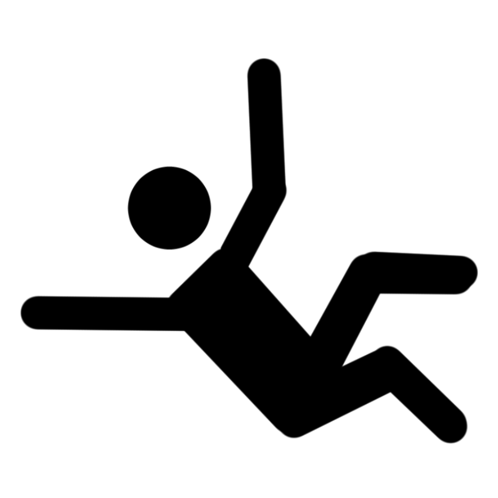

La seule option de mouvement pour une créature <b>au sol</b> est de ramper, sauf si elle se relève et termine ainsi cette condition.  
La créature a le désavantage aux jets d'attaque.  
Les jets d'attaques contre la créature ont l'avantage si l'attaquant se trouve à 5 ft. ou moins de la créature, et ont le désavantage sinon. 

