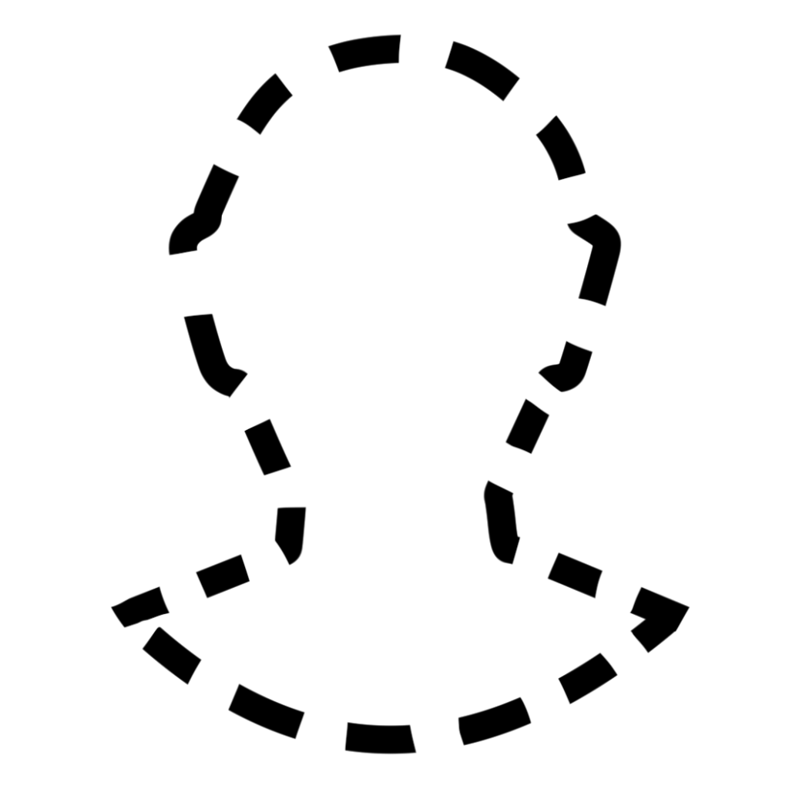

Une créature <b>invisible</b> est impossible à discerner sans l'aide de magie ou de sens spécial. À fins de cachette, la créature est lourdement assombrie. 
L'emplacement de la créature peut être détecter par les bruits qu'elle fait ou les traces qu'elle laisse.  
Les jets d'attaques contre la créature ont le désavantage, et les jets d'attaque de la créature ont l'avantage. 

