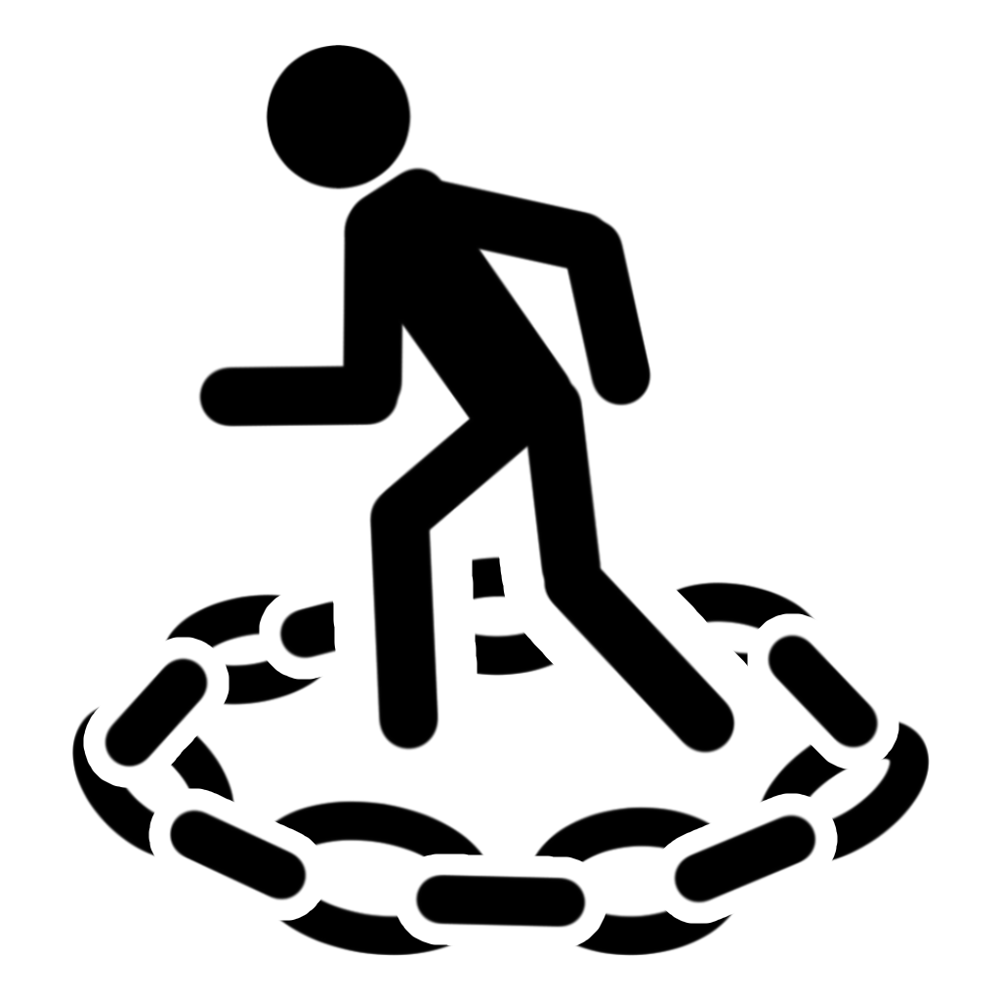

Une créature <b>paralysée</b> est <a href="../Incapacité">incapacitée</a> et ne peut pas bouger ou parler.  
La créature rate automatiquement ses jets de sauvegarde de Force et de Dextérité.  
Les jets d'attaque contre la créature ont l'avantage.  
N'importe quelle attaque qui touche la créature est un coup critique si l'attaquant se trouve à 5 ft. ou moins de la créature. 

