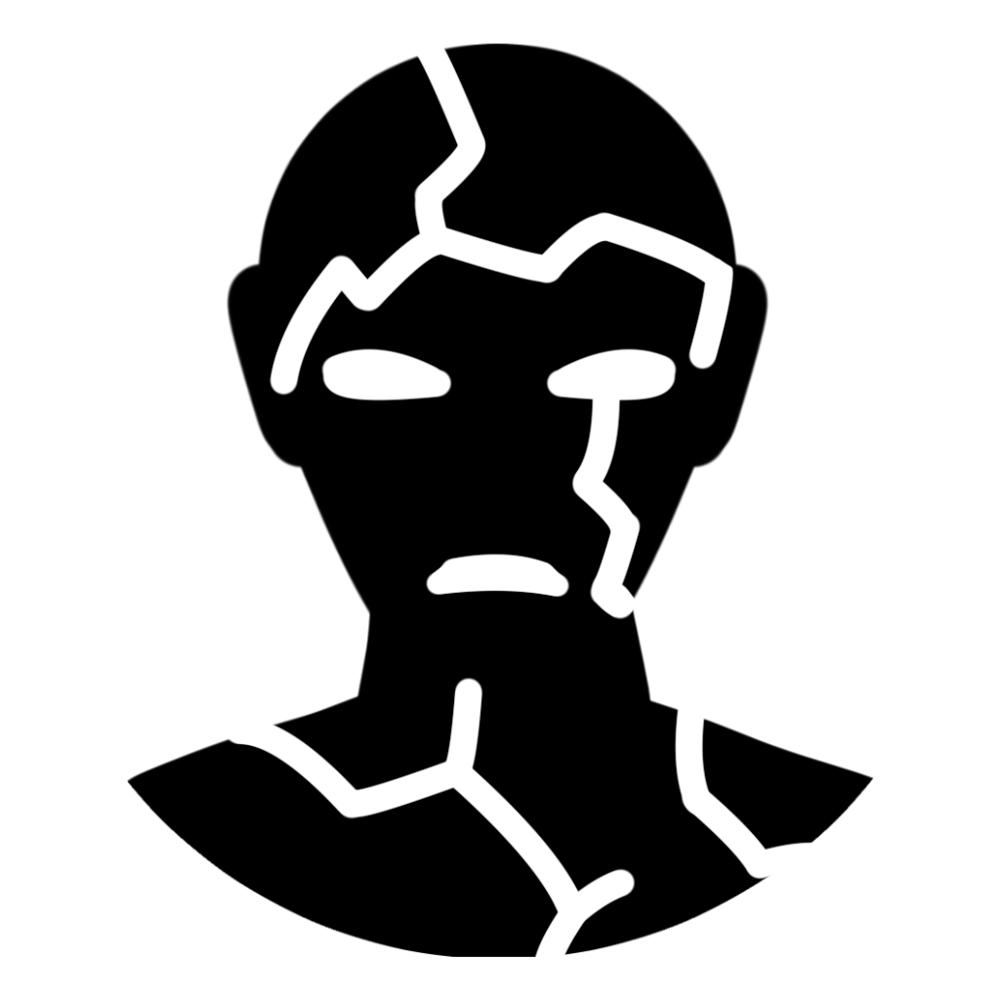

Une créature <b>pétrifiée</b> est transformée, ainsi que tout objet non magique qu'elle porterait, en une substance solide inanimée (souvent de la pierre). Son poids augmente d'un facteur de 10, et elle cesse de vieillir.  
La créature est [[incapacité|incapacitée]], ne peut pas parler ou bouger, et n'a pas conscience de son environnement.  
Les jets d'attaque contre la créature ont l'avantage.  
La créature rate automatiquement ses jets de sauvegarde de Force et de Dextérité.  
La créature a une résistance à tous les dégâts.  
La créature est immunisée aux poisons et aux maladies, mais un poison ou une maladie déjà présente dans son système est suspendue et non neutralisée. 

