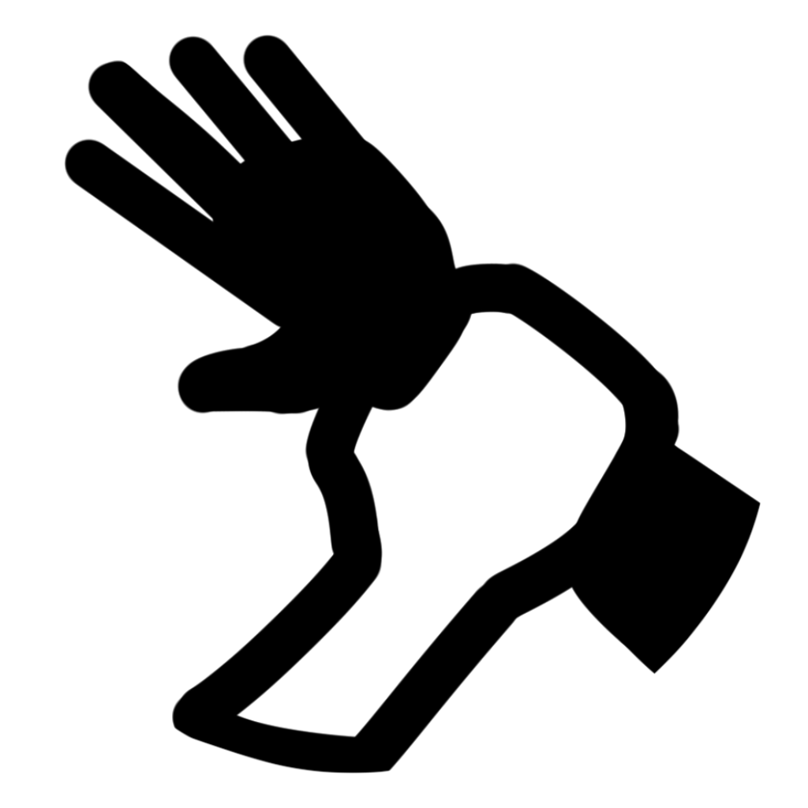

La vitesse d'une créature <b>saisie</b> est de 0, et elle ne peut bénéficier de bonus à sa vitesse.
La condition se termine si le saisisseur devient <a href="../Incapacité">incapacité</a>.  
La condition se termine également si un effet retire la créature saisie de la porté du saisisseur ou de l'effet saisissant, comme lorsqu'une créature est projetée par le sort <a href="../../sorts/Vague Tonnante">Vague Tonnante</a>. 

