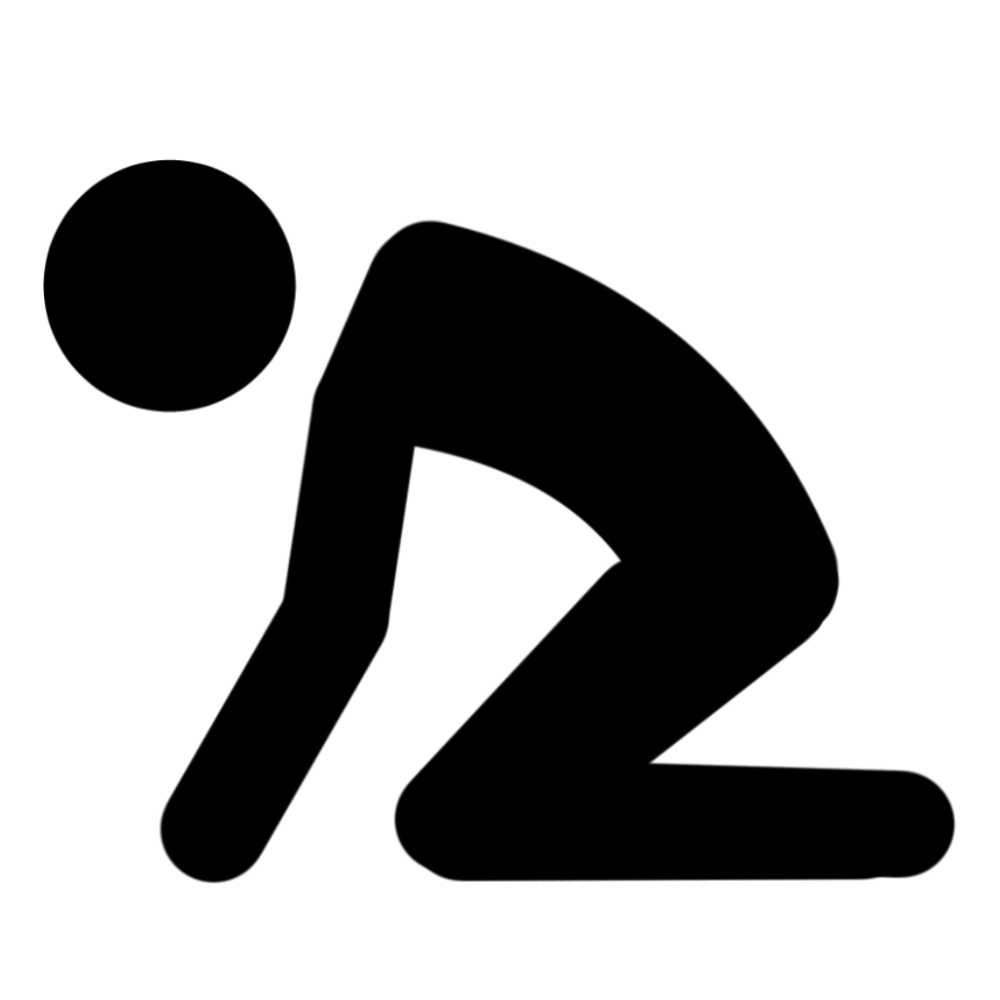

Certaines compétences spéciales ou dangers environnementaux, comme la faim ou les effets à long terme du gel ou de la brûlure, amènent à une condition spéciale appelée <b>épuisement</b>. 
L'épuisement est mesuré en 6 niveaux. Un effet peut donner à une créature un ou plusieurs niveaux d'épuisements, comme décrit dans la description de l'effet. 

<table style='padding:0.7em; margin-left:1.4em; display: inline-block;'>
  <thead>
    <tr>
      <th scope="col">Niveau</th>
      <th scope="col">Effet</th>
    </tr>
  </thead>
 <tbody>
    <tr>
      <th scope="row">1</th>
      <td>Désavantage à tous les jets de compétences</td>
    </tr>
    <tr>
      <th scope="row">2</th>
      <td>Vitesse réduite de moitié</td>
    </tr>
    <tr>
      <th scope="row">3</th>
      <td>Désavantage aux jets d'attaque et de sauvegarde</td>
    </tr>
    <tr>
      <th scope="row">4</th>
      <td>Points de vie maximums réduits de moitié</td>
    </tr>
    <tr>
      <th scope="row">5</th>
      <td>Vitesse réduite à 0</td>
    </tr>
    <tr>
      <th scope="row">6</th>
      <td>Mort</td>
    </tr>
  </tbody>
</table>

  
Si une créature déjà épuisée souffre d'un effet causant de l'épuisement, son niveau actuel d'épuisement augmente du nombre spécifié dans la description de l'effet.  
Une créature souffre aussi des effets de son niveau actuel d'épuisement, mais aussi de tous les niveaux inférieurs. Par exemple, une créature souffrant de 2 niveaux d'épuisements voit sa vitesse réduite de moitié et a le désavantage à tous ses jets de compétences.  
Un effet qui retire l'épuisement réduit son niveau d'un montant indiqué dans la description de l'effet, et tous les effets d'épuisement se terminent si le niveau d'épuisement d'une créature est réduit en dessous de 1.  
Finir un repos long réduit l'épuisement d'une créature par 1, si la créature a peu se nourrir et s'hydrater. De même, revenir d'entre les mors réduit également l'épuisement de la créature de 1.  

