---
search:
  exclude: true
title: Choix de classe
---
Dans les vastes terres d'Eostrebis en perpétuel changement, chaque aventurier choisit sa propre voie. Guerriers intrépides, mages érudits, rôdeurs silencieux ou prêtres dévoués — tous jouent un rôle unique dans l’équilibre fragile des forces en présence.
Découvrez ci-dessous les différentes classes que peuvent embrasser ceux qui osent arpenter les sentiers de la destinée. 

   <select id="filter-carac" class="filter-select">
    <option value="all">Toutes les caractéristiques</option>
    <option value="for">Force</option>
    <option value="dex">Dextérité</option>
    <option value="con">Constitution</option>
    <option value="int">Intelligence</option>
	<option value="sag">Sagesse</option>
	<option value="cha">Charisme</option>
  </select>
	
  <select id="filter-type" class="filter-select">
    <option value="all">Tous les rôles</option>
    <option value="tank">Tank</option>
    <option value="degats">Dégâts</option>
    <option value="soutien">Soutien</option>
    <option value="utilitaire">Utilitaire</option>
	<option value="controle">Contrôle</option>
	<option value="social">Social</option>
  </select>

  <select id="filter-vie" class="filter-select">
    <option value="all">Tous les dés de vie</option>
    <option value="d6">d6 (Fragile)</option>
    <option value="d8">d8 (Moyen)</option>
    <option value="d10">d10 (Robuste)</option>
    <option value="d12">d12 (Colosse)</option>
  </select>

  <select id="filter-difficulte" class="filter-select">
    <option value="all">Toute difficulté</option>
    <option value="explorateur">Explorateur</option>
    <option value="equilibre">Équilibré</option>
    <option value="tacticien">Tacticien</option>
    <option value="honneur">Honneur</option>
  </select>

  <button onclick="resetFilters()" class="filter-btn">Réinitialiser</button>

	<!-- Carte Alchimiste -->
	<a
	href=./Alchimiste/Alchimiste/
	class="class-card"
	data-carac="int"
	data-type="degats soutien"
	data-vie="d8"
	data-difficulte="tacticien"
	data-text="Un gnome lance des bombes avec enthousiasme, semant le chaos parmi ses ennemis avant de disparaître dans un nuage de fumée, hilare. Une elfe soigne un nain blessé en concoctant rapidement un remède efficace.
	Qu’ils manipulent la matière pour détruire, transformer ou soigner, les alchimistes sont mus par le désir de modeler le monde selon leur volonté."
	style="--accent-color: #1ed10d;">
	    
		

	    	

	   			
				

		    		Alchimiste
					★★★☆
			 	

	 		

	    

	      

			Archétype
	        Martial 🏹
	      

	      

	        Dés de vie
	        d8
	      

	      

	        Primaire
	        Int
	      

	    

	    

			Dégâts
			Soutien
	    

	    Combiner des réactifs pour produire des effets ... détonnants !
	  

	</a>
	<!-- Carte Artisan -->
	<a
	href=./Artisan/Artisan/
	class="class-card"
	data-carac="for dex int"
	data-type="degats utilitaire"
	data-vie="d10"
	data-difficulte="honneur"
	data-text="Trois artisans d’exception exercent leur art avec une maîtrise remarquable : une naine forge une pièce de métal incandescente à grands coups de marteau, un elfe assemble patiemment une armure en peau de dragon avec une précision redoutable, et une gnomide peaufine les mécanismes d’une baliste portable avec une expertise minutieuse.
Tous sont des génies créatifs, capables non seulement de fabriquer de l'équipement de maître, mais aussi d’imaginer des inventions originales et redoutables."
	style="--accent-color: #efd473;">
	    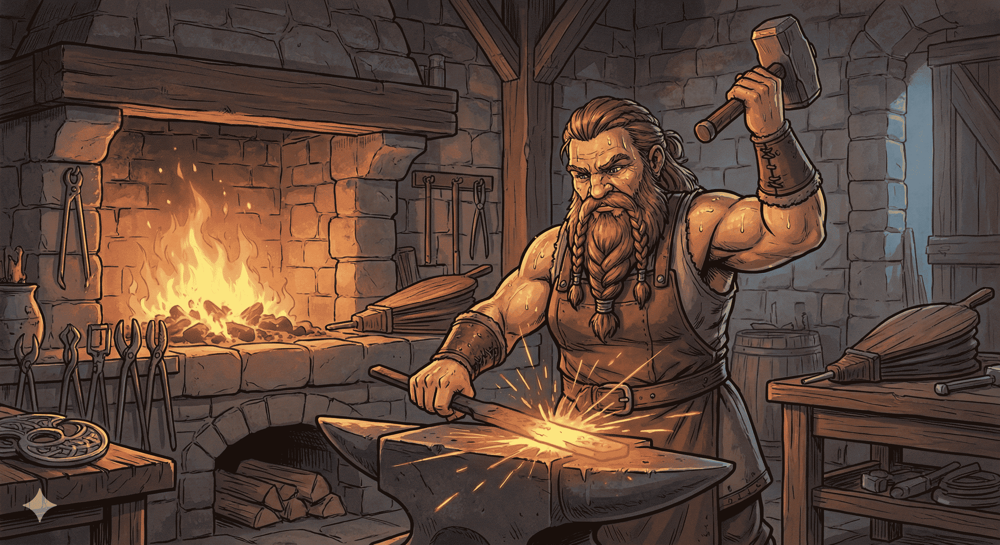
		

	    	

	   			
				

		    		Artisan
					★★★★
			 	

	 		

	    

	      

			Archétype
	        Martial ⚔️
	      

	      

	        Dés de vie
	        d10
	      

	      

	        Primaire
	        For/Dex + Int
	      

	    

	    

			Dégâts
			Utilitaire
	    

	    Capable de renverser des pays entiers à coup de marteau !
	  

	</a>
<!-- Carte Barbare -->
	<a
	href=./Barbare/Barbare/
	class="class-card"
	data-carac="for con"
	data-type="degats tank"
	data-vie="d12"
	data-difficulte="explorateur"
	data-text="Qu'ils soient humains, demi-orques ou nains, les barbares partagent un trait commun : une rage primale, incontrôlable et viscérale.
Qu'elle naisse d'un lien spirituel avec les bêtes ou d'une colère profonde envers le monde, cette furie est leur force — une puissance brutale qui guide leurs combats, renforce leur corps et transcende la douleur."
	style="--accent-color: #810000;">
	    
		

	    	

	   			
				

		    		Barbare
					★☆☆☆
			 	

	 		

	    

	      

			Archétype
	        Martial ⚔️
	      

	      

	        Dés de vie
	        d12
	      

	      

	        Primaire
	        Con + For
	      

	    

	    

			Dégâts
			Tank
	    

	    Guerrier sauvage animé par la rage, qui puise sa force brute dans l’instinct plutôt que dans la discipline.
	  

	</a>
<!-- Carte Barde -->
	<a
	href=./Barde/Barde/
	class="class-card"
	data-carac="cha"
	data-type="controle soutien social utilitaire"
	data-vie="d8"
	data-difficulte="equilibre"
	data-text="Qu’ils soient érudits ou espiègles, les bardes canalisent la magie par la musique et les mots, mêlant savoir, inspiration et tromperie pour renforcer leurs alliés, troubler leurs ennemis et tisser la réalité à leur image.
Maîtres des récits et des harmonies, les bardes façonnent le monde d’un mot ou d’une note. Par leur art, ils éveillent le courage, enjolivent la vérité, troublent les esprits et insufflent la magie là où résonne leur chant."
	style="--accent-color: #6f4774;">
	    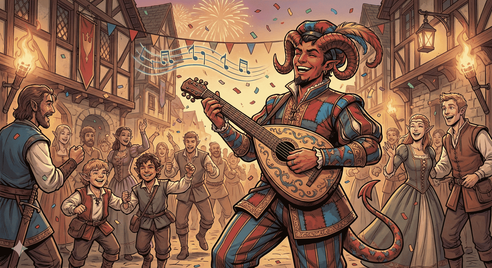
		

	    	

	   			
				

		    		Barde
					★★☆☆
			 	

	 		

	    

	      

			Archétype
	        ½ Caster 🏹
	      

	      

	        Dés de vie
	        d8
	      

	      

	        Primaire
	        Cha
	      

	    

	    

			Contrôle
			Social
			Soutien
			Utilitaire
	    

	    Maître des mots et de la magie, il charme, inspire et manipule par la musique, la ruse et l’art de conter.
	  

	</a>
<!-- Carte Capitaine -->
	<a
	href=./Capitaine/Capitaine/
	class="class-card"
	data-carac="for dex cha"
	data-type="social soutien"
	data-vie="d8"
	data-difficulte="honneur"
	data-text="Au cœur d’une scène épique se mêlent figures de commandement et intrigues, où une demi-elfe haute décorée et un orque robuste, aux côtés d’un maître de guilde astucieux, annoncent leur passage par trompettes et percussions.
Les capitaines, stratèges inspirés et chefs décidés, orchestrent habilement la cohésion de leurs troupes et se tiennent toujours aux côtés de leurs lieutenants, garantissant la victoire sans infliger le coup de grâce."
	style="--accent-color: #34495e;">
	    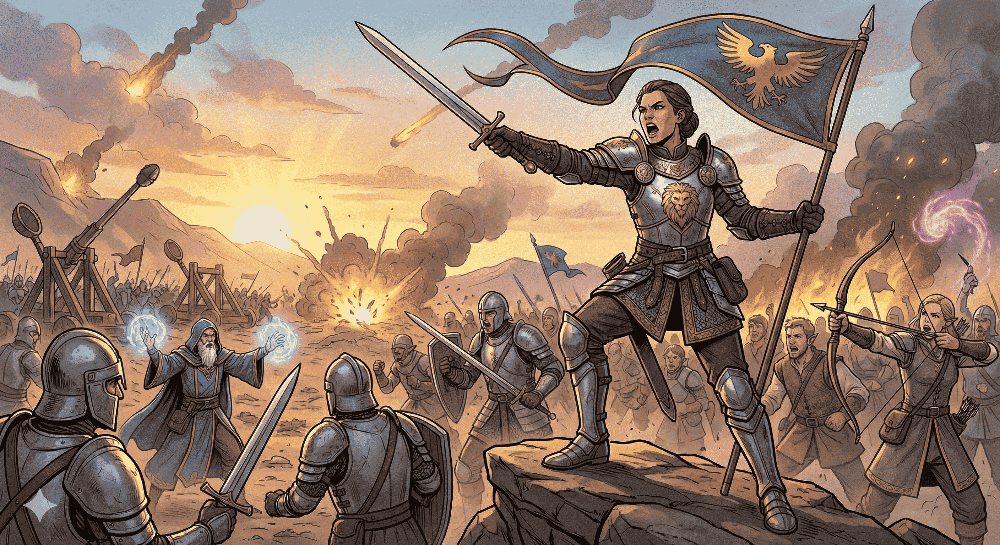
		

	    	

	   			
				

		    		Capitaine
					★★★★
			 	

	 		

	    

	      

			Archétype
	        Martial ⚔️
	      

	      

	        Dés de vie
	        d8
	      

	      

	        Primaire
	        For/Dex + Cha
	      

	    

	    

			Social
			Soutien
	    

	    Meneur charismatique et tacticien aguerri, il guide ses alliés au combat par sa présence, ses ordres et son courage.
	  

	</a>
<!-- Carte Clerc -->
	<a
	href=./Clerc/Clerc/
	class="class-card"
	data-carac="sag"
	data-type="tank soutien"
	data-vie="d8"
	data-difficulte="equilibre"
	data-text="Portés par la foi, les clercs canalisent la puissance de leur divinité pour soigner les blessés, repousser les ténèbres et frapper ceux qui s’opposent à leur dogme, qu’ils le fassent par la prière, le chant ou la guerre.
Qu’ils invoquent des malédictions contre les morts-vivants, illuminent le champ de bataille d’une lumière sacrée ou glorifient les dieux à chaque coup porté, ils agissent comme les instruments vivants de volontés divines.
Guidés par des croyances aussi diverses que les divinités qu’ils servent, les clercs transcendent le rôle de simples prêtres, incarnant une magie sacrée aussi implacable que bienveillante."
	style="--accent-color: #8c8c8c;">
	    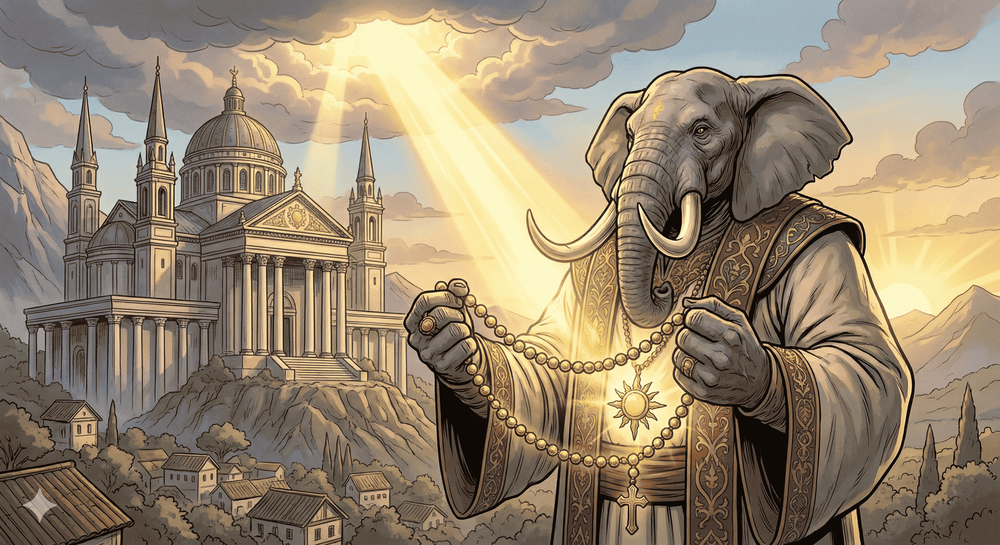
		

	    	

	   			
				

		    		Clerc
					★★☆☆
			 	

	 		

	    

	      

			Archétype
	        Caster ⚔️
	      

	      

	        Dés de vie
	        d8
	      

	      

	        Primaire
	        Sag
	      

	    

	    

		Tank
		Soutien
	    

	    Champion d’une divinité, il canalise la puissance divine pour soigner, protéger et frapper au nom de sa foi.
	  

	</a>
<!-- Carte Druide -->
	<a
	href=./Druide/Druide/
	class="class-card"
	data-carac="sag"
	data-type="tank controle"
	data-vie="d8"
	data-difficulte="tacticien"
	data-text="Les druides sont les émissaires de la nature elle-même, appelant les tempêtes, la foudre ou le feu pour défendre les terres sauvages contre toute corruption ou intrusion.
Changeant de forme pour observer ou frapper, ils se glissent parmi les bêtes et les feuillages, gardiens silencieux des équilibres fragiles du monde.
Plus que de simples lanceurs de sorts, ils incarnent la volonté brute, rusée et indomptable de la nature, agissant non comme ses maîtres, mais comme ses instruments vivants."
	style="--accent-color: #A267C7;">
	    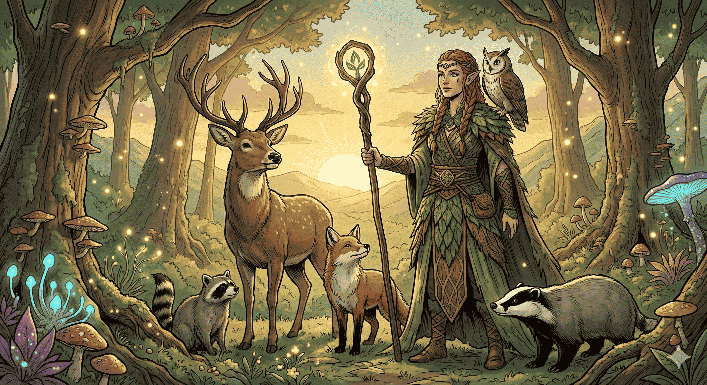
		

	    	

	   			
				

		    		Druide
					★★★☆
			 	

	 		

	    

	      

			Archétype
	        ½ Caster 🌿
	      

	      

	        Dés de vie
	        d8
	      

	      

	        Primaire
	        Sag
	      

	    

	    

		Tank
		Contrôle
	    

	    Gardien des forces naturelles, il manie la magie de la terre, prend la forme des bêtes et veille à l’équilibre du monde.
	  

	</a>
<!-- Carte Ensorceleur -->
	<a
	href=./Ensorceleur/Ensorceleur/
	class="class-card"
	data-carac="cha"
	data-type="degats utilitaire"
	data-vie="d6"
	data-difficulte="tacticien"
	data-text="Les ensorceleurs puisent leur magie d’une source innée, souvent liée à un héritage mystérieux ou une influence cosmique, qui se manifeste à travers des pouvoirs explosifs et imprévisibles.
Leur magie sauvage éclate avec force, transformant leur être et le monde autour d’eux, parfois de manière aussi spectaculaire qu’involontaire.
Contrairement aux autres mages, ils ne choisissent pas leur pouvoir : c’est ce dernier qui les choisit, façonnant leur destinée hors du commun."
	style="--accent-color: #080705;">
	    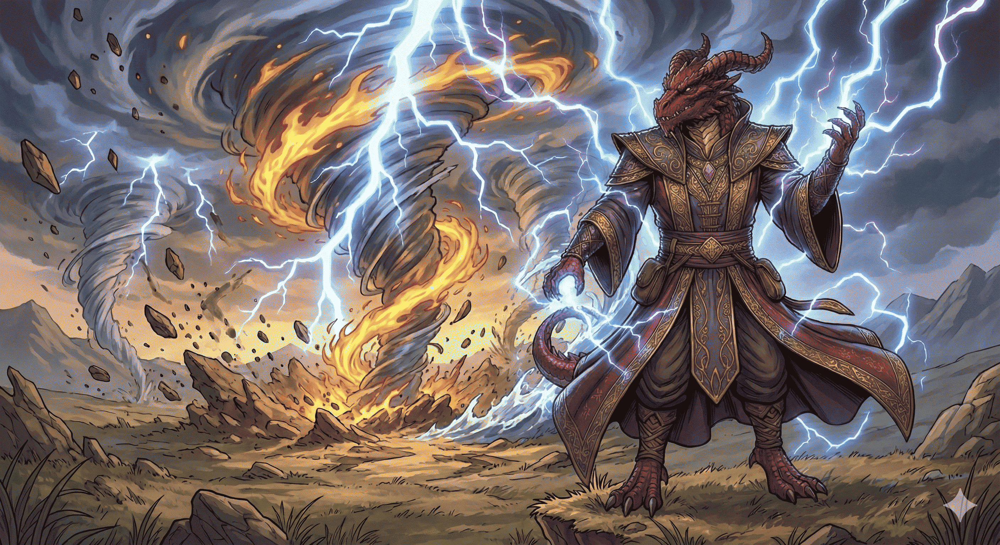
		

	    	

	   			
				

		    		Ensorceleur
					★★★☆
			 	

	 		

	    

	      

			Archétype
	        Caster 🏹
	      

	      

	        Dés de vie
	        d6
	      

	      

	        Primaire
	        Cha
	      

	    

	    

		 	Dégâts
			Utilitaire
	    

	    Porteur d’une magie innée et sauvage, il canalise un pouvoir brut venu de ses origines mystérieuses pour façonner le combat et la réalité.
	  

	</a>
<!-- Carte Fusilier -->
	<a
	href=./Fusilier/Fusilier/
	class="class-card"
	data-carac="dex"
	data-type="degats"
	data-vie="d8"
	data-difficulte="explorateur"
	data-text="Les fusiliers sont des combattants téméraires qui tracent leur propre voie, dédaignant les traditions au profit de la poudre, du métal et de l’instinct.
Qu’ils dégainent leur revolver au fond d’une taverne silencieuse ou qu’ils patientent en embuscade le doigt sur la détente, ils savent que chaque tir peut changer le cours d’un combat.
Survivants nés, ils misent sur des décisions rapides, un sang-froid à toute épreuve et une bonne dose de chance pour traverser les pires situations."
	style="--accent-color: #f88f10;">
	    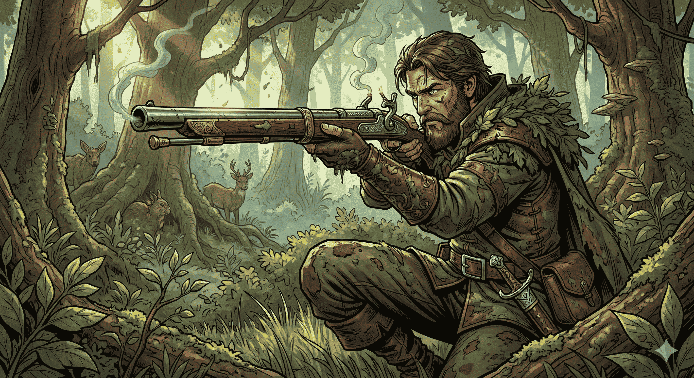
		

	    	

	   			
				

		    		Fusilier
					★☆☆☆
			 	

	 		

	    

	      

			Archétype
	        Martial 🏹
	      

	      

	        Dés de vie
	        d8
	      

	      

	        Primaire
	        Dex
	      

	    

	    

		 		Dégâts
	    

	    Tireur d’élite maniant armes à feu ou arcanotech, il frappe de loin avec précision, calme et puissance.
	  

	</a>
<!-- Carte Gardien -->
	<a
	href=./Gardien/Gardien/
	class="class-card"
	data-carac="for con"
	data-type="tank controle soutien"
	data-vie="d10"
	data-difficulte="equilibre"
	data-text="Les gardiens sont des défenseurs inflexibles, prêts à affronter seuls des armées entières pour protéger ce qui leur est cher, que ce soit un territoire, une cause ou une personne.
Qu'ils soient chevaliers, bêtes furieuses ou sentinelles sylvestres, ils incarnent la force tranquille qui se dresse entre le danger et les leurs.
Grâce à leur endurance, leur discipline ou leur lien avec la nature, ils deviennent des remparts vivants, ancrés dans leur devoir."
	style="--accent-color: #000000;">
	    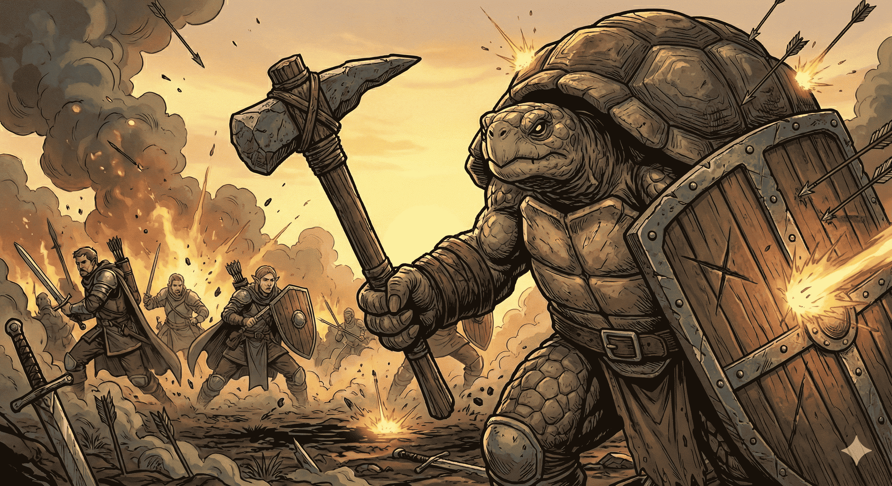
		

	    	

	   			
				

		    		Gardien
					★★☆☆
			 	

	 		

	    

	      

			Archétype
	        Martial ⚔️
	      

	      

	        Dés de vie
	        d10
	      

	      

	        Primaire
	        Con + For
	      

	    

	    

			Tank
			Contrôle
			Soutien
	    

	    Rempart vivant entre ses alliés et le danger, il encaisse les coups, contrôle le champ de bataille et protège ceux qui l’entourent.
	  

	</a>
<!-- Carte Guerrier -->
	<a
	href=./Guerrier/Guerrier/
	class="class-card"
	data-carac="for dex"
	data-type="tank degats"
	data-vie="d10"
	data-difficulte="explorateur"
	data-text="Les guerriers sont des combattants d’exception, forgés par l’entraînement, la discipline et les épreuves du champ de bataille, capables de charger en première ligne comme de manœuvrer avec finesse.
Leur diversité est leur plus grande force : qu’ils soient archers elfes, chevaliers humains, gladiateurs habiles ou mercenaires demi-orcs, tous maîtrisent les armes et les armures avec une aisance redoutable.
Dans le chaos de la guerre comme dans l’arène, ils affrontent la mort les yeux ouverts — et la renvoient souvent à leurs ennemis."
	style="--accent-color: #78250a;">
	    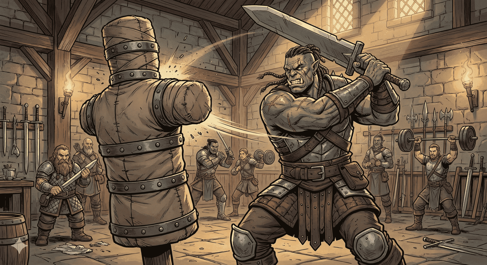
		

	    	

	   			
				

		    		Guerrier
					★☆☆☆
			 	

	 		

	    

	      

			Archétype
	        Martial ⚔️
	      

	      

	        Dés de vie
	        d10
	      

	      

	        Primaire
	        For / Dex
	      

	    

	    

		 	Dégâts
			Tank
	    

	    Maître d’armes polyvalent, il domine le champ de bataille par sa technique, sa discipline et sa détermination inébranlable.
	  

	</a>
<!-- Carte Investigateur -->
	<a
	href=./Investigateur/Investigateur/
	class="class-card"
	data-carac="int"
	data-type="soutien utilitaire"
	data-vie="d8"
	data-difficulte="equilibre"
	data-text="Les investigateurs sont des esprits méthodiques et vigilants, traquant les anomalies surnaturelles à l’aide d’indices, de savoir ésotérique et de préparation minutieuse.
Leur quotidien oscille entre la recherche patiente de vérités enfouies et l’action brutale contre des horreurs venues d’ailleurs, qu’ils piègent avec rituels, armes bénites ou stratégies élaborées.
Face aux monstres tapis dans l’ombre, ce sont eux qui tiennent la ligne, veillant à ce que nul cauchemar n’échappe à leur vigilance."
	style="--accent-color: #325a87;">
	    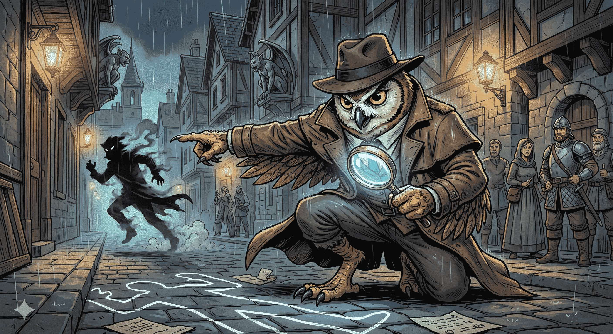
		

	    	

	   			
				

		    		Investigateur
					★★☆☆
			 	

	 		

	    

	      

			Archétype
	        ½ Caster 🏹
	      

	      

	        Dés de vie
	        d8
	      

	      

	        Primaire
	        Int
	      

	    

	    

			Soutien
			Utilitaire
	    

	    Esprit acéré et œil perçant, il traque la vérité, déjoue les complots et révèle les secrets cachés sous la surface.
	  

	</a>
<!-- Carte Ligateur -->
	<a
	href=./Ligateur/Ligateur/
	class="class-card"
	data-carac="cha"
	data-type="degats tank controle social soutien utilitaire"
	data-vie="d8"
	data-difficulte="honneur"
	data-text="Les ligateurs sont des arcanistes atypiques, qui forgent des pactes avec des entités oubliées, des esprits anciens ou des puissances bannies, en gravant leur corps et leur esprit de sceaux mystiques.
En échange de leur propre force vitale, de fragments de mémoire ou d'obscurs serments, ils obtiennent des dons surnaturels, des révélations interdites et des pouvoirs que même les mages redoutent.
Ces pactes, souvent instables et parfois envahissants, façonnent autant le destin du ligateur que son apparence, faisant de lui un vecteur d’énigmes, d’horreur et de prodiges."
	style="--accent-color: #ff1193;">
	    
		

	    	

	   			
				

		    		Ligateur
					★★★★
			 	

	 		

	    

	      

			Archétype
	        ½ Caster 🏹
	      

	      

	        Dés de vie
	        d8
	      

	      

	        Primaire
	        Cha
	      

	    

	    

					Utilitaire
					Social
					Soutien
					Contrôle
					Tank
					Dégâts
	    

	    Maîtres des pactes interdits, les ligateurs manipulent des forces occultes enchaînées à leur volonté.
	  

	</a>
<!-- Carte Mage de Guerre -->
	<a
	href=./Mage_de_Guerre/Mage_de_Guerre/
	class="class-card"
	data-carac="int"
	data-type="degats"
	data-vie="d8"
	data-difficulte="equilibre"
	data-text="Les mages de guerre sont des combattants redoutables qui allient l’art de la magie à la discipline du champ de bataille, capables de lancer des sorts dévastateurs tout en maniant habilement armes et armures.
Leur entraînement rigoureux leur permet d’adapter leur puissance magique aux nécessités du combat rapproché, protégeant leurs alliés et brisant les lignes ennemies avec une précision tactique rare.
Maîtres de l’équilibre entre force brute et savoir arcanique, ils incarnent la fusion parfaite entre puissance mystique et discipline martiale."
	style="--accent-color: #53e5dc;">
	    
		

	    	

	   			
				

		    		Mage de Guerre
					★★☆☆
			 	

	 		

	    

	      

			Archétype
	        ½ Caster ⚔️
	      

	      

	        Dés de vie
	        d8
	      

	      

	        Primaire
	        Int
	      

	    

	    

					Dégâts
	    

	    Les mages de guerre mêlent puissance magique et maîtrise martiale, lançant des sorts destructeurs tout en maniant armes et tactiques de combat.
	  

	</a>
<!-- Carte Magicien -->
	<a
	href=./Magicien/Magicien/
	class="class-card"
	data-carac="int"
	data-type="utilitaire controle soutien degats"
	data-vie="d6"
	data-difficulte="tacticien"
	data-text="Les magiciens, vêtus de robes élégantes et concentrés dans leurs rituels, canalisent l'énergie cosmique pour lancer des sorts dévastateurs, qu’il s’agisse de sphères de feu explosives, de cercles magiques invoquant des puissances d’autres plans ou de divinations mystiques.
Leur maîtrise de la magie leur permet d’invoquer des créatures d’outre-monde, de manipuler les esprits ou de transformer la matière, révélant ainsi l’immense variété de leurs pouvoirs.
Ces arcanistes sont unis par leur savoir et leur capacité à plier la réalité, allant jusqu’à faire pleuvoir des météores ou ouvrir des portails vers des mondes inconnus, incarnant l’essence même de la puissance magique."
	style="--accent-color: #1956ba;">
	    
		

	    	

	   			
				

		    		Magicien
					★★★☆
			 	

	 		

	    

	      

			Archétype
	        Caster 🏹
	      

	      

	        Dés de vie
	        d6
	      

	      

	        Primaire
	        Int
	      

	    

	    

			Utilitaire
			Contrôle
			Soutien
			Dégâts
	    

	    Les mages maîtrisent l’art des arcanes, lançant des sorts puissants et variés grâce à leur savoir et leur concentration.
	  

	</a>
<!-- Carte Martyr -->
	<a
	href=./Martyr/Martyr/
	class="class-card"
	data-carac="con"
	data-type="degats tank"
	data-vie="d12"
	data-difficulte="tacticien"
	data-text="Les Martyrs portent la douleur et la guérison, touchant les vies avec une grâce salvatrice, tout en étant liés à un destin tragique et immuable.
Leur parole peut faire trembler la terre et changer le cours des événements, tandis que leur foi les pousse à accomplir des actes lourds de sens, même au prix de leur vie.
Véritables instruments des dieux, ils acceptent leur sacrifice comme une mission divine, sachant que leur fin est écrite dans les étoiles."
	style="--accent-color: #929292;">
	    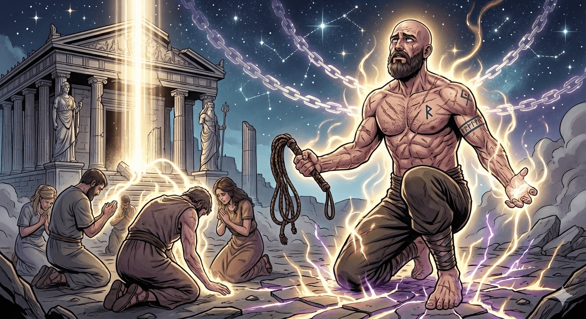
		

	    	

	   			
				

		    		Martyr
					★★★☆
			 	

	 		

	    

	      

			Archétype
	        ½ Caster ⚔️
	      

	      

	        Dés de vie
	        d12
	      

	      

	        Primaire
	        Con
	      

	    

	    

			Tank
			Dégâts
	    

	    Les martyrs sacrifient leur corps et leur vie pour protéger leurs alliés, transformant leur souffrance en force et inspiration sur le champ de bataille.
	  

	</a>
<!-- Carte Moine -->
	<a
	href=./Moine/Moine/
	class="class-card"
	data-carac="dex sag"
	data-type="degats controle"
	data-vie="d8"
	data-difficulte="tacticien"
	data-text="Les moines utilisent leur énergie intérieure pour accomplir des exploits extraordinaires, comme dévier des flèches, affronter seuls des ennemis nombreux, ou se déplacer silencieusement dans l’ombre pour frapper avec précision.
Leur maîtrise du corps et de l’esprit leur permet de combiner agilité, puissance martiale et furtivité, transcendant les limites physiques ordinaires.
Quelle que soit leur spécialité, ils canalisent cette force magique pour augmenter leur vitesse, leur défense et leur efficacité au combat."
	style="--accent-color: #28c3f5;">
	    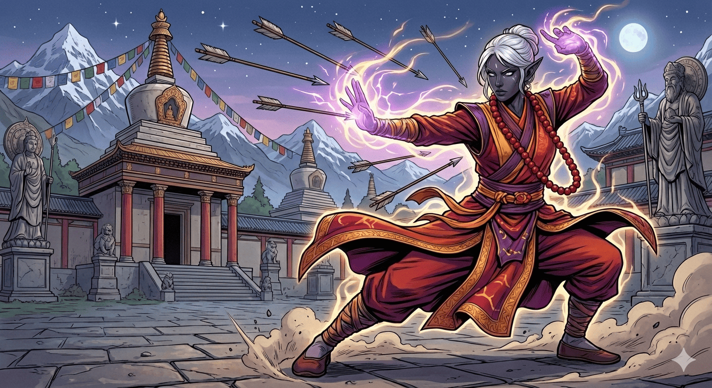
		

	    	

	   			
				

		    		Moine
					★★★☆
			 	

	 		

	    

	      

			Archétype
	        Martial ⚔️
	      

	      

	        Dés de vie
	        d8
	      

	      

	        Primaire
	        Dex + Sag
	      

	    

	    

					Contrôle
					Dégâts
	    

	    Les moines maîtrisent corps et esprit, utilisant leur discipline martiale et leur énergie intérieure pour combattre avec grâce et puissance.
	  

	</a>
<!-- Carte Nécromancien -->
	<a
	href=./Nécromancien/Nécromancien/
	class="class-card"
	data-carac="int"
	data-type="degats controle"
	data-vie="d6"
	data-difficulte="honneur"
	data-text="Les nécromanciens puisent dans les arcanes interdites de la mort, canalisant des énergies sombres pour manipuler la vie et la non-vie selon leur volonté.
Ils commandent des légions de morts-vivants, utilisant ces créatures comme des extensions de leur propre puissance sur le champ de bataille.
Maîtres des malédictions et des sorts funestes, ils exploitent la peur et la désolation pour affaiblir leurs ennemis et imposer leur domination."
	style="--accent-color: #929292;">
	    
		

	    	

	   			
				

		    		Nécromancien
					★★★★
			 	

	 		

	    

	      

			Archétype
	        Caster 🏹
	      

	      

	        Dés de vie
	        d6
	      

	      

	        Primaire
	        Int
	      

	    

	    

					Contrôle
					Dégâts
	    

	    Les nécromanciens manipulent la magie de la mort pour contrôler les morts-vivants et exploiter les forces obscures.
	  

	</a>
<!-- Carte Occultiste -->
	<a
	href=./Occultiste/Occultiste/
	class="class-card"
	data-carac="cha"
	data-type="degats controle"
	data-vie="d8"
	data-difficulte="equilibre"
	data-text="Les occultistes sont des chercheurs avides de connaissances cachées dans les méandres du multivers, utilisant des pactes mystérieux avec des entités surnaturelles pour canaliser des pouvoirs magiques uniques et impressionnants.
Ils manipulent la magie à travers des influences aussi diverses que les nobles fées, les démons, les diables et d’autres êtres extraplanaires, fusionnant savoir ancien et énergie occulte. 
Grâce à cette maîtrise des secrets arcaniques, ils façonnent leur puissance pour contrôler leur environnement et influencer le destin avec subtilité et force."
	style="--accent-color: #7628f5;">
	    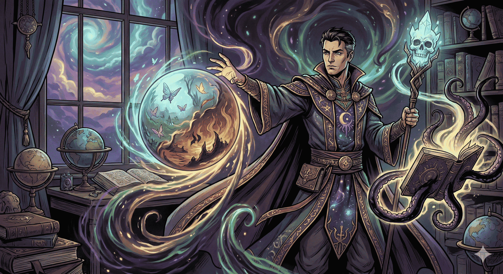
		

	    	

	   			
				

		    		Occultiste
					★★☆☆
			 	

	 		

	    

	      

			Archétype
	        ½ Caster 🏹
	      

	      

	        Dés de vie
	        d8
	      

	      

	        Primaire
	        Cha
	      

	    

	    

					Contrôle
					Dégâts
	    

	    Les occultistes manipulent les mystères cachés et les pouvoirs interdits, combinant magie et savoir ancien pour dévoiler et exploiter les forces obscures.
	  

	</a>
<!-- Carte Paladin -->
	<a
	href=./Paladin/Paladin/
	class="class-card"
	data-carac="for cha"
	data-type="degats tank soutien"
	data-vie="d10"
	data-difficulte="explorateur"
	data-text="Les paladins, vêtus d’armures brillantes malgré les épreuves du voyage, incarnent la guérison divine en restaurant la vie aux blessés par la puissance sacrée de leurs mains.
Cachés dans l’ombre, ils agissent avec précision et discrétion pour éliminer les ennemis du mal, usant de leur force et de leur détermination pour protéger les innocents.
Leur serment sacré, prononcé dans des lieux empreints de spiritualité ou dans la solitude face à la mort, forge en eux un pouvoir extraordinaire qui élève ces guerriers en champions bénis, unis par leur lutte contre les ténèbres."
	style="--accent-color: #daca06;">
	    
		

	    	

	   			
				

		    		Paladin
					★☆☆☆
			 	

	 		

	    

	      

			Archétype
	        ½ Caster ⚔️
	      

	      

	        Dés de vie
	        d10
	      

	      

	        Primaire
	        Cha + For
	      

	    

	    

					Dégâts
					Soutien
					Tank
	    

	    Les paladins sont des guerriers sacrés, incarnant la justice divine et protégeant les innocents avec foi et puissance.
	  

	</a>
<!-- Carte Ranger -->
	<a
	href=./Ranger/Ranger/
	class="class-card"
	data-carac="dex sag"
	data-type="degats"
	data-vie="d10"
	data-difficulte="equilibre"
	data-text="Un humain au regard sauvage traque silencieusement les orcs dans l’ombre des arbres, détruisant ses ennemis avec une rapidité mortelle grâce à ses deux épées courtes, tandis qu’une elfe agile esquive un souffle glacé de dragon avant de décocher une salve de flèches pour trouver une faille dans ses écailles épaisses.
Un demi-elfe, maître de la nature, commande son faucon avec des gestes précis et des mots elfiques, utilisant l’oiseau pour distraire un ours-hibou tandis qu’il prépare son tir décisif à l’arc.
	style="--accent-color: #006839;">
	    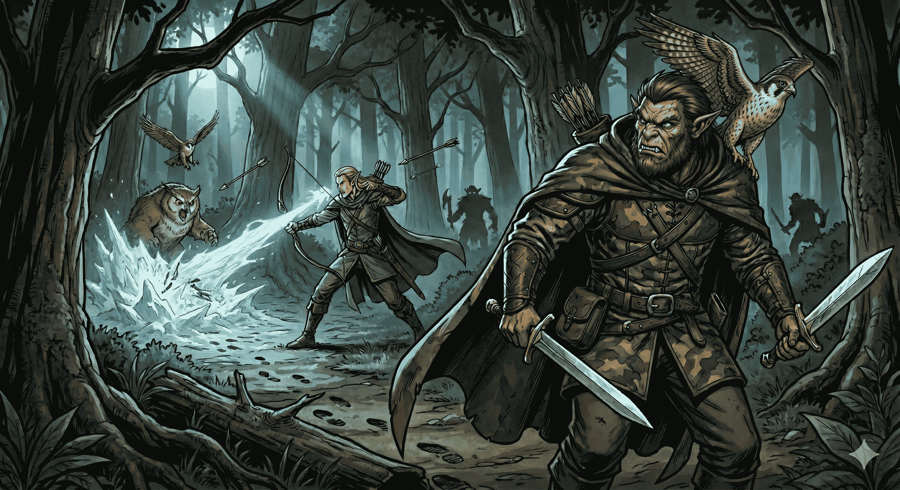
		

	    	

	   			
				

		    		Ranger
					★★☆☆
			 	

	 		

	    

	      

			Archétype
	        ½ Caster 🏹
	      

	      

	        Dés de vie
	        d10
	      

	      

	        Primaire
	        Dex + Sag
	      

	    

	    

					Dégâts
	    

	    Les rangers sont des éclaireurs et chasseurs experts, maîtrisant la traque, la survie en milieu sauvage, et le combat à distance.
	  

	</a>
<!-- Carte Roublard -->
	<a
	href=./Roublard/Roublard/
	class="class-card"
	data-carac="dex"
	data-type="social utilitaire"
	data-vie="d8"
	data-difficulte="equilibre"
	data-text="Les roublards avancent toujours avec prudence et ruse, utilisant leur habileté à crocheter serrures et à se fondre dans l’ombre pour ouvrir des voies invisibles à leurs compagnons.
Ils sont des maîtres de l’embuscade et de l’assassinat silencieux, frappant avec précision et rapidité pour neutraliser leurs ennemis avant même qu’ils ne réalisent le danger.
Grâce à leur ingéniosité et leur polyvalence, ils savent exploiter chaque faiblesse, libérant alliés ou déjouant pièges, ce qui fait d’eux des atouts essentiels dans toute aventure."
	style="--accent-color: #363636;">
	    
		

	    	

	   			
				

		    		Roublard
					★★☆☆
			 	

	 		

	    

	      

			Archétype
	        ½ Caster ⚔️
	      

	      

	        Dés de vie
	        d8
	      

	      

	        Primaire
	        Dex
	      

	    

	    

					Utilitaire
					Social
	    

	    Les roublards sont des experts en furtivité et en ruse, capables de frapper vite et fort là où leurs ennemis s’y attendent le moins.
	  

	</a>
<!-- Carte Sorcière -->
	<a
	href=./Sorcière/Sorcière/
	class="class-card"
	data-carac="cha"
	data-type="controle soutien"
	data-vie="d8"
	data-difficulte="tacticien"
	data-text="Trois vieilles sorcières préparent un chaudron fumant où des visions étranges se dessinent, annonçant des présages inquiétants qui les font ricaner de malice.
Une jeune fille isolée invoque un chat noir avec un simple claquement de doigts, utilisant son lien mystique pour manipuler un enfant dans son entourage, dévoilant ainsi son pouvoir secret.
Un elfe murmure des incantations obscures, libérant une magie maléfique qui s’enroule autour d’un orque pour le plonger dans une agonie lente, illustrant la nature sombre et tordue des sorcières qui façonnent les ténèbres par leur volonté."
	style="--accent-color: #ca0175;">
	    
		

	    	

	   			
				

		    		Sorcière
					★★★☆
			 	

	 		

	    

	      

			Archétype
	        Caster 🏹
	      

	      

	        Dés de vie
	        d8
	      

	      

	        Primaire
	        Cha
	      

	    

	    

					Contrôle
					Soutien
	    

	    Les sorcières manipulent une magie ancienne et mystérieuse, tissant des sorts à travers rituels secrets et pactes occultes.
	  

	</a>	
<!-- Carte Tisserand -->
	<a
	href=./Tisserand/Tisserand/
	class="class-card"
	data-carac="dex int"
	data-type="degats"
	data-vie="d8"
	data-difficulte="tacticien"
	data-text="Les tisserands sont des maîtres de la magie qui manipulent les fils invisibles de la réalité, tissant des sorts complexes et subtils pour influencer le monde qui les entoure.
Grâce à leur habileté à entrelacer la magie avec la matière, ils peuvent altérer le destin, contrôler les événements et créer des effets aussi puissants qu’imprévisibles.
Leur compréhension profonde des forces cosmiques leur permet de façonner la trame même du temps et de l’espace, faisant d’eux des alliés précieux et des adversaires redoutables."
	style="--accent-color: #0172ca;">
	    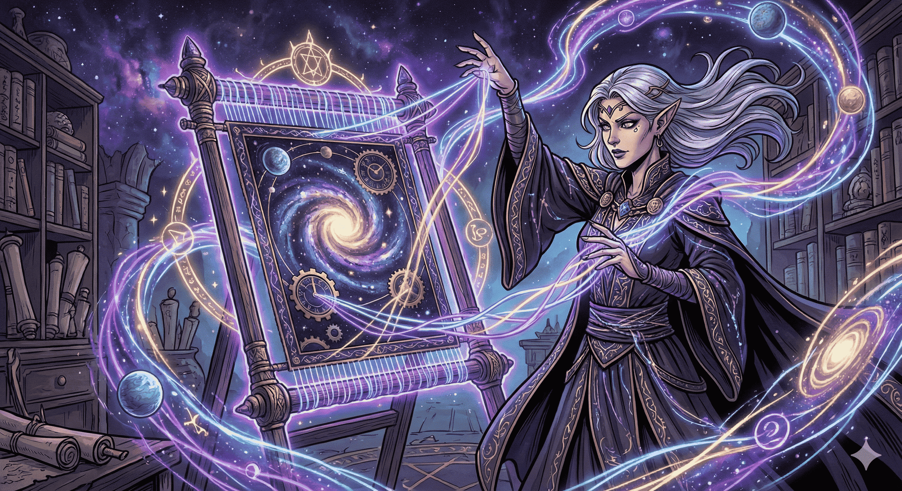
		

	    	

	   			
				

		    		Tisserand
					★★★☆
			 	

	 		

	    

	      

			Archétype
	        ½ Caster 🏹
	      

	      

	        Dés de vie
	        d8
	      

	      

	        Primaire
	        Dex + Int
	      

	    

	    

					Dégâts
	    

	    Les tisserands manipulent les fils de la réalité pour créer des sorts complexes et contrôler le destin autour d’eux.
	  

	</a>

<!-- Fin de la grille pour les classes, insérer au dessus pour en ajouter -->

<!-- Script permettant de filtrer les classes en fonction de 3 critères : Type de classe, dés de vie et difficulté à jouer -->

